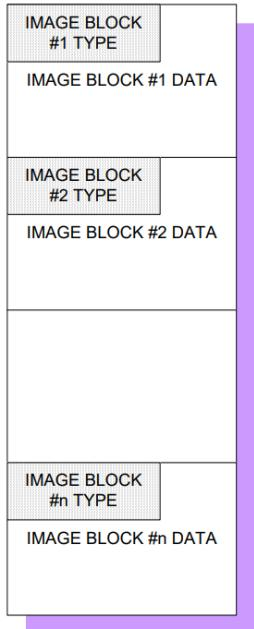
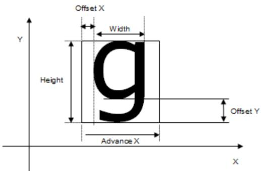
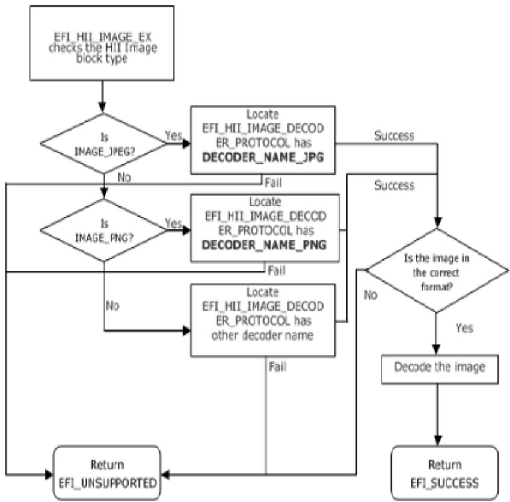
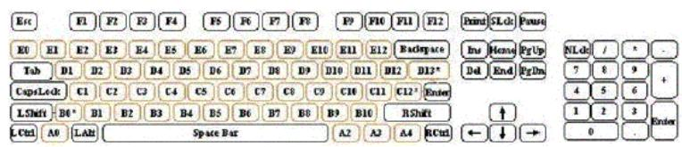
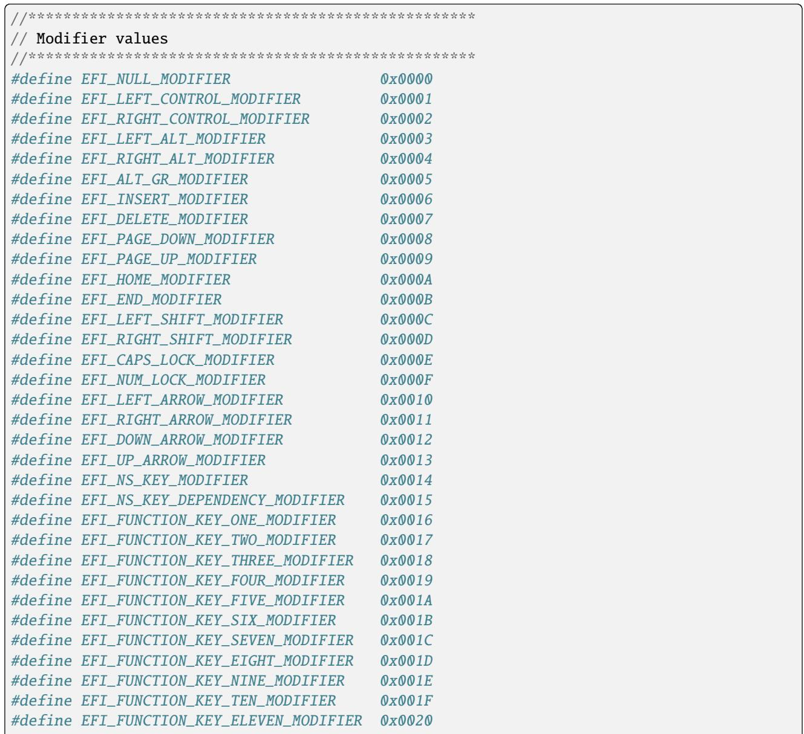
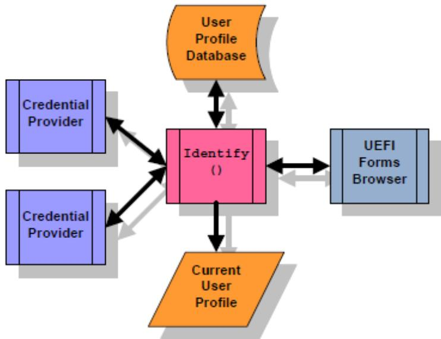
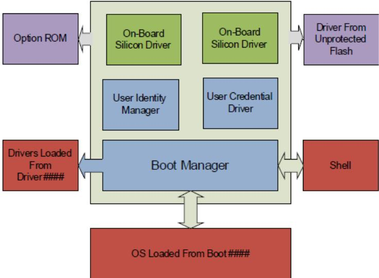
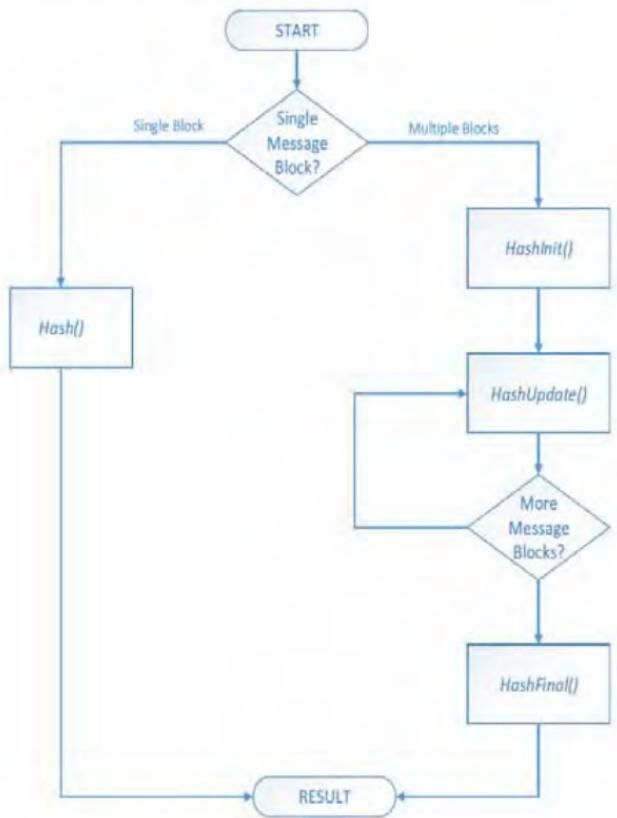

```c
#define EFI_IFR_QUESTION_REF3_OP 0x51
typedef struct _EFI_IFR_QUESTION_REF3 {
    EFI_IFR_OP_HEADER Header;
} EFI_IFR_QUESTION_REF3;

typedef struct _EFI_IFR_QUESTION_REF3_2 {
    EFI_IFR_OP_HEADER Header;
    EFI_STRING_ID DevicePath;
} EFI_IFR_QUESTION_REF3_2;

typedef struct _EFI_IFR_QUESTION_REF3_3 {
    EFI_IFR_OP_HEADER Header;
    EFI_STRING_ID DevicePath;
    EFI_GUID Guid;
} EFI_IFR_QUESTION_REF3_3;
```

## Members

## Header

The byte sequence that defines the type of opcode as well as the length of the opcode being defined. Header.OpCode = EFI\_IFR\_QUESTION\_REF3\_OP.

## DevicePath

Specifies the text representation of the device path containing the form set where the question is defined. If this is not present or the value is 0 then the device path installed on the EFI\_HANDLE which was registered with the form set containing the current question is used.

## Guid

Specifies the GUID of the form set where the question is defined. If the value is Nil or this field is not present, then the current form set is used (if DevicePath is 0) or the only form set attached to the device path specified by DevicePath is used. If the value is Nil and there is more than one form set on the specified device path, then the value Undefined will be pushed.

## Description

This opcode performs the following actions:

1. Pop an integer from the expression stack

2. Convert it to a question id

3. Push the question value associated with that question id onto the expression stack.

If the popped expression cannot be evaluated as an unsigned integer or the value of the unsigned integer is greater than 0xFFFF, then push Undefined onto the expression stack in step 3. If the value of the question specified by the unsigned integer, after converted to a question id, cannot be determined or the question does not exist, also push Undefined onto the expression stack in step 3.

This version allows question values from other forms to be referenced in expressions.

## 33.3.8.3.58 EFI\_IFR\_READ

## Summary

Provides a value for the current question or default.

## Prototype

```c
#define EFI_IFR_READ_OP 0x2D
typedef struct _EFI_IFR_READ {
    EFI_IFR_OP_HEADER Header;
} EFI_IFR_READ;
```

## Parameters

## Header

The sequence that defines the type of opcode as well as the length of the opcode being defined. For this tag, Header.OpCode = EFI\_IFR\_READ\_OP

## Description

After reading the value for the current question (if any storage was specified) and setting the this constant (see EFI\_IFR\_THIS ), this expression will be evaluated (if present) to return the value. If the FormId and QuestionId are either both not present, or are both set to zero, then the link does nothing.

## 33.3.8.3.59 EFI\_IFR\_REF

## Summary

Creates a cross-reference statement.

## Prototype

```c
#define EFI_IFR_REF_OP 0x0F
typedef struct _EFI_IFR_REF {
    EFI_IFR_OP_HEADER Header;
    EFI_IFR_QUESTION_HEADER Question;
    EFI_FORM_ID FormId;
} EFI_IFR_REF;

typedef struct _EFI_IFR_REF2 {
    EFI_IFR_OP_HEADER Header;
    EFI_IFR_QUESTION_HEADER Question;
    EFI_FORM_ID FormId;
    EFI_QUESTION_ID QuestionId;
} EFI_IFR_REF2;

typedef struct _EFI_IFR_REF3 {
    EFI_IFR_OP_HEADER Header;
    EFI_IFR_QUESTION_HEADER Question;
    EFI_FORM_ID FormId;
    EFI_QUESTION_ID QuestionId;
    EFI_GUID FormSetId;
} EFI_IFR_REF3;

typedef struct _EFI_IFR_REF4 {
```

(continues on next page)

(continued from previous page)

<table><tr><td>EFI_IFR_OP_HEADER</td><td>Header;</td></tr><tr><td>EFI_IFR_QUESTION_HEADER</td><td>Question;</td></tr><tr><td>EFI_FORM_ID</td><td>FormId;</td></tr><tr><td>EFI_QUESTION_ID</td><td>QuestionId;</td></tr><tr><td>EFI_GUID</td><td>FormSetId;</td></tr><tr><td>EFI_STRING_ID</td><td>DevicePath;</td></tr><tr><td colspan="2">} EFI_IFR_REF4;</td></tr><tr><td colspan="2">typedef struct _EFI_IFR_REF5 {</td></tr><tr><td>EFI_IFR_OP_HEADER</td><td>Header;</td></tr><tr><td>EFI_IFR_QUESTION_HEADER</td><td>Question;</td></tr><tr><td colspan="2">} EFI_IFR_REF5;</td></tr></table>

## Members

## Header

The byte sequence that defines the type of opcode as well as the length of the opcode being defined. Header.OpCode = EFI\_IFR\_REF\_OP.

## Question

Standard question header. xxxx See EFI\_IFR\_QUESTION\_HEADER

## FormId

The form to which this link is referring. If this is zero, then the link is on the current form. If this is missing, then the link is determined by the nested EFI\_IFR\_VALUE.

## QuestionId

The question on the form to which this link is referring. If this field is not present (determined by the length of the opcode) or the value is zero, then the link refers to the top of the form.

## FormSetId

The form set to which this link is referring. If it is all zeroes or not present, and DevicePath is not present, then the link is to the current form set. If it is all zeroes (or not present) and the DevicePath is present, then the link is to the first form set associated with the DevicePath.

## DevicePath

The string identifier that specifies the string containing the text representation of the device path to which the form set containing the form specified by FormId . If this field is not present (determined by the opcode’s length) or the value is zero, then the link refers to the current page. The format of the device path string that this field references is compatible with the Text format that is specified in the Text Device Node Reference ( Text Device Node Reference )

## Description

Creates a user-selectable link to a form or a question on a form. There are several forms of this opcode which are distinguished by the length of the opcode.

## 33.3.8.3.60 EFI\_IFR\_REFRESH

## Summary

Mark a question for periodic refresh.

## Prototype

```c
#define EFI_IFR_REFRESH_OP 0x1d
typedef struct _EFI_IFR_REFRESH {
    EFI_IFR_OP_HEADER Header;
    UINT8 RefreshInterval;
} EFI_IFR_REFRESH;
```

## Members

## Header

The byte sequence that defines the type of opcode as well as the length of the opcode being defined. Header.OpCode = EFI\_IFR\_REFRESH\_OP.

## RefreshInterval

Minimum number of seconds before the question value should be refreshed. A value of zero indicates the question should not be refreshed automatically.

## Description

When placed within the scope of a question, it will force the question’s value to be refreshed at least every RefreshInterval seconds. The value may be refreshed less often, depending on browser policy or capabilities.

## 33.3.8.3.61 EFI\_IFR\_REFRESH\_ID

## Summary

Mark an Question for an asynchronous refresh.

## Prototype

```c
#define EFI_IFR_REFRESH_ID_OP 0x62
typedef struct _EFI_IFR_REFRESH_ID {
    EFI_IFR_OP_HEADER Header;
    EFI_GUID RefreshEventGroupId;
} EFI_IFR_REFRESH_ID;
```

## Members

## Header

The byte sequence that defines the type of opcode as well as the length of the opcode being defined. Header.OpCode = EFI\_IFR\_REFRESH\_ID\_OP.

## RefreshEventGroupId

The GUID associated with the event group which will be used to initiate a re-evaluation of an element in a set of forms.

## Description

This tag op-code must be placed within the scope of a question or a form. If within the scope of a question and the event is signaled which belongs to the RefreshEventGroupId, the question will be refreshed. More than one question may share the same Event Group.

If the tag op-code is placed within the scope of an EFI\_IFR\_FORM op-code and the event is signaled which belongs to the RefreshEventGroupId, the entire form’s contents will be refreshed.

• If the contents within a form had an EFI\_IFR\_REFRESH\_ID tag op-code placed within the scope of the form, and an event is signalled, all questions associated with the RefreshEventGroupId are marked for refresh. The Forms Browser will update the question value from storage, reparse the forms from the HII database and, at some time later, reflect that change if the question is displayed.

When interpreting this op-code, a browser must do the following actions:

• The browser will create an event group via CreateEventEx() based on the specified RefreshEventGroupId when the form set which contains the op-code is opened by the browser.

• When an event is signaled, all questions associated with the RefreshEventGroupId are marked for refresh. The Forms Browser will update the question value from storage and, at some time later, update the question’s display.

• The browser will close the event group which was previously created when the form set which contains the op-code is closed by the browser.

## 33.3.8.3.62 EFI\_IFR\_RESET\_BUTTON

## Summary

Create a reset or submit button on the current form.

Prototype

```c
#define EFI_IFR_RESET_BUTTON_OP 0x0d
typedef struct _EFI_IFR_RESET_BUTTON {
    EFI_IFR_OP_HEADER Header;
    EFI_IFR_STATEMENT_HEADER Statement;
    EFI_DEFAULT_ID DefaultId;
} EFI_IFR_RESET_BUTTON;

typedef UINT16 EFI_DEFAULT_ID;
```

## Members

## Header

The standard header, where Header.OpCode = EFI\_IFR\_RESET\_BUTTON\_OP.

## Statement

Standard statement header, including the prompt and help text.

## DefaultId

Specifies the set of default store to use when restoring the defaults to the questions on this form. xxxx See EFI\_IFR\_DEFAULTSTORE for more information.

## Description

This opcode creates a user-selectable button that resets the question values for all questions on the current form to the default values specified by DefaultId. If EFI\_IFR\_FLAGS\_CALLBACK is set in the question header, then the callback associated with the form set will be called. An image may be associated with the statement using a nested EFI\_IFR\_IMAGE. An animation may be associated with the statement using a nested EFI\_IFR\_ANIMATION.

## 33.3.8.3.63 EFI\_IFR\_RULE

## Summary

Create a rule for use in a form and associate it with an identifier.

## Prototype

```c
#define EFI_IFR_RULE_OP 0x18
typedef struct _EFI_IFR_RULE {
    EFI_IFR_OP_HEADER Header;
    UINT8 RuleId;
} EFI_IFR_RULE;
```

## Members

## Header

The byte sequence that defines the type of opcode as well as the length of the opcode being defined. Header.OpCode = EFI\_IFR\_RULE\_OP.

## RuleId

Unique identifier for the rule. There can only one rule within a form with the specified RuleId. If another already exists, then the form is marked as invalid.

## Description

Create a rule, which associates an expression with an identifier and attaches it to the currently opened form. These rules allow common sub-expressions to be re-used within a form.

## 33.3.8.3.64 EFI\_IFR\_RULE\_REF

## Summary

Evaluate a form rule and push its result on the expression stack.

## Prototype

```c
#define EFI_IFR_RULE_REF_OP 0x3f
typedef struct _EFI_IFR_RULE_REF {
    EFI_IFR_OP_HEADER Header;
    UINT8 RuleId;
} EFI_IFR_RULE_REF;
```

## Members

## Header

The byte sequence that defines the type of opcode as well as the length of the opcode being defined. Header.OpCode = EFI\_IFR\_RULE\_REF\_OP.

## RuleId

The rule’s identifier, which must be unique within the form.

## Description

Look up the rule specified by RuleId and push the evaluated result on the expression stack. If the specified rule does not exist, then push Undefined.

## 33.3.8.3.65 EFI\_IFR\_SECURITY

## Summary

Push TRUE if the current user profile contains the specified setup access permissions.

## Prototype

```c
#define EFI_IFR_SECURITY_OP 0x60
typedef struct _EFI_IFR_SECURITY {
    EFI_IFR_OP_HEADER Header;
    EFI_GUID Permissions;
} EFI_IFR_SECURITY;
```

## Members

## Header

Standard opcode header, where Header.Op = EFI\_IFR\_SECURITY\_OP.

## Permissions

Security permission level.

## Description

This opcode pushes whether or not the current user profile contains the specified setup access permissions. This opcode can be used in expressions to disable, suppress or gray-out forms, statements and questions. It can also be used in checking question values to disallow or allow certain values.

This opcode performs the following actions:

1. If the current user profile contains thespecified setup access permissions, then push TRUE.\*Otherwise, push \*\*FALSE.\*

## 33.3.8.3.66 EFI\_IFR\_SET

## Summary

Change a stored value.

## Prototype

```c
#define EFI_IFR_SET_OP 0x2C
typedef struct _EFI_IFR_SET {
    EFI_IFR_OP_HEADER Header;
    EFI_VARSTORE_ID VarStoreId;
    union {
    EFI_STRING_ID VarName;
    UINT16 VarOffset;
    } VarStoreInfo;
    UINT8 VarStoreType;
} EFI_IFR_SET;
```

## Parameters

## Header

The sequence that defines the type of opcode as well as the length of the opcode being defined. Header.OpCode = EFI\_IFR\_SET\_OP.

## VarStoreId

Specifies the identifier of a previously declared variable store to use when storing the question’s value.

## VarStoreInfo

Depending on the type of variable store selected, this contains either a 16-bit Bufer Storage ofset ( VarOfset ) or a Name/Value or EFI Variable name ( VarName ).

## VarStoreType

Specifies the type used for storage. The storage types EFI\_IFR\_TYPE\_x are defined in EFI\_IFR\_ONE\_OF\_OPTION.

## Description

This operator pops an expression from the expression stack. The expression popped is the value.

The value is stored into the variable store identified by VarStoreId and VarStoreInfo.

If the value could be stored successfully, then TRUE is pushed on to the expression stack. Otherwise, FALSE is pushed on the expression stack.

## 33.3.8.3.67 EFI\_IFR\_SHIFT\_LEFT

## Summary

Pop two unsigned integers, shift one left by the number of bits specified by the other and push the result.

## Prototype

```c
#define EFI_IFR_SHIFT_LEFT_OP 0x38
typedef struct _EFI_IFR_SHIFT_LEFT {
    EFI_IFR_OP_HEADER Header;
} EFI_IFR_SHIFT_LEFT;
```

## Members

## Header

Standard opcode header, where OpCode is EFI\_IFR\_SHIFT\_LEFT \_OP.

## Description

This opcode performs the following actions:

1. Pop two values from the expression stack. The first value popped is the right-hand value and the second value popped is the left-hand value.

2. If the two values do not evaluate to unsigned integers, push Undefined.

3. Shift the left-hand value left by the number of bits specified by the right-hand value and push the result.

## 33.3.8.3.68 EFI\_IFR\_SHIFT\_RIGHT

## Summary

Pop two unsigned integers, shift one right by the number of bits specified by the other and push the result.

## Prototype

```c
#define EFI_IFR_SHIFT_RIGHT_OP 0x39
typedef struct _EFI_IFR_SHIFT_RIGHT {
    EFI_IFR_OP_HEADER Header;
} EFI_IFR_SHIFT_RIGHT;
```

## Members

## Header

Standard opcode header, where OpCode is EFI\_IFR\_SHIFT\_RIGHT \_OP.

## Description

This opcode performs the following actions:

1. Pop two values from the expression stack. The first value popped is the right-hand value and the second value popped is the left-hand value.

2. If the two values do not evaluate to unsigned integers, push Undefined.

3. Shift the left-hand value right by the number of bits specified by the right-hand value and push the result.

## 33.3.8.3.69 EFI\_IFR\_SPAN

## Summary

Pop two strings and an unsigned integer, find the first character from one string that contains characters found in another and push its index.

Prototype

```c
#define EFI_IFR_SPAN_OP 0x59
typedef struct _EFI_IFR_SPAN {
    EFI_IFR_OP_HEADER Header;
    UINT8 Flags;
} EFI_IFR_SPAN;
```

## Members

## Header

The sequence that defines the type of opcode as well as the length of the opcode being defined. For this tag, Header.OpCode = EFI\_IFR\_SPAN\_OP.

## Flags

Specifies whether to find the first matching string ( EFI\_IFR\_FLAGS\_FIRST\_MATCHING ) or the first nonmatching string ( EFI\_IFR\_FLAGS\_FIRST\_NON\_MATCHING ).

## Description

This opcode performs the following actions:

1. Pop three values from the expression stack.The first value popped is the right value and the second value popped is the middle value and the last value popped is the left expression.

2. If the left or middle values cannot be evaluated as a string, push Undefined. If the right value cannot be evaluated as an unsigned integer, push Undefined.

3. The left string is the string to scan. The middle string consists of character pairs representing the low-end of a range and the high-end of a range of characters. The right unsigned integer represents the starting location for the scan.

4. The operation will push the zero-based index of the first character after the right value which falls within any one of the ranges ( EFI\_IFR\_FLAGS\_FIRST\_MATCHING ) or falls within none of the ranges ( EFI\_IFR\_FLAGS\_FIRST\_NON\_MATCHING ).

## Related Definitions

<table><tr><td>#define EFI_IFR_FLAGS_FIRST_MATCHING</td><td>0x00</td></tr><tr><td>#define EFI_IFR_FLAGS_FIRST_NON_MATCHING</td><td>0x01</td></tr></table>

## 33.3.8.3.70 EFI\_IFR\_STRING

## Summary

Defines the string question.

## Prototype

<table><tr><td colspan="2">#define EFI_IFR_STRING_OP 0x1C</td></tr><tr><td colspan="2">typedef struct _EFI_IFR_STRING {</td></tr><tr><td>EFI_IFR_OP_HEADER</td><td>Header;</td></tr><tr><td>EFI_IFR_QUESTION_HEADER</td><td>Question;</td></tr><tr><td>UINT8</td><td>MinSize;</td></tr><tr><td>UINT8</td><td>MaxSize;</td></tr><tr><td>UINT8</td><td>Flags;</td></tr><tr><td colspan="2">} EFI_IFR_STRING;</td></tr></table>

## Members

## Header

The sequence that defines the type of opcode as well as the length of the opcode being defined. Header.OpCode = EFI\_IFR\_STRING\_OP.

## Question

The standard question header. xxxx See EFI\_IFR\_QUESTION\_HEADER for more information.

## MinSize

The minimum number of characters that can be accepted for this opcode.

## MaxSize

The maximum number of characters that can be accepted for this opcode.

## Flags

Flags which control the string editing behavior. See “Related Definitions” below.

## Description

This creates a string question. The minimum length is MinSize and the maximum length is MaxSize characters.

An image may be associated with the question using a nested EFI\_IFR\_IMAGE. An animation may be associated with the question using a nested EFI\_IFR\_ANIMATION.

There are two ways to specify defaults for this question: one or more nested EFI\_IFR\_ONE\_OF\_OPTION (lowest priority) or nested EFI\_IFR\_DEFAULT (highest priority).

If EFI\_IFR\_STRING\_MULTI\_LINE is set, it is a hint to the Forms Browser that multi-line text can be allowed. If it is clear, then multi-line editing should not be allowed.

## Related Definitions

```c
#define EFI_IFR_STRING_MULTI_LINE 0x01
```

## 33.3.8.3.71 EFI\_IFR\_STRING\_REF1

## Summary

Push a string on the expression stack.

## Prototype

```c
#define EFI_IFR_STRING_REF1_OP 0x4e
typedef struct _EFI_IFR_STRING_REF1 {
    EFI_IFR_OP_HEADER Header;
    EFI_STRING_ID StringId;
} EFI_IFR_STRING_REF1;
```

## Members

## Header

The byte sequence that defines the type of opcode as well as the length of the opcode being defined. Header.OpCode = EFI\_IFR\_STRING\_REF1\_OP.

## StringId

The string’s identifier, which must be unique within the package list.

## Description

Push the string specified by StringId on to the expression stack. If the string does not exist, then push an empty string.

## 33.3.8.3.72 EFI\_IFR\_STRING\_REF2

## Summary

Pop a string identifier, push the associated string.

## Prototype

```c
#define EFI_IFR_STRING_REF2_OP 0x4f
typedef struct _EFI_IFR_STRING_REF2 {
    EFI_IFR_OP_HEADER Header;
} EFI_IFR_STRING_REF2;
```

## Members

## Header

The byte sequence that defines the type of opcode as well as the length of the opcode being defined. Header.OpCode = EFI\_IFR\_STRING\_REF2\_OP.

## Description

This opcode performs the following actions:

1. Pop a value from the expression stack.

2. If the value cannot be evaluated as an unsigned integer or the value of the unsigned integer is greater than 0xFFFF, push Undefined.

3. If the string specified by the value (converted to a string identifier) cannot be determined or the string does not exist, push an empty string.

4. Otherwise, push the string on to the expression stack.

## 33.3.8.3.73 EFI\_IFR\_SUBTITLE

## Summary

Creates a sub-title in the current form.

Prototype

```c
#define EFI_IFR_SUBTITLE_OP 0x02
typedef struct _EFI_IFR_SUBTITLE {
    EFI_IFR_OP_HEADER Header;
    EFI_IFR_STATEMENT_HEADER Statement;
    UINT8 Flags;
} EFI_IFR_SUBTITLE;
```

## Members

## Header

The sequence that defines the type of opcode as well as the length of the opcode being defined. For this tag, Header.OpCode = EFI\_IFR\_SUBTITLE\_OP.

## Flags

Identifies specific behavior for the sub-title.

## Description

Subtitle strings are intended to be used by authors to separate sections of questions into semantic groups. If Header.Scope is set, then the Forms Browser may further distinguish the end of the semantic group as including only those statements and questions which are nested.

If EFI\_IFR\_FLAGS\_HORIZONTAL is set, then this provides a hint that the nested statements or questions should be horizontally arranged. Otherwise, they are assumed to be vertically arranged.

An image may be associated with the statement using a nested EFI\_IFR\_IMAGE. An animation may be associated with the statement using a nested EFI\_IFR\_ANIMATION.

## Related Definitions

#define EFI\_IFR\_FLAGS\_HORIZONTAL 0x01

## 33.3.8.3.74 EFI\_IFR\_SUBTRACT

## Summary

Pop two unsigned integers, subtract one from the other, push the result.

## Prototype

```c
#define EFI_IFR_SUBTRACT_OP 0x3b
typedef struct _EFI_IFR_SUBTRACT {
    EFI_IFR_OP_HEADER Header;
} EFI_IFR_SUBTRACT;
```

## Members

## Header

Standard opcode header, where Header.OpCode is EFI\_IFR\_SUBTRACT \_OP.

## Description

This opcode performs the following operations:

1. Pop two values from the expression stack. The first value popped is the right-hand value and the second value popped is the left-hand value.

2. If the two values do not evaluate to unsigned integers, push Undefined.

3. Zero-extend the values to 64-bits.

4. Subtract the right-hand value from the left-hand value.

5. Push the lower 64-bits of the result.

## 33.3.8.3.75 EFI\_IFR\_SUPPRESS\_IF

## Summary

Creates a group of statements or questions which are conditionally invisible.

## Prototype

```c
#define EFI_IFR_SUPPRESS_IF_OP 0x0a
typedef struct _EFI_IFR_SUPPRESS_IF {
    EFI_IFR_OP_HEADER Header;
} EFI_IFR_SUPPRESS_IF;
```

## Members

## Header

The byte sequence that defines the type of opcode as well as the length of the opcode being defined. Header.OpCode = EFI\_IFR\_SUPPRESS\_IF\_OP.

## Description

The suppress tag causes the nested objects to be hidden from the user if the expression appearing as the first nested object evaluates to TRUE. If the expression consists of more than a single opcode, then the first opcode in the expression must have the Scope bit set and the expression must end with EFI\_IFR\_END

This display form is maintained until the scope for this opcode is closed.

## 33.3.8.3.76 EFI\_IFR\_TEXT

## Summary

Creates a static text and image.

## Prototype

```c
#define EFI_IFR_TEXT_OP 0x03
typedef struct _EFI_IFR_TEXT {
    EFI_IFR_OP_HEADER Header;
    EFI_IFR_STATEMENT_HEADER Statement;
```

(continues on next page)

<table><tr><td colspan="2"></td><td>(continued from previous page)</td></tr><tr><td>EFI_STRING_ID</td><td>TextTwo;</td><td></td></tr><tr><td>} EFI_IFR_TEXT;</td><td></td><td></td></tr></table>

## Members

## Header

The sequence that defines the type of opcode as well as the length of the opcode being defined. For this tag, Header.OpCode = EFI\_IFR\_TEXT\_OP.

## Statement

Standard statement header.

## TextTwo

The string token reference to the secondary string for this opcode.

## Description

This is a static text/image statement.

An image may be associated with the statement using a nested EFI\_IFR\_IMAGE. An animation may be associated with the question using a nested EFI\_IFR\_ANIMATION.

## 33.3.8.3.77 EFI\_IFR\_THIS

## Summary

Push current question’s value.

Prototype

```c
#define EFI_IFR_THIS_OP 0x58
typedef struct _EFI_IFR_THIS {
    EFI_IFR_OP_HEADER Header;
} EFI_IFR_THIS;
```

## Members

## Header

The sequence that defines the type of opcode as well as the length of the opcode being defined. For this tag, Header.OpCode = EFI\_IFR\_THIS\_OP.

## Description

Push the current question’s value.

## 33.3.8.3.78 EFI\_IFR\_TIME

## Summary

Create a Time question.

Prototype

```c
#define EFI_IFR_TIME_OP 0x1b
typedef struct _EFI_IFR_TIME {
    EFI_IFR_OP_HEADER Header;
    EFI_IFR_QUESTION_HEADER Question;
```

(continues on next page)

<table><tr><td colspan="2"></td><td>(continued from previous page)</td></tr><tr><td>UINT8</td><td>Flags;</td><td></td></tr><tr><td>} EFI_IFR_TIME;</td><td></td><td></td></tr></table>

## Members

## Header

Basic question information. Header.Opcode = EFI\_IFR\_TIME\_OP.

## Question

The standard question header. xxxx See EFI\_IFR\_QUESTION\_HEADER for more information

## Flags

A bit-mask that determines which unique settings are active for this opcode.

QF\_TIME\_HOUR\_SUPPRESS 0x01 QF\_TIME\_MINUTE\_SUPPRESS 0x02 QF\_TIME\_SECOND\_SUPPRESS 0x04 QF\_TIME\_STORAGE 0x30

For QF\_TIME\_STORAGE, there are currently three valid values:

QF\_TIME\_STORAGE\_NORMAL 0x00 QF\_TIME\_STORAGE\_TIME 0x10 QF\_TIME\_STORAGE\_WAKEUP 0x20

## Description

Create a Time question xxxx ( Time ) and add it to the current form.

An image may be associated with the question using a nested EFI\_IFR\_IMAGE. An animation may be associated with the question using a nested EFI\_IFR\_ANIMATION.

## 33.3.8.3.79 EFI\_IFR\_TOKEN

## Summary

Pop two strings and an unsigned integer, then push the nth section of the first string using delimiters from the second string.

Prototype

```c
#define EFI_IFR_TOKEN_OP 0x4d
typedef struct _EFI_IFR_TOKEN {
    EFI_IFR_OP_HEADER
} EFI_IFR_TOKEN;
```

Header;

## Members

## Header

Standard opcode header, where OpCode is EFI\_IFR\_TOKEN\_OP.

## Description

This opcode performs the following actions:

1. Pop three values from the expression stack. The first value popped is the right value and the second value popped is the middle value and the last value popped is the left value.

2. If the left or middle values cannot be evaluated as a string, push Undefined. If the right value cannot be evaluated as an unsigned integer, push Undefined.

3. The first value is the string. The second value is a string, where each character is a valid delimiter. The third value is the zero-based index.

4. Push the nth delimited sub-string on to the expression stack (0 = left of the first delimiter). The end of the string always acts a the final delimiter.

5. The no such string exists, an empty string is pushed.

## 33.3.8.3.80 EFI\_IFR\_TO\_BOOLEAN

## Summary

Pop a value, convert to Boolean and push the result.

Prototype

```c
#define EFI_IFR_TO_BOOLAN_OP 0x4A
typedef struct _EFI_IFR_TO_BOOLAN{
    EFI_IFR_OP_HEADER Header;
} EFI_IFR_TO_BOOLAN;
```

## Members

## Header

The sequence that defines the type of opcode as well as the length of the opcode being defined. For this tag, Header.OpCode = EFI\_IFR\_TO\_BOOLEAN\_OP

## Description

This opcode performs the following actions:

1. Pop a value from the expression stack. If the value is Undefined or cannot be evaluated as a Boolean, push Undefined. Otherwise push the Boolean on the expression stack.

2. When converting from an unsigned integer, zero will be converted to FALSE and any other value will be converted to TRUE.

3. When converting from a string, if case-insensitive compare with “true” is True, then push TRUE. If a caseinsensitive compare with “false” is TRUE, then push False. Otherwise, push Undefined.

4. When converting from a bufer, if the bufer is all zeroes, then push FALSE.\* Otherwise push \*\*TRUE.

```c
#define EFI_IFR_TO_STRING_OP 0x49
typedef struct _EFI_IFR_TO_STRING{
    EFI_IFR_OP_HEADER
    UINT8
} EFI_IFR_TO_STRING;
```

## 33.3.8.3.81 EFI\_IFR\_TO\_LOWER

## Summary

Convert a string on the expression stack to lower case.

## Prototype

```c
#define EFI_IFR_TO_LOWER_OP 0x20
typedef struct _EFI_IFR_TO_LOWER {
    EFI_IFR_OP_HEADER Header;
} EFI_IFR_TO_LOWER;
```

## Members

## Header

The sequence that defines the type of opcode as well as the length of the opcode being defined. For this tag, Header.OpCode = EFI\_IFR\_TO\_LOWER\_OP

## Description

Pop an expression from the expression stack. If the expression is Undefined or cannot be evaluated as a string, push Undefined. Otherwise, convert the string to all lower case using the StrLwr function of the EFI\_UNICODE\_COLLATION2\_PROTOCOL and push the string on the expression stack.

## 33.3.8.3.82 EFI\_IFR\_TO\_STRING

## Summary

Pop a value, convert to a string, push the result.

Prototype

## Members

## Header

The sequence that defines the type of opcode as well as the length of the opcode being defined. For this tag, Header.OpCode = EFI\_IFR\_TO\_STRING\_OP

## Format

When converting from unsigned integers, these flags control the format:

0 = unsigned decimal

1 = signed decimal

2 = hexadecimal (lower-case alpha)

3 = hexadecimal (upper-case alpha)

When converting from a bufer, these flags control the format:

```txt
0 = ASCII
```

8 = UCS-2

## Description

This opcode performs the following actions:

1. Pop a value from the expression stack.\*\*

#. If the value is Undefined or cannot be evaluated as a string, push Undefined.

1. Convert the value to a string. When converting from an unsigned integer, the number will be converted to a unsigned decimal string (Format = 0), signed decimal string (Format = 1) or a hexadecimal string (Format = 2 or 3).

When converting from a boolean, the boolean will be converted to “True” (True) or “False” (False). When converting from a bufer, each 8-bit (Format = 0) or 16-bit (Format = 8) value will be converted into a character and appended to the string, up until the end of the bufer or a NULL character. 4. Push the result.

## 33.3.8.3.83 EFI\_IFR\_TO\_UINT

## Summary

Pop a value, convert to an unsigned integer, push the result.

## Prototype

```c
#define EFI_IFR_TO_UINT_OP 0x48
typedef struct _EFI_IFR_TO_UINT {
    EFI_IFR_OP_HEADER Header;
} EFI_IFR_TO_UINT;
```

## Members

## Header

The sequence that defines the type of opcode as well as the length of the opcode being defined. For this tag, Header.OpCode = EFI\_IFR\_TO\_UINT\_OP

## Description

1. Pop a value from the expression stack.

2. If the value is Undefined or cannot be evaluated as an unsigned integer, push Undefined.

3. Convert the value to an unsigned integer. When converting from a boolean, if TRUE, push 1 and if FALSE, push 0. When converting from a string, whitespace is skipped. The prefix ‘0x’ or ‘0X’ indicates to convert from a hexadecimal string while the prefix ‘-‘ indicates conversion from a signed integer string. When converting from a bufer, if the bufer is greater than 8 bytes in length, push Undefined. Otherwise, zero-extend the contents of the bufer to 64-bits.

4. Push the result.

## 33.3.8.3.84 EFI\_IFR\_TO\_UPPER

## Summary

Convert a string on the expression stack to upper case.

## Prototype

```c
#define EFI_IFR_TO_UPPER_OP 0x21
typedef struct _EFI_IFR_TO_UPPER {
    EFI_IFR_OP_HEADER Header;
} EFI_IFR_TO_UPPER;
```

## Members

## Header

The sequence that defines the type of opcode as well as the length of the opcode being defined. For this tag, Header.OpCode = EFI\_IFR\_TO\_UPPER\_OP

## Description

Pop an expression from the expression stack. If the expression is Undefined or cannot be evaluated as a string, push Undefined. Otherwise, convert the string to all upper case using the StrUpr function of the EFI\_UNICODE\_COLLATION2\_PROTOCOL and push the string on the expression stack.

## 33.3.8.3.85 EFI\_IFR\_TRUE

## Summary

Push a TRUE on to the expression stack.

## Prototype

```c
#define EFI_IFR_TRUE_OP 0x46
typedef struct _EFI_IFR_TRUE {
    EFI_IFR_OP_HEADER Header;
} EFI_IFR_TRUE;
```

## Members

## Header

The sequence that defines the type of opcode as well as the length of the opcode being defined. For this tag, Header.OpCode = EFI\_IFR\_TRUE\_OP

## Description

Push a TRUE on to the expression stack.

## 33.3.8.3.86 EFI\_IFR\_UINT8, EFI\_IFR\_UINT16,EFI\_IFR\_UINT32, EFI\_IFR\_UINT64

## Summary

Push an unsigned integer on to the expression stack.

## Prototype

```c
#define EFI_IFR_UINT8_OP 0x42
typedef struct _EFI_IFR_UINT8 {
    EFI_IFR_OP_HEADER Header;
    UINT8 Value;
} EFI_IFR_UINT8;

#define EFI_IFR_UINT16_OP 0x43
typedef struct _EFI_IFR_UINT16 {
    EFI_IFR_OP_HEADER Header;
    UINT16 Value;
} EFI_IFR_UINT16;

#define EFI_IFR_UINT32_OP 0x44
typedef struct _EFI_IFR_UINT32 {
    EFI_IFR_OP_HEADER Header;
    UINT32 Value;
} EFI_IFR_UINT32;

#define EFI_IFR_UINT64_OP 0x45
typedef struct _EFI_IFR_UINT64 {
    EFI_IFR_OP_HEADER Header;
    UINT64 Value;
} EFI_IFR_UINT64;
```

## Members

## Header

The sequence that defines the type of opcode as well as the length of the opcode being defined. For this tag, Header.OpCode = EFI\_IFR\_UINT8\_OP, EFI\_IFR\_UINT16\_OP, EFI\_IFR\_UINT32\_OP or EFI\_IFR\_UINT64\_OP.

## Value

The unsigned integer.

## Description

Push the specified unsigned integer, zero-extended to 64-bits, on to the expression stack.

## 33.3.8.3.87 EFI\_IFR\_UNDEFINED

## Summary

Push an Undefined to the expression stack.

Prototype

```c
#define EFI_IFR_UNDEFINED_OP 0x55
typedef struct _EFI_IFR_UNDEFINED {
```

(continues on next page)

```txt
EFI_IFR_OP_HEADER
} EFI_IFR_UNDEFINED;
```

(continued from previous page)

## Members

## Header

The sequence that defines the type of opcode as well as the length of the opcode being defined. For this tag, Header.OpCode = EFI\_IFR\_UNDEFINED\_OP

## Description

Push Undefined on to the expression stack.

## 33.3.8.3.88 EFI\_IFR\_VALUE

## Summary

Provides a value for the current question or default.

## Prototype

```c
#define EFI_IFR_VALUE_OP 0x5a
typedef struct _EFI_IFR_VALUE {
    EFI_IFR_OP_HEADER Header;
} EFI_IFR_VALUE;
```

## Members

## Header

The sequence that defines the type of opcode as well as the length of the opcode being defined. For this tag, Header.OpCode = EFI\_IFR\_VALUE\_OP

## Description

Creates a value for the current question or default with no storage. The value is the result of the expression nested in the scope.

If used for a question, then the question will be read-only.

## 33.3.8.3.89 EFI\_IFR\_VARSTORE

## Summary

Creates a variable storage short-cut for linear bufer storage.

## Prototype

```c
#define EFI_IFR_VARSTORE_OP 0x24
typedef struct {
    EFI_IFR_OP_HEADER Header;
    EFI_GUID Guid;
    EFI_VARSTORE_ID VarStoreId;
    UINT16 Size;
    //UINT8 Name[];
} EFI_IFR_VARSTORE;
```

## Members

## 33.3. Code Definitions

## Header

The byte sequence that defines the type of opcode as well as the length of the opcode being defined. For this tag, Header.OpCode = EFI\_IFR\_VARSTORE\_OP.

## Guid

The variable’s GUID definition. This field comprises one half of the variable name, with the other half being the human-readable aspect of the name, which is represented by the string immediately following the Size field. Type EFI\_GUID is defined in InstallProtocolInterface() in this specification.

## VarStoreId

The variable store identifier, which is unique within the current form set. This field is the value that uniquely identify this instance from others. Question headers refer to this value to designate which is the active variable that is being used. A value of zero is invalid.

## Size

The size of the variable store.

## Name

A null-terminated ASCII string that specifies the name associated with the variable store. The field is not actually included in the structure but is included here to help illustrate the encoding of the opcode. The size of the string, including the null termination, is included in the opcode’s header size.

## Description

This opcode describes a Bufer Storage Variable Store within a form set. A question can select this variable store by setting the VarStoreId field in its opcode header.

An EFI\_IFR\_VARSTORE with a specified VarStoreId must appear in the IFR before it can be referenced by a question.

## 33.3.8.3.90 EFI\_IFR\_VARSTORE\_NAME\_VALUE

## Summary

Creates a variable storage short-cut for name/value storage.

## Prototype

```c
#define EFI_IFR_VARSTORE_NAME_VALUE_OP 0x25
typedef struct _EFI_IFR_VARSTORE_NAME_VALUE {
    EFI_IFR_OP_HEADER Header;
    EFI_VARSTORE_ID VarStoreId;
    EFI_GUID Guid;
} EFI_IFR_VARSTORE_NAME_VALUE;
```

## Members

## Header

The byte sequence that defines the type of opcode as well as the length of the opcode being defined. For this tag, Header.OpCode = EFI\_IFR\_VARSTORE\_NAME\_VALUE\_OP.

## Guid

The variable’s GUID definition. This field comprises one half of the variable name, with the other half being the human-readable aspect of the name, which is specified in the VariableName field in the question’s header (see EFI\_IFR\_QUESTION\_HEADER ). Type EFI\_GUID is defined in InstallProtocolInterface() in the UEFI Specification.

## VarStoreId

The variable store identifier, which is unique within the current form set. This field is the value that uniquely identifies this variable store definition instance from others. Question headers refer to this value to designate which is the active variable that is being used. A value of zero is invalid.

## Description

This opcode describes a Name/Value Variable Store within a form set. A question can select this variable store by setting the VarStoreId field in its question header

An EFI\_IFR\_VARSTORE\_NAME\_VALUE with a specified VarStoreId must appear in the IFR before it can be referenced by a question.

## 33.3.8.3.91 EFI\_IFR\_VARSTORE\_EFI

## Summary

Creates a variable storage short-cut for EFI variable storage.

## Prototype

<table><tr><td colspan="2">#define EFI_IFR_VARSTORE_EFI_OP 0x26</td></tr><tr><td colspan="2">typedef struct _EFI_IFR_VARSTORE_EFI {</td></tr><tr><td>EFI_IFR_OP_HEADER</td><td>Header;</td></tr><tr><td>EFI_VARSTORE_ID</td><td>VarStoreId;</td></tr><tr><td>EFI_GUID</td><td>Guid;</td></tr><tr><td>UINT32</td><td>Attributes</td></tr><tr><td>UINT16</td><td>Size;</td></tr><tr><td>//UINT8</td><td>Name[];</td></tr><tr><td colspan="2">} EFI_IFR_VARSTORE_EFI;</td></tr></table>

## Members

## Header

The byte sequence that defines the type of opcode as well as the length of the opcode being defined. For this tag, Header.OpCode = EFI\_IFR\_VARSTORE\_EFI\_OP.

## VarStoreId

The variable store identifier, which is unique within the current form set. This field is the value that uniquely identifies this variable store definition instance from others. Question headers refer to this value to designate which is the active variable that is being used. A value of zero is invalid.

## Guid

The EFI variable’s GUID definition. This field comprises one half of the EFI variable name, with the other half being the human-readable aspect of the name, which is specified in the Name field below. Type EFI\_GUID is defined in InstallProtocolInterface() in this specification.

## Attributes

Specifies the flags to use for the variable.

## Size

The size of the variable store.

## Name

A null-terminated ASCII string that specifies one half of the EFI name for this variable store. The other half is specified in the Guid field (above). The Name field is not actually included in the structure but is included here to help illustrate the encoding of the opcode. The size of the string, including the null termination, is included in the opcode’s header size.

## Description

This opcode describes an EFI Variable Variable Store within a form set. The Guid and Name specified here will be used with GetVariable() and SetVariable().

• A question can select this variable store by setting the VarStoreId field in its question header.

• A question can refer to a specific ofset within the EFI Variable using the VarOfset field in its question header.

• Name must be converted to a CHAR16 string before it is passed to GetVariable() or SetVariable(). An EFI\_IFR\_VARSTORE\_EFI with a specified VarStoreId must appear in the IFR before it can be referenced by a question.

## 33.3.8.3.92 EFI\_IFR\_VARSTORE\_DEVICE

## Summary

Select the device which contains the variable store.

## Prototype

```c
#define EFI_IFR_VARSTORE_DEVICE_OP 0x27
typedef struct _EFI_IFR_VARSTORE_DEVICE {
    EFI_IFR_OP_HEADER Header;
    EFI_STRING_ID DevicePath;
} EFI_IFR_VARSTORE_DEVICE;
```

## Members

## Header

The byte sequence that defines the type of opcode as well as the length of the opcode being defined. For this tag, Header.OpCode = EFI\_IFR\_VARSTORE\_DEVICE\_OP.

## DevicePath

Specifies the string which contains the device path of the device where the variable store resides.

## Description

This opcode describes the device path where a variable store resides. Normally, the Forms Processor finds the variable store on the handle specified when the HII database function NewPackageList() was called. However, if this opcode is found in the scope of a question, the handle specified by the text device path DevicePath is used instead.

## 33.3.8.3.93 EFI\_IFR\_VERSION

## Summary

Push the version of the UEFI specification to which the Forms Processor conforms.

## Prototype

```c
#define EFI_IFR_VERSION_OP 0x28
typedef struct _EFI_IFR_VERSION {
    EFI_IFR_OP_HEADER Header;
} EFI_IFR_VERSION;
```

## Members

## Header

The sequence that defines the type of opcode as well as the length of the opcode being defined. For this tag, Header.OpCode = EFI\_IFR\_VERSION\_OP.

## Description

Returns the revision level of the UEFI specification with which the Forms Processor is compliant as a 16-bit unsigned integer, with the form:

[15:8] Major revision

[7:4] Tens digit of the minor revision

[3:0] Ones digit of the minor revision

The fields of the version have the following correlation with the revision of the UEFI system table.

Major revision: EFI\_SYSTEM\_TABLE\_REVISION >> 16

## 33.3.8.3.94 EFI\_IFR\_WRITE

## Summary

Change a value for the current question.

Prototype

```c
#define EFI_IFR_WRITE_OP 0x2E
typedef struct _EFI_IFR_WRITE {
    EFI_IFR_OP_HEADER Header;
} EFI_IFR_WRITE;
```

## Parameters

## Header

The sequence that defines the type of opcode as well as the length of the opcode being defined. For this tag, Header.OpCode = EFI\_IFR\_WRITE\_OP

## Description

Before writing the value of the current question to storage (if any storage was specified), the this constant is set (see EFI\_IFR\_THIS ) and then this expression is evaluated.

## 33.3.8.3.95 EFI\_IFR\_ZERO

## Summary

Push a zero on to the expression stack.

## Prototype

```c
#define EFI_IFR_ZERO_OP 0x52
typedef struct _EFI_IFR_ZERO {
    EFI_IFR_OP_HEADER Header;
} EFI_IFR_ZERO;
```

## Members

## Header

The sequence that defines the type of opcode as well as the length of the opcode being defined. For this tag, Header.OpCode = EFI\_IFR\_ZERO\_OP

## Description

Push a zero on to the expression stack.

## 33.3.8.3.96 EFI\_IFR\_WARNING\_IF

## Summary

Creates a validation expression and warning message for a question.

## Prototype

```c
#define EFI_IFR_WARNING_IF_OP 0x063
typedef struct _EFI_IFR_WARNING_IF {
    EFI_IFR_OP_HEADER Header;
    EFI_STRING_ID Warning;
    UINT8 TimeOut;
} EFI_IFR_WARNING_IF;
```

## Members

## Header

The byte sequence that defines the type of opcode as well as the length of the opcode being defined. Header.OpCode = EFI\_IFR\_WARNING\_IF\_OP.

## Warning

The string token reference to the string that will be used for the warning check message.

## TimeOut

The number of seconds for the warning message to be displayed before it is timed out or acknowledged by the user. A value of zero indicates that the message is displayed indefinitely until the user acknowledges it.

## Description

This tag uses a Boolean expression to allow the IFR creator to check options in a question, and provide a warning message if the expression is TRUE. For example, this tag might be used to give a warning if the user attempts to disable a security setting, or change the value of a sensitive question. The tag provides a string to be used in a warning display to alert the user of the consequences of changing the question value. Warning tags will be evaluated when the user traverses from tag to tag. The browser must display the warning text message and not allow the form to be submitted until either the user acknowledges the message (with some key press for instance) or the number of seconds in TimeOut elapses. Unlike inconsistency tags, the user should still be allowed to submit the results of a form even if the warning expression evaluates to TRUE.

## 33.3.8.3.97 EFI\_IFR\_MATCH2

## Summary

Pop a source string and a pattern string, push TRUE if the source string matches the Regular Expression pattern specified by the pattern string, otherwise push FALSE.

## Prototype

```c
#define EFI_IFR_MATCH2_OP 0x64
typedef struct _EFI_IFR_MATCH2 {
    EFI_IFR_OP_HEADER Header;
    EFI_GUID SyntaxType;
} EFI_IFR_MATCH2;
```

## Members

## Header

Standard opcode header, where Header.Opcode is EFI\_IFR\_MATCH2\_OP.

## SyntaxType

A GUID that identifies the regular expression syntax type to use for the pattern string. See EFI\_REGULAR\_EXPRESSION\_PROTOCOL for current syntax definitions.

## Description

This opcode performs the following actions:

1. Pop two values from the expression stack. The first value popped is the string and the secondvalue popped is the pattern.

2. If the string or the pattern cannot be evaluated as a string, then push Undefined.

3. Call GetInfo function of each instance of EFI\_REGULAR\_EXPRESSION\_PROTOCOL, looking for a SyntaxType that is listed in the set of supported regular expression syntax types returned by RegExSyntaxTypeList. If the type specified by SyntaxType is not supported in any of the EFI\_REGULAR\_EXPRESSION\_PROTOCOL instances, or no EFI\_REGULAR\_EXPRESSION\_PROTOCOL instance was found, push Undefined.

4. Process the string and pattern using the MatchString function of the EFI\_REGULAR\_EXPRESSION\_PROTOCOL instance that supports the SyntaxType, where SyntaxType is the SyntaxType input to MatchString.

5. If the returned regular expression Result is TRUE , then push TRUE.

6. If the return regular expression Result is FALSE, then push FALSE.

NOTE: To ensure interoperability, drivers that publish HII IFR Forms packages should check the system capabilities by calling the GetInfo function of each EFI\_REGULAR\_EXPRESSION\_PROTCOL instance during initialization. If the required regular expression syntax type is not supported, the driver may install its own instance of EFI\_REGULAR\_EXPRESSION\_PROTCOL to add the support. The driver may also choose to fall back to other methods of validation, such as using EFI\_IFR\_MATCH or callbacks.

## 33.3.9 Keyboard Package

```c
//**********************************************************************
// EFI_HII_KEYBOARD_PACKAGE_HDR
//**********************************************************************
typedef struct {
    EFI_HII_PACKAGE_HDR Header;
    UINT16 LayoutCount;
    //EFI_HII_KEYBOARD_LAYOUT Layout[];
} EFI_HII_KEYBOARD_PACKAGE_HDR;
```

## Header

The general pack header which defines both the type of pack and the length of the entire pack.

```c
typedef struct _EFI_HII_ANIMATION_PACKAGE_HDR {
EFI_HII_ANIMATION_PACKAGE Header;
UINT32 AnimationInfoOffset;
} EFI_HII_ANIMATION_PACKAGE_HDR;
```

```txt
typedef struct _EFI_HII_ANIMATION_BLOCK {
    UINT8 BlockType;
    //UINT8 BlockBody[];
} EFI_HII_ANIMATION_BLOCK;
```

## LayoutCount

The number of keyboard layouts contained in the entire keyboard pack.

## Layout

An array of LayoutCount number of keyboard layouts.

## 33.3.10 Animations Package

The Animation package record describes how, when, and which EFI images to display. The package consists of two parts: a fixed header and the animation information.

## 33.3.10.1 Animated Images Package

## Summary

The fixed header consists of a standard record header and the

Prototype

## Members

## Header

Standard image header, where Header.BlockType = EFI\_HII\_PACKAGE\_ANIMATIONS.

## AnimationInfoOfset

Ofset, relative to this header, of the animation information. If this is zero, then there are no animation sequences in the package.

## 33.3.10.2 Animation Information

For each animated image identifier, the animation information gives a sequence of EFI images to display and how and when to transition to the next image. The animation information is encoded as a series of blocks, with each block prefixed by a single byte header ( EFI\_HII\_ANIMATION\_BLOCK ) or one of the extension headers ( EFI\_HII\_AIBT\_EXTx\_BLOCK ). The blocks must be processed in order.

## Prototype

The following table describes the diferent block types:

Table 33.22: Animation Block Types

<table><tr><td>Name</td><td>Value</td><td>Description</td></tr><tr><td>EFI_HII_AIBT_END</td><td>0x00</td><td>The end of the animation information.</td></tr></table>

continues on next page

Table 33.22 – continued from previous page

<table><tr><td>EFI_HII_AIBT_OVERLAY IMAGES</td><td>0x10</td><td>Animate sequence once by displaying the next image in the logical window.</td></tr><tr><td>EFI_HII_AIBT_CLEAR IMAGES</td><td>0x11</td><td>Animate sequence once by clearing the logical window before displaying the next image.</td></tr><tr><td>EFI_HII_AIBT_RESTORE_SCRN</td><td>0x12</td><td>Animate sequence once by clearing the restoring the logical window before displaying the next image.</td></tr><tr><td>EFI_HII_AIBT_OVERLAY IMAGES_LOOP</td><td>0x18</td><td>Animate repeating sequence by displaying the next image in the logical window.</td></tr><tr><td>EFI_HII_AIBT_CLEAR IMAGES_LOOP</td><td>0x19</td><td>Animate repeating sequence by clearing the logical window before displaying the next image.</td></tr><tr><td>EFI_HII_AIBT_RESTORE_SCRN_LOOP</td><td>0x1A</td><td>Animate repeating sequence by clearing the restoring the logical window before displaying the next image.</td></tr><tr><td>EFI_HII_AIBT_DUPLICATE</td><td>0x20</td><td>Duplicate an existing animation identifier</td></tr><tr><td>EFI_HII_AIBT_SKIP2</td><td>0x21</td><td>Skip a certain number of animation identifiers.</td></tr><tr><td>EFI_HII_AIBT_SKIP1</td><td>0x22</td><td>Skip a certain number of animation identifiers.</td></tr><tr><td>EFI_HII_AIBT_EXT1</td><td>0x30</td><td>For future expansion (one byte length field)</td></tr><tr><td>EFI_HII_AIBT_EXT2</td><td>0x31</td><td>For future expansion (two byte length field)</td></tr><tr><td>EFI_HII_AIBT_EXT4</td><td>0x32</td><td>For future expansion (four byte length field)</td></tr></table>

In order to recreate all animation sequences, start at the first block and process them all until either an EFI\_HII\_AIBT\_END block is found. When processing the animation blocks, each block refers to the current animation identifier ( AnimationIdCurrent ), which is initially set to one (1).

Animation blocks of an unknown type should be skipped. If they cannot be skipped, then processing halts.

## 33.3.10.2.1 EFI\_HII\_AIBT\_END

## Summary

Marks the end of the animation information.

## Prototype

<table><tr><td>None</td></tr></table>

## Members

## Header

Standard animation header, where Header.BlockType = EFI\_HII\_AIBT\_END.

## Discussion

Any animation sequences with an animation identifier greater than or equal to AnimationIdCurrent are empty. There is no additional data.

  
Fig. 33.50: Animation Information Encoded in Blocks

## 33.3.10.2.2 EFI\_HII\_AIBT\_EXT1, EFI\_HII\_AIBT\_EXT2,EFI\_HII\_AIBT\_EXT4

## Summary

Generic prefix for animation information with a 1-byte,2-byte or 4-byte length.

Prototype

```c
typedef struct _EFI_HII_AIBT_EXT1_BLOCK {
    EFI_HII_ANIMATION_BLOCK Header;
    UINT8 BlockType2;
    UINT8 Length;
} EFI_HII_AIBT_EXT1_BLOCK;

typedef struct _EFI_HII_AIBT_EXT2_BLOCK {
    EFI_HII_ANIMATION_BLOCK Header;
    UINT8 BlockType2;
    UINT16 Length;
} EFI_HII_AIBT_EXT2_BLOCK;

typedef struct _EFI_HII_AIBT_EXT4_BLOCK {
    EFI_HII_ANIMATION_BLOCK Header;
    UINT8 BlockType2;
    UINT32 Length;
} EFI_HII_AIBT_EXT4_BLOCK;
```

## Members

## Header

Standard animation header, where Header.BlockType = EFI\_HII\_AIBT\_EXT1, EFI\_HII\_AIBT\_EXT2, or EFI\_HII\_AIBT\_EXT4.

## Length

Size of the animation block, in bytes, including the animation block header.

## BlockType2

The block type, as described in Table 33.18

## Discussion

These records are used for variable sized animation records which need an explicit length.

## 33.3.10.2.3 EFI\_HII\_AIBT\_OVERLAY\_IMAGES

## Summary

An animation block to describe an animation sequence that does not cycle, and where one image is simply displayed over the previous image.

## Prototype

```objectivec
typedef struct _EFI_HII_AIBT_OVERLAY_IMAGES_BLOCK {
    EFI_IMAGE_ID    DftImageId;
    UINT16    Width;
    UINT16    Height;
    UINT16    CellCount;
    EFI_HII_ANIMATION_CELL   AnimationCell[];
} EFI_HII_AIBT_OVERLAY_IMAGES_BLOCK;
```

## Members

## DftImageId

This is image that is to be reference by the image protocols, if the animation function is not supported or disabled. This image can be one particular image from the animation sequence (if any one of the animation frames has a complete image) or an alternate image that can be displayed alone. If the value is zero, no image is displayed.

## Width

The overall width of the set of images (logical window width).

## Height

The overall height of the set of images (logical window height).

## CellCount

The number of EFI\_HII\_ANIMATION\_CELL contained in the animation sequence.

## AnimationCell

An array of CellCount animation cells. The type EFI\_HII\_ANIMATION\_CELL is defined in “Related Definitions” below.

## Description

This record assigns the animation sequence data to the AnimationIdCurrent identifier and increment AnimationIdCurrent by one. This animation sequence is meant to be displayed only once (it is not a repeating sequence). Each image in the sequence will remain on the screen for the specified delay before the next image in the sequence is displayed.

The header type (either BlockType in EFI\_HII\_ANIMATION\_BLOCK or BlockType2 in EFI\_HII\_AIBT\_EXTx\_BLOCK ) will be set to EFI\_HII\_AIBT\_OVERLAY\_IMAGES.

## Related Definition

```c
typedef struct _EFI_HII_ANIMATION_CELL {
    UINT16 OffsetX;
    UINT16 OffsetY;
    EFI_IMAGE_ID ImageId;
    UINT16 Delay;
} EFI_HII_ANIMATION_CELL;
```

## OfsetX

The X ofset from the upper left hand corner of the logical window to position the indexed image.

## OfsetY

The Y ofset from the upper left hand corner of the logical window to position the indexed image.

## ImageId

The image to display at the specified ofset from the upper left hand corner of the logical window.

## Delay

The number of milliseconds to delay after displaying the indexed image and before continuing on to the next linked image. If value is zero, no delay.

## Related Description

The logical window definition allows the animation to be centered, even though the first image might be way of center (bounds the sequence of images). All images will be clipped to the defined logical window, since the logical window is suppose to bound all images, normally there is nothing to clip. The DftImageId definition allows an alternate image to be displayed if animation is currently not supported. The DftImageId image is to be centered in the defined logical window.

## 33.3.10.2.4 EFI\_HII\_AIBT\_CLEAR\_IMAGES

## Summary

An animation block to describe an animation sequence that does not cycle, and where the logical window is cleared to the specified color before the next image is displayed.

## Prototype

```c
typedef struct _EFI_HII_AIBT_CLEAR_IMAGES_BLOCK {
EFI_IMAGE_ID DftImageId;
UINT16 Width;
UINT16 Height;
UINT16 CellCount;
EFI_HII_RGB_PIXEL BackgroundColor;
EFI_HII_ANIMATION_CELL AnimationCell[];
} EFI_HII_AIBT_CLEAR转动 flockBlock;
```

## Members

## DftImageId

This is image that is to be reference by the image protocols, if the animation function is not supported or disabled.

This image can be one particular image from the animation sequence (if any one of the animation frames has a complete image) or an alternate image that can be displayed alone. If the value is zero, no image is displayed.

## Width

The overall width of the set of images (logical window width).

## Height

The overall height of the set of images (logical window height).

## CellCount

The number of EFI\_HII\_ANIMATION\_CELL contained in the animation sequence.

## BackgndColor

The color to clear the logical window to before displaying the indexed image.

## AnimationCell

An array of CellCount animation cells. The type EFI\_HII\_ANIMATION\_CELL is defined in “Related Definitions” in EFI\_HII\_AIBT\_OVERLAY\_IMAGES.

## Description

This record assigns the animation sequence data to the AnimationIdCurrent identifier and increment AnimationIdCurrent by one. This animation sequence is meant to be displayed only once (it is not a repeating sequence). Each image in the sequence will remain on the screen for the specified delay before the logical window is cleared to the specified color (BackgndColor) and the next image is displayed. The logical window is also cleared to the specified color before displaying the DftImageId image.

The header type (either BlockType in EFI\_HII\_ANIMATION\_BLOCK or BlockType2 in EFI\_HII\_AIBT\_EXTx\_BLOCK) will be set to EFI\_HII\_AIBT\_CLEAR\_IMAGES.

## 33.3.10.2.5 EFI\_HII\_AIBT\_RESTORE\_SCRN

## Summary

An animation block to describe an animation sequence that does not cycle, and where the screen is restored to the original state before the next image is displayed.

## Prototype

```txt
typedef struct _EFI_HII_AIBT_RESTORE_SCRN_BLOCK {
    EFI_IMAGE_ID    DftImageId;
    UINT16    Width;
    UINT16    Height;
    UINT16    CellCount;
    EFI_HII_ANIMATION_CELL   AnimationCell[];
} EFI_HII_AIBT_RESTORE_SCRN_BLOCK;
```

## Members

## DftImageId

This is image that is to be reference by the image protocols, if the animation function is not supported or disabled. This image can be one particular image from the animation sequence (if any one of the animation frames has a complete image) or an alternate image that can be displayed alone. If the value is zero, no image is displayed.

## Width

The overall width of the set of images (logical window width).

## Height

The overall height of the set of images (logical window height).

## CellCount

The number of EFI\_HII\_ANIMATION\_CELL contained in the animation sequence.

## AnimationCell

An array of CellCount animation cells. The type EFI\_HII\_ANIMATION\_CELL is defined in “Related Definitions” in EFI\_HII\_AIBT\_OVERLAY\_IMAGES.

## Description

This record assigns the animation sequence data to the AnimationIdCurrent identifier and increment AnimationIdCurrent by one. This animation sequence is meant to be displayed only once (it is not a repeating sequence). Before the first image is displayed, the entire defined logical window is saved to a bufer. Then each image in the sequence will remain on the screen for the specified delay before the logical window is restored to the original state and the next image is displayed.

If memory bufers are not available to save the logical window, this structure is treated as EFI\_HII\_AIBT\_CLEAR\_IMAGES structure, with the BackgndColor value set to black.

The header type (either BlockType in EFI\_HII\_ANIMATION\_BLOCK or BlockType2 in EFI\_HII\_AIBT\_EXTx\_BLOCK ) will be set to EFI\_HII\_AIBT\_RESTORE\_SCRN.

## 33.3.10.2.6 EFI\_HII\_AIBT\_OVERLAY\_IMAGES\_LOOP

## Summary

An animation block to describe an animation sequence that continuously cycles, and where one image is simply displayed over the previous image.

## Prototype

<table><tr><td colspan="2">typedef EFI_HII_AIBT_OVERLAY IMAGES_BLOCK</td></tr><tr><td colspan="2">EFI_HII_AIBT_OVERLAY IMAGES_LOOP_BLOCK {</td></tr><tr><td>EFI_IMAGE_ID</td><td>DftImageId;</td></tr><tr><td>UINT16</td><td>Width;</td></tr><tr><td>UINT16</td><td>Height;</td></tr><tr><td>UINT16</td><td>CellCount;</td></tr><tr><td>EFI_HII_ANIMATION_CELL</td><td>AnimationCell[];</td></tr><tr><td colspan="2">} EFI_HII_AIBT_OVERLAY IMAGES_LOOP_BLOCK;</td></tr></table>

## Members

## DftImageId

This is image that is to be reference by the image protocols, if the animation function is not supported or disabled. This image can be one particular image from the animation sequence (if any one of the animation frames has a complete image) or an alternate image that can be displayed alone. If the value is zero, no image is displayed.

## Width

The overall width of the set of images (logical window width).

## Height

The overall height of the set of images (logical window height).

## CellCount

The number of EFI\_HII\_ANIMATION\_CELL contained in the animation sequence.

## AnimationCell

An array of CellCount animation cells. The type EFI\_HII\_ANIMATION\_CELL is defined in “Related Definitions” in EFI\_HII\_AIBT\_OVERLAY\_IMAGES

## Description

This record assigns the animation sequence data to the AnimationIdCurrent identifier and increment AnimationIdCurrent by one. This animation sequence is meant to continuously cycle until stopped or paused. Each image in the sequence will remain on the screen for the specified delay before the next image in the sequence is displayed.

The header type (either BlockType in EFI\_HII\_ANIMATION\_BLOCK or BlockType2 in EFI\_HII\_AIBT\_EXTx\_BLOCK ) will be set to EFI\_HII\_AIBT\_OVERLAY\_IMAGES\_LOOP.

## 33.3.10.2.7 EFI\_HII\_AIBT\_CLEAR\_IMAGES\_LOOP

## Summary

An animation block to describe an animation sequence that continuously cycles, and where the logical window is cleared to the specified color before the next image is displayed.

## Prototype

<table><tr><td colspan="2">typedef EFI_HII_AIBT_CLEAR IMAGES_BLOCK</td><td>EFI_HII_AIBT_CLEAR IMAGES_LOOP_BLOCK {</td></tr><tr><td>EFI_IMAGE_ID</td><td>DftImageId;</td><td></td></tr><tr><td>UINT16</td><td>Width;</td><td></td></tr><tr><td>UINT16</td><td>Height;</td><td></td></tr><tr><td>UINT16</td><td>CellCount;</td><td></td></tr><tr><td>EFI_HII_RGB_PIXEL</td><td>BackgndColor;</td><td></td></tr><tr><td>EFI_HII_ANIMATION_CELL</td><td>AnimationCell[];</td><td></td></tr><tr><td>}</td><td>EFI_HII_AIBT_CLEAR IMAGES_LOOP_BLOCK;</td><td></td></tr></table>

## Members

## DftImageId

This is image that is to be reference by the image protocols, if the animation function is not supported or disabled. This image can be one particular image from the animation sequence (if any one of the animation frames has a complete image) or an alternate image that can be displayed alone. If the value is zero, no image is displayed.

## Width

The overall width of the set of images (logical window width).

## Height

The overall height of the set of images (logical window height).

## CellCount

The number of EFI\_HII\_ANIMATION\_CELL contained in the animation sequence.

## BackgndColor

The color to clear the logical window to before displaying the indexed image.

## AnimationCell

An array of CellCount animation cells. The type EFI\_HII\_ANIMATION\_CELL is defined in “Related Definitions” in EFI\_HII\_AIBT\_OVERLAY\_IMAGES

## Description

This record assigns the animation sequence data to the AnimationIdCurrent identifier and increment AnimationIdCurrent by one. This animation sequence is meant to continuously cycle until stopped or paused. Each image in the sequence will remain on the screen for the specified delay before the logical window is cleared to the specified color (BackgndColor) and the next image is displayed. The logical window is also cleared to the specified color before displaying the DftImageId image.

The header type (either BlockType in EFI\_HII\_ANIMATION\_BLOCK or BlockType2 in EFI\_HII\_AIBT\_EXTx\_BLOCK ) will be set to EFI\_HII\_AIBT\_CLEAR\_IMAGES\_LOOP.

## 33.3.10.2.8 EFI\_AIBT\_RESTORE\_SCRN\_LOOP

## Summary

An animation block to describe an animation sequence that continuously cycles, and where the screen is restored to the original state before the next image is displayed.

## Prototype

<table><tr><td colspan="2">typedef EFI_HII_AIBT_RESTORE_SCRN_LOOP_BLOCK</td></tr><tr><td colspan="2">EFI_HII_AIBT_RESTORE_SCRN_LOOP_BLOCK {</td></tr><tr><td>EFI_IMAGE_ID</td><td>DftImageId;</td></tr><tr><td>UINT16</td><td>Width;</td></tr><tr><td>UINT16</td><td>Height;</td></tr><tr><td>UINT16</td><td>CellCount;</td></tr><tr><td>EFI_HII_ANIMATION_CELL</td><td>AnimationCell[];</td></tr><tr><td colspan="2">} EFI_HII_AIBT_RESTORE_SCRN_LOOP_BLOCK;</td></tr></table>

## Members

## Header

Standard image header, where Header.BlockType = EFI\_HII\_AIBT\_RESTORE\_SCRN\_LOOP.

## DftImageId

This is image that is to be reference by the image protocols, if the animation function is not supported or disabled. This image can be one particular image from the animation sequence (if any one of the animation frames has a complete image) or an alternate image that can be displayed alone. If the value is zero, no image is displayed.

## Length

Size of the animation block, in bytes, including the animation block header.

## Width

The overall width of the set of images (logical window width).

## Height

The overall height of the set of images (logical window height).

## CellCount

The number of EFI\_HII\_ANIMATION\_CELL contained in the animation sequence.

## AnimationCell

An array of CellCount animation cells. The type EFI\_HII\_ANIMATION\_CELL is defined in “Related Definitions” in EFI\_HII\_AIBT\_OVERLAY\_IMAGES

## Description

This record assigns the animation sequence data to the AnimationIdCurrent identifier and increment AnimationIdCurrent by one. This animation sequence is meant to continuously cycle until stopped or paused. Before the first image is displayed, the entire defined logical window is saved to a bufer. Then each image in the sequence will remain on the screen for the specified delay before the logical window is restored to the original state and the next image is displayed.

If memory bufers are not available to save the logical window, this structure is treated as EFI\_HII\_AIBT\_CLEAR\_IMAGES\_LOOP structure, with the BackgndColor value set to black.

The header type (either BlockType in EFI\_HII\_ANIMATION\_BLOCK or BlockType2 in EFI\_HII\_AIBT\_EXTx\_BLOCK ) will be set to EFI\_HII\_AIBT\_RESTORE\_SCRN\_LOOP.

## 33.3.10.2.9 EFI\_HII\_AIBT\_DUPLICATE

## Summary

Assigns a new character value to a previously defined animation sequence.

## Prototype

```c
typedef struct _EFI_HII_AIBT_DUPLICATE_BLOCK {
    EFI_ANIMATION_ID AnimationId;
} EFI_HII_AIBT_DUPLICATE_BLOCK;
```

## Members

## AnimationId

The previously defined animation ID with the exact same animation information.

## Discussion

Indicates that the animation sequence with animation ID AnimationIdCurrent has the same animation information as a previously defined animation ID and increments AnimationIdCurrent by one.

The header type (either BlockType in EFI\_HII\_ANIMATION\_BLOCK or BlockType2 in EFI\_HII\_AIBT\_EXTx\_BLOCK ) will be set to EFI\_HII\_AIBT\_DUPLICATE.

## 33.3.10.2.10 EFI\_HII\_AIBT\_SKIP1

## Summary

Skips animation IDs.

Prototype

```c
typedef struct _EFI_HII_AIBT_SKIP1_BLOCK {
    UINT8 SkipCount;
} EFI_HII_AIBT_SKIP1_BLOCK;
```

## Members

## SkipCount

The unsigned 8-bit value to add to AnimationIdCurrent.

## Discussion

Increments the current animation ID AnimationIdCurrent by the number specified. The header type (either BlockType in EFI\_HII\_ANIMATION\_BLOCK or BlockType2 in EFI\_HII\_AIBT\_EXTx\_BLOCK ) will be set to EFI\_HII\_AIBT\_SKIP1.

## 33.3.10.2.11 EFI\_HII\_AIBT\_SKIP2

Summary

Skips animation IDs.

Prototype

typedef struct \_EFI\_HII\_AIBT\_SKIP2\_BLOCK { UINT16 SkipCount; } EFI\_HII\_AIBT\_SKIP2\_BLOCK;

## Members

## SkipCount

The unsigned 16-bit value to add to AnimationIdCurrent.

## Discussion

Increments the current animation ID AnimationIdCurrent by the number specified.

The header type (either BlockType in EFI\_HII\_ANIMATION\_BLOCK or BlockType2 in EFI\_HII\_AIBT\_EXTx\_BLOCK ) will be set to EFI\_HII\_AIBT\_SKIP2.

```txt
StringToImage, StringIdToImage
Render a string to a bitmap or to the display.
```

## HII PROTOCOLS

This section provides code definitions for the HII-related protocols, functions, and type definitions, which are the required architectural mechanisms by which UEFI-compliant systems manage user input. The major areas described include the following:

• Font management.

• String management.

• Image management.

• Database management.

## 34.1 Font Protocol

## 34.1.1 EFI\_HII\_FONT\_PROTOCOL

Summary

Interfaces which retrieve font information.

## GUID

```c
#define EFI_HII_FONT_PROTOCOL_GUID \
{ 0xe9ca4775, 0x8657, 0x47fc, \
{0x97, 0xe7, 0x7e, 0xd6, 0x5a, 0x8, 0x43, 0x24 }}
```

## Protocol

```c
typedef struct _EFI_HII_FONT_PROTOCOL {
    EFI_HII_STRING_TO_IMAGE StringToImage;
    EFI_HII_STRING_ID_TO_IMAGE StringIdToImage;
    EFI_HII_GET_GLYPH GetGlyph;
    EFI_HII_GET_FONT_INFO GetFontInfo;
} EFI_HII_FONT_PROTOCOL;
```

## Members

## GetGlyph

Return a specific glyph in a specific font.

## GetFontInfo

Return font information for a specific font.

## 34.1.2 EFI\_HII\_FONT\_PROTOCOL.StringToImage()

## Summary

Renders a string to a bitmap or to the display.

## Prototype

<table><tr><td colspan="2">typedef</td></tr><tr><td colspan="2">EFI_STATUS</td></tr><tr><td colspan="2">(EFIAPI *EFI_HII_STRING_TO_IMAGE) (</td></tr><tr><td>IN CONST EFI_HII_FONT_PROTOCOL</td><td>*This,</td></tr><tr><td>IN EFI_HII_OUT_FLAGS</td><td>Flags,</td></tr><tr><td>IN CONST EFI_STRING</td><td>String,</td></tr><tr><td>IN CONST EFI_FONT_DISPLAY_INFO</td><td>*StringInfo OPTIONAL,</td></tr><tr><td>IN OUT EFI_IMAGE_OUTPUT</td><td>**Blt,</td></tr><tr><td>IN UINTN</td><td>BltX,</td></tr><tr><td>IN UINTN</td><td>BltY,</td></tr><tr><td>OUT EFI_HII_ROW_INFO</td><td>**RowInfoArray OPTIONAL,</td></tr><tr><td>OUT UINTN</td><td>*RowInfoArraySize OPTIONAL,</td></tr><tr><td>OUT UINTN</td><td>*ColumnInfoArray OPTIONAL</td></tr><tr><td colspan="2">):</td></tr></table>

## Parameters

## This

A pointer to the EFI\_HII\_FONT\_PROTOCOL instance.

## Flags

Describes how the string is to be drawn. EFI\_HII\_OUT\_FLAGS is defined in Related Definitions, below.

## String

Points to the null-terminated string to be displayed.

## StringInfo

Points to the string output information, including the color and font. If NULL, then the string will be output in the default system font and color.

## Blt

If this points to a non-NULL on entry, this points to the image, which is Blt.Width pixels wide and Blt.Height pixels high. The string will be drawn onto this image and EFI\_HII\_OUT\_FLAG\_CLIP is implied. If this points to a NULL on entry, then a bufer will be allocated to hold the generated image and the pointer updated on exit. It is the caller’s responsibility to free this bufer.

## BltX, BltY

Specifies the ofset from the left and top edge of the image of the first character cell in the image.

## RowInfoArray

If this is non-NULL on entry, then on exit, this will point to an allocated bufer containing row information and RowInfoArraySize will be updated to contain the number of elements. This array describes the characters which were at least partially drawn and the heights of the rows. It is the caller’s responsibility to free this bufer.

## RowInfoArraySize

If this is non-NULL on entry, then on exit it contains the number of elements in RowInfoArray.

## ColumnInfoArray

If this is non-NULL, then on return it will be filled with the horizontal ofset for each character in the string on the row where it is displayed. Non-printing characters will have the ofset \~0. The caller is responsible to allocate a bufer large enough so that there is one entry for each character in the string, not including the null-terminator. It is possible when character display is normalized that some character cells overlap.

## Description

This function renders a string to a bitmap or the screen using the specified font, color and options. It either draws the string and glyphs on an existing bitmap, allocates a new bitmap or uses the screen. The strings can be clipped or wrapped. Optionally, the function also returns the information about each row and the character position on that row.

If EFI\_HII\_OUT\_FLAG\_CLIP is set, then text will be formatted only based on explicit line breaks and all pixels which would lie outside the bounding box specified by Blt.Width and Blt.Height are ignored. The information in the RowInfoArray only describes characters which are at least partially displayed. For the final row, the RowInfoArray.LineHeight and RowInfoArray.BaseLine may describe pixels which are outside the limit specified by Blt. Height (unless EFI\_HII\_OUT\_FLAG\_CLIP\_CLEAN\_Y is specified) even though those pixels were not drawn. The LineWidth may describe pixels which are outside the limit specified by Blt.Width (unless EFI\_HII\_OUT\_FLAG\_CLIP\_CLEAN\_X is specified) even though those pixels were not drawn.

If EFI\_HII\_OUT\_FLAG\_CLIP\_CLEAN\_X is set, then it modifies the behavior of EFI\_HII\_OUT\_FLAG\_CLIP so that if a character’s right-most on pixel cannot fit, then it will not be drawn at all. This flag requires that EFI\_HII\_OUT\_FLAG\_CLIP be set.

If EFI\_HII\_OUT\_FLAG\_CLIP\_CLEAN\_Y is set, then it modifies the behavior of EFI\_HII\_OUT\_FLAG\_CLIP so that if a row’s bottom-most pixel cannot fit, then it will not be drawn at all. This flag requires that EFI\_HII\_OUT\_FLAG\_CLIP be set.

If EFI\_HII\_OUT\_FLAG\_WRAP is set, then text will be wrapped at the right-most line-break opportunity prior to a character whose right-most extent would exceed Blt.Width. If no line-break opportunity can be found, then the text will behave as if EFI\_HII\_OUT\_FLAG\_CLIP\_CLEAN\_X is set. This flag cannot be used with EFI\_HII\_OUT\_FLAG\_CLIP\_CLEAN\_X.

If EFI\_HII\_OUT\_FLAG\_TRANSPARENT is set, then StringInfo.BackgroundColor is ignored and all “of” pixels in the character’s drawn will use the pixel value from Blt. This flag cannot be used if Blt is NULL upon entry.

If EFI\_HII\_IGNORE\_IF\_NO\_GLYPH is set, then characters which have no glyphs are not drawn. Otherwise, they are replaced with Unicode character code 0xFFFD (REPLACEMENT CHARACTER).

If EFI\_HII\_IGNORE\_LINE\_BREAK is set, then explicit line break characters will be ignored.

If EFI\_HII\_DIRECT\_TO\_SCREEN is set, then the string will be written directly to the output device specified by Screen. Otherwise the string will be rendered to the bitmap specified by Bitmap.

## Related Definitions

typedef UINT32 EFI\_HII\_OUT\_FLAGS;

#define EFI\_HII\_OUT\_FLAG\_CLIP

0x00000001

#define EFI\_HII\_OUT\_FLAG\_WRAP

0x00000002

#define EFI\_HII\_OUT\_FLAG\_CLIP\_CLEAN\_Y

0x00000004

#define EFI\_HII\_OUT\_FLAG\_CLIP\_CLEAN\_X

0x00000008

#define EFI\_HII\_OUT\_FLAG\_TRANSPARENT

0x00000010

#define EFI\_HII\_IGNORE\_IF\_NO\_GLYPH

0x00000020

#define EFI\_HII\_IGNORE\_LINE\_BREAK

0x00000040

#define EFI\_HII\_DIRECT\_TO\_SCREEN

0x00000080

typedef CHAR16 \*EFI\_STRING;

(continues on next page)

(continued from previous page)

<table><tr><td colspan="2">typedef struct _EFI_HII_ROW_INFO {UINTN StartIndex;UINTN EndIndex;UINTN LineHeight;UINTN LineWidth;UINTN BaselineOffset;} EFI_HII_ROW_INFO;</td></tr></table>

## StartIndex

The index of the first character in the string which is displayed on the line.

## EndIndex

The index of the last character in the string which is displayed on the line.

## LineHeight

The height of the line, in pixels.

## LineWidth

The width of the text on the line, in pixels.

## BaselineOfset

The font baseline ofset in pixels from the bottom of the row, or 0 if none.

## Status Codes Returned

<table><tr><td>EFI_SUCCESS</td><td>The string was successfully updated.</td></tr><tr><td>EFI_OUT_OF_RESOURCES</td><td>Unable to allocate an output buffer for RowInfoArray or Blt.</td></tr><tr><td>EFI_INVALID_PARAMETER</td><td>The String or Blt was NULL.</td></tr><tr><td>EFI_INVALID_PARAMETER</td><td>Flags were invalid combination</td></tr></table>

## 34.1.3 EFI\_HII\_FONT\_PROTOCOL.StringIdToImage()

## Summary

Render a string to a bitmap or the screen containing the contents of the specified string.

## Prototype

<table><tr><td colspan="3">typedef</td></tr><tr><td colspan="3">EFI_STATUS(EFIAPI *EFI_HII_STRING_ID_TO_IMAGE) (</td></tr><tr><td>IN</td><td>CONST EFI_HII_FONT_PROTOCOL</td><td>*This,</td></tr><tr><td>IN</td><td>EFI_HII_OUT_FLAGS</td><td>Flags,</td></tr><tr><td>IN</td><td>EFI_HII_HANDLE</td><td>PackageList,</td></tr><tr><td>IN</td><td>EFI_STRING_ID</td><td>StringId,</td></tr><tr><td>IN</td><td>CONST CHAR8*</td><td>Language,</td></tr><tr><td>IN</td><td>CONST EFI_FONT_DISPLAY_INFO</td><td>*StringInfo OPTIONAL,</td></tr><tr><td>IN</td><td>OUT EFI_IMAGE_OUTPUT</td><td>**Blt,</td></tr><tr><td>IN</td><td>UINTN</td><td>BltX,</td></tr><tr><td>IN</td><td>UINTN</td><td>BltY,</td></tr><tr><td>OUT</td><td>EFI_HII_ROW_INFO</td><td>**RowInfoArray OPTIONAL,</td></tr><tr><td>OUT</td><td>UINTN</td><td>*RowInfoArraySize OPTIONAL,</td></tr><tr><td>OUT</td><td>UINTN</td><td>*ColumnInfoArray OPTIONAL</td></tr><tr><td>);</td><td></td><td></td></tr></table>

## Parameters

## This

A pointer to the EFI\_HII\_FONT\_PROTOCOL instance.

## Flags

Describes how the string is to be drawn. EFI\_HII\_OUT\_FLAGS is defined in Related Definitions, below.

## PackageList

The package list in the HII database to search for the specified string.

## StringId

The string’s id, which is unique within PackageList.

## Language

Points to the language for the retrieved string. If NULL, then the current system language is used.

## StringInfo

Points to the string output information, including the color and font. If NULL, then the string will be output in the default system font and color.

## Blt

If this points to a non-NULL on entry, this points to the image, which is Blt.Width pixels wide and Height pixels high. The string will be drawn onto this image and EFI\_HII\_OUT\_FLAG\_CLIP is implied. If this points to a NULL on entry, then a bufer will be allocated to hold the generated image and the pointer updated on exit. It is the caller’s responsibility to free this bufer.

## BltX, BltY

Specifies the ofset from the left and top edge of the output image of the first character cell in the image.

## RowInfoArray

If this is non-NULL on entry, then on exit, this will point to an allocated bufer containing row information and RowInfoArraySize will be updated to contain the number of elements. This array describes the characters which were at least partially drawn and the heights of the rows. It is the caller’s responsibility to free this bufer.

## RowInfoArraySize

If this is non-NULL on entry, then on exit it contains the number of elements in RowInfoArray.

## ColumnInfoArray

If non-NULL, on return it is filled with the horizontal ofset for each character in the string on the row where it is displayed. Non-printing characters will have the ofset \~0. The caller is responsible to allocate a bufer large enough so that there is one entry for each character in the string, not including the null-terminator. It is possible when character display is normalized that some character cells overlap.

## Description

This function renders a string as a bitmap or to the screen and can clip or wrap the string. The bitmap is either supplied by the caller or else is allocated by the function. The strings are drawn with the font, size and style specified and can be drawn transparently or opaquely. The function can also return information about each row and each character’s position on the row.

If EFI\_HII\_OUT\_FLAG\_CLIP is set, then text will be formatted only based on explicit line breaks and all pixels which would lie outside the bounding box specified by Width and Height are ignored. The information in the RowInfoArray only describes characters which are at least partially displayed. For the final row, the LineHeight and BaseLine may describe pixels which are outside the limit specified by Height (unless EFI\_HII\_OUT\_FLAG\_CLIP\_CLEAN\_Y is specified) even though those pixels were not drawn.

If EFI\_HII\_OUT\_FLAG\_CLIP\_CLEAN\_X is set, then it modifies the behavior of EFI\_HII\_OUT\_FLAG\_CLIP so that if a character’s right-most on pixel cannot fit, then it will not be drawn at all. This flag requires that EFI\_HII\_OUT\_FLAG\_CLIP be set. If EFI\_HII\_OUT\_FLAG\_CLIP\_CLEAN\_Y is set, then it modifies the behavior of

EFI\_HII\_OUT\_FLAG\_CLIP so that if a row’s bottom most pixel cannot fit, then it will not be drawn at all. This flag requires that EFI\_HII\_OUT\_FLAG\_CLIP be set.

If EFI\_HII\_OUT\_FLAG\_WRAP is set, then text will be wrapped at the right-most line-break opportunity prior to a character whose right-most extent would exceed Width. If no line-break opportunity can be found, then the text will behave as if EFI\_HII\_OUT\_FLAG\_CLIP\_CLEAN\_X is set. This flag cannot be used with EFI\_HII\_OUT\_FLAG\_CLIP\_CLEAN\_X.

If EFI\_HII\_OUT\_FLAG\_TRANSPARENT is set, then BackgroundColor is ignored and all “of” pixels in the character’s glyph will use the pixel value from Blt. This flag cannot be used if Blt is NULL upon entry.

If EFI\_HII\_IGNORE\_IF\_NO\_GLYPH is set, then characters which have no glyphs are not drawn. Otherwise, they are replaced with Unicode character code 0xFFFD (REPLACEMENT CHARACTER).

If EFI\_HII\_IGNORE\_LINE\_BREAK is set, then explicit line break characters will be ignored.

If EFI\_HII\_DIRECT\_TO\_SCREEN is set, then the string will be written directly to the output device specified by Screen. Otherwise the string will be rendered to the bitmap specified by Bitmap.

## Status Codes Returned

<table><tr><td>EFI_SUCCESS</td><td>The string was successfully updated.</td></tr><tr><td>EFI_OUT_OF_RESOURCES</td><td>Unable to allocate an output buffer for RowInfoArray or Blt.</td></tr><tr><td>EFI_INVALID_PARAMETER</td><td>The StringId or PackageList was NULL.</td></tr><tr><td>EFI_INVALID_PARAMETER</td><td>Flags were invalid combination.</td></tr><tr><td>EFI_NOT_FOUND</td><td>The StringId is not in the specified PackageList. The specified PackageList is not in the Database.</td></tr></table>

## 34.1.4 EFI\_HII\_FONT\_PROTOCOL.GetGlyph()

## Summary

Return image and information about a single glyph.

## Prototype

```c
typedef
EFI_STATUS
(EFIAPI *EFI_HII_GET_GLYPH) (
    IN CONST EFI_HII_FONT_PROTOCOL    *This,
    IN CHAR16    Char,
    IN CONST EFI_FONT_DISPLAY_INFO    *StringInfo,
    OUT EFI_IMAGE_OUTPUT    **Blt;
    OUT UINTN    *Baseline OPTIONAL;
);
```

## Parameters

## This

A pointer to the EFI\_HII\_FONT\_PROTOCOL instance.

## Char

Character to retrieve.

## StringInfo

Points to the string font and color information or NULL if the string should use the default system font and color.

## Blt

Thus must point to a NULL on entry. A bufer will be allocated to hold the output and the pointer updated on exit. It is the caller’s responsibility to free this bufer. On return, only Blt.Width, Blt.Height, and Blt.Image.Bitmap are valid.

## Baseline

Number of pixels from the bottom of the bitmap to the baseline.

## Description

Convert the glyph for a single character into a bitmap.

## Status Codes Returned

<table><tr><td>EFI_SUCCESS</td><td>Glyph bitmap created.</td></tr><tr><td>EFI_OUT_OF_RESOURCES</td><td>Unable to allocate the output buffer Blt.</td></tr><tr><td>EFI_WARN_UNKNOWN_GLYPH</td><td>The glyph was unknown and was replaced with the glyph for Unicode character code 0xFFFD.</td></tr><tr><td>EFI_INVALID_PARAMETER</td><td>Blt is NULL or * Blt is !Null</td></tr></table>

## 34.1.5 EFI\_HII\_FONT\_PROTOCOL.GetFontInfo()

## Summary

Return information about a particular font.

Prototype

```c
typedef
EFI_STATUS
(EFIAPI *EFI_HII_GET_FONT_INFO) (
    IN    CONST EFI_HII_FONT_PROTOCOL    *This,
    IN    OUT EFI_FONT_HANDLE    *FontHandle,
    IN    CONST EFI_FONT_DISPLAY_INFO    *StringInfoIn,OPTIONAL
    OUT    EFI_FONT_DISPLAY_INFO    **StringInfoOut,
    IN    CONST EFI_STRING    String OPTIONAL
);
typedef VOID    *EFI_FONT_HANDLE;
```

## Parameters

## This

A pointer to the EFI\_HII\_FONT\_PROTOCOL instance.

## FontHandle

On entry, points to the font handle returned by a previous call to GetFontInfo() or points to NULL to start with the first font. On return, points to the returned font handle or points to NULL if there are no more matching fonts.

## StringInfoIn

Upon entry, points to the font to return information about. If NULL, then the information about the system default font will be returned.

## StringInfoOut

Upon return, contains the matching font’s information. If NULL, then no information is returned. This bufer is allocated with a call to the Boot Service AllocatePool(). It is the caller’s responsibility to call the Boot Service FreePool() when the caller no longer requires the contents of StringInfoOut.

## String

Points to the string which will be tested to determine if all characters are available. If NULL, then any font is acceptable.

## Description

This function iterates through fonts which match the specified font, using the specified criteria. If String is non-NULL, then all of the characters in the string must exist in order for a candidate font to be returned.

## Status Codes Returned

<table><tr><td>EFI_SUCCESS</td><td>Matching font returned successfully.</td></tr><tr><td>EFI_NOT_FOUND</td><td>No matching font was found.</td></tr><tr><td>EFI_OUT_OF_RESOURCES</td><td>There were insufficient resources to complete the request.</td></tr></table>

## 34.2 EFI HII Font Ex Protocol

The EFI HII Font Ex protocol defines an extension to the EFI HII Font protocol which enables various new capabilities described in this section.

## 34.2.1 EFI\_HII\_FONT\_EX\_PROTOCOL

## Summary

Interfaces which retrieve the font information.

## GUID

```c
#define EFI_HII_FONT_EX_PROTOCOL_GUID \
{ 0x849e6875, 0xdb35, 0x4df8, 0xb4, \
{0x1e, 0xc8, 0xf3, 0x37, 0x18, 0x7, 0x3f }}
```

## Protocol

```c
typedef struct _EFI_HII_FONT_EX_PROTOCOL {
    EFI_HII_STRING_TO_IMAGE_EX StringToImageEx;
    EFI_HII_STRING_ID_TO_IMAGE_EX StringIdToImageEx;
    EFI_HII_GET_GLYPH_EX GetGlyphEx;
    EFI_HII_GET_FONT_INFO_EX GetFontInfoEx;
    EFI_HII_GET_GLYPH_INFO GetGlyphInfo;
} EFI_HII_FONT_EX_PROTOCOL;
```

## Members

## StringToImageEx, StringIdToImageEx

Render a string to a bitmap or to the display. This function will try to use the external font glyph generator for generating the glyph if it can’t find the glyph in the font database.

## GetGlphyEx

Return a specific glyph in a specific font. This function will try to use the external font glyph generator for generating the glyph if it can’t find the glyph in the font database.

## GetFontInfoEx

Return the font information for a specific font, this protocol invokes original EFI\_HII\_FONT\_PROTOCOL.GetFontInfo() implicitly.

## GetGlphyInfoEx

Return the glyph information for the single glyph.

## 34.2.2 EFI\_HII\_FONT\_EX\_PROTOCOL.StringToImageEx()

## Summary

Render a string to a bitmap or to the display. The prototype of this extension function is the same with EFI\_HII\_FONT\_PROTOCOL.StringToImage().

## Protocol

```txt
typedef
EFI_STATUS
(EFIAPI *EFI_HII_STRING_TO_IMAGE_EX) (
    IN CONST EFI_HII_FONT_EX_PROTOCOL    *This,
    IN EFI_HII_OUT_FLAGS    Flags,
    IN CONST EFI_STRING    String,
    IN CONST EFI_FONT_DISPLAY_INFO    *StringInfo OPTIONAL,
    IN OUT EFI_IMAGE_OUTPUT    **Blt,
    IN UINTN    BltX,
    IN UINTN    BltY,
    OUT EFI_HII_ROW_INFO    **RowInfoArray OPTIONAL,
    OUT UINTN    *RowInfoArraySize OPTIONAL,
    OUT UINTN    *ColumnInfoArray OPTIONAL
);
```

## Parameters

Same with EFI\_HII\_FONT\_PROTOCOL.STRINGTOIMAGE() .

## Description

This function is similar to EFI\_HII\_FONT\_PROTOCOL.StringToImage(). The diference is that this function will locate all EFI\_HII\_FONT\_GLYPH\_GENERATOR\_PROTOCOL instances that are installed in the system when the glyph in the string with the given font information is not found in the current HII glyph database. The function will attempt to generate the glyph information and the bitmap using the first EFI\_HII\_FONT\_GLYPH\_GENERATOR\_PROTOCOL instance that supports the requested font information in the EFI\_FONT\_DISPLAY\_INFO.

Status Codes Returned — Same with EFI\_HII\_FONT\_PROTOCOL.STRINGTOIMAGE() .

## 34.2.3 EFI\_HII\_FONT\_EX\_PROTOCOL.StringIdToImageEx()

## Summary

Render a string to a bitmap or the screen containing the contents of the specified string. The prototype of this extension function is the same with EFI\_HII\_FONT\_PROTOCOL.STRINGTOIMAGE() .

## Protocol

```c
typedef
EFI_STATUS
(EFIAPI *EFI_HII_STRING_ID_TO_IMAGE_EX)
IN CONST EFI_HII_FONT_EX_PROTOCOL
IN EFI_HII_OUT_FLAGS
IN EFI_HII_HANDLE
```

(continues on next page)

<table><tr><td>IN EFI_STRING_ID</td><td>StringId,</td></tr><tr><td>IN CONST CHAR8</td><td>*Language,</td></tr><tr><td>IN CONST EFI_FONT_DISPLAY_INFO</td><td>*StringInfo OPTIONAL,</td></tr><tr><td>IN OUT EFI_IMAGE_OUTPUT</td><td>**Blt,</td></tr><tr><td>IN UINTN</td><td>BltX,</td></tr><tr><td>IN UINTN</td><td>BltY,</td></tr><tr><td>OUT EFI_HII_ROW_INFO</td><td>**RowInfoArray OPTIONAL,</td></tr><tr><td>OUT UINTN</td><td>*RowInfoArraySize OPTIONAL,</td></tr><tr><td>OUT UINTN</td><td>*ColumnInfoArray OPTIONAL</td></tr><tr><td>);</td><td></td></tr></table>

## Parameters

Same with EFI\_HII\_FONT\_PROTOCOL.STRINGTOIMAGE() .

## Description

This function is similar to EFI\_HII\_FONT\_PROTOCOL.StringIdToImage().\*The diference is that this function will locate all \*EFI\_HII\_FONT\_GLYPH\_GENERATOR\_PROTOCOL instances that are installed in the system when the glyph in the string with the given font information is not found in the current HII glyph database. The function will attempt to generate the glyph information and the bitmap using the first EFI\_HII\_FONT\_GLYPH\_GENERATOR\_PROTOCOL instance that supports the requested font information in the EFI\_FONT\_DISPLAY\_INFO .

Status Codes Returned — Same with EFI\_HII\_FONT\_PROTOCOL.STRINGTOIMAGE() .

## 34.2.4 EFI\_HII\_FONT\_EX\_PROTOCOL.GetGlyphEx()

## Summary

Return image and baseline about a single glyph. The prototype of this extension function is the same with EFI\_HII\_FONT\_PROTOCOL.GETGLYPH() .

## Protocol

<table><tr><td colspan="2">typedef</td></tr><tr><td colspan="2">EFI_STATUS(EFIAPI *EFI_HII_GET_GLYPH_EX)(</td></tr><tr><td>IN CONST EFI_HII_FONT_EX_PROTOCOL</td><td>*This,</td></tr><tr><td>IN CHAR16</td><td>Char,</td></tr><tr><td>IN CONST EFI_FONT_DISPLAY_INFO</td><td>*StringInfo,</td></tr><tr><td>IN OUT EFI_IMAGE_OUTPUT</td><td>**Blt,</td></tr><tr><td>IN UINTN</td><td>Baseline OPTIONAL</td></tr><tr><td>);</td><td></td></tr></table>

Parameters — Same with EFI\_HII\_FONT\_PROTOCOL.GETGLYPH() .

## Description

The diference is that this function will locate all EFI\_HII\_FONT\_GLYPH\_GENERATOR\_PROTOCOL instances that are installed in the system when the glyph in the string with the given font information is not found in the current HII glyph database. The function will attempt to generate the glyph information and the bitmap using the first EFI\_HII\_FONT\_GLYPH\_GENERATOR\_PROTOCOL instance that supports the requested font information in the EFI\_FONT\_DISPLAY\_INFO.

Status Codes Returned — Same as EFI\_HII\_FONT\_PROTOCOL.GETGLYPH() .

```txt
This
EFI_HII_FONT_EX_PROTOCOL instance.
```

## 34.2.5 EFI\_HII\_FONT\_EX\_PROTOCOL.GetFontInfoEx()

## Summary

Return information about a particular font. The prototype of this extension function is the same with

## Protocol

```c
typedef
EFI_STATUS
(EFIAPI *EFI_HII_GET_FONT_INFO_EX)
IN CONST EFI_HII_FONT_EX_PROTOCOL
IN OUT EFI_FONT_HANDLE
IN CONST EFI_FONT_DISPLAY_INFO
OUT EFI_FONT_DISPLAY_INFO
IN CONST EFI_STRING
);
*This,
*FontHandle,
*StringInfoIn, OPTIONAL
**StringInfoOut,
String OPTIONAL
```

Parameters — Same with EFI\_HII\_FONT\_PROTOCOL.GETFONTINFO() .

## Description

```txt
Same with EFI_HII_FONT_PROTOCOL.GETFONTINFO() . This protocol invokes EFI_HII_FONT_PROTOCOL.GETFONTINFO() . implicitly.
```

```txt
Status Codes Returned — Same as EFI_HII_FONT_PROTOCOL.GETFONTINFO().
```

## 34.2.6 EFI\_HII\_FONT\_EX\_PROTOCOL.GetGlyphInfo()

## Summary

The function returns the information of the single glyph.

## Protocol

```txt
typedef
EFI_STATUS
(EFIAPI *EFI_HII_GET_GLYPH_INFO)
IN CONST EFI_HII_FONT_EX_PROTOCOL *This,
IN CHAR16 Char,
IN CONST EFI_FONT_DISPLAY_INFO *FontDisplayInfo,
OUT EFI_HII_GLYPH_INFO *GlyphInfo
);
```

## Parameters

## Char

## Description

This function returns the glyph information of character in the specific font family. This function will locate all EFI\_HII\_FONT\_GLYPH\_GENERATOR protocol instances that are installed in the system, and attempt to use them if it can’t find the glyph information in the font database. It returns EFI\_UNSUPPORTED if neither the font database nor any instances of the EFI\_HII\_FONT\_GLYPH\_GENRATOR protocols support the font glyph in the specific font family. Otherwise, the EFI\_HII\_GLYPH\_INFO is returned in GlyphInfo. This function only returns the glyph geometry information instead of allocating the bufer for EFI\_IMAGE\_OUTPUT and drawing the glyph in the bufer.

  
Fig. 34.1: Glyph Example

Status Codes Returned

<table><tr><td>EFI_SUCCESS</td><td>The glyph information was returned to GlyphInfo.</td></tr><tr><td>EFI_OUT_OF_RESOURCES</td><td>Memory allocation failed in this function.</td></tr><tr><td>EFI_NOT_FOUND</td><td>The input character was not found in the database.</td></tr><tr><td>EFI_UNSUPPORTED</td><td>The font is not supported.</td></tr><tr><td>EFI_INVALID_PARAMETER</td><td>The GlyphInfo or FontDisplayInfo was NULL.</td></tr></table>

## 34.2.7 Code Definitions

## 34.2.7.1 EFI\_FONT\_DISPLAY\_INFO

Summary

Describes font output-related information.

Prototype

<table><tr><td colspan="2">typedef struct _EFI_FONT_DISPLAY_INFO {</td></tr><tr><td>EFI_GRAPHICS_OUTPUT_BLT_PIXEL</td><td>ForegroundColor;</td></tr><tr><td>EFI_GRAPHICS_OUTPUT_BLT_PIXEL</td><td>BackgroundColor;</td></tr><tr><td>EFI_FONT_INFO_MASK</td><td>FontInfoMask;</td></tr><tr><td>EFI_FONT_INFO</td><td>FontInfo</td></tr><tr><td colspan="2">} EFI_FONT_DISPLAY_INFO;</td></tr></table>

## Members

## FontInfo

The font information. Type EFI\_FONT\_INFO is defined in EFI\_HII\_STRING\_PROTOCOL.NewString().

## ForegroundColor

The color of the “on” pixels in the glyph in the bitmap.

## BackgroundColor

The color of the “of” pixels in the glyph in the bitmap.

## FontInfoMask

The font information mask determines which portion of the font information will be used and what to do if the specific font is not available.

## Description

This structure is used for describing the way in which a string should be rendered in a particular font. FontInfo specifies the basic font information and ForegroundColor and BackgroundColor specify the color in which they should be displayed. The flags in FontInfoMask describe where the system default should be supplied instead of the specified information. The flags also describe what options can be used to make a match between the font requested and the font available.

If EFI\_FONT\_INFO\_SYS\_FONT is specified, then the font name in FontInfo is ignored and the system font name is used. This flag cannot be used with EFI\_FONT\_INFO\_ANY\_FONT.

If EFI\_FONT\_INFO\_SYS\_SIZE is specified, then the font height specified in FontInfo is ignored and the system font height is used instead. This flag cannot be used with EFI\_FONT\_INFO\_ANY\_SIZE.

If EFI\_FONT\_INFO\_SYS\_STYLE is specified, then the font style in FontInfo is ignored and the system font style is used. This flag cannot be used with EFI\_FONT\_INFO\_ANY\_STYLE.

If EFI\_FONT\_INFO\_SYS\_FORE\_COLOR is specified, then ForegroundColor is ignored and the system foreground color is used.

If EFI\_FONT\_INFO\_SYS\_BACK\_COLOR is specified, then BackgroundColor is ignored and the system background color is used.

If EFI\_FONT\_INFO\_RESIZE is specified, then the system may attempt to stretch or shrink a font to meet the size requested. This flag cannot be used with EFI\_FONT\_INFO\_ANY\_SIZE.

If EFI\_FONT\_INFO\_RESTYLE is specified, then the system may attempt to remove some of the specified styles in order to meet the style requested. This flag cannot be used with EFI\_FONT\_INFO\_ANY\_STYLE.

If EFI\_FONT\_INFO\_ANY\_FONT is specified, then the system may attempt to match with any font. This flag cannot be used with EFI\_FONT\_INFO\_SYS\_FONT.

If EFI\_FONT\_INFO\_ANY\_SIZE is specified, then the system may attempt to match with any font size. This flag cannot be used with EFI\_FONT\_INFO\_SYS\_SIZE or EFI\_FONT\_INFO\_RESIZE .

If EFI\_FONT\_INFO\_ANY\_STYLE is specified, then the system may attempt to match with any font style. This flag cannot be used with EFI\_FONT\_INFO\_SYS\_STYLE or EFI\_FONT\_INFO\_RESTYLE.

## Related Definitions

## typedef UINT32 EFI\_FONT\_INFO\_MASK;

#define EFI\_FONT\_INFO\_SYS\_FONT

0x00000001

#define EFI\_FONT\_INFO\_SYS\_SIZE

0x00000002

#define EFI\_FONT\_INFO\_SYS\_STYLE

0x00000004

#define EFI\_FONT\_INFO\_SYS\_FORE\_COLOR 0x00000010

#define EFI\_FONT\_INFO\_SYS\_BACK\_COLOR 0x00000020

#define EFI\_FONT\_INFO\_RESIZE 0x00001000

#define EFI\_FONT\_INFO\_RESTYLE 0x00002000

#define EFI\_FONT\_INFO\_ANY\_FONT 0x00010000

(continues on next page)

```c
typedef struct _EFI_IMAGE_OUTPUT {
    UINT16 Width;
    UINT16 Height;
    union {
    EFI_GRAPHICS_OUTPUT_BLT_PIXEL *Bitmap;
    EFI_GRAPHICS_OUTPUT_PROTOCOL *Screen;
} Image;
} EFI_IMAGE_OUTPUT;
```

<table><tr><td colspan="2"></td><td>(continued from previous page)</td></tr><tr><td>#define EFI_FONT_INFO_ANY_SIZE</td><td>0x00020000</td><td></td></tr><tr><td>#define EFI_FONT_INFO_ANY_STYLE</td><td>0x00040000</td><td></td></tr></table>

## 34.2.7.2 EFI\_IMAGE\_OUTPUT

## Summary

Describes information about either a bitmap or a graphical output device.

Prototype

## Members

Width Width of the output image.

Height Height of the output image.

Bitmap Points to the output bitmap.

Points to the EFI\_GRAPHICS\_OUTPUT\_PROTOCOL which describes the screen on which to draw the specified string.

## 34.3 String Protocol

## 34.3.1 EFI\_HII\_STRING\_PROTOCOL

## Summary

Interfaces which manipulate string data.

## GUID

```c
#define EFI_HII_STRING_PROTOCOL_GUID \
{ 0xfd96974, 0x23aa, 0x4cdc, \
{ 0xb9, 0xcb, 0x98, 0xd1, 0x77, 0x50, 0x32, 0x2a }}
```

## Protocol

<table><tr><td colspan="2">typedef struct _EFI_HII_STRING_PROTOCOL {</td></tr><tr><td>EFI_HII_NEW_STRING</td><td>NewString;</td></tr><tr><td>EFI_HII_GET_STRING</td><td>GetString;</td></tr><tr><td>EFI_HII_SET_STRING</td><td>SetString;</td></tr><tr><td>EFI_HII_GET_LANGUAGES</td><td>GetLanguages;</td></tr><tr><td>EFI_HII_GET_2ND_LANGUAGES</td><td>GetSecondaryLanguages;</td></tr><tr><td colspan="2">} EFI_HII_STRING_PROTOCOL;</td></tr></table>

## Members

NewString Add a new string.

## GetString

SetString Change a string.

GetLanguages List the languages for a particular package list.

## GetSecondaryLanguages

List supported secondary languages for a particular primary language.

## 34.3.2 EFI\_HII\_STRING\_PROTOCOL.NewString()

## Summary

Creates a new string in a specific language and add it to strings from a specific package list.

Prototype

<table><tr><td colspan="2">typedef</td></tr><tr><td colspan="2">EFI_STATUS</td></tr><tr><td colspan="2">(EFIAPI *EFI_HII_NEW_STRING) (</td></tr><tr><td>IN CONST EFI_HII_STRING_PROTOCOL</td><td>*This,</td></tr><tr><td>IN EFI_HII_HANDLE</td><td>PackageList,</td></tr><tr><td>OUT EFI_STRING_ID</td><td>*StringId</td></tr><tr><td>IN CONST CHAR8</td><td>*Language,</td></tr><tr><td>IN CONST CHAR16</td><td>*LanguageName OPTIONAL,</td></tr><tr><td>IN CONST EFI_STRING</td><td>String,</td></tr><tr><td>IN CONST EFI_FONT_INFO</td><td>*StringFontInfo</td></tr><tr><td>);</td><td></td></tr></table>

## Parameters

## This

A pointer to the EFI\_HII\_STRING\_PROTOCOL instance.

## PackageList

Handle of the package list where this string will be added.

## Language

Points to the language for the new string. The language information is in the format described by Formats — Language Codes and Language Code Arrays of the UEFI Specification.

## LanguageName

Points to the printable language name to associate with the passed in Language field. This is analogous to passing in “zh-Hans” in the Language field and LanguageName might contain “Simplified Chinese” as the printable language.

## String

Points to the new null-terminated string.

## StringFontInfo

Points to the new string’s font information or NULL if the string should have the default system font, size and style.

## StringId

On return, contains the new strings id, which is unique within PackageList. Type EFI\_STRING\_ID is defined in EFI\_IFR\_OP\_HEADER .

## Description

This function adds the string String to the group of strings owned by PackageList, with the specified font information StringFontInfo and returns a new string id. The new string identifier is guaranteed to be unique within the package list. That new string identifier is reserved for all languages in the package list.

## Related Definitions

```c
typedef struct {
    EFI_HII_FONT_STYLE FontStyle;
    UINT16 FontSize;
    CHAR16 FontName[...];
} EFI_FONT_INFO;
```

## FontStyle

The design style of the font. Type EFI\_HII\_FONT\_STYLE is defined in Fixed Header.

## FontSize

The character cell height, in pixels.

## FontName

The null-terminated font family name.

## Status Codes Returns

<table><tr><td>EFI_SUCCESS</td><td>The new string was added successfully</td></tr><tr><td>EFI_OUT_OF_RESOURCES</td><td>Could not add the string.</td></tr><tr><td>EFI_INVALID_PARAMETER</td><td>String is NULL or StringId is NULL or Language is NULL.</td></tr><tr><td>EFI_NOT_FOUND</td><td>The input package list could not be found in the current database.</td></tr></table>

## 34.3.3 EFI\_HII\_STRING\_PROTOCOL.GetString()

## Summary

Returns information about a string in a specific language, associated with a package list.

## Prototype

```txt
typedef
EFI_STATUS
(EFIAPI *EFI_HII_GET_STRING) (
```

(continues on next page)

<table><tr><td>IN</td><td>CONST EFI_HII_STRING_PROTOCOL</td><td>*This,</td></tr><tr><td>IN</td><td>CONST CHAR8</td><td>*Language,</td></tr><tr><td>IN</td><td>EFI_HII_HANDLE</td><td>PackageList,</td></tr><tr><td>IN</td><td>EFI_STRING_ID</td><td>StringId,</td></tr><tr><td>OUT</td><td>EFI_STRING</td><td>String,</td></tr><tr><td>IN</td><td>OUT UINTN</td><td>*StringSize,</td></tr><tr><td>OUT</td><td>EFI_FONT_INFO</td><td>**StringFontInfo OPTIONAL</td></tr><tr><td>);</td><td></td><td></td></tr></table>

## Parameters

## This

A pointer to the EFI\_HII\_STRING\_PROTOCOL instance.

## PackageList

The package list in the HII database to search for the specified string.

## Language

Points to the language for the retrieved string. Callers of interfaces that require RFC 4646 language codes to retrieve a Unicode string must use the RFC 4647 algorithm to lookup the Unicode string with the closest matching RFC 4646 language code.

## StringId

The string’s id, which is unique within PackageList.

## String

Points to the new null-terminated string.

## StringSize

On entry, points to the size of the bufer pointed to by String, in bytes. On return, points to the length of the string, in bytes.

## StringFontInfo

Points to a bufer that will be callee allocated and will have the string’s font information into this bufer. The caller is responsible for freeing this bufer. If the parameter is NULL a bufer will not be allocated and the string font information will not be returned.

## Description

This function retrieves the string specified by StringId which is associated with the specified PackageList in the language Language and copies it into the bufer specified by String.

If the string specified by StringId is not present in the specified PackageList, then EFI\_NOT\_FOUND is returned. If the string specified by StringId is present, but not in the specified language then EFI\_INVALID\_LANGUAGE is returned.

If the bufer specified by StringSize is too small to hold the string, then EFI\_BUFFER\_TOO\_SMALL will be returned. StringSize will be updated to the size of bufer actually required to hold the string.

## Status Codes Returned

<table><tr><td>EFI_SUCCESS</td><td>The string was returned successfully.</td></tr><tr><td>EFI_NOT_FOUND</td><td>The string specified by StringId is not available. The specified PackageList is not in the Database.</td></tr><tr><td>EFI_INVALID_LANGUAGE</td><td>The string specified by StringId is available but not in the specified language.</td></tr><tr><td>EFI_BUFFER_TOO_SMALL</td><td>The buffer specified by StringLength is too small to hold the string.</td></tr><tr><td>EFI_INVALID_PARAMETER</td><td>The Language or Size was NULL.</td></tr><tr><td>EFI_INVALID_PARAMETER</td><td>The value referenced by StringLength was not zero and String was NULL.</td></tr></table>

continues on next page

Table 34.7 – continued from previous page

<table><tr><td>EFI_OUT_OF_RESOURCES</td><td>There were insufficient resources to complete the request.</td></tr></table>

## 34.3.4 EFI\_HII\_STRING\_PROTOCOL.SetString()

## Summary

Change information about the string.

Prototype

```txt
typedef
EFI_STATUS
(EFIAPI *EFI_HII_SET_STRING) (
    IN CONST EFI_HII_STRING_PROTOCOL    *This,
    IN EFI_HII_HANDLE    PackageList,
    IN EFI_STRING_ID    StringId,
    IN CONST CHAR8    *Language,
    IN CONST EFI_STRING    String,
    IN CONST EFI_FONT_INFO    *StringFontInfo OPTIONAL
);
```

## Parameters

This A pointer to the EFI\_HII\_STRING\_PROTOCOL instance.

PackageList The package list containing the strings.

Language Points to the language for the updated string.

StringId The string id, which is unique within PackageList.

String Points to the new null-terminated string.

StringFontInfo Points to the string’s font information or NULL if the string font information is not changed.

Description

This function updates the string specified by StringId in the specified PackageList to the text specified by String and, optionally, the font information specified by StringFontInfo . There is no way to change the font information without changing the string text.

Status Codes Returned

<table><tr><td>EFI_SUCCESS</td><td>The string was successfully updated.</td></tr><tr><td>EFI_NOT_FOUND</td><td>The string specified by StringId is not in the database. The specified PackageList is not in the Database.</td></tr><tr><td>EFI_INVALID_PARAMETER</td><td>The String or Language was NULL.</td></tr><tr><td>EFI_OUT_OF_RESOURCES</td><td>The system is out of resources to accomplish the task.</td></tr></table>

```txt
typedef
EFI_STATUS
(EFIAPI *EFI_HII_GET_LANGUAGES) (
    IN   CONST EFI_HII_STRING_PROTOCOL    *This,
    IN   EFI_HII_HANDLE    PackageList,
    IN OUT CHAR8    *Languages,
    IN OUT UINTN    *LanguagesSize
);
```

## 34.3.5 EFI\_HII\_STRING\_PROTOCOL.GetLanguages()

## Summary

Returns a list of the languages present in strings in a package list.

## Prototype

## Parameters

## This

A pointer to the EFI\_HII\_STRING\_PROTOCOL instance.

## PackageList

The package list to examine.

## Languages

Points to the bufer to hold the returned null-terminated ASCII string.

## LanguageSize

On entry, points to the size of the bufer pointed to by Languages, in bytes. On return, points to the length of Languages, in bytes.

## Description

This function returns the list of supported languages, in the format specified in Formats — Language Codes and Language Code Arrays .

## Status Codes Returned

<table><tr><td>EFI_SUCCESS</td><td>The languages were returned successfully.</td></tr><tr><td>EFI_BUFFER_TOO_SMALL</td><td>The LanguagesSize is too small to hold the list of supported languages. LanguageSize is updated to contain the required size.</td></tr><tr><td>EFI_NOT_FOUND</td><td>The specified PackageList is not in the Database.</td></tr><tr><td>EFI_INVALID_PARAMETER</td><td>LanguagesSize is NULL.</td></tr><tr><td>EFI_INVALID_PARAMETER</td><td>The value referenced by LanguagesSize is not zero and Languages is NULL.</td></tr></table>

## 34.3.6 EFI\_HII\_STRING\_PROTOCOL.GetSecondaryLanguages()

## Summary

Given a primary language, returns the secondary languages supported in a package list.

## Prototype

```txt
typedef
EFI_STATUS
(EFIAPI *EFI_HII_GET_2ND_LANGUAGES) (
```

(continues on next page)

<table><tr><td>IN CONST EFI_HII_STRING_PROTOCOL</td><td>*This,</td></tr><tr><td>IN EFI_HII_HANDLE</td><td>PackageList,</td></tr><tr><td>IN CONST CHAR8*</td><td>PrimaryLanguage;</td></tr><tr><td>IN OUT CHAR8</td><td>*SecondaryLanguages,</td></tr><tr><td>IN OUT UINTN</td><td>*SecondaryLanguagesSize</td></tr><tr><td>);</td><td></td></tr></table>

## Parameters

## This

A pointer to the EFI\_HII\_STRING\_PROTOCOL instance.

## PackageList

The package list to examine.

## Primary Language

Points to the null-terminated ASCII string that specifies the primary language. Languages are specified in the format specified in Formats — Language Codes and Language Code Arrays of the UEFI Specification.

## SecondaryLanguages

Points to the bufer to hold the returned null-terminated ASCII string that describes the list of secondary languages for the specified PrimaryLanguage. If there are no secondary languages, the function returns successfully, but this is set to NULL.

## SecondaryLanguagesSize

On entry, points to the size of the bufer pointed to by SecondaryLanguages, in bytes. On return, points to the length of SecondaryLanguages in bytes.

## Description

Each string package has associated with it a single primary language and zero or more secondary languages. This routine returns the secondary languages associated with a package list.

## Status Codes Returned

<table><tr><td>EFI_SUCCESS</td><td>Secondary languages correctly returned</td></tr><tr><td>EFI_BUFFER_TOO_SMALL</td><td>The buffer specified by SecondaryLanguagesSize is too small to hold the returned information. SecondaryLanguageSize is updated to hold the size of the buffer required.</td></tr><tr><td>EFI_INVALID_LANGUAGE</td><td>The language specified by FirstLanguage is not present in the specified package list.</td></tr><tr><td>EFI_NOT_FOUND</td><td>The specified PackageList is not in the Database.</td></tr><tr><td>EFI_INVALID_PARAMETER</td><td>PrimaryLanguage or SecondaryLanguagesSize is NULL.</td></tr><tr><td>EFI_INVALID_PARAMETER</td><td>The value referenced by SecondaryLanguagesSize is not zero and SecondaryLanguages is NULL.</td></tr></table>

## 34.4 Image Protocol

## 34.4.1 EFI\_HII\_IMAGE\_PROTOCOL

## Summary

Protocol which allow access to images in the images database.

## GUID

```c
#define EFI_HII_IMAGE_PROTOCOL_GUID \
{ 0x31a6406a, 0x6bdf, 0x4e46, \
{ 0xb2, 0xa2, 0xeb, 0xaa, 0x89, 0xc4, 0x9, 0x20 }}
```

## Protocol

```c
typedef struct _EFI_HII_IMAGE_PROTOCOL {
    EFI_HII_NEW_IMAGE    NewImage;
    EFI_HII_GET_IMAGE    GetImage;
    EFI_HII_SET_IMAGE    SetImage;
    EFI_HII_DRAW_IMAGE    DrawImage;
    EFI_HII_DRAW_IMAGE_ID    DrawImageId;
} EFI_HII_IMAGE_PROTOCOL;
```

## Members

```txt
NewImage Add a new image.
```

GetImage Retrieve an image and related font information.

```txt
SetImage
Change an image.
```

## 34.4.2 EFI\_HII\_IMAGE\_PROTOCOL.NewImage()

## Summary

Creates a new image and add it to images from a specific package list.

## Prototype

```txt
typedef
EFI_STATUS
(EFIAPI *EFI_HII_NEW_IMAGE) (
    IN CONST EFI_HII_IMAGE_PROTOCOL *This,
    IN EFI_HII_HANDLE PackageList,
    OUT EFI_IMAGE_ID *ImageId
    IN CONST EFI_IMAGE_INPUT *Image
);
```

## Parameters

## This

A pointer to the EFI\_HII\_IMAGE\_PROTOCOL instance.

## PackageList

Handle of the package list where this image will be added.

## ImageId

On return, contains the new image id, which is unique within PackageList.

## Image

Points to the image.

## Description

This function adds the image Image to the group of images owned by PackageList, and returns a new image identifier ( ImageId ).

## Related Definitions

```c
typedef UINT16 EFI_IMAGE_ID;
typedef struct {
    UINT32 Flags;
    UINT16 Width;
    UINT16 Height;
    EFI_GRAPHICS_OUTPUT_BLT_PIXEL *Bitmap;
} EFI_IMAGE_INPUT;
```

## Flags

Describe image characteristics. If EFI\_IMAGE\_TRANSPARENT is set, then the image was designed for transparent display. #define EFI\_IMAGE\_TRANSPARENT 0x00000001

## Width

Image width, in pixels.

## Height

Image height, in pixels.

## Bitmap

A pointer to the actual bitmap, organized left-to-right, top-to-bottom. The size of the bitmap is Width \* Height \* size of (EFI\_GRAPHICS\_OUTPUT\_BLT\_PIXEL).

## Status Codes Returned

<table><tr><td>EFI_SUCCESS</td><td>The new image was added successfully</td></tr><tr><td>EFI_OUT_OF_RESOURCES</td><td>Could not add the image.</td></tr><tr><td>EFI_INVALID_PARAMETER</td><td>Image is NULL or ImageId is NULL.</td></tr><tr><td>EFI_NOT_FOUND</td><td>The PackageList could not be found.</td></tr></table>

## 34.4.3 EFI\_HII\_IMAGE\_PROTOCOL.GetImage()

## Summary

Returns information about an image, associated with a package list.

## Prototype

```txt
typedef
EFI_STATUS
(EFIAPI *EFI_HII_GET_IMAGE) (
```

(continued from previous page)

<table><tr><td>IN CONST EFI_HII_IMAGE_PROTOCOL</td><td>*This,</td></tr><tr><td>IN EFI_HII_HANDLE</td><td>PackageList,</td></tr><tr><td>IN EFI_IMAGE_ID</td><td>ImageId,</td></tr><tr><td>OUT EFI_IMAGE_INPUT</td><td>*Image</td></tr><tr><td>);</td><td></td></tr></table>

## Parameters

## This

A pointer to the EFI\_HII\_IMAGE\_PROTOCOL instance.

## PackageList

The package list in the HII database to search for the specified image.

## ImageId

The image’s id, which is unique within PackageList.

## Image

Points to the new image.

## Description

This function retrieves the image specified by ImageId which is associated with the specified PackageList and copies it into the bufer specified by Image.

If the image specified by ImageId is not present in the specified PackageList, then EFI\_NOT\_FOUND is returned.

The actual bitmap (I mage->Bitmap ) should not be freed by the caller and should not be modified directly.

## Status Codes Returned

<table><tr><td>EFI_SUCCESS</td><td>The image was returned successfully.</td></tr><tr><td>EFI_NOT_FOUND</td><td>The image specified byImageIdis not available. The specifiedPackageListis not in the Database.</td></tr><tr><td>EFI_INVALID_PARAMETER</td><td>Imagewas NULL.</td></tr><tr><td>EFI_OUT_OF_RESOURCES</td><td>The bitmap could not be retrieved because there was not enough memory.</td></tr></table>

## 34.4.4 EFI\_HII\_IMAGE\_PROTOCOL.SetImage()

## Summary

Change information about the image.

## Prototype

```txt
typedef
EFI_STATUS
(EFIAPI *EFI_HII_SET_IMAGE) (
    IN CONST EFI_HII_IMAGE_PROTOCOL    *This,
    IN EFI_HII_HANDLE    PackageList,
    IN EFI_IMAGE_ID    ImageId,
    IN CONST EFI_IMAGE_INPUT    *Image,
);
```

## Parameters

## This

A pointer to the EFI\_HII\_IMAGE\_PROTOCOL instance.

## PackageList

The package list containing the images.

## ImageId

The image id, which is unique within PackageList.

## Image

Points to the image.

## Description

This function updates the image specified by ImageId in the specified PackageListHandle to the image specified by Image .

## Status Codes Returned

<table><tr><td>EFI_SUCCESS</td><td>The image was successfully updated.</td></tr><tr><td>EFI_NOT_FOUND</td><td>The image specified by ImageId is not in the database. The specified PackageList is not in the Database.</td></tr><tr><td>EFI_INVALID_PARAMETER</td><td>The Image was NULL.</td></tr></table>

## 34.4.5 EFI\_HII\_IMAGE\_PROTOCOL.DrawImage()

## Summary

Renders an image to a bitmap or to the display.

## Prototype

<table><tr><td colspan="2">typedef</td></tr><tr><td colspan="2">EFI_STATUS</td></tr><tr><td colspan="2">(EFIAPI *EFI_HII_DRAW_IMAGE) (</td></tr><tr><td>IN CONST EFI_HII_IMAGE_PROTOCOL</td><td>*This,</td></tr><tr><td>IN EFI_HII_DRAW_FLAGS</td><td>Flags,</td></tr><tr><td>IN CONST EFI_IMAGE_INPUT</td><td>*Image,</td></tr><tr><td>IN OUT EFI_IMAGE_OUTPUT</td><td>**Blt,</td></tr><tr><td>IN UINTN</td><td>BltX,</td></tr><tr><td>IN UINTN</td><td>BltY,</td></tr><tr><td>);</td><td></td></tr></table>

## Parameters

## This

A pointer to the EFI\_HII\_IMAGE\_PROTOCOL instance.

## Flags

Describes how the image is to be drawn. EFI\_HII\_DRAW\_FLAGS is defined in Related Definitions, below.

## Image

Points to the image to be displayed.

## Blt

If this points to a non-NULL on entry, this points to the image, which is Width pixels wide and Height pixels high. The image will be drawn onto this image and EFI\_HII\_DRAW\_FLAG\_CLIP is implied. If this points to a

NULL on entry, then a bufer will be allocated to hold the generated image and the pointer updated on exit. It is the caller’s responsibility to free this bufer.

## BltX, BltY

Specifies the ofset from the left and top edge of the image of the first pixel in the image.

## Description

This function renders an image to a bitmap or the screen using the specified color and options. It draws the image on an existing bitmap, allocates a new bitmap or uses the screen. The images can be clipped.

If EFI\_HII\_DRAW\_FLAG\_CLIP is set, then all pixels drawn outside the bounding box specified by Width and Height are ignored.

The EFI\_HII\_DRAW\_FLAG\_TRANSPARENT flag determines whether the image will be drawn transparent or opaque. If EFI\_HII\_DRAW\_FLAG\_FORCE\_TRANS is set then the image’s pixels will be drawn so that all “of” pixels in the image will be drawn using the pixel value from BLT and all other pixels will be copied. If EFI\_HII\_DRAW\_FLAG\_FORCE\_OPAQUE is set, then the image’s pixels will be copied directly to the destination. If EFI\_HII\_DRAW\_FLAG\_DEFAULT is set, then the image will be drawn transparently or opaque, depending on the image’s transparency setting (see EFI\_IMAGE\_TRANSPARENT). Images cannot be drawn transparently if Blt is NULL.

If EFI\_HII\_DIRECT\_TO\_SCREEN is set, then the image will be written directly to the output device specified by Screen. Otherwise the image will be rendered to the bitmap specified by Bitmap.

## Status Codes Returned

<table><tr><td>EFI_SUCCESS</td><td>The image was successfully updated.</td></tr><tr><td>EFI_OUT_OF_RESOURCES</td><td>Unable to allocate an output buffer for Blt.</td></tr><tr><td>EFI_INVALID_PARAMETER</td><td>The Image or Blt was NULL.</td></tr></table>

## 34.4.6 EFI\_HII\_IMAGE\_PROTOCOL.DrawImageId()

## Summary

Render an image to a bitmap or the screen containing the contents of the specified image.

## Prototype

<table><tr><td colspan="2">typedef</td></tr><tr><td colspan="2">EFI_STATUS</td></tr><tr><td colspan="2">(EFIAPI *EFI_HII_DRAW_IMAGE_ID) (</td></tr><tr><td>IN CONST EFI_HII_IMAGE_PROTOCOL</td><td>*This,</td></tr><tr><td>IN EFI_HII_DRAW_FLAGS</td><td>Flags,</td></tr><tr><td>IN EFI_HII_HANDLE</td><td>PackageList,</td></tr><tr><td>IN EFI_IMAGE_ID</td><td>ImageId,</td></tr><tr><td>IN OUT EFI_IMAGE_OUTPUT</td><td>**Blt,</td></tr><tr><td>IN UINTN</td><td>BltX,</td></tr><tr><td>IN UINTN</td><td>BltY,</td></tr><tr><td>);</td><td></td></tr></table>

## Parameters

## This

A pointer to the EFI\_HII\_IMAGE\_PROTOCOL instance.

## Flags

Describes how the image is to be drawn. EFI\_HII\_DRAW\_FLAGS is defined in Related Definitions, below.

## PackageList

The package list in the HII database to search for the specified image.

## ImageId

The image’s id, which is unique within PackageList.

## Blt

If this points to a non-NULL on entry, this points to the image, which is Width pixels wide and Height pixels high. The image will be drawn onto this image and EFI\_HII\_DRAW\_FLAG\_CLIP is implied. If this points to a NULL on entry, then a bufer will be allocated to hold the generated image and the pointer updated on exit. It is the caller’s responsibility to free this bufer.

## BltX, BltY

Specifies the ofset from the left and top edge of the output image of the first pixel in the image.

## Description

This function renders an image to a bitmap or the screen using the specified color and options. It draws the image on an existing bitmap, allocates a new bitmap or uses the screen. The images can be clipped.

If EFI\_HII\_DRAW\_FLAG\_CLIP is set, then all pixels drawn outside the bounding box specified by Width and Height are ignored.

The EFI\_HII\_DRAW\_FLAG\_TRANSPARENT flag determines whether the image will be drawn transparent or opaque. If EFI\_HII\_DRAW\_FLAG\_FORCE\_TRANS is set, then the image will be drawn so that all “of” pixels in the image will be drawn using the pixel value from Blt and all other pixels will be copied. If EFI\_HII\_DRAW\_FLAG\_FORCE\_OPAQUE is set, then the image’s pixels will be copied directly to the destination. If EFI\_HII\_DRAW\_FLAG\_DEFAULT is set, then the image will be drawn transparently or opaque, depending on the image’s transparency setting ( EFI\_IMAGE\_TRANSPARENT ). Images cannot be drawn transparently if Blt is NULL.

If EFI\_HII\_DIRECT\_TO\_SCREEN is set, then the image will be written directly to the output device specified by Screen. Otherwise the image will be rendered to the bitmap specified by Bitmap.

## Related Definitions

```c
typedef UINT32 EFI_HII_DRAW_FLAGS;
#define EFI_HII_DRAW_FLAG_CLIP 0x00000001
#define EFI_HII_DRAW_FLAG_TRANSPARENT 0x00000030
#define EFI_HII_DRAW_FLAG_DEFAULT 0x00000000
#define EFI_HII_DRAW_FLAG_FORCE_TRANS 0x00000010
#define EFI_HII_DRAW_FLAG_FORCE_OPAQUE 0x00000020
#define EFI_HII_DIRECT_TO_SCREEN 0x00000080
```

## Status Codes Returned

<table><tr><td>EFI_SUCCESS</td><td>The image was successfully updated.</td></tr><tr><td>EFI_OUT_OF_RESOURCES</td><td>Unable to allocate an output buffer for RowInfoArray or Blt.</td></tr><tr><td>EFI_NOT_FOUND</td><td>The image specified by ImageId is not in the database. The specified PackageList is not in the Database</td></tr><tr><td>EFI_INVALID_PARAMETER</td><td>The Image or Blt was NULL.</td></tr></table>

## 34.5 EFI HII Image Ex Protocol

The EFI HII Image Ex protocol defines an extension to the EFI HII Image protocol which enables various new capabilities described in this section.

## 34.5.1 EFI\_HII\_IMAGE\_EX\_PROTOCOL

## Summary

Protocol which allows access to the images in the images database

## GUID

```c
#define EFI_HII_IMAGE_EX_PROTOCOL_GUID \
{0x1a1241e6, 0x8f19, 0x41a9, 0xbc, \
{0xe, 0xe8, 0xef, 0x39, 0xe0, 0x65, 0x46}}
```

## Protocol

```c
typedef struct _EFI_HII_IMAGE_EX_PROTOCOL {
    EFI_HII_NEW_IMAGE_EX    NewImageEx;
    EFI_HII_GET_IMAGE_EX    GetImageEx;
    EFI_HII_SET_IMAGE_EX    SetImageEx;
    EFI_HII_DRAW_IMAGE_EX    DrawImageEx;
    EFI_HII_DRAW_IMAGE_ID_EX    DrawImageIdEx;
    EFI_HII_GET_IMAGE_INFO    GetImageInfo;
} EFI_HII_IMAGE_EX_PROTOCOL;
```

## Members

## NewImageEx

Add a new image. This protocol invokes the original EFI\_HII\_IMAGE\_PROTOCOL.NewImage() implicitly.

## GetImageEx

Retrieve an image and the related image information. This function will try to locate the EFI\_HII\_IMAGE\_DECODER\_PROTOCOL if the image decoder for the image is not supported by the EFI HII image EX protocol.

## SetImageEx

Change information about the image, this protocol invokes original EFI\_HII\_IMAGE\_PROTOCOL.SetImage() implicitly.

## DrawImageEx

Renders an image to a bitmap or the display, this protocol invokes original EFI\_HII\_IMAGE\_PROTOCOL.DrawImage() implicitly.

## DrawImageIdEx

Renders an image to a bitmap or the screen containing the contents of the specified image, this protocol invokes original EFI\_HII\_IMAGE\_PROTOCOL.DrawImageId() implicitly.

## GetImageInfo

This function retrieves the image information specified by the image ID which is associated with the specified HII package list. This function only returns the geometry of the image instead of allocating the memory bufer and decoding the image to the bufer.

## 34.5.2 EFI\_HII\_IMAGE\_EX\_PROTOCOL.NewImageEx()

## Summary

The prototype of this extension function is the same with EFI\_HII\_IMAGE\_PROTOCOL.NEWIMAGE() .

## Protocol

```txt
typedef
EFI_STATUS
(EFIAPI *EFI_HII_NEW_IMAGE_EX)
IN CONST EFI_HII_IMAGE_EX_PROTOCOL *This,
IN EFI_HII_HANDLE PackageList,
OUT EFI_IMAGE_ID *ImageId
IN OUT EFI_IMAGE_INPUT *Image
);
```

## Parameters

Same with EFI\_HII\_IMAGE\_PROTOCOL.NEWIMAGE() .

## Description

```txt
Same with EFI_HII_IMAGE_PROTOCOL.NEWIMAGE() . This protocol invokes EFI_HII_IMAGE_PROTOCOL.NEWIMAGE() implicitly.
```

Status Codes Returned — Same as EFI\_HII\_IMAGE\_PROTOCOL.NEWIMAGE()

## 34.5.3 EFI\_HII\_IMAGE\_EX\_PROTOCOL.GetImageEx()

## Summary

Return the information about the image, associated with the package list. The prototype of this extension function is the same with EFI\_HII\_IMAGE\_PROTOCOL.GETIMAGE()

## Protocol

```sql
typedef
EFI_STATUS
(EFIAPI *EFI_HII_GET_IMAGE_EX)(
    IN CONST EFI_HII_IMAGE_EX_PROTOCOL    *This,
    IN EFI_HII_HANDLE    PackageList,
    IN EFI_IMAGE_ID    ImageId,
    OUT EFI_IMAGE_INPUT    *Image
);
```

Parameters — Same with EFI\_HII\_IMAGE\_PROTOCOL.GETIMAGE() .

## Description

This function is similar to EFI\_HII\_IMAGE\_PROTOCOL.GETIMAGE() . The diference is that this function will locate all EFI\_HII\_IMAGE\_DECODER\_PROTOCOL instances installed in the system if the decoder of the certain image type is not supported by the EFI\_HII\_IMAGE\_EX\_PROTOCOL. The function will attempt to decode the image to the EFI\_IMAGE\_INPUT using the first EFI\_HII\_IMAGE\_DECODER\_PROTOCOL instance that supports the requested image type.

Status Codes Returned — Same as EFI\_HII\_IMAGE\_PROTOCOL.GETIMAGE() .

```c
typedef
EFI_STATUS
(EFIAPI *EFI_HII_SET_IMAGE_EX)
(
    IN CONST EFI_HII_IMAGE_EX_PROTOCOL    *This,
    IN EFI_HII_HANDLE    PackageList,
    IN EFI_IMAGE_ID    ImageId,
    IN CONST EFI_IMAGE_INPUT    *Image
);
```

## 34.5.4 EFI\_HII\_IMAGE\_EX\_PROTOCOL.SetImageEx()

## Summary

Change the information about the image. The prototype of this extension function is the same with EFI\_HII\_IMAGE\_PROTOCOL.SetImage() .

## Protocol

Parameters — Same with\`EFI\_HII\_IMAGE\_PROTOCOL.SetImage()\`\_ .

## Description

```txt
Same with EFI_HII_IMAGE_PROTOCOL.SetImage() , this protocol invokes EFI_HII_IMAGE_PROTOCOL.SetImage() implicitly.
```

Status Codes Returned — Same as EFI\_HII\_IMAGE\_PROTOCOL.SetImage() .

## 34.5.5 EFI\_HII\_IMAGE\_EX\_PROTOCOL.DrawImageEx()

## Summary

Renders an image to a bitmap or to the display. The prototype of this extension function is the same with EFI\_HII\_IMAGE\_PROTOCOL.DrawImageId() .

## Protocol

```c
typedef
EFI_STATUS
(EFIAPI *EFI_HII_DRAW_IMAGE_EX) (
    IN CONST EFI_HII_IMAGE_EX_PROTOCOL    *This,
    IN EFI_HII_DRAW_FLAGS    Flags,
    IN CONST EFI_IMAGE_INPUT    *Image,
    IN OUT EFI_IMAGE_OUTPUT    **Blt,
    IN UINTN    BltX,
    IN UINTN    BltY
);
```

## Parameters

Same with EFI\_HII\_IMAGE\_PROTOCOL.DrawImageId() .

## Description

```txt
Same with EFI_HII_IMAGE_PROTOCOL.DrawImage() this protocol invokes EFI_HII_IMAGE_PROTOCOL.DrawImage() implicitly.
```

```txt
Status Codes Returned — Same as EFI_HII_IMAGE_PROTOCOL.DrawImage()
```

## 34.5.6 EFI\_HII\_IMAGE\_EX\_PROTOCOL.DrawImageIdEx()

## Summary

Renders an image to a bitmap or the screen containing the contents of the specified image. The prototype of this extension function is the same with EFI\_HII\_IMAGE\_PROTOCOL.DrawImageID()

## Protocol

```sql
typedef
EFI_STATUS
(EFIAPI *EFI_HII_DRAW_IMAGE_ID_EX)
IN CONST EFI_HII_IMAGE_EX_PROTOCOL *This,
IN EFI_HII_DRAW_FLAGS Flags,
IN EFI_HII_HANDLE PackageList,
IN EFI_IMAGE_ID ImageId,
IN OUT EFI_IMAGE_OUTPUT **Blt,
IN UINTN BltX,
IN UINTN BltY
);
```  
Parameters — Same with EFI\_HII\_IMAGE\_PROTOCOL.DrawImageID() .

## Description

This function is similar to EFI\_HII\_IMAGE\_PROTOCOL.DrawImageID() . The diference is that this function will locate all EFI\_HII\_IMAGE\_DECODER\_PROTOCOL instances installed in the system if the decoder of the certain image type is not supported by the EFI\_HII\_IMAGE\_EX\_PROTOCOL. The function will attempt to decode the image to the EFI\_IMAGE\_INPUT using the first EFI\_HII\_IMAGE\_DECODER\_PROTOCOL instance that supports the requested image type.

Status Codes Returned — Same as EFI\_HII\_IMAGE\_PROTOCOL.DrawImageID() .

## 34.5.7 EFI\_HII\_IMAGE\_EX\_PROTOCOL.GetImageInfo()

## Summary

The function returns the information of the image. This function is difer from the EFI\_HII\_IMAGE\_EX\_PROTOCOL.GetImageEx() . This function only returns the geometry of the image instead of decoding the image to the bufer.

## Protocol

```txt
typedef
EFI_STATUS
(EFIAPI *EFI_HII_GET_IMAGE_INFO)
(
    IN CONST EFI_HII_IMAGE_EX_PROTOCOL    *This,
    IN EFI_HII_HANDLE    PackageList,
    IN EFI_IMAGE_ID    ImageId,
    OUT EFI_IMAGE_OUTPUT    *Image
);
```

## Parameters

## This

EFI\_HII\_IMAGE\_EX\_PROTOCOL instance.

## PackageList

The HII package list.

## ImageId

The HII image ID.

## Image

EFI\_IMAGE\_OUTPUT to retrieve the image information. Only Image.Width and Image.Height will be updated by this function. Image.Bitmap is always set to NULL.

## Description

This function returns the image information to EFI\_IMAGE\_OUTPUT. Only the width and height are returned to the EFI\_IMAGE\_OUTPUT instead of decoding the image to the bufer. This function is used to get the geometry of the image. This function will try to locate all of the EFI\_HII\_IMAGE\_DECODER\_PROTOCOL installed on the system if the decoder of image type is not supported by the EFI\_HII\_IMAGE\_EX\_PROTOCOL .

## Status Codes Returned

<table><tr><td>EFI_SUCCESS</td><td>The image information was returned to Image.</td></tr><tr><td>EFI_OUT_OF_RESOURCES</td><td>Memory allocation failed in this function.</td></tr><tr><td>EFI_UNSUPPORTED</td><td>The format of image is not supported.</td></tr><tr><td>EFI_NOT_FOUND</td><td>The image was not found in the database.</td></tr><tr><td>EFI_INVALID_PARAMETER</td><td>The Image was NULL or ImageId was 0.</td></tr></table>

## 34.6 EFI HII Image Decoder Protocol

For those HII image block types which don’t have the corresponding image decoder supported in EFI HII image EX protocol, EFI\_HII\_IMAGE\_DECODER\_PROTOCOL can be used to provide the proper image decoder. There may be more than one EFI\_HII\_IMAGE\_DECODER\_PROTOCOL instance installed in the system. Each image decoder can decode more than on HII image block types. Whether or not the HII image block type of image is supported by the certain image decoder is reported through the EFI\_HII\_IMAGE\_DECODER\_PROTOCOL. GetImageDecoderName() . Caller can invoke this function to verify the image is supported by the image decoder before sending the image raw data to the image decoder. There are two image decoder names defined in this specification: EFI\_HII\_IMAGE\_DECODER\_NAME\_JPEG and EFI\_HII\_IMAGE\_DECODER\_NAME\_PNG.

The image decoder protocol can publish the support for additional image decoder names other than the ones defined in this specification. This allows the image decoder to support additional image formats that are not defined by the HII image block types. In that case, callers can send the image raw data to the image decoder protocol instance to retrieve the image information or decode the image. Since the HII image block type of such images is not defined, the image may or may not be decoded by that decoder. The decoder can use the signature or data structures in the image raw data is check the format before it processes the image.

The EFI\_HII\_IMAGE\_EX\_PROTOCOL uses EFI\_HII\_IMAGE\_DECODER\_PROTOCOL as follows:

  
Fig. 34.2: How EFI\_HII\_IMAGE\_EX\_PROTOCOL uses EFI\_HII\_IMAGE\_DECODER\_PROTOCOL

## 34.6.1 EFI\_HII\_IMAGE\_DECODER\_PROTOCOL.DecodeImage()

Summary

Provides the image decr for specific image file formats.

GUID

```c
#define EFI_HII_IMAGE_DECODER_PROTOCOL_GUID \
{0x9E66F251, 0x727C, 0x418C, \
{0xBF, 0xD6, 0xC2, 0xB4, 0x25, 0x28, 0x18, 0xEA}}
```

## Protocol

```c
typedef struct _EFI_HII_IMAGE_DECODER_PROTOCOL {
    EFI_HII_IMAGE_DECODER_GET_NAME GetImageDecoderName;
    EFI_HII_IMAGE_DECODER_GET_IMAGE_INFO GetImageInfo;
    EFI_HII_IMAGE_DECODER_DECODE DecodeImage;
} EFI_HII_IMAGE_DECODER_PROTOCOL;
```

Members

GetImageDecodeName

The function returns the decoder name.

GetImageInfo

The function returns the image information

DecodeImage

The function decodes the image to the EFI\_IMAGE\_INPUT

Status Codes Returned

<table><tr><td>EFI_SUCCESS</td><td>The image information was returned to Bitmap.</td></tr><tr><td>EFI_UNSUPPORTED</td><td>The image decoder can’t decode this image.</td></tr><tr><td>EFI_OUT_OF_RESOURCE</td><td>Not enough memory to decode this image.</td></tr><tr><td>EFI_INVALID_PARAMETER</td><td>The Image was NULL or ImageRawDataSize was 0.</td></tr></table>

## 34.6.2 EFI\_HII\_IMAGE\_DECODER\_PROTOCOL.GetImageDecoderName()

Summary

This function returns the decoder name.

Protocol

```txt
typedef
EFI_STATUS
(EFIAPI *EFI_HII_IMAGE_DECODER_GET_NAME)(
    IN CONST EFI_HII_IMAGE_DECODER_PROTOCOL
    IN OUT EFI_GUID
    OUT UINT16
);
```

Parameters

## This

EFI\_HII\_IMAGE\_DECODER\_PROTOCOL instance.

## DecoderName

Pointer to a dimension to retrieve the decoder names in EFI\_GUID format. The number of the decoder names is returned in NumberOfDecoderName.

## NumberOfDecoderName

Pointer to retrieve the number of decoders which supported by this decoder driver.

## Description

There could be more than one EFI\_HII\_IMAGE\_DECODER\_PROTOCOL instances installed in the system for diferent image formats. This function returns the decoder name which callers can use to find the proper image decoder for the image. It is possible to support multiple image formats in one EFI\_HII\_IMAGE\_DECODER\_PROTOCOL. The capability of the supported image formats is returned in DecoderName and NumberOfDecoderName.

## Related Definitions

```c
//**********************************************************************
// EFI_HII_IMAGE_DECODER_NAME
//**********************************************************************
#define EFI_HII_IMAGE_DECODER_NAME_JPEG_GUID \
{0xefefd093, 0xd9b, 0x46eb, 0xa8, \
{0x56, 0x48, 0x35,0x7, 0x0, 0xc9, 0x8}}
#define EFI_HII_IMAGE_DECODER_NAME_PNG_GUID \
{0xaf060190, 0x5e3a, 0x4025, 0xaf, \
{0xbd, 0xe1, 0xf9,0x5, 0xbf, 0xaa, 0x4c}}
```

## Status Codes Returned

<table><tr><td>EFI_SUCCESS</td><td>The image decoder names were returned in DecoderName.</td></tr><tr><td>EFI_UNSUPPORTED</td><td>No image decoders found in this EFI_HII_IMAGE_DECODER instance.</td></tr></table>

## 34.6.3 EFI\_HII\_IMAGE\_DECODER\_PROTOCOL.GetImageInfo()

## Summary

The function returns the EFI\_HII\_IMAGE\_DECODER\_IMAGE\_INFO to the caller.

## Protocol

```c
typedef
EFI_STATUS
(EFIAPI *EFI_HII_IMAGE_DECODER_GET_IMAGE_INFO)
    IN CONST EFI_HII_IMAGE_DECODER_PROTOCOL    *This,
    IN VOID    *Image,
    IN UINTN    SizeOfImage,
    IN OUT EFI_HII_IMAGE_DECODER_IMAGE_INFO    **ImageInfo
);
```

## Parameters

## This

EFI\_HII\_IMAGE\_DECODER\_PROTOCOL instance.

## Image

Pointer to the image raw data

## SizeOfImage

Size of the entire image raw data

## ImageInfo

Pointer to receive the EFI\_HII\_IMAGE\_DECODER\_IMAGE\_INFO

## Description

This function returns the image information of the given image raw data. This function first checks whether the image raw data is supported by this decoder or not. This function may go through the first few bytes in the image raw data for the specific data structure or the image signature. If the image is not supported by this image decoder, this function returns EFI\_UNSUPPORTED to the caller. Otherwise, this function returns the proper image information to the caller. It is the caller’s responsibility to free the ImageInfo.

## Status Codes Returned

<table><tr><td>EFI_SUCCESS</td><td>The image information was returned to ImageInfo.</td></tr><tr><td>EFI_UNSUPPORTED</td><td>No image decoder for the given Image or the image decoder can’t decode this image.</td></tr><tr><td>EFI_OUT_OF_RESOURCE</td><td>Not enough memory to decode this image for getting the image information.</td></tr><tr><td>EFI_INVALID_PARAMETER</td><td>The Image was NULL, SizeOfImage was 0 or the image is corrupted.</td></tr></table>

## Related Definitions

```c
//**********************************************************************
    // EFI_HII_IMAGE_DECODER_COLOR_TYPE
    //**********************************************************************
typedef enum {
    EFI_HII_IMAGE_DECODER_COLOR_TYPE_RGB = 0,
    EFI_HII_IMAGE_DECODER_COLOR_TYPE_RGBA = 1,
    EFI_HII_IMAGE_DECODER_COLOR_TYPE_CMYK = 2,
    EFI_HII_IMAGE_DECODER_COLOR_TYPE_UNKNOWN = 0xff,
} EFI_HII_IMAGE_DECODER_COLOR_TYPE

//**********************************************************************
// EFI_HII_IMAGE_DECODER_IMAGE_INFO_HEADER
//**********************************************************************
typedef struct _EFI_HII_IMAGE_DECODER_IMAGE_INFO_HEADER {
    EFI_GUID DecoderName;
    UINT16 ImageInfoSize;
    UINT16 ImageWidth;
    UINT16 ImageHeight;
    EFI_HII_IMAGE_DECODER_COLOR_TYPE ColorType;
    UINT8 ColorDepthInBits;
} EFI_HII_IMAGE_DECODER_IMAGE_INFO_HEADER;
```

## DecoderName

Decoder Name

## ImageInfoSize

The size of entire image information structure in bytes.

```txt
ImageWidth
The image width.

ImageHeight
The image height.

ColorType
The color type, refer to
EFI_HII_IMAGE_DECODER_COLOR_TYPE.
```

ColorDepthInBits

The color depth in bits.

```c
//**********************************************************************
// EFI_HII_IMAGE_DECODER_JPEG_INFO
//**********************************************************************
typedef struct _EFI_HII_IMAGE_DECODER_JPEG_INFO {
    EFI_HII_IMAGE_DECODER_IMAGE_INFO_HEADER Header;
    UINT16 ScanType;
    UINT64 Reserved;
} EFI_HII_IMAGE_DECODER_JPEG_INFO;
```

## Header

EFI\_HII\_IMAGE\_DECODER\_IMAGE\_INFO\_HEADER

ScanType

```c
The scan type of the JPEG image
#define EFI_IMAGE_JPEG_SCANTYPE_PROGREESSIVE 0x01
#define EFI_IMAGE_JPEG_SCANTYPE_INTERLACED 0x02
```

Reserved

Reserved

```c
//******************************************************************
// EFI_HII_IMAGE_DECODER_PNG_INFO
//******************************************************************
typedef struct _EFI_HII_IMAGE_DECODER_PNG_INFO {
    EFI_HII_IMAGE_DECODER_IMAGE_INFO_HEADER Header;
    UINT16 Channels;
    UINT64 Reserved;
} EFI_HII_IMAGE_DECODER_PNG_INFO;
```

## Header

```c
EFI_HII_IMAGE_DECODER_IMAGE_INFO_HEADER
```

## Channels

Number of channels in the PNG image.

## Reserved

Reserved

```c
//**********************************************************************
// EFI_HII_IMAGE_DECODER_OTHER_INFO
//**********************************************************************
typedef struct _EFI_HII_IMAGE_DECODER_OTHER_INFO {
    EFI_HII_IMAGE_DECODER_IMAGE_INFO_HEADER Header;
```

(continues on next page)

(continued from previous page)

```c
CHAR16 ImageExtension[1];
//
// Variable length of image file extension name.
//
} EFI_HII_IMAGE_DECODER_OTHER_INFO;
```

## Header

EFI\_HII\_IMAGE\_DECODER\_IMAGE\_INFO\_HEADER

## ImageExtenion

The string of the image file extension. For example, “GIF”, “TIFF” or others.

## 34.6.4 EFI\_HII\_IMAGE\_DECODER\_PROTOCOL.Decode()

Summary

The function decodes the image

Protocol

```c
typedef
EFI_STATUS
(EFIAPI *EFI_HII_IMAGE_DECODER_DECODE) (
    IN CONST EFI_HII_IMAGE_DECODER_PROTOCOL *This,
    IN VOID *Image,
    IN UINTN ImageRawDataSize,
    IN OUT EFI_IMAGE_OUTPUT **Bitmap,
    IN BOOLEAN Transparent
);
```

Parameters

ImageRawDataSize Size of the entire image raw data

Bitmap

EFI\_IMAGE\_OUTPUT to receive the image or overlap the image on the original bufer.

Transparent BOOLEAN value indicates whether the image decoder has to handle the transparent image or not.

Description

This function decodes the image which the image type of this image is supported by this EFI\_HII\_IMAGE\_DECODER\_PROTOCOL. If Bitmap is not NULL, the caller intends to put the image in the given image bufer. That allows the caller to put an image overlap on the original image. The transparency is handled by the image decoder because the transparency capability depends on the image format. Callers can set Transparent to FALSE to force disabling the transparency process on the image. Forcing Transparent to FALSE may also improve the performance of the image decoding because the image decoder can skip the transparency processing.

If Bitmap is NULL, the image decoder allocates the memory bufer for the EFI\_IMAGE\_OUTPUT and decodes the image to the image bufer. It is the caller’s responsibility to free the memory for EFI\_IMAGE\_OUTPUT. Image decoder doesn’t have to handle the transparency in this case because there is no background image given by the caller. The background color in this case is all black (#00000000).

## 34.7 Font Glyph Generator Protocol

The EFI HII Font glyph generator protocol generates font glyphs of the requested characters according to the given font information. This protocol is utilized by the EFI\_HII\_FONT\_EX\_PROTOCOL when the character can’t be found in the existing glyph database. That is when glyph is not found in any HII font package, EFI\_HII\_FONT\_EX\_PROTOCOL locates EFI\_HII\_FONT\_GLYPH\_GENERATOR\_PROTOCOL to generate glyph block and insert glyph block into HII font package. The HII font package can be an existing HII font package or a new HII font package. This protocol can be provided by any driver that knows how to generate the glyph for a specific font family. For example, EFI application or driver may provide “Times new roman” font glyph generator driver. With this driver, platform can have “Times new roman” font supported on system.\*

## 34.7.1 EFI\_HII\_FONT\_GLYPH\_GENERATOR\_PROTOCOL

## Summary

EFI HII Font glyph generator protocol generates the glyph of the character according to the given font information.

## GUID

```c
#define EFI_HII_FONT_GLYPH_GENERATOR_PROTOCOL_GUID \
{ 0xf7102853, 0x7787, 0x4dc2, 0xa8, \
{0xa8, 0x21, 0xb5, 0xdd, 0x5, 0xc8, 0x9b }}
```

## Protocol

```c
typedef struct _EFI_HII_FONT_GLYPH_GENERATOR_PROTOCOL {
    EFI_GENERATE_GLYPH GenerateGlyph;
    EFI_GENERATE_IMAGE GenerateGlyphImage;
} EFI_HII_FONT_GLYPH_GENERATOR_PROTOCOL;
```

## Members

## GenerateGlyph

The function generates the glyph information according to the given font information.

## GenerateGlyphImage

The function generates the glyph image according to the given font information.

## 34.7.2 EFI\_HII\_FONT\_GLYPH\_GENERATOR\_PROTOCOL.GenerateGlyph()

## Summary

The function generates the glyph information according to the given font information. This function returns the glyph block in EFI\_HII\_GIBT\_GLYPH\_VARIABILITY type.

## Protocol

```txt
typedef
EFI_STATUS
(EFIAPI *EFI_HII_GENERATE_GLYPH)(
```

(continues on next page)

<table><tr><td></td><td>(continued from previous page)</td></tr><tr><td>IN CONST EFI_HII_FONT_GLYPH_GENERATOR_PROTOCOL</td><td>*This,</td></tr><tr><td>IN CHAR16</td><td>Char,</td></tr><tr><td>IN CONST EFI_FONT_DISPLAY_INFO</td><td>*FontInfo,</td></tr><tr><td>OUT EFI_HII_GIBT_VARIABILITY_BLOCK</td><td>*GlyphBlock</td></tr><tr><td>);</td><td></td></tr></table>

## Parameters

## This

EFI\_HII\_FONT\_GLYPH\_GENERATOR\_PROTOCOL instance.

## Char

Character to retrieve.

## FontInfo

Font display information of this character.

## GlyphBlock

Pointer to retrieve the EFI\_HII\_GIBT\_VARIABILITY\_BLOCK

## Description

This function generates the glyph information of the character in the specific font family. EFI\_HII\_GIBT\_VARIABILITY\_BLOCK is returned to GlyphBlock if GlyphBlock is not NULL. GlyphBlock can be called by EFI\_HII\_FONT\_EX\_PROTOCOL to retrieve the glyph information which are provided by the font family specific driver, or can be used to build up the HII font package if the HII font package with the specific font family does not exist in the HII database.

## Status Codes Returned

<table><tr><td>EFI_SUCCESS</td><td>The glyph information was returned to GlyphBlock.</td></tr><tr><td>EFI_INVALID_PARAMETER</td><td>The FontInfo or GlyphBloc was NULL,</td></tr><tr><td>EFI_OUT_OF_RESOURCE</td><td>Not enough memory to generate the glyph information.</td></tr><tr><td>EFI_UNSUPPORTED</td><td>The font glyph generator can’t generate the glyph for the given Char. This may caused by the unsupported character, font name font style or font size.</td></tr></table>

## 34.7.3 EFI\_HII\_FONT\_GLYPH\_GENERATOR\_PROTOCOL.GenerateGlyphImage()

## Summary

The function generates the glyph image according to the given font information. This function returns EFI\_GRAPHICS\_OUTPUT\_BLT\_PIXEL points to the EFI\_IMAGE\_OUTPUT bufer. This function is used for glyphs which are reported in the font database as EFI\_HII\_GIBT\_GLYPH\_VARIABILITY glyph blocks.

## Protocol

```c
typedef
EFI_STATUS
(EFIAPI *EFI_HII_GENERATE_GLYPH_IMAGE) (
    IN CONST EFI_HII_FONT_GLYPH_GENERATOR_PROTOCOL *This,
    IN CONST EFI_HII_GLYPH_INFO *Cell,
    IN UINT8 *GlyphBuffer,
    IN CONST EFI_FONT_DISPLAY_INFO *FontInfo,
    IN OUT EFI_IMAGE_OUTPUT *Image,
    IN INT32 *BltX,
```

(continues on next page)

<table><tr><td></td><td>(continued from previous page)</td></tr><tr><td>IN INT32</td><td>*BltY,</td></tr><tr><td>IN BOOLEAN</td><td>Transparent</td></tr><tr><td>);</td><td></td></tr></table>

EFI\_HII\_FONT\_GLYPH\_GENERATOR\_PROTOCOL instance.

Cell Pointer to EFI\_HII\_GLYPH\_INFO

GlyphBufer The bufer points to the bitmap of glyph. This pointer points to GlyphBlock.BitmapData which returned from GenerateGlyph()function

FontInfo Font display information of this glyph.

Image Image output bufer to retrieve the glyph image.

BltX Together with BltY, specifies the ofset from the left and top edge of the image of the first character cell in the \* Image.

BltY Together with BltX, specifies the ofset from the left and top edge of the image of the first character cell in the \* Image.

If TRUE, the Background color is ignored and all “of” pixels in the character’s drawn will use the pixel value from \* Image.

## Description

This function generates the glyph image of the character in the specific font family on the given EFI\_IMAGE\_OUTPUT

Status Codes Returned

<table><tr><td>EFI_SUCCESS</td><td>The glyph image was generated in Image.</td></tr><tr><td>EFI_OUT_OF_RESOURCE</td><td>Not enough memory to generate image of the given glyph.</td></tr><tr><td>EFI_UNSUPPORTED</td><td>The font glyph generator can’t generate the glyph for the given FontInfo. This may caused by the unsupported font name, font style or font size.</td></tr><tr><td>EFI_INVALID_PARAMETER</td><td>One or more parameters of Cell, GlyphBuffer, FontInfo, Image, BltX or BltY was NULL.</td></tr></table>

## 34.8 Database Protocol

## 34.8.1 EFI\_HII\_DATABASE\_PROTOCOL

## Summary

Database manager for HII-related data structures.

GUID

```c
#define EFI_HII_DATABASE_PROTOCOL_GUID \
{ 0xef9fc172, 0xa1b2, 0x4693, \
{ 0xb3, 0x27, 0x6d, 0x32, 0xfc, 0x41, 0x60, 0x42 }}
```

## Protocol

## Members

## SetKeyboardLayout

Changes the current keyboard layout. See the SetKeyboardLayout() function description.

## GetPackageListHandle

Return the EFI handle associated with a given package list.

## 34.8.2 EFI\_HII\_DATABASE\_PROTOCOL.NewPackageList()

## Summary

Adds the packages in the package list to the HII database.

Prototype

<table><tr><td colspan="2">typedef</td></tr><tr><td>EFI_STATUS(EFIAPI *EFI_HII_DATABASE_NEW_PACK) (IN CONST EFI_HII_DATABASE_PROTOCOL IN CONST EFI_HII_PACKAGE_LIST_HEADER IN CONST EFI_HANDLE OUT EFI_HII_HANDLE);</td><td>*This, *PackageList, DriverHandle, OPTIONAL *Handle</td></tr></table>

## Parameters

This A pointer to the EFI\_HII\_DATABASE\_PROTOCOL instance.

PackageList A pointer to an EFI\_HII\_PACKAGE\_LIST\_HEADER structure.

## DriverHandle

Associate the package list with this EFI handle

## Handle

A pointer to the EFI\_HII\_HANDLE instance. Type EFI\_HII\_HANDLE is defined in “Related Definitions” below.

## Description

This function adds the packages in the package list to the database and returns a handle. If there is a EFI\_DEVICE\_PATH\_PROTOCOL associated with the DriverHandle, then this function will create a package of type EFI\_PACKAGE\_TYPE\_DEVICE\_PATH and add it to the package list.

For each package in the package list, registered functions with the notification type NEW\_PACK and having the same package type will be called.

For each call to NewPackageList(), there should be a corresponding call to EFI\_HII\_DATABASE\_PROTOCOL.RemovePackageList() .

## Related Definitions

<table><tr><td>typedef void *EFI_HII_HANDLE:</td></tr></table>

## Status Codes Returns

<table><tr><td>EFI_SUCCESS</td><td>The package list associated with the Handle was added to the HII database.</td></tr><tr><td>EFI_OUT_OF_RESOURCES</td><td>Unable to allocate necessary resources for the new database contents.</td></tr><tr><td>EFI_INVALID_PARAMETER</td><td>PackageList is NULL or Handle is NULL.</td></tr></table>

continues on next page

## 34.8.3 EFI\_HII\_DATABASE\_PROTOCOL.RemovePackageList()

## Summary

Removes a package list from the HII database.

Prototype

```c
typedef
EFI_STATUS
(EFIAPI *EFI_HII_DATABASE_REMOVE_PACK) (
    IN CONST EFI_HII_DATABASE_PROTOCOL    *This,
    IN EFI_HII_HANDLE    Handle
);
```

## Parameters

## This

A pointer to the EFI\_HII\_DATABASE\_PROTOCOL instance.

## Handle

The handle that was registered to the data that is requested for removal. Type EFI\_HII\_HANDLE is defined in EFI\_HII\_DATABASE\_PROTOCOL.NewPackageList() in the Packages section.

## Description

This function removes the package list that is associated with a handle Handle from the HII database. Before removing the package, any registered functions with the notification type REMOVE\_PACK and the same package type will be called.

For each call to EFI\_HII\_DATABASE\_PROTOCOL.NewPackageList() , there should be a corresponding call to RemovePackageList.

## Status Codes Returned

<table><tr><td>EFI_SUCCESS</td><td>The data associated with the Handle was removed from the HII database.</td></tr><tr><td>EFI_NOT_FOUND</td><td>The specified Handle is not in the Database.</td></tr></table>

## 34.8.4 EFI\_HII\_DATABASE\_PROTOCOL.UpdatePackageList()

## Summary

Update a package list in the HII database.

## Prototype

```txt
typedef
EFI_STATUS
(EFIAPI *EFI_HII_DATABASE_UPDATE_PACK) (
    IN CONST EFI_HII_DATABASE_PROTOCOL    *This,
    IN EFI_HII_HANDLE    Handle,
    IN CONST EFI_HII_PACKAGE_LIST_HEADER    *PackageList,
);
```

## Parameters

## This

A pointer to the EFI\_HII\_DATABASE\_PROTOCOL instance.

## Handle

The handle that was registered to the data that is requested to be updated. Type EFI\_HII\_HANDLE is defined in EFI\_HII\_DATABASE\_PROTOCOL.NewPackageList() in the Packages section.

## PackageList

A pointer to an instance of EFI\_HII\_PACKAGE\_LIST\_HEADER.

## Description

This function updates the existing package list (which has the specified Handle ) in the HII databases, using the new package list specified by PackageList. The update process has the following steps:

Collect all the package types in the package list specified by PackageList. A package type consists of the Type field of EFI\_HII\_PACKAGE\_HEADER and, if the Type is EFI\_HII\_PACKAGE\_TYPE\_GUID, the Guid field, as defined in EFI\_HII\_GUID\_PACKAGE\_HDR.

Iterate through the packages within the existing package list in the HII database specified by Handle. If a package’s type matches one of the types collected in step 1, then perform the following steps:

• Call any functions registered with the notification type REMOVE\_PACK.

• Remove the package from the package list and the HII database.

Add all of the packages within the new package list specified by PackageList, using the following steps:

• Add the package to the package list and the HII database.

• Call any functions registered with the notification type ADD\_PACK.

## Status Codes Returned

<table><tr><td>EFI_SUCCESS</td><td>The HII database was successfully updated.</td></tr><tr><td>EFI_OUT_OF_RESOURCES</td><td>Unable to allocate enough memory for the updated database.</td></tr><tr><td>EFI_INVALID_PARAMETER</td><td>PackageList was NULL.</td></tr><tr><td>EFI_NOT_FOUND</td><td>The specified Handle is not in the Database.</td></tr></table>

## 34.8.5 EFI\_HII\_DATABASE\_PROTOCOL.ListPackageLists()

## Summary

Determines the handles that are currently active in the database.

## Prototype

```txt
typedef
EFI_STATUS
(EFIAPI *EFI_HII_DATABASE_LIST_PACKS) (
    IN CONST EFI_HII_DATABASE_PROTOCOL    *This,
    IN UINT8    PackageType,
    IN CONST EFI_GUID    *PackageGuid,
    IN OUT UINTN    *HandleBufferLength,
    OUT EFI_HII_HANDLE    *Handle
);
```

## Parameters

## This

A pointer to the EFI\_HII\_DATABASE\_PROTOCOL instance.

## PackageType

Specifies the package type of the packages to list or EFI\_HII\_PACKAGE\_TYPE\_ALL for all packages to be listed.

## PackageGuid

If PackageType is EFI\_HII\_PACKAGE\_TYPE\_GUID, then this is the pointer to the GUID which must match the Guid field of EFI\_HII\_GUID\_PACKAGE\_HDR. Otherwise, it must be NULL.

## HandleBuferLength

On input, a pointer to the length of the handle bufer. On output, the length of the handle bufer that is required for the handles found

## Handle

An array of EFI\_HII\_HANDLE instances returned. Type EFI\_HII\_HANDLE is defined in EFI\_HII\_DATABASE\_PROTOCOL.NewPackageList() in the Packages section.

## Description

This function returns a list of the package handles of the specified type that are currently active in the database. The pseudo-type EFI\_HII\_PACKAGE\_TYPE\_ALL will cause all package handles to be listed.

## Status Codes Returned

<table><tr><td>EFI_SUCCESS</td><td>A list of Packages was placed in Handle successfully. HandleBufferLength is updated with the actual length.</td></tr><tr><td>EFI_BUFFER_TOO_SMALL</td><td>The HandleBufferLength parameter indicates that Handle is too small to support the number of handles. HandleBufferLength is updated with a value that will enable the data to fit.</td></tr><tr><td>EFI_INVALID_PARAMETER</td><td>HandleBufferLength was NULL.</td></tr><tr><td>EFI_INVALID_PARAMETER</td><td>The value referenced by HandleBufferLength was not zero and Handle was NULL.</td></tr><tr><td>EFI_INVALID_PARAMETER</td><td>PackageType is a EFI_HII_PACKAGE_TYPE_GUID but PackageGuid is not NULL.</td></tr><tr><td>EFI_INVALID_PARAMETER</td><td>PackageType is a EFI_HII_PACKAGE_TYPE_GUID but PackageGuid is NULL.</td></tr><tr><td>EFI_NOT_FOUND</td><td>No matching handles were found</td></tr></table>

## 34.8.6 EFI\_HII\_DATABASE\_PROTOCOL.ExportPackageLists()

## Summary

Exports the contents of one or all package lists in the HII database into a bufer.

## Prototype

IN CONST EFI\_HII\_DATABASE\_PROTOCOL

## Parameters

## This

A pointer to the EFI\_HII\_DATABASE\_PROTOCOL instance.

## Handle

An EFI\_HII\_HANDLE that corresponds to the desired package list in the HII database to export or NULL to indicate all package lists should be exported.

## BuferSize

On input, a pointer to the length of the bufer. On output, the length of the bufer that is required for the exported data.

## Bufer

A pointer to a bufer that will contain the results of the export function.

## Description

This function will export one or all package lists in the database to a bufer. For each package list exported, this function will call functions registered with EXPORT\_PACK and then copy the package list to the bufer. The registered functions may call EFI\_HII\_DATABASE\_PROTOCOL.UpdatePackageList() to modify the package list before it is copied to the bufer.

If the specified BuferSize is too small, then the status EFI\_BUFFER\_TOO\_SMALL will be returned and the actual package size will be returned in BuferSize.

## Status Codes Returned

<table><tr><td>EFI_SUCCESS</td><td>Package exported.</td></tr><tr><td>EFI_BUFFER_TOO_SMALL</td><td>BufferSize is too small to hold the package.</td></tr><tr><td>EFI_INVALID_PARAMETER</td><td>BufferSize was NULL</td></tr><tr><td>EFI_INVALID_PARAMETER</td><td>The value referenced byBufferSize was not zero and Buffer was NULL.</td></tr><tr><td>EFI_NOT_FOUND</td><td>The specified Handle could not be found in the current database.</td></tr></table>

## 34.8.7 EFI\_HII\_DATABASE\_PROTOCOL.RegisterPackageNotify()

## Summary

Registers a notification function for HII database-related events.

## Prototype

<table><tr><td colspan="2">typedef</td></tr><tr><td colspan="2">EFI_STATUS</td></tr><tr><td colspan="2">(EFIAPI *EFI_HII_DATABASE_REGISTER_NOTIFY) (</td></tr><tr><td>IN CONST EFI_HII_DATABASE_PROTOCOL</td><td>*This,</td></tr><tr><td>IN UINT8</td><td>PackageType,</td></tr><tr><td>IN CONST EFI_GUID</td><td>*PackageGuid,</td></tr><tr><td>IN CONST EFI_HII_DATABASE_NOTIFY</td><td>PackageNotifyFn,</td></tr><tr><td>IN EFI_HII_DATABASE_NOTIFY_TYPE</td><td>NotifyType,</td></tr><tr><td>OUT EFI_HANDLE</td><td>*NotifyHandle</td></tr><tr><td>);</td><td></td></tr></table>

## Parameters

## This

A pointer to the EFI\_HII\_DATABASE\_PROTOCOL instance.

## PackageType

The package type. See EFI\_HII\_PACKAGE\_TYPE\_x in EFI\_HII\_PACKAGE\_HEADER.

## PackageGuid

If PackageType is EFI\_HII\_PACKAGE\_TYPE\_GUID, then this is the pointer to the GUID which must match the Guid field of EFI\_HII\_GUID\_PACKAGE\_HDR. Otherwise, it must be NULL.

## PackageNotifyFn

Points to the function to be called when the event specified by NotificationType occurs. See \` .

## NotifyType

Describes the types of notification which this function will be receiving. See EFI\_HII\_DATABASE\_NOTIFY for more a list of types.

## NotifyHandle

Points to the unique handle assigned to the registered notification. Can be used in EFI\_HII\_DATABASE\_PROTOCOL.UnregisterPackageNotify() to stop notifications.

## Description

This function registers a function which will be called when specified actions related to packages of the specified type occur in the HII database. By registering a function, other HII-related drivers are notified when specific package types are added, removed or updated in the HII database.

Each driver or application which registers a notification should use EFI\_HII\_DATABASE\_PROTOCOL.UnregisterPackageNotify() before exiting.

If a driver registers a NULL PackageGuid when PackageType is EFI\_HII\_PACKAGE\_TYPE\_GUID, a notification will occur for every package of type EFI\_HII\_PACKAGE\_TYPE\_GUID that is registered.

## Related Definitions

EFI\_HII\_PACKAGE\_HEADER is defined in EFI\_HII\_PACKAGE\_HEADER .

EFI\_HII\_DATABASE\_NOTIFY is defined in EFI\_HII\_DATABASE\_NOTIFY .

EIF\_HII\_DATABASE\_NOTIFY\_TYPE is defined in EFI\_HII\_DATABASE\_NOTIFY\_TYPE .

## Returned Status Codes

<table><tr><td>EFI_SUCCESS</td><td>Notification registered successfully.</td></tr><tr><td>EFI_OUT_OF_RESOURCES</td><td>Unable to allocate necessary data structures.</td></tr><tr><td>EFI_INVALID_PARAMETER</td><td>NotifyHandle is NULL.</td></tr><tr><td>EFI_INVALID_PARAMETER</td><td>PackageType is not an EFI_HII_PACKAGE_TYPE_GUID but PackageGuid is not NULL.</td></tr><tr><td>EFI_INVALID_PARAMETER</td><td>PackageType is a EFI_HII_PACKAGE_TYPE_GUID but PackageGuid is NULL</td></tr></table>

## 34.8.8 EFI\_HII\_DATABASE\_PROTOCOL.UnregisterPackageNotify()

## Summary

Removes the specified HII database package-related notification.

## Prototype

```txt
typedef
EFI_STATUS
(EFIAPI *EFI_HII_DATABASE_UNREGISTER_NOTIFY) (
    IN CONST EFI_HII_DATABASE_PROTOCOL    *This,
    IN EFI_HANDLE    NotificationHandle
);
```

## Parameters

## This

A pointer to the EFI\_HII\_DATABASE\_PROTOCOL instance.

## NotificationHandle

The handle of the notification function being unregistered.

## Returned Status Codes

<table><tr><td>EFI_SUCCESS</td><td>Invalidated</td></tr><tr><td>EFI_NOT_FOUND</td><td>The NotificationHandle could not be found in the database.</td></tr></table>

## 34.8.9 EFI\_HII\_DATABASE\_PROTOCOL.FindKeyboardLayouts()

## Summary

Retrieves a list of the keyboard layouts in the system.

Prototype

```txt
typedef
EFI_STATUS
(EFIAPI *EFI_HII_FIND_KEYBOARD_LAYOUTS) (
    IN CONST EFI_HII_DATABASE_PROTOCOL    *This,
    IN OUT UINT16    *KeyGuidBufferLength,
    OUT EFI_GUID    *KeyGuidBuffer
);
```

## Parameters

## This

A pointer to the EFI\_HII\_DATABASE\_PROTOCOL instance.

## KeyGuidBuferLength

On input, a pointer to the length of the keyboard GUID bufer. On output, the length of the handle bufer that is required for the handles found.

## KeyGuidBufer

An array of keyboard layout GUID instances returned.

## Description

This routine retrieves an array of GUID values for each keyboard layout that was previously registered in the system.

Status Codes Returned

<table><tr><td>EFI_SUCCESS</td><td>KeyGuidBuffer was updated successfully.</td></tr><tr><td>EFI_BUFFER_TOO_SMALL</td><td>The KeyGuidBufferLength parameter indicates that KeyGuidBuffer is too small to support the number of GUIDs. KeyGuidBufferLength is updated with a value that will enable the data to fit.</td></tr><tr><td>EFI_INVALID_PARAMETER</td><td>KeyGuidBufferLength is NULL.</td></tr><tr><td>EFI_INVALID_PARAMETER</td><td>The value referenced by KeyGuidBufferLength is not zero and KeyGuidBuffer is NULL.</td></tr></table>

## 34.8.10 EFI\_HII\_DATABASE\_PROTOCOL.GetKeyboardLayout()

## Summary

Retrieves the requested keyboard layout.

## Prototype

```c
typedef
EFI_STATUS
(EFIAPI *EFI_HII_GET_KEYBOARD_LAYOUT) (
    IN CONST EFI_HII_DATABASE_PROTOCOL    *This,
    IN EFI_GUID    *KeyGuid,
    IN OUT UINIT16    *KeyboardLayoutLength,
    OUT EFI_HII_KEYBOARD_LAYOUT    *KeyboardLayout
);
```

## Parameters

## This

A pointer to the EFI\_HII\_DATABASE\_PROTOCOL instance.

## KeyGuid

A pointer to the unique ID associated with a given keyboard layout. If KeyGuid is NULL then the current layout will be retrieved.

## KeyboardLayout

A pointer to a bufer containing the retrieved keyboard layout. below.

## KeyboardLayoutLength

On input, a pointer to the length of the KeyboardLayout bufer. On output, the length of the data placed into KeyboardLayout.

## Description

This routine retrieves the requested keyboard layout. The layout is a physical description of the keys on a keyboard and the character(s) that are associated with a particular set of key strokes.

## Related Definitions

```c
//**********************************************************************
// EFI_HII_KEYBOARD_LAYOUT
//**********************************************************************
typedef struct {
    UINT16 LayoutLength;
    EFI_GUID Guid;
    UINT32 LayoutDescriptorStringOffset;
    UINT8 DescriptorCount;
    EFI_KEY_DESCRIPTION Descriptors[];
} EFI_HII_KEYBOARD_LAYOUT;
```

## LayoutLength

The length of the current keyboard layout.

## Guid

The unique ID associated with this keyboard layout.

## LayoutDescriptorStringOfset

An ofset location (0 is the beginning of the EFI\_KEYBOARD\_LAYOUT instance) of the string which describes this keyboard layout. The data that is being referenced is in EFI\_DESCRIPTION\_STRING\_BUNDLE format.

## DescriptorCount

The number of Descriptor entries in this layout.

## Descriptors

An array of key descriptors.

```c
//**********************************************************************
// EFI_DESCRIPTION_STRING - byte packed data
//**********************************************************************
CHAR16 Language[];
CHAR16 Space;
//CHAR16 DescriptionString[];
```

## Language

The language in RFC 4646 format to associate with DescriptionString.

## Space

A space (U-0x0020) character to force as a separator between the Language field and the formal description string.

## DescriptionString

A null-terminated description string.

```c
//**********************************************************************
// EFI_DESCRIPTION_STRING_BUNDLE - byte packed data
//
// Example: 2en-US English Keyboard<null>es-ES Keyboard en ingles<null>
// <null> = U-0000
//**********************************************************************
UINT16 DescriptionCount;
EFI_DESCRIPTION_STRING DescriptionString[];
```

## DescriptionCount

The number of description strings.

## DescriptionString

An array of language-specific description strings.

```c
//**********************************************************************
// EFI_KEY_DESCRIPTION
//**********************************************************************
typedef struct {
    EFI_KEY Key;
    CHAR16 Unicode;
    CHAR16 ShiftedUnicode;
    CHAR16 AltGrUnicode;
    CHAR16 ShiftedAltGrUnicode;
    UINT16 Modifier;
    UINT16 AffectedAttribute;
} EFI_KEY_DESCRIPTION;

// A key which is affected by all the standard shift modifiers.
// Most keys would be expected to have this bit active.
#define EFI_AFFECTED_BY_STANDARD_SHIFT 0x0001

// This key is affected by the caps lock so that if a keyboard
```

(continues on next page)

(continued from previous page)

```c
// driver would need to disambiguate between a key which had a
// "1" defined versus a "a" character. Having this bit turned on
// would tell the keyboard driver to use the appropriate shifted // state or not.
#define EFI_AFFECTED_BY_CAPS_LOCK 0x0002

// Similar to the case of CAPS lock, if this bit is active, the
// key is affected by the num lock being turned on.
#define EFI_AFFECTED_BY_NUM_LOCK 0x0004
```

## Key

Used to describe a physical key on a keyboard. Type EFI\_KEY is defined below.

## Unicode

Unicode character code for the Key.

## ShiftedUnicode

Unicode character code for the key with the shift key being held down.

## AltGrUnicode

Unicode character code for the key with the Alt-GR being held down.

## ShiftedAltGrUnicode

Unicode character code for the key with the Alt-GR and shift keys being held down.

## Modifier

Modifier keys are defined to allow for special functionality that is not necessarily accomplished by a printable character. Many of these modifier keys are flags to toggle certain state bits on and of inside of a keyboard driver. Values for Modifier are defined below.

// EFI\_KEY

## typedef enum {

EfiKeyLCtrl, EfiKeyA0, EfiKeyLAlt, EfiKeySpaceBar, EfiKeyA2, EfiKeyA3, EfiKeyA4, EfiKeyRCtrl, EfiKeyLeftArrow, EfiKeyDownArrow, EfiKeyRightArrow, EfiKeyZero, EfiKeyPeriod, EfiKeyEnter, EfiKeyLShift, EfiKeyB0, EfiKeyB1, EfiKeyB2, EfiKeyB3, EfiKeyB4, EfiKeyB5, EfiKeyB6, EfiKeyB7, EfiKeyB8, EfiKeyB9, EfiKeyB10, EfiKeyRShift, EfiKeyUpArrow, EfiKeyOne, EfiKeyTwo, EfiKeyThree, EfiKeyCapsLock, EfiKeyC1, EfiKeyC2, EfiKeyC3, EfiKeyC4, EfiKeyC5, EfiKeyC6, EfiKeyC7, EfiKeyC8, EfiKeyC9, EfiKeyC10, EfiKeyC11, EfiKeyC12, EfiKeyFour, EfiKeyFive, EfiKeySix, EfiKeyPlus, EfiKeyTab, EfiKeyD1, EfiKeyD2, EfiKeyD3, EfiKeyD4, EfiKeyD5, EfiKeyD6, EfiKeyD7, EfiKeyD8, EfiKeyD9, EfiKeyD10, EfiKeyD11, EfiKeyD12, EfiKeyD13, EfiKeyDel, EfiKeyEnd, EfiKeyPgDn, EfiKeySeven, EfiKeyEight, EfiKeyNine, EfiKeyE0, EfiKeyE1, EfiKeyE2, EfiKeyE3, EfiKeyE4, EfiKeyE5, EfiKeyE6, EfiKeyE7, EfiKeyE8, EfiKeyE9, EfiKeyE10, EfiKeyE11, EfiKeyE12, EfiKeyBackSpace, EfiKeyIns, EfiKeyHome, EfiKeyPgUp, EfiKeyNLck, EfiKeySlash, EfiKeyAsterisk, EfiKeyMinus, EfiKeyEsc, EfiKeyF1, EfiKeyF2, EfiKeyF3, EfiKeyF4, EfiKeyF5, EfiKeyF6, EfiKeyF7, EfiKeyF8, EfiKeyF9, EfiKeyF10, EfiKeyF11, EfiKeyF12, EfiKeyPrint, EfiKeySLck, EfiKeyPause, EfiKeyIntl0, EfiKeyIntl1, EfiKeyIntl2, EfiKeyIntl3, EfiKeyIntl4, EfiKeyIntl5, EfiKeyIntl6, EfiKeyIntl7,

(continues on next page)

See the figure below for which key corresponds to the values in the enumeration above. For example, EfiKeyLCtrl corresponds to the left control key in the lower-left corner of the keyboard, EfiKeyFour corresponds to the 4 key on the numeric keypad, and EfiKeySLck corresponds to the Scroll Lock key in the upper-right corner of the keyboard.



Fig. 34.3: Keyboard Layout  
  
(continues on next page)

<table><tr><td>#define EFI_FUNCTION_KEY_TWELVE_MODIFIER 0x0021</td></tr><tr><td>//</td></tr><tr><td>// Keys that have multiple control functions based on modifier</td></tr><tr><td>// settings are handled in the keyboard driver implementation.</td></tr><tr><td>// For instance PRINT_KEY might have a modifier held down and</td></tr><tr><td>// is still a nonprinting character, but might have an alternate</td></tr><tr><td>// control function like SYSREQUEST</td></tr><tr><td>//</td></tr><tr><td>#define EFI_PRINT_MODIFIER 0x0022</td></tr><tr><td>#define EFI_SYS_REQUEST_MODIFIER 0x0023</td></tr><tr><td>#define EFI_SCROLL_LOCK_MODIFIER 0x0024</td></tr><tr><td>#define EFI_PAUSE_MODIFIER 0x0025</td></tr><tr><td>#define EFI_BREAK_MODIFIER 0x0026</td></tr><tr><td>#define EFI_LEFT_LOGO_MODIFIER 0x0027</td></tr><tr><td>#define EFI_RIGHT_LOGO_MODIFIER 0x0028</td></tr><tr><td>#define EFI_MENU_MODIFIER 0x0029</td></tr></table>

## Status Codes Returned

<table><tr><td>EFI_SUCCESS</td><td>The keyboard layout was retrieved successfully.</td></tr><tr><td>EFI_NOT_FOUND</td><td>The requested keyboard layout was not found.</td></tr><tr><td>EFI_BUFFER_TOO_SMALL</td><td>The KeyboardLayoutLength parameter indicates the KeyboardLayout is too small to hold the keyboard layout.</td></tr><tr><td>EFI_INVALID_PARAMETER</td><td>KeyboardLayoutLength is NULL</td></tr><tr><td>EFI_INVALID_PARAMETER</td><td>The value referenced by KeyboardLayoutLength is not zero and KeyboardLayout is NULL.</td></tr></table>

## 34.8.11 EFI\_HII\_DATABASE\_PROTOCOL.SetKeyboardLayout()

## Summary

Sets the currently active keyboard layout.

Prototype

<table><tr><td>typedefEFI_STATUS(EFIAPI *EFI_HII_SET_KEYBOARD_LAYOUT) (IN CONST EFI_HII_DATABASE_PROTOCOL IN EFI_GUID);</td><td>*This,*KeyGuid</td></tr></table>

## Parameters

## This

A pointer to the EFI\_HII\_DATABASE\_PROTOCOL instance.

## KeyGuid

A pointer to the unique ID associated with a given keyboard layout.

## Description

This routine sets the default keyboard layout to the one referenced by KeyGuid. When this routine is called, an event will be signaled of the EFI\_HII\_SET\_KEYBOARD\_LAYOUT\_EVENT\_GUID group type. This is so that agents which are sensitive to the current keyboard layout being changed can be notified of this change.

## Related Definitions

## GUID

```c
#define EFI_HII_SET_KEYBOARD_LAYOUT_EVENT_GUID \
{ 0x14982a4f, 0xb0ed, 0x45b8, \
{ 0xa8, 0x11, 0x5a, 0x7a, 0x9b, 0xc2, 0x32, 0xdf }}
```

## Status Codes Returned

```txt
EFI_SUCCESS The current keyboard layout was successfully set.
EFI_NOT_FOUND The referenced keyboard layout was not found, so action was taken.
EFI_INVALID_PARAMETER KeyGuid is NULL.
```

## 34.8.12 EFI\_HII\_DATABASE\_PROTOCOL.GetPackageListHandle()

## Summary

Return the EFI handle associated with a package list.

## Prototype

```c
typedef
EFI_STATUS
(EFIAPI *EFI_HII_DATABASE_GET_PACK_HANDLE) (
    IN CONST EFI_HII_DATABASE_PROTOCOL    *This,
    IN EFI_HII_HANDLE    PackageListHandle,
    OUT EFI_HANDLE    *DriverHandle
);
```

## Parameters

## This

A pointer to the EFI\_HII\_DATABASE\_PROTOCOL instance.

## PackageListHandle

An EFI\_HII\_HANDLE that corresponds to the desired package list in the HIIdatabase.

## DriverHandle

On return, contains the EFI\_HANDLE which was registered with the package list in NewPackageList().

## Status Codes Returned

<table><tr><td>EFI_SUCCESS</td><td>The DriverHandle was returned successfully.</td></tr><tr><td>EFI_INVALID_PARAMETER</td><td>The PackageListHandle was not valid.</td></tr><tr><td>EFI_INVALID_PARAMETER</td><td>The DriverHandle must not be NULL.</td></tr></table>

## 34.8.13 Database Structures

## 34.8.13.1 EFI\_HII\_DATABASE\_NOTIFY

## Summary

Handle a registered notification for a package change to the database.

## Prototype

<table><tr><td colspan="2">typedef</td></tr><tr><td colspan="2">EFI_STATUS</td></tr><tr><td colspan="2">(EFIAPI *EFI_HII_DATABASE_NOTIFY) (</td></tr><tr><td>IN UINT8</td><td>PackageType,</td></tr><tr><td>IN CONST EFI_GUID</td><td>*PackageGuid,</td></tr><tr><td>IN CONST EFI_HII_PACKAGE_HEADER</td><td>*Package,</td></tr><tr><td>IN EFI_HII_HANDLE</td><td>Handle,</td></tr><tr><td>IN EFI_HII_DATABASE_NOTIFY_TYPE</td><td>NotifyType</td></tr><tr><td>);</td><td></td></tr></table>

## Parameters

## PackageType

Package type of the notification.

## PackageGuid

If PackageType is EFI\_HII\_PACKAGE\_TYPE\_GUID, then this is the pointer to the GUID from the Guid field of EFI\_HII\_GUID\_PACKAGE\_HDR. Otherwise, it must be NULL.

## Package

Points to the package referred to by the notification

## Handle

The handle of the package list which contains the specified package.

## NotifyType

The type of change concerning the database. See EFI\_HII\_DATABASE\_NOTIFY\_TYPE .

## Description

Functions which are registered to receive notification of database events have this prototype. The actual event is encoded in NotifyType. The following table describes how PackageType, PackageGuid, Handle, and Package are used for each of the notification types.

<table><tr><td>Notification Type</td><td>Parameter Description</td></tr><tr><td>NEW_PACK</td><td>PackageType and PackageGuid are the type of the new package. Package points to the new package. Handle is the handle of the package list which is being added to the database.</td></tr><tr><td>RE-MOVE_PACK</td><td>PackageType and PackageGuid are the type of the package which is being removed. Package points to the package being removed. Handle is the package list from which the package is being removed.</td></tr><tr><td>EX-PORT_PACK</td><td>PackageType and PackageGuid are the type of the package being exported. Package points to the existing package in the database. Handle is the package list being exported.</td></tr></table>

continues on next page

<table><tr><td colspan="2">typedef UINTN EFI_HII_DATABASE_NOTIFY_TYPE;</td></tr><tr><td>#define EFI_HII_DATABASE_NOTIFY_NEW_PACK</td><td>0x00000001</td></tr><tr><td>#define EFI_HII_DATABASE_NOTIFY_REMOVE_PACK</td><td>0x00000002</td></tr><tr><td>#define EFI_HII_DATABASE_NOTIFY_EXPORT_PACK</td><td>0x00000004</td></tr><tr><td>#define EFI_HII_DATABASE_NOTIFY_ADD_PACK</td><td>0x00000008</td></tr></table>

Table 34.33 – continued from previous page

<table><tr><td>ADD_PACK</td><td>PackageType and PackageGuid are the type of the package being added. Package points to the package being added. Handle is the package list to which the package is being added.</td></tr></table>

## 34.8.14 EFI\_HII\_DATABASE\_NOTIFY\_TYPE

# HII CONFIGURATION PROCESSING AND BROWSER PROTOCOL

## 35.1 Introduction

This section describes the data and APIs used to manage the system’s configuration: the actual data that describes the knobs and settings.

## 35.1.1 Common Configuration Data Format

The configuration data is stored as name / value string pairs. As in e.g. HTML, the name and value are separated by ‘=’ and the pairs are separated one from the next by ‘&’. The configuration data structures are thus variable length UNICODE (UCS-2) strings.

Certain names and values have limitations on their syntax to manage routing and to enable extended support for common storage mechanisms.

## 35.1.2 Data Flow

There is a two-way flow through the hierarchy of drivers and protocols that parallels the flow in other parts of HII. Initially, the flow is from the drivers up to the HII database and on to configuration applications. When changes to configuration are accepted, the flow reverses itself, going from the configuration applications through the HII database protocols back to the drivers through separate protocols.

The flow from driver up consists of the current and alternative (default) configurations. The flow down from the configuration applications consists of changed configurations.

The protocol managed by the HII Database is known as the EFI HII Configuration Routing Protocol, while the one presented by the drivers themselves is known as the EFI HII Configuration Access Protocol. The HII Configuration Routing Protocol is the only one that outside callers should invoke.

## 35.2 Configuration Strings

The configuration strings follow the same general format as HTTP argument strings, which is to say ‘&’ separated name / value pairs. The name and value are separated by ‘=’. The strings are a subset of full HTML argument strings and do not require quoting, the ‘%’ character sequences used to insert spaces, ampersands, equal signs, and the like into HTTP argument strings.

## 35.2.1 String Syntax

Assumptions are typical for BNF with the following extensions

Characters in single quotes, e.g. ‘a’, indicate terminals.

Square brackets immediately followed by a number n indicate that the contents are to be repeated n times, so [‘a’]4 would be “aaaa”.

An italicized non-terminal, e. g. <All Printable ASCII Characters> is used to indicate a set of terminals whose definition is outside the scope of this document.

The syntax for configuration strings is as follows.

## 35.2.1.1 Basic forms

```txt
<Dec19> ::= '1' | '2' | ... | '9'
<DecCh> ::= '0' | <Dec19>
<HexAf> ::= 'a' | 'b' | 'c' | 'd' | 'e' | 'f'
<Hex1f> ::= <Dec19> | <HexAf>
<HexCh> ::= <DecCh> | <HexAf>
<Number> ::= <HexCh>+ 
<Alpha> ::= 'a' | ... | 'z' | 'A' | ... | 'Z'
```

## 35.2.1.2 Types

```autohotkey
<Guid> ::= <HexCh>32
<LabelStart> ::= <Alpha> | "_"
<LabelBody> ::= <LabelStart> | <DecCh>
<Label> ::= <LabelStart> [<LabelBody>]*
<Char> ::= <HexCh>4
<String> ::= [<Char>]+
<AltCfgId> ::= <HexCh>4
```

## 35.2.1.3 Routing elements

```txt
<GuidHdr> ::= 'GUID=' <Guid>
<NameHdr> ::= 'NAME=' <String>
<PathHdr> ::= 'PATH=' <UEFI binary Device Path represented as hex number>
<DescHdr> ::= 'ALTCFG=' <AltCfgId>
<ConfigHdr> ::= <GuidHdr> '& ' <NameHdr> '& ' <PathHdr>
<AltConfigHdr> ::= <ConfigHdr> '& ' <DescHdr>
```

## 35.2.1.4 Body elements

```txt
<ConfigBody> ::= <ConfigElement>*
<ConfigElement> ::= '&'<BlockConfig> | '&'<NvConfig>
<BlockName> ::= 'OFFSET='<Number>&WIDTH='<Number>
<BlockConfig> ::= <BlockName>&VALUE='<Number>
<RequestElement> ::= '&'<BlockName> | '&'<Label>
<NvConfig> ::= <Label>'='<String> | <Label>'='<Number>
```

## 35.2.1.5 Configuration strings

```txt
<ConfigRequest> ::= <ConfigHdr><RequestElement>*
<MultiConfigRequest> ::= <ConfigRequest>[‘&’ <ConfigRequest>]*
<ConfigResp> ::= <ConfigHdr><ConfigBody>
<AltResp> ::= <AltConfigHdr><ConfigBody>
<ConfigAltResp> ::= <ConfigResp> ['&' <AltResp]*]
<MultiConfigAltResp> ::= <ConfigAltResp> ['&' <ConfigAltResp>]*
<MultiConfigResp> ::= <ConfigResp> ['&' <ConfigResp>]*
```

## Notes:

The <Number> represents a data bufer and is encoded as a sequence of bytes in the format %02x in the same order as the bufer bytes reside in memory.

The <Guid> represents a hex encoding of GUID and is encoded as a sequence of bytes in the format %02x in the same order as the GUID bytes reside in memory.

The syntax for a <Label> is the C label (e.g. Variable) syntax.

The <ConfigHdr> provides routing information. The name field is required even if non-block storage is targeted. In these cases, it may be used as a way to distinguish like storages from one another when a driver is being used

The <BlockName> provides addressing information for managing block (e.g. UEFI Variable) storage. The first number provides the byte ofset into the block while the second provides the length of bytes.

The <PathHdr> presents a hex encoding of a UEFI device path. This is not the printable path since the printable path is optional in UEFI and to enable simpler comparisons. The data is encoded as strings with the format %02x bytes in the same order as the device path resides in RAM memory.

The <ConfigRequest> provides a mechanism to request the current configuration for one or more elements.

The <AltCfgId> is the identifier of a configuration declared in the corresponding IFR.

The name ‘GUID’ is also used to separate <String> or <ConfigRequest> elements in the equivalent Multi version. That is:

```txt
*GUID=...&NAME=...&...&fred=12&GUID=...&NAME=...&...&goyle=11*
```

Indicates two <String>, with one ending with fred=12.

The following are reserved <name> s and cannot be used as names in a <ConfigElement> :

(continues on next page)

```txt
(continued from previous page)
WIDTH
VALUE
```

35.2.1.6 Keyword strings  
```txt
<NameSpaceId> ::= 'NAMESPACE='<String>'&'
<Keyword> ::= 'KEYWORD='<String>[':'<DecCh>(1/4)]
<DataFilter> ::= 'Buffer' | 'Numeric' [:1'|':2'|':4'|':8'] | 'String' | 'Boolean' | 'Date' | 'Time'
<UsageFilter> ::= 'ReadOnly' | 'ReadWrite'
<Filter> ::= <UsageFilter>|<DataFilter>|<UsageFilter>&'<DataFilter>
<ValueRange> ::= '&MAX='<Number>'&MIN='<Number>['&STEP='<Number>]
<ValueOption> ::= '&OPTIONVALUE='<Number>'&OPTIONSTRING='<String>['&VALUETYPE='Numeric'[:1'|':2'|':4'|':8']] 
<ValueAttribute> ::= [<ValueRange>][<ValueOption>*]
<Default> ::= ['&STANDARDDEFAULT='<Number>]
['&MFGDEFAULT='<Number>]
['&SAFEDEFAULT='<Number>]
<Display> ::= '&DISPLAYNAME='<String>
<DataType> ::= '&DATATYPE='<DataFilter>
<KeywordInfoFilter> ::= 'All' | ['DataType'][ 'ValueAttribute'][ 'Default'] ['DisplayName']
<Boolean> ::= 'True' | 'False'
<KeywordInfoRequest> ::= 'KEYWORDINFO='<KeywordInfoFilter>
<KeywordInfoResp> ::= [<DataType>][<ValueAttribute>][<Default>][<Display>]
<KeywordRequest> ::= [<PathHdr>'&']<Keyword>['&'<KeywordInfoRequest>]['&'<Filter>]
<KeywordResp> ::= <NameSpaceId><PathHdr>'&'<Keyword>'&VALUE='<Number>['&READONLY'][<KeywordInfoResp>]
<MultiKeywordRequest> ::= <KeywordRequest>['&'<KeywordRequest>] *
<MultiKeywordResp> ::= <KeywordResp>['&'<KeywordResp>] *
```

NOTE: For Keyword definitions, see the UEFI Configuration Namespace Registry document on http://uefi.org/uefi.

<table><tr><td>HII Question Type</td><td>HII Keyword Data Type</td><td>Data information in</td></tr><tr><td>Numeric</td><td>Numeric</td><td>ValueRanges</td></tr><tr><td>One-Of</td><td>Numeric</td><td>ValueOptions</td></tr><tr><td>Checkbox</td><td>Boolean</td><td></td></tr><tr><td>String</td><td>String</td><td>ValueRanges</td></tr><tr><td>Ordered-List</td><td>Buffer</td><td>ValueOptions</td></tr><tr><td>Date</td><td>Date</td><td></td></tr><tr><td>Time</td><td>Time</td><td></td></tr></table>

The <NameSpaceId> element is equivalent to the platform configuration language being used for the keyword definition\*.

The <Keyword> element uses the ‘KEYWORD=’ name to designate that immediately following the reserved name is a string value associated with a configuration namespace keyword as defined in the Configuration NameSpace Registry document ( http://uefi.org/uefi ).

Typically, when a Keyword is defined, the value is a solitary string such as “BIOSVendor”. However, when certain Keywords are intended to represent a setting that may have multiple instances (e.g. ChipsetSATAPortEnable), that is when a “:<DecCh>(1/4)” sufix will be appended to the keyword definition. In that case, we might see something like: “ChipsetSATAPortEnable:5” if a particular platform had at least five SATA ports and one of the questions was represented by the aforementioned string. It would also be reasonable to expect that there might also be a “ChipsetSA-TAPortEnable:1” and a “:2”, “:3” etc.

If the <PathHdr> element within <KeywordRequest> is omitted, then all instances are returned.

If the Keyboard Handler protocol knows or detects that a particular Keyword is read-only, then the <KeywordResp> must include the “&READONLY” tag.

The <DataFilter> element specifies the optional filter based on data type to use when a request is made. If no filtering is desired, then this element must be omitted from the <KeywordRequest>. Filtering is not guaranteed to work on any platform configuration language that isn’t defined in the UEFI Configuration Namespace Document.

## DataFilter.Bufer

HII questions with EFI\_IFR\_TYPE\_BUFFER type are treated as this type. This is most commonly represented in ‘C’ as a VOID type, or as a more complex type. Other than the EFI\_IFR\_TYPE\_BOOLEAN and EFI\_IFR\_TYPE\_NUM\_x data types, all of the HII configuration data types are treated as a sequence of data.

## DataFilter.Numeric

A sequence of data that must be interpreted as a one, two, four, or eight-byte wide numeric value. For instance, a definition of “Numeric:2” would indicate that the keyword is a two-byte numeric value. If no byte-size designation is specified, then the value may vary in size.

## DataFilter.String

HII questions with EFI\_IFR\_TYPE\_STRING type are treated as this type.

## DataFilter.Boolean

HII questions with EFI\_IFR\_TYPE\_BOOLEAN type are treated as this type.

## DataFilter.Date

HII questions with EFI\_IFR\_TYPE\_DATE type are treated as this type.

## DataFilter.Time

HII questions with EFI\_IFR\_TYPE\_TIME type are treated as this type.

The <UsageFilter> element defines the optional filter to use based on usage type when a request is made. If no filtering is desired, then this element must be omitted from the <KeywordRequest>.

## UsageType.ReadOnly

The data for the keyword cannot be changed. It is intended solely for informational purposes, and can be used to read a setting that may be static or dynamic (e.g. CPU temperature).

## UsageType.ReadWrite

The data for the keyword can be changed.

The <KeywordInfoRequest> element allows the callers to request some additional information of the keyword to be returned. <KeywordInfoRequest> element is used when user doesn’t know the information about the keyword and wants to get more information about this keyword. When <KeywordInfoRequest> element is specified with <KeywordRequest>, the <KeywordInfoResp> element will be specified with <KeywordResp> to return the info requested by <KeywordInfoRequest>.

The <KeywordInfoFilter> element is used to specify the additional information that caller wants to know about the keyword. Caller can specify any type of additional information he/she wants to know. When ‘All’ is specified, means all the supported information need to be returned.

The <DataType> element specifies the data type of a keyword, can refer to <DataFilter> for the detailed info the data types.

The <ValueAttribute> element specifies the value attribute of a keyword. Such as the value range of a keyword or the selectable values for a keyword.

<ValueRange> element specifies the variation range of a keyword value. Such as it can be specified for a keyword used in EFI\_IFR\_NUMERIC\_OP, EFI\_IFR\_STRING\_OP opcode. For EFI\_IFR\_NUMERIC\_OP opcode, it specifies the maximum value, minimum value and increment or decrement step. For EFI\_IFR\_STRING\_OP opcode, it specifies the maximum length and minimum length of the string can be input.

<ValueOption> element specifies all the (selectable) values and related string representation of these values for a keyword. Such as it can be specified for keyword used in EFI\_IFR\_ONE\_OF\_OP, EFI\_IFR\_ORDERED\_LIST\_OP opcode. For EFI\_IFR\_ONE\_OF\_OP, it specifies the all selectable values and the string representation of the values. The keyword value can be one of them.

For EFI\_IFR\_ORDERED\_LIST\_OP, it specifies all values and the string representation of the values. The keyword value can be the permutation and combination of these values. And for EFI\_IFR\_ORDERED\_LIST\_OP, its data type is Bufer, so can return the value type in a <ValueOption> to indicate the data stored in the Bufer is numeric as a one, two, four, or eight-byte wide.

The <Default> element specifies the default value of a keyword. Only the three standard defaults stores are supported including the standard defaults, the manufacturing defaults and the Safe defaults. If the keyword doesn’t have any type of defaults, then there is no default info returned. And if the keyword only has the standard default, then only the standard default information will be returned.

The <Display> element specifies the displayed prompt string of this keyword in the UI page.

## 35.2.1.6.1 An example of some basic keyword-related strings:

<KeywordRequest> to retrieve the current BIOS Vendor name:

KEYWORD=BIOSVendor

## 35.2.1.6.2 A possible response might look like:

```txt
x-UEFI-ns&KEYWORD=BIOSVendor&VALUE=AcmeBIOSCompany
```

If a request was made to retrieve all of the settings for a platform, a user would initiate a call to KeywordHandleràGet-Data() with the KeywordString and NamespaceId being NULL.

## 35.2.1.6.3 A possible response might look like:

```powershell
x-UEFI-ns&KEYWORD=BIOSVendor&VALUE=AcmeBIOSCompany&x-UEFI-extension -ACME&KEYWORD=SpecialSettingX&VALUE=3
```

In this case, the string returned tells us that there was one discovered keyword called “BIOSVendor” under the standard UEFI namespace and its value was “AcmeBIOS”. There was also an ACME branded namespace element which was discovered that had a keyword called “SpecialSettingX” whose value was 3.

## 35.2.1.6.4 An example to get more information of a keyword:

```javascript
KEYWORD=BIOSVendor&KEYWORDINFO=All
```

A possible response might look like:

```txt
x-UEFI-ns&KEYWORD=BIOSVendor&VALUE=AcmeBIOSCompany&DataType=String&MAX=30&MIN=6&STANDARDDEFAULT=AcmeBIOSCompany&MFGDEFAULT=AcmeBIOSCompany
```

## 35.2.2 String Types

There are six string types. As can be seen from the BNF, the syntax of all is quite similar. The first three are used in communications between drivers and HII. The last three are used for analogous communication between external applications and HII.

<ConfigRequest> : This string is used by HII to request the current and any alternative configurations from a driver. It consists of routing information and only ampersand separated names.

<ConfigAltResp> : A string in this format is returned by the driver in response to a request to fill in a <ConfigRequest> string. The string consists of the current configuration followed by possibly several alternative configurations. The alternative configurations have the ALTCFG name / value pair in addition to the usual GUID, NAME, and PATH entries in the routing prefix. The ALTCFG value is a Default ID which is used to describe the alternative default configuration.

<ConfigResp> : A sting in this format is handed by the HII to the driver to cause the driver to change its configuration. It consists of routing information and name / value pairs which correspond to the questions in the driver’s IFR. Only <ConfigResp> strings which refer to a driver in question may be handed to that driver. The driver shall reject all others.

<MultiConfigRequest> : A string in this format is handed to HII by an external application in order to request the current an alternate configurations of the system’s drivers. The format of this string is a series of <ConfigRequest> strings separated by ampersands. The HII’s job is to separate the requests and hand them of to the appropriate drivers (as indicated by the routing headers).

<MultiConfigAltResp> : A string in this format is handed back to an external application which has requested the current and alternate configurations of the system’s drivers. The format of this string is a series of <ConfigAltResp> strings separated by ampersands. The HII creates this string by concatenating the current and alternate configuration strings provided by each driver.

<MultiConfigResp> : A string in this format is handed to the HII in order to update the system’s configuration. Analogous to the other “Multi” string formats, its syntax is a series of ampersand separated <ConfigResp> strings. Upon receipt, the HII routes the <ConfigResp> strings to the corresponding drivers.

## 35.3 EFI Configuration Keyword Handler Protocol

This section provides a detailed description of the EFI Configuration Keyword Handler Protocol.

## 35.3.1 EFI\_CONFIG\_KEYWORD\_HANDLER\_PROTOCOL

## Summary

The EFI\_CONFIG\_KEYWORD\_HANDLER\_PROTOCOL provides the mechanism to set and get the values associated with a keyword exposed through a x-UEFI- prefixed configuration language namespace.

## GUID

```c
#define EFI_CONFIG_KEYWORD_HANDLER_PROTOCOL_GUID \
{ 0x0a8badd5, 0x03b8, 0x4d19, \
{0xb1, 0x28, 0x7b, 0x8f, 0x0e, 0xda, 0xa5, 0x96 }}
```

## Protocol Interface Structure

```c
typedef struct _EFI_CONFIG_KEYWORD_HANDLER_PROTOCOL {
    EFI_CONFIG_KEYWORD_HANDLER_SET_DATA SetData;
    EFI_CONFIG_KEYWORD_HANDLER_GET_DATA GetData;
} EFI_CONFIG_KEYWORD_HANDLER_PROTOCOL;
```

## Parameters

## SetData

Set the data associated with a particular configuration namespace keyword.

## GetData

Get the data associated with a particular configuration namespace keyword.

## Description

The EFI\_CONFIG\_KEYWORD\_HANDLER\_PROTOCOL allows other components in the platform (e.g. Browser, Manageability Software, etc.) to retrieve and set configuration settings within the system.

Keywords are text elements which are associated with a particular configuration option within the platform. These keywords are intended to add semantic meaning to the configuration option they are attached to. The text associated for the keyword would be encoded in a UEFI configuration language. These languages are like French or German or Japanese, but are not designed for display purposes for an end-user. Instead each language serves as a namespace for the purposes of grouping and manipulating groups of platform configurations options. See Working with a UEFI Configuration Language for more information.

NOTE: Not all configuration options will be associated with a keyword. Associating a keyword with a configuration option is at the discretion of the platform and/or the hardware vendor. For more information about keyword definitions associated with a UEFI namespace, see the UEFI Keyword Namespace Registry link in the UEFI Link Document.

## 35.3.2 EFI\_KEYWORD\_HANDLER \_PROTOCOL.SetData()

## Summary

Set the data associated with a particular configuration namespace keyword.

## Prototype

```c
typedef
EFI_STATUS
(EFIAPI *EFI_KEYWORD_HANDLER _SET_DATA) (
    IN EFI_KEYWORD_HANDLER_PROTOCOL *This,
    IN CONST EFI_STRING KeywordString,
    OUT EFI_STRING *Progress,
```

(continues on next page)

<table><tr><td></td><td>(continued from previous page)</td></tr><tr><td>OUT UINT32</td><td>*ProgressErr</td></tr><tr><td>);</td><td></td></tr></table>

## Parameters

## This

Pointer to the EFI\_KEYWORD\_HANDLER \_PROTOCOL instance.

## KeywordString

A null-terminated string in <MultiKeywordResp> format.

## Progress

On return, points to a character in the KeywordString. Points to the string’s NULL terminator if the request was successful. Points to the most recent ‘&’ before the first failing name / value pair (or the beginning of the string if the failure is in the first name / value pair) if the request was not successful.

## ProgressErr

If during the processing of the KeywordString there was a failure, this parameter gives additional information about the possible source of the problem. The various errors are defined in “Related Definitions” below.

## Description

This function accepts a <MultiKeywordResp> formatted string, finds the associated keyword owners, creates a <MultiConfigResp> string from it and forwards it to the EFI\_HII\_ROUTING\_PROTOCOL.RouteConfig function.

If there is an issue in resolving the contents of the KeywordString, then the function returns an error and also sets the Progress and ProgressErr with the appropriate information about where the issue occurred and additional data about the nature of the issue.

In the case when KeywordString containing multiple keywords, when an EFI\_NOT\_FOUND error is generated during processing the second or later keyword element, the system storage associated with earlier keywords is not modified. All elements of the KeywordString must successfully pass all tests for format and access prior to making any modifications to storage.

In the case when EFI\_DEVICE\_ERROR is returned from the processing of a KeywordString containing multiple keywords, the state of storage associated with earlier keywords is undefined.

## Related Definitions

```c
//**********************************************************************
// Progress Errors
//**********************************************************************
#define KEYWORD_HANDLER_NO_ERROR 0x00000000
#define KEYWORD_HANDLER_NAMESPACE_ID_NOT_FOUND 0x00000001
#define KEYWORD_HANDLER_MALFORMED_STRING 0x00000002
#define KEYWORD_HANDLER_KEYWORD_NOT_FOUND 0x00000004
#define KEYWORD_HANDLER_INCOMPATIBLE_VALUE_DETECTED 0x00000008
#define KEYWORD_HANDLER_ACCESS_NOT_PERMITTED 0x00000010
#define KEYWORD_HANDLER_UNDEFINED_PROCESSING_ERROR 0x80000000
```

The KEYWORD\_HANDLER\_x values describe the error values returned in the ProgressErr field.

If no errors were encountered, then KEYWORD\_HANDLER\_NO\_ERROR is returned with no bits are set.

If the <NameSpaceId> specified by the KeywordString was not found in any of the registered configuration data, the KEYWORD\_HANDLER\_NAMESPACE\_ID\_NOT\_FOUND bit is set.

If there was an error in the parsing of the KeywordString, the KEYWORD\_HANDLER\_MALFORMED\_STRING bit is set.

If there was a keyword specified in the KeywordString which was not found in any of the registered configuration data, KEYWORD\_HANDLER\_KEYWORD\_NOT\_FOUND bit is set.

If the value either passed into KeywordString (during a SetData operation) or the value discovered for the Keyword (during a GetData operation) did not match what was known to be valid for the defined keyword, the KEY-WORD\_HANDLER\_INCOMPATIBLE\_VALUE\_DETECTED bit is set.

If there was an error as a result of a violation of system policy. For example trying to write a read-only element, the KEYWORD\_HANDLER\_ACCESS\_NOT\_PERMITTED bit is set.

If there was an undefined type of error in processing the passed in data, the KEY-WORD\_HANDLER\_UNDEFINED\_PROCESSING\_ERROR bit is set.

## Status Codes Returned

<table><tr><td>EFI_SUCCESS</td><td>The specified action was completed successfully.</td></tr><tr><td>EFI_INVALID_PARAMETER</td><td>One or more of the following are TRUE: KeywordString is NULL. Parsing of the KeywordString resulted in an error. See Progress and ProgressErr for more data.</td></tr><tr><td>EFI_NOT_FOUND</td><td>An element of the KeywordString was not found. See ProgressErr for more data.</td></tr><tr><td>EFI_OUT_OF_RESOURCES</td><td>Required system resources could not be allocated. See ProgressErr for more data.</td></tr><tr><td>EFI_ACCESS_DENIED</td><td>The action violated system policy. See ProgressErr for more data.</td></tr><tr><td>EFI_DEVICE_ERROR</td><td>An unexpected system error occurred. See ProgressErr for more data.</td></tr></table>

## 35.3.3 EFI\_KEYWORD\_HANDLER \_PROTOCOL.GetData()

## Summary

Get the data associated with a particular configuration namespace keyword.

Prototype

typedef

EFI\_STATUS

(EFIAPI \*EFI\_KEYWORD\_HANDLER \_GET\_DATA) (

IN EFI\_KEYWORD\_HANDLER\_PROTOCOL

IN CONST EFI\_STRING

\*This,

IN CONST EFI\_STRING

NameSpaceId, OPTIONAL

OUT EFI\_STRING

KeywordString, OPTIONAL

\*Progress,

OUT UINT32

OUT EFI\_STRING

\*ProgressErr,

\*Results

);

## Parameters

## This

Pointer to the EFI\_KEYWORD\_HANDLER \_PROTOCOL instance.

## NamespaceId

A null-terminated string containing the platform configuration language to search through in the system. If a NULL is passed in, then it is assumed that any platform configuration language with the prefix of “x-UEFI-” are searched.

## KeywordString

A null-terminated string in <MultiKeywordRequest> format. If a NULL is passed in the KeywordString field, all of the known keywords in the system for the NameSpaceId specified are returned in the Results field.

## Progress

On return, points to a character in the KeywordString. Points to the string’s NULL terminator if the request was successful. Points to the most recent ‘&’ before the first failing name / value pair (or the beginning of the string if the failure is in the first name / value pair) if the request was not successful.

## ProgressErr

If during the processing of the KeywordString there was a failure, this parameter gives additional information about the possible source of the problem. See the definitions in SetData() for valid value definitions.

## Results

A null-terminated string in <MultiKeywordResp> format is returned which has all the values filled in for the keywords in the KeywordString. This is a callee-allocated field, and must be freed by the caller after being used.

## Description

This function accepts a <MultiKeywordRequest> formatted string, finds the underlying keyword owners, creates a <MultiConfigRequest> string from it and forwards it to the EFI\_HII\_ROUTING\_PROTOCOL.ExtractConfig function.

If there is an issue in resolving the contents of the KeywordString, then the function returns an EFI\_INVALID\_PARAMETER and also set the Progress and ProgressErr with the appropriate information about where the issue occurred and additional data about the nature of the issue.

In the case when KeywordString is NULL, or contains multiple keywords, or when EFI\_NOT\_FOUND is generated while processing the keyword elements, the Results string contains values returned for all keywords processed prior to the keyword generating the error but no values for the keyword with error or any following keywords.

## Status Codes Returned

<table><tr><td>EFI_SUCCESS</td><td>The specified action was completed successfully.</td></tr><tr><td>EFI_INVALID_PARAMETER</td><td>One or more of the following are TRUE: Progress, ProgressErr, or Results is NULL. Parsing of the KeywordString resulted in an error. See Progress and ProgressErr for more data.</td></tr><tr><td>EFI_NOT_FOUND</td><td>An element of the KeywordString was not found. See ProgressErr for more data.</td></tr><tr><td>EFI_NOT_FOUND</td><td>The NamespaceId specified was not found. See ProgressErr for more data.</td></tr><tr><td>EFI_OUT_OF_RESOURCES</td><td>Required system resources could not be allocated. See ProgressErr for more data.</td></tr><tr><td>EFI_ACCESS_DENIED</td><td>The action violated system policy. See ProgressErr for more data.</td></tr><tr><td>EFI_DEVICE_ERROR</td><td>An unexpected system error occurred. See ProgressErr for more data.</td></tr></table>

## 35.4 EFI HII Configuration Routing Protocol

## 35.4.1 EFI\_HII\_CONFIG\_ROUTING\_PROTOCOL

## Summary

The EFI HII Configuration Routing Protocol manages the movement of configuration data from drivers to configuration applications. It then serves as the single point to receive configuration information from configuration applications, routing the results to the appropriate drivers.

## GUID

```c
#define EFI_HII_CONFIG_ROUTING_PROTOCOL_GUID \
{ 0x587e72d7, 0xcc50, 0x4f79, \
{ 0x82, 0x09, 0xca, 0x29, 0x1f, 0xc1, 0xa1, 0x0f }}
```

## Protocol Interface Structure

```c
typedef struct {
    EFI_HII_EXTRACT_CONFIG ExtractConfig;
    EFI_HII_EXPORT_CONFIG ExportConfig
    EFI_HII_ROUTE_CONFIG RouteConfig;
    EFI_HII_BLOCK_TO_CONFIG BlockToConfig;
    EFI_HII_CONFIG_TO_BLOCK ConfigToBlock;
    EFI_HII_GET_ALT_CFG GetAltConfig;
} EFI_HII_CONFIG_ROUTING_PROTOCOL;
```

## Related Definitions

## None

## Parameters

## Description

This protocol defines the configuration routing interfaces between external applications and the HII.

There may only be one instance of this protocol in the system.

## 35.4.2 EFI\_HII\_CONFIG\_ROUTING\_PROTOCOL.ExtractConfig()

## Summary

This function allows a caller to extract the current configuration for one or more named elements from one or more drivers.

## Prototype

## Parameters

## This

Points to the EFI\_HII\_CONFIG\_ROUTING\_PROTOCOL instance.

## Request

A null-terminated string in <MultiConfigRequest> format.

## Progress

On return, points to a character in the Request string. Points to the string’s null terminator if request was successful. Points to the most recent ‘&’ before the first failing name / value pair (or the beginning of the string if the failure is in the first name / value pair) if the request was not successful

## Results

A null-terminated string in <MultiConfigAltResp> format which has all values filled in for the names in the Request string.

## Description

This function allows the caller to request the current configuration for one or more named elements from one or more drivers. The resulting string is in the standard HII configuration string format. If Successful Results contains an equivalent string with “=” and the values associated with all names added in.

The expected implementation is for each <ConfigRequest> substring in the Request, call the HII Configuration Access Protocol ExtractConfig function for the driver corresponding to the <ConfigHdr> at the start of the <ConfigRequest> substring. The request fails if no driver matches the <ConfigRequest> substring.

NOTE: Alternative configuration strings may also be appended to the end of the current configuration string. If they are, they must appear after the current configuration. They must contain the same routing (GUID, NAME, PATH) as the current configuration string. They must have an additional description indicating the type of alternative configuration the string represents, “ALTCFG=<AltCfgId>”. The <AltCfgId> is a reference to a Default ID which stipulates the type of Default being referenced such as EFI\_HII\_DEFAULT\_CLASS\_STANDARD.

As an example, assume that the Request string is:

GUID=...&PATH=...&Fred&George&Ron&Neville

A result might be:

```javascript
GUID=...&PATH=...&Fred=16&George=16&Ron=12&Neville=11&GUID=...&PATH=...&ALTCFG=0037&Fred=12&Neville=7
```

NOTE: For the output Results, the value filled in the names in the Request string with <MultiConfigAltResp> format may change when called multiple times due to some data being of a dynamic nature.

Status Codes Returned

<table><tr><td>EFI_SUCCESS</td><td>The Results string is filled with the values corresponding to all requested names.</td></tr><tr><td>EFI_OUT_OF_RESOURCES</td><td>Not enough memory to store the parts of the results that must be stored awaiting possible future protocols.</td></tr><tr><td>EFI_NOT_FOUND</td><td>Routing data doesn’t match any known driver. Progress set to the “G” in “GUID” of the routing header that doesn’t match. Note: There is no requirement that all routing data be validated before any configuration extraction.</td></tr><tr><td>EFI_INVALID_PARAMETER</td><td>Illegal syntax. Progress set to most recent “&amp;” before the error or the beginning of the string.</td></tr><tr><td>EFI_INVALID_PARAMETER</td><td>The ExtractConfig function of the underlying HII Configuration Access Protocol returned EFI_INVALID_PARAMETER. Progress set to most recent “&amp;” before the error or the beginning of the string.</td></tr><tr><td>EFI_ACCESS_DENIED</td><td>The action violated a system policy.</td></tr></table>

## 35.4.3 EFI\_HII\_CONFIG\_ROUTING\_PROTOCOL.ExportConfig()

## Summary

This function allows the caller to request the current configuration for the entirety of the current HII database and returns the data in a null-terminated string.

## Prototype

```sql
typedef
EFI_STATUS
(EFIAPI * EFI_HII_EXPORT_CONFIG) (
    IN CONST EFI_HII_CONFIG_ROUTING_PROTOCOL *This,
    OUT EFI_STRING *Results
);
```

## Parameters

## This

Points to the EFI\_HII\_CONFIG\_ROUTING\_PROTOCOL instance.

## Results

A null-terminated string in <MultiConfigAltResp> format which has all values filled in for the entirety of the current HII database.

## Description

This function allows the caller to request the current configuration for all of the current HII database. The results include both the current and alternate configurations as described in ExtractConfig() above.

EFI\_HII\_CONFIG\_ACCESS\_PROTOCOL.ExtractConfig() interfaces below.

## Status Codes Returned

<table><tr><td>EFI_SUCCESS</td><td>The Results string is filled with the values corresponding to all requested names.</td></tr><tr><td>EFI_OUT_OF_RESOURCES</td><td>Not enough memory to store the parts of the results that must be stored awaiting possible future protocols.</td></tr><tr><td>EFI_INVALID_PARAMETER</td><td>For example, passing in a NULL for the Results parameter would result in this type of error.</td></tr></table>

## 35.4.4 EFI\_HII\_CONFIG\_ROUTING\_PROTOCOL.RouteConfig()

## Summary

This function processes the results of processing forms and routes it to the appropriate handlers or storage.

## Prototype

```sql
typedef
EFI_STATUS
(EFIAPI * EFI_HII_ROUTE_CONFIG) (
    IN CONST EFI_HII_CONFIG_ROUTING_PROTOCOL *This,
    IN CONST EFI_STRING Configuration,
    OUT EFI_STRING *Progress
);
```

## Parameters

## This

Points to the EFI\_HII\_CONFIG\_ROUTING\_PROTOCOL instance.

## Configuration

A null-terminated string in <MultiConfigResp> format.

## Progress

A pointer to a string filled in with the ofset of the most recent ‘&’ before the first failing name / value pair (or the beginning of the string if the failure is in the first name / value pair) or the terminating NULL if all was successful.

## Description

This function routes the results of processing forms to the appropriate targets. It scans for <ConfigHdr> within the string and passes the header and subsequent body to the driver whose location is described in the <ConfigHdr>. Many <ConfigHdr> s may appear as a single request.

The expected implementation is to hand of the various <ConfigResp> substrings to the Configuration Access Protocol RouteConfig routine corresponding to the driver whose routing information is defined by the <ConfigHdr> in turn.

## Status Codes Returned

<table><tr><td>EFI_SUCCESS</td><td>The results have been distributed or are awaiting distribution.</td></tr><tr><td>EFI_OUT_OF_RESOURCES</td><td>Not enough memory to store the parts of the results that must be stored awaiting possible future protocols.</td></tr><tr><td>EFI_INVALID_PARAMETERS</td><td>Passing in a NULL for the Configuration parameter would result in this type of error.</td></tr><tr><td>EFI_NOT_FOUND</td><td>Target for the specified routing data was not found</td></tr><tr><td>EFI_ACCESS_DENIED</td><td>The action violated a system policy.</td></tr></table>

## 35.4.5 EFI\_HII\_CONFIG\_ROUTING\_PROTOCOL.BlockToConfig()

## Summary

This helper function is to be called by drivers to map configuration data stored in byte array (“block”) formats such as UEFI Variables into current configuration strings.

## Prototype

```txt
typedef
EFI_STATUS
(EFIAPI * EFI_HII_BLOCK_TO_CONFIG) (
    IN CONST EFI_HII_CONFIG_ROUTING_PROTOCOL *This,
    IN CONST EFI_STRING ConfigRequest,
    IN CONST UINT8 *Block,
    IN CONST UINTN BlockSize,
    OUT EFI_STRING *Config,
    OUT EFI_STRING *Progress
);
```

## Parameters

## This

Points to the EFI\_HII\_CONFIG\_ROUTING\_PROTOCOL instance.

## ConfigRequest

A null-terminated string in <ConfigRequest> format.

## Block

Array of bytes defining the block’s configuration.

## BlockSize

Length in bytes of Block.

## Config

Filled-in configuration string. String allocated by the function. Returned only if call is successful. The nullterminated string will be in <ConfigResp> forma

## Progress

A pointer to a string filled in with the ofset of the most recent ‘&’ before the first failing name / value pair (or the beginning of the string if the failure is in the first name / value pair) or the terminating NULL if all was successful.

## Description

This function extracts the current configuration from a block of bytes. To do so, it requires that the ConfigRequest string consists of a list of <BlockName> formatted names. It uses the ofset in the name to determine the index into the Block to start the extraction and the width of each name to determine the number of bytes to extract. These are mapped to a string using the equivalent of the C “%x” format (with optional leading spaces).

The call fails if, for any (ofset, width) pair in ConfigRequest, ofset+value >= BlockSize.

## Status Codes Returned

<table><tr><td>EFI_SUCCESS</td><td>The request succeeded. Progress points to the null terminator at the end of the ConfigRequest string.</td></tr><tr><td>EFI_OUT_OF_RESOURCES</td><td>Not enough memory to allocate Config. Progress points to the first character of ConfigRequest.</td></tr><tr><td>EFI_INVALID_PARAMETERS</td><td>Passing in a NULL for the ConfigRequest or Block parameter would result in this type of error. Progress points to the first character of ConfigRequest.</td></tr><tr><td>EFI_NOT_FOUND</td><td>Target for the specified routing data was not found. Progress points to the “G” in “GUID” of the errant routing data.</td></tr><tr><td>EFI_DEVICE_ERROR</td><td>Block not large enough. Progress undefined.</td></tr><tr><td>EFI_INVALID_PARAMETER</td><td>Encountered nonformatted string. Block is left updated and Progress points at the ‘&amp;’ preceding the first non-.</td></tr></table>

## 35.4.6 EFI\_HII\_CONFIG\_ROUTING\_PROTOCOL.ConfigToBlock()

## Summary

This helper function is to be called by drivers to map configuration strings to configurations stored in byte array (“block”) formats such as UEFI Variables.

Prototype

```c
typedef
EFI_STATUS
(EFIAPI * EFI_HII_CONFIG_TO_BLOCK) (
IN CONST EFI_HII_CONFIG_ROUTING_PROTOCOL
IN CONST EFI_STRING
IN OUT CONST UINT8
```

(continues on next page)

<table><tr><td></td><td>(continued from previous page)</td></tr><tr><td>IN OUT UINTN</td><td>*BlockSize,</td></tr><tr><td>OUT EFI_STRING</td><td>*Progress</td></tr><tr><td>);</td><td></td></tr></table>

## Parameters

## This

Points to the EFI\_HII\_CONFIG\_ROUTING\_PROTOCOL instance.

## ConfigResp

A null-terminated string in <ConfigResp> format.

## Block

A possibly null array of bytes representing the current block. Only bytes referenced in the ConfigResp string in the block are modified. If this parameter is null or if the \* BlockSize parameter is (on input) shorter than required by the Configuration string, only the BlockSize parameter is updated and an appropriate status (see below) is returned.

## BlockSize

The length of the Block in units of UINT8. On input, this is the size of the Block. On output, if successful, contains the largest index of the modified byte in the Block, or the required bufer size if the Block is not large enough.

## Progress

On return, points to an element of the ConfigResp string filled in with the ofset of the most recent ‘&’ before the first failing name / value pair (or the beginning of the string if the failure is in the first name / value pair) or the terminating NULL if all was successful.

## Description

This function maps a configuration containing a series of <BlockConfig> formatted name value pairs in ConfigResp into a Block so it may be stored in a linear mapped storage such as a UEFI Variable. If present, the function skips GUID, NAME, and PATH in < ConfigResp>. It stops when it finds a non- <BlockConfig> name / value pair (after skipping the routing header) or when it reaches the end of the string.

## Example

Assume an existing block containing:

00 01 02 03 04 05

And the ConfigResp string is:

OFFSET=3WIDTH=1&VALUE=7&OFFSET=0&WIDTH=2&VALUE=AA55

The results are

55 AA 02 07 04 05

## Status Codes Returned

<table><tr><td>EFI_SUCCESS</td><td>The request succeeded. Progress points to the null terminator at the end of the ConfigResp string.</td></tr><tr><td>EFI_OUT_OF_RESOURCES</td><td>Not enough memory to allocate Config. Progress points to the first character of ConfigResp.</td></tr></table>

continues on next page

Table 35.7 – continued from previous page

<table><tr><td>EFI_INVALID_PARAMETER</td><td>Passing in a NULL for the ConfigResp or Block parameter would result in this type of error. Progress points to the first character of ConfigResp.</td></tr><tr><td>EFI_NOT_FOUND</td><td>Target for the specified routing data was not found. Progress points to the “G” in “GUID” of the errant routing data.</td></tr><tr><td>EFI_BUFFER_TOO_SMALL</td><td>Block not large enough. Progress undefined. BlockSize is updated with the required buffer size.</td></tr><tr><td>EFI_INVALID_PARAMETER</td><td>Encountered nonformatted name / value pair. Block is left updated and Progress points at the ‘&amp;’ preceding the first non-.</td></tr></table>

## 35.4.7 EFI\_HII\_CONFIG\_ROUTING\_PROTOCOL.GetAltCfg()

## Summary

This helper function is to be called by drivers to extract portions of a larger configuration string.

## Prototype

```txt
typedef
EFI_STATUS
(EFIAPI * EFI_HII_GET_ALT_CFG) (
    IN   CONST EFI_HII_CONFIG_ROUTING_PROTOCOL    *This,
    IN   CONST EFI_STRING    ConfigResp,
    IN   CONST EFI_GUID    *Guid,
    IN   CONST EFI_STRING    Name,
    IN   CONST EFI_DEVICE_PATH_PROTOCOL    *DevicePath,
    IN   CONST EFI_STRING    AltCfgId,
    OUT   EFI_STRING    *AltCfgResp
);
```

## Parameters

## This

Points to the EFI\_HII\_CONFIG\_ROUTING\_PROTOCOL instance.

## ConfigResp

A null-terminated string in <ConfigAltResp> format.

## Guid

A pointer to the GUID value to search for in the routing portion of the ConfigResp string when retrieving the requested data. If Guid is NULL, then all GUID values will be searched for.

## Name

A pointer to the NAME value to search for in the routing portion of the ConfigResp string when retrieving the requested data. If Name is NULL, then all Name values will be searched for.

## DevicePath

A pointer to the PATH value to search for in the routing portion of the ConfigResp string when retrieving the requested data. If DevicePath is NULL, then all DevicePath values will be searched for.

## AltCfgId

A pointer to the ALTCFG value to search for in the routing portion of the ConfigResp string when retrieving the requested data. If this parameter is NULL, then the current setting will be retrieved.

## AltCfgResp

A pointer to a bufer which will be allocated by the function which contains the retrieved string as requested. This

bufer is only allocated if the call was successful. The null-terminated string will be in <ConfigResp> format.

## Description

This function retrieves the requested portion of the configuration string from a larger configuration string. This function will use the Guid, Name, and DevicePath parameters to find the appropriate section of the ConfigResp string. Upon finding this portion of the string, it will use the AltCfgId parameter to find the appropriate instance of data in the ConfigResp string. Once found, the found data will be copied to a bufer which is allocated by the function so that it can be returned to the caller. The caller is responsible for freeing this allocated bufer.

## Status Codes Returned

<table><tr><td>EFI_SUCCESS</td><td>The request succeeded. The requested data was extracted and placed in the newly allocated AltCfgResp buffer.</td></tr><tr><td>EFI_OUT_OF_RESOURCES</td><td>Not enough memory to allocate AltCfgResp.</td></tr><tr><td>EFI_INVALID_PARAMETER</td><td>Passing in a NULL for the ConfigResp or AltCfgResp would result in this type of error.</td></tr></table>

## 35.5 EFI HII Configuration Access Protocol

## 35.5.1 EFI\_HII\_CONFIG\_ACCESS\_PROTOCOL

## Summary

The EFI HII configuration routing protocol invokes this type of protocol when it needs to forward requests to a driver’s configuration handler. This protocol is published by drivers providing and receiving configuration data from HII. The ExtractConfig() and RouteConfig() functions are typically invoked by the driver which implements the HII Configuration Routing Protocol. The Callback() function is typically invoked by the Forms Browser.

If the protocol functions modify active form set, they must not change layout and size of the existing variable stores. The forms browser processes updated IFR package in accordance with the following rules:

1. If active form set no longer exists, the behavior is browser specific. The browser identifies form set using a combination of the form set GUID and device path associated with the package list containing the form set.

2. If form set update has been initiated by the Callback() function, the browser executes action requested by the function. See EFI\_HII\_CONFIG\_ACCESS\_PROTOCOL.CallBack() section for additional details regarding browser action requests

NOTE: If browser action implies saving of the modified questions values, the browser will use uncommitted data associated with the old form set instance. The HII Configuration Access implementation is responsible for properly handling such requests.

3. The browser performs standard processing steps that are performed on a form set prior to displaying it (including reading question values and generating EFI\_BROWSER\_ACTION\_FORM\_OPEN and EFI\_BROWSER\_ACTION\_FORM\_RETRIEVE callbacks).

4. If there is an uncommitted browser data associated with an active form set, the browser applies it, matching variable stores by their identifiers. If variable store no longer exists, the uncommitted data for this store is discarded.

NOTE: Changing layout or size of the existing variable stores during form set update is not allowed and can lead to unpredictable results.

5. The browser applies prior browsing history, matching forms by their identifiers. If a form saved in the browsing history no longer exists, the behavior is browser-specific.

6. If all forms in the browsing history have been matched, the browser sets selection on a question that was active prior to the form set update, matching question by its identifier. If question does not exist, the first question on the form is selected.

## GUID

```c
#define EFI_HII_CONFIG_ACCESS_PROTOCOL_GUID \
{ 0x330d4706, 0xf2a0, 0x4e4f, \
{0xa3,0x69, 0xb6, 0x6f,0xa8, 0xd5, 0x43, 0x85}}
```

## Protocol Interface Structure

```txt
typedef struct {
    EFI_HII_ACCESS_EXTRACT_CONFIG ExtractConfig;
    EFI_HII_ACCESS_ROUTE_CONFIG RouteConfig;
    EFI_HII_ACCESS_FORM_CALLBACK Callback;
} EFI_HII_CONFIG_ACCESS_PROTOCOL;
```

## Related Definitions

## None

## Parameters

## ExtractConfig

This function breaks apart the request strings routing them to the appropriate drivers. This function is analogous to the similarly named function in the HII Routing Protocol.

## RouteConfig

This function breaks apart the results strings and returns configuration information as specified by the request.

## Callback

This function is called from the configuration browser to communicate certain activities that were initiated by a user.

## Description

This protocol provides a callable interface between the HII and drivers. Only drivers which provide IFR data to HII are required to publish this protocol.

## 35.5.2 EFI\_HII\_CONFIG\_ACCESS\_PROTOCOL.ExtractConfig()

## Summary

This function allows a caller to extract the current configuration for one or more named elements from the target driver.

## Prototype

```sql
typedef
EFI_STATUS
(EFIAPI * EFI_HII_ACCESS_EXTRACT_CONFIG) (
IN CONST EFI_HII_CONFIG_ACCESS_PROTOCOL *This,
IN CONST EFI_STRING Request,
OUT EFI_STRING *Progress,
OUT EFI_STRING *Results
);
```

## Parameters

## This

Points to the EFI\_HII\_CONFIG\_ACCESS\_PROTOCOL.

## Request

A null-terminated string in <ConfigRequest> format. Note that this includes the routing information as well as the configurable name / value pairs. It is invalid for this string to be in <MultiConfigRequest> format.

If a NULL is passed in for the Request field, all of the settings being abstracted by this function will be returned in the Results field. In addition, if a ConfigHdr is passed in with no request elements, all of the settings being abstracted for that particular ConfigHdr reference will be returned in the Results Field.

## Progress

On return, points to a character in the Request string. Points to the string’s null terminator if request was successful. Points to the most recent ‘&’ before the first failing name / value pair (or the beginning of the string if the failure is in the first name / value pair) if the request was not successful

## Results

A null-terminated string in <MultiConfigAltResp> format which has all values filled in for the names in the Request string. String to be allocated by the called function.

## Description

This function allows the caller to request the current configuration for one or more named elements. The resulting string is in <ConfigAltResp> format.

In order to support forms processors other than a Forms Browser, the configuration returned by this function must not depend on context in which the function is used. In particular, it must not depend on the current state of the Forms Browser (including any uncommitted state information) and actions performed by the driver callbacks invoked prior to the ExtractConfig call. See:numref:Connected-forms-browser-processor for more details.

Any and all alternative configuration strings shall also be appended to the end of the current configuration string. If they are, they must appear after the current configuration. They must contain the same routing (GUID, NAME, PATH) as the current configuration string. They must have an additional description indicating the type of alternative configuration the string represents, “ ALTCFG=<AltCfgId> “. The <AltCfgId> is a reference to a Default ID which stipulates the type of Default being referenced such as EFI\_HII\_DEFAULT\_CLASS\_STANDARD.

As an example, assume that the Request string is:

GUID=...&PATH=...&Fred&George&Ron&Neville

A result might be:

GUID=...&PATH=...&Fred=16&George=16&Ron=12&Neville=11&GUID=...&PATH=...&ALTCFG=0037& Fred=12&Neville=7

This function allows the caller to request the current configuration for one or more named elements. The resulting string is in <ConfigAltResp> format.

Any and all alternative configuration strings shall also be appended to the end of the current configuration string. If they are, they must appear after the current configuration. They must contain the same routing (GUID, NAME, PATH) as the current configuration string. They must have an additional description indicating the type of alternative configuration the string represents, “ ALTCFG=<AltCfgId> “. The <AltCfgId> is a reference to a Default ID which stipulates the type of Default being referenced such as EFI\_HII\_DEFAULT\_CLASS\_STANDARD.

As an example, assume that the Request string is:

```javascript
GUID=...&PATH=...&Fred&George&Ron&Neville
```

A result might be:

```javascript
GUID=...&PATH=...&Fred=16&George=16&Ron=12&Neville=11&GUID=...&PATH=...&ALTCFG=0037&Fred=12&Neville=7
```

NOTE: For the output Results, the value filled in the names in the Request string with <ConfigAltResp> format may change when called multiple times due to some data being of a dynamic nature.

## Status Codes Returned

<table><tr><td>EFI_SUCCESS</td><td>The Results string is filled with the values corresponding to all requested names.</td></tr><tr><td>EFI_OUT_OF_RESOURCES</td><td>Not enough memory to store the parts of the results that must be stored awaiting possible future protocols.</td></tr><tr><td>EFI_NOT_FOUND</td><td>A configuration element matching the routing data is not found. Progress set to the first character in the routing header.</td></tr><tr><td>EFI_INVALID_PARAMETER</td><td>Illegal syntax. Progress set to most recent “&amp;” before the error or the beginning of the string.</td></tr><tr><td>EFI_INVALID_PARAMETER</td><td>Unknown name. Progress points to the “&amp;” before the name in question.</td></tr><tr><td>EFI_INVALID_PARAMETER</td><td>If Results or Progress is NULL.</td></tr><tr><td>EFI_ACCESS_DENIED</td><td>The action violated a system policy.</td></tr><tr><td>EFI_DEVICE_ERROR</td><td>Failed to extract the current configuration for one or more named elements.</td></tr></table>

## 35.5.3 EFI\_HII\_CONFIG\_ACCESS\_PROTOCOL.RouteConfig()

## Summary

This function processes the results of changes in configuration for the driver that published this protocol.

Prototype

```sql
typedef
EFI_STATUS
(EFIAPI * EFI_HII_ACCESS_ROUTE_CONFIG) (
    IN CONST EFI_HII_CONFIG_ACCESS_PROTOCOL *This,
    IN CONST EFI_STRING Configuration,
    OUT EFI_STRING *Progress
);
```

## Parameters

## This

Points to the EFI\_HII\_CONFIG\_ACCESS\_PROTOCOL.

## Configuration

A null-terminated string in <ConfigResp> format.

## Progress

A pointer to a string filled in with the ofset of the most recent ‘&’ before the first failing name / value pair (or the beginning of the string if the failure is in the first name / value pair) or the terminating NULL if all was successful.

## Description

This function applies changes in a driver’s configuration. Input is a Configuration, which has the routing data for this driver followed by name / value configuration pairs. The driver must apply those pairs to its configurable storage.

In order to support forms processors other than a Forms Browser, the way in which configuration data is applied must not depend on context in which the function is used. In particular, it must not depend on the current state of the Forms Browser (including any uncommitted state information) and actions performed by the driver callbacks invoked prior to the RouteConfig call. Connected Forms Browser/Processor provides additional details regarding forms browser/processor.

If the driver’s configuration is stored in a linear block of data and the driver’s name / value pairs are in <BlockConfig> format, it may use the ConfigToBlock helper function (above) to simplify the job.

## Status Codes Returned

<table><tr><td>EFI_SUCCESS</td><td>The results have been distributed or are awaiting distribution.</td></tr><tr><td>EFI_OUT_OF_RESOURCES</td><td>Not enough memory to store the parts of the results that must be stored awaiting possible future protocols.</td></tr><tr><td>EFI_INVALID_PARAMETER</td><td>If Configuration or Progress is NULL.</td></tr><tr><td>EFI_NOT_FOUND</td><td>Target for the specified routing data was not found</td></tr><tr><td>EFI_ACCESS_DENIED</td><td>The action violated a system policy.</td></tr></table>

## 35.5.4 EFI\_HII\_CONFIG\_ACCESS\_PROTOCOL.CallBack()

## Summary

This function is called to provide results data to the driver.

## Prototype

<table><tr><td colspan="2">typedefEFI_STATUS(EFIAPI *EFI_HII_ACCESS_FORM_CALLBACK) (IN CONST EFI_HII_CONFIG_ACCESS_PROTOCOL *This,IN EFI_BROWSER_ACTION Action,IN EFI_QUESTION_ID QuestionId,IN UINT8 TypeIN OUT EFI_IFR_TYPE_VALUE *Value,OUT EFI_BROWSER_ACTION_REQUEST *ActionRequest,);</td></tr></table>

## Parameters

## This

Points to the EFI\_HII\_CONFIG\_ACCESS\_PROTOCOL.

## Action

Specifies the type of action taken by the browser. See EFI\_BROWSER\_ACTION\_x in “Related Definitions” below.

## QuestionId

A unique value which is sent to the original exporting driver so that it can identify the type of data to expect. The format of the data tends to vary based on the opcode that generated the callback.

## Type

The type of value for the question. See EFI\_IFR\_TYPE\_x in EFI\_IFR\_ONE\_OF\_OPTION.

## Value

A pointer to the data being sent to the original exporting driver. The type is specified by Type. Type EFI\_IFR\_TYPE\_VALUE is defined in EFI\_IFR\_ONE\_OF\_OPTION.

## ActionRequest

On return, points to the action requested by the callback function. Type EFI\_BROWSER\_ACTION\_REQUEST is specified in SendForm() in the Form Browser Protocol.

## Description

This function is called by the forms browser in response to a user action on a question which has the EFI\_IFR\_FLAG\_CALLBACK bit set in the EFI\_IFR\_QUESTION\_HEADER. The user action is specified by Action. Depending on the action, the browser may also pass the question value using Type and Value. Upon return, the callback function may specify the desired browser action.

The browser maintains uncommitted browser data (modified and unsaved question values) across Callback function boundaries. Callback function may change unsaved question values using one of the following methods:

• Current question’s value may be changed by updating the Value parameter.

• Values of other questions from the active formset can be changed using EFI\_FORM\_BROWSER2\_PROTOCOL.BrowserCallback() interface.

NOTE: Modification of the question values by the Callback function without notifying the browser using one of the above mentioned methods can lead to unpredictable browser behavior.

Callback function may request configuration update from the browser by returning an appropriate ActionRequest.

In order to save uncommitted data, driver should return one of the \_SUBMIT actions or \_APPLY action. The browser will then write all modified question values (in case of the \_SUBMIT actions) or modified question values from an active form (in case of the \_APPLY action) to storage using RouteConfig() function. This will include questions modified prior to an invocation of the Callback() function as well as questions modified by the Callback() function.

The behavior of the ExtractConfig and RouteConfig functions must not depend on the actions performed by this function.

Callback functions should return EFI\_UNSUPPORTED for all values of Action that they do not support.

## Related Definitions

<table><tr><td colspan="3">typedef UINTN EFI_BROWSER_ACTION;</td></tr><tr><td>#define</td><td>EFI_BROWSER_ACTION_CHANGING</td><td>0</td></tr><tr><td>#define</td><td>EFI_BROWSER_ACTION_CHANGED</td><td>1</td></tr><tr><td>#define</td><td>EFI_BROWSER_ACTION_RETRIEVE</td><td>2</td></tr><tr><td>#define</td><td>EFI_BROWSER_ACTION_FORM_OPEN</td><td>3</td></tr><tr><td>#define</td><td>EFI_BROWSER_ACTION_FORM_CLOSE</td><td>4</td></tr><tr><td>#define</td><td>EFI_BROWSER_ACTION_SUBMITTED</td><td>5</td></tr><tr><td>#define</td><td>EFI_BROWSER_ACTION_DEFAULT_STANDARD</td><td>0x1000</td></tr><tr><td>#define</td><td>EFI_BROWSER_ACTION_DEFAULT_MANUFACTURING</td><td>0x1001</td></tr><tr><td>#define</td><td>EFI_BROWSER_ACTION_DEFAULT_SAFE</td><td>0x1002</td></tr><tr><td>#define</td><td>EFI_BROWSER_ACTION_DEFAULT_PLATFORM</td><td>0x2000</td></tr><tr><td>#define</td><td>EFI_BROWSER_ACTION_DEFAULT_HARDWARE</td><td>0x3000</td></tr><tr><td>#define</td><td>EFI_BROWSER_ACTION_DEFAULT_FIRMWARE</td><td>0x4000</td></tr></table>

The following table describes the behavior of the callback for each question type.

Table 35.11: Callback Behavior

<table><tr><td>Question Type</td><td>Type</td><td>Action</td></tr><tr><td>Action Button</td><td>EFI_IFR_TYPE_ACTION</td><td>No special behavior. If the short form of the opcode is used, then the value will be a string identifier of zero.</td></tr><tr><td>Checkbox</td><td>EFI_IFR_TYPE_BOOLAN</td><td>No special behavior</td></tr></table>

continues on next page

Table 35.11 – continued from previous page

<table><tr><td colspan="3">Cross-Reference</td></tr><tr><td rowspan="2"></td><td>EFI_IFR_TYPE_REF</td><td rowspan="2">CHANGING: If EFI_UNSUPPORTED or EFI_SUCCESS, the updated cross-reference is taken. Any other error the cross-reference will not be taken. CHANGED: Never called. RETRIEVE: Called before displaying the cross-reference. Error codes ignored. The Ref field of the Value parameter is initialized with the REF question&#x27;s value prior to CHANGING and RETRIEVE.</td></tr><tr><td>EFI_IFR_TYPE_UNDEFINED</td></tr><tr><td>Date</td><td>EFI_IFR_TYPE_DATE</td><td>No special behavior No special behavior.</td></tr><tr><td>Numeric, One-Of</td><td>EFI_IFR_TYPE_NUM_SIZE_8, EFI_IFR_TYPE_NUM_SIZE_16, EFI_IFR_TYPE_NUM_SIZE_32, EFI_IFR_TYPE_NUM_SIZE_64</td><td></td></tr><tr><td>Ordered-List</td><td>EFI_IFR_TYPE_BUFFER</td><td>No special behavior</td></tr><tr><td>String, Password</td><td>EFI_IFR_TYPE_STRING</td><td>No special behavior.</td></tr><tr><td>Time</td><td>EFI_IFR_TYPE_DATE</td><td>No special behavior.</td></tr></table>

The value EFI\_BROWSER\_ACTION\_CHANGING is called before the browser changes the value in the display (for questions which have a value) or takes an action (in the case of an action button or cross-reference). If the callback returns EFI\_UNSUPPORTED, then the browser will use the value passed to Callback() and ignore the value returned by Callback(). If the callback returns EFI\_SUCCESS, then the browser will use the value returned by Callback(). If any other error is returned, then the browser will not update the current question value. ActionRequest is used. The Value represents the updated value. The changes here should not be finalized until the user submits the results.

The value EFI\_BROWSER\_ACTION\_CHANGED is called after the browser has changed its internal copy of the question value and displayed it (if appropriate). For action buttons, this is called after the value has been processed. For cross-references, this is never called. Errors returned are ignored. ActionRequest is used. The changes here should not be finalized until the user submits the results.

The value EFI\_BROWSER\_ACTION\_RETRIEVE is called after the browser has read the current question value, but before it has been displayed. If the callback returns EFI\_UNSUPPORTED or any other error then the original value is used. If EFI\_SUCCESS is returned, then the updated value is used.

The value EFI\_BROWSER\_ACTION\_FORM\_OPEN is called for each question on a form prior to its value being retrieved or displayed. If a question appears on more than one form, and the Forms Browser supports more than one form being active simultaneously, this may be called more than once, even prior to any EFI\_BROWSER\_ACTION\_FORM\_CLOSE callback.

NOTE: EFI\_FORM\_BROWSER2\_PROTOCOL.BrowserCallback() cannot be used with this browser action because question values have not been retrieved yet.

The value EFI\_BROWSER\_ACTION\_FORM\_CLOSE is called for each question on a form after the processing of any submit actions for that form. If a question appears on more than one form, and the Forms Processor supports more than one form being active simultaneously, this will be called more than once.

The value EFI\_BROWSER\_ACTION\_SUBMITTED is called after Browser submits the modified question value. ActionRequest is ignored.

When Action specifies one of the “default” actions, such as EFI\_BROWSER\_ACTION\_DEFAULT\_STANDARD, etc. it indicates that the Forms Processor is attempting to retrieve the default value for the specified question. The proposed default value is passed in using Type and Value and reflects the value which the Forms Processor was able to select based on the lower-priority defaulting methods (see Defaults ). If the function returns EFI\_SUCCESS, then the updated value will be used. If the function does not have an updated default value for the specified question or specified default store, or does not provide any support for the actions, it should return EFI\_UNSUPPORTED, and the returned value will be ignored.

The DEFAULT\_PLATFORM, DEFAULT\_HARDWARE and DEFAULT\_FIRMWARE represent ranges of 4096 (0x1000) possible default store identifiers. The DEFAULT\_STANDARD represents the range of 4096 possible action values reserved for UEFI-defined default store identifiers. See Defaults for more information on defaults.

<table><tr><td colspan="2">typedef UINTN EFI_BROWSER_ACTION_REQUEST;</td></tr><tr><td>#define EFI_BROWSER_ACTION_REQUEST_NONE</td><td>0</td></tr><tr><td>#define EFI_BROWSER_ACTION_REQUEST_RESET</td><td>1</td></tr><tr><td>#define EFI_BROWSER_ACTION_REQUEST_SUBMIT</td><td>2</td></tr><tr><td>#define EFI_BROWSER_ACTION_REQUEST_EXIT</td><td>3</td></tr><tr><td>#define EFI_BROWSER_ACTION_REQUEST_FORM_SUBMIT_EXIT</td><td>4</td></tr><tr><td>#define EFI_BROWSER_ACTION_REQUEST_FORM_DISCARD_EXIT</td><td>5</td></tr><tr><td>#define EFI_BROWSER_ACTION_REQUEST_FORM_APPLY</td><td>6</td></tr><tr><td>#define EFI_BROWSER_ACTION_REQUEST_FORM_DISCARD</td><td>7</td></tr><tr><td>#define EFI_BROWSER_ACTION_REQUEST_RECONNECT</td><td>8</td></tr><tr><td>#define EFI_BROWSER_ACTION_REQUEST_QUESTION_APPLY</td><td>9</td></tr></table>

If the callback function returns with the ActionRequest set to \_NONE, then the Forms Browser will take no special behavior.

If the callback function returns with the ActionRequest set to \_RESET, then the Forms Browser will exit and request the platform to reset.

If the callback function returns with the ActionRequest set to \_SUBMIT, then the Forms Browser will save all modified question values to storage and exit.

If the callback function returns with the ActionRequest et to \_EXIT, then the Forms Browser will discard all modified question values and exit.

If the callback function returns with the ActionRequest set to \_FORM\_SUBMIT\_EXIT, then the Forms Browser will write all modified question values on the selected form to storage and then exit the selected form.

If the callback function returns with the ActionRequest set to \_FORM\_DISCARD\_EXIT, then the Forms Browser will discard the modified question values on the selected form and then exit the selected form.

If the callback function returns with the ActionRequest set to \_FORM\_APPLY, then the Forms Browser will write all modified current question values on the selected form to storage.

If the callback function returns with the ActionRequest set to \_FORM\_DISCARD, then the Forms Browser will discard the current question values on the selected form and replace them with the original question values.

If the callback function returns with the ActionRequest set to \_RECONNECT, a hardware and/or software configuration change was performed by the user, and the controller needs to be reconnected for the driver to recognize the change. Upon the user exiting the formset or the browser, the Forms Browser is required to call the EFI Boot Service DisconnectController() followed by the EFI Boot Service ConnectController() to reconnect the controller. The controller handle passed to DisconnectController() and ConnectController() is the handle on which this EFI\_HII\_CONFIG\_ACCESS\_PROTOCOL is installed.

If the callback function returns with the ActionRequest set to \_QUESTION\_APPLY, then the Forms Browser will write the current modified question value on the selected form to storage.

## Status Codes Returned

<table><tr><td>EFI_SUCCESS</td><td>The callback successfully handled the action.</td></tr><tr><td>EFI_OUT_OF_RESOURCES</td><td>Not enough storage is available to hold the variable and its data.</td></tr><tr><td>EFI_DEVICE_ERROR</td><td>The variable could not be saved.</td></tr><tr><td>EFI_UNSUPPORTED</td><td>The specified Action is not supported by the callback.</td></tr></table>

## 35.6 Form Browser Protocol

The EFI\_FORM\_BROWSER2\_PROTOCOL is the interface to call for drivers to leverage the EFI configuration driver interface.

## 35.6.1 EFI\_FORM\_BROWSER2\_PROTOCOL

## Summary

The EFI\_FORM\_BROWSER2\_PROTOCOL is the interface to the UEFI configuration driver. This interface will allow the caller to direct the configuration driver to use either the HII database or use the passed-in packet of data.

## GUID

```c
#define EFI_FORM_BROWSER2_PROTOCOL_GUID \
{ 0xb9d4c360, 0xbcfb, 0x4f9b, \
{ 0x92, 0x98, 0x53, 0xc1, 0x36, 0x98, 0x22, 0x58 } }
```

## Protocol Interface Structure

```c
typedef struct _EFI_FORM_BROWSER2_PROTOCOL {
    EFI_SEND_FORM2 SendForm;
    EFI_BROWSER_CALLBACK2 BrowserCallback;
} EFI_FORM_BROWSER2_PROTOCOL;
```

## Parameters

## SendForm

Browse the specified configuration forms. See the SendForm() function description.

## BrowserCallback

Routine used to expose internal configuration state of the browser. This is primarily used by callback handler routines which were called by the browser and in-turn need to get additional information from the browser itself. See the BrowserCallback() function description.

## Description

This protocol is the interface to call for drivers to leverage the EFI configuration driver interface.

## 35.6.2 EFI\_FORM\_BROWSER2\_PROTOCOL.SendForm()

## Summary

Initialize the browser to display the specified configuration forms.

Prototype

<table><tr><td colspan="2">typedef</td></tr><tr><td colspan="2">EFI_STATUS</td></tr><tr><td colspan="2">(EFIAPI *EFI_SEND_FORM2) (</td></tr><tr><td>IN CONST EFI_FORM_BROWSER2_PROTOCOL</td><td>*This,</td></tr><tr><td>IN EFI_HII_HANDLE</td><td>*Handles,</td></tr><tr><td>IN UINTN</td><td>HandleCount,</td></tr><tr><td>IN CONST EFI_GUID</td><td>*FormsetGuid, OPTIONAL</td></tr><tr><td>IN EFI_FORM_ID</td><td>FormId, OPTIONAL</td></tr><tr><td>IN CONST EFI_SCREEN_DESCRIPTION</td><td>*ScreenDimensions, OPTIONAL</td></tr><tr><td>OUT EFI_BROWSER_ACTION_REQUEST</td><td>*ActionRequest OPTIONAL</td></tr><tr><td>);</td><td></td></tr></table>

## Parameters

## This

A pointer to the EFI\_FORM\_BROWSER2\_PROTOCOL instance.

## Handles

A pointer to an array of HII handles to display. This value should correspond to the value of the HII form package that is required to be displayed. Type EFI\_HII\_HANDLE is defined in EFI\_HII\_DATABASE\_PROTOCOL.NewPackageList() in Package Lists and Package Headers.

## HandleCount

The number of handles in the array specified by Handle.

## FormsetGuid

This field points to the EFI\_GUID which must match the Guid field or one of the elements of the ClassId field in the EFI\_IFR\_FORM\_SET op-code. If FormsetGuid is NULL, then this function will display the form set class EFI\_HII\_PLATFORM\_SETUP\_FORMSET\_GUID.

## FormId

This field specifies the identifier of the form within the form set to render as the first displayable page. If this field has a value of 0x0000, then the Forms Browser will render the first enabled form in the form set.

## ScreenDimensions

Points to recommended form dimensions, including any non-content area, in characters. Type EFI\_SCREEN\_DESCRIPTOR is defined in “Related Definitions” below.

## ActionRequested

Points to the action recommended by the form.

## Description

This function is the primary interface to the Forms Browser. The Forms Browser displays the forms specified by FormsetGuid and FormId from all of HII handles specified by Handles. If more than one form can be displayed, the Forms Browser will provide some means for the user to navigate between the forms in addition to that provided by cross-references in the forms themselves.

If ScreenDimensions is non-NULL, then it points to a recommended display size for the form. If browsing in text mode, then these are recommended character positions. If browsing in graphics mode, then these values are converted to pixel locations using the standard font size (8 pixels per horizontal character cell and 19 pixels per vertical character cell).

If ScreenDimensions is NULL the browser may choose the size based on platform policy. The browser may choose to ignore the size based on platform policy.

If ActionRequested is non-NULL, then upon return, it points to an enumerated value (see EFI\_BROWSER\_ACTION\_x in “Related Definitions” below) which describes the action requested by the user. If set to EFI\_BROWSER\_ACTION\_NONE, then no specific action was requested by the form. If set to EFI\_BROWSER\_ACTION\_RESET, then the form requested that the platform be reset. The browser may, based on platform policy, ignore such action requests.

If FormsetGuid is set to EFI\_HII\_PLATFORM\_SETUP\_FORMSET\_GUID, it indicates that the form set contains forms designed to be used for platform configuration. If FormsetGuid is set to EFI\_HII\_DRIVER\_HEALTH\_FORMSET\_GUID, it indicates that the form set contains forms designed to be used for support of the Driver Health Protocol ( EFI Driver Health Protocol ). If FormsetGuid is set to EFI\_HII\_USER\_CREDENTIAL\_FORMSET\_GUID, it indicates that the form set contains forms designed to be used for support of the User Credential Protocol ( Credential Provider Protocols ) If FormsetGuid is set to EFI\_HII\_REST\_STYLE\_FORMSET\_GUID, it indicates that the form set contains forms designed to be used for support configuration of REST architectural style (see Section 29.7). Other values may be used for other applications.

## Related Definitions

```c
//**********************************************************************
// EFI_SCREEN_DESCRIPTION
//**********************************************************************
typedef struct {
    UINTN LeftColumn;
    UINTN RightColumn;
    UINTN TopRow;
    UINTN BottomRow;
} EFI_SCREEN_DESCRIPTION;
```

## LeftColumn

Value that designates the text column where the browser window will begin from the left-hand side of the screen

## RightColumn

Value that designates the text column where the browser window will end on the right-hand side of the screen.

## TopRow

Value that designates the text row from the top of the screen where the browser window will start.

## BottomRow

Value that designates the text row from the bottom of the screen where the browser window will end.

```c
typedef UINTN EFI_BROWSER_ACTION_REQUEST;
#define EFI_BROWSER_ACTION_REQUEST_NONE 0
#define EFI_BROWSER_ACTION_REQUEST_RESET 1
#define EFI_BROWSER_ACTION_REQUEST_SUBMIT 2
#define EFI_BROWSER_ACTION_REQUEST_EXIT 3
```

The value EFI\_BROWSER\_ACTION \_REQUEST \_NONE indicates that no specific caller action is required. The value EFI\_BROWSER\_ACTION \_REQUEST \_RESET indicates that the caller requested a platform reset. The value EFI\_BROWSER\_ACTION \_REQUEST \_SUBMIT indicates that a callback requested that the browser submit all values and exit. The value EFI\_BROWSER\_ACTION \_REQUEST \_EXIT indicates that a callback requested that the browser exit without saving all values.

```c
#define EFI_HII_PLATFORM_SETUP_FORMSET_GUID \
{ 0x93039971, 0x8545, 0x4b04, \
```

(continues on next page)

```c
{ 0xb4, 0x5e, 0x32, 0xeb, 0x83, 0x26, 0x04, 0x0e } }

#define EFI_HII_DRIVER_HEALTH_FORMSET_GUID \
{ 0xf22fc20c, 0x8cf4, 0x45eb, \
{ 0x8e, 0x06, 0xad, 0x4e, 0x50, 0xb9, 0x5d, 0xd3 } }

#define EFI_HII_USER_CREDENTIAL_FORMSET_GUID \
{ 0x337f4407, 0x5aee, 0x4b83, \
{ 0xb2, 0xa7, 0x4e, 0xad, 0xca, 0x30, 0x88, 0xcd } }

#define EFI_HII_REST_STYLE_FORMSET_GUID \
{ 0x790217bd, 0xbecf, 0x485b, \
{ 0x91, 0x70, 0x5f, 0xf7, 0x11, 0x31, 0x8b, 0x27 } }
```

(continued from previous page)

## Status Codes Returned

<table><tr><td>EFI_SUCCESS</td><td>The function completed successfully</td></tr><tr><td>EFI_NOT_FOUND</td><td>No valid forms could be found to display.</td></tr><tr><td>EFI_INVALID_PARAMETER</td><td>One of the parameters has an invalid value.</td></tr></table>

## 35.6.3 EFI\_FORM\_BROWSER2\_PROTOCOL.BrowserCallback()

## Summary

This function is called by a callback handler to retrieve uncommitted state data from the browser.

Prototype

```txt
EFI_STATUS
(EFIAPI *EFI_BROWSER_CALLBACK2 ) (
    IN    CONST EFI_FORM_BROWSER2_PROTOCOL    *This,
    IN    OUT UINTN    *ResultsDataSize,
    IN    OUT EFI_STRING    ResultsData,
    IN    BOOLEAN    RetrieveData,
    IN    CONST EFI_GUID    *VariableGuid, OPTIONAL
    IN    CONST CHAR16    *VariableName OPTIONAL
);
```

## Parameters

## This

A pointer to the EFI\_FORM\_BROWSER2\_PROTOCOL instance.

## ResultsDataSize

A pointer to the size of the bufer associated with ResultsData. On input, the size in bytes of ResultsData. On output, the size of data returned in ResultsData.

## ResultsData

A string returned from an IFR browser or equivalent. The results string will have no routing information in them.

## RetrieveData

A BOOLEAN field which allows an agent to retrieve (if RetrieveData = TRUE) data from the uncommitted browser state information or set (if RetrieveData = FALSE) data in the uncommitted browser state information.

## VariableGuid

An optional field to indicate the target variable GUID name to use.

## VariableName

An optional field to indicate the target human-readable variable name.

## Description

This service is typically called by a driver’s callback routine which was in turn called by the browser. The routine called this service in the browser to retrieve or set certain uncommitted state information that resides in the open formsets.

## Status Codes Returned

<table><tr><td>EFI_SUCCESS</td><td>The results have been distributed or are awaiting distribution.</td></tr><tr><td>EFI_BUFFER_TOO_SMALL</td><td>The ResultsDataSize specified was too small to contain the results data.</td></tr><tr><td>EFI_UNSUPPORTED</td><td>Uncommitted browser state is not available at the current stage of execution.</td></tr></table>

## 35.7 HII Popup Protocol

## 35.7.1 EFI\_HII\_POPUP\_PROTOCOL

## Summary

This protocol provides services to display a popup window.

The protocol is typically produced by the forms browser and consumed by a driver’s callback handler.

## GUID

```asm
#define EFI_HII_POPUP_PROTOCOL_GUID \\
{ 0x4311edc0, 0x6054, 0x46d4, { 0x9e, 0x40, 0x89, 0x3e, 0xa9, 0x52, 0xfc, 0xcc} }
```

## Protocol Interface Structure

```c
typedef struct {
    UINT64 Revision;
EFI_HII_CREATE_POPUP CreatePopup;
} EFI_HII_POPUP_PROTOCOL;
```

## Parameters

## Revision

Protocol revision

## CreatePopup

Displays a popup window

## Related Definitions

```c
#define *EFI_HII_POPUP_PROTOCOL_REVISION* 1
```

## 35.7.2 EFI\_HII\_POPUP\_PROTOCOL.CreatePopup()

## Summary

Displays a popup window.

Prototype

<table><tr><td colspan="2">typedef</td></tr><tr><td colspan="2">EFI_STATUS(EFIAPI * EFI_HII_CREATE_POPUP) (</td></tr><tr><td>IN EFI_HII_POPUP_PROTOCOL</td><td>*This,</td></tr><tr><td>IN EFI_HII_POPUP_STYLE</td><td>PopupStyle,</td></tr><tr><td>IN EFI_HII_POPUP_TYPE</td><td>PopupType,</td></tr><tr><td>EFI_HII_HANDLE</td><td>HiiHandle</td></tr><tr><td>IN EFI_STRING_ID</td><td>Message,</td></tr><tr><td>OUT EFI_HII_POPUP_SELECTION</td><td>*UserSelection OPTIONAL,</td></tr><tr><td></td><td></td></tr></table>

## Parameters

## This

A pointer to the EFI\_HII\_POPUP\_PROTOCOL instance.

## PopupStyle

Popup style to use. EFI\_HII\_POPUP\_STYLE is defined in the “Related Definitions” below.

## PopupType

Type of the popup to display. EFI\_HII\_POPUP\_TYPE is defined in the “Related Definitions” below.

## HiiHandle

HII handle of the string pack containing Message

## Message

A message to display in the popup box.

## UserSelection

User selection. EFI\_HII\_POPUP\_SELECTION is defined in the “Related Definitions” below.

## Description

The CreatePopup() function displays a modal message box that contains string specified by Message. Explicit line break characters can be used to specify a multi-line message (Common Control Codes ). A popup window may contain user selectable options. The option selected by a user is returned via an optional UserSelection parameter.

A list of options presented to a user is defined by the PopupType.

The PopupStyle provides a hint to protocol implementation regarding nature of the message being displayed. The function may optionally use PopupStyle to customize visual appearance of the message box.

EfiHiiPopupTypeOk is a simple popup window with a single user selectable option that can be used to acknowledge the message. If UserSelection is specified, it is set to EfiHiiPopupSelectionOk.

EfiHiiPopupTypeOkCancel is a popup window with two user selectable options: OK and Cancel.

EfiHiiPopupTypeYesNo is a popup window with two user selectable options: Yes and No.

EfiHiiPopupTypeYesNoCancel is a popup window with three user selectable options: Yes, No, and Cancel.

Related Definitions

```c
typedef enum {
    EfiHiiPopupStyleInfo,
    EfiHiiPopupStyleWarning,
    EfiHiiPopupStyleError
} EFI_HII_POPUP_STYLE;
typedef enum {
    EfiHiiPopupTypeOk,
    EfiHiiPopupTypeOkCancel,
    EfiHiiPopupTypeYesNo,
    EfiHiiPopupTypeYesNoCancel
} EFI_HII_POPUP_TYPE;
typedef enum {
    EfiHiiPopupSelectionOk,
    EfiHiiPopupSelectionCancel,
    EfiHiiPopupSelectionYes,
    EfiHiiPopupSelectionNo
} EFI_HII_POPUP_SELECTION;
```

## Status Codes Returned

<table><tr><td>EFI_SUCCESS</td><td>The popup box was successfully displayed</td></tr><tr><td>EFI_INVALID_PARAMETER</td><td>HiiHandle and Message do not define is a valid HII string.</td></tr><tr><td>EFI_INVALID_PARAMETER</td><td>PopupType is not one of the values defined by this specification.</td></tr><tr><td>EFI_OUT_OF_RESOURCES</td><td>There are not enough resources available to display the popup box.</td></tr></table>

# USER IDENTIFICATION

## 36.1 User Identification Overview

This section describes services which describe the current user of the platform. A user is the entity which is controlling the behavior of the machine. The user may be an individual, a class or group of individuals or another machine.

Each user has a user profile. There is always at least one user profile for a machine. This profile governs the behavior of the user identification process until another user has been selected. The nature and definition of these privileges are beyond the scope of this section. One user profile is always active and describes the platform’s current user.

New user profiles are introduced into the system through enrollment. During enrollment, information about a new user is gathered. Some of this information identifies the user for specific purposes, such as a user’s name or a user’s network domain. Other information is gathered in the form of credentials, which is information which can be used at a later time to verify the identity of a user. Credentials are generally divided into three categories: something you know (password), something you have (smart card, smart token, RFID), something you are (fingerprint). The means by which a platform determines the user’s identity based on credentials is user identification.

In the simplest case, a single set of credentials are required to establish a user’s identity. This is called single-factor authentication. In more rigorous cases, multiple credentials might be required to establish a user’s identity or diferent privilege levels given if only a single factor is available. This is called multi-factor authentication.

If the credentials are checked only once, this is called static authentication. For example, a sign-on box where the user enters a password and provides a fingerprint would be examples of static authentication. However, if credentials (and thus the user’s identity) can be changed during system execution, this is called dynamic authentication. For example, a smart token which can be hot-removed from the system or an RFID tag which is moved in and out of range would be examples of dynamic authentication.

The user identity manager is the optional UEFI driver which manages the process of determining the user’s identity and storing information about the user.

The user enrollment manager is the optional application which adds or enrolls new users, gathering the necessary information to ascertain their identity in the future.

The credential provider driver manages a single class of credentials. Examples include a USB fingerprint sensor, a smart card or a password. The means by which these drivers are selected and invoked is beyond the scope of this specification.

## 36.1.1 User Identify

The process of identifying the user occurs after platform initialization has made the services described in the EFI System Table available. Before the Boot Manager behavior described in chapter 3, a user profile must be established. The user profile established might be:

• A default user profile, giving a standard set of privileges. This is similar to a “guest” login.

• A default user profile, based on a User Credential Provider where Default() returns AutoLogon = TRUE.

• A specific user profile, established using the Identify() function of the User Manager.

Every time the user profile is modified, the User Identity Manager will signal the EFI\_EVENT\_GROUP\_USER\_PROFILE\_CHANGED event. The current user profile can only be changed by calling the User Identity Manager’s Identify() function or as the result of a credential provider calling the Notify() function (when dynamic authentication is supported). The Identify() function changes the current user profile after examining the credentials provided by the various credential providers and comparing these against those found in the user profile database.

  
Fig. 36.1: User Identity

When the UEFI Boot Manager signals the EFI\_EVENT\_GROUP\_READY\_TO\_BOOT event group, the User Identity Manager publishes the current user profile information in the EFI System Configuration Table.

Depending on the security considerations in the implementation (see Security Considerations ), user identification can continue into diferent phases of execution.

1. Boot Manager, Once. In this scenario, identification is permitted until the EFI\_EVENT\_GROUP\_READY\_TO\_BOOT is signaled by the Boot Manager. After this time, user identification is not allowed again. This is the simplest, since the user profile database can be locked at this time using a simple one-time lock.

2. Boot Manager, Multiple. In this scenario, identification is permitted until the EFI\_EVENT\_GROUP\_READY\_TO\_BOOT is signaled by the Boot Manager. After this time, if the boot option returns back into the Boot Manager, identification is allowed again. This scenario requires that the user profile database only be updatable while in the Boot Manager.

3. Until ExitBootServices. In this scenario, identification is permitted until the EFI\_EVENT\_GROUP\_EXIT\_BOOT\_SERVICES is signaled by the Boot Manager. This scenario requires that the user profile database cannot be updated by unauthorized executables.

## 36.1.2 User Profiles

The user profiles are collections of information about users. There is always a current user (and thus, a currently selected user profile). The user profiles are stored in a user profile database.

Each user profile has the following attributes:

## § User Identifier

User identifiers are unique to a particular user profile. The uniqueness of the user profile identifier must persist across reboots. Credentials return this identifier during the identification process.

## § User Identification Policy

The user identification policy determines which credentials must be presented in order to establish the user’s identity and set the user profile as the current user profile. The policy consists of a boolean expression consisting of credential handles and the operators AND, OR and NOT. This allows the user profile to be selected, for example, depending on a password credential OR a fingerprint credential. Or the profile might be selected depending on a password credential AND a fingerprint credential.

## § User Privileges

The user privileges control what the user can and cannot do. For example, can the user enroll other users, boot of of a selected device, etc.

## § User Information

User information consists of typed data records attached to the user profile handle. Some of this information is nonvolatile. Some of this information may be provided by a specific credential driver. User information is classified as public, private or protected:

• Public user information is available at any time.

• Private user information is only available while it is part of the current user profile.

• Protected user information is only available once user has been authenticated by a credential provider.

Drivers and applications can be notified when the current user profile is changed, by using the UEFI Boot Service CreateEventEx() and the EFI\_EVENT\_GROUP\_USER\_PROFILE\_CHANGED

User profiles are available while the User Identity Manager is running, but only the current user profile is available after the UEFI Boot Manager has started execution.

## 36.1.2.1 User Profile Database

The user profile database is a repository of all users known to the user identity manager. The user profile database should be maintained in non-volatile memory and this memory must be protected against corruption and erasure.

The user profile database is considered “open” if the user profile database can still be updated and the current profile can still be changed using the EFI User Manager Protocol. The user profile database is considered “closed” if the user profile database cannot be updated nor the current user profile changes using the EFI User Manager Protocol.

## 36.1.2.2 User Identification Policy

The user identification policy is a boolean expression which determines which class of credential or which credential providers must assert the user’s identity in order to a user profile to be eligible for selection as the current user profile. For example, assume that you want a password:

CredentialClass(Password)

This expression would assert TRUE if any credential provider asserts that a user has successfully entered a password.

CredentialClass(Password) && CredentialClass(Fingerprint)

This expression would require the user to present both a fingerprint AND a password in order to select this user profile.

CredentialClass(Password) || CredentialClass(Fingerprint)

This expression, on the other hand, allows the user to present a fingerprint OR a password in order to select this user profile.

Let’s say you only want the Phoenix password provider:

CredentialClass(Password) && CredentialProvider(Phoenix)

In all of these cases, the class of credential and the provider of the credential are actually GUIDs. The standard credential class GUIDs are assigned by this specification. The credential provider identifiers are generated by the companies creating the credential providers.

## 36.1.3 Credential Providers

The User Credential Provider drivers follow the UEFI driver model. During initialization, they install an instance of the EFI Driver Binding Protocol. For hardware devices, the User Credential Provider may consume the bus I/O protocol and produce the User Credential Protocol. For software-based User Credential Providers, the User Credential Protocol could be installed on the image handler. The exact implementation depends on the number of separate credential types that the User Identity Manager will display.

When Start() is called, they:

1. Install one instance of the EFI\_USER\_CREDENTIAL2\_PROTOCOL for each simultaneous user which might be authenticated. For example, if more than one smart token were inserted, then one instance might be created for each token. However, for a fingerprint sensor, one instance might be created for all fingerprint sensors managed by the same driver.

2. Install the user-interface forms used for interacting with the user using the HII Database Protocol. The form must be encoded using the GUID EFI\_USER\_CREDENTIAL2\_PROTOCOL\_GUID.

3. Install the EFI HII Configuration Access Protocol to handle interaction with the UEFI forms browser. This protocol is called to retrieve the current information from the credential provider. It is also called when the user presses OK to save the current form values. It also provides the callback functionality which allows real-time processing of the form values.

User Credential Providers are responsible to creating a one-to-one mapping between a device, fingerprint or password and a user identifier.

This specification does not explicitly support passing of user credential information related to operating system logon to an OS-present environment. For example, User Credential Providers may encrypt the user credential information and pass it, either as a part of the User Information Table or the EFI System Configuration Table, to an OS-present driver or application.

This specification does not explicitly support OS-present update of user credential information or user identification policy. Such support may be implemented in many ways, including the usage of write-authenticated EFI variables (see SetVariable() ) or capsules (see UpdateCapsule() ).

## 36.1.4 Security Considerations

Since the current profile details a number of security-related privileges, it is important that the User Identity Manager and User Credential Providers and the environment in which they execute are trusted.

This includes:

• Protecting the storage area where these drivers are stored

• Protecting the means by which these drivers are selected.

• Protecting the execution environment of these drivers from unverified drivers.

• The data structures used by these drivers should not be corrupted by unauthorized drivers while they are still being used.

  
Fig. 36.2: User Identity Manager

In many cases, the User Identity Manager, the User Credential drivers and the on-board drivers are located in a protected location (e.g. a write-protected flash device) and the platform policy for these locations allows them to be trusted.

However, other drivers may be loaded from unprotected location or may be loaded from devices (such as PCI cards) or a hard drive which are easily replaced. Therefore, all drivers loaded prior to the User Identity Manager should be verified. No unverified drivers or applications should be allowed to execute while decisions based on the current user policy are still being made.

For example, either the default platform policy must successfully be able to verify drivers listed in the Driver#### load options, or else the user must be identified prior to processing these drivers. Otherwise, the drivers’ execution should be deferred. If the user profile is changed through a subsequent call to Identify() or through dynamic authentication, the Driver#### options may not be processed again.

In systems where the user profile database and current user profile can be protected from corruption, the user profile database is closed when the system signals the event EFI EXIT\_BOOT\_SERVICES\_EVENT\_GUID. In systems where the user profile database and current user profile cannot be protected from corruption, the user profile database is closed when the system signals the event EFI\_READY\_TO\_BOOT\_EVENT\_GUID.

## 36.1.5 Deferred Execution

The platform may need to defer the execution of an image because of security considerations. For example, see Load-Image(). Information about the images which are not executed because of security considerations may be recorded and then reported by installing an instance of the EFI\_DEFERRED\_IMAGE\_LOAD\_PROTOCOL (see Deferred Image Load Protocol ). There may be more than one producer of the protocol.

The firmware’s boot manager may use the instances of this protocol in order to automatically load drivers whose execution was deferred because of inadequate privileges once the current user profile contains adequate security privileges.

This boot manager can reevaluate the deferred images each time that the event EFI\_EVENT\_GROUP\_USER\_IDENTITY\_CHANGED is signaled

Images which have been loaded may not be unloaded when the current user profile is changed, even if the new user profile would have prevented that driver from being loaded.

## 36.2 User Identification Process

This section describes the typical initialization steps required for the user identification process.

## 36.2.1 User Identification Process

1. The User Identity Manager is launched. This driver reads all of the user profiles from the user profile database, sets the default user profile as the current profile, and installs an instance of the EFI\_USER\_MANAGER\_PROTOCOL.

2. Each credential provider driver registers their user-interface related forms and installs an instance of the EFI\_USER\_CREDENTIAL2\_PROTOCOL.

3. The User Identity Manager’s Identify() function is called to select the current user.

4. The User Identity Manager enumerates all of the User Credential Providers required by the User Identification Policy.

a. Select the User Credential Provider which returns Default = TRUE from the Default() function. If more than one return TRUE or none return TRUE, choose a default based on implementation-specific criteria (last-logged-on, etc.)

b. If that credential provider also returns AutoLogon = TRUE from the Default() function, then call User(). If no error was returned and a user profile with the specified user identifier exists, select the specified user profile as the current user profile and jump to step 9.

5. The User Identity Manager enumerates all of the User Credential Providers required by the User Identification Policy:

a. Call the Title() and (optionally) the Tile() function to retrieve the text and image indicated for each User Credential Provider.

b. Call the Form() function to retrieve the form indicated for each User Credential Provider.

c. Create the user interface to allow the user to select between the diferent User Credential Providers.

d. Highlight the default User Credential Provider, as specified in step 4.a.

6. If the user selects one of the User Credential Providers, call Select(). If AutoLogon = TRUE on return, then call User(). If no error was returned and a user profile with the specified user identifier exists, select the specified user profile as the current user profile and jump to step 9.

7. Interact with the user. Regular interaction can occur using the Callback() functions. If another User Credential Provider is selected then Deselect() is called for the current User Credential Provider and Select() is called for the newly selected User Credential Provider.

8. If the user presses OK then the User Manager will saved settings using the EFI Configuration Access protocol. Then it will call the User() function of each credential provider. If it returns successfully and one of the user policies evaluates to TRUE, then select the specified user profile as the current user profile and go to step 9. Otherwise display an error and go back.

9. Go through all of the credential providers using GetNextInfo() and GetInfo() and add the information to the current user profile.

10. Exit

## 36.2.2 Changing The Current User Profile

This section describes the typical actions taken when the current user profile is changed.

1. If there was already a valid current user profile, then all records marked as private in that profile are no longer available.

2. All records marked as private in the new user profile will be available.

3. The handle of the current user profile is changed.

4. An event with the GUID EFI\_EVENT\_GROUP\_USER\_IDENTITY\_CHANGED is signaled to indicate that the current user profile has been changed.

## 36.2.3 Ready To Boot

Before the boot manager is read to pass control to the boot option and signals the EFI\_EVENT\_GROUP\_READY\_TO\_BOOT event group, the User Identity Manager will publish the current user profile into the EFI System Configuration Table with the EFI\_USER\_MANAGER\_PROTOCOL\_GUID. The format is described in the User Information Table (User Information Table). It will also save all non-volatile profile information.

User Credential drivers with non-volatile storage should also store non-volatile credential information which has changed.

```c
typedef struct _EFI_USER_MANAGER_PROTOCOL {
    EFI_USER_PROFILE_CREATE Create;
    EFI_USER_PROFILE_DELETE Delete;
    EFI_USER_PROFILE_GET_NEXT GetNext;
    EFI_USER_PROFILE_CURRENT Current;
    EFI_USER_PROFILE_IDENTIFIER Identify;
    EFI_USER_PROFILE_FIND Find;
    EFI_USER_PROFILE_NOTIFY Notify;
    EFI_USER_PROFILE_GET_INFO GetInfo;
    EFI_USER_PROFILE_SET_INFO SetInfo;
    EFI_USER_PROFILE_DELETE_INFO DeleteInfo;
    EFI_USER_PROFILE_GET_NEXT_INFO GetNextInfo;
} EFI_USER_MANAGER_PROTOCOL;
```

## 36.3 Code Definitions

## 36.3.1 User Manager Protocol

## 36.3.1.1 EFI\_USER\_MANAGER\_PROTOCOL

## Summary

Reports information about a user.

## GUID

```c
#define EFI_USER_MANAGER_PROTOCOL_GUID \
{ 0x6fd5b00c, 0xd426, 0x4283, \
{ 0x98, 0x87, 0x6c, 0xf5, 0xcf, 0x1c, 0xb1, 0xfe } };
```

## Protocol Interface Structure

## Parameters

Create Create a new user profile.

GetNext Cycle through all user profiles.

Current Return the current user profile.

Identify Identify a user and set the current user profile using credentials.

Find Find a user by a piece of user information.

Notify Notify the user manager driver that credential information has changed.

GetInfo Return information from a user profile.

## SetInfo

Change information in a user profile.

## DeleteInfo

Delete information from a user profile.

## GetNextInfo

Cycle through all information from a user profile.

## Description

This protocol manages user profiles.

## 36.3.1.2 EFI\_USER\_MANAGER\_PROTOCOL.Create()

## Summary

Create a new user profile.

Prototype

```txt
typedef
EFI_STATUS
(EFIAPI *EFI_USER_PROFILE_CREATE) (
    IN CONST EFI_USER_MANAGER_PROTOCOL    *This,
    OUT EFI_USER_PROFILE_HANDLE    *User
);
```

## Parameters

## This

Points to this instance of the EFI\_USER\_MANAGER\_PROTOCOL.

## User

On return, points to the new user profile handle. The user profile handle is unique only during this boot.

## Description

This function creates a new user profile with only a new user identifier attached and returns its handle. The user profile is non-volatile, but the handle User can change across reboots.

If the current user profile does not permit creation of new user profiles then EFI\_ACCESS\_DENIED will be returned. If creation of new user profiles is not supported, then EFI\_UNSUPPORTED is returned.

## Related Definitions

<table><tr><td>typedef VOID *EFI_USER_PROFILE_HANDLE;</td></tr></table>

## Status Codes Returned

<table><tr><td>EFI_SUCCESS</td><td>User profile was successfully created.</td></tr><tr><td>EFI_ACCESS_DENIED</td><td>Current user does not have sufficient permissions to create a user profile.</td></tr><tr><td>EFI_UNSUPPORTED</td><td>Creation of new user profiles is not supported.</td></tr><tr><td>EFI_INVALID_PARAMETER</td><td>User is NULL.</td></tr></table>

```txt
typedef
EFI_STATUS
(EFIAPI *EFI_USER_PROFILE_DELETE) (
    IN CONST EFI_USER_MANAGER_PROTOCOL    *This,
    IN EFI_USER_PROFILE_HANDLE    User
);
```

## 36.3.1.3 EFI\_USER\_MANAGER\_PROTOCOL.Delete()

## Summary

Delete an existing user profile.

## Prototype

## Parameters

## This

Points to this instance of the EFI\_USER\_MANAGER\_PROTOCOL.

## User

User profile handle. Type EFI\_USER\_PROFILE\_HANDLE is defined in Create().

## Description

Delete an existing user profile. If the current user profile does not permit deletion of user profiles then EFI\_ACCESS\_DENIED will be returned. If there is only a single user profile then EFI\_ACCESS\_DENIED will be returned. If deletion of user profiles is not supported, then EFI\_UNSUPPORTED will be returned.

## Status Codes Returned

<table><tr><td>EFI_SUCCESS</td><td>User profile was successfully deleted.</td></tr><tr><td>EFI_ACCESS_DENIED</td><td>Current user does not have sufficient permissions to delete a user profile or there is only one user profile.</td></tr><tr><td>EFI_UNSUPPORTED</td><td>Deletion of new user profiles is not supported.</td></tr><tr><td>EFI_INVALID_PARAMETER</td><td>User does not refer to a valid user profile.</td></tr></table>

## 36.3.1.4 EFI\_USER\_MANAGER\_PROTOCOL.GetNext()

## Summary

Enumerate all of the enrolled users on the platform.

## Prototype

```c
typedef
EFI_STATUS
(EFIAPI *EFI_USER_PROFILE_GET_NEXT)(
    IN CONST EFI_USER_MANAGER_PROTOCOL    *This,
    IN OUT EFI_USER_PROFILE_HANDLE    *User
);
```

## Parameters

## This

Points to the instance of this EFI\_USER\_MANAGER\_PROTOCOL.

## User

On entry, points to the previous user profile handle or NULL to start enumeration. On exit, points to the next user profile handle or NULL if there are no more user profiles.

## Description

This function returns the next enrolled user profile. To retrieve the first user profile handle, point User at a NULL. Each subsequent call will retrieve another user profile handle until there are no more, at which point User will point to NULL.

NOTE: There is always at least one user profile.

## Status Codes Returned

<table><tr><td>EFI_SUCCESS</td><td>Next enrolled user profile successfully returned.</td></tr><tr><td>EFI_INVALID_PARAMETER</td><td>User is NULL.</td></tr><tr><td>EFI_ACCESS_DENIED</td><td>Next enrolled user profile was not successfully returned.</td></tr></table>

## 36.3.1.5 EFI\_USER\_MANAGER\_PROTOCOL.Current()

## Summary

Return the current user profile handle.

Prototype

```sql
typedef
EFI_STATUS
(EFIAPI *EFI_USER_PROFILE_CURRENT)(
    IN CONST EFI_USER_MANAGER_PROTOCOL    *This,
    OUT EFI_USER_PROFILE_HANDLE    *CurrentUser
);
```

## Parameters

This

Points to this instance of the EFI\_USER\_MANAGER\_PROTOCOL.

## CurrentUser

On return, points to the current user profile handle.

## Description

This function returns the current user profile handle.

## Status Codes Returned

<table><tr><td>EFI_SUCCESS</td><td>Current user profile handle returned successfully.</td></tr><tr><td>EFI_INVALID_PARAMETER</td><td>CurrentUser is NULL.</td></tr></table>

## 36.3.1.6 EFI\_USER\_MANAGER\_PROTOCOL.Identify()

## Summary

Identify a user.

Prototype

```txt
typedef
EFI_STATUS
(EFIAPI *EFI_USER_IDENTIFIER) (
    IN CONST EFI_USER_MANAGER_PROTOCOL    *This,
    OUT EFI_USER_PROFILE_HANDLE    *User
);
```

## Parameters

## This

Points to the instance of the EFI\_USER\_MANAGER\_PROTOCOL.

## User

On return, points to the user profile handle for the current user profile.

## Description

Identify the user and, if authenticated, returns the user handle and changes the current user profile.

All user information marked as private in a previously selected profile is no longer available for inspection.

Whenever the current user profile is changed then the event with the GUID EFI\_EVENT\_GROUP\_USER\_PROFILE\_CHANGED is signaled.

The function can only be called at TPL\_APPLICATION.

## Related Definitions

```c
#define EFI_EVENT_GROUP_USER_PROFILE_CHANGED \
{ 0xbaf1e6de, 0x209e, 0x4adb, \
{ 0x8d, 0x96, 0xfd, 0x8b, 0x71, 0xf3, 0xf6, 0x83 } }
```

## Status Codes Returned

<table><tr><td>EFI_SUCCESS</td><td>User was successfully identified.</td></tr><tr><td>EFI_INVALID_PARAMETER</td><td>User is NULL.</td></tr><tr><td>EFI_ACCESS_DENIED</td><td>User was not successfully identified.</td></tr></table>

## 36.3.1.7 EFI\_USER\_MANAGER\_PROTOCOL.Find()

## Summary

Find a user using a user information record.

## Prototype

```c
typedef
EFI_STATUS
(EFIAPI *EFI_USER_PROFILE_FIND)(
    IN    CONST EFI_USER_MANAGER_PROTOCOL    *This,
```

(continues on next page)

(continued from previous page)

<table><tr><td>IN OUT EFI_USER_PROFILE_HANDLE</td><td>*User,</td></tr><tr><td>IN OUT EFI_USER_INFO_HANDLE</td><td>*UserInfo OPTIONAL,</td></tr><tr><td>IN CONST EFI_USER_INFO</td><td>*Info,</td></tr><tr><td>IN UINTN</td><td>InfoSize</td></tr><tr><td>);</td><td></td></tr></table>

## Parameters

## This

Points to this instance of the EFI\_USER\_MANAGER\_PROTOCOL.

## User

On entry, points to the previously returned user profile handle or NULL to start searching with the first user profile. On return, points to the user profile handle or NULL if not found.

## UserInfo

On entry, points to the previously returned user information handle or NULL to start searching with the first. On return, points to the user information handle of the user information record or NULL if not found. Can be NULL, in which case only one user information record per user can be returned. Type EFI\_USER\_INFO\_HANDLE is defined in “Related Definitions” below.

## Info

Points to the bufer containing the user information to be compared to the user information record.If the user information record data is empty, then only the user information record type is compared.

If InfoSize is 0, then the user information record data must be empty.

## InfoSize

The size of Info, in bytes.

## Description

This function searches all user profiles for the specified user information record. The search starts with the user information record handle following UserInfo and continues until either the information is found or there are no more user profiles.

A match occurs when the Info.InfoType field matches the user information record type and the user information record data matches a portion of Info.

## Status Codes Returned

<table><tr><td>EFI_SUCCESS</td><td>User information was found. User points to the user profile handle and User-Info points to the user information handle.</td></tr><tr><td>EFI_NOT_FOUND</td><td>User information was not found. User points to NULL and UserInfo points to NULL.</td></tr><tr><td>EFI_INVALID_PARAMETER</td><td>User is NULL. Or Info is NULL.</td></tr></table>

## Related Definitions

<table><tr><td>typedef VOID *EFI_USER_INFO_HANDLE;</td></tr></table>

```txt
typedef
EFI_STATUS
(EFIAPI *EFI_USER_PROFILE_NOTIFY)(
IN CONST EFI_USER_MANAGER_PROTOCOL    *This,
IN EFI_HANDLE    Changed
);
```

## 36.3.1.8 EFI\_USER\_MANAGER\_PROTOCOL.Notify()

## Summary

Called by credential provider to notify of information change.

## Prototype

## Parameters

## This

Points to this instance of the EFI\_USER\_MANAGER\_PROTOCOL.

## Changed

Handle on which is installed an instance of the EFI\_USER\_CREDENTIAL2\_PROTOCOL where the user has changed.

## Description

This function allows the credential provider to notify the User Identity Manager when user status has changed.

If the User Identity Manager doesn’t support asynchronous changes in credentials, then this function should return EFI\_UNSUPPORTED.

If current user does not exist, and the credential provider can identify a user, then make the user to be current user and signal the EFI\_EVENT\_GROUP\_USER\_PROFILE\_CHANGED event.

If current user already exists, and the credential provider can identify another user, then switch current user to the newly identified user, and signal the EFI\_EVENT\_GROUP\_USER\_PROFILE\_CHANGED event.

If current user was identified by this credential provider and now the credential provider cannot identify current user, then logout current user and signal the EFI\_EVENT\_GROUP\_USER\_PROFILE\_CHANGED event.

## Status Codes Returned

<table><tr><td>EFI_SUCCESS</td><td>The User Identity Manager has handled the notification.</td></tr><tr><td>EFI_NOT_READY</td><td>The function was called while the specified credential provider was not selected.</td></tr><tr><td>EFI_UNSUPPORTED</td><td>The User Identity Manager doesn’t support asynchronous notifications.</td></tr></table>

## 36.3.1.9 EFI\_USER\_MANAGER\_PROTOCOL.GetInfo()

## Summary

Return information attached to the user.

Prototype

```txt
typedef
EFI_STATUS
(EFIAPI *EFI_USER_PROFILE_GET_INFO)(
```

(continues on next page)

(continued from previous page)

<table><tr><td>IN CONST EFI_USER_MANAGER_PROTOCOL</td><td>*This,</td></tr><tr><td>IN EFI_USER_PROFILE_HANDLE</td><td>User,</td></tr><tr><td>IN EFI_USER_INFO_HANDLE</td><td>UserInfo,</td></tr><tr><td>OUT EFI_USER_INFO</td><td>*Info,</td></tr><tr><td>IN OUT UINTN</td><td>*InfoSize</td></tr><tr><td>);</td><td></td></tr></table>

## Parameters

## This

Points to this instance of the EFI\_USER\_MANAGER\_PROTOCOL.

## User

Handle of the user whose profile will be retrieved.

## UserInfo

Handle of the user information data record. Type EFI\_USER\_INFO\_HANDLE is defined in GetInfo().

## Info

On entry, points to a bufer of at least \* InfoSize bytes. On exit, holds the user information. If the bufer is too small to hold the information, then EFI\_BUFFER\_TOO\_SMALL is returned and InfoSize is updated to contain the number of bytes actually required. Type EFI\_USER\_INFO is described in “Related Definitions” below.

## InfoSize

On entry, points to the size of Info. On return, points to the size of the user information.

## Description

This function returns user information. The format of the information is described in User Information. The function may return EFI\_ACCESS\_DENIED if the information is marked private and the handle specified by User is not the current user profile. The function may return EFI\_ACCESS\_DENIED if the information is marked protected and the information is associated with a credential provider for which the user has not been authenticated.

## Status Codes Returned

<table><tr><td>EFI_SUCCESS</td><td>Information returned successfully.</td></tr><tr><td>EFI_ACCESS_DENIED</td><td>The information about the specified user cannot be accessed by the current user.</td></tr><tr><td>EFI_BUFFER_TOO_SMALL</td><td>The number of bytes specified by * InfoSize is too small to hold the returned data. The actual size required is returned in * InfoSize.</td></tr><tr><td>EFI_NOT_FOUND</td><td>User does not refer to a valid user profile or UserInfo does not refer to a valid user info handle.</td></tr><tr><td>EFI_INVALID_PARAMETER</td><td>Info is NULL or InfoSize is NULL</td></tr></table>

## Related Definitions

<table><tr><td colspan="2">typedef struct {</td></tr><tr><td>EFI_GUID</td><td>Credential;</td></tr><tr><td>UINT8</td><td>InfoType;</td></tr><tr><td>UINT8</td><td>Reserved1;</td></tr><tr><td>EFI_USER_INFO_ATTRIBUTES</td><td>InfoAttributes;</td></tr><tr><td>UINT32</td><td>InfoSize;</td></tr><tr><td colspan="2">} EFI_USER_INFO;</td></tr></table>

## Credential

The user credential identifier associated with this user information or else Nil if the information is not associated

with any specific credential.

## InfoType

The type of user information. See EFI\_USER\_INFO\_x\_RECORD in User Information for a description of the diferent types of user information.

## Reserved1

Must be set to 0.

## InfoAttribs

The attributes of the user profile information.

## InfoSize

The size of the user information, in bytes, including this header.

<table><tr><td colspan="2">typedef UINT16 EFI_USER_INFO_ATTRIBUTES;</td></tr><tr><td>#define EFI_USER_INFO_STORAGE</td><td>0x000F</td></tr><tr><td>#define EFI_USER_INFO_STORAGE_VOLATILE</td><td>0x0000</td></tr><tr><td>#define EFI_USER_INFO_STORAGE_CREDENTIAL_NV</td><td>0x0001</td></tr><tr><td>#define EFI_USER_INFO_STORAGE_PLATFORM_NV</td><td>0x0002</td></tr><tr><td>#define EFI_USER_INFO_ACCESS</td><td>0x0070</td></tr><tr><td>#define EFI_USER_INFO_PUBLIC</td><td>0x0010</td></tr><tr><td>#define EFI_USER_INFO_PRIVATE</td><td>0x0020</td></tr><tr><td>#define EFI_USER_INFO_PROTECTED</td><td>0x0030</td></tr><tr><td>#define EFI_USER_INFO_EXCLUSIVE</td><td>0x0080</td></tr></table>

The EFI\_USER\_INFO\_STORAGE\_x values describe how the user information should be stored. If EFI\_USER\_INFO\_STORAGE\_VOLATILE is specified, then the user profile information will be lost after a reboot. If EFI\_USER\_INFO\_STORAGE\_CREDENTIAL\_NV is specified, then the information will be stored by the driver which created the handle Credential. If USER\_INFO\_STORAGE\_PLATFORM\_NV is specified, then the information will be stored by the User Identity Manager in platform non-volatile storage.

There are three levels of access to information associated with the user profile: public, private or protected. If EFI\_USER\_INFO\_PUBLIC is specified, then the user profile information is available always. If EFI\_USER\_INFO\_PRIVATE is specified, then the user profile information is only available if the user has been authenticated (whether or not they are the current user). If EFI\_USER\_INFO\_PROTECTED is specified, then the user profile information is only available if the user has been authenticated and is the current user.

If EFI\_USER\_INFO\_EXCLUSIVE is specified then there can only be one user information record of this type in the user profile. Attempts to use SetInfo() will fail.

## 36.3.1.10 EFI\_USER\_MANAGER\_PROTOCOL.SetInfo()

## Summary

Add or update user information.

Prototype

```c
typedef
EFI_STATUS
(EFIAPI *EFI_USER_PROFILE_SET_INFO) (
    IN   CONST EFI_USER_MANAGER_PROTOCOL    *This,
    IN   EFI_USER_PROFILE_HANDLE    User,
    IN OUT EFI_USER_INFO_HANDLE    *UserInfo,
```

(continues on next page)

<table><tr><td>IN</td><td>CONST EFI_USER_INFO</td><td>*Info,</td></tr><tr><td>IN</td><td>UINTN</td><td>InfoSize</td></tr><tr><td>);</td><td></td><td></td></tr></table>

## Parameters

## This

Points to this instance of the EFI\_USER\_MANAGER\_PROTOCOL.

## User

Handle of the user whose profile will be changed.

## UserInfo

On entry, points to the handle of the user information record to change or NULL if the user information should be added to the user profile. On exit, points to the handle of the user credential information record.

## Info

Points to the user information. See EFI\_USER\_INFO for more information.

## InfoSize

The size of Info, in bytes.

## Description

This function changes user information. If NULL is pointed to by UserInfo, then a new user information record is created and its handle is returned in UserInfo. Otherwise, the existing one is replaced.

If EFI\_USER\_INFO\_IDENTITY\_POLICY\_RECORD is changed, it is the caller’s responsibility to keep it to be synced with the information on credential providers.

If EFI\_USER\_INFO\_EXCLUSIVE is specified in Info and a user information record of the same type already exists in the user profile, then EFI\_ACCESS\_DENIED will be returned and UserInfo will point to the handle of the existing record.

## Status Codes Returned

<table><tr><td>EFI_SUCCESS</td><td>User profile information was successfully changed/added.</td></tr><tr><td>EFI_ACCESS_DENIED</td><td>The record is exclusive.</td></tr><tr><td>EFI_SECURITY_VIOLATION</td><td>The current user does not have permission to change the specified user profile or user information record.</td></tr><tr><td>EFI_NOT_FOUND</td><td>User does not refer to a valid user profile or UserInfo does not refer to a valid user info handle.</td></tr><tr><td>EFI_INVALID_PARAMETER</td><td>Info is NULL or InfoSize is NULL</td></tr></table>

## 36.3.1.11 EFI\_USER\_MANAGER\_PROTOCOL.DeleteInfo()

## Summary

Delete user information.

Prototype

<table><tr><td>typedef</td></tr><tr><td>EFI_STATUS(EFIAPI *EFI_USER_PROFILE_DELETE_INFO) (</td></tr></table>

(continues on next page)

(continued from previous page)

<table><tr><td>IN</td><td>CONST EFI_USER_MANAGER_PROTOCOL</td><td>*This,</td></tr><tr><td>IN</td><td>EFI_USER_PROFILE_HANDLE</td><td>User,</td></tr><tr><td>IN</td><td>EFI_USER_INFO_HANDLE</td><td>UserInfo</td></tr><tr><td>);</td><td></td><td></td></tr></table>

## Parameters

## This

Points to this instance of the EFI\_USER\_MANAGER\_PROTOCOL.

## User

Handle of the user whose information will be deleted.

## UserInfo

Handle of the user information to remove.

## Description

Delete the user information attached to the user profile specified by the UserInfo.

## Status Codes Returned

<table><tr><td>EFI_SUCCESS</td><td>User information deleted successfully.</td></tr><tr><td>EFI_NOT_FOUND</td><td>User information record UserInfo does not exist in the user profile.</td></tr><tr><td>EFI_ACCESS_DENIED</td><td>The current user does not have permission to delete this user information.</td></tr></table>

## 36.3.1.12 EFI\_USER\_MANAGER\_PROTOCOL.GetNextInfo()

## Summary

Enumerate all of the enrolled users on the platform.

## Prototype

```txt
typedef
EFI_STATUS
(EFIAPI *EFI_USER_PROFILE_GET_NEXT_INFO) (
    IN CONST EFI_USER_MANAGER_PROTOCOL *This,
    IN EFI_USER_PROFILE_HANDLE User,
    IN OUT EFI_USER_INFO_HANDLE *UserInfo
);
```

## Parameters

## This

Points to the instance of this EFI\_USER\_MANAGER\_PROTOCOL.

## User

Handle of the user whose information will be enumerated

## UserInfo

On entry, points to the previous user information handle or NULL to start enumeration. On exit, points to the next user information handle or NULL if there is no more user information.

## Description

```txt
typedef struct _EFI_USER_CREDENTIAL2_PROTOCOL {
    EFI_GUID Identifier;
    EFI_GUID Type;
    EFI_CREDENTIAL_ENROLL Enroll;
    EFI_CREDENTIAL_FORM Form;
    EFI_CREDENTIAL_TILE Tile;
    EFI_CREDENTIAL_TITLE Title;
    EFI_CREDENTIAL_USER User;
    EFI_CREDENTIAL_SELECT Select;
    EFI_CREDENTIAL_DESELECT Deselect;
    EFI_CREDENTIAL_DEFAULT Default;
    EFI_CREDENTIAL_GET_INFO GetInfo;
    EFI_CREDENTIAL_GET_NEXT_INFO GetNextInfo;
    EFI_CREDENTIAL_CAPABILITIES Capabilities;
    EFI_CREDENTIAL_DELETE Delete;
} EFI_USER_CREDENTIAL2_PROTOCOL;
```

This function returns the next user information record. To retrieve the first user information record handle, point UserInfo at a NULL. Each subsequent call will retrieve another user information record handle until there are no more, at which point UserInfo will point to NULL.

## Status Codes Returned

<table><tr><td>EFI_SUCCESS</td><td>User information returned.</td></tr><tr><td>EFI_NOT_FOUND</td><td>No more user information found.</td></tr><tr><td>EFI_INVALID_PARAMETER</td><td>UserInfo is NULL.</td></tr></table>

## 36.3.2 Credential Provider Protocols

## 36.3.2.1 EFI\_USER\_CREDENTIAL2\_PROTOCOL

## Summary

Provide support for a single class of credentials

GUID

```c
#define EFI_USER_CREDENTIAL2_PROTOCOL_GUID \
{ 0xe98adb03, 0xb8b9, 0x4af8, \
{ 0xba, 0x20, 0x26, 0xe9, 0x11, 0x4c, 0xbc, 0xe5 } }
```

## Prototype

## Parameters

## Identifier

Uniquely identifies this credential provider.

## Type

Identifies this class of User Credential Provider. See EFI\_CREDENTIAL\_CLASS\_x in “Related Definitions” below.

## Enroll

Enroll a user using this credential provider.

## Form

Return the form set and form identifier for the form.

## Tile

Returns an optional bitmap image used to identify this credential provider.

## Title

Returns a string used to identify this credential provider.

## User

Returns the user profile identifier ascertained by using this credential.

## Select

Called when a credential provider is selected.

## Deselect

Called when a credential provider is deselected.

## Default

Returns whether the credential provider can provide the default credential.

## GetInfo

Return user information provided by the credential provider.

## GetNextInfo

Cycle through all user information available from the credential provider.

## Capabilities

Bitmask which describes the capabilities supported by the credential provider. Type EFI\_CREDENTIAL\_CAPABILITIES is defined in “Related Definitions” below.

## Delete

Delete a user on this credential provider.

## Description

Attached to a device handle, this protocol identifies a single means of identifying the user.

If EFI\_CREDENTIAL\_CAPABILITIES\_ENROLL is specified, then this credential provider supports the ability to enroll new user identification information using the Enroll() function.

## Related Definitions

```c
#define EFI_USER_CREDENTIAL_CLASS_UNKNOWN \
{ 0x5cf32e68, 0x7660, 0x449b, \
{ 0x80, 0xe6, 0x7e, 0xa3, 0x6e, 0x3, 0xf6, 0xa8 } };

#define EFI_USER_CREDENTIAL_CLASS_PASSWORD \
{ 0xf8e5058c, 0xccb6, 0x4714, \
{ 0xb2, 0x20, 0x3f, 0x7e, 0x3a, 0x64, 0xb, 0xd1 } };

#define EFI_USER_CREDENTIAL_CLASS_SMART_CARD \
{ 0x5f03ba33, 0x8c6b, 0x4c24, \
{ 0xaa, 0x2e, 0x14, 0xa2, 0x65, 0x7b, 0xd4, 0x54 } };

#define EFI_USER_CREDENTIAL_CLASS_FINGERPRINT \
{ 0x32cba21f, 0xf308, 0x4cbc, \
{ 0x9a, 0xb5, 0xf5, 0xa3, 0x69, 0x9f, 0x4, 0x4a } };

#define EFI_USER_CREDENTIAL_CLASS_HANDPRINT \
```

(continues on next page)

```c
{ 0x5917ef16, 0xf723, 0x4bb9, \
{ 0xa6, 0x4b, 0xd8, 0xc5, 0x32, 0xf4, 0xd8, 0xb5 } };
#define EFI_USER_CREDENTIAL_CLASS_SECURE_CARD \
{ 0x8a6b4a83, 0x42fe, 0x45d2, \
{ 0xa2, 0xef, 0x46, 0xf0, 0x6c, 0x7d, 0x98, 0x52 } };
typedef UINT64 EFI_CREDENTIAL_CAPABILITIES;
#define EFI_CREDENTIAL_CAPABILITIES_ENROLL 0x0000000000000001
```

(continued from previous page)

## 36.3.2.2 EFI\_USER\_CREDENTIAL2\_PROTOCOL.Enroll()

## Summary

Enroll a user on a credential provider.

## Prototype

```txt
typedef
EFI_STATUS
(EFIAPI *EFI_CREDENTIAL2_ENROLL)(
    IN CONST EFI_USER_CREDENTIAL2_PROTOCOL    *This,
    IN EFI_USER_PROFILE_HANDLE    User
);
```

## Parameters

## This

Points to this instance of the EFI\_USER\_CREDENTIAL2\_PROTOCOL.

## User

The user profile to enroll.

## Description

This function enrolls a user on this credential provider. If the user exists on this credential provider, update the user information on this credential provider; otherwise add the user information on credential provider.

## Status Codes Returned

<table><tr><td>EFI_SUCCESS</td><td>User profile was successfully enrolled</td></tr><tr><td>EFI_ACCESS_DENIED</td><td>Current user profile does not permit enrollment on the user profile handle. Either the user profile cannot enroll on any user profile or cannot enroll on a user profile other than the current user profile.</td></tr><tr><td>EFI_UNSUPPORTED</td><td>This credential provider does not support enrollment in the pre-OS.</td></tr><tr><td>EFI_DEVICE_ERROR</td><td>The new credential could not be created because of a device error.</td></tr><tr><td>EFI_INVALID_PARAMETER</td><td>User does not refer to a valid user profile handle.</td></tr></table>

## 36.3.2.3 EFI\_USER\_CREDENTIAL2\_PROTOCOL.Form()

## Summary

Returns the user interface information used during user identification.

## Prototype

```sql
typedef
EFI_STATUS
(EFIAPI *EFI_CREDENTIAL_FORM) (
    IN CONST EFI_USER_CREDENTIAL2_PROTOCOL *This,
    OUT EFI_HII_HANDLE *Hii,
    OUT EFI_GUID *FormSetId,
    OUT EFI_FORM_ID *FormId
);
```

## Parameters

## This

Points to this instance of the EFI\_USER\_CREDENTIAL2\_PROTOCOL.

## Hii

On return, holds the HII database handle. Type EFI\_HII\_HANDLE is defined in EFI\_HII\_DATABASE\_PROTOCOL.NewPackageList() in the Packages section.

## FormSetId

On return, holds the identifier of the form set which contains the form used during user identification.

## FormId

On return, holds the identifier of the form used during user identification.

## Description

This function returns information about the form used when interacting with the user during user identification. The form is the first enabled form in the form-set class EFI\_HII\_USER\_CREDENTIAL\_FORMSET\_GUID installed on the HII handle HiiHandle. If the user credential provider does not require a form to identify the user, then this function should return EFI\_NOT\_FOUND.

## Status Codes Returned

<table><tr><td>EFI_SUCCESS</td><td>Form returned successfully.</td></tr><tr><td>EFI_NOT_FOUND</td><td>Form not returned.</td></tr><tr><td>EFI_INVALID_PARAMETER</td><td>Hii is NULL or FormSetId is NULL or FormId is NULL</td></tr></table>

## 36.3.2.4 EFI\_USER\_CREDENTIAL2\_PROTOCOL.Tile()

## Summary

Returns bitmap used to describe the credential provider type.

## Prototype

```txt
typedef
EFI_STATUS
(EFIAPI *EFI_CREDENTIAL_TILE)( 
    IN   CONST EFI_USER_CREDENTIAL2_PROTOCOL    *This,
    IN OUT UINTN    *Width,
    IN OUT UINTN    *Height,
    OUT   EFI_HII_HANDLE    *Hii,
    OUT   EFI_IMAGE_ID    *Image
);
```

## Parameters

## This

Points to this instance of the EFI\_USER\_CREDENTIAL2\_PROTOCOL.

## Width

On entry, points to the desired bitmap width. If NULL then no bitmap information will be returned. On exit, points to the width of the bitmap returned.

## Height

On entry, points to the desired bitmap height. If NULL then no bitmap information will be returned. On exit, points to the height of the bitmap returned.

## Hii

On return, holds the HII database handle. Type EFI\_HII\_HANDLE is defined in EFI\_HII\_DATABASE\_PROTOCOL.NewPackageList() in the Packages section.

## Image

On return, holds the HII image identifier. Type EFI\_IMAGE\_ID is defined in this specification, Image Protocol

## Description

This optional function returns a bitmap which is less than or equal to the number of pixels specified by Width and Height. If no such bitmap exists, then EFI\_NOT\_FOUND is returned.

## Status Codes Returned

<table><tr><td>EFI_SUCCESS</td><td>Image identifier returned successfully.</td></tr><tr><td>EFI_NOT_FOUND</td><td>Image identifier not returned.</td></tr><tr><td>EFI_INVALID_PARAMETER</td><td>Hii is NULL or Image is NULL.</td></tr></table>

```txt
typedef
EFI_STATUS
(EFIAPI *EFI_CREDENTIAL_USER)(
    IN   CONST EFI_USER_CREDENTIAL2_PROTOCOL    *This,
    IN   EFI_USER_PROFILE_HANDLE    User,
    OUT   EFI_USER_INFO_IDENTIFIER    *Identifier
);
```

## 36.3.2.5 EFI\_USER\_CREDENTIAL2\_PROTOCOL.Title()

## Summary

Returns string used to describe the credential provider type.

## Prototype

```txt
typedef
EFI_STATUS
(EFIAPI *EFI_CREDENTIAL_TITLE)
IN CONST EFI_USER_CREDENTIAL2_PROTOCOL *This,
OUT EFI_HII_HANDLE *Hii,
OUT EFI_STRING_ID *String
);
```

## Parameters

## This

Points to this instance of the EFI\_USER\_CREDENTIAL2\_PROTOCOL .

## Hii

On return, holds the HII database handle. TType EFI\_HII\_HANDLE is defined in EFI\_HII\_DATABASE\_PROTOCOL.NewPackageList() in the Packages section.

## String

On return, holds the HII string identifier. Type EFI\_STRING\_ID is defined in EFI\_IFR\_OP\_HEADER.

## Description

This function returns a string which describes the credential provider. If no such string exists, then EFI\_NOT\_FOUND is returned.

## Status Codes Returned

<table><tr><td>EFI_SUCCESS</td><td>String identifier returned successfully.</td></tr><tr><td>EFI_NOT_FOUND</td><td>String identifier not returned.</td></tr><tr><td>EFI_INVALID_PARAMETER</td><td>Hii is NULL or String is NULL</td></tr></table>

## 36.3.2.6 EFI\_USER\_CREDENTIAL2\_PROTOCOL.User()

## Summary

Return the user identifier associated with the currently authenticated user.

Prototype

## Parameters

## This

Points to this instance of the EFI\_USER\_CREDENTIAL2\_PROTOCOL .

## User

The user profile handle of the user profile currently being considered by the user identity manager. If NULL, then no user profile is currently under consideration.

## Identifier

On return, points to the user identifier. Type EFI\_USER\_INFO\_IDENTIFIER is defined in “Related Definitions” below.

## Description

This function returns the user identifier of the user authenticated by this credential provider. This function is called after the credential-related information has been submitted on a form OR after a call to Default() has returned that this credential is ready to log on.

This function can return one of five possible responses:

• If no user profile can yet be identified, then EFI\_NOT\_READY is returned.

• If the user has been locked out, then EFI\_ACCESS\_DENIED is returned.

• If the user specified by User is identified, then Identifier returns with the user identifier associated with that handle and EFI\_SUCCESS is returned.

• If Identifier is NULL, then EFI\_INVALID\_PARAMETER is returned.

• If specified User does not refer to a valid user profile, then EFI\_NOT\_FOUND is returned.

## Status Codes Returned

<table><tr><td>EFI_SUCCESS</td><td>User identifier returned successfully.</td></tr><tr><td>EFI_NOT_READY</td><td>No user identifier can be returned.</td></tr><tr><td>EFI_ACCESS_DENIED</td><td>The user has been locked out of this user credential.</td></tr><tr><td>EFI_NOT_FOUND</td><td>User is not NULL, and the specified user handle can&#x27;t be found in user profile database</td></tr><tr><td>EFI_INVALID_PARAMETER</td><td>Identifier is NULL.</td></tr></table>

## 36.3.2.7 EFI\_USER\_CREDENTIAL2\_PROTOCOL.Select()

## Summary

Indicate that user interface interaction has begun for the specified credential.

Prototype

```txt
typedef
EFI_STATUS
(EFIAPI *EFI_CREDENTIAL_SELECT)(
    IN CONST EFI_USER_CREDENTIAL2_PROTOCOL    *This,
    OUT EFI_CREDENTIAL_LOGON_FLAGS    *AutoLogon
);
```

## Parameters

## This

Points to this instance of the EFI\_USER\_CREDENTIAL2\_PROTOCOL .

## AutoLogon

On return, points to the credential provider’s capabilities after the credential provider has been selected by the user. Type EFI\_CREDENTIAL\_LOGON\_FLAGS is defined in “Related Definitions” below.

## Description

This function is called when a credential provider is selected by the user. If AutoLogon returns FALSE, then the user interface will be constructed by the User Identity Manager.

## Related Definitions

```txt
typedef UINT32 EFI_CREDENTIAL_LOGON_FLAGS;
```

```c
#define EFI_CREDENTIAL_LOGON_FLAG_AUTO
#define EFI_CREDENTIAL_LOGON_FLAG_DEFAULT
```

If EFI\_CREDENTIAL\_LOGON\_FLAG\_AUTO is set, then the User Identity Manager may use this as a hint to try logging on immediately. If not set, then the User Identity Manager may use this as an indication to wait for the user to submit the information.

If EFI\_CREDENTIAL\_LOGON\_FLAG\_DEFAULT is set, then the User Identity Manager may use this as a hint to use this credential provider as the default credential provider. If more than one credential provider returns with this set, then the selection is implementation specific. If EFI\_CREDENTIAL\_LOGON\_FLAG\_DEFAULT is set and EFI\_CREDENTIAL\_LOGON\_FLAG\_AUTO is set then the User Identity Manager may uses this as a hint to log the user on immediately.

## Status Codes Returned

<table><tr><td>EFI_SUCCESS</td><td>Credential provider successfully selected.</td></tr><tr><td>EFI_INVALID_PARAMETER</td><td>AutoLogon is NULL</td></tr></table>

## 36.3.2.8 EFI\_USER\_CREDENTIAL2\_PROTOCOL.Deselect()

## Summary

Indicate that user interface interaction has ended for the specified credential.

## Prototype

```txt
typedef
EFI_STATUS
(EFIAPI *EFI_CREDENTIAL_DESELECT)(
    IN CONST EFI_USER_CREDENTIAL2_PROTOCOL
);
```

## Parameters

## This

Points to this instance of the EFI\_USER\_CREDENTIAL2\_PROTOCOL.

## Description

This function is called when a credential provider is deselected by the user.

## Status Codes Returned

<table><tr><td>EFI_SUCCESS</td><td>Credential provider successfully selected.</td></tr></table>

## 36.3.2.9 EFI\_USER\_CREDENTIAL2\_PROTOCOL.Default()

## Summary

Return the default logon behavior for this user credential.

## Prototype

```txt
typedef
EFI_STATUS
(EFIAPI *EFI_CREDENTIAL_DEFAULT)(
    IN CONST EFI_USER_CREDENTIAL2_PROTOCOL    *This,
    OUT EFI_CREDENTIAL_LOGON_FLAGS    *AutoLogon
);
```

## Parameters

## This

Points to this instance of the EFI\_USER\_CREDENTIAL2\_PROTOCOL .

## AutoLogon

On return, holds whether the credential provider should be used by default to automatically log on the user. Type EFI\_CREDENTIAL\_LOGON\_FLAGS is defined in EFI\_USER\_CREDENTIAL2\_PROTOCOL.Select().

## Description

This function reports the default login behavior regarding this credential provider.

## Status Codes Returned

<table><tr><td>EFI_SUCCESS</td><td>Default information successfully returned.</td></tr><tr><td>EFI_INVALID_PARAMETER</td><td>AutoLogon is NULL</td></tr></table>

## 36.3.2.10 EFI\_USER\_CREDENTIAL2\_PROTOCOL.GetInfo()

## Summary

Return information attached to the credential provider.

## Prototype

```txt
typedef
EFI_STATUS
(EFIAPI *EFI_CREDENTIAL_GET_INFO) (
    IN   CONST EFI_USER_CREDENTIAL2_PROTOCOL    *This,
    IN   EFI_USER_INFO_HANDLE    UserInfo,
    OUT   EFI_USER_INFO    *Info,
    IN OUT UINTN    *InfoSize
);
```

## Parameters

## This

Points to this instance of the EFI\_USER\_CREDENTIAL2\_PROTOCOL .

## UserInfo

Handle of the user information data record. Type EFI\_USER\_INFO\_HANDLE is defined in GetInfo().

## Info

On entry, points to a bufer of at least \*\*InfoSize\* bytes. On exit, holds the user information. If the bufer is too small to hold the information, then EFI\_BUFFER\_TOO\_SMALL is returned and InfoSize is updated to contain the number of bytes actually required. Type EFI\_USER\_INFO is described in “Related Definitions” below.

## InfoSize

On entry, points to the size of Info. On return, points to the size of the user information.

## Description

This function returns user information.

## Status Codes Returned

<table><tr><td>EFI_SUCCESS</td><td>Information returned successfully.</td></tr><tr><td>EFI_BUFFER_TOO_SMALL</td><td>The size specified by InfoSize is too small to hold all of the user information.The size required is returned in * InfoSize.</td></tr><tr><td>EFI_NOT_FOUND</td><td>The specified UserInfo does not refer to a valid user info handle</td></tr><tr><td>EFI_INVALID_PARAMETER</td><td>Info is NULL or InfoSize is NULL</td></tr></table>

## 36.3.2.11 EFI\_USER\_CREDENTIAL2\_PROTOCOL.GetNextInfo()

## Summary

Enumerate all of the user information records on the credential provider.

## Prototype

```sql
typedef
EFI_STATUS
(EFIAPI *EFI_USER_CREDENTIAL_GET_NEXT_INFO)(
    IN   CONST EFI_USER_CREDENTIAL2_PROTOCOL    *This,
    IN OUT EFI_USER_INFO_HANDLE    *UserInfo
);
```

## Parameters

## This

Points to the instance of this EFI\_USER\_CREDENTIAL2\_PROTOCOL .

## UserInfo

On entry, points to the previous user information handle or NULL to start enumeration. On exit, points to the next user information handle or NULL if there is no more user information.

## Description

This function returns the next user information record. To retrieve the first user information record handle, point UserInfo at a NULL. Each subsequent call will retrieve another user information record handle until there are no more, at which point UserInfo will point to NULL.

## Status Codes Returned

<table><tr><td>EFI_SUCCESS</td><td>User information returned.</td></tr><tr><td>EFI_NOT_FOUND</td><td>No more user information found.</td></tr><tr><td>EFI_INVALID_PARAMETER</td><td>UserInfo is NULL.</td></tr></table>

## 36.3.2.12 EFI\_USER\_CREDENTIAL2\_PROTOCOL.Delete()

## Summary

Delete a user on a credential provider.

Prototype

```txt
typedef
EFI_STATUS (EFIAPI *EFI_CREDENTIAL_DELETE)(
    IN   CONST EFI_USER_CREDENTIAL2_PROTOCOL    *This,
    IN   EFI_USER_PROFILE_HANDLE    User
);
```

## Parameters

## This

Points to this instance of the EFI\_USER\_CREDENTIAL2\_PROTOCOL.

User

The user profile handle to delete.

## Description

This function deletes a user on this credential provider.

Status Codes Returned

<table><tr><td>EFI_SUCCESS</td><td>User profile was successfully deleted .</td></tr><tr><td>EFI_ACCESS_DENIED</td><td>Current user profile does not permit deletion on the user profile handle. Either the user profile cannot delete on any user profile or cannot delete on a user profile other than the current user profile.</td></tr><tr><td>EFI_UNSUPPORTED</td><td>This credential provider does not support deletion in the pre-OS.</td></tr><tr><td>EFI_DEVICE_ERROR</td><td>The new credential could not be deleted because of a device error.</td></tr><tr><td>EFI_INVALID_PARAMETER</td><td>User does not refer to a valid user profile handle.</td></tr></table>

## 36.3.3 Deferred Image Load Protocol

## 36.3.3.1 EFI\_DEFERRED\_IMAGE\_LOAD\_PROTOCOL

## Summary

Enumerates images whose load was deferred due to security considerations.

GUID

```c
#define EFI_DEFERRED_IMAGE_LOAD_PROTOCOL_GUID \
{ 0x15853d7c, 0x3ddf, 0x43e0, \
{ 0xa1, 0xcb, 0xeb, 0xf8, 0x5b, 0x8f, 0x87, 0x2c } };
```

## Protocol Interface Structure

```c
typedef struct _EFI_DEFERRED_IMAGE_LOAD_PROTOCOL {
    EFI_DEFERRED_IMAGE_INFO GetImageInfo();
} EFI_DEFERRED_IMAGE_LOAD_PROTOCOL;
```

## Members

## 36.3. Code Definitions

```txt
typedef
EFI_STATUS
(EFIAPI *EFI_DEFERRED_IMAGE_INFO)
(
    IN EFI_DEFERRED_IMAGE_LOAD_PROTOCOL
    IN UINTN
    OUT EFI_DEVICE_PATH_PROTOCOL
    OUT VOID
    OUT UINTN
    OUT BOOLEAN
);
```

## GetImageInfo

Return information about a single deferred image. See GetImageInfo() for more information.

## Description

This protocol returns information about images whose load was denied because of security considerations. This information can be used by the Boot Manager or another agent to reevaluate the images when the current security profile has been changed, such as when the current user profile changes. There can be more than one instance of this protocol installed.

## 36.3.3.2 EFI\_DEFERRED\_IMAGE\_LOAD\_PROTOCOL.GetImageInfo()

## Summary

Returns information about a deferred image.

## Prototype

## Parameters

## This

Points to this instance of the EFI\_DEFERRED\_IMAGE\_LOAD\_PROTOCOL.

## ImageIndex

Zero-based index of the deferred index.

## ImageDevicePath

On return, points to a pointer to the device path of the image. The device path should not be freed by the caller.

## Image

On return, points to the first byte of the image or NULL if the image is not available. The image should not be freed by the caller unless LoadImage() has been called successfully.

## ImageSize

On return, the size of the image, or 0 if the image is not available.

## BootOption

On return, points to TRUE if the image was intended as a boot option or FALSE if it was not intended as a boot option.

## Description

This function returns information about a single deferred image. The deferred images are numbered consecutively, starting with 0. If there is no image which corresponds to ImageIndex, then EFI\_NOT\_FOUND is returned. , All deferred images may be returned by iteratively calling this function until EFI\_NOT\_FOUND is returned.

Image may be NULL and ImageSize set to 0 if the decision to defer execution was made because of the location of the executable image rather than its actual contents.

## Status Codes Returned

<table><tr><td>EFI_SUCCESS</td><td>Image information returned successfully.</td></tr><tr><td>EFI_NOT_FOUND</td><td>ImageIndex does not refer to a valid image.</td></tr><tr><td>EFI_INVALID_PARAMETER</td><td>ImageDevicePath is NULL or Image is NULL or ImageSize is NULL or BootOption is NULL</td></tr></table>

## 36.4 User Information

This section describes the diferent user information and the format of the data. Each of the following records is prefixed with the EFI\_USER\_INFO structure. The format of the record is determined by the type specified by the InfoType field in the structure, as listed in the table below:

Record values and descriptions

Table 36.15: Record Values and Descriptions

<table><tr><td>Name</td><td>Value</td><td>Description</td></tr><tr><td>EFI_USER_INFO_EMPTY_RECORD</td><td>0x00</td><td>No information.</td></tr><tr><td>EFI_USER_INFO_NAME_RECORD</td><td>0x01</td><td>User&#x27;s name</td></tr><tr><td>EFI_US_ER_INFO_CREATE_DATE_RECORD</td><td>0x02</td><td>Date which the user profile was created.</td></tr><tr><td>EFI_US_SER_INFO_USAGE_DATE_RECORD</td><td>0x03</td><td>Date which the user profile was last modified.</td></tr><tr><td>EFI_US_ER_INFO_USAGE_COUNT_RECORD</td><td>0x04</td><td>Number of times the credential has been used.</td></tr><tr><td>EFI_US_SER_INFO_IDENTIFIER_RECORD</td><td>0x05</td><td>User&#x27;s unique identifier *</td></tr><tr><td>EFI_USER_I NFO_CREDENTIAL_TYPE_RECORD</td><td>0x06</td><td>Credential type.</td></tr><tr><td>EFI_USER_INFO_C REDEN- TIAL_TYPE_NAME_RECORD</td><td>0x07</td><td>Credential type name.</td></tr><tr><td>EFI_USER_INFO_ CREDEN- TIAL_PROVIDER_RECORD</td><td>0x08</td><td>Credential provider</td></tr><tr><td>EFI_USER_INFO_CREDE NTIAL_PROVIDER_NAME_RECORD</td><td>0x09</td><td>Credential provider name</td></tr><tr><td>EFI_USER_INFO_PKCS11_RECORD</td><td>0x0A</td><td>PKCS11 Data Object</td></tr><tr><td>EFI_USER_INFO_CBEFF_RECORD</td><td>0x0B</td><td>ISO 19785 (Common Biometric Exchange Formats Framework) Data Object</td></tr><tr><td>EFI_USER_INFO_FAR_RECORD</td><td>0x0C</td><td>How exact a match is required for biometric identification, measured in percentage.</td></tr><tr><td>EFI_USER_INFO_RETRY_RECORD</td><td>0x0D</td><td>Number of retries allowed during verification.</td></tr><tr><td>EFI_USER_INFO_ACCESS_POLICY_RECORD</td><td>0x0E</td><td>Access control information.</td></tr><tr><td>EFI_USER_I NFO_IDENTITY_POLICY_RECORD</td><td>0x0F</td><td>User identity expression.</td></tr><tr><td>EFI_USER_INFO_GUID_RECORD</td><td>0xFF</td><td>Extended profile information, qualified by a GUID in the header.</td></tr></table>

## 36.4.1 EFI\_USER\_INFO\_ACCESS\_POLICY\_RECORD

## Summary

Provides the user’s pre-OS access rights.

## Prototype

```c
#define EFI_USER_INFO_ACCESS_POLICY_RECORD 0x0E
```

```c
typedef EFI_USER_INFO_ACCESS_CONTROL EFI_USER_INFO_ACCESS_POLICY;
```

## Description

This structure described the access policy for the user. There can be, at most, one access policy record per credential (including NULL credential). Policy records with a credential specified means that the policy is associated specifically with the credential.

The policy is detailed in a series of encapsulated records of type EFI\_USER\_INFO\_ACCESS\_CONTROL.

## Related Definitions

```c
typedef struct {
    UINT32 Type;
    UINT32 Size;
} EFI_USER_INFO_ACCESS_CONTROL;
```

## Type

Specifies the type of user access control. See EFI\_USER\_INFO\_ACCESS\_x for more information.

## Size

Specifies the size of the user access control record, in bytes, including this header.

## 36.4.1.1 EFI\_USER\_INFO\_ACCESS\_FORBID\_LOAD

## Summary

Forbids the user from booting or loading executables from the specified device path or any child device paths.

## Prototype

```c
#define EFI_USER_INFO_ACCESS_FORBID_LOAD 0x00000001
```

## Description

This record prohibits the user from loading any executables from zero or device paths or any child device paths. The device paths may contain a specific executable name, in which case the prohibition applies to only that executable.

The record is a series of normal UEFI device paths (not multi-instance device paths).

This prohibition is overridden by the EFI\_USER\_INFO\_ACCESS\_PERMIT\_LOAD record.

## 36.4.1.2 EFI\_USER\_INFO\_ACCESS\_PERMIT\_LOAD

## Summary

Permits the user from booting or loading executables from the specified device path or any child device paths.

## Prototype

```c
#define EFI_USER_INFO_ACCESS_PERMIT_LOAD 0x00000002
```

## Description

This record allows the user to load executables from locations specified by zero or more device paths or child paths. The device paths may contain specific executable names, in which case, the permission applies only to that executable.

The record is a series of normal UEFI device paths (not multi-instance device paths).

This prohibition overrides any restrictions put in place by the EFI\_USER\_INFO\_ACCESS\_FORBID\_LOAD record.

## 36.4.1.3 EFI\_USER\_INFO\_ACCESS\_ENROLL\_SELF

## Summary

Presence of this record indicates that a user can update enrollment information.

## Prototype

```c
#define EFI_USER_INFO_ACCESS_ENROLL_SELF 0x00000003
```

## Description

If this record is present, then the pre-OS environment will allow the user to initiate an update of authentication information for his/her own profile, but not other user information or other user’s information. This would allow, for example, fingerprint update or password change.

There is no data for this record.

## 36.4.1.4 EFI\_USER\_INFO\_ACCESS\_ENROLL\_OTHERS

## Summary

Presence of this record indicates that a user can enroll new users.

## Prototype

```c
#define EFI_USER_INFO_ACCESS_ENROLL_OTHERS 0x00000004
```

## Description

If this record is present, then the pre-OS environment will allow the user to initiate enrollment of new user profiles. It does not give permission to update existing user profiles.

There is no data for this record.

## 36.4.1.5 EFI\_USER\_INFO\_ACCESS\_MANAGE

## Summary

Presence of this record indicates that a user can update the user information of any user.

## Prototype

```c
#define EFI_USER_INFO_ACCESS_MANAGE 0x00000005
```

## Description

If this record is present, then the pre-OS environment will allow the user to update any information about his/her own profile or other profiles

There is no data for this record.

## 36.4.1.6 EFI\_USER\_INFO\_ACCESS\_SETUP

## Summary

Describes permissions usable when configuring the platform.

## Prototype

```c
#define EFI_USER_INFO_ACCESS_SETUP 0x00000006
```

## Description

This record describes access permission for use in configuring the platform using an UEFI Forms Processor using zero or more GUIDs. There are three standard values (see below) and any number of others may be added.

Standard values for access to configure the platform

Table 36.16: Standard Values for Access to Configure the Platform  
```txt
EFI_USER_INFO_ACCESS_SETUP_ADMIN_GUID System administrator only.
EFI_USER_INFO_ACCESS_SETUP_NORMAL_GUID Normal user.
EFI_USER_INFO_ACCESS_SETUP_RESTRICTED_GUID Restricted user.
```

## Related Definitions

```c
#define EFI_USER_INFO_ACCESS_SETUP_ADMIN_GUID \
{ 0x85b75607, 0xf7ce, 0x471e, \
{ 0xb7, 0xe4, 0x2a, 0xea, 0x5f, 0x72, 0x32, 0xee } };
#define EFI_USER_INFO_ACCESS_SETUP_NORMAL_GUID \
{ 0x1db29ae0, 0x9dcb, 0x43bc, \
{ 0x8d, 0x87, 0x5d, 0xa1, 0x49, 0x64, 0xdd, 0xe2 } };
#define EFI_USER_INFO_ACCESS_SETUP_RESTRICTED_GUID \
{ 0xbdb38125, 0x4d63, 0x49f4, \
{ 0x82, 0x12, 0x61, 0xcf, 0x5a, 0x19, 0x0a, 0xf8 } };
```

## 36.4.1.7 EFI\_USER\_INFO\_ACCESS\_FORBID\_CONNECT

## Summary

Forbids UEFI drivers from being started from the specified device path(s) or any child device paths.

## Prototype

```c
#define EFI_USER_INFO_ACCESS_FORBID_CONNECT 0x00000007
```

## Description

This record prohibits UEFI drivers from being started from the specified device path(s) or any of their child device path(s). This is enforced in the ConnectController() function.

This record prohibits the user from loading a device driver associated with zero or more device paths or their child paths.

The record is a series of normal UEFI device paths (not multi-instance device paths).

This prohibition is overridden by the EFI\_USER\_INFO\_ACCESS\_PERMIT\_CONNECT record.

## 36.4.1.8 EFI\_USER\_INFO\_ACCESS\_PERMIT\_CONNECT

## Summary

Permits UEFI drivers to be started on the specified device path(s) or any child device paths.

## Prototype

```c
#define EFI_USER_INFO_ACCESS_PERMIT_CONNECT 0x00000008
```

## Description

This record allows loading of device drivers associated with zero or more device paths or their child paths.

The record is a series of normal UEFI device paths (not multi-instance device paths).

This prohibition overrides any restrictions put in place by the EFI\_USER\_INFO\_ACCESS\_FORBID\_CONNECT record.

## 36.4.1.9 EFI\_USER\_INFO\_ACCESS\_BOOT\_ORDER

## Summary

Modifies the boot order.

Prototype

```c
#define EFI_USER_INFO_ACCESS_BOOT_ORDER 0x00000009
```

```c
typedef UINT32 EFI_USER_INFO_ACCESS_BOOT_ORDER_HDR;
```

```c
#define EFI_USER_INFO_ACCESS_BOOT_ORDER_MASK 0x000F
#define EFI_USER_INFO_ACCESS_BOOT_ORDER_INSERT 0x0000
#define EFI_USER_INFO_ACCESS_BOOT_ORDER_APPEND 0x0001
#define EFI_USER_INFO_ACCESS_BOOT_ORDER_REPLACE 0x0002
```

```c
#define EFI_USER_INFO_ACCESS_BOOT_ORDER_NODEFAULT 0x0010
```

## Description

This exclusive record allows the user profile to insert new boot options at the beginning of the boot order ( EFI\_USER\_INFO\_ACCESS\_BOOT\_ORDER\_INSERT ), append new boot options to the end of the boot order ( EFI\_USER\_INFO\_ACCESS\_BOOT\_ORDER\_APPEND ) or replace the entire boot order ( EFI\_USER\_INFO\_ACCESS\_BOOT\_ORDER\_REPLACE). If EFI\_USER\_INFO\_ACCESS\_BOOT\_ORDER\_NODEFAULT is specified then the Boot Manager will not attempt find a default boot device when the default boot order is does not lead to a bootable device.

The boot options specified by this record are still subject to the permissions specified by EFI\_USER\_INFO\_ACCESS\_FORBID\_LOAD and EFI\_USER\_INFO\_ACCESS\_PERMIT\_LOAD.

The record consists of a single EFI\_USER\_INFO\_ACCESS\_BOOT\_ORDER\_HDR followed by zero or more UEFI device paths.

## 36.4.2 EFI\_USER\_INFO\_CBEFF\_RECORD

## Summary

Provides standard biometric information in the format specified by the ISO 19785 (Common Biometric Exchange Formats Framework) specification.

## Prototype

```c
#define EFI_USER_INFO_CBEFF_RECORD 0x0B
typedef VOID *EFI_USER_INFO_CBEFF;
```

## 36.4.3 EFI\_USER\_INFO\_CREATE\_DATE\_RECORD

## Summary

Provides the date and time when the user profile was created.

## Prototype

```c
#define EFI_USER_INFO_CREATE_DATE_RECORD 0x02
typedef EFI_TIME EFI_USER_INFO_CREATE_DATE;
```

## Description

The optional record describing the date and time when the user profile was created. Type EFI\_TIME is defined in GetTime() in this specification

## 36.4.4 EFI\_USER\_INFO\_CREDENTIAL\_PROVIDER\_RECORD

## Summary

Specifies the credential provider.

## Prototype

```c
#define EFI_USER_INFO_CREDENTIAL_PROVIDER_RECORD 0x08
typedef EFI_GUID EFI_USER_INFO_CREDENTIAL_PROVIDER;
```

## Description

This record specifies the credential provider via a unique GUID. The credential’s handle is found in the EFI\_USER\_INFO structure associated with this user information record.

## 36.4.5 EFI\_USER\_INFO\_CREDENTIAL\_PROVIDER\_NAME\_RECORD

## Summary

Specifies the user-readable name of a particular credential’s provider.

## Prototype

```c
#define EFI_USER_INFO_CREDENTIAL_PROVIDER_NAME_RECORD 0x09 typedef CHAR16 *EFI_USER_INFO_CREDENTIAL_PROVIDER_NAME;
```

## Description

This record specifies the null-terminated name of a particular credential provider. The credential’s handle is found in the EFI\_USER\_INFO structure associated with this user information record.

## 36.4.6 EFI\_USER\_INFO\_CREDENTIAL\_TYPE\_RECORD

## Summary

Specifies the type of a particular credential associated with the user profile.

## Prototype

```c
#define EFI_USER_INFO_CREDENTIAL_TYPE_RECORD 0x06
typedef EFI_GUID EFI_USER_INFO_CREDENTIAL_TYPE;
```

## Description

This record specifies the type of a particular credential. The credential’s identifier is found in the Credential field of the EFI\_USER\_INFO structure. The credential types are listed with the EFI\_USER\_CREDENTIAL2\_PROTOCOL

## 36.4.7 EFI\_USER\_INFO\_CREDENTIAL\_TYPE\_NAME\_RECORD

## Summary

Specifies the user-readable name of a particular credential type.

## Prototype

```c
#define EFI_USER_INFO_CREDENTIAL_TYPE_NAME_RECORD 0x07
typedef CHAR16 *EFI_USER_INFO_CREDENTIAL_TYPE_NAME;
```

## Description

This record specifies the null-terminated name of a particular credential type. The credential’ handle is found in the EFI\_USER\_INFO structure associated with this user information record

## 36.4.8 EFI\_USER\_INFO\_GUID\_RECORD

## Summary

Provides placeholder for additional user profile information identified by a GUID.

## Prototype

```c
#define EFI_USER_INFO_GUID_RECORD 0xFF
typedef EFI_GUID EFI_USER_INFO_GUID;
```

## Description

This record type provides extensibility by prefixing further data fields in the record with a GUID which identifies the format.

## 36.4.9 EFI\_USER\_INFO\_FAR\_RECORD

## Summary

Indicates how close of a match the fingerprint must be in order to be considered a match.

## Prototype

```c
#define EFI_USER_INFO_FAR_RECORD 0x0C
typedef UINT8 EFI_USER_INFO_FAR;
```

## Description

This record specifies how accurate the fingerprint template match must be in order to be considered a match, as a percentage from 0 (no match) to 100 (perfect match). The accuracy may be for all fingerprint sensors ( EFI\_USER\_INFO. Credential is zero) or for a particular fingerprint sensor ( EFI\_USER\_INFO .Credential is non-zero).

## Access:

Exclusive: No

Modify: Only with user-enrollment permissions.

Visibility: Public

## 36.4.10 EFI\_USER\_INFO\_IDENTIFIER\_RECORD

## Summary

Provides a unique non-volatile user identifier for each enrolled user.

## Prototype

```c
#define EFI_USER_INFO_IDENTIFIER_RECORD 0x05 typedef UINT8 EFI_USER_INFO_IDENTIFIER[16];
```

## Description

The user identifier is unique to each enrolled user and non-volatile. Each user profile must have exactly one of these user information records installed. The format of the value is not specified.

## Access

Exclusive: Yes

Modify: Only with user-enrollment permissions.

Visibility: Public.

## 36.4.11 EFI\_USER\_INFO\_IDENTITY\_POLICY\_RECORD

## Summary

Provides the expression which determines which credentials are required to assert user identity.

Prototype

```c
#define EFI_USER_INFO_IDENTITY_POLICY_RECORD 0x0F
typedef struct {
    UINT32 Type;
    UINT32 Length;
} EFI_USER_INFO_IDENTITY_POLICY;
```

## Parameters

## Type

Specifies either an operator or a data item. See EFI\_USER\_INFO\_IDENTITY\_x in “Related Definitions” below.

## Length

The length of this block, in bytes, including this header.

## Description

The user identity policy is an expression mad3e up of operators and data items. If the expression evaluates to TRUE, then this user profile can be selected as the current profile. If the expression evaluates to FALSE, then this user profile cannot be selected as the current profile.

Data items are pushed onto an expression stack. Operators pop items of of the expression stack, perform an operator and push the results back.

NOTE: If there is no user profile, then FALSE is assumed.

## Access

Exclusive: Yes

Modify: Only with user-enrollment permissions.

Visibility: Public.

## Related Definitions

<table><tr><td>#define EFI_USER_INFO_IDENTITY_FALSE</td><td>0x00</td></tr><tr><td>#define EFI_USER_INFO_IDENTITY_TRUE</td><td>0x01</td></tr><tr><td>#define EFI_USER_INFO_IDENTITY_CREDENTIAL_TYPE</td><td>0x02</td></tr><tr><td>#define EFI_USER_INFO_IDENTITY_CREDENTIAL_PROVIDER</td><td>0x03</td></tr><tr><td>#define EFI_USER_INFO_IDENTITY_NOT</td><td>0x10</td></tr><tr><td>#define EFI_USER_INFO_IDENTITY_AND</td><td>0x11</td></tr><tr><td>#define EFI_USER_INFO_IDENTITY_OR</td><td>0x12</td></tr></table>

<table><tr><td>Type Name</td><td>Description</td></tr><tr><td>EFI_USER_INFO_IDENTITY_FALSE</td><td>Push FALSE on to the expression stack.</td></tr><tr><td>EFI_USER_INFO_IDENTITY_TRUE</td><td>Push TRUE on to the expression stack.</td></tr></table>

continues on next page

<table><tr><td>#define EFI_USER_INFO_PKCS11_RECORD 0x0A</td></tr></table>

Table 36.17 – continued from previous page

<table><tr><td>EFI_USER_INFO_IDENTITY_CREDENTIAL_TYPE</td><td>If a credential provider with the specified class asserts the user&#x27;s identity, push TRUE. Otherwise push FALSE. The EFI_USER_INFO_IDENTITY_POLICY structure is followed immediately by a GUID.</td></tr><tr><td>EFI_USER_INFO_IDENTITY_CREDENTIAL_PROVIDER</td><td>If a credential provider with the specified provider identifier asserts the user&#x27;s identity, push TRUE. Otherwise, push FALSE. The EFI_USER_INFO_IDENTITY_POLICY structure is followed immediately by a GUID.</td></tr><tr><td>EFI_USER_INFO_IDENTITY_NOT</td><td>Pop a boolean off the stack. If TRUE, then push FALSE. If FALSE, then push TRUE.</td></tr><tr><td>EFI_USER_INFO_IDENTITY_AND</td><td>Pop two Booleans off the stack. If both are TRUE, then push TRUE. Otherwise push FALSE</td></tr><tr><td>EFI_USER_INFO_IDENTITY_OR</td><td>Pop two Booleans off the stack. If either is TRUE, then push TRUE. Otherwise push FALSE.</td></tr></table>

## 36.4.12 EFI\_USER\_INFO\_NAME\_RECORD

## Summary

Provide the user’s name for the enrolled user.

## Prototype

```c
#define EFI_USER_INFO_NAME_RECORD 0x01
typedef CHAR16 *EFI_USER_INFO_NAME;
```

## Description

The user’s name is a NULL-terminated string.

## Access

Exclusive: Yes

Visibility: Public.

## 36.4.13 EFI\_USER\_INFO\_PKCS11\_RECORD

## Summary

Provides PKCS#11 credential information from a smart card.

## Prototype

## 36.4.14 EFI\_USER\_INFO\_RETRY\_RECORD

## Summary

Indicates how many attempts the user has to with a particular credential before the system prevents further attempts.

## Prototype

```c
#define EFI_USER_INFO_RETRY_RECORD 0x0D
typedef UINT8 EFI_USER_INFO_RETRY;
```

## Description

This record indicates the number of times the user may fail identification with all credential providers ( EFI\_USER\_INFO .Credential is zero) or a particular credential provider ( EFI\_USER\_INFO .Credential is non-zero).

## Access:

Exclusive: No

Modify: Only with user-enrollment permissions.

Visibility: Public

## 36.4.15 EFI\_USER\_INFO\_USAGE\_DATE\_RECORD

## Summary

Provides the date and time when the user profile was selected.

## Prototype

```c
#define EFI_USER_INFO_USAGE_DATE_RECORD 0x03
typedef EFI_TIME EFI_USER_INFO_USAGE_DATE;
```

## Description

The optional record describing the date and time when the user profile was last selected. Type EFI\_TIME is defined in GetTime() in this specification.

## 36.4.16 EFI\_USER\_INFO\_USAGE\_COUNT\_RECORD

## Summary

Provides the number of times that the user profile has been selected.

## Prototype

```c
#define EFI_USER_INFO_USAGE_COUNT 0x04
typedef UINT64 EFI_USER_INFO_USAGE_COUNT;
```

## Description

The optional record describing the number of times that the user profile was selected.

## 36.5 User Information Table

## Summary

A collection of EFI\_USER\_INFO records, prefixed with this header.

## Prototype

<table><tr><td>typedef struct {UINT64 Size;} EFI_USER_INFO_TABLE;</td></tr></table>

## Members

## Size

Total size of the user information table, in bytes.

## Description

This header is followed by a series of records. Each record is prefixed by the EFI\_USER\_INFO structure. The total size of this header and all records is equal to Size.

## SECURE TECHNOLOGIES

## 37.1 Hash Overview

For the purposes of this specification, a hash function takes a variable length input and generates a fixed length hash value. In general, hash functions are collision-resistant, which means that it is infeasible to find two distinct inputs which produce the same hash value. Hash functions are generally one-way which means that it is infeasible to find an input based on the output hash value.

This specification describes a protocol which allows a driver to produce a protocol which supports zero or more hash functions.

## 37.1.1 Hash References

The following references define the standard means of creating the hashes used in this specification:

Secure Hash Standard (SHS) (FIPS PUB 180-3), National Institute of Standards and Technology (October 2008).

For more information

• see “Links to UEFI-Related Documents” at http://uefi.org/uefi under the heading “Archived FIPS publication”.

• see “Links to UEFI-Related Documents” at http://uefi.org/uefi under the heading “MD5 Message-Digest Algorithm”. EFI Hash Protocols

## 37.1.1.1 EFI\_HASH\_SERVICE\_BINDING\_PROTOCOL

## Summary

The EFI Hash Service Binding Protocol is used to locate hashing services support provided by a driver and create and destroy instances of the EFI Hash Protocol so that a multiple drivers can use the underlying hashing services.

The EFI Service Binding Protocol that is defined in EFI Services Binding defines the generic Service Binding Protocol functions. This section discusses the details that are specific to the EFI Hash Protocol.

## GUID

```c
#define EFI_HASH_SERVICE_BINDING_PROTOCOL_GUID \
{0x42881c98,0xa4f3,0x44b0, \
{0xa3,0x9d,0xdf,0xa1,0x86,0x67,0xd8,0xcd}}
```

## Description

An application (or driver) that requires hashing services can use one of the protocol handler services, such as BS->LocateHandleBufer(), to search for devices that publish an EFI Hash Service Binding Protocol.

After a successful call to the EFI\_HASH\_SERVICE\_BINDING\_PROTOCOL.CreateChild() function, the child EFI Hash Protocol driver instance is ready for use. The instance of EFI\_HASH\_PROTOCOL must be obtained by performing HandleProtocol() against the handle returned by CreateChild(). Use of other methods, such as LocateHandle(), are not supported.

Once obtained, the driver may use the EFI\_HASH\_PROTOCOL instance for any number of non-overlapping hash operations. Overlapping hash operations require an additional call to EFI\_HASH\_SERVICE\_BINDING\_PROTOCOL. CreateChild() for a new instance.

Before a driver or application terminates execution, every successful call to the EFI\_HASH\_SERVICE\_BINDING\_PROTOCOL.CreateChild() function must be matched with a call to the EFI\_HASH\_SERVICE\_BINDING\_PROTOCOL.DestroyChild() function.

## 37.1.1.2 EFI\_HASH\_PROTOCOL

## Summary

This protocol describes standard hashing functions.

GUID

```c
#define EFI_HASH_PROTOCOL_GUID \
{0xc5184932, 0xdba5, 0x46db, \
{0xa5, 0xba, 0xcc, 0x0b, 0xda, 0x9c, 0x14, 0x35}}
```

Protocol Interface Structure

```c
typedef _EFI_HASH_PROTOCOL {
    EFI_HASH_GET_HASH_SIZE GetHashSize;
    EFI_HASH_HASH Hash;
} EFI_HASH_PROTOCOL;
```

## Parameters

## GetHashSize

Return the size of a specific type of resulting hash.

## Hash

Create a hash for the specified message.

## Description

This protocol allows creating a hash of an arbitrary message digest using one or more hash algorithms. The GetHashSize returns the expected size of the hash for a particular algorithm and whether or not that algorithm is, in fact, supported. The Hash actually creates a hash using the specified algorithm.

## Related Definitions

None.

## 37.1.1.3 EFI\_HASH\_PROTOCOL.GetHashSize()

## Summary

Returns the size of the hash which results from a specific algorithm.

## Prototype

```sql
EFI_STATUS
EFIAPI
GetHashSize(
    IN CONST EFI_HASH_PROTOCOL    *This,
    IN CONST EFI_GUID    *HashAlgorithm,
    OUT UINTN    *HashSize
);
```

## Parameters

## This

Points to this instance of EFI\_HASH\_PROTOCOL.

## HashAlgorithm

Points to the EFI\_GUID which identifies the algorithm to use. See EFI Hash Algorithms .

## HashSize

Holds the returned size of the algorithm’s hash.

## Description

This function returns the size of the hash which will be produced by the specified algorithm.

## Related Definitions

None

## Status Codes Returned

<table><tr><td>EFI_SUCCESS</td><td>Hash size returned successfully.</td></tr><tr><td>EFI_INVALID_PARAMETER</td><td>HashSize is NULL or HashAlgorithm is NULL.</td></tr><tr><td>EFI_UNSUPPORTED</td><td>The algorithm specified by HashAlgorithm is not supported by this driver.</td></tr></table>

## 37.1.1.4 EFI\_HASH\_PROTOCOL.Hash()

## Summary

Creates a hash for the specified message text.

Prototype

```c
EFI_STATUS
EFIAPI
Hash(
    IN CONST EFI_HASH_PROTOCOL    *This,
    IN CONST EFI_GUID    *HashAlgorithm,
    IN BOOLEAN    Extend,
    IN CONST UINT8    *Message,
    IN UINT64    MessageSize,
```

(continues on next page)

<table><tr><td>IN OUT EFI_HASH_OUTPUT *Hash);</td></tr></table>

## Parameters

## This

Points to this instance of EFI\_HASH\_PROTOCOL.

## HashAlgorithm

Points to the EFI\_GUID which identifies the algorithm to use. See EFI Hash Algorithms .

## Extend

Specifies whether to create a new hash ( FALSE ) or extend the specified existing hash ( TRUE ).

## Message

Points to the start of the message.

## MessageSize

The size of Message, in bytes. Must be integer multiple of block size.

## Hash

On input, if Extend is TRUE, then this parameter holds a pointer to a pointer to an array containing the hash to extend. If Extend is FALSE, then this parameter holds a pointer to a pointer to a caller-allocated array that will receive the result of the hash computation. On output (regardless of the value of Extend ), the array will contain the result of the hash computation.

## Description

This function creates the hash of the specified message text based on the specified algorithm HashAlgorithm and copies the result to the caller-provided bufer Hash. If Extend is TRUE, then the hash specified on input by Hash is extended. If Extend is FALSE, then the starting hash value will be that specified by the algorithm.

NOTE: For the all algorithms used with EFI\_HASH\_PROTOCOL, the following apply:

• The EFI\_HASH\_PROTOCOL.Hash() function does not perform padding of message data for these algorithms. Hence, MessageSize shall always be an integer multiple of the HashAlgorithm block size, and the final supplied Message in a sequence of invocations shall contain caller-provided padding. This will ensure that the final Hash output will be the correct hash of the provided message(s).

• The result of a Hash() call for one of these algorithms when the caller does not supply message data whose length is an integer multiple of the algorithm’s block size is a returned error.

• The EFI\_HASH\_OUTPUT options for these two algorithms shall be EFI\_SHA1\_HASH and EFI\_SHA256\_HASH, respectively.

• Callers using these algorithms may consult the aforementioned Secure Hash Standard for details on how to perform proper padding required by standard prior to final invocation.

## Related Definitions

EFI\_HASH\_OUTPUT

Status Codes Returned

<table><tr><td>EFI_SUCCESS</td><td>Hash returned successfully.</td></tr><tr><td>EFI_INVALID_PARAMETER</td><td>Message or Hash,HashAlgorithm is NULL or MessageSize is 0. Message-Size is not an integer multiple of block size.</td></tr><tr><td>EFI_UNSUPPORTED</td><td>The algorithm specified by HashAlgorithm is not supported by this driver. Includes HashAlgorithm being passed as a null error.</td></tr><tr><td>EFI_UNSUPPORTED</td><td>Extend is TRUE and the algorithm doesn’t support extending the hash.</td></tr></table>

## 37.1.2 Other Code Definitions

```txt
37.1.2.1 EFI_SHA1_HASH, EFI_SHA224_HASH, EFI_SHA256_HASH, EFI_SHA384_HASH, EFI_SHA512HASH, EFI_MD5_HASH
```

## Summary

Data structure which holds the result of the hash.

## Prototype

```c
typedef UINT8 EFI_MD5_HASH[16];
typedef UINT8 EFI_SHA1_HASH[20];
typedef UINT8 EFI_SHA224_HASH[28];
typedef UINT8 EFI_SHA256_HASH[32];
typedef UINT8 EFI_SHA384_HASH[48];
typedef UINT8 EFI_SHA512_HASH[64];
typedef union _EFI_HASH_OUTPUT {
    EFI_MD5_HASH *Md5Hash;
    EFI_SHA1_HASH *Sha1Hash;
    EFI_SHA224_HASH *Sha224Hash;
    EFI_SHA256_HASH *Sha256Hash;
    EFI_SHA384_HASH *Sha384Hash;
    EFI_SHA512_HASH *Sha512Hash;
} EFI_HASH_OUTPUT;
```

## Description

These prototypes describe the expected hash output values from the Hash function of the EFI\_HASH\_PROTOCOL.

## Related Definitions

None

## 37.1.2.2 EFI Hash Algorithms

The following table gives the EFI\_GUID for standard hash algorithms and the corresponding ASN.1 OID (Object Identifier):

Table 37.1: EFI Hash Algorithms

<table><tr><td>Algorithm</td><td colspan="2">EFI_GUID</td><td>OID</td></tr><tr><td rowspan="2">SHA-1 (No padding done by implementation)</td><td>#define</td><td>EFI_HASH_ALGO</td><td rowspan="2">id-sha1 OBJECT IDENTIFIER ::= { iso(1) identified-organization( 3) oiw(14) secsig(3) algorithms(2) 26 }</td></tr><tr><td>RITHM_SHA1_NOPAD_GUID</td><td>{0x24c5dc2f, 0x53e2, 0x40ca, {0x9e, 0xd6, 0xa5, 0xd9, 0xa4, 0x9f, 0x46, 0x3b}</td></tr><tr><td rowspan="2">SHA-256 (No padding done by implementation)</td><td>#define</td><td>EFI_HASH_ALGORI</td><td rowspan="2">id-sha256 OBJECT IDENTIFIER ::= { joint-iso-itu-t (2) country (16) us (840) organization (1) gov (101) csor (3) nistalgorithm (4) hashalgs (2) 1}</td></tr><tr><td>THM_SHA256_NOPAD_GUID</td><td>{0x8628752a, 0x6cb7, 0x4814, {0x96, 0xfc, 0x24, 0xa8, 0x15, 0xac, 0x22, 0x26}</td></tr></table>

Note: For the EFI\_HASH\_ALGORITHM\_SHA1\_NOPAD\_GUID and the EFI\_HASH\_ALGORITHM\_SHA256\_NOPAD\_GUID, the following apply:

• The EFI\_HASH\_PROTOCOL.Hash() function does not perform padding of message data for these algorithms. Hence, MessageSize shall always be an integer multiple of the HashAlgorithm block size, and the final supplied

Message in a sequence of invocations shall contain caller-provided padding. This will ensure that the final Hash output will be the correct hash of the provided message(s).

• The result of a Hash() call for one of these algorithms when the caller does not supply message data whose length is an integer multiple of the algorithm’s block size is undefined.

• The EFI\_HASH\_OUTPUT options for these two algorithms shall be EFI\_SHA1\_HASH and EFI\_SHA256\_HASH, respectively.

• Callers using these algorithms may consult the aforementioned Secure Hash Standard for details on how to perform proper padding.

## 37.2 Hash2 Protocols

## 37.2.1 EFI Hash2 Service Binding Protocol

## 37.2.1.1 EFI\_HASH2\_SERVICE\_BINDING\_PROTOCOL

## Summary

The EFI Hash2 Service Binding Protocol is used to locate EFI\_HASH2\_PROTOCOL hashing services support provided by a driver and create and destroy instances of the EFI\_HASH2\_PROTOCOL Protocol so that a multiple drivers can use the underlying hashing services.

The EFI Service Binding Protocol that is defined in EFI Services Binding defines the generic Service Binding Protocol functions. This section discusses the details that are specific to the EFI Hash Protocol.

## GUID

#define EFI\_HASH2\_SERVICE\_BINDING\_PROTOCOL\_GUID {0xda836f8d, 0x217f, 0x4ca0, 0x99, 0xc2, 0x1c, \ 0xa4, 0xe1, 0x60, 0x77, 0xea}

## Description

An application (or driver) that requires hashing services can use one of the protocol handler services, such as BS->LocateHandleBufer(), to search for devices that publish an EFI\_HASH2\_SERVICE\_BINDING\_PROTOCOL

After a successful call to the EFI\_HASH2\_SERVICE\_BINDING\_PROTOCOL member CreateChild() function, the child instance of EFI\_HASH2\_PROTOCOL Protocol driver instance is ready for use. The instance of EFI\_HASH2\_PROTOCOL must be obtained by performing HandleProtocol() against the handle returned by CreateChild(). Use of other methods, such as LocateHandle() is not supported.

Once obtained, the driver may use the EFI\_HASH2\_PROTOCOL instance for any number of non-overlapping hash operations. Overlapping hash operations require an additional call to EFI\_HASH\_SERVICE\_BINDING\_PROTOCOL. CreateChild() for a new instance.

Before a driver or application using the instance terminates execution, every successful call to the EFI\_HASH\_SERVICE\_BINDING\_PROTOCOL.CreateChild() function must be matched with a call to the EFI\_HASH\_SERVICE\_BINDING\_PROTOCOL.DestroyChild() function.

## 37.2.2 EFI Hash2 Protocol

## 37.2.2.1 EFI\_HASH2\_PROTOCOL

## Summary

This protocol describes hashing functions for which the algorithm-required message padding and finalization are performed by the supporting driver.

## GUID

```c
#define EFI_HASH2_PROTOCOL_GUID \
{
0x55b1d734, 0xc5e1, 0x49db, 0x96, 0x47, 0xb1, 0x6a, \
0xfb, 0xe, 0x30, 0x5b}
```

## Protocol Interface Structure

```c
typedef _EFI_HASH2_PROTOCOL {
    EFI_HASH2_GET_HASH_SIZE GetHashSize;
    EFI_HASH2_HASH Hash;
    EFI_HASH2_HASH_INIT HashInit;
    EFI_HASH2_HASH_UPDATE HashUpdate;
    EFI_HASH2_HASH_FINAL HashFinal;
} EFI_HASH2_PROTOCOL;
```

## Parameters

## GetHashSize

Return the result size of a specific type of resulting hash.

## Hash

Create a final non-extendable hash for a single message block in a single call.

## HashInit

Initializes an extendable multi-part hash calculation

## HashUpdate

Continues a hash in progress by supplying the first or next sequential portion of the message text

## HashFinal

Finalizes a hash in progress by padding as required by algorithm and returning the hash output.

## Description

This protocol allows creating a hash of an arbitrary message digest using one or more hash algorithms. The GetHashSize() function returns the expected size of the hash for a supported algorithm and an error if that algorithm is not supported. The Hash() function creates a final, non-extendable, hash of a single message block using the specified algorithm. The three functions HashInit(), HashUpdate(), HashFinal(), generates the hash of a multi-part message, with input composed of one or more message pieces.

For a specific handle representing an instance of EFI\_HASH2\_PROTOCOL, if Hash() is called after a call to HashInit() and prior to the matching call to HashFinal() , the multi-part hash started by HashInit() will be canceled and calls to HashUpdate() or HashFinal() will return an error status unless proceeded by a new call to HashInit().

NOTE: Algorithms EFI\_HASH\_ALGORITHM\_SHA1\_NOPAD and EFI\_HASH\_ALGORITHM\_SHA256\_NOPAD\_GUID are not compatible with EFI\_HASH2\_PROTOCOL and will return EFI\_UNSUPPORTED if used with any EFI\_HASH2\_PROTOCOL function.

## Related Definitions

None

NOTE: The following hash function invocations will produce identical hash results for all supported EFI\_HASH2\_PROTOCOL algorithms. The data in quotes is the message.

Table 37.2: Identical Hash Results

<table><tr><td>Hash(“ABCDEF”)</td><td>HashInit()</td><td>HashInit ()</td></tr><tr><td></td><td>HashUpdate(“ABCDEF”)</td><td>HashUpdate (“ABC”)</td></tr><tr><td></td><td>HashFinal()</td><td>HashUpdate (“DE”)</td></tr><tr><td></td><td></td><td>HashUpdate (“F”)</td></tr><tr><td></td><td></td><td>HashFinal ()</td></tr></table>

  
Fig. 37.1: Hash workflow

## 37.2.2.2 EFI\_HASH2\_PROTOCOL.GetHashSize()

Summary

Returns the size of the hash which results from a specific algorithm.

Prototype

<table><tr><td>EFI_STATUS</td></tr><tr><td>EFIAPI</td></tr><tr><td>GetHashSize(</td></tr></table>

<table><tr><td>IN CONST EFI_HASH2_PROTOCOL</td><td>*This,</td></tr><tr><td>IN CONST EFI_GUID</td><td>*HashAlgorithm,</td></tr><tr><td>OUT UINTN</td><td>*HashSize</td></tr><tr><td>);</td><td></td></tr></table>

## Parameters

## This

Points to this instance of EFI\_HASH2\_PROTOCOL.

## HashAlgorithm

Points to the EFI\_GUID which identifies the algorithm to use. See Other Code Definitions .

## HashSize

Holds the returned size of the algorithm’s hash.

## Description

This function returns the size of the hash result bufer which will be produced by the specified algorithm.

## Related Definitions

## None

Status Codes Returned

<table><tr><td>EFI_SUCCESS</td><td>Hash size returned successfully.</td></tr><tr><td>EFI_INVALID_PARAMETER</td><td>This or HashSize is NULL</td></tr><tr><td>EFI_UNSUPPORTED</td><td>The algorithm specified by HashAlgorithm is not supported by this driver or, HashAlgorithm is NULL.</td></tr></table>

## 37.2.2.3 EFI\_HASH2\_PROTOCOL.Hash()

## Summary

Creates a hash for a single message text. The hash is not extendable. The output is final with any algorithm-required padding added by the function.

## Prototype

<table><tr><td colspan="2">EFI_STATUS</td></tr><tr><td colspan="2">EFIAPI</td></tr><tr><td colspan="2">Hash(</td></tr><tr><td>IN CONST EFI_HASH2_PROTOCOL</td><td>*This,</td></tr><tr><td>IN CONST EFI_GUID</td><td>*HashAlgorithm,</td></tr><tr><td>IN CONST UINT8</td><td>*Message,</td></tr><tr><td>IN UINTN</td><td>MessageSize,</td></tr><tr><td>IN OUT EFI_HASH2_OUTPUT</td><td>*Hash</td></tr><tr><td>);</td><td></td></tr></table>

## Parameters

## This

Points to this instance of EFI\_HASH2\_PROTOCOL.

## HashAlgorithm

Points to the EFI\_GUID which identifies the algorithm to use. See Table, Algorithms that may be used with EFI\_HASH2\_PROTOCOL.

## Message

Points to the start of the message.

## MessageSize

The size of Message, in bytes.

## Hash

On input, points to a caller-allocated bufer of the size returned by GetHashSize() for the specified HashAlgorithm. On output, the bufer holds the resulting hash computed from the message.

## Description

This function creates the hash of specified single block message text based on the specified algorithm HashAlgorithm and copies the result to the caller-provided bufer Hash. The resulting hash cannot be extended. All padding required by HashAlgorithm is added by the implementation.

## Related Definitions

EFI\_HASH2\_OUTPUT

Status Codes Returned

<table><tr><td>EFI_SUCCESS</td><td>Hash returned successfully.</td></tr><tr><td>EFI_INVALID_PARAMETER</td><td>This, or Hash is NULL.</td></tr><tr><td>EFI_UNSUPPORTED</td><td>The algorithm specified by HashAlgorithm is not supported by this driver or HashAlgorithm is Null.</td></tr><tr><td>EFI_OUT_OF_RESOURCES</td><td>Some resource required by the function is not available or MessageSize is greater than platform maximum.</td></tr></table>

## 37.2.2.4 EFI\_HASH2\_PROTOCOL.HashInit()

## Summary

This function must be called to initialize a digest calculation to be subsequently performed using the EFI\_HASH2\_PROTOCOL functions HashUpdate() and HashFinal().

## Prototype

```txt
EFI_STATUS
EFIAPI
HashInit(
    IN CONST EFI_HASH2_PROTOCOL    *This,
    IN CONST EFI_GUID    *HashAlgorithm,
);
```

## Parameters

## This

Points to instance of EFI\_HASH2\_PROTOCOL.

## HashAlgorithm

Points to the EFI\_GUID which identifies the algorithm to use. See Table, Algorithms that may be used with EFI\_HASH2\_PROTOCOL

## Description

This function

## Related Definitions

## Status Codes Returned

<table><tr><td>EFI_SUCCESS</td><td>Initialized successfully.</td></tr><tr><td>EFI_INVALID_PARAMETER</td><td>This is NULL.</td></tr><tr><td>EFI_UNSUPPORTED</td><td>The algorithm specified by HashAlgorithm is not supported by this function or HashAlgorithm is Null.</td></tr><tr><td>EFI_OUT_OF_RESOURCES</td><td>Process failed due to lack of required resource.</td></tr><tr><td>EFI_ALREADY_STARTED</td><td>This function is called when the operation in progress is still in processing Hash(), or HashInit() is already called before and not terminated by Hash-Final() yet on the same instance.</td></tr></table>

## 37.2.2.5 EFI\_HASH2\_PROTOCOL.HashUpdate()

## Summary

Updates the hash of a computation in progress by adding a message text.

Prototype

<table><tr><td colspan="2">EFI_STATUS</td></tr><tr><td colspan="2">EFIAPI</td></tr><tr><td colspan="2">HashUpdate(</td></tr><tr><td>IN CONST EFI_HASH2_PROTOCOL</td><td>*This,</td></tr><tr><td>IN CONST UINT8</td><td>*Message,</td></tr><tr><td>IN UINTN</td><td>MessageSize</td></tr><tr><td>);</td><td></td></tr></table>

## Parameters

This

Points to instance of EFI\_HASH2\_PROTOCOL.

## Message

Points to the start of the message.

## MessageSize

The size of Message, in bytes.

## Description

This function extends the hash of ongoing hash operation with the supplied message text. This function should be called one or more times with portions of the total message text to be hashed.. A zero-length message input will return EFI\_SUCCESS and has no impacts on the ongoing hash instance.

## Related Definitions

## Status Codes Returned

<table><tr><td>EFI_SUCCESS</td><td>Digest in progress updated successfully.</td></tr><tr><td>EFI_INVALID_PARAMETER</td><td>This or Hash is NULL.</td></tr></table>

continues on next page

Table 37.6 – continued from previous page

<table><tr><td>EFI_OUT_OF_RESOURCES</td><td>Some resource required by the function is not available or MessageSize is greater than platform maximum.</td></tr><tr><td>EFI_NOT_READY</td><td>This call was not preceded by a valid call to HashInit(), or the operation in progress was terminated by a call to Hash() or HashFinal() on the same instance.</td></tr></table>

## 37.2.2.6 EFI\_HASH2\_PROTOCOL.HashFinal()

## Summary

Finalizes a hash operation in progress and returns calculation result. The output is final with any necessary padding added by the function. The hash may not be further updated or extended after HashFinal().

Prototype

```txt
EFI_STATUS
EFIAPI
HashFinal(
    IN CONST EFI_HASH2_PROTOCOL *This,
    IN OUT EFI_HASH2_OUTPUT *Hash
);
```

On input, points to a caller-allocated bufer of the size returned by GetHashSize() for the specified HashAlgorithm specified in preceding HashInit(). On output, the bufer holds the resulting hash computed from the message.

## Description

This function finalizes the hash of a hash operation in progress. The resulting final hash cannot be extended.

## Related Definitions

EFI\_HASH2\_OUTPUT

Status Codes Returned

<table><tr><td>EFI_SUCCESS</td><td>Hash returned successfully.</td></tr><tr><td>EFI_INVALID_PARAMETER</td><td>This or Hash is NULL</td></tr><tr><td>EFI_NOT_READY</td><td>This call was not preceded by a valid call to HashInit() and at least one call to HashUpdate(), or the operation in progress was canceled by a call to Hash() on the same instance.</td></tr></table>

Table 37.8: Algorithms that may be used with EFI\_HASH2\_PROTOCOL

<table><tr><td></td><td>EFI_GUID</td><td>OID</td></tr><tr><td>SHA-1</td><td>#define EFI_HASH _ALGORITHM_SHA1_GUID{0x2ae9d80f, 0x3fb2, 0x4095, { 0xb7, 0xb1, 0xe9, 0x31, 0x57, 0xb9, 0x46, 0xb6}}</td><td>id-sha1 OBJECT IDENTIFIER ::= { iso(1) identified- organization(3) oiw(14) secsig(3) algorithms(2) 26 }</td></tr></table>

continues on next page

Table 37.8 – continued from previous page

<table><tr><td>SHA-224</td><td>#define EFI_HASH_ALGORITHM_SHA224_GUID { 0x8df01a06, 0x9bd5, 0x4bf7, { 0xb0, 0x21, 0xdb, 0x4f, 0xd9, 0xcc, 0xf4, 0x5b } }</td><td></td></tr><tr><td>SHA-256</td><td>#define EFI_HASH_ALGORITHM_SHA256_GUID { 0x51aa59de, 0xfdf2, 0x4ea3, { 0xbc, 0x63, 0x87, 0x5f, 0xb7, 0x84, 0x2e, 0xe9 } }</td><td>id-sha256 OBJECT IDENTIFIER ::= { joint-iso-itu-t (2) country (16) us (840) organization (1) gov (101) csor (3) nistalgorithm (4) hashalgs (2) 1}</td></tr><tr><td>SHA-384</td><td>#define EFI_HASH_ALGORITHM_SHA384_GUID { 0xefa96432, 0xde33, 0x4dd2, { 0xae, 0xe6, 0x32, 0x8c, 0x33, 0xdf, 0x77, 0x7a } }</td><td>id-sha384 OBJECT IDENTIFIER ::= { joint-iso-itu-t (2) country (16) us (840) organization (1) gov (101) csor (3) nistalgorithm (4) hashalgs (2) 2}</td></tr><tr><td>SHA-512</td><td>#define EFI_HASH_ALGORITHM_SHA512_GUID { 0xcaa4381e, 0x750c, 0x4770, { 0xb8, 0x70, 0x7a, 0x23, 0xb4, 0xe4, 0x21, 0x30 } }</td><td>id-sha512 OBJECT IDENTIFIER ::= { joint-iso-itu-t (2) country (16) us (840) organization (1) gov (101) csor (3) nistalgorithm (4) hashalgs (2) 3}</td></tr><tr><td>MD5</td><td>#define EFI_HA SH_ALGORTIHM_MD5_GUID { 0xaf7c79c, 0x65b5, 0x4319, { 0xb0, 0xae, 0x44, 0xec, 0x48, 0x4e, 0x4a, 0xd7 } }</td><td>id-md5 OBJECT IDENTIFIER ::= { iso (1) member-body (2) us (840) rsadsi (113549) digestAlgorithm (2) 5}</td></tr></table>

NOTE: SHA-1 and MD5 are included for backwards compatibility. New driver implementations are encouraged to consider stronger algorithms.

## 37.2.3 Other Code Definitions

## 37.2.3.1 EFI\_HASH2\_OUTPUT

## Summary

Data structure which holds the result of the hash operation from EFI\_HASH2\_PROTOCOL hash operations.

## Prototype

```c
typedef UINT8 EFI_MD5_HASH2[16];
typedef UINT8 EFI_SHA1_HASH2[20];
typedef UINT8 EFI_SHA224_HASH2[28];
typedef UINT8 EFI_SHA256_HASH2[32];
typedef UINT8 EFI_SHA384_HASH2[48];
typedef UINT8 EFI_SHA512_HASH2[64];
typedef union _EFI_HASH2_OUTPUT {
    EFI_MD5_HASH2 Md5Hash;
    EFI_SHA1_HASH2 Sha1Hash;
    EFI_SHA224_HASH2 Sha224Hash;
    EFI_SHA256_HASH2 Sha256Hash;
    EFI_SHA384_HASH2 Sha384Hash;
    EFI_SHA512_HASH2 Sha512Hash;
} EFI_HASH2_OUTPUT;
```

## Description

These prototypes describe the expected hash output values from the hashing functions of the EFI\_HASH2\_PROTOCOL.

## Related Definitions

None

## 37.3 Key Management Service

## 37.3.1 EFI\_KEY\_MANAGEMENT\_SERVICE\_PROTOCOL

## Summary

The Key Management Service (KMS) protocol provides services to generate, store, retrieve, and manage cryptographic keys. The intention is to specify a simple generic protocol that could be used for many implementations.

The management keys have a simple construct - they consist of key identifier and key data, both of variable size.

A driver implementing the protocol may need to provide basic key service that consists of a key store and cryptographic key generation capability. It may connect to an external key server over the network, or to a Hardware Security Module (HSM) attached to the system it runs on, or anything else that is capable of providing the key management service.

Authentication and access control is not addressed by this protocol. It is assumed it is addressed at the system level and done by the driver implementing the protocol, if applicable to the implementation.

GUID

```c
#define EFI_KMS_PROTOCOL_GUID \
{0xEC3A978D,0x7C4E, 0x48FA,\
{0x9A,0xBE,0x6A,0xD9,0x1C,0xC8,0xF8,0x11}}
```

## Protocol Interface Structure

```c
#define EFI_KMS_DATA_TYPE_NONE 0
#define EFI_KMS_DATA_TYPE_BINARY 1
#define EFI_KMS_DATA_TYPE_ASCII 2
#define EFI_KMS_DATA_TYPE_UNICODE 4
#define EFI_KMS_DATA_TYPE_UTF8 8
```

Where appropriate, EFI\_KMS\_DATA\_TYPE values may be combined using a bitwise ‘ OR ’ operation to indicate support for multiple data types.

```txt
typedef struct _EFI_KMS_SERVICE_PROTOCOL {
    EFI_KMS_GET_SERVICE_STATUS GetServiceStatus;
    EFI_KMS_REGISTER_CLIENT RegisterClient;
    EFI_KMS_CREATE_KEY CreateKey;
    EFI_KMS_GET_KEY GetKey;
    EFI_KMS_ADD_KEY AddKey;
    EFI_KMS_DELETE_KEY DeleteKey;
    EFI_KMS_GET_KEY_ATTRIBUTES GetKeyAttributes;
    EFI_KMS_ADD_KEY_ATTRIBUTES AddKeyAttributes;
    EFI_KMS_DELETE_KEY_ATTRIBUTES DeleteKeyAttributes;
    EFI_KMS_GET_KEY_BY_ATTRIBUTES GetKeyByAttributes;
    UINT32 ProtocolVersion;
    EFI_GUID ServiceId;
    CHAR16 *ServiceName;
    UINT32 ServiceVersion;
    BOOLEAN ServiceAvailable;
    BOOLEAN ClientIdSupported;
```

(continues on next page)

<table><tr><td>BOOLEAN</td><td>ClientIdRequired;</td></tr><tr><td>UINT16</td><td>ClientIdMaxSize;</td></tr><tr><td>UINT8</td><td>ClientNameStringTypes;</td></tr><tr><td>BOOLEAN</td><td>ClientNameRequired;</td></tr><tr><td>UINT16</td><td>ClientNameMaxCount;</td></tr><tr><td>BOOLEAN</td><td>ClientDataSupported;</td></tr><tr><td>UINTN</td><td>ClientDataMaxSize;</td></tr><tr><td>BOOLEAN</td><td>KeyIdVariableLenSupported;</td></tr><tr><td>UINTN</td><td>KeyIdMaxSize;</td></tr><tr><td>UINTN</td><td>KeyFormatsCount;</td></tr><tr><td>EFI_GUID</td><td>*KeyFormats;</td></tr><tr><td>BOOLEAN</td><td>KeyAttributesSupported;</td></tr><tr><td>UINT8</td><td>KeyAttributeIdStringTypes;</td></tr><tr><td>UINT16</td><td>KeyAttributeIdMaxCount;</td></tr><tr><td>UINTN</td><td>KeyAttributesCount;</td></tr><tr><td>EFI_KMS_KEY_ATTRIBUTE</td><td>*KeyAttributes;</td></tr><tr><td colspan="2">} EFI_KMS_PROTOCOL;</td></tr></table>

## Parameters

## GetServiceStatus

Get the current status of the key management service. If the implementation has not yet connected to the KMS, then a call to this function will initiate a connection. This is the only function that is valid for use prior to the service being marked available.

## RegisterClient

Register a specific client with the KMS.

## CreateKey

Request the generation of a new key and retrieve it.

GetKey Retrieve an existing key.

## AddKey

Add a local key to the KMS database. If there is an existing key with this key identifier in the KMS database, it will be replaced with the new key.

## DeleteKey

Delete an existing key from the KMS database.

AddKeyAttributes Add attributes to an existing key in the KMS database.

GetKeyAttributes Get attributes for an existing key in the KMS database.

DeleteKeyAttributes Delete attributes for an existing key in the KMS database.

GetKeyByAttributes Get existing key(s) with the specified attributes.

## ProtocolVersion ProtocolVersion

The version of this EFI\_KMS\_PROTOCOL structure. This must be set to 0x00020040 for the initial version of this protocol.

## ServiceId

Optional GUID used to identify a specific KMS. This GUID may be supplied by the provider, by the implementation, or may be null. If it is null, then the ServiceName must not be null.

## ServiceName

Optional pointer to a Unicode string which may be used to identify the KMS or provide other information about the supplier.

## ServiceVersion

Optional 32-bit value which may be used to indicate the version of the KMS provided by the supplier.

## ServiceAvailable

TRUE if and only if the service is active and available for use. To avoid unnecessary delays in POST, this protocol may be installed without connecting to the service. In this case, the first call to the GetServiceStatus() function will cause the implementation to connect to the supported service and mark it as available. The capabilities of this service as defined in the remainder of this protocol are not guaranteed to be valid until the service has been marked available.

FALSE otherwise.

## ClientIdSupported

TRUE if and only if the service supports client identifiers. Client identifiers may be used for auditing, access control or any other purpose specific to the implementation.

FALSE otherwise.

## ClientIdRequired

TRUE if and only if the service requires a client identifier in order to process key requests.

FALSE otherwise.

## ClientIdMaxSize

The maximum size in bytes for the client identifier.

## ClientNameStringTypes

The client name string type(s) supported by the KMS service. If client names are not supported, this field will be set to EFI\_KMS\_DATA\_TYPE\_NONE. Otherwise, it will be set to the inclusive ‘OR’ of all client name formats supported. Client names may be used for auditing, access control or any other purpose specific to the implementation.

## ClientNameRequired

TRUE if and only if the KMS service requires a client name to be supplied to the service.

FALSE otherwise.

## ClientNameMaxCount

The maximum number of characters allowed for the client name.

## ClientDataSupported

TRUE if and only if the service supports arbitrary client data requests. The use of client data requires the caller to have specific knowledge of the individual KMS service and should be used only if absolutely necessary.

FALSE otherwise.

## ClientDataMaxSize

The maximum size in bytes for the client data. If the maximum data size is not specified by the KMS or it is not known, then this field must be filled with all ones.

## KeyIdVariableLenSupported

TRUE if variable length key identifiers are supported.

FALSE if a fixed length key identifier is supported.

## KeyIdMaxSize

If KeyIdVariableLenSupported is TRUE, this is the maximum supported key identifier length in bytes. Otherwise this is the fixed length of key identifier supported. Key ids shorter than the fixed length will be padded on the right with blanks.

## KeyFormatsCount

The number of key format/size GUIDs returned in the KeyFormats field.

## KeyFormats

A pointer to an array of EFI\_GUID values which specify key formats/sizes supported by this KMS. Each format/size pair will be specified by a separate EFI\_GUID . At least one key format/size must be supported. All formats/sizes with the same hashing algorithm must be contiguous in the array, and for each hashing algorithm, the key sizes must be in ascending order. See “Related Definitions” for GUIDs which identify supported key formats/sizes.

‘This list of GUIDs supported by the KMS is not required to be exhaustive, and the KMS may provide support for additional key formats/sizes. Users may request key information using an arbitrary GUID, but any GUID not recognized by the implementation or not supported by the KMS will return an error code of EFI\_UNSUPPORTED.

## KeyAttributesSupported

TRUE if key attributes are supported.

FALSE if key attributes are not supported.

## KeyAttributeIdStringTypes

The key attribute identifier string type(s) supported by the KMS service. If key attributes are not supported, this field will be set to EFI\_KMS\_DATA\_TYPE\_NONE. Otherwise, it will be set to the inclusive ‘OR’ of all key attribute identifier string types supported. EFI\_KMS\_DATA\_TYPE\_BINARY is not valid for this field.

## KeyAttributeIdMaxCount

The maximum number of characters allowed for the EFI\_KMS\_KEY\_ATTRIBUTE.KeyAttributeIdentifierCount.

## KeyAttributesCount

The number of predefined KeyAttributes structures returned in the KeyAttributes parameter. If the KMS does not support predefined key attributes, or if it does not provide a method to obtain predefined key attributes data, then this field must be zero.

## KeyAttributes

A pointer to an array of KeyAttributes structures which contains the predefined attributes supported by this KMS. Each structure must contain a valid key attribute identifier and should provide any other information as appropriate for the attribute, including a default value if one exists. This variable must be set to NULL if the KeyAttributesCount variable is zero. It must point to a valid bufer if the KeyAttributesCount variable is non-zero.

This list of predefined attributes is not required to be exhaustive, and the KMS may provide additional predefined attributes not enumerated in this list. The implementation does not distinguish between predefined and used defined attributes, and therefore, predefined attributes not enumerated will still be processed to the KMS.

## Related Definitions

Functions defined for this protocol typically require the caller to provide information about the client, the keys to be processed, and/or attributes of the keys to be processed. Four structures, EFI\_KMS\_CLIENT\_INFO, EFI\_KMS\_KEY\_DESCRIPTOR, EFI\_KMS\_DYNAMIC\_ATTRIBUTE, and EFI\_KMS\_KEY\_ATTRIBUTE define the information to be passed to these functions.

<table><tr><td colspan="2">typedef struct {</td></tr><tr><td>UINT16</td><td>ClientIdSize;</td></tr><tr><td>VOID</td><td>*ClientId;</td></tr><tr><td>UINT8</td><td>ClientNameType;</td></tr><tr><td>UINT8</td><td>ClientNameCount;</td></tr></table>

(continues on next page)

```c
#define EFI_KMS_FORMAT_GENERIC_128_GUID \
{0xec8a3d69,0x6ddf,0x4108,\
{0x94,0x76,0x73,0x37,0xfc,0x52,0x21,0x36}}
#define EFI_KMS_FORMAT_GENERIC_160_GUID \
{0xa3b3e6f8,0xefca,0x4bc1,\
{0x88,0xfb,0xcb,0x87,0x33,0x9b,0x25,0x79}}
#define EFI_KMS_FORMAT_GENERIC_256_GUID \
{0x70f64793,0xc323,0x4261,\
{0xac,0x2c,0xd8,0x76,0xf2,0x7c,0x53,0x45}}
#define EFI_KMS_FORMAT_GENERIC_512_GUID \
{0x978fe043,0xd7af,0x422e,\
{0x8a,0x92,0x2b,0x48,0xe4,0x63,0xbd,0xe6}}
#define EFI_KMS_FORMAT_GENERIC_1024_GUID \
{0x43be0b44,0x874b,0x4ead,\
{0xb0,0x9c,0x24,0x1a,0x4f,0xbd,0x7e,0xb3}}
#define EFI_KMS_FORMAT_GENERIC_2048_GUID \
{0x40093f23,0x630c,0x4626,\
{0x9c,0x48,0x40,0x37,0x3b,0x19,0xcb,0xbe}}
```

```c
VOID *ClientName;
} EFI_KMS_CLIENT_INFO;
```

(continued from previous page)

## ClientIdSize

The size in bytes for the client identifier.

## ClientId

Pointer to a valid client identifier.

## ClientNameType

The client name string type used by this client. The string type set here must be one of the string types reported in the ClientNameStringTypes field of the KMS protocol. If the KMS does not support client names, this field should be set to EFI\_KMS\_DATA\_TYPE\_NONE.

## ClientNameCount

The size in characters for the client name. This field will be ignored if ClientNameStringType is set to EFI\_KMS\_DATA\_TYPE\_NONE. Otherwise, it must contain number of characters contained in the ClientName field.

## ClientName

Pointer to a client name. This field will be ignored if ClientNameStringType is set to EFI\_KMS\_DATA\_TYPE\_NONE. Otherwise, it must point to a valid string of the specified type.

The key formats recognized by the KMS protocol are defined by an EFI\_GUID which specifies a (key-algorithm, keysize) pair. The names of these GUIDs are in the format EFI\_KMS\_KEY\_(key-algorithm)\_(key-size)\_GUID, where the key-size is expressed in bits. The key formats recognized fall into three categories, generic (no algorithm), hash algorithms, and encrypted algorithms.

## Generic Key Data:

The following GUIDs define formats that contain generic key data of a specific size in bits, but which is not associated with any specific key algorithm(s).

(continues on next page)

```c
#define EFI_KMS_FORMAT_GENERIC_3072_GUID \
{0xb9237513, 0x6c44, 0x4411, \
{0xa9, 0x90, 0x21, 0xe5, 0x56, 0xe0, 0x5a, 0xde}}
#define EFI_KMS_FORMAT_GENERIC_DYNAMIC_GUID \
{0x2156e996, 0x66de, 0x4b27, \
{0x9c, 0xc9, 0xb0, 0x9f, 0xac, 0x4d, 0x2, 0xbe}}
```

(continued from previous page)

The EFI\_KMS\_FORMAT\_GENERIC\_DYNAMIC\_GUID is defined for the key data with a size not defined by a certain key format GUID. The key value specified by this GUID is in format of structure EFI\_KMS\_FORMAT\_GENERIC\_DYNAMIC.

```c
typedef struct {
    UINT32 KeySize;
    UINT8 KeyData[1];
} EFI_KMS_FORMAT_GENERIC_DYNAMIC;
```

## KeySize

Length in bytes of the KeyData.

## KeyData

The data of the key.

## Hash Algorithm Key Data:

These GUIDS define key data formats that contain data generated by basic hash algorithms with no cryptographic properties.

```c
#define EFI_KMS_FORMAT_MD2_128_GUID \
{0x78be11c4,0xee44,0x4a22,\
{0x9f,0x05,0x03,0x85,0x2e,0xc5,0xc9,0x78}}
#define EFI_KMS_FORMAT_MDC2_128_GUID \
{0xf7ad60f8,0xefa8,0x44a3,\
{0x91,0x13,0x23,0x1f,0x39,0x9e,0xb4,0xc7}}
#define EFI_KMS_FORMAT_MD4_128_GUID \
{0xd1c17aa1,0xcac5,0x400f,0xbe,\
{0x17,0xe2,0xa2,0xae,0x06,0x67,0x7c}}
#define EFI_KMS_FORMAT_MDC4_128_GUID \
{0x3fa4f847,0xd8eb,0x4df4,\
{0xbd,0x49,0x10,0x3a,0x0a,0x84,0x7b,0xbc}}
#define EFI_KMS_FORMAT_MD5_128_GUID \
{0xdcbc3662,0x9cda,0x4b52,\
{0xa0,0x4c,0x82,0xeb,0x1d,0x23,0x48,0xc7}}
#define EFI_KMS_FORMAT_MD5SHA_128_GUID \
{0x1c178237,0x6897,0x459e,\
{0x9d,0x36,0x67,0xce,0x8e,0xf9,0x4f,0x76}}
#define EFI_KMS_FORMAT_SHA1_160_GUID \
```

(continues on next page)

```txt
{0x453c5e5a,0x482d,0x43f0,\
{0x87,0xc9,0x59,0x41,0xf3,0xa3,0x8a,0xc2}}
#define EFI_KMS_FORMAT_SHA256_256_GUID \
{0x6bb4f5cd,0x8022,0x448d,\
{0xbc,0x6d,0x77,0x1b,0xae,0x93,0x5f,0xc6}}
#define EFI_KMS_FORMAT_SHA512 512_GUID \
{0x2f240e12,0xe14d,0x475c,\
{0x83,0xb0,0xef,0xff,0x22,0xd7,0x7b,0xe7}}
```

## Encryption Algorithm Key Data:

These GUIDs define key data formats that contain data generated by cryptographic key algorithms. There may or may not be a separate data hashing algorithm associated with the key algorithm.

```c
#define EFI_KMS_FORMAT_AESXTS_128_GUID \
{0x4776e33f, 0xdb47, 0x479a, \
{0xa2, 0x5f, 0xa1, 0xcd, 0x0a, 0xfa, 0xb3, 0x8b}}
```

(continued from previous page)

```c
#define EFI_KMS_FORMAT_AESXTS_256_GUID \
{0xdc7e8613,0xc4bb,0x4db0,\
{0x84,0x62,0x13,0x51,0x13,0x57,0xab,0xe2}}
```

```c
#define EFI_KMS_FORMAT_AESCBC_128_GUID \
{0xa0e8ee6a,0x0e92,0x44d4,\
{0x86,0x1b,0x0e,0xaa,0x4a,0xca,0x44,0xa2}}
```

```c
#define EFI_KMS_FORMAT_AESCBC_256_GUID \
{0xd7e69789,0x1f68,0x45e8,\
{0x96,0xef,0x3b,0x64,0x07,0xa5,0xb2,0xdc}}
```

```c
#define EFI_KMS_FORMAT_RSASHA1_1024_GUID \
{0x56417bed,0x6bbe,0x4882,\
{0x86,0xa0,0x3a,0xe8,0xbb,0x17,0xf8,0xf9}}
```

```c
#define EFI_KMS_FORMAT_RSASHA1_2048_GUID \
{0xf66447d4,0x75a6,0x463e,\
{0xa8,0x19,0x07,0x7f,0x2d,0xda,0x05,0xe9}}
```

```c
#define EFI_KMS_FORMAT_RSASHA256_2048_GUID \
{0xa477af13,0x877d,0x4060,
{0xba,0xa1,0x25,0xd1,0xbe,0xa0,0x8a,0xd3}}
```

```c
#define EFI_KMS_FORMAT_RSASHA256_3072_GUID \
{0x4e1356c2,0xeed,0x463f,\
{0x81,0x47,0x99,0x33,0xab 0xdb,0xc7,0xd5}}
```

The encryption algorithms defined above have the following properties

Table 37.9: Encryption Algorithm Properties

<table><tr><td>EFI_KMS_FORMAT</td><td>Encryption Description</td><td>Key Data Size</td><td>Hash Function</td></tr><tr><td>AESXTS_128</td><td>Symmetric encryption using XTS-AES 128 bit keys</td><td>Key data is a concatenation of two fields of equal size for a total size of 256 bits</td><td>N/A</td></tr><tr><td>AESXTS_256</td><td>Symmetric encryption using block cipher XTS-AES 256 bit keys</td><td>Key data is a concatenation of two fields of equal size for a total size of 512 bits</td><td>N/A</td></tr><tr><td>AESCBC_128</td><td>Symmetric encryption using block cipher AES-CBC 128 bit keys</td><td>128 bits</td><td>N/A</td></tr><tr><td>AESCBC_256</td><td>Symmetric encryption using block cipher AES-CBC 256 bit keys</td><td>256 bits</td><td>N/A</td></tr><tr><td>RSASHA1_1024</td><td>Asymmetric encryption using block cipher RSA 1024 bit keys</td><td>1024 bits</td><td>SHA1</td></tr><tr><td>RSASHA1_2048</td><td>Asymmetric encryption using block cipher RSA 2048 bit keys</td><td>2048 bits</td><td>SHA1</td></tr><tr><td>RSASHA256_2048</td><td>Asymmetric encryption using block cipher RSA 2048 bit keys</td><td>2048 bits</td><td>SHA256</td></tr><tr><td>RSASHA256_3072</td><td>Asymmetric encryption using block cipher RSA 3072 bit keys</td><td>3072 bits</td><td>SHA256</td></tr></table>

<table><tr><td colspan="2">typedef struct {UINT8 KeyIdentifierType;UINT8 KeyIdentifierSize;VOID *KeyIdentifier;EFI_GUID KeyFormat;VOID *KeyValue;EFI_STATUS KeyStatus;} EFI_KMS_KEY_DESCRIPTION;</td></tr></table>

## KeyIdentifierType

The data type used for the KeyIdentifier field. Values for this field are defined by the EFI\_KMS\_DATA\_TYPE constants, except that EFI\_KMS\_DATA\_TYPE\_BINARY is not valid for this field.

## KeyIdentifierSize

The size of the KeyIdentifier field in bytes. This field is limited to the range 0 to 255.

## KeyIdentifier

Pointer to an array of KeyIdentifierType elements.

## KeyFormat

An EFI\_GUID which specifies the algorithm and key value size for this key.

## KeyValue

Pointer to a key value for a key specified by the KeyFormat field. A NULL value for this field indicates that no key is available.

## KeyStatus

Specifies the results of KMS operations performed with this descriptor. This field is used to indicate the status of individual operations when a KMS function is called with multiple EFI\_KMS\_KEY\_DESCRIPTOR structures. KeyStatus codes returned for the individual key requests are:

## Status Codes Returned

<table><tr><td>EFI_SUCCESS</td><td>Successfully processed this key.</td></tr><tr><td>EFI_WARN_STALE_DATA</td><td>Successfully processed this key, however, the key&#x27;s parameters exceed internal policies/limits and should be replaced.</td></tr><tr><td>EFI_COMPROMISED_DATA</td><td>Successfully processed this key, but the key may have been compromised and must be replaced.</td></tr><tr><td>EFI_UNSUPPORTED</td><td>Key format is not supported by the service.</td></tr><tr><td>EFI_OUT_OF_RESOURCES</td><td>Could not allocate resources for the key processing.</td></tr><tr><td>EFI_TIMEOUT</td><td>Timed out waiting for device or key server.</td></tr><tr><td>EFI_DEVICE_ERROR</td><td>Device or key server error.</td></tr><tr><td>EFI_INVALID_PARAMETER</td><td>KeyFormat is invalid.</td></tr><tr><td>EFI_NOT_FOUND</td><td>The key does not exist on the KMS.</td></tr></table>

```c
#define EFI_KMS_ATTRIBUTE_TYPE_NONE 0x00
#define EFI_KMS_ATTRIBUTE_TYPE_INTEGER 0x01
#define EFI_KMS_ATTRIBUTE_TYPE_LONG_INTEGER 0x02
#define EFI_KMS_ATTRIBUTE_TYPE_BIG_INTEGER 0x03
#define EFI_KMS_ATTRIBUTE_TYPE_ENUMERATION 0x04
#define EFI_KMS_ATTRIBUTE_TYPE_BOOLEAN 0x05
#define EFI_KMS_ATTRIBUTE_TYPE_BYTE_STRING 0x06
#define EFI_KMS_ATTRIBUTE_TYPE_TEXT_STRING 0x07
#define EFI_KMS_ATTRIBUTE_TYPE_DATE_TIME 0x08
#define EFI_KMS_ATTRIBUTE_TYPE_INTERVAL 0x09
#define EFI_KMS_ATTRIBUTE_TYPE_STRUCTURE 0x0A
#define EFI_KMS_ATTRIBUTE_TYPE_DYNAMIC 0x0B

typedef struct {
    UINT32 FieldCount;
    EFI_KMS_DYNAMIC_FIELD Field[1];
} EFI_KMS_DYNAMIC_ATTRIBUTE;
```

## FieldCount

The number of members in the EFI\_KMS\_DYNAMIC\_ATTRIBUTE structure.

## Field

An array of EFI\_KMS\_DYNAMIC\_FIELD structures.

<table><tr><td colspan="2">typedef struct {UINT16 Tag;UINT16 Type;UINT32 Length;UINT8 KeyAttributeData[1];} EFI_KMS_DYNAMIC_FIELD;</td></tr></table>

## Tag

Part of a tag-type-length triplet that identifies the KeyAttributeData formatting. The definition of the value is outside the scope of this standard and may be defined by the KMS.

## Type

Part of a tag-type-length triplet that identifies the KeyAttributeData formatting. The definition of the value is outside the scope of this standard and may be defined by the KMS.

## Length

Length in bytes of the KeyAttributeData.

## KeyAttributeData

An array of bytes to hold the attribute data associated with the KeyAttributeIdentifier.

<table><tr><td colspan="2">typedef struct {</td></tr><tr><td>UINT8</td><td>KeyAttributeIdentifierType;</td></tr><tr><td>UINT8</td><td>KeyAttributeIdentifierCount;</td></tr><tr><td>VOID</td><td>*KeyAttributeIdentifier;</td></tr><tr><td>UINT16</td><td>KeyAttributeInstance;</td></tr><tr><td>UINT16</td><td>KeyAttributeType;</td></tr><tr><td>UINT16</td><td>KeyAttributeValueSize;</td></tr><tr><td>VOID</td><td>*KeyAttributeValue;</td></tr><tr><td>EFI_STATUS</td><td>KeyAttributeStatus;</td></tr><tr><td colspan="2">} EFI_KMS_KEY_ATTRIBUTE;</td></tr></table>

## KeyAttributeIdentifierType

The data type used for the KeyAttributeIdentifier field. Values for this field are defined by the EFI\_KMS\_DATA\_TYPE constants, except that EFI\_KMS\_DATA\_TYPE\_BINARY is not valid for this field.

## KeyAttributeIdentifierCount

The length of the KeyAttributeIdentifier field in units defined by KeyAttributeIdentifierType field. This field is limited to the range 0 to 255.

## KeyAttributeIdentifier

Pointer to an array of KeyAttributeIdentifierType elements. For string types, there must not be a null-termination element at the end of the array.

## KeyAttributeInstance

The instance number of this attribute. If there is only one instance, the value is set to one. If this value is set to 0xFFFF (all binary 1’s) then this field should be ignored if an output or treated as a wild card matching any value if it is an input. If the attribute is stored with this field, it will match any attribute request regardless of the setting of the field in the request. If set to 0xFFFF in the request, it will match any attribute with the same KeyAttributeIdentifier.

## KeyAttributeType

The data type of the KeyAttributeValue (e.g. struct, bool, etc.). See the list of KeyAttributeType definitions.

## KeyAttributeValueSize

The size in bytes of the KeyAttribute field. A value of zero for this field indicates that no key attribute value is available.

## KeyAttributeValue

Pointer to a key attribute value for the attribute specified by the KeyAttributeIdentifier field. If the KeyAttribute-ValueSize field is zero, then this field must be NULL.

## KeyAttributeStatus

Specifies the results of KMS operations performed with this attribute. This field is used to indicate the status of individual operations when a KMS function is called with multiple EFI\_KMS\_KEY\_ATTRIBUTE structures. KeyAttributeStatus codes returned for the individual key attribute requests are:

## Status Codes Returned

<table><tr><td>EFI_SUCCESS</td><td>Successfully processed this request.</td></tr><tr><td>EFI_WARN_STALE_DATA</td><td>Successfully processed this request, however, the key&#x27;s parameters exceed internal policies/limits and should be replaced.</td></tr><tr><td>EFI_COMPROMISED_DATA</td><td>Successfully processed this request, but the key may have been compromised and must be replaced.</td></tr><tr><td>EFI_UNSUPPORTED</td><td>Key attribute format is not supported by the service.</td></tr></table>

continues on next page

Table 37.11 – continued from previous page

<table><tr><td>EFI_OUT_OF_RESOURCES</td><td>Could not allocate resources for the request processing.</td></tr><tr><td>EFI_TIMEOUT</td><td>Timed out waiting for device or key server.</td></tr><tr><td>EFI_DEVICE_ERROR</td><td>Device or key server error.</td></tr><tr><td>EFI_INVALID_PARAMETER</td><td>A field in the EFI_KMS_KEY_ATTRIBUTE structure is invalid.</td></tr><tr><td>EFI_NOT_FOUND</td><td>The key attribute does not exist on the KMS.</td></tr></table>

## Description

The EFI\_KMS\_SERVICE\_PROTOCOL defines a UEFI protocol that can be used by UEFI drivers and applications to access cryptographic keys associated with their operation that are stored and possibly managed by a remote key management service (KMS). For example, a storage device driver may require a set of one or more keys to enable access to regions on the storage devices that it manages.

The protocol can be used to request the generation of new keys from the KMS, to register locally generated keys with the KMS, to retrieve existing keys from the KMS, and to delete obsolete keys from the KMS. It also allows the device driver to manage attributes associated with individual keys on the KMS, and to retrieve keys based on those attributes.

A platform implementing this protocol may use internal or external key servers to provide the functionality required by this protocol. For external servers, the protocol implementation is expected to supply and maintain the connection parameters required to connect and authenticate to the remote server. The connection may be made during the initial installation of the protocol, or it may be delayed until the first GetServiceStatus() request is received.

Each client using the KMS protocol may identify itself to the protocol implementation using a EFI\_KMS\_CLIENT\_INFO structure. If the KMS supported by this protocol requires the client to provide a client identifier, then this structure must be provided on all function calls.

While this protocol is intended to abstract the functions associated with storing and managing keys so that the protocol user does not have to be aware of the specific KMS providing the service, it can also be used by callers which must interact directly with a specific KMS. For these users, the protocol manages the connection to the KMS while the user controls the operational interface via a client data pass thru function.

The EFI\_KMS\_SERVICE\_PROTOCOL provides the capability for the caller to pass arbitrary data to the KMS or to receive such data back from the KMS via parameters on most functions. The use of such data is at the discretion of the caller, but it should only be used sparingly as it reduces the interoperability of the caller’s software.

## 37.3.2 EFI\_KMS\_PROTOCOL.GetServiceStatus()

## Summary

Get the current status of the key management service.

Prototype

```txt
typedef
EFI_STATUS
(EFIAPI *EFI_KMS_GET_SERVICE_STATUS) (
    IN EFI_KMS_PROTOCOL *This
);
```

## Parameters

## This

Pointer to the EFI\_KEY\_MANAGEMENT\_SERVICE\_PROTOCOL instance.

## Description

The GetServiceStatus() function allows the user to query the current status of the KMS and should be called before attempting any operations to the KMS. If the protocol has not been marked as available, then the user must call this function to attempt to initiate the connection to the KMS as it may have been deferred to the first user by the system firmware.

If the connection to the KMS has not yet been established by the system firmware, then this function will attempt to establish the connection, update the protocol structure content as appropriate, and mark the service as available.

## Status Codes Returned

<table><tr><td>EFI_SUCCESS</td><td>The KMS is ready for use.</td></tr><tr><td>EFI_NOT_READY</td><td>No connection to the KMS is available.</td></tr><tr><td>EFI_NO_MAPPING</td><td>No valid connection configuration exists for the KMS.</td></tr><tr><td>EFI_NO_RESPONSE</td><td>No response was received from the KMS.</td></tr><tr><td>EFI_DEVICE_ERROR</td><td>An error occurred when attempting to access the KMS.</td></tr><tr><td>EFI_INVALID_PARAMETER</td><td>This is NULL.</td></tr></table>

## 37.3.2.1 EFI\_KMS\_PROTOCOL.RegisterClient()

## Summary

Register client information with the supported KMS.

## Prototype

```txt
typedef
EFI_STATUS
(EFIAPI *EFI_KMS_REGISTER_CLIENT) (
    IN EFI_KMS_PROTOCOL *This,
    IN EFI_KMS_CLIENT_INFO *Client,
    IN OUT UINTN *ClientDataSize OPTIONAL,
    IN OUT VOID **ClientData OPTIONAL
);
```

## Parameters

## This

Pointer to the EFI\_KEY\_MANAGEMENT\_SERVICE\_PROTOCOL instance.

## Client

Pointer to a valid EFI\_KMS\_CLIENT\_INFO structure.

## ClientDataSize

Pointer to the size, in bytes, of an arbitrary block of data specified by the ClientData parameter. This parameter may be NULL, in which case the ClientData parameter will be ignored and no data will be transferred to or from the KMS. If the parameter is not NULL, then ClientData must be a valid pointer. If the value pointed to is 0, no data will be transferred to the KMS, but data may be returned by the KMS. For all non-zero values ClientData will be transferred to the KMS, which may also return data to the caller. In all cases, the value upon return to the caller will be the size of the data block returned to the caller, which will be zero if no data is returned from the KMS.

## ClientData

Pointer to a pointer to an arbitrary block of data of ClientDataSize that is to be passed directly to the KMS if it supports the use of client data. This parameter may be NULL if and only if the ClientDataSize parameter is also NULL. Upon return to the caller, ClientData points to a block of data of \* \*ClientDataSize that was returned from the KMS. If the returned value for ClientDataSize is zero, then the returned value for ClientData must be

NULL and should be ignored by the caller. The KMS protocol consumer is responsible for freeing all valid bufers used for client data regardless of whether they are allocated by the caller for input to the function or by the implementation for output back to the caller.

## Description

The RegisterClient() function registers client information with the KMS using a EFI\_KMS\_CLIENT\_INFO structure.

There are two methods of handling client information. The caller may supply a client identifier in the EFI\_KMS\_CLIENT\_INFO structure prior to making the call along with an optional name string. The client identifier will be passed on to the KMS if it supports client identifiers. If the KMS accepts the client id, then the EFI\_KMS\_CLIENT\_INFO structure will be returned to the caller unchanged. If the KMS does not accept the client id, it may simply reject the request, or it may supply an alternate identifier of its own,

The caller may also request a client identifier from the KMS by passing NULL values in the EFI\_KMS\_CLIENT\_INFO structure. If the KMS supports this action, it will generate the identifier and return it in the structure. Otherwise, the implementation may generate a unique identifier, returning it in the structure, or it may indicate that the function is unsupported.

The ClientDataSize and ClientData parameters allow the caller to pass an arbitrary block of data to/from the KMS for uses such as auditing or access control. The KMS protocol implementation does not alter this data block other than to package it for transmission to the KMS. The use of these parameters is optional.

## Status Codes Returned

<table><tr><td>EFI_SUCCESS</td><td>The client information has been accepted by the KMS.</td></tr><tr><td>EFI_NOT_READY</td><td>No connection to the KMS is available.</td></tr><tr><td>EFI_NO_RESPONSE</td><td>There was no response from the device or the key server.</td></tr><tr><td>EFI_ACCESS_DENIED</td><td>Access was denied by the device or the key server.</td></tr><tr><td>EFI_DEVICE_ERROR</td><td>An error occurred when attempting to access the KMS.</td></tr><tr><td>EFI_OUT_OF_RESOURCES</td><td>Required resources were not available to perform the function.</td></tr><tr><td>EFI_INVALID_PARAMETER</td><td>This is NULL.</td></tr><tr><td>EFI_UNSUPPORTED</td><td>The KMS does not support the use of client identifiers.</td></tr></table>

## 37.3.2.2 EFI\_KMS\_PROTOCOL.CreateKey()

## Summary

Request that the KMS generate one or more new keys and associate them with key identifiers. The key value(s) is returned to the caller.

## Prototype

```txt
typedef
EFI_STATUS
(EFIAPI *EFI_KMS_CREATE_KEY) (
    IN EFI_KMS_PROTOCOL *This,
    IN EFI_KMS_CLIENT_INFO *Client,
    IN OUT UINT16 *KeyDescriptorCount,
    IN OUT EFI_KMS_KEY_DESCRIPTION *KeyDescriptors,
    IN OUT UINTN *ClientDataSize OPTIONAL,
    IN OUT VOID **ClientData OPTIONAL
);
```

## Parameters

## This

Pointer to this EFI\_KMS\_PROTOCOL instance.

## Client

Pointer to a valid EFI\_KMS\_CLIENT\_INFO structure.

## KeyDescriptorCount

Pointer to a count of the number of key descriptors to be processed by this operation. On return, this number will be updated with the number of key descriptors successfully processed.

## KeyDescriptors

Pointer to an array of EFI\_KMS\_KEY\_DESCRIPTOR structures which describe the keys to be generated.

On input, the KeyIdentifierSize and the KeyIdentifier may specify an identifier to be used for the key, but this is not required. The KeyFormat field must specify a key format GUID reported as supported by the KeyFormats field of the EFI\_KMS\_PROTOCOL. The value for this field in the first key descriptor will be considered the default value for subsequent key descriptors requested in this operation if those key descriptors have a NULL GUID in the key format field.

On output, the KeyIdentifierSize and KeyIdentifier fields will specify an identifier for the key which will be either the original identifier if one was provided, or an identifier generated either by the KMS or the KMS protocol implementation. The KeyFormat field will be updated with the GUID used to generate the key if it was a NULL GUID, and the KeyValue field will contain a pointer to memory containing the key value for the generated key. Memory for both the KeyIdentifier and the KeyValue fields will be allocated with the BOOT\_SERVICES\_DATA type and must be freed by the caller when it is no longer needed. Also, the KeyStatus field must reflect the result of the request relative to that key.

## ClientDataSize

Pointer to the size, in bytes, of an arbitrary block of data specified by the ClientData parameter. This parameter may be NULL in which case the ClientData parameter will be ignored and no data will be transferred to or from the KMS. If the parameter is not NULL, then ClientData must be a valid pointer. If the value pointed to is 0, no data will be transferred to the KMS, but data may be returned by the KMS. For all non-zero values ClientData will be transferred to the KMS, which may also return data to the caller. In all cases, the value upon return to the caller will be the size of the data block returned to the caller, which will be zero if no data is returned from the KMS.

## ClientData

Pointer to a pointer to an arbitrary block of data of \* ClientDataSize that is to be passed directly to the KMS if it supports the use of client data. This parameter may be NULL if and only if the ClientDataSize parameter is also NULL. Upon return to the caller, \* ClientData points to a block of data of \* ClientDataSize that was returned from the KMS. If the returned value for \* ClientDataSize is zero, then the returned value for \* ClientData must be NULL and should be ignored by the caller. The KMS protocol consumer is responsible for freeing all valid bufers used for client data regardless of whether they are allocated by the caller for input to the function or by the implementation for output back to the caller.

## Description

The CreateKey() method requests the generation of one or more new keys, and key identifier and key values are returned to the caller. The support of this function is optional as some key servers do not provide a key generation capability.

The Client parameter identifies the caller to the key management service. This identifier may be used for auditing or access control. This parameter is optional unless the KMS requires a client identifier in order to perform the requested action.

The KeyDescriptorCount and KeyDescriptors parameters are used to specify the key algorithm, size, and attributes for the requested keys. Any number of keys may be requested in a single operation, regardless of whether the KMS supports multiple key definitions in a single request or not. The KMS protocol implementation is responsible for generating the appropriate requests (single/multiple) to the KMS.

The ClientDataSize and ClientData parameters allow the caller to pass an arbitrary block of data to/from the KMS for uses such as auditing or access control. The KMS protocol implementation does not alter this data block other than to package it for transmission to the KMS. The use of these parameters is optional.

## Status Codes Returned

The CreateKey() function will return a status which indicates the overall status of the request. Note that this may be diferent from the status reported for individual key requests.

<table><tr><td>EFI_SUCCESS</td><td>Successfully generated and retrieved all requested keys.</td></tr><tr><td>EFI_UNSUPPORTED</td><td>This function is not supported by the KMS. -OR- One (or more) of the key requests submitted is not supported by the KMS. Check individual key request(s) to see which ones may have been processed.</td></tr><tr><td>EFI_OUT_OF_RESOURCES</td><td>Required resources were not available for the operation.</td></tr><tr><td>EFI_TIMEOUT</td><td>Timed out waiting for device or key server. Check individual key request(s) to see which ones may have been processed.</td></tr><tr><td>EFI_ACCESS_DENIED</td><td>Access was denied by the device or the key server; OR aClientId is required by the server and either no id was provided or an invalid id was provided</td></tr><tr><td>EFI_DEVICE_ERROR</td><td>An error occurred when attempting to access the KMS. Check individual key request(s) to see which ones may have been processed.</td></tr><tr><td>EFI_INVALID_PARAMETER</td><td>This is NULL,ClientId is required but it is NULL , KeyDescriptorCount is NULL, or Keys is NULL</td></tr><tr><td>EFI_NOT_FOUND</td><td>One or more EFI_KMS_KEY_DESCRIPTION structures could not be processed properly. KeyDescriptorCount contains the number of structures which were successfully processed. Individual structures will reflect the status of the processing for that structure.</td></tr></table>

## 37.3.2.3 EFI\_KMS\_PROTOCOL.GetKey()

## Summary

Retrieve an existing key.

Prototype

```c
typedef
EFI_STATUS
(EFIAPI *EFI_KMS_GET_KEY) (
    IN EFI_KMS_PROTOCOL *This,
    IN EFI_KMS_CLIENT_INFO *Client,
    IN OUT UINT16 *KeyDescriptorCount,
    IN OUT EFI_KMS_KEY_DESCRIPTION *KeyDescriptors,
    IN OUT UINTN *ClientDataSize OPTIONAL,
    IN OUT VOID **ClientData OPTIONAL
);
```

## Parameters

This

Pointer to this EFI\_KMS\_PROTOCOL instance.

## Client

Pointer to a valid EFI\_KMS\_CLIENT\_INFO structure.

## KeyDescriptorCount

Pointer to a count of the number of keys to be processed by this operation. On return, this number will be updated with number of keys successfully processed.

## KeyDescriptors

Pointer to an array of EFI\_KMS\_KEY\_DESCRIPTOR structures which describe the keys to be retrieved from the KMS. On input, the KeyIdentifierSize and the KeyIdentifier must specify an identifier to be used to retrieve a specific key. All other fields in the descriptor should be NULL . On output, the KeyIdentifierSize and KeyIdentifier fields will be unchanged, while the KeyFormat and KeyValue fields will be updated values associated with this key identifier. Memory for the KeyValue field will be allocated with the BOOT\_SERVICES\_DATA type and must be freed by the caller when it is no longer needed. Also, the KeyStatus field will reflect the result of the request relative to the individual key descriptor.

## ClientDataSize

Pointer to the size, in bytes, of an arbitrary block of data specified by the ClientData parameter. This parameter may be NULL in which case the ClientData parameter will be ignored and no data will be transferred to or from the KMS. If the parameter is not NULL, then ClientData must be a valid pointer. If the value pointed to is 0, no data will be transferred to the KMS, but data may be returned by the KMS. For all non-zero values \*\*ClientData\* will be transferred to the KMS, which may also return data to the caller. In all cases, the value upon return to the caller will be the size of the data block returned to the caller, which will be zero if no data is returned from the KMS.

## ClientData

Pointer to a pointer to an arbitrary block of data of \* ClientDataSize that is to be passed directly to the KMS if it supports the use of client data. This parameter may be NULL if and only if the ClientDataSize parameter is also NULL. Upon return to the caller, \* ClientData points to a block of data of \* ClientDataSize that was returned from the KMS. If the returned value for \*\*ClientDataSize\* is zero, then the returned value for \*\*ClientData\* must be NULL and should be ignored by the caller. The KMS protocol consumer is responsible for freeing all valid bufers used for client data regardless of whether they are allocated by the caller for input to the function or by the implementation for output back to the caller.

## Description

The GetKey() function retrieves one or more existing keys from the KMS and returns the key values to the caller. This function must be supported by every KMS protocol instance.

The Client parameter identifies the caller to the key management service. It may be used for auditing or access control. The use of this parameter is optional unless the KMS requires it in order to perform the requested action.

The KeyDescriptorCount and KeyDescriptors parameters are used to specify the identifier(s) to be used to retrieve the key values, which will be returned in the KeyFormat and KeyValue fields of each EFI\_KMS\_KEY\_DESCRIPTOR structure. Any number of keys may be requested in a single operation, regardless of whether the KMS supports multiple key definitions in a single request or not. The KMS protocol implementation is responsible for generating the appropriate requests (single/multiple) to the KMS.

The ClientDataSize and ClientData parameters allow the caller to pass an arbitrary block of data to/from the KMS for uses such as auditing or access control. The KMS protocol implementation does not alter this data block other than to package it for transmission to the KMS. The use of these parameters is optional.

## Status Codes Returned

The GetKey() function will return a status which indicates the overall status of the request. Note that this may be diferent from the status reported for individual key requests.

<table><tr><td>EFI_SUCCESS</td><td>Successfully retrieved all requested keys.</td></tr><tr><td>EFI_OUT_OF_RESOURCES</td><td>Could not allocate resources for the method processing.</td></tr><tr><td>EFI_TIMEOUT</td><td>Timed out waiting for device or key server. Check individual key request(s) to see which ones may have been processed.</td></tr></table>

continues on next page

Table 37.15 – continued from previous page

<table><tr><td>EFI_BUFFER_TOO_SMALL</td><td>If multiple keys are associated with a single identifier, and the KeyValue buffer does not contain enough structures (KeyDescriptorCount) to contain all the key data, then the available structures will be filled and KeyDescriptorCount will be updated to indicate the number of keys which could not be processed.</td></tr><tr><td>EFI_ACCESS_DENIED</td><td>Access was denied by the device or the key server; OR a ClientId is required by the server and either none or an invalid id was provided</td></tr><tr><td>EFI_DEVICE_ERROR</td><td>Device or key server error. Check individual key request(s) to see which ones may have been processed.</td></tr><tr><td>EFI_INVALID_PARAMETER</td><td>This is NULL, ClientId is required but it is NULL, KeyDescriptorCount is NULL, or Keys is NULL</td></tr><tr><td>EFI_NOT_FOUND</td><td>One or more EFI_KMS_KEY_DESCRIPTION structures could not be processed properly. KeyDescriptorCount contains the number of structures which were successfully processed. Individual structures will reflect the status of the processing for that structure.</td></tr><tr><td>EFI_UNSUPPORTED</td><td>The implementation/KMS does not support this function</td></tr></table>

## 37.3.2.4 EFI\_KMS\_PROTOCOL.AddKey()

## Summary

Add a new key.

Prototype

```c
typedef
EFI_STATUS
(EFIAPI *EFI_KMS_ADD_KEY) (
    IN EFI_KMS_PROTOCOL *This,
    IN EFI_KMS_CLIENT_INFO *Client,
    IN OUT UINT16 *KeyDescriptorCount,
    IN OUT EFI_KMS_KEY_DESCRIPTION *KeyDescriptors,
    IN OUT UINTN *ClientDataSize OPTIONAL,
    IN OUT VOID **ClientData OPTIONAL
);
```

## Parameters

## This

Pointer to this EFI\_KMS\_PROTOCOL instance.

## Client

Pointer to a valid EFI\_KMS\_CLIENT\_INFO structure.

## KeyDescriptorCount

Pointer to a count of the number of keys to be processed by this operation. On normal returns, this number will be updated with number of keys successfully processed.

## KeyDescriptors

Pointer to an array of EFI\_KMS\_KEY\_DESCRIPTOR structures which describe the keys to be added. On input, the KeyId field for first key must contain valid identifier data to be used for adding a key to the KMS. The values for these fields in this key definition will be considered default values for subsequent keys requested in this operation. A value of 0 in any subsequent KeyId field will be replaced with the current default value. The KeyFormat and KeyValue fields for each key to be added must contain consistent values to be associated with the given KeyId. On return, the KeyStatus field will reflect the result of the operation for each key request.

## ClientDataSize

Pointer to the size, in bytes, of an arbitrary block of data specified by the ClientData parameter. This parameter may be NULL, in which case the ClientData parameter will be ignored and no data will be transferred to or from the KMS. If the parameter is not NULL, then ClientData must be a valid pointer. If the value pointed to is 0, no data will be transferred to the KMS, but data may be returned by the KMS. For all non-zero values \*\*ClientData\* will be transferred to the KMS, which may also return data to the caller. In all cases, the value upon return to the caller will be the size of the data block returned to the caller, which will be zero if no data is returned from the KMS.

## ClientData

Pointer to a pointer to an arbitrary block of data of \*\*ClientDataSize\* that is to be passed directly to the KMS if it supports the use of client data. This parameter may be NULL if and only if the ClientDataSize parameter is also NULL. Upon return to the caller, \*\*ClientData\* points to a block of data of \*\*ClientDataSize\* that was returned from the KMS. If the returned value for \*\*ClientDataSize\* is zero, then the returned value for \*\*ClientData\* must be NULL and should be ignored by the caller. The KMS protocol consumer is responsible for freeing all valid bufers used for client data regardless of whether they are allocated by the caller for input to the function or by the implementation for output back to the caller.

## Description

The AddKey() function registers a new key with the key management service. The support for this method is optional, as not all key servers support importing keys from clients.

The Client parameter identifies the caller to the key management service. It may be used for auditing or access control. The use of this parameter is optional unless the KMS requires it in order to perform the requested action.

The KeyDescriptorCount and KeyDescriptors parameters are used to specify the key identifier, key format and key data to be registered on the. Any number of keys may be registered in a single operation, regardless of whether the KMS supports multiple key definitions in a single request or not. The KMS protocol implementation is responsible for generating the appropriate requests (single/multiple) to the KMS.

The ClientDataSize and ClientData parameters allow the caller to pass an arbitrary block of data to/from the KMS for uses such as auditing or access control. The KMS protocol implementation does not alter this data block other than to package it for transmission to the KMS. The use of these parameters is optional.

## Status Codes Returned

The AddKey() function will return a status which indicates the overall status of the request. Note that this may be diferent from the status reported for individual key requests.

<table><tr><td>EFI_SUCCESS</td><td>Successfully added all requested keys.</td></tr><tr><td>EFI_OUT_OF_RESOURCES</td><td>Could not allocate required resources.</td></tr><tr><td>EFI_TIMEOUT</td><td>Timed out waiting for device or key server. Check individual key request(s) to see which ones may have been processed.</td></tr><tr><td>EFI_BUFFER_TOO_SMALL</td><td>If multiple keys are associated with a single identifier, and the KeyValue buffer does not contain enough structures (KeyDescriptorCount) to contain all the key data, then the available structures will be filled and KeyDescriptorCount will be updated to indicate the number of keys which could not be processed.</td></tr><tr><td>EFI_ACCESS_DENIED</td><td>Access was denied by the device or the key server; OR a ClientId is required by the server and either none or an invalid id was provided</td></tr><tr><td>EFI_DEVICE_ERROR</td><td>Device or key server error. Check individual key request(s) to see which ones may have been processed.</td></tr><tr><td>EFI_INVALID_PARAMETER</td><td>This is NULL, ClientId is required but it is NULL,*KeyDescriptorCount* is NULL, or Keys is NULL</td></tr></table>

continues on next page