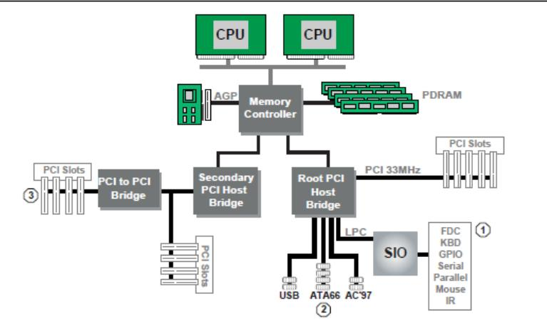
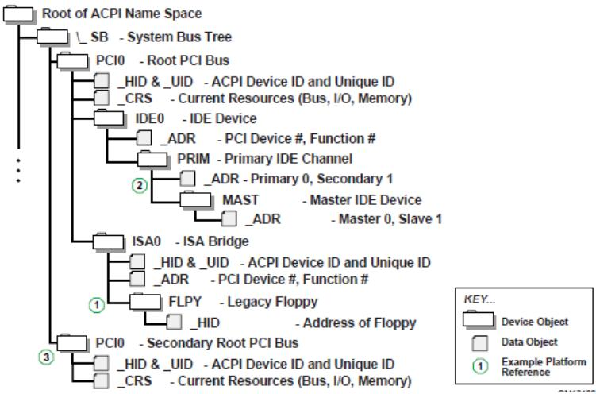
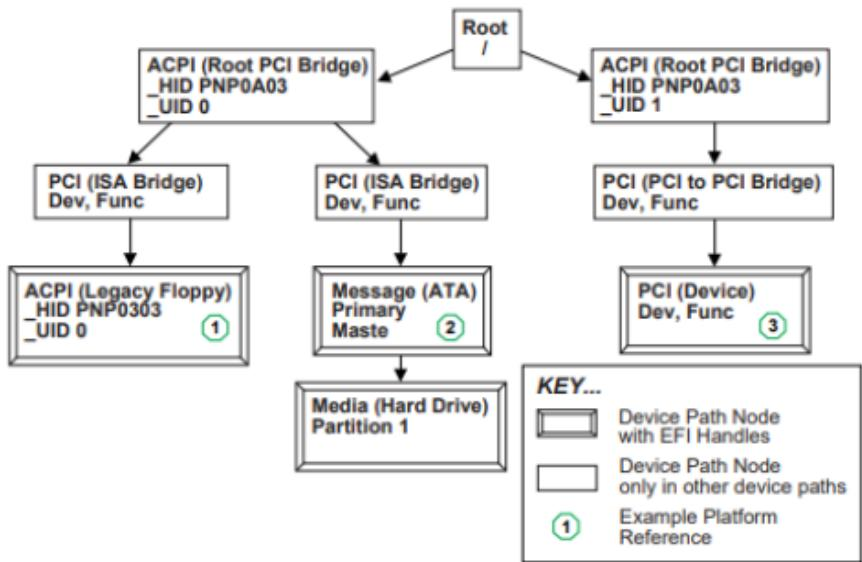
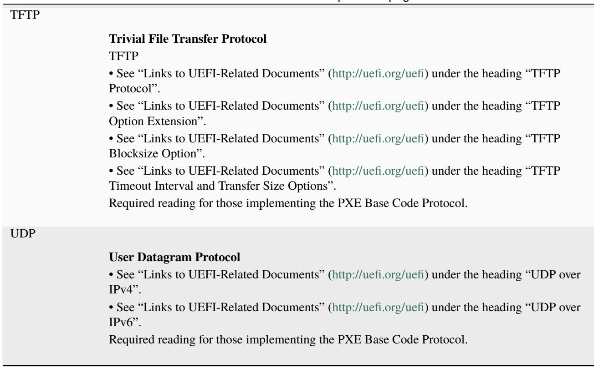
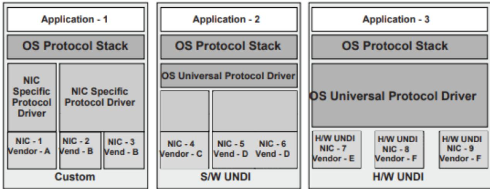
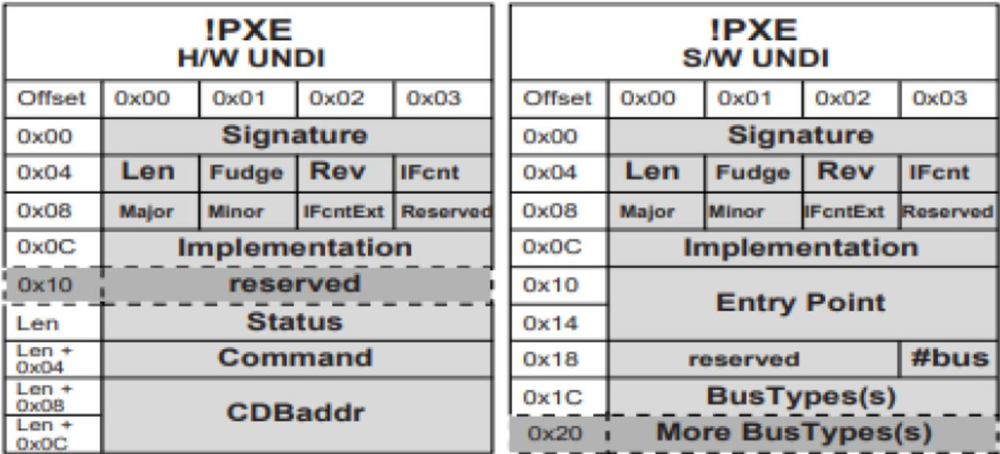
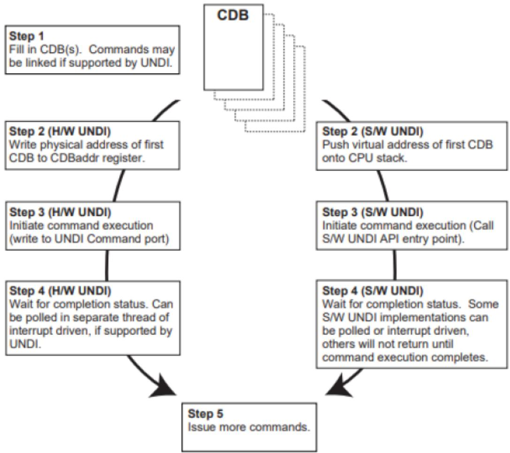
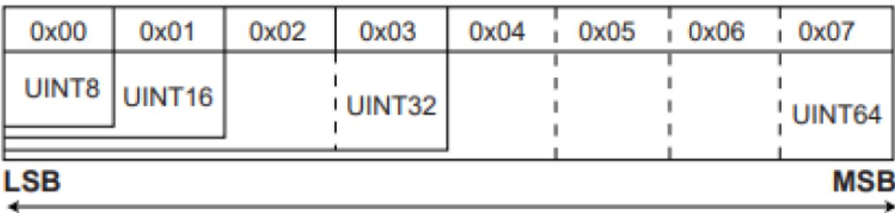
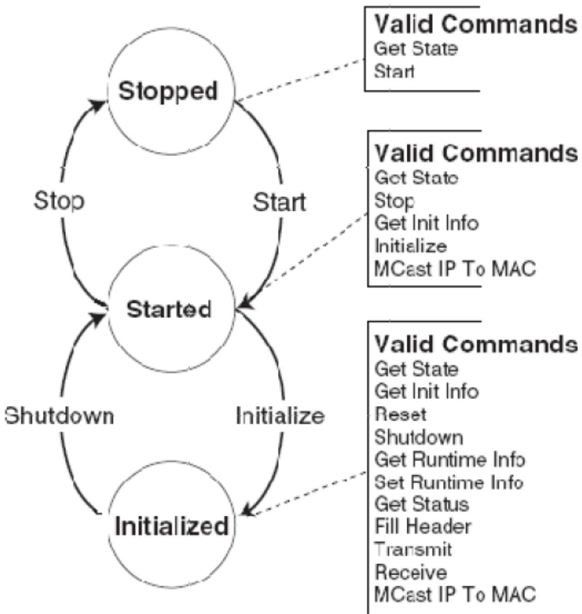

## ClientDataSize

Pointer to the size, in bytes, of an arbitrary block of data specified by the ClientData parameter. This parameter may be NULL, in which case the ClientData parameter will be ignored and no data will be transferred to or from the KMS. If the parameter is not NULL, then ClientData must be a valid pointer. If the value pointed to is 0, no data will be transferred to the KMS, but data may be returned by the KMS. For all non-zero values \*\*ClientData\* will be transferred to the KMS, which may also return data to the caller. In all cases, the value upon return to the caller will be the size of the data block returned to the caller, which will be zero if no data is returned from the KMS.

## ClientData

Pointer to a pointer to an arbitrary block of data of \*\*ClientDataSize\* that is to be passed directly to the KMS if it supports the use of client data. This parameter may be NULL if and only if the ClientDataSize parameter is also NULL. Upon return to the caller, \*\*ClientData\* points to a block of data of \*\*ClientDataSize\* that was returned from the KMS. If the returned value for \*\*ClientDataSize\* is zero, then the returned value for \*\*ClientData\* must be NULL and should be ignored by the caller. The KMS protocol consumer is responsible for freeing all valid bufers used for client data regardless of whether they are allocated by the caller for input to the function or by the implementation for output back to the caller.

## Description

The AddKey() function registers a new key with the key management service. The support for this method is optional, as not all key servers support importing keys from clients.

The Client parameter identifies the caller to the key management service. It may be used for auditing or access control. The use of this parameter is optional unless the KMS requires it in order to perform the requested action.

The KeyDescriptorCount and KeyDescriptors parameters are used to specify the key identifier, key format and key data to be registered on the. Any number of keys may be registered in a single operation, regardless of whether the KMS supports multiple key definitions in a single request or not. The KMS protocol implementation is responsible for generating the appropriate requests (single/multiple) to the KMS.

The ClientDataSize and ClientData parameters allow the caller to pass an arbitrary block of data to/from the KMS for uses such as auditing or access control. The KMS protocol implementation does not alter this data block other than to package it for transmission to the KMS. The use of these parameters is optional.

## Status Codes Returned

The AddKey() function will return a status which indicates the overall status of the request. Note that this may be diferent from the status reported for individual key requests.

<table><tr><td>EFI_SUCCESS</td><td>Successfully added all requested keys.</td></tr><tr><td>EFI_OUT_OF_RESOURCES</td><td>Could not allocate required resources.</td></tr><tr><td>EFI_TIMEOUT</td><td>Timed out waiting for device or key server. Check individual key request(s) to see which ones may have been processed.</td></tr><tr><td>EFI_BUFFER_TOO_SMALL</td><td>If multiple keys are associated with a single identifier, and the KeyValue buffer does not contain enough structures (KeyDescriptorCount) to contain all the key data, then the available structures will be filled and KeyDescriptorCount will be updated to indicate the number of keys which could not be processed.</td></tr><tr><td>EFI_ACCESS_DENIED</td><td>Access was denied by the device or the key server; OR a ClientId is required by the server and either none or an invalid id was provided</td></tr><tr><td>EFI_DEVICE_ERROR</td><td>Device or key server error. Check individual key request(s) to see which ones may have been processed.</td></tr><tr><td>EFI_INVALID_PARAMETER</td><td>This is NULL, ClientId is required but it is NULL,*KeyDescriptorCount* is NULL, or Keys is NULL</td></tr></table>

continues on next page

Table 37.16 – continued from previous page

<table><tr><td>EFI_NOT_FOUND</td><td>One or more EFI_KMS_KEY_DESCRIPTION structures could not be processed properly. KeyDescriptorCount contains the number of structures which were successfully processed. Individual structures will reflect the status of the processing for that structure.</td></tr><tr><td>EFI_UNSUPPORTED</td><td>The implementation/KMS does not support this function</td></tr></table>

## 37.3.2.5 EFI\_KMS\_PROTOCOL.DeleteKey()

## Summary

Delete an existing key from the KMS database.

Prototype

<table><tr><td colspan="2">typedef</td></tr><tr><td colspan="2">EFI_STATUS</td></tr><tr><td colspan="2">(EFIAPI *EFI_KMS_DELETE_KEY) (</td></tr><tr><td>IN EFI_KMS_PROTOCOL</td><td>*This,</td></tr><tr><td>IN EFI_KMS_CLIENT_INFO</td><td>*Client,</td></tr><tr><td>IN OUT UINT16</td><td>*KeyDescriptorCount,</td></tr><tr><td>IN OUT EFI_KMS_KEY_DESCRIPTION</td><td>*KeyDescriptors,</td></tr><tr><td>IN OUT UINTN</td><td>*ClientDataSize OPTIONAL,</td></tr><tr><td>IN OUT VOID</td><td>**ClientData OPTIONAL</td></tr><tr><td>);</td><td></td></tr></table>

## Parameters

## This

Pointer to this EFI\_KMS\_PROTOCOL instance.

## Client

Pointer to a valid EFI\_KMS\_CLIENT\_INFO structure.

## KeyDescriptorCount

Pointer to a count of the number of keys to be processed by this operation. On normal returns, this number will be updated with number of keys successfully processed.

## KeyDescriptors

Pointer to an array of EFI\_KMS\_KEY\_DESCRIPTOR structures that describe the keys to be deleted. On input, the KeyIdentifierSize and the KeyIdentifier must specify an identifier to be used to delete a specific key. All other fields in the descriptor should be NULL. On return, the KeyStatus field will reflect the result of the request relative to the individual key descriptor.

## ClientDataSize

Pointer to the size, in bytes, of an arbitrary block of data specified by the ClientData parameter. This parameter may be NULL, in which case the ClientData parameter will be ignored and no data will be transferred to or from the KMS. If the parameter is not NULL, then ClientData must be a valid pointer. If the value pointed to is 0, no data will be transferred to the KMS, but data may be returned by the KMS. For all non-zero values \*\*ClientData\* will be transferred to the KMS, which may also return data to the caller. In all cases, the value upon return to the caller will be the size of the data block returned to the caller, which will be zero if no data is returned from the KMS.

## ClientData

Pointer to a pointer to an arbitrary block of data of \*\*ClientDataSize\* that is to be passed directly to the KMS if it supports the use of client data. This parameter may be NULL if and only if the ClientDataSize parameter is also NULL. Upon return to the caller, \*\*ClientData\* points to a block of data of \*\*ClientDataSize\* that was returned from the KMS. If the returned value for \*\*ClientDataSize\* is zero, then the returned value for \*\*ClientData\* must be NULL and should be ignored by the caller. The KMS protocol consumer is responsible for freeing all valid bufers used for client data regardless of whether they are allocated by the caller for input to the function or by the implementation for output back to the caller.

## Description

The DeleteKey() function deregisters an existing key from the device or KMS. The support for this method is optional, as not all key servers support deleting keys from clients.

The Client parameter identifies the caller to the key management service. It may be used for auditing or access control. The use of this parameter is optional unless the KMS requires it in order to perform the requested action.

The KeyDescriptorCount and KeyDescriptors parameters are used to specify the key identifier(s) for the keys to be deleted. Any number of keys may be deleted in a single operation, regardless of whether the KMS supports multiple key definitions in a single request or not. The KMS protocol implementation is responsible for generating the appropriate requests (single/multiple) to the KMS.

The ClientDataSize and ClientData parameters allow the caller to pass an arbitrary block of data to/from the KMS for uses such as auditing or access control. The KMS protocol implementation does not alter this data block other than to package it for transmission to the KMS. The use of these parameters is optional.

## Status Codes Returned

The DeleteKey() function will return a status which indicates the overall status of the request. Note that this may be diferent from the status reported for individual key requests.

<table><tr><td>EFI_SUCCESS</td><td>Successfully deleted all requested keys.</td></tr><tr><td>EFI_OUT_OF_RESOURCES</td><td>Could not allocate required resources.</td></tr><tr><td>EFI_TIMEOUT</td><td>Timed out waiting for device or key server. Check individual key request(s) to see which ones may have been processed.</td></tr><tr><td>EFI_ACCESS_DENIED</td><td>Access was denied by the device or the key server; OR a ClientId is required by the server and either none or an invalid id was provided</td></tr><tr><td>EFI_DEVICE_ERROR</td><td>Device or key server error. Check individual key request(s) to see which ones may have been processed.</td></tr><tr><td>EFI_INVALID_PARAMETER</td><td>This is NULL, ClientId is required but it is NULL, KeyDescriptorCount is NULL, or Keys is NULL</td></tr><tr><td>EFI_NOT_FOUND</td><td>One or more EFI_KMS_KEY_DESCRIPTION structures could not be processed properly. KeyDescriptorCount contains the number of structures which were successfully processed. Individual structures will reflect the status of the processing for that structure.</td></tr><tr><td>EFI_UNSUPPORTED</td><td>The implementation/KMS does not support this function</td></tr></table>

## 37.3.2.6 EFI\_KMS\_PROTOCOL.GetKeyAttributes()

## Summary

Get one or more attributes associated with a specified key identifier. If none are found, the returned attributes count contains a value of zero.

## Prototype

<table><tr><td>typedefEFI_STATUS(EFIAPI *EFI_KMS_GET_KEY_ATTRIBUTES) (IN EFI_KMS_PROTOCOL *This,</td></tr></table>

(continues on next page)

(continued from previous page)

<table><tr><td>IN EFI_KMS_CLIENT_INFO</td><td>*Client,</td></tr><tr><td>IN UINT8</td><td>*KeyIdentifierSize,</td></tr><tr><td>IN CONST VOID</td><td>*KeyIdentifier,</td></tr><tr><td>IN OUT UINT16</td><td>*KeyAttributesCount,</td></tr><tr><td>IN OUT EFI_KMS_KEY_ATTRIBUTE</td><td>*KeyAttributes,</td></tr><tr><td>IN OUT UINTN</td><td>*ClientDataSize OPTIONAL,</td></tr><tr><td>IN OUT VOID</td><td>**ClientData OPTIONAL</td></tr><tr><td>);</td><td></td></tr></table>

## Parameters

## This

Pointer to this EFI\_KMS\_PROTOCOL instance.

## Client

Pointer to a valid EFI\_KMS\_CLIENT\_INFO structure.

## KeyIdentifierSize

Pointer to the size in bytes of the KeyIdentifier variable.

## KeyIdentifier

Pointer to the key identifier associated with this key.

## KeyAttributesCount

Pointer to the number of EFI\_KMS\_KEY\_ATTRIBUTE structures associated with the Key identifier. If none are found, the count value is zero on return. On input this value reflects the number of KeyAttributes that may be returned. On output, the value reflects the number of completed KeyAttributes structures found.

## KeyAttributes

Pointer to an array of EFI\_KMS\_KEY\_ATTRIBUTE structures associated with the Key Identifier. On input, the fields in the structure should be NULL. On output, the attribute fields will have updated values for attributes associated with this key identifier.

## ClientDataSize

Pointer to the size, in bytes, of an arbitrary block of data specified by the ClientData parameter. This parameter may be NULL, in which case the ClientData parameter will be ignored and no data will be transferred to or from the KMS. If the parameter is not NULL, then ClientData must be a valid pointer. If the value pointed to is 0, no data will be transferred to the KMS, but data may be returned by the KMS. For all non-zero values \* ClientData will be transferred to the KMS, which may also return data to the caller. In all cases, the value upon return to the caller will be the size of the data block returned to the caller, which will be zero if no data is returned from the KMS.

## ClientData

Pointer to a pointer to an arbitrary block of data of \* ClientDataSize that is to be passed directly to the KMS if it supports the use of client data. This parameter may be NULL if and only if the ClientDataSize parameter is also NULL. Upon return to the caller, \* ClientData points to a block of data of \* ClientDataSize that was returned from the KMS. If the returned value for \* ClientDataSize is zero, then the returned value for \* ClientData must be NULL and should be ignored by the caller. The KMS protocol consumer is responsible for freeing all valid bufers used for client data regardless of whether they are allocated by the caller for input to the function or by the implementation for output back to the caller.

## Description

The GetKeyAttributes() function returns one or more attributes for a key.

The ClientIdentifierSize and ClientIdentifier parameters identify the caller to the key management service. It may be used for auditing or access control. The use of this parameter is optional unless the KMS requires it in order to perform the requested action.

The KeyIdentifierSize and KeyIdentifier parameters identify the key whose attributes are to be returned by the key management service. They may be used to retrieve additional information about a key, whose format is defined by the KeyAttribute. Attributes returned may be of the same or diferent names.

The ClientDataSize and ClientData parameters allow the caller to pass an arbitrary block of data to/from the KMS for uses such as auditing or access control. The KMS protocol implementation does not alter this data block other than to package it for transmission to the KMS. The use of these parameters is optional unless the KMS requires it in order to perform the requested action.

## Status Codes Returned

The GetKeyAttributes() function will return a status which indicates the overall status of the request. Note that this may be diferent from the status reported for individual key attribute requests.

<table><tr><td>EFI_SUCCESS</td><td>Successfully retrieved all key attributes.</td></tr><tr><td>EFI_OUT_OF_RESOURCES</td><td>Could not allocate resources for the method processing.</td></tr><tr><td>EFI_TIMEOUT</td><td>Timed out waiting for device or key server. Check individual key attribute request(s) to see which ones may have been processed.</td></tr><tr><td>EFI_BUFFER_TOO_SMALL</td><td>If multiple key attributes are associated with a single identifier, and the Key-Attributes buffer does not contain enough structures (KeyAttributesCount) to contain all the key attributes data, then the available structures will be filled and KeyAttributesCount will be updated to indicate the number of key attributes which could not be processed.</td></tr><tr><td>EFI_ACCESS_DENIED</td><td>Access was denied by the device or the key server; OR a ClientId is required by the server and either none or an invalid id was provided</td></tr><tr><td>EFI_DEVICE_ERROR</td><td>Device or key server error. Check individual key attribute request(s) (i.e., key attribute status for each) to see which ones may have been processed.</td></tr><tr><td>EFI_INVALID_PARAMETER</td><td>This is NULL, ClientId is required but it is NULL, KeyIdentifierSize is NULL, or KeyIdentifier is NULL, or KeyAttributes is NULL, or KeyAttributesSize is NULL.</td></tr><tr><td>EFI_NOT_FOUND</td><td>The KeyIdentifier could not be found. KeyAttributesCount contains zero. Individual structures will reflect the status of the processing for that structure.</td></tr><tr><td>EFI_UNSUPPORTED</td><td>The implementation/KMS does not support this function</td></tr></table>

## 37.3.2.7 EFI\_KMS\_PROTOCOL.AddKeyAttributes()

## Summary

Add one or more attributes to a key specified by a key identifier.

## Prototype

```c
typedef
EFI_STATUS
(EFIAPI *EFI_KMS_ADD_KEY_ATTRIBUTES) (
    IN EFI_KMS_PROTOCOL *This,
    IN EFI_KMS_CLIENT_INFO *Client,
    IN UINT *KeyIdentifierSize,
    IN CONST VOID *KeyIdentifier,
    IN OUT UINT16 *KeyAttributesCount,
    IN OUT EFI_KMS_KEY_ATTRIBUTE *KeyAttributes,
    IN OUT UINTN *ClientDataSize OPTIONAL,
    IN OUT VOID **ClientData OPTIONAL
);
```

## Parameters

## This

Pointer to this EFI\_KMS\_PROTOCOL instance.

## Client

Pointer to a valid EFI\_KMS\_CLIENT\_INFO structure.

## KeyIdentifierSize

Pointer to the size in bytes of the KeyIdentifier variable.

## KeyIdentifier

Pointer to the key identifier associated with this key.

## KeyAttributesCount

Pointer to the number of EFI\_KMS\_KEY\_ATTRIBUTE structures to associate with the Key. On normal returns, this number will be updated with the number of key attributes successfully processed.

## KeyAttributes

Pointer to an array of EFI\_KMS\_KEY\_ATTRIBUTE structures providing the attribute information to associate with the key. On input, the values for the fields in the structure are completely filled in. On return the KeyAttributeStatus field will reflect the result of the operation for each key attribute request.

## ClientDataSize

Pointer to the size, in bytes, of an arbitrary block of data specified by the ClientData parameter. This parameter may be NULL, in which case the ClientData parameter will be ignored and no data will be transferred to or from the KMS. If the parameter is not NULL, then ClientData must be a valid pointer. If the value pointed to is 0, no data will be transferred to the KMS, but data may be returned by the KMS. For all non-zero values \* ClientData will be transferred to the KMS, which may also return data to the caller. In all cases, the value upon return to the caller will be the size of the data block returned to the caller, which will be zero if no data is returned from the KMS.

## ClientData

Pointer to a pointer to an arbitrary block of data of \* ClientDataSize that is to be passed directly to the KMS if it supports the use of client data. This parameter may be NULL if and only if the ClientDataSize parameter is also NULL. Upon return to the caller, \* ClientData points to a block of data of \* ClientDataSize that was returned from the KMS. If the returned value for \* ClientDataSize is zero, then the returned value for \* ClientData must be NULL and should be ignored by the caller. The KMS protocol consumer is responsible for freeing all valid bufers used for client data regardless of whether they are allocated by the caller for input to the function or by the implementation for output back to the caller.

## Description

The AddKeyAttributes() function adds one or more key attributes. If this function is not supported by a KMS protocol instance then it is assumed that there is an alternative means available for attribute management in the KMS.

The Client parameters identify the caller to the key management service. It may be used for auditing or access control. The use of this parameter is optional unless the KMS requires it in order to perform the requested action.

The KeyIdentifierSize and KeyIdentifier parameters identify the key whose attributes are to be modified by the key management service

The KeyAttributesCount and KeyAttributes parameters are used to specify the key attributes data to be registered on the KMS. Any number of attributes may be registered in a single operation, regardless of whether the KMS supports multiple key attribute definitions in a single request or not. The KMS protocol implementation is responsible for generating the appropriate requests (single/multiple) to the KMS. In certain error situations, the status of each attribute is updated indicating if that attribute was successfully registered or not.

The ClientDataSize and ClientData parameters allow the caller to pass an arbitrary block of data to/from the KMS for uses such as auditing or access control. The KMS protocol implementation does not alter this data block other than to package it for transmission to the KMS. The use of these parameters is optional unless the KMS requires it in order to perform the requested action.

## Status Codes Returned

The AddKeyAttributes() function will return a status which indicates the overall status of the request. Note that this may be diferent from the status reported for individual key attribute requests. Status codes returned for AddKeyAttributes() are:

<table><tr><td>EFI_SUCCESS</td><td>Successfully added all requested key attributes.</td></tr><tr><td>EFI_OUT_OF_RESOURCES</td><td>Could not allocate required resources.</td></tr><tr><td>EFI_TIMEOUT</td><td>Timed out waiting for device or key server. Check individual key attribute request(s) to see which ones may have been processed.</td></tr><tr><td>EFI_BUFFER_TOO_SMALL</td><td>If multiple keys attributes are associated with a single key identifier, and theattributes buffer does not contain enough structures (KeyAttributesCount) to contain all the data, then the available structures will be filled and KeyAttributesCount will be updated to indicate the number of key attributes which could not be processed. The status of each key attribute is also updated indicating success or failure for that attribute in case there are other errors for those attributes that could be processed.</td></tr><tr><td>EFI_ACCESS_DENIED</td><td>Access was denied by the device or the key server; OR aClientId is required by the server and either none or an invalid id was provided</td></tr><tr><td>EFI_DEVICE_ERROR</td><td>Device or key server error. Check individual key attribute request(s) (i.e., key attribute status for each) to see which ones may have been processed.</td></tr><tr><td>EFI_INVALID_PARAMETER</td><td>This is NULL,ClientId is required but it is NULL, KeyAttributesCount is NULL, or KeyAttributes is NULL, or KeyIdentifierSize is NULL, or KeyIdentifier is NULL.</td></tr><tr><td>EFI_NOT_FOUND</td><td>The KeyIdentifier could not be found. On return the KeyAttributesCount contains the number of attributes processed. Individual structures will reflect the status of the processing for that structure.</td></tr><tr><td>EFI_UNSUPPORTED</td><td>The implementation/KMS does not support this function</td></tr></table>

## 37.3.2.8 EFI\_KMS\_PROTOCOL.DeleteKeyAttributes()

## Summary

Delete attributes to a key specified by a key identifier.

Prototype

```c
typedef
EFI_STATUS
(EFIAPI *EFI_KMS_DELETE_KEY_ATTRIBUTES) (
    IN EFI_KMS_PROTOCOL *This,
    IN EFI_KMS_CLIENT_INFO *Client,
    IN UINT8 *KeyIdentifierSize,
    IN CONST VOID *KeyIdentifier,
    IN OUT UINT16 *KeyAttributesCount,
    IN OUT EFI_KMS_KEY_ATTRIBUTE *KeyAttributes,
    IN OUT UINTN *ClientDataSize OPTIONAL,
    IN OUT VOI **ClientData OPTIONAL
);
```

## Parameters

## This

Pointer to this EFI\_KMS\_PROTOCOL instance.

## Client

Pointer to a valid EFI\_KMS\_CLIENT\_INFO structure.

## KeyIdentifierSize

Pointer to the size in bytes of the KeyIdentifier variable.

## KeyIdentifier

Pointer to the key identifier associated with this key.

## KeyAttributesCount

Pointer to the number of EFI\_KMS\_KEY\_ATTRIBUTE structures associated with the Key. On input, the count value is one or more. On normal returns, this number will be updated with the number of key attributes successfully processed.

## KeyAttributes

Pointer to an array of EFI\_KMS\_KEY\_ATTRIBUTE structures associated with the key. On input, the values for the fields in the structure are completely filled in. On return the\* KeyAttributeStatus field will reflect the result of the operation for each key attribute request.

## ClientDataSize

Pointer to the size, in bytes, of an arbitrary block of data specified by the ClientData parameter. This parameter may be NULL, in which case the ClientData parameter will be ignored and no data will be transferred to or from the KMS. If the parameter is not NULL, then ClientData must be a valid pointer. If the value pointed to is 0, no data will be transferred to the KMS, but data may be returned by the KMS. For all non-zero values \* ClientData will be transferred to the KMS, which may also return data to the caller. In all cases, the value upon return to the caller will be the size of the data block returned to the caller, which will be zero if no data is returned from the KMS.

## ClientData

Pointer to a pointer to an arbitrary block of data of \* ClientDataSize that is to be passed directly to the KMS if it supports the use of client data. This parameter may be NULL if and only if the ClientDataSize parameter is also NULL. Upon return to the caller, \* ClientData points to a block of data of \* ClientDataSize that was returned from the KMS. If the returned value for ClientDataSize is zero, then the returned value for \* \*ClientData must be NULL and should be ignored by the caller. The KMS protocol consumer is responsible for freeing all valid bufers used for client data regardless of whether they are allocated by the caller for input to the function or by the implementation for output back to the caller.

## Description

The DeleteKeyAttributes() function removes key attributes for a key with the key management service.

The Client parameter identifies the caller to the key management service. It may be used for auditing or access control. The use of this parameter is optional unless the KMS requires it in order to perform the requested action.

The KeyIdentifierSize and KeyIdentifier parameters identify the key whose attributes are to be modified by the key management service

The KeyAttributesCount and KeyAttributes parameters are used to specify the key attributes data to be deleted on the KMS. Any number of attributes may be deleted in a single operation, regardless of whether the KMS supports multiple key attribute definitions in a single request or not. The KMS protocol implementation is responsible for generating the appropriate requests (single/multiple) to the KMS. In certain error situations, the status of each attribute is updated indicating if that attribute was successfully deleted or not.

The KeyAttributesCount and KeyAttributes parameters are used to specify the key attributes data to be deleted on the KMS. Any number of attributes may be deleted in a single operation, regardless of whether the KMS supports multiple key attribute definitions in a single request or not. The KMS protocol implementation is responsible for generating the appropriate requests (single/multiple) to the KMS. In certain error situations, the status of each attribute is updated indicating if that attribute was successfully deleted or not.

The ClientDataSize and ClientData parameters allow the caller to pass an arbitrary block of data to/from the KMS for uses such as auditing or access control. The KMS protocol implementation does not alter this data block other than to package it for transmission to the KMS. The use of these parameters is optional unless the KMS requires it in order to perform the requested action.

## Status Codes Returned

The DeleteKeyAttributes() function will return a status which indicates the overall status of the request. Note that this may be diferent from the status reported for individual key attribute requests. Status codes returned for the method are:

<table><tr><td>EFI_SUCCESS</td><td>Successfully deleted all requested key attributes.</td></tr><tr><td>EFI_OUT_OF_RESOURCES</td><td>Could not allocate required resources.</td></tr><tr><td>EFI_TIMEOUT</td><td>Timed out waiting for device or key server. Check individual key attribute request(s) to see which ones may have been processed.</td></tr><tr><td>EFI_ACCESS_DENIED</td><td>Access was denied by the device or the key server; OR aClientId is required by the server and either none or an invalid id was provided</td></tr><tr><td>EFI_DEVICE_ERROR</td><td>Device or key server error. Check individual key attribute request(s) (i.e., key attribute status for each) to see which ones may have been processed.</td></tr><tr><td>EFI_INVALID_PARAMETER</td><td>This is NULL,ClientId is required but it is NULL, KeyAttributesCount is NULL, or KeyAttributes is NULL, or KeyIdentifierSize is NULL, or KeyIdentifier is NULL.</td></tr><tr><td>EFI_NOT_FOUND</td><td>The KeyIdentifier could not be found or the attribute could not be found. On return the KeyAttributesCount contains the number of attributes processed. Individual structures will reflect the status of the processing for that structure.</td></tr><tr><td>EFI_UNSUPPORTED</td><td>The implementation/KMS does not support this function</td></tr></table>

## 37.3.2.9 EFI\_KMS\_PROTOCOL.GetKeyByAttributes()

## Summary

Retrieve one or more key that has matched all of the specified key attributes.

Prototype

```c
typedef
EFI_STATUS
(EFIAPI *EFI_KMS_GET_KEY_BY_ATTRIBUTES) (
    IN EFI_KMS_PROTOCOL *This,
    IN EFI_KMS_CLIENT_INFO *Client,
    IN UINTN *KeyAttributeCount,
    IN OUT EFI_KMS_KEY_ATTRIBUTE *KeyAttributes,
    IN OUT UINTN *KeyDescriptorCount,
    IN OUT EFI_KMS_KEY_DESCRIPTION *KeyDescriptors,
    IN OUT UINTN *ClientDataSize OPTIONAL,
    IN OUT VOID **ClientData OPTIONAL
);
```

## Parameters

## This

Pointer to this EFI\_KMS\_PROTOCOL instance.

## Client

Pointer to a valid EFI\_KMS\_CLIENT\_INFO structure.

## KeyAttributeCount

Pointer to a count of the number of key attribute structures that must be matched for each returned key descriptor. On input the count value is one or more. On normal returns, this number will be updated with the number of key attributes successfully processed.

## KeyAttributes

Pointer to an array of EFI\_KMS\_KEY\_ATTRIBUTE structure to search for. On input, the values for the fields in the structure are completely filled in. On return the KeyAttributeStatus field will reflect the result of the operation for each key attribute request.

## KeyDescriptorCount

Pointer to a count of the number of key descriptors matched by this operation. On entry, this number will be zero. On return, this number will be updated to the number of key descriptors successfully found.

## KeyDescriptors

Pointer to an array of EFI\_KMS\_KEY\_DESCRIPTOR structures which describe the keys from the KMS having the KeyAttribute(s) specified. On input, this pointer will be NULL. On output, the array will contain an EFI\_KMS\_KEY\_DESCRIPTOR structure for each key meeting the search criteria. Memory for the array and all KeyValue fields will be allocated with the EfiBootServicesData type and must be freed by the caller when it is no longer needed. Also, the KeyStatus field of each descriptor will reflect the result of the request relative to that key descriptor.

## ClientDataSize

Pointer to the size, in bytes, of an arbitrary block of data specified by the ClientData parameter. This parameter may be NULL, in which case the ClientData parameter will be ignored and no data will be transferred to or from the KMS. If the parameter is not NULL, then ClientData must be a valid pointer. If the value pointed to is 0, no data will be transferred to the KMS, but data may be returned by the KMS. For all non-zero values \*\*ClientData\* will be transferred to the KMS, which may also return data to the caller. In all cases, the value upon return to the caller will be the size of the data block returned to the caller, which will be zero if no data is returned from the KMS.

## ClientData

Pointer to a pointer to an arbitrary block of data of \*\*ClientDataSize\* that is to be passed directly to the KMS if it supports the use of client data. This parameter may be NULL if and only if the ClientDataSize parameter is also NULL. Upon return to the caller, \*\*ClientData\* points to a block of data of \*\*ClientDataSize\* that was returned from the KMS. If the returned value for \*\*ClientDataSize\* is zero, then the returned value for \*\*ClientData\* must be NULL and should be ignored by the caller. The KMS protocol consumer is responsible for freeing all valid bufers used for client data regardless of whether they are allocated by the caller for input to the function or by the implementation for output back to the caller.

## Description

The GetKeyByAttributes() function returns the keys found by searches for matching key attribute(s). This function must be supported by every KMS protocol instance that supports the use of key attributes as indicated in the protocol’s KeyAttributesSupported field.

The Client parameter identifies the caller to the key management service. It may be used for auditing or access control. The use of this parameter is optional unless the KMS requires it in order to perform the requested action.

The KeyAttributesCount and KeyAttributes parameters are used to specify the key attributes data to be searched for on the KMS. Any number of attributes may be searched for in a single operation, regardless of whether the KMS supports multiple key attribute definitions in a single request or not. The KMS protocol implementation is responsible for generating the appropriate requests (single/multiple) to the KMS. In certain error situations, the status of each attribute is updated indicating if that attribute was successfully found or not. If an attribute specifies a wildcard KeyAttributeInstance value, then the provider returns all instances of the attribute.

The KeyDescriptorCount and KeyDescriptors parameters are used to return the EFI\_KMS\_KEY\_DESCRIPTOR structures for keys meeting the search criteria. Any number of keys may be returned in a single operation, regardless of whether the KMS supports multiple key definitions in a single request or not. The KMS protocol implementation is responsible for generating the appropriate requests (single/multiple) to the KMS.

The ClientDataSize and ClientData parameters allow the caller to pass an arbitrary block of data to/from the KMS for uses such as auditing or access control. The KMS protocol implementation does not alter this data block other than to package it for transmission to the KMS. The use of these parameters is optional unless the KMS requires it in order to perform the requested action.

## Status Codes Returned

The GetKeyByAttributes() function will return a status which indicates the overall status of the request. Note that this may be diferent from the status reported for individual keys.

<table><tr><td>EFI_SUCCESS</td><td>Successfully retrieved all requested keys.</td></tr><tr><td>EFI_OUT_OF_RESOURCES</td><td>Could not allocate required resources.</td></tr><tr><td>EFI_TIMEOUT</td><td>Timed out waiting for device or key server. Check individual key attribute request(s) to see which ones may have been processed.</td></tr><tr><td>EFI_BUFFER_TOO_SMALL</td><td>If multiple keys are associated with the attribute(s), and the KeyValue buffer does not contain enough structures (KeyDescriptorCount) to contain all the key data, then the available structures will be filled and KeyDescriptorCount will be updated to indicate the number of keys which could not be processed.</td></tr><tr><td>EFI_ACCESS_DENIED</td><td>Access was denied by the device or the key server; OR a ClientId is required by the server and either none or an invalid id was provided</td></tr><tr><td>EFI_DEVICE_ERROR</td><td>Device or key server error. Check individual key attribute request(s) (i.e., key attribute status for each) to see which ones may have been processed.</td></tr><tr><td>EFI_INVALID_PARAMETER</td><td>This is NULL, ClientId is required but it is NULL, KeyDescriptorCount is NULL, or KeyDescriptors is NULL or KeyAttributes is NULL, or KeyAttributesCount is NULL.</td></tr><tr><td>EFI_NOT_FOUND</td><td>One or more EFI_KMS_KEY_ATTRIBUTE structures could not be processed properly. KeyAttributeCount contains the number of structures which were successfully processed. Individual structures will reflect the status of the processing for that structure.</td></tr><tr><td>EFI_UNSUPPORTED</td><td>The implementation/KMS does not support this function</td></tr></table>

## 37.4 PKCS7 Verify Protocol

## 37.4.1 EFI\_PKCS7\_VERIFY\_PROTOCOL

## Summary

EFI\_PKCS7\_VERIFY\_PROTOCOL (See: http://tools.ietf.org/html/rfc2315 ) may be used to verify data signed with PKCS#7 formatted authentication. The PKCS#7 data to be verified must be binary DER encoded. Additional information on the supported ASN.1 formatting is provided below.

Drivers that supply PKCS7 verification function should publish the | EFI\_PKCS7\_VERIFY\_PROTOCOL. Drivers wishing to use the | EFI\_PKCS7\_VERIFY\_PROTOCOL may get a reference with LocateProtocol().

## GUID

```c
#define EFI_PKCS7_VERIFY_PROTOCOL_GUID \
{ 0x47889fb2, 0xd671, 0x4fab, \
{ 0xa0, 0xca, 0xdf, 0xe, 0x44, \ 0xdf, 0x70, 0xd6 }}
```

## Protocol Interface Structure

<table><tr><td>typedef struct _EFI_PKCS7_VERIFY_PROTOCOL { EFI_PKCS7_VERIFY_BUFFER *VerifyBuffer; EFI_PKCS7_VERIFY_SIGNATURE *VerifySignature;} EFI_PKCS7_VERIFY_PROTOCOL;</td></tr></table>

## Parameters

## VerifyBufer

Examine a DER-encoded PKCS7-signed memory bufer with signature containing embedded data content, or bufer with detached signature and separate data content bufer, and verify using supplied signature lists.

## VerifySignature

Examine a DER-encoded PKCS7-signed memory bufer with signature and, using caller-supplied hash value for signed data, verify using supplied signature lists.

## Description

The EFI\_PKCS7\_VERIFY\_PROTOCOL is used to verify data signed using PKCS7 structure. PKCS7 is a generalpurpose cryptographic standard (see references). The PKCS7 data to be verified must be ASN.1 (DER) encoded. See the Table below.

Table 37.22: Details of Supported Signature Format

<table><tr><td colspan="2">SignatureBuffer FormatDetails</td></tr><tr><td>Encoding</td><td>Binary DER</td></tr><tr><td>ASN.1 root of Embedded Signed Data</td><td>ContentInfo withSignedDatacontent type</td></tr><tr><td>ASN.1 root of Detached Signa-ture</td><td>SignedDataor ContentInfo withSignedDatacontent type</td></tr><tr><td>Embedded Data Type</td><td>Typically ‘Data’ (1.2.840.113549.1.7.1) or other defined OID type (however caller should not depend upon specialized OID processing during PKCS validation.)</td></tr><tr><td>Digest (Hash) Algorithm (VerifyBuffer function)</td><td>See [RFC2315] and OID definition by different standard bodies.</td></tr><tr><td>Digest Encryp-tion</td><td>See [RFC2315] and OID definition by different standard bodies.</td></tr><tr><td>Certificate validity dates</td><td>SeeTimeStampDbdescription</td></tr><tr><td>Signature authenticated-dAttributes</td><td>Ignored by function</td></tr><tr><td>Timestamping</td><td>See TimeStampDb description</td></tr></table>

## References

PKCS7 is defined by RFC2315. For more information see “Links to UEFI-Related Documents” ( http: //uefi.org/uefi ) under the heading “RFC2315 (defines PKCS7)”.

## 37.4.2 EFI\_PKCS7\_VERIFY\_PROTOCOL.VerifyBufer()

## Summary

This function processes a bufer containing binary DER-encoded PKCS7 signature. The signed data content may be embedded within the bufer or separated. Function verifies the signature of the content is valid and signing certificate was not revoked and is contained within a list of trusted signers.

## Prototype

<table><tr><td colspan="2">typedef</td></tr><tr><td colspan="2">EFI_STATUS(EFIAPI *VerifyBuffer)(</td></tr><tr><td>IN EFI_PKCS7_VERIFY_PROTOCOL</td><td>*This,</td></tr><tr><td>IN VOID</td><td>*SignedData,</td></tr><tr><td>IN UINTN</td><td>SignedDataSize,</td></tr><tr><td>IN VOID</td><td>*InData OPTIONAL,</td></tr><tr><td>IN UINTN</td><td>InDataSize</td></tr><tr><td>IN EFI_SIGNATURE_LIST</td><td>**AllowedDb,</td></tr><tr><td>IN EFI_SIGNATURE_LIST</td><td>**RevokedDb OPTIONAL,</td></tr><tr><td>IN EFI_SIGNATURE_LIST</td><td>**TimeStampDb OPTIONAL,</td></tr><tr><td>OUT VOID</td><td>*Content OPTIONAL,</td></tr><tr><td>IN OUT UINTN</td><td>*ContentSize</td></tr><tr><td>);</td><td></td></tr></table>

## Parameters

## This

Pointer to EFI\_PKCS7\_VERIFY\_PROTOCOL instance.

## SignedData

Points to bufer containing ASN.1 DER-encoded PKCS signature.

## SignedDataSize

The size of SignedData bufer in bytes.

## InData

In case of detached signature, Indata points to bufer containing the raw message data previously signed and to be verified by function. In case of SignedData containing embedded data, InData must be NULL.

## InDataSize

When InData is used, the size of InData bufer in bytes.

When InData is NULL, this parameter must be 0.

## AllowedDb

Pointer to a list of pointers to EFI\_SIGNATURE\_LIST structures. The list is terminated by a null pointer. The EFI\_SIGNATURE\_LIST structures contain lists of X.509 certificates of approved signers. See Chapter 27 for definition of EFI\_SIGNATURE\_LIST. Function recognizes signer certificates of type EFI\_CERT\_X509\_GUID. Any hash certificate in AllowedDb list is ignored by this function. Function returns success if signer of the bufer is within this list (and not within RevokedDb ). This parameter is required.

## RevokedDb

Optional pointer to a list of pointers to EFI\_SIGNATURE\_LIST structures. The list is terminated by a null pointer. List of X.509 certificates of revoked signers and revoked file hashes. Except as noted in description of TimeStampDb, signature verification will always fail if the signer of the file or the hash of the data component of the bufer is in RevokedDb list. This list is optional and caller may pass Null or pointer to NULL if not required.

## TimeStampDb

Optional pointer to a list of pointers to EFI\_SIGNATURE\_LIST structures. The list is terminated by a null pointer. This parameter can be used to pass a list of X.509 certificates of trusted time stamp signers. This list is optional and caller may pass Null or pointer to NULL if not required.

## Content

On input, points to an optional caller-allocated bufer into which the function will copy the content portion of the file after verification succeeds. This parameter is optional and if NULL, no copy of content from file is performed.

## ContentSize

On input, points to the size in bytes of the optional bufer Content previously allocated by caller. On output, if the verification succeeds, the value referenced by ContentSize will contain the actual size of the content from signed file. If ContentSize indicates the caller-allocated bufer is too small to contain content, an error is returned, and ContentSize will be updated with the required size. This parameter must be 0 if Content is Null.

## Description

This function processes the bufer SignedData for PCKS7 verification. The data that was signed using PKCS is referred to as the ‘Message’. In the process of creating a signature of the message, a SHA256 or other hash of the message bytes, called the ‘Message Digest’, is encrypted using a private key held in secret by the signer. The encrypted hash and the X.509 public key certificate of the signer are formatted according to the ASN.1 PKCS#7 Schema (See References). For the bufer type with the embedded data, the ASN.1 syntax is also used to wrap the data and combine the message data with the signature structure.

The SignedData bufer must be ASN.1 DER-encoded format with structure according to the subset defined in the intro duction to this protocol. Both embedded content and detached signature formats are supported. In case of embedded content, SignedData contains both the PKCS7 signature structure and the message content that was signed. In the case of detached signature, SignedData contains only the signature data and InData is used to supply the data to be verified. To pass verification the X.509 public certificate of the signer of the file must be found in AllowedDb and not be present in RevokedDb. Additionally if RevokedDb contains a specific Hash signature that matches the hash calculated for the content, the file will also fail verification. The message content will be copied to the caller-supplied bufer Content (when present) with ContentSize updated to reflect the total size in bytes of the extracted content.

The VerifyBufer() function performs several steps. First, the bufer containing the user-provided signature is parsed, the content is located and a hash calculated, and the PKCS7 signature of that hash is verified by decrypting the hash calculated at time of signing. Match of current hash with decrypted hash provides indication the structure contained in bufer has not been modified since signing. Next the protocol function attempts to match the signing certificate included within the signed data again the members of an (optional) list of caller-provided revoked certificates ( RevokedDb ). The hash of the data is also compared against any hash items contained in RevokedDb list. Next the signing certificate is matched against the caller-provided list of trusted signatures. If the signature is valid, the certificate or hash are not in the revoked list, and the certificate is in the trusted list, the file passes verification.

When TimeStampDb list is present this information modifies the processing of revoked certificates found in both AllowedDb and RevokedDb. When PCKS7 signings that are time-stamped by trusted signer in TimeStampDb list, and which time-stamping occurred prior to the time of certificate revocation noted in certificate in RevokedDb list, the signing will be allowed and return EFI\_SUCCESS. TimeStampDb parameter is optional and may be NULL or a pointer to NULL when not used. Except in the processing of certificates found in both AllowedDb and RevokedDb, TimeStampDb is not used and time-stamping is not otherwise required for signings verified by certificate only in AllowedDb.

NOTE: This method is intended to be suitable to implement Secure Boot image validation, and as such the contents of AllowedDb, RevokedDb, and TimeStampDb must also conform with the requirements of Authorization Process , bullet item 3 (UEFI Image Validation Succeeded).

The verification function can handle both embedded data or detached signature formats. In case of embedded data, the function will optionally extract the original signed data and supply back to caller in caller-supplied bufer. For a detached signature the caller must provide the original message data in bufer pointed to by InData. For consistency, when both InData and Content are provided, the function will copy contents of InData to Content.

In case where the ContentSize indicated by caller is too small to contain the entire content extracted from the file, EFI\_BUFFER\_TOO\_SMALL error is returned, and ContentSize is updated to reflect the required size.

NOTE: When signing certificate is matched to AllowedDb or RevokedDb lists, a match can occur against an entry in the list at any level of the chain of X.509 certificates present in the PCKS certificate list. This supports signing with a certificate that chains to one of the certificates in the AllowedDb or RevokedDb lists.

## Related Definitions

None

Status Codes Returned

<table><tr><td>EFI_SUCCESS</td><td>Content signature was verified against hash of content, the signer&#x27;s certificate was not found in RevokedDb, and was found in AllowedDb or if in signer is found in both AllowedDb and RevokedDb, the signing was allowed by reference to TimeStampDb as described above, and no hash matching content hash was found in RevokedDb.</td></tr><tr><td>EFI_SECURITY_VIOLATION</td><td>The SignedData buffer was correctly formatted but signer was in RevokedDb or not in AllowedDb. Also returned if matching content hash found in RevokedDb.</td></tr><tr><td>EFI_COMPROMISED_DATA</td><td>Calculated hash differs from signed hash.</td></tr><tr><td>EFI_INVALID_PARAMETER</td><td>SIGNEDData is NULL or SIGNEDDataSize is zero. AllowedDb is NULL.</td></tr><tr><td>EFI_INVALID_PARAMETER</td><td>Content is not NULL and ContentSize is NULL.</td></tr><tr><td>EFI_ABORTED</td><td>Unsupported or invalid format in TlmeStampDb, RevokedDb or AllowedDb list contents was detected.</td></tr><tr><td>EFI_NOT_FOUND</td><td>Content not found because InData is NULL and no content embedded in SIGNEDData.</td></tr><tr><td>EFI_UNSUPPORTED</td><td>The SignedData buffer was not correctly formatted for processing by the function.</td></tr><tr><td>EFI_UNSUPPORTED</td><td>Signed data embedded in SIGNEDData but InData is not NULL.</td></tr><tr><td>EFI_BUFFER_TOO_SMALL</td><td>The size of buffer indicated by ContentSize is too small to hold the content. ContentSize updated to required size.</td></tr></table>

## 37.4.2.1 EFI\_PKCS7\_VERIFY\_PROTOCOL.VerifySignature()

## Summary

This function processes a bufer containing binary DER-encoded detached PKCS7 signature. The hash of the signed data content is calculated and passed by the caller. Function verifies the signature of the content is valid and signing certificate was not revoked and is contained within a list of trusted signers.

<sup>ò</sup> Note

The current UEFI specification allows for a variety of hashes. In order to be secure, the users of this protocol should loop over each hash to see if the binary signature is authorized.

Prototype

<table><tr><td>typedefEFI_STATUS(EFIAPI *VerifySignature)(IN EFI_PKCS7_VERIFY_PROTOCOL *This,</td></tr></table>

(continues on next page)

(continued from previous page)

<table><tr><td>IN VOID</td><td>*Signature,</td></tr><tr><td>IN UINTN</td><td>SignatureSize,</td></tr><tr><td>IN VOID</td><td>*InHash,</td></tr><tr><td>IN UINTN</td><td>InHashSize</td></tr><tr><td>IN EFI_SIGNATURE_LIST</td><td>**AllowedDb,</td></tr><tr><td>IN EFI_SIGNATURE_LIST</td><td>**RevokedDb OPTIONAL,</td></tr><tr><td>IN EFI_SIGNATURE_LIST</td><td>**TimeStampDb OPTIONAL,</td></tr><tr><td>);</td><td></td></tr></table>

## Parameters

## This

Pointer to EFI\_PKCS7\_VERIFY\_PROTOCOL instance.

## Signature

Points to bufer containing ASN.1 DER-encoded PKCS detached signature.

## SignatureSize

The size of Signature bufer in bytes.

## InHash

InHash points to bufer containing the caller calculated hash of the data. This parameter may not be NULL.

## InHashSize

The size in bytes of InHash bufer.

## AllowedDb

Pointer to a list of pointers to EFI\_SIGNATURE\_LIST structures. The list is terminated by a null pointer. The EFI\_SIGNATURE\_LIST structures contain lists of X.509 certificates of approved signers. See Chapter 27 for definition of EFI\_SIGNATURE\_LIST. Function recognizes signer certificates of type EFI\_CERT\_X509\_GUID. Any hash certificate in AllowedDb list is ignored by this function. Function returns success if signer of the bufer is within this list (and not within RevokedDb ). This parameter is required.

## RevokedDb

Pointer to a list of pointers to EFI\_SIGNATURE\_LIST structures. The list is terminated by a null pointer. List of X.509 certificates of revoked signers and revoked file hashes. Signature verification will always fail if the signer of the file or the hash of the data component of the bufer is in RevokedDb list. This parameter is optional and caller may pass Null if not required.

## TimeStampDb

Optional pointer to a list of pointers to EFI\_SIGNATURE\_LIST structures. The list is terminated by a null pointer. This parameter can be used to pass a list of X.509 certificates of trusted time stamp counter-signers.

## Description

This function processes the bufer Signature for PCKS7 verification using hash of the data calculated and pass by caller in the InHash bufer. The data that was signed using PKCS is referred to as the ‘Message’. In the process of creating a signature of the message, a hash of the message bytes, called the ‘Message Digest’, is encrypted using a private key held in secret by the signer. The encrypted hash and the X.509 public key certificate of the signer are formatted according to the ASN.1 PKCS#7 Schema (See References). Any data embedded within the PKCS structure is ignored by the function. This function does not support extraction of signature from executable file formats. The address of the PKCS Signature block must be located and passed by the called.

The hash size passed in InHashSize must match the size of the signed hash embedded within the PKCS signature structure or an error is returned.

The SignedData bufer must be ASN.1 DER-encoded format with structure according to the subset defined in the introduction to this protocol. Both embedded content and detached signature formats are supported however embedded data is ignored. To pass verification the X.509 public certificate of the signer of the file must be found in AllowedDb and not be present in RevokedDb. Additionally, if RevokedDb contains a specific Hash signature that matches the hash calculated for the content, the file will also fail verification.

When TimeStampDb list is present this information modifies the processing of revoked certificates found in both Al lowedDb and RevokedDb. When PCKS7 signings that are time-stanped by trusted signer in TimeStampDb list, and which time-stamping occurred prior to the time of certificate revocation noted in certificate in RevokedDb list, the signing will be allowed and return EFI\_SUCCESS. TimeStampDb parameter is optional and may be NULL or a pointer to NULL when not used. Except in the processing of certificates found in both AllowedDb and RevokedDb, TimeStampDb is not used and time-stamping is not otherwise required for signings verified by certificate only in AllowedDb

The VerifySignature() function performs several steps. First, the bufer containing the user-provided signature is parsed, (any embedded content is ignored), and the PKCS7 signature of hash data is verified by decrypting the hash calculated at time of signing. Match of caller provided hash with decrypted hash provides indication the signed data has not been modified since signing. Next the protocol function attempts to match the signing certificate included within the signed data again the members of an (optional) list of caller-provided revoked certificates ( RevokedDb ). The hash of the data is also compared against any hash items contained in RevokedDb list. Next the signing certificate is matched against the caller-provided list of trusted signatures. If the signature is valid, the certificate or hash are not in the revoked list, and the certificate is in the trusted list, the file passes verification.

## <sup>ò</sup> Note

When a signing certificate is matched to AllowedDb or RevokedDb lists, a match can occur against an entry in the list at any level of the chain of X.509 certificates present in the PCKS certificate list. This supports signing with a certificate that chains to one of the certificates in the AllowedDb or RevokedDb lists.

<sup>ò</sup> Note

Because this function uses hashes and the specification contains a variety of hash choices, you should be aware that the check against the RevokedDb list will improperly succeed if the signature is revoked using a diferent hash algorithm. For this reason, you should either cycle through all UEFI supported hashes to see if one is forbidden, or rely on a single hash choice only if the UEFI signature authority only signs and revokes with a single hash.

## Related Definitions

None

Status Codes Returned

<table><tr><td>EFI_SUCCESS</td><td>Signed hash was verified against caller-provided hash of content, the signer&#x27;s certificate was not found in RevokedDb, and was found in AllowedDb or if in signer is found in both AllowedDb and RevokedDb, the signing was allowed by reference to TimeStampDb as described above, and no hash matching content hash was found in RevokedDb.</td></tr><tr><td>EFI_SECURITY_VIOLATION</td><td>The SignedData buffer was correctly formatted but signer was in RevokedDb or not in AllowedDb. Also returned if matching content hash found in RevokedDb.</td></tr><tr><td>EFI_COMPROMISED_DATA</td><td>Caller provided hash differs from signed hash. Or, caller and encrypted hash are different sizes.</td></tr><tr><td>EFI_INVALID_PARAMETER</td><td>Signature is NULL or SignatureSize is zero. InHash is NULL or InhashSize is zero. AllowedDb is NULL.</td></tr><tr><td>EFI_ABORTED</td><td>Unsupported or invalid format in TimeStampDb, RevokedDb or AllowedDb list contents was detected.</td></tr></table>

continues on next page

Table 37.24 – continued from previous page

<table><tr><td>EFI_UNSUPPORTED</td><td>The Signature buffer was not correctly formatted for processing by the function.</td></tr></table>

## 37.5 Random Number Generator Protocol

This section defines the Random Number Generator (RNG) protocol. This protocol is used to provide random numbers for use in applications, or entropy for seeding other random number generators. Consumers of the protocol can ensure that drivers implementing the protocol produce RNG values in a well-known manner.

When a Deterministic Random Bit Generator (DRBG) is used on the output of a (raw) entropy source, its security level must be at least 256 bits.

## 37.5.1 EFI\_RNG\_PROTOCOL

## Summary

This protocol provides standard RNG functions. It can be used to provide random bits for use in applications, or entropy for seeding other random number generators.

## GUID

```c
#define EFI_RNG_PROTOCOL_GUID \
{ 0x3152bca5, 0xeade, 0x433d, \
{0x86, 0x2e, 0xc0, 0x1c, 0xdc, 0x29, 0x1f, 0x44}}
```

## Protocol Interface Structure

```c
typedef struct _EFI_RNG_PROTOCOL {
    EFI_RNG_GET_INFO GetInfo
    EFI_RNG_GET_RNG GetRNG;
} EFI_RNG_PROTOCOL;
```

## Parameters

## GetInfo

Returns information about the random number generation implementation.

## GetRNG

Returns the next set of random numbers.

## Description

This protocol allows retrieval of RNG values from an UEFI driver. The GetInfo service returns information about the RNG algorithms the driver supports. The GetRNG service creates a RNG value using an (optionally specified) RNG algorithm.

## 37.5.2 EFI\_RNG\_PROTOCOL.GetInfo

## Summary

Returns information about the random number generation implementation.

## Prototype

```c
typedef
EFI_STATUS
(EFIAPI *EFI_RNG_GET_INFO) (
    IN EFI_RNG_PROTOCOL    *This,
    IN OUT UINTN    *RNGAlgorithmListSize,
    OUT EFI_RNG_ALGORITHM    *RNGAlgorithmList
);
```

## Parameters

## This

A pointer to the EFI\_RNG\_PROTOCOL instance.

## RNGAlgorithmListSize

On input, the size in bytes of RNGAlgorithmList. On output with a return code of EFI\_SUCCESS, the size in bytes of the data returned in RNGAlgorithmList.

On output with a return code of EFI\_BUFFER\_TOO\_SMALL, the size of RNGAlgorithmList required to obtain the list.

## RNGAlgorithmList

A caller-allocated memory bufer filled by the driver with one EFI\_RNG\_ALGORITHM element for each supported RNG algorithm. The list must not change across multiple calls to the same driver. The first algorithm in the list is the default algorithm for the driver.

## Description

This function returns information about supported RNG algorithms.

A driver implementing the RNG protocol need not support more than one RNG algorithm, but shall support a minimum of one RNG algorithm.

## Related Definitions

typedef EFI\_GUID EFI\_RNG\_ALGORITHM;

## Status Codes Returned

<table><tr><td>EFI_SUCCESS</td><td>The RNG algorithm list was returned successfully.</td></tr><tr><td>EFI_UNSUPPORTED</td><td>The service is not supported by this driver.</td></tr><tr><td>EFI_DEVICE_ERROR</td><td>The list of algorithms could not be retrieved due to a hardware or firmware error.</td></tr><tr><td>EFI_BUFFER_TOO_SMALL</td><td>The buffer RNGAlgorithmList is too small to hold the result.</td></tr></table>

## 37.5.3 EFI\_RNG\_PROTOCOL.GetRNG

## Summary

Produces and returns an RNG value using either the default or specified RNG algorithm.

## Prototype

## Parameters

## This

A pointer to the EFI\_RNG\_PROTOCOL instance.

## RNGAlgorithm

A pointer to the EFI\_RNG\_ALGORITHM that identifies the RNG algorithm to use. May be NULL in which case the function will use its default RNG algorithm.

## RNGValueLength

The length in bytes of the memory bufer pointed to by RNGValue. The driver shall return exactly this number of bytes.

## RNGValue

A caller-allocated memory bufer filled by the driver with the resulting RNG value.

## Description

This function fills the RNGValue bufer with random bytes from the specified RNG algorithm. The driver must not reuse random bytes across calls to this function. It is the caller’s responsibility to allocate the RNGValue bufer.

## Status Codes Returned

<table><tr><td>EFI_SUCCESS</td><td>The RNG value was returned successfully.</td></tr><tr><td>EFI_UNSUPPORTED</td><td>The algorithm specified by RNGAlgorithm is not supported by this driver.</td></tr><tr><td>EFI_DEVICE_ERROR</td><td>An RNG value could not be retrieved due to a hardware or firmware error.</td></tr><tr><td>EFI_NOT_READY</td><td>There is not enough random data available to satisfy the length requested by RNGValueLength.</td></tr><tr><td>EFI_INVALID_PARAMETER</td><td>RNGValue is null or RNGValueLength is zero.</td></tr></table>

## 37.5.4 EFI RNG Algorithm Definitions

## Summary

This sub-section provides EFI\_GUID values for a selection of EFI\_RNG\_PROTOCOL algorithms. The algorithms listed are optional, not meant to be exhaustive and may be augmented by vendors or other industry standards.

The “raw” algorithm, when supported, is intended to provide entropy directly from the source, without it going through some deterministic random bit generator.

## Prototype

```c
#define EFI_RNG_ALGORITHM_SP800_90_HASH_256_GUID \
{0xa7af67cb, 0x603b, 0x4d42, \
{0xba, 0x21, 0x70, 0xbf, 0xb6, 0x29, 0x3f, 0x96}}
#define EFI_RNG_ALGORITHM_SP800_90_HMAC_256_GUID \
{0xc5149b43, 0xae85, 0x4f53, \
{0x99, 0x82, 0xb9, 0x43, 0x35, 0xd3, 0xa9, 0xe7}}
#define EFI_RNG_ALGORITHM_SP800_90_CTR_256_GUID \
{0x44f0de6e, 0x4d8c, 0x4045, \
{0xa8, 0xc7, 0x4d, 0xd1, 0x68, 0x85, 0x6b, 0x9e}}
#define EFI_RNG_ALGORITHM_X9_31_3DES_GUID \
{0x63c4785a, 0xca34, 0x4012, \
{0xa3, 0xc8, 0x0b, 0x6a, 0x32, 0x4f, 0x55, 0x46}}
#define EFI_RNG_ALGORITHM_X9_31_AES_GUID \
{0xacd03321, 0x777e, 0x4d3d, \
{0xb1, 0xc8, 0x20, 0xcf, 0xd8, 0x88, 0x20, 0xc9}}
#define EFI_RNG_ALGORITHM_RAW \
{0xe43176d7, 0xb6e8, 0x4827, \
{0xb7, 0x84, 0x7f, 0xfd, 0xc4, 0xb6, 0x85, 0x61}}
#define EFI_RNG_ALGORITHM_ARM_RNDR \
{0x43d2fde3, 0x9d4e, 0x4d79, \
{0x02, 0x96, 0xa8, 0x9b, 0xca, 0x78, 0x08, 0x41}}
```

## 37.5.5 RNG References

NIST SP 800-90, “Recommendation for Random Number Generation Using Deterministic Random Bit Generators,” March 2007. See “Links to UEFI-Related Documents” ( http://uefi.org/uefi ) under the heading “Recommendation for Random Number Generation Using Deterministic Random Bit Generators”.

NIST, “Recommended Random Number Generator Based on ANSI X9.31 Appendix A.2.4 Using the 3-Key Triple DES and AES Algorithms,” January 2005. See “Links to UEFI-Related Documents” ( http://uefi.org/uefi ) under the heading “Recommended Random Number Generator Based on ANSI X9.31”.

```c
typedef struct _EFI_SMART_CARD_READER_PROTOCOL {
    EFI_SMART_CARD_READER_CONNECT    SCardConnect;
    EFI_SMART_CARD_READER_DISCONNECT    SCardDisconnect;
    EFI_SMART_CARD_READER_STATUS    SCardStatus;
    EFI_SMART_CARD_READER_TRANSMIT    SCardTransmit;
    EFI_SMART_CARD_READER_CONTROL    SCardControl;
    EFI_SMART_CARD_READER_GET_ATTRIB    SCardGetAttrib;
} EFI_SMART_CARD_READER_PROTOCOL;
```

## 37.6 Smart Card Reader and Smart Card Edge Protocol

The UEFI Smart Card Reader Protocol provides an abstraction for device to provide smart card reader support. This protocol is very close to Part 5 of PC/SC workgroup specifications and provides an API to applications willing to communicate with a smart card or a smart card reader.

## 37.6.1 Smart Card Reader Protocol

## 37.6.1.1 EFI\_SMART\_CARD\_READER\_PROTOCOL Summary

Smart card aware application invokes this protocol to get access to an inserted smart card in the reader or to the reader itself.

## GUID

```c
#define EFI_SMART_CARD_READER_PROTOCOL_GUID \
{0x2a4d1adf, 0x21dc, 0x4b81, \
{0xa4, 0x2f, 0x8b, 0x8e, 0xe2, 0x38, 0x00, 0x60}}
```

## Protocol Interface Structure

## Members

SCardConnect Requests a connection to the smart card or smart card reader.

SCardDisconnect Closes the previously open connection.

SCardStatus Provides informations on smart card status and reader name.

SCardTransmit Exchanges data with smart card or smart card reader.

SCardControl Gives direct control to the smart card reader.

SCardGetAttrib Retrieves reader characteristics.

## Description

This protocol allows UEFI applications to communicate and get/set all necessary information to the smart card reader.

## Overview

This document aims at defining a standard way for UEFI applications to use a smart card. The key points are:

• Provide an API as close as possible to Part 5 of the existing PC/SC interface. See “Links to UEFI-Related Documents” ( http://uefi.org/uefi ) under the heading “PC/SC Workgroup Specifications”.

• Remove any unnecessary complexity of PC/SC implementation in a classic OS:

— Assume no connection sharing

— No resource manager

— Reduced set of APIs

Note that this document only focuses on PC/SC Part 5 (access to smart card/smart card reader from an application). Abstracting the smart card (Parts 6/9) is not the scope of this document.

Main diferences with existing PC/SC implementation on Linux/MacOS/Windows:

• There is no resource manager, driver exposes Part 5 instead of Part 3

• It is not possible to share a smart card between UEFI applications/drivers

• Reader enumeration is diferent:

— On classic PC/SC, SCardListReaders is used

— In UEFI, reader list is available via OpenProtocol/ScardStatus calls

## 37.6.2 EFI\_SMART\_CARD\_READER\_PROTOCOL.SCardConnect()

## Summary

This function requests connection to the smart card or the reader, using the appropriate reset type and protocol.

## Prototype

```txt
EFI_STATUS
(EFIAPI *EFI_SMART_CARD_READER_PROTOCOL_CONNECT) (
IN EFI_SMART_CARD_READER_PROTOCOL *This,
IN UINT32 AccessMode,
IN UINT32 CardAction,
IN UINT32 PreferredProtocols,
OUT UINT32 *ActiveProtocol
);
```

## Parameters

## This

Indicates a pointer to the calling context. Type EFI\_SMART\_CARD\_READER\_PROTOCOL is defined in the EFI\_SMART\_CARD\_READER\_PROTOCOL description.

## AccessMode

See “Related Definitions” below.

## CardAction

SCARD\_CA\_NORESET,

SCARD\_CA\_COLDRESET or

SCARD\_CA\_WARMRESET.

## PreferredProtocols

Bitmask of acceptable protocols. See “Related Definitions” below.

## ActiveProtocol

A flag that indicates the active protocol. See “Related Definitions” below.

## Related Definitions

```c
//
// Codes for access mode
//
#define SCARD_AM_READER 0x0001 // Exclusive access to reader
#define SCARD_AM_CARD 0x0002 // Exclusive access to card
//
// Codes for card action
//
#define SCARD_CA_NORESET 0x0000 // Don't reset card
#define SCARD_CA_COLDRESET 0x0001 // Perform a cold reset
#define SCARD_CA_WARMRESET 0x0002 // Perform a warm reset
#define SCARD_CA_UNPOWER 0x0003 // Power off the card
#define SCARD_CA_EJECT 0x0004 // Eject the card
//
// Protocol types
//
#define SCARD_PROTOCOL_UNDEFINED 0x0000
#define SCARD_PROTOCOL_T0 0x0001
#define SCARD_PROTOCOL_T1 0x0002
#define SCARD_PROTOCOL_RAW 0x0004
```

## Description

The SCardConnect function requests access to the smart card or the reader. Upon success, it is then possible to call SCardTransmit.

If AccessMode is set to SCARD\_AM\_READER, PreferredProtocols must be set to SCARD\_PROTOCOL\_UNDEFINED and CardAction to SCARD\_CA\_NORESET else function fails with EFI\_INVALID\_PARAMETER.

## Status Codes Returned

<table><tr><td>EFI_SUCCESS</td><td>The requested command completed successfully.</td></tr><tr><td>EFI_INVALID_PARAMETER</td><td>This is NULL</td></tr><tr><td>EFI_INVALID_PARAMETER</td><td>AccessMode is not valid.</td></tr><tr><td>EFI_INVALID_PARAMETER</td><td>CardAction is not valid.</td></tr><tr><td>EFI_INVALID_PARAMETER</td><td>Invalid combination of AccessMode / CardAction / PreferredProtocols.</td></tr><tr><td>EFI_NOT_READY</td><td>A smart card is inserted but failed to return an ATR.</td></tr><tr><td>EFI_UNSUPPORTED</td><td>PreferredProtocols does not contain an available protocol to use.</td></tr><tr><td>EFI_NO_MEDIA</td><td>AccessMode is set to SCARD_AM_CARD but there is no smart card inserted.</td></tr><tr><td>EFI_ACCESS_DENIED</td><td>Access is already locked by a previous SCardConnect call.</td></tr><tr><td>EFI_DEVICE_ERROR</td><td>Any other error condition, typically a reader removal.</td></tr></table>

## 37.6.3 EFI\_SMART\_CARD\_READER\_PROTOCOL.SCardDisconnect()

## Summary

This function releases a connection previously taken by SCardConnect.

## Prototype

```c
typedef
EFI_STATUS
(EFIAPI *EFI_SMART_CARD_READER_PROTOCOL_DISCONNECT) (
IN EFI_SMART_CARD_READER_PROTOCOL    *This,
IN UINT32    CardAction
);
```

## Parameters

## This

Indicates a pointer to the calling context. Type EFI\_SMART\_CARD\_READER\_PROTOCOL is defined in the EFI\_SMART\_CARD\_READER\_PROTOCOL description.

## CardAction

See “Related Definitions” for CardAction in SCardConnect description.

## Description

The SCardDisconnect function releases the lock previously taken by SCardConnect. In case the smart card has been removed before this call, this function returns EFI\_SUCCESS. If there is no previous call to SCardConnect, this function returns EFI\_SUCCESS.

## Status Codes Returned

<table><tr><td>EFI_SUCCESS</td><td>The requested command completed successfully.</td></tr><tr><td>EFI_INVALID_PARAMETER</td><td>This is NULL</td></tr><tr><td>EFI_INVALID_PARAMETER</td><td>CardAction value is unknown.</td></tr><tr><td>EFI_UNSUPPORTED</td><td>Reader does not support Eject card feature (disconnect was not performed).</td></tr><tr><td>EFI_DEVICE_ERROR</td><td>Any other error condition, typically a reader removal.</td></tr></table>

## 37.6.4 EFI\_SMART\_CARD\_READER\_PROTOCOL.SCardStatus()

## Summary

This function retrieves some basic information about the smart card and reader.

## Prototype

```txt
typedef
EFI_STATUS
(EFIAPI *EFI_SMART_CARD_READER_PROTOCOL_STATUS) (
IN EFI_SMART_CARD_READER_PROTOCOL    *This,
OUT CHAR16    *ReaderName OPTIONAL,
IN OUT UINTN    *ReaderNameLength OPTIONAL,
OUT UINT32    *State OPTIONAL,
OUT UINT32    *CardProtocol OPTIONAL,
OUT UINT8    *Atr OPTIONAL,
IN OUT UINTN    *AtrLength OPTIONAL
);
```

## Parameters

## This

Indicates a pointer to the calling context. Type EFI\_SMART\_CARD\_READER\_PROTOCOL is defined in the EFI\_SMART\_CARD\_READER\_PROTOCOL description.

## ReaderName

A pointer to a NULL terminated string that will contain the reader name.

## ReaderNameLength

On input, a pointer to the variable that holds the maximal size, in bytes,of ReaderName.

On output, the required size, in bytes, for ReaderName.

## State

Current state of the smart card reader. See “Related Definitions” below.

## CardProtocol

Current protocol used to communicate with the smart card. See “Related Definitions” in SCardConnect.

## Atr

A pointer to retrieve the ATR of the smart card.

## AtrLength

On input, a pointer to hold the maximum size, in bytes, of Atr (usually 33).

On output, the required size, in bytes, for the smart card ATR.

## Related Definitions

```c
//
// Codes for state type
//
#define SCARD_UNKNOWN 0x0000 /* state is unknown */
#define SCARD_ABSENT 0x0001 /* Card is absent */
#define SCARD_INACTIVE 0x0002 /* Card is present and not powered */
#define SCARD_ACTIVE 0x0003 /* Card is present and powered */
```

## Description

The SCardStatus function retrieves basic reader and card information.

If ReaderName, State, CardProtocol or Atr is NULL, the function does not fail but does not fill in such variables.

If EFI\_SUCCESS is not returned, ReaderName and Atr contents shall not be considered as valid.

## Status Codes Returned

<table><tr><td>EFI_SUCCESS</td><td>The requested command completed successfully.</td></tr><tr><td>EFI_INVALID_PARAMETER</td><td>This is NULL</td></tr><tr><td>EFI_INVALID_PARAMETER</td><td>ReaderName is not NULL but ReaderNameLength is NULL</td></tr><tr><td>EFI_INVALID_PARAMETER</td><td>Atr is not NULL but AtrLength is NULL</td></tr><tr><td>EFI_BUFFER_TOO_SMALL</td><td>ReaderNameLength is not big enough to hold the reader name. Reader-NameLength has been updated to the required value.</td></tr><tr><td>EFI_BUFFER_TOO_SMALL</td><td>AtrLength is not big enough to hold the ATR. AtrLength has been updated to the required value.</td></tr><tr><td>EFI_DEVICE_ERROR</td><td>Any other error condition, typically a reader removal.</td></tr></table>

## 37.6.5 EFI\_SMART\_CARD\_READER\_PROTOCOL.SCardTransmit()

## Summary

This function sends a command to the card or reader and returns its response.

## Prototype

<table><tr><td colspan="2">typedef</td></tr><tr><td colspan="2">EFI_STATUS(EFIAPI *EFI_SMART_CARD_READER_PROTOCOL_TRANSMIT) (IN EFI_SMART_CARD_READER_PROTOCOL *This, IN UINT8 *CAPDU, IN UINTN CAPDULength, OUT UINT8 *RAPDU, IN OUT UINTN *RAPDULength);</td></tr></table>

## Parameters

## This

Indicates a pointer to the calling context. Type EFI\_SMART\_CARD\_READER\_PROTOCOL is defined in the EFI\_SMART\_CARD\_READER\_PROTOCOL description.

## CAPDU

A pointer to a byte array that contains the Command APDU to send to the smart card or reader.

## CAPDULength

Command APDU size, in bytes.

## RAPDU

A pointer to a byte array that will contain the Response APDU.

## RAPDULength

On input, the maximum size, in bytes, of the Response APDU. On output, the size, in bytes, of the Response APDU.

## Description

This function sends a command to the card or reader and returns its response. The protocol to use to communicate with the smart card has been selected through SCardConnect call.

In case RAPDULength indicates a bufer too small to hold the response APDU, the function fails with EFI\_BUFFER\_TOO\_SMALL.

NOTE: the caller has to call previously SCardConnect to make sure the reader/card is not already accessed by another application or driver.

## Status Codes Returned

<table><tr><td>EFI_SUCCESS</td><td>The requested command completed successfully.</td></tr><tr><td>EFI_INVALID_PARAMETER</td><td>This is NULL</td></tr><tr><td>EFI_INVALID_PARAMETER</td><td>CAPDU is NULL or CAPDULength is 0.</td></tr><tr><td>EFI_BUFFER_TOO_SMALL</td><td>RAPDULength is not big enough to hold the response APDU. RAPDULength has been updated to the required value..</td></tr><tr><td>EFI_NO_MEDIA</td><td>There is no card in the reader.</td></tr><tr><td>EFI_NOT_READY</td><td>Card is not powered.</td></tr><tr><td>EFI_PROTOCOL_ERROR</td><td>A protocol error has occurred.</td></tr><tr><td>EFI_TIMEOUT</td><td>The reader did not respond.</td></tr></table>

continues on next page

```c
typedef
EFI_STATUS
(EFIAPI *EFI_SMART_CARD_READER_PROTOCOL_CONTROL) (
IN EFI_SMART_CARD_READER_PROTOCOL    *This,
IN UINT32    ControlCode,
IN UINT8    *InBuffer OPTIONAL,
IN UINTN    InBufferLength OPTIONAL,
OUT UINT8    *OutBuffer OPTIONAL,
IN OUT UINTN    *OutBufferLength OPTIONAL
);
```

Table 37.30 – continued from previous page

<table><tr><td>EFI_ACCESS_DENIED</td><td>A communication with the reader/card is already pending.</td></tr><tr><td>EFI_DEVICE_ERROR</td><td>Any other error condition, typically a reader removal.</td></tr></table>

## 37.6.6 EFI\_SMART\_CARD\_READER\_PROTOCOL.SCardControl()

## Summary

This function provides direct access to the reader.

## Prototype

## Parameters

## This

Indicates a pointer to the calling context. Type EFI\_SMART\_CARD\_READER\_PROTOCOL is defined in the EFI\_SMART\_CARD\_READER\_PROTOCOL description.

## ControlCode

The control code for the operation to perform. See “Related Definitions” below.

## InBufer

A pointer to the input parameters.

## InBuferLength

Size, in bytes, of input parameters.

## OutBufer

A pointer to the output parameters.

## OutBuferLength

On input, maximal size, in bytes, to store output parameters.

On output, the size, in bytes, of output parameters.

## Description

This function gives direct control to send commands to the driver or the reader.

The ControlCode to use is vendor dependant; the only standard code defined is the one to get PC/SC part 10 features. See “Related Definitions” below.

InBufer and Outbufer may be NULL when ControlCode operation does not require them.

NOTE: the caller has to call previously SCardConnect to make sure the reader/card is not already accessed by another application or driver.

## Related Definitions

```c
//
// Macro to generate a ControlCode & PC/SC part 10 control code
//
#define SCARD_CTL_CODE(code) (0x42000000 + (code))
#define CM_IOCTL_GET_FEATURE_REQUEST SCARD_CTL_CODE(3400)
```

## Status Codes Returned

<table><tr><td>EFI_SUCCESS</td><td>The requested command completed successfully.</td></tr><tr><td>EFI_INVALID_PARAMETER</td><td>This is NULL</td></tr><tr><td>EFI_INVALID_PARAMETER</td><td></td></tr><tr><td></td><td>ControlCode requires input parameters but:InBuffer is NULL or InBufferLenth is NULL -or-InBuffer is not NULL but InBufferLenth is less than</td></tr><tr><td>EFI_INVALID_PARAMETER</td><td>OutBuffer is not NULL but OutBufferLength is NULL</td></tr><tr><td>EFI_UNSUPPORTED</td><td>ControlCode is not supported.</td></tr><tr><td>EFI_BUFFER_TOO_SMALL</td><td></td></tr><tr><td></td><td>OutBufferLength is not big enough to hold the output parameters.OutBufferLength has been updated to the required value.</td></tr><tr><td>EFI_NO_MEDIA</td><td>There is no card in the reader and the control code specified requires one.</td></tr><tr><td>EFI_NOT_READY</td><td>ControlCode requires a powered card to operate.</td></tr><tr><td>EFI_PROTOCOL_ERROR</td><td>A protocol error has occurred.</td></tr><tr><td>EFI_TIMEOUT</td><td>The reader did not respond.</td></tr><tr><td>EFI_ACCESS_DENIED</td><td>A communication with the reader/card is already pending.</td></tr><tr><td>EFI_DEVICE_ERROR</td><td>Any other error condition, typically a reader removal.</td></tr></table>

## 37.6.7 EFI\_SMART\_CARD\_READER\_PROTOCOL.SCardGetAttrib()

## Summary

This function retrieves a reader or smart card attribute.

Prototype

<table><tr><td colspan="2">typedef</td></tr><tr><td colspan="2">EFI_STATUS(EFIAPI *EFI_SMART_CARD_READER_PROTOCOL_GET_ATTRIB) (IN EFI_SMART_CARD_READER_PROTOCOL *This, IN UINT32 Attrib, OUT UINT8 *OutBuffer, IN OUT UINTN *OutBufferLength);</td></tr></table>

## Parameters

## This

Indicates a pointer to the calling context. Type EFI\_SMART\_CARD\_READER\_PROTOCOL is defined in the EFI\_SMART\_CARD\_READER\_PROTOCOL description.

## Attrib

Identifier for the attribute to retrieve. See “Related Definitions” below. Note that all attributes might not be implemented.

## OutBufer

A pointer to a bufer that will contain attribute data.

## OutBuferLength

On input, maximal size, in bytes, to store attribute data.

On output, the size, in bytes, of attribute data.

## Related Definitions

Possibly supported attrib values are listed in the PC/SC Specification, Part 3. See References for document link.

## Description

The SCardGetAttrib function retrieves an attribute from the reader driver.

## Status Codes Returned

<table><tr><td>EFI_SUCCESS</td><td>The requested command completed successfully.</td></tr><tr><td>EFI_INVALID_PARAMETER</td><td>This is NULL</td></tr><tr><td>EFI_INVALID_PARAMETER</td><td>OutBuffer is NULL or OutBufferLength is 0.</td></tr><tr><td>EFI_BUFFER_TOO_SMALL</td><td>OutBufferLength is not big enough to hold the output parameters. OutBuffer-Length has been updated to the required value.</td></tr><tr><td>EFI_UNSUPPORTED</td><td>Attrib is not supported.</td></tr><tr><td>EFI_NO_MEDIA</td><td>There is no card in the reader and Attrib value requires one.</td></tr><tr><td>EFI_NOT_READY</td><td>Attrib requires a powered card to operate.</td></tr><tr><td>EFI_PROTOCOL_ERROR</td><td>A protocol error has occurred.</td></tr><tr><td>EFI_TIMEOUT</td><td>The reader did not respond.</td></tr><tr><td>EFI_DEVICE_ERROR</td><td>Any other error condition, typically a reader removal.</td></tr></table>

## 37.6.8 Smart Card Edge Protocol

The Smart Card Edge Protocol provides an abstraction for device to provide Smart Card support.

## 37.6.8.1 EFI\_SMART\_CARD\_EDGE\_PROTOCOL

## Summary

Smart Card aware application invokes this protocol to get access to an inserted Smart Card in the reader.

## GUID

```c
#define EFI_SMART_CARD_EDGE_PROTOCOL_GUID \
{ 0xd317f29b, 0xa325, 0x4712, \
{ 0x9b, 0xf1, 0xc6, 0x19, 0x54, 0xdc, 0x19, 0x8c } }
```

## Protocol Interface Structure

```c
typedef struct _EFI_SMART_CARD_EDGE_PROTOCOL {
    EFI_SMART_CARD_EDGE_GET_CONTEXT GetContext;
    EFI_SMART_CARD_EDGE_CONNECT Connect;
    EFI_SMART_CARD_EDGE_DISCONNECT Disconnect;
```

(continues on next page)

(continued from previous page)

<table><tr><td>EFI_SMART_CARD_EDGE_GET_CSN</td><td>GetCsn;</td></tr><tr><td>EFI_SMART_CARD_EDGE_GET_READER_NAME</td><td>GetReaderName;</td></tr><tr><td>EFI_SMART_CARD_EDGE_VERIFY_PIN</td><td>VerifyPin;</td></tr><tr><td>EFI_SMART_CARD_EDGE_GET_PIN_REMAINING</td><td>GetPinRemaining;</td></tr><tr><td>EFI_SMART_CARD_EDGE_GET_DATA</td><td>GetData;</td></tr><tr><td>EFI_SMART_CARD_EDGE_GET_CREDENTIAL</td><td>GetCredential;</td></tr><tr><td>EFI_SMART_CARD_EDGE_SIGN_DATA</td><td>SignData;</td></tr><tr><td>EFI_SMART_CARD_EDGE_DECRYPT_DATA</td><td>DecryptData;</td></tr><tr><td>EFI_SMART_CARD_EDGE_BUILD_DH_AGREEMENT</td><td>BuildDHAgreement;</td></tr><tr><td colspan="2">} EFI_SMART_CARD_EDGE_PROTOCOL;</td></tr></table>

## Members

GetContext Request the driver context.

Connect Request a connection to the Smart Card.

Disconnect Close a previously open connection.

GetCSN Get Card Serial Number.

GetReaderName Get name of Smart Card reader used.

VerifyPin Verify Smart Card PIN.

GetPinRemaining Get number of remaining PIN tries.

GetData Get specific data.

GetCredential Get credentials the Smart Card holds.

SignData Sign a data.

DecryptData Decrypt a data.

BuildDHAgreement Construct a DH (Difie Hellman) agreement for key derivation.

## Description

This protocol allows UEFI applications to interface with a Smart Card during boot process for authentication or data signing / decryption, especially if the application has to make use of PKI.

## Overview

This document aims at defining a standard way for UEFI applications to use a Smart Card in PKI (Public Key Infrastructure) context. The key points are:

• Each Smart Card or set of Smart Card have specific behavior.

• Smart Card applications often interface with PKCS #11 API or other cryptographic interface like CNG.

• During boot process not all the possibility of a cryptographic interface, like PKCS #11, are useful, for example it is neither the moment to perform Smart Card administration or Smart Card provisioning nor to process debit or credit operation with Smart Card.

Consequently this protocol focused on those points:

• Ofering standard access to Smart Card functionalities that:

— Authenticate User

— Sign data

— Decrypt data

— Get certificates

• With an API that is enough close with PKCS#11 API that it could be considered as a brick to build a “tiny PKCS#11”.

• An implementation of the protocol can be dedicated to a specific Smart Card or a specific set of Smart Card.

• An implementation of the protocol shall poll for Smart Card reader attachment and removal.

• An implementation of the protocol shall poll for Smart Card insertion and removal. On insertion the protocol shall check if it supports this Smart Card.

Typically an implementation of this protocol will lean on a Smart Card reader protocol ( EFI\_SMART\_CARD\_READER\_PROTOCOL ).

## 37.6.8.2 EFI\_SMART\_CARD\_EDGE\_PROTOCOL.GetContext()

## Summary

This function retrieves the context driver.

## Prototype

<table><tr><td colspan="2">typedef</td></tr><tr><td colspan="2">EFI_STATUS</td></tr><tr><td colspan="2">(EFIAPI *EFI_SMART_CARD_EDGE_GET_CONTEXT) (</td></tr><tr><td>IN EFI_SMART_CARD_EDGE_PROTOCOL</td><td>*This,</td></tr><tr><td>OUT UINTN</td><td>*NumberAidSupported,</td></tr><tr><td>IN OUT UINTN</td><td>*AidTableSize OPTIONAL,</td></tr><tr><td>OUT SMART_CARD_AID</td><td>*AidTable OPTIONAL,</td></tr><tr><td>OUT UINTN</td><td>*NumberSCPresent,</td></tr><tr><td>IN OUT UINTN</td><td>*CsnTableSize OPTIONAL,</td></tr><tr><td>OUT SMART_CARD_CSN</td><td>*CsnTable OPTIONAL,</td></tr><tr><td>OUT UINT32</td><td>*VersionScEdgeProtocol OPTIONAL</td></tr><tr><td>);</td><td></td></tr></table>

## Parameters

## This

Indicates a pointer to the calling context. Type EFI\_SMART\_CARD\_EDGE\_PROTOCOL is defined in the EFI\_SMART\_CARD\_EDGE\_PROTOCOL description.

## NumberAidSupported

Number of AIDs this protocol supports.

## AidTableSize

On input, number of items allocated for the AID table. On output, number of items returned by protocol.

## AidTable

Table of the AIDs supported by the protocol.

NumberSCPresent Number of currently present Smart Cards that are supported by protocol.

## CsnTableSize

On input, the number of items the bufer CSN table can contain. On output, the number of items returned by the protocol.

## CsnTable

Table of the CSN of the Smart Card present and supported by protocol.

VersionScEdgeProtocol EFI\_SMART\_CARD\_EDGE\_PROTOCOL version.

## Related Definitions

```c
//
// Maximum size for a Smart Card AID (Application IDentifier)
//
#define SCARD_AID_MAXSIZE 0x0010
//
// Size of CSN (Card Serial Number)
//
#define SCARD_CSN_SIZE 0x0010
//
//Current specification version 1.00
//
#define SMART_CARD_EDGE_PROTOCOL_VERSION_1 0x00000100
// Parameters type definition
//
typedef UINT8 SMART_CARD_AID[SCARD_AID_MAXSIZE];
typedef UINT8 SMART_CARD_CSN[SCARD_CSN_SIZE];
```

## Description

The GetContext function returns the context of the protocol, the application identifiers supported by the protocol and the number and the CSN unique identifier of Smart Cards that are present and supported by protocol.

If AidTableSize, AidTable, CsnTableSize, CsnTable or VersionProtocol is NULL, the function does not fail but does not fill in such variables.

In case AidTableSize indicates a bufer too small to hold all the protocol AID table, only the first AidTableSize items of the table are returned in AidTable

In case CsnTableSize indicates a bufer too small to hold the entire table of Smart Card CSN present, only the first CsnTableSize items of the table are returned in CsnTable.

VersionScEdgeProtocol returns the version of the EFI\_SMART\_CARD\_EDGE\_PROTOCOL this driver uses. For this protocol specification value is SMART\_CARD\_EDGE\_PROTOCOL\_VERSION\_1.

In case of Smart Card removal the internal CSN list is immediately updated, even if a connection is opened with that Smart Card.

## Status Codes Returned

<table><tr><td>EFI_SUCCESS</td><td>The requested command completed successfully.</td></tr><tr><td>EFI_INVALID_PARAMETER</td><td>This is NULL.</td></tr><tr><td>EFI_INVALID_PARAMETER</td><td>NumberSCPresent Is NULL.</td></tr></table>

## 37.6.8.3 EFI\_SMART\_CARD\_EDGE\_PROTOCOL. Connect()

## Summary

This function establish a connection with a Smart Card the protocol support.

## Prototype

```txt
typedef
EFI_STATUS
(EFIAPI *EFI_SMART_CARD_EDGE_CONNECT) (
    IN EFI_SMART_CARD_EDGE_PROTOCOL    *This,
    OUT EFI_HANDLE    *SCardHandle,
    IN UINT8    *ScardCsn OPTIONAL,
    OUT UINT8    *ScardAid OPTIONAL
);
```

## Parameters

## This

Indicates a pointer to the calling context. Type EFI\_SMART\_CARD\_EDGE\_PROTOCOL is defined in the EFI\_SMART\_CARD\_EDGE\_PROTOCOL description.

## SCardHandle

Handle on Smart Card connection.

## ScardCsn

CSN of the Smart Card the connection has to be established.

## ScardAid

AID of the Smart Card the connection has been established.

## Description

The Connect function establishes a connection with a Smart Card.

In case of success the SCardHandle can be used.

If the ScardCsn is NULL the connection is established with the first Smart Card the protocol finds in its table of Smart Card present and supported. Else it establish context with the Smart Card whose CSN given by ScardCsn.

If ScardAid is not NULL the function returns the Smart Card AID the protocol supports.

After a successful connect the SCardHandle will remain existing even in case Smart Card removed from Smart Card reader, but all function invoking this SCardHandle will fail. SCardHandle is released only on Disconnect.

## Status Codes Returned

<table><tr><td>EFI_SUCCESS</td><td>The requested command completed successfully.</td></tr><tr><td>EFI_INVALID_PARAMETER</td><td>This is NULL.</td></tr><tr><td>EFI_INVALID_PARAMETER</td><td>SCardHandle is NULL.</td></tr></table>

continues on next page

Table 37.34 – continued from previous page

<table><tr><td>EFI_NO_MEDIA</td><td>No Smart Card supported by protocol is present, Smart Card with CSN ScardCsn or Reader has been removed. A Disconnect should be performed.</td></tr></table>

## 37.6.8.4 EFI\_SMART\_CARD\_EDGE\_PROTOCOL.Disconnect()

## Summary

This function releases a connection previously established by Connect.

## Prototype

```txt
typedef
EFI_STATUS
(EFIAPI *EFI_SMART_CARD_EDGE_DISCONNECT) (
    IN EFI_SMART_CARD_EDGE_PROTOCOL *This,
    IN EFI_HANDLE SCardHandle
);
```

## Parameters

## This

Indicates a pointer to the calling context. Type EFI\_SMART\_CARD\_EDGE\_PROTOCOL is defined in the EFI\_SMART\_CARD\_EDGE\_PROTOCOL description.

## SCardHandle

Handle on Smart Card connection to release.

## Description

The Disconnect function releases the connection previously established by a Connect. In case the Smart Card or the Smart Card reader has been removed before this call, this function returns EFI\_SUCCESS

## Status Codes Returned

<table><tr><td>EFI_SUCCESS</td><td>The requested command completed successfully.</td></tr><tr><td>EFI_INVALID_PARAMETER</td><td>This is NULL.</td></tr><tr><td>EFI_INVALID_PARAMETER</td><td>No connection for SCardHandle value.</td></tr></table>

## 37.6.8.5 EFI\_SMART\_CARD\_EDGE\_PROTOCOL.GetCsn

## Summary

This function returns the Smart Card serial number.

## Prototype

```txt
typedef
EFI_STATUS
(EFIAPI *EFI_SMART_CARD_EDGE_GET_CSN) (
    IN EFI_SMART_CARD_EDGE_PROTOCOL    *This,
    IN EFI_HANDLE    SCardHandle,
    OUT UINT8    Csn[SCARD_CSN_SIZE]
);
```

## Parameters

## This

Indicates a pointer to the calling context. Type EFI\_SMART\_CARD\_EDGE\_PROTOCOL is defined in the EFI\_SMART\_CARD\_EDGE\_PROTOCOL description.

## SCardHandle

Handle on Smart Card connection.

## Csn

The Card Serial number, 16 bytes array.

## Description

The GetCsn function returns the 16 bytes Smart Card Serial number.

Status Codes Returned

<table><tr><td>EFI_SUCCESS</td><td>The requested command completed successfully.</td></tr><tr><td>EFI_INVALID_PARAMETER</td><td>This is NULL.</td></tr><tr><td>EFI_INVALID_PARAMETER</td><td>No connection for SCardHandle value.</td></tr><tr><td>EFI_NO_MEDIA</td><td>Smart Card or Reader of SCardHandle connection has been removed. A Disconnect should be performed.</td></tr></table>

## 37.6.8.6 EFI\_SMART\_CARD\_EDGE\_PROTOCOL.GetReaderName

## Summary

This function returns the name of the Smart Card reader used for this connection.

## Prototype

```txt
typedef
EFI_STATUS
(EFIAPI *EFI_SMART_CARD_EDGE_GET_READER_NAME) (
    IN EFI_SMART_CARD_EDGE_PROTOCOL    *This,
    IN EFI_HANDLE    SCardHandle,
    IN OUT UINTN    *ReaderNameLength,
    OUT CHAR16    *ReaderName OPTIONAL
);
```

## Parameters

## This

Indicates a pointer to the calling context. Type EFI\_SMART\_CARD\_EDGE\_PROTOCOL is defined in the EFI\_SMART\_CARD\_EDGE\_PROTOCOL description.

## SCardHandle

Handle on Smart Card connection.

## ReaderNameLength

On input, a pointer to the variable that holds the maximal size, in bytes, of ReaderName.

On output, the required size, in bytes, for ReaderName.

## ReaderName

A pointer to a NULL terminated string that will contain the reader name.

## Description

The GetReaderName function returns the name of the Smart Card reader used for this connection.

## Status Codes Returned

<table><tr><td>EFI_SUCCESS</td><td>The requested command completed successfully.</td></tr><tr><td>EFI_INVALID_PARAMETER</td><td>This is NULL.</td></tr><tr><td>EFI_INVALID_PARAMETER</td><td>No connection for SCardHandle value.</td></tr><tr><td>EFI_INVALID_PARAMETER</td><td>ReaderNameLength is NULL.</td></tr><tr><td>EFI_NO_MEDIA</td><td>Smart Card or Reader of SCardHandle connection has been removed. A Disconnect should be performed.</td></tr></table>

## 37.6.8.7 EFI\_SMART\_CARD\_EDGE\_PROTOCOL.VerifyPin()

## Summary

This function authenticates a Smart Card user by presenting a PIN code.

Prototype

<table><tr><td colspan="2">typedef</td></tr><tr><td colspan="2">EFI_STATUS</td></tr><tr><td colspan="2">(EFIAPI *EFI_SMART_CARD_EDGE_VERIFY_PIN) (</td></tr><tr><td>IN EFI_SMART_CARD_EDGE_PROTOCOL</td><td>*This,</td></tr><tr><td>IN EFI_HANDLE</td><td>SCardHandle,</td></tr><tr><td>IN INT32</td><td>PinSize,</td></tr><tr><td>IN UINT8</td><td>*PinCode,</td></tr><tr><td>OUT BOOLEAN</td><td>*PinResult,</td></tr><tr><td>OUT UINT32</td><td>*RemainingAttempts OPTIONAL</td></tr><tr><td>);</td><td></td></tr></table>

## Parameters

## This

Indicates a pointer to the calling context. Type EFI\_SMART\_CARD\_EDGE\_PROTOCOL is defined in the EFI\_SMART\_CARD\_EDGE\_PROTOCOL description.

## SCardHandle

Handle on Smart Card connection.

PinSize PIN code bufer size.

PinCode PIN code to present to the Smart Card.

## PinResult

Result of PIN code presentation to the Smart Card. TRUE when Smart Card founds the PIN code correct.

## RemainingAttempts

Number of attempts still possible.

## Description

The VerifyPin function presents a PIN code to the Smart Card.

If Smart Card found the PIN code correct the user is considered authenticated to current application, and the function returns TRUE.

Negative or null PinSize value rejected if PinCode is not NULL

```txt
typedef
EFI_STATUS
(EFIAPI *EFI_SMART_CARD_EDGE_GET_PIN_REMAINING) (
    IN EFI_SMART_CARD_EDGE_PROTOCOL    *This,
    IN EFI_HANDLE    SCardHandle,
    OUT UINT32    *RemainingAttempts
);
```

A NULL PinCode bufer means the application didn’t know the PIN, in that case:

• If PinSize value is negative the caller only wants to know if the current chain of the elements Smart Card Edge protocol, Smart Card Reader protocol and Smart Card Reader supports the Secure Pin Entry PCSC V2 functionality.

• If PinSize value is positive or null the caller ask to perform the verify PIN using the Secure PIN Entry functionality.

In PinCode bufer, the PIN value is always given in plaintext, in case of secure messaging the SMART\_CARD\_EDGE\_PROTOCOL will be in charge of all intermediate treatments to build the correct Smart Card APDU.

## Status Codes Returned

<table><tr><td>EFI_SUCCESS</td><td>The requested command completed successfully.</td></tr><tr><td>EFI_UNSUPPORTED</td><td>Pinsize &lt; 0 and Secure PIN Entry functionality not supported.</td></tr><tr><td>EFI_INVALID_PARAMETER</td><td>This is NULL.</td></tr><tr><td>EFI_INVALID_PARAMETER</td><td>No connection for SCardHandle value.</td></tr><tr><td>EFI_INVALID_PARAMETER</td><td>Bad value for PinSize : value not supported by Smart Card or, negative with PinCode not null.</td></tr><tr><td>EFI_INVALID_PARAMETER</td><td>PinResult is NULL.</td></tr><tr><td>EFI_NO_MEDIA</td><td>Smart Card or Reader of SCardHandle connection has been removed. A Disconnect should be performed.</td></tr></table>

## 37.6.8.8 EFI\_SMART\_CARD\_EDGE\_PROTOCOL.GetPinRemaining()

## Summary

This function gives the remaining number of attempts for PIN code presentation.

## Prototype

## Parameters

## This

Indicates a pointer to the calling context. Type EFI\_SMART\_CARD\_EDGE\_PROTOCOL is defined in the EFI\_SMART\_CARD\_EDGE\_PROTOCOL description.

## SCardHandle

Handle on Smart Card connection.

## RemainingAttempts

Number of attempts still possible.

## Description

The number of attempts to present a correct PIN is limited and depends on Smart Card and on PIN.

This function will retrieve the number of remaining possible attempts.

## Status Codes Returned

<table><tr><td>EFI_SUCCESS</td><td>The requested command completed successfully.</td></tr><tr><td>EFI_INVALID_PARAMETER</td><td>This is NULL.</td></tr><tr><td>EFI_INVALID_PARAMETER</td><td>No connection for SCardHandle value.</td></tr><tr><td>EFI_INVALID_PARAMETER</td><td>RemainingAttempts is NULL.</td></tr><tr><td>EFI_NO_MEDIA</td><td>Smart Card or Reader of SCardHandle connection has been removed. A Disconnect should be performed.</td></tr></table>

## 37.6.8.9 EFI\_SMART\_CARD\_EDGE\_PROTOCOL.GetData()

## Summary

This function returns a specific data from Smart Card.

Prototype

<table><tr><td colspan="2">typedef</td></tr><tr><td colspan="2">EFI_STATUS</td></tr><tr><td colspan="2">(EFIAPI *EFI_SMART_CARD_EDGE_GET_DATA) (</td></tr><tr><td>IN EFI_SMART_CARD_EDGE_PROTOCOL</td><td>*This,</td></tr><tr><td>IN EFI_HANDLE</td><td>SCardHandle,</td></tr><tr><td>IN EFI_GUID</td><td>*DataId,</td></tr><tr><td>IN OUT UINTN</td><td>*DataSize,</td></tr><tr><td>OUT VOID</td><td>*Data OPTIONAL</td></tr><tr><td>);</td><td></td></tr></table>

## Parameters

## This

Indicates a pointer to the calling context. Type EFI\_SMART\_CARD\_EDGE\_PROTOCOL is defined in the EFI\_SMART\_CARD\_EDGE\_PROTOCOL description.

## SCardHandle

Handle on Smart Card connection.

## DataId

The type identifier of the data to get.

## DataSize

On input, in bytes, the size of Data.

On output, in bytes, the size of bufer required to store the specified data.

## Data

The data bufer in which the data is returned. The type of the data bufer is associated with the DataId. Ignored if DataSize is 0.

## Description

This function returns a data from Smart Card. The function is generic for any kind of data, but driver and application must share an EFI\_GUID that identify the data.

## Status Codes Returned

<table><tr><td>EFI_SUCCESS</td><td>The requested command completed successfully.</td></tr></table>

continues on next page

```txt
typedef
EFI_STATUS
(EFIAPI *EFI_SMART_CARD_EDGE_GET_CREDENTIAL) (
    IN EFI_SMART_CARD_EDGE_PROTOCOL    *This,
    IN EFI_HANDLE    SCardHandle,
    IN OUT UINTN    *CredentialSize,
    OUT UINT8    *CredentialList OPTIONAL
);
```

Table 37.40 – continued from previous page

<table><tr><td>EFI_INVALID_PARAMETER</td><td>This is NULL.</td></tr><tr><td>EFI_INVALID_PARAMETER</td><td>No connection for SCardHandle value.</td></tr><tr><td>EFI_INVALID_PARAMETER</td><td>DataId is NULL.</td></tr><tr><td>EFI_INVALID_PARAMETER</td><td>DataSize is NULL.</td></tr><tr><td>EFI_INVALID_PARAMETER</td><td>Data is NULL, and DataSize is not zero.</td></tr><tr><td>EFI_NOT_FOUND</td><td>DataId unknown for this driver.</td></tr><tr><td>EFI_BUFFER_TOO_SMALL</td><td>The size of Data is too small for the specified data and the required size is returned in DataSize.</td></tr><tr><td>EFI_ACCESS_DENIED</td><td>Operation not performed, conditions not fulfilled. PIN not verified.</td></tr><tr><td>EFI_NO_MEDIA</td><td>Smart Card or Reader of SCardHandle connection has been removed. A Disconnect should be performed.</td></tr></table>

## 37.6.8.10 EFI\_SMART\_CARD\_EDGE\_PROTOCOL.GetCredentials()

## Summary

This function retrieve credentials store into the Smart Card.

Prototype

## Parameters

## This

Indicates a pointer to the calling context. Type EFI\_SMART\_CARD\_EDGE\_PROTOCOL is defined in the EFI\_SMART\_CARD\_EDGE\_PROTOCOL description.

## SCardHandle

Handle on Smart Card connection.

## CredentialSize

On input, in bytes, the size of bufer to store the list of credential.

On output, in bytes, the size of bufer required to store the entire list of credentials.

## CredentialList

List of credentials stored into the Smart Card. A list of TLV (Tag Length Value) elements organized in containers array.

## Related Definitions

```c
//Type of data elements in credentials list
#define SC_EDGE_TAG_HEADER 0x0000 \
    // value of tag field for header,
    // the number of containers
#define SC_EDGE_TAG_CERT 0x0001 // value of tag field for certificate
#define SC_EDGE_TAG_KEY_ID 0x0002 // value of tag field for key index
```

(continues on next page)

```c
// associated with certificate
#define SC_EDGE_TAG_KEY_TYPE 0x0003 // value of tag field for key type
#define SC_EDGE_TAG_KEY_SIZE 0x0004 // value of tag field for key size

//Length of L fields of TLV items
#define SC_EDGE_L_SIZE_HEADER 1 // size of L field for header
#define SC_EDGE_L_SIZE_CERT 2 // size of L field for certificate (big endian)
#define SC_EDGE_L_SIZE_KEY_ID 1 // size of L field for key index
#define SC_EDGE_L_SIZE_KEY_TYPE 1 // size of L field for key type
#define SC_EDGE_L_SIZE_KEY_SIZE 2 // size of L field for key size (big endian)

//Some TLV items have a fixed value for L field
#define SC_EDGE_L_VALUE_HEADER 1 // value of L field for header
#define SC_EDGE_L_VALUE_KEY_ID 1 // value of L field for key index
#define SC_EDGE_L_VALUE_KEY_TYPE 1 // value of L field for key type
#define SC_EDGE_L_VALUE_KEY_SIZE 2 // value of L field for key size

//Possible values for key type
#define SC_EDGE_RSA_EXCHANGE 0x01 //RSA decryption
#define SC_EDGE_RSA_SIGNATURE 0x02 //RSA signature
#define SC_EDGE_ECDSA_256 0x03 //ECDSA signature
#define SC_EDGE_ECDSA_384 0x04 //ECDSA signature
#define SC_EDGE_ECDSA_521 0x05 //ECDSA signature
#define SC_EDGE_ECDH_256 0x06 //ECDH agreement
#define SC_EDGE_ECDH_384 0x07 //ECDH agreement
#define SC_EDGE_ECDH_521 0x08 //ECDH agreement
```

## Description

The function returns a series of items in TLV (Tag Length Value) format.

First TLV item is the header item that gives the number of following containers (0x00, 0x01, Nb containers).

All these containers are a series of 4 TLV items:

• The certificate item (0x01, certificate size, certificate)

• The Key identifier item (0x02, 0x01, key index)

• The key type item (0x03, 0x01, key type)

• The key size item (0x04, 0x02, key size), key size in number of bits.

Numeric multi-bytes values are on big endian format, most significant byte first:

• The L field value for certificate (2 bytes)

• The L field value for key size (2 bytes)

• The value field for key size (2 bytes)

Status Codes Returned

<table><tr><td>EFI_SUCCESS</td><td>The requested command completed successfully.</td></tr><tr><td>EFI_INVALID_PARAMETER</td><td>This is NULL.</td></tr><tr><td>EFI_INVALID_PARAMETER</td><td>No connection for SCardHandle value.</td></tr><tr><td>EFI_INVALID_PARAMETER</td><td>CredentialSize is NULL.</td></tr></table>

continues on next page

Table 37.41 – continued from previous page

<table><tr><td>EFI_INVALID_PARAMETER</td><td>CredentialList is NULL, if CredentialSize is not zero.</td></tr><tr><td>EFI_BUFFER_TOO_SMALL</td><td>The size of CredentialList is too small for the specified data and the required size is returned in CredentialSize.</td></tr><tr><td>EFI_NO_MEDIA</td><td>Smart Card or Reader of SCardHandle connection has been removed. A Disconnect should be performed.</td></tr></table>

## 37.6.8.11 EFI\_SMART\_CARD\_EDGE\_PROTOCOL.SignData()

## Summary

This function signs an already hashed data with a Smart Card private key.

## Prototype

<table><tr><td colspan="2">typedef</td></tr><tr><td colspan="2">EFI_STATUS</td></tr><tr><td colspan="2">(EFIAPI *EFI_SMART_CARD_EDGE_SIGN_DATA) (</td></tr><tr><td>IN EFI_SMART_CARD_EDGE_PROTOCOL</td><td>*This,</td></tr><tr><td>IN EFI_HANDLE</td><td>SCardHandle,</td></tr><tr><td>IN UINTN</td><td>KeyId,</td></tr><tr><td>IN UINTN</td><td>KeyType,</td></tr><tr><td>IN EFI_GUID</td><td>*HashAlgorithm,</td></tr><tr><td>IN EFI_GUID</td><td>*PaddingMethod,</td></tr><tr><td>IN UINT8</td><td>*HashedData,</td></tr><tr><td>OUT UINT8</td><td>*SignatureData</td></tr><tr><td>);</td><td></td></tr></table>

## Parameters

## This

Indicates a pointer to the calling context. Type EFI\_SMART\_CARD\_EDGE\_PROTOCOL is defined in the EFI\_SMART\_CARD\_EDGE\_PROTOCOL description.

## SCardHandle

Handle on Smart Card connection.

## KeyId

Identifier of the key container, retrieved in a key index item of credentials.

## KeyType

The key type, retrieved in a key type item of credentials.

## HashAlgorithm

Hash algorithm used to hash the, one of:

• EFI\_HASH\_ALGORITHM\_SHA1\_GUID

• EFI\_HASH\_ALGORITHM\_SHA256\_GUID

• EFI\_HASH\_ALGORITHM\_SHA384\_GUID

• EFI\_HASH\_ALGORITHM\_SHA512\_GUID

## PaddingMethod

Padding method used jointly with hash algorithm, one of:

• EFI\_PADDING\_RSASSA\_PKCS1V1P5\_GUID

• EFI\_PADDING\_RSASSA\_PSS\_GUID

## HashedData

Hash of the data to sign. Size is function of the HashAlgorithm.

## SignatureData

Resulting signature with private key KeyId. Size is function of the KeyType and key size retrieved in the associated key size item of credentials.

## Related Definitions

```c
//
// Padding methods GUIDs for signature
//
//
// RSASSA- PKCS#1-V1.5 padding method, for signature
//
#define EFI_PADDING_RSASSA_PKCS1V1P5_GUID \
{0x9317ec24,0x7cb0,0x4d0e,\
{0x8b,0x32,0x2e,0xd9,0x20,0x9c,0xd8,0xaf}}
//
// RSASSA-PSS padding method, for signature
//
#define EFI_PADDING_RSASSA_PSS_GUID \
{0x7b2349e0,0x522d,0x4f8e,\
{0xb9,0x27,0x69,0xd9,0x7c,0x9e,0x79,0x5f}}
```

## Description

This function signs data, actually it is the hash of these data that is given to the function.

SignatureData bufer shall be big enough for signature. Signature size is function key size and key type.

## Status Codes Returned

<table><tr><td>EFI_SUCCESS</td><td>The requested command completed successfully.</td></tr><tr><td>EFI_INVALID_PARAMETER</td><td>This is NULL.</td></tr><tr><td>EFI_INVALID_PARAMETER</td><td>No connection for SCardHandle value.</td></tr><tr><td>EFI_INVALID_PARAMETER</td><td>KeyId is not valid.</td></tr><tr><td>EFI_INVALID_PARAMETER</td><td>KeyType is not valid or not corresponding toKeyId.</td></tr><tr><td>EFI_INVALID_PARAMETER</td><td>HashAlgorithm is NULL.</td></tr><tr><td>EFI_INVALID_PARAMETER</td><td>HashAlgorithm is not valid.</td></tr><tr><td>EFI_INVALID_PARAMETER</td><td>PaddingMethod is NULL.</td></tr><tr><td>EFI_INVALID_PARAMETER</td><td>PaddingMethod is not valid.</td></tr><tr><td>EFI_INVALID_PARAMETER</td><td>HashedData is NULL.</td></tr><tr><td>EFI_INVALID_PARAMETER</td><td>SignatureData is NULL.</td></tr><tr><td>EFI_ACCESS_DENIED</td><td>Operation not performed, conditions not fulfilled. PIN not verified.</td></tr><tr><td>EFI_NO_MEDIA</td><td>Smart Card or Reader of SCardHandle connection has been removed. A Disconnect should be performed.</td></tr></table>

## 37.6.8.12 EFI\_SMART\_CARD\_EDGE\_PROTOCOL.DecryptData()

## Summary

This function decrypts data with a PKI/RSA Smart Card private key.

## Prototype

<table><tr><td colspan="2">typedef</td></tr><tr><td colspan="2">EFI_STATUS</td></tr><tr><td colspan="2">(EFIAPI *EFI_SMART_CARD_EDGE_DECRYPT_DATA) (</td></tr><tr><td>IN EFI_SMART_CARD_EDGE_PROTOCOL</td><td>*This,</td></tr><tr><td>IN EFI_HANDLE</td><td>SCardHandle,</td></tr><tr><td>IN UINTN</td><td>KeyId,</td></tr><tr><td>IN EFI_GUID</td><td>*HashAlgorithm,</td></tr><tr><td>IN EFI_GUID</td><td>*PaddingMethod,</td></tr><tr><td>IN UINTN</td><td>EncryptedSize,</td></tr><tr><td>IN UINT8</td><td>*EncryptedData,</td></tr><tr><td>IN OUT UINTN</td><td>*PlaintextSize,</td></tr><tr><td>OUT UINT8</td><td>*PlaintextData</td></tr><tr><td>);</td><td></td></tr></table>

## Parameters

## This

Indicates a pointer to the calling context. Type EFI\_SMART\_CARD\_EDGE\_PROTOCOL is defined in the EFI\_SMART\_CARD\_EDGE\_PROTOCOL description.

## SCardHandle

Handle on Smart Card connection.

## KeyId

Identifier of the key container, retrieved in a key index item of credentials.

## HashAlgorithm

Hash algorithm used to hash the, one of:

• EFI\_HASH\_ALGORITHM\_SHA1\_GUID

• EFI\_HASH\_ALGORITHM\_SHA256\_GUID

• EFI\_HASH\_ALGORITHM\_SHA384\_GUID

• EFI\_HASH\_ALGORITHM\_SHA512\_GUID

## PaddingMethod

Padding method used jointly with hash algorithm, one of:

• EFI\_PADDING\_NONE\_GUID

• EFI\_PADDING\_RSAES\_PKCS1V1P5\_GUID

• EFI\_PADDING\_RSAES\_OAEP\_GUID

## EncryptedSize

Size of data to decrypt

EncryptedData

Data to decrypt

## PlaintextSize

On input, in bytes, the size of bufer to store the decrypted data.

On output, in bytes, the size of bufer required to store the decrypted data.

## PlaintextData

Bufer for decrypted data, padding removed.

## Related Definitions

```c
//
// Padding methods GUIDs for decryption
//
//
// No padding, for decryption
//
#define EFI_PADDING_NONE_GUID \
{0x3629ddb1,0x228c,0x452e,\
{0xb6,0x16,0x09,0xed,0x31,0x6a,0x97,0x00}}
//
// RSAES-PKCS#1-V1.5 padding, for decryption
//
#define EFI_PADDING_RSAES_PKCS1V1P5_GUID \
{0xe1c1d0a9,0x40b1,0x4632,\
{0xbd,0xcc,0xd9,0xd6,0xe5,0x29,0x56,0x31}}
//
// RSAES-OAEP padding, for decryption
//
#define EFI_PADDING_RSAES_OAEP_GUID \
{0xc1e63ac4,0xd0cf,0x4ce6,\
{0x83,0x5b,0xee,0xd0,0xe6,0xa8,0xa4,0x5b}}
```

## Description

The function decrypts some PKI / RSA encrypted data with private key securely stored into the Smart Card.

The KeyId must reference a key of type SC\_EDGE\_RSA\_EXCHANGE.

## Status Codes Returned

<table><tr><td>EFI_SUCCESS</td><td>The requested command completed successfully.</td></tr><tr><td>EFI_INVALID_PARAMETER</td><td>This is NULL.</td></tr><tr><td>EFI_INVALID_PARAMETER</td><td>No connection for SCardHandle value.</td></tr><tr><td>EFI_INVALID_PARAMETER</td><td>KeyId is not valid or associated key not of type SC_EDGE_RSA_EXCHANGE.</td></tr><tr><td>EFI_INVALID_PARAMETER</td><td>HashAlgorithm is NULL.</td></tr><tr><td>EFI_INVALID_PARAMETER</td><td>HashAlgorithm is not valid.</td></tr><tr><td>EFI_INVALID_PARAMETER</td><td>PaddingMethod is NULL.</td></tr><tr><td>EFI_INVALID_PARAMETER</td><td>PaddingMethod is not valid.</td></tr><tr><td>EFI_INVALID_PARAMETER</td><td>EncryptedSize is 0.</td></tr><tr><td>EFI_INVALID_PARAMETER</td><td>EncryptedData is NULL.</td></tr><tr><td>EFI_INVALID_PARAMETER</td><td>PlaintextSize is NULL.</td></tr><tr><td>EFI_INVALID_PARAMETER</td><td>PlaintextData is NULL.</td></tr><tr><td>EFI_ACCESS_DENIED</td><td>Operation not performed, conditions not fulfilled. PIN not verified.</td></tr></table>

continues on next page

Table 37.43 – continued from previous page

<table><tr><td>EFI_BUFFER_TOO_SMALL</td><td>PlaintextSize is too small for the plaintext data and the required size is returned in PlaintextSize.</td></tr><tr><td>EFI_NO_MEDIA</td><td>Smart Card or Reader of SCardHandle connection has been removed. A Disconnect should be performed.</td></tr></table>

## 37.6.8.13 EFI\_SMART\_CARD\_EDGE\_PROTOCOL.BuildDHAgreement()

## Summary

This function performs a secret Difie Hellman agreement calculation that would be used to derive a symmetric encryption / decryption key.

## Prototype

```sql
typedef
EFI_STATUS
(EFIAPI *EFI_SMART_CARD_EDGE_BUILD_DH_AGREEMENT) (
    IN EFI_SMART_CARD_EDGE_PROTOCOL    *This,
    IN EFI_HANDLE    SCardHandle,
    IN UINTN    KeyId,
    IN UINT8    *dataQx,
    IN UINT8    *dataQy,
    OUT UINT8    *DHAgreement
);
```

## Parameters

## This

Indicates a pointer to the calling context. Type EFI\_SMART\_CARD\_EDGE\_PROTOCOL is defined in the EFI\_SMART\_CARD\_EDGE\_PROTOCOL description.

## SCardHandle

Handle on Smart Card connection.

## KeyId

Identifier of the key container, retrieved in a key index item of credentials.

## dataQx

Public key x coordinate. Size is the same as key size for KeyId. Stored in big endian format.

## dataQy

Public key y coordinate. Size is the same as key size for KeyId. Stored in big endian format.

## DHAgreement

Bufer for DH agreement computed. Size must be bigger or equal to key size for KeyId.

## Description

The function compute a DH agreement that should be diversified to generate a symmetric key to proceed encryption or decryption.

The application and the Smart Card shall agree on the diversification process.

The KeyId must reference a key of one of the types: SC\_EDGE\_ECDH\_256, SC\_EDGE\_ECDH\_384 or SC\_EDGE\_ECDH\_521.

## Status Codes Returned

<table><tr><td>EFI_SUCCESS</td><td>The requested command completed successfully.</td></tr><tr><td>EFI_INVALID_PARAMETER</td><td>This is NULL.</td></tr><tr><td>EFI_INVALID_PARAMETER</td><td>No connection for SCardHandle value.</td></tr><tr><td>EFI_INVALID_PARAMETER</td><td>KeyId is not valid.</td></tr><tr><td>EFI_INVALID_PARAMETER</td><td>dataQx is NULL.</td></tr><tr><td>EFI_INVALID_PARAMETER</td><td>dataQy is NULL.</td></tr><tr><td>EFI_INVALID_PARAMETER</td><td>DHAgreement is NULL.</td></tr><tr><td>EFI_ACCESS_DENIED</td><td>Operation not performed, conditions not fulfilled. PIN not verified.</td></tr><tr><td>EFI_NO_MEDIA</td><td>Smart Card or Reader of SCardHandle connection has been removed. A Disconnect should be performed.</td></tr></table>

## 37.7 Memory Protection

## 37.7.1 EFI\_MEMORY\_ATTRIBUTE PROTOCOL

## Summary

This protocol abstracts the memory attributes setting or getting in UEFI environment.

GUID

```c
#define EFI_MEMORY_ATTRIBUTE_PROTOCOL_GUID \
{0xf4560cf6, 0x40ec, 0x4b4a, 0xa1, 0x92, 0xbf, 0x1d, 0x57, 0xd0, 0xb1, 0x89}
```

## Protocol Interface Structure

```c
typedef struct _EFI_MEMORY_ATTRIBUTE_PROTOCOL {
    EFI_GET_MEMORY_ATTRIBUTES GetMemoryAttributes;
    EFI_SET_MEMORY_ATTRIBUTES SetMemoryAttributes;
    EFI_CLEAR_MEMORY_ATTRIBUTES ClearMemoryAttributes;
} EFI_MEMORY_ATTRIBUTE_PROTOCOL;
```

## Parameters

## GetMemoryAttributes

Get the memory attributes for a memory region. See the GetMemoryAttrbutes() function description.

## SetMemoryAttributes

Set the memory attributes for a memory region. See the SetMemoryAttrbutes() function description.

## ClearMemoryAttributes

Clear the memory attributes for a memory region. See the ClearMemoryAttrbutes() function description.

## Description

The EFI\_MEMORY\_ATTRIBUTE\_PROTOCOL is used to abstract memory attribute access for a memory region.

## 37.7.1.1 EFI\_MEMORY\_ATTRIBUTE\_PROTOCOL.GetMemoryAttributes

## Summary

This service retrieves the memory attributes of a memory region.

## Prototype

```txt
typedef
EFI_STATUS
(EFIAPI *EFI_GET_MEMORY_ATTRIBUTES)
IN EFI_MEMORY_ATTRIBUTE_PROTOCOL *This,
IN EFI_PHYSICAL_ADDRESS BaseAddress,
IN UINT64 Length,
OUT UINT64 *Attributes
);
```

## Parameters

## This

The protocol interface pointer.

## BaseAddress

The physical address that is the start address of a memory region.

## Length

The size in bytes of the memory region.

## Attributes

Pointer to the bit mask of memory attributes returned. The bit mask of attributes is defined in the GetMemoryMap() function description in the UEFI 2.0 specification. The valid Attributes is EFI\_MEMORY\_R, EFI\_MEMORY\_XP, and EFI\_MEMORY\_RO.

## Description

This function retrieves the attributes of the memory region specified by BaseAddress and Length. If diferent attributes are got from diferent part of the memory region, EFI\_NO\_MAPPING will be returned.

## Status Code Returned

<table><tr><td>EFI_SUCCESS</td><td>The attributes are got for the memory region.</td></tr><tr><td>EFI_INVALID_PARAMETER</td><td>Length is zero. Attributes is NULL.</td></tr><tr><td>EFI_NO_MAPPING</td><td>Attributes are not consistent across the memory region.</td></tr><tr><td>EFI_UNSUPPORTED</td><td>The processor does not support one or more bytes of the memory resource range specified by BaseAddress and Length.</td></tr></table>

## 37.7.1.2 EFI\_MEMORY\_ATTRIBUTE\_PROTOCOL.SetMemoryAttributes

## Summary

This service sets the memory attributes of a memory region.

Prototype

```txt
typedef
EFI_STATUS
(EFIAPI *EFI_SET_MEMORY_ATTRIBUTES)(
```

(continues on next page)

(continued from previous page)

<table><tr><td>IN EFI_MEMORY_ATTRIBUTE_PROTOCOL</td><td>*This,</td></tr><tr><td>IN EFI_PHYSICAL_ADDRESS</td><td>BaseAddress,</td></tr><tr><td>IN UINT64</td><td>Length,</td></tr><tr><td>IN UINT64</td><td>Attributes</td></tr><tr><td>);</td><td></td></tr></table>

## Parameters

## This

The protocol interface pointer.

## BaseAddress

The physical address that is the start address of a memory region.

## Length

The size in bytes of the memory region.

## Attributes

The bit mask of memory attributes. The bit mask of attributes is defined in the GetMemoryMap() function description in the UEFI 2.0 specification. The valid Attributes is EFI\_MEMORY\_RP, EFI\_MEMORY\_XP, and EFI\_MEMORY\_RO.

## Description

This function sets the given attributes of the memory region specified by BaseAddress and Length. This function only adds new attributes with the bit mask 1 and ignores the attributes with the bit mask 0.

## Status Codes Returned

<table><tr><td>EFI_SUCCESS</td><td>The attributes are set for the memory region.</td></tr><tr><td>EFI_INVALID_PARAMETER</td><td>Length is zero. Attributes specified an illegal combination of attributes that cannot be set together..</td></tr><tr><td>EFI_UNSUPPORTED</td><td>The processor does not support one or more bytes of the memory resource range specified by BaseAddress and Length. The bit mask of attributes is not supported for the memory resource range specified by BaseAddress and Length.</td></tr><tr><td>EFI_OUT_OF_RESOURCES</td><td>Requested attributes cannot be applied due to luck of system resources.</td></tr><tr><td>EFI_ACCESS_DENIED</td><td>Attributes for the requested memory region are controlled by system firmware and cannot be updated via the protocol.</td></tr></table>

## 37.7.1.3 EFI\_MEMORY\_ATTRIBUTE\_PROTOCOL.ClearMemoryAttributes

## Summary

This service clears the memory attributes of a memory region.

## Prototype

```c
typedef
EFI_STATUS
(EFIAPI *EFI_CLEAR_MEMORY_ATTRIBUTES) (
    IN EFI_MEMORY_ATTRIBUTE_PROTOCOL *This,
    IN EFI_PHYSICAL_ADDRESS BaseAddress,
    IN UINT64 Length,
```

(continues on next page)

<table><tr><td></td><td>(continued from previous page)</td></tr><tr><td>IN UINT64</td><td>Attributes</td></tr><tr><td>);</td><td></td></tr></table>

## Parameters

## This

The protocol interface pointer.

## BaseAddress

The physical address that is the start address of a memory region.

## Length

The size in bytes of the memory region.

## Attributes

The bit mask of memory attributes. The bit mask of attributes is defined in the GetMemoryMap() function description in the UEFI 2.0 specification. The valid Attributes is EFI\_MEMORY\_RP, EFI\_MEMORY\_XP, and EFI\_MEMORY\_RO.

## Description

This function clears the given attributes of the memory region specified by BaseAddress and Length. This function only removes new attributes with the bit mask 1 and ignore the attributes with the bit mask 0.

## Status Codes Returned

<table><tr><td>EFI_SUCCESS</td><td>The attributes are cleared for the memory region.</td></tr><tr><td>EFI_INVALID_PARAMETER</td><td>Length is zero. Attributes specified an illegal combination of attributes that cannot be cleared together..</td></tr><tr><td>EFI_UNSUPPORTED</td><td>The processor does not support one or more bytes of the memory resource range specified by BaseAddress and Length. The bit mask of attributes is not supported for the memory resource range specified by BaseAddress and Length.</td></tr><tr><td>EFI_OUT_OF_RESOURCES</td><td>Requested attributes cannot be applied due to luck of system resources.</td></tr><tr><td>EFI_ACCESS_DENIED</td><td>Attributes for the requested memory region are controlled by system firmware and cannot be updated via the protocol.</td></tr></table>

## CONFIDENTIAL COMPUTING

In confidential computing, a virtual firmware may support measurement and event log based upon the hardware Trusted Execution Environment (TEE) capability. We need way to provide the abstraction for the hardware TEEs, such as Intel Trust Domain Extension (TDX). This document describes the interface between virtual firmware and virtual guest OS. The interfaces defined in this document are optional. If the virtual firmware does not support hardware TEE based confidential computing, then the interfaces are not required. If the virtual firmware implements a virtual TPM, then the TCG defined event log, EFI\_TCG2\_PROTOCOL should be used, while the interfaces defined in this document should not be published.

## 38.1 Virtual Platform CC Event Log

If a virtual firmware with confidential computing (CC) capability supports measurement and an event is created, virtual firmware should report the event log with the same data structure in TCG Platform Firmware Profile (PFP) specification with EFI\_TCG2\_EVENT\_LOG\_FORMAT\_TCG\_2 format. The index created by the virtual firmware in the event log should be the index for the confidential computing (CC) measurement register. It is CC vendor specific.

## 38.2 EFI\_CC\_MEASUREMENT\_PROTOCOL

If a virtual firmware with confidential computing (CC) capability supports measurement, the virtual firmware should produce EFI\_CC\_MEASUREMENT\_PROTOCOL with new GUID EFI\_CC\_MEASUREMENT\_PROTOCOL\_GUID to report event log and provide hash capability.

## 38.2.1 EFI\_CC\_MEASUREMENT\_PROTOCOL

## Summary

This protocol abstracts the confidential computing (CC) measurement operation in UEFI guest environment.

## GUID

```c
#define EFI_CC_MEASUREMENT_PROTOCOL_GUID \
{0x96751a3d, 0x72f4, 0x41a6, {0xa7, 0x94, 0xed, 0x5d, 0xe, 0x67, 0xae, 0x6b}}
Protocol Interface Structure
typedef struct _EFI_CC_MEASUREMENT_PROTOCOL {
    EFI_CC_GET_CAPABILITY GetCapability;
    EFI_CC_GET_EVENT_LOG GetEventLog;
    EFI_CC_HASH_LOG_EXTEND_EVENT HashLogExtendEvent;
    EFI_CC_MAP_PCR_TO_MR_INDEX MapPcrToMrIndex;
} EFI_CC_MEASUREMENT_PROTOCOL;
```

## Parameters

## GetCapability

Provide protocol capability information and state information. See the GetCapability() function description.

## GetEventLog

Allow a caller to retrieve the address of a given event log and its last entry. See the GetEventLog() function description.

## HashLogExtendEvent

Provide callers with an opportunity to extend and optionally log events without requiring knowledge of actual CC command. See the HashLogExtendEvent() function description.

## MapPcrToMrIndex

Provide callers information on TPM PCR to CC measurement register (MR) mapping. See the MapPcrToMrIndex() function description.

## Description

The EFI\_CC\_MEASUREMENT\_PROTOCOL is used to abstract the CC measurement related action in CC UEFI guest environment.

## 38.2.2 EFI\_CC\_MEASUREMENT\_PROTOCOL.GetCapability

## Summary

This service provides protocol capability information and state information.

## Prototype

```c
typedef
EFI_STATUS
(EFIAPI *EFI_CC_GET_CAPABILITY)(
    IN EFI_CC_MEASUREMENT_PROTOCOL *This,
    IN OUT EFI_CC_BOOT_SERVICE_CAPABILITY *ProtocolCapability
);
```

## Parameters

## This

The protocol interface pointer.

## ProtocolCapability

The caller allocates memory for an EFI\_CC\_BOOT\_SERVICE\_CAPABILITY structure and sets the size field to the size of the structure allocated. The callee fills in the fields with the EFI protocol capability information and the current EFI CC state information up to the number of fields which fit within the size of the structure passed in.

## Description

This function provides protocol capability information and state information.

## Status Codes Returned

<table><tr><td colspan="2">EFI_SUCCESS</td></tr><tr><td></td><td>Operation completed successfully.</td></tr><tr><td colspan="2">EFI_INVALID_PARAMETER</td></tr><tr><td></td><td>One or more of the parameters are incorrect.The ProtocolCapability variable will not be populated.</td></tr><tr><td colspan="2">EFI_DEVICE_ERROR</td></tr><tr><td></td><td>The command was unsuccessful.The ProtocolCapability variable will not be populated.</td></tr><tr><td colspan="2">EFI_BUFFER_TOO_SMALL</td></tr><tr><td></td><td>The ProtocolCapability variable is too small to hold the full response. It will be partially populated (required Size field will be set).</td></tr></table>

## Related Definitions

<table><tr><td>typedef struct {</td></tr><tr><td>//</td></tr><tr><td>// Allocated size of the structure</td></tr><tr><td>//</td></tr><tr><td>UINT8 Size;</td></tr><tr><td>//</td></tr><tr><td>// Version of the EFI_CC_BOOT_SERVICE_CAPABILITY structure.</td></tr><tr><td>// For this version of the protocol,</td></tr><tr><td>// the Major version shall be set to 1</td></tr><tr><td>// and the Minor version shall be set to 0.</td></tr><tr><td>//</td></tr><tr><td>EFI_CC_VERSION StructureVersion;</td></tr><tr><td>//</td></tr><tr><td>// Version of the EFI CC MEASUREMENT protocol.</td></tr><tr><td>// For this version of the protocol,</td></tr><tr><td>// the Major version shall be set to 1</td></tr><tr><td>// and the Minor version shall be set to 0.</td></tr><tr><td>//</td></tr><tr><td>EFI_CC_VERSION ProtocolVersion;</td></tr><tr><td>//</td></tr><tr><td>// Supported hash algorithms</td></tr><tr><td>//</td></tr><tr><td>EFI_CC_EVENT_ALGORITHM_BITMAP HashAlgorithmBitmap;</td></tr><tr><td>//</td></tr><tr><td>// Bitmap of supported event log formats</td></tr><tr><td>//</td></tr><tr><td>EFI_CC_EVENT_LOG_BITMAP SupportedEventLogs;</td></tr><tr><td>//</td></tr><tr><td>// Indicate CC type</td></tr><tr><td>//</td></tr><tr><td>EFI_CC_TYPE CcType;</td></tr></table>

```sql
typedef
EFI_STATUS
(EFIAPI *EFI_CC_GET_EVENT_LOG) (
    IN EFI_CC_MEASUREMENT_PROTOCOL    *This,
    IN EFI_CC_EVENT_LOG_FORMAT    EventLogFormat,
    OUT EFI_PHYSICAL_ADDRESS    *EventLogLocation,
    OUT EFI_PHYSICAL_ADDRESS    *EventLogLastEntry,
    OUT BOOLEAN    *EventLogTruncated
);
```

(continued from previous page)

```c
} EFI_CC_BOOT_SERVICE_CAPABILITY;

typedef struct {
    UINT8 Major;
    UINT8 Minor;
} EFI_CC_VERSION;

typedef UINT32 EFI_CC_EVENT_LOG_BITMAP;
typedef UINT32 EFI_CC_EVENT_ALGORITHM_BITMAP;

#define EFI_CC_BOOT_HASH_ALG_SHA384 0x00000004

typedef struct {
    UINT8 Type;
    UINT8 SubType;
} EFI_CC_TYPE;

#define EFI_CC_TYPE_NONE 0
// 1~0xFF: CC vendor specific. Please refer to 38.4
```

## 38.2.3 EFI\_CC\_MEASUREMENT\_PROTOCOL.GetEventLog

## Summary

This service allows a caller to retrieve the address of a given event log and its last entry.

Prototype

## Parameters

This

The protocol interface pointer.

EventLogFormat

The type of event log for which the information is requested.

EventLogLocation

A pointer to the memory address of the event log.

EventLogLastEntry

If the event log contains more than one entry, this is a pointer to the address of the start of the last entry in the event log in memory.

```txt
typedef
EFI_STATUS
(EFIAPI *EFI_CC_GET_EVENT_LOG)(
    IN EFI_CC_MEASUREMENT_PROTOCOL    *This,
    IN UINT64    Flags,
    IN EFI_PHYSICAL_ADDRESS    DataToHash,
    IN UINT64    DataToHashLen,
    IN EFI_CC_EVENT    *EfiTdEvent
);
```

## EventLogTruncated

If the event log is missing at least one entry because one event would have exceeded the area allocated for the event, this value is set to TRUE. Otherwise, this value will be FALSE and the event log is complete.

## Description

This function allows a caller to retrieve the address of a given event log and its last entry.

## Status Codes Returned

<table><tr><td>EFI_SUCCESS</td><td>Operation completed successfully.</td></tr><tr><td>EFI_INVALID_PARAMETER</td><td>One or more of the parameters are incorrect.</td></tr></table>

## Related Definitions

typedef UINT32

EFI\_CC\_EVENT\_LOG\_FORMAT;

#define EFI\_CC\_EVENT\_LOG\_FORMAT\_TCG\_2

0x00000002

## 38.2.4 EFI\_CC\_MEASUREMENT\_PROTOCOL.HashLogExtendEvent

## Summary

This service provides callers with an opportunity to extend and optionally log events without requiring knowledge of actual CC command.

Prototype

## Parameters

This

The protocol interface pointer.

Flags

Bitmap providing additional information.

DataToHash

Physical address of the start of the data bufer to be hashed.

DataToHashLen

The length in bytes of the bufer referenced by DataToHash.

EfiCcEvent

Pointer to the data bufer containing information about the event.

## Description

This function provides callers with an opportunity to extend and optionally log events without requiring knowledge of actual CC command. The extend operation will occur even if the function cannot create an event log entry.

## Status Codes Returned

<table><tr><td>EFI_SUCCESS</td><td>Operation completed successfully.</td></tr><tr><td>EFI_INVALID_PARAMETER</td><td>One or more of the parameters are incorrect.</td></tr><tr><td>EFI_DEVICE_ERROR</td><td>The command was unsuccessful.</td></tr><tr><td>EFI_VOLUME_FULL</td><td>The extend operation occurred, but the event could not be written to one or more event logs.</td></tr><tr><td>EFI_UNSUPPORTED</td><td>The PE/COFF image type is not supported.</td></tr></table>

## Related Definitions

```c
//
// This bit is shall be set when an event shall be extended
// but not logged.
//
#define EFI_CC_FLAG_EXTEND_ONLY 0x0000000000000001

//
// This bit shall be set when the intent is to measure
// a PE/COFF image.
//
#define EFI_CC_FLAG_PE_COFF_IMAGE 0x0000000000000010

typedef UINT32 EFI_CC_MR_INDEX;

#pragma pack(1)

typedef struct {
    //
    // Size of the event header itself.
    //
    UINT32 HeaderSize;
    //
    // Header version. For this version of this specification,
    // the value shall be 1.
    //
    UINT16 HeaderVersion;
    //
    // Index of the MR that shall be extended.
    //
    EFI_CC_MR_INDEX MrIndex;
    //
    // Type of the event that shall be extended
    // (and optionally logged).
    //
    UINT32 EventType;
} EFI_CC_EVENT_HEADER;
```

(continued from previous page)

```cpp
typedef struct {
    //
    // Total size of the event including the Size component,
    // the header and the Event data.
    //
    UINT32    Size;
    EFI_CC_EVENT_HEADER   Header;
    UINT8    Event[1];
} EFI_CC_EVENT;

#pragma pack()
```

## 38.2.5 EFI\_CC\_MEASUREMENT\_PROTOCOL.MapPcrToMrIndex

## Summary

This service provides callers information on TPM PCR to CC measurement register (MR) mapping.

Prototype

```sql
typedef
EFI_STATUS
(EFIAPI *EFI_CC_MAP_PCR_TO_MR_INDEX) (
    IN EFI_CC_MEASUREMENT_PROTOCOL    *This,
    IN TCG_PCRINDEX    PcrIndex,
    OUT EFI_CC_MR_INDEX    *MrIndex
);
```

## Parameters

This

The protocol interface pointer.

PcrIndex

TPM PCR index.

MrIndex

CC Measurement Register index.

## Description

This function provides callers information on TPM PCR to CC measurement register (MR) mapping. This is CC vendor specific. Please refer to 38.4.

## Status Codes Returned

<table><tr><td>EFI_SUCCESS</td><td>Operation completed successfully.</td></tr><tr><td>EFI_INVALID_PARAMETER</td><td>One or more of the parameters are incorrect.</td></tr><tr><td>EFI_DEVICE_ERROR</td><td>The command was unsuccessful.</td></tr><tr><td>EFI_VOLUME_FULL</td><td>The extend operation occurred, but the event could not be written to one or more event logs.</td></tr><tr><td>EFI_UNSUPPORTED</td><td>The PE/COFF image type is not supported.</td></tr></table>

```txt
typedef UINT32 TCG_PCRINDEX;
```

## 38.3 EFI CC Final Events Table

All events generated after the invocation of GetEventLog SHALL be stored in an instance of an EFI\_CONFIGURATION\_TABLE named by the VendorGuid of EFI\_CC\_FINAL\_EVENTS\_TABLE\_GUID. The associated table contents SHALL be referenced by the VendorTable of EFI\_CC\_FINAL\_EVENTS\_TABLE.

```c
#define EFI_CC_FINAL_EVENTS_TABLE_GUID \
{0xdd4a4648, 0x2de7, 0x4665, {0x96, 0x4d, 0x21, 0xd9, 0xef, 0x5f, 0xb4, 0x46}}
typedef struct {
    //
    // The version of this structure. It shall be set to 1.
    //
    UINT64 Version;
    //
    // Number of events recorded after invocation of GetEventLog API
    //
    UINT64 NumberOfEvents;
    //
    // List of events of type CC_EVENT.
    //
    // CC_EVENT Event[1];
} EFI_CC_FINAL_EVENTS_TABLE;

#pragma pack(1)

//
// Crypto Agile Log Entry Format.
// It is similar with TCG_PCR_EVENT2 except MrIndex.
//
typedef struct {
    EFI_CC_MR_INDEX MrIndex;
    UINT32 EventType;
    TPML_DIGEST_VALUES Digests;
    UINT32 EventSize;
    UINT8 Event[1];
} CC_EVENT;

#pragma pack()
```

## 38.4 Vendor Specific Information

## 38.4.1 Intel Trust Domain Extension

The following table shows the TPM PCR index mapping and CC event log measurement register index interpretation for Intel TDX, where MRTD means Trust Domain Measurement Register and RTMR means Runtime Measurement Register.

Table 38.5: Mapping for Intel TDX

<table><tr><td>TPM PCR Index</td><td>CC Event Log Measurement Register Index</td><td>Intel TDX Measurement Register</td></tr><tr><td>0</td><td>0</td><td>MRTD</td></tr><tr><td>1, 7</td><td>1</td><td>RTMR[0]</td></tr><tr><td>2~6</td><td>2</td><td>RTMR[1]</td></tr><tr><td>8~15</td><td>3</td><td>RTMR[2]</td></tr></table>

## Related Definitions

<table><tr><td>#define EFI_CC_TYPE_INTEL_TDX 2</td></tr></table>

## 38.4.2 RISC-V AP-TEE

The following table shows the TPM PCR index mapping and CC event log measurement register index interpretation for RISC-V AP-TEE.

Table 38.6: Mapping for RISC-V AP-TEE

<table><tr><td>TPM PCR</td><td>CC Event Log Measurement Register Index</td><td>RISC-V AP-TEE Measurement Register</td></tr><tr><td>[0~16,23]</td><td>[0~16,23]</td><td>Runtime Measurement [0~16,23]</td></tr></table>

## Related Definitions

<table><tr><td>#define EFI_CC_TYPE_RISCV_APTEE 3</td></tr></table>

## MISCELLANEOUS PROTOCOLS

## 39.1 EFI Timestamp Protocol

## 39.1.1 EFI\_TIMESTAMP\_PROTOCOL

## Summary

The Timestamp protocol provides a platform independent interface for retrieving a high resolution timestamp counter.

GUID

```asm
#define EFI_TIMESTAMP_PROTOCOL_GUID \
{ 0xafbfde41, 0x2e6e, 0x4262, \
{ 0xba, 0x65, 0x62, 0xb9, 0x23, 0x6e, 0x54, 0x95 }}
```

## Protocol Interface Structure

```txt
typedef struct _ EFI_TIMESTAMP_PROTOCOL {
    TIMESTAMP_GET GetTimestamp;
    TIMESTAMP_GET_PROPERTIES GetProperties;
} EFI_TIMESTAMP_PROTOCOL;
```

## 39.1.2 EFI\_TIMESTAMP\_PROTOCOL.GetTimestamp()

## Summary

Retrieves the current timestamp counter value.

Prototype

```txt
typedef
UINT64
(EFIAPI *TIMESTAMP_GET) (
    VOID
);
```

## Description

Retrieves the current value of a 64-bit free running timestamp counter.

The counter shall count up in proportion to the amount of time that has passed. The counter value will always roll over to zero. The properties of the counter can be retrieved from GetProperties().

The caller should be prepared for the function to return the same value twice across successive calls. The counter value will not go backwards other than when wrapping, as defined by EndValue in GetProperties().

The frequency of the returned timestamp counter value must remain constant. Power management operations that afect clocking must not change the returned counter frequency. The quantization of counter value updates may vary as long as the value reflecting time passed remains consistent.

## Return Value

The current value of the free running timestamp counter.

## 39.1.3 EFI\_TIMESTAMP\_PROTOCOL.GetProperties()

## Summary

Obtains timestamp counter properties including frequency and value limits.

## Prototype

```c
typedef
EFI_STATUS
(EFIAPI *TIMESTAMP_GET_PROPERTIES) (
OUT EFI_TIMESTAMP_PROPERTIES *Properties
);
```

## Parameters

## Properties

The properties of the timestamp counter. See “Related Definitions” below.

## Description

Retrieves the timestamp counter properties structure.

## Related Definitions

<table><tr><td>typedef struct {UINT64 Frequency;UINT64 EndValue;} EFI_TIMESTAMP_PROPERTIES;</td></tr></table>

## Frequency

The frequency of the timestamp counter in Hz.

## EndValue

The value that the timestamp counter ends with immediately before it rolls over. For example, a 64-bit free running counter would have an EndValue of 0xFFFFFFFFFFFFFFFF. A 24-bit free running counter would have an EndValue of 0xFFFFFF.

## Status Codes Returned

<table><tr><td>EFI_SUCCESS</td><td>The properties were successfully retrieved.</td></tr><tr><td>EFI_DEVICE_ERROR</td><td>An error occurred trying to retrieve the properties of the timestamp counter subsystem. Properties is not updated.</td></tr><tr><td>EFI_INVALID_PARAMETER</td><td>Properties is NULL.</td></tr></table>

## 39.2 Reset Notification Protocol

## 39.2.1 EFI\_RESET\_NOTIFICATION\_PROTOCOL

## Summary

This protocol provides services to register for a notification when ResetSystem is called.

## GUID

```c
#define EFI_RESET_NOTIFICATION_PROTOCOL_GUID \
{ 0x9da34ae0, 0xeaf9, 0x4bbf, \
{ 0x8e, 0xc3, 0xfd, 0x60, 0x22, 0x6c, 0x44, 0xbe } }
```

## Protocol Interface Structure

```c
typedef struct _EFI_RESET_NOTIFICATION_PROTOCOL {
    EFI_REGISTER_RESET_NOTIFY RegisterResetNotify;
    EFI_UNREGISTER_RESET_NOTIFY UnRegisterResetNotify;
} EFI_RESET_NOTIFICATION_PROTOCOL;
```

## Parameters

## RegisterResetNotify

Register a notification function to be called when ResetSystem() is called.

## UnRegisterResetNotify

Removes a reset notification function that has been previously registered with RegisterResetNotify().

## 39.2.2 EFI\_RESET\_NOTIFICATION\_PROTOCOL.RegisterResetNotify()

## Summary

Register a notification function to be called when ResetSystem() is called.

## Prototype

```txt
typedef
EFI_STATUS
(EFIAPI *EFI_REGISTER_RESET_NOTIFY) (
    IN EFI_RESET_NOTIFICATION_PROTOCOL    *This,
    IN EFI_RESET_SYSTEM    *ResetFunction,
);
```

## Parameters

## This

A pointer to the EFI\_RESET\_NOTIFICATION\_PROTOCOL instance.

## ResetFunction

Points to the function to be called when a ResetSystem() is executed.

## Description

The RegisterResetNotify() function registers a notification function that is called when ResetSystem() is called and prior to completing the reset of the platform.

The registered functions must not perform a platform reset themselves. These notifications are intended only for the notification of components which may need some special-purpose maintenance prior to the platform resetting.

The list of registered reset notification functions are processed if ResetSystem() is called before ExitBootServices() . The list of registered reset notification functions is ignored if ResetSystem() is called after ExitBootServices() .

## Status Codes Returned

<table><tr><td>EFI_SUCCESS</td><td>The reset notification function was successfully registered.</td></tr><tr><td>EFI_INVALID_PARAMETER</td><td>ResetFunction is NULL.</td></tr><tr><td>EFI_OUT_OF_RESOURCES</td><td>There are not enough resources available to register the reset notification function.</td></tr><tr><td>EFI_ALREADY_STARTED</td><td>The reset notification function specified by ResetFunction has already been registered.</td></tr></table>

## 39.2.3 EFI\_RESET\_NOTIFICATION\_PROTOCOL.UnregisterResetNotify()

## Summary

Unregister a notification function.

## Prototype

```txt
typedef
EFI_STATUS
(EFIAPI *EFI_UNREGISTER_RESET_NOTIFY) (
    IN EFI_RESET_NOTIFICATION_PROTOCOL    *This,
    IN EFI_RESET_SYSTEM    *ResetFunction
);
```

## Parameters

## This

A pointer to the EFI\_RESET\_NOTIFICATION\_PROTOCOL instance.

## ResetFunction

The pointer to the ResetFunction being unregistered.

## Description

The UnregisterResetNotify() function removes the previously registered notification using RegisterResetNotify().

## Status Codes Returned

<table><tr><td>EFI_SUCCESS</td><td>The reset notification function was unregistered.</td></tr><tr><td>EFI_INVALID_PARAMETER</td><td>ResetFunction is NULL.</td></tr><tr><td>EFI_INVALID_PARAMETER</td><td>The reset notification function specified by ResetFunction was not previously registered using RegisterResetNotify().</td></tr></table>

## GUID AND TIME FORMATS

All EFI GUIDs (Globally Unique Identifiers) have the format described in RFC 4122 and comply with the referenced algorithms for generating GUIDs. It should also be noted that TimeLow, TimeMid, TimeHighAndVersion fields in the EFI are encoded as little endian. The following table defines the format of an EFI GUID (128 bits).

Table A.1: EFI GUID Format

<table><tr><td>Mnemonic</td><td>Byte Offset</td><td>Byte Length</td><td>Description</td></tr><tr><td>TimeLow</td><td>0</td><td>4</td><td>The low field of the timestamp.</td></tr><tr><td>TimeMid</td><td>4</td><td>2</td><td>The middle field of the timestamp.</td></tr><tr><td>TimeHigh-AndVersion</td><td>6</td><td>2</td><td>The high field of the timestamp multiplexed with the version number.</td></tr><tr><td>ClockSeqHighAndReserved</td><td>8</td><td>1</td><td>The high field of the clock sequence multiplexed with the variant.</td></tr><tr><td>ClockSeqLow</td><td>9</td><td>1</td><td>The low field of the clock sequence.</td></tr><tr><td>Node</td><td>10</td><td>6</td><td>The spatially unique node identifier. This can be based on any IEEE 802 address obtained from a network card. If no network card exists in the system, a crypto graphic-quality random number can be used.</td></tr></table>

This appendix for GUID defines a 60-bit timestamp format that is used to generate the GUID. All EFI time information is stored in 64-bit structures that contain the following format: The timestamp is a 60-bit value containing a count of 100-nanosecond intervals since 00:00:00.00, 15 October 1582 (the date of Gregorian reform to the Christian calendar). This time value will not roll over until the year 3400 AD. It is assumed that a future version of the EFI specification can deal with the year-3400 issue by extending this format if necessary.

This specification also defines a standard text representation of the GUID. This format is also sometimes called the “registry format”. It consists of 36 characters, as follows:

aabbccdd-eeff-gghh-iijj-kkllmmnnoopp:

The pairs aa - pp are two characters in the range ‘0’-‘9’, ‘a’-‘f’ or ‘A’-F’, with each pair representing a single byte hexadecimal value.

The following table describes the relationship between the text representation and a 16-byte bufer, the structure defined in EFI GUID Format and the EFI\_GUID structure.

Table A.2: Text representation relationships

<table><tr><td>String</td><td>Off-set In Buffer</td><td>Relationship to EFI GUID Format</td><td>Relationship To EFI_GUID</td></tr><tr><td>aa</td><td>3</td><td>TimeLow[24:31]</td><td>Data1[24:31]</td></tr><tr><td>bb</td><td>2</td><td>TimeLow[16:23]</td><td>Data1[16:23]</td></tr><tr><td>cc</td><td>1</td><td>TimeLow[8:15]</td><td>Data1[8:15]</td></tr><tr><td>dd</td><td>0</td><td>TimeLow[0:7]</td><td>Data1[0:7]</td></tr><tr><td>ee</td><td>5</td><td>TimeMid[8:15]</td><td>Data2[8:15]</td></tr><tr><td>ff</td><td>4</td><td>TimeMid[0:7]</td><td>Data2[0:7]</td></tr><tr><td>gg</td><td>7</td><td>TimeHigh AndVersion[8:15]</td><td>Data3[8:15]</td></tr><tr><td>hh</td><td>6</td><td>TimeHig hAndVersion[0:7]</td><td>Data3[0:7]</td></tr><tr><td>ii</td><td>8</td><td>ClockSeqHigh AndReserved[0:7]</td><td>Data4[0:7]</td></tr><tr><td>jj</td><td>9</td><td>ClockSeqLow[0:7]</td><td>Data4[8:15]</td></tr><tr><td>kk</td><td>10</td><td>Node[0:7]</td><td>Data4[16:23]</td></tr><tr><td>ll</td><td>11</td><td>Node[8:15]</td><td>Data4[24:31]</td></tr><tr><td>mm</td><td>12</td><td>Node[16:23]</td><td>Data4[32:39]</td></tr><tr><td>nn</td><td>13</td><td>Node[24:31]</td><td>Data4[40:47]</td></tr><tr><td>oo</td><td>14</td><td>Node[32:39]</td><td>Data4[48:55]</td></tr><tr><td>pp</td><td>15</td><td>Node[40:47]</td><td>Data4[56:63]</td></tr></table>

## CONSOLE

The EFI console was designed to allow input from a wide variety of devices. This appendix provides examples of the mapping of keyboard input from various types of devices to EFI scan codes. While representative of common console devices in use today, it is not intended to be a comprehensive list. EFI application programmers can use this table to identify the EFI Scan Code generated by a specific key press. The description of the example device input data that generates a EFI Scan Code may be useful to EFI driver writers, as well as showing the limitations on which EFI Scan codes can be generated by diferent types of console input devices.

The EFI console was designed so that it could map to common console devices. This appendix explains how an EFI console could map to a VGA with PC AT 101/102, PC ANSI, or ANSI X3.64 consoles.

## B.1 EFI\_SIMPLE\_TEXT\_INPUT\_PROTOCOL and EFI\_SIMPLE\_TEXT \_INPUT\_EX\_PROTOCOL

Tables EFI Scan Codes for EFI\_SIMPLE\_TEXT\_INPUT\_PROTOCOL and EFI Scan Codes for EFI\_SIMPLE\_TEXT\_INPUT\_EX\_PROTOCOL give examples of how input from a set of common input devices is mapped to EFI scan codes. Terminals and terminal emulators generally report function and editing keys as escape or control sequences. These sequences are formed by a control character followed by one or more additional graphic characters that indicate what the sequence means. ANSI X3.64 terminals generally require an ANSI parser to determine how to interpret a sequence and how to determine that the sequence is complete. These terminals can generate sequences using either 8-bit controls or 7-bit control sequences. Older terminal types, such as the VT100+ have a simpler set of sequences that can be interpreted using simple case statements. These terminals usually generate only 7-bit data, and 7-bit control sequences.

In the tables below, the CSI character is the 8-bit control character 0x9B, and is equivalent to the 7-bit control sequence “ESC [” (the 0x1B control ESC followed by the left bracket character 0x5B). The sequences are shown with spaces for readability, but do not contain the space character.

The VT100+ column represents a common class of terminal emulation that is a superset of the Digital Equipment Corporation (DEC) VT100 terminal. This includes VT-UTF8 (Hyperterm) and PC\_ANSI terminal types. The ANSI X3.64 column shows the sequences generated by the DEC VT200 through VT500 terminals, which are an ANSI X3.64 / ISO 6429 compliant.

The USB HID and AT 101/102 columns show the scan codes generated by two common directly attached keyboards. These keyboards are generally used in combination with a VGA text display to form a “VGA Console”.

In the table below, the cells with N/A contained in them are simply intended to reflect that the key may be defined for that terminal or keyboard, but there is no industry standard or consistent mapping for the key. Some input devices might not implement all of these keys.

Table B.1: EFI Scan Codes for EFI\_SIMPLE\_TEXT\_INPUT\_PROTOCOL

<table><tr><td>EFI Scan Code</td><td>Description</td><td>ANSI X3.64 /DEC VT200-500 (8-bit mode)</td><td>VT100+ (7-bit mode)</td><td>USB Keyboard HID Values</td><td>AT 101/102 Keyboard Scan Codes</td></tr><tr><td>0x00</td><td>Null scan code</td><td>N/A</td><td>N/A</td><td>0x00</td><td>N/A</td></tr><tr><td>0x01</td><td>UP ARROW</td><td>CSI A</td><td>ESC [ A</td><td>0x52</td><td>0xe0, 0x48</td></tr><tr><td>0x02</td><td>DOWN ARROW</td><td>CSI B</td><td>ESC [ B</td><td>0x51</td><td>0xe0, 0x50</td></tr><tr><td>0x03</td><td>RIGHT ARROW</td><td>CSI C</td><td>ESC [ C</td><td>0x4F</td><td>0xe0, 0x4d</td></tr><tr><td>0x04</td><td>LEFT ARROW</td><td>CSI D</td><td>ESC [ D</td><td>0x50</td><td>0xe0, 0x4b</td></tr><tr><td>0x05</td><td>Home</td><td>CSI 1 ~</td><td>ESC h</td><td>0x4A</td><td>0xe0, 0x47</td></tr><tr><td>0x06</td><td>End</td><td>CSI 4 ~</td><td>ESC k</td><td>0x4D</td><td>0xe0, 0x4f</td></tr><tr><td>0x07</td><td>Insert</td><td>CSI 2 ~</td><td>ESC +</td><td>0x49</td><td>0xe0, 0x52</td></tr><tr><td>0x08</td><td>Delete</td><td>CSI 3 ~</td><td>ESC -</td><td>0x4C</td><td>0xe0, 0x53</td></tr><tr><td>0x09</td><td>Page Up</td><td>CSI 5 ~</td><td>ESC ?</td><td>0x4B</td><td>0xe0, 0x49</td></tr><tr><td>0x0a</td><td>Page Down</td><td>CSI 6 ~</td><td>ESC /</td><td>0x4E</td><td>0xe0, 0x51</td></tr><tr><td>0x0b</td><td>Function 1</td><td>CSI 1 1 ~</td><td>ESC 1</td><td>0x3A</td><td>0x3b</td></tr><tr><td>0x0c</td><td>Function 2</td><td>CSI 1 2 ~</td><td>ESC 2</td><td>0x3B</td><td>0x3c</td></tr><tr><td>0x0d</td><td>Function 3</td><td>CSI 1 3 ~</td><td>ESC 3</td><td>0x3C</td><td>0x3d</td></tr><tr><td>0x0e</td><td>Function 4</td><td>CSI 1 4 ~</td><td>ESC 4</td><td>0x3D</td><td>0x3e</td></tr><tr><td>0x0f</td><td>Function 5</td><td>CSI 1 5 ~</td><td>ESC 5</td><td>0x3E</td><td>0x3f</td></tr><tr><td>0x10</td><td>Function 6</td><td>CSI 1 7 ~</td><td>ESC 6</td><td>0x3F</td><td>0x40</td></tr><tr><td>0x11</td><td>Function 7</td><td>CSI 1 8 ~</td><td>ESC 7</td><td>0x40</td><td>0x41</td></tr><tr><td>0x12</td><td>Function 8</td><td>CSI 1 9 ~</td><td>ESC 8</td><td>0x41</td><td>0x42</td></tr><tr><td>0x13</td><td>Function 9</td><td>CSI 2 0 ~</td><td>ESC 9</td><td>0x42</td><td>0x43</td></tr><tr><td>0x14</td><td>Function 10</td><td>CSI 2 1 ~</td><td>ESC 0</td><td>0x43</td><td>0x44</td></tr><tr><td>0x17</td><td>Escape</td><td>ESC</td><td>ESC</td><td>0x29</td><td>0x01</td></tr></table>

Table B.2: EFI Scan Codes for EFI\_SIMPLE\_TEXT\_INPUT\_EX\_PROTOCOL

<table><tr><td>EFI Scan Code</td><td>De scription</td><td>ANSI X3.64 / DEC VT200-500 (8-bit mode)</td><td>VT100+ (7-bit mode)</td><td>USB Keyboard HID Values</td><td>AT 101/102 Keyboard Scan Codes</td></tr><tr><td>0x15</td><td>Function 11</td><td>CSI 2 3 ~</td><td>ESC !</td><td>0x44</td><td>0x57</td></tr><tr><td>0x16</td><td>Function 12</td><td>CSI 2 4 ~</td><td>ESC @</td><td>0x45</td><td>0x58</td></tr><tr><td>0x48</td><td>Pause</td><td>N/A</td><td>N/A</td><td>0x48</td><td>0xe1, 0x1d, 0x45</td></tr><tr><td>0x68</td><td>Function 13</td><td>CSI 2 5 ~</td><td>N/A</td><td>0x68</td><td>N/A</td></tr><tr><td>0x69</td><td>Function 14</td><td>CSI 2 6 ~</td><td>N/A</td><td>0x69</td><td>N/A</td></tr><tr><td>0x6A</td><td>Function 15</td><td>CSI 2 7 ~</td><td>N/A</td><td>0x6A</td><td>N/A</td></tr><tr><td>0x6B</td><td>Function 16</td><td>CSI 2 8 ~</td><td>N/A</td><td>0x6B</td><td>N/A</td></tr><tr><td>0x6C</td><td>Function 17</td><td>CSI 2 9 ~</td><td>N/A</td><td>0x6C</td><td>N/A</td></tr><tr><td>0x6D</td><td>Function 18</td><td>CSI 3 0 ~</td><td>N/A</td><td>0x6D</td><td>N/A</td></tr><tr><td>0x6E</td><td>Function 19</td><td>CSI 3 1 ~</td><td>N/A</td><td>0x6E</td><td>N/A</td></tr><tr><td>0x6F</td><td>Function 20</td><td>CSI 3 2 ~</td><td>N/A</td><td>0x6F</td><td>N/A</td></tr><tr><td>0x70</td><td>Function 21</td><td>N/A</td><td>N/A</td><td>0x70</td><td>N/A</td></tr><tr><td>0x71</td><td>Function 22</td><td>N/A</td><td>N/A</td><td>0x71</td><td>N/A</td></tr><tr><td>0x72</td><td>Function 23</td><td>N/A</td><td>N/A</td><td>0x72</td><td>N/A</td></tr><tr><td>0x73</td><td>Function 24</td><td>N/A</td><td>N/A</td><td>0x73</td><td>N/A</td></tr></table>

continues on next page

Table B.2 – continued from previous page

<table><tr><td>0x7F</td><td>Mute</td><td>N/A</td><td>N/A</td><td>0x7F</td><td>N/A</td></tr><tr><td>0x80</td><td>Volume Up</td><td>N/A</td><td>N/A</td><td>0x80</td><td>N/A</td></tr><tr><td>0x81</td><td>Volume Down</td><td>N/A</td><td>N/A</td><td>0x81</td><td>N/A</td></tr><tr><td>0x100</td><td>B rightness Up</td><td>N/A</td><td>N/A</td><td>N/A</td><td>N/A</td></tr><tr><td>0x101</td><td>B rightness Down</td><td>N/A</td><td>N/A</td><td>N/A</td><td>N/A</td></tr><tr><td>0x102</td><td>Suspend</td><td>N/A</td><td>N/A</td><td>N/A</td><td>N/A</td></tr><tr><td>0x103</td><td>Hibernate</td><td>N/A</td><td>N/A</td><td>N/A</td><td>N/A</td></tr><tr><td>0x104</td><td>Toggle Display</td><td>N/A</td><td>N/A</td><td>N/A</td><td>N/A</td></tr><tr><td>0x105</td><td>Recovery</td><td>N/A</td><td>N/A</td><td>N/A</td><td>N/A</td></tr><tr><td>0x106</td><td>Eject</td><td>N/A</td><td>N/A</td><td>N/A</td><td>N/A</td></tr><tr><td>0x80 00-0xFFFF</td><td>OEM Reserved</td><td>N/A</td><td>N/A</td><td>N/A</td><td>N/A</td></tr></table>

## B.2 EFI\_SIMPLE\_TEXT\_OUTPUT\_PROTOCOL for PC ANSI or ANSI X3.64 terminals

Table below defines how the programmatic methods of the EFI\_SIMPLE\_TEXT\_OUTPUT\_PROTOCOs could be implemented as PC ANSI or ANSI X3.64 terminals. Detailed descriptions of PC ANSI and ANSI X3.64 escape sequences are as follows. The same type of operations can be supported via a PC AT type INT 10h interface.

<table><tr><td></td><td colspan="2">Table B.3: Control Sequences to Implement EFI_SIMPLE_TEXT_INPUT_PROTOCOL</td></tr><tr><td>PC ANSI Codes</td><td>ANSI X3.64 Codes</td><td>Description</td></tr><tr><td>ESC [ 2 J</td><td>CSI 2 J</td><td>Clear Display Screen.</td></tr><tr><td>ESC [ 0 m</td><td>CSI 0 m</td><td>Normal Text.</td></tr><tr><td>ESC [ 1 m</td><td>CSI 1 m</td><td>Bright Text.</td></tr><tr><td>ESC [ 7 m</td><td>CSI 7 m</td><td>Reversed Text.</td></tr><tr><td>ESC [ 30 m</td><td>CSI 30 m</td><td>Black foreground, compliant with ISO Standard 6429.</td></tr><tr><td>ESC [ 31 m</td><td>CSI 31 m</td><td>Red foreground, compliant with ISO Standard 6429.</td></tr><tr><td>ESC [ 32 m</td><td>CSI 32 m</td><td>Green foreground, compliant with ISO Standard 6429.</td></tr><tr><td>ESC [ 33 m</td><td>CSI 33 m</td><td>Yellow foreground, compliant with ISO Standard 6429.</td></tr><tr><td>ESC [ 34 m</td><td>CSI 34 m</td><td>Blue foreground, compliant with ISO Standard 6429.</td></tr><tr><td>ESC [ 35 m</td><td>CSI 35 m</td><td>Magenta foreground, compliant with ISO Standard 6429.</td></tr><tr><td>ESC [ 36 m</td><td>CSI 36 m</td><td>Cyan foreground, compliant with ISO Standard 6429.</td></tr><tr><td>ESC [ 37 m</td><td>CSI 37 m</td><td>White foreground, compliant with ISO Standard 6429.</td></tr><tr><td>ESC [ 40 m</td><td>CSI 40 m</td><td>Black background, compliant with ISO Standard 6429.</td></tr><tr><td>ESC [ 41 m</td><td>CSI 41 m</td><td>Red background, compliant with ISO Standard 6429.</td></tr><tr><td>ESC [ 42 m</td><td>CSI 42 m</td><td>Green background, compliant with ISO Standard 6429.</td></tr><tr><td>ESC [ 43 m</td><td>CSI 43 m</td><td>Yellow background, compliant with ISO Standard 6429.</td></tr><tr><td>ESC [ 44 m</td><td>CSI 44 m</td><td>Blue background, compliant with ISO Standard 6429.</td></tr><tr><td>ESC [ 45 m</td><td>CSI 45 m</td><td>Magenta background, compliant with ISO Standard 6429.</td></tr><tr><td>ESC [ 46 m</td><td>CSI 46 m</td><td>Cyan background, compliant with ISO Standard 6429.</td></tr><tr><td>ESC [ 47 m</td><td>CSI 47 m</td><td>White background, compliant with ISO Standard 6429.</td></tr><tr><td>ESC [ = 3 h</td><td>CSI = 3 h</td><td>Set Mode 80x25 color.</td></tr></table>

continues on next page

Table B.3 – continued from previous page

<table><tr><td>ESC [ row;col H</td><td>CSI row;col H</td><td>Set cursor position to row;col. Row and col are strings of ASCII digits.</td></tr></table>

Table B.4: Example Keyboard Layout

<table><tr><td>Usage</td><td>EFI_KEY enum value</td><td>USB Keyboard HID Val-ues</td><td>Typical AT-101 key posi-tion</td></tr><tr><td>Key a and A</td><td>EfiKeyC1</td><td>0x04</td><td>31</td></tr><tr><td>Key b and B</td><td>EfiKeyB5</td><td>0x05</td><td>50</td></tr><tr><td>Key c and C</td><td>EfiKeyB3</td><td>0x06</td><td>48</td></tr><tr><td>Key d and D</td><td>EfiKeyC3</td><td>0x07</td><td>33</td></tr><tr><td>Key e and E</td><td>EfiKeyD3</td><td>0x08</td><td>19</td></tr><tr><td>Key f and F</td><td>EfiKeyC4</td><td>0x09</td><td>34</td></tr><tr><td>Key g and G</td><td>EfiKeyC5</td><td>0x0A</td><td>35</td></tr><tr><td>Key h and H</td><td>EfiKeyC6</td><td>0x0B</td><td>36</td></tr><tr><td>Key i and I</td><td>EfiKeyD8</td><td>0x0C</td><td>24</td></tr><tr><td>Key j and J</td><td>EfiKeyC7</td><td>0x0D</td><td>37</td></tr><tr><td>Key k and K</td><td>EfiKeyC8</td><td>0x0E</td><td>38</td></tr><tr><td>Key l and L</td><td>EfiKeyC9</td><td>0x0F</td><td>39</td></tr><tr><td>Key m and M</td><td>EfiKeyB7</td><td>0x10</td><td>52</td></tr><tr><td>Key n and N</td><td>EfiKeyB6</td><td>0x11</td><td>51</td></tr><tr><td>Key o and O</td><td>EfiKeyD9</td><td>0x12</td><td>25</td></tr><tr><td>Key p and p</td><td>EfiKeyD10</td><td>0x13</td><td>26</td></tr><tr><td>Key q and Q</td><td>EfiKeyD1</td><td>0x14</td><td>17</td></tr><tr><td>Key r and R</td><td>EfiKeyD4</td><td>0x15</td><td>20</td></tr><tr><td>Key s and S</td><td>EfiKeyC2</td><td>0x16</td><td>32</td></tr><tr><td>Key t and T</td><td>EfiKeyD5</td><td>0x17</td><td>21</td></tr><tr><td>Key u and U</td><td>EfiKeyD7</td><td>0x18</td><td>23</td></tr><tr><td>Key v and V</td><td>EfiKeyB4</td><td>0x19</td><td>49</td></tr><tr><td>Key w and W</td><td>EfiKeyD2</td><td>0x1A</td><td>18</td></tr><tr><td>Key x and X</td><td>EfiKeyB2</td><td>0x1B</td><td>47</td></tr><tr><td>Key y and Y</td><td>EfiKeyD6</td><td>0x1C</td><td>22</td></tr><tr><td>Key z and Z</td><td>EfiKeyB1</td><td>0x1D</td><td>46</td></tr><tr><td>Key 1 and !</td><td>EfiKeyE1</td><td>0x1E</td><td>2</td></tr><tr><td>Key 2 and @</td><td>EfiKeyE2</td><td>0x1F</td><td>3</td></tr><tr><td>Key 3 and #</td><td>EfiKeyE3</td><td>0x20</td><td>4</td></tr><tr><td>Key 4 and $</td><td>EfiKeyE4</td><td>0x21</td><td>5</td></tr><tr><td>Key 5 and %</td><td>EfiKeyE5</td><td>0x22</td><td>6</td></tr><tr><td>Key 6 and ^</td><td>EfiKeyE6</td><td>0x23</td><td>7</td></tr><tr><td>Key 7 and &amp;</td><td>EfiKeyE7</td><td>0x24</td><td>8</td></tr><tr><td>Key 8 and *</td><td>EfiKeyE8</td><td>0x25</td><td>9</td></tr><tr><td>Key 9 and (</td><td>EfiKeyE9</td><td>0x26</td><td>10</td></tr><tr><td>Key 0 and )</td><td>EfiKeyE10</td><td>0x27</td><td>11</td></tr><tr><td>Enter*</td><td>EfiKeyEnter</td><td>0x28</td><td>43</td></tr><tr><td>Escape *</td><td>EfiKeyEsc</td><td>0x29</td><td>110</td></tr><tr><td>Del * / Backspace *</td><td>EfiKeyBackSpace</td><td>0x2A</td><td>15</td></tr><tr><td>Tab *</td><td>EfiKeyTab</td><td>0x2B</td><td>16</td></tr><tr><td>Spacebar</td><td>EfiKeySpaceBar</td><td>0x2C</td><td>61</td></tr><tr><td>Key - and _</td><td>EfiKeySpaceBar</td><td>0x2D</td><td>12</td></tr><tr><td>Key = and +</td><td>EfiKeySpaceBar</td><td>0x2E</td><td>13</td></tr></table>

continues on next page

Table B.4 – continued from previous page

<table><tr><td>Key [ and {</td><td>EfiKeySpaceBar</td><td>0x2F</td><td>27</td></tr><tr><td>Key ] and }</td><td>EfiKeyD12</td><td>0x30</td><td>28</td></tr><tr><td>Key and |</td><td>EfiKeyD13</td><td>0x31</td><td>29</td></tr><tr><td>Key ; and :</td><td>EfiKeyC10</td><td>0x33</td><td>40</td></tr><tr><td>Key ‘ and “</td><td>EfiKeyC11</td><td>0x34</td><td>41</td></tr><tr><td>Key ` and ~</td><td>EfiKeyE0</td><td>0x35</td><td>1</td></tr><tr><td>Key , and &lt;</td><td>EfiKeyB8</td><td>0x36</td><td>53</td></tr><tr><td>Key . and &gt;</td><td>EfiKeyB9</td><td>0x37</td><td>54</td></tr><tr><td>Key / and ?</td><td>EfiKeyB10</td><td>0x38</td><td>55</td></tr><tr><td>Capslock *</td><td>EfiKeyCapsLock</td><td>0x39</td><td>30</td></tr><tr><td>F1*</td><td>EfiKeyF1</td><td>0x3A</td><td>112</td></tr><tr><td>F2*</td><td>EfiKeyF2</td><td>0x3B</td><td>113</td></tr><tr><td>F3*</td><td>EfiKeyF3</td><td>0x3C</td><td>114</td></tr><tr><td>F4*</td><td>EfiKeyF4</td><td>0x3D</td><td>115</td></tr><tr><td>F5*</td><td>EfiKeyF5</td><td>0x3E</td><td>116</td></tr><tr><td>F6*</td><td>EfiKeyF6</td><td>0x3F</td><td>117</td></tr><tr><td>F7*</td><td>EfiKeyF7</td><td>0x40</td><td>118</td></tr><tr><td>F8*</td><td>EfiKeyF8</td><td>0x41</td><td>119</td></tr><tr><td>F9*</td><td>EfiKeyF9</td><td>0x42</td><td>120</td></tr><tr><td>F10*</td><td>EfiKeyF10</td><td>0x43</td><td>121</td></tr><tr><td>F11*</td><td>EfiKeyF11</td><td>0x44</td><td>122</td></tr><tr><td>F12*</td><td>EfiKeyF12</td><td>0x45</td><td>123</td></tr><tr><td>PrintScreen*</td><td>EfiKeyPrint</td><td>0x46</td><td>124</td></tr><tr><td>ScrollLock*</td><td>EfiKeySLck</td><td>0x47</td><td>125</td></tr><tr><td>Pause*</td><td>EfiKeyPause</td><td>0x48</td><td>126</td></tr><tr><td>Insert*</td><td>EfiKeyIns</td><td>0x49</td><td>75</td></tr><tr><td>Home*</td><td>EfiKeyHome</td><td>0x4A</td><td>80</td></tr><tr><td>PageUp*</td><td>EfiKeyPgUp</td><td>0x4B</td><td>85</td></tr><tr><td>Delete*</td><td>EfiKeyDel</td><td>0x4C</td><td>76</td></tr><tr><td>End*</td><td>EfiKeyEnd</td><td>0x4D</td><td>81</td></tr><tr><td>PageDown*</td><td>EfiKeyPgDn</td><td>0x4E</td><td>86</td></tr><tr><td>RightArrow*</td><td>EfiKeyRightArrow</td><td>0x4F</td><td>89</td></tr><tr><td>LeftArrow*</td><td>EfiKeyLeftArrow</td><td>0x50</td><td>79</td></tr><tr><td>DownArrow*</td><td>EfiKeyDownArrow</td><td>0x51</td><td>84</td></tr><tr><td>UpArrow*</td><td>EfiKeyUpArrow</td><td>0x52</td><td>83</td></tr><tr><td>NumLock*</td><td>EfiKeyNLck</td><td>0x53</td><td>90</td></tr><tr><td>Keypad /</td><td>EfiKeySlash</td><td>0x54</td><td>95</td></tr><tr><td>Keypad *</td><td>EfiKeyAsterisk</td><td>0x55</td><td>100</td></tr><tr><td>Keypad -</td><td>EfiKeyMinus</td><td>0x56</td><td>105</td></tr><tr><td>Keypad +</td><td>EfiKeyPlus</td><td>0x57</td><td>106</td></tr><tr><td>Keypad Enter*</td><td>EfiKeyEnter</td><td>0x58</td><td>108</td></tr><tr><td>Keypad 1 and End*</td><td>EfiKeyOne</td><td>0x59</td><td>93</td></tr><tr><td>Keypad 2 and DownAr-row*</td><td>EfiKeyTwo</td><td>0x5A</td><td>98</td></tr><tr><td>Keypad 3 and</td><td>EfiKeyThree PageDown*</td><td>0x5B</td><td>103</td></tr><tr><td>Keypad 4 and LeftArrow*</td><td>EfiKeyFour</td><td>0x5C</td><td>92</td></tr><tr><td>Keypad 5</td><td>EfiKeyFive</td><td>0x5D</td><td>97</td></tr><tr><td>Keypad 6 and RightArrow *</td><td>EfiKeySix</td><td>0x5E</td><td>102</td></tr><tr><td>Keypad 7 and Home *</td><td>EfiKeySeven</td><td>0x5F</td><td>91</td></tr><tr><td>Keypad 8 and UpArrow*</td><td>EfiKeyEight</td><td>0x60</td><td>96</td></tr><tr><td>Keypad 9 and PageUp *</td><td>EfiKeyNine</td><td>0x61</td><td>101</td></tr></table>

continues on next page

Table B.4 – continued from previous page

<table><tr><td>Keypad 0 and Insert *</td><td>EfiKeyZero</td><td>0x62</td><td>99</td></tr><tr><td>Keypad . and Delete *</td><td>EfiKeyPeriod</td><td>0x63</td><td>104</td></tr><tr><td>Menu</td><td>EfiKeyA4</td><td>0x76</td><td>n/a</td></tr><tr><td>LeftControl*</td><td>EfiKeyLCtrl</td><td>0xE0</td><td>58</td></tr><tr><td>LeftShift*</td><td>EfiKeyLShift</td><td>0xE1</td><td>44</td></tr><tr><td>LeftAlt*</td><td>EfiKeyLAlt</td><td>0xE2</td><td>60</td></tr><tr><td>LeftLogo*</td><td>EfiKeyA0</td><td>0xE3</td><td>127</td></tr><tr><td>RightControl*</td><td>EfiKeyRCtrl</td><td>0xE4</td><td>64</td></tr><tr><td>RightShift*</td><td>EfiKeyRShift</td><td>0xE5</td><td>57</td></tr><tr><td>RightAlt*</td><td>EfiKeyA2</td><td>0xE6</td><td>62</td></tr><tr><td>RightLogo*</td><td>EfiKeyA3</td><td>0xE7</td><td>128</td></tr><tr><td>Non-US # and ~</td><td>EfiKeyC12</td><td>0x32</td><td>42</td></tr><tr><td>Non-US and |</td><td>EfiKeyIntl0</td><td>0x64</td><td>45</td></tr><tr><td>Non-US and _</td><td>EfiKeyIntl1</td><td>0x87</td><td>56</td></tr><tr><td>Non-US ¥ and |</td><td>EfiKeyIntl3</td><td>0x89</td><td>n/a</td></tr></table>

An \* indicates a non-printable character or keyboard behavior

## DEVICE PATH EXAMPLES

This appendix presents an example EFI Device Path and explains its relationship to the ACPI name space. An example system design is presented along with its corresponding ACPI name space. These physical examples are mapped back to EFI Device Paths.

## C.1 Example Computer System

The Figure below, Example Computer System, represents a hypothetical computer system architecture that will be used to discuss the construction of EFI Device Paths. The system consists of a memory controller that connects directly to the processors’ front side bus. The memory controller is only part of a larger chipset, and it connects to a root PCI host bridge chip, and a secondary root PCI host bridge chip. The secondary PCI host bridge chip produces a PCI bus that contains a PCI to PCI bridge. The root PCI host bridge produces a PCI bus, and also contains USB, ATA66, and AC ’97 controllers. The root PCI host bridge also contains an LPC bus that is used to connect a SIO (Super IO) device. The SIO contains a PC-AT-compatible floppy disk controller, and other PC-AT-compatible devices like a keyboard controller.

  
Fig. C.1: Example Computer System

The remainder of this appendix describes how to construct a device path for three example devices from the system in Example Computer System . The following is a list of the examples used:

• Legacy floppy

• IDE Disk

• Secondary root PCI bus with PCI to PCI bridge

The Figure below is a partial ACPI name space for the system in the Figure Example Computer System . Figure Partial ACPI Name Space for Example System is based on Figure 5-3 in the Advanced Configuration and Power Interface Specification.

  
Fig. C.2: Partial ACPI Name Space for Example System

## C.2 Legacy Floppy

The legacy floppy controller is contained in the SIO chip that is connected root PCI bus host bridge chip. The root PCI host bridge chip produces PCI bus 0, and other resources that appear directly to the processors in the system.

In ACPI this configuration is represented in the \_SB, system bus tree, of the ACPI name space. PCI0 is a child of \_SB and it represents the root PCI host bridge. The SIO appears to the system to be a set of ISA devices, so it is represented as a child of PCI0 with the name ISA0. The floppy controller is represented by FLPY as a child of the ISA0 bus.

The EFI Device Path for the legacy floppy is defined in the Table below, Legacy Floppy Device Path . It would contain entries for the following things:

• Root PCI Bridge. ACPI Device Path \_HID PNP0A03, \_UID 0. ACPI name space \_SB\PCI0

• PCI to ISA Bridge. PCI Device Path with device and function of the PCI to ISA bridge. ACPI name space \_SB\PCI0\ISA0

• Floppy Plug and Play ID. ACPI Device Path \_HID PNP0303, \_UID 0. ACPI name space \_SB\PCI0\ISA0\FLPY

• End Device Path

Table C.1: Legacy Floppy Device Path

<table><tr><td>Byte Offset</td><td>Byte Length</td><td>Data</td><td>Description</td></tr><tr><td>0</td><td>1</td><td>0x02</td><td>Generic Device Path Header - Type ACPI Device Path</td></tr><tr><td>1</td><td>1</td><td>0x01</td><td>Sub type - ACPI Device Path</td></tr><tr><td>2</td><td>2</td><td>0x0C</td><td>Length</td></tr><tr><td rowspan="2">4</td><td rowspan="2">4</td><td>0x41D0</td><td rowspan="2">_HID PNP0A03 - 0x41D0 represents the compressed string ‘PNP’ and is encoded in the low order bytes. The compression method is described in the ACPI Specification.</td></tr><tr><td>0x0A03</td></tr><tr><td>8</td><td>4</td><td>0x0000</td><td>_UID</td></tr><tr><td>C</td><td>1</td><td>0x01</td><td>Generic Device Path Header - Type Hardware Device Path</td></tr></table>

continues on next page

Table C.1 – continued from previous page

<table><tr><td>D</td><td>1</td><td>0x01</td><td>Sub type PCI Device Path</td></tr><tr><td>E</td><td>2</td><td>0x06</td><td>Length</td></tr><tr><td>10</td><td>1</td><td>0x00</td><td>PCI Function</td></tr><tr><td>11</td><td>1</td><td>0x10</td><td>PCI Device</td></tr><tr><td>12</td><td>1</td><td>0x02</td><td>Generic Device Path Header - Type ACPI Device Path</td></tr><tr><td>13</td><td>1</td><td>0x01</td><td>Sub type - ACPI Device Path</td></tr><tr><td>14</td><td>2</td><td>0x0C</td><td>Length</td></tr><tr><td>16</td><td>4</td><td>0x41D0</td><td>_HID PNP0303</td></tr><tr><td></td><td></td><td>0x0303</td><td></td></tr><tr><td>1A</td><td>4</td><td>0x0000</td><td>_UID</td></tr><tr><td>1E</td><td>1</td><td>0x7F</td><td>Generic Device Path Header - Type End of Hardware Device Path</td></tr><tr><td>1F</td><td>1</td><td>0xFF</td><td>Sub type - End Device Path</td></tr><tr><td>20</td><td>2</td><td>0x04</td><td>Length</td></tr></table>

## C.3 IDE Disk

The IDE Disk controller is a PCI device that is contained in a function of the root PCI host bridge. The root PCI host bridge is a multi function device and has a separate function for chipset registers, USB, and IDE. The disk connected to the IDE ATA bus is defined as being on the primary or secondary ATA bus, and of being the master or slave device on that bus.

In ACPI this configuration is represented in the \_SB, system bus tree, of the ACPI name space. PCI0 is a child of \_SB and it represents the root PCI host bridge. The IDE controller appears to the system to be a PCI device with some legacy properties, so it is represented as a child of PCI0 with the name IDE0. PRIM is a child of IDE0 and it represents the primary ATA bus of the IDE controller. MAST is a child of PRIM and it represents that this device is the ATA master device on this primary ATA bus.

The EFI Device Path for the PCI IDE controller is defined in the Table IDE Disk Device Path . It would contain entries for the following things:

• Root PCI Bridge. ACPI Device Path \_HID PNP0A03, \_UID 0. ACPI name space \_SB\PCI0

• PCI IDE controller. PCI Device Path with device and function of the IDE controller. ACPI name space \_SB\PCI0\IDE0

• ATA Address. ATA Messaging Device Path for Primary bus and Master device. ACPI name space \_SB\PCI0\IDE0\PRIM\MAST

• End Device Path

Table C.2: IDE Disk Device Path

<table><tr><td>Byte Offset</td><td>Byte Length</td><td>Data</td><td>Description</td></tr><tr><td>0</td><td>1</td><td>0x02</td><td>Generic Device Path Header - Type ACPI Device Path</td></tr><tr><td>1</td><td>1</td><td>0x01</td><td>Sub type - ACPI Device Path</td></tr><tr><td>2</td><td>2</td><td>0x0C</td><td>Length</td></tr><tr><td rowspan="2">4</td><td rowspan="2">4</td><td>0x41D0</td><td rowspan="2">_HID PNP0A03 - 0x41D0 represents the compressed string ‘PNP’ and is encoded in the low order bytes. The compression method is described in the ACPI Specification.</td></tr><tr><td>0x0A03</td></tr><tr><td>8</td><td>4</td><td>0x0000</td><td>_UID</td></tr><tr><td>C</td><td>1</td><td>0x01</td><td>Generic Device Path Header - Type Hardware Device Path</td></tr><tr><td>D</td><td>1</td><td>0x01</td><td>Sub type PCI Device Path</td></tr><tr><td>E</td><td>2</td><td>0x06</td><td>Length</td></tr><tr><td>10</td><td>1</td><td>0x01</td><td>PCI Function</td></tr><tr><td>11</td><td>1</td><td>0x10</td><td>PCI Device</td></tr><tr><td>12</td><td>1</td><td>0x03</td><td>Generic Device Path Header - Messaging Device Path</td></tr><tr><td>13</td><td>1</td><td>0x01</td><td>Sub type - ATAPI Device Path</td></tr><tr><td>14</td><td>2</td><td>0x06</td><td>Length</td></tr><tr><td>16</td><td>1</td><td>0x00</td><td>Primary =0, Secondary = 1</td></tr><tr><td>17</td><td>1</td><td>0x00</td><td>Master = 0, Slave = 1</td></tr><tr><td>18</td><td>2</td><td>0x0000</td><td>LUN</td></tr><tr><td>1A</td><td>1</td><td>0x7F</td><td>Generic Device Path Header - Type End of Hardware Device Path</td></tr><tr><td>1B</td><td>1</td><td>0xFF</td><td>Sub type - End Device Path</td></tr><tr><td>1C</td><td>2</td><td>0x04</td><td>Length</td></tr></table>

## C.4 Secondary Root PCI Bus with PCI to PCI Bridge

The secondary PCI host bridge materializes a second set of PCI buses into the system. The PCI buses on the secondary PCI host bridge are totally independent of the PCI buses on the root PCI host bridge. The only relationship between the two is they must be configured to not consume the same resources. The primary PCI bus of the secondary PCI host bridge also contains a PCI to PCI bridge. There is some arbitrary PCI device plugged in behind the PCI to PCI bridge in a PCI slot.

In ACPI this configuration is represented in the \_SB, system bus tree, of the ACPI name space. PCI1 is a child of \_SB and it represents the secondary PCI host bridge. The PCI to PCI bridge and the device plugged into the slot on its primary bus are not described in the ACPI name space. These devices can be fully configured by following the applicable PCI specification.

The EFI Device Path for the secondary root PCI bridge with a PCI to PCI bridge is defined in the Table Secondary Root PCI Bus with PCI to PCI Bridge Device Path . It would contain entries for the following things:

• Root PCI Bridge. ACPI Device Path \_HID PNP0A03, \_UID 1. ACPI name space \_SB\PCI1

• PCI to PCI Bridge. PCI Device Path with device and function of the PCI Bridge. ACPI name space \_SB\PCI1, PCI to PCI bridges are defined by PCI specification and not ACPI.

• PCI Device. PCI Device Path with the device and function of the PCI device. ACPI name space \_SB\PCI1, PCI devices are defined by PCI specification and not ACPI.

• End Device Path.

Table C.3: Secondary Root PCI Bus with PCI to PCI Bridge Device Path

<table><tr><td>Byte Offset</td><td>Byte Length</td><td>Data</td><td>Description</td></tr><tr><td>0</td><td>1</td><td>0x02</td><td>Generic Device Path Header - Type ACPI Device Path</td></tr><tr><td>1</td><td>1</td><td>0x01</td><td>Sub type - ACPI Device Path</td></tr><tr><td>2</td><td>2</td><td>0x0C</td><td>Length</td></tr><tr><td rowspan="2">4</td><td rowspan="2">4</td><td>0x41D0</td><td rowspan="2">_HID PNP0A03 - 0x41D0 represents the compressed string ‘PNP’ and is encoded in the low order bytes. The compression method is described in the ACPI Specification.</td></tr><tr><td>0x0A03</td></tr><tr><td>8</td><td>4</td><td>0x0001</td><td>_UID</td></tr><tr><td>C</td><td>1</td><td>0x01</td><td>Generic Device Path Header - Type Hardware Device Path</td></tr><tr><td>D</td><td>1</td><td>0x01</td><td>Sub type PCI Device Path</td></tr><tr><td>E</td><td>2</td><td>0x06</td><td>Length</td></tr><tr><td>10</td><td>1</td><td>0x00</td><td>PCI Function for PCI to PCI bridge</td></tr><tr><td>11</td><td>1</td><td>0x0c</td><td>PCI Device for PCI to PCI bridge</td></tr><tr><td>12</td><td>1</td><td>0x01</td><td>Generic Device Path Header - Type Hardware Device Path</td></tr><tr><td>13</td><td>1</td><td>0x01</td><td>Sub type PCI Device Path</td></tr><tr><td>14</td><td>2</td><td>0x08</td><td>Length</td></tr><tr><td>16</td><td>1</td><td>0x00</td><td>PCI Function for PCI Device</td></tr><tr><td>17</td><td>1</td><td>0x00</td><td>PCI Device for PCI Device</td></tr><tr><td>18</td><td>1</td><td>0x7F</td><td>Generic Device Path Header - Type End of Hardware Device Path</td></tr><tr><td>19</td><td>1</td><td>0xFF</td><td>Sub type - End Device Path</td></tr><tr><td>1A</td><td>2</td><td>0x04</td><td>Length</td></tr></table>

## C.5 ACPI Terms

Names in the ACPI name space that start with an underscore (“\_”) are reserved by the ACPI specification and have architectural meaning. All ACPI names in the name space are four characters in length. The following four ACPI names are used in this specification.

\_ADR. The Address on a bus that has standard enumeration. An example would be PCI, where the enumeration method is described in the PCI Local Bus specification.

\_CRS. The current resource setting of a device. A \_CRS is required for devices that are not enumerated in a standard fashion. \_CRS is how ACPI converts nonstandard devices into Plug and Play devices.

\_HID. Represents a device’s Plug and Play hardware ID, stored as a 32-bit compressed EISA ID. \_HID objects are optional in ACPI. However, a \_HID object must be used to describe any device that will be enumerated by the ACPI driver in the OS. This is how ACPI deals with non-Plug and Play devices.

\_UID. Is a serial number style ID that does not change across reboots. If a system contains more than one device that reports the same \_HID, each device must have a unique \_UID. The \_UID only needs to be unique for device that have the exact same \_HID value.

## C.6 EFI Device Path as a Name Space

The Figure below shows the EFI Device Path for the example system represented as a name space. The Device Path can be represented as a name space, but EFI does support manipulating the Device Path as a name space. You can only access Device Path information by locating the DEVICE\_PATH\_INTERFACE from a handle. Not all the nodes in a Device Path will have a handle.

  
Fig. C.3: EFI Device Path Displayed As a Name Space

## STATUS CODES

EFI interfaces return an EFI\_STATUS code. See EFI\_STATUS Success Codes (High Bit Clear) , EFI\_STATUS Error Codes (High Bit Set) , EFI\_STATUS Warning Codes (High Bit Clear) list these codes for success, errors, and warnings, respectively. The range of status codes that have the highest bit set and the next to highest bit clear are reserved for use by EFI. The range of status codes that have both the highest bit set and the next to highest bit set are reserved for use by OEMs. Success and warning codes have their highest bit clear, so all success and warning codes have positive values. The range of status codes that have both the highest bit clear and the next to highest bit clear are reserved for use by EFI. The range of status code that have the highest bit clear and the next to highest bit set are reserved for use by OEMs. The Table below lists the status code ranges described above.

Table D.1: EFI\_STATUS Code Ranges

<table><tr><td>Supported32-bit Range</td><td>Supported 64-bit Ranges</td><td>Architecture</td><td>Description</td></tr><tr><td>0x00000000-0x1ffffff</td><td>0x0000000000000000x1ffffffff</td><td>00-</td><td>Warning codes reserved for use by UEFI main specification.</td></tr><tr><td>0x20000000-0x3ffffff</td><td>0x2000000000000000x3ffffffff</td><td>00-</td><td>Warning codes reserved for use by the Platform Initialization Architecture Specification.</td></tr><tr><td>0x40000000-0x7ffffff</td><td>0x40000000000000000x7ffffffff</td><td>00-</td><td>Warning codes reserved for OEM usage.</td></tr><tr><td>0x80000000-0x9ffffff</td><td>0x800000000000000x9ffffffff</td><td>00-</td><td>Error codes reserved for use by UEFI main spec.</td></tr><tr><td>0xa0000000-0xbffffff</td><td>0xa000000000000000xbffffffff</td><td>00-</td><td>Error codes reserved for use by the Platform Initialization Architecture Specification.</td></tr><tr><td>0xc0000000-0xffffffff</td><td>0xc0000000000000000-xcffffffff</td><td>00-</td><td>Error codes reserved for OEM usage.</td></tr></table>

Table D.2: EFI\_STATUS Success Codes (High Bit Clear)

<table><tr><td>Mnemonic</td><td>Value</td><td>Description</td></tr><tr><td>EFI_SUCCESS</td><td>0</td><td>The operation completed successfully.</td></tr></table>

Table D.3: EFI\_STATUS Error Codes (High Bit Set)

<table><tr><td>Mnemonic</td><td>Value</td><td>Description</td></tr><tr><td>EFI_LOAD_ERROR</td><td>1</td><td>The image failed to load.</td></tr><tr><td>EFI_INVALID_PARAMETER</td><td>2</td><td>A parameter was incorrect.</td></tr><tr><td>EFI_UNSUPPORTED</td><td>3</td><td>The operation is not supported.</td></tr><tr><td>EFI_BAD_BUFFER_SIZE</td><td>4</td><td>The buffer was not the proper size for the request.</td></tr></table>

continues on next page

Table D.3 – continued from previous page

<table><tr><td>EFI_BUFFER_TOO_SMALL</td><td>5</td><td>The buffer is not large enough to hold the requested data. The required buffer size is returned in the appropriate parameter when this error occurs.</td></tr><tr><td>EFI_NOT_READY</td><td>6</td><td>There is no data pending upon return.</td></tr><tr><td>EFI_DEVICE_ERROR</td><td>7</td><td>The physical device reported an error while attempting the operation.</td></tr><tr><td>EFI_WRITE_PROTECTED</td><td>8</td><td>The device cannot be written to.</td></tr><tr><td>EFI_OUT_OF_RESOURCES</td><td>9</td><td>A resource has run out.</td></tr><tr><td>EFI_VOLUME_CORRUPTED</td><td>10</td><td>An inconstancy was detected on the file system causing the operating to fail.</td></tr><tr><td>EFI_VOLUME_FULL</td><td>11</td><td>There is no more space on the file system.</td></tr><tr><td>EFI_NO_MEDIA</td><td>12</td><td>The device does not contain any medium to perform the operation.</td></tr><tr><td>EFI_MEDIA_CHANGED</td><td>13</td><td>The medium in the device has changed since the last access.</td></tr><tr><td>EFI_NOT_FOUND</td><td>14</td><td>The item was not found.</td></tr><tr><td>EFI_ACCESS_DENIED</td><td>15</td><td>Access was denied.</td></tr><tr><td>EFI_NO_RESPONSE</td><td>16</td><td>The server was not found or did not respond to the request.</td></tr><tr><td>EFI_NO_MAPPING</td><td>17</td><td>A mapping to a device does not exist.</td></tr><tr><td>EFI_TIMEOUT</td><td>18</td><td>The timeout time expired.</td></tr><tr><td>EFI_NOT_STARTED</td><td>19</td><td>The protocol has not been started.</td></tr><tr><td>EFI_ALREADY_STARTED</td><td>20</td><td>The protocol has already been started.</td></tr><tr><td>EFI_ABORTED</td><td>21</td><td>The operation was aborted.</td></tr><tr><td>EFI_ICMP_ERROR</td><td>22</td><td>An ICMP error occurred during the network operation.</td></tr><tr><td>EFI_TFTP_ERROR</td><td>23</td><td>A TFTP error occurred during the network operation.</td></tr><tr><td>EFI_PROTOCOL_ERROR</td><td>24</td><td>A protocol error occurred during the network operation.</td></tr><tr><td>EFI_INCOMPATIBLE_VERSION</td><td>25</td><td>The function encountered an internal version that was incompatible with a version requested by the caller.</td></tr><tr><td>EFI_SECURITY_VIOLATION</td><td>26</td><td>The function was not performed due to a security violation.</td></tr><tr><td>EFI_CRC_ERROR</td><td>27</td><td>A CRC error was detected.</td></tr><tr><td>EFI_END_OF_MEDIA</td><td>28</td><td>Beginning or end of media was reached</td></tr><tr><td>EFI_END_OF_FILE</td><td>31</td><td>The end of the file was reached.</td></tr><tr><td>EFI_INVALID_LANGUAGE</td><td>32</td><td>The language specified was invalid.</td></tr><tr><td>EFI_COMPROMISED_DATA</td><td>33</td><td>The security status of the data is unknown or compromised and the data must be updated or replaced to restore a valid security status.</td></tr><tr><td>EFI_IP_ADDRESS_CONFLICT</td><td>34</td><td>There is an address conflict address allocation</td></tr><tr><td>EFI_HTTP_ERROR</td><td>35</td><td>A HTTP error occurred during the network operation.</td></tr></table>

Table D.4: EFI\_STATUS Warning Codes (High Bit Clear)

<table><tr><td>Mnemonic</td><td>Value</td><td>Description</td></tr><tr><td>EFI_WARN_UNKNOWN_GLYPH</td><td>1</td><td>The string contained one or more characters that the device could not render and were skipped.</td></tr><tr><td>EFI_WARN_DELETE_FAILURE</td><td>2</td><td>The handle was closed, but the file was not deleted.</td></tr><tr><td>EFI_WARN_WRITE_FAILURE</td><td>3</td><td>The handle was closed, but the data to the file was not flushed properly.</td></tr><tr><td>EFI_WARN_BUFFER_TOO_SMALL</td><td>4</td><td>The resulting buffer was too small, and the data was truncated to the buffer size.</td></tr></table>

continues on next page

Table D.4 – continued from previous page

<table><tr><td>EFI_WARN_STALE_DATA</td><td>5</td><td>The data has not been updated within the timeframe set by local policy for this type of data.</td></tr><tr><td>EFI_WARN_FILE_SYSTEM</td><td>6</td><td>The resulting buffer contains UEFI-compliant file sys-tem.</td></tr><tr><td>EFI_WARN_RESET_REQUIRED</td><td>7</td><td>The operation will be processed across a system reset.</td></tr></table>

# UNIVERSAL NETWORK DRIVER INTERFACES

## E.1 Introduction

This appendix defines the 32/64-bit H/W and S/W Universal Network Driver Interfaces (UNDIs). These interfaces provide one method for writing a network driver; other implementations are possible.

## E.1.1 Definitions

## E-1 Definitions

Table E.1: Definitions

<table><tr><td>Term</td><td>Definition</td></tr><tr><td>BC</td><td></td></tr><tr><td></td><td>BaseCodeThe PXE BaseCode, included as a core protocol in EFI, is comprised of a simple network stack (UDP/IP) and a few common network protocols (DHCP, Bootserver Discovery, TFTP) that are useful for remote booting machines.</td></tr><tr><td>LOM</td><td></td></tr><tr><td></td><td>LAN On MotherboardThis is a network device that is built onto the motherboard (or baseboard) of the machine.</td></tr><tr><td>NBP</td><td></td></tr><tr><td></td><td>Network Bootstrap ProgramThis is the first program that is downloaded into a machine that has selected a PXE capable device for remote boot services.A typical NBP examines the machine it is running on to try to determine if the machine is capable of running the next layer (OS or application).If the machine is not capable of running the next layer, control is returned to the EFI boot manager and the next boot device is selected.If the machine is capable, the next layer is downloaded and control can then be passed to the downloaded program.Though most NBPs are OS loaders, NBPs can be written to be standalone applications such as diagnostics, backup/restore, remote management agents, browsers, etc.</td></tr></table>

Table E.1 – continued from previous page

<table><tr><td>NIC</td><td>Network Interface CardTechnically, this is a network device that is inserted into a bus on the motherboard or in an expansion board. For the purposes of this document, the term NIC will be used in a generic sense, meaning any device that enables a network connection (including LOMs and network devices on external busses (USB, 1394, etc.)).</td></tr><tr><td>ROM</td><td>Read-Only MemoryWhen used in this specification, ROM refers to a nonvolatile memory storage device on a NIC.</td></tr><tr><td>PXE</td><td>Preboot Execution EnvironmentThe complete PXE specification covers three areas; the client, the network and the server.ClientMakes network devices into bootable devices.Provides APIs for PXE protocol modules in EFI and for universal drivers in the OS.NetworkUses existing technology: DHCP, TFTP, etc.Adds “vendor specific” tags to DHCP to define PXE specific operation within DHCP.Adds multicast TFTP for high bandwidth remote boot applications.Defines Bootserver discovery based on DHCP packet format.ServerBootserver: Responds to Bootserver discovery requests and serves up remote boot images.proxyDHCP: Used to ease the transition of PXE clients and servers into existing network infrastructure. proxyDHCP provides the additional DHCP information that is needed by PXE clients and Bootservers without making changes to existing DHCP servers.MTFTP: Adds multicast support to a TFTP server.Plug-In Modules: Example proxyDHCP and Bootservers provided in the PXE SDK (software development kit) have the ability to take plug-in modules (PIMs). These PIMs are used to change/enhance the capabilities of the proxyDHCP and Bootservers.</td></tr><tr><td>UNDI</td><td>Universal Network Device InterfaceUNDI is an architectural interface to NICs. Traditionally NICs have had custom interfaces and custom drivers (each NIC had a driver for each OS on each platform architecture).Two variations of UNDI are defined in this specification: H/W UNDI and S/W UNDI. H/W UNDI is an architectural hardware interface to a NIC. S/W UNDI is a software implementation of the H/W UNDI.</td></tr></table>

## E.1.2 Referenced Specifications

When implementing PXE services, protocols, ROMs or drivers, it is a good idea to understand the related network protocols and BIOS specifications. The Table, below includes all of the specifications referenced in this document.

## Referenced Specifications

Table E.2: Referenced Specifications

<table><tr><td>Acronym</td><td>Protocol/Specification</td></tr><tr><td>ARP</td><td></td></tr><tr><td></td><td>Address Resolution Protocol• Required reading for those implementing the PXE Base Code Protocol.• See “Links to UEFI-Related Documents” (http://uefi.org/uefi) under the heading “Address Resolution Protocol”.</td></tr><tr><td>Assigned Numbers</td><td>Lists the reserved numbers used in the RFCs and in this specification.• See “Links to UEFI-Related Documents” (http://uefi.org/uefi) under the heading “Assigned Numbers”.</td></tr><tr><td>BIOS</td><td></td></tr><tr><td></td><td>Basic Input/Output System• Contact your BIOS manufacturer for reference and programming manuals.</td></tr><tr><td>BOOTP</td><td></td></tr><tr><td></td><td>Bootstrap Protocol -• See “Links to UEFI-Related Documents” (http://uefi.org/uefi) under the heading “Bootstrap Protocol (BOOTP)&quot;.These references are included for backward compatibility. BC protocol supports DHCP and BOOTP:• See “Links to UEFI-Related Documents” (http://uefi.org/uefi) under the heading “BOOTP Clarifications and Extensions”.• See “Links to UEFI-Related Documents” (http://uefi.org/uefi) under the heading “Bootstrap Protocol (BOOTP) Interoperation Between DHCP and BOOTP”.Required reading for those implementing the PXE Base Code Protocol BC protocol or PXE Bootservers.</td></tr></table>

continues on next page

Table E.2 – continued from previous page

<table><tr><td>DHCP</td><td>Dynamic Host Configuration ProtocolSee “Links to UEFI-Related Documents” (http://uefi.org/uefi) under the heading “DHCP”.See “Links to UEFI-Related Documents” (http://uefi.org/uefi) under the heading “Index of RFC (IETF)”.See “Links to UEFI-Related Documents” (http://uefi.org/uefi) under the heading “DHCP Reconfigure Extension”.See “Links to UEFI-Related Documents” (http://uefi.org/uefi) under the heading “DHCP for IPv4”.See “Links to UEFI-Related Documents” (http://uefi.org/uefi) under the heading “Interoperations between DHCP and BOOTP”.Required reading for those implementing the PXE Base Code Protocol or PXE Bootservers.</td></tr><tr><td>EFI</td><td>Extensible Firmware InterfaceSee “Links to UEFI-Related Documents” (http://uefi.org/uefi) under the heading “Intel Developer Centers”.Required reading for those implementing NBPs, OS loaders and preboot applications for machines with the EFI preboot environment.</td></tr><tr><td>ICMP</td><td>Internet Control Message ProtocolSee “Links to UEFI-Related Documents” (http://uefi.org/uefi) under the heading “ICMP for IPv4”.See “Links to UEFI-Related Documents” (http://uefi.org/uefi) under the heading “ICMP for IPv6”. Required reading for those implementing the BC protocol.</td></tr><tr><td>IETF</td><td>Internet Engineering Task ForceSee “Links to UEFI-Related Documents” (http://uefi.org/uefi) under the heading “Internet Engineering Task Force (IETF)”.This is a good starting point for obtaining electronic copies of Internet standards, drafts, and RFCs.</td></tr><tr><td>IGMP</td><td>Internet Group Management ProtocolSee “Links to UEFI-Related Documents” (http://uefi.org/uefi) under the heading “Internet Group Management Protocol”.Required reading for those implementing the PXE Base Code Protocol.</td></tr></table>

continues on next page

Table E.2 – continued from previous page

<table><tr><td>IP</td><td>Internet ProtocolIpv4: ht tp://www.ietf.org/rfc/rfc0791.txt“Links to UEFI-Related Documents” (http://uefi.org/uefi) under the heading “Ipv4”.See “Links to UEFI-Related Documents” (http://uefi.org/uefi) under the heading “Ipv6”.Required reading for those implementing the BC protocol.</td></tr><tr><td>MTFTP</td><td>Multicast TFTP - Defined in the 16-bit PXE specification.Required reading for those implementing the PXE Base Code Protocol.</td></tr><tr><td>PCI</td><td>Peripheral Component InterfaceSee “Links to UEFI-Related Documents” (http://uefi.org/uefi) under the heading “Peripheral Component Interface (PCI)”.Source for PCI specifications. Required reading for those implementing S/W or H/W UNDI on a PCI NIC or LOM.</td></tr><tr><td>PnP</td><td>Plug-and-Playhttp://www.phoenix.com/en/support/white+papers-specs/See “Links to UEFI-Related Documents” (http://uefi.org/uefi) under the heading “Plug and Play”.Source for PnP specifications.</td></tr><tr><td>PXE</td><td>Preboot eXecution Environment16-bit PXE v2.1:See “Links to UEFI-Related Documents” (http://uefi.org/uefi) under the heading “Preboot eXecution Environment (PXE)”.Required reading.</td></tr><tr><td>RFC</td><td>Request For CommentsSee “Links to UEFI-Related Documents” (http://uefi.org/uefi) under the heading “Request for Comments”.</td></tr><tr><td>TCP</td><td>Transmission Control ProtocolSee “Links to UEFI-Related Documents” (http://uefi.org/uefi) under the heading “TCPv4”.See “Links to UEFI-Related Documents” (http://uefi.org/uefi) under the heading “TCPv6”.Required reading for those implementing the PXE Base Code Protocol .</td></tr></table>

continues on next page

Table E.2 – continued from previous page  


## E.1.3 OS Network Stacks

This is a simplified overview of three OS network stacks that contain three types of network drivers: Custom, S/W UNDI and H/W UNDI. The Figure, below, depicts an application bound to an OS protocol stack, which is in turn bound to a protocol driver that is bound to three NICs. The Table, below, Driver Types: Pros and Cons gives a brief list of pros and cons about each type of driver implementation.

  
Fig. E.1: Network Stacks with Three Classes of Drivers  
Driver Types: Pros and Cons

Table E.3: Driver Types: Pros and Cons

<table><tr><td rowspan="2">DriverCustom</td><td>Pro</td><td>Con</td></tr><tr><td>• Can be very fast and efficient. NIC vendor tunes driver to OS &amp; device.• OS vendor does not have to write NIC driver.</td><td>• New driver for each OS/architecture must be maintained by NIC vendor.• OS vendor must trust code supplied by third-party.• OS vendor cannot test all possible driver/NIC versions.• Driver must be installed before NIC can be used.• Possible performance sink if driver is poorly written.• Possible security risk if driver has back door.</td></tr><tr><td>S/W UNDI</td><td>• S/W UNDI driver is simpler than a Custom driver. Easier to test outside of the OS environment.• OS vendor can tune the universal protocol driver for best OS performance.• NIC vendor only has to write one driver per processor architecture.</td><td>• Slightly slower than Custom or H/W UNDI because of extra call layer between protocol stack and NIC.• S/W UNDI driver must be loaded before NIC can be used.• OS vendor has to write the universal driver.• Possible performance sink if driver is poorly written.• Possible security risk if driver has back door.</td></tr><tr><td>H/W UNDI</td><td>• H/W UNDI provides a common architectural interface to all network devices.• OS vendor controls all security and performance issues in network stack.• NIC vendor does not have to write any drivers.• NIC can be used without an OS or driver installed (preboot management).</td><td>• OS vendor has to write the universal driver (this might also be a Pro, depending on your point of view).</td></tr></table>

## E.2 Overview

There are three major design changes between this specification and the 16-bit UNDI in version 2.1 of the PXE Specification:

• A new architectural hardware interface has been added.

• All UNDI commands use the same command format.

• BC is no longer part of the UNDI ROM.

## E.2.1 32/64-bit UNDI Interface

The !PXE structures are used locate and identify the type of 32/64-bit UNDI interface (H/W or S/W), as shown in the Figure, below. These structures are normally only used by the system BIOS and universal network drivers.

  
Fig. E.2: !PXE Structures for H/W and S/W UNDI

The !PXE structures used for H/W and S/W UNDIs are similar but not identical. The diference in the format is tied directly to the diferences required by the implementation. The !PXE structures for 32/64-bit UNDI are not compatible with the !PXE structure for 16-bit UNDI.

The !PXE structure for H/W UNDI is built into the NIC hardware. The first nine fields (from ofsets 0x00 to 0x0F) are implemented as read-only memory (or ports). The last three fields (from Len to Len + 0x0F) are implemented as read/write memory (or ports). The optional reserved field at 0x10 is not defined in this specification and may be used for vendor data.

The !PXE structure for S/W UNDI can be loaded into system memory from one of three places; ROM on a NIC, system nonvolatile storage, or external storage. Since there are no direct memory or I/O ports available in the S/W UNDI !PXE structure, an indirect callable entry point is provided. S/W UNDI developers are free to make their internal designs as simple or complex as they desire, as long as all of the UNDI commands in this specification are implemented. Descriptions of the fields in the Table below.

Table E.4: !PXE Structure Field Definitions

<table><tr><td>Identifier</td><td>Value</td><td>Description</td></tr><tr><td>Signature</td><td>“!PXE”</td><td>!PXE structure signature. This field is used to locate an UNDI hardware or software interface in system memory (or I/O) space. ‘!’ is in the first (lowest address) byte, ‘P’ is in the second byte, ‘X’ in the third and ‘E’ in the last. This field must be aligned on a 16-byte boundary (the last address byte must be zero).</td></tr></table>

Table E.4 – continued from previous page

<table><tr><td>Len</td><td>Varies</td><td>Number of !PXE structure bytes to checksum.When computing the checksum of this structure the Len field MUST be used as the number of bytes to checksum.The !PXE structure checksum is computed by adding all of the bytes in the structure, starting with the first byte of the structure Signature: ‘!’.If the 8-bit sum of all of the unsigned bytes in this structure is not zero, this is not a valid !PXE structure.</td></tr><tr><td>Fudge</td><td>Varies</td><td>This field is used to make the 8-bit checksum of this structure equal zero.</td></tr><tr><td>Rev</td><td>0x03</td><td>Revision of this structure.</td></tr><tr><td>IFcnt</td><td>Varies</td><td>This field reports the number (minus one) of physical external network connections that are controlled by this !PXE interface. (If there is one network connector, this field is zero.If there are two network connectors, this field is one.)For !PXE structure revision 0x03 or higher, in addition to this field, the value in IFcntExt field must be left-shifted by 8-bits and ORed with IFcnt to get the 16-bit value for the total number (minus one) of physical external network connections that are controlled by this !PXE interface.</td></tr><tr><td>Major</td><td>Varies</td><td>UNDI command interface. Minor revision number.0x00 (Alpha): This version of UNDI does not operate as a runtime driver. The callback interface defined in the UNDI Start command is required.0x10 (Beta): This version of UNDI can operate as an OS runtime driver. The callback interface defined in the UNDI Start command is required</td></tr><tr><td>Minor</td><td>Varies</td><td>UNDI command interface. Minor revision number.0x00 (Alpha): This version of UNDI does not operate as a runtime driver. The callback interface defined in the UNDI Start command is required.0x10 (Beta): This version of UNDI can operate as an OS runtime driver. The callback interface defined in the UNDI Start command is required.</td></tr><tr><td>IFcntExt</td><td>Varies</td><td>If the !PXE structure revision 0x02 or earlier, this field is reserved and must be set to zero.If the !PXE structure revision 0x03 or higher, this field reports the upper 8-bits of the number of physical external network connections that is controlled by this !PXE interface.</td></tr><tr><td>Reserved</td><td>0x00</td><td>This field is reserved and must be set to zero.</td></tr></table>

continues on next page

Table E.4 – continued from previous page

<table><tr><td>Implementation</td><td>Varies</td></tr><tr><td></td><td>Identifies type of UNDI(S/W or H/W, 32 bit or 64 bit) and what features have been implemented. The implementation bits are defined below. Undefined bits must be set to zero by UNDI implementers. Applications/drivers must not rely on the contents of undefined bits (they may change later revisions).Bit 0x00: Command completion interrupts supported (1) or not supported (0)Bit 0x01: Packet received interrupts supported (1) or not supported (0)Bit 0x02: Transmit complete interrupts supported (1) or not supported (0)Bit 0x03: Software interrupt supported (1) or not supported (0)Bit 0x04: Filtered multicast receives supported (1) or not supported (0)Bit 0x05: Broadcast receives supported (1) or not supported (0)Bit 0x06: Promiscuous receives supported (1) or not supported (0)Bit 0x07: Promiscuous multicast receives supported (1) or not supported (0)Bit 0x08: Station MAC address settable (1) or not settable (0)Bit 0x09: Statistics supported (1) or not supported (0)Bit 0x0A,0x0B: NvData not available (0), read only (1), sparse write supported (2), bulk write supported (3)Bit 0x0C: Multiple frames per command supported (1) or not supported (0)Bit 0x0D: Command queuing supported (1) or not supported (0) Bit 0x0E: Command linking supported (1) or not supported (0)Bit 0x0F: Packet fragmenting supported (1) or not supported (0)Bit 0x10: Device can address 64 bits (1) or only 32 bits (0)Bit 0x1E: S/W UNDI: Entry point is virtual address (1) or unsigned offset from start of !PXE structure (0).Bit 0x1F: Interface type: H/W UNDI (1) or S/W UNDI (0)</td></tr></table>

<table><tr><td colspan="2">H/W UNDIFields</td></tr><tr><td>Reserved</td><td>Varies</td></tr><tr><td></td><td></td></tr><tr><td></td><td></td></tr><tr><td></td><td></td></tr><tr><td></td><td></td></tr><tr><td></td><td></td></tr><tr><td></td><td></td></tr><tr><td></td><td></td></tr><tr><td></td><td></td></tr><tr><td></td><td></td></tr><tr><td></td><td></td></tr><tr><td></td><td></td></tr><tr><td></td><td></td></tr><tr><td></td><td></td></tr><tr><td></td><td></td></tr><tr><td></td><td></td></tr><tr><td></td><td></td></tr><tr><td></td><td></td></tr><tr><td></td><td></td></tr><tr><td></td><td></td></tr><tr><td></td><td></td></tr><tr><td></td><td></td></tr><tr><td></td><td></td></tr><tr><td></td><td></td></tr><tr><td></td><td></td></tr><tr><td></td><td></td></tr><tr><td></td><td>This field is optional and may be used for OEM &amp; vendor unique data. If this field is present its length must be a multiple of 16 bytes and must be included in the !PXE structure checksum.This field, if present, will always start on a 16-byte boundary. Note: The size/contents of the !PXE structure may change in future revisions of this specification.Do not rely on OEM &amp; vendor data starting at the same offset from the beginning of the !PXE structure.It is recommended that the OEM &amp; vendor data include a signature that drivers/applications can search for.</td></tr></table>

continues on next page

Table E.4 – continued from previous page

<table><tr><td>Status</td><td>Varies</td></tr><tr><td></td><td></td></tr><tr><td></td><td></td></tr><tr><td></td><td></td></tr><tr><td></td><td></td></tr><tr><td></td><td></td></tr><tr><td></td><td></td></tr><tr><td></td><td></td></tr><tr><td></td><td></td></tr><tr><td></td><td></td></tr><tr><td></td><td></td></tr><tr><td></td><td></td></tr><tr><td></td><td></td></tr><tr><td></td><td></td></tr><tr><td></td><td></td></tr><tr><td></td><td></td></tr><tr><td></td><td></td></tr><tr><td></td><td></td></tr><tr><td></td><td></td></tr><tr><td></td><td></td></tr><tr><td></td><td></td></tr><tr><td></td><td></td></tr><tr><td></td><td></td></tr><tr><td></td><td></td></tr><tr><td></td><td></td></tr><tr><td></td><td></td></tr><tr><td></td><td>UNDI operation, command and interrupt status flags. This is a read-only port. Undefined status bits must be set to zero. Reading this port does NOT clear the status. Bit 0x00: Command completion interrupt pending (1) or not pending (0) Bit 0x01: Packet received interrupt pending (1) or not pending (0) Bit 0x02: Transmit complete interrupt pending (1) or not pending (0) Bit 0x03: Software interrupt pending (1) or not pending (0) Bit 0x04: Command completion interrupts enabled (1) or disabled (0) Bit 0x05: Packet receive interrupts enabled (1) or disabled (0) Bit 0x06: Transmit complete interrupts enabled (1) or disabled (0) Bit 0x07: Software interrupts enabled (1) or disabled (0) Bit 0x08: Unicast receive enabled (1) or disabled (0) Bit 0x09: Filtered multicast receive enabled (1) or disabled (0) Bit 0x0A: Broadcast receive enabled (1) or disabled (0) Bit 0x0B: Promiscuous receive enabled (1) or disabled (0) Bit 0x0C: Promiscuous multicast receive enabled (1) or disabled (0) Bit 0x1D: Command failed (1) or command succeeded (0) Bits 0x1F:0x1E: UNDI state: Stopped (0), Started (1), Initialized (2), Busy (3)</td></tr><tr><td>Command</td><td>Varies</td></tr><tr><td></td><td></td></tr><tr><td></td><td></td></tr><tr><td></td><td></td></tr><tr><td></td><td></td></tr><tr><td></td><td></td></tr><tr><td></td><td></td></tr><tr><td></td><td></td></tr><tr><td></td><td></td></tr><tr><td></td><td></td></tr><tr><td></td><td></td></tr><tr><td></td><td></td></tr><tr><td></td><td></td></tr><tr><td></td><td></td></tr><tr><td></td><td></td></tr><tr><td></td><td></td></tr><tr><td></td><td></td></tr><tr><td></td><td></td></tr><tr><td></td><td></td></tr><tr><td></td><td></td></tr><tr><td></td><td></td></tr><tr><td></td><td></td></tr><tr><td></td><td></td></tr><tr><td></td><td></td></tr><tr><td></td><td></td></tr></table>

continues on next page

Table E.4 – continued from previous page

<table><tr><td>CDBaddr</td><td>Varies</td><td></td></tr><tr><td></td><td></td><td>Write the physical address of a CDB to this port. (Done with one 64-bit or two 32-bit writes, depending on processor architecture.)When done, use one 32-bit write to the command port to send this address into the command queue.Unused upper address bits must be set to zero.</td></tr><tr><td colspan="3">S/W UNDI Fields</td></tr><tr><td>EntryPoint</td><td>Varies</td><td></td></tr><tr><td></td><td></td><td>S/W UNDI API entry point address.This is either a virtual address or an offset from the start of the !PXE structure.Protocol drivers will push the 64-bit virtual address of a CDB on the stack and then call the UNDI API entry point.When control is returned to the protocol driver, the protocol driver must remove the address of the CDB from the stack.</td></tr><tr><td>Reserved</td><td>Zero</td><td>Reserved for future use.</td></tr><tr><td>BusTypeCnt</td><td>Varies</td><td>This field is the count of 4-byte BusType entries in the next field.</td></tr><tr><td>BusType</td><td>Varies</td><td></td></tr><tr><td></td><td></td><td>This field defines the type of bus S/W UNDI is written to support:“PCIR,” “PCCR,” “USBR” or “1394.” This field is formatted like the Signature field.If the S/W UNDI supports more than one BusType there will be more than one BusType identifier in this field.</td></tr></table>

## E.2.1.1 Issuing UNDI Commands

How commands are written and status is checked varies a little depending on the type of UNDI (H/W or S/W) implementation being used. The command flowchart shown in the Figure, below, is a high-level diagram on how commands are written to both H/W and S/W UNDI.

## E.2.2 UNDI Command Format

The format of the CDB is the same for all UNDI commands. The Figure, below, shows the structure of the CDB. Some of the commands do not use or always require the use of all of the fields in the CDB. When fields are not used they must be initialized to zero or the UNDI will return an error. The StatCode and StatFlags fields must always be initialized to zero or the UNDI will return an error. All reserved fields (and bit fields) must be initialized to zero or the UNDI will return an error. Basically, the rule is: Do it right, or don’t do it at all.

Descriptions of the CDB fields are shown in the table below.

Table E.5: UNDI CDB Field Definitions

<table><tr><td>Identifier</td><td>Description</td><td></td></tr><tr><td></td><td></td><td>continues on next page</td></tr></table>

Table E.5 – continued from previous page

<table><tr><td>OpCode</td><td>Operation Code (Function Number, Command Code, etc.)This field is used to identify the command being sent to the UNDI. The meanings of some of the bits in the OpFlags and StatFlags fields, and the format of the CPB and DB structures depends on the value in the OpCode field. Commands sent with an OpCode value that is not defined in this specification will not be executed and will return a StatCode of PXE_STATCODE_INVALID_CDB.</td></tr><tr><td>OpFlags</td><td>Operation FlagsThis bit field is used to enable/disable different features in a specific command operation. It is also used to change the format/contents of the CPB and DB structures. Commands sent with reserved bits set in the OpFlags field will not be executed and will return a StatCode of PXE_STATCODE_INVALID_CDB.</td></tr><tr><td>CPBsize</td><td>Command Parameter Block SizeThis field should be set to a number that is equal to the number of bytes that will be read from CPB structure during command execution. Setting this field to a number that is too small will cause the command to not be executed and a StatCode of PXE_STATCODE_INVALID_CDB will be returned. The contents of the CPB structure will not be modified.</td></tr><tr><td>DBsize</td><td>Data Block SizThis field should be set to a number that is equal to the number of bytes that will be written into the DB structure during command execution. Setting this field to a number that is smaller than required will cause an error. It may be zero in some cases where the information is not needed.</td></tr><tr><td>CPBaddr</td><td>Command Parameter Block AddressFor H/W UNDI, this field must be the physical address of the CPB structure. For S/W UNDI, this field must be the virtual address of the CPB structure. If the operation does not have/use a CPB, this field must be initialized to PXE_CPBADDR_NOT_USED. Setting up this field incorrectly will cause command execution to fail and a StatCode of PXE_STATCODE_INVALID_CDB will be returned.</td></tr><tr><td>DBaddr</td><td>Data Block AddressFor H/W UNDI, this field must be the physical address of the DB structure. For S/W UNDI, this field must be the virtual address of the DB structure. If the operation does not have/use a CPB, this field must be initialized to PXE_DBADDR_NOT_USED. Setting up this field incorrectly will cause command execution to fail and a StatCode of PXE_STATCODE_INVALID_CDB will be returned.</td></tr></table>

continues on next page

Table E.5 – continued from previous page

<table><tr><td>StatCode</td><td>Status CodeThis field is used to report the type of command completion: success or failure (and the type of failure). This field must be initialized to zero before the command is issued. The contents of this field is not valid until the PXE_STATFLAGS_COMMAND_COMPLETE status flag is set. If this field is not initialized to PXE_STATCODE_INITIALIZE the UNDI command will not execute and a StatCode of PXE_STATCODE_INVALID_CDB will be returned.</td></tr><tr><td>StatFlags</td><td>Status FlagsThis bit field is used to report command completion and identify the format, if any, of the DB structure. This field must be initialized to zero before the command is issued. Until the command state changes to error or complete, all other CDB fields must not be changed. If this field is not initialized to PXE_STATFLAGS_INITIALIZE the UNDI command will not execute and a StatCode of PXE_STATCODE_INVALID_CDB will be returned. Bits 0x0F &amp; 0x0E: Command state: Not started (0), Queued (1), Error (2), Complete (3).</td></tr><tr><td>IFnum</td><td>Interface NumberThis field is used to identify which network adapter (S/W UNDI) or network connector (H/W UNDI) this command is being sent to. If an invalid interface number is given, the command will not execute and a StatCode of PXE_STATCODE_INVALID_CDB will be returned.</td></tr><tr><td>Control</td><td>Process ControlThis bit field is used to control command UNDI inter-command processing. Setting control bits that are not supported by the UNDI will cause the command execution to fail with a StatCode of PXE_STATCODE_INVALID_CDB. Bit 0x00: Another CDB follows this one (1) or this is the last or only CDB in the list (0). Bit 0x01: Queue command if busy (1), fail if busy (0).</td></tr></table>

## E.3 UNDI C Definitions

The definitions in this section are used to aid in the portability and readability of the example 32/64-bit S/W UNDI source code and the rest of this specification.

  
Fig. E.3: Issuing UNDI Commands

<table><tr><td colspan="5">CDBCommand Descriptor Block</td></tr><tr><td>Offset</td><td>0x00</td><td>0x01</td><td>0x02</td><td>0x03</td></tr><tr><td>0x00</td><td colspan="2">OpCode</td><td colspan="2">OpFlags</td></tr><tr><td>0x04</td><td colspan="2">CPBsize</td><td colspan="2">DBsize</td></tr><tr><td>0x08</td><td rowspan="2" colspan="4">CPBaddr</td></tr><tr><td>0x0C</td></tr><tr><td>0x10</td><td rowspan="2" colspan="4">DBaddr</td></tr><tr><td>0x14</td></tr><tr><td>0x18</td><td colspan="2">StatCode</td><td colspan="2">StatFlags</td></tr><tr><td>0x1C</td><td colspan="2">IFnum</td><td colspan="2">Control</td></tr></table>

OM13185

Fig. E.4: UNDI Command Descriptor Block (CDB)

## E.3.1 Portability Macros

These macros are used for storage and communication portability.

## E.3.1.1 PXE\_INTEL\_ORDER or PXE\_NETWORK\_ORDER

This macro is used to control conditional compilation in the S/W UNDI source code. One of these definitions needs to be uncommented in a common PXE header file.

```c
//#define PXE_INTEL_ORDER 1 // little-endian
//#define PXE_NETWORK_ORDER 1 // big-endian
```

## E.3.1.2 PXE\_UINT64\_SUPPORT or PXE\_NO\_UINT64\_SUPPORT

This macro is used to control conditional compilation in the PXE source code. One of these definitions must to be uncommented in the common PXE header file.

```c
//#define PXE_UINT64_SUPPORT 1 // UINT64 supported
//#define PXE_NO_UINT64_SUPPORT 1 // UINT64 not supported
```

## E.3.1.3 PXE\_BUSTYPE

Used to convert a 4-character ASCII identifier to a 32-bit unsigned integer.

```c
#if PXE_INTEL_ORDER
#define PXE_BUSTYPE(a, b, c, d) \
E.3. UNDI C Definitions
(((PXE_UINT32)(d) & 0xFF) << 24) | \
(((PXE_UINT32)(c) & 0xFF) << 16) | \
(((PXE_UINT32)(b) & 0xFF) << 8) | \
((PXE_UINT32)(a) & 0xFF))
```

## E.3.1.4 PXE\_SWAP\_UINT16

This macro swaps bytes in a 16-bit word.

```c
#ifdef PXE_INTEL_ORDER
#define PXE_SWAP_UINT16(n) \
(((PXE_UINT16)(n) & 0x00FF) << 8) | \
(((PXE_UINT16)(n) & 0xFF00) >> 8))
#else
#define PXE_SWAP_UINT16(n) (n)
#endif
```

## E.3.1.5 PXE\_SWAP\_UINT32

This macro swaps bytes in a 32-bit word.

```c
#ifdef PXE_INTEL_ORDER
#define PXE_SWAP_UINT32(n) \
((((PXE_UINT32)(n) & 0x000000FF) << 24) | \
(((PXE_UINT32)(n) & 0x0000FF00) << 8) | \
(((PXE_UINT32)(n) & 0x00FF0000) >> 8) | \
(((PXE_UINT32)(n) & 0xFF000000) >> 24)
#else
#define PXE_SWAP_UINT32(n) (n)
#endif
```

## E.3.1.6 PXE\_SWAP\_UINT64

This macro swaps bytes in a 64-bit word for compilers that support 64-bit words.

```c
#if PXE_UINT64_SUPPORT != 0
#ifdef PXE_INTEL_ORDER
#define PXE_SWAP_UINT64(n) \
(((PXE_UINT64)(n) & 0x000000000000000FF) << 56) | \
(((PXE_UINT64)(n) & 0x0000000000000FF00) << 40) | \
(((PXE_UINT64)(n) & 0x00000000000FF0000) << 24) | \
(((PXE_UINT64)(n) & 0x00000000FF000000) << 8) | \
(((PXE_UINT64)(n) & 0x00000FF00000000) >> 8) | \
(((PXE_UINT64)(n) & 0x000FFF0000000000) >> 24) | \
(((PXE_UINT64)(n) & 0xFFF00000000000) >> 40) | \
(((PXE_UINT64)(n) & 0xFFF0000000000) >> 56)
#else
#define PXE_SWAP_UINT64(n) (n)
#endif
#endif // PXE_UINT64_SUPPORT
```

This macro swaps bytes in a 64-bit word, in place, for compilers that do not support 64-bit words. This version of the 64-bit swap macro cannot be used in expressions.

```c
#if PXE_NO_UINT64_SUPPORT != 0
#if PXE_INTEL_ORDER
#define PXE_SWAP_UINT64(n) \
```

(continues on next page)

```c
{ \
PXE_UINT32 tmp = (PXE_UINT64)(n)[1]; \
(PXE_UINT64)(n)[1] = PXE_SWAP_UINT32((PXE_UINT64)(n)[0]); \
(PXE_UINT64)(n)[0] = PXE_SWAP_UINT32(tmp); \
}
#else
#define PXE_SWAP_UINT64(n) (n)
#endif
#endif // PXE_NO_UINT64_SUPPORT
```

(continued from previous page)

## E.3.2 Miscellaneous Macros

## E.3.2.1 Miscellaneous

```c
#define PXE_CPBSIZE_NOT_USED 0 // zero
#define PXE_DBSIZE_NOT_USED 0 // zero
#define PXE_CPBADDR_NOT_USED (PXE_UINT64)0 // zero
#define PXE_DBADDR_NOT_USED (PXE_UINT64)0 // zero
```

## E.3.3 Portability Types

The examples given below are just that, examples. The actual typedef instructions used in a new implementation may vary depending on the compiler and processor architecture.

The storage sizes defined in this section are critical for PXE module inter-operation. All of the portability typedefs define little endian (Intel® format) storage. The least significant byte is stored in the lowest memory address and the most significant byte is stored in the highest memory address, as shown in See Storage Types .

  
Fig. E.5: Storage Types

## E.3.3.1 PXE\_CONST

The const type does not allocate storage. This type is a modifier that is used to help the compiler optimize parameters that do not change across function calls.

```c
#define PXE_CONST const
```

## E.3.3.2 PXE\_VOLATILE

The volatile type does not allocate storage. This type is a modifier that is used to help the compiler deal with variables that can be changed by external procedures or hardware events.

#define PXE\_VOLATILE volatile

## E.3.3.3 PXE\_VOID

The void type does not allocate storage. This type is used only to prototype functions that do not return any information and/or do not take any parameters.

```txt
typedef void PXE_VOID;
```

## E.3.3.4 PXE\_UINT8

Unsigned 8-bit integer.

typedef unsigned char PXE\_UINT8;

## E.3.3.5 PXE\_UINT16

Unsigned 16-bit integer.

```txt
typedef unsigned short PXE_UINT16;
```

## E.3.3.6 PXE\_UINT32

Unsigned 32-bit integer.

typedef unsigned PXE\_UINT32;

```c
typedef PXE_UINT16 PXE_OPCODE;
// Return UNDI operational state.
#define PXE_OPCODE_GET_STATE 0x0000
// Change UNDI operational state from Stopped to Started.
#define PXE_OPCODE_START 0x0001
// Change UNDI operational state from Started to Stopped.
#define PXE_OPCODE_STOP 0x0002
// Get UNDI initialization information.
#define PXE_OPCODE_GET_INIT_INFO 0x0003
```

## E.3.3.7 PXE\_UINT64

Unsigned 64-bit integer.

```c
#if PXE_UINT64_SUPPORT != 0
typedef unsigned long PXE_UINT64;
#endif // PXE_UINT64_SUPPORT
```

If a 64-bit integer type is not available in the compiler being used, use this definition:

```c
#if PXE_NO_UINT64_SUPPORT != 0
typedef PXE_UINT32 PXE_UINT64[2];
#endif // PXE_NO_UINT64_SUPPORT
```

## E.3.3.8 PXE\_UINTN

Unsigned integer that is the default word size used by the compiler. This needs to be at least a 32-bit unsigned integer.

```c
typedef unsigned PXE_UINTN;
```

## E.3.4 Simple Types

The PXE simple types are defined using one of the portability types from the previous section.

## E.3.4.1 PXE\_BOOL

Boolean (true/false) data type. For PXE zero is always false and nonzero is always true.

```c
typedef PXE_UINT8 PXE_BOOL;
#define PXE_FALSE 0 // zero
#define PXE_TRUE (!PXE_FALSE)
```

## E.3.4.2 PXE\_OPCODE

UNDI OpCode (command) descriptions are given in the next chapter. There are no BC OpCodes, BC protocol functions are discussed later in this document.

(continues on next page)

(continued from previous page)

// Get NIC configuration information. #define PXE\_OPCODE\_GET\_CONFIG\_INFO 0x0004

// Changed UNDI operational state from Started to Initialized. #define PXE\_OPCODE\_INITIALIZE 0x0005

// Reinitialize the NIC H/W. #define PXE\_OPCODE\_RESET 0x0006

// Change the UNDI operational state from Initialized to Started. #define PXE\_OPCODE\_SHUTDOWN 0x0007

// Read & change state of external interrupt enables. #define PXE\_OPCODE\_INTERRUPT\_ENABLES 0x0008

// Read & change state of packet receive filters. #define PXE\_OPCODE\_RECEIVE\_FILTERS 0x0009

// Read & change station MAC address. #define PXE\_OPCODE\_STATION\_ADDRESS 0x000A

// Read traffic statistics. #define PXE\_OPCODE\_STATISTICS 0x000B

// Convert multicast IP address to multicast MAC address. #define PXE\_OPCODE\_MCAST\_IP\_TO\_MAC 0x000C

// Read or change nonvolatile storage on the NIC. #define PXE\_OPCODE\_NVDATA 0x000D

// Get & clear interrupt status. #define PXE\_OPCODE\_GET\_STATUS 0x000E

// Fill media header in packet for transmit. #define PXE\_OPCODE\_FILL\_HEADER 0x000F

// Transmit packet(s). #define PXE\_OPCODE\_TRANSMIT 0x0010

// Receive packet. #define PXE\_OPCODE\_RECEIVE 0x0011

// Last valid PXE UNDI OpCode number. #define PXE\_OPCODE\_LAST\_VALID 0x0011

## E.3.4.3 PXE\_OPFLAGS

```c
typedef PXE_UINT16 PXE_OPFLAGS;

#define PXE_OPFLAGS_NOT_USED 0x0000

//**************************
// UNDI Get State
//**************************

// No OpFlags

//**************************
// UNDI Start
//**************************

// No OpFlags

//**************************
// UNDI Stop
//**************************

// No OpFlags

//**************************
// UNDI Get Init Info
//**************************

// No Opflags

//**************************
// UNDI Get Config Info
//**************************

// No Opflags

//**************************
// UNDI Initialize
//**************************

#define PXE_OPFLAGSInitialize_CABLE_DETECT_MASK 0x0001
#define PXE_OPFLAGSInitialize_DETECT_CABLE 0x0000
#define PXE_OPFLAGSInitialize_DO_NOT_DETECT_CABLE 0x0001

//**************************
// UNDI Reset
//**************************

#define PXE_OPFLAGS_RESET_DISABLE_INTERRUPTS 0x0001
#define PXE_OPFLAGS_RESET_DISABLE_FILTERS 0x0002

//**************************
// UNDI Shutdown
```  
(continues on next page)

(continued from previous page)

//\*\*\*\*\*\*\*\*\*\*\*\*\*\*\*\*\*\*\*\*\*\*\*\*\*\*\*\*\*\*\*\*\*\*\*\*\*\*\*\*\*\*\*\*\*\*\*\*\*\*\*\*\*\*

// No OpFlags

\*\*\*\*\*\*\*\*\*\*\*\*\*\*\*\*\*\*\*\*\*\*\*\*\*\*\*\*\*\*\*\*\*\*\*\*\*\*\*\*\*\*\*\*\*\*\*\*\*\*\*\*\*\*

UNDI Interrupt Enables \*\*\*\*\*\*\*\*\*\*\*\*\*\*\*\*\*\*\*\*\*\*\*\*\*\*\*\*\*\*\*\*\*\*\*\*\*\*\*\*\*\*\*\*\*\*\*\*\*\*\*\*\*\*

// Select whether to enable or disable external interrupt // signals. Setting both enable and disable will return // PXE\_STATCODE\_INVALID\_OPFLAGS.

#define PXE\_OPFLAGS\_INTERRUPT\_OPMASK 0xC000 #define PXE\_OPFLAGS\_INTERRUPT\_ENABLE 0x8000 #define PXE\_OPFLAGS\_INTERRUPT\_DISABLE 0x4000 #define PXE\_OPFLAGS\_INTERRUPT\_READ 0x0000

// Enable receive interrupts. An external interrupt will be // generated after a complete non-error packet has been received.

#define PXE\_OPFLAGS\_INTERRUPT\_RECEIVE 0x0001

// Enable transmit interrupts. An external interrupt will be // generated after a complete non-error packet has been // transmitted.

#define PXE\_OPFLAGS\_INTERRUPT\_TRANSMIT 0x0002

// Enable command interrupts. An external interrupt will be

// generated when command execution stops.

#define PXE\_OPFLAGS\_INTERRUPT\_COMMAND 0x0004

// Generate software interrupt. Setting this bit generates an // external interrupt, if it is supported by the hardware.

#define PXE\_OPFLAGS\_INTERRUPT\_SOFTWARE 0x0008

\*\*\*\*\*\*\*\*\*\*\*\*\*\*\*\*\*\*\*\*\*\*\*\*\*\*\*\*\*\*\*\*\*\*\*\*\*\*\*\*\*\*\*\*\*\*\*\*\*\*\*\*\*\* UNDI Receive Filters \*\*\*\*\*\*\*\*\*\*\*\*\*\*\*\*\*\*\*\*\*\*\*\*\*\*\*\*\*\*\*\*\*\*\*\*\*\*\*\*\*\*\*\*\*\*\*\*\*\*\*\*\*\*

// Select whether to enable or disable receive filters. // Setting both enable and disable will return // PXE\_STATCODE\_INVALID\_OPCODE.

#define PXE\_OPFLAGS\_RECEIVE\_FILTER\_OPMASK 0xC000 #define PXE\_OPFLAGS\_RECEIVE\_FILTER\_ENABLE 0x8000 #define PXE\_OPFLAGS\_RECEIVE\_FILTER\_DISABLE 0x4000 #define PXE\_OPFLAGS\_RECEIVE\_FILTER\_READ 0x0000

(continues on next page)

(continued from previous page)

// To reset the contents of the multicast MAC address filter // list, set this OpFlag:

#define PXE\_OPFLAGS\_RECEIVE\_FILTERS\_RESET\_MCAST\_LIST 0x2000

// Enable unicast packet receiving. Packets sent to the // current station MAC address will be received.

#define PXE\_OPFLAGS\_RECEIVE\_FILTER\_UNICAST 0x0001

// Enable broadcast packet receiving. Packets sent to the // broadcast MAC address will be received.

#define PXE\_OPFLAGS\_RECEIVE\_FILTER\_BROADCAST 0x0002

// Enable filtered multicast packet receiving. Packets sent to // any of the multicast MAC addresses in the multicast MAC // address filter list will be received. If the filter list is // empty, no multicast

#define PXE\_OPFLAGS\_RECEIVE\_FILTER\_FILTERED\_MULTICAST 0x0004

// Enable promiscuous packet receiving. All packets will be // received.

#define PXE\_OPFLAGS\_RECEIVE\_FILTER\_PROMISCUOUS 0x0008

// Enable promiscuous multicast packet receiving. All multicast // packets will be received.

#define PXE\_OPFLAGS\_RECEIVE\_FILTER\_ALL\_MULTICAST 0x0010

\*\*\*\*\*\*\*\*\*\*\*\*\*\*\*\*\*\*\*\*\*\*\*\*\*\*\*\*\*\*\*\*\*\*\*\*\*\*\*\*\*\*\*\*\*\*\*\*\*\*\*\*\*\*

// UNDI Station Address \*\*\*\*\*\*\*\*\*\*\*\*\*\*\*\*\*\*\*\*\*\*\*\*\*\*\*\*\*\*\*\*\*\*\*\*\*\*\*\*\*\*\*\*\*\*\*\*\*\*\*\*\*\*

#define PXE\_OPFLAGS\_STATION\_ADDRESS\_READ 0x0000 #define PXE\_OPFLAGS\_STATION\_ADDRESS\_WRITE 0x0000 #define PXE\_OPFLAGS\_STATION\_ADDRESS\_RESET 0x0001

/\*\*\*\*\*\*\*\*\*\*\*\*\*\*\*\*\*\*\*\*\*\*\*\*\*\*\*\*\*\*\*\*\*\*\*\*\*\*\*\*\*\*\*\*\*\*\*\*\*\*\*\*\*\*

// UNDI Statistics

//\*\*\*\*\*\*\*\*\*\*\*\*\*\*\*\*\*\*\*\*\*\*\*\*\*\*\*\*\*\*\*\*\*\*\*\*\*\*\*\*\*\*\*\*\*\*\*\*\*\*\*\*\*\*

#define PXE\_OPFLAGS\_STATISTICS\_READ 0x0000

#define PXE\_OPFLAGS\_STATISTICS\_RESET 0x0001

//\*\*\*\*\*\*\*\*\*\*\*\*\*\*\*\*\*\*\*\*\*\*\*\*\*\*\*\*\*\*\*\*\*\*\*\*\*\*\*\*\*\*\*\*\*\*\*\*\*\*\*\*\*\*

// UNDI MCast IP to MAC

/\*\*\*\*\*\*\*\*\*\*\*\*\*\*\*\*\*\*\*\*\*\*\*\*\*\*\*\*\*\*\*\*\*\*\*\*\*\*\*\*\*\*\*\*\*\*\*\*\*\*\*\*\*\*

// Identify the type of IP address in the CPB.

(continues on next page)

(continued from previous page)

#define PXE\_OPFLAGS\_MCAST\_IP\_TO\_MAC\_OPMASK 0x0003 #define PXE\_OPFLAGS\_MCAST\_IPV4\_TO\_MAC 0x0000 #define PXE\_OPFLAGS\_MCAST\_IPV6\_TO\_MAC 0x0001

\*\*\*\*\*\*\*\*\*\*\*\*\*\*\*\*\*\*\*\*\*\*\*\*\*\*\*\*\*\*\*\*\*\*\*\*\*\*\*\*\*\*\*\*\*\*\*\*\*\*\*\*\*\*

// UNDI NvData

/\*\*\*\*\*\*\*\*\*\*\*\*\*\*\*\*\*\*\*\*\*\*\*\*\*\*\*\*\*\*\*\*\*\*\*\*\*\*\*\*\*\*\*\*\*\*\*\*\*\*\*\*\*\*

// Select the type of nonvolatile data operation.

#define PXE\_OPFLAGS\_NVDATA\_OPMASK 0x0001

#define PXE\_OPFLAGS\_NVDATA\_READ 0x0000

#define PXE\_OPFLAGS\_NVDATA\_WRITE 0x0001

//\*\*\*\*\*\*\*\*\*\*\*\*\*\*\*\*\*\*\*\*\*\*\*\*\*\*\*\*\*\*\*\*\*\*\*\*\*\*\*\*\*\*\*\*\*\*\*\*\*\*\*\*\*\*

UNDI Get Status \*\*\*\*\*\*\*\*\*\*\*\*\*\*\*\*\*\*\*\*\*\*\*\*\*\*\*\*\*\*\*\*\*\*\*\*\*\*\*\*\*\*\*\*\*\*\*\*\*\*\*\*\*\*

// Return current interrupt status. This will also clear any // interrupts that are currently set. This can be used in a // polling routine. The interrupt flags are still set and // cleared even when the interrupts are disabled.

#define PXE\_OPFLAGS\_GET\_INTERRUPT\_STATUS 0x0001

// Return list of transmitted buffers for recycling. Transmit // buffers must not be changed or unallocated until they have // recycled. After issuing a transmit command, wait for a // transmit complete interrupt. When a transmit complete // interrupt is received, read the transmitted buffers. Do not // plan on getting one buffer per interrupt. Some NICs and UNDIs // may transmit multiple buffers per interrupt.

#define PXE\_OPFLAGS\_GET\_TRANSMITTED\_BUFFERS 0x0002

// Return current media status.

#define PXE\_OPFLAGS\_GET\_MEDIA\_STATUS 0x0004

/\*\*\*\*\*\*\*\*\*\*\*\*\*\*\*\*\*\*\*\*\*\*\*\*\*\*\*\*\*\*\*\*\*\*\*\*\*\*\*\*\*\*\*\*\*\*\*\*\*\*\*\*\*\*

UNDI Fill Header \*\*\*\*\*\*\*\*\*\*\*\*\*\*\*\*\*\*\*\*\*\*\*\*\*\*\*\*\*\*\*\*\*\*\*\*\*\*\*\*\*\*\*\*\*\*\*\*\*\*\*\*\*\*

#define PXE\_OPFLAGS\_FILL\_HEADER\_OPMASK 0x0001

#define PXE\_OPFLAGS\_FILL\_HEADER\_FRAGMENTED 0x0001

#define PXE\_OPFLAGS\_FILL\_HEADER\_WHOLE 0x0000

\*\*\*\*\*\*\*\*\*\*\*\*\*\*\*\*\*\*\*\*\*\*\*\*\*\*\*\*\*\*\*\*\*\*\*\*\*\*\*\*\*\*\*\*\*\*\*\*\*\*\*\*\*\* UNDI Transmit \*\*\*\*\*\*\*\*\*\*\*\*\*\*\*\*\*\*\*\*\*\*\*\*\*\*\*\*\*\*\*\*\*\*\*\*\*\*\*\*\*\*\*\*\*\*\*\*\*\*\*\*\*\*

(continues on next page)

```c
typedef PXE_UINT16 PXE_STATFLAGS;

#define PXE_STATFLAGS_INITIALIZE 0x0000

//**************************
// Common StatFlags that can be returned by all commands.
//**************************

// The COMMAND_COMPLETE and COMMAND_FAILED status flags must be
// implemented by all UNDIs. COMMAND_QUEUED is only needed by
// UNDIs that support command queuing.

#define PXE_STATFLAGS_STATUS_MASK 0xC000
#define PXE_STATFLAGS_COMMAND_COMPLETE 0xC000
#define PXE_STATFLAGS_COMMAND_FAILED 0x8000
#define PXE_STATFLAGS_COMMAND_QUEUED 0x4000

//**************************
// UNDI Get State
//**************************

#define PXE_STATFLAGS_GET_STATE_MASK 0x0003
#define PXE_STATFLAGS_GET_STATE_INITIALIZED 0x0002
#define PXE_STATFLAGS_GET_STATE_STARTED 0x0001
#define PXE_STATFLAGS_GET_STATE_STOPPED 0x0000

//**************************
// UNDI Start
//**************************
```

(continued from previous page)

```c
// S/W UNDI only. Return after the packet has been transmitted.
// A transmit complete interrupt will still be generated and the
// transmit buffer will have to be recycled.

#define PXE_OPFLAGS_SWUNDI_TRANSMIT_OPMASK 0x0001
#define PXE_OPFLAGS_TRANSMIT_BLOCK 0x0001
#define PXE_OPFLAGS_TRANSMIT_DONT_BLOCK 0x0000

#define PXE_OPFLAGS_TRANSMIT_OPMASK 0x0002
#define PXE_OPFLAGS_TRANSMIT_FRAGMENTED 0x0002
#define PXE_OPFLAGS_TRANSMIT_WHOLE 0x0000

//*****
// UNDI Receive
//*****
// No OpFlags
```

## E.3.4.4 PXE\_STATFLAGS

(continues on next page)

(continued from previous page)

// No additional StatFlags

//\*\*\*\*\*\*\*\*\*\*\*\*\*\*\*\*\*\*\*\*\*\*\*\*\*\*\*\*\*\*\*\*\*\*\*\*\*\*\*\*\*\*\*\*\*\*\*\*\*\*\*\*\*\*

// UNDI Get Init Info

\*\*\*\*\*\*\*\*\*\*\*\*\*\*\*\*\*\*\*\*\*\*\*\*\*\*\*\*\*\*\*\*\*\*\*\*\*\*\*\*\*\*\*\*\*\*\*\*\*\*\*\*\*\*

#define PXE\_STATFLAGS\_CABLE\_DETECT\_MASK 0x0001 #define PXE\_STATFLAGS\_CABLE\_DETECT\_NOT\_SUPPORTED 0x0000 #define PXE\_STATFLAGS\_CABLE\_DETECT\_SUPPORTED 0x0001 #define PXE\_STATFLAGS\_GET\_STATUS\_NO\_MEDIA\_MASK 0x0002 #define PXE\_STATFLAGS\_GET\_STATUS\_NO\_MEDIA\_NOT\_SUPPORTED 0x0000 #define PXE\_STATFLAGS\_GET\_STATUS\_NO\_MEDIA\_SUPPORTED 0x0002

\*\*\*\*\*\*\*\*\*\*\*\*\*\*\*\*\*\*\*\*\*\*\*\*\*\*\*\*\*\*\*\*\*\*\*\*\*\*\*\*\*\*\*\*\*\*\*\*\*\*\*\*\*\*

// UNDI Initialize

\*\*\*\*\*\*\*\*\*\*\*\*\*\*\*\*\*\*\*\*\*\*\*\*\*\*\*\*\*\*\*\*\*\*\*\*\*\*\*\*\*\*\*\*\*\*\*\*\*\*\*\*\*\*

#define PXE\_STATFLAGS\_INITIALIZED\_NO\_MEDIA 0x0001

\*\*\*\*\*\*\*\*\*\*\*\*\*\*\*\*\*\*\*\*\*\*\*\*\*\*\*\*\*\*\*\*\*\*\*\*\*\*\*\*\*\*\*\*\*\*\*\*\*\*\*\*\*\*

// UNDI Reset

\*\*\*\*\*\*\*\*\*\*\*\*\*\*\*\*\*\*\*\*\*\*\*\*\*\*\*\*\*\*\*\*\*\*\*\*\*\*\*\*\*\*\*\*\*\*\*\*\*\*\*\*\*\*

#define PXE\_STATFLAGS\_RESET\_NO\_MEDIA 0x0001

\*\*\*\*\*\*\*\*\*\*\*\*\*\*\*\*\*\*\*\*\*\*\*\*\*\*\*\*\*\*\*\*\*\*\*\*\*\*\*\*\*\*\*\*\*\*\*\*\*\*\*\*\*\*

// UNDI Shutdown

/\*\*\*\*\*\*\*\*\*\*\*\*\*\*\*\*\*\*\*\*\*\*\*\*\*\*\*\*\*\*\*\*\*\*\*\*\*\*\*\*\*\*\*\*\*\*\*\*\*\*\*\*\*\*

// No additional StatFlags

//\*\*\*\*\*\*\*\*\*\*\*\*\*\*\*\*\*\*\*\*\*\*\*\*\*\*\*\*\*\*\*\*\*\*\*\*\*\*\*\*\*\*\*\*\*\*\*\*\*\*\*\*\*\*

// UNDI Interrupt Enables

\*\*\*\*\*\*\*\*\*\*\*\*\*\*\*\*\*\*\*\*\*\*\*\*\*\*\*\*\*\*\*\*\*\*\*\*\*\*\*\*\*\*\*\*\*\*\*\*\*\*\*\*\*\*

// If set, receive interrupts are enabled.

#define PXE\_STATFLAGS\_INTERRUPT\_RECEIVE 0x0001

// If set, transmit interrupts are enabled. #define PXE\_STATFLAGS\_INTERRUPT\_TRANSMIT 0x0002

// If set, command interrupts are enabled. #define PXE\_STATFLAGS\_INTERRUPT\_COMMAND 0x0004

//\*\*\*\*\*\*\*\*\*\*\*\*\*\*\*\*\*\*\*\*\*\*\*\*\*\*\*\*\*\*\*\*\*\*\*\*\*\*\*\*\*\*\*\*\*\*\*\*\*\*\*\*\*\*

UNDI Receive Filters \*\*\*\*\*\*\*\*\*\*\*\*\*\*\*\*\*\*\*\*\*\*\*\*\*\*\*\*\*\*\*\*\*\*\*\*\*\*\*\*\*\*\*\*\*\*\*\*\*\*\*\*\*\*

// If set, unicast packets will be received. #define PXE\_STATFLAGS\_RECEIVE\_FILTER\_UNICAST 0x0001

// If set, broadcast packets will be received.

(continues on next page)

(continued from previous page)

#define PXE\_STATFLAGS\_RECEIVE\_FILTER\_BROADCAST 0x0002

// If set, multicast packets that match up with the multicast // address filter list will be received. #define PXE\_STATFLAGS\_RECEIVE\_FILTER\_FILTERED\_MULTICAST 0x0004

// If set, all packets will be received. #define PXE\_STATFLAGS\_RECEIVE\_FILTER\_PROMISCUOUS 0x0008

// If set, all multicast packets will be received. #define PXE\_STATFLAGS\_RECEIVE\_FILTER\_ALL\_MULTICAST 0x0010

\*\*\*\*\*\*\*\*\*\*\*\*\*\*\*\*\*\*\*\*\*\*\*\*\*\*\*\*\*\*\*\*\*\*\*\*\*\*\*\*\*\*\*\*\*\*\*\*\*\*\*\*\*\*

// UNDI Station Address \*\*\*\*\*\*\*\*\*\*\*\*\*\*\*\*\*\*\*\*\*\*\*\*\*\*\*\*\*\*\*\*\*\*\*\*\*\*\*\*\*\*\*\*\*\*\*\*\*\*\*\*\*\*

// No additional StatFlags

\*\*\*\*\*\*\*\*\*\*\*\*\*\*\*\*\*\*\*\*\*\*\*\*\*\*\*\*\*\*\*\*\*\*\*\*\*\*\*\*\*\*\*\*\*\*\*\*\*\*\*\*\*\*

// UNDI Statistics

\*\*\*\*\*\*\*\*\*\*\*\*\*\*\*\*\*\*\*\*\*\*\*\*\*\*\*\*\*\*\*\*\*\*\*\*\*\*\*\*\*\*\*\*\*\*\*\*\*\*\*\*\*\*

// No additional StatFlags

\*\*\*\*\*\*\*\*\*\*\*\*\*\*\*\*\*\*\*\*\*\*\*\*\*\*\*\*\*\*\*\*\*\*\*\*\*\*\*\*\*\*\*\*\*\*\*\*\*\*\*\*\*\*

// UNDI MCast IP to MAC

//\*\*\*\*\*\*\*\*\*\*\*\*\*\*\*\*\*\*\*\*\*\*\*\*\*\*\*\*\*\*\*\*\*\*\*\*\*\*\*\*\*\*\*\*\*\*\*\*\*\*\*\*\*\*

// No additional StatFlags

\*\*\*\*\*\*\*\*\*\*\*\*\*\*\*\*\*\*\*\*\*\*\*\*\*\*\*\*\*\*\*\*\*\*\*\*\*\*\*\*\*\*\*\*\*\*\*\*\*\*\*\*\*\*

UNDI NvData \*\*\*\*\*\*\*\*\*\*\*\*\*\*\*\*\*\*\*\*\*\*\*\*\*\*\*\*\*\*\*\*\*\*\*\*\*\*\*\*\*\*\*\*\*\*\*\*\*\*\*\*\*\*

// No additional StatFlags

\*\*\*\*\*\*\*\*\*\*\*\*\*\*\*\*\*\*\*\*\*\*\*\*\*\*\*\*\*\*\*\*\*\*\*\*\*\*\*\*\*\*\*\*\*\*\*\*\*\*\*\*\*\*

UNDI Get Status \*\*\*\*\*\*\*\*\*\*\*\*\*\*\*\*\*\*\*\*\*\*\*\*\*\*\*\*\*\*\*\*\*\*\*\*\*\*\*\*\*\*\*\*\*\*\*\*\*\*\*\*\*\*

// Use to determine if an interrupt has occurred. #define PXE\_STATFLAGS\_GET\_STATUS\_INTERRUPT\_MASK 0x000F #define PXE\_STATFLAGS\_GET\_STATUS\_NO\_INTERRUPTS 0x0000

// If set, at least one receive interrupt occurred. #define PXE\_STATFLAGS\_GET\_STATUS\_RECEIVE 0x0001

// If set, at least one transmit interrupt occurred.

#define PXE\_STATFLAGS\_GET\_STATUS\_TRANSMIT 0x0002

// If set, at least one command interrupt occurred.

(continues on next page)

(continued from previous page)

```c
#define PXE_STATFLAGS_GET_STATUS_COMMAND 0x0004
// If set, at least one software interrupt occurred.
#define PXE_STATFLAGS_GET_STATUS_SOFTWARE 0x0008
// This flag is set if the transmitted buffer queue is empty.
// This flag will be set if all transmitted buffer addresses
// get written into the DB.
#define PXE_STATFLAGS_GET_STATUS_TXBUF_QUEUE_EMPTY 0x0010
// This flag is set if no transmitted buffer addresses were
// written into the DB. (This could be because DBsize was
// too small.)
#define PXE_STATFLAGS_GET_STATUS_NO_TXBUFS_WRITTEN 0x0020
// This flag is set if there is no media detected
#define PXE_STATFLAGS_GET_STATUS_NO_MEDIA 0x0040
//**************************
// UNDI Fill Header
//**************************
// No additional StatFlags
//**************************
// UNDI Transmit
//**************************
// No additional StatFlags.
//**************************
// UNDI Receive
//有条件
// No additional StatFlags.
```

## E.3.4.5 PXE\_STATCODE

```c
typedef PXE_UINT16 PXE_STATCODE;

#define PXE_STATCODE_INITIALIZE 0x0000

//**************************
// Common StatCodes returned by all UNDI commands, UNDI protocol
// functions and BC protocol functions.
//**************************
```

(continues on next page)

```c
#define PXE_STATCODE_BUSY 0x0003
#define PXE_STATCODE_QUEUE_FULL 0x0004
#define PXE_STATCODE_ALREADY_STARTED 0x0005
#define PXE_STATCODE_NOT_STARTED 0x0006
#define PXE_STATCODE_NOT_SHUTDOWN 0x0007
#define PXE_STATCODE_ALREADY_INITIALIZED 0x0008
#define PXE_STATCODE_NOT_INITIALIZED 0x0009
#define PXE_STATCODE_DEVICE_FAILURE 0x000A
#define PXE_STATCODE_NVDATA_FAILURE 0x000B
#define PXE_STATCODE_UNSUPPORTED 0x000C
#define PXE_STATCODE_BUFFER_FULL 0x000D
#define PXE_STATCODE_INVALID_PARAMETER 0x000E
#define PXE_STATCODE_INVALID_UNDI 0x000F
#define PXE_STATCODE_IPV4_NOT_SUPPORTED 0x0010
#define PXE_STATCODE_IPV6_NOT_SUPPORTED 0x0011
#define PXE_STATCODE_NOT_ENOUGH_MEMORY 0x0012
#define PXE_STATCODE_NO_DATA 0x0013
```

```c
typedef PXE_UINT16 PXE_CONTROL;
// Setting this flag directs the UNDI to queue this command for
// later execution if the UNDI is busy and it supports command
// queuing. If queuing is not supported, a
// PXE_STATCODE_INVALID_CONTROL error is returned. If the queue
// is full, a PXE_STATCODE_CDB_QUEUE_FULL error is returned.
#define PXE_CONTROL_QUEUE_IF_BUSY 0x0002
// These two bit values are used to determine if there are more
// UNDI CDB structures following this one. If the link bit is
// set, there must be a CDB structure following this one.
// Execution will start on the next CDB structure as soon as this
// one completes successfully. If an error is generated by this
```

(continued from previous page)

## E.3.4.6 PXE\_IFNUM

```c
typedef PXE_UINT16 PXE_IFNUM;
// This interface number must be passed to the S/W UNDI Start
// command.

#define PXE_IFNUM_START 0x0000

// This interface number is returned by the S/W UNDI Get State
// and Start commands if information in the CDB, CPB or DB is
// invalid.

#define PXE_IFNUM_INVALID 0x0000
```

## E.3.4.7 PXE\_CONTROL

(continues on next page)

```c
// command, execution will stop.
#define PXE_CONTROL_LINK 0x0001
#define PXE_CONTROL_LAST_CDB_IN_LIST 0x0000
```

## E.3.4.8 PXE\_FRAME\_TYPE

```c
typedef PXE_UINT8 PXE_FRAME_TYPE;

#define PXE_FRAME_TYPE_NONE 0x00
#define PXE_FRAME_TYPE_UNICAST 0x01
#define PXE_FRAME_TYPE_BROADCAST 0x02
#define PXE_FRAME_TYPE_FILTERED_MULTICAST 0x03
#define PXE_FRAME_TYPE_PROMISCUOUS 0x04
#define PXE_FRAME_TYPE_PROMISCUOUS_MULTICAST 0x05
```

(continued from previous page)

## E.3.4.9 PXE\_IPV4

This storage type is always big endian, not little endian.

```txt
typedef PXE_UINT32 PXE_IPV4;
```

## E.3.4.10 PXE\_IPV6

This storage type is always big endian, not little endian.

```c
typedef struct s_PXE_IPV6 {
    PXE_UINT32 *num* [4];
} PXE_IPV6;
```

## E.3.4.11 PXE\_MAC\_ADDR

This storage type is always big endian, not little endian.

```txt
typedef struct {
PXE_UINT8 *num* [32];
} PXE_MAC_ADDR;
```

typedef UINT16 PXE\_MEDIA\_PROTOCOL;

## E.3.4.12 PXE\_IFTYPE

The interface type is returned by the Get Initialization Information command and is used by the BC DHCP protocol function. This field is also used for the low order 8-bits of the H/W type field in ARP packets. The high order 8-bits of the H/W type field in ARP packets will always be set to 0x00 by the BC.

```c
typedef PXE_UINT8 PXE_IFTYPE;
// This information is from the ARP section of RFC 3232.
// 1 Ethernet (10Mb)
// 2 Experimental Ethernet (3Mb)
// 3 Amateur Radio AX.25
// 4 Proteon ProNET Token Ring
// 5 Chaos
// 6 IEEE 802 Networks
// 7 ARCNET
// 8 Hyperchannel
// 9 Lanstar
// 10 Autonet Short Address
// 11 LocalTalk
// 12 LocalNet (IBM PCNet or SYTEK LocalNET)
// 13 Ultra link
// 14 SMDS
// 15 Frame Relay
// 16 Asynchronous Transmission Mode (ATM)
// 17 HDLC
// 18 Fibre Channel
// 19 Asynchronous Transmission Mode (ATM)
// 20 Serial Line
// 21 Asynchronous Transmission Mode (ATM)

#define PXE_IFTYPE_ETHERNET 0x01
#define PXE_IFTYPE_TOKENRING 0x04
#define PXE_IFTYPE_FIBRE_CHANNEL 0x12
```

## E.3.4.13 PXE\_MEDIA\_PROTOCOL

Protocol type. This will be copied into the media header without doing byte swapping. Protocol type numbers can be obtained from the assigned numbers RFC 3232.

## E.3.5 Compound Types

All PXE structures must be byte packed.

## E.3.5.1 PXE\_HW\_UNDI

This section defines the C structures and #defines for the !PXE H/W UNDI interface.

```c
#pragma pack(1)
typedef struct spxe_hw_undi {
    PXE_UINT32 Signature; // PXE_ROMID_SIGNATURE
    PXE_UINT8 Len; // sizeof(PXE_HW_UNDI)
    PXE_UINT8 Fudge; // makes 8-bit cksum equal zero
    PXE_UINT8 Rev; // PXE_ROMID_REV
    PXE_UINT8 IFcnt; // physical connector count
    lower byte
    PXE_UINT8 MajorVer; // PXE_ROMID_MAJORVER
    PXE_UINT8 MinorVer; // PXE_ROMID_MINORVER
    PXE_UINT8 IFcntExt; // physical connector count
    upper byte
    PXE_UINT8 reserved; // zero, not used
    PXE_UINT32 Implementation; // implementation flags
} PXE_HW_UNDI;
#pragma pack()

// Status port bit definitions

// UNDI operation state

#define PXE_HWSTAT_STATE_MASK 0xC00000000
#define PXE_HWSTAT_BUSY 0xC00000000
#define PXE_HWSTAT_INITIALIZED 0x80000000
#define PXE_HWSTAT_STARTED 0x40000000
#define PXE_HWSTAT_STOPPED 0x00000000

// If set, last command failed

#define PXE_HWSTAT_COMMAND_FAILED 0x20000000

// If set, identifies enabled receive

filters <http://www.ietf.org/rfc/rfc1700.txt>__`
#define PXE_HWSTAT_PROMISCUOUS_MULTICAST_RX_ENABLED 0x00001000
#define PXE_HWSTAT_PROMISCUOUS_RX_ENABLED 0x00000800
#define PXE_HWSTAT_BROADCAST_RX_ENABLED 0x00000400
#define PXE_HWSTAT_MULTICAST_RX_ENABLED 0x00000200
#define PXE_HWSTAT_UNICAST_RX_ENABLED 0x00000100

// If set, identifies enabled external interrupts

#define PXE_HWSTAT_SOFTWARE_INT_ENABLED 0x00000080
#define PXE_HWSTAT_TX_COMPLETE_INT_ENABLED 0x00000040
#define PXE_HWSTAT_PACKET_RX_INT_ENABLED 0x0000020
```

(continued from previous page)

```c
#define PXE_HWSTAT_CMD_COMPLETE_INT_ENABLED 0x000000010
// If set, identifies pending interrupts
#define PXE_HWSTAT_SOFTWARE_INT_PENDING 0x00000008
#define PXE_HWSTAT_TX_COMPLETE_INT_PENDING 0x00000004
#define PXE_HWSTAT_PACKET_RX_INT_PENDING 0x00000002
#define PXE_HWSTAT_CMD_COMPLETE_INT_PENDING 0x00000001
// Command port definitions
// If set, CDB identified in CDBaddr port is given to UNDI
// If not set, other bits in this word will be processed.
#define PXE_HWCMD_ISSUE_COMMAND 0x80000000
#define PXE_HWCMD_INTS_AND_FILTS 0x00000000
// Use these to enable/disable receive filters.
#define PXE_HWCMD_PROMISCUOUS_MULTICAST_RX_ENABLE 0x00001000
#define PXE_HWCMD_PROMISCUOUS_RX_ENABLE 0x00000800
#define PXE_HWCMD_BROADCAST_RX_ENABLE 0x00000400
#define PXE_HWCMD_MULTICAST_RX_ENABLE 0x00000200
#define PXE_HWCMD_UNICAST_RX_ENABLE 0x00000100
// Use these to enable/disable external interrupts
#define PXE_HWCMD_SOFTWARE_INT_ENABLE 0x00000080
#define PXE_HWCMD_TX_COMPLETE_INT_ENABLE 0x00000040
#define PXE_HWCMD_PACKET_RX_INT_ENABLE 0x0000020
#define PXE_HWCMD_CMD_COMPLETE_INT_ENABLE 0x0000010
// Use these to clear pending external interrupts
#define PXE_HWCMD_CLEAR_SOFTWARE_INT 0x0000088
#define PXE_HWCMD_CLEAR_TX_COMPLETE_INT 0x0000044
#define PXE_HWCMD_CLEAR_PACKET_RX_INT 0x0000022
#define PXE_HWCMD_CLEAR_CMD_COMPLETE_INT 0x00001
```

## E.3.5.2 PXE\_SW\_UNDI

This section defines the C structures and #defines for the !PXE S/W UNDI interface.

```c
#pragma pack(1)
typedef struct s_pxe_sw_undi {
    PXE_UINT32 Signature // PXE_ROMID_SIGNATURE
    PXE_UINT8 Len; // sizeof(PXE_SW_UNDI)
    PXE_UINT8 Fudge; // makes 8-bit cksum zero
    PXE_UINT8 Rev; // PXE_ROMID_REV
    PXE_UINT8 Fcnt; // physical connector count lower byte
```

(continues on next page)

(continued from previous page)

```c
(PXE_UINT8 MajorVer // PXE_ROMID_MAJORVER
(PXE_UINT8 MinorVer; // PXE_ROMID_MINORVER
(PXE_UINT8 IFcntExt; // physical connector count upper byte
(PXE_UINT8 reserved1; // zero, not used
(PXE_UINT32 Implementation; // Implementation flags
(PXE_UINT64 EntryPoint; // API entry point
(PXE_UINT8 reserved2[3]; // zero, not used
(PXE_UINT8 BusCnt; // number of bustypes supported
(PXE_UINT32 BusType[1]; // list of supported bustypes
} PXE_SW_UNDI;
#pragma pack()
```

## E.3.5.3 PXE\_UNDI

PXE\_UNDI combines both the H/W and S/W UNDI types into one typedef and has #defines for common fields in both H/W and S/W UNDI types.

```c
#pragma pack(1)
typedef union u_pxe_undi {
    PXE_HW_UNDI hw;
    PXE_SW_UNDI sw;
} PXE_UNDI;
#pragma pack()

// Signature of !PXE structure

#define PXE_ROMID_SIGNATURE PXE_BUSTYPE ('!', 'P', 'X', 'E')

// !PXE structure format revision *)*
// See "Links to UEFI-Related Documents" (http://uefi.org/uefi)
// under the heading "UDP over IPv6".

#define PXE_ROMID_REV 0x02

// UNDI command interface revision. These are the values that
// get sent in option 94 (Client Network Interface Identifier) in
// the DHCP Discover and PXE Boot Server Request packets.
// See "Links to UEFI-Related Documents" (http://uefi.org/uefi)
// under the heading "IETF Organization".

#define PXE_ROMID_MAJORVER 0x03
#define PXE_ROMID_MINORVER 0x01

// Implementation flags

#define PXE_ROMID_IMP_HW_UNDI 0x80000000
#define PXE_ROMID_IMP_SW_VIRT_ADDR 0x40000000
#define PXE_ROMID_IMP_64BIT_DEVICE 0x00010000
#define PXE_ROMID_IMP_FRAG_SUPPORTED 0x00008000
#define PXE_ROMID_IMP_CMD_LINK_SUPPORTED 0x00004000
```

(continues on next page)

(continued from previous page)

```c
#define PXE_ROMID_IMP_CMD_QUEUE_SUPPORTED 0x00002000
#define PXE_ROMID_IMP_MULTI_FRAME_SUPPORTED 0x00001000
#define PXE_ROMID_IMP_NVDATA_SUPPORT_MASK 0x00000C00
#define PXE_ROMID_IMP_NVDATA_BULK_WRITABLE 0x00000C00
#define PXE_ROMID_IMP_NVDATA_SPARSE_WRITABLE 0x00000800
#define PXE_ROMID_IMP_NVDATA_READ_ONLY 0x00000400
#define PXE_ROMID_IMP_NVDATA_NOT_AVAILABLE 0x00000000
#define PXE_ROMID_IMP_STATISTICS_SUPPORTED 0x00000200
#define PXE_ROMID_IMP_STATION_ADDR_SETTABLE 0x00000100
#define PXE_ROMID_IMP_PROMISCUOUS_MULTICAST_RX_SUPPORTED 0x00000080
#define PXE_ROMID_IMP_PROMISCUOUS_RX_SUPPORTED 0x00000040
#define PXE_ROMID_IMP_BROADCAST_RX_SUPPORTED 0x00000020
#define PXE_ROMID_IMP_FILTERED_MULTICAST_RX_SUPPORTED 0x0000010
#define PXE_ROMID_IMP_SOFTWARE_INT_SUPPORTED 0x0000008
#define PXE_ROMID_IMP_TX_COMPLETE_INT_SUPPORTED 0x0000004
#define PXE_ROMID_IMP_PACKET_RX_INT_SUPPORTED 0x0000002
#define PXE_ROMID_IMP_CMD_COMPLETE_INT_SUPPORTED 0x0000001
```

## E.3.5.4 PXE\_CDB

PXE UNDI command descriptor block.

```txt
#pragma pack(1)
typedef struct s_pxe_cdb {
    PXE_OPCODE OpCode;
    PXE_OPFLAGS OpFlags;
    PXE_UINT16 CPBsize;
    PXE_UINT16 DBsize;
    PXE_UINT64 CPBaddr;
    PXE_UINT64 DBaddr;
    PXE_STATCODE StatCode;
    PXE_STATFLAGS StatFlags;
    PXE_UINT16 IFnum;
    PXE_CONTROL Control;
} PXE_CDB;
#pragma pack()
```

If the UNDI driver enables hardware VLAN support, UNDI driver could use IFnum to identify the real NICs and VLAN created virtual NICs.

## E.3.5.5 PXE\_IP\_ADDR

This storage type is always big endian, not little endian.

```c
#pragma pack(1)
typedef union u_pxe_ip_addr {
    PXE_IPV6    IPv6;
    PXE_IPV4    IPv4;
} PXE_IP_ADDR;
#pragma pack()
```

## E.3.5.6 PXE\_DEVICE

This typedef is used to identify the network device that is being used by the UNDI. This information is returned by the Get Config Info command.

```cpp
#pragma pack(1)
typedef union pxe_device {

    // PCI and PC Card NICs are both identified using bus, device
    // and function numbers. For PC Card, this may require PC
    // Card services to be loaded in the BIOS or preboot
    // environment.
    struct {
    // See S/W UNDI ROMID structure definition for PCI and
    // PCC BusType definitions.
    PXE_UINT32 BusType;

    // Bus, device & function numbers that locate this device.
    PXE_UINT16 Bus;
    PXE_UINT8 Device;
    PXE_UINT8 Function;
} PCI, PCC;

} PXE_DEVICE;
#pragma pack()
```

## E.4 UNDI Commands

All 32/64-bit UNDI commands use the same basic command format, the CDB (Command Descriptor Block). CDB fields that are not used by a particular command must be initialized to zero by the application/driver that is issuing the command. (See “Links to UEFI-Related Documents” (http://uefi.org/uefi) under the heading “DMTF BIOS specifications”.)

All UNDI implementations must set the command completion status ( PXE\_STATFLAGS\_COMMAND\_COMPLETE ) after command execution completes. Applications and drivers must not alter or rely on the contents of any of the CDB, CPB or DB fields until the command completion status is set.

All commands return status codes for invalid CDB contents and, if used, invalid CPB contents. Commands with invalid parameters will not execute. Fix the error and submit the command again.

See the Figure, below, UNDI States, Transitions & Valid Commands describes the diferent UNDI states (Stopped, Started and Initialized), shows the transitions between the states and which UNDI commands are valid in each state.

## <sup>ò</sup> Note

All memory addresses including the CDB address, CPB address, and the DB address submitted to the S/W UNDI by the protocol drivers must be processor-based addresses. All memory addresses submitted to the H/W UNDI must be device based addresses.

  
Fig. E.6: UNDI States, Transitions & Valid Commands

Additional requirements for S/W UNDI implementations: Processor register contents must be unchanged by S/W UNDI command execution (The application/driver does not have to save processor registers when calling S/W UNDI). Processor arithmetic flags are undefined (application/driver must save processor arithmetic flags if needed). Application/driver must remove CDB address from stack after control returns from S/W UNDI.

## <sup>ò</sup> Note

Additional requirements for 32-bit network devices: All addresses given to the S/W UNDI must be 32- bit addresses. Any address that exceeds 32 bits (4 GiB) will result in a return of one of the following status codes: PXE\_STATCODE\_INVALID\_PARAMETER, PXE\_STATCODE\_INVALID\_CDB or PXE\_STATCODE\_INVALID\_CPB.

When executing linked commands, command execution will stop at the end of the CDB list (when the PXE\_CONTROL\_LINK bit is not set) or when a command returns an error status code.

## <sup>ò</sup> Note

Bufers requested via the MemoryRequired field in s\_pxe\_db\_get\_init\_info (See DB) will be allocated via PCI\_IO.AllocateBufer(). However, the bufers passed to various UNDI commands are not guaranteed to be allocated via AllocateBufer().

<sup>ò</sup> Note

Calls to Map\_Mem() of type TO\_AND\_FROM\_DEVICE must only be used for common DMA bufers. Such bufers must be requested via the MemoryRequired field in s\_pxe\_db\_get\_init\_info and provided through the Initialize command.

## E.4.1 Command Linking and Queuing

When linking commands, the CDBs must be stored consecutively in system memory without any gaps in between. Do not set the Link bit in the last CDB in the list. As shown in the Figure, below, the Link bit must be set in all other CDBs in the list.

When the H/W UNDI is executing commands, the State bits in the Status field in the !PXE structure will be set to Busy (3).

When H/W or S/W UNDI is executing commands and a new command is issued, a StatCode of PXE\_STATCODE\_BUSY and a StatFlag of PXE\_STATFLAG\_COMMAND\_FAILURE is set in the CDB. For linked commands, only the first CDB will be set to Busy, all other CDBs will be unchanged. When a linked command fails, execution on the list stops. Commands after the failing command will not be run.

As shown in the Figure, below, when queuing commands, only the first CDB needs to have the Queue Control flag set. If queuing is supported and the UNDI is busy and there is room in the command queue, the command (or list of commands) will be queued.

When a command is queued a StatFlag of PXE\_STATFLAG\_COMMAND\_QUEUED is set (if linked commands are queued only the StatFlag of the first CDB gets set). This signals that the command was added to the queue. Commands in the queue will be run on a first-in, first-out, basis. When a command fails, the next command in the queue is run. When a linked command in the queue fails, execution on the list stops. The next command, or list of commands, that was added to the command queue will be run.

<table><tr><td colspan="2">Linked CDBs</td></tr><tr><td>0x00</td><td>CDB</td></tr><tr><td>0x1F</td><td>Set Link bit.</td></tr><tr><td>0x20</td><td>CDB</td></tr><tr><td>0x3F</td><td>Set Link bit.</td></tr><tr><td>0x40</td><td>CDB</td></tr><tr><td>0x5F</td><td>Do not set Link bit.</td></tr></table>

OM13188

Fig. E.7: Linked CDBs  
Queued CDBs

<table><tr><td>0x00</td><td>CDB</td></tr><tr><td>0x1F</td><td>Set Queue bit. Set Link bit.</td></tr><tr><td>0x20</td><td>CDB</td></tr><tr><td>0x3F</td><td>Set Queue bit. Set Link bit.</td></tr><tr><td>0x40</td><td>CDB</td></tr><tr><td>0x5F</td><td>Set Queue bit. Set Link bit.</td></tr></table>

Fig. E.8: Queued CDBs

## E.4.2 Get State

This command is used to determine the operational state of the UNDI. An UNDI has three possible operational states:

• Stopped. A stopped UNDI is free for the taking. When all interface numbers (IFnum) for a particular S/W UNDI are stopped, that S/W UNDI image can be relocated or removed. A stopped UNDI will accept Get State and Start commands.

• Started. A started UNDI is in use. A started UNDI will accept Get State, Stop, Get Init Info, and Initialize commands.

• Initialized. An initialized UNDI is in used. An initialized UNDI will accept all commands except: Start, Stop, and Initialize.

Drivers and applications must not start using UNDIs that have been placed into the Started or Initialized states by another driver or application.

3.0 and 3.1 S/W UNDI: No callbacks are performed by this UNDI command.

## E.4.2.1 Issuing the Command

To issue a Get State command, create a CDB and fill it in as shown in the table below:

<table><tr><td>CDB Field</td><td>How to initialize the CDB structure for a Get State command</td></tr><tr><td>OpCode</td><td>PXE_OPCODE_GET_STATE</td></tr><tr><td>OpFlags</td><td>PXE_OPFLAGS_NOT_USED</td></tr><tr><td>CPBsize</td><td>PXE_CPBSIZE_NOT_USED</td></tr><tr><td>DBsize</td><td>PXE_DBSIZE_NOT_USED</td></tr><tr><td>CPBaddr</td><td>PXE_CPBADDR_NOT_USED</td></tr><tr><td>DBaddr</td><td>PXE_DBADDR_NOT_USED</td></tr><tr><td>StatCode</td><td>PXE_STATCODE_INITIALIZE</td></tr><tr><td>StatFlags</td><td>PXE_STATFLAGS_INITIALIZE</td></tr><tr><td>IFnum</td><td>A valid interface number from zero to ( !PXE.IFcnt | (!PXE.IFcntExt &lt;&lt; 8 )).</td></tr><tr><td>Control</td><td>Set as needed</td></tr></table>

## E.4.2.2 Waiting for the Command to Execute

Monitor the upper two bits (14 & 15) in the CDB.StatFlags field. Until these bits change to report PXE\_STATFLAGS\_COMMAND\_COMPLETE or PXE\_STATFLAGS\_COMMAND\_FAILED , the command has not been executed by the UNDI.

<table><tr><td>StatFlags</td><td>Reason</td></tr><tr><td>COMMAND_COMPLETE</td><td>Command completed successfully. StatFlags contain operational state.</td></tr><tr><td>COMMAND_FAILED</td><td>Command failed. StatCode field contains error code.</td></tr><tr><td>COMMAND_QUEUED</td><td>Command has been queued. All other fields are unchanged.</td></tr><tr><td>INITIALIZE</td><td>Command has not been executed or queued.</td></tr></table>

## E.4.2.3 Checking Command Execution Results

After command execution completes, either successfully or not, the CDB.StatCode field contains the result of the command execution.

<table><tr><td>StatCode</td><td>Reason</td></tr><tr><td>SUCCESS</td><td>Command completed successfully. StatFlags contain operational state.</td></tr><tr><td>INVALID_CDB</td><td>One of the CDB fields was not set correctly.</td></tr><tr><td>BUSY</td><td>UNDI is already processing commands. Try again later.</td></tr><tr><td>QUEUE_FULL</td><td>Command queue is full. Try again later.</td></tr></table>

If the command completes successfully, use PXE\_STATFLAGS\_GET\_STATE\_MASK to check the state of the UNDI.

<table><tr><td>StatFlags</td><td>Reason</td></tr><tr><td>STOPPED</td><td>The UNDI is stopped.</td></tr><tr><td>STARTED</td><td>The UNDI is started, but not initialized.</td></tr><tr><td>INITIALIZED</td><td>The UNDI is initialized.</td></tr></table>

## E.4.3 Start

This command is used to change the UNDI operational state from stopped to started. No other operational checks are made by this command. Protocol driver makes this call for each network interface supported by the UNDI with a set of call back routines and a unique identifier to identify the particular interface. UNDI does not interpret the unique identifier in any way except that it is a 64-bit value and it will pass it back to the protocol driver as a parameter to all the call back routines for any particular interface. If this is a S/W UNDI, the callback functions Delay(), Virt2Phys(), Map\_Mem(), UnMap\_Mem(), and Sync\_Mem() functions will not be called by this command.

## E.4.3.1 Issuing the Command

To issue a Start command for H/W UNDI, create a CDB and fill it in as shows in the table below:

<table><tr><td>CDB Field</td><td>How to initialize the CDB structure for a H/W UNDI Start command</td></tr><tr><td>OpCode</td><td>PXE_OPCODE_START</td></tr><tr><td>OpFlags</td><td>PXE_OPFLAGS_NOT_USED</td></tr><tr><td>CPBsize</td><td>PXE_CPBSIZE_NOT_USED</td></tr><tr><td>DBsize</td><td>PXE_DBSIZE_NOT_USED</td></tr><tr><td>CPBaddr</td><td>PXE_CPBADDR_NOT_USED</td></tr><tr><td>DBaddr</td><td>PXE_DBADDR_NOT_USED</td></tr><tr><td>StatCode</td><td>PXE_STATCODE_INITIALIZE</td></tr><tr><td>StatFlags</td><td>PXE_STATFLAGS_INITIALIZE</td></tr><tr><td>IFnum</td><td>A valid interface number from zero to ( !PXE.IFcnt | (!PXE.IFcntExt &lt;&lt; 8 )).</td></tr><tr><td>Control</td><td>Set as needed</td></tr></table>

To issue a Start command for S/W UNDI, create a CDB and fill it in as shows in the table below:

<table><tr><td>CDB Field</td><td>How to initialize the CDB structure for a S/W UNDI Start command</td></tr><tr><td>OpCode</td><td>PXE_OPCODE_START</td></tr><tr><td>OpFlags</td><td>PXE_OPFLAGS_NOT_USED</td></tr></table>

(continues on next page)

Table E.9 – continued from previous page

<table><tr><td>CPBsize</td><td>sizeof(PXE_CPB_START)</td></tr><tr><td>DBsize</td><td>PXE_DBSIZE_NOT_USED</td></tr><tr><td>CPBaddr</td><td>Address of a PXE_CPB_START structure.</td></tr><tr><td>DBaddr</td><td>PXE_DBADDR_NOT_USED</td></tr><tr><td>StatCode</td><td>PXE_STATCODE_INITIALIZE</td></tr><tr><td>StatFlags</td><td>PXE_STATFLAGS_INITIALIZE</td></tr><tr><td>IFnum</td><td>A valid interface number from zero to ( !PXE.IFcnt | (!PXE.IFcntExt &lt;&lt; 8 )).</td></tr><tr><td>Control</td><td>Set as needed</td></tr></table>

## E.4.3.2 Preparing the CPB

For the 3.1 S/W UNDI Start command, the CPB structure shown below must be filled in and the CDB must be set to sizeof(struct s\_pxe\_cpb\_start\_31) .

```c
#pragma pack(1)
typedef struct s_pxe_cpb_start_31 {
    UINT64 Delay;
    //
    // Address of the Delay() callback service.
    // This field cannot be set to zero.
    //
    // VOID
    // Delay(
    // IN UINT64 UniqueId,
    // IN UINT64 Microseconds);
    //
    // UNDI will never request a delay smaller than 10 microseconds
    // and will always request delays in increments of 10
    // microseconds. The Delay() callback routine must delay
    // between n and n + 10 microseconds before returning control
    // to the UNDI.
    //
UINT64 Block;
    //
    // Address of the Block() callback service.
    // This field cannot be set to zero.
    //
    // VOID
    // Block(
    // IN UINT64 UniqueId,
    // IN UINT32 Enable);
    //
    // UNDI may need to block multithreaded/multiprocessor access
    // to critical code sections when programming or accessing the
    // network device. When UNDI needs a block, it will call the
    // Block()callback service with Enable set to a non-zero value.
    // When UNDI no longer needs the block, it will call Block()
    // with Enable set to zero.
    //
```

```c
UINT64 Virt2Phys;
//
// Convert a virtual address to a physical address.
// This field can be set to zero if virtual and physical
// addresses are identical.
//
// VOID
// Virt2Phys(
// IN UINT64 UniqueId,
// IN UINT64 Virtual,
// OUT UINT64 PhysicalPtr);
//
// UNDI will pass in a virtual address and a pointer to storage
// for a physical address. The Virt2Phys() service converts
// the virtual address to a physical address and stores the
// resulting physical address in the supplied buffer. If no
// conversion is needed, the virtual address must be copied
// into the supplied physical address buffer.
//
UINT64 Mem_IO;
//
// Read/Write network device memory and/or I/O register space.
// This field cannot be set to zero.
//
// VOID
// Mem_IO(
// IN UINT64 UniqueId,
// IN UINT8 AccessType,
// IN UINT8 Length,
// IN UINT64 Port,
// IN OUT UINT64 BufferPtr);
//
// UNDI uses the Mem_IO() service to access the network device
// memory and/or I/O registers. The AccessType is one of the
// PXE_IO_xxx or PXE_MEM_xxx constants defined at the end of
// this section. The Length is 1, 2, 4 or 8. The Port number
// is relative to the base memory or I/O address space for this
// device.BufferPtr points to the data to be written to the
// Port or will contain the data that is read from the Port.
//
UINT64 Map_Mem;
//
// Map virtual memory address for DMA.
// This field can be set to zero if there is no mapping
// service.
//
// VOID
// Map_Mem(
// IN UINT64 UniqueId,
// IN UINT64 Virtual,
```

```c
// IN UINT32 Size,
// IN UINT32 Direction,
// OUT UINT64 PhysicalPtr);
//
// When UNDI needs to perform a DMA transfer it will request a
// virtual-to-physical mapping using the Map_Mem() service. The
// Virtual parameter contains the virtual address to be mapped.
// The minimum Size of the virtual memory buffer to be mapped.
// Direction is one of the TO_DEVICE, FROM_DEVICE or
// TO_AND_FROM_DEVICE constants defined at the end of this
// section.PhysicalPtr contains the mapped physical address or
// a copy of the Virtual address if no mapping is required.
//
UINT64 UnMap_Mem;
//
// Un-map previously mapped virtual memory address.
// This field can be set to zero only if the Map_Mem() service
// is also set to zero.
//
// VOID
// UnMap_Mem(
// IN UINT64 UniqueId,
// IN UINT64 Virtual,
// IN UINT32 Size,
// IN UINT32 Direction,
// IN UINT64 PhysicalPtr);
//
// When UNDI is done with the mapped memory, it will use the
// UnMap_Mem() service to release the mapped memory.
//
UINT64 Sync_Mem;
//
// Synchronise mapped memory.
// This field can be set to zero only if the Map_Mem() service
// is also set to zero.
//
// VOID
// Sync_Mem(
// IN UINT64 UniqueId,
// IN UINT64 Virtual,
// IN UINT32 Size,
// IN UINT32 Direction,
// IN UINT64 PhysicalPtr);
//
// When the virtual and physical buffers need to be
// synchronized, UNDI will call the Sync_Mem() service.
//
UINT64 UniqueId;
//
```

```cpp
// UNDI will pass this value to each of the callback services.
// A unique ID number should be generated for each instance of
// the UNDI driver that will be using these callback services.
//
} PXE_CPB_START_31;
#pragma pack()
```

For the 3.0 S/W UNDI Start command, the CPB structure shown below must be filled in and the CDB must be set to sizeof(struct s\_pxe\_cpb\_start\_30) .

```c
#pragma pack(1)
typedef struct s_pxe_cpb_start_30 {
    UINT64 Delay;
    //
    // Address of the Delay() callback service.
    // This field cannot be set to zero.
    //
    // VOID
    // Delay(
    // IN UINT64 Microseconds);
    //
    // UNDI will never request a delay smaller than 10 microseconds
    // and will always request delays in increments of 10.
    // microseconds The Delay() callback routine must delay between
    // n and n + 10 microseconds before returning control to the
    // UNDI.
    //
    UINT64 Block;
    //
    // Address of the Block() callback service.
    // This field cannot be set to zero.
    //
    // VOID
    // Block(
    // IN UINT32 Enable);
    //
    // UNDI may need to block multithreaded/multiprocessor access
    // to critical code sections when programming or accessing the
    // network device. When UNDI needs a block, it will call the
    // Block()callback service with Enable set to a non-zero value.
    // When UNDI no longer needs the block, it will call Block()
    // with Enable set to zero.
    //
    UINT64 Virt2Phys;
    //
    // Convert a virtual address to a physical address.
    // This field can be set to zero if virtual and physical
    // addresses are identical.
    //
    // VOID
```

(continues on next page)

(continued from previous page)

```c
// Virt2Phys(
// IN UINT64 Virtual,
// OUT UINT64 PhysicalPtr);
//
// UNDI will pass in a virtual address and a pointer to storage
// for a physical address. The Virt2Phys() service converts
// the virtual address to a physical address and stores the
// resulting physical address in the supplied buffer. If no
// conversion is needed, the virtual address must be copied
// into the supplied physical address buffer.
//
UINT64 Mem_IO;
//
// Read/Write network device memory and/or I/O register space.
// This field cannot be set to zero.
//
// VOID
// Mem_IO(
// IN UINT8 AccessType,
// IN UINT8 Length,
// IN UINT64 Port,
// IN OUT UINT64 BufferPtr);
//
// UNDI uses the Mem_IO() service to access the network device
// memory and/or I/O registers. The AccessType is one of the
// PXE_IO_xxx or PXE_MEM_xxx constants defined at the end of
// this section. The Length is 1, 2, 4 or 8. The Port number
// is relative to the base memory or I/O address space for this
// device.BufferPtr points to the data to be written to the
// Port or will contain the data that is read from the Port.
//
} PXE_CPB_START_30;
#pragma pack()

#define TO_AND_FROM_DEVICE 0
// Provides both read and write access to system memory by both
// the processor and a bus master. The buffer is coherent from
// both the processor's and the bus master's point of view.

#define FROM_DEVICE 1
// Provides a write operation to system memory by a bus master.

#define TO_DEVICE 2
// Provides a read operation from system memory by a bus master.
```

## E.4.3.3 Waiting for the Command to Execute

Monitor the upper two bits (14 & 15) in the CDB.StatFlags field. Until these bits change to report PXE\_STATFLAGS\_COMMAND\_COMPLETE or PXE\_STATFLAGS\_COMMAND\_FAILED , the command has not been executed by the UNDI.

<table><tr><td>StatFlags</td><td>Reason</td></tr><tr><td>COMMAND_COMPLETE</td><td>Command completed successfully. UNDI is now started.</td></tr><tr><td>COMMAND_FAILED</td><td>Command failed. StatCode field contains error code.</td></tr><tr><td>COMMAND_QUEUED</td><td>Command has been queued.</td></tr><tr><td>INITIALIZE</td><td>Command has been not executed or queued.</td></tr></table>

## E.4.3.4 Checking Command Execution Results

After command execution completes, either successfully or not, the CDB.StatCode field contains the result of the command execution.

<table><tr><td>StatCode</td><td>Reason</td></tr><tr><td>SUCCESS</td><td>Command completed successfully. UNDI is now started.</td></tr><tr><td>INVALID_CDB</td><td>One of the CDB fields was not set correctly.</td></tr><tr><td>BUSY</td><td>UNDI is already processing commands. Try again later.</td></tr><tr><td>QUEUE_FULL</td><td>Command queue is full. Try again later.</td></tr><tr><td>ALREADY_STARTED</td><td>The UNDI is already started.</td></tr></table>

## E.4.4 Stop

This command is used to change the UNDI operational state from started to stopped.

## E.4.4.1 Issuing the Command

To issue a Stop command, create a CDB and fill it in as shows in the table below:

<table><tr><td>CDB Field</td><td>How to initialize the CDB structure for a Stop command</td></tr><tr><td>OpCode</td><td>PXE_OPCODE_STOP</td></tr><tr><td>OpFlags</td><td>PXE_OPFLAGS_NOT_USED</td></tr><tr><td>CPBsize</td><td>PXE_CPBSIZE_NOT_USED</td></tr><tr><td>DBsize</td><td>PXE_DBSIZE_NOT_USED</td></tr><tr><td>CPBaddr</td><td>PXE_CPBADDR_NOT_USED</td></tr><tr><td>DBaddr</td><td>PXE_DBADDR_NOT_USE</td></tr><tr><td>StatCode</td><td>PXE_STATCODE_INITIALIZE</td></tr><tr><td>StatFlags</td><td>PXE_STATFLAGS_INITIALIZ</td></tr><tr><td>IFnum</td><td>A valid interface number from zero to ( !PXE.IFcnt | (!PXE.IFcntExt &lt;&lt; 8 )).</td></tr><tr><td>Control</td><td>Set as needed</td></tr></table>

## E.4.4.2 Waiting for the Command to Execute

Monitor the upper two bits (14 & 15) in the CDB.StatFlags field. Until these bits change to report PXE\_STATFLAGS\_COMMAND\_COMPLETE or PXE\_STATFLAGS\_COMMAND\_FAILED , the command has not been executed by the UNDI.

<table><tr><td>StatFlags</td><td>Reason</td></tr><tr><td>COMMAND_COMPLETE</td><td>Command completed successfully. UNDI is now stopped.</td></tr><tr><td>COMMAND_FAILED</td><td>Command failed. StatCode field contains error code.</td></tr><tr><td>COMMAND_QUEUED</td><td>Command has been queued.</td></tr><tr><td>INITIALIZE</td><td>Command has not been executed or queued.</td></tr></table>

## E.4.4.3 Checking Command Execution Results

After command execution completes, either successfully or not, the CDB.StatCode field contains the result of the command execution.

<table><tr><td>StatCode</td><td>Reason</td></tr><tr><td>SUCCESS</td><td>Command completed successfully. UNDI is now stopped.</td></tr><tr><td>INVALID_CDB</td><td>One of the CDB fields was not set correctly.</td></tr><tr><td>BUSY</td><td>UNDI is already processing commands. Try again later.</td></tr><tr><td>QUEUE_FULL</td><td>Command queue is full. Try again later.</td></tr><tr><td>NOT_STARTED</td><td>The UNDI is not started.</td></tr><tr><td>NOT_SHUTDOWN</td><td>The UNDI is initialized and must be shutdown before it can be stopped.</td></tr></table>

## E.4.5 Get Init Info

This command is used to retrieve initialization information that is needed by drivers and applications to initialized UNDI.

## E.4.5.1 Issuing the Command

To issue a Get Init Info command, create a CDB and fill it in as shows in the table below:

<table><tr><td>CDB Field</td><td>How to initialize the CDB structure for a Get Init Info command</td></tr><tr><td>OpCode</td><td>PXE_OPCODE_GET_INIT_INFO</td></tr><tr><td>OpFlags</td><td>PXE_OPFLAGS_NOT_USED</td></tr><tr><td>CPBsize</td><td>PXE_CPBSIZE_NOT_USED</td></tr><tr><td>DBsize</td><td>sizeof(PXE_DB_INIT_INFO)</td></tr><tr><td>CPBaddr</td><td>PXE_CPBADDR_NOT_USED</td></tr><tr><td>DBaddr</td><td>Address of a PXE_DB_INIT_INFO structure.</td></tr><tr><td>StatCode</td><td>PXE_STATCODE_INITIALIZE</td></tr><tr><td>StatFlags</td><td>PXE_STATFLAGS_INITIALIZE</td></tr><tr><td>IFnum</td><td>A valid interface number from zero to ( !PXE.IFcnt | (!PXE.IFcntExt &lt;&lt; 8 )).</td></tr><tr><td>Control</td><td>Set as needed.</td></tr></table>

## E.4.5.2 Waiting for the Command to Execute

Monitor the upper two bits (14 & 15) in the CDB.StatFlags field. Until these bits change to report PXE\_STATFLAGS\_COMMAND\_COMPLETE or PXE\_STATFLAGS\_COMMAND\_FAILED , the command has not been executed by the UNDI.

<table><tr><td>StatFlags</td><td>Reason</td></tr><tr><td>COMMAND_COMPLETE</td><td>Command completed successfully. DB can be used.</td></tr><tr><td>COMMAND_FAILED</td><td>Command failed. StatCode field contains error code.</td></tr><tr><td>COMMAND_QUEUED</td><td>Command has been queued.</td></tr><tr><td>INITIALIZE</td><td>Command has been not executed or queued.</td></tr></table>

## E.4.5.3 Checking Command Execution Results

After command execution completes, either successfully or not, the CDB.StatCode field contains the result of the command execution.

<table><tr><td>StatCode</td><td>Reason</td></tr><tr><td>SUCCESS</td><td>Command completed successfully. DB can be used.</td></tr><tr><td>INVALID_CDB</td><td>One of the CDB fields was not set correctly.</td></tr><tr><td>BUSY</td><td>UNDI is already processing commands. Try again later.</td></tr><tr><td>QUEUE_FULL</td><td>Command queue is full. Try again later.</td></tr><tr><td>NOT_STARTED</td><td>The UNDI is not started.</td></tr></table>

## E.4.5.4 StatFlags

To determine if cable detection is supported by this UNDI/NIC, use these macros with the value returned in the CDB.StatFlags field:

```csv
PXE_STATFLAGS_CABLE_DETECT_MASK
PXE_STATFLAGS_CABLE_DETECT_NOT_SUPPORTED
PXE_STATFLAGS_CABLE_DETECT_SUPPORTED
PXE_STATFLAGS_GET_STATUS_NO_MEDIA_MASK
PXE_STATFLAGS_GET_STATUS_NO_MEDIA_NOT_SUPPORTED
PXE_STATFLAGS_GET_STATUS_NO_MEDIA_SUPPORTED
```

## E.4.5.5 DB

// Minimum length of locked memory buffer that must be given to // the Initialize command. Giving UNDI more memory will // generally give better performance.

// If MemoryRequired is zero, the UNDI does not need and will // not use system memory to receive and transmit packets.

(continues on next page)

```c
PXE_UINT32 MemoryRequired;

// Maximum frame data length for Tx/Rx excluding the media
// header.
//
PXE_UINT32 FrameDataLen;

// Supported link speeds are in units of mega bits. Common
// ethernet values are 10, 100 and 1000. Unused LinkSpeeds[]
// entries are zero filled.

PXE_UINT32 LinkSpeeds[4];

// Number of nonvolatile storage items.

PXE_UINT32 NvCount;

// Width of nonvolatile storage item in bytes. 0, 1, 2 or 4

PXE_UINT16 NvWidth;

// Media header length. This is the typical media header
// length for this UNDI. This information is needed when
// allocating receive and transmit buffers.

PXE_UINT16 MediaHeaderLen;

// Number of bytes in the NIC hardware (MAC) address.

PXE_UINT16 HWaddrLen;

// Maximum number of multicast MAC addresses in the multicast
// MAC address filter list.

PXE_UINT16 MCastFilterCnt;

// Default number and size of transmit and receive buffers that
// will be allocated by the UNDI. If MemoryRequired is
// nonzero, this allocation will come out of the memory buffer
// given to the Initialize command. If MemoryRequired is zero,
// this allocation will come out of memory on the NIC.

PXE_UINT16 TxBufCnt;
PXE_UINT16 TxBufSize;
PXE_UINT16 RxBufCnt;
PXE_UINT16 RxBufSize;

// Hardware interface types defined in the Assigned Numbers RFC
// and used in DHCP and ARP packets.
// See the PXE_IFTYPE typedef and PXE_IFTYPE_xxx macros.

PXE_UINT8 IFtype;
```

(continued from previous page)

```c
// Supported duplex options. This can be one or a combination
// of more than one constants defined as PXE_DUPLEX_xxxxx
// below. This value indicates the ability of UNDI to
// change/control the duplex modes of the NIC.

PXE_UINT8 SupportedDuplexModes;

// Supported loopback options. This field can be one or a
// combination of more than one constants defined as
// PXE_LOOPBACK_xxxxx #defines below. This value indicates
// the ability of UNDI to change/control the loopback modes
// of the NIC

PXE_UINT8 SupportedLoopBackModes;
} PXE_DB_GET_INIT_INFO;
#pragma pack()

#define PXE_MAX_TXRX_UNIT_ETHER 1500
#define PXE_HWADDR_LEN_ETHER 0x0006

#define PXE_DUPLEX_DEFAULT 0
#define PXE_DUPLEX_ENABLE_FULL_SUPPORTED 1
#define PXE_DUPLEX_FORCE_FULL_SUPPORTED 2

#define PXE_LOOPBACK_INTERNAL_SUPPORTED 1
#define PXE_LOOPBACK_EXTERNAL_SUPPORTED 2
```

## E.4.6 Get Config Info

This command is used to retrieve configuration information about the NIC being controlled by the UNDI.

## E.4.6.1 Issuing the Command

To issue a Get Config Info command, create a CDB and fill it in as shown in the table below:

<table><tr><td>CDB Field</td><td>How to initialize the CDB structure for a Get Config Info command</td></tr><tr><td>OpCode</td><td>PXE_OPCODE_GET_CONFIG_INFO</td></tr><tr><td>OpFlags</td><td>PXE_OPFLAGS_NOT_USED</td></tr><tr><td>CPBsize</td><td>PXE_CPBSIZE_NOT_USED</td></tr><tr><td>DBsize</td><td>sizeof(PXE_DB_CONFIG_INFO)</td></tr><tr><td>CPBaddr</td><td>PXE_CPBADDR_NOT_USED</td></tr><tr><td>DBaddr</td><td>Address of a PXE_DB_CONFIG_INFO structure</td></tr><tr><td>StatCode</td><td>PXE_STATCODE_INITIALIZE</td></tr><tr><td>StatFlags</td><td>PXE_STATFLAGS_INITIALIZE</td></tr><tr><td>IFnum</td><td>A valid interface number from zero to (!PXE.IFcnt | (!PXE.IFcntExt &lt;&lt; 8)).</td></tr><tr><td>Control</td><td>Set as needed</td></tr></table>

## E.4.6.2 Waiting for the Command to Execute

Monitor the upper two bits (14 & 15) in the CDB.StatFlags field. Until these bits change to report PXE\_STATFLAGS\_COMMAND\_COMPLETE or PXE\_STATFLAGS\_COMMAND\_FAILED , the command has not been executed by the UNDI.

<table><tr><td>StatFlags</td><td>Reason</td></tr><tr><td>COMMAND_COMPLETE</td><td>Command completed successfully. DB has been written.</td></tr><tr><td>COMMAND_FAILED</td><td>Command failed. StatCode field contains error code.</td></tr><tr><td>COMMAND_QUEUED</td><td>Command has been queued.</td></tr><tr><td>INITIALIZE</td><td>Command has been not executed or queued.</td></tr></table>

## E.4.6.3 Checking Command Execution Results

After command execution completes, either successfully or not, the CDB.StatCode field contains the result of the command execution.

<table><tr><td>StatCode</td><td>Reason</td></tr><tr><td>SUCCESS</td><td>Command completed successfully. DB has been written.</td></tr><tr><td>INVALID_CDB</td><td>One of the CDB fields was not set correctly.</td></tr><tr><td>BUSY</td><td>UNDI is already processing commands. Try again later.</td></tr><tr><td>QUEUE_FULL</td><td>Command queue is full. Try again later.</td></tr><tr><td>NOT_STARTED</td><td>The UNDI is not started.</td></tr></table>

## E.4.6.4 DB

```c
#pragma pack(1)
typedef struct s_pxe_pci_config_info {

    // This is the flag field for the PXE_DB_GET_CONFIG_INFO union.
    // For PCI bus devices, this field is set to PXE_BUSTYPE_PCI.

    PXE_UINT32 BusType;

    // This identifies the PCI network device that this UNDI
    // interface is bound to.

    PXE_UINT16 Bus;
    PXE_UINT8 Device;
    PXE_UINT8 Function;

    // This is a copy of the PCI configuration space for this
    // network device.

    union {
    PXE_UINT8 Byte[256];
    PXE_UINT16 Word[128];
```

(continues on next page)

```txt
PXE_UINT32 Dword[64];
} Config;
} PXE_PCI_CONFIG_INFO;
#pragma pack()
#pragma pack(1)
typedef struct s_pxe_pcc_config_info {

    // This is the flag field for the PXE_DB_GET_CONFIG_INFO union.
    // For PCC bus devices, this field is set to PXE_BUSTYPE_PCC.

    PXE_UINT32 BusType;

    // This identifies the PCC network device that this UNDI
    // interface is bound to.

    PXE_UINT16 Bus;
    PXE_UINT8 Device;
    PXE_UINT8 Function;

    // This is a copy of the PCC configuration space for this
    // network device.

    union {
    PXE_UINT8 Byte[256];
    PXE_UINT16 Word[128];
    PXE_UINT32 Dword[64];
} Config;
} PXE_PCC_CONFIG_INFO;
#pragma pack()

#pragma pack(1)
typedef union u_pxe_db_get_config_info {
    PXE_PCI_CONFIG_INFO pci;
    PXE_PCC_CONFIG_INFO pcc;
} PXE_DB_GET_CONFIG_INFO;
#pragma pack()
```

## E.4.7 Initialize

This command resets the network adapter and initializes UNDI using the parameters supplied in the CPB. The Initialize command must be issued before the network adapter can be setup to transmit and receive packets. This command will not enable the receive unit or external interrupts.

Once the memory requirements of the UNDI are obtained by using the Get Init Info command, a block of kernel (nonswappable) memory may need to be allocated by the protocol driver. The address of this kernel memory must be passed to UNDI using the Initialize command CPB. This memory is used for transmit and receive bufers and internal processing.

Initializing the network device will take up to four seconds for most network devices and in some extreme cases (usually poor cables) up to twenty seconds. Control will not be returned to the caller and the COMMAND\_COMPLETE status flag will not be set until the NIC is ready to transmit.

## E.4.7.1 Issuing the Command

To issue an Initialize command, create a CDB and fill it in as shows in the table below:

<table><tr><td>CDB Field</td><td>How to initialize the CDB structure for an Initialize command</td></tr><tr><td>OpCode</td><td>PXE_OPCODE_INITIALIZE</td></tr><tr><td>CPBsize</td><td>sizeof(PXE_CPB_INITIALIZE)</td></tr><tr><td>DBsize</td><td>sizeof(PXE_DB_INITIALIZE)</td></tr><tr><td>CPBaddr</td><td>Address of a PXE_CPB_INITIALIZE structure.</td></tr><tr><td>Dbaddr</td><td>Address of a PXE_DB_INITIALIZE structure.</td></tr><tr><td>StatCode</td><td>PXE_STATCODE_INITIALIZE</td></tr><tr><td>StatFlags</td><td>PXE_STATFLAGS_INITIALIZE</td></tr><tr><td>Ifnum</td><td>A valid interface number from zero to ( !PXE.IFcnt | (!PXE.IFcntExt &lt;&lt; 8 )).</td></tr><tr><td>Control</td><td>Set as needed.</td></tr></table>

## E.4.7.2 OpFlags

Cable detection can be enabled or disabled by setting one of the following OpFlags:

```c
PXE_OPFLAGS_INITIALIZE_CABLE_DETECT
PXE_OPFLAGS_INITIALIZE_DO_NOT_DETECT_CABLE
```

## E.4.7.3 Preparing the CPB

If the MemoryRequired field returned in the PXE\_DB\_GET\_INIT\_INFO structure is zero, the Initialize command does not need to be given a memory bufer or even a CPB structure. If the MemoryRequired field is nonzero, the Initialize command does need a memory bufer.

```c
#pragma pack(1)
typedef struct s_pxe_cpb_initialize {

    // Address of first (lowest) byte of the memory buffer.
    // This buffer must be in contiguous physical memory and cannot be swapped out. The UNDI will be using this for transmit and receive buffering. This address must be a processor-// based address for S/W UNDI and a device-based address for H/W UNDI.

PXE_UINT64 MemoryAddr;

    // MemoryLength must be greater than or equal to MemoryRequired
    // returned by the Get Init Info command.

PXE_UINT32 MemoryLength;

    // Desired link speed in Mbit/sec. Common ethernet values are 10, 100 and 1000. Setting a value of zero will auto-detect and/or use the default link speed (operation depends on UNDI/NIC functionality).

PXE_UINT32 LinkSpeed;
```

(continues on next page)

(continued from previous page)

```c
// Suggested number and size of receive and transmit buffers to
// allocate. If MemoryAddr and MemoryLength are nonzero, this
// allocation comes out of the supplied memory buffer. If
// MemoryAddr and MemoryLength are zero, this allocation comes
// out of memory on the NIC.

// If these fields are set to zero, the UNDI will allocate
// buffer counts and sizes as it sees fit.

PXE_UINT16 TxBufCnt;
PXE_UINT16 TxBufSize;
PXE_UINT16 RxBufCnt;
PXE_UINT16 RxBufSize;

// The following configuration parameters are optional and must
// be zero to use the default values.
// The possible values for these parameters are defined below.

PXE_UINT8 DuplexMode;

PXE_UINT8 LoopBackMode;

} PXE_CPB_INITIALIZE;
#pragma pack()

#define PXE_DUPLEX_AUTO_DETECT 0x00
#define PXE_FORCE_FULL_DUPLEX 0x01

#define PXE_FORCE_HALF_DUPLEX 0x02
#define PXE_LOOPBACK_NORMAL 0
#define PXE_LOOPBACK_INTERNAL 1
#define PXE_LOOPBACK_EXTERNAL 2
```

## E.4.7.4 Waiting for the Command to Execute

Monitor the upper two bits (14 & 15) in the CDB.StatFlags field. Until these bits change to report PXE\_STATFLAGS\_COMMAND\_COMPLETE or PXE\_STATFLAGS\_COMMAND\_FAILED , the command has not been executed by the UNDI.

<table><tr><td>StatFlags</td><td>Reason</td></tr><tr><td>COMMAND_COMPLETE</td><td>Command completed successfully. UNDI and network device is now initialized.DB has been written.</td></tr><tr><td>COMMAND_FAILED</td><td>Command failed. StatCode field contains error code.</td></tr><tr><td>COMMAND_QUEUED</td><td>Command has been queued.</td></tr><tr><td>INITIALIZE</td><td>Command has been not executed or queued.</td></tr></table>

## E.4.7.5 Checking Command Execution Results

After command execution completes, either successfully or not, the CDB.StatCode field contains the result of the command execution.

<table><tr><td>StatCode</td><td>Reason</td></tr><tr><td>SUCCESS</td><td>Command completed successfully. UNDI and network device is now initialized. DB has been written. Check StatFlags.</td></tr><tr><td>INVALID_CDB</td><td>One of the CDB fields was not set correctly.</td></tr><tr><td>INVALID_CPB</td><td>One of the CPB fields was not set correctly.</td></tr><tr><td>BUSY</td><td>UNDI is already processing commands. Try again later.</td></tr><tr><td>QUEUE_FULL</td><td>Command queue is full. Try again later.</td></tr><tr><td>NOT_STARTED</td><td>The UNDI is not started.</td></tr><tr><td>ALREADY_INITIALIZED</td><td>The UNDI is already initialized.</td></tr><tr><td>DEVICE_FAILURE</td><td>The network device could not be initialized.</td></tr><tr><td>NVDATA_FAILURE</td><td>The nonvolatile storage could not be read.</td></tr></table>

## E.4.7.6 StatFlags

Check the StatFlags to see if there is an active connection to this network device. If the no media StatFlag is set, the UNDI and network device are still initialized. PXE\_STATFLAGS\_INITIALIZED\_NO\_MEDIA

## E.4.7.7 Before Using the DB

```cpp
#pragma pack(1)
typedef struct s_pxe_db_initialize {

    // Actual amount of memory used from the supplied memory
    // buffer. This may be less that the amount of memory
    // supplied and may be zero if the UNDI and network device
    // do not use external memory buffers. Memory used by the
    // UNDI and network device is allocated from the lowest
    // memory buffer address.

    PXE_UINT32 MemoryUsed;

    // Actual number and size of receive and transmit buffers that
    // were allocated.

    PXE_UINT16 TxBufCnt;
    PXE_UINT16 TxBufSize;
    PXE_UINT16 RxBufCnt;
    PXE_UINT16 RxBufSize
} PXE_DB_INITIALIZER
#pragma pack()
```

## E.4.8 Reset

This command resets the network adapter and reinitializes the UNDI with the same parameters provided in the Initialize command. The transmit and receive queues are emptied and any pending interrupts are cleared. Depending on the state of the OpFlags, the receive filters and external interrupt enables may also be reset.

Resetting the network device may take up to four seconds and in some extreme cases (usually poor cables) up to twenty seconds. Control will not be returned to the caller and the COMMAND\_COMPLETE status flag will not be set until the NIC is ready to transmit.

## E.4.8.1 Issuing the Command

To issue a Reset command, create a CDB and fill it in as shows in the table below:

<table><tr><td>CDB Field</td><td>How to initialize the CDB structure for a Reset command</td></tr><tr><td>OpCode</td><td>PXE_OPCODE_RESET</td></tr><tr><td>OpFlags</td><td>Set as needed.</td></tr><tr><td>CPBsize</td><td>PXE_CPBSIZE_NOT_USED</td></tr><tr><td>DBsize</td><td>PXE_DBSIZE_NOT_USED</td></tr><tr><td>CPBaddr</td><td>PXE_CPBSIZE_NOT_USED</td></tr><tr><td>DBaddr</td><td>PXE_DBSIZE_NOT_USED</td></tr><tr><td>StatCode</td><td>PXE_STATCODE_INITIALIZE</td></tr><tr><td>StatFlags</td><td>PXE_STATFLAGS_INITIALIZE</td></tr><tr><td>IFnum</td><td>A valid interface number from zero to ( !PXE.IFcnt | (!PXE.IFcntExt &lt;&lt; 8 )).</td></tr><tr><td>Control</td><td>Set as needed.</td></tr></table>

## E.4.8.2 OpFlags

Normally the settings of the receive filters and external interrupt enables are unchanged by the Reset command. These two OpFlags will alter the operation of the Reset command.

<table><tr><td>PXE_OPFLAGS_RESET_DISABLE_INTERRUPTS</td></tr><tr><td>PXE_OPFLAGS_RESET_DISABLE_FILTERS</td></tr></table>

## E.4.8.3 Waiting for the Command to Execute

Monitor the upper two bits (14 & 15) in the CDB.StatFlags field. Until these bits change to report PXE\_STATFLAGS\_COMMAND\_COMPLETE or PXE\_STATFLAGS\_COMMAND\_FAILED , the command has not been executed by the UNDI.

<table><tr><td>StatFlags</td><td>Reason</td></tr><tr><td>COMMAND_COMPLETE</td><td>Command completed successfully. UNDI and network device have been reset. Check StatFlags.</td></tr><tr><td>COMMAND_FAILED</td><td>Command failed. StatCode field contains error code.</td></tr><tr><td>COMMAND_QUEUED</td><td>Command has been queued.</td></tr><tr><td>INITIALIZE</td><td>Command has been not executed or queued.</td></tr></table>

## E.4.8.4 Checking Command Execution Results

After command execution completes, either successfully or not, the CDB.StatCode field contains the result of the command execution.

<table><tr><td>StatCode</td><td>Reason</td></tr><tr><td>SUCCESS</td><td></td></tr><tr><td></td><td>Command completed successfully.</td></tr><tr><td></td><td>UNDI and network device have been reset. Check StatFlags.</td></tr><tr><td>INVALID_CDB</td><td>One of the CDB fields was not set correctly.</td></tr><tr><td>BUSY</td><td>UNDI is already processing commands. Try again later.</td></tr><tr><td>QUEUE_FULL</td><td>Command queue is full. Try again later.</td></tr><tr><td>NOT_STARTED</td><td>The UNDI is not started.</td></tr><tr><td>NOT_INITIALIZED</td><td>The UNDI is not initialized.</td></tr><tr><td>DEVICE_FAILURE</td><td>The network device could not be initialized.</td></tr><tr><td>NVDATA_FAILURE</td><td>The nonvolatile storage is not valid.</td></tr></table>

## E.4.8.5 StatFlags

Check the StatFlags to see if there is an active connection to this network device. If the no media StatFlag is set, the UNDI and network device are still reset. PXE\_STATFLAGS\_RESET\_NO\_MEDIA

## E.4.9 Shutdown

The Shutdown command resets the network adapter and leaves it in a safe state for another driver to initialize. Any pending transmits or receives are lost. Receive filters and external interrupt enables are reset (disabled). The memory bufer assigned in the Initialize command can be released or reassigned.

Once UNDI has been shutdown, it can then be stopped or initialized again. The Shutdown command changes the UNDI operational state from initializmake htmeled to started.

## E.4.9.1 Issuing the Command

To issue a Shutdown command, create a CDB and fill it in as shown in the table below:

<table><tr><td>CDB Field</td><td>How to initialize the CDB structure for a Shutdown command</td></tr><tr><td>OpCode</td><td>PXE_OPCODE_SHUTDOWN</td></tr><tr><td>OpFlags</td><td>PXE_OPFLAGS_NOT_USED</td></tr><tr><td>CPBsize</td><td>PXE_CPBSIZE_NOT_USED</td></tr><tr><td>DBsize</td><td>PXE_DBSIZE_NOT_USED</td></tr><tr><td>CPBaddr</td><td>PXE_CPBSIZE_NOT_USED</td></tr><tr><td>DBaddr</td><td>PXE_DBSIZE_NOT_USED</td></tr><tr><td>StatCode</td><td>PXE_STATCODE_INITIALIZE</td></tr><tr><td>StatFlags</td><td>PXE_STATFLAGS_INITIALIZE</td></tr><tr><td>IFnum</td><td>A valid interface number from zero to ( !PXE.IFcnt | (!PXE.IFcntExt &lt;&lt; 8 )).</td></tr><tr><td>Control</td><td>Set as needed.</td></tr></table>

## E.4.9.2 Waiting for the Command to Execute

Monitor the upper two bits (14 & 15) in the CDB.StatFlags field. Until these bits change to report PXE\_STATFLAGS\_COMMAND\_COMPLETE or PXE\_STATFLAGS\_COMMAND\_FAILED , the command has not been executed by the UNDI.

<table><tr><td>StatFlags</td><td>Reason</td></tr><tr><td>COMMAND_COMPLETE</td><td>Command completed successfully. UNDI and network device are shutdown.</td></tr><tr><td>COMMAND_FAILED</td><td>Command failed. StatCode field contains error code.</td></tr><tr><td>COMMAND_QUEUED</td><td>Command has been queued.</td></tr><tr><td>INITIALIZE</td><td>Command has been not executed or queued.</td></tr></table>

## E.4.9.3 Checking Command Execution Results

After command execution completes, either successfully or not, the CDB.StatCode field contains the result of the command execution.

<table><tr><td>StatCode</td><td>Reason</td></tr><tr><td>SUCCESS</td><td>Command completed successfully. UNDI and network device are shutdown.</td></tr><tr><td>INVALID_CDB</td><td>One of the CDB fields was not set correctly.</td></tr><tr><td>BUSY</td><td>UNDI is already processing commands. Try again later.</td></tr><tr><td>QUEUE_FULL</td><td>Command queue is full. Try again later.</td></tr><tr><td>NOT_STARTED</td><td>The UNDI is not started.</td></tr><tr><td>NOT_INITIALIZED</td><td>The UNDI is not initialized.</td></tr></table>

## E.4.10 Interrupt Enables

The Interrupt Enables command can be used to read and/or change the current external interrupt enable settings. Disabling an external interrupt enable prevents an external (hardware) interrupt from being signaled by the network device, internally the interrupt events can still be polled by using the Get Status command.

## E.4.10.1 Issuing the Command

To issue an Interrupt Enables command, create a CDB and fill it in as shows in the table below:

<table><tr><td>CDB Field</td><td>How to initialize the CDB structure for an Interrupt Enables command</td></tr><tr><td>OpCode</td><td>PXE_OPCODE_INTERRUPT_ENABLES</td></tr><tr><td>OpFlags</td><td>Set as needed.</td></tr><tr><td>CPBsize</td><td>PXE_CPBSIZE_NOT_USED</td></tr><tr><td>DBsize</td><td>PXE_DBSIZE_NOT_USED</td></tr><tr><td>CPBaddr</td><td>PXE_CPBADDR_NOT_USED</td></tr><tr><td>DBaddr</td><td>PXE_DBADDR_NOT_USED</td></tr><tr><td>StatCode</td><td>PXE_STATCODE_INITIALIZE</td></tr><tr><td>StatFlags</td><td>PXE_STATFLAGS_INITIALIZE</td></tr><tr><td>IFnum</td><td>A valid interface number from zero to ( !PXE.IFcnt | (!PXE.IFcntExt &lt;&lt; 8 )).</td></tr><tr><td>Control</td><td>Set as needed.</td></tr></table>

## E.4.10.2 OpFlags

To read the current external interrupt enables settings set CDB.OpFlags to:

<table><tr><td>PXE_OPFLAGS_INTERRUPT_READ</td></tr></table>

To enable or disable external interrupts set one of these OpFlags:

<table><tr><td>PXE_OPFLAGS_INTERRUPT_DISABLE</td></tr><tr><td>PXE_OPFLAGS_INTERRUPT_ENABLE</td></tr></table>

When enabling or disabling interrupt settings, the following additional OpFlag bits are used to specify which types of external interrupts are to be enabled or disabled:

<table><tr><td>PXE_OPFLAGS_INTERRUPT_RECEIVE</td></tr><tr><td>PXE_OPFLAGS_INTERRUPT_TRANSMIT</td></tr><tr><td>PXE_OPFLAGS_INTERRUPT_COMMAND</td></tr><tr><td>PXE_OPFLAGS_INTERRUPT_SOFTWARE</td></tr></table>

Setting PXE\_OPFLAGS\_INTERRUPT\_SOFTWARE does not enable an external interrupt type, it generates an external interrupt.

## E.4.10.3 Waiting for the Command to Execute

Monitor the upper two bits (14 & 15) in the CDB.StatFlags field. Until these bits change to report PXE\_STATFLAGS\_COMMAND\_COMPLETE or PXE\_STATFLAGS\_COMMAND\_FAILED , the command has not been executed by the UNDI.

<table><tr><td>StatFlags</td><td>Reason</td></tr><tr><td>COMMAND_COMPLETE</td><td>Command completed successfully. Check StatFlags.</td></tr><tr><td>COMMAND_FAILED</td><td>Command failed. StatCode field contains error code.</td></tr><tr><td>COMMAND_QUEUED</td><td>Command has been queued.</td></tr><tr><td>INITIALIZE</td><td>Command has been not executed or queued.</td></tr></table>

## E.4.10.4 Checking Command Execution Results

After command execution completes, either successfully or not, the CDB.StatCode field contains the result of the command execution.

<table><tr><td>StatCode</td><td>Reason</td></tr><tr><td>SUCCESS</td><td>Command completed successfully. Check StatFlags.</td></tr><tr><td>INVALID_CDB</td><td>One of the CDB fields was not set correctly.</td></tr><tr><td>BUSY</td><td>UNDI is already processing commands. Try again later.</td></tr><tr><td>QUEUE_FULL</td><td>Command queue is full. Try again later.</td></tr><tr><td>NOT_STARTED</td><td>The UNDI is not started.</td></tr><tr><td>NOT_INITIALIZED</td><td>The UNDI is not initialized.</td></tr></table>

## E.4.10.5 StatFlags

If the command was successful, the CDB.StatFlags field reports which external interrupt enable types are currently set. Possible CDB.StatFlags bit settings are:

• PXE\_STATFLAGS\_INTERRUPT\_RECEIVE

• PXE\_STATFLAGS\_INTERRUPT\_TRANSMIT

• PXE\_STATFLAGS\_INTERRUPT\_COMMAND

The bits set in CDB.StatFlags may be diferent than those that were requested in CDB.OpFlags . For example: If transmit and receive share an external interrupt line, setting either the transmit or receive interrupt will always enable both transmit and receive interrupts. In this case both transmit and receive interrupts will be reported in CDB.StatFlags . Always expect to get more than you ask for!

## E.4.11 Receive Filters

This command is used to read and change receive filters and, if supported, read and change the multicast MAC address filter list. Control will not be returned to the caller and the COMMAND\_COMPLETE status flag will not be set until the NIC is ready to receive.

## E.4.11.1 Issuing the Command

To issue a Receive Filters command, create a CDB and fill it in as shows in the table below:

<table><tr><td>CDB Field</td><td>How to initialize the CDB structure for a Receive Filters command</td></tr><tr><td>OpCode</td><td>PXE_OPCODE_RECEIVE_FILTERS</td></tr><tr><td>OpFlags</td><td>Set as needed.</td></tr><tr><td>CPBsize</td><td>sizeof(PXE_CPB_RECEIVE_FILTERS)</td></tr><tr><td>DBsize</td><td>sizeof(PXE_DB_RECEIVE_FILTERS)</td></tr><tr><td>CPBaddr</td><td>Address of PXE_CPB_RECEIVE_FILTERS structure.</td></tr><tr><td>DBaddr</td><td>Address of PXE_DB_RECEIVE_FILTERS structure.</td></tr><tr><td>StatCode</td><td>PXE_STATCODE_INITIALIZE</td></tr><tr><td>StatFlags</td><td>PXE_STATFLAGS_INITIALIZE</td></tr><tr><td>IFnum</td><td>A valid interface number from zero to ( !PXE.IFcnt | (!PXE.IFcntExt &lt;&lt; 8 )).</td></tr><tr><td>Control</td><td>Set as needed.</td></tr></table>

## E.4.11.2 OpFlags

To read the current receive filter settings set the CDB.OpFlags field to:

• PXE\_OPFLAGS\_RECEIVE\_FILTER\_READ

To change the current receive filter settings set one of these OpFlag bits:

• PXE\_OPFLAGS\_RECEIVE\_FILTER\_ENABLE

• PXE\_OPFLAGS\_RECEIVE\_FILTER\_DISABLE

When changing the receive filter settings, at least one of the OpFlag bits in this list must be selected:

• PXE\_OPFLAGS\_RECEIVE\_FILTER\_UNICAST

• PXE\_OPFLAGS\_RECEIVE\_FILTER\_BROADCAST

• PXE\_OPFLAGS\_RECEIVE\_FILTER\_FILTERED\_MULTICAST

• PXE\_OPFLAGS\_RECEIVE\_FILTER\_PROMISCUOUS

• PXE\_OPFLAGS\_RECEIVE\_FILTER\_ALL\_MULTICAST

To clear the contents of the multicast MAC address filter list, set this OpFlag:

• PXE\_OPFLAGS\_RECEIVE\_FILTER\_RESET\_MCAST\_LIST

## E.4.11.3 Preparing the CPB

The receive filter CPB is used to change the contents multicast MAC address filter list. To leave the multicast MAC address filter list unchanged, set the CDB.CPBsize field to PXE\_CPBSIZE\_NOT\_USED and CDB.CPBaddr to PXE\_CPBADDR\_NOT\_USED .

To change the multicast MAC address filter list, set CDB.CPBsize to the size, in bytes, of the multicast MAC address filter list and set CDB.CPBaddr to the address of the first entry in the multicast MAC address filter list.

```c
typedef struct s_pxe_cpb_receive_filters {
    // List of multicast MAC addresses. This list, if present,
    // will replace the existing multicast MAC address filter list.
    PXE_MAC_ADDR MCastList[n];
} PXE_CPB_RECEIVE_FILTERS;
```

## E.4.11.4 Waiting for the Command to Execute

Monitor the upper two bits (14 & 15) in the CDB.StatFlags field. Until these bits change to report PXE\_STATFLAGS\_COMMAND\_COMPLETE or PXE\_STATFLAGS\_COMMAND\_FAILED , the command has not been executed by the UNDI.

<table><tr><td>StatFlags</td><td>Reason</td></tr><tr><td>COMMAND_COMPLETE</td><td>Command completed successfully. Check StatFlags. DB is written.</td></tr><tr><td>COMMAND_FAILED</td><td>Command failed. StatCode field contains error code.</td></tr><tr><td>COMMAND_QUEUED</td><td>Command has been queued.</td></tr><tr><td>INITIALIZE</td><td>Command has been not executed or queued.</td></tr></table>

## E.4.11.5 Checking Command Execution Results

After command execution completes, either successfully or not, the CDB.StatCode field contains the result of the command execution.

<table><tr><td>StatCode</td><td>Reason</td></tr><tr><td>SUCCESS</td><td>Command completed successfully. Check StatFlags. DB is written.</td></tr><tr><td>INVALID_CDB</td><td>One of the CDB fields was not set correctly.</td></tr><tr><td>INVALID_CPB</td><td>One of the CPB fields was not set correctly.</td></tr><tr><td>BUSY</td><td>UNDI is already processing commands. Try again later.</td></tr><tr><td>QUEUE_FULL</td><td>Command queue is full. Try again later.</td></tr><tr><td>NOT_STARTED</td><td>The UNDI is not started.</td></tr><tr><td>NOT_INITIALIZED</td><td>The UNDI is not initialized.</td></tr></table>

## E.4.11.6 StatFlags

The receive filter settings in CDB.StatFlags are:

• PXE\_STATFLAGS\_RECEIVE\_FILTER\_UNICAST

• PXE\_STATFLAGS\_RECEIVE\_FILTER\_BROADCAST

• PXE\_STATFLAGS\_RECEIVE\_FILTER\_FILTERED\_MULTICAST

• PXE\_STATFLAGS\_RECEIVE\_FILTER\_PROMISCUOUS

• PXE\_STATFLAGS\_RECEIVE\_FILTER\_ALL\_MULTICAST

Unsupported receive filter settings in OpFlags are promoted to the next more liberal receive filter setting. For example: If broadcast or filtered multicast are requested and are not supported by the network device, but promiscuous is; the promiscuous status flag will be set.

## E.4.11.7 DB

The DB is used to read the current multicast MAC address filter list. The CDB.DBsize and CDB.DBaddr fields can be set to PXE\_DBSIZE\_NOT\_USED and PXE\_DBADDR\_NOT\_USED if the multicast MAC address filter list does not need to be read. When reading the multicast MAC address filter list extra entries in the DB will be filled with zero.

```txt
typedef struct s_pxe_db_receive_filters {
    // Filtered multicast MAC address list.
    PXE_MAC_ADDR MCastList[n];
} PXE_DB_RECEIVE_FILTERS;
```

## E.4.12 Station Address

This command is used to get current station and broadcast MAC addresses and, if supported, to change the current station MAC address.

## E.4.12.1 Issuing the Command

To issue a Station Address command, create a CDB and fill it in as shows in the table below:

<table><tr><td>CDB Field</td><td>How to initialize the CDB structure for a Station Address command</td></tr><tr><td>OpCode</td><td>PXE_OPCODE_STATION_ADDRESS</td></tr><tr><td>OpFlags</td><td>Set as needed.</td></tr><tr><td>CPBsize</td><td>sizeof(PXE_CPB_STATION_ADDRESS)</td></tr><tr><td>DBsize</td><td>sizeof(PXE_DB_STATION_ADDRESS)</td></tr><tr><td>CPBaddr</td><td>Address of PXE_CPB_STATION_ADDRESS structure.</td></tr><tr><td>DBaddr</td><td>Address of PXE_DB_STATION_ADDRESS structure.</td></tr><tr><td>StatCode</td><td>PXE_STATCODE_INITIALIZE</td></tr><tr><td>StatFlags</td><td>PXE_STATFLAGS_INITIALIZE</td></tr><tr><td>IFnum</td><td>A valid interface number from zero to ( !PXE.IFcnt | (!PXE.IFcntExt &lt;&lt; 8 )).</td></tr><tr><td>Control</td><td>Set as needed.</td></tr></table>

## E.4.12.2 OpFlags

To read current station and broadcast MAC addresses set the OpFlags field to:

```txt
- PXE_OPFLAGS_STATION_ADDRESS_READ
```

To change the current station to the address given in the CPB set the OpFlags field to:

```c
- PXE_OPFLAGS_STATION_ADDRESS_WRITE
```

To reset the current station address back to the power on default, set the OpFlags field to:

• PXE\_OPFLAGS\_STATION\_ADDRESS\_RESET

## E.4.12.3 Preparing the CPB

To change the current station MAC address the CDB.CPBsize and CDB.CPBaddr fields must be set.

```c
typedef struct s_pxe_cpb_station_address {
    // If supplied and supported, the current station MAC address
    // will be changed.
    PXE_MAC_ADDR StationAddr;
} PXE_CPB_STATION_ADDRESS;
```

## E.4.12.4 Waiting for the Command to Execute

Monitor the upper two bits (14 & 15) in the CDB.StatFlags field. Until these bits change to report PXE\_STATFLAGS\_COMMAND\_COMPLETE or PXE\_STATFLAGS\_COMMAND\_FAILED , the command has not been executed by the UNDI.

<table><tr><td>StatFlags</td><td>Reason</td></tr><tr><td>COMMAND_COMPLETE</td><td>Command completed successfully. DB is written.</td></tr><tr><td>COMMAND_FAILED</td><td>Command failed. StatCode field contains error code.</td></tr><tr><td>COMMAND_QUEUED</td><td>Command has been queued.</td></tr><tr><td>INITIALIZE</td><td>Command has been not executed or queued.</td></tr></table>

## E.4.12.5 Checking Command Execution Results

After command execution completes, either successfully or not, the CDB.StatCode field contains the result of the command execution.

<table><tr><td>StatCode</td><td>Reason</td></tr><tr><td>SUCCESS</td><td>Command completed successfully.</td></tr><tr><td>INVALID_CDB</td><td>One of the CDB fields was not set correctly.</td></tr><tr><td>INVALID_CPB</td><td>One of the CPB fields was not set correctly.</td></tr><tr><td>BUSY</td><td>UNDI is already processing commands. Try again later.</td></tr><tr><td>QUEUE_FULL</td><td>Command queue is full. Try again later.</td></tr><tr><td>NOT_STARTED</td><td>The UNDI is not started.</td></tr><tr><td>NOT_INITIALIZED</td><td>The UNDI is not initialized.</td></tr></table>

continues on next page

<table><tr><td></td><td>Table E.31 – continued from previous page</td></tr><tr><td>UNSUPPORTED</td><td>The requested operation is not supported.</td></tr></table>

## E.4.12.6 Before Using the DB

The DB is used to read the current station, broadcast and permanent station MAC addresses. The CDB.DBsize and CDB.DBaddr fields can be set to PXE\_DBSIZE\_NOT\_USED and PXE\_DBADDR\_NOT\_USED if these addresses do not need to be read.

```txt
typedef struct s_pxe_db_station_address {
    // Current station MAC address.
    PXE_MAC_ADDR StationAddr;

    // Station broadcast MAC address.
    PXE_MAC_ADDR BroadcastAddr;

    // Permanent station MAC address.
    PXE_MAC_ADDR PermanentAddr;
} PXE_DB_STATION_ADDRESS;
```

## E.4.13 Statistics

This command is used to read and clear the NIC trafic statistics. Before using this command check to see if statistics is supported in the !PXE.Implementation flags.

## E.4.13.1 Issuing the Command

To issue a Statistics command, create a CDB and fill it in as shown in the table below:

<table><tr><td>CDB Field</td><td>How to initialize the CDB structure for a Statistics command</td></tr><tr><td>OpCode</td><td>PXE_OPCODE_STATISTICS</td></tr><tr><td>OpFlags</td><td>Set as needed.</td></tr><tr><td>CPBsize</td><td>PXE_CPBSIZE_NOT_USED</td></tr><tr><td>DBsize</td><td>sizeof(PXE_DB_STATISTICS)</td></tr><tr><td>CPBaddr</td><td>PXE_CPBADDR_NOT_USED</td></tr><tr><td>DBaddr</td><td>Address of PXE_DB_STATISTICS structure.</td></tr><tr><td>StatCode</td><td>PXE_STATCODE_INITIALIZE</td></tr><tr><td>StatFlags</td><td>PXE_STATFLAGS_INITIALIZE</td></tr><tr><td>IFnum</td><td>A valid interface number from zero to ( !PXE.IFcnt | (!PXE.IFcntExt &lt;&lt; 8 )).</td></tr><tr><td>Control</td><td>Set as needed.</td></tr></table>

## E.4.13.2 OpFlags

To read the current statistics counters set the OpFlags field to:

```javascript
PXE_OPFLAGS_STATISTICS_READ
```

To reset the current statistics counters set the OpFlags field to:

```txt
PXE_OPFLAGS_STATISTICS_RESET
```

## E.4.13.3 Waiting for the Command to Execute

Monitor the upper two bits (14 & 15) in the CDB.StatFlags field. Until these bits change to report PXE\_STATFLAGS\_COMMAND\_COMPLETE or PXE\_STATFLAGS\_COMMAND\_FAILED ,the command has not been executed by the UNDI.

<table><tr><td>StatFlags</td><td>Reason</td></tr><tr><td>COMMAND_COMPLETE</td><td>Command completed successfully. DB is written.</td></tr><tr><td>COMMAND_FAILED</td><td>Command failed. StatCode field contains error code.</td></tr><tr><td>COMMAND_QUEUED</td><td>Command has been queued.</td></tr><tr><td>INITIALIZE</td><td>Command has been not executed or queued.</td></tr></table>

## E.4.13.4 Checking Command Execution Results

After command execution completes, either successfully or not, the CDB.StatCode field contains the result of the command execution.

<table><tr><td>StatCode</td><td>Reason</td></tr><tr><td>SUCCESS</td><td>Command completed successfully. DB is written.</td></tr><tr><td>INVALID_CDB</td><td>One of the CDB fields was not set correctly.</td></tr><tr><td>BUSY</td><td>UNDI is already processing commands. Try again later.</td></tr><tr><td>QUEUE_FULL</td><td>Command queue is full. Try again later.</td></tr><tr><td>NOT_STARTED</td><td>The UNDI is not started.</td></tr><tr><td>NOT_INITIALIZED</td><td>The UNDI is not initialized.</td></tr><tr><td>UNSUPPORTED</td><td>This command is not supported.</td></tr></table>

## E.4.13.5 DB

Unsupported statistics counters will be zero filled by UNDI.

```rust
typedef struct s_pxe_db_statistics {
    // Bit field identifying what statistic data is collected by
    // the UNDI/NIC.
    // If bit 0x00 is set, Data[0x00] is collected.
    // If bit 0x01 is set, Data[0x01] is collected.
```

(continues on next page)

// If bit 0x20 is set, Data[0x20] is collected. // If bit 0x21 is set, Data[0x21] is collected. // Etc. PXE\_UINT64 Supported;

(continued from previous page)

// Total number of frames received. Includes frames with errors // and dropped frames. #define PXE\_STATISTICS\_RX\_TOTAL\_FRAMES 0x00

// Number of valid frames received and copied into receive // buffers. #define PXE\_STATISTICS\_RX\_GOOD\_FRAMES 0x01

// Number of frames below the minimum length for the media. // This would be <64 for ethernet. #define PXE\_STATISTICS\_RX\_UNDERSIZE\_FRAMES 0x02

// Number of frames longer than the maximum length for the // media. This would be >1500 for ethernet. #define PXE\_STATISTICS\_RX\_OVERSIZE\_FRAMES 0x03

// Valid frames that were dropped because receive buffers // were full. #define PXE\_STATISTICS\_RX\_DROPPED\_FRAMES 0x04

// Number of valid unicast frames received and not dropped. #define PXE\_STATISTICS\_RX\_UNICAST\_FRAMES 0x05

// Number of valid broadcast frames received and not dropped. #define PXE\_STATISTICS\_RX\_BROADCAST\_FRAMES 0x06

// Number of valid mutlicast frames received and not dropped. #define PXE\_STATISTICS\_RX\_MULTICAST\_FRAMES 0x07

// Number of frames w/ CRC or alignment errors. #define PXE\_STATISTICS\_RX\_CRC\_ERROR\_FRAMES 0x08

// Total number of bytes received. Includes frames with errors // and dropped frames. #define PXE\_STATISTICS\_RX\_TOTAL\_BYTES 0x09

// Transmit statistics. #define PXE\_STATISTICS\_TX\_TOTAL\_FRAMES 0x0A #define PXE\_STATISTICS\_TX\_GOOD\_FRAMES 0x0B #define PXE\_STATISTICS\_TX\_UNDERSIZE\_FRAMES 0x0C #define PXE\_STATISTICS\_TX\_OVERSIZE\_FRAMES 0x0D #define PXE\_STATISTICS\_TX\_DROPPED\_FRAMES 0x0E

(continued from previous page)

```c
#define PXE_STATISTICS_TX_UNICAST_FRAMES 0x0F
#define PXE_STATISTICS_TX_BROADCAST_FRAMES 0x10
#define PXE_STATISTICS_TX_MULTICAST_FRAMES 0x11
#define PXE_STATISTICS_TX_CRC_ERROR_FRAMES 0x12
#define PXE_STATISTICS_TX_TOTAL_BYTES 0x13

// Number of collisions detection on this subnet.
#define PXE_STATISTICS_COLLISIONS 0x14

// Number of frames destined for unsupported protocol.
#define PXE_STATISTICS_UNSUPPORTED_PROTOCOL 0x15

// Number of valid frames received that were duplicated.
#define PXE_STATISTICS_RX_DUPLICATED_FRAMES 0x16

// Number of encrypted frames received that failed to decrypt.
#define PXE_STATISTICS_RX_DECRYPT_ERROR_FRAMES 0x17

// Number of frames that failed to transmit after exceeding the
// retry limit.
#define PXE_STATISTICS_TX_ERROR_FRAMES 0x18

// Number of frames transmitted successfully after more than one
// attempt.
#define PXE_STATISTICS_TX_RETRY_FRAMES 0x19
```

## E.4.14 MCast IP To MAC

Translate a multicast IPv4 or IPv6 address to a multicast MAC address.

## E.4.14.1 Issuing the Command

To issue a MCast IP To MAC command, create a CDB and fill it in as shown in the table below:

<table><tr><td>CDB Field</td><td>How to initialize the CDB structure for a MCast IP To MAC command</td></tr><tr><td>OpCode</td><td>PXE_OPCODE_MCAST_IP_TO_MAC</td></tr><tr><td>OpFlags</td><td>Set as needed.</td></tr><tr><td>CPBsize</td><td>sizeof(PXE_CPB_MCAST_IP_TO_MAC)</td></tr><tr><td>DBsize</td><td>sizeof(PXE_DB_MCAST_IP_TO_MAC)</td></tr><tr><td>CPBaddr</td><td>Address of PXE_CPB_MCAST_IP_TO_MAC structure.</td></tr><tr><td>Dbaddr</td><td>Address of PXE_DB_MCAST_IP_TO_MAC structure.</td></tr><tr><td>StatCode</td><td>PXE_STATCODE_INITIALIZE</td></tr><tr><td>StatFlags</td><td>PXE_STATFLAGS_INITIALIZE</td></tr><tr><td>Ifnum</td><td>A valid interface number from zero to ( !PXE.IFcnt | (!PXE.IFcntExt &lt;&lt; 8 )).</td></tr><tr><td>Control</td><td>Set as needed.</td></tr></table>

## E.4.14.2 OpFlags

To convert a multicast IP address to a multicast MAC address the UNDI needs to know the format of the IP address. Set one of these OpFlags to identify the format of the IP addresses in the CPB:

```c
PXE_OPFLAGS_MCAST_IPV4_TO_MAC
PXE_OPFLAGS_MCAST_IPV6_TO_MAC
```

## E.4.14.3 Preparing the CPB

Fill in an array of one or more multicast IP addresses. Be sure to set the CDB.CPBsize and CDB.CPBaddr fields accordingly.

```c
typedef struct s_pxe_cpb_mcast_ip_to_mac {
    // Multicast IP address to be converted to multicast
    // MAC address.
    PXE_IP_ADDR IP[n];
} PXE_CPB_MCAST_IP_TO_MAC;
```

## E.4.14.4 Waiting for the Command to Execute

Monitor the upper two bits (14 & 15) in the CDB.StatFlags field. Until these bits change to report PXE\_STATFLAGS\_COMMAND\_COMPLETE or PXE\_STATFLAGS\_COMMAND\_FAILED , the command has not been executed by the UNDI.

<table><tr><td>StatFlags</td><td>Reason</td></tr><tr><td>COMMAND_COMPLETE</td><td>Command completed successfully. DB is written.</td></tr><tr><td>COMMAND_FAILED</td><td>Command failed. StatCode field contains error code.</td></tr><tr><td>COMMAND_QUEUED</td><td>Command has been queued.</td></tr><tr><td>INITIALIZE</td><td>Command has been not executed or queued.</td></tr></table>

## E.4.14.5 Checking Command Execution Results

After command execution completes, either successfully or not, the CDB.StatCode field contains the result of the command execution.

<table><tr><td>StatCode</td><td>Reason</td></tr><tr><td>SUCCESS</td><td>Command completed successfully. DB is written.</td></tr><tr><td>INVALID_CDB</td><td>One of the CDB fields was not set correctly.</td></tr><tr><td>INVALID_CPB</td><td>One of the CPB fields was not set correctly.</td></tr><tr><td>BUSY</td><td>UNDI is already processing commands. Try again later.</td></tr><tr><td>QUEUE_FULL</td><td>Command queue is full. Try again later.</td></tr><tr><td>NOT_STARTED</td><td>The UNDI is not started.</td></tr><tr><td>NOT_INITIALIZED</td><td>The UNDI is not initialized.</td></tr></table>

## E.4.14.6 Before Using the DB

The DB is where the multicast MAC addresses will be written.

```c
typedef struct s_pxe_db_mcast_ip_to_mac {
    // Multicast MAC address.
    PXE_MAC_ADDR MAC[n];
} PXE_DB_MCAST_IP_TO_MAC;
```

## E.4.15 NvData

This command is used to read and write (if supported by NIC H/W) nonvolatile storage on the NIC. Nonvolatile storage could be EEPROM, FLASH or battery backed RAM.

## E.4.15.1 Issuing the Command

To issue a NvData command, create a CDB and fill it in as shown in the table below:

<table><tr><td>CDB Field</td><td>How to initialize the CDB structure for a NvData command</td></tr><tr><td>OpCode</td><td>PXE_OPCODE_NVDATA</td></tr><tr><td>OpFlags</td><td>Set as needed.</td></tr><tr><td>CPBsize</td><td>sizeof(PXE_CPB_NVDATA)</td></tr><tr><td>DBsize</td><td>sizeof(PXE_DB_NVDATA)</td></tr><tr><td>CPBaddr</td><td>Address of PXE_CPB_NVDATA structure.</td></tr><tr><td>Dbaddr</td><td>Address of PXE_DB_NVDATA structure.</td></tr><tr><td>StatCode</td><td>PXE_STATCODE_INITIALIZE</td></tr><tr><td>StatFlags</td><td>PXE_STATFLAGS_INITIALIZE</td></tr><tr><td>Ifnum</td><td>A valid interface number from zero to ( !PXE.IFcnt | (!PXE.IFcntExt &lt;&lt; 8 )).</td></tr><tr><td>Control</td><td>Set as needed.</td></tr></table>

## E.4.15.2 Preparing the CPB

There are two types of nonvolatile data CPBs, one for sparse updates and one for bulk updates. Sparse updates allow updating of single nonvolatile storage items. Bulk updates always update all nonvolatile storage items. Check the !PXE.Implementation flags to see which type of nonvolatile update is supported by this UNDI and network device.

If you do not need to update the nonvolatile storage set the CDB.CPBsize and CDB.CPBaddr fields to PXE\_CPBSIZE\_NOT\_USED and PXE\_CPBADDR\_NOT\_USED .

## E.4.15.2.1 Sparse NvData CPB

```c
typedef struct s_pxe_cpb_nvdata_sparse {
    // NvData item list. Only items in this list will be updated.
    struct {
    // Nonvolatile storage address to be changed.
    PXE_UINT32 Addr;

    // Data item to write into above storage address.
    union {
    PXE_UINT8 Byte;
    PXE_UINT16 Word;
    PXE_UINT32 Dword;
    } Data;
    } Item[n];
} PXE_CPB_NVDATA_SPARSE;
```

## E.4.15.2.2 Bulk NvData CPB

```c
// When using bulk update, the size of the CPB structure must be
// the same size as the nonvolatile NIC storage.

typedef union u_pxe_cpb_nvdata_bulk {

    // Array of byte-wide data items.
    PXE_UINT8 Byte[n];

    // Array of word-wide data items.
    PXE_UINT16 Word[n];

    // Array of dword-wide data items.
    PXE_UINT32 Dword[n];
} PXE_CPB_NVDATA_BULK;
```

## E.4.15.3 Waiting for the Command to Execute

Monitor the upper two bits (14 & 15) in the CDB.StatFlags field. Until these bits change to report PXE\_STATFLAGS\_COMMAND\_COMPLETE or PXE\_STATFLAGS\_COMMAND\_FAILED , the command has not been executed by the UNDI.

<table><tr><td>StatFlags</td><td>Reason</td></tr><tr><td>COMMAND_COMPLETE</td><td>Command completed successfully. Nonvolatile data is updated from CPB and/or written to DB.</td></tr><tr><td>COMMAND_FAILED</td><td>Command failed. StatCode field contains error code.</td></tr><tr><td>COMMAND_QUEUED</td><td>Command has been queued.</td></tr><tr><td>INITIALIZE</td><td>Command has been not executed or queued.</td></tr></table>

```txt
typedef struct s_pxe_db_nvdata {

    // Arrays of data items from nonvolatile storage.
    union {

    // Array of byte-wide data items.
    PXE_UINT8 Byte[n];

    // Array of word-wide data items.
    PXE_UINT16 Word[n];

    // Array of dword-wide data items.
    PXE_UINT32 Dword[n];
} Data;
} PXE_DB_NVDATA;
```

## E.4.15.4 Checking Command Execution Results

After command execution completes, either successfully or not, the CDB.StatCode field contains the result of the command execution.

```txt
StatCode Reason
SUCCESS Command completed successfully. Nonvolatile data is updated from CPB and/or written to DB.
INVALID_CDB One of the CDB fields was not set correctly.
INVALID_CPB One of the CPB fields was not set correctly.
BUSY UNDI is already processing commands. Try again later.
QUEUE_FULL Command queue is full. Try again later.
NOT_STARTED The UNDI is not started.
NOT_INITIALIZED The UNDI is not initialized.
UNSUPPORTED Requested operation is unsupported.
```

## E.4.15.4.1 DB

Check the width and number of nonvolatile storage items. This information is returned by the Get Init Info command.

## E.4.16 Get Status

This command returns the current interrupt status and/or the transmitted bufer addresses and the current media status. If the current interrupt status is returned, pending interrupts will be acknowledged by this command. Transmitted bufer addresses that are written to the DB are removed from the transmitted bufer queue.

This command may be used in a polled fashion with external interrupts disabled.

## E.4.16.1 Issuing the Command

To issue a Get Status command, create a CDB and fill it in as shown in the table below:

<table><tr><td>CDB Field</td><td>How to initialize the CDB structure for a Get Status command</td></tr><tr><td>OpCode</td><td>PXE_OPCODE_GET_STATUS</td></tr><tr><td>OpFlags</td><td>Set as needed.</td></tr><tr><td>CPBsize</td><td>PXE_CPBSIZE_NOT_USED</td></tr><tr><td>DBsize</td><td>Sizeof(PXE_DB_GET_STATUS)</td></tr><tr><td>CPBaddr</td><td>PXE_CPBADDR_NOT_USED</td></tr><tr><td>DBaddr</td><td>Address of PXE_DB_GET_STATUS structure.</td></tr><tr><td>StatCode</td><td>PXE_STATCODE_INITIALIZE</td></tr><tr><td>StatFlags</td><td>PXE_STATFLAGS_INITIALIZE</td></tr><tr><td>IFnum</td><td>A valid interface number from zero to ( !PXE.IFcnt | (!PXE.IFcntExt &lt;&lt; 8 )).</td></tr><tr><td>Control</td><td>Set as needed.</td></tr></table>

## E.4.16.1.1 Setting OpFlags

Set one or a combination of the OpFlags below to return the interrupt status and/or the transmitted bufer addresses and/or the media status.

<table><tr><td>PXE_OPFLAGS_GET_INTERRUPT_STATUS</td></tr><tr><td>PXE_OPFLAGS_GET_TRANSMITTED_BUFFERS</td></tr><tr><td>PXE_OPFLAGS_GET_MEDIA_STATUS</td></tr></table>

## E.4.16.2 Waiting for the Command to Execute

Monitor the upper two bits (14 & 15) in the CDB.StatFlags field. Until these bits change to report PXE\_STATFLAGS\_COMMAND\_COMPLETE or PXE\_STATFLAGS\_COMMAND\_FAILED , the command has not been executed by the UNDI.

<table><tr><td>StatFlags</td><td>Reason</td></tr><tr><td>COMMAND_COMPLETE</td><td>Command completed successfully. StatFlags and/or DB are updated.</td></tr><tr><td>COMMAND_FAILED</td><td>Command failed. StatCode field contains error code.</td></tr><tr><td>COMMAND_QUEUED</td><td>Command has been queued.</td></tr><tr><td>INITIALIZE</td><td>Command has been not executed or queued.</td></tr></table>

## E.4.16.3 Checking Command Execution Results

After command execution completes, either successfully or not, the CDB.StatCode field contains the result of the command execution.

<table><tr><td>StatCode</td><td>Reason</td></tr><tr><td>SUCCESS</td><td>Command completed successfully. StatFlags and/or DB are updated.</td></tr><tr><td>INVALID_CDB</td><td>One of the CDB fields was not set correctly.</td></tr><tr><td>BUSY</td><td>UNDI is already processing commands. Try again later.</td></tr><tr><td>QUEUE_FULL</td><td>Command queue is full. Try again later.</td></tr></table>

continues on next page

Table E.43 – continued from previous page

<table><tr><td>NOT_STARTED</td><td>The UNDI is not started.</td></tr><tr><td>NOT_INITIALIZED</td><td>The UNDI is not initialized.</td></tr></table>

## E.4.16.4 StatFlags

If the command completes successfully and the PXE\_OPFLAGS\_GET\_INTERRUPT\_STATUS OpFlag was set in the CDB, the current interrupt status is returned in the CDB.StatFlags field and any pending interrupts will have been cleared.

```txt
PXE_STATFLAGS_GET_STATUS_RECEIVE
PXE_STATFLAGS_GET_STATUS_TRANSMIT
PXE_STATFLAGS_GET_STATUS_COMMAND
PXE_STATFLAGS_GET_STATUS_SOFTWARE
```

The StatFlags above may not map directly to external interrupt signals. For example: Some NICs may combine both the receive and transmit interrupts to one external interrupt line. When a receive and/or transmit interrupt occurs, use the Get Status to determine which type(s) of interrupt(s) occurred.

This flag is set if the transmitted bufer queue is empty. This flag will be set if all transmitted bufer addresses get written t into the DB.

```txt
PXE_STATFLAGS_GET_STATUS_TXBUF_QUEUE_EMPTY
```

This flag is set if no transmitted bufer addresses were written into the DB.

```txt
PXE_STATFLAGS_GET_STATUS_NO_TXBUFS_WRITTEN
```

This flag is set if there is no media present.

```txt
PXE_STATFLAGS_GET_STATUS_NO_MEDIA
```

## E.4.16.5 Using the DB

When reading the transmitted bufer addresses there should be room for at least one 64-bit address in the DB. Once a complete transmitted bufer address is written into the DB, the address is removed from the transmitted bufer queue. If the transmitted bufer queue is full, attempts to use the Transmit command will fail.

```c
#pragma pack(1)
typedef struct s_pxe_db_get_status {

    // Length of next receive frame (header + data). If this is
    // zero, there is no next receive frame available.
    PXE_UINT32 RxFrameLen;

    // Reserved, set to zero.

    PXE_UINT32 reserved;

    // Addresses of transmitted buffers that need to be recycled.
    PXE_UINT64 xBuffer[n];
```

(continues on next page)

```txt
} PXE_DB_GET_STATUS; #pragma pack()
```

(continued from previous page)

## E.4.17 Fill Header

This command is used to fill the media header(s) in transmit packet(s).

## E.4.17.1 Issuing the Command

To issue a Fill Header command, create a CDB and fill it in as shown in the table below:

<table><tr><td>CDB Field</td><td>How to initialize the CDB structure for a Fill Header command</td></tr><tr><td>OpCode</td><td>PXE_OPCODE_FILL_HEADER</td></tr><tr><td>OpFlags</td><td>Set as needed.</td></tr><tr><td>CPBsize</td><td>PXE_CPB_FILL_HEADER</td></tr><tr><td>DBsize</td><td>PXE_DBSIZE_NOT_USED</td></tr><tr><td>CPBaddr</td><td>Address of a PXE_CPB_FILL_HEADER structure.</td></tr><tr><td>DBaddr</td><td>PXE_DBADDR_NOT_USED</td></tr><tr><td>StatCode</td><td>PXE_STATCODE_INITIALIZE</td></tr><tr><td>StatFlags</td><td>PXE_STATFLAGS_INITIALIZE</td></tr><tr><td>IFnum</td><td>A valid interface number from zero to ( !PXE.IFcnt | (!PXE.IFcntExt &lt;&lt; 8 )).</td></tr><tr><td>Control</td><td>Set as needed.</td></tr></table>

## E.4.17.2 OpFlags

Select one of the OpFlags below so the UNDI knows what type of CPB is being used.

```txt
PXE_OPFLAGS_FILL_HEADER_WHOLE
PXE_OPFLAGS_FILL_HEADER_FRAGMENTED
```

## E.4.17.3 Preparing the CPB

If multiple frames per command are supported (see !PXE.Implementation flags), multiple CPBs can be packed together. The CDB.CPBsize field lets the UNDI know how many CPBs are packed together.

## E.4.17.4 Nonfragmented Frame

```cpp
#pragma pack(1)
typedef struct s_pxe_cpb_fill_header {
    // Source and destination MAC addresses. These will be copied
    // into the media header without doing byte swapping.
    PXE_MAC_ADDR SrcAddr;
    PXE_MAC_ADDR DestAddr;

    // Address of first byte of media header. The first byte of
```

(continues on next page)

```c
// packet data follows the last byte of the media header.
PXE_UINT64 MediaHeader;

// Length of packet data in bytes (not including the media
// header).
PXE_UINT32 PacketLen;

// Protocol type. This will be copied into the media header
// without doing byte swapping. Protocol type numbers can be
// obtained from the Assigned Numbers RFC 3232.
PXE_UINT16 Protocol;

// Length of the media header in bytes.
PXE_UINT16 MediaHeaderLen;
} PXE_CPB_FILL_HEADER;
#pragma pack()

#define PXE_PROTOCOL_ETHERNET_IP 0x0800
#define PXE_PROTOCOL_ETHERNET_ARP 0x0806
```

(continued from previous page)

## E.4.17.5 Fragmented Frame

```cpp
#pragma pack(1)
typedef struct s_pxe_cpb_fill_header_fragmented {

    // Source and destination MAC addresses. These will be copied
    // into the media header without doing byte swapping.
    PXE_MAC_ADDR SrcAddr;
    PXE_MAC_ADDR DestAddr;

    // Length of packet data in bytes (not including the media
    // header).

    PXE_UINT32 PacketLen;
    // Protocol type. This will be copied into the media header
    // without doing byte swapping. Protocol type numbers can be
    // obtained from the Assigned Numbers RFC 3232.
    PXE_MEDIA_PROTOCOL Protocol;

    // Length of the media header in bytes.
    PXE_UINT16 MediaHeaderLen;

    // Number of packet fragment descriptors.
    PXE_UINT16 FragCnt;

    // Reserved, must be set to zero.
    PXE_UINT16 reserved;

    // Array of packet fragment descriptors. The first byte of the
    // media header is the first byte of the first fragment.
```

(continues on next page)

```cpp
(continued from previous page)

struct {

    // Address of this packet fragment.
    PXE_UINT64 FragAddr;
    // Length of this packet fragment.
    PXE_UINT32 FragLen;

    // Reserved, must be set to zero.
    PXE_UINT32 reserved;
} FragDesc[n];
} PXE_CPB_FILL_HEADER_FRAGMENTED;
#pragma pack()
```

## E.4.17.6 Waiting for the Command to Execute

Monitor the upper two bits (14 & 15) in the CDB.StatFlags field. Until these bits change to report PXE\_STATFLAGS\_COMMAND\_COMPLETE or PXE\_STATFLAGS\_COMMAND\_FAILED , the command has not been executed by the UNDI.

<table><tr><td>StatFlags</td><td>Reason</td></tr><tr><td>COMMAND_COMPLETE</td><td>Command completed successfully. Frame is ready to transmit.</td></tr><tr><td>COMMAND_FAILED</td><td>Command failed. StatCode field contains error code.</td></tr><tr><td>COMMAND_QUEUED</td><td>Command has been queued.</td></tr><tr><td>INITIALIZE</td><td>Command has been not executed or queued.</td></tr></table>

## E.4.17.7 Checking Command Execution Results

After command execution completes, either successfully or not, the CDB.StatCode field contains the result of the command execution.

<table><tr><td>StatCode</td><td>Reason</td></tr><tr><td>SUCCESS</td><td>Command completed successfully. Frame is ready to transmit.</td></tr><tr><td>INVALID_CDB</td><td>One of the CDB fields was not set correctly.</td></tr><tr><td>INVALID_CPB</td><td>One of the CPB fields was not set correctly.</td></tr><tr><td>BUSY</td><td>UNDI is already processing commands. Try again later.</td></tr><tr><td>QUEUE_FULL</td><td>Command queue is full. Try again later.</td></tr><tr><td>NOT_STARTED</td><td>The UNDI is not started.</td></tr><tr><td>NOT_INITIALIZED</td><td>The UNDI is not initialized.</td></tr></table>

## E.4.18 Transmit

The Transmit command is used to place a packet into the transmit queue. The data bufers given to this command are to be considered locked and the application or universal network driver loses the ownership of those bufers and must not free or relocate them until the ownership returns.

When the packets are transmitted, a transmit complete interrupt is generated (if interrupts are disabled, the transmit interrupt status is still set and can be checked using the Get Status command).

Some UNDI implementations and network adapters support transmitting multiple packets with one transmit command. If this feature is supported, multiple transmit CPBs can be linked in one transmit command.

Though all UNDIs support fragmented frames, the same cannot be said for all network devices or protocols. If a fragmented frame CPB is given to UNDI and the network device does not support fragmented frames (see !PXE.Implementation flags), the UNDI will have to copy the fragments into a local bufer before transmitting.

## E.4.18.1 Issuing the Command

To issue a Transmit command, create a CDB and fill it in as shown in the table below:

<table><tr><td>CDB Field</td><td>How to initialize the CDB structure for a Transmit command</td></tr><tr><td>OpCode</td><td>PXE_OPCODE_TRANSMIT</td></tr><tr><td>OpFlags</td><td>Set as needed.</td></tr><tr><td>CPBsize</td><td>sizeof(PXE_CPB_TRANSMIT)</td></tr><tr><td>DBsize</td><td>PXE_DBSIZE_NOT_USED</td></tr><tr><td>CPBaddr</td><td>Address of a PXE_CPB_TRANSMIT structure.</td></tr><tr><td>DBaddr</td><td>PXE_DBADDR_NOT_USED</td></tr><tr><td>StatCode</td><td>PXE_STATCODE_INITIALIZE</td></tr><tr><td>StatFlags</td><td>PXE_STATFLAGS_INITIALIZE</td></tr><tr><td>IFnum</td><td>A valid interface number from zero to ( !PXE.IFcnt | (!PXE.IFcntExt &lt;&lt; 8 )).</td></tr><tr><td>Control</td><td>Set as needed.</td></tr></table>

## E.4.18.2 OpFlags

Check the !PXE.Implementation flags to see if the network device support fragmented packets. Select one of the OpFlags below so the UNDI knows what type of CPB is being used.

<table><tr><td>PXE_OPFLAGS_TRANSMIT_WHOLE</td></tr><tr><td>PXE_OPFLAGS_TRANSMIT_FRAGMENTED</td></tr></table>

In addition to selecting whether or not fragmented packets are being given, S/W UNDI needs to know if it should block until the packets are transmitted. H/W UNDI cannot block, these two OpFlag settings have no afect when used with H/W UNDI.

<table><tr><td>PXE_OPFLAGS_TRANSMIT_BLOCK</td></tr><tr><td>PXE_OPFLAGS_TRANSMIT_DONT_BLOCK</td></tr></table>

## E.4.18.3 Preparing the CPB

If multiple frames per command are supported (see !PXE.Implementation flags), multiple CPBs can be packed together. The CDB.CPBsize field lets the UNDI know how may frames are to be transmitted.

## E.4.18.4 Nonfragmented Frame

```cpp
#pragma pack(1)
typedef struct s_pxe_cpb_transmit {

    // Address of first byte of frame buffer. This is also the
    // first byte of the media header. This address must be a
    // processor-based address for S/W UNDI and a device-based
    // address for H/W UNDI.
    PXE_UINT64 FrameAddr;

    // Length of the data portion of the frame buffer in bytes. Do
    // not include the length of the media header.
    PXE_UINT32 DataLen;

    // Length of the media header in bytes.
    PXE_UINT16 MediaheaderLen;

    // Reserved, must be zero.
    PXE_UINT16 reserved;
} PXE_CPB_TRANSMIT;
#pragma pack()
```

## E.4.18.5 Fragmented Frame

```c
#pragma pack(1)
typedef struct s_pxe_cpb_transmit_fragments {

    // Length of packet data in bytes (not including the media
    // header).
    PXE_UINT32 FrameLen;

    // Length of the media header in bytes.
    PXE_UINT16 MediaheaderLen;

    // Number of packet fragment descriptors.
    PXE_UINT16 FragCnt;

    // Array of frame fragment descriptors. The first byte of the
    // first fragment is also the first byte of the media header.
    struct {
    // Address of this frame fragment. This address must be a
    // processor-based address for S/W UNDI and a device-based
    // address for H/W UNDI.
    PXE_UINT64 FragAddr;
```

(continues on next page)

```c
// Length of this frame fragment.
PXE_UINT32 FragLen;

// Reserved, must be set to zero.
PXE_UINT32 reserved;
} FragDesc[n];
} PXE_CPB_TRANSMIT_FRAGMENT;
#pragma pack()
```

## E.4.18.6 Waiting for the Command to Execute

Monitor the upper two bits (14 & 15) in the CDB.StatFlags field. Until these bits change to report PXE\_STATFLAGS\_COMMAND\_COMPLETE or PXE\_STATFLAGS\_COMMAND\_FAILED , the command has not been executed by the UNDI.

<table><tr><td>StatFlags</td><td>Reason</td></tr><tr><td>COMMAND_COMPLETE</td><td>Command completed successfully. Use the Get Status command to see when frame buffers can be reused.</td></tr><tr><td>COMMAND_FAILED</td><td>Command failed. StatCode field contains error code.</td></tr><tr><td>COMMAND_QUEUED</td><td>Command has been queued.</td></tr><tr><td>INITIALIZE</td><td>Command has been not executed or queued.</td></tr></table>

## E.4.18.7 Checking Command Execution Results

After command execution completes, either successfully or not, the CDB.StatCode field contains the result of the command execution.

<table><tr><td>StatCode</td><td>Reason</td></tr><tr><td>SUCCESS</td><td>Command completed successfully. Use the Get Status command to see when frame buffers can be reused.</td></tr><tr><td>INVALID_CDB</td><td>One of the CDB fields was not set correctly.</td></tr><tr><td>INVALID_CPB</td><td>One of the CPB fields was not set correctly.</td></tr><tr><td>BUSY</td><td>UNDI is already processing commands. Try again later.</td></tr><tr><td>QUEUE_FULL</td><td>Command queue is full. Wait for queued commands to complete. Try again later.</td></tr><tr><td>BUFFER_FULL</td><td>Transmit buffer is full. Call Get Status command to empty buffer.</td></tr><tr><td>NOT_STARTED</td><td>The UNDI is not started.</td></tr><tr><td>NOT_INITIALIZED</td><td>The UNDI is not initialized.</td></tr></table>

## E.4.19 Receive

When the network adapter has received a frame, this command is used to copy the frame into driver/application storage. Once a frame has been copied, it is removed from the receive queue.

## E.4.19.1 Issuing the Command

To issue a Receive command, create a CDB and fill it in as shown in the table below:

<table><tr><td>CDB Field</td><td>How to initialize the CDB structure for a Receive command</td></tr><tr><td>OpCode</td><td>PXE_OPCODE_RECEIVE</td></tr><tr><td>OpFlags</td><td>Set as needed.</td></tr><tr><td>CPBsize</td><td>sizeof(PXE_CPB_RECEIVE)</td></tr><tr><td>DBsize</td><td>sizeof(PXE_DB_RECEIVE)</td></tr><tr><td>CPBaddr</td><td>Address of a PXE_CPB_RECEIVE structure.</td></tr><tr><td>DBaddr</td><td>Address of a PXE_DB_RECEIVE structure.</td></tr><tr><td>StatCode</td><td>PXE_STATCODE_INITIALIZE</td></tr><tr><td>StatFlags</td><td>PXE_STATFLAGS_INITIALIZE</td></tr><tr><td>IFnum</td><td>A valid interface number from zero to ( !PXE.IFcnt | (!PXE.IFcntExt &lt;&lt; 8 )).</td></tr><tr><td>Control</td><td>Set as needed.</td></tr></table>

## E.4.19.2 Preparing the CPB

If multiple frames per command are supported (see !PXE.Implementation flags), multiple CPBs can be packed together. For each complete received frame, a receive bufer large enough to contain the entire unfragmented frame needs to be described in the CPB. Note that if a smaller than required bufer is provided, only a portion of the packet is received into the bufer, and the remainder of the packet is lost. Subsequent attempts to receive the same packet with a corrected (larger) bufer will be unsuccessful, because the packet will have been flushed from the queue.

```c
#pragma pack(1)
typedef struct s_pxe_cpb_receive {

    // Address of first byte of receive buffer. This is also the
    // first byte of the frame header. This address must be a
    // processor-based address for S/W UNDI and a device-based
    // address for H/W UNDI.

    PXE_UINT64 BufferAddr;

    // Length of receive buffer. This must be large enough to hold
    // the received frame (media header + data). If the length of
    // smaller than the received frame, data will be lost.
    PXE_UINT32 BufferLen;

    // Reserved, must be set to zero.
    PXE_UINT32 reserved;
}    PXE_CPB_RECEIVE;
#pragma pack()
```

## E.4.19.3 Waiting for the Command to Execute

Monitor the upper two bits (14 & 15) in the CDB.StatFlags field. Until these bits change to report PXE\_STATFLAGS\_COMMAND\_COMPLETE or PXE\_STATFLAGS\_COMMAND\_FAILED , the command has not been executed by the UNDI.

<table><tr><td>StatFlags</td><td>Reason</td></tr><tr><td>COMMAND_COMPLETE</td><td>Command completed successfully. Frames received and DB is written.</td></tr><tr><td>COMMAND_FAILED</td><td>Command failed. StatCode field contains error code.</td></tr><tr><td>COMMAND_QUEUED</td><td>Command has been queued.</td></tr><tr><td>INITIALIZE</td><td>Command has been not executed or queued.</td></tr></table>

## E.4.19.4 Checking Command Execution Results

After command execution completes, either successfully or not, the CDB.StatCode field contains the result of the command execution.

<table><tr><td>StatCode</td><td>Reason</td></tr><tr><td>SUCCESS</td><td>Command completed successfully. Frames received and DB is written.</td></tr><tr><td>INVALID_CDB</td><td>One of the CDB fields was not set correctly.</td></tr><tr><td>INVALID_CPB</td><td>One of the CPB fields was not set correctly.</td></tr><tr><td>BUSY</td><td>UNDI is already processing commands. Try again later.</td></tr><tr><td>QUEUE_FULL</td><td>Command queue is full. Wait for queued commands to complete. Try again later.</td></tr><tr><td>NO_DATA</td><td>Receive buffers are empty.</td></tr><tr><td>NOT_STARTED</td><td>The UNDI is not started.</td></tr><tr><td>NOT_INITIALIZED</td><td>The UNDI is not initialized.</td></tr></table>

## E.4.19.5 Using the DB

If multiple frames per command are supported (see !PXE.Implementation flags), multiple DBs can be packed together.

```c
#pragma pack(1)
typedef struct s_pxe_db_receive {

    // Source and destination MAC addresses from media header.
    PXE_MAC_ADDR SrcAddr;
    PXE_MAC_ADDR DestAddr;

    // Length of received frame. May be larger than receive buffer
    // size. The receive buffer will not be overwritten. This is
    // how to tell if data was lost because the receive buffer was
    // too small.
    PXE_UINT32 FrameLen;

    // Protocol type from media header.
    PXE_PROTOCOL Protocol;

    // Length of media header in received frame.
    PXE_UINT16 MediaHeaderLen;
```

(continues on next page)

```c
// Type of receive frame.
PXE_FRAME_TYPE Type;

// Reserved, must be zero.
PXE_UINT8 reserved[7];
} PXE_DB_RECEIVE;
#pragma pack()
```

## E.4.20 PXE 2.1 specification wire protocol clarifications

The Preboot Execution Environment (PXE) Version 2.1 specification was published in September 1999. Since then, this specification has not been maintained or updated for a new version. For adapting the IPv6 stack, the definition of an IPv6-based PXE process has been described in UEFI specification since version 2.2. Other clarifications for the IPv4-based PXE process defined in the PXE 2.1 specification are provided in this section.

## E.4.20.1 Issue #1-time-outs

Where the PXE 2.1 specification reads:

DHCP Discover will be retried four times. The four timeouts are 4, 8, 16 and 32 seconds respectively.

If a DHCPOFFER is received without an Option #60 tag “PXEClient”, DHCP Discover will be retried on the 4-and 8-second timeouts in an attempt to receive a PXE response.

Because of spanning tree algorithms in routers, the behavior should be as follows:

DHCP Discover will be retried four times. The four timeouts are 4, 8, 16 and 32 seconds respectively.

This process could be iterated three times.

If a DHCPOFFER is received without an Option #60 tag “PXEClient”, DHCP Discover will be retried on the 4-and 8-second timeouts in an attempt to receive a PXE response.

## E.4.20.2 Issue #2 - siaddr/option 54 precedence

Where the PXE 2.1 specification reads:

Boot server IP address (Read from the DHCP option 54 (server identifier), if not found, use the siaddr field.)

The behavior should be reversed, namely:

Ascertain the Boot server IP address from siaddr field. If not found, use the value in the DHCP option 54 (server identifier).

## E.4.20.3 Issue #3 - PXE Vendor Options Existence

The PXE 2.1 specification is ambiguous about whether the following PXE Vendor Options need to be provided in DHCP messages. These options are marked as “Required” in Table 2-1 “PXE DHCP Options (Full List)”, but other parts of the specification state that these options may not be supplied in certain condition.

This section clarifies the existence of these PXE Vendor Options:

## 1. PXE\_DISCOVERY\_CONTROL (Tag 6)

Where the PXE 2.1 specification reads:

\- Required, Note #3

\- If this tag is not supplied all bits assumed to be 0.

The behavior should be clarified as:

\- This tag is not mandatory required. If not supplied, all bits are assumed to be 0.

## 2. PXE\_BOOT\_SERVERS (Tag 8)

Where the PXE 2.1 specification reads:

\- Required for PXE client. Note #3

\- PXE\_DISCOVERY\_CONTROL (Tag 6), bit 2 = If set, only use/accept servers in PXE\_BOOT\_SERVERS.

The behavior should be clarified as:

\- This tag is required only if bit 2 of PXE\_DISCOVERY\_CONTROL (Tag 6) is set.

## 3. PXE\_BOOT\_MENU (Tag 9

Where the PXE 2.1 specification reads:

\- Required, Note #4

\- Note #4: These options define the information, if any, displayed by the client during a network boot.

The behavior should be clarified as:

\- This tag is required only if the PXE client wants to display boot menu information during a network boot.

## 4. PXE\_CREDENTIAL\_TYPES (Tag 12)

Where the PXE 2.1 specification reads:

\- Required for security. Note #5

\- This option is required for security requests and acknowledges between the client and the server.

The behavior should be clarified as:

\- This tag is not required if PXE client does not apply security requests.

## 5. PXE\_BOOT\_ITEM (Tag 71)

Where the PXE 2.1 specification reads:

\- Required. Note #6

\- If this tag is missing, type 0 and layer 0 is assumed.\*\*

The behavior should be clarified as:

\- This tag is not mandatory required. If not supplied, type 0 and layer 0 is assumed.

## 6. Vendor Options (Tag 43)

The PXE 2.1 specification is not clear whether this option is required. The behavior should be clarified as:

\- Vendor Options (Tag 43) is required only if encapsulated PXE options need be supplied.

# USING THE SIMPLE POINTER PROTOCOL

The Simple Pointer Protocol is intended to provide a simple mechanism for an application to interact with the user with some type of pointer device. To keep this interface simple, many of the custom controls that are typically present in an OS-present environment were left out. This includes the ability to adjust the double-click speed and the ability to adjust the pointer speed. Instead, the recommendations for how the Simple Pointer Protocol should be used are listed here.

## X-Axis Movement:

If the Simple Pointer Protocol is being used to move a pointer or cursor around on an output display, the movement along the x-axis should move the pointer or cursor horizontally.

## Y-Axis Movement:

If the Simple Pointer Protocol is being used to move a pointer or cursor around on an output display, the movement along the y-axis should move the pointer or cursor vertically.

## Z-Axis Movement:

If the Simple Pointer Protocol is being used to move a pointer or cursor around on an output display, and the application that is using the Simple Pointer Protocol supports scrolling, then the movement along the z-axis should scroll the output display.

## Double Click Speed:

If two clicks of the same button on a pointer occur in less than 0.5 seconds, then a double-click event has occurred. If a the same button is pressed with more than 0.5 seconds between clicks, then this is interpreted as two single-click events.

## Pointer Speed:

The Simple Pointer Protocol returns the movement of the pointer device along an axis in counts. The Simple Pointer Protocol also contains a set of resolution fields that define the number of counts that will be received for each millimeter of movement of the pointer device along an axis. From these two values, the consumer of this protocol can determine the distance the pointer device has been moved in millimeters along an axis. For most applications, movement of a pointer device will result in the movement of a pointer on the screen. For each millimeter of motion by the pointer device in the x-axis, the pointer on the screen will be moved 2 percent of the screen width. For each millimeter of motion by the pointer device in the y-axis, the pointer on the screen will be moved 2 percent of the screen height.

## USING THE EFI EXTENDED SCSI PASS THRU PROTOCOL

This appendix describes how an EFI utility might gain access to the EFI SCSI Pass Thru interfaces. The basic concept is to use the EFI\_BOOT\_SERVICES.LocateHandle() boot service to retrieve the list of handles that support the EFI\_EXT\_SCSI\_PASS\_THRU\_PROTOCOL . Each of these handles represents a diferent SCSI channel present in the system. Each of these handles can then be used the retrieve the EFI\_EXT\_SCSI\_PASS\_THRU\_PROTOCOL interface with the EFI\_BOOT\_SERVICES.HandleProtocol() boot service. The EFI\_EXT\_SCSI\_PASS\_THRU\_PROTOCOL interface provides the services required to access any of the SCSI devices attached to a SCSI channel. The services of the EFI\_EXT\_SCSI\_PASS\_THRU\_PROTOCOL are then to loop through the Target IDs of all the SCSI devices on the SCSI channel.

```cpp
#include "efi.h"
#include "efilib.h"

#include EFI_PROTOCOL_DEFINITION(ExtScsiPassThru)

EFI_GUID gEfiExtScsiPassThruProtocolGuid =
EFI_EXT_SCSI_PASS_THRU_PROTOCOL_GUID;

EFI_STATUS
UtilityEntryPoint(
    EFI_HANDLE ImageHandle,
    EFI_SYSTEM_TABLE SystemTable
)
{
    EFI_STATUS Status;
    UINTN    NoHandles;
    EFI_HANDLE    *HandleBuffer;
    UINTN    Index;
    EFI_EXT_SCSI_PASS_THRU_PROTOCOL *ExtScsiPassThruProtocol;

    //
    // Initialize EFI Library
    //
    InitializeComponent (ImageHandle, SystemTable);

    //
    // Get list of handles that support the
    // EFI_EXT_SCSI_PASS_THRU_PROTOCOL
    //
    NoHandles = 0;
    HandleBuffer = NULL;
```

(continues on next page)

(continued from previous page)

```c
Status = LibLocateHandle(
    ByProtocol,
    &gEfiExtScsiPassThruProtocolGuid,
    NULL,
    &NoHandles,
    &HandleBuffer
);
if (EFI_ERROR(Status)) {
    BS->Exit(ImageHandle, EFI_SUCCESS, 0, NULL);
}

// 
// Loop through all the handles that support
// EFI_EXT_SCSI_PASS_THRU
//
for (Index = 0; Index < NoHandles; Index++) {

    //
    // Get the EFI_EXT_SCSI_PASS_THRU_PROTOCOL Interface
    // on each handle
    //
    BS->HandleProtocol(
    HandleBuffer[Index],
    &gEfiExtScsiPassThruProtocolGuid,
    (VOID **)&ExtScsiPassThruProtocol
    );

    if (!EFI_ERROR(Status)) {

    //
    // Use the EFI_EXT_SCSI_PASS_THRU Interface to
    // perform tests
    //
    Status = DoScsiTests(ScsiPassThruProtocol);
    }
}
return EFI_SUCCESS;
}

EFI_STATUS
DoScsiTests(
    EFI_EXT_SCSI_PASS_THRU_PROTOCOL *ExtScsiPassThruProtocol
)

{
    EFI_STATUS Status;
    UINT32 Target;
    UINT64 Lun;
    EFI_EXT_SCSI_PASS_THRU_SCSI_REQUEST_PACKET Packet;
    EFI_EVENT Event;

//
```

(continues on next page)

(continued from previous page)

```c
// Get first Target ID and LUN on the SCSI channel
//
Target = 0xffffff;
Lun = 0;
Status = ExtScsiPassThruProtocol->GetNextTargetLun(
    ExtScsiPassThruProtocol,
    &Target,
    &Lun
);
// 
// Loop through all the SCSI devices on the SCSI channel
//
while (!EFI_ERROR (Status)) {
    //
    // Blocking I/O example.
    // Fill in Packet before calling PassThru()
    //
    Status = ExtScsiPassThruProtocol->PassThru(
    ExtScsiPassThruProtocol,
    Target,
    Lun,
    &Packet,
    NULL
    );
    //
    // Non Blocking I/O
    // Fill in Packet and create Event before calling PassThru()
    //
    Status = ExtScsiPassThruProtocol->PassThru(
    ExtScsiPassThruProtocol,
    Target,
    Lun,
    &Packet,
    &Event
    );
    //
    // Get next Target ID and LUN on the SCSI channel
    //
    Status = ExtScsiPassThruProtocol->GetNextTargetLun(
    ExtScsiPassThruProtocol,
    &Target,
    &Lun
    );
}
return EFI_SUCCESS;
```

# COMPRESSION SOURCE CODE

```c
/*++   
Copyright (c) 2001-2002 Intel Corporation   
Module Name:   
Compress.c   
Abstract: Compression routine. The compression algorithm is a mixture of LZ77 and Huffman Coding. LZ77 transforms the source data into a sequence of Original Characters and Pointers to repeated strings. This sequence is further divided into Blocks and Huffman codings are applied to each Block.   
Revision History: --*/   
#include <string.h>   
#include <stdlib.h>   
#include "eficommon.h"   
//   
// Macro Definitions   
//   
typedef INT16 NODE;   
#define UINT8_MAX 0xff   
#define UINT8_BIT 8   
#define THRESHOLD 3   
#define INIT_CRC 0   
#define WNDBIT 13   
#define WNSIZ (1U << WNDBIT)   
#define MAXMATCH 256   
#define PERC_FLAG 0x8000U   
#define CODE_BIT 16   
#define NIL 0   
#define MAX_HASH_VAL (3 * WNSIZ + (WNSIZ / 512 + 1) * UINT8_MAX)   
#define HASH(p, c) ((p) + ((c) << (WNDBIT - 9)) + WNSIZ * 2)   
#define CRCPOLY 0xA001
```

(continued from previous page)

```c
#define UPDATE_CRC(c) mCrc = mCrcTable[(mCrc ^ (c)) & 0xFF] ^ (mCrc >> UINT8_BIT)

//
// C: the Char&Len Set; P: the Position Set; T: the exTra Set
//
#define NC (UINT8_MAX + MAXMATCH + 2 - THRESHOLD)
#define CBIT 9
#define NP (WNDBIT + 1)
#define PBIT 4
#define NT (CODE_BIT + 3)
#define TBIT 5
#if NT > NP
    #define NPT NT
#else
    #define NPT NP
#endif

//
// Function Prototypes
//
STATIC
VOID
PutDword(
    IN UINT32 Data
);

STATIC
EFI_STATUS
AllocateMemory (
);

STATIC
VOID
FreeMemory (
);

STATIC
VOID
InitSlide (
);

STATIC
NODE
Child (
    IN NODE q,
    IN UINT8 c
);

STATIC
```

(continued from previous page)

```c
VOID
MakeChild (
    IN NODE q,
    IN UINT8 c,
    IN NODE r
);

STATIC
VOID
Split (
    IN NODE Old
);

STATIC
VOID
InsertNode (
);

STATIC
VOID
DeleteNode (
);

STATIC
VOID
GetNextMatch (
);

STATIC
EFI_STATUS
Encode (
);

STATIC
VOID
CountTFreq (
);

STATIC
VOID
WritePTLen (
    IN INT32 n,
    IN INT32 nbit,
    IN INT32 Special
);

STATIC
VOID
WriteCLen (
);

STATIC
```

(continues on next page)

(continued from previous page)

```sql
VOID
EncodeC (
    IN INT32 c
);

STATIC
VOID
EncodeP (
    IN UINT32 p
);

STATIC
VOID
SendBlock (
);

STATIC
VOID
Output (
    IN UINT32 c,
    IN UINT32 p
);

STATIC
VOID
HufEncodeStart (
);

STATIC
VOID
HufEncodeEnd (
);

STATIC
VOID
MakeCrcTable (
);

STATIC
VOID
PutBits (
    IN INT32 n,
    IN UINT32 x
);

STATIC
INT32
FreadCrc (
    OUT UINT8 *p,
    IN INT32 n
);
```

(continues on next page)

(continued from previous page)

```txt
STATIC
VOID
InitPutBits (
);

STATIC
VOID
CountLen (
    IN INT32 i
);

STATIC
VOID
MakeLen (
    IN INT32 Root
);

STATIC
VOID
DownHeap (
    IN INT32 i
);

STATIC
VOID
MakeCode (
    IN INT32 n,
    IN UINT8 Len[],
    OUT UINT16 Code[]
);

STATIC
INT32
MakeTree (
    IN INT32 NParm,
    IN UINT16 FreqParm[],
    OUT UINT8 LenParm[],
    OUT UINT16 CodeParm[]
);

//
// Global Variables
//
STATIC UINT8 *mSrc, *mDst, *mSrcUpperLimit, *mDstUpperLimit;

STATIC UINT8 *mLevel, *mText, *mChildCount, *mBuf, mCLen[NC], mPTLen[NPT], *mLen;
STATIC INT16 mHeap[NC + 1];
STATIC INT32 mRemainder, mMatchLen, mBitCount, mHeapSize, mN;
STATIC UINT32 mBufSiz = 0, mOutputPos, mOutputMask, mSubBitBuf, mCrc;
STATIC UINT32 mCompSize, mOrigSize;
```

(continues on next page)

```txt
STATIC UINT16 *mFreq, *mSortPtr, mLenCnt[17], mLeft[2 * NC - 1], mRight[2 * NC - 1],
    mCrcTable[UINT8_MAX + 1], mCFreq[2 * NC - 1], mCTable[4096], mCCode[NC],
    mPFreq[2 * NP - 1], mPTCode[NPT], mTFreq[2 * NT - 1];

STATIC NODE mPos, mMatchPos, mAvail, *mPosition, *mParent, *mPrev, *mNext = NULL;

//
// functions
//
EFI_STATUS
Compress (
    IN UINT8 *SrcBuffer,
    IN UINT32 SrcSize,
    IN UINT8 *DstBuffer,
    IN OUT UINT32 *DstSize
)
/*++ 

Routine Description:
The main compression routine.

Arguments:
SrcBuffer - The buffer storing the source data
SrcSize - The size of the source data
DstBuffer - The buffer to store the compressed data
DstSize - On input, the size of DstBuffer; On output,
the size of the actual compressed data.

Returns:

EFI_BUFFER_TOO_SMALL - The DstBuffer is too small. In this case,
DstSize contains the size needed.
EFI_SUCCESS - Compression is successful.

--*/
{
EFI_STATUS Status = EFI_SUCCESS;

//
// Initializations
//
mBufSiz = 0;
mBuf = NULL;
mText = NULL;
mLevel = NULL;
mChildCount = NULL;
```

```txt
mPosition = NULL;
mParent = NULL;
mPrev = NULL;
mNext = NULL;

mSrc = SrcBuffer;
mSrcUpperLimit = mSrc + SrcSize;
mDst = DstBuffer;
mDstUpperLimit = mDst + *DstSize;

PutDword(0L);
PutDword(0L);

MakeCrcTable();

mOrigSize = mCompSize = 0;
mCrc = INIT_CRC;

//
// Compress it
//
Status = Encode();
if (EFI_ERROR (Status)) {
    return EFI_OUT_OF_RESOURCES;
}

//
// Null terminate the compressed data
//
if (mDst < mDstUpperLimit) {
    *mDst++ = 0;
}

//
// Fill in compressed size and original size
//
mDst = DstBuffer;
PutDword(mCompSize+1);
PutDword(mOrigSize);

//
// Return
//
if (mCompSize + 1 + 8 > *DstSize) { \
    *DstSize = mCompSize + 1 + 8;
    return EFI_BUFFER_TOO_SMALL;
} else {
    *DstSize = mCompSize + 1 + 8;
    return EFI_SUCCESS;
}
(continued from previous page)
```

(continued from previous page)

```objectivec
}
STATIC
VOID
PutDword(
    IN UINT32 Data
)
/*++

Routine Description:
Put a dword to output stream

Arguments:
Data - the dword to put

Returns: (VOID)

--*/
{
    if (mDst < mDstUpperLimit) {
    *mDst++ = (UINT8)((UINT8)(Data)) & 0xff);
}

if (mDst < mDstUpperLimit) {
    *mDst++ = (UINT8)((UINT8)(Data >> 0x08)) & 0xff);
}

if (mDst < mDstUpperLimit) {
    *mDst++ = (UINT8)((UINT8)(Data >> 0x10)) & 0xff);
}

if (mDst < mDstUpperLimit) {
    *mDst++ = (UINT8)((UINT8)(Data >> 0x18)) & 0xff);
}

STATIC
EFI_STATUS
AllocateMemory ()
/*++

Routine Description:
Allocate memory spaces for data structures used in compression process

Arguments: (VOID)

Returns:
```

(continues on next page)

(continued from previous page)

```lisp
EFI_SUCCESS - Memory is allocated successfully
EFI_OUT_OF_RESOURCES - Allocation fails

--*/
{
UINT32 i;

mText = malloc (WNDSIZ * 2 + MAXMATCH);
for (i = 0; i < WNDSIZ * 2 + MAXMATCH; i++) {
    mText[i] = 0;
}
mLevel = malloc ((WNDSIZ + UINT8_MAX + 1) * sizeof(*mLevel));
mChildCount = malloc ((WNDSIZ + UINT8_MAX + 1) * sizeof(*mChildCount));
mPosition = malloc ((WNDSIZ + UINT8_MAX + 1) * sizeof(*mPosition));
mParent = malloc (WNDSIZ * 2 * sizeof(*mParent));
mPrev = malloc (WNDSIZ * 2 * sizeof(*mPrev));
mNext = malloc ((MAX_HASH_VAL + 1) * sizeof(*mNext));

mBufSiz = 16 * 1024U;
while ((mBuf = malloc(mBufSiz)) == NULL) {
    mBufSiz = (mBufSiz / 10U) * 9U;
    if (mBufSiz < 4 * 1024U) {
    return EFI_OUT_OF_RESOURCES;
    }
}
mBuf[0] = 0;
return EFI_SUCCESS;
}

VOID
FreeMemory ()
/*++ 

Routine Description:

Called when compression is completed to free memory previously allocated

Arguments: (VOID)

Returns: (VOID)

--*/
{
    if (mText) {
    free (mText);
    }

    if (mLevel) {
    free (mLevel);
    }
```

(continued from previous page)

```c
if (mChildCount) {
    free (mChildCount);
}

if (mPosition) {
    free (mPosition);
}

if (mParent) {
    free (mParent);
}

if (mPrev) {
    free (mPrev);
}

if (mNext) {
    free (mNext);
}

if (mBuf) {
    free (mBuf);
}

return;
}

STATIC
VOID

InitSlide ()
/*++ 

Routine Description:
Initialize String Info Log data structures

Arguments: (VOID)

Returns: (VOID)

--*/
{
    NODE i;

    for (i = WNDSIZ; i <= WNDSIZ + UINT8_MAX; i++) {
    mLevel[i] = 1;
    mPosition[i] = NIL; /* sentinel */
    }
    for (i = WNDSIZ; i < WNDSIZ * 2; i++) {
    mParent[i] = NIL;
    }
```

(continues on next page)

(continued from previous page)

```txt
mAvail = 1;
    for (i = 1; i < WND SIZ - 1; i++) {
    mNext[i] = (NODE)(i + 1);
    }

    mNext[WDNSIZ - 1] = NIL;
    for (i = WND SIZ * 2; i <= MAX_HASH_VAL; i++) {
    mNext[i] = NIL;
    }
}

STATIC
NODE
Child (
    IN NODE q,
    IN UINT8 c
)
/*++
Routine Description:
Find child node given the parent node and the edge character
Arguments:
q - the parent node
c - the edge character
Returns:
The child node (NIL if not found)
--*/
{
    NODE r;

    r = mNext[HASH(q, c)];
    mParent[NIL] = q; /* sentinel */
    while (mParent[r] != q) {
    r = mNext[r];
    }

    return r;
}

STATIC
VOID
MakeChild (
    IN NODE q,
    IN UINT8 c,
    IN NODE r
)
```

(continues on next page)

(continued from previous page)

```txt
/*++   
Routine Description: Create a new child for a given parent node.   
Arguments: q - the parent node c - the edge character r - the child node   
Returns: (VOID) --*/ { NODE h, t; h = (NODE)HASH(q, c); t = mNext[h]; mNext[h] = r; mNext[r] = t; mPrev[t] = r; mPrev[r] = h; mParent[r] = q; mChildCount[q]++; }   
STATIC VOID Split ( NODE Old ) /*++   
Routine Description: Split a node.   
Arguments: Old - the node to split   
Returns: (VOID) --*/ { NODE New, t; New = mAvail; mAvail = mNext[New]; mChildCount[New] = 0;
```

(continues on next page)

(continued from previous page)

```txt
t = mPrev[Old];
mPrev[New] = t;
mNext[t] = New;
t = mNext[Old];
mNext[New] = t;
mPrev[t] = New;
mParent[New] = mParent[Old];
mLevel[New] = (UINT8)mMatchLen;
mPosition[New] = mPos;
MakeChild(New, mText[mMatchPos + mMatchLen], Old);
MakeChild(New, mText[mPos + mMatchLen], mPos);
}

STATIC
VOID
InsertNode ()
/*++

Routine Description:
Insert string info for current position into the String Info Log
Arguments: (VOID)
Returns: (VOID)
--*/
{
    NODE q, r, j, t;
    UINT8 c, *t1, *t2;

    if (mMatchLen >= 4) {
    //
    // We have just got a long match, the target tree
    // can be located by MatchPos + 1. Traverse the tree
    // from bottom up to get to a proper starting point.
    // The usage of PERC_FLAG ensures proper node deletion
    // in DeleteNode() later.
    //
    mMatchLen--;
    r = (INT16)((mMatchPos + 1) \ | WNDSIZ);
    while ((q = mParent[r]) == NIL) {
    r = mNext[r];
    }
    while (mLevel[q] >= mMatchLen) {
    r = q; q = mParent[q];
    }
    t = q;
    while (mPosition[t] < 0) {
    mPosition[t] = mPos;
```

(continued from previous page)

```txt
t = mParent[t];
}
if (t < WNDSIZ) {
    mPosition[t] = (NODE)(mPos \ | PERC_FLAG);
}
} else {

    //
    // Locate the target tree
    //
    q = (INT16)(mText[mPos] + WNDSIZ);
    c = mText[mPos + 1];
    if ((r = Child(q, c)) == NIL) {
    MakeChild(q, c, mPos);
    mMatchLen = 1;
    return;
    }
    mMatchLen = 2;
}

// Traverse down the tree to find a match.
// Update Position value along the route.
// Node split or creation is involved.
// 
for ( ; ; ) {
    if (r >= WNDSIZ) {
    j = MAXMATCH;
    mMatchPos = r;
    } else {
    j = mLevel[r];
    mMatchPos = (NODE)(mPosition[r] & ~PERC_FLAG);
    }
    if (mMatchPos >= mPos) {
    mMatchPos -= WNDSIZ;
    }
    t1 = &mText[mPos + mMatchLen];
    t2 = &mText[mMatchPos + mMatchLen];
    while (mMatchLen < j) {
    if (*t1 != *t2) {
    Split(r);
    return;
    }
    mMatchLen++;
    t1++;
    t2++;
    }
    if (mMatchLen >= MAXMATCH) {
    break;
    }
```

```lisp
mPosition[r] = mPos;
q = r;
if ((r = Child(q, *t1)) == NIL) {
    MakeChild(q, *t1, mPos);
    return;
}
    mMatchLen++;
}
t = mPrev[r];
mPrev[mPos] = t;
mNext[t] = mPos;
t = mNext[r];
mNext[mPos] = t;
mPrev[t] = mPos;
mParent[mPos] = q;
mParent[r] = NIL;

//
// Special usage of 'next'
//
mNext[r] = mPos;
}
```

```txt
STATIC
VOID
DeleteNode ()
/*++

Routine Description:
Delete outdated string info. (The Usage of PERC_FLAG ensures a clean deletion)

Arguments: (VOID)

Returns: (VOID)

--*/
{
    NODE q, r, s, t, u;

    if (mParent[mPos] == NIL) {
    return;
    }

    r = mPrev[mPos];
    s = mNext[mPos];
    mNext[r] = s;
    mPrev[s] = r;
    r = mParent[mPos];
    mParent[mPos] = NIL;
```

(continued from previous page)

(continues on next page)

(continued from previous page)

```txt
if (r >= WNSIZ || --mChildCount[r] > 1) {
    return;
}
t = (NODE)(mPosition[r] & ~PERC_FLAG);
if (t >= mPos) {
    t -= WNSIZ;
}
s = t;
q = mParent[r];
while ((u = mPosition[q]) & PERC_FLAG) {
    u &= ~PERC_FLAG;
    if (u >= mPos) {
    u -= WNSIZ;
    }
    if (u > s) {
    s = u;
    }
    mPosition[q] = (INT16)(s \ | WNSIZ);
    q = mParent[q];
}
if (q < WNSIZ) {
    if (u >= mPos) {
    u -= WNSIZ;
    }
    if (u > s) {
    s = u;
    }
    mPosition[q] = (INT16)(s \ | WNSIZ \ | PERC_FLAG);
    }
    s = Child(r, mText[t + mLevel[r]]);
    t = mPrev[s];
    u = mNext[s];
    mNext[t] = u;
    mPrev[u] = t;
    t = mPrev[r];
    mNext[t] = s;
    mPrev[s] = t;
    t = mNext[r];
    mPrev[t] = s;
    mNext[s] = t;
    mParent[s] = mParent[r];
    mParent[r] = NIL;
    mNext[r] = mAvail;
    mAvail = r;
}

STATIC
VOID
GetNextMatch ()
/*++ 

Routine Description:
```

(continues on next page)

(continued from previous page)

```c
Advance the current position (read in new data if needed).
Delete outdated string info. Find a match string for current position.

Arguments: (VOID)

Returns: (VOID)

--*/
{
    INT32 n;

    mRemainder--;
    if (++mPos == WND SIZ * 2) {
    memmove(&mText[0], &mText[WDNSIZ], WND SIZ + MAXMATCH);
    n = FreadCrc(&mText[WDNSIZ + MAXMATCH], WND SIZ);
    mRemainder += n;
    mPos = WND SIZ;
    }
    DeleteNode();
    InsertNode();
}

STATIC
EFI_STATUS
Encode ()
/*++>

Routine Description:
The main controlling routine for compression process.

Arguments: (VOID)

Returns:
EFI_SUCCESS - The compression is successful
EFI_OUT_OF_RESOURCES - Not enough memory for compression process

--*/
{
    EFI_STATUS Status;
    INT32 LastMatchLen;
    NODE LastMatchPos;

Status = AllocateMemory();
if (EFI_ERROR(Status)) {
    FreeMemory();
    return Status;
}

InitSlide();
```

(continues on next page)

(continued from previous page)

```txt
HufEncodeStart();

mRemainder = FreadCrc(&mText[WNDSIZ], WNDSIZ + MAXMATCH);

mMatchLen = 0;
mPos = WNDSIZ;
InsertNode();
if (mMatchLen > mRemainder) {
    mMatchLen = mRemainder;
}
while (mRemainder > 0) {
    LastMatchLen = mMatchLen;
    LastMatchPos = mMatchPos;
    GetNextMatch();
    if (mMatchLen > mRemainder) {
    mMatchLen = mRemainder;
    }

    if (mMatchLen > LastMatchLen \\|\\ LastMatchLen < THRESHOLD) {

    //
    // Not enough benefits are gained by outputting a pointer,
    // so just output the original character
    //
    Output(mText[mPos - 1], 0);
} else {

    //
    // Outputting a pointer is beneficial enough, do it.
    //
    Output(LastMatchLen + (UINT8_MAX + 1 - THRESHOLD),
    (mPos - LastMatchPos - 2) & (WNDSIZ - 1));
    while (--LastMatchLen > 0) {
    GetNextMatch();
    }
    if (mMatchLen > mRemainder) {
    mMatchLen = mRemainder;
    }
    }
}

HufEncodeEnd();
FreeMemory();
return EFI_SUCCESS;
}

STATIC
VOID
CountTFreq ()
```

(continues on next page)

(continued from previous page)

<div class="mineru-algorithm" style="white-space: pre-wrap; font-family:monospace;">
/*++   
Routine Description: Count the frequencies for the Extra Set   
Arguments: (VOID)   
Returns: (VOID)   
--*/ { INT32 i, k, n, Count; for $(\mathrm{i} = 0;\mathrm{i} &lt;   \mathrm{NT};\mathrm{i} + + )$ { mTFreq[i] = 0; } n = NC; while $(n &gt; 0$ &amp;&amp; mCLen[n - 1] == 0) { n--; } i = 0; while $(i &lt;   n)$ { k = mCLen[i++; if $(k = 0)$ { Count = 1; while $(i &lt;   n$ &amp;&amp; mCLen[i] == 0) { i++; Count++; } if (Count &lt;= 2) { mTFreq[0] = (UINT16)(mTFreq[0] + Count); } else if (Count &lt;= 18) { mTFreq[1]++; } else if (Count == 19) { mTFreq[0]++; mTFreq[1]++; } else { mTFreq[2]++; } } else { mTFreq[k + 2]++; } }   
STATIC   
VOID WritePTLen ( IN INT32 n, IN INT32 nbit, IN INT32 Special
</div>

(continues on next page)

(continued from previous page)

```c
)
/*++

Routine Description:
Outputs the code length array for the Extra Set or the Position Set.

Arguments:
n - the number of symbols
nbit - the number of bits needed to represent 'n'
Special - the special symbol that needs to be take care of

Returns: (VOID)

--*/
{
    INT32 i, k;

    while (n > 0 && mPTLen[n - 1] == 0) {
    n--;
    }
    PutBits(nbit, n);
    i = 0;
    while (i < n) {
    k = mPTLen[i++];
    if (k <= 6) {
    PutBits(3, k);
    } else {
    PutBits(k - 3, (1U << (k - 3)) - 2);
    }
    if (i == Special) {
    while (i < 6 && mPTLen[i] == 0) {
    i++;
    }
    PutBits(2, (i - 3) & 3);
    }
    }
}

STATIC
VOID
WriteCLen ()
/*++

Routine Description:
Outputs the code length array for Char&Length Set

Arguments: (VOID)

Returns: (VOID)
```

(continues on next page)

(continued from previous page)

```c
--*/
{
    INT32 i, k, n, Count;

    n = NC;
    while (n > 0 && mCLen[n - 1] == 0) {
    n--;
    }
    PutBits(CBIT, n);
    i = 0;
    while (i < n) {
    k = mCLen[i++];
    if (k == 0) {
    Count = 1;
    while (i < n && mCLen[i] == 0) {
    i++;
    Count++;
    }
    if (Count <= 2) {
    for (k = 0; k < Count; k++) {
    PutBits(mPTLen[0], mPTCode[0]);
    }
    } else if (Count <= 18) {
    PutBits(mPTLen[1], mPTCode[1]);
    PutBits(4, Count - 3);
    } else if (Count == 19) {
    PutBits(mPTLen[0], mPTCode[0]);
    PutBits(mPTLen[1], mPTCode[1]);
    PutBits(4, 15);
    } else {
    PutBits(mPTLen[2], mPTCode[2]);
    PutBits(CBIT, Count - 20);
    }
    } else {
    PutBits(mPTLen[k + 2], mPTCode[k + 2]);
    }
    }
}

STATIC
VOID
EncodeC (
    IN INT32 c
)
{
    PutBits(mCLen[c], mCCode[c]);
}

STATIC
VOID
EncodeP (
```

(continues on next page)

(continued from previous page)

```txt
IN UINT32 p
)
{
    UINT32 c, q;

    c = 0;
    q = p;
    while (q) {
    q >>= 1;
    c++;
    }
    PutBits(mPTLen[c], mPTCode[c]);
    if (c > 1) {
    PutBits(c - 1, p & (0xFFFFU >> (17 - c)));
    }
}

STATIC
VOID
SendBlock ()
/*++

Routine Description:
Huffman code the block and output it.

Argument: (VOID)

Returns: (VOID)

--*/
{
    UINT32 i, k, Flags, Root, Pos, Size;
    Flags = 0;

    Root = MakeTree(NC, mCFreq, mCLen, mCCode);
    Size = mCFreq[Root];
    PutBits(16, Size);
    if (Root >= NC) {
    CountTFreq();
    Root = MakeTree(NT, mTFreq, mPTLen, mPTCode);
    if (Root >= NT) {
    WritePTLen(NT, TBIT, 3);
    } else {
    PutBits(TBIT, 0);
    PutBits(TBIT, Root);
    }
    WriteCLen();
    } else {
    PutBits(TBIT, 0);
    PutBits(TBIT, 0);
```

(continued from previous page)

```txt
PutBits(CBIT, 0);
PutBits(CBIT, Root);
}
Root = MakeTree(NP, mPFreq, mPTLen, mPTCode);
if (Root >= NP) {
    WritePTLen(NP, PBIT, -1);
} else {
    PutBits(PBIT, 0);
    PutBits(PBIT, Root);
}
Pos = 0;
for (i = 0; i < Size; i++) {
    if (i % UINT8_BIT == 0) {
    Flags = mBuf[Pos++];
    } else {
    Flags <<= 1;
    }
    if (Flags & (1U << (UINT8_BIT - 1))) {
    EncodeC(mBuf[Pos++] + (1U << UINT8_BIT));
    k = mBuf[Pos++] << UINT8_BIT;
    k += mBuf[Pos++];
    EncodeP(k);
    } else {
    EncodeC(mBuf[Pos++]);
    }
    }
    for (i = 0; i < NC; i++) {
    mCFreq[i] = 0;
    }
    for (i = 0; i < NP; i++) {
    mPFreq[i] = 0;
    }
}

STATIC
VOID
Output (
    IN UINT32 c,
    IN UINT32 p
)
/*++
Routine Description:
Outputs an Original Character or a Pointer

Arguments:
c - The original character or the 'String Length' element of a Pointer
p - The 'Position' field of a Pointer

Returns: (VOID)
```

(continues on next page)

(continued from previous page)

```c
--*/
{
    STATIC UINT32 CPos;

    if ((mOutputMask >>= 1) == 0) {
    mOutputMask = 1U << (UINT8_BIT - 1);
    if (mOutputPos >= mBufSiz - 3 * UINT8_BIT) {
    SendBlock();
    mOutputPos = 0;
    }
    CPos = mOutputPos++;
    mBuf[CPos] = 0;
    }
    mBuf[mOutputPos++] = (UINT8) c;
    mCFreq[c]++;
    if (c >= (1U << UINT8_BIT)) {
    mBuf[CPos] \ |= mOutputMask;
    mBuf[mOutputPos++] = (UINT8)(p >> UINT8_BIT);
    mBuf[mOutputPos++] = (UINT8) p;
    c = 0;
    while (p) {
    p >>= 1;
    c++;
    }
    mPFreq[c]++;
    }
}

STATIC
VOID
HufEncodeStart ()
{
    INT32 i;

    for (i = 0; i < NC; i++) {
    mCFreq[i] = 0;
    }
    for (i = 0; i < NP; i++) {
    mPFreq[i] = 0;
    }
    mOutputPos = mOutputMask = 0;
    InitPutBits();
    return;
}

STATIC
VOID
HufEncodeEnd ()
{
    SendBlock();
```

(continues on next page)

(continued from previous page)

```c
// Flush remaining bits
// PutBits(UINT8_BIT - 1, 0);

return;
}

STATIC
VOID
MakeCrcTable ()
{
    UINT32 i, j, r;

    for (i = 0; i <= UINT8_MAX; i++) {
    r = i;
    for (j = 0; j < UINT8_BIT; j++) {
    if (r & 1) {
    r = (r >> 1) ^ CRCPOLY;
    } else {
    r >>= 1;
    }
    }
    mCrcTable[i] = (UINT16)r;
    }
}

STATIC
VOID
PutBits (
    IN INT32 n,
    IN UINT32 x
)
/*++ 

Routine Description:
Outputs rightmost n bits of x

Arguments:
n - the rightmost n bits of the data is used
x - the data

Returns: (VOID)

--*/
{
    UINT8 Temp;

if (n < mBitCount) {
    mSubBitBuf \ |= x << (mBitCount -= n);
```

(continues on next page)

```txt
} else {
Temp = (UINT8)(mSubBitBuf \ | (x >> (n -= mBitCount)));
if (mDst < mDstUpperLimit) {
    *mDst++ = Temp;
}
mCompSize++;
if (n < UINT8_BIT) {
    mSubBitBuf = x << (mBitCount = UINT8_BIT - n);
} else {
Temp = (UINT8)(x >> (n - UINT8_BIT));
if (mDst < mDstUpperLimit) {
    *mDst++ = Temp;
}
mCompSize++;
mSubBitBuf = x << (mBitCount = 2 * UINT8_BIT - n);
}
}

STATIC
INT32
FreadCrc (
OUT UINT8 *p,
IN INT32 n
)
/*++
Routine Description:
Read in source data
Arguments:
p - the buffer to hold the data
n - number of bytes to read
Returns:
number of bytes actually read
--*/
{
INT32 i;

for (i = 0; mSrc < mSrcUpperLimit && i < n; i++) {
    *p++ = *mSrc++;
}
n = i;
```

(continued from previous page)

(continues on next page)

(continued from previous page)

```txt
p -= n;
mOrigSize += n;
while (--i >= 0) {
    UPDATE_CRC(*p++);
}
return n;
}

STATIC
VOID
InitPutBits ()
{
    mBitCount = UINT8_BIT;
    mSubBitBuf = 0;
}

STATIC
VOID
CountLen (
    IN INT32 i
)
/*++

Routine Description:
Count the number of each code length for a Huffman tree.

Arguments:
i - the top node

Returns: (VOID)

--*/
{
    STATIC INT32 Depth = 0;

    if (i < mN) {
    mLenCnt[(Depth < 16) ? Depth : 16]++;
    } else {
    Depth++;
    CountLen(mLeft [i]);
    CountLen(mRight[i]);
    Depth--;
    }
}

STATIC
VOID
MakeLen (
    IN INT32 Root
```

(continues on next page)

(continued from previous page)

```c
)
/*++

Routine Description:
    Create code length array for a Huffman tree
Arguments:
    Root - the root of the tree
--*/
{
    INT32 i, k;
    UINT32 Cum;

    for (i = 0; i <= 16; i++) {
    mLenCnt[i] = 0;
    }
    CountLen(Root);

    //
    // Adjust the length count array so that
    // no code will be generated longer than the designated length
    //
    Cum = 0;
    for (i = 16; i > 0; i--) {
    Cum += mLenCnt[i] << (16 - i);
    }
    while (Cum != (1U << 16)) {
    mLenCnt[16]--;
    for (i = 15; i > 0; i--) {
    if (mLenCnt[i] != 0) {
    mLenCnt[i]--;
    mLenCnt[i+1] += 2;
    break;
    }
    }
    Cum--;
}
for (i = 16; i > 0; i--) {
    k = mLenCnt[i];
    while (--k >= 0) {
    mLen[*mSortPtr++] = (UINT8)i;
    }
}
STATIC
VOID
DownHeap (
    IN INT32 i
```

(continues on next page)

```txt
)
{
    INT32 j, k;

    //
    // priority queue: send i-th entry down heap
    //
    k = mHeap[i];
    while ((j = 2 * i) <= mHeapSize) {
    if (j < mHeapSize && mFreq[mHeap[j]] > mFreq[mHeap[j + 1]]) {
    j++;
    }
    if (mFreq[k] <= mFreq[mHeap[j]]) {
    break;
    }
    mHeap[i] = mHeap[j];
    i = j;
    }
    mHeap[i] = (INT16)k;
}

STATIC
VOID
MakeCode (
    IN INT32 n,
    IN UINT8 Len[],
    OUT UINT16 Code[]
)
/*++

Routine Description:
Assign code to each symbol based on the code length array
Arguments:
n - number of symbols
Len - the code length array
Code - stores codes for each symbol
Returns: (VOID)
--*/
{
    INT32 i;
    UINT16 Start[18];

    Start[1] = 0;
    for (i = 1; i <= 16; i++) {
    Start[i + 1] = (UINT16)((Start[i] + mLenCnt[i]) << 1);
}
```

(continued from previous page)

(continues on next page)

```c
for (i = 0; i < n; i++) {
    Code[i] = Start[Len[i]]++;
}
STATIC
INT32
MakeTree (
    IN INT32 NParm,
    IN UINT16 FreqParm[],
    OUT UINT8 LenParm[],
    OUT UINT16 CodeParm[]
)
/*++
Routine Description:
Generates Huffman codes given a frequency distribution of symbols
Arguments:
NParm - number of symbols
FreqParm - frequency of each symbol
LenParm - code length for each symbol
CodeParm - code for each symbol
Returns:
Root of the Huffman tree.
--*/
{
    INT32 i, j, k, Avail;
    //
    // make tree, calculate len[], return root
    //
mN = NParm;
mFreq = FreqParm;
mLen = LenParm;
Avail = mN;
mHeapSize = 0;
mHeap[1] = 0;
for (i = 0; i < mN; i++) {
    mLen[i] = 0;
    if (mFreq[i]) {
    mHeap[++mHeapSize] = (INT16)i;
    }
}
if (mHeapSize < 2) {
    CodeParm[mHeap[1]] = 0;
```