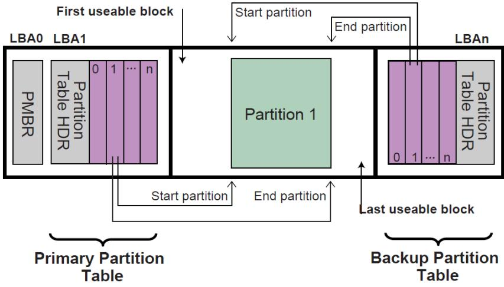
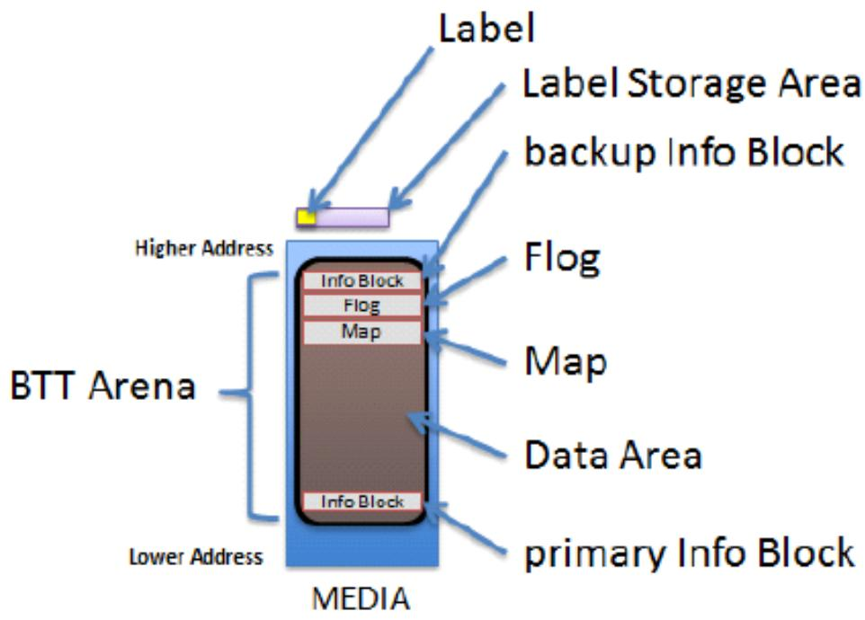
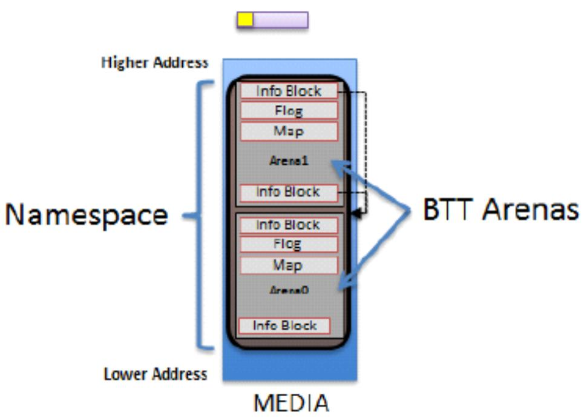
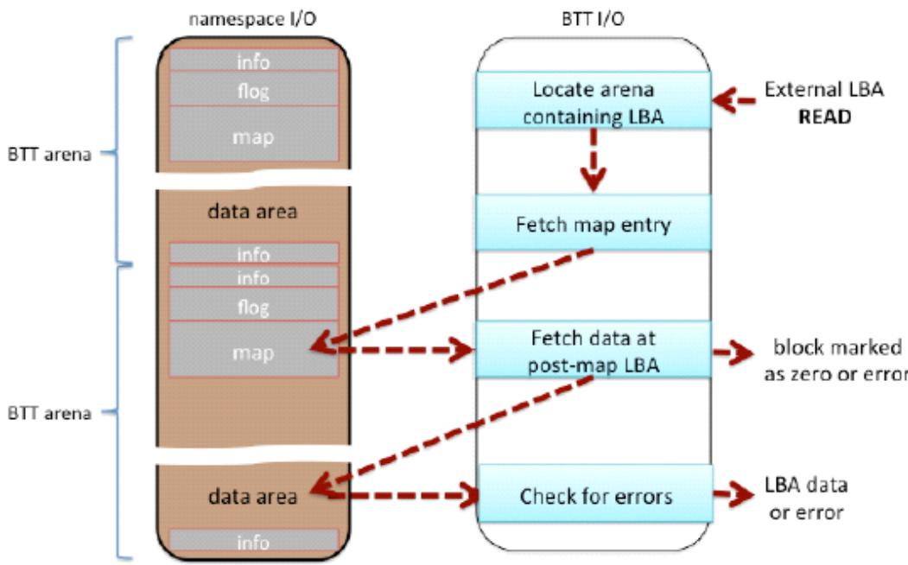
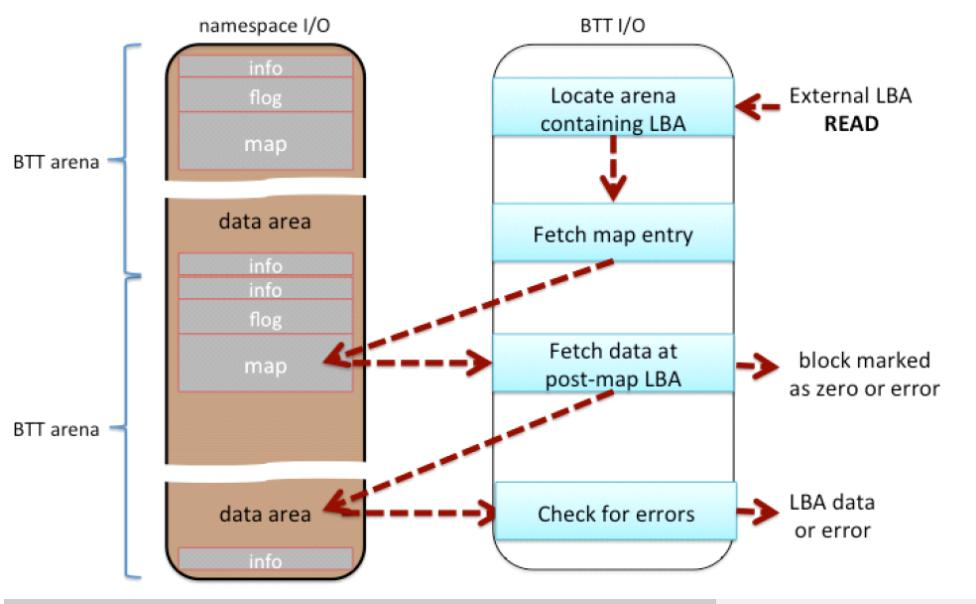
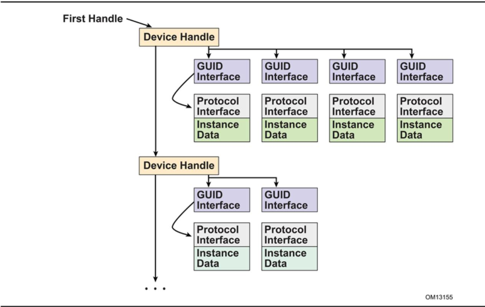
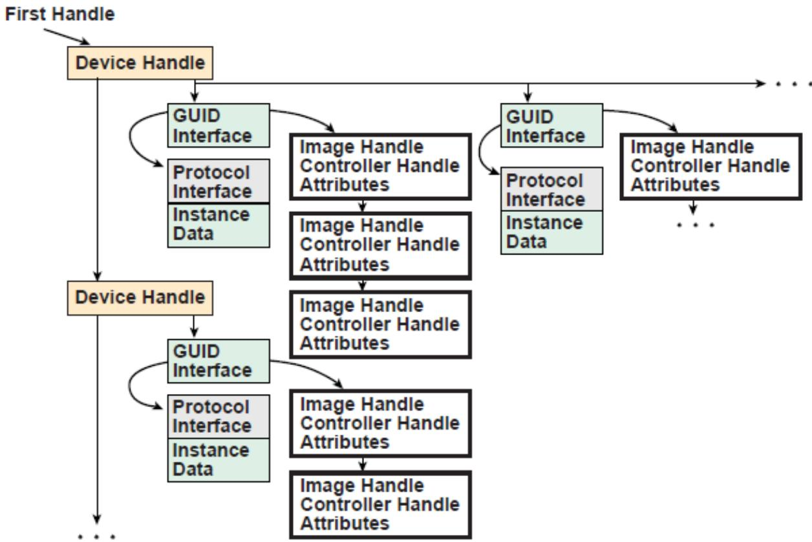
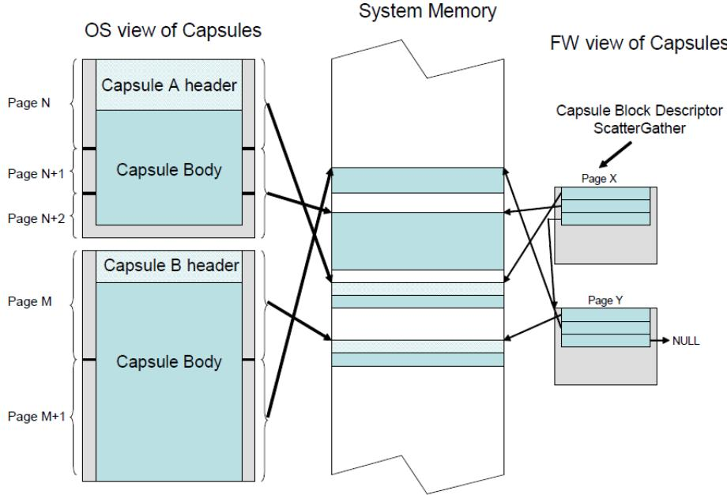

inclusive of First Usable LBA through Last Usable LBA on the logical device. All data stored on the volume must be stored between the First Usable LBA through Last Usable LBA , and only the data structures defined by UEFI to manage partitions may reside outside of the usable space. The value of Disk GUID is a GUID that uniquely identifies the entire GPT Header and all its associated storage. This value can be used to uniquely identify the disk. The start of the GPT Partition Entry Array is located at the LBA indicated by the Partition Entry LBA field. The size of a GUID Partition Entry element is defined in the Size Of Partition Entry field. There is a 32-bit CRC of the GPT Partition Entry Array that is stored in the GPT Header in Partition Entry Array CRC32 field. The size of the GPT Partition Entry Array is S ize Of Partition Entry multiplied by Number Of Partition Entries . If the size of the GUID Partition Entry Array is not an even multiple of the logical block size, then any space left over in the last logical block is Reserved and not covered by the Partition Entry Array CRC32 field. When a GUID Partition Entry is updated, the Partition Entry Array CRC32 must be updated. When the Partition Entry Array CRC32 is updated, the GPT Header CRC must also be updated, since the Partition Entry Array CRC32 is stored in the GPT Header.

  
Fig. 5.4: GUID Partition Table (GPT) example

The primary GPT Partition Entry Array must be located after the primary GPT Header and end before the First Usable LBA. The backup GPT Partition Entry Array must be located after the Last Usable LBA and end before the backup GPT Header.

Therefore the primary and backup GPT Partition EntryArrays are stored in separate locations on the disk. Each GPT Partition Entry defines a partition that is contained in a range that is within the usable space declared by the GPT Header. Zero or more GPT Partition Entries may be in use in the GPT Partition Entry Array. Each defined partition must not overlap with any other defined partition. If all the fields of a GUID Partition Entry are zero, the entry is not in use. A minimum of 16,384 bytes of space must be reserved for the GPT Partition Entry Array.

If the block size is 512, the First Usable LBA must be greater than or equal to 34 (allowing 1 block for the Protective MBR, 1 block for the Partition Table Header, and 32 blocks for the GPT Partition Entry Array); if the logical block size is 4096, the First Useable LBA must be greater than or equal to 6 (allowing 1 block for the Protective MBR, 1 block for the GPT Header, and 4 blocks for the GPT Partition Entry Array).

The device may present a logical block size that is not 512 bytes long. In ATA, this is called the Long Logical Sector feature set; an ATA device reports support for this feature set in IDENTIFY DEVICE data word 106 bit 12 and reports the number of words (i.e., 2 bytes) per logical sector in IDENTIFY DEVICE data words 117-118 (see ATA8-ACS). A SCSI device reports its logical block size in the READ CAPACITY parameter data Block Length In Bytes field (see SBC-3).

The device may present a logical block size that is smaller than the physical block size (e.g., present a logical block size of 512 bytes but implement a physical block size of 4,096 bytes). In ATA, this is called the Long Physical Sector feature set; an ATA device reports support for this feature set in IDENTIFY DEVICE data word 106 bit 13 and reports the Physical Sector Size/Logical Sector Size exponential ratio in IDENTIFY DEVICE data word 106 bits 3-0 (See

ATA8-ACS). A SCSI device reports its logical block size/physical block exponential ratio in the READ CAPACITY (16) parameter data Logical Blocks Per Physical Block Exponent field (see SBC-3).These fields return 2 x logical sectors per physical sector (e.g., 3 means 2 3 =8 logical sectors per physical sector).

A device implementing long physical blocks may present logical blocks that are not aligned to the underlying physical block boundaries. An ATA device reports the alignment of logical blocks within a physical block in IDENTIFY DEVICE data word 209 (see ATA8-ACS). A SCSI device reports its alignment in the READ CAPACITY (16) parameter data Lowest Aligned Logical Block Address field (see SBC-3). Note that the ATA and SCSI fields are defined diferently (e.g., to make LBA 63 aligned, ATA returns a value of 1 while SCSI returns a value of 7).

In SCSI devices, the Block Limits VPD page Optimal Transfer Length Granularity field (see SBC-3) may also report a granularity that is important for alignment purposes (e.g., RAID controllers may return their RAID stripe depth in that field)

GPT partitions should be aligned to the larger of:

a – The physical block boundary, if any

b – The optimal transfer length granularity, if any.

## For example

a – If the logical block size is 512 bytes, the physical block size is 4,096 bytes (i.e., 512 bytes x 8 logical blocks), there is no optimal transfer length granularity, and logical block 0 is aligned to a physical block boundary, then each GPT partition should start at an LBA that is a multiple of 8.

b – If the logical block size is 512 bytes, the physical block size is 8,192 bytes (i.e., 512 bytes x 16 logical blocks), the optimal transfer length granularity is 65,536 bytes (i.e., 512 bytes x 128 logical blocks), and logical block 0 is aligned to a physical block boundary, then each GPT partition should start at an LBA that is a multiple of 128.

To avoid the need to determine the physical block size and the optimal transfer length granularity, software may align GPT partitions at significantly larger boundaries. For example, assuming logical block 0 is aligned, it may use LBAs that are multiples of 2,048 to align to 1,048,576 byte (1 MiB) boundaries, which supports most common physical block sizes and RAID stripe sizes.

## References are as follows:

ISO/IEC 24739-200 [ANSI INCITS 452-2008] AT Attachment 8 - ATA/ATAPI Command Set (ATA8-ACS). By the INCITS T13 technical committee. (See “Links to UEFI-Related Documents” ( http://uefi.org/uefi under the headings “InterNational Committee on Information Technology Standards (INCITS)” and “INCITs T13 technical committee”).

ISO/IEC 14776-323 [T10/1799-D] SCSI Block Commands - 3 (SBC-3). Available from www.incits.org. By the IN-CITS T10 technical committee (See “Links to UEFI-Related Documents” ( http://uefi.org/uefi under the headings “InterNational Committee on Information Technology Standards (INCITS)” and “SCSI Block Commands”).

## 5.3.2 GPT Header

See Table (below) which defines the GPT Header.

Table 5.5: GPT Header

<table><tr><td>Mnemonic</td><td>Byte Offset</td><td>Byte Length</td><td>Description</td></tr><tr><td>Signature</td><td>0</td><td>8</td><td>Identifies EFI-compatible partition table header. This value must contain the ASCII string “EFI PART”, encoded as the 64-bit constant 0x54 52415020494645.</td></tr><tr><td>Revision</td><td>8</td><td>4</td><td>The revision number for this header. This revision value is not related to the UEFI Specification version. This header is version 1.0, so the correct value is 0x00010000.</td></tr></table>

continues on next page

Table 5.5 – continued from previous page

<table><tr><td>HeaderSize</td><td>12</td><td>4</td><td>Size in bytes of the GPT Header. The HeaderSize must be greater than or equal to 92 and must be less than or equal to the logical block size.</td></tr><tr><td>HeaderCRC32</td><td>16</td><td>4</td><td>CRC32 checksum for the GPT Header structure. This value is computed by setting this field to 0, and computing the 32-bit CRC for HeaderSize bytes.</td></tr><tr><td>Reserved</td><td>20</td><td>4</td><td>Must be zero.</td></tr><tr><td>MyLBA</td><td>24</td><td>8</td><td>The LBA that contains this data structure.</td></tr><tr><td>AlternateLBA</td><td>32</td><td>8</td><td>LBA address of the alternate GPT Header.</td></tr><tr><td>FirstUsableLBA</td><td>40</td><td>8</td><td>The first usable logical block that may be used by a partition described by a GUID Partition Entry.</td></tr><tr><td>LastUsableLBA</td><td>48</td><td>8</td><td>The last usable logical block that may be used by a partition described by a GUID Partition Entry.</td></tr><tr><td>DiskGUID</td><td>56</td><td>16</td><td>GUID that can be used to uniquely identify the disk.</td></tr><tr><td>PartitionEntryLBA</td><td>72</td><td>8</td><td>The starting LBA of the GUID Partition Entry array.</td></tr><tr><td>NumberOfPartitionEntries</td><td>80</td><td>4</td><td>The number of Partition Entries in the GUID Partition Entry array.</td></tr><tr><td>SizeOfPartitionEntry</td><td>84</td><td>4</td><td>The size, in bytes, of each the GUID Partition Entry structures in the GUID Partition Entry array. This field shall be set to a value of 128 x 2 n where n is an integer greater than or equal to zero (e.g., 128, 256, 512, etc.). NOTE: Previous versions of this specification allowed any multiple of 8.</td></tr><tr><td>PartitionEntryArrayCRC32</td><td>88</td><td>4</td><td>The CRC32 of the GUID Partition Entry array. Starts at PartitionEntryLBA and is computed over a byte length of NumberOfPartitionEntries * SizeOfPartitionEntry.</td></tr><tr><td>Reserved</td><td>92</td><td>Block-Size - 92</td><td>The rest of the block is reserved by UEFI and must be zero.</td></tr></table>

The following test must be performed to determine if a GPT is valid:

• Check the Signature

• Check the Header CRC

• Check that the MyLBA entry points to the LBA that contains the GUID Partition Table

• Check the CRC of the GUID Partition Entry Array

If the GPT is the primary table, stored at LBA 1:

• Check the AlternateLBA to see if it is a valid GPT

If the primary GPT is corrupt, software must check the last LBA of the device to see if it has a valid GPT Header and point to a valid GPT Partition Entry Array. If it points to a valid GPT Partition Entry Array, then software should restore the primary GPT if allowed by platform policy settings (e.g. a platform may require a user to provide confirmation before restoring the table, or may allow the table to be restored automatically). Software must report whenever it restores a GPT.

Software should ask a user for confirmation before restoring the primary GPT and must report whenever it does modify the media to restore a GPT. If a GPT formatted disk is reformatted to the legacy MBR format by legacy software, the last logical block might not be overwritten and might still contain a stale GPT. If GPT-cognizant software then accesses the disk and honors the stale GPT, it will misinterpret the contents of the disk. Software may detect this scenario if the legacy MBR contains valid partitions rather than a protective MBR ( Legacy Master Boot Record (MBR) ).

Any software that updates the primary GPT must also update the backup GPT. Software may update the GPT Header and GPT Partition Entry Array in any order, since all the CRCs are stored in the GPT Header. Software must update the backup GPT before the primary GPT, so if the size of device has changed (e.g. volume expansion) and the update is interrupted, the backup GPT is in the proper location on the disk

If the primary GPT is invalid, the backup GPT is used instead and it is located on the last logical block on the disk. If the backup GPT is valid it must be used to restore the primary GPT. If the primary GPT is valid and the backup GPT is invalid software must restore the backup GPT. If both the primary and backup GPTs are corrupted this block device is defined as not having a valid GUID Partition Header.

Both the primary and backup GPTs must be valid before an attempt is made to grow the size of a physical volume. This is due to the GPT recovery scheme depending on locating the backup GPT at the end of the device. A volume may grow in size when disks are added to a RAID device. As soon as the volume size is increased the backup GPT must be moved to the end of the volume and the primary and backup GPT Headers must be updated to reflect the new volume size.

## 5.3.3 GPT Partition Entry Array

The GPT Partition Entry Array contains an array of GPT Partition Entries. See Table (below) which defines the GPT Partition Entry.

Table 5.6: GPT Partition Entry

<table><tr><td>Mnemonic</td><td>Byte Offset</td><td>Byte Length</td><td>Description</td></tr><tr><td>PartitionTypeGUID</td><td>0</td><td>16</td><td>Unique ID that defines the purpose and type of this Partition. A value of zero defines that this partition entry is not being used.</td></tr><tr><td>UniquePartitionGUID</td><td>16</td><td>16</td><td>GUID that is unique for every partition entry. Every partition ever created will have a unique GUID. This GUID must be assigned when the GPT Partition Entry is created. The GPT Partition Entry is created whenever the NumberOfPartitionEntries in the GPT Header is increased to include a larger range of addresses.</td></tr><tr><td>StartingLBA</td><td>32</td><td>8</td><td>Starting LBA of the partition defined by this entry.</td></tr><tr><td>EndingLBA</td><td>40</td><td>8</td><td>Ending LBA of the partition defined by this entry.</td></tr><tr><td>Attributes</td><td>48</td><td>8</td><td>Attribute bits, all bits reserved by UEFI (Defined GPT Partition Entry — Partition Type GUIDs.</td></tr><tr><td>PartitionName</td><td>56</td><td>72</td><td>Null-terminated string containing a human-readable name of the partition.</td></tr><tr><td>Reserved</td><td>128</td><td>SizeOf PartitionEntry - 128</td><td>The rest of the GPT Partition Entry, if any, is reserved by UEFI and must be zero.</td></tr></table>

The SizeOfPartitionEntry variable in the GPT Header defines the size of each GUID Partition Entry. Each partition entry contains a Unique Partition GUID value that uniquely identifies every partition that will ever be created. Any time a new partition entry is created a new GUID must be generated for that partition, and every partition is guaranteed to have a unique GUID. The partition is defined as all the logical blocks inclusive of the StartingLBA and EndingLBA .

The PartitionTypeGUID field identifies the contents of the partition. This GUID is similar to the OS Type field in the MBR. Each filesystem must publish its unique GUID. The Attributes field can be used by utilities to make broad inferences about the usage of a partition and is defined in Table (below).

The firmware must add the PartitionTypeGuid to the handle of every active GPT partition using EFI\_BOOT\_SERVICES.InstallProtocolInterface() . This will allow drivers and applications, including OS loaders, to easily search for handles that represent EFI System Partitions or vendor specific partition types.

Software that makes copies of GPT-formatted disks and partitions must generate new Disk GUID values in the GPT Headers and new Unique Partition GUID values in each GPT Partition Entry. If GPT-cognizant software encounters two disks or partitions with identical GUIDs, results will be indeterminate.

Table 5.7: Defined GPT Partition Entry — Partition Type GUIDs

<table><tr><td>Description</td><td>GUID Value</td></tr><tr><td>Unused Entry</td><td>00000000-0000-0000-0000-000000000000</td></tr><tr><td>EFI System Partition</td><td>C12A7328-F81F-11D2-BA4B-00A0C93EC93B</td></tr><tr><td>Partition containing a legacy MBR</td><td>024DEE41-33E7-11D3-9D69-0008C781F39F</td></tr></table>

OS vendors need to generate their own Partition Type GUIDs to identify their partition types.

Table 5.8: Defined GPT Partition Entry - Attributes

<table><tr><td>Bits</td><td>Name</td><td>Description</td></tr><tr><td>Bit 0</td><td>Required Partition</td><td>If this bit is set, the partition is required for the platform to function. The owner/creator of the partition indicates that deletion or modification of the contents can result in loss of platform features or failure for the platform to boot or operate. The system cannot function normally if this partition is removed, and it should be considered part of the hardware of the system. Actions such as running diagnostics, system recovery, or even OS install or boot could potentially stop working if this partition is removed. Unless OS software or firmware recognizes this partition, it should never be removed or modified as the UEFI firmware or platform hardware may become non-functional.</td></tr><tr><td>Bit 1</td><td>No Block IO Protocol</td><td>If this bit is set, then firmware must not produce an EFI_BLOCK_IO_PROTOCOL device for this partition. See Partition Discovery for more details. By not producing an EFI_BLOCK_IO_PROTOCOL partition, file system mappings will not be created for this partition in UEFI.</td></tr><tr><td>Bit 2</td><td>Legacy BIOS Bootable</td><td>This bit is set aside by this specification to let systems with traditional PC-AT BIOS firmware implementations inform certain limited, special-purpose software running on these systems that a GPT partition may be bootable. For systems with firmware implementations conforming to this specification, the UEFI boot manager (see chapter 3) must ignore this bit when selecting a UEFI-compliant application, e.g., an OS loader (see 2.1.3). Therefore there is no need for this specification to define the exact meaning of this bit.</td></tr><tr><td>Bits3-47</td><td></td><td>Undefined and must be zero. Reserved for expansion by future versions of the UEFI specification.</td></tr><tr><td>Bits48-63</td><td></td><td>Reserved for GUID specific use. The use of these bits will vary depending on the PartitionTypeGUID . Only the owner of the PartitionTypeGUID is allowed to modify these bits. They must be preserved if Bits 0-47 are modified.</td></tr></table>

## Related Definitions:

```cpp
#pragma pack(1)
/// GPT Partition Entry.
/// typedef struct {
    EFI_GUID PartitionTypeGUID;
    EFI_GUID UniquePartitionGUID;
    EFI_LBA StartingLBA;
    EFI_LBA EndingLBA;
    UINT64 Attributes;
    CHAR16 PartitionName[36];
} EFI_PARTITION_ENTRY;
#pragma pack()
```

# BLOCK TRANSLATION TABLE (BTT) LAYOUT

This specification defines the Block Translation Table (BTT) metadata layout. The following sub-sections outline the BTT format that is utilized on the media, the data structures involved, and a detailed description of how SW is to interpret the BTT layout.

## 6.1 Block Translation Table (BTT) Background

A namespace defines a contiguously-addressed range of Non-Volatile Memory conceptually similar to a SCSI Logical Unit (LUN) or a NVM Express® namespace. \*

<sup>ò</sup> Note

\* NVM Express® and NVMe® are registered trademarks of NVM Express, Inc. for use in describing the NVM Express, Inc. organization and items developed by NVM Express, Inc. NVMe-oF™ is an unregistered trademark of NVM Express, Inc.

Any namespace being utilized for block storage may contain a Block Translation Table (BTT), which is a layout and set of rules for doing block I/O that provide powerfail write atomicity of a single block. Traditional block storage, including hard disks and SSDs, usually protect against torn sectors, which are sectors partially written when interrupted by power failure. Existing software, mostly file systems, depend on this behavior, often without the authors realizing it. To enable such software to work correctly on namespaces supporting block storage access, the BTT layout defined by this document sub-divides a namespace into one or more BTT Arenas, which are large sections of the namespace that contain the metadata required to provide the desired write atomicity. Each of these BTT Arenas contains a metadata layout as shown in Figures 6-1 and 6-2 below.

Each arena contains the layout shown in Figure 6-1 (above), the primary info block, data area, map, flog, and a backup info block. Each of these areas is described in the following sections. When the namespace is larger than 512 GiB, multiple arenas are required by the BTT layout, as shown in Figure 6-2 (below). Each namespace using a BTT is divided into as many 512 GiB arenas as shall fit, followed by a smaller arena to contain any remaining space as appropriate. The smallest arena size is 16MiB so the last arena size shall be between 16MiB and 512GiBs. Any remaining space less than 16MiB is unused. Because of these rules for arena placement, software can locate every primary Info block and every backup Info block without reading any metadata, based solely on the namespace size.

  
Fig. 6.1: The BTT Layout in a BTT Arena

  
Fig. 6.2: A BTT With Multiple Arenas in a Large Namespace

## 6.2 Block Translation Table (BTT) Data Structures

The following sub-sections outline the data structures associated with the BTT Layout.

## 6.2.1 BTT Info Block

```c
// Alignment of all BTT structures
#define EFI_BTT_ALIGNMENT 4096
#define EFI_BTT_INFO_UNUSED_LEN 3968

#define EFI_BTT_INFO_BLOCK_SIG_LEN 16

// Constants for Flags field
#define EFI_BTT_INFO_BLOCK_FLAGS_ERROR 0x000000001

// Constants for Major and Minor version fields
#define EFI_BTT_INFO_BLOCK_MAJOR_VERSION 2
#define EFI_BTT_INFO_BLOCK_MINOR_VERSION 0

typedef struct _EFI_BTT_INFO_BLOCK {
    CHAR8 Sig[EFI_BTT_INFO_BLOCK_SIG_LEN];
    EFI_GUID Uuid;
    EFI_GUID ParentUuid;
    UINT32 Flags;
    UINT16 Major;
    UINT16 Minor;
    UINT32 ExternalLbaSize;
    UINT32 ExternalNLba;
    UINT32 InternalLbaSize;
    UINT32 InternalNLba;
    UINT32 NFree;
    UINT32 InfoSize;
    UINT64 NextOff;
    UINT64 DataOff;
    UINT64 MapOff;
    UINT64 FlogOff;
    UINT64 InfoOff;
    CHAR8 Unused[EFI_BTT_INFO_UNUSED_LEN];
    UINT64 Checksum;
} EFI_BTT_INFO_BLOCK
```

## Sig

Signature of the BTT Index Block data structure. Shall be “BTT\_ARENA\_INFO00”.

## UUID

UUID identifying this BTT instance. A new UUID is created each time the initial BTT Arenas are written. This value shall be identical across all BTT Info Blocks within all arenas within a namespace.

## ParentUuid

UUID of containing namespace, used when validating the BTT Info Block to ensure this instance of the BTT layout is intended for the current surrounding namespace, and not left over from a previous namespace that used the same area of the media. This value shall be identical across all BTT Info Blocks within all arenas within a namespace.

## Flags

Boolean attributes of this BTT Info Block. See the additional description below on the use of the flags. The following values are defined:

EFI\_BTT\_INFO\_BLOCK\_FLAGS\_ERROR - The BTT Arena is in the error state. When a BTT implementation discovers issues such as inconsistent metadata or lost metadata due to unrecoverable media errors, the error bit for the associated arena shall be set. See the BTT Theory of Operation section regarding handling of EFI\_BTT\_INFO\_BLOCK\_FLAGS\_ERROR.

## Major

Major version number. Currently at version 2. This value shall be identical across all BTT Info Blocks within all arenas within a namespace.

## Minor

Minor version number. Currently at version 0. This value shall be identical across all BTT Info Blocks within all arenas within a namespace.

## ExternalLbaSize

Advertised LBA size in bytes. I/O requests shall be in this size chunk. This value shall be identical across all BTT Info Blocks within all arenas within a namespace.

## ExternalNLba

Advertised number of LBAs in this arena. The sum of this field, across all BTT Arenas, is the total number of available LBAs in the namespace.

## InternalLbaSize

Internal LBA size shall be greater than or equal to ExternalLbaSize and shall not be smaller than 512 bytes. Each block in the arena data area is this size in bytes and contains exactly one block of data. Optionally, this may be larger than the ExternalLbaSize due to alignment padding between LBAs. This value shall be identical across all BTT Info Blocks within all arenas within a namespace.

## InternalNLba

Number of internal blocks in the arena data area. This shall be equal to ExternalNLba + NFree because each internal lba is either mapped to an external lba or shown as free in the flog.

## NFree

Number of free blocks maintained for writes to this arena. NFree shall be equal to InternalNLba – ExternalNLba. This value shall be identical across all BTT Info Blocks within all arenas within a namespace.

## InfoSize

The size of this info block in bytes. This value shall be identical across all BTT Info Blocks within all arenas within a namespace.

## NextOf

Ofset of next arena, relative to the beginning of this arena. An ofset of 0 indicates that no arenas follow the current arena. This field is provided for convenience as the start of each arena can be calculated from the size of the namespace as described in the Theory of Operation – Validating BTT Arenas at start-up description. This value shall be identical in the primary and backup BTT Info Blocks within an arena.

## DataOf

Ofset of the data area for this arena, relative to the beginning of this arena. The internal-LBA number zero lives at this ofset. This value shall be identical in the primary and backup BTT Info Blocks within an arena.

## MapOf

Ofset of the map for this arena, relative to the beginning of this arena. This value shall be identical in the primary and backup BTT Info Blocks within an arena.

## FlogOf

Ofset of the flog for this arena, relative to the beginning of this arena. This value shall be identical in the primary and backup BTT Info Blocks within an arena.

## InfoOf

Ofset of the backup copy of this arena’s info block, relative to the beginning of this arena. This value shall be identical in the primary and backup BTT Info Blocks within an arena.

## Reserved

Shall be zero.

## Checksum

64-bit Fletcher64 checksum of all fields. This field is considered as containing zero when the checksum is computed.

## BTT Info Block Description

The existence of a valid BTT Info Block is used to determine whether a namespace is used as a BTT block device.

Each BTT Arena contains two BTT Info Blocks, a primary copy at the beginning of the BTT Arena, at address ofset 0 , and ends with an identical backup BTT Info Block, in the highest block available in the arena aligned on a EFI\_BTT\_ALIGNMENT boundary. When writing the BTT layout, implementations shall write out the info blocks from the highest arena to the lowest, writing the backup info block and other BTT data structures before writing the primary info block. Writing the layout in this manner shall ensure that a valid BTT layout is only detected after the entire layout has been written.

## 6.2.2 BTT Map Entry

```c
typedef struct _EFI_BTT_MAP_ENTRY {
    UINT32    PostMapLba : 30;
    UINT32    Error : 1;
    UINT32    Zero : 1;
} EFI_BTT_MAP_ENTRY ;
```

## PostMapLba

Post-map LBA number (block number in this arena’s data area)

## Error

When set and Zero is not set, reads on this block return an error. Writes to this block clear this flag.

## Zero

When set and Error is not set, reads on this block return a full block of zeros. Writes to this block clear this flag.

## BTT Map Description

The BTT Map area maps an LBA that indexes into the arena, to its actual location. The BTT Map is located as high as possible in the arena, after room for the backup info block and flog (and any required alignment) has been taken into account. The terminology pre-map LBA and post-map LBA is used to describe the input and output values of this mapping.

The BTT Map area is indexed by the pre-map LBA and each entry in the map contains the 30 bit post-map LBA and bits to indicate if there is an error or if LBA contains zeroes (see EFI\_BTT\_MAP\_ENTRY).

The Error and Zero bits indicate conditions that cannot both be true at the same time, so that combination is used to indicate a normal map entry, where no error or zeroed block is indicated. The error condition is indicated only when the Error bit is set and the Zero bit is clear, with similar logic for the zero block condition. When neither condition is indicated, both Error and Zero are set to indicate a map entry in its normal, non-error state. This leaves the case where both Error and Zero are bits are zero, which is the initial state of all map entries when the BTT layout is first written. Both bits zero means that the map entry contains the initial identity mapping where the pre-map LBA is mapped to the same post-map LBA. Defining the map this way allows an implementation to leverage the case where the initial contents of the namespace is known to be zero, requiring no writes to the map when writing the layout. This can greatly improve the layout time since the map is the largest BTT data structure written during layout.

## 6.2.3 BTT Flog

```c
// Alignment of each flog structure
#define EFI_BTT_FLOG_ENTRY_ALIGNMENT 64

typedef struct _EFI_BTT_FLOG {
    UINT32 Lba0;
    UINT32 OldMap0;
    UINT32 NewMap0;
    UINT32 Seq0;
    UINT32 Lba1;
    UINT32 OldMap1;
    UINT32 NewMap1;
    UINT32 Seq1;
} EFI_BTT_FLOG
```

## lba0

Last pre-map LBA written using this flog entry. This value is used as an index into the BTT Map when updating it to complete the transaction.

## OldMap0

Old post-map LBA. This is the old entry in the map when the last write using this flog entry occurred. If the transaction is complete, this LBA is now the free block associated with this flog entry.

## NewMap0

New post-map LBA. This is the block allocated when the last write using this flog entry occurred. By definition, a write transaction is complete if the BTT Map entry contains this value.

## Seq0

The Seq0 field in each flog entry is used to determine which set of fields is newer between the two sets (Lba0, OldMap0, NewMpa0, Seq0 vs Lba1, Oldmap1, NewMap1, Seq1). Updates to a flog entry shall always be made to the older set of fields and shall be implemented carefully so that the Seq0 bits are only written after the other fields are known to be committed to persistence. The figure below shows the progression of the Seq0 bits over time, where the newer entry is indicated by a value that is clockwise of the older value.

## Lba1

Alternate lba entry

## OldMap1

Alternate old entry

## NewMap1

Alternate new entry

## Seq1

Alternate Seq entry

## BTT Flog Description

The BTT Flog is so named to illustrate that it is both a free list and a log, rolled into one data structure. The Flog size is determined by the NFree field in the BTT Info Block which determines how many of these flog entries there are. The flog location is the highest address in the arena after space for the backup info block and alignment requirements have been taken in account.

  
Fig. 6.3: Cyclic Sequence Numbers for Flog Entries

## 6.2.4 BTT Data Area

Starting from the low address to high, the BTT Data Area starts immediately after the BTT Info Block and extends to the beginning of the BTT Map data structure. The number of internal data blocks that can be stored in an arena is calculated by first calculating the necessary space required for the BTT Info Blocks, map, and flog (plus any alignment required), subtracting that amount from the total arena size, and then calculating how many blocks fit into the resulting space.

## 6.2.5 NVDIMM Label Protocol Address Abstraction Guid

This version of the BTT layout and behavior is collectively described by the AddressAbstractionGuid in the UEFI NVDIMM Label protocol section utilizing this GUID:

```c
#define EFI_BTT_ABSTRACTION_GUID \
{0x18633bfc, 0x1735, 0x4217,
{0x8a, 0xc9, 0x17, 0x23, 0x92, 0x82, 0xd3, 0xf8}
```

## 6.3 BTT Theory of Operation

This section outlines the theory of operation for the BTT and describes the responsibilities that any software implementation shall follow.

A specific instance of the BTT layout depends on the size of the namespace and three administrative choices made at the time the initial layout is created:

• ExternalLbaSize: the desired block size

• InternalLbaSize: the block size with any internal padding

• NFree: the number of concurrent writes supported by the layout

The BTT data structures do not support an InternalLbaSize smaller than 512 bytes, so if ExternalLbaSize is smaller than 512 bytes, the InternalLbaSize shall be rounded up to 512. For performance, the InternalLbaSize may also include some padding bytes. For example, a BTT layout supporting 520-byte blocks may use 576-byte blocks internally in order to round up the size to a multiple of a 64-byte cache line size. In this example, the ExternalLbaSize, visible to software above the BTT software, would be 520 bytes, but the InternalLbaSize would be 576 bytes.

Once these administrative choices above are determined, the namespace is divided up into arenas, as described in the BTT Arenas section, where each arena uses the same values for ExternalLbaSize, InternalLbaSize, and Nfree.

## 6.3.1 BTT Arenas

In order to reduce the size of BTT metadata and increase the possibility of concurrent updates, the BTT layout in a namespace is divided into arenas. An arena cannot be larger than 512GiB or smaller than 16MiB. A namespace is divided into as many 512GiB arenas that shall fit, starting from ofset zero and packed together without padding, followed by one arena smaller than 512GiB if the remaining space is at least 16MiB. The smaller area size is rounded down to be a multiple of EFI\_BTT\_ALIGNMENT if necessary. Because of these rules, the location and size of every BTT Arena in a namespace can be determined from the namespace size.

Within an arena, the amount of space used for the Flog is NFree times the amount of space required for each Flog entry. Flog entries shall be aligned on 64-byte boundaries. In addition, the full BTT Flog table shall be aligned on a EFI\_BTT\_ALIGNMENT boundary and have a size that is padded to be multiple of EFI\_BTT\_ALIGNMENT. In summary, the space in an arena taken by the Flog is:

```txt
FlogSize = roundup(NFree * roundup(sizeof(EFI_BTT_FLOG), EFI_BTT_FLOG_ENTRY_ALIGNMENT), EFI_BTT_ALIGNMENT)
```

Within an arena, the amount of space available for data blocks and the associated Map is the arena size minus the space used for the BTT Info Blocks and the Flog:

DataAndMapSize = ArenaSize - 2 \* sizeof(EFI\_BTT\_INFO\_BLOCK) – FlogSize

Within an arena, the number of data blocks is calculated by dividing the available space, DataAndMapSize, by the InternalLbaSize plus the map overhead required for each block, and rounding down the result to ensure the data area is aligned on a EFI\_BTT\_ALIGNMENT boundary:

```txt
InternalNLba = (DataAndMapSize - EFI_BTT_ALIGNMENT) / (InternalLbaSize + sizeof(EFI_BTT_MAP_ENTRY)
```

With the InternalNLba value known, the calculation for the number of external LBAs subtracts of NFree for the pool of unadvertised free blocks:

```txt
ExternalNLba = InternalNLba - Nfree
```

Within an arena, the number of bytes required for the BTT Map is one entry for each external LBA, plus any alignment required to maintain an alignment of EFI\_BTT\_ALIGNMENT for the entire map:

```txt
MapSize = roundup(ExternalNLba * sizeof(EFI_BTT_MAP_ENTRY), EFI_BTT_ALIGNMENT)
```

The number of concurrent writes allowed for an arena is based on the NFree value chosen at BTT layout time. For example, choosing NFree of 256 means the BTT Arena shall have 256 free blocks to use for in-flight write operations. Since BTT Arenas each have NFree free blocks, the number of concurrent writes allowed in a namespace may be larger when there are multiple arenas and the writes are spread out between multiple arenas.

## 6.3.2 Atomicity of Data Blocks in an Arena

The primary reason for the BTT is to provide failure atomicity when writing data blocks, so that any write of a single block cannot be torn by interruptions such as power loss. The BTT provides this by maintaining a pool of free blocks which are not part of the capacity advertised to software layers above the BTT software. The BTT Data Area is large enough to hold the advertised capacity as well as the pool of free blocks. The BTT software manages the blocks in the BTT Data Area as a list of internal LBAs, which are block numbers only visible internally to the BTT software. The block numbers that make up the advertised capacity are known as external LBAs, and at any given point in time, each one of those external LBAs is mapped by the BTT Map to one of the blocks in the BTT Data Area. Each block write done by the BTT software starts by allocating one of the free blocks, writing the data to it, and only when that block is fully persistent (including any flushes required), are steps taken to make that block active, as outlined in the BTT Theory of Operations - Write Path section.

The BTT Flog (a combination of a free list and a log) is at the heart of the atomic updates when writing blocks. The “quiet” state of a BTT Flog, when no in-flight writes are happening and no recovery steps are outstanding, is that the NFree free blocks currently available for writes are contained in the OldMap fields in the Flog entries. A write shall use one of those Flog entries to find a free block to write to, and then the Lba and NewMap fields in the Flog are used as a write-ahead-log for the BTT Map update when the data portion of the write is complete, as described in the Validating the Flog at start-up section.

It is up to run-time logic in the BTT software to ensure that only one Flog entry is in use at a time, and that any reads still executing on the block indicated by the OldMap entry have finished before starting a write using that block.

## 6.3.3 Atomicity of BTT Data Structures

Byte-addressable persistent media may not support atomic updates larger than 8-bytes, so any data structure larger than 8-bytes in the BTT uses software-implemented atomicity for updates. Note that 8-byte write atomicity, meaning an 8-byte store to the persistent media cannot be torn by interruptions such as power failures, is a minimal requirement for using the BTT described in this document.

There are four types of data structures in the BTT:

• The BTT Info Blocks

• The BTT Map

• The BTT Flog

• The BTT Data Area

The BTT Map entries are 4-bytes in size, and so can be updated atomically with a single store instruction. All other data structures are updated by following the rules described in this document, which update an inactive version of the data structure first, followed by steps to make it active atomically.

For the BTT Info Blocks, atomicity is provided by always writing the backup Info block first, and only after that update is fully persistent (the block checksums correctly), is the primary BTT Info Block updated as described in the Writing the initial BTT layout section. Recovery from an interrupted update is provided by checking the primary Info block’s checksum on start-up, and if it is bad, copying the backup Info block to the primary to complete the interrupted update as described in the Validating BTT Arenas at start-up section.

For the BTT Flog, each entry is double-sized, with two complete copies of every field (Lba, OldMap, NewMap, Seq). The active entry has the higher Seq number, so updates always write to the inactive fields, and once those fields are fully persistent, the Seq field for the inactive entry is updated to make it become the active entry atomically. This is described in the Validating the Flog at start-up section.

For the BTT Data Area, all block writes can be thought of as allocating writes, where an inactive block is chosen from the free list maintained by the Flog, and only after the new data written to that block is fully persistent, that block is made active atomically by updating the Flog and Map entries as described in the Write Path section.

## 6.3.4 Writing the Initial BTT layout

The overall layout of the BTT relies on the fact that all arenas shall be 512GiB in size, except the last arena which is a minimum of 16MiB. Initializing the BTT on-media structures only happens once in the lifetime of a BTT, when it is created. This sequence assumes that software has determined that new BTT layout needs to be created and the total raw size of the namespace is known.

Immediately before creating a new BTT layout, the UUID of the surrounding namespace may be updated to a newlygenerated UUID. This optional step, depending on the needs of a BTT software implementation, has the efect of invalidating any previous BTT Info Blocks in the namespace and ensuring the detection of an invalid layout if the BTT layout creation process is interrupted. This detection works because the parent UUID field

The on-media structures in the BTT layout may be written out in any order except for the BTT Info Blocks, which shall be written out as the last step of the layout, starting from the last arena (highest ofset in the namespace) to the first arena (lowest ofset in the namespace), writing the backup BTT Info Block in each arena first, then writing the primary BTT Info block for that arena second. This allows the detection of an incomplete BTT layout when the algorithm in the Validating BTT Arenas at start-up section is executed.

Since the number of internal LBAs for an arena exceeds the number of external LBAs by NFree, there are enough internal LBA numbers to fully initialize the BTT Map as well as the BTT Flog, where the BTT Flog is initialized with the NFree highest internal LBA numbers, and the rest are used in the BTT Map.

The BTT Map in each arena is initialized to zeros. Zero entries in the map indicate the identity mapping of all pre-map LBAs to the corresponding post-map LBAs. This uses all but NFree of the internal LBAs, leaving Nfree of them for the BTT Flog.

The BTT Flog in each arena is initialized by starting with all zeros for the entire flog area, setting the Lba0 field in each flog entry to unique pre-map LBAs, zero through NFree - 1, and both OldMap0 and NewMap0 fields in each flog entry are set to one of the remaining internal LBAs. For example, flog entry zero would have Lba0 set to 0, and OldMap0 and NewMap0 both set to the first internal LBA not represented in the map (since there are ExternalNLba entries in the map, the next available internal LBA is equal to ExternalNLba).

## 6.3.5 Validating BTT Arenas at start-up

When software prepares to access the BTT layout in a namespace, the first step is to check the BTT Arenas for consistency. Reading and validating BTT Arenas relies on the fact that all arenas shall be 512GiB in size, except the last arena which is a minimum of 16MiB.

The following tests shall pass before software considers the BTT layout to be valid:

• For each BTT Arena:

– ReadAndVerifyPrimaryBttInfoBlock

∗ If the read of the primary BTT Info Block fails, goto ReadAndVerifyBackupBttInfoBlock

∗ If the primary BTT Info Block contains an incorrect Sig field it is invalid, goto ReadAndVerifyBackupBttInfoBlock

∗ If the primary BTT Info Block ParentUuid field does not match the UUID of the surrounding namespace, goto ReadAndVerifyBackupBttInfoBlock

∗ If the primary BTT Info Block contains an incorrect Checksum it is invalid, goto ReadAndVerify-BackupBttInfoBlock

∗ The primary BTT Info Block is valid. Use the NextOf field to find the start of the next arena and continue BTT Info Block validation, goto ReadAndVerifyPrimaryBttInfoBlock

– ReadAndVerifyBackupBttInfoBlock

∗ Determine the location of the backup BTT Info Block:

1. All of the arenas shall be the full 512GiB data area size except the last arena which is at least 16MiB.

2. The backup BTT Info Block is the last EFI\_BTT\_ALIGNMENT aligned block in the arena.

∗ If the read of the backup BTT Info Block at the high address of the BTT Arena fails, neither copy could be read, and software shall assume that there is no valid BTT metadata layout for the namespace

∗ If the backup BTT Info Block contains an incorrect Sig field it is invalid, and software shall assume that there is no valid BTT metadata layout for the namespace

∗ If the backup BTT Info Block ParentUuid field does not match the UUID of the surrounding namespace it is invalid, and software shall assume that there is no valid BTT metadata layout for the namespace

∗ If the backup BTT Info Block contains an incorrect Checksum it is invalid, and software shall assume that there is no valid BTT metadata layout for the namespace

∗ The backup BTT Info Block is valid. Since the primary copy is bad, software shall copy the contents of the valid backup BTT Info Block down to the primary BTT Info Block before validation of all of the BTT Info Blocks in all of the arenas can complete successfully.

## 6.3.6 Validating the Flog entries at start-up

After validating the BTT Info Blocks as described in the Validating BTT Arenas at start-up section, the next step software shall take is to validate the BTT Flog entries. When blocks of data are being written, as described in the Write Path section below, the persistent Flog and Map states are not updated until the free block is written with new data. This ensures a power failure at any point during the data transfer is harmless, leaving the partially written data in a free block that remains free. Once the Flog is updated (made atomic by the Seq bits in the Flog entry), the write algorithm is committed to the update and a power failure from this point in the write flow onwards shall be handled by completing the update to the BTT Map on recovery. The Flog contains all the information required to complete the Map entry update.

Note that the Flog entry recovery outlined here is intended to happen single-threaded, on an inactive BTT (before the BTT block namespace is allowed to accept I/O requests). The maximum amount of time required for recovery is determined by NFree, but is only a few loads and a single store (and the corresponding cache flushes) for each incomplete write discovered.

The following steps are executed for each flog entry in each arena, to recover any interrupted writes and to verify the flog entries are consistent at start up. Any consistency issues found during these steps results in setting the error state (EFI\_BTT\_INFO\_BLOCK\_FLAGS\_ERROR) for the arena and terminates the flog validation process for this arena.

1. The Seq0 and Seq1 fields are examined for the flog entry. If both fields are zero, or both fields are equal to each other, the flog entry is inconsistent. Otherwise, the higher Seq field indicates which set of flog fields to use for the next steps (Lba0, OldMap0, NewMap0, versus Lba1, OldMap1, NewMap1). From this point on in this section, the chosen fields are referenced as Lba, OldMap, and NewMap.

2. If OldMap and NewMap are equal, this is a flog entry that was never used since the initial layout of the BTT was created.

3. The Lba field is checked to ensure it is a valid pre-map LBA (in the range zero to ExternalNLba – 1). If the check fails, the flog entry is inconsistent.

4. The BTT Map entry corresponding to the Flog entry Lba field is fetched. Since the Map can contain special zero entries to indicate identity mappings, the fetched entry is adjusted to the corresponding internal LBA when a zero is encountered (by interpreting the entry as the same LBA as the Flog entry Lba field).

5. If the adjusted map entry from the previous step does not match the NewMap field in the Flog entry, and it matches the OldMap field, then an interrupted BTT Map update has been detected. The recovery step is to write the NewMap field to the BTT Map entry indexed by the Flog entry Lba field.

## 6.3.7 Read Path

The following high level sequence describes the steps to read a single block of data while utilizing the BTT as is illustrated in the Figure: BTT Read Path Overview below:

1. If EFI\_BTT\_INFO\_BLOCK\_FLAGS\_ERROR is set in the arena’s BTT Info Block, the BTT software may return an error for the read, or an implementation may choose to continue to provide read-only access and continue these steps.

2. Use the external LBA provided with the read operation to determine which BTT Arena to access. Starting from the first arena (lowest ofset in the namespace), and looping through the arena in order, the ExternalNLba field in the BTT Info Block describes how many external LBAs are in that area. Once the correct arena is identified, the external LBAs contained in the lower, skipped, arenas are subtracted from the provided LBA to obtain the pre-map LBA for the selected arena.

3. Use the pre-map LBA to index into the arena’s BTT Map and the map entry.

4. If both the Zero and Error bits are set in the map entry, this indicates a normal entry. The PostMapLba field in the Map entry is used to index into the arena Data Area by multiplying it by the InternalLbaSize and adding the result to the DataOf field from the arena’s BTT Info Block. This provides the location of the data in the arena and software then copies ExternalLbaSize bytes into the provided bufer to satisfy the read request.

5. Otherwise, if only the Error bit is set in the map entry, a read error is returned.

6. Otherwise, if only the Zero bit is set in the map entry, a block of ExternalLbaSize bytes of zeros is copied into the provided bufer to satisfy the read request.

7. Finally, if both Zero and Error bits are clear, this the initial identity mapping and the pre-map LBA is used to index into the arena Data Area by multiplying it by the InternalLbaSize and adding the result to the DataOf field from the arena’s BTT Info Block. This provides the location of the data in the arena and software then copies ExternalLbaSize bytes into the provided bufer to satisfy the read request.

## 6.3.8 Write Path

The following high level sequence describes the steps to write a single block of data while utilizing the BTT as is illustrated in the Figure: BTT Write Path Overview below:

1. If EFI\_BTT\_INFO\_BLOCK\_FLAGS\_ERROR is set in the arena’s BTT Info Block, the BTT software shall return an error for the write.

2. Use the external LBA provided with the write operation to determine which BTT Arena to access. Starting from the first arena (lowest ofset in the namespace), and looping through the arena in order, the ExternalNLba field in the BTT Info Block describes how many external LBAs are in that area. Once the correct arena is identified, the external LBAs contained in the lower, skipped, arenas are subtracted from the provided LBA to obtain the pre-map LBA for the selected arena.

3. The BTT software allocates one of the Flog entries in the arena to be used for this write. The Flog entry shall not be shared by multiple concurrent writes. The exact method for managing the exclusive use of the Flog entries is BTT software implementation-dependent. There’s no on-media indication of whether a Flog entry is currently allocated to a write request or not. Note that the free block tracked by the Flog entry in the OldMap field, may still have reads from relatively slow threads operating on it. The BTT software implementation shall ensure any such reads have completed before moving to the next step.

  
Fig. 6.4: BTT Read Path Overview

4. Lock out access to the BTT Map area associated with the pre-map LBA for the next three steps. The granularity of the locking is implementation-dependent; an implementation may choose to lock individual Map entries, lock the entire BTT Map, or something in-between.

5. Use the pre-map LBA to index into the arena’s BTT Map and fetch the old map entry.

6. Update the Flog entry by writing the inactive set of Flog fields (the lower Seq number). First, update the Lba, OldMap, and NewMap fields with the pre-map LBA, old Map entry, and the free block chosen above, respectively. Once those fields are fully persistent (with any required flushes completed), the Seq field is updated to make the new fields active. This update of the Seq field commits the write - before this update, the write shall not take place if the operation is interrupted. After the Seq field is updated, the write shall take place even if the operation is interrupted because the Map update in the next step shall take place during the BTT recovery that happens on start-up.

7. Update the Map entry with the free block chosen above.

8. Drop the map lock acquired in step 4 above. The write request is now satisfied.

  
Fig. 6.5: BTT Write Path Overview

# SERVICES — BOOT SERVICES

This section discusses the fundamental boot services that are present in a UEFI compliant system. The services are defined by interface functions that may be used by code running in the UEFI environment. Such code may include protocols that manage device access or extend platform capability, as well as applications running in the preboot environment, and OS loaders.

Two types of services apply in an compliant system:

## Boot Services

Functions that are available before a successful call to EFI\_BOOT\_SERVICES.ExitBootServices(). These functions are described in this section

## Runtime Services

Functions that are available before and after any call to ExitBootServices(). These functions are described in Services — Runtime Services .

During boot, system resources are owned by the firmware and are controlled through boot services interface functions. These functions can be characterized as “global” or “handle-based.” The term “global” simply means that a function accesses system services and is available on all platforms (since all platforms support all system services). The term “handle-based” means that the function accesses a specific device or device functionality and may not be available on some platforms (since some devices are not available on some platforms). Protocols are created dynamically. This section discusses the “global” functions and runtime functions; subsequent sections discuss the “handle-based.”

UEFI applications (including UEFI OS loaders) must use boot services functions to access devices and allocate memory. On entry, an Image is provided a pointer to a system table which contains the Boot Services dispatch table and the default handles for accessing the console. All boot services functionality is available until a UEFI OS loader loads enough of its own environment to take control of the system’s continued operation and then terminates boot services with a call to ExitBootServices().

In principle, the ExitBootServices() call is intended for use by the operating system to indicate that its loader is ready to assume control of the platform and all platform resource management. Thus boot services are available up to this point to assist the UEFI OS loader in preparing to boot the operating system. Once the UEFI OS loader takes control of the system and completes the operating system boot process, only runtime services may be called. Code other than the UEFI OS loader, however, may or may not choose to call ExitBootServices(). This choice may in part depend upon whether or not such code is designed to make continued use of boot services or the boot services environment.

The rest of this section discusses individual functions. Global boot services functions fall into these categories:

• Event, Timer, and Task Priority Services Event, Timer, and Task Priority Services

• Memory Allocation Services Memory Allocation Services

• Protocol Handler Services Protocol Handler Services

• Image Services Image Services

## 7.1 Event, Timer, and Task Priority Services

The functions that make up the Event, Timer, and Task Priority Services are used during preboot to create, close, signal, and wait for events; to set timers; and to raise and restore task priority levels. See the following table for details.

Table 7.1: Event, Timer, and Task Priority Functions

<table><tr><td>Name</td><td>Type</td><td>Description</td></tr><tr><td>CreateEvent</td><td>Boot</td><td>Creates a general-purpose event structure</td></tr><tr><td>CreateEventEx</td><td>Boot</td><td>Creates an event structure as part of an event group</td></tr><tr><td>CloseEvent</td><td>Boot</td><td>Closes and frees an event structure</td></tr><tr><td>SignalEvent</td><td>Boot</td><td>Signals an event</td></tr><tr><td>WaitForEvent</td><td>Boot</td><td>Stops execution until an event is signaled</td></tr><tr><td>CheckEvent</td><td>Boot</td><td>Checks whether an event is in the signaled state</td></tr><tr><td>SetTimer</td><td>Boot</td><td>Sets an event to be signaled at a particular time</td></tr><tr><td>RaiseTPL</td><td>Boot</td><td>Raises the task priority level</td></tr><tr><td>RestoreTPL</td><td>Boot</td><td>Restores/lowers the task priority level</td></tr></table>

Execution in the boot services environment occurs at diferent task priority levels, or TPLs. The boot services environment exposes only three of these levels to UEFI applications and drivers ( see table below: TPL Usage )

• TPL\_APPLICATION — the lowest priority level

• TPL\_CALLBACK — an intermediate priority level{

• TPL\_NOTIFY — the highest priority level

Tasks that execute at a higher priority level may interrupt tasks that execute at a lower priority level. For example, tasks that run at the TPL\_NOTIFY level may interrupt tasks that run at the TPL\_APPLICATION or TPL\_CALLBACK level. While TPL\_NOTIFY is the highest level exposed to the boot services applications, the firmware may have higher task priority items it deals with. For example, the firmware may have to deal with tasks of higher priority like timer ticks and internal devices. Consequently, there is a fourth TPL, TPL\_HIGH\_LEVEL {link needed}, designed for use exclusively by the firmware.

The intended usage of the priority levels is shown in the TPL Usage table below, from the lowest level (TPL\_APPLICATION) to the highest level (TPL\_HIGH\_LEVEL). As the level increases, the duration of the code and the amount of blocking allowed decrease. Execution generally occurs at the TPL\_APPLICATION level. Execution occurs at other levels as a direct result of the triggering of an event notification function(this is typically caused by the signaling of an event). During timer interrupts, firmware signals timer events when an event’s “trigger time” has expired. This allows event notification functions to interrupt lower priority code to check devices (for example). The notification function can signal other events as required. After all pending event notification functions execute, execution continues at the TPL\_APPLICATION level.

Table 7.2: TPL Usage

<table><tr><td>Task Priority Level</td><td>Usage</td></tr><tr><td>TPL_APPLICATION</td><td>This is the lowest priority level. It is the level of execution which occurs when no event notifications are pending and which interacts with the user. User I/O (and blocking on User I/O) can be performed at this level. The boot manager executes at this level and passes control to other UEFI applications at this level.</td></tr><tr><td>TPL_CALLBACK</td><td>Interrupts code executing below TPL_CALLBACK level. Long term operations (such as file system operations and disk I/O) can occur at this level.</td></tr></table>

continues on next page

Table 7.2 – continued from previous page

<table><tr><td>TPL_NOTIFY</td><td>Interrupts code executing below TPL_NOTIFY level. Blocking is not allowed at this level. Code executes to completion and returns. If code requires more processing, it needs to signal an event to wait to obtain control again at whatever level it requires. This level is typically used to process low level IO to or from a device.</td></tr><tr><td>(Firmware Interrupts)</td><td>This level is internal to the firmware. It is the level at which internal interrupts occur. Code running at this level interrupts code running at the TPL_NOTIFY level (or lower levels). If the interrupt requires extended time to complete, firmware signals another event (or events) to perform the longer term operations so that other interrupts can occur.</td></tr><tr><td>TPL_HIGH_LEVEL</td><td>Interrupts code executing below TPL_HIGH_LEVEL This is the highest priority level. It is not interruptible (interrupts are disabled) and is used sparingly by firmware to synchronize operations that need to be accessible from any priority level. For example, it must be possible to signal events while executing at any priority level. Therefore, firmware manipulates the internal event structure while at this priority level.</td></tr></table>

Executing code can temporarily raise its priority level by calling the EFI\_BOOT\_SERVICES.RaiseTPL() function. Doing this masks event notifications from code running at equal or lower priority levels until the EFI\_BOOT\_SERVICES.RestoreTPL() function is called to reduce the priority to a level below that of the pending event notifications. There are restrictions on the TPL levels at which many UEFI service functions and protocol interface functions can execute. TPL Restrictions summarizes the restrictions.

Table 7.3: TPL Restrictions

<table><tr><td>Name</td><td>Restrictions</td><td>Task Priority</td></tr><tr><td>ACPI Table Protocol</td><td>&lt;</td><td>TPL_NOTIFY</td></tr><tr><td>ARP</td><td>&lt;=</td><td>TPL_CALLBACK</td></tr><tr><td>ARP Service Binding</td><td>&lt;=</td><td>TPL_CALLBACK</td></tr><tr><td>Authentication Info</td><td>&lt;=</td><td>TPL_NOTIFY</td></tr><tr><td>Block I/O Protocol</td><td>&lt;=</td><td>TPL_CALLBACK</td></tr><tr><td>Block I/O 2 Protocol</td><td>&lt;=</td><td>TPL_CALLBACK</td></tr><tr><td>Bluetooth Host</td><td>&lt;=</td><td>TPL_CALLBACK</td></tr><tr><td>Bluetooth Host Controller</td><td>&lt;=</td><td>TPL_CALLBACK</td></tr><tr><td>Bluetooth IO Service Binding</td><td>&lt;=</td><td>TPL_CALLBACK</td></tr><tr><td>Bluetooth IO</td><td>&lt;=</td><td>TPL_CALLBACK</td></tr><tr><td>Bluetooth Attribute</td><td>&lt;=</td><td>TPL_CALLBACK</td></tr><tr><td>Bluetooth Configuration</td><td>&lt;=</td><td>TPL_CALLBACK</td></tr><tr><td>BluetoothHE Configuration</td><td>&lt;=</td><td>TPL_CALLBACK</td></tr><tr><td>CheckEvent()</td><td>&lt;</td><td>TPL_HIGH_LEVEL</td></tr><tr><td>CloseEvent()</td><td>&lt;</td><td>TPL_HIGH_LEVEL</td></tr><tr><td>CreateEvent()</td><td>&lt;</td><td>TPL_HIGH_LEVEL</td></tr><tr><td>Deferred Image Load Protocol</td><td>&lt;=</td><td>TPL_NOTIFY</td></tr><tr><td>Device Path Utilities</td><td>&lt;=</td><td>TPL_NOTIFY</td></tr><tr><td>Device Path From Text</td><td>&lt;=</td><td>TPL_NOTIFY</td></tr><tr><td>DHCP4 Service Binding</td><td>&lt;=</td><td>TPL_CALLBACK</td></tr><tr><td>DHCP4</td><td>&lt;=</td><td>TPL_CALLBACK</td></tr><tr><td>DHCP6</td><td>&lt;=</td><td>TPL_CALLBACK</td></tr><tr><td>DHCP6 Service Binding</td><td>&lt;=</td><td>TPL_CALLBACK</td></tr><tr><td>Disk I/O Protocol</td><td>&lt;=</td><td>TPL_CALLBACK</td></tr><tr><td>Disk I/O 2 Protocol</td><td>&lt;=</td><td>TPL_CALLBACK</td></tr><tr><td>DNS4 Service Binding</td><td>&lt;=</td><td>TPL_CALLBACK</td></tr><tr><td>DNS4</td><td>&lt;=</td><td>TPL_CALLBACK</td></tr><tr><td>DNS6 Service Binding</td><td>&lt;=</td><td>TPL_CALLBACK</td></tr></table>

Table 7.3 – continued from previous page

<table><tr><td></td><td>&lt;=</td><td>TPL_CALLBACK</td></tr><tr><td colspan="3">DNS6</td></tr><tr><td>Driver Health</td><td>&lt;=</td><td>TPL_NOTIFY</td></tr><tr><td>EAP</td><td>&lt;=</td><td>TPL_CALLBACK</td></tr><tr><td>EAP Configuration</td><td>&lt;=</td><td>TPL_CALLBACK</td></tr><tr><td>EAP Management</td><td>&lt;=</td><td>TPL_CALLBACK</td></tr><tr><td>EAP Management2</td><td>&lt;=</td><td>TPL_CALLBACK</td></tr><tr><td>EDID Active</td><td>&lt;=</td><td>TPL_NOTIFY</td></tr><tr><td>EDID Discovered</td><td>&lt;=</td><td>TPL_NOTIFY</td></tr><tr><td>EFI_SIMPLE_TEXT_INPUT_PROTOCOL</td><td>&lt;=</td><td>TPL_CALLBACK</td></tr><tr><td>EFI_SIMPLE_TEXT_INPUT_PROTOCOL.ReadKeyStroke</td><td>&lt;=</td><td>TPL_APPLICATION</td></tr><tr><td>EFI_SIMPLE_TEXT_INPUT_PROTOCOL.Reset</td><td>&lt;=</td><td>TPL_APPLICATION</td></tr><tr><td>EFI_SIMPLE_TEXT_INPUT_EX_PROTOCOL</td><td>&lt;=</td><td>TPL_CALLBACK</td></tr><tr><td>EFI_SIMPLE_TEXT_INPUT_EX_PROTOCOL.ReadKeyStrokeEx</td><td>&lt;=</td><td>TPL_APPLICATION</td></tr><tr><td>EFI_SIMPLE_TEXT_INPUT_EX_PROTOCOL.Reset</td><td>&lt;=</td><td>TPL_APPLICATION</td></tr><tr><td>Event Notification Levels</td><td>&gt;</td><td>TPL_APPLICATION</td></tr><tr><td>Event Notification Levels</td><td>&lt;=</td><td>TPL_HIGH_LEVEL</td></tr><tr><td>Exit()</td><td>&lt;=</td><td>TPL_CALLBACK</td></tr><tr><td>ExitBootServices()</td><td>=</td><td>TPL_APPLICATION</td></tr><tr><td>Form Browser2 Protocol/SendForm</td><td>=</td><td>TPL_APPLICATION</td></tr><tr><td>FTP</td><td>&lt;=</td><td>TPL_CALLBACK</td></tr><tr><td>Graphics Output EDID Override</td><td>&lt;=</td><td>TPL_NOTIFY</td></tr><tr><td>HII Protocols</td><td>&lt;=</td><td>TPL_NOTIFY</td></tr><tr><td>HTTP Service Binding</td><td>&lt;=</td><td>TPL_CALLBACK</td></tr><tr><td>HTTP</td><td>&lt;=</td><td>TPL_CALLBACK</td></tr><tr><td>HTTP Utilities</td><td>&lt;=</td><td>TPL_CALLBACK</td></tr><tr><td>IP4 Service Binding</td><td>&lt;=</td><td>TPL_CALLBACK</td></tr><tr><td>IP4</td><td>&lt;=</td><td>TPL_CALLBACK</td></tr><tr><td>IP4 Config</td><td>&lt;=</td><td>TPL_CALLBACK</td></tr><tr><td>IP4 Config2</td><td>&lt;=</td><td>TPL_CALLBACK</td></tr><tr><td>IP6</td><td>&lt;=</td><td>TPL_CALLBACK</td></tr><tr><td>IP6 Config</td><td>&lt;=</td><td>TPL_CALLBACK</td></tr><tr><td>IPSec Configuration</td><td>&lt;=</td><td>TPL_CALLBACK</td></tr><tr><td>iSCSI Initiator Name</td><td>&lt;=</td><td>TPL_NOTIFY</td></tr><tr><td>LoadImage()</td><td>&lt;</td><td>TPL_CALLBACK</td></tr><tr><td>Managed Network Service Binding</td><td>&lt;=</td><td>TPL_CALLBACK</td></tr><tr><td>Memory Allocation Services</td><td>&lt;=</td><td>TPL_NOTIFY</td></tr><tr><td>MTFTP4 Service Binding</td><td>&lt;=</td><td>TPL_CALLBACK</td></tr><tr><td>MTFTP4</td><td>&lt;=</td><td>TPL_CALLBACK</td></tr><tr><td>MTFTP6</td><td>&lt;=</td><td>TPL_CALLBACK</td></tr><tr><td>MTFTP6 Service Binding</td><td>&lt;=</td><td>TPL_CALLBACK</td></tr><tr><td>PXE Base Code Protocol</td><td>&lt;=</td><td>TPL_CALLBACK</td></tr><tr><td>Protocol Handler Services</td><td>&lt;=</td><td>TPL_NOTIFY</td></tr><tr><td>REST</td><td>&lt;=</td><td>TPL_CALLBACK</td></tr><tr><td>Serial I/O Protocol</td><td>&lt;=</td><td>TPL_CALLBACK</td></tr><tr><td>SetTimer()</td><td>&lt;</td><td>TPL_HIGH_LEVEL</td></tr><tr><td>SignalEvent()</td><td>&lt;=</td><td>TPL_HIGH_LEVEL</td></tr><tr><td>Simple File System Protocol</td><td>&lt;=</td><td>TPL_CALLBACK</td></tr><tr><td>Simple Network Protocol</td><td>&lt;=</td><td>TPL_CALLBACK</td></tr><tr><td>Simple Text Output Protocol</td><td>&lt;=</td><td>TPL_NOTIFY</td></tr></table>

continues on next page

Table 7.3 – continued from previous page

<table><tr><td>Stall()</td><td>&lt;=</td><td>TPL_HIGH_LEVEL</td></tr><tr><td>StartImage()</td><td>&lt;</td><td>TPL_CALLBACK</td></tr><tr><td>Supplicant</td><td>&lt;=</td><td>TPL_CALLBACK</td></tr><tr><td>Tape IO</td><td>&lt;=</td><td>TPL_NOTIFY</td></tr><tr><td>TCP4 Service Binding</td><td>&lt;=</td><td>TPL_CALLBACK</td></tr><tr><td>TCP4</td><td>&lt;=</td><td>TPL_CALLBACK</td></tr><tr><td>TCP6</td><td>&lt;=</td><td>TPL_CALLBACK</td></tr><tr><td>TCP6 Service Binding</td><td>&lt;=</td><td>TPL_CALLBACK</td></tr><tr><td>Time Services</td><td>&lt;=</td><td>TPL_CALLBACK</td></tr><tr><td>TLS Service Binding</td><td>&lt;=</td><td>TPL_CALLBACK</td></tr><tr><td>TLS</td><td>&lt;=</td><td>TPL_CALLBACK</td></tr><tr><td>TLS Configuration</td><td>&lt;=</td><td>TPL_CALLBACK</td></tr><tr><td>UDP4 Service Binding</td><td>&lt;=</td><td>TPL_CALLBACK</td></tr><tr><td>UDP4</td><td>&lt;=</td><td>TPL_CALLBACK</td></tr><tr><td>UDP6</td><td>&lt;=</td><td>TPL_CALLBACK</td></tr><tr><td>UDP6 Service Binding</td><td>&lt;=</td><td>TPL_CALLBACK</td></tr><tr><td>UnloadImage()</td><td>&lt;=</td><td>TPL_CALLBACK</td></tr><tr><td>User Manager Protocol</td><td>&lt;=</td><td>TPL_NOTIFY</td></tr><tr><td>User Manager Protocol/Identify()</td><td>=</td><td>TPL_APPLICATION</td></tr><tr><td>User Credential Protocol</td><td>&lt;=</td><td>TPL_NOTIFY</td></tr><tr><td>User Info Protocol</td><td>&lt;=</td><td>TPL_NOTIFY</td></tr><tr><td>Variable Services</td><td>&lt;=</td><td>TPL_CALLBACK</td></tr><tr><td>VLAN Configuration</td><td>&lt;=</td><td>TPL_CALLBACK</td></tr><tr><td>WaitForEvent()</td><td>=</td><td>TPL_APPLICATION</td></tr><tr><td>Wireless MAC Connection</td><td>&lt;=</td><td>TPL_CALLBACK</td></tr><tr><td>Other protocols and services, if not listed above</td><td>&lt;=</td><td>TPL_NOTIFY</td></tr></table>

## 7.1.1 EFI\_BOOT\_SERVICES.CreateEvent()

## Summary

Creates an event.

Prototype

<table><tr><td colspan="2">typedef</td></tr><tr><td colspan="2">EFI_STATUS(EFIAPI *EFI_CREATE_EVENT) (</td></tr><tr><td>IN UINT32</td><td>Type,</td></tr><tr><td>IN EFI_TPL</td><td>NotifyTpl,</td></tr><tr><td>IN EFI_EVENT_NOTIFY</td><td>NotifyFunction, OPTIONAL</td></tr><tr><td>IN VOID</td><td>*NotifyContext, OPTIONAL</td></tr><tr><td>OUT EFI_EVENT</td><td>*Event</td></tr><tr><td>);</td><td></td></tr></table>

## Parameters

## Type

The type of event to create and its mode and attributes. The #define statements in “Related Definitions” can be used to specify an event’s mode and attributes.

## NotifyTpl

The task priority level of event notifications, if needed. See EFI\_BOOT\_SERVICES.RaiseTPL() .

## NotifyFunction

Pointer to the event’s notification function, if any. See “Related Definitions.”

## NotifyContext

Pointer to the notification function’s context; corresponds to parameter Context in the notification function.

## Event

Pointer to the newly created event if the call succeeds; undefined otherwise.

## Related Definitions

```c
//******************************************************************
// EFI_EVENT
//******************************************************************
typedef VOID *EFI_EVENT

//******************************************************************
// Event Types
//******************************************************************
// These types can be "ORed" together as needed - for example,
// EVT_TIMER might be "Ored" with EVT_NOTIFY_WAIT or
// EVT_NOTIFY_SIGNAL.
#define EVT_TIMER 0x80000000
#define EVT_RUNTIME 0x40000000

#define EVT_NOTIFY_WAIT 0x00000100
#define EVT_NOTIFY_SIGNAL 0x00000200

#define EVT_SIGNAL_EXIT_BOOT_SERVICES 0x00000201
#define EVT_SIGNAL_VIRTUAL_ADDRESS_CHANGE 0x60000202
```

## EVT\_TIMER

The event is a timer event and may be passed to EFI\_BOOT\_SERVICES.SetTimer(). Note that timers only function during boot services time.

## EVT\_RUNTIME

The event is allocated from runtime memory. If an event is to be signaled after the call to EFI\_BOOT\_SERVICES.ExitBootServices() the event’s data structure and notification function need to be allocated from runtime memory. For more information, see SetVirtualAddressMap() .

## EVT\_NOTIFY\_WAIT

If an event of this type is not already in the signaled state, then the event’s NotificationFunction will be queued at the event’s NotifyTpl whenever the event is being waited on via EFI\_BOOT\_SERVICES.WaitForEvent() or EFI\_BOOT\_SERVICES.CheckEvent() .

## EVT\_NOTIFY\_SIGNAL

The event’s NotifyFunction is queued whenever the event is signaled.

## EVT\_SIGNAL\_EXIT\_BOOT\_SERVICES

This event is of type EVT\_NOTIFY\_SIGNAL. It should not be combined with any other event types. This event type is functionally equivalent to the EFI\_EVENT\_GROUP\_EXIT\_BOOT\_SERVICES event group. Refer to EFI\_EVENT\_GROUP\_EXIT\_BOOT\_SERVICES event group description in EFI\_BOOT\_SERVICES.CreateEventEx() section below for additional details.

## EVT\_SIGNAL\_VIRTUAL\_ADDRESS\_CHANGE

The event is to be notified by the system when SetVirtualAddressMap() is performed. This event type is a composite of EVT\_NOTIFY\_SIGNAL, EVT\_RUNTIME, and EVT\_RUNTIME\_CONTEXT and should not be combined with any other event types.

```c
//****************************************************************************************\*
// EFI_EVENT_NOTIFY
//****************************************************************************************\*
typedef
VOID
(EFIAPI *EFI_EVENT_NOTIFY) (
    IN EFI_EVENT Event,
    IN VOID *Context
);
```

## Event

Event whose notification function is being invoked.

## Context

Pointer to the notification function’s context, which is implementation-dependent. Context corresponds to NotifyContext in EFI\_BOOT\_SERVICES.CreateEventEx() .

## Description

The CreateEvent() function creates a new event of type Type and returns it in the location referenced by Event. The event’s notification function, context, and task priority level are specified by NotifyFunction, NotifyContext, and NotifyTpl, respectively.

Events exist in one of two states, “waiting” or “signaled.” When an event is created, firmware puts it in the “waiting” state. When the event is signaled, firmware changes its state to “signaled” and, if EVT\_NOTIFY\_SIGNAL is specified, places a call to its notification function in a FIFO queue. There is a queue for each of the “basic” task priority levels defined in Event, Timer, and Task Priority Services ( TPL\_CALLBACK, and TPL\_NOTIFY ). The functions in these queues are invoked in FIFO order, starting with the highest priority level queue and proceeding to the lowest priority queue that is unmasked by the current TPL. If the current TPL is equal to or greater than the queued notification, it will wait until the TPL is lowered via EFI\_BOOT\_SERVICES.RestoreTPL() .

In a general sense, there are two “types” of events, synchronous and asynchronous. Asynchronous events are closely related to timers and are used to support periodic or timed interruption of program execution. This capability is typically used with device drivers. For example, a network device driver that needs to poll for the presence of new packets could create an event whose type includes EVT\_TIMER and then call the EFI\_BOOT\_SERVICES.SetTimer() function. When the timer expires, the firmware signals the event.

Synchronous events have no particular relationship to timers. Instead, they are used to ensure that certain activities occur following a call to a specific interface function. One example of this is the cleanup that needs to be performed in response to a call to the EFI\_BOOT\_SERVICES.ExitBootServices() function. ExitBootServices() can clean up the firmware since it understands firmware internals, but it cannot clean up on behalf of drivers that have been loaded into the system. The drivers have to do that themselves by creating an event whose type is EVT\_SIGNAL\_EXIT\_BOOT\_SERVICES and whose notification function is a function within the driver itself. Then, when ExitBootServices() has finished its cleanup, it signals each event of type EVT\_SIGNAL\_EXIT\_BOOT\_SERVICES.

Another example of the use of synchronous events occurs when an event of type EVT\_SIGNAL\_VIRTUAL\_ADDRESS\_CHANGE is used in conjunction with the SetVirtualAddressMap() .

The EVT\_NOTIFY\_WAIT and EVT\_NOTIFY\_SIGNAL flags are exclusive. If neither flag is specified, the caller does not require any notification concerning the event and the NotifyTpl, NotifyFunction, and NotifyContext parameters are ignored. If EVT\_NOTIFY\_WAIT is specified and the event is not in the signaled state, then the EVT\_NOTIFY\_WAIT notify function is queued whenever a consumer of the event is waiting for the event (via EFI\_BOOT\_SERVICES.WaitForEvent() or EFI\_BOOT\_SERVICES.CheckEvent() ). If the EVT\_NOTIFY\_SIGNAL flag is specified then the event’s notify function is queued whenever the event is signaled.

NOTE: Because its internal structure is unknown to the caller, Event cannot be modified by the caller. The only way to manipulate it is to use the published event interfaces.

## Status Codes Returned

<table><tr><td>EFI_SUCCESS</td><td>The event structure was created.</td></tr><tr><td>EFI_INVALID_PARAMETER</td><td>One of the parameters has an invalid value.</td></tr><tr><td>EFI_INVALID_PARAMETER</td><td>Event is NULL.</td></tr><tr><td>EFI_INVALID_PARAMETER</td><td>Type has an unsupported bit set.</td></tr><tr><td>EFI_INVALID_PARAMETER</td><td>Type has both EVT_NOTIFY_SIGNAL and EVT_NOTIFY_WAIT set.</td></tr><tr><td>EFI_INVALID_PARAMETER</td><td>Type has either EVT_NOTIFY_SIGNAL or EVT_NOTIFY_WAIT set and - NotifyFunction is NULL.</td></tr><tr><td>EFI_INVALID_PARAMETER</td><td>Type has either EVT_NOTIFY_SIGNAL or EVT_NOTIFY_WAIT set and NotifyTpl is not a supported TPL level.</td></tr><tr><td>EFI_OUT_OF_RESOURCES</td><td>The event could not be allocated.</td></tr></table>

## 7.1.2 EFI\_BOOT\_SERVICES.CreateEventEx()

## Summary

Creates an event in a group.

Prototype

```txt
typedef
EFI_STATUS
(EFIAPI *EFI_CREATE_EVENT_EX) (
    IN UINT32 Type,
    IN EFI_TPL NotifyTpl,
    IN EFI_EVENT_NOTIFY NotifyFunction OPTIONAL,
    IN CONST VOID *NotifyContext OPTIONAL,
    IN CONST EFI_GUID *EventGroup OPTIONAL,
    OUT EFI_EVENT *Event
);
```

## Parameters

## Type

The type of event to create and its mode and attributes.

## NotifyTpl

The task priority level of event notifications, if needed. See EFI\_BOOT\_SERVICES.RaiseTPL() .

## NotifyFunction

Pointer to the event’s notification function, if any.

## NotifyContext

Pointer to the notification function’s context; corresponds to parameter Context in the notification function.

## EventGroup

Pointer to the unique identifier of the group to which this event belongs. If this is NULL, then the function behaves as if the parameters were passed to CreateEvent.

## Event

Pointer to the newly created event if the call succeeds; undefined otherwise.

Description

The CreateEventEx function creates a new event of type Type and returns it in the specified location indicated by Event. The event’s notification function, context and task priority are specified by NotifyFunction, NotifyContext, and NotifyTpl, respectively. The event will be added to the group of events identified by EventGroup.

If no group is specified by EventGroup, then this function behaves as if the same parameters had been passed to CreateEvent.

Event groups are collections of events identified by a shared EFI\_GUID where, when one member event is signaled, all other events are signaled and their individual notification actions are taken (as described in CreateEvent). All events are guaranteed to be signaled before the first notification action is taken. All notification functions will be executed in the order specified by their NotifyTpl.

A single event can only be part of a single event group. An event may be removed from an event group by using CloseEvent.

The Type of an event uses the same values as defined in CreateEvent except that EVT\_SIGNAL\_EXIT\_BOOT\_SERVICES and EVT\_SIGNAL\_VIRTUAL\_ADDRESS\_CHANGE are not valid.

If Type has EVT\_NOTIFY\_SIGNAL or EVT\_NOTIFY\_WAIT, then NotifyFunction must be non-NULL and NotifyTpl must be a valid task priority level. Otherwise these parameters are ignored.

More than one event of type EVT\_TIMER may be part of a single event group. However, there is no mechanism for determining which of the timers was signaled

## Configuration Table Groups

The GUID for a configuration table also defines a corresponding event group GUID with the same value. If the data represented by a configuration table is changed, InstallConfigurationTable() should be called. When InstallConfigurationTable() is called, the corresponding event is signaled. When this event is signaled, any components that cache information from the configuration table can optionally update their cached state.

For example, EFI\_ACPI\_TABLE\_GUID defines a configuration table for ACPI data. When ACPI data is changed, InstallConfigurationTable() is called. During the execution of InstallConfigurationTable(), a corresponding event group with EFI\_ACPI\_TABLE\_GUID is signaled, allowing an application to invalidate any cached ACPI data.

## Pre-Defined Event Groups

This section describes the pre-defined event groups used by the UEFI specification.

## EFI\_EVENT\_GROUP\_EXIT\_BOOT\_SERVICES

This event group is notified by the system when ExitBootServices() is invoked after notifying EFI\_EVENT\_GROUP\_BEFORE\_EXIT\_BOOT\_SERVICES event group. This event group is functionally equivalent to the EVT\_SIGNAL\_EXIT\_BOOT\_SERVICES flag for the Type argument of CreateEvent. The notification function for this event must comply with the following requirements:

• The notification function is not allowed to use the Memory Allocation Services, or call any functions that use the Memory Allocation Services, because these services modify the current memory map.

Note: Since consumer of the service does not necessarily knows if the service uses memory allocation services, this requirement is efectively a mandate to reduce usage of any external services (services implemented outside of the driver owning the notification function) to an absolute minimum required to perform an orderly transition to a runtime environment. Usage of the external services may yield unexpected results. Since UEFI specification does not guarantee any given order of notification function invocation, a notification function consuming the service may be invoked before or after the notification function of the driver providing the service. As a result, a service being called by the notification function may exhibit boot time behavior or a runtime behavior (which is undefined for a pure boot services).

• The notification function must not depend on timer events since timer services will be deactivated before any notification functions are called.

Refer to EFI\_BOOT\_SERVICES.ExitBootServices() below for additional details.

## EFI\_EVENT\_GROUP\_BEFORE\_EXIT\_BOOT\_SERVICES

This event group is notified by the system ExitBootServices() is invoked right before notifying EFI\_EVENT\_GROUP\_EXIT\_BOOT\_SERVICES event group. The event presents the last opportunity to use firmware interfaces in the boot environment.

The notification function for this event must not depend on any kind of delayed processing (processing that happens in a timer callback beyond the time span of the notification function) because system firmware deactivates timer services right after dispatching handlers for this event group.

Refer to EFI\_BOOT\_SERVICES.ExitBootServices() below for additional details.

## EFI\_EVENT\_GROUP\_VIRTUAL\_ADDRESS\_CHANGE

This event group is notified by the system when SetVirtualAddressMap() is invoked. This is functionally equivalent to the VT\_SIGNAL\_VIRTUAL\_ADDRESS\_CHANGE flag for the Type argument of CreateEvent.

## EFI\_EVENT\_GROUP\_MEMORY\_MAP\_CHANGE

This event group is notified by the system when the memory map has changed. The notification function for this event should not use Memory Allocation Services to avoid reentrancy complications.

## EFI\_EVENT\_GROUP\_READY\_TO\_BOOT

This event group is notified by the system right before notifying EFI\_EVENT\_GROUP\_AFTER\_READY\_TO\_BOOT event group when the Boot Manager is about to load and execute a boot option or a platform or OS recovery option. The event group presents the last chance to modify device or system configuration prior to passing control to a boot option.

## EFI\_EVENT\_GROUP\_AFTER\_READY\_TO\_BOOT

This event group is notified by the system immediately after notifying EFI\_EVENT\_GROUP\_READY\_TO\_BOOT event group when the Boot Manager is about to load and execute a boot option or a platform or OS recovery option. The event group presents the last chance to survey device or system configuration prior to passing control to a boot option.

## EFI\_EVENT\_GROUP\_RESET\_SYSTEM

This event group is notified by the system when ResetSystem() is invoked and the system is about to be reset. The event group is only notified prior to ExitBootServices() invocation.

## Related Definitions

EFI\_EVENT is defined in CreateEvent.

EVT\_SIGNAL\_EXIT\_BOOT\_SERVICE and EVT\_SIGNAL\_VIRTUAL\_ADDRESS\_CHANGE are defined in CreateEvent.

```c
#define EFI_EVENT_GROUP_EXIT_BOOT_SERVICES \
{0x27abf055, 0xb1b8, 0x4c26, 0x80, 0x48, 0x74, 0x8f, 0x37, \
0xba, 0xa2, 0xdf}
#define EFI_EVENT_GROUP_BEFORE_EXIT_BOOT_SERVICES \
{ 0x8be0e274, 0x3970, 0x4b44, { 0x80, 0xc5, 0x1a, 0xb9, 0x50, 0x2f, 0x3b, 0xfc } }
#define EFI_EVENT_GROUP_VIRTUAL_ADDRESS_CHANGE \
{0x13fa7698, 0xc831, 0x49c7, 0x87, 0xea, 0x8f, 0x43, 0xfc, \
0xc2, 0x51, 0x96}
#define EFI_EVENT_GROUP_MEMORY_MAP_CHANGE \
{0x78bee926, 0x692f, 0x48fd, 0x9e, 0xdb, 0x1, 0x42, 0x2e, \
0xf0, 0xd7, 0xab}
```

(continues on next page)

(continued from previous page)

```c
#define EFI_EVENT_GROUP_READY_TO_BOOT \
{0x7ce88fb3, 0x4bd7, 0x4679, 0x87, 0xa8, 0xa8, 0xd8, 0xde, \
0xe5,0xd, 0x2b}

define EFI_EVENT_GROUP_AFTER_READY_TO_BOOT \
{ 0x3a2a00ad, 0x98b9, 0x4cdf, { 0xa4, 0x78, 0x70, 0x27, 0x77,
0xf1, 0xc1, 0xb } }

#define EFI_EVENT_GROUP_RESET_SYSTEM \
{ 0x62da6a56, 0x13fb, 0x485a, { 0xa8, 0xda, 0xa3, 0xdd, 0x79, 0x12, 0xcb, 0x6b
} }
```

Status Codes Returned

<table><tr><td>EFI_SUCCESS</td><td>The event structure was created.</td></tr><tr><td>EFI_INVALID_PARAMETER</td><td>One of the parameters has an invalid value.</td></tr><tr><td>EFI_INVALID_PARAMETER</td><td>Event is NULL.</td></tr><tr><td>EFI_INVALID_PARAMETER</td><td>Type has an unsupported bit set.</td></tr><tr><td>EFI_INVALID_PARAMETER</td><td>Type has both EVT_NOTIFY_SIGNAL and EVT_NOTIFY_WAIT set.</td></tr><tr><td>EFI_INVALID_PARAMETER</td><td>Type has either EVT_NOTIFY_SIGNAL or EVT_NOTIFY_WAIT set and NotifyFunction is NULL.</td></tr><tr><td>EFI_INVALID_PARAMETER</td><td>Type has either EVT_NOTIFY_SIGNAL or EVT_NOTIFY_WAIT set and NotifyTpl is not a supported TPL level.</td></tr><tr><td>EFI_OUT_OF_RESOURCES</td><td>The event could not be allocated.</td></tr></table>

## 7.1.3 EFI\_BOOT\_SERVICES.CloseEvent()

## Summary

Closes an event.

Prototype

```txt
typedef
EFI_STATUS
(EFIAPI *EFI_CLOSE_EVENT) (
    IN EFI_EVENT Event
);
```

## Parameters

## Event

The event to close. Type EFI\_EVENT is defined in the CreateEvent() function description.

## Description

The CloseEvent() function removes the caller’s reference to the event, removes it from any event group to which it belongs, and closes it. Once the event is closed, the event is no longer valid and may not be used on any subsequent function calls. If Event was registered with RegisterProtocolNotify() then CloseEvent() will remove the corresponding registration. It is safe to call CloseEvent() within the corresponding notify function.

Status Codes Returned

## 7.1.4 EFI\_BOOT\_SERVICES.SignalEvent()

## Summary

Signals an event.

Prototype

```txt
typedef
EFI_STATUS
(EFIAPI *EFI_SIGNAL_EVENT) (
    IN EFI_EVENT Event
);
```

## Parameters

## Event

The event to signal. Type EFI\_EVENT is defined in the EFI\_BOOT\_SERVICES.CheckEvent() function description.

## Description

The supplied Event is placed in the signaled state. If Event is already in the signaled state, then EFI\_SUCCESS is returned. If Event is of type EVT\_NOTIFY\_SIGNAL, then the event’s notification function is scheduled to be invoked at the event’s notification task priority level. SignalEvent() may be invoked from any task priority level.

If the supplied Event is a part of an event group, then all of the events in the event group are also signaled and their notification functions are scheduled.

When signaling an event group, it is possible to create an event in the group, signal it and then close the event to remove it from the group. For example:

```c
EFI_EVENT Event;
EFI_GUID gMyEventGroupGuid = EFI_MY_EVENT_GROUP_GUID;
gBS->CreateEventEx (
    0,
    0,
    NULL,
    NULL,
    &gMyEventGroupGuid,
    &Event
);
gBS->SignalEvent (Event);
gBS->CloseEvent (Event);
```

## Status Codes Returned

```txt
EFI_SUCCESS The event was signaled.
```

## 7.1.5 EFI\_BOOT\_SERVICES.WaitForEvent()

## Summary

Stops execution until an event is signaled.

## Prototype

```sql
typedef
EFI_STATUS
(EFIAPI *EFI_WAIT_FOR_EVENT) (
    IN UINTN    NumberOfEvents,
    IN EFI_EVENT    *Event,
    OUT UINTN    *Index
);
```

## Parameters

## NumberOfEvents

The number of events in the Event array.

## Event

An array of EFI\_EVENT. Type EFI\_EVENT is defined in UEFI Forum, Inc. March 2021 148 EFI\_BOOT\_SERVICES.CreateEvent() function description.

## Index

Pointer to the index of the event which satisfied the wait condition.

## Description

This function must be called at priority level TPL\_APPLICATION. If an attempt is made to call it at any other priority level, EFI\_UNSUPPORTED is returned.

The list of events in the Event array are evaluated in order from first to last, and this evaluation is repeated until an event is signaled or an error is detected. The following checks are performed on each event in the Event array.

• If an event is of type EVT\_NOTIFY\_SIGNAL, then EFI\_INVALID\_PARAMETER is returned and Index indicates the event that caused the failure.

• If an event is in the signaled state, the signaled state is cleared and EFI\_SUCCESS is returned, and Index indicates the event that was signaled.

• If an event is not in the signaled state but does have a notification function, the notification function is queued at the event’s notification task priority level. If the execution of the event’s notification function causes the event to be signaled, then the signaled state is cleared, EFI\_SUCCESS is returned, and Index indicates the event that was signaled.

To wait for a specified time, a timer event must be included in the Event array.

To check if an event is signaled without waiting, an already signaled event can be used as the last event in the list being checked, or the CheckEvent() interface may be used.

## Status Codes Returned

<table><tr><td>EFI_SUCCESS</td><td>The event indicated by Index was signaled.</td></tr><tr><td>EFI_INVALID_PARAMETER</td><td>NumberOfEvents is 0.</td></tr><tr><td>EFI_INVALID_PARAMETER</td><td>The event indicated by Index is of type EVT_NOTIFY_SIGNAL.</td></tr><tr><td>EFI_UNSUPPORTED</td><td>The current TPL is not TPL_APPLICATION.</td></tr></table>

## 7.1.6 EFI\_BOOT\_SERVICES.CheckEvent()

## Summary

Checks whether an event is in the signaled state.

## Prototype

```txt
typedef
EFI_STATUS
(EFIAPI *EFI_CHECK_EVENT) (
    IN EFI_EVENT Event
);
```

## Parameters

## Event

The event to check. Type EFI\_EVENT is defined in the CreateEvent() function description.

## Description

The CheckEvent() function checks to see whether Event is in the signaled state. If Event is of type EVT\_NOTIFY\_SIGNAL, then EFI\_INVALID\_PARAMETER is returned. Otherwise, there are three possibilities:

• If Event is in the signaled state, it is cleared and EFI\_SUCCESS is returned.

• If Event is not in the signaled state and has no notification function, EFI\_NOT\_READY is returned.

• If Event is not in the signaled state but does have a notification function, the notification function is queued at the event’s notification task priority level. If the execution of the notification function causes Event to be signaled, then the signaled state is cleared and EFI\_SUCCESS is returned; if the Event is not signaled, then EFI\_NOT\_READY is returned.

## Status Codes Returned

<table><tr><td>EFI_SUCCESS</td><td>The event is in the signaled state.</td></tr><tr><td>EFI_NOT_READY</td><td>The event is not in the signaled state.</td></tr><tr><td>EFI_INVALID_PARAMETER</td><td>Event is of type EVT_NOTIFY_SIGNAL.</td></tr></table>

## 7.1.7 EFI\_BOOT\_SERVICES.SetTimer()

## Summary

Sets the type of timer and the trigger time for a timer event.

## Prototype

```txt
typedef
EFI_STATUS
(EFIAPI *EFI_SET_TIMER) (
    IN EFI_EVENT Event,
    IN EFI_TIMER_DELAY Type,
    IN UINT64 TriggerTime
);
```

## Parameters

## Event

The timer event that is to be signaled at the specified time. Type EFI\_EVENT is defined in the CreateEvent() function description.

## Type

The type of time that is specified in TriggerTime. See the timer delay types in “Related Definitions.”

## TriggerTime

The number of 100ns units until the timer expires. A TriggerTime of 0 is legal. If Type is TimerRelative and TriggerTime is 0, then the timer event will be signaled on the next timer tick. If Type is TimerPeriodic and TriggerTime is 0, then the timer event will be signaled on every timer tick.

## Related Definitions

```c
//**********************************************************************
// EFI_TIMER_DELAY
//**********************************************************************
typedef enum {
    TimerCancel,
    TimerPeriodic,
    TimerRelative
} EFI_TIMER_DELAY;
```

## TimerCancel

The event’s timer setting is to be cancelled and no timer trigger is to be set. TriggerTime is ignored when canceling a timer.

## TimerPeriodic

The event is to be signaled periodically at TriggerTime intervals from the current time. This is the only timer trigger Type for which the event timer does not need to be reset for each notification. All other timer trigger types are “one shot.”

## TimerRelative

The event is to be signaled in TriggerTime 100ns units.

## Description

The SetTimer() function cancels any previous time trigger setting for the event, and sets the new trigger time for the event. This function can only be used on events of type EVT\_TIMER.

## Status Codes Returned

<table><tr><td>EFI_SUCCESS</td><td>The event has been set to be signaled at the requested time.</td></tr><tr><td>EFI_INVALID_PARAMETER</td><td>Event or Type is not valid.</td></tr></table>

## 7.1.8 EFI\_BOOT\_SERVICES.RaiseTPL()

## Summary

Raises a task’s priority level and returns its previous level.

## Prototype

```txt
typedef
EFI_TPL
(EFIAPI *EFI_RAISE_TPL) (
```

(continues on next page)

```lisp
(continued from previous page)
IN EFI_TPL NewTpl
);
```

## Parameters

## NewTpl

The new task priority level. It must be greater than or equal to the current task priority level. See “Related Definitions.”

## Related Definitions

```c
//******************************************************************
// EFI_TPL
//******************************************************************
typedef UINTN EFI_TPL

//******************************************************************
// Task Priority Levels
//******************************************************************
#define TPL_APPLICATION 4
#define TPL_CALLBACK 8
#define TPL_NOTIFY 16
#define TPL_HIGH_LEVEL 31
```

## Description

This function raises the priority of the currently executing task and returns its previous priority level.

Only three task priority levels are exposed outside of the firmware during boot services execution. The first is TPL\_APPLICATION where all normal execution occurs. That level may be interrupted to perform various asynchronous interrupt style notifications, which occur at the TPL\_CALLBACK or TPL\_NOTIFY level. By raising the task priority level to TPL\_NOTIFY such notifications are masked until the task priority level is restored, thereby synchronizing execution with such notifications. Synchronous blocking I/O functions execute at TPL\_NOTIFY . TPL\_CALLBACK is the typically used for application level notification functions. Device drivers will typically use TPL\_CALLBACK or TPL\_NOTIFY for their notification functions. Applications and drivers may also use TPL\_NOTIFY to protect data structures in critical sections of code.

The caller must restore the task priority level with EFI\_BOOT\_SERVICES.RestoreTPL() to the previous level before returning.

NOTE: If NewTpl is below the current TPL level, then the system behavior is indeterminate. Additionally, only TPL\_APPLICATION, TPL\_CALLBACK, \`TPL\_NOTIFY <Services%20Boot%20Services.htm#TPL\_NOTIFY>\`\_\_, and TPL\_HIGH\_LEVEL may be used. All other values are reserved for use by the firmware; using them will result in unpredictable behavior. Good coding practice dictates that all code should execute at its lowest possible TPL level, and the use of TPL levels above TPL\_APPLICATION must be minimized. Executing at TPL levels above TPL\_APPLICATION for extended periods of time may also result in unpredictable behavior.

## Status Codes Returned

Unlike other UEFI interface functions, EFI\_BOOT\_SERVICES.RaiseTPL() does not return a status code. Instead, it returns the previous task priority level, which is to be restored later with a matching call to RestoreTPL().

## 7.1.9 EFI\_BOOT\_SERVICES.RestoreTPL()

## Summary

Restores a task’s priority level to its previous value.

## Prototype

<table><tr><td>typedef</td></tr><tr><td>VOID</td></tr><tr><td>(EFIAPI *EFI_RESTORE_TPL) (IN EFI_TPL OldTpl)</td></tr></table>

## Parameters

## OldTpl

The previous task priority level to restore (the value from a previous, matching call to EFI\_BOOT\_SERVICES.RaiseTPL() . Type EFI\_TPL is defined in the RaiseTPL() function description.

## Description

The RestoreTPL() function restores a task’s priority level to its previous value. Calls to RestoreTPL() are matched with calls to RaiseTPL().

NOTE: If OldTpl is above the current TPL level, then the system behavior is indeterminate. Additionally, only TPL\_APPLICATION, TPL\_CALLBACK, TPL\_NOTIFY, and TPL\_HIGH\_LEVEL\*may be used\*. All other values are reserved for use by the firmware; using them will result in unpredictable behavior. Good coding practice dictates that all code should execute at its lowest possible TPL level, and the use of TPL levels above TPL\_APPLICATION must be minimized. Executing at TPL levels above TPL\_APPLICATION for extended periods of time may also result in unpredictable behavior.

## Status Codes Returned

None.

## 7.2 Memory Allocation Services

The functions that make up Memory Allocation Services are used during preboot to allocate and free memory, and to obtain the system’s memory map, below, Memory Allocation Functions .

Table 7.8: Memory Allocation Functions

<table><tr><td>Name</td><td>Type</td><td>Description</td></tr><tr><td>AllocatePages</td><td>Boot</td><td>Allocates pages of a particular type.</td></tr><tr><td>FreePages</td><td>Boot</td><td>Frees allocated pages.</td></tr><tr><td>GetMemoryMap</td><td>Boot</td><td>Returns the current boot services memory map and memory map key.</td></tr><tr><td>AllocatePool</td><td>Boot</td><td>Allocates a pool of a particular type</td></tr><tr><td>FreePool</td><td>Boot</td><td>Frees allocated pool.</td></tr></table>

The way in which these functions are used is directly related to an important feature of UEFI memory design. This feature, which stipulates that EFI firmware owns the system’s memory map during preboot, has three major consequences:

• During preboot, all components (including executing EFI images) must cooperate with the firmware by allocating and freeing memory from the system with the functions EFI\_BOOT\_SERVICES.AllocatePages() EFI\_BOOT\_SERVICES.AllocatePool() EFI\_BOOT\_SERVICES.FreePages() and

EFI\_BOOT\_SERVICES.FreePool() . The firmware dynamically maintains the memory map as these functions are called.

• During preboot, an executing EFI Image must only use the memory it has allocated.

• Before an executing EFI image exits and returns control to the firmware, it must free all resources it has explicitly allocated. This includes all memory pages, pool allocations, open file handles, etc. Memory allocated by the firmware to load an image is freed by the firmware when the image is unloaded.

This specification describes numerous memory bufers that are allocated by a service, where it is the caller’s responsibility to free the allocated memory. Unless stated otherwise in this specification, it is assumed that such memory bufers are allocated with AllocatePool() and freed with FreePool().

When memory is allocated, it is “typed” according to the values in EFI\_MEMORY\_TYPE (see the description for EFI\_BOOT\_SERVICES.AllocatePages() . Some of the types have a diferent usage before EFI\_BOOT\_SERVICES.ExitBootServices() is called than they do afterwards. See Table, below, Memory Type Usage before ExitBootServices() lists each type and its usage before the call; See Table Memory Type Usage after ExitBoot-Services() lists each type and its usage after the call. The system firmware must follow the processor-specific rules outlined in IA-32 Platforms and x64 Platforms in the layout of the EFI memory map to enable the OS to make the required virtual mappings.

Table 7.9: Memory Type Usage before ExitBootServices()

<table><tr><td>Mnemonic</td><td>Description</td></tr><tr><td>EfiReservedMemoryType</td><td>Not usable.</td></tr><tr><td>EfiLoaderCode</td><td>The code portions of a loaded UEFI application.</td></tr><tr><td>EfiLoaderData</td><td>The data portions of a loaded UEFI application and the default data allocation type used by a UEFI application to allocate pool memory.</td></tr><tr><td>EfiBootServicesCode</td><td>The code portions of a loaded UEFI Boot Service Driver.</td></tr><tr><td>EfiBootServicesData</td><td>The data portions of a loaded UEFI Boot Serve Driver, and the default data allocation type used by a UEFI Boot Service Driver to allocate pool memory.</td></tr><tr><td>EfiRuntimeServicesCode</td><td>The code portions of a loaded UEFI Runtime Driver.</td></tr><tr><td>EfiRuntimeServicesData</td><td>The data portions of a loaded UEFI Runtime Driver and the default data allocation type used by a UEFI Runtime Driver to allocate pool memory.</td></tr><tr><td>EfiConventionalMemory</td><td>Free (unallocated) memory.</td></tr><tr><td>EfiUnusableMemory</td><td>Memory in which errors have been detected.</td></tr><tr><td>EfiACPIReclaimMemory</td><td>Memory that holds the ACPI tables.</td></tr><tr><td>EfiACPIMemoryNVS</td><td>Address space reserved for use by the firmware.</td></tr><tr><td>EfiMemoryMappedIO</td><td>Used by system firmware to request that a memory-mapped IO region be mapped by the OS to a virtual address so it can be accessed by EFI runtime services.</td></tr><tr><td>EfiMemoryMappedIOPortSpace</td><td>System memory-mapped IO region that is used to translate memory cycles to IO cycles by the processor.</td></tr><tr><td>EfiPalCode</td><td>Address space reserved by the firmware for code that is part of the processor.</td></tr><tr><td>EfiPersistentMemory</td><td>A memory region that operates as EfiConventionalMemory. However, it happens to also support byte-addressable non-volatility.</td></tr><tr><td>EfiUnacceptedMemoryType</td><td>A memory region that represents unaccepted memory, that must be accepted by the boot target before it can be used. Unless otherwise noted, all other EFI memory types are accepted. For platforms that support unaccepted memory, all unaccepted valid memory will be reported as unaccepted in the memory map. Unreported physical address ranges must be treated as not-present memory.</td></tr></table>

Note: There is only one region of type EfiMemoryMappedIoPortSpace defined in the architecture for Itanium-based platforms. As a result, there should be one and only one region of type EfiMemoryMappedIoPortSpace in the EFI memory map of an Itanium-based platform.

Table 7.10: Memory Type Usage after ExitBootServices()

<table><tr><td>Mnemonic</td><td>Description</td></tr><tr><td>EfiReservedMemoryType</td><td>Not usable.</td></tr><tr><td>EfiLoaderCode</td><td>The UEFI OS Loader and/or OS may use this memory as they see fit. Note: the UEFI OS loader that called EFI_BOOT_SERVICES.ExitBootServices() is utilizing one or more EfiLoaderCode ranges.</td></tr><tr><td>EfiLoaderData</td><td>The Loader and/or OS may use this memory as they see fit. Note: the OS loader that called ExitBootServices() is utilizing one or more EfiLoaderData ranges.</td></tr><tr><td>EfiBootServicesCode</td><td>Memory available for general use.</td></tr><tr><td>EfiBootServicesData</td><td>Memory available for general use.</td></tr><tr><td>EfiRuntimeServicesCode</td><td>The memory in this range is to be preserved by the UEFI OS loader and OS in the working and ACPI S1-S3 states.</td></tr><tr><td>EfiRuntimeServicesData</td><td>The memory in this range is to be preserved by the UEFI OS 1 loader and OS in the working and ACPI S1-S3 states.</td></tr><tr><td>EfiConventionalMemory</td><td>Memory available for general use.</td></tr><tr><td>EfiUnusableMemory</td><td>Memory that contains errors and is not to be used.</td></tr><tr><td>EfiACPIReclaimMemory</td><td>This memory is to be preserved by the UEFI OS loader and OS until ACPI is enabled. Once ACPI is enabled, the memory in this range is available for general use.</td></tr><tr><td>EfiACPIMemoryNVS</td><td>This memory is to be preserved by the UEFI OS loader and OS in the working and ACPI S1-S3 states.</td></tr><tr><td>EfiMemoryMappedIO</td><td>This memory is not used by the OS. All system memory-mapped IO information should come from ACPI tables.</td></tr><tr><td>EfiMemoryMappedIOPortSpace</td><td>This memory is not used by the OS. All system memory-mapped IO port space information should come from ACPI tables.</td></tr><tr><td>EfiPalCode</td><td>This memory is to be preserved by the UEFI OS loader and OS in the working and ACPI S1-S4 states. This memory may also have other attributes that are defined by the processor implementation.</td></tr><tr><td>EfiPersistentMemory</td><td>A memory region that operates as EfiConventionalMemory. However, it happens to also support byte-addressable non-volatility.</td></tr><tr><td>EfiUnacceptedMemoryType</td><td>A memory region that represents unaccepted memory, that must be accepted by the boot target before it can be used. Unless otherwise noted, all other EFI memory types are accepted. For platforms that support unaccepted memory, all unaccepted valid memory will be reported as unaccepted in the memory map. Unreported physical address ranges must be treated as not-present memory.</td></tr></table>

NOTE: An image that calls ExitBootServices() (i.e., a UEFI OS Loader) first calls EFI\_BOOT\_SERVICES.GetMemoryMap() to obtain the current memory map. Following the ExitBootServices() call, the image implicitly owns all unused memory in the map. This includes memory types EfiLoaderCode, EfiLoaderData, EfiBootServicesCode, EfiBootServicesData, and EfiConventionalMemory. A UEFI OS Loader and OS must preserve the memory marked as EfiRuntimeServicesCode and EfiRuntimeServicesData.

## 7.2.1 EFI\_BOOT\_SERVICES.AllocatePages()

## Summary

Allocates memory pages from the system.

Prototype

```txt
typedef
EFI_STATUS
(EFIAPI *EFI_ALLOCATE_PAGES) (
    IN EFI_ALLOCATE_TYPE Type,
    IN EFI_MEMORY_TYPE MemoryType,
    IN UINTN Pages,
    IN OUT EFI_PHYSICAL_ADDRESS *Memory
);
```

## Parameters

## Type

The type of allocation to perform. See “Related Definitions.”

## MemoryType

The type of memory to allocate. The type EFI\_MEMORY\_TYPE is defined in “Related Definitions” below. These memory types are also described in more detail in Memory Type Usage before ExitBootServices(), and Memory Type Usage after ExitBootServices() . Normal allocations (that is, allocations by any UEFI application) are of type EfiLoaderData. MemoryType values in the range 0x70000000..0x7FFFFFFF are reserved for OEM use. MemoryType values in the range 0x80000000..0xFFFFFFFF are reserved for use by UEFI OS loaders that are provided by operating system vendors.

## Pages

The number of contiguous 4 KiB pages to allocate.

## Memory

Pointer to a physical address. On input, the way in which the address is used depends on the value of Type. See “Description” for more information. On output the address is set to the base of the page range that was allocated. See “Related Definitions.”

NOTE: UEFI Applications, UEFI Drivers, and UEFI OS Loaders must not allocate memory of types EfiReservedMemoryType, EfiMemoryMappedIO, and EfiUnacceptedMemoryType.

## Related Definitions

```cpp
//**********************************************************************
// EFI_ALLOCATE_TYPE
//**********************************************************************
// These types are discussed in the "Description" section below.
typedef enum {
    AllocateAnyPages,
    AllocateMaxAddress,
    AllocateAddress,
    MaxAllocateType
} EFI_ALLOCATE_TYPE;

//**********************************************************************
// EFI_MEMORY_TYPE
//**********************************************************************
// These type values are discussed in Memory Type Usage before ExitBootServices() and ____
(continues on next page)
```

(continued from previous page)

```c
→Memory Type Usage after ExitBootServices().
typedef enum {
    EfiReservedMemoryType,
    EfiLoaderCode,
    EfiLoaderData,
    EfiBootServicesCode,
    EfiBootServicesData,
    EfiRuntimeServicesCode,
    EfiRuntimeServicesData,
    EfiConventionalMemory,
    EfiUnusableMemory,
    EfiACPIReclaimMemory,
    EfiACPIMemoryNVS,
    EfiMemoryMappedIO,
    EfiMemoryMappedIOPortSpace,
    EfiPalCode,
    EfiPersistentMemory,
    EfiUnacceptedMemoryType,
    EfiMaxMemoryType
} EFI_MEMORY_TYPE;

//**********************************************************************
//EFI_PHYSICAL_ADDRESS

//**********************************************************************
typedef UINT64 EFI_PHYSICAL_ADDRESS;
```

## Description

The AllocatePages() function allocates the requested number of pages and returns a pointer to the base address of the page range in the location referenced by Memory. The function scans the memory map to locate free pages. When it finds a physically contiguous block of pages that is large enough and also satisfies the allocation requirements of Type, it changes the memory map to indicate that the pages are now of type MemoryType.

In general, UEFI OS loaders and UEFI applications should allocate memory (and pool) of type EfiLoaderData. UEFI boot service drivers must allocate memory (and pool) of type EfiBootServicesData. UREFI runtime drivers should allocate memory (and pool) of type EfiRuntimeServicesData (although such allocation can only be made during boot services time).

Allocation requests of Type AllocateAnyPages allocate any available range of pages that satisfies the request. On input, the address pointed to by Memory is ignored.

Allocation requests of Type AllocateMaxAddress allocate any available range of pages whose uppermost address is less than or equal to the address pointed to by Memory on input.

Allocation requests of Type AllocateAddress allocate pages at the address pointed to by Memory on input.

NOTE: UEFI drivers and UEFI applications that are not targeted for a specific implementation must perform memory allocations for the following runtime types using AllocateAnyPages address mode:

```txt
EfiACPIReclaimMemory,
EfiACPIMemoryNVS,
EfiRuntimeServicesCode,
EfiRuntimeServicesData,
EfiReservedMemoryType.
```

## Status Codes Returned

<table><tr><td>EFI_SUCCESS</td><td>The requested pages were allocated.</td></tr><tr><td>EFI_OUT_OF_RESOURCEST</td><td>The pages could not be allocated.</td></tr><tr><td>EFI_INVALID_PARAMETER</td><td>Type is not AllocateAnyPages or AllocateMaxAddress or AllocateAddress</td></tr><tr><td>EFI_INVALID_PARAMETER</td><td>MemoryType is in the range EfiMaxMemoryType..0x6FFFFFFF.</td></tr><tr><td>EFI_INVALID_PARAMETER</td><td>MemoryType is EfiPersistentMemoryType or EfiUnacceptedMemory.</td></tr><tr><td>EFI_INVALID_PARAMETER</td><td>Memory is NULL.</td></tr><tr><td>EFI_NOT_FOUND</td><td>The requested pages could not be found.</td></tr></table>

## 7.2.2 EFI\_BOOT\_SERVICES.FreePages()

## Summary

Frees memory pages.

Prototype

```txt
typedef
EFI_STATUS
(EFIAPI *EFI_FREE_PAGES) (
IN EFI_PHYSICAL_ADDRESS    Memory,
IN UINTN    Pages
);
```

## Parameters

## Memory

The base physical address of the pages to be freed. Type EFI\_PHYSICAL\_ADDRESS is defined in the EFI\_BOOT\_SERVICES.AllocatePages() function description.

Pages

The number of contiguous 4 KiB pages to free.

Description

The FreePages() function returns memory allocated by AllocatePages() to the firmware.

Status Codes Returned

<table><tr><td>EFFI_SUCCESS</td><td>The requested memory pages were freed</td></tr><tr><td>EFI_NOT_FOUND</td><td>The requested memory pages were not allocated with AllocatePages().</td></tr><tr><td>EFI_INVALID_PARAMETER</td><td>Memory is not a page-aligned address or Pages is invalid.</td></tr></table>

## 7.2.3 EFI\_BOOT\_SERVICES.GetMemoryMap()

Summary

Returns the current memory map.

Prototype

```txt
typedef
EFI_STATUS
(EFIAPI \*EFI_GET_MEMORY_MAP) (
    IN OUT UINTN    *MemoryMapSize,
```

(continues on next page)

(continued from previous page)

<table><tr><td>OUT EFI_MEMORY_DESCRIPTION</td><td>*MemoryMap,</td></tr><tr><td>OUT UINTN</td><td>*MapKey,</td></tr><tr><td>OUT UINTN</td><td>*DescriptorSize,</td></tr><tr><td>OUT UINT32</td><td>*DescriptorVersion</td></tr><tr><td>);</td><td></td></tr></table>

## Parameters

## MemoryMapSize

A pointer to the size, in bytes, of the MemoryMap bufer. On input, this is the size of the bufer allocated by the caller. On output, it is the size of the bufer returned by the firmware if the bufer was large enough, or the size of the bufer needed to contain the map if the bufer was too small.

## MemoryMap

A pointer to the bufer in which firmware places the current memory map. The map is an array of EFI\_MEMORY\_DESCRIPTORs. See “Related Definitions.”

## MapKey

A pointer to the location in which firmware returns the key for the current memory map.

## DescriptorSize

A pointer to the location in which firmware returns the size, in bytes, of an individual EFI\_MEMORY\_DESCRIPTOR.

## DescriptorVersion

A pointer to the location in which firmware returns the version number associated with the EFI\_MEMORY\_DESCRIPTOR. See “Related Definitions.”

## Related Definitions

..code-block:

```c
//**********************************************************************
// EFI_MEMORY_DESCRIPTION
//**********************************************************************
typedef struct {
    UINT32 Type;
    EFI_PHYSICAL_ADDRESS PhysicalStart;
    EFI_VIRTUAL_ADDRESS VirtualStart;
    UINT64 NumberOfPages;
    UINT64 Attribute;
} EFI_MEMORY_DESCRIPTION;
```

## Type

Type of the memory region. Type EFI\_MEMORY\_TYPE is defined in the EFI\_BOOT\_SERVICES.AllocatePages() function description.

## PhysicalStart

Physical address of the first byte in the memory region. PhysicalStart must be aligned on a 4 KiB boundary, and must not be above 0xfffffff000. Type EFI\_PHYSICAL\_ADDRESS is defined in the AllocatePages() function description.

## VirtualStart

Virtual address of the first byte in the memory region. VirtualStart must be aligned on a 4 KiB boundary, and must not be above 0xfffffff000. Type EFI\_VIRTUAL\_ADDRESS is defined in “Related Definitions.”

## NumberOfPages

Number of 4 KiB pages in the memory region. NumberOfPages must not be 0, and must not be any value that

```c
//******************************************************************
// Memory Attribute Definitions
//******************************************************************
// These types can be "ORed" together as needed.
#define EFI_MEMORY_UC 0x0000000000000001
#define EFI_MEMORY_WC 0x0000000000000002
#define EFI_MEMORY_WT 0x0000000000000004
#define EFI_MEMORY_WB 0x0000000000000008
#define EFI_MEMORY_UCE 0x0000000000000010
#define EFI_MEMORY_WP 0x0000000000001000
#define EFI_MEMORY_RP 0x000000000002000
#define EFI_MEMORY_XP 0x00000000004000
#define EFI_MEMORY_NV 0x0000000008000
#define EFI_MEMORY_MORE_RELIABLE 0x000000010000
#define EFI_MEMORY_RO 0x0000002000
#define EFI_MEMORY_SP 0x0000014111111111111111111111111111111111111111111
```

would represent a memory page with a start address, either physical or virtual, above 0xfffffff000

## Attribute

Attributes of the memory region that describe the bit mask of capabilities for that memory region, and not necessarily the current settings for that memory region. See the following “Memory Attribute Definitions.”

## EFI\_MEMORY\_UC

Memory cacheability attribute: The memory region supports being configured as not cacheable.

## EFI\_MEMORY\_WC

Memory cacheability attribute: The memory region supports being configured as write combining.

## EFI\_MEMORY\_WT

Memory cacheability attribute: The memory region supports being configured as cacheable with a “write through” policy. Writes that hit in the cache will also be written to main memory.

## EFI\_MEMORY\_WB

Memory cacheability attribute: The memory region supports being configured as cacheable with a “write back” policy. Reads and writes that hit in the cache do not propagate to main memory. Dirty data is written back to main memory when a new cache line is allocated.

## EFI\_MEMORY\_UCE

Memory cacheability attribute: The memory region supports being configured as not cacheable, exported, and supports the “fetch and add” semaphore mechanism.

## EFI\_MEMORY\_WP

Physical memory protection attribute: The memory region supports being configured as write-protected by system hardware. This is typically used as a cacheability attribute today. The memory region supports being configured as cacheable with a “write protected” policy. Reads come from cache lines when possible, and read misses cause cache fills. Writes are propagated to the system bus and cause corresponding cache lines on all processors on the bus to be invalidated.

## EFI\_MEMORY\_RP

Physical memory protection attribute: The memory region supports being configured as read-protected by system hardware.

## EFI\_MEMORY\_XP

Physical memory protection attribute: The memory region supports being configured so it is protected by system hardware from executing code.

## EFI\_MEMORY\_NV

Runtime memory attribute: The memory region refers to persistent memory

## EFI\_MEMORY\_MORE\_RELIABLE

The memory region provides higher reliability relative to other memory in the system. If all memory has the same reliability, then this bit is not used.

## EFI\_MEMORY\_RO

Physical memory protection attribute: The memory region supports making this memory range read-only by system hardware.

## EFI\_MEMORY\_SP

Specific-purpose memory (SPM). The memory is earmarked for specific purposes such as for specific device drivers or applications. The SPM attribute serves as a hint to the OS to avoid allocating this memory for core OS data or code that can not be relocated. Prolonged use of this memory for purposes other than the intended purpose may result in suboptimal platform performance.

## EFI\_MEMORY\_CPU\_CRYPTO

If this flag is set, the memory region is capable of being protected with the CPU’s memory cryptographic capabilities. If this flag is clear, the memory region is not capable of being protected with the CPU’s memory cryptographic capabilities or the CPU does not support CPU memory cryptographic capabilities.

## EFI\_MEMORY\_HOT\_PLUGGABLE

If this flag is set, the memory region is present and capable of having memory dynamically removed from the platform. This attribute serves as a hint to the OS prior to its ACPI subsystem initialization to avoid allocating this memory for core OS data or code that cannot be dynamically relocated at runtime. If this flag is clear, the memory region is not capable of being dynamically removed from the platform at runtime.

## EFI\_MEMORY\_RUNTIME

Runtime memory attribute: The memory region needs to be given a virtual mapping by the operating system when SetVirtualAddressMap() is called (described in Virtual Memory Services.

## EFI\_MEMORY\_ISA\_VALID

If this flag is set, the memory region is described with additional ISA-specific memory attributes as specified in EFI\_MEMORY\_ISA\_MASK .

## EFI\_MEMORY\_ISA\_MASK

Defines the bits reserved for describing optional ISA-specific cacheability attributes that are not covered by the standard UEFI Memory Attributes cacheability bits (EFI\_MEMORY\_UC, EFI\_MEMORY\_WC, EFI\_MEMORY\_WT, EFI\_MEMORY\_WB and EFI\_MEMORY\_UCE). See Calling Conventions for further ISA-specific enumeration of these bits.

## <sup>ò</sup> Note

UEFI Specification 2.5 and following use EFI\_MEMORY\_RO as rite-protected physical memory protection attribute. Also, EFI\_MEMORY\_WP means cacheability attribute.

//\*\*\*\*\*\*\*\*\*\*\*\*\*\*\*\*\*\*\*\*\*\*\*\*\*\*\*\*\*\*\*\*\*\*\*\*\*\*\*\*\*\*\*\*\*\*\*\*\*\*\*\*\*\* //EFI\_VIRTUAL\_ADDRESS /\*\*\*\*\*\*\*\*\*\*\*\*\*\*\*\*\*\*\*\*\*\*\*\*\*\*\*\*\*\*\*\*\*\*\*\*\*\*\*\*\*\*\*\*\*\*\*\*\*\*\*\*\*\* typedef UINT64 EFI\_VIRTUAL\_ADDRESS;

(continues on next page)

```c
(continued from previous page)
//****************
// Memory Descriptor Version Number
//****************
#define EFI_MEMORY_DESCRIPTION_VERSION 1
```

## Description

The GetMemoryMap() function returns a copy of the current memory map. The map is an array of memory descriptors, each of which describes a contiguous block of memory. The map describes all of memory, no matter how it is being used. That is, it includes blocks allocated by EFI\_BOOT\_SERVICES.AllocatePages() and EFI\_BOOT\_SERVICES.AllocatePool(), as well as blocks that the firmware is using for its own purposes. The memory map is only used to describe memory that is present in the system. The firmware does not return a range description for address space regions that are not backed by physical hardware. Regions that are backed by physical hardware, but are not supposed to be accessed by the OS, must be returned as EfiReservedMemoryType. The OS may use addresses of memory ranges that are not described in the memory map at its own discretion.

Until EFI\_BOOT\_SERVICES.ExitBootServices() is called, the memory map is owned by the firmware and the currently executing UEFI Image should only use memory pages it has explicitly allocated.

If the MemoryMap bufer is too small, the EFI\_BUFFER\_TOO\_SMALL error code is returned and the MemoryMap-Size value contains the size of the bufer needed to contain the current memory map. The actual size of the bufer allocated for the consequent call to GetMemoryMap() should be bigger then the value returned in MemoryMapSize, since allocation of the new bufer may potentially increase memory map size.

On success a MapKey is returned that identifies the current memory map. The firmware’s key is changed every time something in the memory map changes. In order to successfully invoke EFI\_BOOT\_SERVICES.ExitBootServices() the caller must provide the current memory map key.

The GetMemoryMap() function also returns the size and revision number of the EFI\_MEMORY\_DESCRIPTOR. The DescriptorSize represents the size in bytes of an EFI\_MEMORY\_DESCRIPTOR array element returned in MemoryMap. The size is returned to allow for future expansion of the EFI\_MEMORY\_DESCRIPTOR in response to hardware innovation. The structure of the EFI\_MEMORY\_DESCRIPTOR may be extended in the future but it will remain backwards compatible with the current definition. Thus OS software must use the DescriptorSize to find the start of each EFI\_MEMORY\_DESCRIPTOR in the MemoryMap array.

## Status Codes Returned

<table><tr><td>EFI_SUCCESS</td><td>The memory map was returned in the MemoryMap buffer.</td></tr><tr><td>EFI_BUFFER_TOO_SMALL</td><td>The MemoryMap buffer was too small. Thecurrent buffer size needed to hold the memory map is returned in MemoryMapSize.</td></tr><tr><td>EFI_INVALID_PARAMETER</td><td>MemoryMapSize is NULL.</td></tr><tr><td>EFI_INVALID_PARAMETER</td><td>The MemoryMap buffer is not too small and MemoryMap is NULL.</td></tr></table>

## 7.2.4 EFI\_BOOT\_SERVICES.AllocatePool()

## Summary

Allocates pool memory.

Prototype

```txt
typedef
EFI_STATUS
(EFIAPI *EFI_ALLOCATE_POOL) (
```

(continues on next page)

<table><tr><td></td><td>(continued from previous page)</td></tr><tr><td>IN EFI_MEMORY_TYPE</td><td>PoolType,</td></tr><tr><td>IN UINTN</td><td>Size,</td></tr><tr><td>OUT VOID</td><td>**Buffer</td></tr><tr><td>);</td><td></td></tr></table>

## Parameters

## PoolType

The type of pool to allocate. Type EFI\_MEMORY\_TYPE is defined in the EFI\_BOOT\_SERVICES.AllocatePages() function description. PoolType values in the range 0x70000000..0x7FFFFFFF are reserved for OEM use. PoolType values in the range 0x80000000..0xFFFFFFFF are reserved for use by UEFI OS loaders that are provided by operating system vendors.

## Size

The number of bytes to allocate from the pool.

## Bufer

A pointer to a pointer to the allocated bufer if the call succeeds; undefined otherwise.

Note: UEFI applications and UEFI drivers must not allocate memory of type EfiReservedMemoryType.

## Description

The AllocatePool() function allocates a memory region of Size bytes from memory of type PoolType and returns the address of the allocated memory in the location referenced by Bufer. This function allocates pages from EfiConventionalMemory as needed to grow the requested pool type. All allocations are eight-byte aligned.

The allocated pool memory is returned to the available pool with the EFI\_BOOT\_SERVICES.FreePool() function.

## Status Codes Returned

<table><tr><td>EFI_SUCCESS</td><td>The requested number of bytes was allocated.</td></tr><tr><td>EFI_OUT_OF_RESOURCES</td><td>The pool requested could not be allocated.</td></tr><tr><td>EFI_INVALID_PARAMETER</td><td>PoolType is in the range EfiMaxMemoryType..0x6FFFFFFF.</td></tr><tr><td>EFI_INVALID_PARAMETER</td><td>PoolType is EfiPersistentMemory.</td></tr><tr><td>EFI_INVALID_PARAMETER</td><td>Buffer is NULL.</td></tr></table>

## 7.2.5 EFI\_BOOT\_SERVICES.FreePool()

## Summary

Returns pool memory to the system.

## Prototype

```txt
typedef
EFI_STATUS
(EFIAPI *EFI_FREE_POOL) (
    IN VOID    *Buffer
);
```

## Parameters

## Bufer

Pointer to the bufer to free.

## Description

The FreePool() function returns the memory specified by Bufer to the system. On return, the memory’s type is Efi-ConventionalMemory. The Bufer that is freed must have been allocated by AllocatePool().

Status Codes Returned

<table><tr><td>EFI_SUCCESS</td><td>The memory was returned to the system.</td></tr><tr><td>EFI_INVALID_PARAMETER</td><td>Buffer was invalid.</td></tr></table>

## 7.3 Protocol Handler Services

In the abstract, a protocol consists of a 128-bit globally unique identifier (GUID) and a Protocol Interface structure. The structure contains the functions and instance data that are used to access a device. The functions that make up Protocol Handler Services allow applications to install a protocol on a handle, identify the handles that support a given protocol, determine whether a handle supports a given protocol, and so forth. See the Table, below.

Table 7.14: Protocol Interface Functions

<table><tr><td>Name</td><td>Type</td><td>Description</td></tr><tr><td>InstallProtocolInterface</td><td>Boot</td><td>Installs a protocol interface on a device handle.</td></tr><tr><td>UninstallProtocolInterface</td><td>Boot</td><td>Removes a protocol interface from a device handle.</td></tr><tr><td>ReinstallProtocolInterface</td><td>Boot</td><td>Reinstalls a protocolinterface on a device handle.</td></tr><tr><td>RegisterProtocol-Notify</td><td>Boot</td><td>Registers an event that is to be signaled whenever an interface is installed for a specified protocol.</td></tr><tr><td>LocateHandle</td><td>Boot</td><td>Returns an array of handles that support a specified protocol.</td></tr><tr><td>HandleProtocol</td><td>Boot</td><td>Queries a handle to determine if it supports a specified protocol.</td></tr><tr><td>LocateDevicePath</td><td>Boot</td><td>Locates all devices on a device path that support a specified protocol and returns the handle to the device that is closest to the path.</td></tr><tr><td>OpenProtocol</td><td>Boot</td><td>Adds elements to the list of agents consuming a protocol interface.</td></tr><tr><td>CloseProtocol</td><td>Boot</td><td>Removes elements from the list of agents consuming a protocol interface.</td></tr><tr><td>OpenProtocolInformation</td><td>Boot</td><td>Retrieve the list of agents that are currently consuming a protocol interface.</td></tr><tr><td>ConnectController</td><td>Boot</td><td>Uses a set of precedence rules to find the best set of drivers to manage a controller.</td></tr><tr><td>DisconnectController</td><td>Boot</td><td>Informs a set of drivers to stop managing a controller.</td></tr><tr><td>ProtocolsPerHandle</td><td>Boot</td><td>Retrieves the list of protocols installed on a handle. The return buffer is automatically allocated.</td></tr><tr><td>LocateHandleBuffer</td><td>Boot</td><td>Retrieves the list of handles from the handle database that meet the search criteria. The return buffer is automatically allocated.</td></tr><tr><td>LocateProtocol</td><td>Boot</td><td>Finds the first handle in the handle database the supports the requested protocol.</td></tr><tr><td>InstallMultipleProtocolInterfaces</td><td>Boot</td><td>Installs one or more protocol interfaces onto a handle.</td></tr></table>

continues on next page

Table 7.14 – continued from previous page

<table><tr><td>UninstallMulti-pleProtocolInterfaces</td><td>Boot</td><td>Uninstalls one or more protocol interfaces from a handle.</td></tr></table>

The Protocol Handler boot services have been modified to take advantage of the information that is now being tracked with the EFI\_BOOT\_SERVICES.OpenProtocol() and EFI\_BOOT\_SERVICES.CloseProtocol() . Since the usage of protocol interfaces is being tracked with these new boot services, it is now possible to safely uninstall and reinstall protocol interfaces that are being consumed by UEFI drivers.

As depicted in Figure 7-1 (below) the firmware is responsible for maintaining a “data base” that shows which protocols are attached to each device handle. (The figure depicts the “data base” as a linked list, but the choice of data structure is implementation-dependent.) The “data base” is built dynamically by calling the EFI\_BOOT\_SERVICES.InstallProtocolInterface() function. Protocols can only be installed by UEFI drivers or the firmware itself. In the figure, a device handle ( EFI\_HANDLE) refers to a list of one or more registered protocol interfaces for that handle. The first handle in the system has four attached protocols, and the second handle has two attached protocols. Each attached protocol is represented as a GUID/Interface pointer pair. The GUID is the name of the protocol, and Interface points to a protocol instance. This data structure will typically contain a list of interface functions, and some amount of instance data.

Access to devices is initiated by calling the EFI\_BOOT\_SERVICES.HandleProtocol() function, which determines whether a handle supports a given protocol. If it does, a pointer to the matching Protocol Interface structure is returned.

When a protocol is added to the system, it may either be added to an existing device handle or it may be added to create a new device handle. See Figure 7-1 (below) shows that protocol handlers are listed for each device handle and that each protocol handler is logically a UEFI driver.

  
Fig. 7.1: Device Handle to Protocol Handler Mapping

The ability to add new protocol interfaces as new handles or to layer them on existing interfaces provides great flexibility. Layering makes it possible to add a new protocol that builds on a device’s basic protocols. An example of this might be to layer on a EFI\_SIMPLE\_TEXT\_OUTPUT\_PROTOCOL support that would build on the handle’s underlyin EFI\_SERIAL\_IO\_PROTOCOL .

The ability to add new handles can be used to generate new devices as they are found, or even to generate abstract devices. An example of this might be to add a multiplexing device that replaces ConsoleOut with a virtual device that multiplexes the EFI\_SIMPLE\_TEXT\_OUTPUT\_PROTOCOL protocol onto multiple underlying device handles.

## 7.3.1 Driver Model Boot Services

Following is a detailed description of the new UEFI boot services that are required by the UEFI Driver Model. These boot services are being added to reduce the size and complexity of the bus drivers and device drivers. This, in turn, will reduce the amount of ROM space required by drivers that are programmed into ROMs on adapters or into system FLASH, and reduce the development and testing time required by driver writers.

These new services fall into two categories. The first group is used to track the usage of protocol interfaces by diferent agents in the system. Protocol interfaces are stored in a handle database. The handle database consists of a list of handles, and on each handle there is a list of one or more protocol interfaces. The boot services EFI\_BOOT\_SERVICES.InstallProtocolInterface() , EFI\_BOOT\_SERVICES.UninstallProtocolInterface() and EFI\_BOOT\_SERVICES.ReinstallProtocolInterface() are used to add, remove, and replace protocol interfaces in the handle database. The boot service EFI\_BOOT\_SERVICES.HandleProtocol() is used to look up a protocol interface in the handle database. However, agents that call HandleProtocol() are not tracked, so it is not safe to call Uninstall-ProtocolInterface() or ReinstallProtocolInterface() because an agent may be using the protocol interface that is being removed or replaced.

The solution is to track the usage of protocol interfaces in the handle database itself. To accomplish this, each protocol interface includes a list of agents that are consuming the protocol interface. Figure 7-2 (below) shows an example handle database with these new agent lists. An agent consists of an image handle, a controller handle, and some attributes. The image handle identifies the driver or application that is consuming the protocol interface. The controller handle identifies the controller that is consuming the protocol interface. Since a driver may manage more than one controller, the combination of a driver’s image handle and a controller’s controller handle uniquely identifies the agent that is consuming the protocol interface. The attributes show how the protocol interface is being used.

In order to maintain these agent lists in the handle database, some new boot services are required. These are EFI\_BOOT\_SERVICES.OpenProtocol() , EFI\_BOOT\_SERVICES.CloseProtocol() , and EFI\_BOOT\_SERVICES.OpenProtocolInformation() . OpenProtocol() adds elements to the list of agents consuming a protocol interface. CloseProtocol() removes elements from the list of agents consuming a protocol interface, and EFI\_BOOT\_SERVICES.OpenProtocolInformation() retrieves the entire list of agents that are currently using a protocol interface.

The second group of boot services is used to deterministically connect and disconnect drivers to controllers. The boot services in this group are EFI\_BOOT\_SERVICES.ConnectController() and EFI\_BOOT\_SERVICES.DisconnectController() . These services take advantage of the new features of the handle database along with the new protocols described in this document to manage the drivers and controllers present in the system. ConnectController() uses a set of strict precedence rules to find the best set of drivers for a controller. This provides a deterministic matching of drivers to controllers with extensibility mechanisms for OEMs, IBVs, and IHVs. DisconnectController() allows drivers to be disconnected from controllers in a controlled manner, and by using the new features of the handle database it is possible to fail a disconnect request because a protocol interface cannot be released at the time of the disconnect request.

The third group of boot services is designed to help simplify the implementation of drivers, and produce drivers with smaller executable footprints. The EFI\_BOOT\_SERVICES.LocateHandleBufer() is a new version of EFI\_BOOT\_SERVICES.LocateHandle() that allocates the required bufer for the caller. This eliminates two calls to LocateHandle() and a call to EFI\_BOOT\_SERVICES.AllocatePool() from the caller’s code. EFI\_BOOT\_SERVICES.LocateProtocol() searches the handle database for the first protocol instance that matches the search criteria. The EFI\_BOOT\_SERVICES.InstallMultipleProtocolInterfaces() and EFI\_BOOT\_SERVICES.UninstallMultipleProtocolInterfaces() are very useful to driver writers. These boot services allow one or more protocol interfaces to be added or removed from a handle. In addition, InstallMultipleProtocol-Interfaces() guarantees that a duplicate device path is never added to the handle database. This is very useful to bus drivers that can create one child handle at a time, because it guarantees that the bus driver will not inadvertently create two instances of the same child handle

  
Fig. 7.2: Handle Database

## 7.3.2 EFI\_BOOT\_SERVICES.InstallProtocolInterface()

## Summary

Installs a protocol interface on a device handle. If the handle does not exist, it is created and added to the list of handles in the system. InstallMultipleProtocolInterfaces() performs more error checking than InstallProtocolInterface(), so it is recommended that InstallMultipleProtocolInterfaces() be used in place of InstallProtocolInterface()

## Prototype

```txt
typedef
EFI_STATUS
(EFIAPI *EFI_INSTALL_PROTOCOL_INTERFACE) (
    IN OUT EFI_HANDLE    *Handle,
    IN EFI_GUID    *Protocol,
    IN EFI_INTERFACE_TYPE    InterfaceType,
    IN VOID    *Interface
);
```

## Parameters

## Handle

A pointer to the EFI\_HANDLE on which the interface is to be installed. If \* Handle is NULL on input, a new handle is created and returned on output. If \* Handle is not NULL on input, the protocol is added to the handle, and the handle is returned unmodified. The type EFI\_HANDLE is defined in “Related Definitions.” If \* Handle is not a valid handle, then EFI\_INVALID\_PARAMETER is returned.

## Protocol

The numeric ID of the protocol interface. The type EFI\_GUID is defined in “Related Definitions.” It is the caller’s responsibility to pass in a valid GUID. For a description of valid GUID values, see “Links to UEFI-Related Documents” (http://uefi.org/uefi) under the heading “RFC 4122”.

## InterfaceType

Indicates whether Interface is supplied in native form. This value indicates the original execution environment of the request. See “Related Definitions.”

## Interface

A pointer to the protocol interface. The Interface must adhere to the structure defined by Protocol. NULL can be used if a structure is not associated with Protocol.

## Related Definitions

```c
//**********************************************************************
// EFI_HANDLE
//**********************************************************************
typedef VOID *EFI_HANDLE;
//**********************************************************************
```

(continues on next page)

(continued from previous page)

```c
//EFI_GUID
//**********************************************************************
typedef struct {
    UINT32 Data1;
    UINT16 Data2;
    UINT16 Data3;
    UINT8 Data4[8];
} EFI_GUID;

//**********************************************************************
//EFI_INTERFACE_TYPE
//**********************************************************************
typedef enum {
    EFI_NATIVE_INTERFACE
} EFI_INTERFACE_TYPE;
```

## Description

The InstallProtocolInterface() function installs a protocol interface (a GUID/Protocol Interface structure pair) on a device handle. The same GUID cannot be installed more than once onto the same handle. If installation of a duplicate GUID on a handle is attempted, an EFI\_INVALID\_PARAMETER will result.

Installing a protocol interface allows other components to locate the Handle, and the interfaces installed on it.

When a protocol interface is installed, the firmware calls all notification functions that have registered to wait for the installation of Protocol. For more information, see the EFI\_BOOT\_SERVICES.RegisterProtocolNotify() function description.

## Status Codes Returned

```txt
EFI_SUCCESS The protocol interface was installed.
EFI_OUT_OF_RESOURCES Space for a new handle could not be allocated.
EFI_INVALID_PARAMETER HandLe is NULL
EFI_INVALID_PARAMETER ProtocolL is NULL.
EFI_INVALID_PARAMETER InterfaceType is not EFI_NATIVE_INTERFACE.
EFI_INVALID_PARAMETER ProtocolL is already installed on the handle specified by HandLe.
```

## 7.3.3 EFI\_BOOT\_SERVICES.UninstallProtocolInterface()

## Summary

Removes a protocol interface from a device handle. It is recommended that UninstallMultipleProtocolInterfaces() be used in place of UninstallProtocolInterface().

## Prototype

```txt
typedef
EFI_STATUS
(EFIAPI *EFI_UNINSTALL_PROTOCOL_INTERFACE) (
    IN EFI_HANDLE Handle,
    IN EFI_GUID *Protocol,
    IN VOID *Interface
);
```

## Parameters

## Handle

The handle on which the interface was installed. If Handle is not a valid handle, then EFI\_INVALID\_PARAMETER is returned. Type EFI\_HANDLE is defined in the EFI\_BOOT\_SERVICES.InstallProtocolInterface() function description.

## Protocol

The numeric ID of the interface. It is the caller’s responsibility to pass in a valid GUID. For a description of valid GUID values, see “Links to UEFI-Related Documents” (http://uefi.org/uefi) under the heading “RFC 4122”. Type EFI\_GUID is defined in the EFI\_BOOT\_SERVICES.InstallProtocolInterface() function description.

## Interface

A pointer to the interface. NULL can be used if a structure is not associated with Protocol.

## Description

The UninstallProtocolInterface() function removes a protocol interface from the handle on which it was previously installed. The Protocol and Interface values define the protocol interface to remove from the handle.

The caller is responsible for ensuring that there are no references to a protocol interface that has been removed. In some cases, outstanding reference information is not available in the protocol, so the protocol, once added, cannot be removed. Examples include Console I/O, Block I/O, Disk I/O, and (in general) handles to device protocols.

If the last protocol interface is removed from a handle, the handle is freed and is no longer valid.

## EFI 1.10 Extension

The extension to this service directly addresses the limitations described in the section above. There may be some drivers that are currently consuming the protocol interface that needs to be uninstalled, so it may be dangerous to just blindly remove a protocol interface from the system. Since the usage of protocol interfaces is now being tracked for components that use the EFI\_BOOT\_SERVICES.OpenProtocol() and EFI\_BOOT\_SERVICES.CloseProtocol() . boot services, a safe version of this function can be implemented. Before the protocol interface is removed, an attempt is made to force all the drivers that are consuming the protocol interface to stop consuming that protocol interface. This is done by calling EFI\_BOOT\_SERVICES.DisconnectController() for the driver that currently have the protocol interface open with an attribute of EFI\_OPEN\_PROTOCOL\_BY\_DRIVER or EFI\_OPEN\_PROTOCOL\_BY\_DRIVER EFI\_OPEN\_PROTOCOL\_EXCLUSIVE.

If the disconnect succeeds, then those agents will have called the boot service EFI\_BOOT\_SERVICES.CloseProtocol() to release the protocol interface. Lastly, all of the agents that have the protocol interface open with an at tribute of EFI\_OPEN\_PROTOCOL\_BY\_HANDLE\_PROTOCOL, EFI\_OPEN\_PROTOCOL\_GET\_PROTOCOL, or EFI\_OPEN\_PROTOCOL\_TEST\_PROTOCOL are closed. If there are any agents remaining that still have the protocol interface open, the protocol interface is not removed from the handle and EFI\_ACCESS\_DENIED is returned. In addition, all of the drivers that were disconnected with the boot service DisconnectController() earlier, are reconnected with the boot service EFI\_BOOT\_SERVICES.ConnectController() . If there are no agents remaining that are consuming the protocol interface, then the protocol interface is removed from the handle as described above.

## Status Codes Returned

<table><tr><td>EFI_SUCCESS</td><td>The interface was removed.</td></tr><tr><td>EFI_NOT_FOUND</td><td>The interface was not found.</td></tr><tr><td>EFI_ACCESS_DENIED</td><td>The interface was not removed because the interface is still being used by a driver.</td></tr><tr><td>EFI_INVALID_PARAMETER</td><td>HandLe is NULL.</td></tr><tr><td>EFI_INVALID_PARAMETER</td><td>ProtocoloL is NULL.</td></tr></table>

## 7.3.4 EFI\_BOOT\_SERVICES.ReinstallProtocolInterface()

## Summary

Reinstalls a protocol interface on a device handle.

## Prototype

```txt
typedef
EFI_STATUS
(EFIAPI *EFI_REINSTALL_PROTOCOL_INTERFACE) (
    IN EFI_HANDLE Handle,
    IN EFI_GUID *Protocol,
    IN VOID *OldInterface,
    IN VOID *NewInterface
);
```

## Parameters

## Handle

Handle on which the interface is to be reinstalled. If Handle is not a valid handle, then EFI\_INVALID\_PARAMETER is returned. Type EFI\_HANDLE is defined in the EFI\_BOOT\_SERVICES.InstallProtocolInterface() function description.

## Protocol

The numeric ID of the interface. It is the caller’s responsibility to pass in a valid GUID. For a description of valid GUID values, see “Links to UEFI-Related Documents” (http://uefi.org/uefi) under the heading “RFC 4122”. Type EFI\_GUID is defined in the InstallProtocolInterface() function description.

## OldInterface

A pointer to the old interface. NULL can be used if a structure is not associated with Protocol.

## NewInterface

A pointer to the new interface. NULL can be used if a structure is not associated with Protocol.

## Description

The ReinstallProtocolInterface() function reinstalls a protocol interface on a device handle. The OldInterface for Protocol is replaced by the NewInterface. NewInterface may be the same as OldInterface. If it is, the registered protocol notifies occur for the handle without replacing the interface on the handle.

As with InstallProtocolInterface(), any process that has registered to wait for the installation of the interface is notified.

The caller is responsible for ensuring that there are no references to the OldInterface that is being removed.

## EFI 1.10 Extension

The extension to this service directly addresses the limitations described in the section above. There may be some number of drivers currently consuming the protocol interface that is being reinstalled. In this case, it may be dangerous to replace a protocol interface in the system. It could result in an unstable state, because a driver may attempt to use the old protocol interface after a new one has been reinstalled. Since the usage of protocol interfaces is now being tracked for components that use the EFI\_BOOT\_SERVICES.OpenProtocol() and EFI\_BOOT\_SERVICES.CloseProtocol() boot services, a safe version of this function can be implemented.

When this function is called, a call is first made to the boot service UninstallProtocolInterface(). This will guarantee that all of the agents are currently consuming the protocol interface OldInterface will stop using OldInterface. If Uninstall-ProtocolInterface() returns EFI\_ACCESS\_DENIED, then this function returns EFI\_ACCESS\_DENIED, OldInterface remains on Handle, and the protocol notifies are not processed because NewInterface was never installed.

If UninstallProtocolInterface() succeeds, then a call is made to the boot service EFI\_BOOT\_SERVICES.InstallProtocolInterface() to put the NewInterface onto Handle.

Finally, the boot service EFI\_BOOT\_SERVICES.ConnectController() is called so all agents that were forced to release OldInterface with UninstallProtocolInterface() can now consume the protocol interface NewInterface that was installed with InstallProtocolInterface(). After OldInterface has been replaced with NewInterface, any process that has registered to wait for the installation of the interface is notified.

## Status Codes Returned

<table><tr><td>EFI_SUCCESS</td><td>The protocol interface was reinstalled.</td></tr><tr><td>EFI_NOT_FOUND</td><td>The OldInterface on the handle was not found.</td></tr><tr><td>EFI_ACCESS_DENIED</td><td>The protocol interface could not be reinstalled, because OldInterface is still being used by a driver that will not release it.</td></tr><tr><td>EFI_INVALID_PARAMETER</td><td>HandLe is NULL.</td></tr><tr><td>EFI_INVALID_PARAMETER</td><td>ProtocoloL is NULL.</td></tr></table>

## 7.3.5 EFI\_BOOT\_SERVICES.RegisterProtocolNotify()

## Summary

Creates an event that is to be signaled whenever an interface is installed for a specified protocol.

## Prototype

<table><tr><td colspan="2">typedef</td></tr><tr><td colspan="2">EFI_STATUS</td></tr><tr><td colspan="2">(EFIAPI *EFI_REGISTER_PROTOCOL_NOTIFY) (</td></tr><tr><td>IN EFI_GUID</td><td>*Protocol,</td></tr><tr><td>IN EFI_EVENT</td><td>Event,</td></tr><tr><td>OUT VOID</td><td>**Registration</td></tr><tr><td>);</td><td></td></tr></table>

## Parameters

## Protocol

The numeric ID of the protocol for which the event is to be registered. Type EFI\_GUID is defined in the EFI\_BOOT\_SERVICES.InstallProtocolInterface() function description.

## Event

Event that is to be signaled whenever a protocol interface is registered for Protocol. The type EFI\_EVENT is defined in the CreateEvent() function description. The same EFI\_EVENT may be used for multiple protocol notify registrations.

## Registration

A pointer to a memory location to receive the registration value. This value must be saved and used by the notification function of Event to retrieve the list of handles that have added a protocol interface of type Protocol

## Description

The RegisterProtocolNotify() function creates an event that is to be signaled whenever a protocol interface is installed for Protocol by InstallProtocolInterface() or EFI\_BOOT\_SERVICES.ReinstallProtocolInterface() .

Once Event has been signaled, the EFI\_BOOT\_SERVICES.LocateHandle() function can be called to identify the newly installed, or reinstalled, handles that support Protocol. The Registration parameter in EFI\_BOOT\_SERVICES.RegisterProtocolNotify() corresponds to the SearchKey parameter in LocateHandle(). Note that the same handle may be returned multiple times if the handle reinstalls the target protocol ID multiple times. This is typical for removable media devices, because when such a device reappears, it will reinstall the Block I/O protocol to indicate that the device needs to be checked again. In response, layered Disk I/O and Simple File System protocols may then reinstall their protocols to indicate that they can be re-checked, and so forth.

Events that have been registered for protocol interface notification can be unregistered by calling CloseEvent().

## Status Codes Returned

<table><tr><td>EFI_SUCCESS</td><td>The notification event has been registered.</td></tr><tr><td>EFI_OUT_OF_RESOURCES</td><td>Space for the notification event could not be allocated.</td></tr><tr><td>EFI_INVALID_PARAMETER</td><td>Protocol is NULL.</td></tr><tr><td>EFI_INVALID_PARAMETER</td><td>Event is NULL.</td></tr><tr><td>EFI_INVALID_PARAMETER</td><td>Registration is NULL.</td></tr></table>

## 7.3.6 EFI\_BOOT\_SERVICES.LocateHandle()

## Summary

Returns an array of handles that support a specified protocol.

## Prototype

<table><tr><td colspan="2">typedef</td></tr><tr><td colspan="2">EFI_STATUS(EFIAPI *EFI_LOCATE_HANDLE) (</td></tr><tr><td>IN EFI_LOCATE_SEARCH_TYPE</td><td>SearchType,</td></tr><tr><td>IN EFI_GUID</td><td>*Protocol OPTIONAL,</td></tr><tr><td>IN VOID</td><td>*SearchKey OPTIONAL,</td></tr><tr><td>IN OUT UINTN</td><td>*BufferSize,</td></tr><tr><td>OUT EFI_HANDLE</td><td>*Buffer</td></tr><tr><td>);</td><td></td></tr></table>

## Parameters

## SearchType

Specifies which handle(s) are to be returned. Type EFI\_LOCATE\_SEARCH\_TYPE is defined in “Related Definitions.”

## Protocol

Specifies the protocol to search by. This parameter is only valid if SearchType is ByProtocol. Type EFI\_GUID is defined in the EFI\_BOOT\_SERVICES.InstallProtocolInterface() function description.

## SearchKey

Specifies the search key. This parameter is ignored if SearchType is AllHandles or ByProtocol. If SearchType is ByRegisterNotify, the parameter must be the Registration value returned by function EFI\_BOOT\_SERVICES.RegisterProtocolNotify() .

## BuferSize

On input, the size in bytes of Bufer. On output, the size in bytes of the array returned in\*Bufer\*(if the bufer was large enough) or the size, in bytes, of the bufer needed to obtain the array (if the bufer was not large enough).

## Bufer

The bufer in which the array is returned. Type EFI\_HANDLE is defined in the InstallProtocolInterface() function description.

## Related Definitions

```c
//**********************************************************************
// EFI_LOCATE_SEARCH_TYPE
//**********************************************************************
typedef enum {
    AllHandles,
    ByRegisterNotify,
    ByProtocol
} EFI_LOCATE_SEARCH_TYPE;
```

## AllHandles

Protocol and SearchKey are ignored and the function returns an array of every handle in the system.

## ByRegisterNotify

SearchKey supplies the Registration value returned by EFI\_BOOT\_SERVICES.RegisterProtocolNotify() . The function returns the next handle that is new for the registration. Only one handle is returned at a time, starting with the first, and the caller must loop until no more handles are returned. Protocol is ignored for this search type.

## ByProtocol

All handles that support Protocol are returned. SearchKey is ignored for this search type.

## Description

The LocateHandle() function returns an array of handles that match the SearchType request. If the input value of BuferSize is too small, the function returns EFI\_BUFFER\_TOO\_SMALL and updates BuferSize to the size of the bufer needed to obtain the array.

## Status Codes Returned

<table><tr><td>EFI_SUCCESS</td><td>The array of handles was returned.</td></tr><tr><td>EFI_NOT_FOUND</td><td>No handles match the search.</td></tr><tr><td>EFI_BUFFER_TOO_SMALL</td><td>TheBufferSize is too small for the result. SamsungSize has been updated with the size needed to complete the request.</td></tr><tr><td>EFI_INVALID_PARAMETER</td><td>SearchType is not a member of EFI_LOCATE_SEARCH_TYPE.</td></tr><tr><td>EFI_INVALID_PARAMETER</td><td>SearchType is ByRegisterNotify and SearchKey is NULL.</td></tr><tr><td>EFI_INVALID_PARAMETER</td><td>SearchType is ByProtocol and ProtocolL is NULL.</td></tr><tr><td>EFI_INVALID_PARAMETER</td><td>One or more matches are found and SamsungSize is NULL.</td></tr><tr><td>EFI_INVALID_PARAMETER</td><td>SamsungSize is large enough for the result and Buffer is NULL.</td></tr></table>

## 7.3.7 EFI\_BOOT\_SERVICES.HandleProtocol()

## Summary

Queries a handle to determine if it supports a specified protocol.

## Prototype

```c
typedef
EFI_STATUS
(EFIAPI *EFI_HANDLE_PROTOCOL) (
    IN EFI_HANDLE Handle,
    IN EFI_GUID *Protocol,
    OUT VOID **Interface
);
```

## Parameters

## Handle

The handle being queried. If Handle is NULL, then EFI\_INVALID\_PARAMETER is returned. Type EFI\_HANDLE is defined in the EFI\_BOOT\_SERVICES.InstallProtocolInterface() function description.

## Protocol

The published unique identifier of the protocol. It is the caller’s responsibility to pass in a valid GUID. For a description of valid GUID values, see “Links to UEFI-Related Documents” (http://uefi.org/uefi) under the heading “RFC 4122”. Type EFI\_GUID is defined in the InstallProtocolInterface() function description.

## Interface

Supplies the address where a pointer to the corresponding Protocol Interface is returned. NULL will be returned in \* Interface if a structure is not associated with Protocol.

## Description

The HandleProtocol() function queries Handle to determine if it supports Protocol. If it does, then on return Interface points to a pointer to the corresponding Protocol Interface. Interface can then be passed to any protocol service to identify the context of the request.

## EFI 1.10 Extension

The HandleProtocol() function is still available for use by old EFI applications and drivers. However, all new applications and drivers should use EFI\_BOOT\_SERVICES.OpenProtocol() in place of HandleProtocol(). The following code fragment shows a possible implementation of HandleProtocol() using OpenProtocol(). The variable EfiCoreImageHandle is the image handle of the EFI core.

```c
EFI_STATUS
    HandleProtocol (
    IN EFI_HANDLE    Handle,
    IN EFI_GUID    *Protocol,
    OUT VOID    **Interface
)
{
    return OpenProtocol (
    Handle,
    Protocol,
    Interface,
    EfiCoreImageHandle,
    NULL,
    EFI_OPEN_PROTOCOL_BY_HANDLE_PROTOCOL
    );
}
```

## Status Codes Returned

<table><tr><td>EFI_SUCCESS</td><td>The interface information for the specified protocol was returned.</td></tr><tr><td>EFI_UNSUPPORTED</td><td>The device does not support the specified protocol.</td></tr><tr><td>EFI_INVALID_PARAMETER</td><td>Handle is NULL.</td></tr><tr><td>EFI_INVALID_PARAMETER</td><td>Protocol is NULL.</td></tr><tr><td>EFI_INVALID_PARAMETER</td><td>Interface is NULL.</td></tr></table>

## 7.3.8 EFI\_BOOT\_SERVICES.LocateDevicePath()

## Summary

Locates the handle to a device on the device path that supports the specified protocol.

## Prototype

```txt
typedef
EFI_STATUS
(EFIAPI *EFI_LOCATE_DEVICE_PATH) (
    IN EFI_GUID    *Protocol,
    IN OUT EFI_DEVICE_PATH_PROTOCOL    **DevicePath,
    OUT EFI_HANDLE    *Device
);
```

## Parameters

## Protocol

The protocol to search for. Type EFI\_GUID is defined in the EFI\_BOOT\_SERVICES.InstallProtocolInterface() function description.

## DevicePath

On input, a pointer to a pointer to the device path. On output, the device path pointer is modified to point to the remaining part of the device path–that is, when the function finds the closest handle, it splits the device path into two parts, stripping of the front part, and returning the remaining portion. EFI\_DEVICE\_PATH\_PROTOCOL is defined in EFI Device Path Protocol .

## Device

A pointer to the returned device handle. Type EFI\_HANDLE is defined in the InstallProtocolInterface() function description.

## Description

The LocateDevicePath() function locates all devices on DevicePath that support Protocol and returns the handle to the device that is closest to DevicePath. DevicePath is advanced over the device path nodes that were matched.

This function is useful for locating the proper instance of a protocol interface to use from a logical parent device driver. For example, a target device driver may issue the request with its own device path and locate the interfaces to perform I/O on its bus. It can also be used with a device path that contains a file path to strip of the file system portion of the device path, leaving the file path and handle to the file system driver needed to access the file.

If the handle for DevicePath supports the protocol (a direct match), the resulting device path is advanced to the device path terminator node. If DevicePath is a multi-instance device path, the function will operate on the first instance.

## Status Codes Returned

<table><tr><td>EFI_SUCCESS</td><td>The resulting handle was returned.</td></tr><tr><td>EFI_NOT_FOUND</td><td>No handles matched the search.</td></tr><tr><td>EFI_INVALID_PARAMETER</td><td>Protocol is NULL</td></tr><tr><td>EFI_INVALID_PARAMETER</td><td>DevicePath is NULL.</td></tr><tr><td>EFI_INVALID_PARAMETER</td><td>A handle matched the search and Device is NULL.</td></tr></table>

```sql
typedef
EFI_STATUS
(EFIAPI *EFI_OPEN_PROTOCOL) (
    IN EFI_HANDLE Handle,
    IN EFI_GUID *Protocol,
    OUT VOID **Interface OPTIONAL,
    IN EFI_HANDLE AgentHandle,
    IN EFI_HANDLE ControllerHandle,
    IN UINT32 Attributes
);
```

## 7.3.9 EFI\_BOOT\_SERVICES.OpenProtocol()

## Summary

Queries a handle to determine if it supports a specified protocol. If the protocol is supported by the handle, it opens the protocol on behalf of the calling agent. This is an extended version of the EFI boot service EFI\_BOOT\_SERVICES.HandleProtocol() .

## Prototype

## Parameters

## Handle

The handle for the protocol interface that is being opened.

## Protocol

The published unique identifier of the protocol. It is the caller’s responsibility to pass in a valid GUID. For a description of valid GUID values, see “Links to UEFI-Related Documents” (http://uefi.org/uefi) under the heading “RFC 4122”.

## Interface

Supplies the address where a pointer to the corresponding Protocol Interface is returned. NULL will be returned in \*Interface if a structure is not associated with Protocol. This parameter is optional, and will be ignored if Attributes is EFI\_OPEN\_PROTOCOL\_TEST\_PROTOCOL.

## AgentHandle

The handle of the agent that is opening the protocol interface specified by Protocol and Interface. For agents that follow the UEFI Driver Model, this parameter is the handle that contains the EFI\_DRIVER\_BINDING\_PROTOCOL instance that is produced by the UEFI driver that is opening the protocol interface. For UEFI applications, this is the image handle of the UEFI application that is opening the protocol interface. For applications that use HandleProtocol() to open a protocol interface, this parameter is the image handle of the EFI firmware.

## ControllerHandle

If the agent that is opening a protocol is a driver that follows the UEFI Driver Model, then this parameter is the controller handle that requires the protocol interface. If the agent does not follow the UEFI Driver Model , then this parameter is optional and may be NULL.

## Attributes

The open mode of the protocol interface specified by Handle and Protocol. See “Related Definitions” for the list of legal attributes.

## Description

This function opens a protocol interface on the handle specified by Handle for the protocol specified by Protocol. The first three parameters are the same as EFI\_BOOT\_SERVICES.HandleProtocol() . The only diference is that the agent that is opening a protocol interface is tracked in an EFI’s internal handle database. The tracking is used by the UEFI Driver Model, and also used to determine if it is safe to uninstall or reinstall a protocol interface.

The agent that is opening the protocol interface is specified by AgentHandle, ControllerHandle, and Attributes. If the protocol interface can be opened, then AgentHandle, ControllerHandle, and Attributes are added to the list of agents that are consuming the protocol interface specified by Handl and Protocol. In addition, the protocol interface is returned in Interface, and EFI\_SUCCESS is returned. If Attributes is TEST\_PROTOCOL, then Interface is optional, and can be NULL.

There are a number of reasons that this function call can return an error. If an error is returned, then AgentHandle, ControllerHandle, and Attributes are not added to the list of agents consuming the protocol interface specified by Handle and Protocol. Interface is returned unmodified for all error conditions except EFI\_UNSUPPORTED and EFI\_ALREADY\_STARTED, NULL will be returned in \* Interface when EFI\_UNSUPPORTED and Attributes is not EFI\_OPEN\_PROTOCOL\_TEST\_PROTOCOL, the protocol interface will be returned in \* Interface when EFI\_ALREADY\_STARTED.

The following is the list of conditions that must be checked before this function can return EFI\_SUCCESS :

• If Protocol is NULL, then EFI\_INVALID\_PARAMETER is returned.

• If Interface is NULL and Attributes is not TEST\_PROTOCOL, then EFI\_INVALID\_PARAMETER is returned.

• If Handle is NULL, then EFI\_INVALID\_PARAMETER is returned.

• If Handle does not support Protocol, then EFI\_UNSUPPORTED is returned.

• If Attributes is not a legal value, then EFI\_INVALID\_PARAMETER is returned. The legal values are listed in “Related Definitions.”

• If Attributes is BY\_CHILD\_CONTROLLER, BY\_DRIVER, EXCLUSIVE, or BY\_DRIVER|EXCULSIVE, and AgentHandle is NULL, then EFI\_INVALID\_PARAMETER is returned.

• If Attributes is BY\_CHILD\_CONTROLLER, BY\_DRIVER, or BY\_DRIVER|EXCULSIVE, and Controller-Handle is NULL, then EFI\_INVALID\_PARAMETER is returned.

• If Attributes is BY\_CHILD\_CONTROLLER and Handle is identical to ControllerHandle, then EFI\_INVALID\_PARAMETER is returned.

• If Attributes is BY\_DRIVER, BY\_DRIVER EXCLUSIVE, or EXCLUSIVE, and there are any items on the open list of the protocol interface with an attribute of EXCLUSIVE or BY\_DRIVER|EXCLUSIVE, then EFI\_ACCESS\_DENIED is returned.

• If Attributes is BY\_DRIVER, and there are any items on the open list of the protocol interface with an attribute of BY\_DRIVER, and AgentHandle is the same agent handle in the open list item, then EFI\_ALREADY\_STARTED is returned.

• If Attributes is BY\_DRIVER, and there are any items on the open list of the protocol interface with an attribute of BY\_DRIVER, and AgentHandle is diferent than the agent handle in the open list item, then EFI\_ACCESS\_DENIED is returned.

• If Attributes is BY\_DRIVER EXCLUSIVE, and there are any items on the open list of the protocol interface with an attribute of BY\_DRIVER|EXCLUSIVE, and AgentHandle is the same agent handle in the open list item, then EFI\_ALREADY\_STARTED is returned.

• If Attributes is BY\_DRIVER EXCLUSIVE, and there are any items on the open list of the protocol interface with an attribute of BY\_DRIVER|EXCLUSIVE, and AgentHandle is diferent than the agent handle in the open list item, then EFI\_ACCESS\_DENIED is returned.

• If Attributes is BY\_DRIVER|EXCLUSIVE or EXCLUSIVE, and there is an item on the open list of the protocol interface with an attribute of BY\_DRIVER, then the boot service EFI\_BOOT\_SERVICES.DisconnectController() is called for the driver on the open list. If there is an item in the open list of the protocol interface with an attribute of BY\_DRIVER remaining after the DisconnectController() call has been made, EFI\_ACCESS\_DENIED is returned.

## Related Definitions

<table><tr><td>#define EFI_OPEN_PROTOCOL_BY_HANDLE_PROTOCOL</td><td>0x00000001</td></tr><tr><td>#define EFI_OPEN_PROTOCOL_GET_PROTOCOL</td><td>0x00000002</td></tr><tr><td>#define EFI_OPEN_PROTOCOL_TEST_PROTOCOL</td><td>0x00000004</td></tr><tr><td>#define EFI_OPEN_PROTOCOL_BY_CHILD_CONTROLLER</td><td>0x00000008</td></tr><tr><td>#define EFI_OPEN_PROTOCOL_BY_DRIVER</td><td>0x00000010</td></tr><tr><td>#define EFI_OPEN_PROTOCOL_EXCLUSIVE</td><td>0x00000020</td></tr></table>

The following is the list of legal values for the Attributes parameter, and how each value is used.

BY\_HANDLE\_PROTOCOL Used in the implementation of EFI\_BOOT\_SERVICES.HandleProtocol() . Since EFI\_BOOT\_SERVICES.OpenProtocol() performs the same function as HandleProtocol() with additional functionality, HandleProtocol() can simply call OpenProtocol() with this Attributes value.

GET\_PROTOCOL Used by a driver to get a protocol interface from a handle. Care must be taken when using this open mode because the driver that opens a protocol interface in this manner will not be informed if the protocol interface is uninstalled or reinstalled. The caller is also not required to close the protocol interface with EFI\_BOOT\_SERVICES.CloseProtocol() .

TEST\_PROTOCOL Used by a driver to test for the existence of a protocol interface on a handle. Interface is optional for this attribute value, so it is ignored, and the caller should only use the return status code. The caller is also not required to close the protocol interface with CloseProtocol().

BY\_CHILD\_CONTROLLER Used by bus drivers to show that a protocol interface is being used by one of the child controllers of a bus. This information is used by the boot service EFI\_BOOT\_SERVICES.ConnectController() to recursively connect all child controllers and by the boot service EFI\_BOOT\_SERVICES.DisconnectController() to get the list of child controllers that a bus driver created.

BY\_DRIVER Used by a driver to gain access to a protocol interface. When this mode is used, the driver’s Stop() function will be called by EFI\_BOOT\_SERVICES.DisconnectController() if the protocol interface is reinstalled or uninstalled. Once a protocol interface is opened by a driver with this attribute, no other drivers will be allowed to open the same protocol interface with the BY\_DRIVER attribute.

BY\_DRIVER|EXCLUSIVE Used by a driver to gain exclusive access to a protocol interface. If any other drivers have the protocol interface opened with an attribute of BY\_DRIVER, then an attempt will be made to remove them with DisconnectController().

EXCLUSIVE Used by applications to gain exclusive access to a protocol interface. If any drivers have the protocol interface opened with an attribute of BY\_DRIVER, then an attempt will be made to remove them by calling the driver’s Stop() function.

Status Codes Returned

<table><tr><td>EFI_SUCCESS</td><td>An item was added to the open list for the protocol interface, and the protocol interface was returned in Interface.</td></tr><tr><td>EFI_INVALID_PARAMETER</td><td>Protocol is NULL.</td></tr><tr><td>EFI_INVALID_PARAMETER</td><td>Interface is NULL, and Attributes is not TEST_PROTOCOL.</td></tr><tr><td>EFI_INVALID_PARAMETER</td><td>Handle is NULL.</td></tr><tr><td>EFI_UNSUPPORTED</td><td>Handle does not support Protocol.</td></tr><tr><td>EFI_INVALID_PARAMETER</td><td>Attributes is not a legal value.</td></tr><tr><td>EFI_INVALID_PARAMETER</td><td>Attributes is BY_CHILD_CONTROLLER and AgentHandle is NULL.</td></tr><tr><td>EFI_INVALID_PARAMETER</td><td>Attributes is BY_DRIVER and AgentHandle is NULL.</td></tr><tr><td>EFI_INVALID_PARAMETER</td><td>Attribute is BY_DRIVEREXCLUSIVE and AgentHandle is NULL.</td></tr><tr><td>EFI_INVALID_PARAMETER</td><td>Attributes is EXCLUSIVE and AgentHandle is NULL.</td></tr><tr><td>EFI_INVALID_PARAMETER</td><td>Attributes is BY_CHILD_CONTROLLER and ControllerHandle is NULL.</td></tr><tr><td>EFI_INVALID_PARAMETER</td><td>Attributes is BY_DRIVER and ControllerHandle is NULL.</td></tr><tr><td>EFI_INVALID_PARAMETER</td><td>Attributes is BY_DRIVEREXCLUSIVE and ControllerHandle is NULL.</td></tr></table>

continues on next page

Table 7.22 – continued from previous page

<table><tr><td>EFI_INVALID_PARAMETER</td><td>Attributes is BY_CHILD_CONTROLLER and Handle is identical to ControllerHandle.</td></tr><tr><td>EFI_ACCESS_DENIED</td><td>Attributes is BY_DRIVER and there is an item on the open list with an attribute of BY_DRIVEREXCLUSIVE or EXCLUSIVE.</td></tr><tr><td>EFI_ACCESS_DENIED</td><td>Attributes is BY_DRIVEREXCLUSIVE and there is an item on the open list with an attribute of EXCLUSIVE.</td></tr><tr><td>EFI_ACCESS_DENIED</td><td>Attributes is EXCLUSIVE and there is an item on the open list with an attribute of BY_DRIVEREXCLUSIVE or EXCLUSIVE.</td></tr><tr><td>EFI_ALREADY_STARTED</td><td>Attributes is BY_DRIVER and there is an item on the open list with an attribute of BY_DRIVER whose agent handle is the same as AgentHandle.</td></tr><tr><td>EFI_ACCESS_DENIED</td><td>Attributes is BY_DRIVER and there is an item on the open list with an attribute of BY_DRIVER whose agent handle is different than AgentHandle.</td></tr><tr><td>EFI_ALREADY_STARTED</td><td>Attributes is BY_DRIVEREXCLUSIVE and there is an item on the open list with an attribute of BY_DRIVEREXCLUSIVE whose agent handle is the same as AgentHandle.</td></tr><tr><td>EFI_ACCESS_DENIED</td><td>Attributes is BY_DRIVEREXCLUSIVE and there is an item on the open list with an attribute of BY_DRIVEREXCLUSIVE whose agent handle is different than AgentHandle.</td></tr><tr><td>EFI_ACCESS_DENIED</td><td>Attributes is BY_DRIVEREXCLSUIVE or EXCLUSIVE and there are items in the open list with an attribute of BY_DRIVER that could not be removed when EFI_BOOT_SERVICES.DisconnectController() was called for that open item.</td></tr></table>

## Examples

```c
EFI_BOOT_SERVICES    *gBS;
EFI_HANDLE    ImageHandle;
EFI_DRIVER_BINDING_PROTOCOL    *This;
IN EFI_HANDLE    ControllerHandle,
extern EFI_GUID    gEfiXyzIoProtocol;
EFI_XYZ_IO_PROTOCOL    *XyzIo;
EFI_STATUS    Status;

//
// EFI_OPEN_PROTOCOL_BY_HANDLE_PROTOCOL example
//    Retrieves the XYZ I/O Protocol instance from ControllerHandle
//    The application that is opening the protocol is identified by ImageHandle
//    Possible return status codes:
//    EFI_SUCCESS : The protocol was opened and returned in XyzIo
//    EFI_UNSUPPORTED : The protocol is not present on ControllerHandle
//
Status = gBS->OpenProtocol (ControllerHandle, &gEfiXyzIoProtocol, &XyzIo, ImageHandle, NULL, EFI_OPEN_PROTOCOL_BY_HANDLE_PROTOCOL );
//
// EFI_OPEN_PROTOCOL_GET_PROTOCOL example
```

(continues on next page)

```c
// Retrieves the XYZ I/O Protocol instance from ControllerHandle
// The driver that is opening the protocol is identified by the
// Driver Binding Protocol instance This. This->DriverBindingHandle
// identifies the agent that is opening the protocol interface, and it
// is opening this protocol on behalf of ControllerHandle.
// Possible return status codes:
// EFI_SUCCESS : The protocol was opened and returned in XyzIo
// EFI_UNSUPPORTED : The protocol is not present on ControllerHandle
// Status = gBS->OpenProtocol (ControllerHandle,
    &gEfiXyzIoProtocol,
    &XyzIo,
    This->DriverBindingHandle,
    ControllerHandle,
    EFI_OPEN_PROTOCOL_GET_PROTOCOL
);

// EFI_OPEN_PROTOCOL_TEST_PROTOCOL example
// Tests to see if the XYZ I/O Protocol is present on ControllerHandle
// The driver that is opening the protocol is identified by the
// Driver Binding Protocol instance This. This->DriverBindingHandle
// identifies the agent that is opening the protocol interface, and it
// is opening this protocol on behalf of ControllerHandle.
// EFI_SUCCESS : The protocol was opened and returned in XyzIo
// EFI_UNSUPPORTED : The protocol is not present on ControllerHandle

// Status = gBS->OpenProtocol (ControllerHandle,
    &gEfiXyzIoProtocol,
    NULL,
    This->DriverBindingHandle,
    ControllerHandle,
    EFI_OPEN_PROTOCOL_TEST_PROTOCOL
);

// EFI_OPEN_PROTOCOL_BY_DRIVER example
// Opens the XYZ I/O Protocol on ControllerHandle
// The driver that is opening the protocol is identified by the
// Driver Binding Protocol instance This. This->DriverBindingHandle
// identifies the agent that is opening the protocol interface, and it
// is opening this protocol on behalf of ControllerHandle.
// Possible return status codes:
// EFI_SUCCESS : The protocol was opened and returned in XyzIo
// EFI_UNSUPPORTED : The protocol is not present on ControllerHandle
// EFI_ALREADY_STARTED : The protocol is already opened by the driver
// EFI_ACCESS_DENIED : The protocol is managed by a different driver

Status = gBS->OpenProtocol (ControllerHandle,
```

(continues on next page)

(continued from previous page)

```c
&gEfiXyzIoProtocol,
&XyzIo,
This->DriverBindingHandle,
ControllerHandle,
EFI_OPEN_PROTOCOL_BY_DRIVER
);

//
// EFI_OPEN_PROTOCOL_BY_DRIVER \ | EFI_OPEN_PROTOCOL_EXCLUSIVE example
// Opens the XYZ I/O Protocol on ControllerHandle
// The driver that is opening the protocol is identified by the
// Driver Binding Protocol instance This.This->DriverBindingHandle
// identifies the agent that is opening the protocol interface, and it
// is opening this protocol on behalf of ControllerHandle.
// Possible return status codes:
// EFI_SUCCESS : The protocol was opened and returned in XyzIo. If // a different driver had the XYZ I/O Protocol opened
// BY_DRIVER, then that driver was disconnected to
// allow this driver to open the XYZ I/O Protocol.
// EFI_UNSUPPORTED : The protocol is not present on ControllerHandle
// EFI_ALREADY_STARTED : The protocol is already opened by the driver
// EFI_ACCESS_DENIED : The protocol is managed by a different driver that // already has the protocol opened with an EXCLUSIVE // attribute.
Status = gBS->OpenProtocol (ControllerHandle,
&gEfiXyzIoProtocol,
&XyzIo,
This->DriverBindingHandle,
ControllerHandle,
EFI_OPEN_PROTOCOL_BY_DRIVER \ | EFI_OPEN_PROTOCOL_EXCLUSIVE
);
```

## 7.3.10 EFI\_BOOT\_SERVICES.CloseProtocol()

## Summary

Closes a protocol on a handle that was opened using EFI\_BOOT\_SERVICES.OpenProtocol() .

## Prototype

```txt
typedef
EFI_STATUS
(EFIAPI *EFI_CLOSE_PROTOCOL) (
    IN EFI_HANDLE Handle,
    IN EFI_GUID *Protocol,
    IN EFI_HANDLE AgentHandle,
    IN EFI_HANDLE ControllerHandle
);
```

## Parameters

## Handle

The handle for the protocol interface that was previously opened with OpenProtocol(), and is now being closed.

## Protocol

The published unique identifier of the protocol. It is the caller’s responsibility to pass in a valid GUID. For a description of valid GUID values, see “Links to UEFI-Related Documents” (http://uefi.org/uefi) under the heading “RFC 4122”.

## AgentHandle

The handle of the agent that is closing the protocol interface. For agents that follow the UEFI Driver Model, this parameter is the handle that contains the EFI\_DRIVER\_BINDING\_PROTOCOL instance that is produced by the UEFI driver that is opening the protocol interface. For UEFI applications, this is the image handle of the UEFI application. For applications that used EFI\_BOOT\_SERVICES.HandleProtocol() to open the protocol interface, this will be the image handle of the EFI firmware.

## ControllerHandle

If the agent that opened a protocol is a driver that follows the UEFI Driver Model, then this parameter is the controller handle that required the protocol interface. If the agent does not follow the UEFI Driver Model, then this parameter is optional and may be NULL.

## Description

This function updates the handle database to show that the protocol instance specified by Handle and Protocol is no longer required by the agent and controller specified AgentHandle and ControllerHandle.

If Handle or AgentHandle is NULL, then EFI\_INVALID\_PARAMETER is returned. If ControllerHandle is not NULL, and ControllerHandle is NULL, then EFI\_INVALID\_PARAMETER is returned. If Protocol is NULL, then EFI\_INVALID\_PARAMETER is returned.

If the interface specified by Protocol is not supported by the handle specified by Handle, then EFI\_NOT\_FOUND is returned.

If the interface specified by Protocol is supported by the handle specified by Handle, then a check is made to see if the protocol instance specified by Protocol and Handle was opened by AgentHandle and ControllerHandle with EFI\_BOOT\_SERVICES.OpenProtocol() . If the protocol instance was not opened by AgentHandle and ControllerHandle, then EFI\_NOT\_FOUND is returned. If the protocol instance was opened by AgentHandle and ControllerHandle, then all of those references are removed from the handle database, and EFI\_SUCCESS is returned.

## Status Codes Returned

<table><tr><td>EFI_SUCCESS</td><td>The protocol instance was closed.</td></tr><tr><td>EFI_INVALID_PARAMETER</td><td>Handle is NULL.</td></tr><tr><td>EFI_INVALID_PARAMETER</td><td>AgentHandle is NULL.</td></tr><tr><td>EFI_INVALID_PARAMETER</td><td>ControllerHandle is not NULL and ControllerHandle is NULL.</td></tr><tr><td>EFI_INVALID_PARAMETER</td><td>Protocol is NULL.</td></tr><tr><td>EFI_NOT_FOUND</td><td>Handle does not support the protocol specified by Protocol.</td></tr><tr><td>EFI_NOT_FOUND</td><td>The protocol interface specified by Handle and Protocol is not currently open by AgentHandle and ControllerHandle.</td></tr></table>

## Examples

<table><tr><td>EFI_BOOT_SERVICES</td><td>*gBS;</td></tr><tr><td>EFI_HANDLE</td><td>ImageHandle;</td></tr><tr><td>EFI_DRIVER_BINDING_PROTOCOL</td><td>*This;</td></tr><tr><td>IN EFI_HANDLE</td><td>ControllerHandle,</td></tr><tr><td>extern EFI_GUID</td><td>gEfiXyzIoProtocol;</td></tr><tr><td>EFI_STATUS</td><td>Status;</td></tr></table>

(continues on next page)

(continued from previous page)

```txt
//
// Close the XYZ I/O Protocol that was opened on behalf of ControllerHandle
//
Status = gBS->CloseProtocol (ControllerHandle,
&gEfiXyzIoProtocol,
This->DriverBindingHandle,
ControllerHandle
);
//
// Close the XYZ I/O Protocol that was opened with BY_HANDLE_PROTOCOL
//
Status = gBS->CloseProtocol (ControllerHandle,
&gEfiXyzIoProtocol,
ImageHandle,
NULL
);
```

## 7.3.11 EFI\_BOOT\_SERVICES.OpenProtocolInformation()

## Summary

Retrieves the list of agents that currently have a protocol interface opened.

## Prototype

```sql
typedef
EFI_STATUS
(EFIAPI *EFI_OPEN_PROTOCOL_INFORMATION) (
    IN EFI_HANDLE Handle,
    IN EFI_GUID *Protocol,
    OUT EFI_OPEN_PROTOCOL_INFORMATION_ENTRY **EntryBuffer,
    OUT UINTN *EntryCount
);
```

## Parameters

## Handle

The handle for the protocol interface that is being queried.

## Protocol

The published unique identifier of the protocol. It is the caller’s responsibility to pass in a valid GUID. For a description of valid GUID values, see “Links to UEFI-Related Documents” (http://uefi.org/uefi) under the heading “RFC 4122”.

## EntryBufer

A pointer to a bufer of open protocol information in the form of EFI\_OPEN\_PROTOCOL\_INFORMATION\_ENTRY structures. See “Related Definitions” for the declaration of this type. The bufer is allocated by this service, and it is the caller’s responsibility to free this bufer when the caller no longer requires the bufer’s contents.

## EntryCount

A pointer to the number of entries in EntryBufer.

## Related Definitions

<table><tr><td colspan="2">typedef struct {</td></tr><tr><td>EFI_HANDLE</td><td>AgentHandle;</td></tr><tr><td>EFI_HANDLE</td><td>ControllerHandle;</td></tr><tr><td>UINT32</td><td>Attributes;</td></tr><tr><td>UINT32</td><td>OpenCount;</td></tr><tr><td colspan="2">} EFI_OPEN_PROTOCOL_INFORMATION_ENTRY;</td></tr></table>

## Description

This function allocates and returns a bufer of EFI\_OPEN\_PROTOCOL\_INFORMATION\_ENTRY structures. The bufer is returned in EntryBufer, and the number of entries is returned in EntryCount.

If the interface specified by Protocol is not supported by the handle specified by Handle, then EFI\_NOT\_FOUND is returned.

If the interface specified by Protocol is supported by the handle specified by Handle, then EntryBufer is allocated with the boot service EFI\_BOOT\_SERVICES.AllocatePool() , and EntryCount is set to the number of entries in EntryBufer. Each entry of EntryBufer is filled in with the image handle, controller handle, and attributes that were passed to EFI\_BOOT\_SERVICES.OpenProtocol() when the protocol interface was opened. The field OpenCount shows the number of times that the protocol interface has been opened by the agent specified by ImageHandle, ControllerHandle, and Attributes. After the contents of EntryBufer have been filled in, EFI\_SUCCESS is returned. It is the caller’s responsibility to call EFI\_BOOT\_SERVICES.FreePool() on EntryBufer when the caller no longer required the contents of EntryBufer.

If there are not enough resources available to allocate EntryBufer, then EFI\_OUT\_OF\_RESOURCES is returned.

## Status Codes Returned

<table><tr><td>EFI_SUCCESS</td><td>The open protocol information was returned in EntryBuffer, and the number of entries was returned EntryCount.</td></tr><tr><td>EFI_NOT_FOUND</td><td>Handle does not support the protocol specified by Protocol.</td></tr><tr><td>EFI_OUT_OF_RESOURCES</td><td>There are not enough resources available to allocate EntryBuffer.</td></tr></table>

## Examples

See example in the EFI\_BOOT\_SERVICES.LocateHandleBufer() function description for an example on how Locate-HandleBufer(), OpenProtocol(), and EFI\_BOOT\_SERVICES.OpenProtocolInformation() can be used to traverse the entire handle database.

## 7.3.12 EFI\_BOOT\_SERVICES.ConnectController()

Summary

Connects one or more drivers to a controller.

Prototype

<table><tr><td colspan="2">typedefEFI_STATUS(EFIAPI *EFI_CONNECT_CONTROLLER) (IN EFI_HANDLE ControllerHandle,</td></tr></table>

(continues on next page)

<table><tr><td>IN EFI_HANDLE</td><td>*DriverImageHandle OPTIONAL,</td></tr><tr><td>IN EFI_DEVICE_PATH_PROTOCOL</td><td>*RemainingDevicePath OPTIONAL,</td></tr><tr><td>IN BOOLEAN Recursive);</td><td></td></tr></table>

## Parameters

## ControllerHandle

The handle of the controller to which driver(s) are to be connected.

## DriverImageHandle

A pointer to an ordered list handles that support the EFI\_DRIVER\_BINDING\_PROTOCOL. The list is terminated by a NULL handle value. These handles are candidates for the Driver Binding Protocol(s) that will manage the controller specified by ControllerHandle. This is an optional parameter that may be NULL. This parameter is typically used to debug new drivers.

## RemainingDevicePath

A pointer to the device path that specifies a child of the controller specified by ControllerHandle. This is an optional parameter that may be NULL. If it is NULL, then handles for all the children of ControllerHandle will be created. This parameter is passed unchanged to the EFI\_DRIVER\_BINDING\_PROTOCOL.Supported() and EFI\_DRIVER\_BINDING\_PROTOCOL.Start() services of the EFI\_DRIVER\_BINDING\_PROTOCOL attached to ControllerHandle.

## Recursive

If TRUE, then ConnectController() is called recursively until the entire tree of controllers below the controller specified by ControllerHandle have been created. If FALSE, then the tree of controllers is only expanded one level.

## Description

This function connects one or more drivers to the controller specified by ControllerHandle. If ControllerHandle is NULL, then EFI\_INVALID\_PARAMETER is returned. If there are no EFI\_DRIVER\_BINDING\_PROTOCOL instances present in the system, then return EFI\_NOT\_FOUND. If there are not enough resources available to complete this function, then EFI\_OUT\_OF\_RESOURCES is returned.

If the platform supports user authentication, as specified in User Identification the device path associated with ControllerHandle is checked against the connect permissions in the current user profile. If forbidden, then EFI\_SECURITY\_VIOLATION is returned. Then, before connecting any of the DriverImageHandles, the device path associated with the handle is checked against the connect permissions in the current user profile.

If Recursive is FALSE, then this function returns after all drivers have been connected to ControllerHandle. If Recursive is TRUE, then ConnectController() is called recursively on all of the child controllers of ControllerHandle. The child controllers can be identified by searching the handle database for all the controllers that have opened ControllerHandle with an attribute of EFI\_OPEN\_PROTOCOL\_BY\_CHILD\_CONTROLLER.

This functions uses five precedence rules when deciding the order that drivers are tested against controllers. These five rules from highest precedence to lowest precedence are as follows:

1. Context Override : DriverImageHandle is an ordered list of handles that support the EFI\_DRIVER\_BINDING\_PROTOCOL. The highest priority image handle is the first element of the list, and the lowest priority image handle is the last element of the list. The list is terminated with a NULL image handle.

2. Platform Driver Override: If an EFI\_PLATFORM\_DRIVER\_OVERRIDE\_PROTOCOL instance is present in the system, then the EFI Platform Driver Override Protocol service of this protocol is used to retrieve an ordered list of image handles for ControllerHandle. From this list, the image handles found in rule (1) above are removed. The first image handle returned from GetDriver() has the highest precedence, and the last image handle returned from GetDriver() has the lowest precedence. The ordered list is terminated when GetDriver() returns

EFI\_NOT\_FOUND. It is legal for no image handles to be returned by GetDriver(). There can be at most a single instance in the system of the EFI\_PLATFORM\_DRIVER\_OVERRIDE\_PROTOCOL. If there is more than one, then the system behavior is not deterministic.

3. Driver Family Override Search : The list of available driver image handles can be found by using the boot service EFI\_BOOT\_SERVICES.LocateHandle() with a SearchType of ByProtocol for the GUID of the EFI\_DRIVER\_FAMILY\_OVERRIDE\_PROTOCOL. From this list, the image handles found in rules (1), and (2) above are removed. The remaining image handles are sorted from highest to lowest based on the value returned from the GetVersion() function of the EFI\_DRIVER\_FAMILY\_OVERRIDE\_PROTOCOL associated with each image handle.

4. Bus Specific Driver Override: If there is an instance of the EFI\_BUS\_SPECIFIC\_DRIVER\_OVERRIDE\_PROTOCOL attached to ControllerHandle, then the EFI Platform Driver Override Protocol service of this protocol is used to retrieve an ordered list of image handle for ControllerHandle. From this list, the image handles found in rules (1), (2), and (3) above are removed. The first image handle returned from GetDriver() has the highest precedence, and the last image handle returned from GetDriver() has the lowest precedence. The ordered list is terminated when GetDriver() returns EFI\_NOT\_FOUND. It is legal for no image handles to be returned by GetDriver().

5. Driver Binding Search: The list of available driver image handles can be found by using the boot service EFI\_BOOT\_SERVICES.LocateHandle() with a SearchType of ByProtocol for the GUID of the EFI\_DRIVER\_BINDING\_PROTOCOL. From this list, the image handles found in rules (1), (2), (3), and (4) above are removed. The remaining image handles are sorted from highest to lowest based on the Version field of the EFI\_DRIVER\_BINDING\_PROTOCOL instance associated with each image handle.

Each of the five groups of image handles listed above is tested against ControllerHandle in order by using the EFI\_DRIVER\_BINDING\_PROTOCOL.Supported() . RemainingDevicePath is passed into Supported() unmodified. The first image handle whose Supported() service returns EFI\_SUCCESS is marked so the image handle will not be tried again during this call to ConnectController(). Then, EFI\_DRIVER\_BINDING\_PROTOCOL.Start() service of the EFI\_DRIVER\_BINDING\_PROTOCOL is called for ControllerHandle. Once again, RemainingDevicePath is passed in unmodified. Every time Supported() returns EFI\_SUCCESS, the search for drivers restarts with the highest precedence image handle. This process is repeated until no image handles pass the Supported() check.

If at least one image handle returned EFI\_SUCCESS from its Start() service, then EFI\_SUCCESS is returned.

If no image handles returned EFI\_SUCCESS from their Start() service then EFI\_NOT\_FOUND is returned unless RemainingDevicePath is not NULL, and RemainingDevicePath is an End Node. In this special case, EFI\_SUCCESS is returned because it is not an error to fail to start a child controller that is specified by an End Device Path Node.

Status Codes Returned

<table><tr><td>EFI_SUCCESS</td><td>One or more drivers were connected to ControllerHandle.</td></tr><tr><td>EFI_SUCCESS</td><td>No drivers were connected to ControllerHandle, but RemainingDevicePath is not NULL, and it is an End Device Path Node.</td></tr><tr><td>EFI_INVALID_PARAMETER</td><td>ControllerHandle is NULL.</td></tr><tr><td>EFI_NOT_FOUND</td><td>There are no EFI_DRIVER_BINDING_PROTOCOL instances present in the system.</td></tr><tr><td>EFI_NOT_FOUND</td><td>No drivers were connected to ControllerHandle.</td></tr><tr><td>EFI_SECURITY_VIOLATION</td><td>The user has no permission to start UEFI device drivers on the device path associated with the ControllerHandle or specified by the RemainingDevicePath.</td></tr></table>

## Examples

<table><tr><td>// // Connect All Handles Example</td><td>(continues on next page)</td></tr></table>

```c
// The following example recursively connects all controllers in a platform.
//
EFI_STATUS Status;
EFI_BOOT_SERVICES *gBS;
UINTN HandleCount;
EFI_HANDLE *HandleBuffer;
UINTN HandleIndex;

//
// Retrieve the list of all handles from the handle database
//
Status = gBS->LocateHandleBuffer (
    AllHandles,
    NULL,
    NULL,
    &HandleCount,
    &HandleBuffer
);
if (!EFI_ERROR (Status)) {
    for (HandleIndex = 0; HandleIndex < HandleCount; HandleIndex++) {
    Status = gBS->ConnectController (
    HandleBuffer[HandleIndex],
    NULL,
    NULL,
    TRUE
    );
}
gBS->FreePool(HandleBuffer);
}

//
// Connect Device Path Example
// The following example walks the device path nodes of a device path, and
// connects only the drivers required to force a handle with that device path
// to be present in the handle database. This algorithms guarantees that
// only the minimum number of devices and drivers are initialized.
//
EFI_STATUS Status;
EFI_DEVICE_PATH_PROTOCOL *DevicePath;
EFI_DEVICE_PATH_PROTOCOL *RemainingDevicePath;
EFI_HANDLE Handle;

do {
//
// Find the handle that best matches the Device Path. If it is only a
// partial match the remaining part of the device path is returned in
// RemainingDevicePath.
//
RemainingDevicePath = DevicePath;
Status = gBS->LocateDevicePath (
```

```c
&gEfiDevicePathProtocolGuid,
&RemainingDevicePath,
&Handle
);
if (EFI_ERROR(Status)) {
return EFI_NOT_FOUND;
}

// 
// Connect all drivers that apply to Handle and RemainingDevicePath
// If no drivers are connected Handle, then return EFI_NOT_FOUND
// The Recursive flag is FALSE so only one level will be expanded.
// 
Status = gBS->ConnectController (
    Handle,
    NULL,
    RemainingDevicePath,
    FALSE
);

if (EFI_ERROR(Status)) {
return EFI_NOT_FOUND;
}

// 
// Loop until RemainingDevicePath is an empty device path
// 
} while (!IsDevicePathEnd (RemainingDevicePath));

// 
// A handle with DevicePath exists in the handle database
// 
return EFI_SUCCESS;
```

## 7.3.13 EFI\_BOOT\_SERVICES.DisconnectController()

## Summary

Disconnects one or more drivers from a controller.

Prototype

```sql
typedef
EFI_STATUS
(EFIAPI *EFI_DISCONNECT_CONTROLLER) (
    IN EFI_HANDLE ControllerHandle,
    IN EFI_HANDLE DriverImageHandle OPTIONAL,
    IN EFI_HANDLE ChildHandle OPTIONAL
);
```

## Parameters

## ControllerHandle

The handle of the controller from which driver(s) are to be disconnected.

## DriverImageHandle

The driver to disconnect from ControllerHandle. If DriverImageHandle is NULL, then all the drivers currently managing ControllerHandle are disconnected from ControllerHandle.

## ChildHandle

The handle of the child to destroy. If ChildHandle is NULL, then all the children of ControllerHandle are destroyed before the drivers are disconnected from ControllerHandle.

## Description

This function disconnects one or more drivers from the controller specified by ControllerHandle. If DriverImageHandle is NULL, then all of the drivers currently managing ControllerHandle are disconnected from ControllerHandle. If DriverImageHandle is not NULL, then only the driver specified by DriverImageHandle is disconnected from ControllerHandle. If ChildHandle is NULL, then all of the children of ControllerHandle are destroyed before the drivers are disconnected from ControllerHandle. If ChildHandle is not NULL, then only the child controller specified by ChildHandle is destroyed. If ChildHandle is the only child of ControllerHandle, then the driver specified by Driver-ImageHandle will be disconnected from ControllerHandle. A driver is disconnected from a controller by calling the Stop() service of the EFI\_DRIVER\_BINDING\_PROTOCOL. The EFI\_DRIVER\_BINDING\_PROTOCOL is on the driver image handle, and the handle of the controller is passed into the Stop() service. The list of drivers managing a controller, and the list of children for a specific controller can be retrieved from the handle database with the boot service EFI\_BOOT\_SERVICES.OpenProtocolInformation(). If all the required drivers are disconnected from ControllerHandle, then EFI\_SUCCESS is returned.

If ControllerHandle is NULL, then EFI\_INVALID\_PARAMETER is returned. If no drivers are managing Controller-Handle, then EFI\_SUCCESS is returned. If DriverImageHandle is not NULL, and DriverImageHandle is not a valid EFI\_HANDLE, then EFI\_INVALID\_PARAMETER is returned. If DriverImageHandle is not NULL, and DriverImageHandle is not currently managing ControllerHandle, then EFI\_SUCCESS is returned. If ChildHandle is not NULL, and ChildHandle is not a valid EFI\_HANDLE, then EFI\_INVALID\_PARAMETER is returned. If there are not enough resources available to disconnect drivers from ControllerHandle, then EFI\_OUT\_OF\_RESOURCES is returned.

## Status Codes Returned

<table><tr><td>EFI_SUCCESS</td><td>One or more drivers were disconnected from the controller.</td></tr><tr><td>EFI_SUCCESS</td><td>On entry, no drivers are managing ControllerHandle.</td></tr><tr><td>EFI_SUCCESS</td><td>DriverImageHandle is not NULL, and on entry DriverImageHandle is not managing ControllerHandle.</td></tr><tr><td>EFI_INVALID_PARAMETER</td><td>ControllerHandle is NULL.</td></tr><tr><td>EFI_INVALID_PARAMETER</td><td>DriverImageHandle is not NULL, and it is not a valid EFI_HANDLE.</td></tr><tr><td>EFI_INVALID_PARAMETER</td><td>ChildHandle is not NULL, and it is not a valid EFI_HANDLE.</td></tr><tr><td>EFI_OUT_OF_RESOURCES</td><td>There are not enough resources available to disconnect any drivers from ControllerHandle.</td></tr><tr><td>EFI_DEVICE_ERROR</td><td>The controller could not be disconnected because of a device error.</td></tr><tr><td>EFI_INVALID_PARAMETER</td><td>DriverImageHandle does not support the EFI_DRIVER_BINDING_PROTOCOL.</td></tr></table>

## Examples

<table><tr><td>//</td></tr><tr><td>// Disconnect All Handles Example</td></tr><tr><td>// The following example recursively disconnects all drivers from all</td></tr><tr><td>// controllers in a platform</td></tr><tr><td>//</td></tr></table>

(continues on next page)

```c
EFI_STATUS Status;
EFI_BOOT_SERVICES *gBS;
UINTN HandleCount;
EFI_HANDLE *HandleBuffer;
UINTN HandleIndex;

//
// Retrieve the list of all handles from the handle database
//
Status = gBS->LocateHandleBuffer (
    AllHandles,
    NULL,
    NULL,
    &HandleCount,
    &HandleBuffer
);
if (!EFI_ERROR (Status)) {
    for (HandleIndex = 0; HandleIndex < HandleCount; HandleIndex++) {
    Status = gBS->DisconnectController (
    HandleBuffer[HandleIndex],
    NULL,
    NULL
    );
}
gBS->FreePool(HandleBuffer);
```

## 7.3.14 EFI\_BOOT\_SERVICES.ProtocolsPerHandle()

## Summary

Retrieves the list of protocol interface GUIDs that are installed on a handle in a bufer allocated from pool.

Prototype

```txt
typedef
EFI_STATUS
(EFIAPI *EFI_PROTOCOLS_PER_HANDLE) (
    IN EFI_HANDLE Handle,
    OUT EFI_GUID ***ProtocolBuffer,
    OUT UINTN *ProtocolBufferCount
);
```

## Parameters

## Handle

The handle from which to retrieve the list of protocol interface GUIDs.

## ProtocolBufer

A pointer to the list of protocol interface GUID pointers that are installed on Handle. This bufer is allocated with a call to the Boot Service EFI\_BOOT\_SERVICES.AllocatePool() . It is the caller’s responsibility to call the Boot Service EFI\_BOOT\_SERVICES.FreePool() when the caller no longer requires the contents of ProtocolBufer.

## ProtocolBuferCount

A pointer to the number of GUID pointers present in ProtocolBufer.

## Description

The ProtocolsPerHandle() function retrieves the list of protocol interface GUIDs that are installed on Handle. The list is returned in ProtocolBufer, and the number of GUID pointers in ProtocolBufer is returned in ProtocolBuferCount.

If Handle is NULL or Handle is NULL, then EFI\_INVALID\_PARAMETER is returned.

If ProtocolBufer is NULL, then EFI\_INVALID\_PAREMETER is returned.

If ProtocolBuferCount is NULL, then EFI\_INVALID\_PARAMETER is returned.

If there are not enough resources available to allocate ProtocolBufer, then EFI\_OUT\_OF\_RESOURCES is returned.

## Status Codes Returned

<table><tr><td>EFI_SUCCESS</td><td>The list of protocol interface GUIDs installed on Handle was returned in ProtocolBuffer. The number of protocol interface GUIDs was returned in ProtocolBufferCount.</td></tr><tr><td>EFI_INVALID_PARAMETER</td><td>Handle is NULL.</td></tr><tr><td>EFI_INVALID_PARAMETER</td><td>ProtocolBuffer is NULL.</td></tr><tr><td>EFI_INVALID_PARAMETER</td><td>ProtocolBufferCount is NULL.</td></tr><tr><td>EFI_OUT_OF_RESOURCES</td><td>There is not enough pool memory to store the results.</td></tr></table>

## Examples

See example in the EFI\_BOOT\_SERVICES.LocateHandleBufer() function description for an example on how LocateHandleBufer(), EFI\_BOOT\_SERVICES.ProtocolsPerHandle() , EFI\_BOOT\_SERVICES.OpenProtocol() . and EFI\_BOOT\_SERVICES.OpenProtocolInformation() can be used to traverse the entire handle database.

## 7.3.15 EFI\_BOOT\_SERVICES.LocateHandleBufer()

## Summary

Returns an array of handles that support the requested protocol in a bufer allocated from pool.

## Prototype

<table><tr><td colspan="2">typedef</td></tr><tr><td colspan="2">EFI_STATUS(EFIAPI *EFI_LOCATE_HANDLE_BUFFER) (</td></tr><tr><td>IN EFI_LOCATE_SEARCH_TYPE</td><td>SearchType,</td></tr><tr><td>IN EFI_GUID</td><td>*Protocol OPTIONAL,</td></tr><tr><td>IN VOID</td><td>*SearchKey OPTIONAL,</td></tr><tr><td>OUT UINTN</td><td>*NoHandles,</td></tr><tr><td>OUT EFI_HANDLE</td><td>**Buffer</td></tr><tr><td>);</td><td></td></tr></table>

## Parameters

## SearchType

Specifies which handle(s) are to be returned.

## Protocol

Provides the protocol to search by. This parameter is only valid for a SearchType of ByProtocol.

## SearchKey

Supplies the search key depending on the SearchType.

## NoHandles

The number of handles returned in Bufer.

## Bufer

A pointer to the bufer to return the requested array of handles that support Protocol. This bufer is allocated with a call to the Boot Service EFI\_BOOT\_SERVICES.AllocatePool() . It is the caller’s responsibility to call the Boot Service EFI\_BOOT\_SERVICES.FreePool() when the caller no longer requires the contents of Bufer.

## Description

The LocateHandleBufer() function returns one or more handles that match the SearchType request. Bufer is allocated from pool, and the number of entries in Bufer is returned in NoHandles. Each SearchType is described below:

## AllHandles

Protocol and SearchKey are ignored and the function returns an array of every handle in the system.

## ByRegisterNotify

SearchKey supplies the Registration returned by EFI\_BOOT\_SERVICES.RegisterProtocolNotify() . The function returns the next handle that is new for the Registration. Only one handle is returned at a time, and the caller must loop until no more handles are returned. Protocol is ignored for this search type.

## ByProtocol

All handles that support Protocol are returned. SearchKey is ignored for this search type.

If NoHandles is NULL, then EFI\_INVALID\_PARAMETER is returned.

If Bufer is NULL, then EFI\_INVALID\_PARAMETER is returned.

If there are no handles in the handle database that match the search criteria, then EFI\_NOT\_FOUND is returned.

If there are not enough resources available to allocate Bufer, then EFI\_OUT\_OF\_RESOURCES is returned.

## Status Codes Returned

<table><tr><td>EFI_SUCCESS</td><td>The array of handles was returned in Buffer, and the number of handles in Buffer was returned in NoHandles.</td></tr><tr><td>EFI_INVALID_PARAMETER</td><td>NoHandles is NULL</td></tr><tr><td>EFI_INVALID_PARAMETER</td><td>Buffer is NULL</td></tr><tr><td>EFI_NOT_FOUND</td><td>No handles match the search.</td></tr><tr><td>EFI_OUT_OF_RESOURCES</td><td>There is not enough pool memory to store the matching results.</td></tr></table>

## Examples

// The following example traverses the entire handle database. First all of // the handles in the handle database are retrieved by using // LocateHandleBuffer(). Then it uses ProtocolsPerHandle() to retrieve the // list of protocol GUIDs attached to each handle. Then it uses OpenProtocol() // to get the protocol instance associated with each protocol GUID on the // handle. Finally, it uses OpenProtocolInformation() to retrieve the list of // agents that have opened the protocol on the handle. The caller of these // functions must make sure that they free the return buffers with FreePool() // when they are done. //

(continues on next page)

```c
EFI_STATUS Status;
EFI_BOOT_SERVICES *gBS;
EFI_HANDLE ImageHandle;
UINTN HandleCount;
EFI_HANDLE *HandleBuffer;
UINTN HandleIndex;
EFI_GUID **ProtocolGuidArray;
UINTN ArrayCount;
UINTN ProtocolIndex;
EFI_OPEN_PROTOCOL_INFORMATION_ENTRY *OpenInfo;
UINTN OpenInfoCount;
UINTN OpenInfoIndex;

//   
// Retrieve the list of all handles from the handle database   
//   
Status = gBS->LocateHandleBuffer ( AllHandles, NULL, NULL, &HandleCount, &HandleBuffer);   
if (!EFI_ERROR (Status)) { for (HandleIndex = 0; HandleIndex < HandleCount; HandleIndex++) { // // Retrieve the list of all the protocols on each handle // Status = gBS->ProtocolsPerHandle ( HandleBuffer[HandleIndex], &ProtocolGuidArray, &ArrayCount ); if (!EFI_ERROR (Status)) { for (ProtocolIndex = 0; ProtocolIndex < ArrayCount; ProtocolIndex++) { // // Retrieve the protocol instance for each protocol // Status = gBS->OpenProtocol ( HandleBuffer[HandleIndex], ProtocolGuidArray[ProtocolIndex], &Instance, ImageHandle, NULL, EFI_OPEN_PROTOCOL_GET_PROTOCOL ); //   
// Retrieve the list of agents that have opened each protocol   
// Status = gBS->OpenProtocolInformation (
```

(continues on next page)

(continued from previous page)

```c
HandleBuffer[HandleIndex],
ProtocolGuidArray[ProtocolIndex],
&OpenInfo,
&OpenInfoCount
);
if (!EFI_ERROR (Status)) {
    for (OpenInfoIndex=0; OpenInfoIndex<OpenInfoCount; OpenInfoIndex++) {
    //
    // HandleBuffer[HandleIndex] is the handle
    // ProtocolGuidArray[ProtocolIndex] is the protocol GUID
    // Instance is the protocol instance for the protocol
    // OpenInfo[OpenInfoIndex] is an agent that has opened a protocol
    //
    }
    if (OpenInfo != NULL) {
    gBS->FreePool(OpenInfo);
    }
    }
    }
    if (ProtocolGuidArray != NULL) {
    gBS->FreePool(ProtocolGuidArray);
    }
    }
}
if (HandleBuffer != NULL) {
    gBS->FreePool (HandleBuffer);
}
```

## 7.3.16 EFI\_BOOT\_SERVICES.LocateProtocol()

## Summary

Returns the first protocol instance that matches the given protocol.

## Prototype

```txt
typedef
EFI_STATUS
(EFIAPI *EFI_LOCATE_PROTOCOL) (
    IN EFI_GUID    *Protocol,
    IN VOID    *Registration OPTIONAL,
    OUT VOID    **Interface
);
```

## Parameters

## Protocol

Provides the protocol to search for.

## Registration

Optional registration key returned from EFI\_BOOT\_SERVICES.RegisterProtocolNotify() . If Registration is NULL, then it is ignored.

## Interface

On return, a pointer to the first interface that matches Protocol and Registration.

## Description

The LocateProtocol() function finds the first device handle that support Protocol, and returns a pointer to the protocol interface from that handle in Interface. If no protocol instances are found, then Interface is set to NULL.

If Interface is NULL, then EFI\_INVALID\_PARAMETER is returned.

If Protocol is NULL, then EFI\_INVALID\_PARAMETER is returned.

If Registration is NULL, and there are no handles in the handle database that support Protocol, then EFI\_NOT\_FOUND is returned.

If Registration is not NULL, and there are no new handles for Registration, then EFI\_NOT\_FOUND is returned.

## Status Codes Returned

<table><tr><td>EFI_SUCCESS</td><td>A protocol instance matching Protocol was found and returned in Interface.</td></tr><tr><td>EFI_INVALID_PARAMETER</td><td>Interface is NULL. Protocol is NULL.</td></tr><tr><td>EFI_NOT_FOUND</td><td>No protocol instances were found that match Protocol and Registration.</td></tr></table>

## 7.3.17 EFI\_BOOT\_SERVICES.InstallMultipleProtocolInterfaces()

## Summary

Installs one or more protocol interfaces into the boot services environment.

Prototype

```c
typedef
EFI_STATUS
EFIAPI \*EFI_INSTALL_MULTIPLE_PROTOCOL_INTERFACES) (
    IN OUT EFI_HANDLE    *Handle,
    ...
);
```

## Parameters

## Handle

The pointer to a handle to install the new protocol interfaces on, or a pointer to NULL if a new handle is to be allocated.

. . . A variable argument list containing pairs of protocol GUIDs and protocol interfaces.

## Description

This function installs a set of protocol interfaces into the boot services environment. It removes arguments from the variable argument list in pairs. The first item is always a pointer to the protocol’s GUID, and the second item is always a pointer to the protocol’s interface. These pairs are used to call the boot service, see EFI\_BOOT\_SERVICES.InstallProtocolInterface() to add a protocol interface to Handle. If Handle is NULL on entry, then a new handle will be allocated. The pairs of arguments are removed in order from the variable argument list until a NULL protocol GUID value is found. If any errors are generated while the protocol interfaces are being installed, then all the protocols installed prior to the error will be uninstalled with the boot service

EFI\_BOOT\_SERVICES.UninstallProtocolInterface() before the error is returned. The same GUID cannot be installed more than once onto the same handle.

```txt
typedef
EFI_STATUS
EFIAPI *EFI_UNINSTALL_MULTIPLE_PROTOCOL_INTERFACES) (
    IN EFI_HANDLE Handle,
    ...
);
```

It is illegal to have two handles in the handle database with identical device paths. This service performs a test to guarantee a duplicate device path is not inadvertently installed on two diferent handles. Before any protocol interfaces are installed onto Handle, the list of GUID/pointer pair parameters are searched to see if a Device Path Protocol instance is being installed. If a Device Path Protocol instance is going to be installed onto Handle, then a check is made to see if a handle is already present in the handle database with an identical Device Path Protocol instance. If an identical Device Path Protocol instance is already present in the handle database, then no protocols are installed onto Handle, and EFI\_ALREADY\_STARTED is returned.

## Status Codes Returned

<table><tr><td>EFI_SUCCESS</td><td>All the protocol interfaces were installed.</td></tr><tr><td>EFI_ALREADY_STARTED</td><td>A Device Path Protocol instance was passed in that is already present in the handle database.</td></tr><tr><td>EFI_OUT_OF_RESOURCES</td><td>There was not enough memory in pool to install all the protocols.</td></tr><tr><td>EFI_INVALID_PARAMETER</td><td>Handle is NULL.</td></tr><tr><td>EFI_INVALID_PARAMETER</td><td>Protocol is already installed on the handle specified by Handle.</td></tr></table>

## 7.3.18 EFI\_BOOT\_SERVICES.UninstallMultipleProtocolInterfaces()

## Summary

Removes one or more protocol interfaces into the boot services environment.

## Prototype

## Parameters

## Handle

The handle to remove the protocol interfaces from.

. . . A variable argument list containing pairs of protocol GUIDs and protocol interfaces.

## Description

This function removes a set of protocol interfaces from the boot services environment. It removes arguments from the variable argument list in pairs. The first item is always a pointer to the protocol’s GUID, and the second item is always a pointer to the protocol’s interface. These pairs are used to call the boot service EFI\_BOOT\_SERVICES.UninstallProtocolInterface() to remove a protocol interface from Handle. The pairs of arguments are removed in order from the variable argument list until a NULL protocol GUID value is found. If all of the protocols are uninstalled from Handle, then EFI\_SUCCESS is returned. If any errors are generated while the protocol interfaces are being uninstalled, then the protocols uninstalled prior to the error will be reinstalled with the boot service EFI\_BOOT\_SERVICES.InstallProtocolInterface() and the status code EFI\_INVALID\_PARAMETER is returned.

## Status Codes Returned

<table><tr><td>EFI_SUCCESS</td><td>All the protocol interfaces were removed.</td></tr><tr><td>EFI_INVALID_PARAMETER</td><td>One of the protocol interfaces was not previously installed on Handle.</td></tr></table>

## 7.4 Image Services

Three types of images can be loaded: UEFI applications written (UEFI Applications , UEFI boot services drivers (UEFI Drivers), and EFI runtime drivers (UEFI Drivers) . A UEFI OS Loader (UEFI OS Loaders ) is a type of UEFI application. The most significant diference between these image types is the type of memory into which they are loaded by the firmware’s loader. See the Table, below, Image Type Diferences Summary summarizes the diferences between images.

Table 7.30: Image Type Diferences Summary

<table><tr><td></td><td>UEFI Application</td><td>UEFI Boot Service Driver</td><td>UEFI Runtime Driver</td></tr><tr><td>Description</td><td>A transient application that is loaded during boot services time. UEFI applications are either unloaded when they complete (see  $UEFI$  Applications, or they take responsibility for the continued operation of the system via ExitBootServices() (see  $UEFI$  OS Loaders. The UEFI applications are loaded in sequential order by the boot manager, but one UEFI application may dynamically load another.</td><td>A program that is loaded into boot services memory and stays resident until boot services terminate.See  $UEFI$  Drivers.</td><td>A program that is loaded into runtime services memory and stays resident during runtime. The memory required for a UEFI runtime services driver must be performed in a single memory allocation, and marked as EfiRuntimeServicesData. (Note that the memory only stays resident when booting an EFI-compatible operating system. Legacy operating systems will reuse the memory.) See  $UEFI$  Drivers.</td></tr><tr><td>Loaded into memory type</td><td>EfiLoaderCode, EfiLoaderData</td><td>EfiBootServicesCode, EfiBootServicesData</td><td>EfiRuntimeServicesCode, EfiRuntime-ServicesData</td></tr><tr><td>Default pool allocations from memory type</td><td>EfiLoaderData</td><td>EfiBootServicesData</td><td>EfiRuntimeServicesData</td></tr><tr><td>Exit behavior</td><td>When an application exits, firmware frees the memory used to hold its image.</td><td>When a UEFI boot service driver exits with an error code, firmware frees the memory used to hold its image. When a UEFI boot service driver&#x27;s entry point completes with EFI_SUCCESS, the image is retained in memory.</td><td>When a UEFI runtime driver exits with an error code, firmware frees the memory used to hold its image. When a UEFI runtime services driver&#x27;s entry point completes with EFI_SUCCESS, the image is retained in memory.</td></tr><tr><td>Notes</td><td>This type of image would not install any protocol interfaces or handles.</td><td>This type of image would typically use InstallProtocolInterface().</td><td>A UEFI runtime driver can only allocate runtime memory during boot services time. Due to the complexity of performing a virtual relocation for a runtime image, this driver type is discouraged unless it is absolutely required.</td></tr></table>

Most UEFI images are loaded by the boot manager. When a UEFI application or UEFI driver is installed, the installation procedure registers itself with the boot manager for loading. However, in some cases a UEFI application or UEFI driver may want to programmatically load and start another UEFI image. This can be done with the EFI\_BOOT\_SERVICES.LoadImage() and EFI\_BOOT\_SERVICES.StartImage() interfaces. UEFI drivers may only load UEFI applications during the UEFI driver’s initialization entry point. The Table, below, Image Functions lists the functions that make up Image Services.

Table 7.31: Image Functions

<table><tr><td>Name</td><td>Type</td><td>Description</td></tr><tr><td>LoadImage</td><td>Boot</td><td>Loads an EFI image into memory.</td></tr><tr><td>StartImage</td><td>Boot</td><td>Transfers control to a loaded image&#x27;s entry point.</td></tr><tr><td>UnloadImage</td><td>Boot</td><td>Unloads an image.</td></tr><tr><td>EFI_IMAGE_ENTRY_POINT</td><td>Boot</td><td>Prototype of an EFI Image&#x27;s entry point.</td></tr><tr><td>Exit</td><td>Boot</td><td>Exits the image&#x27;s entry point.</td></tr><tr><td>ExitBootServices</td><td>Boot</td><td>Terminates boot services.</td></tr></table>

The Image boot services have been modified to take advantage of the information that is now being tracked with the EFI\_BOOT\_SERVICES.OpenProtocol() and EFI\_BOOT\_SERVICES.CloseProtocol() boot services. Since the usage of protocol interfaces is being tracked with these new boot services, it is now possible to automatically close protocol interfaces when a UEFI application or a UEFI driver is unloaded or exited.

## 7.4.1 EFI\_BOOT\_SERVICES.LoadImage()

## Summary

Loads an EFI image into memory.

Prototype

<table><tr><td colspan="2">typedef</td></tr><tr><td colspan="2">EFI_STATUS</td></tr><tr><td colspan="2">(EFIAPI *EFI_IMAGE_LOAD) (</td></tr><tr><td>IN BOOLEAN</td><td>BootPolicy,</td></tr><tr><td>IN EFI_HANDLE</td><td>ParentImageHandle,</td></tr><tr><td>IN EFI_DEVICE_PATH_PROTOCOL</td><td>*DevicePath OPTIONAL,</td></tr><tr><td>IN VOID</td><td>*SourceBuffer OPTIONAL</td></tr><tr><td>IN UINTN</td><td>SourceSize,</td></tr><tr><td>OUT EFI_HANDLE</td><td>*ImageHandle</td></tr><tr><td>);</td><td></td></tr></table>

## Parameters

## BootPolicy

If TRUE, indicates that the request originates from the boot manager, and that the boot manager is attempting to load DevicePath as a boot selection. Ignored if SourceBufer is not NULL.

## ParentImageHandle

The caller’s image handle. Type EFI\_HANDLE is defined in the EFI\_BOOT\_SERVICES.InstallProtocolInterface() function description. This field is used to initialize the ParentHandle field of the EFI Loaded Image Protocol for the image that is being loaded.

## DevicePath

The DeviceHandle specific file path from which the image is loaded. EFI\_DEVICE\_PATH\_PROTOCOL is defined in EFI Device Path Protocol .

## SourceBufer

If not NULL, a pointer to the memory location containing a copy of the image to be loaded.

## SourceSize

The size in bytes of SourceBufer. Ignored if SourceBufer is NULL.

## ImageHandle

Pointer to the returned image handle that is created when the image is successfully loaded. Type EFI\_HANDLE is defined in the InstallProtocolInterface() function description.

## Related Definitions

```c
#define EFI_HII_PACKAGE_LIST_PROTOCOL_GUID \
{ 0x6a1ee763, 0xd47a, 0x43b4, \
{ 0xaa, 0xbe, 0xef, 0x1d, 0xe2, 0xab, 0x56, 0xfc } }

typedef EFI_HII_PACKAGE_LIST_HEADER *EFI_HII_PACKAGE_LIST_PROTOCOL;
```

## Description

The LoadImage() function loads an EFI image into memory and returns a handle to the image. The image is loaded in one of two ways.

• If SourceBufer is not NULL, the function is a memory-to-memory load in which SourceBufer points to the image to be loaded and SourceSize indicates the image’s size in bytes. In this case, the caller has copied the image into SourceBufer and can free the bufer once loading is complete. The DevicePath is optional in this case. A DevicePath should still be provided since certain portions of firmware may use it to make certain security policy decisions.

• If SourceBufer is NULL, the function is a file copy operation that uses the EFI\_SIMPLE\_FILE\_SYSTEM\_PROTOCOL .

If there is no instance of EFI\_SIMPLE\_FILE\_SYSTEM\_PROTOCOL associated with file path, then this function will attempt to use EFI\_LOAD\_FILE\_PROTOCOL ( BootPolicy is TRUE ) or EFI\_LOAD\_FILE2\_PROTOCOL, and then EFI\_LOAD\_FILE\_PROTOCOL ( BootPolicy is FALSE ).

In all cases, this function will use the instance of these protocols associated with the handle that most closely matches DevicePath will be used. See the boot service description for more information on how the closest handle is located.

• In the case of EFI\_SIMPLE\_FILE\_SYSTEM\_PROTOCOL, the path name from the File Path Media Device Path node(s) of DevicePath is used.

• In the case of EFI\_LOAD\_FILE\_PROTOCOL, the remaining device path nodes of DevicePath and the BootPolicy flag are passed to the EFI\_LOAD\_FILE\_PROTOCOL function. The default image responsible for booting is loaded when DevicePath specifies only the device (and there are no further device nodes). For more information see the discussion of EFI\_LOAD\_FILE\_PROTOCOL .

• In the case of EFI\_LOAD\_FILE2\_PROTOCOL, the behavior is the same as above, except that it is only used if BootOption is FALSE. For more information, see the discussion of the EFI\_LOAD\_FILE2\_PROTOCOL.

• If the platform supports driver signing, as specified in Image Execution Information Table and the image signature is not valid, then information about the image is recorded in the EFI\_IMAGE\_EXECUTION\_INFO\_TABLE (see Using the Image Execution Information Table in section 32.4.2. {cross-reference needed} and EFI\_SECURITY\_VIOLATION is returned.

• If the platform supports user authentication, as described in User Identification and loading of images on the specified FilePath is forbidden in the current user profile, then the information about the image is recorded (see Deferred Execution in Image Execution Information Table and EFI\_SECURITY\_VIOLATION is returned.

Once the image is loaded, firmware creates and returns an EFI\_HANDLE that identifies the image and supports EFI Loaded Image Protocol and the EFI\_LOADED\_IMAGE\_DEVICE\_PATH\_PROTOCOL. The caller may fill in the image’s “load options” data, or add additional protocol support to the handle before passing control to the newly loaded image by calling EFI\_BOOT\_SERVICES.StartImage() . Also, once the image is loaded, the caller either starts it by calling StartImage() or unloads it by calling EFI\_BOOT\_SERVICES.UnloadImage() .

Once the image is loaded, LoadImage() installs EFI\_HII\_PACKAGE\_LIST\_PROTOCOL on the handle if the image contains a custom PE/COFF resource with the type ‘HII’. The protocol’s interface pointer points to the HII package list which is contained in the resource’s data. The format of this is in EFI\_HII\_PACKAGE\_HEADER .

## Status Codes Returned

<table><tr><td>EFI_SUCCESS</td><td>Image was loaded into memory correctly.</td></tr><tr><td>EFI_NOT_FOUND</td><td>Both SourceBuffer and DevicePath are NULL.</td></tr><tr><td>EFI_INVALID_PARAMETER</td><td>One of the parameters has an invalid value.</td></tr><tr><td>EFI_INVALID_PARAMETER</td><td>ImageHandle is NULL.</td></tr><tr><td>EFI_INVALID_PARAMETER</td><td>ParentImageHandle is NULL.</td></tr><tr><td>EFI_INVALID_PARAMETER</td><td>ParentImageHandle is NULL.</td></tr><tr><td>EFI_UNSUPPORTED</td><td>The image type is not supported.</td></tr><tr><td>EFI_OUT_OF_RESOURCES</td><td>Image was not loaded due to insufficient resources.</td></tr><tr><td>EFI_LOAD_ERROR</td><td>Image was not loaded because the image format was corrupt or not understood.</td></tr><tr><td>EFI_DEVICE_ERROR</td><td>Image was not loaded because the device returned a read error.</td></tr><tr><td>EFI_ACCESS_DENIED</td><td>Image was not loaded because the platform policy prohibits the image from being loaded. NULL is returned in ImageHandle.</td></tr><tr><td>EFI_SECURITY_VIOLATION</td><td>Image was loaded and an ImageHandle was created with a valid EFI_LOADED_IMAGE_PROTOCOL. However, the current platform policy specifies that the image should not be started.</td></tr></table>

## 7.4.2 EFI\_BOOT\_SERVICES.StartImage()

## Summary

Transfers control to a loaded image’s entry point.

Prototype

<table><tr><td colspan="2">typedef</td></tr><tr><td colspan="2">EFI_STATUS(EFIAPI *EFI_IMAGE_START) (</td></tr><tr><td>IN EFI_HANDLE</td><td>ImageHandle,</td></tr><tr><td>OUT UINTN</td><td>*ExitDataSize,</td></tr><tr><td>OUT CHAR16</td><td>**ExitData OPTIONAL</td></tr><tr><td>);</td><td></td></tr></table>

## Parameters

## ImageHandle

Handle of image to be started. Type EFI\_HANDLE is defined in the EFI\_BOOT\_SERVICES.InstallProtocolInterface() function description.

## ExitDataSize

Pointer to the size, in bytes, of ExitData. If ExitData is NULL, then this parameter is ignored and the contents of ExitDataSize are not modified.

## ExitData

Pointer to a pointer to a data bufer that includes a Null-terminated string, optionally followed by additional binary data. The string is a description that the caller may use to further indicate the reason for the image’s exit.

## Description

The StartImage() function transfers control to the entry point of an image that was loaded by EFI\_BOOT\_SERVICES.LoadImage() . The image may only be started one time.

Control returns from StartImage() when the loaded image’s EFI\_IMAGE\_ENTRY\_POINT returns or when the loaded image calls EFI\_BOOT\_SERVICES.Exit() When that call is made, the ExitData bufer and ExitDataSize from Exit() are passed back through the ExitData bufer and ExitDataSize in this function. The caller of this function is responsible for returning the ExitData bufer to the pool by calling EFI\_BOOT\_SERVICES.FreePool() when the bufer is no longer needed. Using Exit() is similar to returning from the image’s EFI\_IMAGE\_ENTRY\_POINT except that Exit() may also return additional ExitData. Exit() function description defines clean up procedure performed by the firmware once loaded image returns control.

## EFI 1.10 Extension

To maintain compatibility with UEFI drivers that are written to the EFI 1.02 Specification, StartImage() must monitor the handle database before and after each image is started. If any handles are created or modified when an image is started, then EFI\_BOOT\_SERVICES.ConnectController() must be called with the Recursive parameter set to TRUE for each of the newly created or modified handles before StartImage() returns.

## Status Codes Returned

<table><tr><td>EFI_INVALID_PARAMETER</td><td>ImageHandle is either an invalid image handle or the image has already been initialized with StartImage</td></tr><tr><td>Exit code from image</td><td>Exit code from image.</td></tr><tr><td>EFI_SECURITY_VIOLATION</td><td>The current platform policy specifies that the image should not be started.</td></tr></table>

## 7.4.3 EFI\_BOOT\_SERVICES.UnloadImage()

## Summary

Unloads an image.

Prototype

```txt
typedef
EFI_STATUS
(EFIAPI *EFI_IMAGE_UNLOAD) (
    IN EFI_HANDLE ImageHandle
);
```

## Parameters

## ImageHandle

Handle that identifies the image to be unloaded.

## Description

The UnloadImage() function unloads a previously loaded image.

There are three possible scenarios. If the image has not been started, the function unloads the image and returns EFI\_SUCCESS.

If the image has been started and has an Unload() entry point, control is passed to that entry point. If the image’s unload function returns EFI\_SUCCESS, the image is unloaded; otherwise, the error returned by the image’s unload function is returned to the caller. The image unload function is responsible for freeing all allocated memory and ensuring that there are no references to any freed memory, or to the image itself, before returning EFI\_SUCCESS.

If the image has been started and does not have an Unload() entry point, the function returns EFI\_UNSUPPORTED.

## EFI 1.10 Extension

All of the protocols that were opened by ImageHandle using the boot service EFI\_BOOT\_SERVICES.OpenProtocol() are automatically closed with the boot service EFI\_BOOT\_SERVICES.CloseProtocol() . If all of the open protocols are closed, then EFI\_SUCCESS is returned. If any call to CloseProtocol() fails, then the error code from CloseProtocol() is returned.

## Status Codes Returned

<table><tr><td>EFI_SUCCESS</td><td>The image has been unloaded.</td></tr><tr><td>EFI_UNSUPPORTED</td><td>The image has been started, and does not support unload.</td></tr><tr><td>EFI_INVALID_PARAMETER</td><td>ImageHandle is not a valid image handle.</td></tr><tr><td>Exit code from Unload handler</td><td>Exit code from the image&#x27;s unload function.</td></tr></table>

## 7.4.4 EFI\_IMAGE\_ENTRY\_POINT

## Summary

This is the declaration of an EFI image entry point. This can be the entry point to an application written to this specification, an EFI boot service driver, or an EFI runtime driver.

## Prototype

```txt
typedef
EFI_STATUS
(EFIAPI *EFI_IMAGE_ENTRY_POINT) (
    IN EFI_HANDLE ImageHandle,
    IN EFI_SYSTEM_TABLE *SystemTable
);
```

## Parameters

## ImageHandle

Handle that identifies the loaded image. Type EFI\_HANDLE is defined in the EFI\_BOOT\_SERVICES.InstallProtocolInterface() function description.

## SystemTable

System Table for this image. Type EFI\_SYSTEM\_TABLE is defined in EFI System Table

## Description

An image’s entry point is of type EFI\_IMAGE\_ENTRY\_POINT. After firmware loads an image into memory, control is passed to the image’s entry point. The entry point is responsible for initializing the image. The image’s Image-Handle is passed to the image. The ImageHandle provides the image with all the binding and data information it needs. This information is available through protocol interfaces. However, to access the protocol interfaces on ImageHandle requires access to boot services functions. Therefore, EFI\_BOOT\_SERVICES.LoadImage() passes to the EFI\_IMAGE\_ENTRY\_POINT a SystemTable that is inherited from the current scope of LoadImage().

All image handles support the EFI Loaded Image Protocol and the EFI\_LOADED\_IMAGE\_DEVICE\_PATH\_PROTOCOL. These protocol can be used to obtain information about the loaded image’s state–for example, the device from which the image was loaded and the image’s load options. In addition, the ImageHandle may support other protocols provided by the parent image.

If the image supports dynamic unloading, it must supply an unload function in the EFI\_LOADED\_IMAGE\_PROTOCOL structure before returning control from its entry point.

In general, an image returns control from its initialization entry point by calling EFI\_BOOT\_SERVICES.Exit() or by returning control from its entry point. If the image returns control from its entry point, the firmware passes control to Exit() using the return code as the ExitStatus parameter to Exit().

See Exit() below for entry point exit conditions.

## 7.4.5 EFI\_BOOT\_SERVICES.Exit()

## Summary

Terminates a loaded EFI image and returns control to boot services.

## Prototype

<table><tr><td colspan="2">typedef</td></tr><tr><td colspan="2">EFI_STATUS</td></tr><tr><td colspan="2">(EFIAPI *EFI_EXIT) (</td></tr><tr><td>IN EFI_HANDLE</td><td>ImageHandle,</td></tr><tr><td>IN EFI_STATUS</td><td>ExitStatus,</td></tr><tr><td>IN UINTN</td><td>ExitDataSize,</td></tr><tr><td>IN CHAR16</td><td>*ExitData OPTIONAL</td></tr><tr><td>);</td><td></td></tr></table>

## Parameters

## ImageHandle

Handle that identifies the image. This parameter is passed to the image on entry.

## ExitStatus

The image’s exit code.

## ExitDataSize

The size, in bytes, of ExitData. Ignored if ExitStatus is EFI\_SUCCESS.

## ExitData

Pointer to a data bufer that includes a Null-terminated string, optionally followed by additional binary data. The string is a description that the caller may use to further indicate the reason for the image’s exit. ExitData is only valid if ExitStatu is something other than EFI\_SUCCESS. The ExitData bufer must be allocated by calling EFI\_BOOT\_SERVICES.AllocatePool() .

## Description

The Exit() function terminates the image referenced by ImageHandle and returns control to boot services. This function may not be called if the image has already returned from its entry point ( EFI\_IMAGE\_ENTRY\_POINT ) or if it has loaded any child images that have not exited (all child images must exit before this image can exit).

Using Exit() is similar to returning from the image’s EFI\_IMAGE\_ENTRY\_POINT except that Exit() may also return additional ExitData.

When an application exits a compliant system, firmware frees the memory used to hold the image. The firmware also frees its references to the ImageHandle and the handle itself. Before exiting, the application is responsible for freeing any resources it allocated. This includes memory (pages and/or pool), open file system handles, and so forth. The only exception to this rule is the ExitData bufer, which must be freed by the caller of EFI\_BOOT\_SERVICES.StartImage() . (If the bufer is needed, firmware must allocate it by calling EFI\_BOOT\_SERVICES.AllocatePool() and must return a pointer to it to the caller of StartImage().)

When an EFI boot service driver or runtime service driver exits, firmware frees the image only if the ExitStatus is an error code; otherwise the image stays resident in memory. The driver must not return an error code if it has installed any protocol handlers or other active callbacks into the system that have not (or cannot) be cleaned up. If the driver exits with an error code, it is responsible for freeing all resources before exiting. This includes any allocated memory (pages and/or pool), open file system handles, and so forth.

It is valid to call Exit() or UnloadImage() for an image that was loaded by EFI\_BOOT\_SERVICES.LoadImage() before calling EFI\_BOOT\_SERVICES.StartImage() . This will free the image from memory without having started it.

## EFI 1.10 Extension

If ImageHandle is a UEFI application, then all of the protocols that were opened by ImageHandle using the boot service EFI\_BOOT\_SERVICES.OpenProtocol() are automatically closed with the boot service EFI\_BOOT\_SERVICES.CloseProtocol() . If ImageHandle is a UEFI boot service driver or UEFI runtime service driver, and ExitStatus is an error code, then all of the protocols that were opened by ImageHandle using the boot service OpenProtocol() are automatically closed with the boot service CloseProtocol(). If ImageHandle is a UEFI boot service driver or UEFI runtime service driver, and ExitStatus is not an error code, then no protocols are automatically closed by this service.

## Status Codes Returned

<table><tr><td>(Does not return.)</td><td>Image exit. Control is returned to the StartImage() call that invoked the image specified by ImageHandle.</td></tr><tr><td>EFI_SUCCESS</td><td>The image specified by ImageHandle was unloaded. This condition only occurs for images that have been loaded with LoadImage() but have not been started with StartImage().</td></tr><tr><td>EFI_INVALID_PARAMETER</td><td>The image specified by ImageHandle has been loaded and started with Load-Image() and StartImage(), but the image is not the currently executing image.</td></tr></table>

## 7.4.6 EFI\_BOOT\_SERVICES.ExitBootServices()

## Summary

Terminates all boot services.

Prototype

```sql
EFI_STATUS
(EFIAPI *EFI_EXIT_BOOT_SERVICES) (
    IN EFI_HANDLE ImageHandle,
    IN UINTN MapKey
);
```

## Parameters

## ImageHandle

Handle that identifies the exiting image. Type EFI\_HANDLE is defined in the Image Execution Information Table function description.

## MapKey

Key to the latest memory map.

## Description

The ExitBootServices() function is called by the currently executing UEFI OS loader image to terminate all boot services. On success, the UEFI OSloader becomes responsible for the continued operation of the system. All events from the EFI\_EVENT\_GROUP\_BEFORE\_EXIT\_BOOT\_SERVICES and EFI\_EVENT\_GROUP\_EXIT\_BOOT\_SERVICES event notification groups as well as events of type EVT\_SIGNAL\_EXIT\_BOOT\_SERVICES must be signaled before ExitBootServices() returns EFI\_SUCCESS. The events are only signaled once even if ExitBootServices() is called multiple times.

A UEFI OS loader must ensure that it has the system’s current memory map at the time it calls ExitBootServices(). This is done by passing in the current memory map’s MapKey value as returned by EFI\_BOOT\_SERVICES.GetMemoryMap() . Care must be taken to ensure that the memory map does not change between these two calls. It is suggested that GetMemoryMap() be called immediately before calling ExitBootServices(). If MapKey value is incorrect, ExitBootServices() returns EFI\_INVALID\_PARAMETER and GetMemoryMap() with ExitBootServices() must be called again. Firmware implementation may choose to do a partial shutdown of the boot services during the first call to ExitBootServices(). A UEFI OS loader should not make calls to any boot service function other than Memory Allocation Services after the first call to ExitBootServices().

On success, the UEFI OS loader owns all available memory in the system. In addition, the UEFI OS loader can treat all memory in the map marked as EfiBootServicesCode and EfiBootServicesData as available free memory. No further calls to boot service functions or EFI device-handle-based protocols may be used, and the boot services watchdog timer is disabled. On success, several fields of the EFI System Table should be set to NULL. These include ConsoleInHandle, ConIn, ConsoleOutHandle, ConOut, StandardErrorHandle, StdErr, and BootServicesTable. In addition, since fields of the EFI System Table are being modified, the 32-bit CRC for the EFI System Table must be recomputed.

Firmware must guarantee the following order of processing:

• EFI\_EVENT\_GROUP\_BEFORE\_EXIT\_BOOT\_SERVICES handlers are called.

• Timer services are deactivated (timer event activity stopped).

• EVT\_SIGNAL\_EXIT\_BOOT\_SERVICES and EFI\_EVENT\_GROUP\_BEFORE\_EXIT\_BOOT\_SERVICES handlers are called.

NOTE: The EVT\_SIGNAL\_EXIT\_BOOT\_SERVICES event type and EFI\_EVENT\_GROUP\_BEFORE\_EXIT\_BOOT\_SERVICES event group are functionally equivalent. Firmware does not distinguish between the two while ordering the handlers.

Refer to EFI\_EVENT\_GROUP\_EXIT\_BOOT\_SERVICES description in the EFI\_BOOT\_SERVICES.CreateEventEx() section above for additional restrictions on EXIT\_BOOT\_SERVICES handlers.

## Status Codes Returned

<table><tr><td>EFI_SUCCESS</td><td>Boot services have been terminated.</td></tr><tr><td>EFI_INVALID_PARAMETER</td><td>MapKey is incorrect.</td></tr></table>

## 7.5 Miscellaneous Boot Services

This section contains the remaining function definitions for boot services not defined elsewhere but which are required to complete the definition of the EFI environment. The Table, below, lists the Miscellaneous Boot Services Functions.

Table 7.37: Miscellaneous Boot Services Functions

<table><tr><td>Name</td><td>Type</td><td>Description</td></tr><tr><td>SetWatchDogTimer</td><td>Boot</td><td>Resets and sets a watchdog timer used during boot services time.</td></tr><tr><td>Stall</td><td>Boot</td><td>Stalls the processor.</td></tr></table>

continues on next page

Table 7.37 – continued from previous page

<table><tr><td>CopyMem</td><td>Boot</td><td>Copies the contents of one buffer to another buffer.</td></tr><tr><td>SetMem</td><td>Boot</td><td>Fills a buffer with a specified value.</td></tr><tr><td>GetNextMonotonic-Count</td><td>Boot</td><td>Returns a monotonically increasing count for the platform.</td></tr><tr><td>InstallConfigurationTable</td><td>Boot</td><td>Adds, updates, or removes a configuration table from the EFI System Table.</td></tr><tr><td>CalculateCrc32</td><td>Boot</td><td>Computes and returns a 32-bit CRC for a data buffer.</td></tr></table>

The EFI\_BOOT\_SERVICES.CalculateCrc32() service was added because there are several places in EFI that 32-bit CRCs are used. These include the EFI System Table, the EFI Boot Services Table, the EFI Runtime Services Table, and the GUID Partition Table (GPT) structures. The CalculateCrc32() service allows new 32-bit CRCs to be computed, and existing 32-bit CRCs to be validated

## 7.5.1 EFI\_BOOT\_SERVICES.SetWatchdogTimer()

## Summary

Sets the system’s watchdog timer.

## Prototype

```sql
typedef
EFI_STATUS
(EFIAPI *EFI_SET_WATCHDOG_TIMER) (( 
    IN UINTN Timeout,
    IN UINT64 WatchdogCode,
    IN UINTN DataSize,
    IN CHAR16 *WatchdogData OPTIONAL
);
```

## Parameters

## Timeout

The number of seconds to set the watchdog timer to. A value of zero disables the timer.

## WatchdogCode

The numeric code to log on a watchdog timer timeout event. The firmware reserves codes 0x0000 to 0xFFFF. Loaders and operating systems may use other timeout codes.

## DataSize

The size, in bytes, of WatchdogData.

## WatchdogData

A data bufer that includes a Null-terminated string, optionally followed by additional binary data. The string is a description that the call may use to further indicate the reason to be logged with a watchdog event.

## Description

The SetWatchdogTimer() function sets the system’s watchdog timer.

If the watchdog timer expires, the event is logged by the firmware. The system may then either reset with the Runtime Service ResetSystem() or perform a platform specific action that must eventually cause the platform to be reset. The watchdog timer is armed before the firmware’s boot manager invokes an EFI boot option. The watchdog must be set to a period of 5 minutes. The EFI Image may reset or disable the watchdog timer as needed. If control is returned to the firmware’s boot manager, the watchdog timer must be disabled.

The watchdog timer is only used during boot services. On successful completion of EFI\_BOOT\_SERVICES.ExitBootServices() the watchdog timer is disabled.

The accuracy of the watchdog timer is +/- 1 second from the requested Timeout.

## Status Codes Returned

<table><tr><td>EFI_SUCCESS</td><td>The timeout has been set.</td></tr><tr><td>EFI_INVALID_PARAMETER</td><td>The supplied WatchdogCode is invalid.</td></tr><tr><td>EFI_UNSUPPORTED</td><td>The system does not have a watchdog timer.</td></tr><tr><td>EFI_DEVICE_ERROR</td><td>The watch dog timer could not be programmed due to a hardware error.</td></tr></table>

## 7.5.2 EFI\_BOOT\_SERVICES.Stall()

## Summary

Induces a fine-grained stall.

## Prototype

```cmake
typedef
EFI_STATUS
(EFIAPI *EFI_STALL) (
    IN UINTN    Microseconds
)
```

## Parameters

## Microseconds

The number of microseconds to stall execution.

## Description

The Stall() function stalls execution on the processor for at least the requested number of microseconds. Execution of the processor is not yielded for the duration of the stall.

## Status Codes Returned

<table><tr><td>EFI_SUCCESS</td><td>Execution was stalled at least the requested number of Microseconds.</td></tr></table>

## 7.5.3 EFI\_BOOT\_SERVICES.CopyMem()

## Summary

The CopyMem() function copies the contents of one bufer to another bufer.

## Prototype

```txt
typedef
VOID
(EFIAPI *EFI_COPY_MEM) (
    IN VOID    *Destination,
    IN VOID    *Source,
    IN UINTN    Length
);
```

## Parameters

## Destination

Pointer to the destination bufer of the memory copy.

## Source

Pointer to the source bufer of the memory copy.

## Length

Number of bytes to copy from Source to Destination.

## Description

The CopyMem() function copies Length bytes from the bufer Source to the bufer Destination.

The implementation of CopyMem() must be reentrant, and it must handle overlapping Source and Destination bufers. This means that the implementation of CopyMem() must choose the correct direction of the copy operation based on the type of overlap that exists between the Source and Destination bufers. If either the Source bufer or the Destination bufer crosses the top of the processor’s address space, then the result of the copy operation is unpredictable.

The contents of the Destination bufer on exit from this service must match the contents of the Source bufer on entry to this service. Due to potential overlaps, the contents of the Source bufer may be modified by this service. The following rules can be used to guarantee the correct behavior:

1. If Destination and Source are identical, then no operation should be performed.

2. If Destination > Source and Destination < ( Source + Length ), then the data should be copied from the Source bufer to the Destination bufer starting from the end of the bufers and working toward the beginning of the bufers.

3. Otherwise, the data should be copied from the Source bufer to the Destination bufer starting from the beginning of the bufers and working toward the end of the bufers.

## Status Codes Returned

None.

## 7.5.4 EFI\_BOOT\_SERVICES.SetMem()

## Summary

The SetMem() function fills a bufer with a specified value.

Prototype

```sql
typedef
VOID
EFIAPI *EFI_SET_MEM) (
    IN VOID    *Buffer,
    IN UINTN    Size,
    IN UINT8    Value
);
```

## Parameters

## Bufer

Pointer to the bufer to fill.

## Size

Number of bytes in Bufer to fill.

## Value

Value to fill Bufer with.

## Description

This function fills Size bytes of\*Bufer\*with Value. The implementation of SetMem() must be reentrant. If Bufer crosses the top of the processor’s address space, the result of the SetMem() operation is unpredictable.

## Status Codes Returned

None.

## 7.5.5 EFI\_BOOT\_SERVICES.GetNextMonotonicCount()

## Summary

Returns a monotonically increasing count for the platform.

## Prototype

```c
typedef
EFI_STATUS
(EFIAPI *EFI_GET_NEXT_MONOTONIC_COUNT) (
OUT UINT64    *Count
);
```

## Parameters

## Count

Pointer to returned value.

## Description

The GetNextMonotonicCount() function returns a 64-bit value that is numerically larger than the last time the function was called.

The platform’s monotonic counter is comprised of two parts: the high 32 bits and the low 32 bits. The low 32-bit value is volatile and is reset to zero on every system reset. It is increased by 1 on every call to GetNextMonotonicCount(). The high 32-bit value is nonvolatile and is increased by one on whenever the system resets or the low 32-bit counter overflows.

## Status Codes Returned

<table><tr><td>EFI_SUCCESS</td><td>The next monotonic count was returned.</td></tr><tr><td>EFI_DEVICE_ERROR</td><td>The device is not functioning properly.</td></tr><tr><td>EFI_INVALID_PARAMETER</td><td>Count is NULL.</td></tr></table>

## 7.5.6 EFI\_BOOT\_SERVICES.InstallConfigurationTable()

## Summary

Adds, updates, or removes a configuration table entry from the EFI System Table.

Prototype

```txt
typedef
EFI_STATUS
(EFIAPI *EFI_INSTALL_CONFIGURATION_TABLE) (
    IN EFI_GUID    *Guid,
    IN VOID    *Table
);
```

## Parameters

## Guid

A pointer to the GUID for the entry to add, update, or remove.

## Table

A pointer to the configuration table for the entry to add, update, or remove. May be NULL.

## Description

The InstallConfigurationTable() function is used to maintain the list of configuration tables that are stored in the EFI System Table. The list is stored as an array of (GUID, Pointer) pairs. The list must be allocated from pool memory with PoolType set to EfiRuntimeServicesData.

If Guid is NULL, EFI\_INVALID\_PARAMETER is returned. If Guid is valid, there are four possibilities:

• If Guid is not present in the System Table, and Table is not NULL, then the (Guid, Table) pair is added to the System Table. See Note below.

• If Guid is not present in the System Table, and Table is NULL, then EFI\_NOT\_FOUND is returned.

• If Guid is present in the System Table, and Table is not NULL, then the (Guid, Table) pair is updated with the new Table value.

• If Guid is present in the System Table, and Table is NULL , then the entry associated with Guid is removed from the System Table.

If an add, modify, or remove operation is completed, then EFI\_SUCCESS is returned.

Note: If there is not enough memory to perform an add operation, then EFI\_OUT\_OF\_RESOURCES is returned.

Status Codes Returned

<table><tr><td>EFI_SUCCESS</td><td>The (Guid, Table) pair was added, updated, or removed.</td></tr><tr><td>EFI_INVALID_PARAMETER</td><td>Guid is NULL.</td></tr><tr><td>EFI_NOT_FOUND</td><td>An attempt was made to delete a nonexistent entry.</td></tr><tr><td>EFI_OUT_OF_RESOURCES</td><td>There is not enough memory available to complete the operation.</td></tr></table>

## 7.5.7 EFI\_BOOT\_SERVICES.CalculateCrc32()

## Summary

Computes and returns a 32-bit CRC for a data bufer.

Prototype

```txt
typedef
EFI_STATUS
(EFIAPI *EFI_CALCULATE_CRC32)
IN VOID    *Data,
IN UINTN    DataSize,
```

(continues on next page)

<table><tr><td></td><td>(continued from previous page)</td></tr><tr><td>OUT UINT32</td><td>*Crc32</td></tr><tr><td>);</td><td></td></tr></table>

## Parameters

## Data

A pointer to the bufer on which the 32-bit CRC is to be computed.

## DataSize

The number of bytes in the bufer Data.

The 32-bit CRC that was computed for the data bufer specified by Data and DataSize.

## Description

This function computes the 32-bit CRC for the data bufer specified by Data and \*DataSize. If the 32-bit CRC is computed, then it is returned in Crc32 and EFI\_SUCCESS is returned.

If Data is NULL, then EFI\_INVALID\_PARAMETER is returned.

If Crc32 is NULL, then EFI\_INVALID\_PARAMETER is returned.

If DataSize is 0, then EFI\_INVALID\_PARAMETER is returned.

## Status Codes Returned

<table><tr><td>EFI_SUCCESS</td><td>The 32-bit CRC was computed for the data buffer and returned in  $Crc32$ .</td></tr><tr><td>EFI_INVALID_PARAMETER</td><td>Data is NULL.</td></tr><tr><td>EFI_INVALID_PARAMETER</td><td> $Crc32$  is NULL.</td></tr><tr><td>EFI_INVALID_PARAMETER</td><td>DataSize is 0.</td></tr></table>

# SERVICES — RUNTIME SERVICES

This section discusses the fundamental services that are present in a compliant system. The services are defined by interface functions that may be used by code running in the EFI environment. Such code may include protocols that manage device access or extend platform capability, as well as applications running in the preboot environment and EFI OS loaders.

Two types of services are described here:

• Boot Services. Functions that are available before a successful call to EFI\_BOOT\_SERVICES.ExitBootServices(), described in EFI\_BOOT\_SERVICES.ExitBootServices() .

• Runtime Services. Functions that are available before and after any call to ExitBootServices(). These functions are described in this section.

During boot, system resources are owned by the firmware and are controlled through boot services interface functions. These functions can be characterized as “global” or “handle-based.” The term “global” simply means that a function accesses system services and is available on all platforms (since all platforms support all system services). The term “handle-based” means that the function accesses a specific device or device functionality and may not be available on some platforms (since some devices are not available on some platforms). Protocols are created dynamically. This section discusses the “global” functions and runtime functions; subsequent sections discuss the “handle-based.”

UEFI applications (including UEFI OS loaders) must use boot services functions to access devices and allocate memory. On entry, an image is provided a pointer to a system table which contains the Boot Services dispatch table and the default handles for accessing the console. All boot services functionality is available until a UEFI OS loader loads enough of its own environment to take control of the system’s continued operation and then terminates boot services with a call to ExitBootServices().

In principle, the ExitBootServices() call is intended for use by the operating system to indicate that its loader is ready to assume control of the platform and all platform resource management. Thus, boot services are available up to this point to assist the UEFI OS loader in preparing to boot the operating system. Once the UEFI OS loader takes control of the system and completes the operating system boot process, only runtime services may be called. Code other than the UEFI OS loader, however, may or may not choose to call ExitBootServices(). This choice may in part depend upon whether or not such code is designed to make continued use of EFI boot services or the boot services environment.

The rest of this section discusses individual functions. Runtime Services fall into these categories:

• Runtime Rules and Restrictions ( Runtime Services Rules and Restrictions)

• Variable Services ( Variable Services)

• Time Services ( Time Services)

• Virtual Memory Services ( Virtual Memory Services)

• Miscellaneous Services ( Miscellaneous Runtime Services)

## 8.1 Runtime Services Rules and Restrictions

All of the Runtime Services may be called with interrupts enabled if desired. The Runtime Service functions will internally disable interrupts when it is required to protect access to hardware resources. The interrupt enable control bit will be returned to its entry state after the access to the critical hardware resources is complete.

All callers of Runtime Services are restricted from calling the same or certain other Runtime Service functions prior to the completion and return of a previous Runtime Service call. These restrictions apply to:

• Runtime Services that have been interrupted

• Runtime Services that are active on another processor.

Callers are prohibited from using certain other services from another processor or on the same processor following an interrupt as specified in Rules for Reentry Into Runtime Services. For this table ‘Busy’ is defined as the state when a Runtime Service has been entered and has not returned to the caller.

The consequence of a caller violating these restrictions is undefined except for certain special cases described below.

Table 8.1: Rules for Reentry Into Runtime Services

<table><tr><td>If previous call is busy in</td><td>Forbidden to call</td></tr><tr><td>Any</td><td>SetVirtualAddressMap()</td></tr><tr><td>ConvertPointer()</td><td>ConvertPointer()</td></tr><tr><td></td><td>ResetSystem()</td></tr><tr><td>SetVariable(), UpdateCapsule(), SetTime() SetWakeupTime(), GetNextHighMonotonicCount()</td><td></td></tr><tr><td>GetVariable() GetNextVariableName() SetVariable() QueryVariableInfo() UpdateCapsule() QueryCapsuleCapabilities() GetNextHighMonotonicCount()</td><td>GetVariable(), GetNextVariableName(), SetVariable(), QueryVariableInfo(), UpdateCapsule(), QueryCapsuleCapabilities(), GetNextHighMonotonicCount()</td></tr><tr><td>GetTime() SetTime() GetWakeupTime() SetWakeupTime()</td><td>GetTime() SetTime() GetWakeupTime() SetWakeupTime()</td></tr></table>

If any EFI\_RUNTIME\_SERVICES\* calls are not supported for use by the OS at runtime, an EFI\_RT\_PROPERTIES\_TABLE configuration table should be published describing which runtime services are supported at runtime (EFI Configuration Table & Properties Table). Note that this is merely a hint to the OS, which it is free to ignore, and so the platform is still required to provide callable implementations of unsupported runtime services that simply return EFI\_UNSUPPORTED.

## 8.1.1 Exception for Machine Check, INIT, and NMI

Certain asynchronous events (e.g., NMI on IA-32 and x64 systems, Machine Check and INIT on Itanium systems) can not be masked and may occur with any setting of interrupt enabled. These events also may require OS level handler’s involvement that may involve the invocation of some of the runtime services (see below).

If SetVirtualAddressMap() has been called, all calls to runtime services after Machine Check, INIT, or NMI, must be made using the virtual address map set by that call.

A Machine Check may have interrupted a runtime service (see below). If the OS determines that the Machine Check is recoverable, the OS level handler must follow the normal restrictions in the Table Rules for Reentry Into Runtime Services.

If the OS determines that the Machine Check is non-recoverable, the OS level handler may ignore the normal restrictions and may invoke the runtime services described in the Table Functions that may be called after Machine Check, INIT and NMI even in the case where a previous call was busy. The system firmware will honor the new runtime service call(s) and the operation of the previous interrupted call is not guaranteed. Any interrupted runtime functions will not be restarted.

The INIT and NMI events follow the same restrictions.

NOTE: On Itanium systems, the OS Machine Check Handler must not call ResetSystem(). If a reset is required, the OS Machine Check Handler may request SAL to reset upon return to SAL\_CHECK.

The platform implementations are required to clear any runtime services in progress in order to enable the OS handler to invoke these runtime services even in the case where a previous call was busy. In this case, the proper operation of the original interrupted call is not guaranteed.

Table 8.2: Functions that may be called after Machine Check, INIT and NMI

<table><tr><td>Function</td><td>Called after Machine Check, INIT and NMI</td></tr><tr><td>GetTime()</td><td>Yes, even if previously busy</td></tr><tr><td>GetVariable()</td><td>Yes, even if previously busy</td></tr><tr><td>GetNextVariableName()</td><td>Yes, even if previously busy</td></tr><tr><td>QueryVariable-Info()</td><td>Yes, even if previously busy</td></tr><tr><td>SetVariable()</td><td>Yes, even if previously busy</td></tr><tr><td>UpdateCapsule()</td><td>Yes, even if previously busy</td></tr><tr><td>QueryCapsule-Capabilities()</td><td>Yes, even if previously busy</td></tr><tr><td>ResetSystem()</td><td>Yes, even if previously busy</td></tr></table>

## 8.2 Variable Services

Variables are defined as key/value pairs that consist of identifying information plus attributes (the key) and arbitrary data (the value). Variables are intended for use as a means to store data that is passed between the EFI environment implemented in the platform and EFI OS loaders and other applications that run in the EFI environment.

Although the implementation of variable storage is not defined in this specification, variables must be persistent in most cases. This implies that the EFI implementation on a platform must arrange it so that variables passed in for storage are retained and available for use each time the system boots, at least until they are explicitly deleted or overwritten.

Provision of this type of nonvolatile storage may be very limited on some platforms, so variables should be used sparingly in cases where other means of communicating information cannot be used.

The Table below lists the variable services functions described in this section:

Table 8.3: Variable Services Functions

<table><tr><td>Name</td><td>Type</td><td>Description</td></tr><tr><td>GetVariable</td><td>Runtime</td><td>Returns the value of a variable.</td></tr><tr><td>Get-NextVariableName</td><td>Runtime</td><td>Enumerates the current variable names.</td></tr><tr><td>SetVariable</td><td>Runtime</td><td>Sets the value of a variable.</td></tr><tr><td>QueryVariableInfo</td><td>Runtime</td><td>Returns information about the EFI variables</td></tr></table>

## 8.2.1 GetVariable()

## Summary

Returns the value of a variable.

Prototype

```txt
typedef
EFI_STATUS
GetVariable (
    IN CHAR16    *VariableName,
    IN EFI_GUID    *VendorGuid,
    OUT UINT32    *Attributes OPTIONAL,
    IN OUT UINTN    *DataSize,
    OUT VOID    *Data OPTIONAL
);
```

## Parameters

## VariableName

A Null-terminated string that is the name of the vendor’s variable.

## VendorGuid

A unique identifier for the vendor. Type EFI\_GUID is defined in the EFI\_BOOT\_SERVICES.InstallProtocolInterface() function description.

## Attributes

If not NULL, a pointer to the memory location to return the attributes bitmask for the variable. See “Related Definitions.” If not NULL, then Attributes is set on output both when EFI\_SUCCESS and when EFI\_BUFFER\_TOO\_SMALL is returned.

## DataSize

On input, the size in bytes of the return Data bufer. On output the size of data returned in Data.

## Data

The bufer to return the contents of the variable. May be NULL with a zero DataSize in order to determine the size bufer needed.

## Related Definitions

```c
//******************************************************************
// Variable Attributes
//******************************************************************
#define EFI_VARIABLE_NON_VOLATILE 0x00000001
#define EFI_VARIABLE_BOOTSERVICE_ACCESS 0x00000002
#define EFI_VARIABLE_RUNTIME_ACCESS 0x00000004
#define EFI_VARIABLE_HARDWARE_ERROR_RECORD 0x00000008 \
//This attribute is identified by the mnemonic 'HR' elsewhere
//in this specification.
Reserved 0x00000010
#define EFI_VARIABLE_TIME_BASED_AUTHENTICATED_WRITE_ACCESS 0x00000020
#define EFI_VARIABLE_APPEND_WRITE 0x00000040
#define EFI_VARIABLE_ENHANCED_AUTHENTICATED_ACCESS 0x00000080
//This attribute indicates that the variable payload begins
//with an EFI_VARIABLE_AUTHENTICATION_3 structure, and
//potentially more structures as indicated by fields of this
//structure. See definition below and in SetVariable().
```

## Description

Each vendor may create and manage its own variables without the risk of name conflicts by using a unique VendorGuid. When a variable is set its Attributes are supplied to indicate how the data variable should be stored and maintained by the system. The attributes afect when the variable may be accessed and volatility of the data. If EFI\_BOOT\_SERVICES.ExitBootServices() has already been executed, data variables without the EFI\_VARIABLE\_RUNTIME\_ACCESS attribute set will not be visible to GetVariable() and will return an EFI\_NOT\_FOUND error.

If the Data bufer is too small to hold the contents of the variable, the error EFI\_BUFFER\_TOO\_SMALL is returned and DataSize is set to the required bufer size to obtain the data.

The EFI\_VARIABLE\_TIME\_BASED\_AUTHENTICATED\_WRITE\_ACCESS may be set in the returned Attributes bitmask parameter of a GetVariable() call. The EFI\_VARIABLE\_APPEND\_WRITE attribute will never be set in the returned Attributes bitmask parameter.

Variables stored with the EFI\_VARIABLE\_ENHANCED\_AUTHENTICATED\_ACCESS attribute set will return metadata in addition to variable data when GetVariable() is called. If a GetVariable() call indicates that this attribute is set, the GetVariable() payload must be interpreted according to the metadata headers. In addition to the headers described in SetVariable(), the following header is used to indicate what certificate may be currently associated with a variable.

```c
//
// EFI_VARIABLE_AUTHENTICATION_3_CERT_ID descriptor
//
// An extensible structure to identify a unique x509 cert
// associated with a given variable
//
#define EFI_VARIABLE_AUTHENTICATION_3_CERT_ID_SHA256 1
typedef struct {
    UINT8 Type;
    UINT32 IdSize;
    // UINT8 Id[IdSize];
} EFI_VARIABLE_AUTHENTICATION_3_CERT_ID;
```

Type

Identifies the type of ID that is returned and how the ID should be interpreted.

## IdSize

Indicates the size of the Id bufer that follows this field in the structure.

## Id (Not a formal structure member)

This is a unique identifier for the associated certificate as defined by the Type field. For CERT\_ID\_SHA256, the bufer will be a SHA-256 digest of the tbsCertificate (To Be Signed Certificate data defined in x509) data for the cert.

When the attribute EFI\_VARIABLE\_ENHANCED\_AUTHENTICATED\_ACCESS is set, the Data bufer shall be interpreted as follows:

// NOTE: “||” indicates concatenation.

// Example: EFI\_VARIABLE\_AUTHENTICATION\_3\_TIMESTAMP\_TYPE

EFI\_VARIABLE\_AUTHENTICATION\_3 || EFI\_TIME || EFI\_VARIABLE\_AUTHENTICATION\_3\_CERT\_ID || Data

// Example: EFI\_VARIABLE\_AUTHENTICATION\_3\_NONCE\_TYPE

EFI\_VARIABLE\_AUTHENTICATION\_3 || EFI\_VARIABLE\_AUTHENTICATION\_3\_NONCE ||EFI\_VARIABLE\_AUTHENTICATION\_3\_CERT\_ID || Data

NOTE: The MetadataSize field of the EFI\_VARIABLE\_AUTHENTICATION\_3 structure in each of these examples does not include any WIN\_CERTIFICATE\_UEFI\_GUID structures. These structures are used in the SetVariable() interface, not GetVariable(), as described in the above examples.

## Status Codes Returned

<table><tr><td>EFI_SUCCESS</td><td>The function completed successfully.</td></tr><tr><td>EFI_NOT_FOUND</td><td>The variable was not found.</td></tr><tr><td>EFI_BUFFER_TOO_SMALL</td><td>The DataSize is too small for the result. DataSize has been updated with the size needed to complete the request. If Attributes is not NULL, then the attributes bitmask for the variable has been stored to the memory location pointed-to by Attributes.</td></tr><tr><td>EFI_INVALID_PARAMETER</td><td>VariableName is NULL.</td></tr><tr><td>EFI_INVALID_PARAMETER</td><td>VendorGuid is NULL.</td></tr><tr><td>EFI_INVALID_PARAMETER</td><td>DataSize is NULL.</td></tr><tr><td>EFI_INVALID_PARAMETER</td><td>The DataSize is not too small and Data is NULL.</td></tr><tr><td>EFI_DEVICE_ERROR</td><td>The variable could not be retrieved due to a hardware error.</td></tr><tr><td>EFI_SECURITY_VIOLATION</td><td>The variable could not be retrieved due to an authentication failure.</td></tr><tr><td>EFI_UNSUPPORTED</td><td>After ExitBootServices() has been called, this return code may be returned if no variable storage is supported. The platform should describe this runtime service as unsupported at runtime via an EFI_RT_PROPERTIES_TABLE configuration table.</td></tr></table>

## 8.2.2 GetNextVariableName()

## Summary

Enumerates the current variable names.

Prototype

<table><tr><td>typedefEFI_STATUSGetNextVariableName (</td></tr></table>

<table><tr><td>IN OUT UINTN</td><td>*VariableNameSize,</td></tr><tr><td>IN OUT CHAR16</td><td>*VariableName,</td></tr><tr><td>IN OUT EFI_GUID</td><td>*VendorGuid</td></tr><tr><td>);</td><td></td></tr></table>

## Parameters

## VariableNameSize

The size of the VariableName bufer. The size must be large enough to fit input string supplied in VariableName bufer.

## VariableName

On input, supplies the last VariableName that was returned by \* GetNextVariableName(). On output, returns the Null-terminated string of the current variable.

## VendorGuid

On input, supplies the last VendorGuid that was returned by GetNextVariableName(). On output, returns the VendorGuid of the current variable. Type EFI\_GUID is defined in the EFI\_BOOT\_SERVICES.InstallProtocolInterface() function description.

## Description

GetNextVariableName() is called multiple times to retrieve the VariableName and VendorGuid of all variables currentl available in the system. On each call to GetNextVariableName() the previous results are passed into the interface, and on output the interface returns the next variable name data. When the entire variable list has been returned, the error EFI\_NOT\_FOUND is returned.

Note that if EFI\_BUFFER\_TOO\_SMALL is returned, the VariableName bufer was too small for the next variable. When such an error occurs, the VariableNameSize is updated to reflect the size of bufer needed. In all cases when calling GetNextVariableName() the VariableNameSize must not exceed the actual bufer size that was allocated for VariableName. The VariableNameSize must not be smaller the size of the variable name string passed to GetNextVariableName() on input in the VariableName bufer.

To start the search, a Null-terminated string is passed in VariableName; that is, VariableName is a pointer to a Null character. This is always done on the initial call to GetNextVariableName(). When VariableName is a pointer to a Null character, VendorGuid is ignored. GetNextVariableName() cannot be used as a filter to return variable names with a specific GUID. Instead, the entire list of variables must be retrieved, and the caller may act as a filter if it chooses. Calls to SetVariable() between calls to GetNextVariableName() may produce unpredictable results. If a VariableName bufer on input is not a Null-terminated string, EFI\_INVALID\_PARAMETER is returned. If input values of VariableName and VendorGuid are not a name and GUID of an existing variable, EFI\_INVALID\_PARAMETER is returned.

Once EFI\_BOOT\_SERVICES.ExitBootServices() is performed, variables that are only visible during boot services will no longer be returned. To obtain the data contents or attribute for a variable returned by GetNextVariableName(), the GetVariable() interface is used.

## Status Codes Returned

<table><tr><td>EFI_SUCCESS</td><td>The function completed successfully.</td></tr><tr><td>EFI_NOT_FOUND</td><td>The next variable was not found.</td></tr><tr><td>EFI_BUFFER_TOO_SMALL</td><td>The VariableNameSize is too small for the result. VariableNameSize has been updated with the size needed to complete the request.</td></tr><tr><td>EFI_INVALID_PARAMETER</td><td>VariableNameSize is NULL.</td></tr><tr><td>EFI_INVALID_PARAMETER</td><td>VariableName is NULL.</td></tr><tr><td>EFI_INVALID_PARAMETER</td><td>VendorGuid is NULL.</td></tr><tr><td>EFI_INVALID_PARAMETER</td><td>The input values of VariableName and VendorGuid are not a name and GUID of an existing variable.</td></tr></table>

Table 8.5 – continued from previous page

<table><tr><td>EFI_INVALID_PARAMETER</td><td>Null-terminator is not found in the first VariableNameSize bytes of the input VariableName buffer.</td></tr><tr><td>EFI_DEVICE_ERROR</td><td>The variable name could not be retrieved due to a hardware error.</td></tr><tr><td>EFI_UNSUPPORTED</td><td>After ExitBootServices() has been called, this return code may be returned if no variable storage is supported. The platform should describe this runtime service as unsupported at runtime via an EFI_RT_PROPERTIES_TABLE configuration table.</td></tr></table>

## 8.2.3 SetVariable()

## Summary

Sets the value of a variable. This service can be used to create a new variable, modify the value of an existing variable, or to delete an existing variable.

## Prototype

<table><tr><td colspan="2">typedef</td></tr><tr><td colspan="2">EFI_STATUS</td></tr><tr><td colspan="2">SetVariable (</td></tr><tr><td>IN CHAR16</td><td>*VariableName,</td></tr><tr><td>IN EFI_GUID</td><td>*VendorGuid,</td></tr><tr><td>IN UINT32</td><td>Attributes,</td></tr><tr><td>IN UINTN</td><td>DataSize,</td></tr><tr><td>IN VOID</td><td>*Data</td></tr><tr><td>);</td><td></td></tr></table>

## Parameters

## VariableName

A Null-terminated string that is the name of the vendor’s variable. Each VariableName is unique for each VendorGuid. VariableName must contain 1 or more characters. If VariableName is an empty string, then EFI\_INVALID\_PARAMETER is returned.

## VendorGuid

A unique identifier for the vendor. Type EFI\_GUID is defined in the EFI\_BOOT\_SERVICES.InstallProtocolInterface() function description.

## Attributes

Attributes bitmask to set for the variable. Refer to the GetVariable() function description.

## DataSize

The size in bytes of the Data bufer. Unless the EFI\_VARIABLE\_APPEND\_WRITE, EFI\_VARIABLE\_AUTHENTICATED\_WRITE\_ACCESS, EFI\_VARIABLE\_ENHANCED\_AUTHENTICATED\_ACCESS, or EFI\_VARIABLE\_TIME\_BASED\_AUTHENTICATED\_WRITE\_ACCESS attribute is set, a size of zero causes the variable to be deleted. When the EFI\_VARIABLE\_APPEND\_WRITE attribute is set, then a SetVariable() call with a DataSize of zero will not cause any change to the variable value (the timestamp associated with the variable may be updated however, even if no new data value is provided; see the description of the EFI\_VARIABLE\_AUTHENTICATION\_2 descriptor below). In this case the DataSize will not be zero since the EFI\_VARIABLE\_AUTHENTICATION\_2 descriptor will be populated).

## Data

The contents for the variable.

## Related Definitions

```c
//
// EFI_VARIABLE_AUTHENTICATION_2 descriptor
//
// A time-based authentication method descriptor template
//
typedef struct {
    EFI_TIME    TimeStamp;
    WIN_CERTIFICATE_UEFI_GUID AuthInfo;
} EFI_VARIABLE_AUTHENTICATION_2;
```

## TimeStamp

Time associated with the authentication descriptor. For the TimeStamp value, components Pad1, Nanosecond, TimeZone, Daylight and Pad2 shall be set to 0. This means that the time shall always be expressed in GMT.

## AuthInfo

Provides the authorization for the variable access. Only a CertType of EFI\_CERT\_TYPE\_PKCS7\_GUID is accepted.

```c
//
// EFI_VARIABLE_AUTHENTICATION_3 descriptor
//
// An extensible implementation of the Variable Authentication
// structure.
//
#define EFI_VARIABLE_AUTHENTICATION_3_TIMESTAMP_TYPE 1
#define EFI_VARIABLE_AUTHENTICATION_3_NONCE_TYPE 2

typedef struct {
    UINT8 Version;
    UINT8 Type;
    UINT32 MetadataSize;
    UINT32 Flags;
} EFI_VARIABLE_AUTHENTICATION_3;
```

## Version

This field is used in case the EFI\_VARIABLE\_AUTHENTICATION\_3 structure itself ever requires updating. For now, it is hardcoded to “0x1”.

## Type

Declares what structure immediately follows this structure in the Variable Data payload. For EFI\_VARIABLE\_AUTHENTICATION\_3\_TIMESTAMP\_TYPE, it will be an instance of EFI\_TIME (for the TimeStamp). For EFI\_VARIABLE\_AUTHENTICATION\_3\_NONCE\_TYPE the structure will be an instance of EFI\_VARIABLE\_AUTHENTICATION\_3\_NONCE. This structure is defined below. Note that none of these structures contains a WIN\_CERTIFICATE\_UEFI\_GUID structure. See Using the EFI\_VARIABLE\_AUTHENTICATION\_3 descriptor for an explanation of structure sequencing.

## MetadataSize

Declares the size of all variable authentication metadata (data related to the authentication of the variable that is not variable data itself), including this header structure, and type-specific structures (eg. EFI\_VARIABLE\_AUTHENTICATION\_3\_NONCE), and any WIN\_CERTIFICATE\_UEFI\_GUID structures.

## Flags

Bitfield indicating any optional configuration for this call. Currently, the only defined value is: #define EFI\_VARIABLE\_ENHANCED\_AUTH\_FLAG\_UPDATE\_CERT 0x00000001 The presence of this flag on SetVariable() indicates that there are two instances of the WIN\_CERTIFICATE\_UEFI\_GUID structure

following the type-specific structures. The first instance describes the new cert to be set as the authority for the variable. The second is the signed data to authorize the current updated.

NOTE: All other bits are currently Reserved on SetVariable().

NOTE: All flags are reserved on GetVariable().

```c
//
// EFI_VARIABLE_AUTHENTICATION_3_NONCE descriptor
//
// A nonce-based authentication method descriptor template. This
// structure will always be followed by a
// WIN_CERTIFICATE_UEFI_GUID structure.
//
typedef struct {
    UINT32 NonceSize;
    // UINT8 Nonce[NonceSize];
} EFI_VARIABLE_AUTHENTICATION_3_NONCE;
```

## NonceSize

Indicates the size of the Nonce bufer that follows this field in the structure. Must not be 0.

## Nonce (Not a formal structure member)

Unique, random value that guarantees a signed payload cannot be shared between multiple machines or machine families. On SetVariable(), if the Nonce field is all 0’s, the host machine will try to use an internally generated random number. Will return EFI\_UNSUPPORTED if not possible. Also, on SetVariable() if the variable already exists and the nonce is identical to the current nonce, will return EFI\_INVALID\_PARAMETER.

## Description

Variables are stored by the firmware and may maintain their values across power cycles. Each vendor may create and manage its own variables without the risk of name conflicts by using a unique VendorGuid.

Each variable has Attributes that define how the firmware stores and maintains the data value. If the EFI\_VARIABLE\_NON\_VOLATILE attribute is not set, the firmware stores the variable in normal memory and it is not maintained across a power cycle. Such variables are used to pass information from one component to another. An example of this is the firmware’s language code support variable. It is created at firmware initialization time for access by EFI components that may need the information, but does not need to be backed up to nonvolatile storage.

EFI\_VARIABLE\_NON\_VOLATILE variables are stored in fixed hardware that has a limited storage capacity; sometimes a severely limited capacity. Software should only use a nonvolatile variable when absolutely necessary. In addition, if software uses a nonvolatile variable it should use a variable that is only accessible at boot services time if possible.

A variable must contain one or more bytes of Data. Unless the EFI\_VARIABLE\_APPEND\_WRITE, EFI\_VARIABLE\_TIME\_BASED\_AUTHENTICATED\_WRITE\_ACCESS, or EFI\_VARIABLE\_ENHANCED \_AU-THENTICATED\_ACCESS attribute is set (see below), using SetVariable() with a DataSize of zero will cause the entire variable to be deleted. The space consumed by the deleted variable may not be available until the next power cycle.

If a variable with matching name, GUID, and attributes already exists, its value is updated.

The Attributes have the following usage rules:

• If a preexisting variable is rewritten with diferent attributes, SetVariable() shall not modify the variable and shall return EFI\_INVALID\_PARAMETER. The only exception to this is when the only attribute difering is EFI\_VARIABLE\_APPEND\_WRITE. In such cases the call’s successful outcome or not is determined by the actual value being written. There are two exceptions to this rule:

— If a preexisting variable is rewritten with no access attributes specified, the variable will be deleted.

— EFI\_VARIABLE\_APPEND\_WRITE attribute presents a special case. It is acceptable to rewrite the variable with or without EFI\_VARIABLE\_APPEND\_WRITE attribute.

• Setting a data variable with no access attributes causes it to be deleted.

• Unless the EFI\_VARIABLE\_APPEND\_WRITE, EFI\_VARIABLE\_TIME\_BASED\_AUTHENTICATED\_WRITE\_ACCESS, or EFI\_VARIABLE\_ENHANCED\_AUTHENTICATED\_WRITE\_ACCESS attribute is set, setting a data vari able with zero DataSize specified, causes it to be deleted.

• Runtime access to a data variable implies boot service access. Attributes that have EFI\_VARIABLE\_RUNTIME\_ACCESS set must also have EFI\_VARIABLE\_BOOTSERVICE\_ACCESS set. The caller is responsible for following this rule.

• Once EFI\_BOOT\_SERVICES.ExitBootServices() is performed, data variables that did not have EFI\_VARIABLE\_RUNTIME\_ACCESS set are no longer visible to GetVariable().

• Once ExitBootServices() is performed, only variables that have EFI\_VARIABLE\_RUNTIME\_ACCESS and EFI\_VARIABLE\_NON\_VOLATILE set can be set with SetVariable(). Variables that have runtime access but that are not nonvolatile are read-only data variables once ExitBootServices() is performed. When the EFI\_VARIABLE\_ENHANCED\_AUTHENTICATED\_ACCESS attribute is set in a SetVariable() call, the authentication shall use the EFI\_VARIABLE\_AUTHENTICATION\_3 descriptor, which will be followed by any descriptors indicated in the Type and Flags fields.

• When the EFI\_VARIABLE\_TIME\_BASED\_AUTHENTICATED\_WRITE\_ACCESS attribute is set in a Set-Variable() call, the authentication shall use the EFI\_VARIABLE\_AUTHENTICATION\_2 descriptor.

• If both the EFI\_VARIABLE\_TIME\_BASED\_AUTHENTICATED\_WRITE\_ACCESS and the EFI\_VARIABLE\_ENHANCED\_AUTHENTICATED\_ACCESS attribute are set in a SetVariable() call, then the firmware must return EFI\_INVALID\_PARAMETER.

• If the EFI\_VARIABLE\_APPEND\_WRITE attribute is set in a SetVariable() call, then any existing variable value shall be appended with the value of the Data parameter. If the firmware does not support the append operation, then the SetVariable() call shall return EFI\_INVALID\_PARAMETER. If the variable does not exist and EFI\_VARIABLE\_APPEND\_WRITE is set and the size is non-zero, the variable is created. If the variable does not exist and EFI\_VARIABLE\_APPEND\_WRITE is set and the size is zero, the variable is not created and EFI\_SUCCESS is returned.

• If the EFI\_VARIABLE\_TIME\_BASED\_AUTHENTICATED\_WRITE\_ACCESS attribute is set in a SetVariable() call, and firmware does not support signature type of the certificate included in the EFI\_VARIABLE\_AUTHENTICATION\_2 descriptor, then the SetVariable() call shall return EFI\_INVALID\_PARAMETER. The list of signature types supported by the firmware is defined by the SignatureSupport variable. Signature type of the certificate is defined by its digest and encryption algorithms.

• If the EFI\_VARIABLE\_HARDWARE\_ERROR\_RECORD attribute is set, VariableName and VendorGuid must comply with the rules stated in Hardware Error Record Variables and Hardware Error Record Persistence Usage. Otherwise, the SetVariable() call shall return EFI\_INVALID\_PARAMETER.

• Globally Defined Variables must be created with the attributes defined in the Table Global Variables . If a globally defined variable is created with the wrong attributes, the result is indeterminate and may vary between implementations.

• If using the EFI\_VARIABLE\_ENHANCED\_AUTHETICATED\_ACCESS interface to update the cert authority for a given variable, it is valid for the Data region of the payload to be empty. This would update the cert without modifying the data itself. If the Data region is empty AND no NewCert is specified, the variable will be deleted (assuming all authorizations are verified).

• Secure Boot Policy Variable must be created with the EFI\_VARIABLE\_TIME\_BASED\_AUTHENTICATED \_WRITE\_ACCESS attribute set, and the authentication shall use the EFI\_VARIABLE\_AUTHENTICATION\_2 descriptor. If the appropriate attribute bit is not set, then the firmware shall return EFI\_INVALID\_PARAMETER.

The only rules the firmware must implement when saving a nonvolatile variable is that it has actually been saved to nonvolatile storage before returning EFI\_SUCCESS, and that a partial save is not performed. If power fails during a call to SetVariable() the variable may contain its previous value, or its new value. In addition there is no read, write, or delete security protection.

To delete a variable created with the EFI\_VARIABLE\_TIME\_BASED\_AUTHENTICATED\_WRITE\_ACCESS attribute, SetVariable must be used with attributes matching the existing variable and the DataSize set to the size of the AuthInfo descriptor. The Data bufer must contain an instance of the AuthInfo descriptor which will be validated according to the steps in the appropriate section above referring to updates of Authenticated variables. An attempt to delete a variable created with the EFI\_VARIABLE\_TIME\_BASED\_AUTHENTICATED\_WRITE\_ACCESS attribute for which the prescribed AuthInfo validation fails or when called using DataSize of zero will fail with an EFI\_SECURITY\_VIOLATION status.

To delete a variable created with the EFI\_VARIABLE\_ENHANCED\_AUTHENTICATED\_ACCESS attribute, Set-Variable must be used with attributes matching the existing variable and the DataSize set to the size of the entire payload including all descriptors and certificates. The Data bufer must contain an instance of the EFI\_VARIABLE\_AUTHENTICATION\_3 descriptor which will indicate how to validate the payload according to the description in Using the EFI\_VARIABLE\_AUTHENTICATION\_3 descriptor. An attempt to delete a variable created with the EFI\_VARIABLE\_ENHANCED\_AUTHENTICATED\_ACCESS attribute for which the prescribed validation fails or when called using DataSize of zero will fail with an EFI\_SECURITY\_VIOLATION status.

## Status Codes Returned

<table><tr><td>EFI_SUCCESS</td><td>The firmware has successfully stored the variable and its data as defined by the Attributes.</td></tr><tr><td>EFI_INVALID_PARAMETER</td><td>An invalid combination of attribute bits, name, and GUID was supplied, or the DataSize exceeds the maximum allowed.</td></tr><tr><td>EFI_INVALID_PARAMETER</td><td>VariableName is an empty string.</td></tr><tr><td>EFI_OUT_OF_RESOURCES</td><td>Not enough storage is available to hold the variable and its data.</td></tr><tr><td>EFI_DEVICE_ERROR</td><td>The variable could not be saved due to a hardware failure.</td></tr><tr><td>EFI_WRITE_PROTECTED</td><td>The variable in question is read-only.</td></tr><tr><td>EFI_WRITE_PROTECTED</td><td>The variable in question cannot be deleted.</td></tr><tr><td>EFI_SECURITY_VIOLATION</td><td></td></tr><tr><td></td><td>The variable could not be written due to EFI_VARIABLE_ENHANCED_AUTHENTICATED_ACCESS or EFI_VAR I ABLE_TIME_BASED_AUTHENTICATED_WRITE_ACESS being set, but the payload does NOT pass the validation check carried out by the firmware.</td></tr><tr><td>EFI_NOT_FOUND</td><td>The variable trying to be updated or deleted was not found.</td></tr><tr><td>EFI_UNSUPPORTED</td><td>This call is not supported by this platform at the time the call is made. The platform should describe this runtime service as unsupported at runtime via an EFI_RT_PROPERTIES_TABLE configuration table.</td></tr></table>

## 8.2.4 QueryVariableInfo()

## Summary

Returns information about the EFI variables.

Prototype

```txt
typedef
EFI_STATUS
QueryVariableInfo (
    IN UINT32    Attributes,
    OUT UINT64    *MaximumVariableStorageSize,
    OUT UINT64    *RemainingVariableStorageSize,
    OUT UINT64    *MaximumVariableSize
);
```

## Attributes

Attributes bitmask to specify the type of variables on which to return information. Refer to the GetVariable() function description. The EFI\_VARIABLE\_APPEND\_WRITE attribute, if set in the attributes bitmask, will be ignored.

## MaximumVariableStorageSize

On output the maximum size of the storage space available for the EFI variables associated with the attributes specified.

## RemainingVariableStorageSize

Returns the remaining size of the storage space available for EFI variables associated with the attributes specified.

## MaximumVariableSize

Returns the maximum size of an individual EFI variable associated with the attributes specified.

## Description

The QueryVariableInfo() function allows a caller to obtain the information about the maximum size of the storage space available for the EFI variables, the remaining size of the storage space available for the EFI variables and the maximum size of each individual EFI variable, associated with the attributes specified.

The MaximumVariableSize value will reflect the overhead associated with the saving of a single EFI variable with the exception of the overhead associated with the length of the string name of the EFI variable.

The returned MaximumVariableStorageSize, RemainingVariableStorageSize, MaximumVariableSize information may change immediately after the call based on other runtime activities including asynchronous error events. Also, these values associated with diferent attributes are not additive in nature.

If a call to QueryVariableInfo() specifies a combination of both unsupported and invalid attributes, EFI\_UNSUPPORTED should be returned.

After the system has transitioned into runtime (after ExitBootServices() is called), an implementation may not be able to accurately return information about the Boot Services variable store. In such cases, EFI\_INVALID\_PARAMETER should be returned.

## Status Codes Returned

<table><tr><td>EFI_SUCCESS</td><td>Valid answer returned.</td></tr><tr><td>EFI_INVALID_PARAMETER</td><td>An invalid combination of attribute bits was supplied</td></tr></table>

continues on next page

Table 8.7 – continued from previous page

<table><tr><td>EFI_UNSUPPORTED</td></tr><tr><td>The attribute is not supported on this platform, and the MaximumVariableStorageSize, RemainingVariableStorageSize, MaximumVariableSize are undefined.</td></tr></table>

## 8.2.5 Using the EFI\_VARIABLE\_AUTHENTICATION\_3 descriptor

When the attribute EFI\_VARIABLE\_ENHANCED\_AUTHENTICATED\_ACCESS is set, the payload bufer (passed into SetVariable() as “Data”) shall be constructed as follows:

// NOTE: “||” indicates concatenation.

// NOTE: “[ ]” indicates an optional element.

## // Example: EFI\_VARIABLE\_AUTHENTICATION\_3\_TIMESTAMP\_TYPE EFI\_VARIABLE\_AUTHENTICATION\_3 || EFI\_TIME || [ NewCert ] || SigningCert || Data

// Example: EFI\_VARIABLE\_AUTHENTICATION\_3\_NONCE\_TYPE FI\_VARIABLE\_AUTHENTICATION\_3 || EFI\_VARIABLE\_AUTHENTICATION\_3\_NONCE || [ NewCert ] || SigningCert || Data

In this example, NewCert and SigningCert are both instances of WIN\_CERTIFICATE\_UEFI\_GUID. The presence of NewCert is indicated by the EFI\_VARIABLE\_AUTHENTICATION\_3.Flags field (see Definition in SetVariable()). If provided – and assuming the payload passes all integrity and security verifications — this cert will be set as the new authority for the underlying variable, even if the variable is being newly created.

The NewCert element must have a CertType of EFI\_CERT\_TYPE\_PKCS7\_GUID, and the CertData must be a DERencoded SignedData structure per PKCS#7 version 1.5 (RFC 2315), which shall be supported both with and without a DER-encoded ContentInfo structure per PKCS#7 version 1.5. When creating the SignedData structure, the following steps shall be followed:

1. Create a WIN\_CERTIFICATE\_UEFI\_GUID structure where CertType is set to EFI\_CERT\_TYPE\_PKCS7\_GUID.

2. Use the x509 cert being added as the new authority to sign its own tbsCertificate data.

3. Construct a DER-encoded PKCS #7 version 1.5 SignedData (see [RFC2315]) with the signed content as follows: a - SignedData.version shall be set to 1.

b - SignedData.digestAlgorithms shall contain the digest algorithm used when preparing the signature.

c - SignedData.contentInfo.contentType shall be set to id-data.

d - SignedData.contentInfo.content shall be the tbsCertificate data that was signed for the new x509 cert.

e - SignedData.certificates shall contain, at a minimum, the signer’s DER-encoded X.509 certificate.

f - SignedData.crls is optional.

g - SignedData.signerInfos shall be constructed as:

• SignerInfo.version shall be set to 1.

• SignerInfo.issuerAndSerial shall be present and as in the signer’s certificate.

• SignerInfo.authenticatedAttributes shall not be present.

• SignerInfo.digestEncryptionAlgorithm shall be set to the algorithm used to sign the data.

• SignerInfo.encryptedDigest shall be present.

• SignerInfo.unauthenticatedAttributes shall not be present.

4. Set the CertData field to the DER-encoded PKCS#7 SignedData value.

A caller to SetVariable() attempting to create, update, or delete a variable with the EFI\_VARIABLE\_ENHANCED\_AUTHENTICATED\_ACCESS set shall perform the following steps to create the SignedData structure for SigningCert:

1. Create an EFI\_VARIABLE\_AUTHENTICATION\_3 Primary Descriptor with the following values:

a - Version shall be set appropriate to theversion of metadata headers being used (currently 1).

b - Type should be set based on caller specifications (see EFI\_VARIABLE\_AUTHENTICATION\_3 descriptor under SetVariable()).

c - MetadataSize can be ignored for now, and will be updated when constructing the final payload.

d - Flags shall be set based on caller specifications.

2. A Secondary Descriptor may need to be created based on the Type.

a - For EFI\_VARIABLE\_AUTHENTICATION\_3\_TIMESTAMP\_TYPE type,this will be an instance of EFI\_TIME set to thecurrent time.

b - For EFI\_VARIABLE\_AUTHENTICATION\_3\_NONCE\_TYPE type, this will be an instance of EFI\_VARIABLE\_AUTHENTICATION\_3\_NONCE updated with NonceSize set based on caller specifications (must not be zero), and Nonce (informal structure member) set to:

• All zeros to request that the platform create a random nonce.

• Caller specified value for a pre-generated nonce.

3. Hash a serialization of the payload. Serialization shall contain the following elements in this order:

a - VariableName, VendorGuid, Attributes, and the Secondary Descriptor if it exists for this Type.

b - Variable’s new value (i.e., the Data parameter’s new variable content).

c - If this is an update to or deletion of a variable with type EFI\_VARIABLE\_AUTHENTICATION\_3\_NONCE, serialize the current nonce. The current nonce is the one currently associated with this variable, not the one in the Secondary Descriptor. Serialize only the nonce bufer contents, not the size or any additional data. If this is an attempt to create a new variable (i.e., there is no current nonce), skip this step.

d - If the authority cert for this variable is being updated and the EFI\_VARIABLE\_AUTHENTICATION\_3.Flags field indicates the presence of a NewCert structure, serialize the entire NewCert structure (described at the beginning of this section).

4. Sign the resulting digest.

5. Create a WIN\_CERTIFICATE\_UEFI\_GUID structure where CertType is set to EFI\_CERT\_TYPE\_PKCS7\_GUID.

6. Construct a DER-encoded PKCS #7 version 1.5 SignedData (see [RFC2315]) following the steps described for NewCert (step 3), above, with the following exception:

a - SignedData.contentInfo.content shall beabsent (the content is provided in the Data parameterto the SetVariable() call)

7. Construct the final payload for SetVariable() according to the descriptions for “payload bufer” at the beginning of this section.

8. Update the EFI\_VARIABLE\_AUTHENTICATION\_3.MetadataSize field to include all parts of the final payload except “Data”.

Firmware that implements the SetVariable() services and supports the EFI\_VARIABLE\_ENHANCED \_AUTHENTI-CATED\_ACCESS attribute shall do the following in response to being called:

1. Read the EFI\_VARIABLE\_AUTHENTICATION\_3 descriptor to determine what type of authentication isbeing performed and how to parse the rest of the payload.

2. Verify that SigningCert.CertType EFI\_CERT\_TYPE\_PKCS7\_GUID.

a - If EFI\_VARIABLE\_AUTHENTICATION\_3.Flags field indicates presence of a NewCert, verify that-NewCert.CertType is EFI\_CERT\_TYPE\_PKCS7\_GUID.

b - If either fails, return EFI\_INVALID\_PARAMETER.

3. If the variable already exists, verify that the incoming type matches the existing type.

4. Verify that any EFI\_TIME structures have Pad1, Nanosecond, TimeZone, Daylight, and Pad2 fields set to zero.

5. If EFI\_VARIABLE\_AUTHENTICATION\_3\_NONCE\_TYPE:

a - Verify that NonceSize is greater than zero.If zero, return EFI\_INVALID\_PARAMETER.

b - If incoming nonce is all zeros, confirm that platform supports generating random nonce. If unsupported, return EFI\_UNSUPPORTED.

c - If nonce is specified and variable already exists, verify that incoming nonce does not match existing nonce. If identical, return EFI\_INVALID\_PARAMETER.

6. If EFI\_VARIABLE\_AUTHENTICATION\_3\_TIMESTAMP\_TYPE and variable already exists, verify that new timestamp is chronologically greater than current timestamp.

7. Verify the payload signature by:

a - Parsing entire payload according to descriptors.

b - Using descriptor contents (and, if necessary, metadata from existing variable) to construct the serialization described previously in this section (step 3 of the SetVariable() instructions).

c - Compute the digest and compare with the result of applying the SigningCert’s public key to the signature.

8. If the variable already exists, verify that the SigningCert authority is the same as the authority already associated with the variable.

9. If NewCert is provided, verify the NewCert signature by:

a - Parsing entire payload according to descriptors.

b - Compute a digest of the tbsCertificate of x509 certificate in NewCert and compare with the result of applying NewCert’s public key to the signature.

c - If this fails, return EFI\_SECURITY\_VIOLATION.

## 8.2.6 Using the EFI\_VARIABLE\_AUTHENTICATION\_2 descriptor

When the attribute EFI\_VARIABLE\_TIME\_BASED\_AUTHENTICATED \_WRITE\_ACCESS is set, then the Data bufer shall begin with an instance of a complete (and serialized).

EFI\_VARIABLE\_AUTHENTICATION\_2 descriptor. The descriptor shall be followed by the new variable value and DataSize shall reflect the combined size of the descriptor and the new variable value. The authentication descriptor is not part of the variable data and is not returned by subsequent calls to GetVariable()

A caller that invokes the SetVariable() service with the EFI\_VARIABLE\_TIME\_BASED\_AUTHENTICATED \_WRITE\_ACCESS attribute set shall do the following prior to invoking the service:

1. Create a descriptor

Create an EFI\_VARIABLE\_AUTHENTICATION\_2 descriptor where:

• TimeStamp is set to the current time.

NOTE: In certain environments a reliable time source may not be available. In this case, an implementation may still add values to an authenticated variable since the EFI\_VARIABLE\_APPEND\_WRITE attribute, when set, disables timestamp verification (see below). In these instances, the special time value where every component of the EFI\_TIME struct including the Day and Month is set to 0 shall be used.

• AuthInfo.CertType is set to EFI\_CERT\_TYPE\_PKCS7\_GUID.

2. Hash the serialization of the values of the VariableName, VendorGuid and Attributes parameters of the SetVariable() call and the TimeStamp component of the EFI\_VARIABLE\_AUTHENTICATION\_2 descriptor followed by the variable’s new value (i.e. the Data parameter’s new variable content). That is, digest = hash (Variable-Name, VendorGuid, Attributes, TimeStamp, DataNew\_variable\_content). The NULL character terminating the VariableName value shall not be included in the hash computation.

3. Sign the resulting digest using a selected signature scheme (e.g. PKCS #1 v1.5)

4. Construct a DER-encoded SignedData structure per PKCS#7 version 1.5 (RFC 2315), which shall be supported both with and without a DER-encoded ContentInfo structure per PKCS#7 version 1.5, with the signed content as follows:

a - SignedData.version shall be set to 1

b - SignedData.digestAlgorithms shall contain the digest algorithm used when preparing the signature. Digest algorithms of SHA-256, SHA-384, SHA-512 are accepted.

c - SignedData.contentInfo.contentType shall be set to id-data

d - SignedData.contentInfo.content shall be absent (the content is provided in the Data parameter to the SetVariable() call)

e - SignedData.certificates shall contain, at a minimum, the signer’s DER-encoded X.509 certificate.

f - SignedData.crls is optional.

g - SignedData.signerInfos shall be constructed as:

— SignerInfo.version shall be set to 1

— SignerInfo.issuerAndSerial shall be present and as in the signer’s certificate — Signer-Info.authenticatedAttributes shall not be present.

— SignerInfo.digestEncryptionAlgorithm shall be set to the algorithm used to sign the data.

— SiginerInfo.encryptedDigest shall be present

— SignerInfo.unauthenticatedAttributes shall not be present.

5. Set AuthInfo.CertData to the DER-encoded PKCS #7 SignedData value.

6. Construct Data parameter: Construct the SetVariable()’s Data parameter by concatenating the complete, serialized EFI\_VARIABLE\_AUTHENTICATION\_2 descriptor with the new value of the variable (DataNew\_variable\_content).

Firmware that implements the SetVariable() service and supports the EFI\_VARIABLE\_TIME\_BASED \_AUTHEN-TICATED\_WRITE\_ACCESS attribute shall do the following in response to being called:

1. Verify that the correct AuthInfo.CertType (EFI\_CERT\_TYPE\_PKCS7\_GUID) has been used and that theAuthInfo.CertData value parses correctly as a PKCS #7SignedData value

2. Verify that Pad1, Nanosecond, TimeZone, Daylight and Pad2 components of the TimeStamp value are set to zero. Unless the EFI\_VARIABLE\_APPEND\_WRITE attribute is set, verify that the TimeStamp value is later than the current timestamp value associated with the variable.

3. If the variable SetupMode==1, and the variable is a secure boot policy variable, then the firmware implementation shall consider the checks in the following steps 4 and 5 to have passed, and proceed with updating the variable value as outlined below.

4. Verify the signature by:

— extracting the EFI\_VARIABLE\_AUTHENTICATION\_2 descriptor from the Data bufer;

— using the descriptor contents and other parameters to (a) construct the input to the digest algorithm; (b) computing the digest; and (c) comparing the digest with the result of applying the signer’s public key to the signature.

5. If the variable is the global PK variable or the global KEK variable, verify that the signature has been made with the current Platform Key.

• If the variable is the “db”, “dbt”, “dbr”, or “dbx” variable mentioned in step 3, verify that the signer’s certificate chains to a certificate in the Key Exchange Key database (or that the signature was made with the current Platform Key).

• If the variable is the “OsRecoveryOrder” or “OsRecovery####” variable mentioned in step 3, verify that the signer’s certificate chains to a certificate in the “dbr” database or the Key Exchange Key database, or that the signature was made with the current Platform Key.

• Otherwise, if the variable is none of the above, it shall be designated a Private Authenticated Variable. If the Private Authenticated Variable does not exist, then the CN of the signing certificate’s Subject and the hash of the tbsCertificate of the top-level issuer certificate (or the signing certificate itself if no other certificates are present or the certificate chain is of length 1) in SignedData.certificates is registered for use in subsequent verifications of this variable. Implementations may store just a single hash of these two elements to reduce storage requirements. If the Private Authenticated variable previously existed, that the signer’s certificate chains to the information previously associated with the variable. Observe that because no revocation list exists for them, if any member of the certificate chain is compromised, the only method to revoke trust in a certificate for a Private Authenticated Variable is to delete the variable, re-issue all certificate authorities in the chain, and re-create the variable using the new certificate chain. As such, the remaining benefits may be strong identification of the originator, or compliance with some certificate authority policy. Further note that the PKCS7 bundle for the authenticated variable update must contain the signing certificate chain, through and including the full certificate of the desired trust anchor. The trust anchor might be a mid-level certificate or root, though many roots may be unsuitable trust anchors due to the number of CAs they issue for diferent purposes. Some tools require non-default parameters to include the trust anchor certificate.

The driver shall update the value of the variable only if all of these checks pass. If any of the checks fails, firmware must return EFI\_SECURITY\_VIOLATION.

The firmware shall perform an append to an existing variable value only if the EFI\_VARIABLE\_APPEND\_WRITE attribute is set.

For variables with the GUID EFI\_IMAGE\_SECURITY\_DATABASE\_GUID (i.e. where the data bufer is formatted as EFI\_SIGNATURE\_LIST), the driver shall not perform an append of EFI\_SIGNATURE\_DATA values that are already part of the existing variable value.

NOTE: This situation is not considered an error, and shall in itself not cause a status code other than EFI\_SUCCESS to be returned or the timestamp associated with the variable not to be updated.

The firmware shall associate the new timestamp with the updated value (in the case when the EFI\_VARIABLE\_APPEND\_WRITE attribute is set, this only applies if the new TimeStamp value is later than the current timestamp associated with the variable).

If the variable did not previously exist, and is not one of the variables listed in step 3 above, then firmware shall associate the signer’s public key with the variable for future verification purposes.

## 8.2.7 Hardware Error Record Persistence

This section defines how Hardware Error Record Persistence is to be implemented. By implementing support for Hardware Error Record Persistence, the platform enables the OS to utilize the EFI Variable Services to save hardware error records so they are persistent and remain available across OS sessions until they are explicitly cleared or overwritten by their creator.

## 8.2.7.1 Hardware Error Record Non-Volatile Store

A platform which implements support hardware error record persistence is required to guarantee some amount of NVR is available to the OS for saving hardware error records. The platform communicates the amount of space allocated for error records via the QueryVariableInfo routine as described in Appendix P.

## 8.2.7.2 Hardware Error Record Variables

This section defines a set of Hardware Error Record variables that have architecturally defined meanings. In addition to the defined data content, each such variable has an architecturally defined attribute that indicates when the data variable may be accessed. The variables with an attribute of HR are stored in the portion of NVR allocated for error records. NV, BS and RT have the meanings defined in section 3.2. All hardware error record variables use the EFI\_HARDWARE\_ERROR\_VARIABLE VendorGuid:

```c
#define EFI_HARDWARE_ERROR_VARIABLE\
{0x414E6BDD, 0xE47B, 0x47cc, {0xB2, 0x44, 0xBB, 0x61, 0x02, 0x0C, 0xF5, 0x16}}
```

Table 8.8: Hardware Error Record Persistence Variables

<table><tr><td>Variable Name</td><td>Attribute</td><td>Description</td></tr><tr><td>HwErrRec####</td><td>NV, BS, RT, HR</td><td>A hardware error record. #### is a printed hex value. No 0x or h is included in the hex value</td></tr></table>

The HwErrRec#### variable contains a hardware error record. Each HwErrRec#### variable is the name “HwErrRec” appended with a unique 4-digit hexadecimal number. For example, HwErrRec0001, HwErrRec0002, HwErrRecF31A, etc. The HR attribute indicates that this variable is to be stored in the portion of NVR allocated for error records.

## 8.2.7.3 Common Platform Error Record Format

Error record variables persisted using this interface are encoded in the Common Platform Error Record format, which is described in appendix N of the UEFI Specification. Because error records persisted using this interface conform to this standardized format, the error information may be used by entities other than the OS.

## 8.3 Time Services

This section contains function definitions for time-related functions that are typically needed by operating systems at runtime to access underlying hardware that manages time information and services. The purpose of these interfaces is to provide operating system writers with an abstraction for hardware time devices, thereby relieving the need to access legacy hardware devices directly. There is also a stalling function for use in the preboot environment. Time Services Functions lists the time services functions described in this section:

Table 8.9: Time Services Functions

<table><tr><td>Name</td><td>Type</td><td>Description</td></tr><tr><td>GetTime</td><td>Runtime</td><td>Returns the current time and date, and the time-keeping capabilities of the platform.</td></tr><tr><td>SetTime</td><td>Runtime</td><td>Sets the current local time and date information.</td></tr><tr><td>GetWakeupTime</td><td>Runtime</td><td>Returns the current wakeup alarm clock setting.</td></tr><tr><td>SetWakeupTime</td><td>Runtime</td><td>Sets the system wakeup alarm clock time</td></tr></table>

## 8.3.1 GetTime()

## Summary

Returns the current time and date information, and the time-keeping capabilities of the hardware platform.

Prototype

```sql
typedef
EFI_STATUS
GetTime (
    OUT EFI_TIME    *Time,
    OUT EFI_TIME_CAPABILITIES    *Capabilities OPTIONAL
);
```

## Parameters

## Time

A pointer to storage to receive a snapshot of the current time. Type EFI\_TIME is defined in “Related Definitions.”

## Capabilities

An optional pointer to a bufer to receive the real time clock device’s capabilities. Type EFI\_TIME\_CAPABILITIES is defined in “Related Definitions.”

Related Definitions

```txt
//******************************************************************************************
//EFI_TIME
//******************************************************************************************
// This represents the current time information
```

(continues on next page)

(continued from previous page)

```c
typedef struct {
    UINT16 Year; // 1900 - 9999
    UINT8 Month; // 1 - 12
    UINT8 Day; // 1 - 31
    UINT8 Hour; // 0 - 23
    UINT8 Minute; // 0 - 59
    UINT8 Second; // 0 - 59
    UINT8 Pad1;
    UINT32 Nanosecond; // 0 - 999,999,999
    INT16 TimeZone; // -1440 to 1440 or 2047
    UINT8 Daylight;
    UINT8 Pad2;
} EFI_TIME;

//**************************
// Bit Definitions for EFI_TIME.Daylight. See below.
//**************************
#define EFI_TIME_ADJUST_DAYLIGHT 0x01
#define EFI_TIME_IN_DAYLIGHT 0x02

//**************************
// Value Definition for EFI_TIME.TimeZone. See below.
//**************************
#define EFI_UNSPECIFIED_TIMEZONE 0x07FF
```

## Year, Month, Day

The current local date.

## Hour, Minute, Second, Nanosecond

The current local time. Nanoseconds report the current fraction of a second in the device. The format of the time is hh:mm:ss.nnnnnnnnn. A battery backed real time clock device maintains the date and time.

## TimeZone

The time’s ofset in minutes from UTC. If the value is EFI\_UNSPECIFIED\_TIMEZONE, then the time is interpreted as a local time. The TimeZone is the number of minutes that the local time is relative to UTC. To calculate the TimeZone value, follow this equation: Localtime = UTC - TimeZone.

To further illustrate this, an example is given below:

PST (Pacific Standard Time is 12PM) = UTC (8PM) - 8 hours (480 minutes)

In this case, the value for Timezone would be 480 if referencing PST.

## Daylight

A bitmask containing the daylight savings time information for the time.

The EFI\_TIME\_ADJUST\_DAYLIGHT bit indicates if the time is afected by daylight savings time or not. This value does not indicate that the time has been adjusted for daylight savings time. It indicates only that it should be adjusted when the EFI\_TIME enters daylight savings time.

If EFI\_TIME\_IN\_DAYLIGHT is set, the time has been adjusted for daylight savings time.

All other bits must be zero.

When entering daylight saving time, if the time is afected, but hasn’t been adjusted (DST = 1), use the new calculation:

1. The date/time should be increased by the appropriate amount.

2. The TimeZone should be decreased by the appropriate amount (EX: +480 changes to +420 when moving from PST to PDT).

3. The Daylight value changes to 3.

When exiting daylight saving time, if the time is afected and has been adjusted (DST = 3), use the new calculation:

1. The date/time should be decreased by the appropriate amount.

2. The TimeZone should be increased by the appropriate amount.

3. The Daylight value changes to 1.

```txt
//**********************************************************************
// EFI_TIME_CAPABILITIES
//**********************************************************************
// This provides the capabilities of the
// real time clock device as exposed through the EFI interfaces.
typedef struct {
    UINT32    Resolution;
    UINT32    Accuracy;
    BOOLEAN    SetsToZero;
} EFI_TIME_CAPABILITIES;
```

## Resolution

Provides the reporting resolution of the real-time clock device in counts per second. For a normal PC-AT CMOS RTC device, this value would be 1 Hz, or 1, to indicate that the device only reports the time to the resolution of 1 second.

## Accuracy

Provides the timekeeping accuracy of the real-time clock in an error rate of 1E-6 parts per million. For a clock with an accuracy of 50 parts per million, the value in this field would be 50,000,000.

## SetsToZero

A TRUE indicates that a time set operation clears the device’s time below the Resolution reporting level. A FALSE indicates that the state below the Resolution level of the device is not cleared when the time is set. Normal PC-AT CMOS RTC devices set this value to FALSE.

## Description

The GetTime() function returns a time that was valid sometime during the call to the function. While the returned EFI\_TIME structure contains TimeZone and Daylight savings time information, the actual clock does not maintain these values. The current time zone and daylight saving time information returned by GetTime() are the values that were last set via SetTime().

The GetTime() function should take approximately the same amount of time to read the time each time it is called. All reported device capabilities are to be rounded up.

During runtime, if a PC-AT CMOS device is present in the platform the caller must synchronize access to the device before calling GetTime().

## Status Codes Returned

<table><tr><td>EFI_SUCCESS</td><td>The operation completed successfully.</td></tr><tr><td>EFI_INVALID_PARAMETER</td><td>Time is NULL.</td></tr><tr><td>EFI_DEVICE_ERROR</td><td>The time could not be retrieved due to a hardware error.</td></tr></table>

continues on next page

Table 8.10 – continued from previous page

<table><tr><td>EFI_UNSUPPORTED</td><td>This call is not supported by this platform at the time the call is made. The platform should describe this runtime service as unsupported at runtime via an EFI_RT_PROPERTIES_TABLE configuration table.</td></tr></table>

## 8.3.2 SetTime()

## Summary

Sets the current local time and date information.

Prototype

<table><tr><td>typedefEFI_STATUSSetTime (IN EFI_TIME *Time);</td></tr></table>

## Parameters

## Time

A pointer to the current time. Type EFI\_TIME is defined in the GetTime() function description. Full error checking is performed on the diferent fields of the EFI\_TIME structure (refer to the EFI\_TIME definition in the GetTime() function description for full details), and EFI\_INVALID\_PARAMETER is returned if any field is out of range.

## Description

The SetTime() function sets the real time clock device to the supplied time, and records the current time zone and daylight savings time information. The SetTime() function is not allowed to loop based on the current time. For example, if the device does not support a hardware reset for the sub-resolution time, the code is not to implement the feature by waiting for the time to wrap.

During runtime, if a PC-AT CMOS device is present in the platform the caller must synchronize access to the device before calling SetTime().

## Status Codes Returned

<table><tr><td>EFI_SUCCESS</td><td>The operation completed successfully.</td></tr><tr><td>EFI_INVALID_PARAMETER</td><td>A time field is out of range.</td></tr><tr><td>EFI_DEVICE_ERROR</td><td>The time could not be set due to a hardware error.</td></tr><tr><td>EFI_UNSUPPORTED</td><td>This call is not supported by this platform at the time the call is made. The platform should describe this runtime service as unsupported at runtime via an EFI_RT_PROPERTIES_TABLE configuration table.</td></tr></table>

## 8.3.3 GetWakeupTime()

## Summary

Returns the current wakeup alarm clock setting.

Prototype

<table><tr><td colspan="2">typedef</td></tr><tr><td colspan="2">EFI_STATUS</td></tr><tr><td colspan="2">GetWakeupTime (</td></tr><tr><td>OUT BOOLEAN</td><td>*Enabled,</td></tr><tr><td>OUT BOOLEAN</td><td>*Pending,</td></tr><tr><td>OUT EFI_TIME</td><td>*Time</td></tr><tr><td>);</td><td></td></tr></table>

## Parameters

## Enabled

Indicates if the alarm is currently enabled or disabled.

## Pending

Indicates if the alarm signal is pending and requires acknowledgement.

## Time

The current alarm setting. Type EFI\_TIME is defined in the GetTime() function description.

## Description

The alarm clock time may be rounded from the set alarm clock time to be within the resolution of the alarm clock device. The resolution of the alarm clock device is defined to be one second.

During runtime, if a PC-AT CMOS device is present in the platform the caller must synchronize access to the device before calling GetWakeupTime().

## Status Codes Returned

<table><tr><td>EFI_SUCCESS</td><td>The alarm settings were returned.</td></tr><tr><td>EFI_INVALID_PARAMETER</td><td>Enabled is NULL.</td></tr><tr><td>EFI_INVALID_PARAMETER</td><td>Pending is NULL.</td></tr><tr><td>EFI_INVALID_PARAMETER</td><td>Time is NULL.</td></tr><tr><td>EFI_DEVICE_ERROR</td><td>The wakeup time could not be retrieved due to a hardware error.</td></tr><tr><td>EFI_UNSUPPORTED</td><td>This call is not supported by this platform at the time the call is made. The platform should describe this runtime service as unsupported at runtime via an EFI_RT_PROPERTIES_TABLE configuration table.</td></tr></table>

## 8.3.4 SetWakeupTime()

## Summary

Sets the system wakeup alarm clock time.

## Prototype

```txt
typedef
EFI_STATUS
SetWakeupTime (
    IN BOOLEAN    Enable,
    IN EFI_TIME    *Time OPTIONAL
);
```

## Parameters

## Enable

Enable or disable the wakeup alarm.

## Time

If Enable is TRUE, the time to set the wakeup alarm for. Type EFI\_TIME is defined in the GetTime() function description. If Enable is FALSE, then this parameter is optional, and may be NULL.

## Description

Setting a system wakeup alarm causes the system to wake up or power on at the set time. When the alarm fires, the alarm signal is latched until it is acknowledged by calling SetWakeupTime() to disable the alarm. If the alarm fires before the system is put into a sleeping or of state, since the alarm signal is latched the system will immediately wake up. If the alarm fires while the system is of and there is insuficient power to power on the system, the system is powered on when power is restored.

For an ACPI-aware operating system, this function only handles programming the wakeup alarm for the desired wakeup time. The operating system still controls the wakeup event as it normally would through the ACPI Power Management register set.

The resolution for the wakeup alarm is defined to be 1 second.

During runtime, if a PC-AT CMOS device is present in the platform the caller must synchronize access to the device before calling SetWakeupTime().

## Status Codes Returned

<table><tr><td>EFI_SUCCESS</td><td>If Enable is TRUE, then the wakeup alarm was enabled. If Enable is FALSE, then the wakeup alarm was disabled.</td></tr><tr><td>EFI_INVALID_PARAMETER</td><td>A time field is out of range.</td></tr><tr><td>EFI_DEVICE_ERROR</td><td>The wakeup time could not be set due to a hardware error.</td></tr><tr><td>EFI_UNSUPPORTED</td><td>This call is not supported by this platform at the time the call is made. The platform should describe this runtime service as unsupported at runtime via an EFI_RT_PROPERTIES_TABLE configuration table.</td></tr></table>

## 8.4 Virtual Memory Services

This section contains function definitions for the virtual memory support that may be optionally used by an operating system at runtime. If an operating system chooses to make EFI runtime service calls in a virtual addressing mode instead of the flat physical mode, then the operating system must use the services in this section to switch the EFI runtime services from flat physical addressing to virtual addressing. Virtual Memory Functions lists the virtual memory service functions described in this section. The system firmware must follow the processor-specific rules outlined in IA-32 Platforms through AArch64 Platforms in the layout of the EFI memory map to enable the OS to make the required virtual mappings.

Table 8.14: Virtual Memory Functions

<table><tr><td>Name</td><td>Type</td><td>Description</td></tr><tr><td>SetVirtualAddressMap</td><td>Runtime</td><td>Used by an OS loader to convert from physical addressing to virtual addressing.</td></tr><tr><td>ConvertPointer</td><td>Runtime</td><td>Used by EFI components to convert internal pointers when switching to virtual addressing.</td></tr></table>

## 8.4.1 SetVirtualAddressMap()

## Summary

Changes the runtime addressing mode of EFI firmware from physical to virtual.

Prototype

```txt
typedef
EFI_STATUS
SetVirtualAddressMap (
    IN UINTN    MemoryMapSize,
    IN UINTN    DescriptorSize,
    IN UINT32    DescriptorVersion,
    IN EFI_MEMORY_DESCRIPTION *VirtualMap
);
```

## Parameters

MemoryMapSize The size in bytes of VirtualMap.

## DescriptorSize

The size in bytes of an entry in the VirtualMap.

DescriptorVersion The version of the structure entries in VirtualMap.

## VirtualMap

An array of memory descriptors which contain new virtual address mapping information for all runtime ranges. Type EFI\_MEMORY\_DESCRIPTOR is defined in the EFI\_BOOT\_SERVICES.GetMemoryMap() function description.

## Description

The SetVirtualAddressMap() function is used by the OS loader. The function can only be called at runtime, and is called by the owner of the system’s memory map: i.e., the component which called EFI\_BOOT\_SERVICES.ExitBootServices(). All events of type EVT\_SIGNAL\_VIRTUAL\_ADDRESS\_CHANGE must be signaled before SetVirtualAddressMap() returns.

This call changes the addresses of the runtime components of the EFI firmware to the new virtual addresses supplied in the VirtualMap. The supplied VirtualMap must provide a new virtual address for every entry in the memory map at ExitBootServices() that is marked as being needed for runtime usage. All of the virtual address fields in the VirtualMap must be aligned on 4 KiB boundaries.

The call to SetVirtualAddressMap() must be done with the physical mappings. On successful return from this function, the system must then make any future calls with the newly assigned virtual mappings. All address space mappings must be done in accordance to the cacheability flags as specified in the original address map.

When this function is called, all events that were registered to be signaled on an address map change are notified. Each component that is notified must update any internal pointers for their new addresses. This can be done with the ConvertPointer() function. Once all events have been notified, the EFI firmware reapplies image “fix-up” information to virtually relocate all runtime images to their new addresses. In addition, all of the fields of the EFI Runtime Services Table except SetVirtualAddressMap and ConvertPointer must be converted from physical pointers to virtual pointers using the ConvertPointer() service. The SetVirtualAddressMap() and ConvertPointer() services are only callable in physical mode, so they do not need to be converted from physical pointers to virtual pointers. Several fields of the EFI System Table must be converted from physical pointers to virtual pointers using the ConvertPointer() service. These fields include FirmwareVendor, RuntimeServices, and ConfigurationTable. Because contents of both the EFI Runtime Services Table and the EFI System Table are modified by this service, the 32-bit CRC for the EFI Runtime Services Table and the EFI System Table must be recomputed.

A virtual address map may only be applied one time. Once the runtime system is in virtual mode, calls to this function return EFI\_UNSUPPORTED.

## Status Codes Returned

<table><tr><td>EFI_SUCCESS</td><td>The virtual address map has been applied.</td></tr><tr><td>EFI_UNSUPPORTED</td><td>EFI firmware is not at runtime, or the EFI firmware is already in virtual address mapped mode.</td></tr><tr><td>EFI_INVALID_PARAMETER</td><td>DescriptorSize or DescriptorVersion is invalid.</td></tr><tr><td>EFI_NO_MAPPING</td><td>A virtual address was not supplied for a range in the memory map that requires a mapping.</td></tr><tr><td>EFI_NOT_FOUND</td><td>A virtual address was supplied for an address that is not found in the memory map.</td></tr><tr><td>EFI_UNSUPPORTED</td><td>This call is not supported by this platform at the time the call is made. The platform should describe this runtime service as unsupported at runtime via an EFI_RT_PROPERTIES_TABLE configuration table.</td></tr></table>

## 8.4.2 ConvertPointer()

## Summary

Determines the new virtual address that is to be used on subsequent memory accesses.

Prototype

<table><tr><td>typedefEFI_STATUS</td></tr></table>

(continues on next page)

```txt
(continued from previous page)
ConvertPointer (
    IN UINTN    DebugDisposition,
    IN VOID    **Address
);
```

## Parameters

## DebugDisposition

Supplies type information for the pointer being converted. See “Related Definitions.”

## Address

A pointer to a pointer that is to be fixed to be the value needed for the new virtual address mappings being applied.

## Related Definitions

```c
//**********************************************************************
// EFI_OPTIONAL_PTR
//**********************************************************************
#define EFI_OPTIONAL_PTR 0x00000001
```

## Description

The ConvertPointer() function is used by an EFI component during the SetVirtualAddressMap() operation. Convert-Pointer() must be called using physical address pointers during the execution of SetVirtualAddressMap().

The ConvertPointer() function updates the current pointer pointed to by Address to be the proper value for the new address map. Only runtime components need to perform this operation. The EFI\_BOOT\_SERVICES.CreateEvent() function is used to create an event that is to be notified when the address map is changing. All pointers the component has allocated or assigned must be updated.

If the EFI\_OPTIONAL\_PTR flag is specified, the pointer being converted is allowed to be NULL.

Once all components have been notified of the address map change, firmware fixes any compiled in pointers that are embedded in any runtime image.

## Status Codes Returned

<table><tr><td>EFI_SUCCESS</td><td>The pointer pointed to by Address was modified.</td></tr><tr><td>EFI_NOT_FOUND</td><td>The pointer pointed to by Address was not found to be part of the current memory map. This is normally fatal.</td></tr><tr><td>EFI_INVALID_PARAMETER</td><td>Address is NULL.</td></tr><tr><td>EFI_INVALID_PARAMETER</td><td>*Address is NULL and DebugDisposition does not have the EFI_OPTIONAL_PTR bit set.</td></tr><tr><td>EFI_UNSUPPORTED</td><td>This call is not supported by this platform at the time the call is made. The platform should describe this runtime service as unsupported at runtime via an EFI_RT_PROPERTIES_TABLE configuration table.</td></tr></table>

## 8.5 Miscellaneous Runtime Services

This section contains the remaining function definitions for runtime services not defined elsewhere but which are required to complete the definition of the EFI environment. The Table, below, lists the Miscellaneous Runtime Services

## Miscellaneous Runtime Services

Table 8.17: Miscellaneous Runtime Services

<table><tr><td>Name</td><td>Type</td><td>Description</td></tr><tr><td>GetNextHigh-Monotonic-Count</td><td>Runtime</td><td>Returns the next high 32 bits of the platform&#x27;s monotonic counter.</td></tr><tr><td>ResetSystem</td><td>Runtime</td><td>Resets the entire platform.</td></tr><tr><td>UpdateCapsule</td><td>Runtime</td><td>Pass capsules to the firmware. The firmware may process the capsules immediately or return a value to be passed into Reset System that will cause the capsule to be processed by the firmware as part of the reset process.</td></tr><tr><td>QueryCapsule-Capabilities</td><td>Runtime</td><td>Returns if the capsule can be supported via UpdateCapsule()</td></tr></table>

## 8.5.1 Reset System

This section describes the reset system runtime service and its associated data structures.

## 8.5.1.1 ResetSystem()

## Summary

Resets the entire platform. If the platform supports See ref:EFI\_RESET\_NOTIFICATION\_PROTOCOL, then prior to completing the reset of the platform, all of the pending notifications must be called.

Prototype

```txt
typedef
VOID
(EFIAPI \*EFI_RESET_SYSTEM) (
    IN EFI_RESET_TYPE ResetType,
    IN EFI_STATUS ResetStatus,
    IN UINTN DataSize,
    IN VOID *ResetData OPTIONAL
);
```

## Parameters

## ResetType

The type of reset to perform. Type EFI\_RESET\_TYPE is defined in “Related Definitions” below.

## ResetStatus

The status code for the reset. If the system reset is part of a normal operation, the status code would be EFI\_SUCCESS. If the system reset is due to some type of failure the most appropriate EFI Status code would be used.

## DataSize

The size, in bytes, of ResetData.

## ResetData

For a ResetType of EfiResetCold, EfiResetWarm, or EfiResetShutdown the data bufer starts with a Nullterminated string, optionally followed by additional binary data. The string is a description that the caller may use to further indicate the reason for the system reset. For a ResetType of EfiResetPlatformSpecific the data bufer also starts with a Null-terminated string that is followed by an EFI\_GUID that describes the specific type of reset to perform.

## Related Definitions

```c
//**********************************************************************
// EFI_RESET_TYPE
//**********************************************************************
typedef enum {
    EfiResetCold,
    EfiResetWarm,
    EfiResetShutdown
    EfiResetPlatformSpecific
} EFI_RESET_TYPE;
```

## Description

The ResetSystem() function resets the entire platform, including all processors and devices, and reboots the system.

Calling this interface with ResetType of EfiResetCold causes a system-wide reset. This sets all circuitry within the system to its initial state. This type of reset is asynchronous to system operation and operates without regard to cycle boundaries. EfiResetCold is tantamount to a system power cycle.

Calling this interface with ResetType of EfiResetWarm causes a system-wide initialization. The processors are set to their initial state, and pending cycles are not corrupted. If the system does not support this reset type, then an EfiResetCold must be performed.

Calling this interface with ResetType of EfiResetShutdown causes the system to enter a power state equivalent to the ACPI G2/S5 or G3 states. If the system does not support this reset type, then when the system is rebooted, it should exhibit the EfiResetCold attributes.

Calling this interface with ResetType of EfiResetPlatformSpecific causes a system-wide reset. The exact type of the reset is defined by the EFI\_GUID that follows the Null-terminated Unicode string passed into ResetData. If the platform does not recognize the EFI\_GUID in ResetData the platform must pick a supported reset type to perform.The platform may optionally log the parameters from any non-normal reset that occurs.

The ResetSystem() function does not return.

## 8.5.2 Get Next High Monotonic Count

This section describes the GetNextHighMonotonicCount runtime service and its associated data structures.

## 8.5.2.1 GetNextHighMonotonicCount()

Summary

Returns the next high 32 bits of the platform’s monotonic counter.

Prototype

<table><tr><td>typedefEFI_STATUS</td></tr></table>

(continues on next page)

<table><tr><td></td><td>(continued from previous page)</td></tr><tr><td>GetNextHighMonotonicCount ( OUT UINT32 *HighCount );</td><td></td></tr></table>

## Parameters

## HighCount

Pointer to returned value.

## Description

The GetNextHighMonotonicCount() function returns the next high 32 bits of the platform’s monotonic counter.

The platform’s monotonic counter is comprised of two 32-bit quantities: the high 32 bits and the low 32 bits. During boot service time the low 32-bit value is volatile: it is reset to zero on every system reset and is increased by 1 on every call to GetNextMonotonicCount(). The high 32-bit value is nonvolatile and is increased by 1 whenever the system resets, whenever GetNextHighMonotonicCount() is called, or whenever the low 32-bit count (returned by GetNextMonoticCount()) overflows.

The EFI\_BOOT\_SERVICES.GetNextMonotonicCount() function is only available at boot services time. If the operating system wishes to extend the platform monotonic counter to runtime, it may do so by utilizing GetNextHighMonotonicCount(). To do this, before calling EFI\_BOOT\_SERVICES.ExitBootServices() the operating system would call GetNextMonotonicCount() to obtain the current platform monotonic count. The operating system would then provide an interface that returns the next count by:

• Adding 1 to the last count.

• Before the lower 32 bits of the count overflows, call GetNextHighMonotonicCount(). This will increase the high 32 bits of the platform’s nonvolatile portion of the monotonic count by 1.

This function may only be called at Runtime.

## Status Codes Returned

<table><tr><td>EFI_SUCCESS</td><td>The next high monotonic count was returned.</td></tr><tr><td>EFI_DEVICE_ERROR</td><td>The device is not functioning properly.</td></tr><tr><td>EFI_INVALID_PARAMETER</td><td>HighCount is NULL.</td></tr><tr><td>EFI_UNSUPPORTED</td><td>This call is not supported by this platform at the time the call is made. The platform should describe this runtime service as unsupported at runtime via an EFI_RT_PROPERTIES_TABLE configuration table.</td></tr></table>

## 8.5.3 Update Capsule

This runtime function allows a caller to pass information to the firmware. Update Capsule is commonly used to update the firmware FLASH or for an operating system to have information persist across a system reset.

```c
typedef struct {
UINT64    Length;
union {
    EFI_PHYSICAL_ADDRESS    DataBlock;
    EFI_PHYSICAL_ADDRESS    ContinuationPointer;
}Union;
} EFI_CAPSULE_BLOCK_DESCRIPTION;
```

## 8.5.3.1 UpdateCapsule()

## Summary

Passes capsules to the firmware with both virtual and physical mapping. Depending on the intended consumption, the firmware may process the capsule immediately. If the payload should persist across a system reset, the reset value returned from EFI\_QueryCapsuleCapabilities must be passed into Reset System and will cause the capsule to be processed by the firmware as part of the reset process.

## Prototype

```txt
typedef
EFI_STATUS
UpdateCapsule (
    IN EFI_CAPSULE_HEADER    **CapsuleHeaderArray,
    IN UINTN    CapsuleCount,
    IN EFI_PHYSICAL_ADDRESS    ScatterGatherList OPTIONAL
);
```

## Parameters

## CapsuleHeaderArray

Virtual pointer to an array of virtual pointers to the capsules being passed into update capsule. Each capsules is assumed to stored in contiguous virtual memory. The capsules in the CapsuleHeaderArray must be the same capsules as the ScatterGatherList. The CapsuleHeaderArray must have the capsules in the same order as the ScatterGatherList.

## CapsuleCount

Number of pointers to EFI\_CAPSULE\_HEADER in CapsuleHeaderArray.

## ScatterGatherList

Physical pointer to a set of EFI\_CAPSULE\_BLOCK\_DESCRIPTOR that describes the location in physical memory of a set of capsules. See “Related Definitions” for an explanation of how more than one capsule is passed via this interface. The capsules in the ScatterGatherList must be in the same order as the CapsuleHeaderArray. This parameter is only referenced if the capsules are defined to persist across system reset.

## Related Definitions

## Length

Length in bytes of the data pointed to by DataBlock/ContinuationPointer.

## DataBlock

Physical address of the data block. This member of the union is used if Length is not equal to zero.

## ContinuationPointer

Physical address of another block of EFI\_CAPSULE\_BLOCK\_DESCRIPTOR structures. This member of the union is used if Length is equal to zero. If ContinuationPointer is zero this entry represents the end of the list.

This data structure defines the ScatterGatherList list the OS passes to the firmware. ScatterGatherList represents an array of structures and is terminated with a structure member whose Length is 0 and DataBlock physical address is 0. If Length is 0 and DataBlock physical address is not 0, the specified physical address is known as a “continuation pointer” and it points to a further list of EFI\_CAPSULE\_BLOCK\_DESCRIPTOR structures. A continuation pointer is used to allow the scatter gather list to be contained in physical memory that is not contiguous. It also is used to allow more than a single capsule to be passed at one time.

<table><tr><td colspan="2">typedef struct {</td></tr><tr><td>EFI_GUID</td><td>CapsuleGuid;</td></tr><tr><td>UINT32</td><td>HeaderSize;</td></tr><tr><td>UINT32</td><td>Flags;</td></tr><tr><td>UINT32</td><td>CapsuleImageSize;</td></tr><tr><td colspan="2">} EFI_CAPSULE_HEADER;</td></tr></table>

## CapsuleGuid

A GUID that defines the contents of a capsule.

## HeaderSize

The size of the capsule header. This may be larger than the size of the EFI\_CAPSULE\_HEADER since CapsuleGuid may imply extended header entries.

## Flags

The Flags[15:0] bits are defined by CapsuleGuid. Flags[31:16] are defined by this specification.

## CapsuleImageSize

Size in bytes of the capsule (including capsule header).

```c
#define CAPSULE_FLAGS_PERSIST_ACROSS_RESET 0x00010000
#define CAPSULE_FLAGS_POPULATE_SYSTEM_TABLE 0x00020000
#define CAPSULE_FLAGS_INITIATE_RESET 0x00040000
```

NOTE: A capsule which has the CAPSULE\_FLAGS\_INITIATE\_RESET Flag must have CAP-SULE\_FLAGS\_PERSIST\_ACROSS\_RESET set in its header as well. Firmware that encounters a capsule which has the CAPSULE\_FLAGS\_INITIATE\_RESET Flag set in its header will initiate a reset of the platform which is compatible with the passed-in capsule request and will not return back to the caller.

<table><tr><td>typedef struct {UINT32 Void* } EFI_CAPSULE_TABLE;</td><td>CapsuleArrayNumber; CapsulePtr[1];</td></tr></table>

## CapsuleArrayNumber

The number of entries in the array of capsules.

## CapsulePtr

A pointer to an array of capsules that contain the same CapsuleGuid value. Each CapsulePtr points to an instance of an EFI\_CAPSULE\_HEADER, with the capsule data concatenated on its end.

## Description

The UpdateCapsule() function allows the operating system to pass information to firmware. The UpdateCapsule() function supports passing capsules in operating system virtual memory back to firmware. Each capsule is contained in a contiguous virtual memory range in the operating system, but both a virtual and physical mapping for the capsules are passed to the firmware.

If a capsule has the CAPSULE\_FLAGS\_PERSIST\_ACROSS\_RESET Flag set in its header, the firmware will process the capsules after system reset. The caller must ensure to reset the system using the required reset value obtained from QueryCapsuleCapabilities. If this flag is not set, the firmware will process the capsules immediately.

A capsule which has the CAPSULE\_FLAGS\_POPULATE\_SYSTEM\_TABLE Flag must have CAP-SULE\_FLAGS\_PERSIST\_ACROSS\_RESET set in its header as well. Firmware that processes a capsule that has the CAPSULE\_FLAGS\_POPULATE\_SYSTEM\_TABLE Flag set in its header will coalesce the contents of the capsule from the ScatterGatherList into a contiguous bufer and must then place a pointer to this coalesced capsule in the EFI System Table after the system has been reset. Agents searching for this capsule will look in the EFI\_CONFIGURATION\_TABLE and search for the capsule’s GUID and associated pointer to retrieve the data after the reset.

## Flag Firmware Behavior

Table 8.19: Flag Firmware Behavior

<table><tr><td>Flags</td><td>Firmware Behavior</td></tr><tr><td>No Specification defined flags</td><td>Firmware attempts to immediately processes or launch the capsule. If capsule is not recognized, can expect an error.</td></tr><tr><td>CAPSULE_FLAGS_PERSIST_ACROSS_RESET</td><td>Firmware will attempt to process or launch the capsule across a reset. If capsule is not recognized, can expect an error. If the processing requires a reset which is unsupported by the platform, expect an error.</td></tr><tr><td>CAPSULE_FLAGS_PERSIST_ACROSS_RESET + CAP-SULE_FLAGS_POPULATE_SYSTEM_TABLE</td><td>Firmware will coalesce the capsule from the ScatterGatherList into a contiguous buffer and place a pointer to the coalesced capsule in the EFI System Table. Platform recognition of the capsule type is not required. If the action requires a reset which is unsupported by the platform, expect an error.</td></tr><tr><td>CAPSULE_FLAGS_PERSIST_ACROSS_RESET + CAPSULE_FLAGS_INITIATE_RESET</td><td>Firmware will attempt to process or launch the capsule across a reset. The firmware will initiate a reset which is compatible with the passed-in capsule request and will not return back to the caller. If the capsule is not recognized, can expect an error. If the processing requires a reset which is unsupported by the platform, expect an error.</td></tr><tr><td>CAPSULE_FLAGS_PERSIST_ACROSS_RESET + CAPSULE_FLAGS_INITIATE_RESET + CAP-SULE_FLAGS_POPULATE_SYSTEM_TABLE</td><td>The firmware will initiate a reset which is compatible with the passed-in capsule request and not return back to the caller. Upon resetting, the firmware will coalesce the capsule from the ScatterGatherList into a contiguous buffer and place a pointer to the coalesced capsule in the EFI System Table. Platform recognition of the capsule type is not required. If the action requires a reset which is unsupported by the platform, expect an error.</td></tr></table>

The EFI System Table entry must use the GUID from the CapsuleGuid field of the EFI\_CAPSULE\_HEADER. The EFI System Table entry must point to an array of capsules that contain the same CapsuleGuid value. The array must be prefixed by a UINT32 that represents the size of the array of capsules.

The set of capsules is pointed to by ScatterGatherList and CapsuleHeaderArray so the firmware will know both the physical and virtual addresses of the operating system allocated bufers. The scatter-gather list supports the situation where the virtual address range of a capsule is contiguous, but the physical addresses are not.

On architectures where the processor’s view of main memory is incoherent with the caches when the memory management unit is disabled, callers to UpdateCapsule() must perform cache maintenance to main memory on each Scatter-GatherList element before calling UpdateCapsule(). This requirement only applies after the OS has called ExitBoot-Services().

If any of the capsules that are passed into this function encounter an error, the entire set of capsules will not be processed and the error encountered will be returned to the caller.

## Status Codes Returned

<table><tr><td>EFI_SUCCESS</td><td>Valid capsule was passed. If CAP-SULE_FLAGS_PERSIST_ACROSS_RESET is not set, the capsule has been successfully processed by the firmware.</td></tr><tr><td>EFI_INVALID_PARAMETER</td><td>CapsuleSize, or an incompatible set of flags were set in the capsule header.</td></tr><tr><td>EFI_INVALID_PARAMETER</td><td>CapsuleCount is 0</td></tr><tr><td>EFI_DEVICE_ERROR</td><td>The capsule update was started, but failed due to a device error.</td></tr><tr><td>EFI_UNSUPPORTED</td><td>The capsule type is not supported on this platform.</td></tr><tr><td>EFI_OUT_OF_RESOURCES</td><td>When ExitBootServices() has been previously called this error indicates the capsule is compatible with this platform but is not capable of being submitted or processed in runtime. The caller may resubmit the capsule prior to ExitBootServices().</td></tr><tr><td>EFI_OUT_OF_RESOURCES</td><td>When ExitBootServices() has not been previously called then this error indicates the capsule is compatible with this platform but there are insufficient resources to process.</td></tr><tr><td>EFI_UNSUPPORTED</td><td>This call is not supported by this platform at the time the call is made. The platform should describe this runtime service as unsupported at runtime via an EFI_RT_PROPERTIES_TABLE configuration table.</td></tr></table>

## 8.5.3.2 Capsule Definition

A capsule is simply a contiguous set of data that starts with an EFI\_CAPSULE\_HEADER. The CapsuleGuid field in the header defines the format of the capsule.

The capsule contents are designed to be communicated from an OS-present environment to the system firmware. To allow capsules to persist across system reset, a level of indirection is required for the description of a capsule, since the OS primarily uses virtual memory and the firmware at boot time uses physical memory. This level of abstraction is accomplished via the EFI\_CAPSULE\_BLOCK\_DESCRIPTOR. The EFI\_CAPSULE\_BLOCK\_DESCRIPTOR allows the OS to allocate contiguous virtual address space and describe this address space to the firmware as a discontinuous set of physical address ranges. The firmware is passed both physical and virtual addresses and pointers to describe the capsule so the firmware can process the capsule immediately or defer processing of the capsule until after a system reset.

In most instruction sets and OS architecture, allocation of physical memory is possible only on a “page” granularity (which can range for 4 KiB to at least 1 MiB). The EFI\_CAPSULE\_BLOCK\_DESCRIPTOR must have the following properties to ensure the safe and well defined transition of the data:

• Each new capsule must start on a new page of memory.

• All pages except for the last must be completely filled by the capsule.

– It is legal to pad the header to make it consume an entire page of data to enable the passing of page aligned data structures via a capsule. The last page must have at least one byte of capsule in it.

• Pages must be naturally aligned

• Pages may not overlap on another

• Firmware may never make an assumption about the page sizes the operating system is using.

Multiple capsules can be concatenated together and passed via a single call to UpdateCapsule().The physical address description of capsules are concatenated by converting the terminating EFI\_CAPSULE\_BLOCK\_DESCRIPTOR entry of the 1st capsule into a continuation pointer by making it point to the EFI\_CAPSULE\_BLOCK\_DESCRIPTOR that represents the start of the 2nd capsule. There is only a single terminating EFI\_CAPSULE\_BLOCK\_DESCRIPTOR entry and it is at the end of the last capsule in the chain.

The following algorithm must be used to find multiple capsules in a single scatter gather list:

• Look at the capsule header to determine the size of the capsule

– The first Capsule header is always pointed to by the first EFI\_CAPSULE\_BLOCK\_DESCRIPTOR entry

• Walk the EFI\_CAPSULE\_BLOCK\_DESCRIPTOR list keeping a running count of the size each entry represents.

• If the EFI\_CAPSULE\_BLOCK\_DESCRIPTOR entry is a continuation pointer and the running current capsule size count is greater than or equal to the size of the current capsule this is the start of the next capsule.

• Make the new capsules the current capsule and repeat the algorithm.

Figure, below, shows a Scatter-Gather list of EFI\_CAPSULE\_BLOCK\_DESCRIPTOR structures that describes two capsules. The left side of the figure shows OS view of the capsules as two separate contiguous virtual memory bufers. The center of the figure shows the layout of the data in system memory. The right hand side of the figure shows the ScatterGatherList list passed into the firmware. Since there are two capsules two independent EFI\_CAPSULE\_BLOCK\_DESCRIPTOR lists exist that were joined together via a continuation pointer in the first list.

  
Fig. 8.1: Scatter-Gather List of EFI\_CAPSULE\_BLOCK\_DESCRIPTOR Structures

## 8.5.3.3 EFI\_MEMORY\_RANGE\_CAPSULE\_GUID

This capsule structure definition provides a means by which a third-party component (e.g. OS) can describe to firmware regions in memory should be left untouched across the next reset.

Support for this capsule is optional. For platforms that support this capsule, they must advertise EFI\_MEMORY\_RANGE\_CAPSULE in the EFI Configuration table using the EFI\_MEMORY\_RANGE\_CAPSULE\_GUID as the GUID in the GUID/pointer pair.

```txt
// {0DE9F0EC-88B6-428F-977A-258F1D0E5E72}
#define EFI_MEMORY_RANGE_CAPSULE_GUID \
{ 0xde9f0ec, 0x88b6, 0x428f, \
{ 0x97, 0x7a, 0x25, 0x8f, 0x1d, 0xe, 0x5e, 0x72 } }
```

A memory range descriptor.

<table><tr><td colspan="2">typedef struct</td></tr><tr><td>EFI_PHYSICAL_ADDRESS</td><td>Address;</td></tr><tr><td>UINT64</td><td>Length;</td></tr><tr><td colspan="2">} EFI_MEMORY_RANGE;</td></tr></table>

## Address

Physical address of memory location being described.

## Length

Length in bytes.

The capsule descriptor that describes the memory ranges a platform firmware should leave untouched.

<table><tr><td colspan="2">typedef struct {</td></tr><tr><td>EFI_CAPSULE_HEADER</td><td>Header;</td></tr><tr><td>UINT32</td><td>OsRequestedMemoryType;</td></tr><tr><td>UINT64</td><td>NumberOfMemoryRanges;</td></tr><tr><td>EFI_MEMORY_RANGE</td><td>MemoryRanges[];</td></tr><tr><td colspan="2">} EFI_MEMORY_RANGE_CAPSULE;</td></tr></table>

## Header

Header.CapsuleGuid = EFI\_MEMORY\_RANGE\_CAPSULE\_GUID

Header.Flags = CAPSULE\_FLAGS\_PERSIST\_ACROSS\_RESET

## OsRequestedMemoryType

Must be in the 0x80000000-0xFFFFFFFF range

When UEFI Firmware processes the capsule, contents described in MemoryRanges[] will show up as OsRequestedMemoryType values in the EFI Memory Map.

## NumberofMemoryRanges

Number of MemoryRanges[] entries. Must be a value of 1 or greater.

## MemoryRanges[]

An array of memory ranges. Equivalent to MemoryRanges[NumberOfMemoryRanges].

For a platform that intends to support the EFI\_MEMORY\_RANGE\_CAPSULE, it must advertise EFI\_MEMORY\_RANGE\_CAPSULE\_RESULT in the EFI Configuration table using the EFI\_MEMORY\_RANGE\_CAPSULE\_GUID as the GUID in the GUID/pointer pair.

<table><tr><td colspan="2">typedef struct {UINT64 FirmwareMemoryRequirement;UINT64 NumberOfMemoryRanges;} EFI_MEMORY_RANGE_CAPSULE_RESULT</td></tr></table>

## FirmwareMemoryRequirement

The maximum amount of memory in bytes that the UEFI firmware requires to initialize.

## NumberofMemoryRanges

Will be 0 if no EFI\_MEMORY\_RANGE\_CAPSULE has been processed. If a EFI\_MEMORY\_RANGE\_CAPSULE was processed, this number will be identical to the EFI\_MEMORY\_RANGE\_CAPSULE.NumberOfMemoryRanges value.

## 8.5.3.4 QueryCapsuleCapabilities()

## Summary

Returns if the capsule can be supported via UpdateCapsule().

## Prototype

<table><tr><td colspan="2">typedef</td></tr><tr><td colspan="2">EFI_STATUS</td></tr><tr><td colspan="2">QueryCapsuleCapabilities (</td></tr><tr><td>IN EFI_CAPSULE_HEADER</td><td rowspan="2">**CapsuleHeaderArray, CapsuleCount,</td></tr><tr><td>IN UINTN</td></tr><tr><td>OUT UINT64</td><td>*MaximumCapsuleSize,</td></tr><tr><td>OUT EFI_RESET_TYPE</td><td>*ResetType</td></tr><tr><td>);</td><td></td></tr></table>

## CapsuleHeaderArray

Virtual pointer to an array of virtual pointers to the capsules being passed into update capsule. The capsules are assumed to be stored in contiguous virtual memory.

## CapsuleCount\*

Number of pointers to EFI\_CAPSULE\_HEADER in CapsuleHeaderArray.

## MaximumCapsuleSize

On output the maximum size in bytes that UpdateCapsule() can support as an argument to UpdateCapsule() via CapsuleHeaderArray and ScatterGatherList. Undefined on input.

## ResetType

Returns the type of reset required for the capsule update. Undefined on input.

## Description

The QueryCapsuleCapabilities() function allows a caller to test to see if a capsule or capsules can be updated via UpdateCapsule(). The Flags values in the capsule header and size of the entire capsule is checked.

If the caller needs to query for generic capsule capability a fake EFI\_CAPSULE\_HEADER can be constructed where CapsuleImageSize is equal to HeaderSize that is equal to sizeof (EFI\_CAPSULE\_HEADER). To determine reset requirements, CAPSULE\_FLAGS\_PERSIST\_ACROSS\_RESET should be set in the Flags field of the EFI\_CAPSULE\_HEADER.

## Status Codes Returned

<table><tr><td>EFI_SUCCESS</td><td>Valid answer returned.</td></tr><tr><td>EFI_INVALID_PARAMETER</td><td>MaximumCapsuleSize is NULL.</td></tr><tr><td>EFI_UNSUPPORTED</td><td>The capsule type is not supported on this platform, and MaximumCapsule-Size and ResetType are undefined.</td></tr><tr><td>EFI_OUT_OF_RESOURCES</td><td>When ExitBootServices() has been previously called this error indicates the capsule is compatible with this platform but is not capable of being submitted or processed in runtime. The caller may resubmit the capsule prior to ExitBootServices().</td></tr><tr><td>EFI_OUT_OF_RESOURCES</td><td>When ExitBootServices() has not been previously called then this error indicates the capsule is compatible with this platform but there are insufficient resources to process.</td></tr><tr><td>EFI_UNSUPPORTED</td><td>This call is not supported by this platform at the time the call is made. The platform should describe this runtime service as unsupported at runtime via an EFI_RT_PROPERTIES_TABLE configuration table.</td></tr></table>

## 8.5.4 Exchanging information between the OS and Firmware

The firmware and an Operating System may exchange information through the OsIndicationsSupported and the OSIndications variables as follows:

• The OsIndications variable returns a UINT64 bitmask owned by the OS and is used to indicate which features the OS wants firmware to enable or which actions the OS wants the firmware to take. The OS will supply this data with a SetVariable() call.

• The OsIndicationsSupported variable returns a UINT64 bitmask owned by the firmware and indicates which of the OS indication features and actions that the firmware supports. This variable is recreated by firmware every boot, and cannot be modified by the OS.

The EFI\_OS\_INDICATIONS\_BOOT\_TO\_FW\_UI bit can be set in the OsIndicationsSupported variable by the firmware, if the firmware supports OS requests to stop at a firmware user interface. The EFI\_OS\_INDICATIONS\_BOOT\_TO\_FW\_UI bit can be set by the OS in the OsIndications variable, if the OS desires for the firmware to stop at a firmware user interface on the next boot. Once the firmware consumes this bit in the OsIndications variable and stops at the firmware user interface, the firmware should clear the bit from the OsIndications variable in order to acknowledge to the OS that the information was consumed and, more importantly, to prevent the firmware user interface from showing again on subsequent boots.

The EFI\_OS\_INDICATIONS\_TIMESTAMP\_REVOCATION bit can be set in the OSIndicationsSupported variable by the firmware, if the firmware supports timestamp based revocation and the “ dbt “ uthorized timestamp database variable.

The EFI\_OS\_INDICATIONS\_FMP\_CAPSULE\_SUPPORTED bit is set in OsIndicationsSupported variable if platform supports processing of Firmware Management Protocol update capsule as defined in Dependency Expression Instruction Set. If set in OsIndications variable, the EFI\_OS\_INDICATIONS\_FMP\_CAPSULE\_SUPPORTED bit has no function and is cleared on the next reboot.

The EFI\_OS\_INDICATIONS\_FILE\_CAPSULE\_DELIVERY\_SUPPORTED bit in OsIndicationsSupported variable is set if platform supports processing of file capsules per Delivery of Capsules via file on Mass Storage Device.

When submitting capsule via the Mass Storage Device method of Delivery of Capsules via file on Mass Storage Device, the bit EFI\_OS\_INDICATIONS\_FILE\_CAPSULE\_DELIVERY\_SUPPORTED in OsIndications variable must be set by submitter to trigger processing of submitted capsule on next reboot. This bit will be cleared from OsIndications by system firmware in all cases during processing following reboot.

The EFI\_OS\_INDICATIONS\_CAPSULE\_RESULT\_VAR\_SUPPORTED bit is set in OsIndicationsSupported variable if platform supports reporting of deferred capsule processing by creation of result variable as defined in UEFI variable reporting on the Success or any Errors encountered in processing of capsules after restart. This bit has no function if set in OsIndications.

The EFI\_OS\_INDICATIONS\_START\_OS\_RECOVERY bit is set in the OsIndicationsSupported variable if the platform supports both the ability for an OS to indicate that OS-defined recovery should commence upon reboot, as well as support for the short-form File Path Media Device Path (See Load Option Processing). If this bit is set in OsIndications, the platform firmware must bypass processing of the BootOrder variable during boot, and skip directly to OS-defined recovery ( OS-Defined Boot Option Recovery) followed by Platform-defined recovery (Platform-Defined Boot Option Recovery ). System firmware must clear this bit in OsIndications when it starts OS-defined recovery.

The EFI\_OS\_INDICATIONS\_START\_PLATFORM\_RECOVERY bit is set in the OsIndicationsSupported variable if the platform supports both the ability for an OS to indicate that Platform-defined recovery should commence upon reboot, as well as support for the short-form File Path Media Device Path ( Load Option Processing). If this bit is set in OsIndications, the platform firmware must bypass processing of the BootOrder variable during boot, and skip directly to Platform-Defined Boot Option Recovery . System firmware must clear this bit in OsIndications when it starts Platform-defined recovery.

In all cases, if either of EFI\_OS\_INDICATIONS\_START\_OS\_RECOVERY or EFI\_OS\_INDICATIONS\_START\_PLATFORM\_RECOVERY is set in OsIndicationsSupported, both must be

## set and supported.

The EFI\_OS\_INDICATIONS\_JSON\_CONFIG\_DATA\_REFRESH bit is set in the OsIndications variable by submitter to trigger collecting current configuration and reporting the refreshed data to EFI System Configuration Table on next boot. If not set, platform will not collect current configuration but report the cached configuration data to EFI System Configuration Table. The configuration data shall be installed to EFI System Configuration Table using the format of EFI\_JSON\_CAPSULE\_CONFIG\_DATA defined in Defined JSON Capsule Data Structure. This bit will be cleared from OsIndications by system firmware once the refreshed data is reported.

If set in the OsIndicationsSupported variable, the EFI\_OS\_INDICATIONS\_JSON\_CONFIG\_DATA\_REFRESH bit has no function and is cleared on the next reboot.

## Related Definitions

<table><tr><td>#define EFI_OS_INDICATIONS_BOOT_TO_FW_UI</td><td>0x00000000000000001</td></tr><tr><td>#define EFI_OS_INDICATIONS_TIMESTAMP_REVOCATION \</td><td>0x00000000000000002</td></tr><tr><td>#define EFI_OS_INDICATIONS_FILE_CAPSULE_DELIVERY_SUPPORTED</td><td>0x000000000000000004</td></tr><tr><td>#define EFI_OS_INDICATIONS_FMP_CAPSULE_SUPPORTED \</td><td>0x00000000000000008</td></tr><tr><td>#define EFI_OS_INDICATIONS_CAPSULE_RESULT_VAR_SUPPORTED</td><td>0x000000000000000010</td></tr><tr><td>#define EFI_OS_INDICATIONS_START_OS_RECOVERY</td><td>0x000000000000000020</td></tr><tr><td>#define EFI_OS_INDICATIONS_START_PLATFORM_RECOVERY \</td><td>0x000000000000000040</td></tr><tr><td>#define EFI_OS_INDICATIONS_JSON_CONFIG_DATA_REFRESH \</td><td>0x000000000000000080</td></tr></table>

## 8.5.5 Delivery of Capsules via file on Mass Storage Device

As an alternative to the UpdateCapsule() runtime API, capsules of any type supported by platform may also be delivered to firmware via a file within the EFI system partition on the mass storage device targeted for boot. Capsules staged using this method are processed on the next system restart. This method is only available when booting from mass storage devices which are formatted with GPT (Section 5) and contain an EFI System Partition in the device image. System firmware will search for capsule when EFI\_OS\_INDICATIONS\_FILE\_CAPSULE\_DELIVERY\_SUPPORTED bit in OsIndications is set as described in Exchanging information between the OS and Firmware.

The directory \EFI\UpdateCapsule (letter case ignored) within the active EFI System Partition is defined for delivery of capsule to firmware. The binary structure of a capsule file on mass storage device is identical to the contents of capsule delivered via the EFI RunTime API except that fragmentation using EFI\_CAPSULE\_BLOCK\_DESCRIPTOR is not supported and the single capsule must be stored in contiguous bytes within the file starting with EFI\_CAPSULE\_HEADER. The size of the file must equal EFI\_CAPSULE\_HEADER. CapsuleImageSize or error will be generated and the capsule ignored. Only a single capsule with a single EFI\_CAPSULE\_HEADER may be submitted within a file but more than one file each containing a capsule may be submitted during a single restart.

The file name of the capsule shall be chosen by submitter using 8-bit ASCII characters appropriate to the file system of the EFI system partition (System Partition). After examination and processing of a file placed in this directory the file will (if possible) be deleted by firmware. The deletion is performed in case of successful processing and also in the case of error but failure to successfully delete is not itself a reportable error.

More than one capsule file each containing a single capsule image may be stored in the specified directory. In case of multiple files, the system firmware shall process files in alphabetical order using sort based on CHAR16 numerical value of file name characters, compared left to right. Lower case letter characters will be converted to upper case before compare. When comparing file names of unequal length, the space character shall be used to pad shorter file names. In case of file name containing one or more period characters (.), the right-most period, and the text to the right of the right-most period in the file name, will be removed before compare. In case of any file names with identical text after excluding any text after the right-most period, the order of processing shall be determined by sorting of any text found to right of the right-most period in file name string.

If a capsule processing is terminated by error any remaining additional capsule files will be processed normally.

The directory \EFI\UpdateCapsule is checked for capsules only within the EFI system partition on the device specified in the active boot option determine by reference to BootNext variable or BootOrder variable processing. The active Boot Variable is the variable with highest priority BootNext or within BootOrder that refers to a device found to be present. Boot variables in BootOrder but referring to devices not present are ignored when determining active boot variable.

The device to be checked for \EFI\UpdateCapsule is identified by reference to FilePathList field within the selected active Boot#### variable. The system firmware is not required to check mass storage devices that do not contain boot target that is highest priority for boot nor to check a second EFI system partition not the target of the active boot variable.

In all cases that a capsule is identified for processing the system is restarted after capsule processing is completed. In case where BootNext variable was set, this variable is cleared when capsule processing is performed without actual boot of the variable indicated.

## 8.5.6 UEFI variable reporting on the Success or any Errors encountered in processing of capsules after restart

In cases where the processing of capsules is (1) delivered by call to UpdateCapsule() API but deferred to next restart, or (2) when capsules are delivered via mass storage device, a UEFI variable is created by firmware to indicate to capsule provider the status of the capsule processing. In the case were multiple capsules are delivered in calls to UpdateCapsule(), or multiple files on disk as described in Delivery of Capsules via file on Mass Storage Device, or when a capsule contains multiple payloads as described in Dependency Expression Instruction Set, a separate result variable will be created for each capsule payload processed. The firmware will over-write result variables when calculated variable name already exists. However, to avoid unnecessarily consuming system variable store the result variable should be deleted by capsule provider after result status is examined.

UEFI variable reports will not be used when the entirety of capsule processing occurs within the call to UpdateCapsule() function.

The reporting variable attributes will be EFI\_VARIABLE\_NON\_VOLATILE + EFI\_VARIABLE\_BOOTSERVICE\_ACCESS + EFI\_VARIABLE\_RUNTIME\_ACCESS.

The Vendor GUID of the reporting variable will be EFI\_CAPSULE\_REPORT\_GUID. The name of the reporting variable will be CapsuleNNNN where NNNN is 4-digit hex number chosen by the firmware. The values of NNNN will be incremented by firmware starting at Capsule0000 and continuing up to the platform-defined maximum.

The platform will publish the platform maximum in a read-only variable named EFI\_CAPSULE\_REPORT\_GUID: CapsuleMax. The contents of CapsuleMax will be the string “CapsuleNNNN” where NNNN is the highest value used by platform before rolling over to Capsule0000.The platform will also publish the name of the last variable created in EFI\_CAPSULE\_REPORT\_GUID: CapsuleLast.

When creating a new result variable, any previous variable with the same name will be overwritten. In case where variable storage is limited system firmware may optionally delete oldest report variables to create free space. If suficient variable space cannot be freed the variable is not created.

Table 8.22: Variables Using EFI\_CAPSULE\_REPORT\_GUID

<table><tr><td>Variable Name</td><td>Attributes</td><td>Internal Format</td></tr><tr><td>Capsule0000, Capsule0001, ... up to max</td><td>NV, BS, RT</td><td>EFI_CAP SULE_RESULT_VARIABLE</td></tr><tr><td>CapsuleMax</td><td>BS, RT, Read-Only</td><td>CHAR16[11] (no zero terminator)</td></tr><tr><td>CapsuleLast</td><td>NV, BS, RT, Read-Only</td><td>CHAR16[11] (no zero terminator)</td></tr></table>

## 8.5.6.1 EFI\_CAPSULE\_REPORT\_GUID

```c
// {39B68C46-F7FB-441B-B6EC-16B0F69821F3}
#define EFI_CAPSULE_REPORT_GUID \
{ 0x39b68c46, 0xf7fb, 0x441b, \
{0xb6, 0xec, 0x16, 0xb0, 0xf6, 0x98, 0x21, 0xf3 }};
```

## 8.5.6.1.1 Structure of the Capsule Processing ResultVariable

The Capsule Processing Result Variable contents always begin with the EFI\_CAPSULE\_RESULT\_VARIABLE\_HEADER structure. The value of CapsuleGuid determines any additional data that may follow within the instance of the Result Variable contents. For some values of CapsuleGuid no additional data may be defined.

As noted below, VariableTotalSize is the size of complete result variable including the entire header and any additional data required for particular CapsuleGuid types.

```c
typedef struct {
    UINT32 VariableTotalSize;
    UINT32 Reserved; //for alignment
    EFI_GUID CapsuleGuid;
    EFI_TIME CapsuleProcessed;
    EFI_STATUS CapsuleStatus;
} EFI_CAPSULE_RESULT_VARIABLE_HEADER;
```

## VariableTotalSize

Size in bytes of the variable including any data beyond header as specified by CapsuleGuid.

## CapsuleGuid

```txt
Guid from EFI_CAPSULE_HEADER
```

## CapsuleProcessed

Timestamp using system time when processing completed.

## CapsuleStatus

Result of the capsule processing. Exact interpretation of any error code may depend upon type of capsule processed.

## 8.5.6.1.2 Additional Structure When CapsuleGuid is EFI\_FIRMWARE\_MANAGEMENT\_CAPSULE \_ID\_GUID

The capsule Processing Result Variable contents always begin with EFI\_CAPSULE\_RESULT\_VARIABLE\_HEADER. When CapsuleGuid is EFI\_FIRMWARE\_MANAGEMENT\_CAPSULE\_ID\_GUID, the header is followed by addi tional data as defined by EFI\_CAPSULE\_RESULT\_VARIABLE\_FMP.

(continues on next page)

```txt
(continued from previous page)
    // CHAR16 CapsuleFileName [];
    // CHAR16 CapsuleTarget [];
} EFI_CAPSULE_RESULT_VARIABLE_FMP;
```

## Version

The version of this structure, currently 0x00000001.

## PayloadIndex

The index, starting from zero, of the payload within the FMP capsule which was processed to generate this report.

## UpdateImageIndex

The UpdateImageIndex from EFI\_FIRMWARE\_MANAGEMENT\_CAPSULE\_IMAGE\_HEADER (after unsigned conversion from UINT8 to UINT16).

## UpdateImageTypeId

The UpdateImageTypeId Guid from EFI\_FIRMWARE\_MANAGEMENT\_CAPSULE\_IMAGE\_HEADER.

## CapsuleFileName

In case of capsule loaded from disk, the zero-terminated array containing file name of capsule that was processed. In case of capsule submitted directly to UpdateCapsule() there is no file name, and this field is required to contain a single 16-bit zero character which is included in VariableTotalSize.

## CapsuleTarget

This field will contain a zero-terminated CHAR16 string containing the text representation of the device path of device publishing Firmware Management Protocol (if present). In case where device path is not present and the target is not otherwise known to firmware, or when payload was blocked by policy, or skipped, this field is required to contain a single 16-bit zero character which is included in VariableTotalSize.

## 8.5.6.1.3 Additional Structure When CapsuleGuid is EFI\_JSON\_CAPSULE\_ID\_GUID

The Capsule Processing Result Variable contents always begin with EFI\_CAPSULE\_RESULT\_VARIABLE\_HEADER. When CapsuleGuid is EFI\_JSON\_CAPSULE\_ID\_GUID, the header is followed by additional data as defined by EFI\_CAPSULE\_RESULT\_VARIABLE\_JSON.

```txt
typedef struct {
    UINT32 Version;
    UINT32 CapsuleId;
    UINT32 RespLength;
    UINT8 Resp[];
} EFI_CAPSULE_RESULT_VARIABLE_JSON;
```

## Version

The version of this structure, currently 0x00000001.

## CapsuleId

The unique identifier of the capsule whose processing result is recorded in this variable.

0x00000000 - 0xEFFFFFFF - Implementation Reserved

0xF0000000 - 0xFFFFFFFF - Specification Reserved

#define REDFISH\_DEFINED\_JSON\_SCHEMA 0xF000000

The JSON payload shall conform to a Redfish-defined JSON schema, see DMTF-Redfish Specification.

## RespLength

The length of Resp in bytes.

## Resp

Variable length bufer containing the replied JSON payload to the caller who delivered JSON capsule to system. The definition of the JSON schema used in the replied payload is beyond the scope of this specification.

Table 8.23: Status Codes Returned in CapsuleStatus

<table><tr><td>EFI_SUCCESS</td><td>Valid capsule was passed and the capsule has been successfully processed by the firmware.</td></tr><tr><td>EFI_INVALID_PARAMETER</td><td>Invalid capsule size, or an incompatible set of flags were set in the capsule header. In the case of a capsule file, the file size was not valid or an error was detected in the internal structure of the file.</td></tr><tr><td>EFI_DEVICE_ERROR</td><td>The capsule update was started, but failed due to a device error.</td></tr><tr><td>EFI_ACCESS_DENIED</td><td>Image within capsule was not loaded because the platform policy prohibits the image from being loaded.</td></tr><tr><td>EFI_LOAD_ERROR</td><td>For capsule with included driver, no driver with correct format for the platform was found.</td></tr><tr><td>EFI_UNSUPPORTED</td><td>The capsule type is not supported on this platform. Or the capsule internal structures were not recognized as valid by the platform.</td></tr><tr><td>EFI_OUT_OF_RESOURCES</td><td>There were insufficient resources to process the capsule.</td></tr><tr><td>EFI_NOT_READY</td><td>Capsule payload blocked by platform policy.</td></tr><tr><td>EFI_ABORTED</td><td>Capsule payload was skipped.</td></tr><tr><td>EFI_UNSUPPORTED</td><td>This call is not supported by this platform at the time the call is made. The platform should describe this runtime service as unsupported at runtime via an EFI_RT_PROPERTIES_TABLE configuration table.</td></tr></table>

# PROTOCOLS - EFI LOADED IMAGE

This section defines EFI\_LOADED\_IMAGE\_PROTOCOL and the EFI\_LOADED\_IMAGE\_DEVICE\_PATH\_PROTOCOL. Respectively, these protocols describe an Image that has been loaded into memory and specifies the device path used when a PE/COFF image was loaded through the EFI Boot Service LoadImage(). These descriptions include the source from which the image was loaded, the current location of the image in memory, the type of memory allocated for the image, and the parameters passed to the image when it was invoked.

## 9.1 EFI Loaded Image Protocol

## 9.1.1 EFI\_LOADED\_IMAGE\_PROTOCOL

Summary

Can be used on any image handle to obtain information about the loaded image.

GUID

```c
#define EFI_LOADED_IMAGE_PROTOCOL_GUID \
{0x5B1B31A1,0x9562,0x11d2, \
{0x8E,0x3F,0x00,0xA0,0xC9,0x69,0x72,0x3B}}
```

Revision Number

```c
#define EFI_LOADED_IMAGE_PROTOCOL_REVISION 0x1000
```

## Protocol Interface Structure

```txt
typedef struct {
    UINT32 Revision;
    EFI_HANDLE ParentHandle;
    EFI_System_Table *SystemTable;

    // Source location of the image
    EFI_HANDLE DeviceHandle;
    EFI_DEVICE_PATH_PROTOCOL *FilePath;
    VOID *Reserved;

    // Image's load options
    UINT32 LoadOptionsSize;
    VOID *LoadOptions;
```

(continues on next page)

(continued from previous page)

<table><tr><td colspan="2">// Location where image was loaded</td></tr><tr><td>VOID</td><td>*ImageBase;</td></tr><tr><td>UINT64</td><td>ImageSize;</td></tr><tr><td>EFI_MEMORY_TYPE</td><td>ImageCodeType;</td></tr><tr><td>EFI_MEMORY_TYPE</td><td>ImageDataType;</td></tr><tr><td>EFI_IMAGE_UNLOAD</td><td>Unload;</td></tr><tr><td colspan="2">} EFI_LOADED_IMAGE_PROTOCOL;</td></tr></table>

## Parameters

## Revision

Defines the revision of the EFI\_LOADED\_IMAGE\_PROTOCOL structure. All future revisions will be backward compatible to the current revision.

## ParentHandle

Parent image’s image handle. NULL if the image is loaded directly from the firmware’s boot manager. Type EFI\_HANDLE is defined in Services — Boot Services.

## SystemTable

The image’s EFI system table pointer. Type EFI\_SYSTEM\_TABLE defined in EFI System Table.

## DeviceHandle

The device handle that the EFI Image was loaded from. Type EFI\_HANDLE is defined in Services — Boot Services.

## FilePath

A pointer to the file path portion specific to DeviceHandle that the EFI Image was loaded from. EFI\_DEVICE\_PATH\_PROTOCOL is defined in EFI Device Path Protocol .

Reserved Reserved. DO NOT USE.

LoadOptionsSize The size in bytes of LoadOptions.

LoadOptions A pointer to the image’s binary load options. See the OptionalData parameter in the Load Options section of the Boot Manager chapter for information on the source of the LoadOptions data.

ImageBase The base address at which the image was loaded.

ImageSize The size in bytes of the loaded image.

## ImageCodeType mageCodeType

The memory type that the code sections were loaded as. Type EFI\_MEMORY\_TYPE is defined in Services — Boot Services.

## ImageDataType

The memory type that the data sections were loaded as. Type EFI\_MEMORY\_TYPE is defined in Services — Boot Services.

Unload Function that unloads the image - see Section 9.1.2.

## Description

Each loaded image has an image handle that supports EFI\_LOADED\_IMAGE\_PROTOCOL. When an image is started, it is passed the image handle for itself. The image can use the handle to obtain its relevant image data stored in the

EFI\_LOADED\_IMAGE\_PROTOCOL structure, such as its load options.

## 9.1.2 EFI\_LOADED\_IMAGE\_PROTOCOL.Unload()

## Summary

Unloads an image from memory.

## Prototype

```txt
typedef
EFI_STATUS
(EFIAPI *EFI_IMAGE_UNLOAD) (
    IN EFI_HANDLE ImageHandle,
);
```

## Parameters

## ImageHandle

The handle to the image to unload. Type EFI\_HANDLE Driver Model Boot Services

## Description

The Unload() function is a callback that a driver registers to do cleanup when the UnloadImage boot service function is called.

If the Unload() function pointer in an EFI\_LOADED\_IMAGE\_PROTOCOL instance is NULL, the image does not support unload.

## Status Codes Returned

<table><tr><td>EFI_SUCCESS</td><td>The image was unloaded.</td></tr><tr><td>EFI_INVALID_PARAMETER</td><td>TheImageHandlewas not valid.</td></tr></table>

## 9.2 EFI Loaded Image Device Path Protocol

## 9.2.1 EFI\_LOADED\_IMAGE\_DEVICE\_PATH\_PROTOCOL

## Summary

When installed, the Loaded Image Device Path Protocol specifies the device path that was used when a PE/COFF image was loaded through the EFI Boot Service LoadImage().

GUID

```c
#define EFI_LOADED_IMAGE_DEVICE_PATH_PROTOCOL_GUID \
{0xbc62157e,0x3e33,0x4fec, \
{0x99,0x20,0x2d,0x3b,0x36,0xd7,0x50,0xdf}}
```

## Description

The Loaded Image Device Path Protocol uses the same protocol interface structure as the EFI Device Path Protocol defined in Chapter 10. The only diference between the Device Path Protocol and the Loaded Image Device Path Protocol is the protocol GUID value.

The Loaded Image Device Path Protocol must be installed onto the image handle of a PE/COFF image loaded through the EFI Boot Service LoadImage(). A copy of the device path specified by the DevicePath parameter to the EFI Boot Service LoadImage() is made before it is installed onto the image handle. It is legal to call LoadImage() for a bufer in memory with a NULL DevicePath parameter. In this case, the Loaded Image Device Path Protocol is installed with a NULL interface pointer.

# PROTOCOLS – DEVICE PATH PROTOCOL

This section contains the definition of the device path protocol and the information needed to construct and manage device paths in the UEFI environment. A device path is constructed and used by the firmware to convey the location of important devices, such as the boot device and console, consistent with the software-visible topology of the system.

## 10.1 Device Path Overview

A Device Path is used to define the programmatic path to a device. The primary purpose of a Device Path is to allow an application, such as an OS loader, to determine the physical device that the interfaces are abstracting.

A collection of device paths is usually referred to as a name space. ACPI, for example, is rooted around a name space that is written in ASL (ACPI Source Language). Given that EFI does not replace ACPI and defers to ACPI whenever possible, it would seem logical to utilize the ACPI name space in EFI. However, the ACPI name space was designed for usage at operating system runtime and does not fit well in platform firmware or OS loaders. Given this, EFI defines its own name space, called a Device Path.

A Device Path is designed to make maximum leverage of the ACPI name space. One of the key structures in the Device Path defines the linkage back to the ACPI name space. The Device Path also is used to fill in the gaps where ACPI defers to buses with standard enumeration algorithms. The Device Path is able to relate information about which device is being used on buses with standard enumeration mechanisms. The Device Path is also used to define the location on a medium where a file should be, or where it was loaded from. A special case of the Device Path can also be used to support the optional booting of legacy operating systems from legacy media.

The Device Path was designed so that the OS loader and the operating system could tell which devices the platform firmware was using as boot devices. This allows the operating system to maintain a view of the system that is consistent with the platform firmware. An example of this is a “headless” system that is using a network connection as the boot device and console. In such a case, the firmware will convey to the operating system the network adapter and network protocol information being used as the console and boot device in the device path for these devices.

## 10.2 EFI Device Path Protocol

This section provides a detailed description of EFI\_DEVICE\_PATH\_PROTOCOL.

## Summary

Can be used on any device handle to obtain generic path/location information concerning the physical device or logical device. If the handle does not logically map to a physical device, the handle may not necessarily support the device path protocol. The device path describes the location of the device the handle is for. The size of the Device Path can be determined from the structures that make up the Device Path.

## GUID

```c
#define EFI_DEVICE_PATH_PROTOCOL_GUID \
{0x09576e91, 0x6d3f, 0x11d2, \
{0x8e, 0x39, 0x00, 0xa0, 0xc9, 0x69, 0x72, 0x3b}}
```

Protocol Interface Structure

```c
//******************************************************************
// EFI_DEVICE_PATH_PROTOCOL
//******************************************************************
typedef struct _EFI_DEVICE_PATH_PROTOCOL {
    UINT8 Type;
    UINT8 SubType;
    UINT8 Length[2];
} EFI_DEVICE_PATH_PROTOCOL;
```

## Description

The executing UEFI Image may use the device path to match its own device drivers to the particular device. Note that the executing UEFI OS loader and UEFI application images must access all physical devices via Boot Services device handles until EFI\_BOOT\_SERVICES.ExitBootServices() is successfully called. A UEFI driver may access only a physical device for which it provides functionality.

## 10.3 Device Path Nodes

There are six major types of Device Path nodes:

• Hardware Device Path. This Device Path defines how a device is attached to the resource domain of a system, where resource domain is simply the shared memory, memory mapped I/O, and I/O space of the system.

• ACPI Device Path. This Device Path is used to describe devices whose enumeration is not described in an industry-standard fashion. These devices must be described using ACPI AML in the ACPI name space; this Device Path is a linkage to the ACPI name space.

• Messaging Device Path. This Device Path is used to describe the connection of devices outside the resource domain of the system. This Device Path can describe physical messaging information such as a SCSI ID, or abstract information such as networking protocol IP addresses.

• Media Device Path. This Device Path is used to describe the portion of a medium that is being abstracted by a boot service. For example, a Media Device Path could define which partition on a hard drive was being used.

• BIOS Boot Specification Device Path. This Device Path is used to point to boot legacy operating systems; it is based on the BIOS Boot Specification Version 1.01. See References for details on obtaining this specification.

• End of Hardware Device Path. Depending on the Sub-Type, this Device Path node is used to indicate the end of the Device Path instance or Device Path structure.

## 10.3.1 Generic Device Path Structures

A Device Path is a variable-length binary structure that is made up of variable-length generic Device Path nodes. Generic Device Path Node Structure defines the structure of a variable-length generic Device Path node and the lengths of its components. The table (below) defines the type and sub-type values corresponding to the Device Paths described in Device Path Nodes; all other type and sub-type values are Reserved.

Table 10.1: Generic Device Path Node Structure

<table><tr><td>Mnemonic</td><td>Byte Offset</td><td>Byte Length</td><td>Description</td></tr><tr><td>Type</td><td>0</td><td>1</td><td></td></tr><tr><td></td><td></td><td></td><td>Type 0x01 - Hardware Device PathType 0x02 - ACPI Device PathType 0x03 - Messaging Device PathType 0x04 - Media Device PathType 0x05 - BIOS Boot Specification Device PathType 0x7F - End of Hardware Device Path</td></tr><tr><td>Sub-Type</td><td>1</td><td>1</td><td>Sub-Type - Varies by Type. (See table below)</td></tr><tr><td>Length</td><td>2</td><td>2</td><td>Length of this structure in bytes. Length is 4 + n bytes.</td></tr><tr><td>Specific Device Path Data</td><td>4</td><td>n</td><td>Specific Device Path data. Type and Sub-Type define type of data. Size of data is included in Length.</td></tr></table>

A Device Path is a series of generic Device Path nodes. The first Device Path node starts at byte ofset zero of the Device Path. The next Device Path node starts at the end of the previous Device Path node. Therefore all nodes are byte-packed data structures that may appear on any byte boundary. All code references to device path notes must assume all fields are unaligned. Since every Device Path node contains a length field in a known place, it is possible to traverse Device Path nodes that are of an unknown type. There is no limit to the number, type, or sequence of nodes in a Device Path.

A Device Path is terminated by an End of Hardware Device Path node. This type of node has two sub-types ( Device Path End Structure):

• End This Instance of a Device Path (sub-type 0x01). This type of node terminates one Device Path instance and denotes the start of another. This is only required when an environment variable represents multiple devices. An example of this would be the ConsoleOut environment variable that consists of both a VGA console and serial output console. This variable would describe a console output stream that is sent to both VGA and serial concurrently and thus has a Device Path that contains two complete Device Paths.

• End Entire Device Path (sub-type 0xFF). This type of node terminates an entire Device Path. Software searches for this sub-type to find the end of a Device Path. All Device Paths must end with this sub-type.

Table 10.2: Device Path End Structure

<table><tr><td>Mnemonic</td><td>Byte Offset</td><td>Byte Length</td><td>Description</td></tr><tr><td>Type</td><td>0</td><td>1</td><td>Type 0x7F - End of Hardware Device Path</td></tr><tr><td>Sub-Type</td><td>1</td><td>1</td><td>Sub-Type 0xFF - End Entire Device Path, or Sub-Type 0x01 - End This Instance of a Device Path and start a new Device Path</td></tr><tr><td>Length</td><td>2</td><td>2</td><td>Length of this structure in bytes. Length is 4 bytes.</td></tr></table>

## 10.3.2 Hardware Device Path

This Device Path defines how a device is attached to the resource domain of a system, where resource domain is simply the shared memory, memory mapped I/O, and I/O space of the system. It is possible to have multiple levels of Hardware Device Path such as a PCCARD device that was attached to a PCCARD PCI controller.

## 10.3.2.1 PCI Device Path

The Device Path for PCI defines the path to the PCI configuration space address for a PCI device. There is one PCI Device Path entry for each device and function number that defines the path from the root PCI bus to the device. Because the PCI bus number of a device may potentially change, a flat encoding of single PCI Device Path entry cannot be used. An example of this is when a PCI device is behind a bridge, and one of the following events occurs:

• OS performs a Plug and Play configuration of the PCI bus.

• A hot plug of a PCI device is performed.

• The system configuration changes between reboots.

The PCI Device Path entry must be preceded by an ACPI Device Path entry that uniquely identifies the PCI root bus. The programming of root PCI bridges is not defined by any PCI specification and this is why an ACPI Device Path entry is required.

Table 10.3: PCI Device Path

<table><tr><td>Mnemonic</td><td>Byte Offset</td><td>Byte Length</td><td>Description</td></tr><tr><td>Type</td><td>0</td><td>1</td><td>Type 1 - Hardware Device Path</td></tr><tr><td>Sub-Type</td><td>1</td><td>1</td><td>Sub-Type 1 - PCI</td></tr><tr><td>Length</td><td>2</td><td>2</td><td>Length of this structure is 6 bytes</td></tr><tr><td>Function</td><td>4</td><td>1</td><td>PCI Function Number</td></tr><tr><td>Device</td><td>5</td><td>1</td><td>PCI Device Number</td></tr></table>

## 10.3.2.2 PCCARD Device Path

## Pccard Device Path

Table 10.4: PCCARD Device Path

<table><tr><td>Mnemonic</td><td>Byte Offset</td><td>Byte Length</td><td>Description</td></tr><tr><td>Type</td><td>0</td><td>1</td><td>Type 1 - Hardware Device Path</td></tr><tr><td>Sub-Type</td><td>1</td><td>1</td><td>Sub-Type 2 - PCCARD</td></tr><tr><td>Length</td><td>2</td><td>2</td><td>Length of this structure in bytes. Length is 5 bytes.</td></tr><tr><td>Function Number</td><td>4</td><td>1</td><td>Function Number (0 = First Function)</td></tr></table>

## 10.3.2.3 Memory Mapped Device Path

Table 10.5: Memory Mapped Device Path

<table><tr><td>Mnemonic</td><td>Byte Offset</td><td>Byte Length</td><td>Description</td></tr><tr><td>Type</td><td>0</td><td>1</td><td>Type 1 - Hardware Device Path.</td></tr><tr><td>Sub-Type</td><td>1</td><td>1</td><td>Sub-Type 3 - Memory Mapped.</td></tr><tr><td>Length</td><td>2</td><td>2</td><td>Length of this structure in bytes. Length is 24 bytes.</td></tr><tr><td>Memory Type</td><td>4</td><td>4</td><td>EFI_MEMORY_TYPE. Type EFI_MEMORY_TYPE is defined in the EFI_BOOT_SERVICESAllocatePages() function description.</td></tr><tr><td>Start Address</td><td>8</td><td>8</td><td>Starting Memory Address.</td></tr><tr><td>End Address</td><td>16</td><td>8</td><td>Ending Memory Address.</td></tr></table>

## 10.3.2.4 Vendor Device Path

The Vendor Device Path allows the creation of vendor-defined Device Paths. A vendor must allocate a Vendor GUID for a Device Path. The Vendor GUID can then be used to define the contents on the n bytes that follow in the Vendor Device Path node.

Table 10.6: Vendor-Defined Device Path

<table><tr><td>Mnemonic</td><td>Byte Offset</td><td>Byte Length</td><td>Description</td></tr><tr><td>Type</td><td>0</td><td>1</td><td>Type 1 - Hardware Device Path.</td></tr><tr><td>Sub-Type</td><td>1</td><td>1</td><td>Sub-Type 4 - Vendor.</td></tr><tr><td>Length</td><td>2</td><td>2</td><td>Length of this structure in bytes. Length is 20 + n bytes.</td></tr><tr><td>Vendor_GUID</td><td>4</td><td>16</td><td>Vendor-assigned GUID that defines the data that follows.</td></tr><tr><td>Vendor Defined Data</td><td>20</td><td>n</td><td>Vendor-defined variable size data.</td></tr></table>

## 10.3.2.5 Controller Device Path

Table 10.7: Controller Device Path

<table><tr><td>Mnemonic</td><td>Byte Offset</td><td>Byte Length</td><td>Description</td></tr><tr><td>Type</td><td>0</td><td>1</td><td>Type 1 - Hardware Device Path.</td></tr><tr><td>Sub-Type</td><td>1</td><td>1</td><td>Sub-Type 5 - Controller.</td></tr><tr><td>Length</td><td>2</td><td>2</td><td>Length of this structure in bytes. Length is 8 bytes.</td></tr><tr><td>Controller Number</td><td>4</td><td>4</td><td>Controller number.</td></tr></table>

## 10.3.2.6 BMC Device Path

The Device Path for a Baseboard Management Controller (BMC) host interface.

Table 10.8: BMC Device Path

<table><tr><td>Mnemonic</td><td>Byte Offset</td><td>Byte Length</td><td>Description</td></tr><tr><td>Type</td><td>0</td><td>1</td><td>Type 1 - Hardware Device Path.</td></tr><tr><td>Sub-Type</td><td>1</td><td>1</td><td>Sub Type 6 - BMC</td></tr><tr><td>Length</td><td>2</td><td>2</td><td>Length of this structure in bytes. Length is 13 bytes.</td></tr><tr><td>Interface Type</td><td>4</td><td>1</td><td>The Baseboard Management Controller (BMC) host interface type: 0x00: Unknown 0x01: KCS: Keyboard Controller Style 0x02: SMIC: Server Management Interface Chip 0x03: BT: Block Transfer</td></tr><tr><td>Base Address</td><td>5</td><td>8</td><td>Base address (either memory-mapped or I/O) of the BMC. If the least-significant bit of the field is a 1, the address is in I/O space; otherwise, the address is memory-mapped. Refer to the IPMI Interface Specification for usage details.</td></tr></table>

## 10.3.3 ACPI Device Path

This Device Path contains ACPI Device IDs that represent a device’s Plug and Play Hardware ID and its corresponding unique persistent ID. The ACPI IDs are stored in the ACPI \_HID, \_CID, and \_UID device identification objects that are associated with a device. The ACPI Device Path contains values that must match exactly the ACPI name space that is provided by the platform firmware to the operating system. Refer to the ACPI specification for a complete description of the \_HID, \_CID, and \_UID device identification objects.

The \_HID and \_CID values are optional device identification objects that appear in the ACPI name space. If only \_HID is present, the \_HID must be used to describe any device that will be enumerated by the ACPI driver. The \_CID, if present, contains information that is important for the OS to attach generic driver (e.g., PCI Bus Driver), while the \_HID contains information important for the OS to attach device-specific driver. The ACPI bus driver only enumerates a device when no standard bus enumerator exists for a device

The \_UID object provides the OS with a serial number-style ID for a device that does not change across reboots. The object is optional, but is required when a system contains two devices that report the same \_HID. The \_UID only needs to be unique among all device objects with the same \_HID value. If no \_UID exists in the APCI name space for a \_HID the value of zero must be stored in the \_UID field of the ACPI Device Path.

The ACPI Device Path is only used to describe devices that are not defined by a Hardware Device Path. An \_HID (along with \_CID if present) is required to represent a PCI root bridge, since the PCI specification does not define the programming model for a PCI root bridge. There are two subtypes of the ACPI Device Path: a simple subtype that only includes the \_HID and \_UID fields, and an extended subtype that includes the \_HID, \_CID, and \_UID fields.

The ACPI Device Path node only supports numeric 32-bit values for the \_HID and \_UID values. The Expanded ACPI Device Path node supports both numeric and string values for the \_HID, \_UID, and \_CID values. As a result, the ACPI Device Path node is smaller and should be used if possible to reduce the size of device paths that may potentially be stored in nonvolatile storage. If a string value is required for the \_HID field, or a string value is required for the \_UID field, or a \_CID field is required, then the Expanded ACPI Device Path node must be used. If a string field of the Expanded ACPI Device Path node is present, then the corresponding numeric field is ignored.

The \_HID and \_CID fields in the ACPI Device Path node and Expanded ACPI Device Path node are stored as a 32-bit compressed EISA-type IDs. The following macro can be used to compute these EISA-type IDs from a Plug and Play Hardware ID. The Plug and Play Hardware IDs used to compute the \_HID and \_CID fields in the EFI device path nodes must match the Plug and Play Hardware IDs used to build the matching entries in the ACPI tables. The compressed EISA-type IDs produced by this macro difer from the compressed EISA-type IDs stored in ACPI tables. As a result, the compressed EISA-type IDs from the ACPI Device Path nodes cannot be directly compared to the compressed EISA-type IDs from the ACPI table.

#define EFI\_PNP\_ID(ID) (UINT32)(((ID) << 16) | 0x41D0) #define EISA\_PNP\_ID(ID) EFI\_PNP\_ID(ID)

Table 10.9: ACPI Device Path

<table><tr><td>Mnemonic</td><td>Byte Offset</td><td>Byte Length</td><td>Description</td></tr><tr><td>Type</td><td>0</td><td>1</td><td>Type 2 - ACPI Device Path.</td></tr><tr><td>Sub-Type</td><td>1</td><td>1</td><td>Sub-Type 1 ACPI Device Path.</td></tr><tr><td>Length</td><td>2</td><td>2</td><td>Length of this structure in bytes. Length is 12 bytes.</td></tr><tr><td>_HID</td><td>4</td><td>4</td><td>Device&#x27;s PnP hardware ID stored in a numeric 32-bit compressed EISA-type ID. This value must match the corresponding _HID in the ACPI name space.</td></tr><tr><td>_UID</td><td>8</td><td>4</td><td>Unique ID that is required by ACPI if two devices have the same _HID. This value must also match the corresponding _UID/_HID pair in the ACPI name space. Only the 32-bit numeric value type of _UID is supported; thus, strings must not be used for the _UID in the ACPI name space.</td></tr></table>

Table 10.10: Expanded ACPI Device Path

<table><tr><td>Mnemonic</td><td>Byte Offset</td><td>Byte Length</td><td>Description</td></tr><tr><td>Type</td><td>0</td><td>1</td><td>Type 2 - ACPI Device Path.</td></tr><tr><td>Sub-Type</td><td>1</td><td>1</td><td>Sub-Type 2 Expanded ACPI Device Path.</td></tr><tr><td>Length</td><td>2</td><td>2</td><td>Length of this structure in bytes. Minimum length is 19 bytes. The actual size will depend on the size of the _HIDSTR, _UIDSTR, and _CIDSTR fields.</td></tr><tr><td>_HID</td><td>4</td><td>4</td><td>Device&#x27;s PnP hardware ID stored in a numeric 32-bit compressed EISA-type ID. This value must match the corresponding _HID in the ACPI name space.</td></tr><tr><td>_UID</td><td>8</td><td>4</td><td>Unique ID that is required by ACPI if two devices have the same _HID. This value must also match the corresponding _UID/_HID pair in the ACPI name space.</td></tr><tr><td>_CID</td><td>12</td><td>4</td><td>Device&#x27;s compatible PnP hardware ID stored in a numeric 32-bit compressed EISA-type ID. This value must match at least one of the compatible device IDs returned by the corresponding _CID in the ACPI name space.</td></tr><tr><td>_HIDSTR</td><td>16</td><td>&gt;=1</td><td>Device&#x27;s PnP hardware ID stored as a null-terminated ASCII string. This value must match the corresponding _HID in the ACPI name space. If the length of this string not including the null-terminator is 0, then the _HID field is used. If the length of this null-terminated string is greater than 0, then this field supersedes the _HID field.</td></tr></table>

continues on next page

Table 10.10 – continued from previous page

<table><tr><td>_UIDSTR</td><td>Varies</td><td>&gt;=1</td><td>Unique ID that is required by ACPI if two devices have the same _HID. This value must also match the corresponding _UID/_HID pair in the ACPI name space. This value is stored as a null-terminated ASCII string. If the length of this string not including the null-terminator is 0, then the _UID field is used. If the length of this null-terminated string is greater than 0, then this field supersedes the _UID field. The Byte Offset of this field can be computed by adding 16 to the size of the _HIDSTR field.</td></tr><tr><td>_CIDSTR</td><td>Varies</td><td>&gt;=1</td><td>Device&#x27;s compatible PnP hardware ID stored as a null-terminated ASCII string. This value must match at least one of the compatible device IDs returned by the corresponding _CID in the ACPI name space. If the length of this string not including the null-terminator is 0, then the _CID field is used. If the length of this null-terminated string is greater than 0, then this field supersedes the _CID field. The Byte Offset of this field can be computed by adding 16 to the sum of the sizes of the _HIDSTR and _UIDSTR fields.</td></tr></table>

## 10.3.3.1 ACPI \_ADR Device Path

The \_ADR device path is used to contain video output device attributes to support the Graphics Output Protocol. The device path can contain multiple \_ADR entries if multiple video output devices are displaying the same output.

Table 10.11: ACPI \_ADR Device Path

<table><tr><td>Mnemonic</td><td>Byte Offset</td><td>Byte Length</td><td>Description</td></tr><tr><td>Type</td><td>0</td><td>1</td><td>Type 2 - ACPI Device Path</td></tr><tr><td>Sub-Type</td><td>1</td><td>1</td><td>Sub-Type3 _ADR Device Path</td></tr><tr><td>Length</td><td>2</td><td>2</td><td>Length of this structure in bytes. Minimum length is 8.</td></tr><tr><td>_ADR</td><td>4</td><td>4</td><td>_ADR value. For video output devices the value of this field comes from Table B-2 ACPI 3.0 specification. At least one _ADR value is required</td></tr><tr><td>Additional _ADR</td><td>8</td><td>N</td><td>This device path may optionally contain more than one _ADR entry.</td></tr></table>

## 10.3.3.2 NVDIMM Device Path

This device path describes an NVDIMM device using the ACPI 6.0 specification defined NFIT Device Handle as the identifier.

Table 10.12: NVDIMM Device Path

<table><tr><td>Mnemonic</td><td>Byte Offset</td><td>Byte Length</td><td>Description</td></tr><tr><td>Type</td><td>0</td><td>1</td><td>Type 2 - ACPI Device Path</td></tr><tr><td>Sub-Type</td><td>1</td><td>1</td><td>Sub-type 4 - NVDIMM Device</td></tr><tr><td>Length</td><td>2</td><td>2</td><td>8 - Single NFIT Device Handle is supported.</td></tr><tr><td>NFIT Device Handle</td><td>4</td><td>4</td><td>NFIT Device Handle - Unique physical identifier. See ACPI Defined Devices and Device Specific Objects section, NVDIMM Devices sub-chapter for the specific definition of the fields utilized for this handle.</td></tr></table>

continues on next page

## 10.3.4 Messaging Device Path

This Device Path is used to describe the connection of devices outside the resource domain of the system. This Device Path can describe physical messaging information like SCSI ID, or abstract information like networking protocol IP addresses.

## 10.3.4.1 ATAPI Device Path

Table 10.13: ATAPI Device Path

<table><tr><td>Mnemonic</td><td>Byte Offset</td><td>Byte Length</td><td>Description</td></tr><tr><td>Type</td><td>0</td><td>1</td><td>Type 3 - Messaging Device Path</td></tr><tr><td>Sub-Type</td><td>1</td><td>1</td><td>Sub-Type 1 - ATAPI</td></tr><tr><td>Length</td><td>2</td><td>2</td><td>Length of this structure in bytes. Length is 8 bytes.</td></tr><tr><td>PrimarySecondary</td><td>4</td><td>1</td><td>Set to zero for primary or one for secondary</td></tr><tr><td>SlaveMaster</td><td>5</td><td>1</td><td>Set to zero for master or one for slave mode</td></tr><tr><td>Logical Unit Number</td><td>6</td><td>2</td><td>Logical Unit Number</td></tr></table>

## 10.3.4.2 SCSI Device Path

Table 10.14: SCSI Device Path

<table><tr><td>Mnemonic</td><td>Byte Offset</td><td>Byte Length</td><td>Description</td></tr><tr><td>Type</td><td>0</td><td>1</td><td>Type 3 - Messaging Device Path</td></tr><tr><td>Sub-Type</td><td>1</td><td>1</td><td>Sub-Type 2 - SCSI</td></tr><tr><td>Length</td><td>2</td><td>2</td><td>Length of this structure in bytes. Length is 8 bytes.</td></tr><tr><td>Target ID</td><td>4</td><td>2</td><td>Target ID on the SCSI bus (PUN)</td></tr><tr><td>Logical Unit Number</td><td>6</td><td>2</td><td>Logical Unit Number ( LUN)</td></tr></table>

## 10.3.4.3 Fibre Channel Device Path

Table 10.15: Fibre Channel Device Path

<table><tr><td>Mnemonic</td><td>Byte Offset</td><td>Byte Length</td><td>Description</td></tr><tr><td>Type</td><td>0</td><td>1</td><td>Type 3 - Messaging Device Path</td></tr><tr><td>Sub-Type</td><td>1</td><td>1</td><td>Sub-Type 3 - Fibre Channel</td></tr><tr><td>Length</td><td>2</td><td>2</td><td>Length of this structure in bytes. Length is 24 bytes.</td></tr><tr><td>Reserved</td><td>4</td><td>4</td><td>Reserved</td></tr><tr><td>World Wide Name</td><td>8</td><td>8</td><td>Fibre Channel World Wide Name</td></tr></table>

continues on next page

Table 10.15 – continued from previous page

<table><tr><td>Logical Unit Number</td><td>16</td><td>8</td><td>Fibre Channel Logical Unit Number</td></tr></table>

Table 10.16: Fibre Channel Ex Device Path

<table><tr><td>Mnemonic</td><td>Byte Offset</td><td>Byte Length</td><td>Description</td></tr><tr><td>Type</td><td>0</td><td>1</td><td>Type 3 - Messaging Device Path</td></tr><tr><td>Sub-Type</td><td>1</td><td>1</td><td>Sub-Type 21 - Fibre Channel Ex</td></tr><tr><td>Length</td><td>2</td><td>2</td><td>Length of this structure in bytes. Length is 24 bytes.</td></tr><tr><td>Reserved</td><td>4</td><td>4</td><td>Reserved</td></tr><tr><td>World Wide Name</td><td>8</td><td>8</td><td>8 byte array containing Fibre Channel End Device Port Name (a.k.a., World Wide Name)</td></tr><tr><td>Logical Unit Number</td><td>16</td><td>8</td><td>8 byte array containing Fibre Channel Logical Unit Number</td></tr></table>

The Fibre Channel Ex device path clarifies the definition of the Logical Unit Number field to conform with the T-10 SCSI Architecture Model 4 specification. The 8 byte Logical Unit Number field in the device path must conform with a logical unit number returned by a SCSI REPORT LUNS command.

When the Fibre Channel Ex Device Path is used with the Extended SCSI Pass Thru Protocol the UINT64 LUN argument must be converted to the eight byte array Logical Unit Number field in the device path by treating the eight byte array as an EFI UINT64.For example a Logical Unit Number array of { 0,1,2,3,4,5,6,7 } becomes a UINT64 of 0x0706050403020100.

When an application client displays or otherwise makes a 64-bit LUN visible to a user, it should be done in conformance with SAM-4. SAM-4 requires a LUN to be displayed in hexadecimal format with byte 0 first (i.e., on the left) and byte 7 last (i.e., on the right) regardless of the internal representation of the LUN. UEFI defines all data structures a “little endian” and SCSI defines all data structures as “big endian”.Fibre Channel Ex Device Path Example shows an example device path for a Fibre Channel controller on a typical UEFI platform. This Fibre Channel Controller is connected to the port 0 of the root hub, and its interface number is 0. The Fibre Channel Host Controller is a PCI device whose PCI device number 0x1F and PCI function 0x00. So, the whole device path for this Fibre Channel Controller consists an ACPI Device Path Node, a PCI Device Path Node, a Fibre Channel Device Path Node and a Device Path End Structure. The \_HID and \_UID must match the ACPI table description of the PCI Root Bridge. The Fibre Channel WWN and LUN were picked to show byte order and they are not typical real world values. The shorthand notation for this device path is:

## PciRoot(0)/PCI(31,0)/FibreEx(0x0001020304050607, 0x0001020304050607)

Table 10.17: Fibre Channel Ex Device Path Example

<table><tr><td>Byte Off-set</td><td>Byte Length</td><td>Data</td><td>Description</td></tr><tr><td>0</td><td>1</td><td>0x02</td><td>Generic Device Path Header - Type ACPI Device Path</td></tr><tr><td>1</td><td>1</td><td>0x01</td><td>Sub type - ACPI Device Path</td></tr><tr><td>2</td><td>2</td><td>0x0C</td><td>Length - 0x0C bytes</td></tr><tr><td>4</td><td>4</td><td>0x41D0, 0x0A03</td><td>_HID PNP0A03 - 0x41D0 represents the compressed string ‘PNP’ and is encoded in the low order bytes. The compression method is described in the ACPI Specification.</td></tr><tr><td>8</td><td>4</td><td>0x0000</td><td>_UID</td></tr><tr><td>12</td><td>1</td><td>0x01</td><td>Generic Device Path Header - Type Hardware Device Path</td></tr><tr><td>13</td><td>1</td><td>0x01</td><td>Sub type - PCI</td></tr></table>

continues on next page

Table 10.17 – continued from previous page

<table><tr><td>14</td><td>2</td><td>0x06</td><td>Length - 0x06 bytes</td></tr><tr><td>16</td><td>1</td><td>0x0</td><td>PCI Function</td></tr><tr><td>17</td><td>1</td><td>0x1F</td><td>PCI Device</td></tr><tr><td>18</td><td>1</td><td>0x03</td><td>Generic Device Path Header - Type Message Device Path</td></tr><tr><td>19</td><td>1</td><td>0x15</td><td>Sub type - Fibre Channel Ex</td></tr><tr><td>20</td><td>2</td><td>0x14</td><td>Length - 20 bytes</td></tr><tr><td>21</td><td>1</td><td>0x00</td><td>8 byte array containing Fibre Channel End Device Port Name (a.k.a., World Wide Name)</td></tr><tr><td>22</td><td>1</td><td>0x01</td><td></td></tr><tr><td>23</td><td>1</td><td>0x02</td><td></td></tr><tr><td>24</td><td>1</td><td>0x03</td><td></td></tr><tr><td>25</td><td>1</td><td>0x04</td><td></td></tr><tr><td>26</td><td>1</td><td>0x05</td><td></td></tr><tr><td>27</td><td>1</td><td>0x06</td><td></td></tr><tr><td>28</td><td>1</td><td>0x07</td><td></td></tr><tr><td>29</td><td>1</td><td>0x00</td><td>8 byte array containing Fibre Channel Logical Unit Number</td></tr><tr><td>30</td><td>1</td><td>0x01</td><td></td></tr><tr><td>31</td><td>1</td><td>0x02</td><td></td></tr><tr><td>32</td><td>1</td><td>0x03</td><td></td></tr><tr><td>33</td><td>1</td><td>0x04</td><td></td></tr><tr><td>34</td><td>1</td><td>0x05</td><td></td></tr><tr><td>35</td><td>1</td><td>0x06</td><td></td></tr><tr><td>36</td><td>1</td><td>0x07</td><td></td></tr><tr><td>37</td><td>1</td><td>0x7F</td><td>Generic Device Path Header - Type End of Hardware Device Path</td></tr><tr><td>38</td><td>1</td><td>0xFF</td><td>Sub type - End of Entire Device Path</td></tr><tr><td>39</td><td>2</td><td>0x04</td><td>Length - 0x04 bytes</td></tr></table>

## 10.3.4.4 1394 Device Path

Table 10.18: 1394 Device Path

<table><tr><td>Mnemonic</td><td>Byte Offset</td><td>Byte Length</td><td>Description</td></tr><tr><td>Type</td><td>0</td><td>1</td><td>Type 3 - Messaging Device Path</td></tr><tr><td>Sub-Type</td><td>1</td><td>1</td><td>Sub-Type 4 - 1394</td></tr><tr><td>Length</td><td>2</td><td>2</td><td>Length of this structure in bytes. Length is 16 bytes.</td></tr><tr><td>Reserved</td><td>4</td><td>4</td><td>Reserved</td></tr><tr><td>GUID $^{1}$ </td><td>8</td><td>8</td><td>1394 Global Unique ID (GUID) $^{1}$ </td></tr></table>

Note: <sup>1</sup> The usage of the term GUID is per the 1394 specification. This is not the same as the EFI\_GUID type defined in the EFI Specification.

## 10.3.4.5 USB Device Paths

Table 10.19: USB Device Paths

<table><tr><td>Mnemonic</td><td>Byte Offset</td><td>Byte Length</td><td>Description</td></tr><tr><td>Type</td><td>0</td><td>1</td><td>Type 3 - Messaging Device Path</td></tr><tr><td>Sub-Type</td><td>1</td><td>1</td><td>Sub-Type 5 - USB</td></tr><tr><td>Length</td><td>2</td><td>2</td><td>Length of this structure in bytes. Length is 6 bytes.</td></tr><tr><td>USB Parent Port Number</td><td>4</td><td>1</td><td>USB Parent Port Number</td></tr><tr><td>Interface</td><td>5</td><td>1</td><td>USB Interface Number</td></tr></table>

## 10.3.4.5.1 USB Device Path Example

USB Device Path Example shows an example device path for a USB controller on a desktop platform. This USB Controller is connected to the port 0 of the root hub, and its interface number is 0. The USB Host Controller is a PCI device whose PCI device number 0x1F and PCI function 0x02. So, the whole device path for this USB Controller consists an ACPI Device Path Node, a PCI Device Path Node, a USB Device Path Node and a Device Path End Structure. The \_HID and \_UID must match the ACPI table description of the PCI Root Bridge. The shorthand notation for this device path is:

PciRoot(0)/PCI(31,2)/USB(0,0).

Table 10.20: USB Device Path Examples

<table><tr><td>Byte Off-set</td><td>Byte length</td><td>Data</td><td>Description</td></tr><tr><td>0x00</td><td>0x01</td><td>0x02</td><td>Generic Device Path Header - Type ACPI Device Path</td></tr><tr><td>0x01</td><td>0x01</td><td>0x01</td><td>Sub type - ACPI Device Path</td></tr><tr><td>0x02</td><td>0x02</td><td>0x0C</td><td>Length - 0x0C bytes</td></tr><tr><td>0x04</td><td>0x04</td><td>0x41D0, 0x0A03</td><td>_HID PNP0A03 - 0x41D0 represents the compressed string ‘PNP’ and is encoded in the low order bytes. The compression method is described in the ACPI Specification.</td></tr><tr><td>0x08</td><td>0x04</td><td>0x0000</td><td>_UID</td></tr><tr><td>0x0C</td><td>0x01</td><td>0x01</td><td>Generic Device Path Header - Type Hardware Device Path</td></tr><tr><td>0x0D</td><td>0x01</td><td>0x01</td><td>Sub type - PCI</td></tr><tr><td>0x0E</td><td>0x02</td><td>0x06</td><td>Length - 0x06 bytes</td></tr><tr><td>0x10</td><td>0x01</td><td>0x02</td><td>PCI Function</td></tr><tr><td>0x11</td><td>0x01</td><td>0x1F</td><td>PCI Device</td></tr><tr><td>0x12</td><td>0x01</td><td>0x03</td><td>Generic Device Path Header - Type Message Device Path</td></tr><tr><td>0x13</td><td>0x01</td><td>0x05</td><td>Sub type - USB</td></tr><tr><td>0x14</td><td>0x02</td><td>0x06</td><td>Length - 0x06 bytes</td></tr><tr><td>0x16</td><td>0x01</td><td>0x00</td><td>Parent Hub Port Number</td></tr><tr><td>0x17</td><td>0x01</td><td>0x00</td><td>Controller Interface Number</td></tr><tr><td>0x18</td><td>0x01</td><td>0x7F</td><td>Generic Device Path Header - Type End of Hardware Device Path</td></tr><tr><td>0x19</td><td>0x01</td><td>0xFF</td><td>Sub type - End of Entire Device Path</td></tr><tr><td>0x1A</td><td>0x02</td><td>0x04</td><td>Length - 0x04 bytes</td></tr></table>

Another example is a USB Controller (interface number 0) that is connected to port 3 of a USB Hub Controller (interface number 0), and this USB Hub Controller is connected to the port 1 of the root hub. The shorthand notation for this device path is:

PciRoot(0)/PCI(31,2)/USB(1,0)/USB(3,0).

See table (below) showing the device path for this USB Controller.

Table 10.21: Another USB Device Path Example

<table><tr><td>Byte Off-set</td><td>Byte length</td><td>Data</td><td>Description</td></tr><tr><td>0x00</td><td>0x01</td><td>0x02</td><td>Generic Device Path Header - Type ACPI Device Path</td></tr><tr><td>0x01</td><td>0x01</td><td>0x01</td><td>Sub type - ACPI Device Path</td></tr><tr><td>0x02</td><td>0x02</td><td>0x0C</td><td>Length - 0x0C bytes</td></tr><tr><td>0x04</td><td>0x04</td><td>0x41D0, 0x0A03</td><td>_HID PNP0A03 - 0x41D0 represents the compressed string ‘PNP’ and is encoded in the low order bytes. The compression method is described in the ACPI Specification.</td></tr><tr><td>0x08</td><td>0x04</td><td>0x0000</td><td>_UID</td></tr><tr><td>0x0C</td><td>0x01</td><td>0x01</td><td>Generic Device Path Header - Type Hardware Device Path</td></tr><tr><td>0x0D</td><td>0x01</td><td>0x01</td><td>Sub type - PCI</td></tr><tr><td>0x0E</td><td>0x02</td><td>0x06</td><td>Length - 0x06 bytes</td></tr><tr><td>0x10</td><td>0x01</td><td>0x02</td><td>PCI Function</td></tr><tr><td>0x11</td><td>0x01</td><td>0x1F</td><td>PCI Device</td></tr><tr><td>0x12</td><td>0x01</td><td>0x03</td><td>Generic Device Path Header - Type Message Device Path</td></tr><tr><td>0x13</td><td>0x01</td><td>0x05</td><td>Sub type - USB</td></tr><tr><td>0x14</td><td>0x02</td><td>0x06</td><td>Length - 0x06 bytes</td></tr><tr><td>0x16</td><td>0x01</td><td>0x01</td><td>Parent Hub Port Number</td></tr><tr><td>0x17</td><td>0x01</td><td>0x00</td><td>Controller Interface Number</td></tr><tr><td>0x18</td><td>0x01</td><td>0x03</td><td>Generic Device Path Header - Type Message Device Path</td></tr><tr><td>0x19</td><td>0x01</td><td>0x05</td><td>Sub type - USB</td></tr><tr><td>0x1A</td><td>0x02</td><td>0x06</td><td>Length - 0x06 bytes</td></tr><tr><td>0x1C</td><td>0x01</td><td>0x03</td><td>Parent Hub Port Number</td></tr><tr><td>0x1D</td><td>0x01</td><td>0x00</td><td>Controller Interface Number</td></tr><tr><td>0x1E</td><td>0x01</td><td>0x7F</td><td>Generic Device Path Header - Type End of Hardware Device Path</td></tr><tr><td>0x1F</td><td>0x01</td><td>0xFF</td><td>Sub type - End of Entire Device Path</td></tr><tr><td>0x20</td><td>0x02</td><td>0x04</td><td>Length - 0x04 bytes</td></tr></table>

## 10.3.4.6 SATA Device Path

Table 10.22: SATA Device Path

<table><tr><td>Mnemonic</td><td>Byte Offset</td><td>Byte Length</td><td>Description</td></tr><tr><td>Type</td><td>0</td><td>1</td><td>Type 3 - Messaging Device Path</td></tr><tr><td>Sub-Type</td><td>1</td><td>1</td><td>Sub-Type 18 - SATA</td></tr><tr><td>Length</td><td>2</td><td>2</td><td>Length of this structure in bytes. Length is 10 bytes.</td></tr><tr><td>HBA Port Number</td><td>4</td><td>2</td><td>The HBA port number that facilitates the connection to the device or a port multiplier. The value 0xFFFF is reserved.</td></tr><tr><td>Port Multiplier Port Number</td><td>6</td><td>2</td><td>The Port multiplier port number that facilitates the connection to the device. Must be set to 0xFFFF if the device is directly connected to the HBA.</td></tr><tr><td>Logical Unit Number</td><td>8</td><td>2</td><td>Logical Unit Number.</td></tr></table>

## 10.3.4.7 USB Device Paths (WWID)

This device path describes a USB device using its serial number.

Specifications, such as the USB Mass Storage class, bulk-only transport subclass, require that some portion of the sufix of the device’s serial number be unique with respect to the vendor and product id for the device. So, in order to avoid confusion and overlap of WWID’s, the interface’s class, subclass, and protocol are included.

Table 10.23: USB WWID Device Path

<table><tr><td>Mnemonic</td><td>Byte Offset</td><td>Byte Length</td><td>Description</td></tr><tr><td>Type</td><td>0</td><td>1</td><td>Type 3 - Messaging Device Path</td></tr><tr><td>Sub-Type</td><td>1</td><td>1</td><td>Sub-Type 16- USB WWID</td></tr><tr><td>Length</td><td>2</td><td>2</td><td>Length of this structure in bytes. Length is 10+</td></tr><tr><td>• Interface Number</td><td>4</td><td>2</td><td>USB interface number</td></tr><tr><td>• Device Vendor Id</td><td>6</td><td>2</td><td>USB vendor id of the device</td></tr><tr><td>• Device Product Id</td><td>8</td><td>2</td><td>USB product id of the device</td></tr><tr><td>• Serial Number</td><td>10</td><td>n</td><td>Last 64-or-fewer UTF-16 characters of the USB serial number. The length of the string is determined by the Length field less the offset of the Serial Number field (10)</td></tr></table>

Devices that do not have a serial number string must use the USB Device Path (type 5) as described in USB Device Path Example.

Including the interface as part of this node allows distinction for multi-interface devices, e.g., an HID interface and a Mass Storage interface on the same device, or two Mass Storage interfaces.

Load Option Processing defines special rules for processing the USB WWID Device Path. These special rules enable a device location to change and still have the system boot from the device.

## 10.3.4.8 Device Logical Unit

For some classes of devices, such as USB Mass Storage, it is necessary to specify the Logical Unit Number (LUN), since a single device may have multiple logical units. In order to boot from one of these logical units of the device, the Device Logical Unit device node is appended to the device path. The EFI path node subtype is defined, as in the Table below.

Table 10.24: Device Logical Unit

<table><tr><td>Mnemonic</td><td>Byte Offset</td><td>Byte Length</td><td>Description</td></tr><tr><td>Type</td><td>0</td><td>1</td><td>Type 3 - Messaging Device Path</td></tr><tr><td>Sub-Type</td><td>1</td><td>1</td><td>Sub-Type 17 - Device Logical unit</td></tr><tr><td>Length</td><td>2</td><td>2</td><td>Length of this structure in bytes. Length is 5</td></tr><tr><td>LUN</td><td>4</td><td>1</td><td>Logical Unit Number for the interface</td></tr></table>

Load Option Processing defines special rules for processing the USB Class Device Path. These special rules enable a device location to change and still have the system recognize the device.

Globally Defined Variables defines how the ConIn , ConOut , and ErrOut variables are processed and contains special rules for processing the USB Class device path. These special rules allow all USB keyboards to be specified as valid input devices.

Table 10.25: USB Class Device Path

<table><tr><td>Mnemonic</td><td>Byte Offset</td><td>Byte Length</td><td>Description</td></tr><tr><td>Type</td><td>0</td><td>1</td><td>Type 3 - Messaging Device Path.</td></tr><tr><td>Sub-Type</td><td>1</td><td>1</td><td>Sub-Type 15 - USB Class.</td></tr><tr><td>Length</td><td>2</td><td>2</td><td>Length of this structure in bytes. Length is 11 bytes.</td></tr><tr><td>Vendor ID</td><td>4</td><td>2</td><td>Vendor ID assigned by USB-IF. A value of 0xFFFF will match any Vendor ID.</td></tr><tr><td>Product ID</td><td>6</td><td>2</td><td>Product ID assigned by USB-IF. A value of 0xFFFF will match any Product ID.</td></tr><tr><td>Device Class</td><td>8</td><td>1</td><td>The class code assigned by the USB-IF. A value of 0xFF will match any class code.</td></tr><tr><td>Device Subclass</td><td>9</td><td>1</td><td>The subclass code assigned by the USB-IF. A value of 0xFF will match any subclass code.</td></tr><tr><td>Device Protocol</td><td>10</td><td>1</td><td>The protocol code assigned by the USB-IF. A value of 0xFF will match any protocol code.</td></tr></table>

## 10.3.4.9 $\mid \mathbf { \boldsymbol { \rho } } _ { 2 }$ O Device Path

Table 10.26: I <sub>2</sub> O Device Path

<table><tr><td>Mnemonic</td><td>Byte Offset</td><td>Byte Length</td><td>Description</td></tr><tr><td>Type</td><td>0</td><td>1</td><td>Type 3 - Messaging Device Path</td></tr><tr><td>Sub-Type</td><td>1</td><td>1</td><td>Sub-Type 6 - I2O Random Block Storage Class</td></tr><tr><td>Length</td><td>2</td><td>2</td><td>Length of this structure in bytes. Length is 8 bytes.</td></tr><tr><td>TID</td><td>4</td><td>4</td><td>Target ID (TID) for a device</td></tr></table>

## 10.3.4.10 MAC Address Device Path

Table 10.27: MAC Address Device Path

<table><tr><td>Mnemonic</td><td>Byte Offset</td><td>Byte Length</td><td>Description</td></tr><tr><td>Type</td><td>0</td><td>1</td><td>Type 3 - Messaging Device Path</td></tr><tr><td>Sub-Type</td><td>1</td><td>1</td><td>Sub-Type 11 - MAC Address for a network interface</td></tr><tr><td>Length</td><td>2</td><td>2</td><td>Length of this structure in bytes. Length is 37 bytes.</td></tr><tr><td>MAC Address</td><td>4</td><td>32</td><td>The MAC address for a network interface padded with 0s</td></tr><tr><td>IfType</td><td>36</td><td>1</td><td>Network interface type(i.e., 802.3, FDDI). See RFC 3232</td></tr></table>

## 10.3.4.11 IPv4 Device Path

Previous versions of the specification only defined a 19 byte IPv4 device path. To access fields at of-set 19 or greater, the size of the device path must be checked first.

Table 10.28: IPv4 Device Path

<table><tr><td>Mnemonic</td><td>Byte Offset</td><td>Byte Length</td><td>Description</td></tr><tr><td>Type</td><td>0</td><td>1</td><td>Type 3 - Messaging Device Path</td></tr><tr><td>Sub-Type</td><td>1</td><td>1</td><td>Sub-Type 12 - IPv4</td></tr><tr><td>Length</td><td>2</td><td>2</td><td>Length of this structure in bytes. Length is 27 bytes.</td></tr><tr><td>Local IP Address</td><td>4</td><td>4</td><td>The local IPv4 address</td></tr><tr><td>Remote IP Address</td><td>8</td><td>4</td><td>The remote IPv4 address</td></tr><tr><td>Local Port</td><td>12</td><td>2</td><td>The local port number</td></tr><tr><td>Remote Port</td><td>14</td><td>2</td><td>The remote port number</td></tr><tr><td>Protocol</td><td>16</td><td>2</td><td>The network protocol(i.e., UDP, TCP). See RFC 3232</td></tr><tr><td>StaticIPAddress</td><td>18</td><td>1</td><td></td></tr><tr><td></td><td></td><td></td><td>0x00 - The Source IP Address was assigned though DHCP0x01 - The Source IP Address is statically bound</td></tr><tr><td>GatewayIPAddress</td><td>19</td><td>4</td><td>The Gateway IP Address</td></tr><tr><td>Subnet Mask</td><td>23</td><td>4</td><td>Subnet mask</td></tr></table>

## 10.3.4.12 IPv6 Device Path

Table 10.29: IPv6 Device Path

<table><tr><td>Mnemonic</td><td>Byte Offset</td><td>Byte Length</td><td>Description</td></tr><tr><td>Type</td><td>0</td><td>1</td><td>Type 3 - Messaging Device Path</td></tr><tr><td>Sub-Type</td><td>1</td><td>1</td><td>Sub-Type 13 - IPv6</td></tr><tr><td>Length</td><td>2</td><td>2</td><td>Length of this structure in bytes. Length is 60 bytes.</td></tr><tr><td>Local IP Address</td><td>4</td><td>16</td><td>The local IPv6 address</td></tr><tr><td>Remote IP Address</td><td>20</td><td>16</td><td>The remote IPv6 address</td></tr><tr><td>Local Port</td><td>36</td><td>2</td><td>The local port number</td></tr><tr><td>Remote Port</td><td>38</td><td>2</td><td>The remote port number</td></tr><tr><td>Protocol</td><td>40</td><td>2</td><td>The network protocol (i.e., UDP, TCP). See RFC 3232</td></tr><tr><td>IPAddressOrigin</td><td>42</td><td>1</td><td></td></tr><tr><td></td><td></td><td></td><td>0x00 - The Local IP Address was manually configured.0x01 - The Local IP Address is assigned through IPv6 stateless auto -configuration.0x02 - The Local IP Address is assigned through IPv6stateful configuration.</td></tr><tr><td>PrefixLength</td><td>43</td><td>1</td><td>The Prefix Length</td></tr><tr><td>GatewayIPAddress</td><td>44</td><td>16</td><td>The Gateway IP Address</td></tr></table>

## 10.3.4.13 2. VLAN device path node

Table 10.30: VLAN device path node

<table><tr><td>Mnemonic</td><td>Byte Offset</td><td>Byte Length</td><td>Description</td></tr><tr><td>Type</td><td>0</td><td>1</td><td>Type 3 - Messaging Device Path</td></tr><tr><td>Sub-Type</td><td>1</td><td>1</td><td>Sub-Type 20 - Vlan (802.1q)</td></tr><tr><td>Length</td><td>2</td><td>2</td><td>Length of this device node</td></tr><tr><td>Vlanid</td><td>4</td><td>2</td><td>VLAN identifier (0-4094)</td></tr></table>

## 10.3.4.14 InfiniBand Device Path

Table 10.31: InfiniBand Device Path

<table><tr><td>Mnemonic</td><td>Byte Offset</td><td>Byte Length</td><td>Description</td></tr><tr><td>Type</td><td>0</td><td>1</td><td>Type 3 - Messaging Device Path</td></tr><tr><td>Sub-Type</td><td>1</td><td>1</td><td>Sub-Type 9 - InfiniBand</td></tr><tr><td>Length</td><td>2</td><td>2</td><td>Length of this structure in bytes. Length is 48 bytes.</td></tr><tr><td>Resource Flags</td><td>4</td><td>4</td><td></td></tr><tr><td></td><td></td><td></td><td>Flags to help identify/manage InfiniBand device path elements:Bit 0: IOC/Service (0b = IOC, 1b = Service)Bit 1: Extend Boot EnvironmentBit 2: Console ProtocolBit 3: Storage ProtocolBit 4: Network ProtocolAll other bits are reserved.</td></tr><tr><td>PORT GID</td><td>8</td><td>16</td><td>128-bit Global Identifier for remote fabric port</td></tr><tr><td>IOC GUID/Service ID</td><td>24</td><td>8</td><td>64-bit unique identifier to remote IOC or server process.Interpretation of field specified by Resource Flags (bit 0)</td></tr><tr><td>Target Port ID</td><td>32</td><td>8</td><td>64-bit persistent ID of remote IOC port</td></tr><tr><td>Device ID</td><td>40</td><td>8</td><td>64-bit persistent ID of remote device</td></tr></table>

Note: The usage of the terms GUID and GID is per the InfiniBand Specification. The term GUID is not the same as the EFI\_GUID type defined in this EFI Specification.

## 10.3.4.15 UART Device Path

Table 10.32: UART Device Path

<table><tr><td>Mnemonic</td><td>Byte Offset</td><td>Byte Length</td><td>Description</td></tr><tr><td>Type</td><td>0</td><td>1</td><td>Type 3 – Messaging Device Path</td></tr><tr><td>Sub-Type</td><td>1</td><td>1</td><td>Sub-Type 14 – UART</td></tr><tr><td>Length</td><td>2</td><td>2</td><td>Length of this structure in bytes. Length is 19 bytes.</td></tr></table>

continues on next page

Table 10.32 – continued from previous page

<table><tr><td>Reserved</td><td>4</td><td>4</td><td>Reserved</td></tr><tr><td>Baud Rate</td><td>8</td><td>8</td><td>The baud rate setting for the UART style device. A value of 0 means that the device&#x27;s default baud rate will be used.</td></tr><tr><td>Data Bits</td><td>16</td><td>1</td><td>The number of data bits for the UART style device. A value of 0 means that the device&#x27;s default number of data bits will be used.</td></tr><tr><td>Parity</td><td>17</td><td>1</td><td></td></tr><tr><td></td><td></td><td></td><td>The parity setting for the UART style device.</td></tr><tr><td></td><td></td><td></td><td>Parity 0x00 - Default Parity</td></tr><tr><td></td><td></td><td></td><td>Parity 0x01 - No Parity</td></tr><tr><td></td><td></td><td></td><td>Parity 0x02 - Even Parity</td></tr><tr><td></td><td></td><td></td><td>Parity 0x03 - Odd Parity</td></tr><tr><td></td><td></td><td></td><td>Parity 0x04 - Mark Parity</td></tr><tr><td></td><td></td><td></td><td>Parity 0x05 - Space Parity</td></tr><tr><td>Stop Bits</td><td>18</td><td>1</td><td></td></tr><tr><td></td><td></td><td></td><td>The number of stop bits for the UART style device.</td></tr><tr><td></td><td></td><td></td><td>Stop Bits 0x00 - Default Stop Bits</td></tr><tr><td></td><td></td><td></td><td>Stop Bits 0x01 - 1 Stop Bit</td></tr><tr><td></td><td></td><td></td><td>Stop Bits 0x02 - 1.5 Stop Bits</td></tr><tr><td></td><td></td><td></td><td>Stop Bits 0x03 - 2 Stop Bits</td></tr></table>

## 10.3.4.16 Vendor-Defined Messaging Device Path

Table 10.33: Vendor-Defined Messaging Device Path

<table><tr><td>Mnemonic</td><td>Byte Offset</td><td>Byte Length</td><td>Description</td></tr><tr><td>Type</td><td>0</td><td>1</td><td>Type 3 - Messaging Device Path</td></tr><tr><td>Sub-Type</td><td>1</td><td>1</td><td>Sub-Type 10 - Vendor</td></tr><tr><td>Length</td><td>2</td><td>2</td><td>Length of this structure in bytes. Length is 20 + n bytes.</td></tr><tr><td>Vendor GUID</td><td>4</td><td>16</td><td>Vendor-assigned GUID that defines the data that follows</td></tr><tr><td>Vendor Defined Data</td><td>20</td><td>n</td><td>Vendor-defined variable size data</td></tr></table>

The following GUIDs are used with a Vendor-Defined Messaging Device Path to describe the transport protocol for use with PC-ANSI, VT-100, VT-100+, and VT-UTF8 terminals. Device paths can be constructed with this node as the last node in the device path. The rest of the device path describes the physical device that is being used to transmit and receive data. The PC-ANSI, VT-100, VT-100+, and VT-UTF8 GUIDs define the format of the data that is being sent though the physical device. Additional GUIDs can be generated to describe additional transport protocols.

```c
#define EFI_PC_ANSI_GUID\
{0xe0c14753,0xf9be,0x11d2,{0x9a,0x0c,0x00,0x90,0x27,0x3f,0xc1,0x4d}}
#define EFI_VT_100_GUID\
{0xdfa66065,0xb419,0x11d3,{0x9a,0x2d,0x00,0x90,0x27,0x3f,0xc1,0x4d}}
#define EFI_VT_100_PLUS_GUID\
{0x7baec70b,0x57e0,0x4c76,{0x8e,0x87,0x2f,0x9e,0x28,0x08,0x83,0x43}}
```

(continues on next page)

```c
(continued from previous page)
#define EFI_VT_UTF8_GUID\
{0xad15a0d6,0x8bec,0x4acf,{0xa0,0x73,0xd0,0x1d,0xe7,0x7e,0x2d,0x88}}
```

## 10.3.4.17 UART Flow Control Messaging Path

The UART messaging device path defined in the EFI 1.02 specification does not contain a provision for flow control. Therefore, a new device path node is needed to declare flow control characteristics. It is a vendor-defined messaging node which may be appended to the UART node in a device path. It has the following definition:

```c
#define DEVICE_PATH_MESSAGES_UART_FLOW_CONTROL \
{0x37499a9d, 0x542f, 0x4c89, {0xa0, 0x26, 0x35, 0xda, 0x14, 0x20, 0x94, 0xe4}}
```

Table 10.34: UART Flow Control Messaging Device Path

<table><tr><td>Mnemonic</td><td>Byte Offset</td><td>Byte Length</td><td>Description</td></tr><tr><td>Type</td><td>0</td><td>1</td><td>Type 3 - Messaging Device Path</td></tr><tr><td>Sub-Type</td><td>1</td><td>1</td><td>Sub-Type 10 - Vendor</td></tr><tr><td>Length</td><td>2</td><td>2</td><td>Length of this structure in bytes. Length is 24 bytes.</td></tr><tr><td>Vendor GUID</td><td>4</td><td>16</td><td>DEVICE_PATH_MESSAGING_UART_FLOW_CONTROL</td></tr><tr><td>Flow_Control_Ma</td><td>20</td><td>4</td><td></td></tr><tr><td></td><td></td><td></td><td>Bitmap of supported flow control types.• Bit 0 set indicates hardware flow control.• Bit 1 set indicates Xon/Xoff flow control.• All other bits are reserved and are clear.</td></tr></table>

A debugport driver that implements Xon/Xof flow control would produce a device path similar to the following:

```javascript
PciRoot(0)/Pci(0x1f,0)/ACPI(PNP0501,0)/UART(115200,N,8,1)/UartFlowCtrl(2)/DebugPort()
```

Note: If no bits are set in the Flow\_Control\_Map, this indicates there is no flow control and is equivalent to leaving the flow control node out of the device path completely.

## 10.3.4.18 Serial Attached SCSI (SAS) Device Path

This section defines the device node for Serial Attached SCSI (SAS) devices.

Table 10.35: SAS Messaging Device Path Structure

<table><tr><td>Mnemonic</td><td>Byte Offset</td><td>Byte Length</td><td>Description</td></tr><tr><td>Type</td><td>0</td><td>1</td><td>Type -3 Messaging</td></tr><tr><td>Sub Type</td><td>1</td><td>1</td><td>10 (Vendor)</td></tr><tr><td>Length</td><td>2</td><td>2</td><td>Length of this Structure.</td></tr><tr><td>Vendor GUID</td><td>4</td><td>16</td><td>d487dd b4-008b-11d9-af dc-001083ffca4d</td></tr><tr><td>Reserved</td><td>20</td><td>4</td><td>Reserved for future use.</td></tr></table>

continues on next page

Table 10.35 – continued from previous page

<table><tr><td>SAS Address</td><td>24</td><td>8</td><td>SAS Address for Serial Attached SCSI Target.</td></tr><tr><td>Logical Unit Number</td><td>32</td><td>8</td><td>SAS Logical Unit Number.</td></tr><tr><td>SAS/SATA device and Topology Info</td><td>40</td><td>2</td><td>More Information about the device and its interconnect</td></tr><tr><td>Relative Target Port</td><td>42</td><td>2</td><td>Relative Target Port (RTP)</td></tr></table>

## Summary

The device node represented by the structure in the table above shall be appended after the Hardware Device Path node in the device path.

There are two cases for boot devices connected with SAS HBA’s. Each of the cases is described below with an example of the expected Device Path for these.

• SAS Device anywhere in an SAS domain accessed through SSP Protocol.

PciRoot(0)/PCI(1,0)/Sas(0x31000004CF13F6BD, 0)

The first 64-bit number represents the SAS address of the target SAS device.

The second number is the boot LUN of the target SAS device.

The third number is the Relative Target Port (RTP)

• SATA Device connected directly to a HBA port.

PciRoot(0)/PCI(1,0)/Sas(0x31000004CF13F6BD)

The first number represents either a real SAS address reserved by the HBA for above connections, or a fake but unique SAS address generated by the HBA to represent the SATA device.

## 10.3.4.18.1 Device and Topology Information

First Byte (At ofset 40 into the structure):

Bits 0:3:

Value 0x0 -> No Additional Information about device topology.

Value 0x1 -> More Information about device topology valid in this byte.

Value 0x2 -> More Information about device topology valid in this and next 1 byte.

Values 0x3 thru 0xF -> Reserved.

Bits 4:5: Device Type ( Valid only if the More Information field above is non-zero)

Value 0x0 -> SAS Internal Device

Value 0x1 -> SATA Internal Device

Value 0x2 -> SAS External Device

Value 0x3 -> SATA External Device

Bits 6:7: Topology / Interconnect (Valid only if the More Information field above is non-zero)

Value 0x0 -> Direct Connect (Connected directly with the HBA Port/Phy)

Value 0x1 -> Expander Connect (Connected thru/via one or more Expanders)

Value 0x2 and 0x3 > Reserved

## 10.3.4.18.2 Device and Topology Information

Second Byte (At ofset 41 into the structure). Valid only if bits 0-3 of More Information in Byte 40 have a value of 2:

Bits 0-7: Internal Drive/Bay Id (Only applicable if Internal Drive is indicated in Device Type)

Value 0x0 thru 0xFF -> Drive 1 thru Drive 256

## 10.3.4.18.3 Relative Target Port

At ofset 42 into the structure:

This two-byte field shall contain the “Relative Target Port” of the target SAS port. Relative Target Port can be obtained by performing an INQUIRY command to VPD page 0x83 in the target. Implementation of RTP is mandatory for SAS targets as defined in Section 10.2.10 of sas1r07 specification (or later).

NOTE: If a LUN is seen thru multiple RTPs in a given target, then the UEFI driver shall create separate device path instances for both paths. RTP in the device path shall distinguish these two device path instantiations.

NOTE: Changing the values of the SAS/SATA device topology information or the RTP fields of the device path will make UEFI think this is a diferent device.

## 10.3.4.18.4 Examples Of Correct Device Path Display Format

Case 1: When Additional Information is not Valid or Not Present (Bits 0:3 of Byte 40 have a value of 0)

PciRoot(0)/PCI(1,0)/SAS(0x31000004CF13F6BD, 0)

Case 2: When Additional Information is Valid and present (Bits 0:3 of Byte 40 have a value of 1 or 2)

• If Bits 4-5 of Byte 40 (Device and Topology information) indicate an SAS device (Internal or External) i.e., has values 0x0 or 0x2, then the following format shall be used.

PciRoot(0)/PCI(1,0)/SAS(0x31000004CF13F6BD, 0, SAS)

• If Bits 4-5 of Byte 40 (Device and Topology information) indicate a SATA device (Internal or External) i.e., has a value of 0x1 or 0x3, then the following format shall be used.

```txt
ACPI(PnP)/PCI(1,0)/SAS(0x31000004CF13F6BD, SATA)
```

## 10.3.4.19 Serial Attached SCSI (SAS) Extended Device Path

This section defines the extended device node for Serial Attached SCSI (SAS) devices. In this device path the SAS Address and LUN are now defined as arrays to remove the need to endian swap the values.

Table 10.36: SAS Extended Messaging Device Path Structure

<table><tr><td>Mnemonic</td><td>Byte Offset</td><td>Byte Length</td><td>Description</td></tr><tr><td>Type</td><td>0</td><td>1</td><td>Type -3 Messaging</td></tr><tr><td>Sub Type</td><td>1</td><td>1</td><td>Sub-type 22 SAS Ex</td></tr><tr><td>Length</td><td>2</td><td>2</td><td>Length of this Structure. 32 bytes</td></tr></table>

continues on next page

Table 10.36 – continued from previous page

<table><tr><td>SAS Address</td><td>4</td><td>8</td><td>8-byte array of the SAS Address for Serial Attached SCSI Target Port.</td></tr><tr><td>Logical Unit Number</td><td>20</td><td>8</td><td>8-byte array of the SAS Logical Unit Number.</td></tr><tr><td>SAS/SATA device and Topology Info</td><td>28</td><td>2</td><td>More Information about the device and its interconnect</td></tr><tr><td>Relative Target Port</td><td>30</td><td>2</td><td>Relative Target Port (RTP)</td></tr></table>

The SAS Ex device path clarifies the definition of the Logical Unit Number field to conform with the T-10 SCSI Architecture Model 4 specification. The 8 byte Logical Unit Number field in the device path must conform with a logical unit number returned by a SCSI REPORT LUNS command.

When the SAS Device Path Ex is used with the Extended SCSI Pass Thru Protocol, the UINT64 LUN must be converted to the eight byte array Logical Unit Number field in the device path by treating the eight byte array as an EFI UINT64. For example, a Logical Unit Number array of { 0,1,2,3,4,5,6,7 } becomes a UINT64 of 0x0706050403020100.

When an application client displays or otherwise makes a 64-bit LUN (8 byte array) visible to a user, it should be done in conformance with SAM-4. SAM-4 requires a LUN to be displayed in hexadecimal format with byte 0 first (i.e., on the left) and byte 7 last (i.e., on the right) regardless of the internal representation of the LUN. UEFI defines all data structures a “little endian” and SCSI defines all data structures as “big endian”.

## 10.3.4.20 iSCSI Device Path

Table 10.37: iSCSI Device Path Node (Base Information)

<table><tr><td>Mnemonic</td><td>Byte Offset</td><td>Byte Length</td><td>Description</td></tr><tr><td>Type</td><td>0</td><td>1</td><td>Type 3 - Messaging Device Path</td></tr><tr><td>Sub-Type</td><td>1</td><td>1</td><td>Sub-Type 19 - (iSCSI)</td></tr><tr><td>Length</td><td>2</td><td>2</td><td>Length of this structure in bytes. Length is (18 + n) bytes</td></tr><tr><td>Protocol</td><td>4</td><td>2</td><td>Network Protocol (0 = TCP, 1+ = reserved)</td></tr><tr><td>Options</td><td>6</td><td>2</td><td>iSCSI Login Options</td></tr><tr><td>Logical Unit Number</td><td>8</td><td>8</td><td>8 byte array containing the iSCSI Logical Unit Number</td></tr><tr><td>Target Portal group tag</td><td>16</td><td>2</td><td>iSCSI Target Portal group tag the initiator intends to establish a session with.</td></tr><tr><td>iSCSI Target Name</td><td>18</td><td>n</td><td>iSCSI NodeTarget Name. The length of the name is determined by subtracting the offset of this field from Length.</td></tr></table>

## 10.3.4.20.1 iSCSI Login Options

The iSCSI Device Node Options describe the iSCSI login options for the key values:

Bits 0:1:

0 = No Header Digest

2 = Header Digest Using CRC32C

Bits 2-3:

0 = No Data Digest

2 = Data Digest Using CRC32C

```txt
Bits 4-9:
```

```txt
Reserved for future use
```

```txt
Bits 10-11:
```

0 = AuthMethod\_CHAP

2 = AuthMethod\_None

Bit 12:

```txt
0 = CHAP_BI
```

```txt
1 = CHAP_UNI
```

For each specific login key, none, some or all of the defined values may be configured. If none of the options are defined for a specific key, the iSCSI driver shall propose “None” as the value. If more than one option is configured for a specific key, all the configured values will be proposed (ordering of the values is implementation dependent).

• Portal Group Tag: defines the iSCSI portal group the initiator intends to establish Session with.

• Logical Unit Number: defines the 8 byte SCSI LUN. The Logical Unit Number field must conform to the T-10 SCSI Architecture Model 4 specification. The 8 byte Logical Unit Number field in the device path must conform with a logical unit number returned by a SCSI REPORT LUNS command.

• iSCSI Target Name: defines the iSCSI Target Name for the iSCSI Node. The size of the iSCSI Target Name can be up to a maximum of 223 bytes.

## 10.3.4.20.2 Device Path Examples

Some examples for the Device Path for the case the boot device connected to iSCSI bootable controller:

• With IPv4 configuration:

```powershell
PciRoot(0)/Pci(19|0)/Mac(001320F5FA77,0x01)/IPv4(192.168.0.100,TCP,Static,192.168.0.1)/iSCSI(iqn.1991-05.com.microsoft:iscsitarget-iscsidisk-target,0x1,0x0,None,None,None,TCP)/HD(1,GPT,15E39A00-1DD2-1000-8D7F-00A0C92408FC,0x22,0x2710000)
```

Table 10.38: IPv4 configuration

<table><tr><td>Byte Offset</td><td>Byte Length</td><td>Data</td><td>Description</td></tr><tr><td>0x00</td><td>1</td><td>0x02</td><td>Generic Device Path Header - Type ACPI Device Path</td></tr><tr><td>0x01</td><td>1</td><td>0x01</td><td>Sub type - ACPI Device Path</td></tr><tr><td>0x02</td><td>2</td><td>0x0C</td><td>Length - 0x0C bytes</td></tr><tr><td>0x04</td><td>4</td><td>0x41D0, 0x0A03</td><td>_HID PNP0A03 - 0x41D0 represents the compressed string ‘PNP’ and is encoded in the low order bytes. The compression method is described in the ACPI Specification.</td></tr><tr><td>0x08</td><td>4</td><td>0x0000</td><td>_UID</td></tr><tr><td>0x0C</td><td>1</td><td>0x01</td><td>Generic Device Path Header - Type Hardware Device Path</td></tr><tr><td>0x0D</td><td>1</td><td>0x01</td><td>Sub type - PCI</td></tr><tr><td>0x0E</td><td>2</td><td>0x06</td><td>Length - 0x06 bytes</td></tr><tr><td>0x10</td><td>1</td><td>0x0</td><td>PCI Function</td></tr></table>

continues on next page

Table 10.38 – continued from previous page

<table><tr><td>0x11</td><td>1</td><td>0x19</td><td>PCI Device</td></tr><tr><td>0x12</td><td>1</td><td>0x03</td><td>Generic Device Path Header - Messaging Device Path</td></tr><tr><td>0x13</td><td>1</td><td>0x0B</td><td>Sub type - MAC Address Device path</td></tr><tr><td>0x14</td><td>2</td><td>0x25</td><td>Length - 0x25</td></tr><tr><td>0x16</td><td>32</td><td></td><td>MAC address for a network interface padded with zeros</td></tr><tr><td></td><td></td><td>0x00, 0x13, 0x20, 0xF5,0xFA, 0x77,0x00,0x00,0x00,0x00,0x00,0x00,0x00,0x00,0x00,0x00,0x00,0x00,0x00,0x00,0x00,0x00,0x00,0x00,0x00,0x00,0x0</td><td></td></tr><tr><td></td><td></td><td>0x00, 0x13, 0x20, 0xF5,0 Fa, 0x77,0x00,0x00,0x00,0x00,0x00,0x00,0x00,0x00,0x00,0x00,0x00,0x00,0x00,0x00,0x00,0x00,0x00,0x00,0x36</td><td></td></tr><tr><td></td><td></td><td>0x00, 0x13, 0x20, 0xF5,0 FA, 0x77,0x00,0x00,0x00,0x00,0x00,0x00,0x00,0x00,0x00,0x00,0x00,0x00,0x00,0x37</td><td></td></tr><tr><td></td><td></td><td>0x00, 0x13, 0x20, 0xF5,0 FA, 0x77,0x00,0x00,0x00,0x00,0x00,0x00,0x00,0x00,0x38</td><td></td></tr><tr><td></td><td></td><td>0x00, 0x13, 0x20, 0xF5,0 FA, 0x77,0x00,0x00,0x00,0x00,0x00,0x00,0x39</td><td></td></tr><tr><td></td><td></td><td>0x00, 0x13, 0x20, 0xF5,0 FA, 0x77,0x00,0x00,0x00,0x00,0x00,0x39</td><td></td></tr><tr><td></td><td></td><td>0x00, 0x13, 0x20, 0xF5,0 FA, 0x77,0x00,0x00,0x00,0x00,0x39</td><td></td></tr><tr><td></td><td></td><td>0x00, 0x13, 0x20, 0xF5,0 FA, 0x77,0x00,0x00,0x00,0x00,0x39</td><td></td></tr><tr><td></td><td></td><td>0x00, 0X13, 0x20, 0xF5,0 FA, 0x77,0x00,0x00,0x00,0x39</td><td></td></tr><tr><td></td><td></td><td>0x00, 0X13, 0x20, 0xF5,0 FA, 0x77,0x00,0x00,0x00,0x39</td><td></td></tr><tr><td></td><td></td><td>0x00, 0X13, 0x20,10,10,10,10,10,10,10,10,10,10,10,10,10,10,10,10,10,10,10,10,10,10,10,10,10,10,10,10,10,10,10,10,10,12</td><td></td></tr><tr><td></td><td></td><td>0x00, 0X13, 0x20,10,10,10,10,10,10,10,10,10,10,10,10,10,10,10,10,10,10,10,10,10,10,10,10,10,12</td><td></td></tr><tr><td></td><td></td><td>0x00, 0X13, 0x13, 0x20,10,10,10,10,10,10,10,10,10,10,10,10,10,10,10,10,10,10,10,10,10,10,10,12</td><td></td></tr><tr><td></td><td></td><td>0x00, 0X13, 0x13, 0x13, 0x13, 0x13, 0x13, 0x13, 0x13, 0x13, 0x13, 0x13, 0x13, 0x13, 0x13, 0x13, 0x13, 0x13, 0x13,12</td><td></td></tr><tr><td></td><td></td><td>0x00, 0X13, 0x13, 0x13, 0x13, 0x13, 0x13, 0x13, 0x13, 0x13, 0x13, 0x13, 0x13, 0x13, 0x13, 12</td><td></td></tr><tr><td></td><td></td><td>0x00, 0X13, 0x13, 0x13, 0x13, 0x13, 0x13, 0x13, 0x13, 0x13, 0x13, 0x13, 0x13, 0x13, 0x13, 0.1</td><td></td></tr><tr><td></td><td></td><td>0x00, 0X13, 0x13, 0x13, 0x13, 0x13, 0x13, 0x13, 0x13, 0x13, 0x13, 0x13, 0x13, 0x13, 0x13, 0x16</td><td></td></tr><tr><td></td><td></td><td>0x00, 0X13, 0x13, 0x13, 0x13, 0x13, 0x13, 0x13, 0x13, 0x13, 0x13, 0x13, 0x13, 0x13, 0x13, 0x14</td><td></td></tr><tr><td></td><td></td><td>0x00, 0X13, 0x13, 0x13, 0x13, 0x13, 0x13, 0x13, 0x13, 0x13, 0x13, 0x13, 0x13, 0x13, 0x13, 0x15</td><td></td></tr><tr><td></td><td></td><td>0x00, 0X13, 0x13, 0x13, 0x13, 0x13, 0x13, 0x13, 0x13, 0x13, 0x13, 0x13, 0x13, 0x13, 0x15</td><td></td></tr><tr><td></td><td></td><td>0x00, 0X13, 0X13, 0X13, 0X13, 0X13, 0X13, 0X13, 0X13, 0X13, 0X13, 0X13, 0X13, 0X15</td><td></td></tr><tr><td></td><td></td><td>0x00, 0X13, 0X13, 0X13, 0X13, 0X13, 0X13, 0X13, 0X13, 0X13, 0X13, 0X13, 0X15</td><td></td></tr><tr><td></td><td></td><td>0x00, 0X13, 0X13, 0X14</td><td></td></tr><tr><td></td><td></td><td>0x00, 0X13, 0X13, 0X13, 0X13, 0X13, 0X13, 0X13, 0X13, 0X13, 0X13, 0X15</td><td></td></tr><tr><td></td><td></td><td>0x00, 0X13, 0X13, 0X13, 0X14</td><td></td></tr><tr><td></td><td></td><td>0x00, 0X13, 0X13, 0X13, 0X13, 0X13, 0X13, 0X13, 0X13, 0X15</td><td></td></tr><tr><td></td><td></td><td>0x00, 0X13, 0X13, 0X13, 0X13, 0X13, 0X14</td><td></td></tr><tr><td></td><td></td><td>0x00, 0X13, 0X13, 0X13, 0X13, 0X13, 0X13, 0X13, 0X15</td><td></td></tr><tr><td></td><td></td><td>0x00, 0X13, 0X13, 0X13, 0X13, 0X13, 0X13, 0X14</td><td></td></tr><tr><td></td><td></td><td>0x00, 0X13, 0X13, 0X13, 0X13, 0X13, 0X13, 0X14</td><td></td></tr><tr><td></td><td></td><td>0x00, 0X13, 0X13, 0X13, 0X13, 0X13, 0X13,2</td><td></td></tr><tr><td></td><td></td><td>0x00, 0X13, 0X13, 0X13, 0X13, 0X13, 0X13, 0X14</td><td></td></tr><tr><td></td><td></td><td>0x00, 0X13, 0X13, 0X13, 0X13, 0X13, 0X13,5</td><td></td></tr><tr><td></td><td></td><td>0x00, 0X13, 0X13, 0X13, 0X13, 0X13, 0X13, 0X14</td><td></td></tr><tr><td></td><td></td><td>0x00, 0X13, 0X13, 0X13, 0X13, 0X13, 0X14</td><td></td></tr><tr><td></td><td></td><td>0x00, 0X13, 0X13, 0X13, 0X13, 0X13, 0X14</td><td></td></tr><tr><td></td><td></td><td>0x00, 0X13,5</td><td></td></tr><tr><td></td><td></td><td>0x00, 0X13,5</td><td></td></tr><tr><td></td><td></td><td>0x00, 0X13,5</td><td></td></tr><tr><td></td><td></td><td>0x00, 0X13,5</td><td></td></tr><tr><td></td><td></td><td>0x00, 0X13,5</td><td></td></tr><tr><td></td><td></td><td>0x00, 0X13,5</td><td></td></tr><tr><td></td><td></td><td>0x05</td><td></td></tr><tr><td></td><td></td><td>0x05</td><td></td></tr><tr><td></td><td></td><td>0x05</td><td></td></tr><tr><td></td><td></td><td>0x05</td><td></td></tr><tr><td></td><td></td><td>0x05</td><td></td></tr><tr><td></td><td></td><td>0x05</td><td></td></tr><tr><td></td><td></td><td>0x05</td><td></td></tr><tr><td></td><td></td><td>0x05</td><td></td></tr><tr><td></td><td></td><td>0x05</td><td></td></tr><tr><td></td><td></td><td>0x1</td><td></td></tr><tr><td></td><td></td><td>0x1</td><td></td></tr><tr><td></td><td></td><td>0x1</td><td></td></tr><tr><td></td><td></td><td>0x1</td><td></td></tr><tr><td></td><td></td><td>0x1</td><td></td></tr><tr><td></td><td></td><td>0x1</td><td></td></tr><tr><td></td><td></td><td>0x1</td><td></td></tr><tr><td></td><td></td><td>0x1</td><td></td></tr><tr><td></td><td></td><td>0x1</td><td></td></tr><tr><td></td><td></td><td>0x1</td><td></td></tr><tr><td></td><td></td><td>0x1</td><td></td></tr><tr><td></td><td></td><td>0x15</td><td></td></tr><tr><td></td><td></td><td>0x15</td><td></td></tr><tr><td></td><td></td><td>0x15</td><td></td></tr><tr><td></td><td></td><td>0x15</td><td></td></tr><tr><td></td><td></td><td>0x15</td><td></td></tr><tr><td></td><td></td><td>0x15</td><td></td></tr><tr><td></td><td></td><td>0x15</td><td></td></tr><tr><td></td><td></td><td>0x15</td><td></td></tr><tr><td></td><td></td><td>0x15</td><td></td></tr><tr><td></td><td></td><td>0x15</td><td></td></tr><tr><td></td><td></td><td>0x1</td><td></td></tr><tr><td></td><td></td><td>0x15</td><td></td></tr><tr><td></td><td></td><td>0x15</td><td></td></tr><tr><td></td><td></td><td>0x15</td><td></td></tr><tr><td></td><td></td><td>0x15</td><td></td></tr><tr><td></td><td></td><td>0x15</td><td></td></tr><tr><td></td><td></td><td>0x15</td><td></td></tr><tr><td></td><td></td><td>0x15</td><td></td></tr><tr><td></td><td></td><td>0x15</td><td></td></tr><tr><td></td><td></td><td>0x155</td><td></td></tr><tr><td></td><td></td><td>0x155</td><td></td></tr><tr><td></td><td></td><td>0x155</td><td></td></tr><tr><td></td><td></td><td>0x155</td><td></td></tr><tr><td></td><td></td><td>0x155</td><td></td></tr><tr><td></td><td></td><td>0x155</td><td></td></tr><tr><td></td><td></td><td>0x155</td><td></td></tr><tr><td></td><td></td><td>0x155</td><td></td></tr><tr><td></td><td></td><td>0x155</td><td></td></tr><tr><td></td><td></td><td>0x15</td><td></td></tr><tr><td></td><td></td><td>0x155</td><td></td></tr><tr><td></td><td></td><td>0x155</td><td></td></tr><tr><td></td><td></td><td>0x155</td><td></td></tr><tr><td></td><td></td><td>0x155</td><td></td></tr><tr><td></td><td></td><td>0x155</td><td></td></tr><tr><td></td><td></td><td>0x155</td><td></td></tr><tr><td></td><td></td><td>0x155</td><td></td></tr><tr><td></td><td></td><td>0x1555</td><td></td></tr><tr><td></td><td></td><td>0x1555</td><td></td></tr><tr><td></td><td></td><td>0x1555</td><td></td></tr><tr><td></td><td></td><td>0x1555</td><td></td></tr><tr><td></td><td></td><td>0x1555</td><td></td></tr><tr><td></td><td></td><td>0x1555</td><td></td></tr><tr><td></td><td></td><td>0x1555</td><td></td></tr><tr><td></td><td></td><td>0x1555</td><td></td></tr><tr><td></td><td></td><td>0x1555</td><td>5</td></tr><tr><td></td><td></td><td>0x1555</td><td></td></tr><tr><td></td><td></td><td>0x1555</td><td></td></tr><tr><td></td><td></td><td>0x1555</td><td></td></tr><tr><td></td><td></td><td>0x1555</td><td></td></tr><tr><td></td><td></td><td>0x1555</td><td></td></tr><tr><td></td><td></td><td>0x1555</td><td></td></tr><tr><td></td><td></td><td>0x1555</td><td></td></tr><tr><td></td><td></td><td>0x1555</td><td></td></tr><tr><td colspan="2"></td><td></td><td></td></tr></table>

continues on next page

Table 10.38 – continued from previous page

<table><tr><td>0x53</td><td>1</td><td>0x13</td><td>Sub type - iSCSI</td></tr><tr><td>0x54</td><td>2</td><td>0x49</td><td>Length - 0x49</td></tr><tr><td>0x56</td><td>2</td><td>0x00</td><td>Network Protocol</td></tr><tr><td>0x58</td><td>2</td><td>0x800</td><td>iSCSI Login Options - AuthMethod_None</td></tr><tr><td>0x5A</td><td>8</td><td></td><td>iSCSI LUN</td></tr><tr><td></td><td></td><td>0x00,</td><td></td></tr><tr><td></td><td></td><td>0x00,</td><td></td></tr><tr><td></td><td></td><td>0x00,</td><td></td></tr><tr><td></td><td></td><td>0x00,</td><td></td></tr><tr><td></td><td></td><td>0x00,</td><td></td></tr><tr><td></td><td></td><td>0x00,</td><td></td></tr><tr><td></td><td></td><td>0x00,</td><td></td></tr><tr><td></td><td></td><td>0x00</td><td></td></tr><tr><td>0x62</td><td>2</td><td>0x01</td><td>Target Portal group tag</td></tr><tr><td>0x64</td><td>55</td><td>0x69, 0x71, 0x6E, 0x2E, 0x31, 0x39, 0x39, 0x31, 0x2D, 0x30, 0x35, 0x2E, 0x63, 0x6F, 0x6D, 0x2E, 0x6D, 0x69, 0x63, 0x72, 0x6F, 0x73, 0x6F, 0x66, 0x74,</td><td>iSCSI node name.</td></tr><tr><td>0x64 (cont.)</td><td>55 (cont.)</td><td>0x3A, 0x69, 0x73, 0x63, 0x73, 0x69, 0x74, 0x61, 0x72, 0x67, 0x65, 0x74, 0x2D, 0x69, 0x73, 0x63, 0x73, 0x69, 0x64, 0x69, 0x73, 0x6B, 0x2D, 0x74, 0x61, 0x72, 0x67, 0x65, 0x74, 0x00</td><td>iSCSI node name (cont.)</td></tr><tr><td>0x9B</td><td>1</td><td>0x04</td><td>Generic Device Path Header - Media Device Path</td></tr><tr><td>0x9C</td><td>1</td><td>0x01</td><td>Sub type - Hard Drive</td></tr><tr><td>0x9D</td><td>2</td><td>0x2A</td><td>Length - 0x2a</td></tr><tr><td>0x9F</td><td>4</td><td>0x1</td><td>Partition Number</td></tr><tr><td>0xA3</td><td>8</td><td>0x22</td><td>Partition Start</td></tr><tr><td>0xAB</td><td>8</td><td>0x2710000</td><td>Partition Size</td></tr></table>

continues on next page

Table 10.38 – continued from previous page

<table><tr><td>0xB3</td><td>16</td><td></td><td>Partition Signature</td></tr><tr><td></td><td></td><td>0x00,</td><td></td></tr><tr><td></td><td></td><td>0x9A,</td><td></td></tr><tr><td></td><td></td><td>0xE3,</td><td></td></tr><tr><td></td><td></td><td>0x15,</td><td></td></tr><tr><td></td><td></td><td>0xD2,</td><td></td></tr><tr><td></td><td></td><td>0x1D,</td><td></td></tr><tr><td></td><td></td><td>0x00,</td><td></td></tr><tr><td></td><td></td><td>0x10,</td><td></td></tr><tr><td></td><td></td><td>0x8D,</td><td></td></tr><tr><td></td><td></td><td>0x7F,</td><td></td></tr><tr><td></td><td></td><td>0x00,</td><td></td></tr><tr><td></td><td></td><td>0xA0,</td><td></td></tr><tr><td></td><td></td><td>0xC9,</td><td></td></tr><tr><td></td><td></td><td>0x24, 0x08, xFC</td><td></td></tr><tr><td>0xC3</td><td>1</td><td>0x02</td><td>Partition Format - GPT</td></tr><tr><td>0xC4</td><td>1</td><td>0x02</td><td>Signature Type - GUID</td></tr><tr><td>0xC5</td><td>1</td><td>0x7F</td><td>Generic Device Path Header - Type End of Hardware Device Path</td></tr><tr><td>0xC6</td><td>1</td><td>0xFF</td><td>Sub type - End of Entire Device Path</td></tr><tr><td>0xC7</td><td>2</td><td>0x04</td><td>Length - 0x04 bytes</td></tr></table>

• With IPv6 configuration:

```txt
PciRoot(0x0)/Pci(0x1C,0x2)/Pci(0x0,0x0)/MAC(001517215593,0x0)/IPv6(2001:4898:000A:1005:95A6:EE6C:BED3:4859,TCPDHCP,2001:4898:000A:1005:0215:17FF:FE21:5593)/iSCSI(iqn.1991-05.com.microsoft:iscsiipv6-ipv6test-target,0x1,0x0,None,None,None,TCP)/HD(1,MBR,0xA0021243,0x800,0x2EE000)
```

Table 10.39: IPv6 configuration

<table><tr><td>Byte Offset</td><td>Byte Length</td><td>Data</td><td>Description</td></tr><tr><td>0x00</td><td>1</td><td>0x02</td><td>Generic Device Path Header - Type ACPI Device Path</td></tr><tr><td>0x01</td><td>1</td><td>0x01</td><td>Sub type - ACPI Device Path</td></tr><tr><td>0x02</td><td>2</td><td>0x0C</td><td>Length - 0x0C bytes</td></tr><tr><td>0x04</td><td>4</td><td>0x41D0, 0x0A03</td><td>_HID PNP0A03 - 0x41D0 represents the compressed string ‘PNP’ and is encoded in the low order bytes. The compression method is described in the ACPI Specification.</td></tr><tr><td>0x08</td><td>4</td><td>0x0000</td><td>_UID</td></tr><tr><td>0x0C</td><td>1</td><td>0x01</td><td>Generic Device Path Header - Type Hardware Device Path</td></tr><tr><td>0x0D</td><td>1</td><td>0x01</td><td>Sub type - PCI</td></tr><tr><td>0x0E</td><td>2</td><td>0x06</td><td>Length - 0x06 bytes</td></tr><tr><td>0x10</td><td>1</td><td>0x02</td><td>PCI Function</td></tr><tr><td>0x11</td><td>1</td><td>0x1C</td><td>PCI Device</td></tr><tr><td>0x12</td><td>1</td><td>0x01</td><td>Generic Device Path Header - Type Hardware Device Path</td></tr><tr><td>0x13</td><td>1</td><td>0x01</td><td>Sub type - PCI</td></tr><tr><td>0x14</td><td>2</td><td>0x06</td><td>Length - 0x06 bytes</td></tr></table>

continues on next page

Table 10.39 – continued from previous page

<table><tr><td>0x16</td><td>1</td><td>0x00</td><td>PCI Function</td></tr><tr><td>0x17</td><td>1</td><td>0x00</td><td>PCI Device</td></tr><tr><td>0x18</td><td>1</td><td>0x03</td><td>Generic Device Path Header - Messaging Device Path</td></tr><tr><td>0x19</td><td>1</td><td>0x0B</td><td>Sub type - MAC Address Device path</td></tr><tr><td>0x1A</td><td>2</td><td>0x25</td><td>Length - 0x25</td></tr><tr><td>0x1C</td><td>32</td><td></td><td>MAC address for a network interface padded with zeros</td></tr><tr><td></td><td></td><td>0x00, 0x15,</td><td></td></tr><tr><td></td><td></td><td>0x17, 0x21,</td><td></td></tr><tr><td></td><td></td><td>0x55, 0x93,</td><td></td></tr><tr><td></td><td></td><td>0x00,</td><td></td></tr><tr><td></td><td></td><td>0x00,</td><td></td></tr><tr><td></td><td></td><td>0x00,</td><td></td></tr><tr><td></td><td></td><td>0x00,</td><td></td></tr><tr><td></td><td></td><td>0x00,</td><td></td></tr><tr><td></td><td></td><td>0x00,</td><td></td></tr><tr><td></td><td></td><td>0x00,</td><td></td></tr><tr><td></td><td></td><td>0x00,</td><td></td></tr><tr><td></td><td></td><td>0x00,</td><td></td></tr><tr><td></td><td></td><td>0x00</td><td></td></tr><tr><td></td><td></td><td>0x00,</td><td></td></tr><tr><td></td><td></td><td>0x00,</td><td></td></tr><tr><td></td><td></td><td>0x00,</td><td></td></tr><tr><td></td><td></td><td>0x00,</td><td></td></tr><tr><td></td><td></td><td>0x00,</td><td></td></tr><tr><td></td><td></td><td>0x00,</td><td></td></tr><tr><td></td><td></td><td>0x00,</td><td></td></tr><tr><td></td><td></td><td>0x00,</td><td></td></tr><tr><td></td><td></td><td>0x00,</td><td>Network Interface Type - other</td></tr><tr><td>0x3D</td><td>1</td><td>0x03</td><td>Generic Device Path Header - Messaging Device Path</td></tr><tr><td>0x3E</td><td>1</td><td>0x0C</td><td>Sub type - IPv6</td></tr><tr><td>0x3F</td><td>2</td><td>0x3C</td><td>Length - 0x3C</td></tr></table>

continues on next page

Table 10.39 – continued from previous page

<table><tr><td>0x41</td><td>16</td><td></td><td>Local IPv6 address - 2001:4898 :000A:1005:0215 :17FF:FE21:5593</td></tr><tr><td></td><td></td><td>0x20, 0x01,0x48, 0x98,0x00, 0x0A,0x10, 0x05,0x02, 0x15,0x17, 0xFF, 0xFE,0x21, 0x55, 0x93</td><td></td></tr><tr><td>0x51</td><td>16</td><td></td><td>Remote IPv6 address - 2001:4898 :000A:1005:95A6:EE6C:BED3:4859</td></tr><tr><td></td><td></td><td>0x20, 0x01,0x48, 0x98,0x00, 0x0A,0x10, 0x05,0x95, 0xA6,0xEE, 0x6C,0xBE, 0xD3,0x48, 0x59</td><td></td></tr><tr><td>0x61</td><td>2</td><td>0x0000</td><td>Local Port Number - 0</td></tr><tr><td>0x63</td><td>2</td><td>0x0CBC</td><td>Remote Port Number - 3260</td></tr><tr><td>0x65</td><td>2</td><td>0x6</td><td>Network Protocol. See RFC 3232. TCP</td></tr><tr><td>0x66</td><td>1</td><td>1</td><td>IP Address Origin</td></tr><tr><td>0x67</td><td>1</td><td></td><td>The Prefix Length</td></tr><tr><td>0x68</td><td>16</td><td></td><td>The Gateway IP Address</td></tr><tr><td>0x78</td><td>1</td><td>0x03</td><td>Generic Device Path Header - Messaging Device Path</td></tr><tr><td>0x79</td><td>1</td><td>0x13</td><td>Sub type - iSCSI</td></tr><tr><td>0x7A</td><td>2</td><td>0x46</td><td>Length - 0x46</td></tr><tr><td>0x7C</td><td>2</td><td>0x00</td><td>Network Protocol</td></tr><tr><td>0x7E</td><td>2</td><td>0x800</td><td>iSCSI Login Options - AuthMethod_None</td></tr><tr><td>0x81</td><td>8</td><td></td><td>iSCSI LUN</td></tr><tr><td></td><td></td><td>0x00</td><td></td></tr><tr><td></td><td></td><td>0x00,</td><td></td></tr><tr><td></td><td></td><td>0x00,</td><td></td></tr><tr><td></td><td></td><td>0x00,</td><td></td></tr><tr><td></td><td></td><td>0x00,</td><td></td></tr><tr><td></td><td></td><td>0x00,</td><td></td></tr><tr><td></td><td></td><td>0x00</td><td></td></tr><tr><td>0x89</td><td>2</td><td>0x01</td><td>Target Portal group tag</td></tr></table>

continues on next page

Table 10.39 – continued from previous page

<table><tr><td>0x8B</td><td>52</td><td></td><td>iSCSI node name.</td></tr><tr><td></td><td></td><td>0x69, 0x71,0x6E, 0x2E,0x31, 0x39,0x39, 0x31,0x2D, 0x30,0x35, 0x2E,0x63, 0x6F,0x6D, 0x2E,0x6D, 0x69,0x63, 0x72,0x6F, 0x73,0x6F, 0x66,0x74, 0x3A,0x69, 0x73,0x63, 0x73,0x69, 0x69,0x70, 0x76,</td><td></td></tr><tr><td rowspan="2">0x8B (cont.)</td><td rowspan="2">52 (cont.)</td><td></td><td>iSCSI node name (cont.)</td></tr><tr><td>0x36, 0x2D,0x69, 0x70,0x76, 0x36,0x74, 0x65,0x73, 0x74,0x2D, 0x74,0x61, 0x72,0x67, 0x65,0x74, 0x00</td><td></td></tr><tr><td>0xBF</td><td>1</td><td>0x04</td><td>Generic Device Path Header - Media Device Path</td></tr><tr><td>0xC0</td><td>1</td><td>0x01</td><td>Sub type - Hard Drive</td></tr><tr><td>0xC1</td><td>2</td><td>0x2A</td><td>Length - 0x2a</td></tr><tr><td>0xC3</td><td>4</td><td>0x1</td><td>Partition Number</td></tr><tr><td>0xC7</td><td>8</td><td>0x800</td><td>Partition Start</td></tr><tr><td>0xCF</td><td>8</td><td>0x2EE000</td><td>Partition Size</td></tr></table>

continues on next page

Table 10.39 – continued from previous page

<table><tr><td>0xDF</td><td>16</td><td></td><td>Partition Signature</td></tr><tr><td></td><td></td><td>0x43, 0x12,</td><td></td></tr><tr><td></td><td></td><td>0x02, 0xA0,</td><td></td></tr><tr><td></td><td></td><td>0x00,</td><td></td></tr><tr><td></td><td></td><td>0x00,</td><td></td></tr><tr><td></td><td></td><td>0x00,</td><td></td></tr><tr><td></td><td></td><td>0x00,</td><td></td></tr><tr><td></td><td></td><td>0x00,</td><td></td></tr><tr><td></td><td></td><td>0x00,</td><td></td></tr><tr><td></td><td></td><td>0x00,</td><td></td></tr><tr><td></td><td></td><td>0x00,</td><td></td></tr><tr><td></td><td></td><td>0x00,</td><td></td></tr><tr><td></td><td></td><td>0x01</td><td>Partition Format - MBR</td></tr><tr><td>0xEF</td><td>1</td><td>0x01</td><td rowspan="2">Signature Type - 32bit signature</td></tr><tr><td>0xF0</td><td>1</td><td>0x01</td></tr><tr><td>0xF1</td><td>1</td><td>0x7F</td><td>Generic Device Path Header - Type End of Hardware Device Path</td></tr><tr><td>0xF2</td><td>1</td><td>0xFF</td><td>Sub type - End of Entire Device Path</td></tr><tr><td>0xF3</td><td>2</td><td>0x04</td><td>Length - 0x04 bytes</td></tr></table>

## 10.3.4.21 NVM Express namespace messaging device path node

Table 10.40: NVM Express Namespace Device Path

<table><tr><td>Mnemonic</td><td>Byte Offset</td><td>Byte Length</td><td>Description</td></tr><tr><td>Type</td><td>0</td><td>1</td><td>Type 3 - Messaging Device Path</td></tr><tr><td>Sub-Type</td><td>1</td><td>1</td><td>Sub Type 23 - NVM Express Namespace</td></tr><tr><td>Length</td><td>2</td><td>2</td><td>Length of this structure in bytes. Length is 16 bytes.</td></tr><tr><td>Namespace Identifier</td><td>4</td><td>4</td><td>Namespace identifier (NSID). The values of 0 and 0xFFFFFFFF are invalid.</td></tr><tr><td>IEEE Extended Unique Identifier</td><td>8</td><td>8</td><td>This field contains the IEEE Extended Unique Identifier (EUI-64). Devices without an EUI-64 value must initialize this field with a value of 0.</td></tr></table>

Refer to the latest NVM Express® Base Specification for descriptions of Namespace Identifier (NSID) and IEEE Extended Unique Identifier (EUI-64): See “Links to UEFI-Related Documents” (http://www.nvmexpress.org/index) under the heading “NVM Express® Specifications”.

## <sup>ò</sup> Note

When an application client displays or otherwise makes the EUI-64 identifiers visible to a user, the values should be displayed in hexadecimal format with byte 7 first (i.e., on the left) and byte 0 last (i.e., on the right) regardless of the internal representation of the EUI-64.

## 10.3.4.22 Uniform Resource Identifiers (URI) Device Path

Refer to RFC 3986 for details on the URI contents.

Table 10.41: URI Device Path

<table><tr><td>Mnemonic</td><td>Byte Offset</td><td>Byte Length</td><td>Description</td></tr><tr><td>Type</td><td>0</td><td>1</td><td>Type 3 - Messaging Device Path</td></tr><tr><td>Sub-Type</td><td>1</td><td>1</td><td>Sub Type 24 - Universal Resource Identifier (URI) Device Path</td></tr><tr><td>Length</td><td>2</td><td>2</td><td>Length of this structure in bytes. Length is 4 + n bytes.</td></tr><tr><td>...</td><td>4</td><td>n</td><td>Instance of the URI pursuant to RFC 3986. For an empty URI, Length is 4 bytes.</td></tr></table>

## 10.3.4.23 UFS (Universal Flash Storage) device messaging devicepath node

Table 10.42: UFS Device Path

<table><tr><td>Mnemonic</td><td>Byte Offset</td><td>Byte Length</td><td>Description</td></tr><tr><td>Type</td><td>0</td><td>1</td><td>Type 3 - Messaging Device Path</td></tr><tr><td>Sub-Type</td><td>1</td><td>1</td><td>Sub-Type 25 - UFS</td></tr><tr><td>Length</td><td>2</td><td>2</td><td>Length of this structure in bytes. Length is 6 bytes.</td></tr><tr><td>Target ID</td><td>4</td><td>1</td><td>Target ID on the UFS interface (PUN).</td></tr><tr><td>LUN</td><td>5</td><td>1</td><td>Logical Unit Number (LUN).</td></tr></table>

Refer to the UFS 2.0 specification for additional LUN descriptions: See “Links to UEFI-Related Documents” ( http: //uefi.org/uefi ) under the heading “UFS 2.0 Specification”.

• PUN field : According to current available UFS 2.0 spec, the topology is one device per UFS port. A topology to support multiple devices on a single interface is planned for future revision. So suggest to reserve/introduce this field to support multiple devices per UFS port. This value should be 0 for current UFS2.0 spec compliance.

• LUN field : This field is used to specify up to 8 normal LUNs(0-7) and 4 well-known LUNs(81h, D0h, B0h and C4h). For those well-known LUNs, the BIT7 is set. See Figure 10.2 of UFS 2.0 spec for details.

## 10.3.4.24 SD (Secure Digital) Device Path

Table 10.43: SD Device Path

<table><tr><td>Mnemonic</td><td>Byte Offset</td><td>Byte Length</td><td>Description</td></tr><tr><td>Type</td><td>0</td><td>1</td><td>Type 3 - Messaging Device Path</td></tr><tr><td>Sub-Type</td><td>1</td><td>1</td><td>Sub-Type 26 - SD</td></tr><tr><td>Length</td><td>2</td><td>2</td><td>Length of this structure in bytes. Length is 5 bytes.</td></tr><tr><td>Slot Number</td><td>4</td><td>1</td><td>Slot Number</td></tr></table>

## 10.3.4.25 EFI Bluetooth Device Path

Table 10.44: EFI Bluetooth Device Path

<table><tr><td>Mnemonic</td><td>Byte Offset</td><td>Byte Length</td><td>Description</td></tr><tr><td>Type</td><td>0</td><td>1</td><td>Type 3 - Messaging Device Path</td></tr><tr><td>Sub-Type</td><td>1</td><td>1</td><td>Sub-Type 27 - Bluetooth</td></tr><tr><td>Length</td><td>2</td><td>2</td><td>Length of this structure in bytes. Length is 10 bytes.</td></tr><tr><td>Bluetooth</td><td>4</td><td>6</td><td>48-bit Bluetooth device address.</td></tr><tr><td>Device Address</td><td></td><td></td><td></td></tr></table>

## 10.3.4.26 Wireless Device Path

Table 10.45: Wi-Fi Device Path

<table><tr><td>Mnemonic</td><td>Byte Offset</td><td>Byte Length</td><td>Description</td></tr><tr><td>Type</td><td>0</td><td>1</td><td>Type 3 - Messaging Device Path</td></tr><tr><td>Sub-Type</td><td>1</td><td>1</td><td>Sub Type 28 - Wi-Fi Device Path</td></tr><tr><td>Length</td><td>2</td><td>2</td><td>Length of this structure in bytes. Length is 36 bytes.</td></tr><tr><td>SSID</td><td>4</td><td>32</td><td>SSID in octet string</td></tr></table>

## 10.3.4.27 eMMC (Embedded Multi-Media Card) Device Path

Table 10.46: eMMC Device Path

<table><tr><td>Mnemonic</td><td>Byte Offset</td><td>Byte Length</td><td>Description</td></tr><tr><td>Type</td><td>0</td><td>1</td><td>Type 3 - Messaging Device Path</td></tr><tr><td>Sub-Type</td><td>1</td><td>1</td><td>Sub-Type 29 - eMMC</td></tr><tr><td>Length</td><td>2</td><td>2</td><td>Length of this structure in bytes. Length is 5 bytes.</td></tr><tr><td>Slot Number</td><td>4</td><td>1</td><td>Slot Number</td></tr></table>

## 10.3.4.28 EFI BluetoothLE Device Path

Table 10.47: EFI BluetoothLE Device Path

<table><tr><td>Mnemonic</td><td>Byte Offset</td><td>Byte Length</td><td>Description</td></tr><tr><td>Type</td><td>0</td><td>1</td><td>Type 3 - Messaging Device Path</td></tr><tr><td>Sub-Type</td><td>1</td><td>1</td><td>Sub-Type 30 - BluetoothLE</td></tr><tr><td>Length</td><td>2</td><td>2</td><td>Length of this structure in bytes. Length is 11 bytes.</td></tr><tr><td>Bluetooth Device Address</td><td>4</td><td>6</td><td>48-bit Bluetooth device address</td></tr><tr><td>Address Type</td><td>10</td><td>1</td><td></td></tr><tr><td></td><td></td><td></td><td>0x00 - Public Device Address | 0x01 - Random Device Address</td></tr></table>

## 10.3.4.29 DNS Device Path

Table 10.48: DNS Device Path

<table><tr><td>Mnemonic</td><td>Byte Offset</td><td>Byte Length</td><td>Description</td></tr><tr><td>Type</td><td>0</td><td>1</td><td>Type 3 - Messaging Device Path</td></tr><tr><td>Sub-Type</td><td>1</td><td>1</td><td>Sub-Type 31 - DNS Device Path</td></tr><tr><td>Length</td><td>2</td><td>2</td><td>Length of this structure in bytes. Length is 5 + n bytes.</td></tr><tr><td>IsIPv6</td><td>4</td><td>1</td><td>0x00 - The DNS server address is IPv4 address. 0x01 - The DNS server address is IPv6 address.</td></tr><tr><td>...</td><td>5</td><td>n</td><td>One or more instances of the DNS server address in EFI_IP_ADDRESS.</td></tr></table>

## 10.3.4.30 NVDIMM Namespace path

This device path describes a bootable NVDIMM namespace that is defined by a namespace label. The presence of this type of device path indicates that UEFI supports booting to the namespace including any address abstraction specified by the namespace label. Refer to the NVDIMM Label Protocol section to retrieve relevant details about the namespace.

Table 10.49: NVDIMM Namespace Device Path

<table><tr><td>Mnemonic</td><td>Byte Offset</td><td>Byte Length</td><td>Description</td></tr><tr><td>Type</td><td>0</td><td>1</td><td>Type 3 - Messaging Device</td></tr><tr><td>Sub-Type</td><td>1</td><td>1</td><td>Sub-type 32 - NVDIMM Namespace</td></tr><tr><td>Length</td><td>2</td><td>2</td><td>20 - Single namespace UUID is supported.</td></tr><tr><td>Uuid</td><td>4</td><td>16</td><td>Namespace unique label identifier UUID. See the Uuid description in the NVDIMM Label Protocol - Label definitions section for details on this field.</td></tr></table>

## 10.3.4.31 REST Service Device Path

Table 10.50: REST Service Device Path

<table><tr><td>Mnemonic</td><td>Byte Offset</td><td>Byte Length</td><td>Description</td></tr><tr><td>Type</td><td>0</td><td>1</td><td>Type 0x03 - Messaging Device Path</td></tr><tr><td>Sub-Type</td><td>1</td><td>1</td><td>Sub-Type 33- REST Service Device Path</td></tr><tr><td>Length</td><td>2</td><td>2</td><td>Length of this structure in bytes. Length is 6 bytes.</td></tr><tr><td>REST Service</td><td>4</td><td>1</td><td>0x01 = Redfish REST Service - 0x02 = OData REST Service</td></tr><tr><td>Access Mode</td><td>5</td><td>1</td><td>(0x01) In-Band REST Service, - (0x02) Out-of-band REST Service.</td></tr></table>

Device path example of Out-of-band Redfish REST Service through NIC:

PciRoot(0x2)/Pci(0x2,0x0)/Pci(0x0,0x0)/MAC(FD19FA100672,0x0)/ IPv4(0.0.0.0,0x0,DHCP,0.0.0.0,0.0.0.0,0.0.0.0)/RestService(1,2)

Table 10.51: Vendor-Specific REST Service Device Path

<table><tr><td>Mnemonic</td><td>Byte Offset</td><td>Byte Length</td><td>Description</td></tr><tr><td>Type</td><td>0</td><td>1</td><td>Type 0x03 - Messaging Device Path</td></tr><tr><td>Sub-Type</td><td>1</td><td>1</td><td>Sub-Type 33- REST Service Device Path</td></tr><tr><td>Length</td><td>2</td><td>2</td><td>Length of this structure in bytes. Length is 21 + n bytes.</td></tr><tr><td>REST Service</td><td>4</td><td>1</td><td>0xFF = Vendor specific REST Service</td></tr><tr><td>Access Mode</td><td>5</td><td>1</td><td>(0x01) In-Band REST Service, (0x02) Out-of-band REST Service.</td></tr><tr><td>Vendor specific REST service GUID</td><td>6</td><td>16</td><td>GUID of vendor specific REST service.</td></tr><tr><td>Vendor defined data</td><td>22</td><td>n</td><td>Vendor-defined data.</td></tr></table>

Device path example of In-band vendor-specific REST Service through BMC:

```javascript
PciRoot(0x2)/Pci(0x2,0x0)/Pci(0x0,0x0)/BMC(0,0xf00000000)/RestService(0xff, 1, 000000000-0000-0000-0000000000000000, 0, 0)
```

## 10.3.4.32 NVMe over Fabric (NVMe-oF) Namespace Device Path

This device path describes a bootable NVMe-oF™ namespace that is defined by a unique Namespace and Subsystem NQN identity.

Table 10.52: NVMe over Fabric (NVMe-oF) Namespace Device Path

<table><tr><td>Mnemonic</td><td>Byte Offset</td><td>Byte Length</td><td>Description</td></tr><tr><td>Type</td><td>00</td><td>1</td><td>Type 3 – Messaging Device Path</td></tr><tr><td>Sub-Type</td><td>01</td><td>1</td><td>Sub-Type 34 - NVMe-oF Namespace Device Path</td></tr><tr><td>Length</td><td>02</td><td>2</td><td>Length of this Structure in bytes. Length is 20+n bytes where n is the length of the SubsystemNQN</td></tr><tr><td>NIDT</td><td>04</td><td>1</td><td>Namespace Identifier Type (NIDT), for globally unique type values defined in the CNS 03h NIDT field (1h, 2h, or 3h) by the NVM Express® Base Specification®.</td></tr><tr><td>NID</td><td>05</td><td>16</td><td>Namespace Identifier (NID), a globally unique val-ue defined in the Namespace Identification De-scriptor list (CNS 03h) by the NVM Express® Base Specification in big endian format.</td></tr><tr><td>Subsystem-NQN</td><td>21</td><td>n</td><td>Unique identifier of an NVM subsystem stored as a null-terminated UTF-8 string of n-bytes in compli-ance with the NVMe Qualified Name in the NVM Express® Base Specification. Subsystem NQN is used for purposes of identification and authentica-tion. Maximum length of 224 bytes.</td></tr></table>

Refer to the latest NVM Express® Base Specification for descriptions of Subsystem NQN and Namespace Identifier: See “Links to UEFI-Related Documents” (http://uefi.org/uefi) under the heading “NVM Express® Specifications.””

## 10.3.4.33 NVMe over Fabric (NVMe-oF) Namespace Device Path Example

Device path example of NVMe-oF connection to a NVM Subsystem with IPv4 configuration and NSUUID (RFC 4122) as NID:

```txt
PciRoot(0)/Pci(19|0)/Mac(001320F5FA77,0x01)/IPv4(192.168.0.100,TCP,Static,192.168.0.1)/NVMEoF(nqn.1991-05.org.uefi:nvmoftarget-nvmofdisk-target,urn:uuid:4eff7f8e-d353-4e9b-a4ec-deea8eab84d7)/
HD(1,GPT,15E39A00-1DD2-1000-8D7F-00A0C92408FC,0x22,0x2710000)
```

Table 10.53: NVMe over Fabric (NVMe-oF) Namespace Device Path Example

<table><tr><td>Byte Offset</td><td>Byte Length</td><td>Data</td><td>Description</td></tr><tr><td>0x00</td><td>1</td><td>0x02</td><td>Generic Device Path Header - Type ACPI Device Path</td></tr><tr><td>0x01</td><td>1</td><td>0x01</td><td>Sub-Type - ACPI Device Path</td></tr><tr><td>0x02</td><td>2</td><td>0x0C</td><td>Length - 12 bytes</td></tr><tr><td>0x04</td><td>4</td><td>0x41D0, 0x0A03</td><td>_HID PNP0A03 - 0x41D0 represents the compressed string ‘PNP’ and is encoded in the low order bytes. The compression method is described in the ACPI Specification.</td></tr><tr><td>0x08</td><td>4</td><td>0x0000</td><td>_UID</td></tr><tr><td>0x0C</td><td>1</td><td>0x01</td><td>Generic Device Path Header - Type Hardware Device Path</td></tr><tr><td>0x0D</td><td>1</td><td>0x01</td><td>Sub-Type - PCI</td></tr><tr><td>0x0E</td><td>2</td><td>0x06</td><td>Length - 6 bytes</td></tr><tr><td>0x10</td><td>1</td><td>0x00</td><td>PCI Function</td></tr><tr><td>0x11</td><td>1</td><td>0x19</td><td>PCI Device</td></tr><tr><td>0x12</td><td>1</td><td>0x03</td><td>Generic Device Path Header - Messaging Device Path</td></tr><tr><td>0x13</td><td>1</td><td>0x0B</td><td>Sub-Type - MAC Address Device path</td></tr><tr><td>0x14</td><td>2</td><td>0x25</td><td>Length - 37 bytes</td></tr><tr><td>0x16</td><td>32</td><td>0x00, 0x13, 0x20, 0xF5, 0xFA, 0x77, 0x00, 0x00, 0x00, 0x00, 0x00, 0x00, 0x00, 0x00, 0x00, 0x00, 0x00, 0x00, 0x00, 0x00, 0x00, 0x00, 0x00, 0X00, 0x00, 0x00, 0x00, 0x00, 0x00, 0x00, 0x00, 0x00, 0x00, 0x00, 0x00, 0x00, 0x00, 0x00, 0x00, 0x00,</td><td>MAC address for a network interface padded with zeros</td></tr><tr><td>0x36</td><td>1</td><td>0x01</td><td>Network Interface Type - other</td></tr><tr><td>0x37</td><td>1</td><td>0x03</td><td>Generic Device Path Header - Messaging Device Path</td></tr><tr><td>0x38</td><td>1</td><td>0x0C</td><td>Sub-Type - IPv4</td></tr><tr><td>0x39</td><td>2</td><td>0x1B</td><td>Length - 27 bytes</td></tr><tr><td>0x3b</td><td>4</td><td>0xC0, 0xA8, 0x00, 0x01</td><td>Local IPv4 address - 192.168.0.1</td></tr><tr><td>0x3F</td><td>4</td><td>0xC0, 0xA8, 0x00, 0x64</td><td>Remote IPv4 address - 192.168.0.100</td></tr><tr><td>0x43</td><td>2</td><td>0x0000</td><td>Local Port Number - 0</td></tr><tr><td>0x45</td><td>2</td><td>0x0CBC</td><td>Remote Port Number - 3260</td></tr><tr><td>0x47</td><td>2</td><td>0x06</td><td>Network Protocol. See RFC 3232. TCP</td></tr><tr><td>0x49</td><td>1</td><td>1</td><td>Static IP Address</td></tr></table>

continues on next page

Table 10.53 – continued from previous page

<table><tr><td>0x4A</td><td>4</td><td>Gateway IP Address</td><td></td></tr><tr><td>0x4E</td><td>4</td><td>Subnet mask</td><td></td></tr><tr><td>0x52</td><td>1</td><td>0x03</td><td>Generic Device Path Header - Messaging Device Path</td></tr><tr><td>0x53</td><td>1</td><td>0x34</td><td>Sub-Type 34 - NVMe-oF Device Path</td></tr><tr><td>0x54</td><td>2</td><td>0x48</td><td>Length - 72 bytes</td></tr><tr><td>0x56</td><td>1</td><td>0x03</td><td>Namespace Identifier Type (NIDT) - 03h - Namespace UUID</td></tr><tr><td>0x57</td><td>16</td><td>0x4E, 0xFF, 0x7F, 0x8E, 0xD3, 0x53, 0x4E, 0x9B, 0xA4, 0xEC, 0xDE, 0xEA, 0x8E, 0xAB, 0x84, 0xD7</td><td>Namespace Identifier (NID) - as per RFC 4122</td></tr><tr><td>0x67</td><td>52</td><td>0x6E, 0x71, 0x6E, 0x2E, 0x31, 0x39, 0x39, 0x31, 0x2D, 0x30, 0x35, 0x2E, 0x6F, 0x72, 0x67, 0x2E, 0x75, 0x65, 0x66, 0x69, 0x3A, 0x6E, 0x76, 0x6D, 0x65, 0x6F, 0x66, 0x74, 0x61, 0x72, 0x67, 0x65, 0x74, 0x2D, 0x6E, 0x76, 0x6D, 0x65, 0x6F, 0x66, 0x64, 0x69, 0x73, 0x6B, 0x2D, 0x74, 0x61, 0x72, 0x67, 0x65, 0x74, 0x00</td><td>SubsystemNQN</td></tr><tr><td>0x9B</td><td>1</td><td>0x04</td><td>Generic Device Path Header - Media Device Path</td></tr><tr><td>0x9C</td><td>1</td><td>0x01</td><td>Sub-Type - Hard Drive</td></tr><tr><td>0x9D</td><td>2</td><td>0x2A</td><td>Length - 42 bytes</td></tr><tr><td>0x9F</td><td>4</td><td>0x01</td><td>Partition Number</td></tr><tr><td>0xA3</td><td>8</td><td>0x22</td><td>Partition Start</td></tr><tr><td>0xAB</td><td>8</td><td>0x2710000</td><td>Partition Size</td></tr><tr><td>0xB3</td><td>16</td><td>0x00, 0x9A, 0xE3, 0x15, 0xD2, 0x1D, 0x00, 0x10, 0x8D, 0x7F, 0x00, 0xA0, 0xC9, 0x24, 0x08, 0xFC</td><td>Partition Signature</td></tr><tr><td>0xC3</td><td>1</td><td>0x02</td><td>Partition Format - GPT</td></tr><tr><td>0xC4</td><td>1</td><td>0x02</td><td>Signature Type - GUID</td></tr><tr><td>0xC5</td><td>1</td><td>0xFF</td><td>Generic Device Path Header - End of Hardware Device Path</td></tr><tr><td>0xC6</td><td>1</td><td>0xFF</td><td>Sub-Type - End of Entire Device Path</td></tr><tr><td>0xC7</td><td>2</td><td>0x04</td><td>Length - 4 bytes</td></tr></table>

## 10.3.5 Media Device Path

This Device Path is used to describe the portion of the medium that is being abstracted by a boot service. An example of Media Device Path would be defining which partition on a hard drive was being used.

## 10.3.5.1 Hard Drive

The Hard Drive Media Device Path is used to represent a partition on a hard drive. Each partition has at least Hard Drive Device Path node, each describing an entry in a partition table. EFI supports MBR and GPT partitioning formats. Partitions are numbered according to their entry in their respective partition table, starting with 1. Partitions are addressed in EFI starting at LBA zero. A partition number of zero can be used to represent the raw hard drive or a raw extended partition

The partition format is stored in the Device Path to allow new partition formats to be supported in the future. The Hard Drive Device Path also contains a Disk Signature and a Disk Signature Type. The disk signature is maintained by the OS and only used by EFI to partition Device Path nodes. The disk signature enables the OS to find disks even after they have been physically moved in a system.

Load Option Processing defines special rules for processing the Hard Drive Media Device Path. These special rules enable a disk’s location to change and still have the system boot from the disk.

Table 10.54: Hard Drive Media Device Path

<table><tr><td>Mnemonic</td><td>Byte Offset</td><td>Byte Length</td><td>Description</td></tr><tr><td>Type</td><td>0</td><td>1</td><td>Type 4 — Media Device Path</td></tr><tr><td>Sub-Type</td><td>1</td><td>1</td><td>Sub-Type 1 — Hard Drive</td></tr><tr><td>Length</td><td>2</td><td>2</td><td>Length of this structure in bytes. Length is 42 bytes.</td></tr><tr><td>Partition Number</td><td>4</td><td>4</td><td>Describes the entry in a partition table, starting with entry 1. Partition number zero represents the entire device. Valid partition numbers for a MBR partition are [1, 4]. Valid partition numbers for a GPT partition are [1, NumberOfPartitionEntries].</td></tr><tr><td>Partition Start</td><td>8</td><td>8</td><td>Starting LBA of the partition on the hard drive</td></tr><tr><td>Partition Size</td><td>16</td><td>8</td><td>Size of the partition in units of Logical Blocks</td></tr><tr><td>Partition Signature</td><td>24</td><td>16</td><td>Signature unique to this partition: If SignatureType is 0, this field has to be initialized with 16 zeroes. If SignatureType is 1, the MBR signature is stored in the first 4 bytes of this field. The other 12 bytes are initialized with zeroes. If SignatureType is 2, this field contains a 16 byte signature.</td></tr><tr><td>Partition Format</td><td>40</td><td>1</td><td>Partition Format: (Unused values reserved) 0x01 - PC-AT compatible legacy MBR (Legacy MBR). Partition Start and Partition Size come from PartitionStartingLBA and PartitionSizeInLBA for the partition.0x02—GUID Partition Table</td></tr><tr><td>Signature Type</td><td>41</td><td>1</td><td>Type of Disk Signature: (Unused values reserved) 0x00 - No Disk Signature. 0x01 - 32-bit signature from address 0x1b8 of the type 0x01 MBR. 0x02 - GUID signature.</td></tr></table>

## 10.3.5.2 CD-ROM Media Device Path

The CD-ROM Media Device Path is used to define a system partition that exists on a CD-ROM. The CD-ROM is assumed to contain an ISO-9660 file system and follow the CD-ROM “El Torito” format. The Boot Entry number from the Boot Catalog is how the “El Torito” specification defines the existence of bootable entities on a CD-ROM. In EFI the bootable entity is an EFI System Partition that is pointed to by the Boot Entry.

Table 10.55: CD-ROM Media Device Path

<table><tr><td>Mnemonic</td><td>Byte Offset</td><td>Byte Length</td><td>Description</td></tr><tr><td>Type</td><td>0</td><td>1</td><td>Type 4 - Media Device Path.</td></tr><tr><td>Sub-Type</td><td>1</td><td>1</td><td>Sub-Type 2 - CD-ROM “El Torito” Format.</td></tr><tr><td>Length</td><td>2</td><td>2</td><td>Length of this structure in bytes. Length is 24 bytes.</td></tr><tr><td>Boot Entry</td><td>4</td><td>4</td><td>Boot Entry number from the Boot Catalog. The Initial/Default entry is defined as zero.</td></tr><tr><td>Partition Start</td><td>8</td><td>8</td><td>Starting RBA of the partition on the medium. CD-ROMs use Relative logical Block Addressing.</td></tr><tr><td>Partition Size</td><td>16</td><td>8</td><td>Size of the partition in units of Blocks, also called Sec-tors.</td></tr></table>

## 10.3.5.3 Vendor-Defined Media Device Path

Table 10.56: Vendor-Defined Media Device Path

<table><tr><td>Mnemonic</td><td>Byte Offset</td><td>Byte Length</td><td>Description</td></tr><tr><td>Type</td><td>0</td><td>1</td><td>Type 4 - Media Device Path.</td></tr><tr><td>Sub-Type</td><td>1</td><td>1</td><td>Sub-Type 3 - Vendor.</td></tr><tr><td>Length</td><td>2</td><td>2</td><td>Length of this structure in bytes. Length is 20 + n bytes.</td></tr><tr><td>Vendor GUID</td><td>4</td><td>16</td><td>Vendor-assigned GUID that defines the data that follows.</td></tr><tr><td>Vendor Defined Data</td><td>20</td><td>n</td><td>Vendor-defined variable size data.</td></tr></table>

## 10.3.5.4 File Path Media Device Path

Table 10.57: File Path Media Device Path

<table><tr><td>Mnemonic</td><td>Byte Offset</td><td>Byte Length</td><td>Description</td></tr><tr><td>Type</td><td>0</td><td>1</td><td>Type 4 - Media Device Path.</td></tr><tr><td>Sub-Type</td><td>1</td><td>1</td><td>Sub-Type 4 - File Path.</td></tr><tr><td>Length</td><td>2</td><td>2</td><td>Length of this structure in bytes. Length is 4 + n bytes.</td></tr></table>

continues on next page

Table 10.57 – continued from previous page

<table><tr><td>Path Name</td><td>4</td><td>N</td><td>A NULL-terminated Path string including directory and file names. The length of this string n can be determined by subtracting 4 from the Length entry. A device path may contain one or more of these nodes. Each node can optionally add a “” separator to the beginning and/or the end of the Path Name string. The complete path to a file can be found by logically concatenating all the Path Name strings in the File Path Media Device Path nodes. This is typically used to describe the directory path in one node, and the filename in another node.</td></tr></table>

Rules for Path Name conversion:

• When concatenating two Path Names, ensure that the resulting string does not contain a double-separator “\”. If it does, convert that double-separator to a single-separator.

• In the case where a Path Name which has no end separator is being concatenated to a Path Name with no beginning separator, a separator will need to be inserted between the Path Names.

• Single file path nodes with no directory path data are presumed to have their files located in the root directory of the device.

## 10.3.5.5 Media Protocol Device Path

The Media Protocol Device Path is used to denote the protocol that is being used in a device path at the location of the path specified. Many protocols are inherent to the style of device path.

Table 10.58: Media Protocol Media Device Path

<table><tr><td>Mnemonic</td><td>Byte Offset</td><td>Byte Length</td><td>Description</td></tr><tr><td>Type</td><td>0</td><td>1</td><td>Type 4 - Media Device Path.</td></tr><tr><td>Sub-Type</td><td>1</td><td>1</td><td>Sub-Type 5 - Media Protocol.</td></tr><tr><td>Length</td><td>2</td><td>2</td><td>Length of this structure in bytes. Length is 20 bytes.</td></tr><tr><td>Protocol GUID</td><td>4</td><td>16</td><td>The ID of the protocol.</td></tr></table>

## 10.3.5.6 PIWG Firmware File

This type is used by systems implementing the UEFI PI Specification to describe a firmware file. The exact format and usage are defined in that specification.

Table 10.59: PIWG Firmware File Device Path

<table><tr><td>Mnemonic</td><td>Byte Offset</td><td>Byte Length</td><td>Description</td></tr><tr><td>Type</td><td>0</td><td>1</td><td>Type 4 - Media Device Path.</td></tr><tr><td>Sub-Type</td><td>1</td><td>1</td><td>Sub-Type 6 - PIWG Firmware File.</td></tr><tr><td>Length</td><td>2</td><td>2</td><td>Length of this structure in bytes. Length is 4 + n bytes.</td></tr><tr><td>...</td><td>4</td><td>n</td><td>Contents are defined in the UEFI PI Specification.</td></tr></table>

## 10.3.5.7 PIWG Firmware Volume

This type is used by systems implementing the UEFI PI Specification to describe a firmware volume. The exact format and usage are defined in that specification.

Table 10.60: PIWG Firmware Volume Device Path

<table><tr><td>Mnemonic</td><td>Byte Offset</td><td>Byte Length</td><td>Description</td></tr><tr><td>Type</td><td>0</td><td>1</td><td>Type 4 - Media Device Path.</td></tr><tr><td>Sub-Type</td><td>1</td><td>1</td><td>Sub-Type 7 - PIWG Firmware Volume.</td></tr><tr><td>Length</td><td>2</td><td>2</td><td>Length of this structure in bytes. Length is 4 + n bytes.</td></tr><tr><td>...</td><td>4</td><td>n</td><td>Contents are defined in the UEFI PI Specification.</td></tr></table>

## 10.3.5.8 Relative Ofset Range

This device path node specifies a range of ofsets relative to the first byte available on the device. The starting ofset is the first byte of the range and the ending ofset is the last byte of the range (not the last byte + 1).

Table 10.61: Relative Ofset Range

<table><tr><td>Mnemonic</td><td>Byte Offset</td><td>Byte Length</td><td>Description</td></tr><tr><td>Type</td><td>0</td><td>1</td><td>Type 4 - Media Device Path</td></tr><tr><td>Sub-Type</td><td>1</td><td>1</td><td>Sub-Type 8 - Relative Offset Range</td></tr><tr><td>Length</td><td>2</td><td>2</td><td>Length of this structure in bytes.</td></tr><tr><td>Reserved</td><td>4</td><td>4</td><td>Reserved for future use.</td></tr><tr><td>Starting Offset</td><td>8</td><td>8</td><td>Offset of the first byte, relative to the parent device node.</td></tr><tr><td>Ending Offset</td><td>16</td><td>8</td><td>Offset of the last byte, relative to the parent device node.</td></tr></table>

## 10.3.5.9 RAM Disk

Table 10.62: RAM Disk Device Path

<table><tr><td>Mnemonic</td><td>Byte Offset</td><td>Byte Length</td><td>Description</td></tr><tr><td>Type</td><td>0</td><td>1</td><td>Type 4 - Media Device Path</td></tr><tr><td>Sub-Type</td><td>1</td><td>1</td><td>Sub Type 9 - RAM Disk Device Path</td></tr><tr><td>Length</td><td>2</td><td>2</td><td>Length of this structure in bytes. Length is 38 bytes.</td></tr><tr><td>Starting Address</td><td>4</td><td>8</td><td>Starting Memory Address.</td></tr><tr><td>Ending Address</td><td>12</td><td>8</td><td>Ending Memory Address.</td></tr><tr><td>Disk Type GUID</td><td>20</td><td>16</td><td>GUID that defines the type of the RAM Disk. The GUID can be any of the values defined below, or a vendor defined GUID.</td></tr><tr><td>Disk Instance</td><td>36</td><td>2</td><td>RAM Disk instance number, if supported. The default value is zero.</td></tr></table>

The following GUIDs are used with a RAM Disk Device Path to describe the RAM Disk Type. Additional GUIDs can be generated to describe additional RAM Disk Types. The Disk Type GUID values used in the RAM Disk device path must match the corresponding values in the Address Range Type GUID of the ACPI NFIT table. Refer to the ACPI specification for details.

This GUID defines a RAM Disk supporting a raw disk format in volatile memory:

```c
#define EFI_VIRTUAL_DISK_GUID \
{ 0x77AB535A,0x45FC,0x624B,\
{0x55,0x60,0xF7,0xB2,0x81,0xD1,0xF9,0x6E }}
```

This GUID defines a RAM Disk supporting an ISO image in volatile memory:

```c
#define EFI_VIRTUAL_CD_GUID \
{ 0x3D5ABD30,0x4175,0x87CE,\
{0x6D,0x64,0xD2,0xAD,0xE5,0x23,0xC4,0xBB }}
```

This GUID defines a RAM Disk supporting a raw disk format in persistent memory:

```c
#define EFI_PERSISTENT_VIRTUAL_DISK_GUID \
{ 0x5CEA02C9,0x4D07,0x69D3,\
{0x26,0x9F,0x44,0x96,0xFB,0xE0,0x96,0xF9 }}
```

This GUID defines a RAM Disk supporting an ISO image in persistent memory:

```c
#define EFI_PERSISTENT_VIRTUAL_CD_GUID \
{ 0x08018188,0x42CD,0xBB48,\
{0x10,0x0F,0x53,0x87,0xD5,0x3D,0xED,0x3D }}
```

## 10.3.6 BIOS Boot Specification Device Path

This Device Path is used to describe the booting of non-EFI-aware operating systems. This Device Path is based on the IPL and BCV table entry data structures defined in Appendix A of the BIOS Boot Specification. The BIOS Boot Specification Device Path defines a complete Device Path and is not used with other Device Path entries. This Device Path is only needed to enable platform firmware to select a legacy non-EFI OS as a boot option.

Table 10.63: BIOS Boot Specification Device Path

<table><tr><td>Mnemonic</td><td>Byte Offset</td><td>Byte Length</td><td>Description</td></tr><tr><td>Type</td><td>0</td><td>1</td><td>Type 5 - BIOS Boot Specification Device Path.</td></tr><tr><td>Sub-Type</td><td>1</td><td>1</td><td>Sub-Type 1 - BIOS Boot Specification Version 1.01.</td></tr><tr><td>Length</td><td>2</td><td>2</td><td>Length of this structure in bytes. Length is 8 + n bytes.</td></tr><tr><td>Device Type</td><td>4</td><td>2</td><td>Device Type as defined by the BIOS Boot Specification.</td></tr><tr><td>Status Flag</td><td>6</td><td>2</td><td>Status Flags as defined by the BIOS Boot Specification</td></tr><tr><td>Description String</td><td>8</td><td>n</td><td>A null-terminated ASCII string that describes the boot device to a user. The size of this string n can be determined by subtracting 8 from the Length entry.</td></tr></table>

Example BIOS Boot Specification Device Types include:

• 00h = Reserved

• 01h = Floppy

• 02h = Hard Disk

• 03h = CD-ROM

• 04h = PCMCIA

• 05h = USB

• 06h = Embedded network

• 07h..7Fh = Reserved

• 80h = BEV device

• 81h..FEh = Reserved

• FFh = Unknown

NOTE: When UEFI Secure Boot is enabled, attempts to boot non-UEFI OS shall fail; Firmware/OS Key Exchange: Passing Public Keys .

## 10.4 Device Path Generation Rules

## 10.4.1 Housekeeping Rules

The Device Path is a set of Device Path nodes. The Device Path must be terminated by an End of Device Path node with a sub-type of End the Entire Device Path. A NULL Device Path consists of a single End Device Path Node. A Device Path that contains a NULL pointer and no Device Path structures is illegal.

All Device Path nodes start with the generic Device Path structure. Unknown Device Path types can be skipped when parsing the Device Path since the length field can be used to find the next Device Path structure in the stream. Any future additions to the Device Path structure types will always start with the current standard header. The size of a Device Path can be determined by traversing the generic Device Path structures in each header and adding up the total size of the Device Path. This size will include the four bytes of the End of Device Path structure.

Multiple hardware devices may be pointed to by a single Device Path. Each hardware device will contain a complete Device Path that is terminated by the Device Path End Structure. The Device Path End Structures that do not end the Device Path contain a sub-type of End This Instance of the Device Path. The last Device Path End Structure contains a sub-type of End Entire Device Path.

## 10.4.2 Rules with ACPI \_HID and \_UID

As described in the ACPI specification, ACPI supports several diferent kinds of device identification objects, including \_HID, \_CID and \_UID. The \_UID device identification objects are optional in ACPI and only required if more than one \_HID exists with the same ID. The ACPI Device Path structure must contain a zero in the \_UID field if the ACPI name space does not implement \_UID. The \_UID field is a unique serial number that persists across reboots.

If a device in the ACPI name space has a \_HID and is described by a \_CRS (Current Resource Setting) then it should be described by an ACPI Device Path structure. A \_CRS implies that a device not mapped by any other standard. A \_CRS is used by ACPI to make a nonstandard device into a Plug and Play device. The configuration methods in the ACPI name space allow the ACPI driver to configure the device in a standard fashion. The presence of a \_CID determines whether the ACPI Device Path node or the Expanded ACPI Device Path node should be used.

See Table below.

Table 10.64: ACPI\_CRS to EFI Device Path Mapping

<table><tr><td>ACPI _CRS Item</td><td>EFI Device Path</td></tr><tr><td>PCI Root Bus</td><td>ACPI Device Path: _HID PNP0A03, _UID</td></tr><tr><td>Floppy</td><td>ACPI Device Path: _HID PNP0604, _UID drive select encoding 0-3</td></tr><tr><td>Keyboard</td><td>ACPI Device Path: _HID PNP0301, _UID 0</td></tr><tr><td>Serial Port</td><td>ACPI Device Path: _HID PNP0501, _UID Serial Port COM number 0-3</td></tr><tr><td>Parallel Port</td><td>ACPI Device Path: _HID PNP0401, _UID LPT number 0-3</td></tr></table>

Support of root PCI bridges requires special rules in the EFI Device Path. A root PCI bridge is a PCI device usually contained in a chipset that consumes a proprietary bus and produces a PCI bus. In typical desktop and mobile systems there is only one root PCI bridge. On larger server systems there are typically multiple root PCI bridges. The operation of root PCI bridges is not defined in any current PCI specification. A root PCI bridge should not be confused with a PCI to PCI bridge that both consumes and produces a PCI bus. The operation and configuration of PCI to PCI bridges is fully specified in current PCI specifications.

Root PCI bridges will use the plug and play ID of PNP0A03, This will be stored in the ACPI Device Path \_HID field, or in the Expanded ACPI Device Path \_CID field to match the ACPI name space. The \_UID in the ACPI Device Path structure must match the \_UID in the ACPI name space.

## 10.4.3 Rules with ACPI \_ADR

If a device in the ACPI name space can be completely described by a \_ADR object then it will map to an EFI ACPI, Hardware, or Message Device Path structure. A \_ADR method implies a bus with a standard enumeration algorithm. If the ACPI device has a \_ADR and a \_CRS method, then it should also have a \_HID method and follow the rules for using \_HID. See the table below as it relates the ACPI \_ADR bus definition to the EFI Device Path:

Table 10.65: ACPI \_ADR to EFI Device Path Mapping

<table><tr><td>ACPI _ADR Bus</td><td>EFI Device Path</td></tr><tr><td>EISA</td><td>Not supported</td></tr><tr><td>Floppy Bus</td><td>ACPI Device Path: _HID PNP0604, _UID drive select encoding 0-3</td></tr><tr><td>IDE Controller</td><td>ATAPI Message Device Path: Maser/Slave : LUN</td></tr><tr><td>IDE Channel</td><td>ATAPI Message Device Path: Maser/Slave : LUN</td></tr><tr><td>PCI</td><td>PCI Hardware Device Path</td></tr><tr><td>PCMCIA</td><td>Not Supported</td></tr><tr><td>PC CARD</td><td>PC CARD Hardware Device Path</td></tr><tr><td>SMBus</td><td>Not Supported</td></tr><tr><td>SATA bus</td><td>SATA Messaging Device Path</td></tr></table>

## 10.4.4 Hardware vs. Messaging Device Path Rules

Hardware Device Paths are used to define paths on buses that have a standard enumeration algorithm and that relate directly to the coherency domain of the system. The coherency domain is defined as a global set of resources that is visible to at least one processor in the system. In a typical system this would include the processor memory space, IO space, and PCI configuration space.

Messaging Device Paths are used to define paths on buses that have a standard enumeration algorithm, but are not part of the global coherency domain of the system. SCSI and Fibre Channel are examples of this kind of bus. The Messaging Device Path can also be used to describe virtual connections over network-style devices. An example would be the TCP/IP address of an internet connection.

Thus, Hardware Device Path is used if the bus produces resources that show up in the coherency resource domain of the system. A Message Device Path is used if the bus consumes resources from the coherency domain and produces resources outside the coherency domain of the system.

## 10.4.5 Media Device Path Rules

The Media Device Path is used to define the location of information on a medium. Hard Drives are subdivided into partitions by the MBR and a Media Device Path is used to define which partition is being used. A CD-ROM has boot partitions that are defined by the “El Torito” specification, and the Media Device Path is used to point to these partitions.

A EFI\_BLOCK\_IO\_PROTOCOL is produced for both raw devices and partitions on devices. This allows the EFI\_SIMPLE\_FILE\_SYSTEM\_PROTOCOL protocol to not have to understand media formats. The EFI\_BLOCK\_IO\_PROTOCOL for a partition contains the same Device Path as the parent EFI\_BLOCK\_IO\_PROTOCOL for the raw device with the addition of a Media Device Path that defines which partition is being abstracted.

The Media Device Path is also used to define the location of a file in a file system. This Device Path is used to load files and to represent what file an image was loaded from.

## 10.4.6 Other Rules

The BIOS Boot Specification Device Path is not a typical Device Path. A Device Path containing the BIOS Boot Specification Device Path should only contain the required End Device Path structure and no other Device Path structures. The BIOS Boot Specification Device Path is only used to allow the EFI boot menus to boot a legacy operating system from legacy media.

The EFI Device Path can be extended in a compatible fashion by assigning your own vendor GUID to a Hardware, Messaging, or Media Device Path. This extension is guaranteed to never conflict with future extensions of this specification.

The EFI specification reserves all undefined Device Path types and subtypes. Extension is only permitted using a Vendor GUID Device Path entry.

## 10.5 Device Path Utilities Protocol

This section describes the EFI\_DEVICE\_PATH\_UTILITIES\_PROTOCOL, which aids in creating and manipulating device paths.

## 10.5.1 EFI\_DEVICE\_PATH\_UTILITIES\_PROTOCOL

Summary

Creates and manipulates device paths and device nodes.

GUID

```c
// {0379BE4E-D706-437d-B037-EDB82FB772A4}
#define EFI_DEVICE_PATH_UTILITIES_PROTOCOL_GUID \
{0x379be4e,0xd706,0x437d,\
{0xb0,0x37,0xed,0xb8,0x2f,0xb7,0x72,0xa4 }}
```

## Protocol Interface Structure

```c
typedef struct _EFI_DEVICE_PATH_UTILITIES_PROTOCOL {
    EFI_DEVICE_PATH_UTILS_GET_DEVICE_PATH_SIZE GetDevicePathSize;
    EFI_DEVICE_PATH_UTILS_DUP_DEVICE_PATH DuplicateDevicePath;
    EFI_DEVICE_PATH_UTILS_APPEND_PATH AppendDevicePath;
```

(continues on next page)

(continued from previous page)

<table><tr><td>EFI_DEVICE_PATH_UTILS_APPEND_NODE</td><td>AppendDeviceNode;</td></tr><tr><td>EFI_DEVICE_PATH_UTILS_APPEND_INSTANCE</td><td>AppendDevicePathInstance;</td></tr><tr><td>EFI_DEVICE_PATH_UTILS_GET_NEXT_INSTANCE</td><td>GetNextDevicePathInstance;</td></tr><tr><td>EFI_DEVICE_PATH_UTILS_IS_MULTI_INSTANCE</td><td>IsDevicePathMultiInstance;</td></tr><tr><td>EFI_DEVICE_PATH_UTILS_CREATE_NODE</td><td>CreateDeviceNode;</td></tr><tr><td colspan="2">} EFI_DEVICE_PATH_UTILITIES_PROTOCOL;</td></tr></table>

## Parameters

## GetDevicePathSize

Returns the size of the specified device path, in bytes.

## DuplicateDevicePath

Duplicates a device path structure.

## AppendDeviceNode

Appends the device node to the specified device path.

## AppendDevicePath

Appends the device path to the specified device path.

## AppendDevicePathInstance

Appends a device path instance to another device path.

## GetNextDevicePathInstance

Retrieves the next device path instance from a device path data structure.

## IsDevicePathMultiInstance

Returns TRUE if this is a multi-instance device path.

## CreateDeviceNode

Allocates memory for a device node with the specified type and sub-type.

## Description

The EFI\_DEVICE\_PATH\_UTILITIES\_PROTOCOL provides common utilities for creating a manipulating device paths and device nodes.

## 10.5.2 EFI\_DEVICE\_PATH\_UTILITIES\_PROTOCOL.GetDevicePathSize()

## Summary

Returns the size of the device path, in bytes.

## Prototype

## Parameters

## DevicePath

Points to the start of the EFI device path.

## Description

This function returns the size of the specified device path, in bytes, including the end-of-path tag. If DevicePath is NULL then zero is returned.

## Related Definitions

EFI\_DEVICE\_PATH\_PROTOCOL is defined in EFI Device Path Protocol.

## 10.5.3 EFI\_DEVICE\_PATH\_UTILITIES\_PROTOCOL.DuplicateDevicePath()

## Summary

Create a duplicate of the specified path.

## Prototype

```txt
typedef
EFI_DEVICE_PATH_PROTOCOL*
(EFIAPI *EFI_DEVICE_PATH_UTILS_DUP_DEVICE_PATH) (
    IN CONST EFI_DEVICE_PATH_PROTOCOL *DevicePath
);
```

## Parameters

## DevicePath

Points to the source device path.

## Description

This function creates a duplicate of the specified device path. The memory is allocated from EFI boot services memory. It is the responsibility of the caller to free the memory allocated. If DevicePath is NULL then NULL will be returned and no memory will be allocated.

## Related Definitions

EFI\_DEVICE\_PATH\_PROTOCOL is defined in EFI Device Path Protocol.

## Returns

This function returns a pointer to the duplicate device path or NULL if there was insuficient memory.

## 10.5.4 EFI\_DEVICE\_PATH\_UTILITIES\_PROTOCOL.AppendDevicePath()

## Summary

Create a new path by appending the second device path to the first.

Prototype

```txt
typedef
EFI_DEVICE_PATH_PROTOCOL*
(EFIAPI *EFI_DEVICE_PATH_UTILS_APPEND_PATH) (
    IN CONST EFI_DEVICE_PATH_PROTOCOL *Src1,
    IN CONST EFI_DEVICE_PATH_PROTOCOL *Src2
);
```

## Parameters

## Src1

Points to the first device path.

## Src2

Points to the second device path.

## Description

This function creates a new device path by appending a copy of the second device path to a copy of the first device path in a newly allocated bufer. Only the end-of-device-path device node from the second device path is retained. If Src1 is NULL and Src2 is non-NULL , then a duplicate of Src2 is returned. If Src1 is non-NULL and Src2 is NULL, then a duplicate of Src1 is returned. If Src1 and Src2 are both NULL, then a copy of an end-of-device-path is returned.

The memory is allocated from EFI boot services memory. It is the responsibility of the caller to free the memory allocated.

## Related Definitions

EFI\_DEVICE\_PATH\_PROTOCOL is defined in EFI Device Path Protocol.

## Returns

This function returns a pointer to the newly created device path or NULL if memory could not be allocate.

## 10.5.5 EFI\_DEVICE\_PATH\_UTILITIES\_PROTOCOL.AppendDeviceNode()

## Summary

Creates a new path by appending the device node to the device path.

## Prototype

```txt
typedef
EFI_DEVICE_PATH_PROTOCOL*
(EFIAPI *EFI_DEVICE_PATH_UTILS_APPEND_NODE) (
IN CONST EFI_DEVICE_PATH_PROTOCOL    *DevicePath,
IN CONST EFI_DEVICE_PATH_PROTOCOL    *DeviceNode
);
```

## Parameters

DevicePath

Points to the device path.

DeviceNode

Points to the device node.

## Description

This function creates a new device path by appending a copy of the specified device node to a copy of the specified device path in an allocated bufer. The end-of-device-path device node is moved after the end of the appended device node. If DeviceNode is NULL then a copy of DevicePath is returned. If DevicePath is NULL then a copy of DeviceNode , followed by an end-of-device path device node is returned. If both DeviceNode and DevicePath are NULL then a copy of an end-of-device-path device node is returned.

The memory is allocated from EFI boot services memory. It is the responsibility of the caller to free the memory allocated.

## Related Definitions

EFI\_DEVICE\_PATH\_PROTOCOL is defined in EFI Device Path Protocol.

## Returns

This function returns a pointer to the allocated device path, or NULL if there was insuficient memory.

## 10.5.6 EFI\_DEVICE\_PATH\_UTILITIES\_PROTOCOL.AppendDevicePathInstance()

## Summary

Creates a new path by appending the specified device path instance to the specified device path.

## Prototype

```txt
typedef
EFI_DEVICE_PATH_PROTOCOL*
(EFIAPI *EFI_DEVICE_PATH_UTILS_APPEND_INSTANCE) (
    IN CONST EFI_DEVICE_PATH_PROTOCOL    *DevicePath,
    IN CONST EFI_DEVICE_PATH_PROTOCOL    *DevicePathInstance
);
```

## Parameters

## DevicePath

Points to the device path. If NULL, then ignored.

## DevicePathInstance

Points to the device path instance

## Description

This function creates a new device path by appending a copy of the specified device path instance to a copy of the specified device path in an allocated bufer. The end-of-device-path device node is moved after the end of the appended device node and a new end-of-device-path-instance node is inserted between. If DevicePath is NULL, then a copy if DevicePathInstance is returned instead.

The memory is allocated from EFI boot services memory. It is the responsibility of the caller to free the memory allocated.

## Related Definitions

EFI\_DEVICE\_PATH\_PROTOCOL is defined in EFI Device Path Protocol.

## Returns

This function returns a pointer to the newly created device path or NULL if DevicePathInstance is NULL or there was insuficient memory.

## 10.5.7 EFI\_DEVICE\_PATH\_UTILITIES\_PROTOCOL.GetNextDevicePathInstance()

## Summary

Creates a copy of the current device path instance and returns pointer to the next device path instance.

## Prototype

```txt
typedef
EFI_DEVICE_PATH_PROTOCOL*
(EFIAPI *EFI_DEVICE_PATH_UTILS_GET_NEXT_INSTANCE) (
    IN OUT EFI_DEVICE_PATH_PROTOCOL    **DevicePathInstance,
    OUT UINTN    *DevicePathInstanceSize* OPTIONAL
);
```

```txt
typedef
EFI_DEVICE_PATH_PROTOCOL*
(EFIAPI *EFI_DEVICE_PATH_UTILS_CREATE_NODE) (
    IN UINT8 NodeType,
    IN UINT8 NodeSubType,
    IN UINT16 NodeLength
);
```

## Parameters

## DevicePathInstance

On input, this holds the pointer to the current device path instance. On output, this holds the pointer to the next device path instance or NULL if there are no more device path instances in the device path.

## DevicePathInstanceSize

On output, this holds the size of the device path instance, in bytes or zero, if DevicePathInstance is NULL. If NULL, then the instance size is not output.

## Description

This function creates a copy of the current device path instance. It also updates DevicePathInstance to point to the next device path instance in the device path (or NULL if no more) and updates DevicePathInstanceSize to hold the size of the device path instance copy.

The memory is allocated from EFI boot services memory. It is the responsibility of the caller to free the memory allocated.

## Related Definitions

EFI\_DEVICE\_PATH\_PROTOCOL is defined in EFI Device Path Protocol.

## Returns

This function returns a pointer to the copy of the current device path instance or NULL if DevicePathInstance was NULL on entry or there was insuficient memory.

## 10.5.8 EFI\_DEVICE\_PATH\_UTILITIES\_PROTOCOL.CreateDeviceNode()

## Summary

Creates a device node

Prototype

## Parameters

## NodeType

NodeType is the device node type (EFI\_DEVICE\_PATH\_PROTOCOL.Type) for the new device node.

## NodeSubType

NodeSubType is the device node sub-type (EFI\_DEVICE\_PATH\_PROTOCOL.SubType) for the new device node.

## NodeLength

NodeLength is the length of the device node (EFI\_DEVICE\_PATH\_PROTOCOL.Length) for the new device node.

## Description

This function creates a new device node in a newly allocated bufer.

The memory is allocated from EFI boot services memory. It is the responsibility of the caller to free the memory allocated.

## Related Definitions

EFI\_DEVICE\_PATH\_PROTOCOL is defined in EFI Device Path Protocol.

## Returns

This function returns a pointer to the created device node or NULL if NodeLength is less than the size of the header or there was insuficient memory.

## 10.5.9 EFI\_DEVICE\_PATH\_UTILITIES\_PROTOCOL.IsDevicePathMultiInstance()

## Summary

Returns whether a device path is multi-instance.

## Prototype

```txt
typedef
BOOLEAN
(EFIAPI *EFI_DEVICE_PATH_UTILS_IS_MULTI_INSTANCE) (
IN CONST EFI_DEVICE_PATH_PROTOCOL *DevicePath
);
```

## Parameters

## DevicePath

Points to the device path. If NULL, then ignored.

## Description

This function returns whether the specified device path has multiple path instances.

## Related Definitions

EFI\_DEVICE\_PATH\_PROTOCOL\* is defined in EFI Device Path Protocol.

## Returns

This function returns TRUE if the device path has more than one instance or FALSE if it is empty or contains only a single instance.

## 10.6 EFI Device Path Display Format Overview

This section describes the recommended conversion between an EFI Device Path Protocol and text. It also describes standard protocols for implementing these. The goals are:

• Standardized display format. This allows documentation and test tools to understand output coming from drivers provided by multiple vendors.

• Increase Readability. Device paths need to be read by people, so the format should be in a form which can be deciphered, maintaining as much as possible the industry standard means of presenting data. In this case, there are two forms, a display-only form and a parse-able form

• Round-trip conversion from text to binary form and back to text without loss, if desired.

• Ease of command-line parsing. Since device paths can appear on the command-lines of UEFI applications executed from a shell, the conversion format should not prohibit basic command-line processing, either by the application or by a shell.

## 10.6.1 Design Discussion

The following subsections describe the design considerations for conversion to and from the EFI Device Path Protocol binary format and its corresponding text form.

## 10.6.1.1 Standardized Display Format

Before the UEFI 2.0, there was no standardized format for the conversion from the EFI Device Path protocol and text. Some de-facto standards arose, either as part of the standard implementation or in descriptive text in the EFI Device Driver Writer’s Guide, although they didn’t agree. The standardized format attempts to maintain at least the spirit of these earlier ideas.

## 10.6.1.2 Readability

Since these are conversions to text and, in many cases, users have to read and understand the text form of the EFI Device Path, it makes sense to make them as readable as reasonably possible. Several strategies are used to accomplish this:

• Creating simplified forms for well-known device paths. For example, a PCI root Bridge can be represented as Acpi(PNP0A03,0), but makes more sense as PciRoot(0). When converting from text to binary form, either form is accepted, but when converting from binary form to text, the latter is preferred.

• Omitting the conversion of fields which have empty or default values. By doing this, the average display length is greatly shortened, which improves readability.

## 10.6.1.3 Round-Trip Conversion

The conversions specified here guarantee at least that conversion to and from the binary representation of the EFI Device Path will be semantically identical.

## Text-to-Binary-Conversion

Text <sub>1</sub> ð Binary <sub>1</sub> ð Text <sub>2</sub> ð Binary <sub>2</sub>

In the above conversion, the process described in this section is applied to Text1, converting it to Binary1. Subsequently, Binary1 is converted to Text2. Finally, the Text2 is converted to Binary2. In these cases, Binary1 and Binary2 will always be identical. Text1 and Text2 may or may not be identical. This is the result of the fact that the text representation has, in some cases, more than one way of representing the same EFI Device Path node.

## Binary to Text Conversion

Binary <sub>1</sub> ð Text <sub>1</sub> ð Binary <sub>2</sub> ðText <sub>2</sub>

In the above conversion, the process described in this section is applied to Binary1, converting it to Text1. Subsequently, Text1 is converted to Binary2. Finally, Binary2 is converted to Text2. In these cases, Binary1 and Binary2 will always be identical and Text1 and Text2 will always be identical.

Another consideration in round-trip conversion is potential ambiguity in parsing. This happens when the text representation could be converted into more than type of device node, thus requiring information beyond that contained in the text representation in order to determine the correct conversion to apply. In the case of EFI Device Paths, this causes problems primarily with literal strings in the device path, such as those found in file names, volumes or directories.

For example, the file name Acpi(PNP0A03,0) might be a legal FAT32 file name. However, in parsing this, it is not clear whether it refers to an Acpi device node or a file name. Thus, it is ambiguous. In order to prevent ambiguity, certain characters may only be used for device node keywords and may not be used in file names or directories.

## 10.6.1.4 Command-Line Parsing

Applications written to this specification need to accept the text representation of EFI device paths as command-line parameters, possibly in the context of a command-prompt or shell. In order to do this, the text representation must follow simple guidelines concerning its format.

Command-line parsing generally involves three separate concepts: substitution, redirection and division.

In substitution, the invoker of the application modifies the actual contents of the command-line before it is passed to the application. For example:

```txt
copy *.xyz
```

In redirection, the invoker of the application gleans from the command line parameters which it uses to, for example, redirect or pipe input or output. For example:

```txt
echo This text is copied to a file >abc
dir | more
```

Finally, in division, the invoker or the application startup code divides the command-line up into individual arguments. The following line, for example, has (at least) three arguments, divided by whitespace:

```batch
copy /b file1.info file2.info
```

## 10.6.1.5 Text Representation Basics

This section describes the basic rules for the text representation of device nodes and device paths. The formal grammar describing appears later.

The text representation of a device path (or text device path) consists of one or more text device nodes, each preceded by a ‘/’ or ‘\’ character. The behavior of a device path where the first node is not preceded by one of these characters is undefined. Some implementations may treat it as a relative path from a current working directory.

Spaces are not allowed at any point within the device path, except when contained in double quotes ("). The ‘|’ (bar), ‘<’ (less than) and ‘>’ (greater than) characters are likewise reserved for use by the shell.

Device Path Text Representation

```txt
device-path:=\device-node
/device-node
\device-path device-node
/device-path device-node
```

There are two types of text device nodes : file-name/directory or canonical. Canonical text device nodes are prefixed by an option name consisting of only alphanumerical characters, followed by a parenthesis, followed by option-specific parameters separated by a ‘,’ (comma). File names and directories have no prefixes.

Text Device Node Names

```makefile
device-node := standard-device-node | file-name/directory
standard-device-node := option-name(option-parameters)
file-name/directory := any character except '/''\''|''>''<'
```

The canonical device node can have zero or more option parameters between the parentheses. Multiple option parameters are separated by a comma. The meaning of the option parameters depends primarily on the option name, then the parameter-identifier (if present) and then the order of appearance in the parameter list. The parameter identifier allows the text representation to only contain the non-default option parameter value, even if it would normally appear fourth in the list of option parameters. Missing parameters do not require the comma unless needed as a placeholder to correctly increment the parameter count for a subsequent parameter.

Consider:

```autoit
AcpiEx(HWP0002, PNP0A03, 0)
```

Which could also be written:

```txt
AcpiEx(HWP0002, CID=PNP0A03) or
AcpiEx(HWP0002, PNP0A03)
```

Since CID and UID are optional parameters. Or consider:

```txt
Acpi (HWP0002, 0)
```

Which could also be written:

```txt
Acpi (HWP0002)
```

Since UID is an optional parameter.

Device Node Option Names

```go
option-name := alphanumeric characters string
option-parameters := option-parameter
option-parameters, option-parameter
option-parameter := parameter-value
parameter-identifier = parameter-value
```

## 10.6.1.6 Text Device Node Reference

In each of the following table rows, a specific device node type and sub-type are given, along with the most general form of the text representation. Any parameters for the device node are listed in italics. In each case, the type is listed and along with it what is required or optional, and any default value, if applicable. On subsequent lines, alternate representations are listed. In general, these alternate representations are simplified by the assumption that one or more of the parameters is set to a specific value.

## Parameter Types

This section describes the various types of option parameter values.

Table 10.66: EFI Device Path Option Parameter Values

<table><tr><td>GUID</td><td>An EFI GUID in standard format xxxxxxxx-xxxx-xxxx-xxxx-xxxxxxxxxxx. (See Appendix A)</td></tr><tr><td>Keyword</td><td>In some cases, one of a series of keywords must be listed.</td></tr><tr><td>Integer</td><td>Unless otherwise specified, this indicates an unsigned integer in the range of 0 to 2^32-1. The value is decimal, unless preceded by “0x” or “0X”, in which case it is hexadecimal.</td></tr><tr><td>EISAID</td><td>A seven character text identifier in the format used by the ACPI specification. The first three characters must be alphabetic, either upper or lower case. The second four characters are hexadecimal digits, either numeric, upper case or lower case. Optionally, it can be the number 0.</td></tr><tr><td>String</td><td>Series of alphabetic, numeric and punctuation characters not including a right parenthesis ‘), bar ‘</td></tr><tr><td>HexDump</td><td>Series of bytes, represented by two hexadecimal characters per byte. Unless otherwise indicated, the size is only limited by the length of the device node.</td></tr><tr><td>IPv4 Address</td><td>Series of four integer values (each between 0-255), separated by a ‘.’ Optionally, followed by a ‘:’ and an integer value between 0-65555. If the ‘:’ is not present, then the port value is zero.</td></tr><tr><td>IPv6 Address</td><td>IPv6 Address is expressed in the format [address]:port. The ‘address’ is expressed in the way defined in RFC4291 Section 2.2. The ‘:port’ after the [address] is optional. If present, the ‘port’ is an integer value between 0-65535 to represent the port number, or else, port number is zero.</td></tr></table>

Table 10.67: Device Node Table

<table><tr><td>Device Type/SubType/Other</td><td>Node</td><td>Description</td></tr><tr><td>(when type is not recognized)</td><td></td><td>Path (type, subtype, data)The type is an integer from 0-255.The sub-type is an integer from 0-255.The data is a hex dump.</td></tr><tr><td>Type: 1 (Hardware Device Path)(when subtype is not recognized)</td><td></td><td>HardwarePath (subtype, data)The subtype is an integer from 0-255.The data is a hex dump.</td></tr><tr><td>Type: 1 (Hardware Device Path)SubType: 1 (PCI)</td><td></td><td>Pci(Device, Function)The Device is an integer from 0-31 and is required.The Function is an integer from 0-7 and is required.</td></tr></table>

continues on next page

Table 10.67 – continued from previous page

<table><tr><td>Type: 1 (Hardware Device Path)SubType: 2 (PcPcard)</td><td>PcCard (Function)The Function is an integer from 0-255 and is required.</td></tr><tr><td>Type: 1 (Hardware Device Path)SubType: 3 (Memory Mapped)</td><td>MemoryMapped(EfiMemoryType, StartingAddress, EndingAddress)The EfiMemoryType is a 32-bit integer and is required.The StartingAddress and EndingAddress are both 64-bit integers and are both required.</td></tr><tr><td>Type: 1 (Hardware Device Path) SubType: 4 (Vendor)</td><td>VenHw(Guid, Data)The Guid is a GUID and is required.The Data is a Hex Dump and is optional. The default value is zero bytes.</td></tr><tr><td>Type: 1 (Hardware Device Path)SubType: 5 (Controller)</td><td>Ctrl(Controller)Controller is an integer and is required.</td></tr><tr><td>Type: 1 (Hardware Device Path)SubType: 6 (BMC)</td><td>BMC (Type,Address)The Type is an integer from 0-255, and is required.The Address is an unsigned 64-bit integer, and is required.</td></tr><tr><td>Type: 2 (ACPI Device Path)(when subtype is not recognized)</td><td>AcpiPath(subtype, data) The subtype is an integer from 0-255. The data is a hex dump.</td></tr><tr><td>Type: 2 (ACPI Device Path)SubType: 1 (ACPI Device Path)</td><td>Acpi(HID,UID)The HID parameter is an EISAID and is required.The UID parameter is an integer and is optional. The default value is zero.</td></tr><tr><td>Type: 2 (ACPI Device Path)SubType: 1 (ACPI Device Path) HID=PNP0A03</td><td>PciRoot(UID) |The UID parameter is an integer. It is optional but required for display. The default value is zero.</td></tr></table>

continues on next page

Table 10.67 – continued from previous page

<table><tr><td>Type: 2 (ACPI Device Path)SubType: 1 (ACPI Device Path) HID=PNP0A08</td><td>PcieRoot(UID)The UID parameter is an integer. It is optional but required for display. The default value is zero.</td></tr><tr><td>Type: 2 (ACPI Device Path)SubType: 1 (ACPI Device Path) HID=PNP0604</td><td>Floppy(UID)The UID parameter is an integer. It is optional for input but required for display. The default value is zero.</td></tr><tr><td>Type: 2 (ACPI Device Path)SubType: 1 (ACPI Device Path) HID=PNP0301</td><td>Keyboard(UID)The UID parameter is an integer. It is optional for input but required for display. The default value is 0.</td></tr><tr><td>Type: 2 (ACPI Device Path)SubType: 1 (ACPI Device Path) HID=PNP0501</td><td>Serial(UID)The UID parameter is an integer. It is optional for input but required for display. The default value is 0.</td></tr><tr><td>Type: 2 (ACPI Device Path)SubType: 1 (ACPI Device Path) HID=PNP0401</td><td>ParallelPort(UID)The UID parameter is an integer. It is optional for input but required for display. The default value is 0.</td></tr><tr><td>Type: 2 (ACPI Device Path)SubType: 2 (ACPI Expanded Device Path)</td><td>AcpiEx( HID,CID,UID,HIDSTR,CIDSTR,UIDSTR)AcpiEx(HID ,(CID Only)The HID parameter is an EISAID. The default value is 0. Either HID or HIDSTR must be present.The CID parameter is an EISAID. The default value is 0. Either CID must be 0 or CIDSTR must be empty.The UID parameter is an integer. The default value is 0. Either UID must be 0 or UIDSTR must be empty.The HIDSTR is a string. The default value is the empty string. Either HID or HIDSTR must be present.The CIDSTR is a string. The default value is an empty string. Either CID must be 0 or CIDSTR must be empty.The UIDSTR is a string. The default value is an empty string. Either UID must be 0 or UIDSTR must be empty.</td></tr></table>

continues on next page

Table 10.67 – continued from previous page

<table><tr><td>Type: 2 (ACPI Device Path)SubType: 2 (ACPI Expanded Device Path)HIDSTR=emptyCIDSTR=emptyUID STR!=empty</td><td>AcpiExp(HID,CID,UIDSTR)The HID parameter is an EISAID. It is required.The CID parameter is an EISAID. It is optional and has a default value of 0.The UIDSTR parameter is a string. If UID is 0 and UIDSTR is empty, then use AcpiEx format.PciRoot(UID|UIDSTR) (Display Only)</td></tr><tr><td>Type: 2 (ACPI Device Path)SubType: 2 (ACPI Expanded Device Path)HID=PNP0A03 or CID=PNP0A03 and HID != PNP0A08.</td><td>PcieRoot(UID|UIDSTR) (Display Only)</td></tr><tr><td>Type: 2 (ACPI Device Path)SubType: 2 (ACPI Expanded Device Path)HID=PNP0A08 or CID=PNP0A08.</td><td>AcpiAdr(DisplayDevice[, DisplayDevice...])The DisplayDevice parameter is an Integer. There may be one or more, separated by a comma.</td></tr><tr><td>Type: 2 (ACPI Device Path)SubType: 3 (ACPI ADR Device Path)</td><td>NvdimmAcpiAdr(NFIT Device Handle)The NFIT Device Handle is an integer, the _ADR of the NVDIMM device</td></tr><tr><td>Type: 2 (ACPI Device Path)SubType: 4 (ACPI NVDIMM Device Path)</td><td>Msg(subtype, data)The subtype is an integer from 0-255.The data is a hex dump.</td></tr></table>

continues on next page