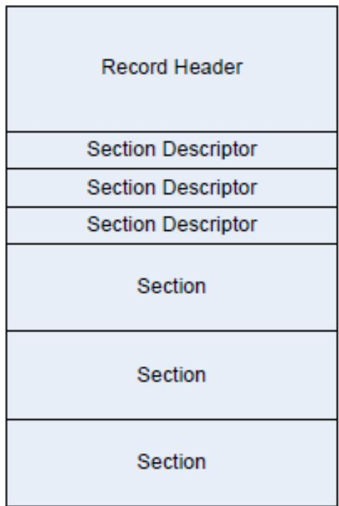

```c
for (i = 0; i < n; i++) {
    Code[i] = Start[Len[i]]++;
}
STATIC
INT32
MakeTree (
    IN INT32 NParm,
    IN UINT16 FreqParm[],
    OUT UINT8 LenParm[],
    OUT UINT16 CodeParm[]
)
/*++
Routine Description:
Generates Huffman codes given a frequency distribution of symbols
Arguments:
NParm - number of symbols
FreqParm - frequency of each symbol
LenParm - code length for each symbol
CodeParm - code for each symbol
Returns:
Root of the Huffman tree.
--*/
{
    INT32 i, j, k, Avail;
    //
    // make tree, calculate len[], return root
    //
mN = NParm;
mFreq = FreqParm;
mLen = LenParm;
Avail = mN;
mHeapSize = 0;
mHeap[1] = 0;
for (i = 0; i < mN; i++) {
    mLen[i] = 0;
    if (mFreq[i]) {
    mHeap[++mHeapSize] = (INT16)i;
    }
}
if (mHeapSize < 2) {
    CodeParm[mHeap[1]] = 0;
```

(continued from previous page)

```c
return mHeap[1];
}
for (i = mHeapSize / 2; i >= 1; i--) {
    //
    // make priority queue
    //
    DownHeap(i);
}
mSortPtr = CodeParm;
do {
    i = mHeap[1];
    if (i < mN) {
    *mSortPtr++ = (UINT16)i;
    }
    mHeap[1] = mHeap[mHeapSize--];
    DownHeap(1);
    j = mHeap[1];
    if (j < mN) {
    *mSortPtr++ = (UINT16)j;
    }
    k = Avail++;
    mFreq[k] = (UINT16)(mFreq[i] + mFreq[j]);
    mHeap[1] = (INT16)k;
    DownHeap(1);
    mLeft[k] = (UINT16)i;
    mRight[k] = (UINT16)j;
} while (mHeapSize > 1);

mSortPtr = CodeParm;
MakeLen(k);
MakeCode(NParm, LenParm, CodeParm);

// return root
// return k;
}
```

## DECOMPRESSION SOURCE CODE

```c
=/*++  
Copyright (c) 2001-2002 Intel Corporation  
Module Name:  
    Decompress.c  
Abstract:  
    Decompressor.  
--*/  
#include "EfiCommon.h"  
#define BITBUFSIZ 16  
#define WNDBIT 13  
#define WNDSIZ (1U << WNDBIT)  
#define MAXMATCH 256  
#define THRESHOLD 3  
#define CODE_BIT 16  
#define UINT8_MAX 0xff  
#define BAD_TABLE -1  
//  
// C: Char&Len Set; P: Position Set; T: exTra Set  
//  
#define NC (0xff + MAXMATCH + 2 - THRESHOLD)  
#define CBIT 9  
#define NP (WNDBIT + 1)  
#define NT (CODE_BIT + 3)  
#define PBIT 4  
#define TBIT 5  
#if NT > NP  
    #define NPT NT  
#else  
    #define NPT NP  
#endif
```

(continued from previous page)

```txt
typedef struct {
    UINT8 *mSrcBase; // Starting address of compressed data
    UINT8 *mDstBase; // Starting address of decompressed data

    UINT16 mBytesRemain;
    UINT16 mBitCount;
    UINT16 mBitBuf;
    UINT16 mSubBitBuf;
    UINT16 mBufSiz;
    UINT16 mBlockSize;
    UINT32 mDataIdx;
    UINT32 mCompSize;
    UINT32 mOrigSize;
    UINT32 mOutBuf;
    UINT32 mInBuf;

    UINT16 mBadTableFlag;

    UINT8 mBuffer[WNDSIZ];
    UINT16 mLeft[2 * NC - 1];
    UINT16 mRight[2 * NC - 1];
    UINT32 mBuf;
    UINT8 mCLen[NC];
    UINT8 mPTLen[NPT];
    UINT16 mCTable[4096];
    UINT16 mPTTable[256];
} SCRATCH_DATA;

// Function Prototypes
//
STATIC
VOID
FillBuf (
    IN SCRATCH_DATA *Sd,
    IN UINT16 NumOfBits
);

STATIC
VOID
Decode (
    SCRATCH_DATA *Sd,
    UINT16 NumOfBytes
);

// Functions
//
EFI_STATUS
```

(continued from previous page)

```c
EFIAPI
GetInfo (
    IN EFI_DECOMPRESS_PROTOCOL *This,
    IN VOID *Source,
    IN UINT32 SrcSize,
    OUT UINT32 *DstSize,
    OUT UINT32 *ScratchSize
)
/*++

Routine Description:
The implementation of EFI_DECOMPRESS_PROTOCOL.GetInfo().
Arguments:
This - Protocol instance pointer.
Source - The source buffer containing the compressed data.
SrcSize - The size of source buffer
DstSize - The size of destination buffer.
ScratchSize - The size of scratch buffer.

Returns:
EFI_SUCCESS - The size of destination buffer and the size of scratch buffer are successful retrieved.
EFI_INVALID_PARAMETER - The source data is corrupted
--*/
{
UINT8 *Src;

*ScratchSize = sizeof (SCRATCH_DATA);

Src = Source;
if (SrcSize < 8) {
    return EFI_INVALID_PARAMETER;
}

*DstSize = Src[4] + (Src[5] << 8) + (Src[6] << 16) + (Src[7] << 24);
return EFI_SUCCESS;
}

EFI_STATUS
EFIAPI
Decompress (
    IN EFI_DECOMPRESS_PROTOCOL *This,
    IN VOID *Source,
    IN UINT32 SrcSize,
    IN OUT VOID *Destination,
    IN UINT32 DstSize,
    IN OUT VOID *Scratch,
```

(continues on next page)

(continued from previous page)

```c
IN UINT32 ScratchSize
)
/*++

Routine Description:

The implementation of EFI_DECOMPRESS_PROTOCOL.Decompress().
Arguments:
This - The protocol instance.
Source - The source buffer containing the compressed data.
SrcSize - The size of the source buffer
Destination - The destination buffer to store the decompressed data
DstSize - The size of the destination buffer.
Scratch - The buffer used internally by the decompress routine. This buffer is needed to store intermediate data.
ScratchSize - The size of scratch buffer.

Returns:
EFI_SUCCESS - Decompression is successful
EFI_INVALID_PARAMETER - The source data is corrupted

--*/
{
UINT32 Index;
UINT16 Count;
UINT32 CompSize;
UINT32 OrigSize;
UINT8 *Dst1;
EFI_STATUS Status;
SCRATCH_DATA *Sd;
UINT8 *Src;
UINT8 *Dst;

Status = EFI_SUCCESS;
Src = Source;
Dst = Destination;
Dst1 = Dst;

if (ScratchSize < sizeof (SCRATCH_DATA)) {
return EFI_INVALID_PARAMETER;
}

Sd = (SCRATCH_DATA *)Scratch;

if (SrcSize < 8) {
return EFI_INVALID_PARAMETER;
}

CompSize = Src[0] + (Src[1] << 8) + (Src[2] << 16) + (Src[3] << 24);
```

```objectivec
OrigSize = Src[4] + (Src[5] << 8) + (Src[6] << 16) + (Src[7] << 24);

if (SrcSize < CompSize + 8) {
    return EFI_INVALID_PARAMETER;
}

Src = Src + 8;

for (Index = 0; Index < sizeof(SCRATCH_DATA); Index++) {
    ((UINT8*)Sd)[Index] = 0;
}

Sd->mBytesRemain = (UINT16)(-1);
Sd->mSrcBase = Src;
Sd->mDstBase = Dst;
Sd->mCompSize = CompSize;
Sd->mOrigSize = OrigSize;

//
// Fill the first two bytes
//
FillBuf(Sd, BITBUFSIZ);

while (Sd->mOrigSize > 0) {

    Count = (UINT16) (WNDSIZ < Sd->mOrigSize? WNDSIZ: Sd->mOrigSize);
    Decode (Sd, Count);

    if (Sd->mBadTableFlag != 0) {
    //
    // Something wrong with the source
    //
    return EFI_INVALID_PARAMETER;
    }

    for (Index = 0; Index < Count; Index++) {
    if (Dst1 < Dst + DstSize) {
    *Dst1++ = Sd->mBuffer[Index];
    } else {
    return EFI_INVALID_PARAMETER;
    }
    }

    Sd->mOrigSize -= Count;
}

if (Sd->mBadTableFlag != 0) {
    Status = EFI_INVALID_PARAMETER;
} else {
    Status = EFI_SUCCESS;
}
```

(continued from previous page)

```lisp
return Status;
}

STATIC
VOID
FillBuf (
    IN SCRATCH_DATA *Sd,
    IN UINT16 NumOfBits
)
/*++ 

Routine Description:
Shift mBitBuf NumOfBits left. Read in NumOfBits of bits from source.

Arguments:
Sd - The global scratch data
NumOfBit - The number of bits to shift and read.

Returns: (VOID)

--*/
{
    Sd->mBitBuf = (UINT16)(Sd->mBitBuf << NumOfBits);

    while (NumOfBits > Sd->mBitCount) {

    Sd->mBitBuf \ |= (UINT16)(Sd->mSubBitBuf <<
    (NumOfBits = (UINT16)(NumOfBits - Sd->mBitCount));

    if (Sd->mCompSize > 0) {

    //
    // Get 1 byte into SubBitBuf
    //
    Sd->mCompSize --;
    Sd->mSubBitBuf = 0;
    Sd->mSubBitBuf = Sd->mSrcBase[Sd->mInBuf ++];
    Sd->mBitCount = 8;

    } else {

    Sd->mSubBitBuf = 0;
    Sd->mBitCount = 8;

    }
}

Sd->mBitCount = (UINT16)(Sd->mBitCount - NumOfBits);
Sd->mBitBuf \ |= Sd->mSubBitBuf >> Sd->mBitCount;
}
```

(continues on next page)

(continued from previous page)

```c
STATIC
UINT16
GetBits(
    IN SCRATCH_DATA *Sd,
    IN UINT16 NumOfBits
)
/*++

Routine Description:
    Get NumOfBits of bits out from mBitBuf. Fill mBitBuf with subsequent NumOfBits of bits from source. Returns NumOfBits of bits that are popped out.

Arguments:
    Sd - The global scratch data.
    NumOfBits - The number of bits to pop and read.

Returns:
The bits that are popped out.

--*/
{
    UINT16 OutBits;

    OutBits = (UINT16)(Sd->mBitBuf >> (BITBUFSIZ - NumOfBits));

    FillBuf(Sd, NumOfBits);

    return OutBits;
}

STATIC
UINT16
MakeTable (
    IN SCRATCH_DATA *Sd,
    IN UINT16 NumOfChar,
    IN UINT8 *BitLen,
    IN UINT16 TableBits,
    OUT UINT16 *Table
)
/*++

Routine Description:
    Creates Huffman Code mapping table according to code length array.

Arguments:
    Sd - The global scratch data
```

(continues on next page)

(continued from previous page)

```c
NumOfChar - Number of symbols in the symbol set
BitLen - Code length array
TableBits - The width of the mapping table
Table - The table

Returns:
0 - OK.
BAD_TABLE - The table is corrupted.

--*/
{
UINT16 Count[17];
UINT16 Weight[17];
UINT16 Start[18];
UINT16 *p;
UINT16 k;
UINT16 i;
UINT16 Len;
UINT16 Char;
UINT16 JuBits;
UINT16 Avail;
UINT16 NextCode;
UINT16 Mask;
UINT16 MaxTableLength;

for (i = 1; i <= 16; i++) {
Count[i] = 0;
}

for (i = 0; i < NumOfChar; i++) {
if (BitLen[i] > 16) {
return (UINT16) BAD_TABLE;
}
Count[BitLen[i]]++;
}

Start[1] = 0;

for (i = 1; i <= 16; i++) {
Start[i + 1] = (UINT16)(Start[i] + (Count[i] << (16 - i)));
}

if (Start[17] != 0) {/*(1U << 16)*/
return (UINT16) BAD_TABLE;
}

JuBits = (UINT16)(16 - TableBits);

for (i = 1; i <= TableBits; i++) {
Start[i] >>= JuBits;
Weight[i] = (UINT16)(1U << (TableBits - i));
```

(continued from previous page)

```txt
c
}
while (i <= 16) {
    Weight[i++] = (UINT16)(1U << (16 - i));
}
i = (UINT16)(Start[TableBits + 1] >> JuBits);

if (i != 0) {
    k = (UINT16)(1U << TableBits);
    while (i != k) {
    Table[i++] = 0;
    }
}

Avail = NumOfChar;
Mask = (UINT16)(1U << (15 - TableBits));
MaxTableLength = (UINT16) (1U << TableBits);

for (Char = 0; Char < NumOfChar; Char++) {

    Len = BitLen[Char];
    if (Len == 0) {
    continue;
    }

    NextCode = (UINT16)(Start[Len] + Weight[Len]);
    if (Len <= TableBits) {

    for (i = Start[Len]; i < NextCode; i++) {
    if (i >= MaxTableLength) {
    return (UINT16) BAD_TABLE;
    }
    Table[i] = Char;
    }
} else {

    k = Start[Len];
    p = &Table[k >> JuBits];
    i = (UINT16)(Len - TableBits);

    while (i != 0) {
    if (*p == 0) {
    Sd->mRight[Avail] = Sd->mLeft[Avail] = 0;
    *p = Avail++;
    }

    if (k & Mask) {
    p = &Sd->mRight[*p];
    } else {
    p = &Sd->mLeft[*p];
    }
}
```

(continued from previous page)

```txt
}
k <<= 1;
i--;
}
*p = Char;
}
Start[Len] = NextCode;
}
//
// Succeeds
//
return 0;
}
STATIC
UINT16
DecodeP (
    IN SCRATCH_DATA *Sd
)
/*++
Routine description:
Decodes a position value.
Arguments:
Sd - the global scratch data
Returns:
The position value decoded.
--*/
{
UINT16 Val;
UINT16 Mask;

Val = Sd->mPTTable[Sd->mBitBuf >> (BITBUFSIZ - 8)];
if (Val >= NP) {
Mask = 1U << (BITBUFSIZ - 1 - 8);
do {
if (Sd->mBitBuf & Mask) {
Val = Sd->mRight[Val];
}
```

(continued from previous page)

```c
} else {
    Val = Sd->mLeft[Val];
}

Mask >>= 1;
} while (Val >= NP);
}

// Advance what we have read
// FillBuf (Sd, Sd->mPTLen[Val]);

if (Val) {
    Val = (UINT16)((1U << (Val - 1)) + GetBits (Sd, (UINT16)(Val - 1)));
}

return Val;
}

STATIC
UINT16
ReadPTLen (
    IN SCRATCH_DATA *Sd,
    IN UINT16 nn,
    IN UINT16 nbit,
    IN UINT16 Special
)
/*++ 

Routine Description

Reads code lengths for the Extra Set or the Position Set

Arguments:

Sd - The global scratch data
nn - Number of symbols
nbit - Number of bits needed to represent nn
Special - The special symbol that needs to be taken care of

Returns:

0 - OK.
BAD_TABLE - Table is corrupted.

--*/
{
    UINT16 n;
    UINT16 c;
    UINT16 i;
    UINT16 Mask;
```

(continues on next page)

(continued from previous page)

```c
n = GetBits (Sd, nbit);
if (n == 0) {
    c = GetBits (Sd, nbit);

    for (i = 0; i < 256; i++) {
    Sd->mPTTable[i] = c;
    }

    for (i = 0; i < nn; i++) {
    Sd->mPTLen[i] = 0;
    }

    return 0;
}

i = 0;

while (i < n) {
    c = (UINT16)(Sd->mBitBuf >> (BITBUFSIZ - 3));

    if (c == 7) {
    Mask = 1U << (BITBUFSIZ - 1 - 3);
    while (Mask & Sd->mBitBuf) {
    Mask >>= 1;
    c += 1;
    }
    }

    FillBuf (Sd, (UINT16)((c < 7) ? 3 : c - 3));

    Sd->mPTLen [i++] = (UINT8)c;

    if (i == Special) {
    c = GetBits (Sd, 2);
    while ((INT16)(--c) >= 0) {
    Sd->mPTLen[i++] = 0;
    }
    }
}

while (i < nn) {
    Sd->mPTLen [i++] = 0;
}

return (MakeTable (Sd, nn, Sd->mPTLen, 8, Sd->mPTTable));
}

STATIC
```

(continued from previous page)

```c
VOID
ReadCLen (
    SCRATCH_DATA *Sd
)
/*++
Routine Description:
Reads code lengths for Char&Len Set.

Arguments:
Sd - the global scratch data

Returns: (VOID)

--*/
{
UINT16 n;
UINT16 c;
UINT16 i;
UINT16 Mask;

n = GetBits(Sd, CBIT);

if (n == 0) {
    c = GetBits(Sd, CBIT);

    for (i = 0; i < NC; i++) {
    Sd->mCLen[i] = 0;
    }

    for (i = 0; i < 4096; i++) {
    Sd->mCTable[i] = c;
    }

    return;
}

i = 0;
while (i < n) {

c = Sd->mPTTable[Sd->mBitBuf >> (BITBUFSIZ - 8)];
if (c >= NT) {
    Mask = 1U << (BITBUFSIZ - 1 - 8);

do {

    if (Mask & Sd->mBitBuf) {
    c = Sd->mRight [c];
    } else {
    c = Sd->mLeft [c];
```

(continued from previous page)

```c
{
    Mask >>= 1;
    }while (c >= NT);
}

// Advance what we have read
// FillBuf (Sd, Sd->mPTLen[c]);

if (c <= 2) {
    if (c == 0) {
    c = 1;
    } else if (c == 1) {
    c = (UINT16)(GetBits (Sd, 4) + 3);
    } else if (c == 2) {
    c = (UINT16)(GetBits (Sd, CBIT) + 20);
    }

    while ((INT16)(--c) >= 0) {
    Sd->mCLen[i++] = 0;
    }
} else {
    Sd->mCLen[i++] = (UINT8)(c - 2);
    }
}

while (i < NC) {
    Sd->mCLen[i++] = 0;
}

MakeTable (Sd, NC, Sd->mCLen, 12, Sd->mCTable);

return;
}

STATIC
UINT16
DecodeC (
    SCRATCH_DATA *Sd
)
/*++ 

Routine Description:

Decode a character/length value.
```

(continued from previous page)

```cpp
Arguments:
    Sd - The global scratch data.

Returns:
    The value decoded.
    --*/
    {
    UINT16 j;
    UINT16 Mask;

    if (Sd->mBlockSize == 0) {
    //
    // Starting a new block
    //
    Sd->mBlockSize = GetBits(Sd, 16);
    Sd->mBadTableFlag = ReadPTLen (Sd, NT, TBIT, 3);
    if (Sd->mBadTableFlag != 0) {
    return 0;
    }

    ReadCLen (Sd);

    Sd->mBadTableFlag = ReadPTLen (Sd, NP, PBIT, (UINT16)(-1));
    if (Sd->mBadTableFlag != 0) {
    return 0;
    }
    }

    Sd->mBlockSize--;
    j = Sd->mCTable[Sd->mBitBuf >> (BITBUFSIZ - 12)];

    if (j >= NC) {
    Mask = 1U << (BITBUFSIZ - 1 - 12);

    do {
    if (Sd->mBitBuf & Mask) {
    j = Sd->mRight[j];
    } else {
    j = Sd->mLeft[j];
    }

    Mask >>= 1;
    } while (j >= NC);
    }

    //
```

(continues on next page)

```c
// Advance what we have read
//
FillBuf(Sd, Sd->mCLen[j]);

return j;
}

STATIC
VOID
Decode (
    SCRATCH_DATA *Sd,
    UINT16 NumOfBytes
)
/*++

Routine Description:
    Decode NumOfBytes and put the resulting data at starting point of mBuffer.
    The buffer is circular.

Arguments:
    Sd - The global scratch data
    NumOfBytes - Number of bytes to decode

Returns: (VOID)

--*/
{
    UINT16 di;
    UINT16 r;
    UINT16 c;

    r = 0;
    di = 0;

    Sd->mBytesRemain--;
    while ((INT16)(Sd->mBytesRemain) >= 0) {
    Sd->mBuffer[di++] = Sd->mBuffer[Sd->mDataIdx++];
    if (Sd->mDataIdx >= WNDISIZ) {
    Sd->mDataIdx -= WNDISIZ;
    }

    r++;
    if (r >= NumOfBytes) {
    return;
    }
    Sd->mBytesRemain--;
}

for (;;) {
```

(continued from previous page)

```txt
c = DecodeC (Sd);
if (Sd->mBadTableFlag != 0) {
    return;
}

if (c < 256) {

    //
    // Process an Original character
    //
    Sd->mBuffer[di++] = (UINT8)c;
    r++;
    if (di >= WNDISIZ) {
    return;
    }
} else {

    //
    // Process a Pointer
    //
    c = (UINT16)(c - (UINT8_MAX + 1 - THRESHOLD));
    Sd->mBytesRemain = c;

    Sd->mDataIdx = (r - DecodeP(Sd) - 1) & (WNDISIZ - 1); // Make circular
    di = r;

    Sd->mBytesRemain--;
    while ((INT16)(Sd->mBytesRemain) >= 0) {
    Sd->mBuffer[di++] = Sd->mBuffer[Sd->mDataIdx++];
    if (Sd->mDataIdx >= WNDISIZ) {
    Sd->mDataIdx -= WNDISIZ;
    }

    r++;
    if (di >= WNDISIZ) {
    return;
    }

    if (di >= Sd->mOrigSize) {
    Sd->mBadTableFlag = (UINT16) BAD_TABLE;
    return;
    }

    Sd->mBuffer[di++] = Sd->mBuffer[Sd->mDataIdx++];
    Sd->mBytesRemain--;
}
```

(continues on next page)

return;

(continued from previous page)

## EFI BYTE CODE VIRTUAL MACHINE OPCODE LIST

The following table lists the opcodes for EBC instructions. Note that opcodes only require 6 bits of the opcode byte of EBC instructions. The other two bits are used for other encodings that are dependent on the particular instruction.

Table J.1: EBC Virtual Machine Opcode Summary

<table><tr><td>Opcode</td><td>Description</td></tr><tr><td>0x00</td><td>BREAK [break code]</td></tr><tr><td>0x01</td><td>JMP 32{cs {@}R1 {Immed32}</td></tr><tr><td>0x02</td><td>JMP8 {cs Immed8}</td></tr><tr><td>0x03</td><td>CALL 32{EX}{a} {@}R1 {Immed32}</td></tr><tr><td>0x04</td><td>RET</td></tr><tr><td>0x05</td><td>CMP [32 R1, {@}R2 {Index16}</td></tr><tr><td>0x06</td><td>CMP [32 R1, {@}R2 {Index16}</td></tr><tr><td>0x07</td><td>CMP [32 R1, {@}R2 {Index16}</td></tr><tr><td>0x08</td><td>CMP [32 R1, {@}R2 {Index16}</td></tr><tr><td>0x09</td><td>CMP [32 R1, {@}R2 {Index16}</td></tr><tr><td>0x0A</td><td>NOT [32 {@}R1, {@}R2 {Index16}</td></tr><tr><td>0x0B</td><td>NEG [32 {@}R1, {@}R2 {Index16}</td></tr><tr><td>0x0C</td><td>ADD [32 {@}R1, {@}R2 {Index16}</td></tr><tr><td>0x0D</td><td>SUB [32 {@}R1, {@}R2 {Index16}</td></tr><tr><td>0x0E</td><td>MUL [32 {@}R1, {@}R2 {Index16}</td></tr><tr><td>0x0F</td><td>MULU [32 {@}R1, {@}R2 {Index16}</td></tr><tr><td>0x10</td><td>DIV [32 {@}R1, {@}R2 {Index16}</td></tr><tr><td>0x11</td><td>DIVU [32 {@}R1, {@}R2 {Index16}</td></tr><tr><td>0x12</td><td>MOD [32 {@}R1, {@}R2 {Index16}</td></tr><tr><td>0x13</td><td>MODU [32 {@}R1, {@}R2 {Index16}</td></tr><tr><td>0x14</td><td>AND [32 {@}R1, {@}R2 {Index16}</td></tr><tr><td>0x15</td><td>OR [32 {@}R1, {@}R2 {Index16}</td></tr><tr><td>0x16</td><td>XOR [32 {@}R1, {@}R2 {Index16}</td></tr><tr><td>0x17</td><td>SHL [32 {@}R1, {@}R2 {Index16}</td></tr><tr><td>0x18</td><td>SHR [32 {@}R1, {@}R2 {Index16}</td></tr><tr><td>0x19</td><td>ASHR [32 {@}R1, {@}R2 {Index16}</td></tr><tr><td>0x1A</td><td>EXTNDB [32 {@}R1, {@}R2 {Index16}</td></tr><tr><td>0x1B</td><td>EXTNDW [32 {@}R1, {@}R2 {Index16}</td></tr><tr><td>0x1C</td><td>EXTNDD [32 {@}R1, {@}R2 {Index16}</td></tr><tr><td>0x1D</td><td>MOV bw {@}R1 {Index16}, {@}R2 {Index16}</td></tr><tr><td>0x1E</td><td>MOV ww {@}R1 {Index16}, {@}R2 {Index16}</td></tr><tr><td>0x1F</td><td>MOV dw {@}R1 {Index16}, {@}R2 {Index16}</td></tr><tr><td>0x20</td><td>MOV qw {@}R1 {Index16}, {@}R2 {Index16}</td></tr><tr><td>0x21</td><td>MOV bd {@}R1 {Index32}, {@}R2 {Index32}</td></tr></table>

continues on next page

Table J.1 – continued from previous page

<table><tr><td>0x22</td><td>MOV wd {@}R1 {Index32}, {@}R2 {Index32}</td></tr><tr><td>0x23</td><td>MOV dd {@}R1 {Index32}, {@}R2 {Index32}</td></tr><tr><td>0x24</td><td>MOV qd {@}R1 {Index32}, {@}R2 {Index32}</td></tr><tr><td>0x25</td><td>MOVsn w {@}R1 {Index16}, {@}R2 {Index16}</td></tr><tr><td>0x26</td><td>MOVsn d {@}R1 {Index32}, {@}R2 {Index32}</td></tr><tr><td>0x27</td><td>Reserved</td></tr><tr><td>0x28</td><td>MOV qq {@}R1 {Index64}, {@}R2 {Index64}</td></tr><tr><td>0x29</td><td>LOADSP [Flags], R2</td></tr><tr><td>0x2A</td><td>STORESP R1, [IP|Flags]</td></tr><tr><td>0x2B</td><td>PUSH [32 {@}R1 {Index16}</td></tr><tr><td>0x2C</td><td>POP [32 {@}R1 {Index16}</td></tr><tr><td>0x2D</td><td>CMPI [32 {@}R1 {Index16}, Immed16</td></tr><tr><td>0x2E</td><td>CMPI [32 {@}R1 {Index16}, Immed16</td></tr><tr><td>0x2F</td><td>CMPI [32 {@}R1 {Index16}, Immed16</td></tr><tr><td>0x30</td><td>CMPI [32 {@}R1 {Index16}, Immed16</td></tr><tr><td>0x31</td><td>CMPI [32 {@}R1 {Index16}, Immed16</td></tr><tr><td>0x32</td><td>MOVn w {@}R1 {Index16}, {@}R2 {Index16}</td></tr><tr><td>0x33</td><td>MOVn d {@}R1 {Index32}, {@}R2 {Index32}</td></tr><tr><td>0x34</td><td>Reserved</td></tr><tr><td>0x35</td><td>PUSHn {@}R1 {Index16}</td></tr><tr><td>0x36</td><td>POPn {@}R1 {Index16}</td></tr><tr><td>0x37</td><td>MOVI [b {@}R1 {Index16}, Immed16</td></tr><tr><td>0x38</td><td>MOVIn [w {@}R1 {Index16}, Index16</td></tr><tr><td>0x39</td><td>MOVREL [w {@}R1 {Index16}, Immed16</td></tr><tr><td>0x3A</td><td>Reserved</td></tr><tr><td>0x3B</td><td>Reserved</td></tr><tr><td>0x3C</td><td>Reserved</td></tr><tr><td>0x3D</td><td>Reserved</td></tr><tr><td>0x3E</td><td>Reserved</td></tr><tr><td>0x3F</td><td>Reserved</td></tr></table>

## ALPHABETIC FUNCTION LISTS

This appendix was redacted in version 2.6.

## EFI 1.10 PROTOCOL CHANGES

## L.1 Protocol and GUID Name Changes from EFI 1.10

This appendix lists the Protocol , GUID, and revision identifier name changes compared to the EFI Specification 1.10. The protocols listed are not Runtime, Reentrant or MP Safe. Protocols are listed by EFI 1.10 name.

For protocols in the table whose TPL is not <= TPL\_NOTIFY:

This function must be called at a TPL level less then or equal to %%%%.

%%%% is TPL\_CALLBACK or TPL\_APPLICATION. The <= is done via text.

Table L.1: Protocol Name changes

<table><tr><td>EFI 1.10 Protocol Name</td><td>UEFI Specification Protocol Name</td></tr><tr><td>EFI_LOADED_IMAGE</td><td>EFI_LOADED_IMAGE_PROTOCOL</td></tr><tr><td>TPL</td><td>&lt;= TPL_NOTIFY</td></tr><tr><td>New GUID name</td><td>EFI_LOADED_IMAGE_PROTOCOL_GUID</td></tr><tr><td>EFI_DEVICE_PATH</td><td>EFI_DEVICE_PATH_PROTOCOL</td></tr><tr><td>TPL</td><td>&lt;= TPL_NOTIFY</td></tr><tr><td>New GUID name</td><td>EFI_DEVICE_PATH_PROTOCOL_GUID</td></tr><tr><td>SIMPLE_INPUT_INTERFACE</td><td>EFI_SIMPLE_INPUT_PROTOCOL</td></tr><tr><td>TPL</td><td>&lt;= TPL_APPLICATION</td></tr><tr><td>New GUID name</td><td>EFI_SIMPLE_INPUT_PROTOCOL_GUID</td></tr><tr><td>SIMPLE_TEXT_OUTPUT_INTERFACE</td><td>EFI_SIMPLE_TEXT_OUTPUT_PROTOCOL</td></tr><tr><td>TPL</td><td>&lt;=TPL_CALLBACK</td></tr><tr><td>New GUID name</td><td>EFI_SIMPLE_TEXT_OUTPUT_PROTOCOL_GUID</td></tr><tr><td>SERIAL_IO_INTERFACE</td><td>EFI_SERIAL_IO_PROTOCOL</td></tr><tr><td>TPL</td><td>&lt;=TPL_CALLBACK</td></tr><tr><td>New GUID name</td><td>EFI_SERIAL_IO_PROTOCOL_GUID</td></tr><tr><td>EFI_LOAD_FILE_INTERFACE</td><td>EFI_LOAD_FILE_PROTOCOL</td></tr><tr><td>TPL</td><td>&lt;= TPL_NOTIFY</td></tr><tr><td>New GUID name</td><td>EFI_LOAD_FILE_PROTOCOL_GUID</td></tr><tr><td>EFI_FILE_IO_INTERFACE</td><td>EFI_SIMPLE_FILE_SYSTEM_PROTOCOL</td></tr><tr><td>TPL</td><td>&lt;=TPL_CALLBACK</td></tr><tr><td>New GUID name</td><td>EFI_FILE_SYSTEM_PROTOCOL_GUID</td></tr><tr><td>EFI_FILE</td><td>EFI_FILE_PROTOCOL</td></tr><tr><td>TPL</td><td>&lt;= TPL_CALLBACK</td></tr><tr><td>New GUID name</td><td>EFI_FILE_PROTOCOL_GUID</td></tr><tr><td>EFI_DISK_IO</td><td>EFI_DISK_IO_PROTOCOL</td></tr><tr><td>TPL</td><td>&lt;=TPL_CALLBACK</td></tr><tr><td>New GUID name</td><td>EFI_DISK_IO_PROTOCOL_GUID</td></tr></table>

continues on next page

Table L.1 – continued from previous page

<table><tr><td>EFI_BLOCK_IO</td><td>EFI_BLOCK_IO_PROTOCOL</td></tr><tr><td>TPL</td><td>&lt;=TPL_CALLBACK</td></tr><tr><td>New GUID name</td><td>EFI_BLOCK_IO_PROTOCOL_GUID</td></tr><tr><td>UNICODE_COLLATION_INTERFACE</td><td>EFI_UNICODE_COLLATION_PROTOCOL</td></tr><tr><td>TPL</td><td>&lt;=TPL_NOTIFY</td></tr><tr><td>New GUID name</td><td>EFI_UNICODE_COLLATION_PROTOCOL_GUID</td></tr><tr><td>EFI_SIMPLE_NETWORK</td><td>EFI_SIMPLE_NETWORK_PROTOCOL</td></tr><tr><td>TPL</td><td>&lt;=TPL_CALLBACK</td></tr><tr><td>New GUID name</td><td>EFI_SIMPLE_NETWORK_PROTOCOL_GUID</td></tr><tr><td>EFI_NETWORK_INTERFACE_IDENTIFIER _INTERFACE</td><td>EFI_NETWORK_INTERFACE_IDENTIFIER _PROTOCOL</td></tr><tr><td>TPL</td><td>&lt;=TPL_NOTIFY</td></tr><tr><td>New GUID name</td><td>EFI_NETWORK_INTERFACE_IDENTIFIER _PROTOCOL_GUID</td></tr><tr><td>EFI_PXE_BASE_CODE</td><td>EFI_PXE_BASE_CODE_PROTOCOL</td></tr><tr><td>TPL</td><td>&lt;=TPL_NOTIFY</td></tr><tr><td>New GUID name</td><td>EFI_PXE_BASE_CODE_PROTOCOL_GUID</td></tr><tr><td>EFI_PXE_BASE_CODE_CALLBACK</td><td>EFI_PXE_BASE_CODE_CALLBACK_PROTOCOL</td></tr><tr><td>TPL</td><td>&lt;=TPL_NOTIFY</td></tr><tr><td>New GUID name</td><td>EFI_PXE_BASE_CODE_CALLBACK_PROTOCOL_GUID</td></tr><tr><td>EFI_DEVICE_IO_INTERFACE</td><td>EFI_DEVICE_IO_PROTOCOL</td></tr><tr><td>TPL</td><td>&lt;=TPL_NOTIFY</td></tr><tr><td>New GUID name</td><td>EFI_DEVICE_IO_PROTOCOL</td></tr></table>

Table L.2: Revision Identifier Name Changes

<table><tr><td>EFI 1.10 Revision Identifier Name</td><td>UEFI Specification Revision Identifier Name</td></tr><tr><td>EFI_LOADED_IMAGE_INFORMATION_REVISION</td><td>EFI_LOADED_IMAGE_PROTOCOL_REVISION</td></tr><tr><td>SERIAL_IO_INTERFACE_REVISION</td><td>EFI_SERIAL_IO_PROTOCOL_REVISION</td></tr><tr><td>EFI_FILE_IO_INTERFACE_REVISION</td><td>EFI_SIM_PLE_FILE_SYSTEM_PROTOCOL_REVISION</td></tr><tr><td>EFI_FILE_REVISION</td><td>EFI_FILE_PROTOCOL_REVISION</td></tr><tr><td>EFI_DISK_IO_INTERFACE_REVISION</td><td>EFI_DISK_IO_PROTOCOL_REVISION</td></tr><tr><td>EFI_BLOCK_IO_INTERFACE_REVISION</td><td>EFI_BLOCK_IO_PROTOCOL_REVISION</td></tr><tr><td>EFI_SIMPLE_NETWORK_INTERFACE_REVISION</td><td>EFI_SIMPLE_NETWORK_PROTOCOL_REVISION</td></tr><tr><td>EFI_NETWORK_INTERFACE_IDENTIFIER_INTERFACE_REVISION</td><td>EFI_NETWORK_INTERFACE_IDENTIFIER_COL_REVISION</td></tr><tr><td>EFI_PXE_BASE_CODE_INTERFACE_REVISION</td><td>EFI_PXE_BASE_CODE_PROTOCOL_REVISION</td></tr><tr><td>EFI_PXE_BASE_CODE_CALLBACK_INTERFACE_REVISION</td><td>EFI_PXE_BASE_CODE_CALLBACK_PROTOCOL_REVISION</td></tr></table>

## FORMATS — LANGUAGE CODES AND LANGUAGE CODE ARRAYS

This appendix lists the formats for language codes and language code arrays.

## M.1 Specifying individual language codes

The preferred representation of a language code is done via an RFC 4646 language code identifier\*. Alias codes supported in addition to RFC 4646

Table M.1: Alias Codes Supported in Addition to RFC 4646

<table><tr><td>RFC string</td><td>Supported Alias String</td></tr><tr><td>zh-Hans</td><td>zh-chs</td></tr><tr><td>zh-Hant</td><td>zh-cht</td></tr></table>

An RFC 4646 language code is represented as a null-terminated ASCII string.

An RFC 4646 language string must be constructed according to the tag creation rules in section 2.3 of RFC 4646. For example, when constructing the primary language tag for a locale identifier, if a 2 character ISO 639-1 language code exists along with a 3 character ISO 639-2 language code, then the ISO 639-1 language code must be used. Further, if an ISO 639-1 tag does not exist, then the ISO 639-2/T (Terminology) tag must be for the primary locale before an ISO 639-2/B (Bibliographic) tag may be used. See RFC 4646 for a complete discussion of this topic.

## M.1.1 Specifying language code arrays:

## Native RFC 4646 format array:

An array of RFC 4646 character codes is represented as a NULL terminated char8 array of RFC 4646 language code strings. Each of these strings is delimited by a semicolon (‘;’) character. For example, an array of US English and Traditional Chinese would be represented as the NULL-terminated string “en-us;zh-Hant”.

# COMMON PLATFORM ERROR RECORD (CPER)

## N.1 Introduction

This appendix describes the common platform error record (CPER) format for representing platform hardware errors.

## N.2 Format

The general format of the common platform error record is illustrated in the Figure below . The record consists of a header; followed by one or more section descriptors; and for each descriptor, an associated section which may contain either error or informational data.

  
Fig. N.1: Error Record Format

## N.2.1 Record Header

The record header includes information which uniquely identifies a hardware error record on a given system. The contents of the record header are described in the Table below. The header is immediately followed by an array of one or more section descriptors. Sections may be either error sections, which contain error information retrieved from hardware, or they may be informational sections, which contain contextual information relevant to the error. An error record must contain at least one section.

Table N.1: Error record header

<table><tr><td>Mnemonic</td><td>Byte Offset</td><td>Byte Length</td><td>Description</td></tr><tr><td>Signature Start</td><td>0</td><td>4</td><td>ASCII 4-character array “CPER” (0x43,0 x50,0x45,0x52). Identifies this structure as a hardware error record.</td></tr><tr><td>Revision</td><td>4</td><td>2</td><td>This is a 2-byte field representing a major and minor version number for the error record definition in BCD format. The interpretation of the major and minor version number is as follows: • Byte 0 - Minor (01): An increase in this revision indicates that changes to the headers and sections are backward compatible with software that use earlier revisions.Addition of new GUID types, errata fixes or clarifications are covered by a bump up.• Byte 1 - Major (01): An increase in this revision indicates that the changes are not backward compatible from a software perspective.</td></tr><tr><td>Signature End</td><td>6</td><td>4</td><td>Must be 0xFFFFFFFF</td></tr><tr><td>Section Count</td><td>10</td><td>2</td><td>This field indicates the number of valid sections associated with the record, corresponding to each of the following section descriptors.</td></tr><tr><td>Error Severity</td><td>12</td><td>4</td><td>Indicates the severity of the error condition. The severity of the error record corresponds to the most severe error section.0 - Recoverable (also called non-fatal uncorrected)1 - Fatal2 - Corrected3 - InformationalAll other values are reserved.Note that severity of “Informational” indicates that the record could be safely ignored by error handling software.</td></tr><tr><td>Validation Bits</td><td>16</td><td>4</td><td>This field indicates the validity of the following fields:• Bit 0 - If 1, the PlatformID field contains valid information• Bit 1 - If 1, the TimeStamp field contains valid information• Bit 2 - If 1, the PartitionID field contains valid information• Bits 3-31: Reserved, must be zero.</td></tr></table>

continues on next page

Table N.1 – continued from previous page

<table><tr><td>Mnemonic</td><td>Byte Offset</td><td>Byte Length</td><td>Description</td></tr><tr><td>Record Length</td><td>20</td><td>4</td><td>Indicates the size of the actual error record, including the size of the record header, all section descriptors, and section bodies. The size may include extra buffer space to allow for the dynamic addition of error sections descriptors and bodies.</td></tr><tr><td>Timestamp</td><td>24</td><td>8</td><td>The timestamp correlates to the time when the error information was collected by the system software and may not necessarily represent the time of the error event. The timestamp contains the local time in BCD format.·Byte 7 - Byte 0:·Byte 0: Seconds·Byte 1: Minutes·Byte 2: Hours·Byte 3:·Bit 0 - Timestamp is precise if this bit is set and correlates to the time of the error event.·Bit 7:1 - Reserved·Byte 4: Day·Byte 5: Month·Byte 6: Year·Byte 7: Century</td></tr><tr><td>Platform ID</td><td>32</td><td>16</td><td>This field uniquely identifies the platform with a GUID. The platform&#x27;s SMBIOS UUID should be used to populate this field. Error analysis software may use this value to uniquely identify a platform.</td></tr><tr><td>Partition ID</td><td>48</td><td>16</td><td>If the platform has multiple software partitions, system software may associate a GUID with the partition on which the error occurred.</td></tr><tr><td>Creator ID</td><td>64</td><td>16</td><td>This field contains a GUID indicating the creator of the error record. This value may be overwritten by subsequent owners of the record.</td></tr></table>

continues on next page

Table N.1 – continued from previous page

<table><tr><td>Mnemonic</td><td>Byte Offset</td><td>Byte Length</td><td>Description</td></tr><tr><td>Notification Type</td><td>80</td><td>16</td><td>This field holds a pre-assigned GUID value indicating the record association with an error event notification type. The defined types are:CMC{0x2DCE8BB1, 0xBDD7, 0x450e, {0xB9, 0xAD, 0x9C, 0xF4, 0xEB, 0xD4, 0xF8, 0x90}}CPE{0x4E292F96, 0xD843, 0x4a55, {0xA8, 0xC2, 0xD4, 0x81, 0xF2, 0x7E, 0xBE, 0xEE}}MCE{0xE8F56FFE, 0x919C, 0x4cc5, {0xBA, 0x88, 0x65, 0xAB, 0xE1, 0x49, 0x13, 0xBB}}PCIe{0xCF93C01F, 0x1A16, 0x4dfc, {0xB8, 0xBC, 0x9C, 0x4D, 0xAF, 0x67, 0xC1, 0x04}}INIT{0xCC5263E8, 0x9308, 0x454a, {0x89, 0xD0, 0x34, 0x0B, 0xD3, 0x9B, 0xC9, 0x8E}}NMI{0x5BAD89FF, 0xB7E6, 0x42c9, {0x81, 0x4A, 0xcf, 0x24, 0x85, 0xD6, 0xE9, 0x8A}}Boot{0x3D61A466, 0xAB40, 0x409a, {0xA6, 0x98, 0xF3, 0x62, 0xD4, 0x64, 0xB3, 0x8F}}DMAr{0x667DD791, 0xC6B3, 0x4c27, {0x8A, 0x6B, 0x0F, 0x8E,0x72, 0x2D, 0xEB, 0x41}}SEA{0x9A78788A, 0xBBE8, 0x11E4, {0x80, 0x9E, 0x67, 0x61, 0x1E, 0x5D, 0x46, 0xB0}}SEI{0x5C284C81, 0xB0AE, 0x4E87, {0xA3, 0x22, 0xB0, 0x4C, 0x85, 0x62, 0x43, 0x23}}PEI{0x09A9D5AC, 0x5204, 0x4214, {0x96, 0xE5, 0x94, 0x99, 0x2E, 0x75, 0x2B, 0xCD}}</td></tr><tr><td colspan="3">N.2. Format</td><td>2135</td></tr><tr><td colspan="3"></td><td>CXL Component{0x69293BC9, 0x41DF, 0x49A3 {0xB4, 0xBD, 0x4F, 0xB0, 0xDB, 0x30, 0x41, 0xF6}}</td></tr></table>

Table N.1 – continued from previous page

<table><tr><td>Mnemonic</td><td>Byte Offset</td><td>Byte Length</td><td>Description</td></tr><tr><td>Record ID</td><td>96</td><td>8</td><td>This value, when combined with the Creator ID, uniquely identifies the error record across other error records on a given system.</td></tr><tr><td>Flags</td><td>104</td><td>4</td><td>Flags field contains information that describes the error record. See Table 2 for defined flags.</td></tr><tr><td>Persistence Information</td><td>108</td><td>8</td><td>This field is produced and consumed by the creator of the error record identified in the Creator ID field. The format of this field is defined by the creator and it is out of scope of this specification.</td></tr><tr><td>Reserved</td><td>116</td><td>12</td><td>Reserved. Must be zero.</td></tr><tr><td>Section Descriptor</td><td>128</td><td>Nx72</td><td>An array of SectionCount descriptors for the associated sections. The number of valid sections is equivalent to the SectionCount. The buffer size of the record may include more space to dynamically add additional Section Descriptors to the error record.</td></tr></table>

## Error Record Header Flags

The following table lists flags that can be used to qualify an error record in the Error Record Header’s Flags field.

Table N.2: Error Record Header Flags

<table><tr><td>Value</td><td>Description</td></tr><tr><td>1</td><td>HW_ERROR_FLAGS_RECOVERED: Qualifies an error condition as one that has been recovered by system software.</td></tr><tr><td>2</td><td>HW_ERROR_FLAGS_PREVERR: Qualifies an error condition as one that occurred during a previous session. For instance, of the OS detects an error and determines that the system must be reset; it will save the error record before stopping the system. Upon restarting the OS marks the error record with this flag to know that the error is not live.</td></tr><tr><td>4</td><td>HW_ERROR_FLAGS_SIMULATED: Qualifies an error condition as one that was intentionally caused. This allows system software to recognize errors that are injected as a means of validating or testing error handling mechanisms.</td></tr></table>

## N.2.1.1 Notification Type

A notification type identifies the mechanism by which an error event is reported to system software. This information helps consumers of error information (e.g. management applications or humans) by identifying the source of the error information. This allows, for instance, all CMC error log entries to be filtered from an error event log.

Listed below are the standard notification types. Each standard notification type is identified by a GUID. For error notification types that do not conform to one of the standard types, a platform-specific GUID may be defined to identify the notification type.

• Machine Check Exception (MCE): {0xE8F56FFE, 0x919C, 0x4cc5, {0xBA, 0x88, 0x65, 0xAB, 0xE1, 0x49, 0x13, 0xBB}} A Machine Check Exception is a processor-generated exception class interrupt used to system software of the presence of a fatal or recoverable error condition.

• Corrected Machine Check (CMC): {0x2DCE8BB1, 0xBDD7, 0x450e, {0xB9, 0xAD, 0x9C, 0xF4,0xEB, 0xD4, 0xF8, 0x90}} Corrected Machine Checks identify error conditions that have been corrected by hardware or system firmware. CMCs are reported by the processor and may be reported via interrupt or by polling error status registers.

• Corrected Platform Error (CPE): {0x4E292F96, 0xD843, 0x4a55, {0xA8, 0xC2, 0xD4, 0x81, 0xF2, 0x7E, 0xBE, 0xEE}} Corrected Platform Errors identify corrected errors from the platform (i.e., external memory controller, system bus, etc.). CPEs can be reported via interrupt or by polling error status registers.

• Non-Maskable Interrupt (NMI): {0x5BAD89FF, 0xB7E6, 0x42c9, {0x81, 0x4A, 0xCF, 0x24, 0x85, 0xD6, 0xE9, 0x8A}} Non-Maskable Interrupts are used on X64 platforms to report fatal or recoverable platform error conditions. NMIs are reported via interrupt vector 2 on IA32 and X64 processor architecture platforms.

• PCI Express Error (PCIe): {0xCF93C01F, 0x1A16, 0x4dfc, {0xB8, 0xBC, 0x9C, 0x4D, 0xAF, 0x67, 0xC1, 0x04}} See the PCI Express standard v1.1 for details regarding PCI Express Error Reporting. This notification type identifies errors that were reported to the system via an interrupt on a PCI Express root port.

• INIT Record (INIT): {0xCC5263E8, 0x9308, 0x454a, {0x89, 0xD0, 0x34, 0x0B, 0xD3, 0x9B, 0xC9, 0x8E}} IPF Platforms optionally implement a mechanism (switch or button on the chassis) by which an operator may reset a system and have the system generate an INIT error record. This error record is documented in the IPF SAL specification. System software retrieves an INIT error record by querying the SAL for existing INIT records.

• BOOT Error Record (BOOT): {0x3D61A466, 0xAB40, 0x409a, {0xA6, 0x98, 0xF3, 0x62, 0xD4, 0x64, 0xB3, 0x8F}}

The BOOT Notification Type represents error conditions which are unhandled by system software and which result in a system shutdown/reset. System software retrieves a BOOT error record during boot by querying the platform for existing BOOT records. As an example, consider an x64 platform which implements a service processor. In some scenarios, the service processor may detect that the system is either hung or is in such a state that it cannot safely proceed without risking data corruption. In such a scenario the service processor may record some minimal error information in its system event log (SEL) and unilaterally reset the machine without notifying the OS or other system software. In such scenarios, system software is unaware of the condition that caused the system reset. A BOOT error record would contain information that describes the error condition that led to the reset so system software can log the information and use it for health monitoring.

• DMA Remapping Error (DMAr): {0x667DD791, 0xC6B3, 0x4c27, {0x8A, 0x6B, 0x0F, 0x8E, 0x72, 0x2D, 0xEB, 0x41}} The DMA Remapping Notification Type identifies fault conditions generated by the DMAr unit when processing un-translated, translation and translated DMA requests. The fault conditions are reported to the system using a message signaled interrupt.

• Synchronous External Abort (SEA): {0x9A78788A, 0xBBE8, 0x11E4, {0x80, 0x9E, 0x67, 0x61, 0x1E, 0x5D, 0x46, 0xB0}}

Synchronous External Aborts represent precise processor error conditions on ARM systems (uncorrectable and/or recoverable) as described in D3.5 of the ARMv8 ARM reference manual. This notification may be triggered by one of the following scenarios: cache parity error, cache ECC error, external bus error, micro-architectural error, data poisoning, and other platform errors.

• SError Interrupt (SEI): {0x5C284C81, 0xB0AE, 0x4E87, {0xA3, 0x22, 0xB0, 0x4C, 0x85, 0x62, 0x43, 0x23}} SError Interrupts represent asynchronous imprecise (or possibly precise) processor error conditions on ARM systems (corrected, uncorrectable, and recoverable) as described in D3.5 of the ARM ARM reference manual. This notification may be triggered by one of the following scenarios: cache parity error, cache ECC error, external bus error, micro-architectural error, data poisoning, and other platform errors.

• Platform Error Interrupt (PEI): {0x09A9D5AC, 0x5204, 0x4214, {0x96, 0xE5, 0x94, 0x99, 0x2E, 0x75, 0x2B, 0xCD} Platform Error Interrupt represent asynchronous imprecise platform error conditions on ARM systems that may be triggered by the following scenarios: system memory ECC error, ECC errors in system cache (e.g. shared high-level caches), vendor specific chip errors, external platform errors.

• Compute Express Link (CXL) Component: {0x69293BC9, 0x41DF, 0x49A3 {0xB4, 0xBD, 0x4F, 0xB0, 0xDB, 0x30, 0x41, 0xF6}} This Notification Type identifies errors that were reported to the system by CXL components that support error reporting via the CXL RAS Mailbox interface. See the CXL Specification, Rev 2.0 or later, for details regarding CXL Error Reporting.

## N.2.1.2 Error Status

The error status definition provides the capability to abstract information from implementation-specific error registers into generic error codes.

Table N.3: Error Status Fields

<table><tr><td>Bit Position</td><td>Description</td></tr><tr><td>7:0</td><td>Reserved</td></tr><tr><td>15:8</td><td>Encoded value for the Error_Type. See Table 20 Error Types for details.</td></tr><tr><td>16</td><td>Address: Error was detected on the address signals or on the address portion of the transaction.</td></tr><tr><td>17</td><td>Control: Error was detected on the control signals or in the control portion of the transaction.</td></tr><tr><td>18</td><td>Data: Error was detected on the data signals or in the data portion of the transaction.</td></tr><tr><td>19</td><td>Responder: Error was detected by the responder of the transaction.</td></tr><tr><td>20</td><td>Requester: Error was detected by the requester of the transaction.</td></tr><tr><td>21</td><td>First Error: If multiple errors are logged for a section type, this is the first error in the chronological sequence. Setting of this bit is optional.</td></tr><tr><td>22</td><td>Overflow: Additional errors occurred and were not logged due to lack of logging resources.</td></tr><tr><td>63:23</td><td>Reserved.</td></tr></table>

Table N.4: Error Types

<table><tr><td>Encoding</td><td>Description</td></tr><tr><td>1</td><td>ERR_INTERNAL Error detected internal to the component.</td></tr><tr><td>16</td><td>ERR_BUS Error detected in the bus.</td></tr><tr><td colspan="2">Detailed Internal Errors</td></tr><tr><td>4</td><td>ERR_MEM Storage error in memory (DRAM).</td></tr><tr><td>5</td><td>ERR_TLB Storage error in TLB.</td></tr><tr><td>6</td><td>ERR_CACHE Storage error in cache.</td></tr><tr><td>7</td><td>ERR_FUNCTION Error in one or more functional units.</td></tr><tr><td>8</td><td>ERR_SELFTEST component failed self test.</td></tr><tr><td>9</td><td>ERR_FLOW Overflow or undervalue of internal queue.</td></tr><tr><td colspan="2">Detailed Bus Errors</td></tr><tr><td>17</td><td>ERR_MAP Virtual address not found on IO-TLB or IO-PDIR.</td></tr><tr><td>18</td><td>ERR_IMPROPER Improper access error.</td></tr><tr><td>19</td><td>ERR_UNIMPL Access to a memory address which is not mapped to any component.</td></tr><tr><td>20</td><td>ERR_LOL Loss of Lockstep</td></tr><tr><td>21</td><td>ERR_RESPONSE Response not associated with a request</td></tr><tr><td>22</td><td>ERR_PARITY Bus parity error (must also set the A, C, or D Bits).</td></tr><tr><td>23</td><td>ERR_PROTOCOL Detection of a protocol error.</td></tr><tr><td>24</td><td>ERR_ERROR Detection of a PATH_ERROR</td></tr><tr><td>25</td><td>ERR_TIMEOUT Bus operation timeout.</td></tr><tr><td>26</td><td>ERR_POISONED A read was issued to data that has been poisoned.</td></tr><tr><td>All Others</td><td>Reserved</td></tr></table>

## N.2.2 Section Descriptor

Table N.5: Section Descriptor

<table><tr><td>Mnemonic</td><td>Byte Offset</td><td>Byte Length</td><td>Description</td></tr><tr><td>Section Offset</td><td>0</td><td>4</td><td>Offset in bytes of the section body from the base of the record header.</td></tr><tr><td>Section Length</td><td>4</td><td>4</td><td>The length in bytes of the section body.</td></tr><tr><td>Revision</td><td>8</td><td>2</td><td></td></tr><tr><td></td><td></td><td></td><td>This is a 2-byte field representing a major and minor version number for the error record definition in BCD format. The interpretation of the major and minor version number is as follows: • Byte 0 — Minor (00): An increase in this revision indicates that changes to the headers and sections are backward compatible with software that uses earlier revisions. Addition of new GUID types, errata fixes or clarifications are covered by a bump up. • Byte 1 — Major (01): An increase in this revision indicates that the changes are not backward compatible from a software perspective</td></tr><tr><td>Validation Bits</td><td>10</td><td>1</td><td></td></tr><tr><td></td><td></td><td></td><td>This field indicates the validity of the following fields: • Bit 0 - If 1, the FRUID field contains valid information • Bit 1 - If 1, the FRUString field contains valid information • Bits 7:2 - Reserved, must be zero.</td></tr><tr><td>Reserved</td><td>11</td><td>1</td><td>Must be zero.</td></tr></table>

continues on next page

Table N.5 – continued from previous page

<table><tr><td>Flags</td><td>12</td><td>4</td></tr><tr><td></td><td></td><td></td></tr><tr><td></td><td></td><td></td></tr><tr><td></td><td></td><td></td></tr><tr><td></td><td></td><td></td></tr><tr><td></td><td></td><td></td></tr><tr><td></td><td></td><td></td></tr><tr><td></td><td></td><td></td></tr><tr><td></td><td></td><td></td></tr><tr><td></td><td></td><td></td></tr><tr><td></td><td></td><td></td></tr><tr><td></td><td></td><td></td></tr><tr><td></td><td></td><td></td></tr><tr><td></td><td></td><td></td></tr><tr><td></td><td></td><td></td></tr><tr><td></td><td></td><td></td></tr><tr><td></td><td></td><td></td></tr><tr><td></td><td></td><td></td></tr><tr><td></td><td></td><td></td></tr><tr><td></td><td></td><td></td></tr><tr><td></td><td></td><td></td></tr><tr><td></td><td></td><td>Flag field contains information that describes the error section as follows:Bit 0 - Primary: If set, identifies the section as the section to be associated with the error condition. This allows for FRU determination and for error recovery operations. By identifying a primary section, the consumer of an error record can determine which section to focus on. It is not always possible to identify a primary section so this flag should be taken as a hint.Bit 1 - Containment Warning: If set, the error was not contained within the processor or memory hierarchy and the error may have propagated to persistent storage or network.Bit 2 - Reset: If set, the component has been reset and must be re-initialized or re-enabled by the operating system prior to use.Bit 3 - Error threshold exceeded: If set, OS may choose to discontinue use of this resource.Bit 4 - Resource not accessible: If set, the resource could not be queried for error information due to conflicts with other system software or resources. Some fields of the section will be invalid.Bit 5 - Latent error: If set this flag indicates that action has been taken to ensure error containment (such a poisoning data), but the error has not been fully corrected and the data has not been consumed. System software may choose to take further corrective action before the data is consumed.Bit 6 - Propagated: If set this flag indicates the section is to be associated with an error that has been propagated due to hardware poisoning. This implies the error is a symptom of another error. It is not always possible to ascertain whether this is the case for an error, therefore if the flag is not set, it is unknown whether the error was propagated. this helps determining FRU when dealing with HW failures.Bit 7 - Overflow: If set this flag indicates the firmware has detected an overflow of buffers/queues that are used to accumulate, collect, or report errors (e.g. the error status control block exposed to the OS). When this occurs, some error records may be lost.Bit 8 through 31 - Reserved.</td></tr></table>

Table N.5 – continued from previous page

<table><tr><td>Section Type</td><td>16</td><td>16</td></tr><tr><td></td><td></td><td></td></tr><tr><td></td><td></td><td></td></tr><tr><td></td><td></td><td></td></tr><tr><td></td><td></td><td></td></tr><tr><td></td><td></td><td></td></tr><tr><td></td><td></td><td></td></tr><tr><td></td><td></td><td></td></tr><tr><td></td><td></td><td></td></tr><tr><td></td><td></td><td></td></tr><tr><td></td><td></td><td></td></tr><tr><td></td><td></td><td></td></tr><tr><td></td><td></td><td></td></tr><tr><td></td><td></td><td></td></tr><tr><td></td><td></td><td></td></tr><tr><td></td><td></td><td></td></tr><tr><td></td><td></td><td></td></tr><tr><td></td><td></td><td></td></tr><tr><td></td><td></td><td></td></tr><tr><td></td><td></td><td></td></tr><tr><td></td><td></td><td></td></tr><tr><td></td><td></td><td>This field holds a pre-assigned GUID value indicating that it is a section of a particular error. The different error section types are as defined below: Processor Generic {0x9876CCAD, 0x47B4, 0x4bdb, {0xB6, 0x5E, 0x16, 0xF1, 0x93, 0xC4, 0xF3, 0xDB}} Processor Specific IA32/X 64:{0xDC3EA0B0, 0xA144, 0x4797, {0xB9, 0x5B, 0x53, 0xFA, 0x24, 0x2B, 0x6E, 0x1D}} IPF: {0xe429faf1, 0x3cb7, 0x11d4, {0xb, 0xca, 0x7, 0x00, 0x80, 0xc7, 0x3c, 0x88, 0x81}} (see footnote 1 at the end of Appendix N) ARM: {0xE19E3D16,0xBC1 1,0x11E4,{0x9C, 0xAA, 0xC2, 0x05, 0x1D, 0x5D, 0x46, 0xB0}} NOTE: In addition to the types listed above, there may exist vendor specific GUIDs that describe vendor specific section types. Platform Memory {0xA5BC1114, 0x6F64, 0x4EDE, {0xB8, 0x63, 0x3E, 0x83, 0xED, 0x7C, 0x83, 0xB1}} PCIe {0xD995E954, 0xBBC1, 0x430F, {0xAD, 0x91, 0xB4, 0x4D, 0xCB, 0x3C, 0x6F, 0x35}} Firmware Error Record Reference {0x81212A96, 0x09ED, 0x4996, {0x94, 0x71, 0x8D, 0x72, 0x9C, 0x8E, 0x69, 0xED}} PCI/PCI-X Bus {0xC5753963, 0x3B84, 0x4095, {0xBF, 0x78, 0xED, 0xDA, 0xD3, 0xF9, 0xC9, 0xDD}} PCI Component/Device {0xEB5E4685, 0xCA66, 0x4769, {0xB6, 0xA2, 0x26, 0x06, 0x8B, 0x00, 0x13, 0x26}} DMAr Generic {0x5B51FEF7, 0xC79D, 0x4434, {0x8F, 0x1B, 0xAA, 0x62, 0xDE, 0x3E, 0x2C, 0x64}} Intel® VT for Directed I/O specific DMAr section {0x71761D37, 0x32B2, 0x45cd, {0xA7, 0xD0, 0xB0, 0xFE 0xDD, 0x93, 0xE8, 0xCF}} IOMMU specific DMAr section {0x036F84E1, 0x7F37, 0x428c, {0xA7, 0x9E, 0x57, 0x5F, 0xDF, 0xAA, 0x84, 0xEC}} CXL Component Events: see the CXL Component Event Log Record.</td></tr></table>

Table N.5 – continued from previous page

<table><tr><td>FRU Id</td><td>32</td><td>16</td><td>GUID representing the FRU ID, if it exists, for the section reporting the error. The default value is zero indicating an invalid FRU ID. System software can use this to uniquely identify a physical device for tracking purposes. Association of a GUID to a physical device is done by the platform in an implementation-specific way (i.e., PCIe Device can lock a GUID to a PCIe Device ID).</td></tr><tr><td>Section Severity</td><td>48</td><td>4</td><td>This field indicates the severity associated with the error section. | 0 - Recoverable (also called non-fatal uncorrected) | 1 - Fatal | 2 - Corrected | 3 - Informational | All other values are reserved. | Note that severity of “Informational” indicates that the section contains extra information that can be safely ignored by error handling software.</td></tr><tr><td>FRU Text</td><td>52</td><td>20</td><td>ASCII string identifying the FRU hardware.</td></tr></table>

Note: For an IPF processor-specific error section, the GUID listed is the value from the SAL specification. The format of the data for this section is same as the Processor Device Error Info in the SAL specification.

## N.2.3 Non-standard Section Body

Information that does not conform to one the standard formats (i.e., those defined in sections 2.4 through 2.9 of this document) may be recorded in the error record in a non-standard section. The type (e.g. format) of a non-standard section is identified by the GUID populated in the Section Descriptor’s Section Type field. This allows the information to be decoded by consumers if the format is externally documented. Examples of information that might be placed in a non-standard section include the IPF raw SAL error record, Error information recorded in implementation-specific PCI configuration space, and IPMI error information recorded in an IPMI SEL.

## N.2.4 Processor Error Sections

The processor error sections are divided into two diferent components as described below:

1. Processor Generic Error Section: This section holds information about processor errors in a generic form and will be common across all processor architectures. An example or error information provided is the generic information of cache, tlb, etc., errors.

2. Processor Specific Error Section: This section consists of error information, which is specific to a processor architecture. In addition, certain processor architecture state at the time of error may also be captured in this section. This section is unique to each processor architecture (Itanium Processor Family, IA32/X64, ARM).

## N.2.4.1 Generic Processor Error Section

The Generic Processor Error Section describes processor reported hardware errors for logical processors in the system. Section Type: {0x9876CCAD, 0x47B4, 0x4bdb, {0xB6, 0x5E, 0x16, 0xF1, 0x93, 0xC4, 0xF3, 0xDB}}

Table N.6: Processor Generic Error Section

<table><tr><td>Name</td><td>Byte Offset</td><td>Byte Length</td><td>Description</td><td>continues on next page</td></tr></table>

Table N.6 – continued from previous page

<table><tr><td>Validation Bits</td><td>0</td><td>8</td><td>The validation bit mask indicates whether or not each of the following fields is valid in this section.Bit 0 - Processor Type ValidBit 1 - Processor ISA ValidBit 2 - Processor Error Type ValidBit 3 - Operation ValidBit 4 - Flags ValidBit 5 - Level ValidBit 6 - CPU Version ValidBit 7 - CPU Brand Info ValidBit 8 - CPU Id ValidBit 9 - Target Address ValidBit 10 - Requester Identifier ValidBit 11 - Responder Identifier ValidBit 12 - Instruction IP ValidAll other bits are reserved and must be zero.</td></tr><tr><td>Processor Type</td><td>8</td><td>1</td><td>Identifies the type of the processor architecture.0: IA32/X641: IA642: ARMAll other values reserved.</td></tr><tr><td>Processor ISA</td><td>9</td><td>1</td><td>Identifies the type of the instruction set executing when the error occurred:0: IA321: IA642: X643: ARM A32/T324: ARM A64All other values are reserved.</td></tr><tr><td>Processor Error Type</td><td>10</td><td>1</td><td>Indicates the type of error that occurred:0x00: Unknown0x01: Cache Error0x02: TLB Error0x04: Bus Error0x08: Micro-Architectural ErrorAll other values reserved.</td></tr></table>

continues on next page

Table N.6 – continued from previous page

<table><tr><td rowspan="2">Operation</td><td rowspan="2">11</td><td rowspan="2">1</td><td></td></tr><tr><td>Indicates the type of operation:0: Unknown or generic1: Data Read2: Data Write3: Instruction ExecutionAll other values reserved.</td></tr><tr><td rowspan="2">Flags</td><td rowspan="2">12</td><td rowspan="2">1</td><td></td></tr><tr><td>Indicates additional information about the error:Bit 0: Restartable - If 1, program execution can be restarted reliably after the error.Bit 1: Precise IP - If 1, the instruction IP captured is directly associated with the error.Bit 2: Overflow - If 1, a machine check overflow occurred (a second error occurred while the results of a previous error were still in the error reporting resources).Bit 3: Corrected - If 1, the error was corrected by hardware and/or firmware.All other bits are reserved and must be zero.</td></tr><tr><td>Level</td><td>13</td><td>1</td><td>Level of the structure where the error occurred, with 0 being the lowest level of cache.</td></tr><tr><td>Reserved</td><td>14</td><td>2</td><td>Must be zero.</td></tr><tr><td rowspan="2">CPU Version Info</td><td rowspan="2">16</td><td rowspan="2">8</td><td></td></tr><tr><td>This field represents the CPU Version Information and returns Family, Model, and stepping information (e.g. As provided by CPUID instruction with EAX=1 input with output values from EAX on the IA32/X64 processor or as provided by CPUID Register 3 register - Version Information on IA64 processors).On ARM processors, this field will be provided as:Bits 127:64 - Reserved and must be zeroBits 63:0 - MIDR_EL1 of the processor</td></tr><tr><td rowspan="2">CPU Brand String</td><td rowspan="2">24</td><td rowspan="2">128</td><td></td></tr><tr><td>This field represents the null-terminated ASCII Processor Brand String (e.g. As provided by the CPUID instruction with EAX=0x80000002 and ECX=0x80000003 for IA32/X64 processors or the return from PAL_BRAND_INFO for IA64 processors).This field is optional for ARM processors.</td></tr></table>

continues on next page

Table N.6 – continued from previous page

<table><tr><td>Table No.</td><td colspan="3">Linked from previous page</td></tr><tr><td>Processor ID</td><td>152</td><td>8</td><td>This value uniquely identifies the logical processor (e.g. As programmed into the local APIC ID register on IA32/X64 processors or programmed into the LID register on IA64 processors).On ARM processors, this field will be provided as programmed in the architected MPIDR_EL1.</td></tr><tr><td>Target Address</td><td>160</td><td>8</td><td>Identifies the target address associated with the error.</td></tr><tr><td>Requestor Identifier</td><td>168</td><td>8</td><td>Identifies the requestor associated with the error.</td></tr><tr><td>Responder Identifier</td><td>176</td><td>8</td><td>Identifies the responder associated with the error.</td></tr><tr><td>Instruction IP</td><td>184</td><td>8</td><td>Identifies the instruction pointer when the error occurred.</td></tr></table>

## N.2.4.2 IA32/X64 Processor Error Section

Type:{0xDC3EA0B0, 0xA144, 0x4797, {0xB9, 0x5B, 0x53, 0xFA, 0x24, 0x2B, 0x6E, 0x1D}}

Table N.7: Processor Error Record

<table><tr><td>Mnemonic</td><td>Byte Offset</td><td>Byte Length</td><td>Description</td></tr><tr><td>Validation Bits</td><td>0</td><td>8</td><td>The validation bit mask indicates each of the following field is valid in this section:Bit0 - LocalAPIC_ID ValidBit1 - CPUID Info ValidBits 2-7 - Number of Processor Error Information Structure (PROC_ERR_INFO_NUM)Bit 8- 13 Number of Processor Context Information Structure (PROC_CO NTEXT_INFO_NUM)Bits 14-63 - Reserved</td></tr><tr><td>Local APIC_ID</td><td>8</td><td>8</td><td>This is the processor APIC ID programmed into the APIC ID registers.</td></tr><tr><td>CPUID Info</td><td>16</td><td>48</td><td>This field represents the CPU ID structure of 48 bytes and returns Model, Family, and stepping information as provided by the CPUID instruction with EAX=1 input and output values from EAX, EBX, ECX, and EDX null extended to 64-bits.</td></tr><tr><td>Processor Error Info</td><td>64</td><td>Nx64</td><td>This is a variable-length structure consisting of N different 64 byte structures, each representing a single processor error information structure. The value of N ranges from 0-63 and is as indicated by PROC_ERR_INFO_NUM.</td></tr></table>

continues on next page

Table N.7 – continued from previous page

<table><tr><td>Processor Context</td><td>64+Nx64 NxX</td><td>This is a variable size field providing the information for the processor context state such as MC Bank MSRs and general registers. The value of N ranges from 0-63 and is as indicated by PROC_CON NTEXT_INFO_NUM. Each processor context information structure is padded with zeros if the size is not a multiple of 16 bytes.</td></tr></table>

## N.2.4.2.1 IA32/X64 Processor Error Information Structure

As described above, the processor error section contains a collection of structures called Processor Error Information Structures that contain processor structure specific error information. This section details the layout of the Processor Error Information Structure and the detailed check information which is contained within.

Table N.8: IA32/X64 Processor Error Information Structure

<table><tr><td>Mnemonic</td><td>Byte Off-set</td><td>Byte Lenq</td><td>Description</td></tr><tr><td>Error Structure Type</td><td>0</td><td>16</td><td>This field holds a pre-assigned GUID indicating the type of Processor Error Information structure. The following Processor Error Information Structure Types have pre-defined GUID.Cache Error Information (Cache Check)TLB Error Information (TLB Check)Bus Error Information (Bus Check)Micro-architecture Specific Error Information (MS Check)</td></tr><tr><td>Validation Bits</td><td>16</td><td>8</td><td>Bit 0 - Check Info ValidBit 1 - Target Address Identifier ValidBit 2 - Requestor Identifier ValidBit 3 - Responder Identifier ValidBit 4 - Instruction Pointer ValidBits 5-63 - Reserved</td></tr><tr><td>Check Information</td><td>24</td><td>8</td><td>StructureErrorType specific error check structure.</td></tr><tr><td>Target Identifier</td><td>32</td><td>8</td><td>Identifies the target associated with the error.</td></tr><tr><td>Requestor Identifier</td><td>40</td><td>8</td><td>Identifies the requestor associated with the error.</td></tr><tr><td>Responder Identifier</td><td>48</td><td>8</td><td>Identifies the responder associated with the error.</td></tr><tr><td>Instruction Pointer</td><td>56</td><td>8</td><td>Identifies the instruction executing when the error occurred.</td></tr></table>

## N.2.4.2.2 IA32/X64 Cache Check Structure

## Type:{0xA55701F5, 0xE3EF, 0x43de, {0xAC, 0x72, 0x24, 0x9B, 0x57, 0x3F, 0xAD, 0x2C}}

Table N.9: IA32/X64 Cache Check Structure

<table><tr><td>Field Name</td><td>Bits</td><td>Description</td></tr><tr><td>ValidationBits</td><td>15:0</td><td></td></tr><tr><td></td><td></td><td>Indicates which fields in the Cache Check structure are valid:Bit 0 - Transaction Type ValidBit 1 - Operation ValidBit 2 - Level ValidBit 3 - Processor Context Corrupt ValidBit 4 - Uncorrected ValidBit 5 - Precise IP ValidBit 6 - Restartable ValidBit 7- Overflow ValidBits 8 - 15 Reserved</td></tr><tr><td>TransactionType</td><td>17:16</td><td></td></tr><tr><td></td><td></td><td>Type of cache error:0 - Instruction1 - Data Access2 - GenericAll other values are reserved</td></tr><tr><td>Operation</td><td>21:18</td><td></td></tr><tr><td></td><td></td><td>Type of cache operation that caused the error:0 - generic error (type of error cannot be determined)1 - generic read (type of instruction or data request cannot be determined)2 - generic write (type of instruction or data request cannot be determined)3 - data read4 - data write5 - instruction fetch6 - prefetch7 - eviction8 - snoopAll other values are reserved.</td></tr><tr><td>Level</td><td>24:22</td><td>Cache Level</td></tr><tr><td>Processor Context Corrupt</td><td>25</td><td></td></tr><tr><td></td><td></td><td>This field indicates that the processor context might have been corrupted.0 - Processor context not corrupted1 - Processor context corrupted</td></tr></table>

continues on next page

Table N.9 – continued from previous page

<table><tr><td>Uncorrected</td><td>26</td><td></td></tr><tr><td></td><td></td><td>This field indicates whether the error was corrected or uncorrected:0: Corrected1: Uncorrected</td></tr><tr><td>Precise IP</td><td>27</td><td>This field indicates that the instruction pointer pushed onto the stack is directly associated with the error</td></tr><tr><td>Restartable IP</td><td>28</td><td>This field indicates that program execution can be restarted reliably at the instruction pointer pushed onto the stack</td></tr><tr><td>Overflow</td><td>29</td><td></td></tr><tr><td></td><td></td><td>This field indicates an error overflow occurred0 - Overflow not occurred1 - Overflow occurred</td></tr><tr><td></td><td>63:30</td><td>Reserved</td></tr></table>

## N.2.4.2.3 IA32/X64 TLB Check Structure

Type:{0xFC06B535, 0x5E1F, 0x4562, {0x9F, 0x25, 0x0A, 0x3B, 0x9A, 0xDB, 0x63, 0xC3}}

Table N.10: IA32/X64 TLB Check Structure

<table><tr><td>Field Name</td><td>Bits</td><td>Description</td></tr><tr><td>Validation Bits</td><td>15:0</td><td></td></tr><tr><td></td><td></td><td>Indicate which fields in the Cache_Check structure are valid</td></tr><tr><td></td><td></td><td>Bit 0 - Transaction Type Valid</td></tr><tr><td></td><td></td><td>Bit 1 - Operation Valid</td></tr><tr><td></td><td></td><td>Bit 2 - Level Valid</td></tr><tr><td></td><td></td><td>Bit 3 - Processor Context Corrupt Valid</td></tr><tr><td></td><td></td><td>Bit 4 - Uncorrected Valid</td></tr><tr><td></td><td></td><td>Bit 5 - Precise IP Valid</td></tr><tr><td></td><td></td><td>Bit 6 - Restartable IP Valid</td></tr><tr><td></td><td></td><td>Bit 7 - Overflow Valid</td></tr><tr><td></td><td></td><td>Bit 8 - 15 Reserved</td></tr><tr><td>Transaction Type</td><td>17:16</td><td></td></tr><tr><td></td><td></td><td>Type of TLB error</td></tr><tr><td></td><td></td><td>0 - Instruction</td></tr><tr><td></td><td></td><td>1 - Data Access</td></tr><tr><td></td><td></td><td>2 - Generic</td></tr><tr><td></td><td></td><td>All other values are reserved</td></tr></table>

continues on next page

<table><tr><td>Operation</td><td>21:18</td><td>Type of TLB access operation that caused the machine check:0 - generic error (type of error cannot be determined)1 - generic read (type of instruction or data request cannot be determined)2 - generic write (type of instruction or data request cannot be determined)3 - data read4 - data write5 - instruction fetch6 - prefetchAll other values are reserved.</td></tr><tr><td>Level</td><td>24:22</td><td>TLB Level</td></tr><tr><td>Processor Context Corrupt</td><td>25</td><td>This field indicates that the processor context might have been corrupted.0 - Processor context not corrupted1 - Processor context corrupted</td></tr><tr><td>Uncorrected</td><td>26</td><td>This field indicates whether the error was corrected or uncorrected:0: Corrected1: Uncorrected</td></tr><tr><td>PreciseIP</td><td>27</td><td>This field indicates that the instruction pointer pushed onto the stack is directly associated with the error.</td></tr><tr><td>Restartable IP</td><td>28</td><td>This field indicates the program execution can be restarted reliably at the instruction pointer pushed onto the stack.</td></tr><tr><td>Overflow</td><td>29</td><td>This field indicates an error overflow occurred0 - Overflow not occurred1 - Overflow occurred</td></tr><tr><td></td><td>63:30</td><td>Reserved</td></tr></table>

## N.2.4.2.4 IA32/X64 Bus Check Structure

Type:{0x1CF3F8B3, 0xC5B1, 0x49a2, {0xAA, 0x59, 0x5E, 0xEF, 0x92, 0xFF, 0xA6, 0x3C}}

Table N.11: IA32/X64 Bus Check Structure

<table><tr><td>Field Name</td><td>Bits</td><td>Description</td></tr></table>

Table N.11 – continued from previous page

<table><tr><td rowspan="14">Validation Bits</td><td rowspan="14">15:0</td><td></td></tr><tr><td>Indicate which fields in the Bus_Check structure are valid</td></tr><tr><td>Bit 0 - Transaction Type Valid</td></tr><tr><td>Bit 1 - Operation Valid</td></tr><tr><td>Bit 2 - Level Valid</td></tr><tr><td>Bit 3 - Processor Context Corrupt Valid</td></tr><tr><td>Bit 4 - Uncorrected Valid</td></tr><tr><td>Bit 5 - Precise IP Valid</td></tr><tr><td>Bit 6 - Restartable IP Valid</td></tr><tr><td>Bit 7 - Overflow Valid</td></tr><tr><td>Bit 8 - Participation Type Valid</td></tr><tr><td>Bit 9 - Time Out Valid</td></tr><tr><td>Bit 10 - Address Space Valid</td></tr><tr><td>Bit 11 - 15 Reserved</td></tr><tr><td rowspan="6">Transaction Type</td><td rowspan="6">17:16</td><td></td></tr><tr><td>Type of Bus error</td></tr><tr><td>0 - Instruction</td></tr><tr><td>1 - Data Access</td></tr><tr><td>2 - Generic</td></tr><tr><td>All other values are reserved</td></tr><tr><td rowspan="9">Operation</td><td rowspan="9">21:18</td><td></td></tr><tr><td>Type of bus access operation that caused the machine check:</td></tr><tr><td>0 - generic error (type of error cannot be determined)</td></tr><tr><td>1 - generic read (type of instruction or data request cannot be determined)</td></tr><tr><td>2 - generic write (type of instruction or data request cannot be determined)</td></tr><tr><td>3 - data read</td></tr><tr><td>4 - data write</td></tr><tr><td>5 - instruction fetch</td></tr><tr><td>6 - prefetch All other values are reserved.</td></tr><tr><td>Level</td><td>24:22</td><td>Indicate which level of the bus hierarchy the error occurred in.</td></tr><tr><td rowspan="4">Processor Context Corrupt</td><td rowspan="4">25</td><td></td></tr><tr><td>This field indicates that the processor context might have been corrupted.</td></tr><tr><td>0 - Processor context not corrupted</td></tr><tr><td>1 - Processor context corrupted</td></tr><tr><td rowspan="4">Uncorrected</td><td rowspan="4">26</td><td></td></tr><tr><td>This field indicates whether the error was corrected or uncorrected:</td></tr><tr><td>0: Corrected</td></tr><tr><td>1: Uncorrected</td></tr><tr><td>PreciseIP</td><td>27</td><td>This field indicates that the instruction pointer pushed onto the stack is directly associated with the error.</td></tr></table>

Table N.11 – continued from previous page

<table><tr><td>Restartable IP</td><td>28</td><td>This field indicates the program execution can be restarted reliably at the instruction pointer pushed onto the stack.</td></tr><tr><td>Overflow</td><td>29</td><td>This field indicates an error overflow occurred0 - Overflow not occurred1 - Overflow occurred</td></tr><tr><td>Participation Type</td><td>31:30</td><td>Type of Participation0 - Local Processor originated request1 - Local processor Responded to request2 - Local processor Observed3 - Generic</td></tr><tr><td>Time Out</td><td>32</td><td>This field indicates that the request timed out.</td></tr><tr><td>Address Space</td><td>34:33</td><td>0 - Memory Access1 - Reserved2 - I/O3 - Other Transaction</td></tr><tr><td></td><td>63:35</td><td>Reserved</td></tr></table>

## N.2.4.2.5 IA32/X64 MS Check Field Description

## Type: {0x48AB7F57, 0xDC34, 0x4f6c, {0xA7, 0xD3, 0xB0, 0xB5, 0xB0, 0xA7, 0x43, 0x14}}

Table N.12: IA32/X64 MS Check Field Description

<table><tr><td>Field Name</td><td>Bits</td><td>Description</td></tr><tr><td>Validation Bits</td><td>15:0</td><td></td></tr><tr><td></td><td></td><td>Indicate which fields in the Cache_Check structure are valid</td></tr><tr><td></td><td></td><td>Bit 0 - Error Type Valid</td></tr><tr><td></td><td></td><td>Bit 1 - Processor Context Corrupt Valid</td></tr><tr><td></td><td></td><td>Bit 2 - Uncorrected Valid</td></tr><tr><td></td><td></td><td>Bit 3 - Precise IP Valid</td></tr><tr><td></td><td></td><td>Bit 4 - Restartable IP Valid</td></tr><tr><td></td><td></td><td>Bit 5 - Overflow Valid</td></tr><tr><td></td><td></td><td>Bit 6 - 15 Reserved</td></tr></table>

continues on next page

Table N.12 – continued from previous page

<table><tr><td rowspan="2">Error Type</td><td rowspan="2">18:16</td><td></td></tr><tr><td>Identifies the operation that caused the error:0 - No Error1 - Unclassified2 - Microcode ROM Parity Error3 - External Error4 - FRC Error5 - Internal UnclassifiedAll other value are processor specific.</td></tr><tr><td>Processor Context Cor-rupt</td><td>19</td><td>This field indicates that the processor context might have been corrupted.0 - Processor context not corrupted1 - Processor context corrupted</td></tr><tr><td>Uncorrected</td><td>20</td><td>This field indicates whether the error was corrected or uncorrected:0: Corrected1: Uncorrected</td></tr><tr><td>Precise IP</td><td>21</td><td>This field indicates that the instruction pointer pushed onto the stack is directly associated with the error.</td></tr><tr><td>Restartable IP</td><td>22</td><td>This field indicates the program execution can be restarted reliably at the in-struction pointer pushed onto the stack.</td></tr><tr><td>Overflow</td><td>23</td><td>This field indicates an error overflow occurred0 - Overflow not occurred1 - Overflow occurred</td></tr><tr><td></td><td>63:24</td><td>Reserved</td></tr></table>

## N.2.4.2.6 IA32/X64 Processor Context Information Structure

As described above, the processor error section contains a collection of structures called Processor Context Information that contain processor context state specific to the IA32/X64 processor architecture. This section details the layout of the Processor Context Information Structure and the detailed processor context type information.

Table N.13: IA32/X64 Processor Context Information

<table><tr><td>Mnemonic</td><td>Byte Offset</td><td>Byte Length</td><td>Description</td></tr></table>

continues on next page

Table N.13 – continued from previous page

<table><tr><td>Register Type</td><td>Context</td><td>0</td><td>2 bytes</td><td>Value indicating the type of processor context state being reported:0 - Unclassified Data1 - MSR Registers (Machine Check and other MSRs)2 - 32-bit Mode Execution Context3 - 64-bit Mode Execution Context4 - FXSAVE Context5 - 32-bit Mode Debug Registers (DR0-DR7)6 - 64-bit Mode Debug Registers (DR0-DR7)7 - Memory Mapped RegistersOthers - Reserved</td></tr><tr><td colspan="2">Register Array Size</td><td>2</td><td>2 bytes</td><td>Represents the total size of the array for the Data Type being reported in bytes.</td></tr><tr><td colspan="2">MSR Address</td><td>4</td><td>4 bytes</td><td>This field contains the starting MSR address for the type 1 register context.</td></tr><tr><td colspan="2">MM Register Address</td><td>8</td><td>8 bytes</td><td>This field contains the starting memory address for the type 7 register context.</td></tr><tr><td colspan="2">Register Array</td><td>16</td><td>N bytes</td><td>This field will provide the contents of the actual registers or raw data. The number of Registers or size of the raw data reported is determined by (Array Size / 8) or otherwise specified by the context structure type definition.</td></tr></table>

The Table below shows the register context type 2, 32-bit mode execution context.

Table N.14: IA32 Register State

<table><tr><td>Offset</td><td>Length</td><td>Field</td></tr><tr><td>0</td><td>4 bytes</td><td>EAX</td></tr><tr><td>4</td><td>4 bytes</td><td>EBX</td></tr><tr><td>8</td><td>4 bytes</td><td>ECX</td></tr><tr><td>12</td><td>4 bytes</td><td>EDX</td></tr><tr><td>16</td><td>4 bytes</td><td>ESI</td></tr><tr><td>20</td><td>4 bytes</td><td>EDI</td></tr><tr><td>24</td><td>4 bytes</td><td>EBP</td></tr><tr><td>28</td><td>4 bytes</td><td>ESP</td></tr><tr><td>32</td><td>2 bytes</td><td>CS</td></tr><tr><td>34</td><td>2 bytes</td><td>DS</td></tr><tr><td>36</td><td>2 bytes</td><td>SS</td></tr><tr><td>38</td><td>2 bytes</td><td>ES</td></tr><tr><td>40</td><td>2 bytes</td><td>FS</td></tr><tr><td>42</td><td>2 bytes</td><td>GS</td></tr><tr><td>44</td><td>4 bytes</td><td>EFLAGS</td></tr><tr><td>48</td><td>4 bytes</td><td>EIP</td></tr><tr><td>52</td><td>4 bytes</td><td>CR0</td></tr><tr><td>56</td><td>4 bytes</td><td>CR1</td></tr><tr><td>60</td><td>4 bytes</td><td>CR2</td></tr><tr><td>64</td><td>4 bytes</td><td>CR3</td></tr><tr><td>68</td><td>4 bytes</td><td>CR4</td></tr><tr><td>72</td><td>8 bytes</td><td>GDTR</td></tr></table>

continues on next page

Table N.14 – continued from previous page

<table><tr><td>80</td><td>8 bytes</td><td>IDTR</td></tr><tr><td>88</td><td>2 bytes</td><td>LDTR</td></tr><tr><td>90</td><td>2 bytes</td><td>TR</td></tr></table>

See the Table below for the register context type 3, 64-bit mode execution context.

Table N.15: X64 Register State

<table><tr><td>Offset</td><td>Length</td><td>Field</td></tr><tr><td>0</td><td>8 bytes</td><td>RAX</td></tr><tr><td>8</td><td>8 bytes</td><td>RBX</td></tr><tr><td>16</td><td>8 bytes</td><td>RCX</td></tr><tr><td>24</td><td>8 bytes</td><td>RDX</td></tr><tr><td>32</td><td>8 bytes</td><td>RSI</td></tr><tr><td>40</td><td>8 bytes</td><td>RDI</td></tr><tr><td>48</td><td>8 bytes</td><td>RBP</td></tr><tr><td>56</td><td>8 bytes</td><td>RSP</td></tr><tr><td>64</td><td>8 bytes</td><td>R8</td></tr><tr><td>72</td><td>8 bytes</td><td>R9</td></tr><tr><td>80</td><td>8 bytes</td><td>R10</td></tr><tr><td>88</td><td>8 bytes</td><td>R11</td></tr><tr><td>96</td><td>8 bytes</td><td>R12</td></tr><tr><td>104</td><td>8 bytes</td><td>R13</td></tr><tr><td>112</td><td>8 bytes</td><td>R14</td></tr><tr><td>120</td><td>8 bytes</td><td>R15</td></tr><tr><td>128</td><td>2 bytes</td><td>CS</td></tr><tr><td>130</td><td>2 bytes</td><td>DS</td></tr><tr><td>132</td><td>2 bytes</td><td>SS</td></tr><tr><td>134</td><td>2 bytes</td><td>ES</td></tr><tr><td>136</td><td>2 bytes</td><td>FS</td></tr><tr><td>138</td><td>2 bytes</td><td>GS</td></tr><tr><td>140</td><td>4 bytes</td><td>Reserved</td></tr><tr><td>144</td><td>8 bytes</td><td>RFLAGS</td></tr><tr><td>152</td><td>8 bytes</td><td>EIP</td></tr><tr><td>160</td><td>8 bytes</td><td>CR0</td></tr><tr><td>168</td><td>8 bytes</td><td>CR1</td></tr><tr><td>176</td><td>8 bytes</td><td>CR2</td></tr><tr><td>184</td><td>8 bytes</td><td>CR3</td></tr><tr><td>192</td><td>8 bytes</td><td>CR4</td></tr><tr><td>200</td><td>8 bytes</td><td>CR8</td></tr><tr><td>208</td><td>16 bytes</td><td>GDTR</td></tr><tr><td>224</td><td>16 bytes</td><td>IDTR</td></tr><tr><td>240</td><td>2 bytes</td><td>LDTR</td></tr><tr><td>242</td><td>2 bytes</td><td>TR</td></tr></table>

## N.2.4.3 IA64 Processor Error Section

Refer to the Intel Itanium Processor Family System Abstraction Layer specification for finding the IA64 specific error section body definition.

## N.2.4.4 ARM Processor Error Section

Type: {0xE19E3D16, 0xBC11, 0x11E4, {0x9C, 0xAA, 0xC2, 0x05, 0x1D, 0x5D, 0x46, 0xB0}}

The ARM Processor Error Section may contain multiple instances of error information structures associated to a single error event. An error may propagate to other hardware components (e.g. poisoned data) or cause subsequent errors, all of which may be captured in a single ARM processor error section. The processor context information describes the observed state of the processor at the point of error detection.

It is optional for vendors to capture processor context information. The specifics of capturing processor context is vendor specific. Vendors must take care when handling errors that have originated whilst a processor was executing in a secure exception level. In those cases providing processor context information to non-secure agents could be unsafe and lead to security attacks.

Table N.16: ARM Processor Error Section

<table><tr><td>Mnemonic</td><td>Byte Offset</td><td>Byte Length</td><td>Description</td></tr><tr><td>Validation Bit</td><td>0</td><td>4</td><td>The validation bit mask indicates whether or not each of the following fields is valid in this section.Bit 0 - MPIDR ValidBit 1 - Error affinity level ValidBit 2 - Running StateBit 3 - Vendor Specific Info ValidAll other bits are reserved and must be zero.</td></tr><tr><td>ERR_INFO_NUM</td><td>4</td><td>2</td><td>ERR_INFO_NUM is the number of Processor Error Information Structures (must be 1 or greater)</td></tr><tr><td>CON-TEXT_INFO_NUM</td><td>6</td><td>2</td><td>C ONTEXT_INFO_NUM is the number of Context Information Structures</td></tr><tr><td>Section Length</td><td>8</td><td>4</td><td>This describes the total size of the ARM processor error section</td></tr></table>

continues on next page

Table N.16 – continued from previous page

<table><tr><td>Error affinity level</td><td>12</td><td>1</td><td></td></tr><tr><td></td><td></td><td></td><td>For errors that can be attributed to a specific affinity level, this field defines the affinity level at which the error was produced, detected, and/or consumed. This is a value between 0 and 3. All other values (4-255) are reserved</td></tr><tr><td></td><td></td><td></td><td>For example, a vendor may choose to define affinity levels as follows:Level 0: errors that can be precisely attributed to a specific CPU (e.g. due to a synchronous external abort)Level 1: Cache parity and/or ECC errors detected at cache of affinity level 1 (e.g. only attributed to higher level cache due to prefetching and/or error propagation)NOTE: Detailed meanings and groupings of affinity level are chip and/or platform specific. The affinity level described here must be consistent with the platform definitions used MPIDR. For cache/TLB errors, the cache/TLB level is provided by the cache/TLB error structure, which may differ from affinity level.</td></tr><tr><td>Reserved</td><td>13</td><td>3</td><td>Must be zero</td></tr><tr><td>MPIDR_EL1</td><td>16</td><td>8</td><td>This field is valid for “attributable errors” that can be attributed to a specific CPU, cache, or cluster. This is the processor’s unique ID in the system.</td></tr><tr><td>MIDR_EL1</td><td>24</td><td>8</td><td>This field provides identification information of the chip, including an implementer code for the device and a device ID number</td></tr><tr><td>Running State</td><td>32</td><td>4</td><td>Bit 0 - Processor running. If this bit is set, “PSCI State” field must be zero. All other bits are reserved and must be zero.</td></tr><tr><td>PSCI State</td><td>36</td><td>4</td><td>This field provides PSCI state of the processor, as defined in ARM PSCI document. This field is valid when bit 32 of “Running State” field is zero.</td></tr><tr><td>Processor Error Information Structure</td><td>40</td><td>Nx32</td><td>This is a variable-length structure consisting of N different 32 byte structures (reference the Table below, ARM Processor Error Information Structure), each representing a single processor error information structure. The value of N ranges from 1-255 and is as indicated by ERR_INFO_NUM field in this table.</td></tr><tr><td>Processor Context</td><td>40 + Nx32</td><td>MxP</td><td>This is a variable size field consisting of M different P byte structures providing the information for the processor context state such as general purpose registers (GPRs) and special purpose registers (SPRs) as defined in Table 266 or 267 (depending on the context type). The value of M ranges from 0-65536 and is indicated by the CONTEXT_INFO_NUM field in this table. Each processor context information structure is padded with zeros if the size is not a multiple of 16 bytes. The value of P is a variable length defined by the processor context structure per Table 266 and 267.</td></tr><tr><td>Vendor Specific Error Info</td><td>40 + Nx32 + MxP</td><td>vendor specific</td><td>This is an optional variable field provided by vendors that prefer to provide additional details.</td></tr></table>

## N.2.4.4.1 ARM Processor Error Information

As described above, the processor error section contains a collection of Processor Error Information structures that contain processor specific error information. This section details the layout of the Processor Error Information structure and the detailed information which is contained within.

Table N.17: ARM Processor Error Information Structure

<table><tr><td>Mnemonic</td><td>Byte Offset</td><td>Byte Length</td><td>Description</td></tr><tr><td>Version</td><td>0</td><td>1</td><td>0 (revision of this table)</td></tr><tr><td>Length</td><td>1</td><td>1</td><td>32 (length in bytes)</td></tr><tr><td>Validation Bit</td><td>2</td><td>2</td><td></td></tr><tr><td></td><td></td><td></td><td>The validation bit mask indicates whether or not each of the following fields is valid in this section.</td></tr><tr><td></td><td></td><td></td><td>Bit 0 - Multiple Error (Error Count) Valid</td></tr><tr><td></td><td></td><td></td><td>Bit 1 - Flags Valid</td></tr><tr><td></td><td></td><td></td><td>Bit 2 - Error Information Valid</td></tr><tr><td></td><td></td><td></td><td>Bit 3 - Virtual Fault Address</td></tr><tr><td></td><td></td><td></td><td>Bit 4 - Physical Fault Address</td></tr><tr><td></td><td></td><td></td><td>All other bits are reserved and must be zero.</td></tr><tr><td>Type</td><td>4</td><td>1</td><td></td></tr><tr><td></td><td></td><td></td><td>Bit 0 - Cache Error</td></tr><tr><td></td><td></td><td></td><td>Bit 1 - TLB Error</td></tr><tr><td></td><td></td><td></td><td>Bit 2 - Bus Error</td></tr><tr><td></td><td></td><td></td><td>Bit 3 - Micro-architectural Error</td></tr><tr><td></td><td></td><td></td><td>All other values are reserved</td></tr><tr><td>Multiple Error (Error Count)</td><td>5</td><td>2</td><td></td></tr><tr><td></td><td></td><td></td><td>This field indicates whether multiple errors have occurred. In the case of multiple error with a valid count, this field will specify the error count. The value of this field is defined as follows:</td></tr><tr><td></td><td></td><td></td><td>0: Single Error</td></tr><tr><td></td><td></td><td></td><td>1: Multiple Errors</td></tr><tr><td></td><td></td><td></td><td>2-65535: Error Count (if known)</td></tr></table>

continues on next page

Table N.17 – continued from previous page

<table><tr><td>Mnemonic</td><td>Byte Offset</td><td>Byte Length</td><td>Description</td></tr><tr><td>Flags</td><td>7</td><td>1</td><td>This field indicates flags that describe the error attributes. The value of this field is defined as follows:Bit 0 - First error capturedBit 1 - Last error capturedBit 2 - PropagatedBit 3 - OverflowAll other bits are reserved and must be zeroNote:The overflow bit indicates when firmware/hardware error buffers experience an overflow, so it is possible that some error information has been lost.</td></tr><tr><td>Error Information</td><td>8</td><td>8</td><td>The error information structure is specific to each error type (described in tables below)</td></tr><tr><td>Virtual Fault Address</td><td>16</td><td>8</td><td>If known, this field indicates a virtual fault address associated with the error (e.g. when an error occurs in virtually indexed cache)</td></tr><tr><td>Physical Fault Address</td><td>24</td><td>8</td><td>If known, this field indicates a physical fault address associated with the error</td></tr></table>

See the following four tables for more error information: Arm Cache Error Structure, ARM TLB Error Structure, ARM Bus Error Structure, and ARM Processor Error Context Information Header Structure.

Table N.18: ARM Cache Error Structure

<table><tr><td>Name</td><td>Bits</td><td>Description</td></tr><tr><td>Validation Bit</td><td>15:0</td><td></td></tr><tr><td></td><td></td><td>Indicates which fields in the Cache Check structure are valid:</td></tr><tr><td></td><td></td><td>Bit 0 - Transaction Type Valid</td></tr><tr><td></td><td></td><td>Bit 1 - Operation Valid</td></tr><tr><td></td><td></td><td>Bit 2 - Level Valid</td></tr><tr><td></td><td></td><td>Bit 3 - Processor Context Corrupt Valid</td></tr><tr><td></td><td></td><td>Bit 4 - Corrected Valid</td></tr><tr><td></td><td></td><td>Bit 5 - Precise PC Valid</td></tr><tr><td></td><td></td><td>Bit 6 - Restartable PC Valid</td></tr><tr><td></td><td></td><td>All other bits are reserved and must be zero.</td></tr><tr><td>Transaction Type</td><td>17:16</td><td></td></tr><tr><td></td><td></td><td>Type of cache error:</td></tr><tr><td></td><td></td><td>0 - Instruction</td></tr><tr><td></td><td></td><td>1 - Data Access</td></tr><tr><td></td><td></td><td>2 - Generic</td></tr><tr><td></td><td></td><td>All other values are reserved</td></tr></table>

continues on next page

Table N.18 – continued from previous page

<table><tr><td>Operation</td><td>21:18</td><td>Type of cache operation that caused the error:0 - generic error (type of error cannot be determined)1 - generic read (type of instruction or data request cannot be determined)2 - generic write (type of instruction or data request cannot be determined)3 - data read4 - data write5 - instruction fetch6 - prefetch7 - eviction8 - snooping (the processor described in this record initiated a cache snoop that resulted in an error)9 - snooped (The processor described in this record raised a cache error caused by another processor or device snooping into its cache)10 - managementAll other values are reserved.</td></tr><tr><td>Level</td><td>24:22</td><td>Cache level</td></tr><tr><td>Processor Corrupt</td><td>Context 25</td><td>This field indicates that the processor context might have been corrupted.0 - Processor context not corrupted1 - Processor context corrupted</td></tr><tr><td>Corrected</td><td>26</td><td>This field indicates whether the error was corrected or uncorrected:1: Corrected0: Uncorrected</td></tr><tr><td>Precise PC</td><td>27</td><td>This field indicates that the program counter that is directly associated with the error</td></tr><tr><td>Restartable PC</td><td>28</td><td>This field indicates that program execution can be restarted reliably at the PC associated with the error.</td></tr><tr><td>Reserved</td><td>63:29</td><td>Must be zero</td></tr></table>

Table N.19: ARM TLB Error Structure

<table><tr><td>Name</td><td>Bits</td><td>Description</td></tr><tr><td>Validation Bit</td><td>15:0</td><td>Indicates which fields in the TLB error structure are valid: | Bit 0 - Transaction Type Valid | Bit 1 - Operation Valid | Bit 2 - Level Valid | Bit 3 - Processor Context Corrupt Valid | Bit 4 - Corrected Valid | Bit 5 - Precise PC Valid | Bit 6 - Restartable PC Valid | All other bits are reserved and must be zero.</td></tr><tr><td>Transaction Type</td><td>17:16</td><td>Type of TLB error: 0 - Instruction 1 - Data Access 2 - Generic All other values are reserved</td></tr></table>

continues on next page

<table><tr><td>Operation</td><td>21:18</td><td></td></tr><tr><td></td><td></td><td>Type of TLB operation that caused the error:0 - generic error (type of error cannot be determined)1 - generic read (type of instruction or data request cannot be determined)2 - generic write (type of instruction or data request cannot be determined)3 - data read4 - data write5 - instruction fetch6 - prefetch7 - local management operation (the processor described in this record initiated a TLB management operation that resulted in an error)8 - external management operation (the processor described in this record raised a TLB error caused by another processor or device broadcasting TLB operations)All other values are reserved.</td></tr><tr><td>Level</td><td>24:22</td><td>TLB level</td></tr><tr><td>Processor</td><td>Context</td><td>25</td></tr><tr><td>Corrupt</td><td></td><td>This field indicates that the processor context might have been corrupted.0 - Processor context not corrupted1 - Processor context corrupted</td></tr><tr><td>Corrected</td><td>26</td><td>This field indicates whether the error was corrected or uncorrected: 1: Corrected0: Uncorrected</td></tr><tr><td>Precise PC</td><td>27</td><td>This field indicates that the program counter that is directly associated with the error</td></tr><tr><td>Restartable PC</td><td>28</td><td>This field indicates that program execution can be restarted reliably at the PC associated with the error.</td></tr><tr><td>Reserved</td><td>63:29</td><td>Must be zero.</td></tr></table>

Table N.20: ARM Bus Error Structure

<table><tr><td>Name</td><td>Bits</td><td>Description</td></tr></table>

continues on next page

Table N.20 – continued from previous page

<table><tr><td rowspan="2">Validation Bit</td><td rowspan="2">15:0</td><td></td></tr><tr><td>Indicates which fields in the Bus error structure are valid: Bit0 - Transaction Type ValidBit 1 - Operation ValidBit 2 - Level ValidBit 3 - Processor Context Corrupt ValidBit 4 - Corrected ValidBit 5 - Precise PC ValidBit 6 - Restartable PC ValidBit 7 - Participation Type ValidBit 8 - Time Out ValidBit 9 - Address Space ValidBit 10 - Memory Attributes ValidBit 11 - Access Mode validAll other bits are reserved and must be zero.</td></tr><tr><td rowspan="2">Transaction Type</td><td rowspan="2">17:16</td><td></td></tr><tr><td>Type of bus error:0 - Instruction1 - Data Access2 - GenericAll other values are reserved</td></tr><tr><td rowspan="2">Operation</td><td rowspan="2">21:18</td><td></td></tr><tr><td>Type of bus operation that caused the error:0 - generic error (type of error cannot be determined)1 - generic read (type of instruction or data request cannot be determined)2 - generic write (type of instruction or data request cannot be determined)3 - data read4 - data write5 - instruction fetch6 - prefetchAll other values are reserved.</td></tr><tr><td>Level</td><td>24:22</td><td>Affinity level at which the bus error occurred</td></tr><tr><td rowspan="2">Processor Context Corrupt</td><td rowspan="2">25</td><td></td></tr><tr><td>This field indicates that the processor context might have been corrupted.0 - Processor context not corrupted1 - Processor context corrupted</td></tr><tr><td>Corrected</td><td>26</td><td>This field indicates whether the error was corrected or uncorrected: 1: Corrected0: Uncorrected</td></tr><tr><td>Precise PC</td><td>27</td><td>This field indicates that the program counter that is directly associated with the error</td></tr><tr><td>Restartable PC</td><td>28</td><td>This field indicates that program execution can be restarted reliably at the PC associated with the error.</td></tr><tr><td colspan="3">Table N.20 – continued from previous page</td></tr><tr><td>Participation Type</td><td>30:29</td><td></td></tr><tr><td></td><td></td><td>Type of Participation0 - Local Processor originated request1 - Local processor Responded to request2 - Local processor Observed3 - GenericThe usage of this field depends on the vendor, but the examples below provide some guidance on how this field is to be used:If bus error occurs on an LDR instruction, the local processor originated the request.If the bus error occurs due to a snoop operation, local processor responded to the requestIf a bus error occurs due to cache prefetching and an SEI was sent to a particular CPU to notify this bus error has occurred, then the local processor only observed the error.</td></tr><tr><td>Time Out</td><td>31</td><td>This field indicates that the request timed out.</td></tr><tr><td>Address Space</td><td>33:32</td><td></td></tr><tr><td></td><td></td><td>0 - External Memory Access (e.g. DDR)1 - Internal Memory Access (e.g. internal chip ROM)3 - Device Memory Access</td></tr><tr><td>Memory Access Attributes</td><td>42:34</td><td>Memory attribute as described in the ARM ARM specification.</td></tr><tr><td>Access Mode</td><td>43</td><td></td></tr><tr><td></td><td></td><td>Indicates whether the access was a secure or normal bus request0 - secure1 - normalNote: A platform may choose to hide some or all of the error information for errors that are consumed/detected in the secure context.</td></tr><tr><td>Reserved</td><td>63:44</td><td>Must be zero.</td></tr></table>

## N.2.4.4.1.1 ARM Vendor Specific Micro-Architecture ErrorStructure

This is a vendor specific structure. Please refer to your hardware vendor documentation for the format of this structure.

## N.2.4.4.2 ARM Processor Context Information

As described above, the processor error section contains a collection of structures called Processor Context Information. These provide processor context state specific to the ARM processor architecture. This section details the layout of the Processor Error Context Information Header Structure ( See Table N.21) and the detailed processor context type information structures.

Care must be taken when reporting context information structures. The amount of context reported depends on the agent that is going to observe the data. The following are recommended guidelines:

1. If the error happens whilst the processor is in the secure world, EL3, Secure EL1 or secure EL0, context information can contain sensitive data, and should not be exposed to unauthorized parties.

2. If the error information is being provided to a software agent running at EL2, then the context information should only include any registers visible in EL2, e.g. GPR, EL1 and EL2 registers.

3. If the error information is being provided to a software agent running at EL1, then the context information should only include any registers visible in EL1, e.g. GPR, EL1 and registers.

For context information on processor running in AArch64 mode, even though some registers are defined as 4 bytes in length, the following tables provide 8 bytes space to account for possible future expansion.

Table N.21: ARM Processor Error Context Information HeaderStructure

<table><tr><td>Name</td><td>Byte Offset</td><td>Byte Length</td><td>Description</td></tr><tr><td>Version</td><td>0</td><td>2</td><td>0 (revision of this table)</td></tr><tr><td>Register Context Type</td><td>2</td><td>2</td><td></td></tr><tr><td></td><td></td><td></td><td>Value indicating the type of processor context state being reported:0 — AArch32 GPRs (General Purpose Registers).1 — AArch32 EL1 context registers2 — AArch32 EL2 context registers3 — Aarch32 secure context registers4 — AArch64 GPRs5 — AArch64 EL1 context registers6 — Aarch64 EL2 context registers7 — AArch64 EL3 context registers8 — Misc. System Register StructureAll other values are reserved.</td></tr><tr><td>Register Array Size</td><td>4</td><td>4</td><td>Represents the total size of the array for the Data Type being reported in bytes.</td></tr><tr><td>Register Array</td><td>8</td><td>N</td><td>This field will provide the contents of the actual registers or raw data. The contents of the array depends on the Type, with the structures described in Tables 266 - 274.</td></tr></table>

Table N.22: ARMv8 AArch32 GPRs (Type 0)

<table><tr><td>Byte Offset</td><td>Byte Length</td><td>Field</td></tr><tr><td>0</td><td>4</td><td>R0</td></tr><tr><td>4</td><td>4</td><td>R1</td></tr><tr><td>8</td><td>4</td><td>R2</td></tr><tr><td>12</td><td>4</td><td>R3</td></tr><tr><td>16</td><td>4</td><td>R4</td></tr><tr><td>20</td><td>4</td><td>R5</td></tr><tr><td>24</td><td>4</td><td>R6</td></tr><tr><td>28</td><td>4</td><td>R7</td></tr><tr><td>32</td><td>4</td><td>R8</td></tr><tr><td>36</td><td>4</td><td>R9</td></tr><tr><td>40</td><td>4</td><td>R10</td></tr><tr><td>44</td><td>4</td><td>R11</td></tr><tr><td>48</td><td>4</td><td>R12</td></tr><tr><td>52</td><td>4</td><td>R13 (SP)</td></tr><tr><td>56</td><td>4</td><td>R14 (LR)</td></tr><tr><td>60</td><td>4</td><td>R15 (PC)</td></tr></table>

Table N.23: ARM AArch32 EL1 Context System Registers (Type 1)

<table><tr><td>Byte Offset</td><td>Byte Length</td><td>Field</td></tr><tr><td>0</td><td>4</td><td>DFAR</td></tr><tr><td>4</td><td>4</td><td>DFSR</td></tr><tr><td>8</td><td>4</td><td>IFAR</td></tr><tr><td>12</td><td>4</td><td>ISR</td></tr><tr><td>16</td><td>4</td><td>MAIR0</td></tr><tr><td>20</td><td>4</td><td>MAIR1</td></tr><tr><td>24</td><td>4</td><td>MIDR</td></tr><tr><td>28</td><td>4</td><td>MPIDR</td></tr><tr><td>32</td><td>4</td><td>NMRR</td></tr><tr><td>36</td><td>4</td><td>PRRR</td></tr><tr><td>40</td><td>4</td><td>SCTLR (NS)</td></tr><tr><td>44</td><td>4</td><td>SPSR</td></tr><tr><td>48</td><td>4</td><td>SPSR_abt</td></tr><tr><td>52</td><td>4</td><td>SPSR_fiq</td></tr><tr><td>56</td><td>4</td><td>SPSR_irq</td></tr><tr><td>60</td><td>4</td><td>SPSR_svc</td></tr><tr><td>64</td><td>4</td><td>SPSR_und</td></tr><tr><td>68</td><td>4</td><td>TPIDRPRW</td></tr><tr><td>72</td><td>4</td><td>TPIDRURO</td></tr><tr><td>76</td><td>4</td><td>TPIDRURW</td></tr><tr><td>80</td><td>4</td><td>TTBCR</td></tr><tr><td>84</td><td>4</td><td>TTBR0</td></tr><tr><td>88</td><td>4</td><td>TTBR1</td></tr><tr><td>92</td><td>4</td><td>DACR</td></tr></table>

Table N.24: ARM AArch32 EL2 Context System Registers (Type 2)

<table><tr><td>Byte Offset</td><td>Byte Length</td><td>Field</td></tr><tr><td>0</td><td>4</td><td>ELR_hyp</td></tr><tr><td>4</td><td>4</td><td>HAMAIR0</td></tr><tr><td>8</td><td>4</td><td>HAMAIR1</td></tr><tr><td>12</td><td>4</td><td>HCR</td></tr><tr><td>16</td><td>4</td><td>HCR2</td></tr><tr><td>20</td><td>4</td><td>HDFAR</td></tr><tr><td>24</td><td>4</td><td>HIFAR</td></tr><tr><td>28</td><td>4</td><td>HPFAR</td></tr><tr><td>32</td><td>4</td><td>HSR</td></tr><tr><td>36</td><td>4</td><td>HTCR</td></tr><tr><td>40</td><td>4</td><td>HTPIDR</td></tr><tr><td>44</td><td>4</td><td>HTTBR</td></tr><tr><td>48</td><td>4</td><td>SPSR_hyp</td></tr><tr><td>52</td><td>4</td><td>VTCR</td></tr><tr><td>56</td><td>4</td><td>VTTBR</td></tr><tr><td>60</td><td>4</td><td>DACR32_EL2</td></tr></table>

Table N.25: ARM AArch32 secure Context System Registers (Type3)

<table><tr><td>Byte Offset</td><td>Byte Length</td><td>Field</td></tr><tr><td>0</td><td>4</td><td>SCTLR (S)</td></tr><tr><td>4</td><td>4</td><td>SPSR_mon</td></tr></table>

Table N.26: ARMv8 AArch64 GPRs (Type 4)

<table><tr><td>Byte Offset</td><td>Byte Length</td><td>Field</td></tr><tr><td>0</td><td>8</td><td>X0</td></tr><tr><td>8</td><td>8</td><td>X1</td></tr><tr><td>16</td><td>8</td><td>X2</td></tr><tr><td>24</td><td>8</td><td>X3</td></tr><tr><td>32</td><td>8</td><td>X4</td></tr><tr><td>40</td><td>8</td><td>X5</td></tr><tr><td>48</td><td>8</td><td>X6</td></tr><tr><td>56</td><td>8</td><td>X7</td></tr><tr><td>64</td><td>8</td><td>X8</td></tr><tr><td>72</td><td>8</td><td>X9</td></tr><tr><td>80</td><td>8</td><td>X10</td></tr><tr><td>88</td><td>8</td><td>X11</td></tr><tr><td>96</td><td>8</td><td>X12</td></tr><tr><td>104</td><td>8</td><td>X13</td></tr><tr><td>112</td><td>8</td><td>X14</td></tr><tr><td>120</td><td>8</td><td>X15</td></tr><tr><td>128</td><td>8</td><td>X16</td></tr><tr><td>136</td><td>8</td><td>X17</td></tr><tr><td>144</td><td>8</td><td>X18</td></tr><tr><td>152</td><td>8</td><td>X19</td></tr><tr><td>160</td><td>8</td><td>X20</td></tr></table>

continues on next page

Table N.26 – continued from previous page

<table><tr><td>Byte Offset</td><td>Byte Length</td><td>Field</td></tr><tr><td>168</td><td>8</td><td>X21</td></tr><tr><td>176</td><td>8</td><td>X22</td></tr><tr><td>184</td><td>8</td><td>X23</td></tr><tr><td>192</td><td>8</td><td>X24</td></tr><tr><td>200</td><td>8</td><td>X25</td></tr><tr><td>208</td><td>8</td><td>X26</td></tr><tr><td>216</td><td>8</td><td>X27</td></tr><tr><td>224</td><td>8</td><td>X28</td></tr><tr><td>232</td><td>8</td><td>X29</td></tr><tr><td>240</td><td>8</td><td>X30</td></tr><tr><td>248</td><td>8</td><td>SP</td></tr></table>

Table N.27: ARM AArch64 EL1 Context System Registers (Type 5)

<table><tr><td>Byte Offset</td><td>Byte Length</td><td>Field</td></tr><tr><td>0</td><td>8</td><td>ELR_EL1</td></tr><tr><td>8</td><td>8</td><td>ESR_EL1</td></tr><tr><td>16</td><td>8</td><td>FAR_EL1</td></tr><tr><td>24</td><td>8</td><td>ISR_EL1</td></tr><tr><td>32</td><td>8</td><td>MAIR_EL1</td></tr><tr><td>40</td><td>8</td><td>MIDR_EL1</td></tr><tr><td>48</td><td>8</td><td>MPIDR_EL1</td></tr><tr><td>56</td><td>8</td><td>SCTLR_EL1</td></tr><tr><td>64</td><td>8</td><td>SP_EL0</td></tr><tr><td>72</td><td>8</td><td>SP_EL1</td></tr><tr><td>80</td><td>8</td><td>SPSR_EL1</td></tr><tr><td>88</td><td>8</td><td>TCR_EL1</td></tr><tr><td>96</td><td>8</td><td>TPIDR_EL0</td></tr><tr><td>104</td><td>8</td><td>TPIDR_EL1</td></tr><tr><td>112</td><td>8</td><td>TPIDRRO_EL0</td></tr><tr><td>120</td><td>8</td><td>TTBR0_EL1</td></tr><tr><td>128</td><td>8</td><td>TTBR1_EL1</td></tr></table>

Table N.28: ARM AArch64 EL2 Context System Registers (Type 6)

<table><tr><td>Byte Offset</td><td>Byte Length</td><td>Field</td></tr><tr><td>0</td><td>8</td><td>ELR_EL2</td></tr><tr><td>8</td><td>8</td><td>ESR_EL2</td></tr><tr><td>16</td><td>8</td><td>FAR_EL2</td></tr><tr><td>24</td><td>8</td><td>HACR_EL2</td></tr><tr><td>32</td><td>8</td><td>HCR_EL2</td></tr><tr><td>40</td><td>8</td><td>HPFAR_EL2</td></tr><tr><td>48</td><td>8</td><td>MAIR_EL2</td></tr><tr><td>56</td><td>8</td><td>SCTLR_EL2</td></tr><tr><td>64</td><td>8</td><td>SP_EL2</td></tr><tr><td>72</td><td>8</td><td>SPSR_EL2</td></tr><tr><td>80</td><td>8</td><td>TCR_EL2</td></tr><tr><td>88</td><td>8</td><td>TPIDR_EL2</td></tr><tr><td>96</td><td>8</td><td>TTBR0_EL2</td></tr><tr><td>104</td><td>8</td><td>VTCR_EL2</td></tr><tr><td>112</td><td>8</td><td>VTTBR_EL2</td></tr></table>

Table N.29: ARM AArch64 EL3 Context System Registers (Type 7)

<table><tr><td>Byte Offset</td><td>Byte Length</td><td>Field</td></tr><tr><td>0</td><td>8</td><td>ELR_EL3</td></tr><tr><td>8</td><td>8</td><td>ESR_EL3</td></tr><tr><td>16</td><td>8</td><td>FAR_EL3</td></tr><tr><td>24</td><td>8</td><td>MAIR_EL3</td></tr><tr><td>32</td><td>8</td><td>SCTLR_EL3</td></tr><tr><td>40</td><td>8</td><td>SP_EL3</td></tr><tr><td>48</td><td>8</td><td>SPSR_EL3</td></tr><tr><td>56</td><td>8</td><td>TCR_EL3</td></tr><tr><td>64</td><td>8</td><td>TPIDR_EL3</td></tr><tr><td>72</td><td>8</td><td>TTBR0_EL3</td></tr></table>

The following structure describes additional AArch64/AArch32 miscellaneous system registers captured from the perspective of the processor that took the hardware error exception. Each register array entry will be per the following table. The number of register entries present in the register array is based on the register array size (i.e. N/10).

Table N.30: ARM Misc. Context System Register (Type 8) - SingleRegister Entry

<table><tr><td colspan="2">Name</td><td>Byte Offset</td><td>Byte Length</td><td>Description</td></tr><tr><td rowspan="7">MRS</td><td rowspan="7">encod-ing</td><td rowspan="7">0</td><td rowspan="7">2</td><td></td></tr><tr><td>This field defines MRS instruction encoding.</td></tr><tr><td>Bit 0:2 - Op2</td></tr><tr><td>Bit 3:6 - CRm</td></tr><tr><td>Bit 7:10 - CRn</td></tr><tr><td>Bit 11:13 - Op1</td></tr><tr><td>Bit 14 - O0</td></tr></table>

continues on next page

Table N.30 – continued from previous page

<table><tr><td>Value</td><td>2</td><td>8</td><td>Value read from system register</td></tr></table>

Table N.31: ARM 128 bit translation table base registers (Type 9)

<table><tr><td>Byte Offset</td><td>Byte Length</td><td>Field</td></tr><tr><td>0</td><td>16</td><td>TTBR0_EL1</td></tr><tr><td>16</td><td>16</td><td>TTBR0_EL2</td></tr><tr><td>32</td><td>16</td><td>TTBR0_EL3</td></tr><tr><td>48</td><td>16</td><td>TTBR1_EL1</td></tr><tr><td>64</td><td>16</td><td>TTBR1_EL2</td></tr><tr><td>80</td><td>16</td><td>VTTBR_EL2</td></tr></table>

When the above table is present, some of its registers may be invalid. An invalid register in this table must have all 128 bits set.

## N.2.5 Memory Error Section

Type: {0xA5BC1114, 0x6F64, 0x4EDE, {0xB8, 0x63, 0x3E, 0x83, 0xED, 0x7C, 0x83, 0xB1}}

Table N.32: Memory Error Record

<table><tr><td>Mnemonic</td><td>Byte Offset</td><td>Byte Length</td><td>Description</td></tr><tr><td></td><td></td><td></td><td>continues on next page</td></tr></table>

Table N.32 – continued from previous page

<table><tr><td rowspan="2">ValidationBits</td><td rowspan="2">0</td><td rowspan="2">8</td><td></td></tr><tr><td>Indicates which fields in the memory error record are valid.Bit 0 - Error Status ValidBit 1 - Physical Address ValidBit 2 - Physical Address Mask ValidBit 3 - Node ValidBit 4 - Card ValidBit 5 - Module ValidBit 6 - Bank Valid (When Bank is addressed via group/address, refer to Bit 19 and 20)Bit 7 - Device ValidBit 8 - Row Valid1 - the Row field at Offset 42 contains row number (15:0) and row number (17:16) are 00b0 - the Row field at Offset 42 is not used, or is defined byBit 18 (Extended Row Bit 16 and 17 Valid).Bit 9 - Column ValidBit 10 - Bit Position ValidBit 11 - Platform Requestor Id ValidBit 12 - Platform Responder Id ValidBit 13 - Memory Platform Target ValidBit 14 - Memory Error Type ValidBit 15 - Rank Number ValidBit 16 - Card Handle ValidBit 17 - Module Handle ValidBit 18 - Extended Row Bit 16 and 17 Valid (refer to Byte Offset 42 and 73 below)1 - the Row field at Offset 42 contains row number (15:0) and the Extended field at Offset 73 contains row number (17:16)0 - the Extended field at Offset 73 and the Row field at Offset 42 are not used, or the Rowfield at Offset 42 is defined by Bit 8 (Row Valid).When this bit is set to 1, Bit 8 (Row Valid) must be set to 0.Bit 19 - Bank Group ValidBit 20 - Bank Address ValidBit 21 - Chip Identification ValidBit 22-63 Reserved</td></tr><tr><td>ErrorStatus</td><td>8</td><td>8</td><td>Memory error status information. See See Error Status for error status details.</td></tr><tr><td>PhysicalAddress</td><td>16</td><td>8</td><td>The physical address at which the memory error occurred.</td></tr><tr><td>PhysicalAddressMask</td><td>24</td><td>8</td><td>Defines the valid address bits in the Physical Address field. The mask specifies the granularity of the physical address which is dependent on the hw/ implementation factors such as interleaving.</td></tr><tr><td>Node</td><td>32</td><td>2</td><td>In a multi-node system, this value identifies the node containing the memory in error.</td></tr><tr><td>Card</td><td>34</td><td>2</td><td>The card number of the memory error location.</td></tr></table>

continues on next page

Table N.32 – continued from previous page

<table><tr><td>Module</td><td>36</td><td>2</td><td>The module or rank number of the memory error location. (NODE, CARD, and MODULE should provide the information necessary to identify the failing FRU).</td></tr><tr><td>Bank</td><td>38</td><td>2</td><td>The bank number of the memory associated with the error.When Bank is addressed via group/addressBit 7:0 - Bank AddressBit 15:8 - Bank Group</td></tr><tr><td>Device</td><td>40</td><td>2</td><td>The device number of the memory associated with the error.</td></tr><tr><td>Row</td><td>42</td><td>2</td><td>First 16 bits (15:0) of the row number of the memory error location. This field is valid if either “Row Valid” or “Extended Row Bit 16 and 17” Validation Bits at Offset 0 is set to 1..</td></tr><tr><td>Column</td><td>44</td><td>2</td><td>The column number of the memory error location.</td></tr><tr><td>Bit Position</td><td>46</td><td>2</td><td>The bit position at which the memory error occurred.</td></tr><tr><td>Requestor ID</td><td>48</td><td>8</td><td>Hardware address of the device that initiated the transaction that took the error.</td></tr><tr><td>Responder ID</td><td>56</td><td>8</td><td>Hardware address of the device that responded to the transaction.</td></tr><tr><td>Target ID</td><td>64</td><td>8</td><td>Hardware address of the intended target of the transaction.</td></tr><tr><td>Memory Error Type</td><td>72</td><td>1</td><td>Identifies the type of error that occurred:0 - Unknown1 - No error2 - Single-bit ECC3 - Multi-bit ECC4 - Single-symbol ChipKill ECC5 - Multi-symbol ChipKill ECC6 - Master abort7 - Target abort8 - Parity Error9 - Watchdog timeout10 - Invalid address11 - Mirror Broken12 - Memory Sparing13 - Scrub corrected error14 - Scrub uncorrected error15 - Physical Memory Map-out eventAll other values reserved.</td></tr></table>

continues on next page

<table><tr><td colspan="4">Table N.32 – continued from previous page</td></tr><tr><td rowspan="2">Ex-tended</td><td rowspan="2">73</td><td rowspan="2">1</td><td></td></tr><tr><td>Bit 0 - Bit 16 of the row number of the memory error location.- This field is valid if “Extended Row Bit 16 and 17” Validation Bits at Offset 0 is set to 1.Bit 1 - Bit 17 of the row number of the memory error location.- This field is valid if “Extended Row Bit 16 and 17” Validation Bits at Offset 0 is set to 1.Bit 4:2 - ReservedBit 7:5 - Chip Identification.</td></tr><tr><td>Rank Number</td><td>74</td><td>2</td><td>The Rank number of the memory error location.</td></tr><tr><td>Card Handle</td><td>76</td><td>2</td><td>If bit 16 in Validation Bits is 1, this field contains the SMBIOS handle for the Type 16 Memory Array Structure that represents the memory card.</td></tr><tr><td>Module Handle</td><td>78</td><td>2</td><td>If bit 17 in Validation Bits is 1, this field contains the SMBIOS handle for the Type 17 Memory Device Structure that represents the Memory Module.</td></tr></table>

## N.2.6 Memory Error Section 2

Type: { 0x61EC04FC, 0x48E6, 0xD813, { 0x25, 0xC9, 0x8D, 0xAA, 0x44, 0x75, 0x0B, 0x12 } };

Table N.33: Memory Error Record 2

<table><tr><td>Mnemonic</td><td>Byte Offset</td><td>Byte Length</td><td>Description</td></tr><tr><td></td><td></td><td></td><td>continues on next page</td></tr></table>

Table N.33 – continued from previous page

<table><tr><td rowspan="26">Validation Bits</td><td rowspan="26">0</td><td rowspan="26">8</td><td></td></tr><tr><td>Indicates which fields in the memory error record are valid.</td></tr><tr><td>Bit 0 - Error Status Valid</td></tr><tr><td>Bit 1 - Physical Address Valid</td></tr><tr><td>Bit 2 - Physical Address Mask Valid</td></tr><tr><td>Bit 3 - Node Valid</td></tr><tr><td>Bit 4 - Card Valid</td></tr><tr><td>Bit 5 - Module Valid</td></tr><tr><td>Bit 6 - Bank Valid</td></tr><tr><td>(When Bank is addressed via group/address, refer to Bit 20 and 21)</td></tr><tr><td>Bit 7 - Device Valid</td></tr><tr><td>Bit 8 - Row Valid</td></tr><tr><td>Bit 9 - Column Valid</td></tr><tr><td>Bit 10 - Rank Valid</td></tr><tr><td>Bit 11 - Bit Position Valid</td></tr><tr><td>Bit 12 - Chip Identification Valid</td></tr><tr><td>Bit 13 - Memory Error Type Valid</td></tr><tr><td>Bit 14 - Status Valid</td></tr><tr><td>Bit 15 - Requestor ID Valid</td></tr><tr><td>Bit 16 - Responder ID Valid</td></tr><tr><td>Bit 17 - Target ID Valid</td></tr><tr><td>Bit 18 - Card Handle Valid</td></tr><tr><td>Bit 19 - Module Handle Valid</td></tr><tr><td>Bit 20 - Bank Group Valid</td></tr><tr><td>Bit 21 - Bank Address Valid</td></tr><tr><td>Bit 22-63 Reserved</td></tr><tr><td>Error Status</td><td>8</td><td>8</td><td>Memory error status information. See See Error Status for error status details.</td></tr><tr><td>Physical Address</td><td>16</td><td>8</td><td>The physical address at which the memory error occurred.</td></tr><tr><td>Physical Address Mask</td><td>24</td><td>8</td><td>Defines the valid address bits in the Physical Address field. The mask specifies the granularity of the physical address which is dependent on the hardware implementation factors such as interleaving.</td></tr><tr><td>Node</td><td>32</td><td>2</td><td>In a multi-node system, this value identifies the node containing the memory in error.</td></tr><tr><td>Card</td><td>34</td><td>2</td><td>The card number of the memory error location.</td></tr><tr><td>Module</td><td>36</td><td>2</td><td>The module number of the memory error location. (NODE, CARD, and MODULE should provide the information necessary to identify the failing FRU).</td></tr><tr><td>Bank</td><td>38</td><td>2</td><td>The bank number of the memory associated with the error. When Bank is addressed via group/address (e.g., DDR4) Bit 7:0 - Bank Address Bit 15:8 - Bank Group</td></tr><tr><td>Device</td><td>40</td><td>4</td><td>The device number of the memory associated with the error.</td></tr><tr><td>Row</td><td>44</td><td>4</td><td>The row number of the memory error location.</td></tr><tr><td>Column</td><td>48</td><td>4</td><td>The column number of the memory error location.</td></tr><tr><td>Rank</td><td>52</td><td>4</td><td>The rank number of the memory error location.</td></tr><tr><td>Bit Position</td><td>56</td><td>4</td><td>The bit position at which the memory error occurred.</td></tr></table>

continues on next page

Table N.33 – continued from previous page

<table><tr><td>Chip Identification</td><td>60</td><td>1</td><td>The Chip Identification. This is an encoded field used to address the die in 3DS packages.</td></tr><tr><td rowspan="2">Memory Error Type</td><td rowspan="2">61</td><td rowspan="2">1</td><td></td></tr><tr><td>Identifies the type of error that occurred:0 - Unknown1 - No error2 - Single-bit ECC3 - Multi-bit ECC4 - Single-symbol ChipKill ECC5 - Multi-symbol ChipKill ECC6 - Master abort7 - Target abort8 - Parity Error9 - Watchdog timeout10 - Invalid address11 - Mirror Broken12 - Memory Sparing13 - Scrub corrected error14 - Scrub uncorrected error15 - Physical Memory Map-out eventAll other values reserved.16 - 255 Reserved</td></tr><tr><td rowspan="2">Status</td><td rowspan="2">62</td><td rowspan="2">1</td><td></td></tr><tr><td>Bit 0:If set to 0, the memory error is corrected; if set to 1, the memory error is uncorrectedBit 1-7: Reserved values are 0</td></tr><tr><td>Reserved</td><td>63</td><td>1</td><td>Reserved values are 0</td></tr><tr><td>Requestor ID</td><td>64</td><td>8</td><td>Hardware address of the device that initiated the transaction that took the error.</td></tr><tr><td>Responder ID</td><td>72</td><td>8</td><td>Hardware address of the device that responded to the transaction.</td></tr><tr><td>Target ID</td><td>80</td><td>8</td><td>Hardware address of the intended target of the transaction.</td></tr><tr><td>Card Handle</td><td>88</td><td>4</td><td>This field contains the SMBIOS handle for the Type 16 Memory Array Structure that represents the memory card.</td></tr><tr><td>Module Handle</td><td>92</td><td>4</td><td>This field contains the SMBIOS handle for the Type 17 Memory Device Structure that represents the Memory Module.</td></tr></table>

## N.2.7 PCI Express Error Section

## Type: {0xD995E954, 0xBBC1, 0x430F, {0xAD, 0x91, 0xB4, 0x4D, 0xCB, 0x3C, 0x6F, 0x35}}

Table N.34: PCI Express Error Record

<table><tr><td>Mnemonic</td><td>Byte Offset</td><td>Byte Length</td><td>Description</td></tr><tr><td rowspan="2">Validation Bits</td><td rowspan="2">0</td><td rowspan="2">8</td><td></td></tr><tr><td>Indicates which of the following fields is valid:Bit 0 -Port Type ValidBit 1 - Version ValidBit 2 - Command Status ValidBit 3 - Device ID Valid (PCI Config-Space)Bit 4 - Device Serial Number ValidBit 5 - Bridge Control Status ValidBit 6 - Capability Structure Status ValidBit 7 - AER Info ValidBit 8 - Device ID Valid (RCRB). Note: If this bit is set, then Bit 3 must be 0.Bit 9 - RCRB High Address Valid. Note: If this bit is 0, the RCRB High Address is assumed to be 0.Bit 10-63 - Reserved</td></tr><tr><td rowspan="2">Port Type</td><td rowspan="2">8</td><td rowspan="2">4</td><td></td></tr><tr><td>PCIe Device/Port Type as defined in the PCI Express capabilities register:0: PCI Express End Point1: Legacy PCI End Point Device4: Root Port5: Upstream Switch Port6: Downstream Switch Port7: PCI Express to PCI/PCI-X Bridge8: PCI/PCI-X to PCI Express Bridge9: Root Complex Integrated Endpoint Device10: Root Complex Event Collector</td></tr><tr><td rowspan="2">Version</td><td rowspan="2">12</td><td rowspan="2">4</td><td></td></tr><tr><td>PCIe Spec. version supported by the platform:Byte 0-1: PCIe Spec. Version Number• Byte0: Minor Version in BCD• Byte1: Major Version in BCDByte2-3: Reserved</td></tr><tr><td rowspan="2">Command Status</td><td rowspan="2">16</td><td rowspan="2">4</td><td></td></tr><tr><td>Byte0-1: PCI Command RegisterByte2-3: PCI Status Register</td></tr></table>

continues on next page

Table N.34 – continued from previous page

<table><tr><td>RCRB High Address</td><td>20</td><td>4</td><td>Upper DWord of the MMIO base address for the RCRB</td></tr><tr><td>Device ID</td><td>24</td><td>16</td><td></td></tr><tr><td></td><td></td><td></td><td>PCIe Root Port PCI/bridge PCI compatible device number and bus number information to uniquely identify the root port or bridge.Default values for both the bus numbers is zero.Byte 0-1: Vendor IDByte 2-3: Device IDByte 4-6: Class CodeIf Bit 3 is set in Validation Bits:Byte 7: Function NumberByte 8: Device NumberByte 9-10: Segment NumberElse if Bit 8 is set in Validation Bits:Byte 7-10: Lower DWord of the MMIO base address for the RCRBByte 11: Root Port/Bridge Primary Bus Number or device bus numberByte 12: Root Port/Bridge Secondary Bus NumberByte 13-14:Bit 0:2: ReservedBit 3:15 Slot NumberByte 15 Reserved</td></tr><tr><td>Device Serial Number</td><td>40</td><td>8</td><td></td></tr><tr><td></td><td></td><td></td><td>Byte 0-3: PCIe Device Serial Number Lower DWByte 4-7: PCIe Device Serial Number Upper DW</td></tr><tr><td>Bridge Control Status</td><td>48</td><td>4</td><td></td></tr><tr><td></td><td></td><td></td><td>This field is valid for bridges only.Byte 0-1: Bridge Secondary Status RegisterByte 2-3: Bridge Control Register</td></tr></table>

continues on next page

Table N.34 – continued from previous page

<table><tr><td rowspan="2">Capability Structure</td><td rowspan="2">52</td><td rowspan="2">60</td><td></td></tr><tr><td>PCIe Capability Structure.- The 60-byte structure is used to report device capabilities. This structure is used to report the 36-byte PCIe 1.1 Capability Structure (See Figure 7-9 of the PCI Express Base Specification, Rev 1.1) with the last 24 bytes padded.- This structure is also used to report the 60-byte PCIe 2.0 Capability Structure (See Figure 7-9 of the PCI Express 2.0 Base Specification.)- The fields in the structure vary with different device types.- The “Next CAP pointer” field should be considered invalid and any reserved fields of the structure are reserved for future use.Note that PCIe devices without AER (PCI e_AER_INFO_STRUCT_VALID_BIT=0) may report status using this structure.</td></tr><tr><td>AER Info</td><td>112</td><td>96</td><td>PCIe Advanced Error Reporting Extended Capability Structure.</td></tr></table>

## N.2.8 PCI/PCI-X Bus Error Section

## Type: {0xC5753963, 0x3B84, 0x4095, {0xBF, 0x78, 0xED, 0xDA, 0xD3, 0xF9, 0xC9, 0xDD}}

Table N.35: PCI/PCI-X Bus Error Section

<table><tr><td>Mnemonic</td><td>Byte Offset</td><td>Byte Length</td><td>Description</td></tr><tr><td>Validation Bits</td><td>0</td><td>8</td><td>Indicates which of the following fields is valid:Bit 0 -Error Status ValidBit 1 - Error Type ValidBit 2 - Bus Id ValidBit 3 - Bus Address ValidBit 4 - Bus Data ValidBit 5 - Command ValidBit 6 - Requestor Id ValidBit 7 - Completer Id ValidBit 8 - Target Id ValidBit 9-63 Reserved</td></tr><tr><td>Error Status</td><td>8</td><td>8</td><td>PCI Bus Error Status. See See Error Status for details.</td></tr></table>

continues on next page

Table N.35 – continued from previous page

<table><tr><td>Error Type</td><td>16</td><td>2</td><td></td></tr><tr><td></td><td></td><td></td><td>PCI Bus error TypeByte 0:0 - Unknown or OEM system specific error1 - Data Parity Error2 - System Error3 - Master Abort4 - Bus Timeout or No Device Present (No DEVSEL#)5 - Master Data Parity Error6 - Address Parity Error7 - Command Parity ErrorOthers - ReservedByte 1: Reserved</td></tr><tr><td>Bus Id</td><td>18</td><td>2</td><td></td></tr><tr><td></td><td></td><td></td><td>Bits 0:7 - Bus NumberBits 8:15 - Segment Number</td></tr><tr><td>Reserved</td><td>20</td><td>4</td><td></td></tr><tr><td>Bus Address</td><td>24</td><td>8</td><td>Memory or I/O address on the bus at the time of the error.</td></tr><tr><td>Bus Data</td><td>32</td><td>8</td><td>Data on the PCI bus at the time of the error.</td></tr><tr><td>Bus Command</td><td>40</td><td>8</td><td>Bus command or operation at the time of the error.Byte 7: Bits 7-1: Reserved (should be zero)Byte 7: Bit 0: If 0, then the command is a PCI command.If 1, the command is a PCI-X command.</td></tr><tr><td>Bus Requestor Id</td><td>48</td><td>8</td><td>PCI Bus Requestor Id.</td></tr><tr><td>Bus Com-pleter Id</td><td>56</td><td>8</td><td>PCI Bus Responder Id.</td></tr><tr><td>Target Id</td><td>64</td><td>8</td><td>PCI Bus intended target identifier.</td></tr></table>

## N.2.9 PCI/PCI-X Component Error Section

## Type: {0xEB5E4685, 0xCA66, 0x4769, {0xB6, 0xA2, 0x26, 0x06, 0x8B, 0x00, 0x13, 0x26}}

Table N.36: PCI/PCI-X Component Error Table

<table><tr><td>Mnemonic</td><td>Byte Offset</td><td>Byte Length</td><td>Description</td></tr></table>

continues on next page

<table><tr><td>Table No.</td><td>Table Name</td><td>Continued from previous page</td><td></td></tr><tr><td>Validation Bits</td><td>0</td><td>8</td><td>Indicate which fields are valid:Bit 0 - Error Status ValidBit 1 - Id Info ValidBit 2 - Memory Number ValidBit 3 - IO Number ValidBit 4 - Register Data Pair ValidBit 5-63 Reserved</td></tr><tr><td>Error Status</td><td>8</td><td>8</td><td>PCI Component Error Status. See Error Status for details.</td></tr><tr><td>Id Info</td><td>16</td><td>16</td><td>Identification Information:Bytes 0-1: Vendor IdBytes 1-2: Device IdBytes 4-6: Class CodeByte 7: Function NumberByte 8: Device NumberByte 9: Bus NumberByte 10: Segment NumberBytes 11-15: Reserved</td></tr><tr><td>Memory Number</td><td>32</td><td>4</td><td>Number of PCI Component Memory Mapped register address/data pair values present in this structure.</td></tr><tr><td>IO Number</td><td>36</td><td>4</td><td>Number of PCI Component Programmed IO register address/data pair values present in this structure.</td></tr><tr><td>Register Data Pairs</td><td>40</td><td>2x8xN</td><td>An array of address/data pair values. The address and data information may be from 2 to 8 bytes of actual data represented in the 8 byte array locations.</td></tr></table>

## N.2.10 Firmware Error Record Reference

## Type: {0x81212A96, 0x09ED, 0x4996, {0x94, 0x71, 0x8D, 0x72, 0x9C, 0x8E, 0x69, 0xED}}

Table N.37: Firmware Error Record Reference

<table><tr><td>Mnemonic</td><td>Byte Offset</td><td>Byte Length</td><td>Description</td></tr><tr><td>Firmware</td><td>0</td><td>1</td><td></td></tr><tr><td>Error Record Type</td><td></td><td></td><td>Identifies the type of firmware error record that is referenced by this section:0: IPF SAL Error Record1: SOC Firmware error record Type1 is reserved and used by Legacy CrashLog support2: SOC Firmware error record Type2All other values reserved</td></tr></table>

continues on next page

Table N.37 – continued from previous page

<table><tr><td>Revision</td><td>1</td><td>1</td><td>Indicates the Header Revision. For this Revision of the specification value is 2.</td></tr><tr><td>Reserved</td><td>1</td><td>7</td><td>Must be zero.</td></tr><tr><td>Record Identifier</td><td>8</td><td>8</td><td>This value uniquely identifies the firmware error record referenced by this section. This value may be used to retrieve the referenced firmware error record using means appropriate for the error record type.Note: value is ignored for Revision &gt;=1 of the header and must be set to NULL.</td></tr><tr><td>Record identifier GUID extension</td><td>16</td><td>16</td><td>This value uniquely identifies the firmware error record referenced by this section. This value may be used to retrieve the referenced firmware error record using means appropriate for the error record type.Note: in case if Error Record Type == 2 then this filed indicates the GUID.For Error Record Type 0 and Type 1 this field is ignored.</td></tr></table>

## N.2.11 DMAr Error Sections

The DMAr error sections are divided into two diferent components as described below:

## DMAr Generic Error Section:

This section holds information about DMAr errors in a generic form and will be common across all DMAr unit architectures.

## Architecture specific DMAr Error Section:

This section consists of DMA remapping errors specific to the architecture. In addition, certain state information of the DMAr unit is captured at the time of error. This section is unique for each DMAr architecture (VT-d, IOMMU).

## N.2.11.1 DMAr Generic Error Section

Type: {0x5B51FEF7, 0xC79D, 0x4434, {0x8F, 0x1B, 0xAA, 0x62, 0xDE, 0x3E, 0x2C, 0x64}}

Table N.38: DMAr Generic Errors

<table><tr><td>Mnemonic</td><td>Byte Offset</td><td>Byte Length</td><td>Description</td></tr><tr><td>Requester-ID</td><td>0</td><td>2</td><td>Device ID associated with a fault condition</td></tr><tr><td>Segment Number</td><td>2</td><td>2</td><td>PCI segment associated with a device</td></tr></table>

continues on next page

<table><tr><td colspan="4">Table N.38 – continued from previous page</td></tr><tr><td>Fault Reason</td><td>4</td><td>1</td><td></td></tr><tr><td></td><td></td><td></td><td>1h: Domain mapping table entry is not present2h: Invalid domain mapping table entry3h: DMAr unit&#x27;s attempt to access the domain mapping table resulted in an error4h: Reserved bit set to non-zero value in the domain mapping table5h: DMA request to access an address beyond the device address width6h: Invalid read or write access7h: Invalid device request8h: DMAr unit&#x27;s attempt to access the address translation table resulted in an error9h: Reserved bit set to non-zero value in the address translation tableAh: Illegal command errorBh: DMAr unit&#x27;s attempt to access the command buffer resulted in an errorOther values are reserved</td></tr><tr><td>Access Type</td><td>5</td><td>1</td><td></td></tr><tr><td></td><td></td><td></td><td>0h: DMA Write1h: DMA ReadOther values are reserved</td></tr><tr><td>Address Type</td><td>6</td><td>1</td><td></td></tr><tr><td></td><td></td><td></td><td>0h: Untranslated request1h: Translation requestOther values are reserved</td></tr><tr><td>Architecture Type</td><td>7</td><td>1</td><td>1h: VT-d architecture 2h: IOMMU architecture Other values are reserved</td></tr><tr><td>Device Address</td><td>8</td><td>8</td><td>This field contains the 64-bit device virtual address in the faulted DMA request.</td></tr><tr><td>Reserved</td><td>16</td><td>16</td><td>Must be 0</td></tr></table>

## N.2.11.2 Intel® VT for Directed I/O specific DMAr Error Section

Type: {0x71761D37, 0x32B2, 0x45cd, {0xA7, 0xD0, 0xB0, 0xFE 0xDD, 0x93, 0xE8, 0xCF}} All fields in this error section are specific to Intel’s VT-d architecture. This error section has a fixed size.

Table N.39: Intel® VT for Directed I/O specific DMAr Errors

<table><tr><td>Mnemonic</td><td>Byte Offset</td><td>Byte Length</td><td>Description</td></tr><tr><td>Version</td><td>0</td><td>1</td><td>Value of version register as defined in VT-d architecture</td></tr><tr><td>Revision</td><td>1</td><td>1</td><td>Value of revision field in VT-d specific DMA remapping reporting structure</td></tr><tr><td>OemId</td><td>2</td><td>6</td><td>Value of OEM ID field in VT-d specific DMA remapping reporting structure</td></tr><tr><td>Capability</td><td>8</td><td>8</td><td>Value of capability register in VT-d architecture</td></tr></table>

continues on next page

Table N.39 – continued from previous page

<table><tr><td>Ex-tended Capability</td><td>16</td><td>8</td><td>Value of extended capability register in VT-d architecture</td></tr><tr><td>Global Command</td><td>24</td><td>4</td><td>Value of Global Command register in VT-d architecture programmed by the operating system</td></tr><tr><td>Global Status</td><td>28</td><td>4</td><td>Value of Global Status register in VT-d architecture</td></tr><tr><td>Fault Status</td><td>32</td><td>4</td><td>Value of Fault Status register in VT-d architecture</td></tr><tr><td>Reserved</td><td>36</td><td>12</td><td>Must be 0</td></tr><tr><td>Fault record</td><td>48</td><td>16</td><td>Fault record as defined in the VT-d specification</td></tr><tr><td>Root Entry</td><td>64</td><td>16</td><td>Value from the root entry table for the given requester-ID</td></tr><tr><td>Context Entry</td><td>80</td><td>16</td><td>Value from the context entry table for the given requester-ID.</td></tr><tr><td>Level 6 Page Table Entry</td><td>96</td><td>8</td><td>PTE entry for device virtual address in page level 6</td></tr><tr><td>Level 5 Page Table Entry</td><td>104</td><td>8</td><td>PTE entry for device virtual address in page level 5</td></tr><tr><td>Level 4 Page Table Entry</td><td>112</td><td>8</td><td>PTE entry for device virtual address in page level 4</td></tr><tr><td>Level 3 Page Table Entry</td><td>120</td><td>8</td><td>PTE entry for device virtual address in page level 3</td></tr><tr><td>Level 2 Page Table Entry</td><td>128</td><td>8</td><td>PTE entry for device virtual address in page level 2.</td></tr><tr><td>Level 1 Page Table Entry</td><td>136</td><td>8</td><td>PTE entry for device virtual address in page level 1</td></tr></table>

## N.2.11.3 IOMMU Specific DMAr Error Section

Type: {0x036F84E1, 0x7F37, 0x428c, {0xA7, 0x9E, 0x57, 0x5F, 0xDF, 0xAA, 0x84, 0xEC}}

All fields in this error record are specific to AMD’s IOMMU specification. This error section has a fixed size.

Table N.40: IOMMU-specific DMAr Errors

<table><tr><td>Mnemonic</td><td>Byte Offset</td><td>Byte Length</td><td>Description</td></tr><tr><td>Revision</td><td>0</td><td>1</td><td>Specifies the IOMMU specification revision</td></tr><tr><td>Reserved</td><td>1</td><td>7</td><td>Must be 0</td></tr><tr><td>Control</td><td>8</td><td>8</td><td>IOMMU control register</td></tr><tr><td>Status</td><td>16</td><td>8</td><td>IOMMU status register</td></tr><tr><td>Reserved</td><td>24</td><td>8</td><td>Must be 0</td></tr><tr><td>Event Log En-try</td><td>32</td><td>16</td><td>IOMMU fault related event log entry as defined in the IOMMU specifica-tion</td></tr><tr><td>Reserved</td><td>48</td><td>16</td><td>Must be 0</td></tr><tr><td>Device Table Entry</td><td>64</td><td>32</td><td>Value from the device table for a given Requester ID</td></tr><tr><td>Level 6 Page Table Entry</td><td>96</td><td>8</td><td>PTE entry for device virtual address in page level 6</td></tr><tr><td>Level 5 Page Table Entry</td><td>104</td><td>8</td><td>PTE entry for device virtual address in page level 5</td></tr><tr><td>Level 4 Page Table Entry</td><td>112</td><td>8</td><td>PTE entry for device virtual address in page level 4</td></tr><tr><td>Level 3 Page Table Entry</td><td>120</td><td>8</td><td>PTE entry for device virtual address in page level 3</td></tr><tr><td>Level 2 Page Table Entry</td><td>128</td><td>8</td><td>PTE entry for device virtual address in page level 2</td></tr><tr><td>Level 1 Page Table Entry</td><td>136</td><td>8</td><td>PTE entry for device virtual address in page level 1</td></tr></table>

## N.2.12 CCIX PER Log Error Section

Type:{0x91335EF6, 0xEBFB, 0x4478, {0xA6, 0xA6, 0x88, 0xB7, 0x28, 0xCF, 0x75, 0xD7}}

Table N.41: CCIX PER Log Error Record

<table><tr><td>Mnemonic</td><td>Byte Offset</td><td>Byte Length</td><td>Description</td></tr><tr><td>Length</td><td>0</td><td>4</td><td>Length in bytes for entire structure.</td></tr><tr><td>Validation</td><td>4</td><td>8</td><td></td></tr><tr><td>Bits</td><td></td><td></td><td>Indicates which of the following fields is valid:Bit 0 - CCIX Source ID ValidBit 1 - CCIX Port ID ValidBit 2 - CCIX PER Log ValidBit 3-63 - Reserved</td></tr></table>

continues on next page

Table N.41 – continued from previous page

<table><tr><td rowspan="2">CCIX Source ID</td><td rowspan="2">12</td><td rowspan="2">1</td><td></td></tr><tr><td>If the agent type is an HA, SA, or RA: This field indicates the CCIX Agent ID of the component that reported this error. In this case bits 7:6 must be zero, since Agent ID is only 6 bits.Otherwise, this field this specifies the CCIX Device ID (i.e. in the case of Port, CCIX Link, or device errors).</td></tr><tr><td>CCIX Port ID</td><td>13</td><td>1</td><td>This field indicates the CCIX Port ID that reported this error. Bits 7:5 must be zero, since CCIX Port ID is only 5 bits.</td></tr><tr><td>Reserved</td><td>14</td><td>2</td><td>Must be zero.</td></tr><tr><td rowspan="2">CCIX PER Log</td><td rowspan="2">16</td><td rowspan="2">20...n</td><td></td></tr><tr><td>DWORD (32-bit) entries in CCIX PER Log Structure, as described in Section 7.3.2 of the CCIX Base Specification - Revision 1.0.NOTE: The Per Log Structure contains a header describing the number of DWORDs in the error record.</td></tr></table>

## N.2.13 Compute Express Link (CXL) Protocol Error Section

Type: { 0x80B9EFB4, 0x52B5, 0x4DE3, { 0xA7, 0x77, 0x68, 0x78, 0x4B, 0x77, 0x10, 0x48 } }

Table N.42: CXL Protocol Error Section

<table><tr><td>Mnemonic</td><td>Byte Offset</td><td>Byte Length</td><td>Description</td></tr><tr><td>Validation Bits</td><td>0</td><td>8</td><td></td></tr><tr><td></td><td></td><td></td><td>Indicates which of the following fields is valid:Bit 0 - CXL Agent Type field is validBit 1 - CXL Agent Address field is validBit 2 - Device ID field is validBit 3 - Device Serial Number field is validBit 4 - Capability Structure field is validBit 5 - CXL DVSEC field is validBit 6 - CXL Error Log field is validBits 7:63 - Reserved</td></tr></table>

continues on next page

Table N.42 – continued from previous page

<table><tr><td>CXL Agent Type</td><td>8</td><td>1</td><td></td></tr><tr><td></td><td></td><td></td><td>0 - This error was detected by a CXL RCD RCiEP1 - This error was detected by a CXL RCH Downstream Port RCRB2 - This error was detected by an Endpoint Device3 - This error was detected by a Logical Device4 - This error was detected by a Fabric Manager managed Logical Device5 - This error was detected by a Root Port6 - This error was detected by a Downstream Switch Port7 - This error was detected by an Upstream Switch Port 8-255 - ReservedIn this table, the term “CXL Device” is used to refer to an RCD RCiEP Endpoint Device, CXL Logical Device, or a CXL Fabric Manager managed Logical Device.In this table, the term “CXL Port” is used to refer to an RCH Downstream Port RCRB, CXL Root Port, CXL Downstream Switch Port, and Upstream Switch Port.</td></tr><tr><td>Reserved</td><td>9</td><td>7</td><td></td></tr><tr><td></td><td></td><td></td><td>Must be zero</td></tr><tr><td>CXL Agent Address</td><td>16</td><td>8</td><td></td></tr><tr><td></td><td></td><td></td><td>If this CXL agent is a CXL RCD RCiEP Endpoint Device, CXL Root Port, CXL Downstream Switch Port or CXL Upstream Switch Port, then the PCIe compatible device/function number, bus number, and segment number information are used to uniquely identify the Component:Byte 0 - Function numberByte 1 - Device numberByte 2 - Bus numberBytes 3-4 - Segment numberBytes 5-7 - ReservedIf the CXL agent is an RCH Downstream Port RCRB:Byte 0-7 - CXL Port RCRB Base address</td></tr></table>

continues on next page

Table N.42 – continued from previous page

<table><tr><td>Device ID</td><td>24</td><td>16</td><td></td></tr><tr><td></td><td></td><td></td><td>If this CXL agent is a CXL device, CXL Root Port, CXL Downstream Switch Port, or CXL Upstream Switch Port, then this field provides various identifiers for the device:Bytes 0-1: Vendor IDBytes 2-3: Device IDBytes 4-5: Subsystem Vendor IDBytes 6-7: Subsystem Device IDBytes 8-9: Class CodeByte 10-11:Bits 0-2: ReservedBits 3-15: Slot NumberByte 12-15: Reserved</td></tr><tr><td>Device Number</td><td>Serial</td><td>40</td><td>8</td></tr><tr><td></td><td></td><td></td><td>If this CXL agent is a CXL device:Byte 0-3: CXL Device Serial Number Lower DWByte 4-7: CXL Device Serial Number Upper DW</td></tr><tr><td>Capability</td><td>Struc-ture</td><td>48</td><td>60</td></tr><tr><td></td><td></td><td></td><td>If this CXL agent is a CXL device, PCIe Capability Structure, CXL Root Port, CXL Downstream Switch Port, or CXL Upstream Switch Port, this is the PCIe Capability Structure of the agent.The 60-byte structure is used to report device capabilities. This structure is used to report the 36-byte PCIe 1.1 Capability Structure (See Figure 7-9 of the PCI Express Base Specification, Rev 1.1) with the last 24 bytes padded.This structure is also used to report the 60-byte PCIe 2.0 Capability Structure (See Figure 7-9 of the PCI Express 2.0 Base Specification.)The fields in the structure vary with different device types.The “Next CAP pointer” field should be considered invalid and any reserved fields of the structure are reserved for future use. Note that PCIe devices without AER (PCI e_AER_INFO STRU CT_VALID_BIT=0) may report status using this structure.</td></tr><tr><td>CXL Length</td><td>DVSEC</td><td>108</td><td>2</td></tr><tr><td></td><td></td><td></td><td>The length in bytes of the CXL DVSEC field</td></tr><tr><td>CXL Length</td><td>Error Log</td><td>110</td><td>2</td></tr><tr><td></td><td></td><td></td><td>The length in bytes of the CXL Error Log field</td></tr></table>

continues on next page

Table N.42 – continued from previous page

<table><tr><td>Reserved</td><td>112</td><td>4</td><td>Must be zero</td></tr><tr><td rowspan="3">CXL DVSEC</td><td rowspan="3">116</td><td rowspan="3">Varies</td><td>The length of this variable-length structure is defined by the CXL DVSEC Length field.</td></tr><tr><td>If the CXL agent is a CXL device, this field contains a copy of the CXL Device DVSEC, as defined by the “PCIe DVSEC for Flex Bus Device” structure in the CXL Specification.</td></tr><tr><td>If the CXL agent is a CXL port, this field contains a copy of the CXL Port DVSEC, as defined by the “CXL DVSEC for Flex Bus Port” structure in the CXL specification.</td></tr><tr><td>CXL Error Log</td><td>Varies</td><td>Varies</td><td>The length of this variable-length structure is defined by the CXL Error Log Length field. For CXL devices and CXL ports, this field contains a copy of the “CXL RAS Capability Structure”, as defined in the CXL Specification.</td></tr></table>

## N.2.14 CXL Component Events Section

Refer to the Events Record Format for CXL components in the CXL Specification, Rev 2.0 or later.

• For the Section Type GUID: Refer to the Event Record Identifier field (Ofset 0) of the Events Record Format for each CXL component.

• For the CXL Component Event Log: Refer to the Common Event Record field (Ofset 16) of the Events Record Format for each CXL component.

Table N.43: CXL Component Event Log Record

<table><tr><td>Mnemonic</td><td>Byte Offset</td><td>Byte Length</td><td>Description</td></tr><tr><td>Length</td><td>0</td><td>4</td><td>Length in bytes for entire structure.</td></tr><tr><td>Validation Bits</td><td>4</td><td>8</td><td></td></tr><tr><td></td><td></td><td></td><td>Bit 0 - Device ID Valid</td></tr><tr><td></td><td></td><td></td><td>Bit 1 - Device Serial Number Valid</td></tr><tr><td></td><td></td><td></td><td>Bit 2 - CXL Component Event Log Valid</td></tr><tr><td></td><td></td><td></td><td>Bit 3-63 - Reserved</td></tr></table>

continues on next page

<table><tr><td colspan="4">Table N.43 – continued from previous page</td></tr><tr><td>Device ID</td><td>12</td><td>12</td><td>PCIe Device Identifiers of CXL Component:</td></tr><tr><td></td><td></td><td></td><td>Byte 0-1: Vendor ID</td></tr><tr><td></td><td></td><td></td><td>Byte 2-3: Device ID</td></tr><tr><td></td><td></td><td></td><td>Byte 4: Function Number</td></tr><tr><td></td><td></td><td></td><td>Byte 5: Device Number</td></tr><tr><td></td><td></td><td></td><td>Byte 6: Bus Number</td></tr><tr><td></td><td></td><td></td><td>Byte 7-8: Segment Number</td></tr><tr><td></td><td></td><td></td><td>Byte 9-10:</td></tr><tr><td></td><td></td><td></td><td>Bit 0:2: Reserved</td></tr><tr><td></td><td></td><td></td><td>Bit 3:15 Slot Number</td></tr><tr><td></td><td></td><td></td><td>Byte 11 Reserved</td></tr><tr><td>Device Serial Number</td><td>24</td><td>8</td><td>Byte 0-3: PCIe Device Serial Number Lower DW Byte 4-7: PCIe Device Serial Number Upper DW</td></tr><tr><td>CXL Component Event Log</td><td>32</td><td>•</td><td>CXL Component Event Log, starting with the Common Event Record field corresponding to the Component specified by the Section Type GUID. The Length of this field may vary.</td></tr></table>

## N.2.15 FRU Memory Poison Section

This section describes a list of physical memory locations that are poisoned (should not be used by software), within a given Field Replaceable Unit (FRU). The FRU is defined by an Architecture and an Identifier.

There shall be a single record for each FRU, where each record contains an array of entries, and each entry identifies a unique physical memory location using a Hardware Identifier and an Address.

The Hardware Identifier refers to a specific hardware block (e.g., Memory Controller, etc.) within the FRU, and the Address can be a system physical address, a DRAM (Row/Bank/Column) address, or some other system-specific (Normalized) address.

## Type: {0x5E4706C1, 0x5356, 0x48C6 {0x93, 0x0B, 0x52, 0xF2, 0x12, 0x0A, 0x44, 0x58}}

Table N.44: FRU Memory Poison Section Table

<table><tr><td>Mnemonic</td><td>Byte Offset</td><td>Byte Length</td><td>Descriptor</td></tr><tr><td>Checksum</td><td>0</td><td>4</td><td>This entire section body, including the Checksum field, must sum to zero.</td></tr></table>

continues on next page

Table N.44 – continued from previous page

<table><tr><td>Mnemonic</td><td>Byte Offset</td><td>Byte Length</td><td>Descriptor</td></tr><tr><td>Validation Bits</td><td>4</td><td>8</td><td>Indicates which of the following fields is valid:Bit 0 - FRU Architecture Type validBit 1 - FRU Architecture Value validBit 2 - FRU Identifier Type validBit 3 - FRU Identifier Value validBit 4 - Poison List Entries validBit 5 - Poison List validBits 6-63 - Reserved</td></tr><tr><td>FRU Architecture Type</td><td>12</td><td>4</td><td>0 - x86 CPUID_Fn00000001_EAX [Family, Model, Stepping]All other values are reserved.</td></tr><tr><td>FRU Architecture Value</td><td>16</td><td>8</td><td>Raw value of the FRU Architecture as defined by the FRU Architecture Type field.</td></tr><tr><td>FRU Identifier Type</td><td>24</td><td>4</td><td>0 - x86 Protected Processor Inventory Number (PPIN)All other values are reserved.</td></tr><tr><td>FRU Identifier Value</td><td>28</td><td>8</td><td>Raw value of the FRU Identifier as defined by the FRU Identifier Type field.</td></tr><tr><td>Poison List Entries</td><td>36</td><td>4</td><td>Number of Memory Poison Descriptors (N)</td></tr><tr><td>Poison List</td><td>40</td><td>N * 32</td><td>Variable length array of Memory Poison Descriptors.See Table N.45 below.</td></tr></table>

Table N.45: FRU Memory Poison Descriptor

<table><tr><td>Mnemonic</td><td>Byte Offset</td><td>Byte Length</td><td>Descriptor</td></tr><tr><td>Poison Timestamp</td><td>0</td><td>8</td><td>Timestamp of the poison event.</td></tr><tr><td>Hardware Identifier Type</td><td>8</td><td>4</td><td></td></tr><tr><td></td><td></td><td></td><td>0 – MCA_IPID register.All other values are reserved.</td></tr><tr><td>Hardware Identifier Value</td><td>12</td><td>8</td><td>Raw value of the Hardware Identifier as defined by the Hardware Identifier Type field.</td></tr><tr><td>Address Type</td><td>20</td><td>4</td><td></td></tr><tr><td></td><td></td><td></td><td>0 – MCA_ADDR registerAll other values are reserved.</td></tr></table>

continues on next page

Table N.45 – continued from previous page

<table><tr><td>Mnemonic</td><td>Byte Offset</td><td>Byte Length</td><td>Descriptor</td></tr><tr><td>Address Value</td><td>24</td><td>8</td><td>Raw value of the Address as defined by the Address Type field.</td></tr></table>

## UEFI ACPI DATA TABLE

To prevent ACPI namespace collision, a UEFI ACPI table format is defined. This allows creation of ACPI tables without colliding with tables reserved in the namespace.

Table O.1: UEFI Table Structure

<table><tr><td>Field</td><td>Byte Length</td><td>Byte Offset</td><td>Description</td></tr><tr><td colspan="4">Header</td></tr><tr><td>Signature</td><td>4</td><td>0</td><td>‘UEFI’ (0x55, 0x45, 0x46, 0x49). Signature for UEFI drivers that produce ACPI tables.</td></tr><tr><td>Length</td><td>4</td><td>4</td><td>Length, in bytes, of the entire UEFI Table</td></tr><tr><td>Revision</td><td>1</td><td>8</td><td>1</td></tr><tr><td>Checksum</td><td>1</td><td>9</td><td>Entire table must sum to zero.</td></tr><tr><td>OEMID</td><td>6</td><td>10</td><td>OEM ID.</td></tr><tr><td>OEM Table ID</td><td>8</td><td>16</td><td>For the UEFI Table, the table ID is the manufacture model ID.</td></tr><tr><td>OEM Revision</td><td>4</td><td>24</td><td>OEM revision of UEFI table for supplied OEM Table ID.</td></tr><tr><td>Creator ID</td><td>4</td><td>28</td><td>Vendor ID of utility that created the table.</td></tr><tr><td>Creator Revision</td><td>4</td><td>32</td><td>Revision of utility that created the table.</td></tr><tr><td>Identifier</td><td>16</td><td>36</td><td>This value contains a GUID which identifies the remaining table contents.</td></tr><tr><td>DataOffset</td><td>2</td><td>52</td><td>Specifies the byte offset to the remaining data in the UEFI table.</td></tr><tr><td>Data</td><td>X</td><td>DataOffset</td><td>Contains the rest of the UEFI table contents</td></tr></table>

## O.1 Invocation method

There are two methods of invocation provided by this specification:

## 1. Using invocation register

If the invocation register is non-zero, this then this method takes precedence and the SW SMI number field and DataOfset fields must be ignored. The invocation register entry provides the address of a register that must be written to in order to invoke the SMM service. The caller must write the communication bufer address into the register. This will cause an SMM invocation. Upon return from the SMM service call the value in the register provides a return error codes from the SMM invocation. See PI/SMM Vol 4 version xx.yy EFI\_SMM\_COMMUNICATION\_PROTOCOL.Communicate function for valid error codes.

The invocation address field uses generic address structure to specify the register address. GAS allows the address space of the register to be Functional Fixed Hardware (FFH). If this address space is used please refer to CPU architecture specific documentation for ascertaining how the write to the register should be performed. For more details on the GAS format please see the ACPI Specification .

Note that for implementations that support concurrent invocation of SMM from multiple processors, the register provided must be a per processor register. In such implementation, the calling execution context must not migrate from one CPU to another between writing to the register, to make the SMM call, and reading the value of the register, to read the error return code.

## 2. Using the SW SMI number

This method is specific to x86 CPUs .

In order to initiate inter-mode communication OS present agent has to perform the following tasks:

• Prepare communication data bufer that starts with the EFI\_SMM\_COMMUNICATE\_HEADER .

• Check the value of the communication bufer pointer (a value at the address specified by the Bufer Ptr Address field). If the pointer’s value is zero, update it with the address of the communication bufer. If the pointer’s value is non-zero, another inter-mode communication transaction is in progress, and the current communication attempt has to be postponed or canceled.

NOTE: These steps must be performed as an atomic transaction. For example, on IA-32/x64 platforms this can be done using the CMPXCHG CPU instruction.

• Generate software SMI using value from the SMM Communication ACPI Table. The actual means of generating the software SMI is platform-specific.

• Set communication bufer pointer’s value to zero.

## Related Definitions

<table><tr><td colspan="2">typedef struct {</td></tr><tr><td>EFI_GUID</td><td>HeaderGuid;</td></tr><tr><td>UINTN</td><td>MessageLength;</td></tr><tr><td>UINT8</td><td>Data[ANYSIZE_ARRAY];</td></tr><tr><td colspan="2">} EFI_SMM_COMMUNICATE_HEADER;</td></tr></table>

## HeaderGuid

Allows for disambiguation of the message format. Type EFI\_GUID is defined in InstallProtocolInterface() .

## MessageLength

Describes the size of Data (in bytes) and does not include the size of the header.

## Data

Designates an array of bytes that is MessageLength in size

# HARDWARE ERROR RECORD PERSISTENCE USAGE

The OS determines if a platform implements support for Hardware Error Record Persistence by reading the HwErrRecSupport globally defined variable. If the attempt to read this variable returns EFI\_NOT\_FOUND (14), then the OS will infer that the platform does not implement Hardware Error Record Persistence. If the attempt to read this variable succeeds, then the OS uses the returned value to determine whether the platform supports Hardware Error Record Persistence. A non-zero value indicates that the platform supports Hardware Error Record Persistence.

## P.1 Determining space

To determine the amount of space (in bytes) guaranteed by the platform for saving hardware error records, the OS invokes QueryVariableInfo, setting the HR bit in the Attributes bitmask.

## P.2 Saving Hardware error records

To save a hardware error record, the OS invokes SetVariable, supplying EFI\_HARDWARE\_ERROR\_VARIABLE as the VendorGuid and setting the HR bit in the Attributes bitmask. The VariableName will be constructed by the OS by concatenating an index to the string “HwErrRec” (i.e., HwErrRec0001). The index portion of the variable name is determined by reading all of the hardware error record variables currently stored on the platform and choosing an appropriate index value based on the names of the existing variables. The platform saves the supplied Data. If insuficient space is present to store the record, the platform will return EFI\_OUT\_OF\_RESOURCES, in which case, the OS may clear an existing record and retry. A retry attempt may continue to fail with status EFI\_OUT\_OF\_RESOURCES if a reboot is required to coalesce resources after deletion. The OS may only save error records after ExitBootServices is called. Firmware may also use the Hardware Error Record Persistence interface to write error records, but it may only do so before ExitBootServices is called. If firmware uses this interface to write an error record, it must use the VariableName format used by the OS as described above and the error records it creates must contain the firmware’s CreatorId. Firmware may overwrite error records whose CreatorId matches the firmware’s CreatorId. Firmware may overwrite error records that have been cleared by other components.

During OS initialization, the OS discovers the names of all persisted error record variables by enumerating the current variable names using GetNextVariableName. Having identified the names of all error record variables, the OS will then read and process all of the error records from the store. After the OS processes an error record, it clears the variable if it was the creator of the variable (determined by checking the CreatorId field of the error record).

## P.3 Clearing error record variables

To clear error record variables, the OS invokes SetVariable, supplying EFI\_HARDWARE\_ERROR\_VARIABLE as the VendorGuid and setting the HR bit in the Attributes bitmask. The supplied DataSize, and Data parameters will all be set to zero to indicate that the variable is to be cleared. The supplied VariableName identifies which error record variable is to be cleared. The OS may only clear error records after ExitBootServices has been called. The OS itself may only clear error records which it created (e.g. error records whose CreatorId matches that of the OS). However, a management application running on the OS may clear error records created by other components. This enables error records created by firmware or other OSes to be cleared by the currently running OS.

# REFERENCES

## Q.1 Related Information

The following publications and sources of information may be useful to you or are referred to by this specification:

• “8802.1x Port-based access control” at “Links to UEFI-Related Documents” (http://uefi.org/uefi) .

• “802.1X-2004, IEEE Standard for Local and Metropolitan Area Networks Port-Based Network Access Control “ at “Links to UEFI-Related Documents” (http://uefi.org/uefi) .

• “AMD64 Architecture Programmer’s Manual” at “Links to UEFI-Related Documents” (http://uefi.org/uefi) .

• “Advanced Configuration and Power Interface Specification, 3.0”. at “Links to UEFI-Related Documents” (http://uefi.org/uefi) under the heading

• “Advanced Configuration and Power Interface Specification, 4.0” at “Links to UEFI-Related Documents” (http://uefi.org/uefi) .

• “Address Resolution Protocol; Refer to Appendix E, “32/ 64-Bit UNDI Specification” at “Links to UEFI-Related Documents” (http://uefi.org/uefi) .

• “BIOS Boot Specification Version 1.01” at “Links to UEFI-Related Documents” (http://uefi.org/uefi) .

• “CAE Specification [UUID], DCE 1.1:Remote Procedure Call, Document Number C706, Universal Unique Identifier Appendix” at “Links to UEFI-Related Documents” (http://uefi.org/uefi) .

• “[BASE64] RFC 1521: MIME (Multipurpose Internet Mail Extensions) Part One: Mechanisms for Specifying and Describing the Format of Internet Message Bodies “ at “Links to UEFI-Related Documents” (http://uefi.org/uefi) .

• “Bluetooth Network Encapsulation Protocol (BNEP) Specification, version 1.0” at “Links to UEFI-Related Documents” (http://uefi.org/uefi) .

• “BLUETOOTH SPECIFICATION, version 4.1” at “Links to UEFI-Related Documents” (http://uefi.org/uefi) .

• Bootstrap Protocol ; This reference is included for backward compatibility. BC protocol supports DHCP and BOOTP. Refer to Appendix E, “32/ 64-Bit UNDI Specification, RFC 0951” at “Links to UEFI-Related Documents” (http://uefi.org/uefi) .

• Compute Express Link (CXL) Specification: see download link at <https://uefi.org/uefi>\_\_ https://uefi.org/uefi#cxl-specification .

• [DBCS] Japanese Language DBCS (Double Byte Character Set): MS-DOS Version, Sizuoka Information Industry, AX Conference, 1991.

• “[EAP] Tunneled TLS Authentication Protocol Version 1 (EAP-TTLSv1)” at “Links to UEFI-Related Documents” (http://uefi.org/uefi) .

• [ECMA 262] ECMA Script Language Specification (ECMA-262) Edition 5.1”.at “Links to UEFI-Related Documents” (http://uefi.org/uefi) under the heading

• “ EFI Specification Version 1.02 “ heading at “Links to UEFI-Related Documents” (http://uefi.org/uefi) .

• “ EFI Specification Version 1.10 “ heading at “Links to UEFI-Related Documents” (http://uefi.org/uefi) .

• “El Torito” Bootable CD-ROM Format Specification, Version 1.0” at “Links to UEFI-Related Documents” (http://uefi.org/uefi) .

• Envisioning Information , Edward R. Tufte, Graphics Press, 1990.

• File Verification Using CRC , Mark R. Nelson, Dr. Dobbs, May 1994

• HTML: The Definitive Guide , 2nd Edition, Chuck Musciano and Bill Kennedy, O’Reilly and Associates, Inc., 1997, ISBN: 1-56592-235-2.

• “ IEEE Standard for Local and metropolitan area networks: Virtual Bridged Local Area Networks, IEEE Std 802.1Q - 2005” heading at “Links to UEFI-Related Documents” (http://uefi.org/uefi) .

• “ Information Technology – BIOS Enhanced Disk Drive Services (EDD) , working draft T13/ 1386D, Revision 5a” heading at “Links to UEFI-Related Documents” (http://uefi.org/uefi) .

• “ Intel 64 and IA=32 Architecture Software Developer’s Manual “ heading at “Links to UEFI-Related Documents” (http://uefi.org/uefi) .

• “iSCSI Boot Firmware Table (iBFT) as defined in ACPI 3.0b Specification , Version 1.01,” heading at “Links to UEFI-Related Documents” (http://uefi.org/uefi) .

• “ISO Standard 9995, Keyboard layouts for text and ofice systems” heading at “Links to UEFI-Related Documents” (http://uefi.org/uefi) .

• “Itanium® Architecture Software Developer’s Manual, Volume 1: Application Architecture, Rev. 2.2,” heading at “Links to UEFI-Related Documents” (http://uefi.org/uefi) .

• “Itanium® Architecture Software Developer’s Manual, Volume 2: System Architecture, Rev. 2.2” heading at “Links to UEFI-Related Documents” (http://uefi.org/uefi) .

• “Itanium® Architecture Software Developer’s Manual, Volume 3: Instruction Set Reference, Rev. 2.2” heading at “Links to UEFI-Related Documents” (http://uefi.org/uefi) .

• “Itanium® Software Conventions and Runtime Architecture Guide” heading at “Links to UEFI-Related Documents” (http://uefi.org/uefi) .

• “Itanium® System Abstraction Layer Specification” heading at “Links to UEFI-Related Documents” (http://uefi.org/uefi) .

• IEEE 1394 Specification, http://www.1394ta.org/Technology/Specifications/specifications.htm

• “Internet Engineering Task Force (IETF)” heading at “Links to UEFI-Related Documents” (http://uefi.org/uefi) . Refer to Appendix E, “32/64-Bit UNDI Specification,” for more information.

• “ISO 639-2:1998. Codes for the Representation of Names of Languages - Part2: Alpha-3 code” heading at “Links to UEFI-Related Documents” (http://uefi.org/uefi) .

• ISO/IEC 3309:1991(E), Information Technology - Telecommunications and information exchange between systems - High-level data link control (HDLC) procedures - Frame structure , International Organization For Stan dardization, Fourth edition 1991-06-01

• ITU-T Rec. V.42, Error-Correcting Procedures for DCEs using asynchronous-to-synchronous conversion , October, 1996

• JavaScript: The Definitive Guide , 3rd Edition, David Flanagan, O’Reilly and Associates, Inc., 1998, ISBN: 1-56592-392-8.

• JavaScript: The Complete Reference , Thomas Powell & Fritz Schneider (McGraw-Hill/ Osborne, Emeryville California, 2004)

• “Microsoft Extensible Firmware Initiative FAT32 File System Specification, Version 1.03” heading at “Links to UEFI-Related Documents” (http://uefi.org/uefi) .

• “Microsoft Portable Executable and Common Object File Format Specification, Version 8.1” heading at “Links to UEFI-Related Documents” (http://uefi.org/uefi) .

• “Microsoft Windows Authenticode Portable Executable Signature Format, Version 1.0” heading at “Links to UEFI-Related Documents” (http://uefi.org/uefi) .

• “OSTA Universal Disk Format Specification, Revision 2.00” heading at “Links to UEFI-Related Documents” (http://uefi.org/uefi) .

• “PCI BIOS Specification, Revision 3.0” heading at “Links to UEFI-Related Documents” (http://uefi.org/uefi) .

• “Part11: Wireless LAN Medium Access Control (MAC) and Physical Layer (PHY) Specifications” at “Links to UEFI-Related Documents” (http://uefi.org/uefi) .

• “PCI Express Base Specification, Revision 2.1” heading at “Links to UEFI-Related Documents” (http://uefi.org/uefi) .

• “PCI Hot-Plug Specification, Revision 1.0,” heading at “Links to UEFI-Related Documents” (http://uefi.org/uefi)

• “PCI Local Bus Specification, Revision 3.0” heading at “Links to UEFI-Related Documents” (http://uefi.org/uefi)

• “Plug and Play BIOS Specification, Version 1.0A,” heading at “Links to UEFI-Related Documents” (http://uefi.org/uefi) .

• “POST Memory Manager Specification, Version 1.01,” heading at “Links to UEFI-Related Documents” (http://uefi.org/uefi) .

• Professional XML , Didier Martin, Mark Birbeck, et. al., Wrox Press, April, 2000, ISBN: 1-861003-11-0.

• [PUI] Programming the User Interface: Principles and Examples , Judith R. Brown, Steve Cunningham, John Wiley & Sons, 1989, ISBN: 0-471-63843-9.

• “Microsoft’s PEAP version 0” at “Links to UEFI-Related Documents” (http://uefi.org/uefi) .

• [PKCS] The Public-Key Cryptography Standards, RSA Laboratories, Redwood City, CA: RSA Data Security, Inc.

• “PC/SC Specification, Part 3: Requirements for PC-Connected Interface Devices” at “Links to UEFI-Related Documents” (http://uefi.org/uefi) .

• “Processor Architecture Type “ at “Links to UEFI-Related Documents” (http://uefi.org/uefi) .

• “Protected EAP Protocol (PEAP)” at “Links to UEFI-Related Documents” (http://uefi.org/uefi) .

• “Protected EAP Protocol (PEAP) Version 2” at “Links to UEFI-Related Documents” (http://uefi.org/uefi) .

• “Request For Comments” heading at “Links to UEFI-Related Documents” (http://uefi.org/uefi) . Refer to Appendix E, “32/64-Bit UNDI Specification,” for more information.

• “[RFC0768] User Datagram Protocol - UDP over IPv4” heading at “Links to UEFI-Related Documents” (http://uefi.org/uefi) .

• “[RFC 791] Internet Protocol DARPA Internet Program Protocol (IPv4) Specification” at “Links to UEFI-Related Documents” (http://uefi.org/uefi) .

• “[RFC0792] ICMP for Ipv4” heading at “Links to UEFI-Related Documents” (http://uefi.org/uefi) . Refer to Appendix E, “32/64-Bit UNDI Specification,” for more information

• “[RFC0793] Transmission Control Protocol - TCPv4” heading at “Links to UEFI-Related Documents” (http://uefi.org/uefi) . Refer to Appendix E,”32/64-Bit UNDI Specification,” for more information.

• “[RFC 1034] Domain Names - Concepts and Facilities” at “Links to UEFI-Related Documents” (http://uefi.org/uefi) .

• “[RFC 1035] Domain Names - Implementation and Specification” at “Links to UEFI-Related Documents” (http://uefi.org/uefi) .

• “[RFC1350] Trivial File Transfer Protocol - TFTP” heading at “Links to UEFI-Related Documents” (http://uefi.org/uefi) . Refer to Appendix E, “32/64-Bit UNDI Specification,” for more information.

• “[RFC 1700] ASSIGNED NUMBERS” ate “Links to UEFI-Related Documents” (http://uefi.org/uefi) .

• “[RFC 1994] PPP Challenge Handshake Authentication Protocol (CHAP)” at “Links to UEFI-Related Documents” (http://uefi.org/uefi) .

• “[RFC2131] Dynamic Host Configuration Protocol” at “Links to UEFI-Related Documents” (http://uefi.org/uefi)

• “[RFC2132] DHCP Options and BOOTP Vendor Extensions,” at “Links to UEFI-Related Documents” (http://uefi.org/uefi) .

• “[RFC2147] Transmission Control Protocol v6 - TCPv6” heading at “Links to UEFI-Related Documents” (http://uefi.org/uefi) . Refer to Appendix E,”32/64-Bit UNDI Specification,” for more information. Refer to Appendix E, “32/64-Bit UNDI Specification,” for more information.

• “[RFC2236] Internet Group Management Protocol” heading at “Links to UEFI-Related Documents” (http://uefi.org/uefi) .

• “[RFC 2246] The TLS Protocol Version 1.0” at “Links to UEFI-Related Documents” (http://uefi.org/uefi) .

• “[RFC2315] Cryptographic Message Syntax Version 1.5” at “Links to UEFI-Related Documents” (http://uefi.org/uefi) .

• “[RFC2347] TFTP Option Extension” heading at “Links to UEFI-Related Documents” (http://uefi.org/uefi) . Refer to Appendix E, “32/64-Bit UNDI Specification,” for more information.

• “[RFC2348] TFTP Blocksize Option” heading at “Links to UEFI-Related Documents” (http://uefi.org/uefi) . Refer to Appendix E, “32/64-Bit UNDI Specification,” for more information.

• “[RFC2349] TFTP Timeout Interval and Transfer Size Options” heading at “Links to UEFI-Related Documents” (http://uefi.org/uefi) . Refer to Appendix E, “32/64-Bit UNDI Specification,” for more information

• “[RFC 2407]The Internet IP Security Domain of Interpretation for ISAKMP” at “Links to UEFI-Related Documents” (http://uefi.org/uefi) .

• “[RFC 2408]Internet Security Association and Key Management Protocol(ISAKMP)” at “Links to UEFI-Related Documents” (http://uefi.org/uefi) .

• “[RFC 2409]The Internet Key Exchange (IKE)” at “Links to UEFI-Related Documents” (http://uefi.org/uefi) .

• “[RFC2454] User Datagram Protocol - UDP over IPv6” heading at “Links to UEFI-Related Documents” (http://uefi.org/uefi) .

• “[RFC 2459] Internet X.509 Public Key Infrastructure Certificate and CRL Profile” at “Links to UEFI-Related Documents” (http://uefi.org/uefi) .

• “[RFC 2460] Internet Protocol, Version 6 (IPv6) Specification” at “Links to UEFI-Related Documents” (http://uefi.org/uefi) .

• “[RFC2463] ICMP for Ipv6” heading at “Links to UEFI-Related Documents” (http://uefi.org/uefi) . Refer to Appendix E, “32/64-Bit UNDI Specification,” for more information

• “[RFC 2759] Microsoft PPP CHAP Extensions, Version 2” at “Links to UEFI-Related Documents” (http://uefi.org/uefi) .

• “[RFC 2818] HTTP Over TLS” at “Links to UEFI-Related Documents” (http://uefi.org/uefi) .

• “[RFC 3004] The User Class option for DHCP” at “Links to UEFI-Related Documents” (http://uefi.org/uefi) .

• [RFC 3232] J. Reynolds, “Assigned Numbers: RFC 1700 is Replaced by an On-line Database”, January 2002

• “[RFC 3315] Dynamic Host Configuration Protocol for IPv6 (DHCPv6)” at “Links to UEFI-Related Documents” (http://uefi.org/uefi) .

• “[RFC 3396] Encoding Long Options in the Dynamic Host Configuration Protocol” at “Links to UEFI-Related Documents” (http://uefi.org/uefi) .

• “[RFC 3513] Internet Protocol Version 6 (IPv6) Addressing Architecture” at “Links to UEFI-Related Documents” (http://uefi.org/uefi) under the heading.

• “[RFC 3596] DNS Extensions to Support IP Version 6” at “Links to UEFI-Related Documents” (http://uefi.org/uefi) .

• “[RFC 3617] Uniform Resource Identifier (URI) Scheme and Applicability Statement for the Trivial File Transfer Protocol (TFTP)” at “Links to UEFI-Related Documents” (http://uefi.org/uefi) .

• “[RFC 3646] DNS Configuration options for Dynamic Host Configuration Protocol for IPv6 (DHCPv6)” at “Links to UEFI-Related Documents” (http://uefi.org/uefi) .

• “[RFC 3720] Internet Small Computer Systems Interface (iSCSI)” at “Links to UEFI-Related Documents” (http://uefi.org/uefi) .

• “[RFC 3748] Extensible Authentication Protocol (EAP)” at “Links to UEFI-Related Documents” (http://uefi.org/uefi) .

• “[RFC 3986 ]Uniform Resource Identifiers (URI): Generic Syntax” at “Links to UEFI-Related Documents” (http://uefi.org/uefi) .

• “[RFC 4173] Bootstrapping Clients using the Internet Small Computer System Interface (iSCSI) Protocol” at “Links to UEFI-Related Documents” (http://uefi.org/uefi) .

• “[RFC 4301]Security Architecture for the Internet Protocol” at “Links to UEFI-Related Documents” (http://uefi.org/uefi) .

• “[RFC 4303]IP Encapsulation Security Payload (ESP)” at “Links to UEFI-Related Documents” (http://uefi.org/uefi) .

• “[RFC 4346] The Transport Layer Security (TLS) Protocol Version 1.1” at “Links to UEFI-Related Documents” (http://uefi.org/uefi) under the heading.

• “[RFC 4347] Datagram Transport Layer Security” at “Links to UEFI-Related Documents” (http://uefi.org/uefi) under the heading

• “[RFC4578] Dynamic Host Configuration Protocol (DHCP) Options for the Intel Preboot eXecution Environment (PXE)” at “Links to UEFI-Related Documents” (http://uefi.org/uefi) .

• “[RFC 5216] The EAP-TLS Authentication Protocol” at “Links to UEFI-Related Documents” (http://uefi.org/uefi) under the heading.

• “[RFC 5246] The Transport Layer Security (TLS) Protocol Version 1.2” at “Links to UEFI-Related Documents” (http://uefi.org/uefi) .

• “[RFC 5247] Extensible Authentication Protocol (EAP) Key Management Framework” at “Links to UEFI-Related Documents” (http://uefi.org/uefi) .

• “[RFC 5281] Extensible Authentication Protocol Tunneled Transport Layer Security Authenticated Protocol Version 0” at “Links to UEFI-Related Documents” (http://uefi.org/uefi) .

• “[RFC 5970] DHCPv6 Options for Network Boot,” at “Links to UEFI-Related Documents” (http://uefi.org/uefi)

• “[RFC 6101] The Secure Sockets Layer (SSL) Protocol Version 3.0” at “Links to UEFI-Related Documents” (http://uefi.org/uefi) .

• “[RFC 6347] Datagram Transport Layer Security Version 1.2 (DTLS)” at “Links to UEFI-Related Documents” (http://uefi.org/uefi) .

• “[SM spec] Common Security: CDSA and CSSM, Version 2 (with corrigenda), was Signed Manifest Specification” at “Links to UEFI-Related Documents” (http://uefi.org/uefi) .

• Super VGA Graphics Programming Secrets , Steve Rimmer, Windcrest / McGraw-Hill, 1993, ISBN: 0-8306- 4428-8.

• “System Management BIOS Reference Specification, Version 2.6.1” heading at “Links to UEFI-Related Documents” (http://uefi.org/uefi) .

• The Visual Display of Quantitative Information , Edward R. Tufte, Graphics Press, 1983.

• “The Unicode Standard, Version 5.2” heading at “Links to UEFI-Related Documents” (http://uefi.org/uefi) .

• “Universal Serial Bus PC Legacy Compatibility Specification, Version 0.9,” heading at “Links to UEFI-Related Documents” (http://uefi.org/uefi) .

• “Universal Serial Bus Specification, Revision 2.0” heading at “Links to UEFI-Related Documents” (http://uefi.org/uefi) .

• “USB Battery Charging Specification” heading at “Links to UEFI-Related Documents” (http://uefi.org/uefi) .

• XML: A Primer, Simon St. Laurent, MIS:Press, 1998, ISBN:1-5582-8592-X.

## Q.2 Prerequisite Specifications

In general, this specification requires that functionality defined in a number of other existing specifications be present on a system that implements this specification. This specification requires that those specifications be implemented at least to the extent that all the required elements are present.

This specification prescribes the use and extension of previously established industry specification tables whenever possible. The trend to remove runtime call-based interfaces is well documented. The ACPI (Advanced Configuration and Power Interface) specification is an example of new and innovative firmware technologies that were designed on the premise that OS developers prefer to minimize runtime calls into firmware. ACPI focuses on no runtime calls to the BIOS.

## Q.2.1 ACPI Specification

The interface defined by the Advanced Configuration and Power Interface (ACPI) Specification is the primary OS runtime interface for IA-32, x64 and Itanium platforms. ACPI fully defines the methodology that allows the OS to discover and configure all platform resources. ACPI allows the description of non-Plug and Play motherboard devices in a plug and play manner. ACPI also is capable of describing power management and hot plug events to the OS. (For more information on ACPI, see “Links to UEFI-Related Documents” (http://uefi.org/uefi ) under the heading “ACPI”; see also http://uefi.org/acpi ).

## Q.2.2 Additional Considerations for Itanium-BasedPlatforms

Any information or service that is available in Itanium architecture firmware specifications supercedes any requirement in the common supported 32-bit and Itanium architecture specifications listed above. The Itanium architecture firmware specifications (currently the Itanium® System Abstraction Layer Specification and portions of the Intel® Itanium® Architecture Software Developer’s Manual, volumes 1-3) define the baseline functionality required for all Itanium architecture platforms. The major addition that UEFI makes to these Itanium architecture firmware specifications is that it defines a boot infrastructure and a set of services that constitute a common platform definition for highvolume Itanium architecture-based systems to implement based on the more generalized Itanium architecture firmware specifications.

The following specifications are the required Intel Itanium architecture specifications for all Itanium architecture-based platforms:

• “Itanium® System Abstraction Layer Specification” heading at “Links to UEFI-Related Documents” (http://uefi.org/uefi) .

• “Itanium® Architecture Software Developer’s Manual, Volume 1: Application Architecture, Rev. 2.2,” heading at “Links to UEFI-Related Documents” (http://uefi.org/uefi) .

• “Itanium® Architecture Software Developer’s Manual, Volume 2: System Architecture, Rev. 2.2” heading at “Links to UEFI-Related Documents” (http://uefi.org/uefi) .

• “Itanium® Architecture Software Developer’s Manual, Volume 3: Instruction Set Reference, Rev. 2.2” heading at “Links to UEFI-Related Documents” (http://uefi.org/uefi) .

# GLOSSARY

## \_ADR

A reserved name in ACPI name space. It refers to an address on a bus that has standard enumeration. An example would be PCI, where the enumeration method is described in the PCI Local Bus specification.

## \_CRS

A reserved name in ACPI name space. It refers to the current resource setting of a device. A \_CRS is required for devices that are not enumerated in a standard fashion. \_CRS is how ACPI converts nonstandard devices into Plug and Play devices.

## \_HID

A reserved name in ACPI name space. It represents a device’s plug and play hardware ID and is stored as a 32-bit compressed EISA ID. \_HID objects are optional in ACPI. However, a \_HID object must be used to describe any device that will be enumerated by the ACPI driver in the OS. This is how ACPI deals with non–Plug and Play devices.

## \_UID

A reserved name in ACPI name space. It is a serial number style ID that does not change across reboots. If a system contains more than one device that reports the same \_HID, each device must have a unique \_UID. The \_UID only needs to be unique for device that have the exact same \_HID value.

## ACPI Device Path

A Device Path that is used to describe devices whose enumeration is not described in an industry-standard fashion. These devices must be described using ACPI AML in the ACPI name space; this type of node provides linkage to the ACPI name space.

## ACPI

Refers to the Advanced Configuration and Power Interface Specification and to the concepts and technology it discusses. The specification defines a new interface to the system board that enables the operating system to implement operating system-directed power management and system configuration.

## Alt-GR Unicode

Represents the character code of a key when the Alt-GR modifier key is held down. This key (A2) in some keyboard layouts is defined as the right alternate key and serves the same function as the left alternate key. However, in many other layouts it is a secondary modifier key similar to shift. For instance, key C1 is equated to the letter a and its Unicode character code in the typical U.K. keyboard is a non-shifted character code of 0x0061. When holding down the Alt-GR key in conjunction with the pressing of key C1, , the value on the same keyboard often produces an á, which is a character code 0x00E1.

## Base Code (BC)

The PXE Base Code, included as a core protocol in EFI, is comprised of a simple network stack (UDP/IP) and a few common network protocols (DHCP, Bootserver Discovery, TFTP) that are useful for remote booting machines.

## BC

See Base Code (BC)

## Big Endian

A memory architecture in which the low-order byte of a multibyte datum is at the highest address, while the high-order byte is at the lowest address. See Little Endian.

## BIOS Boot Specification Device Path

A Device Path that is used to point to boot legacy operating systems; it is based on the BIOS Boot Specification, Version 1.01.

## BIOS Parameter Block (BPB)

The first block (sector) of a partition. It defines the type and location of the FAT File System on a drive.

## BIOS

Basic Input/Output System. A collection of low-level I/O service routines.

## Block I/O Protocol

A protocol that is used during boot services to abstract mass storage devices. It allows boot services code to perform block I/O without knowing the type of a device or its controller.

## Block Size

The fundamental allocation unit for devices that support the Block I/O Protocol. Not less than 512 bytes. This is commonly referred to as sector size on hard disk drives.

## Boot Device

The Device Handle that corresponds to the device from which the currently executing image was loaded.

## Boot Manager

The part of the firmware implementation that is responsible for implementing system boot policy. Although a particular boot manager implementation is not specified in this document, such code is generally expected to be able to enumerate and handle transfers of control to the available OS loaders as well as UEFI applications and drivers on a given system. The boot manager would typically be responsible for interacting with the system user, where applicable, to determine what to load during system startup. In cases where user interaction is not indicated, the boot manager would determine what to load and, if multiple items are to be loaded, what the sequencing of such loads would be.

## Block Size

The fundamental allocation unit for devices that support the Block I/O Protocol. Not less than 512 bytes. This is commonly referred to as sector size on disk drives.

## Boot Services Table

A table that contains the firmware entry points for accessing boot services functions such as Task Priority Services and Memory Allocation Services. The table is accessed through a pointer in the System Table.

## Boot Services Time

The period of time between platform initialization and the call to ExitBootServices(). During this time, UEFI Driver and applications are loaded iteratively and the system boots from an ordered list of EFI OS loaders.

## Boot Services

The collection of interfaces and protocols that are present in the boot environment. The services minimally provide an OS loader with access to platform capabilities required to complete OS boot. Services are also available to drivers and applications that need access to platform capability. Boot services are terminated once the operating system takes control of the platform.

## BPB

See BIOS Parameter Block (BPB).

## BTT

Block Translation Table: A software mechanism for adding single block write atomicity to any Block Mode ranges or byte-addressable Persistent Memory ranges.

## Callback

Target function which augments the Forms Processor’s ability to evaluate or process configuration settings. Callbacks are not available when the Forms Processor is operating in a Disconnected state.

## CIM

See Common Information Model (CIM).

## Cluster

A collection of disk sectors. Clusters are the basic storage units for disk files. See File Allocation Table (FAT). COFF

Common Object File Format, a standard file format for binary images.

## Coherency Domain

(1) The global set of resources that is visible to at least one processor in a platform.

(2) The address resources of a system as seen by a processor. It consists of both system memory and I/O space.

## Common Information Model (CIM)

An object-oriented schema defined by the DMTF. CIM is an information model that provides a common way to describe and share management information enterprise-wide.

## Console I/O Protocol

A protocol that is used during Boot Services to handle input and output of text-based information intended for the system administrator. It has two parts, a Simple Input Protocol that is used to obtain input from the ConsoleIn device and a Simple Text Output Protocol that is used to control text-based output devices. The Console I/O Protocol is also known as the EFI Console I/O Protocol.

## ConsoleIn

The device handle that corresponds to the device used for user input in the boot services environment. Typically the system keyboard.

## ConsoleOut

The device handle that corresponds to the device used to display messages to the user from the boot services environment. Typically a display screen.

## DBCS

Double Byte Character Set.

## Desktop Management Interface (DMI)

A platform management information framework, built by the DMTF and designed to provide manageability for desktop and server computing platforms by providing an interface that is:

(1) independent of any specific desktop operating system, network operating system, network protocol,

management protocol, processor, or hardware platform;

(2) easy for vendors to implement; and

(3) easily mapped to higher-level protocols.

## DMTF (formerly Desktop Management Task Force)

The DMTF is a standards organization comprised of companies from all areas of the computer industry. DMTF creates open manageability standards spanning diverse emerging and traditional IT infrastructures including cloud, virtualization, network, servers and storage.

## Device Handle

A handle points to a list of one or more protocols that can respond to requests for services for a given device referred to by the handle.

## Device I/O Protocol

A protocol that is used during boot services to access memory and I/O. Also called the EFI Device I/O Protocol.

## Device Path Instance

When an environment variable represents multiple devices, it is possible for a device path to contain multiple device paths. An example of this would be the ConsoleOut environment variable that consists of both a VGA console and a serial output console. This environment variable would describe a console output stream that would send output to both devices and therefore has a Device Path that consists of two complete device paths. Each of these paths is a device path instance.

## Device Path Node

A variable-length generic data structure that is used to build a device path. Nodes are distinguished by type, subtype, length, and path-specific data. See Device Path.

## Device Path Protocol

A protocol that is used during boot services to provide the information needed to construct and manage Device Paths. Also called the EFI Device Path Protocol.

## Device Path

A variable-length binary data structure that is composed of variable-length generic device path nodes and is used to define the programmatic path to a logical or physical device. There are six major types of device paths: Hardware Device Path, ACPI Device Path, Messaging Device Path, Media Device Path, BIOS Boot Specification Device Path, and End of Hardware Device Path.

## DHCP

See Dynamic Host Configuration Protocol (DHCP).

## Disconnected

The state when a Forms Processor is manipulating a form set without being connected to the Target’s pre-OS environment. For example, after booting an OS, a Forms Processor cannot execute call-backs or read the configuration settings. For example, when running a Forms Browser while on a remote machine that is not connected to the Target. In these cases, the Forms Processor has limited knowledge of the Target’s current configuration settings and limited or no ability to use call-backs.

## Disk I/O Protocol

A protocol that is used during boot services to abstract Block I/O devices to allow non-block-sized I/O operations. Also called the EFI Disk I/O Protocol.

## DMI

See DBCS.

## DMTF

See DMTF (formerly Desktop Management Task Force).

DNS Domain Name System. A protocol used manipulating and translating hostname and IP address

DTLS Datagram Transport Layer Security. A protocol to provide communication privacy above UDP.

Dynamic Host Configuration Protocol (DHCP) A protocol that is used to get information from a configuration server. DHCP is defined by the DMTF (formerly Desktop Management Task Force), not EFI.

EAP Extensible Authentication Protocol. An authentication framework which supports multiple authentication methods

EBC Image Executable EBC image following the PE32 file format.

EBC See EFI Byte Code (EBC).

EFI Extensible Firmware Interface. An interface between the operating system (OS) and the platform firmware.

EFI Byte Code (EBC) The binary encoding of instructions as output by the EBC C compiler and linker. The EBC Image is executed by the interpreter.

EFI File A container consisting of a number of blocks that holds an image or a data file within a file system that complies with this specification.

EFI Hard Disk A hard disk that supports the new EFI partitioning scheme (GUID Partition).

EFI-compliant Refers to a platform that complies with this specification.

EFI-conformant See EFI-compliant.

End of Hardware Device Path A Device Path which, depending on the subtype, is used to indicate the end of the Device Path instance or Device Path structure.

## Enhanced Mode (EM)

The 64-bit architecture extension that makes up part of the Intel® Itanium® architecture.

Event Services The set of functions used to manage events. Includes EFI\_BOOT\_SERVICES.CheckEvent(), EFI\_BOOT\_SERVICES.CreateEvent(), EFI\_BOOT\_SERVICES.CloseEvent(), EFI\_BOOT\_SERVICES.SignalEvent(), and EFI\_BOOT\_SERVICES.WaitForEvent().

## Event

An EFI data structure that describes an “event”—for example, the expiration of a timer.

Event Services The set of functions used to manage events.Includes EFI\_BOOT\_SERVICES.CheckEvent(), EFI\_BOOT\_SERVICES.CreateEvent(), EFI\_BOOT\_SERVICES.CloseEvent(), EFI\_BOOT\_SERVICES.SignalEvent(), and EFI\_BOOT\_SERVICES.WaitForEvent().

## FAT File System

The file system on which the EFI File system is based. See File Allocation Table (FAT) and GUID Partition Table (GPT).

FAT See File Allocation Table (FAT).

## File Allocation Table (FAT)

A table that is used to identify the clusters that make up a disk file. File allocation tables come in three flavors: FAT12, which uses 12 bits for cluster numbers; FAT16, which uses 16 bits; and FAT32, which allots 32 bits but only uses 28 (the other 4 bits are reserved for future use).

File Handle Protocol A component of the File System Protocol. It provides access to a file or directory. Also called the EFI File Handle Protocol.

File System Protocol A protocol that is used during boot services to obtain file-based access to a device. It has two parts, a Simple File System Protocol that provides a minimal interface for file-type access to a device, and a File Handle Protocol that provides access to a file or directory.

Firmware Any software that is included in read-only memory (ROM).

## Font

A graphical representation corresponding to a character set, in this case Unicode. For more information and examples, see https://en.wikipedia.org/wiki/Font.

## Font glyph

The individual elements of a font corresponding to single characters are called font glyphs or simply glyphs. The first character in each of the above three lines is a glyph for the letter “A” in three diferent fonts.

## Form

Logical grouping of questions with a unique identifier.

## Form Set

An HII database package describing a group of forms, including one parent form and zero or more child forms.

Forms Browser A Forms Processor capable of displaying the user-interface information a display and interacting with a user.

Forms Processor An application capable of reading and processing the forms data within a forms set.

## Globally Unique Identifier (GUID)

A 128-bit value used to diferentiate services and structures in the boot services environment. The format of a GUID is defined in Appendix A. See Protocol.

## Glyph

The individual elements of a font corresponding to single characters. May also be called font keyboard layout glyphs. Also see font glyph above.

## GPT

See GUID Partition Table (GPT).

## GPT disk layout:

The data layout on a disk consisting of a protective MBR in LBA 0, a GPT Header in LBA 1, and additional GPT structures and partitions in the remaining LBAs. See chapter 5.

## GPTHeader

The header in a GUID Partition Table (GPT). Among other things, it contains the number of GPT Partition Entries and the first and last LBAs that can be used for the entries.

## GPT Partition Entry

A data structure that characterizes a Partition in the GPT disk layout. Among other things, it specifies the starting and ending LBA of the partition.

## GUID Partition Table (GPT)

A data structure that describes one or more partitions. It consists of a GPTHeader and, typically, at least one GPTPartition Entry. There are two GUID partition tables: the Primary Partition Table (located in LBA 1 of the disk) and a Backup Partition Table (located in the last LBA of the disk). The Backup Partition Table is a copy of the Primary Partition Table.

## GPTPartition Entry

A data structure that characterizes a GUID Partition. Among other things, it specifies the starting and ending LBA of the partition.

## GUID Partition

A contiguous group of sectors on an EFI Hard Disk.

## Handle

See Device Handle.

## Hardware Device Path

A Device Path that defines how a hardware device is attached to the resource domain of a system (the resource domain is simply the shared memory, memory mapped I/O, and I/O space of the system).

## HII

Human Interface Infrastructure.

## HII Database

The centralized repository for HII-related information, organized as package lists.

## HTML

Hypertext Markup Language. A particular implementation of SGML focused on hypertext applications. HTML is a fairly simple language that enables the description of pages (generally Internet pages) that include links to other pages and other data types (such as graphics). When applied to a larger world, HTML has many shortcomings, including localization (q.v.) and formatting issues. The HTML form concept is of particular interest to this application.

## HTTP

Hypertext transfer protocol. HTTP functions as request-response protocol in the client-server computing rule.

## IA-32

See Intel® Architecture-32 (IA-32).

## IFR

Internal Form Representation. Used to represent forms in EFI so that it can be interpreted as is or expanded easily into XHTML.

## Image Handle

A handle for a loaded image; image handles support the loaded image protocol.

## Image Handof State

The information handed of to a loaded image as it begins execution; it consists of the image’s handle and a pointer to the image’s system table.

## Image Header

The initial set of bytes in a loaded image. They define the image’s encoding.

## Image Services

The set of functions used to manage EFI images. Includes EFI\_BOOT\_SERVICES.LoadImage(), EFI\_BOOT\_SERVICES.StartImage(), EFI\_BOOT\_SERVICES.UnloadImage(), EFI\_BOOT\_SERVICES.Exit(), EFI\_BOOT\_SERVICES.ExitBootServices(), and EFI\_IMAGE\_ENTRY\_POINT.

## Image

(1) An executable file stored in a file system that complies with this specification. Images may be drivers, applications or OS loaders. Also called an EFI Image.

(2) Executable binary file containing EBC and data. Output by the EBC linker.

## IME

Input Method Editor. A program or subprogram that is used to map keystrokes to logographic characters. For example, IMEs are used (possibly with user intervention) to map the Kana (Hirigana or Katakana) characters on Japanese keyboards to Kanji.

## Intel® Architecture-32 (IA-32)

The 32-bit and 16-bit architecture described in the Intel Architecture Software Developer’s Manual. IA-32 is the architecture of the Intel® P6 family of processors, which includes the Intel® Pentium® Pro, Pentium II, Pentium III, and Pentium 4 processors.

## Intel® Itanium® Architecture

The Intel architecture that has 64-bit instruction capabilities, new performance-enhancing features, and support for the IA-32 instruction set. This architecture is described in the Itanium™ Architecture Software Developer’s Manual.

## internationalization

In this context, is the process of making a system usable across languages and cultures by using universally understood symbols. Internationalization is dificult due to the diferences in cultures and the dificulty of creating obvious symbols; for example, why does a red octagon mean “Stop”?

## Interpreter

The software implementation that decodes EBC binary instructions and executes them on a VM. Also called EBC interpreter.

## Keyboard layout

The physical representation of a user’s keyboard. The usage of this is in conjunction to a structure that equates the physical key(s) and the associated action it represents. For instance, key C1 is equated to the letter a and its Unicode value in the typical U.K. keyboard is a non-shifted value of 0x0061.

## LAN On Motherboard (LOM)

This is a network device that is built onto the motherboard (or baseboard) of the machine.

## LBA:

See Logical Block Address (LBA).

## Legacy Platform

A platform which, in the interests of providing backward-compatibility, retains obsolete technology.

## LFN

See Long File Names (LFN).

## Little Endian

A memory architecture in which the low-order byte of a multibyte datum is at the lowest address, while the high-order byte is at the highest address. See Big Endian.

## Load File Protocol

A protocol that is used during boot services to find and load other modules of code.

## Loaded Image Protocol

A protocol that is used during boot services to obtain information about a loaded image. Also called the EFI Loaded Image Protocol.

## Loaded Image

A file containing executable code. When started, a loaded image is given its image handle and can use it to obtain relevant image data.

## Localization

The process of focusing a system in so that it works using the symbols of a language/culture. To a major extent the following design is influenced by the requirements of localization.

## Logical Block Address (LBA):

The address of a logical block on a disk. The first LBA on a disk is LBA 0.

## Logographic

A character set that uses characters to represent words or parts of words rather than syllables or sounds. Kanji is logographic but Kana characters are not.

## LOM

See LAN On Motherboard (LOM).

## Long File Names (LFN)

Refers to an extension to the FAT File System that allows file names to be longer than the original standard (eight characters plus a three-character extension).

## Machine Check Abort (MCA)

The system management and error correction facilities built into the Intel Itanium processors.

## Master Boot Record (MBR)

The data structure that resides on the LBA 0 of a hard disk and defines the partitions on the disk.

## MBR

See Master Boot Record (MBR).

## MBR boot code:

x86 code in the first LBA of a disk.

## MBR disk layout:

The data layout on a disk consisting of an MBR in LBA 0 and partitions described by the MBR in the remaining LBAs. See chapter 5 and Appendix NEW.

## MBR Partition Record

A data structure that characterizes a Partition in the MBR disk layout.

## MCA

See Machine Check Abort (MCA).

## Media Device Path

A Device Path that is used to describe the portion of a medium that is being abstracted by a boot service. For example, a Media Device Path could define which partition on a hard drive was being used.

## Memory Allocation Services

The set of functions used to allocate and free memory, and to retrieve the memory map. Includes EFI\_BOOT\_SERVICES.AllocatePages(), EFI\_BOOT\_SERVICES.FreePages(), EFI\_BOOT\_SERVICES.AllocatePool(), EFI\_BOOT\_SERVICES.FreePool(), and EFI\_BOOT\_SERVICES.GetMemoryMap().

## Memory Map

A collection of structures that defines the layout and allocation of system memory during the boot process. Drivers and applications that run during the boot process prior to OS control may require memory. The boot services implementation is required to ensure that an appropriate representation of available and allocated memory is communicated to the OS as part of the hand-of of control.

## Memory Type

One of the memory types defined by UEFI for use by the firmware and UEFI applications. Among others, there are types for boot services code, boot services data, Runtime Services code, and runtime services data. Some of the types are used for one purpose before EFI\_BOOT\_SERVICES.ExitBootServices() is called and another purpose after.

## Messaging Device Path

A Device Path that is used to describe the connection of devices outside the Coherency Domain of the system. This type of node can describe physical messaging information (e.g., a SCSI ID) or abstract information (e.g., networking protocol IP addresses).

## Miscellaneous Service

Various functions that are needed to support the EFI environment. Includes EFI\_BOOT\_SERVICES.InstallConfigurationTable(), ResetSystem(), EFI\_BOOT\_SERVICES.Stall(), EFI\_BOOT\_SERVICES.SetWatchdogTimer(), EFI\_BOOT\_SERVICES.GetNextMonotonicCount(), and GetNextHighMonotonicCount().

## MTFTP

See Multicast Trivial File Transfer Protocol (MTFTP).

## Multicast Trivial File Transfer Protocol (MTFTP)

A protocol used to download a Network Boot Program to many clients simultaneously from a TFTP server.

## Name Space or Namespace

A namespace defines a contiguously-addressed range of Non-Volatile Memory conceptually similar to a SCSI

Logical Unit (LUN) or a NVM Express namespace. In general, a collection of device paths; in an EFI Device Path.

## Native Code

Low level instructions that are native to the host processor. As such, the processor executes them directly with no overhead of interpretation. Contrast this with EBC, which must be interpreted by native code to operate on a VM.

## NBP

See Network Bootstrap Program (NBP) or Network Boot Program.

## Network Boot Program

A remote boot image downloaded by a PXE client using the Trivial File Transport Protocol (TFTP) or the Multicast Trivial File Transfer Protocol (MTFTP). See Network Bootstrap Program (NBP).

## Network Bootstrap Program (NBP)

This is the first program that is downloaded into a machine that has selected a PXE capable device for remote boot services. A typical NBP examines the machine it is running on to try to determine if the machine is capable of running the next layer (OS or application). If the machine is not capable of running the next layer, control is returned to the EFI boot manager and the next boot device is selected. If the machine is capable, the next layer is downloaded and control can then be passed to the downloaded program. Though most NBPs are OS loaders, NBPs can be written to be standalone applications such as diagnostics, backup/restore, remote management agents, browsers, etc.

## Network Interface Card (NIC)

Technically, this is a network device that is inserted into a bus on the motherboard or in an expansion board. For the purposes of this document, the term NIC will be used in a generic sense, meaning any device that enables a network connection - including LOMs and network devices on external buses (USB, 1394, etc.).

## NIC

See Network Interface Card (NIC).

## Non-spacing key

Typically an accent key that does not advance the cursor and is used to create special characters similar to ÄäÊê. This function is provided only on certain keyboard layouts.

## NV

Nonvolatile.

## Package

HII information with a unique type, such as strings, fonts, images or forms.

## Package List

Group of packages identified by a GUID.

## Page Memory

A set of contiguous pages. Page memory is allocated by EFI\_BOOT\_SERVICES.AllocatePages() and returned by EFI\_BOOT\_SERVICES.FreePages().

## Partition Discovery

The process of scanning a block device to determine whether it contains a Partition.

## Partition

A contiguous set of LBAs on a disk, described by the MBR and/or GPT disk layouts.

## PC-AT

Refers to a PC platform that uses the AT form factor for their motherboards.

## PCI Bus Driver

Software that creates a handle for every PCI Controller on a PCI Host Bus Controller and installs both the PCI I/O Protocol and the Device Path Protocol onto that handle. It may optionally perform PCI Enumeration if resources have not already been allocated to all the PCI Controllers on a PCI Host Bus Controller. It also loads and starts any UEFI drivers found in any PCI Option ROMs discovered during PCI Enumeration. If a driver is found in a PCI Option ROM, the PCI Bus Driver will also attach the Bus Specific Driver Override Protocol to the handle for the PCI Controller that is associated with the PCI Option ROM that the driver was loaded from.

## PCI Bus

A collection of up to 32 physical PCI Devices that share the same physical PCI bus. All devices on a PCI Bus share the same PCI Configuration Space.

## PCI Configuration Space

The configuration channel defined by PCI to configure PCI Devices into the resource domain of the system. Each PCI device must produce a standard set of registers in the form of a PCI Configuration Header, and can optionally produce device specific registers. The registers are addressed via Type 0 or Type 1 PCI Configuration Cycles as described by the PCI Specification. The PCI Configuration Space can be shared across multiple PCI Buses. On most PC-AT architecture systems and typical Intel® chipsets, the PCI Configuration Space is accessed via I/O ports 0xCF8 and 0xCFC. Many other implementations are possible.

## PCI Controller

A hardware components that is discovered by a PCI Bus Driver, and is managed by a PCI Device Driver. PCI Functions and PCI Controller are used equivalently in this document.

## PCI Device Driver

Software that manages one or more PCI Controllers of a specific type. A driver will use the PCI I/O Protocol to produce a device I/O abstraction in the form of another protocol (i.e., Block I/O, Simple Network, Simple Input, Simple Text Output, Serial I/O, Load File).

## PCI Devices

A collection of up to 8 PCI Functions that share the same PCI Configuration Space. A PCI Device is physically connected to a PCI Buses.

## PCI Enumeration

The process of assigning resources to all the PCI Controllers on a given PCI Host Bus Controller. This includes PCI Bus Number assignments, PCI Interrupt assignments, PCI I/O resource allocation, the PCI Memory resource allocation, the PCI Prefetchable Memory resource allocation, and miscellaneous PCI DMA settings.

## PCI Functions

A controller that provides some type of I/O services. It consumes some combination of PCI I/O, PCI Memory, and PCI Prefetchable Memory regions, and up to 256 bytes of the PCI Configuration Space. The PCI Function is the basic unit of configuration for PCI.

## PCI Host Bus Controller

A chipset component that produces PCI I/O, PCI Memory, and PCI Prefetchable Memory regions in a single Coherency Domain. A PCI Host Bus Controller is composed of one or more PCI Root Bridges.

## PCI I/O Protocol

A software interface that provides access to PCI Memory, PCI I/O, and PCI Configuration spaces for a PCI Controller. It also provides an abstraction for PCI Bus Master DMA.

## PCI Option ROM

A ROM device that is accessed through a PCI Controller, and is described in the PCI Controller’s Configuration Header. It may contain one or more PCI Device Drivers that are used to manage the PCI Controller.

## PCI Root Bridge I/O Protocol

A software abstraction that provides access to the PCI I/O, PCI Memory, and PCI Prefetchable Memory regions in a single Coherency Domain.

## PCI Root Bridge

A chipset component(s) that produces a physical PCI Local Bus.

## PCI Segment

A collection of up to 256 PCI Buses that share the same PCI Configuration Space. PCI Segment is defined in the ACPI Specification as the \_SEG object. The SAL\_PCI\_CONFIG\_READ and SAL\_PCI\_CONFIG\_WRITE procedures defined in chapter 9 of the SAL Specification define how to access the PCI Configuration Space in a system that supports multiple PCI Segments. If a system only supports a single PCI Segment the PCI Segment number is defined to be zero. The existence of PCI Segments enables the construction of systems with greater than 256 PCI buses.

## Pool Memory

A set of contiguous bytes. A pool begins on, but need not end on, an “8-byte” boundary. Pool memory is allocated in pages—that is, firmware allocates enough contiguous pages to contain the number of bytes specified in the allocation request. Hence, a pool can be contained within a single page or extend across multiple pages. Pool memory is allocated by EFI\_BOOT\_SERVICES.AllocatePool() and returned by EFI\_BOOT\_SERVICES.FreePool().

## Preboot Execution Environment (PXE)

A means by which agents can be loaded remotely onto systems to perform management tasks in the absence of a running OS. To enable the interoperability of clients and downloaded bootstrap programs, the client preboot code must provide a set of services for use by a downloaded bootstrap. It also must ensure certain aspects of the client state at the point in time when the bootstrap begins executing.

The complete PXE specification covers three areas; the client, the network and the server.

## Client

\- Makes network devices into bootable devices.

\- Provides APIs for PXE protocol modules in EFI and for universal drivers in the OS.

## Network

\- Uses existing technology: DHCP, TFTP, etc.

\- Adds “vendor-specific” tags to DHCP to define PXE-specific operation within DHCP.

\- Adds multicast TFTP for high bandwidth remote boot applications.

\- Defines Bootserver discovery based on DHCP packet format.

## Server

\- Bootserver: Responds to Bootserver discovery requests and serves up remote boot images.

\- proxyDHCP: Used to ease the transition of PXE clients and servers into existing network infrastructure.

proxyDHCP provides the additional DHCP information that is needed by PXE clients and Bootservers without making changes to existing DHCP servers.

\- Plug-In Modules: Example proxyDHCP and Bootservers provided in the PXE SDK (software development kit) have the ability to take plug-in modules (PIMs). These PIMs are used to change/enhance the capabilities of the proxyDHCP and Bootservers.

## Protocol Handler Services

The set of functions used to manipulate handles, protocols, and protocol interfaces. Includes

EFI\_BOOT\_SERVICES.InstallProtocolInterface(), EFI\_BOOT\_SERVICES.UninstallProtocolInterface(),

EFI\_BOOT\_SERVICES.ReinstallProtocolInterface(), EFI\_BOOT\_SERVICES.HandleProtocol(),

EFI\_BOOT\_SERVICES.RegisterProtocolNotify(), EFI\_BOOT\_SERVICES.LocateHandle(), and

EFI\_BOOT\_SERVICES.LocateDevicePath().

## Protocol Handler

A function that responds to a call to a HandleProtocol request for a given handle. A protocol handler returns a protocol interface structure.

## Protocol Interface Structure

The set of data definitions and functions used to access a particular type of device. For example, BLOCK\_IO is

a protocol that encompasses interfaces to read and write blocks from mass storage devices. See Protocol.

## Protocol Revision Number

The revision number associated with a protocol. See Protocol.

## Protocol

The information that defines how to access a certain type of device during boot services. A protocol consists of a Globally Unique Identifier (GUID), a protocol revision number, and a protocol interface structure. The interface structure contains data definitions and a set of functions for accessing the device. A device can have multiple protocols. Each protocol is accessible through the device’s handle.

## PXE Base Code Protocol

A protocol that is used to control PXE-compatible devices. It may be used by the firmware’s boot manager to support booting from remote locations. Also called the EFI PXE Base Code Protocol.

## PXE

See Preboot Execution Environment (PXE).

## Question

IFR which describes how a single configuration setting should be presented, stored, and validated.

## Read-Only Memory (ROM)

When used with reference to the UNDI specification, ROM refers to a nonvolatile memory storage device on a NIC.

## Reset

The action which forces question values to be reset to their defaults.

## ROM

See Question.

## Runtime Services Table

A table that contains the firmware entry points for accessing runtime services functions such as Time Services and Virtual Memory Services. The table is accessed through a pointer in the System Table.

## Runtime Services

Interfaces that provide access to underlying platform specific hardware that may be useful during OS runtime, such as timers. These services are available during the boot process but also persist after the OS loader terminates boot services.

## SAL

See System Abstraction Layer (SAL).

## scan code

A value representing the location of a key on a keyboard. Scan codes may also encode make (key press) and break (key release) and auto-repeat information.

## Serial Protocol

A Protocol that is used during boot services to abstract byte stream devices-that is, to communicate with characterbased I/O devices.

## SGML

Standard Generalized Markup Language. A markup language for defining markup languages.

## shifted Unicode

Shifted Unicode represents the Unicode character code of a key when the shift modifier key is held down. For instance, key C1 is equated to the letter a and its Unicode character code in the typical U.K. keyboard is a nonshifted value of 0x0061. When the shift key is held down in conjunction with the pressing of key C1, however, the value on the same keyboard often produces an A, which is a the Unicode character code 0x0041.

A Protocol that is used during boot services to abstract byte stream devices—that is, to communicate with character-based I/O devices.

## Simple File System Protocol

A component of the File System Protocol. It provides a minimal interface for file-type access to a device.

## Simple Input Protocol

A protocol that is used to obtain input from the ConsoleIn device. It is one of two protocols that make up the Console I/O Protocol.

## Simple Network Protocol

A protocol that is used to provide a packet-level interface to a network adapter. Also called the EFI Simple Network Protocol.

## Simple Text Output Protocol

A protocol that is used to control text-based output devices. It is one of two protocols that make up the Console I/O Protocol.

## SKU

Stock keeping unit. An acronym commonly used to reference a “version” of a particular platform. An example might be “We have three diferent SKUs of this platform.”

## SMBIOS

See System Management BIOS (SMBIOS).

## SNIA

Storage Network Industry Association.(www.snia.org)

## SNIA Common RAID Disk Data Format

Storage Network Industry Association Common RAID Disk Data Format Specification, Revision 1.2, July 28, 2006. (www.snia.org)

## SSL

Secure Sockets Layer. A security protocol that provides communications privacy over the Internet. It is predecessor to TLS.

## StandardError

The device handle that corresponds to the device used to display error messages to the user from the boot services environment.

## Status Codes

Success, error, and warning codes returned by boot services and runtime services functions.

## string

A null-terminated array of 16-bit UCS-2 encoded Unicode characters. All strings in this specification are encoded using UCS-2 unless otherwise specified.

## Submit

The action which forces modified question values to be written back to storage.

## System Abstraction Layer (SAL)

Firmware that abstracts platform implementation diferences, and provides the basic platform software interface to all higher level software.

## System Management BIOS (SMBIOS)

A table-based interface that is required by the Wired for Management Baseline Specification. It is used to relate platform-specific management information to the OS or to an OS-based management agent.

## System Table

Table that contains the standard input and output handles for a UEFI application, as well as pointers to the boot services and runtime services tables. It may also contain pointers to other standard tables such as the ACPI, SMBIOS, and SAL System tables. A loaded image receives a pointer to its system table when it begins execution. Also called the EFI System Table.

Target The system being configured.

Task Priority Level (TPL) The boot services environment exposes three task priority levels: “normal,” “callback,” and “notify.”

Task Priority Services The set of functions used to manipulate task priority levels. Includes EFI\_BOOT\_SERVICES.RaiseTPL() and EFI\_BOOT\_SERVICES.RestoreTPL().

## TFTP

See Trivial File Transport Protocol (TFTP).

## Time Format

The format for expressing time in an EFI-compliant platform. For more information, see Appendix A.

Time Services The set of functions used to manage time. Includes GetTime(), SetTime(), GetWakeupTime(), and SetWakeup-Time().

## Timer Services

The set of functions used to manipulate timers. Contains a single function, EFI\_BOOT\_SERVICES.SetTimer().

TLS Transport Layer Security. A protocol to provide privacy and data integrity between two communicating applications above TCP.

## TPL

See Target.

## Trivial File Transport Protocol (TFTP)

A protocol used to download a Network Boot Program from a TFTP server.

## UEFI

Unified Extensible Firmware Interface. The interface between the operating system (OS) and the platform firmware defined by this specification.

## UEFI Application

Modular code that may be loaded in the boot services environment to accomplish platform specific tasks within that environment. Examples of possible applications might include diagnostics or disaster recovery tools shipped with a platform that run outside the OS environment. UEFI applications may be loaded in accordance with policy implemented by the platform firmware to accomplish a specific task. Control is then returned from the UEFI application to the platform firmware.

## UEFI Boot Service Driver

A UEFI driver that is loaded into boot services memory and stays resident until boot services terminate.

## UEFI Driver

A module of code typically inserted into the firmware via protocol interfaces. Drivers may provide device support during the boot process or they may provide platform services. It is important not to confuse UEFI drivers with OS drivers that load to provide device support once the OS takes control of the platform.

## UEFI OS Loader

A UEFI application that is the first piece of operating system code loaded by the firmware to initiate the OS boot process. This code is loaded at a fixed address and then executed. The OS takes control of the system prior to completing the OS boot process by calling the interface that terminates all boot services.

## UEFI Runtime Services Driver

A UEFI driver that is loaded into runtime services memory and stays resident during runtime.

## Unaccepted Memory

Some Virtual Machine platforms, such as AMD SEV-SNP, introduce the concept of memory acceptance, requiring memory to be accepted before it can be used by the guest. This protects against a class of attacks by the virtual machine platform.

## UNDI

See Universal Network Device Interface (UNDI).

## Unicode Collation Protocol

A protocol that is used during boot services to perform case-insensitive comparisons of strings.

## Unicode

An industry standard internationalized character set used for human readable message display.

## Universal Network Device Interface (UNDI)

UNDI is an architectural interface to NICs. Traditionally NICs have had custom interfaces and custom drivers (each NIC had a driver for each OS on each platform architecture). Two variations of UNDI are defined in this specification: H/W UNDI and S/W UNDI. H/W UNDI is an architectural hardware interface to a NIC. S/W UNDI is a software implementation of the H/W UNDI.

## Universal Serial Bus (USB)

A bi-directional, isochronous, dynamically attachable serial interface for adding peripheral devices such as serial ports, parallel ports, and input devices on a single bus.

## URI

Uniform resource identifier. URI is a string of characters used to identify a name of a resource.

## USB Bus Driver

Software that enumerates and creates a handle for each newly attached USB Controller and installs both the USB I/O Protocol and the Device Path Protocol onto that handle, starts that device driver if applicable. For each newly detached USB Controller, the device driver is stopped, the USB I/O Protocol and the Device Path Protocol are uninstalled from the device handle, and the device handle is destroyed.

## USB Bus

A collection of up to 127 physical USB Devices that share the same physical USB bus. All devices on a USB Bus share the bandwidth of the USB Bus.

## USB Controller

A hardware component that is discovered by a USB Bus Driver, and is managed by a USB Device Driver. USB Interface and USB Controller are used equivalently in this document.

## USB Device Driver

Software that manages one or more USB Controller of a specific type. A driver will use the USB I/O Protocol to produce a device I/O abstraction in the form of another protocol (i.e., Block I/O, Simple Network, Simple Input, Simple Text Output, Serial I/O, Load File).

## USB Device

A USB peripheral that is physically attached to the USB Bus.

## USB Enumeration

A periodical process to search the USB Bus to detect if there have been any USB Controller attached or detached. If an attach event is detected, then the USB Controllers device address is assigned, and a child handle is created. If a detach event is detected, then the child handle is destroyed.

## USB Host Controller

Moves data between system memory and devices on the USB Bus by processing data structures and generating the USB transactions. For USB 1.1, there are currently two types of USB Host Controllers: UHCI and OHCI.

## USB Hub

A special USB Device through which more USB devices can be attached to the USB Bus.

## USB I/O Protocol

A software interface that provides services to manage a USB Controller, and services to move data between a USB Controller and system memory.

## USB Interface

The USB Interface is the basic unit of a physical USB Device.

## USB

See Universal Serial Bus (USB).

## Variable Services

The set of functions used to manage variables. Includes GetVariable(), SetVariable(), and GetNextVariable-Name().

## Virtual Memory Services

The set of functions used to manage virtual memory. Includes SetVirtualAddressMap() and ConvertPointer().

## VM

The Virtual Machine, a pseudo processor implementation consisting of registers which are manipulated by the interpreter when executing EBC instructions.

## Watchdog Timer

An alarm timer that may be set to go of. This can be used to regain control in cases where a code path in the boot services environment fails to or is unable to return control by the expected path.

## WfM

See Wired for Management (WfM).

## Wired for Management (WfM)

Refers to the Wired for Management Baseline Specification. The Specification defines a baseline for system manageability issues; its intent is to help lower the cost of computer ownership.

## x64

Processors that are compatible with instruction sets and operation modes as exemplified by the AMD64 or Intel® Extended Memory 64 Technology (Intel® EM64T) architecture.

## XHTML

Extensible HTML. XHTML “will obey all of the grammar rules of XML (properly nested elements, quoted attributes, and so on), while conforming to the vocabulary of HTML (the elements and attributes that are available for use ant their relationships to one another).” [PXML, pg., 153]. Although not completely defined, XHTML is basically the intersection of XML and HTML and does support forms.

## XML

Extensible Markup Language. A subset of SGML. Addresses many of the problems with HTML but does not currently (1.0) support forms in any specified way.