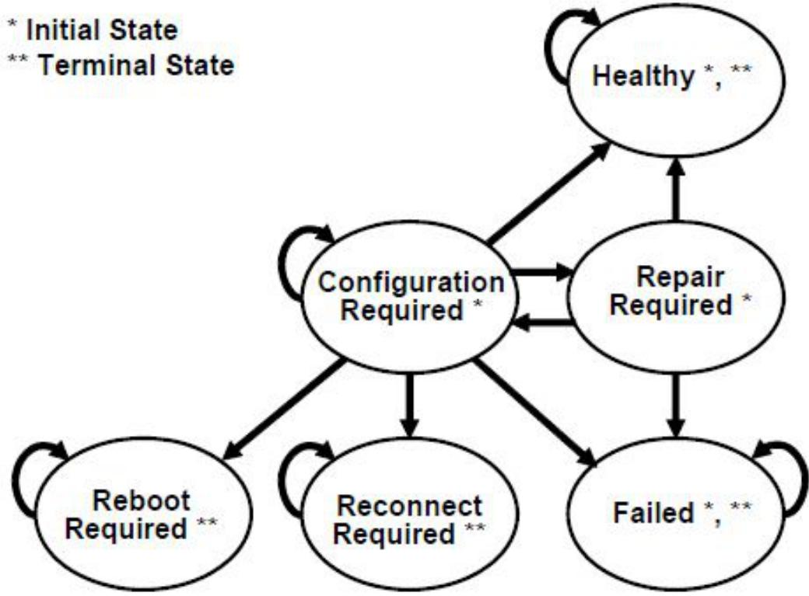
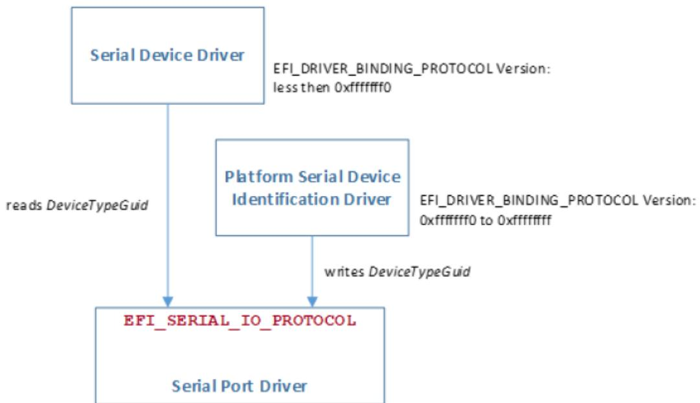
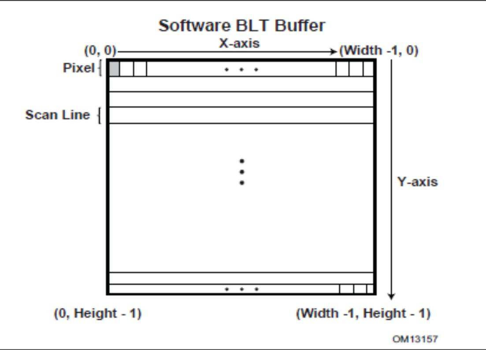
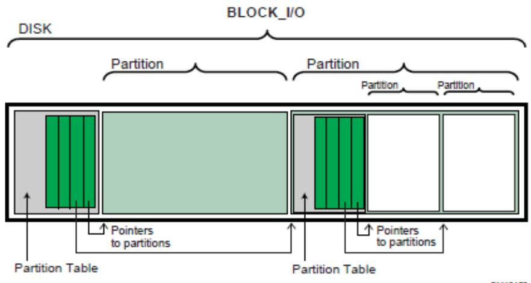

Table 10.67 – continued from previous page

<table><tr><td>Type: 2 (ACPI Device Path)SubType: 2 (ACPI Expanded Device Path)HIDSTR=emptyCIDSTR=emptyUID STR!=empty</td><td>AcpiExp(HID,CID,UIDSTR)The HID parameter is an EISAID. It is required.The CID parameter is an EISAID. It is optional and has a default value of 0.The UIDSTR parameter is a string. If UID is 0 and UIDSTR is empty, then use AcpiEx format.PciRoot(UID|UIDSTR) (Display Only)</td></tr><tr><td>Type: 2 (ACPI Device Path)SubType: 2 (ACPI Expanded Device Path)HID=PNP0A03 or CID=PNP0A03 and HID != PNP0A08.</td><td>PcieRoot(UID|UIDSTR) (Display Only)</td></tr><tr><td>Type: 2 (ACPI Device Path)SubType: 2 (ACPI Expanded Device Path)HID=PNP0A08 or CID=PNP0A08.</td><td>AcpiAdr(DisplayDevice[, DisplayDevice...])The DisplayDevice parameter is an Integer. There may be one or more, separated by a comma.</td></tr><tr><td>Type: 2 (ACPI Device Path)SubType: 3 (ACPI ADR Device Path)</td><td>NvdimmAcpiAdr(NFIT Device Handle)The NFIT Device Handle is an integer, the _ADR of the NVDIMM device</td></tr><tr><td>Type: 2 (ACPI Device Path)SubType: 4 (ACPI NVDIMM Device Path)</td><td>Msg(subtype, data)The subtype is an integer from 0-255.The data is a hex dump.</td></tr></table>

continues on next page

Table 10.67 – continued from previous page

<table><tr><td>Type: 3 (Messaging Device Path)SubType: 1 (ATAPI)</td><td>Ata (Controller,Drive,LUN)Ata (LUN) (Display only)The Controller is either an integer with a value of 0 or 1 or else the keyword Primary (0) or Secondary (1). It is required.The Drive is either an integer with the value of 0 or 1 or else the keyword Master (0) or Slave (1). It is required.The LUN is a 16-bit integer. It is required.</td></tr><tr><td>Type: 3 (Messaging Device Path) SubType: 2 (SCSI)</td><td>Scsi (PUN,LUN)The*PUN* is an integer between 0 and 65535 and is required.The LUN is an integer between 0 and 65535 and is required.</td></tr><tr><td>Type: 3 (Messaging Device Path)SubType: 3 (Fibre Channel)</td><td>Fibre (WWN,LUN)The WWN is a 64-bit unsigned integer and is required.The LUN is a 64-bit unsigned integer and is required.</td></tr><tr><td>Type: 3 (Messaging Device Path)SubType: 21 (Fibre Channel Ex)</td><td>FibreEx (WWN,LUN)The WWN is an 8 byte array that is displayed in hexadecimal format with byte 0 first (i.e., on the left) and byte 7 last (i.e., on the right), and is required.The LUN is an 8 byte array that is displayed in hexadecimal format with byte 0 first (i.e., on the left) and byte 7 last (i.e., on the right), and is required.</td></tr><tr><td>Type: 3 (Messaging Device Path)SubType: 4 (1394)</td><td>I1394 (GUID)The GUID is a GUID and is required.</td></tr><tr><td>Type: 3 (Messaging Device Path)SubType: 5 (USB)</td><td>USB (Port,Interface)The Port is an integer between 0 and 255 and is required.The Interface is an integer between 0 and 255 and is required.</td></tr><tr><td>Type: 3 (Messaging Device Path)SubType: 6 (I2O)</td><td>I2O (TID)The TID is an integer and is required.</td></tr></table>

continues on next page

Table 10.67 – continued from previous page

<table><tr><td>Type: 3 (Messaging Device Path)SubType: 9 (Infiniband)</td><td>Infiniband (Flags, Guid, ServiceId, TargetId, DeviceId)Flags is an integer.Guid is a guid.ServiceId, TargetId and DeviceId are 64-bit unsigned integers.All fields are required.</td></tr><tr><td>Type: 3 (Messaging Device Path)SubType: 10 (Vendor)</td><td>VenMsg(Guid, Data)The Guid is a GUID and is required.The Data is a Hex Dump and is option.The default value is zero bytes.</td></tr><tr><td></td><td>VenPcAnsi()</td></tr><tr><td>Type: 3 (Messaging Device Path)SubType: 10 (Vendor)GUID=EFI_PC_ANSI_GUID</td><td></td></tr><tr><td></td><td>VenVt100 ()</td></tr><tr><td>Type: 3 (Messaging Device Path)SubType: 10 (Vendor)GUID=EFI_VT_100_GUID</td><td></td></tr><tr><td></td><td>VenVt100Plus ()</td></tr><tr><td>Type: 3 (Messaging Device Path)SubType: 10 (Vendor)GUID=EFI_VT_100_PLUS_GUID</td><td></td></tr><tr><td></td><td>VenUtf8 ()</td></tr><tr><td>Type: 3 (Messaging Device Path)SubType: 10 (Vendor)GUID=EFI_VT_UTF8_GUID</td><td></td></tr></table>

continues on next page

continues on next page

Table 10.67 – continued from previous page

<table><tr><td>Type: 3 (Messaging Device Path)SubType: 10 (Vendor)GUID=DEVICE_PATH_MESSAGING_UART_FLOW_CONTROL</td><td>UartFlowCtrl (Value)The Value is either an integer with the value 0, 1 or 2 or the keywords XonXoff (2) or Hardware (1) or None (0).</td></tr><tr><td>Type: 3 (Messaging Device Path)SubType: 10 (Serial Attached SCSI)Vendor GUID: d487ddb4-008b-11d9-afdc-001083ffca4d</td><td>SAS (Address, LUN, RTP, SASSATA, Location, Connect, DriveBay, Reserved)The Address is a 64-bit unsigned integer representing the SAS Address and is required.The LUN is a 64-bit unsigned integer representing the Logical Unit Number and is optional. The default value is 0.The RTP is a 16-bit unsigned integer representing the Relative Target Port and is optional. The default value is 0.The SASSATA is a keyword SAS or SATA or NoTopology or an unsigned 16-bit integer and is optional. The default is NoTopology. If NoTopology or an integer are specified, then Location, Connect and DriveBay are prohibited. If SAS or SATA is specified, then Location and Connect are required, but DriveBay is optional. If an integer is specified, then the topology information is filled with the integer value.The Location is an integer between 0 and 1 or else the keyword Internal (0) or External (1) and is optional. If SASSATA is an integer or NoTopology, it is prohibited. The default value is 0.The Connect is an integer between 0 and 3 or else the keyword Direct (0) or Expanded (1) and is optional. If SASSATA is an integer or NoTopology, it is prohibited. The default value is 0.The DriveBay is an integer between 1 and 256 and is optional unless SASSATA is an integer or NoTopology, in which case it is prohibited. The Reserved field is an integer and is optional. The default value is 0.</td></tr><tr><td></td><td>DebugPort()</td></tr><tr><td>Type: 3 (Messaging Device Path)SubType: 10 (Vendor)GUID=EFI_DEBUGPORT_PROTOCOL_GUID</td><td></td></tr><tr><td>Type: 3 (Messaging Device Path)SubType: 11 (MAC Address)</td><td>MAC(MacAddr, IfType)The MacAddr is a Hex Dump and is required. If IfType is 0 or 1, then the MacAddr must be exactly six bytes.The IfType is an integer from 0-255 and is optional. The default is zero.</td></tr></table>

Table 10.67 – continued from previous page

<table><tr><td>Type: 3 (Messaging Device Path) SubType: 12 (IPv4)</td><td>IPv4(RemoteIp, Protocol, Type, LocalIp, GatewayIPAddress, SubnetMask) IPv4(RemoteIp) (Display Only) The RemoteIp is an IP Address and is required. The Protocol is an integer between 0 and 255 or else the keyword UDP (17) or TCP (6). The default value is UDP. The Type is a keyword, either Static (1) or DHCP (0). It is optional. The default value is DHCP. The LocalIp is an IP Address and is optional. The default value is all zeroes. The GatewayIPAddress is an IP Address and is optional. The default value is all zeroes. The SubnetMask is an IP Address and is optional. The default value is all zeroes.</td></tr><tr><td>Type: 3 (Messaging Device Path) SubType: 13 (IPv6)</td><td>IPv6(RemoteIp, Protocol, IPAddressOrigin, LocalIp, GatewayIPAddress, SubnetMask) IPv6(RemoteIp) (Display Only) The RemoteIp is an IPv6 Address and is required. The Protocol is an integer between 0 and 255 or else the keyword UDP (17) or TCP (6). The default value is UDP. The IPAddressOrigin is a keyword, could be Static (0), StatelessAutoConfigure (1), or StatefulAutoConfigure (2). The LocalIp is the IPv6 Address and is optional. The default value is all zeroes. The GatewayIPAddress is an IP Address. The PrefixLength is the prefix length of the Local IPv6 Address. The GatewayIPAddress is the IPv6 Address of the Gateway.</td></tr><tr><td>Type: 3 (Messaging Device Path) SubType: 14 (UART)</td><td>Uart(Baud, DataBits, Parity, StopBits) The Baud is a 64-bit integer and is optional. The default value is 115200. The DataBits is an integer from 0 to 255 and is optional. The default value is 8. The Parity is either an integer from 0-255 or else a keyword and should be D (0), N (1), E (2), O (3), M (4) or S (5). It is optional. The default value is 0. The StopBits is a either an integer from 0-255 or else a keyword and should be D (0), 1 (1), 1.5 (2), 2 (3). It is optional. The default value is 0. Parity and StopBits can either be two integers or two keywords. Mixing formats is prohibited.</td></tr></table>

continues on next page

Table 10.67 – continued from previous page

<table><tr><td>Type: 3 (Messaging Device Path) SubType: 15 (USB Class)</td><td>UsbClass (VID, PID, Class, SubClass, Protocol) The VID is an integer between 0 and 65535 and is optional. The default value is 0xFFFF. The PID is an integer between 0 and 65535 and is optional. The default value is 0xFFFF. The Class is an integer between 0 and 255 and is optional. The default value is 0xFF. The SubClass is an integer between 0 and 255 and is optional. The default value is 0xFF. The Protocol is an integer between 0 and 255 and is optional. The default value is 0xFF.</td></tr><tr><td>Type: 3 (Messaging Device Path) SubType: 15 (USB Class) Class 1</td><td>Us bAudio(VID, PID, SubClass, Protocol) The VID is an integer between 0 and 65535 and is optional. The default value is 0xFFFF. The PID is an integer between 0 and 65535 and is optional. The default value is 0xFFFF. The SubClass is an integer between 0 and 255 and is optional. The default value is 0xFF. The Protocol is an integer between 0 and 255 and is optional. The default value is 0xFF.</td></tr><tr><td>Type: 3 (Messaging Device Path) SubType: 15 (USB Class) Class 2</td><td>UsbCDCC ontrol(VID, PID, SubClass, Protocol) The VID is an optional integer between 0 and 65535 and is optional. The default value is 0xFFFF. The PID is an optional integer between 0 and 65535 and is optional. The default value is 0xFFFF. The SubClass is an optional integer between 0 and 255 and is optional. The default value is 0xFF. The Protocol is an optional integer between 0 and 255 and is optional. The default value is 0xFF.</td></tr></table>

continues on next page

Table 10.67 – continued from previous page

<table><tr><td>Type: 3 (Messaging Device Path)SubType: 15 (USB Class)Class 3</td><td>UsbHID(VID,PID,SubClass,Protocol)The VID is an integer between 0 and 65535 and is optional. The default value is 0xFFFF.The PID is an integer between 0 and 65535 and is optional. The default value is 0xFFFF.The SubClass is an integer between 0 and 255 and is optional. The default value is 0xFF.The Protocol is an integer between 0 and 255 and is optional. The default value is 0xFF.</td></tr><tr><td>Type: 3 (Messaging Device Path)SubType: 15 (USB Class)Class 6</td><td>Us bImage(VID,PID,SubClass,Protocol)The VID is an integer between 0 and 65535 and is optional. The default value is 0xFFFF.The PID is an integer between 0 and 65535 and is optional. The default value is 0xFFFF.The SubClass is an integer between 0 and 255 and is optional. The default value is 0xFF.The Protocol is an integer between 0 and 25 and is optional. The default value is 0xFF.</td></tr><tr><td>Type: 3 (Messaging Device Path)SubType: 15 (USB Class)Class 7</td><td>UsbP rinter(VID,PID,SubClass,Protocol)The VID is an integer between 0 and 65535 and is optional. The default value is 0xFFFF.The PID is an integer between 0 and 65535 and is optional. The default value is 0xFFFF.The SubClass is an integer between 0 and 255 and is optional. The default value is 0xFF.The Protocol is an integer between 0 and 25 5 and is optional. The default value is 0xFF.</td></tr><tr><td>Type: 3 (Messaging Device Path)SubType: 15 (USB Class)Class 8</td><td>UsbMassS torage(VID,PID,SubClass,Protocol)The VID is an integer between 0 and 65535 and is optional. The default value is 0xFFFF.The PID is an integer between 0 and 65535 and is optional. The default value is 0xFFFF.The SubClass is an integer between 0 and 255 and is optional. The default value is 0xFF.The Protocol is an integer between 0 and 25s and is optional. The default value is 0xFF.</td></tr></table>

continues on next page

Table 10.67 – continued from previous page

<table><tr><td>Type: 3 (Messaging Device Path)SubType: 15 (USB Class)Class 9</td><td>UsbHub(VID, PID, SubClass, Protocol)The VID is an integer between 0 and 65535 and is optional. The default value is 0xFFFF.The PID is an integer between 0 and 65535 and is optional. The default value is 0xFFFF.The SubClass is an integer between 0 and 255 and is optional. The default value is 0xFF.The Protocol is an integer between 0 and 255 and is optional. The default value is 0xFF.</td></tr><tr><td>Type: 3 (Messaging Device Path)SubType: 15 (USB Class)Class 10</td><td>UsbC DCData(VID, PID, SubClass, Protocol)The VID is an integer between 0 and 65535 and is optional. The default value is 0xFFFF.The PID is an integer between 0 and 65535 and is optional. The default value is 0xFFFF.The SubClass is an integer between 0 and 255 and is optional. The default value is 0xFF.The Protocol is an integer between 0 and 25 and is optional. The default value is 0xFF.</td></tr><tr><td>Type: 3 (Messaging Device Path)SubType: 15 (USB Class)Class 11</td><td>UsbSma rtCard(VID, PID, SubClass, Protocol)The VID is an integer between 0 and 65535 and is optional. The default value is 0xFFFF.The PID is an integer between 0 and 65535 and is optional. The default value is 0xFFFF.The SubClass is an integer between 0 and 255 and is optional. The default value is 0xFF.The Protocol is an integer between 0 and 25 at and is optional. The default value is 0xFF.</td></tr></table>

continues on next page

Table 10.67 – continued from previous page

<table><tr><td>Type: 3 (Messaging Device Path)SubType: 15 (USB Class)Class 14</td><td>Us bVideo(VID,PID,SubClass,Protocol)The VID is an integer between 0 and 65535 and is optional. The default value is 0xFFFF.The PID is an integer between 0 and 65535 and is optional. The default value is 0xFFFF.The SubClass is an integer between 0 and 255 and is optional. The default value is 0xFF.The Protocol is an integer between 0 and 255 and is optional. The default value is 0xFF.</td></tr><tr><td>Type: 3 (Messaging Device Path)SubType: 15 (USB Class)Class 220</td><td>Us bDiagnostic(VID,PID,SubClass,Protocol)The VID is an integer between 0 and 65535 and is optional. The default value is 0xFFFF.The PID is an integer between 0 and 65535 and is optional. The default value is 0xFFFF.The SubClass is an integer between 0 and 255 and is optional. The default value is 0xFF.The Protocol is an integer between 0 and 25 and is optional. The default value is 0xFF.</td></tr><tr><td>Type: 3 (Messaging Device Path)SubType: 15 (USB Class)Class 224</td><td>UsbWi reless(VID,PID,SubClass,Protocol)The VID is an integer between 0 and 65535 and is optional. The default value is 0xFFFF.The PID is an integer between 0 and 65535 and is optional. The default value is 0xFFFF.The SubClass is an integer between 0 and 255 and is optional. The default value is 0xFF.The Protocol is an integer between 0 and 25 at and is optional. The default value is 0xFF.</td></tr><tr><td>Type: 3 (Messaging Device Path)SubType: 15 (USB Class)Class 254SubClass: 1</td><td>UsbDevic eFirmwareUpdate(VID,PID,Protocol)The VID is an integer between 0 and 65535 and is optional. The default value is 0xFFFF.The PID is an integer between 0 and 65535 and is optional. The default value is 0xFFFF.The Protocol is an integer between 0 and 255 and is optional. The default value is 0xFF.</td></tr></table>

continues on next page

Table 10.67 – continued from previous page

<table><tr><td>Type: 3 (Messaging Device Path)SubType: 15 (USB Class)Class 254SubClass: 2</td><td>UsbIrdaBridge(VID, PID, Protocol)The VID is an integer between 0 and 65535 and is optional. The default value is 0xFFFF.The PID is an integer between 0 and 65535 and is optional. The default value is 0xFFFF.The Protocol is an integer between 0 and 255 and is optional. The default value is 0xFF.</td></tr><tr><td>Type: 3 (Messaging Device Path)SubType: 15 (USB Class)Class 254SubClass: 3</td><td>UsbTes tAndMeasurement(VID, PID, Protocol)The VID is an integer between 0 and 65535 and is optional. The default value is 0xFFFF.The PID is an integer between 0 and 65535 and is optional. The default value is 0xFFFF.The Protocol is an integer between 0 and 255 and is optional. The default value is 0xFF.</td></tr><tr><td>Type: 3 (Messaging Device Path)SubType:16 (USB WWID Class)</td><td>UsbWwi d(VID, PID, InterfaceNumber,&quot;WWID&quot;)The VID is an integer between 0 and 65535 and is required.The PID is an integer between 0 and 65535 and is required.The InterfaceNumber is an integer between 0 and 255 and is required.The WWID is a string and is required.</td></tr><tr><td>Type: 3 (Messaging Device Path)SubType: 17 (Logical Unit Class)</td><td>Unit(LUN)The LUN is an integer and is required.</td></tr><tr><td>Type: 3 (Messaging Device Path)SubType: 18 (SATA)</td><td>Sata(HPN, PMPN, LUN)The HPN is an integer between 0 and 65534 and is required.The PMPN is an integer between 0 and 65535 and is optional. If not provided, the default is 0xFFFF, which implies no port multiplier.The LUN is a 16-bit integer. It is required. Note that LUN is applicable to ATAPI devices only, and most ATAPI devices assume LUN=0</td></tr></table>

continues on next page

Table 10.67 – continued from previous page

<table><tr><td>Type: 3 (Messaging Device Path) SubType: 19 (iSCSI)</td><td>iSCSI(TargetName, PortalGroup, LUN, HeaderDigest, DataDigest, Authentication, Protocol)The TargetName is a string and is required. PortalGroup is an unsigned 16-bit integer and is required.The LUN is an 8 byte array that is displayed in hexadecimal format with byte 0 first (i.e., on the left) and byte 7 last (i.e., on the right), and is required.The HeaderDigest is a keyword None or CRC32C is optional. The default is None. The DataDigest is a keyword None or CRC32C is optional. The default is None. The Authentication is a keyword None or CHAP_BI or CHAP_UNI and optional. The default is None.The Protocol defines the network protocol used by iSCSI and is optional. The default is TCP.</td></tr><tr><td></td><td>Vlan (VlanId)</td></tr><tr><td>Type: 3 (Messaging Device Path) SubType: 20 (VLAN)</td><td></td></tr><tr><td>Type: 3 (Messaging Device Path) SubType: 22 (Serial Attached SCSI Ex)</td><td>SasEx (Address, LUN, RTP, SASSATA, Location, Connect, DriveBay)The Address is an 8 byte array that is displayed in hexadecimal format with byte 0 first (i.e., on the left) and byte 7 last (i.e., on the right), and is required.The LUN is an 8 byte array that is displayed in hexadecimal format with byte 0 first (i.e., on the left) and byte 7 last (i.e., on the right), and is optional. The default value is 0.The RTP is a 16-bit unsigned integer representing the Relative Target Port and is optional. The default value is 0.The SASSATA is a keyword SA S or SATA or NoTopology or an unsigned 16-bit integer and is optional. The default is NoTopology. If NoTopology or an integer are specified, then Location , Connect and DriveBay are prohibited. If SAS or SATA is specified, then Location and Connect are required, but DriveBay is optional. If an integer is specified, then the topology information is filled with the integer value.The Location is an integer between 0 and 1 or else the keyword Internal (0) or External (1) and is optional. If SASSATA is an integer or NoTopology , it is prohibited. The default value is 0.The Connect is an integer between 0 and 3 or else the keyword Direct (0) or Expanded (1) and is optional. If SASSATA is an integer or NoTopology , it is prohibited. The default value is 0.The DriveBay is an integer between 1 and 256 and is optional unless SASSATA is an integer or NoTopology , in which case it is prohibited.</td></tr></table>

continues on next page

Table 10.67 – continued from previous page

<table><tr><td>Type: 3 (Messaging Device Path)SubType: 23 (NVM Express Namespace)</td><td>NVMe(NSID,EUI)The NSID is a namespace identifier that is displayed in hexadecimal format with an integer value between 0 and 0xFFFFFFFF.The EUI is the IEEE Extended Unique Identifier (EUI-64) that is displayed in hexadecimal format represented as a set of octets separated by dashes (hexadecimal notation), e.g., FF-FF-FF-FF-FF-FF-FF-FF.</td></tr><tr><td>Type: 3 (Messaging Device Path)SubType: 24 (URI)</td><td>Uri(Uri)The Uri is optional.</td></tr><tr><td>Type: 3 (Messaging Device Path)SubType: 25 (Universal Flash Storage)</td><td>UFS (PUN,LUN)The PUN is 0 for current UFS2.0 spec. For future UFS specs which support multiple devices on a UFS port, it would reflect the device ID on the UFS port.The LUN is 0-7 for common LUNs or 81h, D0h, B0h and C4h for well-known LUNs supported by UFS.</td></tr><tr><td>Type: 3 (Messaging Device Path)SubType: 26 (SD)</td><td>SD (Slot Number)SlotNumber is an integer. It is optional and has a default value of 0.</td></tr><tr><td>Type: 3 (Messaging Device Path)SubType: 27 (Bluetooth)</td><td>Bluetooth(BD_ADDR)BD_ADDR is HEX dump of 48-bit Bluetooth device address.</td></tr><tr><td>Type: 3 (Messaging Device Path)SubType: 28 (Wi-Fi)</td><td>Wi-Fi (SSID)The SSID is a string and is required.</td></tr><tr><td>Type: 3 (Messaging Device Path)SubType: 29 (eMMC)</td><td>eMMC (SlotNumber)SlotNumber is an integer. It is optional and has a default value of 0.</td></tr></table>

continues on next page

Table 10.67 – continued from previous page

<table><tr><td>Type: 3 (Messaging Device Path)SubType: 30 (BluetoothLE)</td><td>BluetoothLE(BD_ADDR, AddressType)BD_ADDR is HEX dump of 48-bit Bluetooth device address.AddressType is an integer.</td></tr><tr><td>Type: 3 (Messaging Device Path)SubType: 31 (DNS)</td><td>Dns(DnsServerIp[, DnsServerIp...])DnsServerIp is optional. It is the IP address of DNS server.</td></tr><tr><td>Type: 3 (Messaging Device Path)SubType: 32 (NVDIMM Service)</td><td>NVDIMM(UUID)Namespace Unique Identifier UUID</td></tr><tr><td>Type: 3 (Messaging Device Path)SubType: 33 (REST Service)</td><td>RestService(RestExServiceType, AccessMode)For vendor-specific REST service:RestService(RestExServiceType, AccessMode,VendorRestServiceGuid,VendorDefinedData)RestExServiceType is 0xff in this case.</td></tr><tr><td>Type: 3 (Messaging Device Path)SubType: 34 (NVMe-oF Namespace)</td><td>NVMEoF(SubsystemNQN, NID)SubsystemNQN – Maximum 224 byte unique subsystem identifier including null termination in compliance with the NVM Express® Base Specification.NID – Globally unique identifier defined by the value of the Namespace Identifier (NID) defined by the Namespace Identification Descriptor from the NVM Express® Base Specification.</td></tr><tr><td>Type: 4 (Media Device Path)(when subtype is not recognized)</td><td>MediaPath(subtype, data)The subtype is an integer from 0-255 and is required. The data is a hex dump.</td></tr></table>

continues on next page

Table 10.67 – continued from previous page

<table><tr><td>Type: 4 (Media Device Path)SubType: 1 (Hard Drive)</td><td>H D(Partition,Type,Signature,Start, Size)HD(Partition,Type,Signature) (Display Only)The Partition is an integer representing the partition number. It is optional and the default is 0. If Partition is 0, then Start and Size are prohibited. The Type is an integer between 0-255 or else the keyword MBR (1) or GPT (2). The type is optional and the default is 2.Signature is an integer if Type is 1 or else GUID if Type is 2. The signature is required.The Start is a 64-bit unsigned integer. It is prohibited if Partition is 0.Otherwise it is required.The Size is a 64-bit unsigned integer. It is prohibited if Partition is 0.Otherwise it is required.</td></tr><tr><td>Type: 4 (Media Device Path)SubType: 2 (CD-ROM)</td><td>CDROM(Entry,Start,Size)CDROM(Entry) (Display Only)The Entry is an integer representing the Boot Entry from the Boot Catalog. It is optional and the default is 0.The Start is a 64-bit integer and is required.The Size is a 64-bit integer and is required.</td></tr><tr><td>Type: 4 (Media | Device Path)SubType: 3 (Vendor)</td><td>VenMedia(GUID, Data)The Guid is a GUID and is required. |The Data is a Hex Dump and is option. The default value is zero bytes.</td></tr><tr><td>Type: 4 (Media Device Path)SubType: 4 (File Path)</td><td>StringThe String is the file path and is a string.</td></tr><tr><td>Type: 4 (Media Device Path)SubType: 5 (Media Protocol)</td><td>Media(Guid)The Guid is a GUID and is required.</td></tr></table>

continues on next page

Table 10.67 – continued from previous page

<table><tr><td></td><td>Contents are defined in the UEFI PI Specification.</td></tr><tr><td>Type: 4 (Media Device Path)SubType: 6 (PIWG Firmware File)</td><td></td></tr><tr><td></td><td>Contents are defined in the UEFI PI Specification.</td></tr><tr><td>Type: 4 (Media Device Path)SubType: 7 (PIWG Firmware Volume)</td><td></td></tr><tr><td>Type: 4 (Media Device Path)SubType: 8 (Relative Offset Range)</td><td>Offset (StartingOffset,EndingOffset)The StartingOffset is an unsigned 64-bit integer. The EndingOffset is an unsigned 64-bit integer.</td></tr><tr><td>Type: 4 (Media Device Path)SubType: 9 (RAM Disk)</td><td>RamDisk ( StartingAddress , EndingAddress , DiskInstance , DiskTypeGuid )The StartingAddress and EndingAddress are both 64-bit integers and are both required.The DiskInstance is a 16-bit integer and is optional. The default value is 0.The DiskTypeGuid is a GUID and is required.</td></tr><tr><td>Type: 4 (Media Device Path)SubType: 9 (RAM Disk)Disk Type GUID= EFI_VIRTUAL_DISK _GUID</td><td>VirtualDisk StartingAddress , EndingAddress , DiskInstance )The StartingAddress and EndingAddress are both 64-bit integers and are both required.The DiskInstance is a 16-bit integer and is optional. The default value is 0.</td></tr><tr><td>Type: 4 (Media Device Path)SubType: 9 (RAM Disk)Disk Type GUID= EFI_VIRTUAL_CD _GUID</td><td>VirtualCD ( StartingAddress , EndingAddress , DiskInstance )The StartingAddress and EndingAddress are both 64-bit integers and are both required.The DiskInstance is a 16-bit integer and is optional. The default value is 0.</td></tr></table>

continues on next page

Table 10.67 – continued from previous page

<table><tr><td>Type: 4 (Media Device Path)SubType: 9 (RAM Disk)Disk Type GUID= EFI_PERSISTENT _VIRTUAL_DISK _GUID</td><td>PersistentVirtualDisk ( StartingAddress , EndingAddress , DiskInstance )The StartingAddress and EndingAddress are both 64-bit integers and are both required.The DiskInstance is a 16-bit integer and is optional. The default value is 0.</td></tr><tr><td>Type: 4 (Media Device Path)SubType: 9 (RAM Disk)Disk Type GUID= EFI_PERSISTENT _VIRTUAL_CD_GUID</td><td>PersistentVirtualCD( StartingAddress ,EndingAddress ,DiskInstance )The StartingAddress and EndingAddress are both 64-bit integers and are both required.The DiskInstance is a 16-bit integer and is optional. The default value is 0.</td></tr><tr><td>Type: 5 (Media Device Path)(when subtype is not recognized)</td><td>BbsPath(subtype, data)The subtype is an integer from 0-255.The data is a hex dump.</td></tr><tr><td>Type: 5 (BIOS Boot Specification Device Path)SubType: 1 (BBS 1.01)</td><td>BBS(Type,Id,Flags)BBS(Type, Id) (Display Only)The Type is an integer from 0-65535 or else one of the following keywords: Floppy (1), HD (2), CDROM (3), PCMCIA (4), USB (5), Network (6). It is required.The Id is a string and is required.The Flags are an integer and are optional. The default value is 0.</td></tr></table>

## 10.6.2 Device Path to Text Protocol

## 10.6.2.1 EFI\_DEVICE\_PATH\_TO\_TEXT\_PROTOCOL

## Summary

Convert device nodes and paths to text.

GUID

```c
#define EFI_DEVICE_PATH_TO_TEXT_PROTOCOL_GUID \
{0x8b843e20,0x8132,0x4852,\
{0x90,0xcc,0x55,0x1a,0x4e,0x4a,0x7f,0x1c}}
```

```txt
typedef
CHAR16*
(EFIAPI *EFI_DEVICE_PATH_TO_TEXT_NODE) (
    IN CONST EFI_DEVICE_PATH_PROTOCOL* DeviceNode,
    IN BOOLEAN DisplayOnly,
    IN BOOLEAN AllowShortcuts
);
```

## Protocol Interface Structure

```c
typedef struct _EFI_DEVICE_PATH_TO_TEXT_PROTOCOL {
    EFI_DEVICE_PATH_TO_TEXT_NODE ConvertDeviceNodeToText;
    EFI_DEVICE_PATH_TO_TEXT_PATH ConvertDevicePathToText;
} EFI_DEVICE_PATH_TO_TEXT_PROTOCOL;
```

## Parameters

ConvertDeviceNodeToText Converts a device node to text.

```txt
ConvertDevicePathToText
Converts a device path to text.
```

## Description

The EFI\_DEVICE\_PATH\_TO\_TEXT\_PROTOCOL provides common utility functions for converting device nodes and device paths to a text representation.

## 10.6.3 EFI\_DEVICE\_PATH\_TO\_TEXT\_PROTOCOL.ConvertDeviceNodeToText()

## Summary

Convert a device node to its text representation.

## Prototype

## Parameters

## DeviceNode

Points to the device node to be converted.

## DisplayOnly

If DisplayOnly is TRUE, then the shorter text representation of the display node is used, where applicable. If DisplayOnly is FALSE, then the longer text representation of the display node is used.

## AllowShortcuts

If AllowShortcuts is TRUE, then the shortcut forms of text representation for a device node can be used, where applicable.

## Description

The ConvertDeviceNodeToText function converts a device node to its text representation and copies it into a newly allocated bufer.

The DisplayOnly parameter controls whether the longer (parseable) or shorter (display-only) form of the conversion is used.

The AllowShortcuts is FALSE, then the shortcut forms of text representation for a device node cannot be used. A shortcut form is one which uses information other than the type or subtype.

The memory is allocated from EFI boot services memory. It is the responsibility of the caller to free the memory allocated.

## Related Definitions

EFI\_DEVICE\_PATH\_PROTOCOL is defined in EFI Device Path Protocol

## Returns

This function returns the pointer to the allocated text representation of the device node data or else NULL if DeviceNode was NULL or there was insuficient memory.

## 10.6.4 EFI\_DEVICE\_PATH\_TO\_TEXT\_PROTOCOL.ConvertDevicePathToText()

## Summary

Convert a device path to its text representation.

Prototype

<table><tr><td>typedefCHAR16*(EFIAPI *EFI_DEVICE_PATH_TO_TEXT_PATH) (IN CONST EFI_DEVICE_PATH_PROTOCOL *DevicePath,IN BOOLEAN DisplayOnly,IN BOOLEAN AllowShortcuts);</td></tr></table>

## Parameters

## DeviceNode

Points to the device path to be converted.

## DisplayOnly

If DisplayOnly is TRUE, then the shorter text representation of the display node is used, where applicable. If DisplayOnly is FALSE, then the longer text representation of the display node is used.

## AllowShortcuts

The AllowShortcuts is FALSE, then the shortcut forms of text representation for a device node cannot be used.

## Description

This function converts a device path into its text representation and copies it into an allocated bufer.

The DisplayOnly parameter controls whether the longer (parseable) or shorter (display-only) form of the conversion is used.

The AllowShortcuts is FALSE, then the shortcut forms of text representation for a device node cannot be used. A shortcut form is one which uses information other than the type or subtype.

The memory is allocated from EFI boot services memory. It is the responsibility of the caller to free the memory allocated.

## Related Definitions

EFI\_DEVICE\_PATH\_PROTOCOL\* is defined in EFI Device Path Protocol.

## Returns

This function returns a pointer to the allocated text representation of the device node or NULL if DevicePath was NULL or there was insuficient memory.

## 10.6.5 Device Path from Text Protocol

## 10.6.5.1 EFI\_DEVICE\_PATH\_FROM\_TEXT\_PROTOCOL

## Summary

Convert text to device paths and device nodes.

## GUID

```c
#define EFI_DEVICE_PATH_FROM_TEXT_PROTOCOL_GUID \
{0x5c99a21,0xc70f,0x4ad2,\
{0x8a,0x5f,0x35,0xdf,0x33,0x43,0xf5, 0x1e}}
```

## Protocol Interface Structure

```c
typedef struct _EFI_DEVICE_PATH_FROM_TEXT_PROTOCOL {
EFI_DEVICE_PATH_FROM_TEXT_NODE ConvertTextToDevicNode;
EFI_DEVICE_PATH_FROM_TEXT_PATH ConvertTextToDevicPath;
} EFI_DEVICE_PATH_FROM_TEXT_PROTOCOL;
```

## Parameters

ConvertTextToDeviceNode

Converts text to a device node.

ConvertTextToDevicePath

## Description

The EFI\_DEVICE\_PATH\_FROM\_TEXT\_PROTOCOL provides common utilities for converting text to device paths and device nodes.

## 10.6.5.2 EFI\_DEVICE\_PATH\_FROM\_TEXT\_PROTOCOL.ConvertTextToDeviceNode()

## Summary

Convert text to the binary representation of a device node.

## Prototype

```txt
typedef
EFI_DEVICE_PATH_PROTOCOL*
(EFIAPI *EFI_DEVICE_PATH_FROM_TEXT_NODE) (
    IN CONST CHAR16* TextDeviceNode
);
```

## Parameters

## TextDeviceNode

TextDeviceNode points to the text representation of a device node. Conversion starts with the first character and continues until the first non-device node character.

## Description

This function converts text to its binary device node representation and copies it into an allocated bufer.

The memory is allocated from EFI boot services memory. It is the responsibility of the caller to free the memory allocated.

## Related Definitions

EFI\_DEVICE\_PATH\_PROTOCOL is defined in EFI Device Path Protocol .

## Returns

This function returns a pointer to the EFI device node or NULL if TextDeviceNode is NULL or there was insuficient memory.

## 10.6.5.3 EFI\_DEVICE\_PATH\_FROM\_TEXT\_PROTOCOL.ConvertTextToDevicePath(

## Summary

Convert a text to its binary device path representation.

Prototype

```txt
typedef
EFI_DEVICE_PATH_PROTOCOL*
(EFIAPI *EFI_DEVICE_PATH_FROM_TEXT_PATH) (
    IN CONST CHAR16* TextDevicePath
);
```

## Parameters

## TextDevicePath

TextDevicePath points to the text representation of a device path. Conversion starts with the first character and continues until the first non-device path character.

## Description

This function converts text to its binary device path representation and copies it into an allocated bufer.

The memory is allocated from EFI boot services memory. It is the responsibility of the caller to free the memory allocated.

## Related Definitions

EFI\_DEVICE\_PATH\_PROTOCOL is defined in EFI Device Path Protocol .

## Returns

This function returns a pointer to the allocated device path or NULL if TextDevicePath is NULL or there was insuficient memory.

# PROTOCOLS — UEFI DRIVER MODEL

EFI drivers that follow the UEFI Driver Model are not allowed to search for controllers to manage. When a specific controller is needed, the EFI boot service EFI\_BOOT\_SERVICES.ConnectController() is used along with the EFI Driver Binding Protocol services to identify the best drivers for a controller. Once ConnectController() has identified the best drivers for a controller, the start service in the EFI\_DRIVER\_BINDING\_PROTOCOL is used by ConnectController() to start each driver on the controller. Once a controller is no longer needed, it can be released with the EFI boot service EFI\_BOOT\_SERVICES.DisconnectController() . DisconnectController() calls the stop service in each EFI\_DRIVER\_BINDING\_PROTOCOL to stop the controller.

The driver initialization routine of an UEFI driver is not allowed to touch any device hardware. Instead, it just installs an instance of the EFI\_DRIVER\_BINDING\_PROTOCOL on the ImageHandle of the UEFI driver. The test to determine if a driver supports a given controller must be performed in as little time as possible without causing any side efects on any of the controllers it is testing. As a result, most of the controller initialization code is present in the start and stop services of the EFI\_DRIVER\_BINDING\_PROTOCOL.

## 11.1 EFI Driver Binding Protocol

This section provides a detailed description of the EFI\_DRIVER\_BINDING\_PROTOCOL . This protocol is produced by every driver that follows the UEFI Driver Model, and it is the central component that allows drivers and controllers to be managed. It provides a service to test if a specific controller is supported by a driver, a service to start managing a controller, and a service to stop managing a controller. These services apply equally to drivers for both bus controllers and device controllers.

## 11.1.1 EFI\_DRIVER\_BINDING\_PROTOCOL

## Summary

Provides the services required to determine if a driver supports a given controller. If a controller is supported, then it also provides routines to start and stop the controller.

## GUID

```txt
#define EFI_DRIVER_BINDING_PROTOCOL_GUID \
{0x18A031AB,0xB443,0x4D1A,\
{0xA5,0xC0,0xC,0x09,0x26,0x1E,0x9F,0x71}}
```

## Protocol Interface Structure

```c
typedef struct \_EFI_DRIVER_BINDING_PROTOCOL {
    EFI_DRIVER_BINDING_PROTOCOL_SUPPORTED Supported;
    EFI_DRIVER_BINDING_PROTOCOL_START Start;
```

(continues on next page)

<table><tr><td></td><td>(continued from previous page)</td></tr><tr><td>EFI_DRIVER_BINDING_PROTOCOL_STOP</td><td>Stop;</td></tr><tr><td>UINT32</td><td>Version;</td></tr><tr><td>EFI__HANDLE</td><td>ImageHandle;</td></tr><tr><td>EFI_HANDLE</td><td>DriverBindingHandle;</td></tr><tr><td colspan="2">} EFI_DRIVER_BINDING_PROTOCOL;</td></tr></table>

## Parameters

## Supported

Tests to see if this driver supports a given controller. This service is called by the EFI boot service EFI\_BOOT\_SERVICES.ConnectController() . In order to make drivers as small as possible, there are a few calling restrictions for this service. ConnectController() must follow these calling restrictions. If any other agent wishes to call EFI\_DRIVER\_BINDING\_PROTOCOL.Supported() it must also follow these calling restrictions. See the Supported() function description.

## Start

Starts a controller using this driver. This service is called by the EFI boot service ConnectController(). In order to make drivers as small as possible, there are a few calling restrictions for this service. ConnectController() must follow these calling restrictions. If any other agent wishes to call EFI\_DRIVER\_BINDING\_PROTOCOL.Start() it must also follow these calling restrictions. See the Start() function description.

## Stop

Stops a controller using this driver. This service is called by the EFI boot service EFI\_BOOT\_SERVICES.DisconnectController() . In order to make drivers as small as possible, there are a few calling restrictions for this service. DisconnectController() must follow these calling restrictions. If any other agent wishes to call EFI\_DRIVER\_BINDING\_PROTOCOL.Stop() it must also follow these calling restrictions. See the Stop() function description.

## Version

The version number of the UEFI driver that produced the EFI\_DRIVER\_BINDING\_PROTOCOL. This field is used by the EFI boot service ConnectController() to determine the order that driver’s Supported() service will be used when a controller needs to be started. EFI Driver Binding Protocol instances with higher Version values will be used before ones with lower Version values. The Version values of 0x0-0x0f and 0xffff0-0xffff are reserved for platform/OEM specific drivers. The Version values of 0x10-0xfffef are reserved for IHVdeveloped drivers.

## ImageHandle

The image handle of the UEFI driver that produced this instance of the EFI\_DRIVER\_BINDING\_PROTOCOL.

## DriverBindingHandle

The handle on which this instance of the EFI\_DRIVER\_BINDING\_PROTOCOL is installed. In most cases, this is the same handle as ImageHandle. However, for UEFI drivers that produce more than one instance of the EFI\_DRIVER\_BINDING\_PROTOCOL, this value may not be the same as ImageHandle.

## Description

The EFI\_DRIVER\_BINDING\_PROTOCOL provides a service to determine if a driver supports a given controller. If a controller is supported, then it also provides services to start and stop the controller. All UEFI drivers are required to be reentrant so they can manage one or more controllers. This requires that drivers not use global variables to store device context. Instead, they must allocate a separate context structure per controller that the driver is managing. Bus drivers must support starting and stopping the same bus multiple times, and they must also support starting and stopping all of their children, or just a subset of their children.

## 11.1.2 EFI\_DRIVER\_BINDING\_PROTOCOL.Supported()

## Summary

Tests to see if this driver supports a given controller. If a child device is provided, it further tests to see if this driver supports creating a handle for the specified child device.

## Prototype

```txt
typedef
EFI_STATUS
(EFIAPI *EFI_DRIVER_BINDING_PROTOCOL_SUPPORTED) (
    IN EFI_DRIVER_BINDING_PROTOCOL    *This,
    IN EFI_HANDLE    ControllerHandle,
    IN EFI_DEVICE_PATH_PROTOCOL    *RemainingDevicePath OPTIONAL
);
```

## Parameters

## This

A pointer to the EFI Driver Binding Protocol instance.

## ControllerHandle

The handle of the controller to test. This handle must support a protocol interface that supplies an I/O abstraction to the driver. Sometimes just the presence of this I/O abstraction is enough for the driver to determine if it supports ControllerHandle. Sometimes, the driver may use the services of the I/O abstraction to determine if this driver supports ControllerHandle.

## RemainingDevicePath

A pointer to the remaining portion of a device path. For bus drivers, if this parameter is not NULL, then the bus driver must determine if the bus controller specified by ControllerHandle and the child controller specified by RemainingDevicePath are both supported by this bus driver.

## Description

This function checks to see if the driver specified by This supports the device specified by ControllerHandle. Drivers will typically use the device path attached to ControllerHandle and/or the services from the bus I/O abstraction attached to ControllerHandle to determine if the driver supports ControllerHandle. This function may be called many times during platform initialization. In order to reduce boot times, the tests performed by this function must be very small, and take as little time as possible to execute. This function must not change the state of any hardware devices, and this function must be aware that the device specified by ControllerHandle may already be managed by the same driver or a diferent driver. This function must match its calls to EFI\_BOOT\_SERVICES.AllocatePages() with EFI\_BOOT\_SERVICES.FreePages()

EFI\_BOOT\_SERVICES.AllocatePool() with EFI\_BOOT\_SERVICES.FreePool() and EFI\_BOOT\_SERVICES.OpenProtocol() with EFI\_BOOT\_SERVICES.CloseProtocol() . Since ControllerHandle may have been previously started by the same driver, if a protocol is already in the opened state, then it must not be closed with CloseProtocol() . This is required to guarantee the state of ControllerHandle is not modified by this function.

If any of the protocol interfaces on the device specified by ControllerHandle that are required by the driver specified by This are already open for exclusive access by a diferent driver or application, then EFI\_ACCESS\_DENIED is returned.

If any of the protocol interfaces on the device specified by ControllerHandle that are required by the driver specified by This are already opened by the same driver, then EFI\_ALREADY\_STARTED is returned. However, if the driver specified by This is a bus driver, then it is not an error, and the bus driver should continue with its test of ControllerHandle and RemainingDevicePath . This allows a bus driver to create one child handle on the first call to EFI\_DRIVER\_BINDING\_PROTOCOL.Supported() and EFI\_DRIVER\_BINDING\_PROTOCOL.Start(), and create additional child handles on additional calls to Supported() and Start() .This also allows a bus driver to create no child handle on the first call to Supported() and Start() by specifying an End of Device Path Node RemainingDevicePath , and create additional child handles on additional calls to Supported() and Start() .

If ControllerHandle is not supported by This, then EFI\_UNSUPPORTED is returned.

If This is a bus driver that creates child handles with an EFI Device Path Protocol , then ControllerHandle must support the EFI\_DEVICE\_PATH\_PROTOCOL . If it does not, then EFI\_UNSUPPORTED is returned.

If ControllerHandle is supported by This, and This is a device driver, then EFI\_SUCCESS is returned.

If ControllerHandle is supported by This, and This is a bus driver, and RemainingDevicePath is NULL or the first Device Path Node is the End of Device Path Node, then EFI\_SUCCESS is returned.

If ControllerHandle is supported by This, and This is a bus driver, and RemainingDevicePath is not NULL , then RemainingDevicePath must be analyzed. If the first node of RemainingDevicePath is the End of Device Path Node or an EFI Device Path node that the bus driver recognizes and supports, then EFI\_SUCCESS is returned. Otherwise, EFI\_UNSUPPORTED is returned.

The Supported() function is designed to be invoked from the EFI boot service EFI\_BOOT\_SERVICES.ConnectController() . As a result, much of the error checking on the parameters to Supported() has been moved into this common boot service. It is legal to call Supported() from other locations, but the following calling restrictions must be followed or the system behavior will not be deterministic.

ControllerHandle must be a valid EFI\_HANDLE . If RemainingDevicePath is not NULL , then it must be a pointer to a naturally aligned EFI\_DEVICE\_PATH\_PROTOCOL .

## Status Codes Returned

<table><tr><td>EFI_SUCCESS</td><td>The device specified by ControllerHandle and RemainingDevicePath is supported by the driver specified by This.</td></tr><tr><td>EFI_ALREADY_STARTED</td><td>The device specified by ControllerHandle and RemainingDevicePath is already being managed by the driver specified by This.</td></tr><tr><td>EFI_ACCESS_DENIED</td><td>The device specified by ControllerHandle and RemainingDevicePath is already being managed by a different driver or an application that requires exclusive access.</td></tr><tr><td>EFI_UNSUPPORTED</td><td>The device specified by ControllerHandle and RemainingDevicePath is not supported by the driver specified by This.</td></tr></table>

## Examples

```c
extern EFI_GUID gEfiDriverBindingProtocolGuid;
EFI_HANDLE DriverImageHandle;
EFI_HANDLE ControllerHandle;
EFI_DRIVER_BINDING_PROTOCOL *DriverBinding;
EFI_DEVICE_PATH_PROTOCOL *RemainingDevicePath;

//
// Use the DriverImageHandle to get the Driver Binding protocol instance
//
Status = gBS->OpenProtocol (
DriverImageHandle,
&gEfiDriverBindingProtocolGuid,
&DriverBinding,
DriverImageHandle,
NULL,
EFI_OPEN_PROTOCOL_GET_PROTOCOL
```

(continued from previous page)

```c
);
if (EFI_ERROR (Status)) {
    return Status;
}

// EXAMPLE #1
// Use the Driver Binding Protocol instance to test to see if the
// driver specified by DriverImageHandle supports the controller
// specified by ControllerHandle
// Status = DriverBinding->Supported (
    DriverBinding,
    ControllerHandle,
    NULL
);
return Status;

// EXAMPLE #2
// The RemainingDevicePath parameter can be used to initialize only
// the minimum devices required to boot. For example, maybe we only
// want to initialize 1 hard disk on a SCSI channel. If DriverImageHandle
// is a SCSI Bus Driver, and ControllerHandle is a SCSI Controller, and
// we only want to create a child handle for PUN=3 and LUN=0, then the
// RemainingDevicePath would be SCSI(3,0)/END. The following example
// would return EFI_SUCCESS if the SCSI driver supports creating the
// child handle for PUN=3, LUN=0. Otherwise it would return an error.
// Status = DriverBinding->Supported (
    DriverBinding,
    ControllerHandle,
    RemainingDevicePath
);
return Status;
```

## Pseudo Code

Listed below are the algorithms for the EFI\_DRIVER\_BINDING\_PROTOCOL.Supported() function for three different types of drivers. How the EFI\_DRIVER\_BINDING\_PROTOCOL.Start() function of a driver is implemented can afect how the Supported() function is implemented. All of the services in the EFI Driver Binding Protocol need to work together to make sure that all resources opened or allocated in Supported() and Start() are released in EFI\_DRIVER\_BINDING\_PROTOCOL.Stop()

The first algorithm is a simple device driver that does not create any additional handles. It only attaches one or more protocols to an existing handle. The second is a bus driver that always creates all of its child handles on the first call to Start() . The third is a more advanced bus driver that can either create one child handles at a time on successive calls to Start() , or it can create all of its child handles or all of the remaining child handles in a single call to Start() .

## Device Driver:

1. Ignore the parameter RemainingDevicePath.

2. Open all required protocols with EFI\_BOOT\_SERVICES.OpenProtocol() . A standard driver should use an Attribute of EFI\_OPEN\_PROTOCOL\_BY\_DRIVER . If this driver needs exclusive access to a protocol interface, and it requires any drivers that may be using the protocol interface to disconnect, then the driver should use an Attribute of EFI\_OPEN\_PROTOCOL\_BY\_DRIVER | EFI\_OPEN\_PROTOCOL\_EXCLUSIVE .

3. If any of the calls to OpenProtocol() in (2) returned an error, then close all of the protocols opened in (2) with EFI\_BOOT\_SERVICES.CloseProtocol() , and return the status code from the call to OpenProtocol() that returned an error.

4. Use the protocol instances opened in (2) to test to see if this driver supports the controller. Sometimes, just the presence of the protocols is enough of a test. Other times, the services of the protocols opened in (2) are used to further check the identity of the controller. If any of these tests fails, then close all the protocols opened in (2) with CloseProtocol() and return EFI\_UNSUPPORTED .

5. Close all protocols opened in (2) with CloseProtocol() .

6. Return EFI\_SUCCESS .

## Bus Driver that creates all of its child handles on the first call to Start():

1. Check the contents of the first Device Path Node of RemainingDevicePath to make sure it is the End of Device Path Node or a legal Device Path Node for this bus driver’s children. If it is not, then return EFI\_UNSUPPORTED

2. Open all required protocols with EFI\_BOOT\_SERVICES.OpenProtocol() . A standard driver should use an Attribute of EFI\_OPEN\_PROTOCOL\_BY\_DRIVER . If this driver needs exclusive access to a protocol interface, and it requires any drivers that may be using the protocol interface to disconnect, then the driver should use an Attribute of EFI\_OPEN\_PROTOCOL\_BY\_DRIVER | EFI\_OPEN\_PROTOCOL\_EXCLUSIVE.

3. If any of the calls to OpenProtocol() in (2) returned an error, then close all of the protocols opened in (2) with EFI\_BOOT\_SERVICES.CloseProtocol() , and return the status code from the call to OpenProtocol() that returned an error.

4. Use the protocol instances opened in (2) to test to see if this driver supports the controller. Sometimes, just the presence of the protocols is enough of a test. Other times, the services of the protocols opened in (2) are used to further check the identity of the controller. If any of these tests fails, then close all the protocols opened in (2) with CloseProtocol() and return EFI\_UNSUPPORTED . #. Close all protocols opened in (2) with CloseProtocol() .

5. Return EFI\_SUCCESS .

## Bus Driver that is able to create all or one of its child handles on each call to Start():

1. Check the contents of the first Device Path Node of RemainingDevicePath to make sure it is the End of Device Path Node or a legal Device Path Node for this bus driver’s children. If it is not, then return EFI\_UNSUPPORTED

2. Open all required protocols with OpenProtocol() . A standard driver should use an Attribute of EFI\_OPEN\_PROTOCOL\_BY\_DRIVER . If this driver needs exclusive access to a protocol interface, and it requires any drivers that may be using the protocol interface to disconnect, then the driver should use an Attribute of EFI\_OPEN\_PROTOCOL\_BY\_DRIVER | EFI\_OPEN\_PROTOCOL\_EXCLUSIVE .

3. If any of the calls to OpenProtocol() in (2) failed with an error other than EFI\_ALREADY\_STARTED , then close all of the protocols opened in (2) that did not return EFI\_ALREADY\_STARTED with CloseProtocol() , and return the status code from the OpenProtocol() call that returned an error.

4. Use the protocol instances opened in (2) to test to see if this driver supports the controller. Sometimes, just the presence of the protocols is enough of a test. Other times, the services of the protocols opened in (2) are used to further check the identity of the controller. If any of these tests fails, then close all the protocols opened in (2) that did not return EFI\_ALREADY\_STARTED with CloseProtocol() and return EFI\_UNSUPPORTED .

5. Close all protocols opened in (2) that did not return EFI\_ALREADY\_STARTED with CloseProtocol() .

## 6. Return EFI\_SUCCESS .

Listed below is sample code of the EFI\_DRIVER\_BINDING\_PROTOCOL.Supported() function of device driver for a device on the XYZ bus. The XYZ bus is abstracted with the EFI\_XYZ\_IO\_PROTOCOL . Just the presence of the EFI\_XYZ\_IO\_PROTOCOL on ControllerHandle is enough to determine if this driver supports ControllerHandle. The gBS variable is initialized in this driver’s entry point.:ref:efi-system-table .

```c
extern EFI_GUID gEfiXyzIoProtocol;
EFI_BOOT_SERVICES *gBS;

EFI_STATUS
AbcSupported (
    IN EFI_DRIVER_BINDING_PROTOCOL *This,
    IN EFI_HANDLE ControllerHandle,
    IN EFI_DEVICE_PATH_PROTOCOL *RemainingDevicePath OPTIONAL
)
{
    EFI_STATUS Status;
    EFI_XYZ_IO_PROTOCOL *XyzIo;

Status = gBS->OpenProtocol (ControllerHandle, &gEfiXyzIoProtocol, &XyzIo, This->DriverBindingHandle, ControllerHandle, EFI_OPEN_PROTOCOL_BY_DRIVER);
if (EFI_ERROR (Status)) {
    return Status;
}

gBS->CloseProtocol (ControllerHandle, &gEfiXyzIoProtocol, This->DriverBindingHandle, ControllerHandle);
return EFI_SUCCESS;
}
```

## 11.1.3 EFI\_DRIVER\_BINDING\_PROTOCOL.Start()

## Summary

Starts a device controller or a bus controller. The Start() and efi-driver-binding-protocol-stop-protocols-uefi-drivermodel mirror each other.

## Prototype

```txt
typedef
EFI_STATUS
(continues on next page)
```

(continued from previous page)

<table><tr><td colspan="2">(EFIAPI *EFI_DRIVER_BINDING_PROTOCOL_START) (</td></tr><tr><td>IN EFI_DRIVER_BINDING_PROTOCOL</td><td>*This,</td></tr><tr><td>IN EFI_HANDLE</td><td>ControllerHandle,</td></tr><tr><td>IN EFI_DEVICE_PATH_PROTOCOL</td><td>*RemainingDevicePath OPTIONAL</td></tr><tr><td>);</td><td></td></tr></table>

## Parameters

## This

A pointer to the EFI\_DRIVER\_BINDING\_PROTOCOL instance.

## ControllerHandle

The handle of the controller to start. This handle must support a protocol interface that supplies an I/O abstraction to the driver.

## RemainingDevicePath

A pointer to the remaining portion of a device path. For a bus driver, if this parameter is NULL, then handles for all the children of Controller are created by this driver.

If this parameter is not NULL and the first Device Path Node is not the End of Device Path Node, then only the handle for the child device specified by the first Device Path Node of RemainingDevicePath is created by this driver.

If the first Device Path Node of RemainingDevicePath is the End of Device Path Node, no child handle is created by this driver.

## Description

This function starts the device specified by Controller with the driver specified by This. Whatever resources are allocated in Start() must be freed in Stop() . For example, every EFI\_BOOT\_SERVICES.AllocatePool() EFI\_BOOT\_SERVICES.AllocatePages() EFI\_BOOT\_SERVICES.OpenProtocol() , and EFI\_BOOT\_SERVICES.InstallProtocolInterface() in Start() must be matched with a EFI\_BOOT\_SERVICES.FreePool() , EFI\_BOOT\_SERVICES.FreePages() EFI\_BOOT\_SERVICES.CloseProtocol() , and EFI\_BOOT\_SERVICES.UninstallProtocolInterface() in Stop()

If Controller is started, then EFI\_SUCCESS is returned.

If Controller could not be started, but can potentially be repaired with configuration or repair operations using the EFI\_DRIVER\_HEALTH\_PROTOCOL and this driver produced an instance of the EFI\_DRIVER\_HEALTH\_PROTOCOL for Controller , then return EFI\_SUCCESS .

If Controller cannot be started due to a device error and the driver does not produce the EFI\_DRIVER\_HEALTH\_PROTOCOL for Controller , then return EFI\_DEVICE\_ERROR .

If the driver does not support Controller then EFI\_DEVICE\_ERROR is returned. This condition will only be met if Supported() returns EFI\_SUCCESS and a more extensive supported check in Start() fails.

If there are not enough resources to start the device or bus specified by Controller , then EFI\_OUT\_OF\_RESOURCES is returned.

If the driver specified by This is a device driver, then RemainingDevicePath is ignored.

If the driver specified by This is a bus driver, and RemainingDevicePath is NULL , then all of the children of Controller are discovered and enumerated, and a device handle is created for each child.

If the driver specified by This is a bus driver, and RemainingDevicePath is not NULL and begins with the End of Device Path node, then the driver must not enumerate any of the children of Controller nor create any child device handle. Only the controller initialization should be performed. If the driver implements EFI\_DRIVER\_DIAGNOSTICS2\_PROTOCOL EFI\_COMPONENT\_NAME2\_PROTOCOL

EFI\_SERVICE\_BINDING\_PROTOCOL , EFI\_DRIVER\_FAMILY\_OVERRIDE\_PROTOCOL or EFI\_DRIVER\_HEALTH\_PROTOCOL , the driver still should install the implemented protocols. If the driver supports EFI\_PLATFORM\_TO\_DRIVER\_CONFIGURATION\_PROTOCOL, the driver still should retrieve and process the configuration information.

If the driver specified by This is a bus driver that is capable of creating one child handle at a time and RemainingDevicePath is not NULL and does not begin with the End of Device Path node, then an attempt is made to create the device handle for the child device specified by RemainingDevicePath. Depending on the bus type, all of the child devices may need to be discovered and enumerated, but at most only the device handle for the one child specified by RemainingDevicePath shall be created

The Start() function is designed to be invoked from the EFI boot service EFI\_BOOT\_SERVICES.ConnectController() (Section 7.3.12). As a result, much of the error checking on the parameters to Start() has been moved into this common boot service. It is legal to call Start() from other locations, but the following calling restrictions must be followed or the system behavior will not be deterministic:

• ControllerHandle must be a valid EFI\_HANDLE .

• If RemainingDevicePath is not NULL , then it must be a pointer to a naturally aligned EFI\_DEVICE\_PATH\_PROTOCOL .

• Prior to calling Start() , EFI\_DRIVER\_BINDING\_PROTOCOL.Supported() function for the driver specified by This must have been called with the same calling parameters, and Supported() must have returned EFI\_SUCCESS

## Status Codes Returned

<table><tr><td>EFI_SUCCESS</td><td>The device was started.</td></tr><tr><td>EFI_SUCCESS</td><td>The device could not be started because the device needs to be configured by the user or requires a repair operation, and the driver produced the Driver Health Protocol that will return the required configuration and repair operations for this device.</td></tr><tr><td>EFI_DEVICE_ERROR</td><td>The driver does not produce the Driver Health Protocol and the device could not be started due to a device error.</td></tr><tr><td>EFI_DEVICE_ERROR</td><td>The driver produces the Driver Health Protocol, and the driver does not support the device.</td></tr><tr><td>EFI_OUT_OF_RESOURCES</td><td>The request could not be completed due to a lack of resources.</td></tr></table>

## Examples

```c
extern EFI_GUID gEfiDriverBindingProtocolGuid;
EFI_HANDLE DriverImageHandle;
EFI_HANDLE ControllerHandle;
EFI_DRIVER_BINDING_PROTOCOL *DriverBinding;
EFI_DEVICE_PATH_PROTOCOL *RemainingDevicePath;

//
// Use the DriverImageHandle to get the Driver Binding Protocol instance
//
Status = gBS->OpenProtocol (
    DriverImageHandle,
    &gEfiDriverBindingProtocolGuid,
    &DriverBinding,
    DriverImageHandle,
    NULL,
```

(continues on next page)

(continued from previous page)

```c
EFI_OPEN_PROTOCOL_GET_PROTOCOL
);
if (EFI_ERROR (Status)) {
    return Status;
}

// 
// EXAMPLE #1
//
// Use the Driver Binding Protocol instance to test to see if the
// driver specified by DriverImageHandle supports the controller
// specified by ControllerHandle
//
Status = DriverBinding->Supported (
    DriverBinding,
    ControllerHandle,
    NULL
);
if (!EFI_ERROR (Status)) {
    Status = DriverBinding->Start (
    DriverBinding,
    ControllerHandle,
    NULL
);
}
return Status;

//
// EXAMPLE #2
//
// The RemainingDevicePath parameter can be used to initialize only
// the minimum devices required to boot. For example, maybe we only
// want to initialize 1 hard disk on a SCSI channel. If DriverImageHandle
// is a SCSI Bus Driver, and ControllerHandle is a SCSI Controller, and
// we only want to create a child handle for PUN=3 and LUN=0, then the
// RemainingDevicePath would be SCSI(3,0)/END. The following example
// would return EFI_SUCCESS if the SCSI driver supports creating the
// child handle for PUN=3, LUN=0. Otherwise it would return an error.
//
Status = DriverBinding->Supported (
    DriverBinding,
    ControllerHandle,
    RemainingDevicePath
);
if (!EFI_ERROR (Status)) {
    Status = DriverBinding->Start (
    DriverBinding,
    ControllerHandle,
    RemainingDevicePath
);
}
```

(continues on next page)

(continued from previous page)

return Status;

## Pseudo Code

Listed below are the algorithms for the EFI\_DRIVER\_BINDING\_PROTOCOL.Supported() function for three diferent types of drivers. How the EFI\_DRIVER\_BINDING\_PROTOCOL.Start() function of a driver is implemented can afect how the EFI\_DRIVER\_BINDING\_PROTOCOL.Supported() function is implemented. All of the services in the EFI Driver Binding Protocol need to work together to make sure that all resources opened or allocated in Supported() and Start() are released in EFI\_DRIVER\_BINDING\_PROTOCOL.Stop() .

The first algorithm is a simple device driver that does not create any additional handles. It only attaches one or more protocols to an existing handle. The second is a simple bus driver that always creates all of its child handles on the first call to Start() . It does not attach any additional protocols to the handle for the bus controller. The third is a more advanced bus driver that can either create one child handles at a time on successive calls to Start() , or it can create all of its child handles or all of the remaining child handles in a single call to Start(). Once again, it does not attach any additional protocols to the handle for the bus controller.

## Device Driver:

1. Ignore the parameter RemainingDevicePath ..

2. Open all required protocols with EFI\_BOOT\_SERVICES.OpenProtocol() . A standard driver should use an Attribute of EFI\_OPEN\_PROTOCOL\_BY\_DRIVER . If this driver needs exclusive access to a protocol interface, and it requires any drivers that may be using the protocol interface to disconnect, then the driver should use an Attribute of EFI\_OPEN\_PROTOCOL\_BY\_DRIVER | EFI\_OPEN\_PROTOCOL\_EXCLUSIVE . It must use the same Attribute value that was used in Supported() .

3. If any of the calls to OpenProtocol() in (2) returned an error, then close all of the protocols opened in (2) with EFI\_BOOT\_SERVICES.CloseProtocol() , and return the status code from the call to OpenProtocol() that returned an error.

4. Initialize the device specified by ControllerHandle . If the driver does not support the device specified by ControllerHandle , then close all of the protocols opened in (2) with CloseProtocol() , and return EFI\_DEVICE\_ERROR . If the driver does support the device specified by ControllerHandle and an error is detected, and that error can not be resolved with the EFI\_DRIVER\_HEALTH\_PROTOCOL , then close all of the protocols opened in (2) with CloseProtocol() , and return EFI\_DEVICE\_ERROR . If the driver does support the device specified by ControllerHandle and an error is detected, and that error can be resolved with the EFI\_DRIVER\_HEALTH\_PROTOCOL , then produce the EFI\_DRIVER\_HEALTH\_PROTOCOL for Controller-Handle and make sure EFI\_SUCCESS is returned from Start() . In this case, depending on the type of error detected, not all of the following steps may be completed

5. Allocate and initialize all of the data structures that this driver requires to manage the device specified by ControllerHandle . This would include space for publicprotocols and space for any additional private datastructures that are related to ControllerHandle . If anerror occurs allocating the resources, then close all of theprotocols opened in (2) with CloseProtocol() , and return EFI\_OUT\_OF\_RESOURCES .

6. Install all the new protocol interfaces onto ControllerHandle using EFI\_BOOT\_SERVICES.InstallMultipleProtocolInterfaces() (Section 7.3.17). If an error occurs, close all of the protocols opened in (1)with CloseProtocol() , and return the error from InstallMultipleProtocolInterfaces() .

7. Return EFI\_SUCCESS .

## Bus Driver that creates all of its child handles on the first call to Start():

1. Ignore the parameter RemainingDevicePath . with the exception that if the first Device Path Node is the End of Device Path Node, skip steps 5-8.

2. Open all required protocols with EFI\_BOOT\_SERVICES.OpenProtocol() .A standard driver should use an Attribute of EFI\_OPEN\_PROTOCOL\_BY\_DRIVER . If this driver needsexclusive access to a protocol interface, and it requiresany drivers that may be using the protocol interface todisconnect, then the driver should use an Attribute of\*EFI\_OPEN\_PROTOCOL\_BY\_DRIVER | EFI\_OPEN\_PROTOCOL\_EXCLUSIVE\*. It must use the same Attribute value that was used in Supported() EFI\_DRIVER\_BINDING\_PROTOCOL.Supported().

3. If any of the calls to OpenProtocol() in (2) returned anerror, then close all of the protocols opened in (2) with EFI\_BOOT\_SERVICES.CloseProtocol() , and return the status code from the call to OpenProtocol() that returned an error.

4. Initialize the device specified by ControllerHandle . Ifthe driver does not support the device specified by\*ControllerHandle\* , then close all of the protocols openedin (2) with CloseProtocol() , and return EFI\_DEVICE\_ERROR . If the driver does support the devicespecified by ControllerHandle and an error is detected, and that error can not be resolved with the EFI\_DRIVER\_HEALTH\_PROTOCOL , then close all of theprotocols opened in (2) with CloseProtocol() , and return EFI\_DEVICE\_ERROR . If the driver does support the devicespecified by ControllerHandle and an error is detected,and that error can be resolved with the EFI\_DRIVER\_HEALTH\_PROTOCOL , then produce the\*EFI\_DRIVER\_HEALTH\_PROTOCOL\* for ControllerHandle and make sure EFI\_SUCCESS is returned from Start() . In this case, depending on the type of error detected, not all ofthe following steps may be completed.

5. Discover all the child devices of the bus controller specified by ControllerHandle.

6. If the bus requires it, allocate resources to all the child devices of the bus controller specified by ControllerHandle.

7. FOR each child C of ControllerHandle :

• Allocate and initialize all of the data structures that this driver requires to manage the child device C. This would include space for public protocols and space for any additional private data structures that are related to the child device C. If an error occurs allocating the resources,then close all of the protocols opened in (2) with CloseProtocol() , and return EFI\_OUT\_OF\_RESOURCES .

• If the bus driver creates device paths for the child devices, then create a device path for the child C basedupon the device path attached to ControllerHandle .

• Initialize the child device C. If an error occurs, close all of the protocols opened in (2) with CloseProtocol() , and return EFI\_DEVICE\_ERROR .

• Create a new handle for C, and install the protocol interfaces for child device C using EFI\_BOOT\_SERVICES.InstallMultipleProtocolInterfaces() . This may include the EFI Device Path Protocol .

• Call OpenProtocol() on behalf of the child C with an Attribute of EFI\_OPEN\_PROTOCOL\_BY\_CHILD\_CONTROLLER .

## 8. END FOR

9. If the bus driver also produces protocols on ControllerHandle , then install all the new protocol interfaces onto ControllerHandle using InstallMultipleProtocolInterfaces() . If an error occurs, close all of the protocols opened in (2) with CloseProtocol() , and return the error from InstallMultipleProtocolInterfaces() .

## 10. Return EFI\_SUCCESS .

## Bus Driver that is able to create all or one of its child handles on each call to Start():

1. Open all required protocols with EFI\_BOOT\_SERVICES.OpenProtocol() . A standard driver should use an Attribute of EFI\_OPEN\_PROTOCOL\_BY\_DRIVER . If this driver needs exclusive access to a protocol interface, and it requires any drivers that may be using the protocol interface to disconnect, then the driver should use an Attribute of EFI\_OPEN\_PROTOCOL\_BY\_DRIVER | EFI\_OPEN\_PROTOCOL\_EXCLUSIVE . It must use the same Attribute value that was used in Supported() EFI\_DRIVER\_BINDING\_PROTOCOL.Supported() .

2. If any of the calls to OpenProtocol() in (1) returned an error, then close all of the protocols opened in (1) with EFI\_BOOT\_SERVICES.CloseProtocol() , and return the status code from the call to OpenProtocol() that returned an error.

3. Initialize the device specified by ControllerHandle . If the driver does not support the device specified by ControllerHandle , then close all of the protocols opened in (1) with CloseProtocol() , and return EFI\_DEVICE\_ERROR . If the driver does support the device specified by ControllerHandle and an error is detected, and that error can not be resolved with the EFI\_DRIVER\_HEALTH\_PROTOCOL , then close all of the protocols opened in (1) with CloseProtocol() , and return EFI\_DEVICE\_ERROR . If the driver does support the device specified by ControllerHandle and an error is detected, and that error can be resolved with the EFI\_DRIVER\_HEALTH\_PROTOCOL , then produce the EFI\_DRIVER\_HEALTH\_PROTOCOL for Controller-Handle and make sure EFI\_SUCCESS is returned from Start() . In this case, depending on the type of error detected, not all of the following steps may be completed.

## 4. IF RemainingDevicePath is not NULL , THEN

a – C is the child device specified by RemainingDevicePath . If the first Device Path Node is the End of Device Path Node, proceed to step 6.

b – Allocate and initialize all of the data structures that this driver requires to manage the child device C. This would include space for public protocols and space for any additional private data structures that are related to the child device C. If an error occurs allocating the resources, then close all of the protocols opened in (1) with CloseProtocol() , and return EFI\_OUT\_OF\_RESOURCES .

c – If the bus driver creates device paths for the child devices, then create a device path for the child C based upon the device path attached to ControllerHandle .

d – Initialize the child device C.

e – Create a new handle for C, and install the protocol interfaces for child device C using EFI\_BOOT\_SERVICES.InstallMultipleProtocolInterfaces() . This may include the EFI Device Path Protocol

f – Call OpenProtocol() on behalf of the child C with an Attribute of EFI\_OPEN\_PROTOCOL\_BY\_CHILD\_CONTROLLER .

## ELSE

a – Discover all the child devices of the bus controller specified by ControllerHandle .

b – If the bus requires it, allocate resources to all the child devices of the bus controller specified by Controller-Handle .

## c – FOR each child C of ControllerHandle

Allocate and initialize all of the data structures that this driver requires to manage the child device C. This would include space for public protocols and space for any additional private data structures that are related to the child device C. If an error occurs allocating the resources, then close all of the protocols opened in (1) with CloseProtocol() , and return EFI\_OUT\_OF\_RESOURCES .

If the bus driver creates device paths for the child devices, then create a device path for the child C based upon the device path attached to ControllerHandle .

Initialize the child device C.

Create a new handle for C, and install the protocol interfaces for child device C using InstallMultipleProtocolInterfaces() . This may include the EFI\_DEVICE\_PATH\_PROTOCOL.

Call EFI\_BOOT\_SERVICES.OpenProtocol() on behalf of the child C with an Attribute of \* EFI\_OPEN\_PROTOCOL\_BY\_CHILD\_CONTROLLER\* .

## d – END FOR

## 5. END IF

6. If the bus driver also produces protocols on ControllerHandle , then install all the new protocol interfaces onto ControllerHandle using InstallMultipleProtocolInterfaces() . If an error occurs, close all of the protocols opened in (2) with CloseProtocol() , and return the error from InstallMultipleProtocolInterfaces() .

## 7. Return EFI\_SUCCESS .

Listed below is sample code of the EFI\_DRIVER\_BINDING\_PROTOCOL.Start() function of a device driver for a device on the XYZ bus. The XYZ bus is abstracted with the EFI\_XYZ\_IO\_PROTOCOL . This driver does allow the EFI\_XYZ\_IO\_PROTOCOL to be shared with other drivers, and just the presence of the EFI\_XYZ\_IO\_PROTOCOL on ControllerHandle is enough to determine if this driver supports ControllerHandle. This driver installs the EFI\_ABC\_IO\_PROTOCOL on ControllerHandle. The gBS variable is initialized in this driver’s entry point as shown in the UEFI Driver Model examples in UEFI Driver Model.

```c
extern EFI_GUID gEfiXyzIoProtocol;
extern EFI_GUID gEfiAbcIoProtocol;
EFI_BOOT_SERVICES *gBS;

EFI_STATUS
AbcStart (
    IN EFI_DRIVER_BINDING_PROTOCOL *This,
    IN EFI_HANDLE ControllerHandle,
    IN EFI_DEVICE_PATH_PROTOCOL *RemainingDevicePath OPTIONAL
)
{
    EFI_STATUS Status;
    EFI_XYZ_IO_PROTOCOL *XyzIo;
    EFI_ABC_DEVICE AbcDevice;

    //
    // Open the Xyz I/O Protocol that this driver consumes
    //
Status = gBS->OpenProtocol (ControllerHandle, &gEfiXyzIoProtocol, &XyzIo, This->DriverBindingHandle, ControllerHandle, EFI_OPEN_PROTOCOL_BY_DRIVER);
if (EFI_ERROR (Status)) {
    return Status;
}

// Allocate and zero a private data structure for the Abc device.
// Status = gBS->AllocatePool (EfiBootServicesData, sizeof (EFI_ABC_DEVICE), &AbcDevice);
if (EFI_ERROR (Status)) {
    goto ErrorExit;
```

(continued from previous page)

```c
ZeroMem (AbcDevice, sizeof (EFI_ABC_DEVICE));

// Initialize the contents of the private data structure for the Abc device.
// This includes the XyzIo protocol instance and other private data fields
// and the EFI_ABC_IO_PROTOCOL instance that will be installed.
//
AbcDevice->Signature = EFI_ABC_DEVICE_SIGNATURE;
AbcDevice->XyzIo = XyzIo;

AbcDevice->PrivateData1 = PrivateValue1;
AbcDevice->PrivateData2 = PrivateValue2;
...
AbcDevice->PrivateDataN = PrivateValueN;

AbcDevice->AbcIo.Revision = EFI_ABC_IO_PROTOCOL_REVISION;
AbcDevice->AbcIo.Func1 = AbcIoFunc1;
AbcDevice->AbcIo.Func2 = AbcIoFunc2;
...
AbcDevice->AbcIo.FuncN = AbcIoFuncN;

AbcDevice->AbcIo.Data1 = Value1;
AbcDevice->AbcIo.Data2 = Value2;
...
AbcDevice->AbcIo.DataN = ValueN;

//
// Install protocol interfaces for the ABC I/O device.
//
Status = gBS->InstallMultipleProtocolInterfaces (
    &ControllerHandle,
    &gEfiAbcIoProtocolGuid, &AbcDevice->AbcIo,
    NULL
);
if (EFI_ERROR (Status)) {
    goto ErrorExit;
}

return EFI_SUCCESS;

ErrorExit:
//
// When there is an error, the private data structures need to be freed and
// the protocols that were opened need to be closed.
//
if (AbcDevice != NULL) {
    gBS->FreePool (AbcDevice);
}
gBS->CloseProtocol (
    ControllerHandle,
    &gEfiXyzIoProtocolGuid,
```

(continues on next page)

```c
(continued from previous page)
This->DriverBindingHandle,
ControllerHandle
);
return Status;
}
```

## 11.1.4 EFI\_DRIVER\_BINDING\_PROTOCOL.Stop()

## Summary

Stops a device controller or a bus controller. The EFI\_DRIVER\_BINDING\_PROTOCOL.Start() and Stop() services of the EFI\_DRIVER\_BINDING\_PROTOCOL.Stop() mirror each other.

## Prototype

```txt
typedef
EFI_STATUS
(EFIAPI *EFI_DRIVER_BINDING_PROTOCOL_STOP) (
    IN EFI_DRIVER_BINDING_PROTOCOL    *This,
    IN EFI_HANDLE    ControllerHandle,
    IN UINTN    NumberOfChildren,
    IN EFI_HANDLE    *ChildHandleBuffer OPTIONAL
);
```

## Parameters

## This

Type

## ControllerHandle

A handle to the device being stopped. The handle must support a bus specific I/O protocol for the driver to use to stop the device.

## NumberOfChildren

The number of child device handles in ChildHandleBufer.

## ChildHandleBufer

An array of child handles to be freed. May be NULL if NumberOfChildren is 0.

## Description

This function performs diferent operations depending on the parameter NumberOfChildren. If NumberOfChildren is not zero, then the driver specified by This is a bus driver, and it is being requested to free one or more of its child handles specified by NumberOfChildren and ChildHandleBufer. If all of the child handles are freed, then EFI\_SUCCESS is returned. If NumberOfChildren is zero, then the driver specified by This is either a device driver or a bus driver, and it is being requested to stop the controller specified by ControllerHandle. If ControllerHandle is stopped, then EFI\_SUCCESS is returned. In either case, this function is required to undo what was performed in Start() . Whatever resources are allocated in Start() must be freed in Stop() . For example, every EFI\_BOOT\_SERVICES.AllocatePool() , EFI\_BOOT\_SERVICES.AllocatePages() , EFI\_BOOT\_SERVICES.OpenProtocol() , and EFI\_BOOT\_SERVICES.InstallProtocolInterface() in Start() must be matched with a EFI\_BOOT\_SERVICES.FreePool() , EFI\_BOOT\_SERVICES.FreePages() , EFI\_BOOT\_SERVICES.CloseProtocol() , and EFI\_BOOT\_SERVICES.UninstallProtocolInterface() in Stop()

If ControllerHandle cannot be stopped, then EFI\_DEVICE\_ERROR is returned. If, for some reason, there are not enough resources to stop ControllerHandle, then EFI\_OUT\_OF\_RESOURCES is returned.

The Stop() function is designed to be invoked from the EFI boot service EFI\_BOOT\_SERVICES.DisconnectController() . As a result, much of the error checking on the parameters to Stop() has been moved into this common boot service. It is legal to call Stop() from other locations, but the following calling restrictions must be followed or the system behavior will not be deterministic.

• ControllerHandle must be a valid EFI\_HANDLE that was used on a previous call to this same driver’s EFI\_DRIVER\_BINDING\_PROTOCOL.Start() function.

• The first NumberOfChildren handles of ChildHandleBufer must all be a valid EFI\_HANDLE . In addition, all of these handles must have been created in this driver’s Start() function, and the Start() function must have called EFI\_BOOT\_SERVICES.OpenProtocol() on ControllerHandle with an Attribute of EFI\_OPEN\_PROTOCOL\_BY\_CHILD\_CONTROLLER .

## Status Codes Returned

<table><tr><td>EFI_SUCCESS</td><td>The device was stopped.</td></tr><tr><td>EFI_DEVICE_ERROR</td><td>The device could not be stopped due to a device error.</td></tr></table>

## Examples

```c
extern EFI_GUID gEfiDriverBindingProtocolGuid;
EFI_HANDLE DriverImageHandle;
EFI_HANDLE ControllerHandle;
EFI_HANDLE ChildHandle;
EFI_DRIVER_BINDING_PROTOCOL *DriverBinding;

//
// Use the DriverImageHandle to get the Driver Binding Protocol instance
//
Status = gBS->OpenProtocol (
DriverImageHandle,
&gEfiDriverBindingProtocolGuid,
&DriverBinding,
DriverImageHandle,
NULL,
EFI_OPEN_PROTOCOL_GET_PROTOCOL
);
if (EFI_ERROR (Status)) {
return Status;
}

//
// Use the Driver Binding Protocol instance to free the child
// specified by ChildHandle. Then, use the Driver Binding
// Protocol to stop ControllerHandle.
//
Status = DriverBinding->Stop (
DriverBinding,
ControllerHandle,
1,
&ChildHandle
```

(continued from previous page)

```txt
(continued from previous page)
);
Status = DriverBinding->Stop (
DriverBinding,
ControllerHandle,
0,
NULL
);
```

## Pseudo Code

## Device Driver:

1. Uninstall all the protocols that were installed onto ControllerHandle in EFI\_DRIVER\_BINDING\_PROTOCOL.Start() .

2. Close all the protocols that were opened on behalf of ControllerHandle in Start() .

3. Free all the structures that were allocated on behalf of ControllerHandle in Start() .

4. Return EFI\_SUCCESS .

Bus Driver that creates all of its child handles on the first call to Start():

Bus Driver that is able to create all or one of its child handles on each call to Start():

1. IF NumberOfChildren is zero THEN:

• Uninstall all the protocols that were installed onto ControllerHandle in Start() .

• Close all the protocols that were opened on behalf of ControllerHandle in Start() .

• Free all the structures that were allocated on behalf of ControllerHandle in Start() .

## 2. ELSE

• FOR each child C in ChildHandleBufer: Uninstall all the protocols that were installed onto C in Start() . Close all the protocols that were opened on behalf of C in Start() . Free all the structures that were allocated on behalf of C in Start() .

• END FOR

3. END IF

4. Return EFI\_SUCCESS.

Listed below is sample code of the EFI\_DRIVER\_BINDING\_PROTOCOL.Stop() function of a device driver for a device on the XYZ bus. The XYZ bus is abstracted with the EFI\_XYZ\_IO\_PROTOCOL . This driver does allow the EFI\_XYZ\_IO\_PROTOCOL to be shared with other drivers, and just the presence of the EFI\_XYZ\_IO\_PROTOCOL on ControllerHandle is enough to determine if this driver supports ControllerHandle. This driver installs the EFI\_ABC\_IO\_PROTOCOL on ControllerHandle in EFI\_DRIVER\_BINDING\_PROTOCOL.Start() . The gBS variable is initialized in this driver’s entry point.:ref:efi-system-table\_efi\_system\_table . extern EFI\_GUID

```c
extern EFI_GUID gEfiXyzIoProtocol;
extern EFI_GUID gEfiAbcIoProtocol;
EFI_BOOT_SERVICES *gBS;

EFI_STATUS
AbcStop (
    IN EFI_DRIVER_BINDING_PROTOCOL *This,
    IN EFI_HANDLE ControllerHandle
```

(continues on next page)

```txt
IN UINTN NumberOfChildren,
IN EFI_HANDLE *ChildHandleBuffer OPTIONAL
)
{
    EFI_STATUS Status;
    EFI_ABC_IO AbcIo;
    EFI_ABC_DEVICE AbcDevice;

    //
    // Get our context back
    //
    Status = gBS->OpenProtocol (ControllerHandle, &gEfiAbcIoProtocolGuid, &AbcIo, This->DriverBindingHandle, ControllerHandle, EFI_OPEN_PROTOCOL_GET_PROTOCOL);
    if (EFI_ERROR (Status)) {
    return EFI_UNSUPPORTED;
    }

    //
    // Use Containment Record Macro to get AbcDevice structure from
    // a pointer to the AbcIo structure within the AbcDevice structure
    //
    AbcDevice = ABC_IO_PRIVATE_DATA_FROM_THIS (AbcIo);

    //
    // Uninstall the protocol installed in Start()
    //
    Status = gBS->UninstallMultipleProtocolInterfaces (ControllerHandle, &gEfiAbcIoProtocolGuid, &AbcDevice->AbcIo, NULL);
    if (!EFI_ERROR (Status)) {

    //
    // Close the protocol opened in Start()
    //
    Status = gBS->CloseProtocol (ControllerHandle, &gEfiXyzIoProtocolGuid, This->DriverBindingHandle, ControllerHandle);
    //
    // Free the structure allocated in Start().
```

```txt
// gBS->FreePool (AbcDevice);
}
return Status;
}
```

## 11.2 EFI Platform Driver Override Protocol

This section provides a detailed description of the EFI\_PLATFORM\_DRIVER\_OVERRIDE\_PROTOCOL . This protocol can override the default algorithm for matching drivers to controllers.

EFI\_PLATFORM\_DRIVER\_OVERRIDE\_PROTOCOL

## Summary

This protocol matches one or more drivers to a controller. A platform driver produces this protocol, and it is installed on a separate handle. This protocol is used by the EFI\_BOOT\_SERVICES.ConnectController() boot service to select the best driver for a controller. All of the drivers returned by this protocol have a higher precedence than drivers found from an EFI Bus Specific Driver Override Protocol or drivers found from the general UEFI driver Binding search algorithm. If more than one driver is returned by this protocol, then the drivers are returned in order from highest precedence to lowest precedence.

## GUID

```c
#define EFI_PLATFORM_DRIVER_OVERRIDE_PROTOCOL_GUID \
{0x6b30c738,0xa391,0x11d4,\
{0x9a,0x3b,0x00,0x90,0x27,0x3f,0xc1,0x4d}}
```

## Protocol Interface Structure

```c
typedef struct _EFI_PLATFORM_DRIVER_OVERRIDE_PROTOCOL {
    EFI_PLATFORM_DRIVER_OVERRIDE_GET_DRIVER GetDriver;
    EFI_PLATFORM_DRIVER_OVERRIDE_GET_DRIVER_PATH GetDriverPath;
    EFI_PLATFORM_DRIVER_OVERRIDE_DRIVER_LOADED DriverLoaded;
} EFI_PLATFORM_DRIVER_OVERRIDE_PROTOCOL;
```

## Parameters

## GetDriver

Retrieves the image handle of a platform override driver for a controller in the system. See the EFI\_PLATFORM\_DRIVER\_OVERRIDE\_PROTOCOL.GetDriver() function description.

## GetDriverPath

Retrieves the device path of a platform override driver for a controller in the system. See the GetDriverPath() EFI\_PLATFORM\_DRIVER\_OVERRIDE\_PROTOCOL.GetDriverPath() function description.

## DriverLoaded

This function is used after a driver has been loaded using a device path returned by EFI\_PLATFORM\_DRIVER\_OVERRIDE\_PROTOCOL.GetDriverPath() This function associates a device path to an image handle, so the image handle can be returned the next time that GetDriver() is called for the same controller. See the DriverLoaded() EFI\_PLATFORM\_DRIVER\_OVERRIDE\_PROTOCOL.DriverLoaded() function description.

## Description

The EFI\_PLATFORM\_DRIVER\_OVERRIDE\_PROTOCOL is used by the EFI boot service EFI\_BOOT\_SERVICES.ConnectController() to determine if there is a platform specific driver override for a controller that is about to be started. The bus drivers in a platform will use a bus defined matching algorithm for matching drivers to controllers. This protocol allows the platform to override the bus driver’s default driver matching algorithm. This protocol can be used to specify the drivers for on-board devices whose drivers may be in a system ROM not directly associated with the on-board controller, or it can even be used to manage the matching of drivers and controllers in add-in cards. This can be very useful if there are two adapters that are identical except for the revision of the driver in the adapter’s ROM. This protocol, along with a platform configuration utility, could specify which of the two drivers to use for each of the adapters.

The drivers that this protocol returns can be either in the form of an image handle or a device path. EFI\_BOOT\_SERVICES.ConnectController() can only use image handles, so ConnectController() is required to use the EFI\_PLATFORM\_DRIVER\_OVERRIDE\_PROTOCOL.GetDriver() . A diferent component, such as the Boot Manager, will have to use the GetDriverPath() EFI\_PLATFORM\_DRIVER\_OVERRIDE\_PROTOCOL.GetDriverPath() service to retrieve the list of drivers that need to be loaded from I/O devices. Once a driver has been loaded and started, this same component can use the DriverLoaded() EFI\_PLATFORM\_DRIVER\_OVERRIDE\_PROTOCOL.DriverLoaded() service to associate the device path of a driver with the image handle of the loaded driver. Once this association has been established, the image handle can then be returned by the GetDriver() service the next time it is called by ConnectController() .

## 11.2.1 EFI\_PLATFORM\_DRIVER\_OVERRIDE\_PROTOCOL.GetDriver()

## Summary

Retrieves the image handle of the platform override driver for a controller in the system.

## Prototype

```txt
typedef
EFI_STATUS
(EFIAPI *EFI_PLATFORM_DRIVER_OVERRIDE_GET_DRIVER) (
    IN EFI_PLATFORM_DRIVER_OVERRIDE_PROTOCOL *This,
    IN EFI_HANDLE ControllerHandle,
    IN OUT EFI_HANDLE *DriverImageHandle
);
```

## Parameters

## This

A pointer to the EFI Platform Driver Override Protocol instance.

## ControllerHandle

The device handle of the controller to check if a driver override exists.

## DriverImageHandle

On input, a pointer to the previous driver image handle returned by GetDriver(). On output, a pointer to the next driver image handle. Passing in a NULL, will return the first driver image handle for ControllerHandle

## Description

This function is used to retrieve a driver image handle that is selected in a platform specific manner. The first driver image handle is retrieved by passing in a DriverImageHandle value of NULL . This will cause the first driver im age handle to be returned in DriverImageHandle. On each successive call, the previous value of DriverImageHandle must be passed in. If a call to this function returns a valid driver image handle, then EFI\_SUCCESS is returned. This process is repeated until EFI\_NOT\_FOUND is returned. If a DriverImageHandle is passed in that was not returned on a prior call to this function, then EFI\_INVALID\_PARAMETER is returned. If ControllerHandle is NULL , then EFI\_INVALID\_PARAMETER is returned. The first driver image handle has the highest precedence, and the last driver image handle has the lowest precedence. This ordered list of driver image handles is used by the boot service EFI\_BOOT\_SERVICES.ConnectController() to search for the best driver for a controller.

## Status Codes Returned

<table><tr><td>EFI_SUCCESS</td><td>The driver override for ControllerHandle was returned in DriverImageHandle.</td></tr><tr><td>EFI_NOT_FOUND</td><td>A driver override for ControllerHandle was not found.</td></tr><tr><td>EFI_INVALID_PARAMETER</td><td>The handle specified by ControllerHandle is not a valid handle.</td></tr><tr><td>EFI_INVALID_PARAMETER</td><td>DriverImageHandle is not a handle that was returned on a previous call to GetDriver().</td></tr></table>

## 11.2.2 EFI\_PLATFORM\_DRIVER\_OVERRIDE\_PROTOCOL.GetDriverPath()

## Summary

Retrieves the device path of the platform override driver for a controller in the system.

## Prototype

<table><tr><td colspan="2">typedef</td></tr><tr><td colspan="2">EFI_STATUS</td></tr><tr><td colspan="2">(EFIAPI *EFI_PLATFORM_DRIVER_OVERRIDE_GET_DRIVER_PATH) (</td></tr><tr><td>IN EFI_PLATFORM_DRIVER_OVERRIDE_PROTOCOL</td><td>*This,</td></tr><tr><td>IN EFI_HANDLE</td><td>ControllerHandle,</td></tr><tr><td>IN OUT EFI_DEVICE_PATH_PROTOCOL</td><td>**DriverImagePath</td></tr><tr><td>);</td><td></td></tr></table>

## Parameters

## This

A pointer to the EFI Platform Driver Override Protocol instance.

## ControllerHandle

The device handle of the controller to check if a driver override exists.

## DriverImagePath

On input, a pointer to the previous driver device path returned by GetDriverPath(). On output, a pointer to the next driver device path. Passing in a pointer to NULL, will return the first driver device path for ControllerHandle.

## Description

This function is used to retrieve a driver device path that is selected in a platform specific manner. The first driver device path is retrieved by passing in a DriverImagePath value that is a pointer to NULL . This will cause the first driver device path to be returned in DriverImagePath. On each successive call, the previous value of DriverImagePath must be passed in. If a call to this function returns a valid driver device path, then EFI\_SUCCESS is returned. This process is repeated until EFI\_NOT\_FOUND is returned. If a DriverImagePath is passed in that was not returned on a prior call to this function, then EFI\_INVALID\_PARAMETER is returned. If ControllerHandle is NULL , then EFI\_INVALID\_PARAMETER is returned. The first driver device path has the highest precedence, and the last driver device path has the lowest precedence. This ordered list of driver device paths is used by a platform specific component, such as the EFI Boot Manager, to load and start the platform override drivers by using the EFI boot services EFI\_BOOT\_SERVICES.LoadImage() and EFI\_BOOT\_SERVICES.StartImage() . Each time one of these drivers is loaded and started, the DriverLoaded() EFI\_PLATFORM\_DRIVER\_OVERRIDE\_PROTOCOL.DriverLoaded() service is called.

## Status Codes Returned

<table><tr><td>EFI_SUCCESS</td><td>The driver override for ControllerHandle was returned in DriverImagePath.</td></tr><tr><td>EFI_UNSUPPORTED</td><td>The operation is not supported.</td></tr><tr><td>EFI_NOT_FOUND</td><td>A driver override for ControllerHandle was not found.</td></tr><tr><td>EFI_INVALID_PARAMETER</td><td>The handle specified by ControllerHandle is not a valid handle.</td></tr><tr><td>EFI_INVALID_PARAMETER</td><td>DriverImagePath is not a device path that was returned on a previous call to GetDriverPath().</td></tr></table>

## 11.2.3 EFI\_PLATFORM\_DRIVER\_OVERRIDE\_PROTOCOL.DriverLoaded()

## Summary

Used to associate a driver image handle with a device path that was returned on a prior call to the GetDriverPath() EFI\_PLATFORM\_DRIVER\_OVERRIDE\_PROTOCOL.GetDriverPath() service. This driver image handle will then be available through the EFI\_PLATFORM\_DRIVER\_OVERRIDE\_PROTOCOL.GetDriver() service.

## Prototype

<table><tr><td colspan="2">typedef</td></tr><tr><td colspan="2">EFI_STATUS</td></tr><tr><td colspan="2">(EFIAPI *EFI_PLATFORM_DRIVER_OVERRIDE_DRIVER_LOADED) (</td></tr><tr><td>IN EFI_PLATFORM_DRIVER_OVERRIDE_PROTOCOL</td><td>*This,</td></tr><tr><td>IN EFI_HANDLE</td><td>ControllerHandle,</td></tr><tr><td>IN EFI_DEVICE_PATH_PROTOCOL</td><td>*DriverImagePath,</td></tr><tr><td>IN EFI_HANDLE</td><td>DriverImageHandle</td></tr><tr><td>);</td><td></td></tr></table>

## Parameters

## This

A pointer to the EFI Platform Driver Override Protocol instance.

## ControllerHandle

The device handle of a controller. This must match the controller handle that was used in a prior call to Get-Driver() to retrieve DriverImagePath.

## DriverImagePath

A pointer to the driver device path that was returned in a prior call to GetDriverPath().

## DriverImageHandle

The driver image handle that was returned by EFI\_BOOT\_SERVICES.LoadImage() when the driver specified by DriverImagePath was loaded into memory.

## Description

This function associates the image handle specified by DriverImageHandle with the device path of a driver specified by DriverImagePath. DriverImagePath must be a value that was returned on a prior call to GetDriverPath() for the controller specified by ControllerHandle. Once this association has been established, then the service GetDriver() must return DriverImageHandle as one of the override drivers for the controller specified by ControllerHandle.

If the association between the image handle specified by DriverImageHandle and the device path specified by Driver-ImagePath is established for the controller specified by ControllerHandle, then EFI\_SUCCESS is returned. If ControllerHandle is NULL , or DriverImagePath is not a valid device path, or DriverImageHandle is NULL , then EFI\_INVALID\_PARAMETER is returned. If DriverImagePath is not a device path that was returned on a prior call to EFI\_PLATFORM\_DRIVER\_OVERRIDE\_PROTOCOL.GetDriver() for the controller specified by ControllerHan dle, then EFI\_NOT\_FOUND is returned.

## Status Codes Returned

<table><tr><td>EFI_SUCCESS</td><td>The association between DriverImagePath and DriverImageHandle was established for the controller specified by ControllerHandle.</td></tr><tr><td>EFI_UNSUPPORTED</td><td>The operation is not supported.</td></tr><tr><td>EFI_NOT_FOUND</td><td>DriverImagePath is not a device path that was returned on a prior call to GetDriverPath() for the controller specified by ControllerHandle.</td></tr><tr><td>EFI_INVALID_PARAMETER</td><td>ControllerHandle is not a valid device handle.</td></tr><tr><td>EFI_INVALID_PARAMETER</td><td>DriverImagePath is not a valid device path.</td></tr><tr><td>EFI_INVALID_PARAMETER</td><td>DriverImageHandle is not a valid image handle.</td></tr></table>

## 11.3 EFI Bus Specific Driver Override Protocol

This section provides a detailed description of the EFI\_BUS\_SPECIFIC\_DRIVER\_OVERRIDE\_PROTOCOL . Bus drivers that have a bus specific algorithm for matching drivers to controllers are required to produce this protocol for each controller. For example, a PCI Bus Driver will produce an instance of this protocol for every PCI controller that has a PCI option ROM that contains one or more UEFI drivers. The protocol instance is attached to the handle of the PCI controller.

## 11.3.1 EFI\_BUS\_SPECIFIC\_DRIVER\_OVERRIDE\_PROTOCOL

## Summary

This protocol matches one or more drivers to a controller. This protocol is produced by a bus driver, and it is installed on the child handles of buses that require a bus specific algorithm for matching drivers to controllers. This protocol is used by the EFI\_BOOT\_SERVICES.ConnectController() boot service to select the best driver for a controller. All of the drivers returned by this protocol have a higher precedence than drivers found in the general EFI Driver Binding search algorithm, but a lower precedence than those drivers returned by the EFI Platform Driver Override Protocol. If more than one driver image handle is returned by this protocol, then the drivers image handles are returned in order from highest precedence to lowest precedence.

## GUID

```c
#define EFI_BUS_SPECIFIC_DRIVER_OVERRIDE_PROTOCOL_GUID \
{0x3bc1b285,0x8a15,0x4a82,\
{0xaa,0xbf,0x4d,0x7d,0x13,0xfb,0x32,0x65}}
```

## Protocol Interface Structure

```c
typedef struct _EFI_BUS_SPECIFIC_DRIVER_OVERRIDE_PROTOCOL {
    EFI_BUS_SPECIFIC_DRIVER_OVERRIDE_GET_DRIVER GetDriver;
} EFI_BUS_SPECIFIC_DRIVER_OVERRIDE_PROTOCOL;
```

## Parameters

## GetDriver

Uses a bus specific algorithm to retrieve a driver image handle for a controller. See the EFI\_BUS\_SPECIFIC\_DRIVER\_OVERRIDE\_PROTOCOL.GetDriver() function description.

## Description

The EFI\_BUS\_SPECIFIC\_DRIVER\_OVERRIDE\_PROTOCOL provides a mechanism for bus drivers to override the default driver selection performed by the ConnectController() boot service. This protocol is attached to the handle of a child device after the child handle is created by the bus driver. The service in this protocol can return a bus specific override driver to ConnectController() . ConnectController() must call this service until all of the bus specific override drivers have been retrieved. ConnectController() uses this information along with the EFI Platform Driver Override Protocol and all of the EFI Driver Binding protocol instances to select the best drivers for a controller. Since a controller can be managed by more than one driver, this protocol can return more than one bus specific override driver.

## 11.3.2 EFI\_BUS\_SPECIFIC\_DRIVER\_OVERRIDE\_PROTOCOL.GetDriver()

## Summary

Uses a bus specific algorithm to retrieve a driver image handle for a controller.

## Prototype

```txt
typedef
EFI_STATUS
(EFIAPI *EFI_BUS_SPECIFIC_DRIVER_OVERRIDE_GET_DRIVER) (
    IN EFI_BUS_SPECIFIC_DRIVER_OVERRIDE_PROTOCOL *This,
    IN OUT EFI_HANDLE *DriverImageHandle
);
```

## Parameters

## This

A pointer to the EFI\_BUS\_SPECIFIC\_DRIVER\_OVERRIDE\_PROTOCOL instance.

## DriverImageHandle

On input, a pointer to the previous driver image handle returned by GetDriver(). On output, a pointer to the next driver image handle. Passing in a NULL, will return the first driver image handle.

## Description

This function is used to retrieve a driver image handle that is selected in a bus specific manner. The first driver image handle is retrieved by passing in a DriverImageHandle value of NULL . This will cause the first driver image handle to be returned in DriverImageHandle. On each successive call, the previous value of DriverImageHandle must be passed in. If a call to this function returns a valid driver image handle, then EFI\_SUCCESS is returned. This process is repeated until EFI\_NOT\_FOUND is returned. If a DriverImageHandle is passed in that was not returned on a prior call to this function, then EFI\_INVALID\_PARAMETER is returned. The first driver image handle has the highest precedence, and the last driver image handle has the lowest precedence. This ordered list of driver image handles is used by the boot service EFI\_BOOT\_SERVICES.ConnectController() to search for the best driver for a controller.

## Status Codes Returned

<table><tr><td>EFI_SUCCESS</td><td>A bus specific override driver is returned in DriverImageHandle.</td></tr><tr><td>EFI_NOT_FOUND</td><td>The end of the list of override drivers was reached. A bus specific override driver is not returned in DriverImageHandle.</td></tr><tr><td>EFI_INVALID_PARAMETER</td><td>DriverImageHandle is not a handle that was returned on a previous call to GetDriver().</td></tr></table>

## 11.4 EFI Driver Diagnostics Protocol

This section provides a detailed description of the EFI\_DRIVER\_DIAGNOSTICS2\_PROTOCOL . This is a protocol that allows a UEFI driver to perform diagnostics on a controller that the driver is managing.

## 11.4.1 EFI\_DRIVER\_DIAGNOSTICS2\_PROTOCOL

## Summary

Used to perform diagnostics on a controller that a UEFI

GUID

```c
#define EFI_DRIVER_DIAGNOSTICS_PROTOCOL_GUID \
{0x4d330321,0x025f,0x4aac,\
{0x90,0xd8,0x5e,0xd9,0x00,0x17,0x3b,0x63}}
```

Protocol Interface Structure

```c
typedef struct _EFI_DRIVER_DIAGNOSTICS2_PROTOCOL {
    EFI_DRIVER_DIAGNOSTICS2_RUN_DIAGNOSTICS RunDiagnostics;
    CHAR8 *SupportedLanguages;
} EFI_DRIVER_DIAGNOSTICS2_PROTOCOL;
```

## Parameters

## RunDiagnostics

Runs diagnostics on a controller. See the RunDiagnostics() EFI\_DRIVER\_DIAGNOSTICS2\_PROTOCOL.RunDiagnostics() function description.

## SupportedLanguages

A Null-terminated ASCII string that contains one or more supported language codes. This is the list of language codes that this protocol supports. The number of languages supported by a driver is up to the driver writer. SupportedLanguages is specified in RFC 4646 format. Formats — Language Codes and Language Code Arrays for the format of language codes and language code arrays.

## Description

The EFI\_DRIVER\_DIAGNOSTICS2\_PROTOCOL is used by a platform management utility to allow the user to run driver specific diagnostics on a controller. This protocol is optionally attached to the image handle of driver in the driver’s entry point. The platform management utility can collect all the EFI\_DRIVER\_DIAGNOSTICS2\_PROTOCOL instances present in the system, and present the user with a menu of the controllers that have diagnostic capabilities. This platform management utility is invoked through a platform component such as the EFI Boot Manager.

## 11.4.2 EFI\_DRIVER\_DIAGNOSTICS2\_PROTOCOL.RunDiagnostics()

## Summary

Runs diagnostics on a controller.

Prototype

<table><tr><td colspan="2">typedef</td></tr><tr><td colspan="2">EFI_STATUS</td></tr><tr><td colspan="2">(EFIAPI *EFI_DRIVER_DIAGNOSTICS2_RUN_DIAGNOSTICS) (</td></tr><tr><td>IN EFI_DRIVER_DIAGNOSTICS2_PROTOCOL</td><td>*This,</td></tr><tr><td>IN EFI_HANDLE</td><td>ControllerHandle,</td></tr><tr><td>IN EFI_HANDLE</td><td>ChildHandle OPTIONAL,</td></tr><tr><td>IN EFI_DRIVER_DIAGNOSTIC_TYPE</td><td>DiagnosticType,</td></tr><tr><td>IN CHAR8</td><td>*Language,</td></tr><tr><td>OUT EFI_GUID</td><td>**ErrorType,</td></tr><tr><td>OUT UINTN</td><td>*BufferSize,</td></tr><tr><td>OUT CHAR16</td><td>**Buffer</td></tr><tr><td>);</td><td></td></tr></table>

## Parameters

## This

A pointer to the EFI\_DRIVER\_DIAGNOSTICS2\_PROTOCOL instance.

## ControllerHandle

The handle of the controller to run diagnostics on.

## ChildHandle

The handle of the child controller to run diagnostics on. This is an optional parameter that may be NULL. It will be NULL for device drivers. It will also be NULL for a bus drivers that attempt to run diagnostics on the bus controller. It will not be NULL for a bus driver that attempts to run diagnostics on one of its child controllers.

## DiagnosticType

Indicates type of diagnostics to perform on the controller specified by ControllerHandle and ChildHandle. See “Related Definitions” for the list of supported types.

## Language

A pointer to a Null-terminated ASCII string array indicating the language. This is the language in which the optional error message should be returned in Bufer, and it must match one of the languages specified in SupportedLanguages. The number of languages supported by a driver is up to the driver writer. Language is specified in RFC 4646 language code format. Formats — Language Codes and Language Code Arrays

Callers of interfaces that require RFC 4646 language codes to retrieve a Unicode string must use the RFC 4647 algorithm to lookup the Unicode string with the closest matching RFC 4646 language code.

## ErrorType

A GUID that defines the format of the data returned in Bufer.

## BuferSize

The size, in bytes, of the data returned in Bufer.

## Bufer

A bufer that contains a Null-terminated string plus some additional data whose format is defined by ErrorType. Bufer is allocated by this function with EFI\_BOOT\_SERVICES.AllocatePool() , and it is the caller’s responsibility to free it with a call to EFI\_BOOT\_SERVICES.FreePool() .

## Description

This function runs diagnostics on the controller specified by ControllerHandle and ChildHandle. DiagnoticType specifies the type of diagnostics to perform on the controller specified by ControllerHandle and ChildHandle. If the driver specified by This does not support the language specified by Language, then EFI\_UNSUPPORTED is returned. If the controller specified by ControllerHandle and ChildHandle is not supported by the driver specified by This, then EFI\_UNSUPPORTED is returned. If the diagnostics type specified by DiagnosticType is not supported by this driver, then EFI\_UNSUPPORTED is returned. If there are not enough resources available to complete the diagnostic, then EFI\_OUT\_OF\_RESOURCES is returned. If the controller specified by ControllerHandle and ChildHandle passes the diagnostic, then EFI\_SUCCESS is returned. Otherwise, EFI\_DEVICE\_ERROR is returned.

If the language specified by Language is supported by this driver, then status information is returned in ErrorType, BuferSize, and Bufer. Bufer contains a Null-terminated string followed by additional data whose format is defined by ErrorType. BuferSize is the size of Bufer is bytes, and it is the caller’s responsibility to call FreePool() on Bufer when the caller is done with the return data. If there are not enough resources available to return the status information, then EFI\_OUT\_OF\_RESOURCES is returned.

## Related Definitions

```c
//******************************************************************
// EFI_DRIVER_DIAGNOSTIC_TYPE
//******************************************************************
typedef enum {
    EfiDriverDiagnosticTypeStandard = 0,
    EfiDriverDiagnosticTypeExtended = 1,
    EfiDriverDiagnosticTypeManufacturing = 2,
    EfiDriverDiagnosticTypeCancel = 3,
    EfiDriverDiagnosticTypeMaximum
} EFI_DRIVER_DIAGNOSTIC_TYPE;
```

## EfiDriverDiagnosticTypeStandard

Performs standard diagnostics on the controller. This diagnostic type is required to be supported by all implementations of this protocol.

## EfiDriverDiagnosticTypeExtended

This is an optional diagnostic type that performs diagnostics on the controller that may take an extended amount of time to execute.

## EfiDriverDiagnosticTypeManufacturing

This is an optional diagnostic type that performs diagnostics on the controller that are suitable for a manufacturing and test environment.

## EfiDriverDiagnosticTypeCancel

This is an optional diagnostic type that would only be used in the situation where an EFI\_NOT\_READY had been returned by a previous call to RunDiagnostics() and there is a desire to cancel the current running diagnostics operation.

## Status Codes Returned

<table><tr><td>EFI_SUCCESS</td><td>The controller specified by ControllerHandle and ChildHandle passed the diagnostic.</td></tr><tr><td>EFI_ACCESS_DENIED</td><td>The request for initiating diagnostics was unable to be completed due to some underlying hardware or software state.</td></tr><tr><td>EFI_INVALID_PARAMETER</td><td>ControllerHandle is NULL .</td></tr><tr><td>EFI_INVALID_PARAMETER</td><td>The driver specified by This is not a device driver, and ChildHandle is not NULL .</td></tr></table>

continues on next page

Table 11.8 – continued from previous page

<table><tr><td>EFI_INVALID_PARAMETER</td><td>Language is NULL.</td></tr><tr><td>EFI_INVALID_PARAMETER</td><td>ErrorType is NULL.</td></tr><tr><td>EFI_INVALID_PARAMETER</td><td>BufferSize is NULL .</td></tr><tr><td>EFI_INVALID_PARAMETER</td><td>Buffer is NULL.</td></tr><tr><td>EFI_UNSUPPORTED</td><td>The driver specified by This does not support running diagnostics for the controller specified by ControllerHandle and ChildHandle.</td></tr><tr><td>EFI_UNSUPPORTED</td><td>The driver specified by This does not support the type of diagnostic specified by DiagnosticType.</td></tr><tr><td>EFI_UNSUPPORTED</td><td>The driver specified by This does not support the language specified by Language.</td></tr><tr><td>EFI_OUT_OF_RESOURCES</td><td>There are not enough resources available to complete the diagnostics.</td></tr><tr><td>EFI_OUT_OF_RESOURCES</td><td>There are not enough resources available to return the status information in ErrorType, BufferSize, and Buffer.</td></tr><tr><td>EFI_DEVICE_ERROR</td><td>The controller specified by ControllerHandle and ChildHandle did not pass the diagnostic.</td></tr><tr><td>EFI_NOT_READY</td><td>The diagnostic operation was started, but not yet completed.</td></tr></table>

## 11.5 EFI Component Name Protocol

This section provides a detailed description of the EFI\_COMPONENT\_NAME2\_PROTOCOL . This is a protocol that allows an driver to provide a user readable name of a UEFI Driver, and a user readable name for each of the controllers that the driver is managing. This protocol is used by platform management utilities that wish to display names of components. These names may include the names of expansion slots, external connectors, embedded devices, and add-in devices.

## 11.5.1 EFI\_COMPONENT\_NAME2\_PROTOCOL

Summary

Used to retrieve user readable names of drivers and controllers managed by UEFI Drivers.

GUID

```c
#define EFI_COMPONENT_NAME2_PROTOCOL_GUID \
{0x6a7a5cff, 0xe8d9, 0x4f70, \
{0xba, 0xda, 0x75, 0xab, 0x30,0x25, 0xce, 0x14}}
```

Protocol Interface Structure

```c
typedef struct _EFI_COMPONENT_NAME2_PROTOCOL {
    EFI_COMPONENT_NAME_GET_DRIVER_NAME GetDriverName;
    EFI_COMPONENT_NAME_GET_CONTROLLER_NAME GetControllerName;
    CHAR8 *SupportedLanguages;
} EFI_COMPONENT_NAME2_PROTOCOL;
```

## Parameters

GetDriverName

Retrieves a string that is the user readable name of the driver. See the GetDriverName() EFI\_COMPONENT\_NAME2\_PROTOCOL.GetDriverName() function description.

## GetControllerName

Retrieves a string that is the user readable name of a controller that is being managed by a driver. See the GetControllerName() EFI\_COMPONENT\_NAME2\_PROTOCOL.GetControllerName() function description.

## SupportedLanguages

A Null-terminated ASCII string array that contains one or more supported language codes. This is the list of language codes that this protocol supports. The number of languages supported by a driver is up to the driver writer. SupportedLanguages is specified in RFC 4646 format. Formats — Language Codes and Language Code Arrays

## Description

The EFI\_COMPONENT\_NAME2\_PROTOCOL is used retrieve a driver’s user readable name and the names of all the controllers that a driver is managing from the driver’s point of view. Each of these names is returned as a Nullterminated string. The caller is required to specify the language in which the string is returned, and this language must be present in the list of languages that this protocol supports specified by SupportedLanguages.

## 11.5.2 EFI\_COMPONENT\_NAME2\_PROTOCOL.GetDriverName()

## Summary

Retrieves a string that is the user readable name of the driver.

## Prototype

```txt
typedef
EFI_STATUS
EFIAPI *EFI_COMPONENT_NAME_GET_DRIVER_NAME) (
    IN EFI_COMPONENT_NAME2_PROTOCOL    *This,
    IN CHAR8    *Language,
    OUT CHAR16    **DriverName
);
```

## Parameters

## This

A pointer to the EFI\_COMPONENT\_NAME2\_PROTOCOL instance.

## Language

A pointer to a Null-terminated ASCII string array indicating the language. This is the language of the driver name that the caller is requesting, and it must match one of the languages specified in SupportedLanguages. The number of languages supported by a driver is up to the driver writer. Language is specified in RFC 4646 language code format. Formats — Language Codes and Language Code Arrays for the format of language codes.

Callers of interfaces that require RFC 4646 language codes to retrieve a Unicode string must use the RFC 4647 algorithm to lookup the Unicode string with the closest matching RFC 4646 language code.

## DriverName

A pointer to the string to return. This string is the name of the driver specified by This in the language specified by Language.

## Description

This function retrieves the user readable name of a driver in the form of a string. If the driver specified by This has a user readable name in the language specified by Language, then a pointer to the driver name is returned in DriverName, and EFI\_SUCCESS is returned. If the driver specified by This does not support the language specified by Language, then EFI\_UNSUPPORTED is returned.

## Status Codes Returned

<table><tr><td>EFI_SUCCESS</td><td>The string for the user readable name in the language specified by Language for the driver specified by This was returned in DriverName.</td></tr><tr><td>EFI_INVALID_PARAMETER</td><td>Language is NULL.</td></tr><tr><td>EFI_INVALID_PARAMETER</td><td>DriverName is NULL.</td></tr><tr><td>EFI_UNSUPPORTED</td><td>The driver specified by This does not support the language specified by Language.</td></tr></table>

## 11.5.3 EFI\_COMPONENT\_NAME2\_PROTOCOL.GetControllerName()

## Summary

Retrieves a string that is the user readable name of the controller that is being managed by a driver.

## Prototype

<table><tr><td colspan="2">typedef</td></tr><tr><td colspan="2">EFI_STATUS</td></tr><tr><td colspan="2">(EFIAPI *EFI_COMPONENT_NAME_GET_CONTROLLER_NAME) (</td></tr><tr><td>IN EFI_COMPONENT_NAME2_PROTOCOL</td><td>*This,</td></tr><tr><td>IN EFI_HANDLE</td><td>ControllerHandle,</td></tr><tr><td>IN EFI_HANDLE</td><td>ChildHandle OPTIONAL,</td></tr><tr><td>IN CHAR8</td><td>*Language,</td></tr><tr><td>OUT CHAR16</td><td>**ControllerName</td></tr><tr><td>);</td><td></td></tr></table>

## Parameters

## This

A pointer to the EFI\_COMPONENT\_NAME2\_PROTOCOL instance.

## ControllerHandle

The handle of a controller that the driver specified by This is managing. This handle specifies the controller whose name is to be returned.

## ChildHandle

The handle of the child controller to retrieve the name of. This is an optional parameter that may be NULL. It will be NULL for device drivers. It will also be NULL for bus drivers that attempt to retrieve the name of the bus controller. It will not be NULL for a bus driver that attempts to retrieve the name of a child controller.

## Language

A pointer to a Null- terminated ASCII string array indicating the language. This is the language of the controller name that the caller is requesting, and it must match one of the languages specified in SupportedLanguages. The number of languages supported by a driver is up to the driver writer. Language is specified in RFC 4646 language code format. Formats — Language Codes and Language Code Arrays for the format of language codes.

Callers of interfaces that require RFC 4646 language codes to retrieve a Unicode string must use the RFC 4647 algorithm to lookup the Unicode string with the closest matching RFC 4646 language code.

## ControllerName

A pointer to the string to return. This string is the name of the controller specified by ControllerHandle and ChildHandle in the language specified by Language from the point of view of the driver specified by This.

## Description

This function retrieves the user readable name of the controller specified by ControllerHandle and ChildHandle in the form of a string. If the driver specified by This has a user readable name in the language specified by Language, then a pointer to the controller name is returned in ControllerName, and EFI\_SUCCESS is returned.

If the driver specified by This is not currently managing the controller specified by ControllerHandle and ChildHandle, then EFI\_UNSUPPORTED is returned.

If the driver specified by This does not support the language specified by Language, then EFI\_UNSUPPORTED is returned.

## Status Codes Returned

<table><tr><td>EFI_SUCCESS</td><td>The string for the user readable name specified by This, ControllerHandle, ChildHandle, and Language was returned in ControllerName.</td></tr><tr><td>EFI_INVALID_PARAMETER</td><td>ControllerHandle is NULL .</td></tr><tr><td>EFI_INVALID_PARAMETER</td><td>The driver specified by This is not a device driver, and ChildHandle is not NULL .</td></tr><tr><td>EFI_INVALID_PARAMETER</td><td>Language is NULL.</td></tr><tr><td>EFI_INVALID_PARAMETER</td><td>ControllerName is NULL.</td></tr><tr><td>EFI_UNSUPPORTED</td><td>The driver specified by This is a device driver and ChildHandle is not NULL .</td></tr><tr><td>EFI_UNSUPPORTED</td><td>The driver specified by This is not currently managing the controller speci-fied by ControllerHandle and ChildHandle .</td></tr><tr><td>EFI_UNSUPPORTED</td><td>The driver specified by This does not support the language specified by Language .</td></tr></table>

## 11.6 EFI Service Binding Protocol

This section provides a detailed description of the EFI\_SERVICE\_BINDING\_PROTOCOL . This protocol may be produced only by drivers that follow the UEFI Driver Model. Use this protocol with the EFI Driver Binding Protocol to produce a set of protocols related to a device. The EFI\_DRIVER\_BINDING\_PROTOCOL supports simple layering of protocols on a device, but it does not support more complex relationships such as trees or graphs. The EFI\_SERVICE\_BINDING\_PROTOCOL provides a member function to create a child handle with a new protocol installed on it, and another member function to destroy a previously created child handle. These member functions apply equally to all drivers.

## 11.6.1 EFI\_SERVICE\_BINDING\_PROTOCOL

## Summary

Provides services that are required to create and destroy child handles that support a given set of protocols.

## GUID

This protocol does not have its own GUID. Instead, drivers for other protocols will define a GUID that shares the same protocol interface as the EFI\_SERVICE\_BINDING\_PROTOCOL . The protocols defined in this document that have this property include for example the following:

EFI\_MANAGED\_NETWORK\_SERVICE\_BINDING\_PROTOCOL

• EFI\_ARP\_SERVICE\_BINDING\_PROTOCOL

• EFI\_EAP\_SERVICE\_BINDING\_PROTOCOL

• EFI\_IP4\_SERVICE\_BINDING\_PROTOCOL

• EFI\_TCP4\_SERVICE\_BINDING\_PROTOCOL

• EFI\_UDP4\_SERVICE\_BINDING\_PROTOCOL

• EFI\_MTFTP4\_SERVICE\_BINDING\_PROTOCOL

• EFI\_DHCP4\_SERVICE\_BINDING\_PROTOCOL

• EFI\_REST\_EX\_SERVICE\_BINDING\_PROTOCOL

## Protocol Interface Structure

<table><tr><td colspan="2">typedef struct _EFI_SERVICE_BINDING_PROTOCOL { EFI_SERVICE_BINDING_CREATE_CHILD EFI_SERVICE_BINDING_DESTROY_CHILD} EFI_SERVICE_BINDING_PROTOCOL;</td></tr></table>

## Parameters

## CreateChild

Creates a child handle and installs a protocol. See the EFI\_SERVICE\_BINDING\_PROTOCOL.CreateChild() function description.

## DestroyChild

```txt
Destroys a child handle with a protocol installed on it. See the EFI_SERVICE_BINDING_PROTOCOL.DestroyChild() function description.
```

## Description

The EFI\_SERVICE\_BINDING\_PROTOCOL provides member functions to create and destroy child handles. A driver is responsible for adding protocols to the child handle in CreateChild() and removing protocols in DestroyChild() . It is also required that the CreateChild() function opens the parent protocol BY\_CHILD\_CONTROLLER to establish the parent-child relationship, and closes the protocol in DestroyChild() .The pseudo code for CreateChild() and DestroyChild() is provided to specify the required behavior, not to specify the required implementation. Each consumer of a software protocol is responsible for calling CreateChild() when it requires the protocol and calling DestroyChild() when it is finished with that protocol.

## 11.6.2 EFI\_SERVICE\_BINDING\_PROTOCOL.CreateChild()

## Summary

Creates a child handle and installs a protocol.

## Prototype

```txt
typedef
EFI_STATUS
(EFIAPI *EFI_SERVICE_BINDING_CREATE_CHILD) (
    IN EFI_SERVICE_BINDING_PROTOCOL    *This,
    IN OUT EFI_HANDLE    *ChildHandle
);
```

## Parameters

## This

Pointer to the EFI\_SERVICE\_BINDING\_PROTOCOL instance.

## ChildHandle

Pointer to the handle of the child to create. If it is a pointer to NULL , then a new handle is created. If it is a pointer to an existing UEFI handle, then the protocol is added to the existing UEFI handle.

## Description

The CreateChild() function installs a protocol on ChildHandle . If ChildHandle is a pointer to NULL , then a new handle is created and returned in ChildHandle . If ChildHandle is not a pointer to NULL , then the protocol installs on the existing ChildHandle .

## Status Codes Returned

<table><tr><td>EFI_SUCCESS</td><td>The protocol was added to ChildHandle .</td></tr><tr><td>EFI_INVALID_PARAMETER</td><td>ChildHandle is NULL .</td></tr><tr><td>EFI_OUT_OF_RESOURCES</td><td>There are not enough resources available to create the child.</td></tr><tr><td>Other</td><td>The child handle was not created.</td></tr></table>

## Examples

The following example shows how a consumer of the EFI ARP Protocol would use the CreateChild() function of the EFI\_SERVICE\_BINDING\_PROTOCOL to create a child handle with the EFI ARP Protocol installed on that handle.

```c
EFI_HII_HANDLE ControllerHandle;
EFI_HANDLE DriverBindingHandle;
EFI_HANDLE ChildHandle;
EFI_ARP_SERVICE_BINDING_PROTOCOL *ArpSb;
EFI_ARP_PROTOCOL *Arp;

//
// Get the ArpServiceBinding Protocol
//
Status = gBS->OpenProtocol (
ControllerHandle,
&gEfiArpServiceBindingProtocolGuid,
(VOID \**)&ArpSb,
DriverBindingHandle,
ControllerHandle,
EFI_OPEN_PROTOCOL_GET_PROTOCOL
);
if (EFI_ERROR (Status)) {
return Status;
}
//
// Initialize a ChildHandle
//
ChildHandle = NULL;
//
// Create a ChildHandle with the Arp Protocol
//
Status = ArpSb->CreateChild (ArpSb, &ChildHandle);
if (EFI_ERROR (Status)) {
goto ErrorExit;
}

//
// Retrieve the Arp Protocol from ChildHandle
//
Status = gBS->OpenProtocol (
ChildHandle,
&gEfiArpProtocolGuid,
(VOID **)&Arp,
DriverBindingHandle,
ControllerHandle,
EFI_OPEN_PROTOCOL_BY_DRIVER
```

```c
(continued from previous page)
);
if (EFI_ERROR (Status)) {
    goto ErrorExit;
}
```

```c
EFI_STATUS
EFIAPI
ArpServiceBindingCreateChild (
    IN EFI_SERVICE_BINDING_PROTOCOL *This,
    IN EFI_HANDLE *ChildHandle
)
{
    EFI_STATUS Status;
    ARP_PRIVATE_DATA *Private;
    ARP_PRIVATE_DATA *PrivateChild;

    //
    // Retrieve the Private Context Data Structure
    //
    Private = ARP\_PRIVATE_DATA_FROM_SERVICE_BINDING_THIS (This);
    //
    // Create a new child
    //
    PrivateChild = EfiLibAllocatePool (sizeof (ARP\_PRIVATE_DATA));
    if (PrivateChild == NULL) {
    return EFI_OUT_OF_RESOURCES;
    }

    //
    // Copy Private Context Data Structure
    //
    gBS->CopyMem (PrivateChild, Private, sizeof (ARP\_PRIVATE_DATA));
```

## Pseudo Code

The following is the general algorithm for implementing the CreateChild() function:

1. Allocate and initialize any data structures that are required to produce the requested protocol on a child handle. If the allocation fails, then return EFI\_OUT\_OF\_RESOURCES .

2. Install the requested protocol onto ChildHandle . If ChildHandle is a pointer to NULL , then the requested protocol installs onto a new handle.

3. Open the parent protocol BY\_CHILD\_CONTROLLER to establish the parent-child relationship. If the parent protocol cannot be opened, then destroy the ChildHandle created in step 2, free the data structures allocated in step 1, and return an error.

4. Increment the number of children created by CreateChild().

5. Return EFI\_SUCCESS .

Listed below is sample code of the CreateChild() function of the EFI ARP Protocol driver. This driver looks up its private context data structure from the instance of the EFI\_SERVICE\_BINDING\_PROTOCOL produced on the handle for the network controller. After retrieving the private context data structure, the driver can use its contents to build the private context data structure for the child being created. The EFI ARP Protocol driver then installs the EFI\_ARP \_PROTOCOL onto ChildHandle.

(continues on next page)

(continued from previous page)

```txt
// Install Arp onto ChildHandle
// Status = gBS->InstallMultipleProtocolInterfaces (ChildHandle, &gEfiArpProtocolGuid, &PrivateChild->Arp, NULL);
if (EFI_ERROR (Status)) {
    gBS->FreePool (PrivateChild);
    return Status;
}

Status = gBS->OpenProtocol (Private->ChildHandle, &gEfiManagedNetworkProtocolGuid, (VOID **)&PrivateChild->ManagedNetwork, gArpDriverBinding.DriverBindingHandle, *ChildHandle, EFI_OPEN_PROTOCOL_BY_CHILD_CONTROLLER);
if (EFI_ERROR (Status)) {
    ArpSB->DestroyChild (This, ChildHandle);
    return Status;
}

// Increase number of children created
// Private->NumberCreated++;
return EFI_SUCCESS;
```

## 11.6.3 EFI\_SERVICE\_BINDING\_PROTOCOL.DestroyChild()

## Summary

Destroys a child handle with a protocol installed on it.

## Prototype

```txt
typedef
EFI_STATUS
(EFIAPI *EFI_SERVICE_BINDING_DESTROY_CHILD) (
    IN EFI_SERVICE_BINDING_PROTOCOL    *This,
    IN EFI_HANDLE    ChildHandle
);
```

## Parameters

## This

Pointer to the EFI\_SERVICE\_BINDING\_PROTOCOL instance.

## ChildHandle

Handle of the child to destroy.

## Description

The DestroyChild() function does the opposite of CreateChild() . It removes a protocol that was installed by CreateChild() from ChildHandle . If the removed protocol is the last protocol on ChildHandle , then ChildHandle is destroyed.

## Status Codes Returned

<table><tr><td>EFI_SUCCESS</td><td>The protocol was removed from ChildHandle .</td></tr><tr><td>EFI_UNSUPPORTED</td><td>ChildHandle does not support the protocol that is being removed.</td></tr><tr><td>EFI_INVALID_PARAMETER</td><td>ChildHandle is not a valid UEFI handle.</td></tr><tr><td>EFI_ACCESS_DENIED</td><td>The protocol could not be removed from the ChildHandle because its services are being used.</td></tr><tr><td>Other</td><td>The child handle was not destroyed.</td></tr></table>

## Examples

The following example shows how a consumer of the EFI ARP Protocol would use the DestroyChild() function of the EFI\_SERVICE\_BINDING\_PROTOCOL to destroy a child handle with the EFI ARP Protocol installed on that handle.

```c
EFI_HANDLE ControllerHandle;
EFI_HANDLE DriverBindingHandle;
EFI_HANDLE ChildHandle;
EFI_ARP\_SERVICE_BINDING_PROTOCOL *Arp;

//
// Get the Arp Service Binding Protocol
//
Status = gBS->OpenProtocol (ControllerHandle,
&gEfiArpServiceBindingProtocolGuid,
(VOID **)&ArpSb,
DriverBindingHandle,
ControllerHandle,
EFI_OPEN_PROTOCOL_GET_PROTOCOL
);
if (EFI_ERROR (Status)) {
    return Status;
}

//
// Destroy the ChildHandle with the Arp Protocol
//
Status = ArpSb->DestroyChild (ArpSb, ChildHandle);
if (EFI_ERROR (Status)) {
    return Status;
}
```

## Pseudo Code

The following is the general algorithm for implementing the DestroyChild() function:

1. Retrieve the protocol from ChildHandle . If this retrieval fails, then return EFI\_SUCCESS because the child has already been destroyed.

2. If this call is a recursive call to destroy the same child, then return EFI\_SUCCESS .

3. Close the parent protocol with CloseProtocol() .

4. Set a flag to detect a recursive call to destroy the same child.

5. Remove the protocol from ChildHandle . If this removal fails, then reopen the parent protocol and clear the flag to detect a recursive call to destroy the same child.

6. Free any data structures that allocated in CreateChild() .

7. Decrement the number of children that created with CreateChild() .

## 8. Return EFI\_SUCCESS .

Listed below is sample code of the DestroyChild() function of the EFI ARP Protocol driver. This driver looks up its private context data structure from the instance of the EFI\_SERVICE\_BINDING\_PROTOCOL produced on the handle for the network controller. The driver attempts to retrieve the EFI\_ARP \_PROTOCOL from ChildHandle . If that fails, then EFI\_SUCCESS is returned. The EFI\_ARP \_PROTOCOL is then used to retrieve the private context data structure for the child. The private context data stores the flag that detects if DestroyChild() is being called recursively. If a recursion is detected, then EFI\_SUCCESS is returned. Otherwise, the EFI\_ARP \_PROTOCOL is removed from ChildHandle, the number of children are decremented, and EFI\_SUCCESS is returned.

```c
EFI_STATUS
EFIAPI
ArpServiceBindingDestroyChild (
    IN EFI_SERVICE_BINDING_PROTOCOL *This,
    IN EFI_HANDLE ChildHandle
)
{
    EFI_STATUS Status;
    EFI_ARP_PROTOCOL *Arp;
    ARP_PRIVATE_DATA *Private;
    ARP_PRIVATE_DATA *PrivateChild;

    //
    // Retrieve the Private Context Data Structure
    //
    Private = ARP\_PRIVATE_DATA_FROM_SERVICE_BINDING_THIS (This);

    //
    // Retrieve Arp Protocol from ChildHandle
    //
Status = gBS->OpenProtocol (
    ChildHandle,
    &gEfiArpProtocolGuid,
    (VOID **)&Arp,
    gArpDriverBinding.DriverBindingHandle,
    ChildHandle,
    EFI_OPEN_PROTOCOL_GET_PROTOCOL
);
if (EFI_ERROR (Status)) {
    return EFI_SUCCESS;
```

(continues on next page)

(continued from previous page)

```c
// Retrieve Private Context Data Structure
// PrivateChild = ARP_PRIVATE_DATA_FROM_ARP_THIS (Arp);
if (PrivateChild->Destroy) {
    return EFI_SUCCESS;
}

// Close the ManagedNetwork Protocol
// gBS->CloseProtocol (
    Private->ChildHandle,
    &gEfiManagedNetworkProtocolGuid,
    gArpDriverBinding.DriverBindingHandle,
    ChildHandle
);

PrivateChild->Destroy = TRUE;

// Uninstall Arp from ChildHandle
// Status = gBS->UninstallMultipleProtocolInterfaces (
    ChildHandle,
    &gEfiArpProtocolGuid, &PrivateChild->Arp,
    NULL
);

if (EFI_ERROR (Status)) {
    // Uninstall failed, so reopen the parent Arp Protocol and
    // return an error
    // PrivateChild->Destroy = FALSE;
    gBS->OpenProtocol (
    Private->ChildHandle,
    &gEfiManagedNetworkProtocolGuid,
    (VOID **)&PrivateChild->ManagedNetwork,
    gArpDriverBinding.DriverBindingHandle,
    ChildHandle,
    EFI_OPEN_PROTOCOL_BY_CHILD_CONTROLLER
    );
    return Status;
}

// Free Private Context Data Structure
// gBS->FreePool (PrivateChild);
```

(continues on next page)

```c
//
// Decrease number of children created
//
Private -> NumberCreated --;
return EFI_SUCCESS;
```

(continued from previous page)

## 11.7 EFI Platform to Driver Configuration Protocol

This section provides a detailed description of the EFI\_PLATFORM\_TO\_DRIVER\_CONFIGURATION\_PROTOCOL . This is a protocol that is optionally produced by the platform and optionally consumed by a UEFI Driver in its Start() function. This protocol allows the driver to receive configuration information as part of being started.

## 11.7.1 EFI\_PLATFORM\_TO\_DRIVER\_CONFIGURATION\_PROTOCOL

## Summary

Used to retrieve configuration information for a device that a UEFI driver is about to start.

## GUID

```c
#define EFI_PLATFORM_TO_DRIVER_CONFIGURATION_PROTOCOL_GUID \
{ 0x642cd590, 0x8059, 0x4c0a, \
{ 0xa9, 0x58, 0xc5, 0xec, 0x07, 0xd2, 0x3c, 0x4b } }
```

## Protocol Interface Structure

```c
typedef struct _EFI_PLATFORM_TO_DRIVER_CONFIGURATION_PROTOCOL {
    EFI_PLATFORM_TO_DRIVER_CONFIGURATION_QUERY Query;
    EFI_PLATFORM_TO_DRIVER_CONFIGURATION_RESPONSE Response;
} EFI_PLATFORM_TO_DRIVER_CONFIGURATION_PROTOCOL;
```

## Parameters

## Query

Called by the UEFI Driver Start() function to get configuration information from the platform.

## Response

Called by the UEFI Driver Start() function to let the platform know how UEFI driver processed the data return from Query.

## Description

The EFI\_PLATFORM\_TO\_DRIVER\_CONFIGURATION\_PROTOCOL is used by the UEFI driver to query the platform for configuration information. The UEFI driver calls EFI\_PLATFORM\_TO\_DRIVER\_CONFIGURATION\_PROTOCOL.Query() multiple times to get configuration information from the platform. For every call to Query() there must be a matching call to EFI\_PLATFORM\_TO\_DRIVER\_CONFIGURATION\_PROTOCOL.Response() so the UEFI driver can inform the platform how it used the information passed in from Query().

It’s legal for a UEFI driver to use Response() to inform the platform it does not understand the data returned via Query() and thus no action was taken.

## 11.7.2 EFI\_PLATFORM\_TO\_DRIVER\_CONFIGURATION\_PROTOCOL.Query()

## Summary

Allows the UEFI driver to query the platform for configuration information needed to complete the drivers Start() operation.

Prototype

```txt
typedef
EFI_STATUS
(EFIAPI *EFI_PLATFORM_TO_DRIVER_CONFIGURATION_QUERY) (
    IN EFI_PLATFORM_TO_DRIVER_CONFIGURATION_PROTOCOL    *This,
    IN EFI_HANDLE    ControllerHandle,
    IN EFI_HANDLE    ChildHandle OPTIONAL,
    IN UINTN    *Instance,
    OUT EFI_GUID    **ParameterTypeGuid,
    OUT VOID    **ParameterBlock,
    OUT UINTN    *ParameterBlockSize
);
```

## Parameters

## This

A pointer to the EFI\_PLATFORM\_TO\_DRIVER\_CONFIGURATION\_PROTOCOL instance.

## ControllerHandle

The handle the platform will return configuration information about.

## ChildHandle

The handle of the child controller to return information on. This is an optional parameter that may be NULL. It will be NULL for device drivers, and for bus drivers that attempt to get options for the bus controller. It will not be NULL for a bus driver that attempts to get options for one of its child controllers.

## Instance

Pointer to the Instance value. Zero means return the first query data. The caller should increment this value by one each time to retrieve successive data.

## ParameterTypeGuid

An EFI\_GUID that defines the contents of ParameterBlock. UEFI drivers must use the ParameterTypeGuid to determine how to parse the ParameterBlock.The caller should not attempt to free ParameterTypeGuid .

## ParameterBlock

The platform returns a pointer to the ParameterBlock structure which contains details about the configuration parameters specific to the ParameterTypeGuid . This structure is defined based on the protocol and may be diferent for diferent protocols. UEFI driver decodes this structure and its contents based on ParameterTypeGuid . ParameterBlock is allocated by the platform and the platform is responsible for freeing the ParameterBlock after Response is called.

## ParameterBlockSize

The platform returns the size of the ParameterBlock in bytes.

## Description

The UEFI driver must call Query early in the Start() function before any time consuming operations are performed. If ChildHandle is NULL the driver is requesting information from the platform about the ControllerHandle that is being started. Information returned from Query may lead to the drivers Start() function failing.

If the UEFI driver is a bus driver and producing a ChildHandle the driver must call Query after the child handle has been created and an EFI\_DEVICE\_PATH\_PROTOCOL has been placed on that handle, but before any time consuming operation is performed. If information return by Query may lead the driver to decide to not create the ChildHandle. The driver must then cleanup and remove the ChildHandle from the system.

The UEFI driver repeatedly calls Query, processes the information returned by the platform, and calls Response passing in the arguments returned from Query. The Instance value passed into Response must be the same value passed to the corresponding call to Query. The UEFI driver must continuously call Query and Response until EFI\_NOT\_FOUND is returned by Query.

If the UEFI driver does not recognize the ParameterTypeGuid , it calls Response with a ConfigurationAction of Efi-PlatformConfigurationActionUnsupportedGuid . The UEFI driver must then continue calling Query and Response until EFI\_NOT\_FOUND is returned by Query. This gives the platform an opportunity to pass additional configuration settings using a diferent ParameterTypeGuid that may be supported by the driver.

An Instance value of zero means the first ParameterBLock in the set of unprocessed parameter blocks. The driver should increment the Instance value by one for each successive call to Query .

## Status Codes Returned

<table><tr><td>EFI_SUCCESS</td><td>The platform return parameter information for ControllerHandle.</td></tr><tr><td>EFI_NOT_FOUND</td><td>No more unread Instance exists.</td></tr><tr><td>EFI_INVALID_PARAMETER</td><td>ControllerHandle is NULL .</td></tr><tr><td>EFI_INVALID_PARAMETER</td><td>Instance is NULL.</td></tr><tr><td>EFI_DEVICE_ERROR</td><td>A device error occurred while attempting to return parameter block information for the controller specified by ControllerHandle and ChildHandle.</td></tr><tr><td>EFI_OUT_RESOURCES</td><td>There are not enough resources available to set the configuration options for the controller specified by ControllerHandle and ChildHandle.</td></tr></table>

## 11.7.3 EFI\_PLATFORM\_TO\_DRIVER\_CONFIGURATION\_PROTOCOL.Response()

## Summary

Tell the platform what actions where taken by the driver after processing the data returned from Query.

## Prototype

<table><tr><td colspan="2">typedef</td></tr><tr><td colspan="2">EFI_STATUS(EFIAPI *EFI_PLATFORM_TO_DRIVER_CONFIGURATION_RESPONSE) (</td></tr><tr><td>IN EFI_PLATFORM_TO_DRIVER_CONFIGURATION_PROTOCOL</td><td>*This,</td></tr><tr><td>IN EFI_HANDLE</td><td>ControllerHandle,</td></tr><tr><td>IN EFI_HANDLE</td><td>ChildHandle OPTIONAL,</td></tr><tr><td>IN UINTN</td><td>*Instance,</td></tr><tr><td>IN EFI_GUID</td><td>*ParameterTypeGuid,</td></tr><tr><td>IN VOID</td><td>*ParameterBlock,</td></tr><tr><td>IN UINTN</td><td>ParameterBlockSize,</td></tr><tr><td>IN EFI_PLATFORM_CONFIGURATION_ACTION</td><td>ConfigurationAction</td></tr><tr><td>);</td><td></td></tr></table>

## Parameters

## This

A pointer to the EFI\_PLATFORM\_TO\_DRIVER\_CONFIGURATION\_PROTOCOL instance.

## ControllerHandle

The handle the driver is returning configuration information about.

```javascript
typedef enum {
    EfiPlatformConfigurationActionNone = 0,
    EfiPlatformConfigurationActionStopController = 1,
    EfiPlatformConfigurationActionRestartController = 2,
    EfiPlatformConfigurationActionRestartPlatform = 3,
    EfiPlatformConfigurationActionNvramFailed = 4,
    EfiPlatformConfigurationActionUnsupportedGuid = 5,
    EfiPlatformConfigurationActionMaximum
} EFI_PLATFORM_CONFIGURATION_ACTION;
```

## ChildHandle

The handle of the child controller to return information on. This is an optional parameter that may be NULL. It will be NULL for device drivers, and for bus drivers that attempt to get options for the bus controller. It will not be NULL for a bus driver that attempts to get options for one of its child controllers.

## Instance

Instance data passed to EFI\_PLATFORM\_TO\_DRIVER\_CONFIGURATION\_PROTOCOL.Query() .

## ParameterTypeGuid

ParameterTypeGuid returned from Query.

## ParameterBlock

ParameterBlock returned from Query.

## ParameterBlockSize

The ParameterBlock size returned from Query.

## ConfigurationAction

The driver tells the platform what action is required for ParameterBlock to take efect. See “Related Definitions” for a list of actions.

## Description

The UEFI driver repeatedly calls Query, processes the information returned by the platform, and calls Response passing in the arguments returned from Query. The UEFI driver must continuously call Query until EFI\_NOT\_FOUND is returned. For every call to Query that returns EFI\_SUCCESS a corresponding call to Response is required passing in the same ContollerHandle, ChildHandle, Instance, ParameterTypeGuid, ParameterBlock, and ParameterBlockSize. The UEFI driver may update values in ParameterBlock based on rules defined by ParameterTypeGuid.

The platform is responsible for freeing ParameterBlock and the UEFI driver must not try to free it.

## Related Definitions

## EfiPlatformConfigurationActionNone

The controller specified by ControllerHandle is still in a usable state, it’s configuration has been updated via parsing the ParameterBlock . If required by the parameter block and the module supports an NVRAM store the configuration information from ParameterBlock was successfully saved to the NVRAM. No actions are required before this controller can be used again with the updated configuration settings.

## EfiPlatformConfigurationStopController

The driver has detected that the controller specified by ControllerHandle is not in a usable state, and it needs to be stopped. The calling agent can use the EFI\_BOOT\_SERVICES.DisconnectController() service to perform this operation, and it should be performed as soon as possible.

## EfiPlatformConfigurationRestartController

This controller specified by ControllerHandle needs to be stopped and restarted before it can be used again. The calling agent can use the DisconnectController() and EFI\_BOOT\_SERVICES.ConnectController() services to perform this operation. The restart operation can be delayed until all of the configuration options have been set.

<table><tr><td colspan="2">typedef struct {</td></tr><tr><td>CHAR8</td><td>*CLPCommand;</td></tr><tr><td>UINT32</td><td>CLPCommandLength;</td></tr><tr><td>CHAR8</td><td>*CLPReturnString;*</td></tr><tr><td>UINT32</td><td>CLPReturnStringLength;</td></tr><tr><td>UINT8</td><td>CLPCmdStatus;</td></tr><tr><td>UINT8</td><td>CLPErrorValue;</td></tr><tr><td>UINT16</td><td>CLPMsgCode;</td></tr><tr><td colspan="2">} EFI_CONFIGURE_CLP_PARAMETER_BLK;</td></tr></table>

## EfiPlatformConfigurationRestartPlatform

A configuration change has been made that requires the platform to be restarted before the controller specified by ControllerHandle can be used again. The calling agent can use the ResetSystem() services to perform this operation. The restart operation can be delayed until all of the configuration options have been set.

## EfiPlatformConfigurationActionNvramFailed

The controller specified by ControllerHandle is still in a usable state; its configuration has been updated via parsing the ParameterBlock . The driver tried to update the driver’s private NVRAM store with information from ParameterBlock and failed. No actions are required before this controller can be used again with the updated configuration settings, but these configuration settings are not guaranteed to persist after ControllerHandle is stopped.

## EfiPlatformConfigurationActionUnsupportedGuid

The controller specified by ControllerHandle is still in a usable state; its configuration has not been updated via parsing the ParameterBlock. The driver did not support the ParameterBlock format identified by ParameterTypeGuid. No actions are required before this controller can be used again. On additional Query calls from this ControllerHandle , the platform should stop returning a ParameterBlock qualified by this same ParameterTypeGuid. If no other ParameterTypeGuid is supported by the platform, Query should return EFI\_NOT\_FOUND.

## Status Codes Returned

<table><tr><td>EFI_SUCCESS</td><td>The platform return parameter information for ControllerHandle.</td></tr><tr><td>EFI_NOT_FOUND</td><td>Instance was not found.</td></tr><tr><td>EFI_INVALID_PARAMETER</td><td>ControllerHandle is NULL .</td></tr></table>

## 11.7.4 DMTF SM CLP ParameterTypeGuid

The following parameter protocol ParameterTypeGuid provides the support for parameters communicated through the DMTF SM CLP Specification 1.0 Final Standard to be used to configure the UEFI driver.

In this section the producer of the EFI\_PLATFORM\_TO\_DRIVER\_CONFIGURATION\_PROTOCOL is platform firmware and the consumer is the UEFI driver.

Note: If future versions of the DMTF SM CLP Specification require changes to the parameter block definition, newer ParameterTypeGuid will be used.

## GUID

```c
#define EFI_PLATFORM_TO_DRIVER_CONFIGURATION_CLP_GUID \
{0x345ecc0e, 0xcb6, 0x4b75, \
{0xbb, 0x57, 0x1b, 0x12, 0x9c, 0x47, 0x33,0x3e}}
```

## Parameter Block

## Structure Member Definitions

## CLPCommand

A pointer to the null-terminated UTF-8 string that specifies the DMTF SM CLP command line that the driver is required to parse and process when this function is called. See the DMTF SM CLP Specification 1.0 Final Standard for details on the format and syntax of the CLP command line string. CLPCommand bufer is allocated by the producer of the EFI\_PLATFORM\_TO\_DRIVER\_CONFIGURATION\_PROTOCOL

## CLPCommandLength

The length of the CLP Command in bytes.

## CLPReturnString

A pointer to the null-terminated UTF-8 string that indicates the CLP return status that the driver is required to provide to the calling agent. The calling agent may parse and/or pass this for processing and user feedback. The SM CLP Command Response string bufer is filled in by the UEFI driver in the “keyword=value” format described in the SM CLP Specification (see section 3.table 101, “Output Data”), unless otherwise requested via the SM CLP -output option in the Command Line string bufer. UEFI driver’s support for this default “key word=value” output format is required if the UEFI driver supports this protocol, while support for other SM CLP output formats is optional. (The UEFI Driver should set CLPCmdStatus=2 (COMMAND PROCESSING FAILED) and CLPErrorValue=249 (OUTPUT FORMAT NOT SUPPORTED) if the SM CLP -output option requested by the caller is not supported by the UEFI Driver.).

CLPReturnString\* bufer is allocated by the consumer of the EFI\_PLATFORM\_TO\_DRIVER\_CONFIGURATION\_PROTOCOL and undefined prior to the call to Response ().

## CLPReturnStringLength

The length of the CLP return status string in bytes.

## CLPCmdStatus

SM CLP Command Status (see DMTF SM CLP Specification 1.0 Final Standard - Table 4)

## CLPErrorValue

SM CLP Processing Error Value (see DMTF SM CLP Specification 1.0 Final Standard - Table 6).

This field is filled in by the consumer of the EFI\_PLATFORM\_TO\_DRIVER\_CONFIGURATION\_PROTOCOL and undefined prior to the call to Response().

## CLPMsgCode

Bit 15: OEM Message Code Flag

0 = Message Code is an SM CLP Probable Cause Value. (see SM CLP Specification Table 11)

Bits 14-0: Message Code

This field is filled in by the consumer of the EFI\_PLATFORM\_TO\_DRIVER\_CONFIGURATION\_PROTOCOL and undefined prior to the call to Response().

## 11.8 EFI Driver Supported EFI Version Protocol

## 11.8.1 EFI\_DRIVER\_SUPPORTED\_EFI\_VERSION\_PROTOCOL

## Summary

Provides information about the version of the EFI specification that a driver is following. This protocol is required for EFI drivers that are on PCI and other plug in cards.

## GUID

```c
#define EFI_DRIVER_SUPPORTED_EFI_VERSION_PROTOCOL_GUID \
{ 0x5c198761, 0x16a8, 0x4e69, \
{ 0x97, 0x2c, 0x89, 0xd6, 0x79, 0x54, 0xf8, 0x1d } }
```

## Protocol Interface Structure

```c
typedef struct _EFI_DRIVER_SUPPORTED_EFI_VERSION_PROTOCOL {
    UINT32 Length;
    UINT32 FirmwareVersion;
} EFI_DRIVER_SUPPORTED_EFI_VERSION_PROTOCOL;
```

## Parameters

## Length

The size, in bytes, of the entire structure. Future versions of this specification may grow the size of the structure.

## FirmwareVersion

The latest version of the UEFI Specification that this driver conforms to. Refer to the EFI\_SPECIFICATION\_VERSION definition in EFI System Table.

## Description

The EFI\_DRIVER\_SUPPORTED\_EFI\_VERSION\_PROTOCOL provides a mechanism for an EFI driver to publish the version of the EFI specification it conforms to. This protocol must be placed on the drivers image handle when the driver’s entry point is called.

## 11.9 EFI Driver Family Override Protocol

## 11.9.1 Overview

This section defines the Driver Family Override Protocol, and contains the following:

• Description and code definitions of the Driver Family Override Protocol.

• Required updates to the EFI Boot Services ConnectController().

• Typical production of the Driver Family Override Protocol by an EFI Driver that follows the EFI Driver Model.

The Driver Family Override Protocol provides a method for an EFI Driver to opt-in to a higher priority rule for connecting drivers to controllers in the EFI Boot Service ConnectController() . This new rule is higher priority than the Bus Specific Driver Override Protocol rule and lower priority than the Platform Driver Override Rule.

The Driver Family Override Protocol is a backwards compatible extension to the EFI Driver Model and is only available during boot time. The Driver Family Override Protocol may be optionally produced by a driver that follows the EFI Driver Model. If this protocol is produced, it must be installed onto the Driver Image Handle. Drivers that follow the EFI Driver Model typically install the EFI Driver Binding Protocol onto the driver’s image handle. In this case, the Driver Family Override Protocol must also be installed onto the driver’s image handle. If a single EFI Driver produces more than one instance of the EFI Driver Binding Protocol, then the Driver Family Override Protocol must be installed onto the same handle as the EFI Driver Binding Protocol that is associated with the Driver Family Override Protocol. Since it is legal for a single EFI Driver to produce multiple EFI Driver Binding Protocol instances, it is also legal for a single EFI Driver to produce multiple Driver Family Override Protocol instances.

## 11.9.1.1 EFI\_DRIVER\_FAMILY\_OVERRIDE\_PROTOCOL

## Summary

When installed, the Driver Family Override Protocol informs the UEFI Boot Service ConnectController() that this driver is higher priority than the list of drivers returned by the Bus Specific Driver Override Protocol.

## GUID

```c
#define EFI_DRIVER_FAMILY_OVERRIDE_PROTOCOL_GUID \
{0xb1ee129e,0xda36,0x4181,\
{0x91,0xf8,0x04,0xa4,0x92,0x37,0x66,0xa7}}
```

Protocol Interface Structure

```c
typedef struct \_EFI_DRIVER_FAMILY_OVERRIDE_PROTOCOL {
    EFI_DRIVER_FAMILY_OVERRIDE_GET_VERSION GetVersion;
} EFI_DRIVER_FAMILY_OVERRIDE_PROTOCOL;
```

## Parameters

## GetVersion

Retrieves the version of the driver that is used by the EFI Boot Service ConnectController() to sort the set of Driver Binding Protocols in order from highest priority to lowest priority. For drivers that support the Driver Family Override Protocol, those drivers are sorted so that the drivers with higher values returned by GetVersion() are high priority that drivers that return lower values from GetVersion() .

## Description

This protocol contains a single service that returns a version value for the driver that produces this protocol. High values are higher priority than lower values when evaluated by the EFI Boot Service ConnectController() . This is an optional protocol that may be produced by an EFI Driver that follows the EFI Driver Model. If this protocol is produced, it must be installed onto a handle that also contains the EFI Driver Binding Protocol.

If this protocol is not produced by an EFI Driver, then the rules used to connect a driver to a controller from highest priority to lowest priority are as follows:

• Context Override

• Platform Driver Override

• Bus Specific Driver Override Protocol

• Driver Binding Search

If this protocol is produced by an EFI Driver, then the rules used to connect a driver to a controller from highest priority to lowest priority are as follows:

• Context Override

• Platform Driver Override

• Driver Family Override

• Bus Specific Driver Override

• Driver Binding Search

## 11.9.1.2 EFI\_DRIVER\_FAMILY\_OVERRIDE\_PROTOCOL.GetVersion()

## Summary

Retrieves the version of the driver that is used by the EFI Boot Service ConnectController() to sort the set of Driver Binding Protocols in order from highest priority to lowest priority. For drivers that support the Driver Family Override Protocol, those drivers are sorted so that the drivers with higher values returned by GetVersion() are high priority that drivers that return lower values from GetVersion() .

## Prototype

```txt
typedef
UINT32
(EFIAPI *EFI_DRIVER_FAMILY_OVERRIDE_GET_VERSION) (
    IN EFI_DRIVER_FAMILY_OVERRIDE_PROTOCOL *This
);
```

## Parameters

This A pointer to the EFI\_DRIVER\_FAMILY\_OVERRIDE\_PROTOCOL instance.

## Description

This function returns the version value associated with the driver specified by This.

## 11.10 EFI Driver Health Protocol

This section contains the basic definitions of the Driver Health Protocol.

## 11.10.1 EFI\_DRIVER\_HEALTH\_PROTOCOL

## Summary

When installed, the Driver Health Protocol produces a collection of services that allow the health status for a controller to be retrieved. If a controller is not in a usable state, status messages may be reported to the user, repair operations can be invoked, and the user may be asked to make software and/or hardware configuration changes. All display, as well as interaction, with the user must be handled by the consumer of the Driver Health Protocol.

The Driver Health Protocol must be installed onto the same handle as the associated Driver Binding handle.

## GUID

```c
#define EFI_DRIVER_HEALTH_PROTOCOL_GUID \
{0x2a534210,0x9280,0x41d8,\
{0xae,0x79,0xca,0xda,0x01,0xa2,0xb1,0x27 }}
```

## Protocol Interface Structure

```c
typedef struct _EFI_DRIVER_HEALTH_PROTOCOL {
    EFI_DRIVER_HEALTH_GET_HEALTH_STATUS GetHealthStatus;
    EFI_DRIVER_HEALTH_REPAIR Repair;
} EFI_DRIVER_HEALTH_PROTOCOL;
```

## Parameters

## GetHealthStatus

Retrieves the health status of a controller in the platform. This function can also optionally return warning messages, error messages, and an HII Form that may be used to repair a controller that is not properly configured.

## Repair

Performs a repair operation on a controller in the platform. This function can optionally report repair progress information back to the platform.

## Description

The Driver Health Protocol is optionally produced by a driver that follows the EFI Driver Model. If an EFI Driver needs to report health status to the platform, provide warning or error messages to the user, perform length repair operations, or request the user to make hardware or software configuration changes, then the Driver Health Protocol must be produced.

A controller that is managed by driver that follows the EFI Driver Model and produces the Driver Health Protocol must report the current health of the controllers that the driver is currently managing. The controller can initially be healthy, failed, require repair, or require configuration. If a controller requires configuration, and the user make configuration changes, the controller may then need to be reconnected or the system may need to be rebooted for the configuration changes to take efect. Figure 2-1 below shows all the possible health states of a controller, the set of initial states, the set of terminal states, and the legal transitions between the health states.

  
Fig. 11.1: Driver Health Status States

## 11.10.2 EFI\_DRIVER\_HEALTH\_PROTOCOL.GetHealthStatus()

## Summary

Retrieves the health status of a controller in the platform. This function can also optionally return warning messages, error messages, and an HII Form that may be used to repair a controller that is not proper configured.

## Prototype

```txt
typedef
EFI_STATUS
(EFIAPI *EFI_DRIVER_HEALTH_GET_HEALTH_STATUS) (
    IN EFI_DRIVER_HEALTH_PROTOCOL    *This,
    IN EFI_HANDLE    ControllerHandle, OPTIONAL
    IN EFI_HANDLE    ChildHandle, OPTIONAL
    OUT EFI_DRIVER_HEALTH_STATUS    *HealthStatus,
    OUT EFI_DRIVER_HEALTH_HII_MESSAGE    **MessageList, OPTIONAL
    OUT EFI_HII_HANDLE    *FormHiiHandle OPTIONAL
);
```

## Parameters

## This

A pointer to the EFI\_DRIVER\_HEALTH\_PROTOCOL instance.

## ControllerHandle

The handle of the controller to retrieve the health status on. This is an optional parameter that may be NULL . If this parameter is NULL , then the value of ChildHandle is ignored, and the combined health status of all the devices that the driver is managing is returned.

## ChildHandle

The handle of the child controller to retrieve the health status on. This is an optional parameter that may be NULL. It will be NULL for device drivers. It will also be NULL for bus drivers when an attempt is made to collect the health status of the bus controller. If will not be NULL when an attempt is made to collect the health status for a child controller produced by the driver. If ControllerHandle is NULL, then this parameter is ignored.

## HealthStatus

A pointer to the health status that is returned by this function. The health status for the controller specified by ControllerHandle and ChildHandle is returned.

## MessageList

A pointer to an array of warning or error messages associated with the controller specified by ControllerHandle and ChildHandle . This is an optional parameter that may be NULL . MessageList is allocated by this function with the EFI Boot Service AllocatePool() , and it is the caller’s responsibility to free MessageList with the EFI Boot Service FreePool() . Each message is specified by tuple of an EFI\_HII\_HANDLE and an EFI\_STRING\_ID . The array of messages is terminated by tuple containing a EFI\_HII\_HANDLE with a value of NULL . The EFI\_HII\_STRING\_PROTOCOL.GetString() function can be used to retrieve the warning or error message as a Null-terminated string in a specific language. Messages may be returned for any of the HealthStatus values except EfiDriverHealthStatusReconnectRequired and EfiDriverHealthStatusRebootRequired .

## FormHiiHandle

A pointer to the HII handle containing the HII form used when configuration is required. The HII handle is associated with the controller specified by ControllerHandle and ChildHandle . If this is NULL , then no HII form is available. An HII handle will only be returned with a HealthStatus value of E fiDriverHealthStatusConfigurationRequired .

## Description

This function returns the health status associated with the controller specified by ControllerHandle and ChildHandle. If ControllerHandle is NULL, and if the EFI driver is not managing any controller then EFI\_UNSUPPORTED is returned. If ControllerHandle is not NULL and the driver specified by This is not currently managing the controller specified by ControllerHandle and ChildHandle , then EFI\_UNSUPPORTED is returned. If HealthStatus is NULL , then EFI\_INVALID\_PARAMETER is returned.

If ControllerHandle is NULL , then the cumulative health status of all the controllers managed by the EFI driver is returned. If all the controller manages by the driver are healthy, then EfiDriverHealthStatusHealthy must be returned in HealthStatus . If one or more of the controllers managed by the EFI Driver is not healthy, then EfiDriverHealthStatusFailed must be returned.

If ControllerHandle is not NULL and ChildHandle is NULL , then the health status of the controller specified by ControllerHandle is returned in HealthStatus and EFI\_SUCCESS is returned.

If ControllerHandle is not NULL and ChildHandle is not NULL , then the health status of the child controller specified by ControllerHandle and ChildHandle is returned in HealthStatus and EFI\_SUCCESS is returned.

If MessageList is NULL , then no messages are returned from this function.

If MessageList is not NULL , and HealthStatus is EfiDriverHealthStatusReconnectRequired or EfiDriverHealthStatus-RebootRequired then no messages are returned and \*MessageList must be set to NULL .

If MessageList is not NULL , and there are no warning or error messages associated with the controller specified by ControllerHandle and ChildHandle , then \*MessageList must be set to NULL .

If MessageList is not NULL , and there are one or more warning or error messages associated with the controller specified by ControllerHandle and ChildHandle , then \*MessageList must point to a bufer allocated with the EFI Boot Service AllocatePool() . The number of EFI\_DRIVER\_HEALTH\_HII\_MESSAGE structures allocated in the bufer must be one more than the total number of warning or error messages, and the HiiHandle field of the last EFI\_DRIVER\_HEALTH\_HII\_MESSAGE structure must be set to NULL to terminate the list of messages. It is the caller’s responsibility to free the bufer returned in \*MessageList using the EFI Boot Service FreePool() . Each message is specified by an EFI\_HII\_HANDLE and an EFI\_STRING\_ID . The caller may use the EFI\_HII\_STRING\_PROTOCOL.GetString() function to convert each message into a Null-terminated string that can may be displayed on a console device.

If FormHiiHandle is NULL , then no forms are returned from this function.

If FormHiiHandle is not NULL , and HealthStatus is not EfiDriverHealthStatusConfigurationRequired , then no forms are returned and \*FormHiiHandle must be set to NULL .

If FormHiiHandle is not NULL , and FormSetGuid is not NULL , and HealthStatus is EfiDriverHealthStatusConfigurationRequired , then FormHiiHandle is assigned to the HII handle which contains the HII form required to perform the configuration operation.

If ControllerHandle is NULL, and there are no devices being managed by the driver then EFI\_UNSUPPORTED is returned.

## Related Definitions

```txt
//******************************************************************
// EFI_DRIVER_HEALTH_STATUS
//******************************************************************
typedef enum {
    EfiDriverHealthStatusHealthy,
    EfiDriverHealthStatusRepairRequired,
    EfiDriverHealthStatusConfigurationRequired,
    EfiDriverHealthStatusFailed,
    EfiDriverHealthStatusReconnectRequired,
    EfiDriverHealthStatusRebootRequired
} EFI_DRIVER_HEALTH_STATUS;
```

## EfiDriverHealthStatusHealthy

The controller is in a healthy state.

## EfiDriverHealthStatusRepairRequired

The controller requires a repair operation that will take an extended period of time to perform. The EFI Boot Manager is required to call the Repair() function when this state is detected. After the Repair() function completed, the health status may be EfiDriverHealthStatusHealthy , EfiDriverHealthStatusConfigurationRequired , or EfiDriverHealthStatusFailed

## EfiDriverHealthStatusConfigurationRequired

The controller requires the user to make software or hardware configuration changes in order to put the controller into a healthy state. The set of software configuration changes are specified by the FormHiiHandle and FormSetGuid parameters. The EFI Boot Manager may call the EFI\_FORM\_BROWSER2\_PROTOCOL.SendForm() function to display configuration information and allow the user to make the required configuration changes. The HII form is the first enabled form in the form set class EFI\_HII\_DRIVER\_HEALTH\_FORMSET\_GUID , which is installed on the returned HII handle FormHiiHandle . The MessageList parameter may be used to identify additional user configuration operations required to place the controller in a healthy state. After the FormHiiHandle and MessageList have been processed by the EFI Boot Manager, the health status may be EfiDriverHealthStatusHealthy ,

EfiDriverHealthStatusConfigurationRequired ,

EfiDriverHealthStatusRepairRequired ,

EfiDriverHealthStatusFailed ,

EfiDriverHealthStatusReconnectRequired , or

EfiDriverHealthStatusRebootRequired .

## EfiDriverHealthStatusFailed

The controller is in a failed state, and there no actions that can place the controller into a healthy state. This controller can not be used as a boot device and no boot devices behind this controller can be used as a boot device.

## EfiDriverHealthStatusReconnectRequired

A hardware and/or software configuration change was performed by the user, and the controller needs to be reconnected before the controller can be placed in a healthy state. The EFI Boot Manager is required to call the EFI Boot Service DisconnectController() followed by the EFI Boot Service ConnectController() to reconnect the controller.

## EfiDriverHealthStatusRebootRequired

A hardware and/or software configuration change was performed by the user, and the controller requires the entire platform to be rebooted before the controller can be placed in a healthy state. The EFI Boot Manager should complete the configuration and repair operations on all the controllers that are not in a healthy state before rebooting the system.

```c
//**********************************************************************
// EFI_DRIVER_HEALTH_HII_MESSAGE
//**********************************************************************
typedef struct {
    EFI_HII_HANDLE HiiHandle;
    EFI_STRING_ID StringId;
    UINT64 MessageCode;
} EFI_DRIVER_HEALTH_HII_MESSAGE;
```

## HiiHandle

The EFI\_HII\_HANDLE that was returned by EFI\_HII\_DATABASE\_PROTOCOL.NewPackageList() when the string pack containing StringId was registered with the HII Database

## StringId

The identifier for a single string token in the string pack associated with HiiHandle.

## MessageCode

64-bit numeric value of the warning/error specified by this message. A value of 0x0000000000000000 is used to indicate that MessageCode is not specified.

The values 0x0000000000000001 to 0x0ffffffff are reserved for allocation by the UEFI Specification.

The values 0x1000000000000000 to 0x1ffffffff are reserved for IHV-developed drivers.

The values 0x8000000000000000 to 0x8ffffffff is reserved for platform/OEM drivers.

All other values are reserved and should not be used.

## Status Codes Returned

<table><tr><td>EFI_SUCCESS</td><td>The health status of the controller specified by ControllerHandle and ChildHandle was returned in HealthStatus. A list of warning and error messages may be optionally returned in MessageList, and an HII Form may be optionally specified by FormHiiHandle.</td></tr><tr><td>EFI_UNSUPPORTED</td><td>ControllerHandle is not NULL, and the controller specified by ControllerHandle and ChildHandle is not currently being managed by the driver specified by This.</td></tr><tr><td>EFI_UNSUPPORTED</td><td>ControllerHandle is NULL and there are no devices being managed by the driver.</td></tr><tr><td>EFI_INVALID_PARAMETER</td><td>HealthStatus is NULL.</td></tr><tr><td>EFI_OUT_OF_RESOURCES</td><td>MessageList is not NULL, and there are not enough resource available to allocate memory for MessageList.</td></tr></table>

## 11.10.3 EFI\_DRIVER\_HEALTH\_PROTOCOL.Repair()

## Summary

Performs a repair operation on a controller in the platform. This function can optionally report repair progress information back to the platform

## Prototype

<table><tr><td colspan="2">typedef</td></tr><tr><td colspan="2">EFI_STATUS</td></tr><tr><td colspan="2">(EFIAPI *EFI_DRIVER_HEALTH_REPAIR) (</td></tr><tr><td>IN EFI_DRIVER_HEALTH_PROTOCOL</td><td>*This,</td></tr><tr><td>IN EFI_HANDLE</td><td>ControllerHandle,</td></tr><tr><td>IN EFI_HANDLE</td><td>ChildHandle OPTIONAL,</td></tr><tr><td>IN EFI_DRIVER_HEALTH_REPAIR_NOTIFY</td><td>RepairNotify OPTIONAL</td></tr><tr><td>);</td><td></td></tr></table>

## Parameters

## This

A pointer to the EFI\_DRIVER\_HEALTH\_PROTOCOL instance.

## ControllerHandle

The handle of the controller to repair.

## ChildHandle

The handle of the child controller to repair. This is an optional parameter that may be NULL . It will be NULL for device drivers. It will also be NULL for bus drivers when an attempt is made to repair a bus controller. If will not be NULL when an attempt is made to repair a child controller produced by the driver.

## RepairNotify

A notification function that may be used by a driver to report the progress of the repair operation. This is an optional parameter that may be NULL .

## Description

This function repairs the controller specified by ControllerHandle and ChildHandle . If the driver specified by This is not currently managing the controller specified by ControllerHandle and ChildHandle , then EFI\_UNSUPPORTED is returned. If there are not enough resource available to complete the repair operation, then EFI\_OUT\_OF\_RESOURCES is returned. Otherwise, EFI\_SUCCESS is returned. A return value of EFI\_SUCCESS does not guarantee that the controller is in a healthy state. The EFI Boot Manager must call the GetHealthStatus() function to determine the result of the repair operation.

If RepairNotify is not NULL , and the repair operation requires an extended period of time to execute, then the driver performing the repair operation may intermittently call the RepairNotify function to inform the EFI Boot Manager of the progress of the repair operation. The RepairNotify function take two parameters to specify the current progress value and the limit value. These two values may be used by the EFI Boot Manager to present status information for the current repair operation.

## Related Definitions

```c
//**********************************************************************
// EFI_DRIVER_HEALTH_REPAIR_NOTIFY
//**********************************************************************
typedef
EFI_STATUS
(EFIAPI *EFI_DRIVER_HEALTH_REPAIR_NOTIFY) (
    IN UINTN    Value,
    IN UINTN    Limit
);
```

## Value

A value between 0 and Limit that identifies the current progress of the repair operation.

## Limit

The maximum value of Value for the current repair operation. If Limit is 0, then the completion progress is indeterminate. For example, a driver that wants to specify progress in percent would use a Limit value of 100.

## Status Codes Returned

<table><tr><td>EFI_SUCCESS</td><td>An attempt to repair the controller specified by ControllerHandle and ChildHandle was performed. The result of the repair operation can bet determined by calling GetHealthStatus().</td></tr><tr><td>EFI_UNSUPPORTED</td><td>The driver specified by This is not currently managing the controller speci-fied by ControllerHandle and ChildHandle.</td></tr><tr><td>EFI_OUT_OF_RESOURCES</td><td>There are not enough resources to perform the repair operation.</td></tr></table>

## 11.10.4 UEFI Boot Manager Algorithms

This section contains example algorithms that a UEI Boot Manager or UEFI Application could use to interact with one or more instances of the EFI Driver Health Protocol present in the platform.

## 11.10.4.1 All Controllers Healthy

This section contains example algorithms that a UEFI Boot Manager or UEFI Application could use to interact with one or more instances of the EFI Driver Health Protocol present in the platform.

The following algorithm collects all the EFI Driver Health Protocols currently present in the EFI Handle Database, and queries each EFI Driver Health Protocol to determine if one or more of the controllers managed by each EFI Driver Health Protocol instance are not healthy. The variable AllHealthy is TRUE if all the controllers in the platform are healthy. AllHealthy is FALSE if one of more of the controllers in the platform are not healthy.

```c
EFI_STATUS Status;
UINTN NoHandles;
EFI_HANDLE *Handles;
UINTN Index;
EFI_DRIVER_HEALTH_PROTOCOL *DriverHealth;
BOOLEAN AllHealthy;

Status = gBS->LocateHandleBuffer (
ByProtocol,
&gEfiDriverHealthProtocolGuid,
NULL,
&NoHandles,
&Handles
);
if (EFI_ERROR (Status)) {
    return;
}

AllHealthy = TRUE;
for (Index = 0; Index < NoHandles; Index++) {
Status = gBS->HandleProtocol (
Handles[Index],
&gEfiDriverHealthProtocolGuid,
(VOID \ )&DriverHealth
);
if (!EFI_ERROR (Status)) {
Status = DriverHealth->GetHealthStatus (
DriverHealth,
NULL,
NULL,
NULL,
NULL,
NULL,
);
if (EFI_ERROR (Status)) {
AllHealthy = FALSE;
}
```

(continues on next page)

```txt
(continued from previous page)
}
}
```

## 11.10.4.2 Process a Controller Until Terminal StateReached

The following algorithm processes a single controller using the EFI Driver Health Protocol associated with that controller. This algorithm continues to query the GetHealthStatus() service until one of the legal terminal states of the EFI Driver Health Protocol is reached. This may require the processing of HII Messages, HII Form, and invocation of repair operations.

```c
EFI_STATUS Status;
EFI_DRIVER_HEALTH_PROTOCOL *DriverHealth;
EFI_HANDLE ControllerHandle;
EFI_HANDLE ChildHandle;
EFI_DRIVER_HEALTH_HEALTH_STATUS HealthStatus;
EFI_DRIVER_HEALTH_HII_MESSAGE *MessageList;
EFI_HII_HANDLE FormHiiHandle;

do {
    HealthStatus = EfiDriverHealthStatusHealthy;
    Status = DriverHealth->GetHealthStatus(
    DriverHealth,
    ControllerHandle,
    ChildHandle,
    &HealthStatus,
    &MessageList,
    &FormHiiHandle
    );
    ProcessMessages (MessageList);
    if (HealthStatus == EfiDriverHealthStatusRepairRequired) {
    Status = DriverHealth->Repair (
    DriverHealth,
    ControllerHandle,
    ChildHandle,
    RepairNotify
    );
    }
    if (HealthStatus == EfiDriverHealthStatusConfigurationRequired) {
    ProcessForm (FormHiiHandle
    }
    } while (HealthStatus == EfiDriverHealthStatusConfigurationRequired || HealthStatus == EfiDriverHealthStatusRepairRequired);
    //
    // Check for RebootRequired or ReconnectRequired
    //
```

## 11.10.4.3 Repair Notification Function

The following is an example repair notification function.

```awk
VOID
RepairNotify (
    UINTN    Value,
    UINTN    Limit
)
{
    UINTN    Percent;

if (Limit == 0) {
    Print (L"Repair Progress Undefined\n\r");
} else {
    Percent = Value * 100 / Limit;
    Print (L"Repair Progress = %3d%%", Percent);
}
}
```

## 11.10.4.4 Process Message List

The following algorithm processes a set of messages returned by the GetHealthStatus() service of the EFI Driver Health Protocol.

```txt
EFI_STATUS Status;
EFI_DRIVER_HEALTH_HII_MESSAGE *MessageList;
UINTN MessageIndex;
EFI_HII_STRING_PROTOCOL *HiiString;
EFI_STRING MessageString [200];

for (MessageIndex = 0;
    MessageList[MessageIndex].HiiHandle != 0;
    MessageIndex++) {
    MessageLength = sizeof (MessageString);
    Status = HiiString->GetString (
    HiiString,
    NULL,
    MessageList[MessageIndex].HiiHandle,
    MessageList[MessageIndex].StringId,
    MessageString
    &MessageLength,
    NULL
    );
    if (!EFI_ERROR (Status)) {
    // Log or Print or Display MessageString
    }
}
```

## 11.10.4.5 Process HII Form

The following algorithm processes an HII Form returned by the GetHealthStatus() service of the EFI Driver Health Protocol.

```c
EFI_STATUS Status;
EFI_FORM_BROWSER2_PROTOCOL *FormBrowser;
EFI_HII_HANDLE FormHiiHandle;

Status = FormBrowser->SendForm (
    FormBrowser,
    &FormHiiHandle,
    1,
    &gEfiHiiDriverHealthFormsetGuid,
    ,
    0,
    NULL,
    NULL
);
```

## 11.10.5 UEFI Driver Algorithms

A UEFI Driver that supports the EFI Driver Health Protocol will typically make the following changes:

## 11.10.5.1 Driver Entry Point Updates

Install Driver Health Protocol on the driver image handle.

Register HII String/IFR packs with the HII Database.

• HII String/IFR packs can also be carried in a PE/COFF image extension eliminating the need for the driver to perform the registration

• The HII String and HII Forms may be produced dynamically when the GetHealthStatus() service is called.

## 11.10.5.2 Add global variable

Add global variable to track combined health status of all controllers managed by the driver. The variable is TRUE if all the controllers managed by the driver are healthy. The variable is FALSE if one or more controllers managed by the drover are not healthy.

## 11.10.5.3 Update private context structure

Update private context structure to track health status of each controller managed by the driver. This may also include the current set of HII Strings and HII Forms associated with the controllers that are not healthy.

## 11.10.5.4 Implement GetHealthStatus() service

Implement GetHealthStatus() service of the EFI Driver Health Protocol

• Make sure only legal state transitions are implemented

• Evaluate configuration data and repair status

• Return HII Strings for message(s) associated with thecurren t state

• If configuration required, return HII Form to be processed

## 11.10.5.5 Implement Repair() service

Implement Repair() service of the EFI Driver Health Protocol

• Calling Repair Notification callback is optional, but recommended.

• Update health status in private context structure before returning

• Make sure only legal state transitions are implemented

## 11.11 EFI Adapter Information Protocol

This section provides a detailed description of the EFI\_ADAPTER\_INFORMATION\_PROTOCOL . The EFI Adapter Information Protocol is used to dynamically and quickly discover or set device information for an adapter. The discovery of information and state of an adapter should be quick and only return dynamic information. The information should never be cached or stale. The setting information for the adapter should also be fast and simple. The only information that should be set is operating state information, like setting a speed. This protocol is meant to be light weight and non-blocking.

## 11.11.1 EFI\_ADAPTER\_INFORMATION\_PROTOCOL

## Summary

Since this protocol will return and set information for the adapter, the adapter device driver must publish the EFI\_ADAPTER\_INFORMATION\_PROTOCOL.

There are many kinds of adapters. The set and get adapter information functions should be used to determine the current state of the adapter, or to set a state for an adapter, like device speed.

## GUID

```c
#define EFI_ADAPTER_INFORMATION_PROTOCOL_GUID \
{ 0xE5DD1403, 0xD622, 0xC24E, \
{ 0x84, 0x88, 0xC7, 0x1B, 0x17, 0xF5, 0xE8, 0x02 } }
```

Protocol Interface Structure

```c
typedef struct _EFI_ADAPTER_INFORMATION_PROTOCOL {
    EFI_ADAPTER_INFO_GET_INFO GetInformation;
    EFI_ADAPTER_INFO_SET_INFO SetInformation;
    EFI_ADAPTER_INFO_GET_SUPPORTED_TYPES GetSupportedTypes;
} EFI_ADAPTER_INFORMATION_PROTOCOL;
```

## Parameters

## GetInformation

Gets device state information from adapter. See GetInformation() for more function description.

## SetInformation

Sets device information for adapter. See SetInformation() for more function description.

## GetSupportedTypes

Gets a list of supported information types for this instance of the protocol.

## Description

The EFI\_ADAPTER\_INFORMATION\_PROTOCOL is used to get or set the state for an adapter.

## 11.11.2 EFI\_ADAPTER\_INFORMATION\_PROTOCOL.EFI\_ADAPTER\_GET\_INFO()

## Summary

Returns the current state information for the adapter.

## Prototype

<table><tr><td colspan="3">typedef</td></tr><tr><td colspan="3">EFI_STATUS</td></tr><tr><td colspan="3">(EFIAPI *EFI_ADAPTER_INFO_GET_INFO) (</td></tr><tr><td>IN</td><td>EFI_ADAPTER_INFORMATION_PROTOCOL</td><td>*This,</td></tr><tr><td>IN</td><td>EFI_GUID</td><td>*InformationType,</td></tr><tr><td>OUT</td><td>VOID</td><td>**InformationBlock,</td></tr><tr><td>OUT</td><td>UINTN</td><td>*InformationBlockSize</td></tr><tr><td>);</td><td></td><td></td></tr></table>

## Parameters

## This

A pointer to the EFI\_ADAPTER\_INFORMATION\_PROTOCOL instance.

## InformationType

A pointer to an EFI\_GUID that defines the contents of InformationBlock . The caller must use the InformationType to specify the information it needs to retrieve from this service and to determine how to parse the InformationBlock . The driver should not attempt to free InformationType .

## InformationBlock

This service returns a pointer to the bufer with the InformationBlock structure which contains details about the data specific to InformationType . This structure is defined based on the type of data returned, and will be diferent for diferent data types. This service and caller decode this structure and its contents based on InformationType . This bufer is allocated by this service, and it is the responsibility of the caller to free it after using it. Ignored if InformationBlockSize is 0.

## InformationBlockSize

The driver returns the size of the InformationBlock in bytes.

## Description

The GetInformation() function returns information of type InformationType from the adapter. If an adapter does not support the requested informational type, then EFI\_UNSUPPORTED is returned. If an adapter does not contain Information for the requested InformationType, it fills InformationBlockSize with 0 and returns EFI\_NOT\_FOUND.

## Status Codes Returned

<table><tr><td>EFI_SUCCESS</td><td>The InformationType information was retrieved.</td></tr><tr><td>EFI_UNSUPPORTED</td><td>The InformationType is not known.</td></tr><tr><td>EFI_NOT_FOUND</td><td>Information is not available for the requested information type.</td></tr><tr><td>EFI_DEVICE_ERROR</td><td>The device reported an error.</td></tr><tr><td>EFI_OUT_OF_RESOURCES</td><td>The request could not be completed due to a lack of resources</td></tr><tr><td>EFI_INVALID_PARAMETER</td><td>This is NULL</td></tr><tr><td>EFI_INVALID_PARAMETER</td><td>InformationBlock is NULL</td></tr><tr><td>EFI_INVALID_PARAMETER</td><td>InformationBlockSize is NULL</td></tr></table>

## 11.11.3 EFI\_ADAPTER\_INFORMATION\_PROTOCOL.EFI\_ADAPTER\_INFO\_SET\_INFO()

## Summary

Sets state information for an adapter.

## Prototype

<table><tr><td colspan="3">typedef</td></tr><tr><td colspan="3">EFI_STATUS</td></tr><tr><td colspan="3">(EFIAPI *EFI_ADAPTER_INFO_SET_INFO) (</td></tr><tr><td>IN</td><td>EFI_ADAPTER_INFORMATION_PROTOCOL</td><td>*This,</td></tr><tr><td>IN</td><td>EFI_GUID</td><td>*InformationType,</td></tr><tr><td>IN</td><td>VOID</td><td>*InformationBlock,</td></tr><tr><td>IN</td><td>UINTN</td><td>InformationBlockSize</td></tr><tr><td>);</td><td></td><td></td></tr></table>

## Parameters

## This

A pointer to the EFI\_ADAPTER\_INFORMATION\_PROTOCOL instance.

## InformationType

A pointer to an EFI\_GUID that defines the contents of InformationBlock . The caller must use the Information-Type to specify the information it wants the service.

## InformationBlock

A pointer to the InformationBlock structure which contains details about the data specific to InformationType . This structure is defined based on the type of data sent, and will be diferent for diferent data types. The driver and caller decode this structure and its contents based on InformationType . This bufer is allocated by the caller. It is the responsibility of the caller to free it after the caller has set the requested parameters.

## InformationBlockSize

The size of the InformationBlock in bytes.

## Description

The SetInformation() function sends information of type InformationType for an adapter. If an adapter does not support the requested informational type, then EFI\_UNSUPPORTED is returned.

## Related Definitions

## Status Codes Returned

<table><tr><td>EFI_SUCCESS</td><td>The information was received and interpreted successfully.</td></tr><tr><td>EFI_UNSUPPORTED</td><td>The InformationType is not known.</td></tr></table>

continues on next page

Table 11.18 – continued from previous page

<table><tr><td>EFI_DEVICE_ERROR</td><td>The device reported an error.</td></tr><tr><td>EFI_INVALID_PARAMETER</td><td>This is NULL</td></tr><tr><td>EFI_INVALID_PARAMETER</td><td>InformationBlock is NULL</td></tr><tr><td>EFI_WRITE_PROTECTED</td><td>The InformationType cannot be modified using EFI_ADAPTER_INFO_SET_INFO()</td></tr></table>

## 11.11.4 EFI\_ADAPTER\_INFORMATION\_PROTOCOL. EFI\_ADAPTER\_INFO\_GET\_SUPPORTED\_T

## Summary

Get a list of supported information types for this instance of the protocol.

## Prototype

<table><tr><td colspan="3">typedef</td></tr><tr><td colspan="3">EFI_STATUS</td></tr><tr><td colspan="3">(EFIAPI *EFI_ADAPTER_INFO_GET_SUPPORTED_TYPES) (</td></tr><tr><td>IN</td><td>EFI_ADAPTER_INFORMATION_PROTOCOL</td><td>*This,</td></tr><tr><td>OUT</td><td>EFI_GUID</td><td>**InfoTypesBuffer,</td></tr><tr><td>OUT</td><td>UINTN</td><td>*InfoTypesBufferCount</td></tr><tr><td colspan="3">);</td></tr></table>

## Parameters

## This

A pointer to the EFI\_ADAPTER\_INFORMATION\_PROTOCOL instance.

## InfoTypesBufer

A pointer to the array of InformationType GUIDs that are supported by This. This bufer is allocated by this service, and it is the responsibility of the caller to free it after using it

## InfoTypesBuferCount

A pointer to the number of GUIDs present in InfoTypesBufer .

## Description

The GetSupportedTypes() function returns a list of InformationType GUIDs that are supported on an adapter with this instance of EFI\_ADAPTER\_INFORMATION\_PROTOCOL . The list is returned in InfoTypesBufer , and the number of GUID pointers in InfoTypesBufer is returned in InfoTypesBuferCount.

## Status Codes Returned

<table><tr><td>EFI_SUCCESS</td><td>The list of information type GUIDs that are supported on this adapter was returned in InfoTypesBuffer . The number of information type GUIDs was returned in InfoTypesBufferCount .</td></tr><tr><td>EFI_INVALID_PARAMETER</td><td>This is NULL</td></tr><tr><td>EFI_INVALID_PARAMETER</td><td>InfoTypesBuffer is NULL</td></tr><tr><td>EFI_INVALID_PARAMETER</td><td>InfoTypesBufferCount is NULL</td></tr><tr><td>EFI_OUT_OF_RESOURCES</td><td>There is not enough pool memory to store the results</td></tr></table>

## 11.12 EFI Adapter Information Protocol Information Types

Note: In addition to the information block types defined in this section, driver writers may define additional information type blocks for their own use provided all such blocks are each identified by a unique GUID created by the definer.

Clients of the protocol should ignore any unrecognized block types returned by GetSupportedTypes().

## 11.12.1 Network Media State

For network adapters, the EFI\_ADAPTER\_INFORMATION\_PROTOCOL must be installed on the same handle as the UNDI protocol. If SNP or MNP protocol, instead of the UNDI protocol, is installed on adapter handle, then the EFI\_ADAPTER\_INFORMATION\_PROTOCOL must be installed on the same handle as the SNP or MNP protocol.

## InformationType

```c
#define EFI_ADAPTER_INFO_MEDIA_STATE_GUID \
{0xD7C74207, 0xA831, 0x4A26 \
{0xB1,0xF5,0xD1,0x93,0x06,0x5C,0xE8,0xB6}}
```

Corresponding InformationBlock:

```txt
typedef struct {
    EFI_STATUS MediaState;
} EFI_ADAPTER_INFO_MEDIA_STATE;
```

## MediaState

Returns the current media state status. MediaState can have any of the following values:

EFI\_SUCCESS : There is media attached to the network adapter.

EFI\_NOT\_READY : This detects a bounced state. There was media attached to the network adapter, but it was removed and is trying to attach to the network adapter again. If re-attached, the status will be updated to EFI\_SUCCESS later.

EFI\_NO\_MEDIA : There is not any media attached to the network adapter.

## 11.12.2 Network Boot

For iSCSI and FCoE HBA adapters, the EFI\_ADAPTER\_INFORMATION\_PROTOCOL must be installed on the same handle as the EFI\_EXT\_SCSI\_PASS\_THRU\_PROTOCOL . When the EFI\_EXT\_SCSI\_PASS\_THRU\_PROTOCOL cannot be installed because the adapter was not adequately configured, or if the relevant SCSI bus handles cannot be produced, this information must be installed on the controller handle that has been passed to the adapter Pass Thru Driver’s EFI\_DRIVER\_BINDING\_PROTOCOL.Start() function . This will typically be a handle with the EFI\_PCI\_IO\_PROTOCOL and EFI\_DEVICE\_PATH\_PROTOCOL . If the handle with the EFI\_EXT\_SCSI\_PASS\_THRU\_PROTOCOL is produced at a later time, the information on the controller handle must be uninstalled so as to avoid duplicate information.

## InformationType

```c
#define EFI_ADAPTER_INFO_NETWORK_BOOT_GUID \
{0x1FBD2960, 0x4130, 0x41E5, \
{0x94,0xAC,0xD2, 0xCF, 0x03, 0x7F, 0xB3, 0x7C}}
```

## Corresponding InformationBlock

<table><tr><td colspan="2">typedef struct {</td></tr><tr><td>BOOLEAN</td><td>iSsciIpv4BootCapability;</td></tr><tr><td>BOOLEAN</td><td>iScsiIpv6BootCapability;</td></tr><tr><td>BOOLEAN</td><td>FCoeBootCapability;</td></tr><tr><td>BOOLEAN</td><td>OffloadCapability;</td></tr><tr><td>BOOLEAN</td><td>iScsiMpioCapability</td></tr><tr><td>BOOLEAN</td><td>iScsiIpv4Boot;</td></tr><tr><td>BOOLEAN</td><td>iScsiIpv6Boot;</td></tr><tr><td>BOOLEAN</td><td>FCoeBoot;</td></tr><tr><td colspan="2">} EFI_ADAPTER_INFO_NETWORK_BOOT;</td></tr></table>

## iScsiIpv4BootCapablity

TRUE if the adapter supports booting from iSCSI IPv4 targets.

## iScsiIpv6BootCapablity

TRUE if the adapter supports booting from iSCSI IPv6 targets.

## FCoeBootCapablity

TRUE if the adapter supports booting from FCoE targets.

## OfloadCapability

TRUE if the adapter supports an ofload engine (such as TCP Ofload Engine (TOE) for its iSCSI or FCoE boot operations.

## iScsiMpioCapability

TRUE if the adapter supports multipath I/O (MPIO) for its iSCSI boot operations.

## iScsiIpv4Boot

TRUE if the adapter is currently configured to boot from iSCSI IPv4 targets.

## iScsiIpv6Boot

TRUE if the adapter is currently configured to boot from iSCSI IPv6 targets.

## FCoeBoot

TRUE if the adapter is currently configured to boot from FCoE targets.

Note: The adapter should set the iScsiIpv4BootCapablity, iScsiIpv6BootCapablity, or FCoeBootCapablity fields to TRUE if it supports that boot capability, even if that capability is currently disabled or not configured.

## 11.12.3 SAN MAC Address

## Summary

This information block for the EFI\_ADAPTER\_INFORMATION\_PROTOCOL supports ascertaining the SAN MAC address for an FCOE-aware network interface controller. This address is the Fabric-Provided MAC Address (FPMA) that gets assigned to the adapter port after the fabric login.

Note: An instance of the EFI\_ADAPTER\_INFORMATION\_PROTOCOL supporting this GUID must be installed on the same handle as the EFI\_EXT\_SCSI\_PASS\_THRU\_PROTOCOL when it is produced. However, this address is available to the adapter only when the fabric login has occurred, so in cases where the login cannot happen, where the adapter was not adequately configured, or if the relevant SCSI bus handles cannot be produced, this information type may not be produced.

## SAN MAC address information InformationType

```c
#define EFI_ADAPTER_INFO_SAN_MAC_ADDRESS_GUID \
{0x114da5ef, 0x2cf1, 0x4e12, \
{0x9b, 0xbb, 0xc4, 0x70, 0xb5, 0x52, 0x05, 0xd9}}
```

Corresponding InformationBlock

```c
typedef struct {
    EFI_MAC_ADDRESS    SanMacAddress;
} EFI_ADAPTER_INFO_SAN_MAC_ADDRESS;
```

SanMacAddress

Returns the SAN MAC address for the adapter.

## 11.12.4 IPV6 Support from UNDI

For network adapters, the EFI\_ADAPTER\_INFORMATION\_PROTOCOL must be installed on the same handle as the UNDI protocol.

• Ipv6Support re turns capability of UNDI to support IPV6 trafic.

• Ipv6Support can have any of the following values: :

TRUE : The UNDI supports IPV6.

FALSE : This UNDI does not support IPV6 trafic.

## Information Type

```c
#define EFI_ADAPTER_INFO_UNDI_IPV6_SUPPORT_GUID \
{ 0x4bd56be3, 0x4975, 0x4d8a, \
{0xa0, 0xad, 0xc4, 0x91, 0x20, 0x4b, 0x5d, 0x4d}}
```

Corresponding InformationBlock

```c
typedef struct {
    BOOLEAN  Impv6Support;
} EFI_ADAPTER_INFO_UNDI_IPV6_SUPPORT;
```

## 11.12.5 Network Media Type

For network adapters, the EFI\_ADAPTER\_INFORMATION\_PROTOCOL must be installed on the same handle as the UNDI protocol. If SNP or MNP protocol, instead of the UNDI protocol, is installed on adapter handle, then the EFI\_ADAPTER\_INFORMATION\_PROTOCOL must be installed on the same handle as the SNP or MNP protocol.

Information Type

```c
#define EFI_ADAPTER_INFO_MEDIA_TYPE_GUID \
{ 0x8484472f, 0x71ec, 0x411a, \
{ 0xb3, 0x9c, 0x62, 0xcd, 0x94, 0xd9, 0x91, 0x6e }}
```

Corresponding InformationBlock:

```c
typedef struct {
UINT8 MediaType;
} EFI_ADAPTER_INFO_MEDIA_TYPE;
```

MediaType indicates the current media type, and can have any of the following values:

1: Ethernet Network Adapter

2: Ethernet Wireless Network Adapter

3\~255: Reserved

## 11.12.6 Coherent Device Attribute Table (CDAT) Type

This section defines Adapter Information Protocol type for Coherent Device Attribute Table (CDAT). Compute Express Link (CXL) and other CPU-to-Memory interconnects enable coherent memory devices or coherent accelerator devices to be attached to the CPU. Unlike memory DIMMs, the system software or firmware may not have apriori knowledge of the attributes of memory located on these devices and would benefit from the device directly exposing the NUMA attributes such as latency and bandwidth characteristics. The necessary data structures are defined in the Coherent Device Attribute Table (CDAT) structures. For more information, refer to “Links to UEFI-Related Documents” (\* http://uefi.org/uefi ) under the heading “Coherent Device Attribute Table (CDAT) Specification”.

Note: For CXL devices that support coherent memory, the EFI\_ADAPTER\_INFORMATION\_PROTOCOL instance supporting this type may be installed by the EFI driver associated with this device on the device controller handle. This may happen during the driver initialization in the EFI\_IMAGE\_ENTRY\_POINT of the driver, allowing for the CDAT structures to be published without relying on the Driver Model platform connect policy.

Information Type

```c
#define EFI_ADAPTER_INFO_CDAT_TYPE_GUID \\
{0x77af24d1, 0xb6f0, 0x42b9, \\
{0x83, 0xf5, 0x8f, 0xe6, 0xe8, 0x3e, 0xb6, 0xf0}}
```

Corresponding InformationBlock:

```c
typedef struct {
    UINTN CdatSize;
    UINT8 Cdat[];
} EFI_ADAPTER_INFO_CDAT_TYPE_TYPE;
```

CdatSize of the Cdat structure, in bytes.

CdatCoherent Device Attribute Table (CDAT) structures.

# PROTOCOLS — CONSOLE SUPPORT

This section explores console support protocols, including SimpleText Input, Simple Text Output, Simple Pointer, Serial IO, andGraphics Output protocols.

## 12.1 Console I/O Protocol

This section defines the Console I/O protocol. This protocol is used to handle input and output of text-based information intended for the system user during the operation of code in the boot services environment. Also included here are the definitions of three console devices: one for input and one each for normal output and errors.

These interfaces are specified by function call definitions to allow maximum flexibility in implementation. For example, there is no requirement for compliant systems to have a keyboard or screen directly connected to the system. Implementations may choose to direct information passed using these interfaces in arbitrary ways provided that the se mantics of the functions are preserved (in other words, provided that the information is passed to and from the system user).

## 12.1.1 Overview

The UEFI console is built out of the EFI\_SIMPLE\_TEXT\_INPUT\_PROTOCOL and the EFI\_SIMPLE\_TEXT\_OUTPUT\_PROTOCOL . These two protocols implement a basic text-based console that allows platform firmware, applications written to this specification, and UEFI OS loaders to present information to and receive input from a system administrator. The UEFI console supported 16-bit Unicode character codes, a simple set of input control characters (Scan Codes), and a set of output-oriented programmatic interfaces that give functionality equivalent to an intelligent terminal. The console does not support pointing devices on input or bitmaps on output.

This specification requires that the EFI\_SIMPLE\_TEXT\_INPUT\_PROTOCOL support the same languages as the corresponding EFI\_ SIMPLE\_TEXT\_OUTPUT\_PROTOCOL . The EFI\_SIMPLE\_TEXT\_OUTPUT\_PROTOCOL is recommended to support at least the printable Basic Latin Unicode character set to enable standard terminal emulation software to be used with an EFI console. The Basic Latin Unicode character set implements a superset of ASCII that has been extended to 16-bit characters. Any number of other Unicode character sets may be optionally supported.

## 12.1.2 ConsoleIn Definition

The EFI\_SIMPLE\_TEXT\_INPUT\_PROTOCOL defines an input stream that contains Unicode characters and required EFI scan codes. Only the control characters defined in Supported Unicode Control Characters have meaning in the Unicode input or output streams. The control characters are defined to be characters U+0000 through U+001F. The input stream does not support any software flow control.

Table 12.1: Supported Unicode Control Characters

<table><tr><td>Mnemonic</td><td>Unicode</td><td>Description</td></tr><tr><td>Null</td><td>U+0000</td><td>Null character ignored when received.</td></tr><tr><td>BS</td><td>U+0008</td><td>Backspace. Moves cursor left one column. If the cursor is at the left margin, no action is taken.</td></tr><tr><td>TAB</td><td>U+0x0009</td><td>Tab.</td></tr><tr><td>LF</td><td>U+000A</td><td>Linefeed. Moves cursor to the next line.</td></tr><tr><td>CR</td><td>U+000D</td><td>Carriage Return. Moves cursor to left margin of the current line.</td></tr></table>

The input stream supports Scan Codes in addition to Unicode characters. If the Scan Code is set to 0x00 then the Unicode character is valid and should be used. If the Scan Code is set to a non-0x00 value it represents a special key as defined by the Table EFI Scan Codes for EFI\_SIMPLE\_TEXT\_INPUT\_PROTOCOL.

<sup>ò</sup> Note

duplicate table removed for EFI Scan Codes for EFI\_SIMPLE\_TEXT\_INPUT\_PROTOCOL. See more detailed version of this table in appendix B (references now direct to that one).

## 12.2 Simple Text Input Ex Protocol

The Simple Text Input Ex protocol defines an extension to the Simple Text Input protocol which enables various new capabilities describes in this section.

## 12.2.1 EFI\_SIMPLE\_TEXT\_INPUT\_EX\_PROTOCOL

Summary

This protocol is used to obtain input from the ConsoleIn device. The EFI specification requires that the EFI\_SIMPLE\_TEXT\_INPUT\_PROTOCOL supports the same languages as the corresponding EFI\_SIMPLE\_TEXT\_OUTPUT\_PROTOCOL.

GUID

```c
#define EFI_SIMPLE_TEXT_INPUT_EX_PROTOCOL_GUID \
{0xdd9e7534, 0x7762, 0x4698, \
{0x8c, 0x14, 0xf5, 0x85, 0x17, 0xa6, 0x25, 0xaa}}
```

Protocol Interface Structure

```c
typedef struct _EFI_SIMPLE_TEXT_INPUT_EX_PROTOCOL {
    EFI_INPUT_RESET_EX Reset;
    EFI_INPUT_READ_KEY_EX ReadKeyStrokeEx;
    EFI_EVENT WaitForKeyEx;
```

(continues on next page)

<table><tr><td>EFI_SET_STATE</td><td>SetState;</td></tr><tr><td>EFI_REGISTER_KEYSTROKE_NOTIFY</td><td>RegisterKeyNotify;</td></tr><tr><td>EFI_UNREGISTER_KEYSTROKE_NOTIFY</td><td>UnregisterKeyNotify;</td></tr><tr><td>} EFI_SIMPLE_TEXT_INPUT_EX_PROTOCOL;</td><td></td></tr></table>

## Parameters

## Reset

Reset the ConsoleIn device. See Reset().

## ReadKeyStrokeEx

Returns the next input character. See ReadKeyStrokeEx().

## WaitForKeyEx

Event to use with WaitForEvent() to wait for a key to be available. An Event will only be triggered if KeyData.Key has information contained within it.

## SetState

Set the EFI\_KEY\_TOGGLE\_STATE state settings for the input device.

## RegisterKeyNotify

Register a notification function to be called when a given key sequence is hit.

## UnregisterKeyNotify

Removes a specific notification function.

## Description

The EFI\_SIMPLE\_TEXT\_INPUT\_EX\_PROTOCOL is used on the ConsoleIn device. It is an extension to the Simple Text Input protocol which allows a variety of extended shift state information to be returned.

## 12.2.2 EFI\_SIMPLE\_TEXT\_INPUT\_EX\_PROTOCOL.Reset()

## Summary

Resets the input device hardware.

Prototype

```sql
typedef
EFI_STATUS
(EFIAPI *EFI_INPUT_RESET_EX) (
    IN EFI_SIMPLE_TEXT_INPUT_EX_PROTOCOL    *This,
    IN BOOLEAN    ExtendedVerification
);
```

## Parameters

## This

## ExtendedVerification

Indicates that the driver may perform a more exhaustive verification operation of the device during reset.

## Description

The Reset() function resets the input device hardware.

The implementation of Reset is required to clear the contents of any input queues resident in memory used for bufering keystroke data and put the input stream in a known empty state.

As part of initialization process, the firmware/device will make a quick but reasonable attempt to verify that the device is functioning. If the ExtendedVerification flag is TRUE the firmware may take an extended amount of time to verify the device is operating on reset. Otherwise the reset operation is to occur as quickly as possible.

The hardware verification process is not defined by this specification and is left up to the platform firmware or driver to implement.

## Status Codes Returned

```txt
EFI_SUCCESS The device was reset.
EFI_DEVICE_ERROR The device is not functioning correctly and could not be reset.
```

## 12.2.3 EFI\_SIMPLE\_TEXT\_INPUT\_EX\_PROTOCOL.ReadKeyStrokeEx()

## Summary

Reads the next keystroke from the input device.

```txt
Prototype
typedef
EFI_STATUS
(EFIAPI *EFI_INPUT_READ_KEY_EX) (
    IN EFI_SIMPLE_TEXT_INPUT_EX_PROTOCOL *This,
    OUT EFI_KEY_DATA *KeyData
);
```

## Parameters

## This

```txt
A pointer to the EFI_SIMPLE_TEXT_INPUT_EX_PROTOCOL instance. Type EFI_SIMPLE_TEXT_INPUT_EX_PROTOCOL is defined in this section.
```

## KeyData

A pointer to a bufer that is filled in with the keystroke state data for the key that was pressed. Type EFI\_KEY\_DATA is defined in “Related Definitions” below.

## Related Definitions

```c
//**********************************************************************
// EFI_KEY_DATA
//**********************************************************************
typedef struct {
    EFI_INPUT_KEY Key;
    EFI_KEY_STATE KeyState;
} EFI_KEY_DATA
```

## Key

The EFI scan code and Unicode value returned from the input device.

## KeyState

The current state of various toggled attributes as well as input modifier values.

```c
//**********************************************************************
// EFI_KEY_STATE
//**********************************************************************
//
// Any Shift or Toggle State that is valid should have
// high order bit set.
//
typedef struct EFI_KEY_STATE {
    UINT32 KeyShiftState;
    EFI_KEY_TOGGLE_STATE KeyToggleState;
} EFI_KEY_STATE;
```

## KeyShiftState

Reflects the currently pressed shift modifiers for the input device. The returned value is valid only if the high order bit has been set.

## KeyToggleState

Reflects the current internal state of various toggled attributes. The returned value is valid only if the high order bit has been set.

```c
#define EFI_SHIFT_STATE_VALID 0x80000000
#define EFI_RIGHT_SHIFT_PRESSED 0x00000001
#define EFI_LEFT_SHIFT_PRESSED 0x00000002
#define EFI_RIGHT_CONTROL_PRESSED 0x00000004
#define EFI_LEFT_CONTROL_PRESSED 0x00000008
#define EFI_RIGHT_ALT_PRESSED 0x00000010
#define EFI_LEFT_ALT_PRESSED 0x00000020
#define EFI_RIGHT_LOGO_PRESSED 0x00000040
#define EFI_LEFT_LOGO_PRESSED 0x00000080
#define EFI_MENU_KEY_PRESSED 0x00000100
#define EFI_SYS_REQ_PRESSED 0x00000200

//*****
// EFI_KEY_TOGGLE_STATE
//*****
typedef UINT8 EFI_KEY_TOGGLE_STATE;

#define EFI_TOGGLE_STATE_VALID 0x80
#define EFI_KEY_STATE_EXPOSED 0x40
#define EFI_SCROLL_LOCK_ACTIVE 0x01
#define EFI_NUM_LOCK_ACTIVE 0x02
#define EFI_CAPS_LOCK_ACTIVE 0x04
```

## Description

The ReadKeyStrokeEx() function reads the next keystroke from the input device. If there is no pending keystroke the function returns EFI\_NOT\_READY . If there is a pending keystroke, then KeyData.Key.ScanCode is the EFI scan code defined in EFI Scan Codes for EFI\_SIMPLE\_TEXT\_INPUT\_PROTOCOL . The KeyData.Key.UnicodeChar is the actual printable character or is zero if the key does not represent a printable character (control key, function key, etc.). The KeyData.KeyState is the modifier shift state for the character reflected in KeyData.Key.UnicodeChar or KeyData.Key.ScanCode. This function mirrors the behavior of ReadKeyStroke( in the Simple Input Protocol in that a keystroke will only be returned when KeyData.Key has data within it.

When interpreting the data from this function, it should be noted that if a class of printable characters that are normally adjusted by shift modifiers (e.g. Shift Key + “f” key) would be presented solely as a KeyData.Key.UnicodeChar without the associated shift state. So in the previous example of a Shift Key + “f” key being pressed, the only pertinent data returned would be KeyData.Key.UnicodeChar with the value of “F”. This of course would not typically be the case for non-printable characters such as the pressing of the Right Shift Key + F10 key since the corresponding returned data would be reflected both in the KeyData.KeyState.KeyShiftState and KeyData.Key.ScanCode values.

UEFI drivers which implement the EFI\_SIMPLE\_TEXT\_INPUT\_EX protocol are required to return KeyData.Key and KeyData.KeyState values. These drivers must always return the most current state of KeyData.KeyState.KeyShiftState and KeyData.KeyState.KeyToggleState . It should also be noted that certain input devices may not be able to produce shift or toggle state information, and in those cases the high order bit in the respective Toggle and Shift state fields should not be active.

If the EFI\_KEY\_STATE\_EXPOSED bit is turned on, then this instance of the EFI\_SIMPLE\_INPUT\_EX\_PROTOCOL supports the ability to return partial keystrokes. With EFI\_KEY\_STATE\_EXPOSED bit enabled, the ReadKeyStrokeEx function will allow the return of incomplete keystrokes such as the holding down of certain keys which are expressed as a part of KeyState when there is no Key data.

## Status Codes Returned

<table><tr><td>EFI_SUCCESS</td><td>The keystroke information was returned.</td></tr><tr><td>EFI_NOT_READY</td><td>There was no keystroke data available.. Current KeyData.KeyState values are exposed.</td></tr><tr><td>EFI_DEVICE_ERROR</td><td>The keystroke information was not returned due to hardware errors.</td></tr><tr><td>EFI_UNSUPPORTED</td><td>The device does not support the ability to read keystroke data.</td></tr></table>

## 12.2.4 EFI\_SIMPLE\_TEXT\_INPUT\_EX\_PROTOCOL.SetState()

## Summary

Set certain state for the input device.

Prototype

<table><tr><td colspan="2">typedef</td></tr><tr><td colspan="2">EFI_STATUS(EFIAPI \*EFI_SET_STATE) (IN EFI_SIMPLE_TEXT_INPUT_EX_PROTOCOL *This,IN EFI_KEY_TOGGLE_STATE *KeyToggleState);</td></tr></table>

## Parameters

## This

A pointer to the EFI\_SIMPLE\_TEXT\_INPUT\_EX\_PROTOCOL instance. EFI\_SIMPLE\_TEXT\_INPUT\_EX\_PROTOCOL is defined in this section.

## KeyToggleState

Pointer to the EFI\_KEY\_TOGGLE\_STATE to set the state for the input device. Type EFI\_KEY\_TOGGLE\_STATE is defined in “Related Definitions” for EFI\_SIMPLE\_TEXT\_INPUT\_EX\_PROTOCOL.ReadKeyStrokeEx() , above.

The SetState() function allows the input device hardware to have state settings adjusted. By calling the SetState() function with the EFI\_KEY\_STATE\_EXPOSED bit active in the KeyToggleState parameter, this will enable the ReadKeyStrokeEx function to return incomplete keystrokes such as the holding down of certain keys which are expressed as a part of KeyState when there is no Key data.

## Status Codes Returned

<table><tr><td>EFI_SUCCESS</td><td>The device state was set appropriately.</td></tr><tr><td>EFI_DEVICE_ERROR</td><td>The device is not functioning correctly and could not have the setting adjusted.</td></tr><tr><td>EFI_UNSUPPORTED</td><td>The device does not support the ability to have its state set or the requested state change was not supported.</td></tr></table>

## 12.2.5 EFI\_SIMPLE\_TEXT\_INPUT\_EX\_PROTOCOL.RegisterKeyNotify()

## Summary

Register a notification function for a particular keystroke for the input device.

## Prototype

```txt
typedef
EFI_STATUS
(EFIAPI *EFI_REGISTER_KEYSTROKE_NOTIFY) (
    IN EFI_SIMPLE_TEXT_INPUT_EX_PROTOCOL    *This,
    IN EFI_KEY_DATA    *KeyData,
    IN EFI_KEY_NOTIFY_FUNCTION    KeyNotificationFunction,
    OUT VOID    **NotifyHandle
);
```

## Parameters

## This

A pointer to the EFI\_SIMPLE\_TEXT\_INPUT\_EX\_PROTOCOL instance. EFI\_SIMPLE\_TEXT\_INPUT\_EX\_PROTOCOL is defined in this section.

Type

## KeyData

A pointer to a bufer that is filled in with the keystroke information for the key that was pressed. If KeyData.Key, Key-Data.KeyState.KeyToggleState and KeyData.KeyState.KeyShiftState are 0, then any incomplete keystroke will trigger a notification of the KeyNotificationFunction.

## KeyNotificationFunction

Points to the function to be called when the key sequence is typed specified by KeyData . This notification function should be called at <= TPL\_CALLBACK. See EFI\_KEY\_NOTIFY\_FUNCTION below.

## NotifyHandle

Points to the unique handle assigned to the registered notification.

## Description

The RegisterKeystrokeNotify() function registers a function which will be called when a specified keystroke will occur. The keystroke being specified can be for any combination of KeyData.Key or KeyData.KeyState information.

Related Definitions

```c
//******************************************************************
// EFI_KEY_NOTIFY
//******************************************************************
typedef
EFI_STATUS
(EFIAPI \*EFI_KEY_NOTIFY_FUNCTION) (
```

(continues on next page)

<table><tr><td></td><td>(continued from previous page)</td></tr><tr><td>IN EFI_KEY_DATA</td><td>*KeyData</td></tr><tr><td>);</td><td></td></tr></table>

Status Codes Returned

<table><tr><td>EFI_SUCCESS</td><td>Key notify was registered successfully.</td></tr><tr><td>EFI_OUT_OF_RESOURCES</td><td>Unable to allocate necessary data structures.</td></tr></table>

## 12.2.6 EFI\_SIMPLE\_TEXT\_INPUT\_EX\_PROTOCOL.UnregisterKeyNotify()

Summary

Remove the notification that was previously registered.

Prototype

```c
typedef
EFI_STATUS
(EFIAPI *EFI_UNREGISTER_KEYSTROKE_NOTIFY) (
    IN EFI_SIMPLE_TEXT_INPUT_EX_PROTOCOL *This,
    IN VOID    *NotificationHandle
);
**Parameters**
```

Description

The UnregisterKeystrokeNotify() function removes the notification which was previously registered.

Status Codes Returned

<table><tr><td>EFI_SUCCESS</td><td>Key notify was unregistered successfully.</td></tr><tr><td>EFI_INVALID_PARAMETER</td><td>The NotificationHandle is invalid.</td></tr></table>

## 12.3 Simple Text Input Protocol

The Simple Text Input protocol defines the minimum input required to support the ConsoleIn device.

```txt
A pointer to the EFI_SIMPLE_TEXT_INPUT_PROTOCOL instance.
EFI_SIMPLE_TEXT_INPUT_PROTOCOL is defined in EFI_SIMPLE_TEXT_INPUT_PROTOCOL
```

## 12.3.1 EFI\_SIMPLE\_TEXT\_INPUT\_PROTOCOL

## Summary

This protocol is used to obtain input from the ConsoleIn device. The EFI specification requires that the EFI\_SIMPLE\_TEXT\_INPUT\_PROTOCOL supports the same languages as the corresponding EFI\_SIMPLE\_TEXT\_OUTPUT\_PROTOCOL.

## GUID

```c
#define EFI_SIMPLE_TEXT_INPUT_PROTOCOL_GUID \
{0x387477c1,0x69c7,0x11d2,\
{0x8e,0x39,0x00,0xa0,0xc9,0x69,0x72,0x3b}}
```

## Protocol Interface Structure

```c
typedef struct _EFI_SIMPLE_TEXT_INPUT_PROTOCOL {
    EFI_INPUT_RESET Reset;
    EFI_INPUT_READ_KEY ReadKeyStroke;
    EFI_EVENT WaitForKey;
} EFI_SIMPLE_TEXT_INPUT_PROTOCOL;
```

## Parameters

## Reset

Reset the ConsoleIn device, EFI\_SIMPLE\_TEXT\_INPUT\_PROTOCOL.Reset() .

## ReadKeyStroke

Returns the next input character, EFI\_SIMPLE\_TEXT\_INPUT\_PROTOCOL.ReadKeyStroke() .

## WaitForKey

Event to use with EFI\_BOOT\_SERVICES.WaitForEvent() to wait for a key to be available.

## Description

The EFI\_SIMPLE\_TEXT\_INPUT\_PROTOCOL is used on the ConsoleIn device. It is the minimum required protocol for ConsoleIn.

## 12.3.2 EFI\_SIMPLE\_TEXT\_INPUT\_PROTOCOL.Reset()

## Summary

Resets the input device hardware.

## Prototype

```sql
typedef
EFI_STATUS
(EFIAPI *EFI_INPUT_RESET) (
    IN EFI_SIMPLE_TEXT_INPUT_PROTOCOL
    IN BOOLEAN
);
```

## Parameters

## This

Type

## ExtendedVerification

Indicates that the driver may perform a more exhaustive verification operation of the device during reset.

## Description

The Reset() function resets the input device hardware.

The implementation of Reset is required to clear the contents of any input queues resident in memory used for bufering keystroke data and put the input stream in a known empty state.

As part of initialization process, the firmware/device will make a quick but reasonable attempt to verify that the device is functioning. If the ExtendedVerification flag is TRUE the firmware may take an extended amount of time to verify the device is operating on reset. Otherwise the reset operation is to occur as quickly as possible.

The hardware verification process is not defined by this specification and is left up to the platform firmware or driver to implement.

## Status Codes Returned

<table><tr><td>EFI_SUCCESS</td><td>The device was reset.</td></tr><tr><td>EFI_DEVICE_ERROR</td><td>The device is not functioning correctly and could not be reset.</td></tr></table>

## 12.3.3 EFI\_SIMPLE\_TEXT\_INPUT\_PROTOCOL.ReadKeyStroke()

## Summary

Reads the next keystroke from the input device.

## Prototype

```txt
typedef
EFI_STATUS
(EFIAPI \*EFI_INPUT_READ_KEY) (
    IN EFI_SIMPLE_TEXT_INPUT_PROTOCOL *This,
    OUT EFI_INPUT_KEY *Key
);
```

## Parameters

## This

```txt
A pointer to the EFI_SIMPLE_TEXT_INPUT_PROTOCOL instance. Type EFI_SIMPLE_TEXT_INPUT_PROTOCOL is defined in EFI_SIMPLE_TEXT_INPUT_PROTOCOL
```

## Key

A pointer to a bufer that is filled in with the keystroke information for the key that was pressed. Type EFI\_INPUT\_KEY is defined in “Related Definitions” below.

```c
Related Definitions
//**********************************************************************
// EFI_INPUT_KEY
//**********************************************************************
typedef struct {
    UINT16 ScanCode;
    CHAR16 UnicodeChar;
} EFI_INPUT_KEY;
```

## Description

The ReadKeyStroke() function reads the next keystroke from the input device. If there is no pending keystroke the function returns EFI\_NOT\_READY. If there is a pending keystroke, then ScanCode is the EFI scan code defined in EFI Scan Codes for EFI\_SIMPLE\_TEXT\_INPUT\_PROTOCOL . The UnicodeChar is the actual printable character or is zero if the key does not represent a printable character (control key, function key, etc.).

## Status Codes Returned

Table 12.8: :widths: 35 70 :class: longtable

<table><tr><td>EFI_SUCCESS</td><td>The keystroke information was returned.</td></tr><tr><td>EFI_NOT_READY</td><td>There was no keystroke data available.</td></tr><tr><td>EFI_DEVICE_ERROR</td><td>The keystroke information was not returned due to hardware errors.</td></tr><tr><td>EFI_UNSUPPORTED</td><td>The device does not support the ability to read keystroke data.</td></tr></table>

## 12.3.4 ConsoleOut or StandardError

The EFI\_SIMPLE\_TEXT\_OUTPUT\_PROTOCOL must implement the same Unicode code pages as the EFI\_SIMPLE\_TEXT\_INPUT\_PROTOCOL . The protocol must also support the Unicode control characters defined in Supported Unicode Control Characters . The EFI\_SIMPLE\_TEXT\_OUTPUT\_PROTOCOL supports special manipulation of the screen by programmatic methods and therefore does not support the EFI scan codes defined in EFI Scan Codes for EFI\_SIMPLE\_TEXT\_INPUT\_PROTOCOL .

## 12.4 Simple Text Output Protocol

The Simple Text Output protocol defines the minimum requirements for a text-based ConsoleOut device. The EFI specification requires that the EFI\_SIMPLE\_TEXT\_INPUT\_PROTOCOL support the same languages as the corresponding EFI\_SIMPLE\_TEXT\_OUTPUT\_PROTOCOL.

## 12.4.1 EFI\_SIMPLE\_TEXT\_OUTPUT\_PROTOCOL

Summary

This protocol is used to control text-based output devices.

GUID

```c
#define EFI_SIMPLE_TEXT_OUTPUT_PROTOCOL_GUID \
{0x387477c2,0x69c7,0x11d2,\
{0x8e,0x39,0x00,0xa0,0xc9,0x69,0x72,0x3b}}
```

## Protocol Interface Structure

```c
typedef struct _EFI_SIMPLE_TEXT_OUTPUT_PROTOCOL {
    EFI_TEXT_RESET Reset;
    EFI_TEXT_STRING OutputStream;
    EFI_TEXT_TEST_STRING TestString;
    EFI_TEXT_QUERY_MODE QueryMode;
    EFI_TEXT_SET_MODE SetMode;
    EFI_TEXT_SET_ATTRIBUTE SaveAttribute;
    EFI_TEXT_CLEAR_SCREEN ClearScreen;
}
```

(continues on next page)

<table><tr><td>EFI_TEXT_SET_CURSOR_POSITIONSetCursorPosition;EFI_TEXT_ENABLE_CURSOREnableCursor;SIMPLE_TEXT_OUTPUT_MODE*Mode;} EFI_SIMPLE_TEXT_OUTPUT_PROTOCOL;</td></tr><tr><td>ParametersResetReset the ConsoleOut device. EFI_SIMPLE_TEXT_OUTPUT_PROTOCOL.Reset().</td></tr><tr><td>OutputStringDisplays the string on the device at the current cursor location. See OutputStream()EFI_SIMPLE_TEXT_OUTPUT_PROTOCOL.OutputString().</td></tr><tr><td>TestStringTests to see if the ConsoleOut device supports this string. See linguistic()EFI_SIMPLE_TEXT_OUTPUT_PROTOCOL.TestString().</td></tr><tr><td>QueryModeQueries information concerning the output device&#x27;s supported text mode. See QueryMode()EFI_SIMPLE_TEXT_OUTPUT_PROTOCOL.QueryMode().</td></tr><tr><td>SetModeSets the current mode of the output device. EFI_SIMPLE_TEXT_OUTPUT_PROTOCOL.SetMode().</td></tr><tr><td>SetAttributeSets the foreground and background color of the text that is output.EFI_SIMPLE_TEXT_OUTPUT_PROTOCOL.SetAttribute().</td></tr><tr><td>ClearScreenClears the screen with the currently set background color. See ClearScreen()EFI_SIMPLE_TEXT_OUTPUT_PROTOCOL.ClearScreen().</td></tr><tr><td>SetCursorPositionSets the current cursor position. See SetCursorPosition() EFI_SIMPLE_TEXT_OUTPUT_PROTOCOL.SetCursor.</td></tr><tr><td>EnableCursorTurns the visibility of the cursor on/off. See EnableCursor() EFI_SIMPLE_TEXT_OUTPUT_PROTOCOL.Enable.</td></tr><tr><td>ModePointer to SIMPLE_TEXT_OUTPUT_MODE data. Type SIMPLE_TEXT_OUTPUT_MODE is defined in &quot;Related Definitions&quot; below.</td></tr><tr><td>The following data values in the SIMPLE_TEXT_OUTPUT_MODE interface are read-only and are changed by using the appropriate interface functions:</td></tr><tr><td>MaxModeThe number of modes supported by QueryMode() and SetMode().</td></tr><tr><td>ModeThe text mode of the output device(s).</td></tr><tr><td>AttributeThe current character output attribute.</td></tr><tr><td>CursorColumnThe cursor&#x27;s column.</td></tr></table>

## CursorRow

The cursor’s row.

## CursorVisible

The cursor is currently visible or not.

## Related Definitions

```c
//**********************************************************************
// SIMPLE_TEXT_OUTPUT_MODE
//**********************************************************************
typedef struct {
    INT32 MaxMode;
    // current settings
    INT32 Mode;
    INT32 Attribute;
    INT32 CursorColumn;
    INT32 CursorRow;
    BOOLEAN CursorVisible;
} SIMPLE_TEXT_OUTPUT_MODE;
```

## Description

The SIMPLE\_TEXT\_OUTPUT protocol is used to control text-based output devices. It is the minimum required protocol for any handle supplied as the ConsoleOut or StandardError device. In addition, the minimum supported text mode of such devices is at least 80 x 25 characters.

A video device that only supports graphics mode is required to emulate text mode functionality. Output strings themselves are not allowed to contain any control codes other than those defined in Supported Unicode Control Characters . Positional cursor placement is done only via the SetCursorPosition() EFI\_SIMPLE\_TEXT\_OUTPUT\_PROTOCOL.SetCursorPosition() function. It is highly recommended that text output to the StandardError device be limited to sequential string outputs. (That is, it is not recommended to use ClearScreen() EFI\_SIMPLE\_TEXT\_OUTPUT\_PROTOCOL.ClearScreen() or SetCursorPosition() on output messages to Standard-Error.)

If the output device is not in a valid text mode at the time of the EFI\_BOOT\_SERVICES.HandleProtocol() call, the device is to indicate that its CurrentMode is -1. On connecting to the output device the caller is required to verify the mode of the output device, and if it is not acceptable to set it to something it can use.

## 12.4.2 EFI\_SIMPLE\_TEXT\_OUTPUT\_PROTOCOL.Reset()

## Summary

Resets the text output device hardware.

Prototype

```txt
typedef
EFI_STATUS
(EFIAPI \*EFI_TEXT_RESET) (
    IN EFI_SIMPLE_TEXT_OUTPUT_PROTOCOL *This,
    IN BOOLEAN ExtendedVerification
);
```

## Parameters

## This

EFI\_SIMPLE\_TEXT\_OUTPUT\_PROTOCOL is defined in the “Related Definitions” of EFI\_SIMPLE\_TEXT\_OUTPUT\_PROTOCOL

## ExtendedVerification

Indicates that the driver may perform a more exhaustive verification operation of the device during reset.

## Description

The Reset() function resets the text output device hardware. The cursor position is set to (0, 0), and the screen is cleared to the default background color for the output device.

As part of initialization process, the firmware/device will make a quick but reasonable attempt to verify that the device is functioning. If the ExtendedVerification flag is TRUE the firmware may take an extended amount of time to verify the device is operating on reset. Otherwise the reset operation is to occur as quickly as possible.

The hardware verification process is not defined by this specification and is left up to the platform firmware or driver to implement.

## Status Codes Returned

<table><tr><td>EFI_SUCCESS</td><td>The text output device was reset.</td></tr><tr><td>EFI_DEVICE_ERROR</td><td>The text output device is not functioning correctly and could not be reset.</td></tr></table>

## 12.4.3 EFI\_SIMPLE\_TEXT\_OUTPUT\_PROTOCOL.OutputString()

## Summary

Writes a string to the output device.

Prototype

```c
typedef
EFI_STATUS
(EFIAPI *EFI_TEXT_STRING) (
    IN EFI_SIMPLE_TEXT_OUTPUT_PROTOCOL    *This,
    IN CHAR16    *String
);
```

## Parameters

## This

A pointer to the EFI\_SIMPLE\_TEXT\_OUTPUT\_PROTOCOL instance. Type EFI\_SIMPLE\_TEXT\_OUTPUT\_PROTOCOL is defined in the “Related Definitions” of Simple Text Output Protocol .

## String

The Null-terminated string to be displayed on the output device(s). All output devices must also support the Unicode drawing character codes defined in “Related Definitions.”

## Related Definitions

```c
//******************************************************************
// UNICODE DRAWING CHARACTERS
//******************************************************************
#define BOXDRAW_HORIZONTAL 0x2500
#define BOXDRAW_VERTICAL 0x2502
```

(continues on next page)

(continued from previous page)

<table><tr><td>#define BOXDRAW_DOWN_RIGHT</td><td>0x250c</td></tr><tr><td>#define BOXDRAW_DOWN_LEFT</td><td>0x2510</td></tr><tr><td>#define BOXDRAW_UP_RIGHT</td><td>0x2514</td></tr><tr><td>#define BOXDRAW_UP_LEFT</td><td>0x2518</td></tr><tr><td>#define BOXDRAW_VERTICAL_RIGHT</td><td>0x251c</td></tr><tr><td>#define BOXDRAW_VERTICAL_LEFT</td><td>0x2524</td></tr><tr><td>#define BOXDRAW_DOWN_HORIZONTAL</td><td>0x252c</td></tr><tr><td>#define BOXDRAW_UP_HORIZONTAL</td><td>0x2534</td></tr><tr><td>#define BOXDRAW_VERTICAL_HORIZONTAL</td><td>0x253c</td></tr><tr><td>#define BOXDRAW_DOUBLE_HORIZONTAL</td><td>0x2550</td></tr><tr><td>#define BOXDRAW_DOUBLE_VERTICAL</td><td>0x2551</td></tr><tr><td>#define BOXDRAW_DOWN_RIGHT_DOUBLE</td><td>0x2552</td></tr><tr><td>#define BOXDRAW_DOWN_DOUBLE_RIGHT</td><td>0x2553</td></tr><tr><td>#define BOXDRAW_DOUBLE_DOWN_RIGHT</td><td>0x2554</td></tr><tr><td>#define BOXDRAW_DOWN_LEFT_DOUBLE</td><td>0x2555</td></tr><tr><td>#define BOXDRAW_DOWN_DOUBLE_LEFT</td><td>0x2556</td></tr><tr><td>#define BOXDRAW_DOUBLE_DOWN_LEFT</td><td>0x2557</td></tr><tr><td>#define BOXDRAW_UP_RIGHT_DOUBLE</td><td>0x2558</td></tr><tr><td>#define BOXDRAW_UP_DOUBLE_RIGHT</td><td>0x2559</td></tr><tr><td>#define BOXDRAW_DOUBLE_UP_RIGHT</td><td>0x255a</td></tr><tr><td>#define BOXDRAW_UP_LEFT_DOUBLE</td><td>0x255b</td></tr><tr><td>#define BOXDRAW_UP_DOUBLE_LEFT</td><td>0x255c</td></tr><tr><td>#define BOXDRAW_DOUBLE_UP_LEFT</td><td>0x255d</td></tr><tr><td>#define BOXDRAW_VERTICAL_RIGHT_DOUBLE</td><td>0x255e</td></tr><tr><td>#define BOXDRAW_VERTICAL_DOUBLE_RIGHT</td><td>0x255f</td></tr><tr><td>#define BOXDRAW_DOUBLE_VERTICAL_RIGHT</td><td>0x2560</td></tr><tr><td>#define BOXDRAW_VERTICAL_LEFT_DOUBLE</td><td>0x2561</td></tr><tr><td>#define BOXDRAW_VERTICAL_DOUBLE_LEFT</td><td>0x2562</td></tr><tr><td>#define BOXDRAW_DOUBLE_VERTICAL_LEFT</td><td>0x2563</td></tr><tr><td>#define BOXDRAW_DOWN_HORIZONTAL_DOUBLE</td><td>0x2564</td></tr><tr><td>#define BOXDRAW_DOWN_DOUBLE_HORIZONTAL</td><td>0x2565</td></tr><tr><td>#define BOXDRAW_DOUBLE_DOWN_HORIZONTAL</td><td>0x2566</td></tr><tr><td>#define BOXDRAW_UP_HORIZONTAL_DOUBLE</td><td>0x2567</td></tr><tr><td>#define BOXDRAW_UP_DOUBLE_HORIZONTAL</td><td>0x2568</td></tr><tr><td>#define BOXDRAW_DOUBLE_UP_HORIZONTAL</td><td>0x2569</td></tr><tr><td colspan="2">#define BOXDRAW_VERTICAL_HORIZONTAL_DOUBLE 0x256a</td></tr><tr><td colspan="2">#define BOXDRAW_VERTICAL_DOUBLE_HORIZONTAL 0x256b</td></tr><tr><td colspan="2">#define BOXDRAW_DOUBLE_VERTICAL_HORIZONTAL 0x256c</td></tr><tr><td colspan="2">//**********</td></tr><tr><td colspan="2">// EFI Required Block Elements Code Chart</td></tr><tr><td colspan="2">//**********</td></tr><tr><td>#define BLOCKELEMENT_FULL_BLOCK</td><td>0x2588</td></tr><tr><td>#define BLOCKELEMENT_LIGHT_SHADE</td><td>0x2591</td></tr></table>

(continues on next page)

(continued from previous page)

```c
//**********************************************************************
// EFI Required Geometric Shapes Code Chart
//**********************************************************************
#define GEOMETRICSHAPE_UP_TRIANGLE 0x25b2
#define GEOMETRICSHAPE_RIGHT_TRIANGLE 0x25ba
#define GEOMETRICSHAPE_DOWN_TRIANGLE 0x25bc
#define GEOMETRICSHAPE_LEFT_TRIANGLE 0x25c4

//**********************************************************************
// EFI Required Arrow shapes
//**********************************************************************
#define ARROW_UP 0x2191
#define ARROW_DOWN 0x2193
```

## Description

The OutputString() EFI\_SIMPLE\_TEXT\_OUTPUT\_PROTOCOL.OutputString() function writes a string to the output device. This is the most basic output mechanism on an output device. The String is displayed at the current cursor location on the output device(s) and the cursor is advanced according to the rules listed in EFI Cursor Location/Advance Rules .

Table 12.10: EFI Cursor Location/Advance Rules

<table><tr><td>Mnemonic</td><td>Unicode</td><td>Description</td></tr><tr><td>Null</td><td>U+0000</td><td>Ignore the character, and do not move the cursor.</td></tr><tr><td>BS</td><td>U+0008</td><td>If the cursor is not at the left edge of the display, then move the cursor left one column.</td></tr><tr><td>LF</td><td>U+000A</td><td>If the cursor is at the bottom of the display, then scroll the display one row, and do not update the cursor position. Otherwise, move the cursor down one row.</td></tr><tr><td>CR</td><td>U+000D</td><td>Move the cursor to the beginning of the current row.</td></tr><tr><td>Other</td><td>U+XXXX</td><td>Print the character at the current cursor position and move the cursor right one column. If this moves the cursor past the right edge of the display, then the line should wrap to the beginning of the next line. This is equivalent to inserting a CR and an LF. Note that if the cursor is at the bottom of the display, and the line wraps, then the display will be scrolled one line.</td></tr></table>

Note: If desired, the system’s NVRAM environment variables may be used at install time to determine the configured locale of the system or the installation procedure can query the user for the proper language support. This is then used to either install the proper EFI image/loader or to configure the installed image’s strings to use the proper text for the selected locale.

## Status Codes Returned

<table><tr><td>EFI_SUCCESS</td><td>The string was output to the device.</td></tr><tr><td>EFI_DEVICE_ERROR</td><td>The device reported an error while attempting to output the text.</td></tr><tr><td>EFI_UNSUPPORTED</td><td>The output device&#x27;s mode is not currently in a defined text mode.</td></tr><tr><td>EFI_WARN_UNKNOWN_GLYPH</td><td>This warning code indicates that some of the characters in the string could not be rendered and were skipped.</td></tr></table>

## 12.4.4 EFI\_SIMPLE\_TEXT\_OUTPUT\_PROTOCOL.TestString()

## Summary

Verifies that all characters in a string can be output to the target device.

Prototype

<table><tr><td colspan="2">typedef</td></tr><tr><td colspan="2">EFI_STATUS</td></tr><tr><td colspan="2">(EFIAPI *EFI_TEXT_TEST_STRING) (</td></tr><tr><td>IN EFI_SIMPLE_TEXT_OUTPUT_PROTOCOL</td><td>*This,</td></tr><tr><td>IN CHAR16</td><td>*String</td></tr><tr><td>);</td><td></td></tr></table>

## Parameters

## This

A pointer to the EFI\_SIMPLE\_TEXT\_OUTPUT\_PROTOCOL instance. Type EFI\_SIMPLE\_TEXT\_OUTPUT\_PROTOCOL is defined in the “Related Definitions” of Simple Text Output Protocol.

## String

The Null-terminated string to be examined for the output device(s).

## Description

The TestString() function verifies that all characters in a string can be output to the target device.

This function provides a way to know if the desired character codes are supported for rendering on the output device(s). This allows the installation procedure (or EFI image) to at least select character codes that the output devices are capable of displaying. Since the output device(s) may be changed between boots, if the loader cannot adapt to such changes it is recommended that the loader call OUTPUTSTRING() EFI\_SIMPLE\_TEXT\_OUTPUT\_PROTOCOL.OutputString() with the text it has and ignore any “unsupported” error codes. Devices that are capable of displaying the Unicode character codes will do so.

## Status Codes Returned

<table><tr><td>EFI_SUCCESS</td><td>The device(s) are capable of rendering the output string.</td></tr><tr><td>EFI_UNSUPPORTED</td><td>Some of the characters in the string cannot be rendered by one or more of the output devices mapped by the EFI handle.</td></tr></table>

## 12.4.5 EFI\_SIMPLE\_TEXT\_OUTPUT\_PROTOCOL.QueryMode()

## Summary

Returns information for an available text mode that the output device(s) supports.

Prototype

```c
typedef
EFI_STATUS
(EFIAPI *EFI_TEXT_QUERY_MODE) (
IN EFI_SIMPLE_TEXT_OUTPUT_PROTOCOL
```

(continues on next page)

<table><tr><td></td><td>(continued from previous page)</td></tr><tr><td>IN UINTN</td><td>ModeNumber,</td></tr><tr><td>OUT UINTN</td><td>*Columns,</td></tr><tr><td>OUT UINTN</td><td>*Rows</td></tr><tr><td>);</td><td></td></tr></table>

## Parameters

## This

A pointer to the EFI\_SIMPLE\_TEXT\_OUTPUT\_PROTOCOL instance. Type

EFI\_SIMPLE\_TEXT\_OUTPUT\_PROTOCOL is defined in the “Related Definitions” of Simple Text Output Protocol.

## ModeNumber

The mode number to return information on.

## Columns, Rows

Returns the geometry of the text output device for the request ModeNumber.

## Description

The QueryMode() function returns information for an available text mode that the output device(s) supports.

It is required that all output devices support at least 80x25 text mode. This mode is defined to be mode 0. If the output devices support 80x50, that is defined to be mode 1. All other text dimensions supported by the device will follow as modes 2 and above. If an output device supports modes 2 and above, but does not support 80x50, then querying for mode 1 will return EFI\_UNSUPPORTED .

## Status Codes Returned

<table><tr><td>EFI_SUCCESS</td><td>The requested mode information was returned.</td></tr><tr><td>EFI_DEVICE_ERROR</td><td>The device had an error and could not complete the request.</td></tr><tr><td>EFI_UNSUPPORTED</td><td>The mode number was not valid.</td></tr></table>

## 12.4.6 EFI\_SIMPLE\_TEXT\_OUTPUT\_PROTOCOL.SetMode()

## Summary

Sets the output device(s) to a specified mode.

Prototype

<table><tr><td colspan="2">typedef</td></tr><tr><td>EFI_STATUS(* EFIAPI EFI_TEXT_SET_MODE) (IN EFI_SIMPLE_TEXT_OUTPUT_PROTOCOL IN UINTN);</td><td>*This, ModeNumber</td></tr></table>

## Parameters

## This

A pointer to the EFI\_SIMPLE\_TEXT\_OUTPUT\_PROTOCOL instance. Type EFI\_SIMPLE\_TEXT\_OUTPUT\_PROTOCOL is defined in the “Related Definitions” of Simple Text Output Protocol.

## ModeNumber

The text mode to set.

## Description

The SetMode() function sets the output device(s) to the requested mode. On success the device is in the geometry for the requested mode, and the device has been cleared to the current background color with the cursor at (0,0).

## Status Codes Returned

<table><tr><td>EFI_SUCCESS</td><td>The requested text mode was set.</td></tr><tr><td>EFI_DEVICE_ERROR</td><td>The device had an error and could not complete the request.</td></tr><tr><td>EFI_UNSUPPORTED</td><td>The mode number was not valid.</td></tr></table>

## 12.4.7 EFI\_SIMPLE\_TEXT\_OUTPUT\_PROTOCOL.SetAttribute()

## Summary

Sets the background and foreground colors for the OutputString(), EFI\_SIMPLE\_TEXT\_OUTPUT\_PROTOCOL.OutputString() and ClearScreen() EFI\_SIMPLE\_TEXT\_OUTPUT\_PROTOCOL.ClearScreen() functions.

## Prototype

```txt
typedef
EFI_STATUS
(EFIAPI *EFI_TEXT_SET_ATTRIBUTE) (
    IN EFI_SIMPLE_TEXT_OUTPUT_PROTOCOL    *This,
    IN UINTN    Attribute
);
```

## Parameters

## This

A pointer to the EFI\_SIMPLE\_TEXT\_OUTPUT\_PROTOCOL instance. Type EFI\_SIMPLE\_TEXT\_OUTPUT\_PROTOCOL is defined inthe “Related Definitions” Simple Text Output Protocol .

## Attribute

The attribute to set. Bits 0..3 are the foreground color, and bits 4..6 are the background color. All other bits are reserved. See “Related Definitions” below.

## Related Definitions

```c
//******************************************************************
// Attributes
//******************************************************************
#define EFI_BLACK 0x00
#define EFI_BLUE 0x01
#define EFI_GREEN 0x02
#define EFI_CYAN 0x03
#define EFI_RED 0x04
#define EFI_MAGENTA 0x05
#define EFI_BROWN 0x06
#define EFI_LIGHTGRAY 0x07
#define EFI_BRIGHT 0x08
#define EFI_DARKGRAY(EFI_BLACK \ | EFI_BRIGHT) 0x08
#define EFI_LIGHTBLUE 0x09
#define EFI_LIGHTGREEN 0x0A
```  
(continues on next page)

(continued from previous page)

```c
#define EFI_LIGHTCYAN 0x0B
#define EFI_LIGHTRED 0x0C
#define EFI_LIGHTMAGENTA 0x0D
#define EFI_YELLOW 0x0E
#define EFI_WHITE 0x0F

#define EFI_BACKGROUND_BLACK 0x00
#define EFI_BACKGROUND_BLUE 0x10
#define EFI_BACKGROUND_GREEN 0x20
#define EFI_BACKGROUND_CYAN 0x30
#define EFI_BACKGROUND_RED 0x40
#define EFI_BACKGROUND_MAGENTA 0x50
#define EFI_BACKGROUND_BROWN 0x60
#define EFI_BACKGROUND_LIGHTGRAY 0x70

//
// Macro to accept color values in their raw form to create
// a value that represents both a foreground and background
// color in a single byte.
// For Foreground, and EFI_\* value is valid from EFI_BLACK(0x00)
// to EFI_WHITE (0x0F).
// For Background, only EFI_BLACK, EFI_BLUE, EFI_GREEN,
// EFI_CYAN, EFI_RED, EFI_MAGENTA, EFI_BROWN, and EFI_LIGHTGRAY
// are acceptable.
//
// Do not use EFI_BACKGROUND_xxx values with this macro.
// #define EFI_TEXT_ATTR(Foreground,Background) \
((Foreground) | ((Background) << 4))
```

## Description

The SetAttribute() function sets the background and foreground colors for the OutputString() EFI\_SIMPLE\_TEXT\_OUTPUT\_PROTOCOL.OutputString() and ClearScreen() EFI\_SIMPLE\_TEXT\_OUTPUT\_PROTOCOL.ClearScreen() functions.

The color mask can be set even when the device is in an invalid text mode.

Devices supporting a diferent number of text colors are required to emulate the above colors to the best of the device’s capabilities.

## Status Codes Returned

<table><tr><td>EFI_SUCCESS</td><td>The requested attributes were set.</td></tr><tr><td>EFI_DEVICE_ERROR</td><td>The device had an error and could not complete the request.</td></tr></table>

## 12.4.8 EFI\_SIMPLE\_TEXT\_OUTPUT\_PROTOCOL.ClearScreen()

## Summary

Clears the output device(s) display to the currently selected background color.

Prototype

```txt
typedef
EFI_STATUS
(EFIAPI \*EFI_TEXT_CLEAR_SCREEN) (
IN EFI_SIMPLE_TEXT_OUTPUT_PROTOCOL *This
);
```

## Parameters

## This

A pointer to the EFI\_SIMPLE\_TEXT\_OUTPUT\_PROTOCOL instance. Type EFI\_SIMPLE\_TEXT\_OUTPUT\_PROTOCOL is defined in the “Related Definitions” of Simple Text Output Protocol.

## Description

The ClearScreen() function clears the output device(s) display to the currently selected background color. The cursor position is set to (0, 0).

## Status Codes Returned

<table><tr><td>EFI_SUCCESS</td><td>The operation completed successfully.</td></tr><tr><td>EFI_DEVICE_ERROR</td><td>The device had an error and could not complete the request.</td></tr><tr><td>EFI_UNSUPPORTED</td><td>The output device is not in a valid text mode.</td></tr></table>

## 12.4.9 EFI\_SIMPLE\_TEXT\_OUTPUT\_PROTOCOL.SetCursorPosition()

## Summary

Sets the current coordinates of the cursor position.

Prototype

<table><tr><td colspan="2">typedef</td></tr><tr><td colspan="2">EFI_STATUS(EFIAPI *EFI_TEXT_SET_CURSOR_POSITION) (IN EFI_SIMPLE_TEXT_OUTPUT_PROTOCOL*This,IN UINTNColumn,IN UINTNRow);</td></tr></table>

## Parameters

This pointer to the EFI\_SIMPLE\_TEXT\_OUTPUT\_PROTOCOL instance. Type EFI\_SIMPLE\_TEXT\_OUTPUT\_PROTOCOL is defined in the “Related Definitions” of Simple Text Output Protocol .

## Column, Row

The position to set the cursor to. Must greater than or equal to zero and less than the number of columns and rows returned by EFI\_SIMPLE\_TEXT\_OUTPUT\_PROTOCOL.QueryMode() .

## Description

The SetCursorPosition() function sets the current coordinates of the cursor position. The upper left corner of the screen is defined as coordinate (0, 0).

## Status Codes Returned

<table><tr><td>EFI_SUCCESS</td><td>The operation completed successfully.</td></tr><tr><td>EFI_DEVICE_ERROR</td><td>The device had an error and could not complete the request.</td></tr><tr><td>EFI_UNSUPPORTED</td><td>The output device is not in a valid text mode, or the cursor position is invalid for the current mode.</td></tr></table>

## 12.4.10 EFI\_SIMPLE\_TEXT\_OUTPUT\_PROTOCOL.EnableCursor()

## Summary

Makes the cursor visible or invisible.

Prototype

<table><tr><td colspan="2">typedef</td></tr><tr><td colspan="2">EFI_STATUS</td></tr><tr><td colspan="2">(EFIAPI *EFI_TEXT_ENABLE_CURSOR) (</td></tr><tr><td>IN EFI_SIMPLE_TEXT_OUTPUT_PROTOCOL</td><td>*This,</td></tr><tr><td>IN BOOLEAN</td><td>Visible</td></tr><tr><td>);</td><td></td></tr></table>

## Parameters

## This

A pointer to the EFI\_SIMPLE\_TEXT\_OUTPUT\_PROTOCOL instance. Type EFI\_SIMPLE\_TEXT\_OUTPUT\_PROTOCOL is defined in the “Related Definitions” of Simple Text Output Protocol .

## Visible

If TRUE, the cursor is set to be visible. If FALSE, the cursor is set to be invisible.

## Description

The EnableCursor() function makes the cursor visible or invisible.

Status Codes Returned

<table><tr><td>EFI_SUCCESS</td><td>The operation completed successfully.</td></tr><tr><td>EFI_DEVICE_ERROR</td><td>The device had an error and could not complete the request or the device does not support changing the cursor mode.</td></tr><tr><td>EFI_UNSUPPORTED</td><td>The output device does not support visibility control of the cursor.</td></tr></table>

## 12.5 Simple Pointer Protocol

This section defines the Simple Pointer Protocol and a detailed description of the EFI\_SIMPLE\_POINTER\_PROTOCOL. The intent of this section is to specify a simple method for accessing pointer devices. This would include devices such as mice and trackballs.

The EFI\_SIMPLE\_POINTER\_PROTOCOL allows information about a pointer device to be retrieved. This would include the status of buttons and the motion of the pointer device since the last time it was accessed. This protocol is attached the device handle of a pointer device, and can be used for input from the user in the preboot environment.

## 12.5.1 EFI\_SIMPLE\_POINTER\_PROTOCOL

## Summary

Provides services that allow information about a pointer device to be retrieved.

GUID

```c
#define EFI_SIMPLE_POINTER_PROTOCOL_GUID \
{0x31878c87,0xb75,0x11d5,\
{0x9a,0x4f,0x00,0x90,0x27,0x3f,0xc1,0x4d}}
```

## Protocol Interface Structure

```c
typedef struct \_EFI_SIMPLE_POINTER_PROTOCOL
EFI_SIMPLE_POINTER_RESET
EFI_SIMPLE_POINTER_GET_STATE
EFI_EVENT
EFI_SIMPLE_INPUT_MODE
} EFI_SIMPLE_POINTER_PROTOCOL;
```

## Parameters

## Reset

Resets the pointer device. EFI\_SIMPLE\_POINTER\_PROTOCOL.Reset() function description.

## GetState

Retrieves the current state of the pointer device, EFI\_SIMPLE\_POINTER\_PROTOCOL.GetState() function description.

## WaitForInput

Event to use with EFI\_BOOT\_SERVICES.WaitForEvent() to wait for input from the pointer device.

## Mode

Pointer to EFI\_SIMPLE\_POINTER\_MODE data. The type EFI\_SIMPLE\_POINTER\_MODE is defined in “Related Definitions” below.

Related Definitions

```c
//******************************************************************
// EFI_SIMPLE_POINTER_MODE
//******************************************************************
typedef struct {
    UINT64    ResolutionX;
    UINT64    ResolutionY;
    UINT64    ResolutionZ;
```

(continues on next page)

<table><tr><td colspan="2"></td><td>(continued from previous page)</td></tr><tr><td>BOOLEAN</td><td>LeftButton;</td><td></td></tr><tr><td>BOOLEAN</td><td>RightButton;</td><td></td></tr><tr><td colspan="2">} EFI_SIMPLE_POINTER_MODE;</td><td></td></tr></table>

The following data values in the EFI\_SIMPLE\_POINTER\_MODE interface are read-only and are changed by using the appropriate interface functions:

## ResolutionX

The resolution of the pointer device on the x-axis in counts/mm. If 0, then the pointer device does not support an x-axis.

## ResolutionY

The resolution of the pointer device on the y-axis in counts/mm. If 0, then the pointer device does not support a y-axis.

## ResolutionZ

The resolution of the pointer device on the z-axis in counts/mm. If 0, then the pointer device does not support a z-axis.

## LeftButton

TRUE if a left button is present on the pointer device. Otherwise FALSE.

## RightButton

TRUE if a right button is present on the pointer device. Otherwise FALSE.

## Description

The EFI\_SIMPLE\_POINTER\_PROTOCOL provides a set of services for a pointer device that can use used as an input device from an application written to this specification. The services include the ability to reset the pointer device, retrieve get the state of the pointer device, and retrieve the capabilities of the pointer device.

## 12.5.2 EFI\_SIMPLE\_POINTER\_PROTOCOL.Reset()

## Summary

Resets the pointer device hardware.

Prototype

<table><tr><td colspan="2">typedef</td></tr><tr><td colspan="2">EFI_STATUS</td></tr><tr><td colspan="2">(EFIAPI *EFI_SIMPLE_POINTER_RESET) (</td></tr><tr><td>IN EFI_SIMPLE_POINTER_PROTOCOL</td><td>*This,</td></tr><tr><td>IN BOOLEAN</td><td>ExtendedVerification</td></tr><tr><td>);</td><td></td></tr></table>

## Parameters

## This

A pointer to the EFI\_SIMPLE\_POINTER\_PROTOCOL instance. Type EFI\_SIMPLE\_POINTER\_PROTOCOL is defined in Simple Pointer Protocol .

## ExtendedVerification

Indicates that the driver may perform a more exhaustive verification operation of the device during reset.

## Description

This Reset() function resets the pointer device hardware. As part of initialization process, the firmware/device will make a quick but reasonable attempt to verify that the device is functioning. If the ExtendedVerification flag is TRUE the firmware may take an extended amount of time to verify the device is operating on reset. Otherwise the reset operation is to occur as quickly as possible. The hardware verification process is not defined by this specification and is left up to the platform firmware or driver to implement.

## Status Codes Returned

<table><tr><td>EFI_SUCCESS</td><td>The device was reset.</td></tr><tr><td>EFI_DEVICE_ERROR</td><td>The device is not functioning correctly and could not be reset.</td></tr></table>

## 12.5.3 EFI\_SIMPLE\_POINTER\_PROTOCOL.GetState()

## Summary

Retrieves the current state of a pointer device.

Prototype

```txt
typedef
EFI_STATUS
(EFIAPI *EFI_SIMPLE_POINTER_GET_STATE)
IN EFI_SIMPLE_POINTER_PROTOCOL    *This,
OUT EFI_SIMPLE_POINTER_STATE    *State
);
```

## Parameters

## This

A pointer to the EFI\_SIMPLE\_POINTER\_PROTOCOL instance. Type EFI\_SIMPLE\_POINTER\_PROTOCOL is defined in is defined in the “Related Definitions” of Simple Pointer Protocol

## State

A pointer to the state information on the pointer device. Type EFI\_SIMPLE\_POINTER\_STATE is defined in “Related Definitions” below.

## Related Definitions

```c
//**********************************************************************
// EFI_SIMPLE_POINTER_STATE
//**********************************************************************
typedef struct {
    INT32 RelativeMovementX;
    INT32 RelativeMovementY;
    INT32 RelativeMovementZ;
    BOOLEAN LeftButton;
    BOOLEAN RightButton;
} EFI_SIMPLE_POINTER_STATE;
```

## RelativeMovementX

The signed distance in counts that the pointer device has been moved along the x-axis. The actual distance moved is RelativeMovementX / ResolutionX millimeters. If the ResolutionX field of the EFI\_SIMPLE\_POINTER\_MODE see EFI\_SIMPLE\_POINTER\_PROTOCOL structure is 0, then this pointer device does not support an x-axis, and this field must be ignored.

## RelativeMovementY

The signed distance in counts that the pointer device has been moved along the y-axis. The actual distance moved is RelativeMovementY / ResolutionY millimeters. If the ResolutionY field of the

EFI\_SIMPLE\_POINTER\_MODE see EFI\_SIMPLE\_POINTER\_PROTOCOL structure is 0, then this pointer device does not support a y-axis, and this field must be ignored.

## RelativeMovementZ

The signed distance in counts that the pointer device has been moved along the z-axis. The actual distance moved is RelativeMovementZ / ResolutionZ millimeters. If the ResolutionZ field of the EFI\_SIMPLE\_POINTER\_MODE structure is 0, then this pointer device does not support a z-axis, and this field must be ignored.

## LeftButton

If TRUE, then the left button of the pointer device is being pressed. If FALSE, then the left button of the pointer device is not being pressed. If the LeftButton field of the EFI\_SIMPLE\_POINTER\_MODE see EFI\_SIMPLE\_POINTER\_PROTOCOL structure is FALSE, then this field is not valid, and must be ignored.

## RightButton

If TRUE, then the right button of the pointer device is being pressed. If FALSE, then the right button of the pointer device is not being pressed. If the RightButton field of the EFI\_SIMPLE\_POINTER\_MODE structure is FALSE, then this field is not valid, and must be ignored.

## Description

The GetState() function retrieves the current state of a pointer device. This includes information on the buttons associ ated with the pointer device and the distance that each of the axes associated with the pointer device has been moved. If the state of the pointer device has not changed since the last call to GetState(), then EFI\_NOT\_READY is returned. If the state of the pointer device has changed since the last call to GetState(), then the state information is placed in State, and EFI\_SUCCESS is returned. If a device error occurs while attempting to retrieve the state information, then EFI\_DEVICE\_ERROR is returned.

## Status Codes Returned

<table><tr><td>EFI_SUCCESS</td><td>The state of the pointer device was returned in State.</td></tr><tr><td>EFI_NOT_READY</td><td>The state of the pointer device has not changed since the last call to Get-State().</td></tr><tr><td>EFI_DEVICE_ERROR</td><td>A device error occurred while attempting to retrieve the pointer device&#x27;s current state.</td></tr></table>

## 12.6 EFI Simple Pointer Device Paths

An EFI Simple Pointer Device Paths must be installed on a handle for its services to be available to drivers and applications written to this specification. In addition to the EFI\_SIMPLE\_POINTER\_PROTOCOL, an EFI Device Path Protocol must also be installed on the same handle. EFI Device Path Protocol for a detailed description of the EFI\_DEVICE\_PATH\_PROTOCOL.

A device path describes the location of a hardware component in a system from the processor’s point of view. This includes the list of busses that lie between the processor and the pointer controller. The UEFI Specification takes advantage of the ACPI Specification to name system components. The following set of examples efi-device-pathprotocolshows sample device paths for a PS/2\* mouse, a serial mouse, and a USB mouse.

The Table below shows an example device path for a PS/2 mouse that is located behind a PCI to ISA bridge that is located at PCI device number 0x07 and PCI function 0x00, and is directly attached to a PCI root bridge. This device path consists of an ACPI Device Path Node for the PCI Root Bridge, a PCI Device Path Node for the PCI to ISA bridge, an ACPI Device Path Node for the PS/2 mouse, and a Device Path End Structure. The \_HID and \_UID of the first ACPI Device Path Node must match the ACPI table description of the PCI Root Bridge. The shorthand notation for this device path is:

<table><tr><td>ACPI(PNP0A03,0)/PCI(7,0)/ACPI(PNP0F03,0):</td></tr></table>

<table><tr><td>ACPI(PNP0A03,0)/PCI(7,0)/ACPI(PNP0501,0)/UART(1200,N,8,1)/ACPI(PNP0F01,0)</td></tr></table>

Table 12.20: PS/2 Mouse Device Path

<table><tr><td>Byte Offset</td><td>Byte Length</td><td>Data</td><td>Description</td></tr><tr><td>0x00</td><td>0x01</td><td>0x02</td><td>Generic Device Path Header - Type ACPI Device Path</td></tr><tr><td>0x01</td><td>0x01</td><td>0x01</td><td>Sub type - ACPI Device Path</td></tr><tr><td>0x02</td><td>0x02</td><td>0x0C</td><td>Length - 0x0C bytes</td></tr><tr><td>0x04</td><td>0x04</td><td>0x41D0, 0x0A03</td><td>_HID PNP0A03 - 0x41D0 represents a compressed string ‘PNP’ and is in the low order bytes. The compression method is described in the ACPI Specification.</td></tr><tr><td>0x08</td><td>0x04</td><td>0x0000</td><td>_UID</td></tr><tr><td>0x0C</td><td>0x01</td><td>0x01</td><td>Generic Device Path Header - Type Hardware Device Path</td></tr><tr><td>0x0D</td><td>0x01</td><td>0x01</td><td>Sub type - PCI</td></tr><tr><td>0x0E</td><td>0x02</td><td>0x06</td><td>Length - 0x06 bytes</td></tr><tr><td>0x10</td><td>0x01</td><td>0x00</td><td>PCI Function</td></tr><tr><td>0x11</td><td>0x01</td><td>0x07</td><td>PCI Device</td></tr><tr><td>0x12</td><td>0x01</td><td>0x02</td><td>Generic Device Path Header - Type ACPI Device Path</td></tr><tr><td>0x13</td><td>0x01</td><td>0x01</td><td>Sub type - ACPI Device Path</td></tr><tr><td>0x14</td><td>0x02</td><td>0x0C</td><td>Length - 0x0C bytes</td></tr><tr><td>0x16</td><td>0x04</td><td>0x41D0, 0x0F03</td><td>_HID PNP0A03 - 0x41D0 represents a compressed string ‘PNP’ and is in the low order bytes. The compression method is described in the ACPI Specification.</td></tr><tr><td>0x1A</td><td>0x04</td><td>0x0000</td><td>_UID</td></tr><tr><td>0x1E</td><td>0x01</td><td>0x7F</td><td>Generic Device Path Header - Type End of Hardware Device Path</td></tr><tr><td>0x1F</td><td>0x01</td><td>0xFF</td><td>Sub type - End of Entire Device Path</td></tr><tr><td>0x20</td><td>0x02</td><td>0x04</td><td>Length - 0x04 bytes</td></tr></table>

Serial Mouse Device Path shows an example device path for a serial mouse that is located on COM 1 behind a PCI to ISA bridge that is located at PCI device number 0x07 and PCI function 0x00. The PCI to ISA bridge is directly attached to a PCI root bridge, and the communications parameters for COM 1 are 1200 baud, no parity, 8 data bits, and 1 stop bit. This device path consists of an ACPI Device Path Node for the PCI Root Bridge, a PCI Device Path Node for the PCI to ISA bridge, an ACPI Device Path Node for COM 1, a UART Device Path Node for the communications parameters, an ACPI Device Path Node for the serial mouse, and a Device Path End Structure. The \_HID and \_UID of the first ACPI Device Path Node must match the ACPI table description of the PCI Root Bridge. The shorthand notation for this device path is:

Table 12.21: Serial Mouse Device Path

<table><tr><td>Byte Offset</td><td>Byte Length</td><td>Data</td><td>Description</td></tr><tr><td>0x00</td><td>0x01</td><td>0x02</td><td>Generic Device Path Header - Type ACPI Device Path</td></tr><tr><td>0x01</td><td>0x01</td><td>0x01</td><td>Sub type - ACPI Device Path</td></tr><tr><td>0x02</td><td>0x02</td><td>0x0C</td><td>Length - 0x0C bytes</td></tr><tr><td>0x04</td><td>0x04</td><td>0x41D0, | 0x0A03</td><td>_HID PNP0A03 - 0x41D0 represents the compressed string ‘PNP’ and is encoded in the low order bytes. The compression method is described in the ACPI Specification.</td></tr><tr><td>0x08</td><td>0x04</td><td>0x0000</td><td>_UID</td></tr><tr><td>0x0C</td><td>0x01</td><td>0x01</td><td>Generic Device Path Header - Type Hardware Device Path</td></tr></table>

continues on next page

Table 12.21 – continued from previous page

<table><tr><td>0x0D</td><td>0x01</td><td>0x01</td><td>Sub type - PCI</td></tr><tr><td>0x0E</td><td>0x02</td><td>0x06</td><td>Length - 0x06 bytes</td></tr><tr><td>0x10</td><td>0x01</td><td>0x00</td><td>PCI Function</td></tr><tr><td>0x11</td><td>0x01</td><td>0x07</td><td>PCI Device</td></tr><tr><td>0x12</td><td>0x01</td><td>0x02</td><td>Generic Device Path Header - Type ACPI Device Path</td></tr><tr><td>0x13</td><td>0x01</td><td>0x01</td><td>Sub type - ACPI Device Path</td></tr><tr><td>0x14</td><td>0x02</td><td>0x0C</td><td>Length - 0x0C bytes</td></tr><tr><td>0x16</td><td>0x04</td><td>0x41D0, 0x0501</td><td>_HID PNP0501 - 0x41D0 represents the compressed string ‘PNP’ and is encoded in the low order bytes. The compression method is described in the ACPI Specification.</td></tr><tr><td>0x1A</td><td>0x04</td><td>0x0000</td><td>_UID</td></tr><tr><td>0x1E</td><td>0x01</td><td>0x03</td><td>Generic Device Path Header - Messaging Device Path</td></tr><tr><td>0x1F</td><td>0x01</td><td>0x0E</td><td>Sub type - UART Device Path</td></tr><tr><td>0x20</td><td>0x02</td><td>0x13</td><td>Length - 0x13 bytes</td></tr><tr><td>0x22</td><td>0x04</td><td>0x00</td><td>Reserved</td></tr><tr><td>0x26</td><td>0x08</td><td>1200</td><td>Baud Rate</td></tr><tr><td>0x2E</td><td>0x01</td><td>0x08</td><td>Data Bits</td></tr><tr><td>0x2F</td><td>0x01</td><td>0x01</td><td>Parity</td></tr><tr><td>0x30</td><td>0x01</td><td>0x01</td><td>Stop Bits</td></tr><tr><td>0x31</td><td>0x01</td><td>0x02</td><td>Generic Device Path Header - Type ACPI Device Path</td></tr><tr><td>0x32</td><td>0x01</td><td>0x01</td><td>Sub type - ACPI Device Path</td></tr><tr><td>0x33</td><td>0x02</td><td>0x0C</td><td>Length - 0x0C bytes</td></tr><tr><td>0x35</td><td>0x04</td><td>0x41D0, 0x0F01</td><td>_HID PNP0F01 - 0x41D0 represents the compressed string ‘PNP’ and is encoded in the low order bytes. The compression method is described in the ACPI Specification.</td></tr><tr><td>0x39</td><td>0x04</td><td>0x0000</td><td>_UID</td></tr><tr><td>0x3D</td><td>0x01</td><td>0x7F</td><td>Generic Device Path Header - Type End of Hardware Device Path</td></tr><tr><td>0x3E</td><td>0x01</td><td>0xFF</td><td>Sub type - End of Entire Device Path</td></tr><tr><td>0x3F</td><td>0x02</td><td>0x04</td><td>Length - 0x04 bytes</td></tr></table>

See USB Mouse Device Path shows an example device path for a USB mouse that is behind a PCI to USB host controller that is located at PCI device number 0x07 and PCI function 0x02. The PCI to USB host controller is directly attached to a PCI root bridge. This device path consists of an ACPI Device Path Node for the PCI Root Bridge, a PCI Device Path Node for the PCI to USB controller, a USB Device Path Node, and a Device Path End Structure. The \_HID and \_UID of the first ACPI Device Path Node must match the ACPI table description of the PCI Root Bridge. The shorthand notation for this device path is:

<table><tr><td>ACPI(PNP0A03,0)/PCI(7,2)/USB(0,0)</td></tr></table>

Table 12.22: USB Mouse Device Path

<table><tr><td>Byte Offset</td><td>Byte Length</td><td>Data</td><td>Description</td></tr><tr><td>0x00</td><td>0x01</td><td>0x02</td><td>Generic Device Path Header - Type ACPI Device Path</td></tr><tr><td>0x01</td><td>0x01</td><td>0x01</td><td>Sub type - ACPI Device Path</td></tr><tr><td>0x02</td><td>0x02</td><td>0x0C</td><td>Length - 0x0C bytes</td></tr><tr><td>0x04</td><td>0x04</td><td>0x41D0,0x0A03</td><td>_HID PNP0A03 - 0x41D0 represents a compressed string ‘PNP’ and is in the low order bytes.</td></tr><tr><td>0x08</td><td>0x04</td><td>0x0000</td><td>_UID</td></tr><tr><td>0x0C</td><td>0x01</td><td>0x01</td><td>Generic Device Path Header - Type Hardware Device Path</td></tr></table>

continues on next page

Table 12.22 – continued from previous page

<table><tr><td>0x0D</td><td>0x01</td><td>0x01</td><td>Sub type - PCI</td></tr><tr><td>0x0E</td><td>0x02</td><td>0x06</td><td>Length - 0x06 bytes</td></tr><tr><td>0x10</td><td>0x01</td><td>0x02</td><td>PCI Function</td></tr><tr><td>0x11</td><td>0x01</td><td>0x07</td><td>PCI Device</td></tr><tr><td>0x12</td><td>0x01</td><td>0x03</td><td>Generic Device Path Header - Type Messaging Device Path</td></tr><tr><td>0x13</td><td>0x01</td><td>0x05</td><td>Sub type - USB</td></tr><tr><td>0x14</td><td>0x02</td><td>0x06</td><td>Length - 0x06 bytes</td></tr><tr><td>0x16</td><td>0x01</td><td>0x00</td><td>USB Port Number</td></tr><tr><td>0x17</td><td>0x01</td><td>0x00</td><td>USB Endpoint Number</td></tr><tr><td>0x18</td><td>0x01</td><td>0x7F</td><td>Generic Device Path Header - Type End of Hardware Device Path</td></tr><tr><td>0x19</td><td>0x01</td><td>0xFF</td><td>Sub type - End of Entire Device Path</td></tr><tr><td>0x1A</td><td>0x02</td><td>0x04</td><td>Length - 0x04 bytes</td></tr></table>

## 12.7 Absolute Pointer Protocol

This section defines the Absolute Pointer Protocol and a detailed description of the EFI\_ABSOLUTE\_POINTER\_PROTOCOL . The intent of this section is to specify a simple method for accessing absolute pointer devices. This would include devices like touch screens, and digitizers.

The EFI\_ABSOLUTE\_POINTER\_PROTOCOL allows information about a pointer device to be retrieved. This would include the status of buttons and the coordinates of the pointer device on the last time it was activated. This protocol is attached to the device handle of an absolute pointer device, and can be used for input from the user in the preboot environment.

Supported devices may return 1, 2, or 3 axis of information. The Z axis may optionally be used to return pressure data measurements derived from user pen force.

All supported devices must support a touch-active status. Supported devices may optionally support a second input button, for example, a pen side-button.

## 12.7.1 EFI\_ABSOLUTE\_POINTER\_PROTOCOL

## Summary

Provides services that allow information about an absolute pointer device to be retrieved.

GUID

```c
#define EFI_ABSOLUTE_POINTER_PROTOCOL_GUID \
{0x8D59D32B, 0xC655, 0x4AE9, \
{0x9B, 0x15, 0xF2, 0x59, 0x04, 0x99, 0x2A, 0x43}}
```

Protocol Interface Structure

```c
typedef struct _EFI_ABSOLUTE_POINTER_PROTOCOL {
    EFI_ABSOLUTE_POINTER_RESET Reset;
    EFI_ABSOLUTE_POINTER_GET_STATE GetState;
    EFI_EVENT WaitForInput;
    EFI_ABSOLUTE_POINTER_MODE *Mode;
} EFI_ABSOLUTE_POINTER_PROTOCOL;
```

## Parameters

## Reset

Resets the pointer device. See the Reset() function description.

## GetState

Retrieves the current state of the pointer device. See the GetState() function description.

## WaitForInput

Event to use with WaitForEvent() to wait for input from the pointer device.

## Mode

Pointer to EFI\_ABSOLUTE\_POINTER\_MODE data. The type EFI\_ABSOLUTE\_POINTER\_MODE is defined in “Related Definitions” below.

## Related Definitions

```c
//**********************************************************************
// EFI_ABSOLUTE_POINTER_MODE
//**********************************************************************
typedef struct {
    UINT64    AbsoluteMinX;
    UINT64    AbsoluteMinY;
    UINT64    AbsoluteMinZ;
    UINT64    AbsoluteMaxX;
    UINT64    AbsoluteMaxY;
    UINT64    AbsoluteMaxZ;
    UINT32    Attributes;
} EFI_ABSOLUTE_POINTER_MODE;
```

The following data values in the EFI\_ABSOLUTE\_POINTER\_MODE interface are read-only and are changed by using the appropriate interface functions:

## AbsoluteMinX

The Absolute Minimum of the device on the x-axis

## AbsoluteMinY

The Absolute Minimum of the device on the y -axis.

## AbsoluteMinZ

The Absolute Minimum of the device on the z-axis.

## AbsoluteMaxX

The Absolute Maximum of the device on the x-axis. If 0, and the AbsoluteMinX is 0, then the pointer device does not support a x-axis.

## AbsoluteMaxY

The Absolute Maximum of the device on the y -axis. If 0, and the AbsoluteMinY is 0, then the pointer device does not support a y-axis.

## AbsoluteMaxZ

The Absolute Maximum of the device on the z-axis. If 0, and the AbsoluteMinZ is 0, then the pointer device does not support a z-axis.

## Attributes

The following bits are set as needed (or’d together) to indicate the capabilities of the device supported. The remaining bits are undefined and should be returned as 0.

```c
#define EFI_ABSP_SupportsAltActive 0x00000001
#define EFI_ABSP_SupportsPressureAsZ 0x00000002
```

(continues on next page)

(continued from previous page)

```txt
(continued from previous page)

EFI_ABSP_SupportsAltActive
    If set, indicates this device supports an alternate button input.

EFI_ABSP_SupportsPressureAsZ
    If set, indicates this device returns pressure data in parameter CurrentZ.
```

The driver is not permitted to return all zeros for all three pairs of Min and Max as this would indicate no axis supported.

## Description

The EFI\_ABSOLUTE\_POINTER\_PROTOCOL provides a set of services for a pointer device that can be used as an input device from an application written to this specification. The services include the ability to reset the pointer device, retrieve the state of the pointer device, and retrieve the capabilities of the pointer device. In addition certain data items describing the device are provided.

## 12.7.2 EFI\_ABSOLUTE\_POINTER\_PROTOCOL.Reset()

## Summary

Resets the pointer device hardware.

## Prototype

```txt
typedef
EFI_STATUS
(EFIAPI *EFI_ABSOLUTE_POINTER_RESET) (
    IN EFI_ABSOLUTE_POINTER_PROTOCOL    *This,
    IN BOOLEAN    ExtendedVerification
);
```

## Parameters

```txt
This
A pointer to the EFI_ABSOLUTE_POINTER_PROTOCOL instance. Type
EFI_ABSOLUTE_POINTER_PROTOCOL is defined in this section.
```

## ExtendedVerification

Indicates that the driver may perform a more exhaustive verification operation of the device during reset.

## Description

This Reset() function resets the pointer device hardware. As part of initialization process, the firmware/device will make a quick but reasonable attempt to verify that the device is functioning. If the ExtendedVerification flag is TRUE the firmware may take an extended amount of time to verify the device is operating on reset. Otherwise the reset operation is to occur as quickly as possible.

The hardware verification process is not defined by this specification and is left up to the platform firmware or driver to implement.

## Codes Returned

<table><tr><td>EFI_SUCCESS</td><td>The device was reset.</td></tr><tr><td>EFI_DEVICE_ERROR</td><td>The device is not functioning correctly and could not be reset.</td></tr></table>

## 12.7.3 EFI\_ABSOLUTE\_POINTER\_PROTOCOL.GetState()

## Summary

Retrieves the current state of a pointer device.

## Prototype

```sql
typedef
EFI_STATUS
(EFIAPI *EFI_ABSOLUTE_POINTER_GET_STATE) (
    IN EFI_ABSOLUTE_POINTER_PROTOCOL *This,
    OUT EFI_ABSOLUTE_POINTER_STATE *State
);
```

## Parameters

## This

```txt
A pointer to EFI_ABSOLUTE_POINTER_PROTOCOL instance. Type EFI_ABSOLUTE_POINTER_PROTOCOL is defined in EFI_ABSOLUTE_POINTER_PROTOCOL.
```

## State

A pointer to the state information on the pointer device. Type EFI\_ABSOLUTE\_POINTER\_STATE is defined in “Related Definitions” below.

## Related Definitions

```txt
//******************************************************************
    // EFI_ABSOLUTE_POINTER_STATE
    //******************************************************************
    typedef struct {
    UINT64 CurrentX;
    UINT64 CurrentY;
    UINT64 CurrentZ;
    UINT32 ActiveButtons;
} EFI_ABSOLUTE_POINTER_STATE;
```

## CurrentX

The unsigned position of the activation on the x axis If the AboluteMinX and the AboluteMaxX fields of the EFI\_ABSOLUTE\_POINTER\_MODE structure are both 0, then this pointer device does not support an x-axis, and this field must be ignored.

## CurrentY

The unsigned position of the activation on the y axis If the AboluteMinY and the AboluteMaxY fields of the EFI\_ABSOLUTE\_POINTER\_MODE structure are both 0, then this pointer device does not support a y-axis, and this field must be ignored.

## CurrentZ

The unsigned position of the activation on the z axis, or the pressure measurement. If the AboluteMinZ and the AboluteMaxZ fields of the EFI\_ABSOLUTE\_POINTER\_MODE structure are both 0, then this pointer device does not support a z-axis, and this field must be ignored.

## ActiveButtons

Bits are set to 1 in this structure item to indicate that device buttons are active.

## Related Definitions

```c
//**********************************************************************
//definitions of bits within ActiveButtons
//**********************************************************************
#define EFI_ABSP_TouchActive 0x00000001
#define EFI_ABS_AltActive 0x00000002

EFI_ABSP_TouchActive This bit is set if the touch sensor is active
EFI_ABS_AltActive This bit is set if the alt sensor, such as pen-side button, is
→active.
```

## Description

The GetState() function retrieves the current state of a pointer device. This includes information on the active state associated with the pointer device and the current position of the axes associated with the pointer device. If the state of the pointer device has not changed since the last call to GetState() , then EFI\_NOT\_READY is returned. If the state of the pointer device has changed since the last call to GetState() , then the state information is placed in State, and EFI\_SUCCESS is returned. If a device error occurs while attempting to retrieve the state information, then EFI\_DEVICE\_ERROR is returned.

## Status Codes Returned

```txt
EFI_SUCCESS The state of the pointer device was returned in State.  
EFI_NOT_READY The state of the pointer device has not changed since the last call to GetState() .  
EFI_DEVICE_ERROR A device error occurred while attempting to retrieve the pointer device's current state.
```

## 12.8 Serial I/O Protocol

This section defines the Serial I/O protocol. This protocol is used to abstract byte stream devices.

## 12.8.1 EFI\_SERIAL\_IO\_PROTOCOL

## Summary

This protocol is used to communicate with any type of character-based I/O device.

## GUID

```c
#define EFI_SERIAL_IO_PROTOCOL_GUID \
{0xBB25CF6F, 0xF1D4, 0x11D2, \
{0x9a, 0x0c, 0x00, 0x90, 0x27, 0x3f, 0xc1, 0xfd}}
```

## Revision Number

```c
#define EFI_SERIAL_IO_PROTOCOL_REVISION 0x00010000
#define EFI_SERIAL_IO_PROTOCOL_REVISION1p1 0x00010001
```

## Protocol Interface Structure

```c
typedef struct {
    UINT32 Revision;
    EFI_SERIAL_RESET Reset;
    EFI_SERIAL_SET_ATTRIBUTES SetAttributes;
    EFI_SERIAL_SET_CONTROL_BITS SetControl;
    EFI_SERIAL_GET_CONTROL_BITS GetControl;
    EFI_SERIAL_WRITE Write;
    EFI_SERIAL_READ Read;
    SERIAL_IO_MODE *Mode;
    CONST EFI_GUID *DeviceTypeGuid; // Revision 1.1
} EFI_SERIAL_IO_PROTOCOL;
```

## Parameters

## Revision

The revision to which the EFI\_SERIAL\_IO\_PROTOCOL adheres. All future revisions must be backwards compatible. If a future version is not back wards compatible, it is not the same GUID.

## Reset

Resets the hardware device.

## SetAttributes

Sets communication parameters for a serial device. These include the baud rate, receive FIFO depth, transmit/receive time out, parity, data bits, and stop bit attributes.

## SetControl

Sets the control bits on a serial device. These include Request to Send and Data Terminal Ready.

## GetControl

Reads the status of the control bits on a serial device. These include Clear to Send, Data Set Ready, Ring Indicator, and Carrier Detect.

## Write

Sends a bufer of characters to a serial device.

## Read

Receives a bufer of characters from a serial device.

## Mode

Pointer to SERIAL\_IO\_MODE data. Type SERIAL\_IO\_MODE is defined in “Related Definitions” below.

## DeviceTypeGuid

Pointer to a GUID identifying the device connected to the serial port. This field is NULL when the protocol is installed by the serial port driver and may be populated by a platform driver for a serial port with a known device attached. The field will remain NULL if there is no platform serial device identification information available.

## Related Definitions

```c
//******************************************************************
// SERIAL_IO_MODE
//******************************************************************
typedef struct {
UINT32 ControlMask;

    // current Attributes
    UINT32 Timeout;
    UINT64 BaudRate;
    UINT32 ReceiveFifoDepth;
```

(continues on next page)

```c
//******************************************************************
// EFI_PARITY_TYPE
//******************************************************************
typedef enum {
DefaultParity,
NoParity,
EvenParity,
OddParity,
MarkParity,
SpaceParity
} EFI_PARITY_TYPE;

//******************************************************************
// EFI_STOP_BITS_TYPE
//******************************************************************
typedef enum {
DefaultStopBits,
OneStopBit, // 1 stop bit
OneFiveStopBits, // 1.5 stop bits
TwoStopBits // 2 stop bits
} EFI_STOP_BITS_TYPE;
```

```txt
UINT32 DataBits;
UINT32 Parity;
UINT32 StopBits;
} SERIAL_IO_MODE;
```

(continued from previous page)

The data values in the SERIAL\_IO\_MODE are read-only and are updated by the code that produces the EFI\_SERIAL\_IO\_PROTOCOL functions:

## ControlMask

A mask of the Control bits that the device supports. The device must always support the Input Bufer Empty control bit.

## Timeout

If applicable, the number of microseconds to wait before timing out a Read or Write operation.

## BaudRate

If applicable, the current baud rate setting of the device; otherwise, baud rate has the value of zero to indicate that device runs at the device’s designed speed.

## ReceiveFifoDepth

The number of characters the device will bufer on input.

## DataBits

The number of data bits in each character.

## Parity

If applicable, this is the EFI\_PARITY\_TYPE that is computed or checked as each character is transmitted or received. If the device does not support parity the value is the default parity value.

## StopBits

If applicable, the EFI\_STOP\_BITS\_TYPE number of stop bits per character. If the device does not support stop bits the value is the default stop bit value.

## Description

The Serial I/O protocol is used to communicate with UART-style serial devices. These can be standard UART serial ports in PC-AT systems, serial ports attached to a USB interface, or potentially any character-based I/O device.

The Serial I/O protocol can control byte I/O style devices from a generic device, to a device with features such as a UART. As such many of the serial I/O features are optional to allow for the case of devices that do not have UART controls. Each of these options is called out in the specific serial I/O functions.

The default attributes for all UART-style serial device interfaces are: 115,200 baud, a 1 byte receive FIFO, a 1,000,000 microsecond timeout per character, no parity, 8 data bits, and 1 stop bit. Flow control is the responsibility of the software that uses the protocol. Hardware flow control can be implemented through the use of the EFI\_SERIAL\_IO\_PROTOCOL.GetControl() and EFI\_SERIAL\_IO\_PROTOCOL.SetControl() functions (described below) to monitor and assert the flow control signals. The XON/XOFF flow control algorithm can be implemented in software by inserting XON and XOFF characters into the serial data stream as required.

Special care must be taken if a significant amount of data is going to be read from a serial device. Since UEFI drivers are polled mode drivers, characters received on a serial device might be missed. It is the responsibility of the software that uses the protocol to check for new data often enough to guarantee that no characters will be missed. The required polling frequency depends on the baud rate of the connection and the depth of the receive FIFO.

## 12.8.2 Serial Device Identification

Serial device identification is accomplished through the interaction of three distinct drivers. The serial port driver binds to the serial port hardware and produces the EFI\_SERIAL\_IO\_PROTOCOL. At the time the protocol is produced the DeviceTypeGuid field is NULL.

During the UEFI Driver Binding process a platform driver, with a EFI\_DRIVER\_BINDING\_PROTOCOL Version field in the range of 0xffff0 to 0xffff can check for the presence of the EFI\_SERIAL\_IO\_PROTOCOL and any other necessary information in Supported() to check if the serial port instance is recognized for the purposes of provide serial device identification information. If the port instance is recognized then EFI\_SUCCESS will be returned from Supported(). Since the driver binding Version field is higher than any device driver the platform’s serial device identification driver binding instance will have Start() called. This function will write the DeviceTypeGuid with a value that identifies the attached serial device.

When the driver binding process continues the serial device driver can use the DeviceTypeGuid field to determine the serial device connected to the port is supported.

Serial device drivers for non-terminal devices that will co-exist with backwards-compatible terminal drivers must check that the EFI\_SERIAL\_IO\_PROTOCOL Revision field is at least 0x00010001 and compare the DeviceTypeGuid in their driver binding Supported() function. Terminal drivers provide backwards compatibility by assuming a Terminal device is present when a protocol instance Revision is the original 0x00010000 value. Terminal drivers may also assume a Terminal device is present if the DeviceTypeGuid is NULL for cases where the platform does not provide serial identification information.

## 12.8.3 Serial Device Type GUIDs

```c
#define EFI_SERIAL_TERMINAL_DEVICE_TYPE_GUID \
{ 0x6ad9a60f, 0x5815, 0x4c7c, \
{ 0x8a, 0x10, 0x50, 0x53, 0xd2, 0xbf, 0x7a, 0x1b } }
```

The EFI\_SERIAL\_TERMINAL\_DEVICE\_TYPE\_GUID describes a serial terminal type device suitable for use as a UEFI console.

Vendors may define and use additional GUIDs for other serial device types.

  
Fig. 12.1: Serial Device Identification Driver Relationships

## 12.8.3.1 EFI\_SERIAL\_IO\_PROTOCOL.Reset()

Summary

Resets the serial device.

Prototype

```txt
typedef
EFI_STATUS
(EFIAPI *EFI_SERIAL_RESET) (
    IN EFI_SERIAL_IO_PROTOCOL    *This
);
```

## Parameters

This

A pointer to the EFI\_SERIAL\_IO\_PROTOCOL instance. Type EFI\_SERIAL\_IO\_PROTOCOL is defined in Serial I/O Protocol .

## Description

The Reset() function resets the hardware of a serial device.

## Status Codes Returned

<table><tr><td>EFI_SUCCESS</td><td>The serial device was reset.</td></tr><tr><td>EFI_DEVICE_ERROR</td><td>The serial device could not be reset.</td></tr></table>

## 12.8.3.2 EFI\_SERIAL\_IO\_PROTOCOL.SetAttributes()

## Summary

Sets the baud rate, receive FIFO depth, transmit/receive time out, parity, data bits, and stop bits on a serial device.

<table><tr><td colspan="2">EFI_STATUS(EFIAPI *EFI_SERIAL_SET_ATTRIBUTES) (</td></tr><tr><td>IN EFI_SERIAL_IO_PROTOCOL</td><td>*This,</td></tr><tr><td>IN UINT64</td><td>BaudRate,</td></tr><tr><td>IN UINT32</td><td>ReceiveFifoDepth,</td></tr><tr><td>IN UINT32</td><td>Timeout</td></tr><tr><td>IN EFI_PARITY_TYPE</td><td>Parity,</td></tr><tr><td>IN UINT8</td><td>DataBits,</td></tr><tr><td>IN EFI_STOP_BITS_TYPE</td><td>StopBits</td></tr><tr><td>);</td><td></td></tr></table>

## Parameters

## This

A pointer to the EFI\_SERIAL\_IO\_PROTOCOL instance. Type EFI\_SERIAL\_IO\_PROTOCOL is defined in Serial I/O Protocol.

## BaudRate

The requested baud rate. A BaudRate value of 0 will use the device’s default interface speed.

## ReceiveFifoDepth

The requested depth of the FIFO on the receive side of the serial interface. A ReceiveFifoDepth value of 0 will use the device’s default FIFO depth.

## Timeout

The requested time out for a single character in microseconds. This timeout applies to both the transmit and receive side of the interface. A Timeout value of 0 will use the device’s default time out value.

## Parity

The type of parity to use on this serial device. A Parity value of DefaultParity will use the device’s default parity value. Type EFI\_PARITY\_TYPE is defined in “Related Definitions” in Serial I/O Protocol

## DataBits

The number of data bits to use on this serial device. A DataBits value of 0 will use the device’s default data bit setting.

## StopBits

The number of stop bits to use on this serial device. A StopBits value of DefaultStopBits will use the device’s default number of stop bits. Type EFI\_STOP\_BITS\_TYPE is defined in “Related Definitions” in Serial I/O Protocol .

## Description

The SetAttributes() function sets the baud rate, receive-FIFO depth, transmit/receive time out, parity, data bits, and stop bits on a serial device.

The controller for a serial device is programmed with the specified attributes. If the Parity, DataBits, or StopBits values are not valid, then an error will be returned. If the specified BaudRate is below the minimum baud rate supported by the serial device, an error will be returned. The nearest baud rate supported by the serial device will be selected without exceeding the BaudRate parameter. If the specified ReceiveFifoDepth is below the smallest FIFO size supported by the serial device, an error will be returned. The nearest FIFO size supported by the serial device will be selected without exceeding the ReceiveFifoDepth parameter.

## Status Codes Returned

<table><tr><td>EFI_SUCCESS</td><td>The new attributes were set on the serial device.</td></tr><tr><td>EFI_INVALID_PARAMETER</td><td>One or more of the attributes has an unsupported value.</td></tr><tr><td>EFI_DEVICE_ERROR</td><td>The serial device is not functioning correctly.</td></tr></table>

## 12.8.3.3 EFI\_SERIAL\_IO\_PROTOCOL.SetControl()

## Summary

Sets the control bits on a serial device.

Prototype

```txt
typedef
EFI_STATUS
(EFIAPI *EFI_SERIAL_SET_CONTROL_BITS) (
    IN EFI_SERIAL_IO_PROTOCOL
    IN UINT32
);
```

## Parameters

## This

A pointer to the EFI\_SERIAL\_IO\_PROTOCOL instance. Type EFI\_SERIAL\_IO\_PROTOCOL is defined in Serial I/O Protocol .

## Control

Sets the bits of Control that are settable. See “Related Definitions” below.

## Related Definitions

```c
//**********************************************************************
// CONTROL BITS
//**********************************************************************
#define EFI_SERIAL_CLEAR_TO_SEND 0x0010
#define EFI_SERIAL_DATA_SET_READY 0x0020
#define EFI_SERIAL_RING_INDICATE 0x0040
#define EFI_SERIAL_CARRIER_DETECT 0x0080
#define EFI_SERIAL_REQUEST_TO_SEND 0x0002
#define EFI_SERIAL_DATA_TERMINAL_READY 0x0001
#define EFI_SERIAL_INPUT_BUFFER_EMPTY 0x0100
#define EFI_SERIAL_OUTPUT_BUFFER_EMPTY 0x0200
#define EFI_SERIAL_HARDWARE_LOOPBACK_ENABLE 0x1000
#define EFI_SERIAL_SOFTWARE_LOOPBACK_ENABLE 0x2000
#define EFI_SERIAL_HARDWARE_FLOW_CONTROL_ENABLE 0x4000
```

## Description

The SetControl() function is used to assert or deassert the control signals on a serial device. The following signals are set according their bit settings:

• Request to Send

• Data Terminal Ready

Only the REQUEST\_TO\_SEND, DATA\_TERMINAL\_READY, HARDWARE\_LOOPBACK\_ENABLE, SOFT-WARE\_LOOPBACK\_ENABLE, and HARDWARE\_FLOW\_CONTROL\_ENABLE bits can be set with SetControl(). All the bits can be read with EFI\_SERIAL\_IO\_PROTOCOL.GetControl() .

## Status Codes Returned

<table><tr><td>EFI_SUCCESS</td><td>The new control bits were set on the serial device.</td></tr><tr><td>EFI_UNSUPPORTED</td><td>The serial device does not support this operation.</td></tr><tr><td>EFI_DEVICE_ERROR</td><td>The serial device is not functioning correctly.</td></tr></table>

## 12.8.3.4 EFI\_SERIAL\_IO\_PROTOCOL.GetControl()

## Summary

Retrieves the status of the control bits on a serial device.

Prototype

```c
typedef
EFI_STATUS
(EFIAPI *EFI_SERIAL_GET_CONTROL_BITS) (
    IN EFI_SERIAL_IO_PROTOCOL    *This,
    OUT UINT32    *Control
);
```

## Parameters

## This

A pointer to the EFI\_SERIAL\_IO\_PROTOCOL instance. Type EFI\_SERIAL\_IO\_PROTOCOL is defined in Serial I/O Protocol .

## Control

A pointer to return the current control signals from the serial device. See “Related Definitions” below.

## Related Definitions

```c
//******************************************************************
// CONTROL BITS
//******************************************************************
#define EFI_SERIAL_CLEAR_TO_SEND 0x0010
#define EFI_SERIAL_DATA_SET_READY 0x0020
#define EFI_SERIAL_RING_INDICATE 0x0040
#define EFI_SERIAL_CARRIER_DETECT 0x0080
#define EFI_SERIAL_REQUEST_TO_SEND 0x0002
#define EFI_SERIAL_DATA_TERMINAL_READY 0x0001
#define EFI_SERIAL_INPUT_BUFFER_EMPTY 0x0100
#define EFI_SERIAL_OUTPUT_BUFFER_EMPTY 0x0200
#define EFI_SERIAL_HARDWARE_LOOPBACK_ENABLE 0x1000
#define EFI_SERIAL_SOFTWARE_LOOPBACK_ENABLE 0x2000
#define EFI_SERIAL_HARDWARE_FLOW_CONTROL_ENABLE 0x4000
```

## Description

The GetControl() function retrieves the status of the control bits on a serial device.

## Status Codes Returned

<table><tr><td>EFI_SUCCESS</td><td>The control bits were read from the serial device.</td></tr><tr><td>EFI_DEVICE_ERROR</td><td>The serial device is not functioning correctly.</td></tr></table>

## 12.8.3.5 EFI\_SERIAL\_IO\_PROTOCOL.Write()

## Summary

Writes data to a serial device.

Prototype

```txt
typedef
EFI_STATUS
(EFIAPI *EFI_SERIAL_WRITE) (
    IN EFI_SERIAL_IO_PROTOCOL
    IN OUT UINTN
    IN VOID
);
```

## Parameters

## This

A pointer to the EFI\_SERIAL\_IO\_PROTOCOL instance. Type EFI\_SERIAL\_IO\_PROTOCOL is defined in See Serial I/O Protocol .

## BuferSize

On input, the size of the Bufer. On output, the amount of data actually written.

## Bufer

The bufer of data to write.

## Description

The Write() function writes the specified number of bytes to a serial device. If a time out error occurs while data is being sent to the serial port, transmission of this bufer will terminate, and EFI\_TIMEOUT will be returned. In all cases the number of bytes actually written to the serial device is returned in BuferSize.

## Status Codes Returned

<table><tr><td>EFI_SUCCESS</td><td>The data was written.</td></tr><tr><td>EFI_DEVICE_ERROR</td><td>The device reported an error.</td></tr><tr><td>EFI_TIMEOUT</td><td>The data write was stopped due to a timeout.</td></tr></table>

## 12.8.3.6 EFI\_SERIAL\_IO\_PROTOCOL.Read()

## Summary

Reads data from a serial device.

## Prototype

<table><tr><td colspan="2">typedef</td></tr><tr><td>EFI_STATUS(EFIAPI *EFI_SERIAL_READ) (IN EFI_SERIAL_IO_PROTOCOL IN OUT UINTN OUT VOID);</td><td>*This, *BufferSize, *Buffer</td></tr></table>

## Parameters

## This

A pointer to the EFI\_SERIAL\_IO\_PROTOCOL instance. Type EFI\_SERIAL\_IO\_PROTOCOL is defined in See Serial I/O Protocol .

## BuferSize

On input, the size of the Bufer. On output, the amount of data returned in Bufer.

## Bufer

The bufer to return the data into.

## Description

The Read() function reads a specified number of bytes from a serial device. If a time out error or an overrun error is detected while data is being read from the serial device, then no more characters will be read, and an error will be returned. In all cases the number of bytes actually read is returned in BuferSize.

## Status Codes Returned

<table><tr><td>EFI_SUCCESS</td><td>The data was read.</td></tr><tr><td>EFI_DEVICE_ERROR</td><td>The serial device reported an error.</td></tr><tr><td>EFI_TIMEOUT</td><td>The operation was stopped due to a timeout or overrun.</td></tr></table>

## 12.9 Graphics Output Protocol

The goal of this section is to replace the functionality that currently exists with VGA hardware and its corresponding video BIOS. The Graphics Output Protocol is a software abstraction and its goal is to support any foreseeable graphics hardware and not require VGA hardware, while at the same time also lending itself to implementation on the current generation of VGA hardware.

Graphics output is important in the pre-boot space to support modern firmware features. These features include the display of logos, the localization of output to any language, and setup and configuration screens.

Graphics output may also be required as part of the startup of an operating system. There are potentially times in modern operating systems prior to the loading of a high performance OS graphics driver where access to graphics output device is required. The Graphics Output Protocol supports this capability by providing the EFI OS loader access to a hardware frame bufer and enough information to allow the OS to draw directly to the graphics output device.

The EFI\_GRAPHICS\_OUTPUT\_PROTOCOL : supports three member functions to support the limited graphics needs of the pre-boot environment. These member functions allow the caller to draw to a virtualized frame bufer, retrieve the supported video modes, and to set a video mode. These simple primitives are suficient to support the general needs of pre-OS firmware code.

The EFI\_GRAPHICS\_OUTPUT\_PROTOCOL also exports enough information about the current mode for operating system startup software to access the linear frame bufer directly.

The interface structure for the Graphics Output protocol is defined in this section. A unique Graphics Output protocol must represent each video frame bufer in the system that is driven out to one or more video output devices.

## 12.9.1 Blt Bufer

The basic graphics operation in the EFI\_GRAPHICS\_OUTPUT\_PROTOCOL is the Block Transfer or Blt. The Blt operation allows data to be read or written to the video adapter’s video memory. The Blt operation abstracts the video adapters hardware implementation by introducing the concept of a software Blt bufer.

The frame bufer abstracts the video display as an array of pixels. Each pixels location on the video display is defined by its X and Y coordinates. The X coordinate represents a scan line. A scan line is a horizontal line of pixels on the display. The Y coordinate represents a vertical line on the display. The upper left hand corner of the video display is defined as (0, 0) where the notation (X, Y) represents the X and Y coordinate of the pixel. The lower right corner of the video display is represented by (Width -1, Height -1).

The software Blt bufer is structured as an array of pixels. Pixel (0, 0) is the first element of the software Blt bufer. The Blt bufer can be thought of as a set of scan lines. It is possible to convert a pixel location on the video display to the Blt bufer using the following algorithm: Blt bufer array index = Y \* Width + X.

Each software Blt bufer entry represents a pixel that is comprised of a 32-bit quantity. The color components of Blt bufer pixels are in PixelBlueGreenRedReserved8BitPerColor format as defined by EFI\_GRAPHICS\_OUTPUT\_BLT\_PIXEL. The byte values for the red, green, and blue components represent the color intensity. This color intensity value range from a minimum intensity of 0 to maximum intensity of 255.

  
Fig. 12.2: Software BLT Bufer

## 12.9.2 EFI\_GRAPHICS\_OUTPUT\_PROTOCOL

## Summary

Provides a basic abstraction to set video modes and copy pixels to and from the graphics controller’s frame bufer. The linear address of the hardware frame bufer is also exposed so software can write directly to the video hardware.

## GUID

```c
#define EFI_GRAPHICS_OUTPUT_PROTOCOL_GUID \
{0x9042a9de, 0x23dc, 0x4a38, \
{0x96, 0xfb, 0x7a, 0xde, 0xd0, 0x80, 0x51, 0x6a}}
```

## Protocol Interface Structure

```c
typedef struct EFI_GRAPHICS_OUTPUT_PROTOCOL {
    EFI_GRAPHICS_OUTPUT_PROTOCOL_QUERY_MODE QueryMode;
    EFI_GRAPHICS_OUTPUT_PROTOCOL_SET_MODE SetMode;
    EFI_GRAPHICS_OUTPUT_PROTOCOL_BLT Blt;
    EFI_GRAPHICS_OUTPUT_PROTOCOL_MODE *Mode;
} EFI_GRAPHICS_OUTPUT_PROTOCOL;
```

## Parameters

## QueryMode

Returns information for an available graphics mode that the graphics device and the set of active video output devices supports.

## SetMode

Set the video device into the specified mode and clears the visible portions of the output display to black.

## Blt

Software abstraction to draw on the video device’s frame bufer.

## Mode

```txt
Pointer to EFI_GRAPHICS_OUTPUT_PROTOCOL_MODE data.
EFI_GRAPHICS_OUTPUT_PROTOCOL_MODE is defined in “Related Definitions” below.
```

Type

## Related Definitions

```txt
typedef struct {
    UINT32 RedMask;
    UINT32 GreenMask;
    UINT32 BlueMask;
    UINT32 ReservedMask;
} EFI_PIXEL_BITMAP;

If a bit is set in RedMask, GreenMask, or BlueMask then those bits of the pixel
→ represent the corresponding color. Bits in RedMask, GreenMask, BlueMask, and
→ ReserverdMask must not over lap bit positions. The values for the red, green, and blue
→ components in the bit mask represent the color intensity. The color intensities must
→ increase as the color values for a each color mask increase with a minimum intensity
→ of all bits in a color mask clear to a maximum intensity of all bits in a color mask
→ set.
```

```txt
typedef enum {
    PixelRedGreenBlueReserved8BitPerColor,
    PixelBlueGreenRedReserved8BitPerColor,
    PixelBitMask,
    PixelBltOnly,
    PixelFormatMax
} EFI_GRAPHICS_PIXEL_FORMAT;
```

## PixelRedGreenBlueReserved8BitPerColor

A pixel is 32-bits and byte zero represents red, byte one represents green, byte two represents blue, and byte three is reserved. This is the definition for the physical frame bufer. The byte values for the red, green, and blue components represent the color intensity. This color intensity value range from a minimum intensity of 0 to maximum intensity of 255.

## PixelBlueGreenRedReserved8BitPerColor

A pixel is 32-bits and byte zero represents blue, byte one represents green, byte two represents red, and byte three is reserved. This is the definition for the physical frame bufer. The byte values for the red, green, and blue components represent the color intensity. This color intensity value range from a minimum intensity of 0 to maximum intensity of 255.

## PixelBitMask

The pixel definition of the physical frame bufer is defined by EFI\_PIXEL\_BITMASK.

## PixelBltOnly

This mode does not support a physical frame bufer.

## PixelFormatMax

Valid EFI\_GRAPHICS\_PIXEL\_FORMAT enum values are less than this value.

<table><tr><td colspan="2">typedef struct {</td></tr><tr><td>UINT32</td><td>Version;</td></tr><tr><td>UINT32</td><td>HorizontalResolution;</td></tr><tr><td>UINT32</td><td>VerticalResolution;</td></tr><tr><td>EFI_GRAPHICS_PIXEL_FORMAT</td><td>PixelFormat;</td></tr><tr><td>EFI_PIXEL_BITMAP</td><td>PixelInformation;</td></tr><tr><td>UINT32</td><td>PixelsPerScanLine;</td></tr><tr><td colspan="2">} EFI_GRAPHICS_OUTPUT_MODE_INFORMATION;</td></tr></table>

## Version

The version of this data structure. A value of zero represents the EFI\_GRAPHICS\_OUTPUT\_MODE\_INFORMATION structure as defined in this specification. Future version of this specification may extend this data structure in a backwards compatible way and increase the value of Version.

## HorizontalResolution

The size of video screen in pixels in the X dimension.

## VerticalResolution

The size of video screen in pixels in the Y dimension.

## PixelFormat

Enumeration that defines the physical format of the pixel. A value of PixelBltOnly implies that a linear frame bufer is not available for this mode.

## PixelInformation

This bit-mask is only valid if PixelFormat is set to PixelPixelBitMask. A bit being set defines what bits are used for what purpose such as Red, Green, Blue, or Reserved.

## PixelsPerScanLine

Defines the number of pixel elements per video memory line. For performance reasons, or due to hardware restrictions, scan lines may be padded to an amount of memory alignment. These padding pixel elements are outside the area covered by HorizontalResolution and are not visible. For direct frame bufer access, this number is used as a span between starts of pixel lines in video memory. Based on the size of an individual pixel element and PixelsPerScanline , the ofset in video memory from pixel element (x, y) to pixel element (x, y+1) has to be calculated as “sizeof( PixelElement ) \* PixelsPerScanLine”, not “sizeof( PixelElement ) \* HorizontalResolution”, though in many cases those values can coincide. This value can depend on video hardware and mode resolution. GOP implementation is responsible for providing accurate value for this field.

Note: The following code sample is an example of the intended field usage:

```c
INTN
GetPixelElementSize (
    IN EFI_PIXEL_BITMAP *PixelBits
)
{
    INTN HighestPixel = -1;

    INTN BluePixel;
    INTN RedPixel;
    INTN GreenPixel;
    INTN RsvdPixel;

    BluePixel = FindHighestSetBit (PixelBits->BlueMask);
    RedPixel = FindHighestSetBit (PixelBits->RedMask);
    GreenPixel = FindHighestSetBit (PixelBits->GreenMask);
    RsvdPixel = FindHighestSetBit (PixelBits->ReservedMask);

    HighestPixel = max (BluePixel, RedPixel);
    HighestPixel = max (HighestPixel, GreenPixel);
    HighestPixel = max (HighestPixel, RsvdPixel);

    return HighestPixel;
}

EFI_PHYSICAL_ADDRESS NewPixelAddress;
EFI_PHYSICAL_ADDRESS CurrentPixelAddress* ;
EFI_GRAPHICS_OUTPUT_MODE_INFORMATION OutputInfo;
INTN PixelElementSize;

switch (OutputInfo.PixelFormat) {
    case PixelBitMask:
    PixelElementSize =
    GetPixelElementSize (&OutputInfo.PixelInformation);
    break;

    case PixelBlueGreenRedReserved8BitColor:
    case PixelRedGreenBlueReserved8BitColor:
    PixelElementSize =
    sizeof (EFI_GRAPHICS_OUTPUT_BLT_PIXEL);
    break;
}
```

```c
typedef struct {
    UINT32 MaxMode;
    UINT32 Mode;
    EFI_GRAPHICS_OUTPUT_MODE_INFORMATION *Info;
    UINTN SizeOfInfo;
    EFI_PHYSICAL_ADDRESS FrameBufferBase;
    UINTN FrameBufferSize;
} EFI_GRAPHICS_OUTPUT_PROTOCOL_MODE;
```

(continued from previous page)

```txt
// NewPixelAddress after execution points to the pixel
// positioned one line below the one pointed by
// CurrentPixelAddress
// NewPixelAddress = CurrentPixelAddress +
    (PixelElementSize *
    UpdateInfo.PixelsPerScanLine);
```

End of note code sample.

The EFI\_GRAPHICS\_OUTPUT\_PROTOCOL\_MODE is read-only and values are only changed by using the appropriate interface functions:

## MaxMode

The number of modes supported by QueryMode() and EFI\_GRAPHICS\_OUTPUT\_PROTOCOL.SetMode()\_.

## Mode

Current Mode of the graphics device. Valid mode numbers are 0 to MaxMode -1.

## Info

Pointer to read-only EFI\_GRAPHICS\_OUTPUT\_MODE\_INFORMATION data.

## SizeOfInfo

Size of Info structure in bytes. Future versions of this specification may increase the size of the EFI\_GRAPHICS\_OUTPUT\_MODE\_INFORMATION data.

## FrameBuferBase

Base address of graphics linear frame bufer. Info contains information required to allow software to draw directly to the frame bufer without using Blt().Ofset zero in FrameBuferBase represents the upper left pixel of the display.

## FrameBuferSize

Amount of frame bufer needed to support the active mode as defined by PixelsPerScanLine x VerticalResolution x PixelElementSize .

## Description

The EFI\_GRAPHICS\_OUTPUT\_PROTOCOL provides a software abstraction to allow pixels to be drawn directly to the frame bufer. The EFI\_GRAPHICS\_OUTPUT\_PROTOCOL is designed to be lightweight and to support the basic needs of graphics output prior to Operating System boot.

## 12.9.2.1 EFI\_GRAPHICS\_OUTPUT\_PROTOCOL.QueryMode()

## Summary

Returns information for an available graphics mode that the graphics device and the set of active video output devices supports.

## Prototype

```txt
typedef
EFI_STATUS
(EFIAPI *EFI_GRAPHICS_OUTPUT_PROTOCOL_QUERY_MODE) (
    IN EFI_GRAPHICS_OUTPUT_PROTOCOL    *This,
    IN UINT32    ModeNumber,
    OUT UINTN    *SizeOfInfo
    OUT EFI_GRAPHICS_OUTPUT_MODE_INFORMATION    **Info
);
```

## Parameters

## This

The EFI\_GRAPHICS\_OUTPUT\_PROTOCOL instance. Type EFI\_GRAPHICS\_OUTPUT\_PROTOCOL is defined in this section.

## ModeNumber

The mode number to return information on. The current mode and valid modes are read-only values in the Mode structure of the EFI\_GRAPHICS\_OUTPUT\_PROTOCOL .

## SizeOfInfo

A pointer to the size, in bytes, of the Info bufer.

## Info

A pointer to a callee allocated bufer that returns information about ModeNumber.

## Description

The QueryMode() function returns information for an available graphics mode that the graphics device and the set of active video output devices supports. If ModeNumber is not between 0 and MaxMode - 1, then EFI\_INVALID\_PARAMETER is returned. MaxMode is available from the Mode structure of the EFI\_GRAPHICS\_OUTPUT\_PROTOCOL.

The size of the Info structure should never be assumed and the value of SizeOfInfo is the only valid way to know the size of Info.

If the EFI\_GRAPHICS\_OUTPUT\_PROTOCOL is installed on the handle that represents a single video output device, then the set of modes returned by this service is the subset of modes supported by both the graphics controller and the video output device.

If the EFI\_GRAPHICS\_OUTPUT\_PROTOCOL is installed on the handle that represents a combination of video output devices, then the set of modes returned by this service is the subset of modes supported by the graphics controller and the all of the video output devices represented by the handle.

## Status Codes Returned

<table><tr><td>EFI_SUCCESS</td><td>Valid mode information was returned.</td></tr><tr><td>EFI_DEVICE_ERROR</td><td>A hardware error occurred trying to retrieve the video mode.</td></tr><tr><td>EFI_INVALID_PARAMETER</td><td>ModeNumber is not valid.</td></tr></table>

## 12.9.2.2 EFI\_GRAPHICS\_OUTPUT\_PROTOCOL.SetMode()

## Summary

Set the video device into the specified mode and clears the visible portions of the output display to black.

## Prototype

```txt
typedef
EFI_STATUS
(EFIAPI *EFI_GRAPHICS_OUTPUT_PROTOCOL_SET_MODE) (
IN EFI_GRAPHICS_OUTPUT_PROTOCOL    *This,
IN UINT32    ModeNumber
);
```

## Parameters

## This

The EFI\_GRAPHICS\_OUTPUT\_PROTOCOL instance. Type EFI\_GRAPHICS\_OUTPUT\_PROTOCOL is defined in this section.

## ModeNumber

Abstraction that defines the current video mode. The current mode and valid modes are read-only values in the Mode structure of the EFI\_GRAPHICS\_OUTPUT\_PROTOCOL .

## Description

This SetMode() function sets the graphics device and the set of active video output devices to the video mode specified by ModeNumber. If ModeNumber is not supported EFI\_UNSUPPORTED is returned.

If a device error occurs while attempting to set the video mode, then EFI\_DEVICE\_ERROR is returned. Otherwise, the graphics device is set to the requested geometry, the set of active output devices are set to the requested geometry, the visible portion of the hardware frame bufer is cleared to black, and EFI\_SUCCESS is returned.

## Status Codes Returned

<table><tr><td>EFI_SUCCESS</td><td>The graphics mode specified by ModeNumber was selected.</td></tr><tr><td>EFI_DEVICE_ERROR</td><td>The device had an error and could not complete the request.</td></tr><tr><td>EFI_UNSUPPORTED</td><td>ModeNumber is not supported by this device.</td></tr></table>

## 12.9.2.3 EFI\_GRAPHICS\_OUTPUT\_PROTOCOL.Blt()

## Summary

Blt a rectangle of pixels on the graphics screen. Blt stands for BLock Transfer.

## Prototype

<table><tr><td colspan="2">typedef struct {UINT8 Blue;UINT8 Green;UINT8 Red;UINT8 Reserved;} EFI_GRAPHICS_OUTPUT_BLT_PIXEL;</td></tr><tr><td colspan="2">typedef enum {EfiBltVideoFill,</td></tr></table>

(continues on next page)

<table><tr><td colspan="2">EfiBltVideoToBltBuffer,EfiBltBufferToVideo,EfiBltVideoToVideo,EfiGraphicsOutputBltOperationMax} EFI_GRAPHICS_OUTPUT_BLT_OPERATION;</td></tr><tr><td>typedef</td><td></td></tr><tr><td colspan="2">EFI_STATUS(EFIAPI *EFI_GRAPHICS_OUTPUT_PROTOCOL_BLT) (IN EFI_GRAPHICS_OUTPUT_PROTOCOL*This,IN OUT EFI_GRAPHICS_OUTPUT_BLT_PIXEL*BltBuffer, OPTIONALIN EFI_GRAPHICS_OUTPUT_BLT_OPERATIONBltOperation,IN UINTNSourceX,IN UINTNSourceY,IN UINTNDestinationX,IN UINTNDestinationY,IN UINTNWidth,IN UINTNHeight,IN UINTNDelta OPTIONAL);</td></tr></table>

## Parameters

<table><tr><td>ThisThe EFI_GRAPHICS_OUTPUT_PROTOCOL instance.</td></tr><tr><td>BltBufferThe data to transfer to the graphics screen. Size is at least Width*Height*sizeof(EFI_GRAPHICS_OUTPUT_BLT_PIXEL)</td></tr><tr><td>BltOperationThe operation to perform when copying BltBuffer on to the graphics screen.</td></tr><tr><td>SourceXThe X coordinate of the source for the BltOperation. The origin of the screen is 0, 0 and that is the upper left-hand corner of the screen. SourceY The Y coordinate of the source for the BltOperation. The origin of the screen is 0, 0 and that is the upper left-hand corner of the screen.</td></tr><tr><td>DestinationXThe X coordinate of the destination for the BltOperation. The origin of the screen is 0, 0 and that is the upper left-hand corner of the screen.</td></tr><tr><td>DestinationYThe Y coordinate of the destination for the BltOperation. The origin of the screen is 0, 0 and that is the upper left-hand corner of the screen.</td></tr><tr><td>WidthThe width of a rectangle in the blt rectangle in pixels. Each pixel is represented by an EFI_GRAPHICS_OUTPUT_BLT_PIXEL element.</td></tr><tr><td>HeightThe height of a rectangle in the blt rectangle in pixels. Each pixel is represented by an EFI_GRAPHICS_OUTPUT_BLT_PIXEL element.</td></tr><tr><td>DeltaNot used for EfiBltVideoFill or the EfiBltVideoToVideo operation. If a Delta of zero is used, the entire BltBuffer is being operated on. If a subrectangle of the BltBuffer is being used then Delta represents the number of bytes in a row of the BltBuffer.</td></tr></table>

## Description

The Blt() function is used to draw the BltBufer rectangle onto the video screen.

The BltBufer represents a rectangle of Height by Width pixels that will be drawn on the graphics screen using the operation specified by BltOperation. The Delta value can be used to enable the BltOperation to be performed on a sub-rectangle of the BltBufer.

Blt Operation Table describes the BltOperations that are supported on rectangles. Rectangles have coordinates (left, upper) (right, bottom):

Table 12.32: Blt Operation Table

<table><tr><td>Blt Operation</td><td>Operation</td></tr><tr><td>Efibltvideofill</td><td>Write data from the BltBuffer pixel (0,0) directly to every pixel of the video display rectangle (DestinationX, DestinationY) (DestinationX + Width, DestinationY + Height). Only one pixel will be used from the BltBuffer. Delta is NOT used.</td></tr><tr><td>Efibltvideotoblt-buffer</td><td>Read data from the video display rectangle (SourceX, SourceY) (SourceX + Width, SourceY + Height) and place it in the BltBuffer rectangle (DestinationX, DestinationY ) (DestinationX + Width, DestinationY + Height). If DestinationX or DestinationY is not zero then Delta must be set to the length in bytes of a row in the BltBuffer.</td></tr><tr><td>Efibltbuffer-tovideo</td><td>Write data from the BltBuffer rectangle (SourceX, SourceY) (SourceX + Width, SourceY + Height) directly to the video display rectangle (DestinationX, DestinationY) (DestinationX + Width, DestinationY + Height). If SourceX or SourceY is not zero then Delta must be set to the length in bytes of a row in the BltBuffer.</td></tr><tr><td>Efi-bltvideotovideo</td><td>Copy from the video display rectangle (SourceX, SourceY) (SourceX + Width, SourceY + Height) to the video display rectangle(DestinationX, DestinationY) (DestinationX + Width, DestinationY + Height. The BltBuffer and Delta are not used in this mode. There is no limitation on the overlapping of the source and destination rectangles.</td></tr></table>

## Status Codes Returned

<table><tr><td>EFI_SUCCESS</td><td>BltBuffer was drawn to the graphics screen.</td></tr><tr><td>EFI_INVALID_PARAMETER</td><td>BltOperation is not valid.</td></tr><tr><td>EFI_DEVICE_ERROR</td><td>The device had an error and could not complete the request.</td></tr></table>

## 12.9.2.4 EFI\_EDID\_DISCOVERED\_PROTOCOL

## Summary

This protocol contains the EDID information retrieved from a video output device.

GUID

```c
#define EFI_EDID_DISCOVERED_PROTOCOL_GUID \
{0x1c0c34f6,0xd380,0x41fa,\
{0xa0,0x49,0x8a,0xd0,0x6c,0x1a,0x66,0xaa}}
```

## Protocol Interface Structure

```c
typedef struct {
    UINT32
    UINT8
} EFI_EDID_DISCOVERED_PROTOCOL;
```

```c
typedef struct {
    UINT32 SizeOfEdid;
    UINT8 *Edid;
} EFI_EDID_ACTIVE_PROTOCOL;
```

## Parameter

## SizeOfEdid

The size, in bytes, of the Edid bufer. 0 if no EDID information is available from the video output device. Otherwise, it must be a minimum of 128 bytes.

## Edid

A pointer to a read-only array of bytes that contains the EDID information for a video output device. This pointer is NULL if no EDID information is available from the video output device. The minimum size of a valid Edid bufer is 128 bytes. EDID information is defined in the E-EDID EEPROM specification published by VESA ( www.vesa.org <www.vesa.org>\_\_)

## Description

EFI\_EDID\_DISCOVERED\_PROTOCOL represents the EDID information that is returned from a video output device. If the video output device does not contain any EDID information, then the SizeOfEdid field must set to zero and the Edid field must be set to NULL. The EFI\_EDID\_DISCOVERED\_PROTOCOL must be placed on every child handle that represents a possible video output device. The EFI\_EDID\_DISCOVERED\_PROTOCOL is never placed on child handles that represent combinations of two or more video output devices.

## 12.9.2.5 EFI\_EDID\_ACTIVE\_PROTOCOL

## Summary

This protocol contains the EDID information for an active video output device. This is either the EDID information retrieved from the EFI\_EDID\_OVERRIDE\_PROTOCOL if an override is available, or an identical copy of the EDID information from the EFI\_EDID\_DISCOVERED\_PROTOCOL if no overrides are available.

## GUID

```c
#define EFI_EDID_ACTIVE_PROTOCOL_GUID \
{0xbd8c1056,0x9f36,0x44ec,\
{0x92,0xa8,0xa6,0x33,0x7f,0x81,0x79,0x86}}
```

## Protocol Interface Structure

## Parameter

## SizeOfEdid

The size, in bytes, of the Edid bufer. 0 if no EDID information is available from the video output device. Otherwise, it must be a minimum of 128 bytes.

## Edid

A pointer to a read-only array of bytes that contains the EDID information for an active video output device. This pointer is NULL if no EDID information is available for the video output device. The minimum size of a valid Edid bufer is 128 bytes. EDID information is defined in the E-EDID EEPROM specification published by VESA ( www.vesa.org ).

## Description

When the set of active video output devices attached to a frame bufer are selected, the EFI\_EDID\_ACTIVE\_PROTOCOL must be installed onto the handles that represent the each of those active video output devices. If the EFI\_EDID\_OVERRIDE\_PROTOCOL has override EDID information for an active video output device, then the EDID information specified by GetEdid() is used for the EFI\_EDID\_ACTIVE\_PROTOCOL.

Otherwise, the EDID information from the EFI\_EDID\_DISCOVERED\_PROTOCOL is used for the EFI\_EDID\_ACTIVE\_PROTOCOL. Since all EDID information is read-only, it is legal for the pointer associated with the EFI\_EDID\_ACTIVE\_PROTOCOL to be the same as the pointer associated with the EFI\_EDID\_DISCOVERED\_PROTOCOL when no overrides are present.

## 12.9.2.6 EFI\_EDID\_OVERRIDE\_PROTOCOL

## Summary

This protocol is produced by the platform to allow the platform to provide EDID information to the producer of the Graphics Output protocol.

## GUID

```c
#define EFI_EDID_OVERRIDE_PROTOCOL_GUID \
{0x48ecb431,0xfb72,0x45c0,\
{0xa9,0x22,0xf4,0x58,0xfe,0x04,0x0b,0xd5}}
```

## Protocol Interface Structure

```c
typedef struct _EFI_EDID_OVERRIDE_PROTOCOL {
    EFI_EDID_OVERRIDE_PROTOCOL_GET_EDID GetEdid;
} EFI_EDID_OVERRIDE_PROTOCOL;
```

## Parameter

## GetEdid

Returns EDID values and attributes that the Video BIOS must use

## Description

This protocol is produced by the platform to allow the platform to provide EDID information to the producer of the Graphics Output protocol.

## 12.9.2.7 EFI\_EDID\_OVERRIDE\_PROTOCOL.GetEdid()

## Summary

Returns policy information and potentially a replacement EDID for the specified video output device.

## Prototype

```txt
typedef
EFI_STATUS
(EFIAPI \*EFI_EDID_OVERRIDE_PROTOCOL_GET_EDID) (
IN EFI_EDID_OVERRIDE_PROTOCOL
IN EFI_HANDLE
OUT UINT32
OUT UINTN
OUT UINT8
);
```

## Parameters

## This

The EFI\_EDID\_OVERRIDE\_PROTOCOL.GetEdid() instance. Type EFI\_EDID\_OVERRIDE\_PROTOCOL is defined in Rules for PCI/AGP Devices .

<table><tr><td>#define EFI_EDID_OVERRIDE_DONT_OVERRIDE 0x01</td></tr><tr><td>#define EFI_EDID_OVERRIDE_ENABLE_HOT_PLUG 0x02</td></tr></table>

## ChildHandle

A pointer to a child handle that represents a possible video output device.

## Attributes

A pointer to the attributes associated with ChildHandle video output device.

## EdidSize

A pointer to the size, in bytes, of the Edid bufer.

## Edid

A pointer to the callee allocated bufer that contains the EDID information associated with ChildHandle. If EdidSize is 0, then a pointer to NULL is returned.

Note: the (EFI\_HANDLE ) type of the “ChildHandle” parameter is an historical typing error in the UEFI specification. To match existent practice however, implementors and callers of the protocol are now expected to conform to the declaration of the parameter as written. That is, callers must pass the address of an EFI\_HANDLE object as “ChildHandle”, and implementors must dereference “ChildHandle” for finding the EFI\_HANDLE object.

## Related Definitions

Table 12.34: Attributes Definition Table

<table><tr><td>Attribute Bit</td><td>Edid-Size</td><td>Operation</td></tr><tr><td>EFI_EDID_OVERRIDE_DONT_OVERRIDE=0</td><td>0</td><td>No override support device.</td></tr><tr><td>EFI_EDID_OVERRIDE_DONT_OVERRIDE=0</td><td>!= 0</td><td>Always use returned display device.</td></tr><tr><td>EFI_EDID_OVERRIDE_DONT_OVERRIDE!=0</td><td>0</td><td>No override support for the display device.</td></tr><tr><td>EFI_EDID_OVERRIDE_DONT_OVERRIDE!=0</td><td>!= 0</td><td>Only use returned override EDID if the display device has no EDID or the EDID is incorrect. Otherwise, use the EDID from the display device.</td></tr><tr><td>EFI_EDID_OVERRIDE_ENABLE_HOT_PLUG=0</td><td>0</td><td>No hot plug support for the display device. A Graphics Output protocol will not be installed if no display device is not present.</td></tr><tr><td>EFI_EDID_OVERRIDE_ENABLE_HOT_PLUG=0</td><td>!= 0</td><td>No hot plug support for the display device. The returned override EDID should be used according to the EFI_EDID_O OVERRIDE_DONT_OVERRIDE attribute bit if the display device is present.</td></tr><tr><td>EFI_EDID_OVERRIDE_ENABLE_HOT_PLUG!=0</td><td>0</td><td>Invalid. The client of this protocol will not enable hot plug for the display device, and a Graphics Output protocol will not be installed if no other display is present.</td></tr><tr><td>EFI_EDID_OVERRIDE_ENABLE_HOT_PLUG!=0</td><td>!= 0</td><td>Enable hot plug for the display device. A Graphics Output protocol will be installed even if the display device is not present.</td></tr></table>

## Description

This protocol is optionally provided by the platform to override or provide EDID information and/or output device display properties to the producer of the Graphics Output protocol. If ChildHandle does not represent a video output device, or there are no override for the video output device specified by ChildHandle, then EFI\_UNSUPPORTED is returned. Otherwise, the Attributes, EdidSize, and Edid parameters are returned along with a status of EFI\_SUCCESS.

The Attributes Definition Table defines the behavior for the combinations of the Attribute and EdidSize parameters when EFI\_SUCCESS is returned.

## Status Codes Returned

<table><tr><td>EFI_SUCCESS</td><td>Valid over rides returned for ChildHandle.</td></tr><tr><td>EFI_UNSUPPORTED</td><td>ChildHandle has no over rides.</td></tr></table>

## 12.10 Rules for PCI/AGP Devices

A UEFI driver that produces the Graphics Output Protocol must follow the UEFI driver model, produce an EFI Driver Binding Protocol , and follow the rules on implementing the Supported() EFI\_DRIVER\_BINDING\_PROTOCOL.Supported() , efi-driver-binding-protocol-Start-protocols-uefi-driver-model , and :ref:efi-driver-binding-protocol-Stop-protocols-uefi-driver-model\` . The Start() function must not update the video output device in any way that is visible to the user. The Start() function must create child handle for each physical video output device and each supported combination of video output devices. The driver must retrieve the EDID information from each physical video output device and produce a EFI\_EDID\_DISCOVERED\_PROTOCOL on the child handle that corresponds each physical video output device. The following summary describes the common initialization steps for a driver that produces the EFI\_GRAPHICS\_OUTPUT\_PROTOCOL. This summary assumes the graphics controller supports a single frame bufer. If a graphics device supports multiple frame bufers, then handles for the frame bufers must be created first, and then the handles for the video output devices can be created as children of the frame bufer handles.

## Summary of Initialization Steps:

• “If RemainingDevicePath is NULL or the first Device Path Node is the End of Device Path Node, then Supported() returns EFI\_SUCCESS . Otherwise, if the first node of RemainingDevicePath is not an ACPI \_ADR node or the first two nodes of RemainingDevicePath are not a Controller node followed by an ACPI \_ADR node, then Supported() returns EFI\_UNSUPPORTED .

• “If Supported() returned EFI\_SUCCESS , system calls Start() .

• “If RemainingDevicePath is NULL , then a default set of active video output devices are selected by the driver.

• “If the first Device Path Node of RemainingDevicePath is the End of Device Path Node, then skip to the “The EFI Driver must provide EFI\_COMPONENT\_NAME2\_PROTOCOL “ step.

• Start() function creates a ChildHandle for each physical video output device and installs the EFI\_DEVICE\_PATH\_PROTOCOL onto the created ChildHandle. The EFI\_DEVICE\_PATH\_PROTOCOL is constructed by appending an ACPI \_ADR device path node describing the physical video output device to the end of the device path installed on the ControllerHandle passed into Start().

• Start()function retrieves EDID information for each physical video output device and installs the EFI\_EDID\_DISCOVERED\_PROTOCOL onto the ChildHandle for each physical video output device. If no EDID data is available from the video output device, then SizeOfEdid is set to zero, and Edid is set to NULL.

• Start()function create a ChildHandle for each valid combination of two or more video output devices, and installs the EFI\_DEVICE\_PATH\_PROTOCOL onto the created ChildHandle. The EFI\_DEVICE\_PATH\_PROTOCOL is constructed by appending an ACPI \_ADR device path node describing the combination of video output devices to the end of the device path installed on the ControllerHandle passed into Start(). The ACPI \_ADR entry can represent complex topologies of devices and it is possible to have more than one ACPI \_ADR entry in a single device path node. Support of complex video output device topologies is an optional feature.

• Start()function evaluates the RemainingDevicePath to select the set of active video output devices. If RemainingDevicePath is NULL, then Start() selects a default set of video output devices. If RemainingDevicePath is not

NULL, and ACPI \_ADR device path node of RemainingDevicePath does not match any of the created ChildHandles, then Start()must destroy all its ChildHandles and return EFI\_UNSUPPORTED. Otherwise, Start() selects the set of active video output devices specified by the ACPI \_ADR device path node in RemainingDevicePath.

• Start() retrieves the ChildHandle associated with each active video output device. Only ChildHandles that represent a physical video output device are considered. Start() calls the EFI\_EDID\_OVERRIDE\_PROTOCOL.GetEdid() service passing in ChildHandle. Depending on the return values from GetEdid(), either the override EDID information or the EDID information from the EFI\_EDID\_DISCOVERED\_PROTOCOL on ChildHandle is selected. See GetEdid() for a detailed description of this decision. The selected EDID information is used to produce the EFI\_EDID\_ACTIVE\_PROTOCOL, and that protocol is installed onto ChildHandle.

• Start() retrieves the one ChildHandle that represents the entire set of active video output devices. If this set is a single video output device, then this ChildHandle will be the same as the one used in the previous step. If this set is a combination of video output devices, then this will not be one of the ChildHandles used in the previous two steps. The EFI\_GRAPHICS\_OUTPUT\_PROTOCOL is installed onto this ChildHandle.

• The QueryMode() service of the EFI\_GRAPHICS\_OUTPUT\_PROTOCOL returns the set of modes that both the graphics controller and the set of active video output devices all support. If a diferent set of active video output device is selected, then a diferent set of modes will likely be produced by QueryMode().

• Start()function optionally initializes video frame bufer hardware. The EFI driver has the option of delaying this operation until SetMode() is called.

• The EFI Driver must provide EFI\_COMPONENT\_NAME2\_PROTOCOL GetControllerName() support for ControllerHandle and all the ChildHandles created by this driver. The name returned for ControllerHandle must return the name of the graphics device. The name returned for each of the ChildHandles allow the user to pick output display settings and should be constructed with this in mind.

• The EFI Driver’s Stop() function must cleanly undo what the Start() function created.

• An EFI\_GRAPHICS\_OUTPUT\_PROTOCOL must be implemented for every video frame bufer that exists on a video adapter. In most cases there will be a single EFI\_GRAPHICS\_OUTPUT\_PROTOCOL placed on one of the a children of the ControllerHandle passed into the EFI\_DRIVER\_BINDING.Start() function.

If a single PCI device/function contains multiple frame bufers the EFI\_GRAPHICS\_OUTPUT\_PROTOCOL must create child handles of the PCI handle that inherit its PCI device path and appends a controller device path node. The handles for the video output devices are children of the handles that represent the frame bufers.

A video device can support an arbitrary number of geometries, but it must support one or more of the following modes to conform to this specification:

Onboard graphics device

• A mode required in a platform design guide

• Native mode of the display

Plug in graphics device

• A mode required in a platform design guide

• 800 x 600 with 32-bit color depth or 640 x 480 with 32-bit color depth and a pixel format described by PixelRed-GreenBlueReserved8BitPerColor or PixelBlueGreenRedReserved8BitPerColor.

If graphics output device supports both landscape and portrait mode displays it must return a diferent mode via Query-Mode(). For example, landscape mode could be 800 horizontal and 600 vertical while the equivalent portrait mode would be 600 horizontal and 800 vertical.

# PROTOCOLS – MEDIA ACCESS

## 13.1 Load File Protocol

The Load File protocol is used to obtain files, that are primarily boot options, from arbitrary devices.

## 13.1.1 EFI\_LOAD\_FILE\_PROTOCOL

Summary

Used to obtain files, that are primarily boot options, from arbitrary devices.

GUID

```c
#define EFI_LOAD_FILE_PROTOCOL_GUID \
{0x56EC3091,0x954C,0x11d2,\
{0x8e,0x3f,0x00,0xa0, 0xc9,0x69,0x72,0x3b}}
```

## Protocol Interface Structure

```c
typedef struct _EFI_LOAD_FILE_PROTOCOL {
    EFI_LOAD_FILE LoadFile;
} EFI_LOAD_FILE_PROTOCOL;
```

## Parameters

## LoadFile

Causes the driver to load the requested file. See the EFI\_LOAD\_FILE\_PROTOCOL.LoadFile() function description.

## Description

The EFI\_LOAD\_FILE\_PROTOCOL is a simple protocol used to obtain files from arbitrary devices.

When the firmware is attempting to load a file, it first attempts to use the device’s Simple File System protocol to read the file. If the file system protocol is found, the firmware implements the policy of interpreting the File Path value of the file being loaded. If the device does not support the file system protocol, the firmware then attempts to read the file via the EFI\_LOAD\_FILE\_PROTOCOL and the LoadFile() function. In this case the LoadFile() function implements the policy of interpreting the File Path value.

## 13.1.2 EFI\_LOAD\_FILE\_PROTOCOL.LoadFile()

## Summary

Causes the driver to load a specified file.

Prototype

<table><tr><td colspan="2">typedef</td></tr><tr><td colspan="2">EFI_STATUS</td></tr><tr><td colspan="2">(EFIAPI *EFI_LOAD_FILE) (</td></tr><tr><td>IN EFI_LOAD_FILE_PROTOCOL</td><td>*This,</td></tr><tr><td>IN EFI_DEVICE_PATH_PROTOCOL</td><td>*FilePath,</td></tr><tr><td>IN BOOLEAN</td><td>BootPolicy,</td></tr><tr><td>IN OUT UINTN</td><td>*BufferSize,</td></tr><tr><td>IN VOID</td><td>*Buffer OPTIONAL</td></tr><tr><td>);</td><td></td></tr></table>

## Parameters

## This

Indicates a pointer to the calling context. Type EFI\_LOAD\_FILE\_PROTOCOL is defined in Load File Protocol.

## FilePath

The device specific path of the file to load. Type EFI\_DEVICE\_PATH\_PROTOCOL is defined in EFI Device Path Protocol .

## BootPolicy

If TRUE, indicates that the request originates from the boot manager, and that the boot manager is attempting to load FilePath as a boot selection. If FALSE, then FilePath must match an exact file to be loaded.

## BuferSize

On input the size of Bufer in bytes. On output with a return code of EFI\_SUCCESS, the amount of data transferred to Bufer. On output with a return code of EFI\_BUFFER\_TOO\_SMALL, the size of Bufer required to retrieve the requested file.

## Bufer

The memory bufer to transfer the file to. If Bufer is NULL, then the size of the requested file is returned in BuferSize.

## Description

The LoadFile() function interprets the device-specific FilePath parameter, returns the entire file into Bufer, and sets BuferSize to the amount of data returned. If Bufer is NULL, then the size of the file is returned in BuferSize. If Bufer is not NULL, and BuferSize is not large enough to hold the entire file, then EFI\_BUFFER\_TOO\_SMALL is returned, and BuferSize is updated to indicate the size of the bufer needed to obtain the file. In this case, no data is returned in Bufer.

If BootPolicy is FALSE the FilePath must match an exact file to be loaded. If no such file exists, EFI\_NOT\_FOUND is returned. If BootPolicy is FALSE, and an attempt is being made to perform a network boot through the PXE Base Code protocol, EFI\_UNSUPPORTED is returned.

If BootPolicy is TRUE the firmware’s boot manager is attempting to load an EFI image that is a boot selection. In this case, FilePath contains the file path value in the boot selection option. Normally the firmware would implement the policy on how to handle an inexact boot file path; however, since in this case the firmware cannot interpret the file path, the LoadFile() function is responsible for implementing the policy. For example, in the case of a network boot through the PXE Base Code protocol, FilePath merely points to the root of the device, and the firmware interprets this as wanting to boot from the first valid loader. The following is a list of events that LoadFile() will implement for a PXE boot:

• Perform DHCP.

• Optionally prompt the user with a menu of boot selections.

• Discover the boot server and the boot file.

• Download the boot file into Bufer and update BuferSize with the size of the boot file.

If the boot file downloaded from boot server is not an UEFI-formatted executable, but a binary image which contains a UEFI-compliant file system, then EFI\_WARN\_FILE\_SYSTEM is returned, and a new RAM disk mapped on the returned Bufer is registered.

## Status Codes Returned

<table><tr><td>EFI_SUCCESS</td><td>The file was loaded.</td></tr><tr><td>EFI_UNSUPPORTED</td><td>The device does not support the provided BootPolicy.</td></tr><tr><td>EFI_INVALID_PARAMETER</td><td>FilePath is not a valid device path, or BufferSize is NULL.</td></tr><tr><td>EFI_NO_MEDIA</td><td>No medium was present to load the file.</td></tr><tr><td>EFI_DEVICE_ERROR</td><td>The file was not loaded due to a device error.</td></tr><tr><td>EFI_NO_RESPONSE</td><td>The remote system did not respond.</td></tr><tr><td>EFI_NOT_FOUND</td><td>The file was not found.</td></tr><tr><td>EFI_ABORTED</td><td>The file load process was manually cancelled.</td></tr><tr><td>EFI_BUFFER_TOO_SMALL</td><td>The BufferSize is too small to read the current directory entry. BufferSize has been updated with the size needed to complete the request.</td></tr><tr><td>EFI_WARN_FILE_SYSTEM</td><td>The resulting Buffer contains UEFI-compliant file system.</td></tr></table>

## 13.2 Load File 2 Protocol

The Load File 2 protocol is used to obtain files from arbitrary devices that are not boot options.

## 13.2.1 EFI\_LOAD\_FILE2\_PROTOCOL

## Summary

Used to obtain files from arbitrary devices but are not used as boot options.

GUID

```c
#define EFI_LOAD_FILE2_PROTOCOL_GUID \
{ 0x4006c0c1, 0xfcb3, 0x403e, \
{ 0x99, 0x6d, 0x4a, 0x6c, 0x87, 0x24, 0xe0, 0x6d }}
```

## Protocol Interface Structure

```txt
typedef EFI_LOAD_FILE_PROTOCOL EFI_LOAD_FILE2_PROTOCOL;
```

## Parameters

## LoadFile

Causes the driver to load the requested file. See the LoadFile() functional description.

## Description

The EFI\_LOAD\_FILE2\_PROTOCOL is a simple protocol used to obtain files from arbitrary devices that are not boot options. It is used by LoadImage() when its BootOption parameter is FALSE and the FilePath does not have an instance of the EFI\_SIMPLE\_FILE\_SYSTEM\_PROTOCOL.

## 13.2.2 EFI\_LOAD\_FILE2\_PROTOCOL.LoadFile()

## Summary

Causes the driver to load a specified file.

## Prototype

The same prototype as EFI\_LOAD\_FILE\_PROTOCOL.LoadFile().

## Parameters

## This

Indicates a pointer to the calling context.

## FilePath

The device specific path of the file to load.

## BootPolicy

Should always be FALSE.

## BuferSize

On input the size of Bufer in bytes. On output with a return code of EFI\_SUCCESS, the amount of data transferred to Bufer. On output with a return code of EFI\_BUFFER\_TOO\_SMALL, the size of Bufer required to retrieve the requested file.

## Bufer

The memory bufer to transfer the file to. If Bufer is NULL, then no the size of the requested file is returned in BuferSize.

## Description

The LoadFile() function interprets the device-specific FilePath parameter, returns the entire file into Bufer, and sets BuferSize to the amount of data returned. If Bufer is NULL, then the size of the file is returned in BuferSize. If Bufer is not NULL, and BuferSize is not large enough to hold the entire file, then EFI\_BUFFER\_TOO\_SMALL is returned, and BuferSize is updated to indicate the size of the bufer needed to obtain the file. In this case, no data is returned in Bufer.

FilePath contains the file path value in the boot selection option. Normally the firmware would implement the policy on how to handle an inexact boot file path; however, since in this case the firmware cannot interpret the file path, the LoadFile() function is responsible for implementing the policy.

## Status Codes Returned

<table><tr><td>EFI_SUCCESS</td><td>The file was loaded.</td></tr><tr><td>EFI_UNSUPPORTED</td><td>BootPolicy is TRUE.</td></tr><tr><td>EFI_INVALID_PARAMETER</td><td>FilePath is not a valid device path, or BufferSize is NULL.</td></tr><tr><td>EFI_NO_MEDIA</td><td>No medium was present to load the file.</td></tr><tr><td>EFI_DEVICE_ERROR</td><td>The file was not loaded due to a device error.</td></tr><tr><td>EFI_NO_RESPONSE</td><td>The remote system did not respond.</td></tr><tr><td>EFI_NOT_FOUND</td><td>The file was not found.</td></tr><tr><td>EFI_ABORTED</td><td>The file load process was manually cancelled.</td></tr><tr><td>EFI_BUFFER_TOO_SMALL</td><td>The BufferSize is too small to read the current directory entry. BufferSize has been updated with the size needed to complete the request.</td></tr></table>

## 13.3 File System Format

The file system supported by the Extensible Firmware Interface is based on the FAT file system. EFI defines a specific version of FAT that is explicitly documented and testable. Conformance to the EFI specification and its associate reference documents is the only definition of FAT that needs to be implemented to support EFI. To diferentiate the EFI file system from pure FAT, a new partition file system type has been defined.

EFI encompasses the use of FAT32 for a system partition, and FAT12 or FAT16 for removable media. The FAT32 system partition is identified by an OSType value other than that used to identify previous versions of FAT. This unique partition type distinguishes an EFI defined file system from a normal FAT file system. The file system supported by EFI includes support for long file names.

The definition of the EFI file system will be maintained by specification and will not evolve over time to deal with errata or variant interpretations in OS file system drivers or file system utilities. Future enhancements and compatibility enhancements to FAT will not be automatically included in EFI file systems. The EFI file system is a target that is fixed by the EFI specification, and other specifications explicitly referenced by the EFI specification.

For more information about the EFI file system and file image format, visit the web site from which this document was obtained.

## 13.3.1 System Partition

A System Partition is a partition in the conventional sense of a partition on a legacy system. For a hard disk, a partition is a contiguous grouping of sectors on the disk where the starting sector and size are defined by the Master Boot Record (MBR), which resides on LBA 0 (i.e., the first sector of the hard disk) ( LBA 0 Format ), or the GUID Partition Table (GPT), which resides on logical block 1 (the second sector of the hard disk) ( GPT overview ). For a diskette (floppy) drive, a partition is defined to be the entire media. A System Partition can reside on any media that is supported by EFI Boot Services.

A System Partition supports backward compatibility with legacy systems by reserving the first block (sector) of the partition for compatibility code. On legacy systems, the first block (sector) of a partition is loaded into memory and execution is transferred to this code. EFI firmware does not execute the code in the MBR. The EFI firmware contains knowledge about the partition structure of various devices, and can understand legacy MBR, GPT, and “El Torito.”

The System Partition contains directories, data files, and UEFI Images. UEFI Images can contain a OS Loader, an driver to extend platform firmware capability, or an application that provides a transient service to the system. Applications written to this specification could include things such as a utility to create partitions or extended diagnostics. A System Partition can also support data files, such as error logs, that can be defined and used by various OS or system firmware software components.

## 13.3.1.1 File System Format

The first block (sector) of a partition contains a data structure called the BIOS Parameter Block (BPB) that defines the type and location of FAT file system on the drive. The BPB contains a data structure that defines the size of the media, the size of reserved space, the number of FAT tables, and the location and size of the root directory (not used in FAT32). The first block (sector) also contains code that will be executed as part of the boot process on a legacy system. This code in the first block (sector) usually contains code that can read a file from the root directory into memory and transfer control to it. Since EFI firmware contains a file system driver, EFI firmware can load any file from the file system without needing to execute any code from the media.

The EFI firmware must support the FAT32, FAT16, and FAT12 variants of the EFI file system. What variant of EFI FAT to use is defined by the size of the media. The rules defining the relationship between media size and FAT variants is defined in the specification for the EFI file system.

The UEFI system partition FAT32 Data region should be aligned to the physical block boundary and optimal transfer length granularity of the device ( GPT overview ). This is controlled by the BPB\_RsvdSecCnt field and the applicable BPB\_FATSz field (e.g., formatting software may set the BPB\_RsvdSecCnt field to a value that results in alignment and/or may set the BPB\_FATSz field to a value that ensures alignment).

## 13.3.1.2 File Names

FAT stores file names in two formats. The original FAT format limited file names to eight characters with three extension characters. This type of file name is called an 8.3, pronounced eight dot three, file name. FAT was extended to include support for long file names (LFN).

FAT 8.3 file names are always stored as uppercase ASCII characters. LFN can either be stored as ASCII or UCS-2 characters and are stored case sensitive. The string that was used to open or create the file is stored directly into LFN. FAT defines that all files in a directory must have a unique name, and unique is defined as a case insensitive match. The following are examples of names that are considered to be the same and cannot exist in a single directory:

• “ThisIsAnExampleDirectory.Dir”

• “thisisanexamppledirectory.dir”

• THISISANEXAMPLEDIRECTORY.DIR

• ThisIsAnExampleDirectory.DIR

Note: Although the FAT32 specification allows file names to be encoded using UTF-16, this specification only recognizes the UCS-2 subset for the purposes of sorting or collation.

## 13.3.1.3 Directory Structure

An EFI system partition that is present on a hard disk must contain an EFI defined directory in the root directory. This directory is named EFI. All OS loaders and applications will be stored in subdirectories below EFI. Applications that are loaded by other applications or drivers are not required to be stored in any specific location in the EFI system partition. The choice of the subdirectory name is up to the vendor, but all vendors must pick names that do not collide with any other vendor’s subdirectory name. This applies to system manufacturers, operating system vendors, BIOS vendors, and third-party tool vendors, or any other vendor that wishes to install files on an EFI system partition. There must also only be one executable EFI image for each supported processor architecture in each vendor subdirectory. This guarantees that there is only one image that can be loaded from a vendor subdirectory by the EFI Boot Manager. If more than one executable EFI image is present, then the boot behavior for the system will not be deterministic. There may also be an optional vendor subdirectory called BOOT.

This directory contains EFI images that aide in recovery if the boot selections for the software installed on the EFI system partition are ever lost. Any additional UEFI-compliant executables must be in subdirectories below the vendor subdirectory. The following is a sample directory structure for an EFI system partition present on a hard disk.

```txt
\EFI
\<OS Vendor 1 Directory>
<OS Loader Image>
\<OS Vendor 2 Directory>
<OS Loader Image>
...
\<OS Vendor N Directory>
```

(continues on next page)

```txt
<OS Loader Image>
\<OEM Directory>
<OEM Application Image>
\<BIOS Vendor Directory>
<BIOS Vendor Application Image>
\<Third Party Tool Vendor Directory>
<Third Party Tool Vendor Application Image>
\BOOT
BOOT{machine type short name}.EFI
(continued from previous page)
```

For removable media devices there must be only one UEFI-compliant system partition, and that partition must contain an UEFI-defined directory in the root directory. The directory will be named EFI. All OS loaders and applications will be stored in a subdirectory below EFI called BOOT. There must only be one executable EFI image for each supported processor architecture in the BOOT directory. For removable media to be bootable under EFI, it must be built in accordance with the rules laid out in Removable Media Boot Behavior. This guarantees that there is only one image that can be automatically loaded from a removable media device by the EFI Boot Manager. Any additional EFI executables must be in directories other than BOOT. The following is a sample directory structure for an EFI system partition present on a removable media device.

```txt
\EFI
\BOOT
BOOT{machine type short name}.EFI
```

## 13.3.2 Partition Discovery

This specification requires the firmware to be able to parse the Legacy MBR ), GUID Partition Table (GPT)( GPT overview ), and El Torito ( ISO-9660 and El Torito ) logical device volumes. The EFI firmware produces a logical EFI\_BLOCK\_IO\_PROTOCOL device for:

• each GUID Partition Entry (see table 16 in 5.3.3) with bit 1 set to zero;

• each El Torito logical device volume; and

• if no GPT is present, each partition found in the legacy MBR partition tables.

LBA zero of the EFI\_BLOCK\_IO\_PROTOCOL device will correspond to the first logical block of the partition. See Nesting of Legacy MBR Partition Records. If a GPT Partition Entry has Attribute bit 1 set then a logical EFI\_BLOCK\_IO\_PROTOCOL device must not be created.

The following is the order in which a block device must be scanned to determine if it contains partitions. When a check for a valid partitioning scheme succeeds, the search terminates.

1. Check for GUID Partition Table Headers.

2. Follow ISO-9660 specification to search for ISO-9660 volume structures on the magic LBA.

3. Check for an “El Torito” volume extension and follow the “El Torito” CD-ROM specification.

4. If none of the above, check LBA 0 for a legacy MBR partition table.

5. No partition found on device.

If a disk contains a recognized RAID structure (e.g. DDF structure as defined in The Storage Networking Industry Association Common RAID Disk Data Format Specification– see Glossary), the data on the disk must be ignored, unless the driver is using the RAID structure to produce a logical RAID volume.

EFI supports the nesting of legacy MBR partitions, by allowing any legacy MBR partition to contain more legacy MBR partitions. This is accomplished by supporting the same partition discovery algorithm on every logical block device. It should be noted that the GUID Partition Table does not allow nesting of GUID Partition Table Headers. Nesting is not needed since a GUID Partition Table Header can support an arbitrary number of partitions (the addressability limits of a 64-bit LBA are the limiting factor).

  
Fig. 13.1: Nesting of Legacy MBR Partition Records

## 13.3.2.1 ISO-9660 and El Torito

IS0-9660 is the industry standard low level format used on CD-ROM and DVD-ROM. The CD-ROM format is completely described by the “El Torito” Bootable CD-ROM Format Specification Version 1.0. To boot from a CD-ROM or DVD-ROM in the boot services environment, an EFI System partition is stored in a “no emulation” mode as defined by the “El Torito” specification. A Platform ID of 0xEF indicates an EFI System Partition. The Platform ID is in either the Section Header Entry or the Validation Entry of the Booting Catalog as defined by the “El Torito” specification. EFI difers from “El Torito” “no emulation” mode in that it does not load the “no emulation” image into memory and jump to it. EFI interprets the “no emulation” image as an EFI system partition. EFI interprets the Sector Count in the Initial/Default Entry or the Section Header Entry to be the size of the EFI system partition. If the value of Sector Count is set to 0 or 1, EFI will assume the system partition consumes the space from the beginning of the “no emulation” image to the end of the CD-ROM.

A DVD-ROM image formatted as required by the UDF 2.0 specification (OSTA Universal Disk Format Specification, Revision 2.0) shall be booted by UEFI if:

• the DVD-ROM image conforms to the “UDF Bridge” format defined in the UDF 2.0 specification, and

• the DVD-ROM image contains exactly one ISO-9660 file system, and

• the ISO-9660 file system conforms to the “El Torito” Bootable CD-ROM Format Specification.

Booting from a DVD-ROM that satisfies the above requirements is accomplished using the same methods as booting from a CD-ROM: the ISO-9660 file system shall be booted.

Since the EFI file system definition does not use the same Initial/Default entry as a legacy CD-ROM it is possible to boot personal computers using an EFI CD-ROM or DVD-ROM. The inclusion of boot code for personal computers is optional and not required by EFI.

## 13.3.3 Number and Location of System Partitions

UEFI does not impose a restriction on the number or location of System Partitions that can exist on a system. System Partitions are discovered when required by UEFI firmware by examining the partition GUID and verifying that the contents of the partition conform to the FAT file system as defined in File System Format. Further, UEFI implementations may allow the use of conforming FAT partitions which do not use the ESP GUID. Partition creators may prevent UEFI firmware from examining and using a specific partition by setting bit 1 of the Partition Attributes (see 5.3.3) which will exclude the partition as a potential ESP.

Software installation may choose to create and locate an ESP on each target OS boot disk, or may choose to create a single ESP independent of the location of OS boot disks and OS partitions. It is outside of the scope of this specification to attempt to coordinate the specification of size and location of an ESP that can be shared by multiple OS or Diagnostics installations, or to manage potential namespace collisions in directory naming in a single (central) ESP.

## 13.3.4 Media Formats

This section describes how booting from diferent types of removable media is handled. In general the rules are consistent regardless of a media’s physical type and whether it is removable or not.

## 13.3.4.1 Removable Media

Removable media may contain a standard FAT12, FAT16, or FAT32 file system.

Booting from a removable media device can be accomplished the same way as any other boot. The boot file path provided to the boot manager can consist of a UEFI application image to load, or can merely be the path to a removable media device. In the first case, the path clearly indicates the image that is to be loaded. In the later case, the boot manager implements the policy to load the default application image from the device.

For removable media to be bootable under EFI, it must be built in accordance with the rules laid out in Removable Media Boot Behavior

## 13.3.4.2 Diskette

EFI bootable diskettes follow the standard formatting conventions used on personal computers. The diskette contains only a single partition that complies to the EFI file system type. For diskettes to be bootable under EFI, it must be built in accordance with the rules laid out in Removable Media Boot Behavior.

Since the EFI file system definition does not use the code in the first block of the diskette, it is possible to boot personal computers using a diskette that is also formatted as an EFI bootable removable media device. The inclusion of boot code for personal computers is optional and not required by EFI.

Diskettes include the legacy 3.5-inch diskette drives as well as the newer larger capacity removable media drives such as an Iomega\* Zip,\* Fujitsu MO, or MKE LS-120/SuperDisk\*.

## 13.3.4.3 Hard Drive

Hard drives may contain multiple partitions as defined in See Partition Discovery on partition discovery. Any partition on the hard drive may contain a file system that the EFI firmware recognizes. Images that are to be booted must be stored under the EFI subdirectory as defined in System Partition and Partition Discovery.

EFI code does not assume a fixed block size.

Since EFI firmware does not execute the MBR code and does not depend on the BootIndicator field in the legacy MBR partition records, the hard disk can still boot and function normally.

## 13.3.4.4 CD-ROM and DVD-ROM

A CD-ROM or DVD-ROM may contain multiple partitions as defined in System Partition and Partition Discovery and in the “El Torito” specification.

EFI code does not assume a fixed block size.

Since the EFI file system definition does not use the same Initial/Default entry as a legacy CD-ROM, it is possible to boot personal computers using an EFI CD-ROM or DVD-ROM. The inclusion of boot code for personal computers is optional and not required by EFI.

## 13.3.4.5 Network

To boot from a network device, the Boot Manager uses the Load File Protocol to perform a EFI\_LOAD\_FILE\_PROTOCOL.LoadFile() on the network device. This uses the PXE Base Code Protocol to perform DHCP and Discovery. This may result in a list of possible boot servers along with the boot files available on each server. The Load File Protocol for a network boot may then optionally produce a menu of these selections for the user to choose from. If this menu is presented, it will always have a timeout, so the Load File Protocol can automatically boot the default boot selection. If there is only one possible boot file, then the Load File Protocol can automatically attempt to load the one boot file.

The Load File Protocol will download the boot file using the MTFTP service in the PXE Base Code Protocol. The downloaded image must be an EFI image that the platform supports.

## 13.4 Simple File System Protocol

The Simple File System protocol allows code running in the EFI boot services environment to obtain file based access to a device. EFI\_SIMPLE\_FILE\_SYSTEM\_PROTOCOL is used to open a device volume and return an EFI\_FILE\_PROTOCOL that provides interfaces to access files on a device volume.

## 13.4.1 EFI\_SIMPLE\_FILE\_SYSTEM\_PROTOCOL

Summary

Provides a minimal interface for file-type access to a device.

GUID

```c
#define EFI_SIMPLE_FILE_SYSTEM_PROTOCOL_GUID \
{0x0964e5b22, 0x6459, 0x11d2, \
{0x8e, 0x39, 0x00, 0xa0, 0xc9, 0x69, 0x72, 0x3b}}
```

Revision Number

```c
#define EFI_SIMPLE_FILE_SYSTEM_PROTOCOL_REVISION 0x00010000
```

Protocol Interface Structure

```c
typedef struct _EFI_SIMPLE_FILE_SYSTEM_PROTOCOL {
    UINT64 Revision;
    EFI_SIMPLE_FILE_SYSTEM_PROTOCOL_OPEN_VOLUME OpenVolume;
} EFI_SIMPLE_FILE_SYSTEM_PROTOCOL;
```

## Parameters

## Revision

The version of the EFI\_FILE\_PROTOCOL. The version specified by this specification is 0x00010000. All future revisions must be backwards compatible. If a future version is not backwards compatible, it is not the same GUID.

## OpenVolume

Opens the volume for file I/O access. See the OpenVolume() EFI\_SIMPLE\_FILE SYS-TEM\_PROTOCOL.OpenVolume() function description.

## Description

The EFI\_SIMPLE\_FILE\_SYSTEM\_PROTOCOL provides a minimal interface for file-type access to a device. This protocol is only supported on some devices.

Devices that support the Simple File System protocol return an EFI\_FILE\_PROTOCOL. The only function of this interface is to open a handle to the root directory of the file system on the volume. Once opened, all accesses to the volume are performed through the volume’s file handles, using the EFI\_FILE\_PROTOCOL protocol. The volume is closed by closing all the open file handles.

The firmware automatically creates handles for any block device that supports the following file system formats:

• FAT12

• FAT16

• FAT32

## 13.4.2 EFI\_SIMPLE\_FILE SYSTEM\_PROTOCOL.OpenVolume()

Summary

Opens the root directory on a volume.

Prototype

```sql
typedef
EFI_STATUS
(EFIAPI *EFI_SIMPLE_FILE_SYSTEM_PROTOCOL_OPEN_VOLUME) (
    IN EFI_SIMPLE_FILE_SYSTEM PROTOCOL    *This,
    OUT EFI_FILE_PROTOCOL    **Root
);
```

## Parameters

## This

A pointer to the volume to open the root directory of. See the type EFI\_SIMPLE\_FILE\_SYSTEM\_PROTOCOL description.

## Root

A pointer to the location to return the opened file handle for the root directory. See the type see EFI\_FILE\_PROTOCOL description.

## Description

The OpenVolume() function opens a volume, and returns a file handle to the volume’s root directory. This handle is used to perform all other file I/O operations. The volume remains open until all the file handles to it are closed.

If the medium is changed while there are open file handles to the volume, all file handles to the volume will return EFI\_MEDIA\_CHANGED. To access the files on the new medium, the volume must be reopened with OpenVolume(). If the new medium is a diferent file system than the one supplied in the EFI\_HANDLE’s DevicePath for the EFI\_SIMPLE\_SYSTEM\_PROTOCOL, OpenVolume() will return EFI\_UNSUPPORTED.

## Status Codes Returned

<table><tr><td>EFI_SUCCESS</td><td>The file volume was opened.</td></tr><tr><td>EFI_UNSUPPORTED</td><td>The volume does not support the requested file system type.</td></tr><tr><td>EFI_NO_MEDIA</td><td>The device has no medium.</td></tr><tr><td>EFI_DEVICE_ERROR</td><td>The device reported an error.</td></tr><tr><td>EFI_VOLUME_CORRUPTED</td><td>The file system structures are corrupted.</td></tr><tr><td>EFI_ACCESS_DENIED</td><td>The service denied access to the file.</td></tr><tr><td>EFI_OUT_OF_RESOURCES</td><td>The file volume was not opened.</td></tr><tr><td>EFI_MEDIA_CHANGED</td><td>The device has a different medium in it or the medium is no longer supported.Any existing file handles for this volume are no longer valid. To access the files on the new medium, the volume must be reopened with OpenVolume().</td></tr></table>

## 13.5 File Protocol

The protocol and functions described in this section support access to EFI-supported file systems.

## 13.5.1 EFI\_FILE\_PROTOCOL

## Summary

Provides file based access to supported file systems.

## Revision Number

<table><tr><td>#define EFI_FILE_PROTOCOL_REVISION</td><td>0x00010000</td></tr><tr><td>#define EFI_FILE_PROTOCOL_REVISION2</td><td>0x00020000</td></tr><tr><td>#define EFI_FILE_PROTOCOL_LATEST_REVISION</td><td>EFI_FILE_PROTOCOL_REVISION2</td></tr></table>

## Protocol Interface Structure

<table><tr><td colspan="2">typedef struct_EFI_FILE_PROTOCOL {</td></tr><tr><td>UINT64</td><td>Revision;</td></tr><tr><td>EFI_FILE_OPEN</td><td>Open;</td></tr><tr><td>EFI_FILE_CLOSE</td><td>Close;</td></tr><tr><td>EFI_FILE_DELETE</td><td>Delete;</td></tr><tr><td>EFI_FILE_READ</td><td>Read;</td></tr><tr><td>EFI_FILE_WRITE</td><td>Write;</td></tr><tr><td>EFI_FILE_GET_POSITION</td><td>GetPosition;</td></tr></table>

(continues on next page)

<table><tr><td>EFI_FILE_SET_POSITION</td><td>SetPosition;</td></tr><tr><td>EFI_FILE_GET_INFO</td><td>GetInfo;</td></tr><tr><td>EFI_FILE_SET_INFO</td><td>SetInfo;</td></tr><tr><td>EFI_FILE_FLUSH</td><td>Flush;</td></tr><tr><td>EFI_FILE_OPEN_EX</td><td>OpenEx; // Added for revision 2</td></tr><tr><td>EFI_FILE_READ_EX</td><td>ReadEx; // Added for revision 2</td></tr><tr><td>EFI_FILE_WRITE_EX</td><td>WriteEx; // Added for revision 2</td></tr><tr><td>EFI_FILE_FLUSH_EX</td><td>FlushEx; // Added for revision 2</td></tr><tr><td>} EFI_FILE_PROTOCOL;</td><td></td></tr></table>

## Parameters

## Revision

The version of the EFI\_FILE\_PROTOCOL interface. The version specified by this specification is EFI\_FILE\_PROTOCOL\_LATEST\_REVISION. Future versions are required to be backward compatible to version 1.0.

## Open

Opens or creates a new file. See the EFI\_FILE\_PROTOCOL.Open() function description.

## Close

Closes the current file handle. See the EFI\_FILE\_PROTOCOL.Close() function description.

## Delete

Deletes a file. See the EFI\_FILE\_PROTOCOL.Delete() function description.

## Read

Reads bytes from a file. See the EFI\_FILE\_PROTOCOL.Read() function description.

Write Writes bytes to a file. See the EFI\_FILE\_PROTOCOL.Write() function description.

GetPosition Returns the current file position. See the EFI\_FILE\_PROTOCOL.GetPosition() function description.

SetPosition Sets the current file position. See the EFI\_FILE\_PROTOCOL.SetPosition() function description.

## GetInfo GetInfo

Gets the requested file or volume information. See the EFI\_FILE\_PROTOCOL.GetInfo() function description.

## SetInfo

Sets the requested file information. See the EFI\_FILE\_PROTOCOL.SetInfo() function description.

## Flush

Flushes all modified data associated with the file to the device. See the EFI\_FILE\_PROTOCOL.Flush() function description.

## OpenEx

Opens a new file relative to the source directory’s location.

ReadEx Reads data from a file.

WriteEx Writes data to a file.

FlushEx Flushes all modified data associated with a file to a device.

## Description

The EFI\_FILE\_PROTOCOL provides file IO access to supported file systems.

An EFI\_FILE\_PROTOCOL provides access to a file’s or directory’s contents, and is also a reference to a location in the directory tree of the file system in which the file resides. With any given file handle that references a directory, other files may be opened relative to that directory, yielding new file handles

On requesting the file system protocol on a device, the caller gets the EFI\_FILE\_PROTOCOL to the volume. This interface is used to open the root directory of the file system when needed. The caller must EFI\_FILE\_PROTOCOL.Close() the file handle to the root directory, and any other opened file handles before exiting. While there are open files on the device, usage of underlying device protocol(s) that the file system is abstracting must be avoided. For example, when a file system that is layered on a EFI\_DISK\_IO\_PROTOCOL EFI\_BLOCK\_IO\_PROTOCOL , direct block access to the device for the blocks that comprise the file system must be avoided while there are open file handles to the same device.

A file system driver may cache data relating to an open file. A Flush() function is provided that flushes all dirty data in the file system, relative to the requested file, to the physical medium. If the underlying device may cache data, the file system must inform the device to flush as well.

Implementations must account for cases where there is pending queued asynchronous I/O when a call is received on a blocking protocol interface. In these cases the pending I/O will be processed and completed before the blocking function is executed so that operation are carried out in the order they were requested.

## 13.5.2 EFI\_FILE\_PROTOCOL.Open()

## Summary

Opens a new file relative to the source directory’s location.

## Prototype

<table><tr><td colspan="2">typedef</td></tr><tr><td colspan="2">EFI_STATUS</td></tr><tr><td colspan="2">(EFIAPI *EFI_FILE_OPEN) (</td></tr><tr><td>IN EFI_FILE_PROTOCOL</td><td>*This,</td></tr><tr><td>OUT EFI_FILE_PROTOCOL</td><td>**NewHandle,</td></tr><tr><td>IN CHAR16</td><td>*FileName,</td></tr><tr><td>IN UINT64</td><td>OpenMode,</td></tr><tr><td>IN UINT64</td><td>Attributes</td></tr><tr><td>);</td><td></td></tr></table>

## Parameters

## This

A pointer to the EFI\_FILE\_PROTOCOL instance that is the file handle to the source location. This would typically be an open handle to a directory. See the type EFI\_FILE\_PROTOCOL description.

## NewHandle

A pointer to the location to return the opened handle for the new file. See the type EFI\_FILE\_PROTOCOL description.

## FileName

The Null-terminated string of the name of the file to be opened. The file name may contain the following path modifiers: “", “.”, and “..”.

## OpenMode

The mode to open the file. The only valid combinations that the file may be opened with are: Read, Read/Write, or Create/Read/Write. See “Related Definitions” below.

```txt
“”
```

## Attributes

Only valid for EFI\_FILE\_MODE\_CREATE, in which case these are the attribute bits for the newly created file. See “Related Definitions” below.

## Related Definitions

```c
//******************************************************************
// Open Modes
//******************************************************************
#define EFI_FILE_MODE_READ 0x0000000000000001
#define EFI_FILE_MODE_WRITE 0x0000000000000002
#define EFI_FILE_MODE_CREATE 0x8000000000000000
//******************************************************************
// File Attributes
//******************************************************************
#define EFI_FILE_READ_ONLY 0x000000000000001
#define EFI_FILE_HIDDEN 0x000000000000002
#define EFI_FILE_SYSTEM 0x00000000000004
#define EFI_FILE_RESERVED 0x00000000000008
#define EFI_FILE_DIRECTORY 0x0000000000001
#define EFI_FILE_ARCHIVE 0x000000000002
#define EFI_FILE_VALID_ATTR 0x000000000037
```

## Description

The Open()function opens the file or directory referred to by FileName relative to the location of This and returns a NewHandle. The FileName may include the following path modifiers:

“\”

If the filename starts with a “\” the relative location is the root directory that This resides on; otherwise “" separates name components. Each name component is opened in turn, and the handle to the last file opened is returned.

Opens the current location.

Opens the parent directory for the current location. If the location is the root directory the request will return an error, as there is no parent directory for the root directory.

If EFI\_FILE\_MODE\_CREATE is set, then the file is created in the directory. If the final location of FileName does not refer to a directory, then the operation fails. If the file does not exist in the directory, then a new file is created. If the file already exists in the directory, then the existing file is opened.

If the medium of the device changes, all accesses (including the File handle) will result in EFI\_MEDIA\_CHANGED. To access the new medium, the volume must be reopened.

## Status Codes Returned

<table><tr><td>EFI_SUCCESS</td><td>The file was opened.</td></tr><tr><td>EFI_NOT_FOUND</td><td>The specified file could not be found on the device.</td></tr><tr><td>EFI_NO_MEDIA</td><td>The device has no medium.</td></tr><tr><td>EFI_MEDIA_CHANGED</td><td>The device has a different medium in it or the medium is no longer supported.</td></tr><tr><td>EFI_DEVICE_ERROR</td><td>The device reported an error.</td></tr><tr><td>EFI_VOLUME_CORRUPTED</td><td>The file system structures are corrupted.</td></tr></table>

continues on next page

Table 13.4 – continued from previous page

<table><tr><td>EFI_WRITE_PROTECTED</td><td>An attempt was made to create a file, or open a file for write when the media is write-protected.</td></tr><tr><td>EFI_ACCESS_DENIED</td><td>The service denied access to the file.</td></tr><tr><td>EFI_OUT_OF_RESOURCES</td><td>Not enough resources were available to open the file.</td></tr><tr><td>EFI_VOLUME_FULL</td><td>The volume is full.</td></tr><tr><td>EFI_INVALID_PARAMETER</td><td>This refers to a regular file, not a directory.</td></tr></table>

## 13.5.3 EFI\_FILE\_PROTOCOL.Close()

## Summary

Closes a specified file handle.

Prototype

```txt
typedef
EFI_STATUS
(EFIAPI *EFI_FILE_CLOSE) (
    IN EFI_FILE_PROTOCOL    *This
);
```

## Parameters

## This

A pointer to the EFI\_FILE\_PROTOCOL instance that is the file handle to close. See the type EFI\_FILE\_PROTOCOL description.

## Description

The Close() function closes a specified file handle. All “dirty” cached file data is flushed to the device, and the file is closed. In all cases the handle is closed. The operation will wait for all pending asynchronous I/O requests to complete before completing.

## Status Codes Returned

<table><tr><td>EFI_SUCCESS</td><td>The file was closed.</td></tr></table>

## 13.5.4 EFI\_FILE\_PROTOCOL.Delete()

## Summary

Closes and deletes a file.

Prototype

```txt
typedef
EFI_STATUS
(EFIAPI *EFI_FILE_DELETE) (
    IN EFI_FILE_PROTOCOL    *This
);
```

## Parameters

## This

A pointer to the EFI\_FILE\_PROTOCOL instance that is the handle to the file to delete. See the type EFI\_FILE\_PROTOCOL description.

## Description

The Delete() function closes and deletes a file. In all cases the file handle is closed. If the file cannot be deleted, the warning code EFI\_WARN\_DELETE\_FAILURE is returned, but the handle is still closed

## Status Codes Returned

<table><tr><td>EFI_SUCCESS</td><td>The file was closed and deleted, and the handle was closed.</td></tr><tr><td>EFI_WARN_DELETE_FAILURE</td><td>The handle was closed, but the file was not deleted.</td></tr></table>

## 13.5.5 EFI\_FILE\_PROTOCOL.Read()

## Summary

Reads data from a file.

## Prototype

```txt
typedef
EFI_STATUS
(EFIAPI *EFI_FILE_READ) (
    IN EFI_FILE_PROTOCOL    *This,
    IN OUT UINTN    *BufferSize,
    OUT VOID    *Buffer
);
```

## Parameters

## This

A pointer to the EFI\_FILE\_PROTOCOL instance that is the file handle to read data from. See the type EFI\_FILE\_PROTOCOL description.

## BuferSize

On input, the size of the Bufer. On output, the amount of data returned in Bufer. In both cases, the size is measured in bytes.

## Bufer

The bufer into which the data is read.

## Description

The Read() function reads data from a file.

If This is not a directory, the function reads the requested number of bytes from the file at the file’s current position and returns them in Bufer. If the read goes beyond the end of the file, the read length is truncated to the end of the file. The file’s current position is increased by the number of bytes returned.

If This is a directory, the function reads the directory entry at the file’s current position and returns the entry in Bufer. If the Bufer is not large enough to hold the current directory entry, then EFI\_BUFFER\_TOO\_SMALL is returned and the current file position is not updated. BuferSize is set to be the size of the bufer needed to read the entry. On success, the current position is updated to the next directory entry. If there are no more directory entries, the read returns a zero-length bufer. EFI\_FILE\_INFO is the structure returned as the directory entry.

## Status Codes Returned

<table><tr><td>EFI_SUCCESS</td><td>The data was read.</td></tr><tr><td>EFI_NO_MEDIA</td><td>The device has no medium.</td></tr><tr><td>EFI_DEVICE_ERROR</td><td>The device reported an error.</td></tr><tr><td>EFI_DEVICE_ERROR</td><td>An attempt was made to read from a deleted file.</td></tr><tr><td>EFI_DEVICE_ERROR</td><td>On entry, the current file position is beyond the end of the file.</td></tr><tr><td>EFI_VOLUME_CORRUPTED</td><td>The file system structures are corrupted.</td></tr><tr><td>EFI_BUFFER_TOO_SMALL</td><td>The BufferSize is too small to read the current directory entry. BufferSize has been updated with the size needed to complete the request.</td></tr></table>

## 13.5.6 EFI\_FILE\_PROTOCOL.Write()

## Summary

Writes data to a file.

Prototype  
```txt
typedef
EFI_STATUS
(EFIAPI *EFI_FILE_WRITE) (
    IN EFI_FILE_PROTOCOL    *This,
    IN OUT UINTN    *BufferSize,
    IN VOID    *Buffer
);
```

## Parameters

## This

A pointer to the EFI\_FILE\_PROTOCOL instance that is the file handle to write data to. See the type EFI\_FILE\_PROTOCOL description.

## BuferSize

On input, the size of the Bufer. On output, the amount of data actually written. In both cases, the size is measured in bytes.

## Bufer

The bufer of data to write.

## Description

The Write() function writes the specified number of bytes to the file at the current file position. The current file position is advanced the actual number of bytes written, which is returned in BuferSize. Partial writes only occur when there has been a data error during the write attempt (such as “file space full”). The file is automatically grown to hold the data if required.

Direct writes to opened directories are not supported.

## Status Codes Returned

<table><tr><td>EFI_SUCCESS</td><td>The data was written.</td></tr><tr><td>EFI_UNSUPPORTED</td><td>Writes to open directory files are not supported.</td></tr><tr><td>EFI_NO_MEDIA</td><td>The device has no medium.</td></tr><tr><td>EFI_DEVICE_ERROR</td><td>The device reported an error.</td></tr><tr><td>EFI_DEVICE_ERROR</td><td>An attempt was made to write to a deleted file.</td></tr></table>

continues on next page

Table 13.7 – continued from previous page

<table><tr><td>EFI_VOLUME_CORRUPTED</td><td>The file system structures are corrupted.</td></tr><tr><td>EFI_WRITE_PROTECTED</td><td>The file or medium is write-protected.</td></tr><tr><td>EFI_ACCESS_DENIED</td><td>The file was opened read only.</td></tr><tr><td>EFI_VOLUME_FULL</td><td>The volume is full.</td></tr></table>

## 13.5.7 EFI\_FILE\_PROTOCOL.OpenEx()

## Summary

Opens a new file relative to the source directory’s location.

## Prototype

<table><tr><td colspan="2">typedef</td></tr><tr><td colspan="2">EFI_STATUS(EFIAPI *EFI_FILE_OPEN_EX) (</td></tr><tr><td>IN EFI_FILE_PROTOCOL</td><td>*This,</td></tr><tr><td>OUT EFI_FILE_PROTOCOL</td><td>**NewHandle,</td></tr><tr><td>IN CHAR16</td><td>*FileName,</td></tr><tr><td>IN UINT64</td><td>OpenMode,</td></tr><tr><td>IN UINT64</td><td>Attributes,</td></tr><tr><td>IN OUT EFI_FILE_IO_TOKEN);</td><td>*Token</td></tr></table>

## Parameters

## This

A pointer to the EFI\_FILE\_PROTOCOL instance that is the file handle to the source location. This would typically be an open handle to a directory. See the type EFI\_FILE\_PROTOCOL description.

## NewHandle

A pointer to the location to return the opened handle for the new file. See the type EFI\_FILE\_PROTOCOL description. For asynchronous I/O, this pointer must remain valid for the duration of the asynchronous operation.

## FileName

The Null-terminated string of the name of the file to be opened. The file name may contain the following path modifiers: “", “.”, and “..”.

## OpenMode

The mode to open the file. The only valid combinations that the file may be opened with are: Read, Read/Write, or Create/Read/Write. See “Related Definitions” below.

## Attributes

Only valid for EFI\_FILE\_MODE\_CREATE, in which case these are the attribute bits for the

## Token

A pointer to the token associated with the transaction. Type EFI\_FILE\_IO\_TOKEN is defined in “Related Definitions” below.

## Description

The OpenEx() function opens the file or directory referred to by FileName relative to the location of This and returns a NewHandle. The FileName may include the path modifiers described previously in Open().

If EFI\_FILE\_MODE\_CREATE is set, then the file is created in the directory. If the final location of FileName does not refer to a directory, then the operation fails. If the file does not exist in the directory, then a new file is created. If the file already exists in the directory, then the existing file is opened.

If the medium of the device changes, all accesses (including the File handle) will result in EFI\_MEDIA\_CHANGED. To access the new medium, the volume must be reopened.

If an error is returned from the call to OpenEx() and non-blocking I/O is being requested, the Event associated with this request will not be signaled. If the call to OpenEx() succeeds then the Event will be signaled upon completion of the open or if an error occurs during the processing of the request. The status of the read request can be determined from the Status field of the Token once the event is signaled.

## Related Definitions

<table><tr><td colspan="2">typedef struct {</td></tr><tr><td>EFI_EVENT</td><td>Event;</td></tr><tr><td>EFI_STATUS</td><td>Status;</td></tr><tr><td>UINTN</td><td>BufferSize;</td></tr><tr><td>VOID</td><td>*Buffer;</td></tr><tr><td>} EFI_FILE_IO_TOKEN;</td><td></td></tr></table>

## Event

If Event is NULL, then blocking I/O is performed. If Event is not NULL and non-blocking I/O is supported, then non-blocking I/O is performed, and Event will be signaled when the read request is completed. The caller must be prepared to handle the case where the callback associated with Event occurs before the original asynchronous I/O request call returns.

## Status

Defines whether or not the signaled event encountered an error.

## BuferSize

For OpenEx() : Not Used, ignored

For ReadEx() :On input, the size of the Bufer. On output, the amount of data returned in Bufer. In both cases, the size is measured in bytes.

For WriteEx() : On input, the size of the Bufer. On output, the amount of data actually written. In both cases, the size is measured in bytes.

For FlushEx() : Not used, ignored

## Bufer

For OpenEx(): Not Used, ignored

For ReadEx() : The bufer into which the data is read.

For WriteEx() : The bufer of data to write.

For FlushEx() : Not Used, ignored

## Status Codes Returned

<table><tr><td>EFI_SUCCESS</td><td></td></tr><tr><td></td><td>Returned from the call  $OpenEx()$  $If Event is NULL (blocking I/O): The file was opened successfully.$ If Event is not NULL (asynchronous I/O): The request was successfully queued for processing. $Event will be signaled upon completion. Returned in the token after signaling Event$ The file was opened successfully.</td></tr><tr><td>EFI_NOT_FOUND</td><td>The specified file could not be found on the device.</td></tr><tr><td>EFI_NO_MEDIA</td><td>The device has no medium.</td></tr></table>

Table 13.8 – continued from previous page

<table><tr><td>EFI_VOLUME_CORRUPTED</td><td>The file system structures are corrupted.</td></tr><tr><td>EFI_WRITE_PROTECTED</td><td>An attempt was made to create a file, or open a file for write when the media is write-protected.</td></tr><tr><td>EFI_ACCESS_DENIED</td><td>The service denied access to the file.</td></tr><tr><td>EFI_OUT_OF_RESOURCES</td><td>Unable to queue the request or open the file due to lack of resources.</td></tr><tr><td>EFI_VOLUME_FULL</td><td>The volume is full.</td></tr><tr><td>EFI_INVALID_PARAMETER</td><td>This refers to a regular file, not a directory.</td></tr></table>

## 13.5.8 EFI\_FILE\_PROTOCOL.ReadEx()

## Summary

Reads data from a file.

Prototype

```txt
typedef
EFI_STATUS
(EFIAPI *EFI_FILE_READ_EX) (
    IN EFI_FILE_PROTOCOL    *This,
    IN OUT EFI_FILE_IO_TOKEN    *Token
);
```

## Parameters

## This

A pointer to the EFI\_FILE\_PROTOCOL instance that is the file handle to read data from. See the type EFI\_FILE\_PROTOCOL description.

## Token

A pointer to the token associated with the transaction. Type EFI\_FILE\_IO\_TOKEN is defined in “Related Definitions” below.

## Description

The ReadEx() function reads data from a file.

If This is not a directory, the function reads the requested number of bytes from the file at the file’s current position and returns them in Bufer . If the read goes beyond the end of the file, the read length is truncated to the end of the file. The file’s current position is increased by the number of bytes returned.

If This is a directory, the function reads the directory entry at the file’s current position and returns the entry in\* Bufer. If the Bufer is not large enough to hold the current directory entry, then EFI\_BUFFER\_TOO\_SMALL is returned and the current file position is not updated. BuferSize is set to be the size of the bufer needed to read the entry. On success, the current position is updated to the next directory entry. If there are no more directory entries, the read returns a zero-length bufer. EFI\_FILE\_INFO is the structure returned as the directory entry.

If non-blocking I/O is used the file pointer will be advanced based on the order that read requests were submitted.

If an error is returned from the call to ReadEx() and non-blocking I/O is being requested, the Event associated with this request will not be signaled. If the call to ReadEx() succeeds then the Event will be signaled upon completion of the read or if an error occurs during the processing of the request. The status of the read request can be determined from the Status field of the Token once the event is signaled.

## Status Codes Returned

<table><tr><td colspan="2">EFI_SUCCESS</td></tr><tr><td></td><td>Returned from the call ReadEx()If Event is NULL (blocking I/O):The data was read successfully.If Event is not NULL (asynchronous I/O):The request was successfully queued for processing. Event will be signaled upon completion.Returned in the token after signaling EventThe data was read successfully.</td></tr><tr><td>EFI_NO_MEDIA</td><td>The device has no medium.</td></tr><tr><td>EFI_DEVICE_ERROR</td><td>The device reported an error.</td></tr><tr><td>EFI_DEVICE_ERROR</td><td>An attempt was made to read from a deleted file.</td></tr><tr><td>EFI_DEVICE_ERROR</td><td>On entry, the current file position is beyond the end of the file.</td></tr><tr><td>EFI_VOLUME_CORRUPTED</td><td>The file system structures are corrupted.</td></tr><tr><td>EFI_OUT_OF_RESOURCES</td><td>Unable to queue the request due to lack of resources.</td></tr></table>

## 13.5.9 EFI\_FILE\_PROTOCOL.WriteEx()

## Summary

Writes data to a file.

Prototype

<table><tr><td colspan="2">typedef</td></tr><tr><td colspan="2">EFI_STATUS(EFIAPI *EFI_FILE_WRITE_EX) (IN EFI_FILE_PROTOCOL*This,IN OUT EFI_FILE_IO_TOKEN*Token);</td></tr></table>

## Parameters

## This

A pointer to the EFI\_FILE\_PROTOCOL instance that is the file handle to write data to. See the type EFI\_FILE\_PROTOCOL description.

## Token

A pointer to the token associated with the transaction. Type EFI\_FILE\_IO\_TOKEN is defined in “Related Definitions” above.

## Description

The WriteEx() function writes the specified number of bytes to the file at the current file position. The current file position is advanced the actual number of bytes written, which is returned in BuferSize. Partial writes only occur when there has been a data error during the write attempt (such as “file space full”). The file is automatically grown to hold the data if required.

Direct writes to opened directories are not supported.

If non-blocking I/O is used the file pointer will be advanced based on the order that write requests were submitted.

If an error is returned from the call to WriteEx() and non-blocking I/O is being requested, the Event associated with this request will not be signaled. If the call to WriteEx() succeeds then the Event will be signaled upon completion of the write or if an error occurs during the processing of the request. The status of the write request can be determined from the Status field of the Token once the event is signaled.

## Status Codes Returned

<table><tr><td colspan="2">EFI_SUCCESS</td></tr><tr><td></td><td>Returned from the call WriteEx()If Event is NULL (blocking I/O):The data was written successfully.If Event is not NULL (asynchronous I/O):The request was successfully queued for processing. Event will be signaled upon completion.Returned in the token after signaling EventThe data was written successfully.</td></tr><tr><td>EFI_UNSUPPORTED</td><td>Writes to open directory files are not supported.</td></tr><tr><td>EFI_NO_MEDIA</td><td>The device has no medium.</td></tr><tr><td>EFI_DEVICE_ERROR</td><td>The device reported an error.</td></tr><tr><td>EFI_DEVICE_ERROR</td><td>An attempt was made to write to a deleted file.</td></tr><tr><td>EFI_VOLUME_CORRUPTED</td><td>The file system structures are corrupted.</td></tr><tr><td>EFI_WRITE_PROTECTED</td><td>The file or medium is write-protected.</td></tr><tr><td>EFI_ACCESS_DENIED</td><td>The file was opened read only.</td></tr><tr><td>EFI_VOLUME_FULL</td><td>The volume is full.</td></tr><tr><td>EFI_OUT_OF_RESOURCES</td><td>Unable to queue the request due to lack of resources.</td></tr></table>

## 13.5.10 EFI\_FILE\_PROTOCOL.FlushEx()

## Summary

Flushes all modified data associated with a file to a device.

Prototype

<table><tr><td colspan="2">typedef</td></tr><tr><td colspan="2">EFI_STATUS(EFIAPI *EFI_FILE_FLUSH_EX) (IN EFI_FILE_PROTOCOL*This,IN OUT EFI_FILE_IO_TOKEN*Token);</td></tr></table>

## Parameters

## This

A pointer to the EFI\_FILE\_PROTOCOL instance that is the file handle to flush. See the type EFI\_FILE\_PROTOCOL description.

## Token

A pointer to the token associated with the transaction. Type EFI\_FILE\_IO\_TOKEN is defined in “Related Definitions” above. The BuferSize and Bufer fields are not used for a FlushEx operation.

## Description

The FlushEx() function flushes all modified data associated with a file to a device.

For non-blocking I/O all writes submitted before the flush request will be flushed.

If an error is returned from the call to FlushEx() and non-blocking I/O is being requested, the Event associated with this request will not be signaled.

## Status Codes Returned

<table><tr><td colspan="2">EFI_SUCCESS</td></tr><tr><td></td><td>Returned from the call FlushEx()If Event is NULL (blocking I/O):The data was flushed successfully.If Event is not NULL (asynchronous I/O):The request was successfully queued for processing. Event will be signaled upon completion.Returned in the token after signaling EventThe data was flushed successfully.</td></tr><tr><td>EFI_NO_MEDIA</td><td>The device has no medium.</td></tr><tr><td>EFI_DEVICE_ERROR</td><td>The device reported an error.</td></tr><tr><td>EFI_VOLUME_CORRUPTED</td><td>The file system structures are corrupted.</td></tr><tr><td>EFI_WRITE_PROTECTED</td><td>The file or medium is write-protected.</td></tr><tr><td>EFI_ACCESS_DENIED</td><td>The file was opened read-only.</td></tr><tr><td>EFI_VOLUME_FULL</td><td>The volume is full.</td></tr><tr><td>EFI_OUT_OF_RESOURCES</td><td>Unable to queue the request due to lack of resources.</td></tr></table>

## 13.5.11 EFI\_FILE\_PROTOCOL.SetPosition()

## Summary

Sets a file’s current position.

Prototype

```c
typedef
EFI_STATUS
(EFIAPI *EFI_FILE_SET_POSITION) (
    IN EFI_FILE_PROTOCOL    *This,
    IN UINT64    Position
);
```

## Parameters

## This

A pointer to the EFI\_FILE\_PROTOCOL instance that is the he file handle to set the requested position on. See the type EFI\_FILE\_PROTOCOL description.

## Position

The byte position from the start of the file to set.

## Description

The SetPosition() function sets the current file position for the handle to the position supplied. With the exception of seeking to position 0xFFFFFFFFFFFFFFFF, only absolute positioning is supported, and seeking past the end of the file is allowed (a subsequent write would grow the file). Seeking to position 0xFFFFFFFFFFFFFFFF causes the current position to be set to the end of the file.

If This is a directory, the only position that may be set is zero. This has the efect of starting the read process of the directory entries over.

## Status Codes Returned

<table><tr><td>EFI_SUCCESS</td><td>The position was set.</td></tr><tr><td>EFI_UNSUPPORTED</td><td>The seek request for nonzero is not valid on open directories.</td></tr><tr><td>EFI_DEVICE_ERROR</td><td>An attempt was made to set the position of a deleted file.</td></tr></table>

## 13.5.12 EFI\_FILE\_PROTOCOL.GetPosition()

## Summary

Returns a file’s current position.

## Prototype

```txt
typedef
EFI_STATUS
(EFIAPI *EFI_FILE_GET_POSITION) (
    IN EFI_FILE_PROTOCOL    *This,
    OUT UINT64    *Position
);
```

## Parameters

## This

A pointer to the EFI\_FILE\_PROTOCOL instance that is the file handle to get the current position on. See the type EFI\_FILE\_PROTOCOL description.

## Position

The address to return the file’s current position value.

## Description

The GetPosition() function returns the current file position for the file handle. For directories, the current file position has no meaning outside of the file system driver and as such the operation is not supported. An error is returned if This is a directory.

## Status Codes Returned

<table><tr><td>EFI_SUCCESS</td><td>The position was returned.</td></tr><tr><td>EFI_UNSUPPORTED</td><td>The request is not valid on open directories.</td></tr><tr><td>EFI_DEVICE_ERROR</td><td>An attempt was made to get the position from a deleted file.</td></tr></table>

## 13.5.13 EFI\_FILE\_PROTOCOL.GetInfo()

## Summary

Returns information about a file.

Prototype

```txt
typedef
EFI_STATUS
(EFIAPI *EFI_FILE_GET_INFO) (
    IN EFI_FILE_PROTOCOL    *This,
    IN EFI_GUID    *InformationType,
    IN OUT UINTN    *BufferSize,
    OUT VOID    *Buffer
);
```

## Parameters

## This

A pointer to the EFI\_FILE\_PROTOCOL instance that is the file handle the requested information is for. See the type EFI\_FILE\_PROTOCOL description.

## InformationType

The type identifier for the information being requested. Type EFI\_GUID is defined on page 181. See the EFI\_FILE\_INFO and EFI\_FILE\_SYSTEM\_INFO descriptions for the related GUID definitions.

## BuferSize

On input, the size of Bufer. On output, the amount of data returned in Bufer. In both cases, the size is measured in bytes.

## Bufer

A pointer to the data bufer to return. The bufer’s type is indicated by InformationType.

## Description

The GetInfo() function returns information of type InformationType for the requested file. If the file does not support the requested information type, then EFI\_UNSUPPORTED is returned. If the bufer is not large enough to fit the requested structure, EFI\_BUFFER\_TOO\_SMALL is returned and the BuferSize is set to the size of bufer that is required to make the request.

The information types defined by this specification are required information types that all file systems must support.

## Status Codes Returned

<table><tr><td>EFI_SUCCESS</td><td>The information was set.</td></tr><tr><td>EFI_UNSUPPORTED</td><td>The InformationType is not known.</td></tr><tr><td>EFI_NO_MEDIA</td><td>The device has no medium.</td></tr><tr><td>EFI_DEVICE_ERROR</td><td>The device reported an error.</td></tr><tr><td>EFI_VOLUME_CORRUPTED</td><td>The file system structures are corrupted.</td></tr><tr><td>EFI_BUFFER_TOO_SMALL</td><td></td></tr><tr><td></td><td>The BufferSize is too small to read the current directory entry.</td></tr><tr><td></td><td>BufferSize has been updated with the size needed to complete the request.</td></tr></table>

## 13.5.14 EFI\_FILE\_PROTOCOL.SetInfo()

## Summary

Sets information about a file.

Prototype

<table><tr><td colspan="2">typedef</td></tr><tr><td colspan="2">EFI_STATUS(EFIAPI *EFI_FILE_SET_INFO) (</td></tr><tr><td>IN EFI_FILE_PROTOCOL</td><td>*This,</td></tr><tr><td>IN EFI_GUID</td><td>*InformationType,</td></tr><tr><td>IN UINTN</td><td>BufferSize,</td></tr><tr><td>IN VOID</td><td>*Buffer</td></tr><tr><td></td><td></td></tr></table>

## Parameters

## This

A pointer to the EFI\_FILE\_PROTOCOL instance that is the file handle the information is for. See the type EFI\_FILE\_PROTOCOL description.

## InformationType

The type identifier for the information being set. Type EFI\_GUID is defined in page 181. See the EFI\_FILE\_INFO and EFI\_FILE\_SYSTEM\_INFO descriptions in this section for the related GUID definitions.

## BuferSize

The size, in bytes, of Bufer

## Bufer

A pointer to the data bufer to write. The bufer’s type is indicated by InformationType.

## Description

The SetInfo() function sets information of type InformationType on the requested file. Because a read-only file can be opened only in read-only mode, an InformationType of EFI\_FILE\_INFO\_ID can be used with a read-only file because this method is the only one that can be used to convert a read-only file to a read-write file. In this circumstance, only the Attribute field of the EFI\_FILE\_INFO structure may be modified. One or more calls to SetInfo() to change the Attribute field are permitted before it is closed. The file attributes will be valid the next time the file is opened with Open().

An InformationType of EFI\_FILE\_SYSTEM\_INFO\_ID or EFI\_FILE\_SYSTEM\_VOLUME\_LABEL\_ID may not be used on read-only media.

## Status Codes Returned

<table><tr><td>EFI_SUCCESS</td><td>The information was set.</td></tr><tr><td>EFI_UNSUPPORTED</td><td>The InformationType is not known.</td></tr><tr><td>EFI_NO_MEDIA</td><td>The device has no medium.</td></tr><tr><td>EFI_DEVICE_ERROR</td><td>The device reported an error.</td></tr><tr><td>EFI_VOLUME_CORRUPTED</td><td>The file system structures are corrupted.</td></tr><tr><td>EFI_WRITE_PROTECTED</td><td>InformationType is EFI_FILE_INFO_ID and the media is read-only.</td></tr><tr><td>EFI_WRITE_PROTECTED</td><td>InformationType is EFI_FILE_PROTOCOL_SYSTEM_INFO_ID and the media is read only.</td></tr><tr><td>EFI_WRITE_PROTECTED</td><td>InformationType is EFI_FILE_SYSTEM_VOLUME_LABEL_ID and the media is read-only.</td></tr></table>

continues on next page

Table 13.15 – continued from previous page

<table><tr><td>EFI_ACCESS_DENIED</td><td>An attempt is made to change the name of a file to a file that is already present.</td></tr><tr><td>EFI_ACCESS_DENIED</td><td>An attempt is being made to change the EFI_FILE_DIRECTORY Attribute.</td></tr><tr><td>EFI_ACCESS_DENIED</td><td>An attempt is being made to change the size of a directory.</td></tr><tr><td>EFI_ACCESS_DENIED</td><td>InformationType is EFI_FILE_INFO_ID and the file was opened read-only and an attempt is being made to modify a field other than Attribute.</td></tr><tr><td>EFI_VOLUME_FULL</td><td>The volume is full.</td></tr><tr><td>EFI_BAD_BUFFER_SIZE</td><td>BufferSize is smaller than the size of the type indicated by InformationType.</td></tr></table>

## 13.5.15 EFI\_FILE\_PROTOCOL.Flush()

## Summary

Flushes all modified data associated with a file to a device.

## Prototype

```txt
typedef
EFI_STATUS
(EFIAPI *EFI_FILE_FLUSH) (
    IN EFI_FILE_PROTOCOL    *This
);
```

## Parameters

## This

A pointer to the EFI\_FILE\_PROTOCOL instance that is the file handle to flush. See the type EFI\_FILE\_PROTOCOL description.

## Description

The Flush() function flushes all modified data associated with a file to a device.

## Status Codes Returned

<table><tr><td>EFI_SUCCESS</td><td>The data was flushed.</td></tr><tr><td>EFI_NO_MEDIA</td><td>The device has no medium.</td></tr><tr><td>EFI_DEVICE_ERROR</td><td>The device reported an error.</td></tr><tr><td>EFI_VOLUME_CORRUPTED</td><td>The file system structures are corrupted.</td></tr><tr><td>EFI_WRITE_PROTECTED</td><td>The file or medium is write-protected.</td></tr><tr><td>EFI_ACCESS_DENIED</td><td>The file was opened read-only.</td></tr><tr><td>EFI_VOLUME_FULL</td><td>The volume is full.</td></tr></table>

## 13.5.16 EFI\_FILE\_INFO

## Summary

Provides a GUID and a data structure that can be used with EFI\_FILE\_PROTOCOL.SetInfo() and EFI\_FILE\_PROTOCOL.GetInfo() to set or get generic file information.

## GUID

```c
#define EFI_FILE_INFO_ID \
{0x09576e92,0x6d3f,0x11d2,\
{0x8e39,0x00,0xa0,0xc9,0x69,0x72,0x3b}}
```

## Related Definitions

```txt
typedef struct {
    UINT64 Size;
    UINT64 FileSize;
    UINT64 PhysicalSize;
    EFI_TIME CreateTime;
    EFI_TIME LastAccessTime;
    EFI_TIME ModificationTime;
    UINT64 Attribute;
    CHAR16 FileName[];
} EFI_FILE_INFO;

//**************************
// File Attribute Bits
//**************************
```

## Parameters

Size Size of the EFI\_FILE\_INFO structure, including the Null-terminated FileName string.

FileSize The size of the file in bytes.

PhysicalSize The amount of physical space the file consumes on the file system volume.

CreateTime The time the file was created.

LastAccessTime The time when the file was last accessed.

ModificationTime The time when the file’s contents were last modified.

FileName The Null-terminated name of the file. For a root directory, the name is an empty string.

## Description

The EFI\_FILE\_INFO data structure supports EFI\_FILE\_PROTOCOL.GetInfo() and EFI\_FILE\_PROTOCOL.SetInfo() requests. In the case of SetInfo(), the following additional rules apply:

• On directories, the file size is determined by the contents of the directory and cannot be changed by setting FileSize. On directories, FileSize is ignored during a SetInfo().

• The PhysicalSize is determined by the FileSize and cannot be changed. This value is ignored during a SetInfo() request.

• The EFI\_FILE\_DIRECTORY attribute bit cannot be changed. It must match the file’s actual type.

• A value of zero in CreateTime, LastAccess, or ModificationTime causes the fields to be ignored (and not updated).

## 13.5.17 EFI\_FILE\_SYSTEM\_INFO

## Summary

Provides a GUID and a data structure that can be used with EFI\_FILE\_PROTOCOL.GetInfo() to get information about the system volume, and EFI\_FILE\_PROTOCOL.SetInfo() to set the system volume’s volume label.

## GUID

```c
#define EFI_FILE_SYSTEM_INFO_ID \
{0x09576e93,0x6d3f,0x11d2,0x8e39,0x00,0xa0,0xc9,0x69,0x72,\0x3b}
```

## Related Definitions

<table><tr><td colspan="2">typedef struct {</td></tr><tr><td>UINT64</td><td>Size;</td></tr><tr><td>BOOLEAN</td><td>ReadOnly;</td></tr><tr><td>UINT64</td><td>VolumeSize;</td></tr><tr><td>UINT64</td><td>FreeSpace;</td></tr><tr><td>UINT32</td><td>BlockSize;</td></tr><tr><td>CHAR16</td><td>VolumeLabel[];</td></tr><tr><td colspan="2">} EFI_FILE_SYSTEM_INFO;</td></tr></table>

## Parameters

## Size

Size of the EFI\_FILE\_SYSTEM\_INFO structure, including he Null-terminated VolumeLabel string.

## ReadOnly

TRUE if the volume only supports read access.

## VolumeSize

The number of bytes managed by the file system.

## FreeSpace

The number of available bytes for use by the file system.

## BlockSize

The nominal block size by which files are typically grown.

## VolumeLabel

The Null-terminated string that is the volume’s label.

## Description

The EFI\_FILE\_SYSTEM\_INFO data structure is an information structure that can be obtained on the root directory file handle. The root directory file handle is the file handle first obtained on the initial call to the EFI\_BOOT\_SERVICES.HandleProtocol() function to open the file system interface. All of the fields are read-only except for VolumeLabel. The system volume’s VolumeLabel can be created or modified by calling EFI\_FILE\_PROTOCOL.SetInfo() with an updated VolumeLabel field.

```objectivec
typedef struct {
    CHAR16 VolumeLabel[];
} EFI_FILE_SYSTEM_VOLUME_LABEL;
```

## 13.5.18 EFI\_FILE\_SYSTEM\_VOLUME\_LABEL

## Summary

Provides a GUID and a data structure that can be used with EFI\_FILE\_PROTOCOL.GetInfo() or EFI\_FILE\_PROTOCOL.SetInfo() to get or set information about the system’s volume label.

## GUID

```c
#define EFI_FILE_SYSTEM_VOLUME_LABEL_ID \
{0xdb47d7d3,0xfe81,0x11d3,0x9a35,\
{0x00,0x90,0x27,0x3f,0xC1,0x4d}}
```

## Related Definitions

## Parameters

## VolumeLabel

The Null-terminated string that is the volume’s label.

## Description

The EFI\_FILE\_SYSTEM\_VOLUME\_LABEL data structure is an information structure that can be obtained on the root directory file handle. The root directory file handle is the file handle first obtained on the initial call to the EFI\_BOOT\_SERVICES.HandleProtocol() function to open the file system interface. The system volume’s Volume-Label can be created or modified by calling EFI\_FILE\_PROTOCOL.SetInfo() with an updated VolumeLabel field.

## 13.6 Tape Boot Support

## 13.6.1 Tape I/O Support

This section defines the Tape I/O Protocol and standard tape header format. These enable the support of booting from tape on UEFI systems. This protocol is used to abstract the tape drive operations to support applications written to this specification.

## 13.6.2 Tape I/O Protocol

This section defines the Tape I/O Protocol and its functions. This protocol is used to abstract the tape drive operations to support applications written to this specification.

## 13.6.2.1 EFI\_TAPE\_IO\_PROTOCOL

## Summary

The EFI Tape IO protocol provides services to control and access a tape device.

## GUID

```c
#define EFI_TAPE_IO_PROTOCOL_GUID \
{0x1e93e633,0xd65a,0x459e, \
{0xab,0x84,0x93,0xd9,0xec,0x26,0x6d,0x18}}
```

## Protocol Interface Structure

```c
typedef struct_EFI_TAPE_IO_PROTOCOL {
    EFI_TAPE_READ TapeRead;
    EFI_TAPE_WRITE TapeWrite;
    EFI_TAPE_REWIND TapeRewind;
    EFI_TAPE_SPACE TapeSpace;
    EFI_TAPE_WRITEFM TapeWriteFM;
    EFI_TAPE_RESET TapeReset;
} EFI_TAPE_IO_PROTOCOL;
```

## Parameters

## TapeRead

Read a block of data from the tape. See the EFI\_TAPE\_IO\_PROTOCOL.TapeRead() description.

## TapeWrite

Write a block of data to the tape. See the EFI\_TAPE\_IO\_PROTOCOL.TapeWrite() description.

## TapeRewind

Rewind the tape. See the EFI\_TAPE\_IO\_PROTOCOL.TapeRewind() description.

## TapeSpace

Position the tape. See the EFI\_TAPE\_IO\_PROTOCOL.TapeSpace() description.

## TapeWriteFM

Write filemarks to the tape. See the EFI\_TAPE\_IO\_PROTOCOL.TapeWriteFM() description.

## TapeReset

Reset the tape device or its parent bus. See the EFI\_TAPE\_IO\_PROTOCOL.TapeReset() description.

## Description

The EFI\_TAPE\_IO\_PROTOCOL provides basic sequential operations for tape devices. These include read, write, rewind, space, write filemarks and reset functions. Per this specification, a boot application uses the services of this protocol to load the bootloader image from tape.

No provision is made for controlling or determining media density or compression settings. The protocol relies on devices to behave normally and select settings appropriate for the media loaded. No support is included for tape partition support, setmarks or other tapemarks such as End of Data. Boot tapes are expected to use normal variable or fixed block size formatting and filemarks.

<table><tr><td>EFI_SUCCESS</td><td>Data was successfully transferred from the media.</td></tr></table>

## 13.6.2.2 EFI\_TAPE\_IO\_PROTOCOL.TapeRead()

## Summary

Reads from the tape.

Prototype

```txt
typedef
EFI_STATUS
(EFIAPI *EFI_TAPE_READ) (
    IN EFI_TAPE_IO_PROTOCOL    *This,
    IN OUT UINTN    *BufferSize,
    OUT VOID    *Buffer
);
```

## Parameters

## This

A pointer to the EFI\_TAPE\_IO\_PROTOCOL instance.

## BuferSize

Size of the bufer in bytes pointed to by Bufer

## Bufer

Pointer to the bufer for data to be read into.

## Description

This function will read up to BuferSize bytes from media into the bufer pointed to by Bufer using an implementationspecific timeout. BuferSize will be updated with the number of bytes transferred.

Each read operation for a device that operates in variable block size mode reads one media data block. Unread bytes which do not fit in the bufer will be skipped by the next read operation. The number of bytes transferred will be limited by the actual media block size. Best practice is for the bufer size to match the media data block size. When a filemark is encountered in variable block size mode the read operation will indicate that 0 bytes were transferred and the function will return an EFI\_END\_OF\_FILE error condition.

In fixed block mode the bufer is expected to be a multiple of the data block size. Each read operation for a device that operates in fixed block size mode may read multiple media data blocks. The number of bytes transferred will be limited to an integral number of complete media data blocks. BuferSize should be evenly divisible by the device’s fixed block size. When a filemark is encountered in fixed block size mode the read operation will indicate that the number of bytes transferred is less than the number of blocks that would fit in the provided bufer (possibly 0 bytes transferred) and the function will return an EFI\_END\_OF\_FILE error condition.

Two consecutive filemarks are normally used to indicate the end of the last file on the media.

The value specified for BuferSize should correspond to the actual block size used on the media. If necessary, the value for BuferSize may be larger than the actual media block size.

Specifying a BuferSize of 0 is valid but requests the function to provide read-related status information instead of actual media data transfer. No data will be attempted to be read from the device however this operation is classified as an access for status handling. The status code returned may be used to determine if a filemark has been encountered by the last read request with a non-zero size, and to determine if media is loaded and the device is ready for reading. A NULL value for Bufer is valid when BuferSize is zero.

## Status Codes Returned

continues on next page

Table 13.17 – continued from previous page

<table><tr><td>EFI_END_OF_FILE</td><td>A filemark was encountered which limited the data transferred by the read operation or the head is positioned just after a filemark.</td></tr><tr><td>EFI_NO_MEDIA</td><td>No media is loaded in the device.</td></tr><tr><td>EFI_MEDIA_CHANGED</td><td>The media in the device was changed since the last access. The transfer was aborted since the current position of the media may be incorrect.</td></tr><tr><td>EFI_DEVICE_ERROR</td><td>A device error occurred while attempting to transfer data from the media.</td></tr><tr><td>EFI_INVALID_PARAMETER</td><td>A NULL Buffer was specified with a non-zero BufferSize or the device is operating in fixed block size mode and the BufferSize was not a multiple of device&#x27;s fixed block size</td></tr><tr><td>EFI_NOT_READY</td><td>The transfer failed since the device was not ready (e.g. not online). The transfer may be retried at a later time.</td></tr><tr><td>EFI_UNSUPPORTED</td><td>The device does not support this type of transfer.</td></tr><tr><td>EFI_TIMEOUT</td><td>The transfer failed to complete within the timeout specified.</td></tr></table>

## 13.6.2.3 EFI\_TAPE\_IO\_PROTOCOL.TapeWrite()

## Summary

Write to the tape.

Prototype

```txt
Typedef EFI_STATUS
(EFIAPI *EFI_TAPE_WRITE) (
    IN EFI_TAPE_IO_PROTOCOL    *This,
    IN UINTN    *BufferSize,
    IN VOID    *Buffer
);
```

## Parameters

## This

A pointer to the EFI\_TAPE\_IO\_PROTOCOL instance.

## BuferSize

Size of the bufer in bytes pointed to by Bufer.

## Bufer

Pointer to the bufer for data to be written from.

## Description

This function will write BuferSize bytes from the bufer pointed to by Bufer to media using an implementation-specific timeout.

Each write operation for a device that operates in variable block size mode writes one media data block of BuferSize bytes.

Each write operation for a device that operates in fixed block size mode writes one or more media data blocks of the device’s fixed block size. BuferSize must be evenly divisible by the device’s fixed block size.

Although sequential devices in variable block size mode support a wide variety of block sizes, many issues may be avoided in I/O software, adapters, hardware and firmware if common block sizes are used such as: 32768, 16384, 8192, 4096, 2048, 1024, 512, and 80.

BuferSize will be updated with the number of bytes transferred.

When a write operation occurs beyond the logical end of media an EFI\_END\_OF\_MEDIA error condition will occur. Normally data will be successfully written and BuferSize will be updated with the number of bytes transferred. Additional write operations will continue to fail in the same manner. Excessive writing beyond the logical end of media should be avoided since the physical end of media may be reached.

Specifying a BuferSize of 0 is valid but requests the function to provide write-related status information instead of actual media data transfer. No data will be attempted to be written to the device however this operation is classified as an access for status handling. The status code returned may be used to determine if media is loaded, writable and if the logical end of media point has been reached. A NULL value for Bufer is valid when BuferSize is zero.

Status Codes Returned

<table><tr><td>EFI_SUCCESS</td><td>Data was successfully transferred to the media.</td></tr><tr><td>EFI_END_OF_MEDIA</td><td>The logical end of media has been reached. Data may have been successfully transferred to the media.</td></tr><tr><td>EFI_NO_MEDIA</td><td>No media is loaded in the device.</td></tr><tr><td>EFI_MEDIA_CHANGED</td><td>The media in the device was changed since the last access. The transfer was aborted since the current position of the media may be incorrect.</td></tr><tr><td>EFI_WRITE_PROTECTED</td><td>The media in the device is write-protected. The transfer was aborted since a write cannot be completed.</td></tr><tr><td>EFI_DEVICE_ERROR</td><td>A device error occurred while attempting to transfer data from the media.</td></tr><tr><td>EFI_INVALID_PARAMETER</td><td>A NULL Buffer was specified with a non-zero BufferSize or the device is operating in fixed block size mode and BufferSize was not a multiple of device&#x27;s fixed block size.</td></tr><tr><td>EFI_NOT_READY</td><td>The transfer failed since the device was not ready (e.g. not online). The transfer may be retried at a later time.</td></tr><tr><td>EFI_UNSUPPORTED</td><td>The device does not support this type of transfer.</td></tr><tr><td>EFI_TIMEOUT</td><td>The transfer failed to complete within the timeout specified.</td></tr></table>

## 13.6.2.4 EFI\_TAPE\_IO\_PROTOCOL.TapeRewind()

## Summary

Rewinds the tape.

Prototype

```txt
typedef
EFI_STATUS
(EFIAPI *EFI_TAPE_REWIND) (
    IN EFI_TAPE_IO_PROTOCOL
);
```

## Parameters

## This

A pointer to the EFI\_TAPE\_IO\_PROTOCOL instance.

## Description

This function will rewind the media using an implementation-specific timeout. The function will check if the media was changed since the last access and reinstall the EFI\_TAPE\_IO\_PROTOCOL interface for the device handle if needed.

## Status Codes Returned

<table><tr><td>EFI_SUCCESS</td><td>The media was successfully repositioned.</td></tr><tr><td>EFI_NO_MEDIA</td><td>No media is loaded in the device.</td></tr><tr><td>EFI_DEVICE_ERROR</td><td>A device error occurred while attempting to reposition the media.</td></tr><tr><td>EFI_NOT_READY</td><td>Repositioning the media failed since the device was not ready (e.g. not online). The transfer may be retried at a later time.</td></tr><tr><td>EFI_UNSUPPORTED</td><td>The device does not support this type of media repositioning.</td></tr><tr><td>EFI_TIMEOUT</td><td>Repositioning of the media did not complete within the timeout specified.</td></tr></table>

## 13.6.2.5 EFI\_TAPE\_IO\_PROTOCOL.TapeSpace()

## Summary

Positions the tape.

## Prototype

<table><tr><td colspan="2">typedef</td></tr><tr><td colspan="2">EFI_STATUS</td></tr><tr><td colspan="2">(EFIAPI *EFI_TAPE_SPACE) (</td></tr><tr><td>IN EFI_TAPE_IO_PROTOCOL</td><td>*This,</td></tr><tr><td>IN INTN</td><td>Direction,</td></tr><tr><td>IN UINTN</td><td>Type</td></tr><tr><td>);</td><td></td></tr></table>

## Parameters

## This

A pointer to the EFI\_TAPE\_IO\_PROTOCOL instance.

## Direction

Direction and number of data blocks or filemarks to space over on media.

## Type

Type of mark to space over on media.

## Description

This function will position the media using an implementation-specific timeout.

A positive Direction value will indicate the number of data blocks or filemarks to forward space the media. A negative Direction value will indicate the number of data blocks or filemarks to reverse space the media.

The following Type marks are mandatory:

<table><tr><td>Type of Tape</td><td>Mark MarkType</td></tr><tr><td>BLOCK</td><td>0</td></tr><tr><td>FILEMARK</td><td>1</td></tr></table>

Space operations position the media past the data block or filemark. Forward space operations leave media positioned with the tape device head after the data block or filemark. Reverse space operations leave the media positioned with the tape device head before the data block or filemark.

If beginning of media is reached before a reverse space operation passes the requested number of data blocks or filemarks an EFI\_END\_OF\_MEDIA error condition will occur. If end of recorded data or end of physical media is reached before a forward space operation passes the requested number of data blocks or filemarks an EFI\_END\_OF\_MEDIA error condition will occur. An EFI\_END\_OF\_MEDIA error condition will not occur due to spacing over data blocks or filemarks past the logical end of media point used to indicate when write operations should be limited.

## Status Codes Returned

<table><tr><td>EFI_SUCCESS</td><td>The media was successfully repositioned.</td></tr><tr><td>EFI_END_OF_MEDIA</td><td>Beginning or end of media was reached before the indicated number of data blocks or filemarks were found.</td></tr><tr><td>EFI_NO_MEDIA</td><td>No media is loaded in the device.</td></tr><tr><td>EFI_MEDIA_CHANGED</td><td>The media in the device was changed since the last access. Repositioning the media was aborted since the current position of the media may be incorrect.</td></tr><tr><td>EFI_DEVICE_ERROR</td><td>A device error occurred while attempting to reposition the media.</td></tr><tr><td>EFI_NOT_READY</td><td>Repositioning the media failed since the device was not ready (e.g. not online). The transfer may be retried at a later time.</td></tr><tr><td>EFI_UNSUPPORTED</td><td>The device does not support this type of media repositioning.</td></tr><tr><td>EFI_TIMEOUT</td><td>Repositioning of the media did not complete within the timeout specified.</td></tr></table>

## 13.6.2.6 EFI\_TAPE\_IO\_PROTOCOL.TapeWriteFM()

## Summary

Writes filemarks to the media.

Prototype

```txt
typedef
EFI_STATUS
(EFIAPI *EFI_TAPE_WRITEFM) (
    IN EFI_TAPE_IO_PROTOCOL    *This,
    IN UINTN    Count
);
```

## Parameters

## This

A pointer to the EFI\_TAPE\_IO\_PROTOCOL instance.

## Count

Number of filemarks to write to the media.

## Description

This function will write filemarks to the tape using an implementation-specific timeout.

Writing filemarks beyond logical end of tape does not result in an error condition unless physical end of media is reached.

## Status Codes Returned

<table><tr><td>EFI_SUCCESS</td><td>Data was successfully transferred from the media.</td></tr><tr><td>EFI_NO_MEDIA</td><td>No media is loaded in the device.</td></tr><tr><td>EFI_MEDIA_CHANGED</td><td>The media in the device was changed since the last access. The transfer was aborted since the current position of the media may be incorrect.</td></tr><tr><td>EFI_DEVICE_ERROR</td><td>A device error occurred while attempting to transfer data from the media.</td></tr></table>

continues on next page

Table 13.22 – continued from previous page

<table><tr><td>EFI_NOT_READY</td><td>The transfer failed since the device was not ready (e.g. not online). The transfer may be retried at a later time.</td></tr><tr><td>EFI_UNSUPPORTED</td><td>The device does not support this type of transfer.</td></tr><tr><td>EFI_TIMEOUT</td><td>The transfer failed to complete within the timeout specified.</td></tr></table>

## 13.6.2.7 EFI\_TAPE\_IO\_PROTOCOL.TapeReset()

## Summary

Resets the tape device.

Prototype

```txt
typedef
EFI_STATUS
(EFIAPI *EFI_TAPE_RESET) (
    IN EFI_TAPE_IO_PROTOCOL    *This,
    IN BOOLEAN    ExtendedVerification
);
```

## Parameters

## This

A pointer to the EFI\_TAPE\_IO\_PROTOCOL instance.

## ExtendedVerification

Indicates whether the parent bus should also be reset.

## Description

This function will reset the tape device. If ExtendedVerification is set to TRUE, the function will reset the parent bus (e.g., SCSI bus). The function will check if the media was changed since the last access and reinstall the EFI\_TAPE\_IO\_PROTOCOL interface for the device handle if needed. Note media needs to be loaded and device online for the reset, otherwise, EFI\_DEVICE\_ERROR is returned.

## Status Codes Returned

<table><tr><td>EFI_SUCCESS</td><td>The bus and/or device were successfully reset.</td></tr><tr><td>EFI_NO_MEDIA</td><td>No media is loaded in the device.</td></tr><tr><td>EFI_DEVICE_ERROR</td><td>A device error occurred while attempting to reset the bus and/or device.</td></tr><tr><td>EFI_NOT_READY</td><td>The reset failed since the device and/or bus was not ready. The reset may be retried at a later time.</td></tr><tr><td>EFI_UNSUPPORTED</td><td>The device does not support this type of reset.</td></tr><tr><td>EFI_TIMEOUT</td><td>The reset did not complete within the timeout allowed.</td></tr></table>

## 13.6.3 Tape Header Format

The boot tape will contain a Boot Tape Header to indicate it is a valid boot tape. The Boot Tape Header must be located within the first 20 blocks on the tape. One or more tape filemarks may appear prior to the Boot Tape Header so that boot tapes may include tape label files. The Boot Tape Header must begin on a block boundary and be contained completely within a block. The Boot Tape Header will have the following format:

Table 13.24: Tape Header Formats

<table><tr><td>Bytes (Dec)</td><td>Value</td><td>Purpose</td></tr><tr><td>0-7</td><td>0x544f4f4220494645</td><td>Signature (&#x27;EFI BOOT&#x27; in ASCII)</td></tr><tr><td>8-11</td><td>1</td><td>Revision</td></tr><tr><td>12-15</td><td>1024</td><td>Tape Header Size in bytes</td></tr><tr><td>16-19</td><td>calculated</td><td>Tape Header CRC</td></tr><tr><td>20-35</td><td>{ 0x8befa29a, 0x3511, 0x4cf7, { 0xa2, 0xeb, 0x5f, 0xe3, 0x7c, 0x3b, 0xf5, 0x5b } }</td><td>EFI Boot Tape GUID (same for all EFI Boot Tapes, like EFI Disk GUID)</td></tr><tr><td>36-51</td><td>User Defined</td><td>EFI Boot Tape Type GUID (bootloader / OS specific, like EFI Partition Type GUID)</td></tr><tr><td>52-67</td><td>User Defined</td><td>EFI Boot Tape Unique GUID (unique for every EFI Boot Tape)</td></tr><tr><td>68-71</td><td>e.g. 2</td><td>File Number of EFI Bootloader relative to the Boot Tape Header (first file immediately after the Boot Tape Header is file number 1, ANSI labels are counted)</td></tr><tr><td>72-75</td><td>e.g. 0x400</td><td>EFI Bootloader Block Size in bytes</td></tr><tr><td>76-79</td><td>e.g. 0x20000</td><td>EFI Bootloader Total Size in bytes</td></tr><tr><td>80-119</td><td>e.g. HPUX 11.23</td><td>OS Version (ASCII)</td></tr><tr><td>120-159</td><td>e.g. Ignite-UX C.6.2.241</td><td>Application Version (ASCII)</td></tr><tr><td>160-169</td><td>e.g.1993-02-28</td><td>EFI Boot Tape creation date (UTC) (yyyy-mm-dd ASCII)</td></tr><tr><td>170-179</td><td>e.g. 13:24:55</td><td>EFI Boot Tape creation time (UTC) (hh:mm:ss in ASCII)</td></tr><tr><td>180-435</td><td>e.g. testsys1 (alt e.g. test-sys1.xyzcorp.com)</td><td>Computer System Name (UTF-8, ref: RFC 2044)</td></tr><tr><td>436-555</td><td>e.g. Primary Disaster Recovery</td><td>Boot Tape Title / Comment (UTF-8, ref: RFC 2044)</td></tr><tr><td>556-1023</td><td>reserved</td><td></td></tr></table>

All numeric values will be specified in binary format. Note that all values are specified in Little Endian byte ordering. The Boot Tape Header can also be represented as the following data structure:

<table><tr><td colspan="2">typedef struct EFI_TAPE_HEADER {</td></tr><tr><td>UINT64</td><td>Signature;</td></tr><tr><td>UINT32</td><td>Revision;</td></tr><tr><td>UINT32</td><td>BootDescSize;</td></tr><tr><td>UINT32</td><td>BootDescCRC;</td></tr><tr><td>EFI_GUID</td><td>TapeGUID;</td></tr><tr><td>EFI_GUID</td><td>TapeType;</td></tr></table>

(continued from previous page)

```txt
EFI_GUID TapeUnique;
UINT32 BLLocation;
UINT32 BLBlocksize;
UINT32 BLFilesize;
CHAR8 OSVersion[40];
CHAR8 AppVersion[40];
CHAR8 CreationDate[10];
CHAR8 CreationTime[10];
CHAR8 SystemName[256]; // UTF-8
CHAR8 TapeTitle[120]; // UTF-8
CHAR8 pad[468]; // pad to 1024
} EFI_TAPE_HEADER;
```

## 13.7 Disk I/O Protocol

This section defines the Disk I/O protocol. This protocol is used to abstract the block accesses of the Block I/O protocol to a more general ofset-length protocol. The firmware is responsible for adding this protocol to any Block I/O interface that appears in the system that does not already have a Disk I/O protocol. File systems and other disk access code utilize the Disk I/O protocol.

## 13.7.1 EFI\_DISK\_IO\_PROTOCOL

## Summary

This protocol is used to abstract Block I/O interfaces.

GUID

```c
#define EFI_DISK_IO_PROTOCOL_GUID \
{0xCE345171, 0xBA0B, 0x11d2, \
{0x8e, 0x4F, 0x00, 0xa0, 0xc9, 0x69, 0x72, 0x3b}}
```

## Revision Number

```c
#define EFI_DISK_IO_PROTOCOL_REVISION 0x00010000
```

Protocol Interface Structure

```c
typedef struct _EFI_DISK_IO_PROTOCOL {
    UINT64 Revision;
    EFI_DISK_READ ReadDisk;
    EFI_DISK_WRITE WriteDisk;
} EFI_DISK_IO_PROTOCOL;
```

## Parameters

## Revision

The revision to which the disk I/O interface adheres. All future revisions must be backwards compatible. If a future version is not backwards compatible, it is not the same GUID.

## ReadDisk

Reads data from the disk. See the EFI\_DISK\_IO\_PROTOCOL.ReadDisk() function description.

## WriteDisk

Writes data to the disk. See the EFI\_DISK\_IO\_PROTOCOL.WriteDisk() function description.

## Description

The EFI\_DISK\_IO\_PROTOCOL is used to control block I/O interfaces.

The disk I/O functions allow I/O operations that need not be on the underlying device’s block boundaries or alignment requirements. This is done by copying the data to/from internal bufers as needed to provide the proper requests to the block I/O device. Outstanding write bufer data is flushed by using the EFI\_BLOCK\_IO\_PROTOCOL.FlushBlocks() function of the EFI\_BLOCK\_IO\_PROTOCOL on the device handle.

The firmware automatically adds an EFI\_DISK\_IO\_PROTOCOL interface to any EFI\_BLOCK\_IO\_PROTOCOL interface that is produced. It also adds file system, or logical block I/O, interfaces to any EFI\_DISK\_IO\_PROTOCOL interface that contains any recognized file system or logical block I/O devices. The firmware must automatically support the following required formats:

• The EFI FAT12, FAT16, and FAT32 file system type.

• The legacy master boot record partition block. (The presence of this on any block I/O device is optional, but if it is present the firmware is responsible for allocating a logical device for each partition)

• The extended partition record partition block.

• The El Torito logical block devices.

## 13.7.2 EFI\_DISK\_IO\_PROTOCOL.ReadDisk()

## Summary

Reads a specified number of bytes from a device.

## Prototype

```txt
typedef
EFI_STATUS
(EFIAPI *EFI_DISK_READ) (
    IN EFI_DISK_IO_PROTOCOL *This,
    IN UINT32 MediaId,
    IN UINT64 Offset,
    IN UINTN BufferSize,
    OUT VOID *Buffer
);
```

## Parameters

## This

Indicates a pointer to the calling context. Type EFI\_DISK\_IO\_PROTOCOL is defined in the EFI\_DISK\_IO\_PROTOCOL description.

## MediaId

ID of the medium to be read.

## Ofset

The starting byte ofset on the logical block I/O device to read from.

## BuferSize

The size in bytes of Bufer. The number of bytes to read from the device.

## Bufer

A pointer to the destination bufer for the data. The caller is responsible for either having implicit or explicit ownership of the bufer.

## Description

The ReadDisk() function reads the number of bytes specified by BuferSize from the device. All the bytes are read, or an error is returned. If there is no medium in the device, the function returns EFI\_NO\_MEDIA. If the MediaId is not the ID of the medium currently in the device, the function returns EFI\_MEDIA\_CHANGED.

## Status Codes Returned

<table><tr><td>EFI_SUCCESS</td><td>The data was read correctly from the device.</td></tr><tr><td>EFI_DEVICE_ERROR</td><td>The device reported an error while performing the read operation.</td></tr><tr><td>EFI_NO_MEDIA</td><td>There is no medium in the device.</td></tr><tr><td>EFI_MEDIA_CHANGED</td><td>The MediaId is not for the current medium.</td></tr><tr><td>EFI_INVALID_PARAMETER</td><td>The read request contains device addresses that are not valid for the device.</td></tr></table>

## 13.7.3 EFI\_DISK\_IO\_PROTOCOL.WriteDisk()

## Summary

Writes a specified number of bytes to a device.

## Prototype

```txt
typedef
EFI_STATUS
(EFIAPI *EFI_DISK_WRITE) (
    IN EFI_DISK_IO_PROTOCOL    *This,
    IN UINT32    MediaId,
    IN UINT64    Offset,
    IN UINTN    BufferSize,
    IN VOID    *Buffer
);
```

## Parameters

## This

Indicates a pointer to the calling context. Type EFI\_DISK\_IO\_PROTOCOL is defined in the EFI\_DISK\_IO\_PROTOCOL protocol description.

## MediaId

ID of the medium to be written.

## Ofset

The starting byte ofset on the logical block I/O device to write.

## BuferSize

The size in bytes of Bufer. The number of bytes to write to the device.

## Bufer

A pointer to the bufer containing the data to be written.

Description

The WriteDisk() function writes the number of bytes specified by BuferSize to the device. All bytes are written, or an error is returned. If there is no medium in the device, the function returns EFI\_NO\_MEDIA. If the MediaId is not the ID of the medium currently in the device, the function returns EFI\_MEDIA\_CHANGED.

## Status Codes Returned

<table><tr><td>EFI_SUCCESS</td><td>The data was written correctly to the device.</td></tr><tr><td>EFI_WRITE_PROTECTED</td><td>The device cannot be written to.</td></tr><tr><td>EFI_NO_MEDIA</td><td>There is no medium in the device.</td></tr><tr><td>EFI_MEDIA_CHANGED</td><td>The MediaId is not for the current medium.</td></tr><tr><td>EFI_DEVICE_ERROR</td><td>The device reported an error while performing the write operation.</td></tr><tr><td>EFI_INVALID_PARAMETER</td><td>The write request contains device addresses that are not valid for the device.</td></tr></table>

## 13.8 Disk I/O 2 Protocol

The Disk I/O 2 protocol defines an extension to the Disk I/O protocol to enable non-blocking / asynchronous byteoriented disk operation

## 13.8.1 EFI\_DISK\_IO2\_PROTOCOL

## Summary

This protocol is used to abstract Block I/O interfaces in a non-blocking manner.

## GUID

```c
#define EFI_DISK_IO2_PROTOCOL_GUID \
{ 0x151c8eae, 0x7f2c, 0x472c, \
{0x9e, 0x54, 0x98, 0x28, 0x19, 0x4f, 0x6a, 0x88 }}
```

## Revision Number

```c
#define EFI_DISK_IO2_PROTOCOL_REVISION 0x00020000
```

## Protocol Interface Structure

```c
typedef struct _EFI_DISK_IO2_PROTOCOL {
    UINT64 Revision;
    EFI_DISK_CANCEL_EX Cancel;
    EFI_DISK_READ_EX ReadDiskEx;
    EFI_DISK_WRITE_EX WriteDiskEx;
    EFI_DISK_FLUSH_EX FlushDiskEx;
} EFI_DISK_IO2_PROTOCOL;
```

## Parameters

## Revision

The revision to which the disk I/O interface adheres. All future revisions must be backwards compatible.

## Cancel

Terminate outstanding requests. See the Cancel() function description.

## ReadDiskEx

Reads data from the disk. See the ReadDiskEx() function description.

## WriteDiskEx

Writes data to the disk. See the WriteDiskEx() function description.

## FlushDiskEx

Flushes all modified data to the physical device. See the FlushDiskEx() function description.

## Description

The EFI\_DISK\_IO2\_PROTOCOL is used to control block I/O interfaces.

The disk I/O functions allow I/O operations that need not be on the underlying device’s block boundaries or alignment requirements. This is done by copying the data to/from internal bufers as needed to provide the proper requests to the block I/O device. Outstanding write bufer data is flushed by using the FlushBlocksEx() function of the EFI\_BLOCK\_IO2\_PROTOCOL on the device handle.

The firmware automatically adds an EFI\_DISK\_IO2\_PROTOCOL interface to any EFI\_BLOCK\_IO2\_PROTOCOL interface that is produced. It also adds file system, or logical block I/O, interfaces to any EFI\_DISK\_IO2\_PROTOCOL interface that contains any recognized file system or logical block I/O devices.

Implementations must account for cases where there is pending queued asynchronous I/O when a call is received on a blocking protocol interface. In these cases the pending I/O will be processed and completed before the blocking function is executed so that operation are carried out in the order they were requested.

## 13.8.2 EFI\_DISK\_IO2\_PROTOCOL.Cancel()

## Summary

Terminate outstanding asynchronous requests to a device.

## Prototype

```txt
typedef
EFI_STATUS
(EFIAPI *EFI_DISK_CANCEL_EX) (
    IN EFI_DISK_IO2_PROTOCOL    *This
);
```

## Parameters

## This

Indicates a pointer to the calling context. Type EFI\_DISK\_IO2\_PROTOCOL is defined in the EFI\_DISK\_IO2\_PROTOCOL description.

## Description

The Cancel() function will terminate any in-flight non-blocking I/O requests by signaling the EFI\_DISK\_IO2\_TOKEN Event and with TransactionStatus set to EFI\_ABORTED. After the Cancel() function returns it is safe to free any Token or Bufer data structures that were allocated as part of the non-blocking I/O operation.

## Status Codes Returned

<table><tr><td>EFI_SUCCESS</td><td>All outstanding requests were successfully terminated.</td></tr><tr><td>EFI_DEVICE_ERROR</td><td>The device reported an error while performing the cancel operation.</td></tr></table>

```sql
typedef
EFI_STATUS
(EFIAPI *EFI_DISK_READ_EX) (
    IN EFI_DISK_IO2_PROTOCOL    *This,
    IN UINT32    MediaId,
    IN UINT64    Offset,
    IN OUT EFI_DISK_IO2_TOKEN    *Token,
    IN UINTN    BufferSize,
    OUT VOID    *Buffer
);
```

## 13.8.3 EFI\_DISK\_IO2\_PROTOCOL.ReadDiskEx()

## Summary

Reads a specified number of bytes from a device.

## Prototype

## Parameters

## This

Indicates a pointer to the calling context. Type EFI\_DISK\_IO2\_PROTOCOL is defined in the EFI\_DISK\_IO2\_PROTOCOL description.

## MediaId

ID of the medium to be read.

## Ofset

The starting byte ofset on the logical block I/O device to read from.

## Token

A pointer to the token associated with the transaction. Type EFI\_DISK\_IO2\_TOKEN is defined in “Related Definitions” below. If this field is NULL, synchronous/blocking IO is performed.

## BuferSize

The size in bytes of Bufer. The number of bytes to read from the device.

## Bufer

A pointer to the destination bufer for the data. The caller is responsible either having implicit or explicit ownership of the bufer.

## Description

The ReadDiskEx() function reads the number of bytes specified by BuferSize from the device. All the bytes are read, or an error is returned. If there is no medium in the device, the function returns EFI\_NO\_MEDIA. If the MediaId is not the ID of the medium currently in the device, the function returns EFI\_MEDIA\_CHANGED.

If an error is returned from the call to ReadDiskEx() and non-blocking I/O is being requested, the Event associated with this request will not be signaled. If the call to ReadDiskEx() succeeds then the Event will be signaled upon completion of the read or if an error occurs during the processing of the request. The status of the read request can be determined from the Status field of the Token once the event is signaled.

## Related Definitions

```c
typedef struct {
    EFI_EVENT Event;
    EFI_STATUS TransactionStatus;
} EFI_DISK_IO2_TOKEN;
```

## Event

If Event is NULL, then blocking I/O is performed. If Event is not NULL and non-blocking I/O is supported, then non-blocking I/O is performed, and Event will be signaled when the I/O request is completed. The caller must be prepared to handle the case where the callback associated with Event occurs before the original asynchronous I/O request call returns.

## TransactionStatus

Defines whether or not the signaled event encountered an error.

## Status Codes Returned

<table><tr><td colspan="2">EFI_SUCCESS</td></tr><tr><td></td><td>Returned from the call ReadDiskEx()If Event is NULL (blocking I/O):The data was read correctly from the device.If Event is not NULL (asynchronous I/O):The request was successfully queued for processing.Event will be signaled upon completion.Returned in the token after signaling EventThe data was read correctly from the device.</td></tr><tr><td>EFI_DEVICE_ERROR</td><td>The device reported an error while performing the read operation.</td></tr><tr><td>EFI_NO_MEDIA</td><td>There is no medium in the device.</td></tr><tr><td>EFI_MEDIA_CHANGED</td><td>The MediaId is not for the current medium.</td></tr><tr><td>EFI_INVALID_PARAMETER</td><td>The read request contains device addresses that are not valid for the device.</td></tr><tr><td>EFI_OUT_OF_RESOURCES</td><td>The request could not be completed due to a lack of resources</td></tr></table>

## 13.8.4 EFI\_DISK\_IO2\_PROTOCOL.WriteDiskEx()

## Summary

Writes a specified number of bytes to a device.

Prototype

<table><tr><td colspan="2">typedef</td></tr><tr><td colspan="2">EFI_STATUS</td></tr><tr><td colspan="2">(EFIAPI *EFI_DISK_WRITE_EX) (</td></tr><tr><td>IN EFI_DISK_IO2_PROTOCOL</td><td>*This,</td></tr><tr><td>IN UINT32</td><td>MediaId,</td></tr><tr><td>IN UINT64</td><td>Offset,</td></tr><tr><td>IN OUT EFI_DISK_IO2_TOKEN</td><td>*Token,</td></tr><tr><td>IN UINTN</td><td>BufferSize,</td></tr><tr><td>IN VOID</td><td>*Buffer</td></tr><tr><td>);</td><td></td></tr></table>

## Parameters

## This

Indicates a pointer to the calling context. Type EFI\_DISK\_IO2\_PROTOCOL is defined in the EFI\_DISK\_IO2\_PROTOCOL description.

## MediaId

ID of the medium to be written.

## Ofset

The starting byte ofset on the logical block I/O device to write to.

## Token

A pointer to the token associated with the transaction. Type EFI\_DISK\_IO2\_TOKEN is defined in “Related Definitions” below. If this field is NULL, synchronous/blocking IO is performed.

## BuferSize

The size in bytes of Bufer. The number of bytes to write to the device.

## Bufer

A pointer to the source bufer for the data. The caller is responsible.

## Description

The WriteDiskEx() function writes the number of bytes specified by BuferSize to the device. All bytes are written, or an error is returned. If there is no medium in the device, the function returns EFI\_NO\_MEDIA. If the MediaId is not the ID of the medium currently in the device, the function returns EFI\_MEDIA\_CHANGED.

If an error is returned from the call to WriteDiskEx() and non-blocking I/O is being requested, the Event associated with this request will not be signaled. If the call to WriteDiskEx() succeeds then the Event will be signaled upon completion of the write or if an error occurs during the processing of the request. The status of the write request can be determined from the Status field of the Token once the event is signaled.

## Status Codes Returned

<table><tr><td colspan="2">EFI_SUCCESS</td></tr><tr><td></td><td>Returned from the call WriteDiskEx()If Event is NULL (blocking I/O):The data was written correctly to the device.If Event is not NULL (asynchronous I/O):The request was successfully queued for processing.Event will be signaled upon completion.Returned in the token after signaling EventThe data was written correctly to the device.</td></tr><tr><td>EFI_WRITE_PROTECTED</td><td>The device cannot be written to.</td></tr><tr><td>EFI_DEVICE_ERROR</td><td>The device reported an error while performing the write operation.</td></tr><tr><td>EFI_NO_MEDIA</td><td>There is no medium in the device.</td></tr><tr><td>EFI_MEDIA_CHANGED</td><td>The MediaId is not for the current medium.</td></tr><tr><td>EFI_INVALID_PARAMETER</td><td>The read request contains device addresses that are not valid for the device.</td></tr><tr><td>EFI_OUT_OF_RESOURCES</td><td>The request could not be completed due to a lack of resources</td></tr></table>

## 13.8.5 EFI\_DISK\_IO2\_PROTOCOL.FlushDiskEx()

## Summary

Flushes all modified data to the physical device.

Prototype

<table><tr><td>typedefEFI_STATUS(EFIAPI *EFI_DISK_FLUSH_EX) (</td></tr></table>

<table><tr><td></td><td>(continued from previous page)</td></tr><tr><td>IN EFI_DISK_I02_PROTOCOL</td><td>*This,</td></tr><tr><td>IN OUT EFI_DISK_I02_TOKEN</td><td>*Token</td></tr><tr><td>);</td><td></td></tr></table>

## Parameters

## This

Indicates a pointer to the calling context. Type EFI\_DISK\_IO2\_PROTOCOL is defined in the EFI\_DISK\_IO2\_PROTOCOL description.

## Token

A pointer to the token associated with the transaction. Type EFI\_DISK\_IO2\_TOKEN is defined in “Related Definitions” below. If this field is NULL, synchronous/blocking IO is performed.

## Description

The FlushDiskEx() function flushes all modified data to the physical device. If an error is returned from the call to FlushDiskEx() and non-blocking I/O is being requested, the Event associated with this request will not be signaled. If the call to FlushDiskEx() succeeds then the Event will be signaled upon completion of the flush or if an error occurs during the processing of the request. The status of the flush request can be determined from the Status field of the Token once the event is signaled.

## Status Codes Returned

<table><tr><td colspan="2">EFI_SUCCESS</td></tr><tr><td></td><td>Returned from the call FlushDiskEx()</td></tr><tr><td></td><td>If Event is NULL (blocking I/O):•The data was flushed successfully to the device. If Event is not NULL (asynchronous I/O):•The request was successfully queued for processing. Event will be signaled upon completion.</td></tr><tr><td></td><td>Returned in the token after signaling Event The data was flushed successfully to the device.</td></tr><tr><td>EFI_WRITE_PROTECTED</td><td>The device cannot be written to.</td></tr><tr><td>EFI_DEVICE_ERROR</td><td>The device reported an error while performing the flush operation.</td></tr><tr><td>EFI_NO_MEDIA</td><td>There is no medium in the device.</td></tr><tr><td>EFI_MEDIA_CHANGED</td><td>The medium in the device has changed since the last access.</td></tr><tr><td>EFI_INVALID_PARAMETER</td><td>Token is NULL.</td></tr><tr><td>EFI_OUT_OF_RESOURCES</td><td>The request could not be completed due to a lack of resources</td></tr></table>

## 13.9 Block I/O Protocol

This section defines the Block I/O protocol. This protocol is used to abstract mass storage devices to allow code running in the EFI boot services environment to access them without specific knowledge of the type of device or controller that manages the device. Functions are defined to read and write data at a block level from mass storage devices as well as to manage such devices in the EFI boot services environment.

## 13.9.1 EFI\_BLOCK\_IO\_PROTOCOL

## Summary

This protocol provides control over block devices.

GUID

```c
#define EFI_BLOCK_IO_PROTOCOL_GUID \
{0x964e5b21,0x6459,0x11d2, \
{0x8e,0x39,0x00,0xa0,0xc9,0x69,0x72,0x3b}}
```

## Revision Number

```c
#define EFI_BLOCK_IO_PROTOCOL_REVISION2 0x00020001
#define EFI_BLOCK_IO_PROTOCOL_REVISION3 ((2<<16) | (31))
```

## Protocol Interface Structure

```c
typedef struct _EFI_BLOCK_IO_PROTOCOL {
    UINT64 Revision;
    EFI_BLOCK_IO_MEDIA *Media;
    EFI_BLOCK_RESET Reset;
    EFI_BLOCK_READ ReadBlocks;
    EFI_BLOCK_WRITE WriteBlocks;
    EFI_BLOCK_FLUSH FlushBlocks;
} EFI _BLOCK_IO_PROTOCOL;
```

## Parameters

## Revision

The revision to which the block IO interface adheres. All future revisions must be backwards compatible. If a future version is not back wards compatible it is not the same GUID.

## Media

A pointer to the EFI\_BLOCK\_IO\_MEDIA data for this device. Type EFI\_BLOCK\_IO\_MEDIA is defined in “Related Definitions” below.

## Reset

Resets the block device hardware. See the EFI\_BLOCK\_IO\_PROTOCOL.Reset() function description.

## ReadBlocks

Reads the requested number of blocks from the device. See the EFI\_BLOCK\_IO\_PROTOCOL.ReadBlocks() function description.

## WriteBlocks

Writes the requested number of blocks to the device. See the EFI\_BLOCK\_IO\_PROTOCOL.WriteBlocks() function description.

## FlushBlocks

Flushes any cache blocks. This function is optional and only needs to be supported on block devices that cache writes. See the EFI\_BLOCK\_IO\_PROTOCOL.FlushBlocks() function description.

## Related Definitions

```c
//******************************************************************
// EFI_BLOCK_IO_MEDIA
//******************************************************************
typedef struct {
    UINT32 MediaId;
    BOOLEAN RemovableMedia;
    BOOLEAN MediaPresent;
    BOOLEAN LogicalPartition;
    BOOLEAN ReadOnly;
    BOOLEAN WriteCaching;
    UINT32 BlockSize;
    UINT32 IoAlign;
    EFI_LBA LastBlock;

    EFI_LBA LowestAlignedLba; //added in Revision 2
    UINT32 LogicalBlocksPerPhysicalBlock;
    //added in Revision 2
    UINT32 OptimalTransferLengthGranularity;
    // added in Revision 3
} EFI_BLOCK_IO_MEDIA;

//******************************************************************
// EFI_LBA
//******************************************************************
typedef UINT64 EFI_LBA;
```

The following data values in EFI\_BLOCK\_IO\_MEDIA are read-only and are updated by the code that produces the EFI\_BLOCK\_IO\_PROTOCOL functions:

## MediaId

The current media ID. If the media changes, this value is changed.

## RemovableMedia

TRUE if the media is removable; otherwise, FALSE.

## MediaPresent

TRUE if there is a media currently present in the device; otherwise, FALSE. This field shows the media present status as of the most recent EFI\_BLOCK\_IO\_PROTOCOL.ReadBlocks() or WriteBlocks() call.

## LogicalPartition

TRUE if the EFI\_BLOCK\_IO\_PROTOCOL was produced to abstract partition structures on the disk. FALSE if the BLOCK\_IO protocol was produced to abstract the logical blocks on a hardware device.

## ReadOnly

TRUE if the media is marked read-only otherwise, FALSE. This field shows the read-only status as of the most recent EFI\_BLOCK\_IO\_PROTOCOL.WriteBlocks() call

## WriteCaching

TRUE if the WriteBlocks() function caches write data.

## BlockSize

The intrinsic block size of the device. If the media changes, then this field is updated. Returns the number of bytes per logical block. For ATA devices, this is reported in IDENTIFY DEVICE data words 117-118 (i.e., Words per Logical Sector) (see ATA8-ACS). For SCSI devices, this is reported in the READ CAPACITY (16) parameter data Logical Block Length In Bytes field (see SBC-3).

## IoAlign

Supplies the alignment requirement for any bufer used in a data transfer. IoAlign values of 0 and 1 mean that the bufer can be placed anywhere in memory. Otherwise, IoAlign must be a power of 2, and the requirement is that the start address of a bufer must be evenly divisible by IoAlign with no remainder.

## LastBlock

The last LBA on the device. If the media changes, then this field is updated. For ATA devices, this is reported in IDENTIFY DEVICE data words 60-61 (i.e., Total number of user addressable logical sectors) (see ATA8-ACS) minus one. For SCSI devices, this is reported in the READ CAPACITY (16) parameter data Returned Logical Block Address field (see SBC-3) minus one.

## LowestAlignedLba

Only present if EFI\_BLOCK\_IO\_PROTOCOL. Revision is greater than or equal to EFI\_BLOCK\_IO\_PROTOCOL\_REVISION2. Returns the first LBA that is aligned to a physical block boundary ( See GPT overview ). Note that this field follows the SCSI definition, not the ATA definition. If LogicalPartition is TRUE this value will be zero.

## LogicalBlocksPerPhysicalBlock

Only present if EFI\_BLOCK\_IO\_PROTOCOL. Revision is greater than or equal to EFI\_BLOCK\_IO\_PROTOCOL\_REVISION2. Returns the number of logical blocks per physical block ( See GPT overview ) . Unlike the ATA and SCSI fields that provide the information for this field, this field does not contain an exponential value. A value of 0 means there is either one logical block per physical block, or there are more than one physical block per logical block. If LogicalPartition is TRUE this value will be zero.

## OptimalTransferLengthGranularity

Only present if EFI\_BLOCK\_IO\_PROTOCOL.Revision is greater than or equal to EFI\_BLOCK\_IO\_PROTOCOL\_REVISION3. Returns the optimal transfer length granularity as a number of logical blocks ( See GPT overview ). A value of 0 means there is no reported optimal transfer length granularity. If LogicalPartition is TRUE this value will be zero.

## Description

The LogicalPartition is TRUE if the device handle is for a partition. For media that have only one partition, the value will always be TRUE. For media that have multiple partitions, this value is FALSE for the handle that accesses the entire device. The firmware is responsible for adding device handles for each partition on such media.

The firmware is responsible for adding an EFI\_DISK\_IO\_PROTOCOL interface to every EFI\_BLOCK\_IO\_PROTOCOL interface in the system. The EFI\_DISK\_IO\_PROTOCOL interface allows bytelevel access to devices.

## 13.9.2 EFI\_BLOCK\_IO\_PROTOCOL.Reset()

## Summary

Resets the block device hardware.

Prototype

```c
typedef
EFI_STATUS
(EFIAPI *EFI_BLOCK_RESET) (
    IN EFI_BLOCK_IO_PROTOCOL *This,
```

(continues on next page)

<table><tr><td></td><td></td><td>(continued from previous page)</td></tr><tr><td>IN BOOLEAN);</td><td>ExtendedVerification</td><td></td></tr></table>

## Parameters

## This

Indicates a pointer to the calling context. Type EFI\_BLOCK\_IO\_PROTOCOL is defined in the EFI\_BLOCK\_IO\_PROTOCOL description.

## ExtendedVerification

Indicates that the driver may perform a more exhaustive verification operation of the device during reset.

## Description

The Reset() function resets the block device hardware.

As part of the initialization process, the firmware/device will make a quick but reasonable attempt to verify that the device is functioning. If the ExtendedVerification flag is TRUE the firmware may take an extended amount of time to verify the device is operating on reset. Otherwise the reset operation is to occur as quickly as possible.

The hardware verification process is not defined by this specification and is left up to the platform firmware or driver to implement.

<table><tr><td>EFI_SUCCESS</td><td>The block device was reset.</td></tr><tr><td>EFI_DEVICE_ERROR</td><td>The block device is not functioning correctly and could not be reset.</td></tr></table>

## 13.9.3 EFI\_BLOCK\_IO\_PROTOCOL.ReadBlocks()

## Summary

Reads the requested number of blocks from the device.

## Prototype

```txt
typedef
EFI_STATUS
(EFIAPI *EFI_BLOCK_READ) (
    IN EFI_BLOCK_IO_PROTOCOL    *This,
    IN UINT32    MediaId,
    IN EFI_LBA    LBA,
    IN UINTN    BufferSize,
    OUT VOID    *Buffer
);
```

## Parameters

## This

Indicates a pointer to the calling context. Type EFI\_BLOCK\_IO\_PROTOCOL is defined in the EFI\_BLOCK\_IO\_PROTOCOL description.

## MediaId

The media ID that the read request is for.

## LBA

The starting logical block address to read from on the device. Type EFI\_LBA is defined in the EFI\_BLOCK\_IO\_PROTOCOL description.

```txt
typedef
EFI_STATUS
(EFIAPI *EFI_BLOCK_WRITE) (
    IN EFI_BLOCK_IO_PROTOCOL    *This,
    IN UINT32    MediaId,
    IN EFI_LBA    LBA,
    IN UINTN    BufferSize,
    IN VOID    *Buffer
);
```

## BuferSize

The size of the Bufer in bytes. This must be a multiple of the intrinsic block size of the device.

## Bufer

A pointer to the destination bufer for the data. The caller is responsible for either having implicit or explicit ownership of the bufer.

## Description

The ReadBlocks() function reads the requested number of blocks from the device. All the blocks are read, or an error is returned.

If there is no media in the device, the function returns EFI\_NO\_MEDIA. If the MediaId is not the ID for the current media in the device, the function returns EFI\_MEDIA\_CHANGED. The function must return EFI\_NO\_MEDIA or EFI\_MEDIA\_CHANGED even if LBA, BuferSize, or Bufer are invalid so the caller can probe for changes in media state.

## Status Codes Returned

<table><tr><td>EFI_SUCCESS</td><td>The data was read correctly from the device.</td></tr><tr><td>EFI_DEVICE_ERROR</td><td>The device reported an error while attempting to perform the read operation.</td></tr><tr><td>EFI_NO_MEDIA</td><td>There is no media in the device.</td></tr><tr><td>EFI_MEDIA_CHANGED</td><td>The MediaId is not for the current media.</td></tr><tr><td>EFI_BAD_BUFFER_SIZE</td><td>The BufferSize parameter is not a multiple of the intrinsic block size of the device.</td></tr><tr><td>EFI_INVALID_PARAMETER</td><td>The read request contains LBAs that are not valid, or the buffer is not on proper alignment.</td></tr></table>

## 13.9.4 EFI\_BLOCK\_IO\_PROTOCOL.WriteBlocks()

## Summary

Writes a specified number of blocks to the device.

Prototype

## Parameters

## This

Indicates a pointer to the calling context. Type is defined in the See EFI\_BLOCK\_IO\_PROTOCOL description.

## MediaId

The media ID that the write request is for.

## LBA

The starting logical block address to be written. The caller is responsible for writing to only legitimate locations. Type EFI\_LBA is defined in the EFI\_BLOCK\_IO\_PROTOCOL description.

## BuferSize

The size in bytes of Bufer. This must be a multiple of the intrinsic block size of the device.

## Bufer

A pointer to the source bufer for the data.

## Description

The WriteBlocks() function writes the requested number of blocks to the device. All blocks are written, or an error is returned.

If there is no media in the device, the function returns EFI\_NO\_MEDIA. If the MediaId is not the ID for the current media in the device, the function returns EFI\_MEDIA\_CHANGED. The function must return EFI\_NO\_MEDIA or EFI\_MEDIA\_CHANGED even if LBA, BuferSize, or Bufer are invalid so the caller can probe for changes in media state.

## Status Codes Returned

<table><tr><td>EFI_SUCCESS</td><td>The data were written correctly to the device.</td></tr><tr><td>EFI_WRITE_PROTECTED</td><td>The device cannot be written to.</td></tr><tr><td>EFI_NO_MEDIA</td><td>There is no media in the device.</td></tr><tr><td>EFI_MEDIA_CHANGED</td><td>The MediaId is not for the current media.</td></tr><tr><td>EFI_DEVICE_ERROR</td><td>The device reported an error while attempting to perform the write operation.</td></tr><tr><td>EFI_BAD_BUFFER_SIZE</td><td>The BufferSize parameter is not a multiple of the intrinsic block size of the device.</td></tr><tr><td>EFI_INVALID_PARAMETER</td><td>The write request contains LBAs that are not valid, or the buffer is not on proper alignment.</td></tr></table>

## 13.9.5 EFI\_BLOCK\_IO\_PROTOCOL.FlushBlocks()

## Summary

Flushes all modified data to a physical block device.

## Prototype

```txt
typedef
EFI_STATUS
(EFIAPI *EFI_BLOCK_FLUSH) (
    IN EFI_BLOCK_IO_PROTOCOL *This
);
```

## Parameters

## This

Indicates a pointer to the calling context. Type EFI\_BLOCK\_IO\_PROTOCOL is defined in the EFI\_BLOCK\_IO\_PROTOCOL protocol description.

## Description

The FlushBlocks() function flushes all modified data to the physical block device.

All data written to the device prior to the flush must be physically written before returning EFI\_SUCCESS from this function. This would include any cached data the driver may have cached, and cached data the device may have cached. A flush may cause a read request following the flush to force a device access.

## Status Codes Returned

<table><tr><td>EFI_SUCCESS</td><td>All outstanding data were written correctly to the device.</td></tr><tr><td>EFI_DEVICE_ERROR</td><td>The device reported an error while attempting to write data.</td></tr><tr><td>EFI_NO_MEDIA</td><td>There is no media in the device.</td></tr></table>

## 13.10 Block I/O 2 Protocol

The Block I/O 2 protocol defines an extension to the Block I/O protocol which enables the ability to read and write data at a block level in a non-blocking manner.

## 13.10.1 EFI\_BLOCK\_IO2\_PROTOCOL

## Summary

This protocol provides control over block devices.

## GUID

```c
#define EFI_BLOCK_I02_PROTOCOL_GUID \
{0xa77b2472, 0xe282, 0x4e9f, \
{0xa2, 0x45, 0xc2, 0xc0, 0xe2, 0x7b, 0xbc, 0xc1}}
```

## Protocol Interface Structure

```c
typedef struct _EFI_BLOCK_IO2_PROTOCOL {
    EFI_BLOCK_IO_MEDIA *Media;
    EFI_BLOCK_RESET_EX Reset;
    EFI_BLOCK_READ_EX ReadBlocksEx;
    EFI_BLOCK_WRITE_EX WriteBlocksEx;
    EFI_BLOCK_FLUSH_EX FlushBlocksEx;
} EFI_BLOCK_IO2_PROTOCOL;
```

## Parameters

## Media

A pointer to the EFI\_BLOCK\_IO\_MEDIA data for this device. Type EFI\_BLOCK\_IO\_MEDIA is defined in the EFI\_BLOCK\_IO\_PROTOCOL section.

## Reset

Resets the block device hardware. See the EFI\_BLOCK\_IO\_PROTOCOL.Reset() function description following below.

## ReadBlocksEx

Reads the requested number of blocks from the device. See the EFI\_BLOCK\_IO2\_PROTOCOL function description.

## WriteBlocksEx

Writes the requested number of blocks to the device. See the EFI\_BLOCK\_IO2\_PROTOCOL.WriteBlocksEx() function description.

## FlushBlocksEx

Flushes any cache blocks. This function is optional and only needs to be supported on block devices that cache writes. See the EFI\_BLOCK\_IO2\_PROTOCOL.FlushBlocksEx() function description.

## 13.10.2 EFI\_BLOCK\_IO2\_PROTOCOL.Reset()

## Summary

Resets the block device hardware.

## Prototype

```txt
typedef
EFI_STATUS
(EFIAPI *EFI_BLOCK_RESET_EX) (
    IN EFI_BLOCK_IO2_PROTOCOL *This,
    IN BOOLEAN ExtendedVerification
);
```

## Parameters

## This

Indicates a pointer to the calling context. Type EFI\_BLOCK\_IO2\_PROTOCOL is defined in the EFI\_BLOCK\_IO2\_PROTOCOL description.

## ExtendedVerification

Indicates that the driver may perform a more exhaustive verification operation of the device during reset.

## Description

The Reset() function resets the block device hardware.

As part of the initialization process, the firmware/device will make a quick but reasonable attempt to verify that the device is functioning. If the ExtendedVerification flag is TRUE the firmware may take an extended amount of time to verify the device is operating on reset. Otherwise the reset operation is to occur as quickly as possible.

The hardware verification process is not defined by this specification and is left up to the platform firmware or driver to implement.

The Reset() function will terminate any in-flight non-blocking I/O requests by signaling an EFI\_ABORTED in the TransactionStatus member of the EFI\_BLOCK\_IO2\_TOKEN for the non-blocking I/O. After the Reset() function returns it is safe to free any Token or Bufer data structures that were allocated to initiate the non-blocking I/O requests that were in-flight for this device.

## Status Codes Returned

<table><tr><td>EFI_SUCCESS</td><td>The block device was reset.</td></tr><tr><td>EFI_DEVICE_ERROR</td><td>The block device is not functioning correctly and could not be reset.</td></tr></table>

## 13.10.3 EFI\_BLOCK\_IO2\_PROTOCOL.ReadBlocksEx()

## Summary

Reads the requested number of blocks from the device.

## Prototype

```txt
typedef
EFI_STATUS
(EFIAPI *EFI_BLOCK_READ_EX) (
    IN EFI_BLOCK_IO2_PROTOCOL    *This,
    IN UINT32    MediaId,
```

(continues on next page)

(continued from previous page)

<table><tr><td>IN EFI_LBA</td><td>LBA,</td></tr><tr><td>IN OUT EFI_BLOCK_IO2_TOKEN</td><td>*Token,</td></tr><tr><td>IN UINTN</td><td>BufferSize,</td></tr><tr><td>OUT VOID</td><td>*Buffer</td></tr><tr><td>);</td><td></td></tr></table>

## Parameters

## This

Indicates a pointer to the calling context. Type EFI\_BLOCK\_IO2\_PROTOCOL is defined in the EFI\_BLOCK\_IO2\_PROTOCOL description.

## MediaId

The media ID that the read request is for.

## LBA

The starting logical block address to read from on the device. Type EFI\_LBA is defined in the EFI\_BLOCK\_IO\_PROTOCOL description.

## Token

A pointer to the token associated with the transaction. Type EFI\_BLOCK\_IO2\_TOKEN is defined in “Related Definitions” below.

## BuferSize

The size of the Bufer in bytes. This must be a multiple of the intrinsic block size of the device.

## Bufer

A pointer to the destination bufer for the data. The caller is responsible for either having implicit or explicit ownership of the bufer.

## Description

The ReadBlocksEx() function reads the requested number of blocks from the device. All the blocks are read, or an error is returned.

If there is no media in the device, the function returns EFI\_NO\_MEDIA. If the MediaId is not the ID for the current media in the device, the function returns EFI\_MEDIA\_CHANGED. The function must return EFI\_NO\_MEDIA or EFI\_MEDIA\_CHANGED even if LBA, BuferSize, or Bufer are invalid so the caller can probe for changes in media state.

If EFI\_DEVICE\_ERROR, EFI\_NO\_MEDIA,\*\_or \*EFI\_MEDIA\_CHANGED is returned and non-blocking I/O is being used, the Event associated with this request will not be signaled.

## Related Definitions

```c
typedef struct {
    EFI_EVENT Event;
    EFI_STATUS TransactionStatus;
} EFI_BLOCK_I02_TOKEN;
```

## Event

If Event is NULL, then blocking I/O is performed. If Event is not NULL and non-blocking I/O is supported, then non-blocking I/O is performed, and Event will be signaled when the read request is completed.

## TransactionStatus

Defines whether the signaled event encountered an error.

Status Codes Returned