(continued from previous page)

<table><tr><td>IN EFI_LBA</td><td>LBA,</td></tr><tr><td>IN OUT EFI_BLOCK_IO2_TOKEN</td><td>*Token,</td></tr><tr><td>IN UINTN</td><td>BufferSize,</td></tr><tr><td>OUT VOID</td><td>*Buffer</td></tr><tr><td>);</td><td></td></tr></table>

## Parameters

## This

Indicates a pointer to the calling context. Type EFI\_BLOCK\_IO2\_PROTOCOL is defined in the EFI\_BLOCK\_IO2\_PROTOCOL description.

## MediaId

The media ID that the read request is for.

## LBA

The starting logical block address to read from on the device. Type EFI\_LBA is defined in the EFI\_BLOCK\_IO\_PROTOCOL description.

## Token

A pointer to the token associated with the transaction. Type EFI\_BLOCK\_IO2\_TOKEN is defined in “Related Definitions” below.

## BuferSize

The size of the Bufer in bytes. This must be a multiple of the intrinsic block size of the device.

## Bufer

A pointer to the destination bufer for the data. The caller is responsible for either having implicit or explicit ownership of the bufer.

## Description

The ReadBlocksEx() function reads the requested number of blocks from the device. All the blocks are read, or an error is returned.

If there is no media in the device, the function returns EFI\_NO\_MEDIA. If the MediaId is not the ID for the current media in the device, the function returns EFI\_MEDIA\_CHANGED. The function must return EFI\_NO\_MEDIA or EFI\_MEDIA\_CHANGED even if LBA, BuferSize, or Bufer are invalid so the caller can probe for changes in media state.

If EFI\_DEVICE\_ERROR, EFI\_NO\_MEDIA,\*\_or \*EFI\_MEDIA\_CHANGED is returned and non-blocking I/O is being used, the Event associated with this request will not be signaled.

## Related Definitions

```c
typedef struct {
    EFI_EVENT Event;
    EFI_STATUS TransactionStatus;
} EFI_BLOCK_I02_TOKEN;
```

## Event

If Event is NULL, then blocking I/O is performed. If Event is not NULL and non-blocking I/O is supported, then non-blocking I/O is performed, and Event will be signaled when the read request is completed.

## TransactionStatus

Defines whether the signaled event encountered an error.

Status Codes Returned

<table><tr><td>EFI_SUCCESS</td><td>The read request was queued if Token-&gt; Event is not NULL. The data was read correctly from the device if theToken-&gt; Event is NULL.</td></tr><tr><td>EFI_DEVICE_ERROR</td><td>The device reported an error while attempting to perform the read operation.</td></tr><tr><td>EFI_NO_MEDIA</td><td>There is no media in the device.</td></tr><tr><td>EFI_MEDIA_CHANGED</td><td>The MediaId is not for the current media.</td></tr><tr><td>EFI_BAD_BUFFER_SIZE</td><td>The BufferSize parameter is not a multiple of the intrinsic block size of the device.</td></tr><tr><td>EFI_INVALID_PARAMETER</td><td>The read request contains LBAs that are not valid, or the buffer is not on proper alignment.</td></tr><tr><td>EFI_OUT_OF_RESOURCES</td><td>The request could not be completed due to a lack of resources</td></tr></table>

## 13.10.4 EFI\_BLOCK\_IO2\_PROTOCOL.WriteBlocksEx()

## Summary

Writes a specified number of blocks to the device.

## Prototype

<table><tr><td colspan="2">typedef</td></tr><tr><td colspan="2">EFI_STATUS</td></tr><tr><td colspan="2">(EFIAPI *EFI_BLOCK_WRITE_EX) (</td></tr><tr><td>IN EFI_BLOCK_I02_PROTOCOL</td><td>*This,</td></tr><tr><td>IN UINT32</td><td>MediaId,</td></tr><tr><td>IN EFI_LBA</td><td>LBA,</td></tr><tr><td>IN OUT EFI_BLOCK_I02_TOKEN</td><td>*Token,</td></tr><tr><td>IN UINTN</td><td>BufferSize,</td></tr><tr><td>IN VOID</td><td>*Buffer</td></tr><tr><td>);</td><td></td></tr></table>

## Parameters

## This

Indicates a pointer to the calling context. Type EFI\_BLOCK\_IO2\_PROTOCOL is defined in the EFI\_BLOCK\_IO2\_PROTOCOL description.

## MediaId

The media ID that the write request is for.

## LBA

The starting logical block address to be written. The caller is responsible for writing to only legitimate locations. Type EFI\_LBA is defined in the EFI\_BLOCK\_IO2\_PROTOCOL description.

## Token

A pointer to the token associated with the transaction. Type EFI\_BLOCK\_IO2\_TOKEN is defined in EFI\_BLOCK\_IO2\_PROTOCOL.ReadBlocksEx() “Related Definitions”.

## BuferSize

The size in bytes of Bufer. This must be a multiple of the intrinsic block size of the device.

Bufer A pointer to the source bufer for the data.

## Description

The WriteBlocksEx() function writes the requested number of blocks to the device. All blocks are written, or an error is returned.

If there is no media in the device, the function returns EFI\_NO\_MEDIA. If the MediaId is not the ID for the current media in the device, the function returns EFI\_MEDIA\_CHANGED. The function must return EFI\_NO\_MEDIA or EFI\_MEDIA\_CHANGED even if LBA, BuferSize, or Bufer are invalid so the caller can probe for changes in media state.

If EFI\_DEVICE\_ERROR, EFI\_NO\_MEDIA, \* \_EFI\_WRITE\_PROTECTED\* or EFI\_MEDIA\_CHANGED is returned and non-blocking I/O is being used, the Event associated with this request will not be signaled.

## Related Definitions

```c
typedef struct {
    EFI_EVENT Event;
    EFI_STATUS TransactionStatus;
} EFI_BLOCK_IO2_TOKEN;
```

## Event

If Event is NULL, then blocking I/O is performed. If Event is not NULL and non-blocking I/O is supported, then non-blocking I/O is performed, and Event will be signaled when the write request is completed.

## TransactionStatus

Defines whether the signaled event encountered an error.

Status Codes Returned

<table><tr><td>EFI_SUCCESS</td><td>The write request was queued if Event is not NULL. The data was written correctly to the device if the Event is NULL.</td></tr><tr><td>EFI_WRITE_PROTECTED</td><td>The device cannot be written to.</td></tr><tr><td>EFI_NO_MEDIA</td><td>There is no media in the device.</td></tr><tr><td>EFI_MEDIA_CHANGED</td><td>The MediaId is not for the current media.</td></tr><tr><td>EFI_DEVICE_ERROR</td><td>The device reported an error while attempting to perform the write operation.</td></tr><tr><td>EFI_BAD_BUFFER_SIZE</td><td>The BufferSize parameter is not a multiple of the intrinsic block size of the device.</td></tr><tr><td>EFI_INVALID_PARAMETER</td><td>The write request contains LBAs that are not valid, or the buffer is not on proper alignment.</td></tr><tr><td>EFI_OUT_OF_RESOURCES</td><td>The request could not be completed due to a lack of resources</td></tr></table>

## 13.10.5 EFI\_BLOCK\_IO2\_PROTOCOL.FlushBlocksEx()

## Summary

Flushes all modified data to a physical block device.

## Prototype

```txt
typedef
EFI_STATUS
(EFIAPI *EFI_BLOCK_FLUSH_EX) (
    IN EFI_BLOCK_IO2_PROTOCOL    *This,
    IN OUT EFI_BLOCK_IO2_TOKEN    *Token,
);
```

## Parameters

## This

Indicates a pointer to the calling context. Type EFI\_BLOCK\_IO2\_PROTOCOL is defined in the EFI\_BLOCK\_IO2\_PROTOCOL protocol description.

## Token

A pointer to the token associated with the transaction. Type EFI\_BLOCK\_IO2\_TOKEN is defined in EFI\_BLOCK\_IO2\_PROTOCOL.ReadBlocksEx() “Related Definitions”.

## Related Definitions

```c
typedef struct {
    EFI_EVENT Event;
    EFI_STATUS TransactionStatus;
} EFI_BLOCK_IO2_TOKEN;
```

## Event

If Event is NULL, then blocking I/O is performed. If Event is not NULL and non-blocking I/O is supported, then non-blocking I/O is performed, and Event will be signaled when the flush request is completed.

## TransactionStatus

Defines whether the signaled event encountered an error.

## Description

The FlushBlocksEx() function flushes all modified data to the physical block device.

All data written to the device prior to the flush must be physically written before returning EFI\_SUCCESS from this function. This would include any cached data the driver may have cached, and cached data the device may have cached. A flush may cause a read request following the flush to force a device access.

If EFI\_DEVICE\_ERROR, EFI\_NO\_MEDIA, EFI\_WRITE\_PROTECTED or EFI\_MEDIA\_CHANGED is returned and non-blocking I/O is being used, the Event associated with this request will not be signaled.

Status Codes Returned

<table><tr><td>EFI_SUCCESS</td><td>The flush request was queued if Event is not NULL. All outstanding data was written correctly to the device if the Event is NULL.</td></tr><tr><td>EFI_DEVICE_ERROR</td><td>The device reported an error while attempting to write data.</td></tr><tr><td>EFI_WRITE_PROTECTED</td><td>The device cannot be written to.</td></tr><tr><td>EFI_NO_MEDIA</td><td>There is no media in the device.</td></tr><tr><td>EFI_MEDIA_CHANGED</td><td>The MediaId is not for the current media.</td></tr><tr><td>EFI_OUT_OF_RESOURCES</td><td>The request could not be completed due to a lack of resources</td></tr></table>

## 13.11 Inline Cryptographic Interface Protocol

## 13.11.1 EFI\_BLOCK\_IO\_CRYPTO\_PROTOCOL

## Summary

The UEFI Inline Cryptographic Interface protocol provides services to abstract access to inline cryptographic capabilities.

The usage model of this protocol is similar to the one of the EFI\_STORAGE\_SECURITY\_COMMAND\_PROTOCOL where FDE (Full Disk Encryption) solutions leave ESP partition unprotected (unencrypted) allowing storage clients to continue using EFI\_BLOCK\_IO\_PROTOCOL or EFI\_BLOCK\_IO2\_PROTOCOL protocol interfaces to load OS boot components from ESP partition. For other partitions boot apps (including OS boot app) that are enlightened to take advantage of inline cryptographic capability will be empowered to use this new protocol.

## GUID

```txt
typedef struct _EFI_BLOCK_IO_CRYPTO_PROTOCOL {
    EFI_BLOCK_IO_MEDIA    *Media;
    EFI_BLOCK_IO_CRYPTO_RESET    Reset;
    EFI_BLOCK_IO_CRYPTO_GET_CAPABILITIES    GetCapabilities;
    EFI_BLOCK_IO_CRYPTO_SET_CONFIGURATION    SetConfiguration;
    EFI_BLOCK_IO_CRYPTO_GET_CONFIGURATION    GetConfiguration;
    EFI_BLOCK_IO_CRYPTO_READ_DEVICE_EXTENDED    ReadExtended;
    EFI_BLOCK_IO_CRYPTO_WRITE_DEVICE_EXTENDED    WriteExtended;
    EFI_BLOCK_IO_CRYPTO_FLUSH    FlushBlocks;
} EFI_BLOCK_IO_CRYPTO_PROTOCOL;
```

```c
#define EFI_BLOCK_IO_CRYPTO_PROTOCOL_GUID \
{0xa00490ba,0x3f1a,0x4b4c,\
{0xab,0x90,0x4f,0xa9,0x97,0x26,0xa1,0xe8}}
```

## Protocol Interface Structure

## Parameters

## Media

A pointer to the EFI\_BLOCK\_IO\_MEDIA data for this device. Type EFI\_BLOCK\_IO\_MEDIA is defined in the EFI\_BLOCK\_IO\_PROTOCOL section.

## Reset

Reset the block device hardware.

GetCapabilities Get the current capabilities of the ICI.

SetConfiguration Set the configuration for the ICI instance.

GetConfiguration Get the configuration for the ICI instance.

## ReadExtended

Provide an extended version of the storage device read command.

## WriteExtended

Provide an extended version of the storage device write command.

FlushBlocks Flushes any cache blocks. This function is optional and only needs to be supported on block devices that cache writes.

## Related Definitions

Some functions defined for this protocol require the caller to specify the device capabilities, keys and/or attributes of the keys to be used. These parameters must be consistent with the supported capabilities as reported by the device.

```c
typedef struct {
    EFI_GUID Algorithm;
    UINT64 KeySize;
    UINT64 CryptoBlockSizeBitMask;
} EFI_BLOCK_IO_CRYPTO_CAPABILITY;
```

## Algorithm

GUID of the algorithm.

## KeySize

Specifies KeySize in bits used with this Algorithm.

## CryptoBlockSizeBitMask

Specifies bitmask of block sizes supported by this algorithm. Bit j being set means that 2^j bytes crypto block size is supported.

```c
#define EFI_BLOCK_IO_CRYPTO_ALGO_GUID_AES_XTS \
{0x2f87ba6a, \
0x5c04,0x4385,0xa7,0x80,0xf3,0xbf,0x78,0xa9,0x7b,0xec}
```

EFI\_BLOCK\_IO\_CRYPTO\_ALGO\_GUID\_AES\_XTS GUID represents Inline Cryptographic Interface capability supporting AES XTS crypto algorithm as described in IEEE Std 1619-2007: IEEE Standard for Cryptographic Protection of Data on Block-Oriented Storage Devices.

```c
typedef struct {
    EFI_BLOCK_IO_CRYPTO_IV_INPUT Header;
    UINT64 CryptoBlockNumber;
    UINT64 CryptoBlockByteSize;
} EFI_BLOCK_IO_CRYPTO_IV_INPUT_AES_XTS;
```

EFI\_BLOCK\_IO\_CRYPTO\_IV\_INPUT\_AES\_XTS structure is used as CryptoIvInput parameter to the ReadExtended and WriteExtended methods for Inline Cryptographic Interface supporting and using AES XTS algorithm with IV input as defined for AES XTS algorithm. IO operation (read or write) range should consist of one or more blocks of CryptoBlockByteSize size. CryptoBlockNumber is used as the AES XTS IV for the first crypto block and is incremented by one for each consecutive crypto block in the IO operation range.

```c
#define EFI_BLOCK_IO_CRYPTO_ALGO_GUID_AES_CBC_MICROSOFT_BITLOCKER \
{0x689e4c62, \
0x70bf,0x4cf3,0x88,0xbb,0x33,0xb3,0x18,0x26,0x86,0x70}
```

EFI\_BLOCK\_IO\_CRYPTO\_ALGO\_GUID\_AES\_CBC\_MICROSOFT\_BITLOCKER GUID represents Inline Cryptographic Interface capability supporting AES CBC crypto algorithm in the non-difuser mode as described in following Microsoft white paper, section 4: See “Links to UEFI-Related Documents” ( http://uefi.org/uefi ) under the heading “Inline Cryptographic Interface–Bit Locker Cipher”. It is important to note that when excluding difuser operations (A difuser and B difuser) described in the above document one should also exclude derivation of sector key and XOR-ing it with plaintext as that operation is part of the difuser part of the algorithm and does not belong to the AES-CBC Microsoft BitLocker algorithm being referred to here.

```c
typedef struct {
    EFI_BLOCK_IO_CRYPTO_IV_INPUT Header;
    UINT64 CryptoBlockByteOffset;
    UINT64 CryptoBlockByteSize;
} EFI_BLOCK_IO_CRYPTO_IV_INPUT_AES_CBC_MICROSOFT_BITLOCKER;
```

EFI\_BLOCK\_IO\_CRYPTO\_IV\_INPUT\_AES\_CBC\_MICROSOFT\_BITLOCKER structure is used to pass as CryptoIv-Input parameter to the ReadExtended and WriteExtended methods for Inline Cryptographic Interface supporting and using AES CBC algorithm with IV input as defined for Microsoft BitLocker Drive Encryption. IO operation (read or write) range should consist of one or more blocks of CryptoBlockByteSize size. CryptoBlockByteOfset is used as the AES CBC Microsoft Bitlocker algorithm IV for the first crypto block and is incremented by CryptoBlockByteSize for each consecutive crypto block in the IO operation range.

```c
typedef struct {
    UINT64 InputSize;
} EFI_BLOCK_IO_CRYPTO_IV_INPUT;
```

EFI\_BLOCK\_IO\_CRYPTO\_IV\_INPUT structure is used as a common header in CryptoIvInput parameters passed to the ReadExtended and WriteExtended methods for Inline Cryptographic Interface. Its purpose is to pass size of the entire CryptoIvInput parameter memory bufer to the Inline Cryptographic Interface.

Further extensions of crypto algorithm support by Inline Cryptographic Interface should follow the same pattern established above for the AES XTS and AES CBC Microsoft BitLocker algorithms. In particular each added crypto algorithm should:

• Define its crypto algorithm GUID using following pattern:

```c
#define EFI_BLOCK_IO_CRYPTO_ALGO_GUID_<algo-name> {<algo-guid>}
```

• Define its corresponding CryptoIvInput parameter structure and describe how it is populated for each IO operation (read / write):

```c
typedef struct {
    EFI_BLOCK_IO_CRYPTO_IV_INPUT Header;
    <TBD> <TBD>;
} EFI_BLOCK_IO_CRYPTO_IV_INPUT_<algo-name>

#define EFI_BLOCK_IO_CRYPTO_INDEX_ANY 0xFFFFFFFFFFFFFFFF
typedef struct {
    BOOLEAN Supported;
    UINT64 KeyCount;
    UINT64 CapabilityCount;
    EFI_BLOCK_IO_CRYPTO_CAPABILITY Capabilities [1];
} EFI_BLOCK_IO_CRYPTO_CAPABILITIES;
```

## Supported

Is inline cryptographic capability supported on this device.

## KeyCount

Maximum number of keys that can be configured at the same time.

## CapabilityCount

Number of supported capabilities.

## Capabilities

Array of supported capabilities.

```c
typedef struct {
    UINT64 Index;
    EFI_GUID KeyOwnerGuid;
    EFI_BLOCK_IO_CRYPTO_CAPABILITY Capability;
    VOID *CryptoKey;
} EFI_BLOCK_IO_CRYPTO_CONFIGURATION_TABLE_ENTRY;
```

## Index

Configuration table index. A special Index EFI\_BLOCK\_IO\_CRYPTO\_INDEX\_ANY can be used to set any available entry in the configuration table.

## KeyOwnerGuid

Identifies the owner of the configuration table entry. Entry can also be used with the Nil value to clear key from the configuration table index.

## Capability

A supported capability to be used. The CryptoBlockSizeBitMask field of the structure should have only one bit

set from the supported mask.

## CryptoKey

Pointer to the key. The size of the key is defined by the KeySize field of the capability specified by the Capability parameter.

```c
typedef struct {
    UINT64 Index;
    EFI_GUID KeyOwnerGuid;
    EFI_BLOCK_IO_CRYPTO_CAPABILITY Capability;
} EFI_BLOCK_IO_CRYPTO_RESPONSE_CONFIGURATION_ENTRY;
```

## Index

Configuration table index.

## KeyOwnerGuid

Identifies the current owner of the entry.

## Capability

The capability to be used. The CryptoBlockSizeBitMask field of the structure has only one bit set from the supported mask.

## Description

The EFI\_BLOCK\_IO\_CRYPTO\_PROTOCOL defines a UEFI protocol that can be used by UEFI drivers and applications to perform block encryption on a storage device, such as UFS.

The EFI\_BLOCK\_IO\_CRYPTO\_PROTOCOL instance will be on the same handle as the device path of the inline encryption device.

While this protocol is intended to abstract the encryption process for block device access, the protocol user does not have to be aware of the specific underlying encryption hardware.

## 13.11.2 EFI\_BLOCK\_IO\_CRYPTO\_PROTOCOL.Reset()

## Summary

Resets the block device hardware.

Prototype

```sql
typedef
EFI_STATUS
(EFIAPI *EFI_BLOCK_IO_CRYPTO_RESET) (
IN EFI_BLOCK_IO_CRYPTO_PROTOCOL    *This,
IN BOOLEAN    ExtendedVerification
);
```

## Parameters

## This

Pointer to the EFI\_BLOCK\_IO\_CRYPTO\_PROTOCOL instance.

## ExtendedVerification

Indicates that the driver may perform a more exhaustive verification operation of the device during reset.

## Description

The Reset() function resets the block device hardware.

As part of the initialization process, the firmware/device will make a quick but reasonable attempt to verify that the device is functioning. If the ExtendedVerification flag is TRUE the firmware may take an extended amount of time to verify the device is operating on reset. Otherwise the reset operation is to occur as quickly as possible.

The hardware verification process is not defined by this specification and is left up to the platform firmware or driver to implement.

## Status Codes Returned

<table><tr><td>EFI_SUCCESS</td><td>The block device was reset.</td></tr><tr><td>EFI_DEVICE_ERROR</td><td>The block device is not functioning correctly and could not be reset.</td></tr><tr><td>EFI_INVALID_PARAMETER</td><td>This is NULL.</td></tr></table>

## 13.11.3 EFI\_BLOCK\_IO\_CRYPTO\_PROTOCOL.GetCapabilities()

## Summary

Get the capabilities of the underlying inline cryptographic interface.

## Prototype

```txt
typedef EFI_STATUS
(EFIAPI *EFI_BLOCK_IO_CRYPTO_GET_CAPABILITIES) (
    IN EFI_BLOCK_IO_CRYPTO_PROTOCOL    *This,
    OUT EFI_BLOCK_IO_CRYPTO_CAPABILITIES    *Capabilities
);
```

## Parameters

## This

Pointer to the EFI\_BLOCK\_IO\_CRYPTO\_PROTOCOL instance.

## Capabilities

Pointer to the EFI\_BLOCK\_IO\_CRYPTO\_CAPABILITIES structure.

## Description

The GetCapabilities() function determines whether pre-OS controllable inline crypto is supported by the system for the current disk and, if so, returns the capabilities of the crypto engine.

The caller is responsible for providing the Capabilities structure with a suficient number of entries. If the structure is too small, the EFI\_BUFFER\_TOO\_SMALL error code is returned and the CapabilityCount field contains the number of entries needed to contain the capabilities.

## Status Codes Returned

<table><tr><td>EFI_SUCCESS</td><td>The ICI is ready for use.</td></tr><tr><td>EFI_BUFFER_TOO_SMALL</td><td></td></tr><tr><td></td><td>The Capabilities structure was too small.The number of entries needed is returned in the CapabilityCount field of the structure.</td></tr><tr><td>EFI_NO_RESPONSE</td><td>No response was received from the ICI</td></tr><tr><td>EFI_DEVICE_ERROR</td><td>An error occurred when attempting to access the ICI</td></tr><tr><td>EFI_INVALID_PARAMETER</td><td>This is NULL.</td></tr></table>

continues on next page

## 13.11.4 EFI\_BLOCK\_IO\_CRYPTO\_PROTOCOL.SetConfiguration()

## Summary

Set the configuration of the underlying inline cryptographic interface.

## Prototype

```txt
typedef EFI_STATUS
(EFIAPI *EFI_BLOCK_IO_CRYPTO_SET_CONFIGURATION) (
    IN EFI_BLOCK_IO_CRYPTO_PROTOCOL    *This,
    IN UINT64    ConfigurationCount,
    IN EFI_BLOCK_IO_CRYPTO_CONFIGURATION_TABLE_ENTRY    *ConfigurationTable,
    OUT EFI_BLOCK_IO_CRYPTO_RESPONSE_CONFIGURATION_ENTRY
    *ResultingTable OPTIONAL
);
```

## Parameters

## This

Pointer to the EFI\_BLOCK\_IO\_CRYPTO\_PROTOCOL instance.

## ConfigurationCount

Number of entries being configured with this call.

## ConfigurationTable

Pointer to a table used to populate the configuration table.

## ResultingTable

Optional pointer to a table that receives the newly configured entries.

## Description

The SetConfiguration() function allows the user to set the current configuration of the inline cryptographic interface and should be called before attempting any crypto operations.

This configures the configuration table entries with algorithms, key sizes and keys. Each configured entry can later be referred to by index at the time of storage transaction.

The configuration table index will refer to the combination of KeyOwnerGuid, Algorithm, and CryptoKey. KeyOwnerGuid identifies the component taking ownership of the entry. It helps components to identify their own entries, cooperate with other owner components, and avoid conflicts. This Guid identifier is there to help coordination between cooperating components and not a security or synchronization feature. The Nil GUID can be used by a component to release use of entry owned. It is also used to identify potentially available entries (see GetConfiguration).

CryptoKey specifies algorithm-specific key material to use within parameters of selected crypto capability.

This function is called infrequently - typically once, on device start, before IO starts. It can be called at later times in cases the number of keys used on the drive is higher than what can be configured at a time or a new key has to be added.

Components setting or changing an entry or entries for a given index or indices must ensure that IO referencing afected indices is temporarily blocked (run-down) at the time of change

Indices parameters in each parameter table entry allow to set only a portion of the available table entries in the crypto module anywhere from single entry to entire table supported.

If corresponding table entry or entries being set are already in use by another owner the call should be failed and none of the entries should be modified. The interface implementation must enforce atomicity of this operation (should either succeed fully or fail completely without modifying state). Note that components using GetConfiguration command to discover available entries should be prepared that by the time of calling SetConfiguration the previously available entry may have become occupied. Such components should be prepared to re-try the sequence of operations. Alternatively EFI\_BLOCK\_IO\_CRYPTO\_INDEX\_ANY can be used to have the implementation discover and allocate available, if any, indices atomically.

An optional ResultingTable pointer can be provided by the caller to receive the newly configured entries. The array provided by the caller must have at least ConfigurationCount of entries.

## Status Codes Returned

<table><tr><td>EFI_SUCCESS</td><td>The ICI is ready for use.</td></tr><tr><td>EFI_NO_RESPONSE</td><td>No response was received from the ICI</td></tr><tr><td>EFI_DEVICE_ERROR</td><td>An error occurred when attempting to access the ICI</td></tr><tr><td>EFI_INVALID_PARAMETER</td><td>This is NULL.</td></tr><tr><td>EFI_INVALID_PARAMETER</td><td>ConfigurationTable is NULL</td></tr><tr><td>EFI_INVALID_PARAMETER</td><td>ConfigurationCount is 0</td></tr><tr><td>EFI_OUT_OF_RESOURCES</td><td>Could not find the requested number of available entries in the configuration table.</td></tr></table>

## 13.11.5 EFI\_BLOCK\_IO\_CRYPTO\_PROTOCOL.GetConfiguration()

## Summary

Get the configuration of the underlying inline cryptographic interface.

Prototype

```txt
typedef EFI_STATUS
(EFIAPI *EFI_BLOCK_IO_CRYPTO_GET_CONFIGURATION) (
    IN EFI_BLOCK_IO_CRYPTO_PROTOCOL    *This,
    IN UINT64    StartIndex,
    IN UINT64    ConfigurationCount,
    IN EFI_GUID    *KeyOwnerGuid OPTIONAL,
    OUT EFI_BLOCK_IO_CRYPTO_RESPONSE_CONFIGURATION_ENTRY
    *ConfigurationTable
);
```

## Parameters

## This

Pointer to the EFI\_BLOCK\_IO\_CRYPTO\_PROTOCOL instance.

## StartIndex

Configuration table index at which to start the configuration query.

## ConfigurationCount

## KeyOwnerGuid

Optional parameter to filter response down to entries with a given owner. A pointer to the Nil value can be used to return available entries. Set to NULL when no owner filtering is required.

```txt
typedef EFI_STATUS
(EFIAPI *EFI_BLOCK_IO_CRYPTO_READ_EXTENDED) (
    IN EFI_BLOCK_IO_CRYPTO_PROTOCOL    *This,
    IN UINT32    MediaId,
    IN EFI_LBA    LBA,
    IN OUT EFI_BLOCK_IO_CRYPTO_TOKEN    *Token,
    IN UINT64    BufferSize,
    OUT VOID    *Buffer,
    IN UINT64    *Index OPTIONAL,
    IN VOID    *CryptoIvInput OPTIONAL
);
```

## ConfigurationTable

Table of configured configuration table entries (with no CryptoKey returned): configuration table index, Key-OwnerGuid, Capability. Should have suficient space to store up to ConfigurationCount entries.

## Description

The GetConfiguration() function allows the user to get the configuration of the inline cryptographic interface.

Retrieves, entirely or partially, the currently configured key table. Note that the keys themselves are not retrieved, but rather just indices, owner GUIDs and capabilities.

If fewer entries than specified by ConfigurationCount are returned, the Index field of the unused entries is set to EFI\_BLOCK\_IO\_CRYPTO\_INDEX\_ANY.

## Status Codes Returned

<table><tr><td>EFI_SUCCESS</td><td>The ICI is ready for use.</td></tr><tr><td>EFI_NO_RESPONSE</td><td>No response was received from the ICI</td></tr><tr><td>EFI_DEVICE_ERROR</td><td>An error occurred when attempting to access the ICI</td></tr><tr><td>EFI_INVALID_PARAMETER</td><td>This is NULL.</td></tr><tr><td>EFI_INVALID_PARAMETER</td><td>Configuration table is NULL</td></tr><tr><td>EFI_INVALID_PARAMETER</td><td>StartIndex is out of bounds</td></tr></table>

## 13.11.6 EFI\_BLOCK\_IO\_CRYPTO\_PROTOCOL.ReadExtended()

## Summary

Reads the requested number of blocks from the device and optionally decrypts them inline.

## Prototype

## Parameters

## This

Pointer to the EFI\_BLOCK\_IO\_CRYPTO\_PROTOCOL instance.

## MediaId

The media ID that the read request is for.

## LBA

The starting logical block address to read from on the device. Type EFI\_LBA is defined in the EFI\_BLOCK\_IO\_PROTOCOL description.

## Token

A pointer to the token associated with the transaction. Type EFI\_BLOCK\_IO\_CRYPTO\_TOKEN is defined in “Related Definitions” below.

## BuferSize

The size of the Bufer in bytes. This must be a multiple of the intrinsic block size of the device.

## Bufer

A pointer to the destination bufer for the data. The caller is responsible for either having implicit or explicit ownership of the bufer.

## Index

A pointer to the configuration table index. This is optional.

## CryptoIvInput

A pointer to a bufer that contains additional cryptographic parameters as required by the capability referenced by the configuration table index, such as cryptographic initialization vector.

## Description

The ReadExtended() function allows the caller to perform a storage device read operation. The function reads the requested number of blocks from the device and then if Index is specified decrypts them inline. All the blocks are read and decrypted (if decryption requested), or an error is returned.

If there is no media in the device, the function returns EFI\_NO\_MEDIA. If the MediaId is not the ID for the current media in the device, the function returns EFI\_MEDIA\_CHANGED.

If EFI\_DEVICE\_ERROR, EFI\_NO\_MEDIA, or EFI\_MEDIA\_CHANGED is returned and non-blocking I/O is being used, the Event associated with this request will not be signaled.

In addition to standard storage transaction parameters (LBA, IO size, and bufer), this command will also specify a configuration table Index and CryptoIvInput when data has to be decrypted inline by the controller after being read from the storage device. If an Index parameter is not specified, no decryption is performed.

## Related Definitions

```c
typedef struct {
    EFI_EVENT Event;
    EFI_STATUS TransactionStatus;
} EFI_BLOCK_IO_CRYPTO_TOKEN;
```

## Event

If Event is NULL, then blocking I/O is performed. If Event is not NULL and non-blocking I/O is supported, then non- blocking I/O is performed, and Event will be signaled when the read request is completed and data was decrypted (when Index was specified).

## TransactionStatus

Defines whether or not the signaled event encountered an error.

## Status Codes Returned

<table><tr><td>EFI_SUCCESS</td><td>The read request was queued if Token-&gt; Event is not NULL. The data was read correctly from the device if the Token-&gt; Event is NULL.</td></tr><tr><td>EFI_DEVICE_ERROR</td><td>The device reported an error while attempting to perform the read operation and/or decryption operation.</td></tr><tr><td>EFI_NO_MEDIA</td><td>There is no media in the device.</td></tr><tr><td>EFI_MEDIA_CHANGED</td><td>The MediaId is not for the current media.</td></tr><tr><td>EFI_BAD_BUFFER_SIZE</td><td>The BufferSize parameter is not a multiple of the intrinsic block size of the device.</td></tr><tr><td>EFI_INVALID_PARAMETER</td><td>This is NULL, or the read request contains LBAs that are not valid, or the buffer is not on proper alignment</td></tr><tr><td>EFI_INVALID_PARAMETER</td><td>CryptoIvInput is incorrect.</td></tr></table>

continues on next page

Table 13.41 – continued from previous page

<table><tr><td>EFI_OUT_OF_RESOURCES</td><td>The request could not be completed due to a lack of resources.</td></tr></table>

## 13.11.7 EFI\_BLOCK\_IO\_CRYPTO\_PROTOCOL.WriteExtended()

## Summary

Optionally encrypts a specified number of blocks inline and then writes to the device.

## Prototype

```c
typedef EFI_STATUS
(EFIAPI *EFI_BLOCK_IO_CRYPTO_WRITE_EXTENDED) (
    IN EFI_BLOCK_IO_CRYPTO_PROTOCOL    *This,
    IN UINT32    MediaId,
    IN EFI_LBA    LBA,
    IN OUT EFI_BLOCK_IO_CRYPTO_TOKEN    *Token,
    IN UINT64    BufferSize,
    IN VOID    *Buffer,
    IN UINT64    *Index, OPTIONAL
    IN VOID    *CryptoIvInput OPTIONAL
);
```

## Parameters

This Pointer to the EFI\_BLOCK\_IO\_CRYPTO\_PROTOCOL instance.

## MediaId

The media ID that the read request is for.

## LBA

The starting logical block address to read from on the device. Type EFI\_LBA is defined in the EFI\_BLOCK\_IO\_PROTOCOL description.

## Token

A pointer to the token associated with the transaction. Type EFI\_BLOCK\_IO\_CRYPTO\_TOKEN is defined in “Related Definitions” section for ReadExtended() function above.

## BuferSize

The size of the Bufer in bytes. This must be a multiple of the intrinsic block size of the device.

Bufer A pointer to the source bufer for the data.

## Index

A pointer to the configuration table index. This is optional.

## CryptoIvInput

A pointer to a bufer that contains additional cryptographic parameters as required by the capability referenced by the configuration table index, such as cryptographic initialization vector.

## Description

The WriteExtended() function allows the caller to perform a storage device write operation. The function encrypts the requested number of blocks inline if Index is specified and then writes them to the device. All the blocks are encrypted (if encryption requested) and written, or an error is returned.

If there is no media in the device, the function returns EFI\_NO\_MEDIA. If the MediaId is not the ID for the current media in the device, the function returns EFI\_MEDIA\_CHANGED.

If EFI\_DEVICE\_ERROR, EFI\_NO\_MEDIA, EFI\_WRITE\_PROTECTED or EFI\_MEDIA\_CHANGED is returned and non-blocking I/O is being used, the Event associated with this request will not be signaled.

In addition to standard storage transaction parameters (LBA, IO size, and bufer), this command will also specify a configuration table Index and a CryptoIvInput when data has to be encrypted inline by the controller before being written to the storage device. If no Index parameter is specified, no encryption is performed.

## Status Codes Returned

<table><tr><td>EFI_SUCCESS</td><td>The request to encrypt (optionally) and write was queued if Event is not NULL. The data was encrypted (optionally) and written correctly to the device if the Event is NULL.</td></tr><tr><td>EFI_WRITE_PROTECTED</td><td>The device cannot be written to.</td></tr><tr><td>EFI_NO_MEDIA</td><td>There is no media in the device.</td></tr><tr><td>EFI_MEDIA_CHANGED</td><td>The MediaId is not for the current media.</td></tr><tr><td>EFI_DEVICE_ERROR</td><td>The device reported an error while attempting to encrypt blocks or to perform the write operation.</td></tr><tr><td>EFI_BAD_BUFFER_SIZE</td><td>The BufferSize parameter is not a multiple of the intrinsic block size of the device.</td></tr><tr><td>EFI_INVALID_PARAMETER</td><td>This is NULL, or the write request contains LBAs that are not valid, or the buffer is not on proper alignment.</td></tr><tr><td>EFI_INVALID_PARAMETER</td><td>CryptoIvInput is incorrect.</td></tr><tr><td>EFI_OUT_OF_RESOURCES</td><td>The request could not be completed due to a lack of resources.</td></tr></table>

## 13.11.8 EFI\_BLOCK\_IO\_CRYPTO\_PROTOCOL.FlushBlocks()

## Summary

Flushes all modified data to a physical block device.

## Prototype

```txt
typedef EFI_STATUS
(EFIAPI *EFI_BLOCK_IO_CRYPTO_FLUSH) (
    IN EFI_BLOCK_IO_CRYPTO_PROTOCOL    *This,
    IN OUT EFI_BLOCK_IO_CRYPTO_TOKEN    *Token
);
```

## Parameters

## This

Pointer to the EFI\_BLOCK\_IO\_CRYPTO\_PROTOCOL instance.

## Token

A pointer to the token associated with the transaction. Type EFI\_BLOCK\_IO\_CRYPTO\_TOKEN is defined in “Related Definitions” section for ReadExtended() function above.

## Description

The FlushBlocks() function flushes all modified data to the physical block device. Any modified data that has to be encrypted must have been already encrypted as a part of WriteExtended() operation - inline crypto operation cannot be a part of flush operation.

All data written to the device prior to the flush must be physically written before returning EFI\_SUCCESS from this function. This would include any cached data the driver may have cached, and cached data the device may have cached. A flush may cause a read request following the flush to force a device access.

If EFI\_DEVICE\_ERROR, EFI\_NO\_MEDIA, EFI\_WRITE\_PROTECTED or EFI\_MEDIA\_CHANGED is returned and non-blocking I/O is being used, the Event associated with this request will not be signaled.

## Status Codes Returned

<table><tr><td>EFI_SUCCESS</td><td>The flush request was queued if Event is not NULL. All outstanding data was written correctly to the device if the Event is NULL.</td></tr><tr><td>EFI_DEVICE_ERROR</td><td>The device reported an error while attempting to write data.</td></tr><tr><td>EFI_WRITE_PROTECTED</td><td>The device cannot be written to.</td></tr><tr><td>EFI_NO_MEDIA</td><td>There is no media in the device.</td></tr><tr><td>EFI_MEDIA_CHANGED</td><td>The MediaId is not for the current media.</td></tr><tr><td>EFI_INVALID_PARAMETER</td><td>This is NULL.</td></tr><tr><td>EFI_OUT_OF_RESOURCES</td><td>The request could not be completed due to a lack of resources.</td></tr></table>

## 13.12 Erase Block Protocol

## 13.12.1 EFI\_ERASE\_BLOCK\_PROTOCOL

## Summary

This protocol provides the ability for a device to expose erase functionality. This optional protocol is installed on the same handle as the EFI\_BLOCK\_IO\_PROTOCOL or EFI\_BLOCK\_IO2\_PROTOCOL.

## GUID

```c
#define EFI_ERASE_BLOCK_PROTOCOL_GUID \
{0x95A9A93E, 0x A86E, 0x4926, \
{0xaa, 0xef, 0x99, 0x18, 0xe7, 0x72, 0xd9, 0x87}}
```

## Revision Number

```c
#define EFI_ERASE_BLOCK_PROTOCOL_REVISION ((2<<16) \ (60))
```

## Protocol Interface Structure

```c
typedef struct _EFI_ERASE_BLOCK_PROTOCOL {
    UINT64 Revision;
    UINT32 EraseLengthGranularity;
    EFI_BLOCK_ERASE EraseBlocks;
} EFI_ERASE_BLOCK_PROTOCOL;
```

## Parameters

## Revision

The revision to which the EFI\_ERASE\_BLOCK\_PROTOCOL adheres. All future revisions must be backwards compatible. If a future version is not backwards compatible, it is not the same GUID.

## EraseLengthGranularity

Returns the erase length granularity as a number of logical blocks. A value of 1 means the erase granularity is one logical block.

## EraseBlocks

Erase the requested number of blocks from the device. See the EraseBlocks() function description.

## 13.12.2 EFI\_ERASE\_BLOCK\_PROTOCOL.EraseBlocks()

## Summary

Erase a specified number of device blocks.

## Prototype

```txt
Typedef
EFI_STATUS*
(EFIAPI *EFI_BLOCK_ERASE)
IN EFI_BLOCK_IO_PROTOCOL    *This,
IN UINT32    MediaId,
IN EFI_LBA    LBA,
IN OUT EFI_ERASE_BLOCK_TOKEN    *Token,
IN UINTN    Size
);
```

## Parameters

## This

Indicates a pointer to the calling context. Type is defined in the EFI\_ERASE\_BLOCK\_PROTOCOL description.

## MediaId

The media ID that the erase request is for.

## LBA

The starting logical block address to be erased. The caller is responsible for erasing only legitimate locations. Type EFI\_LBA is defined in the EFI\_BLOCK\_IO\_PROTOCOL description.

## Token

A pointer to the token associated with the transaction. Type EFI\_ERASE\_BLOCK\_TOKEN is defined in “Related Definitions” below.

## Size

The size in bytes to be erased. This must be a multiple of the physical block size of the device.

## Description

The EraseBlocks() function erases the requested number of device blocks. Upon the successful execution of Erase-Blocks() with an EFI\_SUCCESS return code, any subsequent reads of the same LBA range would return an initialized/formatted value.

If there is no media in the device, the function returns EFI\_NO\_MEDIA. If the MediaId is not the ID for the current media in the device, the function returns EFI\_MEDIA\_CHANGED. The function must return EFI\_NO\_MEDIA or EFI\_MEDIA\_CHANGED even if LBA or Size are invalid so the caller can probe for changes in media state.

It is the intention of the EraseBlocks() operation to be at least as performant as writing zeroes to each of the specified LBA locations while ensuring the equivalent security.

On some devices, the granularity of the erasable units is defined by EraseLengthGranularity which is the smallest number of consecutive blocks which can be addressed for erase. The size of the EraseLengthGranularity is device specific and can be obtained from EFI\_ERASE\_BLOCK\_MEDIA structure. The fields of EFI\_ERASE\_MEDIA are not the same as EFI\_BLOCK\_IO\_MEDIA, so look at the EFI\_BLOCK\_IO\_PROTOCOL and/or EFI\_BLOCK\_IO2\_PROTOCOL on the handle for the complete list of fields, if needed. For optimal performance, the starting LBA to be erased shall be EraseLengthGranularity aligned and the Size shall be an integer multiple of an EraseLengthGranularity.

## Related Definitions

```c
typedef struct {
    EFI_EVENT Event;
    EFI_STATUS TransactionStatus;
} EFI_ERASE_BLOCK_TOKEN;
```

## Event

If Event is NULL, then blocking I/O is performed. If Event is not NULL and non-blocking I/O is supported, then non-blocking I/O is performed, and Event will be signaled when the erase request is completed.

## TransactionStatus

Defines whether the signaled event encountered an error.

Status Codes Returned

<table><tr><td>EFI_SUCCESS</td><td>The erase request was queued if Event is not NULL. The data was erased correctly to the device if the Event is NULL to the device.</td></tr><tr><td>EFI_WRITE_PROTECTED</td><td>The device cannot be erased due to write protection.</td></tr><tr><td>EFI_DEVICE_ERROR</td><td>The device reported an error while attempting to perform the erase operation.</td></tr><tr><td>EFI_INVALID_PARAMETER</td><td>The erase request contains LBAs that are not valid.</td></tr><tr><td>EFI_NO_MEDIA</td><td>There is no media in the device.</td></tr><tr><td>EFI_MEDIA_CHANGED</td><td>The MediaId is not for the current media.</td></tr></table>

## 13.13 ATA Pass Thru Protocol

## 13.13.1 EFI\_ATA\_PASS\_THRU\_PROTOCOL

This section provides a detailed description of the EFI\_ATA\_PASS\_THRU\_PROTOCOL.

## Summary

Provides services that allow ATA commands to be sent to ATA Devices attached to an ATA controller. Packetbased commands would be sent to ATAPI devices only through the Extended SCSI Pass Thru Protocol. While the ATA\_PASS\_THRU interface would expose an interface to the underlying ATA devices on an ATA controller, EXT\_SCSI\_PASS\_THRU is responsible for exposing a packet-based command interface for the ATAPI devices on the same ATA controller.

## GUID

```c
#define EFI_ATA_PASS_THRU_PROTOCOL_GUID \
{0x1d3de7f0,0x807,0x424f,\
{0xaa,0x69,0x11,0xa5,0x4e,0x19,0xa4,0x6f}}
```

## Protocol Interface Structure

```c
typedef struct _EFI_ATA_PASS_THRU_PROTOCOL {
    EFI_ATA_PASS_THRU_MODE    *Mode;
    EFI_ATA_PASS_THRU_PASSTHRU    PassThru;
    EFI_ATA_PASS_THRU_GET_NEXT_PORT    GetNextPort;
    EFI_ATA_PASS_THRU_GET_NEXT_DEVICE    GetNextDevice;
    EFI_ATA_PASS_THRU_BUILD_DEVICE_PATH    BuildDevicePath;
    EFI_ATA_PASS_THRU_GET_DEVICE    GetDevice;
```

(continues on next page)

(continued from previous page)

<table><tr><td>EFI_ATA_PASS_THRU_RESET_PORT</td><td>ResetPort;</td></tr><tr><td>EFI_ATA_PASS_THRU_RESET_DEVICE</td><td>ResetDevice;</td></tr><tr><td>} EFI_ATA_PASS_THRU_PROTOCOL;</td><td></td></tr></table>

## Parameters

## Mode

A pointer to the EFI\_ATA\_PASS\_THRU\_MODE data for this ATA controller. EFI\_ATA\_PASS\_THRU\_MODE is defined in “Related Definitions” below.

## PassThru

Sends an ATA command to an ATA device that is connected to the ATA controller. See the PassThru() function description.

## GetNextPort

Retrieves the list of legal ports for ATA devices on an ATA controller. See the GetNextPort() function description.

## GetNextDevice

Retrieves the list of legal ATA devices on a specific port of an ATA controller. See the GetNextDevice() function description.

## BuildDevicePath

Allocates and builds a device path node for an ATA Device on an ATA controller. See the BuildDevicePath() function description.

## GetDevice

Translates a device path node to a port and port multiplier port. See the GetDevice() function description.

## ResetPort

Resets an ATA port or channel (PATA). This operation resets all the ATA devices connected to the ATA port or channel. See the ResetPort() function description.

## ResetDevice

Resets an ATA device that is connected to the ATA controller. See the ResetDevice() function description.

Note: The following data values in the EFI\_ATA\_PASS\_THRU\_MODE interface are read-only.

## Attributes

Additional information on the attributes of the ATA controller. See “Related Definitions” below for the list of possible attributes.

## IoAlign

Supplies the alignment requirement for any bufer used in a data transfer. IoAlign values of 0 and 1 mean that the bufer can be placed anywhere in memory. Otherwise, IoAlign must be a power of 2, and the requirement is that the start address of a bufer must be evenly divisible by IoAlign with no remainder.

## Related Definitions

typedef struct { UINT32 Attributes; UINT32 IoAlign;

} EFI\_ATA\_PASS\_THRU\_MODE;

#define EFI\_ATA\_PASS\_THRU\_ATTRIBUTES\_PHYSICAL 0x0001 #define EFI\_ATA\_PASS\_THRU\_ATTRIBUTES\_LOGICAL 0x0002 #define EFI\_ATA\_PASS\_THRU\_ATTRIBUTES\_NONBLOCKIO 0x0004

EFI\_ATA\_PASS\_THRU\_ATTRIBUTES\_PHYSICAL If this bit is set, then the EFI\_ATA\_PASS\_THRU\_PROTOCOL interface is for physical devices on the ATA controller.

EFI\_ATA\_PASS\_THRU\_ATTRIBUTES\_LOGICAL If this bit is set, then the EFI\_ATA\_PASS\_THRU\_PROTOCOL interface is for logical devices on the ATA controller.

EFI\_ATA\_PASS\_THRU\_ATTRIBUTES\_NONBLOCKIO If this bit is set, then the EFI\_ATA\_PASS\_THRU\_PROTOCOL interface supports non blocking I/O. Every EFI\_ATA\_PASS\_THRU\_PROTOCOL must support blocking I/O. The support of non-blocking I/O is optional.

## Description

The EFI\_ATA\_PASS\_THRU\_PROTOCOL provides information about an ATA controller and the ability to send ATA Command Blocks to any ATA device attached to that ATA controller. To send ATAPI command blocks to ATAPI device attached to that ATA controller, use the EXT\_SCSI\_PASS\_THRU\_PROTOCOL interface.

The ATAPI devices support a small set of the non-packet-based ATA commands. The EFI\_ATA\_PASS\_THRU\_PROTOCOL may be used to send such ATA commands to ATAPI devices.

The printable name for the controller can be provided through the EFI\_COMPONENT\_NAME2\_PROTOCOL for multiple languages.

The Attributes field of the Mode member of the EFI\_ATA\_PASS\_THRU\_PROTOCOL interface tells if the interface is for physical ATA devices or logical ATA devices. Drivers for non-RAID ATA controllers will set both the EFI\_ATA\_PASS\_THRU\_ATTRIBUTES\_PHYSICAL, and the EFI\_ATA\_PASS\_THRU\_ATTRIBUTES\_LOGICAL bits.

Drivers for RAID controllers that allow access to the physical devices and logical devices will produce two EFI\_ATA\_PASS\_THRU\_PROTOCOL interfaces: one with the just the EFI\_ATA\_PASS\_THRU\_ATTRIBUTES\_PHYSICAL bit set and another with just the EFI\_ATA\_PASS\_THRU\_ATTRIBUTES\_LOGICAL bit set. One interface can be used to access the physical devices attached to the RAID controller, and the other can be used to access the logical devices attached to the RAID controller for its current configuration.

Drivers for RAID controllers that do not allow access to the physical devices will produce one EFI\_ATA\_PASS\_THROUGH\_PROTOCOL interface with just the EFI\_ATA\_PASS\_THRU\_LOGICAL bit set. The interface for logical devices can also be used by a file system driver to mount the RAID volumes. An EFI\_ATA\_PASS\_THRU\_PROTOCOL with neither EFI\_ATA\_PASS\_THRU\_ATTRIBUTES\_LOGICAL nor EFI\_ATA\_PASS\_THRU\_ATTRIBUTES\_PHYSICAL set is an illegal configuration.

The Attributes field also contains the EFI\_ATA\_PASS\_THRU\_ATTRIBUTES\_NONBLOCKIO bit. All EFI\_ATA\_PASS\_THRU\_PROTOCOL interfaces must support blocking I/O. If this bit is set, then the interface supports both blocking I/O and non-blocking I/O.

Each EFI\_ATA\_PASS\_THRU\_PROTOCOL instance must have an associated device path. Typically, this will have an ACPI device path node and a PCI device path node, although variation will exist.

Additional information about the ATA controller can be obtained from protocols attached to the same handle as the EFI\_ATA\_PASS\_THRU\_PROTOCOL, or one of its parent handles. This would include the device I/O abstraction used to access the internal registers and functions of the ATA controller.

This protocol may also be used for PATA devices (or devices in a PATA-compatible mode). PATA devices are mapped to ports and port multiplier ports using the following table:

Table 13.45: PATA device mapping to ports and portmultiplier ports

<table><tr><td>PATA Device Connection</td><td>Emulated Port Number</td><td>Emulated Port Multiplier Port Number</td></tr><tr><td>Primary Master</td><td>0</td><td>0</td></tr></table>

```c
typedef struct {
    EFI_ATA_STATUS_BLOCK    *Asb;
    EFI_ATA_COMMAND_BLOCK    *Acb;
    UINT64    Timeout;
    VOID    *InDataBuffer;
    VOID    *OutDataBuffer;
    UINT32    InTransferLength;
    UINT32    OutTransferLength;
    EFI_ATA_PASS_THRU_CMD_PROTOCOL    Protocol;
```

Table 13.45 – continued from previous page

<table><tr><td>Primary Slave</td><td>0</td><td>1</td></tr><tr><td>Secondary Master</td><td>1</td><td>0</td></tr><tr><td>Secondary Slave</td><td>1</td><td>1</td></tr></table>

## 13.13.2 EFI\_ATA\_PASS\_THRU\_PROTOCOL.PassThru()

## Summary

Sends an ATA command to an ATA device that is attached to the ATA controller. This function supports both blocking I/O and non-blocking I/O. The blocking I/O functionality is required, and the non-blocking I/O functionality is optional.

## Prototype

<table><tr><td colspan="2">typedef</td></tr><tr><td colspan="2">EFI_STATUS(EFIAPI *EFI_ATA_PASS_THRU_PASSTHRU) (</td></tr><tr><td>IN EFI_ATA_PASS_THRU_PROTOCOL</td><td>*This,</td></tr><tr><td>IN UINT16</td><td>Port,</td></tr><tr><td>IN UINT16</td><td>PortMultiplierPort,</td></tr><tr><td>IN OUT EFI_ATA_PASS_THRU_COMMAND_PACKET</td><td>*Packet,</td></tr><tr><td>IN EFI_EVENT Event OPTIONAL</td><td></td></tr><tr><td>);</td><td></td></tr></table>

## Parameters

## This

A pointer to the EFI\_ATA\_PASS\_THRU\_PROTOCOL instance.

## Port

The port number of the ATA device to send the command.

## PortMultiplierPort

The port multiplier port number of the ATA device to send the command. If there is no port multiplier, then specify 0xFFFF.

## Packet

A pointer to the ATA command to send to the ATA device specified by Port and PortMultiplierPort. See “Related Definitions” below for a description of EFI\_ATA\_PASS\_THRU\_COMMAND\_PACKET.

## Event

If non-blocking I/O is not supported then Event is ignored, and blocking I/O is performed. If Event is NULL, then blocking I/O is performed. If Event is not NULL and non blocking I/O is supported, then non-blocking I/O is performed, and Event will be signaled when the ATA command completes.

## Related Definitions

(continues on next page)

<table><tr><td></td><td>(continued from previous page)</td></tr><tr><td colspan="2">EFI_ATA_PASS_THRU_LENGTH Length;} EFI_ATA_PASS_THRU_COMMAND_PACKET;</td></tr></table>

## Timeout

The timeout, in 100 ns units, to use for the execution of this ATA command. A Timeout value of 0 means that this function will wait indefinitely for the ATA command to execute. If Timeout is greater than zero, then this function will return EFI\_TIMEOUT if the time required to execute the ATA command is greater than Timeout.

## InDataBufer

A pointer to the data bufer to transfer between the ATA controller and the ATA device for read and bidirectional commands. For all write and non data commands where InTransferLength is 0 this field is optional and may be NULL. If this field is not NULL, then it must be aligned on the boundary specified by the IoAlign field in the EFI\_ATA\_PASS\_THRU\_MODE structure.

## OutDataBufer

A pointer to the data bufer to transfer between the ATA controller and the ATA device for write or bidirectional commands. For all read and non data commands where OutTransferLength is 0 this field is optional and may be NULL. If this field is not NULL, then it must be aligned on the boundary specified by the IoAlign field in the EFI\_ATA\_PASS\_THRU\_MODE structure.

## InTransferLength

On input, the size, in bytes, of InDataBufer. On output, the number of bytes transferred between the ATA controller and the ATA device. If InTransferLength is larger than the ATA controller can handle, no data will be transferred, InTransferLength will be updated to contain the number of bytes that the ATA controller is able to transfer, and EFI\_BAD\_BUFFER\_SIZE will be returned.

## OutTransferLength

On Input, the size, in bytes of OutDataBufer. On Output, the Number of bytes transferred between ATA Controller and the ATA device. If OutTransferLength is larger than the ATA controller can handle, no data will be transferred, OutTransferLength will be updated to contain the number of bytes that the ATA controller is able to transfer, and EFI\_BAD\_BUFFER\_SIZE will be returned.

## Asb

A pointer to the sense data that was generated by the execution of the ATA command. It must be aligned to the boundary specified in the IoAlign field in the EFI\_ATA\_PASS\_THRU\_MODE structure.

## Acb

A pointer to bufer that contains the Command Data Block to send to the ATA device specified by Port and PortMultiplierPort.

## Protocol

Specifies the protocol used when the ATA device executes the command. Type EFI\_ATA\_PASS\_THRU\_CMD\_PROTOCOL is defined below.

## Length

Specifies the way in which the ATA command length is encoded. Type EFI\_ATA\_PASS\_THRU\_LENGTH is defined below.

<table><tr><td colspan="2">typedef struct _EFI_ATA_COMMAND_BLOCK {UINT8 Reserved1[2];UINT8 AtaCommand;UINT8 AtaFeatures;UINT8 AtaSectorNumber;UINT8 AtaCylinderLow;UINT8 AtaCylinderHigh;UINT8 AtaDeviceHead;</td></tr></table>

<table><tr><td>UINT8</td><td>AtaSectorNumberExp;</td><td></td></tr><tr><td>UINT8</td><td>AtaCylinderLowExp;</td><td></td></tr><tr><td>UINT8</td><td>AtaCylinderHighExp;</td><td></td></tr><tr><td>UINT8</td><td>AtaFeaturesExp;</td><td></td></tr><tr><td>UINT8</td><td>AtaSectorCount;</td><td></td></tr><tr><td>UINT8</td><td>AtaSectorCountExp;</td><td></td></tr><tr><td>UINT8</td><td>Reserved2 [6];</td><td></td></tr><tr><td colspan="3">} EFI_ATA_COMMAND_BLOCK;</td></tr><tr><td colspan="3">typedef struct _EFI_ATA_STATUS_BLOCK {</td></tr><tr><td>UINT8</td><td>Reserved1[2];</td><td></td></tr><tr><td>UINT8</td><td>AtaStatus;</td><td></td></tr><tr><td>UINT8</td><td>AtaError;</td><td></td></tr><tr><td>UINT8</td><td>AtaSectorNumber;</td><td></td></tr><tr><td>UINT8</td><td>AtaCylinderLow;</td><td></td></tr><tr><td>UINT8</td><td>AtaCylinderHigh;</td><td></td></tr><tr><td>UINT8</td><td>AtaDeviceHead;</td><td></td></tr><tr><td>UINT8</td><td>AtaSectorNumberExp;</td><td></td></tr><tr><td>UINT8</td><td>AtaCylinderLowExp;</td><td></td></tr><tr><td>UINT8</td><td>AtaCylinderHighExp;</td><td></td></tr><tr><td>UINT8</td><td>Reserved2;</td><td></td></tr><tr><td>UINT8</td><td>AtaSectorCount;</td><td></td></tr><tr><td>UINT8</td><td>AtaSectorCountExp;</td><td></td></tr><tr><td>UINT8</td><td>Reserved3[6];</td><td></td></tr><tr><td colspan="3">} EFI_ATA_STATUS_BLOCK;</td></tr><tr><td colspan="3">typedef UINT8 EFI_ATA_PASS_THRU_CMD_PROTOCOL;</td></tr><tr><td colspan="3">#define EFI_ATA_PASS_THRU_PROTOCOL_ATA_HARDWARE_RESET 0x00</td></tr><tr><td colspan="3">#define EFI_ATA_PASS_THRU_PROTOCOL_ATA_SOFTWARE_RESET 0x01</td></tr><tr><td colspan="3">#define EFI_ATA_PASS_THRU_PROTOCOL_ATA_NON_DATA 0x02</td></tr><tr><td colspan="3">#define EFI_ATA_PASS_THRU_PROTOCOL_PIO_DATA_IN 0x04</td></tr><tr><td colspan="3">#define EFI_ATA_PASS_THRU_PROTOCOL_PIO_DATA_OUT 0x05</td></tr><tr><td colspan="3">#define EFI_ATA_PASS_THRU_PROTOCOL_DMA 0x06</td></tr><tr><td colspan="3">#define EFI_ATA_PASS_THRU_PROTOCOL_DMA_QUEUEED 0x07</td></tr><tr><td colspan="3">#define EFI_ATA_PASS_THRU_PROTOCOL_DEVICE_DIAGNOSTIC 0x08</td></tr><tr><td colspan="3">#define EFI_ATA_PASS_THRU_PROTOCOL_DEVICE_RESET 0x09</td></tr><tr><td colspan="3">#define EFI_ATA_PASS_THRU_PROTOCOL_UDMA_DATA_IN 0x0A</td></tr><tr><td colspan="3">#define EFI_ATA_PASS_THRU_PROTOCOL_UDMA_DATA_OUT 0x0B</td></tr><tr><td colspan="3">#define EFI_ATA_PASS_THRU_PROTOCOL_FPDMA 0x0C</td></tr><tr><td colspan="3">#define EFI_ATA_PASS_THRU_PROTOCOL_RETURN_RESPONSE 0xFF</td></tr><tr><td colspan="3">typedef UINT8 EFI_ATA_PASS_THRU_LENGTH;</td></tr><tr><td colspan="3">#define EFI_ATA_PASS_THRU_LENGTH_BYTES 0x80</td></tr><tr><td colspan="3">#define EFI_ATA_PASS_THRU_LENGTH_MASK 0x70</td></tr><tr><td colspan="3">#define EFI_ATA_PASS_THRU_LENGTH_NO_DATA_TRANSFER 0x00</td></tr></table>

(continues on next page)

<table><tr><td colspan="2"></td><td>(continued from previous page)</td></tr><tr><td>#define EFI_ATA_PASS_THRU_LENGTH_FEATURES</td><td>0x10</td><td></td></tr><tr><td>#define EFI_ATA_PASS_THRU_LENGTH_SECTOR_COUNT</td><td>0x20</td><td></td></tr><tr><td>#define EFI_ATA_PASS_THRU_LENGTH_TPSIU</td><td>0x30</td><td></td></tr><tr><td>#define EFI_ATA_PASS_THRU_LENGTH_COUNT</td><td>0x0F</td><td></td></tr></table>

## Description

The PassThru() function sends the ATA command specified by Packet to the ATA device specified by Port and Port-MultiplierPort. If the driver supports non-blocking I/O and Event is not NULL, then the driver will return immediately after the command is sent to the selected device, and will later signal Event when the command has completed.

If the driver supports non-blocking I/O and Event is NULL, then the driver will send the command to the selected device and block until it is complete. If the driver does not support non-blocking I/O, then the Event parameter is ignored, and the driver will send the command to the selected device and block until it is complete.

If Packet is successfully sent to the ATA device, then EFI\_SUCCESS is returned. If Packet cannot be sent because there are too many packets already queued up, then EFI\_NOT\_READY is returned. The caller may retry Packet at a later time. If a device error occurs while sending the Packet , then EFI\_DEVICE\_ERROR is returned. If a timeout occurs during the execution of Packet, then EFI\_TIMEOUT is returned.

If Port or PortMultiplierPort are not in a valid range for the ATA controller, then EFI\_INVALID\_PARAMETER is returned. If InDataBufer, OutDataBufer or Asb do not meet the alignment requirement specified by the IoAlign field of the E FI\_ATA\_PASS\_THRU\_MODE structure, then EFI\_INVALID\_PARAMETER is returned. If any of the other fields of Packet are invalid, then EFI\_INVALID\_PARAMETER is returned.

If the data bufer described by InDataBufer and InTransferLength is too big to be transferred in a single command, then no data is transferred and EFI\_BAD\_BUFFER\_SIZE is returned. The number of bytes that can be transferred in a single command are returned in InTransferLength. If the data bufer described by OutDataBufer and OutTransferLength is too big to be transferred in a single command, then no data is transferred and EFI\_BAD\_BUFFER\_SIZE is returned. The number of bytes that can be transferred in a single command are returned in OutTransferLength.

If the command described in Packet is not supported by the host adapter, then EFI\_UNSUPPORTED is returned.

If EFI\_SUCCESS, EFI\_BAD\_BUFFER\_SIZE, EFI\_DEVICE\_ERROR, or EFI\_TIMEOUT is returned, then the caller must examine Asb.

If non-blocking I/O is being used, then the status fields in Packet will not be valid until the Event associated with Packet is signaled.

If EFI\_NOT\_READY, EFI\_INVALID\_PARAMETER or EFI\_UNSUPPORTED is returned, then Packet was never sent, so the status fields in Packet are not valid. If non-blocking I/O is being used, the Event associated with Packet will not be signaled.

This function will determine if data transfer is necessary based on the Acb->Protocol and Acb->Length fields. The Acb->AtaCommand field is ignored except to copy it into the ATA Command register. The following table describes special programming considerations based on the protocol specified by Acb->Protocol.

Table 13.46: Special Programming Considerations

<table><tr><td>Protocol Value</td><td>Description</td></tr><tr><td>EFI_ATA_PASS_THRU_PROTOCOL_ATA_HARDWARE_RESET</td><td>For PATA devices, then RST- is asserted. For SATA devices, then COMRESET will be issued.</td></tr><tr><td>EFI_ATA_PASS_THRU_PROTOCOL_ATA_SOFTWARE_RESET</td><td>A software reset will be issued to the ATA device.</td></tr></table>

continues on next page

Table 13.46 – continued from previous page

<table><tr><td>EFI_AT A_PASS_THRU_PROTOCOL_PIO_DATA_IN EFI_ATA_PASS_THRU_PROTOCOL_FPDMA</td><td>-</td><td>The command is sent to the ATA device. If the value is inappropriate for the command specified by  $Acb->AtaCommand$ , the results are undefined.</td></tr><tr><td>E FI_ATA_PASS_THRU_RETURN_RESPONSE</td><td></td><td>This command will only return the contents of the ATA status block.</td></tr></table>

The ATA host and the ATA device should already be configured for the PIO, DMA, and UDMA transfer rates that are supported by the ATA controller and the ATA device. The results of changing the device’s timings using this function are undefined.

If Packet->Length is not set to EFI\_ATA\_PASS\_THRU\_LENGTH\_NO\_DATA\_TRANSFER, then if EFI\_ATA\_PASS\_THRU\_LENGTH\_BYTES is set in Packet->Length, then Packet->InTransferLength and Packet->OutTransferLength are interpreted as bytes.

If Packet->Length is not set to EFI\_ATA\_PASS\_THRU\_LENGTH\_NO\_DATA\_TRANSFER, then if EFI\_ATA\_PASS\_THRU\_LENGTH\_BYTES is clear in Packet->Length, then Packet->InTransferLength and Packet->OutTransferLength are interpreted as blocks.

If Packet->Length is set to EFI\_ATA\_PASS\_THRU\_LENGTH\_SECTOR\_COUNT, then the transfer length will be programmed into Acb->AtaSectorCount.

If Packet->Length is set to EFI\_ATA\_PASS\_THRU\_LENGTH\_TPSIU, then the transfer length will be programmed into the TPSIU.

• For PIO data transfers, the number of sectors to transfer is 2 (Packet->Length & EFI\_ATA\_PASS\_THRU\_LENGTH\_COUNT) .

For all commands, the contents of the ATA status block will be returned in Asb.

Status Codes Returned

<table><tr><td>EFI_SUCCESS</td><td>The ATA command was sent by the host. For bi-directional commands, In-TransferLength bytes were transferred from InDataBuffer. For write and bi-directional commands, OutTransferLength bytes were transferred by OutDataBuffer. See Asb for additional status information.</td></tr><tr><td>EFI_BAD_BUFFER_SIZE</td><td>The ATA command was not executed. The number of bytes that could be transferred is returned in InTransferLength. For write and bi-directional commands, OutTransferLength bytes were transferred by OutDataBuffer. See Asb for additional status information.</td></tr><tr><td>EFI_NOT_READY</td><td>The ATA command could not be sent because there are too many ATA commands already queued. The caller may retry again later.</td></tr><tr><td>EFI_DEVICE_ERROR</td><td>A device error occurred while attempting to send the ATA command. See Asb for additional status information.</td></tr><tr><td>EFI_INVALID_PARAMETER</td><td>Port, PortMultiplierPort, or the contents of Acb are invalid. The ATA command was not sent, so no additional status information is available.</td></tr><tr><td>EFI_UNSUPPORTED</td><td>The command described by the ATA command is not supported by the host adapter. The ATA command was not sent, so no additional status information is available.</td></tr><tr><td>EFI_TIMEOUT</td><td>A timeout occurred while waiting for the ATA command to execute. See Asb for additional status information.</td></tr></table>

## 13.13.3 EFI\_ATA\_PASS\_THRU\_PROTOCOL.GetNextPort()

## Summary

Used to retrieve the list of legal port numbers for ATA devices on an ATA controller. These can either be the list of ports where ATA devices are actually present or the list of legal port numbers for the ATA controller. Regardless, the caller of this function must probe the port number returned to see if an ATA device is actually present at that location on the ATA controller.

## Prototype

```txt
typedef
EFI_STATUS
(EFIAPI *EFI_ATA_PASS_THRU_GET_NEXT_PORT) (
    IN EFI_ATA_PASS_THRU_PROTOCOL *This,
    IN OUT UINT16 *Port
);
```

## Parameters

## This

A pointer to the EFI\_ATA\_PASS\_THRU\_PROTOCOL instance.

## Port

On input, a pointer to the port number on the ATA controller. On output, a pointer to the next port number on the ATA controller. An input value of 0xFFFF retrieves the first port number on the ATA controller.

## Description

The GetNextPort() function retrieves the port number on an ATA controller. If on input Port is 0xFFFF, then the port number of the first port on the ATA controller is returned in Port and EFI\_SUCCESS is returned.

If Port is the port number that was returned on the previous call to GetNextPort(), then the port number of the next port on the ATA controller is returned in Port, and EFI\_SUCCESS is returned.

If Port is not 0xFFFF and Port was not returned on the previous call to GetNextPort(), then EFI\_INVALID\_PARAMETER is returned.

If Port is the port number of the last port on the ATA controller, then EFI\_NOT\_FOUND is returned.

## Status Codes Returned

<table><tr><td>EFI_SUCCESS</td><td>The next port number on the ATA controller was returned in Port.</td></tr><tr><td>EFI_NOT_FOUND</td><td>There are no more ports on this ATA controller.</td></tr><tr><td>EFI_INVALID_PARAMETER</td><td>Port is not 0xFFFF and Port was not returned on a previous call to Get-NextPort().</td></tr></table>

```txt
typedef
EFI_STATUS
(EFIAPI *EFI_ATA_PASS_THRU_GET_NEXT_DEVICE) (
    IN EFI_ATA_PASS_THRU_PROTOCOL *This,
    IN UINT16 Port,
    IN OUT UINT16 *PortMultiplierPort
);
```

## 13.13.4 EFI\_ATA\_PASS\_THRU\_PROTOCOL.GetNextDevice()

## Summary

Used to retrieve the list of legal port multiplier port numbers for ATA devices on a port of an ATA controller. These can either be the list of port multiplier ports where ATA devices are actually present on port or the list of legal port multiplier ports on that port. Regardless, the caller of this function must probe the port number and port multiplier port number returned to see if an ATA device is actually present.

## Prototype

## Parameters

## This

A pointer to the EFI\_ATA\_PASS\_THRU\_PROTOCOL instance.

## Port

The port number present on the ATA controller.

## PortMultiplierPort

On input, a pointer to the port multiplier port number of an ATA device present on the ATA controller. If on input a PortMultiplierPort of 0xFFFF is specified, then the port multiplier port number of the first ATA device is returned. On output, a pointer to the port multiplier port number of the next ATA device present on an ATA controller.

## Description

The GetNextDevice() function retrieves the port multiplier port number of an ATA device present on a port of an ATA controller.

If PortMultiplierPort points to a port multiplier port number value that was returned on a previous call to GetNextDevice() , then the port multiplier port number of the next ATA device on the port of the ATA controller is returned in PortMultiplierPort, and EFI\_SUCCESS is returned.

If PortMultiplierPort points to 0xFFFF, then the port multiplier port number of the first ATA device on port of the ATA controller is returned in PortMultiplierPort and EFI\_SUCCESS is returned.

If PortMultiplierPort is not 0xFFFF and the value pointed to by PortMultiplierPort was not returned on a previous call to GetNextDevice(), then EFI\_INVALID\_PARAMETER is returned.

If PortMultiplierPort is the port multiplier port number of the last ATA device on the port of the ATA controller, then EFI\_NOT\_FOUND is returned.

When port multiplier is not connected to the Port, GetNextDevice() may either return EFI\_SUCCESS and set PortMultiplierPort to 0xFFFF or return EFI\_NOT\_FOUND (in which case the PortMultiplierPort value is undefined).

## Status Codes Returned

<table><tr><td>EFI_SUCCESS</td><td>The port multiplier port number of the next ATA device on the port of the ATA controller was returned in PortMultiplierPort.</td></tr><tr><td>EFI_NOT_FOUND</td><td>There are no more ATA devices on this port of the ATA controller.</td></tr><tr><td>EFI_INVALID_PARAMETER</td><td>PortMultiplierPort is not 0xFFFF, and PortMultiplierPort was not returned on a previous call to GetNextDevice().</td></tr></table>

## 13.13.5 EFI\_ATA\_PASS\_THRU\_PROTOCOL.BuildDevicePath()

## Summary

Used to allocate and build a device path node for an ATA device on an ATA controller.

Prototype

```txt
typedef
EFI_STATUS
(EFIAPI *EFI_ATA_PASS_THRU_BUILD_DEVICE_PATH) (
    IN EFI_ATA_PASS_THRU_PROTOCOL    *This,
    IN UINT16    Port,
    IN UINT16    PortMultiplierPort,
    OUT EFI_DEVICE_PATH_PROTOCOL    **DevicePath
);
```

## Parameters

## This

A pointer to the EFI\_ATA\_PASS\_THRU\_PROTOCOL instance.

## Port

Port specifies the port number of the ATA device for which a device path node is to be allocated and built.

## PortMultiplierPort

The port multiplier port number of the ATA device for which a device path node is to be allocated and built. If there is no port multiplier, then specify 0xFFFF.

## DevicePath

A pointer to a single device path node that describes the ATA device specified by Port and PortMultiplierPort. This function is responsible for allocating the bufer DevicePath with the boot service AllocatePool(). It is the caller’s responsibility to free DevicePath when the caller is finished with DevicePath.

## Description

The BuildDevicePath() function allocates and builds a single device node for the ATA device specified by Port and PortMultiplierPort. If the ATA device specified by Port and PortMultiplierPort is not present on the ATA controller, then EFI\_NOT\_FOUND is returned. If DevicePath is NULL, then EFI\_INVALID\_PARAMETER is returned. If there are not enough resources to allocate the device path node, then EFI\_OUT\_OF\_RESOURCES is returned.

Otherwise, DevicePath is allocated with the boot service AllocatePool(), the contents of DevicePath are initialized to describe the ATA device specified by Port and PortMultiplierPort, and EFI\_SUCCESS is returned.

## Status Codes Returned

<table><tr><td>EFI_SUCCESS</td><td>The device path node that describes the ATA device specified by Port and PortMultiplierPort was allocated and returned in DevicePath.</td></tr><tr><td>EFI_NOT_FOUND</td><td>The ATA device specified by Port and PortMultiplierPort does not exist on the ATA controller.</td></tr><tr><td>EFI_INVALID_PARAMETER</td><td>DevicePath is NULL.</td></tr><tr><td>EFI_OUT_OF_RESOURCES</td><td>There are not enough resources to allocate DevicePath.</td></tr></table>

## 13.13.6 EFI\_ATA\_PASS\_THRU\_PROTOCOL.GetDevice()

## Summary

Used to translate a device path node to a port number and port multiplier port number.

## Prototype

```c
typedef
EFI_STATUS
(EFIAPI *EFI_ATA_PASS_THRU_GET_DEVICE) (
    IN EFI_ATA_PASS_THRU_PROTOCOL    *This,
    IN EFI_DEVICE_PATH_PROTOCOL    *DevicePath,
    OUT UINT16    *Port,
    OUT UINT16    *PortMultiplierPort
);
```

## Parameters

## This

A pointer to the EFI\_ATA\_PASS\_THRU\_PROTOCOL instance.

## DevicePath

A pointer to the device path node that describes an ATA device on the ATA controller.

## Port

On return, points to the port number of an ATA device on the ATA controller.

## PortMultiplierPort

On return, points to the port multiplier port number of an ATA device on the ATA controller.

## Description

The GetDevice() function determines the port and port multiplier port number associated with the ATA device described by DevicePath. If DevicePath is a device path node type that the ATA Pass Thru driver supports, then the ATA Pass Thru driver will attempt to translate the contents DevicePath into a port number and port multiplier port number.

If this translation is successful, then that port number and port multiplier port number are returned in Port and Port-MultiplierPort, and EFI\_SUCCESS is returned.

If DevicePath, Port, or PortMultiplierPort are NULL, then EFI\_INVALID\_PARAMETER is returned.

If DevicePath is not a device path node type that the ATA Pass Thru driver supports, then EFI\_UNSUPPORTED is returned.

If DevicePath is a device path node type that the ATA Pass Thru driver supports, but there is not a valid translation from DevicePath to a port number and port multiplier port number, then EFI\_NOT\_FOUND is returned.

Status Codes Returned

<table><tr><td>EFI_SUCCESS</td><td>DevicePath was successfully translated to a port number and port multiplier port number, and they were returned in Port and PortMultiplierPort.</td></tr><tr><td>EFI_INVALID_PARAMETER</td><td>DevicePath is NULL.</td></tr><tr><td>EFI_INVALID_PARAMETER</td><td>Port is NULL</td></tr><tr><td>EFI_INVALID_PARAMETER</td><td>PortMultiplierPort is NULL</td></tr><tr><td>EFI_UNSUPPORTED</td><td>This driver does not support the device path node type in DevicePath.</td></tr><tr><td>EFI_NOT_FOUND</td><td>A valid translation from DevicePath to a port number and port multiplier port number does not exist.</td></tr></table>

## 13.13.7 EFI\_ATA\_PASS\_THRU\_PROTOCOL.ResetPort()

## Summary

Resets a specific port on the ATA controller. This operation also resets all the ATA devices connected to the port.

## Prototype

```txt
typedef
EFI_STATUS
(EFIAPI *EFI_ATA_PASS_THRU_RESET_PORT) (
    IN EFI_ATA_PASS_THRU_PROTOCOL *This,
    IN UINT16 *Port
);
```

## Parameters

## This

A pointer to the EFI\_ATA\_PASS\_THRU\_PROTOCOL instance.

## Port

The port number on the ATA controller.

## Description

The ResetChannel() function resets an a specific port on an ATA controller. This operation resets all the ATA devices connected to that port. If this ATA controller does not support a reset port operation, then EFI\_UNSUPPORTED is returned.

If a device error occurs while executing that port reset operation, then EFI\_DEVICE\_ERROR is returned.

If a timeout occurs during the execution of the port reset operation, then EFI\_TIMEOUT is returned.

If the port reset operation is completed, then EFI\_SUCCESS is returned.

## Status Codes Returned

<table><tr><td>EFI_SUCCESS</td><td>The ATA controller port was reset.</td></tr><tr><td>EFI_UNSUPPORTED</td><td>The ATA controller does not support a port reset operation.</td></tr><tr><td>EFI_DEVICE_ERROR</td><td>A device error occurred while attempting to reset the ATA port.</td></tr><tr><td>EFI_TIMEOUT</td><td>A timeout occurred while attempting to reset the ATA port.</td></tr></table>

## 13.13.8 EFI\_ATA\_PASS\_THRU\_PROTOCOL.ResetDevice()

## Summary

Resets an ATA device that is connected to an ATA controller.

## Prototype

```c
typedef
EFI_STATUS
(EFIAPI *EFI_ATA_PASS_THRU_RESET_DEVICE) (
    IN EFI_ATA_PASS_THRU_PROTOCOL *This,
    IN UINT16 Port,
    IN UINT16 PortMultiplierPort
```

## Parameters

## This

A pointer to the EFI\_ATA\_PASS\_THRU\_PROTOCOL instance.

## Port

Port represents the port number of the ATA device to be reset.

## PortMultiplierPort

The port multiplier port number of the ATA device to reset. If there is no port multiplier, then specify 0xFFFF.

## Description

The ResetDevice() function resets the ATA device specified by Port and PortMultiplierPort. If this ATA controller does not support a device reset operation, then EFI\_UNSUPPORTED is returned.

If Port or PortMultiplierPort are not in a valid range for this ATA controller, then EFI\_INVALID\_PARAMETER is returned.

If a device error occurs while executing that device reset operation, then EFI\_DEVICE\_ERROR is returned.

If a timeout occurs during the execution of the device reset operation, then EFI\_TIMEOUT is returned.

If the device reset operation is completed, then EFI\_SUCCESS is returned.

## Status Codes Returned

<table><tr><td>EFI_SUCCESS</td><td>The ATA device specified by Port and PortMultiplierPort was reset</td></tr><tr><td>EFI_UNSUPPORTED</td><td>The ATA controller does not support a device reset operation.</td></tr><tr><td>EFI_INVALID_PARAMETER</td><td>Port or PortMultiplierPort are invalid.</td></tr><tr><td>EFI_DEVICE_ERROR</td><td>A device error occurred while attempting to reset the ATA device specified by Port and PortMultiplierPort.</td></tr><tr><td>EFI_TIMEOUT</td><td>A timeout occurred while attempting to reset the ATA device specified by Port and PortMultiplierPort.</td></tr></table>

## 13.14 Storage Security Command Protocol

This section defines the storage security command protocol. This protocol is used to abstract mass storage devices to allow code running in the EFI boot services environment to send security protocol commands to mass storage devices without specific knowledge of the type of device or controller that manages the device. Functions are defined to send or retrieve security protocol defined data to and from mass storage devices. This protocol shall be supported on all physical and logical storage devices supporting the EFI\_BLOCK\_IO\_PROTOCOL or EFI\_BLOCK\_IO2\_PROTOCOL in the EFI boot services environment and one of the following command sets (or their alternative) at the bus level:

• TRUSTED SEND/RECEIVE commands of the ATA8-ACS command set or its successor

• SECURITY PROTOCOL IN/OUT commands of the SPC-4 command set or its successor.

If the mass storage device is part of a RAID set, the specific physical device may not support the block IO protocols directly, but they are supported by the logical device defining the RAID set. In this case the MediaId parameter may not be available and its value is undefined for this interface.

## 13.14.1 EFI\_STORAGE\_SECURITY\_COMMAND\_PROTOCOL

## Summary

This protocol provides ability to send security protocol commands to mass storage devices.

## GUID

```c
#define EFI_STORAGE_SECURITY_COMMAND_PROTOCOL_GUID \
{0xc88b0b6d, 0x0dfc, 0x49a7, \
{0x9c, 0xb4, 0x49, 0x7, 0x4b, 0x4c, 0x3a, 0x78}}
```

Protocol Interface Structure

```c
typedef struct _EFI_STORAGE_SECURITY_COMMAND_PROTOCOL {
    EFI_STORAGE_SECURITY_RECEIVE_DATA ReceiveData;
    EFI_STORAGE_SECURITY_SEND_DATA SendData;
} EFI_STORAGE_SECURITY_COMMAND_PROTOCOL;
```

## Parameters

## ReceiveData

Issues a security protocol command to the requested device that receives data and/or the result of one or more commands sent by SendData. See the ReceiveData() function description.

## SendData

Issues a security protocol command to the requested device. See the SendData() function description.

## Description

The EFI\_STORAGE\_SECURITY\_COMMAND\_PROTOCOL is used to send security protocol commands to a mass storage device. Two types of security protocol commands are supported. SendData sends a command with data to a device. ReceiveData sends a command that receives data and/or the result of one or more commands sent by SendData.

The security protocol command formats supported shall be based on the definition of the SECURITY PROTOCOL IN and SECURITY PROTOCOL OUT commands defined in SPC-4. If the device uses the SCSI command set, no translation is needed in the firmware and the firmware can package the parameters into a SECURITY PROTOCOL IN or SECURITY PROTOCOL OUT command and send the command to the device. If the device uses a non-SCSI command set, the firmware shall map the command and data payload to the corresponding command and payload format defined in the non-SCSI command set (for example, TRUSTED RECEIVE and TRUSTED SEND in ATA8-ACS).

The firmware shall automatically add an EFI\_STORAGE\_SECURITY\_COMMAND\_PROTOCOL for any storage devices detected during system boot that support SPC-4, ATA8-ACS or their successors.

## 13.14.2 EFI\_STORAGE\_SECURITY\_COMMAND\_PROTOCOL.ReceiveData()

## Summary

Send a security protocol command to a device that receives data and/or the result of one or more commands sent by SendData.

## Prototype

```sql
typedef
EFI_STATUS
(EFIAPI *EFI_STORAGE_SECURITY_RECEIVE_DATA) (
    IN EFI_STORAGE_SECURITY_COMMAND_PROTOCOL
    *This,
    IN UINT32 MediaId,
    IN UINT64 Timeout,
    IN UINT8 SecurityProtocol,
    IN UINT16 SecurityProtocolSpecificData,
    IN UINTN PayloadBufferSize,
    OUT VOID *PayloadBuffer,
    OUT UINTN *PayloadTransferSize
);
```

## Parameters

## This

Indicates a pointer to the calling context. Type EFI\_STORAGE\_SECURITY\_COMMAND\_PROTOCOL is defined in the EFI\_STORAGE\_SECURITY\_COMMAND\_PROTOCOL description.

## MediaId

ID of the medium to receive data from. If there is no block IO protocol supported by the physical device, the value of MediaId is undefined.

## Timeout

The timeout, in 100ns units, to use for the execution of the security protocol command. A Timeout value of 0 means that this function will wait indefinitely for the security protocol command to execute. If Timeout is greater than zero, then this function will return EFI\_TIMEOUT if the time required to execute the receive data command is greater than Timeout.

## SecurityProtocolId

The value of the “Security Protocol” parameter of the security protocol command to be sent.

## SecurityProtocolSpecificData

The value of the “Security Protocol Specific” parameter of the security protocol command to be sent. This value is in big-endian format.

## PayloadBuferSize

Size in bytes of the payload data bufer.

## PayloadBufer

A pointer to a destination bufer to store the security protocol command specific payload data for the security protocol command. The caller is responsible for having either implicit or explicit ownership of the bufer.

## PayloadTransferSize

A pointer to a bufer to store the size in bytes of the data written to the payload data bufer.

## Description

The ReceiveData function sends a security protocol command to the given MediaId. The security protocol command sent is defined by SecurityProtocolId and contains the security protocol specific data SecurityProtocolSpecificData. The function returns the data from the security protocol command in PayloadBufer.

For devices supporting the SCSI command set, the security protocol command is sent using the SECURITY PROTO-COL IN command defined in SPC-4.

For devices supporting the ATA command set, the security protocol command is sent using one of the TRUSTED RECEIVE commands defined in ATA8-ACS if PayloadBuferSize is non-zero. If the PayloadBuferSize is zero, the security protocol command is sent using the Trusted Non-Data command defined in ATA8-ACS.

If PayloadBuferSize is too small to store the available data from the security protocol command, the function shall copy PayloadBuferSize bytes into the PayloadBufer and return EFI\_WARN\_BUFFER\_TOO\_SMALL.

If PayloadBufer or PayloadTransferSize is NULL and PayloadBuferSize is non-zero, the function shall return EFI\_INVALID\_PARAMETER.

If the given MediaId does not support security protocol commands, the function shall return EFI\_UNSUPPORTED. If there is no media in the device, the function returns EFI\_NO\_MEDIA. If the MediaId is not the ID for the current media in the device, the function returns EFI\_MEDIA\_CHANGED.

If the security protocol fails to complete within the Timeout period, the function shall return EFI\_TIMEOUT.

If the security protocol command completes without an error, the function shall return EFI\_SUCCESS. If the security protocol command completes with an error, the function shall return EFI\_DEVICE\_ERROR.

## Status Codes Returned

<table><tr><td>EFI_SUCCESS</td><td>The security protocol command completed successfully.</td></tr><tr><td>EFI_WARN_BUFFER_TOO_SMALL</td><td>The PayloadBufferSize was too small to store the available data from the device. The PayloadBuffer contains the truncated data.</td></tr><tr><td>EFI_UNSUPPORTED</td><td>The given MediaId does not support security protocol commands.</td></tr><tr><td>EFI_DEVICE_ERROR</td><td>The security protocol command completed with an error.</td></tr><tr><td>EFI_NO_MEDIA</td><td>There is no media in the device.</td></tr><tr><td>EFI_MEDIA_CHANGED</td><td>The MediaId is not for the current media.</td></tr><tr><td>EFI_INVALID_PARAMETER</td><td>The PayloadBuffer or PayloadTransferSize is NULL and PayloadBufferSize is non-zero.</td></tr><tr><td>EFI_TIMEOUT</td><td>A timeout occurred while waiting for the security protocol command to execute.</td></tr></table>

## 13.14.3 EFI\_STORAGE\_SECURITY\_COMMAND\_PROTOCOL.SendData()

## Summary

Send a security protocol command to a device.

Prototype

```c
typedef
EFI_STATUS
(EFIAPI *EFI_STORAGE_SECURITY_SEND_DATA) (
IN EFI_STORAGE_SECURITY_COMMAND_PROTOCOL
```

(continues on next page)

<table><tr><td></td><td>*This,</td></tr><tr><td>IN UINT32</td><td>MediaId,</td></tr><tr><td>IN UINT64</td><td>Timeout,</td></tr><tr><td>IN UINT8</td><td>SecurityProtocolId,</td></tr><tr><td>IN UINT16</td><td>SecurityProtocolSpecificData,</td></tr><tr><td>IN UINTN</td><td>PayloadBufferSize,</td></tr><tr><td>IN VOID</td><td>*PayloadBuffer</td></tr><tr><td>);</td><td></td></tr></table>

## Parameters

## This

Indicates a pointer to the calling context. Type EFI\_STORAGE\_SECURITY\_COMMAND\_PROTOCOL is defined in the EFI\_STORAGE\_SECURITY\_COMMAND\_PROTOCOL description.

## MediaId

ID of the medium to send data to. If there is no block IO protocol supported by the physical device, the value of MediaId is undefined.

## Timeout

The timeout, in 100ns units, to use for the execution of the security protocol command. A Timeout value of 0 means that this function will wait indefinitely for the security protocol command to execute. If Timeout is greater than zero, then this function will return EFI\_TIMEOUT if the time required to execute the receive data command is greater than Timeout.

## SecurityProtocolId

The value of the “Security Protocol” parameter of the security protocol command to be sent.

## SecurityProtocolSpecificData

The value of the “Security Protocol Specific” parameter of the security protocol command to be sent.

## PayloadBuferSize

Size in bytes of the payload data bufer.

## PayloadBufer

A pointer to a bufer containing the security protocol command specific payload data for the security protocol command.

## Description

The SendData function sends a security protocol command containing the payload PayloadBufer to the given MediaId. The security protocol command sent is defined by SecurityProtocolId and contains the security protocol specific data SecurityProtocolSpecificData. If the underlying protocol command requires a specific padding for the command payload, the SendData function shall add padding bytes to the command payload to satisfy the padding requirements.

For devices supporting the SCSI command set, the security protocol command is sent using the SECURITY PROTO-COL OUT command defined in SPC-4.

For devices supporting the ATA command set, the security protocol command is sent using one of the TRUSTED SEND commands defined in ATA8-ACS if PayloadBuferSize is non-zero. If the PayloadBuferSize is zero, the security protocol command is sent using the Trusted Non-Data command defined in ATA8-ACS.

If PayloadBufer is NULL and PayloadBuferSize is non-zero, the function shall return EFI\_INVALID\_PARAMETER.

If the given MediaId does not support security protocol commands, the function shall return EFI\_UNSUPPORTED. If there is no media in the device, the function returns EFI\_NO\_MEDIA. If the MediaId is not the ID for the current media in the device, the function returns EFI\_MEDIA\_CHANGED.

If the security protocol fails to complete within the Timeout period, the function shall return EFI\_TIMEOUT.

If the security protocol command completes without an error, the function shall return EFI\_SUCCESS. If the security protocol command completes with an error, the function shall return EFI\_DEVICE\_ERROR.

## Status Codes Returned

<table><tr><td>EFI_SUCCESS</td><td>The security protocol command completed successfully.</td></tr><tr><td>EFI_UNSUPPORTED</td><td>The given MediaId does not support security protocol commands.</td></tr><tr><td>EFI_DEVICE_ERROR</td><td>The security protocol command completed with an error.</td></tr><tr><td>EFI_NO_MEDIA</td><td>There is no media in the device.</td></tr><tr><td>EFI_MEDIA_CHANGED</td><td>The MediaId is not for the current media.</td></tr><tr><td>EFI_INVALID_PARAMETER</td><td>The PayloadBuffer is NULL and PayloadBufferSize is non-zero.</td></tr><tr><td>EFI_TIMEOUT</td><td>A timeout occurred while waiting for the security protocol command to execute.</td></tr></table>

## 13.15 NVM Express Pass Through Protocol

## 13.15.1 EFI\_NVM\_EXPRESS\_PASS\_THRU\_PROTOCOL

This section provides a detailed description of the EFI\_NVM\_EXPRESS\_PASS\_THRU\_PROTOCOL.

## Summary

This protocol provides services that allow NVM Express commands to be sent to an NVM Express controller or to a specific namespace in a NVM Express controller. This protocol interface is optimized for storage.

## GUID

```c
#define EFI_NVM_EXPRESS_PASS_THRU_PROTOCOL_GUID \
{ 0x52c78312, 0x8edc, 0x4233, \
{ 0x98, 0xf2, 0x1a, 0x1a, 0xa5, 0xe3, 0x88, 0xa5 } };
```

## Protocol Interface Structure

```txt
typedef struct _EFI_NVM_EXPRESS_PASS_THRU_PROTOCOL {
    EFI_NVM_EXPRESS_PASS_THRU_MODE    *Mode;
    EFI_NVM_EXPRESS_PASS_THRU_PASSTHRU    PassThru;
    EFI_NVM_EXPRESS_PASS_THRU_GET_NEXT_NAMESPACE    GetNextNamespace;
    EFI_NVM_EXPRESS_PASS_THRU_BUILD_DEVICE_PATH    BuildDevicePath;
    EFI_NVM_EXPRESS_PASS_THRU_GET_NAMESPACE    GetNamespace;
} EFI_NVM_EXPRESS_PASS_THRU_PROTOCOL;
```

## Parameters

## Mode

A pointer to the EFI\_NVM\_EXPRESS\_PASS\_THRU\_MODE data for this NVM Express controller. EFI\_NVM\_EXPRESS\_PASS\_THRU\_MODE is defined in “Related Definitions” below.

## PassThru

Sends an NVM Express Command Packet to an NVM Express controller. See the EFI\_NVM\_EXPRESS\_PASS\_THRU\_PROTOCOL.PassThru() function description.

## GetNextNamespace

```txt
Retrieves the next namespace ID for this NVM Express controller. See the EFI_NVM_EXPRESS_PASS_THRU_PROTOCOL.GetNextNamespace() function description.*
```

```c
typedef struct {
    UINT32 Attributes;
    UINT32 IoAlign;
    UINT32 NvmeVersion;
} EFI_NVM_EXPRESS_PASS_THRU_MODE;

#define EFI_NVM_EXPRESS_PASS_THRU_ATTRIBUTES_PHYSICAL 0x0001
#define EFI_NVM_EXPRESS_PASS_THRU_ATTRIBUTES_LOGICAL 0x0002
#define EFI_NVM_EXPRESS_PASS_THRU_ATTRIBUTES_NONBLOCKIO 0x0004
#define EFI_NVM_EXPRESS_PASS_THRU_ATTRIBUTES_CMD_SET_NVM 0x0008
```

## BuildDevicePath

Allocates and builds a device path node for a namespace on an NVM Express controller. See the EFI\_NVM\_EXPRESS\_PASS\_THRU\_PROTOCOL.BuildDevicePath() function description.\*

## GetNamespace

Translates a device path node to a namespace ID. See the

EFI\_NVM\_EXPRESS\_PASS\_THRU\_PROTOCOL.GetNamespace() function description.

The following data values in the EFI\_NVM\_EXPRESS\_PASS\_THRU\_MODE interface are read-only.

## Attributes

Additional information on the attributes of the NVM Express controller. See “Related Definitions” below for the list of possible attributes.

## IoAlign

Supplies the alignment requirement for any bufer used in a data transfer. IoAlign values of 0 and 1 mean that the bufer can be placed anywhere in memory. Otherwise, IoAlign must be a power of 2, and the requirement is that the start address of a bufer must be evenly divisible by IoAlign with no remainder.

## NvmeVersion

Indicates the version of the NVM Express specification that the controller implementation supports. The format of this field is defined in the Version field of the Controller Registers in the NVM Express Specification.

## Related Definitions

EFI\_NVM\_EXPRESS\_PASS\_THRU\_ATTRIBUTES\_PHYSICAL If this bit is set, then the EFI\_NVM\_EXPRESS\_PASS\_THRU\_PROTOCOL interface is for directly addressable namespaces.

EFI\_NVM\_EXPRESS\_PASS\_THRU\_ATTRIBUTES\_LOGICAL If this bit is set, then the EFI\_NVM\_EXPRESS\_PASS\_THRU\_PROTOCOL interface is for a single volume logical namespace comprised of multiple namespaces.

EFI\_NVM\_EXPRESS\_PASS\_THRU\_ATTRIBUTES\_NONBLOCKIO If this bit is set, then the EFI\_NVM\_EXPRESS\_PASS\_THRU\_PROTOCOL interface supports non-blocking I/O.

EFI\_NVM\_EXPRESS\_PASS\_THRU\_ATTRIBUTES\_CMD\_SET\_NVM If this bit is set, then the EFI\_NVM\_EXPRESS\_PASS\_THRU\_PROTOCOL interface supports NVM command set.

## Description

The EFI\_NVM\_EXPRESS\_PASS\_THRU\_PROTOCOL provides information about an NVM Express controller and the ability to send NVM Express commands to an NVM Express controller or to a specific namespace in a NVM Express controller.

• The printable name for the NVM Express controller can be provided through the\*

EFI\_COMPONENT\_NAME\_PROTOCOL and the EFI\_COMPONENT\_NAME2\_PROTOCOL for multiple languages.

The Attributes field of the EFI\_NVM\_EXPRESS\_PASS\_THRU\_PROTOCOL interface tells if the interface is for physical NVM Express controllers or logical NVM Express controllers. Drivers for non-RAID NVM Express controllers will set both the EFI\_NVM\_EXPRESS\_PASS\_THRU\_ATTRIBUTES\_PHYSICAL, and the EFI\_NVM\_EXPRESS\_PASS\_THRU\_ATTRIBUTES\_LOGICAL bits.

Drivers for RAID controllers that allow access to the physical controllers and logical controllers will produce two EFI\_NVM\_EXPRESS\_PASS\_THRU\_PROTOCOL interfaces: one with the just the EFI\_NVM\_EXPRESS\_PASS\_THRU\_ATTRIBUTES\_PHYSICAL bit set and another with just the EFI\_NVM\_EXPRESS\_PASS\_THRU\_ATTRIBUTES\_LOGICAL bit set. One interface can be used to access the physical controllers attached to the RAID controller, and the other can be used to access the logical controllers attached to the RAID controller for its current configuration.

Drivers for RAID controllers that do not allow access to the physical controllers will produce one EFI\_NVM\_EXPRESS\_PASS\_THROUGH\_PROTOCOL interface with just the EFI\_NVM\_EXPRESS\_PASS\_THRU\_ATTRIBUTES\_LOGICAL bit set. The interface for logical controllers can also be used by a file system driver to mount the RAID volumes. An EFI\_NVM\_EXPRESS\_PASS\_THRU\_PROTOCOL with neither EFI\_NVM\_EXPRESS\_PASS\_THRU\_ATTRIBUTES\_LOGICAL nor EFI\_NVM\_EXPRESS\_PASS\_THRU \_ATTRIBUTES\_PHYSICAL set is an illegal configuration.

The Attributes field also contains the EFI\_NVM\_EXPRESS\_PASS\_THRU\_ATTRIBUTES\_NONBLOCKIO bit. All EFI\_NVM\_EXPRESS\_PASS\_THRU\_PROTOCOL interfaces must support blocking I/O. If this bit is set, then the interface supports both blocking I/O and non-blocking I/O.

The Attributes field also contains the EFI\_NVM\_EXPRESS\_PASS\_THRU\_ATTRIBUTES\_CMD\_SET\_NVM bit. If this bit is set, the controller supports the NVM Express command set.

• Each EFI\_NVM\_EXPRESS\_PASS\_THRU\_PROTOCOL instance must have an associated device path. Typically, this will have an ACPI device path node and a PCI device path node, although variation will exist.

## 13.15.2 EFI\_NVM\_EXPRESS\_PASS\_THRU\_PROTOCOL.PassThru()

## Summary

Sends an NVM Express Command Packet to an NVM Express controller or namespace. This function supports both blocking I/O and non-blocking I/O. The blocking I/O functionality is required, and the non-blocking I/O functionality is optional.

## Prototype

```txt
typedef EFI_STATUS
(EFIAPI *EFI_NVM_EXPRESS_PASS_THRU_PASSTHRU) (
IN EFI_NVM_EXPRESS_PASS_THRU_PROTOCOL This,
IN UINT32 NamespaceId,
IN OUT EFI_NVM_EXPRESS_PASS_THRU_COMMAND_PACKET *Packet,
IN EFI_EVENT Event OPTIONAL
);
```

## Parameters

## This

A pointer to the EFI\_NVM\_EXPRESS\_PASS\_THRU\_PROTOCOL instance. Type EFI\_NVM\_EXPRESS\_PASS\_THRU\_PROTOCOL is defined in See NVM Express Pass Through Protocol, above.

## NamespaceId

A 32 bit namespace ID as defined in the NVM Express® Base Specification to which the NVM Express Command Packet will be sent. A value of 0 denotes the NVM Express controller, a value of all 0xFF ’s (all bytes are 0xFF) in the namespace ID specifies that the command packet should be sent to all valid namespaces.

## Packet

A pointer to the NVM Express Command Packet. See “Related Definitions” below for a description of EFI\_NVM\_EXPRESS\_PASS\_THRU\_COMMAND\_PACKET .

## Event

If non-blocking I/O is not supported then Event is ignored, and blocking I/O is performed. If Event is NULL, then blocking I/O is performed. If Event is not NULL and non-blocking I/O is supported, then non-blocking I/O is performed, and Event will be signaled when the NVM Express Command Packet completes.

## Related Definitions

<table><tr><td colspan="2">typedef struct {</td></tr><tr><td>UINT64</td><td>CommandTimeout;</td></tr><tr><td>VOID</td><td>TransferBuffer OPTIONAL;</td></tr><tr><td>UINT32</td><td>TransferLength OPTIONAL;</td></tr><tr><td>VOID</td><td>*MetaDataBuffer OPTIONAL;</td></tr><tr><td>UINT32</td><td>MetadataLength OPTIONAL;</td></tr><tr><td>UINT8</td><td>QueueType;</td></tr><tr><td>EFI_NVM_EXPRESS_COMMAND</td><td>*NvmeCmd;</td></tr><tr><td>EFI_NVM_EXPRESS_COMPLETION</td><td>*NvmeCompletion;</td></tr><tr><td colspan="2">} EFI_NVM_EXPRESS_PASS_THRU_COMMAND_PACKET;</td></tr></table>

## CommandTimeout

The timeout in 100 ns units to use for the execution of this NVM Express Command Packet. A Timeout value of 0 means that this function will wait indefinitely for the command to execute. If Timeout is greater than zero, then this function will return EFI\_TIMEOUT if the time required to execute the NVM Express command is greater than Timeout .

## TransferBufer

A pointer to the data bufer to transfer between the host and the NVM Express controller for read, write, and bi-directional commands. For all write and non-data commands where TransferLength is 0 this field is optional and may be NULL. If this field is not NULL, then it must be aligned on the boundary specified by the IoAlign field in the EFI\_NVM\_EXPRESS\_PASS\_THRU\_MODE structure.

## TransferLength

On input, the size in bytes of TransferBufer\*. On output, the number of bytes transferred to or from the NVM Express controller or namespace.

## MetadataBufer

A pointer to the optional metadata bufer to transfer between the host and the NVM Express controller. For all commands where no metadata is transferred between the host and the controller, this field is optional and may be NULL. If this field is not NULL, then it must be aligned on the boundary specified by the IoAlign field in the EFI\_NVM\_EXPRESS\_PASS\_THRU\_MODE structure.

## MetadataLength

On input, the size in bytes of MetadataBufer. On output, the number of bytes transferred to or from the NVM Express controller or namespace.

## QueueType

The type of the queue that the NVMe command should be posted to. A value of 0 indicates it should be posted to the Admin Submission Queue. A value of 1 indicates it should be posted to an I/O Submission Queue.

## NvmeCmd

A pointer to an NVM Express Command Packet.

## NvmeCompletion

The raw NVM Express completion queue entry as defined in the NVM Express® Base Specification.

## Description

The PassThru() function sends the NVM Express Command Packet specified by Packet to the NVM Express controller. If the driver supports non-blocking I/O and Event is not NULL, then the driver will return immediately after the command is sent to the selected controller, and will later signal Event when the command has completed.

If the driver supports non-blocking I/O and Event i s NULL, then the driver will send the command to the selected device and block until it is complete.

If the driver does not support non-blocking I/O, then the Event parameter is ignored, and the driver will send the command to the selected device and block until it is complete.

If Packet is successfully sent to the NVM Express controller, then EFI\_SUCCESS is returned.

If a device error occurs while sending the Packet, then EFI\_DEVICE\_ERROR is returned.

If a timeout occurs during the execution of Packet, then EFI\_TIMEOUT is returned.

If NamespaceId is invalid for the NVM Express controller, then EFI\_INVALID\_PARAMETER is returned.

If TransferBufer or MetadataBufer do not meet the alignment requirement specified by the IoAlign field of the EFI\_NVM\_EXPRESS\_PASS\_THRU\_MODE structure, then EFI\_INVALID\_PARAMETER is returned. If the Queue-Type is not 0 (Admin Submission Queue) or 1 (I/O Submission Queue), then EFI\_INVALID\_PARAMETER is returned. If any of the other fields of Packet are invalid, then EFI\_INVALID\_PARAMETER is returned.

If the data bufer described by TransferBufer and TransferLength is too big to be transferred in a single command, then no data is transferred and EFI\_BAD\_BUFFER\_SIZE is returned. The number of bytes that can be transferred in a single command are returned in TransferLength.

If EFI\_SUCCESS, EFI\_DEVICE\_ERROR, or EFI\_TIMEOUT is returned, then the caller must examine the NvmeCompletion field in Packet.

If non-blocking I/O is being used, then the NvmeCompletion field in Packet will not be valid until the Event associated with Packet is signaled.

If EFI\_NOT\_READY, EFI\_INVALID\_PARAMETER, EFI\_BAD\_BUFFER\_SIZE, or EFI\_UNSUPPORTED is returned, then Packet was never sent, so the NvmeCompletion field in Packet is not valid. If non-blocking I/O is being used, the Event associated with Packet will not be signaled.

Status Codes Returned

<table><tr><td>EFI_SUCCESS</td><td>The NVM Express Command Packet was sent by the host. TransferLength bytes were transferred to or from TransferBuffer. See NvmeCompletion (above) for additional status information.</td></tr><tr><td>EFI_BAD_BUFFER_SIZE</td><td>The NVM Express Command Packet was not executed. The number of bytes that could be transferred is returned in TransferLength.</td></tr><tr><td>EFI_NOT_READY</td><td>The NVM Express Command Packet could not be sent because the controller is not ready. The caller may retry again later.</td></tr><tr><td>EFI_DEVICE_ERROR</td><td>A device error occurred while attempting to send the NVM Express Command Packet. See NvmeCompletion (above) for additional status information.</td></tr><tr><td>EFI_INVALID_PARAMETER</td><td>NamespaceId or the contents of EFI_NVM_EXPRESS_PASS_THRU_COMMAND_PACKET are invalid. The NVM Express Command Packet was not sent, so no additional status information is available.</td></tr><tr><td>EFI_UNSUPPORTED</td><td>The command described by the NVM Express Command Packet is not supported by the NVM Express controller. The NVM Express Command Packet was not sent so no additional status information is available.</td></tr></table>

continues on next page

Table 13.56 – continued from previous page  
```c
Related Definitions
typedef struct {
    UINT32 OpCode: 8;
    UINT32 FusedOperation: 2;
    UINT32 Reserved : 22;
} NVME_CDW0;

//**************************
// FusedOperation*
//**************************
#define NORMAL_CMD 0x00
#define FUSED_FIRST_CMD 0x01
#define FUSED_SECOND_CMD 0x02

typedef struct {
    NVME_CDW0 Cdw0;
    UINT8 Flags;
    UINT32 Nsid;
    UINT32 Cdw2;
    UINT32 Cdw3;
    UINT32 Cdw10;
    UINT32 Cdw11;
    UINT32 Cdw12;
    UINT32 Cdw13;
    UINT32 Cdw14;
    UINT32 Cdw15;
} EFI_NVM_EXPRESS_COMMAND;

//**************************
// Flags
//**************************
#define CDW2_VALID 0x01
#define CDW3_VALID 0x02
#define CDW10_VALID 0x04
#define CDW11_VALID 0x08
#define CDW12_VALID 0x10
#define CDW13_VALID 0x20
#define CDW14_VALID 0x40
#define CDW15_VALID 0x80

//
// This structure maps to the NVM Express specification Completion Queue Entry
//
typedef struct {
    UINT32 DW0;
    UINT32 DW1;
    UINT32 DW2;
    UINT32 DW3;
```

(continued from previous page)

} EFI\_NVM\_EXPRESS\_COMPLETION;

## 13.15.3 EFI\_NVM\_EXPRESS\_PASS\_THRU\_PROTOCOL.GetNextNamespace()

## Summary

Used to retrieve the next namespace ID for this NVM Express controller.

## Prototype

<table><tr><td colspan="2">typedef</td></tr><tr><td colspan="2">EFI_STATUS(EFIAPI *EFI_NVM_EXPRESS_PASS_THRU_GET_NEXT_NAMESPACE) (IN EFI_NVM_EXPRESS_PASS_THRU_PROTOCOL *This,IN OUT UINT32 *NamespaceId);</td></tr></table>

## Parameters

## This

A pointer to the EFI\_NVM\_EXPRESS\_PASS\_THRU\_PROTOCOL instance.

## NamespaceId

On input, a pointer to a valid namespace ID onthis NVM Express controller or a pointer to the value\*0xFFFFFFFF\*. A pointer to the value 0xFFFFFFFF retrievesthe first valid namespace ID on this NVM Express controller.

## Description

The EFI\_NVM\_EXPRESS\_PASS\_THRU\_PROTOCOL.GetNextNamespace() function retrieves the next valid namespace ID on this NVMExpress controller. If on input the value pointed to by NamespaceId is 0xFFFFFFFF, then the first valid namespaceID defined on the NVM Express controller is returned in thelocation pointed to by NamespaceId and a status of\*EFI\_SUCCESS\* is returned.

If on input the value pointed to by NamespaceId is an invalidnamespace ID other than 0xFFFFFFFF, then EFI\_INVALID\_PARAMETER is returned.

If on input the value pointed to by NamespaceId is a validnamespace ID, then the next valid namespace ID on the NVMExpress controller is returned in the location pointed to byNamespaceId, and EFI\_SUCCESS is returned.

If the value pointed to by NamespaceId is the namespace ID ofthe last namespace on the NVM Express controller, then EFI\_NOT\_FOUND is returned.

## Status Codes Returned

<table><tr><td>EFI_SUCCESS</td><td>The Namespace ID of the next Namespace was returned.</td></tr><tr><td>EFI_NOT_FOUND</td><td>There are no more namespaces defined on this controller.</td></tr><tr><td>EFI_INVALID_PARAMETER</td><td>NamespaceId is an invalid value other than 0xFFFFFFFF.</td></tr></table>

## 13.15.4 EFI\_NVM\_EXPRESS\_PASS\_THRU\_PROTOCOL.BuildDevicePath()

## Summary

Used to allocate and build a device path node for an NVMExpress namespace on an NVM Express controller.

## Prototype

```txt
typedef
EFI_STATUS
(EFIAPI *EFI_NVM_EXPRESS_PASS_THRU_BUILD_DEVICE_PATH) (
IN EFI_NVM_EXPRESS_PASS_THRU_PROTOCOL    *This,
IN UINT32    NamespaceId,
OUT EFI_DEVICE_PATH_PROTOCOL    **DevicePath
);
```

## Parameters

## This

A pointer to the EFI\_NVM\_EXPRESS\_PASS\_THRU\_PROTOCOL\*instance. Type \*EFI\_NVM\_EXPRESS\_PASS\_THRU\_PROTOCOL is defined in NVM Express Pass Through Protocol.

## NamespaceId

The NVM Express namespace ID for which a devicepath node is to be allocated and built.

## DevicePath

A pointer to a single device path node thatdescribes the NVM Express namespace specified by NamespaceId. This function is responsible for allocating the bufer\*DevicePath\* with the boot service AllocatePool(). It is thecaller’s responsibility to free DevicePath when the caller isfinished with DevicePath.

## Description

The EFI\_NVM\_EXPRESS\_PASS\_THRU\_PROTOCOL.BuildDevicePath() function allocates and builds a single device path node for the NVM Express namespace specified by NamespaceId. If the NamespaceId is not valid, then EFI\_NOT\_FOUND is returned. If DevicePath is NULL, then EFI\_INVALID\_PARAMETER is returned. If there are not enough resources to allocate the device path node, then EFI\_OUT\_OF\_RESOURCES is returned. Otherwise, DevicePath is allocated with the boot service AllocatePool(), the contents of DevicePath are initialized to describe the NVM Express namespace specified by NamespaceId, and EFI\_SUCCESS is returned.

## Status Codes Returned

<table><tr><td>EFI_SUCCESS</td><td>The device path node that describes the NVM Express namespace specified by NamespaceId was allocated and returned in DevicePath</td></tr><tr><td>EFI_NOT_FOUND</td><td>The NamespaceId is not valid.</td></tr><tr><td>EFI_INVALID_PARAMETER</td><td>DevicePath is NULL.</td></tr><tr><td>EFI_OUT_OF_RESOURCES</td><td>There are not enough resources to allocate the DevicePath node.</td></tr></table>

## 13.15.5 EFI\_NVM\_EXPRESS\_PASS\_THRU\_PROTOCOL.GetNamespace()

## Summary

Used to translate a device path node to a namespace ID.

Prototype

<table><tr><td colspan="2">typedef</td></tr><tr><td>EFI_STATUS(EFIAPI *EFI_NVM_EXPRESS_PASS_THRU_GET_NAMESPACE) (IN EFI_NVM_EXPRESS_PASS_THRU_PROTOCOL IN EFI_DEVICE_PATH_PROTOCOL OUT UINT32);</td><td>*This, *DevicePath, *NamespaceId</td></tr></table>

## Parameters

## This

A pointer to the EFI\_NVM\_EXPRESS\_PASS\_THRU\_PROTOCOL instance. Type EFI\_NVM\_EXPRESS\_PASS\_THRU\_PROTOCOL is defined in NVM Express Pass Through Protocol.

## DevicePath

A pointer to the device path node that describesan NVM Express namespace on the NVM Express controller.

## NamespaceId

The NVM Express namespace ID contained in the device path node.

## Description

The EFI\_NVM\_EXPRESS\_PASS\_THRU\_PROTOCOL.GetNamespace() function determines the namespace ID associated with thenamespace described by DevicePath. If DevicePath is a device path node type that the NVM Express Pass Thru driversupports, then the NVM Express Pass Thru driver will attempt totranslate the contents DevicePath into a namespace ID. If this translation is successful, then that namespace ID is returned in NamespaceId, and EFI\_SUCCESS is returned.

## Status Codes Returned

<table><tr><td>EFI_INVALID_PARAMETER</td><td>If DevicePath or NamespaceId are NULL, then EFI_INVALID_PARAMETER is returned.</td></tr><tr><td>EFI_UNSUPPORTED</td><td>If DevicePath is not a device path node type that the NVM Express Pass Thru driver supports, then EFI_UNSUPPORTED is returned.</td></tr><tr><td>EFI_NOT_FOUND</td><td>If DevicePath is a device path node type that the NVM Express Pass Thru driver supports, but there is not a valid translation from DevicePath to a namespace ID, then EFI_NOT_FOUND is returned.</td></tr></table>

## 13.16 SD MMC Pass Thru Protocol

## 13.16.1 EFI\_SD\_MMC\_PASS\_THRU\_PROTOCOL

This section provides a detailed description of the EFI\_SD\_MMC\_PASS\_THRU\_PROTOCOL.

The protocol provides services that allow SD/eMMC commands to be sent to an SD/eMMC controller. All interfaces anddefinitions from this section apply equally to SD and eMMC controllers.

For the sake of brevity, the rest of this section refers only to SD devices and controllers and does not specifically mention eMMC devices and controllers.

## GUID

```c
#define EFI_SD_MMC_PASS_THRU_PROTOCOL_GUID \
{ 0x716ef0d9, 0xff83, 0x4f69, \
{ 0x81, 0xe9, 0x51, 0x8b, 0xd3, 0x9a, 0x8e, 0x70 } }
```

## Protocol Interface Structure

```txt
typedef struct _EFI_SD_MMC_PASS_THRU_PROTOCOL {
    UINTN    IoAlign
    EFI_SD_MMC_PASS_THRU_PASSTHRU    PassThru;
    EFI_SD_MMC_PASS_THRU_GET_NEXT_SLOT    GetNextSlot;
    EFI_SD_MMC_PASS_THRU_BUILD_DEVICE_PATH    BuildDevicePath;
    EFI_SD_MMC_PASS_THRU_GET_SLOT_NUMBER    GetSlotNumber;
    EFI_SD_MMC_PASS_THRU_RESET_DEVICE    ResetDevice;
} EFI_SD_MMC_PASS_THRU_PROTOCOL;
```

## Parameters

## IoAlign

Supplies the alignment requirement for any bufer used in a data transfer. IoAlign values of 0 and 1 mean that the bufer can be placed anywhere in memory. Otherwise, IoAlign must be a power of 2, and the requirement is that the start address of a bufer must be evenly divisible by IoAlign with no remainder.

## PassThru

Sends SD command to the SD controller. See the PassThru() function description.

## GetNextSlot

Retrieves a next slot on an SD controller. Seethe GetNextSlot() function description.

## BuildDevicePath

Allocates and builds a device path node for an SD card on the SD controller. See the BuildDevicePath() function description.

## GetSlotNumber

Retrieves the SD card slot number based on the input device path. See the GetSlotNumber() function description.

## ResetDevice

Resets an SD card connected to the SD controller. See the ResetDevice() function description.

## 13.16.2 EFI\_SD\_MMC\_PASS\_THRU\_PROTOCOL.PassThru()

## Summary

Sends SD command to an SD card that is attached to the SD controller.

Prototype

```sql
typedef
EFI_STATUS
(EFIAPI *EFI_SD_MMC_PASS_THRU_PASSTHRU) (
    IN EFI_SD_MMC_PASS_THRU_PROTOCOL    *This,
    IN UINT8    Slot,
    IN OUT EFI_SD_MMC_PASS_THRU_COMMAND_PACKET    *Packet,
    IN EFI_EVENT    Event OPTIONAL
);
```

## Parameters

## This

A pointer to the EFI\_SD\_MMC\_PASS\_THRU\_PROTOCOL instance.

## Slot

The slot number of the SD card to send the command to.

## Packet

A pointer to the SD command data structure. See “Related Definitions” below for a description of EFI\_SD\_MMC\_PASS\_THRU\_COMMAND\_PACKET.

## Event

If non-blocking I/O is not supported then Event is ignored, and blocking I/O is performed. If Event is NULL, then blocking I/O is performed. If Event is not NULL and non-blocking I/O is supported, then non-blocking I/O is performed, and Event will be signaled when the SD command completes.

## Related Definitions

<table><tr><td colspan="2">typedef struct {</td></tr><tr><td>EFI_SD_MMC_COMMAND_BLOCK</td><td>*SdMmcCmdBlk;</td></tr><tr><td>EFI_SD_MMC_STATUS_BLOCK</td><td>*SdMmcStatusBlk;</td></tr><tr><td>UINT64</td><td>Timeout</td></tr><tr><td>VOID</td><td>*InDataBuffer;</td></tr><tr><td>VOID</td><td>*OutDataBuffer;</td></tr><tr><td>UINT32</td><td>InTransferLength;</td></tr><tr><td>UINT32</td><td>OutTransferLength;</td></tr><tr><td>EFI_STATUS</td><td>TransactionStatus;</td></tr><tr><td colspan="2">} EFI_SD_MMC_PASS_THRU_COMMAND_PACKET;</td></tr></table>

## SdMmcCmdBlk

A pointer to a command specific data bufer allocated and filled by the caller. See “Related Definitions” below for a description of EFI\_SD\_MMC\_COMMAND\_BLOCK.

## SdMmcStatusBlk

A pointer to a command specific response data bufer allocated by the caller and filled by the PassThru function. See “Related Definitions” below for a description of EFI\_SD\_MMC\_STATUS\_BLOCK.

## Timeout

The timeout, in 100 ns units, to use for the execution of this SD command. A Timeout value of 0 means that this function will wait indefinitely for the SD command to execute. If Timeout is greater than zero, then this function will return EFI\_TIMEOUT if the time required to execute the SD command is greater than Timeout.

## InDataBufer

A pointer to a bufer for the data transferred from the SD card during processing of read and bidirectional commands. For all write and non-data commands this field is optional and may be NULL.

## OutDataBufer

A pointer to a bufer for the data to be transferred to the SD card during processing of write or bidirectional commands. For all read and non-data commands this field is optional and may be NULL.

## InTransferLength

On input, the size, in bytes, of InDataBufer. On output, the number of bytes transferred between the SD controller and the SD device. If InTransferLength is larger than the SD controller can handle, no data will be transferred, InTransferLength will be updated to contain the number of bytes that the SD controller is able to transfer, and EFI\_BAD\_BUFFER\_SIZE will be returned.

## OutTransferLength

On Input, the size, in bytes of OutDataBufer. On Output, the Number of bytes transferred between SD Controller and the SD device. If OutTransferLength is larger than the SD controller can handle, no data will be transferred. OutTransferLength will be updated to contain the number of bytes that the SD controller is able to transfer, and EFI\_BAD\_BUFFER\_SIZE will be returned.

## TransactionStatus

Transaction status. When PathThru() function is used in a blocking mode, the status must be the same as the status returned by the PathThru() function. When PathThru() function is used in a non-blocking mode, the field is updated with the transaction status once transaction is completed.

## Related Definitions

```c
typedef struct {
    UINT16 CommandIndex;
    UINT32 CommandArgument;
    UINT32 CommandType; // One of the EFI_SD_MMC_COMMAND_TYPE values
    UINT32ResponseType; // One of the EFI_SD_MMC_RESPONSE_TYPE values
} EFI_SD_MMC_COMMAND_BLOCK;

typedef struct {
    UINT32 Resp0;
    UINT32 Resp1;
    UINT32 Resp2;
    UINT32 Resp3;
} EFI_SD_MMC_STATUS_BLOCK;

typedef enum {
    SdMmcCommandTypeBc, // Broadcast commands, no response
    SdMmcCommandTypeBcr, // Broadcast commands with response
    SdMmcCommandTypeAc, // Addressed(point-to-point) commands
    SdMmcCommandTypeAdtc // Addressed(point-to-point) data transfer
    // commands
} EFI_SD_MMC_COMMAND_TYPE;

typedef enum {
    SdMmcResponseTypeR1,
    SdMmcResponseTypeR1b,
    SdMmcResponseTypeR2,
    SdMmcResponseTypeR3,
    SdMmcResponseTypeR4,
    SdMmcResponseTypeR5,
```

<table><tr><td></td><td>(continued from previous page)</td></tr><tr><td colspan="2">SdMmcResponseTypeR5b, SdMmcResponseTypeR6, SdMmcResponseTypeR7} EFI_SD_MMC_RESPONSE_TYPE;</td></tr></table>

## Description

The PassThru() function sends the SD command specified by Packet to the SD card specified by Slot .

If Packet is successfully sent to the SD card, then EFI\_SUCCESS is returned. If a device error occurs while sending the Packet, then EFI\_DEVICE\_ERROR is returned. If Slot is not in a valid range for the SD controller, then EFI\_INVALID\_PARAMETER is returned. If Packet defines a data command but both InDataBufer and OutDataBufer are NULL , EFI\_INVALID\_PARAMETER is returned.

## Status Codes Returned

<table><tr><td>EFI_SUCCESS</td><td>The SD Command Packet was sent by the host.</td></tr><tr><td>EFI_DEVICE_ERROR</td><td>A device error occurred while attempting to send the SD command Packet.</td></tr><tr><td>EFI_INVALID_PARAMETER</td><td>Packet, Slot, or the contents of the Packet is invalid.</td></tr><tr><td>EFI_INVALID_PARAMETER</td><td>Packet defines a data command but both InDataBuffer and OutDataBuffer are NULL.</td></tr><tr><td>EFI_NO_MEDIA</td><td>SD Device not present in the Slot.</td></tr><tr><td>EFI_UNSUPPORTED</td><td>The command described by the SD Command Packet is not supported by the host controller.</td></tr><tr><td>EFI_BAD_BUFFER_SIZE</td><td>The InTransferLength or OutTransferLength exceeds the limit supported by SD card (i.e. if the number of bytes exceed the Last LBA).</td></tr><tr><td>EFI_DEVICE_ERROR</td><td>The command was not sent due to a device error</td></tr></table>

## 13.16.3 EFI\_SD\_MMC\_PASS\_THRU\_PROTOCOL.GetNextSlot()

## Summary

Used to retrieve next slot numbers supported by the SD controller. The function returns information about all available slots (populated or not-populated).

## Prototype

<table><tr><td colspan="2">typedef</td></tr><tr><td colspan="2">EFI_STATUS</td></tr><tr><td colspan="2">(EFIAPI *EFI_SD_MMC_PASS_THRU_GET_NEXT_SLOT) (</td></tr><tr><td>IN EFI_SD_MMC_PASS_THRU_PROTOCOL</td><td>*This,</td></tr><tr><td>IN OUT UINT8</td><td>*Slot</td></tr><tr><td>);</td><td></td></tr></table>

## Parameters

## This

A pointer to the EFI\_SD\_MMMC\_PASS\_THRU\_PROTOCOL instance.

## Slot

On input, a pointer to a slot number on the SD controller. On output, a pointer to the next slot number on the SD controller. An input value of 0xFF retrieves the first slot number on the SD controller.

## Description

The GetNextSlot() function retrieves the next slot number on an SD controller. If on input Slot is 0xFF, then the slot number of the first slot on the SD controller is returned.

If Slot is a slot number that was returned on a previous call to GetNextSlot(), then the slot number of the next slot on the SD controller is returned.

If Slot is not 0xFF and Slot was not returned on a previous call to GetNextSlot(), EFI\_INVALID\_PARAMETER is returned.

If Slot is the slot number of the last slot on the SD controller, then EFI\_NOT\_FOUND is returned.

## Status Codes Returned

<table><tr><td>EFI_SUCCESS</td><td>The next slot number on the SD controller was returned in Slot.</td></tr><tr><td>EFI_NOT_FOUND</td><td>There are no more slots on this SD controller</td></tr><tr><td>EFI_INVALID_PARAMETER</td><td>Slot is not 0xFF and Slot was not returned on a previous call to GetNextSlot().</td></tr></table>

## 13.16.4 EFI\_SD\_MMC\_PASS\_THRU\_PROTOCOL.BuildDevicePath()

## Summary

Used to allocate and build a device path node for an SD card on the SD controller.

## Prototype

```txt
typedef
EFI_STATUS
(EFIAPI *EFI_SD_MMC_PASS_THRU_BUILD_DEVICE_PATH) (
    IN EFI_SD_MMC_PASS_THRU_PROTOCOL    *This,
    IN UINT8    Slot,
    OUT EFI_DEVICE_PATH_PROTOCOL    **DevicePath
);
```

## Parameters

## This

A pointer to the EFI\_SD\_MMC\_PASS\_THRU\_PROTOCOL instance.

## Slot

Specifies the slot number of the SD card for which a device path node is to be allocated and built.

## DevicePath

A pointer to a single device path node that describes the SD card specified by Slot. This function is responsible for allocating the bufer DevicePath with the boot service AllocatePool(). It is the caller’s responsibility to free DevicePath when the caller is finished with DevicePath.

## Description

The BuildDevicePath() function allocates and builds a single device node for the SD card specified by Slot. If the SD card specified by Slot is not present on the SD controller, then EFI\_NOT\_FOUND is returned. If DevicePath is NULL, then EFI\_INVALID\_PARAMETER is returned. If there are not enough resources to allocate the device path node, then EFI\_OUT\_OF\_RESOURCES is returned.

Otherwise, DevicePath is allocated with the boot service AllocatePool(), the contents of DevicePath are initialized to describe the SD card specified by Slot, and EFI\_SUCCESS is returned.

## Status Codes Returned

<table><tr><td>EFI_SUCCESS</td><td>The device path node that describes the SD card specified by Slot was allocated and returned in DevicePath.</td></tr><tr><td>EFI_NOT_FOUND</td><td>The SD card specified by Slot does not exist on the SD controller</td></tr><tr><td>EFI_INVALID_PARAMETER</td><td>DevicePath is NULL</td></tr><tr><td>EFI_OUT_OF_RESOURCES</td><td>There are not enough resources to allocate DevicePath</td></tr></table>

## 13.16.5 EFI\_SD\_MMC\_PASS\_THRU\_PROTOCOL.GetSlotNumber()

## Summary

This function retrieves an SD card slot number based on the input device path.

## Prototype

```c
typedef
EFI_STATUS
(EFIAPI *EFI_SD_MMC_PASS_THRU_GET_SLOT_NUMBER) (
    IN EFI_SD_MMC_PASS_THRU_PROTOCOL    *This,
    IN EFI_DEVICE_PATH_PROTOCOL    *DevicePath,
    OUT UINT8    *Slot
);
```

## Parameters

## This

A pointer to the EFI\_SD\_MMC\_PASS\_THRU\_PROTOCOL instance.

## DevicePath

A pointer to the device path node that describes a SD card on the SD controller.

## Slot

On return, points to the slot number of an SD card on the SD controller.

## Description

The GetSlotNumber() function retrieves slot number for the SD card specified by the DevicePath node. If DevicePath is NULL, EFI\_INVALID\_PARAMETER is returned. If DevicePath is not a device path node type that the SD Pass Thru driver supports, EFI\_UNSUPPORTED is returned.

## Status Codes Returned

<table><tr><td>EFI_SUCCESS</td><td>SD card slot number is returned in Slot.</td></tr><tr><td>EFI_INVALID_PARAMETER</td><td>Slot or DevicePath is NULL.</td></tr><tr><td>EFI_UNSUPPORTED</td><td>DevicePath is not a device path node type that the SD Pass Thru driver supports.</td></tr></table>

## 13.16.6 EFI\_SD\_MMC\_PASS\_THRU\_PROTOCOL.ResetDevice()

## Summary

Resets an SD card that is connected to the SD controller.

## Prototype

```txt
typedef
EFI_STATUS
(EFIAPI *EFI_SD_MMC_PASS_THRU_RESET_DEVICE) (
    IN EFI_SD_MMC_PASS_THRU_PROTOCOL    *This,
    IN UINT8    Slot
);
```

## Parameters

## This

A pointer to the EFI\_SD\_MMC\_PASS\_THRU\_PROTOCOL instance.

## Slot

Specifies the slot number of the SD card to be reset.

## Description

The ResetDevice() function resets the SD card specified by Slot. If this SD controller does not support a device reset operation, EFI\_UNSUPPORTED is returned. If Slot is not in a valid slot number for this SD controller, EFI\_INVALID\_PARAMETER is returned.

If the device reset operation is completed, EFI\_SUCCESS is returned.

## Status Codes Returned

<table><tr><td>EFI_SUCCESS</td><td>The SD card specified by Slot was reset.</td></tr><tr><td>EFI_UNSUPPORTED</td><td>The SD controller does not support a device reset operation.</td></tr><tr><td>EFI_INVALID_PARAMETER</td><td>Slot number is invalid.</td></tr><tr><td>EFI_NO_MEDIA</td><td>SD Device not present in the Slot.</td></tr><tr><td>EFI_DEVICE_ERROR</td><td>The reset command failed due to a device error</td></tr></table>

## 13.17 RAM Disk Protocol

## 13.17.1 EFI\_RAM\_DISK\_PROTOCOL

## Summary

RAM disk aware application invokes this protocol to register/unregister a specified RAM disk.

GUID

```asm
#define EFI_RAM_DISK_PROTOCOL_GUID \
{ 0xab38a0df, 0x6873, 0x44a9, \
{ 0x87, 0xe6, 0xd4, 0xeb, 0x56, 0x14, 0x84, 0x49 }}
```

## Protocol Interface Structure

<table><tr><td colspan="2">typedef struct _EFI_RAM_DISK_PROTOCOL { EFI_RAM_DISK_REGISTER_RAMDISK Register; EFI_RAM_DISK_UNREGISTER_RAMDISK Unregister;} EFI_RAM_DISK_PROTOCOL;</td></tr></table>

## Members

## Register

Register a RAM disk with specified bufer address, size and type.

## Unregister

Unregister the RAM disk specified by a device path.

## Description

This protocol defines a standard interface for UEFI applications, drivers and OS loaders to register/unregister a RAM disk.

The key points are:

• The consumer of this protocol is responsible for allocating/freeing memory used by RAM Disk if needed and deciding the initial content, as in most scenarios only the consumer knows which type and how much memory should be used.

## 13.17.2 EFI\_RAM\_DISK\_PROTOCOL.Register()

## Summary

This function is used to register a RAM disk with specified address, size and type.

## Prototype

<table><tr><td colspan="2">typedef</td></tr><tr><td colspan="2">EFI_STATUS(EFIAPI *EFI_RAM_DISK_REGISTER_RAMDISK) (</td></tr><tr><td>IN UINT64</td><td>RamDiskBase,</td></tr><tr><td>IN UINT64</td><td>RamDiskSize,</td></tr><tr><td>IN EFI_GUID</td><td>*RamDiskType,</td></tr><tr><td>IN EFI_DEVICE_PATH</td><td>*ParentDevicePath OPTIONAL,</td></tr><tr><td>OUT EFI_DEVICE_PATH_PROTOCOL</td><td>**DevicePath</td></tr><tr><td></td><td></td></tr></table>

## Parameters

## RamDiskBase

The base address of registered RAM disk.

## RamDiskSize

The size of registered RAM disk.

## RamDiskType

The type of registered RAM disk. The GUID can be any of the values defined in RAM Disk, or a vendor defined GUID.

## ParentDevicePath

Pointer to the parent device path. If there is no parent device path then ParentDevicePath is NULL.

```c
typedef
EFI_STATUS
(EFIAPI *EFI_RAM_DISK_UNREGISTER_RAMDISK) (
    IN EFI_DEVICE_PATH_PROTOCOL *DevicePath
);
```

## DevicePath

On return, points to a pointer to the device path of the RAM disk device. If ParentDevicePath is not NULL, the returned DevicePath is created by appending a RAM disk node to the parent device path. If ParentDevicePath is NULL , the returned DevicePath is a RAM disk device path without appending. This function is responsible for allocating the bufer DevicePath with the boot service AllocatePool().

## Description

The Register function is used to register a specified RAM Disk. The consumer of this API is responsible for allocating the space of the RAM disk and deciding the initial content of the RAM disk. The producer of this API is responsible for installing the RAM disk device path and block I/O related protocols on the RAM disk device handle.

RamDiskBase, RamDiskSize and RamDiskType are used to fill RAM disk device node. If RamDiskSize is 0, then EFI\_INVALID\_PARAMETER is returned. If RamDiskType is NULL, then EFI\_INVALID\_PARAMETER is returned.

DevicePath returns the device path of the registered RAM disk. If DevicePath is NULL, then EFI\_INVALID\_PARAMETER is returned. If there are not enough resources to allocate the device path node, then EFI\_OUT\_OF\_RESOURCES is returned. Otherwise, DevicePath is allocated with the boot service AllocatePool(). If ParentDevicePath is not NULL the DevicePath instance is created by appending a RAM disk device node to the ParentDevicePath. If ParentDevicePath is NULL the DevicePath instance is a pure RAM disk device path. If the created DevicePath instance is already present in the handle database, then EFI\_ALREADY\_STARTED is returned.

## Status Codes Returned

<table><tr><td>EFI_SUCCESS</td><td>The RAM disk is registered successfully.</td></tr><tr><td>EFI_INVALID_PARAMETER</td><td>DevicePath or RamDiskType is NULL.</td></tr><tr><td>EFI_INVALID_PARAMETER</td><td>RamDiskSize is 0.</td></tr><tr><td>EFI_ALREADY_STARTED</td><td>A Device Path Protocol instance to be created is already present in the handle database.</td></tr><tr><td>EFI_OUT_OF_RESOURCES</td><td>The RAM disk register operation fails due to resource limitation.</td></tr></table>

## 13.17.3 EFI\_RAM\_DISK\_PROTOCOL.Unregister()

## Summary

This function is used to unregister a RAM disk specified by DevicePath.

## Prototype

## Parameters

## DevicePath

A pointer to the device path that describes a RAM Disk device.

## Description

The Unregister function is used to unregister a specified RAM Disk. The producer of this protocol is responsible for uninstalling the RAM disk device path and block I/O related protocols and freeing the RAM disk device handle. It is the consumer of this protocol’s responsibility to free the memory used by this RAM disk.

## Status Codes Returned

<table><tr><td>EFI_SUCCESS</td><td>The RAM disk is unregistered successfully.</td></tr><tr><td>EFI_INVALID_PARAMETER</td><td>DevicePath is NULL.</td></tr><tr><td>EFI_UNSUPPORTED</td><td>The device specified by DevicePath is not a valid ramdisk device path and not supported by the driver.</td></tr><tr><td>EFI_NOT_FOUND</td><td>The RAM disk pointed by DevicePath doesn’t exist.</td></tr></table>

## 13.18 Partition Information Protocol

## Summary

Installed along with EFI\_BLOCK\_IO\_PROTOCOL for logical partitions. The PARTI-TION\_INFORMATION\_PROTOCOL provides cached partition information for MBR and GPT partition types.

Set System to 1 for partition identified as EFI\_SYSTEM\_PARTITIONs, otherwise set System to 0.

Set Type to PARTITION\_TYPE\_OTHER for partitions that are not GPT or MBR to indicate no cached data.

## GUID

```c
#define EFI_PARTITION_INFO_PROTOCOL_GUID \
{ \
0x8cf2f62c, 0xbc9b, 0x4821, {0x80, 0x8d, 0xec, 0x9e, \
0xc4, 0x21, 0xa1, 0xa0} \
}
```

## Protocol Interface Structure

```c
#define EFI_PARTITION_INFO_PROTOCOL_REVISION 0x0001000
#define PARTITION_TYPE_OTHER 0x00
#define PARTITION_TYPE_MBR 0x01
#define PARTITION_TYPE_GPT 0x02

#pragma pack(1)

typedef struct {

    UINT32 Revision;
    UINT32 Type;
    UINT8 System;
    UINT8 Reserved[7];
    union {
    /// MBR data
    /// MBR_PARTITION_RECORD Mbr;

    /// GPT data
    /// EFI_PARTITION_ENTRY Gpt;
} Info;
} EFI_PARTITION_INFO_PROTOCOL;
```

(continues on next page)

(continued from previous page)

#pragma pack()

See the Legacy MBR for the definition of MBR\_PARTITION\_RECORD.

See Protective MBR for the definition of EFI\_PARTITION\_ENTRY.

## Parameters

## Revision

Set to EFI\_PARTITION\_INFO\_PROTOCOL\_REVISION

Type

Partition info type (MBR, GPT, or Other).

System

If 1, partition describes an EFI System Partition.

Mbr

MBR information, if type is MBR.

Gpt

GPT information, if type is GPT

## Description

The EFI\_PARTITION\_INFO\_PROTOCOL is a simple protocol used to cache the partition information for potential File System Drivers.

Care must be taken by UEFI utilities that manipulate partitions. The utility must gain exclusive access to the physical disk to cause the partition driver to be stopped before it changes the partition information. If the exclusive request is not granted, then the utility must reset the system after changing the partition information.

When Type is set to PARTITION\_TYPE\_OTHER, data in the union Info is undefined.

## 13.19 NVDIMM Label Protocol

## 13.19.1 EFI\_NVDIMM\_LABEL\_PROTOCOL

This section provides a detailed description of the EFI\_NVDIMM\_LABEL\_PROTOCOL. For a high-level overview of the NVDIMM Label protocol see the Label Storage Area Description section.

## Summary

Provides services that allow management of labels contained in a Label Storage Area that are associated with a specific NVDIMM Device Path. The labels describe how the data on the NVDIMM is organized in to namespaces, the layout being utilized, logical block size, unique label identifier, label state, etc.

## GUID

```c
#define EFI_NVDIMM_LABEL_PROTOCOL_GUID \
{0xd40b6b80,0x97d5,0x4282, \
{0xbb,0x1d,0x22,0x3a,0x16,0x91,0x80,0x58}}
```

Protocol Interface Structure

```c
typedef struct _EFI_NVDIMM_LABEL_PROTOCOL {
    EFI_NVDIMM_LABEL_STORAGE_INFORMATION LabelStorageInformation;
    EFI_NVDIMM_LABEL_STORAGE_READ LabelStorageRead;
    EFI_NVDIMM_LABEL_STORAGE_WRITE LabelStorageWrite;
}
```

## Parameters

## LabelStorageInformation

Reports the size of the Label Storage Area and the maximum amount of label data that can be read in a single call to LabelStorageRead or written in a single call to LabelStorageWrite.

## LabelStorageRead

Returns the label data stored for the NVDIMM at the requested ofset and length in the Label Storage Area.

## LabelStorageWrite

Writes the label data stored for the NVDIMM at the requested ofset and length in the Label Storage Area.

## 13.19.2 EFI\_NVDIMM\_LABEL\_PROTOCOL.LabelStorageInformation()

## Summary

Retrieves the Label Storage Area size and the maximum transfer size for the LabelStorageRead and LabelStorageWrite methods that are associated with a specific NVDIMM Device Path.

## Prototype

```c
typedef
EFI_STATUS
(EFIAPI *EFI_NVDIMM_LABEL_STORAGE_INFORMATION) (
    IN EFI_NVDIMM_LABEL_PROTOCOL    *This,
    OUT UINT32    *SizeOfLabelStorageArea,
    OUT UINT32    *MaxTransferLength
);
```

## Parameters

## This

A pointer to the EFI\_NVDIMM\_LABEL\_PROTOCOL instance.

## SizeOfLabelStorageArea

The size of the Label Storage Area for the NVDIMM in bytes.

## MaxTransferLength

The maximum number of bytes that can be transferred in a single call to LabelStorageRead or LabelStorageWrite.

## Description

Retrieves the Label Storage Area size and the maximum transfer size for the LabelStorageRead and LabelStorageWrite methods.

## Status Codes Returned

<table><tr><td>EFI_SUCCESS</td><td>The size of theLabel Storage Area and maximum transfer size returned are valid.</td></tr><tr><td>EFI_ACCESS_DENIED</td><td>The Label Storage Area for the NVDIMM device is not currently accessible</td></tr></table>

continues on next page

Table 13.67 – continued from previous page

<table><tr><td>EFI_DEVICE_ERROR</td><td>A physical device error occurred and the data transfer failed to complete</td></tr></table>

## 13.19.3 EFI\_NVDIMM\_LABEL\_PROTOCOL.LabelStorageRead()

## Summary

Retrieves label data for the NVDIMM for the requested byte ofset and length from within the Label Storage Area that are associated with a specific NVDIMM Device Path

## Prototype

<table><tr><td colspan="2">typedef</td></tr><tr><td>EFI_STATUS(EFIAPI *EFI_NVDIMM_LABEL_STORAGE_READ) (IN CONST EFI_NVDIMM_LABEL_PROTOCOL IN UINT32 IN UINT32 OUT UINT8);</td><td>*This,Offset,TransferLength,*LabelData</td></tr></table>

## Parameters

## This

A pointer to the EFI\_NVDIMM\_LABEL\_PROTOCOL instance.

## Ofset

The byte ofset within the Label Storage Area to read from.

## TransferLength

Number of bytes to read from the Label Storage Area beginning at the byte Ofset specified. A TransferLength of 0 reads no data.

## LabelData

The return label data read at the requested ofset and length from within the Label Storage Area.

## Description

Retrieves the label data for the requested ofset and length from within the Label Storage Area for the NVDIMM. See the Label Index Block and Label Definitions sections below for details on the contents of the label data.

## Status Codes Returned

<table><tr><td>EFI_SUCCESS</td><td>The label data from the Label Storage Area for the NVDIMM was read successfully at the specified Offset and TransferLength and LabelData contains valid data.</td></tr><tr><td>EFI_INVALID_PARAMETER</td><td>Returned if any of the following are TRUE: - Offset &gt; SizeOfLabelStorageArea reported in the LabelStorageInformation return data. - Offset + TransferLength is &gt; SizeOfLabelStorageArea reported in the LabelStorageInformation return data. - TransferLength is &gt; MaxTransferLength reported in the LabelStorageInformation return data.</td></tr><tr><td>EFI_ACCESS_DENIED</td><td>The Label Storage Area for the NVDIMM device is not currently accessible and labels cannot be read at this time.</td></tr><tr><td>EFI_DEVICE_ERROR</td><td>A physical device error occurred and the data transfer failed to complete</td></tr></table>

## 13.19.4 EFI\_NVDIMM\_LABEL\_PROTOCOL.LabelStorageWrite()

## Summary

Writes label data for the NVDIMM for the requested byte ofset and length to the Label Storage Area that are associated with a specific NVDIMM Device Path.

## Prototype

```txt
typedef
EFI_STATUS
(EFIAPI *EFI_NVDIMM_LABEL_STORAGE_WRITE) (
    IN CONST EFI_NVDIMM_LABEL_PROTOCOL
    IN UINT32
    IN UINT32
    IN UINT8
);
```

## Parameters

## This

A pointer to the EFI\_NVDIMM\_LABEL\_PROTOCOL instance.

## Ofset

The byte ofset within the Label Storage Area to write to.

## TransferLength

Number of bytes to write to the Label Storage Area beginning at the byte Ofset specified. A TransferLength of 0 writes no data.

## LabelBufer

The label data to write at the requested ofset and length from within the Label Storage Area.

## Description

Writes the label data for the requested ofset and length in to the Label Storage Area for the NVDIMM. See the Label Index Block and Label Definitions sections below for details on the contents of the label data.

## Status Codes Returned

<table><tr><td>EFI_SUCCESS</td><td>The LabelData for the Label Storage Area for the NVDIMM was written successfully at the specified Offset and TransferLength.</td></tr><tr><td>EFI_INVALID_PARAMETER</td><td>Returned this status if any of the following are TRUE:- Offset &gt; SizeOfLabelStorageArea reported in the LabelStorageInformation return data.- Offset + LabelBufferLength is &gt; SizeOfLabelStorageArea reported in the LabelStorageInformation return data.- TransferLength is &gt; MaxTransferLength reported in the LabelStorageInformation return data.</td></tr><tr><td>EFI_ACCESS_DENIED</td><td>The Label Storage Area for the NVDIMM device is not currently accessible and labels cannot be written at this time.</td></tr><tr><td>EFI_DEVICE_ERROR</td><td>A physical device error occurred and the data transfer failed to complete</td></tr></table>

## Label Index Block Definitions

```c
#define EFI_NVDIMM_LABEL_INDEX_SIG_LEN 16
#define EFI_NVDIMM_LABEL_INDEX_ALIGN 256

typedef struct EFI_NVDIMM_LABEL_INDEX_BLOCK {
    CHAR8 Sig[EFI_NVDIMM_LABEL_INDEX_SIG_LEN];
    UINT8 Flags[3];
    UINT8 LabelSize;
    UINT32 Seq;
    UINT64 MyOff;
    UINT64 MySize;
    UINT64 OtherOff;
    UINT64 LabelOff;
    UINT32 NSlot;
    UINT16 Major;
    UINT16 Minor;
    UINT64 Checksum;
    UINT8 Free[];
};
```

## Sig

Signature of the Index Block data structure. Must be “NAMESPACE\_INDEX0”.

## Flags

Boolean attributes of this Label Storage Area. There are no flag bits defined at this time, so this field must be zero.

## LabelSize

Size of each label in bytes, 128 bytes << LabelSize. 1 means 256 bytes, 2 means 512 bytes, etc. Shall be 1 or greater.

## Seq

Sequence number used to identify which of the two Index Blocks is current. Only the least-significant two bits of this field are used in the current definition, rotating through the values depicted in Figure Z: Cyclic Sequence Numbers in Label Index Block below. The other bits must be zero.

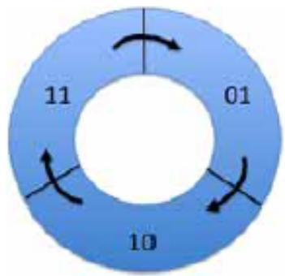  
Fig. 13.2: Cyclic Sequence Numbers in Label Index Block

Each time an Index Block is written, the sequence number of the current Index Block is “incremented” by moving to the next value clockwise as shown.

Since there are two Index Blocks, written alternatively with successive sequence numbers, the older Index Block’s sequence number will be immediately behind (counter-clockwise to) the current Index Block’s sequence number. This property is used during software initialization to identify the current Index Block.

The sequence number 00 is used to indicate an uninitialized or invalid Index Block. Software never writes the sequence number 00, so a correctly check-summed Index Block with this sequence number probably indicates a critical error. When software discovers this case it treats it as an invalid Index Block indication. If two Index Blocks with identical sequence numbers are found, software shall treat the Index Block at the higher ofset as the valid Index Block.

## MyOf

The ofset of this Index Block in the Label Storage Area.

## MySize

The size of this Index Block in bytes. This field must be a multiple of the EFI\_NVDIMM\_LABEL\_INDEX\_ALIGN.

## OtherOf

The ofset of the other Index Block paired with this one.

## LabelOf

The ofset of the first slot where labels are stored in this Label Storage Area.

## NSlot

The total number of slots for storing labels in this Label Storage Area. The NSlot field is typically calculated once at Label Storage Area initialization as described in the Initial Label Storage Area Configuration description.

## Major

Major version number. Value shall be 1.

## Minor

Minor version number. Value shall be 2.

## Checksum

64-bit Fletcher64 checksum of all fields in this Index Block. This field is considered zero when the checksum is computed. For references to the Fletcher64 algorithm see “Links to UEFI-Related Documents” (http://uefi.org/ uefi) under the heading “Fletcher64 Checksum Algorithm”

## Free

Array of unsigned bytes implementing a bitmask that tracks which label slots are free. A bit value of 0 indicates in use, 1 indicates free. The size of this field is the number of bytes required to hold the bitmask with NSlot bits, padded with additional zero bytes to make the Index Block size a multiple of EFI\_NVDIMM\_LABEL\_INDEX\_ALIGN. Any bits allocated beyond NSlot bits must be zero.

The bitmask is organized where the label slot with the lowest ofset in the Label Storage Area is tracked by the least significant bit of the first byte of the free array. Missing from the above layout is a total count of free slots. Since the common use case for the Label Storage Area is to read all labels during software initialization, it is recommended that software create a total free count (or in use count, or both), maintained at run-time. Rules for maintaining the Index Blocks are described in the Label Rules Description and Validating Index Blocks Description below. See the Initial Label Storage Area Configuration section for a more details on how the total number of slots are calculated.

## Label Definitions

```c
#define EFI_NVDIMM_LABEL_NAME_LEN 64
// Constants for Flags field
#define EFI_NVDIMM_LABEL_FLAGS_ROLABEL 0x00000001
#define EFI_NVDIMM_LABEL_FLAGS_LOCAL 0x00000002
#define EFI_NVDIMM_LABEL_FLAGS_SPACOKIE_BOUND 0x00000010
Reserved 0x00000004
Reserved 0x00000008
```

(continues on next page)

(continued from previous page)

<table><tr><td colspan="2">typedef struct EFI_NVDIMM_LABEL{</td></tr><tr><td>EFI_GUID</td><td>Uuid;</td></tr><tr><td>CHAR8</td><td>Name[EFI_NVDIMM_LABEL_NAME_LEN];</td></tr><tr><td>UINT32</td><td>Flags;</td></tr><tr><td>UINT16</td><td>NLabel;</td></tr><tr><td>UINT16</td><td>Position;</td></tr><tr><td>UINT64</td><td>SetCookie;</td></tr><tr><td>UINT64</td><td>LbaSize;</td></tr><tr><td>UINT64</td><td>Dpa;</td></tr><tr><td>UINT64</td><td>RawSize;</td></tr><tr><td>UINT32</td><td>Slot;</td></tr><tr><td>UINT8</td><td>Alignment;</td></tr><tr><td>UINT8</td><td>Reserved[3];</td></tr><tr><td>EFI_GUID</td><td>TypeGuid;</td></tr><tr><td>EFI_GUID</td><td>AddressAbstractionGuid;</td></tr><tr><td>UINT64</td><td>SPALocationCookie;</td></tr><tr><td>UINT8</td><td>Reserved1[80];</td></tr><tr><td>UINT64</td><td>Checksum;</td></tr><tr><td>};</td><td></td></tr></table>

## Uuid

Unique Label Identifier UUID per RFC 4122. This field provides two functions. First, the namespace is associated with a UUID that software can use to uniquely identify it and providing a way for the namespace to be matched up with applications using it. Second, when multiple labels are required to describe a namespace, the UUID is the mechanism used to group the labels together. See the additional descriptions below describing the process for grouping the labels together by UUID, checking for missing labels, recovering from partial label changes, etc.

## Name

NULL-terminated string using UTF-8 character formatting. The Name field is optionally used by software to store a more friendly name for the namespace. When this field is unused, it contains zeros.

If there is a name for a Local Namespace, as indicated by the EFI\_NVDIMM\_LABEL\_FLAGS\_LOCAL Flags, the name shall be stored in the first label of the set. All Name fields in subsequent labels for that Local Namespace are ignored. The Name field can be set at label creation time, or updated by following the rules in the additional descriptions below.

## Flags

Boolean attributes of this namespace. See the additional description below on the use of the flags. The following values are defined:

EFI\_NVDIMM\_LABEL\_FLAGS\_ROLABEL - The label is read-only. This indicates the namespace is exported to a domain where configuration changes to the label are not allowed, such as a virtual machine. This indicates that device software and manageability software should refuse to make changes to the labels. This is a not a security mechanism, but a usability feature instead. In cases where EFI\_NVDIMM\_LABEL\_FLAGS\_ROLABEL is set, such as virtual machine guests, attempting to make configuration changes that afect the labels will fail (i.e. because the VM guest is not in a position to make the change correctly). For these cases, the VMM can set the EFI\_NVDIMM\_LABEL\_FLAGS\_ROLABEL bit on the label exposed to the guest to provide a better user experience where manageability refuses to make changes with a friendlier error message.

EFI\_NVDIMM\_LABEL\_FLAGS\_LOCAL - When set, the complete label set is local to a single NVDIMM Label Storage Area. When clear, the complete label set is contained on multiple NVDIMM Label Storage Areas. If NLabel is 1, then setting this flag is optional and it is implied that the EFI\_NVDIMM\_LABEL\_FLAGS\_LOCAL flag is set, as the complete label set is local to a single NVDIMM

Label Storage Area.

EFI\_NVDIMM\_LABEL\_FLAGS\_UPDATING - When set, the label set is being updated. During an operation that may require updating multiple Label Storage Areas, the EFI\_NVDIMM\_LABEL\_FLAGS\_UPDATING flag is used to make the update atomic across interruptions. Updates happen in two phases, first writing the label with the EFI\_NVDIMM\_LABEL\_FLAGS\_UPDATING flag set, second writing the updated label without the EFI\_NVDIMM\_LABEL\_FLAGS\_UPDATING flag. As described in Recovery Steps for a Non-Local Label Set Description, this allows recovery actions during software initialization to either roll back or roll forward the multiple Label Storage Area changes. If EFI\_NVDIMM\_LABEL\_FLAGS\_LOCAL is set, the labels are contained in a single Label Storage Area and there is no need to set EFI\_NVDIMM\_LABEL\_FLAGS\_UPDATING, since the label can be written in one atomic operation.

EFI\_NVDIMM\_LABEL\_FLAGS\_SPACOOKIE\_BOUND - When set, the SPALocationCookie in the namespace label is valid and should match the current value in the NFIT SPA Range Structure.

## NLabel

Total number of labels describing this namespace. The NLabel field contains the number of labels required to describe a namespace.

## Position

Position of this label in list of labels for this namespace. See NLabel description above. In the non-local case, each label is numbered as to its position in the list of labels using the Position field. For example, the common case where a namespace requires exactly one label, NLabel will be 1 and Position will be 0. If a namespace is built on an Interleave Set that spans multiple Label Storage Areas, each Label Storage Area will contain a label with increasing Position values to show each labels position in the set. For Local Namespaces, NLabel is valid only for the first label (lowest DPA) and position shall be 0 for that label. As part of organizing and validating the labels, SW shall have organized the labels from lowest to highest DPA so the first label in that ordered list of labels will have the lowest DPA. Position and NLabel for all subsequent labels in that namespace shall be set to 0xFF. See the Local Namespace description in the Validating Labels Description section for details.

## SetCookie

Interleave Sets and the NVDIMMs they contain are defined in the NFIT and the Uuid in the label is used to uniquely identify each interleave set. The SetCookie is utilized by SW to perform consistency checks on the Interleave Set to verify the current physical device configuration matches the original physical configuration when the labels were created for the set. The label is considered invalid if the actual label set cookie doesn’t match the cookie stored here. The SetCookie field in each label for that namespace is derived from data in the NVDIMM’s Serial Presence Detect (SPD). See the SetCookie Description section below for SetCookie details. For references to the JEDEC SPD annex see “Links to UEFI-Related Documents” (http://uefi.org/uefi) under the heading “JEDEC SPD Annex”

## LbaSize

This is the default logical block size in bytes and may be superseded by a block size that is specified in the AbstractionGuid.

• A non-zero value indicates the logical block size that is being emulated.

• A value of zero indicates an unspecified size and its meaning is implementation specific

## Dpa

The DPA is the Device Physical Address where the NVM contributing to this namespace begins on this NVDIMM.

## RawSize

The extent of the DPA contributed by this label.

## Slot

Current slot in the Label Storage Area where this label is stored.

## Alignment

Alignment hint used to advertise the preferred alignment of the data from within the namespace defined by this

label.

```txt
Reserved
Shall be 0
```

## TypeGuid

Range Type GUID that describes the access mechanism for the specified DPA range. The GUIDs utilized for the type are defined in the ACPI 6.0 specification in the NVDIMM FW Interface Table (NFIT) chapter. Those values are utilized here to describe the Type of namespace the label is describing. See the Address Range Type GUID field described in the System Physical Address (SPA) Range Structure table.

## AddressAbstractionGuid

Identifies the address abstraction mechanism for this namespace. A value of 0 indicates no mechanism used.

## SPALocationCookie

When creating the label, this value is set to the value from the NFIT SPA Range Structure if the SPALocation-Cookie flag (bit 2) is set. If EFI\_NVDIMM\_LABEL\_FLAGS\_SPACOOKIE\_BOUND is set, the SPALocation-Cookie value stored in the namespace label should match the current value in the NFIT SPA Range Structure. Otherwise, the data may not be read correctly.

## Reserved1

Shall be 0

## Checksum

64-bit Fletcher64 checksum of all fields in this Label. This field is considered zero when the checksum is computed. For references to the Fletcher64 algorithm see “Links to UEFI-Related Documents” (http://uefi.org/uefi) under the heading “Fletcher64 Checksum Algorithm”

## SetCookie Definition

```objectivec
typedef struct EFI_NVDIMM_LABEL_SET_COOKIE_INFO {
    typedef struct EFI_NVDIMM_LABEL_SET_COOKIE_MAP {
    UINT64 RegionOffset;
    UINT32 SerialNumber;
    UINT16 VendorId;
    UINT16 ManufacturingDate;
    UINT8 ManufacturingLocation;
    UINT8 Reserved[31];
    } Mapping[NumberOfNvdimmsInInterleaveSet];
};
```

## NumberOfNvdimmsInInterleaveSet

The number of NVDIMMs in the interleave set. This is 1 if EFI\_NVDIMM\_LABEL\_FLAGS\_LOCAL Flags is set indicating a Local Namespaces.

## RegionOfset

The Region Ofset field from the ACPI NFIT NVDIMM Region Mapping Structure for a given entry. This determines the entry’s position in the set. Region ofset is 0 for Local Namespaces.

## SerialNumber

The serial number of the NVDIMM, assigned by the module vendor. This field shall be set to the value of the NVDIMM Serial Presence Detect (SPD) Module Serial Number field defined by JEDEC with byte 0 set to SPD byte 325, byte 1 set to SPD byte 326, byte 2 set to SPD byte 327, and byte 3 set to SPD byte 328. For references to the JEDEC SPD annex see “Links to UEFI-Related Documents” (http://uefi.org/uefi) under the heading “JEDEC SPD Annex”

## VendorId

The identifier indicating the vendor of the NVDIMM. This field shall be set to the value of the NVDIMM SPD Module Manufacturer ID Code field with byte 0 set to DDR4 SPD byte 320 and byte 1 set to DDR4 SPD byte

321. For references to the JEDEC SPD annex see “Links to UEFI-Related Documents” (http://uefi.org/uefi) under the heading “JEDEC SPD Annex”

## ManufacturingDate

The manufacturing date of the NVDIMM, assigned by the module vendor. This field shall be set to the value of the NVDIMM SPD Module Manufacturing Date field with byte 0 set to SPD byte 323 and byte 1 set to SPD byte 324. For references to the JEDEC SPD annex see “Links to UEFI-Related Documents” (http://uefi.org/uefi) under the heading “JEDEC SPD Annex”

## ManufacturingLocation

The manufacturing location from for the NVDIMM, assigned by the module vendor. This field shall be set to the value of the NVDIMM SPD Module Manufacturing Location field (SPD byte 322). For references to the JEDEC SPD annex see “Links to UEFI-Related Documents” (http://uefi.org/uefi) under the heading “JEDEC SPD Annex”

## Reserved

Shall be 0

## SetCookie Description

This value is used to detect a change in the set configuration that has rendered existing data invalid and otherwise validates that the namespace belongs to a given NVDIMM. For each set create a data structure of the form EFI\_NVDIMM\_LABEL\_SET\_COOKIE\_INFO. The SetCookie is then calculated by sorting the Mapping[] array by RegionOfset and then taking the Fletcher64 sum of the total EFI\_NVDIMM\_LABEL\_SET\_COOKIE\_INFO structure. For references to the Fletcher64 algorithm see “Links to UEFI-Related Documents” (http://uefi.org/uefi ) under the heading “Fletcher64 Checksum Algorithm”

## 13.19.5 Label Storage Area Description

Namespaces are defined by Labels which are stored in the Label Storage Area(s) and accessed via means described in the Label Rules Description.

The figure below shows the organization of the Label Storage Area. A header called the Index Block appears twice at the top of the Label Storage Area. This provides a powerfail-safe method for updating the information in the Label Storage Area by alternating between the two Index Blocks when writing (more details on this mechanism below).

Following the Index Blocks, an array for storing labels takes up the remainder of the Label Storage Area. The size of the Label Storage Area is NVDIMM implementation specific. The Index Blocks contain a bitmap which indicates which label slots are currently free and which are in use. The same powerfail-safe mechanism used for updating the Index Blocks covers the update of labels in the Label Storage Area.

The powerfail-safe update mechanism uses the principle of avoiding writes to active metadata. Instead, a shadow copy is updated and checksums and sequence numbers are used to make the last written copy active (a complete description of this mechanism is in Updating an Existing Label Description).

## Initial Label Storage Area Configuration

The size of an Index Block depends on how many label slots fit into the Label Storage Area. The minimum size of an Index Block is 256 bytes and the size must be a multiple of EFI\_NVDIMM\_LABEL\_INDEX\_ALIGN bytes. As necessary, padding with zero bytes at the end of the structure is used to meet these size requirements. The minimum size of the Label Storage Area is large enough to hold 2 index blocks and 2 labels. As an example, for Label Storage Areas of 128KB and 256KB, the corresponding Index Block size is 256 or 512 bytes:

Table 13.70: Initial Label Storage Area Configuration

<table><tr><td>Example: &lt;= 256 bytesSize of the Index Block 72 bytes field up to the free field</td><td>Example: &gt; 256 bytesSize of the Index Block 72 bytes field up to the free field</td><td>continues on next page</td></tr></table>

Table 13.70 – continued from previous page

<table><tr><td>Bytes required for a bit-mask of 1024 labels (the number of labels that fit into a 128KB Label Storage Area)</td><td>128 bytes</td><td>Bytes required for a bit-mask of 2048 labels (the number of labels that fit into a 256KB Label Storage Area)</td><td>256 bytes</td></tr><tr><td>Padding to meet next increment of 256 bytes</td><td>56 bytes</td><td>Padding to meet next increment of 256 bytes</td><td>184</td></tr><tr><td>Total size of the Index Block</td><td>256 bytes</td><td></td><td>512 bytes</td></tr></table>

Before Index Blocks and labels can be utilized, the software managing the Label Storage Area must determine the total number of labels that will be supported and utilizing the description above, calculate the size of the Index Blocks required. Once the initial Label Storage Area is written with the first Index Blocks (typically done when the first Label needs to be written), the total number of slots is fixed and this initial calculation is not performed again.

## Label Description

Each slot in the Label Storage Area is either free or contains an active label.

In the cases where multiple labels are used to describe a namespace, the label fields NLabel and Position provide an ordering (“label one of two, label two of two”) so that incomplete label sets can be detected.

A namespace is described by one or more labels. Local namespaces describe one or more device physical address ranges from a single NVDIMM while non-Local namespaces describe a single SPA range that may have contributions from 2 or more NVDIMMs. The number of labels needed to describe a non-Local namespace is equal to the number of NVDIMMs contributing to the SPA range, 1 per-NVDIMM. For a Local namespace any number, up to the max number of labels supported by the Index Block / Label Storage Area, of device physical address ranges in the given NVDIMM can be described.

## Label Rules Description

All the algorithms related to labels in this specification assume single-threaded / non-reentrant execution. The algorithm for updating labels guarantees that at least one slot in the Label Storage Area will be free, ensuring it is always possible to update labels using this method.

Software shall maintain the following invariants to use the on-media data structures correctly and to inter-operate with other software components.

At all times, the following must be TRUE:

• The size of the Label Storage Area is known (this must be TRUE even if no namespace metadata has been written yet). The Label Storage Area size is queried from the NVDIMM.

• The Label Storage Area either contains no valid Index Blocks, indicating there are no labels on the NVDIMM (all slots free), or the validation rules below produce a single, valid, Index Block.

• 2 free slots are required in order to add a Label. Having only a single free slot indicates that no more labels can be added. Only fully written, active labels, and full-written labels with the EFI\_NVDIMM\_LABEL\_FLAGS\_UPDATING flag are marked in-use by the Index Block.

• Write to active label slots are not allowed; all updates to labels must be done by writing to free slots and then updating the Index Block to make them active.

## Validating Index Blocks Description

The following tests shall pass before software considers Index Blocks valid:

• Both Index Blocks must be read successfully from the Label Storage Area.

• Any Index Block with an incorrect Sig field is invalid.

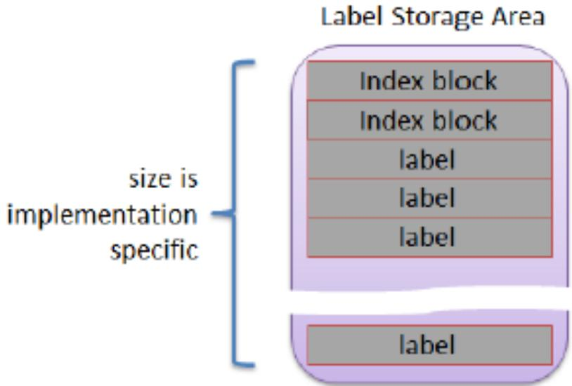  
Fig. 13.3: Organization of the Label Storage Area

• Any Index Block with an incorrect Checksum is invalid.

• Any Index Block with an incorrect MyOf, MySize, or OtherOf field is invalid.

• Any Index Block with a sequence number Seq of zero is invalid.

• If two valid Index Blocks remain, after passing all the above tests, and their sequence numbers match, the Index Block at the lower ofset in the Label Storage Area is invalid

• If two Index Blocks remain, after passing all the above tests, their sequence numbers are compared and the block whose sequence number is the predecessor of the other (immediately counter-clockwise to it, as shown in Figure Z: Cyclic Sequence Numbers in Label Index Block in the Seq description) is invalid.

• If one Index Block remains, that is the current, valid block and software should make note that the next update to the Index Block will write the other Index Block. However, if no valid Index Blocks remain, all slots are considered free and the next update to the index will write to the lower-addressed block location (i.e. the start of the Label Storage Area).

## Validating Labels Description

The following tests shall pass before software considers individual Labels slots valid:

• The corresponding free bit for the label Slot in the Index Block Free array must be clear (i.e. label slot is active).

• The label Checksum shall validate.

• The Slot value in the Label shall match the logical slot location of the Label.

• The SetCookie field in the label matches the expected value as described in SetCookie Definition.

• The address range type GUID TypeGuid shall match the System Physical Address Range Structure that describes the access mechanism for this namespace. For Hardware Block Namespaces it shall match the GUID for the NVDIMM Block Data Window Region.

## For Local Namespaces:

• If 2 or more labels share the same Dpa value, all labels with the duplicated value are considered invalid.

• The count of all valid labels for a given namespace Uuid shall match the NLabel value in the first label.

• The first label, the label with the lowest Dp a value, shall have Position 0 and non-zero NLabel value.

• All labels other than the first have Position and NLabel set to 0xf.

## Reading Labels Description

For a given NVDIMM, the following steps are used to read one or more labels for validation and namespace assembly: Pre-condition: both Index Blocks have been read and the rules in Validating Index Blocks Description have been followed to determine the current valid Index Block.

• Check that the label at a given slot is active. Specifically bit N is clear in the Free bitmask field where N corresponds to the logical slot number label.

• Read the label in that slot at the ofset given by: (2 \* sizeof(EFI\_NVDIMM\_LABEL\_INDEX\_BLOCK) + slot \* sizeof(EFI\_NVDIMM\_LABEL))

## Recovery Steps for a Non-Local Label Set Description

Given that a non-Local Label set potentially spans multiple Label Storage Areas for multiple NVDIMMs it is not possible to guarantee that the set is updated atomically with respect to unexpected system interruption. Recovery shall be performed before validating the set to roll the set forward to a consistent state or invalidate / free the label slots corresponding to an inconsistent state. Note that individual Index Block updates are safe with respect to unexpected system interruption given the sequence number mechanism for indicating the currently active Index Block.

The sequence below describes how the EFI\_NVDIMM\_LABEL\_FLAGS\_UPDATING flag is used when validating a non-Local Label Set.

• Pre-condition: The labels have been read.

• For each set of labels with the same UUID, if no labels in the set are found with the EFI\_NVDIMM\_LABEL\_FLAGS\_UPDATING flag set, then no recovery is required for that set.

• For the sets where EFI\_NVDIMM\_LABEL\_FLAGS\_UPDATING appear at least once, if the set is incomplete (some NVDIMMs in the set do not contain a label in the Label Storage Area with the UUID), the recovery action is to roll back the interrupted create operation that left this state. I.e. for each NVDIMM in the set containing a label with the given UUID, delete the label.

• For a set where EFI\_NVDIMM\_LABEL\_FLAGS\_UPDATING appears at least once and the set is otherwise complete (each NVDIMM in the Interleave Set contains a label with the UUID, some with EFI\_NVDIMM\_LABEL\_FLAGS\_UPDATING set, some with EFI\_NVDIMM\_LABEL\_FLAGS\_UPDATING clear), the recovery action is to roll forward the change that was interrupted. I.e. for each NVDIMM in the set If EFI\_NVDIMM\_LABEL\_FLAGS\_UPDATING is set, write an updated label with EFI\_NVDIMM\_LABEL\_FLAGS\_UPDATING clear and with the name field copied from the first label in the set (the label with a Position field of 0).

## Recovery Steps for a Local Label Set Description

Given that a Local Label set is always contained in a single Label Storage Area for a single NVDIMM, labels are added/updated atomically, as long as there is a free Label available as outlined in Label Storage Area Description and Label Description. EFI\_NVDIMM\_LABEL\_FLAGS\_UPDATING should not be set for Local sets and no additional recovery is required.

## Assembling Labels into Complete Sets Description

After collecting a set of labels corresponding to a given UUID and performing the recovery actions on the set, software shall follow the steps in this section to assemble complete sets of labels representing usable namespaces:

1. Precondition: Labels have been read and the recovery actions have been taken.

2. For each set of labels with the same Uuid

a. If the set describes a non-Local namespace, it is considered complete if labels with unique Position fields are found for every position from 0 to NLabel–1.

b. If the set describes a Local namespace, it is considered complete if a valid first label is found, according to the validation rules, and the number of labels in the set matches

c. NLabel.

The recovery action for the case where software finds incomplete namespaces is implementation specific.

## Updating an Existing Label Description

Updating an existing label in the Label Storage Area requires the software to follow these steps:

1. Pre-conditions: the software has an updated label constructed to be written to a specific NVDIMM’s Label Storage Area. There is at least 1 free slot in the Label Storage Area Free bitmask.

2. The software chooses a free slot from the Index Block, fills in that slot number in the label’s Slot field

3. The software writes the updated label to that slot in the Label Storage Area

4. The software updates the Index Block by taking the current Index Block, setting the appropriate bit in the Free field to make the old version of the label inactive and clearing the appropriate bit in the Free field to make the new version active, incrementing the sequence number as shown in Figure Z: Cyclic Sequence Numbers in Label Index Block in the Seq description, and then writing the Index Block over the inactive Index Block location (making this location the new active Index Block if the write succeeds)

## Deleting a Label Description

The software updates the Index Block by taking the current active Index Block, setting the appropriate bit in the Free field to make the deleted label inactive, incrementing the sequence number as shown in Figure Z: Cyclic Sequence Numbers in Label Index Block in the Seq description, and then writing the new Index Block over the inactive Index Block location (making this location the new active Index Block if the write succeeds)

## Creating Namespaces Description

Namespace creation procedures are diferent for Local vs non-Local namespaces. A Local namespace is created from 1 or more DPA ranges of a single NVDIMM, while a non-Local namespace is created from a single range contributed from multiple NVDIMMs. Both procedures share a common flow for establishing new labels in an Index Block.

## Writing New Labels Description

Transitioning a label slot from free to active shall follow this sequence:

1. Pre-conditions: the software has a new label constructed to be written to a specific NVDIMM’s Label Storage Area. Because of the free Label rules outlined in Label Storage Area Description and Label Description, there are at least 2 free slots in the Label Storage Area as described in the Label Rules Description and Label Description sections. Choose a free slot from the Index Block, fills in that slot number in the label’s Slot field

2. Write the new label to that slot in the Label Storage Area

3. Update the Index Block by taking the current Index Block, clearing the appropriate bit in the Free field, incrementing the sequence number as shown in Figure Z: Cyclic Sequence Numbers in Label Index Block in the Seq description, and then writing the Index Block over the inactive Index Block location (making this location the new active Index Block if the write succeeds)

## Creating a Non-Local Namespace

When creating a new Non-Local Namespace, the software shall follow these steps:

1. Pre-conditions: the labels to be written to each NVDIMM contributing to the namespace have been constructed, each with a unique Position field from 0 to NLabel–1, and all labels with the same new UUID. All Index Blocks involved have at least 2 label slots free as described in the Label Rules Description and Label Description sections.

2. For each label in the set, the label is written with the EFI\_NVDIMM\_LABEL\_FLAGS\_UPDATING flag set, using the flow outlined in Writing New Labels Description to its corresponding NVDIMM / Label Storage Area.

3. For each label in the set, the label is updated with the same contents as the previous step, but with the EFI\_NVDIMM\_LABEL\_FLAGS\_UPDATING flag clear, using the flow outlined in Updating an Existing Label Description.

In the case of an unexpected system interruption, the above flows leave either a partial set of labels, all with the new UUID, with the EFI\_NVDIMM\_LABEL\_FLAGS\_UPDATING flag set, or a complete set of labels is left where some of them have the EFI\_NVDIMM\_LABEL\_FLAGS\_UPDATING flag set. The recovery steps in Recovery Steps for a Non-Local Label Set Description comprehend these two cases so that software can determine whether the set is consistent or needs to be invalidated.

## Creating a Local Namespace

Updating labels that are all on the same NVDIMM is atomic with respect to system interruption by nature of the Index Block update rules. Since Local namespaces reside on a single NVDIMM, the EFI\_NVDIMM\_LABEL\_FLAGS\_UPDATING flag and multi-pass update described in the previous section are not used. Software creating new Local namespaces shall follow these steps:

1. Pre-conditions: the labels to be written to the NVDIMM Label Storage Area have been constructed, whereby Position, NLabel and SetCookie adhere to the validation rules described earlier, and all labels share the same UUID. The Index Blocks involved have at least NLabel + 1 label slots free, so that after the new labels are written, it will have at least 1 free label slot left.

All labels are written to free slots and made active in one step using steps similar to the flow described above in Writing New Labels Description:

a. Free slots are identified using the current Index Block, the Slot field in each label is updated accordingly

b. All new labels are written into their free slots

c. The new Index Block is constructed so the new label slots are no longer marked free, the sequence number is advanced as shown in Figure Z: Cyclic Sequence Numbers in Label Index Block in the Seq description, and then the new Index Block is written over the inactive Index Block location (making this location the new active Index Block if the write succeeds)

## 13.19.5.1 Updating the Name of a Namespace Description

## Updating Local Labels

When updating the name on a Local set the sequence outlined in Writing New Labels Description must be followed where the Name is updated before writing the updated Label.

## Updating Non Local Labels

To update the Name field associated with a non-Local Namespace, the software must follow these steps:

1. Pre-conditions: the namespace must already exist. Each NVDIMM in the namespace must have at least 1 free slot.

2. For each NVDIMM in the namespace, the label on that NVDIMM is updated with a label with the new Name field and the EFI\_NVDIMM\_LABEL\_FLAGS\_UPDATING flag set. The “for each NVDIMM “ operation in this step must start with the NVDIMM containing the label whose Position field is zero.

3. For each NVDIMM in the namespace, the label is updated with the same contents as the previous step, but with the EFI\_NVDIMM\_LABEL\_FLAGS\_UPDATING flag clear, using the updating an existing label flow described above in Updating an Existing Label Description.

If the above steps are interrupted unexpectedly, the recovery steps in Recovery Steps for a Non-Local Label Set Description handle the case where a Name update is incomplete and finish the update.

```csv
*This,
Read,
DescId,
Index,
Selector,
Descriptor,
*DescSize,
```

## 13.20 EFI UFS Device Config Protocol

## 13.20.1 EFI\_UFS\_DEVICE\_CONFIG\_PROTOCOL

## Summary

User invokes this protocol to access the UFS device descriptors/flags/attributes and configure UFS device behavior.

## GUID

```c
#define EFI_UFS_DEVICE_CONFIG_GUID \
{ 0xb81bfab0, 0xeb3, 0x4cf9, \
{ 0x84, 0x65, 0x7f, 0xa9, 0x86, 0x36, 0x16, 0x64}}
```

## Protocol Interface Structure

```c
typedef struct _EFI_UFS_DEVICE_CONFIG_PROTOCOL {
    EFI_UFS_DEVICE_CONFIG_RW_DESCRIPTION RwUfsDescriptor;
    EFI_UFS_DEVICE_CONFIG_RW_FLAG RwUfsFlag;
    EFI_UFS_DEVICE_CONFIG_RW_ATTRIBUTE RwUfsAttribute;
} EFI_UFS_DEVICE_CONFIG_PROTOCOL;
```

## Members

## RwUfsDescriptor

Read or write specified device descriptor of a UFS device.

## RwUfsFlag

Read or write specified flag of a UFS device.

## RwUfsAttribute

Read or write specified attribute of a UFS device.

## Description

This protocol aims at defining a standard interface for UEFI drivers and applications to access UFS device descriptors/flags/attributes and configure the UFS device behavior.

## 13.20.2 EFI\_UFS\_DEVICE\_CONFIG\_PROTOCOL.RwUfsDescriptor()

## Summary

This function is used to read or write specified device descriptor of a UFS device.

## Prototype

```txt
typedef
EFI_STATUS
(EFIAPI *EFI_UFS_DEVICE_CONFIG_RW_DESCRIPTION) (
    IN EFI_UFS_DEVICE_CONFIG_PROTOCOL
    IN BOOLEAN
    IN UINT8
    IN UINT8
    IN UINT8
    IN OUT UINT8
    IN OUT UINT32
);
```

## Parameters

This The pointer to the EFI\_UFS\_DEVICE\_CONFIG\_PROTOCOL instance.

DescId The ID of device descriptor.

Index The Index of device descriptor.

Selector The Selector of device descriptor.

Descriptor The bufer of device descriptor to be read or written.

## Description

The RwUfsDescriptor function is used to read/write UFS device descriptors. The consumer of this API is responsible for allocating the data bufer pointed by Descriptor.

## Status Codes Returned

<table><tr><td>EFI_SUCCESS</td><td>The device descriptor is read/written successfully.</td></tr><tr><td>EFI_INVALID_PARAMETER</td><td>This is NULL or Descriptor is NULL or DescSize is NULL.</td></tr><tr><td>EFI_INVALID_PARAMETER</td><td>DescId, Index and Selector are invalid combination to point to a type of UFS device descriptor.</td></tr><tr><td>EFI_DEVICE_ERROR</td><td>The device descriptor is not read/written successfully.</td></tr></table>

## 13.20.3 EFI\_UFS\_DEVICE\_CONFIG\_PROTOCOL.RwUfsFlag()

## Summary

This function is used to read or write specified flag of a UFS device.

## Prototype

<table><tr><td colspan="2">typedef</td></tr><tr><td colspan="2">EFI_STATUS(EFIAPI *EFI_UFS_DEVICE_CONFIG_RW_FLAG) (IN EFI_UFS_DEVICE_CONFIG_PROTOCOL *This,IN BOOLEAN Read,IN UINT8 FlagId,IN OUT UINT8 *Flag,);</td></tr></table>

## Parameters

## This

The pointer to the EFI\_UFS\_DEVICE\_CONFIG\_PROTOCOL instance.

## Read

The boolean variable to show r/w direction.

## FlagId

The ID of flag to be read or written.

Flag

The bufer to set or clear flag.

## Description

The RwUfsFlag function is used to read/write UFS flag descriptors. The consumer of this API is responsible for allocating the bufer pointed by Flag. The bufer size is 1 byte as UFS flag descriptor is just a single Boolean value that represents a TRUE or FALSE, ‘0’ or ‘1’, ON or OFF type of value.

## Status Codes Returned

<table><tr><td>EFI_SUCCESS</td><td>The flag descriptor is set/clear successfully.</td></tr><tr><td>EFI_INVALID_PARAMETER</td><td>This is NULL or Flag is NULL.</td></tr><tr><td>EFI_INVALID_PARAMETER</td><td>FlagId is an invalid UFS flag ID.</td></tr><tr><td>EFI_DEVICE_ERROR</td><td>The flag is not set/clear successfully.</td></tr></table>

## 13.20.4 EFI\_UFS\_DEVICE\_CONFIG\_PROTOCOL.RwUfsAttribute()

## Summary

This function is used to read or write specified attribute of a UFS device.

## Prototype

<table><tr><td colspan="2">typedef</td></tr><tr><td colspan="2">EFI_STATUS(EFIAPI *EFI_UFS_DEVICE_CONFIG_RW_ATTRIBUTE) (</td></tr><tr><td>IN EFI_UFS_DEVICE_CONFIG_PROTOCOL</td><td>*This,</td></tr><tr><td>IN BOOLEAN</td><td>Read,</td></tr><tr><td>IN UINT8</td><td>AttrId,</td></tr><tr><td>IN UINT8</td><td>Index,</td></tr><tr><td>IN UINT8</td><td>Selector,</td></tr><tr><td>IN OUT UINT8</td><td>*Attribute,</td></tr><tr><td>IN OUT UINT32</td><td>*AttrSize,</td></tr><tr><td>);</td><td></td></tr></table>

## Parameters

This The pointer to the EFI\_UFS\_DEVICE\_CONFIG\_PROTOCOL instance.

## Read

The boolean variable to show r/w direction.

AttrId The ID of Attribute.

Index The Index of Attribute.

Selector The Selector of Attribute.

## Attribute

The bufer of Attribute to be read or written.

## AttrSize

The size of Attribute bufer. On input, the size, in bytes, of the data bufer specified by Attribute. On output, the number of bytes that were actually transferred.

## Description

The RwUfsAttribute function is used to read/write UFS attributes. The consumer of this API is responsible for allocating the data bufer pointed by Attribute.

## Status Codes Returned

<table><tr><td>EFI_SUCCESS</td><td>The attribute is read/written successfully.</td></tr><tr><td>EFI_INVALID_PARAMETER</td><td>This is NULL or Attribute is NULL or AttrSize is NULL.</td></tr><tr><td>EFI_INVALID_PARAMETER</td><td>AttrId, Index and Selector are invalid combination to point to a type of UFS attribute.</td></tr><tr><td>EFI_DEVICE_ERROR</td><td>The attribute is not read/written successfully.</td></tr></table>

# PROTOCOLS — PCI BUS SUPPORT

## 14.1 PCI Root Bridge I/O Support

This section and the following one (Section 14.2) describe the PCI Root Bridge I/O Protocol. This protocol provides an I/O abstraction for a PCI Root Bridge that is produced by a PCI Host Bus Controller. A PCI Host Bus Controller is a hardware component that allows access to a group of PCI devices that share a common pool of PCI I/O and PCI Memory resources. This protocol is used by a PCI Bus Driver to perform PCI Memory, PCI I/O, and PCI Configuration cycles on a PCI Bus. It also provides services to perform diferent types of bus mastering DMA on a PCI bus. PCI device drivers will not directly use this protocol. Instead, they will use the I/O abstraction produced by the PCI Bus Driver. Only drivers that require direct access to the entire PCI bus should use this protocol. In particular, this chapter defines functions for managing PCI buses, although other bus types may be supported in a similar fashion as extensions to this specification.

All the services described in this chapter that generate PCI transactions follow the ordering rules defined in the PCI Specification. If the processor is performing a combination of PCI transactions and system memory transactions, then there is no guarantee that the system memory transactions will be strongly ordered with respect to the PCI transactions. If strong ordering is required, then processor-specific mechanisms may be required to guarantee strong ordering. Some 64-bit systems may require the use of memory fences to guarantee ordering

## 14.1.1 PCI Root Bridge I/O Overview

The interfaces provided in the EFI\_PCI\_ROOT\_BRIDGE\_IO\_PROTOCOL are for performing basic operations to memory, I/O, and PCI configuration space. The system provides abstracted access to basic system resources to allow a driver to have a programmatic method to access these basic system resources.

The EFI\_PCI\_ROOT\_BRIDGE\_IO\_PROTOCOL allows for future innovation of the platform. It abstracts devicespecific code from the system memory map. This allows system designers to make changes to the system memory map without impacting platform independent code that is consuming basic system resources.

A platform can be viewed as a set of processors and a set of core chipset components that may produce one or more host buses. Figure Host Bus Controllers shows a platform with n processors (CPUs in the figure), and a set of core chipset components that produce m host bridges.

Simple systems with one PCI Host Bus Controller will contain a single instance of the EFI\_PCI\_ROOT\_BRIDGE\_IO\_PROTOCOL. More complex system may contain multiple instances of this protocol. It is important to note that there is no relationship between the number of chipset components in a platform and the number of EFI\_PCI\_ROOT\_BRIDGE\_IO\_PROTOCOL instances. This protocol abstracts access to a PCI Root Bridge from a software point of view, and it is attached to a device handle that represents a PCI Root Bridge. A PCI Root Bridge is a chipset component(s) that produces a physical PCI Bus. It is also the parent to a set of PCI devices that share common PCI I/O, PCI Memory, and PCI Prefetchable Memory regions. A PCI Host Bus Controller is composed of one or more PCI Root Bridges.

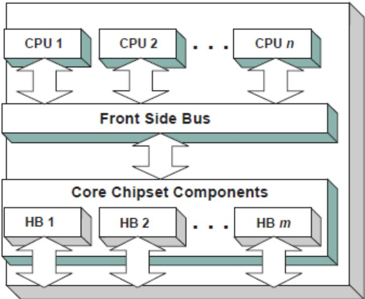  
Fig. 14.1: Host Bus Controllers

A PCI Host Bridge and PCI Root Bridge are diferent than a PCI Segment. A PCI Segment is a collection of up to 256 PCI busses that share the same PCI Configuration Space. Depending on the chipset, a single EFI\_PCI\_ROOT\_BRIDGE\_IO\_PROTOCOL may abstract a portion of a PCI Segment, or an entire PCI Segment. A PCI Host Bridge may produce one or more PCI Root Bridges. When a PCI Host Bridge produces multiple PCI Root Bridges, it is possible to have more than one PCI Segment.

PCI Root Bridge I/O Protocol instances are either produced by the system firmware or by a UEFI driver. When a PCI Root Bridge I/O Protocol is produced, it is placed on a device handle along with an EFI Device Path Protocol instance. The figure below (Device Handle for a PCI Root Bridge Controller) shows a sample device handle that includes an instance of the EFI\_DEVICE\_PATH\_PROTOCOL and the EFI\_PCI\_ROOT\_BRIDGE\_IO\_PROTOCOL.

Section Section 14.2 describes the PCI Root Bridge I/O Protocol in detail, and Section 14.2.19 describes how to build device paths for PCI Root Bridges. The EFI\_PCI\_ROOT\_BRIDGE\_IO\_PROTOCOL does not abstract access to the chipset-specific registers used to manage a PCI Root Bridge. This functionality is hidden within the system firmware or the driver that produces the handles that represent the PCI Root Bridges.

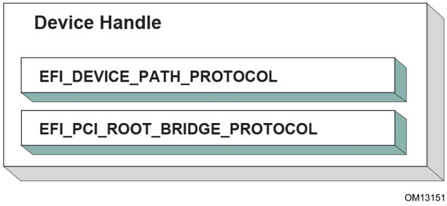  
Fig. 14.2: Device Handle for a PCI Root Bridge Controller

## 14.1.2 Sample PCI Architectures

The PCI Root Bridge I/O Protocol is designed to provide a software abstraction for a wide variety of PCI architectures including the ones described in this section. This section is not intended to be an exhaustive list of the PCI architectures that the PCI Root Bridge I/O Protocol can support. Instead, it is intended to show the flexibility of this protocol to adapt to current and future platform designs.

See Desktop System with One PCI Root Bridge shows an example of a PCI Host Bus with one PCI Root Bridge. This PCI Root Bridge produces one PCI Local Bus that can contain PCI Devices on the motherboard and/or PCI slots. This would be typical of a desktop system. A higher end desktop system might contain a second PCI Root Bridge for AGP devices. The firmware for this platform would produce one instance of the PCI Root Bridge I/O Protocol.

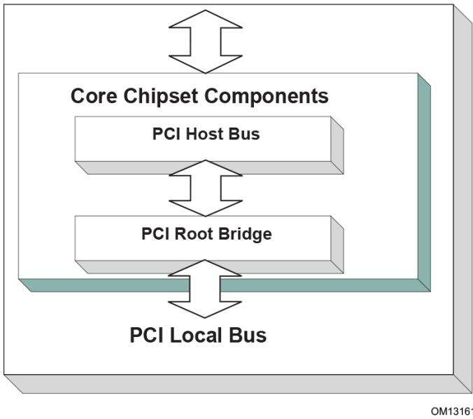  
Fig. 14.3: Desktop System with One PCI Root Bridge

Figure Server System with Four PCI Root Bridges shows an example of a larger server with one PCI Host Bus and four PCI Root Bridges. The PCI devices attached to the PCI Root Bridges are all part of the same coherency domain. This means they share a common PCI I/O Space, a common PCI Memory Space, and a common PCI Prefetchable Memory Space. Each PCI Root Bridge produces one PCI Local Bus that can contain PCI Devices on the motherboard or PCI slots. The firmware for this platform would produce four instances of the PCI Root Bridge I/O Protocol.

The Figure Server System with Two PCI Segments , below, shows an example of a server with one PCI Host Bus and two PCI Root Bridges. Each of these PCI Root Bridges is a diferent PCI Segment which allows the system to have up to 512 PCI Buses. A single PCI Segment is limited to 256 PCI Buses. These two segments do not share the same PCI Configuration Space, but they do share the same PCI I/O, PCI Memory, and PCI Prefetchable Memory Space. This is why it can be described by a single PCI Host Bus. The firmware for this platform would produce two instances of the PCI Root Bridge I/O Protocol.

The Figure, Server System with Two PCI Host Buses , below, shows a server system with two PCI Host Buses and one PCI Root Bridge per PCI Host Bus. This system supports up to 512 PCI Buses, but the PCI I/O, PCI Memory Space, and PCI Prefetchable Memory Space are not shared between the two PCI Root Bridges. The firmware for this platform would produce two instances of the PCI Root Bridge I/O Protocol.

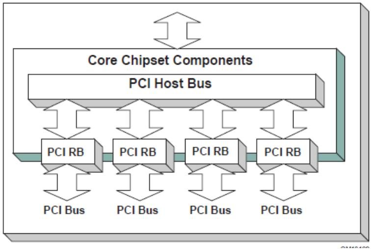  
Fig. 14.4: Server System with Four PCI Root Bridges

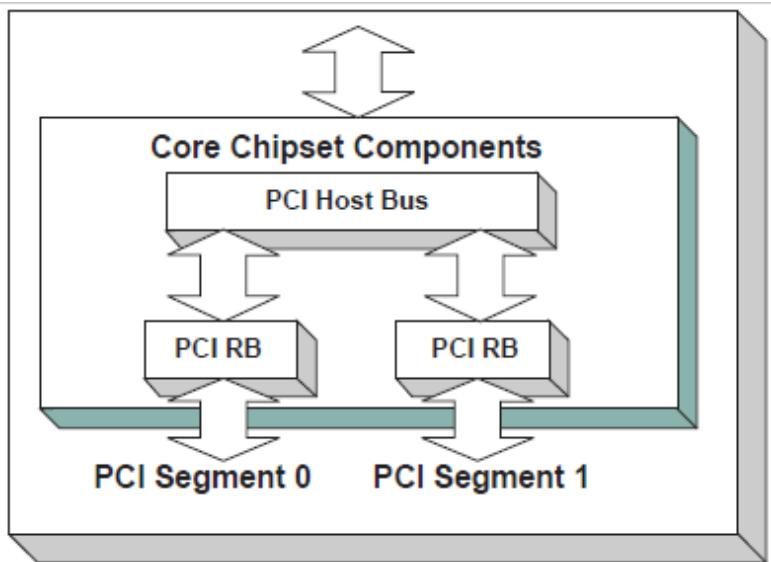  
Fig. 14.5: Server System with Two PCI Segments

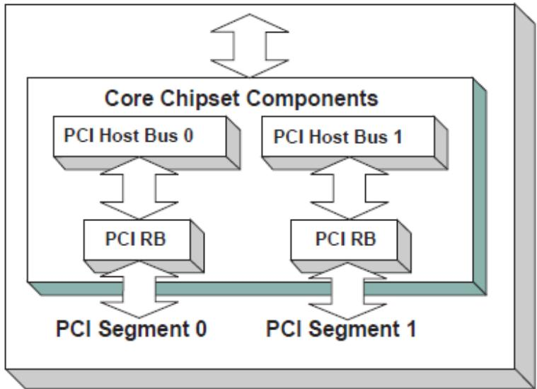  
Fig. 14.6: Server System with Two PCI Host Buses

## 14.2 PCI Root Bridge I/O Protocol

This section provides detailed information on the PCI Root Bridge I/O Protocol and its functions.

## 14.2.1 EFI\_PCI\_ROOT\_BRIDGE\_IO\_PROTOCOL

Summary

Provides the basic Memory, I/O, PCI configuration, and DMA interfaces that are used to abstract accesses to PCI controllers behind a PCI Root Bridge Controller.

GUID

```c
#define EFI_PCI_ROOT_BRIDGE_IO_PROTOCOL_GUID \
{0x2F707EBB, 0x4A1A, 0x11d4, \
{0x9A, 0x38, 0x00, 0x90, 0x27, 0x3F, 0xC1, 0x4D}}
```

## Protocol Interface Structure

```c
typedef struct _EFI_PCI_ROOT_BRIDGE_IO_PROTOCOL {
    EFI_HANDLE
    ParentHandle;
    EFI_PCI_ROOT_BRIDGE_IO_PROTOCOL_POLL_IO_MEM    PollMem;
    EFI_PCI_ROOT_BRIDGE_IO_PROTOCOL_POLL_IO_MEM    PollIo;
    EFI_PCI_ROOT_BRIDGE_IO_PROTOCOL_ACCESS    Mem;
    EFI_PCI_ROOT_BRIDGE_IO_PROTOCOL_ACCESS    Io;
    EFI_PCI_ROOT_BRIDGE_IO_PROTOCOL_ACCESS    Pci;
    EFI_PCI_ROOT_BRIDGE_IO_PROTOCOL_COPY_MEM    CopyMem;
    EFI_PCI_ROOT_BRIDGE_IO_PROTOCOL_MAP    Map;
    EFI_PCI_ROOT_BRIDGE_IO_PROTOCOL_UNMAP    Unmap;
    EFI_PCI_ROOT_BRIDGE_IO_PROTOCOL_ALLOCATE_BUFFER    AllocateBuffer;
```

(continues on next page)

<table><tr><td>EFI_PCI_ROOT_BRIDGE_IO_PROTOCOL_FREE_BUFFER</td><td>FreeBuffer;</td></tr><tr><td>EFI_PCI_ROOT_BRIDGE_IO_PROTOCOL_FLUSH</td><td>Flush;</td></tr><tr><td>EFI_PCI_ROOT_BRIDGE_IO_PROTOCOL_GET_ATTRIBUTES</td><td>GetAttributes;</td></tr><tr><td>EFI_PCI_ROOT_BRIDGE_IO_PROTOCOL_SET_ATTRIBUTES</td><td>SetAttributes;</td></tr><tr><td>EFI_PCI_ROOT_BRIDGE_IO_PROTOCOL_CONFIGURATION</td><td>Configuration;</td></tr><tr><td>UINT32</td><td>SegmentNumber;</td></tr><tr><td colspan="2">} EFI_PCI_ROOT_BRIDGE_IO_PROTOCOL;</td></tr></table>

## Parameters

ParentHandle The EFI\_HANDLE of the PCI Host Bridge of which this PCI Root Bridge is a member.

## PollMem

Polls an address in memory mapped I/O space until an exit condition is met, or a timeout occurs. See the EFI\_PCI\_ROOT\_BRIDGE\_IO\_PROTOCOL.PollMem() function description .

## PollIo

Polls an address in I/O space until an exit condition is met, or a timeout occurs. See the EFI\_PCI\_ROOT\_BRIDGE\_IO\_PROTOCOL.PollIo() function description.

Mem.Read Allows reads from memory mapped I/O space. See the Mem.Read() EFI\_PCI\_ROOT\_BRIDGE\_IO\_PROTOCOL.Mem.Read() function description.

Mem.Write Allows writes to memory mapped I/O space. See the Mem.Write() EFI\_PCI\_ROOT\_BRIDGE\_IO\_PROTOCOL.Mem.Write() function description.

Io.Read Allows reads from I/O space. See the Io.Read() EFI\_PCI\_ROOT\_BRIDGE\_IO\_PROTOCOL.Io.Read() function description.

Io.Write Allows writes to I/O space. See the Io.Write() EFI\_PCI\_ROOT\_BRIDGE\_IO\_PROTOCOL.Io.WRITE() function description.

Pci.Read Allows reads from PCI configuration space. See the Pci.Read() EFI\_PCI\_ROOT\_BRIDGE\_IO\_PROTOCOL.Pci.Read() function description.

Pci.Write Allows writes to PCI configuration space. See the Pci.Write() EFI\_PCI\_ROOT\_BRIDGE\_IO\_PROTOCOL.Pci.Write() function description.

CopyMem Allows one region of PCI root bridge memory space to be copied to another region of PCI root bridge memory space. See the EFI\_PCI\_ROOT\_BRIDGE\_IO\_PROTOCOL.CopyMem() function description.

## Map Map

Provides the PCI controller-specific addresses needed to access system memory for DMA. See the EFI\_PCI\_ROOT\_BRIDGE\_IO\_PROTOCOL.Map() function description.

Unmap Releases any resources allocated by Map(). See the EFI\_PCI\_ROOT\_BRIDGE\_IO\_PROTOCOL.Unmap() function description.

AllocateBufer Allocates pages that are suitable for a common bufer mapping. See the

EFI\_PCI\_ROOT\_BRIDGE\_IO\_PROTOCOL.AllocateBufer() function description.

## FreeBufer

Free pages that were allocated with AllocateBufer(). See the EFI\_PCI\_ROOT\_BRIDGE\_IO\_PROTOCOL.FreeBufer() function description.

## Flush

Flushes all PCI posted write transactions to system memory. See the EFI\_PCI\_ROOT\_BRIDGE\_IO\_PROTOCOL.Flush() function description.

## GetAttributes

Gets the attributes that a PCI root bridge supports setting with EFI\_PCI\_ROOT\_BRIDGE\_IO\_PROTOCOL.SetAttributes() and the attributes that a PCI root bridge is currently using. See the EFI\_PCI\_ROOT\_BRIDGE\_IO\_PROTOCOL.GetAttributes() function description.

## SetAttributes

Sets attributes for a resource range on a PCI root bridge. See EFI\_PCI\_ROOT\_BRIDGE\_IO\_PROTOCOL.SetAttributes() function description.

## Configuration

Gets the current resource settings for this PCI root bridge. See the EFI\_PCI\_ROOT\_BRIDGE\_IO\_PROTOCOL.Configuration() function description.

## SegmentNumber

The segment number that this PCI root bridge resides.

## Related Definitions

```c
//**********************************************************************
// EFI_PCI_ROOT_BRIDGE_IO_PROTOCOL_WIDTH
//**********************************************************************
typedef enum {
    EfiPciWidthUint8,
    EfiPciWidthUint16,
    EfiPciWidthUint32,
    EfiPciWidthUint64,
    EfiPciWidthFifoUint8,
    EfiPciWidthFifoUint16,
    EfiPciWidthFifoUint32,
    EfiPciWidthFifoUint64,
    EfiPciWidthFillUint8,
    EfiPciWidthFillUint16,
    EfiPciWidthFillUint32,
    EfiPciWidthFillUint64,
    EfiPciWidthMaximum
} EFI_PCI_ROOT_BRIDGE_IO_PROTOCOL_WIDTH;
```

```c
//**********************************************************************
// EFI_PCI_ROOT_BRIDGE_IO_PROTOCOL_POLL_IO_MEM
//**********************************************************************
typedef
EFI_STATUS
(EFIAPI *EFI_PCI_ROOT_BRIDGE_IO_PROTOCOL_POLL_IO_MEM) (
    IN struct EFI_PCI_ROOT_BRIDGE_IO_PROTOCOL *This,
    IN EFI_PCI_ROOT_BRIDGE_IO_PROTOCOL_WIDTH Width,
    IN UINT64 Address,
    IN UINT64 Mask,
```  
(continues on next page)

<table><tr><td>IN UINT64</td><td>Value,</td></tr><tr><td>IN UINT64</td><td>Delay,</td></tr><tr><td>OUT UINT64</td><td>*Result</td></tr><tr><td>);</td><td></td></tr><tr><td colspan="2">//**********</td></tr><tr><td colspan="2">// EFI_PCI_ROOT_BRIDGE_IO_PROTOCOL_IO_MEM</td></tr><tr><td colspan="2">//**********</td></tr><tr><td colspan="2">typedef</td></tr><tr><td colspan="2">EFI_STATUS</td></tr><tr><td colspan="2">(EFIAPI *EFI_PCI_ROOT_BRIDGE_IO_PROTOCOL_IO_MEM) (</td></tr><tr><td>IN EFI_PCI_ROOT_BRIDGE_IO_PROTOCOL</td><td>*This,</td></tr><tr><td>IN EFI_PCI_ROOT_BRIDGE_IO_PROTOCOL_WIDTH</td><td>Width,</td></tr><tr><td>IN UINT64</td><td>Address,</td></tr><tr><td>IN UINTN</td><td>Count,</td></tr><tr><td>IN OUT VOID</td><td>*Buffer</td></tr><tr><td>);</td><td></td></tr><tr><td colspan="2">//**********</td></tr><tr><td colspan="2">// EFI_PCI_ROOT_BRIDGE_IO_PROTOCOL_ACCESS</td></tr><tr><td colspan="2">//**********</td></tr><tr><td colspan="2">typedef struct {</td></tr><tr><td>EFI_PCI_ROOT_BRIDGE_IO_PROTOCOL_IO_MEM</td><td>Read;</td></tr><tr><td>EFI_PCI_ROOT_BRIDGE_IO_PROTOCOL_IO_MEM</td><td>Write;</td></tr><tr><td colspan="2">} EFI_PCI_ROOT_BRIDGE_IO_PROTOCOL_ACCESS;</td></tr><tr><td colspan="2">//**********</td></tr><tr><td colspan="2">// EFI PCI Root Bridge I/O Protocol Attribute bits</td></tr><tr><td colspan="2">//**********</td></tr><tr><td>#define EFI_PCI_ATTRIBUTE_ISA_MOTHERBOARD_IO</td><td>0x0001</td></tr><tr><td>#define EFI_PCI_ATTRIBUTE_ISA_IO</td><td>0x0002</td></tr><tr><td>#define EFI_PCI_ATTRIBUTE_VGA_PALETTE_IO</td><td>0x0004</td></tr><tr><td>#define EFI_PCI_ATTRIBUTE_VGA_MEMORY</td><td>0x0008</td></tr><tr><td>#define EFI_PCI_ATTRIBUTE_VGA_IO</td><td>0x0010</td></tr><tr><td>#define EFI_PCI_ATTRIBUTE_IDE_PRIMARY_IO</td><td>0x0020</td></tr><tr><td>#define EFI_PCI_ATTRIBUTE_IDE_SECONDARY_IO</td><td>0x0040</td></tr><tr><td>#define EFI_PCI_ATTRIBUTE_MEMORY_WRITE_COMBINE</td><td>0x0080</td></tr><tr><td>#define EFI_PCI_ATTRIBUTE_MEMORY_CACHED</td><td>0x0800</td></tr><tr><td>#define EFI_PCI_ATTRIBUTE_MEMORY_DISABLE</td><td>0x1000</td></tr><tr><td>#define EFI_PCI_ATTRIBUTE_DUAL_ADDRESS_CYCLE</td><td>0x8000</td></tr><tr><td>#define EFI_PCI_ATTRIBUTE_ISA_IO_16</td><td>0x10000</td></tr><tr><td>#define EFI_PCI_ATTRIBUTE_VGA_PALETTE_IO_16</td><td>0x20000</td></tr><tr><td>#define EFI_PCI_ATTRIBUTE_VGA_IO_16</td><td>0x40000</td></tr></table>

## EFI\_PCI\_ATTRIBUTE\_ISA\_IO\_16

If this bit is set, then the PCI I/O cycles between 0x100 and 0x3FF are forwarded onto a PCI root bridge using a 16-bit address decoder on address bits 0..15. Address bits 16..31 must be zero. This bit is used to forward I/O cycles for legacy ISA devices onto a PCI root bridge. This bit may not be combined with EFI\_PCI\_ATTRIBUTE\_ISA\_IO.

## EFI\_PCI\_ATTRIBUTE\_VGA\_PALETTE\_IO\_16

If this bit is set, then the PCI I/O write cycles for 0x3C6, 0x3C8, and 0x3C9 are forwarded onto a PCI root bridge using a 16-bit address decoder on address bits 0..15. Address bits 16..31 must be zero. This bit is used to forward I/O write cycles to the VGA palette registers onto a PCI root bridge. This bit may not be combined with EFI\_PCI\_ATTRIBUTE\_VGA\_IO or EFI\_PCI\_ATTRIBUTE\_VGA\_PALETTE\_IO.

## EFI\_PCI\_ATTRIBUTE\_VGA\_IO\_16

If this bit is set, then the PCI I/O cycles in the ranges 0x3B0-0x3BB and 0x3C0-0x3DF are forwarded onto a PCI root bridge using a 16-bit address decoder on address bits 0..15. Address bits 16..31 must be zero. This bit is used to forward I/O cycles for a VGA controller onto a PCI root bridge. This bit may not be combined with EFI\_PCI\_ATTRIBUTE\_VGA\_IO or EFI\_PCI\_ATTRIBUTE\_VGA\_PALETTE\_IO. Because EFI\_PCI\_ATTRIBUTE\_VGA\_IO\_16 also includes the I/O range described by EFI\_PCI\_ATTRIBUTE\_VGA\_PALETTE\_IO\_16 , the EFI\_PCI\_ATTRIBUTE\_VGA\_PALETTE\_IO\_16 bit is ignored if EFI\_PCI\_ATTRIBUTE\_VGA\_IO\_16 is set.

## EFI\_PCI\_ATTRIBUTE\_ISA\_MOTHERBOARD\_IO

If this bit is set, then the PCI I/O cycles between 0x00000000 and 0x000000FF are forwarded onto a PCI root bridge. This bit is used to forward I/O cycles for ISA motherboard devices onto a PCI root bridge.

## EFI\_PCI\_ATTRIBUTE\_ISA\_IO

If this bit is set, then the PCI I/O cycles between 0x100 and 0x3FF are forwarded onto a PCI root bridge using a 10-bit address decoder on address bits 0..9. Address bits 10..15 are not decoded, and address bits 16..31 must be zero. This bit is used to forward I/O cycles for legacy ISA devices onto a PCI root bridge.

## EFI\_PCI\_ATTRIBUTE\_VGA\_PALETTE\_IO

If this bit is set, then the PCI I/O write cycles for 0x3C6, 0x3C8, and 0x3C9 are forwarded onto a PCI root bridge using a 10 bit address decoder on address bits 0..9. Address bits 10..15 are not decoded, and address bits 16..31 must be zero. This bit is used to forward I/O write cycles to the VGA palette registers onto a PCI root bridge.

## EFI\_PCI\_ATTRIBUTE\_VGA\_MEMORY

If this bit is set, then the PCI memory cycles between 0xA0000 and 0xBFFFF are forwarded onto a PCI root bridge. This bit is used to forward memory cycles for a VGA frame bufer onto a PCI root bridge.

## EFI\_PCI\_ATTRIBUTE\_VGA\_IO

If this bit is set, then the PCI I/O cycles in the ranges 0x3B0-0x3BB and 0x3C0-0x3DF are forwarded onto a PCI root bridge using a 10-bit address decoder on address bits 0..9. Address bits 10..15 are not decoded, and the address bits 16..31 must be zero. This bit is used to forward I/O cycles for a VGA controller onto a PCI root bridge. Since EFI\_PCI\_ATTRIBUTE\_ENABLE\_VGA\_IO also includes the I/O range described by EFI\_PCI\_ATTRIBUTE\_ENABLE\_VGA\_PALETTE\_IO, the EFI\_PCI\_ATTRIBUTE\_ENABLE\_VGA\_PALETTE\_IO bit is ignored if EFI\_PCI\_ATTRIBUTE\_ENABLE\_VGA\_IO is set.

## EFI\_PCI\_ATTRIBUTE\_IDE\_PRIMARY\_IO

If this bit is set, then the PCI I/O cycles in the ranges 0x1F0-0x1F7 and 0x3F6-0x3F7 are forwarded onto a PCI root bridge using a 16-bit address decoder on address bits 0..15. Address bits 16..31 must be zero. This bit is used to forward I/O cycles for a Primary IDE controller onto a PCI root bridge.

## EFI\_PCI\_ATTRIBUTE\_IDE\_SECONDARY\_IO

If this bit is set, then the PCI I/O cycles in the ranges 0x170-0x177 and 0x376-0x377 are forwarded onto a PCI root bridge using a 16-bit address decoder on address bits 0..15. Address bits 16..31 must be zero. This bit is used to forward I/O cycles for a Secondary IDE controller onto a PCI root bridge.

## EFI\_PCI\_ATTRIBUTE\_MEMORY\_WRITE\_COMBINE

If this bit is set, then this platform supports changing the attributes of a PCI memory range so that the memory range is accessed in a write combining mode. By default, PCI memory ranges are not accessed in a write combining mode.

## EFI\_PCI\_ATTRIBUTE\_MEMORY\_CACHED

If this bit is set, then this platform supports changing the attributes of a PCI memory range so that the memory range is accessed in a cached mode. By default, PCI memory ranges are accessed noncached.

## EFI\_PCI\_ATTRIBUTE\_MEMORY\_DISABLE

If this bit is set, then this platform supports changing the attributes of a PCI memory range so that the memory range is disabled, and can no longer be accessed. By default, all PCI memory ranges are enabled.

## EFI\_PCI\_ATTRIBUTE\_DUAL\_ADDRESS\_CYCLE

This bit may only be used in the Attributes parameter to EFI\_PCI\_ROOT\_BRIDGE\_IO\_PROTOCOL.AllocateBufer() If this bit is set, then the PCI controller that is requesting a bufer through AllocateBufer() is capable of producing PCI Dual Address Cycles, so it is able to access a 64-bit address space. If this bit is not set, then the PCI controller that is requesting a bufer through AllocateBufer() is not capable of producing PCI Dual Address Cycles, so it is only able to access a 32-bit address space.

```c
//**********************************************************************
// EFI_PCI_ROOT_BRIDGE_IO_PROTOCOL_OPERATION
//**********************************************************************
typedef enum {
    EfiPciOperationBusMasterRead,
    EfiPciOperationBusMasterWrite,
    EfiPciOperationBusMasterCommonBuffer,
    EfiPciOperationBusMasterRead64,
    EfiPciOperationBusMasterWrite64,
    EfiPciOperationBusMasterCommonBuffer64,
    EfiPciOperationMaximum
} EFI_PCI_ROOT_BRIDGE_IO_PROTOCOL_OPERATION;
```

## EfiPciOperationBusMasterRead

A read operation from system memory by a bus master that is not capable of producing PCI dual address cycles.

## EfiPciOperationBusMasterWrite

A write operation to system memory by a bus master that is not capable of producing PCI dual address cycles.

## EfiPciOperationBusMasterCommonBufer

Provides both read and write access to system memory by both the processor and a bus master that is not capable of producing PCI dual address cycles. The bufer is coherent from both the processor’s and the bus master’s point of view.

## EfiPciOperationBusMasterRead64

A read operation from system memory by a bus master that is capable of producing PCI dual address cycles.

## EfiPciOperationBusMasterWrite64

A write operation to system memory by a bus master that is capable of producing PCI dual address cycles.

## EfiPciOperationBusMasterCommonBufer64

Provides both read and write access to system memory by both the processor and a bus master that is capable of producing PCI dual address cycles. The bufer is coherent from both the processor’s and the bus master’s point of view.

## Description

The EFI\_PCI\_ROOT\_BRIDGE\_IO\_PROTOCOL provides the basic Memory, I/O, PCI configuration, and DMA interfaces that are used to abstract accesses to PCI controllers. There is one EFI\_PCI\_ROOT\_BRIDGE\_IO\_PROTOCOL instance for each PCI root bridge in a system. Embedded systems, desktops, and workstations will typically only have one PCI root bridge. High-end servers may have multiple PCI root bridges. A device driver that wishes to manage a PCI bus in a system will have to retrieve the EFI\_PCI\_ROOT\_BRIDGE\_IO\_PROTOCOL instance that is associated with the PCI bus to be managed. A device handle for a PCI Root Bridge will minimally contain an EFI Device Path Protocol instance and an EFI\_PCI\_ROOT\_BRIDGE\_IO\_PROTOCOL instance. The PCI bus driver can look at the EFI\_DEVICE\_PATH\_PROTOCOL instances to determine which EFI\_PCI\_ROOT\_BRIDGE\_IO\_PROTOCOL instance to use.

Bus mastering PCI controllers can use the DMA services for DMA operations. There are three basic types of bus mastering DMA that is supported by this protocol. These are DMA reads by a bus master, DMA writes by a bus master, and common bufer DMA. The DMA read and write operations may need to be broken into smaller chunks. The caller of EFI\_PCI\_ROOT\_BRIDGE\_IO\_PROTOCOL.Map() must pay attention to the number of bytes that were mapped, and if required, loop until the entire bufer has been transferred. The following is a list of the diferent bus mastering DMA operations that are supported, and the sequence of EFI\_PCI\_ROOT\_BRIDGE\_IO\_PROTOCOL APIs that are used for each DMA operation type. See “Related Definitions” above for the definition of the diferent DMA operation types.

## DMA Bus Master Read Operation

• Call EFI\_PCI\_ROOT\_BRIDGE\_IO\_PROTOCOL.Map() for EfiPciOperationBusMasterRead or EfiPciOperationBusMasterRead64.

• Program the DMA Bus Master with the DeviceAddress returned by Map().

• Start the DMA Bus Master.

• Wait for DMA Bus Master to complete the read operation.

• Call EFI\_PCI\_ROOT\_BRIDGE\_IO\_PROTOCOL.Unmap()

## DMA Bus Master Write Operation

• Call EFI\_PCI\_ROOT\_BRIDGE\_IO\_PROTOCOL.Map() for EfiPciOperationBusMasterWrite or EfiPciOperationBusMasterRead64.

• Program the DMA Bus Master with the DeviceAddress returned by EFI\_PCI\_IO\_PROTOCOL.Map()

• Start the DMA Bus Master.

• Wait for DMA Bus Master to complete the write operation.

• Perform a PCI controller specific read transaction to flush all PCI write bufers (See PCI Specification Section 3.2.5.2).

• Call EFI\_PCI\_ROOT\_BRIDGE\_IO\_PROTOCOL.Flush()

• Call Unmap.

## DMA Bus Master Common Bufer Operation

• Call EFI\_PCI\_ROOT\_BRIDGE\_IO\_PROTOCOL.AllocateBufer() to allocate a common bufer.

• Call Map() for EfiPciOperationBusMasterCommonBufer or EfiPciOperationBusMasterCommonBufer64.

• Program the DMA Bus Master with the DeviceAddress returned by EFI\_PCI\_ROOT\_BRIDGE\_IO\_PROTOCOL.Map() .

• The common bufer can now be accessed equally by the processor and the DMA bus master.

• Call Unmap().

• Call EFI\_PCI\_ROOT\_BRIDGE\_IO\_PROTOCOL.FreeBufer() .

## 14.2.2 EFI\_PCI\_ROOT\_BRIDGE\_IO\_PROTOCOL.PollMem()

## Summary

Reads from the memory space of a PCI Root Bridge. Returns when either the polling exit criteria is satisfied or after a defined duration.

## Prototype

<table><tr><td colspan="2">typedef</td></tr><tr><td colspan="2">EFI_STATUS</td></tr><tr><td colspan="2">(EFIAPI *EFI_PCI_ROOT_BRIDGE_IO_PROTOCOL_POLL_IO_MEM) (</td></tr><tr><td>IN EFI_PCI_ROOT_BRIDGE_IO_PROTOCOL</td><td>*This,</td></tr><tr><td>IN EFI_PCI_ROOT_BRIDGE_IO_PROTOCOL_WIDTH</td><td>Width,</td></tr><tr><td>IN UINT64</td><td>Address,</td></tr><tr><td>IN UINT64</td><td>Mask,</td></tr><tr><td>IN UINT64</td><td>Value,</td></tr><tr><td>IN UINT64</td><td>Delay,</td></tr><tr><td>OUT UINT64</td><td>*Result</td></tr><tr><td>);</td><td></td></tr></table>

## Parameters

## This

A pointer to the EFI\_PCI\_ROOT\_BRIDGE\_IO\_PROTOCOL. Type EFI\_PCI\_ROOT\_BRIDGE\_IO\_PROTOCOL is defined in the Section PCI Root Bridge I/O Protocol .

## Width

Signifies the width of the memory operations. Type EFI\_PCI\_ROOT\_BRIDGE\_IO\_PROTOCOL\_WIDTH see Related Definitions in the section EFI\_PCI\_ROOT\_BRIDGE\_IO\_PROTOCOL .

## Address

The base address of the memory operations. The caller is responsible for aligning Address if required.

## Mask

Mask used for the polling criteria. Bytes above Width in Mask are ignored. The bits in the bytes below Width which are zero in Mask are ignored when polling the memory address.

## Value

The comparison value used for the polling exit criteria.

## Delay

The number of 100 ns units to poll. Note that timer available may be of poorer granularity.

## Result

Pointer to the last value read from the memory location.

## Description

This function provides a standard way to poll a PCI memory location. A PCI memory read operation is performed at the PCI memory address specified by Address for the width specified by Width. The result of this PCI memory read operation is stored in Result. This PCI memory read operation is repeated until either a timeout of Delay 100 ns units has expired, or ( Result & Mask) is equal to Value.

This function will always perform at least one PCI memory read access no matter how small Delay may be. If Delay is zero, then Result will be returned with a status of EFI\_SUCCESS even if Result does not match the exit criteria. If Delay expires, then EFI\_TIMEOUT is returned.

If Width is not EfiPciWidthUint8 , EfiPciWidthUint16 , EfiPciWidthUint32 , or EfiPciWidthUint64 , then EFI\_INVALID\_PARAMETER is returned.

The memory operations are carried out exactly as requested. The caller is responsible for satisfying any alignment and memory width restrictions that a PCI Root Bridge on a platform might require. For example, on some platforms, width requests of EfiPciWidthUint64 are not supported.

All the PCI transactions generated by this function are guaranteed to be completed before this function returns. However, if the memory mapped I/O region being accessed by this function has the EFI\_PCI\_ATTRIBUTE\_MEMORY\_CACHED attribute set, then the transactions will follow the ordering rules defined by the processor architecture.

## Status Codes Returned

<table><tr><td>EFI_SUCCESS</td><td>The last data returned from the access matched the poll exit criteria.</td></tr><tr><td>EFI_INVALID_PARAMETER</td><td>Width is invalid.</td></tr><tr><td>EFI_INVALID_PARAMETER</td><td>Result is NULL.</td></tr><tr><td>EFI_TIMEOUT</td><td>Delay expired before a match occurred.</td></tr><tr><td>EFI_OUT_OF_RESOURCES</td><td>The request could not be completed due to a lack of resources.</td></tr></table>

## 14.2.3 EFI\_PCI\_ROOT\_BRIDGE\_IO\_PROTOCOL.PollIo()

## Summary

Reads from the I/O space of a PCI Root Bridge. Returns when either the polling exit criteria is satisfied or after a defined duration.

## Prototype

<table><tr><td colspan="2">typedef</td></tr><tr><td colspan="2">EFI_STATUS</td></tr><tr><td colspan="2">(EFIAPI *EFI_PCI_ROOT_BRIDGE_IO_PROTOCOL_POLL_IO_MEM) (</td></tr><tr><td>IN EFI_PCI_ROOT_BRIDGE_IO_PROTOCOL</td><td>*This,</td></tr><tr><td>IN EFI_PCI_ROOT_BRIDGE_IO_PROTOCOL_WIDTH</td><td>Width,</td></tr><tr><td>IN UINT64</td><td>Address,</td></tr><tr><td>IN UINT64</td><td>Mask,</td></tr><tr><td>IN UINT64</td><td>Value,</td></tr><tr><td>IN UINT64</td><td>Delay,</td></tr><tr><td>OUT UINT64</td><td>*Result</td></tr><tr><td>);</td><td></td></tr></table>

## Parameters

## This

A pointer to the EFI\_PCI\_ROOT\_BRIDGE\_IO\_PROTOCOL. Type EFI\_PCI\_ROOT\_BRIDGE\_IO\_PROTOCOL is defined in PCI Root Bridge I/O Protocol .

## Width

Signifies the width of the I/O operations. Type EFI\_PCI\_ROOT\_BRIDGE\_IO\_PROTOCOL\_WIDTH see Related Definitions in the section PCI Root Bridge I/O Protocol .

## Address

The base address of the I/O operations. The caller is responsible for aligning Address if required.

## Mask

Mask used for the polling criteria. Bytes above Width in Mask are ignored. The bits in the bytes below Width which are zero in Mask are ignored when polling the I/O address.

## Value

The comparison value used for the polling exit criteria.

## Delay

The number of 100 ns units to poll. Note that timer available may be of poorer granularity.

## Result

Pointer to the last value read from the memory location.

## Description

This function provides a standard way to poll a PCI I/O location. A PCI I/O read operation is performed at the PCI I/O address specified by Address for the width specified by Width. The result of this PCI I/O read operation is stored in Result. This PCI I/O read operation is repeated until either a timeout of Delay 100 ns units has expired, or ( Result & Mask ) is equal to Value.

This function will always perform at least one I/O access no matter how small Delay may be. If Delay is zero, then Result will be returned with a status of EFI\_SUCCESS even if Result does not match the exit criteria. If Delay expires, then EFI\_TIMEOUT is returned.

If Width is not EfiPciWidthUint8 , EfiPciWidthUint16 , EfiPciWidthUint32 , or EfiPciWidthUint64 , then EFI\_INVALID\_PARAMETER is returned.

The I/O operations are carried out exactly as requested. The caller is responsible satisfying any alignment and I/O width restrictions that the PCI Root Bridge on a platform might require. For example, on some platforms, width requests of EfiPciWidthUint64 do not work.

All the PCI transactions generated by this function are guaranteed to be completed before this function returns.

## Status Codes Returned

<table><tr><td>EFI_SUCCESS</td><td>The last data returned from the access matched the poll exit criteria.</td></tr><tr><td>EFI_INVALID_PARAMETER</td><td>Width is invalid.</td></tr><tr><td>EFI_INVALID_PARAMETER</td><td>Result is NULL.</td></tr><tr><td>EFI_TIMEOUT</td><td>Delay expired before a match occurred.</td></tr><tr><td>EFI_OUT_OF_RESOURCES</td><td>The request could not be completed due to a lack of resources.</td></tr></table>

## 14.2.4 EFI\_PCI\_ROOT\_BRIDGE\_IO\_PROTOCOL.Mem.Read()

## 14.2.5 EFI\_PCI\_ROOT\_BRIDGE\_IO\_PROTOCOL.Mem.Write()

## Summary

Enables a PCI driver to access PCI controller registers in the PCI root bridge memory space.

## Prototype

```c
typedef
EFI_STATUS
(EFIAPI *EFI_PCI_ROOT_BRIDGE_IO_PROTOCOL_IO_MEM) (
    IN EFI_PCI_ROOT_BRIDGE_IO_PROTOCOL    *This,
    IN EFI_PCI_ROOT_BRIDGE_IO_PROTOCOL_WIDTH    Width,
    IN UINT64    Address,
    IN UINTN    Count,
    IN OUT VOID    *Buffer
);
```

## Parameters

## This

A pointer to the EFI\_PCI\_ROOT\_BRIDGE\_IO\_PROTOCOL. Type EFI\_PCI\_ROOT\_BRIDGE\_IO\_PROTOCOL is defined in PCI Root Bridge I/O Protocol .

## Width

Signifies the width of the memory operation. Type EFI\_PCI\_ROOT\_BRIDGE\_IO\_PROTOCOL\_WIDTH see Related Definitions in the section PCI Root Bridge I/O Protocol .

## Address

The base address of the memory operation. The caller is responsible for aligning the Address if required.

## Count

The number of memory operations to perform. Bytes moved is Width size \* Count, starting at Address.

## Bufer

For read operations, the destination bufer to store the results. For write operations, the source bufer to write data from.

## Description

The Mem.Read() , and Mem.Write() functions enable a driver to access PCI controller registers in the PCI root bridge memory space.

The memory operations are carried out exactly as requested. The caller is responsible for satisfying any alignment and memory width restrictions that a PCI Root Bridge on a platform might require. For example, on some platforms, width requests of EfiPciWidthUint64 do not work.

If Width is EfiPciWidthUint8 , EfiPciWidthUint16 , EfiPciWidthUint32 , or EfiPciWidthUint64 , then both Address and Bufer are incremented for each of the Count operations performed.

If Width is EfiPciWidthFifoUint8 , EfiPciWidthFifoUint16 , EfiPciWidthFifoUint32 , or EfiPciWidthFifoUint64 , then only Bufer is incremented for each of the Count operations performed. The read or write operation is performed Count times on the same Address.

If Width is EfiPciWidthFillUint8 , EfiPciWidthFillUint16 , EfiPciWidthFillUint32 , or EfiPciWidthFillUint64 , then only Address is incremented for each of the Count operations performed. The read or write operation is performed Count times from the first element of Bufer

All the PCI read transactions generated by this function are guaranteed to be completed before this function returns. All the PCI write transactions generated by this function will follow the write ordering and completion rules defined in the PCI Specification. However, if the memory-mapped I/O region being accessed by this function has the EFI\_PCI\_ATTRIBUTE\_MEMORY\_CACHED attribute set, then the transactions will follow the ordering rules defined by the processor architecture.

## Status Codes Returned

<table><tr><td>EFI_SUCCESS</td><td>The data was read from or written to the PCI root bridge.</td></tr><tr><td>EFI_INVALID_PARAMETER</td><td>Width is invalid for this PCI root bridge.</td></tr><tr><td>EFI_INVALID_PARAMETER</td><td>Buffer is NULL.</td></tr><tr><td>EFI_OUT_OF_RESOURCES</td><td>The request could not be completed due to a lack of resources.</td></tr></table>

## 14.2.6 EFI\_PCI\_ROOT\_BRIDGE\_IO\_PROTOCOL.Io.Read()

## 14.2.7 EFI\_PCI\_ROOT\_BRIDGE\_IO\_PROTOCOL.Io.Write()

## Summary

Enables a PCI driver to access PCI controller registers in the PCI root bridge I/O space.

## Prototype

<table><tr><td colspan="2">typedef</td></tr><tr><td colspan="2">EFI_STATUS</td></tr><tr><td colspan="2">(EFIAPI *EFI_PCI_ROOT_BRIDGE_IO_PROTOCOL_IO_MEM) (</td></tr><tr><td>IN EFI_PCI_ROOT_BRIDGE_IO_PROTOCOL</td><td>*This,</td></tr><tr><td>IN EFI_PCI_ROOT_BRIDGE_IO_PROTOCOL_WIDTH</td><td>Width,</td></tr><tr><td>IN UINT64</td><td>Address,</td></tr><tr><td>IN UINTN</td><td>Count,</td></tr><tr><td>IN OUT VOID</td><td>*Buffer</td></tr><tr><td>);</td><td></td></tr></table>

## Parameters

## This

A pointer to the EFI\_PCI\_ROOT\_BRIDGE\_IO\_PROTOCOL. Type EFI\_PCI\_ROOT\_BRIDGE\_IO\_PROTOCOL is defined in PCI Root Bridge I/O Protocol .

## Width

Signifies the width of the memory operation. Type EFI\_PCI\_ROOT\_BRIDGE\_IO\_PROTOCOL\_WIDTH see Related Definitions in the section PCI Root Bridge I/O Protocol .

## Address

The base address of the I/O operation. The caller is responsible for aligning the Address if required.

## Count

The number of I/O operations to perform. Bytes moved is Width size \* Count, starting at Address.

## Bufer

For read operations, the destination bufer to store the results. For write operations, the source bufer to write data from.

## Description

The Io.Read() , and Io.Write() functions enable a driver to access PCI controller registers in the PCI root bridge I/O space.

The I/O operations are carried out exactly as requested. The caller is responsible for satisfying any alignment and I/O width restrictions that a PCI root bridge on a platform might require. For example, on some platforms, width requests of EfiPciWidthUint64 do not work.

If Width is EfiPciWidthUint8 , EfiPciWidthUint16 , EfiPciWidthUint32 , or EfiPciWidthUint64 , then both Address and Bufer are incremented for each of the Count operations performed.

If Width is EfiPciWidthFifoUint8 , EfiPciWidthFifoUint16 , EfiPciWidthFifoUint32 , or EfiPciWidthFifoUint64 , then only Bufer is incremented for each of the Count operations performed. The read or write operation is performed Count times on the same Address.

If Width is EfiPciWidthFillUint8 , EfiPciWidthFillUint16 , EfiPciWidthFillUint32 , or EfiPciWidthFillUint64 , then only Address is incremented for each of the Count operations performed. The read or write operation is performed Count times from the first element of Bufer.

All the PCI transactions generated by this function are guaranteed to be completed before this function returns.

## Status Codes Returned

<table><tr><td>EFI_SUCCESS</td><td>The data was read from or written to the PCI root bridge.</td></tr><tr><td>EFI_INVALID_PARAMETER</td><td>Width is invalid for this PCI root bridge.</td></tr><tr><td>EFI_INVALID_PARAMETER</td><td>Buffer is NULL.</td></tr><tr><td>EFI_OUT_OF_RESOURCES</td><td>The request could not be completed due to a lack of resources.</td></tr></table>

## 14.2.8 EFI\_PCI\_ROOT\_BRIDGE\_IO\_PROTOCOL.Pci.Read()

## 14.2.9 EFI\_PCI\_ROOT\_BRIDGE\_IO\_PROTOCOL.Pci.Write()

## Summary

Enables a PCI driver to access PCI controller registers in a PCI root bridge’s configuration space.

## Prototype

<table><tr><td colspan="2">typedef</td></tr><tr><td colspan="2">EFI_STATUS(EFIAPI *EFI_PCI_ROOT_BRIDGE_IO_PROTOCOL_IO_MEM) (IN EFI_PCI_ROOT_BRIDGE_IO_PROTOCOL*This,IN EFI_PCI_ROOT_BRIDGE_IO_PROTOCOL_WIDTHWidth,IN UINT64Address,IN UINTNCount,IN OUT VOID*Buffer);</td></tr></table>

## Parameters

## This

A pointer to the EFI\_PCI\_ROOT\_BRIDGE\_IO\_PROTOCOL. Type EFI\_PCI\_ROOT\_BRIDGE\_IO\_PROTOCOL is defined in PCI Root Bridge I/O Protocol .

## Width

Signifies the width of the memory operation. Type EFI\_PCI\_ROOT\_BRIDGE\_IO\_PROTOCOL\_WIDTH see Related Definitions in the section PCI Root Bridge I/O Protocol .

## Address

The address within the PCI configuration space for the PCI controller. See PCI Configuration Address for the format of Address.

## Count

## Bufer

For read operations, the destination bufer to store the results. For write operations, the source bufer to write data from.

## Description

The Pci.Read() and Pci.Write() functions enable a driver to access PCI configuration registers for a PCI controller.

The PCI Configuration operations are carried out exactly as requested. The caller is responsible for any alignment and PCI configuration width issues that a PCI Root Bridge on a platform might require. For example, on some platforms, width requests of EfiPciWidthUint64 do not work.

If Width is EfiPciWidthUint8 , EfiPciWidthUint16 , EfiPciWidthUint32 , or EfiPciWidthUint64 , then both Address and Bufer are incremented for each of the Count operations performed.

If Width is EfiPciWidthFifoUint8 , EfiPciWidthFifoUint16 , EfiPciWidthFifoUint32 , or EfiPciWidthFifoUint64 , then only Bufer is incremented for each of the Count operations performed. The read or write operation is performed Count times on the same Address.

If Width is EfiPciWidthFillUint8, EfiPciWidthFillUint16, EfiPciWidthFillUint32, or EfiPciWidthFillUint64, then only Address is incremented for each of the Count operations performed. The read or write operation is performed Count times from the first element of Bufer.

All the PCI transactions generated by this function are guaranteed to be completed before this function returns.

Table 14.5: PCI Configuration Address

<table><tr><td>Mnemonic</td><td>Byte Offset</td><td>Byte Length</td><td>Description</td></tr><tr><td>Register</td><td>0</td><td>1</td><td>The register number on the PCI Function.</td></tr><tr><td>Function</td><td>1</td><td>1</td><td>The PCI Function number on the PCI Device.</td></tr><tr><td>Device</td><td>2</td><td>1</td><td>The PCI Device number on the PCI Bus.</td></tr><tr><td>Bus</td><td>3</td><td>1</td><td>The PCI Bus number.</td></tr><tr><td>ExtendedRegister</td><td>4</td><td>4</td><td>The register number on the PCI Function. If this field is zero, then the Register field is used for the register number. If this field is nonzero, then the Register field is ignored, and the ExtendedRegister field is used for the register number.</td></tr></table>

## Status Codes Returned

<table><tr><td>EFI_SUCCESS</td><td>The data was read from or written to the PCI root bridge.</td></tr><tr><td>EFI_INVALID_PARAMETER</td><td>Width is invalid for this PCI root bridge.</td></tr><tr><td>EFI_INVALID_PARAMETER</td><td>Buffer is NULL.</td></tr><tr><td>EFI_OUT_OF_RESOURCES</td><td>The request could not be completed due to a lack of resources.</td></tr></table>

## 14.2.10 EFI\_PCI\_ROOT\_BRIDGE\_IO\_PROTOCOL.CopyMem()

## Summary

Enables a PCI driver to copy one region of PCI root bridge memory space to another region of PCI root bridge memory space.

Prototype

```c
typedef
EFI_STATUS
(EFIAPI *EFI_PCI_ROOT_BRIDGE_IO_PROTOCOL_COPY_MEM) (
    IN EFI_PCI_ROOT_BRIDGE_IO_PROTOCOL *This,
    IN EFI_PCI_ROOT_BRIDGE_IO_PROTOCOL_WIDTH Width,
    IN UINT64 DestAddress,
    IN UINT64 SrcAddress,
    IN UINTN Count
);
```

## 14.2. PCI Root Bridge I/O Protocol

## Parameters

## This

A pointer to the EFI\_PCI\_ROOT\_BRIDGE\_IO\_PROTOCOL. Type EFI\_PCI\_ROOT\_BRIDGE\_IO\_PROTOCOL is defined in PCI Root Bridge I/O Protocol .

## Width

Signifies the width of the memory operation. Type EFI\_PCI\_ROOT\_BRIDGE\_IO\_PROTOCOL\_WIDTH see Related Definitions in the section PCI Root Bridge I/O Protocol .

## DestAddress

The destination address of the memory operation. The caller is responsible for aligning the DestAddress if required.

## SrcAddress

The source address of the memory operation. The caller is responsible for aligning the SrcAddress if required.

## Count

The number of memory operations to perform. Bytes moved is Width size \* Count, starting at DestAddress and SrcAddress.

## Description

The CopyMem() function enables a PCI driver to copy one region of PCI root bridge memory space to another region of PCI root bridge memory space. This is especially useful for video scroll operation on a memory mapped video bufer.

The memory operations are carried out exactly as requested. The caller is responsible for satisfying any alignment and memory width restrictions that a PCI root bridge on a platform might require. For example, on some platforms, width requests of EfiPciWidthUint64 do not work.

If Width is EfiPciIoWidthUint8 , EfiPciIoWidthUint16 , EfiPciIoWidthUint32 , or EfiPciIoWidthUint64 , then Count read/write transactions are performed to move the contents of the SrcAddress bufer to the DestAddress bufer. The implementation must be reentrant, and it must handle overlapping SrcAddress and DestAddress bufers. This means that the implementation of CopyMem() must choose the correct direction of the copy operation based on the type of overlap that exists between the SrcAddress and DestAddress bufers. If either the SrcAddress bufer or the DestAddress bufer crosses the top of the processor’s address space, then the result of the copy operation is unpredictable.

The contents of the DestAddress bufer on exit from this service must match the contents of the SrcAddress bufer on entry to this service. Due to potential overlaps, the contents of the SrcAddress bufer may be modified by this service. The following rules can be used to guarantee the correct behavior:

• If DestAddress > SrcAddress and DestAddress < ( SrcAddress + Width size \* Count ), then the data should be copied from the SrcAddress bufer to the DestAddress bufer starting from the end of bufers and working toward the beginning of the bufers.

• Otherwise, the data should be copied from the SrcAddress bufer to the DestAddress bufer starting from the beginning of the bufers and working toward the end of the bufers.

All the PCI transactions generated by this function are guaranteed to be completed before this function returns. All the PCI write transactions generated by this function will follow the write ordering and completion rules defined in the PCI Specification. However, if the memory-mapped I/O region being accessed by this function has the EFI\_PCI\_ATTRIBUTE\_MEMORY\_CACHED attribute set, then the transactions will follow the ordering rules defined by the processor architecture.

## Status Codes Returned

<table><tr><td>EFI_SUCCESS</td><td>The data was copied from one memory region to another memory region.</td></tr><tr><td>EFI_INVALID_PARAMETER</td><td>Width is invalid for this PCI root bridge.</td></tr><tr><td>EFI_OUT_OF_RESOURCES</td><td>The request could not be completed due to a lack of resources.</td></tr></table>

## 14.2.11 EFI\_PCI\_ROOT\_BRIDGE\_IO\_PROTOCOL.Map()

## Summary

Provides the PCI controller-specific addresses required to access system memory from a DMA bus master.

## Prototype

<table><tr><td colspan="2">typedef</td></tr><tr><td colspan="2">EFI_STATUS(EFIAPI *EFI_PCI_ROOT_BRIDGE_IO_PROTOCOL_MAP) (IN EFI_PCI_ROOT_BRIDGE_IO_PROTOCOL*This,IN EFI_PCI_ROOT_BRIDGE_IO_PROTOCOL_OPERATION,IN VOID*HostAddress,IN OUT UINTN*NumberOfBytes,OUT EFI_PHYSICAL_ADDRESS*DeviceAddress,OUT VOID**Mapping);</td></tr></table>

## Parameters

## This

A pointer to the EFI\_PCI\_ROOT\_BRIDGE\_IO\_PROTOCOL. Type EFI\_PCI\_ROOT\_BRIDGE\_IO\_PROTOCOL is defined in PCI Root Bridge I/O Protocol .

## Operation

Indicates if the bus master is going to read or write to system memory. Type EFI\_PCI\_ROOT\_BRIDGE\_IO\_PROTOCOL\_OPERATION defined in Section PCI Root Bridge I/O Protocol .

## HostAddress

The system memory address to map to the PCI controller.

## NumberOfBytes

On input the number of bytes to map. On output the number of bytes that were mapped.

## DeviceAddress

The resulting map address for the bus master PCI controller to use to access the system memory’s HostAddress. Type EFI\_PHYSICAL\_ADDRESS , defined in EFI\_BOOT\_SERVICES.AllocatePool(). This address cannot be used by the processor to access the contents of the bufer specified by HostAddress.

## Mapping

The value to pass to Unmap() when the bus master DMA operation is complete.

## Description

The Map() function provides the PCI controller specific addresses needed to access system memory. This function is used to map system memory for PCI bus master DMA accesses.

All PCI bus master accesses must be performed through their mapped addresses and such mappings must be freed with EFI\_PCI\_ROOT\_BRIDGE\_IO\_PROTOCOL.Unmap() when complete. If the bus master access is a single read or single write data transfer, then EfiPciOperationBusMasterRead , EfiPciOperationBusMasterRead64 , EfiPciOperationBusMasterWrite , or EfiPciOperationBusMasterWrite64 is used and the range is unmapped to complete the operation. If performing an EfiPciOperationBusMasterRead or EfiPciOperationBusMasterRead64 operation, all the data must be present in system memory before Map() is performed. Similarly, if performing an EfiPciOperation-BusMasterWrite or EfiPciOperationBusMasterWrite64 the data cannot be properly accessed in system memory until Unmap() is performed.

Bus master operations that require both read and write access or require multiple host device interactions within the same mapped region must use EfiPciOperation-BusMasterCommonBufer or EfiPciOperationBusMasterCommon-

Bufer64. However, only memory allocated via the EFI\_PCI\_ROOT\_BRIDGE\_IO\_PROTOCOL.AllocateBufer() interface can be mapped for this type of operation.

In all mapping requests the resulting NumberOfBytes actually mapped may be less than the requested amount. In this case, the DMA operation will have to be broken up into smaller chunks. The Map() function will map as much of the DMA operation as it can at one time. The caller may have to loop on Map() and Unmap() in order to complete a large DMA transfer.

## Status Codes Returned

<table><tr><td>EFI_SUCCESS</td><td>The range was mapped for the returned NumberOfBytes.</td></tr><tr><td>EFI_INVALID_PARAMETER</td><td>Operation is invalid.</td></tr><tr><td>EFI_INVALID_PARAMETER</td><td>HostAddress is NULL.</td></tr><tr><td>EFI_INVALID_PARAMETER</td><td>NumberOfBytes is NULL.</td></tr><tr><td>EFI_INVALID_PARAMETER</td><td>DeviceAddress is NULL.</td></tr><tr><td>EFI_INVALID_PARAMETER</td><td>Mapping is NULL.</td></tr><tr><td>EFI_UNSUPPORTED</td><td>The HostAddress cannot be mapped as a common buffer.</td></tr><tr><td>EFI_DEVICE_ERROR</td><td>The system hardware could not map the requested address.</td></tr><tr><td>EFI_OUT_OF_RESOURCES</td><td>The request could not be completed due to a lack of resources.</td></tr></table>

## 14.2.12 EFI\_PCI\_ROOT\_BRIDGE\_IO\_PROTOCOL.Unmap()

## Summary

Completes the EFI\_PCI\_ROOT\_BRIDGE\_IO\_PROTOCOL.Map() operation and releases any corresponding resources.

## Prototype

<table><tr><td colspan="2">typedef</td></tr><tr><td colspan="2">EFI_STATUS(EFIAPI *EFI_PCI_ROOT_BRIDGE_IO_PROTOCOL_UNMAP) (IN EFI_PCI_ROOT_BRIDGE_IO_PROTOCOL*This,IN VOID*Mapping);</td></tr></table>

## Parameters

## This

A pointer to the EFI\_PCI\_ROOT\_BRIDGE\_IO\_PROTOCOL. Type EFI\_PCI\_ROOT\_BRIDGE\_IO\_PROTOCOL , defined in PCI Root Bridge I/O Protocol .

## Mapping

The mapping value returned from Map().

## Description

The Unmap() function completes the Map() operation and releases any corresponding resources. If the operation was an EfiPciOperationBusMasterWrite or EfiPciOperationBusMasterWrite64 , the data is committed to the target system memory. Any resources used for the mapping are freed.

## Status Codes Returned

<table><tr><td>EFI_SUCCESS</td><td>The range was unmapped.</td></tr><tr><td>EFI_INVALID_PARAMETER</td><td>Mapping is not a value that was returned by  $Map()$ .</td></tr></table>

continues on next page

## 14.2.13 EFI\_PCI\_ROOT\_BRIDGE\_IO\_PROTOCOL.AllocateBufer()

## Summary

Allocates pages that are suitable for an EfiPciOperationBusMasterCommonBufer or EfiPciOperationBusMasterCommonBufer64 mapping.

## Prototype

```txt
typedef
EFI_STATUS
(EFIAPI *EFI_PCI_ROOT_BRIDGE_IO_PROTOCOL_ALLOCATE_BUFFER) (
    IN EFI_PCI_ROOT_BRIDGE_IO_PROTOCOL    *This,
    IN EFI_ALLOCATE_TYPE    Type,
    IN EFI_MEMORY_TYPE    MemoryType,
    IN UINTN    Pages,
    OUT VOID    **HostAddress,
    IN UINT64    Attributes
);
```

## Parameters

## This

A pointer to the EFI\_PCI\_ROOT\_BRIDGE\_IO\_PROTOCOL . Type EFI\_PCI\_ROOT\_BRIDGE\_IO\_PROTOCOL is defined in Section PCI Root Bridge I/O Protocol .

## Type

This parameter is not used and must be ignored.

## Memory

Type The type of memory to allocate, EfiBootServicesData or EfiRuntimeServicesData. Type EFI\_MEMORY\_TYPE is defined in EFI\_BOOT\_SERVICES.AllocatePages().

## Pages

The number of pages to allocate.

## HostAddress

A pointer to store the base system memory address of the allocated range.

## Attributes

The requested bit mask of attributes for the allocated range. Only the attributes EFI\_PCI\_ATTRIBUTE\_MEMORY\_WRITE\_COMBINE , EFI\_PCI\_ATTRIBUTE\_MEMORY\_CACHED , and EFI\_PCI\_ATTRIBUTE\_DUAL\_ADDRESS\_CYCLE may be used with this function. If any other bits are set, then EFI\_UNSUPPORTED is returned. This function may choose to ignore this bit mask. The EFI\_PCI\_ATTRIBUTE\_MEMORY\_WRITE\_COMBINE , and EFI\_PCI\_ATTRIBUTE\_MEMORY\_CACHED attributes provide a hint to the implementation that may improve the performance of the calling driver. The implementation may choose any default for the memory attributes including write combining, cached, both, or neither as long as the allocated bufer can be seen equally by both the processor and the PCI bus master.

## Description

The AllocateBufer() function allocates pages that are suitable for an EfiPciOperationBusMasterCommonBufer or EfiPciOperationBusMasterCommonBufer64 mapping. This means that the bufer allocated by this function must support simultaneous access by both the processor and a PCI Bus Master. The device address that the PCI Bus Master uses to access the bufer can be retrieved with a call to EFI\_PCI\_ROOT\_BRIDGE\_IO\_PROTOCOL.Map() .

If the EFI\_PCI\_ATTRIBUTE\_DUAL\_ADDRESS\_CYCLE bit of Attributes is set, then when the bufer allocated by this function is mapped with a call to Map() , the device address that is returned by Map() must be within the 64-bit device address space of the PCI Bus Master.

If the EFI\_PCI\_ATTRIBUTE\_DUAL\_ADDRESS\_CYCLE bit of Attributes is clear, then when the bufer allocated by this function is mapped with a call to Map() , the device address that is returned by Map() must be within the 32-bit device address space of the PCI Bus Master.

If the memory allocation specified by MemoryType and Pages cannot be satisfied, then EFI\_OUT\_OF\_RESOURCES is returned.

## Status Codes Returned

<table><tr><td>EFI_SUCCESS</td><td>The requested memory pages were allocated.</td></tr><tr><td>EFI_INVALID_PARAMETER</td><td>MemoryType is invalid.</td></tr><tr><td>EFI_INVALID_PARAMETER</td><td>HostAddress is NULL.</td></tr><tr><td>EFI_UNSUPPORTED</td><td></td></tr><tr><td></td><td>Attributes is unsupported. The only legal attribute bits are EFI_PCI_ATTRIBUTE_MEMORY_WRITE_COMBINE, EFI_PCI_ATTRIBUTE_MEMORY_CACHED, and EFI_PCI_ATTRIBUTE_DUAL_ADDRESS_CYCLE.</td></tr><tr><td>EFI_OUT_OF_RESOURCES</td><td>The memory pages could not be allocated.</td></tr></table>

## 14.2.14 EFI\_PCI\_ROOT\_BRIDGE\_IO\_PROTOCOL.FreeBufer()

Summary

Frees memory that was allocated with EFI\_PCI\_ROOT\_BRIDGE\_IO\_PROTOCOL.AllocateBufer().

Prototype

```txt
typedef
EFI_STATUS
(EFIAPI *EFI_PCI_ROOT_BRIDGE_IO_PROTOCOL_FREE_BUFFER) (
    IN EFI_PCI_ROOT_BRIDGE_IO_PROTOCOL    *This,
    IN UINTN    Pages,
    IN VOID    *HostAddress
);
```

## Parameters

## This

A pointer to the EFI\_PCI\_ROOT\_BRIDGE\_IO\_PROTOCOL. Type EFI\_PCI\_ROOT\_BRIDGE\_IO\_PROTOCOL is defined in PCI Root Bridge I/O Protocol .

## Pages

The number of pages to free.

## HostAddress

The base system memory address of the allocated range.

## Description

The FreeBufer() function frees memory that was allocated with AllocateBufer().

Status Codes Returned

<table><tr><td>EFI_SUCCESS</td><td>The requested memory pages were freed.</td></tr><tr><td>EFI_INVALID_PARAMETER</td><td>The memory range specified by HostAddress and Pages was not allocated with AllocateBuffer().</td></tr></table>

## 14.2.15 EFI\_PCI\_ROOT\_BRIDGE\_IO\_PROTOCOL.Flush()

## Summary

Flushes all PCI posted write transactions from a PCI host bridge to system memory.

Prototype

<table><tr><td>typedefEFI_STATUS(EFIAPI *EFI_PCI_ROOT_BRIDGE_IO_PROTOCOL_FLUSH) (IN EFI_PCI_ROOT_BRIDGE_IO_PROTOCOL)*This);</td></tr></table>

## Parameters

## This

A pointer to the EFI\_PCI\_ROOT\_BRIDGE\_IO\_PROTOCOL. Type EFI\_PCI\_ROOT\_BRIDGE\_IO\_PROTOCOL is defined in Section PCI Root Bridge I/O Protocol .

## Description

The Flush() function flushes any PCI posted write transactions from a PCI host bridge to system memory. Posted write transactions are generated by PCI bus masters when they perform write transactions to target addresses in system memory.

This function does not flush posted write transactions from any PCI bridges. A PCI controller specific action must be taken to guarantee that the posted write transactions have been flushed from the PCI controller and from all the PCI bridges into the PCI host bridge. This is typically done with a PCI read transaction from the PCI controller prior to calling Flush().

If the PCI controller specific action required to flush the PCI posted write transactions has been performed, and this function returns EFI\_SUCCESS , then the PCI bus master’s view and the processor’s view of system memory are guaranteed to be coherent. If the PCI posted write transactions cannot be flushed from the PCI host bridge, then the PCI bus master and processor are not guaranteed to have a coherent view of system memory, and EFI\_DEVICE\_ERROR is returned.

## Status Codes Returned

<table><tr><td>EFI_SUCCESS</td><td>The PCI posted write transactions were flushed from the PCI host bridge to system memory.</td></tr><tr><td>EFI_DEVICE_ERROR</td><td>The PCI posted write transactions were not flushed from the PCI host bridge due to a hardware error.</td></tr></table>

## 14.2.16 EFI\_PCI\_ROOT\_BRIDGE\_IO\_PROTOCOL.GetAttributes()

## Summary

Gets the attributes that a PCI root bridge supports setting with EFI\_PCI\_ROOT\_BRIDGE\_IO\_PROTOCOL.SetAttributes() , and the attributes that a PCI root bridge is currently using. Prototype

```txt
typedef
EFI_STATUS
(EFIAPI *EFI_PCI_ROOT_BRIDGE_IO_PROTOCOL_GET_ATTRIBUTES) (
    IN EFI_PCI_ROOT_BRIDGE_IO_PROTOCOL    *This,
    OUT UINT64    *Supports OPTIONAL,
    OUT UINT64    *Attributes OPTIONAL
);
```

## Parameters

## This

A pointer to the EFI\_PCI\_ROOT\_BRIDGE\_IO\_PROTOCOL. Type EFI\_PCI\_ROOT\_BRIDGE\_IO\_PROTOCOL is defined in Section PCI Root Bridge I/O Protocol .

## Supports

A pointer to the mask of attributes that this PCI root bridge supports setting with SetAttributes(). The available attributes are listed in See PCI Root Bridge I/O Protocol. This is an optional parameter that may be NULL.

## Attributes

A pointer to the mask of attributes that this PCI root bridge is currently using. The available attributes are listed in See PCI Root Bridge I/O Protocol. This is an optional parameter that may be NULL.

## Description

The GetAttributes() function returns the mask of attributes that this PCI root bridge supports and the mask of attributes that the PCI root bridge is currently using. If Supports is not NULL , then Supports is set to the mask of attributes that the PCI root bridge supports. If Attributes is not NULL , then Attributes is set to the mask of attributes that the PCI root bridge is currently using. If both Supports and Attributes are NULL , then EFI\_INVALID\_PARAMETER is returned. Otherwise, EFI\_SUCCESS is returned.

If a bit is set in Supports , then the PCI root bridge supports this attribute type, and a call can be made to SetAttributes() using that attribute type. If a bit is set in Attributes , then the PCI root bridge is currently using that attribute type. Since a PCI host bus may be composed of more than one PCI root bridge, diferent Attributes values may be returned by diferent PCI root bridges.

## Status Codes Returned

<table><tr><td>EFI_SUCCESS</td><td>If Supports is not NULL, then the attributes that the PCI root bridge supports is returned in Supports. If Attributes is not NULL, then the attributes that the PCI root bridge is currently using is returned in Attributes.</td></tr><tr><td>EFI_INVALID_PARAMETER</td><td>Both Supports and Attributes are NULL.</td></tr></table>

## 14.2.17 EFI\_PCI\_ROOT\_BRIDGE\_IO\_PROTOCOL.SetAttributes()

## Summary

Sets attributes for a resource range on a PCI root bridge.

Prototype

<table><tr><td colspan="2">typedef</td></tr><tr><td colspan="2">EFI_STATUS</td></tr><tr><td colspan="2">(EFIAPI *EFI_PCI_ROOT_BRIDGE_IO_PROTOCOL_SET_ATTRIBUTES) (</td></tr><tr><td>IN EFI_PCI_ROOT_BRIDGE_IO_PROTOCOL</td><td>*This,</td></tr><tr><td>IN UINT64</td><td>Attributes,</td></tr><tr><td>IN OUT UINT64</td><td>*ResourceBase OPTIONAL,</td></tr><tr><td>IN OUT UINT64</td><td>*ResourceLength OPTIONAL</td></tr><tr><td>);</td><td></td></tr></table>

## Parameters

## This

A pointer to the See EFI\_PCI\_ROOT\_BRIDGE\_IO\_PROTOCOL. Type EFI\_PCI\_ROOT\_BRIDGE\_IO\_PROTOCOL is defined in See PCI Root Bridge I/O Protocol.

## Attributes

The mask of attributes to set. If the attribute bit MEMORY\_WRITE\_COMBINE, MEMORY\_CACHED, or MEMORY\_DISABLE is set, then the resource range is specified by ResourceBase and ResourceLength. If MEMORY\_WRITE\_COMBINE, MEMORY\_CACHED, and MEMORY\_DISABLE are not set, then Resource-Base and ResourceLength are ignored, and may be NULL. The available attributes are listed in See PCI Root Bridge I/O Protocol.

## ResourceBase

A pointer to the base address of the resource range to be modified by the attributes specified by Attributes. On return, ResourceBase will be set the actual base address of the resource range. Not all resources can be set to a byte boundary, so the actual base address may difer from the one passed in by the caller. This parameter is only used if the MEMORY\_WRITE\_COMBINE bit, the MEMORY\_CACHED bit, or the MEMORY\_DISABLE bit of Attributes is set. Otherwise, it is ignored, and may be NULL.

## ResourceLength

A pointer to the length of the resource range to be modified by the attributes specified by Attributes. On return, ResourceLength will be set the actual length of the resource range. Not all resources can be set to a byte boundary, so the actual length may difer from the one passed in by the caller. This parameter is only used if the MEMORY\_WRITE\_COMBINE bit, the MEMORY\_CACHED bit, or the MEMORY\_DISABLE bit of Attributes is set. Otherwise, it is ignored, and may be \*\*NULL\*.

## Description

The SetAttributes() function sets the attributes specified in Attributes for the PCI root bridge on the resource range specified by ResourceBase and ResourceLength. Since the granularity of setting these attributes may vary from resource type to resource type, and from platform to platform, the actual resource range and the one passed in by the caller may difer. As a result, this function may set the attributes specified by Attributes on a larger resource range than the caller requested. The actual range is returned in ResourceBase and ResourceLength. The caller is responsible for verifying that the actual range for which the attributes were set is acceptable.

If the attributes are set on the PCI root bridge, then the actual resource range is returned in ResourceBase and Resource-Length , and EFI\_SUCCESS is returned

If the attributes specified by Attributes are not supported by the PCI root bridge, then EFI\_UNSUPPORTED is returned. The set of supported attributes for a PCI root bridge can be found by calling EFI\_PCI\_ROOT\_BRIDGE\_IO\_PROTOCOL.GetAttributes().

If either ResourceBase or ResourceLength are NULL , and a resource range is required for the attributes specified in Attributes , then EFI\_INVALID\_PARAMETER is returned.

If more than one resource range is required for the set of attributes specified by Attributes , then EFI\_INVALID\_PARAMETER is returned.

If there are not enough resources available to set the attributes, then EFI\_OUT\_OF\_RESOURCES is returned.

## Status Codes Returned

<table><tr><td>EFI_SUCCESS</td><td>The set of attributes specified by Attributes for the resource range specified by ResourceBase and ResourceLength were set on the PCI root bridge, and the actual resource range is returned in ResuourceBase and ResourceLength.</td></tr><tr><td>EFI_UNSUPPORTED</td><td>A bit is set in Attributes that is not supported by the PCI Root Bridge. The supported attribute bits are reported by EFI_PCI_ROOT_BRIDGE_IO_PROTOCOL.GetAttributes()</td></tr><tr><td>EFI_INVALID_PARAMETER</td><td>More than one attribute bit is set in Attributes that requires a resource range.</td></tr><tr><td>EFI_INVALID_PARAMETER</td><td>A resource range is required, and ResourceBase is NULL.</td></tr><tr><td>EFI_INVALID_PARAMETER</td><td>A resource range is required, and ResourceLength is NULL.</td></tr><tr><td>EFI_OUT_OF_RESOURCES</td><td>There are not enough resources to set the attributes on the resource range specified by BaseAddress and Length.</td></tr></table>

## 14.2.18 EFI\_PCI\_ROOT\_BRIDGE\_IO\_PROTOCOL.Configuration()

## Summary

Retrieves the current resource settings of this PCI root bridge in the form of a set of ACPI resource descriptors.

Prototype

```txt
typedef
EFI_STATUS
(EFIAPI *EFI_PCI_ROOT_BRIDGE_IO_PROTOCOL_CONFIGURATION) (
    IN EFI_PCI_ROOT_BRIDGE_IO_PROTOCOL *This,
    OUT VOID **Resources
);
```

## Parameters

## This

A pointer to the EFI\_PCI\_ROOT\_BRIDGE\_IO\_PROTOCOL, which is defined in PCI Root Bridge I/O Protocol.

## Resources

A pointer to the resource descriptors that describe the current configuration of this PCI root bridge. The storage for the resource descriptors is allocated by this function. The caller must treat the return bufer as read-only data, and the bufer must not be freed by the caller. See “Related Definitions” for the resource descriptors that may be used.

## Related Definitions

There are only two resource descriptor types from the ACPI Specification that may be used to describe the current resources allocated to a PCI root bridge. These are the QWORD Address Space Descriptor, and the End Tag. The QWORD Address Space Descriptor can describe memory, I/O, and bus number ranges for dynamic or fixed resources.

The configuration of a PCI root bridge is described in the Tables below with one or more QWORD Address Space Descriptors followed by an End Tag which contain these two descriptor types.

Please see the ACPI Specification for details on the field values. The definition of the Address Space Granularity field in the QWORD Address Space Descriptor difers from the ACPI Specification, and the definition in the table below is the one that must be used.

Table 14.15: QWORD Address Space Descriptor

<table><tr><td>Byte Off-set</td><td>Byte Length</td><td>Data</td><td>Description</td></tr><tr><td>0x00</td><td>0x01</td><td>0x8A</td><td>QWORD Address Space Descriptor</td></tr><tr><td>0x01</td><td>0x02</td><td>0x2B</td><td>Length of this descriptor in bytes not including the first two fields</td></tr><tr><td>0x03</td><td>0x01</td><td></td><td></td></tr><tr><td></td><td></td><td></td><td>Resource Type</td></tr><tr><td></td><td></td><td></td><td>0 - Memory Range</td></tr><tr><td></td><td></td><td></td><td>1 - I/O Range</td></tr><tr><td></td><td></td><td></td><td>2 - Bus Number Range</td></tr><tr><td>0x04</td><td>0x01</td><td></td><td>General Flags</td></tr><tr><td>0x05</td><td>0x01</td><td></td><td>Type Specific Flags</td></tr><tr><td>0x06</td><td>0x08</td><td></td><td>Address Space Granularity. Used to differentiate between a 32-bit memory request and a 64-bit memory request. For a 32-bit memory request, this field should be set to 32. For a 64-bit memory request, this field should be set to 64.</td></tr><tr><td>0x0E</td><td>0x08</td><td></td><td>Address Range Minimum</td></tr><tr><td>0x16</td><td>0x08</td><td></td><td>Address Range Maximum</td></tr><tr><td>0x1E</td><td>0x08</td><td></td><td>Address Translation Offset. Offset to apply to the Starting address to convert it to a PCI address. This value is zero unless the HostAddress and DeviceAddress for the root bridge are different.</td></tr><tr><td>0x26</td><td>0x08</td><td></td><td>Address Length</td></tr></table>

Table 14.16: End Tag

<table><tr><td>Byte Off-set</td><td>Byte Length</td><td>Data</td><td>Description</td></tr><tr><td>0x00</td><td>0x01</td><td>0x79</td><td>End Tag</td></tr><tr><td>0x01</td><td>0x01</td><td>0x00</td><td>Checksum. If 0, then checksum is assumed to be valid.</td></tr></table>

## Description

The Configuration() function retrieves a set of resource descriptors that contains the current configuration of this PCI root bridge. If the current configuration can be retrieved, then it is returned in Resources and EFI\_SUCCESS is returned. See “Related Definitions” below for the resource descriptor types that are supported by this function. If the current configuration cannot be retrieved, then EFI\_UNSUPPORTED is returned.

## Status Codes Returned

<table><tr><td>EFI_SUCCESS</td><td>The current configuration of this PCI root bridge was returned in Resources.</td></tr><tr><td>EFI_UNSUPPORTED</td><td>The current configuration of this PCI root bridge could not be retrieved.</td></tr></table>

## 14.2.19 PCI Root Bridge Device Paths

See EFI\_PCI\_ROOT\_BRIDGE\_IO\_PROTOCOL must be installed on a handle for its services to be available to drivers. In addition to the EFI\_PCI\_ROOT\_BRIDGE\_IO\_PROTOCOL , an EFI Device Path Protocol must also be installed on the same handle.

Typically, an ACPI Device Path Node is used to describe a PCI Root Bridge. Depending on the bus hierarchy in the system, additional device path nodes may precede this ACPI Device Path Node. A desktop system will typically contain only one PCI Root Bridge, so there would be one handle with a EFI\_PCI\_ROOT\_BRIDGE\_IO\_PROTOCOL and an EFI\_DEVICE\_PATH\_PROTOCOL A server system may contain multiple PCI Root Bridges, so it would contain a handle for each PCI Root Bridge present, and on each of those handles would be an EFI\_PCI\_ROOT\_BRIDGE\_IO\_PROTOCOL and an EFI\_DEVICE\_PATH\_PROTOCOL. In all cases, the contents of the ACPI Device Path Nodes for PCI Root Bridges must match the information present in the ACPI tables for that system.

Table below: PCI Root Bridge Device Path for a Desktop System shows an example device path for a PCI Root Bridge in a desktop system. Today, a desktop system typically contains one PCI Root Bridge. This device path consists of an ACPI Device Path Node, and a Device Path End Structure. The \_HID and \_UID must match the ACPI table description of the PCI Root Bridge. For a system with only one PCI Root Bridge, the \_UID value is usually 0x0000. The shorthand notation for this device path is ACPI(PNP0A03,0).

Table 14.18: PCI Root Bridge Device Path for a Desktop System

<table><tr><td>Byte Off-set</td><td>Byte Length</td><td>Data</td><td>Description</td></tr><tr><td>0x00</td><td>0x01</td><td>0x02</td><td>Generic Device Path Header - Type ACPI Device Path</td></tr><tr><td>0x01</td><td>0x01</td><td>0x01</td><td>Sub type - ACPI Device Path</td></tr><tr><td>0x02</td><td>0x02</td><td>0x0C</td><td>Length - 0x0C bytes</td></tr><tr><td>0x04</td><td>0x04</td><td>0x41D0, 0x0A03</td><td>_HID PNP0A03 - 0x41D0 represents the compressed string ‘PNP’ and is encoded in the low order bytes. The compression method is described in the ACPI Specification.</td></tr><tr><td>0x08</td><td>0x04</td><td>0x0000</td><td>_UID</td></tr><tr><td>0x0C</td><td>0x01</td><td>0x7F</td><td>Generic Device Path Header - Type End of Hardware Device Path</td></tr><tr><td>0x0D</td><td>0x01</td><td>0xFF</td><td>Sub type - End of Entire Device Path</td></tr><tr><td>0x0E</td><td>0x02</td><td>0x04</td><td>Length - 0x04 bytes</td></tr></table>

In the Tables below, PCI Root Bridge Device Path for Bridge #0 in a Server System through PCI Root Bridge Device Path for Bridge #3 in a Server System show example device paths for the PCI Root Bridges in a server system with four PCI Root Bridges. Each of these device paths consists of an ACPI Device Path Node, and a Device Path End Structure. The \_HID and \_UID must match the ACPI table description of the PCI Root Bridges. The only diference between each of these device paths is the \_UID field. The shorthand notation for these four device paths is ACPI(PNP0A03,0) , ACPI(PNP0A03,1) , ACPI(PNP0A03,2) , and ACPI(PNP0A03,3).

Table 14.19: PCI Root Bridge Device Path for Bridge #0 in a Server

<table><tr><td>Byte Off-set</td><td>Byte Length</td><td>Data</td><td>Description</td></tr><tr><td>0x00</td><td>0x01</td><td>0x02</td><td>Generic Device Path Header - Type ACPI Device Path</td></tr><tr><td>0x01</td><td>0x01</td><td>0x01</td><td>Sub type - ACPI Device Path</td></tr><tr><td>0x02</td><td>0x02</td><td>0x0C</td><td>Length - 0x0C bytes</td></tr></table>

continues on next page

Table 14.19 – continued from previous page

<table><tr><td>0x04</td><td>0x04</td><td>0x41D0, 0x0A03</td><td>_HID PNP0A03 - 0x41D0 represents the compressed string ‘PNP’ and is encoded in the low order bytes. The compression method is described in the ACPI Specification.</td></tr><tr><td>0x08</td><td>0x04</td><td>0x0000</td><td>_UID</td></tr><tr><td>0x0C</td><td>0x01</td><td>0x7F</td><td>Generic Device Path Header - Type End of Hardware Device Path</td></tr><tr><td>0x0D</td><td>0x01</td><td>0xFF</td><td>Sub type - End of Entire Device Path</td></tr><tr><td>0x0E</td><td>0x02</td><td>0x04</td><td>Length - 0x04 bytes</td></tr></table>

Table 14.20: PCI Root Bridge Device Path for Bridge #1 in aServer System

<table><tr><td>Byte Off-set</td><td>Byte Length</td><td>Data</td><td>Description</td></tr><tr><td>0x00</td><td>0x01</td><td>0x02</td><td>Generic Device Path Header - Type ACPI Device Path</td></tr><tr><td>0x01</td><td>0x01</td><td>0x01</td><td>Sub type - ACPI Device Path</td></tr><tr><td>0x02</td><td>0x02</td><td>0x0C</td><td>Length - 0x0C bytes</td></tr><tr><td>0x04</td><td>0x04</td><td>0x41D0, 0x0A03</td><td>_HID PNP0A03 - 0x41D0 represents the compressed string ‘PNP’ and is encoded in the low order bytes. The compression method is described in the ACPI Specification.</td></tr><tr><td>0x08</td><td>0x04</td><td>0x0001</td><td>_UID</td></tr><tr><td>0x0C</td><td>0x01</td><td>0x7F</td><td>Generic Device Path Header - Type End of Hardware Device Path</td></tr><tr><td>0x0D</td><td>0x01</td><td>0xFF</td><td>Sub type - End of Entire Device Path</td></tr><tr><td>0x0E</td><td>0x02</td><td>0x04</td><td>Length - 0x04 bytes</td></tr></table>

Table 14.21: PCI Root Bridge Device Path for Bridge #2 in aServer

<table><tr><td>Byte Off-set</td><td>Byte Length</td><td>Data</td><td>Description</td></tr><tr><td>0x00</td><td>0x01</td><td>0x02</td><td>Generic Device Path Header - Type ACPI Device Path</td></tr><tr><td>0x01</td><td>0x01</td><td>0x01</td><td>Sub type - ACPI Device Path</td></tr><tr><td>0x02</td><td>0x02</td><td>0x0C</td><td>Length - 0x0C bytes</td></tr><tr><td>0x04</td><td>0x04</td><td>0x41D0, 0x0A03</td><td>_HID PNP0A03 - 0x41D0 represents the compressed string ‘PNP’ and is encoded in the low order bytes. The compression method is described in the ACPI Specification.</td></tr><tr><td>0x08</td><td>0x04</td><td>0x0002</td><td>_UID</td></tr><tr><td>0x0C</td><td>0x01</td><td>0x7F</td><td>Generic Device Path Header - Type End of Hardware Device Path</td></tr><tr><td>0x0D</td><td>0x01</td><td>0xF</td><td>Sub type - End of Entire Device Path</td></tr><tr><td>0x0E</td><td>0x02</td><td>0x04</td><td>Length - 0x04 bytes</td></tr></table>

Table 14.22: PCI Root Bridge Device Path for Bridge #3 in a Server

<table><tr><td>Byte Off-set</td><td>Byte Length</td><td>Data</td><td>Description</td></tr><tr><td>0x00</td><td>0x01</td><td>0x02</td><td>Generic Device Path Header - Type ACPI Device Path</td></tr><tr><td>0x01</td><td>0x01</td><td>0x01</td><td>Sub type - ACPI Device Path</td></tr><tr><td>0x02</td><td>0x02</td><td>0x0C</td><td>Length - 0x0C bytes</td></tr></table>

continues on next page

Table 14.22 – continued from previous page

<table><tr><td>0x04</td><td>0x04</td><td>0x41D0, 0x0A03</td><td>_HID PNP0A03 - 0x41D0 represents the compressed string ‘PNP’ and is encoded in the low order bytes. The compression method is described in the ACPI Specification.</td></tr><tr><td>0x08</td><td>0x04</td><td>0x0003</td><td>_UID</td></tr><tr><td>0x0C</td><td>0x01</td><td>0x7F</td><td>Generic Device Path Header - Type End of Hardware Device Path</td></tr><tr><td>0x0D</td><td>0x01</td><td>0xFF</td><td>Sub type - End of Entire Device Path</td></tr><tr><td>0x0E</td><td>0x02</td><td>0x04</td><td>Length - 0x04 bytes</td></tr></table>

The Table below, PCI Root Bridge Device Path Using Expanded ACPI Device Path , shows an example device path for a PCI Root Bridge using an Expanded ACPI Device Path. This device path consists of an Expanded ACPI Device Path Node, and a Device Path End Structure. The \_UID and \_CID fields must match the ACPI table description of the PCI Root Bridge. For a system with only one PCI Root Bridge, the \_UID value is usually 0x0000. The shorthand notation for this device path is ACPI(12345678,0,PNP0A03).

Table 14.23: PCI Root Bridge Device Path Using Expanded ACPI Device Path

<table><tr><td>Byte Off-set</td><td>Byte Length</td><td>Data</td><td>Description</td></tr><tr><td>0x00</td><td>0x01</td><td>0x02</td><td>Generic Device Path Header - Type ACPI Device Path</td></tr><tr><td>0x01</td><td>0x01</td><td>0x02</td><td>Sub type - Expanded ACPI Device Path</td></tr><tr><td>0x02</td><td>0x02</td><td>0x10</td><td>Length - 0x10 bytes</td></tr><tr><td>0x04</td><td>0x04</td><td>0x1234, 0x5678</td><td>_HID-device specific</td></tr><tr><td>0x08</td><td>0x04</td><td>0x0000</td><td>_UID</td></tr><tr><td>0x0C</td><td>0x04</td><td>0x41D0, 0x0A03</td><td>_CID PNP0A03 - 0x41D0 represents the compressed string ‘PNP’ and is encoded in the low order bytes. The compression method is described in the ACPI Specification.</td></tr><tr><td>0x10</td><td>0x01</td><td>0x7F</td><td>Generic Device Path Header - Type End of Hardware Device Path</td></tr><tr><td>0x11</td><td>0x01</td><td>0xFF</td><td>Sub type - End of Entire Device Path</td></tr><tr><td>0x12</td><td>0x02</td><td>0x04</td><td>Length - 0x04 bytes</td></tr></table>

## 14.3 PCI Driver Model

PCI Driver Model and EFI PCI I/O Protocol describe the PCI Driver Model. This includes the behavior of PCI Bus Drivers, the behavior of a PCI Device Drivers, and a detailed description of the PCI I/O Protocol. The PCI Bus Driver manages PCI buses present in a system, and PCI Device Drivers manage PCI controllers present on PCI buses. The PCI Device Drivers produce an I/O abstraction that can be used to boot an EFI compliant operating system.

This document provides enough material to implement a PCI Bus Driver, and the tools required to design and implement a PCI Device Drivers. It does not provide any information on specific PCI devices.

The material contained in this section is designed to extend this specification and the UEFI Driver Model in a way that supports PCI device drivers and PCI bus drivers. These extensions are provided in the form of PCI-specific protocols. This section provides the information required to implement a PCI Bus Driver in system firmware. The section also contains the information required by driver writers to design and implement PCI Device Drivers that a platform may need to boot a UEFI-compliant OS.

The PCI Driver Model described here is intended to be a foundation on which a PCI Bus Driver and a wide variety of PCI Device Drivers can be created.

## 14.3.1 PCI Driver Initialization

There are very few diferences between a PCI Bus Driver and PCI Device Driver in the entry point of the driver. The file for a driver image must be loaded from some type of media. This could include ROM, FLASH, hard drives, floppy drives, CD-ROM, or even a network connection. Once a driver image has been found, it can be loaded into system memory with the Boot Service: EFI\_BOOT\_SERVICES.LoadImage(). LoadImage() loads a PE/COFF formatted image into system memory. A handle is created for the driver, and a Loaded Image Protocol instance is placed on that handle. A handle that contains a Loaded Image Protocol instance is called an Image Handle. At this point, the driver has not been started. It is just sitting in memory waiting to be started. The figure below shows the state of an image handle for a driver after LoadImage() has been called.

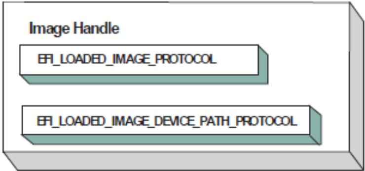  
Fig. 14.7: Image Handle

After a driver has been loaded with the Boot Service EFI\_BOOT\_SERVICES.LoadImage(), it must be started with the Boot Service EFI\_BOOT\_SERVICES.StartImage(). This is true of all types of applications and drivers that can be loaded and started on an UEFI compliant system. The entry point for a driver that follows the UEFI Driver Model must follow some strict rules. First, it is not allowed to touch any hardware. Instead, it is only allowed to install protocol instances onto its own Image Handle. A driver that follows the UEFI Driver Model is required to install an instance of the Driver Binding Protocol onto its own Image Handle. It may optionally install the Driver Diagnostics Protocol or the Component Name Protocol. In addition, if a driver wishes to be unloadable it may optionally update the Loaded Image Protocol to provide its own Unload() EFI\_LOADED\_IMAGE\_PROTOCOL.Unload() function. Finally, if a driver needs to perform any special operations when the Boot Service EFI\_BOOT\_SERVICES is called ( Services — Boot Services ), the driver may optionally create an event with a notification function that is triggered when the Boot Service ExitBootServices() is called. An Image Handle that contains a Driver Binding Protocol instance is known as a Driver Image Handle. The Figure below, PCI Driver Image Handle, shows a possible configuration for the Image Handle from figure: Image Handle after the Boot Service StartImage() has been called.

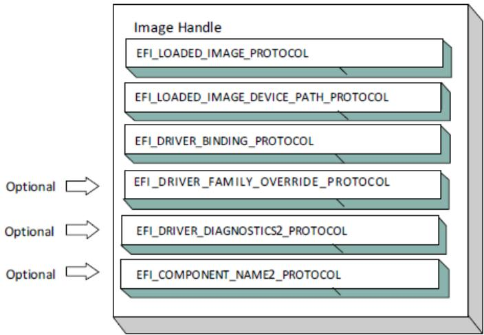  
Fig. 14.8: PCI Driver Image Handle

## 14.3.2 Driver Diagnostics Protocol

If a PCI Bus Driver or a PCI Device Driver requires diagnostics, then an EFI\_DRIVER\_DIAGNOSTICS2\_PROTOCOL must be installed on the image handle in the entry point for the driver. This protocol contains functions to perform diagnostics on a controller. The EFI\_DRIVER\_DIAGNOSTICS2\_PROTOCOL is not allowed to interact with the user. Instead, it must return status information through a bfer. The functions of this protocol will be invoked by a platform management utility.

## 14.3.3 Component Name Protocol

Both a PCI Bus Driver and a PCI Device Driver are able to produce user readable names for the PCI drivers and/or the set of PCI controllers that the PCI drivers are managing. This is accomplished by installing an instance of the EFI\_COMPONENT\_NAME2\_PROTOCOL on the image handle of the driver. This protocol can produce driver and controller names in the form of a string in one of several languages. This protocol can be used by a platform management utility to display user readable names for the drivers and controllers present in a system. Please see the EFI Driver Model Specification for details on the EFI\_COMPONENT\_NAME2\_PROTOCOL.

## 14.3.4 Driver Family Override Protocol

If a PCI Bus Driver or PCI Device Driver always wants the PCI driver delivered in a PCI Option ROM to manage the PCI controller associated with the PCI Option ROM, then the Driver Family Override Protocol must not be produced.

If a PCI Bus Driver or PCI Device Driver always wants the PCI driver with the highest Version value in the Driver Binding Protocol to manage all the PCI Controllers in the same family of PCI controllers, then the Driver Family Override Protocol must be produced on the same handle as the Driver Binding Protocol.

## 14.3.5 PCI Bus Drivers

A PCI Bus Driver manages PCI Host Bus Controllers that can contain one or more PCI Root Bridges. PCI Host Bus Controller shows an example of a desktop system that has one PCI Host Bus Controller with one PCI Root Bridge.

The PCI Host Bus Controller shown above is abstracted in software with the PCI Root Bridge I/O Protocol. A PCI Bus Driver will manage handles that contain this protocol. Device Handle for a PCI Host Bus Controller shows an example device handle for a PCI Host Bus Controller. It contains a Device Path Protocol instance and a PCI Root Bridge I/O Protocol Instance.

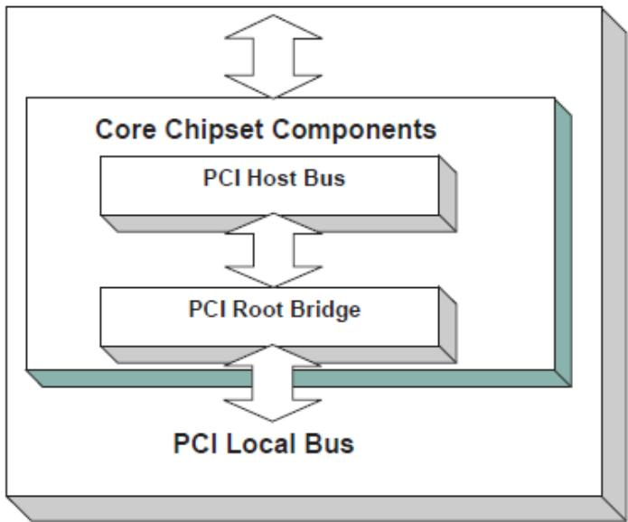  
Fig. 14.9: PCI Host Bus Controller

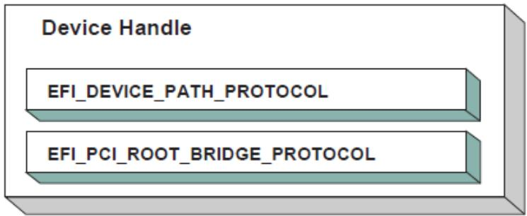  
Fig. 14.10: Device Handle for a PCI Host Bus Controller

## 14.3.6 Driver Binding Protocol for PCI Bus Drivers

The Driver Binding Protocol contains three services. These are Supported() EFI\_DRIVER\_BINDING\_PROTOCOL.Supported() EFI\_DRIVER\_BINDING\_PROTOCOL.Start(), and EFI\_DRIVER\_BINDING\_PROTOCOL.Stop(). Supported() tests to see if the PCI Bus Driver can manage a device handle. A PCI Bus Driver can only manage device handles that contain the Device Path Protocol and the PCI Root Bridge I/O Protocol, so a PCI Bus Driver must look for these two protocols on the device handle that is being tested.

The Start() function tells the PCI Bus Driver to start managing a device handle. The device handle should support the protocols shown in Device Handle for a PCI Host Bus Controller. The PCI Root Bridge I/O Protocols provides access to the PCI I/O, PCI Memory, PCI Prefetchable Memory, and PCI DMA functions. The PCI Controllers behind a PCI Root Bridge may exist on one or more PCI Buses. The standard mechanism for expanding the number of PCI Buses on a single PCI Root Bridge is to use PCI to PCI Bridges. Once a PCI Enumerator configures these bridges, they are invisible to software. As a result, the PCI Bus Driver flattens the PCI Bus hierarchy when it starts managing a device handle that represents a PCI Host Controller. Physical PCI Bus Structure shows the physical tree structure for a set of PCI Device denoted by A, B, C, D, and E. Device A and C are PCI to PCI Bridges.

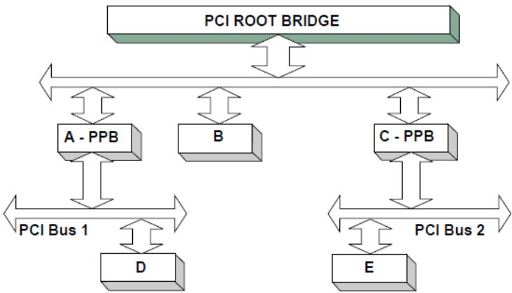  
Fig. 14.11: Physical PCI Bus Structure

Connecting a PCI Bus Driver shows the tree structure generated by a PCI Bus Driver before and after Start() is called. This is a logical view of set of PCI controller, and not a physical view. The physical tree is flattened, so any PCI to PCI bridge devices are invisible. In this example, the PCI Bus Driver finds the five child PCI Controllers on the PCI Bus from Physical PCI Bus Structure. A device handle is created for every PCI Controller including all the PCI to PCI Bridges. The arrow with the dashed line coming into the PCI Host Bus Controller represents a link to the PCI Host Bus Controller’s parent. If the PCI Host Bus Controller is a Root Bus Controller, then it will not have a parent. The PCI Driver Model does not require that a PCI Host Bus Controller be a Root Bus Controller. A PCI Host Bus Controller can be present at any location in the tree, and the PCI Bus Driver should be able to manage the PCI Host Bus Controller.

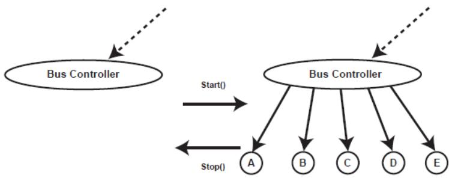  
Fig. 14.12: Connecting a PCI Bus Driver

The PCI Bus Driver has the option of creating all of its children in one call to EFI\_DRIVER\_BINDING\_PROTOCOL.Start() , or spreading it across several calls to Start(). In general, if it is possible to design a bus driver to create one child at a time, it should do so to support the rapid boot capability in the UEFI Driver Model. Each of the child device handles created in Start() must contain a Device Path Protocol instance, a PCI I/O protocol instance, and optionally a Bus Specific Driver Override Protocol instance. The PCI I/O Protocol is described in EFI PCI I/O Protocol. The format of device paths for PCI Controllers is described in Section 2.6, and details on the Bus Specific Driver Override Protocol can be found in the EFI Driver Model Specification. The Figure below shows an example child device handle that is created by a PCI Bus Driver for a PCI Controller.

A PCI Bus Driver must perform several steps to manage a PCI Host Bus Controller, as follows:

• Initialize the PCI Host Bus Controller.

• If the PCI buses have not been initialized by a previous agent, perform PCI Enumeration on all the PCI Root Bridges that the PCI Host Bus Controller contains. This involves assigning a PCI bus number, allocating PCI

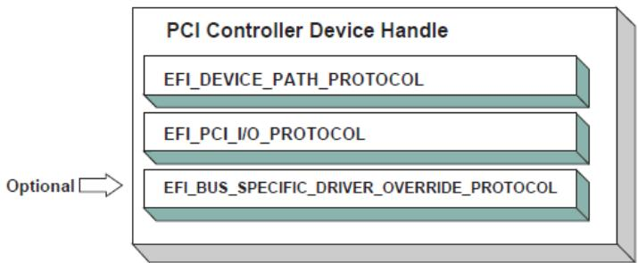  
Fig. 14.13: Child Handle Created by a PCI Bus Driver

I/O resources, PCI Memory resources, and PCI Prefetchable Memory resources.

• Discover all the PCI Controllers on all the PCI Root Bridges. If a PCI Controller is a PCI to PCI Bridge, then the I/O and Memory bits in the Control register of the PCI Configuration Header should be placed in the enabled state. The Bus Master bit in the Control Register may be enabled by default or enabled or disabled based on the needs of downstream devices for DMA access during the boot process. The PCI Bus Driver should disable the I/O, Memory, and Bus Master bits for PCI Controllers that respond to legacy ISA resources (e.g. VGA). It is a PCI Device Driver’s responsibility to enable the I/O, Memory, and Bus Master bits (if they are not already enabled by the PCI bus driver) of the Control register as required with a call to the EFI\_PCI\_IO\_PROTOCOL.Attributes() service when the PCI Device Driver is started. A similar call to the Attributes() service should be made when the PCI Device Driver is stopped to restore original Attributes() state, including the I/O, Memory, and Bus Master bits of the Control register.

• Create a device handle for each PCI Controller found. If a request is being made to start only one PCI Controller, then only create one device handle.

• Install a Device Path Protocol instance and a PCI I/O Protocol instance on the device handle created for each PCI Controller.

• If the PCI Controller has a PCI Option ROM, then allocate a memory bufer that is the same size as the PCI Option ROM, and copy the PCI Option ROM contents to the memory bufer.

• If the PCI Option ROM contains any UEFI drivers, then attach a Bus Specific Driver Override Protocol to the device handle of the PCI Controller that is associated with the PCI Option ROM.

The EFI\_DRIVER\_BINDING\_PROTOCOL.Stop() function tells the PCI Bus Driver to stop managing a PCI Host Bus Controller. The Stop() function can destroy one or more of the device handles that were created on a previous call to EFI\_DRIVER\_BINDING\_PROTOCOL.Start(). If all of the child device handles have been destroyed, then Stop() will place the PCI Host Bus Controller in a quiescent state. The functionality of Stop() mirrors Start() , as follows:

1. Complete all outstanding transactions to the PCIHost Bus Controller.

2. If the PCI Host Bus Controller is being stopped, then place it in a quiescent state.

3. If one or more child handles are being destroyed, then:

a. Uninstall all the protocols from the device handles for the PCI Controllers found in Start().

b. Free any memory bufers allocated for PCI Option ROMs.

c. Destroy the device handles for the PCI controllers created in Start().

## 14.3.7 PCI Enumeration

The PCI Enumeration process is a platform-specific operation that depends on the properties of the chipset that produces the PCI bus. As a result, details on PCI Enumeration are outside the scope of this document. A PCI Bus Driver requires that PCI Enumeration has been performed, so it either needs to have been done prior to the PCI Bus Driver starting, or it must be part of the PCI Bus Driver’s implementation.

## 14.3.8 PCI Device Drivers

PCI Device Drivers manage PCI Controllers. Device handles for PCI Controllers are created by PCI Bus Drivers. A PCI Device Driver is not allowed to create any new device handles. Instead, it attaches protocol instance to the device handle of the PCI Controller. These protocol instances are I/O abstractions that allow the PCI Controller to be used in the preboot environment. The most common I/O abstractions are used to boot an EFI compliant OS.

## 14.3.9 Driver Binding Protocol for PCI Device Drivers

The Driver Binding Protocol contains three services. These are EFI\_DRIVER\_BINDING\_PROTOCOL.Supported() , EFI\_DRIVER\_BINDING\_PROTOCOL.Start(), and EFI\_DRIVER\_BINDING\_PROTOCOL.Stop(). Supported() tests to see if the PCI Device Driver can manage a device handle. A PCI Device Driver can only manage device handles that contain the Device Path Protocol and the PCI I//O Protocol, so a PCI Device Driver must look for these two protocols on the device handle that is being tested. In addition, it needs to check to see if the device handle represents a PCI Controller that the PCI Device Driver knows how to manage. This is typically done by using the services of the PCI I/O Protocol to read the PCI Configuration Header for the PCI Controller, and looking at the VendorId , DeviceId , and SubsystemId fields.

The Start() function tells the PCI Device Driver to start managing a PCI Controller. A PCI Device Driver is not allowed to create any new device handles. Instead, it installs one or more addition protocol instances on the device handle for the PCI Controller. A PCI Device Driver is not allowed to modify the resources allocated to a PCI Controller. These resource allocations are owned by the PCI Bus Driver or some other firmware component that initialized the PCI Bus prior to the execution of the PCI Bus Driver. This means that the PCI BARs (Base Address Registers) and the configuration of any PCI to PCI bridge controllers must not be modified by a PCI Device Driver.A PCI Bus Driver will leave a PCI Device in a disabled safe initial state. A PCI Device Driver should save the original Attributes() state. It is a PCI Device Driver’s responsibility to call Attributes() to enable the I/O, Memory, and Bus Master decodes if they are not already enabled by the PCI bus driver.

The EFI\_DRIVER\_BINDING\_PROTOCOL.Stop() function mirrors the EFI\_DRIVER\_BINDING\_PROTOCOL.Start() function, so the Stop() function completes any outstanding transactions to the PCI Controller and removes the protocol interfaces that were installed in Start(). The Figure below shows the device handle for a PCI Controller before and after Start() is called. In this example, a PCI Device Driver is adding the Block I/O Protocol to the device handle for the PCI Controller. It is also a PCI Device Driver’s responsibility to restore original Attributes() state, including the I/O, Memory, and Bus Master decodes by calling EFI\_PCI\_IO\_PROTOCOL.Attributes() .

## 14.4 EFI PCI I/O Protocol

This section provides a detailed description of the EFI PCI I/O Protocol . This protocol is used by code, typically drivers, running in the EFI boot services environment to access memory and I/O on a PCI controller. In particular, functions for managing devices on PCI buses are defined here.

The interfaces provided in the EFI\_PCI\_IO\_PROTOCOL are for performing basic operations to memory, I/O, and PCI configuration space. The system provides abstracted access to basic system resources to allow a driver to have a programmatic method to access these basic system resources. The main goal of this protocol is to provide an abstraction that simplifies the writing of device drivers for PCI devices. This goal is accomplished by providing the following features:

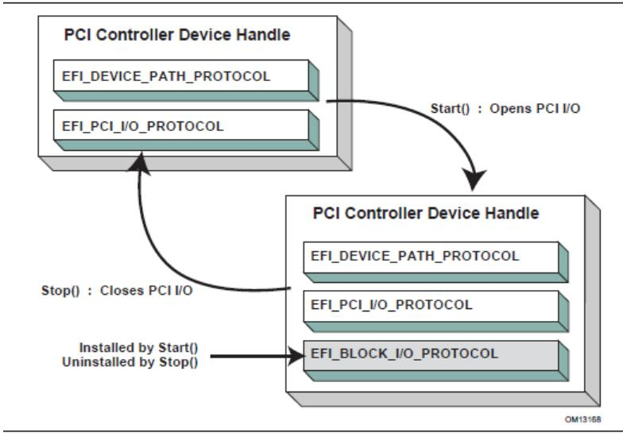  
Fig. 14.14: Connecting a PCI Device Driver

• A driver model that does not require the driver to search the PCI busses for devices to manage. Instead, drivers are provided the location of the device to manage or have the capability to be notified when a PCI controller is discovered.

• A device driver model that abstracts the I/O addresses, Memory addresses, and PCI Configuration addresses from the PCI device driver. Instead, BAR (Base Address Register) relative addressing is used for I/O and Memory accesses, and device relative addressing is used for PCI Configuration accesses. The BAR relative addressing is specified in the PCI I/O services as a BAR index. A PCI controller may contain a combination of 32-bit and 64- bit BARs. The BAR index represents the logical BAR number in the standard PCI configuration header starting from the first BAR. The BAR index does not represent an ofset into the standard PCI Configuration Header because those ofsets will vary depending on the combination and order of 32-bit and 64-bit BARs.

• The Device Path for the PCI device can be obtained from the same device handle that the EFI\_PCI\_IO\_PROTOCOL resides.

• The PCI Segment, PCI Bus Number, PCI Device Number, and PCI Function Number of the PCI device if they are required. The general idea is to abstract these details away from the PCI device driver. However, if these details are required, then they are available.

• Details on any nonstandard address decoding that is not covered by the PCI device’s Base Address Registers.

• Access to the PCI Root Bridge I/O Protocol for the PCI Host Bus for which the PCI device is a member.

• A copy of the PCI Option ROM if it is present in system memory.

• Functions to perform bus mastering DMA. This includes both packet based DMA and common bufer DMA.

## 14.4.1 EFI\_PCI\_IO\_PROTOCOL

## Summary

Provides the basic Memory, I/O, PCI configuration, and DMA interfaces that a driver uses to access its PCI controller.

## GUID

```c
#define EFI_PCI_IO_PROTOCOL_GUID \
{0x4cf5b200,0x68b8,0x4ca5,\
{0x9e,0xec,0xb2,0x3e,0x3f,0x50,0x02,0x9a}}
```

## Protocol Interface Structure

```c
typedef struct _EFI_PCI_IO_PROTOCOL {
    EFI_PCI_IO_PROTOCOL_POLL_IO_MEM    PollMem;
    EFI_PCI_IO_PROTOCOL_POLL_IO_MEM    PollIo;
    EFI_PCI_IO_PROTOCOL_ACCESS    Mem;
    EFI_PCI_IO_PROTOCOL_ACCESS    Io;
    EFI_PCI_IO_PROTOCOL_CONFIG_ACCESS    Pci;
    EFI_PCI_IO_PROTOCOL_COPY_MEM    CopyMem;
    EFI_PCI_IO_PROTOCOL_MAP    Map;
    EFI_PCI_IO_PROTOCOL_UNMAP    Unmap;
    EFI_PCI_IO_PROTOCOL_ALLOCATE_BUFFER    AllocateBuffer;
    EFI_PCI_IO_PROTOCOL_FREE_BUFFER    FreeBuffer;
    EFI_PCI_IO_PROTOCOL_FLUSH    Flush;
    EFI_PCI_IO_PROTOCOL_GET_LOCATION    GetLocation;
    EFI_PCI_IO_PROTOCOL_ATTRIBUTES    Attributes;
    EFI_PCI_IO_PROTOCOL_GET_BAR_ATTRIBUTES    GetBarAttributes;
    EFI_PCI_IO_PROTOCOL_SET_BAR_ATTRIBUTES    SetBarAttributes;
    UINT64    RomSize;
    VOID    *RomImage;
} EFI_PCI_IO_PROTOCOL;
```

## Parameters

## PollMem

Polls an address in PCI memory space until an exit condition is met, or a timeout occurs. EFI\_PCI\_IO\_PROTOCOL.PollMem() function description.

## PollIo

Polls an address in PCI I/O space until an exit condition is met, or a timeout occurs. EFI\_PCI\_IO\_PROTOCOL.PollIo() function description.

## Mem.Read

Allows BAR relative reads to PCI memory space. EFI\_PCI\_IO\_PROTOCOL.MEM.READ() function description.

## Mem.Write

Allows BAR relative writes to PCI memory space. See the Mem.Write() EFI\_PCI\_IO\_PROTOCOL.MEM.WRITE() function description.

Io.Read Allows BAR relative reads to PCI I/O space. See the Io.Read() EFI\_PCI\_IO\_PROTOCOL.Io.Read() function description.

## Io.Write

Allows BAR relative writes to PCI I/O space. See the Io.Write() EFI\_PCI\_IO\_PROTOCOL.Io.Write() function

description.

## Pci.Read

Allows PCI controller relative reads to PCI configuration space. See the Pci.Read() EFI\_PCI\_IO\_PROTOCOL.Pci.Read() function description.

## Pci.Write

Allows PCI controller relative writes to PCI configuration space. See the Pci.Write() EFI\_PCI\_IO\_PROTOCOL.Pci.Write() function description.

## CopyMem

Allows one region of PCI memory space to be copied to another region of PCI memory space. EFI\_PCI\_IO\_PROTOCOL.CopyMem() function description.

## Map

Provides the PCI controller-specific address needed to access system memory for DMA. See the EFI\_PCI\_IO\_PROTOCOL.Map() function description.

## Unmap

Releases any resources allocated by Map(). See the EFI-PCI-IO-PROTOCOL-Unmap() function description.

## AllocateBufer

Allocates pages that are suitable for a common bufer mapping. See the EFI\_PCI\_IO\_PROTOCOL.AllocateBufer() function description.

## FreeBufer

Frees pages that were allocated with AllocateBufer(). See the EFI\_PCI\_IO\_PROTOCOL.FreeBufer() function description.

## Flush

Flushes all PCI posted write transactions to system memory. See the EFI\_PCI\_IO\_PROTOCOL.Flush() function description.

## GetLocation

Retrieves this PCI controller’s current PCI bus number, device number, and function number. See the EFI\_PCI\_IO\_PROTOCOL.GetLocation() function description.

## Attributes

Performs an operation on the attributes that this PCI controller supports. The operations include getting the set of supported attributes, retrieving the current attributes, setting the current attributes, enabling attributes, and disabling attributes. See the EFI\_PCI\_IO\_PROTOCOL.Attributes() function description.

## GetBarAttributes

Gets the attributes that this PCI controller supports setting on a BAR using EFI\_PCI\_IO\_PROTOCOL.SetBarAttributes() , and retrieves the list of resource descriptors for a BAR. See the EFI\_PCI\_IO\_PROTOCOL.GetBarAttributes() function description.

## SetBarAttributes

Sets the attributes for a range of a BAR on a PCI controller. See the SetBarAttributes() function description.

## RomSize

The size, in bytes, of the ROM image.

## RomImage

A pointer to the in memory copy of the ROM image. The PCI Bus Driver is responsible for allocating memory for the ROM image, and copying the contents of the ROM to memory. The contents of this bufer are either from the PCI option ROM that can be accessed through the ROM BAR of the PCI controller, or it is from a platform-specific location. The EFI\_PCI\_IO\_PROTOCOL.Attributes() function can be used to determine from which of these two sources the RomImage bufer was initialized.

## Related Definitions

```c
//**********************************************************************
// EFI_PCI_IO_PROTOCOL_WIDTH
//**********************************************************************
typedef enum {
    EfiPciIoWidthUint8,
    EfiPciIoWidthUint16,
    EfiPciIoWidthUint32,
    EfiPciIoWidthUint64,
    EfiPciIoWidthFifoUint8,
    EfiPciIoWidthFifoUint16,
    EfiPciIoWidthFifoUint32,
    EfiPciIoWidthFifoUint64,
    EfiPciIoWidthFillUint8,
    EfiPciIoWidthFillUint16,
    EfiPciIoWidthFillUint32,
    EfiPciIoWidthFillUint64,
    EfiPciIoWidthMaximum
} EFI_PCI_IO_PROTOCOL_WIDTH;

#define EFI_PCI_IO_PASS_THROUGH_BAR 0xff

//**********************************************************************
// EFI_PCI_IO_PROTOCOL_POLL_IO_MEM
//**********************************************************************
typedef
EFI_STATUS
(EFIAPI *EFI_PCI_IO_PROTOCOL_POLL_IO_MEM) (
    IN EFI_PCI_IO_PROTOCOL *This,
    IN EFI_PCI_IO_PROTOCOL_WIDTH Width,
    IN UINT8 BarIndex,
    IN UINT64 Offset,
    IN UINT64 Mask,
    IN UINT64 Value,
    IN UINT64 Delay,
    OUT UINT64 *Result
);
//**********************************************************************
// EFI_PCI_IO_PROTOCOL_IO_MEM
//**********************************************************************
typedef
EFI_STATUS
(EFIAPI *EFI_PCI_IO_PROTOCOL_IO_MEM) (
    IN EFI_PCI_IO_PROTOCOL *This,
    IN EFI_PCI_IO_PROTOCOL_WIDTH Width,
    IN UINT8 BarIndex,
    IN UINT64 Offset,
    IN UINTN Count,
    IN OUT VOID *Buffer
);

//**********************************************************************
// EFI_PCI_IO_PROTOCOL_ACCESS
//**********************************************************************
```

(continues on next page)

<table><tr><td>typedef struct { EFI_PCI_IO_PROTOCOL_IO_MEM Read; EFI_PCI_IO_PROTOCOL_IO_MEM Write;} EFI_PCI_IO_PROTOCOL_ACCESS;</td></tr><tr><td>//**********// EFI_PCI_IO_PROTOCOL_CONFIG</td></tr><tr><td>//**********typedef EFI_STATUS (EFIAPI *EFI_PCI_IO_PROTOCOL_CONFIG) ( IN EFI_PCI_IO_PROTOCOL *This, IN EFI_PCI_IO_PROTOCOL_WIDTH Width, IN UINT32 Offset, IN UINTN Count, IN OUT VOID *Buffer );</td></tr><tr><td>//**********// EFI_PCI_IO_PROTOCOL_CONFIG_ACCESS</td></tr><tr><td>//**********typedef struct { EFI_PCI_IO_PROTOCOL_CONFIG Read; EFI_PCI_IO_PROTOCOL_CONFIG Write;} EFI_PCI_IO_PROTOCOL_CONFIG_ACCESS;</td></tr><tr><td>//**********// EFI PCI I/O Protocol Attribute bits /</td></tr><tr><td>#define EFI_PCI_IO_ATTRIBUTE_ISA_MOTHERBOARD_IO 0x0001 #define EFI_PCI_IO_ATTRIBUTE_ISA_IO 0x0002 #define EFI_PCI_IO_ATTRIBUTE_VGA_PALETTE_IO 0x0004 #define EFI_PCI_IO_ATTRIBUTE_VGA_MEMORY 0x0008 #define EFI_PCI_IO_ATTRIBUTE_VGA_IO 0x0010 #define EFI_PCI_IO_ATTRIBUTE_IDE_PRIMARY_IO 0x0020 #define EFI_PCI_IO_ATTRIBUTE_IDE_SECONDARY_IO 0x0040 #define EFI_PCI_IO_ATTRIBUTE_MEMORY_WRITE_COMBINE 0x0080 #define EFI_PCI_IO_ATTRIBUTE_IO 0x0100 #define EFI_PCI_IO_ATTRIBUTE_MEMORY 0x0200 #define EFI_PCI_IO_ATTRIBUTE_BUS_MASTER 0x0400 #define EFI_PCI_IO_ATTRIBUTE_MEMORY_CACHED 0x0800 #define EFI_PCI_IO_ATTRIBUTE_MEMORY_DISABLE 0x1000 #define EFI_PCI_IO_ATTRIBUTE_EMBEDDED_DEVICE 0x2000 #define EFI_PCI_IO_ATTRIBUTE_EMBEDDED_ROM 0x4000 #define EFI_PCI_IO_ATTRIBUTE_DUAL_ADDRESS_CYCLE 0x8000 #define EFI_PCI_IO_ATTRIBUTE_ISA_IO_16 0x10000 #define EFI_PCI_IO_ATTRIBUTE_VGA_PALETTE_IO_16 0x20000 #define EFI_PCI_IO_ATTRIBUTE_VGA_IO_16 0x40000</td></tr></table>

## EFI\_PCI\_IO\_ATTRIBUTE\_ISA\_IO\_16

If this bit is set, then the PCI I/O cycles between 0x100 and 0x3FF are forwarded to the PCI controller using a 16-bit address decoder on address bits 0..15. Address bits 16..31 must be zero. This bit is used to forward I/O cycles for legacy ISA devices. If this bit is set, then the PCI Host Bus Controller and all the PCI to PCI bridges between the PCI Host Bus Controller and the PCI Controller are configured to forward these PCI I/O cycles.

This bit may not be combined with EFI\_PCI\_IO\_ATTRIBUTE\_ISA\_IO.

## EFI\_PCI\_IO\_ATTRIBUTE\_VGA\_PALETTE\_IO\_16

If this bit is set, then the PCI I/O write cycles for 0x3C6, 0x3C8, and 0x3C9 are forwarded to the PCI controller using a 16-bit address decoder on address bits 0..15. Address bits 16..31 must be zero. This bit is used to forward I/O write cycles to the VGA palette registers on a PCI controller. If this bit is set, then the PCI Host Bus Controller and all the PCI to PCI bridges between the PCI Host Bus Controller and the PCI Controller are configured to forward these PCI I/O cycles. This bit may not be combined with EFI\_PCI\_IO\_ATTRIBUTE\_VGA\_IO or EFI\_PCI\_IO\_ATTRIBUTE\_VGA\_PALETTE\_IO.

## EFI\_PCI\_IO\_ATTRIBUTE\_VGA\_IO\_16

If this bit is set, then the PCI I/O cycles in the ranges 0x3B0-0x3BB and 0x3C0-0x3DF are forwarded to the PCI controller using a 16-bit address decoder on address bits 0..15. Address bits 16..31 must be zero. This bit is used to forward I/O cycles for a VGA controller to a PCI controller. If this bit is set, then the PCI Host Bus Controller and all the PCI to PCI bridges between the PCI Host Bus Controller and the PCI Controller are configured to forward these PCI I/O cycles. This bit may not be combined with EFI\_PCI\_IO\_ATTRIBUTE\_VGA\_IO or EFI\_PCI\_IO\_ATTRIBUTE\_VGA\_PALETTE\_IO. Because EFI\_PCI\_IO\_ATTRIBUTE\_VGA\_IO\_16 also includes the I/O range described by EFI\_PCI\_IO\_ATTRIBUTE\_VGA\_PALETTE\_IO\_16 , the EFI\_PCI\_IO\_ATTRIBUTE\_VGA\_PALETTE\_IO\_16 bit is ignored if EFI\_PCI\_IO\_ATTRIBUTE\_VGA\_IO\_16 is set.

## EFI\_PCI\_IO\_ATTRIBUTE\_ISA\_MOTHERBOARD\_IO

If this bit is set, then the PCI I/O cycles between 0x00000000 and 0x000000FF are forwarded to the PCI controller. This bit is used to forward I/O cycles for ISA motherboard devices. If this bit is set, then the PCI Host Bus Controller and all the PCI to PCI bridges between the PCI Host Bus Controller and the PCI Controller are configured to forward these PCI I/O cycles.

## EFI\_PCI\_IO\_ATTRIBUTE\_ISA\_IO

If this bit is set, then the PCI I/O cycles between 0x100 and 0x3FF are forwarded to the PCI controller using a 10-bit address decoder on address bits 0..9. Address bits 10..15 are not decoded, and address bits 16..31 must be zero. This bit is used to forward I/O cycles for legacy ISA devices. If this bit is set, then the PCI Host Bus Controller and all the PCI to PCI bridges between the PCI Host Bus Controller and the PCI Controller are configured to forward these PCI I/O cycles.

## EFI\_PCI\_IO\_ATTRIBUTE\_VGA\_PALETTE\_IO

If this bit is set, then the PCI I/O write cycles for 0x3C6, 0x3C8, and 0x3C9 are forwarded to the PCI controller using a 10-bit address decoder on address bits 0..9. Address bits 10..15 are not decoded, and address bits 16..31 must be zero. This bit is used to forward I/O write cycles to the VGA palette registers on a PCI controller. If this bit is set, then the PCI Host Bus Controller and all the PCI to PCI bridges between the PCI Host Bus Controller and the PCI Controller are configured to forward these PCI I/O cycles.

## EFI\_PCI\_IO\_ATTRIBUTE\_VGA\_MEMORY

If this bit is set, then the PCI memory cycles between 0xA0000 and 0xBFFFF are forwarded to the PCI controller. This bit is used to forward memory cycles for a VGA frame bufer on a PCI controller. If this bit is set, then the PCI Host Bus Controller and all the PCI to PCI bridges between the PCI Host Bus Controller and the PCI Controller are configured to forward these PCI Memory cycles.

## EFI\_PCI\_IO\_ATTRIBUTE\_VGA\_IO

If this bit is set, then the PCI I/O cycles in the ranges 0x3B0-0x3BB and 0x3C0-0x3DF are forwarded to the PCI controller using a 10-bit address decoder on address bits 0..9. Address bits 10..15 are not decoded, and the address bits 16..31 must be zero. This bit is used to forward I/O cycles for a VGA controller to a PCI controller. If this bit is set, then the PCI Host Bus Controller and all the PCI to PCI bridges between the PCI Host Bus Controller and the PCI Controller are configured to forward these PCI I/O cycles. Since EFI\_PCI\_IO\_ATTRIBUTE\_VGA\_IO also includes the I/O range described by EFI\_PCI\_IO\_ATTRIBUTE\_VGA\_PALETTE\_IO, the EFI\_PCI\_IO\_ATTRIBUTE\_VGA\_PALETTE\_IO bit is ignored if EFI\_PCI\_IO\_ATTRIBUTE\_VGA\_IO is set.

## EFI\_PCI\_IO\_ATTRIBUTE\_IDE\_PRIMARY\_IO

If this bit is set, then the PCI I/O cycles in the ranges 0x1F0-0x1F7 and 0x3F6-0x3F7 are forwarded to a PCI controller using a 16-bit address decoder on address bits 0..15. Address bits 16..31 must be zero. This bit is used to forward I/O cycles for a Primary IDE controller to a PCI controller. If this bit is set, then the PCI Host Bus Controller and all the PCI to PCI bridges between the PCI Host Bus Controller and the PCI Controller are configured to forward these PCI I/O cycles.

## EFI\_PCI\_IO\_ATTRIBUTE\_IDE\_SECONDARY\_IO

If this bit is set, then the PCI I/O cycles in the ranges 0x170-0x177 and 0x376-0x377 are forwarded to a PCI controller using a 16-bit address decoder on address bits 0..15. Address bits 16..31 must be zero. This bit is used to forward I/O cycles for a Secondary IDE controller to a PCI controller. If this bit is set, then the PCI Host Bus Controller and all the PCI to PCI bridges between the PCI Host Bus Controller and the PCI Controller are configured to forward these PCI I/O cycles.

## EFI\_PCI\_IO\_ATTRIBUTE\_MEMORY\_WRITE\_COMBINE

If this bit is set, then this platform supports changing the attributes of a PCI memory range so that the memory range is accessed in a write combining mode. This bit is used to improve the write performance to a memory bufer on a PCI controller. By default, PCI memory ranges are not accessed in a write combining mode.

## EFI\_PCI\_IO\_ATTRIBUTE\_MEMORY\_CACHED

If this bit is set, then this platform supports changing the attributes of a PCI memory range so that the memory range is accessed in a cached mode. By default, PCI memory ranges are accessed noncached.

## EFI\_PCI\_IO\_ATTRIBUTE\_IO

If this bit is set, then the PCI device will decode the PCI I/O cycles that the device is configured to decode.

## EFI\_PCI\_IO\_ATTRIBUTE\_MEMORY

If this bit is set, then the PCI device will decode the PCI Memory cycles that the device is configured to decode.

## EFI\_PCI\_IO\_ATTRIBUTE\_BUS\_MASTER

If this bit is set, then the PCI device is allowed to act as a bus master on the PCI bus.

## EFI\_PCI\_IO\_ATTRIBUTE\_MEMORY\_DISABLE

If this bit is set, then this platform supports changing the attributes of a PCI memory range so that the memory range is disabled, and can no longer be accessed. By default, all PCI memory ranges are enabled.

## EFI\_PCI\_IO\_ATTRIBUTE\_EMBEDDED\_DEVICE

If this bit is set, then the PCI controller is an embedded device that is typically a component on the system board. If this bit is clear, then this PCI controller is part of an adapter that is populating one of the systems PCI slots.

## EFI\_PCI\_IO\_ATTRIBUTE\_EMBEDDED\_ROM

If this bit is set, then the PCI option ROM described by the RomImage and RomSize fields is not from ROM BAR of the PCI controller. If this bit is clear, then the RomImage and RomSize fields were initialized based on the PCI option ROM found through the ROM BAR of the PCI controller.

## EFI\_PCI\_IO\_ATTRIBUTE\_DUAL\_ADDRESS\_CYCLE

If this bit is set, then the PCI controller is capable of producing PCI Dual Address Cycles, so it is able to access a 64-bit address space. If this bit is not set, then the PCI controller is not capable of producing PCI Dual Address Cycles, so it is only able to access a 32-bit address space.

If this bit is set, then the PCI Host Bus Controller and all the PCI to PCI bridges between the PCI Host Bus Controller and the PCI Controller are capable of producing PCI Dual Address Cycles. If any of them is not capable of producing PCI Dual Address Cycles, attempt to perform Set or Enable operation using Attributes() function with this bit set will fail with the EFI\_UNSUPPORTED error code.

```c
//******************************************************************
// EFI_PCI_IO_PROTOCOL_OPERATION
//******************************************************************
typedef enum {
    EfiPciIoOperationBusMasterRead,
```

(continues on next page)

<table><tr><td colspan="2">(continued from previous page)</td></tr><tr><td colspan="2">EfiPciIoOperationBusMasterWrite,EfiPciIoOperationBusMasterCommonBuffer,EfiPciIoOperationMaximum} EFI_PCI_IO_PROTOCOL_OPERATION;</td></tr></table>

## EfiPciIoOperationBusMasterRead

A read operation from system memory by a bus master.

## EfiPciIoOperationBusMasterWrite

A write operation to system memory by a bus master.

## EfiPciIoOperationBusMasterCommonBufer

Provides both read and write access to system memory by both the processor and a bus master. The bufer is coherent from both the processor’s and the bus master’s point of view.

## Description

The EFI\_PCI\_IO\_PROTOCOL provides the basic Memory, I/O, PCI configuration, and DMA interfaces that are used to abstract accesses to PCI controllers. There is one EFI\_PCI\_IO\_PROTOCOL instance for each PCI controller on a PCI bus. A device driver that wishes to manage a PCI controller in a system will have to retrieve the EFI\_PCI\_IO\_PROTOCOL instance that is associated with the PCI controller. A device handle for a PCI controller will minimally contain an EFI Device Path Protocol instance and an EFI\_PCI\_IO\_PROTOCOL instance.

Bus mastering PCI controllers can use the DMA services for DMA operations. There are three basic types of bus mastering DMA that is supported by this protocol. These are DMA reads by a bus master, DMA writes by a bus master, and common bufer DMA. The DMA read and write operations may need to be broken into smaller chunks. The caller of EFI\_PCI\_IO\_PROTOCOL.Map() must pay attention to the number of bytes that were mapped, and if required, loop until the entire bufer has been transferred. The following is a list of the diferent bus mastering DMA operations that are supported, and the sequence of EFI\_PCI\_IO\_PROTOCOL interfaces that are used for each DMA operation type.

## DMA Bus Master Read Operation

Call EFI\_PCI\_IO\_PROTOCOL.Map() for EfiPciIoOperationBusMasterRead.

Program the DMA Bus Master with the DeviceAddress returned by Map().

Start the DMA Bus Master.

Wait for DMA Bus Master to complete the read operation.

Call EFI-PCI-IO-PROTOCOL-Unmap().

## DMA Bus Master Write Operation

Call Map() for EfiPciOperationBusMasterWrite.

Program the DMA Bus Master with the DeviceAddress returned by Map().

Start the DMA Bus Master.

Wait for DMA Bus Master to complete the write operation.

Perform a PCI controller specific read transaction to flush all PCI write bufers (See PCI Specification Section 3.2.5.2).

Call EFI\_PCI\_ROOT\_BRIDGE\_IO\_PROTOCOL.Flush() .

Call Unmap().

## DMA Bus Master Common Bufer Operation

Call EFI\_PCI\_IO\_PROTOCOL.AllocateBufer() . to allocate a common bufer.

Call Map() for EfiPciIoOperationBusMasterCommonBufer.

Program the DMA Bus Master with the DeviceAddress returned by Map().

The common bufer can now be accessed equally by the processor and the DMA bus master.

Call Unmap().

Call EFI\_PCI\_ROOT\_BRIDGE\_IO\_PROTOCOL.FreeBufer() .

## 14.4.2 EFI\_PCI\_IO\_PROTOCOL.PollMem()

## Summary

Reads from the memory space of a PCI controller. Returns when either the polling exit criteria is satisfied or after a defined duration

## Prototype

<table><tr><td colspan="2">typedef</td></tr><tr><td colspan="2">EFI_STATUS</td></tr><tr><td colspan="2">(EFIAPI *EFI_PCI_IO_PROTOCOL_POLL_IO_MEM) (</td></tr><tr><td>IN EFI_PCI_IO_PROTOCOL</td><td>*This,</td></tr><tr><td>IN EFI_PCI_IO_PROTOCOL_WIDTH</td><td>Width,</td></tr><tr><td>IN UINT8</td><td>BarIndex,</td></tr><tr><td>IN UINT64</td><td>Offset,</td></tr><tr><td>IN UINT64</td><td>Mask,</td></tr><tr><td>IN UINT64</td><td>Value,</td></tr><tr><td>IN UINT64</td><td>Delay,</td></tr><tr><td>OUT UINT64</td><td>*Result</td></tr><tr><td>);</td><td></td></tr></table>

## Parameters

## This

A pointer to the EFI PCI I/O Protocol instance. Type EFI\_PCI\_IO\_PROTOCOL is defined in EFI PCI I/O Protocol.

## Width

Signifies the width of the memory operations, defined in EFI PCI I/O Protocol .

## BarIndex

The BAR index of the standard PCI Configuration header to use as the base address for the memory operation to perform. This allows all drivers to use BAR relative addressing. The legal range for this field is 0..5. However, the value EFI\_PCI\_IO\_PASS\_THROUGH\_BAR can be used to bypass the BAR relative addressing and pass Ofset to the PCI Root Bridge I/O Protocol unchanged. Type EFI\_PCI\_IO\_PASS\_THROUGH\_BAR is defined in EFI\_PCI\_IO\_Protocol .

## Ofset

The ofset within the selected BAR to start the memory operation.

## Mask

Mask used for the polling criteria. Bytes above Width in Mask are ignored. The bits in the bytes below Width which are zero in Mask are ignored when polling the memory address.

## Value

The comparison value used for the polling exit criteria.

## Delay

The number of 100 ns units to poll. Note that timer available may be of poorer granularity.

## Result

Pointer to the last value read from the memory location.

## Description

This function provides a standard way to poll a PCI memory location. A PCI memory read operation is performed at the PCI memory address specified by BarIndex and Ofset for the width specified by Width. The result of this PCI memory read operation is stored in Result. This PCI memory read operation is repeated until either a timeout of Delay 100 ns units has expired, or ( Result & Mask) is equal to Value.

This function will always perform at least one memory access no matter how small Delay may be. If Delay is 0, then Result will be returned with a status of EFI\_SUCCESS even if Result does not match the exit criteria. If Delay expires, then EFI\_TIMEOUT is returned.

If Width is not EfiPciIoWidthUint8 , EfiPciIoWidthUint16 , EfiPciIoWidthUint32 , or EfiPciIoWidthUint64 , then EFI\_INVALID\_PARAMETER is returned.

The memory operations are carried out exactly as requested. The caller is responsible for satisfying any alignment and memory width restrictions that a PCI controller on a platform might require. For example, on some platforms, width requests of EfiPciIoWidthUint64 do not work.

All the PCI transactions generated by this function are guaranteed to be completed before this function returns. However, if the memory mapped I/O region being accessed by this function has the EFI\_PCI\_IO\_ATTRIBUTE\_MEMORY\_CACHED attribute set, then the transactions will follow the ordering rules defined by the processor architecture.

## Status Codes Returned

<table><tr><td>EFI_SUCCESS</td><td>The last data returned from the access matched the poll exit criteria.</td></tr><tr><td>EFI_INVALID_PARAMETER</td><td>Width is invalid.</td></tr><tr><td>EFI_INVALID_PARAMETER</td><td>Result is NULL.</td></tr><tr><td>EFI_UNSUPPORTED</td><td>BarIndex not valid for this PCI controller.</td></tr><tr><td>EFI_UNSUPPORTED</td><td>Offset is not valid for the BarIndex of this PCI controller.</td></tr><tr><td>EFI_TIMEOUT</td><td>Delay expired before a match occurred.</td></tr><tr><td>EFI_OUT_OF_RESOURCES</td><td>The request could not be completed due to a lack of resources.</td></tr></table>

## 14.4.3 EFI\_PCI\_IO\_PROTOCOL.PollIo()

## Summary

Reads from the I/O space of a PCI controller. Returns when either the polling exit criteria is satisfied or after a defined duration.

Prototype

<table><tr><td colspan="2">typedef</td></tr><tr><td colspan="2">EFI_STATUS</td></tr><tr><td colspan="2">(EFIAPI *EFI_PCI_IO_PROTOCOL_POLL_IO_MEM) (</td></tr><tr><td>IN EFI_PCI_IO_PROTOCOL</td><td>*This,</td></tr><tr><td>IN EFI_PCI_IO_PROTOCOL_WIDTH</td><td>Width,</td></tr><tr><td>IN UINT8</td><td>BarIndex,</td></tr><tr><td>IN UINT64</td><td>Offset,</td></tr><tr><td>IN UINT64</td><td>Mask,</td></tr><tr><td>IN UINT64</td><td>Value,</td></tr><tr><td>IN UINT64</td><td>Delay,</td></tr></table>

(continues on next page)

(continued from previous page)

<table><tr><td>OUT UINT64);</td><td>*Result</td></tr></table>

## Parameters

## This

A pointer to the EFI\_PCI\_IO\_PROTOCOL instance. Type EFI\_PCI\_IO\_PROTOCOL is defined in See EFI PCI I/O Protocol.

## Width

Signifies the width of the I/O operations. Type EFI\_PCI\_IO\_PROTOCOL\_WIDTH, defined in EFI PCI I/O Protocol .

## BarIndex

The BAR index of the standard PCI Configuration header to use as the base address for the I/O operation to perform. This allows all drivers to use BAR relative addressing. The legal range for this field is 0..5. However, the value EFI\_PCI\_IO\_PASS\_THROUGH\_BAR can be used to bypass the BAR relative addressing and pass Ofset to the PCI Root Bridge I/O Protocol unchanged. Type EFI\_PCI\_IO\_PASS\_THROUGH\_BAR is defined in EFI\_PCI\_IO\_Protocol .

## Ofset

The ofset within the selected BAR to start the I/O operation.

## Mask

Mask used for the polling criteria. Bytes above Width in Mask are ignored. The bits in the bytes below Width which are zero in Mask are ignored when polling the I/O address.

## Value

The comparison value used for the polling exit criteria.

## Delay

The number of 100 ns units to poll. Note that timer available may be of poorer granularity.

## Result

Pointer to the last value read from the memory location.

## Description

This function provides a standard way to poll a PCI I/O location. A PCI I/O read operation is performed at the PCI I/O address specified by BarIndex and Ofset for the width specified by Width. The result of this PCI I/O read operation is stored in Result. This PCI I/O read operation is repeated until either a timeout of Delay 100 ns units has expired, or (Result & Mask) is equal to Value.

This function will always perform at least one I/O access no matter how small Delay may be. If Delay is 0, then Result will be returned with a status of EFI\_SUCCESS even if Result does not match the exit criteria. If Delay expires, then EFI\_TIMEOUT is returned.

If Width is not EfiPciIoWidthUint8 , EfiPciIoWidthUint16 , EfiPciIoWidthUint32 , or EfiPciIoWidthUint64 , then EFI\_INVALID\_PARAMETER is returned.

The I/O operations are carried out exactly as requested. The caller is responsible satisfying any alignment and I/O width restrictions that the PCI controller on a platform might require. For example, on some platforms, width requests of EfiPciIoWidthUint64 do not work.

All the PCI read transactions generated by this function are guaranteed to be completed before this function returns.

Status Codes Returned

<table><tr><td>EFI_SUCCESS</td><td>The last data returned from the access matched the poll exit criteria.</td></tr><tr><td>EFI_INVALID_PARAMETER</td><td>Width is invalid.</td></tr><tr><td>EFI_INVALID_PARAMETER</td><td>Result is NULL.</td></tr><tr><td>EFI_UNSUPPORTED</td><td>BarIndex not valid for this PCI controller.</td></tr><tr><td>EFI_UNSUPPORTED</td><td>Offset is not valid for the PCI BAR specified by BarIndex.</td></tr><tr><td>EFI_TIMEOUT</td><td>Delay expired before a match occurred.</td></tr><tr><td>EFI_OUT_OF_RESOURCES</td><td>The request could not be completed due to a lack of resources.</td></tr></table>

## 14.4.4 EFI\_PCI\_IO\_PROTOCOL.Mem.Read()

## 14.4.5 EFI\_PCI\_IO\_PROTOCOL.Mem.Write()

## Summary

Enable a PCI driver to access PCI controller registers in the PCI memory space.

## Prototype

<table><tr><td colspan="2">typedef</td></tr><tr><td colspan="2">EFI_STATUS</td></tr><tr><td colspan="2">(EFIAPI *EFI_PCI_IO_PROTOCOL_MEM) (</td></tr><tr><td>IN EFI_PCI_IO_PROTOCOL</td><td>*This,</td></tr><tr><td>IN EFI_PCI_IO_PROTOCOL_WIDTH</td><td>Width,</td></tr><tr><td>IN UINT8</td><td>BarIndex,</td></tr><tr><td>IN UINT64</td><td>Offset,</td></tr><tr><td>IN UINTN</td><td>Count,</td></tr><tr><td>IN OUT VOID</td><td>*Buffer</td></tr><tr><td>);</td><td></td></tr></table>

## Parameters

## This

A pointer to the See EFI\_PCI\_IO\_PROTOCOL instance. Type EFI\_PCI\_IO\_PROTOCOL is defined in EFI PCI I/O Protocol .

## Width

Signifies the width of the memory operations. Type EFI\_PCI\_IO\_PROTOCOL\_WIDTH, defined in EFI PCI I/O Protocol .

## BarIndex

The BAR index of the standard PCI Configuration header to use as the base address for the memory operation to perform. This allows all drivers to use BAR relative addressing. The legal range for this field is 0..5. However, the value EFI\_PCI\_IO\_PASS\_THROUGH\_BAR can be used to bypass the BAR relative addressing and pass Ofset to the PCI Root Bridge I/O Protocol unchanged. Type EFI\_PCI\_IO\_PASS\_THROUGH\_BAR is defined in EFI\_PCI\_IO\_Protocol .

## Ofset

The ofset within the selected BAR to start the memory operation.

## Count

The number of memory operations to perform. Bytes moved is Width size \* Count, starting at Ofset.

## Bufer

For read operations, the destination bufer to store the results. For write operations, the source bufer to write data from.

## Description

The Mem.Read() , and Mem.Write() functions enable a driver to access controller registers in the PCI memory space.

The I/O operations are carried out exactly as requested. The caller is responsible for any alignment and I/O width issues which the bus, device, platform, or type of I/O might require. For example, on some platforms, width requests of EfiPciIoWidthUint64 do not work.

If Width is EfiPciIoWidthUint8 , EfiPciIoWidthUint16 , EfiPciIoWidthUint32 , or EfiPciIoWidthUint64 , then both Address and Bufer are incremented for each of the Count operations performed.

If Width is EfiPciIoWidthFifoUint8 , EfiPciIoWidthFifoUint16 , EfiPciIoWidthFifoUint32 , or EfiPciIoWidthFifoUint64 , then only Bufer is incremented for each of the Count operations performed. The read or write operation is performed Count times on the same Address

If Width is EfiPciIoWidthFillUint8 , EfiPciIoWidthFillUint16 , EfiPciIoWidthFillUint32 , or EfiPciIoWidthFillUint64 , then only Address is incremented for each of the Count operations performed. The read or write operation is performed Count times from the first element of Bufer.

All the PCI transactions generated by this function are guaranteed to be completed before this function returns. All the PCI write transactions generated by this function will follow the write ordering and completion rules defined in the PCI Specification. However, if the memory-mapped I/O region being accessed by this function has the EFI\_PCI\_IO\_ATTRIBUTE\_MEMORY\_CACHED attribute set, then the transactions will follow the ordering rules defined by the processor architecture.

## Status Codes Returned

<table><tr><td>EFI_SUCCESS</td><td>The data was read from or written to the PCI controller.</td></tr><tr><td>EFI_INVALID_PARAMETER</td><td>Width is invalid.</td></tr><tr><td>EFI_INVALID_PARAMETER</td><td>Buffer is NULL.</td></tr><tr><td>EFI_UNSUPPORTED</td><td>BarIndex not valid for this PCI controller.</td></tr><tr><td>EFI_UNSUPPORTED</td><td>The address range specified by Offset, Width, and Count is not valid for the PCI BAR specified by BarIndex.</td></tr><tr><td>EFI_OUT_OF_RESOURCES</td><td>The request could not be completed due to a lack of resources.</td></tr></table>

## 14.4.6 EFI\_PCI\_IO\_PROTOCOL.Io.Read()

## 14.4.7 EFI\_PCI\_IO\_PROTOCOL.Io.Write()

## Summary

Enable a PCI driver to access PCI controller registers in the PCI I/O space.

## Prototype

<table><tr><td colspan="2">typedef</td></tr><tr><td colspan="2">EFI_STATUS</td></tr><tr><td colspan="2">(EFIAPI *EFI_PCI_IO_PROTOCOL_MEM) (</td></tr><tr><td>IN EFI_PCI_IO_PROTOCOL</td><td>*This,</td></tr><tr><td>IN EFI_PCI_IO_PROTOCOL_WIDTH</td><td>Width,</td></tr><tr><td>IN UINT8</td><td>BarIndex,</td></tr><tr><td>IN UINT64</td><td>Offset,</td></tr><tr><td>IN UINTN</td><td>Count,</td></tr><tr><td>IN OUT VOID</td><td>*Buffer</td></tr><tr><td>);</td><td></td></tr></table>

## Parameters

## This

A pointer to the EFI\_PCI\_ROOT\_BRIDGE\_IO\_PROTOCOL instance. Type EFI\_PCI\_IO\_PROTOCOL is defined in EFI\_PCI\_ROOT\_BRIDGE\_IO\_PROTOCOL .

## Width

Signifies the width of the memory operations. Type EFI\_PCI\_IO\_PROTOCOL\_WIDTH, defined in EFI PCI I/O Protocol .

## BarIndex

The BAR index of the standard PCI Configuration header to use as the base address for the I/O operation to perform. This allows all drivers to use BAR relative addressing. The legal range for this field is 0..5. However, the value EFI\_PCI\_IO\_PASS\_THROUGH\_BAR can be used to bypass the BAR relative addressing and pass Ofset to the PCI Root Bridge I/O Protocol unchanged. Type EFI\_PCI\_IO\_PASS\_THROUGH\_BAR is defined in EFI\_PCI\_IO\_Protocol .

## Ofset

The ofset within the selected BAR to start the I/O operation.

## Count

The number of I/O operations to perform. Bytes moved is Width size \* Count, starting at Ofset.

## Bufer

For read operations, the destination bufer to store the results. For write operations, the source bufer to write data from.

## Description

The Io.Read() , and Io.Write() functions enable a driver to access PCI controller registers in PCI I/O space.

The I/O operations are carried out exactly as requested. The caller is responsible for any alignment and I/O width issues which the bus, device, platform, or type of I/O might require. For example, on some platforms, width requests of EfiPciIoWidthUint64 do not work.

If Width is EfiPciIoWidthUint8 , EfiPciIoWidthUint16 , EfiPciIoWidthUint32 , or EfiPciIoWidthUint64 , then both Address and Bufer are incremented for each of the Count operations performed.

If Width is EfiPciIoWidthFifoUint8 , EfiPciIoWidthFifoUint16 , EfiPciIoWidthFifoUint32 , or EfiPciIoWidthFifoUint64 , then only Bufer is incremented for each of the Count operations performed. The read or write operation is performed Count times on the same Address

If Width is EfiPciIoWidthFillUint8 , EfiPciIoWidthFillUint16 , EfiPciIoWidthFillUint32 , or EfiPciIoWidthFillUint64 , then only Address is incremented for each of the Count operations performed. The read or write operation is performed Count times from the first element of Bufer.

All the PCI transactions generated by this function are guaranteed to be completed before this function returns.

## Status Codes Returned

<table><tr><td>EFI_SUCCESS</td><td>The data was read from or written to the PCI controller.</td></tr><tr><td>EFI_INVALID_PARAMETER</td><td>Width is invalid.</td></tr><tr><td>EFI_INVALID_PARAMETER</td><td>Buffer is NULL.</td></tr><tr><td>EFI_UNSUPPORTED</td><td>BarIndex not valid for this PCI controller.</td></tr><tr><td>EFI_UNSUPPORTED</td><td>The address range specified by Offset, Width, and Count is not valid for the PCI BAR specified by BarIndex.</td></tr><tr><td>EFI_OUT_OF_RESOURCES</td><td>The request could not be completed due to a lack of resources.</td></tr></table>

## 14.4.8 EFI\_PCI\_IO\_PROTOCOL.Pci.Read()

## 14.4.9 EFI\_PCI\_IO\_PROTOCOL.Pci.Write()

## Summary

Enable a PCI driver to access PCI controller registers in PCI configuration space.

Prototype

<table><tr><td colspan="2">typedef</td></tr><tr><td colspan="2">EFI_STATUS(EFIAPI *EFI_PCI_IO_PROTOCOL_CONFIG) (</td></tr><tr><td>IN EFI_PCI_IO_PROTOCOL</td><td>*This,</td></tr><tr><td>IN EFI_PCI_IO_PROTOCOL_WIDTH</td><td>Width,</td></tr><tr><td>IN UINT32</td><td>Offset,</td></tr><tr><td>IN UINTN</td><td>Count,</td></tr><tr><td>IN OUT VOID</td><td>*Buffer</td></tr><tr><td>);</td><td></td></tr></table>

## Parameters

A pointer to the See EFI PCI I/O Protocol instance. Type EFI\_PCI\_IO\_PROTOCOL is defined in See EFI PCI I/O Protocol.

Signifies the width of the memory operations. Type EFI\_PCI\_IO\_PROTOCOL\_WIDTH, defined in EFI PCI I/O Protocol .

The ofset within the PCI configuration space for the PCI controller.

The number of PCI configuration operations to perform. Bytes moved is Width size \* Count, starting at Ofset.

For read operations, the destination bufer to store the results. For write operations, the source bufer to write data from.

## Description

The Pci.Read() and Pci.Write() functions enable a driver to access PCI configuration registers for the PCI controller.

The PCI Configuration operations are carried out exactly as requested. The caller is responsible for any alignment and I/O width issues which the bus, device, platform, or type of I/O might require. For example, on some platforms, width requests of EfiPciIoWidthUint64 do not work.

If Width is EfiPciIoWidthUint8 , EfiPciIoWidthUint16 , EfiPciIoWidthUint32 , or EfiPciIoWidthUint64 , then both Address and Bufer are incremented for each of the Count operations performed.

If Width is EfiPciIoWidthFifoUint8 , EfiPciIoWidthFifoUint16 , EfiPciIoWidthFifoUint32 , or EfiPciIoWidthFifoUint64 , then only Bufer is incremented for each of the Count operations performed. The read or write operation is performed Count times on the same Address

If Width is EfiPciIoWidthFillUint8 , EfiPciIoWidthFillUint16 , EfiPciIoWidthFillUint32 , or EfiPciIoWidthFillUint64 , then only Address is incremented for each of the Count operations performed. The read or write operation is performed Count times from the first element of Bufer.

All the PCI transactions generated by this function are guaranteed to be completed before this function returns.

## Status Codes Returned

<table><tr><td>EFI_SUCCESS</td><td>The data was read from or written to the PCI controller.</td></tr><tr><td>EFI_INVALID_PARAMETER</td><td>Width is invalid.</td></tr><tr><td>EFI_INVALID_PARAMETER</td><td>Buffer is NULL.</td></tr><tr><td>EFI_UNSUPPORTED</td><td>The address range specified by Offset, Width, and Count is not valid for the PCI configuration header of the PCI controller.</td></tr><tr><td>EFI_OUT_OF_RESOURCES</td><td>The request could not be completed due to a lack of resources.</td></tr></table>

## 14.4.10 EFI\_PCI\_IO\_PROTOCOL.CopyMem()

## Summary

Enables a PCI driver to copy one region of PCI memory space to another region of PCI memory space.

## Prototype

<table><tr><td colspan="2">typedef</td></tr><tr><td colspan="2">EFI_STATUS(EFIAPI *EFI_PCI_IO_PROTOCOL_COPY_MEM) (</td></tr><tr><td>IN EFI_PCI_IO_PROTOCOL</td><td>*This,</td></tr><tr><td>IN EFI_PCI_IO_PROTOCOL_WIDTH</td><td>Width,</td></tr><tr><td>IN UINT8</td><td>DestBarIndex,</td></tr><tr><td>IN UINT64</td><td>DestOffset,</td></tr><tr><td>IN UINT8</td><td>SrcBarIndex,</td></tr><tr><td>IN UINT64</td><td>SrcOffset,</td></tr><tr><td>IN UINTN</td><td>Count</td></tr><tr><td>);</td><td></td></tr></table>

## Parameters

## This

A pointer to the EFI\_PCI\_IO\_PROTOCOL instance. Type EFI\_PCI\_IO\_PROTOCOL is defined in EFI\_PCI\_IO\_Protocol .

## Width

Signifies the width of the memory operations. Type EFI\_PCI\_IO\_PROTOCOL\_WIDTH, defined in EFI PCI I/O Protocol .

## DestBarIndex

The BAR index of the standard PCI Configuration header to use as the base address for the memory operation to perform. This allows all drivers to use BAR relative addressing. The legal range for this field is 0..5. However, the value EFI\_PCI\_IO\_PASS\_THROUGH\_BAR can be used to bypass the BAR relative addressing and pass Ofset to the PCI Root Bridge I/O Protocol unchanged. Type EFI\_PCI\_IO\_PASS\_THROUGH\_BAR is defined in EFI\_PCI\_IO\_Protocol .

## DestOfset

The destination ofset within the BAR specified by DestBarIndex to start the memory writes for the copy operation. The caller is responsible for aligning the DestOfset if required.

## SrcBarIndex

The BAR index of the standard PCI Configuration header to use as the base address for the memory operation to perform. This allows all drivers to use BAR relative addressing. The legal range for this field is 0..5. However, the value EFI\_PCI\_IO\_PASS\_THROUGH\_BAR can be used to bypass the BAR relative addressing and pass

Ofset to the PCI Root Bridge I/O Protocol unchanged. Type EFI\_PCI\_IO\_PASS\_THROUGH\_BAR is defined in EFI\_PCI\_IO\_Protocol .

## SrcOfset

The source ofset within the BAR specified by SrcBarIndex to start the memory reads for the copy operation. The caller is responsible for aligning the SrcOfset if required.

## Count

The number of memory operations to perform. Bytes moved is Width size \* Count, starting at DestOfset and SrcOfset.

## Description

The CopyMem() function enables a PCI driver to copy one region of PCI memory space to another region of PCI memory space on a PCI controller. This is especially useful for video scroll operations on a memory mapped video bufer.

The memory operations are carried out exactly as requested. The caller is responsible for satisfying any alignment and memory width restrictions that a PCI controller on a platform might require. For example, on some platforms, width requests of EfiPciIoWidthUint64 do not work.

If Width is EfiPciIoWidthUint8 , EfiPciIoWidthUint16 , EfiPciIoWidthUint32 , or EfiPciIoWidthUint64 , then Count read/write transactions are performed to move the contents of the SrcOfset bufer to the DestOfset bufer. The implementation must be reentrant, and it must handle overlapping SrcOfset and DestOfset bufers. This means that the implementation of CopyMem() must choose the correct direction of the copy operation based on the type of overlap that exists between the SrcOfset and DestOfset bufers. If either the SrcOfset bufer or the DestOfset bufer crosses the top of the processor’s address space, then the result of the copy operation is unpredictable.

The contents of the DestOfset bufer on exit from this service must match the contents of the SrcOfset bufer on entry to this service. Due to potential overlaps, the contents of the SrcOfset bufer may be modified by this service. The following rules can be used to guarantee the correct behavior:

• If DestOfset > SrcOfset and DestOfset < ( SrcOfset + Width size \* Count ), then the data should be copied from the SrcOfset bufer to the DestOfset bufer starting from the end of bufers and working toward the beginning of the bufers.

• Otherwise, the data should be copied from the SrcOfset bufer to the DestOfset bufer starting from the beginning of the bufers and working toward the end of the bufers.

All the PCI transactions generated by this function are guaranteed to be completed before this function returns. All the PCI write transactions generated by this function will follow the write ordering and completion rules defined in the PCI Specification. However, if the memory-mapped I/O region being accessed by this function has the EFI\_PCI\_IO\_ATTRIBUTE\_MEMORY\_CACHED attribute set, then the transactions will follow the ordering rules defined by the processor architecture.

## Status Codes Returned

<table><tr><td>EFI_SUCCESS</td><td>The data was copied from one memory region to another memory region.</td></tr><tr><td>EFI_INVALID_PARAMETER</td><td>Width is invalid.</td></tr><tr><td>EFI_UNSUPPORTED</td><td>DestBarIndex not valid for this PCI controller.</td></tr><tr><td>EFI_UNSUPPORTED</td><td>SrcBarIndex not valid for this PCI controller.</td></tr><tr><td>EFI_UNSUPPORTED</td><td>The address range specified by DestOffset, Width, and Count is not valid for the PCI BAR specified by DestBarIndex.</td></tr><tr><td>EFI_UNSUPPORTED</td><td>The address range specified by SrcOffset, Width, and Count is not valid for the PCI BAR specified by SrcBarIndex.</td></tr><tr><td>EFI_OUT_OF_RESOURCES</td><td>The request could not be completed due to a lack of resources.</td></tr></table>

## 14.4.11 EFI\_PCI\_IO\_PROTOCOL.Map()

## Summary

Provides the PCI controller-specific addresses needed to access system memory.

## Prototype

<table><tr><td colspan="2">typedef</td></tr><tr><td colspan="2">EFI_STATUS(EFIAPI *EFI_PCI_IO_PROTOCOL_MAP) (</td></tr><tr><td>IN EFI_PCI_IO_PROTOCOL</td><td>*This,</td></tr><tr><td>IN EFI_PCI_IO_PROTOCOL_OPERATION</td><td>Operation,</td></tr><tr><td>IN VOID</td><td>*HostAddress,</td></tr><tr><td>IN OUT UINTN</td><td>*NumberOfBytes,</td></tr><tr><td>OUT EFI_PHYSICAL_ADDRESS</td><td>*DeviceAddress,</td></tr><tr><td>OUT VOID</td><td>**Mapping</td></tr><tr><td>);</td><td></td></tr></table>

## Parameters

## This

A pointer to the EFI\_PCI\_ROOT\_BRIDGE\_IO\_PROTOCOL instance. Type EFI\_PCI\_IO\_PROTOCOL is defined in See EFI PCI I/O Protocol.

## Operation

Indicates if the bus master is going to read or write to system memory. Type EFI\_PCI\_IO\_PROTOCOL\_OPERATION is defined in See EFI PCI I/O Protocol.

## HostAddress

The system memory address to map to the PCI controller.

## NumberOfBytes

On input the number of bytes to map. On output the number of bytes that were mapped.

## DeviceAddress

The resulting map address for the bus master PCI controller to use to access the hosts HostAddress. Type EFI\_PHYSICAL\_ADDRESS is defined in EFI\_BOOT\_SERVICES.AllocatePool() . This address cannot be used by the processor to access the contents of the bufer specified by HostAddress.

## Mapping

A resulting value to pass to EFI-PCI-IO-PROTOCOL-Unmap() .

## Description

The EFI\_PCI\_IO\_PROTOCOL.Map() function provides the PCI controller-specific addresses needed to access system memory. This function is used to map system memory for PCI bus master DMA accesses.

All PCI bus master accesses must be performed through their mapped addresses and such mappings must be freed with EFI-PCI-IO-PROTOCOL-Unmap() when complete. If the bus master access is a single read or write data transfer, then EfiPciIoOperationBusMasterRead or EfiPciIoOperation-BusMasterWrite is used and the range is unmapped to complete the operation. If performing an EfiPciIoOperationBusMasterRead operation, all the data must be present in system memory before the Map() is performed. Similarly, if performing an EfiPciIoOperation-BusMasterWrite, the data cannot be properly accessed in system memory until Unmap() is performed.

Bus master operations that require both read and write access or require multiple host device interactions within the same mapped region must use EfiPciIoOperation-BusMasterCommonBufer. However, only memory allocated via the EFI\_PCI\_IO\_PROTOCOL.AllocateBufer() interface can be mapped for this operation type.

In all mapping requests the resulting NumberOfBytes actually mapped may be less than the requested amount. In this case, the DMA operation will have to be broken up into smaller chunks. The Map() function will map as much of the

DMA operation as it can at one time. The caller may have to loop on Map() and Unmap() in order to complete a large DMA transfer.

## Status Codes Returned

<table><tr><td>EFI_SUCCESS</td><td>The range was mapped for the returned NumberOfBytes.</td></tr><tr><td>EFI_INVALID_PARAMETER</td><td>Operation is invalid.</td></tr><tr><td>EFI_INVALID_PARAMETER</td><td>HostAddress is NULL.</td></tr><tr><td>EFI_INVALID_PARAMETER</td><td>NumberOfBytes is NULL.</td></tr><tr><td>EFI_INVALID_PARAMETER</td><td>DeviceAddress is NULL.</td></tr><tr><td>EFI_INVALID_PARAMETER</td><td>Mapping is NULL.</td></tr><tr><td>EFI_UNSUPPORTED</td><td>The HostAddress cannot be mapped as a common buffer.</td></tr><tr><td>EFI_DEVICE_ERROR</td><td>The system hardware could not map the requested address.</td></tr><tr><td>EFI_OUT_OF_RESOURCES</td><td>The request could not be completed due to a lack of resources.</td></tr></table>

## 14.4.12 EFI-PCI-IO-PROTOCOL-Unmap()

## Summary

Completes the EFI\_PCI\_IO\_PROTOCOL.Map() operation and releases any corresponding resources.

## Prototype

<table><tr><td colspan="2">typedef</td></tr><tr><td colspan="2">EFI_STATUS</td></tr><tr><td colspan="2">(EFIAPI *EFI_PCI_IO_PROTOCOL_UNMAP) (</td></tr><tr><td>IN EFI_PCI_IO_PROTOCOL</td><td>*This,</td></tr><tr><td>IN VOID</td><td>*Mapping</td></tr><tr><td>);</td><td></td></tr></table>

## Parameters

## This

A pointer to the EFI\_PCI\_IO\_PROTOCOL instance. Type EFI\_PCI\_IO\_PROTOCOL is defined in EFI PCI I/O Protocol.

## Mapping

The mapping value returned from Map().

## Description

The Unmap() function completes the Map() operation and releases any corresponding resources. If the operation was an EfiPciIoOperationBusMasterWrite , the data is committed to the target system memory. Any resources used for the mapping are freed.

## Status Codes Returned

<table><tr><td>EFI_SUCCESS</td><td>The range was unmapped.</td></tr><tr><td>EFI_DEVICE_ERROR</td><td>The data was not committed to the target system memory.</td></tr></table>

## 14.4.13 EFI\_PCI\_IO\_PROTOCOL.AllocateBufer()

## Summary

Allocates pages that are suitable for an EfiPciIoOperationBusMasterCommonBufer mapping.

Prototype

<table><tr><td colspan="2">typedef</td></tr><tr><td colspan="2">EFI_STATUS</td></tr><tr><td colspan="2">(EFIAPI *EFI_PCI_IO_PROTOCOL_ALLOCATE_BUFFER) (</td></tr><tr><td>IN EFI_PCI_IO_PROTOCOL</td><td>*This,</td></tr><tr><td>IN EFI_ALLOCATE_TYPE</td><td>Type,</td></tr><tr><td>IN EFI_MEMORY_TYPE</td><td>MemoryType,</td></tr><tr><td>IN UINTN</td><td>Pages,</td></tr><tr><td>OUT VOID</td><td>**HostAddress,</td></tr><tr><td>IN UINT64</td><td>Attributes</td></tr><tr><td>);</td><td></td></tr></table>

## Parameters

## This

A pointer to the See EFI PCI I/O Protocol instance. Type EFI\_PCI\_IO\_PROTOCOL is defined in EFI PCI I/O Protocol.

## Type

This parameter is not used and must be ignored.

## MemoryType

The type of memory to allocate, EfiBootServicesData or EfiRuntimeServicesData. Type EFI\_MEMORY\_TYPE is defined in EFI\_PCI\_IO\_PROTOCOL.AllocateBufer() .

## Pages

The number of pages to allocate.

## HostAddress

A pointer to store the base system memory address of the allocated range.

## Attributes

The requested bit mask of attributes for the allocated range. Only the attributes EFI\_PCI\_IO\_ATTRIBUTE\_MEMORY\_WRITE\_COMBINE, and EFI\_PCI\_IO\_ATTRIBUTE\_MEMORY\_CACHED may be used with this function. If any other bits are set, then EFI\_UNSUPPORTED is returned. This function may choose to ignore this bit mask. The EFI\_PCI\_IO\_ATTRIBUTE\_MEMORY\_WRITE\_COMBINE, and EFI\_PCI\_IO\_ATTRIBUTE\_MEMORY\_CACHED attributes provide a hint to the implementation that may improve the performance of the calling driver. The implementation may choose any default for the memory attributes including write combining, cached, both, or neither as long as the allocated bufer can be seen equally by both the processor and the PCI bus master.

## Description

The AllocateBufer() function allocates pages that are suitable for an EfiPciIoOperationBusMasterCommonBufer mapping. This means that the bufer allocated by this function must support simultaneous access by both the processor and a PCI Bus Master. The device address that the PCI Bus Master uses to access the bufer can be retrieved with a call to EFI\_PCI\_IO\_PROTOCOL.Map().

If the current attributes of the PCI controller has the EFI\_PCI\_IO\_ATTRIBUTE\_DUAL\_ADDRESS\_CYCLE bit set, then when the bufer allocated by this function is mapped with a call to Map() , the device address that is returned by Map() must be within the 64-bit device address space of the PCI Bus Master. The attributes for a PCI controller can be managed by calling EFI\_PCI\_IO\_PROTOCOL.Attributes().

If the current attributes for the PCI controller has the EFI\_PCI\_IO\_ATTRIBUTE\_DUAL\_ADDRESS\_CYCLE bit clear, then when the bufer allocated by this function is mapped with a call to Map() , the device address that is returned by Map() must be within the 32-bit device address space of the PCI Bus Master. The attributes for a PCI controller can be managed by calling Attributes().

If the memory allocation specified by MemoryType and Pages cannot be satisfied, then EFI\_OUT\_OF\_RESOURCES is returned.

## Status Codes Returned

<table><tr><td>EFI_SUCCESS</td><td>The requested memory pages were allocated.</td></tr><tr><td>EFI_INVALID_PARAMETER</td><td>MemoryType is invalid.</td></tr><tr><td>EFI_INVALID_PARAMETER</td><td>HostAddress is NULL.</td></tr><tr><td>EFI_UNSUPPORTED</td><td>Attributes is unsupported. The only legal attribute bits are MEMORY_WRITE_COMBINE and MEMORY_CACHED.</td></tr><tr><td>EFI_OUT_OF_RESOURCES</td><td>The memory pages could not be allocated.</td></tr></table>

## 14.4.14 EFI\_PCI\_IO\_PROTOCOL.FreeBufer()

## Summary

Frees memory that was allocated with EFI\_PCI\_IO\_PROTOCOL.AllocateBufer() .

## Prototype

<table><tr><td colspan="2">typedef</td></tr><tr><td colspan="2">EFI_STATUS</td></tr><tr><td colspan="2">(EFIAPI *EFI_PCI_IO_PROTOCOL_FREE_BUFFER) (</td></tr><tr><td>IN EFI_PCI_IO_PROTOCOL</td><td>*This,</td></tr><tr><td>IN UINTN</td><td>Pages,</td></tr><tr><td>IN VOID</td><td>*HostAddress</td></tr><tr><td>);</td><td></td></tr></table>

## Parameters

## This

A pointer to the EFI\_PCI\_IO\_PROTOCOL instance. Type EFI\_PCI\_IO\_PROTOCOL is defined in EFI PCI I/O Protocol.

## Pages

The number of pages to free.

## HostAddress

The base system memory address of the allocated range.

## Description

The FreeBufer() function frees memory that was allocated with AllocateBufer().

Status Codes Returned

<table><tr><td>EFI_SUCCESS</td><td>The requested memory pages were freed.</td></tr><tr><td>EFI_INVALID_PARAMETER</td><td>The memory range specified by HostAddress and Pages was not allocated with AllocateBuffer().</td></tr></table>

## 14.4.15 EFI\_PCI\_IO\_PROTOCOL.Flush()

## Summary

Flushes all PCI posted write transactions from a PCI host bridge to system memory.

## Prototype

```c
typedef
EFI_STATUS
(EFIAPI *EFI_PCI_IO_PROTOCOL_FLUSH) (
    IN EFI_PCI_IO_PROTOCOL    *This
);
```

## Parameters

## This

A pointer to the EFI\_PCI\_IO\_PROTOCOL instance. Type EFI\_PCI\_IO\_PROTOCOL is defined in EFI PCI I/O Protocol.

## Description

The Flush() function flushes any PCI posted write transactions from a PCI host bridge to system memory. Posted write transactions are generated by PCI bus masters when they perform write transactions to target addresses in system memory.

This function does not flush posted write transactions from any PCI bridges. A PCI controller specific action must be taken to guarantee that the posted write transactions have been flushed from the PCI controller and from all the PCI bridges into the PCI host bridge. This is typically done with a PCI read transaction from the PCI controller prior to calling Flush() .

If the PCI controller specific action required to flush the PCI posted write transactions has been performed, and this function returns EFI\_SUCCESS , then the PCI bus master’s view and the processor’s view of system memory are guaranteed to be coherent. If the PCI posted write transactions cannot be flushed from the PCI host bridge, then the PCI bus master and processor are not guaranteed to have a coherent view of system memory, and EFI\_DEVICE\_ERROR is returned.

## Status Codes Returned

<table><tr><td>EFI_SUCCESS</td><td>The PCI posted write transactions were flushed from the PCI host bridge to system memory.</td></tr><tr><td>EFI_DEVICE_ERROR</td><td>The PCI posted write transactions were not flushed from the PCI host bridge due to a hardware error.</td></tr></table>

## 14.4.16 EFI\_PCI\_IO\_PROTOCOL.GetLocation()

## Summary

Retrieves this PCI controller’s current PCI bus number, device number, and function number.

## Prototype

## Parameters

## This

A pointer to the EFI\_PCI\_IO\_PROTOCOL instance. Type EFI\_PCI\_IO\_PROTOCOL is defined in EFI PCI I/O Protocol.

## SegmentNumber

The PCI controller’s current PCI segment number.

## BusNumber

The PCI controller’s current PCI bus number.

## DeviceNumber

The PCI controller’s current PCI device number.

## FunctionNumber

The PCI controller’s current PCI function number.

## Description

The GetLocation() function retrieves a PCI controller’s current location on a PCI Host Bridge. This is specified by a PCI segment number, PCI bus number, PCI device number, and PCI function number. These values can be used with the PCI Root Bridge I/O Protocol to perform PCI configuration cycles on the PCI controller, or any of its peer PCI controller’s on the same PCI Host Bridge.

## Status Codes Returned

<table><tr><td>EFI_SUCCESS</td><td>The PCI controller location was returned.</td></tr><tr><td>EFI_INVALID_PARAMETER</td><td>SegmentNumber is NULL.</td></tr><tr><td>EFI_INVALID_PARAMETER</td><td>BusNumber is NULL.</td></tr><tr><td>EFI_INVALID_PARAMETER</td><td>DeviceNumber is NULL.</td></tr><tr><td>EFI_INVALID_PARAMETER</td><td>FunctionNumber is NULL.</td></tr></table>

## 14.4.17 EFI\_PCI\_IO\_PROTOCOL.Attributes()

## Summary

Performs an operation on the attributes that this PCI controller supports. The operations include getting the set of supported attributes, retrieving the current attributes, setting the current attributes, enabling attributes, and disabling attributes.

## Prototype

```txt
typedef
EFI_STATUS
(EFIAPI *EFI_PCI_IO_PROTOCOL_ATTRIBUTES) (
    IN EFI_PCI_IO_PROTOCOL    *This,
    IN EFI_PCI_IO_PROTOCOL_ATTRIBUTE_OPERATION    Operation,
    IN UINT64    Attributes,
    OUT UINT64    *Result OPTIONAL
);
```

## Parameters

## This

A pointer to the EFI\_PCI\_IO\_PROTOCOL instance. Type EFI\_PCI\_IO\_PROTOCOL is defined in EFI PCI I/O Protocol.

## Operation

The operation to perform on the attributes for this PCI controller. EFI\_PCI\_IO\_PROTOCOL\_ATTRIBUTE\_OPERATION is defined in “Related Definitions” below.

## Attributes

The mask of attributes that are used for Set, Enable, and Disable operations. The available attributes are listed in See EFI PCI I/O Protocol.

## Result

A pointer to the result mask of attributes that are returned for the Get and Supported operations. This is an optional parameter that may be NULL for the Set, Enable, and Disable operations. The available attributes are listed in EFI PCI I/O Protocol.

## Related Definitions

```c
//******************************************************************
// EFI_PCI_IO_PROTOCOL_ATTRIBUTE_OPERATION
//******************************************************************
typedef enum {
    EfiPciIoAttributeOperationGet,
    EfiPciIoAttributeOperationSet,
    EfiPciIoAttributeOperationEnable,
    EfiPciIoAttributeOperationDisable,
    EfiPciIoAttributeOperationSupported,
    EfiPciIoAttributeOperationMaximum
} EFI_PCI_IO_PROTOCOL_ATTRIBUTE_OPERATION;
```

## EfiPciIoAttributeOperationGet

Retrieve the PCI controller’s current attributes, and return them in Result. If Result is NULL, then EFI\_INVALID\_PARAMER is returned. For this operation, Attributes is ignored.

## EfiPciIoAttributeOperationSet

Set the PCI controller’s current attributes to Attributes. If a bit is set in Attributes that is not supported by this PCI controller or one of its parent bridges, then EFI\_UNSUPPORTED is returned. For this operation, Result is an optional parameter that may be NULL.

## EfiPciIoAttributeOperationEnable

Enable the attributes specified by the bits that are set in Attributes for this PCI controller. Bits in Attributes that are clear are ignored. If a bit is set in Attributes that is not supported by this PCI controller or one of its parent bridges, then EFI\_UNSUPPORTED is returned. For this operation, Result is an optional parameter that may be NULL.

## EfiPciIoAttributeOperationDisable

Disable the attributes specified by the bits that are set in Attributes for this PCI controller. Bits in Attributes that are clear are ignored. If a bit is set in Attributes that is not supported by this PCI controller or one of its parent bridges, then EFI\_UNSUPPORTED is returned. For this operation, Result is an optional parameter that may be NULL.

## EfiPciIoAttributeOperationSupported

Retrieve the PCI controller’s supported attributes, and return them in Result. If Result is NULL, then EFI\_INVALID\_PARAMER is returned. For this operation, Attributes is ignored.

## Description

The Attributes() function performs an operation on the attributes associated with this PCI controller. If Operation is greater than or equal to the maximum operation value, then EFI\_INVALID\_PARAMETER is returned. If Operation is Get or Supported , and Result is NULL , then EFI\_INVALID\_PARAMETER is returned. If Operation is Set , Enable , or Disable for an attribute that is not supported by the PCI controller, then EFI\_UNSUPPORTED is returned. Otherwise, the operation is performed as described in “Related Definitions” and EFI\_SUCCESS is returned. It is possible for this function to return EFI\_UNSUPPORTED even if the PCI controller supports the attribute. This can occur when the PCI root bridge does not support the attribute. For example, if VGA I/O and VGA Memory transactions cannot be forwarded onto PCI root bridge #2, then a request by a PCI VGA driver to enable the VGA\_IO and VGA\_MEMORY bits will fail even though a PCI VGA controller behind PCI root bridge #2 is able to decode these transactions.

This function will also return EFI\_UNSUPPORTED if more than one PCI controller on the same PCI root bridge has already successfully requested one of the ISA addressing attributes. For example, if one PCI VGA controller had already requested the VGA\_IO and VGA\_MEMORY attributes, then a second PCI VGA controller on the same root bridge cannot succeed in requesting those same attributes. This restriction applies to the ISA-, VGA-, and IDE-related attributes.

## Status Codes Returned

<table><tr><td>EFI_SUCCESS</td><td>The operation on the PCI controller&#x27;s attributes was completed. If the operation was Get or Supported, then the attribute mask is returned in Result.</td></tr><tr><td>EFI_INVALID_PARAMETER</td><td>Operation is greater than or equal to EfiPciIoAttributeOperationMaximum.</td></tr><tr><td>EFI_INVALID_PARAMETER</td><td>Operation is Get and Result is NULL.</td></tr><tr><td>EFI_INVALID_PARAMETER</td><td>Operation is Supported and Result is NULL.</td></tr><tr><td>EFI_UNSUPPORTED</td><td>Operation is Set, and one or more of the bits set in Attributes are not supported by this PCI controller or one of its parent bridges.</td></tr><tr><td>EFI_UNSUPPORTED</td><td>Operation is Enable, and one or more of the bits set in Attributes are not supported by this PCI controller or one of its parent bridges.</td></tr><tr><td>EFI_UNSUPPORTED</td><td>Operation is Disable, and one or more of the bits set in Attributes are not supported by this PCI controller or one of its parent bridges.</td></tr></table>

## 14.4.18 EFI\_PCI\_IO\_PROTOCOL.GetBarAttributes()

## Summary

Gets the attributes that this PCI controller supports setting on a BAR using EFI\_PCI\_IO\_PROTOCOL.SetBarAttributes() , and retrieves the list of resource descriptors for a BAR.

## Prototype

```txt
typedef
EFI_STATUS
(EFIAPI *EFI_PCI_IO_PROTOCOL_GET_BAR_ATTRIBUTES) (
    IN EFI_PCI_IO_PROTOCOL    *This,
    IN UINT8    BarIndex,
    OUT UINT64    *Supports OPTIONAL,
    OUT VOID    **Resources OPTIONAL
);
```

## Parameters

## This

A pointer to the EFI\_PCI\_IO\_PROTOCOL instance. Type EFI\_PCI\_IO\_PROTOCOL is defined in EFI PCI I/O Protocol.

## BarIndex

The BAR index of the standard PCI Configuration header to use as the base address for resource range. The legal range for this field is 0..5.

## Supports

A pointer to the mask of attributes that this PCI controller supports setting for this BAR with SetBarAttributes(). The list of attributes is listed in See EFI PCI I/O Protocol. This is an optional parameter that may be NULL.

## Resources

A pointer to the resource descriptors that describe the current configuration of this BAR of the PCI controller. This bufer is allocated for the caller with the Boot Service EFI\_BOOT\_SERVICES.AllocatePool() . It is the caller’s responsibility to free the bufer with the Boot Service EFI\_BOOT\_SERVICES.FreePool() . See “Related Definitions” below for the resource descriptors that may be used. This is an optional parameter that may be NULL.

## Related Definitions

There are only two resource descriptor types from the ACPI Specification that may be used to describe the current resources allocated to BAR of a PCI Controller. These are the QWORD Address Space Descriptor, and the End Tag. The QWORD Address Space Descriptor can describe memory, I/O, and bus number ranges for dynamic or fixed resources. The configuration of a BAR of a PCI Controller is described with one or more QWORD Address Space Descriptors followed by an End Tag. The Tables below contain these two descriptor types. Please see the ACPI Specification for details on the field values. The ACPI Specification does not define how to the use the Address Translation Ofset for non-bridge devices. The UEFI Specification is extending the definition of Address Translation Ofset to support systems that have diferent mapping for HostAddress and DeviceAddress. The definition of the Address Space Granularity field in the QWORD Address Space Descriptor difers from the ACPI Specification and the definition in the table below is the one that must be used.

Table 14.37: QWORD Address Space Descriptor

<table><tr><td>Byte set</td><td>Off-</td><td>Byte Length</td><td>Data</td><td>Description</td></tr><tr><td>0x00</td><td></td><td>0x01</td><td>0x8A</td><td>QWORD Address Space Descriptor</td></tr><tr><td>0x01</td><td></td><td>0x02</td><td>0x2B</td><td>Length of this descriptor in bytes not including the first two fields</td></tr><tr><td>0x03</td><td></td><td>0x01</td><td></td><td></td></tr><tr><td></td><td></td><td></td><td></td><td>Resource Type</td></tr><tr><td></td><td></td><td></td><td></td><td>0 - Memory Range</td></tr><tr><td></td><td></td><td></td><td></td><td>1 - I/O Range</td></tr><tr><td></td><td></td><td></td><td></td><td>2 - Bus Number Range</td></tr><tr><td>0x04</td><td></td><td>0x01</td><td></td><td>General Flags</td></tr><tr><td>0x05</td><td></td><td>0x01</td><td></td><td>Type Specific Flags</td></tr><tr><td>0x06</td><td></td><td>0x08</td><td></td><td>Address Space Granularity. Used to differentiate between a 32-bit memory request and a 64-bit memory request. For a 32-bit memory request, this field should be set to 32. For a 64-bit memory request, this field should be set to 64.</td></tr><tr><td>0x0E</td><td></td><td>0x08</td><td></td><td>Address Range Minimum. Starting address of BAR.</td></tr><tr><td>0x16</td><td></td><td>0x08</td><td></td><td>Address Range Maximum. Ending address of BAR.</td></tr><tr><td>0x1E</td><td></td><td>0x08</td><td></td><td>Address Translation Offset. Offset to apply to the Starting address of a BAR to convert it to a PCI address. This value is zero unless the HostAddress and DeviceAddress for the BAR are different.</td></tr><tr><td>0x26</td><td></td><td>0x08</td><td></td><td>Address Length</td></tr></table>

Table 14.38: End Tag

<table><tr><td>Byte Off-set</td><td>Byte Length</td><td>Data</td><td>Description</td></tr><tr><td>0x00</td><td>0x01</td><td>0x79</td><td>End Tag</td></tr><tr><td>0x01</td><td>0x01</td><td>0x00</td><td>Checksum. If 0, then checksum is assumed to be valid.</td></tr></table>

## Description

The GetBarAttributes() function returns in Supports the mask of attributes that the PCI controller supports setting for the BAR specified by BarIndex. It also returns in Resources a list of resource descriptors for the BAR specified by BarIndex. Both Supports and Resources are optional parameters. If both Supports and Resources are NULL , then EFI\_INVALID\_PARAMETER is returned. It is the caller’s responsibility to free Resources with the Boot Service EFI\_BOOT\_SERVICES.FreePool() when the caller is done with the contents of Resources. If there are not enough resources to allocate Resources , then EFI\_OUT\_OF\_RESOURCES is returned.

If a bit is set in Supports , then the PCI controller supports this attribute type for the BAR specified by BarIndex , and a call can be made to EFI\_PCI\_IO\_PROTOCOL.SetBarAttributes() using that attribute type.

Status Codes Returned

<table><tr><td>EFI_SUCCESS</td><td>If Supports is not NULL, then the attributes that the PCI controller supports are returned in Supports. If Resources is not NULL, then the resource descriptors that the PCI controller is currently using are returned in Resources.</td></tr><tr><td>EFI_OUT_OF_RESOURCES</td><td>There are not enough resources available to allocate Resources.</td></tr><tr><td>EFI_UNSUPPORTED</td><td>BarIndex not valid for this PCI controller.</td></tr><tr><td>EFI_INVALID_PARAMETER</td><td>Both Supports and Attributes are NULL.</td></tr></table>

## 14.4.19 EFI\_PCI\_IO\_PROTOCOL.SetBarAttributes()

## Summary

Sets the attributes for a range of a BAR on a PCI controller.

## Prototype

<table><tr><td colspan="2">typedef</td></tr><tr><td colspan="2">EFI_STATUS</td></tr><tr><td colspan="2">(EFIAPI *EFI_PCI_IO_PROTOCOL_SET_BAR_ATTRIBUTES) (</td></tr><tr><td>IN EFI_PCI_IO_PROTOCOL</td><td>*This,</td></tr><tr><td>IN UINT64</td><td>Attributes,</td></tr><tr><td>IN UINT8</td><td>BarIndex,</td></tr><tr><td>IN OUT UINT64</td><td>*Offset,</td></tr><tr><td>IN OUT UINT64</td><td>*Length</td></tr><tr><td>);</td><td></td></tr></table>

## Parameters

## This

A pointer to the EFI PCI I/O Protocol instance. Type EFI\_PCI\_IO\_PROTOCOL is defined in EFI PCI I/O Protocol.

## Attributes

The mask of attributes to set for the resource range specified by BarIndex, Ofset, and Length.

## BarIndex

The BAR index of the standard PCI Configuration header to use as the base address for the resource range. The legal range for this field is 0..5.

## Ofset

A pointer to the BAR relative base address of the resource range to be modified by the attributes specified by Attributes. On return, Ofset will be set to the actual base address of the resource range. Not all resources can be set to a byte boundary, so the actual base address may difer from the one passed in by the caller.

## Length

A pointer to the length of the resource range to be modified by the attributes specified by Attributes. On return, Length will be set to the actual length of the resource range. Not all resources can be set to a byte boundary, so the actual length may difer from the one passed in by the caller.

## Description

The SetBarAttributes() function sets the attributes specified in Attributes for the PCI controller on the resource range specified by BarIndex , Ofset , and Length. Since the granularity of setting these attributes may vary from resource type to resource type, and from platform to platform, the actual resource range and the one passed in by the caller may difer. As a result, this function may set the attributes specified by Attributes on a larger resource range than the caller requested. The actual range is returned in Ofset and Length. The caller is responsible for verifying that the actual range for which the attributes were set is acceptable.

If the attributes are set on the PCI controller, then the actual resource range is returned in Ofset and Length , and EFI\_SUCCESS is returned. Many of the attribute types also require that the state of the PCI Host Bus Controller and the state of any PCI to PCI bridges between the PCI Host Bus Controller and the PCI Controller to be modified. This function will only return EFI\_SUCCESS is all of these state changes are made. The PCI Controller may support a combination of attributes, but unless the PCI Host Bus Controller and the PCI to PCI bridges also support that same combination of attributes, then this call will return an error.

If the attributes specified by Attributes , or the resource range specified by BarIndex , Ofset , and Length are not supported by the PCI controller, then EFI\_UNSUPPORTED is returned. The set of supported attributes for the PCI controller can be found by calling EFI\_PCI\_IO\_PROTOCOL.GetBarAttributes() .

## If either Ofset or Length is NULL then EFI\_INVALID\_PARAMETER is returned.

If there are not enough resources available to set the attributes, then EFI\_OUT\_OF\_RESOURCES is returned.

<table><tr><td>EFI_SUCCESS</td><td>The set of attributes specified by Attributes for the resource range specified by BarIndex, Offset, and Length were set on the PCI controller, and the actual resource range is returned in Offset and Length.</td></tr><tr><td>EFI_UNSUPPORTED</td><td>The set of attributes specified by Attributes is not supported by the PCI controller for the resource range specified by BarIndex, Offset, and Length.</td></tr><tr><td>EFI_INVALID_PARAMETER</td><td>Offset is NULL.</td></tr><tr><td>EFI_INVALID_PARAMETER</td><td>Length is NULL.</td></tr><tr><td>EFI_OUT_OF_RESOURCES</td><td>There are not enough resources to set the attributes on the resource range specified by BarIndex, Offset, and Length.</td></tr></table>

## 14.4.20 PCI Device Paths

An EFI\_PCI\_IO\_PROTOCOL must be installed on a handle for its services to be available to PCI device drivers. In addition to the EFI\_PCI\_IO\_PROTOCOL , an EFI Device Path Protocol must also be installed on the same handle (see chapter 9).

Typically, an ACPI Device Path Node is used to describe a PCI Root Bridge. Depending on the bus hierarchy in the system, additional device path nodes may precede this ACPI Device Path Node. A PCI device path is described with PCI Device Path Nodes. There will be one PCI Device Path node for the PCI controller itself, and one PCI Device Path Node for each PCI to PCI Bridge that is between the PCI controller and the PCI Root Bridge.

Table PCI Device 7, Function 0 on PCI Root Bridge 0 shows an example device path for a PCI controller that is located at PCI device number 0x07 and PCI function 0x00, and is directly attached to a PCI root bridge. This device path consists of an ACPI Device Path Node, a PCI Device Path Node, and a Device Path End Structure. The \_HID and \_UID must match the ACPI table description of the PCI Root Bridge. The shorthand notation for this device path is:

ACPI(PNP0A03,0)/PCI(7,0)

Table 14.41: PCI Device 7, Function 0 on PCI Root Bridge 0

<table><tr><td>Byte set</td><td>Off-set</td><td>Byte Length</td><td>Data</td><td>Description</td></tr><tr><td>0x00</td><td></td><td>0x01</td><td>0x02</td><td>Generic Device Path Header - Type ACPI Device Path</td></tr><tr><td>0x01</td><td></td><td>0x01</td><td>0x01</td><td>Sub type - ACPI Device Path</td></tr><tr><td>0x02</td><td></td><td>0x02</td><td>0x0C</td><td>Length - 0x0C bytes</td></tr><tr><td>0x04</td><td></td><td>0x04</td><td>0x41D0, 0x0A03</td><td>_HID PNP0A03 - 0x41D0 represents the compressed string ‘PNP’ and is encoded in the low order bytes. The compression method is described in the ACPI Specification.</td></tr><tr><td>0x08</td><td></td><td>0x04</td><td>0x0000</td><td>_UID</td></tr><tr><td>0x0C</td><td></td><td>0x01</td><td>0x01</td><td>Generic Device Path Header - Type Hardware Device Path</td></tr><tr><td>0x0D</td><td></td><td>0x01</td><td>0x01</td><td>Sub type - PCI</td></tr><tr><td>0x0E</td><td></td><td>0x02</td><td>0x06</td><td>Length - 0x06 bytes</td></tr><tr><td>0x10</td><td></td><td>0x01</td><td>0x00</td><td>PCI Function</td></tr><tr><td>0x11</td><td></td><td>0x01</td><td>0x07</td><td>PCI Device</td></tr><tr><td>0x12</td><td></td><td>0x01</td><td>0x7F</td><td>Generic Device Path Header - Type End of Hardware Device Path</td></tr><tr><td>0x13</td><td></td><td>0x01</td><td>0xFF</td><td>Sub type - End of Entire Device Path</td></tr><tr><td>0x14</td><td></td><td>0x02</td><td>0x04</td><td>Length - 0x04 bytes</td></tr></table>

Table PCI Device 7, Function 0 behind PCI to PCI bridge shows an example device path for a PCI controller that is located behind a PCI to PCI bridge at PCI device number 0x07 and PCI function 0x00. The PCI to PCI bridge is directly attached to a PCI root bridge, and it is at PCI device number 0x05 and PCI function 0x00. This device path consists of an ACPI Device Path Node, two PCI Device Path Nodes, and a Device Path End Structure. The \_HID and \_UID must match the ACPI table description of the PCI Root Bridge. The shorthand notation for this device path is:

```txt
ACPI(PNP0A03,0)/PCI(5,0)/PCI(7,0).
```

Table 14.42: PCI Device 7, Function 0 behind PCI to PCI bridge

<table><tr><td>Byte set</td><td>Off-set</td><td>Byte Length</td><td>Data</td><td>Description</td></tr><tr><td>0x00</td><td></td><td>0x01</td><td>0x02</td><td>Generic Device Path Header - Type ACPI Device Path</td></tr><tr><td>0x01</td><td></td><td>0x01</td><td>0x01</td><td>Sub type - ACPI Device Path</td></tr><tr><td>0x02</td><td></td><td>0x02</td><td>0x0C</td><td>Length - 0x0C bytes</td></tr><tr><td>0x04</td><td></td><td>0x04</td><td>0x41D0, 0x0A03</td><td>_HID PNP0A03 - 0x41D0 represents the compressed string ‘PNP’ and is encoded in the low order bytes. The compression method is described in the ACPI Specification.</td></tr><tr><td>0x08</td><td></td><td>0x04</td><td>0x0000</td><td>_UID</td></tr><tr><td>0x0C</td><td></td><td>0x01</td><td>0x01</td><td>Generic Device Path Header - Type Hardware Device Path</td></tr><tr><td>0x0D</td><td></td><td>0x01</td><td>0x01</td><td>Sub type - PCI</td></tr><tr><td>0x0E</td><td></td><td>0x02</td><td>0x06</td><td>Length - 0x06 bytes</td></tr><tr><td>0x10</td><td></td><td>0x01</td><td>0x00</td><td>PCI Function</td></tr><tr><td>0x11</td><td></td><td>0x01</td><td>0x05</td><td>PCI Device</td></tr><tr><td>0x12</td><td></td><td>0x01</td><td>0x01</td><td>Generic Device Path Header - Type Hardware Device Path</td></tr><tr><td>0x13</td><td></td><td>0x01</td><td>0x01</td><td>Sub type - PCI</td></tr><tr><td>0x14</td><td></td><td>0x02</td><td>0x06</td><td>Length - 0x06 bytes</td></tr><tr><td>0x16</td><td></td><td>0x01</td><td>0x00</td><td>PCI Function</td></tr><tr><td>0x17</td><td></td><td>0x01</td><td>0x07</td><td>PCI Device</td></tr><tr><td>0x18</td><td></td><td>0x01</td><td>0x7F</td><td>Generic Device Path Header - Type End of Hardware Device Path</td></tr><tr><td>0x19</td><td></td><td>0x01</td><td>0xFF</td><td>Sub type - End of Entire Device Path</td></tr><tr><td>0x1A</td><td></td><td>0x02</td><td>0x04</td><td>Length - 0x04 bytes</td></tr></table>

## 14.4.21 PCI Option ROMs

EFI takes advantage of both the PCI Firmware Specification and the PE/COFF Specification to store EFI images in a PCI Option ROM. There are several rules that must be followed when constructing a PCI Option ROM:

• A PCI Option ROM can be no larger than 16 MiB.

• A PCI Option ROM may contain one or more images.

• Each image must being on a 512-byte boundary.

• Each image must be an even multiple of 512 bytes in length. This means that images that are not an even multiple of 512 bytes in length must be padded to the next 512-byte boundary.

• Legacy Option ROM images begin with a Standard PCI Expansion ROM Header ( Standard PCI Expansion ROM Header (Example from PCI Firmware Specification 3.0) (example-from-pci-firmware-specification-3.0) .

• EFI Option ROM images begin with an EFI PCI Expansion ROM Header ( Recommended PCI Device Driver Layout).

• Each image must contain a PCIR data structure in the first 64 KiB of the image.

• The image data for an EFI Option ROM image must begin in the first 64 KiB of the image.

• The image data for an EFI Option ROM image must be a PE/COFF image or a compressed PE/COFF image following the UEFI Compression Algorithm, and referencing Compression Source Code for the Compression Source Code.

• The PCIR data structure must begin on a 4-byte boundary.

• If the PCI Option ROM contains a Legacy Option ROM image, it must be the first image.

• The images are placed in the PCI Option ROM in order from highest to lowest priority. This priority is used to build the ordered list of Driver Image Handles that are produced by the Bus Specific Driver Override Protocol for a PCI Controller.

• When PCI device provides an EFI option ROM that is signed in accordance with Secure Boot and Driver Signing, use of UEFI Compression Algorithm storage option is preferred. When performing signature validation upon compressed driver, the size returned by EFI\_DECOMPRESS\_PROTOCOL.GetInfo() will be used as driver size and input to signature validation process. Thus any post-driver padding required to reach exact multiple of 512 bytes per Unsigned PCI Driver Image Layout is ignored by signature validation.

• When PCI device provides an EFI option ROM that is signed in accordance with Secure Boot and Driver Signing and stored uncompressed, the end of the driver for signature validation will be the assumed to be the 512-byte boundary indicated by the ‘Initialization Size’ value in the EFI PCI Expansion ROM Header (Table EFI PCI Expansion ROM Header ). As the signed driver may not exactly fill the indicated ‘Initialization Size’, it is recommended that the value ‘Ofset to EFI Image’ (also Table EFI PCI Expansion ROM Header ) be adjusted to ensure the last byte of the signed, uncompressed driver, coincides with the end of the ROM as indicated by ‘Initialization Size’. And any required padding bytes are to be inserted ahead of the signed uncompressed driver image.

There are several options available when building a PCI option ROM for a PCI adapter. A PCI Option ROM can choose to support only a legacy PC-AT platform, only an EFI compliant platform, or both. This flexibility allows a migration path from adapters that support only legacy PC-AT platforms, to adapters that support both PC-AT platforms and EFI compliant platforms, to adapters that support only EFI compliant platforms. The following is a list of the image combinations that may be placed in a PCI option ROM. This is not an exhaustive list. Instead, it provides what will likely be the most common PCI option ROM layouts. EFI complaint system firmware must work with all of these PCI option ROM layouts, plus any other layouts that are possible within the PCI Firmware Specification. The format of a Legacy Option ROM image is defined in the PCI Firmware Specification.

• Legacy Option ROM image

• IA-32 UEFI driver

• x64 UEFI driver

• AArch32 UEFI driver

• AArch64 UEFI driver

• RISCV32 UEFI driver

• RISCV64 UEFI driver

• RISCV128 UEFI driver

• LoongArch32 UEFI driver

• LoongArch64 UEFI driver

• Legacy Option ROM image + x64 UEFI driver

• Legacy Option ROM image + x64 UEFI driver + AArch64 UEFI driver

• x64 UEFI driver + AArch64 UEFI driver

• Itanium Processor Family UEFI driver

• EBC Driver

In addition to combinations of UEFI drivers with diferent processor binding, it is also possible to include multiple drivers of diferent function but the same processor binding. When processing option ROM contents, all drivers of appropriate processor binding type must be loaded and added to ordered list of drivers previously mentioned.

It is also possible to place a application written to this specification in a PCI Option ROM. However, the PCI Bus Driver will ignore these images. The exact mechanism by which applications can be loaded and executed from a PCI Option ROM is outside the scope of this document.

Table 14.43: Standard PCI Expansion ROM Header (Example from PCI Firmware Specification 3.0)

<table><tr><td>Offset</td><td>Byte Length</td><td>Value</td><td>Description</td></tr><tr><td>0x00</td><td>1</td><td>0x55</td><td>ROM Signature, byte 1</td></tr><tr><td>0x01</td><td>1</td><td>0xAA</td><td>ROM Signature, byte 2</td></tr><tr><td>0x02-0x17</td><td>22</td><td>XX</td><td>Reserved per processor architecture unique data</td></tr><tr><td>0x18-0x19</td><td>2</td><td>XX</td><td>Pointer to PCIR Data Structure</td></tr></table>

Table 14.44: PCI Expansion ROM Code Types (Example from PCI Firmware Specification 3.0)

<table><tr><td>Code Type</td><td>Description</td></tr><tr><td>0x00</td><td>IA-32, PC-AT compatible</td></tr><tr><td>0x01</td><td>Open Firmware standard for PCI</td></tr><tr><td>0x02</td><td>Hewlett-Packard PA RISC</td></tr><tr><td>0x03</td><td>EFI Image</td></tr><tr><td>0x04-0xFF</td><td>Reserved</td></tr></table>

Table 14.45: EFI PCI Expansion ROM Header

<table><tr><td>Offset</td><td>Byte Length</td><td>Value</td><td>Description</td></tr><tr><td>0x00</td><td>1</td><td>0x55</td><td>ROM Signature, byte 1</td></tr><tr><td>0x01</td><td>1</td><td>0xAA</td><td>ROM Signature, byte 2</td></tr><tr><td>0x02</td><td>2</td><td>XXXX</td><td>Initialization Size - size of this image in units of 512 bytes. The size includes this header.</td></tr><tr><td>0x04</td><td>4</td><td>0x0EF1</td><td>Signature from EFI image header</td></tr><tr><td>0x08</td><td>2</td><td>XX</td><td>Subsystem value for EFI image header</td></tr><tr><td>0x0a</td><td>2</td><td>XX</td><td>Machine type from EFI image header</td></tr><tr><td>0x0c</td><td>2</td><td>XX</td><td></td></tr><tr><td></td><td></td><td></td><td>Compression type0x0000 - The image is uncompressed0x0001 - The image is compressed. See the UEFI Compression Algorithm and Compression Source Code.0x0002 - 0xFFFF - Reserved</td></tr></table>

continues on next page

Table 14.45 – continued from previous page

<table><tr><td>0x0e</td><td>8</td><td>0x00</td><td>Reserved</td></tr><tr><td>0x16</td><td>2</td><td>XX</td><td>Offset to EFI Image</td></tr><tr><td>0x18</td><td>2</td><td>XX</td><td>Offset to PCIR Data Structure</td></tr></table>

## 14.4.22 PCI Bus Driver Responsibilities

A PCI Bus Driver must scan a PCI Option ROM for PCI Device Drivers. If a PCI Option ROM is found during PCI Enumeration, then a copy of the PCI Option ROM is placed in a memory bufer. The PCI Bus Driver will use the memory copy of the PCI Option ROM to search for UEFI drivers after PCI Enumeration. The PCI Bus Driver will search the list of images in a PCI Option ROM for the ones that have a Code Type of 0x03 in the PCIR Data Structure, and a Signature of 0xEF1 in the EFI PCI Expansion ROM Header. Then, it will examine the Subsystem Type of the EFI PCI Expansion ROM Header. If the Subsystem Type is IMAGE\_SUBSYSTEM\_EFI\_BOOT\_SERVICE\_DRIVER (11) or IMAGE\_SUBSYSTEM\_EFI\_RUNTIME\_DRIVER (12), then the PCI Bus Driver can load the PCI Device Driver from the PCI Option ROM. The Ofset to EFI Image Header field of the EFI PCI Expansion ROM Header is used to get a pointer to the beginning of the PE/COFF image in the PCI Option ROM. The PE/COFF image may have been compressed using the UEFI Compression Algorithm. If it has been compressed, then the PCI Bus Driver must decompress the driver to a memory bufer. The Boot Service EFI\_BOOT\_SERVICES.LoadImage() can then be used to load the driver. All UEFI driver images discovered in the PCI Option ROM and meeting these requirements must be processed and loaded via LoadImage() . If the platform does not support the Machine Type of the driver, then LoadImage() may fail.

It is the PCI Bus Driver’s responsibility to verify that the Expansion ROM Header and PCIR Data Structure are valid. It is the responsibly of the Boot Service LoadImage() to verify that the PE/COFF image is valid. The Boot Service LoadImage() may fail for several reasons including a corrupt PE/COFF image or an unsupported Machine Type.

If a PCI Option ROM contains one or more UEFI images, then the PCI Bus Driver must install an instance of the EFI\_LOAD\_FILE2\_PROTOCOL on the PCI controller handle. Then, when the PCI Bus Driver loads a PE/COFF image from a PCI Option ROM using the Boot Service LoadImage() , the PCI Bus Driver must provide the device path of the image being loaded. The device path of an image loaded from a PCI Option ROM must be the device path to the PCI Controller to which the PCI Option ROM is attached followed by a Relative Ofset Range node. The Starting Ofset field of the Relative Ofset Range node must be the byte ofset from the beginning of the PCI Option ROM to the beginning of the EFI Option ROM image, and the Ending Ofset field of the Relative Ofset Range node must be the byte ofset from the beginning of the PCI Option ROM to the end of the EFI Option ROM image. The table below shows an example device path for an EFI driver loaded from a PCI Option ROM. The EFI Driver starts at ofset 0x8000 into the PCI Option ROM and is 0x2000 bytes long. The shorthand notation for this device path is:

PciRoot(0)/PCI(5,0)/PCI(7,0)/ Offset(0x8000,0x9FFF)

Table 14.46: Device Path for an EFI Driver loaded from PCIO ption ROM

<table><tr><td>Byte Off-set</td><td>Byte Length</td><td>Data</td><td>Description</td></tr><tr><td>0x00</td><td>0x01</td><td>0x02</td><td>Generic Device Path Header - Type ACPI Device Path</td></tr><tr><td>0x01</td><td>0x01</td><td>0x01</td><td>Sub type - ACPI Device Path</td></tr><tr><td>0x02</td><td>0x02</td><td>0x0C</td><td>Length - 0x0C bytes</td></tr><tr><td>0x04</td><td>0x04</td><td>0x41D0, 0x0A03</td><td>_HID PNP0A03 - 0x41D0 represents the compressed string ‘PNP’ and is encoded in the low order bytes. The compression method is described in the ACPI Specification.</td></tr><tr><td>0x08</td><td>0x04</td><td>0x0000</td><td>_UID</td></tr><tr><td>0x0C</td><td>0x01</td><td>0x01</td><td>Generic Device Path Header - Type Hardware Device Path</td></tr><tr><td>0x0D</td><td>0x01</td><td>0x01</td><td>Sub type - PCI</td></tr></table>

continues on next page

Table 14.46 – continued from previous page

<table><tr><td>0x0E</td><td>0x02</td><td>0x06</td><td>Length - 0x06 bytes</td></tr><tr><td>0x10</td><td>0x01</td><td>0x00</td><td>PCI Function</td></tr><tr><td>0x11</td><td>0x01</td><td>0x05</td><td>PCI Device</td></tr><tr><td>0x12</td><td>0x01</td><td>0x01</td><td>Generic Device Path Header - Type Hardware Device Path</td></tr><tr><td>0x13</td><td>0x01</td><td>0x01</td><td>Sub type - PCI</td></tr><tr><td>0x14</td><td>0x02</td><td>0x06</td><td>Length - 0x06 bytes</td></tr><tr><td>0x16</td><td>0x01</td><td>0x00</td><td>PCI Function</td></tr><tr><td>0x17</td><td>0x01</td><td>0x07</td><td>PCI Device</td></tr><tr><td>0x18</td><td>0x01</td><td>0x04</td><td>Generic Device Path Header - Type Media Device Path</td></tr><tr><td>0x19</td><td>0x01</td><td>0x08</td><td>Sub type - Relative Offset Range</td></tr><tr><td>0x1A</td><td>0x02</td><td>0x14</td><td>Length - 0x14 bytes</td></tr><tr><td>0x1C</td><td>0x08</td><td>0x8000</td><td>Start Address - Offset into PCI Option ROM</td></tr><tr><td>0x24</td><td>0x08</td><td>0x9FFF</td><td>End Address - Offset into PCI Option ROM</td></tr><tr><td>0x2C</td><td>0x01</td><td>0x7F</td><td>Generic Device Path Header - Type End of Hardware Device Path</td></tr><tr><td>0x2D</td><td>0x01</td><td>0xFF</td><td>Sub type - End of Entire Device Path</td></tr><tr><td>0x2E</td><td>0x02</td><td>0x04</td><td>Length - 0x04 bytes</td></tr></table>

The PCI Option ROM search may produce one or more Driver Image Handles for the PCI Controller that is associated with the PCI Option ROM. The PCI Bus Driver is responsible for producing a Bus Specific Driver Override Protocol instance for every PCI Controller has a PCI Option ROM that contains one or more UEFI Drivers. The Bus Specific Driver Override Protocol produces an ordered list of Driver Image Handles. The order that the UEFI Drivers are placed in the PCI Option ROM is the order of Driver Image Handles that must be returned by the Bus Specific Driver Override Protocol. This gives the party that builds the PCI Option ROM control over the order that the drivers are used in the Boot Service EFI\_BOOT\_SERVICES.ConnectController().

## 14.4.23 PCI Device Driver Responsibilities

A PCI Device Driver should not be designed to care where it is stored. It can reside in a PCI Option ROM, the system’s motherboard ROM, a hard drive, a CD-ROM drive, etc. All PCI Device Drivers are compiled and linked to generate a PE/COFF image. When a PE/COFF image is placed in a PCI Option ROM, it must follow the rules outlined in PCI Option ROMs. The recommended image layout is to insert an EFI PCI Expansion ROM Header and a PCIR Data Structure in front of the PE/COFF image, and pad the entire image up to the next 512-byte boundary. See Unsigned PCI Driver Image Layout shows the format of a single PCI Device Driver that can be added to a PCI Option ROM.

Following are recommended layouts and flow charts for various types of driver signage and compression states for PCI device driver images. See Unsigned PCI Driver Image Layout shows an unsigned layout.

Figures Signed and Compressed PCI Driver Image Flow and Signed and Compressed PCI Driver Image Flow show a signed and compressed PCI device driver image flow chart and layout, respectively.

Figure Signed but not Compressed PCI Driver Image Flow and Figure Signed and Uncompressed PCI Driver Image Layout show a signed but not compressed flow chart and a signed and uncompressed PCI device driver image layout, respectively.

The field values for the EFI PCI Expansion ROM Header and the PCIR Data Structure would be as follows in this recommended PCI Driver image layout. An image must start at a 512-byte boundary, and the end of the image must be padded to the next 512-byte boundary.

Table 14.47: Recommended PCI Device Driver Layout

<table><tr><td>Offset</td><td>Byte Length</td><td>Value</td><td>Description</td></tr><tr><td>0x00</td><td>1</td><td>0x55</td><td>ROM Signature, byte 1</td></tr></table>

continues on next page

Table 14.47 – continued from previous page

<table><tr><td>0x01</td><td>1</td><td>0xAA</td><td>ROM Signature, byte 2</td></tr><tr><td>0x02</td><td>2</td><td>XXXX</td><td>Initialization Size - size of this image in units of 512 bytes. The size includes this header</td></tr><tr><td>0x04</td><td>4</td><td>0x0EF1</td><td>Signature from EFI image header</td></tr><tr><td>0x08</td><td>2</td><td></td><td></td></tr><tr><td></td><td></td><td>XX</td><td>Subsystem Value from the PCI Driver&#x27;s PE/COFF Image Header</td></tr><tr><td></td><td></td><td>0x0B</td><td>Subsystem Value for an EFI Boot Service Driver</td></tr><tr><td></td><td></td><td>0x0C</td><td>Subsystem Value for an EFI Runtime Driver</td></tr><tr><td>0x0a</td><td>2</td><td></td><td></td></tr><tr><td></td><td></td><td>XX</td><td>Machine type from the PCI Driver&#x27;s PE/COFF Image Header</td></tr><tr><td></td><td></td><td>0x014C</td><td>IA-32 Machine Type</td></tr><tr><td></td><td></td><td>0x0200</td><td>Itanium processor type</td></tr><tr><td></td><td></td><td>0x0EBC</td><td>EFI Byte Code (EBC) Machine Type</td></tr><tr><td></td><td></td><td>0x8664</td><td>X64 Machine Type</td></tr><tr><td></td><td></td><td>0x01c2</td><td>ARM Machine Type</td></tr><tr><td></td><td></td><td>0xAA64</td><td>ARM 64-bit Machine Type</td></tr><tr><td></td><td></td><td>0x5032</td><td>32-bit RISC-V</td></tr><tr><td></td><td></td><td>0x5064</td><td>64-bit RISC-V</td></tr><tr><td></td><td></td><td>0x5128</td><td>128-bit RISC-V</td></tr><tr><td></td><td></td><td>0x6232</td><td>32-bit LoongArch</td></tr><tr><td></td><td></td><td>0x6264</td><td>64-bit LoongArch</td></tr><tr><td>0x0C</td><td>2</td><td></td><td></td></tr><tr><td></td><td></td><td>XXXX</td><td>Compression Type</td></tr><tr><td></td><td></td><td>0x0000</td><td>Uncompressed</td></tr><tr><td></td><td></td><td>0x0001</td><td>Compressed following the UEFI Compression Algorithm .</td></tr><tr><td>0x0E</td><td>8</td><td>0x00</td><td>Reserved</td></tr><tr><td>0x16</td><td>2</td><td>0x0034</td><td>Offset to EFI Image</td></tr><tr><td>0x18</td><td>2</td><td>0x001C</td><td>Offset to PCIR Data Structure</td></tr><tr><td>0x1A</td><td>2</td><td>0x0000</td><td>Padding to align PCIR Data Structure on a 4 byte boundary</td></tr><tr><td>0x1C</td><td>4</td><td>‘PCIR’</td><td>PCIR Data Structure Signature</td></tr><tr><td>0x20</td><td>2</td><td>XXXX</td><td>Vendor ID from the PCI Controller&#x27;s Configuration Header</td></tr><tr><td>0x22</td><td>2</td><td>XXXX</td><td>Device ID from the PCI Controller&#x27;s Configuration Header</td></tr><tr><td>0x24</td><td>2</td><td>0x0000</td><td>Reserved</td></tr><tr><td>0x26</td><td>2</td><td>0x0018</td><td>The length if the PCIR Data Structure in bytes</td></tr><tr><td>0x28</td><td>1</td><td>0x00</td><td>PCIR Data Structure Revision. Value for PCI 2.2 Option ROM</td></tr><tr><td>0x29</td><td>3</td><td>XXXX</td><td>Class Code from the PCI Controller&#x27;s Configuration Header</td></tr><tr><td>0x2C</td><td>2</td><td>XXXX</td><td>Code Image Length in units of 512 bytes. Same as Initialization Size</td></tr><tr><td>0x2E</td><td>2</td><td>XXXX</td><td>Revision Level of the Code/Data. This field is ignored</td></tr><tr><td>0x30</td><td>1</td><td>0x03</td><td>Code Type</td></tr><tr><td>0x31</td><td>1</td><td>XX</td><td>Indicator. Bit 7 clear means another image follows. Bit 7 set means that this image is the last image in the PCI Option ROM. Bits 0-6 are reserved.</td></tr><tr><td></td><td></td><td>0x00</td><td rowspan="2">Additional images follow this image in the PCI Option ROM This image is the last image in the PCI Option ROM</td></tr><tr><td></td><td></td><td>0x80</td></tr><tr><td>0x32</td><td>2</td><td>0x0000</td><td>Reserved</td></tr></table>

continues on next page

Table 14.47 – continued from previous page

<table><tr><td>0x34</td><td>X</td><td>XXXX</td><td>The beginning of the PCI Device Driver’s PE/COFF Image</td></tr></table>

## 14.4.24 Nonvolatile Storage

A PCI adapter may contain some form of nonvolatile storage. Since there are no standard access mechanisms for nonvolatile storage on PCI adapters, the PCI I/O Protocol does not provide any services for nonvolatile storage. However, a PCI Device Driver may choose to implement its own access mechanisms. If there is a private channel between a PCI Controller and a nonvolatile storage device, a PCI Device Driver can use it for configuration options or vital product data.

Note: The fields RomImage and RomSize in the PCI I/O Protocol do not provide direct access to the PCI Option ROM on a PCI adapter. Instead, they provide access to a copy of the PCI Option ROM in memory. If the contents of the RomImage are modified, only the memory copy is updated. If a vendor wishes to update the contents of a PCI Option ROM, they must provide their own utility or driver to perform this task. There is no guarantee that the BAR for the PCI Option ROM is valid at the time that the utility or driver may execute, so the utility or driver must provide the code required to gain write access to the PCI Option ROM contents. The algorithm for gaining write access to a PCI Option ROM is both platform specific and adapter specific, so it is outside the scope of this document.

## 14.4.25 PCI Hot-Plug Events

It is possible to design a PCI Bus Driver to work with PCI Bus that conforms to the PCI Hot-Plug Specification. There are two levels of functionality that could be provided in the preboot environment. The first is to initialize the PCI Hot-Plug capable bus so it can be used by an operating system that also conforms to the PCI Hot-Plug Specification. This only afects the PCI Enumeration that is performed in either the PCI Bus Driver’s initialization, or a firmware component that executes prior to the PCI Bus Driver’s initialization. None of the PCI Device Drivers need to be aware of the fact that a PCI Controller may exist in a slot that is capable of a hot-plug event. Also, the addition, removal, and replacement of PCI adapters in the preboot environment would not be allowed.

The second level of functionality is to actually implement the full hot-plug capability in the PCI Bus Driver. This is not recommended because it adds a great deal of complexity to the PCI Bus Driver design with very little added value. However, there is nothing about the PCI Driver Model that would preclude this implementation. It would require using an event based periodic timer to monitor the hot-plug capable slots, and take advantage of the EFI\_BOOT\_SERVICES.ConnectController() and EFI\_BOOT\_SERVICES.DisconnectController() Boot Services to dynamically start and stop the drivers that manage the PCI controller that is being added, removed, or replaced. If the EFI\_BOOT\_SERVICES.DisconnectController() Boot Service fails it must be retried via a periodic timer.

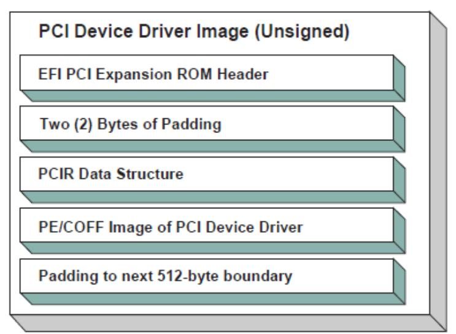  
Fig. 14.15: Unsigned PCI Driver Image Layout

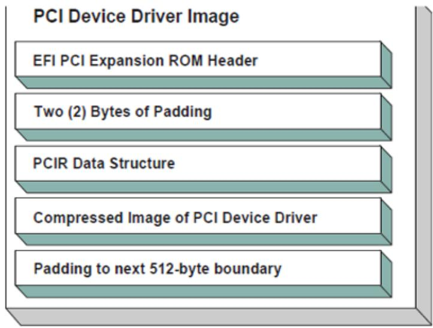  
Fig. 14.16: Signed and Compressed PCI Driver Image Flow

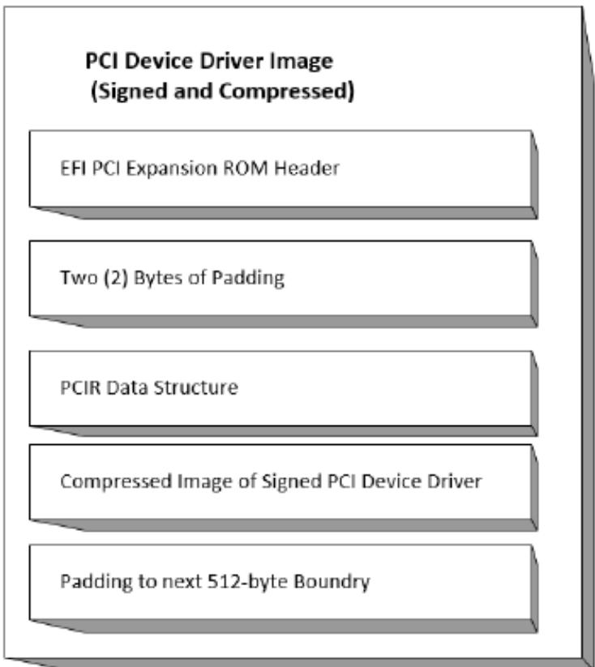  
Fig. 14.17: Signed and Compressed PCI Driver Image Layout

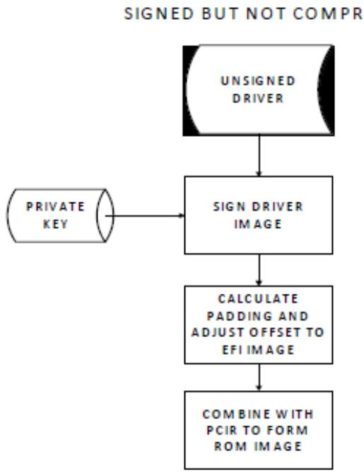  
Fig. 14.18: Signed but not Compressed PCI Driver Image Flow

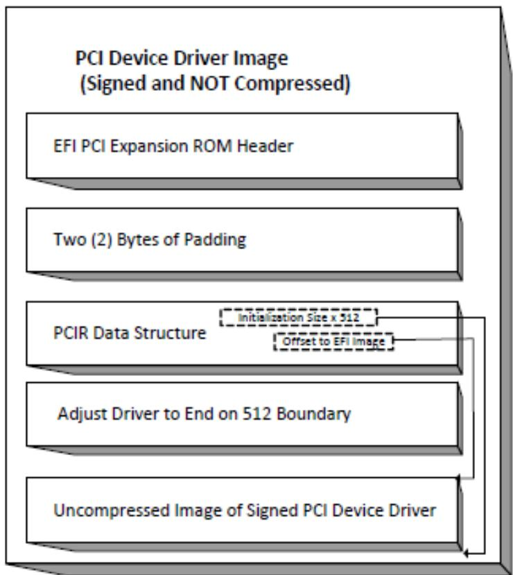  
Fig. 14.19: Signed and Uncompressed PCI Driver Image Layout

## PROTOCOLS — SCSI DRIVER MODELS AND BUS SUPPORT

The intent of this chapter is to specify a method of providing direct access to SCSI devices. These protocols provide services that allow a generic driver to produce the Block I/O protocol for SCSI disk devices, and allows an EFI utility to issue commands to any SCSI device. The main reason to provide such an access is to enable S.M.A.R.T. functionality during POST (i.e., issuing Mode Sense, Mode Select, and Log Sense to SCSI devices). This is accomplished by using a generic API such as SCSI Pass Thru. The use of this method will enable additional functionality in the future without modifying the EFI SCSI Pass Thru driver. SCSI Pass Thru is not limited to SCSI channels. It is applicable to all channel technologies that utilize SCSI commands such as SCSI, ATAPI, and Fibre Channel. This chapter describes the SCSI Driver Model. This includes the behavior of SCSI Bus Drivers, the behavior of SCSI Device Drivers, and a detailed description of the SCSI I/O Protocol. This chapter provides enough material to implement a SCSI Bus Driver, and the tools required to design and implement SCSI Device Drivers. It does not provide any information on specific SCSI devices.

## 15.1 SCSI Driver Model Overview

The EFI SCSI Driver Stack includes the SCSI Pass Thru Driver, SCSI Bus Driver and individual SCSI Device Drivers.

SCSI Pass Thru Driver: A SCSI Pass Through Driver manages a SCSI Host Controller that contains one or more SCSI Buses. It creates SCSI Bus Controller Handles for each SCSI Bus, and attaches Extended SCSI Pass Thru Protocol and Device Path Protocol to each handle the driver produced. Please refer to Extended SCSI Pass Thru Protocol and Appendix G. Using the EFI Extended SCSI Pass Thru Protocol.

SCSI Bus Driver: A SCSI Bus Driver manages a SCSI Bus Controller Handle that is created by SCSI Pass Thru Driver. It creates SCSI Device Handles for each SCSI Device Controller detected during SCSI Bus Enumeration, and attaches SCSI I/O Protocol and Device Path Protocol to each handle the driver produced.

SCSI Device Driver: A SCSI Device Driver manages one kind of SCSI Device. Device handles for SCSI Devices are created by SCSI Bus Drivers. A SCSI Device Driver could be a bus driver itself, and may create child handles. But most SCSI Device Drivers will be device drivers that do not create new handles. For the pure device driver, it attaches protocol instance to the device handle of the SCSI Device. These protocol instances are I/O abstractions that allow the SCSI Device to be used in the pre-boot environment. The most common I/O abstractions are used to boot an EFI compliant OS.

## 15.2 SCSI Bus Drivers

A SCSI Bus Driver manages a SCSI Bus Controller Handle. A SCSI Bus Controller Handle is created by a SCSI Pass Thru Driver and is abstracted in software with the Extended SCSI Pass Thru Protocol. A SCSI Bus Driver will manage handles that contain this protocol. The Figure below, Device Handle for a SCSI Bus Controller , shows an example device handle for a SCSI Bus handle. It contains a Device Path Protocol instance and a Extended SCSI Pass Thru Protocol Instance.

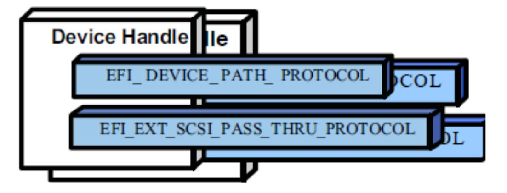  
Fig. 15.1: Device Handle for a SCSI Bus Controller

## 15.2.1 Driver Binding Protocol for SCSI Bus Drivers

The Driver Binding Protocol contains three services. These are Supported() , Start() , and Stop() . Supported() tests to see if the SCSI Bus Driver can manage a device handle. A SCSI Bus Driver can only manage device handle that contain the Device Path Protocol and the Extended SCSI Pass Thru Protocol, so a SCSI Bus Driver must look for these two protocols on the device handle that is being tested.

The Start() function tells the SCSI Bus Driver to start managing a device handle. The device handle should support the protocols shown in Figure Device Handle for a SCSI Bus Controller . The Extended SCSI Pass Thru Protocol provides information about a SCSI Channel and the ability to communicate with any SCSI devices attached to that SCSI Channel.

The SCSI Bus Driver has the option of creating all of its children in one call to Start(), or spreading it across several calls to Start() . In general, if it is possible to design a bus driver to create one child at a time, it should do so to support the rapid boot capability in the UEFI Driver Model. Each of the child device handles created in Start() must contain a Device Path Protocol instance, and a SCSI I/O protocol instance. The SCSI I/O Protocol is described in EFI SCSI I/O Protocol and Section 14.4 . The format of device paths for SCSI Devices is described in SCSI Device Paths. The Figure below, Child Handle Created by a SCSI Bus Driver , shows an example child device handle that is created by a SCSI Bus Driver for a SCSI Device.

A SCSI Bus Driver must perform several steps to manage a SCSI Bus.

1. Scan for the SCSI Devices on the SCSI Channel that connected to the SCSI Bus Controller. If a request is being made to scan only one SCSI Device, then only looks for the one specified. Create a device handle for the SCSI Device found.

2. Install a Device Path Protocol instance and a SCSI I/O Protocol instance on the device handle created for each SCSI Device.

The Stop() function tells the SCSI Bus Driver to stop managing a SCSI Bus. The Stop() function can destroy one or more of the device handles that were created on a previous call to Start() . If all of the child device handles have been

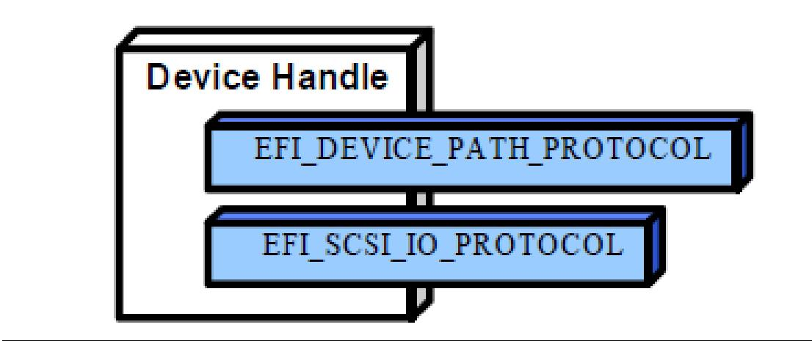  
Fig. 15.2: Child Handle Created by a SCSI Bus Driver  
destroyed, then Stop() will place the SCSI Bus Controller in a quiescent state. The functionality of Stop() mirrors Start()

## 15.2.2 SCSI Enumeration

The purpose of the SCSI Enumeration is only to scan for the SCSI Devices attached to the specific SCSI channel. The SCSI Bus driver need not allocate resources for SCSI Devices (like PCI Bus Drivers do), nor need it connect a SCSI Device with its Device Driver (like USB Bus Drivers do). The details of the SCSI Enumeration is implementation specific, thus is out of the scope of this document.

## 15.3 SCSI Device Drivers

SCSI Device Drivers manage SCSI Devices. Device handles for SCSI Devices are created by SCSI Bus Drivers. A SCSI Device Driver could be a bus driver itself, and may create child handles. But most SCSI Device Drivers will be device drivers that do not create new handles. For the pure device driver, it attaches protocol instance to the device handle of the SCSI Device. These protocol instances are I/O abstractions that allow the SCSI Device to be used in the pre-boot environment. The most common I/O abstractions are used to boot an EFI compliant OS.

## 15.3.1 Driver Binding Protocol for SCSI Device Drivers

The Driver Binding Protocol contains three services. These are Supported() , Start() , and Stop() . Supported() tests to see if the SCSI Device Driver can manage a device handle. A SCSI Device Driver can only manage device handle that contain the Device Path Protocol and the SCSI I//O Protocol, so a SCSI Device Driver must look for these two protocols on the device handle that is being tested. In addition, it needs to check to see if the device handle represents a SCSI Device that SCSI Device Driver knows how to manage. This is typically done by using the services of the SCSI I/O Protocol to see whether the device information retrieved is supported by the device driver.

The Start() function tells the SCSI Device Driver to start managing a SCSI Device. A SCSI Device Driver could be a bus driver itself, and may create child handles. But most SCSI Device Drivers will be device drivers that do not create new handles. For the pure device driver, it installs one or more addition protocol instances on the device handle for the SCSI Device.

The Stop() function mirrors the Start() function, so the Stop() function completes any outstanding transactions to the SCSI Device and removes the protocol interfaces that were installed in Start() .

## 15.4 EFI SCSI I/O Protocol

This section defines the EFI SCSI I/O protocol. This protocol is used by code, typically drivers, running in the EFI boot services environment to access SCSI devices. In particular, functions for managing devices on SCSI buses are defined here.

The interfaces provided in the EFI\_SCSI\_IO\_PROTOCOL are for performing basic operations to access SCSI devices.

## 15.4.1 EFI\_SCSI\_IO\_PROTOCOL

This section provides a detailed description of the EFI\_SCSI\_IO\_PROTOCOL.

## Summary

Provides services to manage and communicate with SCSI devices.

GUID

```c
#define EFI_SCSI_IO_PROTOCOL_GUID \
{0x932f47e6,0x2362,0x4002,\
{0x80,0x3e,0x3c,0xd5,0x4b,0x13,0x8f,0x85}}
```

## Protocol Interface Structure

```c
typedef struct _EFI_SCSI_IO_PROTOCOL {
    EFI_SCSI_IO_PROTOCOL_GET_DEVICE_TYPE
    EFI_SCSI_IO_PROTOCOL_GET_DEVICE_LOCATION
    EFI_SCSI_IO_PROTOCOL_RESET_BUS
    EFI_SCSI_IO_PROTOCOL_RESET_DEVICE
    EFI_SCSI_IO_PROTOCOL_EXECUTE_SCSI_COMMAND
    UINT32
} EFI_SCSI_IO_PROTOCOL;
```

```txt
GetDeviceType;
GetDeviceLocation;
ResetBus;
ResetDevice;
ExecuteScsiCommand;
IoAlign;
```

## Parameters

## IoAlign

Supplies the alignment requirement for any bufer used in a data transfer. IoAlign values of 0 and 1 mean that the bufer can be placed anywhere in memory. Otherwise, IoAlign must be a power of 2, and the requirement is that the start address of a bufer must be evenly divisible by IoAlign with no remainder.

## GetDeviceType

Retrieves the information of the device type which the SCSI device belongs to EFI\_SCSI\_IO\_PROTOCOL.GetDeviceType() .

## GetDeviceLocation

Retrieves the device location information in the SCSI bus EFI\_SCSI\_IO\_PROTOCOL.GetDeviceLocation().

## ResetBus

Resets the entire SCSI bus the SCSI device attaches to EFI\_SCSI\_IO\_PROTOCOL.ResetBus().

## ResetDevice

Resets the SCSI Device that is specified by the device handle the SCSI I/O protocol attaches EFI\_SCSI\_IO\_PROTOCOL.ResetDevice() .

## ExecuteScsiCommand

Sends a SCSI command to the SCSI device and waits for the execution completion until an exit condition is met, or a timeout occurs EFI\_SCSI\_IO\_PROTOCOL.ExecuteScsiCommand() .

## Description

The EFI\_SCSI\_IO\_PROTOCOL provides the basic functionalities to access and manage a SCSI Device. There is one EFI\_SCSI\_IO\_PROTOCOL instance for each SCSI Device on a SCSI Bus. A device driver that wishes to manage a SCSI Device in a system will have to retrieve the EFI\_SCSI\_IO\_PROTOCOL instance that is associated with the SCSI Device. A device handle for a SCSI Device will minimally contain an EFI\_DEVICE\_PATH\_PROTOCOL instance and an EFI\_SCSI\_IO\_PROTOCOL instance.

## 15.4.2 EFI\_SCSI\_IO\_PROTOCOL.GetDeviceType()

## Summary

Retrieves the device type information of the SCSI Device.

## Prototype

```txt
typedef
EFI_STATUS
(EFIAPI *EFI_SCSI_IO_PROTOCOL_GET_DEVICE_TYPE) (
    IN EFI_SCSI_IO_PROTOCOL *This,
    OUT UINT8 *DeviceType
);
```

## Parameters

## This

A pointer to the EFI\_SCSI\_IO\_PROTOCOL instance. Type EFI\_SCSI\_IO\_PROTOCOL is defined in EFI\_SCSI\_IO\_PROTOCOL .

## DeviceType

A pointer to the device type information retrieved from the SCSI Device. See “Related Definitions” for the possible returned values of this parameter.

## Description

This function is used to retrieve the SCSI device type information. This function is typically used for SCSI Device Drivers to quickly recognize whether the SCSI Device could be managed by it.

If DeviceType is NULL , then EFI\_INVALID\_PARAMETER is returned. Otherwise, the device type is returned in DeviceType and EFI\_SUCCESS is returned.

## Related Definitions

```c
//Defined in the SCSI Primary Commands standard (e.g., SPC-4)
//
#define EFI_SCSI_IO_TYPE_DISK 0x00 // Disk device
#define EFI_SCSI_IO_TYPE_TAPE 0x01 // Tape device
#define EFI_SCSI_IO_TYPE_PRINTER 0x02 // Printer
#define EFI_SCSI_IO_TYPE_PROCESSOR 0x03 // Processor
#define EFI_SCSI_IO_TYPE_WORM 0x04 // Write-once read-multiple
```

(continues on next page)

```c
#define EFI_SCSI_IO_TYPE_CDROM 0x05 // CD or DVD device
#define EFI_SCSI_IO_TYPE_SCANNER 0x06 // Scanner device
#define EFI_SCSI_IO_TYPE_OPTICAL 0x07 // Optical memory device
#define EFI_SCSI_IO_TYPE_MEDIUMCHANGER 0x08 // Medium Changer device
#define EFI_SCSI_IO_TYPE_COMMUNICATION 0x09 // Communications device
#define MFI_SCSI_IO_TYPE_A 0x0A // Obsolete
#define MFI_SCSI_IO_TYPE_B 0x0B // Obsolete
#define MFI_SCSI_IO_TYPE_RAID 0x0C // Storage array controller
// device (e.g., RAID)
#define MFI_SCSI_IO_TYPE_SES 0x0D // Enclosure services device
#define MFI_SCSI_IO_TYPE_RBC 0x0E // Simplified direct-access
// device (e.g., magnetic
// disk)
#define MFI_SCSI_IO_TYPE_OCRW 0x0F // Optical card reader/
// writer device
#define MFI_SCSI_IO_TYPE_BRIDGE 0x10 // Bridge Controller
// Commands
#define MFI_SCSI_IO_TYPE OSD 0x11 // Object-based Storage
// Device
#define EFI_SCSI_IO_TYPE_RESERVED_LOW 0x12 // Reserved (low)
#define EFI_SCSI_IO_TYPE_RESERVED_HIGH 0x1E // Reserved (high)
#define EFI_SCSI_IO_TYPE_UNKNOWN 0x1F // Unknown no device type
```

## Status Codes Returned

<table><tr><td>EFI_SUCCESS</td><td>Retrieves the device type information successfully.</td></tr><tr><td>EFI_INVALID_PARAMETER</td><td>The DeviceType is NULL.</td></tr></table>

## 15.4.3 EFI\_SCSI\_IO\_PROTOCOL.GetDeviceLocation()

## Summary

Retrieves the SCSI device location in the SCSI channel.

## Prototype

```c
typedef
EFI_STATUS
(EFIAPI *EFI_SCSI_IO_PROTOCOL_GET_DEVICE_LOCATION) (
    IN EFI_SCSI_IO_PROTOCOL    *This,
    IN OUT UINT8    **Target,
    OUT UINT64    *Lun
);
```

## Parameters

## This

A pointer to the EFI\_SCSI\_IO\_PROTOCOL instance. Type EFI\_SCSI\_IO\_PROTOCOL is defined in EFI\_SCSI\_IO\_PROTOCOL .

## Target

A pointer to the Target Array which represents the ID of a SCSI device on the SCSI channel.

## Lun

A pointer to the Logical Unit Number of the SCSI device on the SCSI channel.

## Description

This function is used to retrieve the SCSI device location in the SCSI bus. The device location is determined by a (Target, Lun) pair. This function allows a SCSI Device Driver to retrieve its location on the SCSI channel, and may use the Extended SCSI Pass Thru Protocol to access the SCSI device directly.

If Target or Lun is NULL , then EFI\_INVALID\_PARAMETER is returned. Otherwise, the device location is returned in Target and Lun , and EFI\_SUCCESS is returned.

## Status Codes Returned

<table><tr><td>EFI_SUCCESS</td><td>Retrieves the device location successfully.</td></tr><tr><td>EFI_INVALID_PARAMETER</td><td>Target or Lun is NULL.</td></tr></table>

## 15.4.4 EFI\_SCSI\_IO\_PROTOCOL.ResetBus()

## Summary

Resets the SCSI Bus that the SCSI Device is attached to.

## Prototype

```txt
typedef
EFI_STATUS
(EFIAPI *EFI_SCSI_IO_PROTOCOL_RESET_BUS) (
    IN EFI_SCSI_IO_PROTOCOL *This
);
```

## Parameters

## This

A pointer to the EFI\_SCSI\_IO\_PROTOCOL instance. Type EFI\_SCSI\_IO\_PROTOCOL is defined in EFI\_SCSI\_IO\_PROTOCOL .

## Description

This function provides the mechanism to reset the whole SCSI bus that the specified SCSI Device is connected to. Some SCSI Host Controller may not support bus reset, if so, EFI\_UNSUPPORTED is returned. If a device error occurs while executing that bus reset operation, then EFI\_DEVICE\_ERROR is returned. If a timeout occurs during the execution of the bus reset operation, then EFI\_TIMEOUT is returned. If the bus reset operation is completed, then EFI\_SUCCESS is returned.

## Status Codes Returned

<table><tr><td>EFI_SUCCESS</td><td>The SCSI bus is reset successfully.</td></tr><tr><td>EFI_DEVICE_ERROR</td><td>Errors encountered when resetting the SCSI bus.</td></tr><tr><td>EFI_UNSUPPORTED</td><td>The bus reset operation is not supported by the SCSI Host Controller.</td></tr><tr><td>EFI_TIMEOUT</td><td>A timeout occurred while attempting to reset the SCSI bus.</td></tr></table>

## 15.4.5 EFI\_SCSI\_IO\_PROTOCOL.ResetDevice()

## Summary

Resets the SCSI Device that is specified by the device handle that the SCSI I/O Protocol is attached.

## Prototype

```txt
typedef
EFI_STATUS
(EFIAPI *EFI_SCSI_IO_PROTOCOL_RESET_DEVICE) (
    IN EFI_SCSI_IO_PROTOCOL *This
);
```

## Parameters

## This

A Pointer to the EFI\_SCSI\_IO\_PROTOCOL instance. Type EFI\_SCSI\_IO\_PROTOCOL is defined in EFI\_SCSI\_IO\_PROTOCOL .

## Description

This function provides the mechanism to reset the SCSI Device. If the SCSI bus does not support a device reset operation, then EFI\_UNSUPPORTED is returned. If a device error occurs while executing that device reset operation, then EFI\_DEVICE\_ERROR is returned. If a timeout occurs during the execution of the device reset operation, then EFI\_TIMEOUT is returned. If the device reset operation is completed, then EFI\_SUCCESS is returned.

## Status Codes Returned

<table><tr><td>EFI_SUCCESS</td><td>Reset the SCSI Device successfully.</td></tr><tr><td>EFI_DEVICE_ERROR</td><td>Errors are encountered when resetting the SCSI Device.</td></tr><tr><td>EFI_UNSUPPORTED</td><td>The SCSI bus does not support a device reset operation.</td></tr><tr><td>EFI_TIMEOUT</td><td>A timeout occurred while attempting to reset the SCSI Device.</td></tr></table>

## 15.4.6 EFI\_SCSI\_IO\_PROTOCOL.ExecuteScsiCommand()

## Summary

Sends a SCSI Request Packet to the SCSI Device for execution.

## Prototype

```txt
typedef
EFI_STATUS
(EFIAPI *EFI_SCSI_IO_PROTOCOL_EXECUTE_SCSI_COMMAND) (
    IN EFI_SCSI_IO_PROTOCOL    *This,
    IN OUT EFI_SCSI_IO_SCSI_REQUEST_PACKET    *Packet,
    IN EFI_EVENT    Event OPTIONAL
);
```

## Parameters

## This

A pointer to the EFI\_SCSI\_IO\_PROTOCOL instance. Type EFI\_SCSI\_IO\_PROTOCOL is defined in defined in EFI\_SCSI\_IO\_PROTOCOL .

## Packet

The SCSI request packet to send to the SCSI Device specified by the device handle. See “Related Definitions” for a description of EFI\_SCSI\_IO\_SCSI\_REQUEST\_PACKET.

## Event

If the SCSI bus where the SCSI device is attached does not support non-blocking I/O, then Event is ignored, and blocking I/O is performed. If Event is NULL, then blocking I/O is performed. If Event is not NULL and non-blocking I/O is supported, then non-blocking I/O is performed, and Event will be signaled when the SCSI Request Packet completes.

## Related Definitions

<table><tr><td colspan="2">typedef struct {</td></tr><tr><td>UINT64</td><td>Timeout;</td></tr><tr><td>VOID</td><td>*InDataBuffer;</td></tr><tr><td>VOID</td><td>*OutDataBuffer;</td></tr><tr><td>VOID</td><td>*SenseData;</td></tr><tr><td>VOID</td><td>*Cdb;</td></tr><tr><td>UINT32</td><td>InTransferLength;</td></tr><tr><td>UINT32</td><td>OutTransferLength;</td></tr><tr><td>UINT8</td><td>CdbLength;</td></tr><tr><td>UINT8</td><td>DataDirection;</td></tr><tr><td>UINT8</td><td>HostAdapterStatus;</td></tr><tr><td>UINT8</td><td>TargetStatus;</td></tr><tr><td>UINT8</td><td>SenseDataLength;</td></tr><tr><td colspan="2">} EFI_SCSI_IO_SCSI_REQUEST_PACKET;</td></tr></table>

## Timeout

The timeout, in 100 ns units, to use for the execution of this SCSI Request Packet. A Timeout value of 0 means that this function will wait indefinitely for the SCSI Request Packet to execute. If Timeout is greater than zero, then this function will return EFI\_TIMEOUT if the time required to execute the SCSI Request Packet is greater than Timeout .

## DataBufer

A pointer to the data bufer to transfer from or to the SCSI device.

## InDataBufer

A pointer to the data bufer to transfer between the SCSI controller and the SCSI device for SCSI READ command. For all SCSI WRITE Commands this must point to NULL .

## OutDataBufer

A pointer to the data bufer to transfer between the SCSI controller and the SCSI device for SCSI WRITE command. For all SCSI READ commands this field must point to NULL .

## SenseData

A pointer to the sense data that was generated by the execution of the SCSI Request Packet.

## Cdb

A pointer to bufer that contains the Command Data Block to send to the SCSI device.

## InTransferLength

On Input, the size, in bytes, of InDataBufer . On output, the number of bytes transferred between the SCSI controller and the SCSI device. If InTransferLength is larger than the SCSI controller can handle, no data will be transferred, InTransferLength will be updated to contain the number of bytes that the SCSI controller is able to transfer, and EFI\_BAD\_BUFFER\_SIZE will be returned.

## OutTransferLength

On Input, the size, in bytes of OutDataBufer . On Output, the Number of bytes transferred between SCSI Controller and the SCSI device. If OutTransferLength is larger than the SCSI controller can handle, no data will be transferred, OutTransferLength will be updated to contain the number of bytes that the SCSI controller is able to transfer, and EFI\_BAD\_BUFFER\_SIZE will be returned.

## CdbLength

The length, in bytes, of the bufer Cdb . The standard values are 6, 10, 12, and 16, but other values are possible if a variable length CDB is used.

## DataDirection

The direction of the data transfer. 0 for reads, 1 for writes. A value of 2 is Reserved for Bi-Directional SCSI commands. For example XDREADWRITE. All other values are reserved, and must not be used.

## HostAdapterStatus

The status of the SCSI Host Controller that produces the SCSI bus where the SCSI device attached when the SCSI Request Packet was executed on the SCSI Controller. See the possible values listed below.

## TargetStatus

The status returned by the SCSI device when the SCSI Request Packet was executed. See the possible values listed below.

## SenseDataLength

On input, the length in bytes of the SenseData bufer. On output, the number of bytes written to the SenseData bufer.

<table><tr><td colspan="2">//</td></tr><tr><td colspan="2">// DataDirection</td></tr><tr><td colspan="2">//</td></tr><tr><td colspan="2">#define EFI_SCSI_IO_DATA_DIRECTION_READ 0</td></tr><tr><td colspan="2">#define EFI_SCSI_IO_DATA_DIRECTION_WRITE 1</td></tr><tr><td colspan="2">#define EFI_SCSI_IO_DATA_DIRECTION_BIDIRECTIONAL 2</td></tr><tr><td colspan="2">//</td></tr><tr><td colspan="2">// HostAdapterStatus</td></tr><tr><td colspan="2">//</td></tr><tr><td>#define EFI_SCSI_IO_STATUS_HOST_ADAPTER_OK</td><td>0x00</td></tr><tr><td>#define EFI_SCSI_IO_STATUS_HOST_ADAPTER_TIMEOUT_COMMAND</td><td>0x09</td></tr><tr><td>#define EFI_SCSI_IO_STATUS_HOST_ADAPTER_TIMEOUT</td><td>0x0b</td></tr><tr><td>#define EFI_SCSI_IO_STATUS_HOST_ADAPTER_MESSAGE_REJECT</td><td>0x0d</td></tr><tr><td>#define EFI_SCSI_IO_STATUS_HOST_ADAPTER_BUS_RESET</td><td>0x0e</td></tr><tr><td>#define EFI_SCSI_IO_STATUS_HOST_ADAPTER_PARITY_ERROR</td><td>0x0f</td></tr><tr><td>#define EFI_SCSI_IO_STATUS_HOST_ADAPTER_REQUEST_SENSE_FAILED</td><td>0x10</td></tr><tr><td>#define EFI_SCSI_IO_STATUS_HOST_ADAPTER_SELECTION_TIMEOUT</td><td>0x11</td></tr><tr><td>#define EFI_SCSI_IO_STATUS_HOST_ADAPTER_DATA_OVERRUN_UNDERRUN</td><td>0x12</td></tr><tr><td>#define EFI_SCSI_IO_STATUS_HOST_ADAPTER_BUS_FREE</td><td>0x13</td></tr><tr><td>#define EFI_SCSI_IO_STATUS_HOST_ADAPTER_PHASE_ERROR</td><td>0x14</td></tr><tr><td>#define EFI_SCSI_IO_STATUS_HOST_ADAPTER_OTHER</td><td>0x7f</td></tr><tr><td colspan="2">//</td></tr><tr><td colspan="2">// TargetStatus</td></tr><tr><td colspan="2">//</td></tr><tr><td>#define EFI_SCSI_IO_STATUS_TARGET_GOOD</td><td>0x00</td></tr><tr><td>#define EFI_SCSI_IO_STATUS_TARGET_CHECK_CONDITION</td><td>0x02</td></tr><tr><td>#define EFI_SCSI_IO_STATUS_TARGET_CONDITION_MET</td><td>0x04</td></tr><tr><td>#define EFI_SCSI_IO_STATUS_TARGET_BUSY</td><td>0x08</td></tr><tr><td>#define EFI_SCSI_IO_STATUS_TARGET_INTERMEDIATE</td><td>0x10</td></tr><tr><td>#define EFI_SCSI_IO_STATUS_TARGET_INTERMEDIATE_CONDITION_METn</td><td>0x14</td></tr><tr><td>#define EFI_SCSI_IO_STATUS_TARGET_RESERVATION_CONFLICT</td><td>0x18</td></tr></table>

(continues on next page)

<table><tr><td colspan="2"></td><td>(continued from previous page)</td></tr><tr><td>#define EFI_SCSI_IO_STATUS_TARGET_COMMAND_TERMINATED</td><td>0x22</td><td></td></tr><tr><td>#define EFI_SCSI_IO_STATUS_TARGET_QUEUE_FULL</td><td>0x28</td><td></td></tr></table>

## Description

This function sends the SCSI Request Packet specified by Packet to the SCSI Device.

If the SCSI Bus supports non-blocking I/O and Event is not NULL, then this function will return immediately after the command is sent to the SCSI Device, and will later signal Event when the command has completed. If the SCSI Bus supports non-blocking I/O and Event is NULL, then this function will send the command to the SCSI Device and block until it is complete. If the SCSI Bus does not support non-blocking I/O, the Event parameter is ignored, and the function will send the command to the SCSI Device and block until it is complete.

If Packet is successfully sent to the SCSI Device, then EFI\_SUCCESS is returned.

If Packet cannot be sent because there are too many packets already queued up, then EFI\_NOT\_READY is returned. The caller may retry Packet at a later time.

If a device error occurs while sending the Packet , then EFI\_DEVICE\_ERROR is returned.

If a timeout occurs during the execution of Packet , then EFI\_TIMEOUT is returned.

If any field of Packet is invalid, then EFI\_INVALID\_PARAMETER is returned.

If the data bufer described by DataBufer and TransferLength is too big to be transferred in a single command, then EFI\_BAD\_BUFFER\_SIZE is returned. The number of bytes actually transferred is returned in TransferLength .

If the command described in Packet is not supported by the SCSI Host Controller that produces the SCSI bus, then EFI\_UNSUPPORTED is returned.

If EFI\_SUCCESS, EFI\_BAD\_BUFFER\_SIZE, EFI\_DEVICE\_ERROR , or EFI\_TIMEOUT is returned, then the caller must examine the status fields in Packet in the following precedence order: HostAdapterStatus followed by TargetStatus followed by SenseDataLength , followed by SenseData . If non-blocking I/O is being used, then the status fields in Packet will not be valid until the Event associated with Packet is signaled.

If EFI\_NOT\_READY , EFI\_INVALID\_PARAMETER or EFI\_UNSUPPORTED is returned, then Packet was never sent, so the status fields in Packet are not valid. If non-blocking I/O is being used, the Event associated with Packet will not be signaled.

Status Codes Returned

<table><tr><td>EFI_SUCCESS</td><td>The SCSI Request Packet was sent by the host. For read and bi-directional commands, InTransferLength bytes were transferred to InDataBuffer . For write and bi-directional commands, OutTransferLength bytes were transferred from OutDataBuffer . See HostAdapterStatus, TargetStatus, SenseDataLength, and SenseData in that order for additional status information.</td></tr><tr><td>EFI_BAD_BUFFER_SIZE</td><td>The SCSI Request Packet was not executed. For read and bi-directional commands, the number of bytes that could be transferred is returned in InTransferLength. For write and bi-directional commands, the number of bytes that could be transferred is returned in OutTransferLength. See HostAdapterStatus and TargetStatus in that order for additional status information.</td></tr><tr><td>EFI_NOT_READY</td><td>The SCSI Request Packet could not be sent because there are too many SCSI Command Packets already queued. The caller may retry again later.</td></tr><tr><td>EFI_DEVICE_ERROR</td><td>A device error occurred while attempting to send the SCSI Request Packet. See HostAdapterStatus, TargetStatus, SenseDataLength, and SenseData in that order for additional status information.</td></tr></table>

continues on next page

<table><tr><td>ACPI(PNP0A03,0)/PCI(7,0)/SCSI(2,0).</td></tr></table>

Table 15.3 – continued from previous page

<table><tr><td>EFI_INVALID_PARAMETER</td><td>The contents of CommandPacket are invalid. The SCSI Request Packet was not sent, so no additional status information is available.</td></tr><tr><td>EFI_UNSUPPORTED</td><td>The command described by the SCSI Request Packet is not supported by the SCSI initiator (i.e., SCSI Host Controller). The SCSI Request Packet was not sent, so no additional status information is available.</td></tr><tr><td>EFI_TIMEOUT</td><td>A timeout occurred while waiting for the SCSI Request Packet to execute. See HostAdapterStatus, TargetStatus, SenseDataLength, and SenseData in that order for additional status information.</td></tr></table>

## 15.5 SCSI Device Paths

An EFI\_SCSI\_IO\_PROTOCOL must be installed on a handle for its services to be available to SCSI device drivers. In addition to the EFI\_SCSI\_IO\_PROTOCOL , an EFI\_DEVICE\_PATH\_PROTOCOL must also be installed on the same handle. See Protocols – Device Path Protocol for detailed description of the EFI\_DEVICE\_PATH\_PROTOCOL .

The SCSI Driver Model defined in this document can support the SCSI channel generated or emulated by multiple architectures, such as Parallel SCSI, ATAPI, Fibre Channel, InfiniBand, and other future channel types. In this section, there are four example device paths provided, including SCSI device path, ATAPI device path, Fibre Channel device path and InfiniBand device path.

## 15.5.1 SCSI Device Path Example

Table 15.4 shows an example device path for a SCSI device controller on a desktop platform. This SCSI device controller is connected to a SCSI channel that is generated by a PCI SCSI host controller. The PCI SCSI host controller generates a single SCSI channel, it is located at PCI device number 0x07 and PCI function 0x00, and is directly attached to a PCI root bridge. The SCSI device controller is assigned SCSI Id 2, and its LUN is 0.

This sample device path consists of an ACPI Device Path Node, a PCI Device Path Node, a SCSI Node, and a Device Path End Structure. The \_HID and \_UID must match the ACPI table description of the PCI Root Bridge. The shorthand notation for this device path is:

Table 15.4: SCSI Device Path Examples

<table><tr><td>Byte Off-set</td><td>Byte Length</td><td>Data</td><td>Description</td></tr><tr><td>0x00</td><td>0x01</td><td>0x02</td><td>Generic Device Path Header - Type ACPI Device Path</td></tr><tr><td>0x01</td><td>0x01</td><td>0x01</td><td>Sub type - ACPI Device Path</td></tr><tr><td>0x02</td><td>0x02</td><td>0x0C</td><td>Length - 0x0C bytes</td></tr><tr><td>0x04</td><td>0x04</td><td>0x41D0, 0x0A03</td><td>_HID PNP0A03 - 0x41D0 represents the compressed string ‘PNP’ and is encoded in the low order bytes. The compression method is described in the ACPI Specification.</td></tr><tr><td>0x08</td><td>0x04</td><td>0x0000</td><td>_UID</td></tr><tr><td>0x0C</td><td>0x01</td><td>0x01</td><td>Generic Device Path Header - Type Hardware Device Path</td></tr><tr><td>0x0D</td><td>0x01</td><td>0x01</td><td>Sub type - PCI</td></tr><tr><td>0x0E</td><td>0x02</td><td>0x06</td><td>Length - 0x06 bytes</td></tr><tr><td>0x10</td><td>0x01</td><td>0x07</td><td>PCI Function</td></tr><tr><td>0x11</td><td>0x01</td><td>0x00</td><td>PCI Device</td></tr><tr><td>0x12</td><td>0x01</td><td>0x03</td><td>Generic Device Path Header - Type Message Device Path</td></tr></table>

continues on next page

Table 15.4 – continued from previous page

<table><tr><td>0x13</td><td>0x01</td><td>0x02</td><td>Sub type - SCSI</td></tr><tr><td>0x14</td><td>0x02</td><td>0x08</td><td>Length - 0x08 bytes</td></tr><tr><td>0x16</td><td>0x02</td><td>0x0002</td><td>Target ID on the SCSI bus (PUN)</td></tr><tr><td>0x18</td><td>0x02</td><td>0x0000</td><td>Logical Unit Number (LUN)</td></tr><tr><td>0x1A</td><td>0x01</td><td>0x7F</td><td>Generic Device Path Header - Type End of Hardware Device Path</td></tr><tr><td>0x1B</td><td>0x01</td><td>0xFF</td><td>Sub type - End of Entire Device Path</td></tr><tr><td>0x1C</td><td>0x02</td><td>0x04</td><td>Length - 0x04 bytes</td></tr></table>

## 15.5.2 ATAPI Device Path Example

The Table below, ATAPI Device Path Examples , shows an example device path for an ATAPI device on a desktop platform. This ATAPI device is connected to the IDE bus on Primary channel, and is configured as the Master device on the channel. The IDE bus is generated by the IDE controller that is a PCI device. It is located at PCI device number 0x1F and PCI function 0x01, and is directly attached to a PCI root bridge.

This sample device path consists of an ACPI Device Path Node, a PCI Device Path Node, an ATAPI Node, and a Device Path End Structure. The \_HID and \_UID must match the ACPI table description of the PCI Root Bridge. The shorthand notation for this device path is:

ACPI(PNP0A03,0)/PCI(7,0)/ATA(Primary,Master,0).

Table 15.5: ATAPI Device Path Examples

<table><tr><td>Byte Off-set</td><td>Byte Length</td><td>Data</td><td>Description</td></tr><tr><td>0x00</td><td>0x01</td><td>0x02</td><td>Generic Device Path Header - Type ACPI Device Path</td></tr><tr><td>0x01</td><td>0x01</td><td>0x01</td><td>Sub type - ACPI Device Path</td></tr><tr><td>0x02</td><td>0x02</td><td>0x0C</td><td>Length - 0x0C bytes</td></tr><tr><td>0x04</td><td>0x04</td><td>0x41D0, 0x0A03</td><td>_HID PNP0A03 - 0x41D0 represents the compressed string ‘PNP’ and is encoded in the low order bytes. The compression method is described in the ACPI Specification.</td></tr><tr><td>0x08</td><td>0x04</td><td>0x0000</td><td>_UID</td></tr><tr><td>0x0C</td><td>0x01</td><td>0x01</td><td>Generic Device Path Header - Type Hardware Device Path</td></tr><tr><td>0x0D</td><td>0x01</td><td>0x01</td><td>Sub type - PCI</td></tr><tr><td>0x0E</td><td>0x02</td><td>0x06</td><td>Length - 0x06 bytes</td></tr><tr><td>0x10</td><td>0x01</td><td>0x07</td><td>PCI Function</td></tr><tr><td>0x11</td><td>0x01</td><td>0x00</td><td>PCI Device</td></tr><tr><td>0x12</td><td>0x01</td><td>0x03</td><td>Generic Device Path Header - Type Message Device Path</td></tr><tr><td>0x13</td><td>0x01</td><td>0x01</td><td>Sub type - ATAPI</td></tr><tr><td>0x14</td><td>0x02</td><td>0x08</td><td>Length - 0x08 bytes</td></tr><tr><td>0x16</td><td>0x01</td><td>0x00</td><td>PrimarySecondary - Set to zero for primary or one for secondary.</td></tr><tr><td>0x17</td><td>0x01</td><td>0x00</td><td>SlaveMaster - set to zero for master or one for slave.</td></tr><tr><td>0x18</td><td>0x02</td><td>0x0000</td><td>Logical Unit Number,LUN.</td></tr><tr><td>0x1A</td><td>0x01</td><td>0x7F</td><td>Generic Device Path Header - Type End of Hardware Device Path</td></tr><tr><td>0x1B</td><td>0x01</td><td>0xFF</td><td>Sub type - End of Entire Device Path</td></tr><tr><td>0x1C</td><td>0x02</td><td>0x04</td><td>Length - 0x04 bytes</td></tr></table>

## 15.5.3 Fibre Channel Device Path Example

Section 10.3.4.3 shows an example device path for a SCSI device that is connected to a Fibre Channel Port on a desktop platform. The Fibre Channel Port is a PCI device that is located at PCI device number 0x08 and PCI function 0x00, and is directly attached to a PCI root bridge. The Fibre Channel Port is addressed by the World Wide Number, and is assigned as X (X is a 64bit value); the SCSI device’s Logical Unit Number is 0.

This sample device path consists of an ACPI Device Path Node, a PCI Device Path Node, a Fibre Channel Device Path Node, and a Device Path End Structure. The \_HID and \_UID must match the ACPI table description of the PCI Root Bridge. The shorthand notation for this device path is:

ACPI(PNP0A03,0)/PCI(8,0)/Fibre(X,0).

Table 15.6: Fibre Channel Device Path Examples

<table><tr><td>Byte Off-set</td><td>Byte Length</td><td>Data</td><td>Description</td></tr><tr><td>0x00</td><td>0x01</td><td>0x02</td><td>Generic Device Path Header - Type ACPI Device Path</td></tr><tr><td>0x01</td><td>0x01</td><td>0x01</td><td>Sub type - ACPI Device Path</td></tr><tr><td>0x02</td><td>0x02</td><td>0x0C</td><td>Length - 0x0C bytes</td></tr><tr><td>0x04</td><td>0x04</td><td>0x41D0, 0x0A03</td><td>_HID PNP0A03 - 0x41D0 represents the compressed string ‘PNP’ and is encoded in the low order bytes. The compression method is described in the ACPI Specification.</td></tr><tr><td>0x08</td><td>0x04</td><td>0x0000</td><td>_UID</td></tr><tr><td>0x0C</td><td>0x01</td><td>0x01</td><td>Generic Device Path Header - Type Hardware Device Path</td></tr><tr><td>0x0D</td><td>0x01</td><td>0x01</td><td>Sub type - PCI</td></tr><tr><td>0x0E</td><td>0x02</td><td>0x06</td><td>Length - 0x06 bytes</td></tr><tr><td>0x10</td><td>0x01</td><td>0x08</td><td>PCI Function</td></tr><tr><td>0x11</td><td>0x01</td><td>0x00</td><td>PCI Device</td></tr><tr><td>0x12</td><td>0x01</td><td>0x03</td><td>Generic Device Path Header - Type Message Device Path</td></tr><tr><td>0x13</td><td>0x01</td><td>0x02</td><td>Sub type - Fibre Channel</td></tr><tr><td>0x14</td><td>0x02</td><td>0x24</td><td>Length - 0x24 bytes</td></tr><tr><td>0x16</td><td>0x04</td><td>0x00</td><td>Reserved</td></tr><tr><td>0x1A</td><td>0x08</td><td>X</td><td>Fibre Channel World Wide Number</td></tr><tr><td>0x22</td><td>0x08</td><td>0x00</td><td>Fibre Channel Logical Unit Number (LUN).</td></tr><tr><td>0x2A</td><td>0x01</td><td>0x7F</td><td>Generic Device Path Header - Type End of Hardware Device Path</td></tr><tr><td>0x2B</td><td>0x01</td><td>0xFF</td><td>Sub type - End of Entire Device Path</td></tr><tr><td>0x2C</td><td>0x02</td><td>0x04</td><td>Length - 0x04 bytes</td></tr></table>

## 15.5.4 InfiniBand Device Path Example

The Table below, InfiniBand Device Path Examples , shows an example device path for a SCSI device in an InfiniBand Network. This SCSI device is connected to a single SCSI channel generated by a SCS Host Adapter, and the SCSI Host Adapter is an end node in the InfiniBand Network. The SCSI Host Adapter is a PCI device that is located at PCI device number 0x07 and PCI function 0x00, and is directly attached to a PCI root bridge. The SCSI device is addressed by the (IOU X, IOC Y, DeviceId Z) in the InfiniBand Network. (X, Y, Z are EUI-64 compliant identifiers).

This sample device path consists of an ACPI Device Path Node, a PCI Device Path Node, an InfiniBand Node, and a Device Path End Structure. The \_HID and \_UID must match the ACPI table description of the PCI Root Bridge. The shorthand notation for this device path is:

ACPI(PNP0A03,0)/PCI(7,0)/Infiniband(X,Y,Z).

Table 15.7: InfiniBand Device Path Examples

<table><tr><td>Byte Off-set</td><td>Byte Length</td><td>Data</td><td>Description</td></tr><tr><td>0x00</td><td>0x01</td><td>0x02</td><td>Generic Device Path Header - Type ACPI Device Path</td></tr><tr><td>0x01</td><td>0x01</td><td>0x01</td><td>Sub type - ACPI Device Path</td></tr><tr><td>0x02</td><td>0x02</td><td>0x0C</td><td>Length - 0x0C bytes</td></tr><tr><td>0x04</td><td>0x04</td><td>0x41D0, 0x0A03</td><td>_HID PNP0A03 - 0x41D0 represents the compressed string ‘PNP’ and is encoded in the low order bytes. The compression method is described in the ACPI Specification.</td></tr><tr><td>0x08</td><td>0x04</td><td>0x0000</td><td>_UID</td></tr><tr><td>0x0C</td><td>0x01</td><td>0x01</td><td>Generic Device Path Header - Type Hardware Device Path</td></tr><tr><td>0x0D</td><td>0x01</td><td>0x01</td><td>Sub type - PCI</td></tr><tr><td>0x0E</td><td>0x02</td><td>0x06</td><td>Length - 0x06 bytes</td></tr><tr><td>0x10</td><td>0x01</td><td>0x07</td><td>PCI Function</td></tr><tr><td>0x11</td><td>0x01</td><td>0x00</td><td>PCI Device</td></tr><tr><td>0x12</td><td>0x01</td><td>0x03</td><td>Generic Device Path Header - Type Message Device Path</td></tr><tr><td>0x13</td><td>0x01</td><td>0x09</td><td>Sub type - InfiniBand</td></tr><tr><td>0x14</td><td>0x02</td><td>0x20</td><td>Length - 0x20 bytes</td></tr><tr><td>0x16</td><td>0x04</td><td>0x00</td><td>Reserved</td></tr><tr><td>0x1A</td><td>0x08</td><td>X</td><td>64bit node GUID of the IOU</td></tr><tr><td>0x22</td><td>0x08</td><td>Y</td><td>64bit GUID of the IOC</td></tr><tr><td>0x2A</td><td>0x08</td><td>Z</td><td>64bit persistent ID of the device.</td></tr><tr><td>0x32</td><td>0x01</td><td>0x7F</td><td>Generic Device Path Header - Type End of Hardware Device Path</td></tr><tr><td>0x33</td><td>0x01</td><td>0xFF</td><td>Sub type - End of Entire Device Path</td></tr><tr><td>0x34</td><td>0x02</td><td>0x04</td><td>Length - 0x04 bytes</td></tr></table>

## 15.6 SCSI Pass Thru Device Paths

An EFI\_EXT\_SCSI\_PASS\_THRU\_PROTOCOL must be installed on a handle for its services to be available to UEFI drivers and applications. In addition to the EFI\_EXT\_SCSI\_PASS\_THRU\_PROTOCOL , EFI Device Path Protocol must also be installed on the same handle. See Protocols – Device Path Protocol for a detailed description of the EFI\_DEVICE\_PATH\_PROTOCOL .

A device path describes the location of a hardware component in a system from the processor’s point of view. This includes the list of busses that lie between the processor and the SCSI controller. The EFI Specification takes advantage of the ACPI Specification to name system components. For the following set of examples, a PCI SCSI controller is assumed. The examples will show a SCSI controller on the root PCI bus, and a SCSI controller behind a PCI-PCI bridge. In addition, an example of a multichannel SCSI controller will be shown.

See Single Channel PCI SCSI Controller shows an example device path for a single channel PCI SCSI controller that is located at PCI device number 0x07 and PCI function 0x00, and is directly attached to a PCI root bridge. This device path consists of an ACPI Device Path Node, a PCI Device Path Node, and a Device Path End Structure. The \_HID and \_UID must match the ACPI table description of the PCI Root Bridge. The shorthand notation for this device path is:

ACPI(PNP0A03,0)/PCI(7,0).

Table 15.8: Single Channel PCI SCSI Controller

<table><tr><td>Byte set</td><td>Off-set</td><td>Byte Length</td><td>Data</td><td>Description</td></tr><tr><td>0x00</td><td></td><td>0x01</td><td>0x02</td><td>Generic Device Path Header - Type ACPI Device Path</td></tr><tr><td>0x01</td><td></td><td>0x01</td><td>0x01</td><td>Sub type - ACPI Device Path</td></tr><tr><td>0x02</td><td></td><td>0x02</td><td>0x0C</td><td>Length - 0x0C bytes</td></tr><tr><td>0x04</td><td></td><td>0x04</td><td>0x41D0, 0x0A03</td><td>_HID PNP0A03 - 0x41D0 represents the compressed string ‘PNP’ and is encoded in the low order bytes. The compression method is described in the ACPI Specification.</td></tr><tr><td>0x08</td><td></td><td>0x04</td><td>0x0000</td><td>_UID</td></tr><tr><td>0x0C</td><td></td><td>0x01</td><td>0x01</td><td>Generic Device Path Header - Type Hardware Device Path</td></tr><tr><td>0x0D</td><td></td><td>0x01</td><td>0x01</td><td>Sub type - PCI</td></tr><tr><td>0x0E</td><td></td><td>0x02</td><td>0x06</td><td>Length - 0x06 bytes</td></tr><tr><td>0x10</td><td></td><td>0x01</td><td>0x00</td><td>PCI Function</td></tr><tr><td>0x11</td><td></td><td>0x01</td><td>0x07</td><td>PCI Device</td></tr><tr><td>0x12</td><td></td><td>0x01</td><td>0x7F</td><td>Generic Device Path Header - Type End of Hardware Device Path</td></tr><tr><td>0x13</td><td></td><td>0x01</td><td>0xFF</td><td>Sub type - End of Entire Device Path</td></tr><tr><td>0x14</td><td></td><td>0x02</td><td>0x04</td><td>Length - 0x04 bytes</td></tr></table>

The Table below, Single Channel PCI SCSI Controller Behind a PCI Bridge , shows an example device path for a single channel PCI SCSI controller that is located behind a PCI to PCI bridge at PCI device number 0x07 and PCI function 0x00. The PCI to PCI bridge is directly attached to a PCI root bridge, and it is at PCI device number 0x05 and PCI function 0x00. This device path consists of an ACPI Device Path Node, two PCI Device Path Nodes, and a Device Path End Structure. The \_HID and \_UID must match the ACPI table description of the PCI Root Bridge. The shorthand notation for this device path is:

ACPI(PNP0A03,0)/PCI(5,0)/PCI(7,0).

Table 15.9: Single Channel PCI SCSI Controller Behind a PCI Bridge

<table><tr><td>Byte set</td><td>Off-set</td><td>Byte Length</td><td>Data</td><td>Description</td></tr><tr><td>0x00</td><td></td><td>0x01</td><td>0x02</td><td>Generic Device Path Header - Type ACPI Device Path</td></tr><tr><td>0x01</td><td></td><td>0x01</td><td>0x01</td><td>Sub type - ACPI Device Path</td></tr><tr><td>0x02</td><td></td><td>0x02</td><td>0x0C</td><td>Length - 0x0C bytes</td></tr><tr><td>0x04</td><td></td><td>0x04</td><td>0x41D0, 0x0A03</td><td>_HID PNP0A03 - 0x41D0 represents the compressed string ‘PNP’ and is encoded in the low order bytes. The compression method is described in the ACPI Specification.</td></tr><tr><td>0x08</td><td></td><td>0x04</td><td>0x0000</td><td>_UID</td></tr><tr><td>0x0C</td><td></td><td>0x01</td><td>0x01</td><td>Generic Device Path Header - Type Hardware Device Path</td></tr><tr><td>0x0D</td><td></td><td>0x01</td><td>0x01</td><td>Sub type - PCI</td></tr><tr><td>0x0E</td><td></td><td>0x02</td><td>0x06</td><td>Length - 0x06 bytes</td></tr><tr><td>0x10</td><td></td><td>0x01</td><td>0x00</td><td>PCI Function</td></tr><tr><td>0x11</td><td></td><td>0x01</td><td>0x05</td><td>PCI Device</td></tr><tr><td>0x12</td><td></td><td>0x01</td><td>0x01</td><td>Generic Device Path Header - Type Hardware Device Path</td></tr><tr><td>0x13</td><td></td><td>0x01</td><td>0x01</td><td>Sub type - PCI</td></tr><tr><td>0x14</td><td></td><td>0x02</td><td>0x06</td><td>Length - 0x06 bytes</td></tr><tr><td>0x16</td><td></td><td>0x01</td><td>0x00</td><td>PCI Function</td></tr><tr><td>0x17</td><td></td><td>0x01</td><td>0x07</td><td>PCI Device</td></tr><tr><td>0x18</td><td></td><td>0x01</td><td>0x7F</td><td>Generic Device Path Header - Type End of Hardware Device Path</td></tr><tr><td>0x19</td><td></td><td>0x01</td><td>0xFF</td><td>Sub type - End of Entire Device Path</td></tr><tr><td>0x1A</td><td></td><td>0x02</td><td>0x04</td><td>Length - 0x04 bytes</td></tr></table>

Table 15.10 shows an example device path for channel #3 of a four channel PCI SCSI controller that is located behind a PCI to PCI bridge at PCI device number 0x07 and PCI function 0x00. The PCI to PCI bridge is directly attached to a PCI root bridge, and it is at PCI device number 0x05 and PCI function 0x00. This device path consists of an ACPI Device Path Node, two PCI Device Path Nodes, a Controller Node, and a Device Path End Structure. The \_HID and \_UID must match the ACPI table description of the PCI Root Bridge. The shorthand notation of the device paths for all four of the SCSI channels are listed below:

<table><tr><td>ACPI(PNP0A03,0)/PCI(5,0)/PCI(7,0)/Ctrl(0)</td></tr><tr><td>ACPI(PNP0A03,0)/PCI(5,0)/PCI(7,0)/Ctrl(1)</td></tr><tr><td>ACPI(PNP0A03,0)/PCI(5,0)/PCI(7,0)/Ctrl(2)</td></tr><tr><td>ACPI(PNP0A03,0)/PCI(5,0)/PCI(7,0)/Ctrl(3)</td></tr></table>

The following table shows the last device path listed.

Table 15.10: Channel #3 of a PCI SCSI Controller behind a PCIBridge

<table><tr><td>Byte set</td><td>Off-</td><td>Byte Length</td><td>Data</td><td>Description</td></tr><tr><td>0x00</td><td></td><td>0x01</td><td>0x02</td><td>Generic Device Path Header - Type ACPI Device Path</td></tr><tr><td>0x01</td><td></td><td>0x01</td><td>0x01</td><td>Sub type - ACPI Device Path</td></tr><tr><td>0x02</td><td></td><td>0x02</td><td>0x0C</td><td>Length - 0x0C bytes</td></tr><tr><td>0x04</td><td></td><td>0x04</td><td>0x41D0, 0x0A03</td><td>_HID PNP0A03 - 0x41D0 represents the compressed string ‘PNP’ and is encoded in the low order bytes. The compression method is described in the ACPI Specification.</td></tr><tr><td>0x08</td><td></td><td>0x04</td><td>0x0000</td><td>_UID</td></tr><tr><td>0x0C</td><td></td><td>0x01</td><td>0x01</td><td>Generic Device Path Header - Type Hardware Device Path</td></tr><tr><td>0x0D</td><td></td><td>0x01</td><td>0x01</td><td>Sub type - PCI</td></tr><tr><td>0x0E</td><td></td><td>0x02</td><td>0x06</td><td>Length - 0x06 bytes</td></tr><tr><td>0x10</td><td></td><td>0x01</td><td>0x00</td><td>PCI Function</td></tr><tr><td>0x11</td><td></td><td>0x01</td><td>0x05</td><td>PCI Device</td></tr><tr><td>0x12</td><td></td><td>0x01</td><td>0x01</td><td>Generic Device Path Header - Type Hardware Device Path</td></tr><tr><td>0x13</td><td></td><td>0x01</td><td>0x01</td><td>Sub type - PCI</td></tr><tr><td>0x14</td><td></td><td>0x02</td><td>0x06</td><td>Length - 0x06 bytes</td></tr><tr><td>0x16</td><td></td><td>0x01</td><td>0x00</td><td>PCI Function</td></tr><tr><td>0x17</td><td></td><td>0x01</td><td>0x07</td><td>PCI Device</td></tr><tr><td>0x18</td><td></td><td>0x01</td><td>0x01</td><td>Generic Device Path Header - Type Hardware Device Path</td></tr><tr><td>0x19</td><td></td><td>0x01</td><td>0x05</td><td>Sub type - Controller</td></tr><tr><td>0x1A</td><td></td><td>0x02</td><td>0x08</td><td>Length - 0x08 bytes</td></tr><tr><td>0x1C</td><td></td><td>0x04</td><td>0x0003</td><td>Controller Number</td></tr><tr><td>0x20</td><td></td><td>0x01</td><td>0x7F</td><td>Generic Device Path Header - Type End of Hardware Device Path</td></tr><tr><td>0x21</td><td></td><td>0x01</td><td>0xFF</td><td>Sub type - End of Entire Device Path</td></tr><tr><td>0x22</td><td></td><td>0x02</td><td>0x04</td><td>Length - 0x04 bytes</td></tr></table>

## 15.7 Extended SCSI Pass Thru Protocol

This section defines the Extended SCSI Pass Thru Protocol. This protocol allows information about a SCSI channel to be collected, and allows SCSI Request Packets to be sent to any SCSI devices on a SCSI channel even if those devices are not boot devices. This protocol is attached to the device handle of each SCSI channel in a system that the protocol supports, and can be used for diagnostics. It may also be used to build a Block I/O driver for SCSI hard drives and SCSI CD-ROM or DVD drives to allow those devices to become boot devices. As ATAPI cmds are derived from SCSI cmds, the above statements also are applicable for ATAPI devices attached to a ATA controller. Packet-based commands(ATAPI cmds) would be sent to ATAPI devices only through the Extended SCSI Pass Thru Protocol.

## 15.7.1 EFI\_EXT\_SCSI\_PASS\_THRU\_PROTOCOL

This section provides a detailed description of the EFI\_EXT\_SCSI\_PASS\_THRU\_PROTOCOL .

## Summary

Provides services that allow SCSI Pass Thru commands to be sent to SCSI devices attached to a SCSI channel. It also allows packet-based commands (ATAPI cmds) to be sent to ATAPI devices attached to a ATA controller.

## GUID

```c
#define EFI_EXT_SCSI_PASS_THRU_PROTOCOL_GUID \
{0x143b7632, 0xb81b, 0x4cb7, \
{0xab, 0xd3, 0xb6, 0x25, 0xa5, 0xb9, 0xbf, 0xfe}}
```

## Protocol Interface Structure

```c
typedef struct _EFI_EXT_SCSI_PASS_THRU_PROTOCOL {
    EFI_EXT_SCSI_PASS_THRU_MODE    *Mode;
    EFI_EXT_SCSI_PASS_THRU_PASSTHRU    PassThru;
    EFI_EXT_SCSI_PASS_THRU_GET_NEXT_TARGET_LUN    GetNextTargetLun;
    EFI_EXT_SCSI_PASS_THRU_BUILD_DEVICE_PATH    BuildDevicePath;
    EFI_EXT_SCSI_PASS_THRU_GET_TARGET_LUN    GetTargetLun;
    EFI_EXT_SCSI_PASS_THRU_RESET_CHANNEL    ResetChannel;
    EFI_EXT_SCSI_PASS_THRU_RESET_TARGET_LUN    ResetTargetLun;
    EFI_EXT_SCSI_PASS_THRU_GET_NEXT_TARGE    GetNextTarget;
} EFI_EXT_SCSI_PASS_THRU_PROTOCOL;
```

## Parameters

## Mode

A pointer to the EFI\_EXT\_SCSI\_PASS\_THRU\_MODE data for this SCSI channel. EFI\_EXT\_SCSI\_PASS\_THRU\_MODE is defined in “Related Definitions” below.

## PassThru

Sends a SCSI Request Packet to a SCSI device that is Connected to the SCSI channel. See the EFI\_EXT\_SCSI\_PASS\_THRU\_PROTOCOL.PassThru() function description.

## GetNextTargetLun

Retrieves the list of legal Target IDs and LUNs for the SCSI devices on a SCSI channel. See the EFI\_EXT\_SCSI\_PASS\_THRU\_PROTOCOL.GetNextTargetLun() function description.

## BuildDevicePath

Allocates and builds a device path node for a SCSI Device on a SCSI channel. See the EFI\_EXT\_SCSI\_PASS\_THRU\_PROTOCOL.BuildDevicePath() function description.

## GetTargetLun

Translates a device path node to a Target ID and LUN. See the EFI\_EXT\_SCSI\_PASS\_THRU\_PROTOCOL.GetTargetLun() function description.

## ResetChannel

Resets the SCSI channel. This operation resets all the SCSI devices connected to the SCSI channel. See the EFI\_EXT\_SCSI\_PASS\_THRU\_PROTOCOL.ResetChannel() function description.

## ResetTargetLun

Resets a SCSI device that is connected to the SCSI channel. See the EFI\_EXT\_SCSI\_PASS\_THRU\_PROTOCOL.ResetTargetLun() function description.

## GetNextTartget

Retrieves the list of legal Target IDs for the SCSI devices on a SCSI channel. See the EFI\_EXT\_SCSI\_PASS\_THRU\_PROTOCOL.GetNextTarget() function description.

The following data values in the EFI\_EXT\_SCSI\_PASS\_THRU\_MODE interface are read-only.

## AdapterId

The Target ID of the host adapter on the SCSI channel.

## Attributes

Additional information on the attributes of the SCSI channel. See “Related Definitions” below for the list of possible attributes.

## IoAlign

Supplies the alignment requirement for any bufer used in a data transfer. IoAlign values of 0 and 1 mean that the bufer can be placed anywhere in memory. Otherwise, IoAlign must be a power of 2, and the requirement is that the start address of a bufer must be evenly divisible by IoAlign with no remainder.

## Related Definitions

```c
typedef struct {
    UINT32 *AdapterId;*
    UINT32 *Attributes;*
    UINT32 *IoAlign;*
} EFI_EXT_SCSI_PASS_THRU_MODE;

#define TARGET_MAX_BYTES 0x10
#define EFI_EXT_SCSI_PASS_THRU_ATTRIBUTES_PHYSICAL 0x0001
#define EFI_EXT_SCSI_PASS_THRU_ATTRIBUTES_LOGICAL 0x0002
#define EFI_EXT_SCSI_PASS_THRU_ATTRIBUTES_NONBLOCKIO 0x0004
```

## EFI\_EXT\_SCSI\_PASS\_THRU\_ATTRIBUTES\_PHYSICAL

If this bit is set, then the EFI\_EXT\_SCSI\_PASS\_THRU\_PROTOCOL interface is for physical devices on the SCSI channel.

## EFI\_EXT\_SCSI\_PASS\_THRU\_ATTRIBUTES\_LOGICAL

If this bit is set, then the EFI\_EXT\_SCSI\_PASS\_THRU\_PROTOCOL interface is for logical devices on the SCSI channel.

## EFI\_EXT\_SCSI\_PASS\_THRU\_ATTRIBUTES\_NONBLOCKIO

If this bit is set, then the EFI\_EXT\_SCSI\_PASS\_THRU\_PROTOCOL interface supports non blocking I/O. Every EFI\_EXT\_SCSI\_PASS\_THRU\_PROTOCOL must support blocking I/O. The support of nonblocking I/O is optional.

## Description

The EFI\_EXT\_SCSI\_PASS\_THRU\_PROTOCOL provides information about a SCSI channel and the ability to send SCI Request Packets to any SCSI device attached to that SCSI channel. The information includes the Target ID of the host controller on the SCSI channel and the attributes of the SCSI channel.

The printable name for the SCSI controller, and the printable name of the SCSI channel can be provided through the EFI\_COMPONENT\_NAME2\_PROTOCOL for multiple languages.

The Attributes field of the EFI\_EXT\_SCSI\_PASS\_THRU\_PROTOCOL interface tells if the interface is for physical SCSI devices or logical SCSI devices. Drivers for non-RAID SCSI controllers will set both the EFI\_EXT\_SCSI\_PASS\_THRU\_ATTRIBUTES\_PHYSICAL , and the EFI\_EXT\_SCSI\_PASS\_THRU\_ATTRIBUTES\_LOGICAL bits.

Drivers for RAID controllers that allow access to the physical devices and logical devices will produce two EFI\_EXT\_SCSI\_PASS\_THRU\_PROTOCOL interfaces: one with the just the EFI\_EXT\_SCSI\_PASS\_THRU\_ATTRIBUTES\_PHYSICAL bit set and another with just the EFI\_EXT\_SCSI\_PASS\_THRU\_ATTRIBUTES\_LOGICAL bit set. One interface can be used to access the physical devices attached to the RAID controller, and the other can be used to access the logical devices attached to the RAID controller for its current configuration.

Drivers for RAID controllers that do not allow access to the physical devices will produce one EFI\_EXT\_SCSI\_PASS\_THROUGH\_PROTOCOL interface with just the EFI\_EXT\_SCSI\_PASS\_THRU\_LOGICAL bit set. The interface for logical devices can also be used by a file system driver to mount the RAID volumes. An EFI\_EXT\_SCSI\_PASS\_THRU\_PROTOCOL with neither EFI\_EXT\_SCSI\_PASS\_THRU\_ATTRIBUTES\_LOGICAL nor EFI\_EXT\_SCSI\_PASS\_THRU\_ATTRIBUTES\_PHYSICAL set is an illegal configuration.

The Attributes field also contains the EFI\_EXT\_SCSI\_PASS\_THRU\_ATTRIBUTES\_NONBLOCKIO bit. All EFI\_EXT\_SCSI\_PASS\_THRU\_PROTOCOL interfaces must support blocking I/O. If this bit is set, then the interface support both blocking I/O and nonblocking I/O.

Each EFI\_EXT\_SCSI\_PASS\_THRU\_PROTOCOL instance must have an associated device path. Typically this will have an ACPI device path node and a PCI device path node, although variation will exist. For a SCSI controller that supports only one channel per PCI bus/device/function, it is recommended, but not required, that an additional Controller device path node (for controller 0) be appended to the device path.

For a SCSI controller that supports multiple channels per PCI bus/device/function, it is required that a Controller device path node be appended for each channel.

Additional information about the SCSI channel can be obtained from protocols attached to the same handle as the EFI\_EXT\_SCSI\_PASS\_THRU\_PROTOCOL , or one of its parent handles. This would include the device I/O abstraction used to access the internal registers and functions of the SCSI controller.

## 15.7.2 EFI\_EXT\_SCSI\_PASS\_THRU\_PROTOCOL.PassThru()

## Summary

Sends a SCSI Request Packet to a SCSI device that is attached to the SCSI channel. This function supports both blocking I/O and nonblocking I/O. The blocking I/O functionality is required, and the nonblocking I/O functionality is optional.

## Prototype

```txt
typedef
EFI_STATUS
(EFIAPI *EFI_EXT_SCSI_PASS_THRU_PASSTHRU) (
    IN EFI_EXT_SCSI_PASS_THRU_PROTOCOL    *This,
    IN UINT8    *Target,
    IN UINT64    Lun,
    IN OUT EFI_EXT_SCSI_PASS_THRU_SCSI_REQUEST_PACKET    *Packet,
    IN EFI_EVENT    Event OPTIONAL
);
```

## Parameters

## This

A pointer to the EFI\_EXT\_SCSI\_PASS\_THRU\_PROTOCOL instance. EFI\_EXT\_SCSI\_PASS\_THRU\_PROTOCOL is defined in Extended SCSI Pass Thru Protocol .

## Target

The Target is an array of size TARGET\_MAX\_BYTES and it represents the id of the SCSI device to send the SCSI Request Packet. Each transport driver may chose to utilize a subset of this size to suit the needs of transport target representation. For example, a Fibre Channel driver may use only 8 bytes (WWN) to represent an FC target.

## Lun

The LUN of the SCSI device to send the SCSI Request Packet.

## Packet

A pointer to the SCSI Request Packet to send to the SCSI device specified by Target and Lun . See “Related Definitions” below for a description of EFI\_EXT\_SCSI\_PASS\_THRU\_SCSI\_REQUEST\_PACKET .

## Event

If nonblocking I/O is not supported then Event is ignored, and blocking I/O is performed. If Event is NULL , then blocking I/O is performed. If Event is not NULL and non blocking I/O is supported, then nonblocking I/O is performed, and Event will be signaled when the SCSI Request Packet completes.

## Related Definitions

<table><tr><td colspan="2">typedef struct {</td></tr><tr><td>UINT64</td><td>Timeout;</td></tr><tr><td>VOID</td><td>*InDataBuffer;</td></tr><tr><td>VOID</td><td>*OutDataBuffer;</td></tr><tr><td>VOID</td><td>*SenseData;</td></tr><tr><td>VOID</td><td>*Cdb;</td></tr><tr><td>UINT32</td><td>InTransferLength;</td></tr><tr><td>UINT32</td><td>OutTransferLength;</td></tr><tr><td>UINT8</td><td>CdbLength;</td></tr><tr><td>UINT8</td><td>DataDirection;</td></tr><tr><td>UINT8</td><td>HostAdapterStatus;</td></tr><tr><td>UINT8</td><td>TargetStatus;</td></tr><tr><td>UINT8</td><td>SenseDataLength;</td></tr><tr><td colspan="2">} EFI_EXT_SCSI_PASS_THRU_SCSI_REQUEST_PACKET;</td></tr></table>

## Timeout

The timeout, in 100 ns units, to use for the execution of this SCSI Request Packet. A Timeout value of 0 means that this function will wait indefinitely for the SCSI Request Packet to execute. If Timeout is greater than zero, then this function will return EFI\_TIMEOUT if the time required to execute the SCSI Request Packet is greater than Timeout .

## InDataBufer

A pointer to the data bufer to transfer between the SCSI controller and the SCSI device for read and bidirectional commands. For all write and non data commands where InTransferLength is 0 this field is optional and may be NULL . If this field is not NULL , then it must be aligned on the boundary specified by the IoAlign field in the EFI\_EXT\_SCSI\_PASS\_THRU\_MODE structure.

## OutDataBufer

A pointer to the data bufer to transfer between the SCSI controller and the SCSI device for write or bidirectional commands. For all read and non data commands where OutTransferLength is 0 this field is optional and may be NULL . If this field is not NULL , then it must be aligned on the boundary specified by the IoAlign field in the EFI\_EXT\_SCSI\_PASS\_THRU\_MODE structure.

## SenseData

A pointer to the sense data that was generated by the execution of the SCSI Request Packet. If SenseDataLength is 0, then this field is optional and may be NULL . It is strongly recommended that a sense data bufer of at least 252 bytes be provided to guarantee the entire sense data bufer generated from the execution of the SCSI Request Packet can be returned. If this field is not NULL , then it must be aligned to the boundary specified in the IoAlign field in the EFI\_EXT\_SCSI\_PASS\_THRU\_MODE structure.

## Cdb

A pointer to bufer that contains the Command Data Block to send to the SCSI device specified by Target and Lun .

## InTransferLength

On Input, the size, in bytes, of InDataBufer . On output, the number of bytes transferred between the SCSI controller and the SCSI device. If InTransferLength is larger than the SCSI controller can handle, no data will be transferred, InTransferLength will be updated to contain the number of bytes that the SCSI controller is able to transfer, and EFI\_BAD\_BUFFER\_SIZE will be returned.

## OutTransferLength

On Input, the size, in bytes of OutDataBufer . On Output, the Number of bytes transferred between SCSI Controller and the SCSI device. If OutTransferLength is larger than the SCSI controller can handle, no data will be transferred, OutTransferLength will be updated to contain the number of bytes that the SCSI controller is able to transfer, and EFI\_BAD\_BUFFER\_SIZE will be returned.

## CdbLength

The length, in bytes, of the bufer Cdb . The standard values are 6, 10, 12, and 16, but other values are possible if a variable length CDB is used

## DataDirection

The direction of the data transfer. 0 for reads, 1 for writes. A value of 2 is Reserved for Bi-Directional SCSI commands. For example XDREADWRITE. All other values are reserved, and must not be used.

## HostAdapterStatus

The status of the host adapter specified by This when the SCSI Request Packet was executed on the target device. See the possible values listed below. If bit 7 of this field is set, then HostAdapterStatus is a vendor defined error code.

## TargetStatus

The status returned by the device specified by Target and Lun when the SCSI Request Packet was executed. See the possible values listed below.

## SenseDataLength

On input, the length in bytes of the SenseData bufer. On output, the number of bytes written to the SenseData bufer.

```c
//
// DataDirection
//
#define EFI_EXT_SCSI_DATA_DIRECTION_READ 0
#define EFI_EXT_SCSI_DATA_DIRECTION_WRITE 1
#define EFI_EXT_SCSI_DATA_DIRECTION_BIDIRECTIONAL 2
//
// HostAdapterStatus
//
#define EFI_EXT_SCSI_STATUS_HOST_ADAPTER_OK 0x00
#define EFI_EXT_SCSI_STATUS_HOST_ADAPTER_TIMEOUT_COMMAND 0x09
#define EFI_EXT_SCSI_STATUS_HOST_ADAPTER_TIMEOUT 0x0b
#define EFI_EXT_SCSI_STATUS_HOST_ADAPTER_MESSAGE_REJECT 0x0d
```

(continued from previous page)

<table><tr><td>#define EFI_EXT_SCSI_STATUS_HOST_ADAPTER_BUS_RESET</td><td>0x0e</td></tr><tr><td>#define EFI_EXT_SCSI_STATUS_HOST_ADAPTER_PARITY_ERROR</td><td>0x0f</td></tr><tr><td>#define EFI_EXT_SCSI_STATUS_HOST_ADAPTER_REQUEST_SENSE_FAILED</td><td>0x10</td></tr><tr><td>#define EFI_EXT_SCSI_STATUS_HOST_ADAPTER_SELECTION_TIMEOUT</td><td>0x11</td></tr><tr><td>#define EFI_EXT_SCSI_STATUS_HOST_ADAPTER_DATA_OVERRUN_UNDERRUN</td><td>0x12</td></tr><tr><td>#define EFI_EXT_SCSI_STATUS_HOST_ADAPTER_BUS_FREE</td><td>0x13</td></tr><tr><td>#define EFI_EXT_SCSI_STATUS_HOST_ADAPTER_PHASE_ERROR</td><td>0x14</td></tr><tr><td>#define EFI_EXT_SCSI_STATUS_HOST_ADAPTER_OTHER</td><td>0x7f</td></tr><tr><td colspan="2">//</td></tr><tr><td colspan="2">// TargetStatus</td></tr><tr><td colspan="2">//</td></tr><tr><td>#define EFI_EXT_SCSI_STATUS_TARGET_GOOD</td><td>0x00</td></tr><tr><td>#define EFI_EXT_SCSI_STATUS_TARGET_CHECK_CONDITION</td><td>0x02</td></tr><tr><td>#define EFI_EXT_SCSI_STATUS_TARGET_CONDITION_MET</td><td>0x04</td></tr><tr><td>#define EFI_EXT_SCSI_STATUS_TARGET_BUSY</td><td>0x08</td></tr><tr><td>#define EFI_EXT_SCSI_STATUS_TARGET_INTERMEDIATE</td><td>0x10</td></tr><tr><td>#define EFI_EXT_SCSI_STATUS_TARGET_INTERMEDIATE_CONDITION_MET</td><td>0x14</td></tr><tr><td>#define EFI_EXT_SCSI_STATUS_TARGET_RESERVATION_CONFLICT</td><td>0x18</td></tr><tr><td>#define EFI_EXT_SCSI_STATUS_TARGET_TASK_SET_FULL</td><td>0x28</td></tr><tr><td>#define EFI_EXT_SCSI_STATUS_TARGET_ACA_ACTIVE</td><td>0x30</td></tr><tr><td>#define EFI_EXT_SCSI_STATUS_TARGET_TASK_ABORTED</td><td>0x40</td></tr></table>

## Description

The EFI\_EXT\_SCSI\_PASS\_THRU\_PROTOCOL.PassThru() function sends the SCSI Request Packet specified by Packet to the SCSI device specified by Target and Lun . If the driver supports nonblocking I/O and Event is not NULL, then the driver will return immediately after the command is sent to the selected device, and will later signal Event when the command has completed.

If the driver supports nonblocking I/O and Event is NULL, then the driver will send the command to the selected device and block until it is complete.

If the driver does not support nonblocking I/O, then the Event parameter is ignored, and the driver will send the command to the selected device and block until it is complete.

If Packet is successfully sent to the SCSI device, then EFI\_SUCCESS is returned.

If Packet cannot be sent because there are too many packets already queued up, then EFI\_NOT\_READY is returned. The caller may retry Packet at a later time.

If a device error occurs while sending the Packet , then EFI\_DEVICE\_ERROR is returned.

If a timeout occurs during the execution of Packet , then EFI\_TIMEOUT is returned.

If a device is not present but the target/LUN address in the packet are valid, then EFI\_TIMEOUT is returned, and HostStatus is set to EFI\_EXT\_SCSI\_STATUS\_HOST\_ADAPTER\_TIMEOUT\_COMMAND .

If Target or Lun are not in a valid range for the SCSI channel, then EFI\_INVALID\_PARAMETER is returned. If InDataBufer, OutDataBufer or SenseData do not meet the alignment requirement specified by the IoAlign field of the EFI\_EXT\_SCSI\_PASS\_THRU\_MODE structure, then EFI\_INVALID\_PARAMETER is returned. If any of the other fields of Packet are invalid, then EFI\_INVALID\_PARAMETER is returned.

If the data bufer described by InDataBufer and InTransferLength is too big to be transferred in a single command, then no data is transferred and EFI\_BAD\_BUFFER\_SIZE is returned. The number of bytes that can be transferred in a single command are returned in InTransferLength .

If the data bufer described by OutDataBufer and OutTransferLength is too big to be transferred in a single command, then no data is transferred and EFI\_BAD\_BUFFER\_SIZE is returned. The number of bytes that can be transferred in

a single command are returned in OutTransferLength .

If the command described in Packet is not supported by the host adapter, then EFI\_UNSUPPORTED is returned.

If EFI\_SUCCESS, EFI\_BAD\_BUFFER\_SIZE, EFI\_DEVICE\_ERROR , or EFI\_TIMEOUT is returned, then the caller must examine the status fields in Packet in the following precedence order: HostAdapterStatus followed by TargetStatus followed by SenseDataLength , followed by SenseData .

If nonblocking I/O is being used, then the status fields in Packet will not be valid until the Event associated with Packet is signaled.

If EFI\_NOT\_READY, EFI\_INVALID\_PARAMETER or EFI\_UNSUPPORTED is returned, then Packet was never sent, so the status fields in Packet are not valid. If nonblocking I/O is being used, the Event associated with Packet will not be signaled.

Note: Some examples of SCSI read commands are READ, INQUIRY, and MODE\_SENSE.

Note: Some examples of SCSI write commands are WRITE and MODE\_SELECT.

Note: An example of a SCSI non data command is TEST\_UNIT\_READY.

Status Codes Returned

<table><tr><td>EFI_SUCCESS</td><td>The SCSI Request Packet was sent by the host. For bi-directional commands, InTransferLength bytes were transferred from InDataBuffer . For write and bi-directional commands, OutTransferLength bytes were transferred by Out-DataBuffer. See HostAdapterStatus, TargetStatus, SenseDataLength, and SenseData in that order for additional status information.</td></tr><tr><td>EFI_BAD_BUFFER_SIZE</td><td>The SCSI Request Packet was not executed. The number of bytes that could be transferred is returned in InTransferLength. For write and bi-directional commands, OutTransferLength bytes were transferred by OutDataBuffer. See HostAdapterStatus, TargetStatus, and in that order for additional status information.</td></tr><tr><td>EFI_NOT_READY</td><td>The SCSI Request Packet could not be sent because there are too many SCSI Request Packets already queued. The caller may retry again later.</td></tr><tr><td>EFI_DEVICE_ERROR</td><td>A device error occurred while attempting to send the SCSI Request Packet. See HostAdapterStatus, TargetStatus, SenseDataLength, and SenseData in that order for additional status information.</td></tr><tr><td>EFI_INVALID_PARAMETER</td><td>Target, Lun, or the contents of ScsiRequestPacket are invalid. The SCSI Request Packet was not sent, so no additional status information is available.</td></tr><tr><td>EFI_UNSUPPORTED</td><td>The command described by the SCSI Request Packet is not supported by the host adapter. This includes the case of Bi-directional SCSI commands not supported by the implementation. The SCSI Request Packet was not sent, so no additional status information is available.</td></tr><tr><td>EFI_TIMEOUT</td><td>A timeout occurred while waiting for the SCSI Request Packet to execute. See HostAdapterStatus, TargetStatus, SenseDataLength, and SenseData in that order for additional status information.</td></tr></table>

```c
typedef
EFI_STATUS
(EFIAPI *EFI_EXT_SCSI_PASS_THRU_GET_NEXT_TARGET_LUN) (
    IN EFI_EXT_SCSI_PASS_THRU_PROTOCOL *This,
    IN OUT UINT8 **Target,
    IN OUT UINT64 *Lun
);
```

## 15.7.3 EFI\_EXT\_SCSI\_PASS\_THRU\_PROTOCOL.GetNextTargetLun()

## Summary

Used to retrieve the list of legal Target IDs and LUNs for SCSI devices on a SCSI channel. These can either be the list SCSI devices that are actually present on the SCSI channel, or the list of legal Target Ids and LUNs for the SCSI channel. Regardless, the caller of this function must probe the Target ID and LUN returned to see if a SCSI device is actually present at that location on the SCSI channel.

## Prototype

## Parameters

## This

A pointer to the EFI\_EXT\_SCSI\_PASS\_THRU\_PROTOCOL instance. EFI\_EXT\_SCSI\_PASS\_THRU\_PROTOCOL is defined in Extended SCSI Pass Thru Protocol .

## Target

On input, a pointer to a legal Target ID (an array of size TARGET\_MAX\_BYTES) for a SCSI device present on the SCSI channel. On output, a pointer to the next legal Target ID (an array of TARGET\_MAX\_BYTES ) of a SCSI device on a SCSI channel. An input value of 0xFF ’s (all bytes in the array are 0xFF ) in the Target array retrieves the first legal Target ID for a SCSI device present on a SCSI channel.

## Lun

On input, a pointer to the LUN of a SCSI device present on the SCSI channel. On output, a pointer to the LUN of the next SCSI device ID on a SCSI channel.

## Description

The EFI\_EXT\_SCSI\_PASS\_THRU\_PROTOCOL.GetNextTargetLun() function retrieves a list of legal Target ID and LUN of a SCSI channel. If on input a Target is specified by all 0xFF in the Target array, then the first legal Target ID and LUN for a SCSI device on a SCSI channel is returned in Target and Lun, and EFI\_SUCCESS is returned.

If Target and Lun is a Target ID and LUN value that was returned on a previous call to GetNextTargetLun() , then the next legal Target ID and LUN for a SCSI device on the SCSI channel is returned in Target and Lun , and EFI\_SUCCESS is returned.

If Target array is not all 0xFF’s and Target and Lun were not returned on a previous call to GetNextTargetLun() , then EFI\_INVALID\_PARAMETER is returned.

If Target and Lun are the Target ID and LUN of the last SCSI device on the SCSI channel, then EFI\_NOT\_FOUND is returned.

## Status Codes Returned

<table><tr><td>EFI_SUCCESS</td><td>The Target ID and LUN of the next SCSI device on the SCSI channel was returned in Target and Lun .</td></tr><tr><td>EFI_NOT_FOUND</td><td>There are no more SCSI devices on this SCSI channel.</td></tr><tr><td>EFI_INVALID_PARAMETER</td><td>Target array is not all 0xFF ’s, and Target and Lun were not returned on a previous call to GetNextTargetLun( ) .</td></tr></table>

<table><tr><td>A pointer to the EFI_EXT_SCSI_PASS_THRU_PROTOCOL instance. TypeEFI_EXT_SCSI_PASS_THRU_PROTOCOL is defined in Extended SCSI Pass Thru Protocol .</td></tr></table>

## 15.7.4 EFI\_EXT\_SCSI\_PASS\_THRU\_PROTOCOL.BuildDevicePath()

## Summary

Used to allocate and build a device path node for a SCSI device on a SCSI channel.

## Prototype

<table><tr><td colspan="2">typedef</td></tr><tr><td colspan="2">EFI_STATUS</td></tr><tr><td colspan="2">(EFIAPI *EFI_EXT_SCSI_PASS_THRU_BUILD_DEVICE_PATH) (</td></tr><tr><td>IN EFI_EXT_SCSI_PASS_THRU_PROTOCOL</td><td>*This,</td></tr><tr><td>IN UINT8</td><td>*Target,</td></tr><tr><td>IN UINT64</td><td>Lun</td></tr><tr><td>OUT EFI_DEVICE_PATH_PROTOCOL</td><td>**DevicePath</td></tr><tr><td>);</td><td></td></tr></table>

## Parameters

## This

## Target

The Target is an array of size TARGET\_MAX\_BYTES and it specifies the Target ID of the SCSI device for which a device path node is to be allocated and built. Transport drivers may choose to utilize a subset of this size to suit the representation of targets. For example, a Fibre Channel driver may use only 8 bytes (WWN) in the array to represent a FC target.

## Lun

The LUN of the SCSI device for which a device path node is to be allocated and built.

## DevicePath

A pointer to a single device path node that describes the SCSI device specified by Target and Lun. This function is responsible for allocating the bufer DevicePath with the boot service AllocatePool(). It is the caller’s responsibility to free DevicePath when the caller is finished with DevicePath .

## Description

The EFI\_EXT\_SCSI\_PASS\_THRU\_PROTOCOL.BuildDevicePath() function allocates and builds a single device path node for the SCSI device specified by Target and Lun . If the SCSI device specified by Target and Lun are not present on the SCSI channel, then EFI\_NOT\_FOUND is returned. If DevicePath is NULL , then EFI\_INVALID\_PARAMETER is returned. If there are not enough resources to allocate the device path node, then EFI\_OUT\_OF\_RESOURCES is returned. Otherwise, DevicePath is allocated with the boot service AllocatePool() , the contents of DevicePath are initialized to describe the SCSI device specified by Target and Lun , and EFI\_SUCCESS is returned.

## Status Codes Returned

<table><tr><td>EFI_SUCCESS</td><td>The device path node that describes the SCSI device specified by Target and Lun was allocated and returned in DevicePath.</td></tr><tr><td>EFI_NOT_FOUND</td><td>The SCSI devices specified by Target and Lun does not exist on the SCSI channel.</td></tr><tr><td>EFI_INVALID_PARAMETER</td><td>DevicePath is NULL.</td></tr><tr><td>EFI_OUT_OF_RESOURCES</td><td>There are not enough resources to allocate DevicePath.</td></tr></table>

```txt
A pointer to the EFI_EXT_SCSI_PASS_THRU_PROTOCOL instance. Type EFI_EXT_SCSI_PASS_THRU_PROTOCOL is defined in Extended SCSI Pass Thru Protocol.
```

## 15.7.5 EFI\_EXT\_SCSI\_PASS\_THRU\_PROTOCOL.GetTargetLun()

## Summary

Used to translate a device path node to a Target ID and LUN.

Prototype

```txt
typedef
EFI_STATUS
(EFIAPI *EFI_EXT_SCSI_PASS_THRU_GET_TARGET_LUN) (
    IN EFI_EXT_SCSI_PASS_THRU_PROTOCOL *This,
    IN EFI_DEVICE_PATH_PROTOCOL *DevicePath
    OUT UINT8 **Target,
    OUT UINT64 *Lun
);
```

## Parameters

## This

## DevicePath

A pointer to the device path node that describes a SCSI device on the SCSI channel.

## Target

A pointer to the Target Array which represents the ID of a SCSI device on the SCSI channel.

## Lun

A pointer to the LUN of a SCSI device on the SCSI channel.

## Description

The EFI\_EXT\_SCSI\_PASS\_THRU\_PROTOCOL.GetTargetLun() function determines the Target ID and LUN associated with the SCSI device described by DevicePath . If DevicePath is a device path node type that the SCSI Pass Thru driver supports, then the SCSI Pass Thru driver will attempt to translate the contents DevicePath into a Target ID and LUN. If this translation is successful, then that Target ID and LUN are returned in Target and Lun , and EFI\_SUCCESS is returned.

If DevicePath , Target , or Lun are NULL , then EFI\_INVALID\_PARAMETER is returned.

If DevicePath is not a device path node type that the SCSI Pass Thru driver supports, then EFI\_UNSUPPORTED is returned.

If DevicePath is a device path node type that the SCSI Pass Thru driver supports, but there is not a valid translation from DevicePath to a Target ID and LUN, then EFI\_NOT\_FOUND is returned.

Status Codes Returned

<table><tr><td>EFI_SUCCESS</td><td>DevicePath was successfully translated to a Target ID and LUN, and they were returned in Target and Lun.</td></tr><tr><td>EFI_INVALID_PARAMETER</td><td>DevicePath is NULL .</td></tr><tr><td>EFI_INVALID_PARAMETER</td><td>Target is NULL</td></tr><tr><td>EFI_INVALID_PARAMETER</td><td>Lun is NULL</td></tr><tr><td>EFI_UNSUPPORTED</td><td>This driver does not support the device path node type in DevicePath .</td></tr></table>

## 15.7.6 EFI\_EXT\_SCSI\_PASS\_THRU\_PROTOCOL.ResetChannel()

## Summary

Resets a SCSI channel. This operation resets all the SCSI devices connected to the SCSI channel.

## Prototype

```c
typedef
EFI_STATUS
(EFIAPI *EFI_EXT_SCSI_PASS_THRU_RESET_CHANNEL) (
    IN EFI_EXT_SCSI_PASS_THRU_PROTOCOL *This
);
```

## Parameters

## This

```txt
A pointer to the EFI_EXT_SCSI_PASS_THRU_PROTOCOL instance. EFI_EXT_SCSI_PASS_THRU_PROTOCOL is defined in Extended SCSI Pass Thru Protocol.
```

Type

## Description

The EFI\_EXT\_SCSI\_PASS\_THRU\_PROTOCOL.ResetChannel() function resets a SCSI channel. This operation resets all the SCSI devices connected to the SCSI channel. If this SCSI channel does not support a reset operation, then EFI\_UNSUPPORTED is returned.

If a device error occurs while executing that channel reset operation, then EFI\_DEVICE\_ERROR is returned.

If a timeout occurs during the execution of the channel reset operation, then EFI\_TIMEOUT is returned. If the channel reset operation is completed, then EFI\_SUCCESS is returned.

## Status Codes Returned

<table><tr><td>EFI_SUCCESS</td><td>The SCSI channel was reset.</td></tr><tr><td>EFI_UNSUPPORTED</td><td>The SCSI channel does not support a channel reset operation.</td></tr><tr><td>EFI_DEVICE_ERROR</td><td>A device error occurred while attempting to reset the SCSI channel.</td></tr><tr><td>EFI_TIMEOUT</td><td>A timeout occurred while attempting to reset the SCSI channel.</td></tr></table>

## 15.7.7 EFI\_EXT\_SCSI\_PASS\_THRU\_PROTOCOL.ResetTargetLun()

## Summary

Resets a SCSI logical unit that is connected to a SCSI channel.

## Prototype

```txt
typedef
EFI_STATUS
(EFIAPI *EFI_EXT_SCSI_PASS_THRU_RESET_TARGET_LUN) (
IN EFI_EXT_SCSI_PASS_THRU_PROTOCOL *This,
IN UINT8 *Target,
IN UINT64 Lun
);
```

## Parameters

<table><tr><td colspan="2">This</td></tr><tr><td>A pointer to the EFI_EXT_SCSI_PASS_THRU_PROTOCOL instance.</td><td>Type</td></tr><tr><td>EFI_EXT_SCSI_PASS_THRU_PROTOCOL is defined in Extended SCSI Pass Thru Protocol .</td><td></td></tr></table>

## Target

The Target is an array of size TARGET\_MAX\_BYTE and it represents the target port ID of the SCSI device containing the SCSI logical unit to reset. Transport drivers may choose to utilize a subset of this array to suit the representation of their targets. For example a Fibre Channel driver may use only 8 bytes in the array (WWN) to represent a FC target.

## Lun

The LUN of the SCSI device to reset.

## Description

The EFI\_EXT\_SCSI\_PASS\_THRU\_PROTOCOL.ResetTargetLun() function resets the SCSI logical unit specified by Target and Lun . If this SCSI channel does not support a target reset operation, then EFI\_UNSUPPORTED is returned. If Target or Lun are not in a valid range for this SCSI channel, then EFI\_INVALID\_PARAMETER is returned. If a device error occurs while executing that logical unit reset operation, then EFI\_DEVICE\_ERROR is returned. If a timeout occurs during the execution of the logical unit reset operation, then EFI\_TIMEOUT is returned. If the logical unit reset operation is completed, then EFI\_SUCCESS is returned.

## Status Codes Returned

<table><tr><td>EFI_SUCCESS</td><td>The SCSI device specified by Target and Lun was reset</td></tr><tr><td>EFI_UNSUPPORTED</td><td>The SCSI channel does not support a target reset operation.</td></tr><tr><td>EFI_INVALID_PARAMETER</td><td>Target or Lun are invalid.</td></tr><tr><td>EFI_DEVICE_ERROR</td><td>A device error occurred while attempting to reset the SCSI device specified by Target and Lun .</td></tr><tr><td>EFI_TIMEOUT</td><td>A timeout occurred while attempting to reset the SCSI device specified by Target and Lun .</td></tr></table>

## 15.7.8 EFI\_EXT\_SCSI\_PASS\_THRU\_PROTOCOL.GetNextTarget()

## Summary

Used to retrieve the list of legal Target IDs for SCSI devices on a SCSI channel. These can either be the list SCSI devices that are actually present on the SCSI channel, or the list of legal Target IDs for the SCSI channel. Regardless, the caller of this function must probe the Target ID returned to see if a SCSI device is actually present at that location on the SCSI channel.

## Prototype

```c
typedef
EFI_STATUS
(EFIAPI *EFI_EXT_SCSI_PASS_THRU_GET_NEXT_TARGET) (
    IN EFI_EXT_SCSI_PASS_THRU_PROTOCOL    *This,
    IN OUT UINT8    **Target,
);
```

## Parameters

## This

A pointer to the EFI\_EXT\_SCSI\_PASS\_THRU\_PROTOCOL instance. EFI\_EXT\_SCSI\_PASS\_THRU\_PROTOCOL is defined in Extended SCSI Pass Thru Protocol .

## Target

On input, a pointer to the Target ID (an array of size TARGET\_MAX\_BYTES ) of a SCSI device present on the SCSI channel. On output, a pointer to the Target ID (an array of TARGET\_MAX\_BYTES ) of the next SCSI device present on a SCSI channel. An input value of 0xFF ’s (all bytes in the array are 0xFF ) in the Target array retrieves the Target ID of the first SCSI device present on a SCSI channel.

## Description

The EFI\_EXT\_SCSI\_PASS\_THRU\_PROTOCOL.GetNextTarget() function retrieves the Target ID of a SCSI device present on a SCSI channel. If on input a Target is specified by all 0xF in the Target array, then the Target ID of the first SCSI device is returned in Target and EFI\_SUCCESS is returned.

If Target is a Target ID value that was returned on a previous call to GetNextTarget() , then the Target ID of the next SCSI device on the SCSI channel is returned in Target , and EFI\_SUCCESS is returned.

If Target array is not all 0xFF’s and Target were not returned on a previous call to GetNextTarget() , then EFI\_INVALID\_PARAMETER is returned.

If Target is the Target ID of the last SCSI device on the SCSI channel, then EFI\_NOT\_FOUND is returned.

## Status Codes Returned

<table><tr><td>EFI_SUCCESS</td><td>The Target ID of the next SCSI device on the SCSI channel was returned in Target .</td></tr><tr><td>EFI_NOT_FOUND</td><td>There are no more SCSI devices on this SCSI channel.</td></tr><tr><td>EFI_INVALID_PARAMETER</td><td>Target array is not all 0xFF&#x27;s , and Target were not returned on a previous call to GetNextTarget( ).</td></tr></table>

# PROTOCOLS — ISCSI BOOT

## 16.1 Overview

The iSCSI protocol defines a transport for SCSI data over TCP/IP. It also provides an interoperable solution that takes advantage of existing internet infrastructure, management facilities, and addresses distance limitations. The iSCSI protocol specification was developed by the Internet Engineering Task Force (IETF) and is SCSI Architecture Model-2 (SAM-2) compliant. iSCSI encapsulates block-oriented SCSI commands into iSCSI Protocol Data Units (PDU) that traverse the network over TCP/IP. iSCSI defines a Session, the initiator and target nexus (I-T nexus), which could be a bundle of one or more TCP connections.

Similar to other existing mass storage protocols like Fibre Channel and parallel SCSI, boot over iSCSI is an important functionality. This document will attempt to capture the various cases for iSCSI boot and common up with generic EFI protocol changes to address them.

## 16.1.1 iSCSI UEFI Driver Layering

iSCSI UEFI Drivers may exist in two diferent forms:

• iSCSI UEFI Driver on a NIC:

The driver will be layered on top of the networking layers. It will use the DHCP, IP, and TCP and packet level interface protocols of the UEFI networking stack. The driver will use an iSCSI software initiator.

• iSCSI UEFI Driver on a Host Bus Adapter (HBA)that may use an ofloading engine such as TOE (or anyother TCP ofload card):

The driver will be layered on top of the TOE TCP interfaces. It will use the DHCP, IP, TCP protocols of the TOE. The driver will present itself as a SCSI device driver using interfaces such as EFI\_EXT\_SCSI\_PASS\_THRU\_PROTOCOL .

To help in detecting iSCSI UEFI Drivers and their capabilities, the iSCSI UEFI driver handle must include an instance of the EFI\_ADAPTER\_INFORMATION\_PROTOCOL with a EFI\_ADAPTER\_INFO\_NETWORK\_BOOT structure.

## 16.2 EFI iSCSI Initiator Name Protocol

This protocol sets and obtains the iSCSI Initiator Name. The iSCSI Initiator Name protocol builds a default iSCSI name. The iSCSI name configures using the programming interfaces defined below. Successive configuration of the iSCSI initiator name overwrites the previously existing name. Once overwritten, the previous name will not be retrievable. Setting an iSCSI name string that is zero length is illegal. The maximum size of the iSCSI Initiator Name is 224 bytes (including the NULL terminator).

## 16.2.1 EFI\_ISCSI\_INITIATOR\_NAME\_PROTOCOL

## Summary

iSCSI Initiator Name Protocol for setting and obtaining the iSCSI Initiator Name.

## GUID

```c
#define EFI_ISCSI_INITIATOR_NAME_PROTOCOL_GUID \
{0x59324945, 0xec44, 0x4c0d, \
{0xb1, 0xcd, 0x9d, 0xb1, 0x39, 0xdf, 0x07, 0x0c}}
```

## Protocol Interface Structure

```c
typedef struct _EFI_ISCSI_INITIATOR_NAME_PROTOCOL {
    EFI_ISCSI_INITIATOR_NAME_GET Get;
    EFI_ISCSI_INITIATOR_NAME_SET Set;
} EFI_ISCSI_INITIATOR_NAME_PROTOCOL;
```

## Parameters

## Get

Used to retrieve the iSCSI Initiator Name.

## Set

Used to set the iSCSI Initiator Name.

## Description

The EFI\_ISCSI\_INIT\_NAME\_PROTOCOL provides the ability to get and set the iSCSI Initiator Name.

## 16.2.2 EFI\_ISCSI\_INITIATOR\_NAME\_PROTOCOL. Get()

## Summary

Retrieves the current set value of iSCSI Initiator Name.

## Prototype

## Parameters

## This

Pointer to the EFI\_ISCSI\_INITIATOR\_NAME\_PROTOCOL instance.

## BuferSize

Size of the bufer in bytes pointed to by Bufer / Actual size of the variable data bufer.

## Bufer

Pointer to the bufer for data to be read. The data is a null-terminated UTF-8 encoded string. The maximum length is 223 characters, including the null-terminator.

```c
typedef EFI_STATUS
(EFIAPI *EFI_ISCSI_INITIATOR_NAME_SET) (
    IN EFI_ISCSI_INITIATOR_NAME_PROTOCOL    *This,
    IN OUT UINTN    *BufferSize,
    IN VOID    *Buffer
);
```

## Description

This function will retrieve the iSCSI Initiator Name from Non-volatile memory.

## Status Codes Returned

<table><tr><td>EFI_SUCCESS</td><td>Data was successfully retrieved into the provided buffer and the BufferSize was sufficient to handle the iSCSI initiator name</td></tr><tr><td>EFI_BUFFER_TOO_SMALL</td><td>BufferSize is too small for the result. BufferSize will be updated with the size required to complete the request. Buffer will not be affected.</td></tr><tr><td>EFI_INVALID_PARAMETER</td><td>BufferSize is NULL. BufferSize and Buffer will not be affected.</td></tr><tr><td>EFI_INVALID_PARAMETER</td><td>Buffer is NULL. BufferSize and Buffer will not be affected.</td></tr><tr><td>EFI_DEVICE_ERROR</td><td>The iSCSI initiator name could not be retrieved due to a hardware error.</td></tr></table>

## 16.2.3 EFI\_ISCSI\_INITIATOR\_NAME\_PROTOCOL.Set()

## Summary

Sets the iSCSI Initiator Name.

Prototype

## Parameters

## This

Pointer to the EFI\_ISCSI\_INITIATOR\_NAME\_PROTOCOL instance

## BuferSize

Size of the bufer in bytes pointed to by Bufer.

## Bufer

Pointer to the bufer for data to be written. The data is a null-terminated UTF-8 encoded string. The maximum length is 223 characters, including the null-terminator.

## Description

This function will set the iSCSI Initiator Name into Non-volatile memory.

Status Codes Returned

<table><tr><td>EFI_SUCCESS</td><td>Data was successfully stored by the protocol</td></tr><tr><td>EFI_UNSUPPORTED</td><td>Platform policies do not allow for data to be written</td></tr><tr><td>EFI_INVALID_PARAMETER</td><td>BufferSize exceeds the maximum allowed limit. BufferSize will be updated with the maximum size required to complete the request.</td></tr><tr><td>EFI_INVALID_PARAMETER</td><td>Buffersize is NULL. BufferSize and Buffer will not be affected</td></tr><tr><td>EFI_INVALID_PARAMETER</td><td>Buffer is NULL. BufferSize and Buffer will not be affected.</td></tr><tr><td>EFI_DEVICE_ERROR</td><td>The data could not be stored due to a hardware error.</td></tr><tr><td>EFI_OUT_OF_RESOURCES</td><td>Not enough storage is available to hold the data</td></tr></table>

continues on next page

Table 16.2 – continued from previous page

<table><tr><td>EFI_PROTOCOL_ERROR</td><td>Input iSCSI initiator name does not adhere to RFC 3720 (and other related protocols)</td></tr></table>

# PROTOCOLS — USB SUPPORT

## 17.1 USB2 Host Controller Protocol

USB2 Host Controller Protocol and USB Host Controller Protocol Overview describe the USB2 Host Controller Protocol. This protocol provides an I/O abstraction for a USB2 Host Controller. The USB2 Host Controller is a hardware component that interfaces to a Universal Serial Bus (USB). It moves data between system memory and devices on the USB by processing data structures and generating transactions on the USB. This protocol is used by a USB Bus Driver to perform all data transaction over the Universal Serial Bus. It also provides services to manage the USB root hub that is integrated into the USB Host Controller. USB device drivers do not use this protocol directly. Instead, they use the I/O abstraction produced by the USB Bus Driver. This protocol should only be used by drivers that require direct access to the USB bus.

## 17.1.1 USB Host Controller Protocol Overview

The USB Host Controller Protocol is used by code, typically USB bus drivers, running in the EFI boot services environment, to perform data transactions over a USB bus. In addition, it provides an abstraction for the root hub of the USB bus.

The interfaces provided in the EFI\_USB2\_HC\_PROTOCOL are used to manage data transactions on a USB bus. It also provides control methods for the USB root hub. The EFI\_USB2\_HC\_PROTOCOL is designed to support both USB 1.1 and USB 2.0 - compliant host controllers.

The EFI\_USB2\_HC\_PROTOCOL abstracts basic functionality that is designed to operate with the EHCI, UHCI and OHCI standards. By using this protocol, a single USB bus driver can be implemented without knowing if the underlying USB host controller conforms to the XHCI, EHCI, OHCI or the UHCI standards.

Each instance of the EFI\_USB2\_HC\_PROTOCOL corresponds to a USB host controller in a platform. The protocol is attached to the device handle of a USB host controller that is created by a device driver for the USB host controller’s parent bus type. For example, a USB host controller that is implemented as a PCI device would require a PCI device driver to produce an instance of the EFI\_USB2\_HC\_PROTOCOL.

## 17.1.2 EFI\_USB2\_HC\_PROTOCOL

## Summary

Provides basic USB host controller management, basic data transactions over USB bus, and USB root hub access.

GUID

```c
#define EFI_USB2_HC_PROTOCOL_GUID \
{0x3e745226,0x9818,0x45b6,\
{0xa2,0xac,0xd7,0xcd,0x0e,0x8b,0xa2,0xbc}}
```

## Protocol Interface Structure

<table><tr><td colspan="2">typedef struct _EFI_USB2_HC_PROTOCOL {</td></tr><tr><td>EFI_USB2_HC_PROTOCOL_GET_CAPABILITY</td><td>GetCapability;</td></tr><tr><td>EFI_USB2_HC_PROTOCOL_RESET</td><td>Reset;</td></tr><tr><td>EFI_USB2_HC_PROTOCOL_GET_STATE</td><td>GetState;</td></tr><tr><td>EFI_USB2_HC_PROTOCOL_SET_STATE</td><td>SetState;</td></tr><tr><td>EFI_USB2_HC_PROTOCOL_CONTROL_TRANSFER</td><td>ControlTransfer;</td></tr><tr><td>EFI_USB2_HC_PROTOCOL_BULK_TRANSFER</td><td>BulkTransfer;</td></tr><tr><td>EFI_USB2_HC_PROTOCOL_ASYNC_INTERRUPT_TRANSFER</td><td>AsyncInterruptTransfer;</td></tr><tr><td>EFI_USB2_HC_PROTOCOL_ASYNC_INTERRUPT_TRANSFER</td><td>SyncInterruptTransfer;</td></tr><tr><td>EFI_USB2_HC_PROTOCOL_ISOCHRONOUS_TRANSFER</td><td>IsochronousTransfer;</td></tr><tr><td>EFI_USB2_HC_PROTOCOL_ASYNC_ISOCHRONOUS_TRANSFER</td><td>AsyncIsochronousTransfer;</td></tr><tr><td>EFI_USB2_HC_PROTOCOL_GET_ROOTHUB_PORT_STATUS</td><td>GetRootHubPortStatus;</td></tr><tr><td>EFI_USB2_HC_PROTOCOL_SET_ROOTHUB_PORT_FEATURE</td><td>SetRootHubPortFeature;</td></tr><tr><td>EFI_USB2_HC_PROTOCOL_CLEAR_ROOTHUB_PORT_FEATURE</td><td>ClearRootHubPortFeature</td></tr><tr><td>UINT16</td><td>MajorRevision;</td></tr><tr><td>UINT16</td><td>MinorRevision;</td></tr><tr><td colspan="2">} EFI_USB2_HC_PROTOCOL;</td></tr></table>

## Parameters

## GetCapability

Retrieves the capabilities of the USB host controller. See the EFI\_USB2\_HC\_PROTOCOL.GetCapability() function description.

Reset Software reset of USB. See the EFI\_USB2\_HC\_PROTOCOL.Reset() function description.

GetState Retrieves the current state of the USB host controller. See the EFI\_USB2\_HC\_PROTOCOL.GetState() function description.

SetState Sets the USB host controller to a specific state. See the EFI\_USB2\_HC\_PROTOCOL.SetState() function description.

ControlTransfer Submits a control transfer to a target USB device. See the EFI\_USB2\_HC\_PROTOCOL.ControlTransfer() function description.

BulkTransfer Submits a bulk transfer to a bulk endpoint of a USB device. See the EFI\_USB2\_HC\_PROTOCOL.BulkTransfer() function description.

AsyncInterruptTransfer Submits an asynchronous interrupt transfer to an interrupt endpoint of a USB device. See the EFI\_USB2\_HC\_PROTOCOL.AsyncInterruptTransfer() function description.

SyncInterruptTransfer Submits a synchronous interrupt transfer to an interrupt endpoint of a USB device. See the EFI\_USB2\_HC\_PROTOCOL.SyncInterruptTransfer() function description.

IsochronousTransfer Submits isochronous transfer to an isochronous endpoint of a USB device. See the EFI\_USB2\_HC\_PROTOCOL.IsochronousTransfer() function description.

## AsyncIsochronousTransfer

Submits nonblocking USB isochronous transfer. See the EFI\_USB2\_HC\_PROTOCOL.AsyncIsochronousTransfer()

```txt
typedef
EFI_STATUS
(EFIAPI *EFI_USB2_HC_PROTOCOL_GET_CAPABILITY) (
    IN EFI_USB2_HC_PROTOCOL    *This,
    OUT UINT8    *MaxSpeed,
    OUT UINT8    *PortNumber,
    OUT UINT8    *Is64BitCapable
);
```

function description.

## GetRootHubPortStatus

Retrieves the status of the specified root hub port. See the EFI\_USB2\_HC\_PROTOCOL.GetRootHubPortStatus() function description.

## SetRootHubPortFeature

Sets the feature for the specified root hub port. See the EFI\_USB2\_HC\_PROTOCOL.SetRootHubPortFeature() function description.

## ClearRootHubPortFeature

Clears the feature for the specified root hub port. See the EFI\_USB2\_HC\_PROTOCOL.ClearRootHubPortFeature() function description.

## MajorRevision

The major revision number of the USB host controller. The revision information indicates the release of the Universal Serial Bus Specification with which the host controller is compliant.

## MinorRevision

The minor revision number of the USB host controller. The revision information indicates the release of the Universal Serial Bus Specification with which the host controller is compliant.

## Description

The EFI\_USB2\_HC\_PROTOCOL provides USB host controller management, basic data transactions over a USB bus, and USB root hub access. A device driver that wishes to manage a USB bus in a system retrieves the EFI\_USB2\_HC\_PROTOCOL instance that is associated with the USB bus to be managed. A device handle for a USB host controller will minimally contain an EFI Device Path Protocol instance, and an EFI\_USB2\_HC\_PROTOCOL instance.

## 17.1.3 EFI\_USB2\_HC\_PROTOCOL.GetCapability()

## Summary

Retrieves the Host Controller capabilities.

## Prototype

## Parameters

## This

A pointer to the EFI\_USB2\_HC\_PROTOCOL instance. Type EFI\_USB2\_HC\_PROTOCOL is defined in USB2 Host Controller Protocol .

## MaxSpeed

Host controller data transfer speed; see Related Definitions below for a list of supported transfer speed values.

## PortNumber

Number of the root hub ports.

## Is64BitCapable

TRUE if controller supports 64-bit memory addressing, FALSE otherwise.

Related Definitions

<table><tr><td>#define EFI_USB_SPEED_FULL</td><td>0x0000</td></tr><tr><td>#define EFI_USB_SPEED_LOW</td><td>0x0001</td></tr><tr><td>#define EFI_USB_SPEED_HIGH</td><td>0x0002</td></tr><tr><td>#define EFI_USB_SPEED_SUPER</td><td>0x0003</td></tr></table>

<table><tr><td>EFI_USB_SPEED_LOW</td><td>Low speed USB device; data bandwidth is up to 1.5 Mb/s. Supported by USB 1.1 OHCI and UHCI host controllers.</td></tr><tr><td>EFI_USB_SPEED_FULL</td><td>Full speed USB device; data bandwidth is up to 12 Mb/s. Supported by USB 1.1 OHCI and UHCI host controllers.</td></tr><tr><td>EFI_USB_SPEED_HIGH</td><td>High speed USB device; data bandwidth is up to 480 Mb/s. Supported by USB 2.0 EHCI host controllers.</td></tr><tr><td>EFI_USB_SPEED_SUPER</td><td>Super speed USB device; data bandwidth is up to 4.8Gbs. Supported by USB 3.0 XHCI host controllers.</td></tr></table>

## Description

This function is used to retrieve the host controller capabilities. MaxSpeed indicates the maximum data transfer speed the controller is capable of; this information is needed for the subsequent transfers. PortNumber is the number of root hub ports, it is required by the USB bus driver to perform bus enumeration. Is64BitCapable indicates that controller is capable of 64-bit memory access so that the host controller software can use memory blocks above 4 GiB for the data transfers.

## Status Codes Returned

<table><tr><td>EFI_SUCCESS</td><td>The host controller capabilities were retrieved successfully.</td></tr><tr><td>EFI_INVALID_PARAMETER</td><td>MaxSpeed or PortNumber or Is64BitCapable is NULL.</td></tr><tr><td>EFI_DEVICE_ERROR</td><td>An error was encountered while attempting to retrieve the capabilities.</td></tr></table>

## 17.1.4 EFI\_USB2\_HC\_PROTOCOL.Reset()

## Summary

Provides software reset for the USB host controller.

Prototype

```txt
typedef
EFI_STATUS
(EFIAPI *EFI_USB2_HC_PROTOCOL_RESET) (
    IN EFI_USB2_HC_PROTOCOL    *This,
    IN UINT16    Attributes
);
```

## Parameters

## This

A pointer to the EFI\_USB2\_HC\_PROTOCOL instance. Type EFI\_USB2\_HC\_PROTOCOL is defined in USB2 Host Controller Protocol .

## Attributes

A bit mask of the reset operation to perform. See Related Definitions below for a list of the supported bit mask values.

## Related Definitions

<table><tr><td>#define EFI_USB_HC_RESET_GLOBAL</td><td>0x0001</td></tr><tr><td>#define EFI_USB_HC_RESET_HOST_CONTROLLER</td><td>0x0002</td></tr><tr><td>#define EFI_USB_HC_RESET_GLOBAL_WITH_DEBUG</td><td>0x0004</td></tr><tr><td>#define EFI_USB_HC_RESET_HOST_WITH_DEBUG</td><td>0x0008</td></tr></table>

## EFI\_USB\_HC\_RESET\_GLOBAL

If this bit is set, a global reset signal will be sent to the USB bus. This resets all of the USB bus logic, including the USB host controller hardware and all the devices attached on the USB bus.

## EFI\_USB\_HC\_RESET\_HOST\_CONTROLLER

If this bit is set, the USB host controller hardware will be reset. No reset signal will be sent to the USB bus.

## EFI\_USB\_HC\_RESET\_GLOBAL\_WITH\_DEBUG

If this bit is set, then a global reset signal will be sent to the USB bus. This resets all of the USB bus logic, including the USB host controller and all of the devices attached on the USB bus. If this is an XHCI or EHCI controller and the debug port has been configured, then this will still reset the host controller.

## EFI\_USB\_HC\_RESET\_HOST\_WITH\_DEBUG

If this bit is set, the USB host controller hardware will be reset. If this is an XHCI or EHCI controller and the debug port has been configured, then this will still reset the host controller.

## Description

This function provides a software mechanism to reset a USB host controller. The type of reset is specified by the Attributes parameter. If the type of reset specified by Attributes is not valid, then EFI\_INVALID\_PARAMETER is returned. If the reset operation is completed, then EFI\_SUCCESS is returned. If the type of reset specified by Attributes is not currently supported by the host controller hardware, EFI\_UNSUPPORTD is returned. If a device error occurs during the reset operation, then EFI\_DEVICE\_ERROR is returned.

Note: For XHCI or EHCI controllers, the EFI\_USB\_HC\_RESET\_GLOBAL and EFI\_USB\_HC\_RESET\_HOST\_CONTROLLER types of reset do not actually reset the bus if the debug port has been configured. In these cases, the function will return EFI\_ACCESS\_DENIED.

## Status Codes Returned

<table><tr><td>EFI_SUCCESS</td><td>The reset operation succeeded.</td></tr><tr><td>EFI_INVALID_PARAMETER</td><td>Attributes is not valid.</td></tr><tr><td>EFI_UNSUPPORTED</td><td>The type of reset specified by Attributes is not currently supported by the host controller hardware.</td></tr><tr><td>EFI_ACCESS_DENIED</td><td>Reset operation is rejected due to the debug port being configured and active; only  $EFI\_USB\_HC\_RESET\_GLOBAL\_WITH\_DEBUG$  or  $EFI\_USB\_HC\_RESET\_HOST\_WITH\_DEBUG$  reset Attributes can be used to perform reset operation for this host controller.</td></tr><tr><td>EFI_DEVICE_ERROR</td><td>An error was encountered while attempting to perform the reset operation.</td></tr></table>

## 17.1.5 EFI\_USB2\_HC\_PROTOCOL.GetState()

## Summary

Retrieves current state of the USB host controller.

## Prototype

```txt
typedef
EFI_STATUS
(EFIAPI *EFI_USB2_HC_PROTOCOL_GET_STATE) (
    IN EFI_USB2_HC_PROTOCOL *This,
    OUT EFI_USB_HC_STATE *State
);
```

## Parameters

## This

A pointer to the EFI\_USB2\_HC\_PROTOCOL instance. Type EFI\_USB2\_HC\_PROTOCOL is defined in USB2 Host Controller Protocol .

## State

A pointer to the EFI\_USB\_HC\_STATE data structure that indicates current state of the USB host controller. Type EFI\_USB\_HC\_STATE is defined in Related Definitions.

## Related Definitions

```txt
typedef enum {
    EfiUsbHcStateHalt,
    EfiUsbHcStateOperational,
    EfiUsbHcStateSuspend,
    EfiUsbHcStateMaximum
} EFI_USB_HC_STATE;
```

## EfiUsbHcStateHalt

The host controller is in halt state. No USB transactions can occur while in this state. The host controller can enter this state for three reasons:

• After host controller hardware reset.

• Explicitly set by software.

• Triggered by a fatal error such as consistency check failure.

## EfiUsbHcStateOperational

The host controller is in an operational state. When in this state, the host controller can execute bus trafic. This state must be explicitly set to enable the USB bus trafic.

## EfiUsbHcStateSuspend

The host controller is in the suspend state. No USB transactions can occur while in this state. The host controller enters this state for the following reasons:

• Explicitly set by software.

• Triggered when there is no bus trafic for 3 microseconds.

## Description

This function is used to retrieve the USB host controller’s current state. The USB Host Controller Protocol publishes three states for USB host controller, as defined in Related Definitions below. If State is NULL, then EFI\_INVALID\_PARAMETER is returned. If a device error occurs while attempting to retrieve the USB host controllers current state, then EFI\_DEVICE\_ERROR is returned. Otherwise, the USB host controller’s current state is returned in State, and EFI\_SUCCESS is returned.

## Status Codes Returned

<table><tr><td>EFI_SUCCESS</td><td>The state information of the host controller was returned in State.</td></tr><tr><td>EFI_INVALID_PARAMETER</td><td>State is NULL.</td></tr><tr><td>EFI_DEVICE_ERROR</td><td>An error was encountered while attempting to retrieve the host controller&#x27;s current state.</td></tr></table>

## 17.1.6 EFI\_USB2\_HC\_PROTOCOL.SetState()

## Summary

Sets the USB host controller to a specific state.

Prototype

```txt
typedef
EFI_STATUS
(EFIAPI *EFI_USB2_HC_PROTOCOL_SET_STATE) (
    IN EFI_USB2_HC_PROTOCOL *This,
    IN EFI_USB_HC_STATE State
);
```

## Parameters

## This

A pointer to the EFI\_USB2\_HC\_PROTOCOL instance. Type EFI\_USB2\_HC\_PROTOCOL is defined in USB2 Host Controller Protocol .

## State

Indicates the state of the host controller that will be set. See the definition and description of the type EFI\_USB\_HC\_STATE in the EFI\_USB2\_HC\_PROTOCOL.GetState() function description.

## Description

This function is used to explicitly set a USB host controller’s state. There are three states defined for the USB host controller. These are the halt state, the operational state and the suspend state. The Figure below, Software Triggered State Transitions of a USB Host Controller, illustrates the possible state transitions:

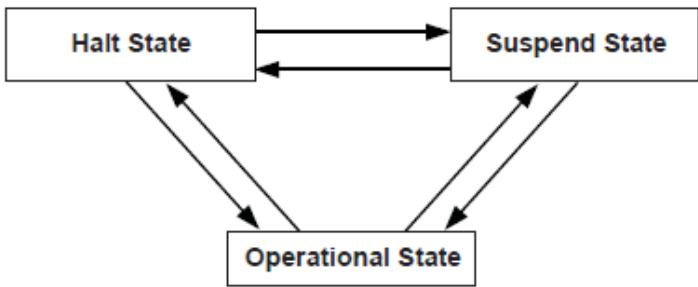  
Fig. 17.1: Software Triggered State Transitions of a USB Host Controller

If the state specified by State is not valid, then EFI\_INVALID\_PARAMETER is returned. If a device error occurs while attempting to place the USB host controller into the state specified by State, then EFI\_DEVICE\_ERROR is returned. If the USB host controller is successfully placed in the state specified by State, then EFI\_SUCCESS is returned.

## Status Codes Returned

<table><tr><td>EFI_SUCCESS</td><td>The USB host controller was successfully placed in the state specified by State.</td></tr><tr><td>EFI_INVALID_PARAMETER</td><td>State is invalid.</td></tr><tr><td>EFI_DEVICE_ERROR</td><td>Failed to set the state specified by State due to device error.</td></tr></table>

## 17.1.7 EFI\_USB2\_HC\_PROTOCOL.ControlTransfer()

## Summary

Submits control transfer to a target USB device.

## Prototype

<table><tr><td colspan="2">typedef</td></tr><tr><td colspan="2">EFI_STATUS(EFIAPI *EFI_USB2_HC_PROTOCOL_CONTROL_TRANSFER) (</td></tr><tr><td>IN EFI_USB2_HC_PROTOCOL</td><td>*This,</td></tr><tr><td>IN UINT8</td><td>DeviceAddress,</td></tr><tr><td>IN UINT8</td><td>DeviceSpeed,</td></tr><tr><td>IN UINTN</td><td>MaximumPacketLength,</td></tr><tr><td>IN EFI_USB_DEVICE_REQUEST</td><td>*Request,</td></tr><tr><td>IN EFI_USB_DATA_DIRECTION</td><td>TransferDirection,</td></tr><tr><td>IN OUT VOID</td><td>*Data OPTIONAL,</td></tr><tr><td>IN OUT UINTN</td><td>*DataLength OPTIONAL,</td></tr><tr><td>IN UINTN</td><td>TimeOut,</td></tr><tr><td>IN EFI_USB2_HC_TRANSACTION_TRANSLATOR</td><td>*Translator,</td></tr><tr><td>OUT UINT32</td><td>*TransferResult</td></tr><tr><td></td><td></td></tr></table>

## Related Definitions

<table><tr><td colspan="2">typedef struct {UINT8 TranslatorHubAddress,UINT8 TranslatorPortNumber} EFI_USB2_HC_TRANSACTION_TRANSLATOR;</td></tr></table>

## Parameters

## This

A pointer to the EFI\_USB2\_HC\_PROTOCOL instance. Type EFI\_USB2\_HC\_PROTOCOL is defined in USB2 Host Controller Protocol .

## DeviceAddress

Represents the address of the target device on the USB, which is assigned during USB enumeration.

## DeviceSpeed

Indicates device speed. See Related Definitions in GetCapability() for a list of the supported values.

## MaximumPacketLength

Indicates the maximum packet size that the default control transfer endpoint is capable of sending or receiving.

## Request

A pointer to the USB device request that will be sent to the USB device. Refer to UsbControlTransfer() (USB I/O Protocol) for the definition of this function type.

## TransferDirection

Specifies the data direction for the transfer. There are three values available, EfiUsbDataIn, EfiUsbDataOut and EfiUsbNoData. Refer to UsbControlTransfer() (USB I/O Protocol) for the definition of this function type.

## Data

A pointer to the bufer of data that will be transmitted to USB device or received from USB device.

## DataLength

On input, indicates the size, in bytes, of the data bufer specified by Data. On output, indicates the amount of data actually transferred.

## Translator

A pointer to the transaction translator data. See “Description” for the detailed information of this data structure.

## TimeOut

Indicates the maximum time, in milliseconds, which the transfer is allowed to complete.

## TransferResult

A pointer to the detailed result information generated by this control transfer. Refer to UsbControlTransfer() (USB I/O Protocol) for transfer result types ( EFI\_USB\_ERR\_x ).

## Description

This function is used to submit a control transfer to a target USB device specified by DeviceAddress. Control transfers are intended to support configuration/command/status type communication flows between host and USB device.

There are three control transfer types according to the data phase. If the TransferDirection parameter is EfiUsbNoData, Data is NULL, and DataLength is 0, then no data phase is present in the control transfer. If the TransferDirection parameter is EfiUsbDataOut, then Data specifies the data to be transmitted to the device, and DataLength specifies the number of bytes to transfer to the device. In this case, there is an OUT DATA stage followed by a SETUP stage. If the TransferDirection parameter is EfiUsbDataIn, then Data specifies the data to be received from the device, and DataLength specifies the number of bytes to receive from the device. In this case there is an IN DATA stage followed by a SETUP stage.

Translator is necessary to perform split transactions on low-speed or full-speed devices connected to a high-speed hub. Such transaction require the device connection information: device address and the port number of the hub that device is connected to. This information is passed through the fields of EFI\_USB2\_HC\_TRANSACTION\_TRANSLATOR structure. See Related Definitions for the structure field names. Translator is passed as NULL for the USB1.1 host controllers transfers or when the transfer is requested for high-speed device connected to USB2.0 controller.

If the control transfer has completed successfully, then EFI\_SUCCESS is returned. If the transfer cannot be completed within the timeout specified by TimeOut, then EFI\_TIMEOUT is returned. If an error other than timeout occurs during the USB transfer, then EFI\_DEVICE\_ERROR is returned and the detailed error code will be returned in the TransferResult parameter.

EFI\_INVALID\_PARAMETER is returned if one of the following conditions is satisfied:

• TransferDirection is invalid.

• TransferDirection, Data, and DataLength do not match one of the three control transfer types described above.

• Request pointer is NULL.

• MaximumPacketLength is not valid. If DeviceSpeed is EFI\_USB\_SPEED\_LOW, then MaximumPacketLength must be 8. If DeviceSpeed is EFI\_USB\_SPEED\_FULL or EFI\_USB\_SPEED\_HIGH, then MaximumPacketLength must be 8, 16, 32, or 64. If DeviceSpeed is EFI\_USB\_SPEED\_SUPER, then MaximumPacketLength must be 512.

• TransferResult pointer is NULL.

• Translator is NULL while the requested transfer requires split transaction. The conditions of the split transactions are described above in “Description” section.

## Status Codes Returned

<table><tr><td>EFI_SUCCESS</td><td>The control transfer was completed successfully.</td></tr><tr><td>EFI_OUT_OF_RESOURCES</td><td>The control transfer could not be completed due to a lack of resources.</td></tr><tr><td>EFI_INVALID_PARAMETER</td><td>Some parameters are invalid. The possible invalid parameters are described in “Description” above.</td></tr><tr><td>EFI_TIMEOUT</td><td>The control transfer failed due to timeout.</td></tr><tr><td>EFI_DEVICE_ERROR</td><td>The control transfer failed due to host controller or device error. Caller should check TransferResult for detailed error information.</td></tr></table>

## 17.1.8 EFI\_USB2\_HC\_PROTOCOL.BulkTransfer()

## Summary

Submits bulk transfer to a bulk endpoint of a USB device.

Prototype

<table><tr><td colspan="2">typedef</td></tr><tr><td colspan="2">EFI_STATUS(EFIAPI *EFI_USB2_HC_PROTOCOL_BULK_TRANSFER) (</td></tr><tr><td>IN EFI_USB2_HC_PROTOCOL</td><td>*This,</td></tr><tr><td>IN UINT8</td><td>DeviceAddress,</td></tr><tr><td>IN UINT8</td><td>EndPointAddress,</td></tr><tr><td>IN UINT8</td><td>DeviceSpeed,</td></tr><tr><td>IN UINTN</td><td>MaximumPacketLength,</td></tr><tr><td>IN UINT8</td><td>DataBuffersNumber,</td></tr><tr><td>IN OUT VOID</td><td>*Data[EFI_USB_MAX_BULK_BUFFER_NUM],</td></tr><tr><td>IN OUT UINTN</td><td>*DataLength,</td></tr><tr><td>IN OUT UINT8</td><td>*DataToggle,</td></tr><tr><td>IN UINTN</td><td>TimeOut,</td></tr><tr><td>IN EFI_USB2_HC_TRANSACTION_TRANSLATOR</td><td>*Translator,</td></tr><tr><td>OUT UINT32</td><td>*TransferResult</td></tr><tr><td>);</td><td></td></tr></table>

## Parameters

## This

A pointer to the EFI\_USB2\_HC\_PROTOCOL instance. Type EFI\_USB2\_HC\_PROTOCOL is defined in USB2 Host Controller Protocol .

## DeviceAddress

Represents the address of the target device on the USB, which is assigned during USB enumeration.

## EndPointAddress

The combination of an endpoint number and an endpoint direction of the target USB device. Each endpoint address supports data transfer in one direction except the control endpoint (whose default endpoint address is 0). It is the caller’s responsibility to make sure that the EndPointAddress represents a bulk endpoint.

## DeviceSpeed

Indicates device speed. The supported values are EFI\_USB\_SPEED\_FULL,EFI\_USB\_SPEED\_HIGH or

## EFI\_USB\_SPEED\_SUPER..

## MaximumPacketLength

Indicates the maximum packet size the target endpoint is capable of sending or receiving.

## DataBufersNumber

Number of data bufers prepared for the transfer.

## Data

Array of pointers to the bufers of data that will be transmitted to USB device or received from USB device.

## DataLength

When input, indicates the size, in bytes, of the data bufers specified by Data. When output, indicates the actually transferred data size.

## DataToggle

A pointer to the data toggle value. On input, it indicates the initial data toggle value the bulk transfer should adopt; on output, it is updated to indicate the data toggle value of the subsequent bulk transfer.

## Translator

A pointer to the transaction translator data. See ControlTransfer() “Description” for the detailed information of this data structure.

## TimeOut

Indicates the maximum time, in milliseconds, which the transfer is allowed to complete.

## TransferResult

A pointer to the detailed result information of the bulk transfer. Refer to UsbControlTransfer() in USB I/O Protocol for transfer result types ( EFI\_USB\_ERR\_x ).

## Description

This function is used to submit bulk transfer to a target endpoint of a USB device. The target endpoint is specified by DeviceAddress and EndpointAddress. Bulk transfers are designed to support devices that need to communicate relatively large amounts of data at highly variable times where the transfer can use any available bandwidth. Bulk transfers can be used only by full-speed and high-speed devices.

High-speed bulk transfers can be performed using multiple data bufers. The number of bufers that are actually prepared for the transfer is specified by DataBufersNumber. For full-speed bulk transfers this value is ignored.

Data represents a list of pointers to the data bufers. For full-speed bulk transfers only the data pointed by Data[0] shall be used. For high-speed transfers depending on DataLength there several data bufers can be used. The total number of bufers must not exceed EFI\_USB\_MAX\_BULK\_BUFFER\_NUM. See Related Definitions for the EFI\_USB\_MAX\_BULK\_BUFFER\_NUM value.

The data transfer direction is determined by the endpoint direction that is encoded in the EndPointAddress parameter. Refer to USB Specification, Revision 2.0 on the Endpoint Address encoding.

The DataToggle parameter is used to track target endpoint’s data sequence toggle bits. The USB provides a mechanism to guarantee data packet synchronization between data transmitter and receiver across multiple transactions. The data packet synchronization is achieved with the data sequence toggle bits and the DATA0/DATA1 PIDs. A bulk endpoint’s toggle sequence is initialized to DATA0 when the endpoint experiences a configuration event. It toggles between DATA0 and DATA1 in each successive data transfer. It is host’s responsibility to track the bulk endpoint’s data toggle sequence and set the correct value for each data packet. The input DataToggle value points to the data toggle value for the first data packet of this bulk transfer; the output DataToggle value points to the data toggle value for the last successfully transferred data packet of this bulk transfer. The caller should record the data toggle value for use in subsequent bulk transfers to the same endpoint.

If the bulk transfer is successful, then EFI\_SUCCESS is returned. If USB transfer cannot be completed within the timeout specified by Timeout, then EFI\_TIMEOUT is returned. If an error other than timeout occurs during the USB transfer, then EFI\_DEVICE\_ERROR is returned and the detailed status code is returned in TransferResult.

EFI\_INVALID\_PARAMETER is returned if one of the following conditions is satisfied:

• Data is NULL.

• DataLength is 0.

• DeviceSpeed is not valid; the legal values are EFI\_USB\_SPEED\_FULL, EFI\_USB\_SPEED\_HIGH, or EFI\_USB\_SPEED\_SUPER.

• MaximumPacketLength is not valid. The legal value of this parameter is 64 or less for full-speed, 512 or less for high-speed, and 1024 or less for super-speed transactions.

• DataToggle points to a value other than 0 and 1.

• TransferResult is NULL.

## Status Codes Returned

<table><tr><td>EFI_SUCCESS</td><td>The bulk transfer was completed successfully.</td></tr><tr><td>EFI_OUT_OF_RESOURCES</td><td>The bulk transfer could not be submitted due to lack of resource.</td></tr><tr><td>EFI_INVALID_PARAMETER</td><td>Some parameters are invalid. The possible invalid parameters are described in “Description” above.</td></tr><tr><td>EFI_TIMEOUT</td><td>The bulk transfer failed due to timeout.</td></tr><tr><td>EFI_DEVICE_ERROR</td><td>The bulk transfer failed due to host controller or device error. Caller should check TransferResult for detailed error information.</td></tr></table>

## 17.1.9 EFI\_USB2\_HC\_PROTOCOL.AsyncInterruptTransfer()

## Summary

Submits an asynchronous interrupt transfer to an interrupt endpoint of a USB device.

## Prototype

<table><tr><td colspan="2">typedef</td></tr><tr><td colspan="2">EFI_STATUS(EFIAPI *EFI_USB2_HC_PROTOCOL_ASYNC_INTERRUPT_TRANSFER) (</td></tr><tr><td>IN EFI_USB2_HC_PROTOCOL</td><td>*This,</td></tr><tr><td>IN UINT8</td><td>DeviceAddress,</td></tr><tr><td>IN UINT8</td><td>EndPointAddress,</td></tr><tr><td>IN UINT8</td><td>DeviceSpeed,</td></tr><tr><td>IN UINTN</td><td>MaximumPacketLength,</td></tr><tr><td>IN BOOLEAN</td><td>IsNewTransfer,</td></tr><tr><td>IN OUT UINT8</td><td>*DataToggle,</td></tr><tr><td>IN UINTN</td><td>PollingInterval OPTIONAL,</td></tr><tr><td>IN UINTN</td><td>DataLength OPTIONAL,</td></tr><tr><td>IN EFI_USB2_HC_TRANSACTION_TRANSLATOR</td><td>*Translator OPTIONAL,</td></tr><tr><td>IN EFI_ASYNC_USB_TRANSFER_CALLBACK</td><td>CallBackFunction OPTIONAL,</td></tr><tr><td>IN VOID</td><td>*Context OPTIONAL</td></tr><tr><td></td><td></td></tr></table>

## Parameters

## This

A pointer to the EFI\_USB2\_HC\_PROTOCOL instance. Type EFI\_USB2\_HC\_PROTOCOL is defined in USB2 Host Controller Protocol .

## DeviceAddress

Represents the address of the target device on the USB, which is assigned during USB enumeration.

## EndPointAddress

The combination of an endpoint number and an endpoint direction of the target USB device. Each endpoint address supports data transfer in one direction except the control endpoint (whose default endpoint address is zero). It is the caller’s responsibility to make sure that the EndPointAddress represents an interrupt endpoint.

## DeviceSpeed

Indicates device speed. See Related Definitions in EFI\_USB2\_HC\_PROTOCOL.ControlTransfer() for a list of the supported values.

## MaximumPacketLength

Indicates the maximum packet size the target endpoint is capable of sending or receiving.

## IsNewTransfer

If TRUE, an asynchronous interrupt pipe is built between the host and the target interrupt endpoint. If FALSE, the specified asynchronous interrupt pipe is canceled. If TRUE, and an interrupt transfer exists for the target end point, then EFI\_INVALID\_PARAMETER is returned.

## DataToggle

A pointer to the data toggle value. On input, it is valid when IsNewTransfer is TRUE, and it indicates the initial data toggle value the asynchronous interrupt transfer should adopt. On output, it is valid when IsNewTransfer is FALSE, and it is updated to indicate the data toggle value of the subsequent asynchronous interrupt transfer.

## PollingInterval

Indicates the interval, in milliseconds, that the asynchronous interrupt transfer is polled. This parameter is required when IsNewTransfer is TRUE.

## DataLength

Indicates the length of data to be received at the rate specified by PollingInterval from the target asynchronous interrupt endpoint. This parameter is only required when IsNewTransfer is TRUE.

## Translator

A pointer to the transaction translator data.

## CallBackFunction

The Callback function. This function is called at the rate specified by PollingInterval. This parameter is only required when IsNewTransfer is TRUE. Refer to UsbAsyncInterruptTransfer() in USB I/O Protocol for the definition of this function type.

## Context

The context that is passed to the CallBackFunction. This is an optional parameter and may be NULL.

## Description

This function is used to submit asynchronous interrupt transfer to a target endpoint of a USB device. The target endpoint is specified by DeviceAddress and EndpointAddress. In the USB Specification, Revision 2.0, interrupt transfer is one of the four USB transfer types. In the EFI\_USB2\_HC\_PROTOCOL, interrupt transfer is divided further into synchronous interrupt transfer and asynchronous interrupt transfer.

An asynchronous interrupt transfer is typically used to query a device’s status at a fixed rate. For example, keyboard, mouse, and hub devices use this type of transfer to query their interrupt endpoints at a fixed rate. The asynchronous interrupt transfer is intended to support the interrupt transfer type of “submit once, execute periodically.” Unless an explicit request is made, the asynchronous transfer will never retire.

If IsNewTransfer is TRUE, then an interrupt transfer is started at a fixed rate. The rate is specified by PollingInterval, the size of the receive bufer is specified by DataLength, and the callback function is specified by CallBackFunction. Context specifies an optional context that is passed to the CallBackFunction each time it is called. The CallBackFunction is intended to provide a means for the host to periodically process interrupt transfer data.

If IsNewTransfer is TRUE, and an interrupt transfer exists for the target end point, then EFI\_INVALID\_PARAMETER is returned.

If IsNewTransfer is FALSE, then the interrupt transfer is canceled.

EFI\_INVALID\_PARAMETER is returned if one of the following conditions is satisfied:

• Data transfer direction indicated by EndPointAddress is other than EfiUsbDataIn.

• IsNewTransfer is TRUE and DataLength is 0.

• IsNewTransfer is TRUE and DataToggle points to a value other than 0 and 1.

• IsNewTransfer is TRUE and PollingInterval is not in the range 1..255.

• IsNewTransfer requested where an interrupt transfer exists for the target end point.

## Status Codes Returned

<table><tr><td>EFI_SUCCESS</td><td>The asynchronous interrupt transfer request has been successfully submitted or canceled.</td></tr><tr><td>EFI_INVALID_PARAMETER</td><td>Some parameters are invalid. The possible invalid parameters are described in “Description” above. When an interrupt transfer exists for the target end point and a new transfer is requested, EFI_INVALID_PARAMETER is returned.</td></tr><tr><td>EFI_OUT_OF_RESOURCES</td><td>The request could not be completed due to a lack of resources.</td></tr></table>

## 17.1.10 EFI\_USB2\_HC\_PROTOCOL.SyncInterruptTransfer()

## Summary

## Prototype

Submits synchronous interrupt transfer to an interrupt endpoint of a USB device.

## Parameters

## This

A pointer to the EFI\_USB2\_HC\_PROTOCOL instance. Type EFI\_USB2\_HC\_PROTOCOL is defined in USB2 Host Controller Protocol .

## DeviceAddress

Represents the address of the target device on the USB, which is assigned during USB enumeration.

## EndPointAddress

The combination of an endpoint number and an endpoint direction of the target USB device. Each endpoint address supports data transfer in one direction except the control endpoint (whose default endpoint address is zero). It is the caller’s responsibility to make sure that the EndPointAddress represents an interrupt endpoint.

## DeviceSpeed

Indicates device speed. See Related Definitions in EFI\_USB2\_HC\_PROTOCOL.ControlTransfer() for a list of the supported values.

## MaximumPacketLength

Indicates the maximum packet size the target endpoint is capable of sending or receiving.

## Data

A pointer to the bufer of data that will be transmitted to USB device or received from USB device.

## DataLength

On input, the size, in bytes, of the data bufer specified by Data. On output, the number of bytes transferred.

## DataToggle

A pointer to the data toggle value. On input, it indicates the initial data toggle value the synchronous interrupt transfer should adopt; on output, it is updated to indicate the data toggle value of the subsequent synchronous interrupt transfer.

## TimeOut

Indicates the maximum time, in milliseconds, which the transfer is allowed to complete.

## Translator

A pointer to the transaction translator data.

## TransferResult

A pointer to the detailed result information from the synchronous interrupt transfer. Refer to UsbControlTransfer() in USB I/O Protocol for transfer result types (EFI\_USB\_ERR\_x).

## Description

This function is used to submit a synchronous interrupt transfer to a target endpoint of a USB device. The target endpoint is specified by DeviceAddress and EndpointAddress. In the USB Specification, Revision2.0, interrupt transfer is one of the four USB transfer types. In the EFI\_USB2\_HC\_PROTOCOL , interrupt transfer is divided further into synchronous interrupt transfer and asynchronous interrupt transfer.

The synchronous interrupt transfer is designed to retrieve small amounts of data from a USB device through an interrupt endpoint. A synchronous interrupt transfer is only executed once for each request. This is the most significant diference from the asynchronous interrupt transfer.

If the synchronous interrupt transfer is successful, then EFI\_SUCCESS is returned. If the USB transfer cannot be completed within the timeout specified by Timeout, then EFI\_TIMEOUT is returned. If an error other than timeout occurs during the USB transfer, then EFI\_DEVICE\_ERROR is returned and the detailed status code is returned in TransferResult.

EFI\_INVALID\_PARAMETER is returned if one of the following conditions is satisfied:

• Data is NULL.

• DataLength is 0.

• MaximumPacketLength is not valid. The legal value of this parameter should be 3072 or less for high-speed device, 64 or less for a full-speed device; for a slow device, it is limited to 8 or less. For the full-speed device, it should be 8, 16, 32, or 64; for the slow device, it is limited to 8.

• DataToggle points to a value other than 0 and 1.

## • TransferResult is NULL.

## Status Codes Returned

<table><tr><td>EFI_SUCCESS</td><td>The synchronous interrupt transfer was completed successfully.</td></tr><tr><td>EFI_OUT_OF_RESOURCES</td><td>The synchronous interrupt transfer could not be submitted due to lack of resource.</td></tr><tr><td>EFI_INVALID_PARAMETER</td><td>Some parameters are invalid. The possible invalid parameters are described in “Description” above.</td></tr><tr><td>EFI_TIMEOUT</td><td>The synchronous interrupt transfer failed due to timeout.</td></tr><tr><td>EFI_DEVICE_ERROR</td><td>The synchronous interrupt transfer failed due to host controller or device error. Caller should check TransferResult for detailed error information.</td></tr></table>

## 17.1.11 EFI\_USB2\_HC\_PROTOCOL.IsochronousTransfer()

## Summary

Submits isochronous transfer to an isochronous endpoint of a USB device.

## Prototype

<table><tr><td colspan="3">typedef</td></tr><tr><td colspan="3">EFI_STATUS(EFIAPI *EFI_USB2_HC_PROTOCOL_ISOCHRONOUS_TRANSFER) (</td></tr><tr><td>IN</td><td>EFI_USB2_HC_PROTOCOL</td><td>*This,</td></tr><tr><td>IN</td><td>UINT8</td><td>DeviceAddress,</td></tr><tr><td>IN</td><td>UINT8</td><td>EndPointAddress,</td></tr><tr><td>IN</td><td>UINT8</td><td>DeviceSpeed,</td></tr><tr><td>IN</td><td>UINTN</td><td>MaximumPacketLength,</td></tr><tr><td>IN</td><td>UINT8</td><td>DataBuffersNumber,</td></tr><tr><td>IN</td><td>OUT VOID</td><td>*Data[EFI_USB_MAX_ISO_BUFFER_NUM],</td></tr><tr><td>IN</td><td>UINTN</td><td>DataLength,</td></tr><tr><td>IN</td><td>EFI_USB2_HC_TRANSACTION_TRANSLATOR</td><td>*Translator,</td></tr><tr><td>OUT</td><td>UINT32</td><td>*TransferResult</td></tr><tr><td>);</td><td></td><td></td></tr></table>

## Related Definitions

<table><tr><td>#define EFI_USB_MAX_ISO_BUFFER_NUM 7</td></tr><tr><td>#define EFI_USB_MAX_ISO_BUFFER_NUM1 2</td></tr></table>

## Parameters

## This

A pointer to the EFI\_USB2\_HC\_PROTOCOL instance. Type EFI\_USB2\_HC\_PROTOCOL is defined in USB2 Host Controller Protocol .

## DeviceAddress

Represents the address of the target device on the USB, which is assigned during USB enumeration.

## EndPointAddress

The combination of an endpoint number and an endpoint direction of the target USB device. Each endpoint address supports data transfer in one direction except the control endpoint (whose default endpoint address is 0). It is the caller’s responsibility to make sure that the EndPointAddress represents an isochronous endpoint.

## DeviceSpeed

Indicates device speed. The supported values are EFI\_USB\_SPEED\_FULL, EFI\_USB\_SPEED\_HIGH, or EFI\_USB\_SPEED\_SUPER.

## MaximumPacketLength

Indicates the maximum packet size the target endpoint is capable of sending or receiving. For isochronous endpoints, this value is used to reserve the bus time in the schedule, required for the per-frame data payloads. The pipe may, on an ongoing basis, actually use less bandwidth than that reserved.

## DataBufersNumber

Number of data bufers prepared for the transfer.

## Data

Array of pointers to the bufers of data that will be transmitted to USB device or received from USB device.

## DataLength

Specifies the length, in bytes, of the data to be sent to or received from the USB device.

## Translator

A pointer to the transaction translator data. See ControlTransfer() “Description” for the detailed information of this data structure.

## TransferResult

A pointer to the detail result information of the isochronous transfer. Refer to UsbControlTransfer() in USB I/O Protocol for transfer result types (EFI\_USB\_ERR\_x).

## Description

This function is used to submit isochronous transfer to a target endpoint of a USB device. The target endpoint is specified by DeviceAddress and EndpointAddress. Isochronous transfers are used when working with isochronous date. It provides periodic, continuous communication between the host and a device. Isochronous transfers can be used only by full-speed, high-speed, and super-speed devices.

High-speed isochronous transfers can be performed using multiple data bufers. The number of bufers that are actually prepared for the transfer is specified by DataBufersNumber. For full-speed isochronous transfers this value is ignored.

Data represents a list of pointers to the data bufers. For full-speed isochronous transfers only the data pointed by Data[0] shall be used. For high-speed isochronous transfers and for the split transactions depending on DataLength there several data bufers can be used. For the high-speed isochronous transfers the total number of bufers must not exceed EFI\_USB\_MAX\_ISO\_BUFFER\_NUM. For split transactions performed on full-speed device by high-speed host controller the total number of bufers is limited to EFI\_USB\_MAX\_ISO\_BUFFER\_NUM1 See Related Definitions for the EFI\_USB\_MAX\_ISO\_BUFFER\_NUM and EFI\_USB\_MAX\_ISO\_BUFFER\_NUM1 values.

If the isochronous transfer is successful, then EFI\_SUCCESS is returned. The isochronous transfer is designed to be completed within one USB frame time, if it cannot be completed, EFI\_TIMEOUT is returned. If an error other than timeout occurs during the USB transfer, then EFI\_DEVICE\_ERROR is returned and the detailed status code will be returned in TransferResult.

EFI\_INVALID\_PARAMETER is returned if one of the following conditions is satisfied:

• Data is NULL.

• DataLength is 0.

• DeviceSpeed is not one of the supported values listed above.

• MaximumPacketLength is invalid. MaximumPacketLength must be 1023 or less for full-speed devices, and 1024 or less for high-speed and super-speed devices.

• TransferResult is NULL.

## Status Codes Returned