## DeviceSpeed

Indicates device speed. The supported values are EFI\_USB\_SPEED\_FULL, EFI\_USB\_SPEED\_HIGH, or EFI\_USB\_SPEED\_SUPER.

## MaximumPacketLength

Indicates the maximum packet size the target endpoint is capable of sending or receiving. For isochronous endpoints, this value is used to reserve the bus time in the schedule, required for the per-frame data payloads. The pipe may, on an ongoing basis, actually use less bandwidth than that reserved.

## DataBufersNumber

Number of data bufers prepared for the transfer.

## Data

Array of pointers to the bufers of data that will be transmitted to USB device or received from USB device.

## DataLength

Specifies the length, in bytes, of the data to be sent to or received from the USB device.

## Translator

A pointer to the transaction translator data. See ControlTransfer() “Description” for the detailed information of this data structure.

## TransferResult

A pointer to the detail result information of the isochronous transfer. Refer to UsbControlTransfer() in USB I/O Protocol for transfer result types (EFI\_USB\_ERR\_x).

## Description

This function is used to submit isochronous transfer to a target endpoint of a USB device. The target endpoint is specified by DeviceAddress and EndpointAddress. Isochronous transfers are used when working with isochronous date. It provides periodic, continuous communication between the host and a device. Isochronous transfers can be used only by full-speed, high-speed, and super-speed devices.

High-speed isochronous transfers can be performed using multiple data bufers. The number of bufers that are actually prepared for the transfer is specified by DataBufersNumber. For full-speed isochronous transfers this value is ignored.

Data represents a list of pointers to the data bufers. For full-speed isochronous transfers only the data pointed by Data[0] shall be used. For high-speed isochronous transfers and for the split transactions depending on DataLength there several data bufers can be used. For the high-speed isochronous transfers the total number of bufers must not exceed EFI\_USB\_MAX\_ISO\_BUFFER\_NUM. For split transactions performed on full-speed device by high-speed host controller the total number of bufers is limited to EFI\_USB\_MAX\_ISO\_BUFFER\_NUM1 See Related Definitions for the EFI\_USB\_MAX\_ISO\_BUFFER\_NUM and EFI\_USB\_MAX\_ISO\_BUFFER\_NUM1 values.

If the isochronous transfer is successful, then EFI\_SUCCESS is returned. The isochronous transfer is designed to be completed within one USB frame time, if it cannot be completed, EFI\_TIMEOUT is returned. If an error other than timeout occurs during the USB transfer, then EFI\_DEVICE\_ERROR is returned and the detailed status code will be returned in TransferResult.

EFI\_INVALID\_PARAMETER is returned if one of the following conditions is satisfied:

• Data is NULL.

• DataLength is 0.

• DeviceSpeed is not one of the supported values listed above.

• MaximumPacketLength is invalid. MaximumPacketLength must be 1023 or less for full-speed devices, and 1024 or less for high-speed and super-speed devices.

• TransferResult is NULL.

## Status Codes Returned

<table><tr><td>EFI_SUCCESS</td><td>The isochronous transfer was completed successfully.</td></tr><tr><td>EFI_OUT_OF_RESOURCES</td><td>The isochronous transfer could not be submitted due to lack of resource.</td></tr><tr><td>EFI_INVALID_PARAMETER</td><td>Some parameters are invalid. The possible invalid parameters are described in “Description” above.</td></tr><tr><td>EFI_TIMEOUT</td><td>The isochronous transfer cannot be completed within the one USB frame time.</td></tr><tr><td>EFI_DEVICE_ERROR</td><td>The isochronous transfer failed due to host controller or device error. Caller should check TransferResult for detailed error information.</td></tr><tr><td>EFI_UNSUPPORTED</td><td>The implementation doesn’t support an Isochronous transfer function.</td></tr></table>

## 17.1.12 EFI\_USB2\_HC\_PROTOCOL.AsyncIsochronousTransfer()

## Summary

Submits nonblocking isochronous transfer to an isochronous endpoint of a USB device.

## Prototype

<table><tr><td colspan="3">typedef</td></tr><tr><td colspan="3">EFI_STATUS(EFIAPI * EFI_USB2_HC_PROTOCOL_ASYNC_ISOCHRONOUS_TRANSFER) (</td></tr><tr><td>IN</td><td>EFI_USB2_HC_PROTOCOL</td><td>*This,</td></tr><tr><td>IN</td><td>UINT8</td><td>DeviceAddress,</td></tr><tr><td>IN</td><td>UINT8</td><td>EndPointAddress,</td></tr><tr><td>IN</td><td>UINT8</td><td>DeviceSpeed,</td></tr><tr><td>IN</td><td>UINTN</td><td>MaximumPacketLength,</td></tr><tr><td>IN</td><td>UINT8</td><td>DataBuffersNumber,</td></tr><tr><td>IN</td><td>OUT VOID</td><td>*Data[EFI_USB_MAX_ISO_BUFFER_NUM],</td></tr><tr><td>IN</td><td>UINTN</td><td>DataLength,</td></tr><tr><td>IN</td><td>EFI_USB2_HC_TRANSACTION_TRANSLATOR</td><td>*Translator,</td></tr><tr><td>IN</td><td>EFI_ASYNC_USB_TRANSFER_CALLBACK</td><td>IsochronousCallBack,</td></tr><tr><td>IN</td><td>VOID</td><td>*Context OPTIONAL</td></tr><tr><td>);</td><td></td><td></td></tr></table>

## Parameters

## This

A pointer to the EFI\_USB2\_HC\_PROTOCOL instance. Type EFI\_USB2\_HC\_PROTOCOL is defined in USB2 Host Controller Protocol .

## DeviceAddress

Represents the address of the target device on the USB, which is assigned during USB enumeration.

## EndPointAddress

The combination of an endpoint number and an endpoint direction of the target USB device. Each endpoint address supports data transfer in one direction except the control endpoint (whose default endpoint address is zero). It is the caller’s responsibility to make sure that the EndPointAddress represents an isochronous endpoint.

## DeviceSpeed

Indicates device speed. The supported values are EFI\_USB\_SPEED\_FULL, EFI\_USB\_SPEED\_HIGH, or EFI\_USB\_SPEED\_SUPER.

## MaximumPacketLength

Indicates the maximum packet size the target endpoint is capable of sending or receiving. For isochronous endpoints, this value is used to reserve the bus time in the schedule, required for the per-frame data payloads. The pipe may, on an ongoing basis, actually use less bandwidth than that reserved.

## DataBufersNumber

Number of data bufers prepared for the transfer.

## Data

Array of pointers to the bufers of data that will be transmitted to USB device or received from USB device.

## DataLength

Specifies the length, in bytes, of the data to be sent to or received from the USB device.

## Translator

A pointer to the transaction translator data. See ControlTransfer() “Description” for the detailed information of this data structure.

## IsochronousCallback

The Callback function. This function is called if the requested isochronous transfer is completed. Refer to UsbAsyncInterruptTransfer() in USB I/O Protocol for the definition of this function type.

## Context

Data passed to the IsochronousCallback function. This is an optional parameter and may be NULL.

## Description

This is an asynchronous type of USB isochronous transfer. If the caller submits a USB isochronous transfer request through this function, this function will return immediately. When the isochronous transfer completes, the Isochronous-Callback function will be triggered, the caller can know the transfer results. If the transfer is successful, the caller can get the data received or sent in this callback function.

The target endpoint is specified by DeviceAddress and EndpointAddress. Isochronous transfers are used when working with isochronous date. It provides periodic, continuous communication between the host and a device. Isochronous transfers can be used only by full-speed, high-speed, and super-speed devices.

High-speed isochronous transfers can be performed using multiple data bufers. The number of bufers that are actually prepared for the transfer is specified by DataBufersNumber. For full-speed isochronous transfers this value is ignored.

Data represents a list of pointers to the data bufers. For full-speed isochronous transfers only the data pointed by Data[0] shall be used. For high-speed isochronous transfers and for the split transactions depending on DataLength there several data bufers can be used. For the high-speed isochronous transfers the total number of bufers must not exceed EFI\_USB\_MAX\_ISO\_BUFFER\_NUM. For split transactions performed on full-speed device by high-speed host controller the total number of bufers is limited to EFI\_USB\_MAX\_ISO\_BUFFER\_NUM1 See Related Definitions in IsochronousTransfer() section for the EFI\_USB\_MAX\_ISO\_BUFFER\_NUM and EFI\_USB\_MAX\_ISO\_BUFFER\_NUM1 values.

EFI\_INVALID\_PARAMETER is returned if one of the following conditions is satisfied:

• Data is NULL.

• DataLength is 0.

• DeviceSpeed is not one of the supported values listed above.

• MaximumPacketLength is invalid. MaximumPacketLength must be 1023 or less for full-speed devices and 1024 or less for high-speed and super-speed devices.

## Status Codes Returned

<table><tr><td>EFI_SUCCESS</td><td>The asynchronous isochronous transfer was completed successfully.</td></tr><tr><td>EFI_OUT_OF_RESOURCES</td><td>The asynchronous isochronous transfer could not be submitted due to lack of resource.</td></tr></table>

continues on next page

```c
typedef struct {
    UINT16 PortStatus;
    UINT16 PortChangeStatus;
} EFI_USB_PORT_STATUS;

//**************************
// EFI_USB_PORT_STATUS.PortStatus bit definition
//**************************
#define USB_PORT_STAT_CONNECTION 0x0001
#define USB_PORT_STAT_ENABLE 0x0002
#define USB_PORT_STAT_SUSPEND 0x0004
#define USB_PORT_STAT_OVERCURRENT 0x0008
#define USB_PORT_STAT_RESET 0x0010
#define USB_PORT_STAT_POWER 0x0100
#define USB_PORT_STAT_LOW_SPEED 0x0200
#define USB_PORT_STAT_HIGH_SPEED 0x0400
#define USB_PORT_STAT_SUPER_SPEED 0x0800
#define USB_PORT_STAT_OWNER 0x2000
```

Table 17.9 – continued from previous page

<table><tr><td>EFI_INVALID_PARAMETER</td><td>Some parameters are invalid. The possible invalid parameters are described in “Description” above.</td></tr><tr><td>EFI_UNSUPPORTED</td><td>The implementation doesn’t support Isochronous transfer function</td></tr></table>

## 17.1.13 EFI\_USB2\_HC\_PROTOCOL.GetRootHubPortStatus()

## Summary

Retrieves the current status of a USB root hub port.

Prototype

```c
typedef
EFI_STATUS
(EFIAPI *EFI_USB2_HC_PROTOCOL_GET_ROOTHUB_PORT_STATUS) (
    IN EFI_USB2_HC_PROTOCOL    *This,
    IN UINT8    PortNumber,
    OUT EFI_USB_PORT_STATUS    *PortStatus
);
```

## Parameters

## This

A pointer to the EFI\_USB2\_HC\_PROTOCOL instance. Type EFI\_USB2\_HC\_PROTOCOL is defined in USB2 Host Controller Protocol .

## PortNumber

Specifies the root hub port from which the status is to be retrieved. This value is zero based. For example, if a root hub has two ports, then the first port is numbered 0, and the second port is numbered 1.

## PortStatus

A pointer to the current port status bits and port status change bits. The type EFI\_USB\_PORT\_STATUS is defined in Related Definitions below.

## Related Definitions

(continues on next page)

```c
(continued from previous page)

//**********************************************************************
// EFI_USB_PORT_STATUS.PortChangeStatus bit definition
//**********************************************************************
#define USB_PORT_STAT_C_CONNECTION 0x0001
#define USB_PORT_STAT_C_ENABLE 0x0002
#define USB_PORT_STAT_C_SUSPEND 0x0004
#define USB_PORT_STAT_C_OVERCURRENT 0x0008
#define USB_PORT_STAT_C_RESET 0x0010
```

## PortStatus

Contains current port status bitmap. The root hub port status bitmap is unified with the USB hub port status bitmap. See Table below, USB Hub Port Status Bitmap, for a reference, which is borrowed from Chapter 11, Hub Specification, of USB Specification, Revision 1.1.

## PortChangeStatus

Contains current port status change bitmap. The root hub port change status bitmap is unified with the USB hub port status bitmap. See Table below, Hub Port Change Status Bitmap for a reference, which is borrowed from Chapter 11, Hub Specification, of USB Specification, Revision 1.1.

Table 17.10: USB Hub Port Status Bitmap

<table><tr><td>Bit</td><td>Description</td></tr><tr><td>0</td><td>Current Connect Status: (USB_PORT_STAT_CONNECTION) This field reflects whether or not a device is currently connected to this port.0 = No device is present1 = A device is present on this port</td></tr><tr><td>1</td><td>Port Enable / Disabled: (USB_PORT_STAT_ENABLE) Ports can be enabled by software only. Ports can be disabled by either a fault condition (disconnect event or other fault condition) or by software.0 = Port is disabled1 = Port is enabled</td></tr><tr><td>2</td><td>Suspend: (USB_PORT_STAT_SUSPEND) This field indicates whether or not the device on this port is suspended.0 = Not suspended1 = Suspended</td></tr><tr><td>3</td><td>Over-current Indicator: (USB_PORT_STAT_OVERCURRENT) This field is used to indicate that the current drain on the port exceeds the specified maximum.0 = All no over-current condition exists on this port1 = An over-current condition exists on this port</td></tr></table>

continues on next page

Table 17.10 – continued from previous page

<table><tr><td>4</td><td></td></tr><tr><td></td><td>Reset: (USB_PORT_STAT_RESET) Indicates whether port is in reset state.0 = Port is not in reset state1 = Port is in reset state</td></tr><tr><td>5-7</td><td>Reserved These bits return 0 when read.</td></tr><tr><td>8</td><td></td></tr><tr><td></td><td>Port Power: (USB_PORT_STAT_POWER) This field reflects a port&#x27;s logical, power control state.0 = This port is in the Powered-off state1 = This port is not in the Powered-off state</td></tr><tr><td>9</td><td></td></tr><tr><td></td><td>Low Speed Device Attached: (USB_PORT_STAT_LOW_SPEED) This is relevant only if a device is attached.0 = Full-speed device attached to this port1 = Low-speed device attached to this port</td></tr><tr><td>10</td><td></td></tr><tr><td></td><td>High Speed Device Attached: (USB_PORT_STAT_HIGH_SPEED) This field indicates whether the connected device is high-speed device0 = High-speed device is not attached to this port1 = High-speed device attached to this port NOTE: this bit has precedence over Bit 9; if set, bit 9 must be ignored.</td></tr><tr><td>11</td><td></td></tr><tr><td></td><td>Super Speed Device Attached: (USB_PORT_STAT_SUPER_SPEED) This field indicates whether the connected device is a super-speed device.0 = Super-speed device is not attached to this port.1 = Super-speed device is attached to this port. NOTE: This bit bas precedence over Bit 9 and Bit 10; if set bits 9,10 must be ignored.</td></tr><tr><td>12</td><td></td></tr><tr><td></td><td>Reserved.Bit returns 0 when read.</td></tr><tr><td>13</td><td></td></tr><tr><td></td><td>The host controller owns the specified port.0 = Controller does not own the port.1 = Controller owns the port</td></tr><tr><td>14-15</td><td></td></tr><tr><td></td><td>ReservedThese bits return 0 when read.</td></tr></table>

Table 17.11: Hub Port Change Status Bitmap

<table><tr><td>Bit</td><td>Description</td></tr><tr><td>0</td><td></td></tr><tr><td></td><td>Connect Status Change: (USB_PORT_STAT_C_CONNECTION) Indicates a change has occurred in the port&#x27;s Current Connect Status.</td></tr><tr><td></td><td>0 = No change has occurred to Current Connect status</td></tr><tr><td></td><td>1 = Current Connect status has changed</td></tr><tr><td>1</td><td></td></tr><tr><td></td><td>Port Enable /Disable Change: (USB_PORT_STAT_C_ENABLE)</td></tr><tr><td></td><td>0 = No change</td></tr><tr><td></td><td>1 = Port enabled/disabled status has changed</td></tr><tr><td>2</td><td></td></tr><tr><td></td><td>Suspend Change: (USB_PORT_STAT_C_SUSPEND) This field indicates a change in the host-visible suspend state of the attached device.</td></tr><tr><td></td><td>0 = No change</td></tr><tr><td></td><td>1 = Resume complete</td></tr><tr><td>3</td><td></td></tr><tr><td></td><td>Over-Current Indicator Change: (USB_PORT_STAT_C_OVERCURRENT)</td></tr><tr><td></td><td>0 = No change has occurred to Over-Current Indicator</td></tr><tr><td></td><td>1 = Over-Current Indicator has changed</td></tr><tr><td>4</td><td></td></tr><tr><td></td><td>Reset Change: (USB_PORT_STAT_C_RESET) This field is set when reset processing on this port is complete.</td></tr><tr><td></td><td>0 = No change</td></tr><tr><td></td><td>1 = Reset complete</td></tr><tr><td>5-15</td><td></td></tr><tr><td></td><td>Reserved.</td></tr><tr><td></td><td>These bits return 0 when read.</td></tr></table>

## Description

This function is used to retrieve the status of the root hub port specified by PortNumber.

EFI\_USB\_PORT\_STATUS found in Related Definitions EFI\_USB2\_HC\_PROTOCOL.GetRootHubPortStatus() describes the port status of a specified USB port. This data structure is designed to be common to both a USB root hub port and a USB hub port.

The number of root hub ports attached to the USB host controller can be determined with the function EFI\_USB2\_HC\_PROTOCOL.GetRootHubPortStatus(). If PortNumber is greater than or equal to the number of ports returned by GetRootHubPortNumber(), then EFI\_INVALID\_PARAMETER is returned. Otherwise, the status of the USB root hub port is returned in PortStatus, and EFI\_SUCCESS is returned.

## Status Codes Returned

<table><tr><td>EFI_SUCCESS</td><td>The status of the USB root hub port specified by PortNumber was returned in PortStatus.</td></tr><tr><td>EFI_INVALID_PARAMETER</td><td>PortNumber is invalid.</td></tr></table>

## 17.1.14 EFI\_USB2\_HC\_PROTOCOL.SetRootHubPortFeature()

## Summary

Sets a feature for the specified root hub port.

## Prototype

```c
typedef
EFI_STATUS
(EFIAPI *EFI_USB2_HC_PROTOCOL_SET_ROOTHUB_PORT_FEATURE) (
    IN EFI_USB2_HC_PROTOCOL *This,
    IN UINT8 PortNumber,
    IN EFI_USB_PORT_FEATURE PortFeature
);
```

## Parameters

## This

A pointer to the EFI\_USB2\_HC\_PROTOCOL instance. Type EFI\_USB2\_HC\_PROTOCOL is defined in USB2 Host Controller Protocol .

## PortNumber

Specifies the root hub port whose feature is requested to be set. This value is zero based. For example, if a root hub has two ports, then the first port is number 0, and the second port is numbered 1.

## PortFeature

Indicates the feature selector associated with the feature set request. The port feature indicator is defined in Related Definitions and The Table below, USB Port Features.

## Related Definitions

```txt
typedef enum {
    EfiUsbPortEnable = 1,
    EfiUsbPortSuspend = 2,
    EfiUsbPortReset = 4,
    EfiUsbPortPower = 8,
    EfiUsbPortOwner = 13,
    EfiUsbPortConnectChange = 16,
    EfiUsbPortEnableChange = 17,
    EfiUsbPortSuspendChange = 18,
    EfiUsbPortOverCurrentChange = 19,
    EfiUsbPortResetChange = 20
} EFI_USB_PORT_FEATURE;
```

The feature values specified in the enumeration variable have special meaning. Each value indicates its bit index in the port status and status change bitmaps, if combines these two bitmaps into a 32-bit bitmap. The meaning of each port feature is listed in Table below, USB Port Features.

Table 17.12: USB Port Features

<table><tr><td>Port Feature</td><td>For SetRootHubPortFeature</td><td>For Cl earRootHubPortFeature</td></tr><tr><td>EfiUsbPortEnable</td><td>Enable the given port of the root hub.</td><td>Disable the given port of the root hub.</td></tr><tr><td>EfiUsbPortSuspend</td><td>Put the given port into suspend state.</td><td>Restore the given port from the previous suspend state.</td></tr><tr><td>EfiUsbPortReset</td><td>Reset the given port of the root hub.</td><td>Clear the RESET signal for the given port of the root hub.</td></tr><tr><td>EfiUsbPortPower</td><td>Power the given port.</td><td>Shutdown the power from the given port.</td></tr><tr><td>EfiUsbPortOwner</td><td>N/A.</td><td>Releases the port ownership of this port to companion host controller.</td></tr><tr><td>Ef iUsbPortConnectChange</td><td>N/A.</td><td>Clear USB_PORT_STAT_C_CONNECTION bit of the given port of the root hub.</td></tr><tr><td>E fiUsbPortEnableChange</td><td>N/A.</td><td>Clear USB_PORT_STAT_C_ENABLE bit of the given port of the root hub.</td></tr><tr><td>Ef iUsbPortSuspendChange</td><td>N/A.</td><td>Clear US B_PORT_STAT_C_SUSPEND bit of the given port of the root hub.</td></tr><tr><td>EfiUsb PortOverCurrentChange</td><td>N/A.</td><td>Clear USB_PORT_STAT_C_OVERCURRENT bit of the given port of the root hub.</td></tr><tr><td>EfiUsbPortResetChange</td><td>N/A.</td><td>Clear USB_PORT_STAT_C_RESET bit of the given port of the root hub.</td></tr></table>

## Description

This function sets the feature specified by PortFeature for the USB root hub port specified by PortNumber. Setting a feature enables that feature or starts a process associated with that feature. For the meanings about the defined features, refer to Table USB Hub Port Status Bitmap and Table Hub Port Change Status Bitmap.

The number of root hub ports attached to the USB host controller can be determined with the function EFI\_USB2\_HC\_PROTOCOL.GetRootHubPortStatus(). If PortNumber is greater than or equal to the number of ports returned by GetRootHubPortNumber(), then EFI\_INVALID\_PARAMETER is returned. If PortFeature is not EfiUsbPortEnable, EfiUsbPortSuspend, EfiUsbPortReset nor EfiUsbPortPower, then EFI\_INVALID\_PARAMETER is returned.

## Status Codes Returned

<table><tr><td>EFI_SUCCESS</td><td>The feature specified by PortFeature was set for the USB root hub port spec-ified by PortNumber.</td></tr><tr><td>EFI_INVALID_PARAMETER</td><td>PortNumber is invalid or PortFeature is invalid for this function.</td></tr></table>

## 17.1.15 EFI\_USB2\_HC\_PROTOCOL.ClearRootHubPortFeature()

## Summary

Clears a feature for the specified root hub port.

Prototype

```c
typedef
EFI_STATUS
(EFIAPI *EFI_USB2_HC_PROTOCOL_CLEAR_ROOTHUB_PORT_FEATURE) (
    IN EFI_USB2_HC_PROTOCOL *This
    IN UINT8 PortNumber,
    IN EFI_USB_PORT_FEATURE PortFeature
);
```

## Parameters

## This

A pointer to the EFI\_USB2\_HC\_PROTOCOL instance, which is defined in USB2 Host Controller Protocol.

## PortNumber

Specifies the root hub port whose feature is requested to be cleared. This value is zero-based. For example, if a root hub has two ports, then the first port is number 0, and the second port is numbered 1.

## PortFeature

Indicates the feature selector associated with the feature clear request. The port feature indicator EFI\_USB\_PORT\_FEATURE is defined in Section 17.1.14 in the “Related Definitions” section, and in Table 17.12.

## Description

This function clears the feature specified by PortFeature for the USB root hub port specified by PortNumber. Clearing a feature disables that feature or stops a process associated with that feature. For the meanings about the defined features, refer to Table USB Hub Port Status Bitmap and Table Hub Port Change Status Bitmap.

The number of root hub ports attached to the USB host controller can be determined with the function EFI\_USB2\_HC\_PROTOCOL.GetRootHubPortStatus(). If PortNumber is greater than or equal to the number of ports returned by GetRootHubPortNumber(), then EFI\_INVALID\_PARAMETER is returned. If Port-Feature is not EfiUsbPortEnable, EfiUsbPortSuspend, EfiUsbPortPower, EfiUsbPortConnectChange, EfiUsb-PortResetChange, EfiUsbPortEnableChange, EfiUsbPortSuspendChange, or EfiUsbPortOverCurrentChange, then EFI\_INVALID\_PARAMETER is returned.

## Status Codes Returned

<table><tr><td>EFI_SUCCESS</td><td>The feature specified by PortFeature was cleared for the USB root hub port specified by PortNumber.</td></tr><tr><td>EFI_INVALID_PARAMETER</td><td>PortNumber is invalid or PortFeature is invalid.</td></tr></table>

## 17.2 USB Driver Model

## 17.2.1 Scope

Section USB Driver Model describes the USB Driver Model. This includes the behavior of USB Bus Drivers, the behavior of a USB Device Drivers, and a detailed description of the EFI USB I/O Protocol. This document provides enough material to implement a USB Bus Driver, and the tools required to design and implement USB Device Drivers. It does not provide any information on specific USB devices.

The material contained in this section is designed to extend this specification and the UEFI Driver Model in a way that supports USB device drivers and USB bus drivers. These extensions are provided in the form of USB specific protocols. This document provides the information required to implement a USB Bus Driver in system firmware. The document also contains the information required by driver writers to design and implement USB Device Drivers that a platform may need to boot a UEFI-compliant OS.

The USB Driver Model described here is intended to be a foundation on which a USB Bus Driver and a wide variety of USB Device Drivers can be created. USB Driver Model Overview

The USB Driver Stack includes the USB Bus Driver, USB Host Controller Driver, and individual USB device drivers.

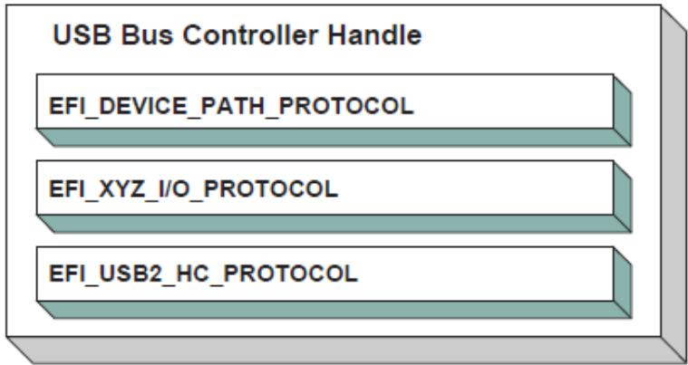  
Fig. 17.2: USB Bus Controller Handle

In the USB Bus Driver Design, the USB Bus Controller is managed by two drivers. One is USB Host Controller Driver, which consumes its parent bus EFI\_XYZ\_IO\_PROTOCOL, and produces EFI\_USB2\_HC\_PROTOCOL, and attaches it to the Bus Controller Handle. The other one is USB Bus Driver, which consumes EFI\_USB2\_HC\_PROTOCOL, and performs bus enumeration. Figure USB Bus Controller Handle shows protocols that are attached to the USB Bus Controller Handle. Detailed descriptions are presented in the following sections.

## 17.2.2 USB Bus Driver

USB Bus Driver performs periodic Enumeration on the USB Bus. In USB bus enumeration, when a new USB controller is found, the bus driver does some standard configuration for that new controller, and creates a device handle for it. The EFI\_USB\_IO\_PROTOCOL and EFI\_DEVICE\_PATH\_PROTOCOL are attached to the device handle so that the USB controller can be accessed. The USB Bus Driver is also responsible for connecting USB device drivers to USB controllers. When a USB device is detached from a USB bus, the USB bus driver will stop that USB controller, and uninstall the EFI\_USB\_IO\_PROTOCOL and the EFI\_DEVICE\_PATH\_PROTOCOL from that handle. A detailed description is given in USB Hot-Plug Event.

## 17.2.2.1 USB Bus Driver Entry Point

Like all other device drivers, the entry point for a USB Bus Driver attaches the EFI Driver Binding Protocol to image handle of the USB Bus Driver.

## 17.2.2.2 Driver Binding Protocol for USB Bus Drivers

The Driver Binding Protocol contains three services. These are: EFI\_DRIVER\_BINDING\_PROTOCOL.Supported(), EFI\_DRIVER\_BINDING\_PROTOCOL.Start() and EFI\_DRIVER\_BINDING\_PROTOCOL.Stop()

Supported() tests to see if the USB Bus Driver can manage a device handle. A USB Bus Driver can only manage a device handle that contains EFI\_USB2\_HC\_PROTOCOL.

The general idea is that the USB Bus Driver is a generic driver. Since there are several types of USB Host Controllers, an EFI\_USB2\_HC\_PROTOCOL is used to abstract the host controller interface. Actually, a USB Bus Driver only requires an EFI\_USB2\_HC\_PROTOCOL.

The Start() function tells the USB Bus Driver to start managing the USB Bus. In this function, the USB Bus Driver creates a device handle for the root hub, and creates a timer to monitor root hub connection changes.

The Stop() function tells the USB Bus Driver to stop managing a USB Host Bus Controller. The Stop() function simply deconfigures the devices attached to the root hub. The deconfiguration is a recursive process. If the device to be deconfigured is a USB hub, then all USB devices attached to its downstream ports will be deconfigured first, then itself. If all of the child devices handles have been destroyed then the EFI\_USB2\_HC\_PROTOCOL is closed. Finally, the Stop() unction will then place the USB Host Bus Controller in a quiescent state.

## 17.2.2.3 USB Hot-Plug Event

Hot-Plug is one of the most important features provided by USB. A USB bus driver implements this feature through two methods. There are two types of hubs defined in the USB specification. One is the USB root hub, which is implemented in the USB Host controller. A timer event is created for the root hub. The other one is a USB Hub. An event is created for each hub that is correctly configured. All these events are associated with the same trigger which is USB bus numerator.

When USB bus enumeration is triggered, the USB Bus Driver checks the source of the event. This is required because the root hub difers from standard USB hub in checking the hub status. The status of a root hub is retrieved through the EFI\_USB2\_HC\_PROTOCOL, and that status of a standard USB hub is retrieved through a USB control transfer. A detailed description of the enumeration process is presented in the next section.

## 17.2.2.4 USB Bus Enumeration

When the periodic timer or the hubs notify event is signaled, the USB Bus Driver will perform bus numeration.

1. Determine if the event is from the roothub or a standard USB hub.

2. Determine the port on which the connection change event occurred.

3. Determine if it is a connection change or a disconnection change.

4. If a connect change is detected, then a new device has been attached. Perform the following:

a – Reset and enable that port.

b – Configure the new device.

c – Parse the device configuration descriptors; get all of its interface descriptors (i.e., all USB controllers), and configure each interface.

d – Create a new handle for each interface (USB Controller) within the USB device. Attach the EFI Device Path Protocol, and EFI\_USB\_IO\_PROTOCOL to each handle.

e – Connect the USB Controller to a USB device driver with the Boot Service EFI\_BOOT\_SERVICES.ConnectController() if applicable.

f – If the USB Controller is a USB hub, create a Hub notify event which is associated with the USB Bus Enumerator, and submit an Asynchronous Interrupt Transfer Request (USB I/O Protocol).

5. If a disconnect change, then a device has been detached from the USB Bus. Perform the following:

a – If the device is not a USB Hub, then find and deconfigure the USB Controllers within the device. Then, stop each USB controller with EFI\_BOOT\_SERVICES.DisconnectController(), and uninstall the EFI\_DEVICE\_PATH\_PROTOCOL and the EFI\_USB\_IO\_PROTOCOL from the controller’s handle. If the EFI\_BOOT\_SERVICES.DisconnectController() call fails this process must be retried on a subsequent timer tick.

b – If the USB controller is USB hub controller, first find and deconfigure all its downstream USB devices (this is a recursive process, since there may be additional USB hub controllers on the downstream ports), then deconfigure USB hub controller itself.

## 17.2.3 USB Device Driver

A USB Device Driver manages a USB Controller and produces a device abstraction for use by a preboot application.

## 17.2.3.1 USB Device Driver Entry Point

Like all other device drivers, the entry point for a USB Device Driver attaches EFI Driver Binding Protocol to image handle of the USB Device Driver.

## 17.2.3.2 Driver Binding Protocol for USB DeviceDrivers

The Driver Binding Protocol contains three services. These are:

EFI\_DRIVER\_BINDING\_PROTOCOL.Supported(),

EFI\_DRIVER\_BINDING\_PROTOCOL.Start() and

EFI\_DRIVER\_BINDING\_PROTOCOL.Stop()

The Supported() tests to see if the USB Device Driver can manage a device handle. This function checks to see if a controller can be managed by the USB Device Driver. This is done by opening the See EFI\_USB\_IO\_PROTOCOL bus abstraction on the USB Controller handle, and using the EFI\_USB\_IO\_PROTOCOL services to determine if this USB Controller matches the profile that the USB Device Driver is capable of managing.

The Start() function tells the USB Device Driver to start managing a USB Controller. It opens the EFI\_USB\_IO\_PROTOCOL instance from the handle for the USB Controller. This protocol instance is used to perform USB packet transmission over the USB bus. For example, if the USB controller is USB keyboard, then the USB keyboard driver would produce and install the EFI\_SIMPLE\_TEXT\_INPUT\_PROTOCOL to the USB controller handle.

The Stop() function tells the USB Device Driver to stop managing a USB Controller. It removes the I/O abstraction protocol instance previously installed in Start() from the USB controller handle. It then closes the EFI\_USB\_IO\_PROTOCOL.

## 17.2.4 USB I/O Protocol

This section provides a detailed description of the EFI\_USB\_IO\_PROTOCOL. This protocol is used by code, typically drivers, running in the EFI boot services environment to access USB devices like USB keyboards, mice and mass storage devices. In particular, functions for managing devices on USB buses are defined here.

The interfaces provided in the EFI\_USB\_IO\_PROTOCOL are for performing basic operations to access USB devices. Typically, USB devices are accessed through the four diferent transfers types:

## Controller Transfer

Typically used to configure the USB device into an operation mode.

## Interrupt Transfer

Typically used to get periodic small amount of data, like USB keyboard and mouse.

## Bulk Transfer

Typically used to transfer large amounts of data like reading blocks from USB mass storage devices.

## Isochronous Transfer

Typically used to transfer data at a fixed rate like voice data.

This protocol also provides mechanisms to manage and configure USB devices and controllers.

## 17.2.5 EFI\_USB\_IO\_PROTOCOL

## Summary

Provides services to manage and communicate with USB devices.

## GUID

```c
#define EFI_USB_IO_PROTOCOL_GUID \
{0x2B2F68D6, 0x0CD2, 0x44cf, \
{0x8E, 0x8B, 0xBB, 0xA2, 0x0B, 0x1B, 0x5B, 0x75}}
```

## Protocol Interface Structure

```c
typedef struct _EFI_USB_IO_PROTOCOL {
    EFI_USB_IO_CONTROL_TRANSFER
    EFI_USB_IO_BULK_TRANSFER
    EFI_USB_IO_ASYNC_INTERRUPT_TRANSFER
    EFI_USB_IO_SYNC_INTERRUPT_TRANSFER
    EFI_USB_IO_ISOCHRONOUS_TRANSFER
    EFI_USB_IO_ASYNC_ISOCHRONOUS_TRANSFER
    EFI_USB_IO_GET_DEVICE_DESCRIPTION
    EFI_USB_IO_GET_CONFIG_DESCRIPTION
    EFI_USB_IO_GET_INTERFACE_DESCRIPTION
    EFI_USB_IO_GET_ENDPOINT_DESCRIPTION
    EFI_USB_IO_GET_STRING_DESCRIPTION
    EFI_USB_IO_GET_SUPPORTED_LANGUAGEES
    EFI_USB_IO_PORT_RESET
} EFI_USB_IO_PROTOCOL;
```

## Parameters

## UsbControlTransfer

Accesses the USB Device through USB Control Transfer Pipe. See the EFI\_USB\_IO\_PROTOCOL.UsbControlTransfer() function description.

## UsbBulkTransfer

Accesses the USB Device through USB Bulk Transfer Pipe. See the EFI\_USB\_IO\_PROTOCOL.UsbBulkTransfer() function description.

## UsbAsyncInterruptTransfer

Non-block USB interrupt transfer. See the EFI\_USB\_IO\_PROTOCOL.UsbAsyncInterruptTransfer() function description.

## UsbSyncInterruptTransfer

Accesses the USB Device through USB Synchronous Interrupt Transfer Pipe. See the EFI\_USB\_IO\_PROTOCOL.UsbSyncInterruptTransfer() function description.

## UsbIsochronousTransfer

Accesses the USB Device through USB Isochronous Transfer Pipe. See the EFI\_USB\_IO\_PROTOCOL.UsbIsochronousTransfer() function description.

## UsbAsyncIsochronousTransfer

Nonblock USB isochronous transfer. See the EFI\_USB\_IO\_PROTOCOL.UsbAsyncIsochronousTransfer() function description.

## UsbGetDeviceDescriptor

Retrieves the device descriptor of a USB device. See the EFI\_USB\_IO\_PROTOCOL.UsbGetDeviceDescriptor() function description.

## UsbGetConfigDescriptor

Retrieves the activated configuration descriptor of a USB device. See the EFI\_USB\_IO\_PROTOCOL.UsbGetConfigDescriptor() function description.

## UsbGetInterfaceDescriptor

Retrieves the interface descriptor of a USB Controller. See the EFI\_USB\_IO\_PROTOCOL.UsbGetInterfaceDescriptor() function description.

## UsbGetEndpointDescriptor

Retrieves the endpoint descriptor of a USB Controller. See the EFI\_USB\_IO\_PROTOCOL.UsbGetEndpointDescriptor() function description.

## UsbGetStringDescriptor

Retrieves the string descriptor inside a USB Device. See the EFI\_USB\_IO\_PROTOCOL.UsbGetStringDescriptor() function description.

## UsbGetSupportedLanguages

Retrieves the array of languages that the USB device supports. See the EFI\_USB\_IO\_PROTOCOL.UsbGetSupportedLanguages() function description.

## UsbPortReset

Resets and reconfigures the USB controller. See the EFI\_USB\_IO\_PROTOCOL.UsbPortReset() function description.

## Description

The EFI\_USB\_IO\_PROTOCOL provides four basic transfers types described in the USB 1.1 Specification. These include control transfer, interrupt transfer, bulk transfer and isochronous transfer. The EFI\_USB\_IO\_PROTOCOL also provides some basic USB device/controller management and configuration interfaces. A USB device driver uses the services of this protocol to manage USB devices.

## 17.2.6 EFI\_USB\_IO\_PROTOCOL.UsbControlTransfer()

## Summary

This function is used to manage a USB device with a control transfer pipe. A control transfer is typically used to perform device initialization and configuration.

## Prototype

```sql
typedef
EFI_STATUS
(EFIAPI *EFI_USB_IO_CONTROL_TRANSFER) (
    IN EFI_USB_IO_PROTOCOL    *This,
    IN EFI_USB_DEVICE_REQUEST    *Request,
    IN EFI_USB_DATA_DIRECTION    Direction,
    IN UINT32    Timeout,
    IN OUT VOID    *Data OPTIONAL,
    IN UINTN    DataLength OPTIONAL,
    OUT UINT32    *Status
);
```

## Parameters

## This

A pointer to the EFI\_USB\_IO\_PROTOCOL instance. Type EFI\_USB\_IO\_PROTOCOL is defined in USB I/O Protocol .

## Request

A pointer to the USB device request that will be sent to the USB device. See Related Definitions below.

Direction Indicates the data direction. See Related Definitions below for this type.

## Data

A pointer to the bufer of data that will be transmitted to USB device or received from USB device.

## Timeout

Indicating the transfer should be completed within this time frame. The units are in milliseconds. If Timeout is 0, then the caller must wait for the function to be completed until EFI\_SUCCESS or EFI\_DEVICE\_ERROR is returned.

## DataLength

The size, in bytes, of the data bufer specified by Data.

## Status

A pointer to the result of the USB transfer.

## Related Definitions

```txt
typedef enum {
    EfiUsbDataIn,
    EfiUsbDataOut,
    EfiUsbNoData
} EFI_USB_DATA_DIRECTION;

// Error code for USB Transfer Results
//
```

(continues on next page)

(continued from previous page)

<table><tr><td>#define EFI_USB_NOERROR</td><td>0x0000</td></tr><tr><td>#define EFI_USB_ERR_NOTEXECUTE</td><td>0x0001</td></tr><tr><td>#define EFI_USB_ERR_STALL</td><td>0x0002</td></tr><tr><td>#define EFI_USB_ERR_BUFFER</td><td>0x0004</td></tr><tr><td>#define EFI_USB_ERR_BABBLE</td><td>0x0008</td></tr><tr><td>#define EFI_USB_ERR_NAK</td><td>0x0010</td></tr><tr><td>#define EFI_USB_ERR_CRC</td><td>0x0020</td></tr><tr><td>#define EFI_USB_ERR_TIMEOUT</td><td>0x0040</td></tr><tr><td>#define EFI_USB_ERR_BITSTUFF</td><td>0x0080</td></tr><tr><td>#define EFI_USB_ERR_SYSTEM</td><td>0x0100</td></tr><tr><td colspan="2">typedef struct {</td></tr><tr><td>UINT8</td><td>RequestType;</td></tr><tr><td>UINT8</td><td>Request;</td></tr><tr><td>UINT16</td><td>Value;</td></tr><tr><td>UINT16</td><td>Index;</td></tr><tr><td>UINT16</td><td>Length;</td></tr><tr><td colspan="2">} EFI_USB_DEVICE_REQUEST;</td></tr></table>

## RequestType

The field identifies the characteristics of the specific request.

## Request

This field specifies the particular request.

## Value

This field is used to pass a parameter to USB device that is specific to the request.

## Index

This field is also used to pass a parameter to USB device that is specific to the request.

## Length

This field specifies the length of the data transferred during the second phase of the control transfer. If it is 0, then there is no data phase in this transfer.

## Description

This function allows a USB device driver to communicate with the USB device through a Control Transfer. There are three control transfer types according to the data phase. If the Direction parameter is EfiUsbNoData, Data is NULL, and DataLength is 0, then no data phase exists for the control transfer. If the Direction parameter is EfiUsbDataOut, then Data specifies the data to be transmitted to the device, and DataLength specifies the number of bytes to transfer to the device. In this case there is an OUT DATA stage followed by a SETUP stage. If the Direction parameter is EfiUsbDataIn, then Data specifies the data that is received from the device, and DataLength specifies the number of bytes to receive from the device. In this case there is an IN DATA stage followed by a SETUP stage. After the USB transfer has completed successfully, EFI\_SUCCESS is returned. If the transfer cannot be completed due to timeout, then EFI\_TIMEOUT is returned. If an error other than timeout occurs during the USB transfer, then EFI\_DEVICE\_ERROR is returned and the detailed status code is returned in Status.

## Status Codes Returned

<table><tr><td>EFI_SUCCESS</td><td>The control transfer has been successfully executed.</td></tr><tr><td>EFI_INVALID_PARAMETER</td><td>The parameter Direction is not valid.</td></tr><tr><td>EFI_INVALID_PARAMETER</td><td>Request is NULL.</td></tr><tr><td>EFI INVALID_PARAMETER</td><td>Status is NULL.</td></tr><tr><td>EFI_OUT_OF_RESOURCES</td><td>The request could not be completed due to a lack of resources.</td></tr><tr><td colspan="2">continues on next page</td></tr></table>

Table 17.13 – continued from previous page

<table><tr><td>EFI_TIMEOUT</td><td>The control transfer fails due to timeout.</td></tr><tr><td>EFI_DEVICE_ERROR</td><td>The transfer failed. The transfer status is returned in Status.</td></tr></table>

## 17.2.7 EFI\_USB\_IO\_PROTOCOL.UsbBulkTransfer()

## Summary

This function is used to manage a USB device with the bulk transfer pipe. Bulk Transfers are typically used to transfer large amounts of data to/from USB devices.

## Prototype

```txt
typedef
EFI_STATUS
(EFIAPI *EFI_USB_IO_BULK_TRANSFER) (
    IN EFI_USB_IO_PROTOCOL *This,
    IN UINT8 DeviceEndpoint,
    IN OUT VOID *Data,
    IN OUT UINTN *DataLength,
    IN UINTN Timeout,
    OUT UINT32 *Status
);
```

## Parameters

## This

A pointer to the EFI\_USB\_IO\_PROTOCOL instance. Type EFI\_USB\_IO\_PROTOCOL is defined in USB I/O Protocol .

## DeviceEndpoint

The destination USB device endpoint to which the device request is being sent. DeviceEndpoint must be between 0x01 and 0x0F or between 0x81 and 0x8F, otherwise EFI\_INVALID\_PARAMETER is returned. If the endpoint is not a BULK endpoint, EFI\_INVALID\_PARAMETER is returned. The MSB of this parameter indicates the endpoint direction. The number “1” stands for an IN endpoint, and “0” stands for an OUT endpoint.

## Data

A pointer to the bufer of data that will be transmitted to USB device or received from USB device.

## DataLength

On input, the size, in bytes, of the data bufer specified by Data. On output, the number of bytes that were actually transferred.

## Timeout

Indicating the transfer should be completed within this time frame. The units are in milliseconds. If Timeout is 0, then the caller must wait for the function to be completed until EFI\_SUCCESS or EFI\_DEVICE\_ERROR is returned.

## Status

This parameter indicates the USB transfer status.

## Description

This function allows a USB device driver to communicate with the USB device through Bulk Transfer. The transfer direction is determined by the endpoint direction. If the USB transfer is successful, then EFI\_SUCCESS is returned. If USB transfer cannot be completed within the Timeout frame, EFI\_TIMEOUT is returned. If an error other than timeout occurs during the USB transfer, then EFI\_DEVICE\_ERROR is returned and the detailed status code will be returned in the Status parameter.

## Status Codes Returned

<table><tr><td>EFI_SUCCESS</td><td>The bulk transfer has been successfully executed.</td></tr><tr><td>EFI_INVALID_PARAMETER</td><td>If DeviceEndpoint is not valid.</td></tr><tr><td>EFI_INVALID_PARAMETER</td><td>Data is NULL.</td></tr><tr><td>EFI_INVALID_PARAMETER</td><td>DataLength is NULL.</td></tr><tr><td>EFI_INVALID_PARAMETER</td><td>Status is NULL.</td></tr><tr><td>EFI_OUT_OF_RESOURCES</td><td>The request could not be completed due to a lack of resources.</td></tr><tr><td>EFI_TIMEOUT</td><td>The bulk transfer cannot be completed within Timeout timeframe.</td></tr><tr><td>EFI_DEVICE_ERROR</td><td>The transfer failed other than timeout, and the transfer status is returned in Status.</td></tr></table>

## 17.2.8 EFI\_USB\_IO\_PROTOCOL.UsbAsyncInterruptTransfer()

## Summary

This function is used to manage a USB device with an interrupt transfer pipe. An Asynchronous Interrupt Transfer is typically used to query a device’s status at a fixed rate. For example, keyboard, mouse, and hub devices use this type of transfer to query their interrupt endpoints at a fixed rate.

## Prototype

<table><tr><td colspan="2">typedef</td></tr><tr><td colspan="2">EFI_STATUS</td></tr><tr><td colspan="2">(EFIAPI *EFI_USB_IO_ASYNC_INTERRUPT_TRANSFER) (</td></tr><tr><td>IN EFI_USB_IO_PROTOCOL</td><td>*This,</td></tr><tr><td>IN UINT8</td><td>DeviceEndpoint,</td></tr><tr><td>IN BOOLEAN</td><td>IsNewTransfer,</td></tr><tr><td>IN UINTN</td><td>PollingInterval OPTIONAL,</td></tr><tr><td>IN UINTN</td><td>DataLength OPTIONAL,</td></tr><tr><td>IN EFI_ASYNC_USB_TRANSFER_CALLBACK</td><td>InterruptCallBack OPTIONAL,</td></tr><tr><td>IN VOID</td><td>*Context OPTIONAL</td></tr><tr><td>);</td><td></td></tr></table>

## Parameters

## This

A pointer to the EFI\_USB\_IO\_PROTOCOL instance. Type EFI\_USB\_IO\_PROTOCOL is defined in USB I/O Protocol .

## DeviceEndpoint

The destination USB device endpoint to which the device request is being sent. DeviceEndpoint must be between 0x01 and 0x0F or between 0x81 and 0x8F, otherwise EFI\_INVALID\_PARAMETER is returned. If the endpoint is not an INTERRUPT endpoint, EFI\_INVALID\_PARAMETER is returned. The MSB of this parameter indicates the endpoint direction. The number “1” stands for an IN endpoint, and “0” stands for an OUT endpoint.

## IsNewTransfer

If TRUE, a new transfer will be submitted to USB controller. If FALSE, the interrupt transfer is deleted from the device’s interrupt transfer queue. If TRUE, and an interrupt transfer exists for the target end point, then EFI\_INVALID\_PARAMETER is returned.

## PollingInterval

Indicates the periodic rate, in milliseconds, that the transfer is to be executed. This parameter is required when

IsNewTransfer is TRUE. The value must be between 1 to 255, otherwise EFI\_INVALID\_PARAMETER is returned. The units are in milliseconds.

## DataLength

Specifies the length, in bytes, of the data to be received from the USB device. This parameter is only required when IsNewTransfer is TRUE.

## Context

Data passed to the InterruptCallback function. This is an optional parameter and may be NULL.

## InterruptCallback

The Callback function. This function is called if the asynchronous interrupt transfer is completed. This parameter is required when IsNewTransfer is TRUE. See Related Definitions for the definition of this type.

## Related Definitions

```c
typedef
EFI_STATUS
(EFIAPI * EFI_ASYNC_USB_TRANSFER_CALLBACK) (
    IN VOID    *Data,
    IN UINTN    DataLength,
    IN VOID    *Context,
    IN UINT32    Status
);
```

## Data

Data received or sent via the USB Asynchronous Transfer, if the transfer completed successfully.

## DataLength

The length of Data received or sent via the Asynchronous Transfer, if transfer successfully completes.

## Context

Data passed from EFI\_USB\_IO\_PROTOCOL.UsbAsyncInterruptTransfer() request.

## Status

Indicates the result of the asynchronous transfer.

## Description

This function allows a USB device driver to communicate with a USB device with an Interrupt Transfer. Asynchronous Interrupt transfer is diferent than the other four transfer types because it is a nonblocking transfer. The interrupt endpoint is queried at a fixed rate, and the data transfer direction is always in the direction from the USB device towards the system.

If IsNewTransfer is TRUE, then an interrupt transfer is started at a fixed rate. The rate is specified by PollingInterval, the size of the receive bufer is specified by DataLength, and the callback function is specified by InterruptCallback. If IsNewTransfer is TRUE, and an interrupt transfer exists for the target end point, then EFI\_INVALID\_PARAMETER is returned.

If IsNewTransfer is FALSE, then the interrupt transfer is canceled.

## Status Codes Returned

<table><tr><td>EFI_SUCCESS</td><td>The asynchronous USB transfer request has been successfully executed.</td></tr><tr><td>EFI_DEVICE_ERROR</td><td>The asynchronous USB transfer request failed. When an interrupt transfer exists for the target end point and a new transfer is requested, EFI_INVALID_PARAMETER is returned.</td></tr></table>

## Examples

Below is an example of how an asynchronous interrupt transfer is used. The example shows how a USB Keyboard Device Driver can periodically receive data from interrupt endpoint.

```c
EFI_USB_IO_PROTOCOL *UsbIo;
EFI_STATUS Status;
USBalteBOARD_DEV *UsbKeyboardDevice;
EFI_USB_INTERRUPT_CALLBACK *KeyboardHandle;

Status = UsbIo->UsbAsyncInterruptTransfer(
    UsbIo,
    UsbKeyboardDevice->IntEndpointAddress, TRUE,
    UsbKeyboardDevice->IntPollingInterval, 8,
    KeyboardHandler,
    UsbKeyboardDevice
);

// The following is the InterruptCallback function. If there is
// any results got from Asynchronous Interrupt Transfer,
// this function will be called.
//
EFI_STATUS
KeyboardHandler(
    IN VOID *Data,
    IN UINTN DataLength,
    IN VOID *Context,
    IN UINT32 Result
)
{
    USBalteBOARD_DEV *UsbKeyboardDevice;
    UINTN I;

    if (EFI_ERROR(Result))
    {
    //
    // Something error during this transfer,
    // just to some recovery work
    //
    ...
    ...
    return EFI_DEVICE_ERROR;
}

UsbKeyboardDevice = (USBalteBOARD_DEV *)Context;
for(I = 0; I < DataLength; I++)
{
    ParsedData(Data[I]);
}
```

```c
return EFI_SUCCESS;
}
```

(continued from previous page)

## 17.2.9 EFI\_USB\_IO\_PROTOCOL.UsbSyncInterruptTransfer()

## Summary

This function is used to manage a USB device with an interrupt transfer pipe. The diference between EFI\_USB\_IO\_PROTOCOL.UsbAsyncInterruptTransfer() and UsbSyncInterruptTransfer() is that the Synchronous interrupt transfer will only be executed one time. Once it returns, regardless of its status, the interrupt request will be deleted in the system.

## Prototype

```sql
typedef
EFI_STATUS
(EFIAPI *EFI_USB_IO_SYNC_INTERRUPT_TRANSFER) (
    IN EFI_USB_IO_PROTOCOL *This,
    IN UINT8 DeviceEndpoint,
    IN OUT VOID *Data,
    IN OUT UINTN *DataLength,
    IN UINTN Timeout,
    OUT UINT32 *Status
);
```

## Parameters

## This

A pointer to the EFI\_USB\_IO\_PROTOCOL instance. Type EFI\_USB\_IO\_PROTOCOL is defined in USB I/O Protocol .

## DeviceEndpoint

The destination USB device endpoint to which the device request is being sent. DeviceEndpoint must be between 0x01 and 0x0F or between 0x81 and 0x8F, otherwise EFI\_INVALID\_PARAMETER is returned. If the endpoint is not an INTERRUPT endpoint, EFI\_INVALID\_PARAMETER is returned. The MSB of this parameter indicates the endpoint direction. The number “1” stands for an IN endpoint, and “0” stands for an OUT endpoint.

## Data

A pointer to the bufer of data that will be transmitted to USB device or received from USB device.

## DataLength

On input, then size, in bytes, of the bufer Data. On output, the amount of data actually transferred.

## Timeout

The time out, in milliseconds, for this transfer. If Timeout is 0, then the caller must wait for the function to be completed until EFI\_SUCCESS or EFI\_DEVICE\_ERROR is returned. If the transfer is not completed in this time frame, then EFI\_TIMEOUT is returned.

## Status

This parameter indicates the USB transfer status.

## Description

This function allows a USB device driver to communicate with a USB device through a synchronous interrupt transfer. The UsbSyncInterruptTransfer() difers from EFI\_USB\_IO\_PROTOCOL.UsbAsyncInterruptTransfer() described in the previous section in that it is a blocking transfer request. The caller must wait for the function return, either successfully or unsuccessfully.

## Status Codes Returned

<table><tr><td>EFI_SUCCESS</td><td>The sync interrupt transfer has been successfully executed.</td></tr><tr><td>EFI_INVALID_PARAMETER</td><td>The parameter DeviceEndpoint is not valid.</td></tr><tr><td>EFI_INVALID_PARAMETER</td><td>Data is NULL.</td></tr><tr><td>EFI_INVALID_PARAMETER</td><td>DataLength is NULL.</td></tr><tr><td>EFI_INVALID_PARAMETER</td><td>Status is NULL.</td></tr><tr><td>EFI_OUT_OF_RESOURCES</td><td>The request could not be completed due to a lack of resources.</td></tr><tr><td>EFI_TIMEOUT</td><td>The transfer cannot be completed within Timeout timeframe.</td></tr><tr><td>EFI_DEVICE_ERROR</td><td>The transfer failed other than timeout, and the transfer status is returned in Status.</td></tr></table>

## 17.2.10 EFI\_USB\_IO\_PROTOCOL.UsbIsochronousTransfer()

## Summary

This function is used to manage a USB device with an isochronous transfer pipe. An Isochronous transfer is typically used to transfer streaming data.

## Prototype

```txt
typedef
EFI_STATUS
(EFIAPI * EFI_USB_IO_ISOCHRONOUS_TRANSFER) (
    IN    EFI_USB_IO_PROTOCOL    *This,
    IN    UINT8    DeviceEndpoint,
    IN OUT VOID    *Data,
    IN    UINTN    DataLength,
    OUT    UINT32    *Status
);
```

## Parameters

## This

A pointer to the EFI\_USB\_IO\_PROTOCOL instance. Type EFI\_USB\_IO\_PROTOCOL is defined in USB I/O Protocol .

## DeviceEndpoint

The destination USB device endpoint to which the device request is being sent. DeviceEndpoint must be between 0x01 and 0x0F or between 0x81 and 0x8F, otherwise EFI\_INVALID\_PARAMETER is returned. If the endpoint is not an ISOCHRONOUS endpoint, EFI\_INVALID\_PARAMETER is returned. The MSB of this parameter indicates the endpoint direction. The number “1” stands for an IN endpoint, and “0” stands for an OUT endpoint.

## Data

A pointer to the bufer of data that will be transmitted to USB device or received from USB device.

## DataLength

The size, in bytes, of the data bufer specified by Data.

## Status

This parameter indicates the USB transfer status.

## Description

This function allows a USB device driver to communicate with a USB device with an Isochronous Transfer. The type of transfer is diferent than the other types because the USB Bus Driver will not attempt to perform error recovery if transfer fails. If the USB transfer is completed successfully, then EFI\_SUCCESS is returned. The isochronous transfer is designed to be completed within 1 USB frame time, if it cannot be completed, EFI\_TIMEOUT is returned. If the transfer fails due to other reasons, then EFI\_DEVICE\_ERROR is returned and the detailed error status is returned in Status. If the data length exceeds the maximum payload per USB frame time, then it is this function’s responsibility to divide the data into a set of smaller packets that fit into a USB frame time. If all the packets are transferred successfully, then EFI\_SUCCESS is returned.

## Status Codes Returned

<table><tr><td>EFI_SUCCESS</td><td>The isochronous transfer has been successfully executed.</td></tr><tr><td>EFI_INVALID_PARAMETER</td><td>The parameter DeviceEndpoint is not valid.</td></tr><tr><td>EFI_OUT_OF_RESOURCES</td><td>The request could not be completed due to a lack of resources.</td></tr><tr><td>EFI_TIMEOUT</td><td>The transfer cannot be completed within the 1 USB frame time.</td></tr><tr><td>EFI_DEVICE_ERROR</td><td>The transfer failed due to the reason other than timeout, The error status is returned in Status.</td></tr><tr><td>EFI_UNSUPPORTED</td><td>The implementation doesn’t support an Isochronous transfer function.</td></tr></table>

## 17.2.11 EFI\_USB\_IO\_PROTOCOL.UsbAsyncIsochronousTransfer()

## Summary

This function is used to manage a USB device with an isochronous transfer pipe. An asynchronous Isochronous transfer is a nonblocking USB isochronous transfer.

## Prototype

<table><tr><td colspan="2">typedef</td></tr><tr><td colspan="2">EFI_STATUS(EFIAPI *EFI_USB_IO_ASYNC_ISOCHRONOUS_TRANSFER) (IN EFI_USB_IO_PROTOCOL *This,IN UINT8 DeviceEndpoint,IN OUT VOID *Data,IN UINTN DataLength,IN EFI_ASYNC_USB_TRANSFER_CALLBACK IsochronousCallBack,IN VOID *Context OPTIONAL);</td></tr></table>

## Parameters

## This

A pointer to the EFI\_USB\_IO\_PROTOCOL instance. Type EFI\_USB\_IO\_PROTOCOL is defined in USB I/O Protocol .

## DeviceEndpoint

The destination USB device endpoint to which the device request is being sent. DeviceEndpoint must be between 0x01 and 0x0F or between 0x81 and 0x8F, otherwise EFI\_INVALID\_PARAMETER is returned. If the endpoint is not an ISOCHRONOUS endpoint, EFI\_INVALID\_PARAMETER is returned. The MSB of this parameter indicates the endpoint direction. The number “1” stands for an IN endpoint, and “0” stands for an OUT endpoint.

## Data

A pointer to the bufer of data that will be transmitted to USB device or received from USB device.

## DataLength

Specifies the length, in bytes, of the data to be sent to or received from the USB device.

## Context

Data passed to the IsochronousCallback() in Protocols\_USB\_Support.rst function. This is an optional parameter and may be NULL.

## IsochronousCallback

The IsochronousCallback() function. This function is called if the requested isochronous transfer is completed. See the Related Definitions section of the EFI\_USB\_IO\_PROTOCOL.UsbAsyncInterruptTransfer() function description.

## Description

This is an asynchronous type of USB isochronous transfer. If the caller submits a USB isochronous transfer request through this function, this function will return immediately. When the isochronous transfer completes, the Isochronous-Callback() function will be triggered, the caller can know the transfer results. If the transfer is successful, the caller can get the data received or sent in this callback function.

## Status Codes Returned

<table><tr><td>EFI_SUCCESS</td><td>The asynchronous isochronous transfer has been successfully submitted to the system.</td></tr><tr><td>EFI_INVALID_PARAMETER</td><td>The parameter DeviceEndpoint is not valid.</td></tr><tr><td>EFI_OUT_OF_RESOURCES</td><td>The request could not be submitted due to a lack of resources.</td></tr><tr><td>EFI_UNSUPPORTED</td><td>The implementation doesn’t support an asynchronous Isochronous transfer function.</td></tr></table>

## 17.2.12 EFI\_USB\_IO\_PROTOCOL.UsbGetDeviceDescriptor()

## Summary

Retrieves the USB Device Descriptor.

Prototype

```txt
typedef
EFI_STATUS
(EFIAPI *EFI_USB_IO_GET_DEVICE_DESCRIPTION) (
    IN EFI_USB_IO_PROTOCOL    *This,
    OUT EFI_USB_DEVICE_DESCRIPTION    *DeviceDescriptor
);
```

## Parameters

## This

A pointer to the EFI\_USB\_IO\_PROTOCOL instance. Type EFI\_USB\_IO\_PROTOCOL is defined in USB I/O Protocol .

## DeviceDescriptor

A pointer to the caller allocated USB Device Descriptor. See Related Definitions for a detailed description.

## Related Definitions

```c
//
// See USB1.1 for detail description.
//
typedef struct {
    UINT8 Length;
```

(continues on next page)

(continued from previous page)

```txt
(continued from previous page)
UINT8 DescriptorType;
UINT16 BcdUSB;
UINT8 DeviceClass;
UINT8 DeviceSubClass;
UINT8 DeviceProtocol;
UINT8 MaxPacketSize0;
UINT16 IdVendor;
UINT16 IdProduct;
UINT16 BcdDevice;
UINT8 StrManufacturer;
UINT8 StrProduct;
UINT8 StrSerialNumber;
UINT8 NumConfigurations;
} EFI_USB_DEVICE_DESCRIPTION;
```

## Description

This function is used to retrieve information about USB devices. This information includes the device class, subclass, and the number of configurations the USB device supports. If DeviceDescriptor is NULL, then EFI\_INVALID\_PARAMETER is returned. If the USB device descriptor is not found, then EFI\_NOT\_FOUND is returned. Otherwise, the device descriptor is returned in DeviceDescriptor, and EFI\_SUCCESS is returned.

## Status Codes Returned

<table><tr><td>EFI_SUCCESS</td><td>The device descriptor was retrieved successfully.</td></tr><tr><td>EFI_INVALID_PARAMETER</td><td>DeviceDescriptor is NULL.</td></tr><tr><td>EFI_NOT_FOUND</td><td>The device descriptor was not found. The device may not be configured.</td></tr></table>

## 17.2.13 EFI\_USB\_IO\_PROTOCOL.UsbGetConfigDescriptor()

## Summary

Retrieves the USB Device Configuration Descriptor.

## Prototype

```c
typedef
EFI_STATUS
(EFIAPI *EFI_USB_IO_GET_CONFIG_DESCRIPTION) (
    IN EFI_USB_IO_PROTOCOL    *This,
    OUT EFI_USB_CONFIG_DESCRIPTION    *ConfigurationDescriptor
);
```

## Parameters

## This

A pointer to the EFI\_USB\_IO\_PROTOCOL instance. Type EFI\_USB\_IO\_PROTOCOL is defined in USB I/O Protocol .

## ConfigurationDescriptor

A pointer to the caller allocated USB Active Configuration Descriptor. See Related Definitions for a detailed description.

## Related Definitions

```c
//
// See USB1.1 for detail description.
//
typedef struct {
    UINT8 Length;
    UINT8 DescriptorType;
    UINT16 TotalLength;
    UINT8 NumInterfaces;
    UINT8 ConfigurationValue;
    UINT8 Configuration;
    UINT8 Attributes;
    UINT8 MaxPower;
} EFI_USB_CONFIG_DESCRIPTION;
```

## Description

This function is used to retrieve the active configuration that the USB device is currently using. If ConfigurationDescriptor is NULL, then EFI\_INVALID\_PARAMETER is returned. If the USB controller does not contain an active configuration, then EFI\_NOT\_FOUND is returned. Otherwise, the active configuration is returned in ConfigurationDescriptor, and EFI\_SUCCESS is returned.

## Status Codes Returned

<table><tr><td>EFI_SUCCESS</td><td>The active configuration descriptor was retrieved successfully.</td></tr><tr><td>EFI_INVALID_PARAMETER</td><td>ConfigurationDescriptor is NULL.</td></tr><tr><td>EFI_NOT_FOUND</td><td>An active configuration descriptor cannot be found. The device may not be configured.</td></tr></table>

## 17.2.14 EFI\_USB\_IO\_PROTOCOL.UsbGetInterfaceDescriptor()

## Summary

Retrieves the Interface Descriptor for a USB Device Controller. As stated earlier, an interface within a USB device is equivalently to a USB Controller within the current configuration.

## Prototype

```txt
typedef
EFI_STATUS
(EFIAPI *EFI_USB_IO_GET_INTERFACE_DESCRIPTION) (
    IN EFI_USB_IO_PROTOCOL    *This,
    OUT EFI_USB_INTERFACE_DESCRIPTION    *InterfaceDescriptor
);
```

## Parameters

## This

A pointer to the EFI\_USB\_IO\_PROTOCOL instance. Type EFI\_USB\_IO\_PROTOCOL is defined in USB I/O Protocol .

## InterfaceDescriptor

A pointer to the caller allocated USB Interface Descriptor within the configuration setting. See Related Definitions for a detailed description.

## Related Definitions

```c
//
// See USB1.1 for detail description.
//
typedef struct {
    UINT8 Length;
    UINT8 DescriptorType;
    UINT8 InterfaceNumber;
    UINT8 AlternateSetting;
    UINT8 NumEndpoints;
    UINT8 InterfaceClass;
    UINT8 InterfaceSubClass;
    UINT8 InterfaceProtocol;
    UINT8 Interface;
} EFI_USB_INTERFACE_DESCRIPTION;
```

## Description

This function is used to retrieve the interface descriptor for the USB controller. If InterfaceDescriptor is NULL, then EFI\_INVALID\_PARAMETER is returned. If the USB controller does not contain an interface descriptor, then EFI\_NOT\_FOUND is returned. Otherwise, the interface descriptor is returned in InterfaceDescriptor, and EFI\_SUCCESS is returned.

## Status Codes Returned

<table><tr><td>EFI_SUCCESS</td><td>The interface descriptor retrieved successfully.</td></tr><tr><td>EFI_INVALID_PARAMETER</td><td>InterfaceDescriptor is NULL.</td></tr><tr><td>EFI_NOT_FOUND</td><td>The interface descriptor cannot be found. The device may not be correctly configured.</td></tr></table>

## 17.2.15 EFI\_USB\_IO\_PROTOCOL.UsbGetEndpointDescriptor()

## Summary

Retrieves an Endpoint Descriptor within a USB Controller.

## Prototype

```c
typedef
EFI_STATUS
(EFIAPI *EFI_USB_IO_GET_ENDPOINT_DESCRIPTION) (
    IN EFI_USB_IO_PROTOCOL    *This,
    IN UINT8    EndpointIndex,
    OUT EFI_USB_ENDPOINT_DESCRIPTION *EndpointDescriptor
);
```

## Parameters

## This

A pointer to the EFI\_USB\_IO\_PROTOCOL instance. Type EFI\_USB\_IO\_PROTOCOL is defined in USB I/O Protocol .

## EndpointIndex

Indicates which endpoint descriptor to retrieve. The valid range is 0..15.

## EndpointDescriptor

A pointer to the caller allocated USB Endpoint Descriptor of a USB controller. See Related Definitions for a detailed description.

## Related Definitions

```txt
//
// See USB1.1 for detail description.
//
typedef struct {
    UINT8 Length;
    UINT8 DescriptorType;
    UINT8 EndpointAddress;
    UINT8 Attributes;
    UINT16 MaxPacketSize;
    UINT8 Interval;
} EFI_USB_ENDPOINT_DESCRIPTION;
```

## Description

This function is used to retrieve an endpoint descriptor within a USB controller. If EndpointIndex is not in the range 0..15, then EFI\_INVALID\_PARAMETER is returned. If EndpointDescriptor is NULL, then EFI\_INVALID\_PARAMETER is returned. If the endpoint specified by EndpointIndex does not exist within the USB controller, then EFI\_NOT\_FOUND is returned. Otherwise, the endpoint descriptor is returned in EndpointDescriptor, and EFI\_SUCCESS is returned.

## Status Codes Returned

<table><tr><td>EFI_SUCCESS</td><td>The endpoint descriptor was retrieved successfully.</td></tr><tr><td>EFI_INVALID_PARAMETER</td><td>EndpointIndex is not valid.</td></tr><tr><td>EFI_INVALID_PARAMETER</td><td>EndpointDescriptor is NULL.</td></tr><tr><td>EFI_NOT_FOUND</td><td>The endpoint descriptor cannot be found. The device may not be correctly configured.</td></tr></table>

## Examples

The following code fragment shows how to retrieve all the endpoint descriptors from a USB controller.

```txt
EFI_USB_IO_PROTOCOL *UsbIo;
EFI_USB_INTERFACE_DESCRIPTION InterfaceDesc;
EFI_USB_ENDPOINT_DESCRIPTION EndpointDesc;
UINTN Index;

Status = UsbIo->GetInterfaceDescriptor (
    UsbIo,
    &InterfaceDesc
);

for(Index = 0; Index < InterfaceDesc.NumEndpoints; Index++) {
    Status = UsbIo->GetEndpointDescriptor(
    UsbIo,
    Index,
    &EndpointDesc
);
```

(continues on next page)

(continued from previous page)

## 17.2.16 EFI\_USB\_IO\_PROTOCOL.UsbGetStringDescriptor()

## Summary

Retrieves a string stored in a USB Device.

## Prototype

```txt
typedef
EFI_STATUS
(EFIAPI *EFI_USB_IO_GET_STRING_DESCRIPTION) (
    IN EFI_USB_IO_PROTOCOL    *This,
    IN UINT16    LangID,
    IN UINT8    StringID,
    OUT CHAR16    **String
);
```

## Parameters

## This

A pointer to the EFI\_USB\_IO\_PROTOCOL instance. Type EFI\_USB\_IO\_PROTOCOL is defined in USB I/O Protocol .

## LangID

The Language ID for the string being retrieved. See the EFI\_USB\_IO\_PROTOCOL.UsbGetSupportedLanguages() function description for a more detailed description.

## StringID

The ID of the string being retrieved.

## String

A pointer to a bufer allocated by this function with EFI\_BOOT\_SERVICES.AllocatePool() to store the string. If this function returns EFI\_SUCCESS, it stores the string the caller wants to get. The caller should release the string bufer with EFI\_BOOT\_SERVICES.FreePool() after the string is not used any more.

## Description

This function is used to retrieve strings stored in a USB device. The string to retrieve is identified by a language and an identifier. The language is specified by LangID, and the identifier is specified by StringID. If the string is found, it is returned in String, and EFI\_SUCCESS is returned. If the string cannot be found, then EFI\_NOT\_FOUND is returned. The string bufer is allocated by this function with AllocatePool(). The caller is responsible for calling FreePool() for String when it is no longer required.

## Status Codes Returned

<table><tr><td>EFI_SUCCESS</td><td>The string was retrieved successfully.</td></tr><tr><td>EFI_NOT_FOUND</td><td>The string specified by LangID and StringID was not found.</td></tr><tr><td>EFI_OUT_OF_RESOURCES</td><td>There are not enough resources to allocate the return buffer String.</td></tr></table>

## 17.2.17 EFI\_USB\_IO\_PROTOCOL.UsbGetSupportedLanguages()

## Summary

Retrieves all the language ID codes that the USB device supports.

## Prototype

```txt
typedef
EFI_STATUS
(EFIAPI *EFI_USB_IO_GET_SUPPORTED_LANGUAGES) (
    IN EFI_USB_IO_PROTOCOL    *This,
    OUT UINT16    **LangIDTable,
    OUT UINT16    *TableSize
);
```

## Parameters

## This

A pointer to the EFI\_USB\_IO\_PROTOCOL instance. Type EFI\_USB\_IO\_PROTOCOL is defined in USB I/O Protocol .

## LangIDTable

Language ID for the string the caller wants to get. This is a 16-bit ID defined by Microsoft. This bufer pointer is allocated and maintained by the USB Bus Driver, the caller should not modify its contents.

## TableSize

The size, in bytes, of the table LangIDTable.

## Description

Retrieves all the language ID codes that the USB device supports.

## Status Codes Returned

<table><tr><td>EFI_SUCCESS</td><td>The support languages were retrieved successfully.</td></tr></table>

## 17.2.18 EFI\_USB\_IO\_PROTOCOL.UsbPortReset()

## Summary

Resets and reconfigures the USB controller. This function will work for all USB devices except USB Hub Controllers.

## Prototype

```txt
typedef
EFI_STATUS
(EFIAPI *EFI_USB_IO_PORT_RESET) (
    IN EFI_USB_IO_PROTOCOL *This
);
```

## Parameters

## This

A pointer to the EFI\_USB\_IO\_PROTOCOL instance. Type EFI\_USB\_IO\_PROTOCOL is defined in USB I/O Protocol .

## Description

This function provides a reset mechanism by sending a RESET signal from the parent hub port. A reconfiguration process will happen (that includes setting the address and setting the configuration). This reset function does not change the bus topology. A USB hub controller cannot be reset using this function, because it would impact the downstream USB devices. So if the controller is a USB hub controller, then EFI\_INVALID\_PARAMETER is returned.

## Status Codes Returned

<table><tr><td>EFI_SUCCESS</td><td>The USB controller was reset.</td></tr><tr><td>EFI_INVALID_PARAMETER</td><td>If the controller specified by This is a USB hub.</td></tr><tr><td>EFI_DEVICE_ERROR</td><td>An error occurred during the reconfiguration process.</td></tr></table>

## 17.3 USB Function Protocol

This section describes the USB Function Protocol, enabling a USB Function device with a UEFI driver that implements the protocol to communicate with a a USB Host device.

The USB Function Protocol provides an I/O abstraction for a USB Controller operating in Function mode (also commonly referred to as Device, Peripheral, or Target mode) and the mechanisms by which the USB Function can communicate with the USB Host. It is used by other UEFI drivers or applications to perform data transactions and basic USB controller management over a USB Function port.

This simple protocol only supports USB 2.0 bulk transfers on systems with a single configuration and a single interface. It does not support isochronous or interrupt transfers, alternate interfaces, or USB 3.0 functionality. Future revisions of this protocol may support these or additional features.

## 17.3.1 EFI\_USBFN\_IO\_PROTOCOL

Summary

Provides basic data transactions and basic USB controller management for a USB Function port.

GUID

```c
// {32D2963A-FE5D-4f30-B633-6E5DC55803CC}
#define EFI_USBFN_IO_PROTOCOL_GUID \
{0x32d2963a, 0xfe5d, 0x4f30, \
{0xb6, 0x33, 0x6e, 0x5d, 0xc5, 0x58, 0x3, 0xcc}};
```

## Revision Number

```c
#define EFI_USBFN_IO_PROTOCOL_REVISION 0x00010001
```

## Protocol Interface Structure

```c
typedef struct _EFI_USBFN_IO_PROTOCOL {
    UINT32 Revision;
    EFI_USBFN_IO_DETECT_PORT DetectPort;
    EFI_USBFN_IO_CONFIGURE_ENABLE_ENDPOINTS \ ConfigureEnableEndpoints;
    EFI_USBFN_IO_GET_ENDPOINT_MAXPACKET_SIZE \ GetEndpointMaxPacketSize;
```

(continues on next page)

<table><tr><td>EFI_USBFN_IO_GET_DEVICE_INFO</td><td>GetDeviceInfo;</td></tr><tr><td>EFI_USBFN_IO_GET_VENDOR_ID_PRODUCT_ID</td><td>\</td></tr><tr><td></td><td>GetVendorIdProductId;</td></tr><tr><td>EFI_USBFN_IO_ABORT_TRANSFER</td><td>AbortTransfer;</td></tr><tr><td>EFI_USBFN_IO_GET_ENDPOINT_STALL_STATE</td><td>\</td></tr><tr><td></td><td>GetEndpointStallState;</td></tr><tr><td>EFI_USBFN_IO_SET_ENDPOINT_STALL_STATE</td><td>\</td></tr><tr><td></td><td>SetEndpointStallState;</td></tr><tr><td>EFI_USBFN_IO_EVENTHANDLER</td><td>EventHandler;</td></tr><tr><td>EFI_USBFN_IO_TRANSFER</td><td>Transfer;</td></tr><tr><td>EFI_USBFN_IO_GET_MAXTRANSFER_SIZE</td><td>\</td></tr><tr><td></td><td>GetMaxTransferSize;</td></tr><tr><td>EFI_USBFN_IO_ALLOCATE_TRANSFER_BUFFER</td><td>AllocateTransferBuffer;</td></tr><tr><td>EFI_USBFN_IO_FREE_TRANSFER_BUFFER</td><td>FreeTransferBuffer;</td></tr><tr><td>EFI_USBFN_IO_START_CONTROLLER</td><td>StartController;</td></tr><tr><td>EFI_USBFN_IO_STOP_CONTROLLER</td><td>StopController;</td></tr><tr><td>EFI_USBFN_IO_SET_ENDPOINT_POLICY</td><td>SetEndpointPolicy;</td></tr><tr><td>EFI_USBFN_IO_GET_ENDPOINT_POLICY</td><td>GetEndpointPolicy;</td></tr><tr><td colspan="2">} EFI_USBFN_IO_PROTOCOL;</td></tr></table>

## Parameters

The revision to which the EFI\_USBFN\_IO\_PROTOCOL adheres. All future revisions must be backwards compatible. If a future version is not backwards compatible, a diferent GUID must be used.

DetectPort Returns information about the USB port type. See Related Definitions EFI\_USBFN\_IO\_PROTOCOL.DetectPort(), for more details.

ConfigureEnableEndpoints Initializes all endpoints based on supplied device and configuration descriptors. Enables the device by setting the run/stop bit.

GetEndpointMaxPacketSize Returns the maximum packet size of the specified endpoint.

GetDeviceInfo Returns device specific information based on the supplied identifier as a Unicode string.

GetVendorIdProductId Returns the vendor-id and product-id of the device.

AbortTransfer Aborts the transfer on the specified endpoint.

GetEndpointStallState Returns the stall state on the specified endpoint.

SetEndpointStallState Sets or clears the stall state on the specified endpoint.

EventHandler This function is called repeatedly to get information on USB bus states, receive-completion and transmitcompletion events on the endpoints, and notification on setup packet on endpoint 0.

## Transfer

This function handles transferring data to or from the host on the specified endpoint, depending on the direction specified.

## GetMaxTransferSize

The maximum supported transfer size in bytes.

## AllocateTransferBufer

Allocates a transfer bufer of the specified size that satisfies the controller requirements.

## FreeTransferBufer

Deallocates the memory allocated for the transfer bufer by EFI\_USBFN\_IO\_PROTOCOL.AllocateTransferBufer() function.

## StartController

This function initializes the hardware and the internal data structures. The port must not be activated by this function.

## StopController

This function disables the device by deactivating the port.

## SetEndpointPolicy

This function sets the configuration policy for the specified non-control endpoint. There are a few calling restrictions for this function. See the EFI\_USBFN\_IO\_PROTOCOL.SetEndpointPolicy() function definition for more details.

## GetEndpointPolicy

This functions retrieves the configuration policy for the specified non-control endpoint.

## Description

This protocol provides basic data transactions and USB controller management for a USB Function port. It provides a lightweight communication mechanism between a USB Host and a USB Function in the UEFI environment.

Like other UEFI device drivers, the entry point for a USB function driver attaches EFI\_DRIVER\_BINDING\_PROTOCOL to image handle of EFI\_USBFN\_IO\_PROTOCOL driver.

The driver binding protocol contains three services, Supported, Start and Stop.

The Supported function must test to see if this driver supports a given controller.

The Start function must supply power to the USB controller if needed, initialize hardware and internal data structures, and then return. The port must not be activated by this function.

The Stop function must disable the USB controller and power it of if needed.

## 17.3.2 EFI\_USBFN\_IO\_PROTOCOL.DetectPort()

## Summary

Returns information about what USB port type was attached.

Prototype

```txt
typedef
EFI_STATUS
(EFIAPI * EFI_USBFN_IO_DETECT_PORT) (
    IN EFI_USBFN_IO_PROTOCOL    *This,
    OUT EFI_USBFN_PORT_TYPE    *PortType
);
```

## Parameters

## This

A pointer to the EFI\_USBFN\_IO\_PROTOCOL instance.

## PortType

Returns the USB port type. Refer to the Related Definitions for this function below for details.

## Description

Returns information about the USB port type attached. Refer to the Related Definitions below for further details.

## Status Codes Returned

<table><tr><td>EFI_SUCCESS</td><td>The function returned successfully.</td></tr><tr><td>EFI_INVALID_PARAMETER</td><td>A parameter is invalid.</td></tr><tr><td>EFI_DEVICE_ERROR</td><td>The physical device reported an error.</td></tr><tr><td>EFI_NOT_READY</td><td>The physical device is busy or not ready to process this request or there is no USB port attached to the device</td></tr></table>

## Related Definitions

```c
typedef enum _EFI_USBFN_PORT_TYPE {
    EfiUsbUnknownPort = 0,
    EfiUsbStandardDownstreamPort,
    EfiUsbChargingDownstreamPort,
    EfiUsbDedicatedChargingPort,
    EfiUsbInvalidDedicatedChargingPort
} EFI_USBFN_PORT_TYPE;
```

## Unknown Port

Driver internal default port type, this is never returned by the driver with a success status code.

## Standard Downstream Port

Standard USB host; refer to USB Battery Charging Specification, Revision 1.2 in Appendix Q.1 for details and the link.

## Charging Downstream Port

Standard USB host with special charging properties; refer to USB Battery Charging Specification, Revision 1.2 in Appendix Q.1 \` for the details and link.

## Dedicated Charging Port

A wall-charger, not USB host; refer to USB Battery Charging Specification, Revision 1.2, in Appendix Q.1 for details and the link.

## Invalid Dedicated Charging Port -

Neither a USB host nor a dedicated charging port as defined by the USB Battery Charging Specification, Revision 1.2. in Appendix Q.1 for details and the link.) An example is a USB charger that raises the voltages on D+/D-, causing the charger to look like an SDP even though it will never issue a setup packet to the upstream facing port.

## 17.3.3 EFI\_USBFN\_IO\_PROTOCOL.ConfigureEnableEndpoints()

## Summary

Configures endpoints based on supplied device and configuration descriptors.

## Prototype

```txt
typedef
EFI_STATUS
(EFIAPI * EFI_USBFN_IO_CONFIGURE_ENABLE_ENDPOINTS) (
    IN EFI_USBFN_IO_PROTOCOL    *This,
    IN EFI_USB_DEVICE_INFO    *DeviceInfo
);
```

## Parameters

## This

A pointer to the EFI\_USBFN\_IO\_PROTOCOL instance.

## DeviceInfo

A pointer to EFI\_USBFN\_DEVICE\_INFO instance. Refer to the Related Definitions for this function below for details.

## Description

Assuming that the hardware has already been initialized, this function configures the endpoints using the device infor mation supplied by DeviceInfo, activates the port, and starts receiving USB events.

This function must ignore the bMaxPacketSize0 field of the Standard Device Descriptor and the wMaxPacketSize field of the Standard Endpoint Descriptor that are made available through DeviceInfo.

## Status Codes Returned

<table><tr><td>EFI_SUCCESS</td><td>The function returned successfully.</td></tr><tr><td>EFI_INVALID_PARAMETER</td><td>A parameter is invalid.</td></tr><tr><td>EFI_DEVICE_ERROR</td><td>The physical device reported an error.</td></tr><tr><td>EFI_NOT_READY</td><td>The physical device is busy or not ready to process this request.</td></tr><tr><td>EFI_OUT_OF_RESOURCES</td><td>The request could not be completed due to lack of resources.</td></tr></table>

## Related Definitions

```c
typedef struct {
    EFI_USB_INTERFACE_DESCRIPTION *InterfaceDescriptor;
    EFI_USB_ENDPOINT_DESCRIPTION **EndpointDescriptorTable;
} EFI_USB_INTERFACE_INFO;

typedef struct {
    EFI_USB_CONFIG_DESCRIPTION *ConfigDescriptor*;
    EFI_USB_INTERFACE_INFO **InterfaceInfoTable*;
} EFI_USB_CONFIG_INFO;

typedef struct {
    EFI_USB_DEVICE_DESCRIPTION *DeviceDescriptor*;
    EFI_USB_CONFIG_INFO **ConfigInfoTable*;
} EFI_USB_DEVICE_INFO;
```

USB\_DEVICE\_DESCRIPTOR, USB\_CONFIG\_DESCRIPTOR, USB\_INTERFACE\_DESCRIPTOR, and USB\_ENDPOINT\_DESCRIPTOR are defined in Section USB I/O Protocol.

## 17.3.4 EFI\_USBFN\_IO\_PROTOCOL.GetEndpointMaxPacketSize()

## Summary

Returns the maximum packet size of the specified endpoint type for the supplied bus speed.

## Prototype

```txt
typedef
EFI_STATUS
(EFIAPI * EFI_USBFN_IO_GET_ENDPOINT_MAXPACKET_SIZE) (
    IN EFI_USBFN_IO_PROTOCOL    *This,
    IN EFI_USB_ENDPOINT_TYPE    EndpointType,
    IN EFI_USB_BUS_SPEED    BusSpeed,
    OUT UINT16    *MaxPacketSize
);
```

## Parameters

## This

A pointer to the EFI\_USBFN\_IO\_PROTOCOL instance.

## EndpointType

Endpoint type as defined as EFI\_USB\_ENDPOINT\_TYPE in the Related Definitions for this function below for details.

## BusSpeed

Bus speed as defined as EFI\_USB\_BUS\_SPEED in the Related Definitions for the EventHandle function for details.

## MaxPacketSize

The maximum packet size, in bytes, of the specified endpoint type.

## Description

Returns the maximum packet size of the specified endpoint type for the supplied bus speed. If the BusSpeed is Usb-BusSpeedUnknown, the maximum speed the underlying controller supports is assumed.

This protocol currently does not support isochronous or interrupt transfers. Future revisions of this protocol may eventually support it.

## Status Codes Returned

<table><tr><td>EFI_SUCCESS</td><td>The function returned successfully.</td></tr><tr><td>EFI_INVALID_PARAMETER</td><td>A parameter is invalid.</td></tr><tr><td>EFI_DEVICE_ERROR</td><td>The physical device reported an error.</td></tr><tr><td>EFI_NOT_READY</td><td>The physical device is busy or not ready to process this request.</td></tr></table>

## Related Definitions

```txt
typedef enum _EFI_USB_ENDPOINT_TYPE
{
    UsbEndpointControl = 0x00,
    // UsbEndpointIsochronous = 0x01,
```

(continues on next page)

```txt
UsbEndpointBulk = 0x02,
// UsbEndpointInterrupt = 0x03
} EFI_USB_ENDPOINT_TYPE;
```

(continued from previous page)

## 17.3.5 EFI\_USBFN\_IO\_PROTOCOL.GetDeviceInfo()

## Summary

Returns device specific information based on the supplied identifier as a Unicode string.

## Prototype

```txt
typedef
EFI_STATUS
(EFIAPI * EFI_USBFN_IO_GET_DEVICE_INFO) (
    IN EFI_USBFN_IO_PROTOCOL    *This,
    IN EFI_USBFN_DEVICE_INFO_ID    Id,
    IN OUT UINTN    *BufferSize,
    OUT VOID    *Buffer OPTIONAL
);
```

## Parameters

## This

A pointer to the EFI\_USBFN\_IO\_PROTOCOL instance.

## Id

The requested information id. Refer to the Related Definitions for this function below for details.

## BuferSize

On input, the size of the Bufer in bytes. On output, the amount of data returned in Bufer in bytes.

## Bufer

A pointer to a bufer to return the requested information as a Unicode string.

## Description

Returns device specific information based on the supplied identifier as a Unicode string. If the supplied Bufer isn’t large enough, or is NULL, the method fails with EFI\_BUFFER\_TOO\_SMALL and the required size is returned through BuferSize. All returned strings are in Unicode format.

An Id of EfiUsbDeviceInfoUnknown is treated as an invalid parameter.

## Status Codes Returned

<table><tr><td>EFI_SUCCESS</td><td>The function returned successfully.</td></tr><tr><td>EFI_INVALID_PARAMETER</td><td></td></tr><tr><td></td><td>One or more of the following conditions is TRUE:BufferSize is NULL.BufferSize $^1$ is not 0 and Buffer is NULL.Id in invalid.</td></tr><tr><td>EFI_DEVICE_ERROR</td><td>The physical device reported an error.</td></tr><tr><td>EFI_NOT_READY</td><td>The physical device is busy or not ready to process this request.</td></tr></table>

continues on next page

```txt
typedef
EFI_STATUS
(EFIAPI * EFI_USBFN_IO_GET_VENDOR_ID_PRODUCT_ID) (
    IN EFI_USBFN_IO_PROTOCOL    *This,
    OUT UINT16    *Vid,
    OUT UINT16    *Pid
);
```

```txt
A pointer to the EFI_USBFN_IO_PROTOCOL instance.
```

Table 17.28 – continued from previous page

<table><tr><td>EFI_BUFFER_TOO_SMALL</td><td>The buffer is too small to hold the buffer. $^1$ BufferSize has been updated with the size needed to hold the request string.</td></tr></table>

## Related Definitions

```c
typedef enum _EFI_USBFN_DEVICE_INFO_ID
{
    EfiUsbDeviceInfoUnknown = 0,
    EfiUsbDeviceInfoSerialNumber,
    EfiUsbDeviceInfoManufacturerName,
    EfiUsbDeviceInfoProductName
} EFI_USBFN_DEVICE_INFO_ID;
```

## 17.3.6 EFI\_USBFN\_IO\_PROTOCOL.GetVendorIdProductId()

Summary

Returns the vendor-id and product-id of the device.

Prototype

## Parameters

This

Vid

Returned vendor-id of the device.

Pid

Returned product-id of the device.

## Description

Returns vendor-id and product-id of the device.

Status Codes Returned

<table><tr><td>EFI_SUCCESS</td><td>The function returned successfully.</td></tr><tr><td>EFI_INVALID_PARAMETER</td><td>A parameter is invalid.</td></tr><tr><td>EFI_NOT_FOUND</td><td>Unable to return the vendor-id or the product-id</td></tr></table>

## Related Definitions

Vendor IDs (VIDs) are 16-bit numbers that represent the device’s vendor company and are assigned and maintained by the USB-IF. Product IDs (PIDs) are 16-bit numbers assigned by each vendor to the device.

## 17.3.7 EFI\_USBFN\_IO\_PROTOCOL.AbortTransfer()

## Summary

Aborts the transfer on the specified endpoint.

## Prototype

```txt
typedef
EFI_STATUS
(EFIAPI * EFI_USBFN_IO_ABORT_TRANSFER) (
    IN EFI_USBFN_IO_PROTOCOL    *This,
    IN UINT8    EndpointIndex,
    IN EFI_USBFN_ENDPOINT_DIRECTION   Direction
);
```

## Parameters

## This

A pointer to the EFI\_USBFN\_IO\_PROTOCOL instance.

## EndpointIndex

Indicates the endpoint on which the ongoing transfer needs to be canceled.

## Direction

Direction of the endpoint. Refer to the Related Definitions for this function (below) for details.

## Description

Aborts the transfer on the specified endpoint. This function should fail with EFI\_INVALID\_PARAMETER if the specified direction is incorrect for the endpoint.

## Status Codes Returned

<table><tr><td>EFI_SUCCESS</td><td>The function returned successfully.</td></tr><tr><td>EFI_INVALID_PARAMETER</td><td>A parameter is invalid.</td></tr><tr><td>EFI_DEVICE_ERROR</td><td>The physical device reported an error.</td></tr><tr><td>EFI_NOT_READY</td><td>The physical device is busy or not ready to process this request.</td></tr></table>

## Related Definitions

```c
typedef enum _EFI_USBFN_ENDPOINT_DIRECTION
{
    EfiUsbEndpointDirectionHostOut = 0,
    EfiUsbEndpointDirectionHostIn,
    EfiUsbEndpointDirectionDeviceTx = EfiUsbEndpointDirectionHostIn,
    EfiUsbEndpointDirectionDeviceRx = EfiUsbEndpointDirectionHostOut
} EFI_USBFN_ENDPOINT_DIRECTION;
```

## 17.3.8 EFI\_USBFN\_IO\_PROTOCOL.GetEndpointStallState()

## Summary

Returns the stall state on the specified endpoint.

## Prototype

```txt
typedef
EFI_STATUS
(EFIAPI * EFI_USBFN_IO_GET_ENDPOINT_STALL_STATE) (
    IN EFI_USBFN_IO_PROTOCOL    *This,
    IN UINT8    EndpointIndex,
    IN EFI_USBFN_ENDPOINT_DIRECTION    Direction,
    IN OUT BOOLEAN    *State
);
```

## Parameters

## This

A pointer to the EFI\_USBFN\_IO\_PROTOCOL instance.

## EndpointIndex

Indicates the endpoint.

## Direction

```txt
Direction of the endpoint. Refer to the Related Definitions for details see EFI_USBFN_IO_PROTOCOL.AbortTransfer().
```

## State

Boolean, true value indicates that the endpoint is in a stalled state, false otherwise.

## Description

Returns the stall state on the specified endpoint. This function would fail with EFI\_INVALID\_PARAMETER if the specified direction is incorrect for the endpoint.

## Status Codes Returned

<table><tr><td>EFI_SUCCESS</td><td>The function returned successfully.</td></tr><tr><td>EFI_INVALID_PARAMETER</td><td>A parameter is invalid.</td></tr><tr><td>EFI_DEVICE_ERROR</td><td>The physical device reported an error.</td></tr><tr><td>EFI_NOT_READY</td><td>The physical device is busy or not ready to process this request.</td></tr></table>

## 17.3.9 EFI\_USBFN\_IO\_PROTOCOL.SetEndpointStallState()

## Summary

Sets or clears the stall state on the specified endpoint.

## Prototype

```c
typedef
EFI_STATUS
(EFIAPI * EFI_USBFN_IO_SET_ENDPOINT_STALL_STATE) (
    IN EFI_USBFN_IO_PROTOCOL    *This,
    IN UINT8    EndpointIndex,
```

(continues on next page)

<table><tr><td>IN EFI_USBFN_ENDPOINT_DIRECTION</td><td>Direction,</td></tr><tr><td>IN BOOLEAN</td><td>State</td></tr><tr><td>);</td><td></td></tr></table>

## Parameters

## This

A pointer to the EFI\_USBFN\_IO\_PROTOCOL instance.

## EndpointIndex

Indicates the endpoint.

## Direction

Direction of the endpoint. Refer to the Related Definitions for the EFI\_USBFN\_IO\_PROTOCOL.ABORTTRANSFER() function for details.

## State

Requested stall state on the specified endpoint. TRUE value causes the endpoint to stall; FALSE value clears an existing stall.

## Description

Sets or clears the stall state on the specified endpoint. This function would fail with EFI\_INVALID\_PARAMETER if the specified direction is incorrect for the endpoint.

## Status Codes Returned

<table><tr><td>EFI_SUCCESS</td><td>The function returned successfully.</td></tr><tr><td>EFI_INVALID_PARAMETER</td><td>A parameter is invalid.</td></tr><tr><td>EFI_DEVICE_ERROR</td><td>The physical device reported an error.</td></tr><tr><td>EFI_NOT_READY</td><td>The physical device is busy or not ready to process this request.</td></tr></table>

## 17.3.10 EFI\_USBFN\_IO\_PROTOCOL.EventHandler()

## Summary

This function is called repeatedly to get information on USB bus states, receive-completion and transmit-completion events on the endpoints, and notification on setup packet on endpoint 0.

## Prototype

```sql
typedef
EFI_STATUS
(EFIAPI * EFI_USBFN_IO_EVENTHANDLER) (
    IN EFI_USBFN_IO_PROTOCOL    *This,
    OUT EFI_USBFN_MESSAGE    *Message,
    IN OUT UINTN    *PayloadSize,
    OUT EFI_USBFN_MESSAGE_PAYLOAD    *Payload
);
```

## Parameters

## This

A pointer to the EFI\_USBFN\_IO\_PROTOCOL instance.

## Message

Indicates the event that initiated this notification. Refer to the Related Definitions for this function (below) for all possible types.

## PayloadSize

On input, the size of the memory pointed by Payload. On output, the amount of data returned in Payload.

## Payload

A pointer to EFI\_USBFN\_MESSAGE\_PAYLOAD instance to return additional payload for current message. Refer to the Related Definitions for this function (below) for details on the type.

## Description

This function is called repeatedly to get information on USB bus states, receive-completion and transmitcompletion events on the endpoints, and notification on setup packet on endpoint 0. A class driver must call EFI\_USBFN\_IO\_PROTOCOL.EventHandler() repeatedly to receive updates on the transfer status and number of bytes transferred on various endpoints. Refer to Figure Sequence of Operations with Endpoint Policy Changes for details.

A few messages have an associated payload that is returned in the supplied bufer. The following table describes various messages and their payload:

Table 17.33: Payload Associated Messages and Descriptions

<table><tr><td>Message</td><td>Payload</td><td>Description</td></tr><tr><td>EfiUsbMs-gSetupPacket</td><td>EFI_USB_DEVICE_REQUEST</td><td>SETUP packet was received.</td></tr><tr><td>EfiUsbMs-gEndpointStatusChangedRx</td><td>EFI_USBFN_TRANSFER_RESULT</td><td>Some of the requested data has been transmitted to the host. It is the responsibility of the class driver to determine if any remaining data needs to be re-sent. The Buffer supplied to EFI_USBFN_IO_PROTOCOL.Transfer() must be same as the Buffer field of the payload.</td></tr><tr><td>EfiUsbMs-gEndpointStatusChangedTx</td><td>EFI_USBFN_TRANSFER_RESULT</td><td>Some of the requested data has been received from the host. It is the responsibility of the class driver to determine if it needs to wait for any remaining data. The Buffer supplied to EFI_USBFN_IO_PROTOCOL.Transfer() must be same as the Buffer field of the payload.</td></tr><tr><td>EfiUsbMsg-BusEventReset</td><td>None</td><td>A RESET bus event was signaled.</td></tr><tr><td>EfiUsbMsg-BusEventDetach</td><td>None</td><td>A DETACH bus event was signaled.</td></tr><tr><td>EfiUsbMsg-BusEventAttach</td><td>None</td><td>An ATTACH bus event was signaled.</td></tr><tr><td>EfiUsbMsg-BusEventSuspend</td><td>None</td><td>A SUSPEND bus event was signaled.</td></tr></table>

continues on next page

Table 17.33 – continued from previous page

<table><tr><td>EfiUsbMsg-BusEventResume</td><td>None</td><td>A RESUME bus event was signaled.</td></tr><tr><td>EfiUsbMsg-BusEventSpeed</td><td>EFI_USB_BUS_SPEED</td><td>A Bus speed update was signaled.</td></tr></table>

## Status Codes Returned

<table><tr><td>EFI_SUCCESS</td><td>The function returned successfully.</td></tr><tr><td>EFI_INVALID_PARAMETERE</td><td>A parameter is invalid.</td></tr><tr><td>EFI_DEVICE_ERROR</td><td>The physical device reported an error.</td></tr><tr><td>EFI_NOT_READY</td><td>The physical device is busy or not ready to process this request.</td></tr><tr><td>EFI_BUFFER_TOO_SMALL</td><td>The Supplied buffer is not large enough to hold the message payload.</td></tr></table>

## Related Definitions

```c
typedef enum _EFI_USBFN_MESSAGE {
    //
    // Nothing
    //
    EfiUsbMsgNone = 0,
    //
    // SETUP packet is received, returned Buffer contains
    // EFI_USB_DEVICE_REQUEST struct
    //
    EfiUsbMsgSetupPacket,
    //
    // Indicates that some of the requested data has been
    // received from the host. It is the responsibility of the
    // class driver to determine if it needs to wait for any
    // remaining data. Returned Buffer contains
    // EFI_USBFN_TRANSFER_RESULT struct containing endpoint
    // number, transfer status and count of bytes received.
    //
    EfiUsbMsgEndpointStatusChangedRx,
    //
    // Indicates that some of the requested data has been
    // transmitted to the host. It is the responsibility of the
    // class driver to determine if anyremaining data needs to be
    // resent. Returned Buffer contains
    // EFI_USBFN_TRANSFER_RESULT struct containing endpoint
    // number, transferstatus andcount of bytes sent.
    //
    EfiUsbMsgEndpointStatusChangedTx,
    //
    // DETACH bus event signaled
    //
    EfiUsbMsgBusEventDetach,
```  
(continues on next page)

(continued from previous page)

```c
//
// ATTACH bus event signaled
//
EfiUsbMsgBusEventAttach,
//
// RESET bus event signaled
//
EfiUsbMsgBusEventReset,
//
// SUSPEND bus event signaled
//
EfiUsbMsgBusEventSuspend,
//
// RESUME bus event signaled
//
EfiUsbMsgBusEventResume,
//
// Bus speed updated, returned buffer indicated bus speed
// using following enumeration named EFI_USB_BUS_SPEED
//
EfiUsbMsgBusEventSpeed
} EFI_USBFN_MESSAGE;

typedef enum _EFI_USBFN_TRANSFER_STATUS {
    UsbTransferStatusUnknown = 0,
    UsbTransferStatusComplete,
    UsbTransferStatusAborted,
    UsbTransferStatusActive,
    UsbTransferStatusNone
} EFI_USBFN_TRANSFER_STATUS;

typedef struct _EFI_USBFN_TRANSFER_RESULT {
    UINTN BytesTransferred;
    EFI_USBFN_TRANSFER_STATUS TransferStatus;
    UINT8 EndpointIndex;
    EFI_USBFN_ENDPOINT_DIRECTION Direction;
    VOID *Buffer;
} EFI_USBFN_TRANSFER_RESULT;

typedef enum _EFI_USB_BUS_SPEED {
    UsbBusSpeedUnknown = 0,
    UsbBusSpeedLow,
    UsbBusSpeedFull,
    UsbBusSpeedHigh,
    UsbBusSpeedSuper,
    UsbBusSpeedMaximum = UsbBusSpeedSuper
} EFI_USB_BUS_SPEED;

typedef union _EFI_USBFN_MESSAGE_PAYLOAD {
    EFI_USB_DEVICE_REQUEST udr;
    EFI_USBFN_TRANSFER_RESULT utr;
    EFI_USB_BUS_SPEED ubs;
```

(continues on next page)

} EFI\_USBFN\_MESSAGE\_PAYLOAD;

(continued from previous page)

## 17.3.11 EFI\_USBFN\_IO\_PROTOCOL.Transfer()

## Summary

This function handles transferring data to or from the host on the specified endpoint, depending on the direction specified.

## Prototype

```txt
typedef
EFI_STATUS
(EFIAPI *EFI_USBFN_IO_TRANSFER) (
    IN EFI_USBFN_IO_PROTOCOL    *This,
    IN UINT8    EndpointIndex,
    IN EFI_USBFN_ENDPOINT_DIRECTION    Direction,
    IN OUT UINTN    *BufferSize,
    IN OUT VOID    *Buffer
);
```

## Parameters

## This

A pointer to the EFI\_USBFN\_IO\_PROTOCOL instance.

## EndpointIndex

Indicates the endpoint on which TX or RX transfer needs to take place.

## Direction

Direction of the endpoint. Refer to the Related Definitions of the EFI\_USBFN\_IO\_PROTOCOL.ABORTTRANSFER() function for details.

## BuferSize

If Direction is EfiUsbEndpointDirectionDeviceRx: On input, the size of the Bufer in bytes. On output, the amount of data returned in Bufer in bytes.

If Direction is EfiUsbEndpointDirectionDeviceTx: On input, the size of the Bufer in bytes. On output, the amount of data transmitted in bytes.

## Bufer

If Direction is EfiUsbEndpointDirectionDeviceRx: The Bufer to return the received data.

If Direction is EfiUsbEndpointDirectionDeviceTx: The Bufer that contains the data to be transmitted.

Note: This bufer is allocated and freed using the EFI\_USBFN\_IO\_PROTOCOL.ABORTTRANSFER() and EFI\_USBFN\_IO\_PROTOCOL.FreeTransferBufer() functions. The caller of this function must not free or reuse the bufer until EfiUsbMsgEndpointStatusChangedRx or EfiUsbMsgEndpointStatusChangedTx message was received along with the address of the transfer bufer as part of the message payload. Refer to the function definition for EFI\_USBFN\_IO\_PROTOCOL.EventHandler() for more information on various messages and their payloads.

## Description

This function handles transferring data to or from the host on the specified endpoint, depending on the direction specified.

<table><tr><td>Direction</td><td>Description</td></tr><tr><td>EfiUsbEnd-pointDirection-DeviceTx</td><td>Start a transmit transfer on the specified endpoint and return immediately.</td></tr><tr><td>EfiUsbEnd-pointDirection-DeviceRx</td><td>Start a receive transfer on the specified endpoint and return immediately with available data.</td></tr></table>

A class driver must call EFI\_USBFN\_IO\_PROTOCOL.EventHandler() repeatedly to receive updates on the transfer status and the number of bytes transferred on various endpoints. Upon an update of the transfer status, the Bufer field of the EFI\_USBFN\_TRANSFER\_RESULT structure (as described in the function description for EFI\_USBFN\_IO\_PROTOCOL.EventHandler() must be initialized with the Bufer pointer that was supplied to this method.

The overview of the call sequence is illustrated in Figure Sequence of Operations with Endpoint Policy Changes.

This function should fail with EFI\_INVALID\_PARAMETER if the specified direction is incorrect for the endpoint.

## Status Codes Returned

<table><tr><td>EFI_SUCCESS</td><td>The function returned successfully.</td></tr><tr><td>EFI_INVALID_PARAMETER</td><td>A parameter is invalid.</td></tr><tr><td>EFI_DEVICE_ERROR</td><td>The physical device reported an error.</td></tr><tr><td>EFI_NOT_READY</td><td>The physical device is busy or not ready to process this request.</td></tr></table>

## 17.3.12 EFI\_USBFN\_IO\_PROTOCOL.GetMaxTransferSize()

## Summary

Returns the maximum supported transfer size.

Prototype

<table><tr><td colspan="2">typedef</td></tr><tr><td colspan="2">EFI_STATUS</td></tr><tr><td colspan="2">(EFIAPI * EFI_USBFN_IO_GET_MAXTRANSFER_SIZE) (</td></tr><tr><td>IN EFI_USBFN_IO_PROTOCOL</td><td>*This,</td></tr><tr><td>OUT UINTN</td><td>*MaxTransferSize</td></tr><tr><td>);</td><td></td></tr></table>

## Parameters

## This

A pointer to the EFI\_USBFN\_IO\_PROTOCOL instance.

## MaxTransferSize

The maximum supported transfer size, in bytes.

## Description

Returns the maximum number of bytes that the underlying controller can accommodate in a single transfer.

## Status Codes Returned

```txt
typedef
EFI_STATUS
(EFIAPI * EFI_USBFN_IO_ALLOCATE_TRANSFER_BUFFER) (
    IN EFI_USBFN_IO_PROTOCOL *This,
    IN UINTN Size,
    OUT VOID **Buffer
);
```

<table><tr><td>EFI_SUCCESS</td><td>The function returned successfully.</td></tr><tr><td>EFI_INVALID_PARAMETER</td><td>A parameter is invalid.</td></tr><tr><td>EFI_DEVICE_ERROR</td><td>The physical device reported an error.</td></tr><tr><td>EFI_NOT_READY</td><td>The physical device is busy or not ready to process this request.</td></tr></table>

## 17.3.13 EFI\_USBFN\_IO\_PROTOCOL.AllocateTransferBufer()

## Summary

Allocates a transfer bufer of the specified size that satisfies the controller requirements.

## Prototype

## Parameters

## This

A pointer to the EFI\_USBFN\_IO\_PROTOCOL instance.

## Size

The number of bytes to allocate for the transfer bufer.

## Bufer

A pointer to a pointer to the allocated bufer if the call succeeds; undefined otherwise.

## Description

The AllocateTransferBufer() function allocates a memory region of Size bytes and returns the address of the allocated memory that satisfies the underlying controller requirements in the location referenced by Bufer.

The allocated transfer bufer must be freed using a matching call EFI\_USBFN\_IO\_PROTOCOL.FreeTransferBufer() function.

## Status Codes Returned

<table><tr><td>EFI_SUCCESS</td><td>The function returned successfully.</td></tr><tr><td>EFI_INVALID_PARAMETER</td><td>A parameter is invalid.</td></tr><tr><td>EFI_OUT_OF_RESOURCES</td><td>The requested transfer buffer could not be allocated.</td></tr></table>

## 17.3.14 EFI\_USBFN\_IO\_PROTOCOL.FreeTransferBufer()

## Summary

Deallocates the memory allocated for the transfer bufer by the EFI\_USBFN\_IO\_PROTOCOL.AllocateTransferBufer() function.

## Prototype

```txt
typedef
EFI_STATUS
(EFIAPI * EFI_USBFN_IO_FREE_TRANSFER_BUFFER) (
    IN EFI_USBFN_IO_PROTOCOL    *This,
    IN VOID    *Buffer
);
```

## Parameters

## This

A pointer to the EFI\_USBFN\_IO\_PROTOCOL instance.

## Bufer

A pointer to the transfer bufer to deallocate.

## Description

The EFI\_USBFN\_IO\_PROTOCOL.FreeTransferBufer() function deallocates the memory specified by Bufer. The Bufer that is freed must have been allocated by EFI\_USBFN\_IO\_PROTOCOL.AllocateTransferBufer().

## Status Codes Returned

```txt
EFI_SUCCESS The function returned successfully.
EFI_INVALID_PARAMETER A parameter is invalid.
```

## 17.3.15 EFI\_USBFN\_IO\_PROTOCOL.StartController()

## Summary

This function supplies power to the USB controller if needed and initializes the hardware and the internal data structures. The port must not be activated by this function

## Prototype

```txt
typedef
EFI_STATUS
(EFIAPI * EFI_USBFN_IO_START_CONTROLLER) (
    IN EFI_USBFN_IO_PROTOCOL *This
);
```

## Parameters

## This

A pointer to the EFI\_USBFN\_IO\_PROTOCOL instance.

## Description

This function starts the hardware by supplying power to the USB controller if needed, and initializing the hardware and internal data structures. The port must not be activated by this function.

## Status Codes Returned

<table><tr><td>EFI_SUCCESS</td><td>The function returned successfully.</td></tr><tr><td>EFI_INVALID_PARAMETER</td><td>A parameter is invalid.</td></tr><tr><td>EFI_DEVICE_ERROR</td><td>The physical device reported an error.</td></tr></table>

## 17.3.16 EFI\_USBFN\_IO\_PROTOCOL.StopController()

## Summary

This function stops the USB hardware device.

Prototype

```txt
typedef
EFI_STATUS
(EFIAPI * EFI_USBFN_IO_STOP_CONTROLLER) (
    IN EFI_USBFN_IO_PROTOCOL *This
);
```

## Parameters

## This

A pointer to the EFI\_USBFN\_IO\_PROTOCOL instance.

## 17.3.16.1 Description

This function stops the USB hardware device

## Status Codes Returned

<table><tr><td>EFI_SUCCESS</td><td>The function returned successfully.</td></tr><tr><td>EFI_INVALID_PARAMETER</td><td>A parameter is invalid.</td></tr><tr><td>EFI_DEVICE_ERROR</td><td>The physical device reported an error.</td></tr></table>

## 17.3.17 EFI\_USBFN\_IO\_PROTOCOL.SetEndpointPolicy()

## Summary

This function sets the configuration policy for the specified non-control endpoint. Refer to the description for calling restrictions.

Prototype

```c
typedef
EFI_STATUS
(EFIAPI * EFI_USBFN_SET_ENDPOINT_POLICY) (
    IN EFI_USBFN_IO_PROTOCOL *This,
```

(continues on next page)

(continued from previous page)

<table><tr><td>IN UINT8</td><td>EndpointIndex</td></tr><tr><td>IN EFI_USBFN_ENDPOINT_DIRECTION</td><td>Direction,</td></tr><tr><td>IN EFI_USBFN_POLICY_TYPE</td><td>PolicyType,</td></tr><tr><td>IN UINTN</td><td>BufferSize,</td></tr><tr><td>IN VOID</td><td>*Buffer</td></tr><tr><td>);</td><td></td></tr></table>

## Parameters

## This

A pointer to the EFI\_USBFN\_IO\_PROTOCOL instance.

## EndpointIndex

Indicates the non-control endpoint for which the policy needs to be set.

## Direction

Direction of the endpoint. Refer to the Related Definitions for the EFI\_USBFN\_IO\_PROTOCOL.AbortTransfer() function for details.

## PolicyType

Policy type the user is trying to set for the specified non-control endpoint. Refer to Related Definitions for this function below for details.

## BuferSize

The size of the Bufer in bytes.

## Bufer

The new value for the policy parameter that PolicyType specifies. Refer to Related Definitions for this function below for details.

## Description

This function sets the configuration policy for the specified non-control endpoint. This function can only be called before EFI\_USBFN\_IO\_PROTOCOL.StartController() or after EFI\_USBFN\_IO\_PROTOCOL.StopController() has been called.

## Status Codes Returned

<table><tr><td>EFI_SUCCESS</td><td>The function returned successfully.</td></tr><tr><td>EFI_INVALID_PARAMETER</td><td>A parameter is invalid.</td></tr><tr><td>EFI_DEVICE_ERROR</td><td>The physical device reported an error.</td></tr><tr><td>EFI_UNSUPPORTED</td><td>Changing this policy value is not supported.</td></tr></table>

## Related Definitions

```c
typedef enum _EFI_USBFN_POLICY_TYPE
{
    EfiUsbPolicyUndefined = 0,
    EfiUsbPolicyMaxTransactionSize,
    EfiUsbPolicyZeroLengthTerminationSupport,
    EfiUsbPolicyZeroLengthTermination
} EFI_USBFN_POLICY_TYPE;
```

## EfiUsbPolicyUndefined

Invalid policy value that must never be used across driver boundary. If used, the function must not return a success status code.

## EfiUsbPolicyMaxTransactionSize

EfiUsbPolicyMaxTransactionSize is only used with EFI\_USBFN\_IO\_PROTOCOL.GETENDPOINTPOLICY(). It provides the size of the largest single transaction (delivery of service to an endpoint) supported by a controller. It must be greater than or equal to the maximum transfer size that can be retrieved by calling EFI\_USBFN\_IO\_PROTOCOL.GETMAXTRANSFERSIZE().

<table><tr><td></td><td>GetEndpointPolicy</td><td>SetEndpointPolicy</td></tr><tr><td>BufferSize</td><td>4 bytes, sizeof(UINT32)</td><td>Not applicable</td></tr><tr><td>Return Status</td><td>EFI_STATUS</td><td>EFI_UNSUPPORTED</td></tr></table>

## EfiUsbPolicyZeroLengthTerminationSupport

EfiUsbPolicyZeroLengthTerminationSupport is only used with XXX

EFI\_USBFN\_IO\_PROTOCOL.GETENDPOINTPOLICY(). It is TRUE if the USB controller is capable of automatically handling zero length packets when the transfer size is a multiple of USB maximum packet size and FALSE if it is not supported by the controller.

<table><tr><td></td><td>GetEndpointPolicy</td><td>SetEndpointPolicy</td></tr><tr><td>BufferSize</td><td>1 byte, sizeof (BOOLEAN)</td><td>Not applicable</td></tr><tr><td>Return Status</td><td>EFI_STATUS</td><td>EFI_UNSUPPORTED</td></tr></table>

## EfiUsbPolicyZeroLengthTermination

When used with EFI\_USBFN\_IO\_PROTOCOL.GETENDPOINTPOLICY() , a TRUE value is returned if the USB controller hardware is configured to automatically handle zero length packets when the transfer size is a multiple of USB maximum packet size; a FALSE value is returned if the controller hardware is not configured to do this.

Using EFI\_USBFN\_IO\_PROTOCOL.SETENDPOINTPOLICY() to set the EfiUsbPolicyZeroLengthTermination policy is only applicable to USB controller hardware capable of supporting automatic zero length packet termination. When this value is set to TRUE, the controller must be configured to handle zero length termination for the specified endpoint. When this value is set to FALSE, the controller must be configured to not handle zero length termination for the specified endpoint.

The USB controller’s default policy must not enable automatic zero length packet termination, even if the hardware is capable of supporting it.

<table><tr><td></td><td>GetEndpointPolicy</td><td>SetEndpointPolicy</td></tr><tr><td>BufferSize</td><td>1 byte, sizeof (BOOLEAN)</td><td>1 byte, sizeof (BOOLEAN)</td></tr><tr><td>Return Status</td><td>EFI_STATUS</td><td>EFI_STATUS</td></tr></table>

```txt
typedef
EFI_STATUS
(EFIAPI * EFI_USBFN_GET_ENDPOINT_POLICY) (
    IN EFI_USBFN_IO_PROTOCOL    *This,
    IN UINT8    EndpointIndex
    IN EFI_USBFN_ENDPOINT_DIRECTION    Direction,
    IN EFI_USBFN_POLICY_TYPE    PolicyType,
    IN OUT UINTN    *BufferSize,
    IN OUT VOID    *Buffer
);
```

## 17.3.18 EFI\_USBFN\_IO\_PROTOCOL.GetEndpointPolicy()

## Summary

This function retrieves the configuration policy for the specified non-control endpoint. There are no associated calling restrictions for this function.

## Prototype

## Parameters

## This

A pointer to the EFI\_USBFN\_IO\_PROTOCOL instance.

## EndpointIndex

Indicates the non-control endpoint for which the policy needs to be set.

## Direction

Direction of the endpoint. Refer to the Related Definitions for the EFI\_USBFN\_IO\_PROTOCOL.Aborttransfer() function for details.

## PolicyType

Policy type the user is trying to retrieve for the specified non-control endpoint. Refer to the Related Definitions for the EFI\_USBFN\_IO\_PROTOCOL.Setendpointpolicy() function for details.

## BuferSize

On input, the size of Bufer in bytes. On output, the amount of data returned in Bufer in bytes.

## Bufer

A pointer to a bufer to return requested endpoint policy value. Refer to the Related Definitions for the EFI\_USBFN\_IO\_PROTOCOL.SetEndpointPolicy() function for size requirements of various policy types.

## Description

This function retrieves the configuration policy for the specified non-control endpoint. This function has no calling restrictions.

## Status Codes Returned

<table><tr><td>EFI_SUCCESS</td><td>The function returned successfully.</td></tr><tr><td>EFI_INVALID_PARAMETER</td><td>A parameter is invalid.</td></tr><tr><td>EFI_DEVICE_ERROR</td><td>The physical device reported an error.</td></tr><tr><td>EFI_UNSUPPORTED</td><td>The specified policy value is not supported.</td></tr><tr><td>EFI_BUFFER_TOO_SMALL</td><td>Supplied buffer is not large enough to hold requested policy value.</td></tr></table>

17.3.19 USB Function Sequence Diagram

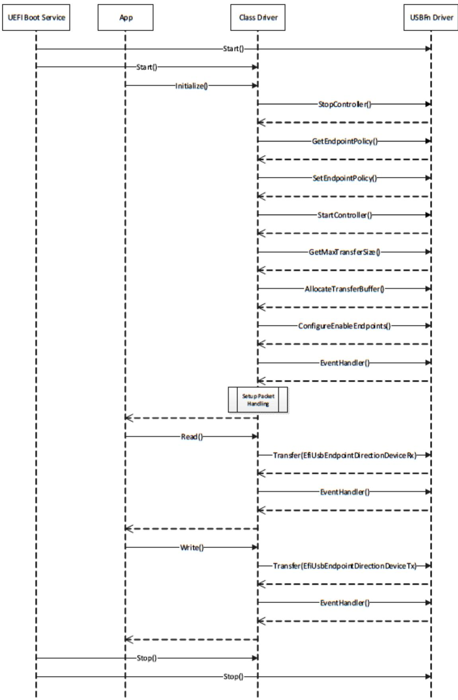

# PROTOCOLS — DEBUGGER SUPPORT

This chapter describes a minimal set of protocols and associated data structures necessary to enable the creation of source level debuggers for EFI. It does not fully define a debugger design. Using the services described in this document, it should also be possible to implement a variety of debugger solutions.

## 18.1 Overview

Eficient UEFI driver and application development requires the availability of source level debugging facilities. Although completely on-target debuggers are clearly possible, UEFI debuggers are generally expected to be remotely hosted. That is to say, the debugger itself will be split between two machines, which are the host and target. A majority of debugger code runs on the host that is typically responsible for disassembly, symbol management, source display, and user interface. Similarly, a smaller piece of code runs on the target that establishes the communication to the host and proxies requests from the host. The on-target code is known as the “debug agent.”

The debug agent design is subdivided further into two parts, which are the processor/platform abstraction and the debugger host specific communication grammar. This specification describes architectural interfaces for the former only. Specific implementations for various debugger host communication grammars can be created that make use of the facilities described in this specification.

The processor/platform abstraction is presented as a pair of protocol interfaces, which are the Debug Support protocol and the Debug Port protocol.

The Debug Support protocol abstracts the processor’s debugging facilities, namely a mechanism to manage the processor’s context via caller-installable exception handlers.

The Debug Port protocol abstracts the device that is used for communication between the host and target. Typically, this will be a 16550 serial port, 1394 device, or other device that is nominally a serial stream.

Furthermore, a table driven, quiescent, memory-only mechanism for determining the base address of PE32+ images is provided to enable the debugger host to determine where images are located in memory.

Aside from timing diferences that occur because of running code associated with the debug agent and user-initiated changes to the machine context, the operation of the on-target debugger component must be transparent to the rest of the system. In addition, no portion of the debug agent that runs in interrupt context may make any calls to EFI services or other protocol interfaces.

The services described in this document do not comprise a complete debugger, rather they provide a minimal abstraction required to implement a wide variety of debugger solutions.

```txt
typedef struct {
    EFI_INSTRUCTION_SET_ARCHITECTURE    Isa;
    EFI_GET_MAXIMUM_PROCESSOR_INDEX    GetMaximumProcessorIndex;
    EFI_REGISTER_PERIODIC_CALLBACK    RegisterPeriodicCallback;
    EFI_REGISTER_EXCEPTION_CALLBACK    RegisterExceptionCallback;
    EFI_INVALIDATE_INSTRUCTION_CACHE    InvalidateInstructionCache;
} EFI_DEBUG_SUPPORT_PROTOCOL;
```

## 18.2 EFI Debug Support Protocol

This section defines the EFI Debug Support protocol which is used by the debug agent.

## 18.2.1 EFI Debug Support Protocol Overview

The debug-agent needs to be able to gain control of the machine when certain types of events occur; i.e., breakpoints, processor exceptions, etc. Additionally, the debug agent must also be able to periodically gain control during operation of the machine to check for asynchronous commands from the host. The EFI Debug Support protocol services enable these capabilities.

The EFI Debug Support protocol interfaces produce callback registration mechanisms which are used by the debug agent to register functions that are invoked either periodically or when specific processor exceptions. When they are invoked by the Debug Support driver, these callback functions are passed the current machine context record. The debug agent may modify this context record to change the machine context which is restored to the machine after the callback function returns. The debug agent does not run in the same context as the rest of UEFI and all modifications to the machine context are deferred until after the callback function returns.

It is expected that there will typically be two instances of the EFI Debug Support protocol in the system. One associated with the native processor instruction set (IA-32, x64, ARM, RISC-V, LoongArch, or Itanium processor family), and one for the EFI virtual machine that implements EFI byte code (EBC).

While multiple instances of the EFI Debug Support protocol are expected, there must never be more than one for any given instruction set.

## 18.2.2 EFI\_DEBUG\_SUPPORT\_PROTOCOL

## Summary

This protocol provides the services to allow the debug agent to register callback functions that are called either periodically or when specific processor exceptions occur.

GUID

```c
#define EFI_DEBUG_SUPPORT_PROTOCOL_GUID \
{0x2755590C, 0x6F3C, 0x42FA, \
{0x9E, 0xA4, 0xA3, 0xBA, 0x54, 0x3C, 0xDA, 0x25}}
```

## Protocol Interface Structure

## Parameters

Isa

Declares the processor architecture for this instance of the EFI Debug Support protocol.

## GetMaximumProcessorIndex

Returns the maximum processor index value that may be used with

EFI\_DEBUG\_SUPPORT\_PROTOCOL.REGISTERPERIODICCALLBACK(), EFI\_DEBUG\_SUPPORT\_PROTOCOL.REGISTEREXCEPTIONCALLBACK() , EFI\_DEBUG\_SUPPORT\_PROTOCOL.GETMAXIMUMPROCESSORINDEX() function description.

## RegisterPeriodicCallback

Registers a callback function that will be invoked periodically and asynchronously to the execution of EFI. See the RegisterPeriodicCallback()\* function description.

## RegisterExceptionCallback

Registers a callback function that will be called each time the specified processor exception occurs. See the RegisterExceptionCallback()\* function description.

## InvalidateInstructionCache

Invalidate the instruction cache of the processor. This is required by processor architectures where instruction and data caches are not coherent when instructions in the code under debug has been modified by the debug agent. EFI\_DEBUG\_SUPPORT\_PROTOCOL.INVALIDATEINSTRUCTIONCACHE() function description.

## Related Definitions

Refer to the Microsoft PE/COFF Specification revision 6.2 or later for IMAGE\_FILE\_MACHINE definitions.

## <sup>ò</sup> Note

The definition of IMAGE\_FILE\_MACHINE\_EBC is not included in revision 6.2 of the PE/COFF specification. It can be found in an article about the PE/COFF format at https://learn.microsoft.com/en-us/windows/win32/debug/ pe-format

```c
//
// Machine type definition
//
typedef enum {
    IsaIa32 = IMAGE_FILE_MACHINE_I386,    // 0x014C
    IsaX64 = IMAGE_FILE_MACHINE_X64,    // 0x8664
    IsaIpf = IMAGE_FILE_MACHINE_IA64,    // 0x0200
    IsaEbc = IMAGE_FILE_MACHINE_EBC,    // 0x0EBC
    IsaArm = IMAGE_FILE_MACHINE_ARMTHUMB_MIXED    // 0x1C2
    IsaAArch64 = IMAGE_FILE_MACHINE_AARCH64    // 0xAA64
    IsaRISCV32 = IMAGE_FILE_MACHINE_RISCV32    // 0x5032
    IsaRISCV64 = IMAGE_FILE_MACHINE_RISCV64    // 0x5064
    IsaRISCV128 = IMAGE_FILE_MACHINE_RISCV128    // 0x5128
    IsaLoongArch32 = IMAGE_FILE_MACHINE_LOONGARCH32    // 0x6232
    IsaLoongArch64 = IMAGE_FILE_MACHINE_LOONGARCH64    // 0x6264
} EFI_INSTRUCTION_SET_ARCHITECTURE;
```

## Description

The EFI Debug Support protocol provides the interfaces required to register debug agent callback functions and to manage the processor’s instruction stream as required. Registered callback functions are invoked in interrupt context when the specified event occurs.

The driver that produces the EFI Debug Support protocol is also responsible for saving the machine context prior to invoking a registered callback function and restoring it after the callback function returns prior to returning to the code under debug. If the debug agent has modified the context record, the modified context must be used in the restore operation.

Furthermore, if the debug agent modifies any of the code under debug (to set a software breakpoint for example), it must call the InvalidateInstructionCache() function for the region of memory that has been modified.

## 18.2.3 EFI\_DEBUG\_SUPPORT\_PROTOCOL.GetMaximumProcessorIndex()

## Summary

```txt
Returns the maximum value that may be used for the ProcessorIndex parameter in EFI_DEBUG_SUPPORT_PROTOCOL.REGISTERPERIODICCALLBACK() and EFI_DEBUG_SUPPORT_PROTOCOL.REGISTEREXCEPTIONCALLBACK().
```

## Prototype

```txt
typedef
EFI_STATUS
(EFIAPI *EFI_GET_MAXIMUM_PROCESSOR_INDEX) (
    IN EFI_DEBUG_SUPPORT_PROTOCOL    *This,
    OUT UINTN    *MaxProcessorIndex
);
```

## Parameters

## This

A pointer to the EFI\_DEBUG\_SUPPORT\_PROTOCOL instance. Type EFI\_DEBUG\_SUPPORT\_PROTOCOL is defined in this section.

## MaxProcessorIndex

Pointer to a caller-allocated UINTN in which the maximum supported processor index is returned.

## Description

The GetMaximumProcessorIndex() function returns the maximum processor index in the output parameter MaxProcessorIndex. This value is the largest value that may be used in the ProcessorIndex parameter for both RegisterPeriodicCallback() and RegisterExceptionCallback() . All values between 0 and MaxProcessorIndex must be supported by RegisterPeriodicCallback() and RegisterExceptionCallback().

It is the responsibility of the caller to ensure all parameters are correct. There is no provision for parameter checking by GetMaximumProcessorIndex(). The implementation behavior when an invalid parameter is passed is not defined by this specification.

## Status Codes Returned

<table><tr><td>EFI_SUCCESS</td><td>The function completed successfully.</td></tr></table>

## 18.2.4 EFI\_DEBUG\_SUPPORT\_PROTOCOL.RegisterPeriodicCallback()

## Summary

Registers a function to be called back periodically in interrupt context.

Prototype

```txt
typedef
EFI_STATUS
(EFIAPI *EFI_REGISTER_PERIODIC_CALLBACK) (
    IN EFI_DEBUG_SUPPORT_PROTOCOL    *This,
    (continues on next page)
```

(continues on next page)

<table><tr><td></td><td>(continued from previous page)</td></tr><tr><td>IN UINTN</td><td>ProcessorIndex,</td></tr><tr><td>IN EFI_PERIODIC_CALLBACK</td><td>PeriodicCallback</td></tr><tr><td>);</td><td></td></tr></table>

## Parameters

## This

A pointer to the EFI\_DEBUG\_SUPPORT\_PROTOCOL instance. Type EFI\_DEBUG\_SUPPORT\_PROTOCOL is defined in EFI\_DEBUG\_SUPPORT\_PROTOCOL .

## ProcessorIndex

Specifies which processor the callback function applies to.

## PeriodicCallback

A pointer to a function of type PERIODIC\_CALLBACK that is the main periodic entry point of the debug agent. It receives as a parameter a pointer to the full context of the interrupted execution thread.

## Related Definitions

```c
typedef
VOID (*EFI_PERIODIC_CALLBACK) (
    IN OUT EFI_SYSTEM_CONTEXT SystemContext
);

// Universal EFI_SYSTEM_CONTEXT definition
typedef union {
    EFI_SYSTEM_CONTEXT_EBC *SystemContextEbc;
    EFI_SYSTEM_CONTEXT_IA32 *SystemContextIa32;
    EFI_SYSTEM_CONTEXT_X64 *SystemContextX64;
    EFI_SYSTEM_CONTEXT_IPF *SystemContextIpf;
    EFI_SYSTEM_CONTEXT_ARM *SystemContextArm;
    EFI_SYSTEM_CONTEXT_AARCH64 *SystemContextAArch64;
    EFI_SYSTEM_CONTEXT_RISCV32 *SystemContextRiscV32;
    EFI_SYSTEM_CONTEXT_RISCV64 *SystemContextRiscV64;
    EFI_SYSTEM_CONTEXT_RISCV128 *SystemContextRiscv128;
    EFI_SYSTEM_CONTEXT_LOONGARCH64 *SystemContextLongArch64;
} EFI_SYSTEM_CONTEXT;

// System context for virtual EBC processors
typedef struct {
    UINT64 R0, R1, R2, R3, R4, R5, R6, R7;
    UINT64 Flags;
    UINT64 ControlFlags;
    UINT64 Ip;
} EFI_SYSTEM_CONTEXT_EBC;

// System context for RISC-V 32
typedef struct {

    // Integer registers
    UINT32 Zero, Ra, Sp, Gp, Tp, T0, T1, T2;
    UINT32 S0FP, S1, A0, A1, A2, A3, A4, A5, A6, A7;
    UINT32 S2, S3, S4, S5, S6, S7, S8, S9, S10, S11;
    UINT32 T3, T4, T5, T6;
```

(continues on next page)

(continued from previous page)

```txt
// Floating registers for F, D and Q Standard Extensions
UINT128 Ft0, Ft1, Ft2, Ft3, Ft4, Ft5, Ft6, Ft7;
UINT128 Fs0, Fs1, Fa0, Fa1, Fa2, Fa3, Fa4, Fa5, Fa6, Fa7;
UINT128 Fs2, Fs3, Fs4, Fs5, Fs6, Fs7, Fs8, Fs9, Fs10, Fs11;
UINT128 Ft8, Ft9, Ft10, Ft11;

} EFI_SYSTEM_CONTEXT_RISCV32;

// System context for RISC-V 64
typedef struct {

    // Integer registers
    UINT64 Zero, Ra, Sp, Gp, Tp, T0, T1, T2;
    UINT64 S0FP, S1, A0, A1, A2, A3, A4, A5, A6, A7;
    UINT64 S2, S3, S4, S5, S6, S7, S8, S9, S10, S11;
    UINT64 T3, T4, T5, T6;

    // Floating registers for F, D and Q Standard Extensions
    UINT128 Ft0, Ft1, Ft2, Ft3, Ft4, Ft5, Ft6, Ft7;
    UINT128 Fs0, Fs1, Fa0, Fa1, Fa2, Fa3, Fa4, Fa5, Fa6, Fa7;
    UINT128 Fs2, Fs3, Fs4, Fs5, Fs6, Fs7, Fs8, Fs9, Fs10, Fs11;
    UINT128 Ft8, Ft9, Ft10, Ft11;

} EFI_SYSTEM_CONTEXT_RISCV64;

// System context for RISC-V 128
typedef struct {

    // Integer registers
    UINT128Zero, Ra, Sp, Gp, Tp, T0, T1, T2;
    UINT128S0FP, S1, A0, A1, A2, A3, A4, A5, A6, A7;
    UINT128S2, S3, S4, S5, S6, S7, S8, S9, S10, S11;
    UINT128T3, T4, T5, T6;

    // Floating registers for F, D and Q Standard Extensions
    UINT128 Ft0, Ft1, Ft2, Ft3, Ft4, Ft5, Ft6, Ft7;
    UINT128 Fs0, Fs1, Fa0, Fa1, Fa2, Fa3, Fa4, Fa5, Fa6, Fa7;
    UINT128 Fs2, Fs3, FS4, FS5, FS6, FS7, FS8, FS9, FS10, FS11;
    UINT128 Ft8, Ft9, Ft10, Ft11;

} EFI_SYSTEM_CONTEXT_RISCV128;
```

Note: When the context record field is larger than the register being stored in it, the upper bits of the context record field are unused and ignored.

```txt
// System context for IA-32 processors
typedef struct {
    UINT32 ExceptionData; // ExceptionData is additional data pushed
    // on the stack by some types of IA-32
    // exceptions
    EFI_FX_SAVE_STATE_IA32 FxSaveState;
```

(continues on next page)

(continued from previous page)

```c
UINT32 Dr0, Dr1, Dr2, Dr3, Dr6, Dr7;
UINT32 Cr0, Cr1 /* Reserved */, Cr2, Cr3, Cr4;
UINT32 Eflags;
UINT32 Ldtr, Tr;
UINT32 Gdtr[2], Idtr[2];
UINT32 Eip;
UINT32 Gs, Fs, Es, Ds, Cs, Ss;
UINT32 Edi, Esi, Ebp, Esp, Ebx, Edx, Ecx, Eax;
} EFI_SYSTEM_CONTEXT_IA32;

// FXSAVE_STATE - FP / MMX / XMM registers
typedef struct {
    UINT16 Fcw;
    UINT16 Fsw;
    UINT16 Ftw;
    UINT16 Opcode;
    UINT32 Eip;
    UINT16 Cs;
    UINT16 Reserved1;
    UINT32 DataOffset;
    UINT16 Ds;
    UINT8 Reserved2[10];
    UINT8 St0Mm0[10], Reserved3[6];
    UINT8 St1Mm1[10], Reserved4[6];
    UINT8 St2Mm2[10], Reserved5[6];
    UINT8 St3Mm3[10], Reserved6[6];
    UINT8 St4Mm4[10], Reserved7[6];
    UINT8 St5Mm5[10], Reserved8[6];
    UINT8 St6Mm6[10], Reserved9[6];
    UINT8 St7Mm7[10], Reserved10[6];
    UINT8 Xmm0[16];
    UINT8 Xmm1[16];
    UINT8 Xmm2[16];
    UINT8 Xmm3[16];
    UINT8 Xmm4[16];
    UINT8 Xmm5[16];
    UINT8 Xmm6[16];
    UINT8 Xmm7[16];
    UINT8 Reserved11[14 * 16];
} EFI_FX_SAVE_STATE_IA32

// System context for x64 processors
typedef struct {
    UINT64 ExceptionData; // ExceptionData is
    // additional data pushed
    // on the stack by some
    // types of x64 64-bit
    // mode exceptions
    EFI_FX_SAVE_STATE_X64 FxSaveState;
    UINT64 Dr0, Dr1, Dr2, Dr3, Dr6, Dr7;
    UINT64 Cr0, Cr1 /* Reserved */, Cr2, Cr3, Cr4, Cr8;
    UINT64 Rflags;
```

(continues on next page)

(continued from previous page)

```c
UINT64 Ldtr, Tr;
UINT64 Gdtr[2], Idtr[2];
UINT64 Rip;
UINT64 Fs, Fs, Es, Ds, Cs, Ss;
UINT64 Rdi, Rsi, Rbp, Rsp, Rbx, Rdx, Rcx, Rax;
UINT64 R8, R9, R10, R11, R12, R13, R14, R15;
} EFI_SYSTEM_CONTEXT_X64;

// FXSAVE_STATE - FP / MMX / XMM registers
typedef struct {
    UINT16 Fcw;
    UINT16 Fsw;
    UINT16 Ftw;
    UINT16 Opcode;
    UINT64 Rip;
    UINT64 DataOffset;
    UINT8 Reserved1[8];
    UINT8 St0Mm0[10], Reserved2[6];
    UINT8 St1Mm1[10], Reserved3[6];
    UINT8 St2Mm2[10], Reserved4[6];
    UINT8 St3Mm3[10], Reserved5[6];
    UINT8 St4Mm4[10], Reserved6[6];
    UINT8 St5Mm5[10], Reserved7[6];
    UINT8 St6Mm6[10], Reserved8[6];
    UINT8 St7Mm7[10], Reserved9[6];
    UINT8 Xmm0[16];
    UINT8 Xmm1[16];
    UINT8 Xmm2[16];
    UINT8 Xmm3[16];
    UINT8 Xmm4[16];
    UINT8 Xmm5[16];
    UINT8 Xmm6[16];
    UINT8 Xmm7[16];
    UINT8 Reserved11[14 * 16];
} EFI_FX_SAVE_STATE_X64;

// System context for Itanium processor family
typedef struct {
    UINT64 Reserved;

    UINT64 R1, R2, R3, R4, R5, R6, R7, R8, R9, R10,
    R11, R12, R13, R14, R15, R16, R17, R18, R19, R20,
    R21, R22, R23, R24, R25, R26, R27, R28, R29, R30,
    R31;

    UINT64 F2[2], F3[2], F4[2], F5[2], F6[2],
    F7[2], F8[2], F9[2], F10[2], F11[2],
    F12[2], F13[2], F14[2], F15[2], F16[2],
    F17[2], F18[2], F19[2], F20[2], F21[2],
    F22[2], F23[2], F24[2], F25[2], F26[2],
    F27[2], F28[2], F29[2], F30[2], F31[2];
```

(continued from previous page)

```c
UINT64 Pr;
UINT64 B0, B1, B2, B3, B4, B5, B6, B7;

// application registers
UINT64    ArRsc, ArBsp, ArBspstore, ArRnat;
UINT64    ArFcr;
UINT64    ArEflag, ArCsd, ArSsd, ArCflg;
UINT64    ArFsr, ArFir, ArFdr;
UINT64    ArCcv;
UINT64    ArUnat;
UINT64    ArFpsr;
UINT64    ArPfs, ArLc, ArEc;

// control registers
UINT64    CrDcr, CrItm, CrIva, CrPta, CrIpsr, CrIsr;
UINT64    CrIip, CrIfa, CrItir, CrIipa, CrIfs, CrIim;
UINT64    CrIha;

// debug registers
UINT64    Dbr0, Dbr1, Dbr2, Dbr3, Dbr4, Dbr5, Dbr6, Dbr7;
UINT64    Ibr0, Ibr1, Ibr2, Ibr3, Ibr4, Ibr5, Ibr6, Ibr7;

// virtual registers
UINT64    IntNat; // nat bits for R1-R31

} EFI_SYSTEM_CONTEXT_IPF;

//
// ARM processor context definition
//
typedef struct {
    UINT32 R0;
    UINT32 R1;
    UINT32 R2;
    UINT32 R3;
    UINT32 R4;
    UINT32 R5;
    UINT32 R6;
    UINT32 R7;
    UINT32 R8;
    UINT32 R9;
    UINT32 R10;
    UINT32 R11;
    UINT32 R12;
    UINT32 SP;
    UINT32 LR;
    UINT32 PC;
    UINT32 CPSR;
    UINT32 DFSR;
    UINT32 DFAR;
    UINT32 IFSR;
```

(continued from previous page)

```c
} EFI_SYSTEM_CONTEXT_ARM;
//
/// AARCH64 processor context definition.
//
typedef struct {
    // General Purpose Registers
    UINT64 X0;
    UINT64 X1;
    UINT64 X2;
    UINT64 X3;
    UINT64 X4;
    UINT64 X5;
    UINT64 X6;
    UINT64 X7;
    UINT64 X8;
    UINT64 X9;
    UINT64 X10;
    UINT64 X11;
    UINT64 X12;
    UINT64 X13;
    UINT64 X14;
    UINT64 X15;
    UINT64 X16;
    UINT64 X17;
    UINT64 X18;
    UINT64 X19;
    UINT64 X20;
    UINT64 X21;
    UINT64 X22;
    UINT64 X23;
    UINT64 X24;
    UINT64 X25;
    UINT64 X26;
    UINT64 X27;
    UINT64 X28;
    UINT64 FP; // x29 - Frame Pointer
    UINT64 LR; // x30 - Link Register
    UINT64 SP; // x31 - Stack Pointer
    // FP/SIMD Registers
    UINT64 V0[2];
    UINT64 V1[2];
    UINT64 V2[2];
    UINT64 V3[2];
    UINT64 V4[2];
    UINT64 V5[2];
    UINT64 V6[2];
    UINT64 V7[2];
    UINT64 V8[2];
    UINT64 V9[2];
    UINT64 V10[2];
```

(continues on next page)

(continued from previous page)

```txt
UINT64 V11[2];
UINT64 V12[2];
UINT64 V13[2];
UINT64 V14[2];
UINT64 V15[2];
UINT64 V16[2];
UINT64 V17[2];
UINT64 V18[2];
UINT64 V19[2];
UINT64 V20[2];
UINT64 V21[2];
UINT64 V22[2];
UINT64 V23[2];
UINT64 V24[2];
UINT64 V25[2];
UINT64 V26[2];
UINT64 V27[2];
UINT64 V28[2];
UINT64 V29[2];
UINT64 V30[2];
UINT64 V31[2];
UINT64 ELR; // Exception Link Register
UINT64 SPSR; // Saved Processor Status Register
UINT64 FPSR; // Floating Point Status Register
UINT64 ESR; // Exception syndrome register
UINT64 FAR; // Fault Address Register
} EFI_SYSTEM_CONTEXT_AARCH64;

// System context for LoongArch64 processors
typedef struct {
    UINT64 R0;
    UINT64 R1;
    UINT64 R2;
    UINT64 R3;
    UINT64 R4;
    UINT64 R5;
    UINT64 R6;
    UINT64 R7;
    UINT64 R8;
    UINT64 R9;
    UINT64 R10;
    UINT64 R11;
    UINT64 R12;
    UINT64 R13;
    UINT64 R14;
    UINT64 R15;
    UINT64 R16;
    UINT64 R17;
    UINT64 R18;
    UINT64 R19;
```

(continued from previous page)

<table><tr><td>UINT64</td><td>R20;</td><td></td></tr><tr><td>UINT64</td><td>R21;</td><td></td></tr><tr><td>UINT64</td><td>R22;</td><td></td></tr><tr><td>UINT64</td><td>R23;</td><td></td></tr><tr><td>UINT64</td><td>R24;</td><td></td></tr><tr><td>UINT64</td><td>R25;</td><td></td></tr><tr><td>UINT64</td><td>R26;</td><td></td></tr><tr><td>UINT64</td><td>R27;</td><td></td></tr><tr><td>UINT64</td><td>R28;</td><td></td></tr><tr><td>UINT64</td><td>R29;</td><td></td></tr><tr><td>UINT64</td><td>R30;</td><td></td></tr><tr><td>UINT64</td><td>R31;</td><td></td></tr><tr><td>UINT64</td><td colspan="2">CRMD; // CuRrent MoDe information</td></tr><tr><td>UINT64</td><td colspan="2">PRMD; // PRe-exception MoDe information</td></tr><tr><td>UINT64</td><td colspan="2">EUEN; // Extended component Unit ENable</td></tr><tr><td>UINT64</td><td colspan="2">MISC; // MISCellaneous controller</td></tr><tr><td>UINT64</td><td colspan="2">ECFG; // Execption ConFiGuration</td></tr><tr><td>UINT64</td><td colspan="2">ESTAT; // Exception STATus</td></tr><tr><td>UINT64</td><td colspan="2">ERA; // Exception Return Address</td></tr><tr><td>UINT64</td><td colspan="2">BADV; // BAD Virtual address</td></tr><tr><td>UINT64</td><td colspan="2">BADI; // BAD Instruction</td></tr><tr><td colspan="3">} EFI_SYSTEM_CONTEXT_LOONGARCH64;</td></tr></table>

## Description

The RegisterPeriodicCallback() function registers and enables the on-target debug agent’s periodic entry point. To unregister and disable calling the debug agent’s periodic entry point, call RegisterPeriodicCallback() passing a NULL PeriodicCallback parameter.

The implementation must handle saving and restoring the processor context to/from the system context record around calls to the registered callback function.

If the interrupt is also used by the firmware for the EFI time base or some other use, two rules must be observed. First, the registered callback function must be called before any EFI processing takes place. Second, the Debug Support implementation must perform the necessary steps to pass control to the firmware’s corresponding interrupt handler in a transparent manner.

There is no quality-of-service requirement or specification regarding the frequency of calls to the registered Periodic-Callback function. This allows the implementation to mitigate a potential adverse impact to EFI timer based services due to the latency induced by the context save/restore and the associated callback function.

It is the responsibility of the caller to ensure all parameters are correct. There is no provision for parameter checking by RegisterPeriodicCallback(). The implementation behavior when an invalid parameter is passed is not defined by this specification.

## Status Codes Returned

<table><tr><td>EFI_SUCCESS</td><td>The function completed successfully.</td></tr><tr><td>EFI_ALREADY_STARTED</td><td>Non- NULL PeriodicCallback parameter when a callback function was previously registered.</td></tr><tr><td>EFI_OUT_OF_RESOURCES</td><td>System has insufficient memory resources to register new callback function.</td></tr></table>

## 18.2.5 EFI\_DEBUG\_SUPPORT\_PROTOCOL.RegisterExceptionCallback()

## Summary

Registers a function to be called when a given processor exception occurs.

## Prototype

```txt
typedef
EFI_STATUS
(EFIAPI *REGISTER_EXCEPTION_CALLBACK) (
    IN EFI_DEBUG_SUPPORT_PROTOCOL    *This,
    IN UINTN    ProcessorIndex,
    IN EFI_EXCEPTION_CALLBACK    ExceptionCallback,
    IN EFI_EXCEPTION_TYPE    ExceptionType
);
```

## Parameters

## This

A pointer to the EFI\_DEBUG\_SUPPORT\_PROTOCOL instance. Type EFI\_DEBUG\_SUPPORT\_PROTOCOL is defined in EFI\_DEBUG\_SUPPORT\_PROTOCOL .

## ProcessorIndex

Specifies which processor the callback function applies to.

## ExceptionCallback

A pointer to a function of type EXCEPTION\_CALLBACK\* that is called when the processor exception specified by ExceptionType occurs. Passing NULL unregisters any previously registered function associated with ExceptionType.

## ExceptionType

Specifies which processor exception to hook.

## Related Definitions

```c
typedef
    VOID (*EFI_EXCEPTION_CALLBACK) (
    IN EFI_EXCEPTION_TYPE ExceptionType,
    IN OUT EFI_SYSTEM_CONTEXT SystemContext
);

typedef INTN EFI_EXCEPTION_TYPE;

// EBC Exception types
#define EXCEPT_EBC_UNDEFINED 0
#define EXCEPT_EBC_DIVIDE_ERROR 1
#define EXCEPT_EBC_DEBUG 2
#define EXCEPT_EBC_BREAKPOINT 3
#define EXCEPT_EBC_OVERFLOW 4
#define EXCEPT_EBC_INVALID_OPCODE 5
#define EXCEPT_EBC_STACK_FAULT 6
#define EXCEPT_EBC_ALIGNMENT_CHECK 7
#define EXCEPT_EBC_INSTRUCTION_ENCODING 8
#define EXCEPT_EBC_BAD_BREAK 9
#define EXCEPT_EBC_SINGLE_STEP 10
```  
(continues on next page)

(continued from previous page)

<table><tr><td colspan="3">// IA-32 Exception types</td></tr><tr><td>#define</td><td>EXCEPT_IA32_DIVIDE_ERROR</td><td>0</td></tr><tr><td>#define</td><td>EXCEPT_IA32_DEBUG</td><td>1</td></tr><tr><td>#define</td><td>EXCEPT_IA32_NMI</td><td>2</td></tr><tr><td>#define</td><td>EXCEPT_IA32_BREAKPOINT</td><td>3</td></tr><tr><td>#define</td><td>EXCEPT_IA32_OVERFLOW</td><td>4</td></tr><tr><td>#define</td><td>EXCEPT_IA32_BOUND</td><td>5</td></tr><tr><td>#define</td><td>EXCEPT_IA32_INVALID_OPCODE</td><td>6</td></tr><tr><td>#define</td><td>EXCEPT_IA32_DOUBLE_FAULT</td><td>8</td></tr><tr><td>#define</td><td>EXCEPT_IA32_INVALID_TSS</td><td>10</td></tr><tr><td>#define</td><td>EXCEPT_IA32_SEG_NOT_PRESENT</td><td>11</td></tr><tr><td>#define</td><td>EXCEPT_IA32_STACK_FAULT</td><td>12</td></tr><tr><td>#define</td><td>EXCEPT_IA32_GP_FAULT</td><td>13</td></tr><tr><td>#define</td><td>EXCEPT_IA32_PAGE_FAULT</td><td>14</td></tr><tr><td>#define</td><td>EXCEPT_IA32_FP_ERROR</td><td>16</td></tr><tr><td>#define</td><td>EXCEPT_IA32_ALIGNMENT_CHECK</td><td>17</td></tr><tr><td>#define</td><td>EXCEPT_IA32_MACHINE_CHECK</td><td>18</td></tr><tr><td>#define</td><td>EXCEPT_IA32_SIMD</td><td>19</td></tr><tr><td colspan="3">//</td></tr><tr><td colspan="3">// X64 Exception types</td></tr><tr><td colspan="3">//</td></tr><tr><td>#define</td><td>EXCEPT_X64_DIVIDE_ERROR</td><td>0</td></tr><tr><td>#define</td><td>EXCEPT_X64_DEBUG</td><td>1</td></tr><tr><td>#define</td><td>EXCEPT_X64_NMI</td><td>2</td></tr><tr><td>#define</td><td>EXCEPT_X64_BREAKPOINT</td><td>3</td></tr><tr><td>#define</td><td>EXCEPT_X64_OVERFLOW</td><td>4</td></tr><tr><td>#define</td><td>EXCEPT_X64_BOUND</td><td>5</td></tr><tr><td>#define</td><td>EXCEPT_X64_INVALID_OPCODE</td><td>6</td></tr><tr><td>#define</td><td>EXCEPT_X64_DOUBLE_FAULT</td><td>8</td></tr><tr><td>#define</td><td>EXCEPT_X64_INVALID_TSS</td><td>10</td></tr><tr><td>#define</td><td>EXCEPT_X64_SEG_NOT_PRESENT</td><td>11</td></tr><tr><td>#define</td><td>EXCEPT_X64_STACK_FAULT</td><td>12</td></tr><tr><td>#define</td><td>EXCEPT_X64_GP_FAULT</td><td>13</td></tr><tr><td>#define</td><td>EXCEPT_X64_PAGE_FAULT</td><td>14</td></tr><tr><td>#define</td><td>EXCEPT_X64_FP_ERROR</td><td>16</td></tr><tr><td>#define</td><td>EXCEPT_X64_ALIGNMENT_CHECK</td><td>17</td></tr><tr><td>#define</td><td>EXCEPT_X64_MACHINE_CHECK</td><td>18</td></tr><tr><td>#define</td><td>EXCEPT_X64_SIMD</td><td>19</td></tr><tr><td colspan="3">// Itanium Processor Family Exception types</td></tr><tr><td>#define</td><td>EXCEPT_IPF_VHTP_TRANSLATION</td><td>0</td></tr><tr><td>#define</td><td>EXCEPT_IPF_INSTRUCTION_TLB</td><td>1</td></tr><tr><td>#define</td><td>EXCEPT_IPF_DATA_TLB</td><td>2</td></tr><tr><td>#define</td><td>EXCEPT_IPF_ALT_INSTRUCTION_TLB</td><td>3</td></tr><tr><td>#define</td><td>EXCEPT_IPF_ALT_DATA_TLB</td><td>4</td></tr><tr><td>#define</td><td>EXCEPT_IPF_DATA_NESTED_TLB</td><td>5</td></tr><tr><td>#define</td><td>EXCEPT_IPF_INSTRUCTION_KEY_MISSED</td><td>6</td></tr><tr><td>#define</td><td>EXCEPT_IPF_DATA_KEY_MISSED</td><td>7</td></tr><tr><td>#define</td><td>EXCEPT_IPF_DIRTY_BIT</td><td>8</td></tr><tr><td>#define</td><td>EXCEPT_IPF_INSTRUCTION_ACCESS_BIT</td><td>9</td></tr><tr><td>#define</td><td>EXCEPT_IPF_DATA_ACCESS_BIT</td><td>10</td></tr></table>

(continues on next page)

(continued from previous page)

<table><tr><td>#define EXCEPT_IPF_BREAKPOINT</td><td>11</td></tr><tr><td>#define EXCEPT_IPF_EXTERNAL_INTERRUPT</td><td>12</td></tr><tr><td colspan="2">// 13 - 19 reserved</td></tr><tr><td>#define EXCEPT_IPF_PAGE_NOT_PRESENT</td><td>20</td></tr><tr><td>#define EXCEPT_IPF_KEY_PERMISSION</td><td>21</td></tr><tr><td>#define EXCEPT_IPF_INSTRUCTION_ACCESS_RIGHTS</td><td>22</td></tr><tr><td>#define EXCEPT_IPF_DATA_ACCESS_RIGHTS</td><td>23</td></tr><tr><td>#define EXCEPT_IPF_GENERAL_EXCEPTION</td><td>24</td></tr><tr><td>#define EXCEPT_IPF_DISABLED_FP_REGISTER</td><td>25</td></tr><tr><td>#define EXCEPT_IPF_NAT_CONSUMPTION</td><td>26</td></tr><tr><td>#define EXCEPT_IPF_SPECULATION</td><td>27</td></tr><tr><td colspan="2">// 28 reserved</td></tr><tr><td>#define EXCEPT_IPF_DEBUG</td><td>29</td></tr><tr><td>#define EXCEPT_IPF_UNALIGNED_REFERENCE</td><td>30</td></tr><tr><td>#define EXCEPT_IPF_UNSUPPORTED_DATA_REFERENCE</td><td>31</td></tr><tr><td>#define EXCEPT_IPF_FP_FAULT</td><td>32</td></tr><tr><td>#define EXCEPT_IPF_FP_TRAP</td><td>33</td></tr><tr><td>#define EXCEPT_IPF_LOWER_PRIVILEGE_TRANSFER_TRAP</td><td>34</td></tr><tr><td>#define EXCEPT_IPF_TAKEN_BRANCH</td><td>35</td></tr><tr><td>#define EXCEPT_IPF_SINGLE_STEP</td><td>36</td></tr><tr><td colspan="2">// 37 - 44 reserved</td></tr><tr><td>#define EXCEPT_IPF_IA32_EXCEPTION</td><td>45</td></tr><tr><td>#define EXCEPT_IPF_IA32_INTERCEPT</td><td>46</td></tr><tr><td>#define EXCEPT_IPF_IA32_INTERRUPT</td><td>47</td></tr><tr><td colspan="2">//</td></tr><tr><td colspan="2">// ARM processor exception types</td></tr><tr><td colspan="2">//</td></tr><tr><td>#define EXCEPT_ARM_RESET</td><td>0</td></tr><tr><td>#define EXCEPT_ARM_UNDEFINED_INSTRUCTION</td><td>1</td></tr><tr><td>#define EXCEPT_ARM_SOFTWARE_INTERRUPT</td><td>2</td></tr><tr><td>#define EXCEPT_ARM_PREFETCH_ABORT</td><td>3</td></tr><tr><td>#define EXCEPT_ARM_DATA_ABORT</td><td>4</td></tr><tr><td>#define EXCEPT_ARM_RESERVED</td><td>5</td></tr><tr><td>#define EXCEPT_ARM_IRQ</td><td>6</td></tr><tr><td>#define EXCEPT_ARM_FIQ</td><td>7</td></tr><tr><td colspan="2">//</td></tr><tr><td colspan="2">// For coding convenience, define the maximum valid ARM</td></tr><tr><td colspan="2">// exception.</td></tr><tr><td colspan="2">//</td></tr><tr><td colspan="2">#define MAX_ARM_EXCEPTION EXCEPT_ARM_FIQ</td></tr><tr><td colspan="2">///</td></tr><tr><td colspan="2">/// AARCH64 processor exception types.</td></tr><tr><td colspan="2">///</td></tr><tr><td colspan="2">#define EXCEPT_AARCH64_SYNCHRONOUS_EXCEPTIONS 0</td></tr><tr><td colspan="2">#define EXCEPT_AARCH64_IRQ 1</td></tr><tr><td colspan="2">#define EXCEPT_AARCH64_FIQ 2</td></tr><tr><td colspan="2">#define EXCEPT_AARCH64_SERROR 3</td></tr><tr><td colspan="2">///</td></tr><tr><td colspan="2">/// For coding convenience, define the maximum valid</td></tr><tr><td colspan="2">/// AARCH64 exception.</td></tr><tr><td colspan="2">///</td></tr></table>

```c
#define MAX_AARCH64_EXCEPTION EXCEPT_AARCH64_SERROR
///

/// RISC-V processor exception types.
/// 

#define EXCEPT_RISCV_INST_MISALIGNED 0
#define EXCEPT_RISCV_INST_ACCESS_FAULT 1
#define EXCEPT_RISCV_ILLEGAL_INST 2
#define EXCEPT_RISCV_BREAKPOINT 3
#define EXCEPT_RISCV_LOAD_ADDRESS_MISALIGNED 4
#define EXCEPT_RISCV_LOAD_ACCESS_FAULT 5
#define EXCEPT_RISCV_STORE_AMO_ADDRESS_MISALIGNED 6
#define EXCEPT_RISCV_STORE_AMO_ACCESS_FAULT 7
#define EXCEPT_RISCV_ENV_CALL_FROM_UMODE 8
#define EXCEPT_RISCV_ENV_CALL_FROM_SMODE 9
#define EXCEPT_RISCV_ENV_CALL_FROM_MMODE 11
#define EXCEPT_RISCV_INST_PAGE_FAULT 12
#define EXCEPT_RISCV_LOAD_PAGE_FAULT 13
#define EXCEPT_RISCV_STORE_AMO_PAGE_FAULT 15

/// 

/// RISC-V processor interrupt types.
/// 

#define EXCEPT_RISCV_SUPERVISOR_SOFTWARE_INT 1
#define EXCEPT_RISCV_MACHINE_SOFTWARE_INT 3
#define EXCEPT_RISCV_SUPERVISOR_TIMER_INT 5
#define EXCEPT_RISCV_MACHINE_TIMER_INT 7
#define EXCEPT_RISCV_SUPERVISOR_EXTERNAL_INT 9
#define EXCEPT_RISCV_MACHINE_EXTERNAL_INT 11

/// 

/// LoongArch processor exception types.
/// 

/// The exception types is located in the CSR ESTAT
/// register offset 16 bits, width 6 bits.
/// 

/// If you want to register an exception hook, you can
/// shfit the number left by 16 bits, and the exception
/// handler will know the types.
/// 

/// For example:
/// mCpu->CpuRegisterInterruptHandler (
/// mCpu,
/// (EXCEPT_LOONGARCH_PPI << CSR_ESTAT_EXC_SHIFT),
/// PpiExceptionHandler
/// );
/// 

#define EXCEPT_LOONGARCH_INT 0
#define EXCEPT_LOONGARCH_PIL 1
#define EXCEPT_LOONGARCH_PIS 2
#define EXCEPT_LOONGARCH_PIF 3
#define EXCEPT_LOONGARCH_PME 4
```

(continued from previous page)

<table><tr><td>#define EXCEPT_LOONGARCH_PNR</td><td>5</td></tr><tr><td>#define EXCEPT_LOONGARCH_PNX</td><td>6</td></tr><tr><td>#define EXCEPT_LOONGARCH_PPI</td><td>7</td></tr><tr><td>#define EXCEPT_LOONGARCH_ADE</td><td>8</td></tr><tr><td>#define EXCEPT_LOONGARCH_ALE</td><td>9</td></tr><tr><td>#define EXCEPT_LOONGARCH_BCE</td><td>10</td></tr><tr><td>#define EXCEPT_LOONGARCH_SYS</td><td>11</td></tr><tr><td>#define EXCEPT_LOONGARCH_BRK</td><td>12</td></tr><tr><td>#define EXCEPT_LOONGARCH_INE</td><td>13</td></tr><tr><td>#define EXCEPT_LOONGARCH_IPE</td><td>14</td></tr><tr><td>#define EXCEPT_LOONGARCH_FPD</td><td>15</td></tr><tr><td>#define EXCEPT_LOONGARCH_SXD</td><td>16</td></tr><tr><td>#define EXCEPT_LOONGARCH_ASXD</td><td>17</td></tr><tr><td>#define EXCEPT_LOONGARCH_FPE</td><td>18</td></tr><tr><td>#define EXCEPT_LOONGARCH_WPE</td><td>19</td></tr><tr><td>#define EXCEPT_LOONGARCH_BTD</td><td>20</td></tr><tr><td>#define EXCEPT_LOONGARCH_BTE</td><td>21</td></tr><tr><td>#define EXCEPT_LOONGARCH_GSPR</td><td>22</td></tr><tr><td>#define EXCEPT_LOONGARCH_HVC</td><td>23</td></tr><tr><td>#define EXCEPT_LOONGARCH_GCXC</td><td>24</td></tr><tr><td colspan="2">///</td></tr><tr><td colspan="2">/// For coding convenience, define the maximum valid</td></tr><tr><td colspan="2">/// LoongArch exception.</td></tr><tr><td colspan="2">///</td></tr><tr><td>#define MAX_LOONGARCH_EXCEPTION</td><td>64</td></tr><tr><td colspan="2">///</td></tr><tr><td colspan="2">/// LoongArch processor Interrupt types.</td></tr><tr><td colspan="2">///</td></tr><tr><td>#define EXCEPT_LOONGARCH_INT_SIP0</td><td>0</td></tr><tr><td>#define EXCEPT_LOONGARCH_INT_SIP1</td><td>1</td></tr><tr><td>#define EXCEPT_LOONGARCH_INT_IP0</td><td>2</td></tr><tr><td>#define EXCEPT_LOONGARCH_INT_IP1</td><td>3</td></tr><tr><td>#define EXCEPT_LOONGARCH_INT_IP2</td><td>4</td></tr><tr><td>#define EXCEPT_LOONGARCH_INT_IP3</td><td>5</td></tr><tr><td>#define EXCEPT_LOONGARCH_INT_IP4</td><td>6</td></tr><tr><td>#define EXCEPT_LOONGARCH_INT_IP5</td><td>7</td></tr><tr><td>#define EXCEPT_LOONGARCH_INT_IP6</td><td>8</td></tr><tr><td>#define EXCEPT_LOONGARCH_INT_IP7</td><td>9</td></tr><tr><td>#define EXCEPT_LOONGARCH_INT_PMC</td><td>10</td></tr><tr><td>#define EXCEPT_LOONGARCH_INT_TIMER</td><td>11</td></tr><tr><td>#define EXCEPT_LOONGARCH_INT_IPI</td><td>12</td></tr><tr><td colspan="2">///</td></tr><tr><td colspan="2">/// For coding convenience, define the maximum valid</td></tr><tr><td colspan="2">/// LoongArch interrupt.</td></tr><tr><td colspan="2">///</td></tr><tr><td>#define MAX_LOONGARCH_INTERRUPT</td><td>16</td></tr></table>

## Description

The RegisterExceptionCallback() function registers and enables an exception callback function for the specified exception. The specified exception must be valid for the instruction set architecture. To unregister the callback function and stop servicing the exception, call RegisterExceptionCallback() passing a NULL ExceptionCallback parameter.

The implementation must handle saving and restoring the processor context to/from the system context record around calls to the registered callback function. No chaining of exception handlers is allowed.

It is the responsibility of the caller to ensure all parameters are correct. There is no provision for parameter checking by RegisterExceptionCallback(). The implementation behavior when an invalid parameter is passed is not defined by this specification.

## Status Codes Returned

<table><tr><td>EFI_SUCCESS</td><td>The function completed successfully.</td></tr><tr><td>EFI_ALREADY_STARTED</td><td>Non- NULL ExceptionCallback parameter when a callback function was previously registered.</td></tr><tr><td>EFI_OUT_OF_RESOURCES</td><td>System has insufficient memory resources to register new callback function.</td></tr></table>

## 18.2.6 EFI\_DEBUG\_SUPPORT\_PROTOCOL.InvalidateInstructionCache()

## Summary

Invalidates processor instruction cache for a memory range. Subsequent execution in this range causes a fresh memory fetch to retrieve code to be executed.

## Prototype

<table><tr><td colspan="2">typedef</td></tr><tr><td colspan="2">EFI_STATUS</td></tr><tr><td colspan="2">(EFIAPI *EFI_INVALIDATE_INSTRUCTION_CACHE) (</td></tr><tr><td>IN EFI_DEBUG_SUPPORT_PROTOCOL</td><td>*This,</td></tr><tr><td>IN UINTN</td><td>ProcessorIndex,</td></tr><tr><td>IN VOID</td><td>*Start,</td></tr><tr><td>IN UINT64</td><td>Length</td></tr><tr><td>);</td><td></td></tr></table>

## Parameters

## This

A pointer to the EFI\_DEBUG\_SUPPORT\_PROTOCOL instance. Type EFI\_DEBUG\_SUPPORT\_PROTOCOL is defined in EFI\_DEBUG\_SUPPORT\_PROTOCOL .

## ProcessorIndex

Specifies which processor’s instruction cache is to be invalidated.

## Start

Specifies the physical base of the memory range to be invalidated.

## Length

Specifies the minimum number of bytes in the processor’s instruction cache to invalidate.

## Description

Typical operation of a debugger may require modifying the code image that is under debug. This can occur for many reasons, but is typically done to insert/remove software break instructions. Some processor architectures do not have coherent instruction and data caches so modifications to the code image require that the instruction cache be explicitly invalidated in that memory region.

The InvalidateInstructionCache() function abstracts this operation from the debug agent and provides a general purpose capability to invalidate the processor’s instruction cache.

It is the responsibility of the caller to ensure all parameters are correct. There is no provision for parameter checking by EFI\_DEBUG\_SUPPORT\_PROTOCOL.REGISTEREXCEPTIONCALLBACK() . The implementation behavior when an invalid parameter is passed is not defined by this specification.

Status Codes Returned

EFI\_SUCCESS

The function completed successfully.

## 18.3 EFI Debugport Protocol

This section defines the EFI Debugport protocol. This protocol is used by debug agent to communicate with the remote debug host.

## 18.3.1 EFI Debugport Overview

Historically, remote debugging has typically been done using a standard UART serial port to connect the host and target. This is obviously not possible in a legacy reduced system that does not have a UART. The Debugport protocol solves this problem by providing an abstraction that can support many diferent types of debugport hardware. The debug agent should use this abstraction to communicate with the host.

The interface is minimal with only reset, read, write, and poll abstractions. Since these functions are called in interrupt context, none of them may call any EFI services or other protocol interfaces.

Debugport selection and configuration is handled by setting defaults via an environment variable which contains a full device path to the debug port. This environment variable is used during the debugport driver’s initialization to configure the debugport correctly. The variable contains a full device path to the debugport, with the last node (prior to the terminal node) being a debugport messaging node. See Debugport Device Path for details.

The driver must also produce an instance of the EFI Device Path protocol to indicate what hardware is being used for the debugport. This may be used by the OS to maintain the debugport across a call to EFI\_BOOT\_SERVICES.ExitBootServices() .

## 18.3.2 EFI\_DEBUGPORT\_PROTOCOL

## Summary

This protocol provides the communication link between the debug agent and the remote host.

GUID

```c
#define EFI_DEBUGPORT_PROTOCOL_GUID \
{0xEBA4E8D2, 0x3858, 0x41EC, \
{0xA2, 0x81, 0x26, 0x47, 0xBA, 0x96, 0x60, 0xD0}}
```

## Protocol Interface Structure

```c
typedef struct {
    EFI_DEBUGPORT_RESET Reset;
    EFI_DEBUGPORT_WRITE Write;
    EFI_DEBUGPORT_READ Read;
```

(continues on next page)

```txt
EFI_DEBUGPORT_POLL Poll;
} EFI_DEBUGPORT_PROTOCOL;
```

(continued from previous page)

## Parameters

## Reset

Resets the debugport hardware.

## Write

Send a bufer of characters to the debugport device.

## Read

Receive a bufer of characters from the debugport device.

## Poll

Determine if there is any data available to be read from the debugport device.

## Description

The Debugport protocol is used for byte stream communication with a debugport device. The debugport can be a standard UART Serial port, a USB-based character device, or potentially any character-based I/O device.

The attributes for all UART-style debugport device interfaces are defined in the DEBUGPORT variable ( Debugport Device Path ).

## 18.3.3 EFI\_DEBUGPORT\_PROTOCOL.Reset()

## Summary

Resets the debugport.

## Prototype

```txt
typedef
EFI_STATUS
(EFIAPI *EFI_DEBUGPORT_RESET) (
    IN EFI_DEBUGPORT_PROTOCOL    *This
);
```

## Parameters

## This

A pointer to the EFI\_DEBUGPORT\_PROTOCOL instance. Type EFI\_DEBUGPORT\_PROTOCOL is defined in EFI\_DEBUGPORT\_PROTOCOL.

## Description

The Reset() function resets the debugport device.

It is the responsibility of the caller to ensure all parameters are valid. There is no provision for parameter checking by Reset(). The implementation behavior when an invalid parameter is passed is not defined by this specification.

## Status Codes Returned

<table><tr><td>EFI_SUCCESS</td><td>The debugport device was reset and is in usable state.</td></tr><tr><td>EFI_DEVICE_ERROR</td><td>The debugport device could not be reset and is unusable.</td></tr></table>

## 18.3.4 EFI\_DEBUGPORT\_PROTOCOL.Write()

## Summary

Writes data to the debugport.

## Prototype

```txt
typedef
EFI_STATUS
(EFIAPI *EFI_DEBUGPORT_WRITE) (
    IN EFI_DEBUGPORT_PROTOCOL    *This,
    IN UINT32    Timeout,
    IN OUT UINTN    *BufferSize,
    IN VOID    *Buffer
);
```

## Parameters

## This

A pointer to the EFI\_DEBUGPORT\_PROTOCOL instance. Type EFI\_DEBUGPORT\_PROTOCOL is defined in EFI\_DEBUGPORT\_PROTOCOL.

## Timeout

The number of microseconds to wait before timing out a write operation.

## BuferSize

On input, the requested number of bytes of data to write. On output, the number of bytes of data actually written.

## Bufer

A pointer to a bufer containing the data to write.

## Description

The Write() function writes the specified number of bytes to a debugport device. If a timeout error occurs while data is being sent to the debugport, transmission of this bufer will terminate, and EFI\_TIMEOUT will be returned. In all cases the number of bytes actually written to the debugport device is returned in BuferSize.

It is the responsibility of the caller to ensure all parameters are valid. There is no provision for parameter checking by Write(). The implementation behavior when an invalid parameter is passed is not defined by this specification.

## Status Codes Returned

<table><tr><td>EFI_SUCCESS</td><td>The data was written.</td></tr><tr><td>EFI_DEVICE_ERROR</td><td>The device reported an error.</td></tr><tr><td>EFI_TIMEOUT</td><td>The data write was stopped due to a timeout.</td></tr></table>

## 18.3.5 EFI\_DEBUGPORT\_PROTOCOL.Read()

## Summary

Reads data from the debugport.

## Prototype

<table><tr><td>typedefEFI_STATUS(EFIAPI *EFI_DEBUGPORT_READ) (continues on next page)</td></tr></table>

(continues on next page)

(continued from previous page)

<table><tr><td>IN EFI_DEBUGPORT_PROTOCOL</td><td>*This,</td></tr><tr><td>IN UINT32</td><td>Timeout,</td></tr><tr><td>IN OUT UINTN</td><td>*BufferSize,</td></tr><tr><td>OUT VOID</td><td>*Buffer</td></tr><tr><td>);</td><td></td></tr></table>

## Parameters

## This

A pointer to the EFI\_DEBUGPORT\_PROTOCOL instance. Type EFI\_DEBUGPORT\_PROTOCOL is defined in EFI\_DEBUGPORT\_PROTOCOL.

## Timeout

The number of microseconds to wait before timing out a read operation.

## BuferSize

A pointer to an integer which, on input contains the requested number of bytes of data to read, and on output contains the actual number of bytes of data read and returned in Bufer.

## Bufer

A pointer to a bufer into which the data read will be saved.

## Description

The Read() function reads a specified number of bytes from a debugport. If a timeout error or an overrun error is detected while data is being read from the debugport, then no more characters will be read, and EFI\_TIMEOUT will be returned. In all cases the number of bytes actually read is returned in \* BuferSize.

It is the responsibility of the caller to ensure all parameters are valid. There is no provision for parameter checking by Read(). The implementation behavior when an invalid parameter is passed is not defined by this specification.

## Status Codes Returned

<table><tr><td>EFI_SUCCESS</td><td>The data was read.</td></tr><tr><td>EFI_DEVICE_ERROR</td><td>The debugport device reported an error.</td></tr><tr><td>EFI_TIMEOUT</td><td>The operation was stopped due to a timeout or overrun.</td></tr></table>

## 18.3.6 EFI\_DEBUGPORT\_PROTOCOL.Poll()

## Summary

Checks to see if any data is available to be read from the debugport device.

## Prototype

```txt
typedef
EFI_STATUS
(EFIAPI *EFI_DEBUGPORT_POLL) (
    IN EFI_DEBUGPORT_PROTOCOL    *This
);
```

## Parameters

## This

A pointer to the EFI\_DEBUGPORT\_PROTOCOL instance. Type EFI\_DEBUGPORT\_PROTOCOL is defined in EFI\_DEBUGPORT\_PROTOCOL.

## Description

The Poll() function checks if there is any data available to be read from the debugport device and returns the result. No data is actually removed from the input stream. This function enables simpler debugger design since bufering of reads is not necessary by the caller.

## Status Codes Returned

<table><tr><td>EFI_SUCCESS</td><td>At least one byte of data is available to be read.</td></tr><tr><td>EFI_NOT_READY</td><td>No data is available to be read.</td></tr><tr><td>EFI_DEVICE_ERROR</td><td>The debugport device is not functioning correctly.</td></tr></table>

## 18.3.7 Debugport Device Path

The debugport driver must establish and maintain an instance of the EFI Device Path protocol for the debugport. A graceful handof of debugport ownership between the EFI Debugport driver and an OS debugport driver requires that the OS debugport driver can determine the type, location, and configuration of the debugport device.

The Debugport Device Path is a vendor-defined messaging device path with no data, only a GUID. It is used at the end of a conventional device path to tag the device for use as the debugport. For example, a typical UART debugport would have the following fully qualified device path:

PciRoot(0)/Pci(0x1f,0)/ACPI(PNP0501,0)/UART(115200,N,8,1)/DebugPort()

The Vendor\_GUID that defines the debugport device path is the same as the debugport protocol GUID, as defined below.

```c
#define DEVICE_PATH_MESSAGES_DEBUGPORT \
EFI_DEBUGPORT_PROTOCOL_GUID
```

The Table below, Debugport Messaging Device Path, shows all fields of the debugport device path.

Table 18.1: Debugport Messaging Device Path

<table><tr><td>Mnemonic</td><td>Byte Offset</td><td>Byte Length</td><td>Description</td></tr><tr><td>Type</td><td>0</td><td>1</td><td>Type 3 - Messaging Device Path.</td></tr><tr><td>Sub Type</td><td>1</td><td>1</td><td>Sub Type 10 - Vendor.</td></tr><tr><td>Length</td><td>2</td><td>2</td><td>Length of this structure in bytes. Length is 20 bytes.</td></tr><tr><td>Vendor_GUID</td><td>4</td><td>16</td><td>DEVICE_PATH_MESSA GING_DEBUGPORT.</td></tr></table>

## 18.3.8 EFI Debugport Variable

Even though there may be more than one hardware device that could function as a debugport in a system, only one debugport may be active at a time. The DEBUGPORT variable is used to declare which hardware device will act as the debugport, and what communication parameters it should assume.

Like all EFI variables, the DEBUGPORT variable has both a name and a GUID. The name is “DEBUGPORT.” The GUID is the same as the EFI\_DEBUGPORT\_PROTOCOL\_GUID :

```c
#define EFI_DEBUGPORT_VARIABLE_NAME L"DEBUGPORT"
#define EFI_DEBUGPORT_VARIABLE_GUID EFI_DEBUGPORT_PROTOCOL_GUID
```

The data contained by the DEBUGPORT variable is a fully qualified debugport device path ( Debugport Device Path ).

The desired communication parameters for the debugport are declared in the DEBUGPORT variable. The debugport driver must read this variable during initialization to determine how to configure the debug port.

To reduce the required complexity of the debugport driver, the debugport driver is not required to support all possible combinations of communication parameters. What combinations of parameters are possible is implementation specific.

Additionally debugport drivers implemented for PNP0501 devices, that is debugport devices with a PNP0501 ACPI node in the device path, must support the following defaults. These defaults must be used in the absence of a DEBUG-PORT variable, or when the communication parameters specified in the DEBUGPORT variable are not supported by the driver.

• Baud : 115200

• 8 data bits

• No parity

• 1 stop bit

• No flow control (See Appendix A for flow control details)

In the absence of the DEBUGPORT variable, the selection of which port to use as the debug port is implementation specific.

Future revisions of this specification may define new defaults for other debugport types.

The debugport device path must be constructed to reflect the actual settings for the debugport. Any code needing to know the state of the debug port must reference the device path rather than the DEBUGPORT variable, since the debugport may have assumed a default setting in spite of the existence of the DEBUGPORT variable.

If it is not possible to configure the debug port using either the settings declared in the DEBUGPORT variable or the default settings for the particular debugport type, the driver initialization must not install any protocol interfaces and must exit with an error.

## 18.4 EFI Debug Support Table

This chapter defines the EFI Debug Support Table which is used by the debug agent or an external debugger to determine loaded image information in a quiescent manner.

## 18.4.1 Overview

Every executable image loaded in EFI is represented by an EFI handle populated with an instance of the EFI Loaded Image Protocol protocol. This handle is known as an “image handle.” The associated Loaded Image protocol provides image information that is of interest to a source level debugger. Normal EFI executables can access this information by using EFI services to locate all instances of the Loaded Image protocol.

A debugger has two problems with this scenario. First, if it is an external hardware debugger, the location of the EFI system table is not known. Second, even if the location of the EFI system table is known, the services contained therein are generally unavailable to a debugger either because it is an on-target debugger that is running in interrupt context, or in the case of an external hardware debugger there is no debugger code running on the target at all.

Since a source level debugger must be capable of determining image information for all loaded images, an alternate mechanism that does not use EFI services must be provided. Two features are added to the EFI system software to enable this capability.

First, an alternate mechanism of locating the EFI system table is required. A check-summed structure containing the physical address of the EFI system table is created and located on a 4M aligned memory address. A hardware debugger can search memory for this structure to determine the location of the EFI system table.

Second, an EFI\_CONFIGURATION\_TABLE is published that leads to a database of pointers to all instances of the Loaded Image protocol. Several layers of indirection are used to allow dynamically managing the data as images are loaded and unloaded. Once the address of the EFI system table is known, it is possible to discover a complete and accurate list of EFI images. (Note that the EFI core itself must be represented by an instance of the Loaded Image protocol.)

Debug Support Table Indirection and Pointer Usage illustrates the table indirection and pointer usage.

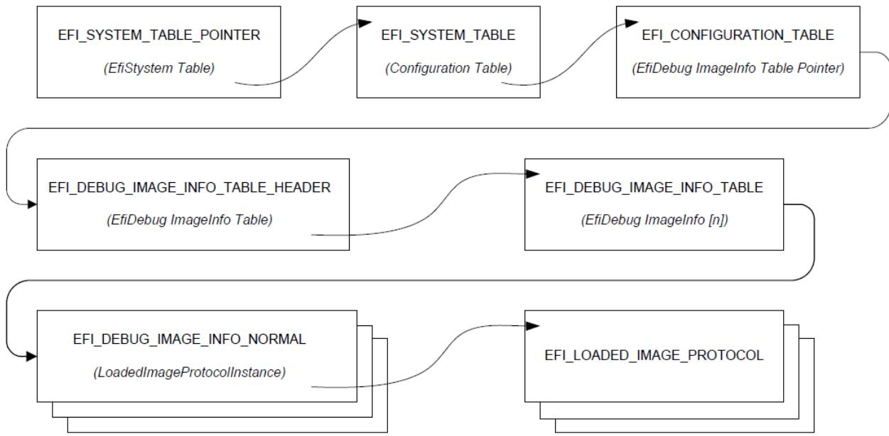  
Fig. 18.1: Debug Support Table Indirection and Pointer Usage

## 18.4.2 EFI System Table Location

The EFI system table can be located by an of-target hardware debugger by searching for the EFI\_SYSTEM\_TABLE\_POINTER structure. The EFI\_SYSTEM\_TABLE\_POINTER structure is located on a 4M boundary as close to the top of physical memory as feasible. It may be found searching for the EFI\_SYSTEM\_TABLE\_SIGNATURE on each 4M boundary starting at the top of memory and scanning down. When the signature is found, the entire structure must verified using the Crc32 field. The 32-bit CRC of the entire structure is calculated assuming the Crc32 field is zero. This value is then written to the Crc32 field.

```c
typedef struct _EFI_SYSTEM_TABLE_POINTER {
    UINT64    Signature;
    EFI_PHYSICAL_ADDRESS    EfiSystemTableBase;
    UINT32    Crc32;
} EFI_SYSTEM_TABLE_POINTER;
```

## Signature

A constant UINT64 that has the value EFI\_SYSTEM\_TABLE\_SIGNATURE (see the EFI 1.0 specification).

## EfiSystemTableBase

The physical address of the EFI system table.

## Crc32

A 32-bit CRC value that is used to verify the EFI\_SYSTEM\_TABLE\_POINTER structure is valid.

## 18.4.3 EFI Image Info

The EFI\_DEBUG\_IMAGE\_INFO\_TABLE is an array of pointers to EFI\_DEBUG\_IMAGE\_INFO unions. Each member of an EFI\_DEBUG\_IMAGE\_INFO union is a pointer to a data structure representing a particular image type. For each image that has been loaded, there is an appropriate image data structure with a pointer to it stored in the EFI\_DEBUG\_IMAGE\_INFO\_TABLE. Data structures for normal images and SMM images are defined. All other image types are reserved for future use.

The process of locating the EFI\_DEBUG\_IMAGE\_INFO\_TABLE begins with an EFI configuration table.

```c
//
// EFI_DEBUG_IMAGE_INFO_TABLE configuration table
//    GUID declaration - {49152E77-1ADA-4764-B7A2-7AFEFED95E8B}
//
#define EFI_DEBUG_IMAGE_INFO_TABLE_GUID \
{0x49152E77,0x1ADA,0x4764,\
{0xB7,0xA2,0x7A,0xFE,0xFE,0xD9,0x5E,0x8B }}
```

The address reported in the EFI configuration table entry of this type will be referenced as physical and will not be fixed up when transition from preboot to runtime phase.

The configuration table leads to an EFI\_DEBUG\_IMAGE\_INFO\_TABLE\_HEADER structure that contains a pointer to the EFI\_DEBUG\_IMAGE\_INFO\_TABLE and some status bits that are used to control access to the EFI\_DEBUG\_IMAGE\_INFO\_TABLE when it is being updated.

```c
//
// UpdateStatus bits
//
#define EFI_DEBUG_IMAGE_INFO_UPDATE_IN_PROGRESS 0x01
#define EFI_DEBUG_IMAGE_INFO_TABLE_MODIFIED 0x02

typedef struct {
    volatile UINT32 UpdateStatus;
    UINT32 TableSize;
    EFI_DEBUG_IMAGE_INFO *EfiDebugImageInfoTable;
} EFI_DEBUG_IMAGE_INFO_TABLE_HEADER;
```

## UpdateStatus

UpdateStatus is used by the system to indicate the state of the debug image info table.

The EFI\_DEBUG\_IMAGE\_INFO\_UPDATE\_IN\_PROGRESS bit must be set when the table is being modified. Software consuming the table must qualify the access to the table with this bit.

The EFI\_DEBUG\_IMAGE\_INFO\_TABLE\_MODIFIED bit is always set by software that modifies the table. It may be cleared by software that consumes the table once the entire table has been read. It is essentially a sticky version of the EFI\_DEBUG\_IMAGE\_INFO\_UPDATE\_IN\_PROGRESS bit and is intended to provide an eficient mechanism to minimize the number of times the table must be scanned by the consumer.

## TableSize

The number of EFI\_DEBUG\_IMAGE\_INFO elements in the array pointed to by EfiDebugImageInfoTable.

## EfiDebugImageInfoTable

A pointer to the first element of an array of EFI\_DEBUG\_IMAGE\_INFO structures.

```c
#define EFI_DEBUG_IMAGE_INFO_TYPE_NORMAL 0x01
typedef union {
    UINT32    *ImageInfoType;
    EFI_DEBUG_IMAGE_INFO_NORMAL    *NormalImage;
} EFI_DEBUG_IMAGE_INFO;

typedef struct {
    UINT32    ImageInfoType;
    EFI_LOADED_IMAGE_PROTOCOL    *LoadedImageProtocolInstance;
    EFI_HANDLE    ImageHandle;
} EFI_DEBUG_IMAGE_INFO_NORMAL;
```

## ImageInfoType

Indicates the type of image info structure. For PE32 EFI images, this is set to EFI\_DEBUG\_IMAGE\_INFO\_TYPE\_NORMAL.

## LoadedImageProtocolInstance

A pointer to an instance of the loaded image protocol for the associated image.

## ImageHandle

Indicates the image handle of the associated image.

# PROTOCOLS — COMPRESSION ALGORITHM SPECIFICATION

In EFI firmware storage, binary codes/data are often compressed to save storage space. These compressed codes/data are extracted into memory for execution at boot time. This demands an eficient lossless compression/decompression algorithm. The compressor must produce small compressed images, and the decompressor must operate fast enough to avoid delays at boot time.

This chapter describes in detail the UEFI compression/decompression algorithm, as well as the EFI Decompress Protocol. The EFI Decompress Protocol provides a standard decompression interface for use at boot time.

## 19.1 Algorithm Overview

In this chapter, the term “character” denotes a single byte and the term “string” denotes a series of concatenated characters.

The compression/decompression algorithm used in EFI firmware storage is a combination of the LZ77 algorithm and Hufman Coding. The LZ77 algorithm replaces a repeated string with a pointer to the previous occurrence of the string. Hufman Coding encodes symbols in a way that the more frequently a symbol appears in a text, the shorter the code that is assigned to it.

The compression process contains two steps:

• The first step is to find repeated strings (using LZ77 algorithm) and produce intermediate data.

Beginning with the first character, the compressor scans the source data and determines if the characters starting at the current position can form a string previously appearing in the text. If a long enough matching string is found, the compressor will output a pointer to the string. If the pointer occupies more space than the string itself, the compressor will output the original character at the current position in the source data. Then the compressor advances to the next position and repeats the process. To speed up the compression process, the compressor dynamically maintains a String Info Log to record the positions and lengths of strings encountered, so that string comparisons are performed quickly by looking up the String Info Log.

Because a compressor cannot have unlimited resources, as the compression continues the compressor removes “old” string information. This prevents the String Info Log from becoming too large. As a result, the algorithm can only look up repeated strings within the range of a fixed-sized “sliding window” behind the current position.

In this way, a stream of intermediate data is produced which contains two types of symbols: the Original Characters (to be preserved in the decompressed data), and the Pointers (representing a previous string). A Pointer consists of two elements: the String Position and the String Length, representing the location and the length of the target string, respectively.

• To improve the compression ratio further, Hufman Coding is utilized as the second step.

The intermediate data (consisting of original characters and pointers) is divided into Blocks so that the compressor can perform Hufman Coding on a Block immediately after it is generated; eliminating the need for a second pass from the beginning after the intermediate data has been generated. Also, since symbol frequency distribution may difer in diferent parts of the intermediate data, Hufman Coding can be optimized for each specific Block. The compressor determines Block Size for each Block according to the specifications defined in Data Format .

In each Block, two symbol sets are defined for Hufman Coding. The Char&Len Set consists of the Original Characters plus the String Lengths and the Position Set consists of String Positions (Note that the two elements of a Pointer belong to separate symbol sets). The Hufman Coding schemes applied on these two symbol sets are independent.

The algorithm uses “canonical” Hufman Coding so a Hufman tree can be represented as an array of code lengths in the order of the symbols in the symbol set. This code length array represents the Hufman Coding scheme for the symbol set. Both the Char&Len Set code length array and the Position Set code length array appear in the Block Header.

Hufman coding is used on the code length array of the Char&Len Set to define a third symbol set. The Extra Set is defined based on the code length values in the Char&Len Set code length array. The code length array for the Hufman Coding of Extra Set also appears in the Block Header together with the other two code length arrays. For exact format of the Block Header, Block Header.

The decompression process is straightforward given that the compression process is known. The decompressor scans the compressed data and decodes the symbols one by one, according to the Hufman code mapping tables generated from code length arrays. Along the process, if it encounters an original character, it outputs it; if it encounters a pointer, it looks it up in the already decompressed data and outputs the associated string.

## 19.2 Data Format

This section describes in detail the format of the compressed data produced by the compressor. The compressed data serves as input to the decompressor and can be fully extracted to the original source data

## 19.2.1 Bit Order

In computer data representation, a byte is the minimum unit and there is no diferentiation in the order of bits within a byte. However, the compressed data is a sequence of bits rather than a sequence of bytes and as a result the order of bits in a byte needs to be defined. In a compressed data stream, the higher bits are defined to precede the lower bits in a byte. The Figure, below, Bit Sequence of Compressed Data illustrates a compressed data sequence written as bytes from left to right. For each byte, the bits are written in an order with bit 7 (the highest bit) at the left and bit 0 (the lowest bit) at the right. Concatenating the bytes from left to right forms a bit sequence.

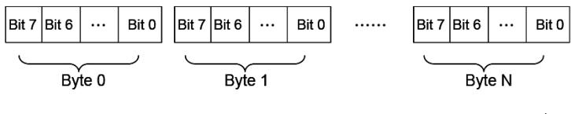  
Overall Bit Sequence of Compressed Data  
Fig. 19.1: Bit Sequence of Compressed Data

The bits of the compressed data are actually formed by a sequence of data units. These data units have variable bit lengths. The bits of each data unit are arranged so that the higher bit of the data unit precedes the lower bit of the data unit.

## 19.2.2 Overall Structure

The compressed data begins with two 32-bit numerical fields: the compressed size and the original size. The compressed data following these two fields is composed of one or more Blocks. Each Block is a unit for Hufman Coding with a coding scheme independent of the other Blocks. Each Block is composed of a Block Header containing the Hufman code trees for this Block and a Block Body with the data encoded using the coding scheme defined by the Hufman trees. The compressed data is terminated by an additional byte of zero.

The overall structure of the compressed data is shown in Compressed Data Structure .

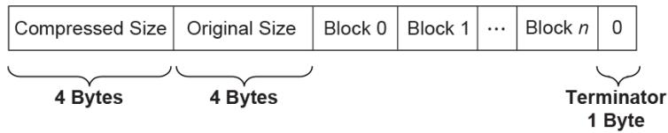  
Fig. 19.2: Compressed Data Structure

Note the following:

• Blocks are of variable lengths.

• Block lengths are counted by bits and not necessarily divisible by 8. Blocks are tightly packed (there are no padding bits between blocks). Neither the starting position nor ending position of a Block is necessarily at a byte boundary. However, if the last Block is not terminated at a byte boundary, there should be some bits of 0 to fill up the remaining bits of the last byte of the block, before the terminator byte of 0.

• Compressed Size =

Size in bytes of (Block 0 + Block 1 +. . . + Block N + Filling Bits (if any) + Terminator).

• Original Size is the size in bytes of original data.

• Both Compressed Size and Original Size are “little endian” (starting from the least significant byte).

## 19.2.3 Block Structure

A Block is composed of a Block Header and a Block Body, as shown in the figure below. These two parts are packed tightly (there are no padding bits between them). The lengths in bits of Block Header and Block Body are not necessarily divisible by eight.

  
Fig. 19.3: Block Structure

## 19.2.3.1 Block Header

The Block Header contains the Hufman encoding information for this block. Since “canonical” Hufman Coding is being used, a Hufman tree is represented as an array of code lengths in increasing order of the symbols in the symbol set. Code lengths are limited to be less than or equal to 16 bits. This requires some extra handling of Hufman codes in the compressor, which is described in Block Structure .

There are three code length arrays for three diferent symbol sets in the Block Header: one for the Extra Set, one for the Char&Len Set, and one for the Position Set.

The Block Header is composed of the tightly packed (no padding bits) fields described in the Table, below, Block Header Fields .

Table 19.1: Block Header Fields

<table><tr><td>Field Name</td><td>Length (bits)</td><td>Description</td></tr><tr><td>Block Size</td><td>16</td><td>The size of this Block. Block Size is defined as the number of original characters plus the number of pointers that appear in the Block Body:Block Size = Number of Original Characters in the Block Body+ Number of Pointers in the Block Body.</td></tr><tr><td>Extra Set Code Length Array Size</td><td>5</td><td>The number of code lengths in the Extra Set Code Length Array.The Extra Set Code Length Array contains code lengths of the Extra Set in increasing order of the symbols, and if all symbols greater than a certain symbol have zero code length, the Extra Set Code Length Array terminates at the last nonzero code length symbol.Since there are 19 symbols in the Extra Set (see the description of the Char&amp;Len Set Code Length Array), the maximum Extra Set Code Length Array Size is 19.</td></tr></table>

continues on next page

Table 19.1 – continued from previous page

<table><tr><td>Extra Set Code Length Array</td><td>Variable</td></tr><tr><td></td><td></td></tr><tr><td></td><td></td></tr><tr><td></td><td></td></tr><tr><td></td><td></td></tr><tr><td></td><td></td></tr><tr><td></td><td></td></tr><tr><td></td><td></td></tr><tr><td></td><td></td></tr><tr><td></td><td></td></tr><tr><td></td><td></td></tr><tr><td></td><td></td></tr><tr><td></td><td></td></tr><tr><td></td><td></td></tr><tr><td></td><td></td></tr><tr><td></td><td></td></tr><tr><td></td><td></td></tr><tr><td></td><td></td></tr><tr><td></td><td></td></tr><tr><td></td><td></td></tr><tr><td></td><td></td></tr><tr><td></td><td></td></tr><tr><td></td><td></td></tr><tr><td></td><td></td></tr><tr><td></td><td></td></tr><tr><td></td><td></td></tr><tr><td></td><td>If Extra Set Code Length Array Size is 0, then this field is a 5-bit value that represents the only Huffman code used.</td></tr><tr><td></td><td></td></tr><tr><td></td><td></td></tr><tr><td></td><td></td></tr><tr><td></td><td></td></tr><tr><td></td><td></td></tr><tr><td></td><td></td></tr><tr><td></td><td></td></tr><tr><td></td><td></td></tr><tr><td></td><td></td></tr><tr><td></td><td></td></tr><tr><td></td><td></td></tr><tr><td></td><td></td></tr><tr><td></td><td></td></tr><tr><td></td><td></td></tr><tr><td></td><td></td></tr><tr><td></td><td></td></tr><tr><td></td><td></td></tr><tr><td></td><td></td></tr><tr><td></td><td></td></tr><tr><td></td><td></td></tr><tr><td></td><td></td></tr><tr><td></td><td></td></tr><tr><td></td><td></td></tr><tr><td></td><td></td></tr><tr><td colspan="2"></td></tr><tr><td></td><td></td></tr><tr><td></td><td></td></tr><tr><td></td><td></td></tr><tr><td></td><td></td></tr><tr><td></td><td></td></tr><tr><td></td><td></td></tr><tr><td></td><td></td></tr><tr><td></td><td></td></tr><tr><td></td><td></td></tr><tr><td></td><td></td></tr><tr><td></td><td></td></tr><tr><td></td><td></td></tr><tr><td></td><td></td></tr><tr><td></td><td></td></tr><tr><td></td><td></td></tr><tr><td></td><td></td></tr><tr><td></td><td></td></tr><tr><td></td><td></td></tr><tr><td></td><td></td></tr><tr><td></td><td></td></tr><tr><td></td><td></td></tr><tr><td></td><td></td></tr><tr><td></td><td></td></tr><tr><td></td><td rowspan="2"></td></tr><tr><td></td></tr><tr><td></td><td></td></tr><tr><td></td><td></td></tr><tr><td></td><td></td></tr><tr><td></td><td></td></tr><tr><td></td><td></td></tr><tr><td></td><td></td></tr><tr><td></td><td></td></tr><tr><td></td><td></td></tr><tr><td></td><td></td></tr><tr><td></td><td></td></tr><tr><td></td><td></td></tr><tr><td></td><td></td></tr><tr><td></td><td></td></tr><tr><td></td><td></td></tr><tr><td></td><td></td></tr><tr><td></td><td></td></tr><tr><td></td><td></td></tr><tr><td></td><td></td></tr><tr><td></td><td></td></tr><tr><td></td><td></td></tr><tr><td></td><td></td></tr><tr><td></td><td></td></tr><tr><td></td><td></td></tr><tr><td></td><td></td></tr><tr><td></td><td></td></tr></table>

continues on next page

Table 19.1 – continued from previous page

<table><tr><td colspan="2">Position Set Code Length Array Size 4</td></tr><tr><td></td><td>The number of code lengths in the Position Set Code Length Array.</td></tr><tr><td></td><td>The Position Set Code Length Array contains code lengths of Position Set in increasing order of the symbols in the Position Set, and if all symbols greater than a certain symbol have zero code length, the Position Set Code Length Array terminates at the last nonzero code length symbol.</td></tr><tr><td></td><td>Since there are 14 symbols in the Position Set (see 3.3.2), the maximum Position Set Code Length Array Size is 14.</td></tr></table>

continues on next page

Table 19.1 – continued from previous page

<table><tr><td>Char&amp;Len Set Code Length Array</td><td>Variable</td></tr><tr><td></td><td></td></tr><tr><td></td><td></td></tr><tr><td></td><td></td></tr><tr><td></td><td></td></tr><tr><td></td><td></td></tr><tr><td></td><td></td></tr><tr><td></td><td></td></tr><tr><td></td><td></td></tr><tr><td></td><td></td></tr><tr><td></td><td></td></tr><tr><td></td><td></td></tr><tr><td></td><td></td></tr><tr><td></td><td></td></tr><tr><td></td><td></td></tr><tr><td></td><td></td></tr><tr><td></td><td></td></tr><tr><td></td><td></td></tr><tr><td></td><td></td></tr><tr><td></td><td></td></tr><tr><td></td><td></td></tr><tr><td></td><td></td></tr><tr><td></td><td></td></tr><tr><td></td><td></td></tr><tr><td></td><td></td></tr><tr><td></td><td></td></tr><tr><td></td><td>If Char&amp;Len Set Code Length Array Size is 0, then this field is a 9-bit value that represents the only Huffman code used.</td></tr><tr><td></td><td></td></tr><tr><td></td><td></td></tr><tr><td></td><td></td></tr><tr><td></td><td></td></tr><tr><td></td><td></td></tr><tr><td></td><td></td></tr><tr><td></td><td></td></tr><tr><td></td><td></td></tr><tr><td></td><td></td></tr><tr><td></td><td></td></tr><tr><td></td><td></td></tr><tr><td></td><td></td></tr><tr><td></td><td></td></tr><tr><td></td><td></td></tr><tr><td></td><td></td></tr><tr><td></td><td></td></tr><tr><td></td><td></td></tr><tr><td></td><td></td></tr><tr><td></td><td></td></tr><tr><td></td><td></td></tr><tr><td></td><td></td></tr><tr><td></td><td></td></tr><tr><td></td><td></td></tr><tr><td></td><td></td></tr><tr><td colspan="2"></td></tr><tr><td></td><td></td></tr><tr><td></td><td></td></tr><tr><td></td><td></td></tr><tr><td></td><td></td></tr><tr><td></td><td></td></tr><tr><td></td><td></td></tr><tr><td></td><td></td></tr><tr><td></td><td></td></tr><tr><td></td><td></td></tr><tr><td></td><td></td></tr><tr><td></td><td></td></tr><tr><td></td><td></td></tr><tr><td></td><td></td></tr><tr><td></td><td></td></tr><tr><td></td><td></td></tr><tr><td></td><td></td></tr><tr><td></td><td></td></tr><tr><td></td><td></td></tr><tr><td></td><td></td></tr><tr><td></td><td></td></tr><tr><td></td><td></td></tr><tr><td></td><td></td></tr><tr><td></td><td></td></tr><tr><td></td><td rowspan="2"></td></tr><tr><td></td></tr><tr><td></td><td></td></tr><tr><td></td><td></td></tr><tr><td></td><td></td></tr><tr><td></td><td></td></tr><tr><td></td><td></td></tr><tr><td></td><td></td></tr><tr><td></td><td></td></tr><tr><td></td><td></td></tr><tr><td></td><td></td></tr><tr><td></td><td></td></tr><tr><td></td><td></td></tr><tr><td></td><td></td></tr><tr><td></td><td></td></tr><tr><td></td><td></td></tr><tr><td></td><td></td></tr><tr><td></td><td></td></tr><tr><td></td><td></td></tr><tr><td></td><td></td></tr><tr><td></td><td></td></tr><tr><td></td><td></td></tr><tr><td></td><td></td></tr><tr><td></td><td></td></tr><tr><td></td><td></td></tr><tr><td></td><td></td></tr><tr><td></td><td></td></tr></table>

Table 19.1 – continued from previous page

<table><tr><td rowspan="3">Position Set Code Length Array Size</td><td rowspan="3">4</td><td>The number of code lengths in the Position Set Code Length Array.</td></tr><tr><td>The Position Set Code Length Array contains code lengths of Position Set in increasing order of the symbols in the Position Set, and if all symbols greater than a certain symbol have zero code length, the Position Set Code Length Array terminates at the last nonzero code length symbol.</td></tr><tr><td>Since there are 14 symbols in the Position Set (see 3.3.2), the maximum Position Set Code Length Array Size is 14.</td></tr><tr><td rowspan="5">Position Set Code Length Array</td><td rowspan="5">Variable</td><td>If Position Set Code Length Array Size is 0, then this field is a 5-bit value that represents the only Huffman code used.</td></tr><tr><td>If Position Set Code Length Array Size is not 0, then this field is an encoded form of a concatenation of code lengths in increasing order of the symbols.</td></tr><tr><td>The concatenation of Code lengths are encoded as follows:</td></tr><tr><td>If a code length is less than 7, then it is encoded as a normal 3-bit value;</td></tr><tr><td>If a code length is equal to or greater than 7, then it is encoded as a series of “1”s followed by a terminating “0.” The number of “1”s = Code length - 4. For example, code length “10” is encoded as “1111110”; code length “7” is encoded as “1110.”</td></tr></table>

## 19.2.3.2 Block Body

The Block Body is simply a mixture of Original Characters and Pointers, while each Pointer has two elements: String Length preceding String Position. All these data units are tightly packed together.

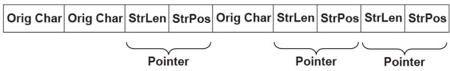  
Fig. 19.4: Block Body

The Original Characters, String Lengths and String Positions are all Hufman coded using the Hufman trees presented in the Block Header, with some additional variations. The exact format is described below:

An Original Character is a byte in the source data. A String Length is a value that is greater than 3 and less than 257 (this range should be ensured by the compressor). By calculating “(String Length - 3) | 0x100,” a value set is obtained that ranges from 256 to 509. By combining this value set with the value set of Original Characters (0 \~ 255), the Char&Len Set (ranging from 0 to 509) is generated for Hufman Coding.

A String Position is a value that indicates the distance between the current position and the target string. The String Position value is defined as “Current Position - Starting Position of the target string - 1.” The String Position value ranges from 0 to 8190 (so 8192 is the “sliding window” size, and this range should be ensured by the compressor). The lengths of the String Position values (in binary form) form a value set ranging from 0 to 13 (it is assumed that value 0 has length of 0). This value set is the Position Set for Hufman Coding. The full representation of a String Position value is composed of two consecutive parts: one is the Hufman code for the value length; the other is the actual String Position value of “length - 1” bits (excluding the highest bit since the highest bit is always “1”). For example, String Position value 18 is represented as: Hufman code for “5” followed by “0010.” If the value length is 0 or 1, then no value is appended to the Hufman code. This kind of representation favors small String Position values, which is a hint for compressor design.

## 19.3 Compressor Design

The compressor takes the source data as input and produces a compressed image. This section describes the design used in one possible implementation of a compressor that follows the UEFI Compression Algorithm. The source code that illustrates an implementation of this specific design is listed in Appendix H.

## 19.3.1 Overall Process

The compressor scans the source data from the beginning, character by character. As the scanning proceeds, the compressor generates Original Characters or Pointers and outputs the compressed data packed in a series of Blocks representing individual Hufman coding units.

The compressor maintains a String Info Log containing data that facilitates string comparison. Old data items are deleted and new data items are inserted regularly.

The compressor does not output a Pointer immediately after it sees a matching string for the current position. Instead, it delays its decision until it gets the matching string for the next position. The compressor has two criteria at hand: one is that the former match length should be no shorter than three characters; the other is that the former match length should be no shorter than the latter match length.

Only when these two criteria are met does the compressor output a Pointer to the former matching string.

The overall process of compression can be described by following pseudo code:

```txt
Set the Current Position at the beginning of the source data;
Delete the outdated string info from the String Info Log;
Search the String Info Log for matching string;
Add the string info of the current position into the String Info Log;
WHILE not end of source data DO
    Remember the last match;
    Advance the Current Position by 1;
    Delete the outdated String Info from the String Info Log;
    Search the String Info Log for matching string;
    Add the string info of the Current Position into the String Info Log;
    IF the last match is shorter than 3 characters or this match is longer than the last match THEN
    Call Output() * to output the character at the previous position as an Original Character;
ELSE
Call Output() * to output a Pointer to the last matching string;
WHILE (--last match length) > 0 DO
    Advance the Current Position by 1;
    Delete the outdated piece of string info from the String Info Log;
    Add the string info of the current position into the String Info Log;
ENDWHILE
ENDIF
ENDWHILE
```

The Output() is the function that is responsible for generating Hufman codes and Blocks. It accepts an Original Character or a Pointer as input and maintains a Block Bufer to temporarily store data units that are to be Hufman coded. The following pseudo code describes the function:

```txt
FUNCTION NAME: Output
INPUT: an Original Character or a Pointer

Put the Original Character or the Pointer into the Block Buffer;
Advance the Block Buffer position pointer by 1;
IF the Block Buffer is full THEN
    Encode the Char&Len Set in the Block buffer;
    Encode the Position Set in the Block buffer;
    Encode the Extra Set;
    Output the Block Header containing the code length arrays;
    Output the Block Body containing the Huffman encoded Original Characters and Pointers;
    Reset the Block Buffer position pointer to point to the beginning of the Block buffer;
ENDIF
```

## 19.3.2 String Info Log

The provision of the String Info Log is to speed up the process of finding matching strings. The design of this has significant impact on the overall performance of the compressor. This section describes in detail how String Info Log is implemented and the typical operations on it.

## 19.3.2.1 Data Structures

The String Info Log is implemented as a set of search trees. These search trees are dynamically updated as the compression proceeds through the source data. The structure of a typical search tree is depicted in the Figure, below, String Info Log Search Tree .

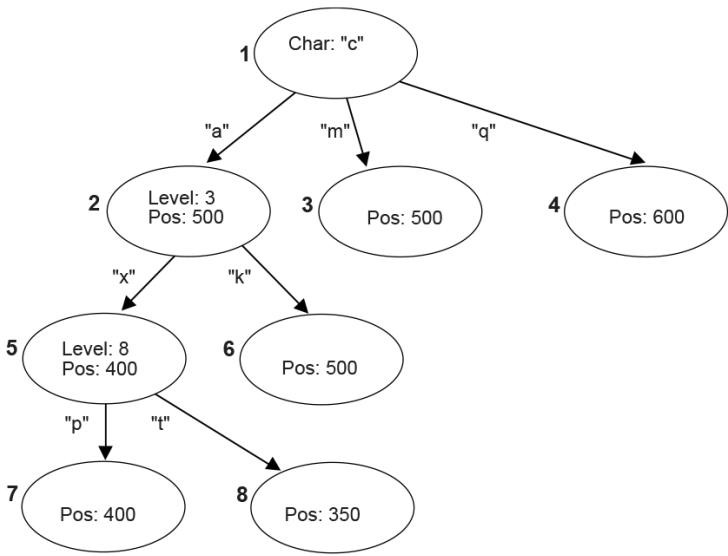  
Fig. 19.5: String Info Log Search Tree

There are three types of nodes in a search tree: the root node, internal nodes, and leaves. The root node has a “character” attribute, which represents the starting character of a string. Each edge also has a “character” attribute, which represents the next character in the string. Each internal node has a “level” attribute, which indicates the character on any edge that leads to its child nodes is the “level + 1”th character in the string. Each internal node or leaf has a “position” attribute that indicates the string’s starting position in the source data.

To speed up the tree searching, a hash function is used. Given the parent node and the edge-character, the hash function will quickly find the expected child node.

## 19.3.2.2 Searching the Tree

Traversing the search tree is performed as follows:

The following example uses the search tree shown in the Figure, above, String Info Log Search Tree . Assume that the current position in the source data contains the string “camxrsxpj. . . .”

1. The starting character “c” is used to find the root of the tree. The next character “a” is used to follow the edge from node 1 to node 2. The “position” of node 2 is 500, so a string starting with “ca” can be found at position 500. The string at the current position is compared with the string starting at position 500.

2. Node 2 is at Level 3; so at most three characters are compared. Assume that the three-character comparison passes.

3. The fourth character “x” is used to follow the edge from Node 2 to Node 5. The position value of node 5 is 400, which means there is a string located in position 400 that starts with “cam” and the character at position 403 is an “x.”

4. Node 5 is at Level 8, so the fifth to eighth characters of the source data are compared with the string starting at position 404. Assume the strings match.

5. At this point, the ninth character “p” has been reached. It is used to follow the edge from Node 5 to Node 7.

6. This process continues until a mismatch occurs, or the length of the matching strings exceeds the predefined MAX\_MATCH\_LENGTH. The most recent matching string (which is also the longest) is the desired matching string.

## 19.3.2.3 Adding String Info

String info needs to be added to the String Info Log for each position in the source data. Each time a search for a matching string is performed, the new string info is inserted for the current position. There are several cases that can be discussed:

1. No root is found for the first character. A new tree is created with the root node labeled with the starting character and a child leaf node with its edge to the root node labeled with the second character in the string. The “position” value of the child node is set to the current position.

2. One root node matches the first character, but the second character does not match any edge extending from the root node. A new child leaf node is created with its edge labeled with the second character. The “position” value of the new leaf child node is set to the current position.

3. A string comparison succeeds with an internal node, but a matching edge for the next character does not exist. This is similar to (2) above. A new child leaf node is created with its edge labeled with the character that does not exist. The “position” value of the new leaf child node is set to the current position.

4. A string comparison exceeds MAX\_MATCH\_LENGTH. Note: This only happens with leaf nodes. For this case, the “position” value in the leaf node is updated with the current position.

5. If a string comparison with an internal node or leaf node fails (mismatch occurs before the “Level + 1”th character is reached or MAX\_MATCH\_LENGTH is exceeded), then a “split” operation is performed as follows:

Suppose a comparison is being performed with a level 9 Node, at position 350, and the current position is 1005. If the sixth character at position 350 is an “x” and the sixth character at position 1005 is a “y,” then a mismatch will occur. In this case, a new internal node and a new child node are inserted into the tree, as depicted in Node Split .

## 19.3.2.4 Deleting String Info

The String Info Log will grow as more and more string information is logged. The size of the String Info Log must be limited, so outdated information must be removed on a regular basis. A sliding window is maintained behind the current position, and the searches are always limited within the range of the sliding window. Each time the current position is advanced, outdated string information that falls outside the sliding window should be removed from the tree. The search for outdated string information is simplified by always updating the nodes’ “position” attribute when searching for matching strings.

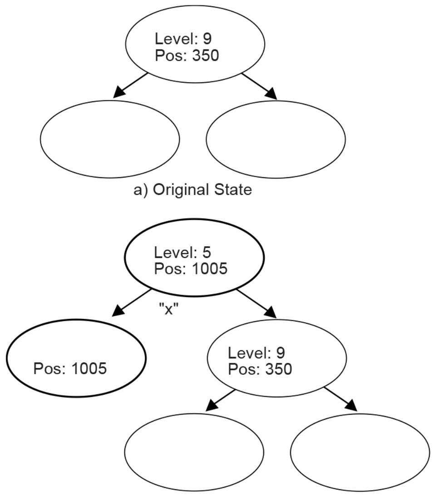  
b) Node "Split"  
Fig. 19.6: Node Split  
The b) portion of Node Split has two new inserted nodes, which reflects the new string information that was found at the current position. The process splits the old node into two child nodes, and that is why this operation is called a “split.”

```c
INT32 i, k;
UINT32 cum;

cum = 0;
for (i = 16; i > 0; i--) {
    cum += LengthCount[i] << (16 - i);
}
while (cum != (1U << 16)) {
    LengthCount[16]--;
    for (i = 15; i > 0; i--) {
    if (LengthCount[i] != 0) {
    LengthCount[i]--;
    LengthCount[i+1] += 2;
    break;
    }
    }
    cum--;
}
```

## 19.3.3 Hufman Code Generation

Another major component of the compressor design is generation of the Hufman Code.

Hufman Coding is applied to the Char&Len Set, the Position Set, and the Extra Set. The Hufman Coding used here has the following features:

• The Hufman tree is represented as an array of code lengths (“canonical” Hufman Coding);

• The maximum code length is limited to 16 bits.

The Hufman code generation process can be divided into three steps. These are the generation of Hufman tree, the adjustment of code lengths, and the code generation.

## 19.3.3.1 Hufman Tree Generation

This process generates a typical Hufman tree. First, the frequency of each symbol is counted, and a list of nodes is generated with each node containing a symbol and the symbol’s frequency. The two nodes with the lowest frequency values are merged into a single node. This new node becomes the parent node of the two nodes that are merged. The frequency value of this new parent node is the sum of the two child nodes’ frequency values. The node list is updated to include the new parent node but exclude the two child nodes that are merged. This process is repeated until there is a single node remaining that is the root of the generated tree.

## 19.3.3.2 Code Length Adjustment

The leaf nodes of the tree generated by the previous step represent all the symbols that were generated. Traditionally the code for each symbol is found by traversing the tree from the root node to the leaf node. Going down a left edge generates a “0,” and going down a right edge generates a “1.” However, a diferent approach is used here. The number of codes of each code length is counted. This generates a 16-element LengthCount array, with LengthCount[i] = Number Of Codes whose Code Length is i. Since a code length may be longer than 16 bits, the sixteenth entry of the LengthCount array is set to the Number Of Codes whose Code Length is greater than or equal to 16.

The LengthCount array goes through further adjustment described by following code:

## 19.3.3.3 Code Generation

In the previous step, the count of each length was obtained. Now, each symbol is going to be assigned a code. First, the length of the code for each symbol is determined. Naturally, the code lengths are assigned in such a way that shorter codes are assigned to more frequently appearing symbols. A CodeLength array is generated with CodeLength[i] = the code length of symbol i. Given this array, a code is assigned to each symbol using the algorithm described by the pseudo code below (the resulting codes are stored in array Code such that Code[i] = the code assigned to symbol i):

```txt
INT32 i;
UINT16 Start[18];

Start[1] = 0;

for (i = 1; i <= 16; i++) {
    Start[i + 1] = (UINT16)((Start[i] + LengthCount[i]) << 1);
}

for (i = 0; i < NumberOfSymbols; i++) {
    Code[i] = Start[CodeLength[i]]++;
}
```

The code length adjustment process ensures that no code longer than the designated length will be generated. As long as the decompressor has the CodeLength array at hand, it can regenerate the codes.

## 19.4 Decompressor Design

The decompressor takes the compressed data as input and produces the original source data. The main tasks for the decompressor are decoding Hufman codes and restoring Pointers to the strings to which they point.

The following pseudo code describes the algorithm used in the design of a decompressor. The source code that illustrates an implementation of this design is listed in Appendix I.

```txt
WHILE not end of data DO
IF at block boundary THEN
    Read in the Extra Set Code Length Array;
    Generate the Huffman code mapping table for the Extra Set;
    Read in and decode the Char&Len Set Code Length Array;
    Generate the Huffman code mapping table for the Char&Len Set;
    Read in the Position Set Code Length Array;
    Generate the Huffman code mapping table for the Position Set;
ENDIF
Get next code;
Look the code up in the Char&Len Set code mapping table.
Store the result as C;
IF C < 256 (it represents an Original Character) THEN
    Output this character;
ELSE (it represents a String Length)
    Transform C to be the actual String Length value;
    Get next code and look it up in the Position Set code mapping table, and with some additional transformation, store the result as P;
    Output C characters starting from the position "Current Position - P";
ENDIF
ENDWHILE
```

## 19.5 Decompress Protocol

This section provides a detailed description of the EFI\_DECOMPRESS\_PROTOCOL.

## 19.5.1 EFI\_DECOMPRESS\_PROTOCOL

Summary

Provides a decompression service.

GUID

```c
#define EFI_DECOMPRESS_PROTOCOL_GUID \
{0xd8117cfe, 0x94a6, 0x11d4, \
{0x9a, 0x3a, 0x00, 0x90, 0x27, 0x3f, 0xc1, 0x4d}}
```

Protocol Interface Structure

```c
typedef struct _EFI_DECOMPRESS_PROTOCOL {
    EFI_DECOMPRESS_GET_INFO GetInfo;
    EFI_DECOMPRESS_DECOMPRESS Decompress;
} EFI_DECOMPRESS_PROTOCOL;
```

## Parameters

## GetInfo

Given the compressed source bufer, this function retrieves the size of the uncompressed destination bufer and the size of the scratch bufer required to perform the decompression. It is the caller’s responsibility to allocate the destination bufer and the scratch bufer prior to calling EFI\_DECOMPRESS\_PROTOCOL.Decompress() . See the EFI\_DECOMPRESS\_PROTOCOL.GetInfo() function description.

## Decompress

Decompresses a compressed source bufer into an uncompressed destination bufer. It is the caller’s responsibility to allocate the destination bufer and a scratch bufer prior to making this call. See the Decompress() function description.

## Description

The EFI\_DECOMPRESS\_PROTOCOL provides a decompression service that allows a compressed source bufer in memory to be decompressed into a destination bufer in memory. It also requires a temporary scratch bufer to perform the decompression. The GetInfo() function retrieves the size of the destination bufer and the size of the scratch bufer that the caller is required to allocate. The Decompress() function performs the decompression. The scratch bufer can be freed after the decompression is complete.

## 19.5.2 EFI\_DECOMPRESS\_PROTOCOL.GetInfo()

## Summary

Given a compressed source bufer, this function retrieves the size of the uncompressed bufer and the size of the scratch bufer required to decompress the compressed source bufer.

## Prototype

<table><tr><td colspan="2">typedef</td></tr><tr><td colspan="2">EFI_STATUS</td></tr><tr><td colspan="2">(EFIAPI *EFI_DECOMPRESS_GET_INFO) (</td></tr><tr><td>IN EFI_DECOMPRESS_PROTOCOL</td><td>*This,</td></tr><tr><td>IN VOID</td><td>*Source,</td></tr><tr><td>IN UINT32</td><td>SourceSize,</td></tr><tr><td>OUT UINT32</td><td>*DestinationSize,</td></tr><tr><td>OUT UINT32</td><td>*ScratchSize</td></tr><tr><td>);</td><td></td></tr></table>

## Parameters

## This

A pointer to the EFI\_DECOMPRESS\_PROTOCOL instance. Type EFI\_DECOMPRESS\_PROTOCOL is defined in EFI\_DECOMPRESS\_PROTOCOL.

## Source

The source bufer containing the compressed data.

## SourceSize

The size, in bytes, of the source bufer.

## DestinationSize

A pointer to the size, in bytes, of the uncompressed bufer that will be generated when the compressed bufer specified by Source and SourceSiz e is decompressed.

## ScratchSize

A pointer to the size, in bytes, of the scratch bufer that is required to decompress the compressed bufer specified by Source and SourceSize.

## Description

The GetInfo() function retrieves the size of the uncompressed bufer and the temporary scratch bufer required to decompress the bufer specified by Source and SourceSize. If the size of the uncompressed bufer or the size of the scratch bufer cannot be determined from the compressed data specified by Source and SourceData, then EFI\_INVALID\_PARAMETER is returned. Otherwise, the size of the uncompressed bufer is returned in Destination-Size, the size of the scratch bufer is returned in ScratchSize, and EFI\_SUCCESS is returned.

The GetInfo() function does not have scratch bufer available to perform a thorough checking of the validity of the source data. It just retrieves the “Original Size” field from the beginning bytes of the source data and output it as DestinationSize. And ScratchSize is specific to the decompression implementation.

## Status Codes Returned

<table><tr><td>EFI_SUCCESS</td><td>The size of the uncompressed data was returned in DestinationSize and the size of the scratch buffer was returned in ScratchSize.</td></tr><tr><td>EFI_INVALID_PARAMETER</td><td>The size of the uncompressed data or the size of the scratch buffer cannot be determined from the compressed data specified by Source and SourceSize.</td></tr></table>

## 19.5.3 EFI\_DECOMPRESS\_PROTOCOL.Decompress()

## Summary

Decompresses a compressed source bufer.

## Prototype

## Parameters

## This

A pointer to the EFI\_DECOMPRESS\_PROTOCOL instance. Type EFI\_DECOMPRESS\_PROTOCOL is defined in EFI\_DECOMPRESS\_PROTOCOL.

## Source

The source bufer containing the compressed data.

## SourceSize

The size of source data.

## Destination

On output, the destination bufer that contains the uncompressed data.

## DestinationSize

The size of the destination bufer. The size of the destination bufer needed is obtained from EFI\_DECOMPRESS\_PROTOCOL.GetInfo() .

## Scratch

A temporary scratch bufer that is used to perform the decompression.

## ScratchSize

The size of scratch bufer. The size of the scratch bufer needed is obtained from GetInfo().

## Description

The Decompress() function extracts decompressed data to its original form.

This protocol is designed so that the decompression algorithm can be implemented without using any memory services. As a result, the Decompress() function is not allowed to call EFI\_BOOT\_SERVICES.AllocatePool() or EFI\_BOOT\_SERVICES.AllocatePages() in its implementation. It is the caller’s responsibility to allocate and free the Destination and Scratch bufers.

If the compressed source data specified by Source and SourceSize is successfully decompressed into Destination, then EFI\_SUCCESS is returned. If the compressed source data specified by Source and SourceSize is not in a valid compressed data format, then EFI\_INVALID\_PARAMETER is returned.

## Status Codes Returned

<table><tr><td>EFI_SUCCESS</td><td>Decompression completed successfully, and the uncompressed buffer is returned in Destination.</td></tr><tr><td>EFI_INVALID_PARAMETER</td><td>The source buffer specified by Source and SourceSize is corrupted (not in a valid compressed format).</td></tr></table>

# PROTOCOLS — ACPI PROTOCOLS

## 20.1 EFI\_ACPI\_TABLE\_PROTOCOL

## Summary

This protocol may be used to install or remove an ACPI table from a platform.

GUID

```c
#define EFI ACPI TABLE PROTOCOL_GUID \
{0xffe06bdd, 0x6107, 0x46a6, \
{0x7b, 0xb2, 0x5a, 0x9c, 0x7e, 0xc5, 0x27, 0x5c}}
```

## Protocol Interface Structure

```c
typedef struct _EFI ACPI_TABLE_PROTOCOL {
    EFI ACPI_TABLE_INSTALL ACPI_TABLE InstallAcpiTable;
    EFI ACPI_TABLE_UNINSTALL ACPI_TABLE UninstallAcpiTable;
} EFI ACPI_TABLE_PROTOCOL;
```

## Parameters

## InstallAcpiTable

Installs an ACPI table into the system.

## UninstallAcpiTable

Removes a previously installed ACPI table from the system.

## Description

The EFI\_ACPI\_TABLE\_PROTOCOL provides the ability for a component to install and uninstall ACPI tables from a platform.

## 20.2 EFI\_ACPI\_TABLE\_PROTOCOL.InstallAcpiTable()

## Summary

Installs an ACPI table into the RSDT/XSDT.

Prototype

<table><tr><td colspan="2">typedef</td></tr><tr><td colspan="2">EFI_STATUS(EFIAPI *EFI ACPI_TABLE_INSTALL ACPI_TABLE) (IN EFI ACPI_TABLE_PROTOCOL*This,IN VOID*AcpiTableBuffer,IN UINTNAcpiTableBufferSize,OUT UINTN*TableKey,);</td></tr></table>

## Parameters

## This

A pointer to a EFI\_ACPI\_TABLE\_PROTOCOL .

## AcpiTableBufer

A pointer to a bufer containing the ACPI table to be installed.

## AcpiTableBuferSize

Specifies the size, in bytes, of the AcpiTableBufer bufer.

## TableKey

Returns a key to refer to the ACPI table.

## Description

The InstallAcpiTable() function allows a caller to install an ACPI table. The ACPI table may either by a System Description Table or the FACS. For all tables except for the DSDT and FACS, a copy of the table will be linked by the RSDT/XSDT. For the FACS and DSDT, the pointer to a copy of the table will be updated in the FADT, if present.

To prevent namespace collision, ACPI tables may be created using UEFI ACPI table format, UEFI ACPI Data Table. If this protocol is used to install a table with a signature already present in the system, the new table will not replace the existing table. It is a platform implementation decision to add a new table with a signature matching an existing table or disallow duplicate table signatures and return EFI\_ACCESS\_DENIED.

On successful output, TableKey is initialized with a unique key. Its value may be used in a subsequent call to UninstallAcpiTable to remove an ACPI table.

On successful output, the EFI\_ACPI\_TABLE\_PROTOCOL will ensure that the checksum field is correct for both the RSDT/XSDT table and the copy of the table being installed that is linked by the RSDT/XSDT.

On successful completion, this function reinstalls the relevant EFI\_CONFIGURATION\_TABLE pointer to the RSDT.

## Status Codes Returned

<table><tr><td>EFI_SUCCESS</td><td>The table was successfully inserted</td></tr><tr><td>EFI_INVALID_PARAMETER</td><td>The AcpiTableBuffer is NULL, the TableKey is NULL; the AcpiTableBuffer-Size, and the size field embedded in the ACPI table pointed to by AcpiTableBuffer are not in sync.</td></tr><tr><td>EFI_OUT_OF_RESOURCES</td><td>Insufficient resources exist to complete the request.</td></tr><tr><td>EFI_ACCESS_DENIED</td><td>The table signature matches a table already present in the system and platform policy does not allow duplicate tables of this type.</td></tr></table>

## 20.3 EFI\_ACPI\_TABLE\_PROTOCOL.UninstallAcpiTable()

## Summary

Removes an ACPI table from the RSDT/XSDT.

## Prototype

```txt
typedef
EFI_STATUS
(EFIAPI *EFI ACPI_TABLE_UNINSTALL ACPI_TABLE) (
    IN EFI ACPI_TABLE_PROTOCOL *This,
    IN UINTN TableKey,
);
```

## Parameters

## This

A pointer to a EFI\_ACPI\_TABLE\_PROTOCOL .

## TableKey

Specifies the table to uninstall. The key was returned from InstallAcpiTable().

## Description

The UninstallAcpiTable() function allows a caller to remove an ACPI table. The routine will remove its reference from the RSDT/XSDT. A table is referenced by the TableKey parameter returned from a prior call to InstallAcpiTable().

On successful completion, this function reinstalls the relevant EFI\_CONFIGURATION\_TABLE pointer to the RSDT.

## Status Codes Returned

<table><tr><td>EFI_SUCCESS</td><td>The table was successfully inserted</td></tr><tr><td>EFI_NOT_FOUND</td><td>TableKey does not refer to a valid key for a table entry.</td></tr><tr><td>EFI_OUT_OF_RESOURCES</td><td>Insufficient resources exist to complete the request.</td></tr></table>

## PROTOCOLS — STRING SERVICES

## 21.1 Unicode Collation Protocol

This section defines the Unicode Collation protocol. This protocol is used to allow code running in the boot services environment to perform lexical comparison functions on Unicode strings for given languages.

## 21.1.1 EFI\_UNICODE\_COLLATION\_PROTOCOL

## Summary

Is used to perform case-insensitive comparisons of strings.

## GUID

```c
#define EFI_UNICODE_COLLATION_PROTOCOL2_GUID \
{0xa4c751fc, 0x23ae, 0x4c3e, \
{0x92, 0xe9, 0x49, 0x64, 0xcf, 0x63, 0xf3, 0x49}}
```

## Protocol Interface Structure

```txt
typedef struct {
    EFI_UNICODE_COLLATION_STRICOLL
    EFI_UNICODE_COLLATION_METAIMATCH
    EFI_UNICODE_COLLATION_STRLWR
    EFI_UNICODE_COLLATION_STRUPR
    EFI_UNICODE_COLLATION_FATTOSTR
    EFI_UNICODE_COLLATION_STRTOFAT
    CHAR8
} EFI_UNICODE_COLLATION_PROTOCOL;
```

## Parameters

## StriColl

Performs a case-insensitive comparison of two Null-terminated strings. See the EFI\_UNICODE\_COLLATION\_PROTOCOL.StriColl() function description.

## MetaiMatch

Performs a case-insensitive comparison between a Null-terminated pattern string and a Null-terminated string. The pattern string can use the ‘?’ wildcard to match any character, and the ‘\*’ wildcard to match any substring. See the EFI\_UNICODE\_COLLATION\_PROTOCOL.MetaiMatch() function description.

```txt
This
A pointer to the EFI_UNICODE_COLLATION_PROTOCOL instance. Type
EFI_UNICODE_COLLATION_PROTOCOL is defined above.
```

## StrLwr

Converts all the characters in a Null-terminated string to lowercase characters. See the EFI\_UNICODE\_COLLATION\_PROTOCOL.StrLwr() function description.

## StrUpr

Converts all the characters in a Null-terminated string to uppercase characters. See the EFI\_UNICODE\_COLLATION\_PROTOCOL.StrUpr() function description.

## FatToStr

Converts an 8.3 FAT file name using an OEM character set to a Null-terminated string. See the EFI\_UNICODE\_COLLATION\_PROTOCOL.FatToStr() function description.

## StrToFat

Converts a Null-terminated string to legal characters in a FAT filename using an OEM character set. See the EFI\_UNICODE\_COLLATION\_PROTOCOL.StrToFat() function description.

## SupportedLanguages

A Null-terminated ASCII string array that contains one or more language codes. This array is specified in RFC 4646 format. See Formats — Language Codes and Language Code Arrays

## Description

The EFI\_UNICODE\_COLLATION\_PROTOCOL is used to perform case-insensitive comparisons of strings.

One or more of the EFI\_UNICODE\_COLLATION\_PROTOCOL instances may be present at one time. Each protocol instance can support one or more language codes. The language codes supported in the EFI\_UNICODE\_COLLATION\_PROTOCOL are declared in SupportedLanguages .

The SupportedLanguages is a Null-terminated ASCII string array that contains one or more supported language codes. This is the list of language codes that this protocol supports. See Formats — Language Codes and Language Code Arrays for the format of language codes and language code arrays.

The main motivation for this protocol is to help support file names in a file system driver. When a file is opened, a file name needs to be compared to the file names on the disk. In some cases, this comparison needs to be performed in a case-insensitive manner. In addition, this protocol can be used to sort files from a directory or to perform a caseinsensitive file search.

## 21.1.2 EFI\_UNICODE\_COLLATION\_PROTOCOL.StriColl()

## Summary

Performs a case-insensitive comparison of two Null-terminated strings.

Prototype

```txt
typedef
INTN
(EFIAPI *EFI_UNICODE_COLLATION_STRICOLL) (
    IN EFI_UNICODE_COLLATION_PROTOCOL *This,
    IN CHAR16 *s1,
    IN CHAR16 *s2
);
```

## Parameters

```txt
A pointer to the EFI_UNICODE_COLLATION_PROTOCOL instance. Type EFI_UNICODE_COLLATION_PROTOCOL is defined above.
```

## s1

A pointer to a Null-terminated string.

## s2

A pointer to a Null-terminated string.

## Description

The StriColl() function performs a case-insensitive comparison of two Null-terminated strings.

This function performs a case-insensitive comparison between the string s1 and the string s2 using the rules for the language codes that this protocol instance supports. If s1 is equivalent to s2, then 0 is returned. If s1 is lexically less than s2, then a negative number will be returned. If s1 is lexically greater than s2, then a positive number will be returned. This function allows strings to be compared and sorted.

## Status Codes Returned

<table><tr><td>0</td><td>s1 is equivalent to s2.</td></tr><tr><td>&gt;0</td><td>s1 is lexically greater than s2.</td></tr><tr><td>&lt;0</td><td>s1 is lexically less than s2.</td></tr></table>

## 21.1.3 EFI\_UNICODE\_COLLATION\_PROTOCOL.MetaiMatch()

## Summary

Performs a case-insensitive comparison of a Null-terminated pattern string and a Null-terminated string.

## Prototype

<table><tr><td>typedef</td></tr><tr><td>BOOLEAN</td></tr><tr><td>(EFIAPI *EFI_UNICODE_COLLATION_METAIMATCH) (IN EFI_UNICODE_COLLATION_PROTOCOL *This,IN CHAR16 *String,IN CHAR16 *Pattern);</td></tr></table>

## Parameters

## This

## String

A pointer to a Null-terminated string.

## Pattern

A pointer to a Null-terminated string.

## Description

The MetaiMatch() function performs a case-insensitive comparison of a Null-terminated pattern string and a Nullterminated string.

This function checks to see if the pattern of characters described by Pattern are found in String . The pattern check is a case-insensitive comparison using the rules for the language codes that this protocol instance supports. If the pattern match succeeds, then TRUE is returned. Otherwise FALSE is returned. The following syntax can be used to build the string Pattern:

<table><tr><td>A pointer to the EFI_UNICODE_COLLATION_PROTOCOL instance. Type EFI_UNICODE_COLLATION_PROTOCOL is defined above.</td></tr></table>

```txt
* Match 0 or more characters.
? Match any one character.
[<char1><char2>...<charN>] Match any character in the set.
[<char1>-<char2>] Match any character between <char1> and<char2>.
<char> Match the character <char>.
```

Following is an example pattern for English:

```txt
*.FW
→".fW."
[a-z]
[!@#$%^&*()]
z
D?.*
Matches all strings that end in ".FW" or .fw" or ".Fw" or
Match any letter in the alphabet.
Match any one of these symbols.
Match the character "z" or "Z."
Match the character "D" or "d"
followed by any character
followed by a "." followed by any string.
```

## Status Codes Returned

<table><tr><td>TRUE</td><td>Pattern was found in String.</td></tr><tr><td>FALSE</td><td>Pattern was not found in String.</td></tr></table>

## 21.1.4 EFI\_UNICODE\_COLLATION\_PROTOCOL.StrLwr()

## Summary

Converts all the characters in a Null-terminated string to lowercase characters.

Prototype

```c
typedef
VOID
(EFIAPI *EFI_UNICODE_COLLATION_STRLWR) (
    IN EFI_UNICODE_COLLATION_PROTOCOL    *This,
    IN OUT CHAR16    *String
);
```

## Parameters

## This

## String

A pointer to a Null-terminated string.

## Description

This function walks through all the characters in String, and converts each one to its lowercase equivalent if it has one. The converted string is returned in String .

## 21.1.5 EFI\_UNICODE\_COLLATION\_PROTOCOL.StrUpr()

## Summary

Converts all the characters in a Null-terminated string to uppercase characters.

## Prototype

```c
typedef
VOID
(EFIAPI *EFI_UNICODE_COLLATION_STRUPR) (
    IN EFI_UNICODE_COLLATION_PROTOCOL    *This,
    IN OUT CHAR16    *String
);
```

## Parameters

```txt
This
A pointer to the EFI_UNICODE_COLLATION_PROTOCOL instance. Type
EFI_UNICODE_COLLATION_PROTOCOL is defined above.
```

## String

```txt
A pointer to a Null-terminated string.
```

## Description

This functions walks through all the characters in String, and converts each one to its uppercase equivalent if it has one. The converted string is returned in String .

## 21.1.6 EFI\_UNICODE\_COLLATION\_PROTOCOL.FatToStr()

## Summary

Converts an 8.3 FAT file name in an OEM character set to a Null-terminated string.

Prototype

```c
typedef
VOID
(EFIAPI *EFI_UNICODE_COLLATION_FATTOSTR) (
    IN EFI_UNICODE_COLLATION_PROTOCOL    *This,
    IN UINTN    FatSize,
    IN CHAR8    *Fat,
    OUT CHAR16    *String
);
```

## Parameters

## This

```txt
A pointer to the EFI_UNICODE_COLLATION_PROTOCOL instance. Type EFI_UNICODE_COLLATION_PROTOCOL is defined above.
```

## FatSize

The size of the string Fat in bytes.

## Fat

A pointer to a Null-terminated string that contains an 8.3 file name encoded using an 8-bit OEM character set.

## String

A pointer to a Null-terminated string. The string must be allocated in advance to hold FatSize characters.

## Description

This function converts the string specified by Fat with length FatSize to the Null-terminated string specified by String . The characters in Fat are from an OEM character set.

## 21.1.7 EFI\_UNICODE\_COLLATION\_PROTOCOL.StrToFat()

## Summary

Converts a Null-terminated string to legal characters in a FAT filename using an OEM character set.

## Prototype

```txt
typedef
BOOLEAN
(EFIAPI *EFI_UNICODE_COLLATION_STRTOFAT) (
    IN EFI_UNICODE_COLLATION_PROTOCOL    *This,
    IN CHAR16    *String,
    IN UINTN    FatSize,
    OUT CHAR8    *Fat
);
```

## Parameters

## This

## String

A pointer to a Null-terminated string.

## FatSize

The size of the string Fat in bytes.

## Fat

A pointer to a string that contains the converted version of String using legal FAT characters from an OEM character set.

## Description

This function converts the characters from String into legal FAT characters in an OEM character set and stores then in the string Fat . This conversion continues until either FatSize bytes are stored in Fat, or the end of String is reached. The characters ‘.’ (period) and ‘ ’ (space) are ignored for this conversion. Characters that map to an illegal FAT character are substituted with an ‘\_’. If no valid mapping from a character to an OEM character is available, then it is also substituted with an ‘\_’. If any of the character conversions are substituted with a ‘\_’, then TRUE is returned. Otherwise FALSE is returned.

## Status Codes Returned

<table><tr><td>TRUE</td><td>One or more conversions failed and were substituted with ‘_’.</td></tr><tr><td>FALSE</td><td>None of the conversions failed.</td></tr></table>

## 21.2 Regular Expression Protocol

This section defines the Regular Expression Protocol. This protocol is used to match Unicode strings against Regular Expression patterns.

## 21.2.1 EFI\_REGULAR\_EXPRESSION\_PROTOCOL

## Summary

GUID

```c
#define EFI_REGULAR_EXPRESSION_PROTOCOL_GUID \
{ 0xB3F79D9A, 0x436C, 0xDC11, \
{ 0xB0, 0x52, 0xCD, 0x85, 0xDF, 0x52, 0x4C, 0xE6 } }
```

## Protocol Interface Structure

```c
typedef struct {
    EFI_REGULAR_EXPRESSION_MATCH    MatchString;
    EFI_REGULAR_EXPRESSION_GET_INFO    GetInfo;
} EFI_REGULAR_EXPRESSION_PROTOCOL;
```

## Parameters

## MatchString

Search the input string for anything that matches the regular expression.

## GetInfo

Returns information about the regular expression syntax types supported by the implementation.

## 21.2.2 EFI\_REGULAR\_EXPRESSION\_PROTOCOL.MatchString()

## Summary

Checks if the input string matches to the regular expression pattern.

## Prototype

```txt
typedef
EFI_STATUS
EFIAPI *EFI_REGULAR_EXPRESSION_MATCH) (
    IN EFI_REGULAR_EXPRESSION_PROTOCOL *This,
    IN CHAR16 *String,
    IN CHAR16 *Pattern,
    IN EFI_REGEX_SYNTAX_TYPE *SyntaxType, OPTIONAL
    OUT BOOLEAN *Result,
    OUT EFI_REGEX_CAPTURE **Captures, OPTIONAL
    OUT UINTN *CapturesCount
);
```

## Parameters

## This

```txt
A pointer to the EFI_REGULAR_EXPRESSION_PROTOCOL instance. EFI_REGULAR_EXPRESSION_PROTOCOL is defined in above.
```

Type

## String

A pointer to a NULL terminated string to match against the regular expression string specified by Pattern .

## Pattern

A pointer to a NULL terminated string that represents the regular expression.

## SyntaxType

A pointer to the EFI\_REGEX\_SYNTAX\_TYPE that identifies the regular expression syntax type to use. May be NULL in which case the function will use its default regular expression syntax type.

## Result

On return, points to TRUE if String fully matches against the regular expression Pattern using the regular expression SyntaxType . Otherwise, points to FALSE .

## Captures

A Pointer to an array of EFI\_REGEX\_CAPTURE objects to receive the captured groups in the event of a match. The full sub-string match is put in Captures [0], and the results of N capturing groups are put in Captures [1:N]. If Captures is NULL, then this function doesn’t allocate the memory for the array and does not build up the elements. It only returns the number of matching patterns in CapturesCount . If Captures is not NULL, this function returns a pointer to an array and builds up the elements in the array. CapturesCount is also updated to the number of matching patterns found. It is the caller’s responsibility to free the memory pool in Captures and in each CapturePtr in the array elements.

## CapturesCount

On output, CapturesCount is the number of matching patterns found in String. Zero means no matching patterns were found in the string.

## Description

The MatchString() function performs a matching of a Null-terminated input string with the NULL terminated pattern string. The pattern string syntax type is optionally identified in SyntaxType .

This function checks to see if String fully matches against the regular expression described by Pattern. The pattern check is performed using regular expression rules that are supported by this implementation, as indicated in the return value of GetInfo function. If the pattern match succeeds, then TRUE is returned in Result . Otherwise FALSE is returned.

## Related Definitions

```txt
typedef struct {
    CONST CHAR16    *CapturePtr;
    UINTN    Length;
} EFI_REGEX_CAPTURE;
```

## \*CapturePtr

Pointer to the start of the captured sub-expression within matched String.

## Length

Length of captured sub-expression.

## Status Codes Returned

<table><tr><td>EFI_SUCCESS</td><td>The regular expression string matching completed successfully.</td></tr><tr><td>EFI_UNSUPPORTED</td><td>The regular expression syntax specified by SyntaxType is not supported by this driver.</td></tr><tr><td>EFI_DEVICE_ERROR</td><td>The regular expression string matching failed due to a hardware or firmware error.</td></tr><tr><td>EFI_INVALID_PARAMETER</td><td>String, Pattern, Result, or CapturesCount is NULL.</td></tr></table>

<table><tr><td>typedef EFI_GUID EFI_REGEX_SYNTAX_TYPE;</td></tr></table>

## 21.2.3 EFI\_REGULAR\_EXPRESSION\_PROTOCOL.GetInfo()

## Summary

Returns information about the regular expression syntax types supported by the implementation.

## Prototype

```sql
typedef
EFI_STATUS
EFIAPI *EFI_REGULAR_EXPRESSION_GET_INFO) (
    IN EFI_REGULAR_EXPRESSION_PROTOCOL    *This,
    IN OUT UINTN    *RegExSyntaxTypeListSize,
    OUT EFI_REGEX_SYNTAX_TYPE    *RegExSyntaxTypeList
);
```

## Parameters

## This

A pointer to the EFI\_REGULAR\_EXPRESSION\_PROTOCOL instance.

## RegExSyntaxTypeListSize

On input, the size in bytes of RegExSyntaxTypeList . On output with a return code of EFI\_SUCCESS , th e size in bytes of the data returned in RegExSyntaxTypeList . On output with a return code of EFI\_BUFFER\_TOO\_SMALL, the size of RegExSyntaxTypeList required to obtain the list.

## RegExSyntaxTypeList

A caller-allocated memory bufer filled by the driver with one EFI\_REGEX\_SYNTAX\_TYPE element for each supported regular expression syntax type. The list must not change across multiple calls to the same driver. The first syntax type in the list is the default type for the driver.

## Description

This function returns information about supported regular expression syntax types. A driver implementing the EFI\_REGULAR\_EXPRESSION\_PROTOCOL need not support more than one regular expression syntax type, but shall support a minimum of one regular expression syntax type.

## Related Definitions

## Status Codes Returned

<table><tr><td>EFI_SUCCESS</td><td>The regular expression syntax types list was returned successfully.</td></tr><tr><td>EFI_UNSUPPORTED</td><td>The service is not supported by this driver.</td></tr><tr><td>EFI_DEVICE_ERROR</td><td>The list of syntax types could not be retrieved due to a hardware or firmware error.</td></tr><tr><td>EFI_BUFFER_TOO_SMALL</td><td>The buffer RegExSyntaxTypeList is too small to hold the result.</td></tr><tr><td>EFI_INVALID_PARAMETER</td><td>RegExSyntaxTypeListSize is NULL.</td></tr></table>

## 21.2.4 EFI Regular Expression Syntax Type Definitions

## Summary

This sub-section provides EFI\_GUID values for a selection of EFI\_REGULAR\_EXPRESSION\_PROTOCOL syntax types. The types listed are optional, not meant to be exhaustive and may be augmented by vendors or other industry standards.

## Prototype

For regular expression rules specified in the POSIX Extended Regular Expression (ERE) Syntax:

```c
#define EFI_REGEX_SYNTAX_TYPE_POSIX_EXTENDED_GUID \
{0x5F05B20F, 0x4A56, 0xC231, \
{ 0xFA, 0x0B, 0xA7, 0xB1, 0xF1, 0x10, 0x04, 0x1D }}
```

For regular expression rules specified in the Perl standard:

```c
#define EFI_REGEX_SYNTAX_TYPE_PERL_GUID \
{0x63E60A51, 0x497D, 0xD427, \
{ 0xC4, 0xA5, 0xB8, 0xAB, 0xDC, 0x3A, 0xAE, 0xB6 }}
```

For regular expression rules specified in the ECMA 262 Specification:

```c
#define EFI_REGEX_SYNTAX_TYPE_ECMA_262_GUID \
{ 0x9A473A4A, 0x4CEB, 0xB95A, 0x41, \
{ 0x5E, 0x5B, 0xA0, 0xBC, 0x63, 0x9B, 0x2E }}
```

For regular expression rules specified in the POSIX Extended Regular Expression (ERE) Syntax, where the Pattern and String input strings need to be converted to ASCII:

```c
#define EFI_REGEX_SYNTAX_TYPE_POSIX_EXTENDED_ASCII_GUID \
{0x3FD32128, 0x4BB1, 0xF632, \
{ 0xBE, 0x4F, 0xBA, 0xBF, 0x85, 0xC9, 0x36, 0x76 }}
```

For regular expression rules specified in the Perl standard, where the Pattern and String input strings nees to be converted to ASCII:

```c
#define EFI_REGEX_SYNTAX_TYPE_PERL_ASCII_GUID \
{0x87DFB76D, 0x4B58, 0xEF3A, \
{ 0xF7, 0xC6, 0x16, 0xA4, 0x2A, 0x68, 0x28, 0x10 }}
```

For regular expression rules specified in the ECMA 262 Specification, where the Pattern and String input strings need to be converted to ASCII:

```c
#define EFI_REGEX_SYNTAX_TYPE_ECMA_262_ASCII_GUID \
{ 0xB2284A2F, 0x4491, 0x6D9D, \
{ 0xEA, 0xB7, 0x11, 0xB0, 0x67, 0xD4, 0x9B, 0x9A }}
```

See References for more information.

# EFI BYTE CODE VIRTUAL MACHINE

This section defines an EFI Byte Code (EBC) Virtual Machine that can provide platform- and processor-independent mechanisms for loading and executing EFI device drivers.

## 22.1 Overview

The current design for option ROMs that are used in personal computer systems has been in place since 1981. Attempts to change the basic design requirements have failed for a variety of reasons. The EBC Virtual Machine described in this chapter is attempting to help achieve the following goals:

• Abstract and extensible design

• Processor independence

• OS independence

• Build upon existing specifications when possible

• Facilitate the removal of legacy infrastructure

• Exclusive use of EFI Services

One way to satisfy many of these goals is to define a pseudo or virtual machine that can interpret a predefined instruction set. This will allow the virtual machine to be ported across processor and system architectures without changing or recompiling the option ROM. This specification defines a set of machine level instructions that can be generated by a C compiler.

The following sections are a detailed description of the requirements placed on future option ROMs.

## 22.1.1 Processor Architecture Independence

Option ROM images shall be independent of supported 32-bit and supported 64-bit architectures. In order to abstract the architectural diferences between processors option ROM images shall be EBC. This model is presented below:

• 64-bit C source code

• The EFI EBC image is the flashed image

• The system BIOS implements the EBC interpreter

• The interpreter handles 32 vs. 64 bit issues

Current Option ROM technology is processor dependent and heavily reliant upon the existence of the PC-AT infrastructure. These dependencies inhibit the evolution of both hardware and software under the veil of “backward compatibility.” A solution that isolates the hardware and support infrastructure through abstraction will facilitate the uninhibited progression of technology.

## 22.1.2 OS Independent

Option ROMs shall not require or assume the existence of a particular OS.

## 22.1.3 EFI Compliant

Option ROM compliance with EFI requires (but is not limited to) the following:

• Little endian layout

• Single-threaded model with interrupt polling if needed

• Where EFI provides required services, EFI is used exclusively. These include:

— Console I/O

— Memory Management

— Timer services

— Global variable access

• When an Option ROM provides EFI services, the EFI specification is strictly followed:

— Service/protocol installation

— Calling conventions

— Data structure layouts

— Guaranteed return on services

## 22.1.4 Coexistence of Legacy Option ROMs

The infrastructure shall support coexistent Legacy Option ROM and EBC Option ROM images. This case would occur, for example, when a Plug and Play Card has both Legacy and EBC Option ROM images flashed. The details of the mechanism used to select which image to load is beyond the scope of this document. Basically, a legacy System BIOS would not recognize an EBC Option ROM and therefore would never load it. Conversely, an EFI Firmware Boot Manager would only load images that it supports.

The EBC Option ROM format must utilize a legacy format to the extent that a Legacy System BIOS can:

• Determine the type of the image, in order to ignore the image. The type must be incompatible with currently defined types.

• Determine the size of the image, in order to skip to the next image.

## 22.1.5 Relocatable Image

An EBC option ROM image shall be eligible for placement in any system memory area large enough to accommodate it.

Current option ROM technology requires images to be shadowed in system memory address range 0xC0000 to 0xEFFFF on a 2048 byte boundary. This dependency not only limits the number of Option ROMs, it results in unused memory fragments up to 2 KiB.

## 22.1.6 Size Restrictions Based on Memory Available

EBC option ROM images shall not be limited to a predetermined fixed maximum size.

Current option ROM technology limits the size of a preinitialization option ROM image to 128 KiB (126 KiB actual). Additionally, in the DDIM an image is not allowed to grow during initialization. It is inevitable that 64-bit solutions will increase in complexity and size. To avoid revisiting this issue, EBC option ROM size is only limited by available system memory. EFI memory allocation services allow device drivers to claim as much memory as they need, within limits of available system memory.

The PCI specification limits the size of an image stored in an option ROM to 16 MB. If the driver is stored on the hard drive then the 16MB option ROM limit does not apply. In addition, the PE/COFF object format limits the size of images to 2 GB.

## 22.2 Memory Ordering

The term memory ordering refers to the order in which a processor issues reads (loads) and writes (stores) out onto the bus to system memory. The EBC Virtual Machine enforces strong memory ordering, where reads and writes are issued on the system bus in the order they occur in the instruction stream under all circumstances.

## 22.3 Virtual Machine Registers

The EBC virtual machine utilizes a simple register set. There are two categories of VM registers: general purpose registers and dedicated registers. All registers are 64-bits wide. There are eight (8) general-purpose registers (R0-R7), which are used by most EBC instructions to manipulate or fetch data. The Table below, General Purpose VM Registers , lists the general-purpose registers in the VM and the conventions for their usage during execution.

Table 22.1: General Purpose VM Registers

<table><tr><td>Index</td><td>Register</td><td>Description</td></tr><tr><td>0</td><td>R0</td><td>Points to the top of the stack</td></tr><tr><td>1-3</td><td>R1-R3</td><td>Preserved across calls</td></tr><tr><td>4-7</td><td>R4-R7</td><td>Scratch, not preserved across calls</td></tr></table>

Register R0 is used as a stack pointer and is used by the CALL , RET , PUSH , and POP instructions. The VM initializes this register to point to the incoming arguments when an EBC image is started or entered. This register may be modified like any other general purpose VM register using EBC instructions. Register R7 is used for function return values.

Unlike the general-purpose registers, the VM dedicated registers have specific purposes. There are two dedicated registers: the instruction pointer (IP), and the flags (Flags) register. Specialized instructions provide access to the dedicated registers. These instructions reference the particular dedicated register by its assigned index value. Dedicated VM Registers lists the dedicated registers and their corresponding index values.

Table 22.2: Dedicated VM Registers

<table><tr><td>Index</td><td>Register</td><td>Description</td></tr><tr><td>0</td><td>FLAGS</td><td></td></tr></table>

continues on next page

Table 22.2 – continued from previous page

<table><tr><td></td><td></td><td>Bit | Description</td></tr><tr><td></td><td></td><td>0 | C = Condition code</td></tr><tr><td></td><td></td><td>1 | SS = Single step</td></tr><tr><td></td><td></td><td>2..63 | Reserved</td></tr><tr><td>1</td><td>IP</td><td>Points to current instruction</td></tr><tr><td>2..7</td><td>Reserved</td><td>Not defined</td></tr></table>

The VM Flags register contains VM status and context flags. VM Flags Register lists the descriptions of the bits in the Flags register.

Table 22.3: VM Flags Register

<table><tr><td>Bit</td><td>Flag</td><td>Description</td></tr><tr><td>0</td><td>C</td><td>Condition code. Set to 1 if the result of the last compare was TRUE, or set to 0 if the last compare was FALSE. Used by conditional JMP instructions.</td></tr><tr><td>1</td><td>S</td><td>Single-step. If set, causes the VM to generate a single-step exception after executing each instruction. The bit is not cleared by the VM following the exception.</td></tr><tr><td>2..63</td><td>—</td><td>Reserved</td></tr></table>

The VM IP register is used as an instruction pointer and holds the address of the currently executing EBC instruction. The virtual machine will update the IP to the address of the next instruction on completion of the current instruction, and will continue execution from the address indicated in IP. The IP register can be moved into any general-purpose register (R0-R7). Data manipulation and data movement instructions can then be used to manipulate the value. The only instructions that may modify the IP are the JMP , CALL , and RET instructions. Since the instruction set is designed to use words as the minimum instruction entity, the low order bit (bit 0) of IP is always cleared to 0. If a JMP, CALL, or RET instruction causes bit 0 of IP to be set to 1, then an alignment exception occurs.

## 22.4 Natural Indexing

The natural indexing mechanism is the critical functionality that enables EBC to be executed unchanged on 32- or 64-bit systems. Natural indexing is used to specify the ofset of data relative to a base address. However, rather than specifying the ofset as a fixed number of bytes, the ofset is encoded in a form that specifies the actual ofset in two parts: a constant ofset, and an ofset specified as a number of natural units (where one natural unit = sizeof (VOID \*)). These two values are used to compute the actual ofset to data at runtime. When the VM decodes an index during execution, the resultant ofset is computed based on the natural processor size. The encoded indexes themselves ma be 16, 32, or 64 bits in size. The Table below describes the fields in a natural index encoding.

Table 22.4: Index Encoding

<table><tr><td>Bit #</td><td>Description</td></tr><tr><td>N</td><td>Sign bit (sign), most significant bit</td></tr><tr><td>N-3..N-1</td><td>Bits assigned to natural units (w)</td></tr><tr><td>A..N-4</td><td>Constant units (c)</td></tr><tr><td>0..A-1</td><td>Natural units (n)</td></tr></table>

As shown in the Table above for a given encoded index, the most significant bit (bit N) specifies the sign of the resultant ofset after it has been calculated. The sign bit is followed by three bits (N-3..N-1) that are used to compute the width of the natural units field (n). The value (w) from this field is multiplied by the index size in bytes to determine the actual width (A) of the natural units field (n). Once the width of the natural units field has been determined, then the natural units (n) and constant units (c) can be extracted. The ofset is then calculated at runtime according to the following equation:

```txt
Offset = (c + n * (sizeof (VOID *)) * sign
```  
The following sections describe each of these fields in more detail.

## 22.4.1 Sign Bit

The sign bit determines the sign of the index once the ofset calculation has been performed. All index computations using “n” and “c” are done with positive numbers, and the sign bit is only used to set the sign of the final ofset computed.

## 22.4.2 Bits Assigned to Natural Units

This 3-bit field that is used to determine the width of the natural units field. The units vary based on the size of the index according to the Table, below, Index Size in Index Encoding . For example, for a 16-bit index, the value contained in this field would be multiplied by 2 to get the actual width of the natural-units field.

Table 22.5: Index Size in Index Encoding

<table><tr><td>Index Size</td><td>Units</td></tr><tr><td>16 bits</td><td>2 bits</td></tr><tr><td>32 bits</td><td>4 bits</td></tr><tr><td>64 bits</td><td>8 bits</td></tr></table>

## 22.4.3 Constant

The constant is the number of bytes in the index that do not scale with processor size. When the index is a 16-bit value, the maximum constant is 4095. This index is achieved when the bits assigned to natural units is 0.

## 22.4.4 Natural Units

Natural units are used when a structure has fields that can vary with the architecture of the processor. Fields that precipitate the use of natural units include pointers and EFI INTN and UINTN data types. The size of one pointer or INTN/UINTN equals one natural unit. The natural units field in an index encoding is a count of the number of natural fields whose sizes (in bytes) must be added to determine a field ofset.

As an example, assume that a given EBC instruction specifies a 16-bit index of 0xA048. This breaks down into:

• Sign bit (bit 15) = 1 (negative ofset)

• Bits assigned to natural units (w, bits 14-12) = 2. Multiply by index size in bytes = 2 x 2 = 4 (A)

• c = bits 11-4 = 4

• n = bits 3-0 = 8

On a 32-bit machine, the ofset is then calculated to be:

• Ofset = (4 + 8 \* 4) \* -1 = -36

• On a 64-bit machine, the ofset is calculated to be:

• Ofset = (4 + 8 \* 8) \* -1 = -68

## 22.5 EBC Instruction Operands

The VM supports an EBC instruction set that performs data movement, data manipulation, branching, and other miscellaneous operations typical of a simple processor. Most instructions operate on two operands, and have the general form:

INSTRUCTION Operand1, Operand2

Typically, instruction operands will be one of the following:

• Direct

• Indirect

• Indirect with index

• Immediate

The following subsections explain these operands.

## 22.5.1 Direct Operands

When a direct operand is specified for an instruction, the data to operate upon is contained in one of the VM generalpurpose registers R0-R7. Syntactically, an example of direct operand mode could be the ADD instruction:

ADD64 R1, R2

This form of the instruction utilizes two direct operands. For this particular instruction, the VM would take the contents of register R2, add it to the contents of register R1, and store the result in register R1.

## 22.5.2 Indirect Operands

When an indirect operand is specified, a VM register contains the address of the operand data. This is sometimes referred to as register indirect, and is indicated by prefixing the register operand with “@.” Syntactically, an example of an indirect operand mode could be this form of the ADD instruction:

```csv
ADD32 R1, @R2
```

For this instruction, the VM would take the 32-bit value at the address specified in R2, add it to the contents of register R1, and store the result in register R1.

## 22.5.3 Indirect with Index Operands

When an indirect with index operand is specified, the address of the operand is computed by adding the contents of a register to a decoded natural index that is included in the instruction. Typically with indexed addressing, the base address will be loaded in the register and an index value will be used to indicate the ofset relative to this base address. Indexed addressing takes the form:

@ R<sub>1</sub>(+n,+c)

where:

• ${ \sf R } _ { 1 }$ is one of the general-purpose registers (R0-R7) which contains the base address

• +n is a count of the number of “natural” units ofset. This portion of the total ofset is computed at runtime as (n \* sizeof (VOID \*))

• +c is a byte ofset to add to the natural ofset to resolve the total ofset

The values of n and c can be either positive or negative, though they must both have the same sign. These values get encoded in the indexes associated with EBC instructions as shown in Index Encoding. Indexes can be 16-, 32-, or 64-bits wide depending on the instruction. An example of indirect with index syntax would be:

```csv
ADD32 R1, @R2 (+1, +8)
```

This instruction would take the address in register R2, add (8 + 1 \* sizeof (VOID \*)), read the 32-bit value at the address, add the contents of R1 to the value, and store the result back to R1.

## 22.5.4 Immediate Operands

Some instructions support an immediate operand, which is simply a value included in the instruction encoding. The immediate value may or may not be sign extended, depending on the particular instruction. One instruction that supports an immediate operand is MOVI . An example usage of this instruction is:

```txt
MOVIww R1, 0x1234
```

This instruction moves the immediate value 0x1234 directly into VM register R1. The immediate value is contained directly in the encoding for the MOVI instruction.

## 22.6 EBC Instruction Syntax

Most EBC instructions have one or more variations that modify the size of the instruction and/or the behavior of the instruction itself. These variations will typically modify an instruction in one or more of the following ways:

• The size of the data being operated upon

• The addressing mode for the operands

• The size of index or immediate data

• To represent these variations syntactically in this specification the following conventions are used:

• Natural indexes are indicated with the “Index” keyword, and may take the form of “Index16,” “Index32,” or “Index64” to indicate the size of the index value supported. Sometimes the form Index16|32|64 is used here, which is simply a shorthand notation for Index16|Index32|Index64. A natural index is encoded per Index Encoding is resolved at runtime.

• Immediate values are indicated with the “Immed” keyword, and may take the form of “Immed16,” “Immed32,” or “Immed64” to indicate the size of the immediate value supported. The shorthand notation Immed16|32|64 is sometimes used when diferent size immediate values are supported.

• Terms in brackets [ ] are required.

• Terms in braces { } are optional.

• Alternate terms are separated by a vertical bar |.

• The form R1 and R2 represent Operand 1 register and Operand 2 register respectfully, and can typically be any VM general-purpose register R0-R7.

• Within descriptions of the instructions, brackets [ ] enclosing a register and/or index indicate that the contents of the memory pointed to by the enclosed contents are used.

## 22.7 Instruction Encoding

Most EBC instructions take the form:

```txt
INSTRUCTION R1, R2 Index | Immed
```

For those instructions that adhere to this form, the binary encoding for the instruction will typically consist of an opcode byte, followed by an operands byte, followed by two or more bytes of immediate or index data. Thus the instruction stream will be:

```txt
(1 Byte Opcode) + (1 Byte Operands) + (Immediate data | Index data)
```

## 22.7.1 Instruction Opcode Byte Encoding

The first byte of an instruction is the opcode byte, and an instruction’s actual opcode value consumes 6 bits of this byte. The remaining two bits will typically be used to indicate operand sizes and/or presence or absence of index or immediate data. The Table, below, Opcode Byte Encoding defines the bits in the opcode byte for most instructions, and their usage.

Table 22.6: Opcode Byte Encoding

<table><tr><td>Bit</td><td>Sym</td><td>Description</td></tr><tr><td>6..7</td><td>Modifiers</td><td>One or more of:Index or immediate data present/absentOperand sizeIndex or immediate data size</td></tr><tr><td>0..5</td><td>Op</td><td>Instruction opcode</td></tr></table>

For those instructions that use bit 7 to indicate the presence of an index or immediate data and bit 6 to indicate the size of the index or immediate data, if bit 7 is 0 (no immediate data), then bit 6 is ignored by the VM. Otherwise, unless otherwise specified for a given instruction, setting unused bits in the opcode byte results in an instruction encoding exception when the instruction is executed. Setting the modifiers field in the opcode byte to reserved values will also result in an instruction encoding exception.

## 22.7.2 Instruction Operands Byte Encoding

The second byte of most encoded instructions is an operand byte, which encodes the registers for the instruction operands and whether the operands are direct or indirect. The Table below, Operand Byte Encoding defines the encoding for the operand byte for these instructions. Unless otherwise specified for a given instruction, setting unused bits in the operand byte results in an instruction encoding exception when the instruction is executed. Setting fields in the operand byte to reserved values will also result in an instruction encoding exception.

Table 22.7: Operand Byte Encoding

<table><tr><td>Bit</td><td>Description</td></tr><tr><td></td><td></td></tr><tr><td></td><td>continues on next page</td></tr></table>

Table 22.7 – continued from previous page

<table><tr><td>7</td><td></td></tr><tr><td></td><td>0 = Operand 2 is direct</td></tr><tr><td></td><td>1 = Operand 2 is indirect</td></tr><tr><td>4..6</td><td>Operand 2 register</td></tr><tr><td>3</td><td></td></tr><tr><td></td><td>0 = Operand 1 is direct</td></tr><tr><td></td><td>1 = Operand 1 is indirect</td></tr><tr><td>0..2</td><td>Operand 1 register</td></tr></table>

## 22.7.3 Index/Immediate Data Encoding

Following the operand bytes for most instructions is the instruction’s immediate data. The immediate data is, depending on the instruction and instruction encoding, either an unsigned or signed literal value, or an index encoded using natural encoding. In either case, the size of the immediate data is specified in the instruction encoding.

For most instructions, the index/immediate value in the instruction stream is interpreted as a signed immediate value if the register operand is direct. This immediate value is then added to the contents of the register to compute the instruction operand. If the register is indirect, then the data is usually interpreted as a natural index (NATURAL INDEXING ) and the computed index value is added to the contents of the register to get the address of the operand.

## 22.8 EBC Instruction Set

The following sections describe each of the EBC instructions in detail. Information includes an assembly-language syntax, a description of the instruction functionality, binary encoding, and any limitations or unique behaviors of the instruction.

## 22.8.1 ADD

Syntax:

```txt
ADD[32|64] {@}R1, {@}R2 {Index16|Immed16}
```

## Description

Adds two signed operands and stores the result to Operand 1. The operation can be performed on either 32-bit (ADD32) or 64-bit (ADD64) operands.

Operation:

```txt
Operand 1 <= Operand 1 + Operand 2
```

Table 22.8: ADD Instruction Encoding

<table><tr><td>BYTE</td><td>Description</td><td></td></tr><tr><td>0</td><td>Bit</td><td>Description</td></tr></table>

continues on next page

Table 22.8 – continued from previous page

<table><tr><td rowspan="7"></td><td>7</td><td></td></tr><tr><td></td><td>0 = Immediate/index absent</td></tr><tr><td></td><td>1 = Immediate/index present</td></tr><tr><td>6</td><td></td></tr><tr><td></td><td>0 = 32-bit operation</td></tr><tr><td></td><td>1 = 64-bit operation</td></tr><tr><td>0..5</td><td>Opcode = 0x0C</td></tr><tr><td rowspan="9">1</td><td>Bit</td><td>Description</td></tr><tr><td>7</td><td></td></tr><tr><td></td><td>0 = Operand 2 direct</td></tr><tr><td></td><td>1 = Operand 2 indirect</td></tr><tr><td>4..6</td><td>Operand 2</td></tr><tr><td>3</td><td></td></tr><tr><td></td><td>0 = Operand 1 direct</td></tr><tr><td></td><td>1 = Operand 1 indirect</td></tr><tr><td>0..2</td><td>Operand 1</td></tr><tr><td>2..3</td><td>Optional 16-bit immediate data/index</td><td></td></tr></table>

## Behaviors and Restrictions

• If Operand 2 is indirect, then the immediate data is interpreted as an index and the Operand 2 value is fetched from memory as a signed value at address [R2 + Index16].

• If Operand 2 is direct, then the immediate data is considered a signed immediate value and is added to the R2 register contents such that Operand 2 = R2 + Immed16.

• If the instruction is ADD32 and Operand 1 is direct, then the result is stored back to the Operand 1 register with the upper 32 bits cleared.

## 22.8.2 AND

## Syntax

<table><tr><td>AND[32|64] {@}R1, {@}R2 {Index16|Immed16}</td></tr></table>

## Description

Performs a logical AND operation on two operands and stores the result to Operand 1. The operation can be performed on either 32-bit (AND32) or 64-bit (AND64) operands.

## Operation

<table><tr><td>Operand 1 &lt;= Operand 1 AND Operand 2</td></tr><tr><td>ASHR[32|64] @{R1, @{R2 {Index16|Immed16}}</td></tr><tr><td>Description</td></tr><tr><td>Performs an arithmetic right-shift of a signed 32-bit (ASHR32) or 64-bit (ASHR64) operand and stores the result back to Operand 1</td></tr><tr><td>Operation</td></tr><tr><td>Operand 1 &lt;= Operand 1 SHIFT-RIGHT Operand 2</td></tr></table>

Table 22.9: AND Instruction Encoding

<table><tr><td>BYTE</td><td>Description</td><td></td></tr><tr><td>0</td><td>Bit</td><td>Description</td></tr><tr><td></td><td>7</td><td></td></tr><tr><td></td><td></td><td>0 = Immediate/index absent</td></tr><tr><td></td><td></td><td>1 = Immediate/index present</td></tr><tr><td></td><td>6</td><td></td></tr><tr><td></td><td></td><td>0 = 32-bit operation</td></tr><tr><td></td><td></td><td>1 = 64-bit operation</td></tr><tr><td></td><td>0..5</td><td>Opcode = 0x14</td></tr><tr><td>1</td><td>Bit</td><td>Description</td></tr><tr><td></td><td>7</td><td></td></tr><tr><td></td><td></td><td>0 = Operand 2 direct</td></tr><tr><td></td><td></td><td>1 = Operand 2 indirect</td></tr><tr><td></td><td>4..6</td><td>Operand 2</td></tr><tr><td></td><td>3</td><td></td></tr><tr><td></td><td></td><td>0 = Operand 1 direct</td></tr><tr><td></td><td></td><td>1 = Operand 1 indirect</td></tr><tr><td></td><td>0..2</td><td>Operand 1</td></tr><tr><td>2..3</td><td>Optional 16-bit immediate data/index</td><td></td></tr></table>

## Behaviors and Restrictions

• If Operand 2 is indirect, then the immediate data is interpreted as an index, and the Operand 2 value is fetched from memory as an unsigned value at address [R2 + Index16].

• If Operand 2 is direct, then the immediate data is considered a signed immediate value and is added to the register contents such that Operand 2 = R2 + Immed16.

• If the instruction is AND32 and Operand 1 is direct, then the result is stored to the Operand 1 register with the upper 32 bits cleared.

## 22.8.3 ASHR

Syntax

Table 22.10: ASHR Instruction Encoding

<table><tr><td>BYTE</td><td>Description</td><td></td></tr><tr><td>0</td><td>Bit</td><td>Description</td></tr><tr><td></td><td>7</td><td></td></tr><tr><td></td><td></td><td>0 = Immediate/index absent</td></tr><tr><td></td><td></td><td>1 = Immediate/index present</td></tr><tr><td></td><td>6</td><td></td></tr><tr><td></td><td></td><td>0 = 32-bit operation</td></tr><tr><td></td><td></td><td>1 = 64-bit operation</td></tr><tr><td></td><td>0..5</td><td>Opcode = 0x19</td></tr><tr><td>1</td><td>Bit</td><td>Description</td></tr><tr><td></td><td>7</td><td></td></tr><tr><td></td><td></td><td>0 = Operand 2 direct</td></tr><tr><td></td><td></td><td>1 = Operand 2 indirect</td></tr><tr><td></td><td>4..6</td><td>Operand 2</td></tr><tr><td></td><td>3</td><td></td></tr><tr><td></td><td></td><td>0 = Operand 1 direct</td></tr><tr><td></td><td></td><td>1 = Operand 1 indirect</td></tr><tr><td></td><td>0..2</td><td>Operand 1</td></tr><tr><td>2..3</td><td>Optional 16-bit immediate data/index</td><td></td></tr></table>

## Behaviors and Restrictions

• If Operand 2 is indirect, then the immediate data is interpreted as an index, and the Operand 2 value is fetched from memory as a signed value at address [R2+ Index16].

• If Operand 2 is direct, then the immediate data is considered a signed immediate value and is added to the register contents such that Operand 2 = R2 + Immed16.

• If the instruction is ASHR32, and Operand 1 is direct, then the result is stored back to the Operand 1 register with the upper 32 bits cleared.

## 22.8.4 BREAK

Syntax:

<table><tr><td>BREAK [break code]</td></tr></table>

## Description

The BREAK instruction is used to perform special processing by the VM. The break code specifies the functionality to perform.

BREAK 0 - Runaway program break. This indicates that the VM is likely executing code from cleared memory. This results in a bad break exception.

BREAK 1 - Get virtual machine version. This instruction returns the 64-bit virtual machine revision number in VM register R7. The encoding is shown in the Tables, below, VM Version Format and BREAK Instruction Encoding . A VM that conforms to this version of the specification should return a version number of 0x00010000.

Table 22.11: VM Version Format

<table><tr><td>Bits</td><td>Description</td></tr><tr><td>63-32</td><td>Reserved = 0</td></tr><tr><td>31..16</td><td>VM major version</td></tr><tr><td>15..0</td><td>VM minor version</td></tr></table>

BREAK 3 - Debug breakpoint. Executing this instruction results in a debug break exception. If a debugger is attached or available, then it may halt execution of the image.

BREAK 4 - System call. There are no system calls supported for use with this break code, so the VM will ignore the instruction and continue execution at the following instruction.

BREAK 5 - Create thunk. This causes the interpreter to create a thunk for the EBC entry point whose 32-bit IP-relative ofset is stored at the 64-bit address in VM register R7. The interpreter then replaces the contents of the memory location pointed to by R7 to point to the newly created thunk. Since all EBC IP-relative ofsets are relative to the next instruction or data object, the original ofset is of by 4, so must be incremented by 4 to get the actual address of the entry point.

BREAK 6 - Set compiler version. An EBC C compiler can insert this break instruction into an executable to set the compiler version used to build an EBC image. When the VM executes this instruction it takes the compiler version from register R7 and may perform version compatibility checking. The compiler version number follows the same format as the VM version number returned by the BREAK 1 instruction.

## Table 22.12: BREAK Instruction Encoding

<table><tr><td>Byte</td><td>Description</td></tr><tr><td>0</td><td>Opcode = 0x00</td></tr><tr><td>1</td><td></td></tr><tr><td></td><td>0 = Runaway program break</td></tr><tr><td></td><td>1 = Get virtual machine version</td></tr><tr><td></td><td>3 = Debug breakpoint</td></tr><tr><td></td><td>4 = System call</td></tr><tr><td></td><td>5 = Create thunk</td></tr><tr><td></td><td>6 = Set compiler version</td></tr></table>

## Behaviors and Restrictions

• Executing an undefined BREAK code results in a bad break exception.

• Executing BREAK 0 results in a bad break exception.

## 22.8.5 CALL

Syntax:

```txt
CALL32{EX}{a} {@}R1 {Immed32|Index32}
CALL64{EX}{a} Immed64
```

## Description

The CALL instruction pushes the address of the following instruction on the stack and jumps to a subroutine. The subroutine may be either EBC or native code, and may be to an absolute or IP-relative address. CALL32 is used to jump directly to EBC code within a given application, whereas CALLEX is used to jump to external code (either native or EBC), which requires thunking. Functionally, the CALL does the following:

```txt
R0 = R0 - 8;
PUSH64 ReturnAddress
if (Opcode.ImmedData64Bit) {
    if (Operands.EbcCall) {
    IP = Immed64;
    } else {
    NativeCall (Immed64);
    }
} else {
    if (Operand1 != R0) {
    Addr = Operand1;
    } else {
    Addr = Immed32;
    }
    if (Operands.EbcCall) {
    if (Operands.RelativeAddress) {
    IP += Addr + SizeOfThisInstruction;
    } else {
    IP = Addr
    }
    } else {
    if (Operands.RelativeAddress) {
    NativeCall (IP + Addr)
    } else {
    NativeCall (Addr)
    }
}
```

## Operation:

```txt
R0 <= R0 - 16
[R0] <= IP + SizeOfThisInstruction
IP <= IP + SizeOfThisInstruction + Operand 1 (relative CALL)
IP <= Operand 1 (absolute CALL)
```

Table 22.13: CALL Instruction Encoding

<table><tr><td>BYTE</td><td>Description</td><td></td></tr><tr><td>0</td><td>Bit</td><td>Description</td></tr></table>

continues on next page

Table 22.13 – continued from previous page

<table><tr><td></td><td>7</td><td></td></tr><tr><td></td><td></td><td>0 = Immediate/index data absent1 = Immediate/index data present</td></tr><tr><td></td><td>6</td><td></td></tr><tr><td></td><td></td><td>0 = CALL32 with 32-bit immediate data/index if present1 = CALL64 with 64-bit immediate data</td></tr><tr><td></td><td>0..5</td><td>Opcode = 0x03</td></tr><tr><td rowspan="2">1</td><td>Bit</td><td>Description</td></tr><tr><td>6..7</td><td>Reserved = 0</td></tr><tr><td></td><td>5</td><td></td></tr><tr><td></td><td></td><td>0 = Call to EBC1 = Call to native code</td></tr><tr><td></td><td>4</td><td></td></tr><tr><td></td><td></td><td>0 = Absolute address1 = Relative address</td></tr><tr><td></td><td>3</td><td></td></tr><tr><td></td><td></td><td>0 = Operand 1 direct1 = Operand 1 indirect</td></tr><tr><td></td><td>0..2</td><td>Operand 1</td></tr><tr><td>2..5</td><td>Optional 32-bit in-dex/immediate for CALL32</td><td></td></tr><tr><td>2..9</td><td>Required 64-bit immediatedata for CALL64</td><td></td></tr></table>

## BEHAVIOR AND RESTRICTIONS

• For the CALL32 forms, if Operand 1 is indirect, then the immediate data is interpreted as an index, and the Operand 1 value is fetched from memory address [R1 + Index32].

• For the CALL32 forms, if Operand 1 is direct, then the immediate data is considered a signed immediate value and is added to the Operand 1 register contents such that Operand 1 = R1 + Immed32.

• For the CALLEX forms, the VM must fix up the stack pointer and execute a call to native code in a manner compatible with the native code such that the callee is able to access arguments passed on the VM stack..

• For the CALLEX forms, the value returned by the callee should be returned in R7.

• For the CALL64 forms, the Operand 1 fields are ignored.

• If Byte7:Bit6 = 1 (CALL64), then Byte1:Bit4 is assumed to be 0 (absolute address)

• For CALL32 forms, if Operand 1 register = R0, then the register operand is ignored and only the immediate data is used in the calculation of the call address.

• Prior to the call, the VM will decrement the stack pointer R0 by 16 bytes, and store the 64-bit return address on the stack.

• Ofsets for relative calls are relative to the address of the instruction following the CALL instruction.

## 22.8.6 CMP

Syntax

```txt
CMP[32|64][eq|lte|gte|ulte|ugte] R1, {@}R2 {Index16|Immed16}
```

## Description

The CMP instruction is used to compare Operand 1 to Operand 2. Supported comparison modes are =, <=, >=, unsigned <=, and unsigned >=. The comparison size can be 32 bits (CMP32) or 64 bits (CMP64). The efect of this instruction is to set or clear the condition code bit in the Flags register per the comparison results. The operands are compared as signed values except for the CMPulte and CMPugte forms.

## Operation:

```txt
CMPeq: Flags.C <= (Operand 1 == Operand 2)
CMPlte: Flags.C <= (Operand 1 <= Operand 2)
CMPgte: Flags.C <= (Operand 1 >= Operand 2)
CMPulte: Flags.C <= (Operand 1 <= Operand 2) (unsigned)
CMPugte: Flags.C <= (Operand 1 >= Operand 2) (unsigned)
```

Table 22.14: CMP Instruction Encoding

<table><tr><td>BYTE</td><td>Description</td><td></td></tr><tr><td>0</td><td>Bit</td><td>Description</td></tr><tr><td></td><td>7</td><td></td></tr><tr><td></td><td></td><td>0 = Immediate/index data absent1 = Immediate/index data present</td></tr><tr><td></td><td>6</td><td></td></tr><tr><td></td><td></td><td>0 = 32-bit comparison1 = 64-bit comparison</td></tr><tr><td></td><td>0..5</td><td></td></tr><tr><td></td><td></td><td>Opcode0x05 = CMPeq compare equal0x06 = CMPlte compare signed less then/equal0x07 = CMPgte compare signed greater than/equal0x08 = CMPulte compare unsigned less than/equal0x09 = CMPugte compare unsigned greater than/equal</td></tr><tr><td>1</td><td>Bit</td><td>Description</td></tr><tr><td></td><td>7</td><td></td></tr><tr><td></td><td></td><td>0 = Operand 2 direct1 = Operand 2 indirect</td></tr><tr><td></td><td>4..6</td><td>Operand 2</td></tr><tr><td></td><td>3</td><td>Reserved = 0</td></tr><tr><td></td><td>0..2</td><td>Operand 1</td></tr></table>

continues on next page

Table 22.14 – continued from previous page

<table><tr><td>2..3</td><td>Optional 16-bit immediate data/index</td></tr></table>

## Behaviors and Restrictions

• If Operand 2 is indirect, then the immediate data is interpreted as an index, and the Operand 2 value is fetched from memory address [R2 + Index16].

• If Operand 2 is direct, then the immediate data is considered a signed immediate value and is added to the register contents such that Operand 2 = R2 + Immed16.

• Only register direct is supported for Operand 1.

## 22.8.7 CMPI

## Syntax

```javascript
CMPI[32|64]{w|d}[eq|lte|gte|ulte|ugte]{@}R1 {Index16}, Immed16|Immed32
```

## Description

Compares two operands, one of which is an immediate value, for =, <=, >=, unsigned <=, or unsigned >=, and sets or clears the condition flag bit in the Flags register accordingly. Comparisons can be performed on a 32-bit (CMPI32) or 64-bit (CMPI64) basis. The size of the immediate data can be either 16 bits (CMPIw) or 32 bits (CMPId).

## Operation:

```autohotkey
CMPIeq: Flags.C <= (Operand 1 == Operand 2)
CMPIlte: Flags.C <= (Operand 1 <= Operand 2)
CMPIgte: Flags.C <= (Operand 1 >= Operand 2)
CMPIulte: Flags.C <= (Operand 1 <= Operand 2)
CMPIugte: Flags.C <= (Operand 1 >= Operand 2)
```  
Table 22.15: CMPI Instruction Encoding

<table><tr><td>BYTE</td><td>Description</td><td></td></tr><tr><td>0</td><td>Bit</td><td>Description</td></tr><tr><td></td><td>7</td><td></td></tr><tr><td></td><td></td><td>0 = 16-bit immediate data</td></tr><tr><td></td><td></td><td>1 = 32-bit immediate data</td></tr><tr><td></td><td>6</td><td></td></tr><tr><td></td><td></td><td>0 = 32-bit comparison</td></tr><tr><td></td><td></td><td>1 = 64-bit comparison</td></tr></table>

continues on next page

Table 22.15 – continued from previous page

<table><tr><td></td><td>0..5</td><td></td></tr><tr><td></td><td></td><td>Opcode</td></tr><tr><td></td><td></td><td>0x2D = CMPIeq compare equal</td></tr><tr><td></td><td></td><td>0x2E = CMPIlte compare signed less then/equal</td></tr><tr><td></td><td></td><td>0x2F = CMPIgte compare signed greater than/equal</td></tr><tr><td></td><td></td><td>0x30 = CMPIulte compare unsigned less than/equal</td></tr><tr><td></td><td></td><td>0x31 = CMPIugte compare unsigned greater than/equal</td></tr><tr><td>1</td><td>Bit</td><td>Description</td></tr><tr><td></td><td>5..7</td><td>Reserved = 0</td></tr><tr><td></td><td>4</td><td></td></tr><tr><td></td><td></td><td>0 = Operand 1 index absent</td></tr><tr><td></td><td></td><td>1 = Operand 1 index present</td></tr><tr><td></td><td>3</td><td></td></tr><tr><td></td><td></td><td>0 = Operand 1 direct</td></tr><tr><td></td><td></td><td>1 = Operand 1 indirect</td></tr><tr><td></td><td>0..2</td><td>Operand 1</td></tr><tr><td>2..3</td><td>Optional 16-bit Operand 1 in-dex</td><td></td></tr><tr><td>2..3/4..5</td><td>16-bit immediate data</td><td></td></tr><tr><td>2..5/4..7</td><td>32-bit immediate data</td><td></td></tr></table>

## Behaviors and Restrictions

• The immediate data is fetched as a signed value.

• If the immediate data is smaller than the comparison size, then the immediate data is sign-extended appropriately.

• If Operand 1 is direct, and an Operand 1 index is specified, then an instruction encoding exception is generated.

## 22.8.8 DIV

Syntax:

<table><tr><td>DIV[32|64] {@}R1, {@}R2 {Index16|Immed16}</td></tr></table>

## Description

Performs a divide operation on two signed operands and stores the result to Operand 1. The operation can be performed on either 32-bit (DIV32) or 64-bit (DIV64) operands.

## Operation:

<table><tr><td>Operand 1 &lt;= Operand 1 / Operand 2</td></tr></table>

Table 22.16: DIV Instruction Encoding

<table><tr><td>BYTE</td><td>Description</td></tr><tr><td></td><td></td></tr><tr><td></td><td>continues on next page</td></tr></table>

Table 22.16 – continued from previous page

<table><tr><td>0</td><td>Bit</td><td>Description</td></tr><tr><td></td><td>7</td><td></td></tr><tr><td></td><td></td><td>0 = Immediate/index absent1 = Immediate/index present</td></tr><tr><td></td><td>6</td><td></td></tr><tr><td></td><td></td><td>0 = 32-bit operation1 = 64-bit operation</td></tr><tr><td></td><td>0..5</td><td>Opcode = 0x10</td></tr><tr><td>1</td><td>Bit</td><td>Description</td></tr><tr><td></td><td>7</td><td></td></tr><tr><td></td><td></td><td>0 = Operand 2 direct1 = Operand 2 indirect</td></tr><tr><td></td><td>4..6</td><td>Operand 2</td></tr><tr><td></td><td>3</td><td></td></tr><tr><td></td><td></td><td>0 = Operand 1 direct1 = Operand 1 indirect</td></tr><tr><td></td><td>0..2</td><td>Operand 1</td></tr><tr><td>2..3</td><td>Optional 16-bit immediate data/index</td><td></td></tr></table>

## Behaviors and Restrictions

• If Operand 2 is indirect, then the immediate data is interpreted as an index, and the Operand 2 value is fetched from memory as a signed value at address [R2+ Index16].

• If Operand 2 is direct, then the immediate data is considered a signed value and is added to the register contents such that Operand 2 = R2 + Immed16

• If the instruction is DIV32 form, and Operand 1 is direct, then the upper 32 bits of the result are set to 0 before storing to the Operand 1 register.

• A divide-by-0 exception occurs if Operand 2 = 0.

## 22.8.9 DIVU

Syntax:

<table><tr><td>DIVU[32|64] {@}R1, {@}R2 {Index16|Immed16}</td></tr></table>

## Description

Performs a divide operation on two unsigned operands and stores the result to Operand 1. The operation can be performed on either 32-bit (DIVU32) or 64-bit (DIVU64) operands.

Operation:

<table><tr><td>Operand 1 &lt;= Operand 1 / Operand 2</td></tr></table>

Table 22.17: DIVU Instruction Encoding

<table><tr><td>BYTE</td><td>Description</td><td></td></tr><tr><td>0</td><td>Bit</td><td>Description</td></tr><tr><td></td><td>7</td><td></td></tr><tr><td></td><td></td><td>0 = Immediate/index absent</td></tr><tr><td></td><td></td><td>1 = Immediate/index present</td></tr><tr><td></td><td>6</td><td></td></tr><tr><td></td><td></td><td>0 = 32-bit operation</td></tr><tr><td></td><td></td><td>1 = 64-bit operation</td></tr><tr><td></td><td>0..5</td><td>Opcode = 0x11</td></tr><tr><td>1</td><td>Bit</td><td>Description</td></tr><tr><td></td><td>7</td><td></td></tr><tr><td></td><td></td><td>0 = Operand 2 direct</td></tr><tr><td></td><td></td><td>1 = Operand 2 indirect</td></tr><tr><td></td><td>4..6</td><td>Operand 2</td></tr><tr><td></td><td>3</td><td></td></tr><tr><td></td><td></td><td>0 = Operand 1 direct</td></tr><tr><td></td><td></td><td>1 = Operand 1 indirect</td></tr><tr><td></td><td>0..2</td><td>Operand 1</td></tr><tr><td>2..3</td><td>Optional 16-bit immediate data/index</td><td></td></tr></table>

## Behaviors and Restrictions

• If Operand 2 is indirect, then the immediate data is interpreted as an index, and the value is fetched from memory as an unsigned value at address [R2+ Index16].

• If Operand 2 is direct, then the immediate data is considered an unsigned value and is added to the Operand 2 register contents such that Operand 2 = R2 + Immed16

• For the DIVU32 form, if Operand 1 is direct then the upper 32 bits of the result are set to 0 before storing back to the Operand 1 register.

• A divide-by-0 exception occurs if Operand 2 = 0.

## 22.8.10 EXTNDB

Syntax:

```txt
EXTNDB[32|64] {@}R1, {@}R2 {Index16|Immed16}
```

## Description

Sign-extend a byte value and store the result to Operand 1. The byte can be signed extended to 32 bits (EXTNDB32) or 64 bits (EXTNDB64).

Operation:

<table><tr><td>Operand 1 &lt;= (sign extended) Operand 2</td></tr></table>

Table 22.18: EXTNDB Instruction Encoding

<table><tr><td>BYTE</td><td>Description</td><td></td></tr><tr><td>0</td><td>Bit</td><td>Description</td></tr><tr><td></td><td>7</td><td></td></tr><tr><td></td><td></td><td>0 = Immediate/index absent</td></tr><tr><td></td><td></td><td>1 = Immediate/index present</td></tr><tr><td></td><td>6</td><td></td></tr><tr><td></td><td></td><td>0 = 32-bit operation</td></tr><tr><td></td><td></td><td>1 = 64-bit operation</td></tr><tr><td></td><td>0..5</td><td>Opcode = 0x1A</td></tr><tr><td>1</td><td>Bit</td><td>Description</td></tr><tr><td></td><td>7</td><td></td></tr><tr><td></td><td></td><td>0 = Operand 2 direct</td></tr><tr><td></td><td></td><td>1 = Operand 2 indirect</td></tr><tr><td></td><td>4..6</td><td>Operand 2</td></tr><tr><td></td><td>3</td><td></td></tr><tr><td></td><td></td><td>0 = Operand 1 direct</td></tr><tr><td></td><td></td><td>1 = Operand 1 indirect</td></tr><tr><td></td><td>0..2</td><td>Operand 1</td></tr><tr><td>2..3</td><td>Optional 16-bit immediate data/index</td><td></td></tr></table>

## Behaviors and Restrictions

• If Operand 2 is indirect, then the immediate data is interpreted as an index, and the byte Operand 2 value is fetched from memory as a signed value at address [R2 + Index16].

• If Operand 2 is direct, then the immediate data is considered a signed immediate value, is added to the signedextended byte from the Operand 2 register, and the byte result is sign extended to 32 or 64 bits.

• If the instruction is EXTNDB32 and Operand 1 is direct, then the 32-bit result is stored in the Operand 1 register with the upper 32 bits cleared.

## 22.8.11 EXTNDD

Syntax:

<table><tr><td>EXTNDD[32|64] {@}R1, {@}R2 {Index16|Immed16}</td></tr></table>

## Description

Sign-extend a 32-bit Operand 2 value and store the result to Operand 1. The Operand 2 value can be extended to 32 bits (EXTNDD32) or 64 bits (EXTNDD64).

## Operation

<table><tr><td>Operand 1 &lt;= (sign extended) Operand 2</td></tr></table>

Table 22.19: EXTNDD Instruction Encoding

<table><tr><td>BYTE</td><td>Description</td><td></td></tr><tr><td>0</td><td>Bit</td><td>Description</td></tr><tr><td></td><td>7</td><td></td></tr><tr><td></td><td></td><td>0 = Immediate/index absent</td></tr><tr><td></td><td></td><td>1 = Immediate/index present</td></tr><tr><td></td><td>6</td><td></td></tr><tr><td></td><td></td><td>0 = 32-bit operation</td></tr><tr><td></td><td></td><td>1 = 64-bit operation</td></tr><tr><td></td><td>0..5</td><td>Opcode = 0x1C</td></tr><tr><td>1</td><td>Bit</td><td>Description</td></tr><tr><td></td><td>7</td><td></td></tr><tr><td></td><td></td><td>0 = Operand 2 direct</td></tr><tr><td></td><td></td><td>1 = Operand 2 indirect</td></tr><tr><td></td><td>4..6</td><td>Operand 2</td></tr><tr><td></td><td>3</td><td></td></tr><tr><td></td><td></td><td>0 = Operand 1 direct</td></tr><tr><td></td><td></td><td>1 = Operand 1 indirect</td></tr><tr><td></td><td>0..2</td><td>Operand 1</td></tr><tr><td>2..3</td><td>Optional 16-bit immediate data/index</td><td></td></tr></table>

## Behaviors and Restrictions

• If Operand 2 is indirect, then the immediate data is interpreted as an index, and the 32-bit value is fetched from memory as a signed value at address [R2 + Index16].

• If Operand 2 is direct, then the immediate data is considered a signed immediate value such that Operand 2 = R2 + Immed16, and the value is sign extended to 32 or 64 bits accordingly.

• If the instruction is EXTNDD32 and Operand 1 is direct, then the result is stored in the Operand 1 register with the upper 32 bits cleared.

## 22.8.12 EXTNDW

Syntax

<table><tr><td>EXTNDW[32|64] {@}R1, {@}R2 {Index16|Immed16}</td></tr></table>

## Description

Sign-extend a 16-bit Operand 2 value and store the result back to Operand 1. The value can be signed extended to 32 bits (EXTNDW32) or 64 bits (EXTNDW64).

## Operation

<table><tr><td>Operand 1 &lt;= (sign extended) Operand 2</td></tr></table>

Table 22.20: EXTNDW Instruction Encoding

<table><tr><td>BYTE</td><td>Description</td><td></td></tr><tr><td>0</td><td>Bit</td><td>Description</td></tr><tr><td></td><td>7</td><td></td></tr><tr><td></td><td></td><td>0 = Immediate/index absent</td></tr><tr><td></td><td></td><td>1 = Immediate/index present</td></tr><tr><td></td><td>6</td><td></td></tr><tr><td></td><td></td><td>0 = 32-bit operation</td></tr><tr><td></td><td></td><td>1 = 64-bit operation</td></tr><tr><td></td><td>0..5</td><td>Opcode = 0x1B</td></tr><tr><td>1</td><td>Bit</td><td>Description</td></tr><tr><td></td><td>7</td><td></td></tr><tr><td></td><td></td><td>0 = Operand 2 direct</td></tr><tr><td></td><td></td><td>1 = Operand 2 indirect</td></tr><tr><td></td><td>4..6</td><td>Operand 2</td></tr><tr><td></td><td>3</td><td></td></tr><tr><td></td><td></td><td>0 = Operand 1 direct</td></tr><tr><td></td><td></td><td>1 = Operand 1 indirect</td></tr><tr><td></td><td>0..2</td><td>Operand 1</td></tr><tr><td>2..3</td><td>Optional 16-bit immediate data/index</td><td></td></tr></table>

## Behaviors and Restrictions

• If Operand 2 is indirect, then the immediate data is interpreted as an index, and the word value is fetched from memory as a signed value at address [R2 + Index16].

• If Operand 2 is direct, then the immediate data is considered a signed immediate value such that Operand 2 = R2 + Immed16, and the value is sign extended to 32 or 64 bits accordingly.

• If the instruction is EXTNDW32 and Operand 1 is direct, then the 32-bit result is stored in the Operand 1 register with the upper 32 bits cleared.

## 22.8.13 JMP

Syntax

```txt
JMP32{cs|cc} {@}R1 {Immed32|Index32}
JMP64{cs|cc} Immed64
```

## Description

The JMP instruction is used to conditionally or unconditionally jump to a relative or absolute address and continue executing EBC instructions. The condition test is done using the condition bit in the VM Flags register. The JMP64 form only supports an immediate value that can be used for either a relative or absolute jump. The JMP32 form adds support for indirect addressing of the JMP ofset or address. The JMP is implemented as:

```txt
if (ConditionMet) {
    if (Operand.RelativeJump) {
    IP += Operand1 + SizeOfThisInstruction;
    } else {
    IP = Operand1;
    }
}
```

## Operation

```txt
IP <= Operand 1 (absolute address)
IP <= IP + SizeOfThisInstruction + Operand 1 (relative address)
```

Table 22.21: JMP Instruction Encoding

<table><tr><td>Byte</td><td>Description</td><td></td></tr><tr><td>0</td><td>Bit</td><td>Description</td></tr><tr><td></td><td>7</td><td></td></tr><tr><td></td><td></td><td>0 = Immediate/index data absent1 = Immediate/index data present</td></tr><tr><td></td><td>6</td><td></td></tr><tr><td></td><td></td><td>0 = JMP321 = JMP64</td></tr><tr><td></td><td>0..5</td><td>Opcode = 0x01</td></tr><tr><td>1</td><td>Bit</td><td>Description</td></tr><tr><td></td><td>7</td><td></td></tr><tr><td></td><td></td><td>0 = Unconditional jump1 = Conditional jump</td></tr><tr><td></td><td>6</td><td></td></tr><tr><td></td><td></td><td>0 = Jump if Flags.C is clear (cc)1 = Jump if Flags.C is set (cs)</td></tr><tr><td></td><td>5</td><td>Reserved = 0</td></tr><tr><td></td><td>4</td><td></td></tr><tr><td></td><td></td><td>0 = Absolute address1 = Relative address</td></tr><tr><td></td><td>3</td><td></td></tr><tr><td></td><td></td><td>0 = Operand 1 direct1 = Operand 1 indirect</td></tr><tr><td></td><td>0..2</td><td>Operand 1</td></tr></table>

continues on next page

Table 22.21 – continued from previous page

<table><tr><td>2..5</td><td>Optional 32-bit immediate data/index for JMP32</td></tr><tr><td>2..9</td><td>64-bit immediate data for JMP64</td></tr></table>

## Behaviors and Restrictions

• Operand 1 fields are ignored for the JMP64 forms

• If the instruction is JMP32, and Operand 1 register = R0, then the register contents are assumed to be 0.

• If the instruction is JMP32, and Operand 1 is indirect, then the immediate data is interpreted as an index, and the jump ofset or address is fetched as a 32-bit signed value from address [R1 + Index32]

• If the instruction is JMP32, and Operand 1 is direct, then the immediate data is considered a signed immediate value such that Operand 1 = R1 + Immed32

• If the jump is unconditional, then Byte1:Bit6 (condition) is ignored

• If the instruction is JMP64, and Byte0:Bit7 is clear (no immediate data), then an instruction encoding exception is generated.

• If the instruction is JMP32, and Operand 2 is indirect, then the Operand 2 value is read as a natural value from memory address [R1 + Index32]

• An alignment check exception is generated if the jump is taken and the target address is odd.

## 22.8.14 JMP8

Syntax

<table><tr><td>JMP8{cs|cc} Immed8</td></tr></table>

## Description

Conditionally or unconditionally jump to a relative ofset and continue execution. The ofset is a signed one-byte ofset specified in the number of words. The ofset is relative to the start of the following instruction.

## Operation

<table><tr><td>IP = IP + SizeOfThisInstruction + (Immed8 * 2)</td></tr></table>

Table 22.22: JMP8 Instruction Encoding

<table><tr><td>BYTE</td><td>Description</td><td></td></tr><tr><td>0</td><td>Bit</td><td>Description</td></tr><tr><td></td><td>7</td><td></td></tr><tr><td></td><td></td><td>0 = Unconditional jump</td></tr><tr><td></td><td></td><td>1 = Conditional jump</td></tr><tr><td></td><td>6</td><td></td></tr><tr><td></td><td></td><td>0 = Jump if Flags.C is clear (cc)</td></tr><tr><td></td><td></td><td>1 = Jump if Flags.C is set (cs)</td></tr></table>

continues on next page

Table 22.22 – continued from previous page

<table><tr><td></td><td>0..5</td><td>Opcode = 0x02</td></tr><tr><td>1</td><td>Immediate data (signed word offset)</td><td></td></tr></table>

## Behaviors and Restrictions

• If the jump is unconditional, then Byte0:Bit6 (condition) is ignored

## 22.8.15 LOADSP

Syntax

<table><tr><td>LOADSP [Flags], R2</td></tr></table>

## Description

This instruction loads a VM dedicated register with the contents of a VM general-purpose register R0-R7. The dedicated register is specified by its index as shown in Dedicated VM Registers .

Operation

```txt
Operand 1 <= R2
```

Table 22.23: LOADSP Instruction Encoding

<table><tr><td>BYTE</td><td>Description</td><td></td></tr><tr><td>0</td><td>Bit</td><td>Description</td></tr><tr><td></td><td>6..7</td><td>Reserved = 0</td></tr><tr><td></td><td>0..5</td><td>Opcode = 0x29</td></tr><tr><td>1</td><td>7</td><td>Reserved</td></tr><tr><td></td><td>4..6</td><td>Operand 2 general purpose register</td></tr><tr><td></td><td>3</td><td>Reserved</td></tr><tr><td></td><td>0..2</td><td>Operand 1 dedicated register index</td></tr></table>

## Behaviors and Restrictions

• Attempting to load any register (Operand 1) other than the Flags register results in an instruction encoding exception.

• Specifying a reserved dedicated register index results in an instruction encoding exception.

• If Operand 1 is the Flags register, then reserved bits in the Flags register are not modified by this instruction.

## 22.8.16 MOD

Syntax

```txt
MOD[32|64] {@}R1, {@}R2 {Index16|Immed16}
```

## Description

Perform a modulus on two signed 32-bit (MOD32) or 64-bit (MOD64) operands and store the result to Operand 1.

Operation

<table><tr><td>Operand 1 &lt;= Operand 1 MOD Operand 2</td></tr></table>

Table 22.24: MOD Instruction Encoding

<table><tr><td>BYTE</td><td>Description</td><td></td></tr><tr><td>0</td><td>Bit</td><td>Description</td></tr><tr><td></td><td>7</td><td></td></tr><tr><td></td><td></td><td>0 = Immediate/index absent</td></tr><tr><td></td><td></td><td>1 = Immediate/index present</td></tr><tr><td></td><td>6</td><td></td></tr><tr><td></td><td></td><td>0 = 32-bit operation</td></tr><tr><td></td><td></td><td>1 = 64-bit operation</td></tr><tr><td></td><td>0..5</td><td>Opcode = 0x12</td></tr><tr><td>1</td><td>Bit</td><td>Description</td></tr><tr><td></td><td>7</td><td></td></tr><tr><td></td><td></td><td>0 = Operand 2 direct</td></tr><tr><td></td><td></td><td>1 = Operand 2 indirect</td></tr><tr><td></td><td>4..6</td><td>Operand 2</td></tr><tr><td></td><td>3</td><td></td></tr><tr><td></td><td></td><td>0 = Operand 1 direct</td></tr><tr><td></td><td></td><td>1 = Operand 1 indirect</td></tr><tr><td></td><td>0..2</td><td>Operand 1</td></tr><tr><td>2..3</td><td>Optional 16-bit immediate data/index</td><td></td></tr></table>

## Behaviors and Restrictions

• If Operand 2 is indirect, then the immediate data is interpreted as an index, and the Operand 2 value is fetched from memory as a signed value at address [R2 + Index16].

• If Operand 2 is direct, then the immediate data is considered a signed immediate value such that Operand 2 = R2 + Immed16, and the value is sign extended to 32 or 64 bits accordingly.

• If Operand 2 = 0, then a divide-by-zero exception is generated.

## 22.8.17 MODU

Syntax

<table><tr><td>MODU[32|64] {@}R1, {@}R2 {Index16|Immed16}</td></tr></table>

## Description

Perform a modulus on two unsigned 32-bit (MODU32) or 64-bit (MODU64) operands and store the result to Operand 1.

## Operation

<table><tr><td>Operand 1 &lt;= Operand 1 MOD Operand 2</td></tr></table>

Table 22.25: MODU Instruction Encoding

<table><tr><td>BYTE</td><td>Description</td><td></td></tr><tr><td>0</td><td>Bit</td><td>Description</td></tr><tr><td></td><td>7</td><td></td></tr><tr><td></td><td></td><td>0 = Immediate/index absent</td></tr><tr><td></td><td></td><td>1 = Immediate/index present</td></tr><tr><td></td><td>6</td><td></td></tr><tr><td></td><td></td><td>0 = 32-bit operation</td></tr><tr><td></td><td></td><td>1 = 64-bit operation</td></tr><tr><td></td><td>0..5</td><td>Opcode = 0x13</td></tr><tr><td>1</td><td>Bit</td><td>Description</td></tr><tr><td></td><td>7</td><td></td></tr><tr><td></td><td></td><td>0 = Operand 2 direct</td></tr><tr><td></td><td></td><td>1 = Operand 2 indirect</td></tr><tr><td></td><td>4..6</td><td>Operand 2</td></tr><tr><td></td><td>3</td><td></td></tr><tr><td></td><td></td><td>0 = Operand 1 direct</td></tr><tr><td></td><td></td><td>1 = Operand 1 indirect</td></tr><tr><td></td><td>0..2</td><td>Operand 1</td></tr><tr><td>2..3</td><td>Optional 16-bit immediate data/index</td><td></td></tr></table>

## Behaviors and Restrictions

• If Operand 2 is indirect, then the immediate data is interpreted as an index, and the Operand 2 value is fetched from memory as an unsigned value at address [R2 + Index16].

• If Operand 2 is direct, then the immediate data is considered an unsigned immediate value such that Operand 2 = R2 + Immed16.

• If Operand 2 = 0, then a divide-by-zero exception is generated.

## 22.8.18 MOV

Syntax

```txt
MOV[b|w|d|q]{w|d} @{R1 {Index16|32}, @{R2 {Index16|32}}  
MOVqq @{R1 {Index64}, @{R2 {Index64}}
```

## Description

This instruction moves data from Operand 2 to Operand 1. Both operands can be indexed, though both indexes are the same size. In the instruction syntax for the first form, the first variable character indicates the size of the data move, which can be 8 bits (b), 16 bits (w), 32 bits (d), or 64 bits (q). The optional character indicates the presence and size of the index value(s), which may be 16 bits (w) or 32 bits (d). The MOVqq instruction adds support for 64-bit indexes.

## Operation

<table><tr><td>Operand 1 &lt;= Operand 2</td></tr></table>

Table 22.26: MOV Instruction Encoding

<table><tr><td>Byte</td><td colspan="2">Description</td></tr><tr><td>0</td><td>Bit</td><td>Description</td></tr><tr><td></td><td>7</td><td></td></tr><tr><td></td><td></td><td>0 = Operand 1 index absent</td></tr><tr><td></td><td></td><td>1 = Operand 1 index present</td></tr><tr><td></td><td>6</td><td></td></tr><tr><td></td><td></td><td>0 = Operand 2 index absent</td></tr><tr><td></td><td></td><td>1 = Operand 2 index present</td></tr><tr><td></td><td>0..5</td><td></td></tr><tr><td></td><td></td><td>0x1D = MOVbw opcode</td></tr><tr><td></td><td></td><td>0x1E = MOVww opcode</td></tr><tr><td></td><td></td><td>0x1F = MOVdw opcode</td></tr><tr><td></td><td></td><td>0x20 = MOVqw opcode</td></tr><tr><td></td><td></td><td>0x21 = MOVbd opcode</td></tr><tr><td></td><td></td><td>0x22 = MOVwd opcode</td></tr><tr><td></td><td></td><td>0x23 = MOVdd opcode</td></tr><tr><td></td><td></td><td>0x24 = MOVqd opcode</td></tr><tr><td></td><td></td><td>0x28 = MOVqq opcode</td></tr><tr><td>1</td><td>Bit</td><td>Description</td></tr><tr><td></td><td>7</td><td></td></tr><tr><td></td><td></td><td>0 = Operand 2 direct</td></tr><tr><td></td><td></td><td>1 = Operand 2 indirect</td></tr><tr><td></td><td>4..6</td><td>Operand 2</td></tr><tr><td></td><td>3</td><td></td></tr><tr><td></td><td></td><td>0 = Operand 1 direct</td></tr><tr><td></td><td></td><td>1 = Operand 1 indirect</td></tr><tr><td></td><td>0..2</td><td>Operand 1</td></tr><tr><td>2..3</td><td>Optional Operand 1 16-bit in-dex</td><td></td></tr><tr><td>2..3/4..5</td><td>Optional Operand 2 16-bit in-dex</td><td></td></tr><tr><td>2..5</td><td>Optional Operand 1 32-bit in-dex</td><td></td></tr><tr><td>2..5/6..9</td><td>Optional Operand 2 32-bit in-dex</td><td></td></tr></table>

continues on next page

Table 22.26 – continued from previous page

<table><tr><td>2..9</td><td>Optional Operand 1 64-bit index (MOVqq)</td></tr><tr><td>2..9/10..17</td><td>Optional Operand 2 64-bit index (MOVqq)</td></tr></table>

## Behaviors and Restrictions

• If an index is specified for Operand 1, and Operand 1 is direct, then an instruction encoding exception is generated.

## 22.8.19 MOVI

Syntax

<table><tr><td>MOVI[b|w|d|q][w|d|q] {@}R1 {Index16}, Immed16|32|64</td></tr></table>

## Description

This instruction moves a signed immediate value to Operand 1. In the instruction syntax, the first variable character specifies the width of the move, which may be 8 bits (b), 16 bits (w), 32-bits (d), or 64 bits (q). The second variable character specifies the width of the immediate data, which may be 16 bits (w), 32 bits (d), or 64 bits (q).

## Operation

```txt
Operand 1 <= Operand 2
```

Table 22.27: MOVI Instruction Encoding

<table><tr><td>BYTE</td><td>Description</td><td></td></tr><tr><td>0</td><td>Bit</td><td>Description</td></tr><tr><td></td><td>6..7</td><td></td></tr><tr><td></td><td></td><td>0 = Reserved1 = Immediate data is 16 bits (w)2 = Immediate data is 32 bits (d)3 = Immediate data is 64 bits (q)</td></tr><tr><td></td><td>0..5</td><td>Opcode = 0x37</td></tr><tr><td>1</td><td>Bit</td><td>Description</td></tr><tr><td></td><td>7</td><td>Reserved = 0</td></tr><tr><td></td><td>6</td><td></td></tr><tr><td></td><td></td><td>0 = Operand 1 index absent1 = Operand 1 index present</td></tr><tr><td></td><td>4..5</td><td></td></tr><tr><td></td><td></td><td>0 = 8 bit (b) move1 = 16 bit (w) move2 = 32 bit (d) move3 = 64 bit (q) move</td></tr></table>

continues on next page

Table 22.27 – continued from previous page

<table><tr><td colspan="3">3</td></tr><tr><td></td><td></td><td>0 = Operand 1 direct</td></tr><tr><td></td><td></td><td>1 = Operand 1 indirect</td></tr><tr><td></td><td>0..2</td><td>Operand 1</td></tr><tr><td>2..3</td><td>Optional 16-bit index</td><td></td></tr><tr><td>2..3/4..5</td><td>16-bit immediate data</td><td></td></tr><tr><td>2..5/4..7</td><td>32-bit immediate data</td><td></td></tr><tr><td>2..9/4..11</td><td>64-bit immediate data</td><td></td></tr></table>

## Behaviors and Restrictions

• Specifying an index value with Operand 1 direct results in an instruction encoding exception.

• If the immediate data is smaller than the move size, then the value is sign-extended to the width of the move.

• If Operand 1 is a register, then the value is stored to the register with bits beyond the move size cleared.

## 22.8.20 MOVIn

Syntax

<table><tr><td>MOVIn[w|d|q] {@}R1 {Index16}, Index16|32|64</td></tr></table>

## Description

This instruction moves an indexed value of form (+n,+c) to Operand 1. The index value is converted from (+n, +c) format to a signed ofset per the encoding described in Index Encoding . The size of the Operand 2 index data can be 16 (w), 32 (d), or 64 (q) bits.

## Operation

<table><tr><td>Operand 1 &lt;= Operand 2 (index value)</td></tr></table>

Table 22.28: MOVIn Instruction Encoding

<table><tr><td>BYTE</td><td>Description</td><td></td></tr><tr><td>0</td><td>Bit</td><td>Description</td></tr><tr><td></td><td>6..7</td><td></td></tr><tr><td></td><td></td><td>0 = Reserved1 = Operand 2 index value is 16 bits (w)2 = Operand 2 index value is 32 bits (d)</td></tr><tr><td></td><td>0..5</td><td>Opcode = 0x38</td></tr><tr><td>1</td><td>Bit</td><td>Description</td></tr><tr><td></td><td>7</td><td>Reserved</td></tr><tr><td></td><td>6</td><td></td></tr><tr><td></td><td></td><td>0 = Operand 1 index absent1 = Operand 1 index present</td></tr><tr><td></td><td>4..5</td><td>Reserved = 0</td></tr></table>

continues on next page

Table 22.28 – continued from previous page

<table><tr><td></td><td>3</td><td></td></tr><tr><td></td><td></td><td>0 = Operand 1 direct</td></tr><tr><td></td><td></td><td>1 = Operand 1 indirect</td></tr><tr><td></td><td>0..2</td><td>Operand 1</td></tr><tr><td>2..3</td><td>Optional 16-bit Operand 1 index</td><td></td></tr><tr><td>2..3/4..5</td><td>16-bit Operand 2 index</td><td></td></tr><tr><td>2..5/4..7</td><td>32-bit Operand 2 index</td><td></td></tr><tr><td>2..9/4..11</td><td>64-bit Operand 2 index</td><td></td></tr></table>

## Behaviors and Restrictions

• Specifying an Operand 1 index when Operand 1 is direct results in an instruction encoding exception.

• The Operand 2 index is sign extended to the size of the move if necessary.

• If the Operand 2 index size is smaller than the move size, then the value is truncated.

• If Operand 1 is direct, then the Operand 2 value is sign extended to 64 bits and stored to the Operand 1 register.

## 22.8.21 MOVn

Syntax

<table><tr><td>MOVn{w|d} {@}R1 {Index16|32}, {@}R2 {Index16|32}</td></tr></table>

## Description

This instruction loads an unsigned natural value from Operand 2 and stores the value to Operand 1. Both operands can be indexed, though both operand indexes are the same size. The operand index(s) can be 16 bits (w) or 32 bits (d).

## Operation

<table><tr><td>Operand1 &lt;= (UINTN)Operand2</td></tr></table>

Table 22.29: MOVn Instruction Encoding

<table><tr><td>BYTE</td><td>Description</td><td></td></tr><tr><td>0</td><td>Bit</td><td>Description</td></tr><tr><td></td><td>7</td><td></td></tr><tr><td></td><td></td><td>0 = Operand 1 index absent</td></tr><tr><td></td><td></td><td>1 = Operand 1 index present</td></tr><tr><td></td><td>6</td><td></td></tr><tr><td></td><td></td><td>0 = Operand 2 index absent</td></tr><tr><td></td><td></td><td>1 = Operand 2 index present</td></tr></table>

continues on next page

Table 22.29 – continued from previous page

<table><tr><td></td><td>0..5</td><td></td></tr><tr><td></td><td></td><td>0x32 = MOVnw opcode</td></tr><tr><td></td><td></td><td>0x33 = MOVnd opcode</td></tr><tr><td>1</td><td>Bit</td><td>Description</td></tr><tr><td></td><td>7</td><td></td></tr><tr><td></td><td></td><td>0 = Operand 2 direct</td></tr><tr><td></td><td></td><td>1 = Operand 2 indirect</td></tr><tr><td></td><td>4..6</td><td>Operand 2</td></tr><tr><td></td><td>3</td><td></td></tr><tr><td></td><td></td><td>0 = Operand 1 direct</td></tr><tr><td></td><td></td><td>1 = Operand 1 indirect</td></tr><tr><td></td><td>0..2</td><td>Operand 1</td></tr><tr><td>2..3</td><td>Optional Operand 1 16-bit in-dex</td><td></td></tr><tr><td>2..3/4..5</td><td>Optional Operand 2 16-bit in-dex</td><td></td></tr><tr><td>2..5</td><td>Optional Operand 1 32-bit in-dex</td><td></td></tr><tr><td>2..5/6..9</td><td>Optional Operand 2 32-bit in-dex</td><td></td></tr></table>

## Behaviors and Restrictions

• If an index is specified for Operand 2, and Operand 2 register is direct, then the Operand 2 index value is added to the register contents such that Operand 2 = (UINTN)(R2 + Index).

• If an index is specified for Operand 1, and Operand 1 is direct, then an instruction encoding exception is generated.

• If Operand 1 is direct, then the Operand 2 value will be 0-extended to 64 bits on a 32-bit machine before storing to the Operand 1 register.

## 22.8.22 MOVREL

Syntax

```txt
MOVREL[w|d|q] {@}R1 {Index16}, Immed16|32|64
```

## Description

This instruction fetches data at an IP-relative immediate ofset (Operand 2) and stores the result to Operand 1. The ofset is a signed ofset relative to the following instruction. The fetched data is unsigned and may be 16 (w), 32 (d), or 64 (q) bits in size

## Operation

```txt
Operand 1 <= [IP + SizeOfThisInstruction + Immed]
```

Table 22.30: MOVREL Instruction Encoding

<table><tr><td>BYTE</td><td>Description</td><td></td></tr><tr><td>0</td><td>Bit</td><td>Description</td></tr><tr><td></td><td>6..7</td><td></td></tr><tr><td></td><td></td><td>0 = Reserved</td></tr><tr><td></td><td></td><td>1 = Immediate data is 16 bits (w)</td></tr><tr><td></td><td></td><td>2 = Immediate data is 32 bits (d)</td></tr><tr><td></td><td></td><td>3 = Immediate data is 64 bits (q)</td></tr><tr><td></td><td>0..5</td><td>Opcode = 0x39</td></tr><tr><td>1</td><td>Bit</td><td>Description</td></tr><tr><td></td><td>7</td><td>Reserved = 0</td></tr><tr><td></td><td>6</td><td></td></tr><tr><td></td><td></td><td>0 = Operand 1 index absent</td></tr><tr><td></td><td></td><td>1 = Operand 1 index present</td></tr><tr><td></td><td>4..5</td><td>Reserved = 0</td></tr><tr><td></td><td>3</td><td></td></tr><tr><td></td><td></td><td>0 = Operand 1 direct</td></tr><tr><td></td><td></td><td>1 = Operand 1 indirect</td></tr><tr><td></td><td>0..2</td><td>Operand 1</td></tr><tr><td>2..3</td><td>Optional 16-bit Operand 1 in-dex</td><td></td></tr><tr><td>2..3/4..5</td><td>16-bit immediate offset</td><td></td></tr><tr><td>2..5/4..7</td><td>32-bit immediate offset</td><td></td></tr><tr><td>2..9/4..11</td><td>64-bit immediate offset</td><td></td></tr></table>

## Behaviors and Restrictions

• If an Operand 1 index is specified and Operand 1 is direct, then an instruction encoding exception is generated.

## 22.8.23 MOVsn

## Syntax

<table><tr><td>MOVsn{w}</td><td>{@}R1, {Index16},</td><td>{@}R2 {Index16|Immed16}</td></tr><tr><td>MOVsn{d}</td><td>{@}R1 {Index32},</td><td>{@}R2 {Index32|Immed32}</td></tr></table>

## Description

Moves a signed natural value from Operand 2 to Operand 1. Both operands can be indexed, though the indexes are the same size. Indexes can be either 16 bits (MOVsnw) or 32 bits (MOVsnd) in size.

## Operation

<table><tr><td>Operand 1 &lt;= Operand 2</td></tr></table>

Table 22.31: MOVsn Instruction Encoding

<table><tr><td>BYTE</td><td colspan="2">Description</td></tr><tr><td>0</td><td>Bit</td><td>Description</td></tr><tr><td></td><td>7</td><td></td></tr><tr><td></td><td></td><td>0 = Operand 1 index absent</td></tr><tr><td></td><td></td><td>1 = Operand 1 index present</td></tr><tr><td></td><td>6</td><td></td></tr><tr><td></td><td></td><td>0 = Operand 2 index/immediate data absent</td></tr><tr><td></td><td></td><td>1 = Operand 2 index/immediate data present</td></tr><tr><td></td><td>0..5</td><td></td></tr><tr><td></td><td></td><td>0x25 = MOVsnw opcode</td></tr><tr><td></td><td></td><td>0x26 = MOVsnd opcode</td></tr><tr><td>1</td><td>Bit</td><td>Description</td></tr><tr><td></td><td>7</td><td></td></tr><tr><td></td><td></td><td>0 = Operand 2 direct</td></tr><tr><td></td><td></td><td>1 = Operand 2 indirect</td></tr><tr><td></td><td>4..6</td><td>Operand 2</td></tr><tr><td></td><td>3</td><td></td></tr><tr><td></td><td></td><td>0 = Operand 1 direct</td></tr><tr><td></td><td></td><td>1 = Operand 1 indirect</td></tr><tr><td></td><td>0..2</td><td>Operand 1</td></tr><tr><td>2..3</td><td>Optional 16-bit Operand 1 in-dex (MOVsnw)</td><td></td></tr><tr><td>2..3/4..5</td><td>Optional 16-bit Operand 2 in-dex (MOVsnw)</td><td></td></tr><tr><td>2..5</td><td>Optional 32-bit Operand 1 index/immediate data (MOVsnd)</td><td></td></tr><tr><td>2..5/6..9</td><td>Optional 32-bit Operand 2 index/immediate data (MOVsnd)</td><td></td></tr></table>

## Behaviors and Restrictions

• If Operand 2 is direct, and Operand 2 index/immediate data is specified, then the immediate value is read as a signed immediate value and is added to the contents of Operand 2 register such that Operand 2 = R2 + Immed.

• If Operand 2 is indirect, and Operand 2 index/immediate data is specified, then the immediate data is interpreted as an index and the Operand 2 value is fetched from memory as a signed value at address [R2 + Index16].

• If an index is specified for Operand 1, and Operand 1 is direct, then an instruction encoding exception is generated.

• If Operand 1 is direct, then the Operand 2 value is sign-extended to 64-bits on 32-bit native machines.

## 22.8.24 MUL

Syntax

<table><tr><td>MUL[32|64] {@}R1, {@}R2 {Index16|Immed16}</td></tr></table>

## Description

Perform a signed multiply of two operands and store the result back to Operand 1. The operands can be either 32 bits (MUL32) or 64 bits (MUL64)

## Operation

<table><tr><td>Operand 1 &lt;= Operand * Operand 2</td></tr></table>

Table 22.32: MUL Instruction Encoding

<table><tr><td>BYTE</td><td>Description</td><td></td></tr><tr><td>0</td><td>Bit</td><td>Description</td></tr><tr><td></td><td>7</td><td></td></tr><tr><td></td><td></td><td>0 = Operand 2 immediate/index absent</td></tr><tr><td></td><td></td><td>1 = Operand 2 immediate/index present</td></tr><tr><td></td><td>6</td><td></td></tr><tr><td></td><td></td><td>0 = 32-bit operation</td></tr><tr><td></td><td></td><td>1 = 64-bit operation</td></tr><tr><td></td><td>0..5</td><td>Opcode = 0x0E</td></tr><tr><td>1</td><td>Bit</td><td>Description</td></tr><tr><td></td><td>7</td><td></td></tr><tr><td></td><td></td><td>0 = Operand 2 direct</td></tr><tr><td></td><td></td><td>1 = Operand 2 indirect</td></tr><tr><td></td><td>4..6</td><td>Operand 2</td></tr><tr><td></td><td>3</td><td></td></tr><tr><td></td><td></td><td>0 = Operand 1 direct</td></tr><tr><td></td><td></td><td>1 = Operand 1 indirect</td></tr><tr><td></td><td>0..2</td><td>Operand 1</td></tr><tr><td>2..3</td><td>Optional 16-bit Operand 2 immediate data/index</td><td></td></tr></table>

## Behaviors and Restrictions

• If Operand 2 is indirect, then the immediate data is interpreted as an index, and the Operand 2 value is fetched from memory as a signed value at address [R2 + Index16].

• If Operand 2 is direct, then the immediate data is considered a signed immediate value and is added to the Operand 2 register contents such that Operand 2 = R2 + Immed16.

• If the instruction is MUL32, and Operand 1 is direct, then the result is stored to Operand 1 register with the upper 32 bits cleared.

## 22.8.25 MULU

Syntax

<table><tr><td>MULU[32|64] {@}R1, {@}R2 {Index16|Immed16}</td></tr></table>

## Description

Performs an unsigned multiply of two 32-bit (MULU32) or 64-bit (MULU64) operands, and stores the result back to Operand 1.

## Operation

<table><tr><td>Operand 1 &lt;= Operand * Operand 2</td></tr></table>

Table 22.33: MULU Instruction Encoding

<table><tr><td>BYTE</td><td>Description</td><td></td></tr><tr><td>0</td><td>Bit</td><td>Description</td></tr><tr><td></td><td>7</td><td></td></tr><tr><td></td><td></td><td>0 = Operand 2 immediate/index absent</td></tr><tr><td></td><td></td><td>1 = Operand 2 immediate/index present</td></tr><tr><td></td><td>6</td><td></td></tr><tr><td></td><td></td><td>0 = 32-bit operation</td></tr><tr><td></td><td></td><td>1 = 64-bit operation</td></tr><tr><td></td><td>0..5</td><td>Opcode = 0x0F</td></tr><tr><td>1</td><td>Bit</td><td>Description</td></tr><tr><td></td><td>7</td><td></td></tr><tr><td></td><td></td><td>0 = Operand 2 direct</td></tr><tr><td></td><td></td><td>1 = Operand 2 indirect</td></tr><tr><td></td><td>4..6</td><td>Operand 2</td></tr><tr><td></td><td>3</td><td></td></tr><tr><td></td><td></td><td>0 = Operand 1 direct</td></tr><tr><td></td><td></td><td>1 = Operand 1 indirect</td></tr><tr><td></td><td>0..2</td><td>Operand 1</td></tr><tr><td>2..3</td><td>Optional 16-bit immediate data/index</td><td></td></tr></table>

## Behaviors and Restrictions

• If Operand 2 is indirect, then the immediate data is interpreted as an index, and the Operand 2 value is fetched from memory as an unsigned value at address [R2 + Index16].

• If Operand 2 is direct, then the immediate data is considered a signed immediate value and is added to the Operand 2 register contents such that Operand 2 = R2 + Immed16.

• If the instruction is MULU32 and Operand 1 is direct, then the result is written to the Operand 1 register with the upper 32 bits cleared.

## 22.8.26 NEG

Syntax

```txt
NEG[32|64] {@}R1, {@}R2 {Index16|Immed16}
```

## Description

Multiply Operand 2 by negative 1, and store the result back to Operand 1. Operand 2 is a signed value and fetched as either a 32-bit (NEG32) or 64-bit (NEG64) value.

## Operation

```txt
Operand 1 <= -1 * Operand 2
```

Table 22.34: NEG Instruction Encoding

<table><tr><td>BYTE</td><td>Description</td><td></td></tr><tr><td>0</td><td>Bit</td><td>Description</td></tr><tr><td></td><td>7</td><td></td></tr><tr><td></td><td></td><td>0 = Operand 2 immediate/index absent</td></tr><tr><td></td><td></td><td>1 = Operand 2 immediate/index present</td></tr><tr><td></td><td>6</td><td></td></tr><tr><td></td><td></td><td>0 = 32-bit operation</td></tr><tr><td></td><td></td><td>1 = 64-bit operation</td></tr><tr><td></td><td>0..5</td><td>Opcode = 0x0B</td></tr><tr><td>1</td><td>Bit</td><td>Description</td></tr><tr><td></td><td>7</td><td></td></tr><tr><td></td><td></td><td>0 = Operand 2 direct</td></tr><tr><td></td><td></td><td>1 = Operand 2 indirect</td></tr><tr><td></td><td>4..6</td><td>Operand 2</td></tr><tr><td></td><td>3</td><td></td></tr><tr><td></td><td></td><td>0 = Operand 1 direct</td></tr><tr><td></td><td></td><td>1 = Operand 1 indirect</td></tr><tr><td></td><td>0..2</td><td>Operand 1</td></tr><tr><td>2..3</td><td>Optional 16-bit immediate data/index</td><td></td></tr></table>

## Behaviors and Restrictions

• If Operand 2 is indirect, then the immediate data is interpreted as an index, and the Operand 2 value is fetched from memory as a signed value at address [R2 + Index16].

• If Operand 2 is direct, then the immediate data is considered a signed immediate value and is added to the Operand 2 register contents such that Operand 2 = R2 + Immed16.

• If the instruction is NEG32 and Operand 1 is direct, then the result is stored in Operand 1 register with the upper 32-bits cleared.

<table><tr><td>Operand 1 &lt;= NOT Operand 2</td></tr></table>

## 22.8.27 NOT

Syntax

<table><tr><td>NOT[32|64] {@}R1, {@}R2 {Index16|Immed16}</td></tr></table>

## Description

Performs a logical NOT operation on Operand 2, an unsigned 32-bit (NOT32) or 64-bit (NOT64) value, and stores the result back to Operand 1.

## Operation

Table 22.35: NOT Instruction Encoding

<table><tr><td>BYTE</td><td>Description</td><td></td></tr><tr><td>0</td><td>Bit</td><td>Description</td></tr><tr><td></td><td>7</td><td></td></tr><tr><td></td><td></td><td>0 = Operand 2 immediate/index absent</td></tr><tr><td></td><td></td><td>1 = Operand 2 immediate/index present</td></tr><tr><td></td><td>6</td><td></td></tr><tr><td></td><td></td><td>0 = 32-bit operation</td></tr><tr><td></td><td></td><td>1 = 64-bit operation</td></tr><tr><td></td><td>0..5</td><td>Opcode = 0x0A</td></tr><tr><td>1</td><td>Bit</td><td>Description</td></tr><tr><td></td><td>7</td><td></td></tr><tr><td></td><td></td><td>0 = Operand 2 direct</td></tr><tr><td></td><td></td><td>1 = Operand 2 indirect</td></tr><tr><td></td><td>4..6</td><td>Operand 2</td></tr><tr><td></td><td>3</td><td></td></tr><tr><td></td><td></td><td>0 = Operand 1 direct</td></tr><tr><td></td><td></td><td>1 = Operand 1 indirect</td></tr><tr><td></td><td>0..2</td><td>Operand 1</td></tr><tr><td>2..3</td><td>Optional 16-bit immediate data/index</td><td></td></tr></table>

## Behaviors and Restrictions

• If Operand 2 is indirect, then the immediate data is interpreted as an index, and the Operand 2 value is fetched from memory as an unsigned value at address [R2 + Index16].

• If Operand 2 is direct, then the immediate data is considered a signed immediate value and is added to the Operand 2 register contents such that Operand 2 = R2 + Immed16.

• If the instruction is NOT32 and Operand 1 is a register, then the result is stored in the Operand 1 register with the upper 32 bits cleared.

## 22.8.28 OR

Syntax

<table><tr><td>OR[32|64] {@}R1, {@}R2 {Index16|Immed16}</td></tr></table>

## Description

Performs a bit-wise OR of two 32-bit (OR32) or 64-bit (OR64) operands, and stores the result back to Operand 1.

## Operation

<table><tr><td>Operand 1 &lt;= Operand 1 OR Operand 2</td></tr></table>

Table 22.36: OR Instruction Encoding

<table><tr><td>BYTE</td><td>Description</td><td></td></tr><tr><td>0</td><td>Bit</td><td>Description</td></tr><tr><td></td><td>7</td><td></td></tr><tr><td></td><td></td><td>0 = Operand 2 immediate/index absent</td></tr><tr><td></td><td></td><td>1 = Operand 2 immediate/index present</td></tr><tr><td></td><td>6</td><td></td></tr><tr><td></td><td></td><td>0 = 32-bit operation</td></tr><tr><td></td><td></td><td>1 = 64-bit operation</td></tr><tr><td></td><td>0..5</td><td>Opcode = 0x15</td></tr><tr><td>1</td><td>Bit</td><td>Description</td></tr><tr><td></td><td>7</td><td></td></tr><tr><td></td><td></td><td>0 = Operand 2 direct</td></tr><tr><td></td><td></td><td>1 = Operand 2 indirect</td></tr><tr><td></td><td>4..6</td><td>Operand 2</td></tr><tr><td></td><td>3</td><td></td></tr><tr><td></td><td></td><td>0 = Operand 1 direct</td></tr><tr><td></td><td></td><td>1 = Operand 1 indirect</td></tr><tr><td></td><td>0..2</td><td>Operand 1</td></tr><tr><td>2..3</td><td>Optional 16-bit immediate data/index</td><td></td></tr></table>

## Behaviors and Restrictions

• If Operand 2 is indirect, then the immediate data is interpreted as an index, and the Operand 2 value is fetched from memory as an unsigned value at address [R2 + Index16].

• If Operand 2 is direct, then the immediate data is considered a signed immediate value and is added to the Operand 2 register contents such that Operand 2 = R2 + Immed16.

• If the instruction is OR32 and Operand 1 is direct, then the result is stored to Operand 1 register with the upper 32 bits cleared.

## 22.8.29 POP

Syntax

<table><tr><td>POP[32|64] {@}R1 {Index16|Immed16}</td></tr></table>

## Description

This instruction pops a 32-bit (POP32) or 64-bit (POP64) value from the stack, stores the result to Operand 1, and adjusts the stack pointer R0 accordingly.

Operation

<table><tr><td>Operand 1 &lt;= [R0]</td></tr><tr><td>R0 &lt;= R0 + 4 (POP32)</td></tr><tr><td>R0 &lt;= R0 + 8 (POP64)</td></tr></table>

Table 22.37: POP Instruction Encoding

<table><tr><td>BYTE</td><td>Description</td><td></td></tr><tr><td>0</td><td>Bit</td><td>Description</td></tr><tr><td></td><td>7</td><td></td></tr><tr><td></td><td></td><td>0 = Immediate/index absent</td></tr><tr><td></td><td></td><td>1 = Immediate/index present</td></tr><tr><td></td><td>6</td><td></td></tr><tr><td></td><td></td><td>0 = 32-bit operation</td></tr><tr><td></td><td></td><td>1 = 64-bit operation</td></tr><tr><td></td><td>0..5</td><td>Opcode = 0x2C</td></tr><tr><td>1</td><td>Bit</td><td>Description</td></tr><tr><td></td><td>7..4</td><td>Reserved = 0</td></tr><tr><td></td><td>3</td><td></td></tr><tr><td></td><td></td><td>0 = Operand 1 direct</td></tr><tr><td></td><td></td><td>1 = Operand 1 indirect</td></tr><tr><td></td><td>0..2</td><td>Operand 1</td></tr><tr><td>2..3</td><td>Optional 16-bit immediate data/index</td><td></td></tr></table>

## Behaviors and Restrictions

• If Operand 1 is direct, and an index/immediate data is specified, then the immediate data is read as a signed value and is added to the value popped from the stack, and the result stored to the Operand 1 register.

• If Operand 1 is indirect, then the immediate data is interpreted as an index, and the value popped from the stack is stored to address [R1 + Index16].

• If the instruction is POP32, and Operand 1 is direct, then the popped value is sign-extended to 64 bits before storing to the Operand 1 register.

<table><tr><td>Operand 1 &lt;= (UINTN) [R0]</td></tr><tr><td>R0 &lt;= R0 + sizeof (VOID *)</td></tr></table>

## 22.8.30 POPn

Syntax

<table><tr><td>POPn {@}R1 {Index16|Immed16}</td></tr></table>

## Description

Read an unsigned natural value from memory pointed to by stack pointer R0, adjust the stack pointer accordingly, and store the value back to Operand 1.

## Operation

Table 22.38: POPn Instruction Encoding

<table><tr><td>BYTE</td><td>Description</td><td></td></tr><tr><td>0</td><td>Bit</td><td>Description</td></tr><tr><td></td><td>7</td><td></td></tr><tr><td></td><td></td><td>0 = Immediate/index absent</td></tr><tr><td></td><td></td><td>1 = Immediate/index present</td></tr><tr><td></td><td>6</td><td>Reserved = 0</td></tr><tr><td></td><td>0..5</td><td>Opcode = 0x36</td></tr><tr><td>1</td><td>Bit</td><td>Description</td></tr><tr><td></td><td>7..4</td><td>Reserved = 0</td></tr><tr><td></td><td>3</td><td></td></tr><tr><td></td><td></td><td>0 = Operand 1 direct</td></tr><tr><td></td><td></td><td>1 = Operand 1 indirect</td></tr><tr><td></td><td>0..2</td><td>Operand 1</td></tr><tr><td>2..3</td><td>Optional 16-bit immediate data/index</td><td></td></tr></table>

## Behaviors and Restrictions

• If Operand 1 is direct, and an index/immediate data is specified, then the immediate data is fetched as a signed value and is added to the value popped from the stack and the result is stored back to the Operand 1 register.

• If Operand 1 is indirect, and an index/immediate data is specified, then the immediate data is interpreted as a natural index and the value popped from the stack is stored at [R1 + Index16].

• If Operand 1 is direct, and the instruction is executed on a 32-bit machine, then the result is stored to the Operand 1 register with the upper 32 bits cleared.

## 22.8.31 PUSH

Syntax

<table><tr><td>PUSH[32|64] @{}R1 {Index16|Immed16}</td></tr></table>

## Description

Adjust the stack pointer R0 and store a 32-bit (PUSH32) or 64-bit (PUSH64) Operand 1 value on the stack.

Operation

<table><tr><td>R0 &lt;= R0 - 4 (PUSH32)</td></tr><tr><td>R0 &lt;= R0 - 8 (PUSH64)</td></tr><tr><td>[R0] &lt;= Operand 1</td></tr></table>

Table 22.39: PUSH Instruction Encoding

<table><tr><td>BYTE</td><td>Description</td><td></td></tr><tr><td>0</td><td>Bit</td><td>Description</td></tr><tr><td></td><td>7</td><td></td></tr><tr><td></td><td></td><td>0 = Immediate/index absent</td></tr><tr><td></td><td></td><td>1 = Immediate/index present</td></tr><tr><td></td><td>6</td><td></td></tr><tr><td></td><td></td><td>0 = 32-bit operation</td></tr><tr><td></td><td></td><td>1 = 64-bit operation</td></tr><tr><td></td><td>0..5</td><td>Opcode = 0x2B</td></tr><tr><td>1</td><td>Bit</td><td>Description</td></tr><tr><td></td><td>7..4</td><td>Reserved = 0</td></tr><tr><td></td><td>3</td><td></td></tr><tr><td></td><td></td><td>0 = Operand 1 direct</td></tr><tr><td></td><td></td><td>1 = Operand 1 indirect</td></tr><tr><td></td><td>0..2</td><td>Operand 1</td></tr><tr><td>2..3</td><td>Optional 16-bit immediate data/index</td><td></td></tr></table>

## Behaviors and Restrictions

• If Operand 1 is direct, and an index/immediate data is specified, then the immediate data is read as a signed value and is added to the Operand 1 register contents such that Operand 1 = R1 + Immed16.

• If Operand 1 is indirect, and an index/immediate data is specified, then the immediate data is interpreted as a natural index and the pushed value is read from [R1 + Index16].

## 22.8.32 PUSHn

Syntax

```txt
PUSHn {@}R1 {Index16|Immed16}
```

## Description

Adjust the stack pointer R0, and store a natural value on the stack.

Operation

```txt
R0 <= R0 - sizeof (VOID *)
[R0] <= Operand 1
```

Table 22.40: PUSHn Instruction Encoding

<table><tr><td>BYTE</td><td>Description</td><td></td></tr><tr><td>0</td><td>Bit</td><td>Description</td></tr><tr><td></td><td>7</td><td></td></tr><tr><td></td><td></td><td>0 = Immediate/index absent</td></tr><tr><td></td><td></td><td>1 = Immediate/index present</td></tr><tr><td></td><td>6</td><td>Reserved = 0</td></tr><tr><td></td><td>0..5</td><td>Opcode = 0x35</td></tr><tr><td>1</td><td>Bit</td><td>Description</td></tr><tr><td></td><td>7..4</td><td>Reserved = 0</td></tr><tr><td></td><td>3</td><td></td></tr><tr><td></td><td></td><td>0 = Operand 1 direct</td></tr><tr><td></td><td></td><td>1 = Operand 1 indirect</td></tr><tr><td></td><td>0..2</td><td>Operand 1</td></tr><tr><td>2..3</td><td>Optional 16-bit immediate data/index</td><td></td></tr></table>

## Behaviors and Restrictions

• If Operand 1 is direct, and an index/immediate data is specified, then the immediate data is fetched as a signed value and is added to the Operand 1 register contents such that Operand 1 = R1 + Immed16.

• If Operand 1 is indirect, and an index/immediate data is specified, then the immediate data is interpreted as a natural index and the Operand 1 value pushed is fetched from [R1 + Index16].

## 22.8.33 RET

Syntax

<table><tr><td>RET</td></tr></table>

## Description

This instruction fetches the return address from the stack, sets the IP to the value, adjusts the stack pointer register R0, and continues execution at the return address. If the RET is a final return from the EBC driver, then execution control returns to the caller, which may be EBC or native code.

## Operation

<table><tr><td>IP &lt;= [R0]</td></tr><tr><td>R0 &lt;= R0 + 16</td></tr></table>

Table 22.41: RET Instruction Encoding

<table><tr><td>BYTE</td><td>Description</td><td></td></tr><tr><td>0</td><td>Bit</td><td>Description</td></tr><tr><td></td><td>6..7</td><td>Reserved = 0</td></tr><tr><td></td><td>0..5</td><td>Opcode = 0x04</td></tr><tr><td>1</td><td>Reserved = 0</td><td></td></tr></table>

## Behaviors and Restrictions

• An alignment exception will be generated if the return address is not aligned on a 16-bit boundary.

## 22.8.34 SHL

## Syntax

<table><tr><td>SHL[32|64] {@}R1, {@}R2 {Index16|Immed16}</td></tr></table>

## Description

Left-shifts Operand 1 by Operand 2 bit positions and stores the result back to Operand 1. The operand sizes may be either 32-bits (SHL32) or 64 bits (SHL64).

## Operation

<table><tr><td>Operand 1 &lt;= Operand 1 &lt;&lt; Operand 2</td></tr></table>

Table 22.42: SHL Instruction Encoding

<table><tr><td>BYTE</td><td>Description</td><td></td></tr><tr><td>0</td><td>Bit</td><td>Description</td></tr><tr><td></td><td>7</td><td></td></tr><tr><td></td><td></td><td>0 = Operand 2 immediate/index absent</td></tr><tr><td></td><td></td><td>1 = Operand 2 immediate/index present</td></tr><tr><td></td><td>6</td><td></td></tr><tr><td></td><td></td><td>0 = 32-bit operation</td></tr><tr><td></td><td></td><td>1 = 64-bit operation</td></tr><tr><td></td><td>0..5</td><td>Opcode = 0x17</td></tr><tr><td>1</td><td>Bit</td><td>Description</td></tr><tr><td></td><td>7</td><td></td></tr><tr><td></td><td></td><td>0 = Operand 2 direct</td></tr><tr><td></td><td></td><td>1 = Operand 2 indirect</td></tr><tr><td></td><td>4..6</td><td>Operand 2</td></tr></table>

continues on next page

Table 22.42 – continued from previous page

<table><tr><td></td><td>3</td><td></td></tr><tr><td></td><td></td><td>0 = Operand 1 direct</td></tr><tr><td></td><td></td><td>1 = Operand 1 indirect</td></tr><tr><td></td><td>0..2</td><td>Operand 1</td></tr><tr><td>2..3</td><td>Optional 16-bit immediate data/index</td><td></td></tr></table>

## Behaviors and Restrictions

• If Operand 2 is indirect, then the immediate data is interpreted as an index, and the Operand 2 value is fetched from memory as an unsigned value at address [R2 + Index16].

• If Operand 2 is direct, then the immediate data is considered a signed immediate value and is added to the Operand 2 register contents such that Operand 2 = R2 + Immed16.

• If the instruction is SHL32, and Operand 1 is direct, then the result is stored to the Operand 1 register with the upper 32 bits cleared.

## 22.8.35 SHR

Syntax

<table><tr><td>SHR[32|64] {@}R1, {@}R2 {Index16|Immed16}</td></tr></table>

## Description

Right-shifts unsigned Operand 1 by Operand 2 bit positions and stores the result back to Operand 1. The operand sizes may be either 32-bits (SHR32) or 64 bits (SHR64).

## Operation

<table><tr><td>Operand 1 &lt;= Operand 1 &gt;&gt; Operand 2</td></tr></table>

Table 22.43: SHR Instruction Encoding

<table><tr><td>BYTE</td><td>Description</td><td></td></tr><tr><td>0</td><td>Bit</td><td>Description</td></tr><tr><td></td><td>7</td><td></td></tr><tr><td></td><td></td><td>0 = Operand 2 immediate/index absent</td></tr><tr><td></td><td></td><td>1 = Operand 2 immediate/index present</td></tr><tr><td></td><td>6</td><td></td></tr><tr><td></td><td></td><td>0 = 32-bit operation</td></tr><tr><td></td><td></td><td>1 = 64-bit operation</td></tr><tr><td></td><td>0..5</td><td>Opcode = 0x18</td></tr><tr><td>1</td><td>Bit</td><td>Description</td></tr></table>

continues on next page

<table><tr><td>STORESP R1, [IP|Flags]</td></tr></table>

Table 22.43 – continued from previous page

<table><tr><td colspan="2">7</td></tr><tr><td></td><td>0 = Operand 2 direct1 = Operand 2 indirect</td></tr><tr><td rowspan="2">4..63</td><td>Operand 2</td></tr><tr><td>0 = Operand 1 direct1 = Operand 1 indirect</td></tr><tr><td>0..2</td><td>Operand 1</td></tr><tr><td colspan="2">2..3 Optional 16-bit immediate data/index</td></tr></table>

## Behaviors and Restrictions

• If Operand 2 is indirect, then the immediate data is interpreted as an index, and the Operand 2 value is fetched from memory as an unsigned value at address [R2 + Index16].

• If Operand 2 is direct, then the immediate data is considered a signed immediate value and is added to the Operand 2 register contents such that Operand 2 = R2 + Immed16.

• If the instruction is SHR32, and Operand 1 is direct, then the result is stored to the Operand 1 register with the upper 32 bits cleared.

## 22.8.36 STORESP

Syntax

## Description

This instruction transfers the contents of a dedicated register to a general-purpose register. See the Table, below, Dedicated VM Registers for the VM dedicated registers and their corresponding index values.

Operation

<table><tr><td>Operand 1 &lt;= Operand 2</td></tr></table>

Table 22.44: STORESP Instruction Encoding

<table><tr><td>BYTE</td><td>Description</td><td></td></tr><tr><td>0</td><td>Bit</td><td>Description</td></tr><tr><td></td><td>6..7</td><td>Reserved = 0</td></tr><tr><td></td><td>0..5</td><td>Opcode = 0x2A</td></tr><tr><td>1</td><td>7</td><td>Reserved = 0</td></tr><tr><td></td><td>4..6</td><td>Operand 2 dedicated register index</td></tr><tr><td></td><td>3</td><td>Reserved = 0</td></tr><tr><td></td><td>0..2</td><td>Operand 1 general purpose register</td></tr></table>

## Behaviors and Restrictions

• Specifying an invalid dedicated register index results in an instruction encoding exception.

## 22.8.37 SUB

Syntax

<table><tr><td>SUB[32|64] {@}R1, {@}R2 {Index16|Immed16}</td></tr></table>

## Description

Subtracts a 32-bit (SUB32) or 64-bit (SUB64) signed Operand 2 value from a signed Operand 1 value of the same size, and stores the result to Operand 1.

## Operation

<table><tr><td>Operand 1 &lt;= Operand 1 - Operand 2</td></tr></table>

Table 22.45: SUB Instruction Encoding

<table><tr><td>BYTE</td><td>Description</td><td></td></tr><tr><td>0</td><td>Bit</td><td>Description</td></tr><tr><td></td><td>7</td><td></td></tr><tr><td></td><td></td><td>0 = Operand 2 immediate/index absent</td></tr><tr><td></td><td></td><td>1 = Operand 2 immediate/index present</td></tr><tr><td></td><td>6</td><td></td></tr><tr><td></td><td></td><td>0 = 32-bit operation</td></tr><tr><td></td><td></td><td>1 = 64-bit operation</td></tr><tr><td></td><td>0..5</td><td>Opcode = 0x0D</td></tr><tr><td>1</td><td>Bit</td><td>Description</td></tr><tr><td></td><td>7</td><td></td></tr><tr><td></td><td></td><td>0 = Operand 2 direct</td></tr><tr><td></td><td></td><td>1 = Operand 2 indirect</td></tr><tr><td></td><td>4..6</td><td>Operand 2</td></tr><tr><td></td><td>3</td><td></td></tr><tr><td></td><td></td><td>0 = Operand 1 direct</td></tr><tr><td></td><td></td><td>1 = Operand 1 indirect</td></tr><tr><td></td><td>0..2</td><td>Operand 1</td></tr><tr><td>2..3</td><td>Optional 16-bit immediate data/index</td><td></td></tr></table>

## Behaviors and Restrictions

• If Operand 2 is indirect, then the immediate data is interpreted as an index, and the Operand 2 value is fetched from memory as a signed value at address [R2 + Index16].

• If Operand 2 is direct, then the immediate data is considered a signed immediate value and is added to the Operand 2 register contents such that Operand 2 = R2 + Immed16.

• If the instruction is SUB32 and Operand 1 is direct, then the result is stored to the Operand 1 register with the upper 32 bits cleared.

## 22.8.38 XOR

Syntax

<table><tr><td>XOR[32|64] {@}R1, {@}R2 {Index16|Immed16}</td></tr></table>

## Description

Performs a bit-wise exclusive OR of two 32-bit (XOR32) or 64-bit (XOR64) operands, and stores the result back to Operand 1.

Operation

<table><tr><td>Operand 1 &lt;= Operand 1 XOR Operand 2</td></tr></table>

Table 22.46: XOR Instruction Encoding

<table><tr><td>BYTE</td><td>Description</td><td></td></tr><tr><td>0</td><td>Bit</td><td>Description</td></tr><tr><td></td><td>7</td><td></td></tr><tr><td></td><td></td><td>0 = Operand 2 immediate/index absent</td></tr><tr><td></td><td></td><td>1 = Operand 2 immediate/index present</td></tr><tr><td></td><td>6</td><td></td></tr><tr><td></td><td></td><td>0 = 32-bit operation</td></tr><tr><td></td><td></td><td>1 = 64-bit operation</td></tr><tr><td></td><td>0..5</td><td>Opcode = 0x16</td></tr><tr><td>1</td><td>Bit</td><td>Description</td></tr><tr><td></td><td>7</td><td></td></tr><tr><td></td><td></td><td>0 = Operand 2 direct</td></tr><tr><td></td><td></td><td>1 = Operand 2 indirect</td></tr><tr><td></td><td>4..6</td><td>Operand 2</td></tr><tr><td></td><td>3</td><td></td></tr><tr><td></td><td></td><td>0 = Operand 1 direct</td></tr><tr><td></td><td></td><td>1 = Operand 1 indirect</td></tr><tr><td></td><td>0..2</td><td>Operand 1</td></tr><tr><td>2..3</td><td>Optional 16-bit immediate data/index</td><td></td></tr></table>

## Behaviors and Restrictions

• If Operand 2 is indirect, then the immediate data is interpreted as an index, and the Operand 2 value is fetched from memory as an unsigned value at address [R2 + Index16].

• If Operand 2 is direct, then the immediate data is considered a signed immediate value and is added to the Operand 2 register contents such that Operand 2 = R2 + Immed16.

• If the instruction is XOR32 and Operand1 is direct, then the result is stored to the Operand 1 register with the upper 32-bits cleared.

## 22.9 Runtime and Software Conventions

## 22.9.1 Calling Outside VM

Calls can be made to routines in other modules that are native or in another VM. It is the responsibility of the calling VM to prepare the outgoing arguments correctly to make the call outside the VM. It is also the responsibility of the VM to prepare the incoming arguments correctly for the call from outside the VM. Calls outside the VM must use the CALLEX CALL instruction.

## 22.9.2 Calling Inside VM

Calls inside VM can be made either directly using the CALL or CALLEX instructions. Using direct CALL instructions is an optimization.

## 22.9.3 Parameter Passing

Parameters are pushed on the VM stack per the CDECL calling convention. Per this convention, the last argument in the parameter list is pushed on the stack first, and the first argument in the parameter list is pushed on the stack last.

All parameters are stored or accessed as natural size (using naturally sized instruction) except 64-bit integers, which are pushed as 64-bit values. 32-bit integers are pushed as natural size (since they should be passed as 64-bit parameter values on 64-bit machines).

## 22.9.4 Return Values

Return values of 8 bytes or less in size are returned in general-purpose register R7. Return values larger than 8 bytes are not supported.

## 22.9.5 Binary Format

PE32+ format will be used for generating binaries for the VM. A VarBss section will be included in the binary image. All global and static variables will be placed in this section. The size of the section will be based on worst-case 64-bit pointers. Initialized data and pointers will also be placed in the VarBss section, with the compiler generating code to initialize the values at runtime.

## 22.10 Architectural Requirements

This section provides a high level overview of the architectural requirements that are necessary to support execution of EBC on a platform.

## 22.10.1 EBC Image Requirements

All EBC images will be PE32+ format. Some minor additions to the format will be required to support EBC images. See the Microsoft Portable Executable and Common Object File Format Specification pointed to in References for details of this image file format.

A given EBC image must be executable on diferent platforms, independent of whether it is a 32- or 64-bit processor. All EBC images should be driver implementations.

## 22.10.2 EBC Execution Interfacing Requirements

EBC drivers will typically be designed to execute in an (usually preboot) EFI environment. As such, EBC drivers must be able to invoke protocols and expose protocols for use by other drivers or applications. The following execution transitions must be supported:

• EBC calling EBC

• EBC calling native code

• Native code calling EBC

• Native code calling native code

• Returning from all the above transitions

Obviously native code calling native code is available by default, so is not discussed in this document.

To maintain backward compatibility with existing native code, and minimize the overhead for non-EBC drivers calling EBC protocols, all four transitions must be seamless from the application perspective. Therefore, drivers, whether EBC or native, shall not be required to have any knowledge of whether or not the calling code, or the code being called, is native or EBC compiled code. The onus is put on the tools and interpreter to support this requirement.

## 22.10.3 Interfacing Function Parameters Requirements

To allow code execution across protocol boundaries, the interpreter must ensure that parameters passed across execution transitions are handled in the same manner as the standard parameter passing convention for the native processor.

## 22.10.4 Function Return Requirements

The interpreter must support standard function returns to resume execution to the caller of external protocols. The details of this requirement are specific to the native processor. The called function must not be required to have any knowledge of whether or not the caller is EBC or native code.

## 22.10.5 Function Return Values Requirements

The interpreter must support standard function return values from called protocols. The exact implementation of this functionality is dependent on the native processor. This requirement applies to return values of 64 bits or less. The called function must not be required to have any knowledge of whether or not the caller is EBC or native code. Note that returning of structures is not supported.

## 22.11 EBC Interpreter Protocol

The EFI EBC protocol provides services to execute EBC images, which will typically be loaded into option ROMs.

## 22.11.1 EFI\_EBC\_PROTOCOL

## Summary

This protocol provides the services that allow execution of EBC images.

GUID

```c
#define EFI_EBC_PROTOCOL_GUID \
{0x13ac6dd1, 0x73d0, 0x11d4, \
{0xb0, 0x6b, 0x00, 0xaa, 0x00, 0xbd, 0x6d, 0xe7}}
```

## Protocol Interface Structure

```c
typedef struct _EFI_EBC_PROTOCOL {
    EFI_EBC_CREATE_THUNK CreateThunk;
    EFI_EBC_UNLOAD_IMAGE UnloadImage;
    EFI_EBC_REGISTER_ICACHE_FLUSH RegisterICacheFlush;
    EFI_EBC_GET_VERSION GetVersion;
} EFI_EBC_PROTOCOL;
```

## Parameters

## CreateThunk

Creates a thunk for an EBC image entry point or protocol service, and returns a pointer to the thunk. See the EFI\_EBC\_PROTOCOL.CreateThunk() function description.

## UnloadImage

Called when an EBC image is unloaded to allow the interpreter to perform any cleanup associated with the image’s execution. See the EFI\_EBC\_PROTOCOL.UnloadImage() function description.

## RegisterICacheFlush

Called to register a callback function that the EBC interpreter can call to flush the processor instruction cache after creating thunks. See the EFI\_EBC\_PROTOCOL.RegisterICacheFlush() function description.

## GetVersion

Called to get the version of the associated EBC interpreter. See the EFI\_EBC\_PROTOCOL.GetVersion() function description.

## Description

The EFI EBC protocol provides services to load and execute EBC images, which will typically be loaded into option ROMs. The image loader will load the EBC image, perform standard relocations, and invoke the EFI\_EBC\_PROTOCOL.CreateThunk() service to create a thunk for the EBC image’s entry point. The image can then be run using the standard EFI start image services.

## 22.11.2 EFI\_EBC\_PROTOCOL.CreateThunk()

Summary

Creates a thunk for an EBC entry point, returning the address of the thunk.

Prototype

```c
typedef
EFI_STATUS
(EFIAPI *EFI_EBC_CREATE_THUNK) (
    IN EFI_EBC_PROTOCOL    *This,
    IN EFI_HANDLE    ImageHandle,
    IN VOID    *EbcEntryPoint,
    OUT VOID    **Thunk
);
```

A pointer to the EFI\_EBC\_PROTOCOL instance. This protocol is defined in EBC Interpreter Protocol .

Address of the actual EBC entry point or protocol service the thunk should call.

Thunk Returned pointer to a thunk created.

Description

A PE32+ EBC image, like any other PE32+ image, contains an optional header that specifies the entry point for image execution. However for EBC images this is the entry point of EBC instructions, so is not directly executable by the native processor. Therefore when an EBC image is loaded, the loader must call this service to get a pointer to native code (thunk) that can be executed which will invoke the interpreter to begin execution at the original EBC entry point.

Status Codes Returned

<table><tr><td>EFI_SUCCESS</td><td>The function completed successfully.</td></tr><tr><td>EFI_INVALID_PARAMETER</td><td>Image entry point is not 2-byte aligned.</td></tr><tr><td>EFI_OUT_OF_RESOURCES</td><td>Memory could not be allocated for the thunk.</td></tr></table>

## 22.11.3 EFI\_EBC\_PROTOCOL.UnloadImage()

Summary

Called prior to unloading an EBC image from memory.

Prototype

```txt
typedef
EFI_STATUS
(EFIAPI *EFI_EBC_UNLOAD_IMAGE) (
    IN EFI_EBC_PROTOCOL    *This,
    IN EFI_HANDLE    ImageHandle
);
```

## Parameters

## This

A pointer to the EFI\_EBC\_PROTOCOL instance. This protocol is defined in EBC Interpreter Protocol .

## ImageHandle

Image handle of the EBC image that is being unloaded from memory.

## Description

This function is called after an EBC image has exited, but before the image is actually unloaded. It is intended to provide the interpreter with the opportunity to perform any cleanup that may be necessary as a result of loading and executing the image.

## Status Codes Returned

<table><tr><td>EFI_SUCCESS</td><td>The function completed successfully.</td></tr><tr><td>EFI_INVALID_PARAMETER</td><td>Image handle is not recognized as belonging to an EBC image that has been executed.</td></tr></table>

## 22.11.4 EFI\_EBC\_PROTOCOL.RegisterICacheFlush()

## Summary

Registers a callback function that the EBC interpreter calls to flush the processor instruction cache following creation of thunks.

## Prototype

```c
typedef
EFI_STATUS
(* EFI_EBC_REGISTER_ICACHE_FLUSH) (
    IN EFI_EBC_PROTOCOL **This,
    IN EBC_ICACHE_FLUSH *Flush
);
```

## Parameters

## This

A pointer to the EFI\_EBC\_PROTOCOL instance. This protocol is defined in EBC Interpreter Protocol .

## Flush

Pointer to a function of type EBC\_ICACH\_FLUSH. See “Related Definitions” below for a detailed description of this type.

## Related Definitions

```txt
typedef
EFI_STATUS
(* EBC_ICACHE_FLUSH) (
    IN EFI_PHYSICAL_ADDRESS Start,
    IN UINT64 Length
);
```

## Start

The beginning physical address to flush from the processor’s instruction cache.

## Length

The number of bytes to flush from the processor’s instruction cache.

This is the prototype for the Flush callback routine. A pointer to a routine of this type is passed to the EBC EFI\_EBC\_REGISTER\_ICACHE\_FLUSH protocol service.

## Description

An EBC image’s original PE32+ entry point is not directly executable by the native processor. Therefore to execute an EBC image, a thunk (which invokes the EBC interpreter for the image’s original entry point) must be created for the entry point, and the thunk is executed when the EBC image is started. Since the thunks may be created on-thefly in memory, the processor’s instruction cache may require to be flushed after thunks are created. The caller to this EBC service can provide a pointer to a function to flush the instruction cache for any thunks created after the EFI\_EBC\_PROTOCOL.CreateThunk() service has been called. If an instruction-cache flush callback is not provided to the interpreter, then the interpreter assumes the system has no instruction cache, or that flushing the cache is not required following creation of thunks

## Status Codes Returned

<table><tr><td>EFI_SUCCESS</td><td>The function completed successfully.</td></tr></table>

## 22.11.5 EFI\_EBC\_PROTOCOL.GetVersion()

## Summary

Called to get the version of the interpreter.

## Prototype

```c
typedef
EFI_STATUS
(* EFI_EBC_GET_VERSION) (
    IN EFI_EBC_PROTOCOL    *This,
    OUT UINT64    *Version
);
```

## Parameters

## This

A pointer to the EFI\_EBC\_PROTOCOL instance. This protocol is defined in EBC Interpreter Protocol .

## Version

Pointer to where to store the returned version of the interpreter.

## Description

This function is called to get the version of the loaded EBC interpreter. The value and format of the returned version is identical to that returned by the EBC BREAK 1 instruction.

## Status Codes Returned

<table><tr><td>EFI_SUCCESS</td><td>The function completed successfully.</td></tr><tr><td>EFI_INVALID_PARAMETER</td><td>Version pointer is NULL .</td></tr></table>

## 22.12 EBC Tools

## 22.12.1 EBC C Compiler

This section describes the responsibilities of the EBC C compiler. To fully specify these responsibilities requires that the thunking mechanisms between EBC and native code be described.

## 22.12.2 C Coding Convention

The EBC C compiler supports only the C programming language. There is no support for C++, inline assembly, floating point types/operations, or C calling conventions other than CDECL.

Pointer type in C is supported only as 64-bit pointer. The code should be 64-bit pointer ready (not assign pointers to integers and vice versa).

The compiler does not support user-defined sections through pragmas.

Global variables containing pointers that are initialized will be put in the uninitialized VarBss section and the compiler will generate code to initialize these variables during load time. The code will be placed in an init text section. This compiler-generated code will be executed before the actual image entry point is executed.

## 22.12.3 EBC Interface Assembly Instructions

The EBC instruction set includes two forms of a CALL instruction that can be used to invoke external protocols. Their assembly language formats are:

```txt
CALLEX Immed64
CALLEX32 {@}R1 {Immed32}
```

Both forms can be used to invoke external protocols at an absolute address specified by the immediate data and/or register operand. The second form also supports jumping to code at a relative address. When one of these instructions is executed, the interpreter is responsible for thunking arguments and then jumping to the destination address. When the called function returns, code begins execution at the EBC instruction following the CALL instruction. The process by which this happens is called thunking. Later sections describe this operation in detail.

## 22.12.4 Stack Maintenance and Argument Passing

There are several EBC assembly instructions that directly manipulate the stack contents and stack pointer. These instructions operate on the EBC stack, not the interpreter stack. The instructions include the EBC PUSH , POP , PUSHN , and POPN , and all forms of the MOV instructions.

These instructions must adjust the EBC stack pointer in the same manner as equivalent instructions of the native instruction set. With this implementation, parameters pushed on the stack by an EBC driver can be accessed normally for stack-based native code. If native code expects parameters in registers, then the interpreter thunking process must transfer the arguments from EBC stack to the appropriate processor registers. The process would need to be reversed when native code calls EBC.

## 22.12.5 Native to EBC Arguments Calling Convention

The calling convention for arguments passed to EBC functions follows the standard CDECL calling convention. The arguments must be pushed as their native size. After the function arguments have been pushed on the stack, execution is passed to the called EBC function. The overhead of thunking the function parameters depends on the standard parameter passing convention for the host processor. The implementation of this functionality is left to the interpreter.

## 22.12.6 EBC to Native Arguments Calling Convention

When EBC makes function calls via function pointers, the EBC C compiler cannot determine whether the calls are to native code or EBC. It therefore assumes that the calls are to native code, and emits the appropriate EBC CALL instructions. To be compatible with calls to native code, the calling convention of EBC calling native code must follow the parameter passing convention of the native processor. The EBC C compiler generates EBC instructions that push all arguments on the stack. The interpreter is then responsible for performing the necessary thunking. The exact implementation of this functionality is left to the interpreter.

## 22.12.7 EBC to EBC Arguments Calling Convention

If the EBC C compiler is able to determine that a function call is to a local function, it can emit a standard EBC CALL instruction. In this case, the function arguments are passed as described in the other sections of this specification.

## 22.12.8 Function Returns

When EBC calls an external function, the thunking process includes setting up the host processor stack or registers such that when the called function returns, execution is passed back to the EBC at the instruction following the call. The implementation is left to the interpreter, but it must follow the standard function return process of the host processor. Typically this will require the interpreter to push the return address on the stack or move it to a processor register prior to calling the external function.

## 22.12.9 Function Return Values

EBC function return values of 8 bytes or less are returned in VM general-purpose register R7. Returning values larger than 8 bytes on the stack is not supported. Instead, the caller or callee must allocate memory for the return value, and the caller can pass a pointer to the callee, or the callee can return a pointer to the value in the standard return register R7.

If an EBC function returns to native code, then the interpreter thunking process is responsible for transferring the contents of R7 to an appropriate location such that the caller has access to the value using standard native code. Typically the value will be transferred to a processor register. Conversely, if a native function returns to an EBC function, the interpreter is responsible for transferring the return value from the native return memory or register location into VM register R7.

## 22.12.10 Thunking

Thunking is the process by which transitions between execution of native and EBC are handled. The major issues that must be addressed for thunking are the handling of function arguments, how the external function is invoked, and how return values and function returns are handled. The following sections describe the thunking process for the possible transitions.

## 22.12.10.1 Thunking EBC to Native Code

By definition, all external calls from within EBC are calls to native code. The EBC CALL instructions are used to make these calls. A typical application for EBC calling native code would be a simple “Hello World” driver. For a UEFI driver, the code could be written as shown below.

```c
EFI_STATUS EfiMain (
    IN EFI_HANDLE ImageHandle,
    IN EFI_SYSTEM_TABLE *ST
)
{
    ST->ConOut->OutputStream(ST->ConOut, L"Hello World!");
    return EFI_SUCCESS;
}
```

This C code, when compiled to EBC assembly, could result in two PUSHn instructions to push the parameters on the stack, some code to get the absolute address of the EFI\_SIMPLE\_TEXT\_OUTPUT\_PROTOCOL.OutputString() function, then a CALLEX instruction to jump to native code. Typical pseudo assembly code for the function call could be something like the following:

```txt
PUSHn _HelloString
PUSHn _ConOut
MOVnw R1, _OutputString
CALLEX64 R1
```

The interpreter is responsible for executing the PUSHn instructions to push the arguments on the EBC stack when interpreting the PUSHn instructions. When the CALLEX instruction is encountered, it must thunk to external native code. The exact thunking mechanism is native processor dependent. For example, a supported 32-bit thunking implementation could simply move the system stack pointer to point to the EBC stack, then perform a CALL to the absolute address specified in VM register R1. However, the function calling convention for the Itanium processor family calls for the first 8 function arguments being passed in registers. Therefore, the Itanium processor family thunking mechanism requires the arguments to be copied from the EBC stack into processor registers. Then a CALL can be performed to jump to the absolute address in VM register R1. Note that since the interpreter is not aware of the number of arguments to the function being called, the maximum amount of data may be copied from the EBC stack into processor registers.

## 22.12.10.2 Thunking Native Code to EBC

An EBC driver may install protocols for use by other EBC drivers, or UEFI drivers or applications. These protocols provide the mechanism by which external native code can call EBC. Typical C code to install a generic protocol is shown below.

```txt
EFI_STATUS Foo(UINT32 Arg1,UINT32 Arg2); MyProtInterface->Service1 = Foo;
```

(continues on next page)

(continued from previous page)

```javascript
Status = LibInstallProtocolInterfaces (&Handle, &MyProtGUID, MyProtInterface, NULL);
```

To support thunking native code to EBC, the EBC compiler resolves all EBC function pointers using one level of indirection. In this way, the address of an EBC function actually becomes the address of a piece of native (thunk) code that invokes the interpreter to execute the actual EBC function. As a result of this implementation, any time the address of an EBC function is taken, the EBC C compiler must generate the following:

• A 64-bit function pointer data object that contains the actual address of the EBC function

• EBC initialization code that is executed before the image entry point that will execute EBC BREAK 5 instructions to create thunks for each function pointer data object

• Associated relocations for the above

So for the above code sample, the compiler must generate EBC initialization code similar to the following. This code is executed prior to execution of the actual EBC driver’s entry point.

```txt
MOVqq R7, Foo_pointer ; get address of Foo pointer
BREAK 5 ; create a thunk for the function
```

The BREAK instruction causes the interpreter to create native thunk code elsewhere in memory, and then modify the memory location pointed to by R7 to point to the newly created thunk code for EBC function Foo. From within EBC, when the address of Foo is taken, the address of the thunk is actually returned. So for the assignment of the protocol Service1 above, the EBC C compiler will generate something like the following:

```txt
MOVqq R7, Foo_pointer ; get address of Foo function pointer
MOVqq R7, @R7 ; one level of indirection
MOVn R6, _MyProtInterface->Service1 ; get address of variable
MOVqq @R6, R7 ; address of thunk to ->Service1
```

## 22.12.10.3 Thunking EBC to EBC

EBC can call EBC via function pointers or protocols. These two mechanisms are treated identically by the EBC C compiler, and are performed using EBC CALL instructions. For EBC to call EBC, the EBC being called must have provided the address of the function. As described above, the address is actually the address of native thunk code for the actual EBC function. Therefore, when EBC calls EBC, the interpreter assumes native code is being called so prepares function arguments accordingly, and then makes the call. The native thunk code assumes native code is calling EBC, so will basically “undo” the preparation of function arguments, and then invoke the interpreter to execute the actual EBC function of interest.

## 22.12.11 EBC Linker

New constants must be defined for use by the linker in processing EBC images. For EBC images, the linker must set the machine type in the PE file header accordingly to indicate that the image contains EBC.

```c
#define IMAGE_FILE_MACHINE_EBC 0x0EBC
```

In addition, the linker must support EBC images with of the following subsystem types as set in a PE32+ optional header:

```c
#define IMAGE_SUBSYSTEM_EFI_APPLICATION 10
#define IMAGE_SUBSYSTEM_EFI_BOOT_SERVICE_DRIVER 11
#define IMAGE_SUBSYSTEM_EFI_RUNTIME_DRIVER 12
```

For EFI EBC images and object files, the following relocation types must be supported:

```c
// No relocations required
#define IMAGE_REL_EBC_ABSOLUTE 0x0000
// 32-bit address w/o image base
#define IMAGE_REL_EBC_ADDR32NB 0x0001
// 32-bit relative address from byte following relocs
#define IMAGE_REL_EBC_REL32 0x0002
// Section table index
#define IMAGE_REL_EBC_SECTION 0x0003
// Offset within section
#define IMAGE_REL_EBC_SECRET 0x0004
```

The ADDR32NB relocation is used internally to the linker when RVAs are emitted. It also is used for version resources which probably will not be used. The REL32 relocation is for PC relative addressing on code. The SECTION and SECREL relocations are used for debug information.

## 22.12.12 Image Loader

The EFI image loader is responsible for loading an executable image into memory and applying relocation information so that an image can execute at the address in memory where it has been loaded prior to execution of the image. For EBC images, the image loader must also invoke the interpreter protocol to create a thunk for the image entry point and return the address of this thunk. After loading the image in this manner, the image can be executed in the standard manner. To implement this functionality, only minor changes will be made to EFI service EFI\_BOOT\_SERVICES.LoadImage(), and no changes should be made to EFI\_BOOT\_SERVICES.StartImage() .

After the image is unloaded, the EFI image load service must call the EBC EFI\_BOOT\_SERVICES.UnloadImage() service to perform any cleanup to complete unloading of the image. Typically this will include freeing up any memory allocated for thunks for the image during load and execution.

## 22.12.13 Debug Support

The interpreter must support debugging in an EFI environment per the EFI debug support protocol.

## 22.13 VM Exception Handling

This section lists the diferent types of exceptions that the VM may assert during execution of an EBC image. If a debugger is attached to the EBC driver via the EFI debug support protocol, then the debugger should be able to capture and identify the exception type. If a debugger is not attached, then depending on the severity of the exception, the interpreter may do one of the following:

• Invoke the EFI ASSERT() macro, which will typically display an error message and halt the system

• Sit in a while(1) loop to hang the system

• Ignore the exception and continue execution of the image (minor exceptions only)

It is a platform policy decision as to the action taken in response to EBC exceptions. The following sections describe the exceptions that may be generated by the VM.

## 22.13.1 Divide By 0 Exception

A divide-by-0 exception can occur for the EBC instructions DIV , DIVU , MOD , and MODU .

## 22.13.2 Debug Break Exception

A debug break exception occurs if the VM encounters a BREAK instruction with a break code of 3.

## 22.13.3 Invalid Opcode Exception

An invalid opcode exception will occur if the interpreter encounters a reserved opcode during execution.

## 22.13.4 Stack Fault Exception

A stack fault exception can occur if the interpreter detects that function nesting within the interpreter or system interrupts was suficient to potentially corrupt the EBC image’s stack contents. This exception could also occur if the EBC driver attempts to adjust the stack pointer outside the range allocated to the driver.

## 22.13.5 Alignment Exception

An alignment exception can occur if the particular implementation of the interpreter does not support unaligned accesses to data or code. It may also occur if the stack pointer or instruction pointer becomes misaligned.

## 22.13.6 Instruction Encoding Exception

An instruction encoding exception can occur for the following:

• For some instructions, if an Operand 1 index is specified and Operand 1 is direct

• If an instruction encoding has reserved bits set to values other than 0

• If an instruction encoding has a field set to a reserved value.

## 22.13.7 Bad Break Exception

A bad break exception occurs if the VM encounters a BREAK instruction with a break code of 0, or any other unrecognized or unsupported break code.

## 22.13.8 Undefined Exception

An undefined exception can occur for other conditions detected by the VM. The cause of such an exception is dependent on the VM implementation, but will most likely include internal VM faults

## 22.14 Option ROM Formats

The new option ROM capability is designed to be a departure from the legacy method of formatting an option ROM. PCI local bus add-in cards are the primary targets for this design although support for future bus types will be added as necessary. EFI EBC drivers can be stored in option ROMs or on hard drives in an EFI system partition.

The new format defined for the UEFI specification is intended to coexist with legacy format PCI Expansion ROM images. This provides the ability for IHVs to make a single option ROM binary that contains both legacy and new format images at the same time. This is important for the ability to have single add-in card SKUs that can work in a variety of systems both with and without native support for UEFI. Support for multiple image types in this way provides a smooth migration path during the period before widespread adoption of UEFI drivers as the primary means of support for software needed to accomplish add-in card operation in the pre-OS boot timeframe.

## 22.14.1 EFI Drivers for PCI Add-in Cards

The location mechanism for UEFI drivers in PCI option ROM containers is described fully in EFI\_BUS\_SPECIFIC\_DRIVER\_OVERRIDE\_PROTOCOL . Readers should refer to this section for complete details of the scheme and associated data structures.

## 22.14.2 Non-PCI Bus Support

EFI expansion ROMs are not supported on any other bus besides PCI local bus in the current revision of the UEFI specification.

This means that support for UEFI drivers in legacy ISA add-in card ROMs is explicitly excluded.

Support for UEFI drivers to be located on add-in card type devices for future bus designs other than PCI local bus will be added to future revisions of the UEFI specification. This support will depend upon the specifications that govern such new bus designs with respect to the mechanisms defined for support of driver code on devices.

# FIRMWARE UPDATE AND REPORTING

The UEFI Firmware Management Protocol provides an abstraction for device to provide firmware management support. The base requirements for managing device firmware images include identifying firmware image revision level and programming the image into the device. The protocol for managing firmware provides the following services.

• Get the attributes of the current firmware image. Attributes include revision level.

• Get a copy of the current firmware image. As an example, this service could be used by a management application to facilitate a firmware roll-back

• Program the device with a firmware image supplied by the user.

• Label all the firmware images within a device with a single version.

When UEFI Firmware Management Protocol (FMP) instance is intended to perform the update of an option ROM loaded from a PCI or PCI Express device, it is recommended that the FMP instance be attached to the handle with EFI\_LOADED\_IMAGE\_PROTOCOL for said Option ROM.

When the FMP instance is intended to update internal device firmware, or a combination of device firmware and Option ROM, the FMP instance may instead be attached to the Controller handle of the device. However, in the case where multiple devices represented by multiple controller handles are served by the same firmware store, only a single Controller handle should expose FMP. In all cases a specific updatable hardware firmware store must be represented by exactly one FMP instance.

Care should be taken to ensure that the FMP instance reports current version data that accurately represents the actual contents of the firmware store of the device exposing FMP, because in some cases the device driver currently operating the device may have been loaded from another device or media.

## 23.1 Firmware Management Protocol

## 23.1.1 EFI\_FIRMWARE\_MANAGEMENT\_PROTOCOL

## Summary

Firmware Management application invokes this protocol to manage device firmware.

GUID

```c
// {86C77A67-0B97-4633-A187-49104D0685C7}
#define EFI_FIRMWARE_MANAGEMENT_PROTOCOL_GUID \
{ 0x86c77a67, 0xb97, 0x4633, \
{0xa1, 0x87, 0x49, 0x10, 0x4d, 0x06, 0x85, 0xc7 }}
```

## Protocol

<table><tr><td colspan="3">typedef</td></tr><tr><td colspan="3">EFI_STATUS</td></tr><tr><td colspan="3">(EFIAPI *EFI_FIRMWARE_MANAGEMENT_PROTOCOL_GET_IMAGE_INFO) (</td></tr><tr><td>IN EFI_FIRMWARE_MANAGEMENT_PROTOCOL</td><td colspan="2">*This,</td></tr><tr><td>IN OUT UINTN</td><td colspan="2">*ImageInfoSize,</td></tr><tr><td>IN OUT EFI_FIRMWARE_IMAGE_DESCRIPTION</td><td colspan="2">*ImageInfo,</td></tr><tr><td>OUT UINT32</td><td colspan="2">*DescriptorVersion</td></tr><tr><td>OUT UINT8</td><td colspan="2">*DescriptorCount,</td></tr><tr><td>OUT UINTN</td><td colspan="2">*DescriptorSize,</td></tr><tr><td>OUT UINT32</td><td colspan="2">*PackageVersion,</td></tr><tr><td>OUT CHAR16</td><td colspan="2">**PackageVersionName</td></tr><tr><td colspan="3">);</td></tr></table>

<table><tr><td colspan="2">typedef struct \_EFI_FIRMWARE_MANAGEMENT_PROTOCOL {</td></tr><tr><td>EFI_FIRMWARE_MANAGEMENT_PROTOCOL_GET_IMAGE_INFO</td><td>GetImageInfo;</td></tr><tr><td>EFI_FIRMWARE_MANAGEMENT_PROTOCOL_GET_IMAGE</td><td>GetImage;</td></tr><tr><td>EFI_FIRMWARE_MANAGEMENT_PROTOCOL_SET_IMAGE</td><td>SetImage;</td></tr><tr><td>EFI_FIRMWARE_MANAGEMENT_PROTOCOL_CHECK_IMAGE</td><td>CheckImage;</td></tr><tr><td>EFI_FIRMWARE_MANAGEMENT_PROTOCOL_GET_PACKAGE_INFO</td><td>GetPackageInfo;</td></tr><tr><td>EFI_FIRMWARE_MANAGEMENT_PROTOCOL_SET_PACKAGE_INFO</td><td>SetPackageInfo;</td></tr><tr><td colspan="2">} EFI_FIRMWARE_MANAGEMENT_PROTOCOL;</td></tr></table>

## Members

GetImageInfo Returns information about the current firmware image(s) of the device.

GetImage Retrieves a copy of the current firmware image of the device.

SetImage Updates the device firmware image of the device.

CheckImage Checks if the firmware image is valid for the device.

GetPackageInfo Returns information about the current firmware package.

## SetPackageInfo

Updates information about the firmware package.

## 23.1.2 EFI\_FIRMWARE\_MANAGEMENT\_PROTOCOL.GetImageInfo()

## Summary

## Protocol

Returns information about the current firmware image(s) of the device.

## Parameters

## This

A pointer to the EFI\_FIRMWARE\_MANAGEMENT\_PROTOCOL instance.

## ImageInfoSize

A pointer to the size, in bytes, of the ImageInfo bufer. On input, this is the size of the bufer allocated by the caller. On output, it is the size of the bufer returned by the firmware if the bufer was large enough, or the size of the bufer needed to contain the image(s) information if the bufer was too small.

## ImageInfo

A pointer to the bufer in which firmware places the current image(s) information. The information is an array of EFI\_FIRMWARE\_IMAGE\_DESCRIPTOR , see “Related Definitions”. May be NULL with a zero ImageInfoSize in order to determine the size of the bufer needed.

## DescriptorVersion

A pointer to the location in which firmware returns the version number associated with the EFI\_FIRMWARE\_IMAGE\_DESCRIPTOR. See “Related Definitions”.

## DescriptorCount

A pointer to the location in which firmware returns the number of descriptors or firmware images within this device.

## DescriptorSize

A pointer to the location in which firmware returns the size, in bytes, of an individual EFI\_FIRMWARE\_IMAGE\_DESCRIPTOR.

## PackageVersion

A version number that represents all the firmware images in the device. The format is vendor specific and new version must have a greater value than the old version. If PackageVersion is not supported, the value is 0xFFFFFFFF. A value of 0xFFFFFFFE indicates that package version comparison is to be performed using PackageVersionName. A value of 0xFFFFFFFD indicates that package version update is in progress.

## PackageVersionName

A pointer to a pointer to a null-terminated string representing the package version name. The bufer is allocated by this function with AllocatePool(), and it is the caller’s responsibility to free it with a call to FreePool().

## Related Definitions

```c
//**********************************************************************
// EFI_FIRMWARE_IMAGE_DESCRIPTION
//**********************************************************************
typedef struct {
    UINT8 ImageIndex;
    EFI_GUID ImageTypeId;
    UINT64 ImageId
    CHAR16 *ImageIdName;
    UINT32 Version;
    CHAR16 *VersionName;
    UINTN Size;
    UINT64 AttributesSupported;
    UINT64 AttributesSetting;
    UINT64 Compatibilities;

    //Introduced with DescriptorVersion 2+
    UINT32 LowestSupportedImageVersion; \
    //Introduced with DescriptorVersion 3+
    UINT32 LastAttemptVersion;
    UINT32 LastAttemptStatus;
    UINT64 HardwareInstance;

    //Introduced with DescriptorVersion 4+
    EFI_FMP_DEP *Dependencies;
} EFI_FIRMWARE_IMAGE_DESCRIPTION;
```

## ImageIndex

A unique number identifying the firmware image within the device. The number is between 1 and Descriptor-Count.

ImageTypeId A unique GUID identifying the firmware image type.

## ImageId

A unique number identifying the firmware image.

## ImageIdName

A pointer to a null-terminated string representing the firmware image name.

## Version

Identifies the version of the device firmware. The format is vendor specific and new version must have a greater value than an old version.

## VersionName

A pointer to a null-terminated string representing the firmware image version name.

## Size

Size of the image in bytes. If size=0, then only ImageIndex and ImageTypeId are valid.

## AttributesSupported

Image attributes that are supported by this device. See “Image Attribute Definitions” for possible returned values of this parameter. A value of 1 indicates the attribute is supported and the current setting value is indicated in AttributesSetting. A value of 0 indicates the attribute is not supported and the current setting value in Attributes-Setting is meaningless.

## AttributesSetting

Image attributes. See “Image Attribute Definitions” for possible returned values of this parameter.

## Compatibilities

Image compatibilities. See “Image Compatibility Definitions” for possible returned values of this parameter.

## LowestSupportedImageVersion

Describes the lowest ImageDescriptor version that the device will accept. Only present in version 2 or higher.

## LastAttemptVersion

Describes the version that was last attempted to update. If no update attempted the value will be 0. If the update attempted was improperly formatted and no version number was available then the value will be zero. Only present in version 3 or higher.

## LastAttemptStatus

Describes the status that was last attempted to update. If no update has been attempted the value will be LAST\_ATTEMPT\_STATUS\_SUCCESS. See “Related Definitions” in EFI\_SYSTEM\_RESOURCE\_TABLE for Last Attempt Status values. Only present in version 3 or higher.

## HardwareInstance

An optional number to identify the unique hardware instance within the system for devices that may have multiple instances (Example: a plug in PCI network card). This number must be unique within the namespace of the ImageTypeId GUID and ImageIndex. For FMP instances that have multiple descriptors for a single hardware instance, all descriptors must have the same HardwareInstance value. This number must be consistent between boots and should be based on some sort of hardware identified unique id (serial number, etc) whenever possible. If a hardware based number is not available the FMP provider may use some other characteristic such as device path, bus/dev/function, slot num, etc for generating the HardwareInstance. For implementations that will never have more than one instance a zero can be used. A zero means the FMP provider is not able to determine a unique hardware instance number or a hardware instance number is not needed. Only present in version 3 or higher.

## Dependencies

A pointer to an array of FMP depex expression op-codes that are terminated by an EFI\_FMP\_DEP\_END opcode.

```c
//**********************************************************************
// Image Attribute Definitions
//**********************************************************************
#define IMAGE_ATTRIBUTE_IMAGE_UPDATABLE 0x0000000000000001
#define IMAGE_ATTRIBUTE_RESET_REQUIRED 0x0000000000000002
#define IMAGE_ATTRIBUTE_AUTHENTICATION_REQUIRED 0x0000000000000004
#define IMAGE_ATTRIBUTE_IN_USE 0x000000000000008
#define IMAGE_ATTRIBUTE_UEFI_IMAGE 0x000000000000010
#define IMAGE_ATTRIBUTE_DEPENDENCY 0x00000000000020
```

The attribute IMAGE\_ATTRIBUTE\_DEPENDENCY indicates that there is an EFI\_FIRMWARE\_IMAGE\_DEP section associated with the image. See “Image Attribute - Dependency”.

```c
//**********************************************************************
// Image Attribute - Dependency
//**********************************************************************
typedef struct {
    UINT8 Dependencies[];
} EFI_FIRMWARE_IMAGE_DEP;
```

## Dependencies

An array of FMP depex expression op-codes that are terminated by an END op-code (see related definitions below.)

The attribute IMAGE\_ATTRIBUTE\_IMAGE\_UPDATABLE indicates this device supports firmware image update.

The attribute IMAGE\_ATTRIBUTE\_RESET\_REQUIRED indicates a reset of the device is required for the new firmware image to take efect after a firmware update. The device is the device hosting the firmware image.

The attribute IMAGE\_ATTRIBUTE\_AUTHENTICATION\_REQUIRED indicates authentication is required to perform the following image operations: GetImage(), SetImage(), and CheckImage(). See “Image Attribute - Authentication”.

The attribute I MAGE\_ATTRIBUTE\_IN\_USE indicates the current state of the firmware image. This distinguishes firmware images in a device that supports redundant images.

The attribute IMAGE\_ATTRIBUTE\_UEFI\_IMAGE indicates that this image is an EFI compatible image.

```c
//**********************************************************************
// Image Compatibility Definitions
//**********************************************************************
#define IMAGE_COMPATIBILITY_CHECK_SUPPORTED 0x0000000000000001
```

Values from 0x0000000000000002 thru 0x000000000000FFFF are reserved for future assignments.

Values from 0x0000000000010000 thru 0xFFFFFFFFFFFFFFFF are used by firmware vendor for compatibility check.

```c
// ------------------------------------------------**
// Descriptor Version exposed by GetImageInfo() function
// ------------------------------------------------**
#define EFI_FIRMWARE_IMAGE_DESCRIPTION_VERSION 3

// ------------------------------------------------**
// Image Attribute - Authentication Required
// ------------------------------------------------**
typedef struct {
    UINT64 MonotonicCount;
```

(continues on next page)

<table><tr><td></td><td>(continued from previous page)</td></tr><tr><td colspan="2">WIN_CERTIFICATE_UEFI_GUID AuthInfo;} EFI_FIRMWARE_IMAGE_AUTHENTICATION;</td></tr></table>

## MonotonicCount

It is included in the signature of AuthInfo. It is used to ensure freshness/no replay. It is incremented during each firmware image operation.

## AuthInfo

Provides the authorization for the firmware image operations.

If the image has dependencies associated with it, a signature across the image data will be created by including the Monotonic Count followed by the dependency values. If there are no dependencies, the signature will be across the image data and the Monotonic Count value.

Caller uses the private key that is associated with a public key that has been provisioned via the key exchange. Because this is defined as a signature, WIN\_CERTIFICATE\_UEFI\_GUID. CertType must be EFI\_CERT\_TYPE\_PKCS7\_GUID.

## Description

GetImageInfo() is the only required function. GetImage() , SetImage(), CheckImage(), GetPackageInfo(), and SetPackageInfo() shall return EFI\_UNSUPPORTED if not supported by the driver.

A package can have one to many firmware images. The firmware images can have the same version naming or diferent version naming. PackageVersion may be used as the representative version for all the firmware images. PackageVersion can be obtained from GetPackageInfo(). PackageVersion is also available in GetImageInfo() as GetPackageInfo() is optional. It also ensures the package version is in sync with the versions of the images within the package by returning the package version and image version(s) in a single function call.

The value of ImageTypeID is implementation specific. This feature facilitates vendor to target a single firmware release to cover multiple products within a product family. As an example, a vendor has an initial product A and then later developed a product B that is of the same product family. Product A and product B will have the same ImageTypeID to indicate firmware compatibility between the two products.

To determine image attributes, software must use both AttributesSupported and AttributesSetting. An attribute setting in AttributesSetting is meaningless if the corresponding attribute is not supported in AttributesSupported.

Compatibilities are used to ensure the targeted firmware image supports the current hardware configuration. Compatibilities are set based on the current hardware configuration and firmware update policy should match the current settings to those supported by the new firmware image, and only permits update to proceed if the new firmware image settings are equal or greater than the current hardware configuration settings. For example, if this function returns Compatibilities = 0x0000000000070001 and the new firmware image supports settings=0x0000000000030001, then the update policy should block the firmware update and notify the user that updating the hardware with the new firmware image may render the hardware inoperable. This situation usually occurs when updating the hardware with an older version of firmware.

The authentication support leverages the authentication scheme employed in variable authentication. Please reference EFI\_VARIABLE\_AUTHENTICATION in the “Variable Services” section of “Services - Runtime Services” chapter.

If IMAGE\_ATTRIBUTE\_AUTHENTICATION\_REQUIRED is supported and clear, then authentication is not required to perform the firmware image operations. In firmware image operations, the image pointer points to the start of the firmware image and the image size is the firmware image.

If IMAGE\_ATTRIBUTE\_AUTHENTICATION\_REQUIRED is supported and set, then authentication is required to perform the firmware image operations. In firmware image operations, the image pointer points to the start of the authentication data and the image size is the size of the authentication data and the size of the firmware image.

If IMAGE\_ATTRIBUTE\_DEPENDENCY is supported and set, then there are dependencies associated with the image. See the Dependency Expression Instruction Set for details on the format of the dependency op-codes and how they are

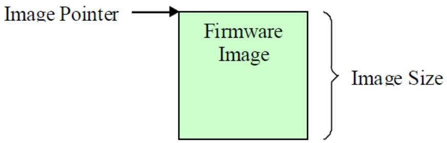  
Fig. 23.1: Firmware Image with no Authentication Support

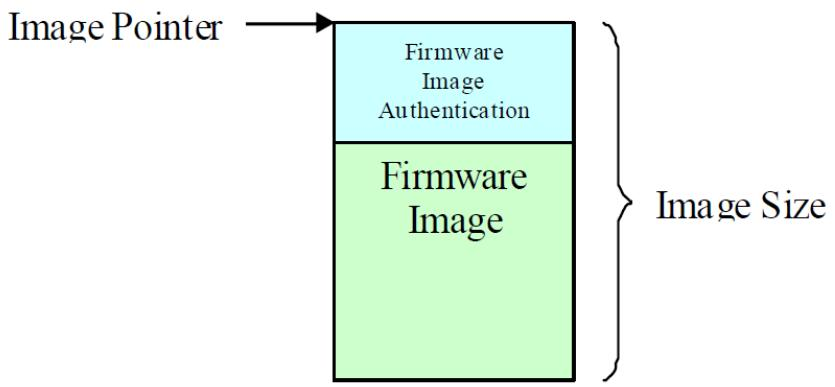  
Fig. 23.2: Firmware Image with Authentication Support

to be used.

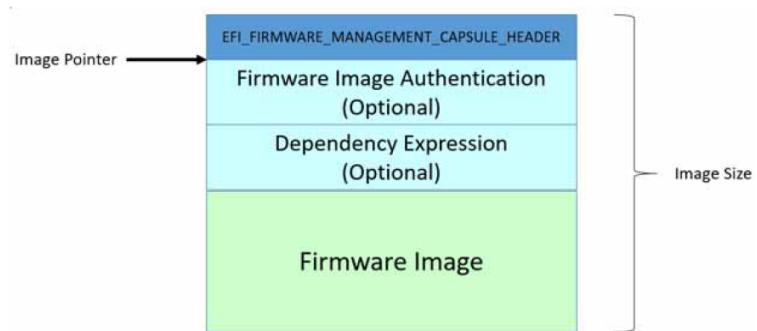  
Fig. 23.3: Firmware Image with Dependency/AuthenticationSupport

## Status Codes Returned

<table><tr><td>EFI_SUCCESS</td><td>The image information was successfully returned.</td></tr><tr><td>EFI_BUFFER_TOO_SMALL</td><td>TheImageInfo buffer was too small. The current buffer size needed to hold the image(s) information is returned in *ImageInfoSize.</td></tr><tr><td>EFI_INVALID_PARAMETER</td><td>*ImageInfoSizeis not too small and ImageInfo is NULL.</td></tr><tr><td>EFI_INVALID_PARAMETER</td><td>*ImageInfoSizeis non-zero and DescriptorVersion is NULL.</td></tr><tr><td>EFI_INVALID_PARAMETER</td><td>*ImageInfoSizeis non-zero and DescriptorCount is NULL.</td></tr><tr><td>EFI_INVALID_PARAMETER</td><td>*ImageInfoSizeis non-zero and DescriptorSize is NULL.</td></tr><tr><td>EFI_INVALID_PARAMETER</td><td>*ImageInfoSizeis non-zero and PackageVersion is NULL.</td></tr><tr><td>EFI_INVALID_PARAMETER</td><td>*ImageInfoSizeis non-zero and PackageVersionName is NULL.</td></tr><tr><td>EFI_INVALID_PARAMETER</td><td>*ImageInfoSizeis NULL.</td></tr><tr><td>EFI_DEVICE_ERROR</td><td>Valid information could not be returned. Possible corrupted image.</td></tr></table>

## 23.1.3 EFI\_FIRMWARE\_MANAGEMENT\_PROTOCOL.GetImage()

## Summary

Retrieves a copy of the current firmware image of the device.

Protocol

<table><tr><td colspan="2">typedef</td></tr><tr><td colspan="2">EFI_STATUS</td></tr><tr><td colspan="2">(EFIAPI *EFI_FIRMWARE_MANAGEMENT_PROTOCOL_GET_IMAGE) (</td></tr><tr><td>IN EFI_FIRMWARE_MANAGEMENT_PROTOCOL</td><td>*This,</td></tr><tr><td>IN UINT8</td><td>ImageIndex,</td></tr><tr><td>OUT VOID</td><td>*Image,</td></tr><tr><td>IN OUT UINTN</td><td>*ImageSize</td></tr><tr><td>);</td><td></td></tr></table>

## Parameters

## This

A pointer to the EFI\_FIRMWARE\_MANAGEMENT\_PROTOCOL instance.

## ImageIndex

A unique number identifying the firmware image(s) within the device. The number is between 1 and DescriptorCount.

## Image

Points to the bufer where the current image is copied to. May be NULL with a zero ImageSize in order to determine the size of the bufer needed.

## ImageSize

On entry, points to the size of the bufer pointed to by Image, in bytes. On return, points to the length of the image, in bytes.

## Related Definitions

None

## Description

This function allows a copy of the current firmware image to be created and saved. The saved copy could later been used, for example, in firmware image recovery or rollback.

## <sup>ò</sup> Note

Not all implementations of GetImage() will return what can be sent to SetImage(). Image validity can be verified by using the CheckImage() API to verify if the returned Image can be used for SetImage().

## Status Codes Returned

<table><tr><td>EFI_SUCCESS</td><td>The current image was successfully copied to the buffer.</td></tr><tr><td>EFI_BUFFER_TOO_SMALL</td><td>The buffer specified byImageSizeis too small to hold the image. The current buffer size needed to hold the image is returned inImageSize.</td></tr><tr><td>EFI_INVALID_PARAMETER</td><td>TheImageSizeis not too small and Imageis NULL</td></tr><tr><td>EFI_NOT_FOUND</td><td>The current image is not copied to the buffer.</td></tr><tr><td>EFI_UNSUPPORTED</td><td>The operation is not supported.</td></tr><tr><td>EFI_SECURITY_VIOLATION</td><td>The operation could not be completed due to an image corruption. If the image is able to be read, the Image buffer will be updated with the retrieved image contents.</td></tr><tr><td>EFI_DEVICE_ERROR</td><td>The image could not be read.</td></tr></table>

## 23.1.4 EFI\_FIRMWARE\_MANAGEMENT\_PROTOCOL.SetImage()

## Summary

Updates the firmware image of the device.

Protocol

```txt
typedef
EFI_STATUS
(EFIAPI *EFI_FIRMWARE_MANAGEMENT_PROTOCOL_SET_IMAGE) (
    IN EFI_FIRMWARE_MANAGEMENT_PROTOCOL    *This,
    IN UINT8    ImageIndex,
    IN CONST VOID    *Image,
    IN UINTN    ImageSize,
    IN   CONST VOID    *VendorCode,
    IN   EFI_FIRMWARE_MANAGEMENT_UPDATE_IMAGE_PROGRESS Progress,
    OUT CHAR16    **AbortReason
);
```

## Parameters

## This

A pointer to the EFI\_FIRMWARE\_MANAGEMENT\_PROTOCOL instance.

## ImageIndex

A unique number identifying the firmware image(s) within the device. The number is between 1 and DescriptorCount.

## Image

Points to the new image.

## ImageSize

Size of the new image in bytes.

## VendorCode

This enables vendor to implement vendor-specific firmware image update policy. Null indicates the caller did not specify the policy or use the default policy.

## Progress

A function used by the driver to report the progress of the firmware update.

## AbortReason

A pointer to a pointer to a null-terminated string providing more details for the aborted operation. The bufer is allocated by this function with AllocatePool(), and it is the caller’s responsibility to free it with a call to FreePool().

## Related Definitions

```txt
typedef
EFI_STATUS
(EFIAPI *EFI_FIRMWARE_MANAGEMENT_UPDATE_IMAGE_PROGRESS) (
    IN UINTN    Completion
);
```

## Completion

A value between 1 and 100 indicating the current completion progress of the firmware update. Completion progress is reported as from 1 to 100 percent. A value of 0 is used by the driver to indicate that progress reporting is not supported.

On EFI\_SUCCESS, SetImage() continues to do the callback if supported. On NOT EFI\_SUCCESS, SetImage() discontinues the callback and completes the update and returns.

## Description

This function updates the hardware with the new firmware image.

This function returns EFI\_UNSUPPORTED if the firmware image is not updatable.

If the firmware image is updatable, the function should perform the following minimal validations before proceeding to do the firmware image update.

• Validate the image authentication if image has attribute IMAGE\_ATTRIBUTE\_AUTHENTICATION\_REQUIRED. The function returns EFI\_SECURITY\_VIOLATION if the validation fails.

• Validate the image is a supported image for this device. The function returns EFI\_ABORTED if the image is unsupported. The function can optionally provide more detailed information on why the image is not a supported image.

• Validate the data from VendorCode if not null. Image validation must be performed before VendorCode data validation. VendorCode data is ignored or considered invalid if image validation failed. The function returns EFI\_ABORTED if the data is invalid.

VendorCode enables vendor to implement vendor-specific firmware image update policy. Null if the caller did not specify the policy or use the default policy. As an example, vendor can implement a policy to allow an option to force a firmware image update when the abort reason is due to the new firmware image version is older than the current firmware image version or bad image checksum. Sensitive operations such as those wiping the entire firmware image and render the device to be non-functional should be encoded in the image itself rather than passed with the VendorCode

AbortReason enables vendor to have the option to provide a more detailed description of the abort reason to the caller.

## Status Codes Returned

<table><tr><td>EFI_SUCCESS</td><td>The device was successfully updated with the new image.</td></tr><tr><td>EFI_ABORTED</td><td>The operation is aborted.</td></tr><tr><td>EFI_INVALID_PARAMETER</td><td>The Image was NULL.</td></tr><tr><td>EFI_UNSUPPORTED</td><td>The operation is not supported.</td></tr><tr><td>EFI_SECURITY_VIOLATION</td><td>The operation could not be performed due to an authentication failure.</td></tr></table>

## 23.1.5 EFI\_FIRMWARE\_MANAGEMENT\_PROTOCOL.CheckImage()

## Summary

Checks if the firmware image is valid for the device.

## Protocol

```txt
typedef
EFI_STATUS
(EFIAPI *EFI_FIRMWARE_MANAGEMENT_PROTOCOL_CHECK_IMAGE) (
    IN EFI_FIRMWARE_MANAGEMENT_PROTOCOL    *This,
    IN UINT8    ImageIndex,
    IN CONST VOID    *Image,
    IN UINTN    ImageSize,
    OUT UINT32    *ImageUpdatable
);
```

## Parameters

This A pointer to the EFI\_FIRMWARE\_MANAGEMENT\_PROTOCOL instance.

## ImageIndex

A unique number identifying the firmware image(s) within the device. The number is between 1 and DescriptorCount.

Image Points to the new image.

ImageSize Size of the new image in bytes.

## ImageUpdatable

Indicates if the new image is valid for update. It also provides, if available, additional information if the image is invalid. See “Related Definitions”.

## Related Definitions

```c
//**********************************************************************
// ImageUpdatable Definitions
//**********************************************************************
#define IMAGE_UPDATABLE_VALID 0x0000000000000001
#define IMAGE_UPDATABLE_INVALID 0x0000000000000002
#define IMAGE_UPDATABLE_INVALID_TYPE 0x0000000000000004
#define IMAGE_UPDATABLE_INVALID_OLD 0x0000000000000008
#define IMAGE_UPDATABLE_VALID_WITH_VENDOR_CODE \ 0x0000000000000010
```

## IMAGE\_UPDATABLE\_VALID

indicates SetImage() will accept the new image and update the device with the new image.The version of the new image could be higher or lower than the current image. SetImage VendorCode i s optional but can be used for vendor specific action.

## IMAGE\_UPDATABLE\_INVALID

indicates SetImage() will reject the new image. No additional information is provided for the rejection.

## IMAGE\_UPDATABLE\_INVALID\_TYPE

indicates SetImage() will reject the new image. The rejection is due to the new image is not a firmware image recognized for this device.

## IMAGE\_UPDATABLE\_INVALID\_OLD

indicates SetImage() will reject the new image. The rejection is due to the new image version is older than the current firmware image version in the device. The device firmware update policy does not support firmware version downgrade.

## IMAGE\_UPDATABLE\_VALID\_WITH\_VENDOR\_CODE

indicates SetImage() will accept and update the new image only if a correct VendorCode is provided or else image would be rejected and SetImage will return appropriate error.

## Description

This function allows firmware update application to validate the firmware image without invoking the SetImage() first. Please see SetImage() for the type of image validations performed.

## Status Codes Returned

<table><tr><td>EFI_SUCCESS</td><td>The image was successfully checked.</td></tr><tr><td>EFI_INVALID_PARAMETER</td><td>The Image was NULL.</td></tr><tr><td>EFI_UNSUPPORTED</td><td>The operation is not supported.</td></tr><tr><td>EFI_SECURITY_VIOLATION</td><td>The operation could not be performed due to an authentication failure.</td></tr></table>

## 23.1.6 EFI\_FIRMWARE\_MANAGEMENT\_PROTOCOL.GetPackageInfo()

## Summary

Returns information about the firmware package.

Protocol

```c
typedef
EFI_STATUS
(EFIAPI *EFI_FIRMWARE_MANAGEMENT_PROTOCOL_GET_PACKAGE_INFO) (
    IN EFI_FIRMWARE_MANAGEMENT_PROTOCOL* *This,
    OUT UINT32    *PackageVersion,
```

(continues on next page)

(continued from previous page)

<table><tr><td>OUT CHAR16</td><td>**PackageVersionName,</td></tr><tr><td>OUT UINT32</td><td>*PackageVersionNameMaxLen</td></tr><tr><td>OUT UINT64</td><td>*AttributesSupported,</td></tr><tr><td>OUT UINT64</td><td>*AttributesSetting</td></tr><tr><td>);</td><td></td></tr></table>

## Parameters

## This

A pointer to the EFI\_FIRMWARE\_MANAGEMENT\_PROTOCOL instance.

## PackageVersion

A version number that represents all the firmware images in the device. The format is vendor specific and new version must have a greater value than the old version. If PackageVersion is not supported, the value is 0xFFFFFFFF. A value of 0xFFFFFFFE indicates that package version comparison is to be performed using PackageVersionName. A value of 0xFFFFFFFD indicates that package version update is in progress.

## PackageVersionName

A pointer to a pointer to a null-terminated string representing the package version name. The bufer is allocated by this function with AllocatePool(), and it is the caller’s responsibility to free it with a call to FreePool().

## PackageVersionNameMaxLen

The maximum length of package version name if device supports update of package version name. A value of 0 indicates the device does not support update of package version name. Length is the number of Unicode characters, including the terminating null character.

## AttributesSupported

Package attributes that are supported by this device. See “Package Attribute Definitions” for possible returned values of this parameter. A value of 1 indicates the attribute is supported and the current setting value is indicated in AttributesSetting. A value of 0 indicates the attribute is not supported and the current setting value in AttributesSetting is meaningless.

## AttributesSetting

Package attributes. See “Package Attribute Definitions” for possible returned values of this parameter.

## Related Definitions

```c
//**********************************************************************
// Package Attribute Definitions
//**********************************************************************
#define PACKAGE_ATTRIBUTE_VERSION_UPDATABLE 0x0000000000000001
#define PACKAGE_ATTRIBUTE_RESET_REQUIRED 0x0000000000000002
#define PACKAGE_ATTRIBUTE_AUTHENTICATION_REQUIRED 0x000000000000004
```

The attribute PACKAGE\_ATTRIBUTE\_VERSION\_UPDATABLE indicates this device supports the update of the firmware package version.

The attribute PACKAGE\_ATTRIBUTE\_RESET\_REQUIRED indicates a reset of the device is required for the new package info to take efect after an update.

The attribute PACKAGE\_ATTRIBUTE\_AUTHENTICATION\_REQUIRED indicates authentication is required to update the package info.

## Description

This function returns package information.

Status Codes Returned

<table><tr><td>EFI_SUCCESS</td><td>The package information was successfully returned.</td></tr><tr><td>EFI_UNSUPPORTED</td><td>The operation is not supported.</td></tr></table>

## 23.1.7 EFI\_FIRMWARE\_MANAGEMENT\_PROTOCOL.SetPackageInfo()

## Summary

Updates information about the firmware package.

## Protocol

```c
typedef
EFI_STATUS
(EFIAPI *EFI_FIRMWARE_MANAGEMENT_PROTOCOL_SET_PACKAGE_INFO) (
    IN EFI_FIRMWARE_MANAGEMENT_PROTOCOL* *This,
    IN CONST VOID    *Image,
    IN UINTN    ImageSize,
    IN CONST VOID    *VendorCode,
    IN UINT32    PackageVersion,
    IN CONST CHAR16    *PackageVersionName
);
```

## Parameters

This A pointer to the EFI\_FIRMWARE\_MANAGEMENT\_PROTOCOL instance.

Image Points to the authentication image. Null if authentication is not required.

ImageSize Size of the authentication image in bytes. 0 if authentication is not required.

This enables vendor to implement vendor-specific firmware image update policy. Null indicates the caller did not specify this policy or use the default policy.

## PackageVersionName PackageVersionName

A pointer to the new null-terminated Unicode string representing the package version name. The string length is equal to or less than the value returned in PackageVersionNameMaxLen.

## Description

This function updates package information.

This function returns EFI\_UNSUPPORTED if the package information is not updatable.

VendorCode enables vendor to implement vendor-specific package information update policy. Null if the caller did not specify this policy or use the default policy.

## Status Codes Returned

<table><tr><td>EFI_SUCCESS</td><td>The device was successfully updated with the new package information</td></tr></table>

continues on next page

Table 23.3 – continued from previous page

<table><tr><td>EFI_INVALID_PARAMETER</td><td>The PackageVersionName length is longer than the value returned in PackageVersionNameMaxLen.</td></tr><tr><td>EFI_UNSUPPORTED</td><td>The operation is not supported.</td></tr><tr><td>EFI_SECURITY_VIOLATION</td><td>The operation could not be performed due to an authentication failure.</td></tr></table>

## 23.2 Dependency Expression Instruction Set

The following topics describe each of the firmware management protocol dependency expression (depex) opcodes in detail. Information includes a description of the instruction functionality, binary encoding, and any limitations or unique behaviors of the instruction.

Several of the opcodes require a GUID operand. The GUID operand is a 16-byte value that matches the type EFI\_GUID that is described in Chapter 2 of the UEFI 2.0 specification. These GUIDs represent the EFI\_FIRMWARE\_IMAGE\_DESCRIPTOR .ImageTypeId that are exposed by an EFI\_FIRMWARE\_MANAGE\_PROTOCOL instance. A dependency expression is a packed byte stream of opcodes and operands. As a result, some of the GUID operands will not be aligned on natural boundaries. Care must be taken on processor architectures that do allow unaligned accesses.

The dependency expression is stored in a packed byte stream using postfix notation. As a dependency expression is evaluated, the operands are pushed onto a stack. Operands are popped of the stack to perform an operation. After the last operation is performed, the value on the top of the stack represents the evaluation of the entire dependency expression. If a push operation causes a stack overflow, then the entire dependency expression evaluates to FALSE. If a pop operation causes a stack underflow, then the entire dependency expression evaluates to FALSE. Reasonable implementations of a dependency expression evaluator should not make arbitrary assumptions about the maximum stack size it will support. Instead, it should be designed to grow the dependency expression stack as required. In addition, FMP images that contain dependency expressions should make an efort to keep their dependency expressions as small as possible to help reduce the size of the FMP image.

All opcodes are 8-bit values, and if an invalid opcode is encountered, then the entire dependency expression evaluates to FALSE.

When the dependency expression is being evaluated and a GUID specified cannot be found, then the result of the conditional operation evaluates to FALSE.

If, when evaluating two popped values from the stack, it is determined that they are of diferent types (e.g. BOOLEAN value and 32-bit value), then the entire dependency expression evaluates to FALSE.

If an END opcode is not present in a dependency expression, then the entire dependency expression evaluates to FALSE.

The final evaluation of the dependency expression results in either a TRUE or FALSE result.

Table 23.4: Dependency Expression Opcode Summary

<table><tr><td>Op-code</td><td>Description</td></tr><tr><td>0x00</td><td>Push FMP GUID (1 op-code + 16 bytes)</td></tr><tr><td>0x01</td><td>Push 32-bit version value</td></tr><tr><td>0x02</td><td>Declare NULL-terminated string (Human-readable Version)</td></tr><tr><td>0x03</td><td>AND – Pop 2 BOOLEAN values and Push TRUE if both are TRUE.</td></tr><tr><td>0x04</td><td>OR – Pop 2 BOOLEAN values and Push TRUE if either are TRUE.</td></tr><tr><td>0x05</td><td>NOT – Pop BOOLEAN value Push NOT of BOOLEAN value.</td></tr><tr><td>0x06</td><td>Push TRUE</td></tr><tr><td>0x07</td><td>Push FALSE</td></tr></table>

continues on next page

Table 23.4 – continued from previous page

<table><tr><td>0x08</td><td>EQ - Pop 2 32-bit version values and push TRUE if equal.</td></tr><tr><td>0x09</td><td>GT - Pop 2 32-bit version values and push TRUE if first value is greater than the second.</td></tr><tr><td>0x0A</td><td>GTE - Pop 2 32-bit version values and push TRUE if first value is greater than or equal to the second.</td></tr><tr><td>0x0B</td><td>LT - Pop 2 32-bit version values and push TRUE if first value is less than the second.</td></tr><tr><td>0x0C</td><td>LTE - Pop 2 32-bit version values and push TRUE if first value is less than or equal to the second.</td></tr><tr><td>0x0D</td><td>END</td></tr><tr><td>0x0E</td><td>DECLARE_LENGTH - declares a 32-bit byte length of the entire dependency expression</td></tr></table>

## 23.2.1 PUSH\_GUID

Syntax

```txt
PUSH_GUID <FMP GUID>
```

## Description

Pushes the GUID value onto the stack. This GUID should be exposed by an EFI\_FIRMWARE\_MANAGEMENT\_PROTOCOL instance. The GUID should match one of the EFI\_FIRMWARE\_IMAGE\_DESCRIPTOR. ImageTypeId values exposed through the GetImageInfo() function.

## Operation

1. Search through all instances of the EFI\_FIRMWARE\_MANAGEMENT\_PROTOCOL.

a - In each instance, use the GetImageInfo() function to retrieve the ImageInfo->ImageTypeId value and ensure it matches the GUID specified in the op-code.

b - If it doesn’t match the GUID and no other instances match either, POP all values from the stack and PUSH FALSE onto the stack when evaluating a conditional operation involving the missing GUID.

2. Having found the matching EFI\_FIRMWARE\_MANAGEMENT\_PROTOCOL instance, use the GetImageInfo() function and push the ImageInfo->Version value onto the stack.

Table 23.5: PUSH\_GUID Instruction Encoding

<table><tr><td>Byte</td><td>Description</td></tr><tr><td>0</td><td>0x00</td></tr><tr><td>1..16</td><td>A 16-byte GUID that represents an ImageTypeId in an FMP instance. The format is the same as type EFI_GUID.</td></tr></table>

## Behaviors and Restrictions

None.

## 23.2.2 PUSH\_VERSION

Syntax

```c
PUSH_VERSION <32-bit Version>
```

## Description

Pushes the 32-bit version value to compare against onto the stack. This value will be used to compare against Version values exposed through the GetImageInfo() function.

Table 23.6: PUSH\_VERSION Instruction Encoding

<table><tr><td>Byte</td><td>Description</td></tr><tr><td>0</td><td>0x01</td></tr><tr><td>1..4</td><td>A 32-bit version to compare against.</td></tr></table>

Behaviors and Restrictions

None.

## 23.2.3 DECLARE\_VERSION\_NAME

Syntax

```txt
DECLARE_VERSION_NAME <NULL-terminated string>
```

## Description

Declares an optional null-terminated version string that is the equivalent of the VersionName in the EFI\_FIRMWARE\_MANAGEMENT\_DESCRIPTOR. Due to the OEM/IHV-specific format of version strings, this nullterminated string will not be used for purposes of comparison. Only the 32-bit integer values will be used for comparisons.

Table 23.7: DECLARE\_VERSION\_NAME Instruction Encoding

<table><tr><td>Byte</td><td>Description</td></tr><tr><td>0</td><td>0x02</td></tr><tr><td>1..n</td><td>A null-terminated UNICODE string.</td></tr></table>

## Behaviors and Restrictions

None.

## 23.2.4 AND

Syntax

```txt
AND
```

## Description

Pops two Boolean operands of the stack, performs a Boolean AND operation between the two operands, and pushes the result back onto the stack.

Operation

```txt
Operand1 <= POP Boolean stack element
Operand2 <= POP Boolean stack element
Result <= Operand1 AND Operand2
PUSH Result
```

Table 23.8: AND Instruction Encoding

<table><tr><td>Byte</td><td>Description</td></tr><tr><td>0</td><td>0x03</td></tr></table>

Behaviors and Restrictions

None.

## 23.2.5 OR

Syntax

OR

Description

Pops two Boolean operands of the stack, performs a Boolean OR operation between the two operands, and pushes the result back onto the stack.

Operation

```txt
Operand1 <= POP Boolean stack element
Operand2 <= POP Boolean stack element
Result <= Operand1 OR Operand2
PUSH Result
```

Table 23.9: OR Instruction Encoding

<table><tr><td>Byte</td><td>Description</td></tr><tr><td>0</td><td>0x04</td></tr></table>

## Behaviors and Restrictions

None.

## 23.2.6 NOT

Syntax

Description

Pops a Boolean operand of the stack, performs a Boolean NOT operation on the operand, and pushes the result back onto the stack.

Operation

Table 23.10: NOT Instruction Encoding

<table><tr><td>Byte</td><td>Description</td></tr><tr><td>0</td><td>0x05</td></tr></table>

## Behaviors and Restrictions

None.

## 23.2.7 TRUE

Syntax

```csv
**TRUE**
```

Description

Pushes a Boolean TRUE onto the stack.

Operation

```txt
PUSH **TRUE**
```

Table 23.11: TRUE Instruction Encoding

<table><tr><td>Byte</td><td>Description</td></tr><tr><td>0</td><td>0x06</td></tr></table>

Behaviors and Restrictions

None.

## 23.2.8 FALSE

Syntax

```txt
**FALSE**
```

Description

Pushes a Boolean FALSE onto the stack.

Operation

```txt
PUSH **FALSE**
```

Table 23.12: FALSE Instruction Encoding

<table><tr><td>Byte</td><td>Description</td></tr><tr><td>0</td><td>0x07</td></tr></table>

## Behaviors and Restrictions

None.

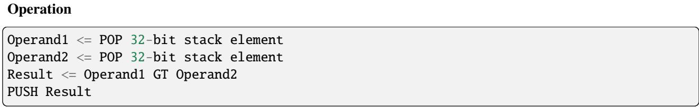

```txt
EQ
```

## 23.2.9 EQ

Syntax

Description

Pops two 32-bit operands of the stack, performs a Boolean equals comparison operation between the two operands, and pushes the result back onto the stack.

Operation

```txt
Operand1 ? POP 32-bit stack element
Operand2 ? POP 32-bit stack element
Result ? Operand1 EQ Operand2
PUSH Result
```

Table 23.13: EQ Instruction Encoding

<table><tr><td>Byte</td><td>Description</td></tr><tr><td>0</td><td>0x08</td></tr></table>

## Behaviors and Restrictions

None.

## 23.2.10 GT

Syntax

Description

Pops two 32-bit operands of the stack, performs a Boolean greater-than comparison operation between the two operands, and pushes the result back onto the stack.

Table 23.14: GT Instruction Encoding

<table><tr><td>Byte</td><td>Description</td></tr><tr><td>0</td><td>0x09</td></tr></table>

## Behaviors and Restrictions

None.

```txt
LT
```

## 23.2.11 GTE

Syntax

```txt
GTE
```

## Description

Pops two 32-bit operands of the stack, performs a Boolean greater-than-or-equal comparison operation between the two operands, and pushes the result back onto the stack.

Operation

```asm
Operand1 ? POP 32-bit stack element
Operand2 ? POP 32-bit stack element
Result ? Operand1 GTE Operand2
PUSH Result
```

Table 23.15: GTE Instruction Encoding

<table><tr><td>Byte</td><td>Description</td></tr><tr><td>0</td><td>0x0A</td></tr></table>

## Behaviors and Restrictions

None.

## 23.2.12 LT

Syntax

## Description

Pops two 32-bit operands of the stack, performs a Boolean less-than comparison operation between the two operands, and pushes the result back onto the stack.

Operation

```txt
Operand1 ? POP 32-bit stack element
Operand2 ? POP 32-bit stack element
Result ? Operand1 LT Operand2
PUSH Result
```

Table 23.16: LT Instruction Encoding

<table><tr><td>Byte</td><td>Description</td></tr><tr><td>0</td><td>0x0B</td></tr></table>

## Behaviors and Restrictions

None.

## 23.2.13 LTE

Syntax

```txt
LTE
```

Description

Pops two 32-bit operands of the stack, performs a Boolean less-than-or-equal comparison operation between the two operands, and pushes the result back onto the stack.

Operation

```asm
Operand1 ? POP 32-bit stack element
Operand2 ? POP 32-bit stack element
Result ? Operand1 LTE Operand2
PUSH Result
```

Table 23.17: LTE Instruction Encoding

<table><tr><td>Byte</td><td>Description</td></tr><tr><td>0</td><td>0x0C</td></tr></table>

## Behaviors and Restrictions

None.

## 23.2.14 END

Syntax

END

Description

Pops the final result of the dependency expression evaluation of the stack and exits the dependency expression evaluator.

Operation

<table><tr><td>POP ResultRETURN Result</td></tr></table>

Table 23.18: END Instruction Encoding

<table><tr><td>Byte</td><td>Description</td></tr><tr><td>0</td><td>0x0D</td></tr></table>

## Behaviors and Restrictions

This opcode must be the last one in a dependency expression.

## 23.2.15 DECLARE\_LENGTH

Syntax

```txt
DECLARE_LENGTH <32-bit Length>
```

## Description

Declares an 32-bit byte length of the entire dependency expression.

Table 23.19: DECLARE\_LENGTH Instruction Encoding

<table><tr><td>Byte</td><td>Description</td></tr><tr><td>0</td><td></td></tr><tr><td></td><td>0X0e 1..4</td></tr><tr><td></td><td>A 32-bit byte length for the entire dependency expression.</td></tr></table>

## Behaviors and Restrictions

This opcode must be the first one in a dependency expression.

## 23.3 Delivering Capsules Containing Updates to Firmware Management Protocol

Summary

This section defines a method for delivery of a Firmware Management Protocol defined update using the UpdateCapsule runtime API.

## 23.3.1 EFI\_FIRMWARE\_MANAGEMENT\_CAPSULE\_ID\_GUID

GUID

```c
// {6DCBD5ED-E82D-4C44-BDA1-7194199AD92A}
#define EFI_FIRMWARE_MANAGEMENT_CAPSULE_ID_GUID \
{0x6dcbd5ed, 0xe82d, 0x4c44, \
{0xbd, 0xa1, 0x71, 0x94, 0x19, 0x9a, 0xd9, 0x2a }}
```

## Description

This GUID is used in the CapsuleGuid field of EFI\_CAPSULE\_HEADER struct within a capsule constructed according to the definitions of section Capsule Definition. Use of this GUID indicates a capsule with body conforming to the additional structure defined in DEFINED FIRMWARE MANAGEMENT PROTOCOL DATA CAPSULE STRUCTURE

When delivered to platform firmware QueryCapsuleCapabilities() the capsule will be examined according to the structure defined in DEFINED FIRMWARE MANAGEMENT PROTOCOL DATA CAPSULE STRUCTURE . and if it is possible for the platform to process EFI\_SUCCESS will be returned.

When delivered to platform firmware UpdateCapsule() the capsule will be examined according to the structure defined in DEFINED FIRMWARE MANAGEMENT PROTOCOL DATA CAPSULE STRUCTURE . and if it is possible for the platform to process the update will be processed.

By definition Firmware Management protocol services are not available in EFI runtime and depending upon platform capabilities, EFI runtime delivery of this capsule may not be supported and may return an error when delivered in EFI runtime with CAPSULE\_FLAGS\_PERSIST\_ACROSS\_RESET bit defined. However, any platform supporting this capability is required to accept this form of capsule in Boot Services, including optional use of CAP-SULE\_FLAGS\_PERSIST\_ACROSS\_RESET bit.

## 23.3.2 DEFINED FIRMWARE MANAGEMENT PROTOCOL DATA CAPSULE STRUC-TURE

Structure of the Capsule Body

Generic EFI Capsule Body is defined in Capsule Definition. When an EFI Capsule is identified by EFI\_FIRMWARE\_MANAGEMENT\_CAPSULE\_ID\_GUID, the internal structure of the capsule \_FIRMWARE\_MANAGEMENT\_CAPSULE\_HEADER followed by optional EFI drivers to be loaded by the platform and optional binary payload items to be processed and passed to Firmware Management Protocol image update function. Each binary payload item is preceded by EFI\_FIRMWARE\_MANAGEMENT\_CAPSULE\_IMAGE\_HEADER. Internal capsule structure diagram follows.

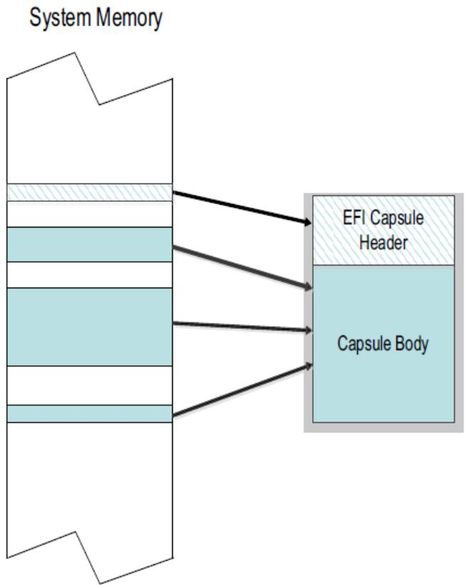  
Fig. 23.4: Optional Scatter-Gather Construction of Capsule Submitted to Update Capsule()

Related Definitions

<table><tr><td colspan="2">#pragma pack(1)</td></tr><tr><td colspan="2">typedef struct {</td></tr><tr><td>UINT32</td><td>Version;</td></tr><tr><td>UINT16</td><td>EmbeddedDriverCount;</td></tr></table>

(continues on next page)