By definition Firmware Management protocol services are not available in EFI runtime and depending upon platform capabilities, EFI runtime delivery of this capsule may not be supported and may return an error when delivered in EFI runtime with CAPSULE\_FLAGS\_PERSIST\_ACROSS\_RESET bit defined. However, any platform supporting this capability is required to accept this form of capsule in Boot Services, including optional use of CAP-SULE\_FLAGS\_PERSIST\_ACROSS\_RESET bit.

## 23.3.2 DEFINED FIRMWARE MANAGEMENT PROTOCOL DATA CAPSULE STRUC-TURE

Structure of the Capsule Body

Generic EFI Capsule Body is defined in Capsule Definition. When an EFI Capsule is identified by EFI\_FIRMWARE\_MANAGEMENT\_CAPSULE\_ID\_GUID, the internal structure of the capsule \_FIRMWARE\_MANAGEMENT\_CAPSULE\_HEADER followed by optional EFI drivers to be loaded by the platform and optional binary payload items to be processed and passed to Firmware Management Protocol image update function. Each binary payload item is preceded by EFI\_FIRMWARE\_MANAGEMENT\_CAPSULE\_IMAGE\_HEADER. Internal capsule structure diagram follows.

  
Fig. 23.4: Optional Scatter-Gather Construction of Capsule Submitted to Update Capsule()

Related Definitions

<table><tr><td colspan="2">#pragma pack(1)</td></tr><tr><td colspan="2">typedef struct {</td></tr><tr><td>UINT32</td><td>Version;</td></tr><tr><td>UINT16</td><td>EmbeddedDriverCount;</td></tr></table>

(continues on next page)

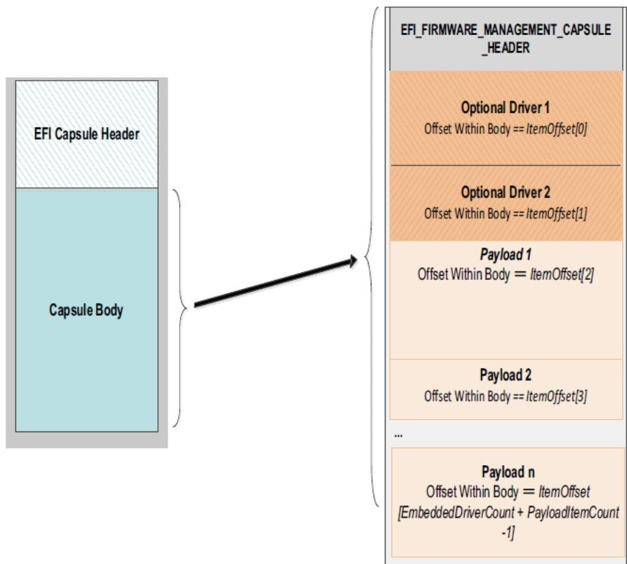  
Fig. 23.5: Capsule Header and Firmware Management Capsule Header

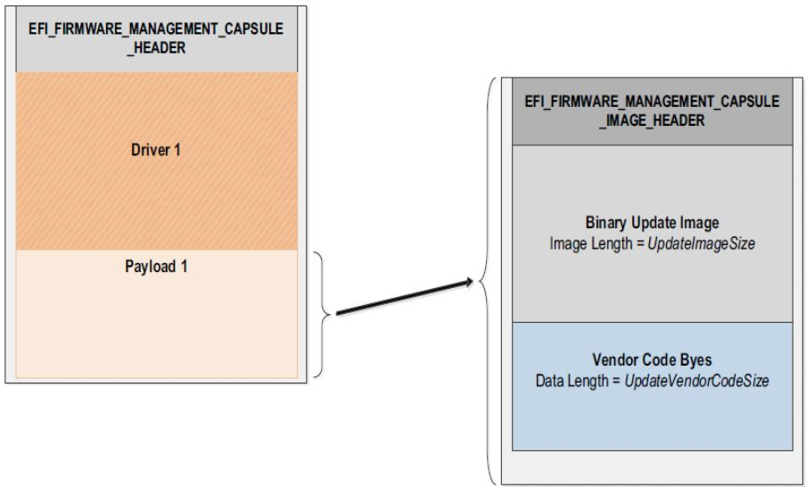  
Fig. 23.6: Firmware Management and Firmware Image Management headers

<table><tr><td colspan="2">(continued from previous page)</td></tr><tr><td>UINT16</td><td>PayloadItemCount;</td></tr><tr><td>// UINT64</td><td>ItemOffsetList[];</td></tr><tr><td colspan="2">} EFI_FIRMWARE_MANAGEMENT_CAPSULE_HEADER;</td></tr></table>

## Version

Version of the structure, initially 0x00000001.

## EmbeddedDriverCount

The number of drivers included in the capsule and the number of corresponding ofsets stored in ItemOfsetList array. This field may be zero in the case where no driver is required.

## PayloadItemCount

The number of payload items included in the capsule and the number of corresponding ofsets stored in the ItemOfsetList array. This field may be zero in the case where no binary payload object is required to accomplish the update.

## ItemOfsetList

Variable length array of dimension [ EmbeddedDriverCount + PayloadItemCount ] containing ofsets of each of the drivers and payload items contained within the capsule. The ofsets of the items are calculated relative to the base address of the EFI\_FIRMWARE\_MANAGEMENT\_CAPSULE\_HEADER struct. Ofset may indicate structure begins on any byte boundary. Ofsets in the array must be sorted in ascending order with all drivers preceding all binary payload elements.

<table><tr><td colspan="2">#pragma pack(1)</td></tr><tr><td colspan="2">typedef struct {</td></tr><tr><td>UINT32</td><td>Version;</td></tr><tr><td>EFI_GUID</td><td>UpdateImageTypeId;</td></tr><tr><td>UINT8</td><td>UpdateImageIndex;</td></tr><tr><td>UINT8</td><td>reserved_bytes[3];</td></tr><tr><td>UINT32</td><td>UpdateImageSize;</td></tr><tr><td>UINT32</td><td>UpdateVendorCodeSize;</td></tr><tr><td>UINT64</td><td>UpdateHardwareInstance; //Introduced in v2</td></tr><tr><td>UINT64</td><td>ImageCapsuleSupport; //Introduced in v3</td></tr><tr><td colspan="2">} EFI_FIRMWARE_MANAGEMENT_CAPSULE_IMAGE_HEADER;</td></tr></table>

## Version

Version of the structure, initially 0x00000003.

## UpdateImageTypeId

Used to identify device firmware targeted by this update. This guid is matched by system firmware against ImageTypeId field within a EFI\_FIRMWARE\_IMAGE\_DESCRIPTOR returned by an instance of EFI\_FIRMWARE\_MANAGEMENT\_PROTOCOL.GetImageInfo() in the system.

## UpdateImageIndex

Passed as ImageIndex in call to EFI\_FIRMWARE\_MANAGEMENT\_PROTOCOL.SetImage()

## UpdateImageSize

Size of the binary update image which immediately follows this structure. Passed as ImageSize to EFI\_FIRMWARE\_MANAGEMENT\_PROTOCOL.SetImage(). This size may or may not include Firmware Image Authentication information.

## UpdateVendorCodeSize

Size of the VendorCode bytes which optionally immediately follow binary update image in the capsule. Pointer to these bytes passed in VendorCode to EFI\_FIRMWARE\_MANAGEMENT\_PROTOCOL.SetImage(). If UpdateVendorCodeSize is zero, then VendorCode is null in SetImage() call.

## UpdateHardwareInstance

The HardwareInstance to target with this update. If value is zero it means match all HardwareInstances. This field allows update software to target only a single device in cases where there are more than one device with the same ImageTypeId GUID. This header is outside the signed data of the Authentication Info structure and therefore can be modified without changing the Auth data.

## ImageCapsuleSupport

A 64-bit bitmask that determines what sections are added to the payload.

#define CAPSULE\_SUPPORT\_AUTHENTICATION 0x0000000000000001 #define CAPSULE\_SUPPORT\_DEPENDENCY 0x0000000000000002

## Description

The EFI\_FIRMWARE\_MANAGEMENT\_CAPSULE\_HEADER structure is located at the lowest ofset within the body of the capsule identified by EFI\_FIRMWARE\_MANAGEMENT\_CAPSULE\_ID\_GUID. The structure is variable length with the number of element ofsets within of the ItemOfsetList array determined by the count of drivers within the capsule plus the count of binary payload elements. It is expected that drivers whose presence is indicated by non-zero EmbeddedDriverCount will be used to supply an implementation of EFI\_FIRMWARE\_MANAGEMENT\_PROTOCOL for devices that lack said protocol within the image to be updated.

Each payload item contained within the capsule body is preceded by a EFI\_FIRMWARE\_MANAGEMENT\_CAPSULE\_IMAGE\_HEADER struct used to provide information required to prepare the payload item as an image for delivery to a instance of EFI\_FIRMWARE\_MANAGEMENT\_PROTOCOL.SetImage() function.

NOTE: [Caution] The capsule identified by EFI\_FIRMWARE\_MANAGEMENT\_CAPSULE\_ID\_GUID uses packed structures and structure fields may not be naturally aligned within the capsule bufer as delivered. Drivers and binary payload elements may start on byte boundary with no padding. Processing firmware may need to copy content elements during capsule unpacking in order to achieve any required natural alignment.

## 23.3.3 Firmware Processing of the Capsule Identified by EFI\_FIRMWARE\_MANAGEMENT\_CAPSULE\_ID\_GUID

1. Capsule is presented to system firmware via call to UpdateCapsule() or using mass storage delivery procedure of Delivery of Capsules via file on Mass Storage Device. The capsule must be constructed to consist of a single EFI\_FIRMWARE\_MANAGEMENT\_CAPSULE\_HEADER structure with the 0 or more drivers and 0 or more binary payload items. However, a capsule in which driver count and payload count are both zero is not processed.

2. Capsule is recognized by EFI\_CAPSULE\_HEADER member CapsuleGuid equal to EFI\_FIRMWARE\_MANAGEMENT\_CAPSULE\_ID\_GUID. CAPSULE\_FLAGS\_POPULATE\_SYSTEM\_TABLE flag must be 0.

3. If system is not in boot services and platform does not support persistence of capsule across reset when initiated within EFI Runtime, EFI\_OUT\_OF\_RESOURCES error is returned.

4. If device requires hardware reset to unlock flash write protection, CAP-SULE\_FLAGS\_PERSIST\_ACROSS\_RESET and optionally CAPSULE\_FLAGS\_INITIATE\_RESET should be set to 1 in the EFI\_CAPSULE\_HEADER.

5. When reset is requested using CAPSULE\_FLAGS\_PERSIST\_ACROSS\_RESET, the capsule is processed in Boot Services, before the EFI\_EVENT\_GROUP\_READY\_TO\_BOOT event.

6. All scatter-gather fragmentation is removed by the platform firmware and the capsule is processed as a contiguous bufer.

7. Examining EFI\_FIRMWARE\_MANAGEMENT\_CAPSULE\_HEADER, if EmbeddedDriverCount is non-zero, for each of the included drivers up to indicated count, the portion of the capsule body starting at the ofset indicated by ItemOfsetList[n] and continuing for a size encompassing all bytes up to the next element’s ofset stored in ItemOfsetList[n+1] or the end of the capsule, will be copied to a bufer. The driver contained within the capsule body may not be naturally aligned and the exact driver size in bytes should be respected to ensure successful security validation. In the case where a driver is last element in the ItemOfsetList array, the driver size may be calculated by reference to body size as calculated from CapsuleImageSize in EFI\_CAPSULE\_HEADER

8. Each extracted driver is placed into a bufer and passed to LoadImage(). The driver image passed to LoadImage() must successfully pass all image format, platform type, and security checks including those related to UEFI secure boot, if enabled on the platform. After LoadImage() returns the processing of the capsule is continued with next driver if present until all drivers have been passed to LoadImage(). The driver being installed must check for matching hardware and instantiate any required protocols during call to EFI\_IMAGE\_ENTRY\_POINT. In case where matching hardware is not found the driver should exit with error. In case where capsule creator has preference as to which of several included drivers to be made resident, later drivers in the capsule should confirm earlier driver successfully loaded and then exit with load error.

9. After driver processing is complete the platform firmware examines PayloadItemCount, and if zero the capsule processing is complete. Otherwise platform firmware sequentially locates each EFI\_FIRMWARE\_MANAGEMENT\_CAPSULE\_IMAGE\_HEADER found within the capsule and processes according to steps 10-14.

10. For all instances of EFI\_FIRMWARE\_MANAGEMENT\_PROTOCOL in the system, GetImageInfo() is called to return arrays of EFI\_FIRMWARE\_IMAGE\_DESCRIPTOR structures.

11. Find the matching FMP instance(s):

a – If the EFI\_FIRMWARE\_MANAGEMENT\_CAPSULE\_IMAGE\_HEADER is version 1 or it is version 2 with UpdateHardwareInstance set to 0, then system firmware will use only the ImageTypeId to determine a match. For each instance of EFI\_FIRMWARE\_MANAGEMENT\_PROTOCOL that returns a EFI\_FIRMWARE\_IMAGE\_DESCRIPTOR containing an ImageTypeId GUID that matches the UpdateImageTypeId GUID within EFI\_FIRMWARE\_MANAGEMENT\_CAPSULE\_IMAGE\_HEADER, the system firmware will call SetImage() function within that instance. In some cases there may be more than one instance of matching EFI\_FIRMWARE\_MANAGEMENT\_PROTOCOL when multiple matching devices are installed in the system and all instances will be checked for GUID match and SetImage() call if match is successful.

b – If the EFI\_FIRMWARE\_MANAGEMENT\_CAPSULE\_IMAGE\_HEADER is version 2 and contains a nonzero value in the UpdateHardwareInstance field, then system firmware will use both ImageTypeId and HardwareInstance to determine a match. For the instance of EFI\_FIRMWARE\_MANAGEMENT\_PROTOCOL that returns a EFI\_FIRMWARE\_IMAGE\_DESCRIPTOR containing an ImageTypeId GUID that matches the UpdateImageTypeId GUID and a HardwareInstance matching the UpdateHardwareInstance within EFI\_FIRMWARE\_MANAGEMENT\_CAPSULE\_IMAGE\_HEADER, the system firmware will call the SetImage() function within that instance. There will never be more than one instance since the ImageId must be unique.

12. In the situation where platform configuration or policy prohibits the processing of a capsule or individual FMP payload, the error EFI\_NOT\_READY will be returned in capsule result variable CapsuleStatus field. Otherwise SetImage() parameters are constructed using the UpdateImageIndex, UpdateImageSize and UpdateVendorCode-Size fields within EFI\_FIRMWARE\_MANAGEMENT\_CAPSULE\_IMAGE\_HEADER. In the case of capsule containing multiple payloads, or a payload matching multiple FMP instances, a separate Capsule Result Variable will be created with the results of each call to SetImage(). If any call to SetImage() selected per above matching algorithm returns an error, the processing of additional FMP instances or payload items in that capsule will be skipped and EFI\_ABORTED returned in Capsule Result Variable for each potential call to SetImage() that was skipped.

13. SetImage() performs any required image authentication as described in that functions definition within this chapter.

14. Note: if multiple separate component updates including multiple ImageIndex values are required then additional EFI\_FIRMWARE\_MANAGEMENT\_CAPSULE\_IMAGE\_HEADER structures and image binaries are included within the capsule.

15. After all items in the capsule are processed the system is restarted by the platform firmware.

## 23.4 EFI System Resource Table

## 23.4.1 EFI\_SYSTEM\_RESOURCE\_TABLE

## Summary

The EFI System Resource Table (ESRT) provides an optional mechanism for identifying device and system firmware resources for the purposes of targeting firmware updates to those resources. Each entry in the ESRT describes a device or system firmware resource that can be targeted by a firmware capsule update. Each entry in the ESRT will also be used to report status of the last attempted update. See EFI Configuration Table & Properties Table for description of how to publish ESRT using EFI\_CONFIGURATION\_TABLE. The ESRT shall be stored in memory of type EfiBoot-ServicesData. See Update Capsule and Delivery of Capsules via file on Mass Storage Device for details on delivery of updates to devices listed in ESRT.

## GUID

```c
#define EFI_SYSTEM_RESOURCE_TABLE_GUID \
{ 0xb122a263, 0x3661, 0x4f68, \
{ 0x99, 0x29, 0x78, 0xf8, 0xb0, 0xd6, 0x21, 0x80 }}
```

## Table Structure

```c
typedef struct {
    UINT32    FwResourceCount;
    UINT32    FwResourceCountMax;
    UINT64    FwResourceVersion;
    //EFI_SYSTEM_RESOURCE_ENTRY    Entries[];
} EFI_SYSTEM_RESOURCE_TABLE;
```

## Members

## FwResourceCount

The number of firmware resources in the table, must not be zero.

## FwResourceCountMax

The maximum number of resource array entries that can be within the table without reallocating the table, must not be zero.

## FwResourceVersion

The version of the EFI\_SYSTEM\_RESOURCE\_ENTRY entities used in this table. This field should be set to 1. See EFI\_SYSTEM\_RESOURCE\_TABLE\_FIRMWARE\_RESOURCE\_VERSION.

## Entries

```txt
Array of EFI_SYSTEM_RESOURCE_ENTRY
```

## Related Definitions

```c
// Current Entry Version
#define EFI_SYSTEM_RESOURCE_TABLE_FIRMWARE_RESOURCE_VERSION 1
typedef struct {
    EFI_GUID    FwClass;
    UINT32    FwType;
```

(continues on next page)

<table><tr><td colspan="2">(continued from previous page)</td></tr><tr><td>UINT32</td><td>FwVersion;</td></tr><tr><td>UINT32</td><td>LowestSupportedFwVersion;</td></tr><tr><td>UINT32</td><td>CapsuleFlags;</td></tr><tr><td>UINT32</td><td>LastAttemptVersion;</td></tr><tr><td>UINT32</td><td>LastAttemptStatus;</td></tr><tr><td colspan="2">} EFI_SYSTEM_RESOURCE_ENTRY;</td></tr></table>

## FwClass

The firmware class field contains a GUID that identifies a firmware component that can be updated via Update-Capsule(). This GUID must be unique within all entries of the ESRT.

## FwType

Identifies the type of firmware resource. See “Firmware Type Definitions” below for possible values.

## FwVersion

The firmware version field represents the current version of the firmware resource, value must always increase as a larger number represents a newer version.

## LowestSupportedFwVersion

The lowest firmware resource version to which a firmware resource can be rolled back for the given system/device. Generally this is used to protect against known and fixed security issues.

## CapsuleFlags

The capsule flags field contains the CapsuleGuid flags (bits 0- 15) as defined in the EFI\_CAPSULE\_HEADER that will be set in the capsule header.

## LastAttemptVersion

The last attempt version field describes the last firmware version for which an update was attempted (uses the same format as Firmware Version).

Last Attempt Version is updated each time an UpdateCapsule() is attempted for an ESRT entry and is preserved across reboots (non-volatile). However, in cases where the attempt version is not recorded due to limitations in the update process, the field shall set to zero after a failed update. Similarly, in the case of a removable device, this value is set to 0 in cases where the device has not been updated since being added to the system.

## LastAttemptStatus

The last attempt status field describes the result of the last firmware update attempt for the firmware resource entry.

LastAttemptStatus is updated each time an UpdateCapsule() is attempted for an ESRT entry and is preserved across reboots (non-volatile).

If a firmware update has never been attempted or is unknown, for example after fresh insertion of a removable device, LastAttemptStatus must be set to Success.

```c
//
// Firmware Type Definitions
//
#define ESRT_FW_TYPE_UNKNOWN 0x00000000
#define ESRT_FW_TYPE_SYSTEMFIRMWARE 0x00000001
#define ESRT_FW_TYPE_DEVICEFIRMWARE 0x00000002
#define ESRT_FW_TYPE_UEFIDRIVER 0x00000003
//
// Last Attempt Status Values
//
#define LAST_ATTEMPT_STATUS_SUCCESS 0x00000000
```

(continues on next page)

(continued from previous page)

```c
#define LAST_ATTEMPT_STATUS_ERROR_UNSUCCESSFUL 0x00000001
#define LAST_ATTEMPT_STATUS_ERROR_INSUFFICIENT_RESOURCES 0x00000002
#define LAST_ATTEMPT_STATUS_ERROR_INCORRECT_VERSION 0x00000003
#define LAST_ATTEMPT_STATUS_ERROR_INVALID_FORMAT 0x00000004
#define LAST_ATTEMPT_STATUS_ERROR_AUTH_ERROR 0x00000005
#define LAST_ATTEMPT_STATUS_ERROR_PWR_EVT_AC 0x00000006
#define LAST_ATTEMPT_STATUS_ERROR_PWR_EVT_BATT 0x00000007
#define LAST_ATTEMPT_STATUS_ERROR_UNSATISFIED_DEPENDENCIES 0x00000008

// The LastAttemptStatus values of 0x1000 - 0x4000 are reserved for vendor usage.
#define LAST_ATTEMPT_STATUS_ERROR_UNSUCCESSFUL_VENDOR_RANGE_MIN 0x00001000
#define LAST_ATTEMPT_STATUS_ERROR_UNSUCCESSFUL_VENDOR_RANGE_MAX 0x00004000
```

## 23.4.2 Adding and Removing Devices from the ESRT

ESRT entries must be updated by System Firmware before handof to the Operating System under the following conditions. Devices and systems that support hot swapping (once the OS has been loaded) will not get their ESRT entries updated until the next reboot and execution of ESRT updating logic in the UEFI space.

• Required: System firmware is responsible for updating the FirmwareVersion, LowestSupportedFirmwareVersion, LastAttemptVersion and LastAttemptStatus values in the ESRT any time UpdateCapsule is called and a firmware update attempt is made for the corresponding ESRT entry.

• Required: the ESRT must be updated each time a configuration change is detected by system firmware, such as when a device is added or removed from the system.

• Optional: all devices in the ESRT should be polled for any configuration changes any time UpdateCapsule is called.

## 23.4.3 ESRT and Firmware Management Protocol

Although the ESRT does not require firmware to use Firmware Management Protocol for updates it is designed to work with and extend the capabilities of FMP. The ESRT can be used to represent system and device firmware serviced by capsules that have an implementation specific format as well as devices that support Firmware Management Protocol and that are serviced by capsules formatted as described in Dependency Expression Instruction Set , Delivering Capsules Containing Updates to Firmware Management Protocol. For system expansion devices, the task of building ESRT table entries is to be performed by the system firmware based upon FMP data published by the device.

## 23.4.4 Mapping Firmware Management Protocol Descriptors to ESRT Entries

Firmware management Protocol descriptors define most of the information needed for an ESRT entry. The table below helps identify which members map to which fields. Some members are dependent on certain versions of FMP and it is left to system firmware to resolve any mappings when information is not present in the FMP instance. FMP descriptors should only be mapped to ESRT entries if the following are true:

• An entry with the same ImageTypeId is not already in the ESRT.

• AttributesSupported and AttributesSetting have the IMAGE\_ATTRIBUTE\_IN\_USE bit set.

• In the case where DescriptorCount returned by GetImageInfo() is greater than one, firmware shall populate the ESRT according to system policy, noting however that multiple ESRT entries with identical FwClass values are not permitted.

Table 23.20: ESRT and FMP Fields

<table><tr><td>ESRT Field</td><td>FMP Field</td><td>Comment</td></tr><tr><td>FwClass</td><td>ImageTypeId</td><td>The ImageTypeId GUID from the Firmware Management Protocol instance for a device is used as the Firmware Class GUID in the ESRT. Where there are multiple identical devices in the system, system firmware must create a mapping to ensure that the ESRT FwClass GUIDs are unique and consistent.</td></tr><tr><td>FwVersion</td><td>Version</td><td>Represents the current version of device firmware for an FMP instance.</td></tr><tr><td>LowestSupported FwVersion</td><td>LowestSupported ImageVersion</td><td></td></tr><tr><td>LastAttemptVersion</td><td>LastAttemptVersion</td><td>To be set after the completion of a firmware update attempt. In descriptor v3+ only. Default value is 0.</td></tr><tr><td>LastAttemptStatus</td><td>LastAttemptStatus</td><td>To be set after the completion of a firmware update attempt. In descriptor v3+ only. Default value is SUCCESS.</td></tr></table>

## 23.5 Delivering Capsule Containing JSON payload

## Summary

This section defines a method for delivery of JSON payload to perform firmware configuration or firmware update using the UpdateCapsule runtime API or using mass storage delivery.

## 23.5.1 EFI\_JSON\_CAPSULE\_ID\_GUID

GUID

```c
// {67D6F4CD-D6B8-4573-BF4A-DE5E252D61AE}
#define EFI_JSON_CAPSULE_ID_GUID \
{0x67d6f4cd, 0xd6b8, 0x4573, \
{0xbf, 0x4a, 0xde, 0x5e, 0x25, 0x2d, 0x61, 0xae }}
```

## Description

This GUID is used in the CapsuleGuid field of EFI\_CAPSULE\_HEADER struct within a capsule constructed according to the definitions of Update Capsule. Use of this GUID indicates a capsule with body conforming to the additional structure defined in Defined JSON Capsule Data Structure .

When delivered to platform firmware QueryCapsuleCapabilities() the capsule will be examined according to the structure defined in Defined JSON Capsule Data Structure , and if it is possible for the platform to process that then EFI\_SUCCESS will be returned.

When delivered to platform firmware UpdateCapsule() the capsule will be examined according to the structure defined in Defined JSON Capsule Data Structure , and if it is possible for the platform to process that the update will be processed.

By definition, firmware configuration and firmware update are not available in EFI runtime. Depending on platform capabilities, EFI runtime delivery of the capsule may not be supported, and may return an error when delivered in EFI runtime with CAPSULE\_FLAGS\_PERSIST\_ACROSS\_RESET bit defined. However, any platform supporting this capability is required to accept this form of capsule in Boot Services, including optional use of the CAP-SULE\_FLAGS\_PERSIST\_ACROSS\_RESET bit.

## 23.5.2 Defined JSON Capsule Data Structure

## Structure of the Capsule Body

A generic EFI Capsule Body is defined in Update Capsule. When an EFI Capsule is identified by EFI\_JSON\_CAPSULE\_ID\_GUID, the internal structure of the capsule header is defined in this section, see EFI\_JSON\_CAPSULE\_HEADER. Note that if multiple JSON capsules are delivered together, each JSON capsule should contain one EFI\_CAPSULE\_HEADER and one EFI\_JSON\_CAPSULE\_HEADER separately.

## Related Definitions

```txt
#pragma pack(1)
typedef struct {
    UINT32 Version;
    UINT32 CapsuleId;
    UINT32 PayloadLength;
    UINT8 Payload[];
} EFI_JSON_CAPSULE_HEADER;
#pragma pack ()
```

## Version

Version of the structure, initially 0x00000001.

## CapsuleId

The unique identifier of this capsule.

## PayloadLength

The length of the JSON payload immediately following this header, in bytes.

## Payload

Variable length bufer containing the JSON payload that should be parsed and applied to the system. The definition of the JSON schema used in the payload is beyond the scope of this specification.

## Description

The EFI\_JSON\_CAPSULE\_HEADER structure is located at the lowest ofset within the body of the capsule identified by EFI\_JSON\_CAPSULE\_ID\_GUID. It is expected that drivers which process the JSON payload have the specific knowledge of the JSON schema used in the payload. The drivers should parse the JSON payload firstly to understand whether the capsule wants to perform firmware configure or firmware update then route the JSON payload to corresponding modules. For instance, the capsule may be delivered to EFI\_FIRMWARE\_MANAGEMENT\_PROTOCOL instance to update the firmware image.

## Structure of the Configuration Data

During the system boot, current configuration data or cached configuration data is reported to the EFI System Configuration Table with EFI\_JSON\_CONFIG\_DATA\_TABLE\_GUID according to the value of EFI\_OS\_INDICATIONS\_JSON\_CONFIG\_DATA\_REFRESH bit in OsIndications. The structure to record the configuration data is defined in this section, see EFI\_JSON\_CAPSULE\_CONFIG\_DATA.

## Related Definitions

```c
#pragma pack(1)
typedef struct {
    UINT32 Version;
}
```

(continues on next page)

```cmake
UINT32 TotalLength;
EFI_JSON_CONFIG_DATA_ITEM ConfigDataList[];
} EFI_JSON_CAPSULE_CONFIG_DATA;
#pragma pack ()
```

(continued from previous page)

## Version

Version of the structure, initially 0x00000001.

## TotalLength

The total length of EFI\_JSON\_CAPSULE\_CONFIG\_DATA, in bytes.

## ConfigDataList

Array of configuration data groups. Type EFI\_JSON\_CONFIG\_DATA\_ITEM is defined below.

```c
typedef struct {
    UINT32 ConfigDataLength;
    UINT8 ConfigData[];
} EFI_JSON_CONFIG_DATA_ITEM;
```

## ConfigDataLength

The length of the following ConfigData, in bytes.

## ConfigData

Variable length bufer containing the JSON payload that describes one group of configuration data within current system. The definition of the JSON schema used in this payload is beyond the scope of this specification.

## Description

For supporting multiple groups of configuration data, a list of EFI\_JSON\_CONFIG\_DATA\_ITEM are included in EFI\_JSON\_CAPSULE\_CONFIG\_DATA and each item indicates one group of configuration data. It is expected that particular drivers have the specific knowledge of the JSON schema used in the payload so that they can describe system configuration data in JSON then install to the EFI System Configuration Table. The drivers should check EFI\_OS\_INDICATIONS\_JSON\_CONFIG\_DATA\_REFRESH bit in OsIndications to understand whether they need collect current configuration firstly.

## 23.5.3 Firmware Processing of the Capsule Identified by EFI\_JSON\_CAPSULE\_ID\_GUID

1. Capsule is presented to system firmware via call to UpdateCapsule() or using mass storage delivery procedure of Delivery of Capsules via file on Mass Storage Device. The capsule must be constructed to consist of a single EFI\_JSON\_CAPSULE\_HEADER structure with JSON payload follows. A capsule in which PayloadLength is zero will not be processed.

2. Capsule is recognized by EFI\_CAPSULE\_HEADER member CapsuleGuid equal to EFI\_JSON\_CAPSULE\_ID\_GUID. CAPSULE\_FLAGS\_POPULATE\_SYSTEM\_TABLE flag must be 0.

3. If system is not in boot services and platform does not support persistence of capsule across reset when initiated within EFI Runtime, EFI\_OUT\_OF\_RESOURCES error is returned.

4. If device requires hardware reset to unlock flash write protection, CAP-SULE\_FLAGS\_PERSIST\_ACROSS\_RESET and optionally CAPSULE\_FLAGS\_INITIATE\_RESET should be set to 1 in the EFI\_CAPSULE\_HEADER.

5. When reset is requested using CAPSULE\_FLAGS\_PERSIST\_ACROSS\_RESET, the capsule is processed in Boot Services, before the EFI\_EVENT\_GROUP\_READY\_TO\_BOOT event.

6. All scatter-gather fragmentation is removed by the platform firmware and the capsule is processed as a contiguous bufer.

7. When a capsule identified by EFI\_JSON\_CAPSULE\_ID\_GUID is received, the system firmware shall place a pointer to the coalesced capsule in the EFI System Configuration Table with EFI\_JSON\_CAPSULE\_DATA\_TABLE\_GUID before loading any third party modules such as option ROM. If multiple capsules identified by EFI\_JSON\_CAPSULE\_ID\_GUID are received, the system firmware shall place a list of pointers to the capsules, preceded by a UINTN that represents the number of pointers, in the EFI System Configuration Table with EFI\_JSON\_CAPSULE\_DATA\_TABLE\_GUID before loading any third party modules such as option ROM. The UINTN and each pointer must be naturally aligned.

8. The system configuration driver should check EFI System Configuration Table and parse the JSON payload, to identify the configuration data type of JSON payload, and route the JSON payload to corresponding modules. The corresponding capsule pointer shall be removed from the EFI System Configuration Table and also be cleared after it is processed.

9. The processing result shall be installed to EFI System Configuration Table using the format of EFI\_CAPSULE\_RESULT\_VARIABLE\_HEADER and EFI\_CAPSULE\_RESULT\_VARIABLE\_JSON defined in Section 8.5.6 with EFI\_JSON\_CAPSULE\_RESULT\_TABLE\_GUID. If the capsule is delivered via mass storage device, the process result shall be recorded by using UEFI variables as described in UEFI variable reporting on the Success or any Errors encountered in processing of capsules after restart .

# NETWORK PROTOCOLS — SNP, PXE, BIS AND HTTP BOOT

## 24.1 Simple Network Protocol

This section defines the Simple Network Protocol. This protocol provides a packet level interface to a network adapter.

## 24.1.1 EFI\_SIMPLE\_NETWORK\_PROTOCOL

## Summary

The EFI\_SIMPLE\_NETWORK\_PROTOCOL provides services to initialize a network interface, transmit packets, receive packets, and close a network interface.

## GUID

```c
#define EFI_SIMPLE_NETWORK_PROTOCOL_GUID \
{0xA19832B9,0xAC25,0x11D3,\
{0x9A,0x2D,0x00,0x90,0x27,0x3f,0xc1,0x4d}}
```

## Revision Number

```c
#define EFI_SIMPLE_NETWORK_PROTOCOL_REVISION 0x00010000
```

## Protocol Interface Structure

```c
typedef struct \_EFI_SIMPLE_NETWORK_PROTOCOL\_ {
    UINT64 Revision;
    EFI_SIMPLE_NETWORK_START Start;
    EFI_SIMPLE_NETWORK_STOP Stop;
    EFI_SIMPLE_NETWORK_INITIAL Initialize Initialize;
    EFI_SIMPLE_NETWORK_RESET Reset;
    EFI_SIMPLE_NETWORK_SHUTDOWN Shutdown;
    EFI_SIMPLE_NETWORK_RECEIVE_FILTERS ReceiveFilters;
    EFI_SIMPLE_NETWORK_STATION_ADDRESS StationAddress;
    EFI_SIMPLE_NETWORK_STATISTICS Statistics;
    EFI_SIMPLE_NETWORK_MCAST_IP_TO_MAC MCastIpToMac;
    EFI_SIMPLE_NETWORK_NVDATA NvData;
    EFI_SIMPLE_NETWORK_GET_STATUS GetStatus;
    EFI_SIMPLE_NETWORK_TRANSMIT Transmit;
    EFI_SIMPLE_NETWORK_RECEIVE Receive;
    EFI_EVENT WaitForPacket;
```

(continues on next page)

<table><tr><td colspan="2"></td><td>(continued from previous page)</td></tr><tr><td>EFI_SIMPLE_NETWORK_MODE</td><td>*Mode;</td><td></td></tr><tr><td>} EFI_SIMPLE_NETWORK_PROTOCOL;</td><td></td><td></td></tr></table>

<table><tr><td>Parameters</td></tr><tr><td>RevisionRevision of the EFI_SIMPLE_NETWORK_PROTOCOL. All future revisions must be backwards compatible. If a future version is not backwards compatible it is not the same GUID.</td></tr><tr><td>StartPrepares the network interface for further command operations. No other EFI_SIMPLE_NETWORK_PROTOCOL interface functions will operate until this call is made. See the EFI_SIMPLE_NETWORK.Start() function description.</td></tr><tr><td>StopStops further network interface command processing. No other EFI_SIMPLE_NETWORK_PROTOCOL interface functions will operate after this call is made until another Start() call is made. See the EFI_SIMPLE_NETWORK.Stop() function description.</td></tr><tr><td>InitializeResets the network adapter and allocates the transmit and receive buffers. See the EFI_SIMPLE_NETWORK.Initialize() function description.</td></tr><tr><td>ResetResets the network adapter and reinitializes it with the parameters provided in the previous call to Initialize(). See the EFI_SIMPLE_NETWORK.Reset() function description.</td></tr><tr><td>ShutdownResets the network adapter and leaves it in a state safe for another driver to initialize. The memory buffers assigned in the Initialize() call are released. After this call, only the Initialize() or Stop() calls may be used. See the EFI_SIMPLE_NETWORK.Shutdown() function description.</td></tr><tr><td>ReceiveFiltersEnables and disables the receive filters for the network interface and, if supported, manages the filtered multicast HW MAC (Hardware Media Access Control) address list. See the EFI_SIMPLE_NETWORK.ReceiveFilters() function description.</td></tr><tr><td>StationAddressModifies or resets the current station address, if supported. See the EFI_SIMPLE_NETWORK.StationAddress() function description.</td></tr><tr><td>StatisticsCollects statistics from the network interface and allows the statistics to be reset. See the EFI_SIMPLE_NETWORK.Statistics() function description.</td></tr><tr><td>MCastIpToMacMaps a multicast IP address to a multicast HW MAC address. See the EFI_SIMPLE_NETWORK.MCastIPtoMAC() function description.</td></tr><tr><td>NvDataReads and writes the contents of the NVRAM devices attached to the network interface. See the EFI_SIMPLE_NETWORK.NvData() function description.</td></tr><tr><td>GetStatusReads the current interrupt status and the list of recycled transmit buffers from the network interface. See the EFI_SIMPLE_NETWORK.GetStatus() function description.</td></tr><tr><td>TransmitPlaces a packet in the transmit queue. See EFI_SIMPLE_NETWORK.Transmit() function description.</td></tr></table>

## Receive

Retrieves a packet from the receive queue, along with the status flags that describe the packet type. See the EFI\_SIMPLE\_NETWORK.Receive() function description.

## WaitForPacket

Event used with EFI\_BOOT\_SERVICES.WaitForEvent() to wait for a packet to be received.

## Mode

Pointer to the EFI\_SIMPLE\_NETWORK\_MODE data for the device. See “Related Definitions” below.

## Related Definitions

```cpp
//*****
// EFI_SIMPLE_NETWORK_MODE
//
// Note that the fields in this data structure are read-only
// and are updated by the code that produces the
// EFI_SIMPLE_NETWORK_PROTOCOL
// functions. All these fields must be discovered
// in a protocol instance of
// EFI_DRIVER_BINDING_PROTOCOL.Start().
//*****
typedef struct {
    UINT32 State;
    UINT32 HwAddressSize;
    UINT32 MediaHeaderSize;
    UINT32 MaxPacketSize;
    UINT32 NvRamSize;
    UINT32 NvRamAccessSize;
    UINT32 ReceiveFilterMask;
    UINT32 ReceiveFilterSetting;
    UINT32 MaxMCastFilterCount;
    UINT32 MCastFilterCount;
    EFI_MAC_ADDRESS MCastFilter[MAX_MCAST_FILTER_CNT];
    EFI_MAC_ADDRESS CurrentAddress;
    EFI_MAC_ADDRESS BroadcastAddress;
    EFI_MAC_ADDRESS PermanentAddress;
    UINT8 IfType;
    BOOLEAN MacAddressChangeable;
    BOOLEAN MultipleTxSupported;
    BOOLEAN MediaPresentSupported;
    BOOLEAN MediaPresent;
} EFI_SIMPLE_NETWORK_MODE;
```

## State

Reports the current state of the network interface (see EFI\_SIMPLE\_NETWORK\_STATE WORK\_STATE below). When an EFI\_SIMPLE\_NETWORK\_PROTOCOL driver initializes a network interface, the network interface is left in the EfiSimpleNetworkStopped state.

## HwAddressSize

The size, in bytes, of the network interface’s HW address.

## MediaHeaderSize

The size, in bytes, of the network interface’s media header.

## MaxPacketSize

The maximum size, in bytes, of the packets supported by the network interface.

## NvRamSize

The size, in bytes, of the NVRAM device attached to the network interface. If an NVRAM device is not attached to the network interface, then this field will be zero. This value must be a multiple of NvramAccessSize.

## NvRamAccessSize

The size that must be used for all NVRAM reads and writes. The start address for NVRAM read and write operations and the total length of those operations, must be a multiple of this value. The legal values for this field are 0, 1, 2, 4, and 8. If the value is zero, then no NVRAM devices are attached to the network interface.

## ReceiveFilterMask

The multicast receive filter settings supported by the network interface.

## ReceiveFilterSetting

The current multicast receive filter settings. See “Bit Mask Values for ReceiveFilterSetting “ below.

## MaxMCastFilterCount

The maximum number of multicast address receive filters supported by the driver. If this value is zero, then ReceiveFilters() cannot modify the multicast address receive filters. This field may be less than MAX\_MCAST\_FILTER\_CNT (see below).

## MCastFilterCount

The current number of multicast address receive filters.

## MCastFilter

Array containing the addresses of the current multicast address receive filters.

## CurrentAddress

The current HW MAC address for the network interface.

## BroadcastAddress

The current HW MAC address for broadcast packets.

## PermanentAddress

The permanent HW MAC address for the network interface.

## IfType

The interface type of the network interface. See RFC 3232, section “Number Hardware Type.”

## MacAddressChangeable

TRUE if the HW MAC address can be changed.

## MultipleTxSupported

## MediaPresentSupported

TRUE if the presence of media can be determined; otherwise FALSE. If FALSE, MediaPresent cannot be used.

## MediaPresent

TRUE if media are connected to the network interface; otherwise FALSE. This field shows the media present status as of the most recent GetStatus() call.

```c
//**********************************************************************
// EFI_SIMPLE_NETWORK_STATE
//**********************************************************************
typedef enum {
EfiSimpleNetworkStopped,
EfiSimpleNetworkStarted,
EfiSimpleNetworkInitialized,
EfiSimpleNetworkMaxState
} EFI_SIMPLE_NETWORK_STATE;
```

(continues on next page)

(continued from previous page)

```c
//**********************************************************************
// MAX_MCAST_FILTER_CNT
//**********************************************************************
#define MAX_MCAST_FILTER_CNT 16

//**********************************************************************
// Bit Mask Values for ReceiveFilterSetting.
//
// Note that all other bit values are reserved.
//**********************************************************************
#define EFI_SIMPLE_NETWORK_RECEIVE_UNICAST 0x01
#define EFI_SIMPLE_NETWORK_RECEIVE_MULTICAST 0x02
#define EFI_SIMPLE_NETWORK_RECEIVE_BROADCAST 0x04
#define EFI_SIMPLE_NETWORK_RECEIVE_PROMISCUOUS 0x08
#define EFI_SIMPLE_NETWORK_RECEIVE_PROMISCUOUS_MULTICAST 0x10
```

## Description

The EFI\_SIMPLE\_NETWORK\_PROTOCOL protocol is used to initialize access to a network adapter. Once the network adapter initializes, the EFI\_SIMPLE\_NETWORK\_PROTOCOL protocol provides services that allow packets to be transmitted and received. This provides a packet level interface that can then be used by higher level drivers to produce boot services like DHCP, TFTP, and MTFTP. In addition, this protocol can be used as a building block in a full UDP and TCP/IP implementation that can produce a wide variety of application level network interfaces. See the Preboot Execution Environment (PXE) Specification for more information.

NOTE The underlying network hardware may only be able to access 4 GiB (32-bits) of system memory. Any requests to transfer data to/from memory above 4 GiB with 32-bit network hardware will be double-bufered (using intermediate bufers below 4 GiB) and will reduce performance.

NOTE The same handle can have an instance of the EFI\_ADAPTER\_INFORMATION\_PROTOCOL with a EFI\_ADAPTER\_INFO\_MEDIA\_STATE type structure.

## 24.1.2 EFI\_SIMPLE\_NETWORK.Start()

## Summary

Changes the state of a network interface from “stopped” to “started.”

Prototype

```c
typedef
EFI_STATUS
(EFIAPI *EFI_SIMPLE_NETWORK_START) (
    IN EFI_SIMPLE_NETWORK_PROTOCOL *This
);
```

## Parameters

This

A pointer to the EFI\_SIMPLE\_NETWORK\_PROTOCOL instance.

## Description

This function starts a network interface. If the network interface successfully starts, then EFI\_SUCCESS will be returned.

```c
typedef
EFI_STATUS
(EFIAPI *EFI_SIMPLE_NETWORK_STOP) (
    IN EFI_SIMPLE_NETWORK_PROTOCOL    *This
);
```

## Status Codes Returned

<table><tr><td>EFI_SUCCESS</td><td>The network interface was started.</td></tr><tr><td>EFI_ALREADY_STARTED</td><td>The network interface is already in the started state.</td></tr><tr><td>EFI_INVALID_PARAMETER</td><td>This parameter was NULL or did not point to a valid EFI_SIMPLE_NETWORK_PROTOCOL structure.</td></tr><tr><td>EFI_DEVICE_ERROR</td><td>The command could not be sent to the network interface.</td></tr><tr><td>EFI_UNSUPPORTED</td><td>This function is not supported by the network interface.</td></tr></table>

## 24.1.3 EFI\_SIMPLE\_NETWORK.Stop()

## Summary

Changes the state of a network interface from “started” to “stopped.”

## Prototype

## Parameters

## This

A pointer to the EFI\_SIMPLE\_NETWORK\_PROTOCOL instance.

## Description

This function stops a network interface. This call is only valid if the network interface is in the started state. If the network interface was successfully stopped, then EFI\_SUCCESS will be returned.

## Status Codes Returned

<table><tr><td>EFI_SUCCESS</td><td>The network interface was stopped.</td></tr><tr><td>EFI_NOT_STARTED</td><td>The network interface has not been started.</td></tr><tr><td>EFI_INVALID_PARAMETER</td><td>This parameter was NULL or did not point to a valid EFI_SIMPLE_NETWORK_PROTOCOL structure.</td></tr><tr><td>EFI_DEVICE_ERROR</td><td>The command could not be sent to the network interface.</td></tr><tr><td>EFI_UNSUPPORTED</td><td>This function is not supported by the network interface.</td></tr></table>

## 24.1.4 EFI\_SIMPLE\_NETWORK.Initialize()

## Summary

Resets a network adapter and allocates the transmit and receive bufers required by the network interface; optionally, also requests allocation of additional transmit and receive bufers.

## Prototype

```txt
typedef
EFI_STATUS
(EFIAPI *EFI_SIMPLE_NETWORK_INITIALIZE) (
```

(continues on next page)

<table><tr><td>IN EFI_SIMPLE_NETWORK_PROTOCOL</td><td>*This,</td></tr><tr><td>IN UINTN</td><td>ExtraRxBufferSize OPTIONAL,</td></tr><tr><td>IN UINTN</td><td>ExtraTxBufferSize OPTIONAL</td></tr><tr><td>);</td><td></td></tr></table>

## Parameters

## This

A pointer to the EFI\_SIMPLE\_NETWORK\_PROTOCOL instance.

## ExtraRxBuferSize

The size, in bytes, of the extra receive bufer space that the driver should allocate for the network interface. Some network interfaces will not be able to use the extra bufer, and the caller will not know if it is actually being used.

## ExtraTxBuferSize

The size, in bytes, of the extra transmit bufer space that the driver should allocate for the network interface. Some network interfaces will not be able to use the extra bufer, and the caller will not know if it is actually being used.

## Description

This function allocates the transmit and receive bufers required by the network interface. If this allocation fails, then EFI\_OUT\_OF\_RESOURCES is returned. If the allocation succeeds and the network interface is successfully initialized, then EFI\_SUCCESS will be returned.

## Status Codes Returned

<table><tr><td>EFI_SUCCESS</td><td>The network interface was initialized.</td></tr><tr><td>EFI_NOT_STARTED</td><td>The network interface has not been started.</td></tr><tr><td>EFI_OUT_OF_RESOURCES</td><td>There was not enough memory for the transmit and receive buffers.</td></tr><tr><td>EFI_INVALID_PARAMETER</td><td>This parameter was NULL or did not point to a valid EFI_SIMPLE_NETWORK_PROTOCOL structure.</td></tr><tr><td>EFI_DEVICE_ERROR</td><td>The command could not be sent to the network interface.</td></tr><tr><td>EFI_UNSUPPORTED</td><td>The increased buffer size feature is not supported.</td></tr></table>

## 24.1.5 EFI\_SIMPLE\_NETWORK.Reset()

## Summary

Resets a network adapter and reinitializes it with the parameters that were provided in the previous call to EFI\_SIMPLE\_NETWORK.Initialize().

## Prototype

```txt
typedef
EFI_STATUS
(EFIAPI *EFI_SIMPLE_NETWORK_RESET) (
    IN EFI_SIMPLE_NETWORK_PROTOCOL    *This,
    IN BOOLEAN    ExtendedVerification
);
```

## Parameters

## This

A pointer to the EFI\_SIMPLE\_NETWORK\_PROTOCOL instance.

## ExtendedVerification

Indicates that the driver may perform a more exhaustive verification operation of the device during reset.

## Description

This function resets a network adapter and reinitializes it with the parameters that were provided in the previous call to Initialize(). The transmit and receive queues are emptied and all pending interrupts are cleared. Receive filters, the station address, the statistics, and the multicast-IP-to-HW MAC addresses are not reset by this call. If the network interface was successfully reset, then EFI\_SUCCESS will be returned. If the driver has not been initialized, EFI\_DEVICE\_ERROR will be returned.

## Status Codes Returned

<table><tr><td>EFI_SUCCESS</td><td>The network interface was reset.</td></tr><tr><td>EFI_NOT_STARTED</td><td>The network interface has not been started.</td></tr><tr><td>EFI_INVALID_PARAMETER</td><td>One or more of the parameters has an unsupported value.</td></tr><tr><td>EFI_DEVICE_ERROR</td><td>The command could not be sent to the network interface.</td></tr><tr><td>EFI_UNSUPPORTED</td><td>This function is not supported by the network interface.</td></tr></table>

## 24.1.6 EFI\_SIMPLE\_NETWORK.Shutdown()

## Summary

Resets a network adapter and leaves it in a state that is safe for another driver to initialize.

## Prototype

<table><tr><td>typedefEFI_STATUS(EFIAPI *EFI_SIMPLE_NETWORK_SHUTDOWN) (IN EFI_SIMPLE_NETWORK_PROTOCOL *This);</td></tr></table>

## Parameters

## This

A pointer to the EFI\_SIMPLE\_NETWORK\_PROTOCOL instance.

## Description

This function releases the memory bufers assigned in the EFI\_SIMPLE\_NETWORK.Initialize() call. Pending transmits and receives are lost, and interrupts are cleared and disabled. After this call, only the Initialize() and EFI\_SIMPLE\_NETWORK.Stop() calls may be used. If the network interface was successfully shutdown, then EFI\_SUCCESS will be returned. If the driver has not been initialized, EFI\_DEVICE\_ERROR will be returned.

## Status Codes Returned

<table><tr><td>EFI_SUCCESS</td><td>The network interface was shutdown.</td></tr><tr><td>EFI_NOT_STARTED</td><td>The network interface has not been started.</td></tr><tr><td>EFI_INVALID_PARAMETER</td><td>This parameter was NULL or did not point to a valid EFI_SIMPLE_NETWORK_PROTOCOL structure.</td></tr><tr><td>EFI_DEVICE_ERROR</td><td>The command could not be sent to the network interface.</td></tr></table>

## 24.1.7 EFI\_SIMPLE\_NETWORK.ReceiveFilters()

## Summary

Manages the multicast receive filters of a network interface.

## Prototype

<table><tr><td colspan="2">typedef</td></tr><tr><td colspan="2">EFI_STATUS</td></tr><tr><td colspan="2">(EFIAPI *EFI_SIMPLE_NETWORK_RECEIVE_FILTERS) (</td></tr><tr><td>IN EFI_SIMPLE_NETWORK_PROTOCOL</td><td>*This,</td></tr><tr><td>IN UINT32</td><td>Enable,</td></tr><tr><td>IN UINT32</td><td>Disable,</td></tr><tr><td>IN BOOLEAN</td><td>ResetMCastFilter,</td></tr><tr><td>IN UINTN</td><td>MCastFilterCnt OPTIONAL,</td></tr><tr><td>IN EFI_MAC_ADDRESS</td><td>MCastFilter OPTIONAL,</td></tr><tr><td>);</td><td></td></tr></table>

## Parameters

## This

A pointer to the EFI\_SIMPLE\_NETWORK\_PROTOCOL instance.

## Enable

A bit mask of receive filters to enable on the network interface.

## Disable

A bit mask of receive filters to disable on the network interface. For backward compatibility with EFI 1.1 platforms, the EFI\_SIMPLE\_NETWORK\_RECEIVE\_MULTICAST bit must be set when the ResetMCastFilter parameter is TRUE.

## ResetMCastFilter

Set to TRUE to reset the contents of the multicast receive filters on the network interface to their default values.

## MCastFilterCnt

Number of multicast HW MAC addresses in the new MCastFilter list. This value must be less than or equal to the MCastFilterCnt field of EFI\_SIMPLE\_NETWORK\_MODE. This field is optional if ResetMCastFilter is TRUE.

## MCastFilter

A pointer to a list of new multicast receive filter HW MAC addresses. This list will replace any existing multicast HW MAC address list. This field is optional if ResetMCastFilter is TRUE.

## Description

This function is used enable and disable the hardware and software receive filters for the underlying network device.

The receive filter change is broken down into three steps:

• The filter mask bits that are set (ON) in the Enable parameter are added to the current receive filter settings.

• The filter mask bits that are set (ON) in the Disable parameter are subtracted from the updated receive filter settings.

• If the resulting receive filter setting is not supported by the hardware a more liberal setting is selected.

If the same bits are set in the Enable and Disable parameters, then the bits in the Disable parameter takes precedence.

If the ResetMCastFilter parameter is TRUE, then the multicast address list filter is disabled (irregardless of what other multicast bits are set in the Enable and Disable parameters). The SNP->Mode->MCastFilterCount field is set to zero. The Snp->Mode->MCastFilter contents are undefined.

After enabling or disabling receive filter settings, software should verify the new settings by checking the Snp->Mode->ReceiveFilterSettings, Snp->Mode->MCastFilterCount and Snp->Mode->MCastFilter fields.

Note: Some network drivers and/or devices will automatically promote receive filter settings if the requested setting can not be honored. For example, if a request for four multicast addresses is made and the underlying hardware only supports two multicast addresses the driver might set the promiscuous or promiscuous multicast receive filters instead. The receiving software is responsible for discarding any extra packets that get through the hardware receive filters.

Note: To disable all receive filter hardware, the network driver must be Shutdown() and Stopped(). Calling Receive-Filters() with Disable set to Snp->Mode->ReceiveFilterSettings will make it so no more packets are returned by the Receive() function, but the receive hardware may still be moving packets into system memory before inspecting and discarding them. Unexpected system errors, reboots and hangs can occur if an OS is loaded and the network devices are not Shutdown() and Stopped().

If ResetMCastFilter is TRUE, then the multicast receive filter list on the network interface will be reset to the default multicast receive filter list. If ResetMCastFilter is FALSE, and this network interface allows the multicast receive filter list to be modified, then the MCastFilterCnt and MCastFilter are used to update the current multicast receive filter list. The modified receive filter list settings can be found in the MCastFilter field of EFI\_SIMPLE\_NETWORK\_MODE in Network Protocols — SNP, PXE, BIS and HTTP Boot. If the network interface does not allow the multicast receive filter list to be modified, then EFI\_INVALID\_PARAMETER will be returned. If the driver has not been initialized, EFI\_DEVICE\_ERROR will be returned.

If the receive filter mask and multicast receive filter list have been successfully updated on the network interface, EFI\_SUCCESS will be returned.

## Status Codes Returned

<table><tr><td>EFI_SUCCESS</td><td>The multicast receive filter list was updated.</td></tr><tr><td>EFI_NOT_STARTED</td><td>The network interface has not been started.</td></tr><tr><td>EFI_INVALID_PARAMETER</td><td></td></tr><tr><td></td><td>One or more of the following conditions is TRUE:This is NULLThere are bits set in Enable that are not set in Snp-&gt;Mode-&gt;ReceiveFilterMaskThere are bits set in Disable that are not set in Snp-&gt;Mode-&gt;ReceiveFilterMaskMulticast is being enabled (the EFI_SIMPLE_NETWORK_RECEIVE_MULTICAST bit is set in Enable, it is not set in Disable, and ResetMCastFilter is FALSE) and MCastFilterCount is zeroMulticast is being enabled and MCastFilterCount is greater than Snp-&gt;Mode-&gt;MaxMCastFilterCountMulticast is being enabled and MCastFilter is NULLMulticast is being enabled and one or more of the addresses in the MCastFilter list are not valid multicast MAC addresses</td></tr><tr><td>EFI_DEVICE_ERROR</td><td></td></tr><tr><td></td><td>One or more of the following conditions is TRUE:The network interface has been started but has not been initializedAn unexpected error was returned by the underlying network driver or device</td></tr></table>

continues on next page

Table 24.5 – continued from previous page

<table><tr><td>EFI_UNSUPPORTED</td><td>This function is not supported by the network interface.</td></tr></table>

## 24.1.8 EFI\_SIMPLE\_NETWORK.StationAddress()

## Summary

Modifies or resets the current station address, if supported.

## Prototype

```c
typedef
EFI_STATUS
(EFIAPI *EFI_SIMPLE_NETWORK_STATION_ADDRESS) (
    IN EFI_SIMPLE_NETWORK_PROTOCOL    *This,
    IN BOOLEAN    Reset,
    IN EFI_MAC_ADDRESS    *New OPTIONAL
);
```

## Parameters

## This

A pointer to the EFI\_SIMPLE\_NETWORK\_PROTOCOL instance.

## Reset

Flag used to reset the station address to the network interface’s permanent address.

## New

New station address to be used for the network interface.

## Description

This function modifies or resets the current station address of a network interface, if supported. If Reset is TRUE, then the current station address is set to the network interface’s permanent address. If Reset is FALSE, and the network interface allows its station address to be modified, then the current station address is changed to the address specified by New. If the network interface does not allow its station address to be modified, then EFI\_INVALID\_PARAMETER will be returned. If the station address is successfully updated on the network interface, EFI\_SUCCESS will be returned. If the driver has not been initialized, EFI\_DEVICE\_ERROR will be returned.

## Status Codes Returned

<table><tr><td>EFI_SUCCESS</td><td>The network interface&#x27;s station address was updated.</td></tr><tr><td>EFI_NOT_STARTED</td><td>The Simple Network Protocol interface has not been started by calling Start().</td></tr><tr><td>EFI_INVALID_PARAMETER</td><td>The New station address was not accepted by the NIC.</td></tr><tr><td>EFI_INVALID_PARAMETER</td><td>Reset is FALSE and New is NULL.</td></tr><tr><td>EFI_DEVICE_ERROR</td><td>The Simple Network Protocol interface has not been initialized by calling Initialize().</td></tr><tr><td>EFI_DEVICE_ERROR</td><td>An error occurred attempting to set the new station address.</td></tr><tr><td>EFI_UNSUPPORTED</td><td>The NIC does not support changing the network interface&#x27;s station address.</td></tr></table>

## 24.1.9 EFI\_SIMPLE\_NETWORK.Statistics()

## Summary

Resets or collects the statistics on a network interface.

Prototype

```txt
typedef
EFI_STATUS
(EFIAPI *EFI_SIMPLE_NETWORK_STATISTICS) (
    IN EFI_SIMPLE_NETWORK_PROTOCOL    *This,
    IN BOOLEAN    Reset,
    IN OUT UINTN    *StatisticsSize OPTIONAL,
    OUT EFI_NETWORK_STATISTICS    *StatisticsTable OPTIONAL
);
```

## Parameters

## This

A pointer to the EFI\_SIMPLE\_NETWORK\_PROTOCOL instance.

## Reset

Set to TRUE to reset the statistics for the network interface.

## StatisticsSize

On input the size, in bytes, of StatisticsTable. On output the size, in bytes, of the resulting table of statistics.

## StatisticsTable

A pointer to the EFI\_NETWORK\_STATISTICS in Network Protocols — SNP, PXE, BIS and HTTP Boot structure that contains the statistics. Type EFI\_NETWORK\_STATISTICS is defined in “Related Definitions” below.

Related Definitions

```c
//******************************************************************
// EFI_NETWORK_STATISTICS
//
// Any statistic value that is -1 is not available
// on the device and is to be ignored.
//******************************************************************
typedef struct {
    UINT64 RxTotalFrames;
    UINT64 RxGoodFrames;
    UINT64 RxUndersizeFrames;
    UINT64 RxOversizeFrames;
    UINT64 RxDroppedFrames;
    UINT64 RxUnicastFrames;
    UINT64 RxBroadcastFrames;
    UINT64 RxMulticastFrames;
    UINT64 RxCrcErrorFrames;
    UINT64 RxTotalBytes;
    UINT64 TxTotalFrames;
    UINT64 TxGoodFrames;
    UINT64 TxUndersizeFrames;
```

(continues on next page)

(continued from previous page)

<table><tr><td colspan="2">(continued from previous page)</td></tr><tr><td>UINT64</td><td>TxOversizeFrames;</td></tr><tr><td>UINT64</td><td>TxDroppedFrames;</td></tr><tr><td>UINT64</td><td>TxUnicastFrames;</td></tr><tr><td>UINT64</td><td>TxBroadcastFrames;</td></tr><tr><td>UINT64</td><td>TxMulticastFrames;</td></tr><tr><td>UINT64</td><td>TxCrcErrorFrames;</td></tr><tr><td>UINT64</td><td>TxTotalBytes;</td></tr><tr><td>UINT64</td><td>Collisions;</td></tr><tr><td>UINT64</td><td>UnsupportedProtocol;</td></tr><tr><td>UINT64</td><td>RxDuplicatedFrames;</td></tr><tr><td>UINT64</td><td>RxDecryptErrorFrames;</td></tr><tr><td>UINT64</td><td>TxErrorFrames;</td></tr><tr><td>UINT64</td><td>TxRetryFrames;</td></tr><tr><td colspan="2">} EFI_NETWORK_STATISTICS;</td></tr></table>

RxOversizeFrames Number of frames longer than the maximum length for the communications device.

RxDroppedFrames Valid frames that were dropped because receive bufers were full.

RxUnicastFrames Number of valid unicast frames received and not dropped.

RxBroadcastFrames Number of valid broadcast frames received and not dropped.

RxMulticastFrames Number of valid multicast frames received and not dropped.

TxTotalFrames Total number of frames transmitted. Includes frames with errors and dropped frames.

TxUnicastFrames Number of valid unicast frames transmitted and not dropped.

TxBroadcastFrames Number of valid broadcast frames transmitted and not dropped.

TxMulticastFrames Number of valid multicast frames transmitted and not dropped.

TxCrcErrorFrames Number of frames with CRC or alignment errors.

TxTotalBytes Total number of bytes transmitted. Includes frames with errors and dropped frames.

Collisions Number of collisions detected on this subnet.

UnsupportedProtocol Number of frames destined for unsupported protocol.

RxDuplicatedFrames Number of valid frames received that were duplicated.

RxDecryptErrorFrames Number of encrypted frames received that failed to decrypt.

TxErrorFrames Number of frames that failed to transmit after exceeding the retry limit.

TxRetryFrames Number of frames transmitted successfully after more than one attempt.

## Description

This function resets or collects the statistics on a network interface. If the size of the statistics table specified by StatisticsSize is not big enough for all the statistics that are collected by the network interface, then a partial bufer of statistics is returned in StatisticsTable, StatisticsSize is set to the size required to collect all the available statistics, and EFI\_BUFFER\_TOO\_SMALL is returned.

If StatisticsSize is big enough for all the statistics, then StatisticsTable will be filled, StatisticsSize will be set to the size of the returned StatisticsTable structure, and EFI\_SUCCESS is returned. If the driver has not been initialized, EFI\_DEVICE\_ERROR will be returned.

If Reset is FALSE, and both StatisticsSize and StatisticsTable are NULL, then no operations will be performed, and EFI\_SUCCESS will be returned.

If Reset is TRUE, then all of the supported statistics counters on this network interface will be reset to zero.

## Status Codes Returned

<table><tr><td>EFI_SUCCESS</td><td>The requested operation succeeded.</td></tr><tr><td>EFI_NOT_STARTED</td><td>The Simple Network Protocol interface has not been started by calling Start().</td></tr><tr><td>EFI_BUFFER_TOO_SMALL</td><td>StatisticsSize is not NULL and StatisticsTable is NULL. The current buffer size that is needed to hold all the statistics is returned in StatisticsSize.</td></tr><tr><td>EFI_BUFFER_TOO_SMALL</td><td>StatisticsSize is not NULL and StatisticsTable is not NULL. The current buffer size that is needed to hold all the statistics is returned in StatisticsSize. A partial set of statistics is returned in StatisticsTable.</td></tr><tr><td>EFI_INVALID_PARAMETER</td><td>StatisticsSize is NULL and StatisticsTable is not NULL.</td></tr></table>

continues on next page

Table 24.7 – continued from previous page

<table><tr><td>EFI_DEVICE_ERROR</td><td>The Simple Network Protocol interface has not been initialized by calling Initialize().</td></tr><tr><td>EFI_DEVICE_ERROR</td><td>An error was encountered collecting statistics from the NIC.</td></tr><tr><td>EFI_UNSUPPORTED</td><td>The NIC does not support collecting statistics from the network interface.</td></tr></table>

## 24.1.10 EFI\_SIMPLE\_NETWORK.MCastIPtoMAC()

## Summary

Converts a multicast IP address to a multicast HW MAC address.

## Prototype

<table><tr><td colspan="2">typedef</td></tr><tr><td colspan="2">EFI_STATUS</td></tr><tr><td colspan="2">(EFIAPI *EFI_SIMPLE_NETWORK_MCAST_IP_TO_MAC) (</td></tr><tr><td>IN EFI_SIMPLE_NETWORK_PROTOCOL</td><td>*This,</td></tr><tr><td>IN BOOLEAN</td><td>IPv6,</td></tr><tr><td>IN EFI_IP_ADDRESS</td><td>*IP,</td></tr><tr><td>OUT EFI_MAC_ADDRESS</td><td>*MAC</td></tr><tr><td>);</td><td></td></tr></table>

## Parameters

## This

A pointer to the EFI\_SIMPLE\_NETWORK\_PROTOCOL instance.

## IPv6

Set to TRUE if the multicast IP address is IPv6 [RFC 2460]. Set to FALSE if the multicast IP address is IPv4 [RFC 791].

## IP

The multicast IP address that is to be converted to a multicast HW MAC address.

## MAC

The multicast HW MAC address that is to be generated from IP.

## Description

This function converts a multicast IP address to a multicast HW MAC address for all packet transactions. If the mapping is accepted, then EFI\_SUCCESS will be returned.

## Status Codes Returned

<table><tr><td>EFI_SUCCESS</td><td>The multicast IP address was mapped to the multicast HW MAC address.</td></tr><tr><td>EFI_NOT_STARTED</td><td>The Simple Network Protocol interface has not been started by calling Start().</td></tr><tr><td>EFI_INVALID_PARAMETER</td><td>IP is NULL.</td></tr><tr><td>EFI_INVALID_PARAMETER</td><td>MAC is NULL.</td></tr><tr><td>EFI_INVALID_PARAMETER</td><td>IP does not point to a valid IPv4 or IPv6 multicast address.</td></tr><tr><td>EFI_DEVICE_ERROR</td><td>The Simple Network Protocol interface has not been initialized by calling Initialize().</td></tr><tr><td>EFI_UNSUPPORTED</td><td>IPv6 is TRUE and the implementation does not support IPv6 multicast to MAC address conversion.</td></tr></table>

## 24.1.11 EFI\_SIMPLE\_NETWORK.NvData()

## Summary

Performs read and write operations on the NVRAM device attached to a network interface.

## Prototype

<table><tr><td colspan="2">typedef</td></tr><tr><td colspan="2">EFI_STATUS</td></tr><tr><td colspan="2">(EFIAPI *EFI_SIMPLE_NETWORK_NVDATA) (</td></tr><tr><td>IN EFI_SIMPLE_NETWORK_PROTOCOL</td><td>*This</td></tr><tr><td>IN BOOLEAN</td><td>ReadWrite,</td></tr><tr><td>IN UINTN</td><td>Offset,</td></tr><tr><td>IN UINTN</td><td>BufferSize,</td></tr><tr><td>IN OUT VOID</td><td>*Buffer</td></tr><tr><td>);</td><td></td></tr></table>

## Parameters

## This

A pointer to the EFI\_SIMPLE\_NETWORK\_PROTOCOL instance.

## ReadWrite

TRUE for read operations, FALSE for write operations.

## Ofset

Byte ofset in the NVRAM device at which to start the read or write operation. This must be a multiple of NvRamAccessSize and less than NvRamSize. (See EFI\_SIMPLE\_NETWORK\_MODE in Network Protocols SNP, PXE, BIS and HTTP Boot .

## BuferSize

The number of bytes to read or write from the NVRAM device. This must also be a multiple of 2.

## Bufer

A pointer to the data bufer.

## Description

This function performs read and write operations on the NVRAM device attached to a network interface. If ReadWrite is TRUE, a read operation is performed. If ReadWrite is FALSE, a write operation is performed.

Ofset specifies the byte ofset at which to start either operation. Ofset must be a multiple of NvRamAccessSize, and it must have a value between zero and NvRamSize.

BuferSize specifies the length of the read or write operation. BuferSize must also be a multiple of NvRamAccessSize, and Ofset + BuferSize must not exceed NvRamSize.

If any of the above conditions is not met, then EFI\_INVALID\_PARAMETER will be returned.

If all the conditions are met and the operation is “read,” the NVRAM device attached to the network interface will be read into Bufer and EFI\_SUCCESS will be returned. If this is a write operation, the contents of Bufer will be used to update the contents of the NVRAM device attached to the network interface and EFI\_SUCCESS will be returned.

## Status Codes Returned

<table><tr><td>EFI_SUCCESS</td><td>The NVRAM access was performed.</td></tr><tr><td>EFI_NOT_STARTED</td><td>The network interface has not been started.</td></tr></table>

continues on next page

Table 24.9 – continued from previous page  
```txt
EFI_INVALID_PARAMETER
One or more of the following conditions is TRUE :
• The This parameter is NULL
• The This parameter does not point to a valid EFI_SIMPLE_NETWORK_PROTOCOL structure
• The Offset parameter is not a multiple of EFI_SIMPLE_NETWORK_MODE. NvRamAccessSize
• The Offset parameter is not less than EFI_SIMPLE_NETWORK_MODE. NvRamSize
• The BufferSize parameter is not a multiple of EFI_SIMPLE_NETWORK_MODE. NvRamAccessSize
The Buffer parameter is NULL

EFI_DEVICE_ERROR
The command could not be sent to the network interface.
EFI_UNSUPPORTED
This function is not supported by the network interface.
```

## 24.1.12 EFI\_SIMPLE\_NETWORK.GetStatus()

## Summary

Reads the current interrupt status and recycled transmit bufer status from a network interface.

## Prototype

```txt
typedef
EFI_STATUS
(EFIAPI *EFI_SIMPLE_NETWORK_GET_STATUS) (
    IN EFI_SIMPLE_NETWORK_PROTOCOL    *This,
    OUT UINT32    *InterruptStatus OPTIONAL,
    OUT VOID    **TxBuf OPTIONAL
);
```

## Parameters

## This

A pointer to the EFI\_SIMPLE\_NETWORK\_PROTOCOL instance.

## InterruptStatus

A pointer to the bit mask of the currently active interrupts (see “Related Definitions”). If this is NULL, the interrupt status will not be read from the device. If this is not NULL, the interrupt status will be read from the device. When the interrupt status is read, it will also be cleared. Clearing the transmit interrupt does not empty the recycled transmit bufer array.

## TxBuf

Recycled transmit bufer address. The network interface will not transmit if its internal recycled transmit bufer array is full. Reading the transmit bufer does not clear the transmit interrupt. If this is NULL, then the transmit bufer status will not be read. If there are no transmit bufers to recycle and TxBuf is not NULL, \* TxBuf will be set to NULL.

## Related Definitions

```txt
//**********************************************************************
// Interrupt Bit Mask Settings for InterruptStatus.
```

(continues on next page)

```c
// Note that all other bit values are reserved.
//*****
#define EFI_SIMPLE_NETWORK_RECEIVE_INTERRUPT 0x01
#define EFI_SIMPLE_NETWORK_TRANSMIT_INTERRUPT 0x02
#define EFI_SIMPLE_NETWORK_COMMAND_INTERRUPT 0x04
#define EFI_SIMPLE_NETWORK_SOFTWARE_INTERRUPT 0x08
(continued from previous page)
```

## Description

This function gets the current interrupt and recycled transmit bufer status from the network interface. The interrupt status is returned as a bit mask in InterruptStatus. If InterruptStatus is NULL, the interrupt status will not be read. Upon successful return of the media status, the MediaPresent field of EFI\_SIMPLE\_NETWORK\_MODE will be updated to reflect any change of media status.Upon successful return of the media status, the MediaPresent field of EFI\_SIMPLE\_NETWORK\_MODE will be updated to reflect any change of media status. If TxBuf is not NULL, a recycled transmit bufer address will be retrieved. If a recycled transmit bufer address is returned in TxBuf, then the bufer has been successfully transmitted, and the status for that bufer is cleared. If the status of the network interface is successfully collected, EFI\_SUCCESS will be returned. If the driver has not been initialized, EFI\_DEVICE\_ERROR will be returned.

## Status Codes Returned

<table><tr><td>EFI_SUCCESS</td><td>The status of the network interface was retrieved.</td></tr><tr><td>EFI_NOT_STARTED</td><td>The network interface has not been started.</td></tr><tr><td>EFI_INVALID_PARAMETER</td><td>This parameter was NULL or did not point to a valid EFI_SIMPLE_NETWORK_PROTOCOL structure.</td></tr><tr><td>EFI_DEVICE_ERROR</td><td>The command could not be sent to the network interface.</td></tr></table>

## 24.1.13 EFI\_SIMPLE\_NETWORK.Transmit()

## Summary

Places a packet in the transmit queue of a network interface.

Prototype

<table><tr><td colspan="2">typedef</td></tr><tr><td colspan="2">EFI_STATUS</td></tr><tr><td colspan="2">(EFIAPI *EFI_SIMPLE_NETWORK_TRANSMIT) (</td></tr><tr><td>IN EFI_SIMPLE_NETWORK_PROTOCOL</td><td>*This</td></tr><tr><td>IN UINTN</td><td>HeaderSize,</td></tr><tr><td>IN UINTN</td><td>BufferSize,</td></tr><tr><td>IN VOID</td><td>*Buffer,</td></tr><tr><td>IN EFI_MAC_ADDRESS</td><td>*SrcAddr OPTIONAL,</td></tr><tr><td>IN EFI_MAC_ADDRESS</td><td>*DestAddr OPTIONAL,</td></tr><tr><td>IN UINT16</td><td>*Protocol OPTIONAL,</td></tr><tr><td>);</td><td></td></tr></table>

## Parameters

## This

A pointer to the EFI\_SIMPLE\_NETWORK\_PROTOCOL instance.

## HeaderSize

The size, in bytes, of the media header to be filled in by the Transmit() function. If HeaderSize is nonzero, then it must be equal to This->Mode->MediaHeaderSize and the DestAddr and Protocol parameters must not be NULL.

## BuferSize

The size, in bytes, of the entire packet (media header and data) to be transmitted through the network interface.

## Bufer

A pointer to the packet (media header followed by data) to be transmitted. This parameter cannot be NULL. If HeaderSize is zero, then the media header in Bufer must already be filled in by the caller. If HeaderSize is nonzero, then the media header will be filled in by the Transmit() function.

## SrcAddr

The source HW MAC address. If HeaderSize is zero, then this parameter is ignored. If HeaderSize is nonzero and SrcAddr is NULL, then This->Mode->CurrentAddress is used for the source HW MAC address.

## DestAddr

The destination HW MAC address. If HeaderSize is zero, then this parameter is ignored.

## Protocol

The type of header to build. If HeaderSize is zero, then this parameter is ignored. See RFC 3232, section “Ether Types,” for examples.

## Description

This function places the packet specified by Header and Bufer on the transmit queue. If HeaderSize is nonzero and HeaderSize is not equal to This->Mode->MediaHeaderSize, then EFI\_INVALID\_PARAMETER will be returned. If BuferSize is less than This->Mode->MediaHeaderSize, then EFI\_BUFFER\_TOO\_SMALL will be returned. If Bufer is NULL, then EFI\_INVALID\_PARAMETER will be returned. If HeaderSize is nonzero and DestAddr or Protocol is NULL, then EFI\_INVALID\_PARAMETER will be returned. If the transmit engine of the network interface is busy, then EFI\_NOT\_READY will be returned. If this packet can be accepted by the transmit engine of the network interface, the packet contents specified by Bufer will be placed on the transmit queue of the network interface, and EFI\_SUCCESS will be returned. EFI\_SIMPLE\_NETWORK.GetStatus() can be used to determine when the packet has actually been transmitted. The contents of the Bufer must not be modified until the packet has actually been transmitted.

The Transmit() function performs nonblocking I/O. A caller who wants to perform blocking I/O, should call Transmit(), and then GetStatus() until the transmitted bufer shows up in the recycled transmit bufer.

If the driver has not been initialized, EFI\_DEVICE\_ERROR will be returned.

## Status Codes Returned

<table><tr><td>EFI_SUCCESS</td><td>The packet was placed on the transmit queue.</td></tr><tr><td>EFI_NOT_STARTED</td><td>The network interface has not been started.</td></tr><tr><td>EFI_NOT_READY</td><td>The network interface is too busy to accept this transmit request.</td></tr><tr><td>EFI_BUFFER_TOO_SMALL</td><td>The BufferSize parameter is too small.</td></tr><tr><td>EFI_INVALID_PARAMETER</td><td>One or more of the parameters has an unsupported value.</td></tr><tr><td>EFI_DEVICE_ERROR</td><td>The command could not be sent to the network interface.</td></tr><tr><td>EFI_UNSUPPORTED</td><td>This function is not supported by the network interface.</td></tr></table>

## 24.1.14 EFI\_SIMPLE\_NETWORK.Receive()

## Summary

Receives a packet from a network interface.

## Prototype

## typedef

EFI\_STATUS

(EFIAPI \*EFI\_SIMPLE\_NETWORK\_RECEIVE) (

IN EFI\_SIMPLE\_NETWORK\_PROTOCOL

OUT UINTN

\*This

\*HeaderSize OPTIONAL,

IN OUT UINTN

\*BufferSize,

OUT VOID

OUT EFI\_MAC\_ADDRESS

\*Buffer,

OUT EFI\_MAC\_ADDRESS

\*SrcAddr OPTIONAL,

OUT UINT16

\*DestAddr OPTIONAL,

);

\*Protocol OPTIONAL

## Parameters

## This

A pointer to the EFI\_SIMPLE\_NETWORK\_PROTOCOL instance.

## HeaderSize

The size, in bytes, of the media header received on the network interface. If this parameter is NULL, then the media header size will not be returned.

## BuferSize

On entry, the size, in bytes, of Bufer. On exit, the size, in bytes, of the packet that was received on the network interface.

## Bufer

A pointer to the data bufer to receive both the media header and the data.

## SrcAddr

The source HW MAC address. If this parameter is NULL, the HW MAC source address will not be extracted from the media header.

## DestAddr

The destination HW MAC address. If this parameter is NULL, the HW MAC destination address will not be extracted from the media header.

## Protocol

The media header type. If this parameter is NULL, then the protocol will not be extracted from the media header. See RFC 1700 section “Ether Types” for examples.

## Description

This function retrieves one packet from the receive queue of a network interface. If there are no packets on the receive queue, then EFI\_NOT\_READY will be returned. If there is a packet on the receive queue, and the size of the packet is smaller than BuferSize, then the contents of the packet will be placed in Bufer, and BuferSize will be updated with the actual size of the packet. In addition, if SrcAddr, DestAddr, and Protocol are not NULL, then these values will be extracted from the media header and returned. EFI\_SUCCESS will be returned if a packet was successfully received. If BuferSize is smaller than the received packet, then the size of the receive packet will be placed in BuferSize and EFI\_BUFFER\_TOO\_SMALL will be returned. If the driver has not been initialized, EFI\_DEVICE\_ERROR will be returned.

## Status Codes Returned

<table><tr><td>EFI_SUCCESS</td><td>The received data was stored in Buffer, and BufferSize has been updated to the number of bytes received.</td></tr><tr><td>EFI_NOT_STARTED</td><td>The network interface has not been started.</td></tr><tr><td>EFI_NOT_READY</td><td>No packets have been received on the network interface.</td></tr><tr><td>EFI_BUFFER_TOO_SMALL</td><td>BufferSize is too small for the received packets. BufferSize has been updated to the required size.</td></tr><tr><td>EFI_INVALID_PARAMETER</td><td>One or more of the following conditions is TRUE :• The This parameter is NULL• The This parameter does not point to a valid EFI_SIMPLE_NETWORK_PROTOCOL structure.• The BufferSize parameter is NULL• The Buffer parameter is NULL</td></tr><tr><td>EFI_DEVICE_ERROR</td><td>The command could not be sent to the network interface.</td></tr></table>

## 24.2 Network Interface Identifier Protocol

This is an optional protocol that is used to describe details about the software layer that is used to produce the Simple Network Protocol. This protocol is only required if the underlying network interface is 16-bit UNDI, 32/64-bit S/W UNDI, or H/W UNDI. It is used to obtain type and revision information about the underlying network interface.

An instance of the Network Interface Identifier protocol must be created for each physical external network interface that is controlled by the !PXE structure. The !PXE structure is defined in the 32/64-bit UNDI Specification in Appendix E.

## 24.2.1 EFI\_NETWORK\_INTERFACE\_IDENTIFIER\_PROTOCOL

## Summary

An optional protocol that is used to describe details about the software layer that is used to produce the Simple Network Protocol.

## GUID

```c
#define EFI_NETWORK_INTERFACE_IDENTIFIER_PROTOCOL_GUID_31 \
{0x1ACED566, 0x76ED, 0x4218, \
{0xBC, 0x81, 0x76, 0x7F, 0x1F, 0x97, 0x7A, 0x89}}
```

## Revision Number

```c
#define EFI_NETWORK_INTERFACE_IDENTIFIER_PROTOCOL_REVISION \ 0x00020000
```

## Protocol Interface Structure

```c
typedef struct {
    UINT64 Revision;
    UINT64 Id;
    UINT64 ImageAddr;
    UINT32 ImageSize;
```

(continues on next page)

<table><tr><td colspan="2">(continued from previous page)</td></tr><tr><td>CHAR8</td><td>StringId[4];</td></tr><tr><td>UINT8</td><td>Type;</td></tr><tr><td>UINT8</td><td>MajorVer;</td></tr><tr><td>UINT8</td><td>MinorVer;</td></tr><tr><td>BOOLEAN</td><td>Ipv6Supported;</td></tr><tr><td>UINT16</td><td>IfNum;</td></tr><tr><td colspan="2">} EFI_NETWORK_INTERFACE_IDENTIFIER_PROTOCOL;</td></tr></table>

## Parameters

## Revision

The revision of the EFI\_NETWORK\_INTERFACE\_IDENTIFIER protocol.

## Id

Address of the first byte of the identifying structure for this network interface. This is only valid when the network interface is started (see EFI\_SIMPLE\_NETWORK.Start() ). When the network interface is not started, this field is set to zero.

## 16-bit UNDI and 32/64-bit S/W UNDI:

Id contains the address of the first byte of the copy of the !PXE structure in the relocated UNDI code segment. See the Preboot Execution Environment (PXE) Specification and Appendix E.

## H/W UNDI:

Id contains the address of the !PXE structure.

## ImageAddr

Address of the unrelocated network interface image.

16-bit UNDI:

ImageAddr is the address of the PXE option ROM image in upper memory.

32/64-bit S/W UNDI:

ImageAddr is the address of the unrelocated S/W UNDI image.

H/W UNDI:

ImageAddr contains zero.

## ImageSize

Size of unrelocated network interface image.

16-bit UNDI:

ImageSize is the size of the PXE option ROM image in upper memory.

32/64-bit S/W UNDI:

ImageSize is the size of the unrelocated S/W UNDI image.

H/W UNDI:

ImageSize contains zero.

## StringId

A four-character ASCII string that is sent in the class identifier field of option 60 in DHCP. For a Type of EfiNetworkInterfaceUndi, this field is “UNDI.”

## Type

Network interface type. This will be set to one of the values in EFI\_NETWORK\_INTERFACE\_TYPE (see “Related Definitions” below).

## MajorVer

Major version number.

## 16-bit UNDI:

MajorVer comes from the third byte of the UNDIRev field in the UNDI ROM ID structure. Refer to the Preboot Execution Environment (PXE) Specification.

32/64-bit S/W UNDI and H/W UNDI:

MajorVer comes from the Major field in the !PXE structure. See Appendix E.

## MinorVer

Minor version number.

## 16-bit UNDI:

MinorVer comes from the second byte of the UNDIRev field in the UNDI ROM ID structure. Refer to the Preboot Execution Environment (PXE) Specification.

## 32/64-bit S/W UNDI and H/W UNDI:

MinorVer comes from the Minor field in the !PXE structure. See Appendix E.

## Ipv6Supported

TRUE if the network interface supports IPv6; otherwise FALSE.

## IfNum

The network interface number that is being identified by this Network Interface Identifier Protocol. This field must be less than or equal to the (IFcnt | IFcntExt <<8 ) field in the !PXE structure.

## Related Definitions

```c
//**********************************************************************
// EFI_NETWORK_INTERFACE_TYPE
//**********************************************************************
typedef enum {
EfiNetworkInterfaceUndi = 1
} EFI_NETWORK_INTERFACE_TYPE;
```

## Description

The EFI\_NETWORK\_INTERFACE\_IDENTIFIER\_PROTOCOL is used by EFI\_PXE\_BASE\_CODE\_PROTOCOL and OS loaders to identify the type of the underlying network interface and to locate its initial entry point.

## 24.3 PXE Base Code Protocol

This section defines the Preboot Execution Environment (PXE) Base Code protocol, which is used to access PXEcompatible devices for network access and network booting. For more information about PXE, see “Links to UEFI-Related Documents” ( http://uefi.org/uefi) under the heading “Preboot Execution Environment (PXE) Specification”.

## 24.3.1 EFI\_PXE\_BASE\_CODE\_PROTOCOL

## Summary

The EFI\_PXE\_BASE\_CODE\_PROTOCOL is used to control PXE-compatible devices. The features of these devices are defined in the Preboot Execution Environment (PXE) Specification. An EFI\_PXE\_BASE\_CODE\_PROTOCOL will be layered on top of an EFI\_MANAGED\_NETWORK\_PROTOCOL protocol in order to perform packet level transactions. The EFI\_PXE\_BASE\_CODE\_PROTOCOL handle also supports the See EFI\_LOAD\_FILE\_PROTOCOL protocol. This provides a clean way to obtain control from the boot manager if the boot path is from the remote device.

## GUID

```c
#define EFI_PXE_BASE_CODE_PROTOCOL_GUID \
{0x03C4E603, 0xAC28, 0x11d3, \
{0x9A, 0x2D, 0x00, 0x90, 0x27, 0x3F, 0xC1, 0x4D}}
```

## Revision Number

```c
#define EFI_PXE_BASE_CODE_PROTOCOL_REVISION 0x00010000
```

## Protocol Interface Structure

```txt
typedef struct {
    UINT64 Revision;
    EFI_PXE_BASE_CODE_START Start;
    EFI_PXE_BASE_CODE_STOP Stop;
    EFI_PXE_BASE_CODE_DHCP Dhcp;
    EFI_PXE_BASE_CODE_DISCOVER Discover;
    EFI_PXE_BASE_CODE_MTFTP Mtftp;
    EFI_PXE_BASE_CODE_UDP_WRITE UdpWrite;
    EFI_PXE_BASE_CODE_UDP_READ UdpRead;
    EFI_PXE_BASE_CODE_SET_IP_FILTER SetIpFilter;
    EFI_PXE_BASE_CODE_ARP Arp;
    EFI_PXE_BASE_CODE_SET_PARAMETERS SetParameters;
    EFI_PXE_BASE_CODE_SET_STATION_IP SetStationIp;
    EFI_PXE_BASE_CODE_SET_PACKETS SetPackets;
    EFI_PXE_BASE_CODE_MODE *Mode;
} EFI_PXE_BASE_CODE_PROTOCOL;
```

## Parameters

## Revision

The revision of the EFI\_PXE\_BASE\_CODE\_PROTOCOL. All future revisions must be backwards compatible. If a future version is not backwards compatible it is not the same GUID.

## Start

Starts the PXE Base Code Protocol. Mode structure information is not valid and no other Base Code Protocol functions will operate until the Base Code is started. See the EFI\_PXE\_BASE\_CODE\_PROTOCOL.Start() function description.

## Stop

Stops the PXE Base Code Protocol. Mode structure information is unchanged by this function. No Base Code Protocol functions will operate until the Base Code is restarted. See the EFI\_PXE\_BASE\_CODE\_PROTOCOL.Stop() function description.

## Dhcp

Attempts to complete a DHCPv4 D.O.R.A. (discover / ofer / request / acknowledge) or DHCPv6 S.A.R.R (solicit / advertise / request / reply) sequence. See the EFI\_PXE\_BASE\_CODE\_PROTOCOL.Dhcp() function description.

## Discover

Attempts to complete the PXE Boot Server and/or boot image discovery sequence. See the EFI\_PXE\_BASE\_CODE\_PROTOCOL.Discover() function description.

## Mtftp

Performs TFTP and MTFTP services. See the EFI\_PXE\_BASE\_CODE\_PROTOCOL.Mtftp() function description.

## UdpWrite

Writes a UDP packet to the network interface. See the EFI\_PXE\_BASE\_CODE\_PROTOCOL.UdpWrite() function description.

## UdpRead

Reads a UDP packet from the network interface. See the EFI\_PXE\_BASE\_CODE\_PROTOCOL.UdpRead() function description.

## SetIpFilter

Updates the IP receive filters of the network device. See the EFI\_PXE\_BASE\_CODE\_PROTOCOL.SetIpFilter() function description.

## Arp

Uses the ARP protocol to resolve a MAC address. See the EFI\_PXE\_BASE\_CODE\_PROTOCOL.Arp() function description.

## SetParameters

Updates the parameters that afect the operation of the PXE Base Code Protocol. See the EFI\_PXE\_BASE\_CODE\_PROTOCOL.SetParameters() function description.

## SetStationIp

Updates the station IP address and subnet mask values. See the EFI\_PXE\_BASE\_CODE\_PROTOCOL.SetStationIp() function description.

## SetPackets

Updates the contents of the cached DHCP and Discover packets. See the EFI\_PXE\_BASE\_CODE\_PROTOCOL.SetPackets() function description.

## Mode

Pointer to the EFI\_PXE\_BASE\_CODE\_MODE for this device. The EFI\_PXE\_BASE\_CODE\_MODE structure is defined in “Related Definitions” below.

## Related Definitions

```c
//**********************************************************************
// Maximum ARP and Route Entries
//**********************************************************************
#define EFI_PXE_BASE_CODE_MAX_ARP\ENTRIES 8
#define EFI_PXE_BASE_CODE_MAX_ROUTE_ENTRIES 8

//**********************************************************************
// EFI_PXE_BASE_CODE_MODE
//
// The data values in this structure are read-only and
// are updated by the code that produces the
// EFI_PXE_BASE_CODE_PROTOCOLfunctions.
**********************************************************************
typedef struct {
```

(continues on next page)

<table><tr><td>BOOLEAN</td><td>Started;</td></tr><tr><td>BOOLEAN</td><td>Ipv6Available;</td></tr><tr><td>BOOLEAN</td><td>Ipv6Supported;</td></tr><tr><td>BOOLEAN</td><td>UsingIpv6;</td></tr><tr><td>BOOLEAN</td><td>BisSupported;</td></tr><tr><td>BOOLEAN</td><td>BisDetected;</td></tr><tr><td>BOOLEAN</td><td>AutoArp;</td></tr><tr><td>BOOLEAN</td><td>SendGUID;</td></tr><tr><td>BOOLEAN</td><td>DhcpDiscoverValid;</td></tr><tr><td>BOOLEAN</td><td>DhcpAckReceivd;</td></tr><tr><td>BOOLEAN</td><td>ProxyOfferReceived;</td></tr><tr><td>BOOLEAN</td><td>PxeDiscoverValid;</td></tr><tr><td>BOOLEAN</td><td>PxeReplyReceived;</td></tr><tr><td>BOOLEAN</td><td>PxeBisReplyReceived;</td></tr><tr><td>BOOLEAN</td><td>IcmpErrorReceived;</td></tr><tr><td>BOOLEAN</td><td>TftpErrorReceived;</td></tr><tr><td>BOOLEAN</td><td>MakeCallbacks;</td></tr><tr><td>UINT8</td><td>TTL;</td></tr><tr><td>UINT8</td><td>ToS;</td></tr><tr><td>EFI_IP_ADDRESS</td><td>StationIp;</td></tr><tr><td>EFI_IP_ADDRESS</td><td>SubnetMask;</td></tr><tr><td>EFI_PXE_BASE_CODE_PACKET</td><td>DhcpDiscover;</td></tr><tr><td>EFI_PXE_BASE_CODE_PACKET</td><td>DhcpAck;</td></tr><tr><td>EFI_PXE_BASE_CODE_PACKET</td><td>ProxyOffer;</td></tr><tr><td>EFI_PXE_BASE_CODE_PACKET</td><td>PxeDiscover;</td></tr><tr><td>EFI_PXE_BASE_CODE_PACKET</td><td>PxeReply;</td></tr><tr><td>EFI_PXE_BASE_CODE_PACKET</td><td>PxeBisReply;</td></tr><tr><td>EFI_PXE_BASE_CODE_IP_FILTER</td><td>IpFilter;</td></tr><tr><td>UINT32</td><td>ArpCacheEntries;</td></tr><tr><td>EFI_PXE_BASE_CODE_ARP\_ENTRY</td><td>ArpCache[EFI_PXE_BASE_CODE_MAX_ARP_ENTRIES];</td></tr><tr><td>UINT32</td><td>RouteTableEntries;</td></tr><tr><td>EFI_PXE_BASE_CODE_ROUTE_ENTRY</td><td>RouteTable[EFI_PXE_BASE_CODE_MAX_ROUTE_ENTRIES];</td></tr><tr><td>EFI_PXE_BASE_CODE_ICMP_ERROR</td><td>IcmpError;</td></tr><tr><td>EFI_PXE_BASE_CODE_TFTP_ERROR</td><td>TftpError;</td></tr><tr><td colspan="2">} EFI_PXE_BASE_CODE_MODE;</td></tr></table>

<table><tr><td>Started</td></tr><tr><td>TRUE if this device has been started by calling EFI_PXE_BASE_CODE_PROTOCOL.Start() . This field is set to TRUE by the Start() function and to FALSE by the EFI_PXE_BASE_CODE_PROTOCOL.Stop() function.</td></tr><tr><td>Ipv6Available</td></tr><tr><td>TRUE if the UNDI protocol supports IPv6.</td></tr><tr><td>Ipv6Supported</td></tr><tr><td>TRUE if this PXE Base Code Protocol implementation supports IPv6.</td></tr><tr><td>UsingIpv6</td></tr><tr><td>TRUE if this device is currently using IPv6. This field is set by the Start() function.</td></tr><tr><td>BisSupported</td></tr><tr><td>TRUE if this PXE Base Code implementation supports Boot Integrity Services (BIS). This field is set by the Start() function.</td></tr><tr><td>BisDetected</td></tr><tr><td>TRUE if this device and the platform support Boot Integrity Services (BIS). This field is set by the Start()</td></tr></table>

function.

## AutoArp

TRUE for automatic ARP packet generation; FALSE otherwise. This field is initialized to TRUE by Start() and can be modified with the EFI\_PXE\_BASE\_CODE\_PROTOCOL.SetParameters() function.

## SendGUID

This field is used to change the Client Hardware Address (chaddr) field in the DHCP and Discovery packets. Set to TRUE to send the SystemGuid (if one is available). Set to FALSE to send the client NIC MAC address. This field is initialized to FALSE by Start() and can be modified with the SetParameters() function.

## DhcpDiscoverValid

This field is initialized to FALSE by the Start() function and set to TRUE when the EFI\_PXE\_BASE\_CODE\_PROTOCOL.Dhcp() function completes successfully. When TRUE, the DhcpDiscover field is valid. This field can also be changed by the EFI\_PXE\_BASE\_CODE\_PROTOCOL.SetPackets() function.

## DhcpAckReceived

This field is initialized to FALSE by the EFI\_PXE\_BASE\_CODE\_PROTOCOL.Start() function and set to TRUE when the EFI\_PXE\_BASE\_CODE\_PROTOCOL.Dhcp() function completes successfully. When TRUE, the DhcpAck field is valid. This field can also be changed by the EFI\_PXE\_BASE\_CODE\_PROTOCOL.SetPackets() function.

## ProxyOferReceived

This field is initialized to FALSE by the Start() function and set to TRUE when the Dhcp() function completes successfully and a proxy DHCP ofer packet was received. When TRUE, the ProxyOfer packet field is valid. This field can also be changed by the SetPackets() function.

## PxeDiscoverValid

When TRUE, the PxeDiscover packet field is valid. This field is set to FALSE by the Start() and Dhcp() functions, and can be set to TRUE or FALSE by the EFI\_PXE\_BASE\_CODE\_PROTOCOL.Discover() and SetPackets() functions.

## PxeReplyReceived

When TRUE, the PxeReply packet field is valid. This field is set to FALSE by the Start() and Dhcp() functions, and can be set to TRUE or FALSE by the Discover() and SetPackets() functions.

## PxeBisReplyReceived

When TRUE, the PxeBisReply packet field is valid. This field is set to FALSE by the Start() and Dhcp() functions, and can be set to TRUE or FALSE by the Discover() and SetPackets() functions.

## IcmpErrorReceived

Indicates whether the IcmpError field has been updated. This field is reset to FALSE by the Start(), Dhcp(), Discover(), EFI\_PXE\_BASE\_CODE\_PROTOCOL.Mtftp() , EFI\_PXE\_BASE\_CODE\_PROTOCOL.UdpRead() , EFI\_PXE\_BASE\_CODE\_PROTOCOL.UdpWrite() and EFI\_PXE\_BASE\_CODE\_PROTOCOL.Arp() functions. If an ICMP error is received, this field will be set to TRUE after the IcmpError field is updated.

## TftpErrorReceived

Indicates whether the TftpError field has been updated. This field is reset to FALSE by the Start() and Mtftp() functions. If a TFTP error is received, this field will be set to TRUE after the TftpError field is updated.

## MakeCallbacks

When FALSE, callbacks will not be made. When TRUE, make callbacks to the PXE Base Code Callback Protocol. This field is reset to FALSE by the Start() function if the PXE Base Code Callback Protocol is not available. It is reset to TRUE by the Start() function if the PXE Base Code Callback Protocol is available.

## TTL

The “time to live” field of the IP header. This field is initialized to DEFAULT\_TTL (See “Related Definitions”) by the Start() function and can be modified by the EFI\_PXE\_BASE\_CODE\_PROTOCOL.SetParameters() function.

## ToS

The type of service field of the IP header. This field is initialized to DEFAULT\_ToS (See “Related Definitions”) by EFI\_PXE\_BASE\_CODE\_PROTOCOL.Start() , and can be modified with the EFI\_PXE\_BASE\_CODE\_PROTOCOL.SetParameters() function.

## StationIp

The device’s current IP address. This field is initialized to a zero address by Start(). This field is set when the EFI\_PXE\_BASE\_CODE\_PROTOCOL.Dhcp() function completes successfully. This field can also be set by the EFI\_PXE\_BASE\_CODE\_PROTOCOL.SetStationIp() function. This field must be set to a valid IP address by either Dhcp() or SetStationIp() before the EFI\_PXE\_BASE\_CODE\_PROTOCOL.Discover() EFI\_PXE\_BASE\_CODE\_PROTOCOL.Mtftp() , EFI\_PXE\_BASE\_CODE\_PROTOCOL.UdpRead() , EFI\_PXE\_BASE\_CODE\_PROTOCOL.UdpWrite() and EFI\_PXE\_BASE\_CODE\_PROTOCOL.Arp() functions are called.

## SubnetMask

The device’s current subnet mask. This field is initialized to a zero address by the Start() function. This field is set when the Dhcp() function completes successfully. This field can also be set by the SetStationIp() function. This field must be set to a valid subnet mask by either Dhcp() or SetStationIp() before the Discover(), Mtftp(), UdpRead(), UdpWrite(), or Arp() functions are called.

## DhcpDiscover

Cached DHCP Discover packet. This field is zero-filled by the Start() function, and is set when the Dhcp() function completes successfully. The contents of this field can replaced by the EFI\_PXE\_BASE\_CODE\_PROTOCOL.SetPackets() function.

## DhcpAck

Cached DHCP Ack packet. This field is zero-filled by the Start() function, and is set when the Dhcp() function completes successfully. The contents of this field can be replaced by the SetPackets() function.

## ProxyOfer

Cached Proxy Ofer packet. This field is zero-filled by the Start() function, and is set when the Dhcp() function completes successfully. The contents of this field can be replaced by the SetPackets() function.

## PxeDiscover

Cached PXE Discover packet. This field is zero-filled by the Start() function, and is set when the Discover() function completes successfully. The contents of this field can be replaced by the SetPackets() function.

## PxeReply

Cached PXE Reply packet. This field is zero-filled by the Start() function, and is set when the Discover() function completes successfully. The contents of this field can be replaced by the SetPackets() function.

## PxeBisReply

Cached PXE BIS Reply packet. This field is zero-filled by the Start() function, and is set when the Discover() function completes successfully. This field can be replaced by the SetPackets() function.

## IpFilter

The current IP receive filter settings. The receive filter is disabled and the number of IP receive filters is set to zero by the EFI\_PXE\_BASE\_CODE\_PROTOCOL.Start() function, and is set by the EFI\_PXE\_BASE\_CODE\_PROTOCOL.SetIpFilter() function.

## ArpCacheEntries

The number of valid entries in the ARP cache. This field is reset to zero by the Start() function.

## ArpCache

Array of cached ARP entries.

## RouteTableEntries

The number of valid entries in the current route table. This field is reset to zero by the Start() function.

## RouteTable

Array of route table entries.

## IcmpError

ICMP error packet. This field is updated when an ICMP error is received and is undefined until the first ICMP error is received. This field is zero-filled by the Start() function.

## TftpError

TFTP error packet. This field is updated when a TFTP error is received and is undefined until the first TFTP error is received. This field is zero-filled by the Start() function.

```c
//**********************************************************************
// EFI_PXE_BASE_CODE_UDP_PORT
//**********************************************************************
typedef UINT16 EFI_PXE_BASE_CODE_UDP_PORT;

//**********************************************************************
// EFI_IPv4_ADDRESS and EFI_IPv6_ADDRESS
//**********************************************************************
typedef struct {
    UINT8 Addr[4];
} EFI_IPv4_ADDRESS;

typedef struct {
    UINT8 Addr[16];
} EFI_IPv6_ADDRESS;

//**********************************************************************
// EFI_IP_ADDRESS
//**********************************************************************
typedef union {
    UINT32 Addr[4];
    EFI_IPv4_ADDRESS v4;
    EFI_IPv6_ADDRESS v6;
} EFI_IP_ADDRESS;

//**********************************************************************
// EFI_MAC_ADDRESS
//**********************************************************************
typedef struct {
    UINT8 Addr[32];
} EFI_MAC_ADDRESS;
```

## 24.3.2 DHCP Packet Data Types

This section defines the data types for DHCP packets, ICMP error packets, and TFTP error packets. All of these are byte-packed data structures.

NOTE: All the multibyte fields in these structures are stored in network order.

```c
//**********************************************************************
// EFI_PXE_BASE_CODE_DHCPV4_PACKET
//**********************************************************************
typedef struct {
```

(continues on next page)

```c
UINT8 BootpOpcode;
UINT8 BootpHwType;
UINT8 BootpHwAddrLen;
UINT8 BootpGateHops;
UINT32 BootpIdent;
UINT16 BootpSeconds;
UINT16 BootpFlags;
UINT8 BootpCiAddr[4];
UINT8 BootpYiAddr[4];
UINT8 BootpSiAddr[4];
UINT8 BootpGiAddr[4];
UINT8 BootpHwAddr[16];
UINT8 BootpSrvName[64];
UINT8 BootpBootFile[128];
UINT32 DhcpMagik;
UINT8 DhcpOptions[56];
} EFI_PXE_BASE_CODE_DHCPV4_PACKET;

//**************************
// DHCPV6 Packet structure
//**************************
typedef struct {
    UINT32 MessageType:8;
    UINT32 TransactionId:24;
    UINT8 DhcpOptions[1024];
} EFI_PXE_BASE_CODE_DHCPV6_PACKET;

//**************************
// EFI_PXE_BASE_CODE_PACKET
//**************************
typedef union {
    UINT8 Raw[1472];
    EFI_PXE_BASE_CODE_DHCPV4_PACKET Dhcpv4;
    EFI_PXE_BASE_CODE_DHCPV6_PACKET Dhcpv6;
} EFI_PXE_BASE_CODE_PACKET;

//**************************
// EFI_PXE_BASE_CODE_ICMP_ERROR
//**************************
typedef struct {
    UINT8 Type;
    UINT8 Code;
    UINT16 Checksum;
    union {
    UINT32 reserved;
    UINT32 Mtu;
    UINT32 Pointer;
    struct {
    UINT16 Identifier;
    UINT16 Sequence;
    } Echo;
    } u;
```

(continued from previous page)

(continues on next page)

```c
UINT8 Data[494];
} EFI_PXE_BASE_CODE_ICMP_ERROR;

//**************************
// EFI_PXE_BASE_CODE_TFTP_ERROR
//**************************
typedef struct {
    UINT8 ErrorCode;
    CHAR8ErrorString[127];
} EFI_PXE_BASE_CODE_TFTP_ERROR;
```

(continued from previous page)

## 24.3.3 IP Receive Filter Settings

This section defines the data types for IP receive filter settings.

```c
#define EFI_PXE_BASE_CODE_MAX_IPCNT8

//**************************
// EFI_PXE_BASE_CODE_IP_FILTER
//**************************
typedef struct {
    UINT8    Filters;
    UINT8    IpCnt;
    UINT16    reserved;
    EFI_IP_ADDRESS    IpList[EFI_PXE_BASE_CODE_MAX_IPCNT];
} EFI_PXE_BASE_CODE_IP_FILTER;

#define EFI_PXE_BASE_CODE_IP_FILTER_STATION_IP 0x0001
#define EFI_PXE_BASE_CODE_IP_FILTER_BROADCAST 0x0002
#define EFI_PXE_BASE_CODE_IP_FILTER_PROMISCUOUS 0x0004
#define EFI_PXE_BASE_CODE_IP_FILTER_PROMISCUOUS_MULTICAST 0x0008
```

## 24.3.4 ARP Cache Entries

This section defines the data types for ARP cache entries, and route table entries.

```c
//******************************************************************
// EFI_PXE_BASE_CODE_ARP\_ENTRY
//******************************************************************
typedef struct {
    EFI_IP_ADDRESS    IpAddr;
    EFI_MAC_ADDRESS    MacAddr;
} EFI_PXE_BASE_CODE_ARP\_ENTRY;

//******************************************************************
// EFI_PXE_BASE_CODE_ROUTE_ENTRY
//******************************************************************
typedef struct {
    EFI_IP_ADDRESS    IpAddr;
    EFI_IP_ADDRESS    SubnetMask;
```

(continues on next page)

<table><tr><td></td><td>(continued from previous page)</td></tr><tr><td>EFI_IP_ADDRESS GwAddr;</td><td></td></tr><tr><td>} EFI_PXE_BASE_CODE_ROUTE_ENTRY;</td><td></td></tr></table>

## 24.3.5 Filter Operations for UDP Read/Write Functions

This section defines the types of filter operations that can be used with the EFI\_PXE\_BASE\_CODE\_PROTOCOL.UdpRead() and EFI\_PXE\_BASE\_CODE\_PROTOCOL.UdpWrite() functions.

<table><tr><td>#define EFI_PXE_BASE_CODE_UDP_OPFLAGS_ANY_SRC_IP</td><td>0x0001</td></tr><tr><td>#define EFI_PXE_BASE_CODE_UDP_OPFLAGS_ANY_SRC_PORT</td><td>0x0002</td></tr><tr><td>#define EFI_PXE_BASE_CODE_UDP_OPFLAGS_ANY_DEST_IP</td><td>0x0004</td></tr><tr><td>#define EFI_PXE_BASE_CODE_UDP_OPFLAGS_ANY_DEST_PORT</td><td>0x0008</td></tr><tr><td>#define EFI_PXE_BASE_CODE_UDP_OPFLAGS_USE_FILTER</td><td>0x0010</td></tr><tr><td>#define EFI_PXE_BASE_CODE_UDP_OPFLAGS_MAY_FRAGMENT</td><td>0x0020</td></tr><tr><td>#define DEFAULT_TTL</td><td>64</td></tr><tr><td>#define DEFAULT_ToS</td><td>0</td></tr></table>

The following table defines values for the PXE DHCP and Bootserver Discover packet tags that are specific to the UEFI environment. Complete definitions of all PXE tags are defined in the Table below, “PXE DHCP Options (Full List),” in the PXE Specification.

Table 24.13: PXE Tag Definitions for EFI

<table><tr><td>Tag Name</td><td>Tag #</td><td>Length</td><td>Data Field</td></tr><tr><td>Client Network Interface Identifier</td><td>94[0x5E]</td><td>3[0x03]</td><td>Type (1), MajorVer (1), MinorVer (1)Type is a one byte field that identifies the network interface that will be used by the downloaded program. Type is followed by two one byte version number fields, MajorVer and MinorVer.TypeUNDI (1) = 0x01Versions16-bit UNDI: MajorVer = 0x02. MinorVer = 0x00PXE-2.0 16-bit UNDI: MajorVer = 0x02, MinorVer = 0x0132/64-bit UNDI &amp; H/W UNDI: MajorVer = 0x03, MinorVer = 0x00</td></tr><tr><td>Client System Architecture</td><td>93[0x5D]</td><td>2[0x02]</td><td>Type (2)Type is a two byte, network order, field that identifies the processor and programming environment of the client system.For the various architecture type encodings, see the table “Processor Architecture Types” at “Links to UEFI-Related Documents” (http://uefi.org/uefi) under the heading “Processor Architecture Types”</td></tr><tr><td>Class Identifier</td><td>60[0x3C]</td><td>32[0x20]</td><td>“PXE Client:Arch:xxx xx:UNDI:yyyzzz”“PXEClient:...” is used to identify communication between PXE clients and servers. Information from tags 93 &amp; 94 is embedded in the Class Identifier string. (The strings defined in this tag are case sensitive and must not be NU LL-terminated.)xxxxx = ASCII representation of Client System Architecture.yyyzzz = ASCII representation of Client Network Interface Identifierversion numbers MajorVer(yyy) and MinorVer(zzz).Example“PX EClient:Arch:00 002:UNDI:00300” identifies an IA64 PC w/ 32/64-bit UNDI</td></tr></table>

## Description

The basic mechanisms and flow for remote booting in UEFI are identical to the remote boot functionality described in detail in the PXE Specification. However, the actual execution environment, linkage, and calling conventions are replaced and enhanced for the UEFI environment.

The DHCP Option for the Client System Architecture is used to inform the DHCP server if the client is a UEFI environment in supported systems. The server may use this information to provide default images if it does not have a specific boot profile for the client.

The DHCP Option for Client Network Interface Identifier is used to inform the DHCP server of the client underlying network interface information. If the NII protocol is present, such information will be acquired by this protocol. Otherwise, Type = 0x01, MajorVer=0x03, MinorVer=0x00 will be the default value.

A handle that supports EFI\_PXE\_BASE\_CODE\_PROTOCOL is required to support EFI\_LOAD\_FILE\_PROTOCOL .

The EFI\_LOAD\_FILE\_PROTOCOL function is used by the firmware to load files from devices that do not support file system type accesses. Specifically, the firmware’s boot manager invokes LoadFile() with BootPolicy being TRUE when attempting to boot from the device. The firmware then loads and transfers control to the downloaded PXE boot image. Once the remote image is successfully loaded, it may utilize the EFI\_PXE\_BASE\_CODE\_PROTOCOL interfaces, or even the EFI\_SIMPLE\_NETWORK\_PROTOCOL interfaces, to continue the remote process.

## 24.3.6 EFI\_PXE\_BASE\_CODE\_PROTOCOL.Start()

## Summary

Enables the use of the PXE Base Code Protocol functions.

## Prototype

```c
typedef
EFI_STATUS
(EFIAPI *EFI_PXE_BASE_CODE_START) (
    IN EFI_PXE_BASE_CODE_PROTOCOL    *This,
    IN BOOLEAN    UseIpv6
);
```

## Parameters

## This

Pointer to the EFI\_PXE\_BASE\_CODE\_PROTOCOL instance.

## UseIpv6

Specifies the type of IP addresses that are to be used during the session that is being started. Set to TRUE for IPv6 addresses, and FALSE for IPv4 addresses.

## Description

This function enables the use of the PXE Base Code Protocol functions. If the Started field of the EFI\_PXE\_BASE\_CODE\_MODE structure is already TRUE, then EFI\_ALREADY\_STARTED will be returned. If UseIpv6 is TRUE, then IPv6 formatted addresses will be used in this session. If UseIpv6 is FALSE, then IPv4 formatted addresses will be used in this session. If UseIpv6 is TRUE, and the Ipv6Supported field of the EFI\_PXE\_BASE\_CODE\_MODE structure is FALSE, then EFI\_UNSUPPORTED will be returned. If there is not enough memory or other resources to start the PXE Base Code Protocol, then EFI\_OUT\_OF\_RESOURCES will be returned. Otherwise, the PXE Base Code Protocol will be started, and all of the fields of the EFI\_PXE\_BASE\_CODE\_MODE structure will be initialized as follows:

```txt
Started Set to TRUE.
Ipv6Supported Unchanged.
Ipv6Available Unchanged.
UsingIpv6 Set to *UseIpv6*.
BisSupported Unchanged.
BisDetected Unchanged.
AutoArp Set to TRUE.
SendGUID Set to FALSE.
TTL Set to DEFAULT_TTL.
ToS Set to DEFAULT_ToS.
DhcpCompleted Set to FALSE.
ProxyOfferReceived Set to FALSE.
StationIp Set to an address of all zeros.
SubnetMask Set to a subnet mask of all zeros.
DhcpDiscover Zero-filled.
```

(continues on next page)

(continued from previous page)

```txt
(DhcpAck Zero-filled.
ProxyOffer Zero-filled.
PxeDiscoverValid Set to FALSE.
PxeDiscover Zero-filled.
PxeReplyValid Set to FALSE.
PxeReply Zero-filled.
PxeBisReplyValid Set to FALSE.
PxeBisReply Zero-filled.
IpFilter Set the *Filters* field to 0 and the *IpCnt* field to 0.
ArpCacheEntries Set to 0.
ArpCache Zero-filled.
RouteTableEntries Set to 0.
RouteTable Zero-filled.
IcmpErrorReceived Set to FALSE.
IcmpError Zero-filled.
TftpErroReceived Set to FALSE.
TftpError Zero-filled.
MakeCallback Set to TRUE if the PXE Base Code Callback Protocol is available. Set to FALSE if the PXE Base Code Callback Protocol is not available.
```

## Status Codes Returned

<table><tr><td>EFI_SUCCESS</td><td>The PXE Base Code Protocol was started.</td></tr><tr><td>EFI_INVALID_PARAMETER</td><td>The This parameter is NULL or does not point to a valid EFI_PXE_BASE_CODE_PROTOCOL structure.</td></tr><tr><td>EFI_UNSUPPORTED</td><td>UseIpv6 is TRUE, but the Ipv6Supported field of the EFI_PXE_BASE_CODE_MODE structure is FALSE.</td></tr><tr><td>EFI_ALREADY_STARTED</td><td>The PXE Base Code Protocol is already in the started state.</td></tr><tr><td>EFI_DEVICE_ERROR</td><td>The network device encountered an error during this operation.</td></tr><tr><td>EFI_OUT_OF_RESOURCES</td><td>Could not allocate enough memory or other resources to start the PXE Base Code Protocol.</td></tr></table>

## 24.3.7 EFI\_PXE\_BASE\_CODE\_PROTOCOL.Stop()

## Summary

Disables the use of the PXE Base Code Protocol functions.

Prototype

```txt
typedef
EFI_STATUS
(EFIAPI *EFI_PXE_BASE_CODE_STOP) (
    IN EFI_PXE_BASE_CODE_PROTOCOL *This
);
```

Parameters

This

Pointer to the EFI\_PXE\_BASE\_CODE\_PROTOCOL instance.

Description

This function stops all activity on the network device. All the resources allocated in EFI\_PXE\_BASE\_CODE\_PROTOCOL.Start() are released, the Started field of the EFI\_PXE\_BASE\_CODE\_MODE structure is set to FALSE and EFI\_SUCCESS is returned. If the Started field of the EFI\_PXE\_BASE\_CODE\_MODE structure is already FALSE, then EFI\_NOT\_STARTED will be returned.

## Status Codes Returned

<table><tr><td>EFI_SUCCESS</td><td>The PXE Base Code Protocol was stopped.</td></tr><tr><td>EFI_NOT_STARTED</td><td>The PXE Base Code Protocol is already in the stopped state.</td></tr><tr><td>EFI_INVALID_PARAMETER</td><td>The This parameter is NULL or does not point to a valid EFI_PXE_BASE_CODE_PROTOCOL structure.</td></tr><tr><td>EFI_DEVICE_ERROR</td><td>The network device encountered an error during this operation.</td></tr></table>

## 24.3.8 EFI\_PXE\_BASE\_CODE\_PROTOCOL.Dhcp()

## Summary

Attempts to complete a DHCPv4 D.O.R.A. (discover / ofer / request / acknowledge) or DHCPv6 S.A.R.R (solicit / advertise / request / reply) sequence.

## Prototype

```txt
typedef
EFI_STATUS
(EFIAPI *EFI_PXE_BASE_CODE_DHCP) (
    IN EFI_PXE_BASE_CODE_PROTOCOL    *This,
    IN BOOLEAN    SortOffers
);
```

## Parameters

## This

Pointer to the EFI\_PXE\_BASE\_CODE\_PROTOCOL instance.

## SortOfers

TRUE if the ofers received should be sorted. Set to FALSE to try the ofers in the order that they are received.

## Description

This function attempts to complete the DHCP sequence. If this sequence is completed, then EFI\_SUCCESS is returned, and the DhcpCompleted, ProxyOferReceived, StationIp, SubnetMask, DhcpDiscover, DhcpAck, and ProxyOfer fields of the EFI\_PXE\_BASE\_CODE\_MODE structure are filled in.

If SortOfers is TRUE, then the cached DHCP ofer packets will be sorted before they are tried. If SortOfers is FALSE, then the cached DHCP ofer packets will be tried in the order in which they are received. Please see the Preboot Execution Environment (PXE) Specification for additional details on the implementation of DHCP.

This function can take at least 31 seconds to timeout and return control to the caller. If the DHCP sequence does not complete, then EFI\_TIMEOUT will be returned.

If the Callback Protocol does not return EFI\_PXE\_BASE\_CODE\_CALLBACK\_STATUS\_CONTINUE, then the DHCP sequence will be stopped and EFI\_ABORTED will be returned.

## Status Codes Returned

<table><tr><td>EFI_SUCCESS</td><td>Valid DHCP has completed.</td><td></td></tr><tr><td></td><td></td><td>continues on next page</td></tr></table>

Table 24.16 – continued from previous page

<table><tr><td>EFI_NOT_STARTED</td><td>The PXE Base Code Protocol is in the stopped state.</td></tr><tr><td>EFI_INVALID_PARAMETER</td><td>The This parameter is NULL or does not point to a valid EFI_PXE_BASE_CODE_PROTOCOL structure.</td></tr><tr><td>EFI_DEVICE_ERROR</td><td>The network device encountered an error during this operation.</td></tr><tr><td>EFI_OUT_OF_RESOURCES</td><td>Could not allocate enough memory to complete the DHCP Protocol.</td></tr><tr><td>EFI_ABORTED</td><td>The callback function aborted the DHCP Protocol.</td></tr><tr><td>EFI_TIMEOUT</td><td>The DHCP Protocol timed out.</td></tr><tr><td>EFI_ICMP_ERROR</td><td>An ICMP error packet was received during the DHCP session. The ICMP error packet has been cached in the EFI_PXE_BASE_CODE_MODE. Icm-pError packet structure. Information about ICMP packet contents can be found in RFC 792.</td></tr><tr><td>EFI_NO_RESPONSE</td><td>Valid PXE offer was not received.</td></tr></table>

## 24.3.9 EFI\_PXE\_BASE\_CODE\_PROTOCOL.Discover()

## Summary

Attempts to complete the PXE Boot Server and/or boot image discovery sequence.

## Prototype

```c
typedef
EFI_STATUS
(EFIAPI *EFI_PXE_BASE_CODE_DISCOVER) (
    IN EFI_PXE_BASE_CODE_PROTOCOL    *This,
    IN UINT16    Type,
    IN UINT16    *Layer,
    IN BOOLEAN    UseBis,
    IN EFI_PXE_BASE_CODE_DISCOVER_INFO  *Info OPTIONAL
);
```

## Parameters

## This

Pointer to the EFI\_PXE\_BASE\_CODE\_PROTOCOL instance.

## Type

The type of bootstrap to perform. See “Related Definitions” below.

## Layer

Pointer to the boot server layer number to discover, which must be PXE\_BOOT\_LAYER\_INITIAL when a new server type is being discovered. This is the only layer type that will perform multicast and broadcast discovery. All other layer types will only perform unicast discovery. If the boot server changes Layer, then the new Layer will be returned.

## UseBis

TRUE if Boot Integrity Services are to be used. FALSE otherwise.

## Info

Pointer to a data structure that contains additional information on the type of discovery operation that is to be performed. If this field is NULL, then the contents of the cached DhcpAck and ProxyOfer packets will be used.

## Related Definitions

(continues on next page)

<table><tr><td></td><td>(continued from previous page)</td></tr><tr><td colspan="2">} EFI_PXE_BASE_CODE_SRVLIST;</td></tr></table>

## Description

This function attempts to complete the PXE Boot Server and/or boot image discovery sequence. If this sequence is completed, then EFI\_SUCCESS is returned, and the PxeDiscoverValid, PxeDiscover, PxeReplyReceived, and PxeReply fields of the EFI\_PXE\_BASE\_CODE\_MODE in Network Protocols — SNP, PXE, BIS and HTTP Boot structure are filled in. If UseBis is TRUE, then the PxeBisReplyReceived and PxeBisReply fields of the EFI\_PXE\_BASE\_CODE\_MODE structure will also be filled in. If UseBis is FALSE, then PxeBisReplyValid will be set to FALSE.

In the structure referenced by parameter Info, the PXE Boot Server list, SrvList[], has two uses: It is the Boot Server IP address list used for unicast discovery (if the UseUCast field is TRUE), and it is the list used for Boot Server verification (if the MustUseList field is TRUE). Also, if the MustUseList field in that structure is TRUE and the AcceptAnyResponse field in the SrvList[] array is TRUE, any Boot Server reply of that type will be accepted. If the AcceptAnyResponse field is FALSE, only responses from Boot Servers with matching IP addresses will be accepted.

This function can take at least 10 seconds to timeout and return control to the caller. If the Discovery sequence does not complete, then EFI\_TIMEOUT will be returned. Please see the Preboot Execution Environment (PXE) Specification for additional details on the implementation of the Discovery sequence.

If the Callback Protocol does not return EFI\_PXE\_BASE\_CODE\_CALLBACK\_STATUS\_CONTINUE, then the Discovery sequence is stopped and EFI\_ABORTED will be returned.

## Status Codes Returned

<table><tr><td>EFI_SUCCESS</td><td>The Discovery sequence has been completed.</td></tr><tr><td>EFI_NOT_STARTED</td><td>The PXE Base Code Protocol is in the stopped state.</td></tr><tr><td>EFI_INVALID_PARAMETER</td><td></td></tr><tr><td></td><td>One or more of the following conditions was TRUE:• The This parameter was NULL• The This parameter did not point to a valid EFI_PXE_BASE_CODE_PROTOCOL structure• The Layer parameter was NULL• The Info-&gt;ServerMCastIp parameter does not contain a valid multicast IP address• The Info-&gt;UseUCast parameter is not FALSE and the Info-&gt;IpCnt parameter is zeroOne or more of the IP addresses in the Info-&gt;SrvList[] array is not a valid unicast IP address.</td></tr><tr><td>EFI_DEVICE_ERROR</td><td>The network device encountered an error during this operation.</td></tr><tr><td>EFI_OUT_OF_RESOURCES</td><td>Could not allocate enough memory to complete Discovery.</td></tr><tr><td>EFI_ABORTED</td><td>The callback function aborted the Discovery sequence.</td></tr><tr><td>EFI_TIMEOUT</td><td>The Discovery sequence timed out.</td></tr><tr><td>EFI_ICMP_ERROR</td><td>An ICMP error packet was received during the PXE discovery session. The ICMP error packet has been cached in the EFI_PXE_BASE_CODE_MODE. IcmpError packet structure. Information about ICMP packet contents can be found in RFC 792.</td></tr><tr><td colspan="2">typedef</td></tr><tr><td colspan="2">EFI_STATUS(EFIAPI *EFI_PXE_BASE_CODE_MTFTP) (</td></tr><tr><td>IN EFI_PXE_BASE_CODE_PROTOCOL</td><td>*This,</td></tr><tr><td>IN EFI_PXE_BASE_CODE_TFTP_OPCODE</td><td>Operation,</td></tr><tr><td>IN OUT VOID</td><td>*BufferPtr, OPTIONAL</td></tr><tr><td>IN BOOLEAN</td><td>Overwrite,</td></tr><tr><td>IN OUT UINT64</td><td>*BufferSize,</td></tr><tr><td>IN UINTN</td><td>*BlockSize, OPTIONAL</td></tr><tr><td>IN EFI_IP_ADDRESS</td><td>*ServerIp,</td></tr><tr><td>IN CHAR8</td><td>*Filename, OPTIONAL</td></tr><tr><td>IN EFI_PXE_BASE_CODE_MTFTP_INFO</td><td>*Info, OPTIONAL</td></tr><tr><td>IN BOOLEAN</td><td>DontUseBuffer</td></tr><tr><td></td><td></td></tr></table>

## 24.3.10 EFI\_PXE\_BASE\_CODE\_PROTOCOL.Mtftp()

## Summary

Used to perform TFTP and MTFTP services.

## Prototype

## Parameters

## This

Pointer to the EFI\_PXE\_BASE\_CODE\_PROTOCOL instance.

## Operation

The type of operation to perform. See “Related Definitions” below for the list of operation types.

## BuferPtr

A pointer to the data bufer. Ignored for read file if DontUseBufer is TRUE.

## Overwrite

Only used on write file operations. TRUE if a file on a remote server can be overwritten.

## BuferSize

For get-file-size operations, BuferSize returns the size of the requested file. For read-file and write-file operations, this parameter is set to the size of the bufer specified by the BuferPtr parameter. For read-file operations, if EFI\_BUFFER\_TOO\_SMALL is returned, BuferSize returns the size of the requested file.

## BlockSize

The requested block size to be used during a TFTP transfer. This must be at least 512. If this field is NULL, then the largest block size supported by the implementation will be used.

## ServerIp

The TFTP / MTFTP server IP address.

## Filename

A Null-terminated ASCII string that specifies a directory name or a file name. This is ignored by MTFTP read directory.

## Info

Pointer to the MTFTP information. This information is required to start or join a multicast TFTP session. It is also required to perform the “get file size” and “read directory” operations of MTFTP. See “Related Definitions” below for the description of this data structure.

## DontUseBufer

Set to FALSE for normal TFTP and MTFTP read file operation. Setting this to TRUE will cause TFTP and MTFTP read file operations to function without a receive bufer, and all of the received packets are passed to the Callback Protocol which is responsible for storing them. This field is only used by TFTP and MTFTP read file.

## Related Definitions

```c
//******************************************************************
// EFI_PXE_BASE_CODE_TFTP_OPCODE
//******************************************************************
typedef enum {
    EFI_PXE_BASE_CODE_TFTP_FIRST,
    EFI_PXE_BASE_CODE_TFTP_GET_FILE_SIZE,
    EFI_PXE_BASE_CODE_TFTP_READ_FILE,
    EFI_PXE_BASE_CODE_TFTP_WRITE_FILE,
    EFI_PXE_BASE_CODE_TFTP_READ_DIRECTORY,
    EFI_PXE_BASE_CODE_MTFTP_GET_FILE_SIZE,
    EFI_PXE_BASE_CODE_MTFTP_READ_FILE,
    EFI_PXE_BASE_CODE_MTFTP_READ_DIRECTORY,
    EFI_PXE_BASE_CODE_MTFTP_LAST
} EFI_PXE_BASE_CODE_TFTP_OPCODE;

//******************************************************************
// EFI_PXE_BASE_CODE_MTFTP_INFO
//******************************************************************
typedef struct {
    EFI_IP_ADDRESS MCastIp;
    EFI_PXE_BASE_CODE_UDP_PORT CPort;
    EFI_PXE_BASE_CODE_UDP_PORT SPort;
    UINT16 ListenTimeout;
    UINT16 TransmitTimeout;
} EFI_PXE_BASE_CODE_MTFTP_INFO;
```

## MCastIp

File multicast IP address. This is the IP address to which the server will send the requested file.

## CPort

Client multicast listening port. This is the UDP port to which the server will send the requested file.

## SPort

Server multicast listening port. This is the UDP port on which the server listens for multicast open requests and data acks.

## ListenTimeout

The number of seconds a client should listen for an active multicast session before requesting a new multicast session.

## TransmitTimeout

The number of seconds a client should wait for a packet from the server before retransmitting the previous open request or data ack packet.

## Description

This function is used to perform TFTP and MTFTP services. This includes the TFTP operations to get the size of a file, read a directory, read a file, and write a file. It also includes the MTFTP operations to get the size of a file, read a directory, and read a file. The type of operation is specified by Operation. If the callback function that is invoked during the TFTP/MTFTP operation does not return EFI\_PXE\_BASE\_CODE\_CALLBACK\_STATUS\_CONTINUE, then EFI\_ABORTED will be returned.

For read operations, the return data will be placed in the bufer specified by BuferPtr. If BuferSize is too small to contain the entire downloaded file, then EFI\_BUFFER\_TOO\_SMALL will be returned and BuferSize will be set to zero or the size of the requested file (the size of the requested file is only returned if the TFTP server supports TFTP options). If BuferSize is large enough for the read operation, then BuferSize will be set to the size of the downloaded file, and EFI\_SUCCESS will be returned. Applications using the PxeBc.Mtftp() services should use the get-file-size operations to determine the size of the downloaded file prior to using the read-file operations–especially when downloading large (greater than 64 MiB) files–instead of making two calls to the read-file operation. Following this recommendation will save time if the file is larger than expected and the TFTP server does not support TFTP option extensions. Without TFTP option extension support, the client has to download the entire file, counting and discarding the received packets, to determine the file size.

For write operations, the data to be sent is in the bufer specified by BuferPtr. BuferSize specifies the number of bytes to send. If the write operation completes successfully, then EFI\_SUCCESS will be returned.

For TFTP “get file size” operations, the size of the requested file or directory is returned in BuferSize, and EFI\_SUCCESS will be returned. If the TFTP server does not support options, the file will be downloaded into a bit bucket and the length of the downloaded file will be returned. For MTFTP “get file size” operations, if the MTFTP server does not support the “get file size” option, EFI\_UNSUPPORTED will be returned.

This function can take up to 10 seconds to timeout and return control to the caller. If the TFTP sequence does not complete, EFI\_TIMEOUT will be returned.

If the Callback Protocol does not return EFI\_PXE\_BASE\_CODE\_CALLBACK\_STATUS\_CONTINUE, then the TFTP sequence is stopped and EFI\_ABORTED will be returned.

The format of the data returned from a TFTP read directory operation is a null-terminated filename followed by a nullterminated information string, of the form “size year-month-day hour:minute:second” (i.e., %d %d-%d-%d %d:%d:%f - note that the seconds field can be a decimal number), where the date and time are UTC. For an MTFTP read directory command, there is additionally a null-terminated multicast IP address preceding the filename of the form %d.%d.%d.%d for IP v4. The final entry is itself null-terminated, so that the final information string is terminated with two null octets.

## Status Codes Returned

<table><tr><td>EFI_SUCCESS</td><td>The TFTP/MTFTP operation was completed.</td></tr><tr><td>EFI_NOT_STARTED</td><td>The PXE Base Code Protocol is in the stopped state.</td></tr><tr><td>EFI_INVALID_PARAMETER</td><td></td></tr><tr><td></td><td>One or more of the following conditions was TRUE:• The This parameter was NULL• The This parameter did not point to a valid EFI_PXE_BASE_CODE_PROTOCOL structure• The Operation parameter was not one of the listed EFI_PXE_BASE_CODE_TFTP_OPCODE constants• The BufferPtr parameter was NULL and the DontUseBuffer parameter was FALSE• The BufferSize parameter was NULL• The BlockSize parameter was not NULL and * BlockSize was less than 512• The ServerIp parameter was NULL or did not contain a valid unicast IP address• The Filename parameter was NULL for a file transfer or information request• The Info parameter was NULL for a multicast requestThe Info-&gt;MCastIp parameter is not a valid multicast IP address</td></tr></table>

continues on next page

Table 24.18 – continued from previous page

<table><tr><td>EFI_DEVICE_ERROR</td><td>The network device encountered an error during this operation.</td></tr><tr><td>EFI_BUFFER_TOO_SMALL</td><td>The buffer is not large enough to complete the read operation.</td></tr><tr><td>EFI_ABORTED</td><td>The callback function aborted the TFTP/MTFTP operation.</td></tr><tr><td>EFI_TIMEOUT</td><td>The TFTP/MTFTP operation timed out.</td></tr><tr><td>EFI_TFTP_ERROR</td><td>A TFTP error packet was received during the MTFTP session. The TFTP error packet has been cached in the EFI_PXE_BASE_CODE_MODE. Tft-pError packet structure. Information about TFTP error packet contents can be found in RFC 1350.</td></tr><tr><td>EFI_ICMP_ERROR</td><td>An ICMP error packet was received during the MTFTP session. The ICMP error packet has been cached in the EFI_PXE_BASE_CODE_MODE. Icm-pError packet structure. Information about ICMP packet contents can be found in RFC 792.</td></tr></table>

## 24.3.11 EFI\_PXE\_BASE\_CODE\_PROTOCOL.UdpWrite()

## Summary

Writes a UDP packet to the network interface.

## Prototype

```sql
typedef
EFI_STATUS
(EFIAPI *EFI_PXE_BASE_CODE_UDP_WRITE) (
    IN EFI_PXE_BASE_CODE_PROTOCOL    *This,
    IN UINT16    OpFlags,
    IN EFI_IP_ADDRESS    *DestIp,
    IN EFI_PXE_BASE_CODE_UDP_PORT    *DestPort,
    IN EFI_IP_ADDRESS    *GatewayIp, OPTIONAL
    IN EFI_IP_ADDRESS    *SrcIp, OPTIONAL
    IN OUT EFI_PXE_BASE_CODE_UDP_PORT    *SrcPort, OPTIONAL
    IN UINTN    *HeaderSize, OPTIONAL
    IN VOID    *HeaderPtr, OPTIONAL
    IN UINTN    *BufferSize,
    IN VOID    *BufferPtr
);
```

## Parameters

## This

Pointer to the EFI\_PXE\_BASE\_CODE\_PROTOCOL instance.

## OpFlags

The UDP operation flags. If MAY\_FRAGMENT is set, then if required, this UDP write operation may be broken up across multiple packets.

## DestIp

The destination IP address.

## DestPort

The destination UDP port number.

## GatewayIp

The gateway IP address. If DestIp is not in the same subnet as StationIp, then this gateway IP address will be used. If this field is NULL, and the DestIp is not in the same subnet as StationIp, then the RouteTable will be used.

## SrcIp

The source IP address. If this field is NULL, then StationIp will be used as the source IP address.

## SrcPort

The source UDP port number. If OpFlags has ANY\_SRC\_PORT set or SrcPort is NULL, then a source UDP port will be automatically selected. If a source UDP port was automatically selected, and SrcPort is not NULL, then it will be returned in SrcPort.

## HeaderSize

An optional field which may be set to the length of a header at HeaderPtr to be prefixed to the data at BuferPtr.

## HeaderPtr

If HeaderSize is not NULL, a pointer to a header to be prefixed to the data at BuferPtr.

## BuferSize

A pointer to the size of the data at BuferPtr.

## BuferPtr

A pointer to the data to be written.

## Description

This function writes a UDP packet specified by the (optional HeaderPtr and) BuferPtr parameters to the network interface. The UDP header is automatically built by this routine. It uses the parameters OpFlags, DestIp, DestPort, GatewayIp, SrcIp, and SrcPort to build this header. If the packet is successfully built and transmitted through the network interface, then EFI\_SUCCESS will be returned. If a timeout occurs during the transmission of the packet, then EFI\_TIMEOUT will be returned. If an ICMP error occurs during the transmission of the packet, then the IcmpError-Received field is set to TRUE, the IcmpError field is filled in and EFI\_ICMP\_ERROR will be returned. If the Callback Protocol does not return EFI\_PXE\_BASE\_CODE\_CALLBACK\_STATUS\_CONTINUE, then EFI\_ABORTED will be returned.

## Status Codes Returned

<table><tr><td>EFI_SUCCESS</td><td>The UDP Write operation was completed.</td></tr><tr><td>EFI_NOT_STARTED</td><td>The PXE Base Code Protocol is in the stopped state.</td></tr><tr><td>EFI_INVALID_PARAMETER</td><td></td></tr><tr><td></td><td>One or more of the following conditions was TRUE:The This parameter was NULLThe This parameter did not point to a valid EFI_PXE_BASE_CODE_PROTOCOL structureReserved bits in the OpFlags parameter were not set to zero - The DestIp parameter was NULLThe DestPort parameter was NULLThe GatewayIp parameter was not NULL and did not contain a valid unicast IP address.The HeaderSize parameter was not NULL and *HeaderSize is zeroThe HeaderSize parameter was not zero and the HeaderPtr parameter was *NULLThe BufferSize parameter was NULLThe BufferSize parameter was not zero and the BufferPtr parameter was *NULL</td></tr></table>

continues on next page

Table 24.19 – continued from previous page

<table><tr><td>EFI_DEVICE_ERROR</td><td>The network device encountered an error during this operation.</td></tr><tr><td>EFI_BAD_BUFFER_SIZE</td><td>The buffer is too long to be transmitted.</td></tr><tr><td>EFI_ABORTED</td><td>The callback function aborted the UDP Write operation.</td></tr><tr><td>EFI_TIMEOUT</td><td>The UDP Write operation timed out.</td></tr><tr><td>EFI_ICMP_ERROR</td><td>An ICMP error packet was received during the UDP write session. The ICMP error packet has been cached in the EFI_PXE_BASE_CODE_MODE. IcmpError packet structure. Information about ICMP packet contents can be found in RFC 792.</td></tr></table>

## 24.3.12 EFI\_PXE\_BASE\_CODE\_PROTOCOL.UdpRead()

## Summary

Reads a UDP packet from the network interface.

Prototype

```txt
typedef
EFI_STATUS
(EFIAPI *EFI_PXE_BASE_CODE_UDP_READ) (
    IN EFI_PXE_BASE_CODE_PROTOCOL    *This
    IN UINT16    OpFlags,
    IN OUT EFI_IP_ADDRESS    *DestIp, OPTIONAL
    IN OUT EFI_PXE_BASE_CODE_UDP_PORT    *DestPort, OPTIONAL
    IN OUT EFI_IP_ADDRESS    *SrcIp, OPTIONAL
    IN OUT EFI_PXE_BASE_CODE_UDP_PORT    *SrcPort, OPTIONAL
    IN UINTN    *HeaderSize, OPTIONAL
    IN VOID    *HeaderPtr, OPTIONAL
    IN OUT UINTN    *BufferSize,
    IN VOID    *BufferPtr
);
```

## Parameters

This Pointer to the EFI\_PXE\_BASE\_CODE\_PROTOCOL instance.

OpFlags The UDP operation flags.

DestIp The destination IP address.

DestPort The destination UDP port number.

SrcIp The source IP address.

SrcPort The source UDP port number.

HeaderSize An optional field which may be set to the length of a header to be put in HeaderPtr.

HeaderPtr If HeaderSize is not NULL, a pointer to a bufer to hold the HeaderSize bytes which follow the UDP header.

## BuferSize

On input, a pointer to the size of the bufer at BuferPtr. On output, the size of the data written to BuferPtr.

## BuferPtr

A pointer to the data to be read.

## Description

This function reads a UDP packet from a network interface. The data contents are returned in (the optional HeaderPtr and) BuferPtr, and the size of the bufer received is returned in BuferSize. If the input BuferSize is smaller than the UDP packet received (less optional HeaderSize ), it will be set to the required size, and EFI\_BUFFER\_TOO\_SMALL will be returned. In this case, the contents of BuferPtr are undefined, and the packet is lost. If a UDP packet is successfully received, then EFI\_SUCCESS will be returned, and the information from the UDP header will be returned in DestIp, DestPort, SrcIp, and SrcPort if they are not NULL. Depending on the values of OpFlags and the DestIp, DestPort, SrcIp, and SrcPort input values, diferent types of UDP packet receive filtering will be performed. The following tables summarize these receive filter operations.

## Destination IP Filter Operation

Table 24.20: Destination IP Filter Operation

<table><tr><td>OpFlagsUSE_FILTER</td><td>OpFlagsANY_DEST_IP</td><td>DestIp</td><td>Action</td></tr><tr><td>0</td><td>0</td><td>NULL</td><td>Receive a packet sent to StationIp.</td></tr><tr><td>0</td><td>1</td><td>NULL</td><td>Receive a packet sent to any IP address.</td></tr><tr><td>1</td><td>x</td><td>NULL</td><td>Receive a packet whose destination IP address passes the IP filter.</td></tr><tr><td>0</td><td>0</td><td>not NULL</td><td>Receive a packet whose destination IP address matches DestIp.</td></tr><tr><td>0</td><td>1</td><td>not NULL</td><td>Receive a packet sent to any IP address and, return the destination IP address in DestIp.</td></tr><tr><td>1</td><td>x</td><td>not NULL</td><td>Receive a packet whose destination IP address passes the IP filter, and return the destination IP address in DestIp.</td></tr></table>

Table 24.21: Destination UDP Port Filter Operation

<table><tr><td>OpFlagsANY_DEST_PORT</td><td>DestPort</td><td>Action</td></tr><tr><td>0</td><td>NULL</td><td>Return E FI_INVALID_PARAMETER.</td></tr><tr><td>1</td><td>NULL</td><td>Receive a packet sent to any UDP port.</td></tr><tr><td>0</td><td>not NULL</td><td>Receive a packet whose destination Port matches DestPort.</td></tr><tr><td>1</td><td>not NULL</td><td>Receive a packet sent to any UDP port, and return the destination port in DestPort</td></tr></table>

Table 24.22: Source IP Filter Operation

<table><tr><td>OpFlagsANY_SRC_IP</td><td>SrcIp</td><td>Action</td></tr><tr><td>0</td><td>NULL</td><td>Return E FI_INVALID_PARAMETER.</td></tr><tr><td>1</td><td>NULL</td><td>Receive a packet sent from any IP address.</td></tr><tr><td>0</td><td>not NULL</td><td>Receive a packet whose source IP address matches SrcIp.</td></tr><tr><td>1</td><td>not NULL</td><td>Receive a packet sent from any IP address, and return the source IP address in SrcIp.</td></tr></table>

Table 24.23: Source UDP Port Filter Operation

<table><tr><td>OpFlagsANY_SRC_PORT</td><td>SrcPort</td><td>Action</td></tr><tr><td>0</td><td>NULL</td><td>Return E FI_INVALID_PARAMETER.</td></tr><tr><td>1</td><td>NULL</td><td>Receive a packet sent from any UDP port.</td></tr><tr><td>0</td><td>not NULL</td><td>Receive a packet whose source UDP port matches SrcPort.</td></tr><tr><td>1</td><td>not NULL</td><td>Receive a packet sent from any UDP port, and return the source UPD port in SrcPort.</td></tr></table>

## Status Codes Returned

<table><tr><td>EFI_SUCCESS</td><td>The UDP Read operation was completed.</td></tr><tr><td>EFI_NOT_STARTED</td><td>The PXE Base Code Protocol is in the stopped state.</td></tr><tr><td>EFI_INVALID_PARAMETER</td><td></td></tr><tr><td></td><td>One or more of the following conditions was TRUE:• The This parameter was NULL• The This parameter did not point to a valid EFI_PXE_BASE_CODE_PROTOCOL structure• Reserved bits in the OpFlags parameter were not set to zero• The HeaderSize parameter is not NULL and * HeaderSize is zero• The HeaderSize parameter is not NULL L and the HeaderPtr parameter is NULL• The BufferSize parameter is NULL• The BufferPtr parameter is NULL</td></tr><tr><td>EFI_DEVICE_ERROR</td><td>The network device encountered an error during this operation.</td></tr><tr><td>EFI_BUFFER_TOO_SMALL</td><td>The packet is larger than Buffer can hold.</td></tr><tr><td>EFI_ABORTED</td><td>The callback function aborted the UDP Read operation.</td></tr><tr><td>EFI_TIMEOUT</td><td>The UDP Read operation timed out.</td></tr></table>

## 24.3.13 EFI\_PXE\_BASE\_CODE\_PROTOCOL.SetIpFilter()

## Summary

Updates the IP receive filters of a network device and enables software filtering.

## Prototype

```txt
typedef
EFI_STATUS
(EFIAPI *EFI_PXE_BASE_CODE_SET_IP_FILTER) (
    IN EFI_PXE_BASE_CODE_PROTOCOL    *This,
    IN EFI_PXE_BASE_CODE_IP_FILTER    *NewFilter
);
```

## Parameters

## This

Pointer to the EFI\_PXE\_BASE\_CODE\_PROTOCOL instance.

## NewFilter

Pointer to the new set of IP receive filters.

## Description

The NewFilter field is used to modify the network device’s current IP receive filter settings and to enable a software filter. This function updates the IpFilter field of the EFI\_PXE\_BASE\_CODE\_MODE in Network Protocols — SNP, PXE, BIS and HTTP Boot structure with the contents of NewIpFilter. The software filter is used when the USE\_FILTER in OpFlags is set to EFI\_PXE\_BASE\_CODE\_PROTOCOL.UdpRead() . The current hardware filter remains in efect no matter what the settings of OpFlags are, so that the meaning of ANY\_DEST\_IP set in OpFlags to UdpRead() is from those packets whose reception is enabled in hardware - physical NIC address (unicast), broadcast address, logical address or addresses (multicast), or all (promiscuous). UdpRead() does not modify the IP filter settings.

EFI\_PXE\_BASE\_CODE\_PROTOCOL.Dhcp() EFI\_PXE\_BASE\_CODE\_PROTOCOL.Discover() and EFI\_PXE\_BASE\_CODE\_PROTOCOL.Mtftp() set the IP filter, and return with the IP receive filter list emptied and the filter set to EFI\_PXE\_BASE\_CODE\_IP\_FILTER\_STATION\_IP. If an application or driver wishes to preserve the IP receive filter settings, it will have to preserve the IP receive filter settings before these calls, and use EFI\_PXE\_BASE\_CODE\_PROTOCOL.SetIpFilter() to restore them after the calls. If incompatible filtering is requested (for example, PROMISCUOUS with anything else) or if the device does not support a requested filter setting and it cannot be accommodated in software (for example, PROMISCUOUS not supported), EFI\_INVALID\_PARAMETER will be returned. The IPlist field is used to enable IPs other than the StationIP. They may be multicast or unicast. If IPcnt is set as well as EFI\_PXE\_BASE\_CODE\_IP\_FILTER\_STATION\_IP, then both the StationIP and the IPs from the IPlist will be used.

## Status Codes Returned

<table><tr><td>EFI_SUCCESS</td><td>The IP receive filter settings were updated.</td></tr><tr><td>EFI_INVALID_PARAMETER</td><td></td></tr><tr><td></td><td>One or more of the following conditions was TRUE:The This parameter was NULLThe This parameter did not point to a valid EFI_PXE_BASE_CODE_PROTOCOL structureThe NewFilter parameter was NULLThe NewFilter -&gt; IPIst [] array contains one or more broadcast IP addresses</td></tr><tr><td>EFI_NOT_STARTED</td><td>The PXE Base Code Protocol is not in the started state.</td></tr></table>

## 24.3.14 EFI\_PXE\_BASE\_CODE\_PROTOCOL.Arp()

## Summary

Uses the ARP protocol to resolve a MAC address.

Prototype

IN EFI\_IP\_ADDRESS

IN EFI\_MAC\_ADDRESS

## Parameters

## This

Pointer to the EFI\_PXE\_BASE\_CODE\_PROTOCOL instance.

## IpAddr

Pointer to the IP address that is used to resolve a MAC address. When the MAC address is resolved, the Arp-CacheEntries and ArpCache fields of the EFI\_PXE\_BASE\_CODE\_MODE in Network Protocols — SNP, PXE, BIS and HTTP Boot structure are updated.

## MacAddr

If not NULL, a pointer to the MAC address that was resolved with the ARP protocol.

## Description

This function uses the ARP protocol to resolve a MAC address. The UsingIpv6 field of the EFI\_PXE\_BASE\_CODE\_MODE structure is used to determine if IPv4 or IPv6 addresses are being used. The IP address specified by IpAddr is used to resolve a MAC address in the case of IPv4; the concept of Arp is not supported in IPv6, though.

If the ARP protocol succeeds in resolving the specified address, then the ArpCacheEntries and ArpCache fields of the EFI\_PXE\_BASE\_CODE\_MODE structure are updated, and EFI\_SUCCESS is returned. If MacAddr is not NULL, the resolved MAC address is placed there as well.

If the PXE Base Code protocol is in the stopped state, then EFI\_NOT\_STARTED is returned. If the ARP protocol encounters a timeout condition while attempting to resolve an address, then EFI\_TIMEOUT is returned. If the Callback Protocol does not return EFI\_PXE\_BASE\_CODE\_CALLBACK\_STATUS\_CONTINUE, then EFI\_ABORTED is returned.

## Status Codes Returned

<table><tr><td>EFI_SUCCESS</td><td>The IP or MAC address was resolved.</td></tr><tr><td>EFI_INVALID_PARAMETER</td><td></td></tr><tr><td></td><td>One or more of the following conditions was :• The This parameter was NULL• The This parameter did not point to a valid EFI_PXE_BASE_CODE_PROTOCOL structure• The IpAddr parameter was NULL</td></tr><tr><td>EFI_DEVICE_ERROR</td><td>The network device encountered an error during this operation.</td></tr><tr><td>EFI_NOT_STARTED</td><td>The PXE Base Code Protocol is in the stopped state.</td></tr><tr><td>EFI_TIMEOUT</td><td>The ARP Protocol encountered a timeout condition.</td></tr><tr><td>EFI_ABORTED</td><td>The callback function aborted the ARP Protocol.</td></tr><tr><td>EFI_UNSUPPORTED</td><td>When Mode-&gt;UsingIPv6 is TRUE because the Arp is a concept special for IPv4.</td></tr></table>

## 24.3.15 EFI\_PXE\_BASE\_CODE\_PROTOCOL.SetParameters()

## Summary

Updates the parameters that afect the operation of the PXE Base Code Protocol.

## Prototype

<table><tr><td>typedef</td></tr><tr><td>EFI_STATUS(EFIAPI *EFI_PXE_BASE_CODE_SET_PARAMETERS) (continues on next page)</td></tr></table>

<table><tr><td>IN EFI_PXE_BASE_CODE_PROTOCOL</td><td>*This,</td></tr><tr><td>IN BOOLEAN</td><td>*NewAutoArp, OPTIONAL</td></tr><tr><td>IN BOOLEAN</td><td>*NewSendGUID, OPTIONAL</td></tr><tr><td>IN UINT8</td><td>*NewTTL, OPTIONAL</td></tr><tr><td>IN UINT8</td><td>*NewToS, OPTIONAL</td></tr><tr><td>IN BOOLEAN</td><td>*NewMakeCallback OPTIONAL</td></tr><tr><td>);</td><td></td></tr></table>

## Parameters

## This

Pointer to the EFI\_PXE\_BASE\_CODE\_PROTOCOL instance.

## NewAutoArp

If not NULL, a pointer to a value that specifies whether to replace the current value of AutoARP. TRUE for automatic ARP packet generation, FALSE otherwise. If NULL, this parameter is ignored.

## NewSendGUID

If not NULL, a pointer to a value that specifies whether to replace the current value of SendGUID. TRUE to send the SystemGUID (if there is one) as the client hardware address in DHCP; FALSE to send client NIC MAC address. If NULL, this parameter is ignored. If NewSendGUID is TRUE and there is no SystemGUID, then EFI\_INVALID\_PARAMETER is returned.

## NewTTL

If not NULL, a pointer to be used in place of the current value of TTL, the “time to live” field of the IP header. If NULL, this parameter is ignored.

## NewToS

If not NULL, a pointer to be used in place of the current value of ToS, the “type of service” field of the IP header. If NULL, this parameter is ignored.

## NewMakeCallback

If not NULL, a pointer to a value that specifies whether to replace the current value of the MakeCallback field of the Mode structure. If NULL, this parameter is ignored. If the Callback Protocol is not available EFI\_INVALID\_PARAMETER is returned.

## Description

This function sets parameters that afect the operation of the PXE Base Code Protocol. The parameter specified by NewAutoArp is used to control the generation of ARP protocol packets. If NewAutoArp is TRUE, then ARP Protocol packets will be generated as required by the PXE Base Code Protocol. If NewAutoArp is FALSE, then no ARP Protocol packets will be generated. In this case, the only mappings that are available are those stored in the ArpCache of the EFI\_PXE\_BASE\_CODE\_MODE in Network Protocols — SNP, PXE, BIS and HTTP Boot structure. If there are not enough mappings in the ArpCache to perform a PXE Base Code Protocol service, then the service will fail. This function updates the AutoArp field of the EFI\_PXE\_BASE\_CODE\_MODE structure to NewAutoArp.

The EFI\_PXE\_BASE\_CODE\_PROTOCOL.SetParameters() call must be invoked after a Callback Protocol is installed to enable the use of callbacks.

## Status Codes Returned

<table><tr><td>EFI_SUCCESS</td><td>The new parameters values were updated.</td></tr></table>

Table 24.27 – continued from previous page  
```txt
EFI_INVALID_PARAMETER
• One or more of the following conditions was TRUE :
• The This parameter was NULL
• The This parameter did not point to a valid EFI_PXE_BASE_CODE_PROTOCOL structure
• The NewSendGUID parameter is not NULL and * NewSendGUID is TRUE and a system GUID could not be located
• The NewMakeCallback parameter is not NULL and * NewMakeCallback is TRUE and an EFI_PXE_BASE_CODE_CALLBACK_PROTOCOL could not be located on the network device handle.
EFI_NOT_STARTED The PXE Base Code Protocol is not in the started state.
```

## 24.3.16 EFI\_PXE\_BASE\_CODE\_PROTOCOL.SetStationIp()

## Summary

Updates the station IP address and/or subnet mask values of a network device.

## Prototype

```txt
typedef
EFI_STATUS
(EFIAPI *EFI_PXE_BASE_CODE_SET_STATION_IP) (
    IN EFI_PXE_BASE_CODE_PROTOCOL    *This,
    IN EFI_IP_ADDRESS    *NewStationIp, OPTIONAL
    IN EFI_IP_ADDRESS    *NewSubnetMask OPTIONAL
);
```

## Parameters

## This

Pointer to the EFI\_PXE\_BASE\_CODE\_PROTOCOL instance.

## NewStationIp

Pointer to the new IP address to be used by the network device. If this field is NULL, then the StationIp address will not be modified.

## NewSubnetMask

Pointer to the new subnet mask to be used by the network device. If this field is NULL, then the SubnetMask will not be modified.

## Description

This function updates the station IP address and/or subnet mask values of a network device.

The NewStationIp field is used to modify the network device’s current IP address. If NewStationIP is NULL, then the current IP address will not be modified. Otherwise, this function updates the StationIp field of the EFI\_PXE\_BASE\_CODE\_MODE in Network Protocols — SNP, PXE, BIS and HTTP Boot structure with NewStationIp.

The NewSubnetMask field is used to modify the network device’s current subnet mask. If NewSubnetMask is NULL, then the current subnet mask will not be modified. Otherwise, this function updates the SubnetMask field of the EFI\_PXE\_BASE\_CODE\_MODE structure with NewSubnetMask.

## Status Codes Returned

<table><tr><td>EFI_SUCCESS</td><td>The new station IP address and/or subnet mask were updated.</td></tr><tr><td>EFI_INVALID_PARAMETER</td><td></td></tr><tr><td></td><td>One or more of the following conditions was TRUE:• The This s parameter was NULL• The This parameter did not point to a valid EFI_PXE_BASE_CODE_PROTOCOL structure• The NewStationIp parameter is not NULL and * NewStationIp is not a valid unicast IP address• The NewSubnetMask parameter is not NULL and * NewSubnetMask does not contain a valid IP subnet mask</td></tr><tr><td>EFI_NOT_STARTED</td><td>The PXE Base Code Protocol is not in the started state.</td></tr></table>

## 24.3.17 EFI\_PXE\_BASE\_CODE\_PROTOCOL.SetPackets()

## Summary

Updates the contents of the cached DHCP and Discover packets.

Prototype

<table><tr><td colspan="2">typedef</td></tr><tr><td colspan="2">EFI_STATUS(EFIAPI *EFI_PXE_BASE_CODE_SET_PACKETS) (</td></tr><tr><td>IN EFI_PXE_BASE_CODE_PROTOCOL</td><td>*This,</td></tr><tr><td>IN BOOLEAN</td><td>*NewDhcpDiscoverValid, OPTIONAL</td></tr><tr><td>IN BOOLEAN</td><td>*NewDhcpAckReceived, OPTIONAL</td></tr><tr><td>IN BOOLEAN</td><td>*NewProxyOfferReceived, OPTIONAL</td></tr><tr><td>IN BOOLEAN</td><td>*NewPxeDiscoverValid, OPTIONAL</td></tr><tr><td>IN BOOLEAN</td><td>*NewPxeReplyReceived, OPTIONAL</td></tr><tr><td>IN BOOLEAN</td><td>*NewPxeBisReplyReceived, OPTIONAL</td></tr><tr><td>IN EFI_PXE_BASE_CODE_PACKET</td><td>*NewDhcpDiscover, OPTIONAL</td></tr><tr><td>IN EFI_PXE_BASE_CODE_PACKET</td><td>*NewDhcpAck, OPTIONAL</td></tr><tr><td>IN EFI_PXE_BASE_CODE_PACKET</td><td>*NewProxyOffer, OPTIONAL</td></tr><tr><td>IN EFI_PXE_BASE_CODE_PACKET</td><td>*NewPxeDiscover, OPTIONAL</td></tr><tr><td>IN EFI_PXE_BASE_CODE_PACKET</td><td>*NewPxeReply, OPTIONAL</td></tr><tr><td>IN EFI_PXE_BASE_CODE_PACKET</td><td>*NewPxeBisReply OPTIONAL</td></tr><tr><td>);</td><td></td></tr></table>

## Parameters

## This

Pointer to the EFI\_PXE\_BASE\_CODE\_PROTOCOL instance.

## NewDhcpDiscoverValid

Pointer to a value that will replace the current DhcpDiscoverValid field. If NULL, this parameter is ignored.

## NewDhcpAckReceived

Pointer to a value that will replace the current DhcpAckReceived field. If NULL, this parameter is ignored.

## NewProxyOferReceived

Pointer to a value that will replace the current ProxyOferReceived field. If NULL, this parameter is ignored.

## NewPxeDiscoverValid

Pointer to a value that will replace the current ProxyOferReceived field. If NULL, this parameter is ignored.

## NewPxeReplyReceived

Pointer to a value that will replace the current PxeReplyReceived field. If NULL, this parameter is ignored.

## NewPxeBisReplyReceived

Pointer to a value that will replace the current PxeBisReplyReceived field. If NULL, this parameter is ignored.

## NewDhcpDiscover

Pointer to the new cached DHCP Discover packet contents. If NULL, this parameter is ignored.

## NewDhcpAck

Pointer to the new cached DHCP Ack packet contents. If NULL, this parameter is ignored.

## NewProxyOfer

Pointer to the new cached Proxy Ofer packet contents. If NULL, this parameter is ignored.

## NewPxeDiscover

Pointer to the new cached PXE Discover packet contents. If NULL, this parameter is ignored.

## NewPxeReply

Pointer to the new cached PXE Reply packet contents. If NULL, this parameter is ignored.

## NewPxeBisReply

Pointer to the new cached PXE BIS Reply packet contents. If NULL, this parameter is ignored.

## Description

The pointers to the new packets are used to update the contents of the cached packets in the EFI\_PXE\_BASE\_CODE\_MODE structure.

## Status Codes Returned

<table><tr><td>EFI_SUCCESS</td><td>The cached packet contents were updated.</td></tr><tr><td>EFI_INVALID_PARAMETER</td><td></td></tr><tr><td></td><td>One or more of the following conditions was TRUE :The This parameter was NULLThe This parameter did not point to a valid EFI_PXE_BASE_CODE_PROTOCOL structure.</td></tr><tr><td>EFI_NOT_STARTED</td><td>The PXE Base Code Protocol is not in the started state.</td></tr></table>

## 24.3.18 Netboot6

For IPv4, PXE drivers typically install a LoadFile protocol on the NIC handle. In the case of supporting both IPv4 and IPv6 where two PXE Base Code and LoadFile protocol instances need be produced, the PXE driver will have to create two child handles and install EFI\_LOAD\_FILE\_PROTOCOL, EFI\_SIMPLE\_NETWORK\_PROTOCOL and PXE\_BASE\_CODE\_PROTOCOL on each child handle. To distinguish these two child handles, an IP device path node can be appended to the parent device path, for example:

$$
\mathrm{PciRoot} (0 \mathrm{x} 0) / \mathrm{Pci} (0 \mathrm{x} 1 9, 0 \mathrm{x} 0) / \mathrm{MAC} (0 0 1 3 2 0 \mathrm{F} 4 \mathrm{B} 4 \mathrm{FF}, 0 \mathrm{x} 0) / \mathrm{IPv} 4 (\dots)
$$

$$
\mathrm{PciRoot} (0 \mathrm{x} 0) / \mathrm{Pci} (0 \mathrm{x} 1 9, 0 \mathrm{x} 0) / \mathrm{MAC} (0 0 1 3 2 0 \mathrm{F} 4 \mathrm{B} 4 \mathrm{FF}, 0 \mathrm{x} 0) / \mathrm{IPv} 6 (\dots)
$$

These two instances allow for the boot manager to decide a preference of IPv6 versus IPv4 since the IETF and other bodies do not speak to this policy choice.

## 24.3.18.1 DHCP6 options for PXE

In IPv4-based PXE, as defined by the rfc2131, rfc2132 and rfc4578, and described by the PXE2.1 specification and the UEFI specification, there are the following PXE related options/fields in DHCPv4 packet:

• siaddr field/ServerAddress option (54) - next server address.

• BootFileName option (67

• ) – NBP file name.

• BootFileSize option (13)

• – NBP file size.

• ClassIdentifier (60)

• – PXE client tag.

• ClientSystemArchitectureType option (93)

• – client architecture type.

• ClientNetworkInterface Identifier option (94)

• – client network interface identifier.

In IPv6-based PXE, or ‘netboot6’, there are the following PXE related options in the DHCPv6 packet:

• BootFileURL option - OPT\_BOOTFILE\_URL (59) — next server address and NBP (Network Bootable Program) file name.

• BootFileParameters option

• – OPT\_BOOTFILE\_PARAM (60) — NBP file size.

• VendorClass option (16)

• – PXE client tag.

• ClientSystemArchitectureType option — OPTION\_CLIENT\_ARCH\_TYPE (61) — client architecture type.

• ClientNetworkInterfaceIdentifier option (

• 62). – client network interface identifier.

The BootFileURL option is used to deliver the next server address or the next server address with NBP file name.

As an example where the next server address delivered only: “tftp://{[}FEDC:BA98:7654:3210:FEDC:BA98:7654: 3210{]};mode=octet”.

As an example where the next server address and BOOTFILE\_NAME delivered both: “tftp://{[}FEDC:BA98:7654: 3210:FEDC:BA98:7654:3210{]}/ BOOTFILE\_NAME ;mode=octet”.

The BootFileParameters option is used to deliver the NBP file size with the unit of 512-octet blocks. The maximum of the NBP file size is 65535 \* 512 bytes.

As an example where the NBP file size is 1600 \* 512 bytes:

```txt
para-len 1 = 4
parameter 1 = "1600"
```

The VendorClass option is used to deliver the PXE client tag.

As an example where the client architecture is EFI-X64 and the client network interface identifier is UNDI:

```txt
Enterprise-number = (343)
Vendor-class-data = "PXEClient:Arch:00006:UNDI:003016"
#define DUID-UUID 4
```

The Netboot6 client will use the DUID-UUID to report the platform identifier as part of the netboot6 DHCP options.

## 24.3.18.2 IPv6-based PXE boot

As PXE 2.1 specification describes step-by-step synopsis of the IPv4-based PXE process, Figure 1 describes the corresponding synopsis for netboot6.

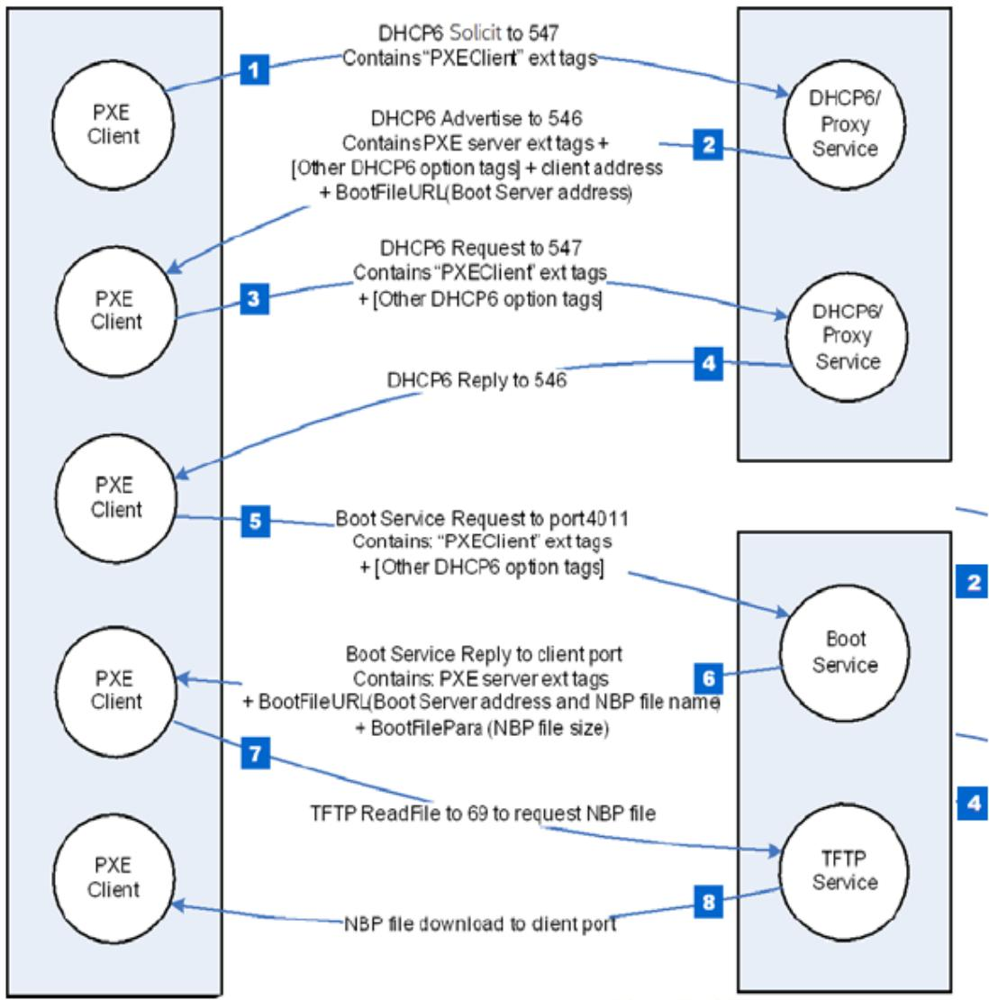  
Fig. 24.1: IPv6-based PXE Boot

## 24.3.18.2.1 Step 1.

The client multicasts a SOLICIT message to the standard DHCP6 port (547). It contains the following:

• A tag for client UNDI version.

• A tag for the client system architecture.

• A tag for PXE client, Vendor Class data set to

• “PXEClient:Arch:xxxxx:UNDI:yyyzzz”.

## 24.3.18.2.2 Step 2.

The DHCP6 or Proxy DHCP6 service responds by sending a ADVERTISE message to the client on the standard DHCP6 reply port (546). If this is a Proxy DHCP6 service, the next server (Boot Server) address is delivered by Boot File URL option. If this is a DHCP6 service, the new assigned client address is delivered by IA option. The extension tags information will be conveyed via the VENDOR OPTS field.

## 24.3.18.2.3 Steps 3 and 4.

If the client selects an address from a DHCP6 service, then it must complete the standard DHCP6 process by sending a REQUEST for the address back to the service and then waiting for an REPLY from the service.

## 24.3.18.2.4 Step 5.

The client multicasts a REQUEST message to the Boot Server port 4011, it contains the following:

• A tag for client UNDI version.

• A tag for the client system architecture.

• A tag for PXE client, Vendor Class option, set to

• “PXEClient:Arch:xxxxx:UNDI:yyyzzz”.

## 24.3.18.2.5 Step 6.

The Boot Server unicasts a REPLY message back to the client on the client port. It contains the following:

• A tag for NBP file name.

• A tag for NBP file size if needed.

## 24.3.18.2.6 Step 7.

The client requests the NBP file using TFTP (port 69).

## 24.3.18.2.7 Step 8.

The NBP file, dependent on the client’s CPU architecture, is downloaded into client’s memory.

## 24.3.18.3 Proxy DHCP6

The netboot6 DHCP6 options may be supplied by the DHCP6 service or a Proxy DHCP6 service. This Proxy DHCP6 service may reside on the same server as the DHCP6 service, or it ma be located on a separate server. A Proxy DHCP6 service on the same server as the DHCP6 service is illustrated in Figure 2. In this case, the Proxy DHCP6 service is listening to UDP port (4011), and communication with the Proxy DHCP6 service occurs after completing the standard DHCP6 process. Proxy DHCP6 uses port (4011) because is cannot share port (547) with the DHCP6 service. The netboot6 client knows how to interrogate the Proxy DHCP6 service because the ADVERTISE from the DHCP6 service contains a VendorClass option “PXEClient” tag without a BootFileURL option (including NBP file name). The client will not request option 16 ( OPTION\_VENDOR\_CLASS ) in ORO, but server must still reply with “PXEClient” in order to inform the client to start the Proxy DHCPv6 mode. The client will accept just the string “PXEClient” as suficient, the server need not echo back the entire OPTION\_VENDOR\_CLASS.

The Figure below, IPv6-based PXE boot (DHCP6 and ProxyDHCP6reside on the diferent server) illustrates the case of a Proxy DHCP6 service and the DHCP6 service on diferent servers. In this case, the Proxy DHCP6 service listens to UDP port (547) and responds in parallel with DHCP6 service.

## 24.4 PXE Base Code Callback Protocol

This protocol is a specific instance of the PXE Base Code Callback Protocol that is invoked when the PXE Base Code Protocol is about to transmit, has received, or is waiting to receive a packet. The PXE Base Code Callback Protocol must be on the same handle as the PXE Base Code Protocol.

## 24.4.1 EFI\_PXE\_BASE\_CODE\_CALLBACK\_PROTOCOL

## Summary

Protocol that is invoked when the PXE Base Code Protocol is about to transmit, has received, or is waiting to receive a packet.

## GUID

```c
#define EFI_PXE_BASE_CODE_CALLBACK_PROTOCOL_GUID \
{0x245DCA21, 0xFB7B, 0x11d3, \
{0x8F, 0x01, 0x00, 0xA0, 0xC9, 0x69, 0x72, 0x3B}}
```

## Revision Number

```c
#define EFI_PXE_BASE_CODE_CALLBACK_PROTOCOL_REVISION \\ 0x00010000
```

## Protocol Interface Structure

```c
typedef struct {
    UINT64 Revision;
    EFI_PXE_CALLBACK Callback;
} EFI_PXE_BASE_CODE_CALLBACK_PROTOCOL;
```

## Parameters

## 24.4. PXE Base Code Callback Protocol

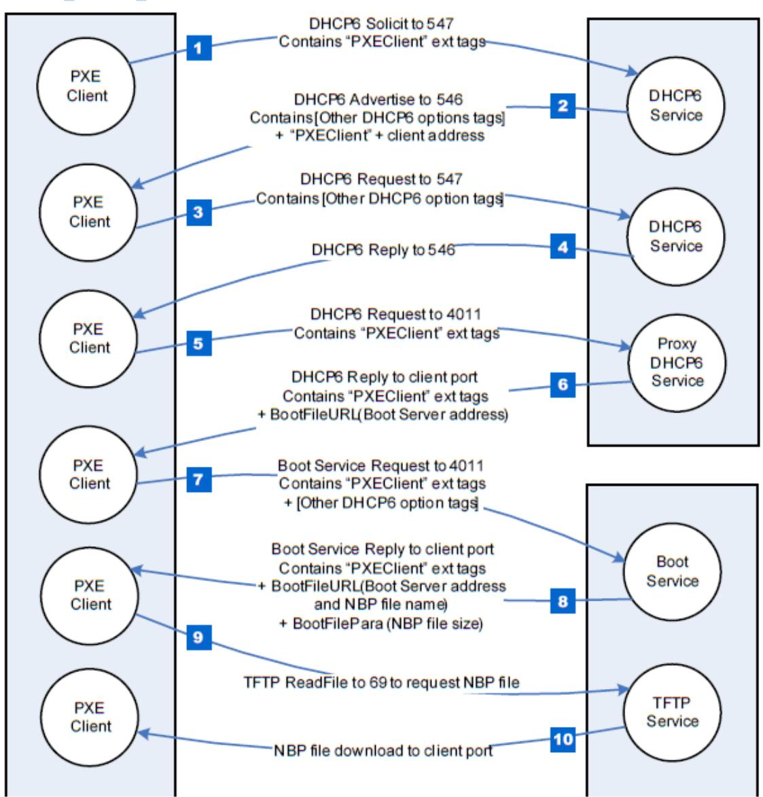  
Fig. 24.2: Netboot6 (DHCP6 and ProxyDHCP6 reside on the same server)

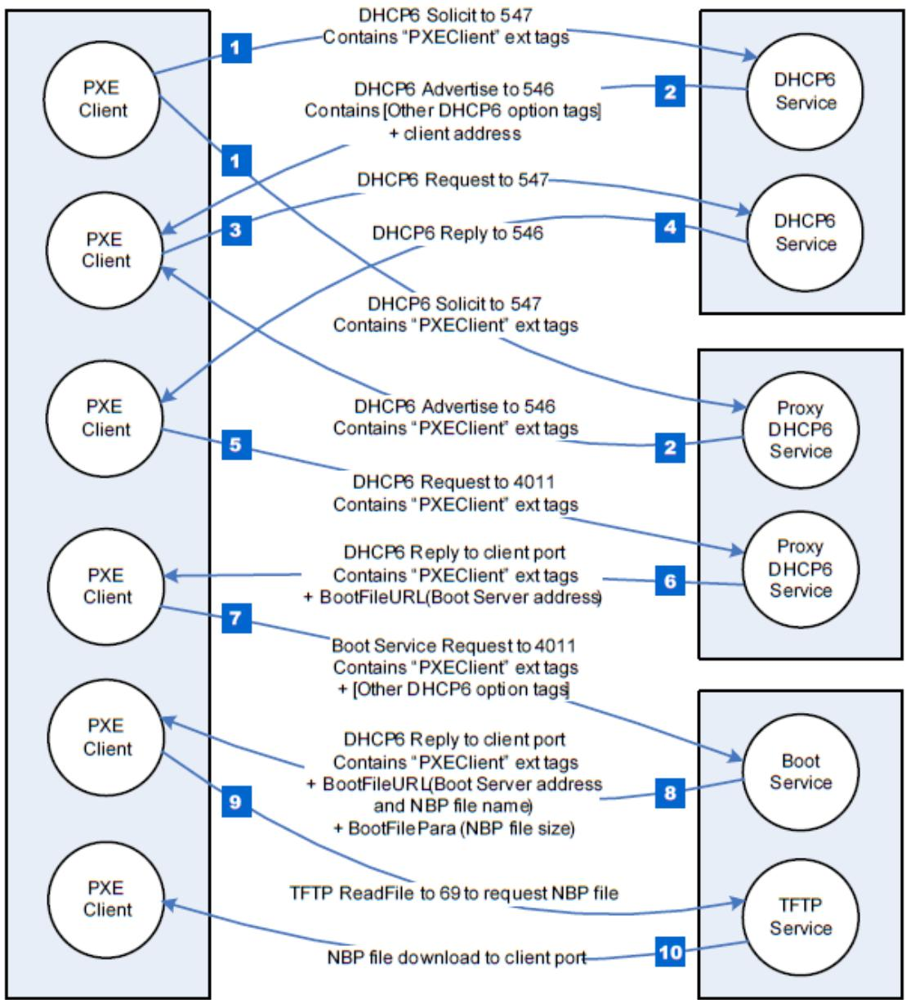  
Fig. 24.3: IPv6-based PXE boot (DHCP6 and ProxyDHCP6reside on the diferent server)

## Revision

The revision of the EFI\_PXE\_BASE\_CODE\_CALLBACK\_PROTOCOL. All future revisions must be backwards compatible. If a future revision is not backwards compatible, it is not the same GUID.

## Callback

Callback routine used by the PXE Base Code EFI\_PXE\_BASE\_CODE\_PROTOCOL.Dhcp() , EFI\_PXE\_BASE\_CODE\_PROTOCOL.Discover() , EFI\_PXE\_BASE\_CODE\_PROTOCOL.Mtftp() EFI\_PXE\_BASE\_CODE\_PROTOCOL.UdpWrite() , and EFI\_PXE\_BASE\_CODE\_PROTOCOL.Arp() functions.

## 24.4.2 EFI\_PXE\_BASE\_CODE\_CALLBACK.Callback()

## Summary

Callback function that is invoked when the PXE Base Code Protocol is about to transmit, has received, or is waiting to receive a packet.

## Prototype

```c
typedef
EFI_PXE_BASE_CODE_CALLBACK_STATUS
(*EFI_PXE_CALLBACK) (
    IN EFI_PXE_BASE_CODE_CALLBACK_PROTOCOL
    IN EFI_PXE_BASE_CODE_FUNCTION
    IN BOOLEAN
    IN UINT32
    IN EFI_PXE_BASE_CODE_PACKET
);
```

## Parameters

## This

Pointer to the See EFI\_PXE\_BASE\_CODE\_PROTOCOL instance.

## Function

The PXE Base Code Protocol function that is waiting for an event.

## Received

TRUE if the callback is being invoked due to a receive event. FALSE if the callback is being invoked due to a transmit event.

## PacketLen

The length, in bytes, of Packet. This field will have a value of zero if this is a wait for receive event.

## Packet

If Received is TRUE, a pointer to the packet that was just received; otherwise, a pointer to the packet that is about to be transmitted. This field will be NULL if this is not a packet event.

## Related Definitions

```c
//******************************************************************
// EFI_PXE_BASE_CODE_CALLBACK_STATUS
//******************************************************************
typedef enum {
EFI_PXE_BASE_CODE_CALLBACK_STATUS_FIRST,
EFI_PXE_BASE_CODE_CALLBACK_STATUS_CONTINUE,
EFI_PXE_BASE_CODE_CALLBACK_STATUS_ABORT,
```

(continues on next page)

(continued from previous page)

```c
EFI_PXE_BASE_CODE_CALLBACK_STATUS_LAST
} EFI_PXE_BASE_CODE_CALLBACK_STATUS;

//**************************
// EFI_PXE_BASE_CODE_FUNCTION
//**************************
typedef enum {
EFI_PXE_BASE_CODE_FUNCTION_FIRST,
EFI_PXE_BASE_CODE_FUNCTION_DHCP,
EFI_PXE_BASE_CODE_FUNCTION_DISCOVER,
EFI_PXE_BASE_CODE_FUNCTION_MTFTP,
EFI_PXE_BASE_CODE_FUNCTION_UDP_WRITE,
EFI_PXE_BASE_CODE_FUNCTION_UDP_READ,
EFI_PXE_BASE_CODE_FUNCTION_ARP,
EFI_PXE_BASE_CODE_FUNCTION_IGMP,
EFI_PXE_BASE_CODE_PXE_FUNCTION_LAST
} EFI_PXE_BASE_CODE_FUNCTION;
```

## Description

This function is invoked when the PXE Base Code Protocol is about to transmit, has received, or is waiting to receive a packet. Parameters Function and Received specify the type of event. Parameters PacketLen and Packet specify the packet that generated the event. If these fields are zero and NULL respectively, then this is a status update callback. If the operation specified by Function is to continue, then CALLBACK\_STATUS\_CONTINUE should be returned. If the operation specified by Function should be aborted, then CALLBACK\_STATUS\_ABORT should be returned. Due to the polling nature of UEFI device drivers, a callback function should not execute for more than 5 ms.

The EFI\_PXE\_BASE\_CODE\_PROTOCOL.SetParameters() function must be called after a Callback Protocol is installed to enable the use of callbacks.

## 24.5 Boot Integrity Services Protocol

This section defines the Boot Integrity Services (BIS) protocol, which is used to check a digital signature of a data block against a digital certificate for the purpose of an integrity and authorization check. BIS is primarily used by the Preboot Execution Environment (PXE) Base Code protocol See EFI\_PXE\_BASE\_CODE\_PROTOCOL to check downloaded network boot images before executing them. BIS is a UEFI Boot Service Driver, so its services are also available to applications written to this specification until the time of EFI\_BOOT\_SERVICES.ExitBootServices() . More information about BIS can be found in the Boot Integrity Services Application Programming Interface Version 1.0.

This section defines the Boot Integrity Services Protocol. This protocol is used to check a digital signature of a data block against a digital certificate for the purpose of an integrity and authorization check.

## 24.5.1 EFI\_BIS\_PROTOCOL

## Summary

The EFI\_BIS\_PROTOCOL is used to check a digital signature of a data block against a digital certificate for the purpose of an integrity and authorization check.

## GUID

```c
#define EFI_BIS_PROTOCOL_GUID \
{0x0b64aab0,0x5429,0x11d4, \
{0x98,0x16,0x00,0xa0,0xc9,0x1f,0xad,0xcf}}
```

## Protocol Interface Structure

```c
typedef struct \_EFI_BIS_PROTOCOL {
    EFI_BIS_INITIALIZE Initialize;
    EFI_BIS_SHUTDOWN Shutdown;
    EFI_BIS_FREE Free;
    EFI_BIS_GET_BOOT_OBJECT_AUTHORIZATION_CERTIFICATE
    GetBootObjectAuthorizationCertificate;
    EFI_BIS_GET_BOOT_OBJECT_AUTHORIZATION_CHECKFLAG
    GetBootObjectAuthorizationCheckFlag;
    EFI_BIS_GET_BOOT_OBJECT_AUTHORIZATION_UPDATE_TOKEN
    GetBootObjectAuthorizationUpdateToken;
    EFI_BIS_GET_SIGNATURE_INFO GetSignatureInfo;
    EFI_BIS_UPDATE_BOOT_OBJECT_AUTHORIZATION UpdateBootObjectAuthorization;
    EFI_BIS_VERIFY_BOOT_OBJECT VerifyBootObject;
    EFI_BIS_VERIFY_OBJECT_WITH_CREDENTIAL VerifyObjectWithCredential;
} EFI_BIS_PROTOCOL;
```

## Parameters

## Initialize

Initializes an application instance of the EFI\_BIS protocol, returning a handle for the application instance. Other functions in the EFI\_BIS protocol require a valid application instance handle obtained from this function. See the EFI\_BIS\_PROTOCOL.Initialize() function description.

## Shutdown

Ends the lifetime of an application instance of the EFI\_BIS protocol, invalidating its application instance handle. The application instance handle may no longer be used in other functions in the EFI\_BIS protocol. See the EFI\_BIS\_PROTOCOL.Shutdown() function description.

## Free

Frees memory structures allocated and returned by other functions in the EFI\_BIS protocol. See the EFI\_BIS\_PROTOCOL.Free() function description.

## GetBootObjectAuthorizationCertificate

Retrieves the current digital certificate (if any) used by the EFI\_BIS protocol as the source of authorization for verifying boot objects and altering configuration parameters. See the EFI\_BIS\_PROTOCOL.GetBootObjectAuthorizationCertificate() function description.

## GetBootObjectAuthorizationCheckFlag

Retrieves the current setting of the authorization check flag that indicates whether or not authorization checks are required for boot objects. See the EFI\_BIS\_PROTOCOL.GetBootObjectAuthorizationCheckFlag() function description.

## GetBootObjectAuthorizationUpdateToken

Retrieves an uninterpreted token whose value gets included and signed in a subsequent request to alter the configuration parameters, to protect against attempts to “replay” such a request. See the EFI\_BIS\_PROTOCOL.GetBootObjectAuthorizationUpdateToken() function description.

## GetSignatureInfo

Retrieves information about the digital signature algorithms supported and the identity of the installed authorization certificate, if any. See the EFI\_BIS\_PROTOCOL.GetSignatureInfo() function description.

## UpdateBootObjectAuthorization

Requests that the configuration parameters be altered by installing or removing an authorization certificate or changing the setting of the check flag. See the EFI\_BIS\_PROTOCOL.UpdateBootObjectAuthorization() function description.

## VerifyBootObject

Verifies a boot object according to the supplied digital signature and the current authorization certificate and check flag setting. See the EFI\_BIS\_PROTOCOL.VerifyBootObject() function description.

## VerifyObjectWithCredential

Verifies a data object according to a supplied digital signature and a supplied digital certificate. See the EFI\_BIS\_PROTOCOL.VerifyObjectWithCredential() function description.

## Description

The EFI\_BIS\_PROTOCOL provides a set of functions as defined in this section. There is no physical device associated with these functions, however, in the context of UEFI every protocol operates on a device. Accordingly, BIS installs and operates on a single abstract device that has only a software representation.

## 24.5.2 EFI\_BIS\_PROTOCOL.Initialize()

## Summary

Initializes the BIS service, checking that it is compatible with the version requested by the caller. After this call, other BIS functions may be invoked.

## Prototype

```txt
typedef
EFI_STATUS
(EFIAPI *EFI_BIS_INITIALIZE)(
    IN EFI_BIS_PROTOCOL    *This,
    OUT BIS_APPLICATION_HANDLE    *AppHandle,
    IN OUT EFI_BIS_VERSION    *InterfaceVersion,
    IN EFI_BIS_DATA    *TargetAddress
);
```

## Parameters

## This

A pointer to the EFI\_BIS\_PROTOCOL object. The protocol implementation may rely on the actual pointer value and object location, so the caller must not copy the object to a new location.

## AppHandle

The function writes the new BIS\_APPLICATION\_HANDLE if successful, otherwise it writes NULL. The caller must eventually destroy this handle by calling EFI\_BIS\_PROTOCOL.Shutdown() . Type BIS\_APPLICATION\_HANDLE is defined in “Related Definitions” below.

## InterfaceVersion

On input, the caller supplies the major version number of the interface version desired. The minor version number supplied on input is ignored since interface compatibility is determined solely by the major version number. On output, both the major and minor version numbers are updated with the major and minor version numbers of the interface (and underlying implementation). This update is done whether or not the initialization was successful. Type EFI\_BIS\_VERSION is defined in “Related Definitions” below.

## TargetAddress

Indicates a network or device address of the BIS platform to connect to. Local-platform BIS implementations require that the caller sets TargetAddress.Data to NULL, but otherwise ignores this parameter. BIS implementations that redirect calls to an agent at a remote address must define their own format and interpretation of this parameter outside the scope of this document. For all implementations, if the TargetAddress is an unsupported value, the function fails with the error EFI\_UNSUPPORTED. Type EFI\_BIS\_DATA is defined in “Related Definitions” below.

## Related Definitions

```c
//**********************************************************************
// BIS_APPLICATION_HANDLE
//**********************************************************************
typedef VOID    *BIS_APPLICATION_HANDLE;
```

This type is an opaque handle representing an initialized instance of the BIS interface. A BIS\_APPLICATION\_HANDLE value is returned by the Initialize() function as an “out” parameter. Other BIS functions take a BIS\_APPLICATION\_HANDLE as an “in” parameter to identify the BIS instance.

```c
//******************************************************************
// EFI_BIS_VERSION
//******************************************************************
typedef struct \_EFI_BIS_VERSION {
    UINT32    Major;
    UINT32    Minor;
} EFI_BIS_VERSION;
```

## Major

This describes the major BIS version number. The major version number defines version compatibility. That is, when a new version of the BIS interface is created with new capabilities that are not available in the previous interface version, the major version number is increased.

## Minor

This describes a minor BIS version number. This version number is increased whenever a new BIS implementation is built that is fully interface compatible with the previous BIS implementation. This number may be reset when the major version number is increased.

This type represents a version number of the BIS interface. This is used as an “in out” parameter of the Initialize() function for a simple form of negotiation of the BIS interface version between the caller and the BIS implementation.

```c
//******************************************************************
// EFI_BIS_VERSION predefined values
// Use these values to initialize EFI_BIS_VERSION.Major
// and to interpret results of Initialize.
//******************************************************************
#define BIS_CURRENT_VERSION_MAJOR    BIS_VERSION_1
#define BIS_VERSION_1    1
```

These C preprocessor macros supply values for the major version number of an EFI\_BIS\_VERSION. At the time of initialization, a caller supplies a value to request a BIS interface version. On return, the (IN OUT) parameter is overwritten with the actual version of the interface.

```c
//******************************************************************
// EFI_BIS_DATA
//
// EFI_BIS_DATA instances obtained from BIS must be freed by
// calling `EFI_BIS_PROTOCOL.Free()`.
//******************************************************************
typedef struct \_EFI_BIS_DATA {
    UINT32    Length;
    UINT8    *Data;
}    EFI_BIS_DATA;
```

## Length

The length of the data bufer in bytes.

## Data

A pointer to the raw data bufer.

This type defines a structure that describes a bufer. BIS uses this type to pass back and forth most large objects such as digital certificates, strings, etc. Several of the BIS functions allocate a EFI\_BIS\_DATA\* and return it as an “out” parameter. The caller must eventually free any allocated EFI\_BIS\_DATA\* using the EFI\_BIS\_PROTOCOL.Free() function.

## Description

This function must be the first BIS function invoked by an application. It passes back a BIS\_APPLICATION\_HANDLE value that must be used in subsequent BIS functions. The handle must be eventually destroyed by a call to the EFI\_BIS\_PROTOCOL.Shutdown() function, thus ending that handle’s lifetime. After the handle is destroyed, BIS functions may no longer be called with that handle value. Thus all other BIS functions may only be called between a pair of EFI\_BIS\_PROTOCOL.Initialize() and Shutdown() functions.

There is no penalty for calling Initialize() multiple times. Each call passes back a distinct handle value. Each distinct handle must be destroyed by a distinct call to Shutdown(). The lifetimes of handles created and destroyed with these functions may be overlapped in any way.

## Status Codes Returned

<table><tr><td>EFI_SUCCESS</td><td>The function completed successfully.</td></tr><tr><td>EFI_INCOMPATIBLE_VERSION</td><td></td></tr><tr><td></td><td>The InterfaceVersion.Major requested by the caller was not compatible with the interface version of the implementation.The InterfaceVersion.Major has been updated with the current interface version.</td></tr><tr><td>EFI_UNSUPPORTED</td><td>This is a local-platform implementation and TargetAddress.Data was not NULL, or TargetAddress.Data was any other value that was not supported by the implementation.</td></tr><tr><td>EFI_OUT_OF_RESOURCES</td><td>The function failed due to lack of memory or other resources.</td></tr></table>

continues on next page

Table 24.30 – continued from previous page

<table><tr><td>EFI_DEVICE_ERROR</td><td></td></tr><tr><td></td><td>The function encountered an unexpected internal failure while initializing a cryptographic software module, orNo cryptographic software module with compatible version was found, orA resource limitation was encountered while using a cryptographic software module.</td></tr><tr><td>EFI_INVALID_PARAMETER</td><td></td></tr><tr><td></td><td>The This parameter supplied by the caller is NULL or does not reference a valid EFI_BIS_PROTOCOL object, orThe AppHandle parameter supplied by the caller is NULL or an invalid memory reference, orThe InterfaceVersion parameter supplied by the caller is NULL or an invalid memory reference, orThe TargetAddress parameter supplied by the caller is NULL or an invalid memory reference.</td></tr></table>

## 24.5.3 EFI\_BIS\_PROTOCOL.Shutdown()

## Summary

Shuts down an application’s instance of the BIS service, invalidating the application handle. After this call, other BIS functions may no longer be invoked using the application handle value.

## Prototype

```txt
typedef
EFI_STATUS
(EFIAPI *EFI_BIS_SHUTDOWN)(
    IN BIS_APPLICATION_HANDLE AppHandle
);
```

## Parameters

## AppHandle

An opaque handle that identifies the caller’s instance of initialization of the BIS service. Type BIS\_APPLICATION\_HANDLE is defined in the EFI\_BIS\_PROTOCOL.Initialize() function description.

## Description

This function shuts down an application’s instance of the BIS service, invalidating the application handle. After this call, other BIS functions may no longer be invoked using the application handle value.

This function must be paired with a preceding successful call to the Initialize() function. The lifetime of an application handle extends from the time the handle was returned from Initialize() until the time the handle is passed to Shutdown(). If there are other remaining handles whose lifetime is still active, they may still be used in calling BIS functions.

The caller must free all memory resources associated with this AppHandle that were allocated and returned from other BIS functions before calling Shutdown(). Memory resources are freed using the EFI\_BIS\_PROTOCOL.Free() function. Failure to free such memory resources is a caller error, however, this function does not return an error code under this circumstance. Further attempts to access the outstanding memory resources cause unspecified results.

## Status Codes Returned

Prototype

<table><tr><td>EFI_SUCCESS</td><td>The function completed successfully.</td></tr><tr><td>EFI_NO_MAPPING</td><td>The AppHandle parameter is not or is no longer a valid application instance handle associated with the EFI_BIS protocol.</td></tr><tr><td>EFI_DEVICE_ERROR</td><td></td></tr><tr><td></td><td>The function encountered an unexpected internal error while returning resources associated with a cryptographic software module, or The function encountered an internal error while trying to shut down a cryptographic software module.</td></tr><tr><td>EFI_OUT_OF_RESOURCES</td><td>The function failed due to lack of memory or other resources.</td></tr></table>

## 24.5.4 EFI\_BIS\_PROTOCOL.Free()

## Summary

Frees memory structures allocated and returned by other functions in the EFI\_BIS protocol.

<table><tr><td colspan="2">typedef</td></tr><tr><td colspan="2">EFI_STATUS</td></tr><tr><td colspan="2">(EFIAPI *EFI_BIS_FREE) (</td></tr><tr><td>IN BIS_APPLICATION_HANDLE</td><td>AppHandle,</td></tr><tr><td>IN EFI_BIS_DATA</td><td>*ToFree</td></tr><tr><td>);</td><td></td></tr></table>

## Parameters

## AppHandle

An opaque handle that identifies the caller’s instance of initialization of the BIS service. Type BIS\_APPLICATION\_HANDLE is defined in the EFI\_BIS\_PROTOCOL.Initialize() function description.

## ToFree

An EFI\_BIS\_DATA\* and associated memory block to be freed. This EFI\_BIS\_DATA\* must have been allocated by one of the other BIS functions. Type EFI\_BIS\_DATA is defined in the Initialize() function description.

## Description

This function deallocates an EFI\_BIS\_DATA\* and associated memory allocated by one of the other BIS functions.

Callers of other BIS functions that allocate memory in the form of an EFI\_BIS\_DATA\* must eventually call this function to deallocate the memory before calling the EFI\_BIS\_PROTOCOL.Shutdown() function for the application handle under which the memory was allocated. Failure to do so causes unspecified results, and the continued correct operation of the BIS service cannot be guaranteed.

## Status Codes Returned

<table><tr><td>EFI_SUCCESS</td><td>The function completed successfully.</td></tr><tr><td>EFI_NO_MAPPING</td><td>The AppHandle parameter is not or is no longer a valid application instance handle associated with the EFI_BIS protocol.</td></tr><tr><td>EFI_INVALID_PARAMETER</td><td>The ToFree parameter is not or is no longer a memory resource associated with this AppHandle.</td></tr><tr><td>EFI_OUT_OF_RESOURCES</td><td>The function failed due to lack of memory or other resources.</td></tr></table>

## 24.5.5 EFI\_BIS\_PROTOCOL.GetBootObjectAuthorizationCertificate()

## Summary

Retrieves the certificate that has been configured as the identity of the organization designated as the source of authorization for signatures of boot objects.

## Prototype

```txt
typedef
EFI_STATUS
(EFIAPI *EFI_BIS_GET_BOOT_OBJECT_AUTHORIZATION_CERTIFICATE)
IN BIS_APPLICATION_HANDLE AppHandle,
OUT EFI_BIS_DATA **Certificate
);
```

## Parameters

## AppHandle

An opaque handle that identifies the caller’s instance of initialization of the BIS service. Type BIS\_APPLICATION\_HANDLE is defined in the EFI\_BIS\_PROTOCOL.Initialize() function description.

## Certificate

The function writes an allocated EFI\_BIS\_DATA\* containing the Boot Object Authorization Certificate object. The caller must eventually free the memory allocated by this function using the function EFI\_BIS\_PROTOCOL.Free() . Type EFI\_BIS\_DATA is defined in the Initialize() function description.

## Description

This function retrieves the certificate that has been configured as the identity of the organization designated as the source of authorization for signatures of boot objects.

## Status Codes Returned

<table><tr><td>EFI_SUCCESS</td><td>The function completed successfully.</td></tr><tr><td>EFI_NO_MAPPING</td><td>The AppHandle parameter is not or is no longer a valid application instance handle associated with the EFI_BIS protocol.</td></tr><tr><td>EFI_NOT_FOUND</td><td>There is no Boot Object Authorization Certificate currently installed.</td></tr><tr><td>EFI_OUT_OF_RESOURCES</td><td>The function failed due to lack of memory or other resources.</td></tr><tr><td>EFI_INVALID_PARAMETER</td><td>The Certificate parameter supplied by the caller is NULL or an invalid memory reference.</td></tr></table>

## 24.5.6 EFI\_BIS\_PROTOCOL.GetBootObjectAuthorizationCheckFlag()

## Summary

Retrieves the current status of the Boot Authorization Check Flag.

## Prototype

```txt
typedef
EFI_STATUS
(EFIAPI *EFI_BIS_GET_BOOT_OBJECT_AUTHORIZATION_CHECKFLAG) (
    IN BIS_APPLICATION_HANDLE AppHandle,
    OUT BOOLEAN *CheckIsRequired
);
```

## Parameters

## AppHandle

An opaque handle that identifies the caller’s instance of initialization of the BIS service. Type BIS\_APPLICATION\_HANDLE is defined in the EFI\_BIS\_PROTOCOL.Initialize() function description.

## CheckIsRequired

The function writes the value TRUE if a Boot Authorization Check is currently required on this platform, otherwise the function writes FALSE.

## Description

This function retrieves the current status of the Boot Authorization Check Flag (in other words, whether or not a Boot Authorization Check is currently required on this platform).

## Status Codes Returned

<table><tr><td>EFI_SUCCESS</td><td>The function completed successfully.</td></tr><tr><td>EFI_NO_MAPPING</td><td>The AppHandle parameter is not or is no longer a valid application instance handle associated with the EFI_BIS protocol.</td></tr><tr><td>EFI_OUT_OF_RESOURCES</td><td>The function failed due to lack of memory or other resources.</td></tr><tr><td>EFI_INVALID_PARAMETER</td><td>The CheckIsRequired parameter supplied by the caller is NULL or an invalid memory reference.</td></tr></table>

## 24.5.7 EFI\_BIS\_PROTOCOL.GetBootObjectAuthorizationUpdateToken()

## Summary

Retrieves a unique token value to be included in the request credential for the next update of any parameter in the Boot Object Authorization set (Boot Object Authorization Certificate and Boot Authorization Check Flag).

## Prototype

typedef

EFI\_STATUS

(EFIAPI \*EFI\_BIS\_GET\_BOOT\_OBJECT\_AUTHORIZATION\_UPDATE\_TOKEN)(

IN BIS\_APPLICATION\_HANDLE

OUT EFI\_BIS\_DATA

AppHandle,

\*\*UpdateToken

);

## Parameters

## AppHandle

An opaque handle that identifies the caller’s instance of initialization of the BIS service. Type BIS\_APPLICATION\_HANDLE is defined in the EFI\_BIS\_PROTOCOL.Initialize() function description.

## UpdateToken

The function writes an allocated EFI\_BIS\_DATA\* containing the new unique update token value. The caller must eventually free the memory allocated by this function using the function EFI\_BIS\_PROTOCOL.Free() . Type EFI\_BIS\_DATA is defined in the Initialize() function description.

## Description

This function retrieves a unique token value to be included in the request credential for the next update of any parameter in the Boot Object Authorization set (Boot Object Authorization Certificate and Boot Authorization Check Flag). The token value is unique to this platform, parameter set, and instance of parameter values. In particular, the token changes to a new unique value whenever any parameter in this set is changed.

## Status Codes Returned

<table><tr><td>EFI_SUCCESS</td><td>The function completed successfully.</td></tr><tr><td>EFI_NO_MAPPING</td><td>The AppHandle parameter is not or is no longer a valid application instance handle associated with the EFI_BIS protocol.</td></tr><tr><td>EFI_OUT_OF_RESOURCES</td><td>The function failed due to lack of memory or other resources.</td></tr><tr><td>EFI_DEVICE_ERROR</td><td>The function encountered an unexpected internal error in a cryptographic software module.</td></tr><tr><td>EFI_INVALID_PARAMETER</td><td>The UpdateToken parameter supplied by the caller is NULL or an invalid memory reference.</td></tr></table>

## 24.5.8 EFI\_BIS\_PROTOCOL.GetSignatureInfo()

## Summary

Retrieves a list of digital certificate identifier, digital signature algorithm, hash algorithm, and key-length combinations that the platform supports.

## Prototype

```txt
typedef
EFI_STATUS
(EFIAPI *EFI_BIS_GET_SIGNATURE_INFO)(
    IN BIS_APPLICATION_HANDLE
    OUT EFI_BIS_DATA
);
```

AppHandle, \*\*SignatureInfo

## Parameters

## AppHandle

An opaque handle that identifies the caller’s instance of initialization of the BIS service. Type BIS\_APPLICATION\_HANDLE is defined in the EFI\_BIS\_PROTOCOL.Initialize() function description.

## SignatureInfo

The function writes an allocated EFI\_BIS\_DATA\* containing the array of EFI\_BIS\_SIGNATURE\_INFO structures representing the supported digital certificate identifier, algorithm, and key length combinations. The caller must eventually free the memory allocated by this function using the function EFI\_BIS\_PROTOCOL.Free() . Type EFI\_BIS\_DATA is defined in the Initialize() function description. Type EFI\_BIS\_SIGNATURE\_INFO is defined in “Related Definitions” below.

## Related Definitions

```c
//******************************************************************
// EFI_BIS_SIGNATURE_INFO
//******************************************************************
typedef struct \_EFI_BIS_SIGNATURE_INFO {
    BIS_CERT_ID CertificateID;
    BIS_ALG_ID AlgorithmID;
    UINT16 KeyLength;
} EFI_BIS_SIGNATURE_INFO;
```

## CertificateID

A shortened value identifying the platform’s currently configured Boot Object Authorization Certificate, if one is currently configured. The shortened value is derived from the certificate as defined in the Related Definition for BIS\_CERT\_ID below. If there is no certificate currently configured, the value is one of the reserved

BIS\_CERT\_ID\_XXX values defined below. Type BIS\_CERT\_ID and its predefined reserved values are defined in “Related Definitions” below.

## AlgorithmID

A predefined constant representing a particular digital signature algorithm. Often this represents a combination of hash algorithm and encryption algorithm, however, it may also represent a standalone digital signature algorithm. Type BIS\_ALG\_ID and its permitted values are defined in “Related Definitions” below.

## KeyLength

The length of the public key, in bits, supported by this digital signature algorithm.

This type defines a digital certificate, digital signature algorithm, and key-length combination that may be supported by the BIS implementation. This type is returned by GetSignatureInfo() to describe the combination(s) supported by the implementation.

```c
//**********************************************************************
// BIS_GET_SIGINFO_COUNT macro
// Tells how many EFI_BIS_SIGNATURE_INFO elements are contained
// in a EFI_BIS_DATA struct pointed to by the provided
// EFI_BIS_DATA*.
//**********************************************************************
#define BIS_GET_SIGINFO_COUNT(BisDataPtr) \
((BisDataPtr)->Length/sizeof(EFI_BIS_SIGNATURE_INFO))
```

## BisDataPtr

Supplies the pointer to the target EFI\_BIS\_DATA structure.

## (return value)

The number of EFI\_BIS\_SIGNATURE\_INFO elements contained in the array.

This macro computes how many EFI\_BIS\_SIGNATURE\_INFO elements are contained in an EFI\_BIS\_DATA structure returned from GetSignatureInfo(). The number returned is the count of items in the list of supported digital certificate, digital signature algorithm, and key-length combinations.

```c
//******************************************************************
// BIS_GET_SIGINFO_ARRAY macro
//    Produces a EFI_BIS_SIGNATURE_INFO* from a given
//    EFI_BIS_DATA.*
//******************************************************************
#define BIS_GET_SIGINFO_ARRAY(BisDataPtr) \
((EFI_BIS_SIGNATURE_INFO*)(BisDataPtr)->Data)
```

## BisDataPtr

Supplies the pointer to the target EFI\_BIS\_DATA structure.

## (return value)

The pointer to the EFI\_BIS\_SIGNATURE\_INFO array, cast as an EFI\_BIS\_SIGNATURE\_INFO\*.

This macro returns a pointer to the EFI\_BIS\_SIGNATURE\_INFO array contained in an EFI\_BIS\_DATA structure returned from GetSignatureInfo() representing the list of supported digital certificate, digital signature algorithm, and key-length combinations.

```c
//**********************************************************************
// BIS_CERT_ID
//**********************************************************************
typedef UINT32    BIS_CERT_ID;
```

This type represents a shortened value that identifies the platform’s currently configured Boot Object Authorization Certificate. The value is the first four bytes, in “little-endian” order, of the SHA-1 hash of the certificate, except that the most-significant bits of the second and third bytes are reserved, and must be set to zero regardless of the outcome of the hash function. This type is included in the array of values returned from the GetSignatureInfo() function to indicate the required source of a signature for a boot object or a configuration update request. There are a few predefined reserved values with special meanings as described below.

```c
//**********************************************************************
// BIS_CERT_ID predefined values
// Currently defined values for EFI_BIS_SIGNATURE_INFO.
// CertificateId.
//**********************************************************************
#define BIS_CERT_ID_DSA    BIS_ALG_DSA    //CSSM_ALGID_DSA
#define BIS_CERT_ID_RSA_MD5    BIS_ALG_RSA_MD5    //CSSM_ALGID_MD5_WITH_RSA
```

These C preprocessor symbols provide values for the BIS\_CERT\_ID type. These values are used when the platform has no configured Boot Object Authorization Certificate. They indicate the signature algorithm that is supported by the platform. Users must be careful to avoid constructing Boot Object Authorization Certificates that transform to BIS\_CERT\_ID values that collide with these predefined values or with the BIS\_CERT\_ID values of other Boot Object Authorization Certificates they use.

```c
//**********************************************************************
// BIS_CERT_ID_MASK
// The following is a mask value that gets applied to the
// truncated hash of a platform Boot Object Authorization
// Certificate to create the CertificateId. A CertificateId
// must not have any bits set to the value 1 other than bits in
// this mask.
//**********************************************************************
#define BIS_CERT_ID_MASK (0xFF7F7FFF)
```

This C preprocessor symbol may be used as a bit-wise “AND” value to transform the first four bytes (in little-endian order) of a SHA-1 hash of a certificate into a certificate ID with the “reserved” bits properly set to zero.

```c
//**********************************************************************
// BIS_ALG_ID
//**********************************************************************
typedef UINT16 BIS_ALG_ID;
```

This type represents a digital signature algorithm. A digital signature algorithm is often composed of a particular combination of secure hash algorithm and encryption algorithm. This type also allows for digital signature algorithms that cannot be decomposed. Predefined values for this type are as defined below.

```c
//******************************************************************
// BIS_ALG_ID predefined values
// Currently defined values for EFI_BIS_SIGNATURE_INFO.
// AlgorithmID. The exact numeric values come from "Common"
// Data Security Architecture (CDSA) Specification."
//******************************************************************
#define BIS_ALG_DSA (41) //CSSM_ALGID_DSA
#define BIS_ALG_RSA_MD5 (42) //CSSM_ALGID_MD5_WITH_RSA
```

These values represent the two digital signature algorithms predefined for BIS. Each implementation of BIS must support at least one of these digital signature algorithms. Values for the digital signature algorithms are chosen by an industry group known as The Open Group. Developers planning to support additional digital signature algorithms or define new digital signature algorithms should refer to The Open Group for interoperable values to use.

## Description

This function retrieves a list of digital certificate identifier, digital signature algorithm, hash algorithm, and key-length combinations that the platform supports. The list is an array of (certificate id, algorithm id, key length) triples, where the certificate id is derived from the platform’s Boot Object Authorization Certificate as described in the Related Definition for BIS\_CERT\_ID above, the algorithm id represents the combination of signature algorithm and hash algorithm, and the key length is expressed in bits. The number of array elements can be computed using the Length field of the retrieved EFI\_BIS\_DATA\*.

The retrieved list is in order of preference. A digital signature algorithm for which the platform has a currently configured Boot Object Authorization Certificate is preferred over any digital signature algorithm for which there is not a currently configured Boot Object Authorization Certificate. Thus the first element in the list has a CertificateID representing a Boot Object Authorization Certificate if the platform has one configured. Otherwise, the CertificateID of the first element in the list is one of the reserved values representing a digital signature algorithm.

## Status Codes Returned

<table><tr><td>EFI_SUCCESS</td><td>The function completed successfully.</td></tr><tr><td>EFI_NO_MAPPING</td><td>The AppHandle parameter is not or is no longer a valid application instance handle associated with the EFI_BIS protocol.</td></tr><tr><td>EFI_OUT_OF_RESOURCES</td><td>The function failed due to lack of memory or other resources.</td></tr><tr><td>EFI_DEVICE_ERROR</td><td></td></tr><tr><td></td><td>The function encountered an unexpected internal error in a cryptographic software module, or</td></tr><tr><td></td><td>The function encountered an unexpected internal consistency check failure (possible corruption of stored Boot Object Authorization Certificate).</td></tr><tr><td>EFI_INVALID_PARAMETER</td><td>The SignatureInfo parameter supplied by the caller is NULL or an invalid memory reference.</td></tr></table>

## 24.5.9 EFI\_BIS\_PROTOCOL.UpdateBootObjectAuthorization()

## Summary

Updates one of the configurable parameters of the Boot Object Authorization set (Boot Object Authorization Certificate or Boot Authorization Check Flag).

## Prototype

```txt
typedef
EFI_STATUS
(EFIAPI *EFI_BIS_UPDATE_BOOT_OBJECT_AUTHORIZATION)
IN BIS_APPLICATION_HANDLE AppHandle,
IN EFI_BIS_DATA *RequestCredential,
OUT EFI_BIS_DATA **NewUpdateToken
);
```

## Parameters

## AppHandle

An opaque handle that identifies the caller’s instance of initialization of the BIS service. Type BIS\_APPLICATION\_HANDLE is defined in the EFI\_BIS\_PROTOCOL.Initialize() function description.

## RequestCredential

This is a Signed Manifest with embedded attributes that carry the details of the requested update. The required syntax of the Signed Manifest is described in the Related Definition for Manifest Syntax below. The key used to sign the request credential must be the private key corresponding to the public key in the platform’s configured Boot Object Authorization Certificate. Authority to update parameters in the Boot Object Authorization set cannot be delegated.

If there is no Boot Object Authorization Certificate, the request credential may be signed with any private key. In this case, this function interacts with the user in a platform-specific way to determine whether the operation should succeed. Type EFI\_BIS\_DATA is defined in the Initialize() function description.

## NewUpdateToken

The function writes an allocated EFI\_BIS\_DATA\* containing the new unique update token value. The caller must eventually free the memory allocated by this function using the function EFI\_BIS\_PROTOCOL.Free() . Type EFI\_BIS\_DATA is defined in the Initialize() function description.

## Related Definitions

```txt
//**********************************
// Manifest Syntax
//**********************************
```

The Signed Manifest consists of three parts grouped together into an Electronic Shrink Wrap archive as described in [SM spec]: a manifest file, a signer’s information file, and a signature block file. These three parts, along with examples are described in the following sections. In these examples, text in parentheses is a description of the text that would appear in the signed manifest. Text outside of parentheses must appear exactly as shown. Also note that manifest files and signer’s information files must conform to a 72-byte line-length limit. Continuation lines (lines beginning with a single “space” character) are used for lines longer than 72 bytes. The examples given here follow this rule for continuation lines.

Note that the manifest file and signer’s information file parts of a Signed Manifest are ASCII text files. In cases where these files contain a base-64 encoded string, the string is an ASCII string before base-64 encoding.

```scss
//**********************************************************************
// Manifest File Example
//**********************************************************************
```

The manifest file must include a section referring to a memory-type data object with the reserved name as shown in the example below. This data object is a zero-length object whose sole purpose in the manifest is to serve as a named collection point for the attributes that carry the details of the requested update. The attributes are also contained in the manifest file. An example manifest file is shown below.

```txt
Manifest-Version: 2.0
ManifestPersistentId: (base-64 representation of a unique GUID)

Name: memory:UpdateRequestParameters
Digest-Algorithms: SHA-1
SHA-1-Digest: (base-64 representation of a SHA-1 digest of zero-length buffer)
X-Intel-BIS-ParameterSet: (base-64 representation of BootObjectAuthorizationSetGUID)
X-Intel-BIS-ParameterSetToken: (base-64 representation of the current update token)
X-Intel-BIS-ParameterId: (base-64 representation of "BootObjectAuthorizationCertificate" or "BootAuthorizationCheckFlag")
X-Intel-BIS-ParameterValue: (base-64 representation of certificate or single-byte boolean flag)
```

A line-by-line description of this manifest file is as follows.

```txt
Manifest-Version: 2.0
```

This is a standard header line that all signed manifests have. It must appear exactly as shown.

```txt
ManifestPersistentId: (base-64 representation of a unique GUID)
```

The left-hand string must appear exactly as shown. The right-hand string must be a unique GUID for every manifest file created. The Win32 function UuidCreate() can be used for this on Win32 systems. The GUID is a binary value that must be base-64 encoded. Base-64 is a simple encoding scheme for representing binary values that uses only printing characters. Base-64 encoding is described in [BASE-64].

```txt
Name: memory:UpdateRequestParameters
```

This identifies the manifest section that carries a dummy zero-length data object serving as the collection point for the attribute values appearing later in this manifest section (lines prefixed with “ X-Intel-BIS- “). The string “ memory:UpdateRequestParameters “ must appear exactly as shown.

Digest-Algorithms: SHA-1

This enumerates the digest algorithms for which integrity data is included for the data object. These are required even though the data object is zero-length. For systems with DSA signing, SHA-1 hash, and 1024-bit key length, the digest algorithm must be “ SHA-1.” For systems with RSA signing, MD5 hash, and 512-bit key length, the digest algorithm must be “ MD5.” Multiple algorithms can be specified as a whitespace-separated list. For every digest algorithm XXX listed, there must also be a corresponding XXX-Digest line.

```txt
SHA-1-Digest: (base-64 representation of a SHA-1 digest of zero-length buffer)
```

Gives the corresponding digest value for the dummy zero-length data object. The value is base-64 encoded. Note that for both MD5 and SHA-1, the digest value for a zero-length data object is not zero.

X-Intel-BIS-ParameterSet: (base-64 representation of BootObjectAuthorizationSetGUID)

A named attribute value that distinguishes updates of BIS parameters from updates of other parameters. The left-hand attribute-name keyword must appear exactly as shown. The GUID value for the right-hand side is always the same, and can be found under the preprocessor symbol BOOT\_OBJECT\_AUTHORIZATION\_PARMSET\_GUIDVALUE. The representation inserted into the manifest is base-64 encoded.

Note the “ X-Intel-BIS- “ prefix on this and the following attributes. The “ X- “ part of the prefix was chosen to avoid collisions with future reserved keywords defined by future versions of the signed manifest specification. The “ Intel-BIS- “ part of the prefix was chosen to avoid collisions with other user-defined attribute names within the user-defined attribute name space.

X-Intel-BIS-ParameterSetToken: (base-64 representation of the current update token)

A named attribute value that makes this update of BIS parameters diferent from any other on the same target platform. The left-hand attribute-name keyword must appear exactly as shown. The value for the right-hand side is generally diferent for each update-request manifest generated. The value to be base-64 encoded is retrieved through the functions EFI\_BIS\_PROTOCOL.GetBootObjectAuthorizationUpdateToken() or EFI\_BIS\_PROTOCOL.UpdateBootObjectAuthorization() .

```powershell
X-Intel-BIS-ParameterId: (base-64 representation of "BootObjectAuthorizationCertificate" or "BootAuthorizationCheckFlag")
```

A named attribute value that indicates which BIS parameter is to be updated. The left-hand attribute-name keyword must appear exactly as shown. The value for the right-hand side is the base-64 encoded representation of one of the two strings shown.

```txt
X-Intel-BIS-ParameterValue: (base-64 representation of certificate or single-byte boolean flag)
```

A named attribute value that indicates the new value to be set for the indicated parameter. The left-hand attribute-name keyword must appear exactly as shown. The value for the right-hand side is the appropriate base-64 encoded new value to be set. In the case of the Boot Object Authorization Certificate, the value is the new digital certificate raw data. A zero-length value removes the certificate altogether. In the case of the Boot Authorization Check Flag, the value is a single-byte Boolean value, where a nonzero value “turns on” the check and a zero value “turns of” the check.

```scss
//**********************************************************************
// Signer's Information File Example
//**********************************************************************
```

The signer’s information file must include a section whose name matches the reserved data object section name of the section in the Manifest file. This section in the signer’s information file carries the integrity data for the attributes in the corresponding section in the manifest file. An example signer’s information file is shown below.

```txt
Signature-Version: 2.0
SignerInformationPersistentId: (base-64 representation of a unique GUID)
SignerInformationName: BIS_UpdateManifestSignerInfoName

Name: memory:UpdateRequestParameters
Digest-Algorithms: SHA-1
SHA-1-Digest: (base-64 representation of a SHA-1 digest of the corresponding manifest section)
```

A line-by-line description of this signer’s information file is as follows.

```txt
Signature-Version: 2.0
```

This is a standard header line that all signed manifests have. It must appear exactly as shown.

```txt
SignerInformationPersistentId: (base-64 representation of a unique GUID)
```

The left-hand string must appear exactly as shown. The right-hand string must be a unique GUID for every signer’s information file created. The Win32 function UuidCreate() can be used for this on Win32 systems. The GUID is a binary value that must be base-64 encoded. Base-64 is a simple encoding scheme for representing binary values that uses only printing characters. Base-64 encoding is described in [BASE-64].

```txt
SignerInformationName: BIS_UpdateManifestSignerInfoName
```

The left-hand string must appear exactly as shown. The right-hand string must appear exactly as shown.

Name: memory:UpdateRequestParameters

This identifies the section in the signer’s information file corresponding to the section with the same name in the manifest file described earlier. The string “ memory:UpdateRequestParameters “ must appear exactly as shown.

```txt
Digest-Algorithms: SHA-1
```

```txt
EFI_SUCCESS The function completed successfully.
EFI_NO_MAPPING The AppHandle parameter is not or is no longer a valid application instance handle associated with the EFI_BIS protocol.
```

This enumerates the digest algorithms for which integrity data is included for the corresponding manifest section. Strings identifying digest algorithms are the same as in the manifest file. The digest algorithms specified here must match those specified in the manifest file. For every digest algorithm XXX listed, there must also be a corresponding XXX-Digest line.

SHA-1-Digest: (base-64 representation of a SHA-1 digest of the corresponding manifest␣ <sub>˓→</sub>section)

Gives the corresponding digest value for the corresponding manifest section. The value is base-64 encoded. Note that for the purpose of computing the hash of the manifest section, the manifest section starts at the beginning of the opening “ Name: “ keyword and continues up to, but not including, the next section’s “ Name: “ keyword or the end-of-file. Thus the hash includes the blank line(s) at the end of a section and any newline(s) preceding the next “ Name: “ keyword or end-of-file.

```scss
//**********************************************************************
// Signature Block File Example
//**********************************************************************
```

A signature block file is a raw binary file (not base-64 encoded) that is a PKCS#7 defined format signature block. The signature block covers exactly the contents of the signer’s information file. There must be a correspondence between the name of the signer’s information file and the signature block file. The base name matches, and the three-character extension is modified to reflect the signature algorithm used according to the following rules:

• DSA signature algorithm (which uses SHA-1 hash): extension is DSA.

• RSA signature algorithm with MD5 hash: extension is RSA.

So for example with a signer’s information file name of “myinfo.SF,” the corresponding DSA signature block file name would be “myinfo.DSA.”

The format of a signature block file is defined in [PKCS].

```c
//**********************************************************************
// "X-Intel-BIS-ParameterSet" Attribute value
// Binary Value of "X-Intel-BIS-ParameterSet" Attribute.
// (Value is Base-64 encoded in actual signed manifest).
//**********************************************************************
#define BOOT_OBJECT_AUTHORIZATION_PARMSET_GUID \
{0xedd35e31,0x7b9,0x11d2,{0x83,0xa3,0x0,0xa0,0xc9,0x1f,0xad,0xcf}}
```

This preprocessor symbol gives the value for an attribute inserted in signed manifests to distinguish updates of BIS parameters from updates of other parameters. The representation inserted into the manifest is base-64 encoded.

## Description

This function updates one of the configurable parameters of the Boot Object Authorization set (Boot Object Authorization Certificate or Boot Authorization Check Flag). It passes back a new unique update token that must be included in the request credential for the next update of any parameter in the Boot Object Authorization set. The token value is unique to this platform, parameter set, and instance of parameter values. In particular, the token changes to a new unique value whenever any parameter in this set is changed.

## Status Codes Returned

continues on next page

Table 24.37 – continued from previous page

<table><tr><td>EFI_OUT_OF_RESOURCES</td><td>The function failed due to lack of memory or other resources.</td></tr><tr><td>EFI_DEVICE_ERROR</td><td>The function encountered an unexpected internal error in a cryptographic software module.</td></tr></table>

continues on next page

Table 24.37 – continued from previous page

<table><tr><td>EFI_SECURITY_VIOLATION</td></tr><tr><td>The signed manifest supplied as the RequestCredential parameter was invalid (could not be parsed), or</td></tr><tr><td>The signed manifest supplied as the RequestCredential parameter failed to verify using the installed Boot Object Authorization Certificate or the signer&#x27;s Certificate in RequestCredential, or Platform-specific authorization failed, or The signed manifest supplied as the RequestCredential parameter did not include the X-Intel-BIS-ParameterSet attribute value, or</td></tr><tr><td>The X-Intel-BIS-ParameterSet attribute value supplied did not match the required GUID value, or</td></tr><tr><td>The signed manifest supplied as the RequestCredential parameter did not include the X-Intel-BIS-ParameterSetToken attribute value, or</td></tr><tr><td>The X-Intel-BIS-ParameterSetToken attribute value supplied did not match the platform&#x27;s current update-token value, or</td></tr><tr><td>The signed manifest supplied as the RequestCredential parameter did not include the X-Intel-BIS-ParameterId attribute value, or</td></tr><tr><td>The X-Intel-BIS-ParameterId attribute value supplied did not match one of the permitted values, or</td></tr><tr><td>The signed manifest supplied as the RequestCredential parameter did not include the X-Intel-BIS-ParameterValue attribute value, or</td></tr><tr><td>Any other required attribute value was missing, or</td></tr><tr><td>The new certificate supplied was too big to store, or</td></tr><tr><td>The new certificate supplied was invalid (could not be parsed), or</td></tr><tr><td>The new certificate supplied had an unsupported combination of key algorithm and key length, or</td></tr><tr><td>The new check flag value supplied is the wrong length (1 byte), or</td></tr><tr><td>The signed manifest supplied as the RequestCredential parameter did not include a signer certificate, or</td></tr><tr><td>The signed manifest supplied as the RequestCredential parameter did not include the manifest section named “memory:UpdateRequestParameters,” or</td></tr><tr><td>The signed manifest supplied as the RequestCredential parameter had a signing certificate with an unsupported public-key algorithm, or</td></tr><tr><td>The manifest section named “memory:UpdateRequestParameters” did not include a digest with a digest algorithm corresponding to the signing certificate&#x27;s public key algorithm, or</td></tr><tr><td>The zero-length data object referenced by the manifest section named “memory:UpdateRequestParameters” did not verify with the digest supplied in that manifest section, or</td></tr><tr><td>The signed manifest supplied as the RequestCredential parameter did not include a signer&#x27;s information file with the SignerInformationName identifying attribute value “* BIS_UpdateManifestSignerInfoName,*” or There were no signers associated with the identified signer&#x27;s information file, or</td></tr><tr><td>There was more than one signer associated with the identified signer&#x27;s information file, or</td></tr><tr><td>Any other unspecified security violation occurred.</td></tr></table>

continues on next page

Table 24.37 – continued from previous page

<table><tr><td colspan="2">EFI_DEVICE_ERROR</td></tr><tr><td rowspan="3"></td><td>An unexpected internal error occurred while analyzing the new certificate&#x27;s key algorithm, or</td></tr><tr><td>An unexpected internal error occurred while attempting to retrieve the public key algorithm of the manifest&#x27;s signer&#x27;s certificate, or</td></tr><tr><td>An unexpected internal error occurred in a cryptographic software module.</td></tr><tr><td colspan="2">EFI_INVALID_PARAMETER</td></tr><tr><td rowspan="3"></td><td>The RequestCredential parameter supplied by the caller is NULL or an invalid memory reference, or</td></tr><tr><td>The RequestCredential.Data parameter supplied by the caller is NULL or an invalid memory reference, or</td></tr><tr><td>The NewUpdateToken parameter supplied by the caller is NULL or an invalid memory reference.</td></tr></table>

## 24.5.10 EFI\_BIS\_PROTOCOL.VerifyBootObject()

## Summary

Verifies the integrity and authorization of the indicated data object according to the indicated credentials.

Prototype

```sql
typedef
EFI_STATUS
(EFIAPI *EFI_BIS_VERIFY_BOOT_OBJECT) (
    IN BIS_APPLICATION_HANDLE AppHandle,
    IN EFI_BIS_DATA *Credentials,
    IN EFI_BIS_DATA *DataObject,
    OUT BOOLEAN *IsVerified
);
```

## Parameters

## AppHandle

An opaque handle that identifies the caller’s instance of initialization of the BIS service. Type BIS\_APPLICATION\_HANDLE is defined in the EFI\_BIS\_PROTOCOL.Initialize() function description.

## Credentials

A Signed Manifest containing verification information for the indicated data object. The Manifest signature itself must meet the requirements described below. This parameter is optional if a Boot Authorization Check is currently not required on this platform ( Credentials.Data may be NULL ), otherwise this parameter is required. The required syntax of the Signed Manifest is described in the Related Definition for Manifest Syntax below. Type EFI\_BIS\_DATA is defined in the Initialize() function description.

## DataObject

An in-memory copy of the raw data object to be verified. Type EFI\_BIS\_DATA is defined in the Initialize() function description.

## IsVerified

The function writes TRUE if the verification succeeded, otherwise FALSE.

## Related Definitions

```scss
//**********************************************************************
// Manifest Syntax
//**********************************************************************
```

The Signed Manifest consists of three parts grouped together into an Electronic Shrink Wrap archive as described in [SM spec]: a manifest file, a signer’s information file, and a signature block file. These three parts along with examples are described in the following sections. In these examples, text in parentheses is a description of the text that would appear in the signed manifest. Text outside of parentheses must appear exactly as shown. Also note that manifest files and signer’s information files must conform to a 72-byte line-length limit. Continuation lines (lines beginning with a single “space” character) are used for lines longer than 72 bytes. The examples given here follow this rule for continuation lines.

Note that the manifest file and signer’s information file parts of a Signed Manifest are ASCII text files. In cases where these files contain a base-64 encoded string, the string is an ASCII string before base-64 encoding.

```scss
//**********************************************************************
// Manifest File Example
//**********************************************************************
```

The manifest file must include a section referring to a memory-type data object with the reserved name as shown in the example below. This data object is the Boot Object to be verified. An example manifest file is shown below.

```yaml
Manifest-Version: 2.0
ManifestPersistentId: (base-64 representation of a unique GUID)
Name: memory: BootObject
Digest-Algorithms: SHA-1
SHA-1-Digest: (base-64 representation of a SHA-1 digest of the boot object)
```

A line-by-line description of this manifest file is as follows.

```txt
Manifest-Version: 2.0
```

This is a standard header line that all signed manifests have. It must appear exactly as shown.

ManifestPersistentId: (base-64 representation of a unique GUID)

The left-hand string must appear exactly as shown. The right-hand string must be a unique GUID for every manifest file created. The Win32 function UuidCreate() can be used for this on Win32 systems. The GUID is a binary value that must be base-64 encoded. Base-64 is a simple encoding scheme for representing binary values that uses only printing characters. Base-64 encoding is described in [BASE-64].

```txt
Name: memory: BootObject
```

This identifies the section that carries the integrity data for the Boot Object. The string “ memory:BootObject “ must appear exactly as shown. Note that the Boot Object cannot be found directly from this manifest. A caller verifying the Boot Object integrity must load the Boot Object into memory and specify its memory location explicitly to this verification function through the DataObject parameter.

```txt
Digest-Algorithms: SHA-1
```

This enumerates the digest algorithms for which integrity data is included for the data object. For systems with DSA signing, SHA-1 hash, and 1024-bit key length, the digest algorithm must be “ SHA-1.” For systems with RSA signing,

MD5 hash, and 512-bit key length, the digest algorithm must be “ MD5.” Multiple algorithms can be specified as a whitespace-separated list. For every digest algorithm XXX listed, there must also be a corresponding XXX-Digest line.

```txt
SHA-1-Digest: (base-64 representation of a SHA-1 digest of the boot object)
```

Gives the corresponding digest value for the data object. The value is base-64 encoded.

```scss
//**********************************************************************
// Signer's Information File Example
//**********************************************************************
```

The signer’s information file must include a section whose name matches the reserved data object section name of the section in the Manifest file. This section in the signer’s information file carries the integrity data for the corresponding section in the manifest file. An example signer’s information file is shown below.

```yaml
Signature-Version: 2.0
SignerInformationPersistentId: (base-64 representation of a unique GUID)
SignerInformationName: BIS_VerifiableObjectSignerInfoName

Name: memory: BootObject
Digest-Algorithms: SHA-1
SHA-1-Digest: (base-64 representation of a SHA-1 digest of the corresponding manifest.
section)
```

A line-by-line description of this signer’s information file is as follows.

```txt
Signature-Version: 2.0
```

This is a standard header line that all signed manifests have. It must appear exactly as shown.

```txt
SignerInformationPersistentId: (base-64 representation of a unique GUID)
```

The left-hand string must appear exactly as shown. The right-hand string must be a unique GUID for every signer’s information file created. The Win32 function UuidCreate() can be used for this on Win32 systems. The GUID is a binary value that must be base-64 encoded. Base-64 is a simple encoding scheme for representing binary values that uses only printing characters. Base-64 encoding is described in [BASE-64].

SignerInformationName: BIS\_VerifiableObjectSignerInfoName

The left-hand string must appear exactly as shown. The right-hand string must appear exactly as shown.

```txt
Name: memory: BootObject
```

This identifies the section in the signer’s information file corresponding to the section with the same name in the manifest file described earlier. The string “ memory:BootObject “ must appear exactly as shown.

```txt
Digest-Algorithms: SHA-1
```

This enumerates the digest algorithms for which integrity data is included for the corresponding manifest section. Strings identifying digest algorithms are the same as in the manifest file. The digest algorithms specified here must match those specified in the manifest file. For every digest algorithm XXX listed, there must also be a corresponding XXX-Digest line.

```txt
SHA-1-Digest: (base-64 representation of a SHA-1 digest of the corresponding manifest section)
```

Gives the corresponding digest value for the corresponding manifest section. The value is base-64 encoded. Note that for the purpose of computing the hash of the manifest section, the manifest section starts at the beginning of the opening “ Name: “ keyword and continues up to, but not including, the next section’s “ Name: “ keyword or the end-of-file. Thus the hash includes the blank line(s) at the end of a section and any newline(s) preceding the next “ Name: “ keyword or end-of-file.

```scss
//**********************************************************************
// Signature Block File Example
//**********************************************************************
```

A signature block file is a raw binary file (not base-64 encoded) that is a PKCS#7 defined format signature block. The signature block covers exactly the contents of the signer’s information file. There must be a correspondence between the name of the signer’s information file and the signature block file. The base name matches, and the three-character extension is modified to reflect the signature algorithm used according to the following rules:

• DSA signature algorithm (which uses SHA-1 hash): extension is DSA.

• RSA signature algorithm with MD5 hash: extension is RSA.

So for example with a signer’s information file name of “myinfo.SF,” the corresponding DSA signature block file name would be “myinfo.DSA.”

The format of a signature block file is defined in [PKCS].

## Description

This function verifies the integrity and authorization of the indicated data object according to the indicated credentials. The rules for successful verification depend on whether or not a Boot Authorization Check is currently required on this platform.

If a Boot Authorization Check is not currently required on this platform, no authorization check is performed. However, the following rules are applied for an integrity check:

• In this case, the credentials are optional. If they are not supplied ( Credentials.Data is NULL ), no integrity check is performed, and the function returns immediately with a “success” indication and IsVerified is TRUE.

• If the credentials are supplied ( Credentials.Data is other than NULL ), integrity checks are performed as follows:

— Verify the credentials - The credentials parameter is a valid signed Manifest, with a single signer. The signer’s identity is included in the credential as a certificate.

— Verify the data object - The Manifest must contain a section named “ memory:BootObject,” with associated verification information (in other words, hash value). The hash value from this Manifest section must match the hash value computed over the specified DataObject data.

—If these checks succeed, the function returns with a “success” indication and \* IsVerified\* is TRUE. Otherwise, IsVerified is FALSE and the function returns with a “security violation” indication.

If a Boot Authorization Check is currently required on this platform, authorization and integrity checks are performed. The integrity check is the same as in the case above, except that it is required. The following rules are applied:

• Verify the credentials - The credentials parameter is required in this case ( Credentials.Data must be other than NULL ). The credentials parameter is a valid Signed Manifest, with a single signer. The signer’s identity is included in the credential as a certificate.

• Verify the data object - The Manifest must contain a section named “ memory:BootObject,” with associated verification information (in other words, hash value). The hash value from this Manifest section must match the hash value computed over the specified DataObject data.

• Do Authorization check — This happens one of two ways depending on whether or not the platform currently has a Boot Object Authorization Certificate configured.

— If a Boot Object Authorization Certificate is not currently configured, this function interacts with the user in a platform-specific way to determine whether the operation should succeed.

— If a Boot Object Authorization Certificate is currently configured, this function uses the Boot Object Authorization Certificate to determine whether the operation should succeed. The public key certified by the signer’s certificate must match the public key in the Boot Object Authorization Certificate configured for this platform. The match must be direct, that is, the signature authority cannot be delegated along a certificate chain.

— If these checks succeed, the function returns with a “success” indication and IsVerified is TRUE. Otherwise, IsVerified is FALSE and the function returns with a “security violation” indication.

Note that if a Boot Authorization Check is currently required on this platform this function always performs an authorization check, either through platform-specific user interaction or through a signature generated with the private key corresponding to the public key in the platform’s Boot Object Authorization Certificate

## Status Codes Returned

<table><tr><td>EFI_SUCCESS</td><td>The function completed successfully.</td></tr><tr><td>EFI_NO_MAPPING</td><td>The AppHandle parameter is not or is no longer a valid application instance handle associated with the EFI_BIS protocol.</td></tr><tr><td>EFI_INVALID_PARAMETER</td><td></td></tr><tr><td></td><td>The Credentials parameter supplied by the caller is NULL or an invalid memory reference,orThe Boot Authorization Check is currently required on this platform and the Credentials.Data parameter supplied by the caller is NULL or an invalid memory reference,orThe DataObject parameter supplied by the caller is NULL or an invalid memory reference,orThe DataObject.Data parameter supplied by the caller is NULL or an invalid memory reference,orThe IsVerified parameter supplied by the caller is NULL or an invalid memory reference.</td></tr><tr><td>EFI_OUT_OF_RESOURCES</td><td>The function failed due to lack of memory or other resources.</td></tr></table>

continues on next page

Table 24.38 – continued from previous page

<table><tr><td>EFI_SECURITY_VIOLATION</td><td></td></tr><tr><td></td><td>The signed manifest supplied as the Credentialsparameter was invalid (could not be parsed),orThe signed manifest supplied as theCredentialsparameter failed to verify using the installed Boot Object Authorization Certificate or the signer&#x27;s Certificate inCredentials,orPlatform-specific authorization failed,orAny other required attribute value was missing,orThe signed manifest supplied as theCredentialsparameter did not include a signer certificate, or</td></tr><tr><td>EFI_SECURITY_VIOLATION</td><td></td></tr><tr><td></td><td>The signed manifest supplied as theCredentialsparameter did not include the manifest section named “memory:BootObject,”orThe signed manifest supplied as theCredentialsparameter had a signing certificate with an unsupported public-key algorithm,orThe manifest section named “memory:BootObject” did not include a digest with a digest algorithm corresponding to the signing certificate&#x27;s public key algorithm,orThe data object supplied as theDataObjectparameter and referenced by the manifest section named “memory:BootObject” did not verify with the digest supplied in that manifest section,orThe signed manifest supplied as theCredentialsparameter did not include a signer&#x27;s information file with theSignerInformationNameidentifying attribute value “BI S_VerifiableObjectSignerInfoName,” orThere were no signers associated with the identified signer&#x27;s information file,orThere was more than one signer associated with the identified signer&#x27;s information file,orThe platform&#x27;s check flag is “on” (requiring authorization checks) but theCredentials.Datasupplied by the caller is NULL,orAny other unspecified security violation occurred.</td></tr></table>

continues on next page

Table 24.38 – continued from previous page

<table><tr><td>EFI_DEVICE_ERROR</td><td></td></tr><tr><td></td><td>An unexpected internal error occurred while attempting to retrieve the public key algorithm of the manifest&#x27;s signer&#x27;s certificate, or</td></tr><tr><td></td><td>An unexpected internal error occurred in a cryptographic software module.</td></tr></table>

## 24.5.11 EFI\_BIS\_PROTOCOL.VerifyObjectWithCredential()

## Summary

Verifies the integrity and authorization of the indicated data object according to the indicated credentials and authority certificate.

## Prototype

<table><tr><td colspan="2">typedef</td></tr><tr><td colspan="2">EFI_STATUS</td></tr><tr><td colspan="2">(EFIAPI *EFI_BIS_VERIFY_OBJECT_WITH_CREDENTIAL) (</td></tr><tr><td>IN BIS_APPLICATION_HANDLE</td><td>AppHandle,</td></tr><tr><td>IN EFI_BIS_DATA</td><td>*Credentials,</td></tr><tr><td>IN EFI_BIS_DATA</td><td>*DataObject,</td></tr><tr><td>IN EFI_BIS_DATA</td><td>*SectionName,</td></tr><tr><td>IN EFI_BIS_DATA</td><td>*AuthorityCertificate,</td></tr><tr><td>OUT BOOLEAN</td><td>*IsVerified</td></tr><tr><td>);</td><td></td></tr></table>

## Parameters

## AppHandle

An opaque handle that identifies the caller’s instance of initialization of the BIS service. Type BIS\_APPLICATION\_HANDLE is defined in the EFI\_BIS\_PROTOCOL.Initialize() function description.

## Credentials

A Signed Manifest containing verification information for the indicated data object. The Manifest signature itself must meet the requirements described below. The required syntax of the Signed Manifest is described in the Related Definition of Manifest Syntax below. Type EFI\_BIS\_DATA is defined in the Initialize() function description.

## DataObject

An in-memory copy of the raw data object to be verified. Type EFI\_BIS\_DATA is defined in the Initialize() function description.

## SectionName

An ASCII string giving the section name in the manifest holding the verification information (in other words, hash value) that corresponds to DataObject. Type EFI\_BIS\_DATA is defined in the Initialize() function description.

## AuthorityCertificate

A digital certificate whose public key must match the signer’s public key which is found in the credentials. This parameter is optional ( AuthorityCertificate.Data may be NULL ). Type EFI\_BIS\_DATA is defined in the EFI\_BIS\_PROTOCOL.Initialize() function description.

## IsVerified

The function writes TRUE if the verification was successful. Otherwise, the function writes FALSE.

## Related Definitions

```txt
//**********************************
// Manifest Syntax
//**********************************
```

The Signed Manifest consists of three parts grouped together into an Electronic Shrink Wrap archive as described in [SM spec]: a manifest file, a signer’s information file, and a signature block file. These three parts along with examples are described in the following sections. In these examples, text in parentheses is a description of the text that would appear in the signed manifest. Text outside of parentheses must appear exactly as shown. Also note that manifest files and signer’s information files must conform to a 72-byte line-length limit. Continuation lines (lines beginning with a single “space” character) are used for lines longer than 72 bytes. The examples given here follow this rule for continuation lines.

Note that the manifest file and signer’s information file parts of a Signed Manifest are ASCII text files. In cases where these files contain a base-64 encoded string, the string is an ASCII string before base-64 encoding.

```scss
//**********************************************************************
// Manifest File Example
//**********************************************************************
```

The manifest file must include a section referring to a memory-type data object with the caller-chosen name as shown in the example below. This data object is the Data Object to be verified. An example manifest file is shown below.

```txt
Manifest-Version: 2.0
ManifestPersistentId: (base-64 representation of a unique GUID)
Name: (a memory-type data object name)
Digest-Algorithms: SHA-1
SHA-1-Digest: (base-64 representation of a SHA-1 digest of the data object)
```

A line-by-line description of this manifest file is as follows.

```txt
Manifest-Version: 2.0
```

This is a standard header line that all signed manifests have. It must appear exactly as shown.

ManifestPersistentId: (base-64 representation of a unique GUID)

The left-hand string must appear exactly as shown. The right-hand string must be a unique GUID for every manifest file created. The Win32 function UuidCreate() can be used for this on Win32 systems. The GUID is a binary value that must be base-64 encoded. Base-64 is a simple encoding scheme for representing binary values that uses only printing characters. Base-64 encoding is described in [BASE-64].

```txt
Name: (a memory-type data object name)
```

This identifies the section that carries the integrity data for the target Data Object. The right-hand string must obey the syntax for memory-type references, that is, it is of the form “ memory:SomeUniqueName.” The “ memory: “ part of this string must appear exactly. The “ SomeUniqueName “ part is chosen by the caller. It must be unique within the section names in this manifest file. The entire “ memory:SomeUniqueName “ string must match exactly the corresponding string in the signer’s information file described below. Furthermore, this entire string must match the value given for the SectionName parameter to this function. Note that the target Data Object cannot be found directly from this manifest. A caller verifying the Data Object integrity must load the Data Object into memory and specify its memory location explicitly to this verification function through the DataObject parameter.

```txt
Digest-Algorithms: SHA-1
```

This enumerates the digest algorithms for which integrity data is included for the data object. For systems with DSA signing, SHA-1 hash, and 1024-bit key length, the digest algorithm must be “ SHA-1.” For systems with RSA signing, MD5 hash, and 512-bit key length, the digest algorithm must be “ MD5.” Multiple algorithms can be specified as a whitespace-separated list. For every digest algorithm XXX listed, there must also be a corresponding XXX-Digest line.

```txt
SHA-1-Digest: (base-64 representation of a SHA-1 digest of the data object)
```

Gives the corresponding digest value for the data object. The value is base-64 encoded.

```scss
//**********************************************************************
// Signer's Information File Example
//**********************************************************************
```

The signer’s information file must include a section whose name matches the reserved data object section name of the section in the Manifest file. This section in the signer’s information file carries the integrity data for the corresponding section in the manifest file. An example signer’s information file is shown below.

```txt
Signature-Version: 2.0
SignerInformationPersistentId: (base-64 representation of a unique GUID)
SignerInformationName: BIS_VerifiableObjectSignerInfoName

Name: (a memory-type data object name)
Digest-Algorithms: SHA-1
SHA-1-Digest: (base-64 representation of a SHA-1 digest of the corresponding manifest.
→section)
```

A line-by-line description of this signer’s information file is as follows.

```txt
Signature-Version: 2.0
```

This is a standard header line that all signed manifests have. It must appear exactly as shown.

```txt
SignerInformationPersistentId: (base-64 representation of a unique GUID)
```

The left-hand string must appear exactly as shown. The right-hand string must be a unique GUID for every signer’s information file created. The Win32 function UuidCreate() can be used for this on Win32 systems. The GUID is a binary value that must be base-64 encoded. Base-64 is a simple encoding scheme for representing binary values that uses only printing characters. Base-64 encoding is described in [BASE-64].

```txt
SignerInformationName: BIS_VerifiableObjectSignerInfoName
```

The left-hand string must appear exactly as shown. The right-hand string must appear exactly as shown.

```txt
Name: (a memory-type data object name)
```

This identifies the section in the signer’s information file corresponding to the section with the same name in the manifest file described earlier. The right-hand string must match exactly the corresponding string in the manifest file described above.

```txt
Digest-Algorithms: SHA-1
```

This enumerates the digest algorithms for which integrity data is included for the corresponding manifest section. Strings identifying digest algorithms are the same as in the manifest file. The digest algorithms specified here must match those specified in the manifest file. For every digest algorithm XXX listed, there must also be a corresponding XXX-Digest line.

```txt
SHA-1-Digest: (base-64 representation of a SHA-1 digest of the corresponding manifest section)
```

Gives the corresponding digest value for the corresponding manifest section. The value is base-64 encoded. Note that for the purpose of computing the hash of the manifest section, the manifest section starts at the beginning of the opening “ Name: “ keyword and continues up to, but not including, the next section’s “ Name: “ keyword or the end-of-file. Thus the hash includes the blank line(s) at the end of a section and any newline(s) preceding the next “ Name: “ keyword or end-of-file.

```scss
//**********************************************************************
// Signature Block File Example
//**********************************************************************
```

A signature block file is a raw binary file (not base-64 encoded) that is a PKCS#7 defined format signature block. The signature block covers exactly the contents of the signer’s information file. There must be a correspondence between the name of the signer’s information file and the signature block file. The base name matches, and the three-character extension is modified to reflect the signature algorithm used according to the following rules:

• DSA signature algorithm (which uses SHA-1 hash): extension is DSA.

• RSA signature algorithm with MD5 hash: extension is RSA.

So for example with a signer’s information file name of “myinfo.SF,” the corresponding DSA signature block file name would be “myinfo.DSA.”

The format of a signature block file is defined in [PKCS].

## Description

This function verifies the integrity and authorization of the indicated data object according to the indicated credentials and authority certificate. Both an integrity check and an authorization check are performed. The rules for a successful integrity check are:

• Verify the credentials - The credentials parameter is a valid Signed Manifest, with a single signer. The signer’s identity is included in the credential as a certificate.

• Verify the data object - The Manifest must contain a section with the name as specified by the SectionName parameter, with associated verification information (in other words, hash value). The hash value from this Manifest section must match the hash value computed over the data specified by the DataObject parameter of this function.

The authorization check is optional. It is performed only if the AuthorityCertificate.Data parameter is other than NULL . If it is other than NULL, the rules for a successful authorization check are:

• The AuthorityCertificate parameter is a valid digital certificate. There is no requirement regarding the signer (issuer) of this certificate.

• The public key certified by the signer’s certificate must match the public key in the AuthorityCertificate. The match must be direct, that is, the signature authority cannot be delegated along a certificate chain.

If all of the integrity and authorization check rules are met, the function returns with a “success” indication and IsVerified is TRUE. Otherwise, it returns with a nonzero specific error code and IsVerified is FALSE.

Status Codes Returned

<table><tr><td>EFI_SUCCESS</td><td>The function completed successfully.</td></tr></table>

continues on next page

Table 24.39 – continued from previous page

<table><tr><td>EFI_NO_MAPPING</td><td>The AppHandle parameter is not or is no longer a valid application instance handle associated with the EFI_BIS protocol.</td></tr><tr><td>EFI_INVALID_PARAMETER</td><td>The Credentials parameter supplied by the caller is NULL or an invalid memory reference, orThe Credentials.Data parameter supplied by the caller is NULL or an invalid memory reference, orThe Credentials.Length supplied by the caller is zero, or The DataObject parameter supplied by the caller is NULL or an invalid memory reference, orThe DataObject.Data parameter supplied by the caller is NULL or an invalid memory reference, or</td></tr><tr><td>EFI_INVALID_PARAMETER</td><td>The SectionName parameter supplied by the caller is NULL or an invalid memory reference, orThe SectionName.Data parameter supplied by the caller is NULL or an invalid memory reference, orThe SectionName.Length supplied by the caller is zero, orThe AuthorityCertificate parameter supplied by the caller is NULL or an invalid memory reference, orThe IsVerified parameter supplied by the caller is NULL or an invalid memory reference.</td></tr><tr><td>EFI_OUT_OF_RESOURCES</td><td>The function failed due to lack of memory or other resources.</td></tr><tr><td>EFI_SECURITY_VIOLATION</td><td>The Credentials.Data supplied by the caller is NULL, orThe AuthorityCertificate supplied by the caller was invalid (could not be parsed), orThe signed manifest supplied as Credentials failed to verify using the AuthorityCertificate supplied by the caller or the manifest&#x27;s signer&#x27;s certificate, orAny other required attribute value was missing, orThe signed manifest supplied as the Credentials parameter did not include a signer certificate, orThe signed manifest supplied as the Credentials parameter did not include the manifest section named according to SectionName, orThe signed manifest supplied as the Credentials parameter had a signing certificate with an unsupported public-key algorithm, orThe manifest section named according to SectionName did not include a digest with a digest algorithm corresponding to the signing certificate&#x27;s public key algorithm, orThe data object supplied as the DataObject parameter and referenced by the manifest section named according to SectionName did not verify with the digest supplied in that manifest section, or</td></tr></table>

Table 24.39 – continued from previous page

<table><tr><td>EFI_SECURITY_VIOLATION</td><td></td></tr><tr><td></td><td>The signed manifest supplied as the Credentials parameter did not include a signer&#x27;s information file with the SignerInformationName identifying attribute value “BI S_VerifiableObjectSignerInfoName,” orThere were no signers associated with the identified signer&#x27;s information file, orThere was more than one signer associated with the identified signer&#x27;s information file, orAny other unspecified security violation occurred.</td></tr><tr><td>EFI_DEVICE_ERROR</td><td></td></tr><tr><td></td><td>An unexpected internal error occurred while attempting to retrieve the public key algorithm of the manifest&#x27;s signer&#x27;s certificate, orAn unexpected internal error occurred in a cryptographic software module.</td></tr></table>

## 24.6 DHCP options for ISCSI on IPV6

Option 59 is the iSCSI Root path

The format of the root path is “iscsi:”<servername>”:”<protocol>”:”<port>”:”<LUN>”:”<targetname>

This is per the description in IETF RFC 4173. See https://uefi.org/uefi#RFC4173 for a link to this document.

Option 60 is the DHCP Server address.

This is formatted the same as parameter 1 in OPT\_BOOTFILE\_PARAM (60) of the IPv6 address of the DHCP server (IETF RFC 5970). See \` <https://uefi.org/uefi>\_\_\` a link to this document.\*

## 24.7 HTTP Boot

## 24.7.1 Boot from URL

Elsewhere in this specification there is defined a discoverable network boot using DHCP as a control channel allowing a firmware client machine export its architecture type, and then have the boot server response with a binary image. For the UEFI architecture types defined in “Links to UEFI-Related Documents” ( http://uefi.org/uefi) under the heading “IANA DHCPv6 parameters”, the binary image on the boot service is a UEFI-formatted executable with a machine subsystem type that corresponds to the UEFI firmware on the client machine, or it could be mounted as a RAM disk which contains a UEFI-compliant file system ( See File System Format ). This binary image is often referred to as a “Network Boot Program” (NBP). The UEFI client machine that downloads the NBP uses the IPV4 or IPV6 TFTP protocol to address the indicated server, depending upon if DHCP4 or DHCP6 was used initially, in order to download images such as 64-bit UEFI (type 0x07).

This section defines a related method indicated by other codes in the DHCP options, in which the name and path of the NBP are specified as a URI string in one of several formats specifying protocol and unique name identifying the NBP for the specified protocol. In this method the NBP will be downloaded via IPV4 or IPV6 HTTP protocol if the tag indicates x64 UEFI HTTP Boot (type code 0x0f for x86 and 0x10 for x64).

In the future other protocols such as FTP or NFS could be encoded with both new tag types and corresponding URIs (e.g., ‘ftp://nbp.efi or nfs://nbp.efi, respectively). However, assignment of these type codes has not yet occurred.

The rest of this section will describe ‘HTTP Boot’ as one example of ‘boot from URI’. It is expected that the procedure can be extended as additional protocol type codes are defined.

Please reference the definitions of EFI\_DNS4\_PROTOCOL and EFI\_DNS6\_PROTOCOL elsewhere in this document. In systems that also support one of both of these protocols, the target URI can be specified using Internet domain name format understood by DNS servers supporting the appropriate RFC specifications.

Also, elsewhere in this document, the PXE2.1 and UEFI2.4 netboot6 sections talk about the ‘boot from TFTP’ method of ‘boot from URI.’

The following RFC documents documents should be consulted for network message details related to the processes described in this chapter:

1. RFC1034 - “Domain Names - Concepts and Facilities”,

2. RFC 1035 - “Domain Names - Implementation and Specification”,

3. RFC 3513 - “Internet Protocol Version 6 (IPv6) Addressing Architecture”, , April 2003.

4. RFC 3596 - DNS Extensions to Support IP Version 6

5. RFC 2131 - Dynamic Host Configuration Protocol

6. RFC 2132 - DHCP options and BOOTP Vendor Extensions

7. RFC 5970 - DHCPv6 Options for Network Boot

8. RFC 4578 - Dynamic Host Configuration Protocol (DHCP) Options for the Intel Preboot eXecution Environment (PXE)

9. RFC 3986 - Uniform Resource Identifiers (URI): Generic Syntax, IETF, 2005

10. RFC 3004 - The User Class option

11. RFC3315 - Dynamic Host Configuration Protocol for IPv6 (DHCPv6)

12. RFC3646 - DNS Configuration options for Dynamic Host Configuration Protocol for IPv6 (DHCPv6)

13. RFC2246 - TLS protocol Version 1.0

## 24.7.2 Concept configuration for a typical HTTP Bootscenario

HTTP Boot is client-server communication-based application. It combines the DHCP, DNS, and HTTP protocols to provide the capability for system deployment and configuration over the network. This new capability can be utilized as a higher-performance replacement for tftp-based PXE boot methods of network deployment.

## 24.7.2.1 Use in Corporate environment

A typical network configuration which supports UEFI HTTP Boot may involve one or more UEFI client systems, and several server systems. The Figure above show a typical HTTP Boot network topology for a corporate environment.

• UEFI HTTP Boot Client initiates the communication between the client and diferent server system.

• DHCP server with HTTPBoot extension for boot service discovery. Besides the standard host configuration information (such as address/subnet/gateway/name-server, etc. . . ), the DHCP server with the extensions can also provide the discovery of URI locations for boot images on the HTTP server.

• HTTP server could be located either inside the corporate environment or across networks, such as on the Internet. The boot resource itself is deployed on the HTTP server. In this example, “http://webserver/boot/boot.efi” is used as the boot resource. Such an application is also called a Network Boot Program (NBP). NBPs are used to setup the client system, which may include installation of an operating system, or running a service OS for maintenance and recovery tasks.

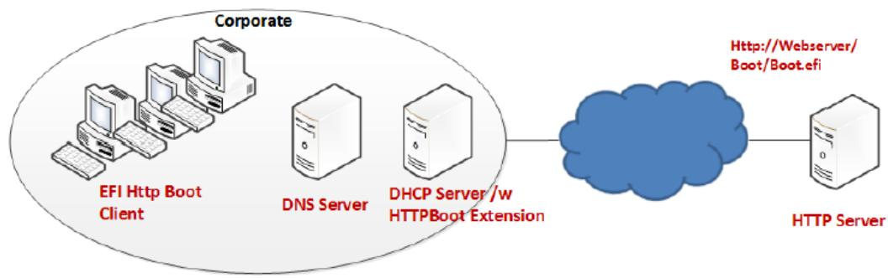  
Fig. 24.4: HTTP Boot Network Topology Concept - Corporate Environment

• DNS server is optional; and provides standard domain name resolution service.

• Proxy Host is optional. It is located within the corporate environment and acts as an intermediary between the Client and Endpoint Server.

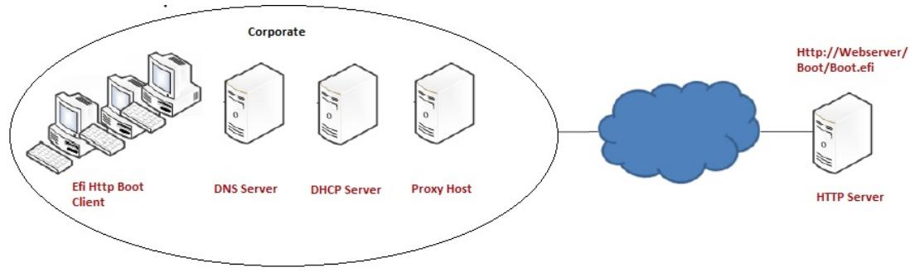  
Fig. 24.5: HTTP Boot Network Topology with Proxy Concept - Corporate Environment

## 24.7.2.2 Use case in Home environment

In a corporate environment, a standard DHCP server can be enhanced to support the HTTPBoot extension. In a home network, generally only an optional standard DHCP server may be available for host configuration information assignment. The Figure, below, shows the concept network topology for a typical home PC environment.

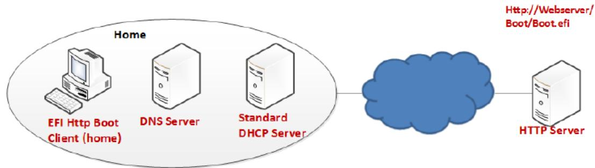  
Fig. 24.6: HTTP Boot Network Topology Concept2 — Homeenvironments

UEFI HTTP Boot Client initiates the communication between the client and diferent servers. In the home configuration however, the client will expect the boot resource information to be available from a source other than the standard DHCP server, and that source does not typically have HTTPBoot extensions. Instead of DHCP, the boot URI could be created by a UEFI application or extracted from text entered by a user.

DHCP server is optional, and if available in the network,\* provides the standard service to assign host configuration information to the UEFI Client (e.g. address/subnet/gateway/name-server/etc.). In case the standard DHCP server is not available, the same host configuration information should be provided by a UEFI application or extracted from text entered by a user prior to the client initiating the communication.

DNS Server is optional, and provides standard domain name resolution service.

## 24.7.3 Protocol Layout for UEFI HTTP Boot Clientconcept configuration for a typical HTTP Boot scenario

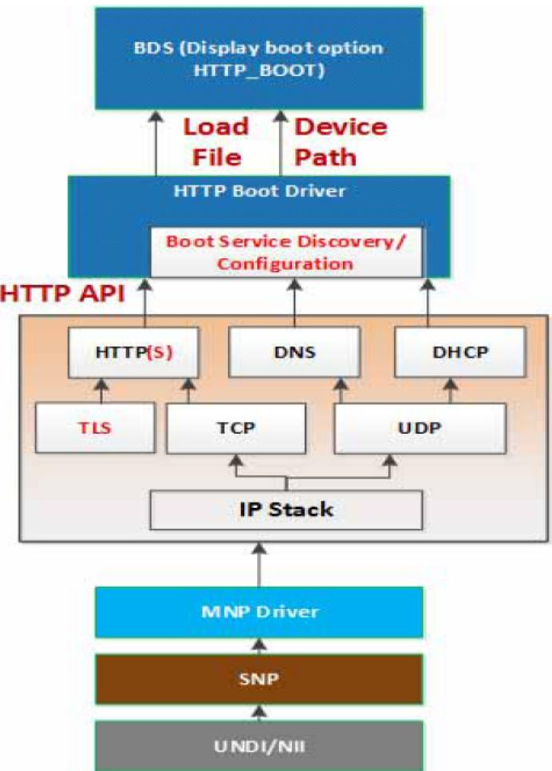  
Fig. 24.7: UEFI HTTP Boot Protocol Layout

This figure illustrates the UEFI network layers related to how the HTTP Boot works.

The HTTP Boot driver is layered on top of a UEFI Network stack implementation. It consumes DHCP service to do the Boot service discovery, and DNS service to do domain name resolution if needed. It also consumes HTTP serviced to retrieve images from the HTTP server. The functionality needed in the HTTP Boot scenario is limited to client-initiated requests to download the boot image.

TLS is consumed if HTTPS functionality is needed. The TLS design is covered in EFI TLS Protocol.

The HTTP Boot driver produces LoadFile protocol and device path protocol. BDS will provide the boot options for the HTTP Boot. Once a boot option for HTTP boot is executed, a particular network interface is selected. HTTP Boot driver will perform all steps on that interface and it is not required to use other interfaces

## 24.7.3.1 Device Path

If both IPv4 and IPv6 are supported, the HTTP Boot driver should create two child handles, with LoadFile and DevicePath installed on each child handle. For the device path, an IP device path node and a BootURI device path are appended to the parent device path, for example:

PciRoot(0x0)/Pci(0x19, 0x0)/MAC(001230F4B4FF, 0x0)/IPv4(0.0.0.0, 0, DHCP, 0.0.0.0, 0.0.0.0, 0.0.0.0)/Uri()

PciRoot(0x0)/Pci(0x19, 0x0)/MAC(001230F4B4FF, 0x0)/IPv6(::/128, 0, Static, ::/128, ::/128, 0)/Uri()

Also, after retrieving the boot resource information and IP address, the BootURI device path node will be updated to include the BootURI information. For example, if the NBP is a UEFI-formatted executable, the device patch will be updated to

PciRoot(0x0)/Pci(0x19, 0x0)/MAC(001230F4B4FF, 0x0)/IPv4(192.168.1.100, TCP, DHCP, 192.168.1.5, 192.168.1.1, 255.255.255.0)/Uri(http://192.168.1.100/shell.efi)

PciRoot(0x0)/Pci(0x19, 0x0)/MAC(001230F4B4FF, 0x0)/IPv6(2015::100, TCP, StatefulAutoConfigure, 2015::5, 2015::10, 64)/Uri(http://2015::100/shell.efi)

These two instances allow for the boot manager to decide a preference of IPv6 versus IPv4.

In cases where a Proxy Host is used to connect to the Endpoint Server, the ProxyURI device path and BootURI device path are appended to the parent device path, for example:

PciRoot(0x0)/Pci(0x19, 0x0)/MAC(001230F4B4FF, 0x0)/IPv4(0.0.0.0, 0, DHCP, 0.0.0.0, 0.0.0.0, 0.0.0.0)/Uri(ProxyURI)/Uri(EndpointServerURI)

PciRoot(0x0)/Pci(0x19, 0x0)/MAC(001230F4B4FF, 0x0)/IPv6(::/128, 0, Static, ::/128, ::/128, 0)/Uri(ProxyURI)/Uri(EndpointServerURI)

If the NBP is a binary image that could be mounted as a RAM disk, the device path will be updated to:

PciRoot(0x0)/Pci(0x19, 0x0)/MAC(001230F4B4FF, 0x0)/IPv4(192.168.1.100, TCP, DHCP, 192.168.1.5, 192.168.1.1, 255.255.255.0)/Uri(http://192.168.1.100/boot.iso [^])

PciRoot(0x0)/Pci(0x19, 0x0)/MAC(001230F4B4FF, 0x0)/IPv6(2015::100, TCP, StatefulAutoConfigure, 2015::5, 2015::10, 64)/Uri (http://2015::100/boot.iso)

In this case, the HTTP Boot driver will register RAM disk with the downloaded NBP, by appending a RamDisk device node to the device path above, like:

PciRoot(0x0)/Pci(0x19, 0x0)/MAC(001230F4B4FF, 0x0)/IPv4(192.168.1.100, TCP, DHCP, 192.168.1.5, 192.168.1.1, 255.255.255.0)/Uri(http://192.168.1.100/boot.iso )/RamDisk(0x049EA000, 0x5DEA000, 0, 3D5ABD30-4175-87CE-6D64-D2ADE523C4BB)

PciRoot(0x0)/Pci(0x19, 0x0)/MAC(001230F4B4FF, 0x0)/IPv6(2015::100, TCP, StatefulAutoConfig-ure, 2015::5, 2015::10, 64)/Uri (http://2015::100/boot.iso)/ RamDisk(0x049EA000, 0x5DEA000, 0,3D5ABD30-4175-87CE-6D64-D2ADE523C4BB)

In some cases, URI includes a host name and DNS become mandatory for translating the name to the IP address of the host. The HTTP Boot driver may append DNS device path node immediately before Uri device path node, for example:

PciRoot(0x0)/Pci(0x19, 0x0)/MAC(001230F4B4FF, 0x0)/IPv4(192.168.1.100, TCP, DHCP, 192.168.1.5, 192.168.1.1, 255.255.255.0)/Dns(192.168.22.100, 192.168.22.101)/Uri(http://www.bootserver.com/boot. iso )/ RamDisk(0x049EA000, 0x5DEA000, 0, 3D5ABD30-4175-87CE-6D64-D2ADE523C4BB)

PciRoot(0x0)/Pci(0x19, 0x0)/MAC(001230F4B4FF, 0x0)/IPv6(2015::100, TCP, StatefulAutoConfig-ure, 2015::5, 2015::10, 64)/Dns(2016::100, 2016::101)/Uri (http:// www.bootserver.com/ boot.iso)/RamDisk(0x049EA000, 0x5DEA000, 0, 3D5ABD30-4175-87CE-6D64-D2ADE523C4BB)

If the HTTP Boot driver cannot obtain the DNS server addresses, it should not append an empty DNS device path node.

The boot manager could use the example device paths to match the device which produces a device path protocol including a URI device path node in the system, without matching the Specific Device Path data in IP device path node and URI device path node, because the IP device path node and URI device path node might be updated by HTTP Boot driver in diferent scenarios.

The BootURI information could be retrieved from a DHCP server with HTTPBoot extension, or from a boot option which includes a short-form URI device path, or from a boot option which includes a URI device path node, or created by a UEFI application or extracted from text entered by a user.

Once the HTTP Boot driver retrieves the BootURI information from the short-form URI device path, it will perform all other steps for HTTP boot except retrieving the BootURI from DHCP server. Also, when the short-form URI device path is inputted to HTTP Boot driver via LoadFile protocol, the HTTP Boot driver should expand the short-form URI device path to above example device path after retrieving IP address configuration (address, subnet, gateway, and optionally the name-server) from the DHCP server. In case of the home environment with no DHCP server, the same information may be provisioned by OEM or input by the end user through Setup Options. The IP and optional DNS device path nodes, constructed with this information and prefixed to the short-form URI device path, can be inputted to the HTTP Boot driver via LoadFile protocol. The name server information in the form of DNS device path node is optional, and is used only when the BootURI contains the server name or FQDN. The HTTP Boot driver will then consume the information in the device path and initiate the necessary communication.

Once the HTTP Boot driver retrieves the BootURI information from a boot option which includes a URI device path node, it should retrieve the IP address configuration from the IP device path node of the same boot option. If the IP address configuration or BootURI information is empty, the HTTP Boot driver could retrieve the required information from DHCP server. If the IP address configuration or BootURI information is not empty but invalid, the HTTP boot process will fail.

The HTTP Boot block diagram ( UEFI HTTP Boot Protocol Layout ) describes a suggested implementation for HTTP Boot. Other implementation can create their own HTTP Netboot Driver which meets the requirements for their netboot methodology

## 24.7.4 Concept of Message Exchange in a typical HTTPBoot scenario (IPv4 in Corporate Environment)

In summary, the newly installed networked client machine (UEFI HTTP Boot Client) should be able to enter a heterogeneous network, acquire a network address from a DHCP server, and then download an NBP to set itself up.

The concept of HTTP Boot message exchange sequence is as follows. The client initiates the DHCPv4 D.O.R.A process by broadcasting a DHCPDISCOVER containing the extension that identifies the request as coming from a client that implements the HTTP Boot functionality. Assuming that a DHCP server or a Proxy DHCP server implementing this extension is available, after several intermediate steps, besides the standard configuration such as address/subnet/router/dnsserver, boot resource location will be provided to the client system in the format of a URI. The URI points to the NBP which is appropriate for this client hardware configuration. A boot option is created, and if selected by the system logic the client then uses HTTP to download the NBP from the HTTP server into memory. Finally, the client executes the downloaded NBP image from memory. This image can then consume other UEFI interfaces for further system setup.

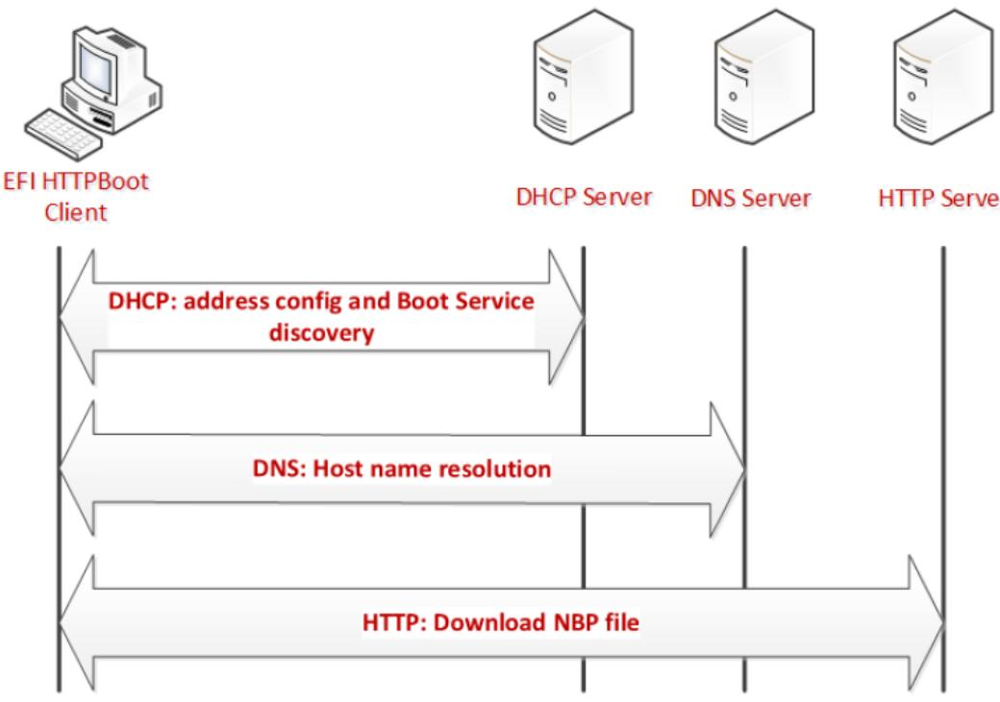  
Fig. 24.8: HTTP Boot Overall Flow

## 24.7.4.1 Message exchange between EFI Client and DHCPserver using DHCP Client Extensions

## 24.7.4.1.1 Client broadcast

The client broadcasts a DHCP Discover message to the standard DHCP port (67).

An option field in this packet contains the following:

• Fill DHCP option 55 - Parameter Requested List option

– Address configuration, Server information, Name server, Vendor class identifier

• A DHCP option 97: UUID/GUID-based Client Identifier

• A DHCP option 94: Client Network Identifier Option

– If support UNDI, fill this option (Refer RFC5970)

• A DHCP option 93: the client system architecture (Refer [Arch-Type])

– 0x0F - x86 UEFI HTTP Boot

– 0x10 - x64 UEFI HTTP Boot

• A DHCP option 60, Vendor Class ID, set to “HTTPClient:Arch:XXXX:UNDI:YYYZZZ”

## DHCP server response

The DHCP server responds by sending DHCPOFFER message on standard DHCP reply port (68).

The HTTP Boot Client may possibly receive multiple DHCPOFFER packets from diferent sources of DHCP Services, possibly from DHCP Services which recognize the HTTP extensions or from Standard DHCP Services.

A service recognizing HTTP extensions must respond with an ofer that has Option 60 (Vendor class identifier) parameter set to “HTTPClient”, in response to the Vendor class identifier requested in option 55 in the DHCP Discover message.

Each message contains standard DHCP parameters: an IP address for the client and any other parameters that the administrator might have configured on the DHCP or Proxy DHCP Service. The DHCP service or Proxy DHCP which recognizes the HTTPBoot extension will provide DHCPOFFER with HTTPClient extensions. If this is a Proxy DHCP service, then the client IP address field is (0.0.0.0). If this is from a DHCP service, then the returned client IP address field is valid.

From the received DHCPOFFER(s), the client records the information as follows:

• Client IP address (and other parameters) ofered by a standard DHCP/BOOTP services.

• If Boot URI information is provided thru ‘file’ field in DHCP Header or option 67, then the client will record the information as well.

• Optional Name-server information if URI is displayed using domain-name

– Timeout: After Client sent out the DHCP Discover packet, the Client will wait for a timeout to collect enough DHCP Ofers. If failed to retrieve all the required information, the DHCP Discover will be retried, at most four times. The four timeout mechanisms is 4, 8, 16 and 32 seconds respectively,

– Priority: Among all the received DHCPOFFERs, the Priority is considered as follows:

## 24.7.5 Priority1

Choose the DHCPOFFER that provides all required information:

<IP address configuration, Boot URI configuration, Name-server configuration (if domain-name used in Boot URI)>

If Boot URI and IP address configuration provided in diferent DHCPOFFER, Using 5 DHCPOFFER as example for priority description

• Packet1 - DHCPOFFER, provide <IP address configuration, Name server>

• Packet2 - DHCPOFFER, provide <IP address configuration>

• Packet3 - DHCPOFFER, provide <domain-name expressed URI>

• Packet4 - DHCPOFFER, provide <IP address expressed URI>

• Packet5 - DHCPOFFER, provide <IP address, domain-name expressed URI>

Then,

## 24.7.6 Priority2

Choose the DHCPOFFER from diferent packet, firstly find out URI info represented in IP address mode, then choose DHCPOFFER which provide IP address configuration

In this example, the chosen DHCPOFFER packet is packet4 + packet1 / packet 2 (packet 1/2 take same priority, implementation can make its own implementation choice)

## 24.7.7 Priority3

Choose the DHCPOFFER from diferent packet, firstly find out URI info represented in domain-name mode, then choose DHCPOFFER which provide <IP address configuration, domain-name expressed URI>

In this example, the chosen DHCPOFFER packet is packet3 / packet5 + packet1

NOTE: If packet5, then client IP address assigned by Packet5 will be override by IP address in packet1.

## 24.7.8 Priority4

If failed to retrieve <Boot URI / IP address / (on-demand) Name-server> information through all received DHCPOF-FERs, this is deemed as FAILED-CONFIGURATION

Assuming the boot image is in the boot subdirectory of the web server root, the supported URI could be one of below formats. [RFC3986] where ‘/boot/’ is replaced by administrator-created directory, and ‘image’ is the file name of the NBP.

http://reg-name:port/boot/image

http://ipv4address:port/boot/image

http://ipv6address:port/boot/image

In the URL example, Port is optional if web service is provided through port 80 for the HTTP data transfer. Commonly, the reg-name use DNS as name registry mechanism.

After retrieving the boot URI through Device Path , if IP address (either IPv4 or IPv6 address) is provided, the HTTP Boot Client can directly use that address for next step HTTP transfer. If a reg-name is provided in the URI, the HTTP Boot Client driver need initiate DNS process ( See Message in DNS Query/Reply ) to resolve its IP address.

## DHCP Request

The HTTP Boot Client selects an IP address ofered by a DHCP Service, and then it completes the standard DHCP protocol by sending a DHCP Request packet for the address to the DHCP Server and waiting for acknowledgement from the DHCP server.

## DHCP ACK

The server acknowledges the IP address by sending DHCP ACK packet to the client.

## 24.7.8.1 Message exchange between UEFI Client and DHCP server not using DHCP Client Extensions

In a home environment, because the Boot URI Information will not be provided by the DHCP Ofers, we need other channels to provide this information. The implementation suggestion is provisioning this information by OEM or input by end user through Setup Options, henceforth, the UEFI Boot Client already know the Boot URI before contacting the DHCP server.

The message exchange between the EFI Client and DHCP server will be standard DHCP D.O.R.A to obtain <IP address, Name-server>.

In the case of a home environment without a DHCP server, the above message exchange is not needed, and the UEFI HTTP Boot Client will have the <IP address, Name-server> provisioned by OEM or input by the end user through Setup Options.

## 24.7.8.2 Message in DNS Query/Reply

The DNS Query/Reply is a standard process defined in DNS Protocol [RFC 1034, RFC 1035]. Multiple IP address might be retrieved from the DNS process. It’s the HTTP Boot Client driver’s responsibility to select proper IP address automatically or expose user interface for customer to decide proper IP address.

## 24.7.8.3 Message in HTTP Download

In the HTTP Boot scenario, HTTP GET message is used to get image from the Web server.

## 24.7.9 Concept of Message Exchange in HTTP Boot scenario (IPv6)

## 24.7.9.1 Message exchange between EFI Client and DHCPv6 server with DHCP Client extensions

## 24.7.9.1.1 Client multicast a DHCPv6 Solicit message to the standard DHCPv6 port (547)

Besides the options required for address auto-configuration, option field in this packet also contains the following:

• Fill DHCPv6 Option 6 - Option Request Option

— Request server to supply option 59 (OPT\_BOOTFILE\_URL), option 60 ( OPT\_BOOTFILE\_PARAM), option 23 (OPT\_DNS\_SERVERS), option 16 (OPTION\_VENDOR\_CLASS).

• A DHCPv6 option 1, Client identifier

• A DHCPv6 option 16, Vendor Class ID, set to “HTTPClient:Arch:XXXX:UNDI:YYYZZZ”

• A DHCPv6 option 61: the client system architecture (Refer [Arch-Type])

— 0x0F - x86 UEFI HTTP Boot

— 0x10 - x64 UEFI HTTP Boot

• A DHCPv6 option 62: Client Network Identifier Option

— If support UNDI, fill this option (Refer RFC5970)

## 24.7.9.1.2 Server unicast DHCPv6 Advertisement to the Client to the DHCPv6 port (546)

The HTTP Boot Client will receive multiple advertisements from diferent sources of DHCPv6 Services, possibly from DHCPv6 Services which recognize the HTTP extensions or from Standard DHCPv6 Services.

A DHCPv6 service recognizing HTTP extensions must respond with an Advertisement that has Option 16 (OP-TION\_VENDOR\_CLASS) parameter set to “HTTPClient”, in response to the OPTION\_VENDOR\_CLASS requested in Option 6 in the DHCPv6 Solicit message.

Each message contains standard DHCP parameters: Identify Association (IA) option which conveys information including <IP address, lifetime, etc. . . >. Name server option conveys the DNS server address. The DHCP service or Proxy DHCP which recognizes the HTTPBoot extension will provide DHCPv6 Advertisement with HTTPClient extensions, including Boot URI and Optional Boot Parameters.

From the received DHCPOFFER(s), the client records the information as follows:

• Client IP address (and other parameters) provide through IA option

• Boot URI provided thru option 59

• Optional BootFile Parameter provided through option 60 (if no other parameter needed for this boot URI, this option can be eliminated)

• Optional Name-server information provided through option 23, if URI is displayed using domain-name.

## 24.7.9.1.3 Client multicast DHCPv6 Request to the selected DHCP Advertisement to confirm the IPaddress assigned by that server

This packet is the same with the DHCPv6 Solicit packet except for the message type is Request.

24.7.9.1.4 Server unicast the DHCPv6 Reply to acknowledge the Client IP address for the UEFI HTTP Client

24.7.9.2 Message exchange between UEFI Client and DHCPv6 server not using DHCP Client Extensions

In a home environment, the Boot URI Information will not be provided by the DHCPv6 Ofers, we need other channels to provide this information. Like what is described in Message exchange between UEFI Client and DHCP server not using DHCP Client Extensions , the implementation suggestion is provisioning this information by OEM or input by end user through Setup Options, henceforth, the UEFI Boot Client already know the Boot URI before contacting the DHCP server.

The message exchange between the EFI Client and DHCP server will be standard DHCP S.A.R.R. to obtain <IP address, Name-server>.

In the case of a home environment without a DHCPv6 server, the above message exchange is not needed, and the UEFI HTTP Boot Client will have the <IP address, Name-server> provisioned by OEM or input by the end user through Setup Options.

## 24.7.9.3 Message exchange between UEFI Client and DNS6 server

The DNS Query/Reply for domain name resolution is the same process as described in See Message in DNS Query/Reply.

## 24.7.9.4 Message in HTTP Download

HTTP Download process is the same process as described in Message in HTTP Download.

## 24.7.10 Concept of Message Exchange in HTTP Boot scenario (with Proxy Host)

The concept of HTTP Boot message exchange sequence with Proxy Host is as follows:

• The client establishes connection with the DHCPv4/v6 server as described in Message exchange between EFI Client and DHCPserver using DHCP Client Extensions, Message exchange between UEFI Client and DHCP server not using DHCP Client Extensions, Message exchange between EFI Client and DHCPv6 server with DHCP Client extensions and Message exchange between UEFI Client and DHCPv6 server not using DHCP Client Extensions.

• After several intermediate steps, besides the standard configuration such as address/subnet/router/dns-server, the client will initiate a HTTP CONNECT request to the Proxy Host to establish a TCP/IP tunnel. This allows the Proxy Host to forward the TCP connection from the client to the desired destination.

• The client sends a HTTP GET/HEAD request with the Endpoint Server’s boot resource location in the format of a URI to the Proxy Host. The URI points to the NBP which is appropriate for this client hardware configuration.

• A boot option is created, and if selected by the system logic the client then uses HTTP to download the NBP from the HTTP server into memory.

• The client executes the downloaded NBP image from memory. This image can then consume other UEFI interfaces for further system setup.

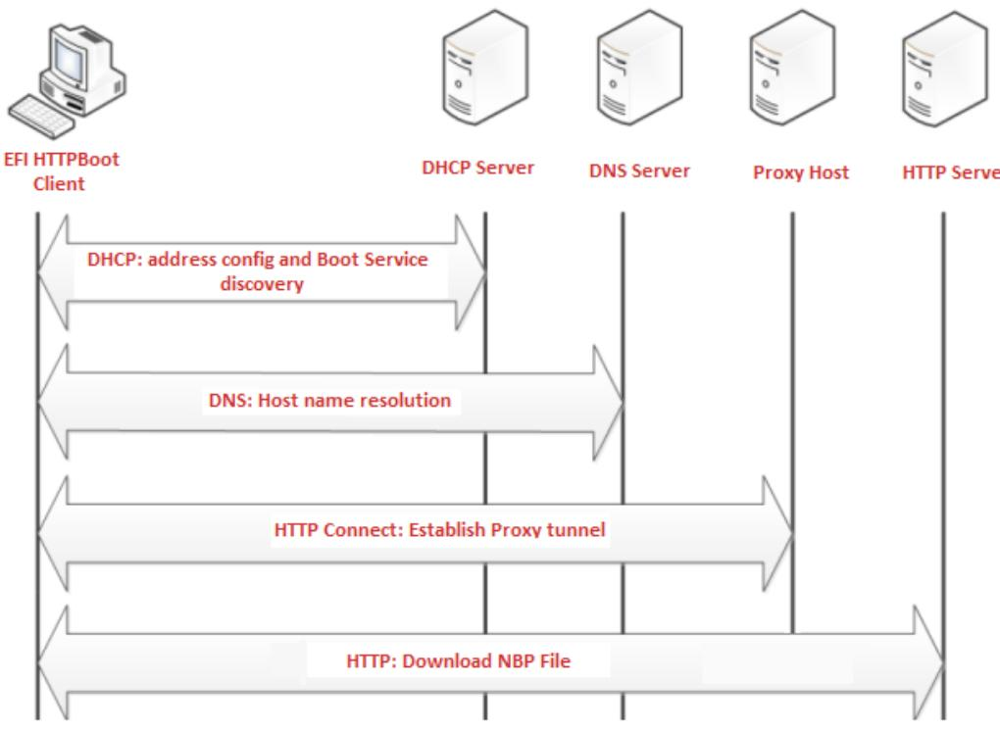  
Fig. 24.9: HTTP Boot Overall Flow with Proxy Host

## 24.7.11 EFI HTTP Boot Callback Protocol

This section defines the EFI HTTP Boot Callback Protocol that is invoked when the HTTP Boot driver is about to transmit or has received a packet. The EFI HTTP Boot Callback Protocol must be installed on the same handle as the Load File Protocol for the HTTP Boot.

## 24.7.12 EFI\_HTTP\_BOOT\_CALLBACK\_PROTOCOL

Summary

Protocol that is invoked when the HTTP Boot driver is about to transmit or has received a packet.

GUID

```c
#define EFI_HTTP_BOOT_CALLBACK_PROTOCOL_GUID \
{0xba23b311, 0x343d, 0x11e6, {0x91, 0x85, 0x58,0x20, 0xb1, 0xd6, 0x52, 0x99}}
```

Protocol Interface Structure

```c
typedef struct \_EFI_HTTP_BOOT_CALLBACK_PROTOCOL {
    EFI_HTTP_BOOT_CALLBACK    Callback;
} EFI_HTTP_BOOT_CALLBACK_PROTOCOL;
```

## Parameters

## Callback

Callback routine used by the HTTP Boot driver.

## 24.7.13 EFI\_HTTP\_BOOT\_CALLBACK\_PROTOCOL.Callback()

## Summary

Callback function that is invoked when the HTTP Boot driver is about to transmit or has received a packet.

Prototype

```txt
typedef
EFI_STATUS
(EFIAPI *EFI_HTTP_BOOT_CALLBACK) (
    IN EFI_HTTP_BOOT_CALLBACK_PROTOCOL    *This,
    IN EFI_HTTP_BOOT_CALLBACK_DATA_TYPE    DataType,
    IN BOOLEAN    Received,
    IN UINT32    DataLength,
    IN VOID    *Data OPTIONAL
);
```

## Parameters

## This

Pointer to the EFI\_HTTP\_BOOT\_CALLBACK\_PROTOCOL instance.

## DataType

The event that occurs in the current state. Type EFI\_HTTP\_BOOT\_CALLBACK\_DATA\_TYPE is defined below.

## Received

TRUE if the callback is being invoked due to a receive event. FALSE if the callback is being invoked due to a transmit event.

## DataLength

The length in bytes of the bufer pointed to by Data.

## Data

A pointer to the bufer of data, the data type is specified by DataType.

Related Definitions

```c
//**********************************************************************
// EFI_HTTP_BOOT_CALLBACK_DATA_TYPE
//**********************************************************************
typedef enum {
    HttpBootDhcp4,
    HttpBootDhcp6,
    HttpBootHttpRequest,
    HttpBootHttpResponse,
    HttpBootHttpEntityBody,
```

(continues on next page)

<table><tr><td colspan="2">HttpBootHttpAuthInfo, HttpBootTypeMax} EFI_HTTP_BOOT_CALLBACK_DATA_TYPE;</td></tr><tr><td colspan="2">HttpBootDhcp4Data points to a DHCP4 packet which is about to transmit or has received.</td></tr><tr><td colspan="2">HttpBootDhcp6Data points to a DHCP6 packet which is about to be transmit or has received.</td></tr><tr><td colspan="2">HttpBootHttpRequestData points to an EFI_HTTP_MESSAGE structure, which contains a HTTP request message to be transmitted.</td></tr><tr><td colspan="2">HttpBootHttpResponseData points to an EFI_HTTP_MESSAGE structure, which contains a received HTTP response message.</td></tr><tr><td colspan="2">HttpBootHttpEntityBodyPart of the entity body has been received from the HTTP server. Data points to the buffer of the entity body data.</td></tr><tr><td colspan="2">HttpBootHttpAuthInfoData points to the authentication information to provide to the HTTP server.</td></tr><tr><td colspan="2">HttpBootTypeMaxThis value is determined by the number of structure elements above. Currently has a value of 6.</td></tr><tr><td colspan="2">Description</td></tr><tr><td colspan="2">This function is invoked when the HTTP Boot driver is about to transmit or has received packet. Parameters DataType and Received specify the type of event and the format of the buffer pointed to by Data. Due to the polling nature of UEFI device drivers, this callback function should not execute for more than 5 ms. The returned status code determines the behavior of the HTTP Boot driver.</td></tr><tr><td colspan="2">Status Codes Returned</td></tr><tr><td>EFI_SUCCESS</td><td>Tells the HTTP Boot driver to continue the HTTP Boot process.</td></tr><tr><td>EFI_ABORTED</td><td>Tells the HTTP Boot driver to abort the current HTTP Boot process.</td></tr></table>

# NETWORK PROTOCOLS - MANAGED NETWORK

## 25.1 EFI Managed Network Protocol

This chapter defines the EFI Managed Network Protocol. It is split into the following two main sections:

• Managed Network Service Binding Protocol (MNSBP)

• Managed Network Protocol (MNP)

The MNP provides raw (unformatted) asynchronous network packet I/O services. These services make it possible for multiple-event-driven drivers and applications to access and use the system network interfaces at the same time.

## 25.1.1 EFI\_MANAGED\_NETWORK\_SERVICE\_BINDING\_PROTOCOL

## Summary

The MNSBP is used to locate communication devices that are supported by an MNP driver and to create and destroy instances of the MNP child protocol driver that can use the underlying communications device.

The EFI Service Binding Protocol in EFI Services Binding defines the generic Service Binding Protocol functions. This section discusses the details that are specific to the MNP.

## GUID

```c
#define EFI_MANAGED_NETWORK_SERVICE_BINDING_PROTOCOL_GUID \
{0xf36ff770,0xa7e1,0x42cf,\
{0x9e,0xd2,0x56,0xf0,0xf2,0x71,0xf4,0x4c}}
```

## Description

A network application (or driver) that requires shared network access can use one of the protocol handler services, such as BS->LocateHandleBufer(), to search for devices that publish an MNSBP GUID. Each device with a published MNSBP GUID supports MNP and may be available for use.

After a successful call to the EFI\_MANAGED\_NETWORK\_SERVICE\_BINDING\_PROTOCOL.CreateChild() function, the child MNP driver instance is in an unconfigured state; it is not ready to send and receive data packets.

Before a network application terminates execution, every successful call to the EFI\_MANAGED\_NETWORK\_SERVICE\_BINDING\_PROTOCOL.CreateChild() function must be matched with a call to the EFI\_MANAGED\_NETWORK\_SERVICE\_BINDING\_PROTOCOL.DestroyChild() function.

## 25.1.2 EFI\_MANAGED\_NETWORK\_PROTOCOL

## Summary

The MNP is used by network applications (and drivers) to perform raw (unformatted) asynchronous network packet I/O.

## GUID

```c
#define EFI_MANAGED_NETWORK_PROTOCOL_GUID\
{0x7ab33a91, 0xace5, 0x4326, \
{0xb5, 0x72, 0xe7, 0xee, 0x33, 0xd3, 0x9f, 0x16}}
```

## Protocol Interface Structure

```c
typedef struct \_EFI_MANAGED_NETWORK_PROTOCOL {
    EFI_MANAGED_NETWORK_GET_MODE_DATA GetModeData;
    EFI_MANAGED_NETWORK_CONFIGURE Configure;
    EFI_MANAGED_NETWORK_MCAST_IP_TO_MAC McastIpToMac;
    EFI_MANAGED_NETWORK_GROUPS Groups;
    EFI_MANAGED_NETWORK_TRANSMIT Transmit;
    EFI_MANAGED_NETWORK_RECEIVE Receive;
    EFI_MANAGED_NETWORK_CANCEL Cancel;
    EFI_MANAGED_NETWORK_POLL Poll;
} EFI_MANAGED_NETWORK_PROTOCOL;
```

## Parameters

## GetModeData

Returns the current MNP child driver operational parameters. May also support returning underlying Simple Network Protocol (SNP) driver mode data. See the GetModeData() function description.

## Configure

Sets the Configure() function description.

## McastIpToMac

Translates a software (IP) multicast address to a hardware (MAC) multicast address. This function may be unsupported in some MNP implementations. See the McastIpToMac() function description.

## Groups

Enables and disables receive filters for multicast addresses. This function may be unsupported in some MNP implementations. See the Groups() function description.

## Transmit

Places asynchronous outgoing data packets into the transmit queue. See the Transmit() function description.

## Receive

Places an asynchronous receiving request into the receiving queue. See the Receive() function description.

## Cancel

Aborts a pending transmit or receive request. See the Cancel() function description.

## Poll

Polls for incoming data packets and processes outgoing data packets. See the Poll() function description.

## Description

The services that are provided by MNP child drivers make it possible for multiple drivers and applications to send and receive network trafic using the same network device.

Before any network trafic can be sent or received, the EFI\_MANAGED\_NETWORK\_PROTOCOL.Configure() function must initialize the operational parameters for the MNP child driver instance. Once configured, data packets can be received and sent using the following functions:

• EFI\_MANAGED\_NETWORK\_PROTOCOL.Transmit()

• EFI\_MANAGED\_NETWORK\_PROTOCOL.Receive()

• EFI\_MANAGED\_NETWORK\_PROTOCOL.Poll()

## 25.1.3 EFI\_MANAGED\_NETWORK\_PROTOCOL.GetModeData()

## Summary

Returns the operational parameters for the current MNP child driver. May also support returning the underlying SNP driver mode data.

## Prototype

```txt
typedef
EFI_STATUS
(EFIAPI *EFI_MANAGED_NETWORK_GET_MODE_DATA) (
    IN EFI_MANAGED_NETWORK_PROTOCOL    *This,
    OUT EFI_MANAGED_NETWORK_CONFIG_DATA    *MnpConfigData OPTIONAL,
    OUT EFI_SIMPLE_NETWORK_MODE    *SnpModeData OPTIONAL
);
```

## Parameters

## This

Pointer to the EFI\_MANAGED\_NETWORK\_PROTOCOL instance.

## MnpConfigData

Pointer to storage for MNP operational parameters. Type EFI\_MANAGED\_NETWORK\_CONFIG\_DATA is defined in “Related Definitions” below.

## SnpModeData

Pointer to storage for SNP operational parameters. This feature may be unsupported. Type EFI\_SIMPLE\_NETWORK\_MODE is defined in the EFI\_SIMPLE\_NETWORK\_PROTOCOL.

## Description

The GetModeData() function is used to read the current mode data (operational parameters) from the MNP or the underlying SNP.

## Related Definitions

```txt
//**********************************************************************
// EFI_MANAGED_NETWORK_CONFIG_DATA
//**********************************************************************
typedef struct {
    UINT32 ReceivedQueueTimeoutValue;
    UINT32 TransmitQueueTimeoutValue;
    UINT16 ProtocolTypeFilter;
    BOOLEAN EnableUnicastReceive;
    BOOLEAN EnableMulticastReceive;
    BOOLEAN EnableBroadcastReceive;
    BOOLEAN EnablePromiscuousReceive;
```

(continues on next page)

<table><tr><td colspan="2">(continued from previous page)</td></tr><tr><td>BOOLEAN</td><td>FlushQueuesOnReset;</td></tr><tr><td>BOOLEAN</td><td>EnableReceiveTimestamps;</td></tr><tr><td>BOOLEAN</td><td>DisableBackgroundPolling;</td></tr><tr><td colspan="2">} EFI_MANAGED_NETWORK_CONFIG_DATA;</td></tr></table>

## ReceivedQueueTimeoutValue

Timeout value for a UEFI one-shot timer event. A packet that has not been removed from the MNP receive queue by a call to EFI\_MANAGED\_NETWORK\_PROTOCOL.Poll() will be dropped if its receive timeout expires. If this value is zero, then there is no receive queue timeout. If the receive queue fills up, then the device receive filters are disabled until there is room in the receive queue for more packets. The startup default value is 10,000,000 (10 seconds).

## TransmitQueueTimeoutValue

Timeout value for a UEFI one-shot timer event. A packet that has not been removed from the MNP transmit queue by a call to EFI\_MANAGED\_NETWORK\_PROTOCOL.Poll() will be dropped if its transmit timeout expires. If this value is zero, then there is no transmit queue timeout. If the transmit queue fills up, then the EFI\_MANAGED\_NETWORK\_PROTOCOL.Transmit() function will return EFI\_NOT\_READY until there is room in the transmit queue for more packets. The startup default value is 10,000,000 (10 seconds).

## ProtocolTypeFilter

Ethernet type II 16-bit protocol type in host byte order. Valid values are zero and 1,500 to 65,535. Set to zero to receive packets with any protocol type. The startup default value is zero.

## EnableUnicastReceive

Set to TRUE to receive packets that are sent to the network device MAC address. The startup default value is FALSE.

## EnableMulticastReceive

Set to TRUE to receive packets that are sent to any of the active multicast groups. The startup default value is FALSE.

## EnableBroadcastReceive

Set to TRUE to receive packets that are sent to the network device broadcast address. The startup default value is FALSE .

## EnablePromiscuousReceive

Set to TRUE to receive packets that are sent to any MAC address. Note that setting this field to TRUE may cause packet loss and degrade system performance on busy networks. The startup default value is FALSE.

## FlushQueuesOnReset

Set to TRUE to drop queued packets when the configuration is changed. The startup default value is FALSE.

## EnableReceiveTimestamps

Set to TRUE to timestamp all packets when they are received by the MNP. Note that timestamps may be unsupported in some MNP implementations. The startup default value is FALSE.

## DisableBackgroundPolling

Set to TRUE to disable background polling in this MNP instance. Note that background polling may not be supported in all MNP implementations. The startup default value is FALSE, unless background polling is not supported.

## Status Codes Returned

<table><tr><td>EFI_SUCCESS</td><td>The operation completed successfully.</td></tr><tr><td>EFI_INVALID_PARAMETER</td><td>This is NULL.</td></tr><tr><td>EFI_UNSUPPORTED</td><td>The requested feature is unsupported in this MNP implementation.</td></tr></table>

continues on next page

<table><tr><td>EFI_SUCCESS</td><td>The operation completed successfully.</td></tr></table>

Table 25.1 – continued from previous page

<table><tr><td>EFI_NOT_STARTED</td><td>This MNP child driver instance has not been configured. The default values are returned in MnpConfigData if it is not NULL.</td></tr><tr><td>Other</td><td>The mode data could not be read.</td></tr></table>

## 25.1.4 EFI\_MANAGED\_NETWORK\_PROTOCOL.Configure()

## Summary

Sets or clears the operational parameters for the MNP child driver.

## Prototype

```txt
typedef
EFI_STATUS
(EFIAPI *EFI_MANAGED_NETWORK_CONFIGURE) (
    IN EFI_MANAGED_NETWORK_PROTOCOL    *This,
    IN EFI_MANAGED_NETWORK_CONFIG_DATA    *MnpConfigData OPTIONAL
);
```

## Parameters

## This

Pointer to the EFI\_MANAGED\_NETWORK\_PROTOCOL instance.

## MnpConfigData

Pointer to configuration data that will be assigned to the MNP child driver instance. If NULL, the MNP child driver instance is reset to startup defaults and all pending transmit and receive requests are flushed. Type EFI\_MANAGED\_NETWORK\_CONFIG\_DATA is defined in EFI\_MANAGED\_NETWORK\_PROTOCOL.GetModeData().

## Description

The Configure() function is used to set, change, or reset the operational parameters for the MNP child driver instance. Until the operational parameters have been set, no network trafic can be sent or received by this MNP child driver instance. Once the operational parameters have been reset, no more trafic can be sent or received until the operational parameters have been set again.

Each MNP child driver instance can be started and stopped independently of each other by setting or resetting their receive filter settings with the Configure() function.

After any successful call to Configure(), the MNP child driver instance is started. The internal periodic timer (if supported) is enabled. Data can be transmitted and may be received if the receive filters have also been enabled.

NOTE: If multiple MNP child driver instances will receive the same packet because of overlapping receive filter settings, then the first MNP child driver instance will receive the original packet and additional instances will receive copies of the original packet.

NOTE: WARNING: Receive filter settings that overlap will consume extra processor and/or DMA resources and degrade system and network performance.

## Status Codes Returned

```txt
This
Pointer to the EFI_MANAGED_NETWORK_PROTOCOL instance.
Ipv6Flag
Set to TRUE to if IpAddress is an IPv6 multicast address.
Set to FALSE if IpAddress is an IPv4 multicast address.
IpAddress
Pointer to the multicast IP address (in network byte order) to convert.
```

Table 25.2 – continued from previous page

<table><tr><td>EFI_INVALID_PARAMETER</td><td></td></tr><tr><td></td><td>One or more of the following conditions is TRUE:This is NULL.MnpConfigData.ProtocolTypeFilteris not valid.The operational data for the MNP child driver instance is unchanged.</td></tr><tr><td>EFI_OUT_OF_RESOURCES</td><td></td></tr><tr><td></td><td>Required system resources (usually memory) could not be allocated.The MNP child driver instance has been reset to startup defaults.</td></tr><tr><td>EFI_UNSUPPORTED</td><td></td></tr><tr><td></td><td>The requested feature is unsupported in this [MNP] implementation.The operational data for the MNP child driver instance is unchanged.</td></tr><tr><td>EFI_DEVICE_ERROR</td><td></td></tr><tr><td></td><td>An unexpected network or system error occurred.The MNP child driver instance has been reset to startup defaults.</td></tr><tr><td>Other</td><td>The MNP child driver instance has been reset to startup defaults.</td></tr></table>

## 25.1.5 EFI\_MANAGED\_NETWORK\_PROTOCOL.McastIpToMac()

## Summary

Translates an IP multicast address to a hardware (MAC) multicast address. This function may be unsupported in some MNP implementations.

Prototype

```txt
typedef
EFI_STATUS
(EFIAPI *EFI_MANAGED_NETWORK_MCAST_IP_TO_MAC) (
    IN EFI_MANAGED_NETWORK_PROTOCOL    *This,
    IN BOOLEAN    Ipv6Flag,
    IN EFI_IP_ADDRESS    *IpAddress,
    OUT EFI_MAC_ADDRESS    *MacAddress
);
```

## Parameters

## MacAddress

Pointer to the resulting multicast MAC address.

## Description

The McastIpToMac() function translates an IP multicast address to a hardware (MAC) multicast address.

This function may be implemented by calling the underlying EFI\_SIMPLE\_NETWORK.MCastIpToMac() function, which may also be unsupported in some MNP implementations.

## Status Codes Returned

<table><tr><td>EFI_SUCCESS</td><td>The operation completed successfully.</td></tr><tr><td>EFI_INVALID_PARAMETER</td><td></td></tr><tr><td></td><td>One of the following conditions is TRUE:This is NULL.IpAddress is NULL.* IpAddress is not a valid multicast IP address.MacAddress is NULL.</td></tr><tr><td>EFI_NOT_STARTED</td><td>This MNP child driver instance has not been configured.</td></tr><tr><td>EFI_UNSUPPORTED</td><td>The requested feature is unsupported in this MNP implementation.</td></tr><tr><td>EFI_DEVICE_ERROR</td><td>An unexpected network or system error occurred.</td></tr><tr><td>Other</td><td>The address could not be converted.</td></tr></table>

## 25.1.6 EFI\_MANAGED\_NETWORK\_PROTOCOL.Groups()

## Summary

Enables and disables receive filters for multicast address. This function may be unsupported in some MNP implementations.

## Prototype

```txt
typedef
EFI_STATUS
(EFIAPI *EFI_MANAGED_NETWORK_GROUPS) (
    IN EFI_MANAGED_NETWORK_PROTOCOL    *This,
    IN BOOLEAN    JoinFlag,
    IN EFI_MAC_ADDRESS    *MacAddress OPTIONAL
);
```

## Parameters

## This

Pointer to the EFI\_MANAGED\_NETWORK\_PROTOCOL instance.

## JoinFlag

Set to TRUE to join this multicast group.

Set to FALSE to leave this multicast group.

## MacAddress

Pointer to the multicast MAC group (address) to join or leave.

## Description

The Groups() function only adds and removes multicast MAC addresses from the filter list. The MNP driver does not transmit or process Internet Group Management Protocol (IGMP) packets.

If JoinFlag is FALSE and MacAddress is NULL, then all joined groups are left.

## Status Codes Returned

<table><tr><td>EFI_SUCCESS</td><td>The requested operation completed successfully.</td></tr><tr><td>EFI_INVALID_PARAMETER</td><td></td></tr><tr><td></td><td>One or more of the following conditions is TRUE:This is NULL.JoinFlag is TRUE andMacAddressis NULL.*MacAddressis not a valid multicast MAC address.The MNP multicast group settings are unchanged.</td></tr><tr><td>EFI_NOT_STARTED</td><td>This MNP child driver instance has not been configured.</td></tr><tr><td>EFI_ALREADY_STARTED</td><td>The supplied multicast group is already joined.</td></tr><tr><td>EFI_NOT_FOUND</td><td>The supplied multicast group is not joined.</td></tr><tr><td>EFI_DEVICE_ERROR</td><td></td></tr><tr><td></td><td>An unexpected network or system error occurred.The MNP child driver instance has been reset to startup defaults.</td></tr><tr><td>EFI_UNSUPPORTED</td><td>The requested feature is unsupported in this MNP implementation.</td></tr><tr><td>Other</td><td>The requested operation could not be completed. The MNP multicast group settings are unchanged.</td></tr></table>

## 25.1.7 EFI\_MANAGED\_NETWORK\_PROTOCOL.Transmit()

## Summary

Places asynchronous outgoing data packets into the transmit queue.

Prototype

```c
typedef
EFI_STATUS
(EFIAPI *EFI_MANAGED_NETWORK_TRANSMIT) (
    IN EFI_MANAGED_NETWORK_PROTOCOL    *This,
    IN EFI_MANAGED_NETWORK_COMPLETION_TOKEN    *Token
);
```

## Parameters

## This

Pointer to the EFI\_MANAGED\_NETWORK\_PROTOCOL instance.

## Token

## Description

The Transmit() function places a completion token into the transmit packet queue. This function is always asynchronous.

The caller must fill in the Token.Event and Token.TxData fields in the completion token, and these fields cannot be NULL. When the transmit operation completes, the MNP updates the Token.Status field and the Token.Event is signaled.

NOTE There may be a performance penalty if the packet needs to be defragmented before it can be transmitted by the network device. Systems in which performance is critical should review the requirements and features of the underlying communications device and drivers.

## Related Definitions

```c
//******************************************************************
// EFI_MANAGED_NETWORK_COMPLETION_TOKEN
//******************************************************************
typedef struct {
    EFI_EVENT Event;
    EFI_STATUS Status;
    union {
    EFI_MANAGED_NETWORK_RECEIVE_DATA *RxData;
    EFI_MANAGED_NETWORK_TRANSMIT_DATA *TxData;
    } Packet;
} EFI_MANAGED_NETWORK_COMPLETION_TOKEN;
```

## Event

This Event will be signaled after the Status field is updated by the MNP. The type of Event must be EVT\_NOTIFY\_SIGNAL. The Task Priority Level (TPL) of Event must be lower than or equal to TPL\_CALLBACK.

## Status

This field will be set to one of the following values:

EFI\_SUCCESS: The receive or transmit completed successfully.

EFI\_ABORTED: The receive or transmit was aborted.

EFI\_TIMEOUT: The transmit timeout expired.

EFI\_DEVICE\_ERROR: There was an unexpected system or network error.

EFI\_NO\_MEDIA: There was a media error

## RxData

When this token is used for receiving, RxData is a pointer to the EFI\_MANAGED\_NETWORK\_RECEIVE\_DATA.

## TxData

```txt
When this token is used for transmitting, TxData is a pointer to the EFI_MANAGED_NETWORK_TRANSMIT_DATA.
```

The EFI\_MANAGED\_NETWORK\_COMPLETION\_TOKEN structure is used for both transmit and receive operations.

When it is used for transmitting, the Event and TxData fields must be filled in by the MNP client. After the transmit operation completes, the MNP updates the Status field and the Event is signaled.

When it is used for receiving, only the Event field must be filled in by the MNP client. After a packet is received, the MNP fills in the RxData and Status fields and the Event is signaled.

```c
//**********************************************************************
// EFI_MANAGED_NETWORK_RECEIVE_DATA
//**********************************************************************
typedef struct {
    EFI_TIME    Timestamp;
    EFI_EVENT    RecycleEvent;
```

(continues on next page)

(continued from previous page)

<table><tr><td>UINT32</td><td>PacketLength;</td></tr><tr><td>UINT32</td><td>HeaderLength;</td></tr><tr><td>UINT32</td><td>AddressLength;</td></tr><tr><td>UINT32</td><td>DataLength;</td></tr><tr><td>BOOLEAN</td><td>broadcastFlag;</td></tr><tr><td>BOOLEAN</td><td>MulticastFlag;</td></tr><tr><td>BOOLEAN</td><td>PromiscuousFlag;</td></tr><tr><td>UINT16</td><td>ProtocolType;</td></tr><tr><td>VOID</td><td>*DestinationAddress;</td></tr><tr><td>VOID</td><td>*SourceAddress;</td></tr><tr><td>VOID</td><td>*MediaHeader;</td></tr><tr><td>VOID</td><td>*PacketData;</td></tr><tr><td colspan="2">} EFI_MANAGED_NETWORK_RECEIVE_DATA;</td></tr></table>

## Timestamp

System time when the MNP received the packet. Timestamp is zero filled if receive timestamps are disabled or unsupported.

## RecycleEvent

MNP clients must signal this event after the received data has been processed so that the receive queue storage can be reclaimed. Once RecycleEvent is signaled, this structure and the received data that is pointed to by this structure must not be accessed by the client.

## PacketLength

Length of the entire received packet (media header plus the data).

## HeaderLength

Length of the media header in this packet.

## AddressLength

Length of a MAC address in this packet.

## DataLength

Length of the data in this packet.

## BroadcastFlag

Set to TRUE if this packet was received through the broadcast filter. (The destination MAC address is the broadcast MAC address.)

## MulticastFlag

Set to TRUE if this packet was received through the multicast filter. (The destination MAC address is in the multicast filter list.)

## PromiscuousFlag

Set to TRUE if this packet was received through the promiscuous filter. (The destination address does not match any of the other hardware or software filter lists.)

## ProtocolType

16-bit protocol type in host byte order. Zero if there is no protocol type field in the packet header.

## DestinationAddress

Pointer to the destination address in the media header.

## SourceAddress

Pointer to the source address in the media header.

## MediaHeader

Pointer to the first byte of the media header.

## PacketData

Pointer to the first byte of the packet data (immediately following media header).

An EFI\_MANAGED\_NETWORK\_RECEIVE\_DATA structure is filled in for each packet that is received by the MNP.

If multiple instances of this MNP driver can receive a packet, then the receive data structure and the received packet are duplicated for each instance of the MNP driver that can receive the packet.

```c
//******************************************************************
// EFI_MANAGED_NETWORK_TRANSMIT_DATA
//******************************************************************
typedef struct {
    EFI_MAC_ADDRESS *DestinationAddress OPTIONAL;
    EFI_MAC_ADDRESS *SourceAddress OPTIONAL;
    UINT16 ProtocolType OPTIONAL;
    UINT32 DataLength;
    UINT16 HeaderLength OPTIONAL;
    UINT16 FragmentCount;
    EFI_MANAGED_NETWORK_FRAGMENT_DATA FragmentTable[1];
} EFI_MANAGED_NETWORK_TRANSMIT_DATA;
```

## DestinationAddress

Pointer to the destination MAC address if the media header is not included in FragmentTable[]. If NULL, then the media header is already filled in FragmentTable[].

## SourceAddress

Pointer to the source MAC address if the media header is not included in FragmentTable[]. Ignored if DestinationAddress is NULL.

## ProtocolType

The protocol type of the media header in host byte order. Ignored if DestinationAddress is NULL.

## DataLength

Sum of all FragmentLength fields in FragmentTable[] minus the media header length.

## HeaderLength

Length of the media header if it is included in the FragmentTable. Must be zero if DestinationAddress is not NULL.

## FragmentCount

Number of data fragments in FragmentTable[]. This field cannot be zero.

## FragmentTable

Table of data fragments to be transmitted. The first byte of the first entry in FragmentTable[] is also the first byte of the media header or, if there is no media header, the first byte of payload. Type EFI\_MANAGED\_NETWORK\_FRAGMENT\_DATA is defined below.

The EFI\_MANAGED\_NETWORK\_TRANSMIT\_DATA structure describes a (possibly fragmented) packet to be transmitted.

The DataLength field plus the HeaderLength field must be equal to the sum of all of the FragmentLength fields in the FragmentTable.

If the media header is included in FragmentTable[], then it cannot be split between fragments.

```c
//**********************************************************************
// EFI_MANAGED_NETWORK_FRAGMENT_DATA
//**********************************************************************
typedef struct {
```

(continues on next page)

<table><tr><td colspan="2">(continued from previous page)</td></tr><tr><td>UINT32</td><td>FragmentLength;</td></tr><tr><td>VOID</td><td>*FragmentBuffer;</td></tr><tr><td colspan="2">} EFI_MANAGED_NETWORK_FRAGMENT_DATA;</td></tr></table>

## FragmentLength

Number of bytes in the FragmentBufer. This field may not be set to zero.

## FragmentBufer

Pointer to the fragment data. This field may not be set to NULL.

The EFI\_MANAGED\_NETWORK\_FRAGMENT\_DATA structure describes the location and length of a packet fragment to be transmitted.

## Status Codes Returned

<table><tr><td>EFI_SUCCESS</td><td>The transmit completion token was cached.</td></tr><tr><td>EFI_NOT_STARTED</td><td>This MNP child driver instance has not been configured.</td></tr><tr><td>EFI_INVALID_PARAMETER</td><td></td></tr><tr><td></td><td>One or more of the following conditions is TRUE:This is NULL.Token is NULL.Token.Event is NULL.Token.TxData is NULL.Token.TxData.DestinationAddress is not NULL and Token.TxData.HeaderLength is zero.Token.TxData.FragmentCount is zero.(Token.TxData.HeaderLength + Token.TxData.DataLength) is not equal to the sum of the Token.TxDat a.FragmentTable[].FragmentLength fields.One or more of theToken.TxDat a.FragmentTable[].FragmentLength fields is zero.One or more of theToken.TxData.Frag mentTable[].FragmentBufferfields is NULL.Token.TxData.DataLength is greater than MTU</td></tr><tr><td>EFI_ACCESS_DENIED</td><td>The transmit completion token is already in the transmit queue.</td></tr><tr><td>EFI_OUT_OF_RESOURCES</td><td>The transmit data could not be queued due to a lack of system resources (usually memory).</td></tr><tr><td>EFI_DEVICE_ERROR</td><td></td></tr><tr><td></td><td>An unexpected system or network error occurred.The MNP child driver instance has been reset to startup defaults.</td></tr><tr><td>EFI_NOT_READY</td><td>The transmit request could not be queued because the transmit queue is full.</td></tr><tr><td>EFI_NO_MEDIA</td><td>There was a media error.</td></tr></table>

## 25.1.8 EFI\_MANAGED\_NETWORK\_PROTOCOL.Receive()

## Summary

Places an asynchronous receiving request into the receiving queue.

Prototype

```c
typedef
EFI_STATUS
(EFIAPI *EFI_MANAGED_NETWORK_RECEIVE) (
    IN EFI_MANAGED_NETWORK_PROTOCOL    *This,
    IN EFI_MANAGED_NETWORK_COMPLETION_TOKEN    *Token
);
```

## Parameters

## This

Pointer to the EFI\_MANAGED\_NETWORK\_PROTOCOL instance.

## Token

Pointer to a token associated with the receive data descriptor. Type

EFI\_MANAGED\_NETWORK\_COMPLETION\_TOKEN is defined in

EFI\_MANAGED\_NETWORK\_PROTOCOL.Transmit() .

## Description

The Receive() function places a completion token into the receive packet queue. This function is always asynchronous.

The caller must fill in the Token.Event field in the completion token, and this field cannot be NULL. When the receive operation completes, the MNP updates the Token.Status and Token.RxData fields and the Token.Event is signaled.

## Status Codes Returned

<table><tr><td>EFI_SUCCESS</td><td>The receive completion token was cached.</td></tr><tr><td>EFI_NOT_STARTED</td><td>This MNP child driver instance has not been configured.</td></tr><tr><td>EFI_INVALID_PARAMETER</td><td></td></tr><tr><td></td><td>One or more of the following conditions is TRUE: 
• This is NULL.
• Token is NULL.
• Token.Event is NULL</td></tr><tr><td>EFI_OUT_OF_RESOURCES</td><td>The transmit data could not be queued due to a lack of system resources (usually memory).</td></tr><tr><td>EFI_DEVICE_ERROR</td><td>An unexpected system or network error occurred. The MNP child driver instance has been reset to startup defaults.</td></tr><tr><td>EFI_ACCESS_DENIED</td><td>The receive completion token was already in the receive queue.</td></tr><tr><td>EFI_NOT_READY</td><td>The receive request could not be queued because the receive queue is full.</td></tr><tr><td>EFI_NO_MEDIA</td><td>There was a media error.</td></tr></table>

## 25.1.9 EFI\_MANAGED\_NETWORK\_PROTOCOL.Cancel()

## Summary

Aborts an asynchronous transmit or receive request.

## Prototype

```txt
typedef
EFI_STATUS
(EFIAPI *EFI_MANAGED_NETWORK_CANCEL) (
    IN EFI_MANAGED_NETWORK_PROTOCOL    *This,
    IN EFI_MANAGED_NETWORK_COMPLETION_TOKEN    *Token OPTIONAL
);
```

## Parameters

## This

Pointer to the EFI\_MANAGED\_NETWORK\_PROTOCOL instance.

## Token

Pointer to a token that has been issued by

EFI\_MANAGED\_NETWORK\_PROTOCOL.Transmit() or

EFI\_MANAGED\_NETWORK\_PROTOCOL.Receive(). If NULL, all pending tokens are aborted. Type

EFI\_MANAGED\_NETWORK\_COMPLETION\_TOKEN is defined in

EFI\_MANAGED\_NETWORK\_PROTOCOL.Transmit().

## Description

The Cancel() function is used to abort a pending transmit or receive request. If the token is in the transmit or receive request queues, after calling this function, Token.Status will be set to EFI\_ABORTED and then Token.Event will be signaled. If the token is not in one of the queues, which usually means that the asynchronous operation has completed, this function will not signal the token and EFI\_NOT\_FOUND is returned.

## Status Codes Returned

<table><tr><td>EFI_SUCCESS</td><td>The asynchronous I/O request was aborted and Token.Event was signaled. When Token is NULL, all pending requests were aborted and their events were signaled.</td></tr><tr><td>EFI_NOT_STARTED</td><td>This MNP child driver instance has not been configured.</td></tr><tr><td>EFI_INVALID_PARAMETER</td><td>This is NULL.</td></tr><tr><td>EFI_NOT_FOUND</td><td>When Token is not NULL, the asynchronous I/O request was not found in the transmit or receive queue. It has either completed or was not issued by Transmit() and Receive().</td></tr></table>

## 25.1.10 EFI\_MANAGED\_NETWORK\_PROTOCOL.Poll()

## Summary

Polls for incoming data packets and processes outgoing data packets.

## Prototype

```c
typedef
EFI_STATUS
(EFIAPI *EFI_MANAGED_NETWORK_POLL) (
    IN EFI_MANAGED_NETWORK_PROTOCOL *This
);
```

## Parameters

## This

Pointer to the EFI\_MANAGED\_NETWORK\_PROTOCOL instance.

## Description

The Poll() function can be used by network drivers and applications to increase the rate that data packets are moved between the communications device and the transmit and receive queues.

Normally, a periodic timer event internally calls the Poll() function. But, in some systems, the periodic timer event may not call Poll() fast enough to transmit and/or receive all data packets without missing packets. Drivers and applications that are experiencing packet loss should try calling the Poll() function more often.

## Status Codes Returned

<table><tr><td>EFI_SUCCESS</td><td>Incoming or outgoing data was processed.</td></tr><tr><td>EFI_NOT_STARTED</td><td>This MNP child driver instance has not been configured.</td></tr><tr><td>EFI_DEVICE_ERROR</td><td>An unexpected system or network error occurred. The MNP child driver instance has been reset to startup defaults.</td></tr><tr><td>EFI_NOT_READY</td><td>No incoming or outgoing data was processed. Consider increasing the polling rate.</td></tr><tr><td>EFI_TIMEOUT</td><td>Data was dropped out of the transmit and/or receive queue. Consider increasing the polling rate.</td></tr></table>

# NETWORK PROTOCOLS — BLUETOOTH

## 26.1 EFI Bluetooth Host Controller Protocol

## 26.1.1 EFI\_BLUETOOTH\_HC\_PROTOCOL

## Summary

This protocol abstracts the Bluetooth host controller layer.message transmit and receive.

GUID

```c
#define EFI_BLUETOOTH_HC_PROTOCOL_GUID \
{ 0xb3930571, 0xbeba, 0x4fc5,
{ 0x92, 0x3, 0x94, 0x27, 0x24, 0x2e, 0x6a, 0x43 }}
```

## Protocol Interface Structure

```c
typedef struct _EFI_BLUETOOTH_HC_PROTOCOL {
    EFI_BLUETOOTH_HC_SEND_COMMAND SendCommand;
    EFI_BLUETOOTH_HC_RECEIVE_EVENT ReceiveEvent;
    EFI_BLUETOOTH_HC_ASYNC_RECEIVE_EVENT AsyncReceiveEvent;
    EFI_BLUETOOTH_HC_SEND_ACL_DATA SendACLData;
    EFI_BLUETOOTH_HC_RECEIVE_ACL_DATA ReceiveACLData;
    EFI_BLUETOOTH_HC_ASYNC_RECEIVE_ACL_DATA AsyncReceiveACLData;
    EFI_BLUETOOTH_HC_SEND_SCO_DATA SendSCOData;
    EFI_BLUETOOTH_HC_RECEIVE_SCO_DATA ReceiveSCOData;
    EFI_BLUETOOTH_HC_ASYNC_RECEIVE_SCO_DATA AsyncReceiveSCOData;
} EFI_BLUETOOTH_HC_PROTOCOL;
```

## Parameters

## SendCommand

## ReceiveEvent

SendACLData Send HCI ACL (asynchronous connection-oriented) data packets. See the SendACLData() function description.

## AsyncReceiveACLData

Non-blocking receive HCI ACL data packets. See the AsyncReceiveACLData() function description.

## SendSCOData

Send HCI synchronous (SCO and eSCO) data packets. See the SendSCOData() function description.

## ReceiveSCOData

Receive HCI synchronous data packets. See the ReceiveSCOData() function description.

## AsyncReceiveSCOData

Non-blocking receive HCI synchronous data packets. See the AsyncReceiveSCOData() function description.

## Description

The EFI\_BLUETOOTH\_HC\_PROTOCOL is used to transmit or receive HCI layer data packets. For detail of diferent HCI packet (command, event, ACL, SCO), please refer to Bluetooth specification.

## 26.1.2 BLUETOOTH\_HC\_PROTOCOL.SendCommand()

## Summary

Send HCI command packet.

Prototype

```txt
typedef
EFI_STATUS
(EFIAPI *EFI_BLUETOOTH_HC_SEND_COMMAND)
    IN EFI_BLUETOOTH_HC_PROTOCOL    *This,
    IN OUT UINTN    *BufferSize,
    IN VOID    *Buffer,
    IN UINTN    Timeout
);
```

## Parameters

## This

Pointer to the EFI\_BLUETOOTH\_HC\_PROTOCOL instance.

## BuferSize

On input, indicates the size, in bytes, of the data bufer specified by Bufer. On output, indicates the amount of data actually transferred.

## Bufer

A pointer to the bufer of data that will be transmitted to Bluetooth host controller.

## Timeout

Indicating the transfer should be completed within this time frame. The units are in milliseconds. If Timeout is 0, then the caller must wait for the function to be completed until EFI\_SUCCESS or EFI\_DEVICE\_ERROR is returned.

## Description

The SendCommand() function sends HCI command packet. Bufer holds the whole HCI command packet, including OpCode, OCF, OGF, parameter length, and parameters. When this function is returned, it just means the HCI command packet is sent, it does not mean the command is success or complete. Caller might need to wait a command status event to know the command status, or wait a command complete event to know if the command is completed. (see in Bluetooth specification, HCI Command Packet for more detail).

## Status Codes Returned

<table><tr><td>EFI_SUCCESS</td><td>The HCI command packet is sent successfully.</td></tr><tr><td>EFI_INVALID_PARAMETER</td><td></td></tr><tr><td></td><td>One or more of the following conditions is TRUE: BufferSize is NULL. * BufferSize is 0. Buffer is NULL.</td></tr><tr><td>EFI_TIMEOUT</td><td>Sending HCI command packet fail due to timeout.</td></tr><tr><td>EFI_DEVICE_ERROR</td><td>Sending HCI command packet fail due to host controller or device error.</td></tr></table>

## 26.1.3 BLUETOOTH\_HC\_PROTOCOL.ReceiveEvent()

Summary

Receive HCI event packet.

Prototype

<table><tr><td colspan="2">typedef</td></tr><tr><td colspan="2">EFI_STATUS</td></tr><tr><td colspan="2">(EFIAPI *EFI_BLUETOOTH_HC_RECEIVE_EVENT) (</td></tr><tr><td>IN EFI_BLUETOOTH_HC_PROTOCOL</td><td>*This,</td></tr><tr><td>IN OUT UINTN</td><td>*BufferSize,</td></tr><tr><td>OUT VOID</td><td>*Buffer,</td></tr><tr><td>IN UINTN</td><td>Timeout</td></tr><tr><td>);</td><td></td></tr></table>

Pointer to the EFI\_BLUETOOTH\_HC\_PROTOCOL instance.

On input, indicates the size, in bytes, of the data bufer specified by Bufer. On output, indicates the amount of data actually transferred.

Bufer

A pointer to the bufer of data that will be received from Bluetooth host controller.

Indicating the transfer should be completed within this time frame. The units are in milliseconds. If Timeout is 0, then the caller must wait for the function to be completed until EFI\_SUCCESS or EFI\_DEVICE\_ERROR is returned.

Description

The ReceiveEvent() function receives HCI event packet. Bufer holds the whole HCI event packet, including Event-Code, parameter length, and parameters. (See in Bluetooth specification, HCI Event Packet for more detail.)

Status Codes Returned

<table><tr><td>EFI_SUCCESS</td><td>The HCI event packet is received successfully.</td></tr></table>

continues on next page

Table 26.2 – continued from previous page

<table><tr><td>EFI_INVALID_PARAMETER</td><td></td></tr><tr><td></td><td>One or more of the following conditions is TRUE:BufferSizeis NULL.*BufferSizeis 0.Bufferis NULL.</td></tr><tr><td>EFI_TIMEOUT</td><td>Receiving HCI event packet fail due to timeout.</td></tr><tr><td>EFI_DEVICE_ERROR</td><td>Receiving HCI event packet fail due to host controller or device error.</td></tr></table>

## 26.1.4 BLUETOOTH\_HC\_PROTOCOL.AsyncReceiveEvent()

## Summary

Receive HCI event packet in non-blocking way.

Prototype

<table><tr><td colspan="2">typedef</td></tr><tr><td colspan="2">EFI_STATUS(EFIAPI *EFI_BLUETOOTH_HC_ASYNC_RECEIVE_EVENT) (</td></tr><tr><td>IN EFI_BLUETOOTH_HC_PROTOCOL</td><td>*This,</td></tr><tr><td>IN BOOLEAN</td><td>IsNewTransfer,</td></tr><tr><td>IN UINTN</td><td>PollingInterval,</td></tr><tr><td>IN UINTN</td><td>DataLength,</td></tr><tr><td>IN EFI_BLUETOOTH_HC_ASYNC_FUNC_CALLBACK</td><td>Callback,</td></tr><tr><td>IN VOID</td><td>*Context</td></tr><tr><td></td><td></td></tr></table>

## Parameters

PollingInterval Indicates the periodic rate, in milliseconds, that the transfer is to be executed.

Callback The callback function. This function is called if the asynchronous transfer is completed.

Description

The AsyncReceiveEvent() function receives HCI event packet in non-blocking way. Data in Callback function holds the whole HCI event packet, including EventCode, parameter length, and parameters. (See in Bluetooth specification, HCI Event Packet for more detail.)

Related Definitions

<table><tr><td colspan="2">typedef</td></tr><tr><td colspan="2">EFI_STATUS</td></tr><tr><td colspan="2">(EFIAPI *EFI_BLUETOOTH_HC_ASYNC_FUNC_CALLBACK) (</td></tr><tr><td>IN VOID</td><td>*Data,</td></tr><tr><td>IN UINTN</td><td>DataLength,</td></tr><tr><td>IN VOID</td><td>*Context</td></tr><tr><td>);</td><td></td></tr></table>

## Data

Data received via asynchronous transfer.

## DataLength

The length of Data in bytes, received via asynchronous transfer.

## Context

Context passed from asynchronous transfer request.

Status Codes Returned

<table><tr><td>EFI_SUCCESS</td><td>The HCI asynchronous receive request is submitted successfully.</td></tr><tr><td>EFI_INVALID_PARAMETER</td><td></td></tr><tr><td></td><td>One or more of the following conditions is TRUE:DataLength is 0.If IsNewTransfer is TRUE, and an asynchronous receive request already exists.</td></tr></table>

## 26.1.5 BLUETOOTH\_HC\_PROTOCOL.SendACLData()

## Summary

Send HCI ACL data packet.

Prototype

```txt
typedef
EFI_STATUS
(EFIAPI *EFI_BLUETOOTH_HC_SEND_ACL_DATA)
    IN EFI_BLUETOOTH_HC_PROTOCOL *This,
    IN OUT UINTN *BufferSize,
    IN VOID *Buffer,
    IN UINTN Timeout
);
```

## Parameters

## This

Pointer to the EFI\_BLUETOOTH\_HC\_PROTOCOL instance.

## BuferSize

On input, indicates the size, in bytes, of the data bufer specified by Bufer. On output, indicates the amount of data actually transferred.

## Bufer

A pointer to the bufer of data that will be transmitted to Bluetooth host controller.

## Timeout

Indicating the transfer should be completed within this time frame. The units are in milliseconds. If Timeout is 0, then the caller must wait for the function to be completed until EFI\_SUCCESS or EFI\_DEVICE\_ERROR is returned.

## Description

The SendACLData() function sends HCI ACL data packet. Bufer holds the whole HCI ACL data packet, including Handle, PB flag, BC flag, data length, and data. (See in Bluetooth specification, HCI ACL Data Packet for more detail.)

The SendACLData() function and ReceiveACLData() function just send and receive data payload from application layer. In order to protect the payload data, the Bluetooth bus is required to call HCI\_Set\_Connection\_Encryption command to enable hardware-based encryption after authentication completed, according to pairing mode and host capability.

## Status Codes Returned

<table><tr><td>EFI_SUCCESS</td><td>The HCI ACL data packet is sent successfully.</td></tr><tr><td>EFI_INVALID_PARAMETER</td><td></td></tr><tr><td></td><td>One or more of the following conditions is TRUE:BufferSize is NULL.*BufferSize is 0.Buffer is NULL.</td></tr><tr><td>EFI_TIMEOUT</td><td>Sending HCI ACL data packet fail due to timeout.</td></tr><tr><td>EFI_DEVICE_ERROR</td><td>Sending HCI ACL data packet fail due to host controller or device error.</td></tr></table>

## 26.1.6 BLUETOOTH\_HC\_PROTOCOL.ReceiveACLData()

## Summary

Receive HCI ACL data packet.

Prototype

<table><tr><td colspan="2">typedef</td></tr><tr><td colspan="2">EFI_STATUS(EFIAPI *EFI_BLUETOOTH_HC_RECEIVE_ACL_DATA)(IN EFI_BLUETOOTH_HC_PROTOCOL *This,IN OUT UINTN *BufferSize,OUT VOID *Buffer,IN UINTN Timeout);</td></tr></table>

## Parameters

## This

Pointer to the EFI\_BLUETOOTH\_HC\_PROTOCOL instance.

## BuferSize

On input, indicates the size, in bytes, of the data bufer specified by Bufer. On output, indicates the amount of data actually transferred.

## Bufer

A pointer to the bufer of data that will be received from Bluetooth host controller.

## Timeout

Indicating the transfer should be completed within this time frame. The units are in milliseconds. If Timeout is 0, then the caller must wait for the function to be completed until EFI\_SUCCESS or EFI\_DEVICE\_ERROR is returned.

## Description

The ReceiveACLData() function receives HCI ACL data packet. Bufer holds the whole HCI ACL data packet, including Handle, PB flag, BC flag, data length, and data. (See in Bluetooth specification, HCI ACL Data Packet for more detail.)

## Status Codes Returned

<table><tr><td>EFI_SUCCESS</td><td>The HCI ACL data packet is received successfully.</td></tr><tr><td>EFI_INVALID_PARAMETER</td><td></td></tr><tr><td></td><td>One or more of the following conditions is TRUE:BufferSize is NULL.*BufferSize is 0.Buffer is NULL.</td></tr><tr><td>EFI_TIMEOUT</td><td>Receiving HCI ACL data packet fail due to timeout.</td></tr><tr><td>EFI_DEVICE_ERROR</td><td>Receiving HCI ACL data packet fail due to host controller or device error.</td></tr></table>

## 26.1.7 BLUETOOTH\_HC\_PROTOCOL.AsyncReceiveACLData()

## Summary

Receive HCI ACL data packet in non-blocking way.

Prototype

<table><tr><td colspan="2">typedef</td></tr><tr><td colspan="2">EFI_STATUS</td></tr><tr><td colspan="2">(EFIAPI *EFI_BLUETOOTH_HC_ASYNC_RECEIVE_ACL_DATA) (</td></tr><tr><td>IN EFI_BLUETOOTH_HC_PROTOCOL</td><td>*This,</td></tr><tr><td>IN BOOLEAN</td><td>IsNewTransfer,</td></tr><tr><td>IN UINTN</td><td>PollingInterval,</td></tr><tr><td>IN UINTN</td><td>DataLength,</td></tr><tr><td>IN EFI_BLUETOOTH_HC_ASYNC_FUNC_CALLBACK</td><td>Callback,</td></tr><tr><td>IN VOID</td><td>*Context</td></tr><tr><td>);</td><td></td></tr></table>

## Parameters

## This

Pointer to the EFI\_BLUETOOTH\_HC\_PROTOCOL instance.

## IsNewTransfer

If TRUE, a new transfer will be submitted.

If FALSE, the request is deleted.

## PollingInterval

Indicates the periodic rate, in milliseconds, that the transfer is to be executed.

## DataLength

Specifies the length, in bytes, of the data to be received.

## Callback

The callback function. This function is called if the asynchronous transfer is completed.

## Context

Data passed into Callback function. This is optional parameter and may be NULL.

## Description

The AsyncReceiveACLData() function receives HCI ACL data packet in non-blocking way. Data in Callback holds the whole HCI ACL data packet, including Handle, PB flag, BC flag, data length, and data. (See in Bluetooth specification, HCI ACL Data Packet for more detail.)

## Status Codes Returned

<table><tr><td>EFI_SUCCESS</td><td>The HCI asynchronous receive request is submitted successfully.</td></tr><tr><td>EFI_INVALID_PARAMETER</td><td></td></tr><tr><td></td><td>One or more of the following conditions is TRUE:DataLength is 0.If IsNewTransfer is TRUE, and an asynchronous receive request already exists.</td></tr></table>

## 26.1.8 BLUETOOTH\_HC\_PROTOCOL.SendSCOData()

## Summary

Send HCI SCO data packet.

Prototype

<table><tr><td colspan="2">typedef</td></tr><tr><td colspan="2">EFI_STATUS</td></tr><tr><td colspan="2">(EFIAPI *EFI_BLUETOOTH_HC_SEND_SCO_DATA) (</td></tr><tr><td>IN EFI_BLUETOOTH_HC_PROTOCOL</td><td>*This,</td></tr><tr><td>IN OUT UINTN</td><td>*BufferSize,</td></tr><tr><td>IN VOID</td><td>*Buffer,</td></tr><tr><td>IN UINTN</td><td>Timeout</td></tr><tr><td>);</td><td></td></tr></table>

## Parameters

## This

Pointer to the EFI\_BLUETOOTH\_HC\_PROTOCOL instance.

## BuferSize

On input, indicates the size, in bytes, of the data bufer specified by Bufer. On output, indicates the amount of data actually transferred.

## Bufer

A pointer to the bufer of data that will be transmitted to Bluetooth host controller.

## Timeout

Indicating the transfer should be completed within this time frame. The units are in milliseconds. If Timeout is

0, then the caller must wait for the function to be completed until EFI\_SUCCESS or EFI\_DEVICE\_ERROR is returned.

## Description

The SendSCOData() function sends HCI SCO data packet. Bufer holds the whole HCI SCO data packet, including ConnectionHandle, PacketStatus flag, data length, and data. (See in Bluetooth specification, HCI Synchronous Data Packet for more detail.)

Status Codes Returned

<table><tr><td>EFI_SUCCESS</td><td>The HCI SCO data packet is sent successfully.</td></tr><tr><td>EFI_UNSUPPORTED</td><td>The implementation does not support HCI SCO transfer.</td></tr><tr><td>EFI_INVALID_PARAMETER</td><td></td></tr><tr><td></td><td>One or more of the following conditions is TRUE:BufferSize is NULL.*BufferSize is 0.Buffer is NULL.</td></tr><tr><td>EFI_TIMEOUT</td><td>Sending HCI SCO data packet fail due to timeout.</td></tr><tr><td>EFI_DEVICE_ERROR</td><td>Sending HCI SCO data packet fail due to host controller or device error.</td></tr></table>

## 26.1.9 BLUETOOTH\_HC\_PROTOCOL.ReceiveSCOData()

## Summary

Receive HCI SCO data packet.

Prototype

```txt
typedef
EFI_STATUS
(EFIAPI *EFI_BLUETOOTH_HC_RECEIVE_SCO_DATA)
    IN EFI_BLUETOOTH_HC_PROTOCOL    *This,
    IN OUT UINTN    *BufferSize,
    OUT VOID    *Buffer,
    IN UINTN    Timeout
);
```

## Parameters

## This

Pointer to the EFI\_BLUETOOTH\_HC\_PROTOCOL instance.

## BuferSize

On input, indicates the size, in bytes, of the data bufer specified by Bufer. On output, indicates the amount of data actually transferred.

## Bufer

A pointer to the bufer of data that will be received from Bluetooth host controller.

## Timeout

Indicating the transfer should be completed within this time frame. The units are in milliseconds. If Timeout is 0, then the caller must wait for the function to be completed until EFI\_SUCCESS or EFI\_DEVICE\_ERROR is returned.

## Description

The ReceiveSCOData() function receives HCI SCO data packet. Bufer holds the whole HCI SCO data packet, including ConnectionHandle, PacketStatus flag, data length, and data. (See in Bluetooth specification, HCI Synchronous Data Packet for more detail.)

## Status Codes Returned

<table><tr><td>EFI_SUCCESS</td><td>The HCI SCO data packet is received successfully.</td></tr><tr><td>EFI_INVALID_PARAMETER</td><td></td></tr><tr><td></td><td>One or more of the following conditions is TRUE:BufferSizeis NULL.*BufferSizeis 0.Bufferis NULL.</td></tr><tr><td>EFI_TIMEOUT</td><td>Receiving HCI SCO data packet fail due to timeout.</td></tr><tr><td>EFI_DEVICE_ERROR</td><td>Receiving HCI SCO data packet fail due to host controller or device error.</td></tr></table>

## 26.1.10 BLUETOOTH\_HC\_PROTOCOL.AsyncReceiveSCOData()

## Summary

Receive HCI SCO data packet in non-blocking way.

Prototype

<table><tr><td colspan="2">typedef</td></tr><tr><td colspan="2">EFI_STATUS</td></tr><tr><td colspan="2">(EFIAPI *EFI_BLUETOOTH_HC_ASYNC_RECEIVE_SCO_DATA) (</td></tr><tr><td>IN EFI_BLUETOOTH_HC_PROTOCOL</td><td>*This,</td></tr><tr><td>IN BOOLEAN</td><td>IsNewTransfer,</td></tr><tr><td>IN UINTN</td><td>PollingInterval,</td></tr><tr><td>IN UINTN</td><td>DataLength,</td></tr><tr><td>IN EFI_BLUETOOTH_HC_ASYNC_FUNC_CALLBACK</td><td>Callback,</td></tr><tr><td>IN VOID</td><td>*Context</td></tr><tr><td>);</td><td></td></tr></table>

## Parameters

DataLength Specifies the length, in bytes, of the data to be received.

## Description

The AsyncReceiveSCOData() function receives HCI SCO data packet in non-blocking way. Data in Callback holds the whole HCI SCO data packet, including ConnectionHandle, PacketStatus flag, data length, and data. (See in Bluetooth specification, HCI SCO Data Packet for more detail.)

## Status Codes Returned

<table><tr><td>EFI_SUCCESS</td><td>The HCI asynchronous receive request is submitted successfully.</td></tr><tr><td>EFI_INVALID_PARAMETER</td><td></td></tr><tr><td></td><td>One or more of the following conditions is TRUE:DataLength is 0.If IsNewTransfer is TRUE, and an asynchronous receive request already exists.</td></tr></table>

## 26.2 EFI Bluetooth Bus Protocol

## 26.2.1 EFI\_BLUETOOTH\_IO\_SERVICE\_BINDING\_PROTOCOL

## Summary

The EFI Bluetooth IO Service Binding Protocol is used to locate EFI Bluetooth IO Protocol drivers to create and destroy child of the driver to communicate with other Bluetooth device by using Bluetooth IO protocol.

## GUID

```c
#define EFI_BLUETOOTH_IO_SERVICE_BINDING_PROTOCOL_GUID \
{ 0x388278d3, 0x7b85, 0x42f0, \
{ 0xab, 0xa9, 0xfb, 0x4b, 0xfd, 0x69, 0xf5, 0xab }
```

## Description

The Bluetooth IO consumer need locate EFI\_BLUETOOTH\_IO\_SERVICE\_BINDING\_PROTOCOL and call CreateChild() to create a new child of EFI\_BLUETOOTH\_IO\_PROTOCOL instance. Then use EFI\_BLUETOOTH\_IO\_PROTOCOL for Bluetooth communication. After use, the Bluetooth IO consumer need call DestroyChild() to destroy it.

## 26.2.2 EFI\_BLUETOOTH\_IO\_PROTOCOL

## Summary

This protocol provides service for Bluetooth L2CAP (Logical Link Control and Adaptation Protocol) and SDP (Service Discovery Protocol).

## GUID

```c
#define EFI_BLUETOOTH_IO_PROTOCOL_GUID \
{ 0x467313de, 0x4e30, 0x43f1, \
{ 0x94, 0x3e, 0x32, 0x3f, 0x89, 0x84, 0x5d, 0xb5 }}
```

## Protocol Interface Structure

typedef struct \_EFI\_BLUETOOTH\_IO\_PROTOCOL { EFI\_BLUETOOTH\_IO\_GET\_DEVICE\_INFO GetDeviceInfo; EFI\_BLUETOOTH\_IO\_GET\_SDP\_INFO GetSdpInfo; EFI\_BLUETOOTH\_IO\_L2CAP\_RAW\_SEND L2CapRawSend; EFI\_BLUETOOTH\_IO\_L2CAP\_RAW\_RECEIVE L2CapRawReceive; EFI\_BLUETOOTH\_IO\_L2CAP\_RAW\_ASYNC\_RECEIVE\ L2CapRawAsyncReceive; EFI\_BLUETOOTH\_IO\_L2CAP\_SEND L2CapSend; EFI\_BLUETOOTH\_IO\_L2CAP\_RECEIVE L2CapReceive; EFI\_BLUETOOTH\_IO\_L2CAP\_ASYNC\_RECEIVE L2CapAsyncReceive; EFI\_BLUETOOTH\_IO\_L2CAP\_CONNECT L2CapConnect; EFI\_BLUETOOTH\_IO\_L2CAP\_DISCONNECT L2CapDisconnect; EFI\_BLUETOOTH\_IO\_L2CAP\_REGISTER\_SERVICE\ L2CapRegisterService; } EFI\_BLUETOOTH\_IO\_PROTOCOL;

## Parameters

## GetDeviceInfo

Get Bluetooth device Information. See theGetDeviceInfo()\* function description.

## GetSdpInfo

Get Bluetooth device SDP information. See the GetSdpInfo() function description.

## L2CapRawSend

Send L2CAP message (including L2CAP header). See the L2CapRawSend() function description.

## L2CapRawReceive

Receive L2CAP message (including L2CAP header). See the L2CapRawReceive() function description.

L2CapRawAsyncReceive Non-blocking receive L2CAP message (including L2CAP header). See the L2CapRawAsyncReceive() function description.

L2CapSend Send L2CAP message (excluding L2CAP header) to a specific channel. See the L2CapSend() function description.

L2CapReceive Receive L2CAP message (excluding L2CAP header) from a specific channel. See the L2CapRawReceive() function description.

L2CapAsyncReceive Non-blocking receive L2CAP message (excluding L2CAP header) from a specific channel. See the L2CapRawAsyncReceive() function description.

L2CapConnect Do L2CAP connection. See the L2CapConnect() function description.

## L2CapDisconnect

Do L2CAP disconnection. See the L2CapDisconnect() function description.

L2CapRegisterService Register L2CAP callback function for special channel. See the L2CapRegisterService() function description.

## Description

The EFI\_BLUETOOTH\_IO\_PROTOCOL provides services in L2CAP protocol and SDP protocol. For detail of L2CAP packet format, and SDP service, please refer to Bluetooth specification.

## 26.2.3 BLUETOOTH\_IO\_PROTOCOL.GetDeviceInfo

## Summary

Get Bluetooth device information.

Prototype

```txt
typedef
EFI_STATUS
(EFIAPI *EFI_BLUETOOTH_IO_GET_DEVICE_INFO)
    IN EFI_BLUETOOTH_IO_PROTOCOL    *This,
    OUT UINTN    *DeviceInfoSize,
    OUT VOID    **DeviceInfo
);
```

## Parameters

## This

Pointer to the EFI\_BLUETOOTH\_IO\_PROTOCOL instance.

## DeviceInfoSize

A pointer to the size, in bytes, of the DeviceInfo bufer.

## DeviceInfo

A pointer to a callee allocated bufer that returns Bluetooth device information. Callee allocates this bufer by using EFI Boot Service AllocatePool().

## Description

The GetDeviceInfo() function returns Bluetooth device information. The size of DeviceInfo structure should never be assumed and the value of DeviceInfoSize is the only valid way to know the size of DeviceInfo.

## Related Definitions

## Version

The version of the structure. A value of zero represents the EFI\_BLUETOOTH\_DEVICE\_INFO structure as defined here. Future version of this specification may extend this data structure in a backward compatible way and increase the value of Version.

## BD\_ADDR

48bit Bluetooth device address.

## PageScanRepetitionMode\*

Bluetooth PageScanRepetitionMode. See Bluetooth specification for detail.

## ClassOfDevice

Bluetooth ClassOfDevice. See Bluetooth specification for detail.

## ClockOfset

Bluetooth CloseOfset. See Bluetooth specification for detail.

## RSSI

Bluetooth RSSI. See Bluetooth specification for detail.

## ExtendedInquiryResponse

Bluetooth ExtendedInquiryResponse. See Bluetooth specification for detail.

```c
typedef struct {
    UINT8 Address [6];
} BLUETOOTH_ADDRESS;

typedef struct {
    UINT8 FormatType:2;
    UINT8 MinorDeviceClass:6;
    UINT16 MajorDeviceClass:5;
    UINT16 MajorServiceClass:11;
} BLUETOOTH_CLASS_OF_DEVICE;
```

## Status Codes Returned

```txt
EFI_SUCCESS The Bluetooth device information is returned successfully.
EFI_DEVICE_ERROR A hardware error occurred trying to retrieve the Bluetooth device information.
```

## 26.2.4 BLUETOOTH\_IO\_PROTOCOL.GetSdpInfo

## Summary

Get Bluetooth SDP information.

Prototype

```txt
typedef
EFI_STATUS
(EFIAPI *EFI_BLUETOOTH_IO_GET_SDP_INFO)
    IN EFI_BLUETOOTH_IO_PROTOCOL    *This,
    OUT UINTN    *SdpInfoSize,
    OUT VOID    **SdpInfo
);
```

## Parameters

## This

Pointer to the EFI\_BLUETOOTH\_IO\_PROTOCOL instance.

## SdpInfoSize

A pointer to the size, in bytes, of the SdpInfo bufer.

## SdpInfo

A pointer to a callee allocated bufer that returns Bluetooth SDP information. Callee allocates this bufer by using EFI Boot Service AllocatePool().

## Description

The GetSdpInfo() function returns Bluetooth SDP information. The size of SdpInfo structure should never be assumed and the value of SdpInfoSize is the only valid way to know the size of SdpInfo.

## Status Codes Returned

<table><tr><td>EFI_SUCCESS</td><td>The Bluetooth SDP information is returned successfully.</td></tr><tr><td>EFI_DEVICE_ERROR</td><td>A hardware error occurred trying to retrieve the Bluetooth SDP information.</td></tr></table>

## 26.2.5 BLUETOOTH\_IO\_PROTOCOL.L2CapRawSend

## Summary

Send L2CAP message (including L2CAP header).

Prototype

<table><tr><td colspan="2">typedef</td></tr><tr><td colspan="2">EFI_STATUS</td></tr><tr><td colspan="2">(EFIAPI *EFI_BLUETOOTH_IO_L2CAP_RAW_SEND) (</td></tr><tr><td>IN EFI_BLUETOOTH_IO_PROTOCOL</td><td>*This,</td></tr><tr><td>IN OUT UINTN</td><td>*BufferSize,</td></tr><tr><td>IN VOID</td><td>*Buffer,</td></tr><tr><td>IN UINTN</td><td>Timeout</td></tr><tr><td>);</td><td></td></tr></table>

## Parameters

## This

Pointer to the EFI\_BLUETOOTH\_IO\_PROTOCOL instance.

## BuferSize

On input, indicates the size, in bytes, of the data bufer specified by Bufer. On output, indicates the amount of data actually transferred.

## Bufer

A pointer to the bufer of data that will be transmitted to Bluetooth L2CAP layer.

## Timeout

Indicating the transfer should be completed within this time frame. The units are in milliseconds. If Timeout is 0, then the caller must wait for the function to be completed until EFI\_SUCCESS or EFI\_DEVICE\_ERROR is returned.

## Description

EFI iSCSI Initiator Name Protocol sends L2CAP layer message (including L2CAP header). Bufer holds the whole L2CAP message, including Length, ChannelID, and information payload. (See the Bluetooth specification, L2CAP Data Packet Format for more details.)

## Status Codes Returned

<table><tr><td>EFI_SUCCESS</td><td>The L2CAP message is sent successfully.</td></tr></table>

continues on next page

Table 26.12 – continued from previous page

<table><tr><td>EFI_INVALID_PARAMETER</td><td></td></tr><tr><td></td><td>One or more of the following conditions is TRUE:BufferSize is NULL.BufferSize is 0.Buffer is NULL.</td></tr><tr><td>EFI_TIMEOUT</td><td>Sending L2CAP message fail due to timeout.</td></tr><tr><td>EFI_DEVICE_ERROR</td><td>Sending L2CAP message fail due to host controller or device error.</td></tr></table>

## 26.2.6 BLUETOOTH\_IO\_PROTOCOL.L2CapRawReceive

## Summary

Receive L2CAP message (including L2CAP header).

Prototype

```txt
typedef
EFI_STATUS
(EFIAPI *EFI_BLUETOOTH_IO_L2CAP_RAW_RECEIVE) (
    IN EFI_BLUETOOTH_IO_PROTOCOL    *This,
    IN OUT UINTN    *BufferSize,
    OUT VOID    *Buffer,
    IN UINTN    Timeout
);
```

Pointer to the EFI\_BLUETOOTH\_IO\_PROTOCOL instance.

On input, indicates the size, in bytes, of the data bufer specified by Bufer. On output, indicates the amount of data actually transferred.

A pointer to the bufer of data that will be received from Bluetooth L2CAP layer.

Indicating the transfer should be completed within this time frame. The units are in milliseconds. If Timeout is 0, then the caller must wait for the function to be completed until EFI\_SUCCESS or EFI\_DEVICE\_ERROR is returned.

Description

The L2CapRawReceive() function receives L2CAP layer message (including L2CAP header). Bufer holds the whole L2CAP message, including Length, ChannelID, and information payload. (See in Bluetooth specification, L2CAP Data Packet Format for more detail.)

## Status Codes Returned

<table><tr><td>EFI_SUCCESS</td><td>The L2CAP message is received successfully.</td></tr></table>

continues on next page

Table 26.13 – continued from previous page

<table><tr><td>EFI_INVALID_PARAMETER</td><td></td></tr><tr><td></td><td>One or more of the following conditions is TRUE:BufferSizeis NULL.*BufferSizeis 0.Bufferis NULL.</td></tr><tr><td>EFI_TIMEOUT</td><td>Receiving L2CAP message fail due to timeout.</td></tr><tr><td>EFI_DEVICE_ERROR</td><td>Receiving L2CAP message fail due to host controller or device error.</td></tr></table>

## 26.2.7 BLUETOOTH\_IO\_PROTOCOL.L2CapRawAsyncReceive

Summary

Receive L2CAP message (including L2CAP header) in non-blocking way.

Prototype

<table><tr><td colspan="2">typedef</td></tr><tr><td colspan="2">EFI_STATUS</td></tr><tr><td colspan="2">(EFIAPI *EFI_BLUETOOTH_IO_L2CAP_RAW_ASYNC_RECEIVE) (</td></tr><tr><td>IN EFI_BLUETOOTH_IO_PROTOCOL</td><td>*This,</td></tr><tr><td>IN BOOLEAN</td><td>IsNewTransfer,</td></tr><tr><td>IN UINTN</td><td>PollingInterval,</td></tr><tr><td>IN UINTN</td><td>DataLength,</td></tr><tr><td>IN EFI_BLUETOOTH_IO_ASYNC_FUNC_CALLBACK</td><td>Callback,</td></tr><tr><td>IN VOID</td><td>*Context</td></tr><tr><td>);</td><td></td></tr></table>

This Pointer to the EFI\_BLUETOOTH\_IO\_PROTOCOL instance. IsNewTransfer If TRUE, a new transfer will be submitted. If FALSE, the request is deleted. PollingInterval Indicates the periodic rate, in milliseconds, that the transfer is to be executed. DataLength Specifies the length, in bytes, of the data to be received. Callback The callback function. This function is called if the asynchronous transfer is completed. Context Data passed into Callback function. This is optional parameter and may be NULL.

Description

The L2CapRawAsyncReceive() function receives L2CAP layer message (including L2CAP header) in non-blocking way. Data in Callback function holds the whole L2CAP message, including Length, ChannelID, and information payload. (See in Bluetooth specification, L2CAP Data Packet Format for more detail.)

## Related Definitions

<table><tr><td colspan="2">typedef</td></tr><tr><td colspan="2">EFI_STATUS</td></tr><tr><td colspan="2">(EFIAPI *EFI_BLUETOOTH_IO_ASYNC_FUNC_CALLBACK) (</td></tr><tr><td>IN UINT16</td><td>ChannelID,</td></tr><tr><td>IN VOID</td><td>*Data,</td></tr><tr><td>IN UINTN</td><td>DataLength,</td></tr><tr><td>IN VOID</td><td>*Context</td></tr><tr><td>);</td><td></td></tr></table>

## ChannelID

Bluetooth L2CAP message channel ID.

## Data

Data received via asynchronous transfer.

## DataLength

The length of Data in bytes, received via asynchronous transfer.

## Context

Context passed from asynchronous transfer request.

## Status Codes Returned

<table><tr><td>EFI_SUCCESS</td><td>The L2CAP asynchronous receive request is submitted successfully.</td></tr><tr><td>EFI_INVALID_PARAMETER</td><td></td></tr><tr><td></td><td>One or more of the following conditions is TRUE:DataLength is 0.If IsNewTransfer is TRUE, and an asynchronous receive request already exists.</td></tr></table>

## 26.2.8 BLUETOOTH\_IO\_PROTOCOL.L2CapSend

## Summary

Send L2CAP message (excluding L2CAP header) to a specific channel.

Prototype

```sql
typedef
EFI_STATUS
(EFIAPI *EFI_BLUETOOTH_IO_L2CAP_SEND) (
    IN EFI_BLUETOOTH_IO_PROTOCOL    *This,
    IN EFI_HANDLE    Handle,
    IN OUT UINTN    *BufferSize,
    IN VOID    *Buffer,
    IN UINTN    Timeout
);
```

## Parameters

## This

Pointer to the EFI\_BLUETOOTH\_IO\_PROTOCOL instance.

```txt
typedef
EFI_STATUS
(EFIAPI *EFI_BLUETOOTH_IO_L2CAP_RECEIVE)
(
    IN EFI_BLUETOOTH_IO_PROTOCOL    *This,
    IN EFI_HANDLE    Handle,
    OUT UINTN    *BufferSize,
    OUT VOID    **Buffer,
    IN UINTN    Timeout
);
```

## Handle

A handle created by EFI\_BLUETOOTH\_IO\_PROTOCOL.L2CapConnect indicates which channel to send.

## BuferSize

On input, indicates the size, in bytes, of the data bufer specified by Bufer. On output, indicates the amount of data actually transferred.

## Bufer

A pointer to the bufer of data that will be transmitted to Bluetooth L2CAP layer.

## Timeout

Indicating the transfer should be completed within this time frame. The units are in milliseconds. If Timeout is 0, then the caller must wait for the function to be completed until EFI\_SUCCESS or EFI\_DEVICE\_ERROR is returned.

## Description

The L2CapSend() function sends L2CAP layer message (excluding L2CAP header) to Bluetooth channel indicated by Handle. Bufer only holds information payload. (See in Bluetooth specification, L2CAP Data Packet Format for more detail.)

## Status Codes Returned

<table><tr><td>EFI_SUCCESS</td><td>The L2CAP message is sent successfully.</td></tr><tr><td>EFI_NOT_FOUND</td><td>Handle is invalid or not found.</td></tr><tr><td>EFI_INVALID_PARAMETER</td><td></td></tr><tr><td></td><td>One or more of the following conditions is TRUE:BufferSize is NULL.*BufferSize is 0.Buffer is NULL.</td></tr><tr><td>EFI_TIMEOUT</td><td>Sending L2CAP message fail due to timeout.</td></tr><tr><td>EFI_DEVICE_ERROR</td><td>Sending L2CAP message fail due to host controller or device error.</td></tr></table>

## 26.2.9 BLUETOOTH\_IO\_PROTOCOL.L2CapReceive

## Summary

Receive L2CAP message (excluding L2CAP header) from a specific channel.

## Prototype

## Parameters

## This

Pointer to the EFI\_BLUETOOTH\_IO\_PROTOCOL instance.

## Handle

A handle created by EFI\_BLUETOOTH\_IO\_PROTOCOL.L2CapConnect indicates which channel to receive.

## BuferSize

Indicates the size, in bytes, of the data bufer specified by Bufer.

## Bufer

A pointer to the bufer of data that will be received from Bluetooth L2CAP layer. Callee allocates this bufer by using EFI Boot Service AllocatePool().

## Timeout

Indicating the transfer should be completed within this time frame. The units are in milliseconds. If Timeout is 0, then the caller must wait for the function to be completed until EFI\_SUCCESS or EFI\_DEVICE\_ERROR is returned.

## Description

The L2CapReceive() function receives L2CAP layer message (excluding L2CAP header) from Bluetooth channel indicated by Handle. Bufer only holds information payload. (See in Bluetooth specification, L2CAP Data Packet Format for more detail.)

## Status Codes Returned

<table><tr><td>EFI_SUCCESS</td><td>The L2CAP message is received successfully.</td></tr><tr><td>EFI_NOT_FOUND</td><td>Handle is invalid or not found.</td></tr><tr><td>EFI_INVALID_PARAMETER</td><td></td></tr><tr><td></td><td>One or more of the following conditions is TRUE:BufferSize is NULL.*BufferSize is 0.Buffer is NULL.</td></tr><tr><td>EFI_TIMEOUT</td><td>Receiving L2CAP message fail due to timeout.</td></tr><tr><td>EFI_DEVICE_ERROR</td><td>Receiving L2CAP message fail due to host controller or device error.</td></tr></table>

## 26.2.10 BLUETOOTH\_IO\_PROTOCOL.L2CapAsyncReceive

## Summary

Receive L2CAP message (including L2CAP header) in non-blocking way from a specific channel.

## Prototype

<table><tr><td colspan="2">typedef</td></tr><tr><td colspan="2">EFI_STATUS</td></tr><tr><td colspan="2">(EFIAPI *EFI_BLUETOOTH_IO_L2CAP_ASYNC_RECEIVE) (</td></tr><tr><td>IN EFI_BLUETOOTH_IO_PROTOCOL</td><td>*This,</td></tr><tr><td>IN EFI_HANDLE</td><td>Handle,</td></tr><tr><td>IN EFI_BLUETOOTH_IO_CHANNEL_SERVICE_CALLBACK</td><td>Callback,</td></tr><tr><td>IN VOID</td><td>*Context</td></tr></table>

## Parameters

## This

Pointer to the EFI\_BLUETOOTH\_IO\_PROTOCOL instance.

## Handle

A handle created by EFI\_BLUETOOTH\_IO\_PROTOCOL.L2CapConnect indicates which channel to receive.

## Callback

The callback function. This function is called if the asynchronous transfer is completed.

## Context

Data passed into Callback function. This is optional parameter and may be NULL.

## Description

The L2CapAsyncReceive() function receives L2CAP layer message (excluding L2CAP header) in non-blocking way from Bluetooth channel indicated by Handle. Data in Callback function only holds information payload. (See in Bluetooth specification, L2CAP Data Packet Format for more detail.)

## Related Definitions

```txt
typedef
EFI_STATUS
(EFIAPI *EFI_BLUETOOTH_IO_CHANNEL_SERVICE_CALLBACK) (
    IN VOID    *Data,
    IN UINTN    DataLength,
    IN VOID    *Context
);
```

## Data

Data received via asynchronous transfer.

## DataLength

The length of Data in bytes, received via asynchronous transfer.

## Context

Context passed from asynchronous transfer request.

## Status Codes Returned

<table><tr><td>EFI_SUCCESS</td><td>The L2CAP asynchronous receive request is submitted successfully.</td></tr><tr><td>EFI_NOT_FOUND</td><td>Handle is invalid or not found.</td></tr><tr><td>EFI_INVALID_PARAMETER</td><td></td></tr><tr><td></td><td>One or more of the following conditions is TRUE:DataLength is 0.If an asynchronous receive request already exists on same Handle.</td></tr></table>

## 26.2.11 BLUETOOTH\_IO\_PROTOCOL.L2CapConnect

## Summary

Do L2CAP connection.

Prototype

```c
typedef
EFI_STATUS
(EFIAPI *EFI_BLUETOOTH_IO_L2CAP_CONNECT) (
IN EFI_BLUETOOTH_IO_PROTOCOL
```

\*This,

(continues on next page)

(continued from previous page)

<table><tr><td>OUT EFI_HANDLE</td><td>*Handle,</td></tr><tr><td>IN UINT16</td><td>Psm,</td></tr><tr><td>IN UINT16</td><td>Mtu,</td></tr><tr><td>IN EFI_BLUETOOTH_IO_CHANNEL_SERVICE_CALLBACK</td><td>Callback,</td></tr><tr><td>IN VOID</td><td>*Context</td></tr><tr><td>);</td><td></td></tr></table>

## Parameters

This

Pointer to the EFI\_BLUETOOTH\_IO\_PROTOCOL instance.

Handle

A handle to indicate this L2CAP connection.

Psm

Bluetooth PSM. See Bluetooth specification for detail.

Bluetooth MTU. See Bluetooth specification for detail.

The callback function. This function is called whenever there is message received in this channel.

Context Data passed into Callback function. This is optional parameter and may be NULL.

Description

The L2CapConnect() function does all necessary steps for Bluetooth L2CAP layer connection in blocking way. It might take long time. Once this function is returned Handle is created to indicate the connection.

Status Codes Returned

<table><tr><td>EFI_SUCCESS</td><td>The Bluetooth L2CAP layer connection is created successfully.</td></tr><tr><td>EFI_INVALID_PARAMETER</td><td></td></tr><tr><td></td><td>One or more of the following conditions is TRUE:• Handle is NULL.</td></tr><tr><td>EFI_DEVICE_ERROR</td><td>A hardware error occurred trying to do Bluetooth L2CAP connection.</td></tr></table>

## 26.2.12 BLUETOOTH\_IO\_PROTOCOL.L2CapDisconnect

Summary

Do L2CAP disconnection.

Prototype

```txt
typedef
EFI_STATUS
(EFIAPI *EFI_BLUETOOTH_IO_L2CAP_DISCONNECT)(
    IN EFI_BLUETOOTH_IO_PROTOCOL    *This,
    IN EFI_HANDLE    Handle
);
```

## Parameters

## This

Pointer to the EFI\_BLUETOOTH\_IO\_PROTOCOL instance.

## Handle

A handle to indicate this L2CAP connection.

Description

The L2CapDisconnect() function does all necessary steps for Bluetooth L2CAP layer disconnection in blocking way. It might take long time. Once this function is returned Handle is no longer valid.

Status Codes Returned

<table><tr><td>EFI_SUCCESS</td><td>The Bluetooth L2CAP layer disconnection is created successfully.</td></tr><tr><td>EFI_NOT_FOUND</td><td>Handle is invalid or not found.</td></tr><tr><td>EFI_DEVICE_ERROR</td><td>A hardware error occurred trying to do Bluetooth L2CAP disconnection.</td></tr></table>

## 26.2.13 BLUETOOTH\_IO\_PROTOCOL.L2CapRegisterService

## Summary

Register L2CAP callback function for special channel.

Prototype

```txt
typedef
EFI_STATUS
(EFIAPI *EFI_BLUETOOTH_IO_L2CAP_REGISTER_SERVICE)
    IN EFI_BLUETOOTH_IO_PROTOCOL    *This,
    OUT EFI_HANDLE    *Handle,
    IN UINT16    Psm,
    IN UINT16    Mtu,
    IN EFI_BLUETOOTH_IO_CHANNEL_SERVICE_CALLBACK  Callback,
    IN VOID    *Context
);
```

## Parameters

Pointer to the EFI\_BLUETOOTH\_IO\_PROTOCOL instance.

Handle

Psm Bluetooth PSM. See Bluetooth specification for detail.

Mtu

Bluetooth MTU. See Bluetooth specification for detail.

Callback The callback function. This function is called whenever there is message received in this channel. NULL means unregister.

Context

Data passed into Callback function. This is optional parameter and may be NULL.

```txt
Connect
```

## Description

The L2CapRegisterService() function registers L2CAP callback function for a special channel. Once this function is returned Handle is created to indicate the connection.

Status Codes Returned

<table><tr><td>EFI_SUCCESS</td><td>The Bluetooth L2CAP callback function is registered successfully.</td></tr><tr><td>EFI_ALREADY_STARTED</td><td>The callback function already exists when register.</td></tr><tr><td>EFI_NOT_FOUND</td><td>The callback function does not exist when unregister.</td></tr></table>

## 26.3 EFI Bluetooth Configuration Protocol

## 26.3.1 EFI\_BLUETOOTH\_CONFIG\_PROTOCOL

## Summary

This protocol abstracts user interface configuration for Bluetooth device.

GUID

```c
#define EFI_BLUETOOTH_CONFIG_PROTOCOL_GUID \
{ 0x62960cf3, 0x40ff, 0x4263, \
{ 0xa7, 0x7c, 0xdf, 0xde, 0xbd, 0x19, 0x1b, 0x4b }}
```

## Protocol Interface Structure

```txt
typedef struct _EFI_BLUETOOTH_CONFIG_PROTOCOL {
    EFI_BLUETOOTH_CONFIG_INIT Init;
    EFI_BLUETOOTH_CONFIG_SCAN Scan;
    EFI_BLUETOOTH_CONFIG_CONNECT Connect;
    EFI_BLUETOOTH_CONFIG_DISCONNECT Disconnect;
    EFI_BLUETOOTH_CONFIG_GET_DATA GetData;
    EFI_BLUETOOTH_CONFIG_SET_DATA SendData;
    EFI_BLUETOOTH_CONFIG_GET_REMOTE_DATA GetRemoteData;

EFI_BLUETOOTH_CONFIG_REGISTER_PIN_CALLBACK RegisterPinCallback;
EFI_BLUETOOTH_CONFIG_REGISTER_GET_LINK_KEY_CALLBACK RegisterGetLinkKeyCallback;
EFI_BLUETOOTH_CONFIG_REGISTER_SET_LINK_KEY_CALLBACK RegisterSetLinkKeyCallback;
EFI_BLUETOOTH_CONFIG_REGISTER_CONNECT_COMPLETE_CALLBACK
RegisterLinkConnectCompleteCallback;
} EFI_BLUETOOTH_CONFIG_PROTOCOL;
```

## Parameters

Init

Initialize Bluetooth host controller and local device. See the Init() function description.

Scan Bluetooth device. See the Scan() function description.

## Disconnect

Disconnect one Bluetooth device. See the Disconnect() function description.

## GetData

Get Bluetooth configuration data. See the GetData() function description.

## SetData

Set Bluetooth configuration data. See the SetData() function description.

## GetRemoteData

Get remote Bluetooth device data. See the GetRemoteData() function description.

## RegisterPinCallback

Register PIN callback function. See the RegisterPinCallback() function description.

## RegisterGetLinkKeyCallback

Register get link key callback function. See the RegisterGetLinkKeyCallback() function description.

## RegisterSetLinkKeyCallback

Register set link key callback function. See the RegisterSetLinkKeyCallback() function description.

## RegisterLinkConnectCompleteCallback

Register link connect complete callback function. See the RegisterLinkConnectCompleteCallback() function description.

## Description

The EFI\_BLUETOOTH\_CONFIG\_PROTOCOL abstracts the Bluetooth configuration. User can use Bluetooth configuration to interactive with Bluetooth bus driver.

## 26.3.2 BLUETOOTH\_CONFIG\_PROTOCOL.Init

## Summary

Initialize Bluetooth host controller and local device.

## Prototype

```m4
typedef
EFI_STATUS
(EFIAPI *EFI_BLUETOOTH_CONFIG_INIT)(
    IN EFI_BLUETOOTH_CONFIG_PROTOCOL *This
);
```

## Parameters

## This

Pointer to the EFI\_BLUETOOTH\_CONFIG\_PROTOCOL instance.

## Description

The Init() function initializes Bluetooth host controller and local device.

## Status Codes Returned

<table><tr><td>EFI_SUCCESS</td><td>The Bluetooth host controller and local device is initialized successfully.</td></tr><tr><td>EFI_DEVICE_ERROR</td><td>A hardware error occurred trying to initialize the Bluetooth host controller and local device.</td></tr><tr><td colspan="2">typedef</td></tr><tr><td colspan="2">EFI_STATUS</td></tr><tr><td colspan="2">(EFIAPI *EFI_BLUETOOTH_CONFIG_SCAN) (</td></tr><tr><td>IN EFI_BLUETOOTH_CONFIG_PROTOCOL</td><td>*This,</td></tr><tr><td>IN BOOLEAN</td><td>ReScan,</td></tr><tr><td>IN UINT8</td><td>ScanType,</td></tr><tr><td>IN EFI_BLUETOOTH_CONFIG_SCAN_CALLBACK_FUNCTION</td><td>Callback</td></tr><tr><td>IN VOID</td><td>*Context</td></tr><tr><td>);</td><td></td></tr></table>

## 26.3.3 BLUETOOTH\_CONFIG\_PROTOCOL.Scan

## Summary

Scan Bluetooth device.

## Prototype

## Parameters

## This

Pointer to the EFI\_BLUETOOTH\_CONFIG\_PROTOCOL instance.

## ReScan

If TRUE, a new scan request is submitted no matter there is scan result before. If FALSE and there is scan result, the previous scan result is returned and no scan request is submitted.

## ScanType

Bluetooth scan type, Inquiry and/or Page. See Bluetooth specification for detail.

## Callback

The callback function. This function is called if a Bluetooth device is found during scan process.

## Context

Data passed into Callback function. This is optional parameter and may be NULL.

## Description

The Scan() function scans Bluetooth device. When this function is returned, it just means scan request is submitted. It does not mean scan process is started or finished. Whenever there is a Bluetooth device is found, the Callback function will be called. Callback function might be called before this function returns or after this function returns.

## Related Definitions

```txt
typedef
EFI_STATUS
(EFIAPI *EFI_BLUETOOTH_CONFIG_SCAN_CALLBACK_FUNCTION) (
IN EFI_BLUETOOTH_CONFIG_PROTOCOL    *This,
IN VOID    *Context,
IN EFI_BLUETOOTH_SCAN_CALLBACK_INFORMATION    *CallbackInfo
);
```

## This

Pointer to the EFI\_BLUETOOTH\_CONFIG\_PROTOCOL instance.

## Context

Context passed from scan request.

## CallbackInfo

Data related to scan result. NULL CallbackInfo means scan complete.

```c
typedef
typedef struct{
    BLUETOOTH_ADDRESS BDAddr;
    UINT8 RemoteDeviceState;
    BLUETOOTH_CLASS_OF_DEVICE ClassOfDevice;
    UINT8 RemoteDeviceName[BLUETOOTH_HCI_COMMAND_LOCAL_
→READABLE_NAME_MAX_SIZE];
} EFI_BLUETOOTH_SCAN_CALLBACK_INFORMATION;

#define BLUETOOTH_HCI_COMMAND_LOCAL_READABLE_NAME_MAX_SIZE 248
```

## Status Codes Returned

<table><tr><td>EFI_SUCCESS</td><td>The Bluetooth scan request is submitted.</td></tr><tr><td>EFI_DEVICE_ERROR</td><td>A hardware error occurred trying to scan the Bluetooth device.</td></tr></table>

## 26.3.4 BLUETOOTH\_CONFIG\_PROTOCOL.Connect

## Summary

Connect a Bluetooth device.

Prototype

```txt
typedef
EFI_STATUS
(EFIAPI *EFI_BLUETOOTH_CONFIG_CONNECT) (
    IN EFI_BLUETOOTH_CONFIG_PROTOCOL    *This,
    IN BLUETOOTH_ADDRESS    *BD_ADDR
);
```

## Parameters

## This

Pointer to the EFI\_BLUETOOTH\_CONFIG\_PROTOCOL instance.

## BD\_ADDR

The address of Bluetooth device to be connected.

## Description

The Connect() function connects a Bluetooth device. When this function is returned successfully, a new EFI\_BLUETOOTH\_IO\_PROTOCOL is created.

## Status Codes Returned

<table><tr><td>EFI_SUCCESS</td><td>The Bluetooth device is connected successfully.</td></tr><tr><td>EFI_ALREADY_STARTED</td><td>The Bluetooth device is already connected.</td></tr><tr><td>EFI_NOT_FOUND</td><td>The Bluetooth device is not found.</td></tr><tr><td>EFI_DEVICE_ERROR</td><td>A hardware error occurred trying to connect the Bluetooth device.</td></tr></table>

```txt
typedef
EFI_STATUS
(EFIAPI *EFI_BLUETOOTH_CONFIG_GET_DATA) (
    IN EFI_BLUETOOTH_CONFIG_PROTOCOL    *This,
    IN EFI_BLUETOOTH_CONFIG_DATA_TYPE    DataType,
    IN OUT UINTN    *DataSize,
    IN OUT VOID    *Data
);
```

## 26.3.5 BLUETOOTH\_CONFIG\_PROTOCOL.Disconnect

## Summary

Disconnect a Bluetooth device.

Prototype

```txt
typedef
EFI_STATUS
(EFIAPI *EFI_BLUETOOTH_CONFIG_DISCONNECT)(
    IN EFI_BLUETOOTH_CONFIG_PROTOCOL    *This,
    IN BLUETOOTH_ADDRESS    *BD_ADDR,
    IN UINT8 *Reason
);
```

## Parameters

## This

Pointer to the EFI\_BLUETOOTH\_CONFIG\_PROTOCOL instance.

## BD\_ADDR

The address of Bluetooth device to be connected.

## Reason

Bluetooth disconnect reason. See Bluetooth specification for detail.

## Description

The Disconnect() function disconnects a Bluetooth device. When this function is returned successfully, the EFI\_BLUETOOTH\_IO\_PROTOCOL associated with this device is destroyed and all services associated are stopped.

## Status Codes Returned

<table><tr><td>EFI_SUCCESS</td><td>The Bluetooth device is disconnected successfully.</td></tr><tr><td>EFI_NOT_STARTED</td><td>The Bluetooth device is not connected.</td></tr><tr><td>EFI_NOT_FOUND</td><td>The Bluetooth device is not found.</td></tr><tr><td>EFI_DEVICE_ERROR</td><td>A hardware error occurred trying to disconnect the Bluetooth device.</td></tr></table>

## 26.3.6 BLUETOOTH\_CONFIG\_PROTOCOL.GetData

Summary

Get Bluetooth configuration data.

Prototype

## Parameters

## This

Pointer to the EFI\_BLUETOOTH\_CONFIG\_PROTOCOL instance.

## DataType

Configuration data type.

## DataSize

On input, indicates the size, in bytes, of the data bufer specified by Data. On output, indicates the amount of data actually returned.

## Data

A pointer to the bufer of data that will be returned.

## Description

The GetData() function returns Bluetooth configuration data. For remote Bluetooth device configuration data, please use GetRemoteData() function with valid BD\_ADDR.

## Related Definitions

typedef enum { EfiBluetoothConfigDataTypeDeviceName, /\* Relevant for LE\*/ EfiBluetoothConfigDataTypeClassOfDevice, EfiBluetoothConfigDataTypeRemoteDeviceState, /\* Relevant for LE\*/ EfiBluetoothConfigDataTypeSdpInfo, EfiBluetoothConfigDataTypeBDADDR, /\* Relevant for LE\*/ EfiBluetoothConfigDataTypeDiscoverable, /\* Relevant for LE\*/ EfiBluetoothConfigDataTypeControllerStoredPairedDeviceList, EfiBluetoothConfigDataTypeAvailableDeviceList, EfiBluetoothConfigDataTypeRandomAddress, /\* Relevant for LE\*/ EfiBluetoothConfigDataTypeRSSI, /\* Relevant for LE\*/ EfiBluetoothConfigDataTypeAdvertisementData, /\* Relevant for LE\*/ EfiBluetoothConfigDataTypeIoCapability, /\* Relevant for LE\*/ EfiBluetoothConfigDataTypeOOBDataFlag, /\* Relevant for LE\*/ EfiBluetoothConfigDataTypeKeyType, /\* Relevant for LE\*/ EfiBluetoothConfigDataTypeEncKeySize, /\* Relevant for LE\*/ EfiBluetoothConfigDataTypeMax, } EFI\_BLUETOOTH\_CONFIG\_DATA\_TYPE;

EfiBluetoothConfigDataTypeAdvertisementDataReport Advertisement report. Data structure is UNIT8[].

EfiBluetoothConfigDataTypeKeyType KeyType of Authentication Requirements flag of local device as UINT8, indicating requested security properties. See Bluetooth specification 3.H.3.5.1. BIT0: MITM, BIT1: SC.

EfiBluetoothConfigDataTypeDeviceName Local/Remote Bluetooth device name. Data structure is zero terminated CHAR8[].

EfiBluetoothConfigDataTypeClassOfDevice nLocal/Remote Bluetooth device ClassOfDevice. Data structure is BLUETOOTH\_CLASS\_OF\_DEVICE.

EfiBluetoothConfigDataTypeRemoteDeviceState Remove Bluetooth device state. Data structure is EFI\_BLUETOOTH\_CONFIG\_REMOTE\_DEVICE\_STATE\_TYPE.

EfiBluetoothConfigDataTypeSdpInfo Local/Remote Bluetooth device SDP information. Data structure is UINT8[].

EfiBluetoothConfigDataTypeBDADDR Local Bluetooth device address. Data structure is BLUETOOTH\_ADDRESS.

## EfiBluetoothConfigDataTypeDiscoverable

EfiBluetoothConfigDataTypeControllerStoredPairedDeviceList Local Bluetooth controller stored paired device list. Data structure is BLUETOOTH\_ADDRESS[].

## EfiBluetoothConfigDataTypeAvailableDeviceList

Local available device list. Data structure is BLUETOOTH\_ADDRESS[].

```c
typedef EFI_BLUETOOTH_CONFIG_REMOTE_DEVICE_STATE_TYPE UINT32;
#define EFI_BLUETOOTH_CONFIG_REMOTE_DEVICE_STATE_CONNECTED 0x1
#define EFI_BLUETOOTH_CONFIG_REMOTE_DEVICE_STATE_PAIRED 0x2
#define BLUETOOTH_HCI_LINK_KEY_SIZE 16
```

## Status Codes Returned

<table><tr><td>EFI_SUCCESS</td><td>The Bluetooth configuration data is returned successfully.</td></tr><tr><td>EFI_INVALID_PARAMETER</td><td></td></tr><tr><td></td><td>One or more of the following conditions is TRUE:• DataSize is NULL.• *DataSize is not 0 and Data is NULL</td></tr><tr><td>EFI_UNSUPPORTED</td><td>The DataType is unsupported.</td></tr><tr><td>EFI_NOT_FOUND</td><td>The DataType is not found.</td></tr><tr><td>EFI_BUFFER_TOO_SMALL</td><td>The buffer is too small to hold the buffer. DataSize has been updated with the size needed to complete the request.</td></tr></table>

## 26.3.7 BLUETOOTH\_CONFIG\_PROTOCOL.SetData

## Summary

Set Bluetooth configuration data.

Prototype

<table><tr><td colspan="2">typedef</td></tr><tr><td colspan="2">EFI_STATUS(EFIAPI *EFI_BLUETOOTH_CONFIG_SET_DATA) (IN EFI_BLUETOOTH_CONFIG_PROTOCOL *This,IN EFI_BLUETOOTH_CONFIG_DATA_TYPE DataType,IN UINTN DataSize,IN VOID *Data);</td></tr></table>

## Parameters

## This

Pointer to the EFI\_BLUETOOTH\_CONFIG\_PROTOCOL instance.

## DataType

Configuration data type.

## DataSize

Indicates the size, in bytes, of the data bufer specified by Data.

## Data

A pointer to the bufer of data that will be set.

Description

The SetData() function sets local Bluetooth device configuration data. Not all DataType can be set.

Status Codes Returned

<table><tr><td>EFI_SUCCESS</td><td>The Bluetooth configuration data is set successfully.</td></tr><tr><td>EFI_INVALID_PARAMETER</td><td></td></tr><tr><td></td><td>One or more of the following conditions is TRUE:•DataSizeis 0.•Datais NULL.</td></tr><tr><td>EFI_UNSUPPORTED</td><td>The DataTypeis unsupported.</td></tr><tr><td>EFI_WRITE_PROTECTED</td><td>Cannot set configuration data.</td></tr></table>

## 26.3.8 BLUETOOTH\_CONFIG\_PROTOCOL.GetRemoteData

## Summary

Get remove Bluetooth device configuration data.

Prototype

<table><tr><td colspan="2">typedef</td></tr><tr><td colspan="2">EFI_STATUS</td></tr><tr><td colspan="2">(EFIAPI *EFI_BLUETOOTH_CONFIG_GET_REMOTE_DATA) (</td></tr><tr><td>IN EFI_BLUETOOTH_CONFIG_PROTOCOL</td><td>*This,</td></tr><tr><td>IN EFI_BLUETOOTH_CONFIG_DATA_TYPE</td><td>DataType,</td></tr><tr><td>IN BLUETOOTH_ADDRESS</td><td>*BDAddr,</td></tr><tr><td>IN OUT UINTN</td><td>*DataSize,</td></tr><tr><td>IN OUT VOID</td><td>*Data</td></tr><tr><td>);</td><td></td></tr></table>

## Parameters

Pointer to the EFI\_BLUETOOTH\_CONFIG\_PROTOCOL instance.

DataType

Configuration data type.

Remote Bluetooth device address.

On input, indicates the size, in bytes, of the data bufer specified by Data. On output, indicates the amount of data actually returned.

Data A pointer to the bufer of data that will be returned.

Description

The GetRemoteData() function returns remote Bluetooth device configuration data.

## Status Codes Returned

<table><tr><td>EFI_SUCCESS</td><td>The remote Bluetooth device configuration data is returned successfully.</td></tr><tr><td>EFI_INVALID_PARAMETER</td><td></td></tr><tr><td></td><td>One or more of the following conditions is TRUE:•DataSize is NULL.•*DataSize is not 0 and Data is NULL</td></tr><tr><td>EFI_UNSUPPORTED</td><td>The DataType is unsupported.</td></tr><tr><td>EFI_NOT_FOUND</td><td>The DataType is not found.</td></tr><tr><td>EFI_BUFFER_TOO_SMALL</td><td>The buffer is too small to hold the buffer. DataSize has been updated with the size needed to complete the request.</td></tr></table>

## 26.3.9 BLUETOOTH\_CONFIG\_PROTOCOL.RegisterPinCallback

## Summary

Register PIN callback function.

Prototype

```txt
typedef
EFI_STATUS
(EFIAPI *EFI_BLUETOOTH_CONFIG_REGISTER_PIN_CALLBACK) (
    IN EFI_BLUETOOTH_CONFIG_PROTOCOL    *This,
    IN EFI_BLUETOOTH_CONFIG_REGISTER_PIN_CALLBACK_FUNCTION  *Callback,
    IN VOID    *Context
);
```

## Parameters

This

Pointer to the EFI\_BLUETOOTH\_CONFIG\_PROTOCOL instance.

Callback

The callback function. NULL means unregister.

Context

Data passed into Callback function. This is optional parameter and may be NULL.

Description

The RegisterPinCallback() function registers Bluetooth PIN callback function. The Bluetooth configuration driver must call RegisterPinCallback() to register a callback function. During pairing, Bluetooth bus driver must trigger this callback function, and Bluetooth configuration driver must handle callback function according to Callback-Type during pairing. Both Legacy pairing and SSP (secure simple pairing) are required to be supported. See EFI\_BLUETOOTH\_PIN\_CALLBACK\_TYPE below for detail of each pairing mode.

Related Definitions

```c
typedef
EFI_STATUS
(EFIAPI *EFI_BLUETOOTH_CONFIG_REGISTER_PIN_CALLBACK_FUNCTION) (
    IN EFI_BLUETOOTH_CONFIG_PROTOCOL * *This,
    IN VOID * *Context,
```

(continues on next page)

<table><tr><td>IN EFI_BLUETOOTH_PIN_CALLBACK_TYPE *CallbackType,IN VOID * *InputBuffer,IN UINTN *InputBufferSize,OUT VOID ** *OutputBuffer,OUT UINTN * *OutputBufferSize);</td><td>(continued from previous page)</td></tr><tr><td colspan="2">ThisPointer to the EFI_BLUETOOTH_CONFIG_PROTOCOL instance.</td></tr><tr><td colspan="2">ContextContext passed from registration.</td></tr><tr><td colspan="2">CallbackType* Callback type in EFI_BLUETOOTH_PIN_CALLBACK_TYPE.</td></tr><tr><td colspan="2">InBufferA pointer to the buffer of data that is input from callback caller.</td></tr><tr><td colspan="2">InputBufferSizeIndicates the size, in bytes, of the data buffer specified by InBuffer.</td></tr><tr><td colspan="2">OutputBufferA pointer to the buffer of data that will be output from callback callee. Callee allocates this buffer by using EFI Boot Service AllocatePool().</td></tr><tr><td colspan="2">OutputBufferSize*Indicates the size, in bytes, of the data buffer specified by OutputBuffer.</td></tr><tr><td colspan="2">typedef enum {EfiBluetoothCallbackTypeUserPasskeyNotification,EfiBluetoothCallbackTypeUserConfirmationRequest,EfiBluetoothCallbackTypeOOBDataRequest,EfiBluetoothCallbackTypePinCodeRequest,EfiBluetoothCallbackTypeMax,} EFI_BLUETOOTH_PIN_CALLBACK_TYPE;</td></tr><tr><td colspan="2">EfiBluetoothCallbackTypeUserPasskeyNotificationFor SSP - passkey entry. Input buffer is Passkey (4 bytes). No output buffer. See Bluetooth HCI command for detail.</td></tr><tr><td colspan="2">EfiBluetoothCallbackTypeUserConfirmationRequestFor SSP - just work and numeric comparison. Input buffer is numeric value (4 bytes). Output buffer is BOOLEAN (1 byte). See Bluetooth HCI command for detail.</td></tr><tr><td colspan="2">EfiBluetoothCallbackTypeOOBDataRequestFor SSP - OOB. See Bluetooth HCI command for detail.</td></tr><tr><td colspan="2">EfiBluetoothCallbackTypePinCodeRequestFor legacy paring. No input buffer. Output buffer is PIN code (&lt;= 16 bytes). See Bluetooth HCI command for detail.</td></tr><tr><td colspan="2">Status Codes Returned</td></tr><tr><td>EFI_SUCCESS</td><td>The PIN callback function is registered successfully.</td></tr></table>

## 26.3.10 BLUETOOTH\_CONFIG\_PROTOCOL.RegisterGetLinkKeyCallback

## Summary

Register get link key callback function.

## Prototype

```txt
typedef
EFI_STATUS
(EFIAPI *EFI_BLUETOOTH_CONFIG_REGISTER_GET_LINK_KEY_CALLBACK) (
    IN EFI_BLUETOOTH_CONFIG_PROTOCOL    *This,
    IN EFI_BLUETOOTH_CONFIG_REGISTER_GET_LINK_KEY_CALLBACK_FUNCTION    Callback,
    IN VOID    *Context
);
```

## Parameters

## This

Pointer to the EFI\_BLUETOOTH\_CONFIG\_PROTOCOL instance.

## Callback

The callback function. NULL means unregister.

## Context

Data passed into Callback function. This is optional parameter and may be NULL.

## Description

The RegisterGetLinkKeyCallback() function registers Bluetooth get link key callback function. The Bluetooth configuration driver may call RegisterGetLinkKeyCallback() to register a callback function. When Bluetooth bus driver get Link\_Key\_Request\_Event, Bluetooth bus driver must trigger this callback function if it is registered. Then the callback function in Bluetooth configuration driver must pass link key to Bluetooth bus driver. When the callback function is returned Bluetooth bus driver gets link key and must send HCI\_Link\_Key\_Request\_Reply to remote device. If this GetLinkKey callback function is not registered or Bluetooth configuration driver fails to return a valid link key, the Bluetooth bus driver must send HCI\_Link\_Key\_Request\_Negative\_Reply to remote device. The original link key is passed by Bluetooth bus driver to Bluetooth configuration driver by using EFI\_BLUETOOTH\_CONFIG\_REGISTER\_SET\_LINK\_KEY\_CALLBACK\_FUNCTION . The Bluetooth configuration driver need save link key to a non-volatile safe place. (See Bluetooth specification, HCI\_Link\_Key\_Request\_Reply)

## Related Definitions

```txt
typedef
EFI_STATUS
(EFIAPI *EFI_BLUETOOTH_CONFIG_REGISTER_GET_LINK_KEY_CALLBACK_FUNCTION)
(
IN EFI_BLUETOOTH_CONFIG_PROTOCOL *This,
IN VOID *Context,
IN BLUETOOTH_ADDRESS *BDAddr,
OUT UINT8 LinkKey[BLUETOOTH_HCI_LINK_KEY_SIZE]
);
```

## This

Pointer to the EFI\_BLUETOOTH\_CONFIG\_PROTOCOL instance.

## Context

Context passed from registration.

```txt
CallbackType
    Callback type in EFI_BLUETOOTH_PIN_CALLBACK_TYPE.
BDAddr
    A pointer to Bluetooth device address.
LinkKey
    A pointer to the buffer of link key.
Status Codes Returned
```

<table><tr><td>EFI_SUCCESS</td><td>The link key callback function is registered successfully.</td></tr></table>

## 26.3.11 BLUETOOTH\_CONFIG\_PROTOCOL.RegisterSetLinkKeyCallback

Summary

Register set link key callback function.

Prototype

```c
typedef
EFI_STATUS
(EFIAPI *EFI_BLUETOOTH_CONFIG_REGISTER_SET_LINK_KEY_CALLBACK) (
    IN EFI_BLUETOOTH_CONFIG_PROTOCOL *This,
    IN EFI_BLUETOOTH_CONFIG_REGISTER_SET_LINK_KEY_CALLBACK_FUNCTION *Callback,
    IN VOID *Context
);
```

## Parameters

## This

Pointer to the EFI\_BLUETOOTH\_CONFIG\_PROTOCOL instance.

## Callback

The callback function. NULL means unregister.

Context

Data passed into Callback function. This is optional parameter and may be NULL.

## Description

The RegisterSetLinkKeyCallback() function registers Bluetooth link key callback function. The Bluetooth configuration driver may call RegisterSetLinkKeyCallback() to register a callback function to get link key from Bluetooth bus driver. When Bluetooth bus driver gets Link\_Key\_Notification\_Event, Bluetooth bus driver must call this callback function if it is registered. Then the callback function in Bluetooth configuration driver must save link key to a safe place. This link key will be used by EFI\_BLUETOOTH\_CONFIG\_REGISTER\_GET\_LINK\_KEY\_CALLBACK\_FUNCTION later. (See Bluetooth specification, Link\_Key\_Notification\_Event)

## Related Definitions

```c
typedef
EFI_STATUS
(EFIAPI *EFI_BLUETOOTH_CONFIG_REGISTER_SET_LINK_KEY_CALLBACK_FUNCTION) (
    IN EFI_BLUETOOTH_CONFIG_PROTOCOL *This,
    IN VOID *Context,
    IN BLUETOOTH_ADDRESS *BDAddr,
```

(continues on next page)

```txt
This
    Pointer to the EFI_BLUETOOTH_CONFIG_PROTOCOL instance.
Context
    Context passed from registration.
CallbackType
    Callback type in EFI_BLUETOOTH_PIN_CALLBACK_TYPE.
BDAddr
    A pointer to Bluetooth device address.
LinkKey
    A pointer to the buffer of link key.
Status Codes Returned
```

```txt
(continued from previous page)
IN UINT8 LinkKey[BLUETOOTH_HCI_LINK_KEY_SIZE]
);
```

<table><tr><td>EFI_SUCCESS</td><td>The link key callback function is registered successfully.</td></tr></table>

## 26.3.12 BLUETOOTH\_CONFIG\_PROTOCOL.RegisterLinkConnectCompleteCallback

Summary

Register link connect complete callback function.

Prototype

```txt
typedef
EFI_STATUS
(EFIAPI *EFI_BLUETOOTH_CONFIG_REGISTER_CONNECT_COMPLETE_CALLBACK) (
    IN EFI_BLUETOOTH_CONFIG_PROTOCOL    *This,
    IN EFI_BLUETOOTH_CONFIG_REGISTER_CONNECT_COMPLETE_CALLBACK_FUNCTION    Callback,
    IN VOID    *Context
);
```

Pointer to the EFI\_BLUETOOTH\_CONFIG\_PROTOCOL instance.

Callback

Context

Data passed into Callback function. This is optional parameter and may be NULL.

Description

The RegisterLinkConnectCompleteCallback() function registers Bluetooth link connect complete callback function. The Bluetooth Configuration driver may call RegisterLinkConnectCompleteCallback() to register a callback function. During pairing, Bluetooth bus driver must trigger this callback function to report device state, if it is registered Then Bluetooth Configuration driver will get information on device connection, according

## Related Definitions

<table><tr><td colspan="2">typedef</td></tr><tr><td colspan="2">EFI_STATUS</td></tr><tr><td colspan="2">(EFIAPI *EFI_BLUETOOTH_CONFIG_REGISTER_CONNECT_COMPLETE_CALLBACK_FUNCTION) (</td></tr><tr><td>IN EFI_BLUETOOTH_CONFIG_PROTOCOL</td><td>*This,</td></tr><tr><td>IN VOID</td><td>*Context,</td></tr><tr><td>IN EFI_BLUETOOTH_CONNECT_COMPLETE_CALLBACK_TYPE</td><td>CallbackType,</td></tr><tr><td>IN BLUETOOTH_ADDRESS</td><td>*BDAddr,</td></tr><tr><td>IN VOID</td><td>*InputBuffer,</td></tr><tr><td>IN UINTN</td><td>InputBufferSize</td></tr><tr><td>);</td><td></td></tr></table>

This Pointer to the EFI\_BLUETOOTH\_CONFIG\_PROTOCOL instance.

Context Context passed from registration.

BDAddr A pointer to Bluetooth device address.

InputBufer A pointer to the bufer of data that is input from callback caller.

Indicates the size, in bytes, of the data bufer specified by InputBufer.

<table><tr><td>typedef enum { 
    EfiBluetoothConnCallbackTypeDisconnected, 
    EfiBluetoothConnCallbackTypeConnected, 
    EfiBluetoothConnCallbackTypeAuthenticated, 
    EfiBluetoothConnCallbackTypeEncrypted, } EFI_BLUETOOTH_CONNECT_COMPLETE_CALLBACK_TYPE;</td></tr></table>

EfiBluetoothConnCallbackTypeDisconnected This callback is called when Bluetooth receive Disconnection\_Complete event. Input bufer is Event Parameters of Disconnection\_Complete Event defined in Bluetooth specification.

EfiBluetoothConnCallbackTypeEncrypted This callback is called when Bluetooth receive Encryption\_Change event. Input bufer is Event Parameters of Encryption\_Change Event defined in Bluetooth specification.

<table><tr><td>EFI_SUCCESS</td><td>The link connect complete callback function is registered successfully.</td></tr></table>

## 26.4 EFI Bluetooth Attribute Protocol

## 26.4.1 EFI\_BLUETOOTH\_ATTRIBUTE\_PROTOCOL

## Summary

This protocol provides service for Bluetooth ATT (Attribute Protocol) and GATT (Generic Attribute Profile) based protocol interfaces.

## GUID

```c
#define EFI_BLUETOOTH_ATTRIBUTE_PROTOCOL_GUID \
{ 0x898890e9, 0x84b2, 0x4f3a, { 0x8c, 0x58, 0xd8, 0x57, 0x78, 0x13, 0xe0, 0xac }}
```

## Protocol Interface Structure

„ code-block:

```c
typedef struct _EFI_BLUETOOTH_ATTRIBUTE_PROTOCOL {
    EFI_BLUETOOTH_ATTRIBUTE_SEND_REQUEST SendRequest;
    EFI_BLUETOOTH_ATTRIBUTE_REGISTER_FOR_SERVER_NOTIFICATION RegisterForServerNotification;
    EFI_BLUETOOTH_ATTRIBUTE_GET_SERVICE_INFO GetServiceInfo;
    EFI_BLUETOOTH_ATTRIBUTE_GET_DEVICE_INFO GetDeviceInfo;
} EFI_BLUETOOTH_ATTRIBUTE_PROTOCOL;
```

## Parameters

## SendRequest

Send a “REQUEST” or “COMMAND” message to remote server and receive a “RESPONSE” message for “RE-QUEST” from remote server according to Bluetooth attribute protocol data unit (PDU). See the SendRequest() function description.

## RegisterForServerNotification

Register or unregister a server-initiated PDU, such as “NOTIFICATION” or “INDICATION” on a characteristic value on remote server. See the RegisterForServerInitiatedMessage() function description.

## GetServiceInfo

Get discovered service data information from connected remote device. See GetServiceInfo() function description.

## GetDeviceInfo

Get the device information. See GetDeviceInfo() function description.

## Description

The EFI\_BLUETOOTH\_ATTRIBUTE\_PROTOCOL provides services in ATT protocol and GATT profile. For detail of ATT protocol, and GATT profile, please refer to Bluetooth specification.

## 26.4.2 BLUETOOTH\_ATTRIBUTE\_PROTOCOL.SendRequest

## Summary

Send a “REQUEST” or “COMMAND” message to remote server and receive a “RESPONSE” message for “RE-QUEST” from remote server according to Bluetooth attribute protocol data unit (PDU).

## Prototype

```txt
typedef
EFI_STATUS
(EFIAPI *EFI_BLUETOOTH_ATTRIBUTE_SEND_REQUEST) (
    IN EFI_BLUETOOTH_ATTRIBUTE_PROTOCOL    *This,
    IN VOID    *Data,
    IN UINTN    DataLength,
    IN EFI_BLUETOOTH_ATTRIBUTE_CALLBACK_FUNCTION    Callback,
    IN VOID    *Context
);
```

## Parameters

## This

Pointer to the EFI\_BLUETOOTH\_ATTRIBUTE\_PROTOCOL instance.

## Data

Data of a REQUEST or COMMAND message. The first byte is the attribute PDU related opcode, followed by opcode specific fields. See Bluetooth specification, Vol 3, Part F, Attribute Protocol.

## DataLength

The length of Data in bytes.

## Callback

Callback function to notify the RESPONSE is received to the caller, with the response bufer. Caller must check the response bufer content to know if the request action is success or fail. It may be NULL if the data is a COMMAND.

## Context

Data passed into Callback function. It is optional parameter and may be NULL.

## Description

The SendRequest() function sends a “REQUEST” or “COMMAND” message to remote server and receive a “RE-SPONSE” message for “REQUEST” from remote server according to Bluetooth attribute protocol data unit (PDU). In most cases, this interface is used to read attributes from remote device, or write attributes to remote device.

## Related Definitions

```txt
typedef
EFI_STATUS
(EFIAPI *EFI_BLUETOOTH_ATTRIBUTE_CALLBACK_FUNCTION) (
    IN EFI_BLUETOOTH_ATTRIBUTE_PROTOCOL *This,
    IN VOID *Data,
    IN UINTN DataLength,
    IN VOID *Context
);
```

## This

Pointer to the EFI\_BLUETOOTH\_ATTRIBUTE\_PROTOCOL instance.

## Data

Data received. The first byte is the attribute opcode, followed by opcode specific fields. See Bluetooth specification, Vol 3, Part F, Attribute Protocol. It might be a normal RESPONSE message, or ERROR RESPONSE message.

## DataLength

The length of\* Data in bytes.

## Context

The context passed from the callback registration request.\*

## Status Codes Returned

<table><tr><td>EFI_SUCCESS</td><td>The request is sent successfully.</td></tr><tr><td>EFI_INVALID_PARAMETER</td><td></td></tr><tr><td></td><td>One or more parameters are invalid due to following conditions:• The Buffer is NULL.• The BufferLength is 0.• The opcode in Buffer is not a valid OPCODE according to Bluetooth specification.• The Callback is NULL.</td></tr><tr><td>EFI_DEVICE_ERROR</td><td>Sending the request failed due to the host controller or the device error.</td></tr><tr><td>EFI_NOT_READY</td><td>A GATT operation is already underway for this device</td></tr><tr><td>EFI_UNSUPPORTED</td><td>The attribute does not support the corresponding operation</td></tr></table>

## 26.4.3 BLUETOOTH\_ATTRIBUTE\_PROTOCOL.RegisterForServerNotification

Summary Register or unregister a server-initiated message, such as NOTIFICATION or INDICATION, on a characteristic value on remote server.

## Prototype

code-block:

```sql
typedef
EFI_STATUS
(EFIAPI *EFI_BLUETOOTH_ATTRIBUTE_REGISTER_FOR_SERVER_NOTIFICATION)
(
    IN EFI_BLUETOOTH_ATTRIBUTE_PROTOCOL *This,
    IN EFI_BLUETOOTH_ATTRIBUTE_CALLBACK_PARAMETER *CallbackParameter,
    IN EFI_BLUETOOTH_ATTRIBUTE_CALLBACK_FUNCTION Callback,
    IN VOID *Context
);
```

## Parameters

## This

Pointer to the EFI\_BLUETOOTH\_ATTRIBUTE\_PROTOCOL instance.

## CallbackParameter

The parameter of the callback.

## Callback

Callback function for server-initiated attribute protocol. NULL callback function means unregister the serverinitiated callback.

## Context

Data passed into Callback function. It is optional parameter and may be NULL.

## Description

The RegisterForServerNotification() function can be issued to request Bluetooth to register or unregister a serverinitiated message, such as notification or indication, on a characteristic value on remote server. It can only be done if the characteristic supports that operation.

## Related Definitions

```c
typedef struct {
    UINT16 AttributeHandle;
} EFI_BLUETOOTH_ATTRIBUTE_CALLBACK_PARAMETER_NOTIFICATION;
typedef struct {
    UINT16 AttributeHandle;
} EFI_BLUETOOTH_ATTRIBUTE_CALLBACK_PARAMETER_INDICATION;
typedef struct {
    UINT32 Version;
    UINT8 AttributeOpCode;
    union {
    EFI_BLUETOOTH_ATTRIBUTE_CALLBACK_PARAMETER_NOTIFICATION Notification;
    EFI_BLUETOOTH_ATTRIBUTE_CALLBACK_PARAMETER_INDICATION Indication;
} Parameter;
} EFI_BLUETOOTH_ATTRIBUTE_CALLBACK_PARAMETER;
```

## Version

The version of the structure. A value of zero represents the EFI\_BLUETOOTH\_ATTRIBUTE\_CALLBACK\_PARAMETER structure as defined here. Future version of this specification may extend this data structure in a backward compatible way and increase the value of Version.

## AttributeOpCode

The attribute opcode for server-initiated attribute protocol. See Bluetooth specification, Vol 3, Part F, Attribute Protocol.

## AttributeHandle

The attribute handle for notification or indication.

## Status Codes Returned

<table><tr><td>EFI_SUCCESS</td><td>The callback function is registered or unregistered successfully</td></tr><tr><td>EFI_INVALID_PARAMETER</td><td>The attribute opcode is not server-initiated message opcode. See Bluetooth specification, Vol 3, Part F, Attribute Protocol.</td></tr><tr><td>EFI_ALREADY_STARTED</td><td>A callback function is already registered on the same attribute opcode and attribute handle, when the Callback is not NULL.</td></tr><tr><td>EFI_NOT_STARTED</td><td>A callback function is not registered on the same attribute opcode and attribute handle, when the Callback is NULL.</td></tr><tr><td>EFI_NOT_READY</td><td>A GATT operation is already underway for this device</td></tr><tr><td>EFI_UNSUPPORTED</td><td>The attribute does not support notification</td></tr></table>

## 26.4.4 BLUETOOTH\_ATTRIBUTE\_PROTOCOL.GetServiceInfo

## Summary

Get Bluetooth discovered service information.

## Prototype

```txt
typedef
EFI_STATUS
(EFIAPI *EFI_BLUETOOTH_ATTRIBUTE_GET_SERVICE_INFO)
    IN EFI_BLUETOOTH_ATTRIBUTE_PROTOCOL    *This,
    OUT UINTN    *ServiceInfoSize,
    OUT VOID    **ServiceInfo
);
```

## Parameters

## This

Pointer to the EFI\_BLUETOOTH\_ATTRIBUTE\_PROTOCOL instance.

## ServiceInfoSize

A pointer to the size, in bytes, of the ServiceInfo bufer.

## ServiceInfo

A pointer to a callee allocated bufer that returns Bluetooth discovered service information. Callee allocates this bufer by using EFI Boot Service AllocatePool().

## Description

The GetServiceInfo() function returns Bluetooth discovered service information. The size of ServiceInfo structure should never be assumed and the value of ServiceInfoSize is the only valid way to know the size of ServiceInfo. The ServiceInfo bufer is a list Bluetooth service information structures defined below.

## Related Definitions

```c
typedef struct {
    UINT8    Length;
    union {
    UINT16   Uuid16;
    UINT32   Uuid32;
    UINT8   Uuid128[16];
    } Data;
} EFI_BLUETOOTH_UUID;
```

## Length

The length of Bluetooth UUID data. The valid value is 2, 4, or 16.

## Uuid16

The 16-bit Bluetooth UUID data.

Uuid32 The 32-bit Bluetooth UUID data.

## Uuid128

```c
//
// Bluetooth Attribute Permission
//
typedef union {
    struct {
    UINT16 Readable : 1;
    UINT16 ReadEncryption : 1;
    UINT16 ReadAuthentication : 1;
    UINT16 ReadAuthorization : 1;
    UINT16 ReadKeySize : 5;
    UINT16 Reserved1 : 7;
    UINT16 Writeable : 1;
    UINT16 WriteEncryption : 1;
    UINT16 WriteAuthentication : 1;
    UINT16 WriteAuthorization : 1;
    UINT16 WriteKeySize : 5;
    UINT16 Reserved2 : 7;
} Permission;
UINT32 Data32;
} EFI_BLUETOOTH_ATTRIBUTE_PERMISSION;
```

```txt
Readable
The attribute is readable.
ReadEncryption
The encryption is required on read.
ReadAuthentication
The authentication is required on read.
ReadAuthorization
The authorization is required on read.
ReadKeySize
The size of key in bytes on read.
```

<table><tr><td colspan="2">typedef struct {</td></tr><tr><td>EFI_BLUETOOTH_UUID</td><td>Type;</td></tr><tr><td>UINT16</td><td>Length;</td></tr><tr><td>UINT16</td><td>AttributeHandle;</td></tr><tr><td>EFI_BLUETOOTH_ATTRIBUTE_PERMISSION</td><td>AttributePermission;</td></tr><tr><td colspan="2">} EFI_BLUETOOTH_ATTRIBUTE_HEADER;</td></tr></table>

## Type

The type of this structure. It must be EFI\_BLUETOOTH\_UUID. See Bluetooth GATT definition. Primary Service is 0x2800. Secondary Service is 0x2801. Include Service is 0x2802. Characteristic is 0x2803. Characteristic Descriptor is 0x2900.

## Length

The length of this structure.

## AttributeHandle

The handle of the service declaration. See Bluetooth specification.

## AttributePermission

The permission of the attribute. This field is only valid for the attribute of the local device. This field should be ignored for the attribute of the remote device.

<table><tr><td>typedef struct { EFI_BLUETOOTH_ATTRIBUTE_HEADER Header; EFI_BLUETOOTH_UUID CharacteristicDescriptorUuid;} EFI_BLUETOOTH_GATT_CHARACTERISTIC_DESCRIPTION_INFO;</td></tr></table>

```txt
Writeable The attribute is writeable.
```

## WriteEncryption

## WriteAuthentication

## WriteAuthorization

## WriteKeySize

The size of key in bytes on write.

## EndGroupHandle

The handle of the last attribute within the service definition. See Bluetooth specification.

## Header

The header of this structure.

## Header

The header of this structure.

## Header

The header of this structure.

## Header

The header of this structure.

Status Codes Returned

<table><tr><td>EFI_SUCCESS</td><td>The Bluetooth discovered service information is returned successfully.</td></tr><tr><td>EFI_DEVICE_ERROR</td><td>A hardware error occurred trying to retrieve the Bluetooth discovered service information.</td></tr></table>

## 26.4.5 BLUETOOTH\_ATTRIBUTE\_PROTOCOL.GetDeviceInfo

## Summary

Get Bluetooth device information.

## Prototype

```txt
typedef
EFI_STATUS
(EFIAPI *EFI_BLUETOOTH_ATTRIBUTE_GET_DEVICE_INFO)
    IN EFI_BLUETOOTH_ATTRIBUTE_PROTOCOL    *This,
    OUT UINTN    *DeviceInfoSize,
    OUT VOID    **DeviceInfo
);
```

## Parameters

## This

Pointer to the EFI\_BLUETOOTH\_ATTRIBUTE\_PROTOCOL instance.

## DeviceInfoSize

A pointer to the size, in bytes, of the DeviceInfo bufer.

## DeviceInfo

A pointer to a callee allocated bufer that returns Bluetooth device information. Callee allocates this bufer by using EFI Boot Service AllocatePool(). If this device is Bluetooth classic device, EFI\_BLUETOOTH\_DEVICE\_INFO should be used. If this device is Bluetooth LE device, EFI\_BLUETOOTH\_LE\_DEVICE\_INFO should be used.

## Description

The GetDeviceInfo() function returns Bluetooth device information. The size of DeviceInfo structure should never be assumed and the value of DeviceInfoSize is the only valid way to know the size of DeviceInfo.

## Related Definitions

```c
typedef struct {
    UINT8 Address[6];
    UINT8 Type;
} BLUETOOTH_LE_ADDRESS;

typedef struct {
    UINT32 Version;
    BLUETOOTH_LE_ADDRESS BD_ADDR;
    BLUETOOTH_LE_ADDRESS DirectAddress;
    UINT8 RSSI;
    UINTN AdvertisementDataSize;
    VOID *AdvertisementData;
} EFI_BLUETOOTH_LE_DEVICE_INFO;
```

## Version

The version of the structure. A value of zero represents th\* e EFI\_BLUETOOTH\_LE\_DEVICE\_INFO structure as defined here. Future version of this specification may extend this data structure in a backward compatible way and increase the value of Version.

## BD\_ADDR

48bit Bluetooth device address and 1byte address type.

## DirectAddress

48bit random device address and 1byte address type.

## RSSI

Bluetooth RSSI. See Bluetooth specification for detail.

## AdvertisementDataSize

The size of AdvertisementData in bytes.

## AdvertisementData

Bluetooth LE advertisement data. See Bluetooth specification for detail.

## Status Codes Returned

<table><tr><td>EFI_SUCCESS</td><td>The Bluetooth device information is returned successfully.</td></tr><tr><td>EFI_DEVICE_ERROR</td><td>A hardware error occurred trying to retrieve the Bluetooth device information.</td></tr></table>

## 26.4.6 EFI\_BLUETOOTH\_ATTRIBUTE\_SERVICE\_BINDING\_PROTOCOL

## Summary

The EFI Bluetooth ATTRIBUTE Service Binding Protocol is used to locate EFI Bluetooth ATTRIBUTE Protocol drivers to create and destroy child of the driver to communicate with other Bluetooth device by using Bluetooth AT-TRIBUTE protocol.

## GUID

```c
#define EFI_BLUETOOTH_ATTRIBUTE_SERVICE_BINDING_PROTOCOL_GUID \
{ \
0x5639867a, 0x8c8e, 0x408d, 0xac, 0x2f, 0x4b, 0x61, 0xbd, 0xc0, 0xbb, 0xbb \
}
```

## Description

The Bluetooth ATTRIBUTE consumer need locate EFI\_BLUETOOTH\_ATTRIBUTE\_SERVICE\_BINDING\_PROTOCOL and call CreateChild() to create a new child of EFI\_BLUETOOTH\_ATTRIBUTE\_PROTOCOL instance. Then use EFI\_BLUETOOTH\_ATTRIBUTE\_PROTOCOL for Bluetooth communication. After use, the Bluetooth AT-TRIBUTE consumer need call DestroyChild() to destroy it.

## 26.5 EFI Bluetooth LE Configuration Protocol

## 26.5.1 EFI\_BLUETOOTH\_LE\_CONFIG\_PROTOCOL

## Summary

This protocol abstracts user interface configuration for BluetoothLe device.

## GUID

```c
#define EFI_BLUETOOTH_LE_CONFIG_PROTOCOL_GUID \
{ 0x8f76da58, 0x1f99, 0x4275, { 0xa4, 0xec, 0x47, 0x56, 0x51, 0x5b, 0x1c, 0xe8 }}
```

## Protocol Interface Structure

```c
typedef struct _EFI_BLUETOOTH_LE_CONFIG_PROTOCOL {
    EFI_BLUETOOTH_LE_CONFIG_INIT Init;
    EFI_BLUETOOTH_LE_CONFIG_SCAN Scan;
    EFI_BLUETOOTH_LE_CONFIG_CONNECT Connect;
    EFI_BLUETOOTH_LE_CONFIG_DISCONNECT Disconnect;
    EFI_BLUETOOTH_LE_CONFIG_GET_DATA GetData;
    EFI_BLUETOOTH_LE_CONFIG_SET_DATA SendSmpAuthCallback;
    EFI_BLUETOOTH_LE_CONFIG_SEND_SMP_AUTH_DATA SendSmpAuthData;
    EFI_BLUETOOTH_LE_CONFIG_REGISTER_SMP_GET_DATA_CALLBACK RegisterSmpGetDataCallback;
    EFI_BLUETOOTH_LE_CONFIG_REGISTER_SMP_SET_DATA_CALLBACK RegisterSmpSetDataCallback;
    EFI_BLUETOOTH_LE_CONFIG_REGISTER_CONNECT_COMPLETE_CALLBACK
RegisterLinkConnectCompleteCallback;
} EFI_BLUETOOTH_LE_CONFIG_PROTOCOL;
```

## Parameters

## Init

Initialize BluetoothLE host controller and local device. See the Init() function description.

Scan BluetoothLE device. See the Scan() function description.

Disconnect Disconnect one BluetoothLE device. See the Disconnect() function description.

GetData Get BluetoothLE configuration data. See the GetData() function description.

SetData Set BluetoothLE configuration data. See the SetData() function description.

GetRemoteData Get remote BluetoothLE device data. See the GetRemoteData() function description.

RegisterSmpAuthCallback Register Security Manager Callback function. This function will be called from Bluetooth BUS driver whenever user interaction is required for security protocol authorization/authentication. See the RegisterSmpAuthCallback() function description.

```txt
typedef
EFI_STATUS
(EFIAPI *EFI_BLUETOOTH_LE_CONFIG_INIT)(
    IN EFI_BLUETOOTH_LE_CONFIG_PROTOCOL *This
);
```

## SendSmpAuthData

Send user input (Authentication/Authorization) such as passkey, confirmation (yes/no) in response to pairing request. See the SendSmpAuthData() function description.

## RegisterSmpGetDataCallback

Register a callback function to get SMP related data. See the RegisterSmpGetDataCallback() function description.

## RegisterSmpSetDataCallback

Register a callback function to set SMP related data. See the RegisterSmpGetDataCallback() function description.

## RegisterLinkConnectCompleteCallback

Register link connect complete callback function. See the RegisterLinkConnectCompleteCallback() function description.

## Description

The EFI\_BLUETOOTH\_LE\_CONFIG\_PROTOCOL abstracts the BluetoothLE configuration. User can use BluetoothLE configuration to interactive with BluetoothLE bus driver.

## 26.5.2 BLUETOOTH\_LE\_CONFIG\_PROTOCOL.Init

## Summary

Initialize BluetoothLE host controller and local device.

## Prototype

## Parameters

## This

Pointer to the EFI\_BLUETOOTH\_LE\_CONFIG\_PROTOCOL instance.

## Description

The Init() function initializes BluetoothLE host controller and local device.

## Status Codes Returned

<table><tr><td>EFI_SUCCESS</td><td>The BluetoothLE host controller and local device is initialized successfully.</td></tr><tr><td>EFI_DEVICE_ERROR</td><td>A hardware error occurred trying to initialize the BluetoothLE host con-troller and local device.</td></tr></table>

## 26.5.3 BLUETOOTH\_LE\_CONFIG\_PROTOCOL.Scan

## Summary

Scan BluetoothLE device.

Prototype

```txt
typedef
EFI_STATUS
(EFIAPI *EFI_BLUETOOTH_LE_CONFIG_SCAN) (
    IN EFI_BLUETOOTH_LE_CONFIG_PROTOCOL    *This,
    IN BOOLEAN    ReScan,
    IN UIN32    Timeout;
    IN EFI_BLUETOOTH_LE_CONFIG_SCAN_PARAMETER    *ScanParameter, OPTIONAL
    IN EFI_BLUETOOTH_LE_CONFIG_SCAN_CALLBACK_FUNCTION  Callback,
    IN VOID    *Context
);
```

## Parameters

## This

Pointer to the EFI\_BLUETOOTH\_LE\_CONFIG\_PROTOCOL instance.

## ReScan

If TRUE, a new scan request is submitted no matter there is scan result before. If FALSE and there is scan result, the previous scan result is returned and no scan request is submitted.

## Timeout

Duration in milliseconds for which to scan.

## ScanParameter

If it is not NULL, the ScanParameter is used to perform a scan by the BluetoothLE bus driver. If it is NULL, the default parameter is used.

## Callback

The callback function. This function is called if a BluetoothLE device is found during scan process.

## Context

Data passed into Callback function. This is optional parameter and may be NULL.

## Description

The Scan() function scans BluetoothLE device. When this function is returned, it just means scan request is submitted. It does not mean scan process is started or finished. Whenever there is a BluetoothLE device is found, the Callback function will be called. Callback function might be called before this function returns or after this function returns.

## Related Definitions

```txt
typedef struct {
    // Scan parameter
    UINT32 Version;
    UINT8 ScanType;
    UINT16 ScanInterval;
    UINT16 ScanWindow;
    UINT8 ScanningFilterPolicy;
```

(continues on next page)

```txt
(continued from previous page)
// Scan result filter
UINT8 AdvertisementFlagFilter;
} EFI_BLUETOOTH_LE_CONFIG_SCAN_PARAMETER;
```

## Version

The version of the structure. A value of zero represents the EFI\_BLUETOOTH\_LE\_CONFIG\_SCAN\_PARAMETER structure as defined here. Future version of this specification may extend this data structure in a backward compatible way and increase the value of Version.

## ScanType

Passive scanning or active scanning. See Bluetooth specification.

## ScanInterval

Recommended scan interval to be used while performing scan.

## ScanWindow

Recommended scan window to be used while performing a scan.

## ScanningFilterPolicy

Recommended scanning filter policy to be used while performing a scan.

## AdvertisementFlagFilter

This is one byte flag to serve as a filter to remove unneeded scan result. For example, set BIT0 means scan in LE Limited Discoverable Mode. Set BIT1 means scan in LE General Discoverable Mode. See Supplement to Bluetooth Core Specification.

```txt
typedef
EFI_STATUS
(EFIAPI *EFI_BLUETOOTH_LE_CONFIG_SCAN_CALLBACK_FUNCTION) (
    IN EFI_BLUETOOTH_LE_CONFIG_PROTOCOL    *This,
    IN VOID    *Context,
    IN EFI_BLUETOOTH_LE_SCAN_CALLBACK_INFORMATION    *CallbackInfo
);
```

## This

Pointer to the EFI\_BLUETOOTH\_LE\_CONFIG\_PROTOCOL instance.

## Context

Context passed from scan request.

## CallbackInfo

Data related to scan result. NULL CallbackInfo means scan complete.

```txt
typedef struct{
    BLUETOOTH_LE_ADDRESS BDAddr;
    BLUETOOTH_LE_ADDRESS DirectAddress;
    UINT8 RemoteDeviceState;
    INT8 RSSI;
    UINTN AdvertisementDataSize;
    VOID *AdvertisementData;
} EFI_BLUETOOTH_LE_SCAN_CALLBACK_INFORMATION;
```

## Status Codes Returned

<table><tr><td>EFI_SUCCESS</td><td>The Bluetooth scan request is submitted.</td></tr></table>

continues on next page

## 26.5.4 BLUETOOTH\_LE\_CONFIG\_PROTOCOL.Connect

## Summary

Connect a BluetoothLE device.

## Prototype

<table><tr><td colspan="2">typedef</td></tr><tr><td colspan="2">EFI_STATUS</td></tr><tr><td colspan="2">(EFIAPI *EFI_BLUETOOTH_LE_CONFIG_CONNECT) (</td></tr><tr><td>IN EFI_BLUETOOTH_LE_CONFIG_PROTOCOL</td><td>*This,</td></tr><tr><td>IN BOOLEAN</td><td>AutoReconnect,</td></tr><tr><td>IN BOOLEAN</td><td>DoBonding;</td></tr><tr><td>IN EFI_BLUETOOTH_LE_CONFIG_CONNECT_PARAMETER</td><td>*ConnectParameter, OPTIONAL</td></tr><tr><td>IN BLUETOOTH_LE_ADDRESS</td><td>*BD_ADDR</td></tr><tr><td>);</td><td></td></tr></table>

## Parameters

## This

Pointer to the EFI\_BLUETOOTH\_LE\_CONFIG\_PROTOCOL instance.

## AutoReconnect

If TRUE. the BluetoothLE host controller needs to do an auto reconnect. If FALSE, the BluetoothLE host controller does not do an auto reconnect.

## DoBonding

If TRUE, the BluetoothLE host controller needs to do a bonding. If FALSE, the BluetoothLE host controller does not do a bonding.

## ConnectParameter

If it is not NULL, the ConnectParameter is used to perform a scan by the BluetoothLE bus driver. If it is NULL, the default parameter is used.

## BD\_ADDR

The address of the BluetoothLE device to be connected.

## Description

The Connect() function connects a Bluetooth device. When this function is returned successfully, a new EFI\_BLUETOOTH\_IO\_PROTOCOL is created.

## Related Definitions

<table><tr><td>typedef struct {UINT32 Version;UINT16 ScanInterval;UINT16 ScanWindow;UINT16 ConnIntervalMin;UINT16 ConnIntervalMax;UINT16 ConnLatency;UINT16 SupervisionTimeout;} EFI_BLUETOOTH_LE_CONFIG_CONNECT_PARAMETER;</td></tr></table>

## Version

The version of the structure. A value of zero represents the EFI\_BLUETOOTH\_LE\_CONFIG\_CONNECT\_PARAMETER structure as defined here. Future version of this specification may extend this data structure in a backward compatible way and increase the value of Version.

ScanInterval Recommended scan interval to be used while performing scan before connect.

## ScanWindow

Recommended scan window to be used while performing a connection.

ConnLatency Slave latency for the connection in number of connection events.

SupervisionTimeout Link supervision timeout for the connection.

## Status Codes Returned

<table><tr><td>EFI_SUCCESS</td><td>The BluetoothLE device is connected successfully.</td></tr><tr><td>EFI_ALREADY_STARTED</td><td>The BluetoothLE device is already connected.</td></tr><tr><td>EFI_NOT_FOUND</td><td>The BluetoothLE device is not found.</td></tr><tr><td>EFI_DEVICE_ERROR</td><td>A hardware error occurred trying to connect the BluetoothLE device.</td></tr></table>

## 26.5.5 BLUETOOTH\_LE\_CONFIG\_PROTOCOL.Disconnect

## Summary

Disconnect a BluetoothLE device.

Prototype

<table><tr><td colspan="2">typedef</td></tr><tr><td colspan="2">EFI_STATUS</td></tr><tr><td colspan="2">(EFIAPI *EFI_BLUETOOTH_LE_CONFIG_DISCONNECT) (</td></tr><tr><td colspan="2">IN EFI_BLUETOOTH_LE_CONFIG_PROTOCOL *This,</td></tr><tr><td colspan="2">IN BLUETOOTH_LE_ADDRESS *BD_ADDR,</td></tr><tr><td colspan="2">IN UINT8 Reason</td></tr><tr><td colspan="2">);</td></tr></table>

## Parameters

## This

Pointer to the EFI\_BLUETOOTH\_LE\_CONFIG\_PROTOCOL instance.

## BD\_ADDR

The address of BluetoothLE device to be connected.

## Reason

BluetoothLE disconnect reason. See Bluetooth specification for detail.

## Description

The Disconnect() function disconnects a BluetoothLE device. When this function is returned successfully, the EFI\_BLUETOOTH\_ATTRIBUTE\_PROTOCOL associated with this device is destroyed and all services associated are stopped.

## Status Codes Returned

<table><tr><td>EFI_SUCCESS</td><td>The BluetoothLE device is disconnected successfully.</td></tr><tr><td>EFI_NOT_STARTED</td><td>The BluetoothLE device is not connected.</td></tr><tr><td>EFI_NOT_FOUND</td><td>The BluetoothLE device is not found.</td></tr><tr><td>EFI_DEVICE_ERROR</td><td>A hardware error occurred trying to disconnect the BluetoothLE device.</td></tr></table>

## 26.5.6 BLUETOOTH\_LE\_CONFIG\_PROTOCOL.GetData

## Summary

Get BluetoothLE configuration data.

Prototype

```txt
typedef
EFI_STATUS
(EFIAPI *EFI_BLUETOOTH_LE_CONFIG_GET_DATA) (
    IN EFI_BLUETOOTH_LE_CONFIG_PROTOCOL *This,
    IN EFI_BLUETOOTH_CONFIG_DATA_TYPE DataType,
    IN OUT UINTN *DataSize,
    IN OUT VOID *Data
);
```

## Parameters

This Pointer to the EFI\_BLUETOOTH\_LE\_CONFIG\_PROTOCOL instance.

On input, indicates the size, in bytes, of the data bufer specified by Data. On output, indicates the amount of data actually returned.

Data

A pointer to the bufer of data that will be returned.

Description

The GetData() function returns BluetoothLE configuration data. For remote BluetoothLE device configuration data, please use GetRemoteData() function with valid BD\_ADDR.

Status Codes Returned

<table><tr><td>EFI_SUCCESS</td><td>The BluetoothLE configuration data is returned successfully.</td></tr></table>

continues on next page

Table 26.36 – continued from previous page

<table><tr><td>EFI_INVALID_PARAMETER</td><td></td></tr><tr><td></td><td>One or more of the following conditions is TRUE:•DataSizeis NULL. •*DataSizeis 0. •Datais NULL.</td></tr><tr><td>EFI_UNSUPPORTED</td><td>The DataTypeis unsupported.</td></tr><tr><td>EFI_NOT_FOUND</td><td>The DataTypeis not found.</td></tr><tr><td>EFI_BUFFER_TOO_SMALL</td><td>The buffer is too small to hold the buffer.</td></tr></table>

## 26.5.7 BLUETOOTH\_LE\_CONFIG\_PROTOCOL.SetData

Summary

Set BluetoothLE configuration data.

Prototype

<table><tr><td colspan="2">typedef</td></tr><tr><td colspan="2">EFI_STATUS(EFIAPI *EFI_BLUETOOTH_LE_CONFIG_SET_DATA) (IN EFI_BLUETOOTH_LE_CONFIG_PROTOCOL *This,IN EFI_BLUETOOTH_CONFIG_DATA_TYPE DataType,IN UINTN DataSize,IN VOID *Data);</td></tr></table>

Pointer to the EFI\_BLUETOOTH\_LE\_CONFIG\_PROTOCOL instance.

Indicates the size, in bytes, of the data bufer specified by Data.

Description

The SetData() function sets local BluetoothLE device configuration data. Not all DataType can be set.

Status Codes Returned

<table><tr><td>EFI_SUCCESS</td><td>The BluetoothLE configuration data is set successfully.</td></tr><tr><td>EFI_INVALID_PARAMETER</td><td></td></tr><tr><td></td><td>One or more of the following conditions is TRUE:•DataSizeis 0.•Datais NULL.</td></tr></table>

continues on next page

Table 26.37 – continued from previous page

<table><tr><td>EFI_UNSUPPORTED</td><td>The DataType is unsupported.</td></tr><tr><td>EFI_WRITE_PROTECTED</td><td>Cannot set configuration data.</td></tr></table>

## 26.5.8 BLUETOOTH\_LE\_CONFIG\_PROTOCOL.GetRemoteData

Summary

Get remove BluetoothLE device configuration data.

Prototype

<table><tr><td colspan="2">typedef</td></tr><tr><td colspan="2">EFI_STATUS</td></tr><tr><td colspan="2">(EFIAPI *EFI_BLUETOOTH_LE_CONFIG_GET_REMOTE_DATA) (</td></tr><tr><td>IN EFI_BLUETOOTH_LE_CONFIG_PROTOCOL</td><td>*This,</td></tr><tr><td>IN EFI_BLUETOOTH_CONFIG_DATA_TYPE</td><td>DataType,</td></tr><tr><td>IN BLUETOOTH_LE_ADDRESS</td><td>*BDAddr,</td></tr><tr><td>IN OUT UINTN</td><td>*DataSize,</td></tr><tr><td>IN OUT VOID</td><td>*Data</td></tr><tr><td>);</td><td></td></tr></table>

Parameters

Pointer to the EFI\_BLUETOOTH\_LE\_CONFIG\_PROTOCOL instance.

Configuration data type.

BDAddr Remote BluetoothLE device address.

DataSize

On input, indicates the size, in bytes, of the data bufer specified by Data. On output, indicates the amount of data actually returned.

Data

A pointer to the bufer of data that will be returned.

Description

The GetRemoteData() function returns remote BluetoothLE device configuration data.

Status Codes Returned

<table><tr><td>EFI_SUCCESS</td><td>The remote BluetoothLE device configuration data is returned successfully.</td></tr><tr><td>EFI_INVALID_PARAMETER</td><td></td></tr><tr><td></td><td>One or more of the following conditions is TRUE:•DataSizeis NULL.*DataSizeis 0.Datais NULL.</td></tr><tr><td>EFI_UNSUPPORTED</td><td>The DataTypeis unsupported.</td></tr><tr><td>EFI_NOT_FOUND</td><td>The DataTypeis not found.</td></tr></table>

continues on next page

## 26.5.9 BLUETOOTH\_LE\_CONFIG\_PROTOCOL.RegisterSmpAuthCallback

## Summary

Register Security Manager Protocol callback function for user authentication/authorization.

## Prototype

```txt
typedef
EFI_STATUS
(EFIAPI *EFI_BLUETOOTH_LE_REGISTER_SMP_AUTH_CALLBACK) (
    IN EFI_BLUETOOTH_LE_CONFIG_PROTOCOL    *This,
    IN EFI_BLUETOOTH_LE_SMP_CALLBACK    Callback,
    IN VOID    *Context
);
```

## Parameters

## This

Pointer to the EFI\_BLUETOOTH\_LE\_CONFIG\_PROTOCOL instance.

## Callback

Callback function for user authentication/authorization.

## Context

Data passed into callback function. This is optional parameter and may be NULL.

## Description

The RegisterSmpAuthCallback() function register Security Manager Protocol callback function for user authentication/authorization.

## Related Definitions

```txt
typedef
EFI_STATUS
(EFIAPI *EFI_BLUETOOTH_LE_SMP_CALLBACK) (
    IN EFI_BLUETOOTH_LE_CONFIG_PROTOCOL    *This,
    IN VOID    *Context,
    IN BLUETOOTH_LE_ADDRESS    *BDAddr,
    IN EFI_BLUETOOTH_LE_SMP_EVENT_DATA_TYPE EventDataType,
    IN UINTN DataSize,
    IN VOID *Data
);
```

## This

Pointer to the EFI\_BLUETOOTH\_LE\_CONFIG\_PROTOCOL instance.

## Context

Data passed into callback function. This is optional parameter and may be NULL.

## BDAddr

Remote BluetoothLE device address.

## EventDataType

Event data type in EFI\_BLUETOOTH\_LE\_SMP\_EVENT\_DATA\_TYPE.

## DataSize

Indicates the size, in bytes, of the data bufer specified by Data.

## Data

A pointer to the bufer of data.

<table><tr><td>typedef enum { 
    EfiBlutoothSmpAuthorizationRequestEvent, 
    EfiBlutoothSmpPasskeyReadyEvent, 
    EfiBlutoothSmpPasskeyRequestEvent, 
    EfiBlutoothSmpOOBDataRequestEvent, 
    EfiBlutoothSmpNumericComparisonEvent, } EFI_BLUETOOTH_LE_SMP_EVENT_DATA_TYPE;</td></tr></table>

## EfiBlutoothSmpAuthorizationRequestEvent

It indicates an authorization request. No data is associated with the callback input. In the output data, the application should return the authorization value. The data structure is BOOLEAN. TRUE means YES. FALSE means NO.

## EfiBlutoothSmpPasskeyReadyEvent

It indicates that a passkey has been generated locally by the driver, and the same passkey should be entered at the remote device. The callback input data is the passkey of type UINT32, to be displayed by the application. No output data should be returned.

## EfiBlutoothSmpPasskeyRequestEvent

It indicates that the driver is requesting for the passkey has been generated at the remote device. No data is associated with the callback input. The output data is the passkey of type UINT32, to be entered by the user.

## EfiBlutoothSmpOOBDataRequestEvent

It indicates that the driver is requesting for the passkey that has been pre-shared out-of-band with the remote device. No data is associated with the callback input. The output data is the stored OOB data of type UINT8[16].

## EfiBlutoothSmpNumericComparisonEvent

In indicates that a number have been generated locally by the bus driver, and also at the remote device, and the bus driver wants to know if the two numbers match. The callback input data is the number of type UINT32. The output data is confirmation value of type BOOLEAN. TRUE means comparison pass. FALSE means comparison fail.

## Status Codes Returned

<table><tr><td>EFI_SUCCESS</td><td>The SMP callback function is registered successfully.</td></tr><tr><td>EFI_ALREADY_STARTED</td><td>A callback function is already registered on the same attribute opcode and attribute handle, when the Callback is not NULL.</td></tr><tr><td>EFI_NOT_STARTED</td><td>A callback function is not registered on the same attribute opcode and attribute handle, when the Callback is NULL.</td></tr></table>

```c
typedef
EFI_STATUS
(EFIAPI * EFI_BLUETOOTH_LE_CONFIG_REGISTER_SMP_GET_DATA_CALLBACK ) (
```

## 26.5.10 BLUETOOTH\_LE\_CONFIG\_PROTOCOL.SendSmpAuthData

## Summary

Send user authentication/authorization to remote device.

Prototype

```txt
typedef
EFI_STATUS
(EFIAPI *EFI_BLUETOOTH_LE_SEND_SMP_AUTH_DATA)
IN EFI_BLUETOOTH_LE_CONFIG_PROTOCOL *This,
IN BLUETOOTH_LE_ADDRESS *BDAddr,
IN EFI_BLUETOOTH_LE_SMP_EVENT_DATA_TYPE EventDataType,
IN UINTN DataSize,
IN VOID *Data
);
```

## Parameters

This Pointer to the EFI\_BLUETOOTH\_LE\_CONFIG\_PROTOCOL instance.

BDAddr Remote BluetoothLE device address.

EventDataType Event data type in EFI\_BLUETOOTH\_LE\_SMP\_EVENT\_DATA\_TYPE.

DataSize The size of Data in bytes, of the data bufer specified by Data.

A pointer to the bufer of data that will be sent. The data format depends on the type of SMP event data being responded to. See EFI\_BLUETOOTH\_LE\_SMP\_EVENT\_DATA\_TYPE.

Description

The SendSmpAuthData() function sends user authentication/authorization to remote device. It should be used to send these information after the caller gets the request data from the callback function by RegisterSmpAuthCallback ().

Status Codes Returned

<table><tr><td>EFI_SUCCESS</td><td>The SMP authorization data is sent successfully.</td></tr><tr><td>EFI_NOT_READY</td><td>SMP is not in the correct state to receive the auth data</td></tr></table>

## 26.5.11 BLUETOOTH\_LE\_CONFIG\_PROTOCOL.RegisterSmpGetDataCallback

Summary

Register a callback function to get SMP related data.

Prototype

(continues on next page)

(continued from previous page)

<table><tr><td>IN EFI_BLUETOOTH_LE_CONFIG_PROTOCOL</td><td>*This,</td></tr><tr><td>IN EFI_BLUETOOTH_LE_CONFIG_SMP_GET_DATA_CALLBACK</td><td>Callback,</td></tr><tr><td>IN VOID</td><td>*Context</td></tr><tr><td>);</td><td></td></tr></table>

## Parameters

## This

Pointer to the EFI\_BLUETOOTH\_LE\_CONFIG\_PROTOCOL instance.

## Callback

Callback function for SMP get data.

## Context

Data passed into callback function. This is optional parameter and may be NULL.

## Description

The RegisterSmpGetDataCallback() function registers a callback function to get SMP related data.

## Related Definitions

```txt
typedef
EFI_STATUS
(EFIAPI * EFI_BLUETOOTH_LE_CONFIG_SMP_GET_DATA_CALLBACK) (
    IN EFI_BLUETOOTH_LE_CONFIG_PROTOCOL *This,
    IN VOID *Context,
    IN BLUETOOTH_LE_ADDRESS *BDAddr,
    IN EFI_BLUETOOTH_LE_SMP_DATA_TYPE DataType,
    IN OUT UINTN *DataSize,
    OUT VOID *Data
);
```

## This

Pointer to the EFI\_BLUETOOTH\_LE\_CONFIG\_PROTOCOL instance.

## Context

Data passed into callback function. This is optional parameter and may be NULL.

## BDAddr

Remote BluetoothLE device address. For Local device setting, it should be NULL.

## DataType

Data type in EFI\_BLUETOOTH\_LE\_SMP\_DATA\_TYPE.

## DataSize

On input, indicates the size, in bytes, of the data bufer specified by Data. On output, indicates the amount of data actually returned.

## Data

A pointer to the bufer of data that will be returned.

```c
typedef enum {
    // For local device only
    EfiBluetoothSmpLocalIR, /* If Key hierarchy is supported */
    EfiBluetoothSmpLocalER, /* If Key hierarchy is supported */
    EfiBluetoothSmpLocalDHK, /* If Key hierarchy is supported. OPTIONAL */
```

(continues on next page)

(continued from previous page)

```c
// For peer specific
EfiBluetoothSmpKeysDistributed = 0x1000,
EfiBluetoothSmpKeySize,
EfiBluetoothSmpKeyType,
EfiBluetoothSmpPeerLTK,
EfiBluetoothSmpPeerIRK,
EfiBluetoothSmpPeerCSRK,
EfiBluetoothSmpPeerRand,
EfiBluetoothSmpPeerEDIV,
EfiBluetoothSmpPeerSignCounter,
EfiBluetoothSmpLocalLTK, /* If Key hierarchy not supported */
EfiBluetoothSmpLocalIRK, /* If Key hierarchy not supported */
EfiBluetoothSmpLocalCSRK, /* If Key hierarchy not supported */
EfiBluetoothSmpLocalSignCounter,
EfiBluetoothSmpLocalDIV,
EfiBluetoothSmpPeerAddressList,
EfiBluetoothSmpMax,
} EFI_BLUETOOTH_LE_SMP_DATA_TYPE;
```

## EfiBlutoothSmpLocalIR

It is a 128-bit Identity Root (IR) key to generate IRK. Data structure is UINT8[16]. See Bluetooth specification. This is only required when Bluetooth key hierarchy is supported. This type is for the local device only.

## EfiBlutoothSmpLocalER

It is a 128-bit Encryption Root (ER) key to generate LTK and CSRK. Data structure is UINT8[16]. See Bluetooth specification. This is only required when Bluetooth key hierarchy is supported. This type is for the local device only.

## EfiBlutoothSmpLocalDHK

It is a 128-bit Diversifier Hiding Key (DHK) to generate EDIV. Data structure is UINT8[16].See Bluetooth specification. This is only required when Bluetooth key hierarchy is supported. This type is for the local device only.

## EfiBlutoothSmpKeysDistributed

It is LE Key Distribution Format. Data structure is UINT8. See Bluetooth specification. This is the peer device specific information.

## EfiBlutoothSmpKeySize

It indicates the size of keys in bytes. It is the negotiated key size between local device and peer device. Data structure is UINTN. This is the peer device specific information.

## EfiBlutoothSmpKeyType

Indicates support for MITM/Secure connection. It is the negotiated Authentication Requirements between local device and peer device. See Bluetooth Spec 3.H.3.5.1. Data structure is UINT8. BIT0: MITM, BIT1: SC. This is the peer device specific information.

## EfiBlutoothSmpPeerLTK

It is a 128-bit Long-Term Key (LTK) to generate the contributory session key for an encrypted connection. Data structure is UINT8[16]. See Bluetooth specification. This is the peer device specific information.

## EfiBlutoothSmpPeerIRK

It is a 128-bit Identity Resolving Key (IRK) to generate and resolve random addresses. Data structure is UINT8[16]. See Bluetooth specification. This is the peer device specific information.

## EfiBlutoothSmpPeerCSRK

It is a 128-bit Connection-Signature Resolving Key (CSRK) to sign data and verify signatures on the receiving device. Data structure is UINT8[16]. See Bluetooth specification. This is the peer device specific information.

## EfiBlutoothSmpPeerRand

It is a 64-bit Random number (Rand) to identify the LTK distributed during LE legacy pairing. Data structure is UINT64. See Bluetooth specification. This is the peer device specific information.

## EfiBlutoothSmpPeerEDIV

It is a 16-bit Encrypted Diversifier (EDIV) to identify the LTK distributed during LE legacy pairing. Data structure is UINT16. See Bluetooth specification. This is the peer device specific information.

## EfiBlutoothSmpPeerSignCounter

It is a 32-bit Sign Counter to assist MAC generation. Data structure is UINT32. See Bluetooth specification. This is the peer device specific information.

## EfiBlutoothSmpLocakLTK

It is a 128-bit Long-Term Key (LTK) to generate the contributory session key for an encrypted connection. Data structure is UINT8[16]. See Bluetooth specification. This is only required when Bluetooth key hierarchy is not supported. This is the peer specific local device information.

## EfiBlutoothSmpLocalIRK

It is a 128-bit Identity Resolving Key (IRK) to generate and resolve random addresses. Data structure is UINT8[16]. See Bluetooth specification. This is only required when Bluetooth key hierarchy is not supported. This is the peer specific local device information.

## EfiBlutoothSmpLocalCSRK

It is a 128-bit Connection-Signature Resolving Key (CSRK) to sign data and verify signatures on the receiving device. Data structure is UINT8[16]. See Bluetooth specification. This is only required when Bluetooth key hierarchy is not supported. This is the peer specific local device information.

## EfiBlutoothSmpLocalSignCounter

It is a 32-bit Sign Counter to assist MAC generation. Data structure is UINT32. See Bluetooth specification. This is the peer specific local device information.

## EfiBlutoothSmpLocalDIV

It is a 16-bit Diversifier (DIV) to be used as index to recover LTK. Data structure is UINT16. See Bluetooth specification. This is the peer specific local device information.

## EfiBluetoothSmpPeerAddressList

A list of Bluetooth peer addresses that have been connected before. The data structure is BLUE-TOOTH\_LE\_ADDRESS[]. The data size must be a multiple of sizeof(BLUETOOTH\_LE\_ADDRESS).

## Status Codes Returned

<table><tr><td>EFI_SUCCESS</td><td>The SMP get data callback function is registered successfully.</td></tr><tr><td>EFI_ALREADY_STARTED</td><td>A callback function is already registered on the same attribute opcode and attribute handle, when the Callback is not NULL.</td></tr><tr><td>EFI_NOT_STARTED</td><td>A callback function is not registered on the same attribute opcode and attribute handle, when the Callback is NULL.</td></tr></table>

```txt
This
    Pointer to the EFI_BLUETOOTH_LE_CONFIG_PROTOCOL instance.

Context
    Data passed into callback function. This is optional parameter and may be NULL.

BDAddr
    Remote BluetoothLE device address.

DataType
    Data type in EFI_BLUETOOTH_LE_SMP_DATA_TYPE.

DataSize
    Indicates the size, in bytes, of the data buffer specified by Data.

Data
    A pointer to the buffer of data.
```

```txt
This
Pointer to the EFI_BLUETOOTH_LE_CONFIG_PROTOCOL instance.
```

## 26.5.12 BLUETOOTH\_LE\_CONFIG\_PROTOCOL.RegisterSmpSetDataCallback

## Summary

Register a callback function to set SMP related data.

Prototype

```txt
typedef
EFI_STATUS
(EFIAPI * EFI_BLUETOOTH_LE_CONFIG_REGISTER_SMP_SET_DATA_CALLBACK ) (
    IN EFI_BLUETOOTH_LE_CONFIG_PROTOCOL *This,
    IN EFI_BLUETOOTH_LE_CONFIG_SMP_SET_DATA_CALLBACK Callback,
    IN VOID *Context
);
```

## Parameters

Callback

Callback function for SMP set data.

Context

Data passed into callback function. This is optional parameter and may be NULL.

## Description

The RegisterSmpSetDataCallback() function registers a callback function to set SMP related data.

Related Definitions

```txt
typedef
EFI_STATUS
(EFIAPI * EFI_BLUETOOTH_LE_CONFIG_SMP_SET_DATA_CALLBACK) (
    IN EFI_BLUETOOTH_LE_CONFIG_PROTOCOL    *This,
    IN VOID    *Context,
    IN BLUETOOTH_LE_ADDRESS    *BDAddr,
    IN EFI_BLUETOOTH_LE_SMP_DATA_TYPE    Type,
    IN UINTN    DataSize,
    IN VOID    *Data
);
```

## Status Codes Returned

<table><tr><td>EFI_SUCCESS</td><td>The SMP get data callback function is registered successfully.</td></tr><tr><td>EFI_ALREADY_STARTED</td><td>A callback function is already registered on the same attribute opcode and attribute handle, when the Callback is not NULL.</td></tr><tr><td>EFI_NOT_STARTED</td><td>A callback function is not registered on the same attribute opcode and attribute handle, when the Callback is NULL.</td></tr></table>

## 26.5.13 BLUETOOTH\_LE\_CONFIG\_PROTOCOL.RegisterLinkConnectCompleteCallback

## Summary

Register link connect complete callback function.

## Prototype

```txt
typedef
EFI_STATUS
(EFIAPI *EFI_BLUETOOTH_LE_CONFIG_REGISTER_CONNECT_COMPLETE_CALLBACK) (
    IN EFI_BLUETOOTH_LE_CONFIG_PROTOCOL    *This,
    IN EFI_BLUETOOTH_LE_CONFIG_CONNECT_COMPLETE_CALLBACK    Callback,
    IN VOID    *Context
);
```

## Parameters

## This

Pointer to the EFI\_BLUETOOTH\_LE\_CONFIG\_PROTOCOL instance.

## Callback

The callback function. NULL means unregister.

## Context

Data passed into Callback function. This is optional parameter and may be NULL.

## Description

The RegisterLinkConnectCompleteCallback() function registers Bluetooth link connect complete callback function. The Bluetooth Configuration driver may call RegisterLinkConnectCompleteCallback() to register a callback function. During pairing, Bluetooth bus driver must trigger this callback function to report device state, if it is registered. Then Bluetooth Configuration driver will get information on device connection, according to CallbackType defined by EFI\_BLUETOOTH\_CONNECT\_COMPLETE\_CALLBACK\_TYPE.

## Related Definitions

```txt
typedef
EFI_STATUS
(EFIAPI *EFI_BLUETOOTH_LE_CONFIG_CONNECT_COMPLETE_CALLBACK) (
    IN EFI_BLUETOOTH_LE_CONFIG_PROTOCOL *This,
    IN VOID *Context,
    IN EFI_BLUETOOTH_CONNECT_COMPLETE_CALLBACK_TYPE CallbackType,
    IN BLUETOOTH_LE_ADDRESS *BDAddr,
    IN VOID *InputBuffer,
    IN UINTN InputBufferSize
);
```

This Pointer to the EFI\_BLUETOOTH\_LE\_CONFIG\_PROTOCOL instance.

Context Context passed from registration.

CallbackType Callback type in EFI\_BLUETOOTH\_CONNECT\_COMPLETE\_CALLBACK\_TYPE.

BDAddr A pointer to BluetoothLE device address.

InputBufer A pointer to the bufer of data that is input from callback caller.

InputBuferSize Indicates the size, in bytes, of the data bufer specified by InputBufer.

Status Codes Returned

<table><tr><td>EFI_SUCCESS</td><td>The link connect complete callback function is registered successfully.</td></tr><tr><td>EFI_ALREADY_STARTED</td><td>A callback function is already registered on the same attribute opcode and attribute handle, when the Callback is not NULL.</td></tr><tr><td>EFI_NOT_STARTED</td><td>A callback function is not registered on the same attribute opcode and attribute handle, when the Callback is NULL.</td></tr></table>

2876 .. \_network-protocols-vlan-eap-wi-fi-and-supplicant:

# NETWORK PROTOCOLS — VLAN, EAP, WI-FI AND SUPPLICANT

## 27.1 VLAN Configuration Protocol

## 27.1.1 EFI\_VLAN\_CONFIG\_PROTOCOL

## Summary

This protocol is to provide manageability interface for VLAN configuration.

GUID

```c
#define EFI_VLAN_CONFIG_PROTOCOL_GUID \
{0x9e23d768, 0xd2f3, 0x4366, \
{0x9f, 0xc3, 0x3a, 0x7a, 0xba, 0x86, 0x43, 0x74}}
```

## Protocol Interface Structure

```c
typedef struct _EFI_VLAN_CONFIG_PROTOCOL {
    EFI_VLAN_CONFIG_SET Set;
    EFI_VLAN_CONFIG_FIND Find;
    EFI_VLAN_CONFIG_REMOVE Remove;
} EFI_VLAN_CONFIG_PROTOCOL;
```

## Parameters

## Set

Create new VLAN device or modify configuration parameter of an already-configured VLAN

## Find

Find configuration information for specified VLAN or all configured VLANs.

## Remove

Remove a VLAN device.

## Description

This protocol is to provide manageability interface for VLAN setting. The intended VLAN tagging implementation is IEEE802.1Q.

## 27.1.2 EFI\_VLAN\_CONFIG\_PROTOCOL.Set()

## Summary

Create a VLAN device or modify the configuration parameter of an already-configured VLAN

## Prototype

<table><tr><td colspan="2">typedef</td></tr><tr><td colspan="2">EFI_STATUS(EFIAPI * EFI_VLAN_CONFIG_SET) (IN EFI_VLAN_CONFIG_PROTOCOL*This,IN UINT16VlanId,IN UINT8Priority);</td></tr></table>

## Parameters

## This

Pointer to EFI\_VLAN\_CONFIG\_PROTOCOL instance.

## VlanId

A unique identifier (1-4094) of the VLAN which is being created or modified, or zero (0).

## Priority

3 bit priority in VLAN header. Priority 0 is default value. If VlanId is zero (0), Priority is ignored.

## Description

The Set() function is used to create a new VLAN device or change the VLAN configuration parameters. If the VlanId hasn’t been configured in the physical Ethernet device, a new VLAN device will be created. If a VLAN with this VlanId is already configured, then related configuration will be updated as the input parameters.

If VlanId is zero, the VLAN device will send and receive untagged frames. Otherwise, the VLAN device will send and receive VLAN-tagged frames containing the VlanId.

If VlanId is out of scope of (0-4094), EFI\_INVALID\_PARAMETER is returned

If Priority is out of the scope of (0-7), then EFI\_INVALID\_PARAMETER is returned.

If there is not enough system memory to perform the registration, then EFI\_OUT\_OF\_RESOURCES is returned.

## Status Codes Returned

<table><tr><td>EFI_SUCCESS</td><td>The VLAN is successfully configured</td></tr><tr><td>EFI_INVALID_PARAMETER</td><td></td></tr><tr><td></td><td>One or more of following conditions is TRUEThis is NULLVlanId is an invalid VLAN IdentifierPriority is invalid</td></tr><tr><td>EFI_OUT_OF_RESOURCES</td><td>There is not enough system memory to perform the registration.</td></tr></table>

## 27.1.3 EFI\_VLAN\_CONFIG\_PROTOCOL.Find()

## Summary

Find configuration information for specified VLAN or all configured VLANs.

## Prototype

```txt
typedef
EFI_STATUS
(EFIAPI *EFI_VLAN_CONFIG_FIND) (
    IN EFI_VLAN_CONFIG_PROTOCOL (*This,
    IN UINT16 *VlanId, OPTIONAL
    OUT UINT16 *NumberOfVlan,
    OUT EFI_VLAN_FIND_DATA **Entries
);
```

## Parameters

## This

Pointer to EFI\_VLAN\_CONFIG\_PROTOCOL instance.

## VlanId

Pointer to VLAN identifier. Set to NULL to find all configured VLANs

## NumberOfVlan

The number of VLANs which is found by the specified criteria

## Entries

The bufer which receive the VLAN configuration. Type EFI\_VLAN\_FIND\_DATA is defined below.

## Description

The Find() function is used to find the configuration information for matching VLAN and allocate a bufer into which those entries are copied.

## Related Definitions

```c
//**********************************************************************
// EFI_VLAN_FIND_DATA
//**********************************************************************
typedef struct {
    UINT16    VlanId;
    UINT8    Priority;
} EFI_VLAN_FIND_DATA;
```

Status Codes Returned

<table><tr><td>EFI_SUCCESS</td><td>The VLAN is successfully found</td></tr></table>

continues on next page

Table 27.2 – continued from previous page

<table><tr><td>EFI_INVALID_PARAMETER</td><td></td></tr><tr><td></td><td>One or more of following conditions is TRUEThis is NULLSpecified VlanId is invalid</td></tr><tr><td>EFI_NOT_FOUND</td><td>No matching VLAN is found</td></tr></table>

## 27.1.4 EFI\_VLAN\_CONFIG\_PROTOCOL.Remove()

## Summary

Remove the configured VLAN device

## Prototype

```c
typedef
EFI_STATUS
(EFIAPI * EFI_VLAN_CONFIG_REMOVE) (
    IN EFI_VLAN_CONFIG_PROTOCOL    *This,
    IN UINT16    VlanId
);
```

## Parameters

## This

Pointer to EFI\_VLAN\_CONFIG\_PROTOCOL instance.

## VlanId

Identifier (0-4094) of the VLAN to be removed.

## Description

The Remove() function is used to remove the specified VLAN device. If the VlanId is out of the scope of (0-4094), EFI\_INVALID\_PARAMETER is returned. If specified VLAN hasn’t been previously configured, EFI\_NOT\_FOUND is returned.

## Status Codes Returned

<table><tr><td>EFI_SUCCESS</td><td>The VLAN is successfully removed</td></tr><tr><td>EFI_INVALID_PARAMETER</td><td></td></tr><tr><td></td><td>One or more of following conditions is TRUEThis is NULLVlanId is an invalid parameter.</td></tr><tr><td>EFI_NOT_FOUND</td><td>The to-be-removed VLAN does not exist</td></tr></table>

## 27.2 EAP Protocol

This section defines the EAP protocol. This protocol is designed to make the EAP framework configurable and extensible. It is intended for the supplicant side.

## 27.2.1 EFI\_EAP\_PROTOCOL

## Summary

This protocol is used to abstract the ability to configure and extend the EAP framework.

## GUID

```c
#define EFI_EAP_PROTOCOL_GUID \
{ 0x5d9f96db, 0xe731, 0x4caa, \
{0xa0, 0x0d, 0x72, 0xe1, 0x87, 0xcd, 0x77, 0x62 }}
```

## Protocol Interface Structure

```c
typedef struct _EFI_EAP_PROTOCOL {
    EFI_EAP_SET_DESIRED_AUTHENTICATION_METHOD
    EFI_EAP_REGISTER_AUTHENTICATION_METHOD
} EFI_EAP_PROTOCOL;
```

SetDesiredAuthMethod; RegisterAuthMethod;

## Parameters

## SetDesiredAuthMethod

Set the desired EAP authentication method for the Port. See the SetDesiredAuthMethod() function description.

## RegisterAuthMethod

Register an EAP authentication method. See the RegisterAuthMethod() function description.

## Description

EFI\_EAP\_PROTOCOL is used to configure the desired EAP authentication method for the EAP framework and extend the EAP framework by registering new EAP authentication method on a Port. The EAP framework is built on a per-Port basis. Herein, a Port means a NIC. For the details of EAP protocol, please refer to RFC 2284.

## Related Definitions

```c
//
// Type for the identification number assigned to the Port by the
// System in which the Port resides.
//
typedef VOID * EFI_PORT_HANDLE;
```